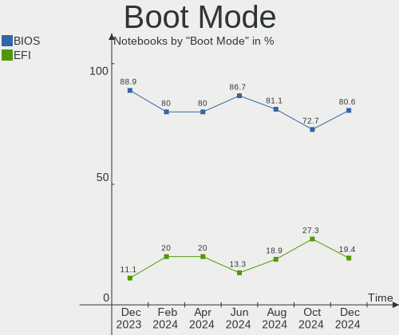

KDE neon - Hardware Trends (Notebooks)
--------------------------------------

A project to identify most popular hardware characteristics and track their change
over time based on data collected by Linux users at https://Linux-Hardware.org.

Anyone can contribute to this report by the [hw-probe](https://github.com/linuxhw/hw-probe) tool:

    sudo -E hw-probe -all -upload

This report is for one last month. Overall report since the beginning of time: [TestDays](https://github.com/linuxhw/TestDays)

Period: Sep, 2023.

Contents
--------

* [ System ](#system)
  - [ OS                       ](#os)
  - [ OS Family                ](#os-family)
  - [ Kernel                   ](#kernel)
  - [ Kernel Family            ](#kernel-family)
  - [ Kernel Major Ver.        ](#kernel-major-ver)
  - [ Arch                     ](#arch)
  - [ DE                       ](#de)
  - [ Display Server           ](#display-server)
  - [ Display Manager          ](#display-manager)
  - [ OS Lang                  ](#os-lang)
  - [ Boot Mode                ](#boot-mode)
  - [ Filesystem               ](#filesystem)
  - [ Part. scheme             ](#part-scheme)
  - [ Dual Boot with Linux/BSD ](#dual-boot-with-linuxbsd)
  - [ Dual Boot (Win)          ](#dual-boot-win)

* [ Board ](#board)
  - [ Vendor                   ](#vendor)
  - [ Model                    ](#model)
  - [ Model Family             ](#model-family)
  - [ MFG Year                 ](#mfg-year)
  - [ Form Factor              ](#form-factor)
  - [ Secure Boot              ](#secure-boot)
  - [ Coreboot                 ](#coreboot)
  - [ RAM Size                 ](#ram-size)
  - [ RAM Used                 ](#ram-used)
  - [ Total Drives             ](#total-drives)
  - [ Has CD-ROM               ](#has-cd-rom)
  - [ Has Ethernet             ](#has-ethernet)
  - [ Has WiFi                 ](#has-wifi)
  - [ Has Bluetooth            ](#has-bluetooth)

* [ Location ](#location)
  - [ Country                  ](#country)
  - [ City                     ](#city)

* [ Drives ](#drives)
  - [ Drive Vendor             ](#drive-vendor)
  - [ Drive Model              ](#drive-model)
  - [ HDD Vendor               ](#hdd-vendor)
  - [ SSD Vendor               ](#ssd-vendor)
  - [ Drive Kind               ](#drive-kind)
  - [ Drive Connector          ](#drive-connector)
  - [ Drive Size               ](#drive-size)
  - [ Space Total              ](#space-total)
  - [ Space Used               ](#space-used)
  - [ Malfunc. Drives          ](#malfunc-drives)
  - [ Malfunc. Drive Vendor    ](#malfunc-drive-vendor)
  - [ Malfunc. HDD Vendor      ](#malfunc-hdd-vendor)
  - [ Malfunc. Drive Kind      ](#malfunc-drive-kind)
  - [ Failed Drives            ](#failed-drives)
  - [ Failed Drive Vendor      ](#failed-drive-vendor)
  - [ Drive Status             ](#drive-status)

* [ Storage controller ](#storage-controller)
  - [ Storage Vendor           ](#storage-vendor)
  - [ Storage Model            ](#storage-model)
  - [ Storage Kind             ](#storage-kind)

* [ Processor ](#processor)
  - [ CPU Vendor               ](#cpu-vendor)
  - [ CPU Model                ](#cpu-model)
  - [ CPU Model Family         ](#cpu-model-family)
  - [ CPU Cores                ](#cpu-cores)
  - [ CPU Sockets              ](#cpu-sockets)
  - [ CPU Threads              ](#cpu-threads)
  - [ CPU Op-Modes             ](#cpu-op-modes)
  - [ CPU Microcode            ](#cpu-microcode)
  - [ CPU Microarch            ](#cpu-microarch)

* [ Graphics ](#graphics)
  - [ GPU Vendor               ](#gpu-vendor)
  - [ GPU Model                ](#gpu-model)
  - [ GPU Combo                ](#gpu-combo)
  - [ GPU Driver               ](#gpu-driver)
  - [ GPU Memory               ](#gpu-memory)

* [ Monitor ](#monitor)
  - [ Monitor Vendor           ](#monitor-vendor)
  - [ Monitor Model            ](#monitor-model)
  - [ Monitor Resolution       ](#monitor-resolution)
  - [ Monitor Diagonal         ](#monitor-diagonal)
  - [ Monitor Width            ](#monitor-width)
  - [ Aspect Ratio             ](#aspect-ratio)
  - [ Monitor Area             ](#monitor-area)
  - [ Pixel Density            ](#pixel-density)
  - [ Multiple Monitors        ](#multiple-monitors)

* [ Network ](#network)
  - [ Net Controller Vendor    ](#net-controller-vendor)
  - [ Net Controller Model     ](#net-controller-model)
  - [ Wireless Vendor          ](#wireless-vendor)
  - [ Wireless Model           ](#wireless-model)
  - [ Ethernet Vendor          ](#ethernet-vendor)
  - [ Ethernet Model           ](#ethernet-model)
  - [ Net Controller Kind      ](#net-controller-kind)
  - [ Used Controller          ](#used-controller)
  - [ NICs                     ](#nics)
  - [ IPv6                     ](#ipv6)

* [ Bluetooth ](#bluetooth)
  - [ Bluetooth Vendor         ](#bluetooth-vendor)
  - [ Bluetooth Model          ](#bluetooth-model)

* [ Sound ](#sound)
  - [ Sound Vendor             ](#sound-vendor)
  - [ Sound Model              ](#sound-model)

* [ Memory ](#memory)
  - [ Memory Vendor            ](#memory-vendor)
  - [ Memory Model             ](#memory-model)
  - [ Memory Kind              ](#memory-kind)
  - [ Memory Form Factor       ](#memory-form-factor)
  - [ Memory Size              ](#memory-size)
  - [ Memory Speed             ](#memory-speed)

* [ Printers & scanners ](#printers--scanners)
  - [ Printer Vendor           ](#printer-vendor)
  - [ Printer Model            ](#printer-model)
  - [ Scanner Vendor           ](#scanner-vendor)
  - [ Scanner Model            ](#scanner-model)

* [ Camera ](#camera)
  - [ Camera Vendor            ](#camera-vendor)
  - [ Camera Model             ](#camera-model)

* [ Security ](#security)
  - [ Fingerprint Vendor       ](#fingerprint-vendor)
  - [ Fingerprint Model        ](#fingerprint-model)
  - [ Chipcard Vendor          ](#chipcard-vendor)
  - [ Chipcard Model           ](#chipcard-model)

* [ Unsupported ](#unsupported)
  - [ Unsupported Devices      ](#unsupported-devices)
  - [ Unsupported Device Types ](#unsupported-device-types)

System
------

OS
--

Installed operating systems

| Name           | Notebooks | Percent |
|----------------|-----------|---------|
| KDE neon 22.04 | 40        | 95.24%  |
| KDE neon 20.04 | 2         | 4.76%   |

OS Family
---------

OS without a version

| Name     | Notebooks | Percent |
|----------|-----------|---------|
| KDE neon | 42        | 100%    |

Kernel
------

Version of the Linux kernel

| Version                | Notebooks | Percent |
|------------------------|-----------|---------|
| 6.2.0-32-generic       | 17        | 40.48%  |
| 6.2.0-33-generic       | 10        | 23.81%  |
| 6.2.0-31-generic       | 5         | 11.9%   |
| 6.2.16-060216-generic  | 1         | 2.38%   |
| 6.2.0-34-generic       | 1         | 2.38%   |
| 6.2.0-26-generic       | 1         | 2.38%   |
| 6.1.0-1019-oem         | 1         | 2.38%   |
| 5.19.0-50-generic      | 1         | 2.38%   |
| 5.19.0-41-generic      | 1         | 2.38%   |
| 5.19.0-1025-lowlatency | 1         | 2.38%   |
| 5.15.0-84-generic      | 1         | 2.38%   |
| 5.15.0-56-generic      | 1         | 2.38%   |
| 5.15.0-52-generic      | 1         | 2.38%   |

Kernel Family
-------------

Linux kernel without a distro release

| Version | Notebooks | Percent |
|---------|-----------|---------|
| 6.2.0   | 34        | 80.95%  |
| 5.19.0  | 3         | 7.14%   |
| 5.15.0  | 3         | 7.14%   |
| 6.2.16  | 1         | 2.38%   |
| 6.1.0   | 1         | 2.38%   |

Kernel Major Ver.
-----------------

Linux kernel major version

| Version | Notebooks | Percent |
|---------|-----------|---------|
| 6.2     | 35        | 83.33%  |
| 5.19    | 3         | 7.14%   |
| 5.15    | 3         | 7.14%   |
| 6.1     | 1         | 2.38%   |

Arch
----

OS architecture (x86_64, i586, etc.)

| Name   | Notebooks | Percent |
|--------|-----------|---------|
| x86_64 | 42        | 100%    |

DE
--

Desktop Environment

| Name | Notebooks | Percent |
|------|-----------|---------|
| KDE5 | 41        | 97.62%  |
| KDE6 | 1         | 2.38%   |

Display Server
--------------

X11 or Wayland

| Name    | Notebooks | Percent |
|---------|-----------|---------|
| X11     | 37        | 88.1%   |
| Wayland | 5         | 11.9%   |

Display Manager
---------------

SDDM, LightDM, etc.

| Name    | Notebooks | Percent |
|---------|-----------|---------|
| Unknown | 33        | 78.57%  |
| SDDM    | 9         | 21.43%  |

OS Lang
-------

Language

| Lang  | Notebooks | Percent |
|-------|-----------|---------|
| en_US | 20        | 47.62%  |
| es_MX | 5         | 11.9%   |
| C     | 3         | 7.14%   |
| pt_BR | 2         | 4.76%   |
| en_GB | 2         | 4.76%   |
| zh_CN | 1         | 2.38%   |
| ru_RU | 1         | 2.38%   |
| pl_PL | 1         | 2.38%   |
| ja_JP | 1         | 2.38%   |
| fr_FR | 1         | 2.38%   |
| es_EC | 1         | 2.38%   |
| es_CO | 1         | 2.38%   |
| es_CL | 1         | 2.38%   |
| en_IN | 1         | 2.38%   |
| en_CA | 1         | 2.38%   |

Boot Mode
---------

EFI or BIOS

| Mode | Notebooks | Percent |
|------|-----------|---------|
| BIOS | 34        | 80.95%  |
| EFI  | 8         | 19.05%  |

Filesystem
----------

Type of filesystem

| Type    | Notebooks | Percent |
|---------|-----------|---------|
| Ext4    | 36        | 85.71%  |
| Tmpfs   | 3         | 7.14%   |
| Overlay | 2         | 4.76%   |
| Btrfs   | 1         | 2.38%   |

Part. scheme
------------

Scheme of partitioning

| Type    | Notebooks | Percent |
|---------|-----------|---------|
| Unknown | 33        | 78.57%  |
| GPT     | 7         | 16.67%  |
| MBR     | 2         | 4.76%   |

Dual Boot with Linux/BSD
------------------------

Hosting more than one Linux/BSD

| Dual boot | Notebooks | Percent |
|-----------|-----------|---------|
| No        | 40        | 95.24%  |
| Yes       | 2         | 4.76%   |

Dual Boot (Win)
---------------

Hosting Linux and Windows

| Dual boot | Notebooks | Percent |
|-----------|-----------|---------|
| No        | 37        | 88.1%   |
| Yes       | 5         | 11.9%   |

Board
-----

Vendor
------

Motherboard manufacturer

| Name                | Notebooks | Percent |
|---------------------|-----------|---------|
| Dell                | 8         | 19.05%  |
| ASUSTek Computer    | 6         | 14.29%  |
| Lenovo              | 5         | 11.9%   |
| Hewlett-Packard     | 5         | 11.9%   |
| Toshiba             | 3         | 7.14%   |
| Apple               | 3         | 7.14%   |
| Timi                | 2         | 4.76%   |
| Samsung Electronics | 2         | 4.76%   |
| Acer                | 2         | 4.76%   |
| Sony                | 1         | 2.38%   |
| SLIMBOOK            | 1         | 2.38%   |
| Packard Bell        | 1         | 2.38%   |
| Multilaser          | 1         | 2.38%   |
| MSI                 | 1         | 2.38%   |
| HUAWEI              | 1         | 2.38%   |

Model
-----

Motherboard model

| Name                                     | Notebooks | Percent |
|------------------------------------------|-----------|---------|
| Toshiba Satellite L50-B                  | 1         | 2.38%   |
| Toshiba dynabook Satellite B552/H        | 1         | 2.38%   |
| Toshiba dynabook R632/H                  | 1         | 2.38%   |
| Timi Xiaomi Book Pro 16 2022             | 1         | 2.38%   |
| Timi TM1612                              | 1         | 2.38%   |
| Sony SVE14A27CXH                         | 1         | 2.38%   |
| SLIMBOOK PROX-AMD5                       | 1         | 2.38%   |
| Samsung 900X3K                           | 1         | 2.38%   |
| Samsung 550XED                           | 1         | 2.38%   |
| Packard Bell EasyNote TE11HC             | 1         | 2.38%   |
| Multilaser PC31X                         | 1         | 2.38%   |
| MSI Katana 15 B12VGK                     | 1         | 2.38%   |
| Lenovo V15 G2 ALC 82KD                   | 1         | 2.38%   |
| Lenovo ThinkPad X201 3680KS9             | 1         | 2.38%   |
| Lenovo ThinkPad E14 Gen 2 20T60023TX     | 1         | 2.38%   |
| Lenovo IdeaPad 330S-15ARR 81FB           | 1         | 2.38%   |
| Lenovo IDEA 315-15 81WE                  | 1         | 2.38%   |
| HUAWEI NBLB-WAX9N                        | 1         | 2.38%   |
| HP ProBook 6470b                         | 1         | 2.38%   |
| HP OMEN by Laptop 16-c0xxx               | 1         | 2.38%   |
| HP Laptop 15-db1xxx                      | 1         | 2.38%   |
| HP EliteBook 2560p                       | 1         | 2.38%   |
| HP Dev One Notebook PC                   | 1         | 2.38%   |
| Dell Vostro 5481                         | 1         | 2.38%   |
| Dell Latitude E7470                      | 1         | 2.38%   |
| Dell Latitude E6320                      | 1         | 2.38%   |
| Dell Inspiron N5110                      | 1         | 2.38%   |
| Dell Inspiron 7559                       | 1         | 2.38%   |
| Dell Inspiron 5567                       | 1         | 2.38%   |
| Dell Inspiron 3541                       | 1         | 2.38%   |
| Dell Inspiron 1464                       | 1         | 2.38%   |
| ASUS ZenBook UX325EA_UX325EA             | 1         | 2.38%   |
| ASUS X550LD                              | 1         | 2.38%   |
| ASUS VivoBook_ASUSLaptop X509DA          | 1         | 2.38%   |
| ASUS VivoBook_ASUSLaptop K6602VV_K6602VV | 1         | 2.38%   |
| ASUS N551JX                              | 1         | 2.38%   |
| ASUS G75VW                               | 1         | 2.38%   |
| Apple MacBookPro5,5                      | 1         | 2.38%   |
| Apple MacBookPro13,1                     | 1         | 2.38%   |
| Apple MacBookPro10,1                     | 1         | 2.38%   |

Model Family
------------

Motherboard model prefix

| Name                  | Notebooks | Percent |
|-----------------------|-----------|---------|
| Dell Inspiron         | 5         | 11.9%   |
| Toshiba dynabook      | 2         | 4.76%   |
| Lenovo ThinkPad       | 2         | 4.76%   |
| Dell Latitude         | 2         | 4.76%   |
| ASUS VivoBook         | 2         | 4.76%   |
| Acer Aspire           | 2         | 4.76%   |
| Toshiba Satellite     | 1         | 2.38%   |
| Timi Xiaomi           | 1         | 2.38%   |
| Timi TM1612           | 1         | 2.38%   |
| Sony SVE14A27CXH      | 1         | 2.38%   |
| SLIMBOOK PROX-AMD5    | 1         | 2.38%   |
| Samsung 900X3K        | 1         | 2.38%   |
| Samsung 550XED        | 1         | 2.38%   |
| Packard Bell EasyNote | 1         | 2.38%   |
| Multilaser PC31X      | 1         | 2.38%   |
| MSI Katana            | 1         | 2.38%   |
| Lenovo V15            | 1         | 2.38%   |
| Lenovo IdeaPad        | 1         | 2.38%   |
| Lenovo IDEA           | 1         | 2.38%   |
| HUAWEI NBLB-WAX9N     | 1         | 2.38%   |
| HP ProBook            | 1         | 2.38%   |
| HP OMEN               | 1         | 2.38%   |
| HP Laptop             | 1         | 2.38%   |
| HP EliteBook          | 1         | 2.38%   |
| HP Dev                | 1         | 2.38%   |
| Dell Vostro           | 1         | 2.38%   |
| ASUS ZenBook          | 1         | 2.38%   |
| ASUS X550LD           | 1         | 2.38%   |
| ASUS N551JX           | 1         | 2.38%   |
| ASUS G75VW            | 1         | 2.38%   |
| Apple MacBookPro5     | 1         | 2.38%   |
| Apple MacBookPro13    | 1         | 2.38%   |
| Apple MacBookPro10    | 1         | 2.38%   |

MFG Year
--------

Motherboard manufacture year

| Year | Notebooks | Percent |
|------|-----------|---------|
| 2012 | 6         | 14.29%  |
| 2021 | 5         | 11.9%   |
| 2022 | 4         | 9.52%   |
| 2020 | 4         | 9.52%   |
| 2015 | 4         | 9.52%   |
| 2018 | 3         | 7.14%   |
| 2013 | 3         | 7.14%   |
| 2011 | 3         | 7.14%   |
| 2023 | 2         | 4.76%   |
| 2016 | 2         | 4.76%   |
| 2014 | 2         | 4.76%   |
| 2010 | 2         | 4.76%   |
| 2019 | 1         | 2.38%   |
| 2009 | 1         | 2.38%   |

Form Factor
-----------

Physical design of the computer

| Name     | Notebooks | Percent |
|----------|-----------|---------|
| Notebook | 42        | 100%    |

Secure Boot
-----------

Enabled or disabled

| State    | Notebooks | Percent |
|----------|-----------|---------|
| Disabled | 40        | 95.24%  |
| Enabled  | 2         | 4.76%   |

Coreboot
--------

Have coreboot on board

| Used | Notebooks | Percent |
|------|-----------|---------|
| No   | 42        | 100%    |

RAM Size
--------

Total RAM memory

| Size in GB | Notebooks | Percent |
|------------|-----------|---------|
| 4.01-8.0   | 16        | 38.1%   |
| 16.01-24.0 | 11        | 26.19%  |
| 8.01-16.0  | 10        | 23.81%  |
| 3.01-4.0   | 4         | 9.52%   |
| 32.01-64.0 | 1         | 2.38%   |

RAM Used
--------

Used RAM memory

| Used GB   | Notebooks | Percent |
|-----------|-----------|---------|
| 2.01-3.0  | 15        | 35.71%  |
| 3.01-4.0  | 11        | 26.19%  |
| 1.01-2.0  | 9         | 21.43%  |
| 4.01-8.0  | 5         | 11.9%   |
| 8.01-16.0 | 2         | 4.76%   |

Total Drives
------------

Number of drives on board

| Drives | Notebooks | Percent |
|--------|-----------|---------|
| 1      | 26        | 61.9%   |
| 2      | 16        | 38.1%   |

Has CD-ROM
----------

Has CD-ROM on board

| Presented | Notebooks | Percent |
|-----------|-----------|---------|
| No        | 32        | 76.19%  |
| Yes       | 10        | 23.81%  |

Has Ethernet
------------

Has Ethernet on board

| Presented | Notebooks | Percent |
|-----------|-----------|---------|
| Yes       | 33        | 78.57%  |
| No        | 9         | 21.43%  |

Has WiFi
--------

Has WiFi module

| Presented | Notebooks | Percent |
|-----------|-----------|---------|
| Yes       | 41        | 97.62%  |
| No        | 1         | 2.38%   |

Has Bluetooth
-------------

Has Bluetooth module

| Presented | Notebooks | Percent |
|-----------|-----------|---------|
| Yes       | 33        | 78.57%  |
| No        | 9         | 21.43%  |

Location
--------

Country
-------

Geographic location (country)

| Country     | Notebooks | Percent |
|-------------|-----------|---------|
| USA         | 9         | 21.43%  |
| France      | 4         | 9.52%   |
| Mexico      | 2         | 4.76%   |
| Indonesia   | 2         | 4.76%   |
| Colombia    | 2         | 4.76%   |
| Chile       | 2         | 4.76%   |
| Brazil      | 2         | 4.76%   |
| Ukraine     | 1         | 2.38%   |
| UK          | 1         | 2.38%   |
| Sweden      | 1         | 2.38%   |
| Spain       | 1         | 2.38%   |
| Slovenia    | 1         | 2.38%   |
| Russia      | 1         | 2.38%   |
| Poland      | 1         | 2.38%   |
| Peru        | 1         | 2.38%   |
| Netherlands | 1         | 2.38%   |
| Malaysia    | 1         | 2.38%   |
| Japan       | 1         | 2.38%   |
| India       | 1         | 2.38%   |
| Honduras    | 1         | 2.38%   |
| Greece      | 1         | 2.38%   |
| Ecuador     | 1         | 2.38%   |
| Canada      | 1         | 2.38%   |
| Bangladesh  | 1         | 2.38%   |
| Azerbaijan  | 1         | 2.38%   |
| Armenia     | 1         | 2.38%   |

City
----

Geographic location (city)

| City                  | Notebooks | Percent |
|-----------------------|-----------|---------|
| Santiago              | 2         | 4.76%   |
| Poitiers              | 2         | 4.76%   |
| Apple Valley          | 2         | 4.76%   |
| Zarichne              | 1         | 2.38%   |
| Yokohama              | 1         | 2.38%   |
| Yerevan               | 1         | 2.38%   |
| Wellsboro             | 1         | 2.38%   |
| Valley Village        | 1         | 2.38%   |
| Tyumen                | 1         | 2.38%   |
| Troutville            | 1         | 2.38%   |
| Tegucigalpa           | 1         | 2.38%   |
| Springfield           | 1         | 2.38%   |
| Seattle               | 1         | 2.38%   |
| Santiago de Cali      | 1         | 2.38%   |
| Rhodes                | 1         | 2.38%   |
| Pune                  | 1         | 2.38%   |
| OEdeshoeg             | 1         | 2.38%   |
| Mogi Guacu            | 1         | 2.38%   |
| Medan                 | 1         | 2.38%   |
| Manta                 | 1         | 2.38%   |
| Madrid                | 1         | 2.38%   |
| Lima                  | 1         | 2.38%   |
| Le Petit-Quevilly     | 1         | 2.38%   |
| Kuala Lumpur          | 1         | 2.38%   |
| Krosno                | 1         | 2.38%   |
| Kranj                 | 1         | 2.38%   |
| Jakarta               | 1         | 2.38%   |
| Gateshead             | 1         | 2.38%   |
| Gaspar                | 1         | 2.38%   |
| Edmonton              | 1         | 2.38%   |
| Dhaka                 | 1         | 2.38%   |
| Ciudad Juárez        | 1         | 2.38%   |
| Chinampa de Gorostiza | 1         | 2.38%   |
| Casa Grande           | 1         | 2.38%   |
| Belgentier            | 1         | 2.38%   |
| Barranquilla          | 1         | 2.38%   |
| Baku                  | 1         | 2.38%   |
| Amsterdam             | 1         | 2.38%   |
| Akron                 | 1         | 2.38%   |

Drives
------

Drive Vendor
------------

Hard drive vendors

| Vendor              | Notebooks | Drives | Percent |
|---------------------|-----------|--------|---------|
| WDC                 | 9         | 9      | 16.67%  |
| Samsung Electronics | 8         | 9      | 14.81%  |
| Sandisk             | 6         | 6      | 11.11%  |
| Seagate             | 5         | 6      | 9.26%   |
| Kingston            | 4         | 4      | 7.41%   |
| Toshiba             | 3         | 3      | 5.56%   |
| SK hynix            | 2         | 2      | 3.7%    |
| Phison Electronics  | 2         | 2      | 3.7%    |
| Micron Technology   | 2         | 2      | 3.7%    |
| A-DATA Technology   | 2         | 2      | 3.7%    |
| Unknown             | 1         | 1      | 1.85%   |
| Union Memory        | 1         | 1      | 1.85%   |
| Transcend           | 1         | 1      | 1.85%   |
| T-FORCE             | 1         | 2      | 1.85%   |
| StoreJet            | 1         | 1      | 1.85%   |
| SPCC                | 1         | 1      | 1.85%   |
| OVATION             | 1         | 1      | 1.85%   |
| KIOXIA              | 1         | 1      | 1.85%   |
| Hitachi             | 1         | 1      | 1.85%   |
| HGST                | 1         | 1      | 1.85%   |
| Apple               | 1         | 1      | 1.85%   |

Drive Model
-----------

Hard drive models

| Model                                               | Notebooks | Percent |
|-----------------------------------------------------|-----------|---------|
| Samsung NVMe SSD Controller SM981/PM981/PM983 256GB | 2         | 3.57%   |
| Phison PS5013 E13 NVMe Controller 512GB             | 2         | 3.57%   |
| Micron 2400_MTFDKBA1T0QFM 1024GB                    | 2         | 3.57%   |
| WDC WDS500G2B0B-00YS70 500GB SSD                    | 1         | 1.79%   |
| WDC WDS240G1G0A-00SS50 240GB SSD                    | 1         | 1.79%   |
| WDC WD5000LPVX-22V0TT0 500GB                        | 1         | 1.79%   |
| WDC WD10SPZX-24Z10 1TB                              | 1         | 1.79%   |
| WDC WD10SPZX-21Z10T0 1TB                            | 1         | 1.79%   |
| WDC WD10JPVX-75JC3T0 1TB                            | 1         | 1.79%   |
| WDC WD10JPVX-22JC3T0 1TB                            | 1         | 1.79%   |
| WDC WD10JPVT-55A1YT0 1TB                            | 1         | 1.79%   |
| WDC PC SN730 SDBPNTY-256G                           | 1         | 1.79%   |
| Unknown MMC Card  64GB                              | 1         | 1.79%   |
| Union Memory UMIS RPJTJ256MEE1OWX 256GB             | 1         | 1.79%   |
| Transcend TS64GMSA370 64GB SSD                      | 1         | 1.79%   |
| Toshiba THNSNF128GMCS 128GB SSD                     | 1         | 1.79%   |
| Toshiba MQ04ABF100 1TB                              | 1         | 1.79%   |
| Toshiba MK3275GSX 320GB                             | 1         | 1.79%   |
| T-FORCE SSD 1TB                                     | 1         | 1.79%   |
| T-FORCE 1TB                                         | 1         | 1.79%   |
| StoreJet Transcend 320GB                            | 1         | 1.79%   |
| SPCC Solid State Disk 256GB                         | 1         | 1.79%   |
| SK hynix PC711 HFS001TDE9X073N 1TB                  | 1         | 1.79%   |
| SK hynix HFM512GD3JX013N 512GB                      | 1         | 1.79%   |
| Seagate ST9750420AS 752GB                           | 1         | 1.79%   |
| Seagate ST95005620AS 500GB                          | 1         | 1.79%   |
| Seagate ST1500LM006 HN-M151RAD 1TB                  | 1         | 1.79%   |
| Seagate ST1000LM035-1RK172 1TB                      | 1         | 1.79%   |
| Seagate ST1000LM024 HN-M101MBB 1TB                  | 1         | 1.79%   |
| Seagate One Touch w/PW 2TB                          | 1         | 1.79%   |
| Sandisk WDC PC SN530 SDBPMPZ-512G-1001 512GB        | 1         | 1.79%   |
| Sandisk WD PC SN740 SDDQNQD-1T00-1014 1TB           | 1         | 1.79%   |
| Sandisk WD Blue SN550 NVMe SSD 512GB                | 1         | 1.79%   |
| SanDisk SD8SBAT256G1122 256GB SSD                   | 1         | 1.79%   |
| Sandisk PC SN530 NVMe SSD 930GB                     | 1         | 1.79%   |
| Sandisk PC SN520 NVMe SSD 512GB                     | 1         | 1.79%   |
| Samsung SSD 870 EVO 4TB                             | 1         | 1.79%   |
| Samsung SSD 860 EVO 1TB                             | 1         | 1.79%   |
| Samsung SSD 850 EVO mSATA 1TB                       | 1         | 1.79%   |
| Samsung NVMe SSD Controller SM961/PM961/SM963 500GB | 1         | 1.79%   |

HDD Vendor
----------

Hard disk drive vendors

| Vendor  | Notebooks | Drives | Percent |
|---------|-----------|--------|---------|
| WDC     | 6         | 6      | 42.86%  |
| Seagate | 4         | 5      | 28.57%  |
| Toshiba | 2         | 2      | 14.29%  |
| Hitachi | 1         | 1      | 7.14%   |
| HGST    | 1         | 1      | 7.14%   |

SSD Vendor
----------

Solid state drive vendors

| Vendor              | Notebooks | Drives | Percent |
|---------------------|-----------|--------|---------|
| Samsung Electronics | 4         | 4      | 22.22%  |
| Kingston            | 3         | 3      | 16.67%  |
| WDC                 | 2         | 2      | 11.11%  |
| A-DATA Technology   | 2         | 2      | 11.11%  |
| Transcend           | 1         | 1      | 5.56%   |
| Toshiba             | 1         | 1      | 5.56%   |
| T-FORCE             | 1         | 1      | 5.56%   |
| StoreJet            | 1         | 1      | 5.56%   |
| SPCC                | 1         | 1      | 5.56%   |
| SanDisk             | 1         | 1      | 5.56%   |
| Apple               | 1         | 1      | 5.56%   |

Drive Kind
----------

HDD or SSD

| Kind    | Notebooks | Drives | Percent |
|---------|-----------|--------|---------|
| NVMe    | 18        | 20     | 33.96%  |
| SSD     | 17        | 18     | 32.08%  |
| HDD     | 14        | 15     | 26.42%  |
| Unknown | 3         | 3      | 5.66%   |
| MMC     | 1         | 1      | 1.89%   |

Drive Connector
---------------

SATA, SAS, NVMe, etc.

| Type | Notebooks | Drives | Percent |
|------|-----------|--------|---------|
| SATA | 27        | 34     | 56.25%  |
| NVMe | 18        | 20     | 37.5%   |
| SAS  | 2         | 2      | 4.17%   |
| MMC  | 1         | 1      | 2.08%   |

Drive Size
----------

Size of hard drive

| Size in TB | Notebooks | Drives | Percent |
|------------|-----------|--------|---------|
| 0.01-0.5   | 15        | 17     | 51.72%  |
| 0.51-1.0   | 13        | 15     | 44.83%  |
| 3.01-4.0   | 1         | 1      | 3.45%   |

Space Total
-----------

Amount of disk space available on the file system

| Size in GB | Notebooks | Percent |
|------------|-----------|---------|
| 101-250    | 16        | 38.1%   |
| 251-500    | 9         | 21.43%  |
| 501-1000   | 9         | 21.43%  |
| 21-50      | 2         | 4.76%   |
| 1-20       | 2         | 4.76%   |
| Unknown    | 2         | 4.76%   |
| 1001-2000  | 1         | 2.38%   |
| 51-100     | 1         | 2.38%   |

Space Used
----------

Amount of used disk space

| Used GB | Notebooks | Percent |
|---------|-----------|---------|
| 1-20    | 18        | 42.86%  |
| 21-50   | 10        | 23.81%  |
| 51-100  | 5         | 11.9%   |
| 251-500 | 4         | 9.52%   |
| 101-250 | 3         | 7.14%   |
| Unknown | 2         | 4.76%   |

Malfunc. Drives
---------------

Drive models with a malfunction

| Model                      | Notebooks | Drives | Percent |
|----------------------------|-----------|--------|---------|
| Seagate ST95005620AS 500GB | 1         | 1      | 100%    |

Malfunc. Drive Vendor
---------------------

Vendors of faulty drives

| Vendor  | Notebooks | Drives | Percent |
|---------|-----------|--------|---------|
| Seagate | 1         | 1      | 100%    |

Malfunc. HDD Vendor
-------------------

Vendors of faulty HDD drives

| Vendor  | Notebooks | Drives | Percent |
|---------|-----------|--------|---------|
| Seagate | 1         | 1      | 100%    |

Malfunc. Drive Kind
-------------------

Kinds of faulty drives

| Kind | Notebooks | Drives | Percent |
|------|-----------|--------|---------|
| HDD  | 1         | 1      | 100%    |

Failed Drives
-------------

Failed drive models

Zero info for selected period =(

Failed Drive Vendor
-------------------

Failed drive vendors

Zero info for selected period =(

Drive Status
------------

Number of failed and malfunc. drives

| Status   | Notebooks | Drives | Percent |
|----------|-----------|--------|---------|
| Detected | 36        | 48     | 81.82%  |
| Works    | 7         | 8      | 15.91%  |
| Malfunc  | 1         | 1      | 2.27%   |

Storage controller
------------------

Storage Vendor
--------------

Storage controller vendors

| Vendor                      | Notebooks | Percent |
|-----------------------------|-----------|---------|
| Intel                       | 28        | 52.83%  |
| SanDisk                     | 6         | 11.32%  |
| AMD                         | 5         | 9.43%   |
| Samsung Electronics         | 4         | 7.55%   |
| SK hynix                    | 2         | 3.77%   |
| Phison Electronics          | 2         | 3.77%   |
| Micron Technology           | 2         | 3.77%   |
| Union Memory (Shenzhen)     | 1         | 1.89%   |
| Nvidia                      | 1         | 1.89%   |
| KIOXIA                      | 1         | 1.89%   |
| Kingston Technology Company | 1         | 1.89%   |

Storage Model
-------------

Storage controller models

| Model                                                                          | Notebooks | Percent |
|--------------------------------------------------------------------------------|-----------|---------|
| Intel 7 Series Chipset Family 6-port SATA Controller [AHCI mode]               | 8         | 15.09%  |
| AMD FCH SATA Controller [AHCI mode]                                            | 5         | 9.43%   |
| SK hynix Gold P31/BC711/PC711 NVMe Solid State Drive                           | 2         | 3.77%   |
| Samsung NVMe SSD Controller SM981/PM981/PM983                                  | 2         | 3.77%   |
| Phison PS5013 E13 NVMe Controller                                              | 2         | 3.77%   |
| Micron 2400 NVMe SSD (DRAM-less)                                               | 2         | 3.77%   |
| Intel Volume Management Device NVMe RAID Controller                            | 2         | 3.77%   |
| Intel Sunrise Point-LP SATA Controller [AHCI mode]                             | 2         | 3.77%   |
| Intel 82801 Mobile SATA Controller [RAID mode]                                 | 2         | 3.77%   |
| Intel 8 Series SATA Controller 1 [AHCI mode]                                   | 2         | 3.77%   |
| Intel 6 Series/C200 Series Chipset Family 6 port Mobile SATA AHCI Controller   | 2         | 3.77%   |
| Union Memory (Shenzhen) AM620 PCIe 3.0 NVMe SSD 256GB                          | 1         | 1.89%   |
| SanDisk WD Blue SN550 NVMe SSD                                                 | 1         | 1.89%   |
| SanDisk WD Black SN770 / PC SN740 256GB / PC SN560 (DRAM-less) NVMe SSD        | 1         | 1.89%   |
| SanDisk WD Black SN750 / PC SN730 NVMe SSD                                     | 1         | 1.89%   |
| SanDisk PC SN530 NVMe SSD (DRAM-less)                                          | 1         | 1.89%   |
| SanDisk PC SN530 NVMe SSD                                                      | 1         | 1.89%   |
| SanDisk PC SN520 NVMe SSD                                                      | 1         | 1.89%   |
| Samsung NVMe SSD Controller SM961/PM961/SM963                                  | 1         | 1.89%   |
| Samsung NVMe SSD Controller 980                                                | 1         | 1.89%   |
| Nvidia MCP79 AHCI Controller                                                   | 1         | 1.89%   |
| KIOXIA NVMe SSD Controller BG5 (DRAM-less)                                     | 1         | 1.89%   |
| Kingston Company KC3000/Renegade NVMe SSD                                      | 1         | 1.89%   |
| Intel Wildcat Point-LP SATA Controller [AHCI Mode]                             | 1         | 1.89%   |
| Intel Volume Management Device NVMe RAID Controller Intel Corporation          | 1         | 1.89%   |
| Intel Ice Lake-LP SATA Controller [AHCI mode]                                  | 1         | 1.89%   |
| Intel HM170/QM170 Chipset SATA Controller [AHCI Mode]                          | 1         | 1.89%   |
| Intel Comet Lake SATA AHCI Controller                                          | 1         | 1.89%   |
| Intel Cannon Point-LP SATA Controller [AHCI Mode]                              | 1         | 1.89%   |
| Intel Alder Lake-P SATA AHCI Controller                                        | 1         | 1.89%   |
| Intel 8 Series/C220 Series Chipset Family 6-port SATA Controller 1 [AHCI mode] | 1         | 1.89%   |
| Intel 5 Series/3400 Series Chipset 6 port SATA AHCI Controller                 | 1         | 1.89%   |
| Intel 5 Series/3400 Series Chipset 4 port SATA AHCI Controller                 | 1         | 1.89%   |

Storage Kind
------------

Kind of storage controller (IDE, SATA, NVMe, SAS, ...)

| Kind | Notebooks | Percent |
|------|-----------|---------|
| SATA | 29        | 55.77%  |
| NVMe | 18        | 34.62%  |
| RAID | 5         | 9.62%   |

Processor
---------

CPU Vendor
----------

Processor vendors

| Vendor | Notebooks | Percent |
|--------|-----------|---------|
| Intel  | 33        | 78.57%  |
| AMD    | 9         | 21.43%  |

CPU Model
---------

Processor models

| Model                                         | Notebooks | Percent |
|-----------------------------------------------|-----------|---------|
| Intel Core i5-2520M CPU @ 2.50GHz             | 2         | 4.76%   |
| Intel Pentium CPU N3700 @ 1.60GHz             | 1         | 2.38%   |
| Intel Pentium CPU B960 @ 2.20GHz              | 1         | 2.38%   |
| Intel Core m3-6Y30 CPU @ 0.90GHz              | 1         | 2.38%   |
| Intel Core i7-6700HQ CPU @ 2.60GHz            | 1         | 2.38%   |
| Intel Core i7-5500U CPU @ 2.40GHz             | 1         | 2.38%   |
| Intel Core i7-4720HQ CPU @ 2.60GHz            | 1         | 2.38%   |
| Intel Core i7-4510U CPU @ 2.00GHz             | 1         | 2.38%   |
| Intel Core i7-3820QM CPU @ 2.70GHz            | 1         | 2.38%   |
| Intel Core i7-3632QM CPU @ 2.20GHz            | 1         | 2.38%   |
| Intel Core i7-3610QM CPU @ 2.30GHz            | 1         | 2.38%   |
| Intel Core i7-2640M CPU @ 2.80GHz             | 1         | 2.38%   |
| Intel Core i5-8265U CPU @ 1.60GHz             | 1         | 2.38%   |
| Intel Core i5-7200U CPU @ 2.50GHz             | 1         | 2.38%   |
| Intel Core i5-6360U CPU @ 2.00GHz             | 1         | 2.38%   |
| Intel Core i5-6300U CPU @ 2.40GHz             | 1         | 2.38%   |
| Intel Core i5-4210U CPU @ 1.70GHz             | 1         | 2.38%   |
| Intel Core i5-3437U CPU @ 1.90GHz             | 1         | 2.38%   |
| Intel Core i5-3320M CPU @ 2.60GHz             | 1         | 2.38%   |
| Intel Core i5-3230M CPU @ 2.60GHz             | 1         | 2.38%   |
| Intel Core i5-1035G1 CPU @ 1.00GHz            | 1         | 2.38%   |
| Intel Core i5 CPU M 540 @ 2.53GHz             | 1         | 2.38%   |
| Intel Core i3-3110M CPU @ 2.40GHz             | 1         | 2.38%   |
| Intel Core i3-10110U CPU @ 2.10GHz            | 1         | 2.38%   |
| Intel Core i3 CPU M 330 @ 2.13GHz             | 1         | 2.38%   |
| Intel Core 2 Duo CPU P7550 @ 2.26GHz          | 1         | 2.38%   |
| Intel 13th Gen Core i9-13900H                 | 1         | 2.38%   |
| Intel 12th Gen Core i7-12650H                 | 1         | 2.38%   |
| Intel 12th Gen Core i7-1255U                  | 1         | 2.38%   |
| Intel 12th Gen Core i5-1240P                  | 1         | 2.38%   |
| Intel 12th Gen Core i5-1235U                  | 1         | 2.38%   |
| Intel 11th Gen Core i5-1135G7 @ 2.40GHz       | 1         | 2.38%   |
| AMD Ryzen 7 PRO 5850U with Radeon Graphics    | 1         | 2.38%   |
| AMD Ryzen 7 5800H with Radeon Graphics        | 1         | 2.38%   |
| AMD Ryzen 7 5700U with Radeon Graphics        | 1         | 2.38%   |
| AMD Ryzen 7 4700U with Radeon Graphics        | 1         | 2.38%   |
| AMD Ryzen 7 3700U with Radeon Vega Mobile Gfx | 1         | 2.38%   |
| AMD Ryzen 3 5300U with Radeon Graphics        | 1         | 2.38%   |
| AMD Ryzen 3 3200U with Radeon Vega Mobile Gfx | 1         | 2.38%   |
| AMD Ryzen 3 2200U with Radeon Vega Mobile Gfx | 1         | 2.38%   |

CPU Model Family
----------------

Processor model prefix

| Model            | Notebooks | Percent |
|------------------|-----------|---------|
| Intel Core i5    | 12        | 28.57%  |
| Intel Core i7    | 8         | 19.05%  |
| Other            | 6         | 14.29%  |
| AMD Ryzen 7      | 4         | 9.52%   |
| Intel Core i3    | 3         | 7.14%   |
| AMD Ryzen 3      | 3         | 7.14%   |
| Intel Pentium    | 2         | 4.76%   |
| Intel Core m3    | 1         | 2.38%   |
| Intel Core 2 Duo | 1         | 2.38%   |
| AMD Ryzen 7 PRO  | 1         | 2.38%   |
| AMD A6           | 1         | 2.38%   |

CPU Cores
---------

Number of processor cores

| Number | Notebooks | Percent |
|--------|-----------|---------|
| 2      | 21        | 50%     |
| 4      | 12        | 28.57%  |
| 8      | 4         | 9.52%   |
| 10     | 3         | 7.14%   |
| 14     | 1         | 2.38%   |
| 12     | 1         | 2.38%   |

CPU Sockets
-----------

Number of sockets

| Number | Notebooks | Percent |
|--------|-----------|---------|
| 1      | 42        | 100%    |

CPU Threads
-----------

Threads per core (Hyper-Threading)

| Number | Notebooks | Percent |
|--------|-----------|---------|
| 2      | 36        | 85.71%  |
| 1      | 6         | 14.29%  |

CPU Op-Modes
------------

CPU Operation Modes (32-bit, 64-bit)

| Op mode        | Notebooks | Percent |
|----------------|-----------|---------|
| 32-bit, 64-bit | 42        | 100%    |

CPU Microcode
-------------

Microcode number

| Number     | Notebooks | Percent |
|------------|-----------|---------|
| Unknown    | 38        | 90.48%  |
| 0x806ec    | 1         | 2.38%   |
| 0x206a7    | 1         | 2.38%   |
| 0x08600103 | 1         | 2.38%   |
| 0x08108109 | 1         | 2.38%   |

CPU Microarch
-------------

Microarchitecture

| Name             | Notebooks | Percent |
|------------------|-----------|---------|
| IvyBridge        | 7         | 16.67%  |
| Unknown          | 6         | 14.29%  |
| Skylake          | 4         | 9.52%   |
| SandyBridge      | 4         | 9.52%   |
| KabyLake         | 3         | 7.14%   |
| Haswell          | 3         | 7.14%   |
| Zen+             | 2         | 4.76%   |
| Zen 3            | 2         | 4.76%   |
| Westmere         | 2         | 4.76%   |
| Zen 2            | 1         | 2.38%   |
| Zen              | 1         | 2.38%   |
| TigerLake        | 1         | 2.38%   |
| Silvermont       | 1         | 2.38%   |
| Puma             | 1         | 2.38%   |
| Penryn           | 1         | 2.38%   |
| IceLake          | 1         | 2.38%   |
| Broadwell        | 1         | 2.38%   |
| Alderlake Hybrid | 1         | 2.38%   |

Graphics
--------

GPU Vendor
----------

Vendors of graphics cards

| Vendor | Notebooks | Percent |
|--------|-----------|---------|
| Intel  | 31        | 57.41%  |
| AMD    | 13        | 24.07%  |
| Nvidia | 10        | 18.52%  |

GPU Model
---------

Graphics card models

| Model                                                                                    | Notebooks | Percent |
|------------------------------------------------------------------------------------------|-----------|---------|
| Intel 3rd Gen Core processor Graphics Controller                                         | 6         | 11.11%  |
| Intel 2nd Generation Core Processor Family Integrated Graphics Controller                | 4         | 7.41%   |
| Intel Haswell-ULT Integrated Graphics Controller                                         | 2         | 3.7%    |
| Intel Core Processor Integrated Graphics Controller                                      | 2         | 3.7%    |
| Intel Alder Lake-UP3 GT2 [Iris Xe Graphics]                                              | 2         | 3.7%    |
| AMD Topaz XT [Radeon R7 M260/M265 / M340/M360 / M440/M445 / 530/535 / 620/625 Mobile]    | 2         | 3.7%    |
| AMD Picasso/Raven 2 [Radeon Vega Series / Radeon Vega Mobile Series]                     | 2         | 3.7%    |
| AMD Lucienne                                                                             | 2         | 3.7%    |
| AMD Cezanne [Radeon Vega Series / Radeon Vega Mobile Series]                             | 2         | 3.7%    |
| Nvidia GM108M [GeForce MX130]                                                            | 1         | 1.85%   |
| Nvidia GM107M [GeForce GTX 960M]                                                         | 1         | 1.85%   |
| Nvidia GM107M [GeForce GTX 950M]                                                         | 1         | 1.85%   |
| Nvidia GK107M [GeForce GT 650M Mac Edition]                                              | 1         | 1.85%   |
| Nvidia GF117M [GeForce 610M/710M/810M/820M / GT 620M/625M/630M/720M]                     | 1         | 1.85%   |
| Nvidia GF114M [GeForce GTX 670M]                                                         | 1         | 1.85%   |
| Nvidia GA107M [GeForce RTX 3050 Ti Mobile]                                               | 1         | 1.85%   |
| Nvidia C79 [GeForce 9400M]                                                               | 1         | 1.85%   |
| Nvidia AD107M [GeForce RTX 4060 Max-Q / Mobile]                                          | 1         | 1.85%   |
| Nvidia AD106M [GeForce RTX 4070 Max-Q / Mobile]                                          | 1         | 1.85%   |
| Intel WhiskeyLake-U GT2 [UHD Graphics 620]                                               | 1         | 1.85%   |
| Intel TigerLake-LP GT2 [Iris Xe Graphics]                                                | 1         | 1.85%   |
| Intel Skylake GT2 [HD Graphics 520]                                                      | 1         | 1.85%   |
| Intel Raptor Lake-P [Iris Xe Graphics]                                                   | 1         | 1.85%   |
| Intel Iris Plus Graphics G1 (Ice Lake)                                                   | 1         | 1.85%   |
| Intel Iris Graphics 540                                                                  | 1         | 1.85%   |
| Intel HD Graphics 620                                                                    | 1         | 1.85%   |
| Intel HD Graphics 5500                                                                   | 1         | 1.85%   |
| Intel HD Graphics 530                                                                    | 1         | 1.85%   |
| Intel HD Graphics 515                                                                    | 1         | 1.85%   |
| Intel CometLake-U GT2 [UHD Graphics]                                                     | 1         | 1.85%   |
| Intel Atom/Celeron/Pentium Processor x5-E8000/J3xxx/N3xxx Integrated Graphics Controller | 1         | 1.85%   |
| Intel Alder Lake-P Integrated Graphics Controller                                        | 1         | 1.85%   |
| Intel Alder Lake-P GT1 [UHD Graphics]                                                    | 1         | 1.85%   |
| Intel 4th Gen Core Processor Integrated Graphics Controller                              | 1         | 1.85%   |
| AMD Whistler [Radeon HD 6630M/6650M/6750M/7670M/7690M]                                   | 1         | 1.85%   |
| AMD Thames [Radeon HD 7500M/7600M Series]                                                | 1         | 1.85%   |
| AMD Renoir                                                                               | 1         | 1.85%   |
| AMD Raven Ridge [Radeon Vega Series / Radeon Vega Mobile Series]                         | 1         | 1.85%   |
| AMD Mullins [Radeon R4/R5 Graphics]                                                      | 1         | 1.85%   |

GPU Combo
---------

Combinations of graphics cards

| Name           | Notebooks | Percent |
|----------------|-----------|---------|
| 1 x Intel      | 20        | 47.62%  |
| 1 x AMD        | 8         | 19.05%  |
| Intel + Nvidia | 7         | 16.67%  |
| Intel + AMD    | 4         | 9.52%   |
| 1 x Nvidia     | 2         | 4.76%   |
| AMD + Nvidia   | 1         | 2.38%   |

GPU Driver
----------

Free vs proprietary

| Driver      | Notebooks | Percent |
|-------------|-----------|---------|
| Free        | 38        | 90.48%  |
| Proprietary | 4         | 9.52%   |

GPU Memory
----------

Total video memory

| Size in GB | Notebooks | Percent |
|------------|-----------|---------|
| Unknown    | 35        | 83.33%  |
| 1.01-2.0   | 3         | 7.14%   |
| 7.01-8.0   | 1         | 2.38%   |
| 3.01-4.0   | 1         | 2.38%   |
| 2.01-3.0   | 1         | 2.38%   |
| 0.51-1.0   | 1         | 2.38%   |

Monitor
-------

Monitor Vendor
--------------

Monitor vendors

| Vendor                  | Notebooks | Percent |
|-------------------------|-----------|---------|
| BOE                     | 8         | 17.02%  |
| Samsung Electronics     | 7         | 14.89%  |
| Chimei Innolux          | 7         | 14.89%  |
| AU Optronics            | 7         | 14.89%  |
| LG Display              | 3         | 6.38%   |
| Chi Mei Optoelectronics | 3         | 6.38%   |
| Apple                   | 3         | 6.38%   |
| Goldstar                | 2         | 4.26%   |
| Lenovo                  | 1         | 2.13%   |
| InfoVision              | 1         | 2.13%   |
| Envision                | 1         | 2.13%   |
| DZX                     | 1         | 2.13%   |
| Dell                    | 1         | 2.13%   |
| BenQ                    | 1         | 2.13%   |
| Acer                    | 1         | 2.13%   |

Monitor Model
-------------

Monitor models

| Model                                                                     | Notebooks | Percent |
|---------------------------------------------------------------------------|-----------|---------|
| Samsung Electronics LCD Monitor SEC5441 1366x768 344x194mm 15.5-inch      | 1         | 2.13%   |
| Samsung Electronics LCD Monitor SEC4149 1366x768 292x174mm 13.4-inch      | 1         | 2.13%   |
| Samsung Electronics LCD Monitor SDCC34F 3840x2160 344x194mm 15.5-inch     | 1         | 2.13%   |
| Samsung Electronics LCD Monitor SDC424A 3200x1800 293x165mm 13.2-inch     | 1         | 2.13%   |
| Samsung Electronics LCD Monitor SDC4178 3200x2000 344x215mm 16.0-inch     | 1         | 2.13%   |
| Samsung Electronics LCD Monitor SDC4173 3840x2400 344x215mm 16.0-inch     | 1         | 2.13%   |
| Samsung Electronics LCD Monitor SDC4158 1920x1080 294x165mm 13.3-inch     | 1         | 2.13%   |
| LG Display LCD Monitor LGD0448 1920x1080 345x194mm 15.6-inch              | 1         | 2.13%   |
| LG Display LCD Monitor LGD03DB 1366x768 345x194mm 15.6-inch               | 1         | 2.13%   |
| LG Display LCD Monitor LGD028A 1366x768 344x194mm 15.5-inch               | 1         | 2.13%   |
| Lenovo LCD Monitor LEN4011 1280x800 261x163mm 12.1-inch                   | 1         | 2.13%   |
| InfoVision LCD Monitor IVO8C78 1920x1080 309x174mm 14.0-inch              | 1         | 2.13%   |
| Goldstar FULL HD GSM5B55 1920x1080 480x270mm 21.7-inch                    | 1         | 2.13%   |
| Goldstar 20M35 GSM4EED 1600x900 433x236mm 19.4-inch                       | 1         | 2.13%   |
| Envision LE32M1370 EPI1370 1360x768 708x398mm 32.0-inch                   | 1         | 2.13%   |
| DZX K3-1 DZX1581 1920x1080 340x190mm 15.3-inch                            | 1         | 2.13%   |
| Dell S2421HN DEL41F2 1920x1080 527x296mm 23.8-inch                        | 1         | 2.13%   |
| Chimei Innolux LCD Monitor CMN1609 1920x1080 355x199mm 16.0-inch          | 1         | 2.13%   |
| Chimei Innolux LCD Monitor CMN15F5 1920x1080 344x193mm 15.5-inch          | 1         | 2.13%   |
| Chimei Innolux LCD Monitor CMN15E7 1920x1080 344x193mm 15.5-inch          | 1         | 2.13%   |
| Chimei Innolux LCD Monitor CMN15C4 1920x1080 344x193mm 15.5-inch          | 1         | 2.13%   |
| Chimei Innolux LCD Monitor CMN14D4 1920x1080 309x173mm 13.9-inch          | 1         | 2.13%   |
| Chimei Innolux LCD Monitor CMN1469 1366x768 309x174mm 14.0-inch           | 1         | 2.13%   |
| Chimei Innolux LCD Monitor CMN1404 1920x1080 309x173mm 13.9-inch          | 1         | 2.13%   |
| Chi Mei Optoelectronics LCD Monitor CMO1721 1600x900 382x215mm 17.3-inch  | 1         | 2.13%   |
| Chi Mei Optoelectronics LCD Monitor CMO1720 1920x1080 380x210mm 17.1-inch | 1         | 2.13%   |
| Chi Mei Optoelectronics LCD Monitor CMO1332 1366x768 293x164mm 13.2-inch  | 1         | 2.13%   |
| BOE LCD Monitor BOE0A06 1920x1080 344x194mm 15.5-inch                     | 1         | 2.13%   |
| BOE LCD Monitor BOE0974 2560x1440 344x194mm 15.5-inch                     | 1         | 2.13%   |
| BOE LCD Monitor BOE08D5 1920x1080 344x194mm 15.5-inch                     | 1         | 2.13%   |
| BOE LCD Monitor BOE0812 1920x1080 344x194mm 15.5-inch                     | 1         | 2.13%   |
| BOE LCD Monitor BOE0691 1920x1080 280x165mm 12.8-inch                     | 1         | 2.13%   |
| BOE LCD Monitor BOE0687 1920x1080 344x193mm 15.5-inch                     | 1         | 2.13%   |
| BOE LCD Monitor BOE0671 1366x768 344x194mm 15.5-inch                      | 1         | 2.13%   |
| BOE LCD Monitor BOE0025 1366x768 309x173mm 13.9-inch                      | 1         | 2.13%   |
| BenQ G610HDA BNQ7819 1366x768 344x193mm 15.5-inch                         | 1         | 2.13%   |
| AU Optronics LCD Monitor AUODA91 1920x1080 309x174mm 14.0-inch            | 1         | 2.13%   |
| AU Optronics LCD Monitor AUOAF90 1920x1080 344x193mm 15.5-inch            | 1         | 2.13%   |
| AU Optronics LCD Monitor AUO403D 1920x1080 309x173mm 13.9-inch            | 1         | 2.13%   |
| AU Optronics LCD Monitor AUO26EC 1366x768 344x193mm 15.5-inch             | 1         | 2.13%   |

Monitor Resolution
------------------

Monitor screen resolution

| Resolution       | Notebooks | Percent |
|------------------|-----------|---------|
| 1920x1080 (FHD)  | 20        | 45.45%  |
| 1366x768 (WXGA)  | 10        | 22.73%  |
| 1600x900 (HD+)   | 3         | 6.82%   |
| 3840x2160 (4K)   | 2         | 4.55%   |
| 2880x1800        | 2         | 4.55%   |
| 1280x800 (WXGA)  | 2         | 4.55%   |
| 3840x2400        | 1         | 2.27%   |
| 3200x2000        | 1         | 2.27%   |
| 3200x1800 (QHD+) | 1         | 2.27%   |
| 2560x1440 (QHD)  | 1         | 2.27%   |
| 1360x768         | 1         | 2.27%   |

Monitor Diagonal
----------------

Diagonal size in inches

| Inches  | Notebooks | Percent |
|---------|-----------|---------|
| 15      | 19        | 40.43%  |
| 13      | 10        | 21.28%  |
| 14      | 5         | 10.64%  |
| 16      | 3         | 6.38%   |
| 21      | 2         | 4.26%   |
| 17      | 2         | 4.26%   |
| 12      | 2         | 4.26%   |
| 32      | 1         | 2.13%   |
| 23      | 1         | 2.13%   |
| 19      | 1         | 2.13%   |
| Unknown | 1         | 2.13%   |

Monitor Width
-------------

Physical width

| Width in mm | Notebooks | Percent |
|-------------|-----------|---------|
| 301-350     | 29        | 61.7%   |
| 201-300     | 8         | 17.02%  |
| 351-400     | 4         | 8.51%   |
| 401-500     | 3         | 6.38%   |
| 701-800     | 1         | 2.13%   |
| 501-600     | 1         | 2.13%   |
| Unknown     | 1         | 2.13%   |

Aspect Ratio
------------

Proportional relationship between the width and the height

| Ratio   | Notebooks | Percent |
|---------|-----------|---------|
| 16/9    | 35        | 85.37%  |
| 16/10   | 4         | 9.76%   |
| 3/2     | 1         | 2.44%   |
| Unknown | 1         | 2.44%   |

Monitor Area
------------

Area in inch²

| Area in inch² | Notebooks | Percent |
|----------------|-----------|---------|
| 101-110        | 19        | 41.3%   |
| 81-90          | 10        | 21.74%  |
| 71-80          | 6         | 13.04%  |
| 201-250        | 3         | 6.52%   |
| 121-130        | 2         | 4.35%   |
| 111-120        | 2         | 4.35%   |
| 61-70          | 1         | 2.17%   |
| 351-500        | 1         | 2.17%   |
| 151-200        | 1         | 2.17%   |
| Unknown        | 1         | 2.17%   |

Pixel Density
-------------

Pixels per inch

| Density       | Notebooks | Percent |
|---------------|-----------|---------|
| 121-160       | 19        | 42.22%  |
| 101-120       | 12        | 26.67%  |
| More than 240 | 4         | 8.89%   |
| 161-240       | 4         | 8.89%   |
| 51-100        | 4         | 8.89%   |
| 1-50          | 1         | 2.22%   |
| Unknown       | 1         | 2.22%   |

Multiple Monitors
-----------------

Total monitors connected

| Total | Notebooks | Percent |
|-------|-----------|---------|
| 1     | 34        | 80.95%  |
| 2     | 8         | 19.05%  |

Network
-------

Net Controller Vendor
---------------------

Controller vendors

| Vendor                | Notebooks | Percent |
|-----------------------|-----------|---------|
| Realtek Semiconductor | 24        | 34.78%  |
| Intel                 | 22        | 31.88%  |
| Qualcomm Atheros      | 8         | 11.59%  |
| Broadcom              | 7         | 10.14%  |
| Broadcom Limited      | 3         | 4.35%   |
| Nvidia                | 1         | 1.45%   |
| Motorola PCS          | 1         | 1.45%   |
| MediaTek              | 1         | 1.45%   |
| Dell                  | 1         | 1.45%   |
| ASIX Electronics      | 1         | 1.45%   |

Net Controller Model
--------------------

Controller models

| Model                                                             | Notebooks | Percent |
|-------------------------------------------------------------------|-----------|---------|
| Realtek RTL8111/8168/8411 PCI Express Gigabit Ethernet Controller | 16        | 20.78%  |
| Intel Alder Lake-P PCH CNVi WiFi                                  | 4         | 5.19%   |
| Realtek RTL8821CE 802.11ac PCIe Wireless Network Adapter          | 3         | 3.9%    |
| Realtek RTL810xE PCI Express Fast Ethernet controller             | 3         | 3.9%    |
| Qualcomm Atheros AR9485 Wireless Network Adapter                  | 3         | 3.9%    |
| Intel 82579V Gigabit Network Connection                           | 3         | 3.9%    |
| Qualcomm Atheros QCA6174 802.11ac Wireless Network Adapter        | 2         | 2.6%    |
| Qualcomm Atheros AR9462 Wireless Network Adapter                  | 2         | 2.6%    |
| Qualcomm Atheros AR8151 v2.0 Gigabit Ethernet                     | 2         | 2.6%    |
| Intel Wireless 8260                                               | 2         | 2.6%    |
| Intel Wi-Fi 6 AX200                                               | 2         | 2.6%    |
| Intel 82579LM Gigabit Network Connection (Lewisville)             | 2         | 2.6%    |
| Broadcom BCM43142 802.11b/g/n                                     | 2         | 2.6%    |
| Realtek RTL8852AE 802.11ax PCIe Wireless Network Adapter          | 1         | 1.3%    |
| Realtek RTL8822CE 802.11ac PCIe Wireless Network Adapter          | 1         | 1.3%    |
| Realtek RTL8153 Gigabit Ethernet Adapter                          | 1         | 1.3%    |
| Realtek 802.11n WLAN Adapter                                      | 1         | 1.3%    |
| Qualcomm Atheros QCA9377 802.11ac Wireless Network Adapter        | 1         | 1.3%    |
| Nvidia MCP79 Ethernet                                             | 1         | 1.3%    |
| Motorola PCS moto g power (2022)                                  | 1         | 1.3%    |
| MediaTek Infinix SMART 6 HD                                       | 1         | 1.3%    |
| Intel Wireless 8265 / 8275                                        | 1         | 1.3%    |
| Intel Wireless 7260                                               | 1         | 1.3%    |
| Intel Wireless 3165                                               | 1         | 1.3%    |
| Intel Wi-Fi 6 AX201                                               | 1         | 1.3%    |
| Intel Raptor Lake PCH CNVi WiFi                                   | 1         | 1.3%    |
| Intel Ice Lake-LP PCH CNVi WiFi                                   | 1         | 1.3%    |
| Intel Ethernet Connection I219-LM                                 | 1         | 1.3%    |
| Intel Comet Lake PCH-LP CNVi WiFi                                 | 1         | 1.3%    |
| Intel Centrino Ultimate-N 6300                                    | 1         | 1.3%    |
| Intel Centrino Advanced-N 6205 [Taylor Peak]                      | 1         | 1.3%    |
| Intel Centrino Advanced-N 6200                                    | 1         | 1.3%    |
| Intel Cannon Point-LP CNVi [Wireless-AC]                          | 1         | 1.3%    |
| Intel 82577LC Gigabit Network Connection                          | 1         | 1.3%    |
| Dell DW5550                                                       | 1         | 1.3%    |
| Broadcom NetXtreme BCM57786 Gigabit Ethernet PCIe                 | 1         | 1.3%    |
| Broadcom NetLink BCM57785 Gigabit Ethernet PCIe                   | 1         | 1.3%    |
| Broadcom Limited BCM4331 802.11a/b/g/n                            | 1         | 1.3%    |
| Broadcom Limited BCM43228 802.11a/b/g/n                           | 1         | 1.3%    |
| Broadcom Limited BCM4312 802.11b/g LP-PHY                         | 1         | 1.3%    |

Wireless Vendor
---------------

Wireless vendors

| Vendor                | Notebooks | Percent |
|-----------------------|-----------|---------|
| Intel                 | 19        | 46.34%  |
| Qualcomm Atheros      | 8         | 19.51%  |
| Realtek Semiconductor | 6         | 14.63%  |
| Broadcom              | 5         | 12.2%   |
| Broadcom Limited      | 3         | 7.32%   |

Wireless Model
--------------

Wireless models

| Model                                                      | Notebooks | Percent |
|------------------------------------------------------------|-----------|---------|
| Intel Alder Lake-P PCH CNVi WiFi                           | 4         | 9.76%   |
| Realtek RTL8821CE 802.11ac PCIe Wireless Network Adapter   | 3         | 7.32%   |
| Qualcomm Atheros AR9485 Wireless Network Adapter           | 3         | 7.32%   |
| Qualcomm Atheros QCA6174 802.11ac Wireless Network Adapter | 2         | 4.88%   |
| Qualcomm Atheros AR9462 Wireless Network Adapter           | 2         | 4.88%   |
| Intel Wireless 8260                                        | 2         | 4.88%   |
| Intel Wi-Fi 6 AX200                                        | 2         | 4.88%   |
| Broadcom BCM43142 802.11b/g/n                              | 2         | 4.88%   |
| Realtek RTL8852AE 802.11ax PCIe Wireless Network Adapter   | 1         | 2.44%   |
| Realtek RTL8822CE 802.11ac PCIe Wireless Network Adapter   | 1         | 2.44%   |
| Realtek 802.11n WLAN Adapter                               | 1         | 2.44%   |
| Qualcomm Atheros QCA9377 802.11ac Wireless Network Adapter | 1         | 2.44%   |
| Intel Wireless 8265 / 8275                                 | 1         | 2.44%   |
| Intel Wireless 7260                                        | 1         | 2.44%   |
| Intel Wireless 3165                                        | 1         | 2.44%   |
| Intel Wi-Fi 6 AX201                                        | 1         | 2.44%   |
| Intel Raptor Lake PCH CNVi WiFi                            | 1         | 2.44%   |
| Intel Ice Lake-LP PCH CNVi WiFi                            | 1         | 2.44%   |
| Intel Comet Lake PCH-LP CNVi WiFi                          | 1         | 2.44%   |
| Intel Centrino Ultimate-N 6300                             | 1         | 2.44%   |
| Intel Centrino Advanced-N 6205 [Taylor Peak]               | 1         | 2.44%   |
| Intel Centrino Advanced-N 6200                             | 1         | 2.44%   |
| Intel Cannon Point-LP CNVi [Wireless-AC]                   | 1         | 2.44%   |
| Broadcom Limited BCM4331 802.11a/b/g/n                     | 1         | 2.44%   |
| Broadcom Limited BCM43228 802.11a/b/g/n                    | 1         | 2.44%   |
| Broadcom Limited BCM4312 802.11b/g LP-PHY                  | 1         | 2.44%   |
| Broadcom BCM4350 802.11ac Wireless Network Adapter         | 1         | 2.44%   |
| Broadcom BCM43228 802.11a/b/g/n                            | 1         | 2.44%   |
| Broadcom BCM4322 802.11a/b/g/n Wireless LAN Controller     | 1         | 2.44%   |

Ethernet Vendor
---------------

Ethernet vendors

| Vendor                | Notebooks | Percent |
|-----------------------|-----------|---------|
| Realtek Semiconductor | 20        | 58.82%  |
| Intel                 | 7         | 20.59%  |
| Qualcomm Atheros      | 2         | 5.88%   |
| Broadcom              | 2         | 5.88%   |
| Nvidia                | 1         | 2.94%   |
| MediaTek              | 1         | 2.94%   |
| ASIX Electronics      | 1         | 2.94%   |

Ethernet Model
--------------

Ethernet models

| Model                                                             | Notebooks | Percent |
|-------------------------------------------------------------------|-----------|---------|
| Realtek RTL8111/8168/8411 PCI Express Gigabit Ethernet Controller | 16        | 47.06%  |
| Realtek RTL810xE PCI Express Fast Ethernet controller             | 3         | 8.82%   |
| Intel 82579V Gigabit Network Connection                           | 3         | 8.82%   |
| Qualcomm Atheros AR8151 v2.0 Gigabit Ethernet                     | 2         | 5.88%   |
| Intel 82579LM Gigabit Network Connection (Lewisville)             | 2         | 5.88%   |
| Realtek RTL8153 Gigabit Ethernet Adapter                          | 1         | 2.94%   |
| Nvidia MCP79 Ethernet                                             | 1         | 2.94%   |
| MediaTek Infinix SMART 6 HD                                       | 1         | 2.94%   |
| Intel Ethernet Connection I219-LM                                 | 1         | 2.94%   |
| Intel 82577LC Gigabit Network Connection                          | 1         | 2.94%   |
| Broadcom NetXtreme BCM57786 Gigabit Ethernet PCIe                 | 1         | 2.94%   |
| Broadcom NetLink BCM57785 Gigabit Ethernet PCIe                   | 1         | 2.94%   |
| ASIX AX88179 Gigabit Ethernet                                     | 1         | 2.94%   |

Net Controller Kind
-------------------

Ethernet, WiFi or modem

| Kind     | Notebooks | Percent |
|----------|-----------|---------|
| WiFi     | 41        | 54.67%  |
| Ethernet | 32        | 42.67%  |
| Modem    | 1         | 1.33%   |
| Unknown  | 1         | 1.33%   |

Used Controller
---------------

Currently used network controller

| Kind     | Notebooks | Percent |
|----------|-----------|---------|
| WiFi     | 33        | 75%     |
| Ethernet | 11        | 25%     |

NICs
----

Total network controllers on board

| Total | Notebooks | Percent |
|-------|-----------|---------|
| 2     | 30        | 71.43%  |
| 1     | 11        | 26.19%  |
| 0     | 1         | 2.38%   |

IPv6
----

IPv6 vs IPv4

| Used | Notebooks | Percent |
|------|-----------|---------|
| No   | 31        | 73.81%  |
| Yes  | 11        | 26.19%  |

Bluetooth
---------

Bluetooth Vendor
----------------

Controller vendors

| Vendor                          | Notebooks | Percent |
|---------------------------------|-----------|---------|
| Intel                           | 15        | 45.45%  |
| Realtek Semiconductor           | 4         | 12.12%  |
| Broadcom                        | 3         | 9.09%   |
| Qualcomm Atheros Communications | 2         | 6.06%   |
| Lite-On Technology              | 2         | 6.06%   |
| IMC Networks                    | 2         | 6.06%   |
| Foxconn / Hon Hai               | 2         | 6.06%   |
| Apple                           | 2         | 6.06%   |
| Dell                            | 1         | 3.03%   |

Bluetooth Model
---------------

Controller models

| Model                                             | Notebooks | Percent |
|---------------------------------------------------|-----------|---------|
| Intel Bluetooth wireless interface                | 4         | 12.12%  |
| Intel Bluetooth 9460/9560 Jefferson Peak (JfP)    | 4         | 12.12%  |
| Realtek Bluetooth Radio                           | 3         | 9.09%   |
| Intel Bluetooth Device                            | 3         | 9.09%   |
| Qualcomm Atheros QCA61x4 Bluetooth 4.0            | 2         | 6.06%   |
| Intel AX201 Bluetooth                             | 2         | 6.06%   |
| Intel AX200 Bluetooth                             | 2         | 6.06%   |
| Apple Bluetooth Host Controller                   | 2         | 6.06%   |
| Realtek  Bluetooth 4.2 Adapter                    | 1         | 3.03%   |
| Lite-On Broadcom BCM43142A0 Bluetooth Device      | 1         | 3.03%   |
| Lite-On Bluetooth Device                          | 1         | 3.03%   |
| IMC Networks Bluetooth Radio                      | 1         | 3.03%   |
| IMC Networks Atheros AR3012 Bluetooth 4.0 Adapter | 1         | 3.03%   |
| Foxconn / Hon Hai Bluetooth USB Host Controller   | 1         | 3.03%   |
| Foxconn / Hon Hai Bluetooth Device                | 1         | 3.03%   |
| Dell DW375 Bluetooth Module                       | 1         | 3.03%   |
| Broadcom HP Portable SoftSailing                  | 1         | 3.03%   |
| Broadcom BCM43142 Bluetooth 4.0                   | 1         | 3.03%   |
| Broadcom BCM2045B (BDC-2.1)                       | 1         | 3.03%   |

Sound
-----

Sound Vendor
------------

Sound card vendors

| Vendor                 | Notebooks | Percent |
|------------------------|-----------|---------|
| Intel                  | 32        | 62.75%  |
| AMD                    | 9         | 17.65%  |
| Nvidia                 | 6         | 11.76%  |
| Yamaha                 | 1         | 1.96%   |
| Razer USA              | 1         | 1.96%   |
| Logitech               | 1         | 1.96%   |
| Generalplus Technology | 1         | 1.96%   |

Sound Model
-----------

Sound card models

| Model                                                                                             | Notebooks | Percent |
|---------------------------------------------------------------------------------------------------|-----------|---------|
| Intel 7 Series/C216 Chipset Family High Definition Audio Controller                               | 8         | 12.5%   |
| AMD Family 17h/19h HD Audio Controller                                                            | 8         | 12.5%   |
| AMD Renoir Radeon High Definition Audio Controller                                                | 5         | 7.81%   |
| Intel Sunrise Point-LP HD Audio                                                                   | 4         | 6.25%   |
| Intel Alder Lake PCH-P High Definition Audio Controller                                           | 4         | 6.25%   |
| Nvidia Audio device                                                                               | 3         | 4.69%   |
| Intel 6 Series/C200 Series Chipset Family High Definition Audio Controller                        | 3         | 4.69%   |
| AMD Raven/Raven2/Fenghuang HDMI/DP Audio Controller                                               | 3         | 4.69%   |
| Intel Haswell-ULT HD Audio Controller                                                             | 2         | 3.13%   |
| Intel 8 Series HD Audio Controller                                                                | 2         | 3.13%   |
| Intel 5 Series/3400 Series Chipset High Definition Audio                                          | 2         | 3.13%   |
| Yamaha NX-U02                                                                                     | 1         | 1.56%   |
| Razer USA Razer Barracuda X                                                                       | 1         | 1.56%   |
| Nvidia MCP79 High Definition Audio                                                                | 1         | 1.56%   |
| Nvidia GK107 HDMI Audio Controller                                                                | 1         | 1.56%   |
| Nvidia GF114 HDMI Audio Controller                                                                | 1         | 1.56%   |
| Logitech Logi Z407                                                                                | 1         | 1.56%   |
| Intel Xeon E3-1200 v3/4th Gen Core Processor HD Audio Controller                                  | 1         | 1.56%   |
| Intel Wildcat Point-LP High Definition Audio Controller                                           | 1         | 1.56%   |
| Intel Tiger Lake-LP Smart Sound Technology Audio Controller                                       | 1         | 1.56%   |
| Intel Raptor Lake-P/U/H cAVS                                                                      | 1         | 1.56%   |
| Intel Ice Lake-LP Smart Sound Technology Audio Controller                                         | 1         | 1.56%   |
| Intel Comet Lake PCH-LP cAVS                                                                      | 1         | 1.56%   |
| Intel Cannon Point-LP High Definition Audio Controller                                            | 1         | 1.56%   |
| Intel Broadwell-U Audio Controller                                                                | 1         | 1.56%   |
| Intel Atom/Celeron/Pentium Processor x5-E8000/J3xxx/N3xxx Series High Definition Audio Controller | 1         | 1.56%   |
| Intel 8 Series/C220 Series Chipset High Definition Audio Controller                               | 1         | 1.56%   |
| Intel 100 Series/C230 Series Chipset Family HD Audio Controller                                   | 1         | 1.56%   |
| Generalplus Technology USB Audio Device                                                           | 1         | 1.56%   |
| AMD Kabini HDMI/DP Audio                                                                          | 1         | 1.56%   |
| AMD FCH Azalia Controller                                                                         | 1         | 1.56%   |

Memory
------

Memory Vendor
-------------

Memory module vendors

| Vendor              | Notebooks | Percent |
|---------------------|-----------|---------|
| SK hynix            | 4         | 33.33%  |
| Samsung Electronics | 3         | 25%     |
| Kingston            | 2         | 16.67%  |
| Unknown             | 1         | 8.33%   |
| Nanya Technology    | 1         | 8.33%   |
| Micron Technology   | 1         | 8.33%   |

Memory Model
------------

Memory module models

| Model                                                        | Notebooks | Percent |
|--------------------------------------------------------------|-----------|---------|
| Unknown RAM Module 4GB SODIMM DDR3                           | 1         | 7.69%   |
| SK hynix RAM Module 4GB SODIMM DDR3 1600MT/s                 | 1         | 7.69%   |
| SK hynix RAM HMT425S6AFR6A-PB 2GB SODIMM DDR3 3200MT/s       | 1         | 7.69%   |
| SK hynix RAM HMT41GS6AFR8A-PB 8192MB SODIMM DDR3 1600MT/s    | 1         | 7.69%   |
| SK hynix RAM HMT351S6CFR8C-PB 4GB SODIMM DDR3 1600MT/s       | 1         | 7.69%   |
| SK hynix RAM H5AN8G6NCJR-VKC 4GB SODIMM DDR4 2667MT/s        | 1         | 7.69%   |
| Samsung RAM M471B5173QH0-YK0 4GB SODIMM DDR3 1600MT/s        | 1         | 7.69%   |
| Samsung RAM M425R1GB4BB0-CQKOL 8GB SODIMM DDR5 4800MT/s      | 1         | 7.69%   |
| Samsung RAM K4UBE3D4AA-MGCR 2GB Row Of Chips LPDDR4 4267MT/s | 1         | 7.69%   |
| Nanya RAM NT2GC64B88G0NS-CG 2GB SODIMM DDR3 1600MT/s         | 1         | 7.69%   |
| Micron RAM MTC4C10163S1SC48BA1 8GB SODIMM DDR5 4800MT/s      | 1         | 7.69%   |
| Kingston RAM KN2M64-ETB 8GB SODIMM DDR3 1600MT/s             | 1         | 7.69%   |
| Kingston RAM 99U5428-018.A00LF 8GB SODIMM DDR3 1600MT/s      | 1         | 7.69%   |

Memory Kind
-----------

Memory module kinds

| Kind   | Notebooks | Percent |
|--------|-----------|---------|
| DDR3   | 6         | 66.67%  |
| LPDDR4 | 1         | 11.11%  |
| DDR5   | 1         | 11.11%  |
| DDR4   | 1         | 11.11%  |

Memory Form Factor
------------------

Physical design of the memory module

| Name         | Notebooks | Percent |
|--------------|-----------|---------|
| SODIMM       | 8         | 88.89%  |
| Row Of Chips | 1         | 11.11%  |

Memory Size
-----------

Memory module size

| Size | Notebooks | Percent |
|------|-----------|---------|
| 4096 | 5         | 45.45%  |
| 8192 | 4         | 36.36%  |
| 2048 | 2         | 18.18%  |

Memory Speed
------------

Memory module speed

| Speed   | Notebooks | Percent |
|---------|-----------|---------|
| 1600    | 5         | 50%     |
| 4800    | 1         | 10%     |
| 4267    | 1         | 10%     |
| 3200    | 1         | 10%     |
| 2667    | 1         | 10%     |
| Unknown | 1         | 10%     |

Printers & scanners
-------------------

Printer Vendor
--------------

Printer device vendors

Zero info for selected period =(

Printer Model
-------------

Printer device models

Zero info for selected period =(

Scanner Vendor
--------------

Scanner device vendors

Zero info for selected period =(

Scanner Model
-------------

Scanner device models

Zero info for selected period =(

Camera
------

Camera Vendor
-------------

Camera device vendors

| Vendor                        | Notebooks | Percent |
|-------------------------------|-----------|---------|
| Chicony Electronics           | 8         | 21.05%  |
| Sunplus Innovation Technology | 7         | 18.42%  |
| IMC Networks                  | 4         | 10.53%  |
| Quanta                        | 3         | 7.89%   |
| Microdia                      | 3         | 7.89%   |
| Apple                         | 2         | 5.26%   |
| Suyin                         | 1         | 2.63%   |
| SunplusIT                     | 1         | 2.63%   |
| Sonix Technology              | 1         | 2.63%   |
| Silicon Motion                | 1         | 2.63%   |
| Realtek Semiconductor         | 1         | 2.63%   |
| Pixart Imaging                | 1         | 2.63%   |
| Luxvisions Innotech Limited   | 1         | 2.63%   |
| Lite-On Technology            | 1         | 2.63%   |
| Lenovo                        | 1         | 2.63%   |
| Foxconn / Hon Hai             | 1         | 2.63%   |
| Alcor Micro                   | 1         | 2.63%   |

Camera Model
------------

Camera device models

| Model                                                   | Notebooks | Percent |
|---------------------------------------------------------|-----------|---------|
| Sunplus Integrated_Webcam_HD                            | 2         | 5.26%   |
| Chicony Integrated Camera                               | 2         | 5.26%   |
| Suyin Integrated_Webcam_HD                              | 1         | 2.63%   |
| SunplusIT 720p HD Camera                                | 1         | 2.63%   |
| Sunplus XiaoMi WebCam                                   | 1         | 2.63%   |
| Sunplus Laptop_Integrated_Webcam_FHD                    | 1         | 2.63%   |
| Sunplus HD WebCam                                       | 1         | 2.63%   |
| Sunplus Dell E5570 integrated webcam                    | 1         | 2.63%   |
| Sunplus ASUS Webcam                                     | 1         | 2.63%   |
| Sonix USB2.0 FHD UVC WebCam                             | 1         | 2.63%   |
| Silicon Motion ATIV Real HD WebCam                      | 1         | 2.63%   |
| Realtek USB Camera                                      | 1         | 2.63%   |
| Quanta USB2.0 HD UVC WebCam                             | 1         | 2.63%   |
| Quanta HP Wide Vision HD Camera                         | 1         | 2.63%   |
| Quanta HP HD Camera                                     | 1         | 2.63%   |
| Pixart Imaging USB_2.0_Webcam                           | 1         | 2.63%   |
| Microdia Laptop Integrated Webcam HD (Composite Device) | 1         | 2.63%   |
| Microdia Integrated_Webcam_HD                           | 1         | 2.63%   |
| Microdia 1.3 MPixel Integrated Webcam                   | 1         | 2.63%   |
| Luxvisions Innotech Limited Integrated Camera           | 1         | 2.63%   |
| Lite-On HP Webcam                                       | 1         | 2.63%   |
| Lenovo Integrated Webcam                                | 1         | 2.63%   |
| IMC Networks USB2.0 VGA UVC WebCam                      | 1         | 2.63%   |
| IMC Networks USB2.0 UVC HD Webcam                       | 1         | 2.63%   |
| IMC Networks Integrated Camera                          | 1         | 2.63%   |
| IMC Networks HD Camera                                  | 1         | 2.63%   |
| Foxconn / Hon Hai USB2.0 Camera                         | 1         | 2.63%   |
| Chicony XiaoMi USB 2.0 Webcam                           | 1         | 2.63%   |
| Chicony Web Camera - HD                                 | 1         | 2.63%   |
| Chicony TOSHIBA Web Camera - HD                         | 1         | 2.63%   |
| Chicony Integrated IR Camera                            | 1         | 2.63%   |
| Chicony HD WebCam                                       | 1         | 2.63%   |
| Chicony ACER FHD User Facing                            | 1         | 2.63%   |
| Apple FaceTime HD Camera (Built-in)                     | 1         | 2.63%   |
| Apple Built-in iSight                                   | 1         | 2.63%   |
| Alcor Micro USB 2.0 Web Camera                          | 1         | 2.63%   |

Security
--------

Fingerprint Vendor
------------------

Fingerprint sensor vendors

| Vendor                     | Notebooks | Percent |
|----------------------------|-----------|---------|
| Validity Sensors           | 2         | 50%     |
| Upek                       | 1         | 25%     |
| Shenzhen Goodix Technology | 1         | 25%     |

Fingerprint Model
-----------------

Fingerprint sensor models

| Model                                                  | Notebooks | Percent |
|--------------------------------------------------------|-----------|---------|
| Validity Sensors VFS5011 Fingerprint Reader            | 1         | 25%     |
| Validity Sensors VFS471 Fingerprint Reader             | 1         | 25%     |
| Upek Biometric Touchchip/Touchstrip Fingerprint Sensor | 1         | 25%     |
| Shenzhen Goodix  FingerPrint Device                    | 1         | 25%     |

Chipcard Vendor
---------------

Chipcard module vendors

| Vendor           | Notebooks | Percent |
|------------------|-----------|---------|
| Broadcom         | 2         | 66.67%  |
| SCM Microsystems | 1         | 33.33%  |

Chipcard Model
--------------

Chipcard module models

| Model                                                      | Notebooks | Percent |
|------------------------------------------------------------|-----------|---------|
| SCM Microsystems SCR3340 - ExpressCard54 Smart Card Reader | 1         | 33.33%  |
| Broadcom BCM5880 Secure Applications Processor             | 1         | 33.33%  |
| Broadcom 5880                                              | 1         | 33.33%  |

Unsupported
-----------

Unsupported Devices
-------------------

Total unsupported devices on board

| Total | Notebooks | Percent |
|-------|-----------|---------|
| 0     | 25        | 59.52%  |
| 1     | 11        | 26.19%  |
| 2     | 6         | 14.29%  |

Unsupported Device Types
------------------------

Types of unsupported devices

| Type                     | Notebooks | Percent |
|--------------------------|-----------|---------|
| Multimedia controller    | 5         | 21.74%  |
| Graphics card            | 4         | 17.39%  |
| Fingerprint reader       | 4         | 17.39%  |
| Chipcard                 | 3         | 13.04%  |
| Sound                    | 1         | 4.35%   |
| Network                  | 1         | 4.35%   |
| Net/wireless             | 1         | 4.35%   |
| Net/ethernet             | 1         | 4.35%   |
| Communication controller | 1         | 4.35%   |
| Camera                   | 1         | 4.35%   |
| Bluetooth                | 1         | 4.35%   |

