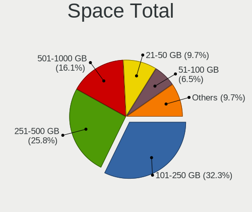
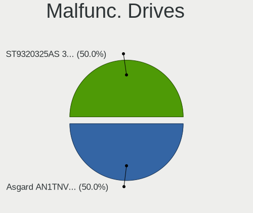

KDE neon - Hardware Trends (Notebooks)
--------------------------------------

A project to identify most popular hardware characteristics and track their change
over time based on data collected by Linux users at https://Linux-Hardware.org.

Anyone can contribute to this report by the [hw-probe](https://github.com/linuxhw/hw-probe) tool:

    sudo -E hw-probe -all -upload

This report is for one last month. Overall report since the beginning of time: [TestDays](https://github.com/linuxhw/TestDays)

Period: Jun, 2023.

Contents
--------

* [ System ](#system)
  - [ OS                       ](#os)
  - [ OS Family                ](#os-family)
  - [ Kernel                   ](#kernel)
  - [ Kernel Family            ](#kernel-family)
  - [ Kernel Major Ver.        ](#kernel-major-ver)
  - [ Arch                     ](#arch)
  - [ DE                       ](#de)
  - [ Display Server           ](#display-server)
  - [ Display Manager          ](#display-manager)
  - [ OS Lang                  ](#os-lang)
  - [ Boot Mode                ](#boot-mode)
  - [ Filesystem               ](#filesystem)
  - [ Part. scheme             ](#part-scheme)
  - [ Dual Boot with Linux/BSD ](#dual-boot-with-linuxbsd)
  - [ Dual Boot (Win)          ](#dual-boot-win)

* [ Board ](#board)
  - [ Vendor                   ](#vendor)
  - [ Model                    ](#model)
  - [ Model Family             ](#model-family)
  - [ MFG Year                 ](#mfg-year)
  - [ Form Factor              ](#form-factor)
  - [ Secure Boot              ](#secure-boot)
  - [ Coreboot                 ](#coreboot)
  - [ RAM Size                 ](#ram-size)
  - [ RAM Used                 ](#ram-used)
  - [ Total Drives             ](#total-drives)
  - [ Has CD-ROM               ](#has-cd-rom)
  - [ Has Ethernet             ](#has-ethernet)
  - [ Has WiFi                 ](#has-wifi)
  - [ Has Bluetooth            ](#has-bluetooth)

* [ Location ](#location)
  - [ Country                  ](#country)
  - [ City                     ](#city)

* [ Drives ](#drives)
  - [ Drive Vendor             ](#drive-vendor)
  - [ Drive Model              ](#drive-model)
  - [ HDD Vendor               ](#hdd-vendor)
  - [ SSD Vendor               ](#ssd-vendor)
  - [ Drive Kind               ](#drive-kind)
  - [ Drive Connector          ](#drive-connector)
  - [ Drive Size               ](#drive-size)
  - [ Space Total              ](#space-total)
  - [ Space Used               ](#space-used)
  - [ Malfunc. Drives          ](#malfunc-drives)
  - [ Malfunc. Drive Vendor    ](#malfunc-drive-vendor)
  - [ Malfunc. HDD Vendor      ](#malfunc-hdd-vendor)
  - [ Malfunc. Drive Kind      ](#malfunc-drive-kind)
  - [ Failed Drives            ](#failed-drives)
  - [ Failed Drive Vendor      ](#failed-drive-vendor)
  - [ Drive Status             ](#drive-status)

* [ Storage controller ](#storage-controller)
  - [ Storage Vendor           ](#storage-vendor)
  - [ Storage Model            ](#storage-model)
  - [ Storage Kind             ](#storage-kind)

* [ Processor ](#processor)
  - [ CPU Vendor               ](#cpu-vendor)
  - [ CPU Model                ](#cpu-model)
  - [ CPU Model Family         ](#cpu-model-family)
  - [ CPU Cores                ](#cpu-cores)
  - [ CPU Sockets              ](#cpu-sockets)
  - [ CPU Threads              ](#cpu-threads)
  - [ CPU Op-Modes             ](#cpu-op-modes)
  - [ CPU Microcode            ](#cpu-microcode)
  - [ CPU Microarch            ](#cpu-microarch)

* [ Graphics ](#graphics)
  - [ GPU Vendor               ](#gpu-vendor)
  - [ GPU Model                ](#gpu-model)
  - [ GPU Combo                ](#gpu-combo)
  - [ GPU Driver               ](#gpu-driver)
  - [ GPU Memory               ](#gpu-memory)

* [ Monitor ](#monitor)
  - [ Monitor Vendor           ](#monitor-vendor)
  - [ Monitor Model            ](#monitor-model)
  - [ Monitor Resolution       ](#monitor-resolution)
  - [ Monitor Diagonal         ](#monitor-diagonal)
  - [ Monitor Width            ](#monitor-width)
  - [ Aspect Ratio             ](#aspect-ratio)
  - [ Monitor Area             ](#monitor-area)
  - [ Pixel Density            ](#pixel-density)
  - [ Multiple Monitors        ](#multiple-monitors)

* [ Network ](#network)
  - [ Net Controller Vendor    ](#net-controller-vendor)
  - [ Net Controller Model     ](#net-controller-model)
  - [ Wireless Vendor          ](#wireless-vendor)
  - [ Wireless Model           ](#wireless-model)
  - [ Ethernet Vendor          ](#ethernet-vendor)
  - [ Ethernet Model           ](#ethernet-model)
  - [ Net Controller Kind      ](#net-controller-kind)
  - [ Used Controller          ](#used-controller)
  - [ NICs                     ](#nics)
  - [ IPv6                     ](#ipv6)

* [ Bluetooth ](#bluetooth)
  - [ Bluetooth Vendor         ](#bluetooth-vendor)
  - [ Bluetooth Model          ](#bluetooth-model)

* [ Sound ](#sound)
  - [ Sound Vendor             ](#sound-vendor)
  - [ Sound Model              ](#sound-model)

* [ Memory ](#memory)
  - [ Memory Vendor            ](#memory-vendor)
  - [ Memory Model             ](#memory-model)
  - [ Memory Kind              ](#memory-kind)
  - [ Memory Form Factor       ](#memory-form-factor)
  - [ Memory Size              ](#memory-size)
  - [ Memory Speed             ](#memory-speed)

* [ Printers & scanners ](#printers--scanners)
  - [ Printer Vendor           ](#printer-vendor)
  - [ Printer Model            ](#printer-model)
  - [ Scanner Vendor           ](#scanner-vendor)
  - [ Scanner Model            ](#scanner-model)

* [ Camera ](#camera)
  - [ Camera Vendor            ](#camera-vendor)
  - [ Camera Model             ](#camera-model)

* [ Security ](#security)
  - [ Fingerprint Vendor       ](#fingerprint-vendor)
  - [ Fingerprint Model        ](#fingerprint-model)
  - [ Chipcard Vendor          ](#chipcard-vendor)
  - [ Chipcard Model           ](#chipcard-model)

* [ Unsupported ](#unsupported)
  - [ Unsupported Devices      ](#unsupported-devices)
  - [ Unsupported Device Types ](#unsupported-device-types)

System
------

OS
--

Installed operating systems

| Name           | Notebooks | Percent |
|----------------|-----------|---------|
| KDE neon 22.04 | 48        | 96%     |
| KDE neon 20.04 | 2         | 4%      |

OS Family
---------

OS without a version

| Name     | Notebooks | Percent |
|----------|-----------|---------|
| KDE neon | 50        | 100%    |

Kernel
------

Version of the Linux kernel

| Version              | Notebooks | Percent |
|----------------------|-----------|---------|
| 5.19.0-43-generic    | 29        | 58%     |
| 5.19.0-45-generic    | 11        | 22%     |
| 5.19.0-42-generic    | 2         | 4%      |
| 6.3.7-060307-generic | 1         | 2%      |
| 6.3.1-060301-generic | 1         | 2%      |
| 5.19.0-41-generic    | 1         | 2%      |
| 5.19.0-38-generic    | 1         | 2%      |
| 5.15.0-72-generic    | 1         | 2%      |
| 5.15.0-70-generic    | 1         | 2%      |
| 5.15.0-60-generic    | 1         | 2%      |
| 5.15.0-52-generic    | 1         | 2%      |

Kernel Family
-------------

Linux kernel without a distro release

| Version | Notebooks | Percent |
|---------|-----------|---------|
| 5.19.0  | 44        | 88%     |
| 5.15.0  | 4         | 8%      |
| 6.3.7   | 1         | 2%      |
| 6.3.1   | 1         | 2%      |

Kernel Major Ver.
-----------------

Linux kernel major version

| Version | Notebooks | Percent |
|---------|-----------|---------|
| 5.19    | 44        | 88%     |
| 5.15    | 4         | 8%      |
| 6.3     | 2         | 4%      |

Arch
----

OS architecture (x86_64, i586, etc.)

| Name   | Notebooks | Percent |
|--------|-----------|---------|
| x86_64 | 50        | 100%    |

DE
--

Desktop Environment

| Name | Notebooks | Percent |
|------|-----------|---------|
| KDE5 | 49        | 98%     |
| KDE  | 1         | 2%      |

Display Server
--------------

X11 or Wayland

| Name    | Notebooks | Percent |
|---------|-----------|---------|
| X11     | 43        | 86%     |
| Wayland | 7         | 14%     |

Display Manager
---------------

SDDM, LightDM, etc.

| Name    | Notebooks | Percent |
|---------|-----------|---------|
| Unknown | 42        | 84%     |
| SDDM    | 8         | 16%     |

OS Lang
-------

Language

| Lang   | Notebooks | Percent |
|--------|-----------|---------|
| en_US  | 20        | 40%     |
| en_GB  | 8         | 16%     |
| es_MX  | 4         | 8%      |
| de_DE  | 4         | 8%      |
| ru_RU  | 2         | 4%      |
| pt_BR  | 2         | 4%      |
| es_ES  | 2         | 4%      |
| pt_PT  | 1         | 2%      |
| ja_JP  | 1         | 2%      |
| hsb_DE | 1         | 2%      |
| fr_CA  | 1         | 2%      |
| en_CA  | 1         | 2%      |
| en_AU  | 1         | 2%      |
| de_AT  | 1         | 2%      |
| C      | 1         | 2%      |

Boot Mode
---------

EFI or BIOS

| Mode | Notebooks | Percent |
|------|-----------|---------|
| BIOS | 43        | 86%     |
| EFI  | 7         | 14%     |

Filesystem
----------

Type of filesystem

| Type    | Notebooks | Percent |
|---------|-----------|---------|
| Ext4    | 48        | 96%     |
| Tmpfs   | 1         | 2%      |
| Overlay | 1         | 2%      |

Part. scheme
------------

Scheme of partitioning

| Type    | Notebooks | Percent |
|---------|-----------|---------|
| Unknown | 41        | 82%     |
| GPT     | 7         | 14%     |
| MBR     | 2         | 4%      |

Dual Boot with Linux/BSD
------------------------

Hosting more than one Linux/BSD

| Dual boot | Notebooks | Percent |
|-----------|-----------|---------|
| No        | 49        | 98%     |
| Yes       | 1         | 2%      |

Dual Boot (Win)
---------------

Hosting Linux and Windows

| Dual boot | Notebooks | Percent |
|-----------|-----------|---------|
| No        | 49        | 98%     |
| Yes       | 1         | 2%      |

Board
-----

Vendor
------

Motherboard manufacturer

| Name                | Notebooks | Percent |
|---------------------|-----------|---------|
| Lenovo              | 12        | 24%     |
| Hewlett-Packard     | 11        | 22%     |
| Dell                | 6         | 12%     |
| Toshiba             | 3         | 6%      |
| MSI                 | 3         | 6%      |
| Apple               | 3         | 6%      |
| Acer                | 3         | 6%      |
| Positivo            | 2         | 4%      |
| Timi                | 1         | 2%      |
| Sony                | 1         | 2%      |
| Razer               | 1         | 2%      |
| Gigabyte Technology | 1         | 2%      |
| GEO                 | 1         | 2%      |
| COM1                | 1         | 2%      |
| ASUSTek Computer    | 1         | 2%      |

Model
-----

Motherboard model

| Name                                  | Notebooks | Percent |
|---------------------------------------|-----------|---------|
| Toshiba Satellite P870                | 1         | 2%      |
| Toshiba Satellite C855-233            | 1         | 2%      |
| Toshiba dynabook Satellite B552/H     | 1         | 2%      |
| Timi RedmiBook Pro 15S                | 1         | 2%      |
| Sony SVF1521J7EW                      | 1         | 2%      |
| Razer Blade 17 (2022) - RZ09-0423     | 1         | 2%      |
| Positivo Q4128C-S                     | 1         | 2%      |
| Positivo Mobile                       | 1         | 2%      |
| MSI MS-7C75                           | 1         | 2%      |
| MSI GP72 7RDX                         | 1         | 2%      |
| MSI Bravo 17 A4DDR                    | 1         | 2%      |
| Lenovo Y520-15IKBN 80WK               | 1         | 2%      |
| Lenovo ThinkPad X270 20HMS12K00       | 1         | 2%      |
| Lenovo ThinkPad W530 244723U          | 1         | 2%      |
| Lenovo ThinkPad T440p 20AWS43W00      | 1         | 2%      |
| Lenovo ThinkPad T14 Gen 2i 20W000S3AD | 1         | 2%      |
| Lenovo ThinkPad P51 20HJS02H00        | 1         | 2%      |
| Lenovo ThinkPad E590 20NB001JUS       | 1         | 2%      |
| Lenovo Legion Pro 5 16IRX8 82WK       | 1         | 2%      |
| Lenovo IdeaPad Z410 20292             | 1         | 2%      |
| Lenovo IdeaPad Y510P 20217            | 1         | 2%      |
| Lenovo IdeaPad 5 15ALC05 82LN         | 1         | 2%      |
| Lenovo IdeaPad 110S-11IBR 80WG        | 1         | 2%      |
| HP ProBook 440 G4                     | 1         | 2%      |
| HP Pavilion m6                        | 1         | 2%      |
| HP Pavilion g6                        | 1         | 2%      |
| HP OMEN by Laptop 15-ce0xx            | 1         | 2%      |
| HP Laptop 17-cn0xxx                   | 1         | 2%      |
| HP Laptop 17-ca0xxx                   | 1         | 2%      |
| HP Laptop 15-db0xxx                   | 1         | 2%      |
| HP Laptop 15-bs0xx                    | 1         | 2%      |
| HP EliteBook 8560w                    | 1         | 2%      |
| HP EliteBook 840 G3                   | 1         | 2%      |
| HP Elite x2 1012 G1                   | 1         | 2%      |
| Gigabyte P55V6                        | 1         | 2%      |
| GEO GEOBOOK 2E                        | 1         | 2%      |
| Dell Precision M6800                  | 1         | 2%      |
| Dell Precision 3560                   | 1         | 2%      |
| Dell Latitude E7470                   | 1         | 2%      |
| Dell Latitude 3190                    | 1         | 2%      |

Model Family
------------

Motherboard model prefix

| Name               | Notebooks | Percent |
|--------------------|-----------|---------|
| Lenovo ThinkPad    | 6         | 12%     |
| Lenovo IdeaPad     | 4         | 8%      |
| HP Laptop          | 4         | 8%      |
| Toshiba Satellite  | 2         | 4%      |
| HP Pavilion        | 2         | 4%      |
| HP EliteBook       | 2         | 4%      |
| Dell Precision     | 2         | 4%      |
| Dell Latitude      | 2         | 4%      |
| Dell Inspiron      | 2         | 4%      |
| Acer Aspire        | 2         | 4%      |
| Toshiba dynabook   | 1         | 2%      |
| Timi RedmiBook     | 1         | 2%      |
| Sony SVF1521J7EW   | 1         | 2%      |
| Razer Blade        | 1         | 2%      |
| Positivo Q4128C-S  | 1         | 2%      |
| Positivo Mobile    | 1         | 2%      |
| MSI MS-7C75        | 1         | 2%      |
| MSI GP72           | 1         | 2%      |
| MSI Bravo          | 1         | 2%      |
| Lenovo Y520-15IKBN | 1         | 2%      |
| Lenovo Legion      | 1         | 2%      |
| HP ProBook         | 1         | 2%      |
| HP OMEN            | 1         | 2%      |
| HP Elite           | 1         | 2%      |
| Gigabyte P55V6     | 1         | 2%      |
| GEO GEOBOOK        | 1         | 2%      |
| COM1 NBINF-X5-9G5  | 1         | 2%      |
| ASUS VivoBook      | 1         | 2%      |
| Apple MacBookPro9  | 1         | 2%      |
| Apple MacBookPro5  | 1         | 2%      |
| Apple MacBookPro14 | 1         | 2%      |
| Acer Nitro         | 1         | 2%      |

MFG Year
--------

Motherboard manufacture year

| Year | Notebooks | Percent |
|------|-----------|---------|
| 2013 | 8         | 16%     |
| 2021 | 6         | 12%     |
| 2017 | 6         | 12%     |
| 2018 | 5         | 10%     |
| 2012 | 5         | 10%     |
| 2020 | 4         | 8%      |
| 2016 | 4         | 8%      |
| 2019 | 3         | 6%      |
| 2015 | 3         | 6%      |
| 2011 | 2         | 4%      |
| 2023 | 1         | 2%      |
| 2022 | 1         | 2%      |
| 2010 | 1         | 2%      |
| 2009 | 1         | 2%      |

Form Factor
-----------

Physical design of the computer

| Name     | Notebooks | Percent |
|----------|-----------|---------|
| Notebook | 50        | 100%    |

Secure Boot
-----------

Enabled or disabled

| State    | Notebooks | Percent |
|----------|-----------|---------|
| Disabled | 46        | 92%     |
| Enabled  | 4         | 8%      |

Coreboot
--------

Have coreboot on board

| Used | Notebooks | Percent |
|------|-----------|---------|
| No   | 50        | 100%    |

RAM Size
--------

Total RAM memory

| Size in GB  | Notebooks | Percent |
|-------------|-----------|---------|
| 4.01-8.0    | 14        | 28%     |
| 16.01-24.0  | 10        | 20%     |
| 32.01-64.0  | 8         | 16%     |
| 3.01-4.0    | 8         | 16%     |
| 8.01-16.0   | 6         | 12%     |
| 24.01-32.0  | 2         | 4%      |
| 64.01-256.0 | 1         | 2%      |
| 1.01-2.0    | 1         | 2%      |

RAM Used
--------

Used RAM memory

| Used GB    | Notebooks | Percent |
|------------|-----------|---------|
| 2.01-3.0   | 19        | 38%     |
| 1.01-2.0   | 14        | 28%     |
| 4.01-8.0   | 7         | 14%     |
| 3.01-4.0   | 4         | 8%      |
| 24.01-32.0 | 2         | 4%      |
| 8.01-16.0  | 2         | 4%      |
| 16.01-24.0 | 1         | 2%      |
| 0.01-0.5   | 1         | 2%      |

Total Drives
------------

Number of drives on board

| Drives | Notebooks | Percent |
|--------|-----------|---------|
| 1      | 26        | 52%     |
| 2      | 19        | 38%     |
| 3      | 3         | 6%      |
| 4      | 2         | 4%      |

Has CD-ROM
----------

Has CD-ROM on board

| Presented | Notebooks | Percent |
|-----------|-----------|---------|
| No        | 35        | 70%     |
| Yes       | 15        | 30%     |

Has Ethernet
------------

Has Ethernet on board

| Presented | Notebooks | Percent |
|-----------|-----------|---------|
| Yes       | 41        | 82%     |
| No        | 9         | 18%     |

Has WiFi
--------

Has WiFi module

| Presented | Notebooks | Percent |
|-----------|-----------|---------|
| Yes       | 47        | 94%     |
| No        | 3         | 6%      |

Has Bluetooth
-------------

Has Bluetooth module

| Presented | Notebooks | Percent |
|-----------|-----------|---------|
| Yes       | 40        | 80%     |
| No        | 10        | 20%     |

Location
--------

Country
-------

Geographic location (country)

| Country     | Notebooks | Percent |
|-------------|-----------|---------|
| USA         | 11        | 22%     |
| Germany     | 3         | 6%      |
| Brazil      | 3         | 6%      |
| Australia   | 3         | 6%      |
| UK          | 2         | 4%      |
| Thailand    | 2         | 4%      |
| Spain       | 2         | 4%      |
| Norway      | 2         | 4%      |
| Mexico      | 2         | 4%      |
| Canada      | 2         | 4%      |
| Austria     | 2         | 4%      |
| Tunisia     | 1         | 2%      |
| Switzerland | 1         | 2%      |
| Slovakia    | 1         | 2%      |
| Singapore   | 1         | 2%      |
| Russia      | 1         | 2%      |
| Portugal    | 1         | 2%      |
| Philippines | 1         | 2%      |
| Lithuania   | 1         | 2%      |
| Latvia      | 1         | 2%      |
| Japan       | 1         | 2%      |
| Indonesia   | 1         | 2%      |
| India       | 1         | 2%      |
| France      | 1         | 2%      |
| El Salvador | 1         | 2%      |
| Colombia    | 1         | 2%      |
| Argentina   | 1         | 2%      |

City
----

Geographic location (city)

| City              | Notebooks | Percent |
|-------------------|-----------|---------|
| Vienna            | 2         | 4%      |
| Yokohama          | 1         | 2%      |
| Wilsdruff         | 1         | 2%      |
| Wil               | 1         | 2%      |
| Wichita           | 1         | 2%      |
| Villeneuve-Loubet | 1         | 2%      |
| Valencia          | 1         | 2%      |
| Tønsberg         | 1         | 2%      |
| Tunja             | 1         | 2%      |
| Tunis             | 1         | 2%      |
| Singapore         | 1         | 2%      |
| Saint-Jerome      | 1         | 2%      |
| Riga              | 1         | 2%      |
| Quincy            | 1         | 2%      |
| Preston           | 1         | 2%      |
| Philadelphia      | 1         | 2%      |
| Perth             | 1         | 2%      |
| Pamplona          | 1         | 2%      |
| Palmdale          | 1         | 2%      |
| Oslo              | 1         | 2%      |
| Osasco            | 1         | 2%      |
| Oaxaca City       | 1         | 2%      |
| Normal            | 1         | 2%      |
| New York          | 1         | 2%      |
| Moscow            | 1         | 2%      |
| Mexico City       | 1         | 2%      |
| Mažeikiai        | 1         | 2%      |
| Mannheim          | 1         | 2%      |
| Long Beach        | 1         | 2%      |
| Lanus             | 1         | 2%      |
| Košice           | 1         | 2%      |
| Kelowna           | 1         | 2%      |
| Jakarta Pusat     | 1         | 2%      |
| Irvington         | 1         | 2%      |
| Holly             | 1         | 2%      |
| Hernani           | 1         | 2%      |
| Gold Coast        | 1         | 2%      |
| Entroncamento     | 1         | 2%      |
| Davao City        | 1         | 2%      |
| Croydon           | 1         | 2%      |

Drives
------

Drive Vendor
------------

Hard drive vendors

| Vendor                      | Notebooks | Drives | Percent |
|-----------------------------|-----------|--------|---------|
| Samsung Electronics         | 11        | 13     | 15.28%  |
| Seagate                     | 8         | 10     | 11.11%  |
| Unknown                     | 6         | 6      | 8.33%   |
| Toshiba                     | 6         | 6      | 8.33%   |
| WDC                         | 5         | 5      | 6.94%   |
| Kingston                    | 5         | 6      | 6.94%   |
| SanDisk                     | 4         | 4      | 5.56%   |
| SK hynix                    | 3         | 3      | 4.17%   |
| HGST                        | 3         | 3      | 4.17%   |
| Crucial                     | 2         | 2      | 2.78%   |
| Apple                       | 2         | 3      | 2.78%   |
| USB3.0                      | 1         | 2      | 1.39%   |
| SPCC                        | 1         | 1      | 1.39%   |
| SABRENT                     | 1         | 1      | 1.39%   |
| RX7                         | 1         | 1      | 1.39%   |
| PNY                         | 1         | 1      | 1.39%   |
| Phison Electronics          | 1         | 1      | 1.39%   |
| Patriot                     | 1         | 1      | 1.39%   |
| Micron Technology           | 1         | 1      | 1.39%   |
| MAXIO Technology (Hangzhou) | 1         | 1      | 1.39%   |
| LITEON C                    | 1         | 1      | 1.39%   |
| LITEON                      | 1         | 1      | 1.39%   |
| Lenovo                      | 1         | 1      | 1.39%   |
| KIOXIA                      | 1         | 1      | 1.39%   |
| KingSpec                    | 1         | 1      | 1.39%   |
| Intel                       | 1         | 1      | 1.39%   |
| Hitachi                     | 1         | 1      | 1.39%   |
| ADATA Technology            | 1         | 2      | 1.39%   |

Drive Model
-----------

Hard drive models

| Model                                               | Notebooks | Percent |
|-----------------------------------------------------|-----------|---------|
| Unknown MMC Card  64GB                              | 3         | 4%      |
| Seagate ST2000LM007-1R8174 2TB                      | 2         | 2.67%   |
| Samsung SSD 980 1TB                                 | 2         | 2.67%   |
| Samsung NVMe SSD Controller SM961/PM961/SM963 256GB | 2         | 2.67%   |
| Samsung NVMe SSD Controller PM9A1/PM9A3/980PRO 2TB  | 2         | 2.67%   |
| Kingston SA400S37240G 240GB SSD                     | 2         | 2.67%   |
| HGST HTS721010A9E630 1TB                            | 2         | 2.67%   |
| WDC WDS240G2G0B-00EPW0 240GB SSD                    | 1         | 1.33%   |
| WDC WDS240G2G0A-00JH30 240GB SSD                    | 1         | 1.33%   |
| WDC WDBNCE5000PNC 500GB SSD                         | 1         | 1.33%   |
| WDC WD10SPZX-22Z10T0 1TB                            | 1         | 1.33%   |
| WDC WD10JPVX-22JC3T0 1TB                            | 1         | 1.33%   |
| USB3.0 Disk 500GB                                   | 1         | 1.33%   |
| Unknown MMC Card  32GB                              | 1         | 1.33%   |
| Unknown MMC Card  256GB                             | 1         | 1.33%   |
| Unknown MMC Card  128GB                             | 1         | 1.33%   |
| Toshiba THNSNH128GMCT 128GB SSD                     | 1         | 1.33%   |
| Toshiba MQ01ABF050 500GB                            | 1         | 1.33%   |
| Toshiba MQ01ABD100 1TB                              | 1         | 1.33%   |
| Toshiba MQ01ABD075 752GB                            | 1         | 1.33%   |
| Toshiba HDWL120 2TB                                 | 1         | 1.33%   |
| Toshiba BG3 NVMe SSD Controller 512GB               | 1         | 1.33%   |
| SPCC Solid State Disk MX 256GB                      | 1         | 1.33%   |
| SK hynix SKHynix_HFS256GDE9X081N 256GB              | 1         | 1.33%   |
| SK hynix PC711 NVMe 512GB                           | 1         | 1.33%   |
| SK hynix HFM001TD3JX013N 1TB                        | 1         | 1.33%   |
| Seagate ST500LT012-1DG142 500GB                     | 1         | 1.33%   |
| Seagate ST2000LM015-2E8174 2TB                      | 1         | 1.33%   |
| Seagate ST2000DM008-2FR102 2TB                      | 1         | 1.33%   |
| Seagate ST1000LM035-1RK172 1TB                      | 1         | 1.33%   |
| Seagate ST1000LM024 HN-M101MBB 1TB                  | 1         | 1.33%   |
| Seagate One Touch HDD 2TB                           | 1         | 1.33%   |
| Seagate BUP Portable 4TB                            | 1         | 1.33%   |
| Sandisk WD_BLACK SN770 1TB                          | 1         | 1.33%   |
| Sandisk WD Blue SN500 / PC SN520 NVMe SSD 500GB     | 1         | 1.33%   |
| SanDisk SD8SBAT256G1122 256GB SSD                   | 1         | 1.33%   |
| SanDisk SD7SN6S-256G-1006 256GB SSD                 | 1         | 1.33%   |
| Samsung SSD 860 EVO M.2 1TB                         | 1         | 1.33%   |
| Samsung SSD 850 EVO 500GB                           | 1         | 1.33%   |
| Samsung MZVLB512HAJQ-00000 512GB                    | 1         | 1.33%   |

HDD Vendor
----------

Hard disk drive vendors

| Vendor  | Notebooks | Drives | Percent |
|---------|-----------|--------|---------|
| Seagate | 8         | 10     | 40%     |
| Toshiba | 4         | 4      | 20%     |
| HGST    | 3         | 3      | 15%     |
| WDC     | 2         | 2      | 10%     |
| USB3.0  | 1         | 2      | 5%      |
| Hitachi | 1         | 1      | 5%      |
| Apple   | 1         | 1      | 5%      |

SSD Vendor
----------

Solid state drive vendors

| Vendor              | Notebooks | Drives | Percent |
|---------------------|-----------|--------|---------|
| Kingston            | 5         | 6      | 22.73%  |
| WDC                 | 3         | 3      | 13.64%  |
| Samsung Electronics | 3         | 3      | 13.64%  |
| SanDisk             | 2         | 2      | 9.09%   |
| Crucial             | 2         | 2      | 9.09%   |
| Toshiba             | 1         | 1      | 4.55%   |
| SPCC                | 1         | 1      | 4.55%   |
| PNY                 | 1         | 1      | 4.55%   |
| Patriot             | 1         | 1      | 4.55%   |
| LITEON C            | 1         | 1      | 4.55%   |
| LITEON              | 1         | 1      | 4.55%   |
| KingSpec            | 1         | 1      | 4.55%   |

Drive Kind
----------

HDD or SSD

| Kind    | Notebooks | Drives | Percent |
|---------|-----------|--------|---------|
| NVMe    | 21        | 26     | 30.43%  |
| SSD     | 21        | 23     | 30.43%  |
| HDD     | 19        | 23     | 27.54%  |
| MMC     | 6         | 6      | 8.7%    |
| Unknown | 2         | 2      | 2.9%    |

Drive Connector
---------------

SATA, SAS, NVMe, etc.

| Type | Notebooks | Drives | Percent |
|------|-----------|--------|---------|
| SATA | 33        | 41     | 50.77%  |
| NVMe | 21        | 26     | 32.31%  |
| MMC  | 6         | 6      | 9.23%   |
| SAS  | 5         | 7      | 7.69%   |

Drive Size
----------

Size of hard drive

| Size in TB | Notebooks | Drives | Percent |
|------------|-----------|--------|---------|
| 0.01-0.5   | 23        | 27     | 56.1%   |
| 0.51-1.0   | 11        | 11     | 26.83%  |
| 1.01-2.0   | 6         | 7      | 14.63%  |
| 3.01-4.0   | 1         | 1      | 2.44%   |

Space Total
-----------

Amount of disk space available on the file system

| Size in GB     | Notebooks | Percent |
|----------------|-----------|---------|
| 101-250        | 19        | 38%     |
| 501-1000       | 11        | 22%     |
| 251-500        | 7         | 14%     |
| 1001-2000      | 3         | 6%      |
| 51-100         | 3         | 6%      |
| More than 3000 | 2         | 4%      |
| 1-20           | 2         | 4%      |
| 21-50          | 1         | 2%      |
| 2001-3000      | 1         | 2%      |
| Unknown        | 1         | 2%      |

Space Used
----------

Amount of used disk space

| Used GB        | Notebooks | Percent |
|----------------|-----------|---------|
| 1-20           | 21        | 42%     |
| 51-100         | 10        | 20%     |
| 21-50          | 6         | 12%     |
| 101-250        | 5         | 10%     |
| 251-500        | 3         | 6%      |
| 501-1000       | 2         | 4%      |
| More than 3000 | 1         | 2%      |
| 1001-2000      | 1         | 2%      |
| Unknown        | 1         | 2%      |

Malfunc. Drives
---------------

Drive models with a malfunction

| Model                    | Notebooks | Drives | Percent |
|--------------------------|-----------|--------|---------|
| WDC WD10SPZX-22Z10T0 1TB | 1         | 1      | 100%    |

Malfunc. Drive Vendor
---------------------

Vendors of faulty drives

| Vendor | Notebooks | Drives | Percent |
|--------|-----------|--------|---------|
| WDC    | 1         | 1      | 100%    |

Malfunc. HDD Vendor
-------------------

Vendors of faulty HDD drives

| Vendor | Notebooks | Drives | Percent |
|--------|-----------|--------|---------|
| WDC    | 1         | 1      | 100%    |

Malfunc. Drive Kind
-------------------

Kinds of faulty drives

| Kind | Notebooks | Drives | Percent |
|------|-----------|--------|---------|
| HDD  | 1         | 1      | 100%    |

Failed Drives
-------------

Failed drive models

Zero info for selected period =(

Failed Drive Vendor
-------------------

Failed drive vendors

Zero info for selected period =(

Drive Status
------------

Number of failed and malfunc. drives

| Status   | Notebooks | Drives | Percent |
|----------|-----------|--------|---------|
| Detected | 44        | 72     | 86.27%  |
| Works    | 6         | 7      | 11.76%  |
| Malfunc  | 1         | 1      | 1.96%   |

Storage controller
------------------

Storage Vendor
--------------

Storage controller vendors

| Vendor                       | Notebooks | Percent |
|------------------------------|-----------|---------|
| Intel                        | 34        | 53.97%  |
| Samsung Electronics          | 8         | 12.7%   |
| AMD                          | 7         | 11.11%  |
| SK hynix                     | 3         | 4.76%   |
| SanDisk                      | 2         | 3.17%   |
| Toshiba America Info Systems | 1         | 1.59%   |
| Phison Electronics           | 1         | 1.59%   |
| Nvidia                       | 1         | 1.59%   |
| Micron Technology            | 1         | 1.59%   |
| MAXIO Technology (Hangzhou)  | 1         | 1.59%   |
| Lenovo                       | 1         | 1.59%   |
| KIOXIA                       | 1         | 1.59%   |
| Apple                        | 1         | 1.59%   |
| ADATA Technology             | 1         | 1.59%   |

Storage Model
-------------

Storage controller models

| Model                                                                            | Notebooks | Percent |
|----------------------------------------------------------------------------------|-----------|---------|
| Intel 7 Series Chipset Family 6-port SATA Controller [AHCI mode]                 | 7         | 10.14%  |
| AMD FCH SATA Controller [AHCI mode]                                              | 7         | 10.14%  |
| Intel Sunrise Point-LP SATA Controller [AHCI mode]                               | 6         | 8.7%    |
| Intel HM170/QM170 Chipset SATA Controller [AHCI Mode]                            | 5         | 7.25%   |
| SK hynix Gold P31/BC711/PC711 NVMe Solid State Drive                             | 3         | 4.35%   |
| Samsung NVMe SSD Controller PM9A1/PM9A3/980PRO                                   | 3         | 4.35%   |
| Samsung NVMe SSD Controller 980                                                  | 3         | 4.35%   |
| Intel 8 Series/C220 Series Chipset Family 6-port SATA Controller 1 [AHCI mode]   | 3         | 4.35%   |
| Samsung NVMe SSD Controller SM961/PM961/SM963                                    | 2         | 2.9%    |
| Intel Volume Management Device NVMe RAID Controller                              | 2         | 2.9%    |
| Intel Cannon Lake Mobile PCH SATA AHCI Controller                                | 2         | 2.9%    |
| Intel 82801 Mobile SATA Controller [RAID mode]                                   | 2         | 2.9%    |
| Toshiba America Info Systems BG3 NVMe SSD Controller                             | 1         | 1.45%   |
| SanDisk WD Blue SN500 / PC SN520 NVMe SSD                                        | 1         | 1.45%   |
| SanDisk WD Black SN770 NVMe SSD                                                  | 1         | 1.45%   |
| Samsung NVMe SSD Controller SM981/PM981/PM983                                    | 1         | 1.45%   |
| Phison E12 NVMe Controller                                                       | 1         | 1.45%   |
| Nvidia MCP79 AHCI Controller                                                     | 1         | 1.45%   |
| Micron NVMe Storage Controller                                                   | 1         | 1.45%   |
| MAXIO (Hangzhou) NVMe SSD Controller MAP1202                                     | 1         | 1.45%   |
| Lenovo Non-Volatile memory controller                                            | 1         | 1.45%   |
| KIOXIA NVMe SSD Controller BG4                                                   | 1         | 1.45%   |
| Intel Tiger Lake-LP SATA Controller                                              | 1         | 1.45%   |
| Intel SSD 660P Series                                                            | 1         | 1.45%   |
| Intel Ice Lake-LP SATA Controller [AHCI mode]                                    | 1         | 1.45%   |
| Intel Comet Lake PCH-H RAID                                                      | 1         | 1.45%   |
| Intel Celeron/Pentium Silver Processor SATA Controller                           | 1         | 1.45%   |
| Intel Celeron N3350/Pentium N4200/Atom E3900 Series SATA AHCI Controller         | 1         | 1.45%   |
| Intel Atom/Celeron/Pentium Processor x5-E8000/J3xxx/N3xxx Series SATA Controller | 1         | 1.45%   |
| Intel 8 Series/C220 Series Chipset Family 2-port SATA Controller 2 [IDE mode]    | 1         | 1.45%   |
| Intel 8 Series Chipset Family 4-port SATA Controller 1 [IDE mode] - Mobile       | 1         | 1.45%   |
| Intel 6 Series/C200 Series Chipset Family 6 port Mobile SATA AHCI Controller     | 1         | 1.45%   |
| Intel 5 Series/3400 Series Chipset 4 port SATA IDE Controller                    | 1         | 1.45%   |
| Intel 5 Series/3400 Series Chipset 2 port SATA IDE Controller                    | 1         | 1.45%   |
| Apple S3X NVMe Controller                                                        | 1         | 1.45%   |
| ADATA XPG SX8200 Pro PCIe Gen3x4 M.2 2280 Solid State Drive                      | 1         | 1.45%   |

Storage Kind
------------

Kind of storage controller (IDE, SATA, NVMe, SAS, ...)

| Kind | Notebooks | Percent |
|------|-----------|---------|
| SATA | 37        | 56.92%  |
| NVMe | 21        | 32.31%  |
| RAID | 5         | 7.69%   |
| IDE  | 2         | 3.08%   |

Processor
---------

CPU Vendor
----------

Processor vendors

| Vendor | Notebooks | Percent |
|--------|-----------|---------|
| Intel  | 43        | 86%     |
| AMD    | 7         | 14%     |

CPU Model
---------

Processor models

| Model                                   | Notebooks | Percent |
|-----------------------------------------|-----------|---------|
| Intel Core i7-7700HQ CPU @ 2.80GHz      | 2         | 4%      |
| Intel Core i7-4702MQ CPU @ 2.20GHz      | 2         | 4%      |
| Intel Core i5-4300M CPU @ 2.60GHz       | 2         | 4%      |
| Intel Core m5-6Y54 CPU @ 1.10GHz        | 1         | 2%      |
| Intel Core i7-9750H CPU @ 2.60GHz       | 1         | 2%      |
| Intel Core i7-7820HQ CPU @ 2.90GHz      | 1         | 2%      |
| Intel Core i7-6700HQ CPU @ 2.60GHz      | 1         | 2%      |
| Intel Core i7-6500U CPU @ 2.50GHz       | 1         | 2%      |
| Intel Core i7-4700MQ CPU @ 2.40GHz      | 1         | 2%      |
| Intel Core i7-3820QM CPU @ 2.70GHz      | 1         | 2%      |
| Intel Core i7-3630QM CPU @ 2.40GHz      | 1         | 2%      |
| Intel Core i7-3610QM CPU @ 2.30GHz      | 1         | 2%      |
| Intel Core i7-2820QM CPU @ 2.30GHz      | 1         | 2%      |
| Intel Core i7-10700K CPU @ 3.80GHz      | 1         | 2%      |
| Intel Core i5-8300H CPU @ 2.30GHz       | 1         | 2%      |
| Intel Core i5-8265U CPU @ 1.60GHz       | 1         | 2%      |
| Intel Core i5-7300U CPU @ 2.60GHz       | 1         | 2%      |
| Intel Core i5-7300HQ CPU @ 2.50GHz      | 1         | 2%      |
| Intel Core i5-7267U CPU @ 3.10GHz       | 1         | 2%      |
| Intel Core i5-7200U CPU @ 2.50GHz       | 1         | 2%      |
| Intel Core i5-6300U CPU @ 2.40GHz       | 1         | 2%      |
| Intel Core i5-6300HQ CPU @ 2.30GHz      | 1         | 2%      |
| Intel Core i5-6200U CPU @ 2.30GHz       | 1         | 2%      |
| Intel Core i5-3230M CPU @ 2.60GHz       | 1         | 2%      |
| Intel Core i5-3210M CPU @ 2.50GHz       | 1         | 2%      |
| Intel Core i5-1035G1 CPU @ 1.00GHz      | 1         | 2%      |
| Intel Core i3-6006U CPU @ 2.00GHz       | 1         | 2%      |
| Intel Core i3-3217U CPU @ 1.80GHz       | 1         | 2%      |
| Intel Core i3 CPU M 330 @ 2.13GHz       | 1         | 2%      |
| Intel Core 2 Duo CPU P8700 @ 2.53GHz    | 1         | 2%      |
| Intel Celeron N4120 CPU @ 1.10GHz       | 1         | 2%      |
| Intel Celeron CPU N3450 @ 1.10GHz       | 1         | 2%      |
| Intel Celeron CPU N3160 @ 1.60GHz       | 1         | 2%      |
| Intel Celeron CPU 1017U @ 1.60GHz       | 1         | 2%      |
| Intel Atom x5-Z8350 CPU @ 1.44GHz       | 1         | 2%      |
| Intel 13th Gen Core i9-13900HX          | 1         | 2%      |
| Intel 12th Gen Core i7-12800H           | 1         | 2%      |
| Intel 11th Gen Core i7-1185G7 @ 3.00GHz | 1         | 2%      |
| Intel 11th Gen Core i5-1135G7 @ 2.40GHz | 1         | 2%      |
| Intel 11th Gen Core i3-1115G4 @ 3.00GHz | 1         | 2%      |

CPU Model Family
----------------

Processor model prefix

| Model            | Notebooks | Percent |
|------------------|-----------|---------|
| Intel Core i7    | 14        | 28%     |
| Intel Core i5    | 14        | 28%     |
| Other            | 6         | 12%     |
| Intel Celeron    | 4         | 8%      |
| Intel Core i3    | 3         | 6%      |
| AMD Ryzen 7      | 2         | 4%      |
| Intel Core m5    | 1         | 2%      |
| Intel Core 2 Duo | 1         | 2%      |
| Intel Atom       | 1         | 2%      |
| AMD Ryzen 5      | 1         | 2%      |
| AMD Ryzen 3      | 1         | 2%      |
| AMD A6           | 1         | 2%      |
| AMD A10          | 1         | 2%      |

CPU Cores
---------

Number of processor cores

| Number | Notebooks | Percent |
|--------|-----------|---------|
| 4      | 23        | 46%     |
| 2      | 19        | 38%     |
| 8      | 3         | 6%      |
| 6      | 2         | 4%      |
| 24     | 1         | 2%      |
| 14     | 1         | 2%      |
| 1      | 1         | 2%      |

CPU Sockets
-----------

Number of sockets

| Number | Notebooks | Percent |
|--------|-----------|---------|
| 1      | 50        | 100%    |

CPU Threads
-----------

Threads per core (Hyper-Threading)

| Number | Notebooks | Percent |
|--------|-----------|---------|
| 2      | 39        | 78%     |
| 1      | 11        | 22%     |

CPU Op-Modes
------------

CPU Operation Modes (32-bit, 64-bit)

| Op mode        | Notebooks | Percent |
|----------------|-----------|---------|
| 32-bit, 64-bit | 50        | 100%    |

CPU Microcode
-------------

Microcode number

| Number     | Notebooks | Percent |
|------------|-----------|---------|
| Unknown    | 43        | 86%     |
| 0x806c1    | 2         | 4%      |
| 0x506e3    | 2         | 4%      |
| 0x406e3    | 1         | 2%      |
| 0x306c3    | 1         | 2%      |
| 0x06006705 | 1         | 2%      |

CPU Microarch
-------------

Microarchitecture

| Name          | Notebooks | Percent |
|---------------|-----------|---------|
| KabyLake      | 10        | 20%     |
| Skylake       | 7         | 14%     |
| IvyBridge     | 7         | 14%     |
| Haswell       | 5         | 10%     |
| TigerLake     | 3         | 6%      |
| Unknown       | 3         | 6%      |
| Silvermont    | 2         | 4%      |
| Piledriver    | 2         | 4%      |
| Zen 3         | 1         | 2%      |
| Zen 2         | 1         | 2%      |
| Zen           | 1         | 2%      |
| Westmere      | 1         | 2%      |
| SandyBridge   | 1         | 2%      |
| Penryn        | 1         | 2%      |
| IceLake       | 1         | 2%      |
| Goldmont plus | 1         | 2%      |
| Goldmont      | 1         | 2%      |
| Excavator     | 1         | 2%      |
| CometLake     | 1         | 2%      |

Graphics
--------

GPU Vendor
----------

Vendors of graphics cards

| Vendor | Notebooks | Percent |
|--------|-----------|---------|
| Intel  | 38        | 55.07%  |
| Nvidia | 22        | 31.88%  |
| AMD    | 9         | 13.04%  |

GPU Model
---------

Graphics card models

| Model                                                                                    | Notebooks | Percent |
|------------------------------------------------------------------------------------------|-----------|---------|
| Intel 3rd Gen Core processor Graphics Controller                                         | 6         | 8.57%   |
| Intel 4th Gen Core Processor Integrated Graphics Controller                              | 5         | 7.14%   |
| Intel Skylake GT2 [HD Graphics 520]                                                      | 4         | 5.71%   |
| Nvidia GP107M [GeForce GTX 1050 Mobile]                                                  | 3         | 4.29%   |
| Nvidia GK208M [GeForce GT 740M]                                                          | 2         | 2.86%   |
| Intel TigerLake-LP GT2 [Iris Xe Graphics]                                                | 2         | 2.86%   |
| Intel HD Graphics 630                                                                    | 2         | 2.86%   |
| Intel HD Graphics 620                                                                    | 2         | 2.86%   |
| Intel HD Graphics 530                                                                    | 2         | 2.86%   |
| Intel CoffeeLake-H GT2 [UHD Graphics 630]                                                | 2         | 2.86%   |
| Intel Atom/Celeron/Pentium Processor x5-E8000/J3xxx/N3xxx Integrated Graphics Controller | 2         | 2.86%   |
| Nvidia TU117M [GeForce GTX 1650 Mobile / Max-Q]                                          | 1         | 1.43%   |
| Nvidia TU117GLM [Quadro T500 Mobile]                                                     | 1         | 1.43%   |
| Nvidia TU104 [GeForce RTX 2070 SUPER]                                                    | 1         | 1.43%   |
| Nvidia GP106M [GeForce GTX 1060 Mobile]                                                  | 1         | 1.43%   |
| Nvidia GP106BM [GeForce GTX 1060 Mobile 6GB]                                             | 1         | 1.43%   |
| Nvidia GM206GLM [Quadro M2200 Mobile]                                                    | 1         | 1.43%   |
| Nvidia GM108M [GeForce MX130]                                                            | 1         | 1.43%   |
| Nvidia GM107M [GeForce GTX 950M]                                                         | 1         | 1.43%   |
| Nvidia GK107M [GeForce GT 755M]                                                          | 1         | 1.43%   |
| Nvidia GK107M [GeForce GT 750M]                                                          | 1         | 1.43%   |
| Nvidia GK107GLM [Quadro K2000M]                                                          | 1         | 1.43%   |
| Nvidia GK104GLM [Quadro K4100M]                                                          | 1         | 1.43%   |
| Nvidia GF108M [GeForce GT 620M/630M/635M/640M LE]                                        | 1         | 1.43%   |
| Nvidia GF108GLM [Quadro 1000M]                                                           | 1         | 1.43%   |
| Nvidia GA106M [GeForce RTX 3060 Mobile / Max-Q]                                          | 1         | 1.43%   |
| Nvidia C79 [GeForce 9400M]                                                               | 1         | 1.43%   |
| Nvidia AD106M [GeForce RTX 4070 Max-Q / Mobile]                                          | 1         | 1.43%   |
| Intel WhiskeyLake-U GT2 [UHD Graphics 620]                                               | 1         | 1.43%   |
| Intel Tiger Lake-LP GT2 [UHD Graphics G4]                                                | 1         | 1.43%   |
| Intel Raptor Lake-S UHD Graphics                                                         | 1         | 1.43%   |
| Intel Iris Plus Graphics G1 (Ice Lake)                                                   | 1         | 1.43%   |
| Intel Iris Plus Graphics 650                                                             | 1         | 1.43%   |
| Intel HD Graphics 515                                                                    | 1         | 1.43%   |
| Intel HD Graphics 500                                                                    | 1         | 1.43%   |
| Intel GeminiLake [UHD Graphics 600]                                                      | 1         | 1.43%   |
| Intel Core Processor Integrated Graphics Controller                                      | 1         | 1.43%   |
| Intel CometLake-S GT2 [UHD Graphics 630]                                                 | 1         | 1.43%   |
| Intel Alder Lake-P Integrated Graphics Controller                                        | 1         | 1.43%   |
| AMD Whistler LE [Radeon HD 6610M/7610M]                                                  | 1         | 1.43%   |

GPU Combo
---------

Combinations of graphics cards

| Name           | Notebooks | Percent |
|----------------|-----------|---------|
| 1 x Intel      | 19        | 38%     |
| Intel + Nvidia | 17        | 34%     |
| 1 x AMD        | 7         | 14%     |
| 1 x Nvidia     | 5         | 10%     |
| 2 x AMD        | 1         | 2%      |
| Intel + AMD    | 1         | 2%      |

GPU Driver
----------

Free vs proprietary

| Driver      | Notebooks | Percent |
|-------------|-----------|---------|
| Free        | 44        | 88%     |
| Proprietary | 6         | 12%     |

GPU Memory
----------

Total video memory

| Size in GB | Notebooks | Percent |
|------------|-----------|---------|
| Unknown    | 44        | 88%     |
| 1.01-2.0   | 2         | 4%      |
| 5.01-6.0   | 1         | 2%      |
| 3.01-4.0   | 1         | 2%      |
| 0.51-1.0   | 1         | 2%      |
| 0.01-0.5   | 1         | 2%      |

Monitor
-------

Monitor Vendor
--------------

Monitor vendors

| Vendor                  | Notebooks | Percent |
|-------------------------|-----------|---------|
| AU Optronics            | 14        | 23.73%  |
| Chimei Innolux          | 9         | 15.25%  |
| Samsung Electronics     | 7         | 11.86%  |
| LG Display              | 7         | 11.86%  |
| BOE                     | 7         | 11.86%  |
| Dell                    | 3         | 5.08%   |
| Apple                   | 3         | 5.08%   |
| Philips                 | 2         | 3.39%   |
| TMX                     | 1         | 1.69%   |
| Newskill                | 1         | 1.69%   |
| LGD                     | 1         | 1.69%   |
| Goldstar                | 1         | 1.69%   |
| CSO                     | 1         | 1.69%   |
| Chi Mei Optoelectronics | 1         | 1.69%   |
| ASUSTek Computer        | 1         | 1.69%   |

Monitor Model
-------------

Monitor models

| Model                                                                    | Notebooks | Percent |
|--------------------------------------------------------------------------|-----------|---------|
| Chimei Innolux LCD Monitor CMN1735 1920x1080 382x215mm 17.3-inch         | 2         | 3.33%   |
| Chimei Innolux LCD Monitor CMN1132 1366x768 256x144mm 11.6-inch          | 2         | 3.33%   |
| TMX TL156MDMP11-0 TMX1560 3200x2000 336x210mm 15.6-inch                  | 1         | 1.67%   |
| Samsung Electronics SyncMaster SAM043F 1920x1200 518x324mm 24.1-inch     | 1         | 1.67%   |
| Samsung Electronics S24D300 SAM0B43 1920x1080 531x299mm 24.0-inch        | 1         | 1.67%   |
| Samsung Electronics S24C650 SAM0B15 1920x1200 518x324mm 24.1-inch        | 1         | 1.67%   |
| Samsung Electronics LCD Monitor SEC315A 1366x768 344x194mm 15.5-inch     | 1         | 1.67%   |
| Samsung Electronics LCD Monitor SDC270F 1366x768 344x193mm 15.5-inch     | 1         | 1.67%   |
| Samsung Electronics LCD Monitor SAM07D0 1360x768 700x390mm 31.5-inch     | 1         | 1.67%   |
| Samsung Electronics LCD Monitor SAM0503 1920x1080                        | 1         | 1.67%   |
| Samsung Electronics 173HT02-T01 SEC5044 1920x1080 382x215mm 17.3-inch    | 1         | 1.67%   |
| Philips WXGA TV (3) PHL1E52 1360x768 708x398mm 32.0-inch                 | 1         | 1.67%   |
| Philips PHL 216V6 PHLC10D 1920x1080 419x262mm 19.5-inch                  | 1         | 1.67%   |
| Newskill RGB-27QHD NSL2711 2560x1440 530x280mm 23.6-inch                 | 1         | 1.67%   |
| LGD LCD Monitor 1920x1080                                                | 1         | 1.67%   |
| LG Display LCD Monitor LGD0590 1920x1080 344x194mm 15.5-inch             | 1         | 1.67%   |
| LG Display LCD Monitor LGD053F 1920x1080 344x194mm 15.5-inch             | 1         | 1.67%   |
| LG Display LCD Monitor LGD04A5 1920x1280 253x169mm 12.0-inch             | 1         | 1.67%   |
| LG Display LCD Monitor LGD0457 1920x1080 345x194mm 15.6-inch             | 1         | 1.67%   |
| LG Display LCD Monitor LGD03AB 1366x768 344x194mm 15.5-inch              | 1         | 1.67%   |
| LG Display LCD Monitor LGD032C 1920x1080 344x194mm 15.5-inch             | 1         | 1.67%   |
| LG Display LCD Monitor LGD0215 1920x1080 345x194mm 15.6-inch             | 1         | 1.67%   |
| Goldstar LG Ultra HD GSM5B08 3840x2160 600x340mm 27.2-inch               | 1         | 1.67%   |
| Dell U2722D DEL422F 2560x1440 597x336mm 27.0-inch                        | 1         | 1.67%   |
| Dell P2418D DELD0C1 2560x1440 530x300mm 24.0-inch                        | 1         | 1.67%   |
| Dell P1913S DELA085 1280x1024 376x301mm 19.0-inch                        | 1         | 1.67%   |
| CSO LCD Monitor CSO1628 2560x1600 344x215mm 16.0-inch                    | 1         | 1.67%   |
| Chimei Innolux LCD Monitor CMN1720 1920x1080 382x215mm 17.3-inch         | 1         | 1.67%   |
| Chimei Innolux LCD Monitor CMN15DC 1366x768 344x193mm 15.5-inch          | 1         | 1.67%   |
| Chimei Innolux LCD Monitor CMN1492 1366x768 309x174mm 14.0-inch          | 1         | 1.67%   |
| Chimei Innolux LCD Monitor CMN1482 1600x900 309x174mm 14.0-inch          | 1         | 1.67%   |
| Chimei Innolux LCD Monitor CMN1239 1920x1080 276x155mm 12.5-inch         | 1         | 1.67%   |
| Chi Mei Optoelectronics LCD Monitor CMO1444 1366x768 309x174mm 14.0-inch | 1         | 1.67%   |
| BOE LCD Monitor BOE09F9 2560x1440 381x214mm 17.2-inch                    | 1         | 1.67%   |
| BOE LCD Monitor BOE0923 1920x1080 344x193mm 15.5-inch                    | 1         | 1.67%   |
| BOE LCD Monitor BOE08E2 1920x1080 344x194mm 15.5-inch                    | 1         | 1.67%   |
| BOE LCD Monitor BOE07F1 1920x1080 344x193mm 15.5-inch                    | 1         | 1.67%   |
| BOE LCD Monitor BOE0747 1920x1080 344x194mm 15.5-inch                    | 1         | 1.67%   |
| BOE LCD Monitor BOE06A5 1366x768 344x194mm 15.5-inch                     | 1         | 1.67%   |
| BOE LCD Monitor BOE05F5 1366x768 277x156mm 12.5-inch                     | 1         | 1.67%   |

Monitor Resolution
------------------

Monitor screen resolution

| Resolution        | Notebooks | Percent |
|-------------------|-----------|---------|
| 1920x1080 (FHD)   | 25        | 46.3%   |
| 1366x768 (WXGA)   | 12        | 22.22%  |
| 2560x1440 (QHD)   | 4         | 7.41%   |
| 3840x2160 (4K)    | 2         | 3.7%    |
| 1600x900 (HD+)    | 2         | 3.7%    |
| 1280x800 (WXGA)   | 2         | 3.7%    |
| 3200x2000         | 1         | 1.85%   |
| 2880x1800         | 1         | 1.85%   |
| 2560x1600         | 1         | 1.85%   |
| 1920x1280         | 1         | 1.85%   |
| 1920x1200 (WUXGA) | 1         | 1.85%   |
| 1360x768          | 1         | 1.85%   |
| 1280x1024 (SXGA)  | 1         | 1.85%   |

Monitor Diagonal
----------------

Diagonal size in inches

| Inches  | Notebooks | Percent |
|---------|-----------|---------|
| 15      | 20        | 34.48%  |
| 17      | 9         | 15.52%  |
| 13      | 6         | 10.34%  |
| 14      | 4         | 6.9%    |
| 27      | 3         | 5.17%   |
| 24      | 3         | 5.17%   |
| 12      | 3         | 5.17%   |
| 19      | 2         | 3.45%   |
| 11      | 2         | 3.45%   |
| Unknown | 2         | 3.45%   |
| 32      | 1         | 1.72%   |
| 31      | 1         | 1.72%   |
| 23      | 1         | 1.72%   |
| 16      | 1         | 1.72%   |

Monitor Width
-------------

Physical width

| Width in mm | Notebooks | Percent |
|-------------|-----------|---------|
| 301-350     | 28        | 50%     |
| 351-400     | 10        | 17.86%  |
| 201-300     | 8         | 14.29%  |
| 501-600     | 5         | 8.93%   |
| Unknown     | 2         | 3.57%   |
| 701-800     | 1         | 1.79%   |
| 601-700     | 1         | 1.79%   |
| 401-500     | 1         | 1.79%   |

Aspect Ratio
------------

Proportional relationship between the width and the height

| Ratio   | Notebooks | Percent |
|---------|-----------|---------|
| 16/9    | 41        | 80.39%  |
| 16/10   | 7         | 13.73%  |
| 5/4     | 1         | 1.96%   |
| 3/2     | 1         | 1.96%   |
| Unknown | 1         | 1.96%   |

Monitor Area
------------

Area in inch²

| Area in inch² | Notebooks | Percent |
|----------------|-----------|---------|
| 101-110        | 20        | 34.48%  |
| 81-90          | 9         | 15.52%  |
| 121-130        | 9         | 15.52%  |
| 61-70          | 3         | 5.17%   |
| 301-350        | 3         | 5.17%   |
| 201-250        | 3         | 5.17%   |
| 51-60          | 2         | 3.45%   |
| 351-500        | 2         | 3.45%   |
| 151-200        | 2         | 3.45%   |
| Unknown        | 2         | 3.45%   |
| 71-80          | 1         | 1.72%   |
| 251-300        | 1         | 1.72%   |
| 111-120        | 1         | 1.72%   |

Pixel Density
-------------

Pixels per inch

| Density       | Notebooks | Percent |
|---------------|-----------|---------|
| 121-160       | 26        | 45.61%  |
| 101-120       | 16        | 28.07%  |
| 161-240       | 5         | 8.77%   |
| More than 240 | 3         | 5.26%   |
| 51-100        | 3         | 5.26%   |
| 1-50          | 2         | 3.51%   |
| Unknown       | 2         | 3.51%   |

Multiple Monitors
-----------------

Total monitors connected

| Total | Notebooks | Percent |
|-------|-----------|---------|
| 1     | 38        | 76%     |
| 2     | 10        | 20%     |
| 4     | 1         | 2%      |
| 3     | 1         | 2%      |

Network
-------

Net Controller Vendor
---------------------

Controller vendors

| Vendor                | Notebooks | Percent |
|-----------------------|-----------|---------|
| Realtek Semiconductor | 29        | 36.71%  |
| Intel                 | 26        | 32.91%  |
| Qualcomm Atheros      | 7         | 8.86%   |
| Broadcom              | 6         | 7.59%   |
| ASIX Electronics      | 3         | 3.8%    |
| TP-Link               | 1         | 1.27%   |
| QNAP System           | 1         | 1.27%   |
| Nvidia                | 1         | 1.27%   |
| MediaTek              | 1         | 1.27%   |
| Linksys               | 1         | 1.27%   |
| JMicron Technology    | 1         | 1.27%   |
| Fibocom               | 1         | 1.27%   |
| Broadcom Limited      | 1         | 1.27%   |

Net Controller Model
--------------------

Controller models

| Model                                                             | Notebooks | Percent |
|-------------------------------------------------------------------|-----------|---------|
| Realtek RTL8111/8168/8411 PCI Express Gigabit Ethernet Controller | 15        | 15.63%  |
| Realtek RTL810xE PCI Express Fast Ethernet controller             | 5         | 5.21%   |
| Intel Wireless 8260                                               | 4         | 4.17%   |
| Realtek RTL8821CE 802.11ac PCIe Wireless Network Adapter          | 3         | 3.13%   |
| Intel Wireless 8265 / 8275                                        | 3         | 3.13%   |
| ASIX AX88179 Gigabit Ethernet                                     | 3         | 3.13%   |
| Realtek RTL8723DE Wireless Network Adapter                        | 2         | 2.08%   |
| Realtek RTL8723AE PCIe Wireless Network Adapter                   | 2         | 2.08%   |
| Realtek RTL8153 Gigabit Ethernet Adapter                          | 2         | 2.08%   |
| Realtek RTL8125 2.5GbE Controller                                 | 2         | 2.08%   |
| Qualcomm Atheros AR9485 Wireless Network Adapter                  | 2         | 2.08%   |
| Intel Ethernet Connection I217-LM                                 | 2         | 2.08%   |
| Intel Dual Band Wireless-AC 3165 Plus Bluetooth                   | 2         | 2.08%   |
| Intel Centrino Advanced-N 6205 [Taylor Peak]                      | 2         | 2.08%   |
| Intel Cannon Lake PCH CNVi WiFi                                   | 2         | 2.08%   |
| Intel 82579LM Gigabit Network Connection (Lewisville)             | 2         | 2.08%   |
| Broadcom BCM43142 802.11b/g/n                                     | 2         | 2.08%   |
| TP-Link AC600 wireless Realtek RTL8811AU [Archer T2U Nano]        | 1         | 1.04%   |
| Realtek RTL8852BE PCIe 802.11ax Wireless Network Controller       | 1         | 1.04%   |
| Realtek RTL8822BE 802.11a/b/g/n/ac WiFi adapter                   | 1         | 1.04%   |
| Realtek RTL8191SEvB Wireless LAN Controller                       | 1         | 1.04%   |
| Realtek 802.11ac NIC                                              | 1         | 1.04%   |
| Qualcomm Atheros QCA9565 / AR9565 Wireless Network Adapter        | 1         | 1.04%   |
| Qualcomm Atheros QCA8171 Gigabit Ethernet                         | 1         | 1.04%   |
| Qualcomm Atheros QCA6174 802.11ac Wireless Network Adapter        | 1         | 1.04%   |
| Qualcomm Atheros Killer E2400 Gigabit Ethernet Controller         | 1         | 1.04%   |
| Qualcomm Atheros AR9462 Wireless Network Adapter                  | 1         | 1.04%   |
| Qualcomm Atheros AR8161 Gigabit Ethernet                          | 1         | 1.04%   |
| QNAP System QNAP QNA-UC5G1T USB to 5GbE Adapter                   | 1         | 1.04%   |
| Nvidia MCP79 Ethernet                                             | 1         | 1.04%   |
| MediaTek MT7921 802.11ax PCI Express Wireless Network Adapter     | 1         | 1.04%   |
| Linksys Gigabit Ethernet Adapter                                  | 1         | 1.04%   |
| JMicron JMC250 PCI Express Gigabit Ethernet Controller            | 1         | 1.04%   |
| Intel Wireless-AC 9260                                            | 1         | 1.04%   |
| Intel Wireless 7265                                               | 1         | 1.04%   |
| Intel Wireless 7260                                               | 1         | 1.04%   |
| Intel Wireless 3160                                               | 1         | 1.04%   |
| Intel Wi-Fi 6 AX210/AX211/AX411 160MHz                            | 1         | 1.04%   |
| Intel Wi-Fi 6 AX201                                               | 1         | 1.04%   |
| Intel Wi-Fi 6 AX200                                               | 1         | 1.04%   |

Wireless Vendor
---------------

Wireless vendors

| Vendor                | Notebooks | Percent |
|-----------------------|-----------|---------|
| Intel                 | 25        | 50%     |
| Realtek Semiconductor | 11        | 22%     |
| Broadcom              | 6         | 12%     |
| Qualcomm Atheros      | 5         | 10%     |
| TP-Link               | 1         | 2%      |
| MediaTek              | 1         | 2%      |
| Fibocom               | 1         | 2%      |

Wireless Model
--------------

Wireless models

| Model                                                         | Notebooks | Percent |
|---------------------------------------------------------------|-----------|---------|
| Intel Wireless 8260                                           | 4         | 8%      |
| Realtek RTL8821CE 802.11ac PCIe Wireless Network Adapter      | 3         | 6%      |
| Intel Wireless 8265 / 8275                                    | 3         | 6%      |
| Realtek RTL8723DE Wireless Network Adapter                    | 2         | 4%      |
| Realtek RTL8723AE PCIe Wireless Network Adapter               | 2         | 4%      |
| Qualcomm Atheros AR9485 Wireless Network Adapter              | 2         | 4%      |
| Intel Dual Band Wireless-AC 3165 Plus Bluetooth               | 2         | 4%      |
| Intel Centrino Advanced-N 6205 [Taylor Peak]                  | 2         | 4%      |
| Intel Cannon Lake PCH CNVi WiFi                               | 2         | 4%      |
| Broadcom BCM43142 802.11b/g/n                                 | 2         | 4%      |
| TP-Link AC600 wireless Realtek RTL8811AU [Archer T2U Nano]    | 1         | 2%      |
| Realtek RTL8852BE PCIe 802.11ax Wireless Network Controller   | 1         | 2%      |
| Realtek RTL8822BE 802.11a/b/g/n/ac WiFi adapter               | 1         | 2%      |
| Realtek RTL8191SEvB Wireless LAN Controller                   | 1         | 2%      |
| Realtek 802.11ac NIC                                          | 1         | 2%      |
| Qualcomm Atheros QCA9565 / AR9565 Wireless Network Adapter    | 1         | 2%      |
| Qualcomm Atheros QCA6174 802.11ac Wireless Network Adapter    | 1         | 2%      |
| Qualcomm Atheros AR9462 Wireless Network Adapter              | 1         | 2%      |
| MediaTek MT7921 802.11ax PCI Express Wireless Network Adapter | 1         | 2%      |
| Intel Wireless-AC 9260                                        | 1         | 2%      |
| Intel Wireless 7265                                           | 1         | 2%      |
| Intel Wireless 7260                                           | 1         | 2%      |
| Intel Wireless 3160                                           | 1         | 2%      |
| Intel Wi-Fi 6 AX210/AX211/AX411 160MHz                        | 1         | 2%      |
| Intel Wi-Fi 6 AX201                                           | 1         | 2%      |
| Intel Wi-Fi 6 AX200                                           | 1         | 2%      |
| Intel Ice Lake-LP PCH CNVi WiFi                               | 1         | 2%      |
| Intel Dual Band Wireless-AC 3168NGW [Stone Peak]              | 1         | 2%      |
| Intel Centrino Ultimate-N 6300                                | 1         | 2%      |
| Intel Alder Lake-P PCH CNVi WiFi                              | 1         | 2%      |
| Intel 700 Series Chipset Family Wi-Fi                         | 1         | 2%      |
| Fibocom L831-EAU-00                                           | 1         | 2%      |
| Broadcom Network controller                                   | 1         | 2%      |
| Broadcom BCM43602 802.11ac Wireless LAN SoC                   | 1         | 2%      |
| Broadcom BCM4331 802.11a/b/g/n                                | 1         | 2%      |
| Broadcom BCM4322 802.11a/b/g/n Wireless LAN Controller        | 1         | 2%      |

Ethernet Vendor
---------------

Ethernet vendors

| Vendor                | Notebooks | Percent |
|-----------------------|-----------|---------|
| Realtek Semiconductor | 23        | 51.11%  |
| Intel                 | 10        | 22.22%  |
| Qualcomm Atheros      | 3         | 6.67%   |
| ASIX Electronics      | 3         | 6.67%   |
| QNAP System           | 1         | 2.22%   |
| Nvidia                | 1         | 2.22%   |
| Linksys               | 1         | 2.22%   |
| JMicron Technology    | 1         | 2.22%   |
| Broadcom Limited      | 1         | 2.22%   |
| Broadcom              | 1         | 2.22%   |

Ethernet Model
--------------

Ethernet models

| Model                                                             | Notebooks | Percent |
|-------------------------------------------------------------------|-----------|---------|
| Realtek RTL8111/8168/8411 PCI Express Gigabit Ethernet Controller | 15        | 32.61%  |
| Realtek RTL810xE PCI Express Fast Ethernet controller             | 5         | 10.87%  |
| ASIX AX88179 Gigabit Ethernet                                     | 3         | 6.52%   |
| Realtek RTL8153 Gigabit Ethernet Adapter                          | 2         | 4.35%   |
| Realtek RTL8125 2.5GbE Controller                                 | 2         | 4.35%   |
| Intel Ethernet Connection I217-LM                                 | 2         | 4.35%   |
| Intel 82579LM Gigabit Network Connection (Lewisville)             | 2         | 4.35%   |
| Qualcomm Atheros QCA8171 Gigabit Ethernet                         | 1         | 2.17%   |
| Qualcomm Atheros Killer E2400 Gigabit Ethernet Controller         | 1         | 2.17%   |
| Qualcomm Atheros AR8161 Gigabit Ethernet                          | 1         | 2.17%   |
| QNAP System QNAP QNA-UC5G1T USB to 5GbE Adapter                   | 1         | 2.17%   |
| Nvidia MCP79 Ethernet                                             | 1         | 2.17%   |
| Linksys Gigabit Ethernet Adapter                                  | 1         | 2.17%   |
| JMicron JMC250 PCI Express Gigabit Ethernet Controller            | 1         | 2.17%   |
| Intel Ethernet Connection I219-V                                  | 1         | 2.17%   |
| Intel Ethernet Connection I219-LM                                 | 1         | 2.17%   |
| Intel Ethernet Connection (5) I219-LM                             | 1         | 2.17%   |
| Intel Ethernet Connection (4) I219-LM                             | 1         | 2.17%   |
| Intel Ethernet Connection (13) I219-LM                            | 1         | 2.17%   |
| Intel 82579V Gigabit Network Connection                           | 1         | 2.17%   |
| Broadcom NetXtreme BCM57765 Gigabit Ethernet PCIe                 | 1         | 2.17%   |
| Broadcom Limited NetLink BCM57780 Gigabit Ethernet PCIe           | 1         | 2.17%   |

Net Controller Kind
-------------------

Ethernet, WiFi or modem

| Kind     | Notebooks | Percent |
|----------|-----------|---------|
| WiFi     | 47        | 53.41%  |
| Ethernet | 41        | 46.59%  |

Used Controller
---------------

Currently used network controller

| Kind     | Notebooks | Percent |
|----------|-----------|---------|
| WiFi     | 32        | 64%     |
| Ethernet | 18        | 36%     |

NICs
----

Total network controllers on board

| Total | Notebooks | Percent |
|-------|-----------|---------|
| 2     | 37        | 74%     |
| 1     | 12        | 24%     |
| 0     | 1         | 2%      |

IPv6
----

IPv6 vs IPv4

| Used | Notebooks | Percent |
|------|-----------|---------|
| No   | 29        | 58%     |
| Yes  | 21        | 42%     |

Bluetooth
---------

Bluetooth Vendor
----------------

Controller vendors

| Vendor                          | Notebooks | Percent |
|---------------------------------|-----------|---------|
| Intel                           | 20        | 50%     |
| Realtek Semiconductor           | 6         | 15%     |
| Foxconn / Hon Hai               | 3         | 7.5%    |
| Toshiba                         | 2         | 5%      |
| Apple                           | 2         | 5%      |
| Qualcomm Atheros Communications | 1         | 2.5%    |
| Opticis                         | 1         | 2.5%    |
| Lite-On Technology              | 1         | 2.5%    |
| Hewlett-Packard                 | 1         | 2.5%    |
| Foxconn International           | 1         | 2.5%    |
| Cambridge Silicon Radio         | 1         | 2.5%    |
| Broadcom                        | 1         | 2.5%    |

Bluetooth Model
---------------

Controller models

| Model                                               | Notebooks | Percent |
|-----------------------------------------------------|-----------|---------|
| Intel Bluetooth wireless interface                  | 12        | 30%     |
| Realtek  Bluetooth 4.2 Adapter                      | 4         | 10%     |
| Intel Bluetooth 9460/9560 Jefferson Peak (JfP)      | 3         | 7.5%    |
| Toshiba RT Bluetooth Radio                          | 2         | 5%      |
| Realtek Bluetooth Radio                             | 2         | 5%      |
| Intel Bluetooth Device                              | 2         | 5%      |
| Qualcomm Atheros AR3012 Bluetooth 4.0               | 1         | 2.5%    |
| Opticis Bluetooth Radio                             | 1         | 2.5%    |
| Lite-On Bluetooth Device                            | 1         | 2.5%    |
| Intel Wireless-AC 3168 Bluetooth                    | 1         | 2.5%    |
| Intel AX201 Bluetooth                               | 1         | 2.5%    |
| Intel AX200 Bluetooth                               | 1         | 2.5%    |
| HP Broadcom 2070 Bluetooth Combo                    | 1         | 2.5%    |
| Foxconn International BCM43142A0 Bluetooth module   | 1         | 2.5%    |
| Foxconn / Hon Hai MediaTek Bluetooth Adapter        | 1         | 2.5%    |
| Foxconn / Hon Hai Bluetooth Device                  | 1         | 2.5%    |
| Foxconn / Hon Hai BCM43142A0                        | 1         | 2.5%    |
| Cambridge Silicon Radio Bluetooth Dongle (HCI mode) | 1         | 2.5%    |
| Broadcom BCM20702 Bluetooth 4.0 [ThinkPad]          | 1         | 2.5%    |
| Apple Bluetooth USB Host Controller                 | 1         | 2.5%    |
| Apple Bluetooth Host Controller                     | 1         | 2.5%    |

Sound
-----

Sound Vendor
------------

Sound card vendors

| Vendor                | Notebooks | Percent |
|-----------------------|-----------|---------|
| Intel                 | 42        | 58.33%  |
| Nvidia                | 14        | 19.44%  |
| AMD                   | 8         | 11.11%  |
| Logitech              | 2         | 2.78%   |
| Sony                  | 1         | 1.39%   |
| Realtek Semiconductor | 1         | 1.39%   |
| Plantronics           | 1         | 1.39%   |
| JMTek                 | 1         | 1.39%   |
| GN Netcom             | 1         | 1.39%   |
| Creative Technology   | 1         | 1.39%   |

Sound Model
-----------

Sound card models

| Model                                                                                             | Notebooks | Percent |
|---------------------------------------------------------------------------------------------------|-----------|---------|
| Intel Sunrise Point-LP HD Audio                                                                   | 8         | 9.52%   |
| Intel 7 Series/C216 Chipset Family High Definition Audio Controller                               | 7         | 8.33%   |
| Intel Xeon E3-1200 v3/4th Gen Core Processor HD Audio Controller                                  | 5         | 5.95%   |
| Intel 8 Series/C220 Series Chipset High Definition Audio Controller                               | 5         | 5.95%   |
| Intel CM238 HD Audio Controller                                                                   | 4         | 4.76%   |
| AMD Family 17h/19h HD Audio Controller                                                            | 4         | 4.76%   |
| Intel Tiger Lake-LP Smart Sound Technology Audio Controller                                       | 3         | 3.57%   |
| Nvidia GP106 High Definition Audio Controller                                                     | 2         | 2.38%   |
| Nvidia GK107 HDMI Audio Controller                                                                | 2         | 2.38%   |
| Nvidia GF108 High Definition Audio Controller                                                     | 2         | 2.38%   |
| Intel Cannon Lake PCH cAVS                                                                        | 2         | 2.38%   |
| Intel 100 Series/C230 Series Chipset Family HD Audio Controller                                   | 2         | 2.38%   |
| AMD Trinity HDMI Audio Controller                                                                 | 2         | 2.38%   |
| AMD Renoir Radeon High Definition Audio Controller                                                | 2         | 2.38%   |
| AMD FCH Azalia Controller                                                                         | 2         | 2.38%   |
| Sony DualSense wireless controller (PS5)                                                          | 1         | 1.19%   |
| Realtek Semiconductor USB Audio                                                                   | 1         | 1.19%   |
| Plantronics Blackwire 5220 Series                                                                 | 1         | 1.19%   |
| Nvidia TU107 GeForce GTX 1650 High Definition Audio Controller                                    | 1         | 1.19%   |
| Nvidia TU104 HD Audio Controller                                                                  | 1         | 1.19%   |
| Nvidia MCP79 High Definition Audio                                                                | 1         | 1.19%   |
| Nvidia GP107GL High Definition Audio Controller                                                   | 1         | 1.19%   |
| Nvidia GM206 High Definition Audio Controller                                                     | 1         | 1.19%   |
| Nvidia GK104 HDMI Audio Controller                                                                | 1         | 1.19%   |
| Nvidia GA106 High Definition Audio Controller                                                     | 1         | 1.19%   |
| Nvidia Audio device                                                                               | 1         | 1.19%   |
| Logitech G432 Gaming Headset                                                                      | 1         | 1.19%   |
| Logitech 960 Headset                                                                              | 1         | 1.19%   |
| JMTek USB PnP Audio Device                                                                        | 1         | 1.19%   |
| Intel Ice Lake-LP Smart Sound Technology Audio Controller                                         | 1         | 1.19%   |
| Intel Comet Lake PCH cAVS                                                                         | 1         | 1.19%   |
| Intel Celeron/Pentium Silver Processor High Definition Audio                                      | 1         | 1.19%   |
| Intel Celeron N3350/Pentium N4200/Atom E3900 Series Audio Cluster                                 | 1         | 1.19%   |
| Intel Cannon Point-LP High Definition Audio Controller                                            | 1         | 1.19%   |
| Intel Atom/Celeron/Pentium Processor x5-E8000/J3xxx/N3xxx Series Low Power Engine Audio           | 1         | 1.19%   |
| Intel Atom/Celeron/Pentium Processor x5-E8000/J3xxx/N3xxx Series High Definition Audio Controller | 1         | 1.19%   |
| Intel Alder Lake PCH-P High Definition Audio Controller                                           | 1         | 1.19%   |
| Intel 700 Series Chipset Family Precise Touch and Stylus Port #1                                  | 1         | 1.19%   |
| Intel 6 Series/C200 Series Chipset Family High Definition Audio Controller                        | 1         | 1.19%   |
| Intel 5 Series/3400 Series Chipset High Definition Audio                                          | 1         | 1.19%   |

Memory
------

Memory Vendor
-------------

Memory module vendors

| Vendor              | Notebooks | Percent |
|---------------------|-----------|---------|
| SK hynix            | 3         | 33.33%  |
| Samsung Electronics | 2         | 22.22%  |
| Kingston            | 2         | 22.22%  |
| Ramaxel Technology  | 1         | 11.11%  |
| A-DATA Technology   | 1         | 11.11%  |

Memory Model
------------

Memory module models

| Model                                                      | Notebooks | Percent |
|------------------------------------------------------------|-----------|---------|
| Samsung RAM M471A1G44AB0-CWE 8GB SODIMM DDR4 3200MT/s      | 2         | 22.22%  |
| SK hynix RAM HMT451S6AFR8A-PB 4GB SODIMM DDR3 1600MT/s     | 1         | 11.11%  |
| SK hynix RAM HMAA2GS6CJR8N-XN 16GB SODIMM DDR4 3200MT/s    | 1         | 11.11%  |
| SK hynix RAM HMA851S6AFR6N-UH 4GB SODIMM DDR4 2667MT/s     | 1         | 11.11%  |
| Ramaxel RAM RMSA3320ME88HBF-3200 16GB SODIMM DDR4 3200MT/s | 1         | 11.11%  |
| Kingston RAM KF556S40-16 16GB SODIMM DDR5 5600MT/s         | 1         | 11.11%  |
| Kingston RAM 9905469-063.A00LF 4GB SODIMM DDR3 1600MT/s    | 1         | 11.11%  |
| A-DATA RAM Module 4GB SODIMM DDR4 1866MT/s                 | 1         | 11.11%  |

Memory Kind
-----------

Memory module kinds

| Kind   | Notebooks | Percent |
|--------|-----------|---------|
| DDR4   | 4         | 57.14%  |
| LPDDR4 | 1         | 14.29%  |
| DDR5   | 1         | 14.29%  |
| DDR3   | 1         | 14.29%  |

Memory Form Factor
------------------

Physical design of the memory module

| Name   | Notebooks | Percent |
|--------|-----------|---------|
| SODIMM | 7         | 100%    |

Memory Size
-----------

Memory module size

| Size  | Notebooks | Percent |
|-------|-----------|---------|
| 16384 | 3         | 37.5%   |
| 8192  | 3         | 37.5%   |
| 4096  | 2         | 25%     |

Memory Speed
------------

Memory module speed

| Speed | Notebooks | Percent |
|-------|-----------|---------|
| 3200  | 3         | 42.86%  |
| 5600  | 1         | 14.29%  |
| 2667  | 1         | 14.29%  |
| 1866  | 1         | 14.29%  |
| 1600  | 1         | 14.29%  |

Printers & scanners
-------------------

Printer Vendor
--------------

Printer device vendors

| Vendor | Notebooks | Percent |
|--------|-----------|---------|
| Canon  | 1         | 100%    |

Printer Model
-------------

Printer device models

| Model             | Notebooks | Percent |
|-------------------|-----------|---------|
| Canon PIXMA MP280 | 1         | 100%    |

Scanner Vendor
--------------

Scanner device vendors

Zero info for selected period =(

Scanner Model
-------------

Scanner device models

Zero info for selected period =(

Camera
------

Camera Vendor
-------------

Camera device vendors

| Vendor                                 | Notebooks | Percent |
|----------------------------------------|-----------|---------|
| Chicony Electronics                    | 14        | 31.11%  |
| Sunplus Innovation Technology          | 4         | 8.89%   |
| Microdia                               | 4         | 8.89%   |
| Apple                                  | 4         | 8.89%   |
| Lite-On Technology                     | 3         | 6.67%   |
| Bison Electronics                      | 3         | 6.67%   |
| Realtek Semiconductor                  | 2         | 4.44%   |
| IMC Networks                           | 2         | 4.44%   |
| Cheng Uei Precision Industry (Foxlink) | 2         | 4.44%   |
| Syntek                                 | 1         | 2.22%   |
| Suyin                                  | 1         | 2.22%   |
| SunplusIT                              | 1         | 2.22%   |
| Luxvisions Innotech Limited            | 1         | 2.22%   |
| Logitech                               | 1         | 2.22%   |
| Importek                               | 1         | 2.22%   |
| Acer                                   | 1         | 2.22%   |

Camera Model
------------

Camera device models

| Model                                               | Notebooks | Percent |
|-----------------------------------------------------|-----------|---------|
| Chicony Integrated Camera                           | 3         | 6.67%   |
| Chicony HP TrueVision HD Camera                     | 3         | 6.67%   |
| Chicony HD WebCam                                   | 2         | 4.44%   |
| Bison Integrated Camera                             | 2         | 4.44%   |
| Syntek Lenovo EasyCamera                            | 1         | 2.22%   |
| Suyin HP TrueVision HD                              | 1         | 2.22%   |
| SunplusIT MTD camera                                | 1         | 2.22%   |
| Sunplus XiaoMi USB 2.0 Webcam                       | 1         | 2.22%   |
| Sunplus Integrated_Webcam_HD                        | 1         | 2.22%   |
| Sunplus HD WebCam                                   | 1         | 2.22%   |
| Sunplus Camera                                      | 1         | 2.22%   |
| Realtek Integrated_Webcam_HD                        | 1         | 2.22%   |
| Realtek HP Wide Vision FHD Camera                   | 1         | 2.22%   |
| Microdia Integrated_Webcam_HD                       | 1         | 2.22%   |
| Microdia Integrated Webcam HD                       | 1         | 2.22%   |
| Microdia Integrated Webcam                          | 1         | 2.22%   |
| Microdia Dell Laptop Integrated Webcam HD           | 1         | 2.22%   |
| Luxvisions Innotech Limited Integrated Camera       | 1         | 2.22%   |
| Logitech C922 Pro Stream Webcam                     | 1         | 2.22%   |
| Lite-On TOSHIBA Web Camera - HD                     | 1         | 2.22%   |
| Lite-On Integrated Camera                           | 1         | 2.22%   |
| Lite-On HP HD Camera                                | 1         | 2.22%   |
| Importek TOSHIBA Web Camera - HD                    | 1         | 2.22%   |
| IMC Networks USB2.0 HD UVC WebCam                   | 1         | 2.22%   |
| IMC Networks Integrated RGB Camera                  | 1         | 2.22%   |
| Chicony USB 2.0 Camera                              | 1         | 2.22%   |
| Chicony Lenovo EasyCamera                           | 1         | 2.22%   |
| Chicony Integrated Camera [ThinkPad]                | 1         | 2.22%   |
| Chicony HP Truevision HD                            | 1         | 2.22%   |
| Chicony HP Full HD Camera                           | 1         | 2.22%   |
| Chicony HD User Facing                              | 1         | 2.22%   |
| Cheng Uei Precision Industry (Foxlink) HP Webcam    | 1         | 2.22%   |
| Cheng Uei Precision Industry (Foxlink) HP HD Camera | 1         | 2.22%   |
| Bison EasyCamera                                    | 1         | 2.22%   |
| Apple iPhone 5/5C/5S/6/SE/7/8/X                     | 1         | 2.22%   |
| Apple iBridge                                       | 1         | 2.22%   |
| Apple FaceTime HD Camera                            | 1         | 2.22%   |
| Apple Built-in iSight                               | 1         | 2.22%   |
| Acer HD Webcam                                      | 1         | 2.22%   |

Security
--------

Fingerprint Vendor
------------------

Fingerprint sensor vendors

| Vendor           | Notebooks | Percent |
|------------------|-----------|---------|
| Validity Sensors | 8         | 80%     |
| Synaptics        | 2         | 20%     |

Fingerprint Model
-----------------

Fingerprint sensor models

| Model                                             | Notebooks | Percent |
|---------------------------------------------------|-----------|---------|
| Validity Sensors VFS495 Fingerprint Reader        | 3         | 30%     |
| Validity Sensors Synaptics WBDI                   | 2         | 20%     |
| Validity Sensors VFS471 Fingerprint Reader        | 1         | 10%     |
| Validity Sensors VFS 5011 fingerprint sensor      | 1         | 10%     |
| Validity Sensors Fingerprint scanner              | 1         | 10%     |
| Synaptics Prometheus MIS Touch Fingerprint Reader | 1         | 10%     |
| Synaptics Metallica MOH Touch Fingerprint Reader  | 1         | 10%     |

Chipcard Vendor
---------------

Chipcard module vendors

| Vendor      | Notebooks | Percent |
|-------------|-----------|---------|
| Broadcom    | 3         | 42.86%  |
| Alcor Micro | 3         | 42.86%  |
| Upek        | 1         | 14.29%  |

Chipcard Model
--------------

Chipcard module models

| Model                                                                        | Notebooks | Percent |
|------------------------------------------------------------------------------|-----------|---------|
| Alcor Micro AU9540 Smartcard Reader                                          | 3         | 42.86%  |
| Upek TouchChip Fingerprint Coprocessor (WBF advanced mode)                   | 1         | 14.29%  |
| Broadcom BCM5880 Secure Applications Processor with fingerprint touch sensor | 1         | 14.29%  |
| Broadcom 5880                                                                | 1         | 14.29%  |
| Broadcom 58200                                                               | 1         | 14.29%  |

Unsupported
-----------

Unsupported Devices
-------------------

Total unsupported devices on board

| Total | Notebooks | Percent |
|-------|-----------|---------|
| 0     | 28        | 56%     |
| 1     | 16        | 32%     |
| 2     | 5         | 10%     |
| 3     | 1         | 2%      |

Unsupported Device Types
------------------------

Types of unsupported devices

| Type                  | Notebooks | Percent |
|-----------------------|-----------|---------|
| Fingerprint reader    | 10        | 34.48%  |
| Chipcard              | 7         | 24.14%  |
| Multimedia controller | 4         | 13.79%  |
| Camera                | 3         | 10.34%  |
| Graphics card         | 2         | 6.9%    |
| Video                 | 1         | 3.45%   |
| Sound                 | 1         | 3.45%   |
| Net/wireless          | 1         | 3.45%   |

