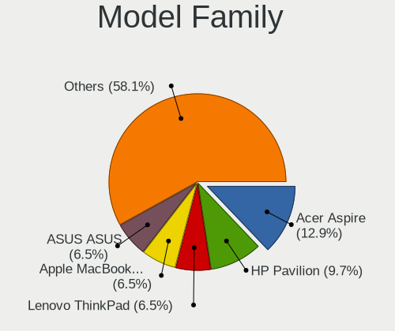

KDE neon - Hardware Trends (Notebooks)
--------------------------------------

A project to identify most popular hardware characteristics and track their change
over time based on data collected by Linux users at https://Linux-Hardware.org.

Anyone can contribute to this report by the [hw-probe](https://github.com/linuxhw/hw-probe) tool:

    sudo -E hw-probe -all -upload

This report is for one last month. Overall report since the beginning of time: [TestDays](https://github.com/linuxhw/TestDays)

Period: May, 2023.

Contents
--------

* [ System ](#system)
  - [ OS                       ](#os)
  - [ OS Family                ](#os-family)
  - [ Kernel                   ](#kernel)
  - [ Kernel Family            ](#kernel-family)
  - [ Kernel Major Ver.        ](#kernel-major-ver)
  - [ Arch                     ](#arch)
  - [ DE                       ](#de)
  - [ Display Server           ](#display-server)
  - [ Display Manager          ](#display-manager)
  - [ OS Lang                  ](#os-lang)
  - [ Boot Mode                ](#boot-mode)
  - [ Filesystem               ](#filesystem)
  - [ Part. scheme             ](#part-scheme)
  - [ Dual Boot with Linux/BSD ](#dual-boot-with-linuxbsd)
  - [ Dual Boot (Win)          ](#dual-boot-win)

* [ Board ](#board)
  - [ Vendor                   ](#vendor)
  - [ Model                    ](#model)
  - [ Model Family             ](#model-family)
  - [ MFG Year                 ](#mfg-year)
  - [ Form Factor              ](#form-factor)
  - [ Secure Boot              ](#secure-boot)
  - [ Coreboot                 ](#coreboot)
  - [ RAM Size                 ](#ram-size)
  - [ RAM Used                 ](#ram-used)
  - [ Total Drives             ](#total-drives)
  - [ Has CD-ROM               ](#has-cd-rom)
  - [ Has Ethernet             ](#has-ethernet)
  - [ Has WiFi                 ](#has-wifi)
  - [ Has Bluetooth            ](#has-bluetooth)

* [ Location ](#location)
  - [ Country                  ](#country)
  - [ City                     ](#city)

* [ Drives ](#drives)
  - [ Drive Vendor             ](#drive-vendor)
  - [ Drive Model              ](#drive-model)
  - [ HDD Vendor               ](#hdd-vendor)
  - [ SSD Vendor               ](#ssd-vendor)
  - [ Drive Kind               ](#drive-kind)
  - [ Drive Connector          ](#drive-connector)
  - [ Drive Size               ](#drive-size)
  - [ Space Total              ](#space-total)
  - [ Space Used               ](#space-used)
  - [ Malfunc. Drives          ](#malfunc-drives)
  - [ Malfunc. Drive Vendor    ](#malfunc-drive-vendor)
  - [ Malfunc. HDD Vendor      ](#malfunc-hdd-vendor)
  - [ Malfunc. Drive Kind      ](#malfunc-drive-kind)
  - [ Failed Drives            ](#failed-drives)
  - [ Failed Drive Vendor      ](#failed-drive-vendor)
  - [ Drive Status             ](#drive-status)

* [ Storage controller ](#storage-controller)
  - [ Storage Vendor           ](#storage-vendor)
  - [ Storage Model            ](#storage-model)
  - [ Storage Kind             ](#storage-kind)

* [ Processor ](#processor)
  - [ CPU Vendor               ](#cpu-vendor)
  - [ CPU Model                ](#cpu-model)
  - [ CPU Model Family         ](#cpu-model-family)
  - [ CPU Cores                ](#cpu-cores)
  - [ CPU Sockets              ](#cpu-sockets)
  - [ CPU Threads              ](#cpu-threads)
  - [ CPU Op-Modes             ](#cpu-op-modes)
  - [ CPU Microcode            ](#cpu-microcode)
  - [ CPU Microarch            ](#cpu-microarch)

* [ Graphics ](#graphics)
  - [ GPU Vendor               ](#gpu-vendor)
  - [ GPU Model                ](#gpu-model)
  - [ GPU Combo                ](#gpu-combo)
  - [ GPU Driver               ](#gpu-driver)
  - [ GPU Memory               ](#gpu-memory)

* [ Monitor ](#monitor)
  - [ Monitor Vendor           ](#monitor-vendor)
  - [ Monitor Model            ](#monitor-model)
  - [ Monitor Resolution       ](#monitor-resolution)
  - [ Monitor Diagonal         ](#monitor-diagonal)
  - [ Monitor Width            ](#monitor-width)
  - [ Aspect Ratio             ](#aspect-ratio)
  - [ Monitor Area             ](#monitor-area)
  - [ Pixel Density            ](#pixel-density)
  - [ Multiple Monitors        ](#multiple-monitors)

* [ Network ](#network)
  - [ Net Controller Vendor    ](#net-controller-vendor)
  - [ Net Controller Model     ](#net-controller-model)
  - [ Wireless Vendor          ](#wireless-vendor)
  - [ Wireless Model           ](#wireless-model)
  - [ Ethernet Vendor          ](#ethernet-vendor)
  - [ Ethernet Model           ](#ethernet-model)
  - [ Net Controller Kind      ](#net-controller-kind)
  - [ Used Controller          ](#used-controller)
  - [ NICs                     ](#nics)
  - [ IPv6                     ](#ipv6)

* [ Bluetooth ](#bluetooth)
  - [ Bluetooth Vendor         ](#bluetooth-vendor)
  - [ Bluetooth Model          ](#bluetooth-model)

* [ Sound ](#sound)
  - [ Sound Vendor             ](#sound-vendor)
  - [ Sound Model              ](#sound-model)

* [ Memory ](#memory)
  - [ Memory Vendor            ](#memory-vendor)
  - [ Memory Model             ](#memory-model)
  - [ Memory Kind              ](#memory-kind)
  - [ Memory Form Factor       ](#memory-form-factor)
  - [ Memory Size              ](#memory-size)
  - [ Memory Speed             ](#memory-speed)

* [ Printers & scanners ](#printers--scanners)
  - [ Printer Vendor           ](#printer-vendor)
  - [ Printer Model            ](#printer-model)
  - [ Scanner Vendor           ](#scanner-vendor)
  - [ Scanner Model            ](#scanner-model)

* [ Camera ](#camera)
  - [ Camera Vendor            ](#camera-vendor)
  - [ Camera Model             ](#camera-model)

* [ Security ](#security)
  - [ Fingerprint Vendor       ](#fingerprint-vendor)
  - [ Fingerprint Model        ](#fingerprint-model)
  - [ Chipcard Vendor          ](#chipcard-vendor)
  - [ Chipcard Model           ](#chipcard-model)

* [ Unsupported ](#unsupported)
  - [ Unsupported Devices      ](#unsupported-devices)
  - [ Unsupported Device Types ](#unsupported-device-types)

System
------

OS
--

Installed operating systems

| Name           | Notebooks | Percent |
|----------------|-----------|---------|
| KDE neon 22.04 | 51        | 92.73%  |
| KDE neon 20.04 | 4         | 7.27%   |

OS Family
---------

OS without a version

| Name     | Notebooks | Percent |
|----------|-----------|---------|
| KDE neon | 55        | 100%    |

Kernel
------

Version of the Linux kernel

| Version              | Notebooks | Percent |
|----------------------|-----------|---------|
| 5.19.0-41-generic    | 29        | 52.73%  |
| 5.19.0-42-generic    | 12        | 21.82%  |
| 5.19.0-40-generic    | 2         | 3.64%   |
| 5.15.0-53-generic    | 2         | 3.64%   |
| 6.3.2-060302-generic | 1         | 1.82%   |
| 6.2.9-060209-generic | 1         | 1.82%   |
| 6.1.0-1009-oem       | 1         | 1.82%   |
| 5.8.0-59-generic     | 1         | 1.82%   |
| 5.19.0-43-generic    | 1         | 1.82%   |
| 5.19.0-35-generic    | 1         | 1.82%   |
| 5.15.0-69-generic    | 1         | 1.82%   |
| 5.15.0-67-generic    | 1         | 1.82%   |
| 5.15.0-60-generic    | 1         | 1.82%   |
| 5.15.0-46-generic    | 1         | 1.82%   |

Kernel Family
-------------

Linux kernel without a distro release

| Version | Notebooks | Percent |
|---------|-----------|---------|
| 5.19.0  | 45        | 81.82%  |
| 5.15.0  | 6         | 10.91%  |
| 6.3.2   | 1         | 1.82%   |
| 6.2.9   | 1         | 1.82%   |
| 6.1.0   | 1         | 1.82%   |
| 5.8.0   | 1         | 1.82%   |

Kernel Major Ver.
-----------------

Linux kernel major version

| Version | Notebooks | Percent |
|---------|-----------|---------|
| 5.19    | 45        | 81.82%  |
| 5.15    | 6         | 10.91%  |
| 6.3     | 1         | 1.82%   |
| 6.2     | 1         | 1.82%   |
| 6.1     | 1         | 1.82%   |
| 5.8     | 1         | 1.82%   |

Arch
----

OS architecture (x86_64, i586, etc.)

| Name   | Notebooks | Percent |
|--------|-----------|---------|
| x86_64 | 55        | 100%    |

DE
--

Desktop Environment

| Name | Notebooks | Percent |
|------|-----------|---------|
| KDE5 | 55        | 100%    |

Display Server
--------------

X11 or Wayland

| Name    | Notebooks | Percent |
|---------|-----------|---------|
| X11     | 49        | 89.09%  |
| Wayland | 6         | 10.91%  |

Display Manager
---------------

SDDM, LightDM, etc.

| Name    | Notebooks | Percent |
|---------|-----------|---------|
| Unknown | 43        | 78.18%  |
| SDDM    | 12        | 21.82%  |

OS Lang
-------

Language

| Lang  | Notebooks | Percent |
|-------|-----------|---------|
| en_US | 28        | 50.91%  |
| en_GB | 6         | 10.91%  |
| pt_BR | 4         | 7.27%   |
| de_DE | 3         | 5.45%   |
| ru_RU | 2         | 3.64%   |
| fr_FR | 2         | 3.64%   |
| en_AU | 2         | 3.64%   |
| C     | 2         | 3.64%   |
| uk_UA | 1         | 1.82%   |
| ro_RO | 1         | 1.82%   |
| pl_PL | 1         | 1.82%   |
| nn_NO | 1         | 1.82%   |
| ko_KR | 1         | 1.82%   |
| it_IT | 1         | 1.82%   |

Boot Mode
---------

EFI or BIOS

| Mode | Notebooks | Percent |
|------|-----------|---------|
| BIOS | 45        | 81.82%  |
| EFI  | 10        | 18.18%  |

Filesystem
----------

Type of filesystem

| Type    | Notebooks | Percent |
|---------|-----------|---------|
| Ext4    | 47        | 85.45%  |
| Btrfs   | 4         | 7.27%   |
| Tmpfs   | 2         | 3.64%   |
| Overlay | 2         | 3.64%   |

Part. scheme
------------

Scheme of partitioning

| Type    | Notebooks | Percent |
|---------|-----------|---------|
| Unknown | 43        | 78.18%  |
| GPT     | 10        | 18.18%  |
| MBR     | 2         | 3.64%   |

Dual Boot with Linux/BSD
------------------------

Hosting more than one Linux/BSD

| Dual boot | Notebooks | Percent |
|-----------|-----------|---------|
| No        | 54        | 98.18%  |
| Yes       | 1         | 1.82%   |

Dual Boot (Win)
---------------

Hosting Linux and Windows

| Dual boot | Notebooks | Percent |
|-----------|-----------|---------|
| No        | 48        | 87.27%  |
| Yes       | 7         | 12.73%  |

Board
-----

Vendor
------

Motherboard manufacturer

| Name                | Notebooks | Percent |
|---------------------|-----------|---------|
| Dell                | 12        | 21.82%  |
| Hewlett-Packard     | 11        | 20%     |
| Lenovo              | 10        | 18.18%  |
| ASUSTek Computer    | 9         | 16.36%  |
| Acer                | 5         | 9.09%   |
| Toshiba             | 3         | 5.45%   |
| MSI                 | 2         | 3.64%   |
| Timi                | 1         | 1.82%   |
| Gigabyte Technology | 1         | 1.82%   |
| Apple               | 1         | 1.82%   |

Model
-----

Motherboard model

| Name                                    | Notebooks | Percent |
|-----------------------------------------|-----------|---------|
| Dell Inspiron 3505                      | 2         | 3.64%   |
| Toshiba Satellite P870                  | 1         | 1.82%   |
| Toshiba Satellite L775                  | 1         | 1.82%   |
| Toshiba Satellite L50-C                 | 1         | 1.82%   |
| Timi Xiaomi Book Pro 16 2022            | 1         | 1.82%   |
| MSI Stealth 17Studio A13VH              | 1         | 1.82%   |
| MSI GE620/GE620DX/FX620DX/FX623         | 1         | 1.82%   |
| Lenovo Y520-15IKBN 80WK                 | 1         | 1.82%   |
| Lenovo ThinkPad T420 4236WR1            | 1         | 1.82%   |
| Lenovo ThinkBook 16 G4+ ARA 21D1        | 1         | 1.82%   |
| Lenovo Legion 5 15ARH05 82B5            | 1         | 1.82%   |
| Lenovo IdeaPad S145-15IWL 81MV          | 1         | 1.82%   |
| Lenovo IdeaPad L3 15IML05 81Y3          | 1         | 1.82%   |
| Lenovo IdeaPad 310-15ISK 80SM           | 1         | 1.82%   |
| Lenovo IdeaPad 3 15ALC6 82KU            | 1         | 1.82%   |
| Lenovo G50-80 80L0                      | 1         | 1.82%   |
| Lenovo B570e HuronRiver Platform        | 1         | 1.82%   |
| HP ZBook 14u G5                         | 1         | 1.82%   |
| HP ProBook 645 G1                       | 1         | 1.82%   |
| HP Pavilion Laptop 15-eh1xxx            | 1         | 1.82%   |
| HP Pavilion g6                          | 1         | 1.82%   |
| HP Pavilion dv6                         | 1         | 1.82%   |
| HP Pavilion dm4                         | 1         | 1.82%   |
| HP Notebook                             | 1         | 1.82%   |
| HP Laptop 17-cp0xxx                     | 1         | 1.82%   |
| HP Laptop 14-dk1xxx                     | 1         | 1.82%   |
| HP EliteBook 845 14 inch G9 Notebook PC | 1         | 1.82%   |
| HP EliteBook 820 G1                     | 1         | 1.82%   |
| Gigabyte X570 AORUS ELITE WIFI          | 1         | 1.82%   |
| Dell XPS 15 9560                        | 1         | 1.82%   |
| Dell XPS 13 9300                        | 1         | 1.82%   |
| Dell Latitude E7440                     | 1         | 1.82%   |
| Dell Latitude 7370                      | 1         | 1.82%   |
| Dell Latitude 5511                      | 1         | 1.82%   |
| Dell Latitude 5400                      | 1         | 1.82%   |
| Dell Inspiron 7773                      | 1         | 1.82%   |
| Dell Inspiron 5558                      | 1         | 1.82%   |
| Dell Inspiron 5421                      | 1         | 1.82%   |
| Dell Inspiron 11-3162                   | 1         | 1.82%   |
| ASUS Zenbook UM5302TA_UM5302TA          | 1         | 1.82%   |

Model Family
------------

Motherboard model prefix

| Name               | Notebooks | Percent |
|--------------------|-----------|---------|
| Dell Inspiron      | 6         | 10.91%  |
| Lenovo IdeaPad     | 4         | 7.27%   |
| HP Pavilion        | 4         | 7.27%   |
| Dell Latitude      | 4         | 7.27%   |
| Toshiba Satellite  | 3         | 5.45%   |
| ASUS ASUS          | 3         | 5.45%   |
| Acer Aspire        | 3         | 5.45%   |
| HP Laptop          | 2         | 3.64%   |
| HP EliteBook       | 2         | 3.64%   |
| Dell XPS           | 2         | 3.64%   |
| ASUS ROG           | 2         | 3.64%   |
| Timi Xiaomi        | 1         | 1.82%   |
| MSI Stealth        | 1         | 1.82%   |
| MSI GE620          | 1         | 1.82%   |
| Lenovo Y520-15IKBN | 1         | 1.82%   |
| Lenovo ThinkPad    | 1         | 1.82%   |
| Lenovo ThinkBook   | 1         | 1.82%   |
| Lenovo Legion      | 1         | 1.82%   |
| Lenovo G50-80      | 1         | 1.82%   |
| Lenovo B570e       | 1         | 1.82%   |
| HP ZBook           | 1         | 1.82%   |
| HP ProBook         | 1         | 1.82%   |
| HP Notebook        | 1         | 1.82%   |
| Gigabyte X570      | 1         | 1.82%   |
| ASUS Zenbook       | 1         | 1.82%   |
| ASUS X705UDR       | 1         | 1.82%   |
| ASUS P2540UA       | 1         | 1.82%   |
| ASUS G752VY        | 1         | 1.82%   |
| Apple MacBookAir3  | 1         | 1.82%   |
| Acer TM8573T       | 1         | 1.82%   |
| Acer Nitro         | 1         | 1.82%   |

MFG Year
--------

Motherboard manufacture year

| Year | Notebooks | Percent |
|------|-----------|---------|
| 2020 | 8         | 14.55%  |
| 2022 | 7         | 12.73%  |
| 2021 | 5         | 9.09%   |
| 2017 | 5         | 9.09%   |
| 2015 | 5         | 9.09%   |
| 2011 | 5         | 9.09%   |
| 2019 | 3         | 5.45%   |
| 2018 | 3         | 5.45%   |
| 2016 | 3         | 5.45%   |
| 2012 | 3         | 5.45%   |
| 2014 | 2         | 3.64%   |
| 2013 | 2         | 3.64%   |
| 2010 | 2         | 3.64%   |
| 2008 | 1         | 1.82%   |
| 2007 | 1         | 1.82%   |

Form Factor
-----------

Physical design of the computer

| Name     | Notebooks | Percent |
|----------|-----------|---------|
| Notebook | 55        | 100%    |

Secure Boot
-----------

Enabled or disabled

| State    | Notebooks | Percent |
|----------|-----------|---------|
| Disabled | 53        | 96.36%  |
| Enabled  | 2         | 3.64%   |

Coreboot
--------

Have coreboot on board

| Used | Notebooks | Percent |
|------|-----------|---------|
| No   | 55        | 100%    |

RAM Size
--------

Total RAM memory

| Size in GB | Notebooks | Percent |
|------------|-----------|---------|
| 4.01-8.0   | 18        | 32.73%  |
| 8.01-16.0  | 11        | 20%     |
| 32.01-64.0 | 9         | 16.36%  |
| 3.01-4.0   | 8         | 14.55%  |
| 16.01-24.0 | 8         | 14.55%  |
| 24.01-32.0 | 1         | 1.82%   |

RAM Used
--------

Used RAM memory

| Used GB    | Notebooks | Percent |
|------------|-----------|---------|
| 2.01-3.0   | 17        | 30.91%  |
| 4.01-8.0   | 16        | 29.09%  |
| 1.01-2.0   | 14        | 25.45%  |
| 3.01-4.0   | 5         | 9.09%   |
| 8.01-16.0  | 2         | 3.64%   |
| 16.01-24.0 | 1         | 1.82%   |

Total Drives
------------

Number of drives on board

| Drives | Notebooks | Percent |
|--------|-----------|---------|
| 1      | 41        | 74.55%  |
| 2      | 9         | 16.36%  |
| 3      | 4         | 7.27%   |
| 5      | 1         | 1.82%   |

Has CD-ROM
----------

Has CD-ROM on board

| Presented | Notebooks | Percent |
|-----------|-----------|---------|
| No        | 36        | 65.45%  |
| Yes       | 19        | 34.55%  |

Has Ethernet
------------

Has Ethernet on board

| Presented | Notebooks | Percent |
|-----------|-----------|---------|
| Yes       | 43        | 78.18%  |
| No        | 12        | 21.82%  |

Has WiFi
--------

Has WiFi module

| Presented | Notebooks | Percent |
|-----------|-----------|---------|
| Yes       | 55        | 100%    |

Has Bluetooth
-------------

Has Bluetooth module

| Presented | Notebooks | Percent |
|-----------|-----------|---------|
| Yes       | 50        | 90.91%  |
| No        | 5         | 9.09%   |

Location
--------

Country
-------

Geographic location (country)

| Country     | Notebooks | Percent |
|-------------|-----------|---------|
| USA         | 12        | 21.82%  |
| UK          | 6         | 10.91%  |
| Germany     | 4         | 7.27%   |
| Brazil      | 4         | 7.27%   |
| France      | 3         | 5.45%   |
| Russia      | 2         | 3.64%   |
| Romania     | 2         | 3.64%   |
| Poland      | 2         | 3.64%   |
| Netherlands | 2         | 3.64%   |
| Italy       | 2         | 3.64%   |
| Australia   | 2         | 3.64%   |
| Venezuela   | 1         | 1.82%   |
| Ukraine     | 1         | 1.82%   |
| UAE         | 1         | 1.82%   |
| Thailand    | 1         | 1.82%   |
| South Korea | 1         | 1.82%   |
| Portugal    | 1         | 1.82%   |
| Pakistan    | 1         | 1.82%   |
| Norway      | 1         | 1.82%   |
| New Zealand | 1         | 1.82%   |
| Nepal       | 1         | 1.82%   |
| Morocco     | 1         | 1.82%   |
| Indonesia   | 1         | 1.82%   |
| Belarus     | 1         | 1.82%   |
| Argentina   | 1         | 1.82%   |

City
----

Geographic location (city)

| City                | Notebooks | Percent |
|---------------------|-----------|---------|
| Austin              | 2         | 3.64%   |
| Winterswijk         | 1         | 1.82%   |
| Vitebsk             | 1         | 1.82%   |
| Valencia            | 1         | 1.82%   |
| Tyumen              | 1         | 1.82%   |
| Trier               | 1         | 1.82%   |
| Tigard              | 1         | 1.82%   |
| Tangerang           | 1         | 1.82%   |
| Sydney              | 1         | 1.82%   |
| Susa                | 1         | 1.82%   |
| Surprise            | 1         | 1.82%   |
| Stockton-on-Tees    | 1         | 1.82%   |
| St. George          | 1         | 1.82%   |
| Srokowo             | 1         | 1.82%   |
| Santo André        | 1         | 1.82%   |
| Rostov-on-Don       | 1         | 1.82%   |
| Rochester           | 1         | 1.82%   |
| Rimini              | 1         | 1.82%   |
| Poitiers            | 1         | 1.82%   |
| Pinet               | 1         | 1.82%   |
| Perth               | 1         | 1.82%   |
| Oxford              | 1         | 1.82%   |
| Oujda               | 1         | 1.82%   |
| Novo Hamburgo       | 1         | 1.82%   |
| Newcastle upon Tyne | 1         | 1.82%   |
| Mangalia            | 1         | 1.82%   |
| Lutz                | 1         | 1.82%   |
| Lower Hutt          | 1         | 1.82%   |
| London              | 1         | 1.82%   |
| Lisbon              | 1         | 1.82%   |
| Lencois Paulista    | 1         | 1.82%   |
| Khust               | 1         | 1.82%   |
| Kathmandu           | 1         | 1.82%   |
| Islamabad           | 1         | 1.82%   |
| Houilles            | 1         | 1.82%   |
| Haßfurt            | 1         | 1.82%   |
| Frankfurt am Main   | 1         | 1.82%   |
| Fortine             | 1         | 1.82%   |
| Exeter              | 1         | 1.82%   |
| East Stroudsburg    | 1         | 1.82%   |

Drives
------

Drive Vendor
------------

Hard drive vendors

| Vendor                    | Notebooks | Drives | Percent |
|---------------------------|-----------|--------|---------|
| Samsung Electronics       | 10        | 11     | 14.71%  |
| Micron Technology         | 9         | 9      | 13.24%  |
| SanDisk                   | 7         | 7      | 10.29%  |
| Crucial                   | 7         | 7      | 10.29%  |
| WDC                       | 5         | 7      | 7.35%   |
| Kingston                  | 5         | 5      | 7.35%   |
| Toshiba                   | 4         | 4      | 5.88%   |
| Seagate                   | 4         | 6      | 5.88%   |
| Unknown                   | 3         | 4      | 4.41%   |
| KIOXIA                    | 2         | 2      | 2.94%   |
| Intel                     | 2         | 2      | 2.94%   |
| SK hynix                  | 1         | 1      | 1.47%   |
| RSH-319                   | 1         | 1      | 1.47%   |
| PNY                       | 1         | 1      | 1.47%   |
| Micron/Crucial Technology | 1         | 2      | 1.47%   |
| Hitachi                   | 1         | 1      | 1.47%   |
| HGST                      | 1         | 1      | 1.47%   |
| General                   | 1         | 1      | 1.47%   |
| Fanxiang                  | 1         | 1      | 1.47%   |
| China                     | 1         | 1      | 1.47%   |
| Apple                     | 1         | 1      | 1.47%   |

Drive Model
-----------

Hard drive models

| Model                                               | Notebooks | Percent |
|-----------------------------------------------------|-----------|---------|
| Toshiba MQ04ABF100 1TB                              | 2         | 2.74%   |
| Samsung NVMe SSD Controller SM981/PM981/PM983 256GB | 2         | 2.74%   |
| Samsung NVMe SSD Controller PM9A1/PM9A3/980PRO 1TB  | 2         | 2.74%   |
| Micron 2450_MTFDKBA1T0TFK 1TB                       | 2         | 2.74%   |
| Micron 2210_MTFDHBA512QFD 512GB                     | 2         | 2.74%   |
| Kingston SA400S37120G 120GB SSD                     | 2         | 2.74%   |
| WDC WDS200T2B0B-00YS70 2TB SSD                      | 1         | 1.37%   |
| WDC WDS200T2B0A-00SM50 2TB SSD                      | 1         | 1.37%   |
| WDC WD6400BPVT-22HXZT1 640GB                        | 1         | 1.37%   |
| WDC WD5000BEVT-22A0RT0 500GB                        | 1         | 1.37%   |
| WDC WD10JPVX-22JC3T0 1TB                            | 1         | 1.37%   |
| WDC WD10JPCX-24UE4T0 1TB                            | 1         | 1.37%   |
| WDC WD10EZEX-08WN4A0 1TB                            | 1         | 1.37%   |
| Unknown ZYmSATA120 120GB                            | 1         | 1.37%   |
| Unknown MMC Card  64GB                              | 1         | 1.37%   |
| Unknown MMC Card  32GB                              | 1         | 1.37%   |
| Unknown MMC Card  134GB                             | 1         | 1.37%   |
| Toshiba KXG50ZNV512G 512GB                          | 1         | 1.37%   |
| Toshiba HDWJ105 500GB                               | 1         | 1.37%   |
| SK hynix BC511 256GB                                | 1         | 1.37%   |
| Seagate ST2000LM015-2E8174 2TB                      | 1         | 1.37%   |
| Seagate ST1000LM035-1RK172 1TB                      | 1         | 1.37%   |
| Seagate ST1000LM024 HN-M101MBB 1TB                  | 1         | 1.37%   |
| Seagate BUP Slim BL 2TB                             | 1         | 1.37%   |
| Seagate Backup+ Desk 8TB                            | 1         | 1.37%   |
| Sandisk WDC WDS100T2B0C-00PXH0 1TB                  | 1         | 1.37%   |
| Sandisk WD Blue SN550 NVMe SSD 512GB                | 1         | 1.37%   |
| SanDisk SDSSDA-2T00 2TB                             | 1         | 1.37%   |
| SanDisk SD9SN8W-128G-1006 128GB SSD                 | 1         | 1.37%   |
| Sandisk PC SN530 NVMe WDC 256GB                     | 1         | 1.37%   |
| SanDisk NVMe SSD Drive 250GB                        | 1         | 1.37%   |
| SanDisk A400 NVMe 256GB                             | 1         | 1.37%   |
| Samsung SSD 990 PRO 2TB                             | 1         | 1.37%   |
| Samsung SSD 980 PRO 1TB                             | 1         | 1.37%   |
| Samsung SSD 980 500GB                               | 1         | 1.37%   |
| Samsung SSD 860 EVO 500GB                           | 1         | 1.37%   |
| Samsung SSD 860 EVO 250GB                           | 1         | 1.37%   |
| Samsung PM991a NVMe 512GB                           | 1         | 1.37%   |
| Samsung MZVL21T0HCLR-00B00 1TB                      | 1         | 1.37%   |
| RSH-319 ASM1153E 6TB                                | 1         | 1.37%   |

HDD Vendor
----------

Hard disk drive vendors

| Vendor  | Notebooks | Drives | Percent |
|---------|-----------|--------|---------|
| WDC     | 5         | 5      | 33.33%  |
| Seagate | 4         | 5      | 26.67%  |
| Toshiba | 3         | 3      | 20%     |
| RSH-319 | 1         | 1      | 6.67%   |
| Hitachi | 1         | 1      | 6.67%   |
| HGST    | 1         | 1      | 6.67%   |

SSD Vendor
----------

Solid state drive vendors

| Vendor              | Notebooks | Drives | Percent |
|---------------------|-----------|--------|---------|
| Crucial             | 7         | 7      | 30.43%  |
| Kingston            | 5         | 5      | 21.74%  |
| SanDisk             | 2         | 2      | 8.7%    |
| Samsung Electronics | 2         | 2      | 8.7%    |
| Micron Technology   | 2         | 2      | 8.7%    |
| WDC                 | 1         | 2      | 4.35%   |
| PNY                 | 1         | 1      | 4.35%   |
| Fanxiang            | 1         | 1      | 4.35%   |
| China               | 1         | 1      | 4.35%   |
| Apple               | 1         | 1      | 4.35%   |

Drive Kind
----------

HDD or SSD

| Kind    | Notebooks | Drives | Percent |
|---------|-----------|--------|---------|
| NVMe    | 27        | 29     | 39.13%  |
| SSD     | 21        | 24     | 30.43%  |
| HDD     | 15        | 16     | 21.74%  |
| MMC     | 3         | 3      | 4.35%   |
| Unknown | 3         | 3      | 4.35%   |

Drive Connector
---------------

SATA, SAS, NVMe, etc.

| Type | Notebooks | Drives | Percent |
|------|-----------|--------|---------|
| SATA | 32        | 39     | 49.23%  |
| NVMe | 27        | 29     | 41.54%  |
| SAS  | 3         | 4      | 4.62%   |
| MMC  | 3         | 3      | 4.62%   |

Drive Size
----------

Size of hard drive

| Size in TB | Notebooks | Drives | Percent |
|------------|-----------|--------|---------|
| 0.01-0.5   | 18        | 20     | 50%     |
| 0.51-1.0   | 11        | 11     | 30.56%  |
| 1.01-2.0   | 6         | 8      | 16.67%  |
| 4.01-10.0  | 1         | 1      | 2.78%   |

Space Total
-----------

Amount of disk space available on the file system

| Size in GB     | Notebooks | Percent |
|----------------|-----------|---------|
| 251-500        | 18        | 32.73%  |
| 101-250        | 11        | 20%     |
| 501-1000       | 8         | 14.55%  |
| 21-50          | 5         | 9.09%   |
| 51-100         | 4         | 7.27%   |
| 1001-2000      | 3         | 5.45%   |
| More than 3000 | 2         | 3.64%   |
| 1-20           | 2         | 3.64%   |
| 2001-3000      | 1         | 1.82%   |
| Unknown        | 1         | 1.82%   |

Space Used
----------

Amount of used disk space

| Used GB   | Notebooks | Percent |
|-----------|-----------|---------|
| 1-20      | 26        | 47.27%  |
| 51-100    | 9         | 16.36%  |
| 21-50     | 8         | 14.55%  |
| 101-250   | 7         | 12.73%  |
| 501-1000  | 2         | 3.64%   |
| 251-500   | 1         | 1.82%   |
| 2001-3000 | 1         | 1.82%   |
| Unknown   | 1         | 1.82%   |

Malfunc. Drives
---------------

Drive models with a malfunction

Zero info for selected period =(

Malfunc. Drive Vendor
---------------------

Vendors of faulty drives

Zero info for selected period =(

Malfunc. HDD Vendor
-------------------

Vendors of faulty HDD drives

Zero info for selected period =(

Malfunc. Drive Kind
-------------------

Kinds of faulty drives

Zero info for selected period =(

Failed Drives
-------------

Failed drive models

Zero info for selected period =(

Failed Drive Vendor
-------------------

Failed drive vendors

Zero info for selected period =(

Drive Status
------------

Number of failed and malfunc. drives

| Status   | Notebooks | Drives | Percent |
|----------|-----------|--------|---------|
| Detected | 47        | 65     | 83.93%  |
| Works    | 9         | 10     | 16.07%  |

Storage controller
------------------

Storage Vendor
--------------

Storage controller vendors

| Vendor                       | Notebooks | Percent |
|------------------------------|-----------|---------|
| Intel                        | 32        | 48.48%  |
| Samsung Electronics          | 8         | 12.12%  |
| AMD                          | 8         | 12.12%  |
| Micron Technology            | 7         | 10.61%  |
| SanDisk                      | 5         | 7.58%   |
| KIOXIA                       | 2         | 3.03%   |
| Toshiba America Info Systems | 1         | 1.52%   |
| SK hynix                     | 1         | 1.52%   |
| Nvidia                       | 1         | 1.52%   |
| Micron/Crucial Technology    | 1         | 1.52%   |

Storage Model
-------------

Storage controller models

| Model                                                                         | Notebooks | Percent |
|-------------------------------------------------------------------------------|-----------|---------|
| AMD FCH SATA Controller [AHCI mode]                                           | 8         | 11.59%  |
| Micron NVMe Storage Controller                                                | 7         | 10.14%  |
| Intel 6 Series/C200 Series Chipset Family 6 port Mobile SATA AHCI Controller  | 6         | 8.7%    |
| Samsung NVMe SSD Controller PM9A1/PM9A3/980PRO                                | 4         | 5.8%    |
| Intel Sunrise Point-LP SATA Controller [AHCI mode]                            | 4         | 5.8%    |
| SanDisk Non-Volatile memory controller                                        | 3         | 4.35%   |
| Intel 7 Series Chipset Family 6-port SATA Controller [AHCI mode]              | 3         | 4.35%   |
| Intel 400 Series Chipset Family SATA AHCI Controller                          | 3         | 4.35%   |
| Samsung NVMe SSD Controller SM981/PM981/PM983                                 | 2         | 2.9%    |
| Samsung NVMe SSD Controller 980                                               | 2         | 2.9%    |
| Intel Wildcat Point-LP SATA Controller [AHCI Mode]                            | 2         | 2.9%    |
| Intel HM170/QM170 Chipset SATA Controller [AHCI Mode]                         | 2         | 2.9%    |
| Intel Cannon Point-LP SATA Controller [AHCI Mode]                             | 2         | 2.9%    |
| Intel 82801 Mobile SATA Controller [RAID mode]                                | 2         | 2.9%    |
| Intel 8 Series SATA Controller 1 [AHCI mode]                                  | 2         | 2.9%    |
| Toshiba America Info Systems XG5 NVMe SSD Controller                          | 1         | 1.45%   |
| SK hynix BC511                                                                | 1         | 1.45%   |
| SanDisk WD Blue SN550 NVMe SSD                                                | 1         | 1.45%   |
| SanDisk WD Black NVMe SSD                                                     | 1         | 1.45%   |
| Samsung Electronics Non-Volatile memory controller                            | 1         | 1.45%   |
| Nvidia MCP89 SATA Controller (AHCI mode)                                      | 1         | 1.45%   |
| Micron/Crucial P2 NVMe PCIe SSD                                               | 1         | 1.45%   |
| KIOXIA NVMe SSD                                                               | 1         | 1.45%   |
| KIOXIA Non-Volatile memory controller                                         | 1         | 1.45%   |
| Intel SSD Pro 7600p/760p/E 6100p Series                                       | 1         | 1.45%   |
| Intel SSD 660P Series                                                         | 1         | 1.45%   |
| Intel Q170/Q150/B150/H170/H110/Z170/CM236 Chipset SATA Controller [AHCI Mode] | 1         | 1.45%   |
| Intel Comet Lake SATA AHCI Controller                                         | 1         | 1.45%   |
| Intel Cannon Lake Mobile PCH SATA AHCI Controller                             | 1         | 1.45%   |
| Intel 82801HM/HEM (ICH8M/ICH8M-E) SATA Controller [AHCI mode]                 | 1         | 1.45%   |
| Intel 82801HM/HEM (ICH8M/ICH8M-E) IDE Controller                              | 1         | 1.45%   |
| Intel 5 Series/3400 Series Chipset 4 port SATA AHCI Controller                | 1         | 1.45%   |

Storage Kind
------------

Kind of storage controller (IDE, SATA, NVMe, SAS, ...)

| Kind | Notebooks | Percent |
|------|-----------|---------|
| SATA | 38        | 55.88%  |
| NVMe | 27        | 39.71%  |
| RAID | 2         | 2.94%   |
| IDE  | 1         | 1.47%   |

Processor
---------

CPU Vendor
----------

Processor vendors

| Vendor | Notebooks | Percent |
|--------|-----------|---------|
| Intel  | 39        | 70.91%  |
| AMD    | 16        | 29.09%  |

CPU Model
---------

Processor models

| Model                                   | Notebooks | Percent |
|-----------------------------------------|-----------|---------|
| Intel Core i7-8550U CPU @ 1.80GHz       | 3         | 5.45%   |
| Intel Core i7-5500U CPU @ 2.40GHz       | 2         | 3.64%   |
| Intel Core i5-10300H CPU @ 2.50GHz      | 2         | 3.64%   |
| AMD Ryzen 7 6800U with Radeon Graphics  | 2         | 3.64%   |
| AMD Ryzen 7 4800H with Radeon Graphics  | 2         | 3.64%   |
| AMD Ryzen 5 5500U with Radeon Graphics  | 2         | 3.64%   |
| Intel Core m7-6Y75 CPU @ 1.20GHz        | 1         | 1.82%   |
| Intel Core i7-8750H CPU @ 2.20GHz       | 1         | 1.82%   |
| Intel Core i7-7700HQ CPU @ 2.80GHz      | 1         | 1.82%   |
| Intel Core i7-6700HQ CPU @ 2.60GHz      | 1         | 1.82%   |
| Intel Core i7-6500U CPU @ 2.50GHz       | 1         | 1.82%   |
| Intel Core i7-4600U CPU @ 2.10GHz       | 1         | 1.82%   |
| Intel Core i7-3610QM CPU @ 2.30GHz      | 1         | 1.82%   |
| Intel Core i7-3537U CPU @ 2.00GHz       | 1         | 1.82%   |
| Intel Core i7-2630QM CPU @ 2.00GHz      | 1         | 1.82%   |
| Intel Core i7-10850H CPU @ 2.70GHz      | 1         | 1.82%   |
| Intel Core i7-1065G7 CPU @ 1.30GHz      | 1         | 1.82%   |
| Intel Core i5-8365U CPU @ 1.60GHz       | 1         | 1.82%   |
| Intel Core i5-8265U CPU @ 1.60GHz       | 1         | 1.82%   |
| Intel Core i5-7300HQ CPU @ 2.50GHz      | 1         | 1.82%   |
| Intel Core i5-7200U CPU @ 2.50GHz       | 1         | 1.82%   |
| Intel Core i5-6200U CPU @ 2.30GHz       | 1         | 1.82%   |
| Intel Core i5-4200U CPU @ 1.60GHz       | 1         | 1.82%   |
| Intel Core i5-3210M CPU @ 2.50GHz       | 1         | 1.82%   |
| Intel Core i5-2540M CPU @ 2.60GHz       | 1         | 1.82%   |
| Intel Core i5-2430M CPU @ 2.40GHz       | 1         | 1.82%   |
| Intel Core i5-2410M CPU @ 2.30GHz       | 1         | 1.82%   |
| Intel Core i5-10210U CPU @ 1.60GHz      | 1         | 1.82%   |
| Intel Core i5 CPU M 430 @ 2.27GHz       | 1         | 1.82%   |
| Intel Core i3-4030U CPU @ 1.90GHz       | 1         | 1.82%   |
| Intel Core i3-2350M CPU @ 2.30GHz       | 1         | 1.82%   |
| Intel Core 2 Duo CPU T7300 @ 2.00GHz    | 1         | 1.82%   |
| Intel Core 2 Duo CPU L9400 @ 1.86GHz    | 1         | 1.82%   |
| Intel Celeron CPU N3060 @ 1.60GHz       | 1         | 1.82%   |
| Intel Celeron CPU B800 @ 1.50GHz        | 1         | 1.82%   |
| Intel Atom x5-Z8300 CPU @ 1.44GHz       | 1         | 1.82%   |
| Intel 13th Gen Core i9-13900H           | 1         | 1.82%   |
| Intel 12th Gen Core i5-1240P            | 1         | 1.82%   |
| AMD Ryzen 9 6900HX with Radeon Graphics | 1         | 1.82%   |
| AMD Ryzen 9 6900HS with Radeon Graphics | 1         | 1.82%   |

CPU Model Family
----------------

Processor model prefix

| Model            | Notebooks | Percent |
|------------------|-----------|---------|
| Intel Core i7    | 15        | 27.27%  |
| Intel Core i5    | 14        | 25.45%  |
| AMD Ryzen 5      | 6         | 10.91%  |
| AMD Ryzen 7      | 4         | 7.27%   |
| Other            | 2         | 3.64%   |
| Intel Core i3    | 2         | 3.64%   |
| Intel Core 2 Duo | 2         | 3.64%   |
| Intel Celeron    | 2         | 3.64%   |
| AMD Ryzen 9      | 2         | 3.64%   |
| Intel Core m7    | 1         | 1.82%   |
| Intel Atom       | 1         | 1.82%   |
| AMD Ryzen 3      | 1         | 1.82%   |
| AMD Athlon       | 1         | 1.82%   |
| AMD A6           | 1         | 1.82%   |
| AMD A10          | 1         | 1.82%   |

CPU Cores
---------

Number of processor cores

| Number | Notebooks | Percent |
|--------|-----------|---------|
| 2      | 22        | 40%     |
| 4      | 18        | 32.73%  |
| 8      | 6         | 10.91%  |
| 6      | 6         | 10.91%  |
| 14     | 1         | 1.82%   |
| 12     | 1         | 1.82%   |
| 1      | 1         | 1.82%   |

CPU Sockets
-----------

Number of sockets

| Number | Notebooks | Percent |
|--------|-----------|---------|
| 1      | 55        | 100%    |

CPU Threads
-----------

Threads per core (Hyper-Threading)

| Number | Notebooks | Percent |
|--------|-----------|---------|
| 2      | 48        | 87.27%  |
| 1      | 7         | 12.73%  |

CPU Op-Modes
------------

CPU Operation Modes (32-bit, 64-bit)

| Op mode        | Notebooks | Percent |
|----------------|-----------|---------|
| 32-bit, 64-bit | 55        | 100%    |

CPU Microcode
-------------

Microcode number

| Number     | Notebooks | Percent |
|------------|-----------|---------|
| Unknown    | 39        | 70.91%  |
| 0x406e3    | 3         | 5.45%   |
| 0x0a404102 | 3         | 5.45%   |
| 0x906e9    | 2         | 3.64%   |
| 0xa0652    | 1         | 1.82%   |
| 0x806e9    | 1         | 1.82%   |
| 0x6fa      | 1         | 1.82%   |
| 0x40651    | 1         | 1.82%   |
| 0x206a7    | 1         | 1.82%   |
| 0x0a404101 | 1         | 1.82%   |
| 0x08608103 | 1         | 1.82%   |
| 0x0600111f | 1         | 1.82%   |

CPU Microarch
-------------

Microarchitecture

| Name        | Notebooks | Percent |
|-------------|-----------|---------|
| KabyLake    | 10        | 18.18%  |
| Unknown     | 10        | 18.18%  |
| SandyBridge | 6         | 10.91%  |
| Skylake     | 4         | 7.27%   |
| Zen+        | 3         | 5.45%   |
| IvyBridge   | 3         | 5.45%   |
| Haswell     | 3         | 5.45%   |
| CometLake   | 3         | 5.45%   |
| Zen 2       | 2         | 3.64%   |
| Silvermont  | 2         | 3.64%   |
| Broadwell   | 2         | 3.64%   |
| Zen 3       | 1         | 1.82%   |
| Westmere    | 1         | 1.82%   |
| Steamroller | 1         | 1.82%   |
| Piledriver  | 1         | 1.82%   |
| Penryn      | 1         | 1.82%   |
| IceLake     | 1         | 1.82%   |
| Core        | 1         | 1.82%   |

Graphics
--------

GPU Vendor
----------

Vendors of graphics cards

| Vendor | Notebooks | Percent |
|--------|-----------|---------|
| Intel  | 36        | 46.15%  |
| Nvidia | 24        | 30.77%  |
| AMD    | 18        | 23.08%  |

GPU Model
---------

Graphics card models

| Model                                                                                    | Notebooks | Percent |
|------------------------------------------------------------------------------------------|-----------|---------|
| Intel 2nd Generation Core Processor Family Integrated Graphics Controller                | 6         | 7.5%    |
| AMD Rembrandt [Radeon 680M]                                                              | 5         | 6.25%   |
| Nvidia GP107M [GeForce GTX 1050 Mobile]                                                  | 4         | 5%      |
| Nvidia TU117M [GeForce GTX 1650 Ti Mobile]                                               | 3         | 3.75%   |
| Intel UHD Graphics 620                                                                   | 3         | 3.75%   |
| Intel Haswell-ULT Integrated Graphics Controller                                         | 3         | 3.75%   |
| Intel CometLake-H GT2 [UHD Graphics]                                                     | 3         | 3.75%   |
| Intel 3rd Gen Core processor Graphics Controller                                         | 3         | 3.75%   |
| AMD Picasso/Raven 2 [Radeon Vega Series / Radeon Vega Mobile Series]                     | 3         | 3.75%   |
| AMD Lucienne                                                                             | 3         | 3.75%   |
| Intel WhiskeyLake-U GT2 [UHD Graphics 620]                                               | 2         | 2.5%    |
| Intel Skylake GT2 [HD Graphics 520]                                                      | 2         | 2.5%    |
| Intel HD Graphics 630                                                                    | 2         | 2.5%    |
| Intel HD Graphics 5500                                                                   | 2         | 2.5%    |
| Intel Atom/Celeron/Pentium Processor x5-E8000/J3xxx/N3xxx Integrated Graphics Controller | 2         | 2.5%    |
| Nvidia TU117M                                                                            | 1         | 1.25%   |
| Nvidia MCP89 [GeForce 320M]                                                              | 1         | 1.25%   |
| Nvidia GP108M [GeForce MX150]                                                            | 1         | 1.25%   |
| Nvidia GP107M [GeForce MX150]                                                            | 1         | 1.25%   |
| Nvidia GM204M [GeForce GTX 980M]                                                         | 1         | 1.25%   |
| Nvidia GM108M [GeForce MX130]                                                            | 1         | 1.25%   |
| Nvidia GM108M [GeForce MX110]                                                            | 1         | 1.25%   |
| Nvidia GM108M [GeForce 920MX]                                                            | 1         | 1.25%   |
| Nvidia GK208BM [GeForce 920M]                                                            | 1         | 1.25%   |
| Nvidia GK107M [GeForce GT 730M]                                                          | 1         | 1.25%   |
| Nvidia GF116M [GeForce GT 555M/635M]                                                     | 1         | 1.25%   |
| Nvidia GF108M [GeForce GT 620M/630M/635M/640M LE]                                        | 1         | 1.25%   |
| Nvidia GF108M [GeForce GT 540M]                                                          | 1         | 1.25%   |
| Nvidia GA104 [GeForce RTX 3070 Ti]                                                       | 1         | 1.25%   |
| Nvidia GA104 [Geforce RTX 3070 Ti Laptop GPU]                                            | 1         | 1.25%   |
| Nvidia G98M [GeForce 9300M GS]                                                           | 1         | 1.25%   |
| Nvidia AD104M [GeForce RTX 4080 Max-Q / Mobile]                                          | 1         | 1.25%   |
| Intel Raptor Lake-P [Iris Xe Graphics]                                                   | 1         | 1.25%   |
| Intel Iris Plus Graphics G7                                                              | 1         | 1.25%   |
| Intel HD Graphics 620                                                                    | 1         | 1.25%   |
| Intel HD Graphics 515                                                                    | 1         | 1.25%   |
| Intel Core Processor Integrated Graphics Controller                                      | 1         | 1.25%   |
| Intel CometLake-U GT2 [UHD Graphics]                                                     | 1         | 1.25%   |
| Intel CoffeeLake-H GT2 [UHD Graphics 630]                                                | 1         | 1.25%   |
| Intel Alder Lake-P Integrated Graphics Controller                                        | 1         | 1.25%   |

GPU Combo
---------

Combinations of graphics cards

| Name           | Notebooks | Percent |
|----------------|-----------|---------|
| Intel + Nvidia | 17        | 30.91%  |
| 1 x Intel      | 15        | 27.27%  |
| 1 x AMD        | 10        | 18.18%  |
| 1 x Nvidia     | 5         | 9.09%   |
| Intel + AMD    | 4         | 7.27%   |
| 2 x AMD        | 2         | 3.64%   |
| AMD + Nvidia   | 2         | 3.64%   |

GPU Driver
----------

Free vs proprietary

| Driver      | Notebooks | Percent |
|-------------|-----------|---------|
| Free        | 48        | 87.27%  |
| Proprietary | 6         | 10.91%  |
| Unknown     | 1         | 1.82%   |

GPU Memory
----------

Total video memory

| Size in GB | Notebooks | Percent |
|------------|-----------|---------|
| Unknown    | 46        | 83.64%  |
| 1.01-2.0   | 3         | 5.45%   |
| 0.01-0.5   | 3         | 5.45%   |
| 7.01-8.0   | 2         | 3.64%   |
| 0.51-1.0   | 1         | 1.82%   |

Monitor
-------

Monitor Vendor
--------------

Monitor vendors

| Vendor                  | Notebooks | Percent |
|-------------------------|-----------|---------|
| AU Optronics            | 12        | 19.05%  |
| Chimei Innolux          | 10        | 15.87%  |
| Samsung Electronics     | 8         | 12.7%   |
| BOE                     | 8         | 12.7%   |
| LG Display              | 7         | 11.11%  |
| Sharp                   | 3         | 4.76%   |
| Goldstar                | 3         | 4.76%   |
| PANDA                   | 2         | 3.17%   |
| Chi Mei Optoelectronics | 2         | 3.17%   |
| Acer                    | 2         | 3.17%   |
| G-Story                 | 1         | 1.59%   |
| Dell                    | 1         | 1.59%   |
| CSO                     | 1         | 1.59%   |
| BenQ                    | 1         | 1.59%   |
| Apple                   | 1         | 1.59%   |
| AOC                     | 1         | 1.59%   |

Monitor Model
-------------

Monitor models

| Model                                                                    | Notebooks | Percent |
|--------------------------------------------------------------------------|-----------|---------|
| Sharp LCD Monitor SHP14CC 3840x2400 288x180mm 13.4-inch                  | 1         | 1.59%   |
| Sharp LCD Monitor SHP1476 3840x2160 346x194mm 15.6-inch                  | 1         | 1.59%   |
| Sharp LCD Monitor SHP1461 3200x1800 294x165mm 13.3-inch                  | 1         | 1.59%   |
| Samsung Electronics U32R59x SAM0F95 3840x2160 697x392mm 31.5-inch        | 1         | 1.59%   |
| Samsung Electronics LU28R55 SAM101A 3840x2160 632x360mm 28.6-inch        | 1         | 1.59%   |
| Samsung Electronics LCD Monitor SEC4251 1366x768 344x194mm 15.5-inch     | 1         | 1.59%   |
| Samsung Electronics LCD Monitor SEC3945 1280x800 331x207mm 15.4-inch     | 1         | 1.59%   |
| Samsung Electronics LCD Monitor SDC4852 1920x1080 344x194mm 15.5-inch    | 1         | 1.59%   |
| Samsung Electronics LCD Monitor SDC4173 3840x2400 344x215mm 16.0-inch    | 1         | 1.59%   |
| Samsung Electronics LCD Monitor SDC4172 2880x1800 289x186mm 13.5-inch    | 1         | 1.59%   |
| Samsung Electronics 173HT02-T01 SEC5044 1920x1080 382x215mm 17.3-inch    | 1         | 1.59%   |
| PANDA LCD Monitor NCP004D 1920x1080 344x194mm 15.5-inch                  | 1         | 1.59%   |
| PANDA LCD Monitor NCP002D 1920x1080 344x194mm 15.5-inch                  | 1         | 1.59%   |
| LG Display LCD Monitor LGD40A0 1366x768 310x174mm 14.0-inch              | 1         | 1.59%   |
| LG Display LCD Monitor LGD06E8 1920x1080 344x194mm 15.5-inch             | 1         | 1.59%   |
| LG Display LCD Monitor LGD04E8 1920x1080 382x215mm 17.3-inch             | 1         | 1.59%   |
| LG Display LCD Monitor LGD0493 1366x768 344x194mm 15.5-inch              | 1         | 1.59%   |
| LG Display LCD Monitor LGD0492 1920x1080 344x194mm 15.5-inch             | 1         | 1.59%   |
| LG Display LCD Monitor LGD0456 1366x768 344x194mm 15.5-inch              | 1         | 1.59%   |
| LG Display LCD Monitor LGD0201 1366x768 310x174mm 14.0-inch              | 1         | 1.59%   |
| Goldstar HDR 4K GSM7750 3840x2160 697x392mm 31.5-inch                    | 1         | 1.59%   |
| Goldstar FULL HD GSM5BDF 1920x1080 480x270mm 21.7-inch                   | 1         | 1.59%   |
| Goldstar 24MP56 GSM5A56 1920x1080 510x290mm 23.1-inch                    | 1         | 1.59%   |
| G-Story 2CH 1080 3D GSV0100 1920x1080 708x398mm 32.0-inch                | 1         | 1.59%   |
| Dell S2721HGF DEL41E7 1920x1080 597x336mm 27.0-inch                      | 1         | 1.59%   |
| CSO LCD Monitor CSO160C 2560x1600 344x215mm 16.0-inch                    | 1         | 1.59%   |
| Chimei Innolux LCD Monitor CMN1738 1920x1080 381x214mm 17.2-inch         | 1         | 1.59%   |
| Chimei Innolux LCD Monitor CMN15E5 1920x1080 344x193mm 15.5-inch         | 1         | 1.59%   |
| Chimei Innolux LCD Monitor CMN15BF 1366x768 344x194mm 15.5-inch          | 1         | 1.59%   |
| Chimei Innolux LCD Monitor CMN1521 1920x1080 344x193mm 15.5-inch         | 1         | 1.59%   |
| Chimei Innolux LCD Monitor CMN151E 1920x1080 344x193mm 15.5-inch         | 1         | 1.59%   |
| Chimei Innolux LCD Monitor CMN1509 1920x1080 344x193mm 15.5-inch         | 1         | 1.59%   |
| Chimei Innolux LCD Monitor CMN14E3 1366x768 309x173mm 13.9-inch          | 1         | 1.59%   |
| Chimei Innolux LCD Monitor CMN1495 1366x768 309x174mm 14.0-inch          | 1         | 1.59%   |
| Chimei Innolux LCD Monitor CMN1492 1366x768 309x174mm 14.0-inch          | 1         | 1.59%   |
| Chimei Innolux LCD Monitor CMN1476 1366x768 309x174mm 14.0-inch          | 1         | 1.59%   |
| Chi Mei Optoelectronics LCD Monitor CMO15A7 1366x768 344x193mm 15.5-inch | 1         | 1.59%   |
| Chi Mei Optoelectronics LCD Monitor CMO1592 1366x768 344x193mm 15.5-inch | 1         | 1.59%   |
| BOE LCD Monitor BOE0A69 2560x1440 381x214mm 17.2-inch                    | 1         | 1.59%   |
| BOE LCD Monitor BOE0A1D 2560x1600 302x189mm 14.0-inch                    | 1         | 1.59%   |

Monitor Resolution
------------------

Monitor screen resolution

| Resolution        | Notebooks | Percent |
|-------------------|-----------|---------|
| 1920x1080 (FHD)   | 24        | 40.68%  |
| 1366x768 (WXGA)   | 17        | 28.81%  |
| 3840x2160 (4K)    | 5         | 8.47%   |
| 2560x1440 (QHD)   | 3         | 5.08%   |
| 3840x2400         | 2         | 3.39%   |
| 2560x1600         | 2         | 3.39%   |
| 3200x1800 (QHD+)  | 1         | 1.69%   |
| 2880x1800         | 1         | 1.69%   |
| 1920x1200 (WUXGA) | 1         | 1.69%   |
| 1600x900 (HD+)    | 1         | 1.69%   |
| 1440x900 (WXGA+)  | 1         | 1.69%   |
| 1280x800 (WXGA)   | 1         | 1.69%   |

Monitor Diagonal
----------------

Diagonal size in inches

| Inches | Notebooks | Percent |
|--------|-----------|---------|
| 15     | 26        | 41.27%  |
| 17     | 8         | 12.7%   |
| 14     | 7         | 11.11%  |
| 13     | 7         | 11.11%  |
| 31     | 2         | 3.17%   |
| 27     | 2         | 3.17%   |
| 21     | 2         | 3.17%   |
| 16     | 2         | 3.17%   |
| 32     | 1         | 1.59%   |
| 28     | 1         | 1.59%   |
| 24     | 1         | 1.59%   |
| 23     | 1         | 1.59%   |
| 22     | 1         | 1.59%   |
| 12     | 1         | 1.59%   |
| 11     | 1         | 1.59%   |

Monitor Width
-------------

Physical width

| Width in mm | Notebooks | Percent |
|-------------|-----------|---------|
| 301-350     | 38        | 61.29%  |
| 351-400     | 8         | 12.9%   |
| 201-300     | 6         | 9.68%   |
| 601-700     | 3         | 4.84%   |
| 501-600     | 3         | 4.84%   |
| 401-500     | 3         | 4.84%   |
| 701-800     | 1         | 1.61%   |

Aspect Ratio
------------

Proportional relationship between the width and the height

| Ratio | Notebooks | Percent |
|-------|-----------|---------|
| 16/9  | 48        | 84.21%  |
| 16/10 | 9         | 15.79%  |

Monitor Area
------------

Area in inch²

| Area in inch² | Notebooks | Percent |
|----------------|-----------|---------|
| 101-110        | 26        | 41.27%  |
| 81-90          | 12        | 19.05%  |
| 121-130        | 8         | 12.7%   |
| 201-250        | 5         | 7.94%   |
| 351-500        | 4         | 6.35%   |
| 71-80          | 2         | 3.17%   |
| 301-350        | 2         | 3.17%   |
| 111-120        | 2         | 3.17%   |
| 61-70          | 1         | 1.59%   |
| 51-60          | 1         | 1.59%   |

Pixel Density
-------------

Pixels per inch

| Density       | Notebooks | Percent |
|---------------|-----------|---------|
| 121-160       | 26        | 41.94%  |
| 101-120       | 18        | 29.03%  |
| 51-100        | 8         | 12.9%   |
| More than 240 | 5         | 8.06%   |
| 161-240       | 5         | 8.06%   |

Multiple Monitors
-----------------

Total monitors connected

| Total | Notebooks | Percent |
|-------|-----------|---------|
| 1     | 44        | 80%     |
| 2     | 10        | 18.18%  |
| 0     | 1         | 1.82%   |

Network
-------

Net Controller Vendor
---------------------

Controller vendors

| Vendor                | Notebooks | Percent |
|-----------------------|-----------|---------|
| Realtek Semiconductor | 37        | 41.57%  |
| Intel                 | 27        | 30.34%  |
| Qualcomm Atheros      | 10        | 11.24%  |
| Broadcom              | 5         | 5.62%   |
| MediaTek              | 4         | 4.49%   |
| DisplayLink           | 2         | 2.25%   |
| TP-Link               | 1         | 1.12%   |
| Ralink Technology     | 1         | 1.12%   |
| NetGear               | 1         | 1.12%   |
| Broadcom Limited      | 1         | 1.12%   |

Net Controller Model
--------------------

Controller models

| Model                                                             | Notebooks | Percent |
|-------------------------------------------------------------------|-----------|---------|
| Realtek RTL8111/8168/8411 PCI Express Gigabit Ethernet Controller | 21        | 20.59%  |
| Realtek RTL810xE PCI Express Fast Ethernet controller             | 7         | 6.86%   |
| Realtek RTL8821CE 802.11ac PCIe Wireless Network Adapter          | 5         | 4.9%    |
| Qualcomm Atheros QCA9377 802.11ac Wireless Network Adapter        | 4         | 3.92%   |
| MediaTek MT7922 802.11ax PCI Express Wireless Network Adapter     | 3         | 2.94%   |
| Intel Wireless 8260                                               | 3         | 2.94%   |
| Realtek RTL8822CE 802.11ac PCIe Wireless Network Adapter          | 2         | 1.96%   |
| Realtek RTL8153 Gigabit Ethernet Adapter                          | 2         | 1.96%   |
| Qualcomm Atheros QCA9565 / AR9565 Wireless Network Adapter        | 2         | 1.96%   |
| Intel Wireless 3165                                               | 2         | 1.96%   |
| Intel Wireless 3160                                               | 2         | 1.96%   |
| Intel Wi-Fi 6 AX200                                               | 2         | 1.96%   |
| Intel Ethernet Connection I218-LM                                 | 2         | 1.96%   |
| Intel Comet Lake PCH CNVi WiFi                                    | 2         | 1.96%   |
| Intel Centrino Wireless-N 1000 [Condor Peak]                      | 2         | 1.96%   |
| TP-Link Archer T3U [Realtek RTL8812BU]                            | 1         | 0.98%   |
| Realtek RTL8852BE PCIe 802.11ax Wireless Network Controller       | 1         | 0.98%   |
| Realtek RTL8822BE 802.11a/b/g/n/ac WiFi adapter                   | 1         | 0.98%   |
| Realtek RTL8723AE PCIe Wireless Network Adapter                   | 1         | 0.98%   |
| Realtek RTL8191SU 802.11n WLAN Adapter                            | 1         | 0.98%   |
| Realtek RTL8125 2.5GbE Controller                                 | 1         | 0.98%   |
| Realtek Killer E3000 2.5GbE Controller                            | 1         | 0.98%   |
| Ralink RT2870/RT3070 Wireless Adapter                             | 1         | 0.98%   |
| Qualcomm Atheros AR9485 Wireless Network Adapter                  | 1         | 0.98%   |
| Qualcomm Atheros AR9462 Wireless Network Adapter                  | 1         | 0.98%   |
| Qualcomm Atheros AR9285 Wireless Network Adapter (PCI-Express)    | 1         | 0.98%   |
| Qualcomm Atheros AR8161 Gigabit Ethernet                          | 1         | 0.98%   |
| NetGear WNA3100M(v1) Wireless-N 300 [Realtek RTL8192CU]           | 1         | 0.98%   |
| MediaTek MT7921 802.11ax PCI Express Wireless Network Adapter     | 1         | 0.98%   |
| Intel Wireless 8265 / 8275                                        | 1         | 0.98%   |
| Intel Wireless 7260                                               | 1         | 0.98%   |
| Intel Wi-Fi 6 AX210/AX211/AX411 160MHz                            | 1         | 0.98%   |
| Intel PRO/Wireless 3945ABG [Golan] Network Connection             | 1         | 0.98%   |
| Intel Ice Lake-LP PCH CNVi WiFi                                   | 1         | 0.98%   |
| Intel I211 Gigabit Network Connection                             | 1         | 0.98%   |
| Intel Ethernet Connection (6) I219-LM                             | 1         | 0.98%   |
| Intel Ethernet Connection (4) I219-V                              | 1         | 0.98%   |
| Intel Ethernet Connection (11) I219-LM                            | 1         | 0.98%   |
| Intel Dual Band Wireless-AC 3168NGW [Stone Peak]                  | 1         | 0.98%   |
| Intel Comet Lake PCH-LP CNVi WiFi                                 | 1         | 0.98%   |

Wireless Vendor
---------------

Wireless vendors

| Vendor                | Notebooks | Percent |
|-----------------------|-----------|---------|
| Intel                 | 26        | 44.83%  |
| Realtek Semiconductor | 11        | 18.97%  |
| Qualcomm Atheros      | 9         | 15.52%  |
| MediaTek              | 4         | 6.9%    |
| Broadcom              | 4         | 6.9%    |
| TP-Link               | 1         | 1.72%   |
| Ralink Technology     | 1         | 1.72%   |
| NetGear               | 1         | 1.72%   |
| Broadcom Limited      | 1         | 1.72%   |

Wireless Model
--------------

Wireless models

| Model                                                          | Notebooks | Percent |
|----------------------------------------------------------------|-----------|---------|
| Realtek RTL8821CE 802.11ac PCIe Wireless Network Adapter       | 5         | 8.62%   |
| Qualcomm Atheros QCA9377 802.11ac Wireless Network Adapter     | 4         | 6.9%    |
| MediaTek MT7922 802.11ax PCI Express Wireless Network Adapter  | 3         | 5.17%   |
| Intel Wireless 8260                                            | 3         | 5.17%   |
| Realtek RTL8822CE 802.11ac PCIe Wireless Network Adapter       | 2         | 3.45%   |
| Qualcomm Atheros QCA9565 / AR9565 Wireless Network Adapter     | 2         | 3.45%   |
| Intel Wireless 3165                                            | 2         | 3.45%   |
| Intel Wireless 3160                                            | 2         | 3.45%   |
| Intel Wi-Fi 6 AX200                                            | 2         | 3.45%   |
| Intel Comet Lake PCH CNVi WiFi                                 | 2         | 3.45%   |
| Intel Centrino Wireless-N 1000 [Condor Peak]                   | 2         | 3.45%   |
| TP-Link Archer T3U [Realtek RTL8812BU]                         | 1         | 1.72%   |
| Realtek RTL8852BE PCIe 802.11ax Wireless Network Controller    | 1         | 1.72%   |
| Realtek RTL8822BE 802.11a/b/g/n/ac WiFi adapter                | 1         | 1.72%   |
| Realtek RTL8723AE PCIe Wireless Network Adapter                | 1         | 1.72%   |
| Realtek RTL8191SU 802.11n WLAN Adapter                         | 1         | 1.72%   |
| Ralink RT2870/RT3070 Wireless Adapter                          | 1         | 1.72%   |
| Qualcomm Atheros AR9485 Wireless Network Adapter               | 1         | 1.72%   |
| Qualcomm Atheros AR9462 Wireless Network Adapter               | 1         | 1.72%   |
| Qualcomm Atheros AR9285 Wireless Network Adapter (PCI-Express) | 1         | 1.72%   |
| NetGear WNA3100M(v1) Wireless-N 300 [Realtek RTL8192CU]        | 1         | 1.72%   |
| MediaTek MT7921 802.11ax PCI Express Wireless Network Adapter  | 1         | 1.72%   |
| Intel Wireless 8265 / 8275                                     | 1         | 1.72%   |
| Intel Wireless 7260                                            | 1         | 1.72%   |
| Intel Wi-Fi 6 AX210/AX211/AX411 160MHz                         | 1         | 1.72%   |
| Intel PRO/Wireless 3945ABG [Golan] Network Connection          | 1         | 1.72%   |
| Intel Ice Lake-LP PCH CNVi WiFi                                | 1         | 1.72%   |
| Intel Dual Band Wireless-AC 3168NGW [Stone Peak]               | 1         | 1.72%   |
| Intel Comet Lake PCH-LP CNVi WiFi                              | 1         | 1.72%   |
| Intel Centrino Wireless-N 130                                  | 1         | 1.72%   |
| Intel Centrino Ultimate-N 6300                                 | 1         | 1.72%   |
| Intel Cannon Point-LP CNVi [Wireless-AC]                       | 1         | 1.72%   |
| Intel Cannon Lake PCH CNVi WiFi                                | 1         | 1.72%   |
| Intel Alder Lake-U CNVi: Wireless-AC                           | 1         | 1.72%   |
| Intel Alder Lake-P PCH CNVi WiFi                               | 1         | 1.72%   |
| Broadcom Limited BCM4360 802.11ac Wireless Network Adapter     | 1         | 1.72%   |
| Broadcom BCM43228 802.11a/b/g/n                                | 1         | 1.72%   |
| Broadcom BCM43227 802.11b/g/n                                  | 1         | 1.72%   |
| Broadcom BCM43224 802.11a/b/g/n                                | 1         | 1.72%   |
| Broadcom BCM43142 802.11b/g/n                                  | 1         | 1.72%   |

Ethernet Vendor
---------------

Ethernet vendors

| Vendor                | Notebooks | Percent |
|-----------------------|-----------|---------|
| Realtek Semiconductor | 31        | 72.09%  |
| Intel                 | 7         | 16.28%  |
| DisplayLink           | 2         | 4.65%   |
| Broadcom              | 2         | 4.65%   |
| Qualcomm Atheros      | 1         | 2.33%   |

Ethernet Model
--------------

Ethernet models

| Model                                                             | Notebooks | Percent |
|-------------------------------------------------------------------|-----------|---------|
| Realtek RTL8111/8168/8411 PCI Express Gigabit Ethernet Controller | 21        | 47.73%  |
| Realtek RTL810xE PCI Express Fast Ethernet controller             | 7         | 15.91%  |
| Realtek RTL8153 Gigabit Ethernet Adapter                          | 2         | 4.55%   |
| Intel Ethernet Connection I218-LM                                 | 2         | 4.55%   |
| Realtek RTL8125 2.5GbE Controller                                 | 1         | 2.27%   |
| Realtek Killer E3000 2.5GbE Controller                            | 1         | 2.27%   |
| Qualcomm Atheros AR8161 Gigabit Ethernet                          | 1         | 2.27%   |
| Intel I211 Gigabit Network Connection                             | 1         | 2.27%   |
| Intel Ethernet Connection (6) I219-LM                             | 1         | 2.27%   |
| Intel Ethernet Connection (4) I219-V                              | 1         | 2.27%   |
| Intel Ethernet Connection (11) I219-LM                            | 1         | 2.27%   |
| Intel 82579LM Gigabit Network Connection (Lewisville)             | 1         | 2.27%   |
| DisplayLink USB3.0 5K Graphic Docking                             | 1         | 2.27%   |
| DisplayLink Dell Universal Dock D6000                             | 1         | 2.27%   |
| Broadcom NetXtreme BCM57761 Gigabit Ethernet PCIe                 | 1         | 2.27%   |
| Broadcom NetLink BCM5787M Gigabit Ethernet PCI Express            | 1         | 2.27%   |

Net Controller Kind
-------------------

Ethernet, WiFi or modem

| Kind     | Notebooks | Percent |
|----------|-----------|---------|
| WiFi     | 55        | 56.7%   |
| Ethernet | 42        | 43.3%   |

Used Controller
---------------

Currently used network controller

| Kind     | Notebooks | Percent |
|----------|-----------|---------|
| WiFi     | 46        | 82.14%  |
| Ethernet | 10        | 17.86%  |

NICs
----

Total network controllers on board

| Total | Notebooks | Percent |
|-------|-----------|---------|
| 2     | 40        | 72.73%  |
| 1     | 14        | 25.45%  |
| 0     | 1         | 1.82%   |

IPv6
----

IPv6 vs IPv4

| Used | Notebooks | Percent |
|------|-----------|---------|
| No   | 42        | 76.36%  |
| Yes  | 13        | 23.64%  |

Bluetooth
---------

Bluetooth Vendor
----------------

Controller vendors

| Vendor                          | Notebooks | Percent |
|---------------------------------|-----------|---------|
| Intel                           | 21        | 42%     |
| Qualcomm Atheros Communications | 7         | 14%     |
| Realtek Semiconductor           | 6         | 12%     |
| IMC Networks                    | 4         | 8%      |
| Foxconn / Hon Hai               | 3         | 6%      |
| Broadcom                        | 3         | 6%      |
| Lite-On Technology              | 2         | 4%      |
| Apple                           | 2         | 4%      |
| Toshiba                         | 1         | 2%      |
| Hewlett-Packard                 | 1         | 2%      |

Bluetooth Model
---------------

Controller models

| Model                                          | Notebooks | Percent |
|------------------------------------------------|-----------|---------|
| Intel Bluetooth wireless interface             | 9         | 18%     |
| Realtek Bluetooth Radio                        | 5         | 10%     |
| Qualcomm Atheros  Bluetooth Device             | 5         | 10%     |
| Intel Bluetooth 9460/9560 Jefferson Peak (JfP) | 4         | 8%      |
| Intel AX201 Bluetooth                          | 3         | 6%      |
| Intel AX200 Bluetooth                          | 2         | 4%      |
| IMC Networks Wireless_Device                   | 2         | 4%      |
| IMC Networks Bluetooth Radio                   | 2         | 4%      |
| Foxconn / Hon Hai Wireless_Device              | 2         | 4%      |
| Toshiba RT Bluetooth Radio                     | 1         | 2%      |
| Realtek  Bluetooth 4.2 Adapter                 | 1         | 2%      |
| Qualcomm Atheros Bluetooth USB Host Controller | 1         | 2%      |
| Qualcomm Atheros AR3012 Bluetooth              | 1         | 2%      |
| Lite-On Bluetooth Radio                        | 1         | 2%      |
| Lite-On Atheros AR3012 Bluetooth               | 1         | 2%      |
| Intel Wireless-AC 3168 Bluetooth               | 1         | 2%      |
| Intel Bluetooth Device                         | 1         | 2%      |
| Intel AX210 Bluetooth                          | 1         | 2%      |
| HP Broadcom 2070 Bluetooth Combo               | 1         | 2%      |
| Foxconn / Hon Hai Acer Module                  | 1         | 2%      |
| Broadcom HP Portable Bumble Bee                | 1         | 2%      |
| Broadcom Bluetooth                             | 1         | 2%      |
| Broadcom BCM2045B (BDC-2.1)                    | 1         | 2%      |
| Apple Built-in Bluetooth 2.0+EDR HCI           | 1         | 2%      |
| Apple Bluetooth Host Controller                | 1         | 2%      |

Sound
-----

Sound Vendor
------------

Sound card vendors

| Vendor              | Notebooks | Percent |
|---------------------|-----------|---------|
| Intel               | 37        | 50%     |
| AMD                 | 17        | 22.97%  |
| Nvidia              | 14        | 18.92%  |
| Logitech            | 2         | 2.7%    |
| Sony                | 1         | 1.35%   |
| RODE Microphones    | 1         | 1.35%   |
| Hewlett-Packard     | 1         | 1.35%   |
| C-Media Electronics | 1         | 1.35%   |

Sound Model
-----------

Sound card models

| Model                                                                                             | Notebooks | Percent |
|---------------------------------------------------------------------------------------------------|-----------|---------|
| AMD Family 17h/19h HD Audio Controller                                                            | 13        | 13.98%  |
| Intel Sunrise Point-LP HD Audio                                                                   | 7         | 7.53%   |
| Intel 6 Series/C200 Series Chipset Family High Definition Audio Controller                        | 6         | 6.45%   |
| Nvidia TU107 GeForce GTX 1650 High Definition Audio Controller                                    | 4         | 4.3%    |
| AMD Renoir Radeon High Definition Audio Controller                                                | 4         | 4.3%    |
| AMD Rembrandt Radeon High Definition Audio Controller                                             | 4         | 4.3%    |
| Intel Haswell-ULT HD Audio Controller                                                             | 3         | 3.23%   |
| Intel Comet Lake PCH cAVS                                                                         | 3         | 3.23%   |
| Intel 8 Series HD Audio Controller                                                                | 3         | 3.23%   |
| Intel 7 Series/C216 Chipset Family High Definition Audio Controller                               | 3         | 3.23%   |
| AMD Raven/Raven2/Fenghuang HDMI/DP Audio Controller                                               | 3         | 3.23%   |
| Nvidia GF108 High Definition Audio Controller                                                     | 2         | 2.15%   |
| Nvidia GA104 High Definition Audio Controller                                                     | 2         | 2.15%   |
| Intel Wildcat Point-LP High Definition Audio Controller                                           | 2         | 2.15%   |
| Intel CM238 HD Audio Controller                                                                   | 2         | 2.15%   |
| Intel Cannon Point-LP High Definition Audio Controller                                            | 2         | 2.15%   |
| Intel Broadwell-U Audio Controller                                                                | 2         | 2.15%   |
| AMD FCH Azalia Controller                                                                         | 2         | 2.15%   |
| Sony DualSense wireless controller (PS5)                                                          | 1         | 1.08%   |
| RODE Microphones RODE NT-USB Mini                                                                 | 1         | 1.08%   |
| Nvidia MCP89 High Definition Audio                                                                | 1         | 1.08%   |
| Nvidia GP107GL High Definition Audio Controller                                                   | 1         | 1.08%   |
| Nvidia GM204 High Definition Audio Controller                                                     | 1         | 1.08%   |
| Nvidia GK208 HDMI/DP Audio Controller                                                             | 1         | 1.08%   |
| Nvidia GF116 High Definition Audio Controller                                                     | 1         | 1.08%   |
| Nvidia Audio device                                                                               | 1         | 1.08%   |
| Logitech G435 Wireless Gaming Headset                                                             | 1         | 1.08%   |
| Logitech Blue Microphones                                                                         | 1         | 1.08%   |
| Intel Ice Lake-LP Smart Sound Technology Audio Controller                                         | 1         | 1.08%   |
| Intel Comet Lake PCH-LP cAVS                                                                      | 1         | 1.08%   |
| Intel Cannon Lake PCH cAVS                                                                        | 1         | 1.08%   |
| Intel Atom/Celeron/Pentium Processor x5-E8000/J3xxx/N3xxx Series High Definition Audio Controller | 1         | 1.08%   |
| Intel Alder Lake-U cAVS (Audio, Voice, Speech)                                                    | 1         | 1.08%   |
| Intel Alder Lake PCH-P High Definition Audio Controller                                           | 1         | 1.08%   |
| Intel 82801H (ICH8 Family) HD Audio Controller                                                    | 1         | 1.08%   |
| Intel 5 Series/3400 Series Chipset High Definition Audio                                          | 1         | 1.08%   |
| Intel 100 Series/C230 Series Chipset Family HD Audio Controller                                   | 1         | 1.08%   |
| Hewlett-Packard Speaker Bar                                                                       | 1         | 1.08%   |
| C-Media Electronics Blue Snowball                                                                 | 1         | 1.08%   |
| AMD Trinity HDMI Audio Controller                                                                 | 1         | 1.08%   |

Memory
------

Memory Vendor
-------------

Memory module vendors

| Vendor              | Notebooks | Percent |
|---------------------|-----------|---------|
| SK hynix            | 4         | 22.22%  |
| Samsung Electronics | 4         | 22.22%  |
| Unknown             | 3         | 16.67%  |
| Micron Technology   | 2         | 11.11%  |
| Qumo                | 1         | 5.56%   |
| Patriot             | 1         | 5.56%   |
| G.Skill             | 1         | 5.56%   |
| Crucial             | 1         | 5.56%   |
| Corsair             | 1         | 5.56%   |

Memory Model
------------

Memory module models

| Model                                                            | Notebooks | Percent |
|------------------------------------------------------------------|-----------|---------|
| Unknown RAM Module 8GB SODIMM DDR4 2400MT/s                      | 1         | 5.56%   |
| Unknown RAM Module 4GB SODIMM LPDDR3 1600MT/s                    | 1         | 5.56%   |
| Unknown RAM Module 2GB SODIMM DDR2 667MT/s                       | 1         | 5.56%   |
| SK hynix RAM Module 16GB SODIMM DDR5 4800MT/s                    | 1         | 5.56%   |
| SK hynix RAM HMCG78MEBSA092N 16GB SODIMM DDR5 4800MT/s           | 1         | 5.56%   |
| SK hynix RAM HMA81GS6AFR8N-UH 8GB SODIMM DDR4 2667MT/s           | 1         | 5.56%   |
| SK hynix RAM H9JCNNNCP3MLYR-N6E 4GB Row Of Chips LPDDR5 6400MT/s | 1         | 5.56%   |
| Samsung RAM M471A5244CB0-CWE 4GB Row Of Chips DDR4 3200MT/s      | 1         | 5.56%   |
| Samsung RAM M471A5244BB0-CPB 4GB SODIMM DDR4 2400MT/s            | 1         | 5.56%   |
| Samsung RAM M471A1K43BB1-CRC 8GB SODIMM DDR4 2667MT/s            | 1         | 5.56%   |
| Samsung RAM K3LKBKB0BM-MGCP 4GB SODIMM LPDDR5 6400MT/s           | 1         | 5.56%   |
| Qumo RAM QUM3S-8G1600C11 8GB SODIMM DDR3 1333MT/s                | 1         | 5.56%   |
| Patriot RAM PSD416G32002S 16GB SODIMM DDR4 3200MT/s              | 1         | 5.56%   |
| Micron RAM MT62F1G32D4DR-031 WT 4GB Row Of Chips LPDDR5 6400MT/s | 1         | 5.56%   |
| Micron RAM 8ATF1G64HZ-3G2J1 8GB SODIMM DDR4 3200MT/s             | 1         | 5.56%   |
| G.Skill RAM F4-2400C16-16GRS 16GB SODIMM DDR4 2667MT/s           | 1         | 5.56%   |
| Crucial RAM CT16G48C40S5.M8A1 16GB SODIMM DDR5 4800MT/s          | 1         | 5.56%   |
| Corsair RAM CMSX32GX4M2A2400C16 16GB SODIMM DDR4 2400MT/s        | 1         | 5.56%   |

Memory Kind
-----------

Memory module kinds

| Kind   | Notebooks | Percent |
|--------|-----------|---------|
| DDR4   | 6         | 42.86%  |
| LPDDR5 | 3         | 21.43%  |
| DDR5   | 2         | 14.29%  |
| LPDDR3 | 1         | 7.14%   |
| DDR3   | 1         | 7.14%   |
| DDR2   | 1         | 7.14%   |

Memory Form Factor
------------------

Physical design of the memory module

| Name         | Notebooks | Percent |
|--------------|-----------|---------|
| SODIMM       | 12        | 80%     |
| Row Of Chips | 3         | 20%     |

Memory Size
-----------

Memory module size

| Size  | Notebooks | Percent |
|-------|-----------|---------|
| 16384 | 5         | 33.33%  |
| 4096  | 5         | 33.33%  |
| 8192  | 4         | 26.67%  |
| 2048  | 1         | 6.67%   |

Memory Speed
------------

Memory module speed

| Speed | Notebooks | Percent |
|-------|-----------|---------|
| 6400  | 3         | 20%     |
| 2400  | 3         | 20%     |
| 4800  | 2         | 13.33%  |
| 3200  | 2         | 13.33%  |
| 2667  | 2         | 13.33%  |
| 1600  | 1         | 6.67%   |
| 1333  | 1         | 6.67%   |
| 667   | 1         | 6.67%   |

Printers & scanners
-------------------

Printer Vendor
--------------

Printer device vendors

Zero info for selected period =(

Printer Model
-------------

Printer device models

Zero info for selected period =(

Scanner Vendor
--------------

Scanner device vendors

Zero info for selected period =(

Scanner Model
-------------

Scanner device models

Zero info for selected period =(

Camera
------

Camera Vendor
-------------

Camera device vendors

| Vendor                                 | Notebooks | Percent |
|----------------------------------------|-----------|---------|
| Chicony Electronics                    | 12        | 22.64%  |
| IMC Networks                           | 9         | 16.98%  |
| Realtek Semiconductor                  | 5         | 9.43%   |
| Sunplus Innovation Technology          | 4         | 7.55%   |
| Microdia                               | 4         | 7.55%   |
| Suyin                                  | 3         | 5.66%   |
| Luxvisions Innotech Limited            | 3         | 5.66%   |
| Cheng Uei Precision Industry (Foxlink) | 3         | 5.66%   |
| Importek                               | 2         | 3.77%   |
| Acer                                   | 2         | 3.77%   |
| Syntek                                 | 1         | 1.89%   |
| Sonix Technology                       | 1         | 1.89%   |
| Nebraska Furniture Mart                | 1         | 1.89%   |
| Logitech                               | 1         | 1.89%   |
| Bison Electronics                      | 1         | 1.89%   |
| Apple                                  | 1         | 1.89%   |

Camera Model
------------

Camera device models

| Model                                                   | Notebooks | Percent |
|---------------------------------------------------------|-----------|---------|
| IMC Networks USB2.0 HD UVC WebCam                       | 5         | 9.09%   |
| Realtek Integrated_Webcam_HD                            | 4         | 7.27%   |
| Microdia Integrated_Webcam_HD                           | 3         | 5.45%   |
| Chicony Integrated Camera                               | 3         | 5.45%   |
| IMC Networks Integrated Camera                          | 2         | 3.64%   |
| Syntek EasyCamera                                       | 1         | 1.82%   |
| Suyin Integrated_Webcam_HD                              | 1         | 1.82%   |
| Suyin HP TrueVision HD Integrated Webcam                | 1         | 1.82%   |
| Suyin Acer CrystalEye Webcam                            | 1         | 1.82%   |
| Sunplus XiaoMi WebCam                                   | 1         | 1.82%   |
| Sunplus Laptop Integrated Webcam HD                     | 1         | 1.82%   |
| Sunplus Integrated_Webcam_HD                            | 1         | 1.82%   |
| Sunplus 1.3M HD WebCam                                  | 1         | 1.82%   |
| Sonix USB2.0 HD UVC WebCam                              | 1         | 1.82%   |
| Realtek USB2.0 VGA UVC WebCam                           | 1         | 1.82%   |
| Nebraska Furniture Mart USB 2.0 Webcamera               | 1         | 1.82%   |
| Microdia USB 2.0 Camera                                 | 1         | 1.82%   |
| Microdia Laptop_Integrated_Webcam_HD                    | 1         | 1.82%   |
| Luxvisions Innotech Limited Integrated Camera           | 1         | 1.82%   |
| Luxvisions Innotech Limited HP Wide Vision HD Camera    | 1         | 1.82%   |
| Luxvisions Innotech Limited HP 5MP Camera               | 1         | 1.82%   |
| Logitech QuickCam Pro for Notebooks                     | 1         | 1.82%   |
| Importek TOSHIBA Web Camera - HD                        | 1         | 1.82%   |
| Importek HP Webcam                                      | 1         | 1.82%   |
| IMC Networks TOSHIBA Web Camera - HD                    | 1         | 1.82%   |
| IMC Networks Lenovo EasyCamera                          | 1         | 1.82%   |
| Chicony USB2.0 VGA UVC WebCam                           | 1         | 1.82%   |
| Chicony Lenovo EasyCamera                               | 1         | 1.82%   |
| Chicony HP TrueVision HD Camera                         | 1         | 1.82%   |
| Chicony HP HD Webcam                                    | 1         | 1.82%   |
| Chicony HP HD Camera                                    | 1         | 1.82%   |
| Chicony HD WebCam                                       | 1         | 1.82%   |
| Chicony HD User Facing                                  | 1         | 1.82%   |
| Chicony CNF9055 Toshiba Webcam                          | 1         | 1.82%   |
| Chicony 1.3M HD WebCam                                  | 1         | 1.82%   |
| Cheng Uei Precision Industry (Foxlink) HP Webcam        | 1         | 1.82%   |
| Cheng Uei Precision Industry (Foxlink) HP Truevision HD | 1         | 1.82%   |
| Cheng Uei Precision Industry (Foxlink) HP HD Webcam     | 1         | 1.82%   |
| Bison HP TrueVision HD Webcam                           | 1         | 1.82%   |
| Apple iPhone 5/5C/5S/6/SE/7/8/X                         | 1         | 1.82%   |

Security
--------

Fingerprint Vendor
------------------

Fingerprint sensor vendors

| Vendor                     | Notebooks | Percent |
|----------------------------|-----------|---------|
| Validity Sensors           | 7         | 58.33%  |
| Upek                       | 1         | 8.33%   |
| Synaptics                  | 1         | 8.33%   |
| Shenzhen Goodix Technology | 1         | 8.33%   |
| LighTuning Technology      | 1         | 8.33%   |
| Elan Microelectronics      | 1         | 8.33%   |

Fingerprint Model
-----------------

Fingerprint sensor models

| Model                                                                      | Notebooks | Percent |
|----------------------------------------------------------------------------|-----------|---------|
| Validity Sensors VFS495 Fingerprint Reader                                 | 2         | 16.67%  |
| Validity Sensors VFS7552 Touch Fingerprint Sensor                          | 1         | 8.33%   |
| Validity Sensors VFS301 Fingerprint Reader                                 | 1         | 8.33%   |
| Validity Sensors VFS Fingerprint sensor                                    | 1         | 8.33%   |
| Validity Sensors Synaptics VFS7552 Touch Fingerprint Sensor with PurePrint | 1         | 8.33%   |
| Validity Sensors Fingerprint scanner                                       | 1         | 8.33%   |
| Upek Biometric Touchchip/Touchstrip Fingerprint Sensor                     | 1         | 8.33%   |
| Synaptics FS7604 Touch Fingerprint Sensor with PurePrint                   | 1         | 8.33%   |
| Shenzhen Goodix FingerPrint                                                | 1         | 8.33%   |
| LighTuning ES603 Swipe Fingerprint Sensor                                  | 1         | 8.33%   |
| Elan ELAN:ARM-M4                                                           | 1         | 8.33%   |

Chipcard Vendor
---------------

Chipcard module vendors

| Vendor                | Notebooks | Percent |
|-----------------------|-----------|---------|
| Broadcom              | 3         | 75%     |
| Gemalto (was Gemplus) | 1         | 25%     |

Chipcard Model
--------------

Chipcard module models

| Model                                             | Notebooks | Percent |
|---------------------------------------------------|-----------|---------|
| Broadcom 58200                                    | 2         | 50%     |
| Gemalto (was Gemplus) GemPC Twin SmartCard Reader | 1         | 25%     |
| Broadcom 5880                                     | 1         | 25%     |

Unsupported
-----------

Unsupported Devices
-------------------

Total unsupported devices on board

| Total | Notebooks | Percent |
|-------|-----------|---------|
| 0     | 31        | 56.36%  |
| 1     | 21        | 38.18%  |
| 2     | 3         | 5.45%   |

Unsupported Device Types
------------------------

Types of unsupported devices

| Type                  | Notebooks | Percent |
|-----------------------|-----------|---------|
| Fingerprint reader    | 12        | 46.15%  |
| Chipcard              | 4         | 15.38%  |
| Multimedia controller | 3         | 11.54%  |
| Graphics card         | 3         | 11.54%  |
| Net/wireless          | 2         | 7.69%   |
| Video                 | 1         | 3.85%   |
| Camera                | 1         | 3.85%   |

