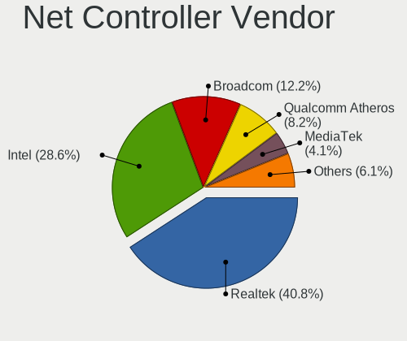
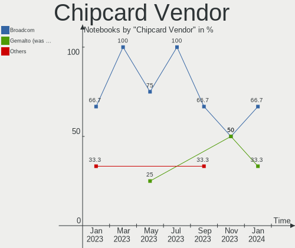

KDE neon - Hardware Trends (Notebooks)
--------------------------------------

A project to identify most popular hardware characteristics and track their change
over time based on data collected by Linux users at https://Linux-Hardware.org.

Anyone can contribute to this report by the [hw-probe](https://github.com/linuxhw/hw-probe) tool:

    sudo -E hw-probe -all -upload

This report is for one last month. Overall report since the beginning of time: [TestCoverage](https://github.com/linuxhw/TestCoverage)

Period: Aug, 2022.

Contents
--------

* [ System ](#system)
  - [ OS                       ](#os)
  - [ OS Family                ](#os-family)
  - [ Kernel                   ](#kernel)
  - [ Kernel Family            ](#kernel-family)
  - [ Kernel Major Ver.        ](#kernel-major-ver)
  - [ Arch                     ](#arch)
  - [ DE                       ](#de)
  - [ Display Server           ](#display-server)
  - [ Display Manager          ](#display-manager)
  - [ OS Lang                  ](#os-lang)
  - [ Boot Mode                ](#boot-mode)
  - [ Filesystem               ](#filesystem)
  - [ Part. scheme             ](#part-scheme)
  - [ Dual Boot with Linux/BSD ](#dual-boot-with-linuxbsd)
  - [ Dual Boot (Win)          ](#dual-boot-win)

* [ Board ](#board)
  - [ Vendor                   ](#vendor)
  - [ Model                    ](#model)
  - [ Model Family             ](#model-family)
  - [ MFG Year                 ](#mfg-year)
  - [ Form Factor              ](#form-factor)
  - [ Secure Boot              ](#secure-boot)
  - [ Coreboot                 ](#coreboot)
  - [ RAM Size                 ](#ram-size)
  - [ RAM Used                 ](#ram-used)
  - [ Total Drives             ](#total-drives)
  - [ Has CD-ROM               ](#has-cd-rom)
  - [ Has Ethernet             ](#has-ethernet)
  - [ Has WiFi                 ](#has-wifi)
  - [ Has Bluetooth            ](#has-bluetooth)

* [ Location ](#location)
  - [ Country                  ](#country)
  - [ City                     ](#city)

* [ Drives ](#drives)
  - [ Drive Vendor             ](#drive-vendor)
  - [ Drive Model              ](#drive-model)
  - [ HDD Vendor               ](#hdd-vendor)
  - [ SSD Vendor               ](#ssd-vendor)
  - [ Drive Kind               ](#drive-kind)
  - [ Drive Connector          ](#drive-connector)
  - [ Drive Size               ](#drive-size)
  - [ Space Total              ](#space-total)
  - [ Space Used               ](#space-used)
  - [ Malfunc. Drives          ](#malfunc-drives)
  - [ Malfunc. Drive Vendor    ](#malfunc-drive-vendor)
  - [ Malfunc. HDD Vendor      ](#malfunc-hdd-vendor)
  - [ Malfunc. Drive Kind      ](#malfunc-drive-kind)
  - [ Failed Drives            ](#failed-drives)
  - [ Failed Drive Vendor      ](#failed-drive-vendor)
  - [ Drive Status             ](#drive-status)

* [ Storage controller ](#storage-controller)
  - [ Storage Vendor           ](#storage-vendor)
  - [ Storage Model            ](#storage-model)
  - [ Storage Kind             ](#storage-kind)

* [ Processor ](#processor)
  - [ CPU Vendor               ](#cpu-vendor)
  - [ CPU Model                ](#cpu-model)
  - [ CPU Model Family         ](#cpu-model-family)
  - [ CPU Cores                ](#cpu-cores)
  - [ CPU Sockets              ](#cpu-sockets)
  - [ CPU Threads              ](#cpu-threads)
  - [ CPU Op-Modes             ](#cpu-op-modes)
  - [ CPU Microcode            ](#cpu-microcode)
  - [ CPU Microarch            ](#cpu-microarch)

* [ Graphics ](#graphics)
  - [ GPU Vendor               ](#gpu-vendor)
  - [ GPU Model                ](#gpu-model)
  - [ GPU Combo                ](#gpu-combo)
  - [ GPU Driver               ](#gpu-driver)
  - [ GPU Memory               ](#gpu-memory)

* [ Monitor ](#monitor)
  - [ Monitor Vendor           ](#monitor-vendor)
  - [ Monitor Model            ](#monitor-model)
  - [ Monitor Resolution       ](#monitor-resolution)
  - [ Monitor Diagonal         ](#monitor-diagonal)
  - [ Monitor Width            ](#monitor-width)
  - [ Aspect Ratio             ](#aspect-ratio)
  - [ Monitor Area             ](#monitor-area)
  - [ Pixel Density            ](#pixel-density)
  - [ Multiple Monitors        ](#multiple-monitors)

* [ Network ](#network)
  - [ Net Controller Vendor    ](#net-controller-vendor)
  - [ Net Controller Model     ](#net-controller-model)
  - [ Wireless Vendor          ](#wireless-vendor)
  - [ Wireless Model           ](#wireless-model)
  - [ Ethernet Vendor          ](#ethernet-vendor)
  - [ Ethernet Model           ](#ethernet-model)
  - [ Net Controller Kind      ](#net-controller-kind)
  - [ Used Controller          ](#used-controller)
  - [ NICs                     ](#nics)
  - [ IPv6                     ](#ipv6)

* [ Bluetooth ](#bluetooth)
  - [ Bluetooth Vendor         ](#bluetooth-vendor)
  - [ Bluetooth Model          ](#bluetooth-model)

* [ Sound ](#sound)
  - [ Sound Vendor             ](#sound-vendor)
  - [ Sound Model              ](#sound-model)

* [ Memory ](#memory)
  - [ Memory Vendor            ](#memory-vendor)
  - [ Memory Model             ](#memory-model)
  - [ Memory Kind              ](#memory-kind)
  - [ Memory Form Factor       ](#memory-form-factor)
  - [ Memory Size              ](#memory-size)
  - [ Memory Speed             ](#memory-speed)

* [ Printers & scanners ](#printers--scanners)
  - [ Printer Vendor           ](#printer-vendor)
  - [ Printer Model            ](#printer-model)
  - [ Scanner Vendor           ](#scanner-vendor)
  - [ Scanner Model            ](#scanner-model)

* [ Camera ](#camera)
  - [ Camera Vendor            ](#camera-vendor)
  - [ Camera Model             ](#camera-model)

* [ Security ](#security)
  - [ Fingerprint Vendor       ](#fingerprint-vendor)
  - [ Fingerprint Model        ](#fingerprint-model)
  - [ Chipcard Vendor          ](#chipcard-vendor)
  - [ Chipcard Model           ](#chipcard-model)

* [ Unsupported ](#unsupported)
  - [ Unsupported Devices      ](#unsupported-devices)
  - [ Unsupported Device Types ](#unsupported-device-types)

System
------

OS
--

Installed operating systems

| Name           | Notebooks | Percent |
|----------------|-----------|---------|
| KDE neon 20.04 | 63        | 94.03%  |
| KDE neon 22.04 | 4         | 5.97%   |

OS Family
---------

OS without a version

| Name     | Notebooks | Percent |
|----------|-----------|---------|
| KDE neon | 67        | 100%    |

Kernel
------

Version of the Linux kernel

| Version                   | Notebooks | Percent |
|---------------------------|-----------|---------|
| 5.15.0-46-generic         | 33        | 49.25%  |
| 5.15.0-43-generic         | 20        | 29.85%  |
| 5.15.0-41-generic         | 5         | 7.46%   |
| 5.3.0-51-generic          | 1         | 1.49%   |
| 5.19.1-051901-generic     | 1         | 1.49%   |
| 5.19.0-4.1-liquorix-amd64 | 1         | 1.49%   |
| 5.19.0-1.1-liquorix-amd64 | 1         | 1.49%   |
| 5.16.0-051600-generic     | 1         | 1.49%   |
| 5.13.0-51-generic         | 1         | 1.49%   |
| 5.13.0-41-generic         | 1         | 1.49%   |
| 5.13.0-39-generic         | 1         | 1.49%   |
| 5.11.0-38-generic         | 1         | 1.49%   |

Kernel Family
-------------

Linux kernel without a distro release

| Version | Notebooks | Percent |
|---------|-----------|---------|
| 5.15.0  | 58        | 86.57%  |
| 5.13.0  | 3         | 4.48%   |
| 5.19.0  | 2         | 2.99%   |
| 5.3.0   | 1         | 1.49%   |
| 5.19.1  | 1         | 1.49%   |
| 5.16.0  | 1         | 1.49%   |
| 5.11.0  | 1         | 1.49%   |

Kernel Major Ver.
-----------------

Linux kernel major version

| Version | Notebooks | Percent |
|---------|-----------|---------|
| 5.15    | 58        | 86.57%  |
| 5.19    | 3         | 4.48%   |
| 5.13    | 3         | 4.48%   |
| 5.3     | 1         | 1.49%   |
| 5.16    | 1         | 1.49%   |
| 5.11    | 1         | 1.49%   |

Arch
----

OS architecture (x86_64, i586, etc.)

| Name   | Notebooks | Percent |
|--------|-----------|---------|
| x86_64 | 67        | 100%    |

DE
--

Desktop Environment

| Name  | Notebooks | Percent |
|-------|-----------|---------|
| KDE5  | 66        | 98.51%  |
| GNOME | 1         | 1.49%   |

Display Server
--------------

X11 or Wayland

| Name    | Notebooks | Percent |
|---------|-----------|---------|
| X11     | 60        | 89.55%  |
| Wayland | 7         | 10.45%  |

Display Manager
---------------

SDDM, LightDM, etc.

| Name    | Notebooks | Percent |
|---------|-----------|---------|
| Unknown | 56        | 83.58%  |
| SDDM    | 11        | 16.42%  |

OS Lang
-------

Language

| Lang  | Notebooks | Percent |
|-------|-----------|---------|
| en_US | 28        | 41.79%  |
| ru_RU | 5         | 7.46%   |
| pt_BR | 4         | 5.97%   |
| it_IT | 3         | 4.48%   |
| en_IN | 3         | 4.48%   |
| de_DE | 3         | 4.48%   |
| hu_HU | 2         | 2.99%   |
| es_GT | 2         | 2.99%   |
| es_ES | 2         | 2.99%   |
| en_GB | 2         | 2.99%   |
| zh_TW | 1         | 1.49%   |
| zh_CN | 1         | 1.49%   |
| tr_TR | 1         | 1.49%   |
| pt_PT | 1         | 1.49%   |
| nl_BE | 1         | 1.49%   |
| mr_IN | 1         | 1.49%   |
| lt_LT | 1         | 1.49%   |
| es_EC | 1         | 1.49%   |
| en_ZA | 1         | 1.49%   |
| en_PH | 1         | 1.49%   |
| en_CA | 1         | 1.49%   |
| de_CH | 1         | 1.49%   |
| C     | 1         | 1.49%   |

Boot Mode
---------

EFI or BIOS

| Mode | Notebooks | Percent |
|------|-----------|---------|
| EFI  | 38        | 56.72%  |
| BIOS | 29        | 43.28%  |

Filesystem
----------

Type of filesystem

| Type    | Notebooks | Percent |
|---------|-----------|---------|
| Ext4    | 63        | 94.03%  |
| Btrfs   | 3         | 4.48%   |
| Overlay | 1         | 1.49%   |

Part. scheme
------------

Scheme of partitioning

| Type    | Notebooks | Percent |
|---------|-----------|---------|
| Unknown | 63        | 94.03%  |
| MBR     | 2         | 2.99%   |
| GPT     | 2         | 2.99%   |

Dual Boot with Linux/BSD
------------------------

Hosting more than one Linux/BSD

| Dual boot | Notebooks | Percent |
|-----------|-----------|---------|
| No        | 64        | 95.52%  |
| Yes       | 3         | 4.48%   |

Dual Boot (Win)
---------------

Hosting Linux and Windows

| Dual boot | Notebooks | Percent |
|-----------|-----------|---------|
| No        | 64        | 95.52%  |
| Yes       | 3         | 4.48%   |

Board
-----

Vendor
------

Motherboard manufacturer

| Name                | Notebooks | Percent |
|---------------------|-----------|---------|
| Dell                | 14        | 20.9%   |
| Hewlett-Packard     | 11        | 16.42%  |
| ASUSTek Computer    | 9         | 13.43%  |
| Lenovo              | 8         | 11.94%  |
| Acer                | 7         | 10.45%  |
| Sony                | 2         | 2.99%   |
| MSI                 | 2         | 2.99%   |
| HUAWEI              | 2         | 2.99%   |
| Apple               | 2         | 2.99%   |
| Toshiba             | 1         | 1.49%   |
| Samsung Electronics | 1         | 1.49%   |
| Notebook            | 1         | 1.49%   |
| Microtech           | 1         | 1.49%   |
| Medion              | 1         | 1.49%   |
| Hampoo              | 1         | 1.49%   |
| eMachines           | 1         | 1.49%   |
| Clevo               | 1         | 1.49%   |
| Alienware           | 1         | 1.49%   |
| Acidanthera         | 1         | 1.49%   |

Model
-----

Motherboard model

| Name                                     | Notebooks | Percent |
|------------------------------------------|-----------|---------|
| HP Victus by Laptop 16-e0xxx             | 2         | 2.99%   |
| Dell Inspiron 7472                       | 2         | 2.99%   |
| Toshiba Satellite C55-C                  | 1         | 1.49%   |
| Sony SVS15115FWB                         | 1         | 1.49%   |
| Sony SVE1113M1EW                         | 1         | 1.49%   |
| Samsung 300E4A/300E5A/300E7A             | 1         | 1.49%   |
| Notebook P64_HJ,HK1                      | 1         | 1.49%   |
| MSI WF75 10TK                            | 1         | 1.49%   |
| MSI Katana GF66 11UC                     | 1         | 1.49%   |
| Microtech CoreBook                       | 1         | 1.49%   |
| Medion Akoya E7227                       | 1         | 1.49%   |
| Lenovo V15-IGL 82C3                      | 1         | 1.49%   |
| Lenovo ThinkPad T590 20N4004EMH          | 1         | 1.49%   |
| Lenovo N22 80S6                          | 1         | 1.49%   |
| Lenovo Legion 5 15ACH6H 82JU             | 1         | 1.49%   |
| Lenovo IdeaPad Gaming 3 15ACH6 82K2      | 1         | 1.49%   |
| Lenovo IdeaPad 5 Pro 16ACH6 82L5         | 1         | 1.49%   |
| Lenovo IdeaPad 330-17ICH 81FL            | 1         | 1.49%   |
| Lenovo G50-80 80L0                       | 1         | 1.49%   |
| HUAWEI WRT-WX9                           | 1         | 1.49%   |
| HUAWEI KLVD-WXX9                         | 1         | 1.49%   |
| HP TouchSmart tm2                        | 1         | 1.49%   |
| HP ProBook 4530s                         | 1         | 1.49%   |
| HP ProBook 450 G7                        | 1         | 1.49%   |
| HP Pavilion Gaming Laptop 15-ec0xxx      | 1         | 1.49%   |
| HP Notebook                              | 1         | 1.49%   |
| HP Laptop 15s-fq2xxx                     | 1         | 1.49%   |
| HP ENVY 14                               | 1         | 1.49%   |
| HP EliteBook 840 G1                      | 1         | 1.49%   |
| HP Elite x2 1012 G1                      | 1         | 1.49%   |
| Hampoo SurfTab duo W1 10.1 (VT4)         | 1         | 1.49%   |
| eMachines D725                           | 1         | 1.49%   |
| Dell XPS 15 9560                         | 1         | 1.49%   |
| Dell Vostro 15 3515                      | 1         | 1.49%   |
| Dell Latitude E6420                      | 1         | 1.49%   |
| Dell Latitude E5500                      | 1         | 1.49%   |
| Dell Latitude 7280                       | 1         | 1.49%   |
| Dell Inspiron N5110                      | 1         | 1.49%   |
| Dell Inspiron N5010                      | 1         | 1.49%   |
| Dell Inspiron 7570                       | 1         | 1.49%   |
| Dell Inspiron 1525                       | 1         | 1.49%   |
| Dell Inspiron 15-3567                    | 1         | 1.49%   |
| Dell Inspiron 15-3552                    | 1         | 1.49%   |
| Dell G3 3590                             | 1         | 1.49%   |
| Clevo W240BU                             | 1         | 1.49%   |
| ASUS Zenbook UX5401ZA_UX5401ZA           | 1         | 1.49%   |
| ASUS X550LN                              | 1         | 1.49%   |
| ASUS VivoBook_ASUSLaptop X570ZD_X570ZD   | 1         | 1.49%   |
| ASUS VivoBook_ASUSLaptop X515JAB_X515JA  | 1         | 1.49%   |
| ASUS VivoBook_ASUSLaptop X515DA_Y1511CDA | 1         | 1.49%   |
| ASUS T100TA                              | 1         | 1.49%   |
| ASUS N552VX                              | 1         | 1.49%   |
| ASUS K52JT                               | 1         | 1.49%   |
| ASUS GL703VM                             | 1         | 1.49%   |
| Apple MacBookPro9,2                      | 1         | 1.49%   |
| Apple MacBookPro14,1                     | 1         | 1.49%   |
| Alienware 15 R4                          | 1         | 1.49%   |
| Acidanthera MacBookPro14,1               | 1         | 1.49%   |
| Acer Nitro AN515-55                      | 1         | 1.49%   |
| Acer Nitro AN515-45                      | 1         | 1.49%   |

Model Family
------------

Motherboard model prefix

| Name                     | Notebooks | Percent |
|--------------------------|-----------|---------|
| Dell Inspiron            | 8         | 11.94%  |
| Acer Aspire              | 5         | 7.46%   |
| Lenovo IdeaPad           | 3         | 4.48%   |
| Dell Latitude            | 3         | 4.48%   |
| ASUS VivoBook            | 3         | 4.48%   |
| HP Victus                | 2         | 2.99%   |
| HP ProBook               | 2         | 2.99%   |
| Acer Nitro               | 2         | 2.99%   |
| Toshiba Satellite        | 1         | 1.49%   |
| Sony SVS15115FWB         | 1         | 1.49%   |
| Sony SVE1113M1EW         | 1         | 1.49%   |
| Samsung 300E4A           | 1         | 1.49%   |
| Notebook P64             | 1         | 1.49%   |
| MSI WF75                 | 1         | 1.49%   |
| MSI Katana               | 1         | 1.49%   |
| Microtech CoreBook       | 1         | 1.49%   |
| Medion Akoya             | 1         | 1.49%   |
| Lenovo V15-IGL           | 1         | 1.49%   |
| Lenovo ThinkPad          | 1         | 1.49%   |
| Lenovo N22               | 1         | 1.49%   |
| Lenovo Legion            | 1         | 1.49%   |
| Lenovo G50-80            | 1         | 1.49%   |
| HUAWEI WRT-WX9           | 1         | 1.49%   |
| HUAWEI KLVD-WXX9         | 1         | 1.49%   |
| HP TouchSmart            | 1         | 1.49%   |
| HP Pavilion              | 1         | 1.49%   |
| HP Notebook              | 1         | 1.49%   |
| HP Laptop                | 1         | 1.49%   |
| HP ENVY                  | 1         | 1.49%   |
| HP EliteBook             | 1         | 1.49%   |
| HP Elite                 | 1         | 1.49%   |
| Hampoo SurfTab           | 1         | 1.49%   |
| eMachines D725           | 1         | 1.49%   |
| Dell XPS                 | 1         | 1.49%   |
| Dell Vostro              | 1         | 1.49%   |
| Dell G3                  | 1         | 1.49%   |
| Clevo W240BU             | 1         | 1.49%   |
| ASUS Zenbook             | 1         | 1.49%   |
| ASUS X550LN              | 1         | 1.49%   |
| ASUS T100TA              | 1         | 1.49%   |
| ASUS N552VX              | 1         | 1.49%   |
| ASUS K52JT               | 1         | 1.49%   |
| ASUS GL703VM             | 1         | 1.49%   |
| Apple MacBookPro9        | 1         | 1.49%   |
| Apple MacBookPro14       | 1         | 1.49%   |
| Alienware 15             | 1         | 1.49%   |
| Acidanthera MacBookPro14 | 1         | 1.49%   |

MFG Year
--------

Motherboard manufacture year

| Year | Notebooks | Percent |
|------|-----------|---------|
| 2021 | 12        | 17.91%  |
| 2018 | 8         | 11.94%  |
| 2016 | 7         | 10.45%  |
| 2019 | 6         | 8.96%   |
| 2013 | 6         | 8.96%   |
| 2011 | 6         | 8.96%   |
| 2015 | 4         | 5.97%   |
| 2010 | 4         | 5.97%   |
| 2020 | 3         | 4.48%   |
| 2014 | 3         | 4.48%   |
| 2022 | 2         | 2.99%   |
| 2017 | 2         | 2.99%   |
| 2012 | 2         | 2.99%   |
| 2008 | 2         | 2.99%   |

Form Factor
-----------

Physical design of the computer

| Name     | Notebooks | Percent |
|----------|-----------|---------|
| Notebook | 67        | 100%    |

Secure Boot
-----------

Enabled or disabled

| State    | Notebooks | Percent |
|----------|-----------|---------|
| Disabled | 59        | 88.06%  |
| Enabled  | 8         | 11.94%  |

Coreboot
--------

Have coreboot on board

| Used | Notebooks | Percent |
|------|-----------|---------|
| No   | 67        | 100%    |

RAM Size
--------

Total RAM memory

| Size in GB | Notebooks | Percent |
|------------|-----------|---------|
| 4.01-8.0   | 24        | 35.82%  |
| 8.01-16.0  | 15        | 22.39%  |
| 16.01-24.0 | 11        | 16.42%  |
| 3.01-4.0   | 7         | 10.45%  |
| 32.01-64.0 | 6         | 8.96%   |
| 1.01-2.0   | 3         | 4.48%   |
| 24.01-32.0 | 1         | 1.49%   |

RAM Used
--------

Used RAM memory

| Used GB    | Notebooks | Percent |
|------------|-----------|---------|
| 2.01-3.0   | 22        | 32.84%  |
| 1.01-2.0   | 19        | 28.36%  |
| 3.01-4.0   | 11        | 16.42%  |
| 0.51-1.0   | 7         | 10.45%  |
| 4.01-8.0   | 5         | 7.46%   |
| 8.01-16.0  | 2         | 2.99%   |
| 16.01-24.0 | 1         | 1.49%   |

Total Drives
------------

Number of drives on board

| Drives | Notebooks | Percent |
|--------|-----------|---------|
| 1      | 43        | 64.18%  |
| 2      | 21        | 31.34%  |
| 3      | 3         | 4.48%   |

Has CD-ROM
----------

Has CD-ROM on board

| Presented | Notebooks | Percent |
|-----------|-----------|---------|
| No        | 46        | 68.66%  |
| Yes       | 21        | 31.34%  |

Has Ethernet
------------

Has Ethernet on board

| Presented | Notebooks | Percent |
|-----------|-----------|---------|
| Yes       | 51        | 76.12%  |
| No        | 16        | 23.88%  |

Has WiFi
--------

Has WiFi module

| Presented | Notebooks | Percent |
|-----------|-----------|---------|
| Yes       | 65        | 97.01%  |
| No        | 2         | 2.99%   |

Has Bluetooth
-------------

Has Bluetooth module

| Presented | Notebooks | Percent |
|-----------|-----------|---------|
| Yes       | 56        | 83.58%  |
| No        | 11        | 16.42%  |

Location
--------

Country
-------

Geographic location (country)

| Country      | Notebooks | Percent |
|--------------|-----------|---------|
| USA          | 14        | 20.9%   |
| Brazil       | 5         | 7.46%   |
| Russia       | 4         | 5.97%   |
| Italy        | 4         | 5.97%   |
| India        | 4         | 5.97%   |
| Germany      | 3         | 4.48%   |
| Turkey       | 2         | 2.99%   |
| Hungary      | 2         | 2.99%   |
| Guatemala    | 2         | 2.99%   |
| France       | 2         | 2.99%   |
| Canada       | 2         | 2.99%   |
| UK           | 1         | 1.49%   |
| Tunisia      | 1         | 1.49%   |
| Taiwan       | 1         | 1.49%   |
| Switzerland  | 1         | 1.49%   |
| Spain        | 1         | 1.49%   |
| South Africa | 1         | 1.49%   |
| Saudi Arabia | 1         | 1.49%   |
| Romania      | 1         | 1.49%   |
| Portugal     | 1         | 1.49%   |
| Poland       | 1         | 1.49%   |
| Philippines  | 1         | 1.49%   |
| Netherlands  | 1         | 1.49%   |
| Morocco      | 1         | 1.49%   |
| Moldova      | 1         | 1.49%   |
| Mexico       | 1         | 1.49%   |
| Lithuania    | 1         | 1.49%   |
| Kyrgyzstan   | 1         | 1.49%   |
| Indonesia    | 1         | 1.49%   |
| Finland      | 1         | 1.49%   |
| Ecuador      | 1         | 1.49%   |
| China        | 1         | 1.49%   |
| Chile        | 1         | 1.49%   |
| Belgium      | 1         | 1.49%   |

City
----

Geographic location (city)

| City                 | Notebooks | Percent |
|----------------------|-----------|---------|
| Sao Paulo            | 2         | 2.99%   |
| Guatemala City       | 2         | 2.99%   |
| Zacatecas City       | 1         | 1.49%   |
| Yichang              | 1         | 1.49%   |
| Woodbridge           | 1         | 1.49%   |
| Window Rock          | 1         | 1.49%   |
| Wendell              | 1         | 1.49%   |
| Viseu                | 1         | 1.49%   |
| Vilnius              | 1         | 1.49%   |
| Velletri             | 1         | 1.49%   |
| Turin                | 1         | 1.49%   |
| Tunis                | 1         | 1.49%   |
| Toronto              | 1         | 1.49%   |
| The Hague            | 1         | 1.49%   |
| Tainan City          | 1         | 1.49%   |
| Santiago             | 1         | 1.49%   |
| Râmnicu Vâlcea     | 1         | 1.49%   |
| Quito                | 1         | 1.49%   |
| Plymouth             | 1         | 1.49%   |
| Oświęcim           | 1         | 1.49%   |
| Novosibirsk          | 1         | 1.49%   |
| Nottingham           | 1         | 1.49%   |
| Norden               | 1         | 1.49%   |
| Nizhniy Novgorod     | 1         | 1.49%   |
| Navi Mumbai          | 1         | 1.49%   |
| Moscow               | 1         | 1.49%   |
| Montreal             | 1         | 1.49%   |
| Milan                | 1         | 1.49%   |
| Mage                 | 1         | 1.49%   |
| Madrid               | 1         | 1.49%   |
| Madison              | 1         | 1.49%   |
| Lyon                 | 1         | 1.49%   |
| Khouribga            | 1         | 1.49%   |
| Kayseri              | 1         | 1.49%   |
| Kaufungen            | 1         | 1.49%   |
| Kansas City          | 1         | 1.49%   |
| Jeddah               | 1         | 1.49%   |
| Jakarta              | 1         | 1.49%   |
| Izmir                | 1         | 1.49%   |
| Helsinki             | 1         | 1.49%   |
| Gurgaon              | 1         | 1.49%   |
| Golaghat             | 1         | 1.49%   |
| Fredericksburg       | 1         | 1.49%   |
| Ellington            | 1         | 1.49%   |
| Dunaújváros        | 1         | 1.49%   |
| Debrecen             | 1         | 1.49%   |
| Council Bluffs       | 1         | 1.49%   |
| Corbelia             | 1         | 1.49%   |
| Columbus             | 1         | 1.49%   |
| Cleveland            | 1         | 1.49%   |
| Chisinau             | 1         | 1.49%   |
| Chelyabinsk          | 1         | 1.49%   |
| Chartres-de-Bretagne | 1         | 1.49%   |
| Cape Town            | 1         | 1.49%   |
| Bruges               | 1         | 1.49%   |
| Bristol              | 1         | 1.49%   |
| Brasília            | 1         | 1.49%   |
| Bismarck             | 1         | 1.49%   |
| Bishkek              | 1         | 1.49%   |
| Bischofszell         | 1         | 1.49%   |

Drives
------

Drive Vendor
------------

Hard drive vendors

| Vendor                  | Notebooks | Drives | Percent |
|-------------------------|-----------|--------|---------|
| SanDisk                 | 15        | 16     | 16.48%  |
| Samsung Electronics     | 14        | 14     | 15.38%  |
| Seagate                 | 10        | 11     | 10.99%  |
| WDC                     | 8         | 8      | 8.79%   |
| Unknown                 | 5         | 6      | 5.49%   |
| Toshiba                 | 5         | 5      | 5.49%   |
| Crucial                 | 5         | 5      | 5.49%   |
| SK hynix                | 3         | 3      | 3.3%    |
| Phison                  | 3         | 3      | 3.3%    |
| LITEON                  | 3         | 3      | 3.3%    |
| Kingston                | 3         | 3      | 3.3%    |
| HGST                    | 3         | 3      | 3.3%    |
| Hitachi                 | 2         | 2      | 2.2%    |
| USB3.0                  | 1         | 1      | 1.1%    |
| Union Memory (Shenzhen) | 1         | 1      | 1.1%    |
| TO Exter                | 1         | 1      | 1.1%    |
| SPCC                    | 1         | 1      | 1.1%    |
| OCZ                     | 1         | 1      | 1.1%    |
| Micron Technology       | 1         | 1      | 1.1%    |
| Intel                   | 1         | 1      | 1.1%    |
| Corsair                 | 1         | 1      | 1.1%    |
| Apple                   | 1         | 2      | 1.1%    |
| ADATA Technology        | 1         | 1      | 1.1%    |
| A-DATA Technology       | 1         | 1      | 1.1%    |
| Unknown                 | 1         | 1      | 1.1%    |

Drive Model
-----------

Hard drive models

| Model                                        | Notebooks | Percent |
|----------------------------------------------|-----------|---------|
| SanDisk NVMe SSD Drive 512GB                 | 6         | 6.38%   |
| Unknown MMC Card  32GB                       | 3         | 3.19%   |
| Seagate ST1000LM035-1RK172 1TB               | 3         | 3.19%   |
| Samsung NVMe SSD Drive 512GB                 | 3         | 3.19%   |
| Toshiba KBG30ZMS128G 128GB NVMe SSD          | 2         | 2.13%   |
| Seagate ST1000LM048-2E7172 1TB               | 2         | 2.13%   |
| SanDisk NVMe SSD Drive 256GB                 | 2         | 2.13%   |
| Samsung SSD 860 EVO 500GB                    | 2         | 2.13%   |
| Samsung SSD 860 EVO 1TB                      | 2         | 2.13%   |
| Phison NVMe SSD Drive 120GB                  | 2         | 2.13%   |
| HGST HTS721010A9E630 1TB                     | 2         | 2.13%   |
| Crucial CT240BX500SSD1 240GB                 | 2         | 2.13%   |
| WDC WDS120G2G0A-00JH30 120GB SSD             | 1         | 1.06%   |
| WDC WD5000LPVX-22V0TT0 500GB                 | 1         | 1.06%   |
| WDC WD5000BEVT-22A0RT0 500GB                 | 1         | 1.06%   |
| WDC WD5000BEVT-00A0RT0 500GB                 | 1         | 1.06%   |
| WDC WD3200BEVT-22A23T0 320GB                 | 1         | 1.06%   |
| WDC WD3200BEKX-75B7WT0 320GB                 | 1         | 1.06%   |
| WDC WD10JPVX-22JC3T0 1TB                     | 1         | 1.06%   |
| WDC PC SN520 SDAPNUW-512G-1006 512GB         | 1         | 1.06%   |
| USB3.0 Super Speed 128GB                     | 1         | 1.06%   |
| Unknown SD32G  32GB                          | 1         | 1.06%   |
| Unknown MMC Card  128GB                      | 1         | 1.06%   |
| Union Memory (Shenzhen) NVMe SSD Drive 128GB | 1         | 1.06%   |
| Toshiba THNSNH128GMCT 128GB SSD              | 1         | 1.06%   |
| Toshiba NVMe SSD Drive 1024GB                | 1         | 1.06%   |
| Toshiba MQ01ABD100 1TB                       | 1         | 1.06%   |
| TO Exter nal USB 3.0 240GB                   | 1         | 1.06%   |
| SPCC Solid State Disk 512GB                  | 1         | 1.06%   |
| SK hynix SC311 SATA 128GB SSD                | 1         | 1.06%   |
| SK hynix NVMe SSD Drive 512GB                | 1         | 1.06%   |
| SK hynix HFS256G39TND-N210A 256GB SSD        | 1         | 1.06%   |
| Seagate ST9250315AS 250GB                    | 1         | 1.06%   |
| Seagate ST500LT012-1DG142 500GB              | 1         | 1.06%   |
| Seagate ST1000LX015-1U7172 1TB               | 1         | 1.06%   |
| Seagate ST1000LM024 HN-M101MBB 1TB           | 1         | 1.06%   |
| Seagate NVMe SSD Drive 500GB                 | 1         | 1.06%   |
| Seagate FireCuda 520 SSD ZP500GM30002 500GB  | 1         | 1.06%   |
| SanDisk SSD PLUS 1000GB                      | 1         | 1.06%   |
| SanDisk SDSSDA240G 240GB                     | 1         | 1.06%   |
| SanDisk SDSSDA120G 120GB                     | 1         | 1.06%   |
| SanDisk SD9SN8W256G1002 256GB SSD            | 1         | 1.06%   |
| SanDisk SD9SN8W-128G-1006 128GB SSD          | 1         | 1.06%   |
| SanDisk SD7SN6S-256G-1006 256GB SSD          | 1         | 1.06%   |
| SanDisk NVMe SSD Drive 500GB                 | 1         | 1.06%   |
| SanDisk NVMe SSD Drive 2TB                   | 1         | 1.06%   |
| Samsung SSD SM841 2.5 7mm 128GB              | 1         | 1.06%   |
| Samsung SSD 850 PRO 1TB                      | 1         | 1.06%   |
| Samsung NVMe SSD Drive 1TB                   | 1         | 1.06%   |
| Samsung MZVL2512HCJQ-00B00 512GB             | 1         | 1.06%   |
| Samsung MZNLN256HMHQ-000H1 256GB SSD         | 1         | 1.06%   |
| Samsung MZALQ256HAJD-000L2 256GB             | 1         | 1.06%   |
| Samsung HM500JI 500GB                        | 1         | 1.06%   |
| Phison NVMe SSD Drive 512GB                  | 1         | 1.06%   |
| OCZ AGILITY3 120GB SSD                       | 1         | 1.06%   |
| Micron NVMe SSD Drive 512GB                  | 1         | 1.06%   |
| LITEON IT LDS-256L9S 256GB SSD               | 1         | 1.06%   |
| LITEON IT LCS-128L9S-HP 128GB SSD            | 1         | 1.06%   |
| LITEON CV8-8E128-11 SATA 128GB SSD           | 1         | 1.06%   |
| Kingston SA400S37480G 480GB SSD              | 1         | 1.06%   |

HDD Vendor
----------

Hard disk drive vendors

| Vendor              | Notebooks | Drives | Percent |
|---------------------|-----------|--------|---------|
| Seagate             | 9         | 9      | 39.13%  |
| WDC                 | 6         | 6      | 26.09%  |
| HGST                | 3         | 3      | 13.04%  |
| Hitachi             | 2         | 2      | 8.7%    |
| USB3.0              | 1         | 1      | 4.35%   |
| Toshiba             | 1         | 1      | 4.35%   |
| Samsung Electronics | 1         | 1      | 4.35%   |

SSD Vendor
----------

Solid state drive vendors

| Vendor              | Notebooks | Drives | Percent |
|---------------------|-----------|--------|---------|
| Samsung Electronics | 7         | 7      | 22.58%  |
| SanDisk             | 5         | 6      | 16.13%  |
| Crucial             | 5         | 5      | 16.13%  |
| LITEON              | 3         | 3      | 9.68%   |
| SK hynix            | 2         | 2      | 6.45%   |
| WDC                 | 1         | 1      | 3.23%   |
| Toshiba             | 1         | 1      | 3.23%   |
| TO Exter            | 1         | 1      | 3.23%   |
| SPCC                | 1         | 1      | 3.23%   |
| OCZ                 | 1         | 1      | 3.23%   |
| Kingston            | 1         | 1      | 3.23%   |
| Corsair             | 1         | 1      | 3.23%   |
| A-DATA Technology   | 1         | 1      | 3.23%   |
| Unknown             | 1         | 1      | 3.23%   |

Drive Kind
----------

HDD or SSD

| Kind | Notebooks | Drives | Percent |
|------|-----------|--------|---------|
| NVMe | 29        | 34     | 34.12%  |
| SSD  | 28        | 32     | 32.94%  |
| HDD  | 23        | 23     | 27.06%  |
| MMC  | 5         | 6      | 5.88%   |

Drive Connector
---------------

SATA, SAS, NVMe, etc.

| Type | Notebooks | Drives | Percent |
|------|-----------|--------|---------|
| SATA | 44        | 53     | 55%     |
| NVMe | 29        | 34     | 36.25%  |
| MMC  | 5         | 6      | 6.25%   |
| SAS  | 2         | 2      | 2.5%    |

Drive Size
----------

Size of hard drive

| Size in TB | Notebooks | Drives | Percent |
|------------|-----------|--------|---------|
| 0.01-0.5   | 34        | 37     | 65.38%  |
| 0.51-1.0   | 17        | 17     | 32.69%  |
| 1.01-2.0   | 1         | 1      | 1.92%   |

Space Total
-----------

Amount of disk space available on the file system

| Size in GB | Notebooks | Percent |
|------------|-----------|---------|
| 101-250    | 21        | 31.34%  |
| 251-500    | 18        | 26.87%  |
| 501-1000   | 8         | 11.94%  |
| 51-100     | 8         | 11.94%  |
| 21-50      | 6         | 8.96%   |
| 2001-3000  | 2         | 2.99%   |
| Unknown    | 2         | 2.99%   |
| 1001-2000  | 1         | 1.49%   |
| 1-20       | 1         | 1.49%   |

Space Used
----------

Amount of used disk space

| Used GB   | Notebooks | Percent |
|-----------|-----------|---------|
| 1-20      | 32        | 47.76%  |
| 21-50     | 13        | 19.4%   |
| 101-250   | 9         | 13.43%  |
| 51-100    | 6         | 8.96%   |
| 251-500   | 2         | 2.99%   |
| 1001-2000 | 2         | 2.99%   |
| Unknown   | 2         | 2.99%   |
| 501-1000  | 1         | 1.49%   |

Malfunc. Drives
---------------

Drive models with a malfunction

| Model                           | Notebooks | Drives | Percent |
|---------------------------------|-----------|--------|---------|
| Seagate ST500LT012-1DG142 500GB | 1         | 1      | 100%    |

Malfunc. Drive Vendor
---------------------

Vendors of faulty drives

| Vendor  | Notebooks | Drives | Percent |
|---------|-----------|--------|---------|
| Seagate | 1         | 1      | 100%    |

Malfunc. HDD Vendor
-------------------

Vendors of faulty HDD drives

| Vendor  | Notebooks | Drives | Percent |
|---------|-----------|--------|---------|
| Seagate | 1         | 1      | 100%    |

Malfunc. Drive Kind
-------------------

Kinds of faulty drives

| Kind | Notebooks | Drives | Percent |
|------|-----------|--------|---------|
| HDD  | 1         | 1      | 100%    |

Failed Drives
-------------

Failed drive models

Zero info for selected period =(

Failed Drive Vendor
-------------------

Failed drive vendors

Zero info for selected period =(

Drive Status
------------

Number of failed and malfunc. drives

| Status   | Notebooks | Drives | Percent |
|----------|-----------|--------|---------|
| Detected | 63        | 88     | 91.3%   |
| Works    | 5         | 6      | 7.25%   |
| Malfunc  | 1         | 1      | 1.45%   |

Storage controller
------------------

Storage Vendor
--------------

Storage controller vendors

| Vendor                       | Notebooks | Percent |
|------------------------------|-----------|---------|
| Intel                        | 49        | 55.68%  |
| SanDisk                      | 10        | 11.36%  |
| AMD                          | 9         | 10.23%  |
| Samsung Electronics          | 6         | 6.82%   |
| Toshiba America Info Systems | 3         | 3.41%   |
| Phison Electronics           | 3         | 3.41%   |
| Kingston Technology Company  | 2         | 2.27%   |
| Union Memory (Shenzhen)      | 1         | 1.14%   |
| SK hynix                     | 1         | 1.14%   |
| Seagate Technology           | 1         | 1.14%   |
| Micron Technology            | 1         | 1.14%   |
| Apple                        | 1         | 1.14%   |
| ADATA Technology             | 1         | 1.14%   |

Storage Model
-------------

Storage controller models

| Model                                                                            | Notebooks | Percent |
|----------------------------------------------------------------------------------|-----------|---------|
| Intel Sunrise Point-LP SATA Controller [AHCI mode]                               | 8         | 8.89%   |
| AMD FCH SATA Controller [AHCI mode]                                              | 8         | 8.89%   |
| Intel 8 Series SATA Controller 1 [AHCI mode]                                     | 6         | 6.67%   |
| SanDisk WD Black SN750 / PC SN730 NVMe SSD                                       | 4         | 4.44%   |
| Intel 82801 Mobile SATA Controller [RAID mode]                                   | 4         | 4.44%   |
| SanDisk WD Blue SN550 NVMe SSD                                                   | 3         | 3.33%   |
| SanDisk Non-Volatile memory controller                                           | 3         | 3.33%   |
| Samsung NVMe SSD Controller 980                                                  | 3         | 3.33%   |
| Intel HM170/QM170 Chipset SATA Controller [AHCI Mode]                            | 3         | 3.33%   |
| Intel Cannon Lake Mobile PCH SATA AHCI Controller                                | 3         | 3.33%   |
| Intel 6 Series/C200 Series Chipset Family 6 port Mobile SATA AHCI Controller     | 3         | 3.33%   |
| Intel Wildcat Point-LP SATA Controller [AHCI Mode]                               | 2         | 2.22%   |
| Intel Volume Management Device NVMe RAID Controller                              | 2         | 2.22%   |
| Intel Atom/Celeron/Pentium Processor x5-E8000/J3xxx/N3xxx Series SATA Controller | 2         | 2.22%   |
| Intel 7 Series Chipset Family 6-port SATA Controller [AHCI mode]                 | 2         | 2.22%   |
| Intel 5 Series/3400 Series Chipset 4 port SATA AHCI Controller                   | 2         | 2.22%   |
| Intel 400 Series Chipset Family SATA AHCI Controller                             | 2         | 2.22%   |
| Union Memory (Shenzhen) Non-Volatile memory controller                           | 1         | 1.11%   |
| Toshiba America Info Systems XG6 NVMe SSD Controller                             | 1         | 1.11%   |
| Toshiba America Info Systems XG4 NVMe SSD Controller                             | 1         | 1.11%   |
| Toshiba America Info Systems Toshiba America Info Non-Volatile memory controller | 1         | 1.11%   |
| SK hynix Gold P31 SSD                                                            | 1         | 1.11%   |
| Seagate FireCuda 520 SSD                                                         | 1         | 1.11%   |
| Samsung NVMe SSD Controller SM981/PM981/PM983                                    | 1         | 1.11%   |
| Samsung NVMe SSD Controller SM961/PM961/SM963                                    | 1         | 1.11%   |
| Samsung NVMe SSD Controller PM9A1/PM9A3/980PRO                                   | 1         | 1.11%   |
| Phison PS5013 E13 NVMe Controller                                                | 1         | 1.11%   |
| Phison NVMe Storage Controller                                                   | 1         | 1.11%   |
| Phison E7 NVMe Controller                                                        | 1         | 1.11%   |
| Micron Non-Volatile memory controller                                            | 1         | 1.11%   |
| Kingston Company Company Non-Volatile memory controller                          | 1         | 1.11%   |
| Kingston Company SNVS2000G [NV1 NVMe PCIe SSD 2TB]                               | 1         | 1.11%   |
| Intel SSD 660P Series                                                            | 1         | 1.11%   |
| Intel Comet Lake SATA AHCI Controller                                            | 1         | 1.11%   |
| Intel Celeron/Pentium Silver Processor SATA Controller                           | 1         | 1.11%   |
| Intel 82801IBM/IEM (ICH9M/ICH9M-E) 4 port SATA Controller [AHCI mode]            | 1         | 1.11%   |
| Intel 82801IBM/IEM (ICH9M/ICH9M-E) 2 port SATA Controller [IDE mode]             | 1         | 1.11%   |
| Intel 82801HM/HEM (ICH8M/ICH8M-E) SATA Controller [AHCI mode]                    | 1         | 1.11%   |
| Intel 82801HM/HEM (ICH8M/ICH8M-E) IDE Controller                                 | 1         | 1.11%   |
| Intel 8 Series/C220 Series Chipset Family 6-port SATA Controller 1 [AHCI mode]   | 1         | 1.11%   |
| Intel 8 Series/C220 Series Chipset Family 2-port SATA Controller 2 [IDE mode]    | 1         | 1.11%   |
| Intel 8 Series Chipset Family 4-port SATA Controller 1 [IDE mode] - Mobile       | 1         | 1.11%   |
| Intel 500 Series Chipset Family SATA AHCI Controller                             | 1         | 1.11%   |
| Intel 5 Series/3400 Series Chipset 6 port SATA AHCI Controller                   | 1         | 1.11%   |
| Apple S3X NVMe Controller                                                        | 1         | 1.11%   |
| AMD SB7x0/SB8x0/SB9x0 SATA Controller [AHCI mode]                                | 1         | 1.11%   |
| ADATA Non-Volatile memory controller                                             | 1         | 1.11%   |

Storage Kind
------------

Kind of storage controller (IDE, SATA, NVMe, SAS, ...)

| Kind | Notebooks | Percent |
|------|-----------|---------|
| SATA | 49        | 56.98%  |
| NVMe | 28        | 32.56%  |
| RAID | 6         | 6.98%   |
| IDE  | 3         | 3.49%   |

Processor
---------

CPU Vendor
----------

Processor vendors

| Vendor | Notebooks | Percent |
|--------|-----------|---------|
| Intel  | 54        | 80.6%   |
| AMD    | 13        | 19.4%   |

CPU Model
---------

Processor models

| Model                                         | Notebooks | Percent |
|-----------------------------------------------|-----------|---------|
| AMD Ryzen 5 5600H with Radeon Graphics        | 4         | 5.97%   |
| Intel Core i7-8550U CPU @ 1.80GHz             | 3         | 4.48%   |
| Intel Core i7-7700HQ CPU @ 2.80GHz            | 3         | 4.48%   |
| Intel Core i7-10750H CPU @ 2.60GHz            | 2         | 2.99%   |
| Intel Core i5-8265U CPU @ 1.60GHz             | 2         | 2.99%   |
| Intel Core i5-4200U CPU @ 1.60GHz             | 2         | 2.99%   |
| Intel Core i5-3210M CPU @ 2.50GHz             | 2         | 2.99%   |
| Intel Core i3-7100U CPU @ 2.40GHz             | 2         | 2.99%   |
| AMD Ryzen 7 5800H with Radeon Graphics        | 2         | 2.99%   |
| AMD Ryzen 5 3450U with Radeon Vega Mobile Gfx | 2         | 2.99%   |
| Intel Pentium Dual-Core CPU T4500 @ 2.30GHz   | 1         | 1.49%   |
| Intel Core m5-6Y54 CPU @ 1.10GHz              | 1         | 1.49%   |
| Intel Core i7-8750H CPU @ 2.20GHz             | 1         | 1.49%   |
| Intel Core i7-6700HQ CPU @ 2.60GHz            | 1         | 1.49%   |
| Intel Core i7-5500U CPU @ 2.40GHz             | 1         | 1.49%   |
| Intel Core i7-4702MQ CPU @ 2.20GHz            | 1         | 1.49%   |
| Intel Core i7-4500U CPU @ 1.80GHz             | 1         | 1.49%   |
| Intel Core i7-10510U CPU @ 1.80GHz            | 1         | 1.49%   |
| Intel Core i5-9300H CPU @ 2.40GHz             | 1         | 1.49%   |
| Intel Core i5-8300H CPU @ 2.30GHz             | 1         | 1.49%   |
| Intel Core i5-7360U CPU @ 2.30GHz             | 1         | 1.49%   |
| Intel Core i5-7300U CPU @ 2.60GHz             | 1         | 1.49%   |
| Intel Core i5-7200U CPU @ 2.50GHz             | 1         | 1.49%   |
| Intel Core i5-4210U CPU @ 1.70GHz             | 1         | 1.49%   |
| Intel Core i5-4210M CPU @ 2.60GHz             | 1         | 1.49%   |
| Intel Core i5-2520M CPU @ 2.50GHz             | 1         | 1.49%   |
| Intel Core i5-2450M CPU @ 2.50GHz             | 1         | 1.49%   |
| Intel Core i5 CPU M 480 @ 2.67GHz             | 1         | 1.49%   |
| Intel Core i3-7130U CPU @ 2.70GHz             | 1         | 1.49%   |
| Intel Core i3-5015U CPU @ 2.10GHz             | 1         | 1.49%   |
| Intel Core i3-4030U CPU @ 1.90GHz             | 1         | 1.49%   |
| Intel Core i3-4005U CPU @ 1.70GHz             | 1         | 1.49%   |
| Intel Core i3-2330M CPU @ 2.20GHz             | 1         | 1.49%   |
| Intel Core i3-2310M CPU @ 2.10GHz             | 1         | 1.49%   |
| Intel Core i3-1005G1 CPU @ 1.20GHz            | 1         | 1.49%   |
| Intel Core i3 CPU U 330 @ 1.20GHz             | 1         | 1.49%   |
| Intel Core i3 CPU M 370 @ 2.40GHz             | 1         | 1.49%   |
| Intel Core 2 Duo CPU T7250 @ 2.00GHz          | 1         | 1.49%   |
| Intel Core 2 Duo CPU T5450 @ 1.66GHz          | 1         | 1.49%   |
| Intel Celeron N4020 CPU @ 1.10GHz             | 1         | 1.49%   |
| Intel Celeron CPU N3060 @ 1.60GHz             | 1         | 1.49%   |
| Intel Celeron CPU N3050 @ 1.60GHz             | 1         | 1.49%   |
| Intel Atom x5-Z8300 CPU @ 1.44GHz             | 1         | 1.49%   |
| Intel Atom CPU Z3740 @ 1.33GHz                | 1         | 1.49%   |
| Intel 12th Gen Core i7-12700H                 | 1         | 1.49%   |
| Intel 11th Gen Core i7-11800H @ 2.30GHz       | 1         | 1.49%   |
| Intel 11th Gen Core i7-1165G7 @ 2.80GHz       | 1         | 1.49%   |
| Intel 11th Gen Core i5-1135G7 @ 2.40GHz       | 1         | 1.49%   |
| AMD Ryzen 5 3550H with Radeon Vega Mobile Gfx | 1         | 1.49%   |
| AMD Ryzen 5 3500U with Radeon Vega Mobile Gfx | 1         | 1.49%   |
| AMD Ryzen 5 2500U with Radeon Vega Mobile Gfx | 1         | 1.49%   |
| AMD E2-2000 APU with Radeon HD Graphics       | 1         | 1.49%   |
| AMD C-60                                      | 1         | 1.49%   |

CPU Model Family
----------------

Processor model prefix

| Model                   | Notebooks | Percent |
|-------------------------|-----------|---------|
| Intel Core i5           | 16        | 23.88%  |
| Intel Core i7           | 14        | 20.9%   |
| Intel Core i3           | 11        | 16.42%  |
| AMD Ryzen 5             | 9         | 13.43%  |
| Other                   | 4         | 5.97%   |
| Intel Celeron           | 3         | 4.48%   |
| Intel Core 2 Duo        | 2         | 2.99%   |
| Intel Atom              | 2         | 2.99%   |
| AMD Ryzen 7             | 2         | 2.99%   |
| Intel Pentium Dual-Core | 1         | 1.49%   |
| Intel Core m5           | 1         | 1.49%   |
| AMD E2                  | 1         | 1.49%   |
| AMD C-60                | 1         | 1.49%   |

CPU Cores
---------

Number of processor cores

| Number | Notebooks | Percent |
|--------|-----------|---------|
| 2      | 34        | 50.75%  |
| 4      | 22        | 32.84%  |
| 6      | 7         | 10.45%  |
| 8      | 3         | 4.48%   |
| 14     | 1         | 1.49%   |

CPU Sockets
-----------

Number of sockets

| Number | Notebooks | Percent |
|--------|-----------|---------|
| 1      | 67        | 100%    |

CPU Threads
-----------

Threads per core (Hyper-Threading)

| Number | Notebooks | Percent |
|--------|-----------|---------|
| 2      | 56        | 83.58%  |
| 1      | 11        | 16.42%  |

CPU Op-Modes
------------

CPU Operation Modes (32-bit, 64-bit)

| Op mode        | Notebooks | Percent |
|----------------|-----------|---------|
| 32-bit, 64-bit | 67        | 100%    |

CPU Microcode
-------------

Microcode number

| Number     | Notebooks | Percent |
|------------|-----------|---------|
| Unknown    | 11        | 16.42%  |
| 0x806e9    | 6         | 8.96%   |
| 0x40651    | 5         | 7.46%   |
| 0x206a7    | 4         | 5.97%   |
| 0x906ea    | 3         | 4.48%   |
| 0x906e9    | 3         | 4.48%   |
| 0x20655    | 3         | 4.48%   |
| 0x0a50000c | 3         | 4.48%   |
| 0x806ec    | 2         | 2.99%   |
| 0x806c1    | 2         | 2.99%   |
| 0x6fd      | 2         | 2.99%   |
| 0x406c3    | 2         | 2.99%   |
| 0x306c3    | 2         | 2.99%   |
| 0x306a9    | 2         | 2.99%   |
| 0x08108109 | 2         | 2.99%   |
| 0x05000119 | 2         | 2.99%   |
| 0xa0652    | 1         | 1.49%   |
| 0x906a3    | 1         | 1.49%   |
| 0x806ea    | 1         | 1.49%   |
| 0x806d1    | 1         | 1.49%   |
| 0x706e5    | 1         | 1.49%   |
| 0x706a8    | 1         | 1.49%   |
| 0x406e3    | 1         | 1.49%   |
| 0x406c4    | 1         | 1.49%   |
| 0x306d4    | 1         | 1.49%   |
| 0x30673    | 1         | 1.49%   |
| 0x1067a    | 1         | 1.49%   |
| 0x08108102 | 1         | 1.49%   |
| 0x0810100b | 1         | 1.49%   |

CPU Microarch
-------------

Microarchitecture

| Name             | Notebooks | Percent |
|------------------|-----------|---------|
| KabyLake         | 18        | 26.87%  |
| Haswell          | 8         | 11.94%  |
| Zen 3            | 6         | 8.96%   |
| Zen+             | 4         | 5.97%   |
| Silvermont       | 4         | 5.97%   |
| SandyBridge      | 4         | 5.97%   |
| Westmere         | 3         | 4.48%   |
| TigerLake        | 2         | 2.99%   |
| Skylake          | 2         | 2.99%   |
| IvyBridge        | 2         | 2.99%   |
| Icelake          | 2         | 2.99%   |
| Core             | 2         | 2.99%   |
| CometLake        | 2         | 2.99%   |
| Broadwell        | 2         | 2.99%   |
| Bobcat           | 2         | 2.99%   |
| Zen              | 1         | 1.49%   |
| Penryn           | 1         | 1.49%   |
| Goldmont plus    | 1         | 1.49%   |
| Alderlake Hybrid | 1         | 1.49%   |

Graphics
--------

GPU Vendor
----------

Vendors of graphics cards

| Vendor | Notebooks | Percent |
|--------|-----------|---------|
| Intel  | 52        | 54.17%  |
| Nvidia | 30        | 31.25%  |
| AMD    | 14        | 14.58%  |

GPU Model
---------

Graphics card models

| Model                                                                                    | Notebooks | Percent |
|------------------------------------------------------------------------------------------|-----------|---------|
| Intel Haswell-ULT Integrated Graphics Controller                                         | 6         | 6.12%   |
| Intel HD Graphics 620                                                                    | 5         | 5.1%    |
| AMD Cezanne                                                                              | 5         | 5.1%    |
| Intel 2nd Generation Core Processor Family Integrated Graphics Controller                | 4         | 4.08%   |
| AMD Picasso/Raven 2 [Radeon Vega Series / Radeon Vega Mobile Series]                     | 4         | 4.08%   |
| Nvidia GP107M [GeForce GTX 1050 Mobile]                                                  | 3         | 3.06%   |
| Intel UHD Graphics 620                                                                   | 3         | 3.06%   |
| Intel CoffeeLake-H GT2 [UHD Graphics 630]                                                | 3         | 3.06%   |
| Intel Atom/Celeron/Pentium Processor x5-E8000/J3xxx/N3xxx Integrated Graphics Controller | 3         | 3.06%   |
| Nvidia GP108M [GeForce MX150]                                                            | 2         | 2.04%   |
| Nvidia GP107M [GeForce GTX 1050 3 GB Max-Q]                                              | 2         | 2.04%   |
| Nvidia GK107M [GeForce GT 750M]                                                          | 2         | 2.04%   |
| Nvidia GA107M [GeForce RTX 3050 Mobile]                                                  | 2         | 2.04%   |
| Intel WhiskeyLake-U GT2 [UHD Graphics 620]                                               | 2         | 2.04%   |
| Intel TigerLake-LP GT2 [Iris Xe Graphics]                                                | 2         | 2.04%   |
| Intel Mobile 4 Series Chipset Integrated Graphics Controller                             | 2         | 2.04%   |
| Intel HD Graphics 630                                                                    | 2         | 2.04%   |
| Intel HD Graphics 5500                                                                   | 2         | 2.04%   |
| Intel Core Processor Integrated Graphics Controller                                      | 2         | 2.04%   |
| Intel CometLake-H GT2 [UHD Graphics]                                                     | 2         | 2.04%   |
| Intel 4th Gen Core Processor Integrated Graphics Controller                              | 2         | 2.04%   |
| Intel 3rd Gen Core processor Graphics Controller                                         | 2         | 2.04%   |
| Nvidia TU117M [GeForce GTX 1650 Mobile / Max-Q]                                          | 1         | 1.02%   |
| Nvidia TU116M [GeForce GTX 1660 Ti Mobile]                                               | 1         | 1.02%   |
| Nvidia TU106GLM [Quadro RTX 3000 Mobile / Max-Q]                                         | 1         | 1.02%   |
| Nvidia GP108M [GeForce MX250]                                                            | 1         | 1.02%   |
| Nvidia GP107M [GeForce GTX 1050 Ti Mobile]                                               | 1         | 1.02%   |
| Nvidia GP106M [GeForce GTX 1060 Mobile]                                                  | 1         | 1.02%   |
| Nvidia GP104BM [GeForce GTX 1070 Mobile]                                                 | 1         | 1.02%   |
| Nvidia GM108M [GeForce 940MX]                                                            | 1         | 1.02%   |
| Nvidia GM108M [GeForce 840M]                                                             | 1         | 1.02%   |
| Nvidia GM107M [GeForce GTX 950M]                                                         | 1         | 1.02%   |
| Nvidia GM107M [GeForce GTX 850M]                                                         | 1         | 1.02%   |
| Nvidia GK208BM [GeForce 920M]                                                            | 1         | 1.02%   |
| Nvidia GK107M [GeForce GT 640M LE]                                                       | 1         | 1.02%   |
| Nvidia GF119M [NVS 4200M]                                                                | 1         | 1.02%   |
| Nvidia GF119M [GeForce GT 520MX]                                                         | 1         | 1.02%   |
| Nvidia GF117M [GeForce 610M/710M/810M/820M / GT 620M/625M/630M/720M]                     | 1         | 1.02%   |
| Nvidia GF108M [GeForce GT 525M]                                                          | 1         | 1.02%   |
| Nvidia GA107M [GeForce RTX 3050 Ti Mobile]                                               | 1         | 1.02%   |
| Nvidia GA106M [GeForce RTX 3060 Mobile / Max-Q]                                          | 1         | 1.02%   |
| Intel TigerLake-H GT1 [UHD Graphics]                                                     | 1         | 1.02%   |
| Intel Mobile GM965/GL960 Integrated Graphics Controller (secondary)                      | 1         | 1.02%   |
| Intel Mobile GM965/GL960 Integrated Graphics Controller (primary)                        | 1         | 1.02%   |
| Intel Iris Plus Graphics G1 (Ice Lake)                                                   | 1         | 1.02%   |
| Intel Iris Plus Graphics 640                                                             | 1         | 1.02%   |
| Intel HD Graphics 530                                                                    | 1         | 1.02%   |
| Intel HD Graphics 515                                                                    | 1         | 1.02%   |
| Intel GeminiLake [UHD Graphics 600]                                                      | 1         | 1.02%   |
| Intel CometLake-U GT2 [UHD Graphics]                                                     | 1         | 1.02%   |
| Intel Atom Processor Z36xxx/Z37xxx Series Graphics & Display                             | 1         | 1.02%   |
| Intel Alder Lake-P Integrated Graphics Controller                                        | 1         | 1.02%   |
| AMD Wrestler [Radeon HD 7340]                                                            | 1         | 1.02%   |
| AMD Wrestler [Radeon HD 6290]                                                            | 1         | 1.02%   |
| AMD Topaz XT [Radeon R7 M260/M265 / M340/M360 / M440/M445 / 530/535 / 620/625 Mobile]    | 1         | 1.02%   |
| AMD Robson CE [Radeon HD 6370M/7370M]                                                    | 1         | 1.02%   |
| AMD Raven Ridge [Radeon Vega Series / Radeon Vega Mobile Series]                         | 1         | 1.02%   |
| AMD Navi 14 [Radeon RX 5500/5500M / Pro 5500M]                                           | 1         | 1.02%   |

GPU Combo
---------

Combinations of graphics cards

| Name           | Notebooks | Percent |
|----------------|-----------|---------|
| 1 x Intel      | 28        | 41.79%  |
| Intel + Nvidia | 22        | 32.84%  |
| 1 x AMD        | 7         | 10.45%  |
| AMD + Nvidia   | 5         | 7.46%   |
| 1 x Nvidia     | 3         | 4.48%   |
| 2 x AMD        | 1         | 1.49%   |
| Intel + AMD    | 1         | 1.49%   |

GPU Driver
----------

Free vs proprietary

| Driver      | Notebooks | Percent |
|-------------|-----------|---------|
| Free        | 56        | 83.58%  |
| Proprietary | 8         | 11.94%  |
| Unknown     | 3         | 4.48%   |

GPU Memory
----------

Total video memory

| Size in GB | Notebooks | Percent |
|------------|-----------|---------|
| Unknown    | 43        | 64.18%  |
| 1.01-2.0   | 7         | 10.45%  |
| 3.01-4.0   | 6         | 8.96%   |
| 5.01-6.0   | 4         | 5.97%   |
| 0.01-0.5   | 4         | 5.97%   |
| 0.51-1.0   | 2         | 2.99%   |
| 7.01-8.0   | 1         | 1.49%   |

Monitor
-------

Monitor Vendor
--------------

Monitor vendors

| Vendor                  | Notebooks | Percent |
|-------------------------|-----------|---------|
| AU Optronics            | 14        | 18.92%  |
| LG Display              | 13        | 17.57%  |
| Chimei Innolux          | 12        | 16.22%  |
| BOE                     | 11        | 14.86%  |
| Samsung Electronics     | 8         | 10.81%  |
| Goldstar                | 3         | 4.05%   |
| PANDA                   | 2         | 2.7%    |
| Apple                   | 2         | 2.7%    |
| Vizio                   | 1         | 1.35%   |
| ViewSonic               | 1         | 1.35%   |
| Toshiba                 | 1         | 1.35%   |
| Sharp                   | 1         | 1.35%   |
| Dell                    | 1         | 1.35%   |
| Chi Mei Optoelectronics | 1         | 1.35%   |
| ASUSTek Computer        | 1         | 1.35%   |
| AOC                     | 1         | 1.35%   |
| Ancor Communications    | 1         | 1.35%   |

Monitor Model
-------------

Monitor models

| Model                                                                    | Notebooks | Percent |
|--------------------------------------------------------------------------|-----------|---------|
| Goldstar ULTRAWIDE GSM59F1 2560x1080 673x284mm 28.8-inch                 | 2         | 2.67%   |
| Chimei Innolux LCD Monitor CMN15D2 1920x1080 344x193mm 15.5-inch         | 2         | 2.67%   |
| AU Optronics LCD Monitor AUOD1ED 1920x1080 344x193mm 15.5-inch           | 2         | 2.67%   |
| Vizio E400i-C2 VIZ1004 1920x1080 477x268mm 21.5-inch                     | 1         | 1.33%   |
| ViewSonic LCD Monitor VX3276-QHD                                         | 1         | 1.33%   |
| ViewSonic LCD Monitor VX3211-2K                                          | 1         | 1.33%   |
| Toshiba TV TSB0206 1920x1080 886x498mm 40.0-inch                         | 1         | 1.33%   |
| Sharp LCD Monitor SHP1476 3840x2160 346x194mm 15.6-inch                  | 1         | 1.33%   |
| Samsung Electronics SyncMaster SAM0613 1920x1080                         | 1         | 1.33%   |
| Samsung Electronics LCD Monitor SEC544B 1600x900 382x215mm 17.3-inch     | 1         | 1.33%   |
| Samsung Electronics LCD Monitor SEC5441 1366x768 344x194mm 15.5-inch     | 1         | 1.33%   |
| Samsung Electronics LCD Monitor SEC4D41 1280x800 261x163mm 12.1-inch     | 1         | 1.33%   |
| Samsung Electronics LCD Monitor SEC3358 1280x800 331x207mm 15.4-inch     | 1         | 1.33%   |
| Samsung Electronics LCD Monitor SDC4852 1366x768 344x194mm 15.5-inch     | 1         | 1.33%   |
| Samsung Electronics LCD Monitor SDC4154 2880x1800 302x189mm 14.0-inch    | 1         | 1.33%   |
| Samsung Electronics 170EI-A01-V50 SEC0004 1280x1024 338x270mm 17.0-inch  | 1         | 1.33%   |
| PANDA LCD Monitor NCP004D 1920x1080 344x194mm 15.5-inch                  | 1         | 1.33%   |
| PANDA LCD Monitor NCP002D 1920x1080 344x194mm 15.5-inch                  | 1         | 1.33%   |
| LG Display LCD Monitor LGD053C 1920x1080 309x174mm 14.0-inch             | 1         | 1.33%   |
| LG Display LCD Monitor LGD0521 1920x1080 309x174mm 14.0-inch             | 1         | 1.33%   |
| LG Display LCD Monitor LGD051F 1920x1080 344x194mm 15.5-inch             | 1         | 1.33%   |
| LG Display LCD Monitor LGD04E8 1920x1080 382x215mm 17.3-inch             | 1         | 1.33%   |
| LG Display LCD Monitor LGD04A5 1920x1280 253x169mm 12.0-inch             | 1         | 1.33%   |
| LG Display LCD Monitor LGD0456 1366x768 344x194mm 15.5-inch              | 1         | 1.33%   |
| LG Display LCD Monitor LGD039F 1366x768 345x194mm 15.6-inch              | 1         | 1.33%   |
| LG Display LCD Monitor LGD0385 1366x768 309x174mm 14.0-inch              | 1         | 1.33%   |
| LG Display LCD Monitor LGD0357 1600x900 382x215mm 17.3-inch              | 1         | 1.33%   |
| LG Display LCD Monitor LGD0323 1920x1080 345x194mm 15.6-inch             | 1         | 1.33%   |
| LG Display LCD Monitor LGD02F1 1366x768 344x194mm 15.5-inch              | 1         | 1.33%   |
| LG Display LCD Monitor LGD02EB 1366x768 309x174mm 14.0-inch              | 1         | 1.33%   |
| LG Display LCD Monitor LGD0266 1366x768 344x194mm 15.5-inch              | 1         | 1.33%   |
| Goldstar L222W GSM5664 1680x1050 474x296mm 22.0-inch                     | 1         | 1.33%   |
| Dell U3219Q DELA134 3840x2160 697x392mm 31.5-inch                        | 1         | 1.33%   |
| Chimei Innolux P130ZFA-BA1 CMN8201 2160x1440 275x183mm 13.0-inch         | 1         | 1.33%   |
| Chimei Innolux LCD Monitor CMN176E 1920x1080 381x214mm 17.2-inch         | 1         | 1.33%   |
| Chimei Innolux LCD Monitor CMN1738 1920x1080 381x214mm 17.2-inch         | 1         | 1.33%   |
| Chimei Innolux LCD Monitor CMN1735 1920x1080 382x215mm 17.3-inch         | 1         | 1.33%   |
| Chimei Innolux LCD Monitor CMN15E7 1920x1080 344x193mm 15.5-inch         | 1         | 1.33%   |
| Chimei Innolux LCD Monitor CMN15E6 1366x768 344x193mm 15.5-inch          | 1         | 1.33%   |
| Chimei Innolux LCD Monitor CMN15DC 1366x768 344x193mm 15.5-inch          | 1         | 1.33%   |
| Chimei Innolux LCD Monitor CMN14C8 1920x1080 309x173mm 13.9-inch         | 1         | 1.33%   |
| Chimei Innolux LCD Monitor CMN14A8 1920x1080 308x173mm 13.9-inch         | 1         | 1.33%   |
| Chimei Innolux LCD Monitor CMN1119 1366x768 256x144mm 11.6-inch          | 1         | 1.33%   |
| Chi Mei Optoelectronics LCD Monitor CMO1461 1366x768 309x174mm 14.0-inch | 1         | 1.33%   |
| BOE LCD Monitor BOE09B6 2560x1600 345x215mm 16.0-inch                    | 1         | 1.33%   |
| BOE LCD Monitor BOE097D 1920x1080 344x194mm 15.5-inch                    | 1         | 1.33%   |
| BOE LCD Monitor BOE094A 1920x1080 344x194mm 15.5-inch                    | 1         | 1.33%   |
| BOE LCD Monitor BOE08F6 1920x1080 355x200mm 16.0-inch                    | 1         | 1.33%   |
| BOE LCD Monitor BOE08B3 1920x1080 344x193mm 15.5-inch                    | 1         | 1.33%   |
| BOE LCD Monitor BOE0893 2160x1440 296x197mm 14.0-inch                    | 1         | 1.33%   |
| BOE LCD Monitor BOE0852 1920x1080 344x194mm 15.5-inch                    | 1         | 1.33%   |
| BOE LCD Monitor BOE0819 1920x1080 344x194mm 15.5-inch                    | 1         | 1.33%   |
| BOE LCD Monitor BOE07AA 1366x768 344x194mm 15.5-inch                     | 1         | 1.33%   |
| BOE LCD Monitor BOE0687 1920x1080 344x193mm 15.5-inch                    | 1         | 1.33%   |
| BOE LCD Monitor BOE0672 1366x768 344x194mm 15.5-inch                     | 1         | 1.33%   |
| AU Optronics LCD Monitor AUOAF90 1920x1080 344x193mm 15.5-inch           | 1         | 1.33%   |
| AU Optronics LCD Monitor AUO8074 1280x800 331x207mm 15.4-inch            | 1         | 1.33%   |
| AU Optronics LCD Monitor AUO71EC 1366x768 344x193mm 15.5-inch            | 1         | 1.33%   |
| AU Optronics LCD Monitor AUO499F 1920x1080 344x194mm 15.5-inch           | 1         | 1.33%   |
| AU Optronics LCD Monitor AUO48EC 1366x768 344x193mm 15.5-inch            | 1         | 1.33%   |

Monitor Resolution
------------------

Monitor screen resolution

| Resolution         | Notebooks | Percent |
|--------------------|-----------|---------|
| 1920x1080 (FHD)    | 31        | 43.06%  |
| 1366x768 (WXGA)    | 19        | 26.39%  |
| 1280x800 (WXGA)    | 4         | 5.56%   |
| 1600x900 (HD+)     | 3         | 4.17%   |
| 3840x2160 (4K)     | 2         | 2.78%   |
| 2880x1800          | 2         | 2.78%   |
| 2560x1080          | 2         | 2.78%   |
| 2160x1440          | 2         | 2.78%   |
| 7040x1440          | 1         | 1.39%   |
| 2560x1600          | 1         | 1.39%   |
| 2560x1440 (QHD)    | 1         | 1.39%   |
| 1920x1280          | 1         | 1.39%   |
| 1680x1050 (WSXGA+) | 1         | 1.39%   |
| 1280x1024 (SXGA)   | 1         | 1.39%   |
| Unknown            | 1         | 1.39%   |

Monitor Diagonal
----------------

Diagonal size in inches

| Inches  | Notebooks | Percent |
|---------|-----------|---------|
| 15      | 35        | 47.95%  |
| 14      | 8         | 10.96%  |
| 17      | 7         | 9.59%   |
| 13      | 5         | 6.85%   |
| 12      | 3         | 4.11%   |
| 34      | 2         | 2.74%   |
| 16      | 2         | 2.74%   |
| 11      | 2         | 2.74%   |
| Unknown | 2         | 2.74%   |
| 74      | 1         | 1.37%   |
| 49      | 1         | 1.37%   |
| 32      | 1         | 1.37%   |
| 31      | 1         | 1.37%   |
| 27      | 1         | 1.37%   |
| 22      | 1         | 1.37%   |
| 18      | 1         | 1.37%   |

Monitor Width
-------------

Physical width

| Width in mm | Notebooks | Percent |
|-------------|-----------|---------|
| 301-350     | 44        | 61.11%  |
| 201-300     | 9         | 12.5%   |
| 351-400     | 8         | 11.11%  |
| 701-800     | 3         | 4.17%   |
| 401-500     | 2         | 2.78%   |
| Unknown     | 2         | 2.78%   |
| 601-700     | 1         | 1.39%   |
| 501-600     | 1         | 1.39%   |
| 1501-2000   | 1         | 1.39%   |
| 1001-1500   | 1         | 1.39%   |

Aspect Ratio
------------

Proportional relationship between the width and the height

| Ratio   | Notebooks | Percent |
|---------|-----------|---------|
| 16/9    | 52        | 76.47%  |
| 16/10   | 9         | 13.24%  |
| 3/2     | 3         | 4.41%   |
| 21/9    | 2         | 2.94%   |
| 5/4     | 1         | 1.47%   |
| Unknown | 1         | 1.47%   |

Monitor Area
------------

Area in inch²

| Area in inch² | Notebooks | Percent |
|----------------|-----------|---------|
| 101-110        | 36        | 49.32%  |
| 81-90          | 11        | 15.07%  |
| 121-130        | 6         | 8.22%   |
| 351-500        | 4         | 5.48%   |
| 61-70          | 3         | 4.11%   |
| More than 1000 | 2         | 2.74%   |
| 71-80          | 2         | 2.74%   |
| 51-60          | 2         | 2.74%   |
| 141-150        | 2         | 2.74%   |
| Unknown        | 2         | 2.74%   |
| 301-350        | 1         | 1.37%   |
| 201-250        | 1         | 1.37%   |
| 111-120        | 1         | 1.37%   |

Pixel Density
-------------

Pixels per inch

| Density       | Notebooks | Percent |
|---------------|-----------|---------|
| 121-160       | 34        | 47.22%  |
| 101-120       | 17        | 23.61%  |
| 51-100        | 10        | 13.89%  |
| 161-240       | 4         | 5.56%   |
| More than 240 | 3         | 4.17%   |
| 1-50          | 2         | 2.78%   |
| Unknown       | 2         | 2.78%   |

Multiple Monitors
-----------------

Total monitors connected

| Total | Notebooks | Percent |
|-------|-----------|---------|
| 1     | 51        | 76.12%  |
| 2     | 12        | 17.91%  |
| 0     | 3         | 4.48%   |
| 3     | 1         | 1.49%   |

Network
-------

Net Controller Vendor
---------------------

Controller vendors

| Vendor                   | Notebooks | Percent |
|--------------------------|-----------|---------|
| Realtek Semiconductor    | 43        | 38.74%  |
| Intel                    | 27        | 24.32%  |
| Qualcomm Atheros         | 17        | 15.32%  |
| Broadcom                 | 10        | 9.01%   |
| Broadcom Limited         | 3         | 2.7%    |
| Ralink Technology        | 2         | 1.8%    |
| JMicron Technology       | 2         | 1.8%    |
| TP-Link                  | 1         | 0.9%    |
| Ralink                   | 1         | 0.9%    |
| Motorola PCS             | 1         | 0.9%    |
| MediaTek                 | 1         | 0.9%    |
| Marvell Technology Group | 1         | 0.9%    |
| Linksys                  | 1         | 0.9%    |
| ASUSTek Computer         | 1         | 0.9%    |

Net Controller Model
--------------------

Controller models

| Model                                                             | Notebooks | Percent |
|-------------------------------------------------------------------|-----------|---------|
| Realtek RTL8111/8168/8411 PCI Express Gigabit Ethernet Controller | 33        | 26.4%   |
| Qualcomm Atheros QCA9377 802.11ac Wireless Network Adapter        | 5         | 4%      |
| Realtek RTL8852AE 802.11ax PCIe Wireless Network Adapter          | 4         | 3.2%    |
| Realtek RTL8153 Gigabit Ethernet Adapter                          | 4         | 3.2%    |
| Qualcomm Atheros QCA6174 802.11ac Wireless Network Adapter        | 4         | 3.2%    |
| Realtek RTL810xE PCI Express Fast Ethernet controller             | 3         | 2.4%    |
| Qualcomm Atheros AR9285 Wireless Network Adapter (PCI-Express)    | 3         | 2.4%    |
| Intel Wireless 8265 / 8275                                        | 3         | 2.4%    |
| Realtek RTL8822CE 802.11ac PCIe Wireless Network Adapter          | 2         | 1.6%    |
| Realtek RTL8821CE 802.11ac PCIe Wireless Network Adapter          | 2         | 1.6%    |
| Realtek Killer E2600 Gigabit Ethernet Controller                  | 2         | 1.6%    |
| Qualcomm Atheros QCA9565 / AR9565 Wireless Network Adapter        | 2         | 1.6%    |
| Qualcomm Atheros AR9485 Wireless Network Adapter                  | 2         | 1.6%    |
| Intel Wireless 7265                                               | 2         | 1.6%    |
| Intel Wireless 7260                                               | 2         | 1.6%    |
| Intel Wireless 3160                                               | 2         | 1.6%    |
| Intel Wi-Fi 6 AX200                                               | 2         | 1.6%    |
| Intel Comet Lake PCH CNVi WiFi                                    | 2         | 1.6%    |
| Intel Cannon Point-LP CNVi [Wireless-AC]                          | 2         | 1.6%    |
| Broadcom BCM43228 802.11a/b/g/n                                   | 2         | 1.6%    |
| Broadcom BCM43142 802.11b/g/n                                     | 2         | 1.6%    |
| Broadcom BCM4313 802.11bgn Wireless Network Adapter               | 2         | 1.6%    |
| TP-Link UE300 10/100/1000 LAN (ethernet mode) [Realtek RTL8153]   | 1         | 0.8%    |
| Realtek RTL8723BE PCIe Wireless Network Adapter                   | 1         | 0.8%    |
| Realtek RTL8191SEvB Wireless LAN Controller                       | 1         | 0.8%    |
| Ralink RT5372 Wireless Adapter                                    | 1         | 0.8%    |
| Ralink RT2870/RT3070 Wireless Adapter                             | 1         | 0.8%    |
| Ralink RT3290 Wireless 802.11n 1T/1R PCIe                         | 1         | 0.8%    |
| Qualcomm Atheros Killer E2500 Gigabit Ethernet Controller         | 1         | 0.8%    |
| Qualcomm Atheros AR9462 Wireless Network Adapter                  | 1         | 0.8%    |
| Qualcomm Atheros AR8132 Fast Ethernet                             | 1         | 0.8%    |
| Motorola PCS Moto E (4) Plus                                      | 1         | 0.8%    |
| MediaTek MT7921 802.11ax PCI Express Wireless Network Adapter     | 1         | 0.8%    |
| Marvell Group 88E8040 PCI-E Fast Ethernet Controller              | 1         | 0.8%    |
| Linksys AE1200 802.11bgn Wireless Adapter [Broadcom BCM43235]     | 1         | 0.8%    |
| JMicron JMC260 PCI Express Fast Ethernet Controller               | 1         | 0.8%    |
| JMicron JMC250 PCI Express Gigabit Ethernet Controller            | 1         | 0.8%    |
| Intel Wireless 8260                                               | 1         | 0.8%    |
| Intel Wi-Fi 6 AX201                                               | 1         | 0.8%    |
| Intel Tiger Lake PCH CNVi WiFi                                    | 1         | 0.8%    |
| Intel Ice Lake-LP PCH CNVi WiFi                                   | 1         | 0.8%    |
| Intel Gemini Lake PCH CNVi WiFi                                   | 1         | 0.8%    |
| Intel Ethernet Connection I218-LM                                 | 1         | 0.8%    |
| Intel Ethernet Connection (6) I219-V                              | 1         | 0.8%    |
| Intel Ethernet Connection (4) I219-LM                             | 1         | 0.8%    |
| Intel Comet Lake PCH-LP CNVi WiFi                                 | 1         | 0.8%    |
| Intel Centrino Wireless-N 130                                     | 1         | 0.8%    |
| Intel Centrino Wireless-N 1030 [Rainbow Peak]                     | 1         | 0.8%    |
| Intel Centrino Advanced-N 6235                                    | 1         | 0.8%    |
| Intel Alder Lake-P PCH CNVi WiFi                                  | 1         | 0.8%    |
| Intel 82579LM Gigabit Network Connection (Lewisville)             | 1         | 0.8%    |
| Broadcom NetXtreme BCM57765 Gigabit Ethernet PCIe                 | 1         | 0.8%    |
| Broadcom NetXtreme BCM5761e Gigabit Ethernet PCIe                 | 1         | 0.8%    |
| Broadcom Limited NetLink BCM57780 Gigabit Ethernet PCIe           | 1         | 0.8%    |
| Broadcom Limited BCM4352 802.11ac Wireless Network Adapter        | 1         | 0.8%    |
| Broadcom Limited BCM4312 802.11b/g LP-PHY                         | 1         | 0.8%    |
| Broadcom BCM4350 802.11ac Wireless Network Adapter                | 1         | 0.8%    |
| Broadcom BCM4331 802.11a/b/g/n                                    | 1         | 0.8%    |
| Broadcom BCM4312 802.11b/g LP-PHY                                 | 1         | 0.8%    |
| ASUS 802.11ac NIC                                                 | 1         | 0.8%    |

Wireless Vendor
---------------

Wireless vendors

| Vendor                | Notebooks | Percent |
|-----------------------|-----------|---------|
| Intel                 | 25        | 36.23%  |
| Qualcomm Atheros      | 17        | 24.64%  |
| Realtek Semiconductor | 10        | 14.49%  |
| Broadcom              | 9         | 13.04%  |
| Ralink Technology     | 2         | 2.9%    |
| Broadcom Limited      | 2         | 2.9%    |
| Ralink                | 1         | 1.45%   |
| MediaTek              | 1         | 1.45%   |
| Linksys               | 1         | 1.45%   |
| ASUSTek Computer      | 1         | 1.45%   |

Wireless Model
--------------

Wireless models

| Model                                                          | Notebooks | Percent |
|----------------------------------------------------------------|-----------|---------|
| Qualcomm Atheros QCA9377 802.11ac Wireless Network Adapter     | 5         | 7.25%   |
| Realtek RTL8852AE 802.11ax PCIe Wireless Network Adapter       | 4         | 5.8%    |
| Qualcomm Atheros QCA6174 802.11ac Wireless Network Adapter     | 4         | 5.8%    |
| Qualcomm Atheros AR9285 Wireless Network Adapter (PCI-Express) | 3         | 4.35%   |
| Intel Wireless 8265 / 8275                                     | 3         | 4.35%   |
| Realtek RTL8822CE 802.11ac PCIe Wireless Network Adapter       | 2         | 2.9%    |
| Realtek RTL8821CE 802.11ac PCIe Wireless Network Adapter       | 2         | 2.9%    |
| Qualcomm Atheros QCA9565 / AR9565 Wireless Network Adapter     | 2         | 2.9%    |
| Qualcomm Atheros AR9485 Wireless Network Adapter               | 2         | 2.9%    |
| Intel Wireless 7265                                            | 2         | 2.9%    |
| Intel Wireless 7260                                            | 2         | 2.9%    |
| Intel Wireless 3160                                            | 2         | 2.9%    |
| Intel Wi-Fi 6 AX200                                            | 2         | 2.9%    |
| Intel Comet Lake PCH CNVi WiFi                                 | 2         | 2.9%    |
| Intel Cannon Point-LP CNVi [Wireless-AC]                       | 2         | 2.9%    |
| Broadcom BCM43228 802.11a/b/g/n                                | 2         | 2.9%    |
| Broadcom BCM43142 802.11b/g/n                                  | 2         | 2.9%    |
| Broadcom BCM4313 802.11bgn Wireless Network Adapter            | 2         | 2.9%    |
| Realtek RTL8723BE PCIe Wireless Network Adapter                | 1         | 1.45%   |
| Realtek RTL8191SEvB Wireless LAN Controller                    | 1         | 1.45%   |
| Ralink RT5372 Wireless Adapter                                 | 1         | 1.45%   |
| Ralink RT2870/RT3070 Wireless Adapter                          | 1         | 1.45%   |
| Ralink RT3290 Wireless 802.11n 1T/1R PCIe                      | 1         | 1.45%   |
| Qualcomm Atheros AR9462 Wireless Network Adapter               | 1         | 1.45%   |
| MediaTek MT7921 802.11ax PCI Express Wireless Network Adapter  | 1         | 1.45%   |
| Linksys AE1200 802.11bgn Wireless Adapter [Broadcom BCM43235]  | 1         | 1.45%   |
| Intel Wireless 8260                                            | 1         | 1.45%   |
| Intel Wi-Fi 6 AX201                                            | 1         | 1.45%   |
| Intel Tiger Lake PCH CNVi WiFi                                 | 1         | 1.45%   |
| Intel Ice Lake-LP PCH CNVi WiFi                                | 1         | 1.45%   |
| Intel Gemini Lake PCH CNVi WiFi                                | 1         | 1.45%   |
| Intel Comet Lake PCH-LP CNVi WiFi                              | 1         | 1.45%   |
| Intel Centrino Wireless-N 130                                  | 1         | 1.45%   |
| Intel Centrino Wireless-N 1030 [Rainbow Peak]                  | 1         | 1.45%   |
| Intel Centrino Advanced-N 6235                                 | 1         | 1.45%   |
| Intel Alder Lake-P PCH CNVi WiFi                               | 1         | 1.45%   |
| Broadcom Limited BCM4352 802.11ac Wireless Network Adapter     | 1         | 1.45%   |
| Broadcom Limited BCM4312 802.11b/g LP-PHY                      | 1         | 1.45%   |
| Broadcom BCM4350 802.11ac Wireless Network Adapter             | 1         | 1.45%   |
| Broadcom BCM4331 802.11a/b/g/n                                 | 1         | 1.45%   |
| Broadcom BCM4312 802.11b/g LP-PHY                              | 1         | 1.45%   |
| ASUS 802.11ac NIC                                              | 1         | 1.45%   |

Ethernet Vendor
---------------

Ethernet vendors

| Vendor                   | Notebooks | Percent |
|--------------------------|-----------|---------|
| Realtek Semiconductor    | 40        | 74.07%  |
| Intel                    | 4         | 7.41%   |
| Qualcomm Atheros         | 2         | 3.7%    |
| JMicron Technology       | 2         | 3.7%    |
| Broadcom                 | 2         | 3.7%    |
| TP-Link                  | 1         | 1.85%   |
| Motorola PCS             | 1         | 1.85%   |
| Marvell Technology Group | 1         | 1.85%   |
| Broadcom Limited         | 1         | 1.85%   |

Ethernet Model
--------------

Ethernet models

| Model                                                             | Notebooks | Percent |
|-------------------------------------------------------------------|-----------|---------|
| Realtek RTL8111/8168/8411 PCI Express Gigabit Ethernet Controller | 33        | 58.93%  |
| Realtek RTL8153 Gigabit Ethernet Adapter                          | 4         | 7.14%   |
| Realtek RTL810xE PCI Express Fast Ethernet controller             | 3         | 5.36%   |
| Realtek Killer E2600 Gigabit Ethernet Controller                  | 2         | 3.57%   |
| TP-Link UE300 10/100/1000 LAN (ethernet mode) [Realtek RTL8153]   | 1         | 1.79%   |
| Qualcomm Atheros Killer E2500 Gigabit Ethernet Controller         | 1         | 1.79%   |
| Qualcomm Atheros AR8132 Fast Ethernet                             | 1         | 1.79%   |
| Motorola PCS Moto E (4) Plus                                      | 1         | 1.79%   |
| Marvell Group 88E8040 PCI-E Fast Ethernet Controller              | 1         | 1.79%   |
| JMicron JMC260 PCI Express Fast Ethernet Controller               | 1         | 1.79%   |
| JMicron JMC250 PCI Express Gigabit Ethernet Controller            | 1         | 1.79%   |
| Intel Ethernet Connection I218-LM                                 | 1         | 1.79%   |
| Intel Ethernet Connection (6) I219-V                              | 1         | 1.79%   |
| Intel Ethernet Connection (4) I219-LM                             | 1         | 1.79%   |
| Intel 82579LM Gigabit Network Connection (Lewisville)             | 1         | 1.79%   |
| Broadcom NetXtreme BCM57765 Gigabit Ethernet PCIe                 | 1         | 1.79%   |
| Broadcom NetXtreme BCM5761e Gigabit Ethernet PCIe                 | 1         | 1.79%   |
| Broadcom Limited NetLink BCM57780 Gigabit Ethernet PCIe           | 1         | 1.79%   |

Net Controller Kind
-------------------

Ethernet, WiFi or modem

| Kind     | Notebooks | Percent |
|----------|-----------|---------|
| WiFi     | 65        | 56.03%  |
| Ethernet | 51        | 43.97%  |

Used Controller
---------------

Currently used network controller

| Kind     | Notebooks | Percent |
|----------|-----------|---------|
| WiFi     | 52        | 80%     |
| Ethernet | 13        | 20%     |

NICs
----

Total network controllers on board

| Total | Notebooks | Percent |
|-------|-----------|---------|
| 2     | 50        | 74.63%  |
| 1     | 15        | 22.39%  |
| 0     | 2         | 2.99%   |

IPv6
----

IPv6 vs IPv4

| Used | Notebooks | Percent |
|------|-----------|---------|
| No   | 48        | 71.64%  |
| Yes  | 19        | 28.36%  |

Bluetooth
---------

Bluetooth Vendor
----------------

Controller vendors

| Vendor                          | Notebooks | Percent |
|---------------------------------|-----------|---------|
| Intel                           | 25        | 43.1%   |
| Realtek Semiconductor           | 10        | 17.24%  |
| Qualcomm Atheros Communications | 10        | 17.24%  |
| Foxconn / Hon Hai               | 4         | 6.9%    |
| Lite-On Technology              | 3         | 5.17%   |
| Ralink                          | 1         | 1.72%   |
| IMC Networks                    | 1         | 1.72%   |
| Dell                            | 1         | 1.72%   |
| Cambridge Silicon Radio         | 1         | 1.72%   |
| Broadcom                        | 1         | 1.72%   |
| Apple                           | 1         | 1.72%   |

Bluetooth Model
---------------

Controller models

| Model                                               | Notebooks | Percent |
|-----------------------------------------------------|-----------|---------|
| Realtek Bluetooth Radio                             | 10        | 17.24%  |
| Intel Bluetooth wireless interface                  | 10        | 17.24%  |
| Qualcomm Atheros  Bluetooth Device                  | 6         | 10.34%  |
| Intel AX201 Bluetooth                               | 5         | 8.62%   |
| Intel Bluetooth 9460/9560 Jefferson Peak (JfP)      | 4         | 6.9%    |
| Qualcomm Atheros QCA61x4 Bluetooth 4.0              | 2         | 3.45%   |
| Intel Centrino Advanced-N 6230 Bluetooth adapter    | 2         | 3.45%   |
| Intel AX200 Bluetooth                               | 2         | 3.45%   |
| Ralink RT3290 Bluetooth                             | 1         | 1.72%   |
| Qualcomm Atheros AR3012 Bluetooth 4.0               | 1         | 1.72%   |
| Qualcomm Atheros AR3011 Bluetooth                   | 1         | 1.72%   |
| Lite-On Qualcomm Atheros QCA9377 Bluetooth          | 1         | 1.72%   |
| Lite-On BCM43142A0                                  | 1         | 1.72%   |
| Lite-On Atheros AR3012 Bluetooth                    | 1         | 1.72%   |
| Intel Centrino Bluetooth Wireless Transceiver       | 1         | 1.72%   |
| Intel Bluetooth Device                              | 1         | 1.72%   |
| IMC Networks Bluetooth Radio                        | 1         | 1.72%   |
| Foxconn / Hon Hai Wireless_Device                   | 1         | 1.72%   |
| Foxconn / Hon Hai Bluetooth USB Host Controller     | 1         | 1.72%   |
| Foxconn / Hon Hai Bluetooth Device                  | 1         | 1.72%   |
| Foxconn / Hon Hai BCM20702A0                        | 1         | 1.72%   |
| Dell Wireless 365 Bluetooth                         | 1         | 1.72%   |
| Cambridge Silicon Radio Bluetooth Dongle (HCI mode) | 1         | 1.72%   |
| Broadcom HP Portable Bumble Bee                     | 1         | 1.72%   |
| Apple Bluetooth USB Host Controller                 | 1         | 1.72%   |

Sound
-----

Sound Vendor
------------

Sound card vendors

| Vendor                               | Notebooks | Percent |
|--------------------------------------|-----------|---------|
| Intel                                | 52        | 61.18%  |
| Nvidia                               | 14        | 16.47%  |
| AMD                                  | 14        | 16.47%  |
| Thesycon Systemsoftware & Consulting | 1         | 1.18%   |
| Samsung Electronics                  | 1         | 1.18%   |
| Guillemot                            | 1         | 1.18%   |
| Generalplus Technology               | 1         | 1.18%   |
| C-Media Electronics                  | 1         | 1.18%   |

Sound Model
-----------

Sound card models

| Model                                                                                             | Notebooks | Percent |
|---------------------------------------------------------------------------------------------------|-----------|---------|
| AMD Family 17h/19h HD Audio Controller                                                            | 11        | 10.38%  |
| Intel Sunrise Point-LP HD Audio                                                                   | 10        | 9.43%   |
| Intel Haswell-ULT HD Audio Controller                                                             | 6         | 5.66%   |
| Intel 8 Series HD Audio Controller                                                                | 6         | 5.66%   |
| Intel 6 Series/C200 Series Chipset Family High Definition Audio Controller                        | 4         | 3.77%   |
| AMD Renoir Radeon High Definition Audio Controller                                                | 4         | 3.77%   |
| AMD Raven/Raven2/Fenghuang HDMI/DP Audio Controller                                               | 4         | 3.77%   |
| Nvidia GP107GL High Definition Audio Controller                                                   | 3         | 2.83%   |
| Intel CM238 HD Audio Controller                                                                   | 3         | 2.83%   |
| Intel Cannon Lake PCH cAVS                                                                        | 3         | 2.83%   |
| Intel 5 Series/3400 Series Chipset High Definition Audio                                          | 3         | 2.83%   |
| Intel Xeon E3-1200 v3/4th Gen Core Processor HD Audio Controller                                  | 2         | 1.89%   |
| Intel Wildcat Point-LP High Definition Audio Controller                                           | 2         | 1.89%   |
| Intel Tiger Lake-LP Smart Sound Technology Audio Controller                                       | 2         | 1.89%   |
| Intel Comet Lake PCH cAVS                                                                         | 2         | 1.89%   |
| Intel Cannon Point-LP High Definition Audio Controller                                            | 2         | 1.89%   |
| Intel Broadwell-U Audio Controller                                                                | 2         | 1.89%   |
| Intel Atom/Celeron/Pentium Processor x5-E8000/J3xxx/N3xxx Series High Definition Audio Controller | 2         | 1.89%   |
| Intel 82801I (ICH9 Family) HD Audio Controller                                                    | 2         | 1.89%   |
| Intel 8 Series/C220 Series Chipset High Definition Audio Controller                               | 2         | 1.89%   |
| Intel 7 Series/C216 Chipset Family High Definition Audio Controller                               | 2         | 1.89%   |
| AMD Wrestler HDMI Audio                                                                           | 2         | 1.89%   |
| Thesycon Systemsoftware & Consulting U90                                                          | 1         | 0.94%   |
| Samsung Electronics USBC Headset                                                                  | 1         | 0.94%   |
| Nvidia TU116 High Definition Audio Controller                                                     | 1         | 0.94%   |
| Nvidia TU107 GeForce GTX 1650 High Definition Audio Controller                                    | 1         | 0.94%   |
| Nvidia TU106 High Definition Audio Controller                                                     | 1         | 0.94%   |
| Nvidia GP106 High Definition Audio Controller                                                     | 1         | 0.94%   |
| Nvidia GP104 High Definition Audio Controller                                                     | 1         | 0.94%   |
| Nvidia GM107 High Definition Audio Controller [GeForce 940MX]                                     | 1         | 0.94%   |
| Nvidia GK208 HDMI/DP Audio Controller                                                             | 1         | 0.94%   |
| Nvidia GF119 HDMI Audio Controller                                                                | 1         | 0.94%   |
| Nvidia GF108 High Definition Audio Controller                                                     | 1         | 0.94%   |
| Nvidia GA106 High Definition Audio Controller                                                     | 1         | 0.94%   |
| Nvidia Audio device                                                                               | 1         | 0.94%   |
| Intel Tiger Lake-H HD Audio Controller                                                            | 1         | 0.94%   |
| Intel Ice Lake-LP Smart Sound Technology Audio Controller                                         | 1         | 0.94%   |
| Intel Comet Lake PCH-LP cAVS                                                                      | 1         | 0.94%   |
| Intel Celeron/Pentium Silver Processor High Definition Audio                                      | 1         | 0.94%   |
| Intel Alder Lake PCH-P High Definition Audio Controller                                           | 1         | 0.94%   |
| Intel 82801H (ICH8 Family) HD Audio Controller                                                    | 1         | 0.94%   |
| Intel 100 Series/C230 Series Chipset Family HD Audio Controller                                   | 1         | 0.94%   |
| Guillemot DJControl Inpulse 500                                                                   | 1         | 0.94%   |
| Generalplus Technology USB Audio Device                                                           | 1         | 0.94%   |
| C-Media Electronics Audio Adapter (Unitek Y-247A)                                                 | 1         | 0.94%   |
| AMD SBx00 Azalia (Intel HDA)                                                                      | 1         | 0.94%   |
| AMD Navi 10 HDMI Audio                                                                            | 1         | 0.94%   |
| AMD FCH Azalia Controller                                                                         | 1         | 0.94%   |
| AMD Cedar HDMI Audio [Radeon HD 5400/6300/7300 Series]                                            | 1         | 0.94%   |

Memory
------

Memory Vendor
-------------

Memory module vendors

| Vendor              | Notebooks | Percent |
|---------------------|-----------|---------|
| Samsung Electronics | 3         | 42.86%  |
| Micron Technology   | 2         | 28.57%  |
| SK hynix            | 1         | 14.29%  |
| Unknown             | 1         | 14.29%  |

Memory Model
------------

Memory module models

| Model                                                     | Notebooks | Percent |
|-----------------------------------------------------------|-----------|---------|
| SK hynix RAM H9JCNNNCP3MLYR-N6E 2GB Row Of Chips 6400MT/s | 1         | 14.29%  |
| Samsung RAM Module 4096MB Row Of Chips DDR4 2400MT/s      | 1         | 14.29%  |
| Samsung RAM M471B5173DB0-YK0 4096MB SODIMM DDR3 1600MT/s  | 1         | 14.29%  |
| Samsung RAM M471A2K43CB1-CRC 16GB SODIMM DDR4 2667MT/s    | 1         | 14.29%  |
| Micron RAM 4ATF51264HZ-3G2J1 4GB SODIMM DDR4 3200MT/s     | 1         | 14.29%  |
| Micron RAM 16JSF51264HZ-1G4D1 4096MB SODIMM DDR3 1334MT/s | 1         | 14.29%  |
| Unknown                                                   | 1         | 14.29%  |

Memory Kind
-----------

Memory module kinds

| Kind   | Notebooks | Percent |
|--------|-----------|---------|
| DDR4   | 4         | 57.14%  |
| DDR3   | 2         | 28.57%  |
| LPDDR5 | 1         | 14.29%  |

Memory Form Factor
------------------

Physical design of the memory module

| Name         | Notebooks | Percent |
|--------------|-----------|---------|
| SODIMM       | 5         | 71.43%  |
| Row Of Chips | 2         | 28.57%  |

Memory Size
-----------

Memory module size

| Size  | Notebooks | Percent |
|-------|-----------|---------|
| 4096  | 4         | 57.14%  |
| 16384 | 2         | 28.57%  |
| 2048  | 1         | 14.29%  |

Memory Speed
------------

Memory module speed

| Speed | Notebooks | Percent |
|-------|-----------|---------|
| 2667  | 2         | 28.57%  |
| 6400  | 1         | 14.29%  |
| 3200  | 1         | 14.29%  |
| 2400  | 1         | 14.29%  |
| 1600  | 1         | 14.29%  |
| 1334  | 1         | 14.29%  |

Printers & scanners
-------------------

Printer Vendor
--------------

Printer device vendors

| Vendor      | Notebooks | Percent |
|-------------|-----------|---------|
| Seiko Epson | 1         | 100%    |

Printer Model
-------------

Printer device models

| Model                   | Notebooks | Percent |
|-------------------------|-----------|---------|
| Seiko Epson L120 Series | 1         | 100%    |

Scanner Vendor
--------------

Scanner device vendors

Zero info for selected period =(

Scanner Model
-------------

Scanner device models

Zero info for selected period =(

Camera
------

Camera Vendor
-------------

Camera device vendors

| Vendor                        | Notebooks | Percent |
|-------------------------------|-----------|---------|
| Chicony Electronics           | 13        | 20.31%  |
| IMC Networks                  | 11        | 17.19%  |
| Quanta                        | 9         | 14.06%  |
| Microdia                      | 6         | 9.38%   |
| Sunplus Innovation Technology | 5         | 7.81%   |
| Realtek Semiconductor         | 5         | 7.81%   |
| Acer                          | 3         | 4.69%   |
| Lite-On Technology            | 2         | 3.13%   |
| Suyin                         | 1         | 1.56%   |
| Silicon Motion                | 1         | 1.56%   |
| OmniVision Technologies       | 1         | 1.56%   |
| Nikon                         | 1         | 1.56%   |
| Luxvisions Innotech Limited   | 1         | 1.56%   |
| Logitech                      | 1         | 1.56%   |
| Importek                      | 1         | 1.56%   |
| Foxconn / Hon Hai             | 1         | 1.56%   |
| Apple                         | 1         | 1.56%   |
| Alcor Micro                   | 1         | 1.56%   |

Camera Model
------------

Camera device models

| Model                                               | Notebooks | Percent |
|-----------------------------------------------------|-----------|---------|
| Microdia Integrated_Webcam_HD                       | 4         | 6.25%   |
| Realtek Integrated_Webcam_HD                        | 3         | 4.69%   |
| IMC Networks USB2.0 HD UVC WebCam                   | 3         | 4.69%   |
| Chicony Integrated Camera                           | 3         | 4.69%   |
| Chicony HD WebCam                                   | 3         | 4.69%   |
| Quanta HP Wide Vision HD Camera                     | 2         | 3.13%   |
| Quanta HD User Facing                               | 2         | 3.13%   |
| IMC Networks USB2.0 VGA UVC WebCam                  | 2         | 3.13%   |
| IMC Networks Integrated Camera                      | 2         | 3.13%   |
| IMC Networks HD Camera                              | 2         | 3.13%   |
| Chicony USB2.0 HD UVC WebCam                        | 2         | 3.13%   |
| Acer HD Webcam                                      | 2         | 3.13%   |
| Suyin Acer/HP Integrated Webcam [CN0314]            | 1         | 1.56%   |
| Sunplus Laptop_Integrated_Webcam_HD                 | 1         | 1.56%   |
| Sunplus Integrated_Webcam_HD                        | 1         | 1.56%   |
| Sunplus Integrated Camera                           | 1         | 1.56%   |
| Sunplus HP Universal Camera                         | 1         | 1.56%   |
| Sunplus HD WebCam                                   | 1         | 1.56%   |
| Silicon Motion WebCam SC-0311139N                   | 1         | 1.56%   |
| Realtek USB2.0 camera                               | 1         | 1.56%   |
| Realtek Integrated Webcam                           | 1         | 1.56%   |
| Quanta VGA WebCam                                   | 1         | 1.56%   |
| Quanta USB2.0 VGA UVC WebCam                        | 1         | 1.56%   |
| Quanta HP TrueVision HD Camera                      | 1         | 1.56%   |
| Quanta HD WebCam                                    | 1         | 1.56%   |
| Quanta Chromebook HD Camera                         | 1         | 1.56%   |
| OmniVision OV2640 Webcam                            | 1         | 1.56%   |
| Nikon DSC COOLPIX S3300-PTP                         | 1         | 1.56%   |
| Microdia Integrated Webcam                          | 1         | 1.56%   |
| Microdia 1.3 MPixel Integrated Webcam               | 1         | 1.56%   |
| Luxvisions Innotech Limited HP TrueVision HD Camera | 1         | 1.56%   |
| Logitech Webcam C270                                | 1         | 1.56%   |
| Lite-On HP HD Webcam                                | 1         | 1.56%   |
| Lite-On HP HD Camera                                | 1         | 1.56%   |
| Importek HP Webcam                                  | 1         | 1.56%   |
| IMC Networks Lenovo EasyCamera                      | 1         | 1.56%   |
| IMC Networks Integrated Webcam                      | 1         | 1.56%   |
| Foxconn / Hon Hai USB2.0 Camera                     | 1         | 1.56%   |
| Chicony USB 2.0 Camera                              | 1         | 1.56%   |
| Chicony HP Truevision HD camera                     | 1         | 1.56%   |
| Chicony HP TrueVision HD                            | 1         | 1.56%   |
| Chicony HP Full HD Camera                           | 1         | 1.56%   |
| Chicony EasyCamera                                  | 1         | 1.56%   |
| Apple FaceTime HD Camera                            | 1         | 1.56%   |
| Alcor Micro USB 2.0 Camera                          | 1         | 1.56%   |
| Acer BisonCam, NB Pro                               | 1         | 1.56%   |

Security
--------

Fingerprint Vendor
------------------

Fingerprint sensor vendors

| Vendor                     | Notebooks | Percent |
|----------------------------|-----------|---------|
| Validity Sensors           | 5         | 55.56%  |
| Synaptics                  | 2         | 22.22%  |
| Shenzhen Goodix Technology | 1         | 11.11%  |
| AuthenTec                  | 1         | 11.11%  |

Fingerprint Model
-----------------

Fingerprint sensor models

| Model                                                     | Notebooks | Percent |
|-----------------------------------------------------------|-----------|---------|
| Validity Sensors VFS495 Fingerprint Reader                | 2         | 22.22%  |
| Validity Sensors VFS471 Fingerprint Reader                | 1         | 11.11%  |
| Validity Sensors VFS301 Fingerprint Reader                | 1         | 11.11%  |
| Validity Sensors Swipe Fingerprint Sensor                 | 1         | 11.11%  |
| Synaptics  FS7604 Touch Fingerprint Sensor with PurePrint | 1         | 11.11%  |
| Synaptics Prometheus MIS Touch Fingerprint Reader         | 1         | 11.11%  |
| Shenzhen Goodix  Fingerprint Device                       | 1         | 11.11%  |
| AuthenTec AES1660 Fingerprint Sensor                      | 1         | 11.11%  |

Chipcard Vendor
---------------

Chipcard module vendors

| Vendor      | Notebooks | Percent |
|-------------|-----------|---------|
| OmniKey     | 1         | 33.33%  |
| Broadcom    | 1         | 33.33%  |
| Alcor Micro | 1         | 33.33%  |

Chipcard Model
--------------

Chipcard module models

| Model                                          | Notebooks | Percent |
|------------------------------------------------|-----------|---------|
| OmniKey CardMan 3021 / 3121                    | 1         | 33.33%  |
| Broadcom BCM5880 Secure Applications Processor | 1         | 33.33%  |
| Alcor Micro AU9540 Smartcard Reader            | 1         | 33.33%  |

Unsupported
-----------

Unsupported Devices
-------------------

Total unsupported devices on board

| Total | Notebooks | Percent |
|-------|-----------|---------|
| 0     | 40        | 59.7%   |
| 1     | 21        | 31.34%  |
| 2     | 5         | 7.46%   |
| 3     | 1         | 1.49%   |

Unsupported Device Types
------------------------

Types of unsupported devices

| Type                  | Notebooks | Percent |
|-----------------------|-----------|---------|
| Fingerprint reader    | 9         | 27.27%  |
| Graphics card         | 7         | 21.21%  |
| Multimedia controller | 6         | 18.18%  |
| Net/wireless          | 5         | 15.15%  |
| Chipcard              | 3         | 9.09%   |
| Storage               | 1         | 3.03%   |
| Net/ethernet          | 1         | 3.03%   |
| Bluetooth             | 1         | 3.03%   |

