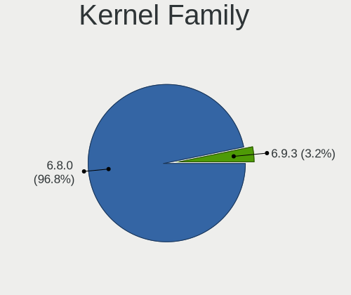
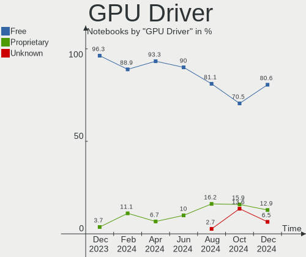
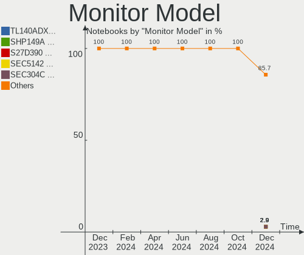
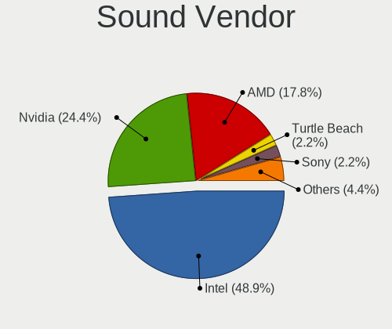
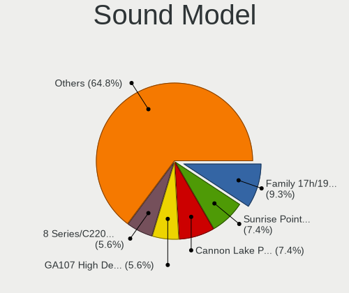

KDE neon - Hardware Trends (Notebooks)
--------------------------------------

A project to identify most popular hardware characteristics and track their change
over time based on data collected by Linux users at https://Linux-Hardware.org.

Anyone can contribute to this report by the [hw-probe](https://github.com/linuxhw/hw-probe) tool:

    sudo -E hw-probe -all -upload

This report is for one last month. Overall report since the beginning of time: [TestDays](https://github.com/linuxhw/TestDays)

Period: Mar, 2023.

Contents
--------

* [ System ](#system)
  - [ OS                       ](#os)
  - [ OS Family                ](#os-family)
  - [ Kernel                   ](#kernel)
  - [ Kernel Family            ](#kernel-family)
  - [ Kernel Major Ver.        ](#kernel-major-ver)
  - [ Arch                     ](#arch)
  - [ DE                       ](#de)
  - [ Display Server           ](#display-server)
  - [ Display Manager          ](#display-manager)
  - [ OS Lang                  ](#os-lang)
  - [ Boot Mode                ](#boot-mode)
  - [ Filesystem               ](#filesystem)
  - [ Part. scheme             ](#part-scheme)
  - [ Dual Boot with Linux/BSD ](#dual-boot-with-linuxbsd)
  - [ Dual Boot (Win)          ](#dual-boot-win)

* [ Board ](#board)
  - [ Vendor                   ](#vendor)
  - [ Model                    ](#model)
  - [ Model Family             ](#model-family)
  - [ MFG Year                 ](#mfg-year)
  - [ Form Factor              ](#form-factor)
  - [ Secure Boot              ](#secure-boot)
  - [ Coreboot                 ](#coreboot)
  - [ RAM Size                 ](#ram-size)
  - [ RAM Used                 ](#ram-used)
  - [ Total Drives             ](#total-drives)
  - [ Has CD-ROM               ](#has-cd-rom)
  - [ Has Ethernet             ](#has-ethernet)
  - [ Has WiFi                 ](#has-wifi)
  - [ Has Bluetooth            ](#has-bluetooth)

* [ Location ](#location)
  - [ Country                  ](#country)
  - [ City                     ](#city)

* [ Drives ](#drives)
  - [ Drive Vendor             ](#drive-vendor)
  - [ Drive Model              ](#drive-model)
  - [ HDD Vendor               ](#hdd-vendor)
  - [ SSD Vendor               ](#ssd-vendor)
  - [ Drive Kind               ](#drive-kind)
  - [ Drive Connector          ](#drive-connector)
  - [ Drive Size               ](#drive-size)
  - [ Space Total              ](#space-total)
  - [ Space Used               ](#space-used)
  - [ Malfunc. Drives          ](#malfunc-drives)
  - [ Malfunc. Drive Vendor    ](#malfunc-drive-vendor)
  - [ Malfunc. HDD Vendor      ](#malfunc-hdd-vendor)
  - [ Malfunc. Drive Kind      ](#malfunc-drive-kind)
  - [ Failed Drives            ](#failed-drives)
  - [ Failed Drive Vendor      ](#failed-drive-vendor)
  - [ Drive Status             ](#drive-status)

* [ Storage controller ](#storage-controller)
  - [ Storage Vendor           ](#storage-vendor)
  - [ Storage Model            ](#storage-model)
  - [ Storage Kind             ](#storage-kind)

* [ Processor ](#processor)
  - [ CPU Vendor               ](#cpu-vendor)
  - [ CPU Model                ](#cpu-model)
  - [ CPU Model Family         ](#cpu-model-family)
  - [ CPU Cores                ](#cpu-cores)
  - [ CPU Sockets              ](#cpu-sockets)
  - [ CPU Threads              ](#cpu-threads)
  - [ CPU Op-Modes             ](#cpu-op-modes)
  - [ CPU Microcode            ](#cpu-microcode)
  - [ CPU Microarch            ](#cpu-microarch)

* [ Graphics ](#graphics)
  - [ GPU Vendor               ](#gpu-vendor)
  - [ GPU Model                ](#gpu-model)
  - [ GPU Combo                ](#gpu-combo)
  - [ GPU Driver               ](#gpu-driver)
  - [ GPU Memory               ](#gpu-memory)

* [ Monitor ](#monitor)
  - [ Monitor Vendor           ](#monitor-vendor)
  - [ Monitor Model            ](#monitor-model)
  - [ Monitor Resolution       ](#monitor-resolution)
  - [ Monitor Diagonal         ](#monitor-diagonal)
  - [ Monitor Width            ](#monitor-width)
  - [ Aspect Ratio             ](#aspect-ratio)
  - [ Monitor Area             ](#monitor-area)
  - [ Pixel Density            ](#pixel-density)
  - [ Multiple Monitors        ](#multiple-monitors)

* [ Network ](#network)
  - [ Net Controller Vendor    ](#net-controller-vendor)
  - [ Net Controller Model     ](#net-controller-model)
  - [ Wireless Vendor          ](#wireless-vendor)
  - [ Wireless Model           ](#wireless-model)
  - [ Ethernet Vendor          ](#ethernet-vendor)
  - [ Ethernet Model           ](#ethernet-model)
  - [ Net Controller Kind      ](#net-controller-kind)
  - [ Used Controller          ](#used-controller)
  - [ NICs                     ](#nics)
  - [ IPv6                     ](#ipv6)

* [ Bluetooth ](#bluetooth)
  - [ Bluetooth Vendor         ](#bluetooth-vendor)
  - [ Bluetooth Model          ](#bluetooth-model)

* [ Sound ](#sound)
  - [ Sound Vendor             ](#sound-vendor)
  - [ Sound Model              ](#sound-model)

* [ Memory ](#memory)
  - [ Memory Vendor            ](#memory-vendor)
  - [ Memory Model             ](#memory-model)
  - [ Memory Kind              ](#memory-kind)
  - [ Memory Form Factor       ](#memory-form-factor)
  - [ Memory Size              ](#memory-size)
  - [ Memory Speed             ](#memory-speed)

* [ Printers & scanners ](#printers--scanners)
  - [ Printer Vendor           ](#printer-vendor)
  - [ Printer Model            ](#printer-model)
  - [ Scanner Vendor           ](#scanner-vendor)
  - [ Scanner Model            ](#scanner-model)

* [ Camera ](#camera)
  - [ Camera Vendor            ](#camera-vendor)
  - [ Camera Model             ](#camera-model)

* [ Security ](#security)
  - [ Fingerprint Vendor       ](#fingerprint-vendor)
  - [ Fingerprint Model        ](#fingerprint-model)
  - [ Chipcard Vendor          ](#chipcard-vendor)
  - [ Chipcard Model           ](#chipcard-model)

* [ Unsupported ](#unsupported)
  - [ Unsupported Devices      ](#unsupported-devices)
  - [ Unsupported Device Types ](#unsupported-device-types)

System
------

OS
--

Installed operating systems

| Name           | Notebooks | Percent |
|----------------|-----------|---------|
| KDE neon 22.04 | 59        | 96.72%  |
| KDE neon 20.04 | 2         | 3.28%   |

OS Family
---------

OS without a version

| Name     | Notebooks | Percent |
|----------|-----------|---------|
| KDE neon | 61        | 100%    |

Kernel
------

Version of the Linux kernel

| Version              | Notebooks | Percent |
|----------------------|-----------|---------|
| 5.19.0-35-generic    | 38        | 62.3%   |
| 5.15.0-60-generic    | 8         | 13.11%  |
| 5.19.0-32-generic    | 5         | 8.2%    |
| 5.19.0-38-generic    | 4         | 6.56%   |
| 5.15.0-67-generic    | 2         | 3.28%   |
| 6.2.3-060203-generic | 1         | 1.64%   |
| 6.2.1-060201-generic | 1         | 1.64%   |
| 6.2.0-060200-generic | 1         | 1.64%   |
| 6.0.9-060009-generic | 1         | 1.64%   |

Kernel Family
-------------

Linux kernel without a distro release

| Version | Notebooks | Percent |
|---------|-----------|---------|
| 5.19.0  | 47        | 77.05%  |
| 5.15.0  | 10        | 16.39%  |
| 6.2.3   | 1         | 1.64%   |
| 6.2.1   | 1         | 1.64%   |
| 6.2.0   | 1         | 1.64%   |
| 6.0.9   | 1         | 1.64%   |

Kernel Major Ver.
-----------------

Linux kernel major version

| Version | Notebooks | Percent |
|---------|-----------|---------|
| 5.19    | 47        | 77.05%  |
| 5.15    | 10        | 16.39%  |
| 6.2     | 3         | 4.92%   |
| 6.0     | 1         | 1.64%   |

Arch
----

OS architecture (x86_64, i586, etc.)

| Name   | Notebooks | Percent |
|--------|-----------|---------|
| x86_64 | 61        | 100%    |

DE
--

Desktop Environment

| Name | Notebooks | Percent |
|------|-----------|---------|
| KDE5 | 61        | 100%    |

Display Server
--------------

X11 or Wayland

| Name    | Notebooks | Percent |
|---------|-----------|---------|
| X11     | 52        | 85.25%  |
| Wayland | 8         | 13.11%  |
| Tty     | 1         | 1.64%   |

Display Manager
---------------

SDDM, LightDM, etc.

| Name    | Notebooks | Percent |
|---------|-----------|---------|
| Unknown | 51        | 83.61%  |
| SDDM    | 10        | 16.39%  |

OS Lang
-------

Language

| Lang  | Notebooks | Percent |
|-------|-----------|---------|
| en_US | 30        | 49.18%  |
| en_GB | 6         | 9.84%   |
| de_DE | 4         | 6.56%   |
| ru_RU | 2         | 3.28%   |
| pt_BR | 2         | 3.28%   |
| fr_FR | 2         | 3.28%   |
| en_IN | 2         | 3.28%   |
| de_CH | 2         | 3.28%   |
| C     | 2         | 3.28%   |
| sl_SI | 1         | 1.64%   |
| pl_PL | 1         | 1.64%   |
| it_IT | 1         | 1.64%   |
| es_PY | 1         | 1.64%   |
| es_MX | 1         | 1.64%   |
| es_ES | 1         | 1.64%   |
| en_DK | 1         | 1.64%   |
| en_CA | 1         | 1.64%   |
| en_AU | 1         | 1.64%   |

Boot Mode
---------

EFI or BIOS

| Mode | Notebooks | Percent |
|------|-----------|---------|
| BIOS | 54        | 88.52%  |
| EFI  | 7         | 11.48%  |

Filesystem
----------

Type of filesystem

| Type    | Notebooks | Percent |
|---------|-----------|---------|
| Ext4    | 58        | 95.08%  |
| Overlay | 1         | 1.64%   |
| Ext3    | 1         | 1.64%   |
| Btrfs   | 1         | 1.64%   |

Part. scheme
------------

Scheme of partitioning

| Type    | Notebooks | Percent |
|---------|-----------|---------|
| Unknown | 51        | 83.61%  |
| GPT     | 9         | 14.75%  |
| MBR     | 1         | 1.64%   |

Dual Boot with Linux/BSD
------------------------

Hosting more than one Linux/BSD

| Dual boot | Notebooks | Percent |
|-----------|-----------|---------|
| No        | 61        | 100%    |

Dual Boot (Win)
---------------

Hosting Linux and Windows

| Dual boot | Notebooks | Percent |
|-----------|-----------|---------|
| No        | 59        | 96.72%  |
| Yes       | 2         | 3.28%   |

Board
-----

Vendor
------

Motherboard manufacturer

| Name                | Notebooks | Percent |
|---------------------|-----------|---------|
| Hewlett-Packard     | 13        | 21.31%  |
| Dell                | 10        | 16.39%  |
| ASUSTek Computer    | 9         | 14.75%  |
| Apple               | 6         | 9.84%   |
| Acer                | 6         | 9.84%   |
| Lenovo              | 5         | 8.2%    |
| Sony                | 2         | 3.28%   |
| Timi                | 1         | 1.64%   |
| Samsung Electronics | 1         | 1.64%   |
| Notebook            | 1         | 1.64%   |
| MSI                 | 1         | 1.64%   |
| Monster             | 1         | 1.64%   |
| HONOR               | 1         | 1.64%   |
| Google              | 1         | 1.64%   |
| Fujitsu             | 1         | 1.64%   |
| Digibras            | 1         | 1.64%   |
| American Megatrends | 1         | 1.64%   |

Model
-----

Motherboard model

| Name                                   | Notebooks | Percent |
|----------------------------------------|-----------|---------|
| ASUS VivoBook_ASUSLaptop X530FN_S530FN | 2         | 3.28%   |
| Apple MacBookPro9,2                    | 2         | 3.28%   |
| Timi Xiaomi Book Pro 16 2022           | 1         | 1.64%   |
| Sony VPCEA23FB                         | 1         | 1.64%   |
| Sony SVF1521Q1EW                       | 1         | 1.64%   |
| Samsung 350V5C/351V5C/3540VC/3440VC    | 1         | 1.64%   |
| Notebook NS50MU                        | 1         | 1.64%   |
| MSI GF65 Thin 9SD                      | 1         | 1.64%   |
| Monster TULPAR T7 V19.5                | 1         | 1.64%   |
| Lenovo ThinkPad W510 4318CTO           | 1         | 1.64%   |
| Lenovo ThinkPad E485 20KU001KUS        | 1         | 1.64%   |
| Lenovo IdeaPad Gaming 3 15IHU6 82K1    | 1         | 1.64%   |
| Lenovo IdeaPad Gaming 3 15ACH6 82K2    | 1         | 1.64%   |
| Lenovo G560 20042                      | 1         | 1.64%   |
| HONOR BBR-WAX9                         | 1         | 1.64%   |
| HP ZBook 17 G3                         | 1         | 1.64%   |
| HP ProBook 6565b                       | 1         | 1.64%   |
| HP ProBook 645 G1                      | 1         | 1.64%   |
| HP ProBook 450 G6                      | 1         | 1.64%   |
| HP Pavilion Notebook                   | 1         | 1.64%   |
| HP Pavilion Laptop 15-cw1xxx           | 1         | 1.64%   |
| HP Notebook                            | 1         | 1.64%   |
| HP Laptop 17-cn0xxx                    | 1         | 1.64%   |
| HP Laptop 15s-eq2xxx                   | 1         | 1.64%   |
| HP Laptop 15-db0xxx                    | 1         | 1.64%   |
| HP EliteBook 855 G8 Notebook PC        | 1         | 1.64%   |
| HP Compaq 15                           | 1         | 1.64%   |
| Google Ultima                          | 1         | 1.64%   |
| Fujitsu LIFEBOOK A531                  | 1         | 1.64%   |
| Digibras NH4CU03                       | 1         | 1.64%   |
| Dell XPS 15 9570                       | 1         | 1.64%   |
| Dell Vostro 3401                       | 1         | 1.64%   |
| Dell Latitude E7450                    | 1         | 1.64%   |
| Dell Latitude E6520                    | 1         | 1.64%   |
| Dell Latitude 5521                     | 1         | 1.64%   |
| Dell Latitude 5511                     | 1         | 1.64%   |
| Dell Latitude 3510                     | 1         | 1.64%   |
| Dell Inspiron 7537                     | 1         | 1.64%   |
| Dell Inspiron 5505                     | 1         | 1.64%   |
| Dell Inspiron 3542                     | 1         | 1.64%   |

Model Family
------------

Motherboard model prefix

| Name                           | Notebooks | Percent |
|--------------------------------|-----------|---------|
| Dell Latitude                  | 5         | 8.2%    |
| Acer Aspire                    | 4         | 6.56%   |
| HP ProBook                     | 3         | 4.92%   |
| HP Laptop                      | 3         | 4.92%   |
| Dell Inspiron                  | 3         | 4.92%   |
| ASUS VivoBook                  | 3         | 4.92%   |
| Lenovo ThinkPad                | 2         | 3.28%   |
| Lenovo IdeaPad                 | 2         | 3.28%   |
| HP Pavilion                    | 2         | 3.28%   |
| ASUS ROG                       | 2         | 3.28%   |
| Apple MacBookPro9              | 2         | 3.28%   |
| Apple MacBookPro11             | 2         | 3.28%   |
| Acer Swift                     | 2         | 3.28%   |
| Timi Xiaomi                    | 1         | 1.64%   |
| Sony VPCEA23FB                 | 1         | 1.64%   |
| Sony SVF1521Q1EW               | 1         | 1.64%   |
| Samsung 350V5C                 | 1         | 1.64%   |
| Notebook NS50MU                | 1         | 1.64%   |
| MSI GF65                       | 1         | 1.64%   |
| Monster TULPAR                 | 1         | 1.64%   |
| Lenovo G560                    | 1         | 1.64%   |
| HONOR BBR-WAX9                 | 1         | 1.64%   |
| HP ZBook                       | 1         | 1.64%   |
| HP Notebook                    | 1         | 1.64%   |
| HP EliteBook                   | 1         | 1.64%   |
| HP Compaq                      | 1         | 1.64%   |
| Google Ultima                  | 1         | 1.64%   |
| Fujitsu LIFEBOOK               | 1         | 1.64%   |
| Digibras NH4CU03               | 1         | 1.64%   |
| Dell XPS                       | 1         | 1.64%   |
| Dell Vostro                    | 1         | 1.64%   |
| ASUS ZenBook                   | 1         | 1.64%   |
| ASUS X556UQ                    | 1         | 1.64%   |
| ASUS K53SC                     | 1         | 1.64%   |
| ASUS K50IJ                     | 1         | 1.64%   |
| Apple MacBookPro13             | 1         | 1.64%   |
| Apple MacBook5                 | 1         | 1.64%   |
| American Megatrends XA133PR110 | 1         | 1.64%   |
| Unknown                        | 1         | 1.64%   |

MFG Year
--------

Motherboard manufacture year

| Year | Notebooks | Percent |
|------|-----------|---------|
| 2021 | 11        | 18.03%  |
| 2020 | 7         | 11.48%  |
| 2018 | 7         | 11.48%  |
| 2019 | 5         | 8.2%    |
| 2016 | 5         | 8.2%    |
| 2013 | 5         | 8.2%    |
| 2014 | 4         | 6.56%   |
| 2011 | 4         | 6.56%   |
| 2012 | 3         | 4.92%   |
| 2009 | 3         | 4.92%   |
| 2022 | 2         | 3.28%   |
| 2015 | 2         | 3.28%   |
| 2010 | 2         | 3.28%   |
| 2008 | 1         | 1.64%   |

Form Factor
-----------

Physical design of the computer

| Name     | Notebooks | Percent |
|----------|-----------|---------|
| Notebook | 61        | 100%    |

Secure Boot
-----------

Enabled or disabled

| State    | Notebooks | Percent |
|----------|-----------|---------|
| Disabled | 61        | 100%    |

Coreboot
--------

Have coreboot on board

| Used | Notebooks | Percent |
|------|-----------|---------|
| No   | 60        | 98.36%  |
| Yes  | 1         | 1.64%   |

RAM Size
--------

Total RAM memory

| Size in GB  | Notebooks | Percent |
|-------------|-----------|---------|
| 4.01-8.0    | 27        | 44.26%  |
| 16.01-24.0  | 14        | 22.95%  |
| 8.01-16.0   | 9         | 14.75%  |
| 3.01-4.0    | 6         | 9.84%   |
| 32.01-64.0  | 3         | 4.92%   |
| 64.01-256.0 | 1         | 1.64%   |
| 1.01-2.0    | 1         | 1.64%   |

RAM Used
--------

Used RAM memory

| Used GB   | Notebooks | Percent |
|-----------|-----------|---------|
| 2.01-3.0  | 24        | 39.34%  |
| 1.01-2.0  | 17        | 27.87%  |
| 3.01-4.0  | 9         | 14.75%  |
| 4.01-8.0  | 6         | 9.84%   |
| 8.01-16.0 | 4         | 6.56%   |
| 0.51-1.0  | 1         | 1.64%   |

Total Drives
------------

Number of drives on board

| Drives | Notebooks | Percent |
|--------|-----------|---------|
| 1      | 47        | 77.05%  |
| 2      | 14        | 22.95%  |

Has CD-ROM
----------

Has CD-ROM on board

| Presented | Notebooks | Percent |
|-----------|-----------|---------|
| No        | 41        | 67.21%  |
| Yes       | 20        | 32.79%  |

Has Ethernet
------------

Has Ethernet on board

| Presented | Notebooks | Percent |
|-----------|-----------|---------|
| Yes       | 49        | 80.33%  |
| No        | 12        | 19.67%  |

Has WiFi
--------

Has WiFi module

| Presented | Notebooks | Percent |
|-----------|-----------|---------|
| Yes       | 59        | 96.72%  |
| No        | 2         | 3.28%   |

Has Bluetooth
-------------

Has Bluetooth module

| Presented | Notebooks | Percent |
|-----------|-----------|---------|
| Yes       | 53        | 86.89%  |
| No        | 8         | 13.11%  |

Location
--------

Country
-------

Geographic location (country)

| Country     | Notebooks | Percent |
|-------------|-----------|---------|
| USA         | 12        | 19.67%  |
| Germany     | 4         | 6.56%   |
| UK          | 3         | 4.92%   |
| Russia      | 3         | 4.92%   |
| Mexico      | 3         | 4.92%   |
| India       | 3         | 4.92%   |
| France      | 3         | 4.92%   |
| Brazil      | 3         | 4.92%   |
| Turkey      | 2         | 3.28%   |
| Switzerland | 2         | 3.28%   |
| Philippines | 2         | 3.28%   |
| Australia   | 2         | 3.28%   |
| Spain       | 1         | 1.64%   |
| South Korea | 1         | 1.64%   |
| Slovenia    | 1         | 1.64%   |
| Slovakia    | 1         | 1.64%   |
| Portugal    | 1         | 1.64%   |
| Poland      | 1         | 1.64%   |
| Paraguay    | 1         | 1.64%   |
| Panama      | 1         | 1.64%   |
| Norway      | 1         | 1.64%   |
| Netherlands | 1         | 1.64%   |
| Italy       | 1         | 1.64%   |
| Greece      | 1         | 1.64%   |
| Denmark     | 1         | 1.64%   |
| Czechia     | 1         | 1.64%   |
| Curaçao    | 1         | 1.64%   |
| China       | 1         | 1.64%   |
| Chile       | 1         | 1.64%   |
| Canada      | 1         | 1.64%   |
| Bangladesh  | 1         | 1.64%   |

City
----

Geographic location (city)

| City                      | Notebooks | Percent |
|---------------------------|-----------|---------|
| Wuppertal                 | 1         | 1.64%   |
| Winterthur                | 1         | 1.64%   |
| Willemstad                | 1         | 1.64%   |
| Warsaw                    | 1         | 1.64%   |
| Villafranca de los Barros | 1         | 1.64%   |
| Villa de la Paz           | 1         | 1.64%   |
| Vancouver                 | 1         | 1.64%   |
| Ürümqi                  | 1         | 1.64%   |
| Trivandrum                | 1         | 1.64%   |
| Telford                   | 1         | 1.64%   |
| Sylhet                    | 1         | 1.64%   |
| Stavanger                 | 1         | 1.64%   |
| Slagelse                  | 1         | 1.64%   |
| Seo-gu                    | 1         | 1.64%   |
| Santiago                  | 1         | 1.64%   |
| Rome                      | 1         | 1.64%   |
| Porto Alegre              | 1         | 1.64%   |
| Plymouth                  | 1         | 1.64%   |
| Panama City               | 1         | 1.64%   |
| Orlando                   | 1         | 1.64%   |
| Oliveira de Azeméis      | 1         | 1.64%   |
| Norman                    | 1         | 1.64%   |
| Nizhniy Novgorod          | 1         | 1.64%   |
| New York                  | 1         | 1.64%   |
| Murfreesboro              | 1         | 1.64%   |
| Moscow                    | 1         | 1.64%   |
| London                    | 1         | 1.64%   |
| Ljubljana                 | 1         | 1.64%   |
| Liberec                   | 1         | 1.64%   |
| Laon                      | 1         | 1.64%   |
| Lahug                     | 1         | 1.64%   |
| Krasnodar                 | 1         | 1.64%   |
| Košice                   | 1         | 1.64%   |
| Konya                     | 1         | 1.64%   |
| Keuka Park                | 1         | 1.64%   |
| Juarez                    | 1         | 1.64%   |
| Izmir                     | 1         | 1.64%   |
| Huntington                | 1         | 1.64%   |
| Houston                   | 1         | 1.64%   |
| Hamburg                   | 1         | 1.64%   |

Drives
------

Drive Vendor
------------

Hard drive vendors

| Vendor                      | Notebooks | Drives | Percent |
|-----------------------------|-----------|--------|---------|
| Samsung Electronics         | 9         | 11     | 13.04%  |
| Sandisk                     | 8         | 8      | 11.59%  |
| Toshiba                     | 7         | 7      | 10.14%  |
| WDC                         | 6         | 6      | 8.7%    |
| Seagate                     | 6         | 6      | 8.7%    |
| SK hynix                    | 4         | 4      | 5.8%    |
| Kingston                    | 4         | 4      | 5.8%    |
| China                       | 3         | 3      | 4.35%   |
| Unknown                     | 2         | 3      | 2.9%    |
| Silicon Motion              | 2         | 2      | 2.9%    |
| Micron Technology           | 2         | 2      | 2.9%    |
| KIOXIA                      | 2         | 2      | 2.9%    |
| Crucial                     | 2         | 2      | 2.9%    |
| Apple                       | 2         | 5      | 2.9%    |
| ADATA Technology            | 2         | 2      | 2.9%    |
| T-FORCE                     | 1         | 1      | 1.45%   |
| ShiJi                       | 1         | 1      | 1.45%   |
| Radeon                      | 1         | 1      | 1.45%   |
| Micron/Crucial Technology   | 1         | 1      | 1.45%   |
| MAXIO Technology (Hangzhou) | 1         | 1      | 1.45%   |
| Hitachi                     | 1         | 1      | 1.45%   |
| HGST                        | 1         | 1      | 1.45%   |
| BHT                         | 1         | 1      | 1.45%   |

Drive Model
-----------

Hard drive models

| Model                                                  | Notebooks | Percent |
|--------------------------------------------------------|-----------|---------|
| Samsung NVMe SSD Controller SM981/PM981/PM983 250GB    | 4         | 5.56%   |
| Toshiba MQ01ABF050 500GB                               | 2         | 2.78%   |
| Silicon Motion SM2263EN/SM2263XT SSD Controller 1024GB | 2         | 2.78%   |
| Seagate ST500LM012 HN-M500MBB 500GB                    | 2         | 2.78%   |
| Seagate ST1000LM035-1RK172 1TB                         | 2         | 2.78%   |
| Samsung NVMe SSD Controller PM9A1/PM9A3/980PRO 1TB     | 2         | 2.78%   |
| Micron 2200V_MTFDHBA512TCK  512GB                      | 2         | 2.78%   |
| WDC WDS240G2G0A-00JH30 240GB SSD                       | 1         | 1.39%   |
| WDC WD5000LPVX-22V0TT0 500GB                           | 1         | 1.39%   |
| WDC WD5000LPCX-60VHAT0 500GB                           | 1         | 1.39%   |
| WDC WD10JPVX-00JC3T0 1TB                               | 1         | 1.39%   |
| WDC WD10JPCX-24UE4T0 1TB                               | 1         | 1.39%   |
| WDC PC SN520 SDAPNUW-256G-1006 256GB                   | 1         | 1.39%   |
| Unknown MMC Card  16GB                                 | 1         | 1.39%   |
| Unknown MMC Card  134GB                                | 1         | 1.39%   |
| Toshiba MQ04ABF100 1TB                                 | 1         | 1.39%   |
| Toshiba MQ01ABD100 1TB                                 | 1         | 1.39%   |
| Toshiba MQ01ABD050 500GB                               | 1         | 1.39%   |
| Toshiba MK3261GSYN 320GB                               | 1         | 1.39%   |
| Toshiba KBG40ZNT512G MEMORY 512GB                      | 1         | 1.39%   |
| T-FORCE SSD 1TB                                        | 1         | 1.39%   |
| SK hynix SC210 mSATA 256GB SSD                         | 1         | 1.39%   |
| SK hynix PC711 NVMe 512GB                              | 1         | 1.39%   |
| SK hynix HFS512G32MND-3210A 512GB SSD                  | 1         | 1.39%   |
| SK hynix BC511 512GB                                   | 1         | 1.39%   |
| ShiJi 512GB                                            | 1         | 1.39%   |
| Seagate ST9500325AS 500GB                              | 1         | 1.39%   |
| Seagate ST2000LX001-1RG174 2TB                         | 1         | 1.39%   |
| Sandisk WD Blue SN550 NVMe SSD 256GB                   | 1         | 1.39%   |
| Sandisk WD Blue SN500 / PC SN520 NVMe SSD 512GB        | 1         | 1.39%   |
| Sandisk WD Black SN750 / PC SN730 NVMe SSD 1TB         | 1         | 1.39%   |
| SanDisk Ultra II 240GB SSD                             | 1         | 1.39%   |
| SanDisk SSD PLUS 480GB                                 | 1         | 1.39%   |
| SanDisk SD9SN8W256G1102 256GB SSD                      | 1         | 1.39%   |
| SanDisk SD9SN8W-128G-1006 128GB SSD                    | 1         | 1.39%   |
| SanDisk SD7SB3Q-128G-1006 128GB SSD                    | 1         | 1.39%   |
| Samsung SSD 980 PRO 500GB                              | 1         | 1.39%   |
| Samsung SSD 980 PRO 250GB                              | 1         | 1.39%   |
| Samsung SSD 850 EVO 1TB                                | 1         | 1.39%   |
| Samsung MZALQ512HBLU-00BL2 512GB                       | 1         | 1.39%   |

HDD Vendor
----------

Hard disk drive vendors

| Vendor  | Notebooks | Drives | Percent |
|---------|-----------|--------|---------|
| Toshiba | 6         | 6      | 33.33%  |
| Seagate | 6         | 6      | 33.33%  |
| WDC     | 4         | 4      | 22.22%  |
| Hitachi | 1         | 1      | 5.56%   |
| HGST    | 1         | 1      | 5.56%   |

SSD Vendor
----------

Solid state drive vendors

| Vendor              | Notebooks | Drives | Percent |
|---------------------|-----------|--------|---------|
| SanDisk             | 5         | 5      | 23.81%  |
| China               | 3         | 3      | 14.29%  |
| SK hynix            | 2         | 2      | 9.52%   |
| Samsung Electronics | 2         | 2      | 9.52%   |
| Kingston            | 2         | 2      | 9.52%   |
| Crucial             | 2         | 2      | 9.52%   |
| WDC                 | 1         | 1      | 4.76%   |
| T-FORCE             | 1         | 1      | 4.76%   |
| Radeon              | 1         | 1      | 4.76%   |
| BHT                 | 1         | 1      | 4.76%   |
| Apple               | 1         | 1      | 4.76%   |

Drive Kind
----------

HDD or SSD

| Kind    | Notebooks | Drives | Percent |
|---------|-----------|--------|---------|
| NVMe    | 27        | 32     | 39.71%  |
| SSD     | 20        | 21     | 29.41%  |
| HDD     | 18        | 18     | 26.47%  |
| MMC     | 2         | 3      | 2.94%   |
| Unknown | 1         | 1      | 1.47%   |

Drive Connector
---------------

SATA, SAS, NVMe, etc.

| Type | Notebooks | Drives | Percent |
|------|-----------|--------|---------|
| SATA | 38        | 40     | 56.72%  |
| NVMe | 27        | 32     | 40.3%   |
| MMC  | 2         | 3      | 2.99%   |

Drive Size
----------

Size of hard drive

| Size in TB | Notebooks | Drives | Percent |
|------------|-----------|--------|---------|
| 0.01-0.5   | 26        | 26     | 68.42%  |
| 0.51-1.0   | 11        | 12     | 28.95%  |
| 1.01-2.0   | 1         | 1      | 2.63%   |

Space Total
-----------

Amount of disk space available on the file system

| Size in GB     | Notebooks | Percent |
|----------------|-----------|---------|
| 101-250        | 21        | 34.43%  |
| 251-500        | 13        | 21.31%  |
| 501-1000       | 9         | 14.75%  |
| 51-100         | 6         | 9.84%   |
| 21-50          | 4         | 6.56%   |
| 1001-2000      | 4         | 6.56%   |
| 1-20           | 3         | 4.92%   |
| More than 3000 | 1         | 1.64%   |

Space Used
----------

Amount of used disk space

| Used GB   | Notebooks | Percent |
|-----------|-----------|---------|
| 1-20      | 26        | 42.62%  |
| 21-50     | 13        | 21.31%  |
| 251-500   | 6         | 9.84%   |
| 101-250   | 6         | 9.84%   |
| 51-100    | 5         | 8.2%    |
| 1001-2000 | 3         | 4.92%   |
| 501-1000  | 2         | 3.28%   |

Malfunc. Drives
---------------

Drive models with a malfunction

Zero info for selected period =(

Malfunc. Drive Vendor
---------------------

Vendors of faulty drives

Zero info for selected period =(

Malfunc. HDD Vendor
-------------------

Vendors of faulty HDD drives

Zero info for selected period =(

Malfunc. Drive Kind
-------------------

Kinds of faulty drives

Zero info for selected period =(

Failed Drives
-------------

Failed drive models

Zero info for selected period =(

Failed Drive Vendor
-------------------

Failed drive vendors

Zero info for selected period =(

Drive Status
------------

Number of failed and malfunc. drives

| Status   | Notebooks | Drives | Percent |
|----------|-----------|--------|---------|
| Detected | 54        | 65     | 87.1%   |
| Works    | 8         | 10     | 12.9%   |

Storage controller
------------------

Storage Vendor
--------------

Storage controller vendors

| Vendor                      | Notebooks | Percent |
|-----------------------------|-----------|---------|
| Intel                       | 39        | 50.65%  |
| AMD                         | 9         | 11.69%  |
| Samsung Electronics         | 8         | 10.39%  |
| SanDisk                     | 4         | 5.19%   |
| KIOXIA                      | 3         | 3.9%    |
| SK hynix                    | 2         | 2.6%    |
| Silicon Motion              | 2         | 2.6%    |
| Micron Technology           | 2         | 2.6%    |
| Kingston Technology Company | 2         | 2.6%    |
| ADATA Technology            | 2         | 2.6%    |
| Nvidia                      | 1         | 1.3%    |
| Micron/Crucial Technology   | 1         | 1.3%    |
| MAXIO Technology (Hangzhou) | 1         | 1.3%    |
| Apple                       | 1         | 1.3%    |

Storage Model
-------------

Storage controller models

| Model                                                                        | Notebooks | Percent |
|------------------------------------------------------------------------------|-----------|---------|
| AMD FCH SATA Controller [AHCI mode]                                          | 8         | 9.64%   |
| Intel 7 Series Chipset Family 6-port SATA Controller [AHCI mode]             | 7         | 8.43%   |
| Samsung NVMe SSD Controller SM981/PM981/PM983                                | 4         | 4.82%   |
| Intel Cannon Lake Mobile PCH SATA AHCI Controller                            | 4         | 4.82%   |
| Samsung NVMe SSD Controller PM9A1/PM9A3/980PRO                               | 3         | 3.61%   |
| Intel Volume Management Device NVMe RAID Controller                          | 3         | 3.61%   |
| Intel Tiger Lake-LP SATA Controller                                          | 3         | 3.61%   |
| Intel 6 Series/C200 Series Chipset Family 6 port Mobile SATA AHCI Controller | 3         | 3.61%   |
| Silicon Motion SM2263EN/SM2263XT SSD Controller                              | 2         | 2.41%   |
| SanDisk WD Blue SN500 / PC SN520 NVMe SSD                                    | 2         | 2.41%   |
| Micron NVMe Storage Controller                                               | 2         | 2.41%   |
| KIOXIA NVMe SSD Controller BG4                                               | 2         | 2.41%   |
| Intel Wildcat Point-LP SATA Controller [AHCI Mode]                           | 2         | 2.41%   |
| Intel Comet Lake SATA AHCI Controller                                        | 2         | 2.41%   |
| Intel Cannon Point-LP SATA Controller [AHCI Mode]                            | 2         | 2.41%   |
| Intel 82801 Mobile SATA Controller [RAID mode]                               | 2         | 2.41%   |
| Intel 8 Series SATA Controller 1 [AHCI mode]                                 | 2         | 2.41%   |
| Intel 5 Series/3400 Series Chipset 4 port SATA AHCI Controller               | 2         | 2.41%   |
| SK hynix Gold P31/PC711 NVMe Solid State Drive                               | 1         | 1.2%    |
| SK hynix BC511                                                               | 1         | 1.2%    |
| SanDisk WD Blue SN550 NVMe SSD                                               | 1         | 1.2%    |
| SanDisk WD Black SN750 / PC SN730 NVMe SSD                                   | 1         | 1.2%    |
| Samsung NVMe SSD Controller 980                                              | 1         | 1.2%    |
| Samsung Apple PCIe SSD                                                       | 1         | 1.2%    |
| Nvidia MCP79 AHCI Controller                                                 | 1         | 1.2%    |
| Micron/Crucial NVMe Storage Controller                                       | 1         | 1.2%    |
| MAXIO (Hangzhou) NVMe SSD Controller MAP1202                                 | 1         | 1.2%    |
| KIOXIA Non-Volatile memory controller                                        | 1         | 1.2%    |
| Kingston Company OM3PDP3 NVMe SSD                                            | 1         | 1.2%    |
| Kingston Company KC2000 NVMe SSD                                             | 1         | 1.2%    |
| Intel Sunrise Point-LP SATA Controller [AHCI mode]                           | 1         | 1.2%    |
| Intel SATA Controller [RAID mode]                                            | 1         | 1.2%    |
| Intel HM170/QM170 Chipset SATA Controller [AHCI Mode]                        | 1         | 1.2%    |
| Intel Celeron/Pentium Silver Processor SATA Controller                       | 1         | 1.2%    |
| Intel 82801IBM/IEM (ICH9M/ICH9M-E) 4 port SATA Controller [AHCI mode]        | 1         | 1.2%    |
| Intel 82801HM/HEM (ICH8M/ICH8M-E) SATA Controller [IDE mode]                 | 1         | 1.2%    |
| Intel 82801HM/HEM (ICH8M/ICH8M-E) IDE Controller                             | 1         | 1.2%    |
| Intel 500 Series Chipset Family SATA AHCI Controller                         | 1         | 1.2%    |
| Intel 5 Series/3400 Series Chipset 6 port SATA AHCI Controller               | 1         | 1.2%    |
| Intel 5 Series/3400 Series Chipset 4 port SATA IDE Controller                | 1         | 1.2%    |

Storage Kind
------------

Kind of storage controller (IDE, SATA, NVMe, SAS, ...)

| Kind | Notebooks | Percent |
|------|-----------|---------|
| SATA | 45        | 56.25%  |
| NVMe | 27        | 33.75%  |
| RAID | 6         | 7.5%    |
| IDE  | 2         | 2.5%    |

Processor
---------

CPU Vendor
----------

Processor vendors

| Vendor | Notebooks | Percent |
|--------|-----------|---------|
| Intel  | 47        | 77.05%  |
| AMD    | 14        | 22.95%  |

CPU Model
---------

Processor models

| Model                                    | Notebooks | Percent |
|------------------------------------------|-----------|---------|
| Intel Core i7-9750H CPU @ 2.60GHz        | 4         | 6.56%   |
| Intel Core i5-3210M CPU @ 2.50GHz        | 3         | 4.92%   |
| Intel Core i5-8265U CPU @ 1.60GHz        | 2         | 3.28%   |
| Intel 11th Gen Core i3-1115G4 @ 3.00GHz  | 2         | 3.28%   |
| Intel Pentium Silver N5030 CPU @ 1.10GHz | 1         | 1.64%   |
| Intel Pentium CPU 2020M @ 2.40GHz        | 1         | 1.64%   |
| Intel Core i7-8750H CPU @ 2.20GHz        | 1         | 1.64%   |
| Intel Core i7-8565U CPU @ 1.80GHz        | 1         | 1.64%   |
| Intel Core i7-6820HQ CPU @ 2.70GHz       | 1         | 1.64%   |
| Intel Core i7-4870HQ CPU @ 2.50GHz       | 1         | 1.64%   |
| Intel Core i7-4770HQ CPU @ 2.20GHz       | 1         | 1.64%   |
| Intel Core i7-4500U CPU @ 1.80GHz        | 1         | 1.64%   |
| Intel Core i7-3632QM CPU @ 2.20GHz       | 1         | 1.64%   |
| Intel Core i7-10850H CPU @ 2.70GHz       | 1         | 1.64%   |
| Intel Core i7-10510U CPU @ 1.80GHz       | 1         | 1.64%   |
| Intel Core i7 CPU Q 720 @ 1.60GHz        | 1         | 1.64%   |
| Intel Core i5-6360U CPU @ 2.00GHz        | 1         | 1.64%   |
| Intel Core i5-6300HQ CPU @ 2.30GHz       | 1         | 1.64%   |
| Intel Core i5-6200U CPU @ 2.30GHz        | 1         | 1.64%   |
| Intel Core i5-5300U CPU @ 2.30GHz        | 1         | 1.64%   |
| Intel Core i5-4210U CPU @ 1.70GHz        | 1         | 1.64%   |
| Intel Core i5-3337U CPU @ 1.80GHz        | 1         | 1.64%   |
| Intel Core i5-2520M CPU @ 2.50GHz        | 1         | 1.64%   |
| Intel Core i5-2450M CPU @ 2.50GHz        | 1         | 1.64%   |
| Intel Core i5 CPU M 430 @ 2.27GHz        | 1         | 1.64%   |
| Intel Core i3-5020U CPU @ 2.20GHz        | 1         | 1.64%   |
| Intel Core i3-3217U CPU @ 1.80GHz        | 1         | 1.64%   |
| Intel Core i3-2310M CPU @ 2.10GHz        | 1         | 1.64%   |
| Intel Core i3-10110U CPU @ 2.10GHz       | 1         | 1.64%   |
| Intel Core i3-1005G1 CPU @ 1.20GHz       | 1         | 1.64%   |
| Intel Core i3 CPU M 370 @ 2.40GHz        | 1         | 1.64%   |
| Intel Core i3 CPU M 330 @ 2.13GHz        | 1         | 1.64%   |
| Intel Core 2 Duo CPU T9300 @ 2.50GHz     | 1         | 1.64%   |
| Intel Core 2 Duo CPU P8600 @ 2.40GHz     | 1         | 1.64%   |
| Intel Celeron CPU N3150 @ 1.60GHz        | 1         | 1.64%   |
| Intel Celeron CPU 560 @ 2.13GHz          | 1         | 1.64%   |
| Intel 12th Gen Core i5-1240P             | 1         | 1.64%   |
| Intel 11th Gen Core i7-11850H @ 2.50GHz  | 1         | 1.64%   |
| Intel 11th Gen Core i5-1135G7 @ 2.40GHz  | 1         | 1.64%   |
| Intel 11th Gen Core i5-11300H @ 3.10GHz  | 1         | 1.64%   |

CPU Model Family
----------------

Processor model prefix

| Model                | Notebooks | Percent |
|----------------------|-----------|---------|
| Intel Core i7        | 14        | 22.95%  |
| Intel Core i5        | 14        | 22.95%  |
| Intel Core i3        | 7         | 11.48%  |
| Other                | 6         | 9.84%   |
| AMD Ryzen 5          | 4         | 6.56%   |
| AMD Ryzen 7          | 3         | 4.92%   |
| AMD A6               | 3         | 4.92%   |
| Intel Core 2 Duo     | 2         | 3.28%   |
| Intel Celeron        | 2         | 3.28%   |
| Intel Pentium Silver | 1         | 1.64%   |
| Intel Pentium        | 1         | 1.64%   |
| AMD Ryzen 7 PRO      | 1         | 1.64%   |
| AMD Ryzen 3          | 1         | 1.64%   |
| AMD E2               | 1         | 1.64%   |
| AMD A4               | 1         | 1.64%   |

CPU Cores
---------

Number of processor cores

| Number | Notebooks | Percent |
|--------|-----------|---------|
| 2      | 25        | 40.98%  |
| 4      | 21        | 34.43%  |
| 6      | 8         | 13.11%  |
| 8      | 4         | 6.56%   |
| 1      | 2         | 3.28%   |
| 12     | 1         | 1.64%   |

CPU Sockets
-----------

Number of sockets

| Number | Notebooks | Percent |
|--------|-----------|---------|
| 1      | 61        | 100%    |

CPU Threads
-----------

Threads per core (Hyper-Threading)

| Number | Notebooks | Percent |
|--------|-----------|---------|
| 2      | 48        | 78.69%  |
| 1      | 13        | 21.31%  |

CPU Op-Modes
------------

CPU Operation Modes (32-bit, 64-bit)

| Op mode        | Notebooks | Percent |
|----------------|-----------|---------|
| 32-bit, 64-bit | 61        | 100%    |

CPU Microcode
-------------

Microcode number

| Number     | Notebooks | Percent |
|------------|-----------|---------|
| Unknown    | 51        | 83.61%  |
| 0x806c1    | 2         | 3.28%   |
| 0x806ec    | 1         | 1.64%   |
| 0x506e3    | 1         | 1.64%   |
| 0x406e3    | 1         | 1.64%   |
| 0x40651    | 1         | 1.64%   |
| 0x20652    | 1         | 1.64%   |
| 0x0a50000c | 1         | 1.64%   |
| 0x08608102 | 1         | 1.64%   |
| 0x08108102 | 1         | 1.64%   |

CPU Microarch
-------------

Microarchitecture

| Name          | Notebooks | Percent |
|---------------|-----------|---------|
| KabyLake      | 10        | 16.39%  |
| IvyBridge     | 7         | 11.48%  |
| TigerLake     | 4         | 6.56%   |
| Skylake       | 4         | 6.56%   |
| Haswell       | 4         | 6.56%   |
| Unknown       | 4         | 6.56%   |
| Westmere      | 3         | 4.92%   |
| SandyBridge   | 3         | 4.92%   |
| Zen+          | 2         | 3.28%   |
| Zen 3         | 2         | 3.28%   |
| Zen 2         | 2         | 3.28%   |
| Penryn        | 2         | 3.28%   |
| Broadwell     | 2         | 3.28%   |
| Zen           | 1         | 1.64%   |
| Silvermont    | 1         | 1.64%   |
| Puma          | 1         | 1.64%   |
| Piledriver    | 1         | 1.64%   |
| Nehalem       | 1         | 1.64%   |
| K10 Llano     | 1         | 1.64%   |
| Jaguar        | 1         | 1.64%   |
| IceLake       | 1         | 1.64%   |
| Goldmont plus | 1         | 1.64%   |
| Excavator     | 1         | 1.64%   |
| Core          | 1         | 1.64%   |
| CometLake     | 1         | 1.64%   |

Graphics
--------

GPU Vendor
----------

Vendors of graphics cards

| Vendor | Notebooks | Percent |
|--------|-----------|---------|
| Intel  | 43        | 54.43%  |
| Nvidia | 21        | 26.58%  |
| AMD    | 15        | 18.99%  |

GPU Model
---------

Graphics card models

| Model                                                                     | Notebooks | Percent |
|---------------------------------------------------------------------------|-----------|---------|
| Intel 3rd Gen Core processor Graphics Controller                          | 7         | 8.75%   |
| Intel CoffeeLake-H GT2 [UHD Graphics 630]                                 | 5         | 6.25%   |
| Intel WhiskeyLake-U GT2 [UHD Graphics 620]                                | 3         | 3.75%   |
| Intel Core Processor Integrated Graphics Controller                       | 3         | 3.75%   |
| Nvidia TU117M [GeForce GTX 1650 Mobile / Max-Q]                           | 2         | 2.5%    |
| Nvidia TU116M [GeForce GTX 1660 Ti Mobile]                                | 2         | 2.5%    |
| Nvidia GP108M [GeForce MX150]                                             | 2         | 2.5%    |
| Intel TigerLake-LP GT2 [Iris Xe Graphics]                                 | 2         | 2.5%    |
| Intel Tiger Lake-LP GT2 [UHD Graphics G4]                                 | 2         | 2.5%    |
| Intel HD Graphics 5500                                                    | 2         | 2.5%    |
| Intel HD Graphics 530                                                     | 2         | 2.5%    |
| Intel Haswell-ULT Integrated Graphics Controller                          | 2         | 2.5%    |
| Intel CometLake-U GT2 [UHD Graphics]                                      | 2         | 2.5%    |
| Intel 2nd Generation Core Processor Family Integrated Graphics Controller | 2         | 2.5%    |
| AMD Renoir                                                                | 2         | 2.5%    |
| AMD Picasso/Raven 2 [Radeon Vega Series / Radeon Vega Mobile Series]      | 2         | 2.5%    |
| AMD Lucienne                                                              | 2         | 2.5%    |
| AMD Cezanne [Radeon Vega Series / Radeon Vega Mobile Series]              | 2         | 2.5%    |
| Nvidia TU106M [GeForce RTX 2070 Mobile]                                   | 1         | 1.25%   |
| Nvidia GT216GLM [Quadro FX 880M]                                          | 1         | 1.25%   |
| Nvidia GP107M [GeForce MX350]                                             | 1         | 1.25%   |
| Nvidia GP107M [GeForce MX150]                                             | 1         | 1.25%   |
| Nvidia GP107M [GeForce GTX 1050 Ti Mobile]                                | 1         | 1.25%   |
| Nvidia GM204GLM [Quadro M3000M]                                           | 1         | 1.25%   |
| Nvidia GM108M [GeForce 940MX]                                             | 1         | 1.25%   |
| Nvidia GM107M [GeForce GTX 950M]                                          | 1         | 1.25%   |
| Nvidia GK107M [GeForce GT 750M]                                           | 1         | 1.25%   |
| Nvidia GK107M [GeForce GT 750M Mac Edition]                               | 1         | 1.25%   |
| Nvidia GF119M [NVS 4200M]                                                 | 1         | 1.25%   |
| Nvidia GF119M [GeForce GT 520MX]                                          | 1         | 1.25%   |
| Nvidia GF117M [GeForce 610M/710M/810M/820M / GT 620M/625M/630M/720M]      | 1         | 1.25%   |
| Nvidia GA107M [GeForce RTX 3050 Mobile]                                   | 1         | 1.25%   |
| Nvidia C79 [GeForce 9400M]                                                | 1         | 1.25%   |
| Intel TigerLake-H GT1 [UHD Graphics]                                      | 1         | 1.25%   |
| Intel Skylake GT2 [HD Graphics 520]                                       | 1         | 1.25%   |
| Intel Mobile GM965/GL960 Integrated Graphics Controller (secondary)       | 1         | 1.25%   |
| Intel Mobile GM965/GL960 Integrated Graphics Controller (primary)         | 1         | 1.25%   |
| Intel Mobile 4 Series Chipset Integrated Graphics Controller              | 1         | 1.25%   |
| Intel Iris Plus Graphics G1 (Ice Lake)                                    | 1         | 1.25%   |
| Intel Iris Graphics 540                                                   | 1         | 1.25%   |

GPU Combo
---------

Combinations of graphics cards

| Name           | Notebooks | Percent |
|----------------|-----------|---------|
| 1 x Intel      | 27        | 44.26%  |
| Intel + Nvidia | 15        | 24.59%  |
| 1 x AMD        | 12        | 19.67%  |
| 1 x Nvidia     | 4         | 6.56%   |
| AMD + Nvidia   | 2         | 3.28%   |
| Intel + AMD    | 1         | 1.64%   |

GPU Driver
----------

Free vs proprietary

| Driver      | Notebooks | Percent |
|-------------|-----------|---------|
| Free        | 56        | 91.8%   |
| Proprietary | 5         | 8.2%    |

GPU Memory
----------

Total video memory

| Size in GB | Notebooks | Percent |
|------------|-----------|---------|
| Unknown    | 53        | 86.89%  |
| 0.01-0.5   | 3         | 4.92%   |
| 3.01-4.0   | 2         | 3.28%   |
| 1.01-2.0   | 2         | 3.28%   |
| 0.51-1.0   | 1         | 1.64%   |

Monitor
-------

Monitor Vendor
--------------

Monitor vendors

| Vendor                  | Notebooks | Percent |
|-------------------------|-----------|---------|
| AU Optronics            | 19        | 26.39%  |
| Chimei Innolux          | 14        | 19.44%  |
| LG Display              | 8         | 11.11%  |
| Apple                   | 6         | 8.33%   |
| Samsung Electronics     | 5         | 6.94%   |
| BOE                     | 5         | 6.94%   |
| Sony                    | 2         | 2.78%   |
| Dell                    | 2         | 2.78%   |
| Chi Mei Optoelectronics | 2         | 2.78%   |
| Toshiba                 | 1         | 1.39%   |
| Sharp                   | 1         | 1.39%   |
| Philips                 | 1         | 1.39%   |
| MSI                     | 1         | 1.39%   |
| Lenovo                  | 1         | 1.39%   |
| Hewlett-Packard         | 1         | 1.39%   |
| G-Story                 | 1         | 1.39%   |
| CPT                     | 1         | 1.39%   |
| BenQ                    | 1         | 1.39%   |

Monitor Model
-------------

Monitor models

| Model                                                                 | Notebooks | Percent |
|-----------------------------------------------------------------------|-----------|---------|
| Chimei Innolux LCD Monitor CMN15F5 1920x1080 344x193mm 15.5-inch      | 2         | 2.7%    |
| Chimei Innolux LCD Monitor CMN14D4 1920x1080 309x173mm 13.9-inch      | 2         | 2.7%    |
| AU Optronics LCD Monitor AUOD0ED 1920x1080 344x193mm 15.5-inch        | 2         | 2.7%    |
| AU Optronics LCD Monitor AUO61ED 1920x1080 344x194mm 15.5-inch        | 2         | 2.7%    |
| AU Optronics LCD Monitor AUO409D 1920x1080 382x215mm 17.3-inch        | 2         | 2.7%    |
| Apple Color LCD APPA019 2880x1800 331x207mm 15.4-inch                 | 2         | 2.7%    |
| Toshiba TV TSB0206 1920x1080                                          | 1         | 1.35%   |
| Toshiba TV TSB0205 1360x765 886x498mm 40.0-inch                       | 1         | 1.35%   |
| Sony TV SNY0902 1360x768                                              | 1         | 1.35%   |
| Sony AVAMP SNY2902 1920x540                                           | 1         | 1.35%   |
| Sharp LCD Monitor SHP149A 1920x1080 344x194mm 15.5-inch               | 1         | 1.35%   |
| Samsung Electronics SyncMaster SAM0598 1360x768 410x230mm 18.5-inch   | 1         | 1.35%   |
| Samsung Electronics SM2333TN SAM06FC 1920x1080 477x268mm 21.5-inch    | 1         | 1.35%   |
| Samsung Electronics LCD Monitor SEC5341 1366x768 344x193mm 15.5-inch  | 1         | 1.35%   |
| Samsung Electronics LCD Monitor SDC4173 3840x2400 344x215mm 16.0-inch | 1         | 1.35%   |
| Samsung Electronics C27F390 SAM0D33 1920x1080 598x336mm 27.0-inch     | 1         | 1.35%   |
| Samsung Electronics C27F390 SAM0D32 1920x1080 598x336mm 27.0-inch     | 1         | 1.35%   |
| Philips WXGA TV (3) PHL1E52 1360x768 708x398mm 32.0-inch              | 1         | 1.35%   |
| MSI MAG275R MSI3CB5 1920x1080 598x336mm 27.0-inch                     | 1         | 1.35%   |
| LG Display LP156WH2-TLR2 LGD027D 1366x768 344x194mm 15.5-inch         | 1         | 1.35%   |
| LG Display LP156WH2-TLAA LGD0230 1366x768 344x194mm 15.5-inch         | 1         | 1.35%   |
| LG Display LCD Monitor LGD0612 1920x1080 344x194mm 15.5-inch          | 1         | 1.35%   |
| LG Display LCD Monitor LGD05CE 1920x1080 344x194mm 15.5-inch          | 1         | 1.35%   |
| LG Display LCD Monitor LGD0493 1366x768 344x194mm 15.5-inch           | 1         | 1.35%   |
| LG Display LCD Monitor LGD040E 1920x1080 345x194mm 15.6-inch          | 1         | 1.35%   |
| LG Display LCD Monitor LGD03E8 1366x768 309x174mm 14.0-inch           | 1         | 1.35%   |
| LG Display LCD Monitor LGD0323 1920x1080 345x194mm 15.6-inch          | 1         | 1.35%   |
| Lenovo LCD Monitor LEN40B0 1366x768 344x194mm 15.5-inch               | 1         | 1.35%   |
| Hewlett-Packard LA2205 HWP2849 1680x1050 473x296mm 22.0-inch          | 1         | 1.35%   |
| G-Story 2CH 1080 3D GSV0100 1920x1080 708x398mm 32.0-inch             | 1         | 1.35%   |
| Dell U2419H DEL4148 1920x1080 527x296mm 23.8-inch                     | 1         | 1.35%   |
| Dell AW2521HFA DELA15F 1920x1080 544x303mm 24.5-inch                  | 1         | 1.35%   |
| CPT LCD Monitor CPT14BF 1366x768 344x193mm 15.5-inch                  | 1         | 1.35%   |
| Chimei Innolux LCD Monitor CMN1738 1920x1080 381x214mm 17.2-inch      | 1         | 1.35%   |
| Chimei Innolux LCD Monitor CMN15E7 1920x1080 344x193mm 15.5-inch      | 1         | 1.35%   |
| Chimei Innolux LCD Monitor CMN15AB 1366x768 344x194mm 15.5-inch       | 1         | 1.35%   |
| Chimei Innolux LCD Monitor CMN1515 1920x1080 344x193mm 15.5-inch      | 1         | 1.35%   |
| Chimei Innolux LCD Monitor CMN1509 1920x1080 344x193mm 15.5-inch      | 1         | 1.35%   |
| Chimei Innolux LCD Monitor CMN14D6 1366x768 309x173mm 13.9-inch       | 1         | 1.35%   |
| Chimei Innolux LCD Monitor CMN14D5 1920x1080 309x173mm 13.9-inch      | 1         | 1.35%   |

Monitor Resolution
------------------

Monitor screen resolution

| Resolution         | Notebooks | Percent |
|--------------------|-----------|---------|
| 1920x1080 (FHD)    | 34        | 51.52%  |
| 1366x768 (WXGA)    | 18        | 27.27%  |
| 1280x800 (WXGA)    | 4         | 6.06%   |
| 2880x1800          | 3         | 4.55%   |
| 1600x900 (HD+)     | 2         | 3.03%   |
| 3840x2400          | 1         | 1.52%   |
| 2560x1440 (QHD)    | 1         | 1.52%   |
| 1920x540           | 1         | 1.52%   |
| 1680x1050 (WSXGA+) | 1         | 1.52%   |
| 1360x768           | 1         | 1.52%   |

Monitor Diagonal
----------------

Diagonal size in inches

| Inches  | Notebooks | Percent |
|---------|-----------|---------|
| 15      | 38        | 51.35%  |
| 13      | 9         | 12.16%  |
| 17      | 6         | 8.11%   |
| 14      | 4         | 5.41%   |
| 32      | 3         | 4.05%   |
| 72      | 2         | 2.7%    |
| 27      | 2         | 2.7%    |
| 24      | 2         | 2.7%    |
| 74      | 1         | 1.35%   |
| 40      | 1         | 1.35%   |
| 23      | 1         | 1.35%   |
| 22      | 1         | 1.35%   |
| 18      | 1         | 1.35%   |
| 16      | 1         | 1.35%   |
| 11      | 1         | 1.35%   |
| Unknown | 1         | 1.35%   |

Monitor Width
-------------

Physical width

| Width in mm | Notebooks | Percent |
|-------------|-----------|---------|
| 301-350     | 48        | 65.75%  |
| 351-400     | 6         | 8.22%   |
| 501-600     | 5         | 6.85%   |
| 201-300     | 5         | 6.85%   |
| 701-800     | 3         | 4.11%   |
| 401-500     | 2         | 2.74%   |
| 1501-2000   | 2         | 2.74%   |
| 801-900     | 1         | 1.37%   |
| Unknown     | 1         | 1.37%   |

Aspect Ratio
------------

Proportional relationship between the width and the height

| Ratio | Notebooks | Percent |
|-------|-----------|---------|
| 16/9  | 53        | 82.81%  |
| 16/10 | 10        | 15.63%  |
| 32/9  | 1         | 1.56%   |

Monitor Area
------------

Area in inch²

| Area in inch² | Notebooks | Percent |
|----------------|-----------|---------|
| 101-110        | 38        | 52.05%  |
| 81-90          | 11        | 15.07%  |
| 121-130        | 6         | 8.22%   |
| 351-500        | 3         | 4.11%   |
| 201-250        | 3         | 4.11%   |
| More than 1000 | 2         | 2.74%   |
| 71-80          | 2         | 2.74%   |
| 301-350        | 2         | 2.74%   |
| 51-60          | 1         | 1.37%   |
| 251-300        | 1         | 1.37%   |
| 141-150        | 1         | 1.37%   |
| 111-120        | 1         | 1.37%   |
| 501-1000       | 1         | 1.37%   |
| Unknown        | 1         | 1.37%   |

Pixel Density
-------------

Pixels per inch

| Density       | Notebooks | Percent |
|---------------|-----------|---------|
| 121-160       | 32        | 45.07%  |
| 101-120       | 19        | 26.76%  |
| 51-100        | 12        | 16.9%   |
| 1-50          | 3         | 4.23%   |
| More than 240 | 2         | 2.82%   |
| 161-240       | 2         | 2.82%   |
| Unknown       | 1         | 1.41%   |

Multiple Monitors
-----------------

Total monitors connected

| Total | Notebooks | Percent |
|-------|-----------|---------|
| 1     | 48        | 78.69%  |
| 2     | 12        | 19.67%  |
| 3     | 1         | 1.64%   |

Network
-------

Net Controller Vendor
---------------------

Controller vendors

| Vendor                     | Notebooks | Percent |
|----------------------------|-----------|---------|
| Realtek Semiconductor      | 34        | 34.69%  |
| Intel                      | 25        | 25.51%  |
| Qualcomm Atheros           | 13        | 13.27%  |
| Broadcom                   | 12        | 12.24%  |
| TP-Link                    | 2         | 2.04%   |
| MediaTek                   | 2         | 2.04%   |
| Marvell Technology Group   | 2         | 2.04%   |
| ZTE WCDMA Technologies MSM | 1         | 1.02%   |
| Sierra Wireless            | 1         | 1.02%   |
| Ralink Technology          | 1         | 1.02%   |
| OPPO Electronics           | 1         | 1.02%   |
| Nvidia                     | 1         | 1.02%   |
| Linksys                    | 1         | 1.02%   |
| DisplayLink                | 1         | 1.02%   |
| Broadcom Limited           | 1         | 1.02%   |

Net Controller Model
--------------------

Controller models

| Model                                                                          | Notebooks | Percent |
|--------------------------------------------------------------------------------|-----------|---------|
| Realtek RTL8111/8168/8411 PCI Express Gigabit Ethernet Controller              | 23        | 19.83%  |
| Realtek RTL8821CE 802.11ac PCIe Wireless Network Adapter                       | 5         | 4.31%   |
| Realtek RTL810xE PCI Express Fast Ethernet controller                          | 5         | 4.31%   |
| Realtek RTL8153 Gigabit Ethernet Adapter                                       | 4         | 3.45%   |
| Intel Cannon Lake PCH CNVi WiFi                                                | 4         | 3.45%   |
| Qualcomm Atheros AR9285 Wireless Network Adapter (PCI-Express)                 | 3         | 2.59%   |
| Intel Wi-Fi 6 AX200                                                            | 3         | 2.59%   |
| Realtek RTL8822BE 802.11a/b/g/n/ac WiFi adapter                                | 2         | 1.72%   |
| Qualcomm Atheros QCA9565 / AR9565 Wireless Network Adapter                     | 2         | 1.72%   |
| Qualcomm Atheros QCA6174 802.11ac Wireless Network Adapter                     | 2         | 1.72%   |
| Qualcomm Atheros AR9485 Wireless Network Adapter                               | 2         | 1.72%   |
| Qualcomm Atheros AR9462 Wireless Network Adapter                               | 2         | 1.72%   |
| MediaTek MT7921 802.11ax PCI Express Wireless Network Adapter                  | 2         | 1.72%   |
| Intel Wireless 7265                                                            | 2         | 1.72%   |
| Intel Wi-Fi 6 AX201                                                            | 2         | 1.72%   |
| Intel Comet Lake PCH-LP CNVi WiFi                                              | 2         | 1.72%   |
| Broadcom NetXtreme BCM57765 Gigabit Ethernet PCIe                              | 2         | 1.72%   |
| Broadcom NetXtreme BCM57762 Gigabit Ethernet PCIe                              | 2         | 1.72%   |
| Broadcom BCM4360 802.11ac Wireless Network Adapter                             | 2         | 1.72%   |
| Broadcom BCM4331 802.11a/b/g/n                                                 | 2         | 1.72%   |
| Broadcom BCM43142 802.11b/g/n                                                  | 2         | 1.72%   |
| ZTE WCDMA MSM ZTE BLADE A530                                                   | 1         | 0.86%   |
| TP-Link AC600 wireless Realtek RTL8811AU [Archer T2U Nano]                     | 1         | 0.86%   |
| TP-Link 802.11ac NIC                                                           | 1         | 0.86%   |
| Sierra Wireless MC8305 Modem                                                   | 1         | 0.86%   |
| Realtek RTL8852AE WiFi 6 802.11ax PCIe Adapter                                 | 1         | 0.86%   |
| Realtek RTL8188CE 802.11b/g/n WiFi Adapter                                     | 1         | 0.86%   |
| Ralink MT7601U Wireless Adapter                                                | 1         | 0.86%   |
| Qualcomm Atheros QCA9377 802.11ac Wireless Network Adapter                     | 1         | 0.86%   |
| Qualcomm Atheros AR8151 v2.0 Gigabit Ethernet                                  | 1         | 0.86%   |
| Qualcomm Atheros AR8121/AR8113/AR8114 Gigabit or Fast Ethernet                 | 1         | 0.86%   |
| OPPO RMX3263                                                                   | 1         | 0.86%   |
| Nvidia MCP79 Ethernet                                                          | 1         | 0.86%   |
| Marvell Group Yukon Optima 88E8059 [PCIe Gigabit Ethernet Controller with AVB] | 1         | 0.86%   |
| Marvell Group 88E8072 PCI-E Gigabit Ethernet Controller                        | 1         | 0.86%   |
| Linksys AE2500 802.11abgn Wireless Adapter [Broadcom BCM43236]                 | 1         | 0.86%   |
| Intel Wireless 8265 / 8275                                                     | 1         | 0.86%   |
| Intel Wireless 8260                                                            | 1         | 0.86%   |
| Intel Wireless 7260                                                            | 1         | 0.86%   |
| Intel Wi-Fi 6 AX210/AX211/AX411 160MHz                                         | 1         | 0.86%   |

Wireless Vendor
---------------

Wireless vendors

| Vendor                | Notebooks | Percent |
|-----------------------|-----------|---------|
| Intel                 | 25        | 39.06%  |
| Qualcomm Atheros      | 12        | 18.75%  |
| Broadcom              | 10        | 15.63%  |
| Realtek Semiconductor | 9         | 14.06%  |
| TP-Link               | 2         | 3.13%   |
| MediaTek              | 2         | 3.13%   |
| Sierra Wireless       | 1         | 1.56%   |
| Ralink Technology     | 1         | 1.56%   |
| Linksys               | 1         | 1.56%   |
| Broadcom Limited      | 1         | 1.56%   |

Wireless Model
--------------

Wireless models

| Model                                                          | Notebooks | Percent |
|----------------------------------------------------------------|-----------|---------|
| Realtek RTL8821CE 802.11ac PCIe Wireless Network Adapter       | 5         | 7.81%   |
| Intel Cannon Lake PCH CNVi WiFi                                | 4         | 6.25%   |
| Qualcomm Atheros AR9285 Wireless Network Adapter (PCI-Express) | 3         | 4.69%   |
| Intel Wi-Fi 6 AX200                                            | 3         | 4.69%   |
| Realtek RTL8822BE 802.11a/b/g/n/ac WiFi adapter                | 2         | 3.13%   |
| Qualcomm Atheros QCA9565 / AR9565 Wireless Network Adapter     | 2         | 3.13%   |
| Qualcomm Atheros QCA6174 802.11ac Wireless Network Adapter     | 2         | 3.13%   |
| Qualcomm Atheros AR9485 Wireless Network Adapter               | 2         | 3.13%   |
| Qualcomm Atheros AR9462 Wireless Network Adapter               | 2         | 3.13%   |
| MediaTek MT7921 802.11ax PCI Express Wireless Network Adapter  | 2         | 3.13%   |
| Intel Wireless 7265                                            | 2         | 3.13%   |
| Intel Wi-Fi 6 AX201                                            | 2         | 3.13%   |
| Intel Comet Lake PCH-LP CNVi WiFi                              | 2         | 3.13%   |
| Broadcom BCM4360 802.11ac Wireless Network Adapter             | 2         | 3.13%   |
| Broadcom BCM4331 802.11a/b/g/n                                 | 2         | 3.13%   |
| Broadcom BCM43142 802.11b/g/n                                  | 2         | 3.13%   |
| TP-Link AC600 wireless Realtek RTL8811AU [Archer T2U Nano]     | 1         | 1.56%   |
| TP-Link 802.11ac NIC                                           | 1         | 1.56%   |
| Sierra Wireless MC8305 Modem                                   | 1         | 1.56%   |
| Realtek RTL8852AE WiFi 6 802.11ax PCIe Adapter                 | 1         | 1.56%   |
| Realtek RTL8188CE 802.11b/g/n WiFi Adapter                     | 1         | 1.56%   |
| Ralink MT7601U Wireless Adapter                                | 1         | 1.56%   |
| Qualcomm Atheros QCA9377 802.11ac Wireless Network Adapter     | 1         | 1.56%   |
| Linksys AE2500 802.11abgn Wireless Adapter [Broadcom BCM43236] | 1         | 1.56%   |
| Intel Wireless 8265 / 8275                                     | 1         | 1.56%   |
| Intel Wireless 8260                                            | 1         | 1.56%   |
| Intel Wireless 7260                                            | 1         | 1.56%   |
| Intel Wi-Fi 6 AX210/AX211/AX411 160MHz                         | 1         | 1.56%   |
| Intel Tiger Lake PCH CNVi WiFi                                 | 1         | 1.56%   |
| Intel Gemini Lake PCH CNVi WiFi                                | 1         | 1.56%   |
| Intel Comet Lake PCH CNVi WiFi                                 | 1         | 1.56%   |
| Intel Centrino Wireless-N 1030 [Rainbow Peak]                  | 1         | 1.56%   |
| Intel Centrino Ultimate-N 6300                                 | 1         | 1.56%   |
| Intel Centrino Advanced-N 6205 [Taylor Peak]                   | 1         | 1.56%   |
| Intel Cannon Point-LP CNVi [Wireless-AC]                       | 1         | 1.56%   |
| Intel Alder Lake-P PCH CNVi WiFi                               | 1         | 1.56%   |
| Broadcom Limited BCM4312 802.11b/g LP-PHY                      | 1         | 1.56%   |
| Broadcom BCM4350 802.11ac Wireless Network Adapter             | 1         | 1.56%   |
| Broadcom BCM43228 802.11a/b/g/n                                | 1         | 1.56%   |
| Broadcom BCM4322 802.11a/b/g/n Wireless LAN Controller         | 1         | 1.56%   |

Ethernet Vendor
---------------

Ethernet vendors

| Vendor                     | Notebooks | Percent |
|----------------------------|-----------|---------|
| Realtek Semiconductor      | 30        | 60%     |
| Intel                      | 6         | 12%     |
| Broadcom                   | 6         | 12%     |
| Qualcomm Atheros           | 2         | 4%      |
| Marvell Technology Group   | 2         | 4%      |
| ZTE WCDMA Technologies MSM | 1         | 2%      |
| OPPO Electronics           | 1         | 2%      |
| Nvidia                     | 1         | 2%      |
| DisplayLink                | 1         | 2%      |

Ethernet Model
--------------

Ethernet models

| Model                                                                          | Notebooks | Percent |
|--------------------------------------------------------------------------------|-----------|---------|
| Realtek RTL8111/8168/8411 PCI Express Gigabit Ethernet Controller              | 23        | 44.23%  |
| Realtek RTL810xE PCI Express Fast Ethernet controller                          | 5         | 9.62%   |
| Realtek RTL8153 Gigabit Ethernet Adapter                                       | 4         | 7.69%   |
| Broadcom NetXtreme BCM57765 Gigabit Ethernet PCIe                              | 2         | 3.85%   |
| Broadcom NetXtreme BCM57762 Gigabit Ethernet PCIe                              | 2         | 3.85%   |
| ZTE WCDMA MSM ZTE BLADE A530                                                   | 1         | 1.92%   |
| Qualcomm Atheros AR8151 v2.0 Gigabit Ethernet                                  | 1         | 1.92%   |
| Qualcomm Atheros AR8121/AR8113/AR8114 Gigabit or Fast Ethernet                 | 1         | 1.92%   |
| OPPO RMX3263                                                                   | 1         | 1.92%   |
| Nvidia MCP79 Ethernet                                                          | 1         | 1.92%   |
| Marvell Group Yukon Optima 88E8059 [PCIe Gigabit Ethernet Controller with AVB] | 1         | 1.92%   |
| Marvell Group 88E8072 PCI-E Gigabit Ethernet Controller                        | 1         | 1.92%   |
| Intel Ethernet Connection (3) I218-LM                                          | 1         | 1.92%   |
| Intel Ethernet Connection (2) I219-LM                                          | 1         | 1.92%   |
| Intel Ethernet Connection (14) I219-LM                                         | 1         | 1.92%   |
| Intel Ethernet Connection (11) I219-LM                                         | 1         | 1.92%   |
| Intel 82579LM Gigabit Network Connection (Lewisville)                          | 1         | 1.92%   |
| Intel 82577LM Gigabit Network Connection                                       | 1         | 1.92%   |
| DisplayLink Dell Universal Dock D6000                                          | 1         | 1.92%   |
| Broadcom NetLink BCM5906M Fast Ethernet PCI Express                            | 1         | 1.92%   |
| Broadcom NetLink BCM57785 Gigabit Ethernet PCIe                                | 1         | 1.92%   |

Net Controller Kind
-------------------

Ethernet, WiFi or modem

| Kind     | Notebooks | Percent |
|----------|-----------|---------|
| WiFi     | 59        | 55.14%  |
| Ethernet | 48        | 44.86%  |

Used Controller
---------------

Currently used network controller

| Kind     | Notebooks | Percent |
|----------|-----------|---------|
| WiFi     | 41        | 67.21%  |
| Ethernet | 20        | 32.79%  |

NICs
----

Total network controllers on board

| Total | Notebooks | Percent |
|-------|-----------|---------|
| 2     | 44        | 72.13%  |
| 1     | 16        | 26.23%  |
| 0     | 1         | 1.64%   |

IPv6
----

IPv6 vs IPv4

| Used | Notebooks | Percent |
|------|-----------|---------|
| No   | 46        | 75.41%  |
| Yes  | 15        | 24.59%  |

Bluetooth
---------

Bluetooth Vendor
----------------

Controller vendors

| Vendor                          | Notebooks | Percent |
|---------------------------------|-----------|---------|
| Intel                           | 24        | 45.28%  |
| Realtek Semiconductor           | 6         | 11.32%  |
| Qualcomm Atheros Communications | 5         | 9.43%   |
| Apple                           | 5         | 9.43%   |
| Lite-On Technology              | 4         | 7.55%   |
| Foxconn / Hon Hai               | 4         | 7.55%   |
| Broadcom                        | 2         | 3.77%   |
| IMC Networks                    | 1         | 1.89%   |
| Hewlett-Packard                 | 1         | 1.89%   |
| Cambridge Silicon Radio         | 1         | 1.89%   |

Bluetooth Model
---------------

Controller models

| Model                                               | Notebooks | Percent |
|-----------------------------------------------------|-----------|---------|
| Intel Bluetooth 9460/9560 Jefferson Peak (JfP)      | 8         | 15.09%  |
| Intel Bluetooth wireless interface                  | 5         | 9.43%   |
| Realtek Bluetooth Radio                             | 4         | 7.55%   |
| Intel AX201 Bluetooth                               | 4         | 7.55%   |
| Intel AX200 Bluetooth                               | 4         | 7.55%   |
| Lite-On Bluetooth Device                            | 3         | 5.66%   |
| Apple Bluetooth Host Controller                     | 3         | 5.66%   |
| Realtek  Bluetooth 4.2 Adapter                      | 2         | 3.77%   |
| Qualcomm Atheros  Bluetooth Device                  | 2         | 3.77%   |
| Qualcomm Atheros AR3012 Bluetooth 4.0               | 2         | 3.77%   |
| Apple Bluetooth USB Host Controller                 | 2         | 3.77%   |
| Qualcomm Atheros AR3011 Bluetooth                   | 1         | 1.89%   |
| Lite-On Wireless_Device                             | 1         | 1.89%   |
| Intel Centrino Advanced-N 6230 Bluetooth adapter    | 1         | 1.89%   |
| Intel Bluetooth Device                              | 1         | 1.89%   |
| Intel AX210 Bluetooth                               | 1         | 1.89%   |
| IMC Networks Bluetooth Radio                        | 1         | 1.89%   |
| HP Broadcom 2070 Bluetooth Combo                    | 1         | 1.89%   |
| Foxconn / Hon Hai Wireless_Device                   | 1         | 1.89%   |
| Foxconn / Hon Hai Broadcom Bluetooth 2.1 Device     | 1         | 1.89%   |
| Foxconn / Hon Hai Bluetooth Device                  | 1         | 1.89%   |
| Foxconn / Hon Hai BCM43142A0                        | 1         | 1.89%   |
| Cambridge Silicon Radio Bluetooth Dongle (HCI mode) | 1         | 1.89%   |
| Broadcom HP Portable Bumble Bee                     | 1         | 1.89%   |
| Broadcom BCM43142A0 Bluetooth 4.0                   | 1         | 1.89%   |

Sound
-----

Sound Vendor
------------

Sound card vendors

| Vendor                               | Notebooks | Percent |
|--------------------------------------|-----------|---------|
| Intel                                | 45        | 62.5%   |
| AMD                                  | 14        | 19.44%  |
| Nvidia                               | 9         | 12.5%   |
| Thesycon Systemsoftware & Consulting | 1         | 1.39%   |
| Sony                                 | 1         | 1.39%   |
| Realtek Semiconductor                | 1         | 1.39%   |
| Generalplus Technology               | 1         | 1.39%   |

Sound Model
-----------

Sound card models

| Model                                                                                             | Notebooks | Percent |
|---------------------------------------------------------------------------------------------------|-----------|---------|
| AMD Family 17h/19h HD Audio Controller                                                            | 9         | 9.89%   |
| Intel 7 Series/C216 Chipset Family High Definition Audio Controller                               | 7         | 7.69%   |
| AMD Renoir Radeon High Definition Audio Controller                                                | 6         | 6.59%   |
| Intel Cannon Lake PCH cAVS                                                                        | 5         | 5.49%   |
| Intel Tiger Lake-LP Smart Sound Technology Audio Controller                                       | 4         | 4.4%    |
| Intel 5 Series/3400 Series Chipset High Definition Audio                                          | 4         | 4.4%    |
| AMD FCH Azalia Controller                                                                         | 4         | 4.4%    |
| Intel Cannon Point-LP High Definition Audio Controller                                            | 3         | 3.3%    |
| Intel 6 Series/C200 Series Chipset Family High Definition Audio Controller                        | 3         | 3.3%    |
| AMD Raven/Raven2/Fenghuang HDMI/DP Audio Controller                                               | 3         | 3.3%    |
| Nvidia TU116 High Definition Audio Controller                                                     | 2         | 2.2%    |
| Intel Wildcat Point-LP High Definition Audio Controller                                           | 2         | 2.2%    |
| Intel Haswell-ULT HD Audio Controller                                                             | 2         | 2.2%    |
| Intel Comet Lake PCH-LP cAVS                                                                      | 2         | 2.2%    |
| Intel Broadwell-U Audio Controller                                                                | 2         | 2.2%    |
| Intel 8 Series/C220 Series Chipset High Definition Audio Controller                               | 2         | 2.2%    |
| Intel 8 Series HD Audio Controller                                                                | 2         | 2.2%    |
| Intel 100 Series/C230 Series Chipset Family HD Audio Controller                                   | 2         | 2.2%    |
| AMD Kabini HDMI/DP Audio                                                                          | 2         | 2.2%    |
| Thesycon Systemsoftware & Consulting SMSL USB AUDIO                                               | 1         | 1.1%    |
| Sony DualSense wireless controller (PS5)                                                          | 1         | 1.1%    |
| Realtek Semiconductor USB Audio                                                                   | 1         | 1.1%    |
| Nvidia TU107 GeForce GTX 1650 High Definition Audio Controller                                    | 1         | 1.1%    |
| Nvidia TU106 High Definition Audio Controller                                                     | 1         | 1.1%    |
| Nvidia MCP79 High Definition Audio                                                                | 1         | 1.1%    |
| Nvidia GT216 HDMI Audio Controller                                                                | 1         | 1.1%    |
| Nvidia GM204 High Definition Audio Controller                                                     | 1         | 1.1%    |
| Nvidia GK107 HDMI Audio Controller                                                                | 1         | 1.1%    |
| Nvidia GF119 HDMI Audio Controller                                                                | 1         | 1.1%    |
| Intel Tiger Lake-H HD Audio Controller                                                            | 1         | 1.1%    |
| Intel Sunrise Point-LP HD Audio                                                                   | 1         | 1.1%    |
| Intel Ice Lake-LP Smart Sound Technology Audio Controller                                         | 1         | 1.1%    |
| Intel Crystal Well HD Audio Controller                                                            | 1         | 1.1%    |
| Intel Comet Lake PCH cAVS                                                                         | 1         | 1.1%    |
| Intel Celeron/Pentium Silver Processor High Definition Audio                                      | 1         | 1.1%    |
| Intel Atom/Celeron/Pentium Processor x5-E8000/J3xxx/N3xxx Series High Definition Audio Controller | 1         | 1.1%    |
| Intel Alder Lake PCH-P High Definition Audio Controller                                           | 1         | 1.1%    |
| Intel 82801I (ICH9 Family) HD Audio Controller                                                    | 1         | 1.1%    |
| Intel 82801H (ICH8 Family) HD Audio Controller                                                    | 1         | 1.1%    |
| Generalplus Technology USB Audio Device                                                           | 1         | 1.1%    |

Memory
------

Memory Vendor
-------------

Memory module vendors

| Vendor              | Notebooks | Percent |
|---------------------|-----------|---------|
| Samsung Electronics | 2         | 22.22%  |
| Kingston            | 2         | 22.22%  |
| SK hynix            | 1         | 11.11%  |
| Ramaxel Technology  | 1         | 11.11%  |
| Micron Technology   | 1         | 11.11%  |
| Crucial             | 1         | 11.11%  |
| A-DATA Technology   | 1         | 11.11%  |

Memory Model
------------

Memory module models

| Model                                                     | Notebooks | Percent |
|-----------------------------------------------------------|-----------|---------|
| SK hynix RAM HMT41GS6AFR8A-PB 8GB SODIMM DDR3 1600MT/s    | 1         | 11.11%  |
| Samsung RAM Module 8GB SODIMM DDR4 2667MT/s               | 1         | 11.11%  |
| Samsung RAM K4U6E3S4AA-MGCR 4GB SODIMM LPDDR4 4266MT/s    | 1         | 11.11%  |
| Ramaxel RAM RMSA3320MR78HAF-3200 8GB SODIMM DDR4 3200MT/s | 1         | 11.11%  |
| Micron RAM Module 4GB SODIMM LPDDR3 1867MT/s              | 1         | 11.11%  |
| Kingston RAM 9905744-101.A00G 32GB SODIMM DDR4 3200MT/s   | 1         | 11.11%  |
| Kingston RAM 9905711-035.A00G 8GB SODIMM DDR4 3200MT/s    | 1         | 11.11%  |
| Crucial RAM CT8G4SFD824A.M16FF 8GB SODIMM DDR4 2400MT/s   | 1         | 11.11%  |
| A-DATA RAM AO1P26KC8T1-BXPS 8GB SODIMM DDR4 2667MT/s      | 1         | 11.11%  |

Memory Kind
-----------

Memory module kinds

| Kind   | Notebooks | Percent |
|--------|-----------|---------|
| DDR4   | 5         | 62.5%   |
| LPDDR4 | 1         | 12.5%   |
| LPDDR3 | 1         | 12.5%   |
| DDR3   | 1         | 12.5%   |

Memory Form Factor
------------------

Physical design of the memory module

| Name   | Notebooks | Percent |
|--------|-----------|---------|
| SODIMM | 8         | 100%    |

Memory Size
-----------

Memory module size

| Size  | Notebooks | Percent |
|-------|-----------|---------|
| 8192  | 5         | 62.5%   |
| 4096  | 2         | 25%     |
| 32768 | 1         | 12.5%   |

Memory Speed
------------

Memory module speed

| Speed | Notebooks | Percent |
|-------|-----------|---------|
| 3200  | 3         | 33.33%  |
| 2667  | 2         | 22.22%  |
| 4266  | 1         | 11.11%  |
| 2400  | 1         | 11.11%  |
| 1867  | 1         | 11.11%  |
| 1600  | 1         | 11.11%  |

Printers & scanners
-------------------

Printer Vendor
--------------

Printer device vendors

Zero info for selected period =(

Printer Model
-------------

Printer device models

Zero info for selected period =(

Scanner Vendor
--------------

Scanner device vendors

Zero info for selected period =(

Scanner Model
-------------

Scanner device models

Zero info for selected period =(

Camera
------

Camera Vendor
-------------

Camera device vendors

| Vendor                                 | Notebooks | Percent |
|----------------------------------------|-----------|---------|
| Chicony Electronics                    | 15        | 30%     |
| Quanta                                 | 6         | 12%     |
| Sunplus Innovation Technology          | 4         | 8%      |
| Realtek Semiconductor                  | 4         | 8%      |
| Microdia                               | 4         | 8%      |
| IMC Networks                           | 4         | 8%      |
| Apple                                  | 4         | 8%      |
| Suyin                                  | 2         | 4%      |
| USB Camera                             | 1         | 2%      |
| Syntek                                 | 1         | 2%      |
| Lite-On Technology                     | 1         | 2%      |
| Lenovo                                 | 1         | 2%      |
| Cheng Uei Precision Industry (Foxlink) | 1         | 2%      |
| Alcor Micro                            | 1         | 2%      |
| Acer                                   | 1         | 2%      |

Camera Model
------------

Camera device models

| Model                                                   | Notebooks | Percent |
|---------------------------------------------------------|-----------|---------|
| Chicony HD WebCam                                       | 5         | 10%     |
| Realtek Integrated_Webcam_HD                            | 3         | 6%      |
| Microdia Integrated_Webcam_HD                           | 3         | 6%      |
| Quanta HP TrueVision HD Camera                          | 2         | 4%      |
| Quanta HP HD Camera                                     | 2         | 4%      |
| IMC Networks USB2.0 HD UVC WebCam                       | 2         | 4%      |
| Apple FaceTime HD Camera                                | 2         | 4%      |
| USB Camera USB Camera                                   | 1         | 2%      |
| Syntek Integrated Camera                                | 1         | 2%      |
| Suyin HP Truevision HD                                  | 1         | 2%      |
| Suyin Acer CrystalEye Webcam                            | 1         | 2%      |
| Sunplus XiaoMi WebCam                                   | 1         | 2%      |
| Sunplus WEMISS CM-A1                                    | 1         | 2%      |
| Sunplus Integrated_Webcam_HD                            | 1         | 2%      |
| Sunplus HD WebCam                                       | 1         | 2%      |
| Realtek USB2.0 VGA UVC WebCam                           | 1         | 2%      |
| Quanta HD User Facing                                   | 1         | 2%      |
| Quanta HD Camera                                        | 1         | 2%      |
| Microdia Integrated HD Webcam                           | 1         | 2%      |
| Lite-On HP Wide Vision HD Camera                        | 1         | 2%      |
| Lenovo Integrated Webcam [R5U877]                       | 1         | 2%      |
| IMC Networks USB2.0 VGA UVC WebCam                      | 1         | 2%      |
| IMC Networks USB2.0 HD IR UVC WebCam                    | 1         | 2%      |
| Chicony USB2.0 Camera                                   | 1         | 2%      |
| Chicony Lenovo EasyCamera                               | 1         | 2%      |
| Chicony Integrated Camera (1280x720@30)                 | 1         | 2%      |
| Chicony Integrated Camera                               | 1         | 2%      |
| Chicony HP TrueVision HD Camera                         | 1         | 2%      |
| Chicony HP TrueVision HD                                | 1         | 2%      |
| Chicony HP HD Camera                                    | 1         | 2%      |
| Chicony Fujitsu Integrated Camera                       | 1         | 2%      |
| Chicony Front Camera                                    | 1         | 2%      |
| Chicony 2.0M UVC Webcam / CNF7129                       | 1         | 2%      |
| Cheng Uei Precision Industry (Foxlink) HP Truevision HD | 1         | 2%      |
| Apple iPhone 5/5C/5S/6/SE/7/8/X                         | 1         | 2%      |
| Apple Built-in iSight                                   | 1         | 2%      |
| Alcor Micro Asus Integrated Webcam                      | 1         | 2%      |
| Acer Integrated Camera                                  | 1         | 2%      |

Security
--------

Fingerprint Vendor
------------------

Fingerprint sensor vendors

| Vendor                | Notebooks | Percent |
|-----------------------|-----------|---------|
| Validity Sensors      | 3         | 42.86%  |
| Synaptics             | 2         | 28.57%  |
| LighTuning Technology | 1         | 14.29%  |
| Focal-systems.Corp    | 1         | 14.29%  |

Fingerprint Model
-----------------

Fingerprint sensor models

| Model                                                      | Notebooks | Percent |
|------------------------------------------------------------|-----------|---------|
| Validity Sensors VFS495 Fingerprint Reader                 | 1         | 14.29%  |
| Validity Sensors VFS471 Fingerprint Reader                 | 1         | 14.29%  |
| Validity Sensors VFS451 Fingerprint Reader                 | 1         | 14.29%  |
| Synaptics  VFS7552 Touch Fingerprint Sensor with PurePrint | 1         | 14.29%  |
| Synaptics FS7604 Touch Fingerprint Sensor with PurePrint   | 1         | 14.29%  |
| LighTuning EgisTec Touch Fingerprint Sensor                | 1         | 14.29%  |
| Focal-systems.Corp FT9201Fingerprint.                      | 1         | 14.29%  |

Chipcard Vendor
---------------

Chipcard module vendors

| Vendor   | Notebooks | Percent |
|----------|-----------|---------|
| Broadcom | 3         | 100%    |

Chipcard Model
--------------

Chipcard module models

| Model                                                                        | Notebooks | Percent |
|------------------------------------------------------------------------------|-----------|---------|
| Broadcom BCM5880 Secure Applications Processor with fingerprint swipe sensor | 1         | 33.33%  |
| Broadcom BCM5880 Secure Applications Processor                               | 1         | 33.33%  |
| Broadcom 58200                                                               | 1         | 33.33%  |

Unsupported
-----------

Unsupported Devices
-------------------

Total unsupported devices on board

| Total | Notebooks | Percent |
|-------|-----------|---------|
| 0     | 43        | 70.49%  |
| 1     | 15        | 24.59%  |
| 2     | 2         | 3.28%   |
| 3     | 1         | 1.64%   |

Unsupported Device Types
------------------------

Types of unsupported devices

| Type                  | Notebooks | Percent |
|-----------------------|-----------|---------|
| Fingerprint reader    | 7         | 31.82%  |
| Multimedia controller | 5         | 22.73%  |
| Net/wireless          | 4         | 18.18%  |
| Chipcard              | 3         | 13.64%  |
| Graphics card         | 2         | 9.09%   |
| Storage               | 1         | 4.55%   |

