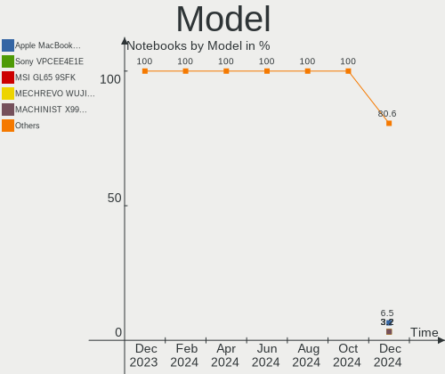
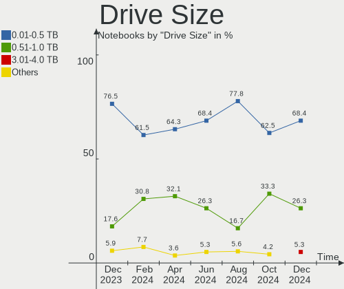
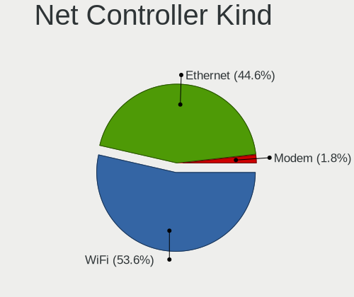
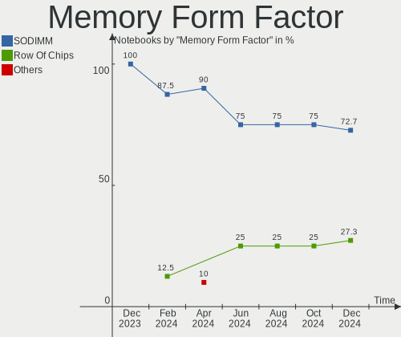

KDE neon - Hardware Trends (Notebooks)
--------------------------------------

A project to identify most popular hardware characteristics and track their change
over time based on data collected by Linux users at https://Linux-Hardware.org.

Anyone can contribute to this report by the [hw-probe](https://github.com/linuxhw/hw-probe) tool:

    sudo -E hw-probe -all -upload

This report is for one last month. Overall report since the beginning of time: [TestCoverage](https://github.com/linuxhw/TestCoverage)

Period: May, 2022.

Contents
--------

* [ System ](#system)
  - [ OS                       ](#os)
  - [ OS Family                ](#os-family)
  - [ Kernel                   ](#kernel)
  - [ Kernel Family            ](#kernel-family)
  - [ Kernel Major Ver.        ](#kernel-major-ver)
  - [ Arch                     ](#arch)
  - [ DE                       ](#de)
  - [ Display Server           ](#display-server)
  - [ Display Manager          ](#display-manager)
  - [ OS Lang                  ](#os-lang)
  - [ Boot Mode                ](#boot-mode)
  - [ Filesystem               ](#filesystem)
  - [ Part. scheme             ](#part-scheme)
  - [ Dual Boot with Linux/BSD ](#dual-boot-with-linuxbsd)
  - [ Dual Boot (Win)          ](#dual-boot-win)

* [ Board ](#board)
  - [ Vendor                   ](#vendor)
  - [ Model                    ](#model)
  - [ Model Family             ](#model-family)
  - [ MFG Year                 ](#mfg-year)
  - [ Form Factor              ](#form-factor)
  - [ Secure Boot              ](#secure-boot)
  - [ Coreboot                 ](#coreboot)
  - [ RAM Size                 ](#ram-size)
  - [ RAM Used                 ](#ram-used)
  - [ Total Drives             ](#total-drives)
  - [ Has CD-ROM               ](#has-cd-rom)
  - [ Has Ethernet             ](#has-ethernet)
  - [ Has WiFi                 ](#has-wifi)
  - [ Has Bluetooth            ](#has-bluetooth)

* [ Location ](#location)
  - [ Country                  ](#country)
  - [ City                     ](#city)

* [ Drives ](#drives)
  - [ Drive Vendor             ](#drive-vendor)
  - [ Drive Model              ](#drive-model)
  - [ HDD Vendor               ](#hdd-vendor)
  - [ SSD Vendor               ](#ssd-vendor)
  - [ Drive Kind               ](#drive-kind)
  - [ Drive Connector          ](#drive-connector)
  - [ Drive Size               ](#drive-size)
  - [ Space Total              ](#space-total)
  - [ Space Used               ](#space-used)
  - [ Malfunc. Drives          ](#malfunc-drives)
  - [ Malfunc. Drive Vendor    ](#malfunc-drive-vendor)
  - [ Malfunc. HDD Vendor      ](#malfunc-hdd-vendor)
  - [ Malfunc. Drive Kind      ](#malfunc-drive-kind)
  - [ Failed Drives            ](#failed-drives)
  - [ Failed Drive Vendor      ](#failed-drive-vendor)
  - [ Drive Status             ](#drive-status)

* [ Storage controller ](#storage-controller)
  - [ Storage Vendor           ](#storage-vendor)
  - [ Storage Model            ](#storage-model)
  - [ Storage Kind             ](#storage-kind)

* [ Processor ](#processor)
  - [ CPU Vendor               ](#cpu-vendor)
  - [ CPU Model                ](#cpu-model)
  - [ CPU Model Family         ](#cpu-model-family)
  - [ CPU Cores                ](#cpu-cores)
  - [ CPU Sockets              ](#cpu-sockets)
  - [ CPU Threads              ](#cpu-threads)
  - [ CPU Op-Modes             ](#cpu-op-modes)
  - [ CPU Microcode            ](#cpu-microcode)
  - [ CPU Microarch            ](#cpu-microarch)

* [ Graphics ](#graphics)
  - [ GPU Vendor               ](#gpu-vendor)
  - [ GPU Model                ](#gpu-model)
  - [ GPU Combo                ](#gpu-combo)
  - [ GPU Driver               ](#gpu-driver)
  - [ GPU Memory               ](#gpu-memory)

* [ Monitor ](#monitor)
  - [ Monitor Vendor           ](#monitor-vendor)
  - [ Monitor Model            ](#monitor-model)
  - [ Monitor Resolution       ](#monitor-resolution)
  - [ Monitor Diagonal         ](#monitor-diagonal)
  - [ Monitor Width            ](#monitor-width)
  - [ Aspect Ratio             ](#aspect-ratio)
  - [ Monitor Area             ](#monitor-area)
  - [ Pixel Density            ](#pixel-density)
  - [ Multiple Monitors        ](#multiple-monitors)

* [ Network ](#network)
  - [ Net Controller Vendor    ](#net-controller-vendor)
  - [ Net Controller Model     ](#net-controller-model)
  - [ Wireless Vendor          ](#wireless-vendor)
  - [ Wireless Model           ](#wireless-model)
  - [ Ethernet Vendor          ](#ethernet-vendor)
  - [ Ethernet Model           ](#ethernet-model)
  - [ Net Controller Kind      ](#net-controller-kind)
  - [ Used Controller          ](#used-controller)
  - [ NICs                     ](#nics)
  - [ IPv6                     ](#ipv6)

* [ Bluetooth ](#bluetooth)
  - [ Bluetooth Vendor         ](#bluetooth-vendor)
  - [ Bluetooth Model          ](#bluetooth-model)

* [ Sound ](#sound)
  - [ Sound Vendor             ](#sound-vendor)
  - [ Sound Model              ](#sound-model)

* [ Memory ](#memory)
  - [ Memory Vendor            ](#memory-vendor)
  - [ Memory Model             ](#memory-model)
  - [ Memory Kind              ](#memory-kind)
  - [ Memory Form Factor       ](#memory-form-factor)
  - [ Memory Size              ](#memory-size)
  - [ Memory Speed             ](#memory-speed)

* [ Printers & scanners ](#printers--scanners)
  - [ Printer Vendor           ](#printer-vendor)
  - [ Printer Model            ](#printer-model)
  - [ Scanner Vendor           ](#scanner-vendor)
  - [ Scanner Model            ](#scanner-model)

* [ Camera ](#camera)
  - [ Camera Vendor            ](#camera-vendor)
  - [ Camera Model             ](#camera-model)

* [ Security ](#security)
  - [ Fingerprint Vendor       ](#fingerprint-vendor)
  - [ Fingerprint Model        ](#fingerprint-model)
  - [ Chipcard Vendor          ](#chipcard-vendor)
  - [ Chipcard Model           ](#chipcard-model)

* [ Unsupported ](#unsupported)
  - [ Unsupported Devices      ](#unsupported-devices)
  - [ Unsupported Device Types ](#unsupported-device-types)

System
------

OS
--

Installed operating systems

| Name           | Notebooks | Percent |
|----------------|-----------|---------|
| KDE neon 20.04 | 68        | 100%    |

OS Family
---------

OS without a version

| Name     | Notebooks | Percent |
|----------|-----------|---------|
| KDE neon | 68        | 100%    |

Kernel
------

Version of the Linux kernel

| Version           | Notebooks | Percent |
|-------------------|-----------|---------|
| 5.13.0-41-generic | 28        | 41.18%  |
| 5.13.0-40-generic | 22        | 32.35%  |
| 5.13.0-44-generic | 13        | 19.12%  |
| 5.4.0-74-generic  | 1         | 1.47%   |
| 5.4.0-109-generic | 1         | 1.47%   |
| 5.15.0-30-generic | 1         | 1.47%   |
| 5.14.0-1034-oem   | 1         | 1.47%   |
| 5.13.0-39-generic | 1         | 1.47%   |

Kernel Family
-------------

Linux kernel without a distro release

| Version | Notebooks | Percent |
|---------|-----------|---------|
| 5.13.0  | 64        | 94.12%  |
| 5.4.0   | 2         | 2.94%   |
| 5.15.0  | 1         | 1.47%   |
| 5.14.0  | 1         | 1.47%   |

Kernel Major Ver.
-----------------

Linux kernel major version

| Version | Notebooks | Percent |
|---------|-----------|---------|
| 5.13    | 64        | 94.12%  |
| 5.4     | 2         | 2.94%   |
| 5.15    | 1         | 1.47%   |
| 5.14    | 1         | 1.47%   |

Arch
----

OS architecture (x86_64, i586, etc.)

| Name   | Notebooks | Percent |
|--------|-----------|---------|
| x86_64 | 68        | 100%    |

DE
--

Desktop Environment

| Name    | Notebooks | Percent |
|---------|-----------|---------|
| KDE5    | 67        | 98.53%  |
| Unknown | 1         | 1.47%   |

Display Server
--------------

X11 or Wayland

| Name    | Notebooks | Percent |
|---------|-----------|---------|
| X11     | 60        | 88.24%  |
| Wayland | 8         | 11.76%  |

Display Manager
---------------

SDDM, LightDM, etc.

| Name    | Notebooks | Percent |
|---------|-----------|---------|
| Unknown | 49        | 72.06%  |
| SDDM    | 19        | 27.94%  |

OS Lang
-------

Language

| Lang        | Notebooks | Percent |
|-------------|-----------|---------|
| en_US       | 27        | 39.71%  |
| ru_RU       | 4         | 5.88%   |
| fr_FR       | 4         | 5.88%   |
| en_GB       | 4         | 5.88%   |
| en_AU       | 4         | 5.88%   |
| pt_BR       | 3         | 4.41%   |
| en_PH       | 3         | 4.41%   |
| en_IN       | 3         | 4.41%   |
| it_IT       | 2         | 2.94%   |
| es_ES       | 2         | 2.94%   |
| en_ZA       | 2         | 2.94%   |
| zh_TW       | 1         | 1.47%   |
| zh_CN       | 1         | 1.47%   |
| sr_RS@latin | 1         | 1.47%   |
| sl_SI       | 1         | 1.47%   |
| ru_UA       | 1         | 1.47%   |
| hu_HU       | 1         | 1.47%   |
| fr_BE       | 1         | 1.47%   |
| es_EC       | 1         | 1.47%   |
| es_CL       | 1         | 1.47%   |
| C           | 1         | 1.47%   |

Boot Mode
---------

EFI or BIOS

| Mode | Notebooks | Percent |
|------|-----------|---------|
| EFI  | 47        | 69.12%  |
| BIOS | 21        | 30.88%  |

Filesystem
----------

Type of filesystem

| Type    | Notebooks | Percent |
|---------|-----------|---------|
| Ext4    | 60        | 88.24%  |
| Btrfs   | 5         | 7.35%   |
| Xfs     | 1         | 1.47%   |
| Overlay | 1         | 1.47%   |
| Unknown | 1         | 1.47%   |

Part. scheme
------------

Scheme of partitioning

| Type    | Notebooks | Percent |
|---------|-----------|---------|
| Unknown | 58        | 85.29%  |
| GPT     | 9         | 13.24%  |
| MBR     | 1         | 1.47%   |

Dual Boot with Linux/BSD
------------------------

Hosting more than one Linux/BSD

| Dual boot | Notebooks | Percent |
|-----------|-----------|---------|
| No        | 66        | 97.06%  |
| Yes       | 2         | 2.94%   |

Dual Boot (Win)
---------------

Hosting Linux and Windows

| Dual boot | Notebooks | Percent |
|-----------|-----------|---------|
| No        | 62        | 91.18%  |
| Yes       | 6         | 8.82%   |

Board
-----

Vendor
------

Motherboard manufacturer

| Name                | Notebooks | Percent |
|---------------------|-----------|---------|
| Dell                | 17        | 25%     |
| Lenovo              | 15        | 22.06%  |
| Hewlett-Packard     | 6         | 8.82%   |
| ASUSTek Computer    | 6         | 8.82%   |
| Toshiba             | 4         | 5.88%   |
| Apple               | 3         | 4.41%   |
| Acer                | 3         | 4.41%   |
| Timi                | 2         | 2.94%   |
| SLIMBOOK            | 1         | 1.47%   |
| Schenker            | 1         | 1.47%   |
| Samsung Electronics | 1         | 1.47%   |
| Positivo            | 1         | 1.47%   |
| Pegatron            | 1         | 1.47%   |
| Packard Bell        | 1         | 1.47%   |
| Multilaser          | 1         | 1.47%   |
| MSI                 | 1         | 1.47%   |
| Medion              | 1         | 1.47%   |
| MECHREVO            | 1         | 1.47%   |
| HUAWEI              | 1         | 1.47%   |
| Unknown             | 1         | 1.47%   |

Model
-----

Motherboard model

| Name                                      | Notebooks | Percent |
|-------------------------------------------|-----------|---------|
| Lenovo Legion 5 Pro 16ACH6H 82JQ          | 2         | 2.94%   |
| Dell XPS 15 7590                          | 2         | 2.94%   |
| Toshiba TECRA Z50-A                       | 1         | 1.47%   |
| Toshiba Satellite L655                    | 1         | 1.47%   |
| Toshiba Satellite L50-B                   | 1         | 1.47%   |
| Toshiba Satellite L50-A                   | 1         | 1.47%   |
| Timi TM1613                               | 1         | 1.47%   |
| Timi TM1612                               | 1         | 1.47%   |
| SLIMBOOK EXECUTIVE-14                     | 1         | 1.47%   |
| Schenker XMG CORE (TGL/M21)               | 1         | 1.47%   |
| Samsung 270E5G/270E5U                     | 1         | 1.47%   |
| Positivo S14CT01                          | 1         | 1.47%   |
| Pegatron A15                              | 1         | 1.47%   |
| Packard Bell EasyNote TSX66HR             | 1         | 1.47%   |
| Multilaser PC130                          | 1         | 1.47%   |
| MSI GT70 2OC/2OD                          | 1         | 1.47%   |
| Medion X781X/X782X                        | 1         | 1.47%   |
| MECHREVO X10Ti-S Series GM7MPHS           | 1         | 1.47%   |
| Lenovo ThinkPad X13 Gen 1 20T2S16F00      | 1         | 1.47%   |
| Lenovo ThinkPad X1 Extreme 2nd 20QVS14F00 | 1         | 1.47%   |
| Lenovo ThinkPad T520 4243WS4              | 1         | 1.47%   |
| Lenovo ThinkPad T14s Gen 1 20UHCTO1WW     | 1         | 1.47%   |
| Lenovo ThinkPad 25 20K70004US             | 1         | 1.47%   |
| Lenovo Legion Y740-15IRHg 81UH            | 1         | 1.47%   |
| Lenovo Legion 5 15ARH05H 82B1             | 1         | 1.47%   |
| Lenovo IdeaPad Gaming 3 15ACH6 82K2       | 1         | 1.47%   |
| Lenovo IdeaPad 520-15IKB 81BF             | 1         | 1.47%   |
| Lenovo IdeaPad 5 Pro 16ACH6 82L5          | 1         | 1.47%   |
| Lenovo IdeaPad 330S-15IKB 81F5            | 1         | 1.47%   |
| Lenovo IdeaPad 330-15IKB 81DC             | 1         | 1.47%   |
| Lenovo Flex 3-1130 80LY                   | 1         | 1.47%   |
| HUAWEI WRTB-WXX9                          | 1         | 1.47%   |
| HP ProBook 450 G2                         | 1         | 1.47%   |
| HP Pavilion Laptop 15-eh1xxx              | 1         | 1.47%   |
| HP Pavilion Gaming Laptop 15-cx0xxx       | 1         | 1.47%   |
| HP Folio 13 - 2000                        | 1         | 1.47%   |
| HP EliteBook 840 G2                       | 1         | 1.47%   |
| HP 240 G3                                 | 1         | 1.47%   |
| Dell XPS 13 9360                          | 1         | 1.47%   |
| Dell XPS 13 9310                          | 1         | 1.47%   |
| Dell XPS 13 7390                          | 1         | 1.47%   |
| Dell Vostro 5515                          | 1         | 1.47%   |
| Dell Vostro 3558                          | 1         | 1.47%   |
| Dell Studio XPS 1645                      | 1         | 1.47%   |
| Dell Precision 5560                       | 1         | 1.47%   |
| Dell Precision 3520                       | 1         | 1.47%   |
| Dell Latitude E6500                       | 1         | 1.47%   |
| Dell Latitude E6420                       | 1         | 1.47%   |
| Dell Latitude E6400                       | 1         | 1.47%   |
| Dell Latitude E5440                       | 1         | 1.47%   |
| Dell Latitude 5580                        | 1         | 1.47%   |
| Dell Latitude 3450                        | 1         | 1.47%   |
| Dell Inspiron 5759                        | 1         | 1.47%   |
| ASUS X550LA                               | 1         | 1.47%   |
| ASUS ROG Strix G512LV_G512LV              | 1         | 1.47%   |
| ASUS N71Vg                                | 1         | 1.47%   |
| ASUS MacPro6,1                            | 1         | 1.47%   |
| ASUS K56CB                                | 1         | 1.47%   |
| ASUS K53SM                                | 1         | 1.47%   |
| Apple MacBookPro9,2                       | 1         | 1.47%   |

Model Family
------------

Motherboard model prefix

| Name                  | Notebooks | Percent |
|-----------------------|-----------|---------|
| Dell Latitude         | 6         | 8.82%   |
| Lenovo ThinkPad       | 5         | 7.35%   |
| Lenovo IdeaPad        | 5         | 7.35%   |
| Dell XPS              | 5         | 7.35%   |
| Lenovo Legion         | 4         | 5.88%   |
| Toshiba Satellite     | 3         | 4.41%   |
| HP Pavilion           | 2         | 2.94%   |
| Dell Vostro           | 2         | 2.94%   |
| Dell Precision        | 2         | 2.94%   |
| Acer Aspire           | 2         | 2.94%   |
| Toshiba TECRA         | 1         | 1.47%   |
| Timi TM1613           | 1         | 1.47%   |
| Timi TM1612           | 1         | 1.47%   |
| SLIMBOOK EXECUTIVE-14 | 1         | 1.47%   |
| Schenker XMG          | 1         | 1.47%   |
| Samsung 270E5G        | 1         | 1.47%   |
| Positivo S14CT01      | 1         | 1.47%   |
| Pegatron A15          | 1         | 1.47%   |
| Packard Bell EasyNote | 1         | 1.47%   |
| Multilaser PC130      | 1         | 1.47%   |
| MSI GT70              | 1         | 1.47%   |
| Medion X781X          | 1         | 1.47%   |
| MECHREVO X10Ti-S      | 1         | 1.47%   |
| Lenovo Flex           | 1         | 1.47%   |
| HUAWEI WRTB-WXX9      | 1         | 1.47%   |
| HP ProBook            | 1         | 1.47%   |
| HP Folio              | 1         | 1.47%   |
| HP EliteBook          | 1         | 1.47%   |
| HP 240                | 1         | 1.47%   |
| Dell Studio           | 1         | 1.47%   |
| Dell Inspiron         | 1         | 1.47%   |
| ASUS X550LA           | 1         | 1.47%   |
| ASUS ROG              | 1         | 1.47%   |
| ASUS N71Vg            | 1         | 1.47%   |
| ASUS MacPro6          | 1         | 1.47%   |
| ASUS K56CB            | 1         | 1.47%   |
| ASUS K53SM            | 1         | 1.47%   |
| Apple MacBookPro9     | 1         | 1.47%   |
| Apple MacBookPro10    | 1         | 1.47%   |
| Apple MacBookAir3     | 1         | 1.47%   |
| Acer Iconia           | 1         | 1.47%   |
| Unknown               | 1         | 1.47%   |

MFG Year
--------

Motherboard manufacture year

| Year | Notebooks | Percent |
|------|-----------|---------|
| 2021 | 9         | 13.24%  |
| 2020 | 7         | 10.29%  |
| 2019 | 6         | 8.82%   |
| 2017 | 6         | 8.82%   |
| 2013 | 6         | 8.82%   |
| 2012 | 6         | 8.82%   |
| 2016 | 5         | 7.35%   |
| 2014 | 5         | 7.35%   |
| 2011 | 5         | 7.35%   |
| 2015 | 4         | 5.88%   |
| 2018 | 3         | 4.41%   |
| 2010 | 3         | 4.41%   |
| 2008 | 2         | 2.94%   |
| 2009 | 1         | 1.47%   |

Form Factor
-----------

Physical design of the computer

| Name     | Notebooks | Percent |
|----------|-----------|---------|
| Notebook | 68        | 100%    |

Secure Boot
-----------

Enabled or disabled

| State    | Notebooks | Percent |
|----------|-----------|---------|
| Disabled | 59        | 86.76%  |
| Enabled  | 9         | 13.24%  |

Coreboot
--------

Have coreboot on board

| Used | Notebooks | Percent |
|------|-----------|---------|
| No   | 68        | 100%    |

RAM Size
--------

Total RAM memory

| Size in GB  | Notebooks | Percent |
|-------------|-----------|---------|
| 4.01-8.0    | 18        | 26.47%  |
| 16.01-24.0  | 13        | 19.12%  |
| 3.01-4.0    | 12        | 17.65%  |
| 32.01-64.0  | 10        | 14.71%  |
| 8.01-16.0   | 8         | 11.76%  |
| 1.01-2.0    | 3         | 4.41%   |
| 24.01-32.0  | 2         | 2.94%   |
| 2.01-3.0    | 1         | 1.47%   |
| 64.01-256.0 | 1         | 1.47%   |

RAM Used
--------

Used RAM memory

| Used GB    | Notebooks | Percent |
|------------|-----------|---------|
| 1.01-2.0   | 26        | 38.24%  |
| 2.01-3.0   | 16        | 23.53%  |
| 3.01-4.0   | 11        | 16.18%  |
| 4.01-8.0   | 10        | 14.71%  |
| 0.51-1.0   | 4         | 5.88%   |
| 16.01-24.0 | 1         | 1.47%   |

Total Drives
------------

Number of drives on board

| Drives | Notebooks | Percent |
|--------|-----------|---------|
| 1      | 43        | 63.24%  |
| 2      | 22        | 32.35%  |
| 3      | 2         | 2.94%   |
| 4      | 1         | 1.47%   |

Has CD-ROM
----------

Has CD-ROM on board

| Presented | Notebooks | Percent |
|-----------|-----------|---------|
| No        | 50        | 73.53%  |
| Yes       | 18        | 26.47%  |

Has Ethernet
------------

Has Ethernet on board

| Presented | Notebooks | Percent |
|-----------|-----------|---------|
| Yes       | 54        | 79.41%  |
| No        | 14        | 20.59%  |

Has WiFi
--------

Has WiFi module

| Presented | Notebooks | Percent |
|-----------|-----------|---------|
| Yes       | 65        | 95.59%  |
| No        | 3         | 4.41%   |

Has Bluetooth
-------------

Has Bluetooth module

| Presented | Notebooks | Percent |
|-----------|-----------|---------|
| Yes       | 56        | 82.35%  |
| No        | 12        | 17.65%  |

Location
--------

Country
-------

Geographic location (country)

| Country      | Notebooks | Percent |
|--------------|-----------|---------|
| USA          | 8         | 11.76%  |
| France       | 7         | 10.29%  |
| Australia    | 4         | 5.88%   |
| Philippines  | 3         | 4.41%   |
| India        | 3         | 4.41%   |
| Brazil       | 3         | 4.41%   |
| UK           | 2         | 2.94%   |
| South Africa | 2         | 2.94%   |
| Serbia       | 2         | 2.94%   |
| Russia       | 2         | 2.94%   |
| Mexico       | 2         | 2.94%   |
| Italy        | 2         | 2.94%   |
| Greece       | 2         | 2.94%   |
| Germany      | 2         | 2.94%   |
| Belgium      | 2         | 2.94%   |
| Venezuela    | 1         | 1.47%   |
| Uruguay      | 1         | 1.47%   |
| Switzerland  | 1         | 1.47%   |
| Spain        | 1         | 1.47%   |
| Slovenia     | 1         | 1.47%   |
| Romania      | 1         | 1.47%   |
| Portugal     | 1         | 1.47%   |
| Morocco      | 1         | 1.47%   |
| Malaysia     | 1         | 1.47%   |
| Kyrgyzstan   | 1         | 1.47%   |
| Kazakhstan   | 1         | 1.47%   |
| Indonesia    | 1         | 1.47%   |
| Hungary      | 1         | 1.47%   |
| Hong Kong    | 1         | 1.47%   |
| Egypt        | 1         | 1.47%   |
| Ecuador      | 1         | 1.47%   |
| China        | 1         | 1.47%   |
| Chile        | 1         | 1.47%   |
| Canada       | 1         | 1.47%   |
| Bulgaria     | 1         | 1.47%   |
| Bangladesh   | 1         | 1.47%   |
| Armenia      | 1         | 1.47%   |

City
----

Geographic location (city)

| City              | Notebooks | Percent |
|-------------------|-----------|---------|
| Milan             | 2         | 2.94%   |
| Brisbane          | 2         | 2.94%   |
| Zurich            | 1         | 1.47%   |
| Yerevan           | 1         | 1.47%   |
| Whistler          | 1         | 1.47%   |
| Viamao            | 1         | 1.47%   |
| Veigne            | 1         | 1.47%   |
| Tula              | 1         | 1.47%   |
| Trstenik          | 1         | 1.47%   |
| Tijuana           | 1         | 1.47%   |
| Tarbes            | 1         | 1.47%   |
| Tabira            | 1         | 1.47%   |
| Sydney            | 1         | 1.47%   |
| Statesboro        | 1         | 1.47%   |
| Springfield       | 1         | 1.47%   |
| Sofia             | 1         | 1.47%   |
| Reims             | 1         | 1.47%   |
| Portland          | 1         | 1.47%   |
| Port Elizabeth    | 1         | 1.47%   |
| Poros             | 1         | 1.47%   |
| New Delhi         | 1         | 1.47%   |
| Nevele            | 1         | 1.47%   |
| Natick            | 1         | 1.47%   |
| Mumbai            | 1         | 1.47%   |
| Mostoles          | 1         | 1.47%   |
| Montevideo        | 1         | 1.47%   |
| Molina            | 1         | 1.47%   |
| Mexico City       | 1         | 1.47%   |
| Marseille         | 1         | 1.47%   |
| Marrakesh         | 1         | 1.47%   |
| Marcq-en-Baroeul  | 1         | 1.47%   |
| Manta             | 1         | 1.47%   |
| Manajao           | 1         | 1.47%   |
| Ljubljana         | 1         | 1.47%   |
| Lisbon            | 1         | 1.47%   |
| La Teste-de-Buch  | 1         | 1.47%   |
| Kolkata           | 1         | 1.47%   |
| Kapshagay         | 1         | 1.47%   |
| Johor Bahru       | 1         | 1.47%   |
| Hyères           | 1         | 1.47%   |
| Hermeskeil        | 1         | 1.47%   |
| Hempstead         | 1         | 1.47%   |
| Gillingham        | 1         | 1.47%   |
| Ghent             | 1         | 1.47%   |
| Frankfurt am Main | 1         | 1.47%   |
| Durban            | 1         | 1.47%   |
| Dunfermline       | 1         | 1.47%   |
| Dhaka             | 1         | 1.47%   |
| Denver            | 1         | 1.47%   |
| Denpasar          | 1         | 1.47%   |
| Davao City        | 1         | 1.47%   |
| Central           | 1         | 1.47%   |
| Caracas           | 1         | 1.47%   |
| Cairo             | 1         | 1.47%   |
| Cagayan de Oro    | 1         | 1.47%   |
| Budakeszi         | 1         | 1.47%   |
| Bucharest         | 1         | 1.47%   |
| Bryansk           | 1         | 1.47%   |
| Bothell           | 1         | 1.47%   |
| Bishkek           | 1         | 1.47%   |

Drives
------

Drive Vendor
------------

Hard drive vendors

| Vendor                    | Notebooks | Drives | Percent |
|---------------------------|-----------|--------|---------|
| Samsung Electronics       | 17        | 19     | 17.53%  |
| Seagate                   | 9         | 9      | 9.28%   |
| Kingston                  | 8         | 8      | 8.25%   |
| Toshiba                   | 7         | 7      | 7.22%   |
| WDC                       | 6         | 7      | 6.19%   |
| Sandisk                   | 6         | 6      | 6.19%   |
| SK Hynix                  | 5         | 6      | 5.15%   |
| Unknown                   | 3         | 4      | 3.09%   |
| Hitachi                   | 3         | 3      | 3.09%   |
| HGST                      | 3         | 3      | 3.09%   |
| Crucial                   | 3         | 3      | 3.09%   |
| Silicon Motion            | 2         | 2      | 2.06%   |
| Micron Technology         | 2         | 2      | 2.06%   |
| Intel                     | 2         | 2      | 2.06%   |
| Apple                     | 2         | 2      | 2.06%   |
| A-DATA Technology         | 2         | 2      | 2.06%   |
| sage                      | 1         | 1      | 1.03%   |
| PNY                       | 1         | 1      | 1.03%   |
| PLEXTOR                   | 1         | 3      | 1.03%   |
| Phison                    | 1         | 2      | 1.03%   |
| OSCOO                     | 1         | 1      | 1.03%   |
| OCZ                       | 1         | 1      | 1.03%   |
| Micron/Crucial Technology | 1         | 1      | 1.03%   |
| KIOXIA                    | 1         | 1      | 1.03%   |
| KingSpec                  | 1         | 1      | 1.03%   |
| Hewlett-Packard           | 1         | 1      | 1.03%   |
| GOODRAM                   | 1         | 1      | 1.03%   |
| Gigabyte Technology       | 1         | 1      | 1.03%   |
| GeIL                      | 1         | 1      | 1.03%   |
| Aura                      | 1         | 1      | 1.03%   |
| AMD                       | 1         | 1      | 1.03%   |
| ADATA Technology          | 1         | 1      | 1.03%   |
| 2-Power                   | 1         | 1      | 1.03%   |

Drive Model
-----------

Hard drive models

| Model                                  | Notebooks | Percent |
|----------------------------------------|-----------|---------|
| Unknown MMC Card  32GB                 | 3         | 2.91%   |
| Toshiba NVMe SSD Drive 512GB           | 3         | 2.91%   |
| SK Hynix NVMe SSD Drive 512GB          | 3         | 2.91%   |
| Sandisk NVMe SSD Drive 512GB           | 3         | 2.91%   |
| Seagate ST1000LM035-1RK172 1TB         | 2         | 1.94%   |
| Samsung NVMe SSD Drive 1TB             | 2         | 1.94%   |
| Samsung NVMe SSD Drive 1024GB          | 2         | 1.94%   |
| Micron NVMe SSD Drive 512GB            | 2         | 1.94%   |
| Kingston SA400S37120G 120GB SSD        | 2         | 1.94%   |
| WDC WDS500G2B0A-00SM50 500GB SSD       | 1         | 0.97%   |
| WDC WDS240G2G0A-00JH30 240GB SSD       | 1         | 0.97%   |
| WDC WDS100T2B0C-00PXH0 1TB             | 1         | 0.97%   |
| WDC WD6400BPVT-35HXZT1 640GB           | 1         | 0.97%   |
| WDC WD10SPZX-24Z10 1TB                 | 1         | 0.97%   |
| WDC WD10JPVX-75JC3T0 1TB               | 1         | 0.97%   |
| WDC WD10JPVX-22JC3T0 1TB               | 1         | 0.97%   |
| Unknown MMC Card  16GB                 | 1         | 0.97%   |
| Toshiba THNSNF064GMCS 64GB SSD         | 1         | 0.97%   |
| Toshiba MQ01ACF032 320GB               | 1         | 0.97%   |
| Toshiba MQ01ABD100 1TB                 | 1         | 0.97%   |
| Toshiba MK1059GSMP 1TB                 | 1         | 0.97%   |
| SK Hynix SKHynix_HFS512GDE9X084N 512GB | 1         | 0.97%   |
| SK Hynix SC311 SATA 256GB SSD          | 1         | 0.97%   |
| SK Hynix HBG4e  32GB                   | 1         | 0.97%   |
| Silicon Motion NVMe SSD Drive 500GB    | 1         | 0.97%   |
| Silicon Motion NVMe SSD Drive 128GB    | 1         | 0.97%   |
| Seagate ST9500420ASG 500GB             | 1         | 0.97%   |
| Seagate ST500LT012-1DG142 500GB        | 1         | 0.97%   |
| Seagate ST2000LM007-1R8174 2TB         | 1         | 0.97%   |
| Seagate ST1000LM049-2GH172 1TB         | 1         | 0.97%   |
| Seagate ST1000LM024 HN-M101MBB 1TB     | 1         | 0.97%   |
| Seagate ST1000LM014-1EJ164 1TB         | 1         | 0.97%   |
| Seagate Expansion HDD 2TB              | 1         | 0.97%   |
| SanDisk SDSSDA120G 120GB               | 1         | 0.97%   |
| Sandisk NVMe SSD Drive 2TB             | 1         | 0.97%   |
| Sandisk NVMe SSD Drive 1TB             | 1         | 0.97%   |
| Samsung SSD 980 PRO 1TB                | 1         | 0.97%   |
| Samsung SSD 980 1TB                    | 1         | 0.97%   |
| Samsung SSD 970 PRO 512GB              | 1         | 0.97%   |
| Samsung SSD 970 EVO Plus 1TB           | 1         | 0.97%   |
| Samsung SSD 870 EVO 500GB              | 1         | 0.97%   |
| Samsung SSD 860 QVO 1TB                | 1         | 0.97%   |
| Samsung SSD 850 EVO 500GB              | 1         | 0.97%   |
| Samsung SSD 850 EVO 250GB              | 1         | 0.97%   |
| Samsung Portable SSD T5 500GB          | 1         | 0.97%   |
| Samsung NVMe SSD Drive 500GB           | 1         | 0.97%   |
| Samsung NVMe SSD Drive 256GB           | 1         | 0.97%   |
| Samsung NVMe SSD Drive 250GB           | 1         | 0.97%   |
| Samsung MZVLQ512HBLU-00BH1 512GB       | 1         | 0.97%   |
| Samsung MZNTY128HDHP-00000 128GB SSD   | 1         | 0.97%   |
| Samsung MZMPC128HBFU-000H1 128GB SSD   | 1         | 0.97%   |
| sage 3639S 1TB                         | 1         | 0.97%   |
| PNY CS900 240GB SSD                    | 1         | 0.97%   |
| PLEXTOR PX-128M5M 128GB SSD            | 1         | 0.97%   |
| Phison NVMe SSD Drive 1024GB           | 1         | 0.97%   |
| Phison APS-XS03-480 480GB              | 1         | 0.97%   |
| OSCOO OSC SSD 256GB                    | 1         | 0.97%   |
| OCZ TRION150 120GB SSD                 | 1         | 0.97%   |
| Micron/Crucial NVMe SSD Drive 2TB      | 1         | 0.97%   |
| KIOXIA NVMe SSD Drive 256GB            | 1         | 0.97%   |

HDD Vendor
----------

Hard disk drive vendors

| Vendor  | Notebooks | Drives | Percent |
|---------|-----------|--------|---------|
| Seagate | 9         | 9      | 37.5%   |
| WDC     | 4         | 4      | 16.67%  |
| Toshiba | 3         | 3      | 12.5%   |
| Hitachi | 3         | 3      | 12.5%   |
| HGST    | 3         | 3      | 12.5%   |
| sage    | 1         | 1      | 4.17%   |
| Apple   | 1         | 1      | 4.17%   |

SSD Vendor
----------

Solid state drive vendors

| Vendor              | Notebooks | Drives | Percent |
|---------------------|-----------|--------|---------|
| Samsung Electronics | 7         | 7      | 21.21%  |
| Kingston            | 6         | 6      | 18.18%  |
| WDC                 | 2         | 2      | 6.06%   |
| A-DATA Technology   | 2         | 2      | 6.06%   |
| Toshiba             | 1         | 1      | 3.03%   |
| SK Hynix            | 1         | 1      | 3.03%   |
| SanDisk             | 1         | 1      | 3.03%   |
| PNY                 | 1         | 1      | 3.03%   |
| PLEXTOR             | 1         | 3      | 3.03%   |
| OSCOO               | 1         | 1      | 3.03%   |
| OCZ                 | 1         | 1      | 3.03%   |
| KingSpec            | 1         | 1      | 3.03%   |
| Hewlett-Packard     | 1         | 1      | 3.03%   |
| GOODRAM             | 1         | 1      | 3.03%   |
| GeIL                | 1         | 1      | 3.03%   |
| Crucial             | 1         | 1      | 3.03%   |
| Aura                | 1         | 1      | 3.03%   |
| Apple               | 1         | 1      | 3.03%   |
| AMD                 | 1         | 1      | 3.03%   |
| 2-Power             | 1         | 1      | 3.03%   |

Drive Kind
----------

HDD or SSD

| Kind    | Notebooks | Drives | Percent |
|---------|-----------|--------|---------|
| SSD     | 31        | 35     | 35.23%  |
| NVMe    | 29        | 40     | 32.95%  |
| HDD     | 24        | 24     | 27.27%  |
| MMC     | 3         | 5      | 3.41%   |
| Unknown | 1         | 1      | 1.14%   |

Drive Connector
---------------

SATA, SAS, NVMe, etc.

| Type | Notebooks | Drives | Percent |
|------|-----------|--------|---------|
| SATA | 42        | 54     | 53.16%  |
| NVMe | 29        | 40     | 36.71%  |
| SAS  | 5         | 6      | 6.33%   |
| MMC  | 3         | 5      | 3.8%    |

Drive Size
----------

Size of hard drive

| Size in TB | Notebooks | Drives | Percent |
|------------|-----------|--------|---------|
| 0.01-0.5   | 34        | 39     | 62.96%  |
| 0.51-1.0   | 17        | 17     | 31.48%  |
| 1.01-2.0   | 3         | 3      | 5.56%   |

Space Total
-----------

Amount of disk space available on the file system

| Size in GB     | Notebooks | Percent |
|----------------|-----------|---------|
| 501-1000       | 19        | 27.94%  |
| 251-500        | 16        | 23.53%  |
| 101-250        | 14        | 20.59%  |
| 1001-2000      | 5         | 7.35%   |
| 51-100         | 5         | 7.35%   |
| 21-50          | 4         | 5.88%   |
| 1-20           | 4         | 5.88%   |
| More than 3000 | 1         | 1.47%   |

Space Used
----------

Amount of used disk space

| Used GB  | Notebooks | Percent |
|----------|-----------|---------|
| 1-20     | 31        | 45.59%  |
| 21-50    | 15        | 22.06%  |
| 51-100   | 7         | 10.29%  |
| 101-250  | 6         | 8.82%   |
| 501-1000 | 5         | 7.35%   |
| 251-500  | 4         | 5.88%   |

Malfunc. Drives
---------------

Drive models with a malfunction

| Model                                 | Notebooks | Drives | Percent |
|---------------------------------------|-----------|--------|---------|
| Seagate ST1000LM035-1RK172 1TB        | 1         | 1      | 50%     |
| Samsung Electronics SSD 970 PRO 512GB | 1         | 1      | 50%     |

Malfunc. Drive Vendor
---------------------

Vendors of faulty drives

| Vendor              | Notebooks | Drives | Percent |
|---------------------|-----------|--------|---------|
| Seagate             | 1         | 1      | 50%     |
| Samsung Electronics | 1         | 1      | 50%     |

Malfunc. HDD Vendor
-------------------

Vendors of faulty HDD drives

| Vendor  | Notebooks | Drives | Percent |
|---------|-----------|--------|---------|
| Seagate | 1         | 1      | 100%    |

Malfunc. Drive Kind
-------------------

Kinds of faulty drives

| Kind | Notebooks | Drives | Percent |
|------|-----------|--------|---------|
| NVMe | 1         | 1      | 50%     |
| HDD  | 1         | 1      | 50%     |

Failed Drives
-------------

Failed drive models

Zero info for selected period =(

Failed Drive Vendor
-------------------

Failed drive vendors

Zero info for selected period =(

Drive Status
------------

Number of failed and malfunc. drives

| Status   | Notebooks | Drives | Percent |
|----------|-----------|--------|---------|
| Detected | 58        | 85     | 79.45%  |
| Works    | 13        | 18     | 17.81%  |
| Malfunc  | 2         | 2      | 2.74%   |

Storage controller
------------------

Storage Vendor
--------------

Storage controller vendors

| Vendor                       | Notebooks | Percent |
|------------------------------|-----------|---------|
| Intel                        | 50        | 56.18%  |
| Samsung Electronics          | 10        | 11.24%  |
| AMD                          | 6         | 6.74%   |
| Sandisk                      | 5         | 5.62%   |
| Toshiba America Info Systems | 3         | 3.37%   |
| SK Hynix                     | 3         | 3.37%   |
| Silicon Motion               | 2         | 2.25%   |
| Phison Electronics           | 2         | 2.25%   |
| Micron/Crucial Technology    | 2         | 2.25%   |
| Micron Technology            | 2         | 2.25%   |
| Nvidia                       | 1         | 1.12%   |
| KIOXIA                       | 1         | 1.12%   |
| Kingston Technology Company  | 1         | 1.12%   |
| ADATA Technology             | 1         | 1.12%   |

Storage Model
-------------

Storage controller models

| Model                                                                                  | Notebooks | Percent |
|----------------------------------------------------------------------------------------|-----------|---------|
| Intel Sunrise Point-LP SATA Controller [AHCI mode]                                     | 8         | 8.7%    |
| Intel 7 Series Chipset Family 6-port SATA Controller [AHCI mode]                       | 6         | 6.52%   |
| Intel 6 Series/C200 Series Chipset Family 6 port Mobile SATA AHCI Controller           | 6         | 6.52%   |
| AMD FCH SATA Controller [AHCI mode]                                                    | 6         | 6.52%   |
| Samsung NVMe SSD Controller SM981/PM981/PM983                                          | 5         | 5.43%   |
| Intel 8 Series SATA Controller 1 [AHCI mode]                                           | 5         | 5.43%   |
| Samsung NVMe SSD Controller 980                                                        | 4         | 4.35%   |
| Intel Cannon Lake Mobile PCH SATA AHCI Controller                                      | 4         | 4.35%   |
| Intel 82801 Mobile SATA Controller [RAID mode]                                         | 4         | 4.35%   |
| Intel Wildcat Point-LP SATA Controller [AHCI Mode]                                     | 3         | 3.26%   |
| Toshiba America Info Systems XG6 NVMe SSD Controller                                   | 2         | 2.17%   |
| SK Hynix Gold P31 SSD                                                                  | 2         | 2.17%   |
| Silicon Motion SM2263EN/SM2263XT SSD Controller                                        | 2         | 2.17%   |
| Sandisk WD Black SN750 / PC SN730 NVMe SSD                                             | 2         | 2.17%   |
| Sandisk WD Black 2018/SN750 / PC SN720 NVMe SSD                                        | 2         | 2.17%   |
| Micron/Crucial Non-Volatile memory controller                                          | 2         | 2.17%   |
| Micron Non-Volatile memory controller                                                  | 2         | 2.17%   |
| Intel Volume Management Device NVMe RAID Controller                                    | 2         | 2.17%   |
| Intel 82801IBM/IEM (ICH9M/ICH9M-E) 4 port SATA Controller [AHCI mode]                  | 2         | 2.17%   |
| Toshiba America Info Systems XG4 NVMe SSD Controller                                   | 1         | 1.09%   |
| SK Hynix Non-Volatile memory controller                                                | 1         | 1.09%   |
| Sandisk WD Blue SN550 NVMe SSD                                                         | 1         | 1.09%   |
| Samsung NVMe SSD Controller SM951/PM951                                                | 1         | 1.09%   |
| Samsung NVMe SSD Controller PM9A1/PM9A3/980PRO                                         | 1         | 1.09%   |
| Phison PS5013 E13 NVMe Controller                                                      | 1         | 1.09%   |
| Phison E12 NVMe Controller                                                             | 1         | 1.09%   |
| Nvidia MCP89 SATA Controller (AHCI mode)                                               | 1         | 1.09%   |
| KIOXIA Non-Volatile memory controller                                                  | 1         | 1.09%   |
| Kingston Company A2000 NVMe SSD                                                        | 1         | 1.09%   |
| Intel SSD Pro 7600p/760p/E 6100p Series                                                | 1         | 1.09%   |
| Intel SSD 660P Series                                                                  | 1         | 1.09%   |
| Intel Q170/Q150/B150/H170/H110/Z170/CM236 Chipset SATA Controller [AHCI Mode]          | 1         | 1.09%   |
| Intel Comet Lake SATA AHCI Controller                                                  | 1         | 1.09%   |
| Intel Atom/Celeron/Pentium Processor x5-E8000/J3xxx/N3xxx Series SATA Controller       | 1         | 1.09%   |
| Intel 8 Series/C220 Series Chipset Family 6-port SATA Controller 1 [AHCI mode]         | 1         | 1.09%   |
| Intel 6 Series/C200 Series Chipset Family Mobile SATA Controller (IDE mode, ports 4-5) | 1         | 1.09%   |
| Intel 6 Series/C200 Series Chipset Family Mobile SATA Controller (IDE mode, ports 0-3) | 1         | 1.09%   |
| Intel 500 Series Chipset Family SATA AHCI Controller                                   | 1         | 1.09%   |
| Intel 5 Series/3400 Series Chipset 6 port SATA AHCI Controller                         | 1         | 1.09%   |
| Intel 5 Series/3400 Series Chipset 4 port SATA AHCI Controller                         | 1         | 1.09%   |
| Intel 400 Series Chipset Family SATA AHCI Controller                                   | 1         | 1.09%   |
| ADATA Non-Volatile memory controller                                                   | 1         | 1.09%   |

Storage Kind
------------

Kind of storage controller (IDE, SATA, NVMe, SAS, ...)

| Kind | Notebooks | Percent |
|------|-----------|---------|
| SATA | 49        | 58.33%  |
| NVMe | 28        | 33.33%  |
| RAID | 6         | 7.14%   |
| IDE  | 1         | 1.19%   |

Processor
---------

CPU Vendor
----------

Processor vendors

| Vendor | Notebooks | Percent |
|--------|-----------|---------|
| Intel  | 60        | 88.24%  |
| AMD    | 8         | 11.76%  |

CPU Model
---------

Processor models

| Model                                      | Notebooks | Percent |
|--------------------------------------------|-----------|---------|
| Intel Core i7-9750H CPU @ 2.60GHz          | 3         | 4.41%   |
| AMD Ryzen 5 5600H with Radeon Graphics     | 3         | 4.41%   |
| Intel Core i7-10510U CPU @ 1.80GHz         | 2         | 2.94%   |
| Intel Core i5-8250U CPU @ 1.60GHz          | 2         | 2.94%   |
| Intel Core i5-6200U CPU @ 2.30GHz          | 2         | 2.94%   |
| Intel Core i5-5200U CPU @ 2.20GHz          | 2         | 2.94%   |
| Intel Core i5-4300U CPU @ 1.90GHz          | 2         | 2.94%   |
| Intel Core i5-2450M CPU @ 2.50GHz          | 2         | 2.94%   |
| Intel Atom x5-Z8350 CPU @ 1.44GHz          | 2         | 2.94%   |
| Intel Core m3-6Y30 CPU @ 0.90GHz           | 1         | 1.47%   |
| Intel Core i9-9880H CPU @ 2.30GHz          | 1         | 1.47%   |
| Intel Core i7-8550U CPU @ 1.80GHz          | 1         | 1.47%   |
| Intel Core i7-7820HQ CPU @ 2.90GHz         | 1         | 1.47%   |
| Intel Core i7-7560U CPU @ 2.40GHz          | 1         | 1.47%   |
| Intel Core i7-7500U CPU @ 2.70GHz          | 1         | 1.47%   |
| Intel Core i7-4930MX CPU @ 3.00GHz         | 1         | 1.47%   |
| Intel Core i7-4700MQ CPU @ 2.40GHz         | 1         | 1.47%   |
| Intel Core i7-4510U CPU @ 2.00GHz          | 1         | 1.47%   |
| Intel Core i7-3630QM CPU @ 2.40GHz         | 1         | 1.47%   |
| Intel Core i7-3615QM CPU @ 2.30GHz         | 1         | 1.47%   |
| Intel Core i7-2620M CPU @ 2.70GHz          | 1         | 1.47%   |
| Intel Core i7-10875H CPU @ 2.30GHz         | 1         | 1.47%   |
| Intel Core i7-10750H CPU @ 2.60GHz         | 1         | 1.47%   |
| Intel Core i7 CPU Q 720 @ 1.60GHz          | 1         | 1.47%   |
| Intel Core i5-8300H CPU @ 2.30GHz          | 1         | 1.47%   |
| Intel Core i5-7200U CPU @ 2.50GHz          | 1         | 1.47%   |
| Intel Core i5-6300U CPU @ 2.40GHz          | 1         | 1.47%   |
| Intel Core i5-4200U CPU @ 1.60GHz          | 1         | 1.47%   |
| Intel Core i5-3317U CPU @ 1.70GHz          | 1         | 1.47%   |
| Intel Core i5-3210M CPU @ 2.50GHz          | 1         | 1.47%   |
| Intel Core i5-2520M CPU @ 2.50GHz          | 1         | 1.47%   |
| Intel Core i5-2467M CPU @ 1.60GHz          | 1         | 1.47%   |
| Intel Core i5-10210U CPU @ 1.60GHz         | 1         | 1.47%   |
| Intel Core i3-5005U CPU @ 2.00GHz          | 1         | 1.47%   |
| Intel Core i3-4030U CPU @ 1.90GHz          | 1         | 1.47%   |
| Intel Core i3-4005U CPU @ 1.70GHz          | 1         | 1.47%   |
| Intel Core i3-3110M CPU @ 2.40GHz          | 1         | 1.47%   |
| Intel Core i3-2375M CPU @ 1.50GHz          | 1         | 1.47%   |
| Intel Core i3-2350M CPU @ 2.30GHz          | 1         | 1.47%   |
| Intel Core i3-2330M CPU @ 2.20GHz          | 1         | 1.47%   |
| Intel Core i3-2310M CPU @ 2.10GHz          | 1         | 1.47%   |
| Intel Core i3 CPU M 380 @ 2.53GHz          | 1         | 1.47%   |
| Intel Core 2 Duo CPU T6600 @ 2.20GHz       | 1         | 1.47%   |
| Intel Core 2 Duo CPU P9700 @ 2.80GHz       | 1         | 1.47%   |
| Intel Core 2 Duo CPU P8600 @ 2.40GHz       | 1         | 1.47%   |
| Intel Core 2 Duo CPU L9400 @ 1.86GHz       | 1         | 1.47%   |
| Intel Celeron CPU N3050 @ 1.60GHz          | 1         | 1.47%   |
| Intel Atom x5-Z8300 CPU @ 1.44GHz          | 1         | 1.47%   |
| Intel 11th Gen Core i7-1195G7 @ 2.90GHz    | 1         | 1.47%   |
| Intel 11th Gen Core i7-11850H @ 2.50GHz    | 1         | 1.47%   |
| Intel 11th Gen Core i7-11800H @ 2.30GHz    | 1         | 1.47%   |
| Intel 11th Gen Core i7-11370H @ 3.30GHz    | 1         | 1.47%   |
| AMD Ryzen 7 PRO 4750U with Radeon Graphics | 1         | 1.47%   |
| AMD Ryzen 7 5800H with Radeon Graphics     | 1         | 1.47%   |
| AMD Ryzen 7 5700U with Radeon Graphics     | 1         | 1.47%   |
| AMD Ryzen 7 4800H with Radeon Graphics     | 1         | 1.47%   |
| AMD Ryzen 5 5500U with Radeon Graphics     | 1         | 1.47%   |

CPU Model Family
----------------

Processor model prefix

| Model            | Notebooks | Percent |
|------------------|-----------|---------|
| Intel Core i5    | 19        | 27.94%  |
| Intel Core i7    | 18        | 26.47%  |
| Intel Core i3    | 9         | 13.24%  |
| Other            | 4         | 5.88%   |
| Intel Core 2 Duo | 4         | 5.88%   |
| AMD Ryzen 5      | 4         | 5.88%   |
| Intel Atom       | 3         | 4.41%   |
| AMD Ryzen 7      | 3         | 4.41%   |
| Intel Core m3    | 1         | 1.47%   |
| Intel Core i9    | 1         | 1.47%   |
| Intel Celeron    | 1         | 1.47%   |
| AMD Ryzen 7 PRO  | 1         | 1.47%   |

CPU Cores
---------

Number of processor cores

| Number | Notebooks | Percent |
|--------|-----------|---------|
| 2      | 34        | 50%     |
| 4      | 18        | 26.47%  |
| 8      | 8         | 11.76%  |
| 6      | 8         | 11.76%  |

CPU Sockets
-----------

Number of sockets

| Number | Notebooks | Percent |
|--------|-----------|---------|
| 1      | 68        | 100%    |

CPU Threads
-----------

Threads per core (Hyper-Threading)

| Number | Notebooks | Percent |
|--------|-----------|---------|
| 2      | 58        | 85.29%  |
| 1      | 10        | 14.71%  |

CPU Op-Modes
------------

CPU Operation Modes (32-bit, 64-bit)

| Op mode        | Notebooks | Percent |
|----------------|-----------|---------|
| 32-bit, 64-bit | 68        | 100%    |

CPU Microcode
-------------

Microcode number

| Number     | Notebooks | Percent |
|------------|-----------|---------|
| 0x206a7    | 9         | 13.24%  |
| 0x40651    | 6         | 8.82%   |
| 0x306a9    | 5         | 7.35%   |
| 0x406e3    | 4         | 5.88%   |
| 0x1067a    | 4         | 5.88%   |
| 0x0a50000c | 4         | 5.88%   |
| Unknown    | 4         | 5.88%   |
| 0x906ea    | 3         | 4.41%   |
| 0x806e9    | 3         | 4.41%   |
| 0x306d4    | 3         | 4.41%   |
| 0xa0652    | 2         | 2.94%   |
| 0x806ec    | 2         | 2.94%   |
| 0x806ea    | 2         | 2.94%   |
| 0x806d1    | 2         | 2.94%   |
| 0x406c4    | 2         | 2.94%   |
| 0x406c3    | 2         | 2.94%   |
| 0x306c3    | 2         | 2.94%   |
| 0x08608103 | 2         | 2.94%   |
| 0x906ed    | 1         | 1.47%   |
| 0x906e9    | 1         | 1.47%   |
| 0x806c2    | 1         | 1.47%   |
| 0x806c1    | 1         | 1.47%   |
| 0x106e5    | 1         | 1.47%   |
| 0x08600106 | 1         | 1.47%   |
| 0x08600104 | 1         | 1.47%   |

CPU Microarch
-------------

Microarchitecture

| Name        | Notebooks | Percent |
|-------------|-----------|---------|
| KabyLake    | 15        | 22.06%  |
| SandyBridge | 9         | 13.24%  |
| Haswell     | 8         | 11.76%  |
| IvyBridge   | 5         | 7.35%   |
| Zen 3       | 4         | 5.88%   |
| Skylake     | 4         | 5.88%   |
| Silvermont  | 4         | 5.88%   |
| Penryn      | 4         | 5.88%   |
| Broadwell   | 3         | 4.41%   |
| Zen 2       | 2         | 2.94%   |
| TigerLake   | 2         | 2.94%   |
| Icelake     | 2         | 2.94%   |
| CometLake   | 2         | 2.94%   |
| Unknown     | 2         | 2.94%   |
| Westmere    | 1         | 1.47%   |
| Nehalem     | 1         | 1.47%   |

Graphics
--------

GPU Vendor
----------

Vendors of graphics cards

| Vendor | Notebooks | Percent |
|--------|-----------|---------|
| Intel  | 55        | 52.88%  |
| Nvidia | 37        | 35.58%  |
| AMD    | 12        | 11.54%  |

GPU Model
---------

Graphics card models

| Model                                                                                    | Notebooks | Percent |
|------------------------------------------------------------------------------------------|-----------|---------|
| Intel 2nd Generation Core Processor Family Integrated Graphics Controller                | 9         | 8.65%   |
| Intel Haswell-ULT Integrated Graphics Controller                                         | 6         | 5.77%   |
| Intel CoffeeLake-H GT2 [UHD Graphics 630]                                                | 5         | 4.81%   |
| Intel 3rd Gen Core processor Graphics Controller                                         | 5         | 4.81%   |
| Intel Atom/Celeron/Pentium Processor x5-E8000/J3xxx/N3xxx Integrated Graphics Controller | 4         | 3.85%   |
| Nvidia TU117M [GeForce GTX 1650 Mobile / Max-Q]                                          | 3         | 2.88%   |
| Nvidia GF108M [GeForce GT 620M/630M/635M/640M LE]                                        | 3         | 2.88%   |
| Intel UHD Graphics 620                                                                   | 3         | 2.88%   |
| Intel Skylake GT2 [HD Graphics 520]                                                      | 3         | 2.88%   |
| Intel HD Graphics 5500                                                                   | 3         | 2.88%   |
| Intel CometLake-U GT2 [UHD Graphics]                                                     | 3         | 2.88%   |
| AMD Cezanne                                                                              | 3         | 2.88%   |
| Nvidia GM108M [GeForce 940MX]                                                            | 2         | 1.92%   |
| Nvidia GF117M [GeForce 610M/710M/810M/820M / GT 620M/625M/630M/720M]                     | 2         | 1.92%   |
| Nvidia GA107M [GeForce RTX 3050 Mobile]                                                  | 2         | 1.92%   |
| Nvidia GA106M [GeForce RTX 3060 Mobile / Max-Q]                                          | 2         | 1.92%   |
| Intel TigerLake-LP GT2 [Iris Xe Graphics]                                                | 2         | 1.92%   |
| Intel TigerLake-H GT1 [UHD Graphics]                                                     | 2         | 1.92%   |
| Intel HD Graphics 620                                                                    | 2         | 1.92%   |
| Intel 4th Gen Core Processor Integrated Graphics Controller                              | 2         | 1.92%   |
| AMD Renoir                                                                               | 2         | 1.92%   |
| AMD Lucienne                                                                             | 2         | 1.92%   |
| Nvidia TU117GLM [T1200 Laptop GPU]                                                       | 1         | 0.96%   |
| Nvidia TU116M [GeForce GTX 1660 Ti Mobile]                                               | 1         | 0.96%   |
| Nvidia TU106M [GeForce RTX 2060 Mobile]                                                  | 1         | 0.96%   |
| Nvidia TU106BM [GeForce RTX 2070 Mobile / Max-Q]                                         | 1         | 0.96%   |
| Nvidia TU104M [GeForce RTX 2070 SUPER Mobile / Max-Q]                                    | 1         | 0.96%   |
| Nvidia MCP89 [GeForce 320M]                                                              | 1         | 0.96%   |
| Nvidia GP108M [GeForce MX250]                                                            | 1         | 0.96%   |
| Nvidia GP108M [GeForce MX150]                                                            | 1         | 0.96%   |
| Nvidia GP107M [GeForce GTX 1050 Ti Mobile]                                               | 1         | 0.96%   |
| Nvidia GM108M [GeForce MX110]                                                            | 1         | 0.96%   |
| Nvidia GM107GLM [Quadro M620 Mobile]                                                     | 1         | 0.96%   |
| Nvidia GK208M [GeForce GT 740M]                                                          | 1         | 0.96%   |
| Nvidia GK208M [GeForce GT 730M]                                                          | 1         | 0.96%   |
| Nvidia GK208BM [GeForce 920M]                                                            | 1         | 0.96%   |
| Nvidia GK107M [GeForce GT 740M]                                                          | 1         | 0.96%   |
| Nvidia GK107M [GeForce GT 650M Mac Edition]                                              | 1         | 0.96%   |
| Nvidia GK104M [GeForce GTX 780M]                                                         | 1         | 0.96%   |
| Nvidia GK104M [GeForce GTX 670MX]                                                        | 1         | 0.96%   |
| Nvidia GF119M [Quadro NVS 4200M]                                                         | 1         | 0.96%   |
| Nvidia GF108M [GeForce GT 540M]                                                          | 1         | 0.96%   |
| Nvidia GA104M [GeForce RTX 3070 Mobile / Max-Q]                                          | 1         | 0.96%   |
| Nvidia G98M [Quadro NVS 160M]                                                            | 1         | 0.96%   |
| Nvidia G96CM [GeForce GT 220M]                                                           | 1         | 0.96%   |
| Intel Mobile 4 Series Chipset Integrated Graphics Controller                             | 1         | 0.96%   |
| Intel Iris Plus Graphics 640                                                             | 1         | 0.96%   |
| Intel HD Graphics 630                                                                    | 1         | 0.96%   |
| Intel HD Graphics 515                                                                    | 1         | 0.96%   |
| Intel Core Processor Integrated Graphics Controller                                      | 1         | 0.96%   |
| Intel CometLake-H GT2 [UHD Graphics]                                                     | 1         | 0.96%   |
| AMD Topaz XT [Radeon R7 M260/M265 / M340/M360 / M440/M445 / 530/535 / 620/625 Mobile]    | 1         | 0.96%   |
| AMD Topaz PRO [Radeon R5 M255]                                                           | 1         | 0.96%   |
| AMD Sun XT [Radeon HD 8670A/8670M/8690M / R5 M330 / M430 / Radeon 520 Mobile]            | 1         | 0.96%   |
| AMD RV730/M96-XT [Mobility Radeon HD 4670]                                               | 1         | 0.96%   |
| AMD Opal PRO [Radeon R7 M260X]                                                           | 1         | 0.96%   |

GPU Combo
---------

Combinations of graphics cards

| Name           | Notebooks | Percent |
|----------------|-----------|---------|
| Intel + Nvidia | 28        | 41.18%  |
| 1 x Intel      | 23        | 33.82%  |
| 1 x Nvidia     | 5         | 7.35%   |
| Intel + AMD    | 4         | 5.88%   |
| AMD + Nvidia   | 4         | 5.88%   |
| 1 x AMD        | 4         | 5.88%   |

GPU Driver
----------

Free vs proprietary

| Driver      | Notebooks | Percent |
|-------------|-----------|---------|
| Free        | 56        | 82.35%  |
| Proprietary | 12        | 17.65%  |

GPU Memory
----------

Total video memory

| Size in GB | Notebooks | Percent |
|------------|-----------|---------|
| Unknown    | 30        | 44.12%  |
| 1.01-2.0   | 13        | 19.12%  |
| 0.51-1.0   | 10        | 14.71%  |
| 3.01-4.0   | 6         | 8.82%   |
| 0.01-0.5   | 5         | 7.35%   |
| 7.01-8.0   | 3         | 4.41%   |
| 5.01-6.0   | 1         | 1.47%   |

Monitor
-------

Monitor Vendor
--------------

Monitor vendors

| Vendor                  | Notebooks | Percent |
|-------------------------|-----------|---------|
| AU Optronics            | 14        | 17.95%  |
| LG Display              | 12        | 15.38%  |
| BOE                     | 9         | 11.54%  |
| Samsung Electronics     | 8         | 10.26%  |
| Chimei Innolux          | 8         | 10.26%  |
| Sharp                   | 6         | 7.69%   |
| Dell                    | 3         | 3.85%   |
| CSO                     | 3         | 3.85%   |
| Apple                   | 3         | 3.85%   |
| Westinghouse            | 1         | 1.28%   |
| Unknown                 | 1         | 1.28%   |
| Pioneer                 | 1         | 1.28%   |
| Philips                 | 1         | 1.28%   |
| PANDA                   | 1         | 1.28%   |
| LPL                     | 1         | 1.28%   |
| HUAWEI                  | 1         | 1.28%   |
| Goldstar                | 1         | 1.28%   |
| EIA                     | 1         | 1.28%   |
| Chi Mei Optoelectronics | 1         | 1.28%   |
| BOE Technology Group    | 1         | 1.28%   |
| Ancor Communications    | 1         | 1.28%   |

Monitor Model
-------------

Monitor models

| Model                                                                    | Notebooks | Percent |
|--------------------------------------------------------------------------|-----------|---------|
| Chimei Innolux LCD Monitor CMN15E6 1366x768 344x193mm 15.5-inch          | 2         | 2.53%   |
| AU Optronics LCD Monitor AUO26EC 1366x768 344x193mm 15.5-inch            | 2         | 2.53%   |
| Westinghouse DWM40F1Y1 WET1E29 1920x1080 880x490mm 39.7-inch             | 1         | 1.27%   |
| Unknown LCD Monitor SAMSUNG 1920x1080                                    | 1         | 1.27%   |
| Sharp LCD Monitor SHP1516 3840x2400 336x210mm 15.6-inch                  | 1         | 1.27%   |
| Sharp LCD Monitor SHP14FA 3840x2400 288x180mm 13.4-inch                  | 1         | 1.27%   |
| Sharp LCD Monitor SHP14BA 1920x1080 344x194mm 15.5-inch                  | 1         | 1.27%   |
| Sharp LCD Monitor SHP14B9 3840x2160 344x194mm 15.5-inch                  | 1         | 1.27%   |
| Sharp LCD Monitor SHP1449 1920x1080 294x165mm 13.3-inch                  | 1         | 1.27%   |
| Sharp LCD Monitor SHP1447 1920x1080 294x165mm 13.3-inch                  | 1         | 1.27%   |
| Samsung Electronics S27D850 SAM0BC9 2560x1440 600x340mm 27.2-inch        | 1         | 1.27%   |
| Samsung Electronics S24F350 SAM0D20 1920x1080 521x293mm 23.5-inch        | 1         | 1.27%   |
| Samsung Electronics S24C650 SAM09E8 1920x1080 521x293mm 23.5-inch        | 1         | 1.27%   |
| Samsung Electronics LCD Monitor SEC5541 1366x768 344x193mm 15.5-inch     | 1         | 1.27%   |
| Samsung Electronics LCD Monitor SEC544B 1600x900 310x174mm 14.0-inch     | 1         | 1.27%   |
| Samsung Electronics LCD Monitor SEC5448 1920x1080 353x198mm 15.9-inch    | 1         | 1.27%   |
| Samsung Electronics LCD Monitor SDC5441 1366x768 344x193mm 15.5-inch     | 1         | 1.27%   |
| Samsung Electronics LCD Monitor SDC4445 1366x768 344x194mm 15.5-inch     | 1         | 1.27%   |
| Samsung Electronics LCD Monitor SDC4141 3840x2160 344x194mm 15.5-inch    | 1         | 1.27%   |
| Pioneer VSX-330 PIO1027 2560x1440 597x336mm 27.0-inch                    | 1         | 1.27%   |
| Philips 192E PHLC04D 1366x768 410x230mm 18.5-inch                        | 1         | 1.27%   |
| PANDA LCD Monitor NCP004D 1920x1080 344x194mm 15.5-inch                  | 1         | 1.27%   |
| LPL LCD Monitor 1440x900                                                 | 1         | 1.27%   |
| LG Display LCD Monitor LGD0ABC 1280x800 304x190mm 14.1-inch              | 1         | 1.27%   |
| LG Display LCD Monitor LGD06E8 1920x1080 344x194mm 15.5-inch             | 1         | 1.27%   |
| LG Display LCD Monitor LGD060A 1920x1080 294x165mm 13.3-inch             | 1         | 1.27%   |
| LG Display LCD Monitor LGD0466 1366x768 309x174mm 14.0-inch              | 1         | 1.27%   |
| LG Display LCD Monitor LGD044F 1920x1080 345x194mm 15.6-inch             | 1         | 1.27%   |
| LG Display LCD Monitor LGD0448 1920x1080 345x194mm 15.6-inch             | 1         | 1.27%   |
| LG Display LCD Monitor LGD0312 1366x768 294x166mm 13.3-inch              | 1         | 1.27%   |
| LG Display LCD Monitor LGD02DC 1366x768 344x194mm 15.5-inch              | 1         | 1.27%   |
| LG Display LCD Monitor LGD02AC 1366x768 344x194mm 15.5-inch              | 1         | 1.27%   |
| LG Display LCD Monitor LGD0283 1920x1080 383x215mm 17.3-inch             | 1         | 1.27%   |
| LG Display LCD Monitor LGD0215 1920x1080 345x194mm 15.6-inch             | 1         | 1.27%   |
| LG Display LCD Monitor LGD01DD 1600x900 382x215mm 17.3-inch              | 1         | 1.27%   |
| HUAWEI ZQE-CBA HWV6A25 3440x1440 797x334mm 34.0-inch                     | 1         | 1.27%   |
| Goldstar TV GSM9C8E 1360x768 700x392mm 31.6-inch                         | 1         | 1.27%   |
| EIA E1AA24N-G EIAA19E 1366x768 410x220mm 18.3-inch                       | 1         | 1.27%   |
| Dell U2720Q DEL41B5 3840x2160 597x336mm 27.0-inch                        | 1         | 1.27%   |
| Dell S3221QS DELD106 3840x2160 697x392mm 31.5-inch                       | 1         | 1.27%   |
| Dell P2311H DEL4066 1920x1080 509x286mm 23.0-inch                        | 1         | 1.27%   |
| CSO LCD Monitor CSO1601 2560x1600 345x215mm 16.0-inch                    | 1         | 1.27%   |
| CSO LCD Monitor CSO1600 2560x1600 345x215mm 16.0-inch                    | 1         | 1.27%   |
| CSO LCD Monitor CSO1402 2880x1800 302x188mm 14.0-inch                    | 1         | 1.27%   |
| Chimei Innolux P130ZFA-BA1 CMN8201 2160x1440 275x183mm 13.0-inch         | 1         | 1.27%   |
| Chimei Innolux LCD Monitor CMN1734 1600x900 382x214mm 17.2-inch          | 1         | 1.27%   |
| Chimei Innolux LCD Monitor CMN15D5 1920x1080 344x193mm 15.5-inch         | 1         | 1.27%   |
| Chimei Innolux LCD Monitor CMN15C5 1366x768 344x193mm 15.5-inch          | 1         | 1.27%   |
| Chimei Innolux LCD Monitor CMN14F2 1920x1080 309x173mm 13.9-inch         | 1         | 1.27%   |
| Chimei Innolux LCD Monitor CMN1493 1366x768 309x173mm 13.9-inch          | 1         | 1.27%   |
| Chi Mei Optoelectronics LCD Monitor CMO15A3 1366x768 344x193mm 15.5-inch | 1         | 1.27%   |
| BOE Technology Group LCD Monitor 1920x1080                               | 1         | 1.27%   |
| BOE LCD Monitor BOE0A40 2560x1600 344x215mm 16.0-inch                    | 1         | 1.27%   |
| BOE LCD Monitor BOE0977 2560x1440 381x214mm 17.2-inch                    | 1         | 1.27%   |
| BOE LCD Monitor BOE083B 1920x1080 344x193mm 15.5-inch                    | 1         | 1.27%   |
| BOE LCD Monitor BOE0702 1366x768 344x194mm 15.5-inch                     | 1         | 1.27%   |
| BOE LCD Monitor BOE06C6 1920x1080 344x194mm 15.5-inch                    | 1         | 1.27%   |
| BOE LCD Monitor BOE06BB 1920x1080 309x173mm 13.9-inch                    | 1         | 1.27%   |
| BOE LCD Monitor BOE06A6 1366x768 309x174mm 14.0-inch                     | 1         | 1.27%   |
| BOE LCD Monitor BOE0691 1920x1080 280x165mm 12.8-inch                    | 1         | 1.27%   |

Monitor Resolution
------------------

Monitor screen resolution

| Resolution       | Notebooks | Percent |
|------------------|-----------|---------|
| 1920x1080 (FHD)  | 30        | 40%     |
| 1366x768 (WXGA)  | 22        | 29.33%  |
| 3840x2160 (4K)   | 4         | 5.33%   |
| 2560x1600        | 3         | 4%      |
| 1600x900 (HD+)   | 3         | 4%      |
| 3840x2400        | 2         | 2.67%   |
| 2880x1800        | 2         | 2.67%   |
| 2560x1440 (QHD)  | 2         | 2.67%   |
| 1440x900 (WXGA+) | 2         | 2.67%   |
| 1280x800 (WXGA)  | 2         | 2.67%   |
| 3440x1440        | 1         | 1.33%   |
| 2160x1440        | 1         | 1.33%   |
| 1360x768         | 1         | 1.33%   |

Monitor Diagonal
----------------

Diagonal size in inches

| Inches  | Notebooks | Percent |
|---------|-----------|---------|
| 15      | 32        | 40.51%  |
| 13      | 13        | 16.46%  |
| 17      | 6         | 7.59%   |
| 14      | 5         | 6.33%   |
| 23      | 4         | 5.06%   |
| 18      | 3         | 3.8%    |
| 16      | 3         | 3.8%    |
| Unknown | 3         | 3.8%    |
| 31      | 2         | 2.53%   |
| 27      | 2         | 2.53%   |
| 11      | 2         | 2.53%   |
| 84      | 1         | 1.27%   |
| 39      | 1         | 1.27%   |
| 34      | 1         | 1.27%   |
| 12      | 1         | 1.27%   |

Monitor Width
-------------

Physical width

| Width in mm | Notebooks | Percent |
|-------------|-----------|---------|
| 301-350     | 44        | 56.41%  |
| 201-300     | 12        | 15.38%  |
| 351-400     | 6         | 7.69%   |
| 501-600     | 5         | 6.41%   |
| 401-500     | 3         | 3.85%   |
| Unknown     | 3         | 3.85%   |
| 601-700     | 2         | 2.56%   |
| 801-900     | 1         | 1.28%   |
| 701-800     | 1         | 1.28%   |
| 1501-2000   | 1         | 1.28%   |

Aspect Ratio
------------

Proportional relationship between the width and the height

| Ratio   | Notebooks | Percent |
|---------|-----------|---------|
| 16/9    | 56        | 78.87%  |
| 16/10   | 10        | 14.08%  |
| Unknown | 3         | 4.23%   |
| 3/2     | 1         | 1.41%   |
| 21/9    | 1         | 1.41%   |

Monitor Area
------------

Area in inch²

| Area in inch² | Notebooks | Percent |
|----------------|-----------|---------|
| 101-110        | 32        | 40.51%  |
| 81-90          | 11        | 13.92%  |
| 71-80          | 8         | 10.13%  |
| 121-130        | 6         | 7.59%   |
| 201-250        | 4         | 5.06%   |
| 351-500        | 3         | 3.8%    |
| 111-120        | 3         | 3.8%    |
| Unknown        | 3         | 3.8%    |
| 51-60          | 2         | 2.53%   |
| 301-350        | 2         | 2.53%   |
| 141-150        | 2         | 2.53%   |
| More than 1000 | 1         | 1.27%   |
| 131-140        | 1         | 1.27%   |
| 501-1000       | 1         | 1.27%   |

Pixel Density
-------------

Pixels per inch

| Density       | Notebooks | Percent |
|---------------|-----------|---------|
| 101-120       | 26        | 33.33%  |
| 121-160       | 22        | 28.21%  |
| 161-240       | 13        | 16.67%  |
| 51-100        | 8         | 10.26%  |
| More than 240 | 5         | 6.41%   |
| Unknown       | 3         | 3.85%   |
| 1-50          | 1         | 1.28%   |

Multiple Monitors
-----------------

Total monitors connected

| Total | Notebooks | Percent |
|-------|-----------|---------|
| 1     | 59        | 86.76%  |
| 2     | 7         | 10.29%  |
| 3     | 2         | 2.94%   |

Network
-------

Net Controller Vendor
---------------------

Controller vendors

| Vendor                | Notebooks | Percent |
|-----------------------|-----------|---------|
| Realtek Semiconductor | 38        | 34.55%  |
| Intel                 | 37        | 33.64%  |
| Qualcomm Atheros      | 18        | 16.36%  |
| Broadcom              | 6         | 5.45%   |
| Dell                  | 3         | 2.73%   |
| Samsung Electronics   | 1         | 0.91%   |
| Ralink                | 1         | 0.91%   |
| OPPO Electronics      | 1         | 0.91%   |
| NetGear               | 1         | 0.91%   |
| MEDIATEK              | 1         | 0.91%   |
| DisplayLink           | 1         | 0.91%   |
| D-Link System         | 1         | 0.91%   |
| Broadcom Limited      | 1         | 0.91%   |

Net Controller Model
--------------------

Controller models

| Model                                                                                         | Notebooks | Percent |
|-----------------------------------------------------------------------------------------------|-----------|---------|
| Realtek RTL8111/8168/8411 PCI Express Gigabit Ethernet Controller                             | 23        | 17.42%  |
| Intel Wi-Fi 6 AX200                                                                           | 8         | 6.06%   |
| Realtek RTL8153 Gigabit Ethernet Adapter                                                      | 6         | 4.55%   |
| Realtek RTL810xE PCI Express Fast Ethernet controller                                         | 3         | 2.27%   |
| Qualcomm Atheros QCA9377 802.11ac Wireless Network Adapter                                    | 3         | 2.27%   |
| Qualcomm Atheros AR9485 Wireless Network Adapter                                              | 3         | 2.27%   |
| Intel Wireless 8265 / 8275                                                                    | 3         | 2.27%   |
| Realtek RTL8188CE 802.11b/g/n WiFi Adapter                                                    | 2         | 1.52%   |
| Qualcomm Atheros QCA9565 / AR9565 Wireless Network Adapter                                    | 2         | 1.52%   |
| Qualcomm Atheros QCA6174 802.11ac Wireless Network Adapter                                    | 2         | 1.52%   |
| Qualcomm Atheros Killer E220x Gigabit Ethernet Controller                                     | 2         | 1.52%   |
| Qualcomm Atheros AR9462 Wireless Network Adapter                                              | 2         | 1.52%   |
| Qualcomm Atheros AR9285 Wireless Network Adapter (PCI-Express)                                | 2         | 1.52%   |
| Intel Wireless 8260                                                                           | 2         | 1.52%   |
| Intel Wireless 7265                                                                           | 2         | 1.52%   |
| Intel Wireless 7260                                                                           | 2         | 1.52%   |
| Intel Wireless 3160                                                                           | 2         | 1.52%   |
| Intel Wi-Fi 6 AX201                                                                           | 2         | 1.52%   |
| Intel Tiger Lake PCH CNVi WiFi                                                                | 2         | 1.52%   |
| Intel Ethernet Connection I218-LM                                                             | 2         | 1.52%   |
| Intel Dual Band Wireless-AC 3168NGW [Stone Peak]                                              | 2         | 1.52%   |
| Intel Comet Lake PCH-LP CNVi WiFi                                                             | 2         | 1.52%   |
| Intel Comet Lake PCH CNVi WiFi                                                                | 2         | 1.52%   |
| Intel Centrino Wireless-N 2230                                                                | 2         | 1.52%   |
| Intel 82579LM Gigabit Network Connection (Lewisville)                                         | 2         | 1.52%   |
| Intel 82567LM Gigabit Network Connection                                                      | 2         | 1.52%   |
| Broadcom NetLink BCM57785 Gigabit Ethernet PCIe                                               | 2         | 1.52%   |
| Samsung GT-I9070 (network tethering, USB debugging enabled)                                   | 1         | 0.76%   |
| Realtek RTL88x2bu [AC1200 Techkey]                                                            | 1         | 0.76%   |
| Realtek RTL8852AE 802.11ax PCIe Wireless Network Adapter                                      | 1         | 0.76%   |
| Realtek RTL8822CE 802.11ac PCIe Wireless Network Adapter                                      | 1         | 0.76%   |
| Realtek RTL8822BE 802.11a/b/g/n/ac WiFi adapter                                               | 1         | 0.76%   |
| Realtek RTL8821CE 802.11ac PCIe Wireless Network Adapter                                      | 1         | 0.76%   |
| Realtek RTL8723BE PCIe Wireless Network Adapter                                               | 1         | 0.76%   |
| Realtek RTL8188FTV 802.11b/g/n 1T1R 2.4G WLAN Adapter                                         | 1         | 0.76%   |
| Realtek RTL8125 2.5GbE Controller                                                             | 1         | 0.76%   |
| Realtek Realtek 8812AU/8821AU 802.11ac WLAN Adapter [USB Wireless Dual-Band Adapter 2.4/5Ghz] | 1         | 0.76%   |
| Realtek 802.11ac NIC                                                                          | 1         | 0.76%   |
| Ralink RT3290 Wireless 802.11n 1T/1R PCIe                                                     | 1         | 0.76%   |
| Qualcomm Atheros AR9287 Wireless Network Adapter (PCI-Express)                                | 1         | 0.76%   |
| Qualcomm Atheros AR8161 Gigabit Ethernet                                                      | 1         | 0.76%   |
| Qualcomm Atheros AR8152 v1.1 Fast Ethernet                                                    | 1         | 0.76%   |
| Qualcomm Atheros AR8151 v2.0 Gigabit Ethernet                                                 | 1         | 0.76%   |
| Qualcomm Atheros AR8131 Gigabit Ethernet                                                      | 1         | 0.76%   |
| OPPO realme X50 5G                                                                            | 1         | 0.76%   |
| NetGear WNA3100M(v1) Wireless-N 300 [Realtek RTL8192CU]                                       | 1         | 0.76%   |
| MEDIATEK MT7921 802.11ax PCI Express Wireless Network Adapter                                 | 1         | 0.76%   |
| Intel WiFi Link 5100                                                                          | 1         | 0.76%   |
| Intel Ultimate N WiFi Link 5300                                                               | 1         | 0.76%   |
| Intel Ethernet Connection (7) I219-LM                                                         | 1         | 0.76%   |
| Intel Ethernet Connection (5) I219-LM                                                         | 1         | 0.76%   |
| Intel Ethernet Connection (4) I219-V                                                          | 1         | 0.76%   |
| Intel Ethernet Connection (3) I218-LM                                                         | 1         | 0.76%   |
| Intel Ethernet Connection (10) I219-V                                                         | 1         | 0.76%   |
| Intel Centrino Wireless-N 1030 [Rainbow Peak]                                                 | 1         | 0.76%   |
| Intel Centrino Ultimate-N 6300                                                                | 1         | 0.76%   |
| Intel Centrino Advanced-N 6205 [Taylor Peak]                                                  | 1         | 0.76%   |
| Intel Cannon Lake PCH CNVi WiFi                                                               | 1         | 0.76%   |
| DisplayLink Targus USB3 DV4K DOCK w PD100W                                                    | 1         | 0.76%   |
| Dell F3507g Mobile Broadband Module                                                           | 1         | 0.76%   |

Wireless Vendor
---------------

Wireless vendors

| Vendor                | Notebooks | Percent |
|-----------------------|-----------|---------|
| Intel                 | 37        | 51.39%  |
| Qualcomm Atheros      | 15        | 20.83%  |
| Realtek Semiconductor | 11        | 15.28%  |
| Broadcom              | 3         | 4.17%   |
| Ralink                | 1         | 1.39%   |
| NetGear               | 1         | 1.39%   |
| MEDIATEK              | 1         | 1.39%   |
| Dell                  | 1         | 1.39%   |
| D-Link System         | 1         | 1.39%   |
| Broadcom Limited      | 1         | 1.39%   |

Wireless Model
--------------

Wireless models

| Model                                                                                         | Notebooks | Percent |
|-----------------------------------------------------------------------------------------------|-----------|---------|
| Intel Wi-Fi 6 AX200                                                                           | 8         | 11.11%  |
| Qualcomm Atheros QCA9377 802.11ac Wireless Network Adapter                                    | 3         | 4.17%   |
| Qualcomm Atheros AR9485 Wireless Network Adapter                                              | 3         | 4.17%   |
| Intel Wireless 8265 / 8275                                                                    | 3         | 4.17%   |
| Realtek RTL8188CE 802.11b/g/n WiFi Adapter                                                    | 2         | 2.78%   |
| Qualcomm Atheros QCA9565 / AR9565 Wireless Network Adapter                                    | 2         | 2.78%   |
| Qualcomm Atheros QCA6174 802.11ac Wireless Network Adapter                                    | 2         | 2.78%   |
| Qualcomm Atheros AR9462 Wireless Network Adapter                                              | 2         | 2.78%   |
| Qualcomm Atheros AR9285 Wireless Network Adapter (PCI-Express)                                | 2         | 2.78%   |
| Intel Wireless 8260                                                                           | 2         | 2.78%   |
| Intel Wireless 7265                                                                           | 2         | 2.78%   |
| Intel Wireless 7260                                                                           | 2         | 2.78%   |
| Intel Wireless 3160                                                                           | 2         | 2.78%   |
| Intel Wi-Fi 6 AX201                                                                           | 2         | 2.78%   |
| Intel Tiger Lake PCH CNVi WiFi                                                                | 2         | 2.78%   |
| Intel Dual Band Wireless-AC 3168NGW [Stone Peak]                                              | 2         | 2.78%   |
| Intel Comet Lake PCH-LP CNVi WiFi                                                             | 2         | 2.78%   |
| Intel Comet Lake PCH CNVi WiFi                                                                | 2         | 2.78%   |
| Intel Centrino Wireless-N 2230                                                                | 2         | 2.78%   |
| Realtek RTL88x2bu [AC1200 Techkey]                                                            | 1         | 1.39%   |
| Realtek RTL8852AE 802.11ax PCIe Wireless Network Adapter                                      | 1         | 1.39%   |
| Realtek RTL8822CE 802.11ac PCIe Wireless Network Adapter                                      | 1         | 1.39%   |
| Realtek RTL8822BE 802.11a/b/g/n/ac WiFi adapter                                               | 1         | 1.39%   |
| Realtek RTL8821CE 802.11ac PCIe Wireless Network Adapter                                      | 1         | 1.39%   |
| Realtek RTL8723BE PCIe Wireless Network Adapter                                               | 1         | 1.39%   |
| Realtek RTL8188FTV 802.11b/g/n 1T1R 2.4G WLAN Adapter                                         | 1         | 1.39%   |
| Realtek Realtek 8812AU/8821AU 802.11ac WLAN Adapter [USB Wireless Dual-Band Adapter 2.4/5Ghz] | 1         | 1.39%   |
| Realtek 802.11ac NIC                                                                          | 1         | 1.39%   |
| Ralink RT3290 Wireless 802.11n 1T/1R PCIe                                                     | 1         | 1.39%   |
| Qualcomm Atheros AR9287 Wireless Network Adapter (PCI-Express)                                | 1         | 1.39%   |
| NetGear WNA3100M(v1) Wireless-N 300 [Realtek RTL8192CU]                                       | 1         | 1.39%   |
| MEDIATEK MT7921 802.11ax PCI Express Wireless Network Adapter                                 | 1         | 1.39%   |
| Intel WiFi Link 5100                                                                          | 1         | 1.39%   |
| Intel Ultimate N WiFi Link 5300                                                               | 1         | 1.39%   |
| Intel Centrino Wireless-N 1030 [Rainbow Peak]                                                 | 1         | 1.39%   |
| Intel Centrino Ultimate-N 6300                                                                | 1         | 1.39%   |
| Intel Centrino Advanced-N 6205 [Taylor Peak]                                                  | 1         | 1.39%   |
| Intel Cannon Lake PCH CNVi WiFi                                                               | 1         | 1.39%   |
| Dell DW5811e Snapdragon™ X7 LTE                                                          | 1         | 1.39%   |
| D-Link System AirPlus G DWL-G122 Wireless Adapter(rev.E1) [Ralink RT2070]                     | 1         | 1.39%   |
| Broadcom Limited BCM4331 802.11a/b/g/n                                                        | 1         | 1.39%   |
| Broadcom BCM4331 802.11a/b/g/n                                                                | 1         | 1.39%   |
| Broadcom BCM43227 802.11b/g/n                                                                 | 1         | 1.39%   |
| Broadcom BCM43224 802.11a/b/g/n                                                               | 1         | 1.39%   |

Ethernet Vendor
---------------

Ethernet vendors

| Vendor                | Notebooks | Percent |
|-----------------------|-----------|---------|
| Realtek Semiconductor | 33        | 56.9%   |
| Intel                 | 11        | 18.97%  |
| Qualcomm Atheros      | 6         | 10.34%  |
| Broadcom              | 5         | 8.62%   |
| Samsung Electronics   | 1         | 1.72%   |
| OPPO Electronics      | 1         | 1.72%   |
| DisplayLink           | 1         | 1.72%   |

Ethernet Model
--------------

Ethernet models

| Model                                                             | Notebooks | Percent |
|-------------------------------------------------------------------|-----------|---------|
| Realtek RTL8111/8168/8411 PCI Express Gigabit Ethernet Controller | 23        | 39.66%  |
| Realtek RTL8153 Gigabit Ethernet Adapter                          | 6         | 10.34%  |
| Realtek RTL810xE PCI Express Fast Ethernet controller             | 3         | 5.17%   |
| Qualcomm Atheros Killer E220x Gigabit Ethernet Controller         | 2         | 3.45%   |
| Intel Ethernet Connection I218-LM                                 | 2         | 3.45%   |
| Intel 82579LM Gigabit Network Connection (Lewisville)             | 2         | 3.45%   |
| Intel 82567LM Gigabit Network Connection                          | 2         | 3.45%   |
| Broadcom NetLink BCM57785 Gigabit Ethernet PCIe                   | 2         | 3.45%   |
| Samsung GT-I9070 (network tethering, USB debugging enabled)       | 1         | 1.72%   |
| Realtek RTL8125 2.5GbE Controller                                 | 1         | 1.72%   |
| Qualcomm Atheros AR8161 Gigabit Ethernet                          | 1         | 1.72%   |
| Qualcomm Atheros AR8152 v1.1 Fast Ethernet                        | 1         | 1.72%   |
| Qualcomm Atheros AR8151 v2.0 Gigabit Ethernet                     | 1         | 1.72%   |
| Qualcomm Atheros AR8131 Gigabit Ethernet                          | 1         | 1.72%   |
| OPPO realme X50 5G                                                | 1         | 1.72%   |
| Intel Ethernet Connection (7) I219-LM                             | 1         | 1.72%   |
| Intel Ethernet Connection (5) I219-LM                             | 1         | 1.72%   |
| Intel Ethernet Connection (4) I219-V                              | 1         | 1.72%   |
| Intel Ethernet Connection (3) I218-LM                             | 1         | 1.72%   |
| Intel Ethernet Connection (10) I219-V                             | 1         | 1.72%   |
| DisplayLink Targus USB3 DV4K DOCK w PD100W                        | 1         | 1.72%   |
| Broadcom NetXtreme BCM57786 Gigabit Ethernet PCIe                 | 1         | 1.72%   |
| Broadcom NetXtreme BCM57765 Gigabit Ethernet PCIe                 | 1         | 1.72%   |
| Broadcom NetLink BCM5784M Gigabit Ethernet PCIe                   | 1         | 1.72%   |

Net Controller Kind
-------------------

Ethernet, WiFi or modem

| Kind     | Notebooks | Percent |
|----------|-----------|---------|
| WiFi     | 65        | 53.72%  |
| Ethernet | 54        | 44.63%  |
| Modem    | 2         | 1.65%   |

Used Controller
---------------

Currently used network controller

| Kind     | Notebooks | Percent |
|----------|-----------|---------|
| WiFi     | 54        | 80.6%   |
| Ethernet | 13        | 19.4%   |

NICs
----

Total network controllers on board

| Total | Notebooks | Percent |
|-------|-----------|---------|
| 2     | 49        | 72.06%  |
| 1     | 16        | 23.53%  |
| 0     | 3         | 4.41%   |

IPv6
----

IPv6 vs IPv4

| Used | Notebooks | Percent |
|------|-----------|---------|
| No   | 57        | 83.82%  |
| Yes  | 11        | 16.18%  |

Bluetooth
---------

Bluetooth Vendor
----------------

Controller vendors

| Vendor                          | Notebooks | Percent |
|---------------------------------|-----------|---------|
| Intel                           | 31        | 55.36%  |
| Qualcomm Atheros Communications | 7         | 12.5%   |
| Realtek Semiconductor           | 5         | 8.93%   |
| Apple                           | 3         | 5.36%   |
| Foxconn / Hon Hai               | 2         | 3.57%   |
| Cambridge Silicon Radio         | 2         | 3.57%   |
| Toshiba                         | 1         | 1.79%   |
| Ralink                          | 1         | 1.79%   |
| Lite-On Technology              | 1         | 1.79%   |
| IMC Networks                    | 1         | 1.79%   |
| Dell                            | 1         | 1.79%   |
| Broadcom                        | 1         | 1.79%   |

Bluetooth Model
---------------

Controller models

| Model                                               | Notebooks | Percent |
|-----------------------------------------------------|-----------|---------|
| Intel Bluetooth wireless interface                  | 9         | 16.07%  |
| Intel AX200 Bluetooth                               | 8         | 14.29%  |
| Intel AX201 Bluetooth                               | 7         | 12.5%   |
| Realtek Bluetooth Radio                             | 3         | 5.36%   |
| Qualcomm Atheros  Bluetooth Device                  | 3         | 5.36%   |
| Qualcomm Atheros AR3012 Bluetooth 4.0               | 2         | 3.57%   |
| Intel Wireless-AC 3168 Bluetooth                    | 2         | 3.57%   |
| Intel Centrino Bluetooth Wireless Transceiver       | 2         | 3.57%   |
| Intel Bluetooth 9460/9560 Jefferson Peak (JfP)      | 2         | 3.57%   |
| Cambridge Silicon Radio Bluetooth Dongle (HCI mode) | 2         | 3.57%   |
| Apple Bluetooth USB Host Controller                 | 2         | 3.57%   |
| Toshiba Bluetooth Device                            | 1         | 1.79%   |
| Realtek  Bluetooth 4.2 Adapter                      | 1         | 1.79%   |
| Realtek 802.11ac WLAN Adapter                       | 1         | 1.79%   |
| Ralink RT3290 Bluetooth                             | 1         | 1.79%   |
| Qualcomm Atheros QCA61x4 Bluetooth 4.0              | 1         | 1.79%   |
| Qualcomm Atheros AR3011 Bluetooth                   | 1         | 1.79%   |
| Lite-On Bluetooth Device                            | 1         | 1.79%   |
| Intel Centrino Advanced-N 6230 Bluetooth adapter    | 1         | 1.79%   |
| IMC Networks Atheros AR3012 Bluetooth 4.0 Adapter   | 1         | 1.79%   |
| Foxconn / Hon Hai Wireless_Device                   | 1         | 1.79%   |
| Foxconn / Hon Hai Bluetooth Device                  | 1         | 1.79%   |
| Dell Wireless 370 Bluetooth Mini-card               | 1         | 1.79%   |
| Broadcom BCM2045B (BDC-2.1)                         | 1         | 1.79%   |
| Apple Bluetooth Host Controller                     | 1         | 1.79%   |

Sound
-----

Sound Vendor
------------

Sound card vendors

| Vendor                | Notebooks | Percent |
|-----------------------|-----------|---------|
| Intel                 | 56        | 63.64%  |
| Nvidia                | 20        | 22.73%  |
| AMD                   | 9         | 10.23%  |
| Realtek Semiconductor | 2         | 2.27%   |
| Huawei Technologies   | 1         | 1.14%   |

Sound Model
-----------

Sound card models

| Model                                                                                             | Notebooks | Percent |
|---------------------------------------------------------------------------------------------------|-----------|---------|
| Intel Sunrise Point-LP HD Audio                                                                   | 10        | 9.62%   |
| Intel 6 Series/C200 Series Chipset Family High Definition Audio Controller                        | 8         | 7.69%   |
| AMD Family 17h/19h HD Audio Controller                                                            | 8         | 7.69%   |
| Intel Haswell-ULT HD Audio Controller                                                             | 6         | 5.77%   |
| Intel 8 Series HD Audio Controller                                                                | 6         | 5.77%   |
| Intel 7 Series/C216 Chipset Family High Definition Audio Controller                               | 6         | 5.77%   |
| Intel Cannon Lake PCH cAVS                                                                        | 5         | 4.81%   |
| AMD Renoir Radeon High Definition Audio Controller                                                | 5         | 4.81%   |
| Nvidia GF108 High Definition Audio Controller                                                     | 4         | 3.85%   |
| Intel Wildcat Point-LP High Definition Audio Controller                                           | 3         | 2.88%   |
| Intel Comet Lake PCH-LP cAVS                                                                      | 3         | 2.88%   |
| Intel Broadwell-U Audio Controller                                                                | 3         | 2.88%   |
| Intel 82801I (ICH9 Family) HD Audio Controller                                                    | 3         | 2.88%   |
| Realtek Semiconductor USB Audio                                                                   | 2         | 1.92%   |
| Nvidia TU106 High Definition Audio Controller                                                     | 2         | 1.92%   |
| Nvidia GK107 HDMI Audio Controller                                                                | 2         | 1.92%   |
| Nvidia GK104 HDMI Audio Controller                                                                | 2         | 1.92%   |
| Nvidia Audio device                                                                               | 2         | 1.92%   |
| Intel Tiger Lake-LP Smart Sound Technology Audio Controller                                       | 2         | 1.92%   |
| Intel Tiger Lake-H HD Audio Controller                                                            | 2         | 1.92%   |
| Intel Comet Lake PCH cAVS                                                                         | 2         | 1.92%   |
| Intel 8 Series/C220 Series Chipset High Definition Audio Controller                               | 2         | 1.92%   |
| Intel 5 Series/3400 Series Chipset High Definition Audio                                          | 2         | 1.92%   |
| Nvidia TU116 High Definition Audio Controller                                                     | 1         | 0.96%   |
| Nvidia TU107 GeForce GTX 1650 High Definition Audio Controller                                    | 1         | 0.96%   |
| Nvidia TU104 HD Audio Controller                                                                  | 1         | 0.96%   |
| Nvidia MCP89 High Definition Audio                                                                | 1         | 0.96%   |
| Nvidia GP107GL High Definition Audio Controller                                                   | 1         | 0.96%   |
| Nvidia GK208 HDMI/DP Audio Controller                                                             | 1         | 0.96%   |
| Nvidia GF119 HDMI Audio Controller                                                                | 1         | 0.96%   |
| Nvidia GA104 High Definition Audio Controller                                                     | 1         | 0.96%   |
| Intel Xeon E3-1200 v3/4th Gen Core Processor HD Audio Controller                                  | 1         | 0.96%   |
| Intel UNA USB audio                                                                               | 1         | 0.96%   |
| Intel CM238 HD Audio Controller                                                                   | 1         | 0.96%   |
| Intel Atom/Celeron/Pentium Processor x5-E8000/J3xxx/N3xxx Series High Definition Audio Controller | 1         | 0.96%   |
| Huawei Technologies MateView GT                                                                   | 1         | 0.96%   |
| AMD RV710/730 HDMI Audio [Radeon HD 4000 series]                                                  | 1         | 0.96%   |

Memory
------

Memory Vendor
-------------

Memory module vendors

| Vendor              | Notebooks | Percent |
|---------------------|-----------|---------|
| SK Hynix            | 6         | 28.57%  |
| Samsung Electronics | 5         | 23.81%  |
| Micron Technology   | 4         | 19.05%  |
| Unknown             | 2         | 9.52%   |
| Team                | 1         | 4.76%   |
| Kingston            | 1         | 4.76%   |
| High Bridge         | 1         | 4.76%   |
| Crucial             | 1         | 4.76%   |

Memory Model
------------

Memory module models

| Model                                                        | Notebooks | Percent |
|--------------------------------------------------------------|-----------|---------|
| Unknown RAM Module 8192MB SODIMM DDR3 1600MT/s               | 1         | 4.55%   |
| Unknown RAM Module 16384MB SODIMM DDR4 2667MT/s              | 1         | 4.55%   |
| Team RAM TEAMGROUP-SD4-3200 32GB SODIMM DDR4 3200MT/s        | 1         | 4.55%   |
| SK Hynix RAM Module 4GB SODIMM DDR3 1600MT/s                 | 1         | 4.55%   |
| SK Hynix RAM Module 2048MB SODIMM DDR3 1600MT/s              | 1         | 4.55%   |
| SK Hynix RAM HMT41GS6AFR8A-PB 8GB SODIMM DDR3 1600MT/s       | 1         | 4.55%   |
| SK Hynix RAM HMAA4GS6AJR8N-VK 32GB SODIMM DDR4 2667MT/s      | 1         | 4.55%   |
| SK Hynix RAM HMA81GS6AFR8N-UH 8GB SODIMM DDR4 2667MT/s       | 1         | 4.55%   |
| SK Hynix RAM 9CCNNNBKTMLBR-NUD 2048MB SODIMM LPDDR3 1867MT/s | 1         | 4.55%   |
| Samsung RAM M471A5244CB0-CTD 4GB SODIMM DDR4 3266MT/s        | 1         | 4.55%   |
| Samsung RAM M471A5244CB0-CRC 4GB SODIMM DDR4 2667MT/s        | 1         | 4.55%   |
| Samsung RAM M471A5143SB1-CRC 4GB SODIMM DDR4 2400MT/s        | 1         | 4.55%   |
| Samsung RAM M471A2G43AB2-CWE 16GB SODIMM DDR4 3200MT/s       | 1         | 4.55%   |
| Samsung RAM M471A1K43EB1-CWE 8GB SODIMM DDR4 3200MT/s        | 1         | 4.55%   |
| Samsung RAM M471A1K43CB1-CRC 8GB SODIMM DDR4 2667MT/s        | 1         | 4.55%   |
| Micron RAM Module 2048MB SODIMM DDR3 1600MT/s                | 1         | 4.55%   |
| Micron RAM 4ATS2G64HZ-3G2B1 16GB SODIMM DDR4 3200MT/s        | 1         | 4.55%   |
| Micron RAM 4ATF51264HZ-2G6E1 4GB SODIMM DDR4 2667MT/s        | 1         | 4.55%   |
| Micron RAM 16KTF51264HZ-1G6M1 4GB SODIMM DDR3 1600MT/s       | 1         | 4.55%   |
| Kingston RAM 99U5428-018.A00LF 8GB SODIMM DDR3 1600MT/s      | 1         | 4.55%   |
| High Bridge RAM HB3SU04GBGM8EMC16 4GB SODIMM DDR3 1600MT/s   | 1         | 4.55%   |
| Crucial RAM CT16G4SFD8266.C16FE 16384MB SODIMM DDR4 2667MT/s | 1         | 4.55%   |

Memory Kind
-----------

Memory module kinds

| Kind   | Notebooks | Percent |
|--------|-----------|---------|
| DDR4   | 10        | 58.82%  |
| DDR3   | 6         | 35.29%  |
| LPDDR3 | 1         | 5.88%   |

Memory Form Factor
------------------

Physical design of the memory module

| Name   | Notebooks | Percent |
|--------|-----------|---------|
| SODIMM | 17        | 100%    |

Memory Size
-----------

Memory module size

| Size  | Notebooks | Percent |
|-------|-----------|---------|
| 16384 | 4         | 23.53%  |
| 8192  | 4         | 23.53%  |
| 4096  | 4         | 23.53%  |
| 2048  | 3         | 17.65%  |
| 32768 | 2         | 11.76%  |

Memory Speed
------------

Memory module speed

| Speed | Notebooks | Percent |
|-------|-----------|---------|
| 2667  | 6         | 31.58%  |
| 1600  | 6         | 31.58%  |
| 3200  | 4         | 21.05%  |
| 3266  | 1         | 5.26%   |
| 2400  | 1         | 5.26%   |
| 1867  | 1         | 5.26%   |

Printers & scanners
-------------------

Printer Vendor
--------------

Printer device vendors

Zero info for selected period =(

Printer Model
-------------

Printer device models

Zero info for selected period =(

Scanner Vendor
--------------

Scanner device vendors

Zero info for selected period =(

Scanner Model
-------------

Scanner device models

Zero info for selected period =(

Camera
------

Camera Vendor
-------------

Camera device vendors

| Vendor                                 | Notebooks | Percent |
|----------------------------------------|-----------|---------|
| Chicony Electronics                    | 16        | 27.12%  |
| Microdia                               | 7         | 11.86%  |
| IMC Networks                           | 6         | 10.17%  |
| Cheng Uei Precision Industry (Foxlink) | 4         | 6.78%   |
| Suyin                                  | 3         | 5.08%   |
| Sunplus Innovation Technology          | 3         | 5.08%   |
| Apple                                  | 3         | 5.08%   |
| Realtek Semiconductor                  | 2         | 3.39%   |
| Alcor Micro                            | 2         | 3.39%   |
| Acer                                   | 2         | 3.39%   |
| Syntek                                 | 1         | 1.69%   |
| Sunplus Technology                     | 1         | 1.69%   |
| Silicon Motion                         | 1         | 1.69%   |
| Samsung Electronics                    | 1         | 1.69%   |
| Ricoh                                  | 1         | 1.69%   |
| Razer USA                              | 1         | 1.69%   |
| Quanta                                 | 1         | 1.69%   |
| Logitech                               | 1         | 1.69%   |
| Lite-On Technology                     | 1         | 1.69%   |
| Importek                               | 1         | 1.69%   |
| HD WEBCAM                              | 1         | 1.69%   |

Camera Model
------------

Camera device models

| Model                                                                    | Notebooks | Percent |
|--------------------------------------------------------------------------|-----------|---------|
| Microdia Integrated_Webcam_HD                                            | 5         | 8.2%    |
| Chicony Integrated Camera                                                | 4         | 6.56%   |
| IMC Networks Integrated Camera                                           | 3         | 4.92%   |
| Chicony HD Webcam                                                        | 3         | 4.92%   |
| Suyin Integrated_Webcam_HD                                               | 2         | 3.28%   |
| Sunplus Integrated_Webcam_HD                                             | 2         | 3.28%   |
| Chicony XiaoMi USB 2.0 Webcam                                            | 2         | 3.28%   |
| Alcor Micro SHUNCCM2MP                                                   | 2         | 3.28%   |
| Syntek EasyCamera                                                        | 1         | 1.64%   |
| Suyin 1.3M HD WebCam                                                     | 1         | 1.64%   |
| Sunplus 1.3M HD WebCam                                                   | 1         | 1.64%   |
| Sunplus HP TrueVision HD                                                 | 1         | 1.64%   |
| Silicon Motion WebCam SC-10HDD12636N                                     | 1         | 1.64%   |
| Samsung Galaxy A5 (MTP)                                                  | 1         | 1.64%   |
| Ricoh Laptop_Integrated_Webcam_FHD                                       | 1         | 1.64%   |
| Realtek Integrated Webcam_HD                                             | 1         | 1.64%   |
| Realtek EasyCamera                                                       | 1         | 1.64%   |
| Razer USA Gaming Webcam [Kiyo]                                           | 1         | 1.64%   |
| Quanta HD WebCam                                                         | 1         | 1.64%   |
| Microdia Laptop_Integrated_Webcam_2M                                     | 1         | 1.64%   |
| Microdia Integrated Webcam                                               | 1         | 1.64%   |
| Logitech Webcam C270                                                     | 1         | 1.64%   |
| Lite-On Integrated Camera                                                | 1         | 1.64%   |
| Importek Laptop Integrated Webcam                                        | 1         | 1.64%   |
| IMC Networks UVC VGA Webcam                                              | 1         | 1.64%   |
| IMC Networks USB Camera                                                  | 1         | 1.64%   |
| IMC Networks HD Camera                                                   | 1         | 1.64%   |
| HD WEBCAM Web Camera                                                     | 1         | 1.64%   |
| Chicony USB2.0 HD UVC WebCam                                             | 1         | 1.64%   |
| Chicony TOSHIBA Web Camera - HD                                          | 1         | 1.64%   |
| Chicony TOSHIBA Web Camera - FHD                                         | 1         | 1.64%   |
| Chicony Lenovo Integrated Camera (0.3MP)                                 | 1         | 1.64%   |
| Chicony Integrated IR Camera                                             | 1         | 1.64%   |
| Chicony HP Truevision HD camera                                          | 1         | 1.64%   |
| Chicony CNFA078                                                          | 1         | 1.64%   |
| Chicony 5M Cam                                                           | 1         | 1.64%   |
| Chicony 2.0M UVC Webcam / CNF7129                                        | 1         | 1.64%   |
| Cheng Uei Precision Industry (Foxlink) USB2.0 UVC 1.3M Webcam            | 1         | 1.64%   |
| Cheng Uei Precision Industry (Foxlink) HP Wide Vision HD Camera          | 1         | 1.64%   |
| Cheng Uei Precision Industry (Foxlink) HP HD Webcam                      | 1         | 1.64%   |
| Cheng Uei Precision Industry (Foxlink) HP EliteBook integrated HD Webcam | 1         | 1.64%   |
| Apple FaceTime HD Camera (Built-in)                                      | 1         | 1.64%   |
| Apple FaceTime HD Camera                                                 | 1         | 1.64%   |
| Apple FaceTime Camera                                                    | 1         | 1.64%   |
| Acer Lenovo EasyCamera                                                   | 1         | 1.64%   |
| Acer Integrated Camera                                                   | 1         | 1.64%   |

Security
--------

Fingerprint Vendor
------------------

Fingerprint sensor vendors

| Vendor                     | Notebooks | Percent |
|----------------------------|-----------|---------|
| Validity Sensors           | 5         | 62.5%   |
| Synaptics                  | 1         | 12.5%   |
| Shenzhen Goodix Technology | 1         | 12.5%   |
| Elan Microelectronics      | 1         | 12.5%   |

Fingerprint Model
-----------------

Fingerprint sensor models

| Model                                             | Notebooks | Percent |
|---------------------------------------------------|-----------|---------|
| Validity Sensors VFS495 Fingerprint Reader        | 3         | 37.5%   |
| Validity Sensors VFS Fingerprint sensor           | 1         | 12.5%   |
| Validity Sensors Synaptics WBDI                   | 1         | 12.5%   |
| Synaptics Prometheus MIS Touch Fingerprint Reader | 1         | 12.5%   |
| Shenzhen Goodix FingerPrint                       | 1         | 12.5%   |
| Elan ELAN:ARM-M4                                  | 1         | 12.5%   |

Chipcard Vendor
---------------

Chipcard module vendors

| Vendor      | Notebooks | Percent |
|-------------|-----------|---------|
| Broadcom    | 5         | 55.56%  |
| Alcor Micro | 2         | 22.22%  |
| O2 Micro    | 1         | 11.11%  |
| MagTek      | 1         | 11.11%  |

Chipcard Model
--------------

Chipcard module models

| Model                                          | Notebooks | Percent |
|------------------------------------------------|-----------|---------|
| Broadcom BCM5880 Secure Applications Processor | 3         | 33.33%  |
| Broadcom 5880                                  | 2         | 22.22%  |
| Alcor Micro AU9540 Smartcard Reader            | 2         | 22.22%  |
| O2 Micro OZ776 CCID Smartcard Reader           | 1         | 11.11%  |
| MagTek ZCS160-PCSC                             | 1         | 11.11%  |

Unsupported
-----------

Unsupported Devices
-------------------

Total unsupported devices on board

| Total | Notebooks | Percent |
|-------|-----------|---------|
| 1     | 31        | 45.59%  |
| 0     | 31        | 45.59%  |
| 2     | 4         | 5.88%   |
| 3     | 2         | 2.94%   |

Unsupported Device Types
------------------------

Types of unsupported devices

| Type                  | Notebooks | Percent |
|-----------------------|-----------|---------|
| Graphics card         | 9         | 20.93%  |
| Multimedia controller | 8         | 18.6%   |
| Fingerprint reader    | 8         | 18.6%   |
| Chipcard              | 8         | 18.6%   |
| Net/wireless          | 4         | 9.3%    |
| Storage               | 1         | 2.33%   |
| Net/ethernet          | 1         | 2.33%   |
| Modem                 | 1         | 2.33%   |
| Card reader           | 1         | 2.33%   |
| Camera                | 1         | 2.33%   |
| Bluetooth             | 1         | 2.33%   |

