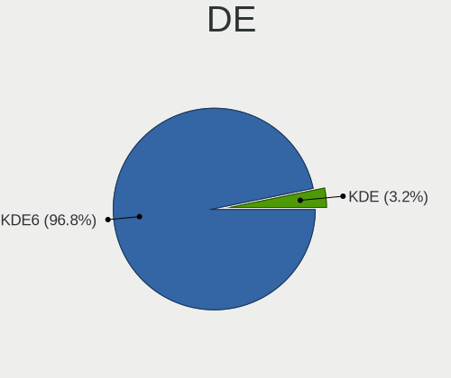
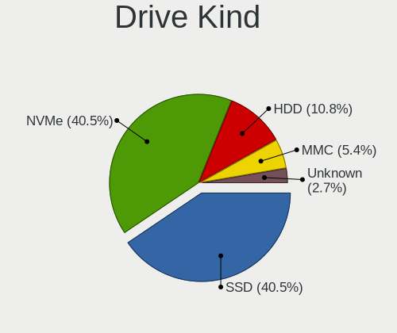
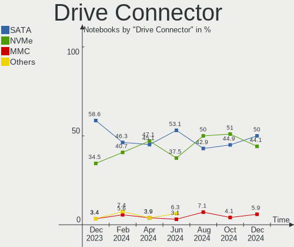
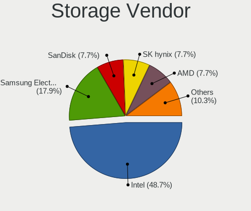
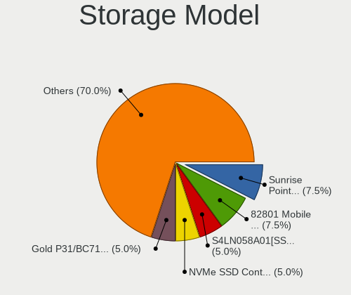
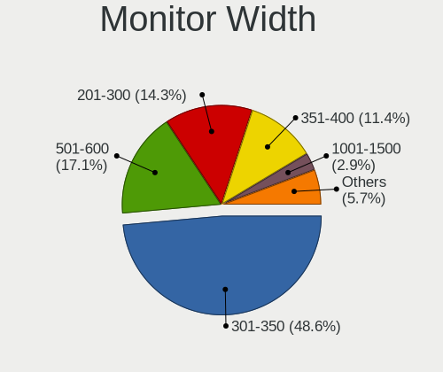

KDE neon Hardware Trends (Notebook)
-----------------------------------

A project to identify most popular hardware characteristics and track their change
over time based on data collected by KDE neon users at https://Linux-Hardware.org.

Anyone can contribute to the study by uploading probes of their computers by
the [hw-probe](https://github.com/linuxhw/hw-probe) tool:

    sudo -E hw-probe -all -upload

Full-feature report is available here: https://linux-hardware.org/?view=trends&formfactor=notebook

Period: Sep, 2020.

Contents
--------

- [ OS                       ](#os)
- [ OS Family                ](#os-family)
- [ Kernel                   ](#kernel)
- [ Kernel Family            ](#kernel-family)
- [ Kernel Major Ver.        ](#kernel-major-ver)
- [ Arch                     ](#arch)
- [ DE                       ](#de)
- [ Display Server           ](#display-server)
- [ Display Manager          ](#display-manager)
- [ OS Lang                  ](#os-lang)
- [ Boot Mode                ](#boot-mode)
- [ Filesystem               ](#filesystem)
- [ Part. scheme             ](#part-scheme)
- [ Dual Boot with Linux/BSD ](#dual-boot-with-linux/bsd)
- [ Dual Boot (Win)          ](#dual-boot-win)
- [ Country                  ](#country)
- [ City                     ](#city)
- [ Vendor                   ](#vendor)
- [ Model                    ](#model)
- [ Model Family             ](#model-family)
- [ MFG Year                 ](#mfg-year)
- [ Form Factor              ](#form-factor)
- [ Secure Boot              ](#secure-boot)
- [ Coreboot                 ](#coreboot)
- [ RAM Size                 ](#ram-size)
- [ RAM Used                 ](#ram-used)
- [ Has CD-ROM               ](#has-cd-rom)
- [ Total Drives             ](#total-drives)
- [ Has Ethernet             ](#has-ethernet)
- [ Drive Vendor             ](#drive-vendor)
- [ HDD Vendor               ](#hdd-vendor)
- [ SSD Vendor               ](#ssd-vendor)
- [ Drive Model              ](#drive-model)
- [ Drive Kind               ](#drive-kind)
- [ Drive Connector          ](#drive-connector)
- [ Drive Size               ](#drive-size)
- [ Space Total              ](#space-total)
- [ Space Used               ](#space-used)
- [ Malfunc. Drives          ](#malfunc-drives)
- [ Malfunc. Drive Vendor    ](#malfunc-drive-vendor)
- [ Malfunc. HDD Vendor      ](#malfunc-hdd-vendor)
- [ Malfunc. Drive Kind      ](#malfunc-drive-kind)
- [ Failed Drives            ](#failed-drives)
- [ Failed Drive Vendor      ](#failed-drive-vendor)
- [ Drive Status             ](#drive-status)
- [ Storage Vendor           ](#storage-vendor)
- [ Storage Model            ](#storage-model)
- [ Storage Kind             ](#storage-kind)
- [ CPU Vendor               ](#cpu-vendor)
- [ CPU Model                ](#cpu-model)
- [ CPU Model Family         ](#cpu-model-family)
- [ CPU Cores                ](#cpu-cores)
- [ CPU Sockets              ](#cpu-sockets)
- [ CPU Threads              ](#cpu-threads)
- [ CPU Op-Modes             ](#cpu-op-modes)
- [ CPU Microcode            ](#cpu-microcode)
- [ CPU Microarch            ](#cpu-microarch)
- [ GPU Vendor               ](#gpu-vendor)
- [ GPU Model                ](#gpu-model)
- [ GPU Combo                ](#gpu-combo)
- [ GPU Driver               ](#gpu-driver)
- [ GPU Memory               ](#gpu-memory)
- [ Monitor Vendor           ](#monitor-vendor)
- [ Monitor Model            ](#monitor-model)
- [ Monitor Resolution       ](#monitor-resolution)
- [ Monitor Diagonal         ](#monitor-diagonal)
- [ Monitor Width            ](#monitor-width)
- [ Aspect Ratio             ](#aspect-ratio)
- [ Monitor Area             ](#monitor-area)
- [ Pixel Density            ](#pixel-density)
- [ Multiple Monitors        ](#multiple-monitors)
- [ Net Controller Vendor    ](#net-controller-vendor)
- [ Net Controller Model     ](#net-controller-model)
- [ Wireless Vendor          ](#wireless-vendor)
- [ Wireless Model           ](#wireless-model)
- [ Ethernet Vendor          ](#ethernet-vendor)
- [ Ethernet Model           ](#ethernet-model)
- [ Net Controller Kind      ](#net-controller-kind)
- [ Used Controller          ](#used-controller)
- [ NICs                     ](#nics)
- [ Memory Vendor            ](#memory-vendor)
- [ Memory Model             ](#memory-model)
- [ Memory Kind              ](#memory-kind)
- [ Memory Form Factor       ](#memory-form-factor)
- [ Memory Size              ](#memory-size)
- [ Memory Speed             ](#memory-speed)
- [ Sound Vendor             ](#sound-vendor)
- [ Sound Model              ](#sound-model)
- [ Camera Vendor            ](#camera-vendor)
- [ Camera Model             ](#camera-model)
- [ Fingerprint Vendor       ](#fingerprint-vendor)
- [ Fingerprint Model        ](#fingerprint-model)
- [ Chipcard Vendor          ](#chipcard-vendor)
- [ Chipcard Model           ](#chipcard-model)
- [ Printer Vendor           ](#printer-vendor)
- [ Printer Model            ](#printer-model)
- [ Scanner Vendor           ](#scanner-vendor)
- [ Scanner Model            ](#scanner-model)
- [ Bluetooth Vendor         ](#bluetooth-vendor)
- [ Bluetooth Model          ](#bluetooth-model)
- [ Unsupported Devices      ](#unsupported-devices)
- [ Unsupported Device Types ](#unsupported-device-types)

OS
--

Installed operating systems

| Name           | Notebooks | Percent |
|----------------|-----------|---------|
| KDE neon 20.04 | 19        | 90.48%  |
| KDE neon 18.04 | 2         | 9.52%   |

OS Family
---------

OS without a version

| Name     | Notebooks | Percent |
|----------|-----------|---------|
| KDE neon | 21        | 100%    |

Kernel
------

Version of the Linux kernel

| Version              | Notebooks | Percent |
|----------------------|-----------|---------|
| 5.4.0-47-generic     | 6         | 28.57%  |
| 5.4.0-48-generic     | 5         | 23.81%  |
| 5.4.0-42-generic     | 5         | 23.81%  |
| 5.8.9-050809-generic | 1         | 4.76%   |
| 5.8.6-xanmod1        | 1         | 4.76%   |
| 5.7.1-050701-generic | 1         | 4.76%   |
| 5.4.0-45-generic     | 1         | 4.76%   |
| 4.15.0-43-generic    | 1         | 4.76%   |

Kernel Family
-------------

Linux kernel without a distro release

| Version | Notebooks | Percent |
|---------|-----------|---------|
| 5.4.0   | 17        | 80.95%  |
| 5.8.9   | 1         | 4.76%   |
| 5.8.6   | 1         | 4.76%   |
| 5.7.1   | 1         | 4.76%   |
| 4.15.0  | 1         | 4.76%   |

Kernel Major Ver.
-----------------

Linux kernel major version

| Version | Notebooks | Percent |
|---------|-----------|---------|
| 5.4     | 17        | 80.95%  |
| 5.8     | 2         | 9.52%   |
| 5.7     | 1         | 4.76%   |
| 4.15    | 1         | 4.76%   |

Arch
----

OS architecture (x86_64, i586, etc.)

| Name   | Notebooks | Percent |
|--------|-----------|---------|
| x86_64 | 21        | 100%    |

DE
--

Desktop Environment

| Name    | Notebooks | Percent |
|---------|-----------|---------|
| KDE     | 13        | 61.9%   |
| KDE5    | 6         | 28.57%  |
| Unknown | 2         | 9.52%   |

Display Server
--------------

X11 or Wayland

| Name    | Notebooks | Percent |
|---------|-----------|---------|
| X11     | 20        | 95.24%  |
| Wayland | 1         | 4.76%   |

Display Manager
---------------

SDDM, LightDM, etc.

| Name    | Notebooks | Percent |
|---------|-----------|---------|
| Unknown | 14        | 66.67%  |
| SDDM    | 7         | 33.33%  |

OS Lang
-------

Language

| Lang    | Notebooks | Percent |
|---------|-----------|---------|
| en_US   | 5         | 23.81%  |
| ru_RU   | 2         | 9.52%   |
| pt_BR   | 2         | 9.52%   |
| C       | 2         | 9.52%   |
| ro_RO   | 1         | 4.76%   |
| pl_PL   | 1         | 4.76%   |
| es_MX   | 1         | 4.76%   |
| es_ES   | 1         | 4.76%   |
| es_EC   | 1         | 4.76%   |
| es_AR   | 1         | 4.76%   |
| en_ZA   | 1         | 4.76%   |
| en_IN   | 1         | 4.76%   |
| de_CH   | 1         | 4.76%   |
| Unknown | 1         | 4.76%   |

Boot Mode
---------

EFI or BIOS

| Mode | Notebooks | Percent |
|------|-----------|---------|
| EFI  | 15        | 71.43%  |
| BIOS | 6         | 28.57%  |

Filesystem
----------

Type of filesystem

| Type    | Notebooks | Percent |
|---------|-----------|---------|
| Ext4    | 19        | 90.48%  |
| Overlay | 1         | 4.76%   |
| Btrfs   | 1         | 4.76%   |

Part. scheme
------------

Scheme of partitioning

| Type    | Notebooks | Percent |
|---------|-----------|---------|
| Unknown | 14        | 66.67%  |
| GPT     | 7         | 33.33%  |

Dual Boot with Linux/BSD
------------------------

Hosting more than one Linux/BSD

| Dual boot | Notebooks | Percent |
|-----------|-----------|---------|
| No        | 20        | 95.24%  |
| Yes       | 1         | 4.76%   |

Dual Boot (Win)
---------------

Hosting Linux and Windows

| Dual boot | Notebooks | Percent |
|-----------|-----------|---------|
| No        | 15        | 71.43%  |
| Yes       | 6         | 28.57%  |

Country
-------

Geographic location (country)

| Country      | Notebooks | Percent |
|--------------|-----------|---------|
| USA          | 2         | 9.52%   |
| Mexico       | 2         | 9.52%   |
| Germany      | 2         | 9.52%   |
| Brazil       | 2         | 9.52%   |
| Switzerland  | 1         | 4.76%   |
| South Africa | 1         | 4.76%   |
| Russia       | 1         | 4.76%   |
| Romania      | 1         | 4.76%   |
| Qatar        | 1         | 4.76%   |
| Poland       | 1         | 4.76%   |
| Kazakhstan   | 1         | 4.76%   |
| Japan        | 1         | 4.76%   |
| India        | 1         | 4.76%   |
| Ecuador      | 1         | 4.76%   |
| Canada       | 1         | 4.76%   |
| Argentina    | 1         | 4.76%   |
| Andorra      | 1         | 4.76%   |

City
----

Geographic location (city)

| City                | Notebooks | Percent |
|---------------------|-----------|---------|
| Łódź             | 1         | 4.76%   |
| Zurich              | 1         | 4.76%   |
| Zimmern ob Rottweil | 1         | 4.76%   |
| Toronto             | 1         | 4.76%   |
| Tizayuca            | 1         | 4.76%   |
| Springfield         | 1         | 4.76%   |
| Quito               | 1         | 4.76%   |
| Munich              | 1         | 4.76%   |
| Mexico City         | 1         | 4.76%   |
| La Plata            | 1         | 4.76%   |
| Kagoshima           | 1         | 4.76%   |
| Jaguaruana          | 1         | 4.76%   |
| Falls Church        | 1         | 4.76%   |
| Dumbravita          | 1         | 4.76%   |
| Doha                | 1         | 4.76%   |
| Criciúma           | 1         | 4.76%   |
| Boksburg            | 1         | 4.76%   |
| Balashikha          | 1         | 4.76%   |
| Atyrau              | 1         | 4.76%   |
| Andorra la Vella    | 1         | 4.76%   |
| Ahmedabad           | 1         | 4.76%   |

Vendor
------

Motherboard manufacturer

| Name             | Notebooks | Percent |
|------------------|-----------|---------|
| Lenovo           | 8         | 38.1%   |
| Hewlett-Packard  | 8         | 38.1%   |
| ASUSTek Computer | 2         | 9.52%   |
| Sony             | 1         | 4.76%   |
| MSI              | 1         | 4.76%   |
| Dell             | 1         | 4.76%   |

Model
-----

Motherboard model

| Name                                 | Notebooks | Percent |
|--------------------------------------|-----------|---------|
| Sony VGN-AW41ZF_B                    | 1         | 4.76%   |
| MSI GS60 2QE                         | 1         | 4.76%   |
| Lenovo ThinkPad T480s 20L8S6QF00     | 1         | 4.76%   |
| Lenovo ThinkPad T470s 20HGS0A600     | 1         | 4.76%   |
| Lenovo ThinkPad E14 Gen 2 20T6S03000 | 1         | 4.76%   |
| Lenovo IdeaPad Y700-15ISK 80NV       | 1         | 4.76%   |
| Lenovo IdeaPad S540-15IWL 81NE       | 1         | 4.76%   |
| Lenovo IdeaPad 500-15ISK 80NT        | 1         | 4.76%   |
| Lenovo IdeaPad 320-15IKB 80YH        | 1         | 4.76%   |
| Lenovo IdeaPad 110-15IBR 80T7        | 1         | 4.76%   |
| HP Notebook                          | 1         | 4.76%   |
| HP Laptop 14-df0xxx                  | 1         | 4.76%   |
| HP G42                               | 1         | 4.76%   |
| HP EliteBook 840 G6                  | 1         | 4.76%   |
| HP Compaq 15                         | 1         | 4.76%   |
| HP 650                               | 1         | 4.76%   |
| HP 355 G2                            | 1         | 4.76%   |
| HP 250 G6 Notebook PC                | 1         | 4.76%   |
| Dell Inspiron 5557                   | 1         | 4.76%   |
| ASUS X541NA                          | 1         | 4.76%   |
| ASUS VivoBook E14 E402YA_E402YA      | 1         | 4.76%   |

Model Family
------------

Motherboard model prefix

| Name            | Notebooks | Percent |
|-----------------|-----------|---------|
| Lenovo IdeaPad  | 5         | 23.81%  |
| Lenovo ThinkPad | 3         | 14.29%  |
| Sony VGN-AW41ZF | 1         | 4.76%   |
| MSI GS60        | 1         | 4.76%   |
| HP Notebook     | 1         | 4.76%   |
| HP Laptop       | 1         | 4.76%   |
| HP G42          | 1         | 4.76%   |
| HP EliteBook    | 1         | 4.76%   |
| HP Compaq       | 1         | 4.76%   |
| HP 650          | 1         | 4.76%   |
| HP 355          | 1         | 4.76%   |
| HP 250          | 1         | 4.76%   |
| Dell Inspiron   | 1         | 4.76%   |
| ASUS X541NA     | 1         | 4.76%   |
| ASUS VivoBook   | 1         | 4.76%   |

MFG Year
--------

Motherboard manufacture year

| Year | Notebooks | Percent |
|------|-----------|---------|
| 2018 | 6         | 28.57%  |
| 2019 | 5         | 23.81%  |
| 2020 | 2         | 9.52%   |
| 2017 | 2         | 9.52%   |
| 2014 | 2         | 9.52%   |
| 2016 | 1         | 4.76%   |
| 2012 | 1         | 4.76%   |
| 2010 | 1         | 4.76%   |
| 2009 | 1         | 4.76%   |

Form Factor
-----------

Physical design of the computer

| Name     | Notebooks | Percent |
|----------|-----------|---------|
| Notebook | 21        | 100%    |

Secure Boot
-----------

Enabled or disabled

| State    | Notebooks | Percent |
|----------|-----------|---------|
| Disabled | 19        | 90.48%  |
| Enabled  | 2         | 9.52%   |

Coreboot
--------

Have coreboot on board

| Used | Notebooks | Percent |
|------|-----------|---------|
| No   | 21        | 100%    |

RAM Size
--------

Total RAM memory

| Size in GB | Notebooks | Percent |
|------------|-----------|---------|
| 3.01-4.0   | 6         | 28.57%  |
| 16.01-24.0 | 6         | 28.57%  |
| 8.01-16.0  | 6         | 28.57%  |
| 4.01-8.0   | 3         | 14.29%  |

RAM Used
--------

Used RAM memory

| Used GB   | Notebooks | Percent |
|-----------|-----------|---------|
| 4.01-8.0  | 6         | 28.57%  |
| 1.01-2.0  | 6         | 28.57%  |
| 2.01-3.0  | 4         | 19.05%  |
| 3.01-4.0  | 3         | 14.29%  |
| 8.01-16.0 | 1         | 4.76%   |
| 0.01-1.0  | 1         | 4.76%   |

Has CD-ROM
----------

Has CD-ROM on board

| Presented | Notebooks | Percent |
|-----------|-----------|---------|
| No        | 14        | 66.67%  |
| Yes       | 7         | 33.33%  |

Total Drives
------------

Number of drives on board

| Drives | Notebooks | Percent |
|--------|-----------|---------|
| 1      | 15        | 71.43%  |
| 2      | 5         | 23.81%  |
| 3      | 1         | 4.76%   |

Has Ethernet
------------

Has Ethernet on board

| Presented | Notebooks | Percent |
|-----------|-----------|---------|
| Yes       | 20        | 95.24%  |
| No        | 1         | 4.76%   |

Drive Vendor
------------

Hard drive vendors

| Vendor              | Notebooks | Drives | Percent |
|---------------------|-----------|--------|---------|
| Seagate             | 5         | 5      | 20%     |
| WDC                 | 4         | 4      | 16%     |
| Toshiba             | 4         | 5      | 16%     |
| SanDisk             | 2         | 2      | 8%      |
| Samsung Electronics | 2         | 2      | 8%      |
| Unknown             | 1         | 1      | 4%      |
| Micron Technology   | 1         | 1      | 4%      |
| Lenovo              | 1         | 1      | 4%      |
| Kingston            | 1         | 2      | 4%      |
| Intenso             | 1         | 1      | 4%      |
| Hitachi             | 1         | 1      | 4%      |
| HGST                | 1         | 1      | 4%      |
| GOODRAM             | 1         | 1      | 4%      |

HDD Vendor
----------

Hard disk drive vendors

| Vendor  | Notebooks | Drives | Percent |
|---------|-----------|--------|---------|
| Seagate | 5         | 5      | 45.45%  |
| Toshiba | 3         | 3      | 27.27%  |
| WDC     | 1         | 1      | 9.09%   |
| Hitachi | 1         | 1      | 9.09%   |
| HGST    | 1         | 1      | 9.09%   |

SSD Vendor
----------

Solid state drive vendors

| Vendor              | Notebooks | Drives | Percent |
|---------------------|-----------|--------|---------|
| SanDisk             | 2         | 2      | 22.22%  |
| WDC                 | 1         | 1      | 11.11%  |
| Toshiba             | 1         | 2      | 11.11%  |
| Samsung Electronics | 1         | 1      | 11.11%  |
| Micron Technology   | 1         | 1      | 11.11%  |
| Kingston            | 1         | 2      | 11.11%  |
| Intenso             | 1         | 1      | 11.11%  |
| GOODRAM             | 1         | 1      | 11.11%  |

Drive Model
-----------

Hard drive models

| Model                            | Notebooks | Percent |
|----------------------------------|-----------|---------|
| MQ01ABF050 500GB                 | 2         | 7.69%   |
| WDS500G3X0C-00SJG0 500GB         | 1         | 3.85%   |
| WDS240G2G0B-00EPW0 240GB SSD     | 1         | 3.85%   |
| WD10SPCX-24HWST1 1TB             | 1         | 3.85%   |
| THNSNJ128G8NU 128GB SSD          | 1         | 3.85%   |
| ST9320423AS 320GB                | 1         | 3.85%   |
| ST500LT012-1DG142 500GB          | 1         | 3.85%   |
| ST2000LM003 HN-M201RAD 2TB       | 1         | 3.85%   |
| ST1000LM035-1RK172 1TB           | 1         | 3.85%   |
| ST1000LM024 HN-M101MBB 1TB       | 1         | 3.85%   |
| SSD PLUS 240GB                   | 1         | 3.85%   |
| SSD PLUS 120GB                   | 1         | 3.85%   |
| SSD 860 EVO 500GB                | 1         | 3.85%   |
| SSD 256GB                        | 1         | 3.85%   |
| SSD 240GB                        | 1         | 3.85%   |
| SH103S3120G 120GB SSD            | 1         | 3.85%   |
| SA400S37960G 960GB SSD           | 1         | 3.85%   |
| PC SN530 SDBPMPZ-256G-1001 256GB | 1         | 3.85%   |
| NVMe SSD Drive 512GB             | 1         | 3.85%   |
| NVMe SSD Drive 256GB             | 1         | 3.85%   |
| MZVLB512HAJQ-000H1 512GB         | 1         | 3.85%   |
| MQ01ABD100 1TB                   | 1         | 3.85%   |
| HTS721010A9E630 1TB              | 1         | 3.85%   |
| HTS543232A7A384 320GB            | 1         | 3.85%   |
| 1300_MTFDDAK256TDL 256GB SSD     | 1         | 3.85%   |

Drive Kind
----------

HDD or SSD

| Kind | Notebooks | Drives | Percent |
|------|-----------|--------|---------|
| HDD  | 11        | 11     | 45.83%  |
| SSD  | 8         | 11     | 33.33%  |
| NVMe | 5         | 5      | 20.83%  |

Drive Connector
---------------

SATA, SAS, NVMe, etc.

| Type | Notebooks | Drives | Percent |
|------|-----------|--------|---------|
| SATA | 17        | 22     | 77.27%  |
| NVMe | 5         | 5      | 22.73%  |

Drive Size
----------

Size of hard drive

| Size in TB | Notebooks | Drives | Percent |
|------------|-----------|--------|---------|
| 0.01-0.5   | 15        | 18     | 62.5%   |
| 0.51-1.0   | 8         | 8      | 33.33%  |
| 1.01-2.0   | 1         | 1      | 4.17%   |

Space Total
-----------

Amount of disk space available on the file system

| Size in GB | Notebooks | Percent |
|------------|-----------|---------|
| 251-500    | 7         | 33.33%  |
| 101-250    | 6         | 28.57%  |
| 1001-2000  | 2         | 9.52%   |
| 1-20       | 2         | 9.52%   |
| 501-1000   | 2         | 9.52%   |
| 51-100     | 1         | 4.76%   |
| Unknown    | 1         | 4.76%   |

Space Used
----------

Amount of used disk space

| Used GB  | Notebooks | Percent |
|----------|-----------|---------|
| 51-100   | 6         | 28.57%  |
| 1-20     | 4         | 19.05%  |
| 251-500  | 3         | 14.29%  |
| 101-250  | 3         | 14.29%  |
| 21-50    | 2         | 9.52%   |
| 501-1000 | 2         | 9.52%   |
| Unknown  | 1         | 4.76%   |

Malfunc. Drives
---------------

Drive models with a malfunction

Zero info for selected period =(

Malfunc. Drive Vendor
---------------------

Vendors of faulty drives

Zero info for selected period =(

Malfunc. HDD Vendor
-------------------

Vendors of faulty HDD drives

Zero info for selected period =(

Malfunc. Drive Kind
-------------------

Kinds of faulty drives

Zero info for selected period =(

Failed Drives
-------------

Failed drive models

Zero info for selected period =(

Failed Drive Vendor
-------------------

Failed drive vendors

Zero info for selected period =(

Drive Status
------------

Number of failed and malfunc. drives

| Status   | Notebooks | Drives | Percent |
|----------|-----------|--------|---------|
| Detected | 14        | 18     | 66.67%  |
| Works    | 7         | 9      | 33.33%  |

Storage Vendor
--------------

Storage controller vendors

| Vendor                  | Notebooks | Percent |
|-------------------------|-----------|---------|
| Intel                   | 14        | 60.87%  |
| AMD                     | 3         | 13.04%  |
| Sandisk                 | 2         | 8.7%    |
| Union Memory (Shenzhen) | 1         | 4.35%   |
| Samsung Electronics     | 1         | 4.35%   |
| Lenovo                  | 1         | 4.35%   |
| JMicron Technology      | 1         | 4.35%   |

Storage Model
-------------

Storage controller models

| Model                                                                      | Notebooks | Percent |
|----------------------------------------------------------------------------|-----------|---------|
| Non-Volatile memory controller                                             | 3         | 13.04%  |
| FCH SATA Controller [AHCI mode]                                            | 3         | 13.04%  |
| 82801 Mobile SATA Controller [RAID mode]                                   | 3         | 13.04%  |
| Sunrise Point-LP SATA Controller [AHCI mode]                               | 2         | 8.7%    |
| Wildcat Point-LP SATA Controller [AHCI Mode]                               | 1         | 4.35%   |
| WD Black 2018/PC SN720 NVMe SSD                                            | 1         | 4.35%   |
| SATA controller                                                            | 1         | 4.35%   |
| NVMe SSD Controller SM981/PM981/PM983                                      | 1         | 4.35%   |
| JMB368 IDE controller                                                      | 1         | 4.35%   |
| HM170/QM170 Chipset SATA Controller [AHCI Mode]                            | 1         | 4.35%   |
| Celeron N3350/Pentium N4200/Atom E3900 Series SATA AHCI Controller         | 1         | 4.35%   |
| Cannon Point-LP SATA Controller [AHCI Mode]                                | 1         | 4.35%   |
| Atom/Celeron/Pentium Processor x5-E8000/J3xxx/N3xxx Series SATA Controller | 1         | 4.35%   |
| 82801IBM/IEM (ICH9M/ICH9M-E) 4 port SATA Controller [AHCI mode]            | 1         | 4.35%   |
| 7 Series Chipset Family 6-port SATA Controller [AHCI mode]                 | 1         | 4.35%   |
| 5 Series/3400 Series Chipset 4 port SATA AHCI Controller                   | 1         | 4.35%   |

Storage Kind
------------

Kind of storage controller (IDE, SATA, NVMe, SAS, ...)

| Kind | Notebooks | Percent |
|------|-----------|---------|
| SATA | 14        | 60.87%  |
| NVMe | 5         | 21.74%  |
| RAID | 3         | 13.04%  |
| IDE  | 1         | 4.35%   |

CPU Vendor
----------

Processor vendors

| Vendor | Notebooks | Percent |
|--------|-----------|---------|
| Intel  | 17        | 80.95%  |
| AMD    | 4         | 19.05%  |

CPU Model
---------

Processor models

| Model                                       | Notebooks | Percent |
|---------------------------------------------|-----------|---------|
| Intel Core i7-7500U CPU @ 2.70GHz           | 2         | 9.52%   |
| Intel Core i7-6500U CPU @ 2.50GHz           | 2         | 9.52%   |
| Intel Pentium Silver N5000 CPU @ 1.10GHz    | 1         | 4.76%   |
| Intel Pentium CPU B980 @ 2.40GHz            | 1         | 4.76%   |
| Intel Core i7-8565U CPU @ 1.80GHz           | 1         | 4.76%   |
| Intel Core i7-6700HQ CPU @ 2.60GHz          | 1         | 4.76%   |
| Intel Core i7-4710HQ CPU @ 2.50GHz          | 1         | 4.76%   |
| Intel Core i5-8350U CPU @ 1.70GHz           | 1         | 4.76%   |
| Intel Core i5-8265U CPU @ 1.60GHz           | 1         | 4.76%   |
| Intel Core i3-8130U CPU @ 2.20GHz           | 1         | 4.76%   |
| Intel Core i3-5005U CPU @ 2.00GHz           | 1         | 4.76%   |
| Intel Core i3 CPU M 350 @ 2.27GHz           | 1         | 4.76%   |
| Intel Core 2 Duo CPU T9600 @ 2.80GHz        | 1         | 4.76%   |
| Intel Celeron CPU N3350 @ 1.10GHz           | 1         | 4.76%   |
| Intel Celeron CPU N3060 @ 1.60GHz           | 1         | 4.76%   |
| AMD Ryzen 7 4700U with Radeon Graphics      | 1         | 4.76%   |
| AMD E2-7015 APU with AMD Radeon R2 Graphics | 1         | 4.76%   |
| AMD A8-6410 APU with AMD Radeon R5 Graphics | 1         | 4.76%   |
| AMD A4-5000 APU with Radeon HD Graphics     | 1         | 4.76%   |

CPU Model Family
----------------

Processor model prefix

| Model                | Notebooks | Percent |
|----------------------|-----------|---------|
| Intel Core i7        | 7         | 33.33%  |
| Intel Core i3        | 3         | 14.29%  |
| Intel Core i5        | 2         | 9.52%   |
| Intel Celeron        | 2         | 9.52%   |
| Intel Pentium Silver | 1         | 4.76%   |
| Intel Pentium        | 1         | 4.76%   |
| Intel Core 2 Duo     | 1         | 4.76%   |
| AMD Ryzen 7          | 1         | 4.76%   |
| AMD E2               | 1         | 4.76%   |
| AMD A8               | 1         | 4.76%   |
| AMD A4               | 1         | 4.76%   |

CPU Cores
---------

Number of processor cores

| Number | Notebooks | Percent |
|--------|-----------|---------|
| 2      | 12        | 57.14%  |
| 4      | 8         | 38.1%   |
| 8      | 1         | 4.76%   |

CPU Sockets
-----------

Number of sockets

| Number | Notebooks | Percent |
|--------|-----------|---------|
| 1      | 21        | 100%    |

CPU Threads
-----------

Threads per core (Hyper-Threading)

| Number | Notebooks | Percent |
|--------|-----------|---------|
| 2      | 12        | 57.14%  |
| 1      | 9         | 42.86%  |

CPU Op-Modes
------------

CPU Operation Modes (32-bit, 64-bit)

| Op mode        | Notebooks | Percent |
|----------------|-----------|---------|
| 32-bit, 64-bit | 21        | 100%    |

CPU Microcode
-------------

Microcode number

| Number     | Notebooks | Percent |
|------------|-----------|---------|
| 0x806ea    | 2         | 9.52%   |
| 0x406e3    | 2         | 9.52%   |
| Unknown    | 2         | 9.52%   |
| 0x806ec    | 1         | 4.76%   |
| 0x806eb    | 1         | 4.76%   |
| 0x806e9    | 1         | 4.76%   |
| 0x706a1    | 1         | 4.76%   |
| 0x506e3    | 1         | 4.76%   |
| 0x406c4    | 1         | 4.76%   |
| 0x306d4    | 1         | 4.76%   |
| 0x306c3    | 1         | 4.76%   |
| 0x206a7    | 1         | 4.76%   |
| 0x20652    | 1         | 4.76%   |
| 0x1067a    | 1         | 4.76%   |
| 0x08600103 | 1         | 4.76%   |
| 0x07030106 | 1         | 4.76%   |
| 0x07030104 | 1         | 4.76%   |
| 0x07000110 | 1         | 4.76%   |

CPU Microarch
-------------

Microarchitecture

| Name          | Notebooks | Percent |
|---------------|-----------|---------|
| Skylake       | 8         | 38.1%   |
| Puma          | 2         | 9.52%   |
| Zen 2         | 1         | 4.76%   |
| Westmere      | 1         | 4.76%   |
| Silvermont    | 1         | 4.76%   |
| SandyBridge   | 1         | 4.76%   |
| KabyLake      | 1         | 4.76%   |
| Jaguar        | 1         | 4.76%   |
| Haswell       | 1         | 4.76%   |
| Goldmont plus | 1         | 4.76%   |
| Goldmont      | 1         | 4.76%   |
| Core          | 1         | 4.76%   |
| Broadwell     | 1         | 4.76%   |

GPU Vendor
----------

Vendors of graphics cards

| Vendor | Notebooks | Percent |
|--------|-----------|---------|
| Intel  | 16        | 61.54%  |
| Nvidia | 5         | 19.23%  |
| AMD    | 5         | 19.23%  |

GPU Model
---------

Graphics card models

| Model                                                                              | Notebooks | Percent |
|------------------------------------------------------------------------------------|-----------|---------|
| UHD Graphics 620 (Whiskey Lake)                                                    | 2         | 7.41%   |
| UHD Graphics 620                                                                   | 2         | 7.41%   |
| Skylake GT2 [HD Graphics 520]                                                      | 2         | 7.41%   |
| HD Graphics 620                                                                    | 2         | 7.41%   |
| UHD Graphics 605                                                                   | 1         | 3.7%    |
| Topaz XT [Radeon R7 M260/M265 / M340/M360 / M440/M445 / 530/535 / 620/625 Mobile]  | 1         | 3.7%    |
| Renoir                                                                             | 1         | 3.7%    |
| Mullins [Radeon R4/R5 Graphics]                                                    | 1         | 3.7%    |
| Mullins [Radeon R2 Graphics]                                                       | 1         | 3.7%    |
| Kabini [Radeon HD 8330]                                                            | 1         | 3.7%    |
| Jet XT [Radeon R5 M240]                                                            | 1         | 3.7%    |
| HD Graphics 5500                                                                   | 1         | 3.7%    |
| HD Graphics 530                                                                    | 1         | 3.7%    |
| HD Graphics 500                                                                    | 1         | 3.7%    |
| GM204M [GeForce GTX 970M]                                                          | 1         | 3.7%    |
| GM108M [GeForce 940MX]                                                             | 1         | 3.7%    |
| GM108M [GeForce 930M]                                                              | 1         | 3.7%    |
| GM107M [GeForce GTX 960M]                                                          | 1         | 3.7%    |
| G96CM [GeForce 9600M GT]                                                           | 1         | 3.7%    |
| Core Processor Integrated Graphics Controller                                      | 1         | 3.7%    |
| Atom/Celeron/Pentium Processor x5-E8000/J3xxx/N3xxx Integrated Graphics Controller | 1         | 3.7%    |
| 4th Gen Core Processor Integrated Graphics Controller                              | 1         | 3.7%    |
| 2nd Generation Core Processor Family Integrated Graphics Controller                | 1         | 3.7%    |

GPU Combo
---------

Combinations of graphics cards

| Name           | Notebooks | Percent |
|----------------|-----------|---------|
| 1 x Intel      | 11        | 52.38%  |
| Intel + Nvidia | 4         | 19.05%  |
| 1 x AMD        | 3         | 14.29%  |
| 2 x AMD        | 1         | 4.76%   |
| 1 x Nvidia     | 1         | 4.76%   |
| Intel + AMD    | 1         | 4.76%   |

GPU Driver
----------

Free vs proprietary

| Driver      | Notebooks | Percent |
|-------------|-----------|---------|
| Free        | 20        | 95.24%  |
| Proprietary | 1         | 4.76%   |

GPU Memory
----------

Total video memory

| Size in GB | Notebooks | Percent |
|------------|-----------|---------|
| Unknown    | 12        | 57.14%  |
| 0.01-0.5   | 4         | 19.05%  |
| 1.01-2.0   | 2         | 9.52%   |
| 3.01-4.0   | 1         | 4.76%   |
| 2.01-3.0   | 1         | 4.76%   |
| 0.51-1.0   | 1         | 4.76%   |

Monitor Vendor
--------------

Monitor vendors

| Vendor              | Notebooks | Percent |
|---------------------|-----------|---------|
| BOE                 | 5         | 20.83%  |
| AU Optronics        | 5         | 20.83%  |
| Samsung Electronics | 3         | 12.5%   |
| LG Display          | 3         | 12.5%   |
| Chimei Innolux      | 3         | 12.5%   |
| Panasonic           | 2         | 8.33%   |
| InfoVision          | 1         | 4.17%   |
| Dell                | 1         | 4.17%   |
| Acer                | 1         | 4.17%   |

Monitor Model
-------------

Monitor models

| Model                                              | Notebooks | Percent |
|----------------------------------------------------|-----------|---------|
| LCD Monitor AUO70EC 1366x768 340x190mm 15.3-inch   | 2         | 8.33%   |
| LCD Monitor AUO403D 1920x1080 309x173mm 13.9-inch  | 2         | 8.33%   |
| X163W ACR0015 1366x768 344x193mm 15.5-inch         | 1         | 4.17%   |
| VVX13F009G00 MEI96A2 1920x1080 290x170mm 13.2-inch | 1         | 4.17%   |
| TV MEIA296 1920x1080 1280x720mm 57.8-inch          | 1         | 4.17%   |
| SE2416H DELD082 1920x1080 527x296mm 23.8-inch      | 1         | 4.17%   |
| S24F350 SAM0D20 1920x1080 521x293mm 23.5-inch      | 1         | 4.17%   |
| M140NWR2 R1 IVO057A 1366x768 309x174mm 14.0-inch   | 1         | 4.17%   |
| LCD Monitor SEC325A 1366x768 344x194mm 15.5-inch   | 1         | 4.17%   |
| LCD Monitor SDC4A51 1366x768 344x194mm 15.5-inch   | 1         | 4.17%   |
| LCD Monitor LGD04A7 1920x1080 340x190mm 15.3-inch  | 1         | 4.17%   |
| LCD Monitor LGD0493 1366x768 344x194mm 15.5-inch   | 1         | 4.17%   |
| LCD Monitor LGD0456 1366x768 344x194mm 15.5-inch   | 1         | 4.17%   |
| LCD Monitor CMN15C4 1920x1080 344x193mm 15.5-inch  | 1         | 4.17%   |
| LCD Monitor CMN15AB 1366x768 350x190mm 15.7-inch   | 1         | 4.17%   |
| LCD Monitor CMN14C4 1366x768 309x173mm 13.9-inch   | 1         | 4.17%   |
| LCD Monitor BOE0791 1920x1080 309x173mm 13.9-inch  | 1         | 4.17%   |
| LCD Monitor BOE072B 1920x1080 309x173mm 13.9-inch  | 1         | 4.17%   |
| LCD Monitor BOE0729 1920x1080 344x193mm 15.5-inch  | 1         | 4.17%   |
| LCD Monitor BOE0700 1920x1080 344x194mm 15.5-inch  | 1         | 4.17%   |
| LCD Monitor BOE0687 1920x1080 344x193mm 15.5-inch  | 1         | 4.17%   |
| LCD Monitor AUO1536 2560x1440 309x174mm 14.0-inch  | 1         | 4.17%   |

Monitor Resolution
------------------

Monitor screen resolution

| Resolution      | Notebooks | Percent |
|-----------------|-----------|---------|
| 1920x1080 (FHD) | 10        | 45.45%  |
| 1366x768 (WXGA) | 9         | 40.91%  |
| 2560x1440 (QHD) | 2         | 9.09%   |
| 3840x2160 (4K)  | 1         | 4.55%   |

Monitor Diagonal
----------------

Diagonal size in inches

| Inches | Notebooks | Percent |
|--------|-----------|---------|
| 15     | 12        | 52.17%  |
| 13     | 6         | 26.09%  |
| 23     | 2         | 8.7%    |
| 14     | 2         | 8.7%    |
| 31     | 1         | 4.35%   |

Monitor Width
-------------

Physical width

| Width in mm | Notebooks | Percent |
|-------------|-----------|---------|
| 301-350     | 20        | 86.96%  |
| 501-600     | 2         | 8.7%    |
| 601-700     | 1         | 4.35%   |

Aspect Ratio
------------

Proportional relationship between the width and the height

| Ratio | Notebooks | Percent |
|-------|-----------|---------|
| 16/9  | 20        | 100%    |

Monitor Area
------------

Area in inch²

| Area in inch² | Notebooks | Percent |
|----------------|-----------|---------|
| 101-110        | 12        | 52.17%  |
| 81-90          | 8         | 34.78%  |
| 201-250        | 2         | 8.7%    |
| 351-500        | 1         | 4.35%   |

Pixel Density
-------------

Pixels per inch

| Density | Notebooks | Percent |
|---------|-----------|---------|
| 121-160 | 9         | 40.91%  |
| 101-120 | 9         | 40.91%  |
| 161-240 | 2         | 9.09%   |
| 51-100  | 2         | 9.09%   |

Multiple Monitors
-----------------

Total monitors connected

| Total | Notebooks | Percent |
|-------|-----------|---------|
| 1     | 17        | 80.95%  |
| 2     | 4         | 19.05%  |

Net Controller Vendor
---------------------

Controller vendors

| Vendor                   | Notebooks | Percent |
|--------------------------|-----------|---------|
| Realtek Semiconductor    | 16        | 50%     |
| Intel                    | 10        | 31.25%  |
| Qualcomm Atheros         | 4         | 12.5%   |
| Ralink                   | 1         | 3.13%   |
| Marvell Technology Group | 1         | 3.13%   |

Net Controller Model
--------------------

Controller models

| Model                                                     | Notebooks | Percent |
|-----------------------------------------------------------|-----------|---------|
| RTL8111/8168/8411 PCI Express Gigabit Ethernet Controller | 9         | 21.43%  |
| RTL810xE PCI Express Fast Ethernet controller             | 6         | 14.29%  |
| RTL8723BE PCIe Wireless Network Adapter                   | 4         | 9.52%   |
| Dual Band Wireless-AC 3165 Plus Bluetooth                 | 3         | 7.14%   |
| Wireless 8265 / 8275                                      | 2         | 4.76%   |
| Cannon Point-LP CNVi [Wireless-AC]                        | 2         | 4.76%   |
| WiFi Link 5100                                            | 1         | 2.38%   |
| Wi-Fi 6 AX200                                             | 1         | 2.38%   |
| RTL8822BE 802.11a/b/g/n/ac WiFi adapter                   | 1         | 2.38%   |
| RTL8821CE 802.11ac PCIe Wireless Network Adapter          | 1         | 2.38%   |
| RTL8191SEvA Wireless LAN Controller                       | 1         | 2.38%   |
| RTL8188EUS 802.11n Wireless Network Adapter               | 1         | 2.38%   |
| RT3290 Wireless 802.11n 1T/1R PCIe                        | 1         | 2.38%   |
| QCA9377 802.11ac Wireless Network Adapter                 | 1         | 2.38%   |
| QCA6174 802.11ac Wireless Network Adapter                 | 1         | 2.38%   |
| Killer E220x Gigabit Ethernet Controller                  | 1         | 2.38%   |
| Ethernet Connection (6) I219-V                            | 1         | 2.38%   |
| Ethernet Connection (4) I219-V                            | 1         | 2.38%   |
| Ethernet Connection (4) I219-LM                           | 1         | 2.38%   |
| AR9485 Wireless Network Adapter                           | 1         | 2.38%   |
| AC 1550i Wireless                                         | 1         | 2.38%   |
| 88E8057 PCI-E Gigabit Ethernet Controller                 | 1         | 2.38%   |

Wireless Vendor
---------------

Wireless vendors

| Vendor                | Notebooks | Percent |
|-----------------------|-----------|---------|
| Intel                 | 10        | 47.62%  |
| Realtek Semiconductor | 7         | 33.33%  |
| Qualcomm Atheros      | 3         | 14.29%  |
| Ralink                | 1         | 4.76%   |

Wireless Model
--------------

Wireless models

| Model                                            | Notebooks | Percent |
|--------------------------------------------------|-----------|---------|
| RTL8723BE PCIe Wireless Network Adapter          | 4         | 18.18%  |
| Dual Band Wireless-AC 3165 Plus Bluetooth        | 3         | 13.64%  |
| Wireless 8265 / 8275                             | 2         | 9.09%   |
| Cannon Point-LP CNVi [Wireless-AC]               | 2         | 9.09%   |
| WiFi Link 5100                                   | 1         | 4.55%   |
| Wi-Fi 6 AX200                                    | 1         | 4.55%   |
| RTL8822BE 802.11a/b/g/n/ac WiFi adapter          | 1         | 4.55%   |
| RTL8821CE 802.11ac PCIe Wireless Network Adapter | 1         | 4.55%   |
| RTL8191SEvA Wireless LAN Controller              | 1         | 4.55%   |
| RTL8188EUS 802.11n Wireless Network Adapter      | 1         | 4.55%   |
| RT3290 Wireless 802.11n 1T/1R PCIe               | 1         | 4.55%   |
| QCA9377 802.11ac Wireless Network Adapter        | 1         | 4.55%   |
| QCA6174 802.11ac Wireless Network Adapter        | 1         | 4.55%   |
| AR9485 Wireless Network Adapter                  | 1         | 4.55%   |
| AC 1550i Wireless                                | 1         | 4.55%   |

Ethernet Vendor
---------------

Ethernet vendors

| Vendor                   | Notebooks | Percent |
|--------------------------|-----------|---------|
| Realtek Semiconductor    | 15        | 75%     |
| Intel                    | 3         | 15%     |
| Qualcomm Atheros         | 1         | 5%      |
| Marvell Technology Group | 1         | 5%      |

Ethernet Model
--------------

Ethernet models

| Model                                                     | Notebooks | Percent |
|-----------------------------------------------------------|-----------|---------|
| RTL8111/8168/8411 PCI Express Gigabit Ethernet Controller | 9         | 45%     |
| RTL810xE PCI Express Fast Ethernet controller             | 6         | 30%     |
| Killer E220x Gigabit Ethernet Controller                  | 1         | 5%      |
| Ethernet Connection (6) I219-V                            | 1         | 5%      |
| Ethernet Connection (4) I219-V                            | 1         | 5%      |
| Ethernet Connection (4) I219-LM                           | 1         | 5%      |
| 88E8057 PCI-E Gigabit Ethernet Controller                 | 1         | 5%      |

Net Controller Kind
-------------------

Ethernet, WiFi or modem

| Kind     | Notebooks | Percent |
|----------|-----------|---------|
| WiFi     | 21        | 51.22%  |
| Ethernet | 20        | 48.78%  |

Used Controller
---------------

Currently used network controller

| Kind     | Notebooks | Percent |
|----------|-----------|---------|
| WiFi     | 20        | 57.14%  |
| Ethernet | 15        | 42.86%  |

NICs
----

Total network controllers on board

| Total | Notebooks | Percent |
|-------|-----------|---------|
| 2     | 20        | 95.24%  |
| 1     | 1         | 4.76%   |

Memory Vendor
-------------

Memory module vendors

| Vendor              | Notebooks | Percent |
|---------------------|-----------|---------|
| Samsung Electronics | 6         | 37.5%   |
| SK Hynix            | 5         | 31.25%  |
| Kingston            | 3         | 18.75%  |
| Unknown             | 1         | 6.25%   |
| Ramaxel Technology  | 1         | 6.25%   |

Memory Model
------------

Memory module models

| Model                                             | Notebooks | Percent |
|---------------------------------------------------|-----------|---------|
| RAM M471A5244CB0-CTD 4096MB SODIMM DDR4 2667MT/s  | 2         | 11.76%  |
| RAM M471A1K43BB1-CRC 8192MB SODIMM DDR4 2667MT/s  | 2         | 11.76%  |
| RAM RMSA3260ME78HAF-2666 8GB SODIMM DDR4 2667MT/s | 1         | 5.88%   |
| RAM Module 4096MB DIMM DDR3 1600MT/s              | 1         | 5.88%   |
| RAM Module 16384MB SODIMM DDR4 2667MT/s           | 1         | 5.88%   |
| RAM M471A5244CB0-CRC 4096MB SODIMM DDR4 2667MT/s  | 1         | 5.88%   |
| RAM M471A1G44AB0-CWE 8192MB SODIMM DDR4 3200MT/s  | 1         | 5.88%   |
| RAM KHX2400C14S4/16G 16384MB SODIMM DDR4 2667MT/s | 1         | 5.88%   |
| RAM HMT451S6BFR8A-PB 4096MB SODIMM DDR3 1600MT/s  | 1         | 5.88%   |
| RAM HMT41GS6BFR8A-PB 8192MB SODIMM DDR3 1600MT/s  | 1         | 5.88%   |
| RAM HMT351S6EFR8C-PB 4096MB SODIMM DDR3 1600MT/s  | 1         | 5.88%   |
| RAM HMA851S6AFR6N-UH 4096MB SODIMM DDR4 2667MT/s  | 1         | 5.88%   |
| RAM HMA81GS6AFR8N-UH 8192MB SODIMM DDR4 2667MT/s  | 1         | 5.88%   |
| RAM 99U5428-018.A00LF 8192MB SODIMM DDR3 1600MT/s | 1         | 5.88%   |
| RAM 9905700-012.A00G 8192MB SODIMM DDR4 2667MT/s  | 1         | 5.88%   |

Memory Kind
-----------

Memory module kinds

| Kind | Notebooks | Percent |
|------|-----------|---------|
| DDR4 | 7         | 63.64%  |
| DDR3 | 4         | 36.36%  |

Memory Form Factor
------------------

Physical design of the memory module

| Name   | Notebooks | Percent |
|--------|-----------|---------|
| SODIMM | 10        | 90.91%  |
| DIMM   | 1         | 9.09%   |

Memory Size
-----------

Memory module size

| Size  | Notebooks | Percent |
|-------|-----------|---------|
| 8192  | 6         | 40%     |
| 4096  | 6         | 40%     |
| 16384 | 2         | 13.33%  |
| 8000  | 1         | 6.67%   |

Memory Speed
------------

Memory module speed

| Speed | Notebooks | Percent |
|-------|-----------|---------|
| 2667  | 4         | 25%     |
| 2400  | 4         | 25%     |
| 1600  | 3         | 18.75%  |
| 1866  | 2         | 12.5%   |
| 3200  | 1         | 6.25%   |
| 2133  | 1         | 6.25%   |
| 1333  | 1         | 6.25%   |

Sound Vendor
------------

Sound card vendors

| Vendor                 | Notebooks | Percent |
|------------------------|-----------|---------|
| Intel                  | 17        | 70.83%  |
| AMD                    | 4         | 16.67%  |
| C-Media Electronics    | 2         | 8.33%   |
| Generalplus Technology | 1         | 4.17%   |

Sound Model
-----------

Sound card models

| Model                                                                                       | Notebooks | Percent |
|---------------------------------------------------------------------------------------------|-----------|---------|
| Sunrise Point-LP HD Audio                                                                   | 6         | 20%     |
| Kabini HDMI/DP Audio                                                                        | 3         | 10%     |
| FCH Azalia Controller                                                                       | 3         | 10%     |
| Cannon Point-LP High Definition Audio Controller                                            | 2         | 6.67%   |
| Xeon E3-1200 v3/4th Gen Core Processor HD Audio Controller                                  | 1         | 3.33%   |
| Wildcat Point-LP High Definition Audio Controller                                           | 1         | 3.33%   |
| USB Audio Device                                                                            | 1         | 3.33%   |
| Renoir Radeon High Definition Audio Controller                                              | 1         | 3.33%   |
| Family 17h (Models 10h-1fh) HD Audio Controller                                             | 1         | 3.33%   |
| CM108 Audio Controller                                                                      | 1         | 3.33%   |
| Celeron/Pentium Silver Processor High Definition Audio                                      | 1         | 3.33%   |
| Celeron N3350/Pentium N4200/Atom E3900 Series Audio Cluster                                 | 1         | 3.33%   |
| Broadwell-U Audio Controller                                                                | 1         | 3.33%   |
| Audio Adapter (Unitek Y-247A)                                                               | 1         | 3.33%   |
| Atom/Celeron/Pentium Processor x5-E8000/J3xxx/N3xxx Series High Definition Audio Controller | 1         | 3.33%   |
| 82801I (ICH9 Family) HD Audio Controller                                                    | 1         | 3.33%   |
| 8 Series/C220 Series Chipset High Definition Audio Controller                               | 1         | 3.33%   |
| 7 Series/C216 Chipset Family High Definition Audio Controller                               | 1         | 3.33%   |
| 5 Series/3400 Series Chipset High Definition Audio                                          | 1         | 3.33%   |
| 100 Series/C230 Series Chipset Family HD Audio Controller                                   | 1         | 3.33%   |

Camera Vendor
-------------

Camera device vendors

| Vendor                                 | Notebooks | Percent |
|----------------------------------------|-----------|---------|
| Acer                                   | 4         | 18.18%  |
| IMC Networks                           | 3         | 13.64%  |
| Chicony Electronics                    | 3         | 13.64%  |
| Suyin                                  | 2         | 9.09%   |
| Lite-On Technology                     | 2         | 9.09%   |
| Sunplus Innovation Technology          | 1         | 4.55%   |
| Ricoh                                  | 1         | 4.55%   |
| Realtek Semiconductor                  | 1         | 4.55%   |
| Quanta                                 | 1         | 4.55%   |
| Logitech                               | 1         | 4.55%   |
| Intel                                  | 1         | 4.55%   |
| Cheng Uei Precision Industry (Foxlink) | 1         | 4.55%   |
| 8SSC20F27114V1GZ06J11XK                | 1         | 4.55%   |

Camera Model
------------

Camera device models

| Model                                         | Notebooks | Percent |
|-----------------------------------------------|-----------|---------|
| Integrated Camera                             | 3         | 13.64%  |
| HP TrueVision HD                              | 3         | 13.64%  |
| USB2.0 VGA UVC WebCam                         | 2         | 9.09%   |
| HP TrueVision HD Camera                       | 2         | 9.09%   |
| EasyCamera                                    | 2         | 9.09%   |
| Webcam-101                                    | 1         | 4.55%   |
| Webcam C170                                   | 1         | 4.55%   |
| Visual Communication Camera VGP-VCC9 [R5U870] | 1         | 4.55%   |
| RealSense 3D Camera (Front F200)              | 1         | 4.55%   |
| Lenovo EasyCamera                             | 1         | 4.55%   |
| Integrated_Webcam_HD                          | 1         | 4.55%   |
| Integrated Camera (1280x720@30)               | 1         | 4.55%   |
| HP HD Camera                                  | 1         | 4.55%   |
| HP "Truevision HD" laptop camera              | 1         | 4.55%   |
| BisonCam, NB Pro                              | 1         | 4.55%   |

Fingerprint Vendor
------------------

Fingerprint sensor vendors

| Vendor                     | Notebooks | Percent |
|----------------------------|-----------|---------|
| Validity Sensors           | 2         | 50%     |
| Synaptics                  | 1         | 25%     |
| Shenzhen Goodix Technology | 1         | 25%     |

Fingerprint Model
-----------------

Fingerprint sensor models

| Model                                                     | Notebooks | Percent |
|-----------------------------------------------------------|-----------|---------|
| Synaptics WBDI                                            | 1         | 25%     |
| Synaptics VFS7552 Touch Fingerprint Sensor with PurePrint | 1         | 25%     |
| Swipe Fingerprint Sensor                                  | 1         | 25%     |
| Fingerprint Reader                                        | 1         | 25%     |

Chipcard Vendor
---------------

Chipcard module vendors

| Vendor      | Notebooks | Percent |
|-------------|-----------|---------|
| Alcor Micro | 1         | 100%    |

Chipcard Model
--------------

Chipcard module models

| Model                   | Notebooks | Percent |
|-------------------------|-----------|---------|
| AU9540 Smartcard Reader | 1         | 100%    |

Printer Vendor
--------------

Printer device vendors

| Vendor          | Notebooks | Percent |
|-----------------|-----------|---------|
| Hewlett-Packard | 1         | 100%    |

Printer Model
-------------

Printer device models

| Model                        | Notebooks | Percent |
|------------------------------|-----------|---------|
| Ink Tank Wireless 410 series | 1         | 100%    |

Scanner Vendor
--------------

Scanner device vendors

Zero info for selected period =(

Scanner Model
-------------

Scanner device models

Zero info for selected period =(

Bluetooth Vendor
----------------

Controller vendors

| Vendor                          | Notebooks | Percent |
|---------------------------------|-----------|---------|
| Intel                           | 9         | 50%     |
| Realtek Semiconductor           | 5         | 27.78%  |
| Qualcomm Atheros Communications | 2         | 11.11%  |
| Ralink                          | 1         | 5.56%   |
| IMC Networks                    | 1         | 5.56%   |

Bluetooth Model
---------------

Controller models

| Model                             | Notebooks | Percent |
|-----------------------------------|-----------|---------|
| Bluetooth Device                  | 9         | 50%     |
| Bluetooth Radio                   | 6         | 33.33%  |
| Qualcomm Atheros Bluetooth Device | 2         | 11.11%  |
| RT3290 Bluetooth                  | 1         | 5.56%   |

Unsupported Devices
-------------------

Total unsupported devices on board

| Total | Notebooks | Percent |
|-------|-----------|---------|
| 0     | 15        | 71.43%  |
| 1     | 5         | 23.81%  |
| 2     | 1         | 4.76%   |

Unsupported Device Types
------------------------

Types of unsupported devices

| Type               | Notebooks | Percent |
|--------------------|-----------|---------|
| Fingerprint reader | 4         | 57.14%  |
| Net/wireless       | 1         | 14.29%  |
| Chipcard           | 1         | 14.29%  |
| Bluetooth          | 1         | 14.29%  |

