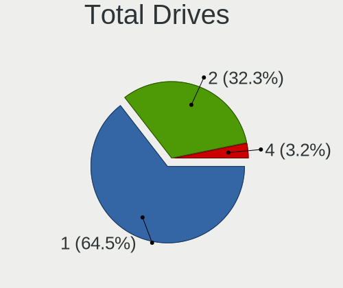
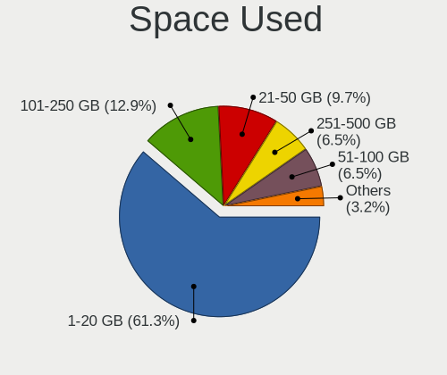

KDE neon Hardware Trends (Notebooks)
------------------------------------

A project to identify most popular hardware characteristics and track their change
over time based on data collected by Linux users at https://Linux-Hardware.org.

Anyone can contribute to this report by the [hw-probe](https://github.com/linuxhw/hw-probe) tool:

    sudo -E hw-probe -all -upload

Full-feature report is available here: https://linux-hardware.org/?view=trends&formfactor=notebook

Period: Jul, 2021.

Contents
--------

* [ System ](#system)
  - [ OS                       ](#os)
  - [ OS Family                ](#os-family)
  - [ Kernel                   ](#kernel)
  - [ Kernel Family            ](#kernel-family)
  - [ Kernel Major Ver.        ](#kernel-major-ver)
  - [ Arch                     ](#arch)
  - [ DE                       ](#de)
  - [ Display Server           ](#display-server)
  - [ Display Manager          ](#display-manager)
  - [ OS Lang                  ](#os-lang)
  - [ Boot Mode                ](#boot-mode)
  - [ Filesystem               ](#filesystem)
  - [ Part. scheme             ](#part-scheme)
  - [ Dual Boot with Linux/BSD ](#dual-boot-with-linuxbsd)
  - [ Dual Boot (Win)          ](#dual-boot-win)

* [ Board ](#board)
  - [ Vendor                   ](#vendor)
  - [ Model                    ](#model)
  - [ Model Family             ](#model-family)
  - [ MFG Year                 ](#mfg-year)
  - [ Form Factor              ](#form-factor)
  - [ Secure Boot              ](#secure-boot)
  - [ Coreboot                 ](#coreboot)
  - [ RAM Size                 ](#ram-size)
  - [ RAM Used                 ](#ram-used)
  - [ Total Drives             ](#total-drives)
  - [ Has CD-ROM               ](#has-cd-rom)
  - [ Has Ethernet             ](#has-ethernet)
  - [ Has WiFi                 ](#has-wifi)
  - [ Has Bluetooth            ](#has-bluetooth)

* [ Location ](#location)
  - [ Country                  ](#country)
  - [ City                     ](#city)

* [ Drives ](#drives)
  - [ Drive Vendor             ](#drive-vendor)
  - [ Drive Model              ](#drive-model)
  - [ HDD Vendor               ](#hdd-vendor)
  - [ SSD Vendor               ](#ssd-vendor)
  - [ Drive Kind               ](#drive-kind)
  - [ Drive Connector          ](#drive-connector)
  - [ Drive Size               ](#drive-size)
  - [ Space Total              ](#space-total)
  - [ Space Used               ](#space-used)
  - [ Malfunc. Drives          ](#malfunc-drives)
  - [ Malfunc. Drive Vendor    ](#malfunc-drive-vendor)
  - [ Malfunc. HDD Vendor      ](#malfunc-hdd-vendor)
  - [ Malfunc. Drive Kind      ](#malfunc-drive-kind)
  - [ Failed Drives            ](#failed-drives)
  - [ Failed Drive Vendor      ](#failed-drive-vendor)
  - [ Drive Status             ](#drive-status)

* [ Storage controller ](#storage-controller)
  - [ Storage Vendor           ](#storage-vendor)
  - [ Storage Model            ](#storage-model)
  - [ Storage Kind             ](#storage-kind)

* [ Processor ](#processor)
  - [ CPU Vendor               ](#cpu-vendor)
  - [ CPU Model                ](#cpu-model)
  - [ CPU Model Family         ](#cpu-model-family)
  - [ CPU Cores                ](#cpu-cores)
  - [ CPU Sockets              ](#cpu-sockets)
  - [ CPU Threads              ](#cpu-threads)
  - [ CPU Op-Modes             ](#cpu-op-modes)
  - [ CPU Microcode            ](#cpu-microcode)
  - [ CPU Microarch            ](#cpu-microarch)

* [ Graphics ](#graphics)
  - [ GPU Vendor               ](#gpu-vendor)
  - [ GPU Model                ](#gpu-model)
  - [ GPU Combo                ](#gpu-combo)
  - [ GPU Driver               ](#gpu-driver)
  - [ GPU Memory               ](#gpu-memory)

* [ Monitor ](#monitor)
  - [ Monitor Vendor           ](#monitor-vendor)
  - [ Monitor Model            ](#monitor-model)
  - [ Monitor Resolution       ](#monitor-resolution)
  - [ Monitor Diagonal         ](#monitor-diagonal)
  - [ Monitor Width            ](#monitor-width)
  - [ Aspect Ratio             ](#aspect-ratio)
  - [ Monitor Area             ](#monitor-area)
  - [ Pixel Density            ](#pixel-density)
  - [ Multiple Monitors        ](#multiple-monitors)

* [ Network ](#network)
  - [ Net Controller Vendor    ](#net-controller-vendor)
  - [ Net Controller Model     ](#net-controller-model)
  - [ Wireless Vendor          ](#wireless-vendor)
  - [ Wireless Model           ](#wireless-model)
  - [ Ethernet Vendor          ](#ethernet-vendor)
  - [ Ethernet Model           ](#ethernet-model)
  - [ Net Controller Kind      ](#net-controller-kind)
  - [ Used Controller          ](#used-controller)
  - [ NICs                     ](#nics)
  - [ IPv6                     ](#ipv6)

* [ Bluetooth ](#bluetooth)
  - [ Bluetooth Vendor         ](#bluetooth-vendor)
  - [ Bluetooth Model          ](#bluetooth-model)

* [ Sound ](#sound)
  - [ Sound Vendor             ](#sound-vendor)
  - [ Sound Model              ](#sound-model)

* [ Memory ](#memory)
  - [ Memory Vendor            ](#memory-vendor)
  - [ Memory Model             ](#memory-model)
  - [ Memory Kind              ](#memory-kind)
  - [ Memory Form Factor       ](#memory-form-factor)
  - [ Memory Size              ](#memory-size)
  - [ Memory Speed             ](#memory-speed)

* [ Printers & scanners ](#printers-&-scanners)
  - [ Printer Vendor           ](#printer-vendor)
  - [ Printer Model            ](#printer-model)
  - [ Scanner Vendor           ](#scanner-vendor)
  - [ Scanner Model            ](#scanner-model)

* [ Camera ](#camera)
  - [ Camera Vendor            ](#camera-vendor)
  - [ Camera Model             ](#camera-model)

* [ Security ](#security)
  - [ Fingerprint Vendor       ](#fingerprint-vendor)
  - [ Fingerprint Model        ](#fingerprint-model)
  - [ Chipcard Vendor          ](#chipcard-vendor)
  - [ Chipcard Model           ](#chipcard-model)

* [ Unsupported ](#unsupported)
  - [ Unsupported Devices      ](#unsupported-devices)
  - [ Unsupported Device Types ](#unsupported-device-types)

System
------

OS
--

Installed operating systems

| Name           | Notebooks | Percent |
|----------------|-----------|---------|
| KDE neon 20.04 | 50        | 100%    |

OS Family
---------

OS without a version

| Name     | Notebooks | Percent |
|----------|-----------|---------|
| KDE neon | 50        | 100%    |

Kernel
------

Version of the Linux kernel

| Version               | Notebooks | Percent |
|-----------------------|-----------|---------|
| 5.8.0-59-generic      | 32        | 64%     |
| 5.8.0-63-generic      | 14        | 28%     |
| 5.8.0-55-generic      | 2         | 4%      |
| 5.13.2-051302-generic | 1         | 2%      |
| 5.11.0-22-generic     | 1         | 2%      |

Kernel Family
-------------

Linux kernel without a distro release

| Version | Notebooks | Percent |
|---------|-----------|---------|
| 5.8.0   | 48        | 96%     |
| 5.13.2  | 1         | 2%      |
| 5.11.0  | 1         | 2%      |

Kernel Major Ver.
-----------------

Linux kernel major version

| Version | Notebooks | Percent |
|---------|-----------|---------|
| 5.8     | 48        | 96%     |
| 5.13    | 1         | 2%      |
| 5.11    | 1         | 2%      |

Arch
----

OS architecture (x86_64, i586, etc.)

| Name   | Notebooks | Percent |
|--------|-----------|---------|
| x86_64 | 50        | 100%    |

DE
--

Desktop Environment

| Name    | Notebooks | Percent |
|---------|-----------|---------|
| KDE     | 40        | 80%     |
| KDE5    | 9         | 18%     |
| Unknown | 1         | 2%      |

Display Server
--------------

X11 or Wayland

| Name    | Notebooks | Percent |
|---------|-----------|---------|
| X11     | 48        | 96%     |
| Wayland | 2         | 4%      |

Display Manager
---------------

SDDM, LightDM, etc.

| Name    | Notebooks | Percent |
|---------|-----------|---------|
| Unknown | 41        | 82%     |
| SDDM    | 9         | 18%     |

OS Lang
-------

Language

| Lang  | Notebooks | Percent |
|-------|-----------|---------|
| en_US | 16        | 32%     |
| ru_RU | 5         | 10%     |
| en_CA | 4         | 8%      |
| pt_BR | 3         | 6%      |
| en_IN | 3         | 6%      |
| C     | 3         | 6%      |
| ru_UA | 2         | 4%      |
| en_ZA | 2         | 4%      |
| de_DE | 2         | 4%      |
| zh_TW | 1         | 2%      |
| fr_FR | 1         | 2%      |
| es_SV | 1         | 2%      |
| es_MX | 1         | 2%      |
| es_ES | 1         | 2%      |
| es_AR | 1         | 2%      |
| en_PH | 1         | 2%      |
| en_AU | 1         | 2%      |
| de_CH | 1         | 2%      |
| da_DK | 1         | 2%      |

Boot Mode
---------

EFI or BIOS

| Mode | Notebooks | Percent |
|------|-----------|---------|
| EFI  | 30        | 60%     |
| BIOS | 20        | 40%     |

Filesystem
----------

Type of filesystem

| Type    | Notebooks | Percent |
|---------|-----------|---------|
| Ext4    | 49        | 98%     |
| Overlay | 1         | 2%      |

Part. scheme
------------

Scheme of partitioning

| Type    | Notebooks | Percent |
|---------|-----------|---------|
| Unknown | 41        | 82%     |
| GPT     | 7         | 14%     |
| MBR     | 2         | 4%      |

Dual Boot with Linux/BSD
------------------------

Hosting more than one Linux/BSD

| Dual boot | Notebooks | Percent |
|-----------|-----------|---------|
| No        | 47        | 94%     |
| Yes       | 3         | 6%      |

Dual Boot (Win)
---------------

Hosting Linux and Windows

| Dual boot | Notebooks | Percent |
|-----------|-----------|---------|
| No        | 42        | 84%     |
| Yes       | 8         | 16%     |

Board
-----

Vendor
------

Motherboard manufacturer

| Name                | Notebooks | Percent |
|---------------------|-----------|---------|
| ASUSTek Computer    | 10        | 20%     |
| Dell                | 9         | 18%     |
| Lenovo              | 7         | 14%     |
| Hewlett-Packard     | 7         | 14%     |
| Acer                | 6         | 12%     |
| Google              | 2         | 4%      |
| Apple               | 2         | 4%      |
| Toshiba             | 1         | 2%      |
| SLIMBOOK            | 1         | 2%      |
| Samsung Electronics | 1         | 2%      |
| Razer               | 1         | 2%      |
| Notebook            | 1         | 2%      |
| eMachines           | 1         | 2%      |
| AMI                 | 1         | 2%      |

Model
-----

Motherboard model

| Name                                     | Notebooks | Percent |
|------------------------------------------|-----------|---------|
| HP Pavilion g6                           | 2         | 4%      |
| ASUS X550CL                              | 2         | 4%      |
| Toshiba Satellite S40Dt-A                | 1         | 2%      |
| SLIMBOOK PRO                             | 1         | 2%      |
| Samsung RV411/RV511/E3511/S3511/RV711    | 1         | 2%      |
| Razer Blade                              | 1         | 2%      |
| Notebook NS50MU                          | 1         | 2%      |
| Lenovo Y520-15IKBM 80YY                  | 1         | 2%      |
| Lenovo ThinkPad T470 W10DG 20JNS0VR0B    | 1         | 2%      |
| Lenovo ThinkPad T14 Gen 2a 20XK001BUS    | 1         | 2%      |
| Lenovo ThinkPad L14 Gen 1 20U10016MX     | 1         | 2%      |
| Lenovo Legion S7 15IMH5 82BC             | 1         | 2%      |
| Lenovo IdeaPad 330-15AST 81D6            | 1         | 2%      |
| Lenovo IdeaPad 320-17IKB 80XM            | 1         | 2%      |
| HP ProBook 445 G7                        | 1         | 2%      |
| HP Pavilion 15                           | 1         | 2%      |
| HP Laptop 15s-eq0xxx                     | 1         | 2%      |
| HP Laptop 15-bs0xx                       | 1         | 2%      |
| HP EliteBook 8460p                       | 1         | 2%      |
| Google Cave                              | 1         | 2%      |
| Google Candy                             | 1         | 2%      |
| eMachines eME732Z                        | 1         | 2%      |
| Dell XPS 13 9350                         | 1         | 2%      |
| Dell Latitude E6510                      | 1         | 2%      |
| Dell Latitude E6440                      | 1         | 2%      |
| Dell Latitude E5530 non-vPro             | 1         | 2%      |
| Dell Latitude 5590                       | 1         | 2%      |
| Dell Inspiron 5767                       | 1         | 2%      |
| Dell Inspiron 5577                       | 1         | 2%      |
| Dell Inspiron 5567                       | 1         | 2%      |
| Dell Inspiron 15 7000 Gaming             | 1         | 2%      |
| ASUS X705UDR                             | 1         | 2%      |
| ASUS X441BA                              | 1         | 2%      |
| ASUS UX430UNR                            | 1         | 2%      |
| ASUS U3SG                                | 1         | 2%      |
| ASUS TUF Gaming FX505DT_FX505DT          | 1         | 2%      |
| ASUS K46CM                               | 1         | 2%      |
| ASUS G60JX                               | 1         | 2%      |
| ASUS ASUS TUF Gaming F15 FX506LI_FX506LI | 1         | 2%      |
| Apple MacBookPro8,1                      | 1         | 2%      |
| Apple MacBookPro11,2                     | 1         | 2%      |
| AMI Board                                | 1         | 2%      |
| Acer Nitro AN515-55                      | 1         | 2%      |
| Acer Aspire V3-111P                      | 1         | 2%      |
| Acer Aspire ES1-522                      | 1         | 2%      |
| Acer Aspire E3-111                       | 1         | 2%      |
| Acer Aspire E1-471                       | 1         | 2%      |
| Acer Aspire 4745Z                        | 1         | 2%      |

Model Family
------------

Motherboard model prefix

| Name               | Notebooks | Percent |
|--------------------|-----------|---------|
| Acer Aspire        | 5         | 10%     |
| Dell Latitude      | 4         | 8%      |
| Dell Inspiron      | 4         | 8%      |
| Lenovo ThinkPad    | 3         | 6%      |
| HP Pavilion        | 3         | 6%      |
| Lenovo IdeaPad     | 2         | 4%      |
| HP Laptop          | 2         | 4%      |
| ASUS X550CL        | 2         | 4%      |
| Toshiba Satellite  | 1         | 2%      |
| SLIMBOOK PRO       | 1         | 2%      |
| Samsung RV411      | 1         | 2%      |
| Razer Blade        | 1         | 2%      |
| Notebook NS50MU    | 1         | 2%      |
| Lenovo Y520-15IKBM | 1         | 2%      |
| Lenovo Legion      | 1         | 2%      |
| HP ProBook         | 1         | 2%      |
| HP EliteBook       | 1         | 2%      |
| Google Cave        | 1         | 2%      |
| Google Candy       | 1         | 2%      |
| eMachines eME732Z  | 1         | 2%      |
| Dell XPS           | 1         | 2%      |
| ASUS X705UDR       | 1         | 2%      |
| ASUS X441BA        | 1         | 2%      |
| ASUS UX430UNR      | 1         | 2%      |
| ASUS U3SG          | 1         | 2%      |
| ASUS TUF           | 1         | 2%      |
| ASUS K46CM         | 1         | 2%      |
| ASUS G60JX         | 1         | 2%      |
| ASUS ASUS          | 1         | 2%      |
| Apple MacBookPro8  | 1         | 2%      |
| Apple MacBookPro11 | 1         | 2%      |
| AMI Board          | 1         | 2%      |
| Acer Nitro         | 1         | 2%      |

MFG Year
--------

Motherboard manufacture year

| Year    | Notebooks | Percent |
|---------|-----------|---------|
| 2020    | 9         | 18%     |
| 2021    | 6         | 12%     |
| 2018    | 6         | 12%     |
| 2019    | 4         | 8%      |
| 2017    | 4         | 8%      |
| 2011    | 4         | 8%      |
| 2014    | 3         | 6%      |
| 2013    | 3         | 6%      |
| 2012    | 3         | 6%      |
| 2010    | 3         | 6%      |
| 2016    | 2         | 4%      |
| 2015    | 1         | 2%      |
| 2008    | 1         | 2%      |
| Unknown | 1         | 2%      |

Form Factor
-----------

Physical design of the computer

| Name     | Notebooks | Percent |
|----------|-----------|---------|
| Notebook | 50        | 100%    |

Secure Boot
-----------

Enabled or disabled

| State    | Notebooks | Percent |
|----------|-----------|---------|
| Disabled | 46        | 92%     |
| Enabled  | 4         | 8%      |

Coreboot
--------

Have coreboot on board

| Used | Notebooks | Percent |
|------|-----------|---------|
| No   | 48        | 96%     |
| Yes  | 2         | 4%      |

RAM Size
--------

Total RAM memory

| Size in GB | Notebooks | Percent |
|------------|-----------|---------|
| 4.01-8.0   | 17        | 34%     |
| 3.01-4.0   | 11        | 22%     |
| 8.01-16.0  | 11        | 22%     |
| 16.01-24.0 | 6         | 12%     |
| 32.01-64.0 | 3         | 6%      |
| 24.01-32.0 | 1         | 2%      |
| 1.01-2.0   | 1         | 2%      |

RAM Used
--------

Used RAM memory

| Used GB    | Notebooks | Percent |
|------------|-----------|---------|
| 2.01-3.0   | 18        | 36%     |
| 1.01-2.0   | 16        | 32%     |
| 4.01-8.0   | 7         | 14%     |
| 3.01-4.0   | 6         | 12%     |
| 16.01-24.0 | 1         | 2%      |
| 8.01-16.0  | 1         | 2%      |
| 0.51-1.0   | 1         | 2%      |

Total Drives
------------

Number of drives on board

| Drives | Notebooks | Percent |
|--------|-----------|---------|
| 1      | 35        | 70%     |
| 2      | 13        | 26%     |
| 3      | 2         | 4%      |

Has CD-ROM
----------

Has CD-ROM on board

| Presented | Notebooks | Percent |
|-----------|-----------|---------|
| No        | 34        | 68%     |
| Yes       | 16        | 32%     |

Has Ethernet
------------

Has Ethernet on board

| Presented | Notebooks | Percent |
|-----------|-----------|---------|
| Yes       | 39        | 78%     |
| No        | 11        | 22%     |

Has WiFi
--------

Has WiFi module

| Presented | Notebooks | Percent |
|-----------|-----------|---------|
| Yes       | 50        | 100%    |

Has Bluetooth
-------------

Has Bluetooth module

| Presented | Notebooks | Percent |
|-----------|-----------|---------|
| Yes       | 42        | 84%     |
| No        | 8         | 16%     |

Location
--------

Country
-------

Geographic location (country)

| Country      | Notebooks | Percent |
|--------------|-----------|---------|
| USA          | 10        | 20%     |
| Ukraine      | 4         | 8%      |
| Russia       | 4         | 8%      |
| Canada       | 4         | 8%      |
| India        | 3         | 6%      |
| Brazil       | 3         | 6%      |
| South Africa | 2         | 4%      |
| Nepal        | 2         | 4%      |
| Germany      | 2         | 4%      |
| Australia    | 2         | 4%      |
| Thailand     | 1         | 2%      |
| Taiwan       | 1         | 2%      |
| Switzerland  | 1         | 2%      |
| Spain        | 1         | 2%      |
| Philippines  | 1         | 2%      |
| Netherlands  | 1         | 2%      |
| Mexico       | 1         | 2%      |
| Italy        | 1         | 2%      |
| Iraq         | 1         | 2%      |
| France       | 1         | 2%      |
| El Salvador  | 1         | 2%      |
| Denmark      | 1         | 2%      |
| Czechia      | 1         | 2%      |
| Argentina    | 1         | 2%      |

City
----

Geographic location (city)

| City              | Notebooks | Percent |
|-------------------|-----------|---------|
| Vancouver         | 1         | 2%      |
| Toronto           | 1         | 2%      |
| Taichung          | 1         | 2%      |
| Sulaymaniyah      | 1         | 2%      |
| St. Petersburg    | 1         | 2%      |
| Soisy-sur-Seine   | 1         | 2%      |
| Sioux Falls       | 1         | 2%      |
| San Salvador      | 1         | 2%      |
| San Fernando      | 1         | 2%      |
| Rotterdam         | 1         | 2%      |
| Ramenskoye        | 1         | 2%      |
| Pretoria          | 1         | 2%      |
| Prague            | 1         | 2%      |
| Porto Alegre      | 1         | 2%      |
| Piano di Sorrento | 1         | 2%      |
| Phoenix           | 1         | 2%      |
| Perth             | 1         | 2%      |
| Panjim            | 1         | 2%      |
| Odessa            | 1         | 2%      |
| Nizhniy Novgorod  | 1         | 2%      |
| Moscow            | 1         | 2%      |
| Mexico City       | 1         | 2%      |
| Marinka           | 1         | 2%      |
| Maribo            | 1         | 2%      |
| Madrid            | 1         | 2%      |
| Lorena            | 1         | 2%      |
| Lakewood          | 1         | 2%      |
| Lafayette         | 1         | 2%      |
| Krasnoyarsk       | 1         | 2%      |
| Kolkata           | 1         | 2%      |
| Kitchener         | 1         | 2%      |
| Kathmandu         | 1         | 2%      |
| Kaniv             | 1         | 2%      |
| Fribourg          | 1         | 2%      |
| Everett           | 1         | 2%      |
| Erfurt            | 1         | 2%      |
| Darmstadt         | 1         | 2%      |
| Damak             | 1         | 2%      |
| Cherkasy          | 1         | 2%      |
| Cheraw            | 1         | 2%      |
| Cebu City         | 1         | 2%      |
| Cape Town         | 1         | 2%      |
| Buriram           | 1         | 2%      |
| Brooks            | 1         | 2%      |
| Brisbane          | 1         | 2%      |
| Bengaluru         | 1         | 2%      |
| Belo Horizonte    | 1         | 2%      |
| Belfair           | 1         | 2%      |
| Baltimore         | 1         | 2%      |
| Alpharetta        | 1         | 2%      |

Drives
------

Drive Vendor
------------

Hard drive vendors

| Vendor              | Notebooks | Drives | Percent |
|---------------------|-----------|--------|---------|
| Seagate             | 11        | 11     | 17.19%  |
| Samsung Electronics | 11        | 12     | 17.19%  |
| WDC                 | 9         | 9      | 14.06%  |
| Unknown             | 5         | 6      | 7.81%   |
| Toshiba             | 4         | 5      | 6.25%   |
| Sandisk             | 3         | 3      | 4.69%   |
| Crucial             | 3         | 3      | 4.69%   |
| Micron Technology   | 2         | 2      | 3.13%   |
| Kingston            | 2         | 2      | 3.13%   |
| USB3.0              | 1         | 1      | 1.56%   |
| Transcend           | 1         | 1      | 1.56%   |
| SK Hynix            | 1         | 1      | 1.56%   |
| PNY                 | 1         | 1      | 1.56%   |
| Netac               | 1         | 1      | 1.56%   |
| KIOXIA              | 1         | 1      | 1.56%   |
| KingDian            | 1         | 1      | 1.56%   |
| Intel               | 1         | 1      | 1.56%   |
| HS-SSD-E100         | 1         | 1      | 1.56%   |
| HGST                | 1         | 1      | 1.56%   |
| Hewlett-Packard     | 1         | 1      | 1.56%   |
| Apple               | 1         | 1      | 1.56%   |
| Apacer              | 1         | 1      | 1.56%   |
| A-DATA Technology   | 1         | 1      | 1.56%   |

Drive Model
-----------

Hard drive models

| Model                                    | Notebooks | Percent |
|------------------------------------------|-----------|---------|
| Seagate ST1000LM035-1RK172 1TB           | 4         | 6.06%   |
| Unknown MMC Card  16GB                   | 2         | 3.03%   |
| Seagate ST1000LM024 HN-M101MBB 1TB       | 2         | 3.03%   |
| Samsung SSD 860 EVO 500GB                | 2         | 3.03%   |
| Samsung NVMe SSD Drive 512GB             | 2         | 3.03%   |
| Samsung NVMe SSD Drive 256GB             | 2         | 3.03%   |
| WDC WDS250G1B0B-00AS40 250GB SSD         | 1         | 1.52%   |
| WDC WDS100T2B0A-00SM50 1TB SSD           | 1         | 1.52%   |
| WDC WD5000LPVX-80V0TT0 500GB             | 1         | 1.52%   |
| WDC WD5000LPVX-22V0TT0 500GB             | 1         | 1.52%   |
| WDC WD5000BPVT-22HXZT1 500GB             | 1         | 1.52%   |
| WDC WD2500BEVT-60ZCT1 250GB              | 1         | 1.52%   |
| WDC WD10SPZX-00Z10T0 1TB                 | 1         | 1.52%   |
| WDC WD10JPVX-75JC3T0 1TB                 | 1         | 1.52%   |
| WDC PC SN730 SDBQNTY-1T00-1001 1TB       | 1         | 1.52%   |
| USB3.0 Super Speed 120GB                 | 1         | 1.52%   |
| Unknown MMC Card  64GB                   | 1         | 1.52%   |
| Unknown MMC Card  4GB                    | 1         | 1.52%   |
| Unknown MMC Card  32GB                   | 1         | 1.52%   |
| Transcend TS120GMTS420S 120GB SSD        | 1         | 1.52%   |
| Toshiba THNSNK128GVN8 M.2 2280 128GB SSD | 1         | 1.52%   |
| Toshiba MQ01ABD100 1TB                   | 1         | 1.52%   |
| Toshiba MQ01ABD050V 500GB                | 1         | 1.52%   |
| Toshiba MK6465GSX 640GB                  | 1         | 1.52%   |
| Toshiba MK5065GSX 500GB                  | 1         | 1.52%   |
| SK Hynix NVMe SSD Drive 512GB            | 1         | 1.52%   |
| Seagate ST9250315AS 250GB                | 1         | 1.52%   |
| Seagate ST500LT012-1DG142 500GB          | 1         | 1.52%   |
| Seagate ST500LM030-1RK17D 500GB          | 1         | 1.52%   |
| Seagate ST1000LM049-2GH172 1TB           | 1         | 1.52%   |
| Seagate ST1000LM014-SSHD-8GB             | 1         | 1.52%   |
| SanDisk SD8SN8U512G1002 512GB SSD        | 1         | 1.52%   |
| Sandisk NVMe SSD Drive 1TB               | 1         | 1.52%   |
| Sandisk NVMe SSD Drive 1024GB            | 1         | 1.52%   |
| Samsung SSD 850 EVO 250GB                | 1         | 1.52%   |
| Samsung SG9MSM6D024GPM00 22GB SSD        | 1         | 1.52%   |
| Samsung NVMe SSD Drive 500GB             | 1         | 1.52%   |
| Samsung NVMe SSD Drive 250GB             | 1         | 1.52%   |
| Samsung NVMe SSD Drive 128GB             | 1         | 1.52%   |
| Samsung HM500JI 500GB                    | 1         | 1.52%   |
| PNY SSD2SC120G3LC726B104-370P 120GB      | 1         | 1.52%   |
| Netac SSD 720GB                          | 1         | 1.52%   |
| Micron NVMe SSD Drive 512GB              | 1         | 1.52%   |
| Micron 1100_MTFDDAV256TBN 256GB SSD      | 1         | 1.52%   |
| KIOXIA KBG40ZNV256G 256GB                | 1         | 1.52%   |
| Kingston SKC600256G 256GB SSD            | 1         | 1.52%   |
| Kingston NVMe SSD Drive 512GB            | 1         | 1.52%   |
| KingDian S280 240GB                      | 1         | 1.52%   |
| Intel SSDSC2BW180A3D 180GB               | 1         | 1.52%   |
| HS-SSD-E100 128GB                        | 1         | 1.52%   |
| HGST HTS725032A7E630 320GB               | 1         | 1.52%   |
| HP SSD S700 250GB                        | 1         | 1.52%   |
| Crucial M4-CT256M4SSD3 256GB             | 1         | 1.52%   |
| Crucial CT250MX500SSD1 250GB             | 1         | 1.52%   |
| Crucial CT120BX100SSD1 120GB             | 1         | 1.52%   |
| Apple SSD SM0256F 256GB                  | 1         | 1.52%   |
| Apacer AS350 120GB SSD                   | 1         | 1.52%   |
| A-DATA SP600 128GB SSD                   | 1         | 1.52%   |

HDD Vendor
----------

Hard disk drive vendors

| Vendor              | Notebooks | Drives | Percent |
|---------------------|-----------|--------|---------|
| Seagate             | 11        | 11     | 45.83%  |
| WDC                 | 6         | 6      | 25%     |
| Toshiba             | 4         | 4      | 16.67%  |
| USB3.0              | 1         | 1      | 4.17%   |
| Samsung Electronics | 1         | 1      | 4.17%   |
| HGST                | 1         | 1      | 4.17%   |

SSD Vendor
----------

Solid state drive vendors

| Vendor              | Notebooks | Drives | Percent |
|---------------------|-----------|--------|---------|
| Samsung Electronics | 4         | 4      | 18.18%  |
| Crucial             | 3         | 3      | 13.64%  |
| WDC                 | 2         | 2      | 9.09%   |
| Transcend           | 1         | 1      | 4.55%   |
| Toshiba             | 1         | 1      | 4.55%   |
| SanDisk             | 1         | 1      | 4.55%   |
| PNY                 | 1         | 1      | 4.55%   |
| Netac               | 1         | 1      | 4.55%   |
| Micron Technology   | 1         | 1      | 4.55%   |
| Kingston            | 1         | 1      | 4.55%   |
| KingDian            | 1         | 1      | 4.55%   |
| Intel               | 1         | 1      | 4.55%   |
| Hewlett-Packard     | 1         | 1      | 4.55%   |
| Apple               | 1         | 1      | 4.55%   |
| Apacer              | 1         | 1      | 4.55%   |
| A-DATA Technology   | 1         | 1      | 4.55%   |

Drive Kind
----------

HDD or SSD

| Kind    | Notebooks | Drives | Percent |
|---------|-----------|--------|---------|
| HDD     | 22        | 24     | 36.67%  |
| SSD     | 19        | 22     | 31.67%  |
| NVMe    | 13        | 14     | 21.67%  |
| MMC     | 5         | 6      | 8.33%   |
| Unknown | 1         | 1      | 1.67%   |

Drive Connector
---------------

SATA, SAS, NVMe, etc.

| Type | Notebooks | Drives | Percent |
|------|-----------|--------|---------|
| SATA | 37        | 46     | 66.07%  |
| NVMe | 13        | 14     | 23.21%  |
| MMC  | 5         | 6      | 8.93%   |
| SAS  | 1         | 1      | 1.79%   |

Drive Size
----------

Size of hard drive

| Size in TB | Notebooks | Drives | Percent |
|------------|-----------|--------|---------|
| 0.01-0.5   | 28        | 31     | 65.12%  |
| 0.51-1.0   | 15        | 15     | 34.88%  |

Space Total
-----------

Amount of disk space available on the file system

| Size in GB | Notebooks | Percent |
|------------|-----------|---------|
| 101-250    | 13        | 26%     |
| 251-500    | 9         | 18%     |
| 501-1000   | 8         | 16%     |
| 1001-2000  | 7         | 14%     |
| 1-20       | 5         | 10%     |
| 21-50      | 4         | 8%      |
| Unknown    | 3         | 6%      |
| 51-100     | 1         | 2%      |

Space Used
----------

Amount of used disk space

| Used GB   | Notebooks | Percent |
|-----------|-----------|---------|
| 1-20      | 26        | 52%     |
| 21-50     | 8         | 16%     |
| 501-1000  | 5         | 10%     |
| Unknown   | 3         | 6%      |
| 251-500   | 2         | 4%      |
| 101-250   | 2         | 4%      |
| 1001-2000 | 2         | 4%      |
| 51-100    | 2         | 4%      |

Malfunc. Drives
---------------

Drive models with a malfunction

| Model                          | Notebooks | Drives | Percent |
|--------------------------------|-----------|--------|---------|
| Seagate ST1000LM035-1RK172 1TB | 1         | 1      | 33.33%  |
| Seagate ST1000LM014-SSHD-8GB   | 1         | 1      | 33.33%  |
| HGST HTS725032A7E630 320GB     | 1         | 1      | 33.33%  |

Malfunc. Drive Vendor
---------------------

Vendors of faulty drives

| Vendor  | Notebooks | Drives | Percent |
|---------|-----------|--------|---------|
| Seagate | 2         | 2      | 66.67%  |
| HGST    | 1         | 1      | 33.33%  |

Malfunc. HDD Vendor
-------------------

Vendors of faulty HDD drives

| Vendor  | Notebooks | Drives | Percent |
|---------|-----------|--------|---------|
| Seagate | 2         | 2      | 66.67%  |
| HGST    | 1         | 1      | 33.33%  |

Malfunc. Drive Kind
-------------------

Kinds of faulty drives

| Kind | Notebooks | Drives | Percent |
|------|-----------|--------|---------|
| HDD  | 3         | 3      | 100%    |

Failed Drives
-------------

Failed drive models

Zero info for selected period =(

Failed Drive Vendor
-------------------

Failed drive vendors

Zero info for selected period =(

Drive Status
------------

Number of failed and malfunc. drives

| Status   | Notebooks | Drives | Percent |
|----------|-----------|--------|---------|
| Detected | 41        | 55     | 80.39%  |
| Works    | 7         | 9      | 13.73%  |
| Malfunc  | 3         | 3      | 5.88%   |

Storage controller
------------------

Storage Vendor
--------------

Storage controller vendors

| Vendor                      | Notebooks | Percent |
|-----------------------------|-----------|---------|
| Intel                       | 32        | 60.38%  |
| Samsung Electronics         | 7         | 13.21%  |
| AMD                         | 6         | 11.32%  |
| Sandisk                     | 3         | 5.66%   |
| SK Hynix                    | 1         | 1.89%   |
| Micron Technology           | 1         | 1.89%   |
| KIOXIA                      | 1         | 1.89%   |
| Kingston Technology Company | 1         | 1.89%   |
| JMicron Technology          | 1         | 1.89%   |

Storage Model
-------------

Storage controller models

| Model                                                                        | Notebooks | Percent |
|------------------------------------------------------------------------------|-----------|---------|
| Intel Sunrise Point-LP SATA Controller [AHCI mode]                           | 7         | 12.96%  |
| AMD FCH SATA Controller [AHCI mode]                                          | 6         | 11.11%  |
| Intel 82801 Mobile SATA Controller [RAID mode]                               | 5         | 9.26%   |
| Intel 7 Series Chipset Family 6-port SATA Controller [AHCI mode]             | 5         | 9.26%   |
| Intel 5 Series/3400 Series Chipset 4 port SATA AHCI Controller               | 4         | 7.41%   |
| Samsung NVMe SSD Controller SM961/PM961/SM963                                | 3         | 5.56%   |
| Intel HM170/QM170 Chipset SATA Controller [AHCI Mode]                        | 3         | 5.56%   |
| Intel 6 Series/C200 Series Chipset Family 6 port Mobile SATA AHCI Controller | 3         | 5.56%   |
| Sandisk WD Black SN750 / PC SN730 NVMe SSD                                   | 2         | 3.7%    |
| Intel Atom Processor E3800 Series SATA AHCI Controller                       | 2         | 3.7%    |
| SK Hynix BC511                                                               | 1         | 1.85%   |
| Sandisk WD Blue SN550 NVMe SSD                                               | 1         | 1.85%   |
| Samsung NVMe SSD Controller SM981/PM981/PM983                                | 1         | 1.85%   |
| Samsung NVMe SSD Controller SM951/PM951                                      | 1         | 1.85%   |
| Samsung NVMe SSD Controller PM9A1/PM9A3/980PRO                               | 1         | 1.85%   |
| Samsung Apple PCIe SSD                                                       | 1         | 1.85%   |
| Micron Non-Volatile memory controller                                        | 1         | 1.85%   |
| KIOXIA Non-Volatile memory controller                                        | 1         | 1.85%   |
| Kingston Company Company Non-Volatile memory controller                      | 1         | 1.85%   |
| JMicron JMB360 AHCI Controller                                               | 1         | 1.85%   |
| Intel Wildcat Point-LP SATA Controller [AHCI Mode]                           | 1         | 1.85%   |
| Intel 82801HM/HEM (ICH8M/ICH8M-E) SATA Controller [AHCI mode]                | 1         | 1.85%   |
| Intel 82801HM/HEM (ICH8M/ICH8M-E) IDE Controller                             | 1         | 1.85%   |
| Intel 400 Series Chipset Family SATA AHCI Controller                         | 1         | 1.85%   |

Storage Kind
------------

Kind of storage controller (IDE, SATA, NVMe, SAS, ...)

| Kind | Notebooks | Percent |
|------|-----------|---------|
| SATA | 34        | 64.15%  |
| NVMe | 13        | 24.53%  |
| RAID | 5         | 9.43%   |
| IDE  | 1         | 1.89%   |

Processor
---------

CPU Vendor
----------

Processor vendors

| Vendor | Notebooks | Percent |
|--------|-----------|---------|
| Intel  | 41        | 82%     |
| AMD    | 9         | 18%     |

CPU Model
---------

Processor models

| Model                                         | Notebooks | Percent |
|-----------------------------------------------|-----------|---------|
| Intel Core i7-7700HQ CPU @ 2.80GHz            | 3         | 6%      |
| Intel Core i7-7500U CPU @ 2.70GHz             | 3         | 6%      |
| Intel Core i7-8550U CPU @ 1.80GHz             | 2         | 4%      |
| Intel Core i5-10300H CPU @ 2.50GHz            | 2         | 4%      |
| Intel Celeron CPU N2840 @ 2.16GHz             | 2         | 4%      |
| Intel Pentium CPU P6200 @ 2.13GHz             | 1         | 2%      |
| Intel Pentium CPU N3530 @ 2.16GHz             | 1         | 2%      |
| Intel Pentium CPU 2117U @ 1.80GHz             | 1         | 2%      |
| Intel Core m3-6Y30 CPU @ 0.90GHz              | 1         | 2%      |
| Intel Core i7-8650U CPU @ 1.90GHz             | 1         | 2%      |
| Intel Core i7-4750HQ CPU @ 2.00GHz            | 1         | 2%      |
| Intel Core i7-3517U CPU @ 1.90GHz             | 1         | 2%      |
| Intel Core i7-10750H CPU @ 2.60GHz            | 1         | 2%      |
| Intel Core i7-10510U CPU @ 1.80GHz            | 1         | 2%      |
| Intel Core i7 CPU Q 720 @ 1.60GHz             | 1         | 2%      |
| Intel Core i5-7300HQ CPU @ 2.50GHz            | 1         | 2%      |
| Intel Core i5-7200U CPU @ 2.50GHz             | 1         | 2%      |
| Intel Core i5-6300U CPU @ 2.40GHz             | 1         | 2%      |
| Intel Core i5-6200U CPU @ 2.30GHz             | 1         | 2%      |
| Intel Core i5-5200U CPU @ 2.20GHz             | 1         | 2%      |
| Intel Core i5-4300M CPU @ 2.60GHz             | 1         | 2%      |
| Intel Core i5-3337U CPU @ 1.80GHz             | 1         | 2%      |
| Intel Core i5-2520M CPU @ 2.50GHz             | 1         | 2%      |
| Intel Core i5-2415M CPU @ 2.30GHz             | 1         | 2%      |
| Intel Core i5-2410M CPU @ 2.30GHz             | 1         | 2%      |
| Intel Core i5 CPU M 560 @ 2.67GHz             | 1         | 2%      |
| Intel Core i5 CPU M 520 @ 2.40GHz             | 1         | 2%      |
| Intel Core i3-6006U CPU @ 2.00GHz             | 1         | 2%      |
| Intel Core i3-2370M CPU @ 2.40GHz             | 1         | 2%      |
| Intel Core i3-2328M CPU @ 2.20GHz             | 1         | 2%      |
| Intel Core i3 CPU M 350 @ 2.27GHz             | 1         | 2%      |
| Intel Core 2 Duo CPU T8300 @ 2.40GHz          | 1         | 2%      |
| Intel Atom x7-Z8700 CPU @ 1.60GHz             | 1         | 2%      |
| Intel 11th Gen Core i5-1135G7 @ 2.40GHz       | 1         | 2%      |
| AMD Ryzen 7 PRO 5850U with Radeon Graphics    | 1         | 2%      |
| AMD Ryzen 7 3750H with Radeon Vega Mobile Gfx | 1         | 2%      |
| AMD Ryzen 7 3700U with Radeon Vega Mobile Gfx | 1         | 2%      |
| AMD Ryzen 5 4500U with Radeon Graphics        | 1         | 2%      |
| AMD A9-9425 RADEON R5, 5 COMPUTE CORES 2C+3G  | 1         | 2%      |
| AMD A8-5545M APU with Radeon HD Graphics      | 1         | 2%      |
| AMD A6-9225 RADEON R4, 5 COMPUTE CORES 2C+3G  | 1         | 2%      |
| AMD A4-7210 APU with AMD Radeon R3 Graphics   | 1         | 2%      |
| AMD A10-4600M APU with Radeon HD Graphics     | 1         | 2%      |

CPU Model Family
----------------

Processor model prefix

| Model            | Notebooks | Percent |
|------------------|-----------|---------|
| Intel Core i7    | 14        | 28%     |
| Intel Core i5    | 14        | 28%     |
| Intel Core i3    | 4         | 8%      |
| Intel Pentium    | 3         | 6%      |
| Other            | 2         | 4%      |
| Intel Celeron    | 2         | 4%      |
| AMD Ryzen 7      | 2         | 4%      |
| Intel Core m3    | 1         | 2%      |
| Intel Core 2 Duo | 1         | 2%      |
| Intel Atom       | 1         | 2%      |
| AMD Ryzen 7 PRO  | 1         | 2%      |
| AMD Ryzen 5      | 1         | 2%      |
| AMD A8           | 1         | 2%      |
| AMD A6           | 1         | 2%      |
| AMD A4           | 1         | 2%      |
| AMD A10          | 1         | 2%      |

CPU Cores
---------

Number of processor cores

| Number | Notebooks | Percent |
|--------|-----------|---------|
| 2      | 29        | 58%     |
| 4      | 18        | 36%     |
| 6      | 2         | 4%      |
| 8      | 1         | 2%      |

CPU Sockets
-----------

Number of sockets

| Number | Notebooks | Percent |
|--------|-----------|---------|
| 1      | 50        | 100%    |

CPU Threads
-----------

Threads per core (Hyper-Threading)

| Number | Notebooks | Percent |
|--------|-----------|---------|
| 2      | 38        | 76%     |
| 1      | 12        | 24%     |

CPU Op-Modes
------------

CPU Operation Modes (32-bit, 64-bit)

| Op mode        | Notebooks | Percent |
|----------------|-----------|---------|
| 32-bit, 64-bit | 50        | 100%    |

CPU Microcode
-------------

Microcode number

| Number     | Notebooks | Percent |
|------------|-----------|---------|
| 0x806e9    | 4         | 8%      |
| 0x406e3    | 4         | 8%      |
| 0x206a7    | 4         | 8%      |
| 0x20655    | 4         | 8%      |
| Unknown    | 4         | 8%      |
| 0x906e9    | 3         | 6%      |
| 0x306a9    | 3         | 6%      |
| 0x30678    | 3         | 6%      |
| 0xa0652    | 2         | 4%      |
| 0x806ea    | 2         | 4%      |
| 0x06006705 | 2         | 4%      |
| 0x06001119 | 2         | 4%      |
| 0x806ec    | 1         | 2%      |
| 0x806c1    | 1         | 2%      |
| 0x406c3    | 1         | 2%      |
| 0x40661    | 1         | 2%      |
| 0x306d4    | 1         | 2%      |
| 0x306c3    | 1         | 2%      |
| 0x106e5    | 1         | 2%      |
| 0x10676    | 1         | 2%      |
| 0x0a50000c | 1         | 2%      |
| 0x08600106 | 1         | 2%      |
| 0x08108109 | 1         | 2%      |
| 0x08108102 | 1         | 2%      |
| 0x07030105 | 1         | 2%      |

CPU Microarch
-------------

Microarchitecture

| Name        | Notebooks | Percent |
|-------------|-----------|---------|
| KabyLake    | 12        | 24%     |
| SandyBridge | 5         | 10%     |
| Westmere    | 4         | 8%      |
| Skylake     | 4         | 8%      |
| Silvermont  | 4         | 8%      |
| IvyBridge   | 3         | 6%      |
| CometLake   | 3         | 6%      |
| Zen+        | 2         | 4%      |
| Piledriver  | 2         | 4%      |
| Haswell     | 2         | 4%      |
| Excavator   | 2         | 4%      |
| Zen 3       | 1         | 2%      |
| Zen 2       | 1         | 2%      |
| TigerLake   | 1         | 2%      |
| Puma        | 1         | 2%      |
| Penryn      | 1         | 2%      |
| Nehalem     | 1         | 2%      |
| Broadwell   | 1         | 2%      |

Graphics
--------

GPU Vendor
----------

Vendors of graphics cards

| Vendor | Notebooks | Percent |
|--------|-----------|---------|
| Intel  | 40        | 59.7%   |
| Nvidia | 15        | 22.39%  |
| AMD    | 12        | 17.91%  |

GPU Model
---------

Graphics card models

| Model                                                                                    | Notebooks | Percent |
|------------------------------------------------------------------------------------------|-----------|---------|
| Intel 2nd Generation Core Processor Family Integrated Graphics Controller                | 5         | 7.25%   |
| Intel HD Graphics 630                                                                    | 4         | 5.8%    |
| Intel HD Graphics 620                                                                    | 4         | 5.8%    |
| Intel Core Processor Integrated Graphics Controller                                      | 4         | 5.8%    |
| Nvidia GP107M [GeForce GTX 1050 Mobile]                                                  | 3         | 4.35%   |
| Intel UHD Graphics 620                                                                   | 3         | 4.35%   |
| Intel Skylake GT2 [HD Graphics 520]                                                      | 3         | 4.35%   |
| Intel CometLake-H GT2 [UHD Graphics]                                                     | 3         | 4.35%   |
| Intel Atom Processor Z36xxx/Z37xxx Series Graphics & Display                             | 3         | 4.35%   |
| Intel 3rd Gen Core processor Graphics Controller                                         | 3         | 4.35%   |
| Nvidia TU116M [GeForce GTX 1660 Ti Mobile]                                               | 2         | 2.9%    |
| Nvidia GP106M [GeForce GTX 1060 Mobile]                                                  | 2         | 2.9%    |
| Nvidia GF117M [GeForce 610M/710M/810M/820M / GT 620M/625M/630M/720M]                     | 2         | 2.9%    |
| AMD Topaz XT [Radeon R7 M260/M265 / M340/M360 / M440/M445 / 530/535 / 620/625 Mobile]    | 2         | 2.9%    |
| AMD Stoney [Radeon R2/R3/R4/R5 Graphics]                                                 | 2         | 2.9%    |
| AMD Picasso                                                                              | 2         | 2.9%    |
| Nvidia TU117M [GeForce GTX 1650 Ti Mobile]                                               | 1         | 1.45%   |
| Nvidia TU117M [GeForce GTX 1650 Mobile / Max-Q]                                          | 1         | 1.45%   |
| Nvidia GT215M [GeForce GTS 360M]                                                         | 1         | 1.45%   |
| Nvidia GM108M [GeForce 920MX]                                                            | 1         | 1.45%   |
| Nvidia GM108M [GeForce 830M]                                                             | 1         | 1.45%   |
| Nvidia GF108M [GeForce GT 635M]                                                          | 1         | 1.45%   |
| Intel TigerLake-LP GT2 [Iris Xe Graphics]                                                | 1         | 1.45%   |
| Intel Mobile GM965/GL960 Integrated Graphics Controller (secondary)                      | 1         | 1.45%   |
| Intel Mobile GM965/GL960 Integrated Graphics Controller (primary)                        | 1         | 1.45%   |
| Intel HD Graphics 5500                                                                   | 1         | 1.45%   |
| Intel HD Graphics 515                                                                    | 1         | 1.45%   |
| Intel Crystal Well Integrated Graphics Controller                                        | 1         | 1.45%   |
| Intel CometLake-U GT2 [UHD Graphics]                                                     | 1         | 1.45%   |
| Intel Atom/Celeron/Pentium Processor x5-E8000/J3xxx/N3xxx Integrated Graphics Controller | 1         | 1.45%   |
| Intel 4th Gen Core Processor Integrated Graphics Controller                              | 1         | 1.45%   |
| AMD Trinity [Radeon HD 7660G]                                                            | 1         | 1.45%   |
| AMD Thames [Radeon HD 7500M/7600M Series]                                                | 1         | 1.45%   |
| AMD Sun XT [Radeon HD 8670A/8670M/8690M / R5 M330 / M430 / Radeon 520 Mobile]            | 1         | 1.45%   |
| AMD Richland [Radeon HD 8510G]                                                           | 1         | 1.45%   |
| AMD Renoir                                                                               | 1         | 1.45%   |
| AMD Mullins [Radeon R3 Graphics]                                                         | 1         | 1.45%   |
| AMD Cezanne                                                                              | 1         | 1.45%   |

GPU Combo
---------

Combinations of graphics cards

| Name           | Notebooks | Percent |
|----------------|-----------|---------|
| 1 x Intel      | 24        | 48%     |
| Intel + Nvidia | 13        | 26%     |
| 1 x AMD        | 7         | 14%     |
| Intel + AMD    | 3         | 6%      |
| 2 x AMD        | 1         | 2%      |
| 1 x Nvidia     | 1         | 2%      |
| AMD + Nvidia   | 1         | 2%      |

GPU Driver
----------

Free vs proprietary

| Driver  | Notebooks | Percent |
|---------|-----------|---------|
| Free    | 49        | 98%     |
| Unknown | 1         | 2%      |

GPU Memory
----------

Total video memory

| Size in GB | Notebooks | Percent |
|------------|-----------|---------|
| Unknown    | 31        | 62%     |
| 0.51-1.0   | 6         | 12%     |
| 3.01-4.0   | 4         | 8%      |
| 5.01-6.0   | 3         | 6%      |
| 1.01-2.0   | 3         | 6%      |
| 0.01-0.5   | 3         | 6%      |

Monitor
-------

Monitor Vendor
--------------

Monitor vendors

| Vendor                  | Notebooks | Percent |
|-------------------------|-----------|---------|
| AU Optronics            | 13        | 23.21%  |
| LG Display              | 11        | 19.64%  |
| Chimei Innolux          | 9         | 16.07%  |
| Samsung Electronics     | 6         | 10.71%  |
| Chi Mei Optoelectronics | 3         | 5.36%   |
| BOE                     | 3         | 5.36%   |
| Apple                   | 3         | 5.36%   |
| Sharp                   | 1         | 1.79%   |
| PANDA                   | 1         | 1.79%   |
| Hewlett-Packard         | 1         | 1.79%   |
| Goldstar                | 1         | 1.79%   |
| Dell                    | 1         | 1.79%   |
| BenQ                    | 1         | 1.79%   |
| AOC                     | 1         | 1.79%   |
| Ancor Communications    | 1         | 1.79%   |

Monitor Model
-------------

Monitor models

| Model                                                                    | Notebooks | Percent |
|--------------------------------------------------------------------------|-----------|---------|
| Chi Mei Optoelectronics LCD Monitor CMO15A7 1366x768 350x190mm 15.7-inch | 2         | 3.51%   |
| AU Optronics LCD Monitor AUO235C 1366x768 260x140mm 11.6-inch            | 2         | 3.51%   |
| Sharp LCD Monitor SHP144A 3200x1800 294x165mm 13.3-inch                  | 1         | 1.75%   |
| Samsung Electronics SyncMaster SAM0589 1920x1080 521x293mm 23.5-inch     | 1         | 1.75%   |
| Samsung Electronics SyncMaster SAM02D9 1680x1050 433x271mm 20.1-inch     | 1         | 1.75%   |
| Samsung Electronics SA300/SA350 SAM0791 1920x1080 510x287mm 23.0-inch    | 1         | 1.75%   |
| Samsung Electronics S24D300 SAM0B45 1920x1080 521x293mm 23.5-inch        | 1         | 1.75%   |
| Samsung Electronics LCD Monitor SEC544B 1600x900 382x214mm 17.2-inch     | 1         | 1.75%   |
| Samsung Electronics LCD Monitor SEC494A 1366x768 344x193mm 15.5-inch     | 1         | 1.75%   |
| Samsung Electronics LCD Monitor SEC334A 1366x768 340x190mm 15.3-inch     | 1         | 1.75%   |
| PANDA LCD Monitor NCP002D 1920x1080 344x194mm 15.5-inch                  | 1         | 1.75%   |
| LG Display LCD Monitor LGD066D 1920x1080 344x194mm 15.5-inch             | 1         | 1.75%   |
| LG Display LCD Monitor LGD062C 1920x1080 309x174mm 14.0-inch             | 1         | 1.75%   |
| LG Display LCD Monitor LGD061E 1920x1080 344x194mm 15.5-inch             | 1         | 1.75%   |
| LG Display LCD Monitor LGD0612 1920x1080 344x194mm 15.5-inch             | 1         | 1.75%   |
| LG Display LCD Monitor LGD053F 1920x1080 344x194mm 15.5-inch             | 1         | 1.75%   |
| LG Display LCD Monitor LGD0513 1920x1080 382x215mm 17.3-inch             | 1         | 1.75%   |
| LG Display LCD Monitor LGD033F 1366x768 309x174mm 14.0-inch              | 1         | 1.75%   |
| LG Display LCD Monitor LGD0335 1366x768 310x174mm 14.0-inch              | 1         | 1.75%   |
| LG Display LCD Monitor LGD02F8 1366x768 309x174mm 14.0-inch              | 1         | 1.75%   |
| LG Display LCD Monitor LGD02F2 1366x768 344x194mm 15.5-inch              | 1         | 1.75%   |
| LG Display LCD Monitor LGD028D 1366x768 310x174mm 14.0-inch              | 1         | 1.75%   |
| Hewlett-Packard E223 HPN345C 1920x1080 476x268mm 21.5-inch               | 1         | 1.75%   |
| Goldstar SIGNAGE GSM9E77 1920x1080 1215x686mm 54.9-inch                  | 1         | 1.75%   |
| Dell ST2421L DELA070 1920x1080 531x299mm 24.0-inch                       | 1         | 1.75%   |
| Chimei Innolux LCD Monitor CMN15DB 1366x768 344x193mm 15.5-inch          | 1         | 1.75%   |
| Chimei Innolux LCD Monitor CMN15D5 1920x1080 340x190mm 15.3-inch         | 1         | 1.75%   |
| Chimei Innolux LCD Monitor CMN15BC 1366x768 350x190mm 15.7-inch          | 1         | 1.75%   |
| Chimei Innolux LCD Monitor CMN15A9 1366x768 344x193mm 15.5-inch          | 1         | 1.75%   |
| Chimei Innolux LCD Monitor CMN1521 1920x1080 344x193mm 15.5-inch         | 1         | 1.75%   |
| Chimei Innolux LCD Monitor CMN14C9 1920x1080 309x173mm 13.9-inch         | 1         | 1.75%   |
| Chimei Innolux LCD Monitor CMN14C4 1366x768 309x173mm 13.9-inch          | 1         | 1.75%   |
| Chimei Innolux LCD Monitor CMN1472 1366x768 309x174mm 14.0-inch          | 1         | 1.75%   |
| Chimei Innolux LCD Monitor CMN1409 1920x1080 309x173mm 13.9-inch         | 1         | 1.75%   |
| Chi Mei Optoelectronics LCD Monitor CMO1592 1366x768 344x193mm 15.5-inch | 1         | 1.75%   |
| BOE LCD Monitor BOE0718 1920x1080 309x173mm 13.9-inch                    | 1         | 1.75%   |
| BOE LCD Monitor BOE06A4 1366x768 344x194mm 15.5-inch                     | 1         | 1.75%   |
| BOE LCD Monitor BOE061D 1366x768 309x173mm 13.9-inch                     | 1         | 1.75%   |
| BenQ PD3200Q BNQ8026 2560x1440 708x399mm 32.0-inch                       | 1         | 1.75%   |
| AU Optronics LCD Monitor AUO723C 1366x768 309x173mm 13.9-inch            | 1         | 1.75%   |
| AU Optronics LCD Monitor AUO63ED 1920x1080 344x193mm 15.5-inch           | 1         | 1.75%   |
| AU Optronics LCD Monitor AUO61ED 1920x1080 340x190mm 15.3-inch           | 1         | 1.75%   |
| AU Optronics LCD Monitor AUO38ED 1920x1080 340x190mm 15.3-inch           | 1         | 1.75%   |
| AU Optronics LCD Monitor AUO226D 1920x1080 276x155mm 12.5-inch           | 1         | 1.75%   |
| AU Optronics LCD Monitor AUO223E 1600x900 309x174mm 14.0-inch            | 1         | 1.75%   |
| AU Optronics LCD Monitor AUO219E 1600x900 382x214mm 17.2-inch            | 1         | 1.75%   |
| AU Optronics LCD Monitor AUO215C 1366x768 260x140mm 11.6-inch            | 1         | 1.75%   |
| AU Optronics LCD Monitor AUO15ED 1920x1080 344x193mm 15.5-inch           | 1         | 1.75%   |
| AU Optronics LCD Monitor AUO139D 1920x1080 381x214mm 17.2-inch           | 1         | 1.75%   |
| AU Optronics LCD Monitor AUO133D 1920x1080 309x173mm 13.9-inch           | 1         | 1.75%   |
| Apple LCD Monitor APP9CC5 1280x800 286x179mm 13.3-inch                   | 1         | 1.75%   |
| Apple Color LCD APPA019 2880x1800 330x210mm 15.4-inch                    | 1         | 1.75%   |
| Apple Color LCD APP9C5E 1280x800 286x178mm 13.3-inch                     | 1         | 1.75%   |
| AOC 1950w AOC1950 1366x768 410x230mm 18.5-inch                           | 1         | 1.75%   |
| Ancor Communications ASUS ML239 ACI23F8 1920x1080 510x290mm 23.1-inch    | 1         | 1.75%   |

Monitor Resolution
------------------

Monitor screen resolution

| Resolution         | Notebooks | Percent |
|--------------------|-----------|---------|
| 1920x1080 (FHD)    | 21        | 41.18%  |
| 1366x768 (WXGA)    | 21        | 41.18%  |
| 1600x900 (HD+)     | 3         | 5.88%   |
| 1280x800 (WXGA)    | 2         | 3.92%   |
| 3200x1800 (QHD+)   | 1         | 1.96%   |
| 2880x1800          | 1         | 1.96%   |
| 2560x1440 (QHD)    | 1         | 1.96%   |
| 1680x1050 (WSXGA+) | 1         | 1.96%   |

Monitor Diagonal
----------------

Diagonal size in inches

| Inches | Notebooks | Percent |
|--------|-----------|---------|
| 15     | 22        | 39.29%  |
| 13     | 9         | 16.07%  |
| 14     | 8         | 14.29%  |
| 17     | 4         | 7.14%   |
| 23     | 3         | 5.36%   |
| 11     | 3         | 5.36%   |
| 54     | 1         | 1.79%   |
| 32     | 1         | 1.79%   |
| 24     | 1         | 1.79%   |
| 21     | 1         | 1.79%   |
| 20     | 1         | 1.79%   |
| 18     | 1         | 1.79%   |
| 12     | 1         | 1.79%   |

Monitor Width
-------------

Physical width

| Width in mm | Notebooks | Percent |
|-------------|-----------|---------|
| 301-350     | 36        | 64.29%  |
| 201-300     | 7         | 12.5%   |
| 501-600     | 4         | 7.14%   |
| 351-400     | 4         | 7.14%   |
| 401-500     | 3         | 5.36%   |
| 701-800     | 1         | 1.79%   |
| 1001-1500   | 1         | 1.79%   |

Aspect Ratio
------------

Proportional relationship between the width and the height

| Ratio | Notebooks | Percent |
|-------|-----------|---------|
| 16/9  | 44        | 91.67%  |
| 16/10 | 4         | 8.33%   |

Monitor Area
------------

Area in inch

| Area in inch | Notebooks | Percent |
|----------------|-----------|---------|
| 101-110        | 22        | 39.29%  |
| 81-90          | 15        | 26.79%  |
| 201-250        | 4         | 7.14%   |
| 121-130        | 4         | 7.14%   |
| 51-60          | 3         | 5.36%   |
| 71-80          | 2         | 3.57%   |
| 151-200        | 2         | 3.57%   |
| More than 1000 | 1         | 1.79%   |
| 61-70          | 1         | 1.79%   |
| 351-500        | 1         | 1.79%   |
| 141-150        | 1         | 1.79%   |

Pixel Density
-------------

Pixels per inch

| Density       | Notebooks | Percent |
|---------------|-----------|---------|
| 121-160       | 22        | 39.29%  |
| 101-120       | 19        | 33.93%  |
| 51-100        | 11        | 19.64%  |
| 161-240       | 2         | 3.57%   |
| More than 240 | 1         | 1.79%   |
| 1-50          | 1         | 1.79%   |

Multiple Monitors
-----------------

Total monitors connected

| Total | Notebooks | Percent |
|-------|-----------|---------|
| 1     | 40        | 80%     |
| 2     | 8         | 16%     |
| 3     | 1         | 2%      |
| 0     | 1         | 2%      |

Network
-------

Net Controller Vendor
---------------------

Controller vendors

| Vendor                          | Notebooks | Percent |
|---------------------------------|-----------|---------|
| Realtek Semiconductor           | 31        | 38.75%  |
| Intel                           | 24        | 30%     |
| Qualcomm Atheros                | 10        | 12.5%   |
| Broadcom                        | 10        | 12.5%   |
| Ralink Technology               | 1         | 1.25%   |
| Qualcomm Atheros Communications | 1         | 1.25%   |
| MEDIATEK                        | 1         | 1.25%   |
| Lenovo                          | 1         | 1.25%   |
| Broadcom Limited                | 1         | 1.25%   |

Net Controller Model
--------------------

Controller models

| Model                                                             | Notebooks | Percent |
|-------------------------------------------------------------------|-----------|---------|
| Realtek RTL8111/8168/8411 PCI Express Gigabit Ethernet Controller | 21        | 22.58%  |
| Realtek RTL810xE PCI Express Fast Ethernet controller             | 7         | 7.53%   |
| Intel Wireless 8265 / 8275                                        | 4         | 4.3%    |
| Qualcomm Atheros QCA9565 / AR9565 Wireless Network Adapter        | 3         | 3.23%   |
| Qualcomm Atheros AR9485 Wireless Network Adapter                  | 3         | 3.23%   |
| Intel Wireless 3165                                               | 3         | 3.23%   |
| Intel Wi-Fi 6 AX200                                               | 3         | 3.23%   |
| Intel Comet Lake PCH CNVi WiFi                                    | 3         | 3.23%   |
| Intel Centrino Advanced-N 6205 [Taylor Peak]                      | 2         | 2.15%   |
| Broadcom BCM43142 802.11b/g/n                                     | 2         | 2.15%   |
| Broadcom BCM4313 802.11bgn Wireless Network Adapter               | 2         | 2.15%   |
| Realtek RTL8822CE 802.11ac PCIe Wireless Network Adapter          | 1         | 1.08%   |
| Realtek RTL8822BE 802.11a/b/g/n/ac WiFi adapter                   | 1         | 1.08%   |
| Realtek RTL8821CE 802.11ac PCIe Wireless Network Adapter          | 1         | 1.08%   |
| Realtek RTL8723DE Wireless Network Adapter                        | 1         | 1.08%   |
| Realtek RTL8723BE PCIe Wireless Network Adapter                   | 1         | 1.08%   |
| Realtek RTL8153 Gigabit Ethernet Adapter                          | 1         | 1.08%   |
| Realtek Realtek Network controller                                | 1         | 1.08%   |
| Realtek Killer E2600 Gigabit Ethernet Controller                  | 1         | 1.08%   |
| Ralink MT7601U Wireless Adapter                                   | 1         | 1.08%   |
| Qualcomm Atheros QCA9377 802.11ac Wireless Network Adapter        | 1         | 1.08%   |
| Qualcomm Atheros QCA6174 802.11ac Wireless Network Adapter        | 1         | 1.08%   |
| Qualcomm Atheros AR9271 802.11n                                   | 1         | 1.08%   |
| Qualcomm Atheros AR9285 Wireless Network Adapter (PCI-Express)    | 1         | 1.08%   |
| Qualcomm Atheros AR8151 v1.0 Gigabit Ethernet                     | 1         | 1.08%   |
| Qualcomm Atheros AR8131 Gigabit Ethernet                          | 1         | 1.08%   |
| MEDIATEK MT7630e 802.11bgn Wireless Network Adapter               | 1         | 1.08%   |
| Lenovo ThinkPad Lan                                               | 1         | 1.08%   |
| Intel Wireless 8260                                               | 1         | 1.08%   |
| Intel Wireless 7265                                               | 1         | 1.08%   |
| Intel Wireless 7260                                               | 1         | 1.08%   |
| Intel Wireless 3160                                               | 1         | 1.08%   |
| Intel PRO/Wireless 4965 AG or AGN [Kedron] Network Connection     | 1         | 1.08%   |
| Intel Ethernet Connection I219-LM                                 | 1         | 1.08%   |
| Intel Ethernet Connection I217-LM                                 | 1         | 1.08%   |
| Intel Ethernet Connection (4) I219-LM                             | 1         | 1.08%   |
| Intel Ethernet Connection (10) I219-V                             | 1         | 1.08%   |
| Intel Dual Band Wireless-AC 3168NGW [Stone Peak]                  | 1         | 1.08%   |
| Intel Dual Band Wireless-AC 3165 Plus Bluetooth                   | 1         | 1.08%   |
| Intel Centrino Ultimate-N 6300                                    | 1         | 1.08%   |
| Intel Centrino Advanced-N 6235                                    | 1         | 1.08%   |
| Intel 82579LM Gigabit Network Connection (Lewisville)             | 1         | 1.08%   |
| Intel 82577LM Gigabit Network Connection                          | 1         | 1.08%   |
| Broadcom NetXtreme BCM57765 Gigabit Ethernet PCIe                 | 1         | 1.08%   |
| Broadcom Limited NetLink BCM57780 Gigabit Ethernet PCIe           | 1         | 1.08%   |
| Broadcom BCM4360 802.11ac Wireless Network Adapter                | 1         | 1.08%   |
| Broadcom BCM4356 802.11ac Wireless Network Adapter                | 1         | 1.08%   |
| Broadcom BCM4350 802.11ac Wireless Network Adapter                | 1         | 1.08%   |
| Broadcom BCM4331 802.11a/b/g/n                                    | 1         | 1.08%   |
| Broadcom BCM43227 802.11b/g/n                                     | 1         | 1.08%   |
| Broadcom BCM43225 802.11b/g/n                                     | 1         | 1.08%   |

Wireless Vendor
---------------

Wireless vendors

| Vendor                          | Notebooks | Percent |
|---------------------------------|-----------|---------|
| Intel                           | 24        | 46.15%  |
| Broadcom                        | 10        | 19.23%  |
| Qualcomm Atheros                | 9         | 17.31%  |
| Realtek Semiconductor           | 6         | 11.54%  |
| Ralink Technology               | 1         | 1.92%   |
| Qualcomm Atheros Communications | 1         | 1.92%   |
| MEDIATEK                        | 1         | 1.92%   |

Wireless Model
--------------

Wireless models

| Model                                                          | Notebooks | Percent |
|----------------------------------------------------------------|-----------|---------|
| Intel Wireless 8265 / 8275                                     | 4         | 7.69%   |
| Qualcomm Atheros QCA9565 / AR9565 Wireless Network Adapter     | 3         | 5.77%   |
| Qualcomm Atheros AR9485 Wireless Network Adapter               | 3         | 5.77%   |
| Intel Wireless 3165                                            | 3         | 5.77%   |
| Intel Wi-Fi 6 AX200                                            | 3         | 5.77%   |
| Intel Comet Lake PCH CNVi WiFi                                 | 3         | 5.77%   |
| Intel Centrino Advanced-N 6205 [Taylor Peak]                   | 2         | 3.85%   |
| Broadcom BCM43142 802.11b/g/n                                  | 2         | 3.85%   |
| Broadcom BCM4313 802.11bgn Wireless Network Adapter            | 2         | 3.85%   |
| Realtek RTL8822CE 802.11ac PCIe Wireless Network Adapter       | 1         | 1.92%   |
| Realtek RTL8822BE 802.11a/b/g/n/ac WiFi adapter                | 1         | 1.92%   |
| Realtek RTL8821CE 802.11ac PCIe Wireless Network Adapter       | 1         | 1.92%   |
| Realtek RTL8723DE Wireless Network Adapter                     | 1         | 1.92%   |
| Realtek RTL8723BE PCIe Wireless Network Adapter                | 1         | 1.92%   |
| Realtek Realtek Network controller                             | 1         | 1.92%   |
| Ralink MT7601U Wireless Adapter                                | 1         | 1.92%   |
| Qualcomm Atheros QCA9377 802.11ac Wireless Network Adapter     | 1         | 1.92%   |
| Qualcomm Atheros QCA6174 802.11ac Wireless Network Adapter     | 1         | 1.92%   |
| Qualcomm Atheros AR9271 802.11n                                | 1         | 1.92%   |
| Qualcomm Atheros AR9285 Wireless Network Adapter (PCI-Express) | 1         | 1.92%   |
| MEDIATEK MT7630e 802.11bgn Wireless Network Adapter            | 1         | 1.92%   |
| Intel Wireless 8260                                            | 1         | 1.92%   |
| Intel Wireless 7265                                            | 1         | 1.92%   |
| Intel Wireless 7260                                            | 1         | 1.92%   |
| Intel Wireless 3160                                            | 1         | 1.92%   |
| Intel PRO/Wireless 4965 AG or AGN [Kedron] Network Connection  | 1         | 1.92%   |
| Intel Dual Band Wireless-AC 3168NGW [Stone Peak]               | 1         | 1.92%   |
| Intel Dual Band Wireless-AC 3165 Plus Bluetooth                | 1         | 1.92%   |
| Intel Centrino Ultimate-N 6300                                 | 1         | 1.92%   |
| Intel Centrino Advanced-N 6235                                 | 1         | 1.92%   |
| Broadcom BCM4360 802.11ac Wireless Network Adapter             | 1         | 1.92%   |
| Broadcom BCM4356 802.11ac Wireless Network Adapter             | 1         | 1.92%   |
| Broadcom BCM4350 802.11ac Wireless Network Adapter             | 1         | 1.92%   |
| Broadcom BCM4331 802.11a/b/g/n                                 | 1         | 1.92%   |
| Broadcom BCM43227 802.11b/g/n                                  | 1         | 1.92%   |
| Broadcom BCM43225 802.11b/g/n                                  | 1         | 1.92%   |

Ethernet Vendor
---------------

Ethernet vendors

| Vendor                | Notebooks | Percent |
|-----------------------|-----------|---------|
| Realtek Semiconductor | 30        | 73.17%  |
| Intel                 | 6         | 14.63%  |
| Qualcomm Atheros      | 2         | 4.88%   |
| Lenovo                | 1         | 2.44%   |
| Broadcom Limited      | 1         | 2.44%   |
| Broadcom              | 1         | 2.44%   |

Ethernet Model
--------------

Ethernet models

| Model                                                             | Notebooks | Percent |
|-------------------------------------------------------------------|-----------|---------|
| Realtek RTL8111/8168/8411 PCI Express Gigabit Ethernet Controller | 21        | 51.22%  |
| Realtek RTL810xE PCI Express Fast Ethernet controller             | 7         | 17.07%  |
| Realtek RTL8153 Gigabit Ethernet Adapter                          | 1         | 2.44%   |
| Realtek Killer E2600 Gigabit Ethernet Controller                  | 1         | 2.44%   |
| Qualcomm Atheros AR8151 v1.0 Gigabit Ethernet                     | 1         | 2.44%   |
| Qualcomm Atheros AR8131 Gigabit Ethernet                          | 1         | 2.44%   |
| Lenovo ThinkPad Lan                                               | 1         | 2.44%   |
| Intel Ethernet Connection I219-LM                                 | 1         | 2.44%   |
| Intel Ethernet Connection I217-LM                                 | 1         | 2.44%   |
| Intel Ethernet Connection (4) I219-LM                             | 1         | 2.44%   |
| Intel Ethernet Connection (10) I219-V                             | 1         | 2.44%   |
| Intel 82579LM Gigabit Network Connection (Lewisville)             | 1         | 2.44%   |
| Intel 82577LM Gigabit Network Connection                          | 1         | 2.44%   |
| Broadcom NetXtreme BCM57765 Gigabit Ethernet PCIe                 | 1         | 2.44%   |
| Broadcom Limited NetLink BCM57780 Gigabit Ethernet PCIe           | 1         | 2.44%   |

Net Controller Kind
-------------------

Ethernet, WiFi or modem

| Kind     | Notebooks | Percent |
|----------|-----------|---------|
| WiFi     | 50        | 56.18%  |
| Ethernet | 39        | 43.82%  |

Used Controller
---------------

Currently used network controller

| Kind     | Notebooks | Percent |
|----------|-----------|---------|
| WiFi     | 48        | 58.54%  |
| Ethernet | 34        | 41.46%  |

NICs
----

Total network controllers on board

| Total | Notebooks | Percent |
|-------|-----------|---------|
| 2     | 38        | 76%     |
| 1     | 11        | 22%     |
| 3     | 1         | 2%      |

IPv6
----

IPv6 vs IPv4

| Used | Notebooks | Percent |
|------|-----------|---------|
| No   | 37        | 74%     |
| Yes  | 13        | 26%     |

Bluetooth
---------

Bluetooth Vendor
----------------

Controller vendors

| Vendor                          | Notebooks | Percent |
|---------------------------------|-----------|---------|
| Intel                           | 20        | 48.78%  |
| Realtek Semiconductor           | 4         | 9.76%   |
| IMC Networks                    | 4         | 9.76%   |
| Qualcomm Atheros Communications | 3         | 7.32%   |
| Lite-On Technology              | 2         | 4.88%   |
| Broadcom                        | 2         | 4.88%   |
| ASUSTek Computer                | 2         | 4.88%   |
| Apple                           | 2         | 4.88%   |
| Toshiba                         | 1         | 2.44%   |
| Dell                            | 1         | 2.44%   |

Bluetooth Model
---------------

Controller models

| Model                                             | Notebooks | Percent |
|---------------------------------------------------|-----------|---------|
| Intel Bluetooth wireless interface                | 12        | 29.27%  |
| Realtek Bluetooth Radio                           | 3         | 7.32%   |
| Intel AX201 Bluetooth                             | 3         | 7.32%   |
| Intel AX200 Bluetooth                             | 3         | 7.32%   |
| Qualcomm Atheros  Bluetooth Device                | 2         | 4.88%   |
| IMC Networks Bluetooth Radio                      | 2         | 4.88%   |
| IMC Networks Atheros AR3012 Bluetooth 4.0 Adapter | 2         | 4.88%   |
| Apple Bluetooth Host Controller                   | 2         | 4.88%   |
| Toshiba Bluetooth Device                          | 1         | 2.44%   |
| Realtek  Bluetooth 4.2 Adapter                    | 1         | 2.44%   |
| Qualcomm Atheros QCA61x4 Bluetooth 4.0            | 1         | 2.44%   |
| Lite-On BCM43142A0                                | 1         | 2.44%   |
| Lite-On Atheros AR3012 Bluetooth                  | 1         | 2.44%   |
| Intel Wireless-AC 3168 Bluetooth                  | 1         | 2.44%   |
| Intel Centrino Bluetooth Wireless Transceiver     | 1         | 2.44%   |
| Dell DW375 Bluetooth Module                       | 1         | 2.44%   |
| Broadcom BCM2070 Bluetooth 2.1 + EDR              | 1         | 2.44%   |
| Broadcom BCM2045A0                                | 1         | 2.44%   |
| ASUS BT-253 Bluetooth Adapter                     | 1         | 2.44%   |
| ASUS BT-183 Bluetooth 2.0+EDR adapter             | 1         | 2.44%   |

Sound
-----

Sound Vendor
------------

Sound card vendors

| Vendor                | Notebooks | Percent |
|-----------------------|-----------|---------|
| Intel                 | 40        | 67.8%   |
| Nvidia                | 9         | 15.25%  |
| AMD                   | 9         | 15.25%  |
| Realtek Semiconductor | 1         | 1.69%   |

Sound Model
-----------

Sound card models

| Model                                                                      | Notebooks | Percent |
|----------------------------------------------------------------------------|-----------|---------|
| Intel Sunrise Point-LP HD Audio                                            | 11        | 15.71%  |
| Intel 7 Series/C216 Chipset Family High Definition Audio Controller        | 5         | 7.14%   |
| Intel 5 Series/3400 Series Chipset High Definition Audio                   | 5         | 7.14%   |
| Intel CM238 HD Audio Controller                                            | 4         | 5.71%   |
| AMD Family 17h (Models 10h-1fh) HD Audio Controller                        | 4         | 5.71%   |
| Intel Comet Lake PCH cAVS                                                  | 3         | 4.29%   |
| Intel Atom Processor Z36xxx/Z37xxx Series High Definition Audio Controller | 3         | 4.29%   |
| Intel 6 Series/C200 Series Chipset Family High Definition Audio Controller | 3         | 4.29%   |
| AMD FCH Azalia Controller                                                  | 3         | 4.29%   |
| Nvidia TU116 High Definition Audio Controller                              | 2         | 2.86%   |
| Nvidia TU107 GeForce GTX 1650 High Definition Audio Controller             | 2         | 2.86%   |
| Nvidia GP106 High Definition Audio Controller                              | 2         | 2.86%   |
| Intel 8 Series/C220 Series Chipset High Definition Audio Controller        | 2         | 2.86%   |
| AMD Trinity HDMI Audio Controller                                          | 2         | 2.86%   |
| AMD Renoir Radeon High Definition Audio Controller                         | 2         | 2.86%   |
| AMD High Definition Audio Controller                                       | 2         | 2.86%   |
| AMD Family 15h (Models 60h-6fh) Audio Controller                           | 2         | 2.86%   |
| Realtek Semiconductor USB Audio                                            | 1         | 1.43%   |
| Nvidia High Definition Audio Controller                                    | 1         | 1.43%   |
| Nvidia GP107GL High Definition Audio Controller                            | 1         | 1.43%   |
| Nvidia GF108 High Definition Audio Controller                              | 1         | 1.43%   |
| Intel Xeon E3-1200 v3/4th Gen Core Processor HD Audio Controller           | 1         | 1.43%   |
| Intel Wildcat Point-LP High Definition Audio Controller                    | 1         | 1.43%   |
| Intel Tiger Lake-LP Smart Sound Technology Audio Controller                | 1         | 1.43%   |
| Intel Crystal Well HD Audio Controller                                     | 1         | 1.43%   |
| Intel Comet Lake PCH-LP cAVS                                               | 1         | 1.43%   |
| Intel Broadwell-U Audio Controller                                         | 1         | 1.43%   |
| Intel 82801H (ICH8 Family) HD Audio Controller                             | 1         | 1.43%   |
| AMD Raven/Raven2/Fenghuang HDMI/DP Audio Controller                        | 1         | 1.43%   |
| AMD Kabini HDMI/DP Audio                                                   | 1         | 1.43%   |

Memory
------

Memory Vendor
-------------

Memory module vendors

| Vendor              | Notebooks | Percent |
|---------------------|-----------|---------|
| Samsung Electronics | 6         | 40%     |
| SK Hynix            | 3         | 20%     |
| Micron Technology   | 2         | 13.33%  |
| Kingston            | 2         | 13.33%  |
| Ramaxel Technology  | 1         | 6.67%   |
| Crucial             | 1         | 6.67%   |

Memory Model
------------

Memory module models

| Model                                                         | Notebooks | Percent |
|---------------------------------------------------------------|-----------|---------|
| SK Hynix RAM HMT351S6CFR8C-PB 4GB SODIMM DDR3 1600MT/s        | 1         | 6.25%   |
| SK Hynix RAM HMA81GS6CJR8N-VK 8192MB SODIMM DDR4 2400MT/s     | 1         | 6.25%   |
| SK Hynix RAM 8ATF1G64HZ-2G3H1 8GB SODIMM DDR4 2400MT/s        | 1         | 6.25%   |
| Samsung RAM Module 8192MB SODIMM DDR4 3200MT/s                | 1         | 6.25%   |
| Samsung RAM M471B5773DH0-CH9 2048MB SODIMM DDR3 1600MT/s      | 1         | 6.25%   |
| Samsung RAM M471B5773CHS-CH9 2048MB SODIMM DDR3 4199MT/s      | 1         | 6.25%   |
| Samsung RAM M471B5673FH0-CH9 2048MB SODIMM DDR3 1334MT/s      | 1         | 6.25%   |
| Samsung RAM M471B5173DB0-YK0 4096MB SODIMM DDR3 1600MT/s      | 1         | 6.25%   |
| Samsung RAM M471A5244CB0-CRC 4GB SODIMM DDR4 2667MT/s         | 1         | 6.25%   |
| Samsung RAM M471A2G44AM0-CWE 16GB SODIMM DDR4 3200MT/s        | 1         | 6.25%   |
| Ramaxel RAM RMSA3270MB86H9F2400 4GB SODIMM DDR4 2400MT/s      | 1         | 6.25%   |
| Micron RAM MT8KTF51264HZ-1G6 4096MB SODIMM DDR3 1600MT/s      | 1         | 6.25%   |
| Micron RAM 16KTF1G64HZ-1G6E1 8192MB SODIMM DDR3 1600MT/s      | 1         | 6.25%   |
| Kingston RAM D3L16S28MP-4G-ACER 4096MB SODIMM DDR3 1600MT/s   | 1         | 6.25%   |
| Kingston RAM 9905711-035.A00G 8192MB SODIMM DDR4 3200MT/s     | 1         | 6.25%   |
| Crucial RAM CT16G4SFD8213.C16FBR 16384MB SODIMM DDR4 2133MT/s | 1         | 6.25%   |

Memory Kind
-----------

Memory module kinds

| Kind  | Notebooks | Percent |
|-------|-----------|---------|
| DDR4  | 6         | 50%     |
| DDR3  | 5         | 41.67%  |
| SDRAM | 1         | 8.33%   |

Memory Form Factor
------------------

Physical design of the memory module

| Name   | Notebooks | Percent |
|--------|-----------|---------|
| SODIMM | 11        | 100%    |

Memory Size
-----------

Memory module size

| Size  | Notebooks | Percent |
|-------|-----------|---------|
| 8192  | 4         | 36.36%  |
| 4096  | 3         | 27.27%  |
| 16384 | 2         | 18.18%  |
| 2048  | 2         | 18.18%  |

Memory Speed
------------

Memory module speed

| Speed | Notebooks | Percent |
|-------|-----------|---------|
| 1600  | 4         | 30.77%  |
| 2400  | 3         | 23.08%  |
| 3200  | 2         | 15.38%  |
| 4199  | 1         | 7.69%   |
| 2667  | 1         | 7.69%   |
| 2133  | 1         | 7.69%   |
| 1334  | 1         | 7.69%   |

Printers & scanners
-------------------

Printer Vendor
--------------

Printer device vendors

Zero info for selected period =(

Printer Model
-------------

Printer device models

Zero info for selected period =(

Scanner Vendor
--------------

Scanner device vendors

Zero info for selected period =(

Scanner Model
-------------

Scanner device models

Zero info for selected period =(

Camera
------

Camera Vendor
-------------

Camera device vendors

| Vendor                                 | Notebooks | Percent |
|----------------------------------------|-----------|---------|
| Chicony Electronics                    | 14        | 30.43%  |
| IMC Networks                           | 9         | 19.57%  |
| Sunplus Innovation Technology          | 6         | 13.04%  |
| Realtek Semiconductor                  | 2         | 4.35%   |
| Quanta                                 | 2         | 4.35%   |
| Microdia                               | 2         | 4.35%   |
| Acer                                   | 2         | 4.35%   |
| Syntek                                 | 1         | 2.17%   |
| Suyin                                  | 1         | 2.17%   |
| Silicon Motion                         | 1         | 2.17%   |
| Samsung Electronics                    | 1         | 2.17%   |
| Logitech                               | 1         | 2.17%   |
| Lite-On Technology                     | 1         | 2.17%   |
| Cheng Uei Precision Industry (Foxlink) | 1         | 2.17%   |
| Apple                                  | 1         | 2.17%   |
| ALi                                    | 1         | 2.17%   |

Camera Model
------------

Camera device models

| Model                                                   | Notebooks | Percent |
|---------------------------------------------------------|-----------|---------|
| IMC Networks USB2.0 HD UVC WebCam                       | 4         | 8.7%    |
| Sunplus Integrated_Webcam_HD                            | 2         | 4.35%   |
| Sunplus Integrated Webcam                               | 2         | 4.35%   |
| IMC Networks Integrated Camera                          | 2         | 4.35%   |
| Chicony VGA Webcam                                      | 2         | 4.35%   |
| Chicony USB2.0 HD UVC WebCam                            | 2         | 4.35%   |
| Syntek Integrated Camera                                | 1         | 2.17%   |
| Suyin Integrated_Webcam_HD                              | 1         | 2.17%   |
| Sunplus HP TrueVision HD Camera                         | 1         | 2.17%   |
| Sunplus HD Webcam                                       | 1         | 2.17%   |
| Silicon Motion WebCam SC-0311139N                       | 1         | 2.17%   |
| Samsung Galaxy A5 (MTP)                                 | 1         | 2.17%   |
| Realtek USB Camera                                      | 1         | 2.17%   |
| Realtek Integrated Webcam                               | 1         | 2.17%   |
| Quanta HP TrueVision HD Camera                          | 1         | 2.17%   |
| Quanta HP HD Camera                                     | 1         | 2.17%   |
| Microdia Integrated Webcam HD                           | 1         | 2.17%   |
| Microdia Integrated Webcam                              | 1         | 2.17%   |
| Logitech Logi Webcam C920e                              | 1         | 2.17%   |
| Lite-On TOSHIBA Web Camera - HD                         | 1         | 2.17%   |
| IMC Networks USB2.0 VGA UVC WebCam                      | 1         | 2.17%   |
| IMC Networks USB Camera                                 | 1         | 2.17%   |
| IMC Networks EasyCamera                                 | 1         | 2.17%   |
| Chicony USB2.0 VGA UVC WebCam                           | 1         | 2.17%   |
| Chicony USB2.0 Camera                                   | 1         | 2.17%   |
| Chicony USB2.0 2.0M UVC WebCam                          | 1         | 2.17%   |
| Chicony Integrated HP HD Webcam                         | 1         | 2.17%   |
| Chicony HP Webcam-101                                   | 1         | 2.17%   |
| Chicony HP Truevision HD camera                         | 1         | 2.17%   |
| Chicony HD WebCam                                       | 1         | 2.17%   |
| Chicony HD User Facing                                  | 1         | 2.17%   |
| Chicony EasyCamera                                      | 1         | 2.17%   |
| Chicony 1.3M UVC Webcam                                 | 1         | 2.17%   |
| Cheng Uei Precision Industry (Foxlink) HP Truevision HD | 1         | 2.17%   |
| Apple FaceTime HD Camera                                | 1         | 2.17%   |
| ALi Gateway Webcam                                      | 1         | 2.17%   |
| Acer EasyCamera                                         | 1         | 2.17%   |
| Acer BisonCam,NB Pro                                    | 1         | 2.17%   |

Security
--------

Fingerprint Vendor
------------------

Fingerprint sensor vendors

| Vendor                     | Notebooks | Percent |
|----------------------------|-----------|---------|
| Shenzhen Goodix Technology | 2         | 33.33%  |
| Validity Sensors           | 1         | 16.67%  |
| Synaptics                  | 1         | 16.67%  |
| Elan Microelectronics      | 1         | 16.67%  |
| AuthenTec                  | 1         | 16.67%  |

Fingerprint Model
-----------------

Fingerprint sensor models

| Model                                             | Notebooks | Percent |
|---------------------------------------------------|-----------|---------|
| Validity Sensors VFS471 Fingerprint Reader        | 1         | 16.67%  |
| Synaptics Prometheus MIS Touch Fingerprint Reader | 1         | 16.67%  |
| Shenzhen Goodix  FingerPrint Device               | 1         | 16.67%  |
| Shenzhen Goodix Fingerprint Reader                | 1         | 16.67%  |
| Elan ELAN:Fingerprint                             | 1         | 16.67%  |
| AuthenTec AES1600                                 | 1         | 16.67%  |

Chipcard Vendor
---------------

Chipcard module vendors

| Vendor      | Notebooks | Percent |
|-------------|-----------|---------|
| Broadcom    | 3         | 60%     |
| Alcor Micro | 2         | 40%     |

Chipcard Model
--------------

Chipcard module models

| Model                                          | Notebooks | Percent |
|------------------------------------------------|-----------|---------|
| Broadcom BCM5880 Secure Applications Processor | 2         | 40%     |
| Alcor Micro AU9540 Smartcard Reader            | 2         | 40%     |
| Broadcom 5880                                  | 1         | 20%     |

Unsupported
-----------

Unsupported Devices
-------------------

Total unsupported devices on board

| Total | Notebooks | Percent |
|-------|-----------|---------|
| 0     | 33        | 66%     |
| 1     | 15        | 30%     |
| 3     | 1         | 2%      |
| 2     | 1         | 2%      |

Unsupported Device Types
------------------------

Types of unsupported devices

| Type                  | Notebooks | Percent |
|-----------------------|-----------|---------|
| Fingerprint reader    | 6         | 30%     |
| Chipcard              | 5         | 25%     |
| Graphics card         | 3         | 15%     |
| Net/wireless          | 2         | 10%     |
| Sound                 | 1         | 5%      |
| Multimedia controller | 1         | 5%      |
| Card reader           | 1         | 5%      |
| Camera                | 1         | 5%      |

