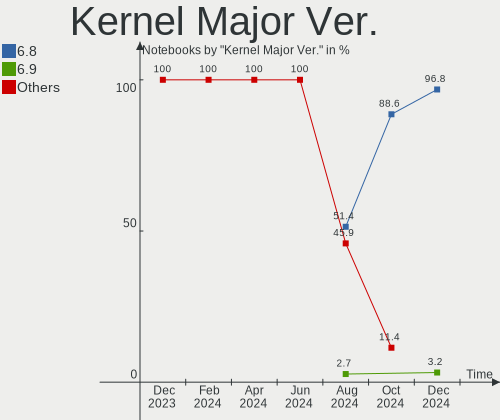
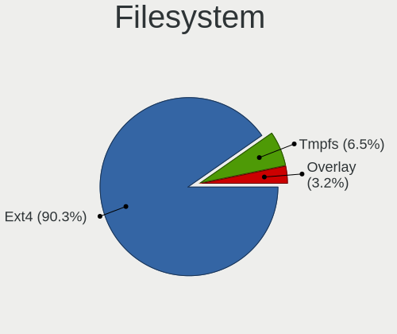
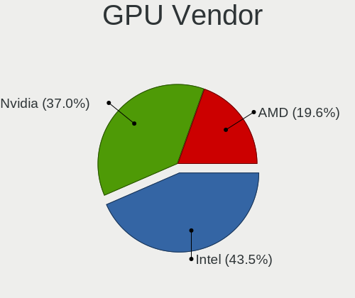
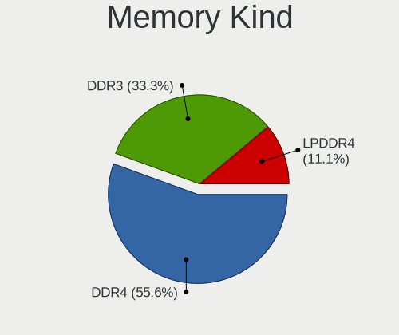
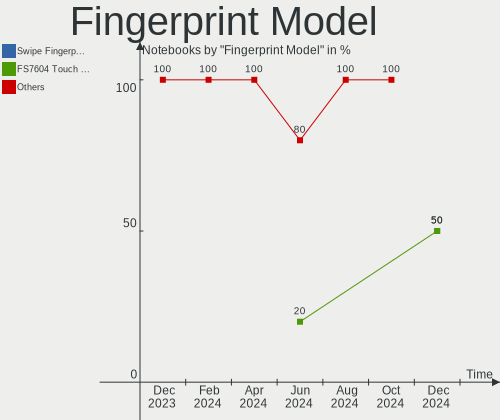

KDE neon Hardware Trends (Notebooks)
------------------------------------

A project to identify most popular hardware characteristics and track their change
over time based on data collected by KDE neon users at https://Linux-Hardware.org.

Anyone can contribute to this report by the [hw-probe](https://github.com/linuxhw/hw-probe) tool:

    sudo -E hw-probe -all -upload

This report is for one last month. Overall report since the beginning of time: [TestCoverage](https://github.com/linuxhw/TestCoverage)

Period: Apr, 2022.

Contents
--------

* [ System ](#system)
  - [ OS                       ](#os)
  - [ OS Family                ](#os-family)
  - [ Kernel                   ](#kernel)
  - [ Kernel Family            ](#kernel-family)
  - [ Kernel Major Ver.        ](#kernel-major-ver)
  - [ Arch                     ](#arch)
  - [ DE                       ](#de)
  - [ Display Server           ](#display-server)
  - [ Display Manager          ](#display-manager)
  - [ OS Lang                  ](#os-lang)
  - [ Boot Mode                ](#boot-mode)
  - [ Filesystem               ](#filesystem)
  - [ Part. scheme             ](#part-scheme)
  - [ Dual Boot with Linux/BSD ](#dual-boot-with-linuxbsd)
  - [ Dual Boot (Win)          ](#dual-boot-win)

* [ Board ](#board)
  - [ Vendor                   ](#vendor)
  - [ Model                    ](#model)
  - [ Model Family             ](#model-family)
  - [ MFG Year                 ](#mfg-year)
  - [ Form Factor              ](#form-factor)
  - [ Secure Boot              ](#secure-boot)
  - [ Coreboot                 ](#coreboot)
  - [ RAM Size                 ](#ram-size)
  - [ RAM Used                 ](#ram-used)
  - [ Total Drives             ](#total-drives)
  - [ Has CD-ROM               ](#has-cd-rom)
  - [ Has Ethernet             ](#has-ethernet)
  - [ Has WiFi                 ](#has-wifi)
  - [ Has Bluetooth            ](#has-bluetooth)

* [ Location ](#location)
  - [ Country                  ](#country)
  - [ City                     ](#city)

* [ Drives ](#drives)
  - [ Drive Vendor             ](#drive-vendor)
  - [ Drive Model              ](#drive-model)
  - [ HDD Vendor               ](#hdd-vendor)
  - [ SSD Vendor               ](#ssd-vendor)
  - [ Drive Kind               ](#drive-kind)
  - [ Drive Connector          ](#drive-connector)
  - [ Drive Size               ](#drive-size)
  - [ Space Total              ](#space-total)
  - [ Space Used               ](#space-used)
  - [ Malfunc. Drives          ](#malfunc-drives)
  - [ Malfunc. Drive Vendor    ](#malfunc-drive-vendor)
  - [ Malfunc. HDD Vendor      ](#malfunc-hdd-vendor)
  - [ Malfunc. Drive Kind      ](#malfunc-drive-kind)
  - [ Failed Drives            ](#failed-drives)
  - [ Failed Drive Vendor      ](#failed-drive-vendor)
  - [ Drive Status             ](#drive-status)

* [ Storage controller ](#storage-controller)
  - [ Storage Vendor           ](#storage-vendor)
  - [ Storage Model            ](#storage-model)
  - [ Storage Kind             ](#storage-kind)

* [ Processor ](#processor)
  - [ CPU Vendor               ](#cpu-vendor)
  - [ CPU Model                ](#cpu-model)
  - [ CPU Model Family         ](#cpu-model-family)
  - [ CPU Cores                ](#cpu-cores)
  - [ CPU Sockets              ](#cpu-sockets)
  - [ CPU Threads              ](#cpu-threads)
  - [ CPU Op-Modes             ](#cpu-op-modes)
  - [ CPU Microcode            ](#cpu-microcode)
  - [ CPU Microarch            ](#cpu-microarch)

* [ Graphics ](#graphics)
  - [ GPU Vendor               ](#gpu-vendor)
  - [ GPU Model                ](#gpu-model)
  - [ GPU Combo                ](#gpu-combo)
  - [ GPU Driver               ](#gpu-driver)
  - [ GPU Memory               ](#gpu-memory)

* [ Monitor ](#monitor)
  - [ Monitor Vendor           ](#monitor-vendor)
  - [ Monitor Model            ](#monitor-model)
  - [ Monitor Resolution       ](#monitor-resolution)
  - [ Monitor Diagonal         ](#monitor-diagonal)
  - [ Monitor Width            ](#monitor-width)
  - [ Aspect Ratio             ](#aspect-ratio)
  - [ Monitor Area             ](#monitor-area)
  - [ Pixel Density            ](#pixel-density)
  - [ Multiple Monitors        ](#multiple-monitors)

* [ Network ](#network)
  - [ Net Controller Vendor    ](#net-controller-vendor)
  - [ Net Controller Model     ](#net-controller-model)
  - [ Wireless Vendor          ](#wireless-vendor)
  - [ Wireless Model           ](#wireless-model)
  - [ Ethernet Vendor          ](#ethernet-vendor)
  - [ Ethernet Model           ](#ethernet-model)
  - [ Net Controller Kind      ](#net-controller-kind)
  - [ Used Controller          ](#used-controller)
  - [ NICs                     ](#nics)
  - [ IPv6                     ](#ipv6)

* [ Bluetooth ](#bluetooth)
  - [ Bluetooth Vendor         ](#bluetooth-vendor)
  - [ Bluetooth Model          ](#bluetooth-model)

* [ Sound ](#sound)
  - [ Sound Vendor             ](#sound-vendor)
  - [ Sound Model              ](#sound-model)

* [ Memory ](#memory)
  - [ Memory Vendor            ](#memory-vendor)
  - [ Memory Model             ](#memory-model)
  - [ Memory Kind              ](#memory-kind)
  - [ Memory Form Factor       ](#memory-form-factor)
  - [ Memory Size              ](#memory-size)
  - [ Memory Speed             ](#memory-speed)

* [ Printers & scanners ](#printers--scanners)
  - [ Printer Vendor           ](#printer-vendor)
  - [ Printer Model            ](#printer-model)
  - [ Scanner Vendor           ](#scanner-vendor)
  - [ Scanner Model            ](#scanner-model)

* [ Camera ](#camera)
  - [ Camera Vendor            ](#camera-vendor)
  - [ Camera Model             ](#camera-model)

* [ Security ](#security)
  - [ Fingerprint Vendor       ](#fingerprint-vendor)
  - [ Fingerprint Model        ](#fingerprint-model)
  - [ Chipcard Vendor          ](#chipcard-vendor)
  - [ Chipcard Model           ](#chipcard-model)

* [ Unsupported ](#unsupported)
  - [ Unsupported Devices      ](#unsupported-devices)
  - [ Unsupported Device Types ](#unsupported-device-types)

System
------

OS
--

Installed operating systems

| Name           | Notebooks | Percent |
|----------------|-----------|---------|
| KDE neon 20.04 | 80        | 100%    |

OS Family
---------

OS without a version

| Name     | Notebooks | Percent |
|----------|-----------|---------|
| KDE neon | 80        | 100%    |

Kernel
------

Version of the Linux kernel

| Version                   | Notebooks | Percent |
|---------------------------|-----------|---------|
| 5.13.0-39-generic         | 48        | 60%     |
| 5.13.0-40-generic         | 23        | 28.75%  |
| 5.13.0-30-generic         | 3         | 3.75%   |
| 5.13.0-28-generic         | 2         | 2.5%    |
| 5.17.0-3.1-liquorix-amd64 | 1         | 1.25%   |
| 5.16.15-051615-generic    | 1         | 1.25%   |
| 5.15.5-051505-generic     | 1         | 1.25%   |
| 5.13.0-35-generic         | 1         | 1.25%   |

Kernel Family
-------------

Linux kernel without a distro release

| Version | Notebooks | Percent |
|---------|-----------|---------|
| 5.13.0  | 77        | 96.25%  |
| 5.17.0  | 1         | 1.25%   |
| 5.16.15 | 1         | 1.25%   |
| 5.15.5  | 1         | 1.25%   |

Kernel Major Ver.
-----------------

Linux kernel major version

| Version | Notebooks | Percent |
|---------|-----------|---------|
| 5.13    | 77        | 96.25%  |
| 5.17    | 1         | 1.25%   |
| 5.16    | 1         | 1.25%   |
| 5.15    | 1         | 1.25%   |

Arch
----

OS architecture (x86_64, i586, etc.)

| Name   | Notebooks | Percent |
|--------|-----------|---------|
| x86_64 | 80        | 100%    |

DE
--

Desktop Environment

| Name    | Notebooks | Percent |
|---------|-----------|---------|
| KDE5    | 77        | 96.25%  |
| Unknown | 3         | 3.75%   |

Display Server
--------------

X11 or Wayland

| Name    | Notebooks | Percent |
|---------|-----------|---------|
| X11     | 70        | 87.5%   |
| Wayland | 10        | 12.5%   |

Display Manager
---------------

SDDM, LightDM, etc.

| Name    | Notebooks | Percent |
|---------|-----------|---------|
| Unknown | 61        | 76.25%  |
| SDDM    | 19        | 23.75%  |

OS Lang
-------

Language

| Lang    | Notebooks | Percent |
|---------|-----------|---------|
| en_US   | 33        | 41.25%  |
| ru_RU   | 7         | 8.75%   |
| pt_BR   | 5         | 6.25%   |
| de_DE   | 4         | 5%      |
| it_IT   | 3         | 3.75%   |
| en_ZA   | 3         | 3.75%   |
| es_UY   | 2         | 2.5%    |
| es_MX   | 2         | 2.5%    |
| es_ES   | 2         | 2.5%    |
| en_IN   | 2         | 2.5%    |
| en_GB   | 2         | 2.5%    |
| Unknown | 2         | 2.5%    |
| pt_PT   | 1         | 1.25%   |
| pl_PL   | 1         | 1.25%   |
| hu_HU   | 1         | 1.25%   |
| fr_MA   | 1         | 1.25%   |
| fr_FR   | 1         | 1.25%   |
| fr_CA   | 1         | 1.25%   |
| es_CO   | 1         | 1.25%   |
| es_CL   | 1         | 1.25%   |
| es_AR   | 1         | 1.25%   |
| en_AU   | 1         | 1.25%   |
| de_AT   | 1         | 1.25%   |
| da_DK   | 1         | 1.25%   |
| cs_CZ   | 1         | 1.25%   |

Boot Mode
---------

EFI or BIOS

| Mode | Notebooks | Percent |
|------|-----------|---------|
| EFI  | 50        | 62.5%   |
| BIOS | 30        | 37.5%   |

Filesystem
----------

Type of filesystem

| Type    | Notebooks | Percent |
|---------|-----------|---------|
| Ext4    | 76        | 95%     |
| Btrfs   | 3         | 3.75%   |
| Unknown | 1         | 1.25%   |

Part. scheme
------------

Scheme of partitioning

| Type    | Notebooks | Percent |
|---------|-----------|---------|
| Unknown | 66        | 82.5%   |
| GPT     | 11        | 13.75%  |
| MBR     | 3         | 3.75%   |

Dual Boot with Linux/BSD
------------------------

Hosting more than one Linux/BSD

| Dual boot | Notebooks | Percent |
|-----------|-----------|---------|
| No        | 79        | 98.75%  |
| Yes       | 1         | 1.25%   |

Dual Boot (Win)
---------------

Hosting Linux and Windows

| Dual boot | Notebooks | Percent |
|-----------|-----------|---------|
| No        | 70        | 87.5%   |
| Yes       | 10        | 12.5%   |

Board
-----

Vendor
------

Motherboard manufacturer

| Name                | Notebooks | Percent |
|---------------------|-----------|---------|
| Hewlett-Packard     | 21        | 26.25%  |
| Dell                | 15        | 18.75%  |
| Lenovo              | 12        | 15%     |
| Acer                | 6         | 7.5%    |
| MSI                 | 4         | 5%      |
| Toshiba             | 3         | 3.75%   |
| Samsung Electronics | 3         | 3.75%   |
| ASUSTek Computer    | 3         | 3.75%   |
| Apple               | 3         | 3.75%   |
| SLIMBOOK            | 2         | 2.5%    |
| Schenker            | 1         | 1.25%   |
| Positivo            | 1         | 1.25%   |
| MECER               | 1         | 1.25%   |
| LG Electronics      | 1         | 1.25%   |
| HUAWEI              | 1         | 1.25%   |
| CONNEX              | 1         | 1.25%   |
| Compaq              | 1         | 1.25%   |
| Unknown             | 1         | 1.25%   |

Model
-----

Motherboard model

| Name                                  | Notebooks | Percent |
|---------------------------------------|-----------|---------|
| SLIMBOOK PROX15-AMD                   | 2         | 2.5%    |
| HP EliteBook 840 G1                   | 2         | 2.5%    |
| Unknown                               | 2         | 2.5%    |
| Toshiba Satellite P775                | 1         | 1.25%   |
| Toshiba Satellite P200                | 1         | 1.25%   |
| Toshiba Satellite L655                | 1         | 1.25%   |
| Schenker XMG NEO (TGL/M21)            | 1         | 1.25%   |
| Samsung 700T                          | 1         | 1.25%   |
| Samsung 550XDA                        | 1         | 1.25%   |
| Samsung 300E4C/300E5C/300E7C          | 1         | 1.25%   |
| Positivo Q464C                        | 1         | 1.25%   |
| MSI GT80S 6QD                         | 1         | 1.25%   |
| MSI GS65 Stealth 9SE                  | 1         | 1.25%   |
| MSI GS60 2QE                          | 1         | 1.25%   |
| MSI Bravo 17 A4DDR                    | 1         | 1.25%   |
| MECER YA13Q20-DP_PRO                  | 1         | 1.25%   |
| LG U460-G.BG51P1                      | 1         | 1.25%   |
| Lenovo ThinkPad X200 Tablet 744945F   | 1         | 1.25%   |
| Lenovo ThinkPad X1 Extreme 20MFCTO1WW | 1         | 1.25%   |
| Lenovo ThinkPad W530 24474E0          | 1         | 1.25%   |
| Lenovo ThinkPad W520 427639U          | 1         | 1.25%   |
| Lenovo ThinkPad T480s 20L7CTO1WW      | 1         | 1.25%   |
| Lenovo ThinkPad T460 20FN002SUS       | 1         | 1.25%   |
| Lenovo ThinkPad T440 20B7S1EV00       | 1         | 1.25%   |
| Lenovo ThinkPad E570 20H500BWRT       | 1         | 1.25%   |
| Lenovo Legion Y540-17IRH-PG0 81T3     | 1         | 1.25%   |
| Lenovo IdeaPad 320-15ABR 80XS         | 1         | 1.25%   |
| Lenovo G50-30 80G0                    | 1         | 1.25%   |
| Lenovo B50-45 20388                   | 1         | 1.25%   |
| HUAWEI NBLK-WAX9X                     | 1         | 1.25%   |
| HP Stream Laptop 11-y0XX              | 1         | 1.25%   |
| HP Presario CQ57                      | 1         | 1.25%   |
| HP Presario CQ56                      | 1         | 1.25%   |
| HP Pavilion m7                        | 1         | 1.25%   |
| HP Pavilion Laptop 15-cs0xxx          | 1         | 1.25%   |
| HP Pavilion Gaming Laptop 15-ec0xxx   | 1         | 1.25%   |
| HP Pavilion Gaming Laptop 15-dk0xxx   | 1         | 1.25%   |
| HP Pavilion Gaming Laptop 15-cx0xxx   | 1         | 1.25%   |
| HP Pavilion g7                        | 1         | 1.25%   |
| HP Pavilion dv7                       | 1         | 1.25%   |
| HP Pavilion dm1                       | 1         | 1.25%   |
| HP OMEN Laptop 15-en0xxx              | 1         | 1.25%   |
| HP Notebook                           | 1         | 1.25%   |
| HP Laptop 15s-fq2xxx                  | 1         | 1.25%   |
| HP ENVY dv7                           | 1         | 1.25%   |
| HP EliteBook 850 G5                   | 1         | 1.25%   |
| HP EliteBook 2570p                    | 1         | 1.25%   |
| HP 255 G3                             | 1         | 1.25%   |
| Dell XPS 15 9560                      | 1         | 1.25%   |
| Dell Vostro 1510                      | 1         | 1.25%   |
| Dell Studio XPS 1645                  | 1         | 1.25%   |
| Dell Precision 7510                   | 1         | 1.25%   |
| Dell Precision 5560                   | 1         | 1.25%   |
| Dell Precision 3560                   | 1         | 1.25%   |
| Dell Latitude E6540                   | 1         | 1.25%   |
| Dell Latitude E6510                   | 1         | 1.25%   |
| Dell Latitude E6420                   | 1         | 1.25%   |
| Dell Latitude 7300                    | 1         | 1.25%   |
| Dell Latitude 5580                    | 1         | 1.25%   |
| Dell Latitude 3520                    | 1         | 1.25%   |

Model Family
------------

Motherboard model prefix

| Name                | Notebooks | Percent |
|---------------------|-----------|---------|
| Lenovo ThinkPad     | 8         | 10%     |
| HP Pavilion         | 8         | 10%     |
| Dell Latitude       | 6         | 7.5%    |
| HP EliteBook        | 4         | 5%      |
| Toshiba Satellite   | 3         | 3.75%   |
| Dell Precision      | 3         | 3.75%   |
| Dell Inspiron       | 3         | 3.75%   |
| Acer Aspire         | 3         | 3.75%   |
| SLIMBOOK PROX15-AMD | 2         | 2.5%    |
| HP Presario         | 2         | 2.5%    |
| Acer Swift          | 2         | 2.5%    |
| Unknown             | 2         | 2.5%    |
| Schenker XMG        | 1         | 1.25%   |
| Samsung 700T        | 1         | 1.25%   |
| Samsung 550XDA      | 1         | 1.25%   |
| Samsung 300E4C      | 1         | 1.25%   |
| Positivo Q464C      | 1         | 1.25%   |
| MSI GT80S           | 1         | 1.25%   |
| MSI GS65            | 1         | 1.25%   |
| MSI GS60            | 1         | 1.25%   |
| MSI Bravo           | 1         | 1.25%   |
| MECER YA13Q20-DP    | 1         | 1.25%   |
| LG U460-G.BG51P1    | 1         | 1.25%   |
| Lenovo Legion       | 1         | 1.25%   |
| Lenovo IdeaPad      | 1         | 1.25%   |
| Lenovo G50-30       | 1         | 1.25%   |
| Lenovo B50-45       | 1         | 1.25%   |
| HUAWEI NBLK-WAX9X   | 1         | 1.25%   |
| HP Stream           | 1         | 1.25%   |
| HP OMEN             | 1         | 1.25%   |
| HP Notebook         | 1         | 1.25%   |
| HP Laptop           | 1         | 1.25%   |
| HP ENVY             | 1         | 1.25%   |
| HP 255              | 1         | 1.25%   |
| Dell XPS            | 1         | 1.25%   |
| Dell Vostro         | 1         | 1.25%   |
| Dell Studio         | 1         | 1.25%   |
| CONNEX L1470        | 1         | 1.25%   |
| Compaq Presario     | 1         | 1.25%   |
| ASUS X556UB         | 1         | 1.25%   |
| ASUS X200MA         | 1         | 1.25%   |
| ASUS VivoBook       | 1         | 1.25%   |
| Apple MacBookPro4   | 1         | 1.25%   |
| Apple MacBookPro14  | 1         | 1.25%   |
| Apple MacBookPro10  | 1         | 1.25%   |
| Acer Nitro          | 1         | 1.25%   |

MFG Year
--------

Motherboard manufacture year

| Year | Notebooks | Percent |
|------|-----------|---------|
| 2020 | 10        | 12.5%   |
| 2021 | 7         | 8.75%   |
| 2019 | 7         | 8.75%   |
| 2018 | 7         | 8.75%   |
| 2016 | 7         | 8.75%   |
| 2011 | 7         | 8.75%   |
| 2014 | 6         | 7.5%    |
| 2013 | 5         | 6.25%   |
| 2012 | 5         | 6.25%   |
| 2010 | 5         | 6.25%   |
| 2017 | 4         | 5%      |
| 2008 | 4         | 5%      |
| 2015 | 3         | 3.75%   |
| 2009 | 2         | 2.5%    |
| 2007 | 1         | 1.25%   |

Form Factor
-----------

Physical design of the computer

| Name     | Notebooks | Percent |
|----------|-----------|---------|
| Notebook | 80        | 100%    |

Secure Boot
-----------

Enabled or disabled

| State    | Notebooks | Percent |
|----------|-----------|---------|
| Disabled | 66        | 82.5%   |
| Enabled  | 14        | 17.5%   |

Coreboot
--------

Have coreboot on board

| Used | Notebooks | Percent |
|------|-----------|---------|
| No   | 80        | 100%    |

RAM Size
--------

Total RAM memory

| Size in GB  | Notebooks | Percent |
|-------------|-----------|---------|
| 4.01-8.0    | 27        | 33.75%  |
| 3.01-4.0    | 18        | 22.5%   |
| 16.01-24.0  | 11        | 13.75%  |
| 8.01-16.0   | 9         | 11.25%  |
| 32.01-64.0  | 8         | 10%     |
| 1.01-2.0    | 4         | 5%      |
| 64.01-256.0 | 3         | 3.75%   |

RAM Used
--------

Used RAM memory

| Used GB    | Notebooks | Percent |
|------------|-----------|---------|
| 1.01-2.0   | 37        | 46.25%  |
| 2.01-3.0   | 17        | 21.25%  |
| 4.01-8.0   | 8         | 10%     |
| 3.01-4.0   | 7         | 8.75%   |
| 8.01-16.0  | 5         | 6.25%   |
| 0.51-1.0   | 5         | 6.25%   |
| 16.01-24.0 | 1         | 1.25%   |

Total Drives
------------

Number of drives on board

| Drives | Notebooks | Percent |
|--------|-----------|---------|
| 1      | 52        | 65%     |
| 2      | 24        | 30%     |
| 3      | 2         | 2.5%    |
| 5      | 1         | 1.25%   |
| 4      | 1         | 1.25%   |

Has CD-ROM
----------

Has CD-ROM on board

| Presented | Notebooks | Percent |
|-----------|-----------|---------|
| No        | 54        | 67.5%   |
| Yes       | 26        | 32.5%   |

Has Ethernet
------------

Has Ethernet on board

| Presented | Notebooks | Percent |
|-----------|-----------|---------|
| Yes       | 66        | 82.5%   |
| No        | 14        | 17.5%   |

Has WiFi
--------

Has WiFi module

| Presented | Notebooks | Percent |
|-----------|-----------|---------|
| Yes       | 77        | 96.25%  |
| No        | 3         | 3.75%   |

Has Bluetooth
-------------

Has Bluetooth module

| Presented | Notebooks | Percent |
|-----------|-----------|---------|
| Yes       | 59        | 73.75%  |
| No        | 21        | 26.25%  |

Location
--------

Country
-------

Geographic location (country)

| Country      | Notebooks | Percent |
|--------------|-----------|---------|
| USA          | 20        | 25%     |
| Russia       | 9         | 11.25%  |
| Brazil       | 5         | 6.25%   |
| Italy        | 4         | 5%      |
| Germany      | 4         | 5%      |
| South Africa | 3         | 3.75%   |
| Poland       | 3         | 3.75%   |
| India        | 3         | 3.75%   |
| Canada       | 3         | 3.75%   |
| Uruguay      | 2         | 2.5%    |
| Spain        | 2         | 2.5%    |
| Mexico       | 2         | 2.5%    |
| Belgium      | 2         | 2.5%    |
| UK           | 1         | 1.25%   |
| Puerto Rico  | 1         | 1.25%   |
| Portugal     | 1         | 1.25%   |
| Pakistan     | 1         | 1.25%   |
| Morocco      | 1         | 1.25%   |
| Kosovo       | 1         | 1.25%   |
| Kazakhstan   | 1         | 1.25%   |
| Indonesia    | 1         | 1.25%   |
| Hungary      | 1         | 1.25%   |
| Greece       | 1         | 1.25%   |
| France       | 1         | 1.25%   |
| Denmark      | 1         | 1.25%   |
| Czechia      | 1         | 1.25%   |
| Colombia     | 1         | 1.25%   |
| Belarus      | 1         | 1.25%   |
| Austria      | 1         | 1.25%   |
| Australia    | 1         | 1.25%   |
| Argentina    | 1         | 1.25%   |

City
----

Geographic location (city)

| City                 | Notebooks | Percent |
|----------------------|-----------|---------|
| Moscow               | 4         | 5%      |
| Patna                | 2         | 2.5%    |
| Ciudad del Plata     | 2         | 2.5%    |
| Wellington           | 1         | 1.25%   |
| Warsaw               | 1         | 1.25%   |
| Voronezh             | 1         | 1.25%   |
| Viseu                | 1         | 1.25%   |
| Vienna               | 1         | 1.25%   |
| Turin                | 1         | 1.25%   |
| Tucson               | 1         | 1.25%   |
| Toccoa               | 1         | 1.25%   |
| Surrey               | 1         | 1.25%   |
| Statesboro           | 1         | 1.25%   |
| St Petersburg        | 1         | 1.25%   |
| Scottsdale           | 1         | 1.25%   |
| Santiago de Cali     | 1         | 1.25%   |
| Santa Fe             | 1         | 1.25%   |
| Salvador             | 1         | 1.25%   |
| Rotselaar            | 1         | 1.25%   |
| Rockville            | 1         | 1.25%   |
| Rochester            | 1         | 1.25%   |
| Roanoke              | 1         | 1.25%   |
| Rio de Janeiro       | 1         | 1.25%   |
| Resende              | 1         | 1.25%   |
| Rabat                | 1         | 1.25%   |
| Poznan               | 1         | 1.25%   |
| Port Elizabeth       | 1         | 1.25%   |
| Pilibhit             | 1         | 1.25%   |
| Padova               | 1         | 1.25%   |
| Ocean Springs        | 1         | 1.25%   |
| Novara               | 1         | 1.25%   |
| Noril'sk             | 1         | 1.25%   |
| Nizhniy Novgorod     | 1         | 1.25%   |
| New Port Richey      | 1         | 1.25%   |
| Montreal             | 1         | 1.25%   |
| Montpellier          | 1         | 1.25%   |
| Monclova             | 1         | 1.25%   |
| Milton               | 1         | 1.25%   |
| Miami                | 1         | 1.25%   |
| McLean               | 1         | 1.25%   |
| Leipzig              | 1         | 1.25%   |
| Lahore               | 1         | 1.25%   |
| Kosovo Polje         | 1         | 1.25%   |
| Jakarta              | 1         | 1.25%   |
| Irkutsk              | 1         | 1.25%   |
| Imlay City           | 1         | 1.25%   |
| Hueckelhoven         | 1         | 1.25%   |
| Hemmingen            | 1         | 1.25%   |
| Guayama              | 1         | 1.25%   |
| Greenville           | 1         | 1.25%   |
| Governador Valadares | 1         | 1.25%   |
| Gniezno              | 1         | 1.25%   |
| Glasgow              | 1         | 1.25%   |
| Frýdek-Místek      | 1         | 1.25%   |
| Fort Walton Beach    | 1         | 1.25%   |
| Fort Mitchell        | 1         | 1.25%   |
| Fort Lauderdale      | 1         | 1.25%   |
| Durban               | 1         | 1.25%   |
| Copenhagen           | 1         | 1.25%   |
| Ciudad Real          | 1         | 1.25%   |

Drives
------

Drive Vendor
------------

Hard drive vendors

| Vendor              | Notebooks | Drives | Percent |
|---------------------|-----------|--------|---------|
| Samsung Electronics | 16        | 20     | 15.53%  |
| Seagate             | 10        | 11     | 9.71%   |
| Unknown             | 9         | 10     | 8.74%   |
| WDC                 | 8         | 10     | 7.77%   |
| SanDisk             | 7         | 7      | 6.8%    |
| Crucial             | 7         | 7      | 6.8%    |
| Toshiba             | 5         | 6      | 4.85%   |
| SK Hynix            | 5         | 5      | 4.85%   |
| Kingston            | 5         | 5      | 4.85%   |
| HGST                | 5         | 5      | 4.85%   |
| A-DATA Technology   | 3         | 3      | 2.91%   |
| Micron Technology   | 2         | 2      | 1.94%   |
| Intel               | 2         | 2      | 1.94%   |
| Hitachi             | 2         | 2      | 1.94%   |
| Apple               | 2         | 3      | 1.94%   |
| Unknown             | 2         | 2      | 1.94%   |
| USB3.0              | 1         | 1      | 0.97%   |
| Transcend           | 1         | 1      | 0.97%   |
| Timetec             | 1         | 1      | 0.97%   |
| SPCC                | 1         | 2      | 0.97%   |
| Netac SS            | 1         | 1      | 0.97%   |
| Mushkin             | 1         | 1      | 0.97%   |
| KIOXIA              | 1         | 1      | 0.97%   |
| Intenso             | 1         | 1      | 0.97%   |
| Hewlett-Packard     | 1         | 1      | 0.97%   |
| Fujitsu             | 1         | 1      | 0.97%   |
| faspeed             | 1         | 1      | 0.97%   |
| China               | 1         | 1      | 0.97%   |
| ADATA SX            | 1         | 1      | 0.97%   |

Drive Model
-----------

Hard drive models

| Model                                | Notebooks | Percent |
|--------------------------------------|-----------|---------|
| Unknown MMC Card  32GB               | 3         | 2.73%   |
| Samsung NVMe SSD Drive 512GB         | 3         | 2.73%   |
| Unknown MMC Card  64GB               | 2         | 1.82%   |
| Toshiba KBG30ZMS128G 128GB NVMe SSD  | 2         | 1.82%   |
| SK Hynix NVMe SSD Drive 512GB        | 2         | 1.82%   |
| Seagate ST500LT012-1DG142 500GB      | 2         | 1.82%   |
| Sandisk NVMe SSD Drive 256GB         | 2         | 1.82%   |
| Samsung MZVLB1T0HALR-000L7 1TB       | 2         | 1.82%   |
| Kingston SUV400S37120G 120GB SSD     | 2         | 1.82%   |
| HGST HTS721010A9E630 1TB             | 2         | 1.82%   |
| Crucial CT500MX500SSD1 500GB         | 2         | 1.82%   |
| Crucial CT240BX500SSD1 240GB         | 2         | 1.82%   |
| Unknown                              | 2         | 1.82%   |
| WDC WDS480G2G0A-00JH30 480GB SSD     | 1         | 0.91%   |
| WDC WDS250G2B0C-00PXH0 250GB         | 1         | 0.91%   |
| WDC WDBNCE0010PNC 1TB SSD            | 1         | 0.91%   |
| WDC WD7500BPVT-22HXZT3 752GB         | 1         | 0.91%   |
| WDC WD6400BPVT-35HXZT1 640GB         | 1         | 0.91%   |
| WDC WD50 00AZRX-00A8LB0 500GB        | 1         | 0.91%   |
| WDC WD50 00AAKX-22ERMA0 500GB        | 1         | 0.91%   |
| WDC WD3200LPCX-24C6HT0 320GB         | 1         | 0.91%   |
| WDC WD12 00BEVE-00UYT0 120GB         | 1         | 0.91%   |
| WDC WD10JPVX-75JC3T0 1TB             | 1         | 0.91%   |
| USB3.0 Super Speed 1TB               | 1         | 0.91%   |
| Unknown MMC Card  16GB               | 1         | 0.91%   |
| Unknown MMC Card  128GB              | 1         | 0.91%   |
| Unknown MMC Card  1073GB             | 1         | 0.91%   |
| Unknown HCG8a4  64GB                 | 1         | 0.91%   |
| Unknown Biwin  64GB                  | 1         | 0.91%   |
| Transcend TS120GSSD220S 120GB        | 1         | 0.91%   |
| Toshiba THNSNJ128G8NU 128GB SSD      | 1         | 0.91%   |
| Toshiba MQ01ABD050 500GB             | 1         | 0.91%   |
| Toshiba MK1676GSX 160GB              | 1         | 0.91%   |
| Timetec 35TTM8SSATA-256G             | 1         | 0.91%   |
| SPCC Solid State Disk 64GB           | 1         | 0.91%   |
| SPCC M.2 SSD 128GB                   | 1         | 0.91%   |
| SK Hynix SHGS31-500GS-2 500GB SSD    | 1         | 0.91%   |
| SK Hynix NVMe SSD Drive 256GB        | 1         | 0.91%   |
| SK Hynix NVMe SSD Drive 1024GB       | 1         | 0.91%   |
| Seagate ST9500420ASG 500GB           | 1         | 0.91%   |
| Seagate ST9120822AS 120GB            | 1         | 0.91%   |
| Seagate ST500LM000-1EJ162-SSHD 500GB | 1         | 0.91%   |
| Seagate ST2000LM015-2E8174 2TB       | 1         | 0.91%   |
| Seagate ST1000LM049-2GH172 1TB       | 1         | 0.91%   |
| Seagate ST1000LM035-1RK172 1TB       | 1         | 0.91%   |
| Seagate ST1000LM024 HN-M101MBB 1TB   | 1         | 0.91%   |
| Seagate NVMe SSD Drive 1TB           | 1         | 0.91%   |
| SanDisk SSD PLUS 120GB               | 1         | 0.91%   |
| SanDisk SDSSDA240G 240GB             | 1         | 0.91%   |
| SanDisk SDSSDA120G 120GB             | 1         | 0.91%   |
| SanDisk SD8SN8U1T001122 1024GB SSD   | 1         | 0.91%   |
| Sandisk NVMe SSD Drive 1TB           | 1         | 0.91%   |
| Samsung SSD PM871 2.5 7mm 512GB      | 1         | 0.91%   |
| Samsung SSD 870 EVO 500GB            | 1         | 0.91%   |
| Samsung SSD 860 EVO 250GB            | 1         | 0.91%   |
| Samsung SSD 850 PRO 2TB              | 1         | 0.91%   |
| Samsung SSD 850 EVO 250GB            | 1         | 0.91%   |
| Samsung PSSD T7 500GB                | 1         | 0.91%   |
| Samsung NVMe SSD Drive 500GB         | 1         | 0.91%   |
| Samsung NVMe SSD Drive 256GB         | 1         | 0.91%   |

HDD Vendor
----------

Hard disk drive vendors

| Vendor  | Notebooks | Drives | Percent |
|---------|-----------|--------|---------|
| Seagate | 9         | 9      | 37.5%   |
| WDC     | 5         | 7      | 20.83%  |
| HGST    | 5         | 5      | 20.83%  |
| Toshiba | 2         | 2      | 8.33%   |
| Hitachi | 2         | 2      | 8.33%   |
| Fujitsu | 1         | 1      | 4.17%   |

SSD Vendor
----------

Solid state drive vendors

| Vendor              | Notebooks | Drives | Percent |
|---------------------|-----------|--------|---------|
| Samsung Electronics | 8         | 8      | 20.51%  |
| Crucial             | 6         | 6      | 15.38%  |
| Kingston            | 5         | 5      | 12.82%  |
| SanDisk             | 4         | 4      | 10.26%  |
| A-DATA Technology   | 3         | 3      | 7.69%   |
| WDC                 | 2         | 2      | 5.13%   |
| USB3.0              | 1         | 1      | 2.56%   |
| Transcend           | 1         | 1      | 2.56%   |
| Toshiba             | 1         | 2      | 2.56%   |
| SPCC                | 1         | 2      | 2.56%   |
| SK Hynix            | 1         | 1      | 2.56%   |
| Mushkin             | 1         | 1      | 2.56%   |
| Micron Technology   | 1         | 1      | 2.56%   |
| Hewlett-Packard     | 1         | 1      | 2.56%   |
| China               | 1         | 1      | 2.56%   |
| Apple               | 1         | 1      | 2.56%   |
| ADATA SX            | 1         | 1      | 2.56%   |

Drive Kind
----------

HDD or SSD

| Kind    | Notebooks | Drives | Percent |
|---------|-----------|--------|---------|
| SSD     | 35        | 41     | 35.35%  |
| NVMe    | 27        | 31     | 27.27%  |
| HDD     | 24        | 26     | 24.24%  |
| MMC     | 9         | 11     | 9.09%   |
| Unknown | 4         | 5      | 4.04%   |

Drive Connector
---------------

SATA, SAS, NVMe, etc.

| Type | Notebooks | Drives | Percent |
|------|-----------|--------|---------|
| SATA | 52        | 63     | 54.74%  |
| NVMe | 27        | 31     | 28.42%  |
| MMC  | 9         | 11     | 9.47%   |
| SAS  | 7         | 9      | 7.37%   |

Drive Size
----------

Size of hard drive

| Size in TB | Notebooks | Drives | Percent |
|------------|-----------|--------|---------|
| 0.01-0.5   | 37        | 48     | 67.27%  |
| 0.51-1.0   | 16        | 16     | 29.09%  |
| 1.01-2.0   | 2         | 3      | 3.64%   |

Space Total
-----------

Amount of disk space available on the file system

| Size in GB     | Notebooks | Percent |
|----------------|-----------|---------|
| 101-250        | 25        | 31.25%  |
| 251-500        | 22        | 27.5%   |
| 501-1000       | 14        | 17.5%   |
| 1001-2000      | 5         | 6.25%   |
| 21-50          | 4         | 5%      |
| Unknown        | 4         | 5%      |
| 51-100         | 3         | 3.75%   |
| More than 3000 | 2         | 2.5%    |
| 1-20           | 1         | 1.25%   |

Space Used
----------

Amount of used disk space

| Used GB        | Notebooks | Percent |
|----------------|-----------|---------|
| 1-20           | 28        | 35%     |
| 21-50          | 14        | 17.5%   |
| 101-250        | 13        | 16.25%  |
| 51-100         | 11        | 13.75%  |
| 251-500        | 6         | 7.5%    |
| Unknown        | 4         | 5%      |
| 501-1000       | 2         | 2.5%    |
| More than 3000 | 1         | 1.25%   |
| 1001-2000      | 1         | 1.25%   |

Malfunc. Drives
---------------

Drive models with a malfunction

| Model                        | Notebooks | Drives | Percent |
|------------------------------|-----------|--------|---------|
| WDC WD7500BPVT-22HXZT3 752GB | 1         | 1      | 100%    |

Malfunc. Drive Vendor
---------------------

Vendors of faulty drives

| Vendor | Notebooks | Drives | Percent |
|--------|-----------|--------|---------|
| WDC    | 1         | 1      | 100%    |

Malfunc. HDD Vendor
-------------------

Vendors of faulty HDD drives

| Vendor | Notebooks | Drives | Percent |
|--------|-----------|--------|---------|
| WDC    | 1         | 1      | 100%    |

Malfunc. Drive Kind
-------------------

Kinds of faulty drives

| Kind | Notebooks | Drives | Percent |
|------|-----------|--------|---------|
| HDD  | 1         | 1      | 100%    |

Failed Drives
-------------

Failed drive models

Zero info for selected period =(

Failed Drive Vendor
-------------------

Failed drive vendors

Zero info for selected period =(

Drive Status
------------

Number of failed and malfunc. drives

| Status   | Notebooks | Drives | Percent |
|----------|-----------|--------|---------|
| Detected | 68        | 98     | 82.93%  |
| Works    | 13        | 15     | 15.85%  |
| Malfunc  | 1         | 1      | 1.22%   |

Storage controller
------------------

Storage Vendor
--------------

Storage controller vendors

| Vendor                       | Notebooks | Percent |
|------------------------------|-----------|---------|
| Intel                        | 53        | 58.89%  |
| AMD                          | 12        | 13.33%  |
| Samsung Electronics          | 10        | 11.11%  |
| SK Hynix                     | 4         | 4.44%   |
| Sandisk                      | 4         | 4.44%   |
| Toshiba America Info Systems | 2         | 2.22%   |
| Seagate Technology           | 1         | 1.11%   |
| Micron/Crucial Technology    | 1         | 1.11%   |
| Micron Technology            | 1         | 1.11%   |
| KIOXIA                       | 1         | 1.11%   |
| Apple                        | 1         | 1.11%   |

Storage Model
-------------

Storage controller models

| Model                                                                         | Notebooks | Percent |
|-------------------------------------------------------------------------------|-----------|---------|
| AMD FCH SATA Controller [AHCI mode]                                           | 10        | 10.42%  |
| Intel Sunrise Point-LP SATA Controller [AHCI mode]                            | 6         | 6.25%   |
| Intel 82801 Mobile SATA Controller [RAID mode]                                | 6         | 6.25%   |
| Intel 7 Series Chipset Family 6-port SATA Controller [AHCI mode]              | 6         | 6.25%   |
| Intel 6 Series/C200 Series Chipset Family 6 port Mobile SATA AHCI Controller  | 6         | 6.25%   |
| Samsung NVMe SSD Controller SM981/PM981/PM983                                 | 4         | 4.17%   |
| Samsung NVMe SSD Controller 980                                               | 4         | 4.17%   |
| Intel 82801IBM/IEM (ICH9M/ICH9M-E) 4 port SATA Controller [AHCI mode]         | 4         | 4.17%   |
| Sandisk WD Blue SN550 NVMe SSD                                                | 3         | 3.13%   |
| Intel 82801HM/HEM (ICH8M/ICH8M-E) SATA Controller [AHCI mode]                 | 3         | 3.13%   |
| Intel 82801HM/HEM (ICH8M/ICH8M-E) IDE Controller                              | 3         | 3.13%   |
| Intel 8 Series SATA Controller 1 [AHCI mode]                                  | 3         | 3.13%   |
| Toshiba America Info Systems XG6 NVMe SSD Controller                          | 2         | 2.08%   |
| SK Hynix BC501 NVMe Solid State Drive                                         | 2         | 2.08%   |
| Intel Volume Management Device NVMe RAID Controller                           | 2         | 2.08%   |
| Intel Tiger Lake-LP SATA Controller [AHCI mode]                               | 2         | 2.08%   |
| Intel Q170/Q150/B150/H170/H110/Z170/CM236 Chipset SATA Controller [AHCI Mode] | 2         | 2.08%   |
| Intel Celeron/Pentium Silver Processor SATA Controller                        | 2         | 2.08%   |
| Intel Cannon Lake Mobile PCH SATA AHCI Controller                             | 2         | 2.08%   |
| Intel Atom Processor E3800 Series SATA AHCI Controller                        | 2         | 2.08%   |
| Intel 5 Series/3400 Series Chipset 4 port SATA AHCI Controller                | 2         | 2.08%   |
| AMD SB7x0/SB8x0/SB9x0 SATA Controller [AHCI mode]                             | 2         | 2.08%   |
| SK Hynix Non-Volatile memory controller                                       | 1         | 1.04%   |
| SK Hynix Gold P31 SSD                                                         | 1         | 1.04%   |
| Seagate FireCuda 530 SSD                                                      | 1         | 1.04%   |
| Seagate FireCuda 510 SSD                                                      | 1         | 1.04%   |
| Sandisk Non-Volatile memory controller                                        | 1         | 1.04%   |
| Samsung NVMe SSD Controller SM951/PM951                                       | 1         | 1.04%   |
| Samsung NVMe SSD Controller PM9A1/PM9A3/980PRO                                | 1         | 1.04%   |
| Micron/Crucial P2 NVMe PCIe SSD                                               | 1         | 1.04%   |
| Micron Non-Volatile memory controller                                         | 1         | 1.04%   |
| KIOXIA Non-Volatile memory controller                                         | 1         | 1.04%   |
| Intel Wildcat Point-LP SATA Controller [AHCI Mode]                            | 1         | 1.04%   |
| Intel SSD Pro 7600p/760p/E 6100p Series                                       | 1         | 1.04%   |
| Intel SATA Controller [RAID mode]                                             | 1         | 1.04%   |
| Intel Non-Volatile memory controller                                          | 1         | 1.04%   |
| Intel HM170/QM170 Chipset SATA Controller [AHCI Mode]                         | 1         | 1.04%   |
| Intel 500 Series Chipset Family SATA AHCI Controller                          | 1         | 1.04%   |
| Intel 5 Series/3400 Series Chipset 6 port SATA AHCI Controller                | 1         | 1.04%   |
| Apple S3X NVMe Controller                                                     | 1         | 1.04%   |

Storage Kind
------------

Kind of storage controller (IDE, SATA, NVMe, SAS, ...)

| Kind | Notebooks | Percent |
|------|-----------|---------|
| SATA | 56        | 58.95%  |
| NVMe | 27        | 28.42%  |
| RAID | 9         | 9.47%   |
| IDE  | 3         | 3.16%   |

Processor
---------

CPU Vendor
----------

Processor vendors

| Vendor | Notebooks | Percent |
|--------|-----------|---------|
| Intel  | 66        | 82.5%   |
| AMD    | 14        | 17.5%   |

CPU Model
---------

Processor models

| Model                                         | Notebooks | Percent |
|-----------------------------------------------|-----------|---------|
| AMD Ryzen 7 4800H with Radeon Graphics        | 4         | 5%      |
| Intel Core i7-8550U CPU @ 1.80GHz             | 3         | 3.75%   |
| Intel Core i7-9750H CPU @ 2.60GHz             | 2         | 2.5%    |
| Intel Core i5-6200U CPU @ 2.30GHz             | 2         | 2.5%    |
| Intel Core i5-4300U CPU @ 1.90GHz             | 2         | 2.5%    |
| Intel Core i3-6006U CPU @ 2.00GHz             | 2         | 2.5%    |
| Intel Atom x5-Z8350 CPU @ 1.44GHz             | 2         | 2.5%    |
| Intel 11th Gen Core i7-1165G7 @ 2.80GHz       | 2         | 2.5%    |
| Intel 11th Gen Core i5-1135G7 @ 2.40GHz       | 2         | 2.5%    |
| Intel Xeon CPU E3-1535M v5 @ 2.90GHz          | 1         | 1.25%   |
| Intel Pentium Silver N6000 @ 1.10GHz          | 1         | 1.25%   |
| Intel Pentium Silver N5030 CPU @ 1.10GHz      | 1         | 1.25%   |
| Intel Pentium Dual CPU T2370 @ 1.73GHz        | 1         | 1.25%   |
| Intel Pentium CPU P6200 @ 2.13GHz             | 1         | 1.25%   |
| Intel Core i7-8850H CPU @ 2.60GHz             | 1         | 1.25%   |
| Intel Core i7-7820HQ CPU @ 2.90GHz            | 1         | 1.25%   |
| Intel Core i7-7700HQ CPU @ 2.80GHz            | 1         | 1.25%   |
| Intel Core i7-6820HK CPU @ 2.70GHz            | 1         | 1.25%   |
| Intel Core i7-4710HQ CPU @ 2.50GHz            | 1         | 1.25%   |
| Intel Core i7-4610M CPU @ 3.00GHz             | 1         | 1.25%   |
| Intel Core i7-4600U CPU @ 2.10GHz             | 1         | 1.25%   |
| Intel Core i7-3740QM CPU @ 2.70GHz            | 1         | 1.25%   |
| Intel Core i7-3615QM CPU @ 2.30GHz            | 1         | 1.25%   |
| Intel Core i7-3610QM CPU @ 2.30GHz            | 1         | 1.25%   |
| Intel Core i7-2820QM CPU @ 2.30GHz            | 1         | 1.25%   |
| Intel Core i7-2670QM CPU @ 2.20GHz            | 1         | 1.25%   |
| Intel Core i7 CPU Q 720 @ 1.60GHz             | 1         | 1.25%   |
| Intel Core i5-9300H CPU @ 2.40GHz             | 1         | 1.25%   |
| Intel Core i5-8300H CPU @ 2.30GHz             | 1         | 1.25%   |
| Intel Core i5-8265U CPU @ 1.60GHz             | 1         | 1.25%   |
| Intel Core i5-7360U CPU @ 2.30GHz             | 1         | 1.25%   |
| Intel Core i5-5257U CPU @ 2.70GHz             | 1         | 1.25%   |
| Intel Core i5-3337U CPU @ 1.80GHz             | 1         | 1.25%   |
| Intel Core i5-3320M CPU @ 2.60GHz             | 1         | 1.25%   |
| Intel Core i5-3230M CPU @ 2.60GHz             | 1         | 1.25%   |
| Intel Core i5-2520M CPU @ 2.50GHz             | 1         | 1.25%   |
| Intel Core i5-2467M CPU @ 1.60GHz             | 1         | 1.25%   |
| Intel Core i5-2450M CPU @ 2.50GHz             | 1         | 1.25%   |
| Intel Core i5-2410M CPU @ 2.30GHz             | 1         | 1.25%   |
| Intel Core i5 CPU M 580 @ 2.67GHz             | 1         | 1.25%   |
| Intel Core i3-6100U CPU @ 2.30GHz             | 1         | 1.25%   |
| Intel Core i3-3110M CPU @ 2.40GHz             | 1         | 1.25%   |
| Intel Core i3-2328M CPU @ 2.20GHz             | 1         | 1.25%   |
| Intel Core i3 CPU M 380 @ 2.53GHz             | 1         | 1.25%   |
| Intel Core 2 Duo CPU T8300 @ 2.40GHz          | 1         | 1.25%   |
| Intel Core 2 Duo CPU T6600 @ 2.20GHz          | 1         | 1.25%   |
| Intel Core 2 Duo CPU T5870 @ 2.00GHz          | 1         | 1.25%   |
| Intel Core 2 Duo CPU P7450 @ 2.13GHz          | 1         | 1.25%   |
| Intel Core 2 Duo CPU L9600 @ 2.13GHz          | 1         | 1.25%   |
| Intel Celeron N4120 CPU @ 1.10GHz             | 1         | 1.25%   |
| Intel Celeron CPU N3060 @ 1.60GHz             | 1         | 1.25%   |
| Intel Celeron CPU N2840 @ 2.16GHz             | 1         | 1.25%   |
| Intel Celeron CPU N2815 @ 1.86GHz             | 1         | 1.25%   |
| Intel Celeron CPU J3160 @ 1.60GHz             | 1         | 1.25%   |
| Intel Celeron CPU 900 @ 2.20GHz               | 1         | 1.25%   |
| Intel 11th Gen Core i7-11850H @ 2.50GHz       | 1         | 1.25%   |
| Intel 11th Gen Core i7-11800H @ 2.30GHz       | 1         | 1.25%   |
| Intel 11th Gen Core i5-11300H @ 3.10GHz       | 1         | 1.25%   |
| AMD Ryzen 5 4600H with Radeon Graphics        | 1         | 1.25%   |
| AMD Ryzen 5 3550H with Radeon Vega Mobile Gfx | 1         | 1.25%   |

CPU Model Family
----------------

Processor model prefix

| Model                | Notebooks | Percent |
|----------------------|-----------|---------|
| Intel Core i7        | 18        | 22.5%   |
| Intel Core i5        | 17        | 21.25%  |
| Other                | 7         | 8.75%   |
| Intel Core i3        | 6         | 7.5%    |
| Intel Celeron        | 6         | 7.5%    |
| Intel Core 2 Duo     | 5         | 6.25%   |
| AMD Ryzen 7          | 4         | 5%      |
| AMD Ryzen 5          | 4         | 5%      |
| Intel Pentium Silver | 2         | 2.5%    |
| Intel Atom           | 2         | 2.5%    |
| AMD E                | 2         | 2.5%    |
| Intel Xeon           | 1         | 1.25%   |
| Intel Pentium Dual   | 1         | 1.25%   |
| Intel Pentium        | 1         | 1.25%   |
| AMD E1               | 1         | 1.25%   |
| AMD A6               | 1         | 1.25%   |
| AMD A4               | 1         | 1.25%   |
| AMD A10              | 1         | 1.25%   |

CPU Cores
---------

Number of processor cores

| Number | Notebooks | Percent |
|--------|-----------|---------|
| 2      | 36        | 45%     |
| 4      | 33        | 41.25%  |
| 8      | 6         | 7.5%    |
| 6      | 4         | 5%      |
| 1      | 1         | 1.25%   |

CPU Sockets
-----------

Number of sockets

| Number | Notebooks | Percent |
|--------|-----------|---------|
| 1      | 80        | 100%    |

CPU Threads
-----------

Threads per core (Hyper-Threading)

| Number | Notebooks | Percent |
|--------|-----------|---------|
| 2      | 58        | 72.5%   |
| 1      | 22        | 27.5%   |

CPU Op-Modes
------------

CPU Operation Modes (32-bit, 64-bit)

| Op mode        | Notebooks | Percent |
|----------------|-----------|---------|
| 32-bit, 64-bit | 80        | 100%    |

CPU Microcode
-------------

Microcode number

| Number     | Notebooks | Percent |
|------------|-----------|---------|
| 0x206a7    | 7         | 8.75%   |
| 0x306a9    | 6         | 7.5%    |
| 0x906ea    | 5         | 6.25%   |
| 0x806c1    | 5         | 6.25%   |
| 0x406e3    | 5         | 6.25%   |
| 0x406c4    | 4         | 5%      |
| Unknown    | 4         | 5%      |
| 0x806ea    | 3         | 3.75%   |
| 0x20655    | 3         | 3.75%   |
| 0x08600103 | 3         | 3.75%   |
| 0x906e9    | 2         | 2.5%    |
| 0x806d1    | 2         | 2.5%    |
| 0x706a8    | 2         | 2.5%    |
| 0x6fd      | 2         | 2.5%    |
| 0x506e3    | 2         | 2.5%    |
| 0x40651    | 2         | 2.5%    |
| 0x306c3    | 2         | 2.5%    |
| 0x1067a    | 2         | 2.5%    |
| 0x10676    | 2         | 2.5%    |
| 0x08108109 | 2         | 2.5%    |
| 0x906c0    | 1         | 1.25%   |
| 0x806ec    | 1         | 1.25%   |
| 0x806e9    | 1         | 1.25%   |
| 0x306d4    | 1         | 1.25%   |
| 0x30678    | 1         | 1.25%   |
| 0x30673    | 1         | 1.25%   |
| 0x106e5    | 1         | 1.25%   |
| 0x08600104 | 1         | 1.25%   |
| 0x08101007 | 1         | 1.25%   |
| 0x07030104 | 1         | 1.25%   |
| 0x07000110 | 1         | 1.25%   |
| 0x0700010f | 1         | 1.25%   |
| 0x0600611a | 1         | 1.25%   |
| 0x05000119 | 1         | 1.25%   |
| 0x05000029 | 1         | 1.25%   |

CPU Microarch
-------------

Microarchitecture

| Name          | Notebooks | Percent |
|---------------|-----------|---------|
| KabyLake      | 12        | 15%     |
| Skylake       | 7         | 8.75%   |
| SandyBridge   | 7         | 8.75%   |
| IvyBridge     | 7         | 8.75%   |
| Silvermont    | 6         | 7.5%    |
| Zen 2         | 5         | 6.25%   |
| TigerLake     | 5         | 6.25%   |
| Penryn        | 5         | 6.25%   |
| Haswell       | 5         | 6.25%   |
| Westmere      | 3         | 3.75%   |
| Zen+          | 2         | 2.5%    |
| Jaguar        | 2         | 2.5%    |
| Icelake       | 2         | 2.5%    |
| Goldmont plus | 2         | 2.5%    |
| Core          | 2         | 2.5%    |
| Bobcat        | 2         | 2.5%    |
| Zen           | 1         | 1.25%   |
| Tremont       | 1         | 1.25%   |
| Puma          | 1         | 1.25%   |
| Nehalem       | 1         | 1.25%   |
| Excavator     | 1         | 1.25%   |
| Broadwell     | 1         | 1.25%   |

Graphics
--------

GPU Vendor
----------

Vendors of graphics cards

| Vendor | Notebooks | Percent |
|--------|-----------|---------|
| Intel  | 60        | 58.82%  |
| Nvidia | 25        | 24.51%  |
| AMD    | 17        | 16.67%  |

GPU Model
---------

Graphics card models

| Model                                                                                    | Notebooks | Percent |
|------------------------------------------------------------------------------------------|-----------|---------|
| Intel 3rd Gen Core processor Graphics Controller                                         | 7         | 6.67%   |
| Intel 2nd Generation Core Processor Family Integrated Graphics Controller                | 7         | 6.67%   |
| Intel TigerLake-LP GT2 [Iris Xe Graphics]                                                | 5         | 4.76%   |
| Intel Skylake GT2 [HD Graphics 520]                                                      | 5         | 4.76%   |
| AMD Renoir                                                                               | 5         | 4.76%   |
| Intel CoffeeLake-H GT2 [UHD Graphics 630]                                                | 4         | 3.81%   |
| Intel Atom/Celeron/Pentium Processor x5-E8000/J3xxx/N3xxx Integrated Graphics Controller | 4         | 3.81%   |
| Intel UHD Graphics 620                                                                   | 3         | 2.86%   |
| Intel Haswell-ULT Integrated Graphics Controller                                         | 3         | 2.86%   |
| Intel Core Processor Integrated Graphics Controller                                      | 3         | 2.86%   |
| Nvidia TU106M [GeForce RTX 2060 Mobile]                                                  | 2         | 1.9%    |
| Nvidia GP107M [GeForce GTX 1050 Ti Mobile]                                               | 2         | 1.9%    |
| Nvidia GP107M [GeForce GTX 1050 3 GB Max-Q]                                              | 2         | 1.9%    |
| Nvidia GM204M [GeForce GTX 970M]                                                         | 2         | 1.9%    |
| Nvidia GM107 [GeForce 940MX]                                                             | 2         | 1.9%    |
| Intel TigerLake-H GT1 [UHD Graphics]                                                     | 2         | 1.9%    |
| Intel Mobile GM965/GL960 Integrated Graphics Controller (secondary)                      | 2         | 1.9%    |
| Intel Mobile GM965/GL960 Integrated Graphics Controller (primary)                        | 2         | 1.9%    |
| Intel Mobile 4 Series Chipset Integrated Graphics Controller                             | 2         | 1.9%    |
| Intel HD Graphics 630                                                                    | 2         | 1.9%    |
| Intel Atom Processor Z36xxx/Z37xxx Series Graphics & Display                             | 2         | 1.9%    |
| Intel 4th Gen Core Processor Integrated Graphics Controller                              | 2         | 1.9%    |
| AMD Wrestler [Radeon HD 6310]                                                            | 2         | 1.9%    |
| AMD Picasso/Raven 2 [Radeon Vega Series / Radeon Vega Mobile Series]                     | 2         | 1.9%    |
| Nvidia TU117M [GeForce GTX 1650 Ti Mobile]                                               | 1         | 0.95%   |
| Nvidia TU117M [GeForce GTX 1650 Mobile / Max-Q]                                          | 1         | 0.95%   |
| Nvidia TU117GLM [T1200 Laptop GPU]                                                       | 1         | 0.95%   |
| Nvidia TU117GLM [Quadro T500 Mobile]                                                     | 1         | 0.95%   |
| Nvidia GP108M [GeForce MX150]                                                            | 1         | 0.95%   |
| Nvidia GP107M [GeForce GTX 1050 Mobile]                                                  | 1         | 0.95%   |
| Nvidia GM108M [GeForce 940M]                                                             | 1         | 0.95%   |
| Nvidia GK107M [GeForce GT 650M Mac Edition]                                              | 1         | 0.95%   |
| Nvidia GK107GLM [Quadro K2000M]                                                          | 1         | 0.95%   |
| Nvidia GF108M [GeForce GT 620M/630M/635M/640M LE]                                        | 1         | 0.95%   |
| Nvidia GF108M [GeForce GT 520M]                                                          | 1         | 0.95%   |
| Nvidia GF108GLM [Quadro 1000M]                                                           | 1         | 0.95%   |
| Nvidia GA106M [GeForce RTX 3060 Mobile / Max-Q]                                          | 1         | 0.95%   |
| Nvidia G96CM [GeForce 9600M GT]                                                          | 1         | 0.95%   |
| Nvidia G84M [GeForce 8600M GT]                                                           | 1         | 0.95%   |
| Intel WhiskeyLake-U GT2 [UHD Graphics 620]                                               | 1         | 0.95%   |
| Intel JasperLake [UHD Graphics]                                                          | 1         | 0.95%   |
| Intel Iris Plus Graphics 640                                                             | 1         | 0.95%   |
| Intel Iris Graphics 6100                                                                 | 1         | 0.95%   |
| Intel HD Graphics P530                                                                   | 1         | 0.95%   |
| Intel GeminiLake [UHD Graphics 605]                                                      | 1         | 0.95%   |
| Intel GeminiLake [UHD Graphics 600]                                                      | 1         | 0.95%   |
| AMD Wani [Radeon R5/R6/R7 Graphics]                                                      | 1         | 0.95%   |
| AMD Venus XTX [Radeon HD 8890M / R9 M275X/M375X]                                         | 1         | 0.95%   |
| AMD RV730/M96-XT [Mobility Radeon HD 4670]                                               | 1         | 0.95%   |
| AMD RV710/M92 [Mobility Radeon HD 4330/4350/4550]                                        | 1         | 0.95%   |
| AMD Raven Ridge [Radeon Vega Series / Radeon Vega Mobile Series]                         | 1         | 0.95%   |
| AMD Navi 14 [Radeon RX 5500/5500M / Pro 5500M]                                           | 1         | 0.95%   |
| AMD Mullins [Radeon R2 Graphics]                                                         | 1         | 0.95%   |
| AMD Kabini [Radeon HD 8400 / R3 Series]                                                  | 1         | 0.95%   |
| AMD Kabini [Radeon HD 8330]                                                              | 1         | 0.95%   |

GPU Combo
---------

Combinations of graphics cards

| Name           | Notebooks | Percent |
|----------------|-----------|---------|
| 1 x Intel      | 41        | 51.25%  |
| Intel + Nvidia | 18        | 22.5%   |
| 1 x AMD        | 12        | 15%     |
| 1 x Nvidia     | 4         | 5%      |
| AMD + Nvidia   | 3         | 3.75%   |
| 2 x AMD        | 1         | 1.25%   |
| Intel + AMD    | 1         | 1.25%   |

GPU Driver
----------

Free vs proprietary

| Driver      | Notebooks | Percent |
|-------------|-----------|---------|
| Free        | 73        | 91.25%  |
| Proprietary | 7         | 8.75%   |

GPU Memory
----------

Total video memory

| Size in GB | Notebooks | Percent |
|------------|-----------|---------|
| Unknown    | 44        | 55%     |
| 0.01-0.5   | 12        | 15%     |
| 1.01-2.0   | 9         | 11.25%  |
| 3.01-4.0   | 6         | 7.5%    |
| 0.51-1.0   | 5         | 6.25%   |
| 5.01-6.0   | 3         | 3.75%   |
| 2.01-3.0   | 1         | 1.25%   |

Monitor
-------

Monitor Vendor
--------------

Monitor vendors

| Vendor                  | Notebooks | Percent |
|-------------------------|-----------|---------|
| AU Optronics            | 16        | 17.58%  |
| Samsung Electronics     | 11        | 12.09%  |
| Chimei Innolux          | 11        | 12.09%  |
| LG Display              | 10        | 10.99%  |
| BOE                     | 10        | 10.99%  |
| Sharp                   | 5         | 5.49%   |
| Lenovo                  | 3         | 3.3%    |
| Chi Mei Optoelectronics | 3         | 3.3%    |
| Apple                   | 3         | 3.3%    |
| PANDA                   | 2         | 2.2%    |
| Dell                    | 2         | 2.2%    |
| AOC                     | 2         | 2.2%    |
| Unknown                 | 1         | 1.1%    |
| SLD                     | 1         | 1.1%    |
| SDC                     | 1         | 1.1%    |
| Philips                 | 1         | 1.1%    |
| Panasonic               | 1         | 1.1%    |
| LG Philips              | 1         | 1.1%    |
| InnoLux Display         | 1         | 1.1%    |
| InfoVision              | 1         | 1.1%    |
| Hewlett-Packard         | 1         | 1.1%    |
| Goldstar                | 1         | 1.1%    |
| EIA                     | 1         | 1.1%    |
| BenQ                    | 1         | 1.1%    |
| ASUSTek Computer        | 1         | 1.1%    |

Monitor Model
-------------

Monitor models

| Model                                                                    | Notebooks | Percent |
|--------------------------------------------------------------------------|-----------|---------|
| LG Display LCD Monitor LGD0372 1600x900 382x215mm 17.3-inch              | 2         | 2.15%   |
| Chimei Innolux LCD Monitor CMN15DB 1366x768 344x193mm 15.5-inch          | 2         | 2.15%   |
| Chimei Innolux LCD Monitor CMN1490 1366x768 309x173mm 13.9-inch          | 2         | 2.15%   |
| Unknown LCD Monitor SAMSUNG                                              | 1         | 1.08%   |
| SLD LCD Monitor SLD003C 1366x768 309x173mm 13.9-inch                     | 1         | 1.08%   |
| Sharp LQ156M1JW03 SHP14C5 1920x1080 344x194mm 15.5-inch                  | 1         | 1.08%   |
| Sharp LQ156M1JW01 SHP14C3 1920x1080 344x194mm 15.5-inch                  | 1         | 1.08%   |
| Sharp LQ133M1JW08 SHP1425 1920x1080 294x165mm 13.3-inch                  | 1         | 1.08%   |
| Sharp LCD Monitor SHP1516 3840x2400 336x210mm 15.6-inch                  | 1         | 1.08%   |
| Sharp LCD Monitor SHP1453 1920x1080 346x194mm 15.6-inch                  | 1         | 1.08%   |
| SDC LCD Monitor 5760x2160                                                | 1         | 1.08%   |
| Samsung Electronics U28E590 SAM0C4E 3840x2160 608x345mm 27.5-inch        | 1         | 1.08%   |
| Samsung Electronics SyncMaster SAM0350 1440x900 428x255mm 19.6-inch      | 1         | 1.08%   |
| Samsung Electronics LCD Monitor SEC5541 1366x768 344x193mm 15.5-inch     | 1         | 1.08%   |
| Samsung Electronics LCD Monitor SEC5448 1920x1080 410x230mm 18.5-inch    | 1         | 1.08%   |
| Samsung Electronics LCD Monitor SEC5441 1366x768 309x174mm 14.0-inch     | 1         | 1.08%   |
| Samsung Electronics LCD Monitor SEC4351 1366x768 344x194mm 15.5-inch     | 1         | 1.08%   |
| Samsung Electronics LCD Monitor SEC4251 1366x768 344x194mm 15.5-inch     | 1         | 1.08%   |
| Samsung Electronics LCD Monitor SEC3454 1600x900 382x215mm 17.3-inch     | 1         | 1.08%   |
| Samsung Electronics LCD Monitor SEC334B 1440x900 367x230mm 17.1-inch     | 1         | 1.08%   |
| Samsung Electronics LCD Monitor SDC4E51 1366x768 344x194mm 15.5-inch     | 1         | 1.08%   |
| Samsung Electronics LCD Monitor SDC4171 2880x1800 302x189mm 14.0-inch    | 1         | 1.08%   |
| Philips PHL 234E5 PHLC0C7 1920x1080 509x286mm 23.0-inch                  | 1         | 1.08%   |
| PANDA LM156LF1L03 NCP001C 1920x1080 344x194mm 15.5-inch                  | 1         | 1.08%   |
| PANDA LCD Monitor NCP0057 1920x1080 344x194mm 15.5-inch                  | 1         | 1.08%   |
| Panasonic LCD Monitor MEI96A2 2560x1440 309x173mm 13.9-inch              | 1         | 1.08%   |
| LG Philips LCD Monitor LPLA002 1440x900 367x230mm 17.1-inch              | 1         | 1.08%   |
| LG Display LCD Monitor LGD0546 1920x1080 344x194mm 15.5-inch             | 1         | 1.08%   |
| LG Display LCD Monitor LGD04B9 1920x1080 344x194mm 15.5-inch             | 1         | 1.08%   |
| LG Display LCD Monitor LGD046B 1366x768 344x194mm 15.5-inch              | 1         | 1.08%   |
| LG Display LCD Monitor LGD0468 1366x768 344x194mm 15.5-inch              | 1         | 1.08%   |
| LG Display LCD Monitor LGD0465 1366x768 344x194mm 15.5-inch              | 1         | 1.08%   |
| LG Display LCD Monitor LGD03B6 1366x768 309x174mm 14.0-inch              | 1         | 1.08%   |
| LG Display LCD Monitor LGD02DC 1366x768 344x194mm 15.5-inch              | 1         | 1.08%   |
| LG Display LCD Monitor LGD024B 1366x768 344x194mm 15.5-inch              | 1         | 1.08%   |
| Lenovo T24i-10 LEN61A6 1920x1080 527x296mm 23.8-inch                     | 1         | 1.08%   |
| Lenovo LCD Monitor LEN40B2 1920x1080 344x193mm 15.5-inch                 | 1         | 1.08%   |
| Lenovo LCD Monitor LEN4011 1280x800 261x163mm 12.1-inch                  | 1         | 1.08%   |
| InnoLux Display LCD Monitor INL000A 1366x768 344x194mm 15.5-inch         | 1         | 1.08%   |
| InfoVision LCD Monitor IVO8544 1920x1080 294x165mm 13.3-inch             | 1         | 1.08%   |
| Hewlett-Packard 24uh HWP3220 1920x1080 531x299mm 24.0-inch               | 1         | 1.08%   |
| Goldstar 22MB35 GSM5A2D 1920x1080 510x290mm 23.1-inch                    | 1         | 1.08%   |
| EIA E1AA24N-G EIAA19D 1366x768 410x220mm 18.3-inch                       | 1         | 1.08%   |
| Dell ST2320L DELF022 1920x1080 509x286mm 23.0-inch                       | 1         | 1.08%   |
| Dell 2407WFP DELA017 1920x1200 519x324mm 24.1-inch                       | 1         | 1.08%   |
| Chimei Innolux LCD Monitor CMN15F6 1920x1080 344x193mm 15.5-inch         | 1         | 1.08%   |
| Chimei Innolux LCD Monitor CMN15E7 1920x1080 344x193mm 15.5-inch         | 1         | 1.08%   |
| Chimei Innolux LCD Monitor CMN14D4 1920x1080 309x173mm 13.9-inch         | 1         | 1.08%   |
| Chimei Innolux LCD Monitor CMN14C9 1920x1080 309x173mm 13.9-inch         | 1         | 1.08%   |
| Chimei Innolux LCD Monitor CMN1495 1366x768 309x173mm 13.9-inch          | 1         | 1.08%   |
| Chimei Innolux LCD Monitor CMN1404 1920x1080 309x173mm 13.9-inch         | 1         | 1.08%   |
| Chimei Innolux LCD Monitor CMN1390 1920x1080 293x165mm 13.2-inch         | 1         | 1.08%   |
| Chi Mei Optoelectronics LCD Monitor CMO1593 1366x768 344x193mm 15.5-inch | 1         | 1.08%   |
| Chi Mei Optoelectronics LCD Monitor CMO1592 1366x768 344x193mm 15.5-inch | 1         | 1.08%   |
| Chi Mei Optoelectronics LCD Monitor CMO1107 1366x768 256x144mm 11.6-inch | 1         | 1.08%   |
| BOE LCD Monitor BOE0A89 1920x1080 344x194mm 15.5-inch                    | 1         | 1.08%   |
| BOE LCD Monitor BOE0974 2560x1440 344x194mm 15.5-inch                    | 1         | 1.08%   |
| BOE LCD Monitor BOE0900 1920x1080 344x194mm 15.5-inch                    | 1         | 1.08%   |
| BOE LCD Monitor BOE0852 1920x1080 344x194mm 15.5-inch                    | 1         | 1.08%   |
| BOE LCD Monitor BOE0838 1920x1080 382x215mm 17.3-inch                    | 1         | 1.08%   |

Monitor Resolution
------------------

Monitor screen resolution

| Resolution        | Notebooks | Percent |
|-------------------|-----------|---------|
| 1920x1080 (FHD)   | 33        | 37.5%   |
| 1366x768 (WXGA)   | 31        | 35.23%  |
| 1600x900 (HD+)    | 5         | 5.68%   |
| 1440x900 (WXGA+)  | 4         | 4.55%   |
| 3840x2160 (4K)    | 3         | 3.41%   |
| 2880x1800         | 3         | 3.41%   |
| 2560x1440 (QHD)   | 3         | 3.41%   |
| 5760x2160         | 1         | 1.14%   |
| 3840x2400         | 1         | 1.14%   |
| 3440x1440         | 1         | 1.14%   |
| 1920x1200 (WUXGA) | 1         | 1.14%   |
| 1280x800 (WXGA)   | 1         | 1.14%   |
| Unknown           | 1         | 1.14%   |

Monitor Diagonal
----------------

Diagonal size in inches

| Inches  | Notebooks | Percent |
|---------|-----------|---------|
| 15      | 44        | 48.89%  |
| 13      | 10        | 11.11%  |
| 17      | 9         | 10%     |
| 14      | 7         | 7.78%   |
| 24      | 4         | 4.44%   |
| 23      | 3         | 3.33%   |
| 18      | 3         | 3.33%   |
| 11      | 3         | 3.33%   |
| 27      | 2         | 2.22%   |
| 12      | 2         | 2.22%   |
| 34      | 1         | 1.11%   |
| 19      | 1         | 1.11%   |
| Unknown | 1         | 1.11%   |

Monitor Width
-------------

Physical width

| Width in mm | Notebooks | Percent |
|-------------|-----------|---------|
| 301-350     | 55        | 61.8%   |
| 351-400     | 10        | 11.24%  |
| 201-300     | 10        | 11.24%  |
| 501-600     | 7         | 7.87%   |
| 401-500     | 4         | 4.49%   |
| 701-800     | 1         | 1.12%   |
| 601-700     | 1         | 1.12%   |
| Unknown     | 1         | 1.12%   |

Aspect Ratio
------------

Proportional relationship between the width and the height

| Ratio   | Notebooks | Percent |
|---------|-----------|---------|
| 16/9    | 70        | 87.5%   |
| 16/10   | 7         | 8.75%   |
| 3/2     | 1         | 1.25%   |
| 21/9    | 1         | 1.25%   |
| Unknown | 1         | 1.25%   |

Monitor Area
------------

Area in inch²

| Area in inch² | Notebooks | Percent |
|----------------|-----------|---------|
| 101-110        | 44        | 48.89%  |
| 81-90          | 12        | 13.33%  |
| 121-130        | 7         | 7.78%   |
| 201-250        | 6         | 6.67%   |
| 71-80          | 5         | 5.56%   |
| 51-60          | 3         | 3.33%   |
| 131-140        | 3         | 3.33%   |
| 61-70          | 2         | 2.22%   |
| 301-350        | 2         | 2.22%   |
| 141-150        | 2         | 2.22%   |
| 351-500        | 1         | 1.11%   |
| 251-300        | 1         | 1.11%   |
| 151-200        | 1         | 1.11%   |
| Unknown        | 1         | 1.11%   |

Pixel Density
-------------

Pixels per inch

| Density       | Notebooks | Percent |
|---------------|-----------|---------|
| 121-160       | 32        | 36.36%  |
| 101-120       | 30        | 34.09%  |
| 51-100        | 14        | 15.91%  |
| 161-240       | 6         | 6.82%   |
| More than 240 | 5         | 5.68%   |
| Unknown       | 1         | 1.14%   |

Multiple Monitors
-----------------

Total monitors connected

| Total | Notebooks | Percent |
|-------|-----------|---------|
| 1     | 68        | 85%     |
| 2     | 11        | 13.75%  |
| 4     | 1         | 1.25%   |

Network
-------

Net Controller Vendor
---------------------

Controller vendors

| Vendor                   | Notebooks | Percent |
|--------------------------|-----------|---------|
| Realtek Semiconductor    | 50        | 39.06%  |
| Intel                    | 39        | 30.47%  |
| Qualcomm Atheros         | 19        | 14.84%  |
| Broadcom                 | 9         | 7.03%   |
| Broadcom Limited         | 3         | 2.34%   |
| Ralink Technology        | 2         | 1.56%   |
| Marvell Technology Group | 2         | 1.56%   |
| TP-Link                  | 1         | 0.78%   |
| Samsung Electronics      | 1         | 0.78%   |
| Ralink                   | 1         | 0.78%   |
| Lenovo                   | 1         | 0.78%   |

Net Controller Model
--------------------

Controller models

| Model                                                                   | Notebooks | Percent |
|-------------------------------------------------------------------------|-----------|---------|
| Realtek RTL8111/8168/8411 PCI Express Gigabit Ethernet Controller       | 28        | 18.42%  |
| Realtek RTL810xE PCI Express Fast Ethernet controller                   | 8         | 5.26%   |
| Intel Wi-Fi 6 AX200                                                     | 6         | 3.95%   |
| Qualcomm Atheros QCA9565 / AR9565 Wireless Network Adapter              | 4         | 2.63%   |
| Intel Wireless 7260                                                     | 4         | 2.63%   |
| Intel Wi-Fi 6 AX201                                                     | 4         | 2.63%   |
| Intel 82579LM Gigabit Network Connection (Lewisville)                   | 4         | 2.63%   |
| Realtek RTL8822CE 802.11ac PCIe Wireless Network Adapter                | 3         | 1.97%   |
| Realtek RTL8822BE 802.11a/b/g/n/ac WiFi adapter                         | 3         | 1.97%   |
| Realtek RTL8821CE 802.11ac PCIe Wireless Network Adapter                | 3         | 1.97%   |
| Realtek RTL8153 Gigabit Ethernet Adapter                                | 3         | 1.97%   |
| Qualcomm Atheros QCA9377 802.11ac Wireless Network Adapter              | 3         | 1.97%   |
| Qualcomm Atheros AR9485 Wireless Network Adapter                        | 3         | 1.97%   |
| Qualcomm Atheros AR9285 Wireless Network Adapter (PCI-Express)          | 3         | 1.97%   |
| Intel Wireless 8265 / 8275                                              | 3         | 1.97%   |
| Intel Ethernet Connection I218-LM                                       | 3         | 1.97%   |
| Intel Cannon Lake PCH CNVi WiFi                                         | 3         | 1.97%   |
| Realtek RTL8723BU 802.11b/g/n WLAN Adapter                              | 2         | 1.32%   |
| Ralink MT7601U Wireless Adapter                                         | 2         | 1.32%   |
| Qualcomm Atheros QCA6174 802.11ac Wireless Network Adapter              | 2         | 1.32%   |
| Intel Wireless 8260                                                     | 2         | 1.32%   |
| Intel Tiger Lake PCH CNVi WiFi                                          | 2         | 1.32%   |
| Intel PRO/Wireless 5100 AGN [Shiloh] Network Connection                 | 2         | 1.32%   |
| Intel Ethernet Connection (4) I219-V                                    | 2         | 1.32%   |
| Intel Centrino Advanced-N 6205 [Taylor Peak]                            | 2         | 1.32%   |
| TP-Link TL-WN821N v5/v6 [RTL8192EU]                                     | 1         | 0.66%   |
| Samsung GT-I9070 (network tethering, USB debugging enabled)             | 1         | 0.66%   |
| Realtek RTL8723BE PCIe Wireless Network Adapter                         | 1         | 0.66%   |
| Realtek RTL8723AE PCIe Wireless Network Adapter                         | 1         | 0.66%   |
| Realtek RTL8192EU 802.11b/g/n WLAN Adapter                              | 1         | 0.66%   |
| Realtek RTL8191SEvA Wireless LAN Controller                             | 1         | 0.66%   |
| Realtek RTL8188CE 802.11b/g/n WiFi Adapter                              | 1         | 0.66%   |
| Realtek RTL8125 2.5GbE Controller                                       | 1         | 0.66%   |
| Realtek Killer E2600 Gigabit Ethernet Controller                        | 1         | 0.66%   |
| Realtek 802.11ac NIC                                                    | 1         | 0.66%   |
| Ralink RT5390 Wireless 802.11n 1T/1R PCIe                               | 1         | 0.66%   |
| Qualcomm Atheros Killer E2500 Gigabit Ethernet Controller               | 1         | 0.66%   |
| Qualcomm Atheros Killer E2400 Gigabit Ethernet Controller               | 1         | 0.66%   |
| Qualcomm Atheros Killer E220x Gigabit Ethernet Controller               | 1         | 0.66%   |
| Qualcomm Atheros AR8152 v1.1 Fast Ethernet                              | 1         | 0.66%   |
| Qualcomm Atheros AR242x / AR542x Wireless Network Adapter (PCI-Express) | 1         | 0.66%   |
| Marvell Group 88E8058 PCI-E Gigabit Ethernet Controller                 | 1         | 0.66%   |
| Marvell Group 88E8040 PCI-E Fast Ethernet Controller                    | 1         | 0.66%   |
| Lenovo USB-C Dock Ethernet                                              | 1         | 0.66%   |
| Intel Wireless 3160                                                     | 1         | 0.66%   |
| Intel Wi-Fi 6 AX201 160MHz                                              | 1         | 0.66%   |
| Intel Ultimate N WiFi Link 5300                                         | 1         | 0.66%   |
| Intel PRO/Wireless 4965 AG or AGN [Kedron] Network Connection           | 1         | 0.66%   |
| Intel Ethernet Connection I219-V                                        | 1         | 0.66%   |
| Intel Ethernet Connection I217-LM                                       | 1         | 0.66%   |
| Intel Ethernet Connection (7) I219-LM                                   | 1         | 0.66%   |
| Intel Ethernet Connection (5) I219-LM                                   | 1         | 0.66%   |
| Intel Ethernet Connection (2) I219-LM                                   | 1         | 0.66%   |
| Intel Ethernet Connection (13) I219-V                                   | 1         | 0.66%   |
| Intel Centrino Wireless-N 1000 [Condor Peak]                            | 1         | 0.66%   |
| Intel Centrino Ultimate-N 6300                                          | 1         | 0.66%   |
| Intel Centrino Advanced-N 6230 [Rainbow Peak]                           | 1         | 0.66%   |
| Intel Cannon Point-LP CNVi [Wireless-AC]                                | 1         | 0.66%   |
| Intel 82577LM Gigabit Network Connection                                | 1         | 0.66%   |
| Intel 82567LM Gigabit Network Connection                                | 1         | 0.66%   |

Wireless Vendor
---------------

Wireless vendors

| Vendor                | Notebooks | Percent |
|-----------------------|-----------|---------|
| Intel                 | 36        | 43.9%   |
| Realtek Semiconductor | 17        | 20.73%  |
| Qualcomm Atheros      | 16        | 19.51%  |
| Broadcom              | 7         | 8.54%   |
| Ralink Technology     | 2         | 2.44%   |
| Broadcom Limited      | 2         | 2.44%   |
| TP-Link               | 1         | 1.22%   |
| Ralink                | 1         | 1.22%   |

Wireless Model
--------------

Wireless models

| Model                                                                   | Notebooks | Percent |
|-------------------------------------------------------------------------|-----------|---------|
| Intel Wi-Fi 6 AX200                                                     | 6         | 7.32%   |
| Qualcomm Atheros QCA9565 / AR9565 Wireless Network Adapter              | 4         | 4.88%   |
| Intel Wireless 7260                                                     | 4         | 4.88%   |
| Intel Wi-Fi 6 AX201                                                     | 4         | 4.88%   |
| Realtek RTL8822CE 802.11ac PCIe Wireless Network Adapter                | 3         | 3.66%   |
| Realtek RTL8822BE 802.11a/b/g/n/ac WiFi adapter                         | 3         | 3.66%   |
| Realtek RTL8821CE 802.11ac PCIe Wireless Network Adapter                | 3         | 3.66%   |
| Qualcomm Atheros QCA9377 802.11ac Wireless Network Adapter              | 3         | 3.66%   |
| Qualcomm Atheros AR9485 Wireless Network Adapter                        | 3         | 3.66%   |
| Qualcomm Atheros AR9285 Wireless Network Adapter (PCI-Express)          | 3         | 3.66%   |
| Intel Wireless 8265 / 8275                                              | 3         | 3.66%   |
| Intel Cannon Lake PCH CNVi WiFi                                         | 3         | 3.66%   |
| Realtek RTL8723BU 802.11b/g/n WLAN Adapter                              | 2         | 2.44%   |
| Ralink MT7601U Wireless Adapter                                         | 2         | 2.44%   |
| Qualcomm Atheros QCA6174 802.11ac Wireless Network Adapter              | 2         | 2.44%   |
| Intel Wireless 8260                                                     | 2         | 2.44%   |
| Intel Tiger Lake PCH CNVi WiFi                                          | 2         | 2.44%   |
| Intel PRO/Wireless 5100 AGN [Shiloh] Network Connection                 | 2         | 2.44%   |
| Intel Centrino Advanced-N 6205 [Taylor Peak]                            | 2         | 2.44%   |
| TP-Link TL-WN821N v5/v6 [RTL8192EU]                                     | 1         | 1.22%   |
| Realtek RTL8723BE PCIe Wireless Network Adapter                         | 1         | 1.22%   |
| Realtek RTL8723AE PCIe Wireless Network Adapter                         | 1         | 1.22%   |
| Realtek RTL8192EU 802.11b/g/n WLAN Adapter                              | 1         | 1.22%   |
| Realtek RTL8191SEvA Wireless LAN Controller                             | 1         | 1.22%   |
| Realtek RTL8188CE 802.11b/g/n WiFi Adapter                              | 1         | 1.22%   |
| Realtek 802.11ac NIC                                                    | 1         | 1.22%   |
| Ralink RT5390 Wireless 802.11n 1T/1R PCIe                               | 1         | 1.22%   |
| Qualcomm Atheros AR242x / AR542x Wireless Network Adapter (PCI-Express) | 1         | 1.22%   |
| Intel Wireless 3160                                                     | 1         | 1.22%   |
| Intel Wi-Fi 6 AX201 160MHz                                              | 1         | 1.22%   |
| Intel Ultimate N WiFi Link 5300                                         | 1         | 1.22%   |
| Intel PRO/Wireless 4965 AG or AGN [Kedron] Network Connection           | 1         | 1.22%   |
| Intel Centrino Wireless-N 1000 [Condor Peak]                            | 1         | 1.22%   |
| Intel Centrino Ultimate-N 6300                                          | 1         | 1.22%   |
| Intel Centrino Advanced-N 6230 [Rainbow Peak]                           | 1         | 1.22%   |
| Intel Cannon Point-LP CNVi [Wireless-AC]                                | 1         | 1.22%   |
| Broadcom Limited BCM4331 802.11a/b/g/n                                  | 1         | 1.22%   |
| Broadcom Limited BCM4312 802.11b/g LP-PHY                               | 1         | 1.22%   |
| Broadcom BCM4350 802.11ac Wireless Network Adapter                      | 1         | 1.22%   |
| Broadcom BCM43228 802.11a/b/g/n                                         | 1         | 1.22%   |
| Broadcom BCM43227 802.11b/g/n                                           | 1         | 1.22%   |
| Broadcom BCM43224 802.11a/b/g/n                                         | 1         | 1.22%   |
| Broadcom BCM4321 802.11a/b/g/n                                          | 1         | 1.22%   |
| Broadcom BCM43142 802.11b/g/n                                           | 1         | 1.22%   |
| Broadcom BCM4313 802.11bgn Wireless Network Adapter                     | 1         | 1.22%   |

Ethernet Vendor
---------------

Ethernet vendors

| Vendor                   | Notebooks | Percent |
|--------------------------|-----------|---------|
| Realtek Semiconductor    | 41        | 58.57%  |
| Intel                    | 17        | 24.29%  |
| Qualcomm Atheros         | 4         | 5.71%   |
| Broadcom                 | 3         | 4.29%   |
| Marvell Technology Group | 2         | 2.86%   |
| Samsung Electronics      | 1         | 1.43%   |
| Lenovo                   | 1         | 1.43%   |
| Broadcom Limited         | 1         | 1.43%   |

Ethernet Model
--------------

Ethernet models

| Model                                                             | Notebooks | Percent |
|-------------------------------------------------------------------|-----------|---------|
| Realtek RTL8111/8168/8411 PCI Express Gigabit Ethernet Controller | 28        | 40%     |
| Realtek RTL810xE PCI Express Fast Ethernet controller             | 8         | 11.43%  |
| Intel 82579LM Gigabit Network Connection (Lewisville)             | 4         | 5.71%   |
| Realtek RTL8153 Gigabit Ethernet Adapter                          | 3         | 4.29%   |
| Intel Ethernet Connection I218-LM                                 | 3         | 4.29%   |
| Intel Ethernet Connection (4) I219-V                              | 2         | 2.86%   |
| Samsung GT-I9070 (network tethering, USB debugging enabled)       | 1         | 1.43%   |
| Realtek RTL8125 2.5GbE Controller                                 | 1         | 1.43%   |
| Realtek Killer E2600 Gigabit Ethernet Controller                  | 1         | 1.43%   |
| Qualcomm Atheros Killer E2500 Gigabit Ethernet Controller         | 1         | 1.43%   |
| Qualcomm Atheros Killer E2400 Gigabit Ethernet Controller         | 1         | 1.43%   |
| Qualcomm Atheros Killer E220x Gigabit Ethernet Controller         | 1         | 1.43%   |
| Qualcomm Atheros AR8152 v1.1 Fast Ethernet                        | 1         | 1.43%   |
| Marvell Group 88E8058 PCI-E Gigabit Ethernet Controller           | 1         | 1.43%   |
| Marvell Group 88E8040 PCI-E Fast Ethernet Controller              | 1         | 1.43%   |
| Lenovo USB-C Dock Ethernet                                        | 1         | 1.43%   |
| Intel Ethernet Connection I219-V                                  | 1         | 1.43%   |
| Intel Ethernet Connection I217-LM                                 | 1         | 1.43%   |
| Intel Ethernet Connection (7) I219-LM                             | 1         | 1.43%   |
| Intel Ethernet Connection (5) I219-LM                             | 1         | 1.43%   |
| Intel Ethernet Connection (2) I219-LM                             | 1         | 1.43%   |
| Intel Ethernet Connection (13) I219-V                             | 1         | 1.43%   |
| Intel 82577LM Gigabit Network Connection                          | 1         | 1.43%   |
| Intel 82567LM Gigabit Network Connection                          | 1         | 1.43%   |
| Broadcom NetXtreme BCM57786 Gigabit Ethernet PCIe                 | 1         | 1.43%   |
| Broadcom NetLink BCM5784M Gigabit Ethernet PCIe                   | 1         | 1.43%   |
| Broadcom NetLink BCM57785 Gigabit Ethernet PCIe                   | 1         | 1.43%   |
| Broadcom Limited NetLink BCM57780 Gigabit Ethernet PCIe           | 1         | 1.43%   |

Net Controller Kind
-------------------

Ethernet, WiFi or modem

| Kind     | Notebooks | Percent |
|----------|-----------|---------|
| WiFi     | 77        | 53.85%  |
| Ethernet | 66        | 46.15%  |

Used Controller
---------------

Currently used network controller

| Kind     | Notebooks | Percent |
|----------|-----------|---------|
| WiFi     | 63        | 80.77%  |
| Ethernet | 15        | 19.23%  |

NICs
----

Total network controllers on board

| Total | Notebooks | Percent |
|-------|-----------|---------|
| 2     | 63        | 78.75%  |
| 1     | 14        | 17.5%   |
| 0     | 3         | 3.75%   |

IPv6
----

IPv6 vs IPv4

| Used | Notebooks | Percent |
|------|-----------|---------|
| No   | 59        | 73.75%  |
| Yes  | 21        | 26.25%  |

Bluetooth
---------

Bluetooth Vendor
----------------

Controller vendors

| Vendor                          | Notebooks | Percent |
|---------------------------------|-----------|---------|
| Intel                           | 27        | 45.76%  |
| Realtek Semiconductor           | 9         | 15.25%  |
| Qualcomm Atheros Communications | 9         | 15.25%  |
| Broadcom                        | 5         | 8.47%   |
| IMC Networks                    | 2         | 3.39%   |
| Dell                            | 2         | 3.39%   |
| Apple                           | 2         | 3.39%   |
| Toshiba                         | 1         | 1.69%   |
| Realtek                         | 1         | 1.69%   |
| Lite-On Technology              | 1         | 1.69%   |

Bluetooth Model
---------------

Controller models

| Model                                            | Notebooks | Percent |
|--------------------------------------------------|-----------|---------|
| Intel Bluetooth wireless interface               | 9         | 15.25%  |
| Intel Bluetooth Device                           | 6         | 10.17%  |
| Intel AX200 Bluetooth                            | 6         | 10.17%  |
| Intel Bluetooth 9460/9560 Jefferson Peak (JfP)   | 5         | 8.47%   |
| Realtek  Bluetooth 4.2 Adapter                   | 4         | 6.78%   |
| Realtek Bluetooth Radio                          | 4         | 6.78%   |
| Qualcomm Atheros  Bluetooth Device               | 4         | 6.78%   |
| Qualcomm Atheros AR3012 Bluetooth 4.0            | 3         | 5.08%   |
| Toshiba Integrated Bluetooth HCI                 | 1         | 1.69%   |
| Realtek RTL8723B Bluetooth                       | 1         | 1.69%   |
| Realtek Bluetooth Radio                          | 1         | 1.69%   |
| Qualcomm Atheros QCA61x4 Bluetooth 4.0           | 1         | 1.69%   |
| Qualcomm Atheros AR3011 Bluetooth                | 1         | 1.69%   |
| Lite-On Bluetooth Device                         | 1         | 1.69%   |
| Intel Centrino Advanced-N 6230 Bluetooth adapter | 1         | 1.69%   |
| IMC Networks Bluetooth Device                    | 1         | 1.69%   |
| IMC Networks Bluetooth                           | 1         | 1.69%   |
| Dell Wireless 360 Bluetooth                      | 1         | 1.69%   |
| Dell DW375 Bluetooth Module                      | 1         | 1.69%   |
| Broadcom HP Portable SoftSailing                 | 1         | 1.69%   |
| Broadcom BCM43142A0 Bluetooth 4.0                | 1         | 1.69%   |
| Broadcom BCM20702 Bluetooth 4.0 [ThinkPad]       | 1         | 1.69%   |
| Broadcom BCM2070 Bluetooth 2.1 + EDR             | 1         | 1.69%   |
| Broadcom BCM2045B (BDC-2.1)                      | 1         | 1.69%   |
| Apple Bluetooth Host Controller                  | 1         | 1.69%   |
| Apple Bluetooth HCI                              | 1         | 1.69%   |

Sound
-----

Sound Vendor
------------

Sound card vendors

| Vendor                   | Notebooks | Percent |
|--------------------------|-----------|---------|
| Intel                    | 64        | 60.38%  |
| Nvidia                   | 17        | 16.04%  |
| AMD                      | 16        | 15.09%  |
| Synaptics                | 1         | 0.94%   |
| Micro Star International | 1         | 0.94%   |
| Lenovo                   | 1         | 0.94%   |
| Kingston Technology      | 1         | 0.94%   |
| GN Netcom                | 1         | 0.94%   |
| ELMCU                    | 1         | 0.94%   |
| Cooler Master            | 1         | 0.94%   |
| Conexant Systems         | 1         | 0.94%   |
| C-Media Electronics      | 1         | 0.94%   |

Sound Model
-----------

Sound card models

| Model                                                                                             | Notebooks | Percent |
|---------------------------------------------------------------------------------------------------|-----------|---------|
| Intel Sunrise Point-LP HD Audio                                                                   | 9         | 7.38%   |
| Intel 7 Series/C216 Chipset Family High Definition Audio Controller                               | 8         | 6.56%   |
| AMD Family 17h/19h HD Audio Controller                                                            | 8         | 6.56%   |
| Intel 6 Series/C200 Series Chipset Family High Definition Audio Controller                        | 6         | 4.92%   |
| Intel Tiger Lake-LP Smart Sound Technology Audio Controller                                       | 5         | 4.1%    |
| Intel Cannon Lake PCH cAVS                                                                        | 5         | 4.1%    |
| Nvidia GP107GL High Definition Audio Controller                                                   | 4         | 3.28%   |
| Intel 82801I (ICH9 Family) HD Audio Controller                                                    | 4         | 3.28%   |
| Intel 5 Series/3400 Series Chipset High Definition Audio                                          | 4         | 3.28%   |
| AMD Kabini HDMI/DP Audio                                                                          | 4         | 3.28%   |
| Nvidia GF108 High Definition Audio Controller                                                     | 3         | 2.46%   |
| Intel Haswell-ULT HD Audio Controller                                                             | 3         | 2.46%   |
| Intel 82801H (ICH8 Family) HD Audio Controller                                                    | 3         | 2.46%   |
| Intel 8 Series HD Audio Controller                                                                | 3         | 2.46%   |
| AMD FCH Azalia Controller                                                                         | 3         | 2.46%   |
| Nvidia TU107 GeForce GTX 1650 High Definition Audio Controller                                    | 2         | 1.64%   |
| Nvidia TU106 High Definition Audio Controller                                                     | 2         | 1.64%   |
| Nvidia GM107 High Definition Audio Controller [GeForce 940MX]                                     | 2         | 1.64%   |
| Nvidia GK107 HDMI Audio Controller                                                                | 2         | 1.64%   |
| Intel Xeon E3-1200 v3/4th Gen Core Processor HD Audio Controller                                  | 2         | 1.64%   |
| Intel Tiger Lake-H HD Audio Controller                                                            | 2         | 1.64%   |
| Intel CM238 HD Audio Controller                                                                   | 2         | 1.64%   |
| Intel Celeron/Pentium Silver Processor High Definition Audio                                      | 2         | 1.64%   |
| Intel Atom/Celeron/Pentium Processor x5-E8000/J3xxx/N3xxx Series High Definition Audio Controller | 2         | 1.64%   |
| Intel Atom Processor Z36xxx/Z37xxx Series High Definition Audio Controller                        | 2         | 1.64%   |
| Intel 8 Series/C220 Series Chipset High Definition Audio Controller                               | 2         | 1.64%   |
| Intel 100 Series/C230 Series Chipset Family HD Audio Controller                                   | 2         | 1.64%   |
| AMD SBx00 Azalia (Intel HDA)                                                                      | 2         | 1.64%   |
| AMD Renoir Radeon High Definition Audio Controller                                                | 2         | 1.64%   |
| AMD Raven/Raven2/Fenghuang HDMI/DP Audio Controller                                               | 2         | 1.64%   |
| Synaptics TX 384Khz HiFi Audio                                                                    | 1         | 0.82%   |
| Nvidia GM204 High Definition Audio Controller                                                     | 1         | 0.82%   |
| Nvidia Audio device                                                                               | 1         | 0.82%   |
| Micro Star International Xtreme Audio DAC                                                         | 1         | 0.82%   |
| Lenovo ThinkPad USB-C Dock Gen2 USB Audio                                                         | 1         | 0.82%   |
| Kingston Technology HyperX Cloud Revolver S                                                       | 1         | 0.82%   |
| Intel Wildcat Point-LP High Definition Audio Controller                                           | 1         | 0.82%   |
| Intel Jasper Lake HD Audio                                                                        | 1         | 0.82%   |
| Intel Cannon Point-LP High Definition Audio Controller                                            | 1         | 0.82%   |
| Intel Broadwell-U Audio Controller                                                                | 1         | 0.82%   |
| GN Netcom Jabra SPEAK 410                                                                         | 1         | 0.82%   |
| ELMCU SG Control Mic                                                                              | 1         | 0.82%   |
| Cooler Master MH670                                                                               | 1         | 0.82%   |
| Conexant Systems USB Audio                                                                        | 1         | 0.82%   |
| C-Media Electronics Audio Adapter (Unitek Y-247A)                                                 | 1         | 0.82%   |
| AMD Wrestler HDMI Audio                                                                           | 1         | 0.82%   |
| AMD RV710/730 HDMI Audio [Radeon HD 4000 series]                                                  | 1         | 0.82%   |
| AMD Oland/Hainan/Cape Verde/Pitcairn HDMI Audio [Radeon HD 7000 Series]                           | 1         | 0.82%   |
| AMD Navi 10 HDMI Audio                                                                            | 1         | 0.82%   |
| AMD Family 15h (Models 60h-6fh) Audio Controller                                                  | 1         | 0.82%   |

Memory
------

Memory Vendor
-------------

Memory module vendors

| Vendor              | Notebooks | Percent |
|---------------------|-----------|---------|
| Samsung Electronics | 4         | 26.67%  |
| Micron Technology   | 3         | 20%     |
| SK Hynix            | 2         | 13.33%  |
| Unknown             | 1         | 6.67%   |
| Team                | 1         | 6.67%   |
| Ramaxel Technology  | 1         | 6.67%   |
| GOODRAM             | 1         | 6.67%   |
| Crucial             | 1         | 6.67%   |
| A-DATA Technology   | 1         | 6.67%   |

Memory Model
------------

Memory module models

| Model                                                     | Notebooks | Percent |
|-----------------------------------------------------------|-----------|---------|
| Unknown RAM Module 4096MB SODIMM DDR3 1600MT/s            | 1         | 6.25%   |
| Team RAM Module 16GB SODIMM DDR4 2400MT/s                 | 1         | 6.25%   |
| SK Hynix RAM HMT451S6DFR8A-PB 4GB SODIMM DDR3 1600MT/s    | 1         | 6.25%   |
| SK Hynix RAM HMT451S6BFR8A-PB 4096MB SODIMM DDR3 1600MT/s | 1         | 6.25%   |
| Samsung RAM M471A4G43MB1-CTD 32GB SODIMM DDR4 2667MT/s    | 1         | 6.25%   |
| Samsung RAM M471A2K43CB1-CTD 16GB SODIMM DDR4 2667MT/s    | 1         | 6.25%   |
| Samsung RAM M471A1K43DB1-CTD 8GB SODIMM DDR4 2667MT/s     | 1         | 6.25%   |
| Samsung RAM M471A1K43CB1-CRC 8GB SODIMM DDR4 2667MT/s     | 1         | 6.25%   |
| Samsung RAM M471A1K43BB1-CRC 8192MB SODIMM DDR4 2667MT/s  | 1         | 6.25%   |
| Ramaxel RAM RMT3170MN68F9F1600 4GB SODIMM DDR3 1600MT/s   | 1         | 6.25%   |
| Micron RAM Module 8192MB SODIMM DDR4 3200MT/s             | 1         | 6.25%   |
| Micron RAM Module 4096MB SODIMM LPDDR3 2133MT/s           | 1         | 6.25%   |
| Micron RAM 16ATF1G64HZ-2G1B1 8GB SODIMM DDR4 2133MT/s     | 1         | 6.25%   |
| GOODRAM RAM GR3200S464L22/16G 16GB SODIMM DDR4 3200MT/s   | 1         | 6.25%   |
| Crucial RAM CT8G4SFS824A.C8FE 8192MB SODIMM DDR4 2667MT/s | 1         | 6.25%   |
| A-DATA RAM AD73I1C1674EV 4096MB SODIMM DDR3 1334MT/s      | 1         | 6.25%   |

Memory Kind
-----------

Memory module kinds

| Kind   | Notebooks | Percent |
|--------|-----------|---------|
| DDR4   | 8         | 57.14%  |
| DDR3   | 5         | 35.71%  |
| LPDDR3 | 1         | 7.14%   |

Memory Form Factor
------------------

Physical design of the memory module

| Name   | Notebooks | Percent |
|--------|-----------|---------|
| SODIMM | 14        | 100%    |

Memory Size
-----------

Memory module size

| Size  | Notebooks | Percent |
|-------|-----------|---------|
| 4096  | 6         | 42.86%  |
| 8192  | 4         | 28.57%  |
| 16384 | 3         | 21.43%  |
| 32768 | 1         | 7.14%   |

Memory Speed
------------

Memory module speed

| Speed | Notebooks | Percent |
|-------|-----------|---------|
| 2667  | 5         | 33.33%  |
| 1600  | 4         | 26.67%  |
| 3200  | 2         | 13.33%  |
| 2133  | 2         | 13.33%  |
| 2400  | 1         | 6.67%   |
| 1334  | 1         | 6.67%   |

Printers & scanners
-------------------

Printer Vendor
--------------

Printer device vendors

Zero info for selected period =(

Printer Model
-------------

Printer device models

Zero info for selected period =(

Scanner Vendor
--------------

Scanner device vendors

Zero info for selected period =(

Scanner Model
-------------

Scanner device models

Zero info for selected period =(

Camera
------

Camera Vendor
-------------

Camera device vendors

| Vendor                                 | Notebooks | Percent |
|----------------------------------------|-----------|---------|
| Chicony Electronics                    | 20        | 26.67%  |
| Realtek Semiconductor                  | 8         | 10.67%  |
| Microdia                               | 6         | 8%      |
| Suyin                                  | 5         | 6.67%   |
| Acer                                   | 5         | 6.67%   |
| Quanta                                 | 4         | 5.33%   |
| Cheng Uei Precision Industry (Foxlink) | 4         | 5.33%   |
| Sunplus Innovation Technology          | 3         | 4%      |
| Silicon Motion                         | 3         | 4%      |
| IMC Networks                           | 3         | 4%      |
| Luxvisions Innotech Limited            | 2         | 2.67%   |
| Apple                                  | 2         | 2.67%   |
| Z-Star Microelectronics                | 1         | 1.33%   |
| webcam                                 | 1         | 1.33%   |
| Ricoh                                  | 1         | 1.33%   |
| Logitech                               | 1         | 1.33%   |
| Lite-On Technology                     | 1         | 1.33%   |
| Lenovo                                 | 1         | 1.33%   |
| Importek                               | 1         | 1.33%   |
| Hewlett-Packard                        | 1         | 1.33%   |
| GEMBIRD                                | 1         | 1.33%   |
| DigiTech                               | 1         | 1.33%   |

Camera Model
------------

Camera device models

| Model                                                   | Notebooks | Percent |
|---------------------------------------------------------|-----------|---------|
| Chicony HD Webcam                                       | 4         | 5.26%   |
| Quanta HD User Facing                                   | 3         | 3.95%   |
| Suyin 1.3M HD WebCam                                    | 2         | 2.63%   |
| Sunplus Integrated_Webcam_HD                            | 2         | 2.63%   |
| Realtek USB Camera                                      | 2         | 2.63%   |
| Realtek Integrated_Webcam_HD                            | 2         | 2.63%   |
| Microdia Integrated_Webcam_HD                           | 2         | 2.63%   |
| Chicony Integrated Camera (1280x720@30)                 | 2         | 2.63%   |
| Chicony Integrated Camera                               | 2         | 2.63%   |
| Chicony HP Truevision HD                                | 2         | 2.63%   |
| Z-Star WebCam SC-03FFL11739P                            | 1         | 1.32%   |
| webcam webcam                                           | 1         | 1.32%   |
| Suyin Integrated_Webcam_HD                              | 1         | 1.32%   |
| Suyin HP Webcam-101                                     | 1         | 1.32%   |
| Suyin HP TrueVision HD Integrated Webcam                | 1         | 1.32%   |
| Sunplus HP TrueVision HD Camera                         | 1         | 1.32%   |
| Silicon Motion WebCam SC-20FHM11347N                    | 1         | 1.32%   |
| Silicon Motion LG HD WebCam                             | 1         | 1.32%   |
| Silicon Motion HP Webcam                                | 1         | 1.32%   |
| Ricoh Integrated Webcam                                 | 1         | 1.32%   |
| Realtek USB2.0 HD UVC WebCam                            | 1         | 1.32%   |
| Realtek MTD Camera                                      | 1         | 1.32%   |
| Realtek Lenovo EasyCamera                               | 1         | 1.32%   |
| Realtek Integrated Webcam HD                            | 1         | 1.32%   |
| Quanta HP TrueVision HD Camera                          | 1         | 1.32%   |
| Microdia Sonix USB 2.0 Camera                           | 1         | 1.32%   |
| Microdia Sonix Integrated Webcam                        | 1         | 1.32%   |
| Microdia Laptop_Integrated_Webcam_HD                    | 1         | 1.32%   |
| Microdia Laptop_Integrated_Webcam_2M                    | 1         | 1.32%   |
| Luxvisions Innotech Limited HP Wide Vision HD Camera    | 1         | 1.32%   |
| Luxvisions Innotech Limited HP TrueVision HD Camera     | 1         | 1.32%   |
| Logitech Webcam C930e                                   | 1         | 1.32%   |
| Lite-On HP Wide Vision HD Camera                        | 1         | 1.32%   |
| Lenovo Integrated Webcam                                | 1         | 1.32%   |
| Importek Laptop Integrated Webcam                       | 1         | 1.32%   |
| IMC Networks USB2.0 HD UVC WebCam                       | 1         | 1.32%   |
| IMC Networks ov9734_azurewave_camera                    | 1         | 1.32%   |
| IMC Networks Lenovo EasyCamera                          | 1         | 1.32%   |
| HP Webcam HD 2300                                       | 1         | 1.32%   |
| GEMBIRD Generic UVC 1.00 camera [AppoTech AX2311]       | 1         | 1.32%   |
| DigiTech WebCam SC-30AFL11449M                          | 1         | 1.32%   |
| Chicony USB 2.0 Camera                                  | 1         | 1.32%   |
| Chicony Lenovo Integrated Camera (0.3MP)                | 1         | 1.32%   |
| Chicony Integrated IR Camera                            | 1         | 1.32%   |
| Chicony Integrated HP HD Webcam                         | 1         | 1.32%   |
| Chicony HP Wide Vision FHD Camera                       | 1         | 1.32%   |
| Chicony HP Webcam-101                                   | 1         | 1.32%   |
| Chicony HP Webcam                                       | 1         | 1.32%   |
| Chicony HP Integrated Webcam                            | 1         | 1.32%   |
| Chicony HP HD Webcam                                    | 1         | 1.32%   |
| Chicony HP HD Camera                                    | 1         | 1.32%   |
| Chicony EasyCamera                                      | 1         | 1.32%   |
| Cheng Uei Precision Industry (Foxlink) VGA Camera       | 1         | 1.32%   |
| Cheng Uei Precision Industry (Foxlink) HP Webcam        | 1         | 1.32%   |
| Cheng Uei Precision Industry (Foxlink) HP Truevision HD | 1         | 1.32%   |
| Cheng Uei Precision Industry (Foxlink) HP HD Webcam     | 1         | 1.32%   |
| Apple FaceTime HD Camera (Built-in)                     | 1         | 1.32%   |
| Apple Built-in iSight                                   | 1         | 1.32%   |
| Acer ThinkPad Integrated Camera                         | 1         | 1.32%   |
| Acer SunplusIT INC. Integrated Camera                   | 1         | 1.32%   |

Security
--------

Fingerprint Vendor
------------------

Fingerprint sensor vendors

| Vendor                     | Notebooks | Percent |
|----------------------------|-----------|---------|
| Validity Sensors           | 9         | 56.25%  |
| Synaptics                  | 2         | 12.5%   |
| Upek                       | 1         | 6.25%   |
| STMicroelectronics         | 1         | 6.25%   |
| Shenzhen Goodix Technology | 1         | 6.25%   |
| Focal-systems.Corp         | 1         | 6.25%   |
| AuthenTec                  | 1         | 6.25%   |

Fingerprint Model
-----------------

Fingerprint sensor models

| Model                                                                      | Notebooks | Percent |
|----------------------------------------------------------------------------|-----------|---------|
| Validity Sensors VFS495 Fingerprint Reader                                 | 2         | 12.5%   |
| Validity Sensors VFS 5011 fingerprint sensor                               | 2         | 12.5%   |
| Validity Sensors Fingerprint scanner                                       | 2         | 12.5%   |
| Synaptics Metallica MIS Touch Fingerprint Reader                           | 2         | 12.5%   |
| Validity Sensors VFS5011 Fingerprint Reader                                | 1         | 6.25%   |
| Validity Sensors VFS471 Fingerprint Reader                                 | 1         | 6.25%   |
| Validity Sensors Synaptics VFS7552 Touch Fingerprint Sensor with PurePrint | 1         | 6.25%   |
| Upek Biometric Touchchip/Touchstrip Fingerprint Sensor                     | 1         | 6.25%   |
| STMicroelectronics Fingerprint Reader                                      | 1         | 6.25%   |
| Shenzhen Goodix  Fingerprint Device                                        | 1         | 6.25%   |
| Focal-systems.Corp FT9201Fingerprint.                                      | 1         | 6.25%   |
| AuthenTec AES2810                                                          | 1         | 6.25%   |

Chipcard Vendor
---------------

Chipcard module vendors

| Vendor           | Notebooks | Percent |
|------------------|-----------|---------|
| Broadcom         | 4         | 66.67%  |
| SCM Microsystems | 1         | 16.67%  |
| Alcor Micro      | 1         | 16.67%  |

Chipcard Model
--------------

Chipcard module models

| Model                                          | Notebooks | Percent |
|------------------------------------------------|-----------|---------|
| Broadcom BCM5880 Secure Applications Processor | 2         | 33.33%  |
| SCM Microsystems uTrust 3700 F CL Reader       | 1         | 16.67%  |
| Broadcom 5880                                  | 1         | 16.67%  |
| Broadcom 58200                                 | 1         | 16.67%  |
| Alcor Micro AU9540 Smartcard Reader            | 1         | 16.67%  |

Unsupported
-----------

Unsupported Devices
-------------------

Total unsupported devices on board

| Total | Notebooks | Percent |
|-------|-----------|---------|
| 0     | 49        | 61.25%  |
| 1     | 25        | 31.25%  |
| 2     | 5         | 6.25%   |
| 3     | 1         | 1.25%   |

Unsupported Device Types
------------------------

Types of unsupported devices

| Type                  | Notebooks | Percent |
|-----------------------|-----------|---------|
| Fingerprint reader    | 15        | 40.54%  |
| Graphics card         | 6         | 16.22%  |
| Chipcard              | 6         | 16.22%  |
| Multimedia controller | 5         | 13.51%  |
| Storage               | 2         | 5.41%   |
| Net/wireless          | 1         | 2.7%    |
| Net/ethernet          | 1         | 2.7%    |
| Card reader           | 1         | 2.7%    |

