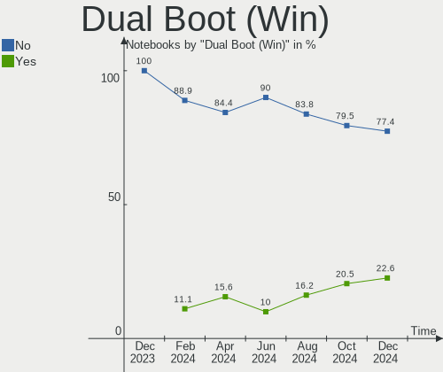
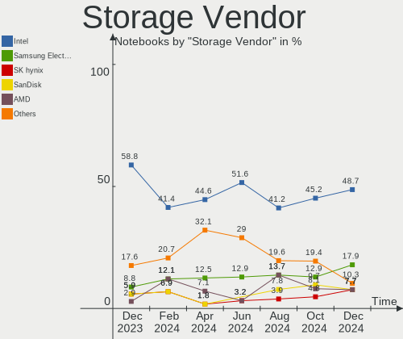
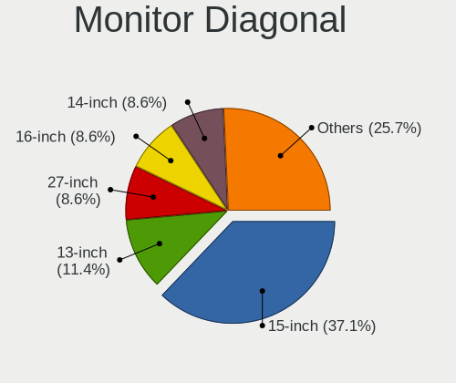
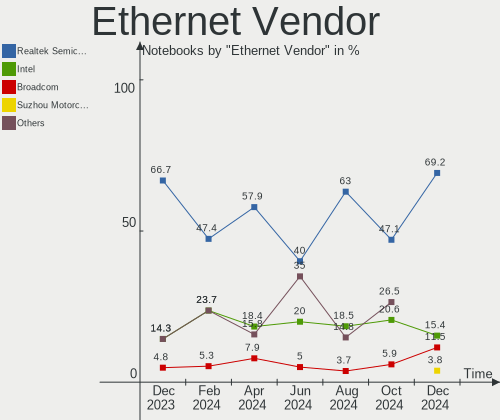

KDE neon - Hardware Trends (Notebooks)
--------------------------------------

A project to identify most popular hardware characteristics and track their change
over time based on data collected by Linux users at https://Linux-Hardware.org.

Anyone can contribute to this report by the [hw-probe](https://github.com/linuxhw/hw-probe) tool:

    sudo -E hw-probe -all -upload

This report is for one last month. Overall report since the beginning of time: [TestDays](https://github.com/linuxhw/TestDays)

Period: Oct, 2023.

Contents
--------

* [ System ](#system)
  - [ OS                       ](#os)
  - [ OS Family                ](#os-family)
  - [ Kernel                   ](#kernel)
  - [ Kernel Family            ](#kernel-family)
  - [ Kernel Major Ver.        ](#kernel-major-ver)
  - [ Arch                     ](#arch)
  - [ DE                       ](#de)
  - [ Display Server           ](#display-server)
  - [ Display Manager          ](#display-manager)
  - [ OS Lang                  ](#os-lang)
  - [ Boot Mode                ](#boot-mode)
  - [ Filesystem               ](#filesystem)
  - [ Part. scheme             ](#part-scheme)
  - [ Dual Boot with Linux/BSD ](#dual-boot-with-linuxbsd)
  - [ Dual Boot (Win)          ](#dual-boot-win)

* [ Board ](#board)
  - [ Vendor                   ](#vendor)
  - [ Model                    ](#model)
  - [ Model Family             ](#model-family)
  - [ MFG Year                 ](#mfg-year)
  - [ Form Factor              ](#form-factor)
  - [ Secure Boot              ](#secure-boot)
  - [ Coreboot                 ](#coreboot)
  - [ RAM Size                 ](#ram-size)
  - [ RAM Used                 ](#ram-used)
  - [ Total Drives             ](#total-drives)
  - [ Has CD-ROM               ](#has-cd-rom)
  - [ Has Ethernet             ](#has-ethernet)
  - [ Has WiFi                 ](#has-wifi)
  - [ Has Bluetooth            ](#has-bluetooth)

* [ Location ](#location)
  - [ Country                  ](#country)
  - [ City                     ](#city)

* [ Drives ](#drives)
  - [ Drive Vendor             ](#drive-vendor)
  - [ Drive Model              ](#drive-model)
  - [ HDD Vendor               ](#hdd-vendor)
  - [ SSD Vendor               ](#ssd-vendor)
  - [ Drive Kind               ](#drive-kind)
  - [ Drive Connector          ](#drive-connector)
  - [ Drive Size               ](#drive-size)
  - [ Space Total              ](#space-total)
  - [ Space Used               ](#space-used)
  - [ Malfunc. Drives          ](#malfunc-drives)
  - [ Malfunc. Drive Vendor    ](#malfunc-drive-vendor)
  - [ Malfunc. HDD Vendor      ](#malfunc-hdd-vendor)
  - [ Malfunc. Drive Kind      ](#malfunc-drive-kind)
  - [ Failed Drives            ](#failed-drives)
  - [ Failed Drive Vendor      ](#failed-drive-vendor)
  - [ Drive Status             ](#drive-status)

* [ Storage controller ](#storage-controller)
  - [ Storage Vendor           ](#storage-vendor)
  - [ Storage Model            ](#storage-model)
  - [ Storage Kind             ](#storage-kind)

* [ Processor ](#processor)
  - [ CPU Vendor               ](#cpu-vendor)
  - [ CPU Model                ](#cpu-model)
  - [ CPU Model Family         ](#cpu-model-family)
  - [ CPU Cores                ](#cpu-cores)
  - [ CPU Sockets              ](#cpu-sockets)
  - [ CPU Threads              ](#cpu-threads)
  - [ CPU Op-Modes             ](#cpu-op-modes)
  - [ CPU Microcode            ](#cpu-microcode)
  - [ CPU Microarch            ](#cpu-microarch)

* [ Graphics ](#graphics)
  - [ GPU Vendor               ](#gpu-vendor)
  - [ GPU Model                ](#gpu-model)
  - [ GPU Combo                ](#gpu-combo)
  - [ GPU Driver               ](#gpu-driver)
  - [ GPU Memory               ](#gpu-memory)

* [ Monitor ](#monitor)
  - [ Monitor Vendor           ](#monitor-vendor)
  - [ Monitor Model            ](#monitor-model)
  - [ Monitor Resolution       ](#monitor-resolution)
  - [ Monitor Diagonal         ](#monitor-diagonal)
  - [ Monitor Width            ](#monitor-width)
  - [ Aspect Ratio             ](#aspect-ratio)
  - [ Monitor Area             ](#monitor-area)
  - [ Pixel Density            ](#pixel-density)
  - [ Multiple Monitors        ](#multiple-monitors)

* [ Network ](#network)
  - [ Net Controller Vendor    ](#net-controller-vendor)
  - [ Net Controller Model     ](#net-controller-model)
  - [ Wireless Vendor          ](#wireless-vendor)
  - [ Wireless Model           ](#wireless-model)
  - [ Ethernet Vendor          ](#ethernet-vendor)
  - [ Ethernet Model           ](#ethernet-model)
  - [ Net Controller Kind      ](#net-controller-kind)
  - [ Used Controller          ](#used-controller)
  - [ NICs                     ](#nics)
  - [ IPv6                     ](#ipv6)

* [ Bluetooth ](#bluetooth)
  - [ Bluetooth Vendor         ](#bluetooth-vendor)
  - [ Bluetooth Model          ](#bluetooth-model)

* [ Sound ](#sound)
  - [ Sound Vendor             ](#sound-vendor)
  - [ Sound Model              ](#sound-model)

* [ Memory ](#memory)
  - [ Memory Vendor            ](#memory-vendor)
  - [ Memory Model             ](#memory-model)
  - [ Memory Kind              ](#memory-kind)
  - [ Memory Form Factor       ](#memory-form-factor)
  - [ Memory Size              ](#memory-size)
  - [ Memory Speed             ](#memory-speed)

* [ Printers & scanners ](#printers--scanners)
  - [ Printer Vendor           ](#printer-vendor)
  - [ Printer Model            ](#printer-model)
  - [ Scanner Vendor           ](#scanner-vendor)
  - [ Scanner Model            ](#scanner-model)

* [ Camera ](#camera)
  - [ Camera Vendor            ](#camera-vendor)
  - [ Camera Model             ](#camera-model)

* [ Security ](#security)
  - [ Fingerprint Vendor       ](#fingerprint-vendor)
  - [ Fingerprint Model        ](#fingerprint-model)
  - [ Chipcard Vendor          ](#chipcard-vendor)
  - [ Chipcard Model           ](#chipcard-model)

* [ Unsupported ](#unsupported)
  - [ Unsupported Devices      ](#unsupported-devices)
  - [ Unsupported Device Types ](#unsupported-device-types)

System
------

OS
--

Installed operating systems

| Name           | Notebooks | Percent |
|----------------|-----------|---------|
| KDE neon 22.04 | 36        | 97.3%   |
| KDE neon 20.04 | 1         | 2.7%    |

OS Family
---------

OS without a version

| Name     | Notebooks | Percent |
|----------|-----------|---------|
| KDE neon | 37        | 100%    |

Kernel
------

Version of the Linux kernel

| Version             | Notebooks | Percent |
|---------------------|-----------|---------|
| 6.2.0-34-generic    | 17        | 45.95%  |
| 6.2.0-33-generic    | 9         | 24.32%  |
| 6.2.0-35-generic    | 6         | 16.22%  |
| 6.2.0-32-generic    | 2         | 5.41%   |
| 6.5.4-x64v1-xanmod1 | 1         | 2.7%    |
| 6.2.0-36-generic    | 1         | 2.7%    |
| 5.11.0-44-generic   | 1         | 2.7%    |

Kernel Family
-------------

Linux kernel without a distro release

| Version | Notebooks | Percent |
|---------|-----------|---------|
| 6.2.0   | 35        | 94.59%  |
| 6.5.4   | 1         | 2.7%    |
| 5.11.0  | 1         | 2.7%    |

Kernel Major Ver.
-----------------

Linux kernel major version

| Version | Notebooks | Percent |
|---------|-----------|---------|
| 6.2     | 35        | 94.59%  |
| 6.5     | 1         | 2.7%    |
| 5.11    | 1         | 2.7%    |

Arch
----

OS architecture (x86_64, i586, etc.)

| Name   | Notebooks | Percent |
|--------|-----------|---------|
| x86_64 | 37        | 100%    |

DE
--

Desktop Environment

| Name    | Notebooks | Percent |
|---------|-----------|---------|
| KDE5    | 35        | 94.59%  |
| KDE     | 1         | 2.7%    |
| Unknown | 1         | 2.7%    |

Display Server
--------------

X11 or Wayland

| Name    | Notebooks | Percent |
|---------|-----------|---------|
| X11     | 33        | 89.19%  |
| Wayland | 4         | 10.81%  |

Display Manager
---------------

SDDM, LightDM, etc.

| Name    | Notebooks | Percent |
|---------|-----------|---------|
| Unknown | 25        | 67.57%  |
| SDDM    | 12        | 32.43%  |

OS Lang
-------

Language

| Lang    | Notebooks | Percent |
|---------|-----------|---------|
| en_US   | 15        | 40.54%  |
| ru_RU   | 4         | 10.81%  |
| en_GB   | 4         | 10.81%  |
| en_CA   | 3         | 8.11%   |
| fr_FR   | 2         | 5.41%   |
| de_DE   | 2         | 5.41%   |
| hu_HU   | 1         | 2.7%    |
| es_MX   | 1         | 2.7%    |
| en_ZA   | 1         | 2.7%    |
| en_IN   | 1         | 2.7%    |
| da_DK   | 1         | 2.7%    |
| C       | 1         | 2.7%    |
| Unknown | 1         | 2.7%    |

Boot Mode
---------

EFI or BIOS

| Mode | Notebooks | Percent |
|------|-----------|---------|
| BIOS | 32        | 86.49%  |
| EFI  | 5         | 13.51%  |

Filesystem
----------

Type of filesystem

| Type    | Notebooks | Percent |
|---------|-----------|---------|
| Ext4    | 29        | 78.38%  |
| Tmpfs   | 6         | 16.22%  |
| Overlay | 1         | 2.7%    |
| Btrfs   | 1         | 2.7%    |

Part. scheme
------------

Scheme of partitioning

| Type    | Notebooks | Percent |
|---------|-----------|---------|
| Unknown | 23        | 62.16%  |
| GPT     | 12        | 32.43%  |
| MBR     | 2         | 5.41%   |

Dual Boot with Linux/BSD
------------------------

Hosting more than one Linux/BSD

| Dual boot | Notebooks | Percent |
|-----------|-----------|---------|
| No        | 34        | 91.89%  |
| Yes       | 3         | 8.11%   |

Dual Boot (Win)
---------------

Hosting Linux and Windows

| Dual boot | Notebooks | Percent |
|-----------|-----------|---------|
| No        | 31        | 83.78%  |
| Yes       | 6         | 16.22%  |

Board
-----

Vendor
------

Motherboard manufacturer

| Name             | Notebooks | Percent |
|------------------|-----------|---------|
| Lenovo           | 10        | 27.03%  |
| Dell             | 10        | 27.03%  |
| Hewlett-Packard  | 7         | 18.92%  |
| ASUSTek Computer | 3         | 8.11%   |
| Acer             | 3         | 8.11%   |
| Sony             | 1         | 2.7%    |
| Notebook         | 1         | 2.7%    |
| Fujitsu          | 1         | 2.7%    |
| Framework        | 1         | 2.7%    |

Model
-----

Motherboard model

| Name                                       | Notebooks | Percent |
|--------------------------------------------|-----------|---------|
| Dell XPS 15 9530                           | 2         | 5.41%   |
| Sony VPCEB16FG                             | 1         | 2.7%    |
| Notebook N150CU                            | 1         | 2.7%    |
| Lenovo ThinkPad X1 Carbon 2nd 20A8S38300   | 1         | 2.7%    |
| Lenovo ThinkPad T510 43142MU               | 1         | 2.7%    |
| Lenovo ThinkPad T460s 20FAS1ND00           | 1         | 2.7%    |
| Lenovo ThinkPad P50 20EQS3BT2E             | 1         | 2.7%    |
| Lenovo ThinkPad P50 20EQS2U20N             | 1         | 2.7%    |
| Lenovo ThinkPad E14 Gen 3 20Y70044RT       | 1         | 2.7%    |
| Lenovo IdeaPad 5 Pro 16ACH6 82L5           | 1         | 2.7%    |
| Lenovo IdeaPad 5 14ALC05 82LM              | 1         | 2.7%    |
| Lenovo IdeaPad 3 15ARE05 81W4              | 1         | 2.7%    |
| Lenovo G780                                | 1         | 2.7%    |
| HP ProBook 6470b                           | 1         | 2.7%    |
| HP ProBook 445 G7                          | 1         | 2.7%    |
| HP Pavilion 15                             | 1         | 2.7%    |
| HP OMEN Laptop 15-en0xxx                   | 1         | 2.7%    |
| HP Notebook                                | 1         | 2.7%    |
| HP EliteBook 2570p                         | 1         | 2.7%    |
| HP 240 G8 Notebook PC                      | 1         | 2.7%    |
| Fujitsu LIFEBOOK AH531                     | 1         | 2.7%    |
| Framework Laptop 13 (AMD Ryzen 7040Series) | 1         | 2.7%    |
| Dell XPS 15 9500                           | 1         | 2.7%    |
| Dell XPS 13 9370                           | 1         | 2.7%    |
| Dell Precision 7510                        | 1         | 2.7%    |
| Dell Latitude 5590                         | 1         | 2.7%    |
| Dell Latitude 5530                         | 1         | 2.7%    |
| Dell Inspiron 5583                         | 1         | 2.7%    |
| Dell Inspiron 3542                         | 1         | 2.7%    |
| Dell Inspiron 3505                         | 1         | 2.7%    |
| ASUS ZenBook UX425EA_UX425EA               | 1         | 2.7%    |
| ASUS K73SV                                 | 1         | 2.7%    |
| ASUS G551JW                                | 1         | 2.7%    |
| Acer Nitro AN515-55                        | 1         | 2.7%    |
| Acer Aspire A515-43                        | 1         | 2.7%    |
| Acer Aspire 5742G                          | 1         | 2.7%    |

Model Family
------------

Motherboard model prefix

| Name             | Notebooks | Percent |
|------------------|-----------|---------|
| Lenovo ThinkPad  | 6         | 16.22%  |
| Dell XPS         | 4         | 10.81%  |
| Lenovo IdeaPad   | 3         | 8.11%   |
| Dell Inspiron    | 3         | 8.11%   |
| HP ProBook       | 2         | 5.41%   |
| Dell Latitude    | 2         | 5.41%   |
| Acer Aspire      | 2         | 5.41%   |
| Sony VPCEB16FG   | 1         | 2.7%    |
| Notebook N150CU  | 1         | 2.7%    |
| Lenovo G780      | 1         | 2.7%    |
| HP Pavilion      | 1         | 2.7%    |
| HP OMEN          | 1         | 2.7%    |
| HP Notebook      | 1         | 2.7%    |
| HP EliteBook     | 1         | 2.7%    |
| HP 240           | 1         | 2.7%    |
| Fujitsu LIFEBOOK | 1         | 2.7%    |
| Framework Laptop | 1         | 2.7%    |
| Dell Precision   | 1         | 2.7%    |
| ASUS ZenBook     | 1         | 2.7%    |
| ASUS K73SV       | 1         | 2.7%    |
| ASUS G551JW      | 1         | 2.7%    |
| Acer Nitro       | 1         | 2.7%    |

MFG Year
--------

Motherboard manufacture year

| Year | Notebooks | Percent |
|------|-----------|---------|
| 2020 | 7         | 18.92%  |
| 2021 | 4         | 10.81%  |
| 2015 | 4         | 10.81%  |
| 2014 | 4         | 10.81%  |
| 2019 | 3         | 8.11%   |
| 2012 | 3         | 8.11%   |
| 2018 | 2         | 5.41%   |
| 2011 | 2         | 5.41%   |
| 2010 | 2         | 5.41%   |
| 2023 | 1         | 2.7%    |
| 2022 | 1         | 2.7%    |
| 2017 | 1         | 2.7%    |
| 2016 | 1         | 2.7%    |
| 2013 | 1         | 2.7%    |
| 2009 | 1         | 2.7%    |

Form Factor
-----------

Physical design of the computer

| Name     | Notebooks | Percent |
|----------|-----------|---------|
| Notebook | 37        | 100%    |

Secure Boot
-----------

Enabled or disabled

| State    | Notebooks | Percent |
|----------|-----------|---------|
| Disabled | 36        | 97.3%   |
| Enabled  | 1         | 2.7%    |

Coreboot
--------

Have coreboot on board

| Used | Notebooks | Percent |
|------|-----------|---------|
| No   | 37        | 100%    |

RAM Size
--------

Total RAM memory

| Size in GB  | Notebooks | Percent |
|-------------|-----------|---------|
| 4.01-8.0    | 12        | 32.43%  |
| 8.01-16.0   | 9         | 24.32%  |
| 16.01-24.0  | 8         | 21.62%  |
| 32.01-64.0  | 4         | 10.81%  |
| 3.01-4.0    | 2         | 5.41%   |
| 24.01-32.0  | 1         | 2.7%    |
| 64.01-256.0 | 1         | 2.7%    |

RAM Used
--------

Used RAM memory

| Used GB   | Notebooks | Percent |
|-----------|-----------|---------|
| 3.01-4.0  | 11        | 29.73%  |
| 2.01-3.0  | 9         | 24.32%  |
| 1.01-2.0  | 8         | 21.62%  |
| 4.01-8.0  | 5         | 13.51%  |
| 8.01-16.0 | 4         | 10.81%  |

Total Drives
------------

Number of drives on board

| Drives | Notebooks | Percent |
|--------|-----------|---------|
| 1      | 25        | 67.57%  |
| 2      | 11        | 29.73%  |
| 3      | 1         | 2.7%    |

Has CD-ROM
----------

Has CD-ROM on board

| Presented | Notebooks | Percent |
|-----------|-----------|---------|
| No        | 26        | 70.27%  |
| Yes       | 11        | 29.73%  |

Has Ethernet
------------

Has Ethernet on board

| Presented | Notebooks | Percent |
|-----------|-----------|---------|
| Yes       | 29        | 78.38%  |
| No        | 8         | 21.62%  |

Has WiFi
--------

Has WiFi module

| Presented | Notebooks | Percent |
|-----------|-----------|---------|
| Yes       | 37        | 100%    |

Has Bluetooth
-------------

Has Bluetooth module

| Presented | Notebooks | Percent |
|-----------|-----------|---------|
| Yes       | 31        | 83.78%  |
| No        | 6         | 16.22%  |

Location
--------

Country
-------

Geographic location (country)

| Country      | Notebooks | Percent |
|--------------|-----------|---------|
| USA          | 7         | 18.92%  |
| Russia       | 5         | 13.51%  |
| UK           | 3         | 8.11%   |
| Canada       | 3         | 8.11%   |
| Netherlands  | 2         | 5.41%   |
| Mexico       | 2         | 5.41%   |
| Germany      | 2         | 5.41%   |
| Vietnam      | 1         | 2.7%    |
| Ukraine      | 1         | 2.7%    |
| South Africa | 1         | 2.7%    |
| Serbia       | 1         | 2.7%    |
| Pakistan     | 1         | 2.7%    |
| Kazakhstan   | 1         | 2.7%    |
| India        | 1         | 2.7%    |
| Hungary      | 1         | 2.7%    |
| Greenland    | 1         | 2.7%    |
| France       | 1         | 2.7%    |
| Colombia     | 1         | 2.7%    |
| Bulgaria     | 1         | 2.7%    |
| Algeria      | 1         | 2.7%    |

City
----

Geographic location (city)

| City         | Notebooks | Percent |
|--------------|-----------|---------|
| Moscow       | 2         | 5.41%   |
| Berlin       | 2         | 5.41%   |
| Tlemcen      | 1         | 2.7%    |
| Tampico      | 1         | 2.7%    |
| Sogamoso     | 1         | 2.7%    |
| Sofia        | 1         | 2.7%    |
| Saratov      | 1         | 2.7%    |
| Richmond     | 1         | 2.7%    |
| Novosibirsk  | 1         | 2.7%    |
| Newport      | 1         | 2.7%    |
| New Ulm      | 1         | 2.7%    |
| Moncton      | 1         | 2.7%    |
| Marlborough  | 1         | 2.7%    |
| Markham      | 1         | 2.7%    |
| Mariupol     | 1         | 2.7%    |
| Livonia      | 1         | 2.7%    |
| Lephalale    | 1         | 2.7%    |
| Lansing      | 1         | 2.7%    |
| Kiselëvsk   | 1         | 2.7%    |
| Karaganda    | 1         | 2.7%    |
| Karachi      | 1         | 2.7%    |
| Kamloops     | 1         | 2.7%    |
| Hanoi        | 1         | 2.7%    |
| Guadalajara  | 1         | 2.7%    |
| Exeter       | 1         | 2.7%    |
| Epiniac      | 1         | 2.7%    |
| Eindhoven    | 1         | 2.7%    |
| Croydon      | 1         | 2.7%    |
| Chandigarh   | 1         | 2.7%    |
| Budapest     | 1         | 2.7%    |
| Belgrade     | 1         | 2.7%    |
| Baarn        | 1         | 2.7%    |
| Ashburn      | 1         | 2.7%    |
| Apollo Beach | 1         | 2.7%    |
| Aasiaat      | 1         | 2.7%    |

Drives
------

Drive Vendor
------------

Hard drive vendors

| Vendor              | Notebooks | Drives | Percent |
|---------------------|-----------|--------|---------|
| SanDisk             | 11        | 11     | 22.92%  |
| Samsung Electronics | 9         | 11     | 18.75%  |
| Kingston            | 4         | 4      | 8.33%   |
| Toshiba             | 3         | 3      | 6.25%   |
| SK hynix            | 3         | 3      | 6.25%   |
| Intel               | 3         | 3      | 6.25%   |
| WDC                 | 2         | 2      | 4.17%   |
| Seagate             | 2         | 3      | 4.17%   |
| A-DATA Technology   | 2         | 2      | 4.17%   |
| Transcend           | 1         | 1      | 2.08%   |
| TO Exter            | 1         | 1      | 2.08%   |
| Patriot             | 1         | 1      | 2.08%   |
| LITEONIT            | 1         | 1      | 2.08%   |
| LITEON              | 1         | 1      | 2.08%   |
| Hitachi             | 1         | 1      | 2.08%   |
| HGST                | 1         | 1      | 2.08%   |
| Emtec               | 1         | 1      | 2.08%   |
| Crucial             | 1         | 1      | 2.08%   |

Drive Model
-----------

Hard drive models

| Model                                             | Notebooks | Percent |
|---------------------------------------------------|-----------|---------|
| Sandisk WD Blue SN550 NVMe SSD 1TB                | 3         | 5.88%   |
| Samsung SSD 970 EVO 500GB                         | 2         | 3.92%   |
| Intel SSD 660P Series 1024GB                      | 2         | 3.92%   |
| WDC WD3200BPVT-22JJ5T0 320GB                      | 1         | 1.96%   |
| WDC WD20SPZX-22UA7T0 2TB                          | 1         | 1.96%   |
| Transcend TS120GMTS420S 120GB SSD                 | 1         | 1.96%   |
| Toshiba MK8037GSX 80GB                            | 1         | 1.96%   |
| Toshiba MK5076GSX 500GB                           | 1         | 1.96%   |
| Toshiba HDWJ110 1TB                               | 1         | 1.96%   |
| TO Exter nal USB 3.0 2TB                          | 1         | 1.96%   |
| SK hynix PC601 HFS512GD9TNG-L2A0A 512GB           | 1         | 1.96%   |
| SK hynix PC401 NVMe 256GB                         | 1         | 1.96%   |
| SK hynix BC501 NVMe Solid State Drive 512GB       | 1         | 1.96%   |
| Seagate ST95005620AS 500GB                        | 1         | 1.96%   |
| Seagate ST9500420AS 500GB                         | 1         | 1.96%   |
| Seagate Portable 4TB                              | 1         | 1.96%   |
| Sandisk WD_BLACK SN850X 2000GB                    | 1         | 1.96%   |
| Sandisk WD_BLACK SN850X 1000GB                    | 1         | 1.96%   |
| Sandisk WDC WDS100T2B0C-00PXH0 1TB                | 1         | 1.96%   |
| Sandisk WDC PC SN530 SDBPMPZ-512G-1101 512GB      | 1         | 1.96%   |
| Sandisk WD Black SN750 / PC SN730 NVMe SSD 1024GB | 1         | 1.96%   |
| SanDisk SSD PLUS 120GB                            | 1         | 1.96%   |
| SanDisk SDSSDA240G 240GB                          | 1         | 1.96%   |
| Sandisk PC SN530 NVMe WDC 256GB                   | 1         | 1.96%   |
| Samsung SSD 970 EVO Plus 1TB S6S1NS0W222269X      | 1         | 1.96%   |
| Samsung SSD 970 EVO Plus 1TB                      | 1         | 1.96%   |
| Samsung SSD 860 EVO 500GB                         | 1         | 1.96%   |
| Samsung SSD 860 EVO 1TB                           | 1         | 1.96%   |
| Samsung SSD 850 EVO 120GB                         | 1         | 1.96%   |
| Samsung PM9A1 NVMe 512GB                          | 1         | 1.96%   |
| Samsung MZVLQ256HBJD-00BH1 256GB                  | 1         | 1.96%   |
| Samsung MZALQ256HBJD-00BL1 256GB                  | 1         | 1.96%   |
| Samsung MZALQ128HBHQ-000L2 128GB                  | 1         | 1.96%   |
| Patriot P210 1024GB SSD                           | 1         | 1.96%   |
| LITEONIT LMT-512L9M-11 MSATA 512GB SSD            | 1         | 1.96%   |
| LITEON CV8-8E128-HP 128GB SSD                     | 1         | 1.96%   |
| Kingston SFYRS1000G 1TB                           | 1         | 1.96%   |
| Kingston SA400S37480G 480GB SSD                   | 1         | 1.96%   |
| Kingston SA400S37240G 240GB SSD                   | 1         | 1.96%   |
| Kingston SA400S37120G 120GB SSD                   | 1         | 1.96%   |

HDD Vendor
----------

Hard disk drive vendors

| Vendor  | Notebooks | Drives | Percent |
|---------|-----------|--------|---------|
| Toshiba | 3         | 3      | 33.33%  |
| WDC     | 2         | 2      | 22.22%  |
| Seagate | 2         | 2      | 22.22%  |
| Hitachi | 1         | 1      | 11.11%  |
| HGST    | 1         | 1      | 11.11%  |

SSD Vendor
----------

Solid state drive vendors

| Vendor              | Notebooks | Drives | Percent |
|---------------------|-----------|--------|---------|
| Samsung Electronics | 3         | 3      | 16.67%  |
| Kingston            | 3         | 3      | 16.67%  |
| SanDisk             | 2         | 2      | 11.11%  |
| A-DATA Technology   | 2         | 2      | 11.11%  |
| Transcend           | 1         | 1      | 5.56%   |
| TO Exter            | 1         | 1      | 5.56%   |
| Patriot             | 1         | 1      | 5.56%   |
| LITEONIT            | 1         | 1      | 5.56%   |
| LITEON              | 1         | 1      | 5.56%   |
| Intel               | 1         | 1      | 5.56%   |
| Emtec               | 1         | 1      | 5.56%   |
| Crucial             | 1         | 1      | 5.56%   |

Drive Kind
----------

HDD or SSD

| Kind    | Notebooks | Drives | Percent |
|---------|-----------|--------|---------|
| NVMe    | 21        | 23     | 43.75%  |
| SSD     | 17        | 18     | 35.42%  |
| HDD     | 9         | 9      | 18.75%  |
| Unknown | 1         | 1      | 2.08%   |

Drive Connector
---------------

SATA, SAS, NVMe, etc.

| Type | Notebooks | Drives | Percent |
|------|-----------|--------|---------|
| SATA | 24        | 26     | 51.06%  |
| NVMe | 21        | 23     | 44.68%  |
| SAS  | 2         | 2      | 4.26%   |

Drive Size
----------

Size of hard drive

| Size in TB | Notebooks | Drives | Percent |
|------------|-----------|--------|---------|
| 0.01-0.5   | 17        | 19     | 68%     |
| 0.51-1.0   | 5         | 5      | 20%     |
| 1.01-2.0   | 3         | 3      | 12%     |

Space Total
-----------

Amount of disk space available on the file system

| Size in GB | Notebooks | Percent |
|------------|-----------|---------|
| 251-500    | 15        | 40.54%  |
| 101-250    | 9         | 24.32%  |
| 501-1000   | 5         | 13.51%  |
| 21-50      | 3         | 8.11%   |
| 1001-2000  | 3         | 8.11%   |
| 1-20       | 1         | 2.7%    |
| Unknown    | 1         | 2.7%    |

Space Used
----------

Amount of used disk space

| Used GB  | Notebooks | Percent |
|----------|-----------|---------|
| 1-20     | 17        | 45.95%  |
| 101-250  | 8         | 21.62%  |
| 21-50    | 6         | 16.22%  |
| 251-500  | 4         | 10.81%  |
| 501-1000 | 1         | 2.7%    |
| Unknown  | 1         | 2.7%    |

Malfunc. Drives
---------------

Drive models with a malfunction

| Model                     | Notebooks | Drives | Percent |
|---------------------------|-----------|--------|---------|
| SK hynix PC401 NVMe 256GB | 1         | 1      | 100%    |

Malfunc. Drive Vendor
---------------------

Vendors of faulty drives

| Vendor   | Notebooks | Drives | Percent |
|----------|-----------|--------|---------|
| SK hynix | 1         | 1      | 100%    |

Malfunc. HDD Vendor
-------------------

Vendors of faulty HDD drives

Zero info for selected period =(

Malfunc. Drive Kind
-------------------

Kinds of faulty drives

| Kind | Notebooks | Drives | Percent |
|------|-----------|--------|---------|
| NVMe | 1         | 1      | 100%    |

Failed Drives
-------------

Failed drive models

Zero info for selected period =(

Failed Drive Vendor
-------------------

Failed drive vendors

Zero info for selected period =(

Drive Status
------------

Number of failed and malfunc. drives

| Status   | Notebooks | Drives | Percent |
|----------|-----------|--------|---------|
| Detected | 30        | 39     | 78.95%  |
| Works    | 7         | 11     | 18.42%  |
| Malfunc  | 1         | 1      | 2.63%   |

Storage controller
------------------

Storage Vendor
--------------

Storage controller vendors

| Vendor                      | Notebooks | Percent |
|-----------------------------|-----------|---------|
| Intel                       | 25        | 48.08%  |
| SanDisk                     | 9         | 17.31%  |
| Samsung Electronics         | 7         | 13.46%  |
| AMD                         | 7         | 13.46%  |
| SK hynix                    | 3         | 5.77%   |
| Kingston Technology Company | 1         | 1.92%   |

Storage Model
-------------

Storage controller models

| Model                                                                          | Notebooks | Percent |
|--------------------------------------------------------------------------------|-----------|---------|
| AMD FCH SATA Controller [AHCI mode]                                            | 7         | 12.73%  |
| SanDisk Ultra 3D / WD Blue SN550 NVMe SSD                                      | 3         | 5.45%   |
| Samsung NVMe SSD Controller SM981/PM981/PM983                                  | 3         | 5.45%   |
| Samsung NVMe SSD Controller 980 (DRAM-less)                                    | 3         | 5.45%   |
| Intel Volume Management Device NVMe RAID Controller                            | 3         | 5.45%   |
| Intel Sunrise Point-LP SATA Controller [AHCI mode]                             | 3         | 5.45%   |
| Intel Q170/Q150/B150/H170/H110/Z170/CM236 Chipset SATA Controller [AHCI Mode]  | 3         | 5.45%   |
| Intel 8 Series SATA Controller 1 [AHCI mode]                                   | 3         | 5.45%   |
| Intel 7 Series Chipset Family 6-port SATA Controller [AHCI mode]               | 3         | 5.45%   |
| Sandisk WD Black SN850X NVMe SSD                                               | 2         | 3.64%   |
| Intel 8 Series/C220 Series Chipset Family 6-port SATA Controller 1 [AHCI mode] | 2         | 3.64%   |
| Intel 6 Series/C200 Series Chipset Family 6 port Mobile SATA AHCI Controller   | 2         | 3.64%   |
| Intel 5 Series/3400 Series Chipset 4 port SATA AHCI Controller                 | 2         | 3.64%   |
| SK hynix PC601 NVMe Solid State Drive                                          | 1         | 1.82%   |
| SK hynix PC401 NVMe Solid State Drive 256GB                                    | 1         | 1.82%   |
| SK hynix BC501 NVMe Solid State Drive                                          | 1         | 1.82%   |
| SanDisk WD Green SN350 240GB (DRAM-less) / SN560E NVMe SSD                     | 1         | 1.82%   |
| SanDisk PC SN530 NVMe SSD (DRAM-less)                                          | 1         | 1.82%   |
| SanDisk IX SN530 NVMe SSD (DRAM-less)                                          | 1         | 1.82%   |
| SanDisk Extreme Pro / WD Black SN750 / PC SN730 / Red SN700 NVMe SSD           | 1         | 1.82%   |
| Samsung NVMe SSD Controller PM9A1/PM9A3/980PRO                                 | 1         | 1.82%   |
| Kingston Company KC3000/FURY Renegade NVMe SSD E18                             | 1         | 1.82%   |
| Intel Tiger Lake-LP SATA Controller                                            | 1         | 1.82%   |
| Intel SSD 660P Series                                                          | 1         | 1.82%   |
| Intel Comet Lake SATA AHCI Controller                                          | 1         | 1.82%   |
| Intel Cannon Point-LP SATA Controller [AHCI Mode]                              | 1         | 1.82%   |
| Intel 5 Series/3400 Series Chipset 4 port SATA IDE Controller                  | 1         | 1.82%   |
| Intel 5 Series/3400 Series Chipset 2 port SATA IDE Controller                  | 1         | 1.82%   |
| Intel 400 Series Chipset Family SATA AHCI Controller                           | 1         | 1.82%   |

Storage Kind
------------

Kind of storage controller (IDE, SATA, NVMe, SAS, ...)

| Kind | Notebooks | Percent |
|------|-----------|---------|
| SATA | 29        | 54.72%  |
| NVMe | 20        | 37.74%  |
| RAID | 3         | 5.66%   |
| IDE  | 1         | 1.89%   |

Processor
---------

CPU Vendor
----------

Processor vendors

| Vendor | Notebooks | Percent |
|--------|-----------|---------|
| Intel  | 28        | 75.68%  |
| AMD    | 9         | 24.32%  |

CPU Model
---------

Processor models

| Model                                         | Notebooks | Percent |
|-----------------------------------------------|-----------|---------|
| Intel Core i7-6820HQ CPU @ 2.70GHz            | 3         | 8.11%   |
| Intel Core i7-8650U CPU @ 1.90GHz             | 1         | 2.7%    |
| Intel Core i7-8565U CPU @ 1.80GHz             | 1         | 2.7%    |
| Intel Core i7-7500U CPU @ 2.70GHz             | 1         | 2.7%    |
| Intel Core i7-4720HQ CPU @ 2.60GHz            | 1         | 2.7%    |
| Intel Core i7-4712HQ CPU @ 2.30GHz            | 1         | 2.7%    |
| Intel Core i7-3612QM CPU @ 2.10GHz            | 1         | 2.7%    |
| Intel Core i7-2630QM CPU @ 2.00GHz            | 1         | 2.7%    |
| Intel Core i7-10875H CPU @ 2.30GHz            | 1         | 2.7%    |
| Intel Core i7-10510U CPU @ 1.80GHz            | 1         | 2.7%    |
| Intel Core i7 CPU M 620 @ 2.67GHz             | 1         | 2.7%    |
| Intel Core i5-8350U CPU @ 1.70GHz             | 1         | 2.7%    |
| Intel Core i5-6300U CPU @ 2.40GHz             | 1         | 2.7%    |
| Intel Core i5-4300U CPU @ 1.90GHz             | 1         | 2.7%    |
| Intel Core i5-4210U CPU @ 1.70GHz             | 1         | 2.7%    |
| Intel Core i5-4200U CPU @ 1.60GHz             | 1         | 2.7%    |
| Intel Core i5-3340M CPU @ 2.70GHz             | 1         | 2.7%    |
| Intel Core i5-3320M CPU @ 2.60GHz             | 1         | 2.7%    |
| Intel Core i5-2410M CPU @ 2.30GHz             | 1         | 2.7%    |
| Intel Core i5-10300H CPU @ 2.50GHz            | 1         | 2.7%    |
| Intel Core i5 CPU M 520 @ 2.40GHz             | 1         | 2.7%    |
| Intel Core i3 CPU M 330 @ 2.13GHz             | 1         | 2.7%    |
| Intel 13th Gen Core i7-13700H                 | 1         | 2.7%    |
| Intel 12th Gen Core i5-1245U                  | 1         | 2.7%    |
| Intel 11th Gen Core i5-1135G7 @ 2.40GHz       | 1         | 2.7%    |
| Intel 11th Gen Core i3-1115G4 @ 3.00GHz       | 1         | 2.7%    |
| AMD Ryzen 7 7840U w/ Radeon 780M Graphics     | 1         | 2.7%    |
| AMD Ryzen 7 5800H with Radeon Graphics        | 1         | 2.7%    |
| AMD Ryzen 7 4800H with Radeon Graphics        | 1         | 2.7%    |
| AMD Ryzen 5 5500U with Radeon Graphics        | 1         | 2.7%    |
| AMD Ryzen 5 4500U with Radeon Graphics        | 1         | 2.7%    |
| AMD Ryzen 5 3500U with Radeon Vega Mobile Gfx | 1         | 2.7%    |
| AMD Ryzen 5 3450U with Radeon Vega Mobile Gfx | 1         | 2.7%    |
| AMD Ryzen 3 5300U with Radeon Graphics        | 1         | 2.7%    |
| AMD Ryzen 3 4300U with Radeon Graphics        | 1         | 2.7%    |

CPU Model Family
----------------

Processor model prefix

| Model         | Notebooks | Percent |
|---------------|-----------|---------|
| Intel Core i7 | 13        | 35.14%  |
| Intel Core i5 | 10        | 27.03%  |
| Other         | 4         | 10.81%  |
| AMD Ryzen 5   | 4         | 10.81%  |
| AMD Ryzen 7   | 3         | 8.11%   |
| AMD Ryzen 3   | 2         | 5.41%   |
| Intel Core i3 | 1         | 2.7%    |

CPU Cores
---------

Number of processor cores

| Number | Notebooks | Percent |
|--------|-----------|---------|
| 4      | 17        | 45.95%  |
| 2      | 12        | 32.43%  |
| 8      | 3         | 8.11%   |
| 6      | 2         | 5.41%   |
| 14     | 1         | 2.7%    |
| 10     | 1         | 2.7%    |
| 5      | 1         | 2.7%    |

CPU Sockets
-----------

Number of sockets

| Number | Notebooks | Percent |
|--------|-----------|---------|
| 1      | 37        | 100%    |

CPU Threads
-----------

Threads per core (Hyper-Threading)

| Number | Notebooks | Percent |
|--------|-----------|---------|
| 2      | 35        | 94.59%  |
| 1      | 2         | 5.41%   |

CPU Op-Modes
------------

CPU Operation Modes (32-bit, 64-bit)

| Op mode        | Notebooks | Percent |
|----------------|-----------|---------|
| 32-bit, 64-bit | 37        | 100%    |

CPU Microcode
-------------

Microcode number

| Number     | Notebooks | Percent |
|------------|-----------|---------|
| Unknown    | 35        | 94.59%  |
| 0x08600109 | 1         | 2.7%    |
| 0x08600106 | 1         | 2.7%    |

CPU Microarch
-------------

Microarchitecture

| Name             | Notebooks | Percent |
|------------------|-----------|---------|
| KabyLake         | 5         | 13.51%  |
| Haswell          | 5         | 13.51%  |
| Skylake          | 4         | 10.81%  |
| Unknown          | 4         | 10.81%  |
| Zen 2            | 3         | 8.11%   |
| Westmere         | 3         | 8.11%   |
| IvyBridge        | 3         | 8.11%   |
| Zen+             | 2         | 5.41%   |
| TigerLake        | 2         | 5.41%   |
| SandyBridge      | 2         | 5.41%   |
| CometLake        | 2         | 5.41%   |
| Zen 3            | 1         | 2.7%    |
| Alderlake Hybrid | 1         | 2.7%    |

Graphics
--------

GPU Vendor
----------

Vendors of graphics cards

| Vendor | Notebooks | Percent |
|--------|-----------|---------|
| Intel  | 24        | 48%     |
| Nvidia | 13        | 26%     |
| AMD    | 13        | 26%     |

GPU Model
---------

Graphics card models

| Model                                                                                 | Notebooks | Percent |
|---------------------------------------------------------------------------------------|-----------|---------|
| Intel Haswell-ULT Integrated Graphics Controller                                      | 3         | 5.88%   |
| AMD Renoir [Radeon RX Vega 6 (Ryzen 4000/5000 Mobile Series)]                         | 3         | 5.88%   |
| Nvidia TU117M [GeForce GTX 1650 Mobile / Max-Q]                                       | 2         | 3.92%   |
| Nvidia GM107GLM [Quadro M2000M]                                                       | 2         | 3.92%   |
| Intel UHD Graphics 620                                                                | 2         | 3.92%   |
| Intel HD Graphics 530                                                                 | 2         | 3.92%   |
| Intel CometLake-H GT2 [UHD Graphics]                                                  | 2         | 3.92%   |
| Intel 4th Gen Core Processor Integrated Graphics Controller                           | 2         | 3.92%   |
| Intel 3rd Gen Core processor Graphics Controller                                      | 2         | 3.92%   |
| Intel 2nd Generation Core Processor Family Integrated Graphics Controller             | 2         | 3.92%   |
| AMD Picasso/Raven 2 [Radeon Vega Series / Radeon Vega Mobile Series]                  | 2         | 3.92%   |
| AMD Lucienne                                                                          | 2         | 3.92%   |
| Nvidia TU117M [GeForce GTX 1650 Ti Mobile]                                            | 1         | 1.96%   |
| Nvidia TU116M [GeForce GTX 1660 Ti Mobile]                                            | 1         | 1.96%   |
| Nvidia GT218M [NVS 3100M]                                                             | 1         | 1.96%   |
| Nvidia GM107M [GeForce GTX 960M]                                                      | 1         | 1.96%   |
| Nvidia GM107GLM [Quadro M1000M]                                                       | 1         | 1.96%   |
| Nvidia GK107M [GeForce GT 750M]                                                       | 1         | 1.96%   |
| Nvidia GF108M [GeForce GT 620M/630M/635M/640M LE]                                     | 1         | 1.96%   |
| Nvidia GF108M [GeForce GT 540M]                                                       | 1         | 1.96%   |
| Nvidia GF108M [GeForce 610M]                                                          | 1         | 1.96%   |
| Intel WhiskeyLake-U GT2 [UHD Graphics 620]                                            | 1         | 1.96%   |
| Intel TigerLake-LP GT2 [Iris Xe Graphics]                                             | 1         | 1.96%   |
| Intel Tiger Lake-LP GT2 [UHD Graphics G4]                                             | 1         | 1.96%   |
| Intel Skylake GT2 [HD Graphics 520]                                                   | 1         | 1.96%   |
| Intel Raptor Lake-P [Iris Xe Graphics]                                                | 1         | 1.96%   |
| Intel HD Graphics 620                                                                 | 1         | 1.96%   |
| Intel DG2 [Arc A370M]                                                                 | 1         | 1.96%   |
| Intel Core Processor Integrated Graphics Controller                                   | 1         | 1.96%   |
| Intel CometLake-U GT2 [UHD Graphics]                                                  | 1         | 1.96%   |
| Intel Alder Lake-UP3 GT2 [Iris Xe Graphics]                                           | 1         | 1.96%   |
| AMD Topaz XT [Radeon R7 M260/M265 / M340/M360 / M440/M445 / 530/535 / 620/625 Mobile] | 1         | 1.96%   |
| AMD Thames [Radeon HD 7550M/7570M/7650M]                                              | 1         | 1.96%   |
| AMD Sun XT [Radeon HD 8670A/8670M/8690M / R5 M330 / M430 / Radeon 520 Mobile]         | 1         | 1.96%   |
| AMD Phoenix1                                                                          | 1         | 1.96%   |
| AMD Madison [Mobility Radeon HD 5650/5750 / 6530M/6550M]                              | 1         | 1.96%   |
| AMD Cezanne [Radeon Vega Series / Radeon Vega Mobile Series]                          | 1         | 1.96%   |

GPU Combo
---------

Combinations of graphics cards

| Name           | Notebooks | Percent |
|----------------|-----------|---------|
| 1 x Intel      | 13        | 35.14%  |
| Intel + Nvidia | 9         | 24.32%  |
| 1 x AMD        | 9         | 24.32%  |
| 1 x Nvidia     | 2         | 5.41%   |
| Intel + AMD    | 2         | 5.41%   |
| AMD + Nvidia   | 2         | 5.41%   |

GPU Driver
----------

Free vs proprietary

| Driver      | Notebooks | Percent |
|-------------|-----------|---------|
| Free        | 32        | 86.49%  |
| Proprietary | 4         | 10.81%  |
| Unknown     | 1         | 2.7%    |

GPU Memory
----------

Total video memory

| Size in GB | Notebooks | Percent |
|------------|-----------|---------|
| Unknown    | 31        | 83.78%  |
| 0.01-0.5   | 3         | 8.11%   |
| 1.01-2.0   | 2         | 5.41%   |
| 3.01-4.0   | 1         | 2.7%    |

Monitor
-------

Monitor Vendor
--------------

Monitor vendors

| Vendor                  | Notebooks | Percent |
|-------------------------|-----------|---------|
| Samsung Electronics     | 8         | 16%     |
| AU Optronics            | 8         | 16%     |
| LG Display              | 7         | 14%     |
| BOE                     | 5         | 10%     |
| Sharp                   | 3         | 6%      |
| Chimei Innolux          | 3         | 6%      |
| PANDA                   | 2         | 4%      |
| Ancor Communications    | 2         | 4%      |
| Vizio                   | 1         | 2%      |
| Sony                    | 1         | 2%      |
| Lenovo                  | 1         | 2%      |
| IBM                     | 1         | 2%      |
| HKC                     | 1         | 2%      |
| Hewlett-Packard         | 1         | 2%      |
| Goldstar                | 1         | 2%      |
| Dell                    | 1         | 2%      |
| CSO                     | 1         | 2%      |
| Chi Mei Optoelectronics | 1         | 2%      |
| CHD                     | 1         | 2%      |
| ASUSTek Computer        | 1         | 2%      |

Monitor Model
-------------

Monitor models

| Model                                                                    | Notebooks | Percent |
|--------------------------------------------------------------------------|-----------|---------|
| Vizio SV370XVT VIZ0057 1920x1080 819x460mm 37.0-inch                     | 1         | 1.96%   |
| Sony LCD Monitor MS_0025 1920x1080 340x190mm 15.3-inch                   | 1         | 1.96%   |
| Sharp LCD Monitor SHP14D0 3840x2400 336x210mm 15.6-inch                  | 1         | 1.96%   |
| Sharp LCD Monitor SHP143B 3840x2160 346x194mm 15.6-inch                  | 1         | 1.96%   |
| Sharp LCD Monitor SHP1431 3840x2160 350x190mm 15.7-inch                  | 1         | 1.96%   |
| Samsung Electronics SA300/SA350 SAM0791 1920x1080 510x287mm 23.0-inch    | 1         | 1.96%   |
| Samsung Electronics S27F350 SAM0D22 1920x1080 598x336mm 27.0-inch        | 1         | 1.96%   |
| Samsung Electronics S27E390 SAM0C1C 1920x1080 598x336mm 27.0-inch        | 1         | 1.96%   |
| Samsung Electronics S24E650 SAM0CB8 1920x1080 521x293mm 23.5-inch        | 1         | 1.96%   |
| Samsung Electronics S24E390 SAM0C1A 1920x1080 521x293mm 23.5-inch        | 1         | 1.96%   |
| Samsung Electronics S24D300 SAM0B45 1920x1080 521x293mm 23.5-inch        | 1         | 1.96%   |
| Samsung Electronics LCD Monitor SEC544B 1600x900 382x214mm 17.2-inch     | 1         | 1.96%   |
| Samsung Electronics LCD Monitor SEC345A 1366x768 309x174mm 14.0-inch     | 1         | 1.96%   |
| Samsung Electronics LCD Monitor SDC324C 1920x1080 344x194mm 15.5-inch    | 1         | 1.96%   |
| PANDA LCD Monitor NCP0063 1920x1080 344x194mm 15.5-inch                  | 1         | 1.96%   |
| PANDA LCD Monitor NCP004F 1920x1080 309x174mm 14.0-inch                  | 1         | 1.96%   |
| LG Display LCD Monitor LGD06B3 1920x1200 336x210mm 15.6-inch             | 1         | 1.96%   |
| LG Display LCD Monitor LGD065A 1920x1080 344x194mm 15.5-inch             | 1         | 1.96%   |
| LG Display LCD Monitor LGD05FE 1920x1080 344x194mm 15.5-inch             | 1         | 1.96%   |
| LG Display LCD Monitor LGD05E5 1920x1080 344x194mm 15.5-inch             | 1         | 1.96%   |
| LG Display LCD Monitor LGD04B9 1920x1080 344x194mm 15.5-inch             | 1         | 1.96%   |
| LG Display LCD Monitor LGD02DC 1366x768 344x194mm 15.5-inch              | 1         | 1.96%   |
| LG Display LCD Monitor LGD021D 1600x900 382x215mm 17.3-inch              | 1         | 1.96%   |
| Lenovo LCD Monitor LEN40B0 1366x768 345x194mm 15.6-inch                  | 1         | 1.96%   |
| IBM L190 IBM2471 1280x1024 378x301mm 19.0-inch                           | 1         | 1.96%   |
| HKC LCD Monitor HKC36BB 1366x768 309x174mm 14.0-inch                     | 1         | 1.96%   |
| Hewlett-Packard E243i HPN3463 1920x1200 518x324mm 24.1-inch              | 1         | 1.96%   |
| Goldstar HDR WQHD GSM772B 3440x1440 800x335mm 34.1-inch                  | 1         | 1.96%   |
| Dell S2721HS DEL41FA 1920x1080 598x336mm 27.0-inch                       | 1         | 1.96%   |
| CSO LCD Monitor CSO160A 2560x1600 345x215mm 16.0-inch                    | 1         | 1.96%   |
| Chimei Innolux LCD Monitor CMN14D5 1920x1080 309x173mm 13.9-inch         | 1         | 1.96%   |
| Chimei Innolux LCD Monitor CMN1482 1600x900 309x174mm 14.0-inch          | 1         | 1.96%   |
| Chimei Innolux LCD Monitor CMN140A 1920x1080 309x173mm 13.9-inch         | 1         | 1.96%   |
| Chi Mei Optoelectronics LCD Monitor CMO1592 1366x768 344x193mm 15.5-inch | 1         | 1.96%   |
| CHD 22MC625BF CHD0220 1920x1080 480x260mm 21.5-inch                      | 1         | 1.96%   |
| BOE LCD Monitor BOE0BCA 2256x1504 285x190mm 13.5-inch                    | 1         | 1.96%   |
| BOE LCD Monitor BOE0A85 1920x1080 344x194mm 15.5-inch                    | 1         | 1.96%   |
| BOE LCD Monitor BOE09DE 1920x1080 309x174mm 14.0-inch                    | 1         | 1.96%   |
| BOE LCD Monitor BOE0687 1920x1080 344x193mm 15.5-inch                    | 1         | 1.96%   |
| BOE LCD Monitor BOE0653 1920x1080 309x173mm 13.9-inch                    | 1         | 1.96%   |

Monitor Resolution
------------------

Monitor screen resolution

| Resolution         | Notebooks | Percent |
|--------------------|-----------|---------|
| 1920x1080 (FHD)    | 22        | 51.16%  |
| 1366x768 (WXGA)    | 8         | 18.6%   |
| 1600x900 (HD+)     | 3         | 6.98%   |
| 3840x2160 (4K)     | 2         | 4.65%   |
| 1920x1200 (WUXGA)  | 2         | 4.65%   |
| 3840x2400          | 1         | 2.33%   |
| 3440x1440          | 1         | 2.33%   |
| 2560x1600          | 1         | 2.33%   |
| 2256x1504          | 1         | 2.33%   |
| 1680x1050 (WSXGA+) | 1         | 2.33%   |
| 1280x1024 (SXGA)   | 1         | 2.33%   |

Monitor Diagonal
----------------

Diagonal size in inches

| Inches | Notebooks | Percent |
|--------|-----------|---------|
| 15     | 22        | 43.14%  |
| 14     | 5         | 9.8%    |
| 27     | 4         | 7.84%   |
| 23     | 4         | 7.84%   |
| 13     | 4         | 7.84%   |
| 24     | 3         | 5.88%   |
| 22     | 2         | 3.92%   |
| 17     | 2         | 3.92%   |
| 54     | 1         | 1.96%   |
| 34     | 1         | 1.96%   |
| 19     | 1         | 1.96%   |
| 16     | 1         | 1.96%   |
| 12     | 1         | 1.96%   |

Monitor Width
-------------

Physical width

| Width in mm | Notebooks | Percent |
|-------------|-----------|---------|
| 301-350     | 31        | 64.58%  |
| 501-600     | 8         | 16.67%  |
| 351-400     | 3         | 6.25%   |
| 401-500     | 2         | 4.17%   |
| 201-300     | 2         | 4.17%   |
| 701-800     | 1         | 2.08%   |
| 1001-1500   | 1         | 2.08%   |

Aspect Ratio
------------

Proportional relationship between the width and the height

| Ratio | Notebooks | Percent |
|-------|-----------|---------|
| 16/9  | 32        | 78.05%  |
| 16/10 | 6         | 14.63%  |
| 5/4   | 1         | 2.44%   |
| 3/2   | 1         | 2.44%   |
| 21/9  | 1         | 2.44%   |

Monitor Area
------------

Area in inch²

| Area in inch² | Notebooks | Percent |
|----------------|-----------|---------|
| 101-110        | 22        | 44%     |
| 81-90          | 9         | 18%     |
| 201-250        | 6         | 12%     |
| 301-350        | 4         | 8%      |
| 251-300        | 2         | 4%      |
| 121-130        | 2         | 4%      |
| More than 1000 | 1         | 2%      |
| 61-70          | 1         | 2%      |
| 351-500        | 1         | 2%      |
| 151-200        | 1         | 2%      |
| 111-120        | 1         | 2%      |

Pixel Density
-------------

Pixels per inch

| Density       | Notebooks | Percent |
|---------------|-----------|---------|
| 121-160       | 21        | 45.65%  |
| 51-100        | 11        | 23.91%  |
| 101-120       | 8         | 17.39%  |
| More than 240 | 3         | 6.52%   |
| 161-240       | 2         | 4.35%   |
| 1-50          | 1         | 2.17%   |

Multiple Monitors
-----------------

Total monitors connected

| Total | Notebooks | Percent |
|-------|-----------|---------|
| 1     | 23        | 62.16%  |
| 2     | 11        | 29.73%  |
| 3     | 2         | 5.41%   |
| 0     | 1         | 2.7%    |

Network
-------

Net Controller Vendor
---------------------

Controller vendors

| Vendor                   | Notebooks | Percent |
|--------------------------|-----------|---------|
| Intel                    | 22        | 40.74%  |
| Realtek Semiconductor    | 16        | 29.63%  |
| Qualcomm Atheros         | 8         | 14.81%  |
| Ralink                   | 2         | 3.7%    |
| MediaTek                 | 2         | 3.7%    |
| Broadcom Limited         | 2         | 3.7%    |
| Sierra Wireless          | 1         | 1.85%   |
| Marvell Technology Group | 1         | 1.85%   |

Net Controller Model
--------------------

Controller models

| Model                                                                          | Notebooks | Percent |
|--------------------------------------------------------------------------------|-----------|---------|
| Realtek RTL8111/8168/8411 PCI Express Gigabit Ethernet Controller              | 8         | 11.76%  |
| Realtek RTL810xE PCI Express Fast Ethernet controller                          | 5         | 7.35%   |
| Intel Wireless 8260                                                            | 4         | 5.88%   |
| Intel Wi-Fi 6 AX200                                                            | 3         | 4.41%   |
| Intel Ethernet Connection (2) I219-LM                                          | 3         | 4.41%   |
| Realtek RTL8822CE 802.11ac PCIe Wireless Network Adapter                       | 2         | 2.94%   |
| Qualcomm Atheros QCA6174 802.11ac Wireless Network Adapter                     | 2         | 2.94%   |
| Intel Wireless 8265 / 8275                                                     | 2         | 2.94%   |
| Intel Wireless 7260                                                            | 2         | 2.94%   |
| Intel Comet Lake PCH CNVi WiFi                                                 | 2         | 2.94%   |
| Intel Centrino Advanced-N 6205 [Taylor Peak]                                   | 2         | 2.94%   |
| Intel 82579LM Gigabit Network Connection (Lewisville)                          | 2         | 2.94%   |
| Sierra Wireless EM7455                                                         | 1         | 1.47%   |
| Realtek USB 10/100/1G/2.5G LAN                                                 | 1         | 1.47%   |
| Realtek RTL8852AE 802.11ax PCIe Wireless Network Adapter                       | 1         | 1.47%   |
| Realtek RTL8821CE 802.11ac PCIe Wireless Network Adapter                       | 1         | 1.47%   |
| Realtek RTL8153 Gigabit Ethernet Adapter                                       | 1         | 1.47%   |
| Realtek Killer E2600 Gigabit Ethernet Controller                               | 1         | 1.47%   |
| Ralink RT5390 Wireless 802.11n 1T/1R PCIe                                      | 1         | 1.47%   |
| Ralink RT3290 Wireless 802.11n 1T/1R PCIe                                      | 1         | 1.47%   |
| Qualcomm Atheros QCA9377 802.11ac Wireless Network Adapter                     | 1         | 1.47%   |
| Qualcomm Atheros AR9462 Wireless Network Adapter                               | 1         | 1.47%   |
| Qualcomm Atheros AR9287 Wireless Network Adapter (PCI-Express)                 | 1         | 1.47%   |
| Qualcomm Atheros AR9285 Wireless Network Adapter (PCI-Express)                 | 1         | 1.47%   |
| Qualcomm Atheros AR8162 Fast Ethernet                                          | 1         | 1.47%   |
| Qualcomm Atheros AR8151 v2.0 Gigabit Ethernet                                  | 1         | 1.47%   |
| MediaTek MT7922 802.11ax PCI Express Wireless Network Adapter                  | 1         | 1.47%   |
| MediaTek MT7921 802.11ax PCI Express Wireless Network Adapter                  | 1         | 1.47%   |
| Marvell Group Yukon Optima 88E8059 [PCIe Gigabit Ethernet Controller with AVB] | 1         | 1.47%   |
| Intel Wireless 3165                                                            | 1         | 1.47%   |
| Intel Wi-Fi 6 AX201                                                            | 1         | 1.47%   |
| Intel Raptor Lake PCH CNVi WiFi                                                | 1         | 1.47%   |
| Intel Ethernet Connection I219-LM                                              | 1         | 1.47%   |
| Intel Ethernet Connection I218-LM                                              | 1         | 1.47%   |
| Intel Ethernet Connection (4) I219-LM                                          | 1         | 1.47%   |
| Intel Ethernet Connection (16) I219-LM                                         | 1         | 1.47%   |
| Intel Dual Band Wireless-AC 3168NGW [Stone Peak]                               | 1         | 1.47%   |
| Intel Centrino Wireless-N 1030 [Rainbow Peak]                                  | 1         | 1.47%   |
| Intel Centrino Wireless-N 1000 [Condor Peak]                                   | 1         | 1.47%   |
| Intel Alder Lake-P PCH CNVi WiFi                                               | 1         | 1.47%   |

Wireless Vendor
---------------

Wireless vendors

| Vendor                | Notebooks | Percent |
|-----------------------|-----------|---------|
| Intel                 | 22        | 57.89%  |
| Qualcomm Atheros      | 6         | 15.79%  |
| Realtek Semiconductor | 4         | 10.53%  |
| Ralink                | 2         | 5.26%   |
| MediaTek              | 2         | 5.26%   |
| Sierra Wireless       | 1         | 2.63%   |
| Broadcom Limited      | 1         | 2.63%   |

Wireless Model
--------------

Wireless models

| Model                                                          | Notebooks | Percent |
|----------------------------------------------------------------|-----------|---------|
| Intel Wireless 8260                                            | 4         | 10.53%  |
| Intel Wi-Fi 6 AX200                                            | 3         | 7.89%   |
| Realtek RTL8822CE 802.11ac PCIe Wireless Network Adapter       | 2         | 5.26%   |
| Qualcomm Atheros QCA6174 802.11ac Wireless Network Adapter     | 2         | 5.26%   |
| Intel Wireless 8265 / 8275                                     | 2         | 5.26%   |
| Intel Wireless 7260                                            | 2         | 5.26%   |
| Intel Comet Lake PCH CNVi WiFi                                 | 2         | 5.26%   |
| Intel Centrino Advanced-N 6205 [Taylor Peak]                   | 2         | 5.26%   |
| Sierra Wireless EM7455                                         | 1         | 2.63%   |
| Realtek RTL8852AE 802.11ax PCIe Wireless Network Adapter       | 1         | 2.63%   |
| Realtek RTL8821CE 802.11ac PCIe Wireless Network Adapter       | 1         | 2.63%   |
| Ralink RT5390 Wireless 802.11n 1T/1R PCIe                      | 1         | 2.63%   |
| Ralink RT3290 Wireless 802.11n 1T/1R PCIe                      | 1         | 2.63%   |
| Qualcomm Atheros QCA9377 802.11ac Wireless Network Adapter     | 1         | 2.63%   |
| Qualcomm Atheros AR9462 Wireless Network Adapter               | 1         | 2.63%   |
| Qualcomm Atheros AR9287 Wireless Network Adapter (PCI-Express) | 1         | 2.63%   |
| Qualcomm Atheros AR9285 Wireless Network Adapter (PCI-Express) | 1         | 2.63%   |
| MediaTek MT7922 802.11ax PCI Express Wireless Network Adapter  | 1         | 2.63%   |
| MediaTek MT7921 802.11ax PCI Express Wireless Network Adapter  | 1         | 2.63%   |
| Intel Wireless 3165                                            | 1         | 2.63%   |
| Intel Wi-Fi 6 AX201                                            | 1         | 2.63%   |
| Intel Raptor Lake PCH CNVi WiFi                                | 1         | 2.63%   |
| Intel Dual Band Wireless-AC 3168NGW [Stone Peak]               | 1         | 2.63%   |
| Intel Centrino Wireless-N 1030 [Rainbow Peak]                  | 1         | 2.63%   |
| Intel Centrino Wireless-N 1000 [Condor Peak]                   | 1         | 2.63%   |
| Intel Alder Lake-P PCH CNVi WiFi                               | 1         | 2.63%   |
| Broadcom Limited BCM4313 802.11bgn Wireless Network Adapter    | 1         | 2.63%   |

Ethernet Vendor
---------------

Ethernet vendors

| Vendor                   | Notebooks | Percent |
|--------------------------|-----------|---------|
| Realtek Semiconductor    | 16        | 53.33%  |
| Intel                    | 10        | 33.33%  |
| Qualcomm Atheros         | 2         | 6.67%   |
| Marvell Technology Group | 1         | 3.33%   |
| Broadcom Limited         | 1         | 3.33%   |

Ethernet Model
--------------

Ethernet models

| Model                                                                          | Notebooks | Percent |
|--------------------------------------------------------------------------------|-----------|---------|
| Realtek RTL8111/8168/8411 PCI Express Gigabit Ethernet Controller              | 8         | 26.67%  |
| Realtek RTL810xE PCI Express Fast Ethernet controller                          | 5         | 16.67%  |
| Intel Ethernet Connection (2) I219-LM                                          | 3         | 10%     |
| Intel 82579LM Gigabit Network Connection (Lewisville)                          | 2         | 6.67%   |
| Realtek USB 10/100/1G/2.5G LAN                                                 | 1         | 3.33%   |
| Realtek RTL8153 Gigabit Ethernet Adapter                                       | 1         | 3.33%   |
| Realtek Killer E2600 Gigabit Ethernet Controller                               | 1         | 3.33%   |
| Qualcomm Atheros AR8162 Fast Ethernet                                          | 1         | 3.33%   |
| Qualcomm Atheros AR8151 v2.0 Gigabit Ethernet                                  | 1         | 3.33%   |
| Marvell Group Yukon Optima 88E8059 [PCIe Gigabit Ethernet Controller with AVB] | 1         | 3.33%   |
| Intel Ethernet Connection I219-LM                                              | 1         | 3.33%   |
| Intel Ethernet Connection I218-LM                                              | 1         | 3.33%   |
| Intel Ethernet Connection (4) I219-LM                                          | 1         | 3.33%   |
| Intel Ethernet Connection (16) I219-LM                                         | 1         | 3.33%   |
| Intel 82577LM Gigabit Network Connection                                       | 1         | 3.33%   |
| Broadcom Limited NetLink BCM57780 Gigabit Ethernet PCIe                        | 1         | 3.33%   |

Net Controller Kind
-------------------

Ethernet, WiFi or modem

| Kind     | Notebooks | Percent |
|----------|-----------|---------|
| WiFi     | 37        | 56.06%  |
| Ethernet | 29        | 43.94%  |

Used Controller
---------------

Currently used network controller

| Kind     | Notebooks | Percent |
|----------|-----------|---------|
| WiFi     | 32        | 86.49%  |
| Ethernet | 5         | 13.51%  |

NICs
----

Total network controllers on board

| Total | Notebooks | Percent |
|-------|-----------|---------|
| 2     | 28        | 75.68%  |
| 1     | 9         | 24.32%  |

IPv6
----

IPv6 vs IPv4

| Used | Notebooks | Percent |
|------|-----------|---------|
| No   | 29        | 78.38%  |
| Yes  | 8         | 21.62%  |

Bluetooth
---------

Bluetooth Vendor
----------------

Controller vendors

| Vendor                          | Notebooks | Percent |
|---------------------------------|-----------|---------|
| Intel                           | 18        | 58.06%  |
| Realtek Semiconductor           | 4         | 12.9%   |
| Foxconn / Hon Hai               | 3         | 9.68%   |
| Qualcomm Atheros Communications | 2         | 6.45%   |
| Lite-On Technology              | 2         | 6.45%   |
| Ralink                          | 1         | 3.23%   |
| MediaTek                        | 1         | 3.23%   |

Bluetooth Model
---------------

Controller models

| Model                                                                               | Notebooks | Percent |
|-------------------------------------------------------------------------------------|-----------|---------|
| Intel Bluetooth wireless interface                                                  | 8         | 25.81%  |
| Realtek Bluetooth Radio                                                             | 4         | 12.9%   |
| Intel Bluetooth Device                                                              | 3         | 9.68%   |
| Intel AX201 Bluetooth                                                               | 3         | 9.68%   |
| Intel AX200 Bluetooth                                                               | 3         | 9.68%   |
| Lite-On Bluetooth Device                                                            | 2         | 6.45%   |
| Ralink RT3290 Bluetooth                                                             | 1         | 3.23%   |
| Qualcomm Atheros  Bluetooth Device                                                  | 1         | 3.23%   |
| Qualcomm Atheros QCA61x4 Bluetooth 4.0                                              | 1         | 3.23%   |
| MediaTek Wireless_Device                                                            | 1         | 3.23%   |
| Intel Wireless-AC 3168 Bluetooth                                                    | 1         | 3.23%   |
| Foxconn / Hon Hai Wireless_Device                                                   | 1         | 3.23%   |
| Foxconn / Hon Hai Foxconn T77H114 BCM2070 [Single-Chip Bluetooth 2.1 + EDR Adapter] | 1         | 3.23%   |
| Foxconn / Hon Hai Broadcom BCM20702 Bluetooth                                       | 1         | 3.23%   |

Sound
-----

Sound Vendor
------------

Sound card vendors

| Vendor                | Notebooks | Percent |
|-----------------------|-----------|---------|
| Intel                 | 28        | 56%     |
| AMD                   | 11        | 22%     |
| Nvidia                | 9         | 18%     |
| Sound Devices         | 1         | 2%      |
| Realtek Semiconductor | 1         | 2%      |

Sound Model
-----------

Sound card models

| Model                                                                      | Notebooks | Percent |
|----------------------------------------------------------------------------|-----------|---------|
| AMD Family 17h/19h HD Audio Controller                                     | 9         | 14.29%  |
| AMD Renoir Radeon High Definition Audio Controller                         | 5         | 7.94%   |
| Intel Sunrise Point-LP HD Audio                                            | 4         | 6.35%   |
| Nvidia GM107 High Definition Audio Controller [GeForce 940MX]              | 3         | 4.76%   |
| Nvidia GF108 High Definition Audio Controller                              | 3         | 4.76%   |
| Intel Haswell-ULT HD Audio Controller                                      | 3         | 4.76%   |
| Intel 8 Series HD Audio Controller                                         | 3         | 4.76%   |
| Intel 7 Series/C216 Chipset Family High Definition Audio Controller        | 3         | 4.76%   |
| Intel 5 Series/3400 Series Chipset High Definition Audio                   | 3         | 4.76%   |
| Intel 100 Series/C230 Series Chipset Family HD Audio Controller            | 3         | 4.76%   |
| Intel Xeon E3-1200 v3/4th Gen Core Processor HD Audio Controller           | 2         | 3.17%   |
| Intel Tiger Lake-LP Smart Sound Technology Audio Controller                | 2         | 3.17%   |
| Intel Comet Lake PCH cAVS                                                  | 2         | 3.17%   |
| Intel 8 Series/C220 Series Chipset High Definition Audio Controller        | 2         | 3.17%   |
| Intel 6 Series/C200 Series Chipset Family High Definition Audio Controller | 2         | 3.17%   |
| AMD Raven/Raven2/Fenghuang HDMI/DP Audio Controller                        | 2         | 3.17%   |
| Sound Devices USBPre2                                                      | 1         | 1.59%   |
| Realtek Semiconductor USB Audio                                            | 1         | 1.59%   |
| Nvidia TU116 High Definition Audio Controller                              | 1         | 1.59%   |
| Nvidia TU107 GeForce GTX 1650 High Definition Audio Controller             | 1         | 1.59%   |
| Nvidia High Definition Audio Controller                                    | 1         | 1.59%   |
| Intel Raptor Lake-P/U/H cAVS                                               | 1         | 1.59%   |
| Intel Comet Lake PCH-LP cAVS                                               | 1         | 1.59%   |
| Intel Cannon Point-LP High Definition Audio Controller                     | 1         | 1.59%   |
| Intel Alder Lake PCH-P High Definition Audio Controller                    | 1         | 1.59%   |
| AMD Turks HDMI Audio [Radeon HD 6500/6600 / 6700M Series]                  | 1         | 1.59%   |
| AMD Rembrandt Radeon High Definition Audio Controller                      | 1         | 1.59%   |
| AMD Redwood HDMI Audio [Radeon HD 5000 Series]                             | 1         | 1.59%   |

Memory
------

Memory Vendor
-------------

Memory module vendors

| Vendor              | Notebooks | Percent |
|---------------------|-----------|---------|
| Micron Technology   | 4         | 26.67%  |
| SK hynix            | 3         | 20%     |
| Samsung Electronics | 3         | 20%     |
| Kingston            | 2         | 13.33%  |
| Neo Forza           | 1         | 6.67%   |
| Crucial             | 1         | 6.67%   |
| Unknown             | 1         | 6.67%   |

Memory Model
------------

Memory module models

| Model                                                         | Notebooks | Percent |
|---------------------------------------------------------------|-----------|---------|
| SK hynix RAM HMAA1GS6CJR6N-XN 8GB SODIMM DDR4 3200MT/s        | 1         | 6.67%   |
| SK hynix RAM HMA81GS6DJR8N-XN 8GB SODIMM DDR4 3200MT/s        | 1         | 6.67%   |
| SK hynix RAM HMA41GS6AFR8N-TF 8GB SODIMM DDR4 2667MT/s        | 1         | 6.67%   |
| Samsung RAM Module 8GB SODIMM DDR4 3200MT/s                   | 1         | 6.67%   |
| Samsung RAM M471B5674-H0-YK0--- 4GB Chip DDR3 1600MT/s        | 1         | 6.67%   |
| Samsung RAM M471B5173CB0-YK0 4GB SODIMM DDR3 1600MT/s         | 1         | 6.67%   |
| Neo Forza RAM NMSO340C81-1333CA 4GB SODIMM DDR3 1334MT/s      | 1         | 6.67%   |
| Micron RAM MT52L1G32D4PG-093 8GB Row Of Chips LPDDR3 2133MT/s | 1         | 6.67%   |
| Micron RAM Module 8GB SODIMM DDR4 3200MT/s                    | 1         | 6.67%   |
| Micron RAM 8ATF1G64HZ-2G6B1 8GB SODIMM DDR4 2667MT/s          | 1         | 6.67%   |
| Micron RAM 4471A5244CB0-CWE 4GB SODIMM DDR4 3200MT/s          | 1         | 6.67%   |
| Kingston RAM 9905744-035.A00G 16GB Row Of Chips DDR4 3200MT/s | 1         | 6.67%   |
| Kingston RAM 9905700-122.A00G 16GB SODIMM DDR4 3200MT/s       | 1         | 6.67%   |
| Crucial RAM CT16G4SFRA266.C8FE 16GB SODIMM DDR4 2667MT/s      | 1         | 6.67%   |
| Unknown                                                       | 1         | 6.67%   |

Memory Kind
-----------

Memory module kinds

| Kind   | Notebooks | Percent |
|--------|-----------|---------|
| DDR4   | 8         | 66.67%  |
| DDR3   | 3         | 25%     |
| LPDDR3 | 1         | 8.33%   |

Memory Form Factor
------------------

Physical design of the memory module

| Name         | Notebooks | Percent |
|--------------|-----------|---------|
| SODIMM       | 10        | 76.92%  |
| Row Of Chips | 2         | 15.38%  |
| Chip         | 1         | 7.69%   |

Memory Size
-----------

Memory module size

| Size  | Notebooks | Percent |
|-------|-----------|---------|
| 8192  | 5         | 38.46%  |
| 4096  | 4         | 30.77%  |
| 16384 | 3         | 23.08%  |
| 32768 | 1         | 7.69%   |

Memory Speed
------------

Memory module speed

| Speed | Notebooks | Percent |
|-------|-----------|---------|
| 3200  | 6         | 50%     |
| 2667  | 2         | 16.67%  |
| 1600  | 2         | 16.67%  |
| 2133  | 1         | 8.33%   |
| 1334  | 1         | 8.33%   |

Printers & scanners
-------------------

Printer Vendor
--------------

Printer device vendors

Zero info for selected period =(

Printer Model
-------------

Printer device models

Zero info for selected period =(

Scanner Vendor
--------------

Scanner device vendors

Zero info for selected period =(

Scanner Model
-------------

Scanner device models

Zero info for selected period =(

Camera
------

Camera Vendor
-------------

Camera device vendors

| Vendor                                 | Notebooks | Percent |
|----------------------------------------|-----------|---------|
| Chicony Electronics                    | 12        | 34.29%  |
| Realtek Semiconductor                  | 5         | 14.29%  |
| Microdia                               | 4         | 11.43%  |
| Sunplus Innovation Technology          | 3         | 8.57%   |
| IMC Networks                           | 2         | 5.71%   |
| Cheng Uei Precision Industry (Foxlink) | 2         | 5.71%   |
| Bison Electronics                      | 2         | 5.71%   |
| Syntek                                 | 1         | 2.86%   |
| Suyin                                  | 1         | 2.86%   |
| Quanta                                 | 1         | 2.86%   |
| Lenovo                                 | 1         | 2.86%   |
| Acer                                   | 1         | 2.86%   |

Camera Model
------------

Camera device models

| Model                                                                      | Notebooks | Percent |
|----------------------------------------------------------------------------|-----------|---------|
| Chicony Integrated Camera                                                  | 5         | 14.29%  |
| Sunplus Integrated_Webcam_HD                                               | 3         | 8.57%   |
| Realtek Integrated_Webcam_HD                                               | 3         | 8.57%   |
| Microdia Integrated_Webcam_HD                                              | 2         | 5.71%   |
| Syntek Integrated Camera                                                   | 1         | 2.86%   |
| Suyin 1.3M HD WebCam                                                       | 1         | 2.86%   |
| Realtek Laptop Camera                                                      | 1         | 2.86%   |
| Realtek HP "Truevision HD" laptop camera                                   | 1         | 2.86%   |
| Quanta HD User Facing                                                      | 1         | 2.86%   |
| Microdia Webcam                                                            | 1         | 2.86%   |
| Microdia Integrated_Webcam_FHD                                             | 1         | 2.86%   |
| Lenovo Integrated Webcam [R5U877]                                          | 1         | 2.86%   |
| IMC Networks UVC VGA Webcam                                                | 1         | 2.86%   |
| IMC Networks USB2.0 HD UVC WebCam                                          | 1         | 2.86%   |
| Chicony USB2.0 Camera                                                      | 1         | 2.86%   |
| Chicony Integrated HP HD Webcam                                            | 1         | 2.86%   |
| Chicony HP Wide Vision HD Camera                                           | 1         | 2.86%   |
| Chicony HP TrueVision HD Camera                                            | 1         | 2.86%   |
| Chicony HD WebCam (Asus N-series)                                          | 1         | 2.86%   |
| Chicony HD User Facing                                                     | 1         | 2.86%   |
| Chicony Fujitsu Integrated Camera                                          | 1         | 2.86%   |
| Cheng Uei Precision Industry (Foxlink) HP Wide Vision HD Integrated Webcam | 1         | 2.86%   |
| Cheng Uei Precision Industry (Foxlink) HP TrueVision HD                    | 1         | 2.86%   |
| Bison Lenovo Integrated Webcam                                             | 1         | 2.86%   |
| Bison Integrated Camera                                                    | 1         | 2.86%   |
| Acer ThinkPad P50 Integrated Camera                                        | 1         | 2.86%   |

Security
--------

Fingerprint Vendor
------------------

Fingerprint sensor vendors

| Vendor                     | Notebooks | Percent |
|----------------------------|-----------|---------|
| Validity Sensors           | 4         | 40%     |
| Shenzhen Goodix Technology | 4         | 40%     |
| Synaptics                  | 1         | 10%     |
| Elan Microelectronics      | 1         | 10%     |

Fingerprint Model
-----------------

Fingerprint sensor models

| Model                                             | Notebooks | Percent |
|---------------------------------------------------|-----------|---------|
| Validity Sensors VFS7500 Touch Fingerprint Sensor | 2         | 20%     |
| Shenzhen Goodix  FingerPrint Device               | 2         | 20%     |
| Validity Sensors VFS491                           | 1         | 10%     |
| Validity Sensors VFS 5011 fingerprint sensor      | 1         | 10%     |
| Shenzhen Goodix Fingerprint Reader                | 1         | 10%     |
| Shenzhen Goodix FingerPrint                       | 1         | 10%     |
| Elan ELAN:Fingerprint                             | 1         | 10%     |
| Unknown                                           | 1         | 10%     |

Chipcard Vendor
---------------

Chipcard module vendors

| Vendor   | Notebooks | Percent |
|----------|-----------|---------|
| Broadcom | 2         | 100%    |

Chipcard Model
--------------

Chipcard module models

| Model         | Notebooks | Percent |
|---------------|-----------|---------|
| Broadcom 5880 | 2         | 100%    |

Unsupported
-----------

Unsupported Devices
-------------------

Total unsupported devices on board

| Total | Notebooks | Percent |
|-------|-----------|---------|
| 0     | 21        | 56.76%  |
| 1     | 15        | 40.54%  |
| 2     | 1         | 2.7%    |

Unsupported Device Types
------------------------

Types of unsupported devices

| Type                  | Notebooks | Percent |
|-----------------------|-----------|---------|
| Fingerprint reader    | 10        | 58.82%  |
| Multimedia controller | 2         | 11.76%  |
| Graphics card         | 2         | 11.76%  |
| Chipcard              | 2         | 11.76%  |
| Bluetooth             | 1         | 5.88%   |

