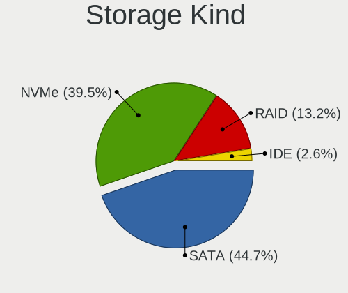
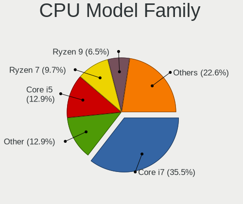
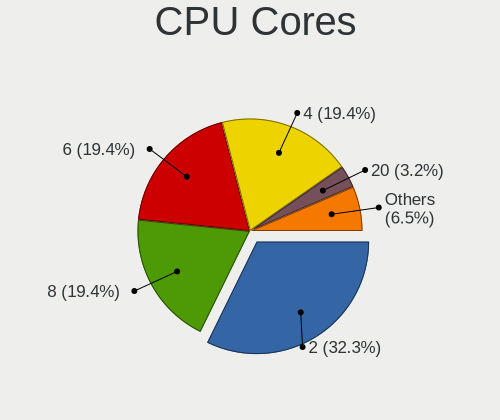
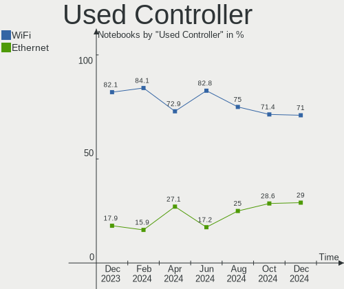

KDE neon - Hardware Trends (Notebooks)
--------------------------------------

A project to identify most popular hardware characteristics and track their change
over time based on data collected by Linux users at https://Linux-Hardware.org.

Anyone can contribute to this report by the [hw-probe](https://github.com/linuxhw/hw-probe) tool:

    sudo -E hw-probe -all -upload

This report is for one last month. Overall report since the beginning of time: [TestDays](https://github.com/linuxhw/TestDays)

Period: Nov, 2023.

Contents
--------

* [ System ](#system)
  - [ OS                       ](#os)
  - [ OS Family                ](#os-family)
  - [ Kernel                   ](#kernel)
  - [ Kernel Family            ](#kernel-family)
  - [ Kernel Major Ver.        ](#kernel-major-ver)
  - [ Arch                     ](#arch)
  - [ DE                       ](#de)
  - [ Display Server           ](#display-server)
  - [ Display Manager          ](#display-manager)
  - [ OS Lang                  ](#os-lang)
  - [ Boot Mode                ](#boot-mode)
  - [ Filesystem               ](#filesystem)
  - [ Part. scheme             ](#part-scheme)
  - [ Dual Boot with Linux/BSD ](#dual-boot-with-linuxbsd)
  - [ Dual Boot (Win)          ](#dual-boot-win)

* [ Board ](#board)
  - [ Vendor                   ](#vendor)
  - [ Model                    ](#model)
  - [ Model Family             ](#model-family)
  - [ MFG Year                 ](#mfg-year)
  - [ Form Factor              ](#form-factor)
  - [ Secure Boot              ](#secure-boot)
  - [ Coreboot                 ](#coreboot)
  - [ RAM Size                 ](#ram-size)
  - [ RAM Used                 ](#ram-used)
  - [ Total Drives             ](#total-drives)
  - [ Has CD-ROM               ](#has-cd-rom)
  - [ Has Ethernet             ](#has-ethernet)
  - [ Has WiFi                 ](#has-wifi)
  - [ Has Bluetooth            ](#has-bluetooth)

* [ Location ](#location)
  - [ Country                  ](#country)
  - [ City                     ](#city)

* [ Drives ](#drives)
  - [ Drive Vendor             ](#drive-vendor)
  - [ Drive Model              ](#drive-model)
  - [ HDD Vendor               ](#hdd-vendor)
  - [ SSD Vendor               ](#ssd-vendor)
  - [ Drive Kind               ](#drive-kind)
  - [ Drive Connector          ](#drive-connector)
  - [ Drive Size               ](#drive-size)
  - [ Space Total              ](#space-total)
  - [ Space Used               ](#space-used)
  - [ Malfunc. Drives          ](#malfunc-drives)
  - [ Malfunc. Drive Vendor    ](#malfunc-drive-vendor)
  - [ Malfunc. HDD Vendor      ](#malfunc-hdd-vendor)
  - [ Malfunc. Drive Kind      ](#malfunc-drive-kind)
  - [ Failed Drives            ](#failed-drives)
  - [ Failed Drive Vendor      ](#failed-drive-vendor)
  - [ Drive Status             ](#drive-status)

* [ Storage controller ](#storage-controller)
  - [ Storage Vendor           ](#storage-vendor)
  - [ Storage Model            ](#storage-model)
  - [ Storage Kind             ](#storage-kind)

* [ Processor ](#processor)
  - [ CPU Vendor               ](#cpu-vendor)
  - [ CPU Model                ](#cpu-model)
  - [ CPU Model Family         ](#cpu-model-family)
  - [ CPU Cores                ](#cpu-cores)
  - [ CPU Sockets              ](#cpu-sockets)
  - [ CPU Threads              ](#cpu-threads)
  - [ CPU Op-Modes             ](#cpu-op-modes)
  - [ CPU Microcode            ](#cpu-microcode)
  - [ CPU Microarch            ](#cpu-microarch)

* [ Graphics ](#graphics)
  - [ GPU Vendor               ](#gpu-vendor)
  - [ GPU Model                ](#gpu-model)
  - [ GPU Combo                ](#gpu-combo)
  - [ GPU Driver               ](#gpu-driver)
  - [ GPU Memory               ](#gpu-memory)

* [ Monitor ](#monitor)
  - [ Monitor Vendor           ](#monitor-vendor)
  - [ Monitor Model            ](#monitor-model)
  - [ Monitor Resolution       ](#monitor-resolution)
  - [ Monitor Diagonal         ](#monitor-diagonal)
  - [ Monitor Width            ](#monitor-width)
  - [ Aspect Ratio             ](#aspect-ratio)
  - [ Monitor Area             ](#monitor-area)
  - [ Pixel Density            ](#pixel-density)
  - [ Multiple Monitors        ](#multiple-monitors)

* [ Network ](#network)
  - [ Net Controller Vendor    ](#net-controller-vendor)
  - [ Net Controller Model     ](#net-controller-model)
  - [ Wireless Vendor          ](#wireless-vendor)
  - [ Wireless Model           ](#wireless-model)
  - [ Ethernet Vendor          ](#ethernet-vendor)
  - [ Ethernet Model           ](#ethernet-model)
  - [ Net Controller Kind      ](#net-controller-kind)
  - [ Used Controller          ](#used-controller)
  - [ NICs                     ](#nics)
  - [ IPv6                     ](#ipv6)

* [ Bluetooth ](#bluetooth)
  - [ Bluetooth Vendor         ](#bluetooth-vendor)
  - [ Bluetooth Model          ](#bluetooth-model)

* [ Sound ](#sound)
  - [ Sound Vendor             ](#sound-vendor)
  - [ Sound Model              ](#sound-model)

* [ Memory ](#memory)
  - [ Memory Vendor            ](#memory-vendor)
  - [ Memory Model             ](#memory-model)
  - [ Memory Kind              ](#memory-kind)
  - [ Memory Form Factor       ](#memory-form-factor)
  - [ Memory Size              ](#memory-size)
  - [ Memory Speed             ](#memory-speed)

* [ Printers & scanners ](#printers--scanners)
  - [ Printer Vendor           ](#printer-vendor)
  - [ Printer Model            ](#printer-model)
  - [ Scanner Vendor           ](#scanner-vendor)
  - [ Scanner Model            ](#scanner-model)

* [ Camera ](#camera)
  - [ Camera Vendor            ](#camera-vendor)
  - [ Camera Model             ](#camera-model)

* [ Security ](#security)
  - [ Fingerprint Vendor       ](#fingerprint-vendor)
  - [ Fingerprint Model        ](#fingerprint-model)
  - [ Chipcard Vendor          ](#chipcard-vendor)
  - [ Chipcard Model           ](#chipcard-model)

* [ Unsupported ](#unsupported)
  - [ Unsupported Devices      ](#unsupported-devices)
  - [ Unsupported Device Types ](#unsupported-device-types)

System
------

OS
--

Installed operating systems

| Name           | Notebooks | Percent |
|----------------|-----------|---------|
| KDE neon 22.04 | 36        | 97.3%   |
| KDE neon 20.04 | 1         | 2.7%    |

OS Family
---------

OS without a version

| Name     | Notebooks | Percent |
|----------|-----------|---------|
| KDE neon | 37        | 100%    |

Kernel
------

Version of the Linux kernel

| Version              | Notebooks | Percent |
|----------------------|-----------|---------|
| 6.2.0-36-generic     | 24        | 64.86%  |
| 6.2.0-37-generic     | 6         | 16.22%  |
| 6.3.1-060301-generic | 1         | 2.7%    |
| 6.2.0-35-generic     | 1         | 2.7%    |
| 6.2.0-32-generic     | 1         | 2.7%    |
| 5.8.0-59-generic     | 1         | 2.7%    |
| 5.19.0-50-generic    | 1         | 2.7%    |
| 5.19.0-43-generic    | 1         | 2.7%    |
| 5.19.0-35-generic    | 1         | 2.7%    |

Kernel Family
-------------

Linux kernel without a distro release

| Version | Notebooks | Percent |
|---------|-----------|---------|
| 6.2.0   | 32        | 86.49%  |
| 5.19.0  | 3         | 8.11%   |
| 6.3.1   | 1         | 2.7%    |
| 5.8.0   | 1         | 2.7%    |

Kernel Major Ver.
-----------------

Linux kernel major version

| Version | Notebooks | Percent |
|---------|-----------|---------|
| 6.2     | 32        | 86.49%  |
| 5.19    | 3         | 8.11%   |
| 6.3     | 1         | 2.7%    |
| 5.8     | 1         | 2.7%    |

Arch
----

OS architecture (x86_64, i586, etc.)

| Name   | Notebooks | Percent |
|--------|-----------|---------|
| x86_64 | 37        | 100%    |

DE
--

Desktop Environment

| Name  | Notebooks | Percent |
|-------|-----------|---------|
| KDE5  | 34        | 91.89%  |
| GNOME | 2         | 5.41%   |
| KDE6  | 1         | 2.7%    |

Display Server
--------------

X11 or Wayland

| Name    | Notebooks | Percent |
|---------|-----------|---------|
| X11     | 31        | 83.78%  |
| Wayland | 6         | 16.22%  |

Display Manager
---------------

SDDM, LightDM, etc.

| Name    | Notebooks | Percent |
|---------|-----------|---------|
| Unknown | 27        | 72.97%  |
| SDDM    | 10        | 27.03%  |

OS Lang
-------

Language

| Lang  | Notebooks | Percent |
|-------|-----------|---------|
| en_US | 16        | 43.24%  |
| C     | 7         | 18.92%  |
| ru_RU | 3         | 8.11%   |
| es_MX | 2         | 5.41%   |
| en_GB | 2         | 5.41%   |
| en_CA | 2         | 5.41%   |
| sl_SI | 1         | 2.7%    |
| fr_BE | 1         | 2.7%    |
| en_IN | 1         | 2.7%    |
| en_AU | 1         | 2.7%    |
| de_DE | 1         | 2.7%    |

Boot Mode
---------

EFI or BIOS

| Mode | Notebooks | Percent |
|------|-----------|---------|
| BIOS | 30        | 81.08%  |
| EFI  | 7         | 18.92%  |

Filesystem
----------

Type of filesystem

| Type    | Notebooks | Percent |
|---------|-----------|---------|
| Ext4    | 30        | 81.08%  |
| Overlay | 4         | 10.81%  |
| Tmpfs   | 3         | 8.11%   |

Part. scheme
------------

Scheme of partitioning

| Type    | Notebooks | Percent |
|---------|-----------|---------|
| Unknown | 27        | 72.97%  |
| GPT     | 8         | 21.62%  |
| MBR     | 2         | 5.41%   |

Dual Boot with Linux/BSD
------------------------

Hosting more than one Linux/BSD

| Dual boot | Notebooks | Percent |
|-----------|-----------|---------|
| No        | 34        | 91.89%  |
| Yes       | 3         | 8.11%   |

Dual Boot (Win)
---------------

Hosting Linux and Windows

| Dual boot | Notebooks | Percent |
|-----------|-----------|---------|
| No        | 32        | 86.49%  |
| Yes       | 5         | 13.51%  |

Board
-----

Vendor
------

Motherboard manufacturer

| Name                | Notebooks | Percent |
|---------------------|-----------|---------|
| Hewlett-Packard     | 11        | 29.73%  |
| Lenovo              | 6         | 16.22%  |
| ASUSTek Computer    | 4         | 10.81%  |
| Dell                | 3         | 8.11%   |
| Apple               | 3         | 8.11%   |
| Acer                | 3         | 8.11%   |
| UMAX                | 1         | 2.7%    |
| Packard Bell        | 1         | 2.7%    |
| Notebook            | 1         | 2.7%    |
| MSI                 | 1         | 2.7%    |
| Intel               | 1         | 2.7%    |
| Haier               | 1         | 2.7%    |
| Gigabyte Technology | 1         | 2.7%    |

Model
-----

Motherboard model

| Name                                     | Notebooks | Percent |
|------------------------------------------|-----------|---------|
| UMAX 13Wa_Flex                           | 1         | 2.7%    |
| Packard Bell EasyNote TE69KB             | 1         | 2.7%    |
| Notebook N150CU                          | 1         | 2.7%    |
| MSI Vector GP66 12UGS                    | 1         | 2.7%    |
| Lenovo ThinkPad X1 Carbon 6th 20KGS9SA01 | 1         | 2.7%    |
| Lenovo ThinkPad T420 4236WR1             | 1         | 2.7%    |
| Lenovo ThinkPad E14 Gen 2 20TA0035CK     | 1         | 2.7%    |
| Lenovo Legion Pro 5 16IRX8 82WK          | 1         | 2.7%    |
| Lenovo G780                              | 1         | 2.7%    |
| Lenovo B70-80 80MR                       | 1         | 2.7%    |
| Intel SLIMBOOK                           | 1         | 2.7%    |
| HP Stream Notebook PC 13                 | 1         | 2.7%    |
| HP ProBook 6565b                         | 1         | 2.7%    |
| HP Pavilion Laptop 15-eh1xxx             | 1         | 2.7%    |
| HP Pavilion Gaming Laptop 15-ec0xxx      | 1         | 2.7%    |
| HP Laptop 17-ca2xxx                      | 1         | 2.7%    |
| HP Laptop 15s-du3xxx                     | 1         | 2.7%    |
| HP Laptop 15-dy2xxx                      | 1         | 2.7%    |
| HP Laptop 15-da0xxx                      | 1         | 2.7%    |
| HP Laptop 14-fq0xxx                      | 1         | 2.7%    |
| HP Laptop 14-cf0xxx                      | 1         | 2.7%    |
| HP 245 G4 Notebook PC                    | 1         | 2.7%    |
| Haier GG1500A                            | 1         | 2.7%    |
| Gigabyte G5 GE                           | 1         | 2.7%    |
| Dell XPS 9315                            | 1         | 2.7%    |
| Dell Latitude 5511                       | 1         | 2.7%    |
| Dell G15 5510                            | 1         | 2.7%    |
| ASUS ZenBook UX425IA_UM425IA             | 1         | 2.7%    |
| ASUS X705UDR                             | 1         | 2.7%    |
| ASUS X555LN                              | 1         | 2.7%    |
| ASUS TP501UAM                            | 1         | 2.7%    |
| Apple MacBookPro11,5                     | 1         | 2.7%    |
| Apple MacBookPro11,2                     | 1         | 2.7%    |
| Apple MacBookPro11,1                     | 1         | 2.7%    |
| Acer TM8573T                             | 1         | 2.7%    |
| Acer Nitro AN515-53                      | 1         | 2.7%    |
| Acer Aspire 5732Z                        | 1         | 2.7%    |

Model Family
------------

Motherboard model prefix

| Name                  | Notebooks | Percent |
|-----------------------|-----------|---------|
| HP Laptop             | 6         | 16.22%  |
| Lenovo ThinkPad       | 3         | 8.11%   |
| Apple MacBookPro11    | 3         | 8.11%   |
| HP Pavilion           | 2         | 5.41%   |
| UMAX 13Wa             | 1         | 2.7%    |
| Packard Bell EasyNote | 1         | 2.7%    |
| Notebook N150CU       | 1         | 2.7%    |
| MSI Vector            | 1         | 2.7%    |
| Lenovo Legion         | 1         | 2.7%    |
| Lenovo G780           | 1         | 2.7%    |
| Lenovo B70-80         | 1         | 2.7%    |
| Intel SLIMBOOK        | 1         | 2.7%    |
| HP Stream             | 1         | 2.7%    |
| HP ProBook            | 1         | 2.7%    |
| HP 245                | 1         | 2.7%    |
| Haier GG1500A         | 1         | 2.7%    |
| Gigabyte G5           | 1         | 2.7%    |
| Dell XPS              | 1         | 2.7%    |
| Dell Latitude         | 1         | 2.7%    |
| Dell G15              | 1         | 2.7%    |
| ASUS ZenBook          | 1         | 2.7%    |
| ASUS X705UDR          | 1         | 2.7%    |
| ASUS X555LN           | 1         | 2.7%    |
| ASUS TP501UAM         | 1         | 2.7%    |
| Acer TM8573T          | 1         | 2.7%    |
| Acer Nitro            | 1         | 2.7%    |
| Acer Aspire           | 1         | 2.7%    |

MFG Year
--------

Motherboard manufacture year

| Year | Notebooks | Percent |
|------|-----------|---------|
| 2018 | 7         | 18.92%  |
| 2020 | 6         | 16.22%  |
| 2021 | 4         | 10.81%  |
| 2019 | 3         | 8.11%   |
| 2011 | 3         | 8.11%   |
| 2022 | 2         | 5.41%   |
| 2016 | 2         | 5.41%   |
| 2014 | 2         | 5.41%   |
| 2013 | 2         | 5.41%   |
| 2012 | 2         | 5.41%   |
| 2023 | 1         | 2.7%    |
| 2017 | 1         | 2.7%    |
| 2015 | 1         | 2.7%    |
| 2009 | 1         | 2.7%    |

Form Factor
-----------

Physical design of the computer

| Name     | Notebooks | Percent |
|----------|-----------|---------|
| Notebook | 37        | 100%    |

Secure Boot
-----------

Enabled or disabled

| State    | Notebooks | Percent |
|----------|-----------|---------|
| Disabled | 37        | 100%    |

Coreboot
--------

Have coreboot on board

| Used | Notebooks | Percent |
|------|-----------|---------|
| No   | 37        | 100%    |

RAM Size
--------

Total RAM memory

| Size in GB | Notebooks | Percent |
|------------|-----------|---------|
| 4.01-8.0   | 11        | 29.73%  |
| 16.01-24.0 | 10        | 27.03%  |
| 3.01-4.0   | 6         | 16.22%  |
| 8.01-16.0  | 5         | 13.51%  |
| 32.01-64.0 | 4         | 10.81%  |
| 1.01-2.0   | 1         | 2.7%    |

RAM Used
--------

Used RAM memory

| Used GB   | Notebooks | Percent |
|-----------|-----------|---------|
| 2.01-3.0  | 12        | 32.43%  |
| 1.01-2.0  | 11        | 29.73%  |
| 4.01-8.0  | 6         | 16.22%  |
| 3.01-4.0  | 4         | 10.81%  |
| 8.01-16.0 | 3         | 8.11%   |
| 0.51-1.0  | 1         | 2.7%    |

Total Drives
------------

Number of drives on board

| Drives | Notebooks | Percent |
|--------|-----------|---------|
| 1      | 27        | 72.97%  |
| 2      | 10        | 27.03%  |

Has CD-ROM
----------

Has CD-ROM on board

| Presented | Notebooks | Percent |
|-----------|-----------|---------|
| No        | 27        | 72.97%  |
| Yes       | 10        | 27.03%  |

Has Ethernet
------------

Has Ethernet on board

| Presented | Notebooks | Percent |
|-----------|-----------|---------|
| Yes       | 29        | 78.38%  |
| No        | 8         | 21.62%  |

Has WiFi
--------

Has WiFi module

| Presented | Notebooks | Percent |
|-----------|-----------|---------|
| Yes       | 36        | 97.3%   |
| No        | 1         | 2.7%    |

Has Bluetooth
-------------

Has Bluetooth module

| Presented | Notebooks | Percent |
|-----------|-----------|---------|
| Yes       | 31        | 83.78%  |
| No        | 6         | 16.22%  |

Location
--------

Country
-------

Geographic location (country)

| Country     | Notebooks | Percent |
|-------------|-----------|---------|
| USA         | 10        | 27.03%  |
| Germany     | 3         | 8.11%   |
| Canada      | 3         | 8.11%   |
| Slovakia    | 2         | 5.41%   |
| Russia      | 2         | 5.41%   |
| Netherlands | 2         | 5.41%   |
| Mexico      | 2         | 5.41%   |
| India       | 2         | 5.41%   |
| Australia   | 2         | 5.41%   |
| Ukraine     | 1         | 2.7%    |
| Sweden      | 1         | 2.7%    |
| Slovenia    | 1         | 2.7%    |
| Ireland     | 1         | 2.7%    |
| Colombia    | 1         | 2.7%    |
| Chile       | 1         | 2.7%    |
| Belgium     | 1         | 2.7%    |
| Austria     | 1         | 2.7%    |
| Armenia     | 1         | 2.7%    |

City
----

Geographic location (city)

| City                | Notebooks | Percent |
|---------------------|-----------|---------|
| Brisbane            | 2         | 5.41%   |
| Yerevan             | 1         | 2.7%    |
| Winterswijk         | 1         | 2.7%    |
| West Kelowna        | 1         | 2.7%    |
| Viña del Mar       | 1         | 2.7%    |
| Vienna              | 1         | 2.7%    |
| Uzhhorod            | 1         | 2.7%    |
| Tijuana             | 1         | 2.7%    |
| Sogamoso            | 1         | 2.7%    |
| Phoenix             | 1         | 2.7%    |
| Ottawa              | 1         | 2.7%    |
| Oldenburg           | 1         | 2.7%    |
| Nuremberg           | 1         | 2.7%    |
| Moscow              | 1         | 2.7%    |
| Molalla             | 1         | 2.7%    |
| Marshall            | 1         | 2.7%    |
| Manchester          | 1         | 2.7%    |
| Lakeville           | 1         | 2.7%    |
| Košice             | 1         | 2.7%    |
| Kobarid             | 1         | 2.7%    |
| Kiselëvsk          | 1         | 2.7%    |
| Johnson City        | 1         | 2.7%    |
| Jaipur              | 1         | 2.7%    |
| Houston             | 1         | 2.7%    |
| Furulund            | 1         | 2.7%    |
| Edmonton            | 1         | 2.7%    |
| Edison              | 1         | 2.7%    |
| Cypress             | 1         | 2.7%    |
| Bratislava          | 1         | 2.7%    |
| Blackrock           | 1         | 2.7%    |
| Bengaluru           | 1         | 2.7%    |
| Baarn               | 1         | 2.7%    |
| Austin              | 1         | 2.7%    |
| Arlon               | 1         | 2.7%    |
| Aichach             | 1         | 2.7%    |
| Acapulco de Juárez | 1         | 2.7%    |

Drives
------

Drive Vendor
------------

Hard drive vendors

| Vendor                       | Notebooks | Drives | Percent |
|------------------------------|-----------|--------|---------|
| Samsung Electronics          | 8         | 9      | 17.02%  |
| Unknown                      | 6         | 6      | 12.77%  |
| Seagate                      | 3         | 3      | 6.38%   |
| Micron Technology            | 3         | 3      | 6.38%   |
| Apple                        | 3         | 3      | 6.38%   |
| WDC                          | 2         | 2      | 4.26%   |
| Toshiba                      | 2         | 2      | 4.26%   |
| Sandisk                      | 2         | 2      | 4.26%   |
| Kingston Technology Company  | 2         | 2      | 4.26%   |
| Kingston                     | 2         | 2      | 4.26%   |
| Hitachi                      | 2         | 2      | 4.26%   |
| HGST                         | 2         | 2      | 4.26%   |
| Crucial                      | 2         | 2      | 4.26%   |
| SPCC                         | 1         | 1      | 2.13%   |
| SK hynix                     | 1         | 1      | 2.13%   |
| Silicon Motion               | 1         | 1      | 2.13%   |
| Shenzhen Longsys Electronics | 1         | 1      | 2.13%   |
| PNY CS90                     | 1         | 1      | 2.13%   |
| OCZ                          | 1         | 1      | 2.13%   |
| LITEON                       | 1         | 1      | 2.13%   |
| KIOXIA                       | 1         | 1      | 2.13%   |

Drive Model
-----------

Hard drive models

| Model                                               | Notebooks | Percent |
|-----------------------------------------------------|-----------|---------|
| Unknown MMC Card  64GB                              | 3         | 6.25%   |
| Sandisk WD Blue SN550 NVMe SSD 512GB                | 2         | 4.17%   |
| HGST HTS541010A9E680 1TB                            | 2         | 4.17%   |
| WDC WD5000LPCX-60VHAT1 500GB                        | 1         | 2.08%   |
| WDC WD10JPCX-24UE4T0 1TB                            | 1         | 2.08%   |
| Unknown SD/MMC/MS PRO 128GB                         | 1         | 2.08%   |
| Unknown MMC Card  4GB                               | 1         | 2.08%   |
| Unknown MMC Card  32GB                              | 1         | 2.08%   |
| Toshiba MQ04ABF100 1TB                              | 1         | 2.08%   |
| Toshiba MK3261GSYN 320GB                            | 1         | 2.08%   |
| SPCC Solid State Disk 128GB                         | 1         | 2.08%   |
| SK hynix HFM128GD3JX016N 128GB                      | 1         | 2.08%   |
| Silicon Motion SM2262/SM2262EN SSD Controller 1TB   | 1         | 2.08%   |
| Shenzhen Longsys Lexar SSD NM710 2TB                | 1         | 2.08%   |
| Seagate ST500LT012-1DG142 500GB                     | 1         | 2.08%   |
| Seagate ST1000LM035-1RK172 1TB                      | 1         | 2.08%   |
| Seagate BUP Slim 1TB                                | 1         | 2.08%   |
| Samsung SSD 860 EVO 500GB                           | 1         | 2.08%   |
| Samsung NVMe SSD Controller SM981/PM981/PM983 250GB | 1         | 2.08%   |
| Samsung NVMe SSD Controller PM9A1/PM9A3/980PRO 2TB  | 1         | 2.08%   |
| Samsung MZVLQ512HALU-00000 512GB                    | 1         | 2.08%   |
| Samsung MZVLQ256HAJD-000H1 256GB                    | 1         | 2.08%   |
| Samsung MZVLB512HAJQ-00000 512GB                    | 1         | 2.08%   |
| Samsung MZVL21T0HCLR-00BL2 1TB                      | 1         | 2.08%   |
| Samsung MZNLH128HBHQ-000H1 128GB SSD                | 1         | 2.08%   |
| Samsung MZALQ512HALU-000L1 512GB                    | 1         | 2.08%   |
| PNY CS90 0 240GB SSD                                | 1         | 2.08%   |
| OCZ AGILITY3 128GB SSD                              | 1         | 2.08%   |
| Micron 3460 NVMe 1024GB                             | 1         | 2.08%   |
| Micron 2450_MTFDKBA1T0TFK 1TB                       | 1         | 2.08%   |
| Micron 1100_MTFDDAV256TBN 256GB SSD                 | 1         | 2.08%   |
| LITEON CA3-8D256 256GB                              | 1         | 2.08%   |
| KIOXIA KBG50ZNV256G 256GB                           | 1         | 2.08%   |
| Kingston Company U-SNS8154P3 NVMe SSD 256GB         | 1         | 2.08%   |
| Kingston Company OM3PDP3 NVMe SSD 256GB             | 1         | 2.08%   |
| Kingston OM8PCP3512F-AB 512GB                       | 1         | 2.08%   |
| Kingston DataTraveler Max 512GB SSD                 | 1         | 2.08%   |
| Hitachi HTS545032B9A300 320GB                       | 1         | 2.08%   |
| Hitachi HTS545025B9A300 250GB                       | 1         | 2.08%   |
| Crucial M4-CT064M4SSD2 64GB                         | 1         | 2.08%   |

HDD Vendor
----------

Hard disk drive vendors

| Vendor  | Notebooks | Drives | Percent |
|---------|-----------|--------|---------|
| Seagate | 3         | 3      | 25%     |
| WDC     | 2         | 2      | 16.67%  |
| Toshiba | 2         | 2      | 16.67%  |
| Hitachi | 2         | 2      | 16.67%  |
| HGST    | 2         | 2      | 16.67%  |
| Unknown | 1         | 1      | 8.33%   |

SSD Vendor
----------

Solid state drive vendors

| Vendor              | Notebooks | Drives | Percent |
|---------------------|-----------|--------|---------|
| Apple               | 3         | 3      | 25%     |
| Samsung Electronics | 2         | 2      | 16.67%  |
| Crucial             | 2         | 2      | 16.67%  |
| SPCC                | 1         | 1      | 8.33%   |
| PNY CS90            | 1         | 1      | 8.33%   |
| OCZ                 | 1         | 1      | 8.33%   |
| Micron Technology   | 1         | 1      | 8.33%   |
| Kingston            | 1         | 1      | 8.33%   |

Drive Kind
----------

HDD or SSD

| Kind | Notebooks | Drives | Percent |
|------|-----------|--------|---------|
| NVMe | 17        | 19     | 39.53%  |
| HDD  | 11        | 12     | 25.58%  |
| SSD  | 10        | 12     | 23.26%  |
| MMC  | 5         | 5      | 11.63%  |

Drive Connector
---------------

SATA, SAS, NVMe, etc.

| Type | Notebooks | Drives | Percent |
|------|-----------|--------|---------|
| SATA | 19        | 20     | 42.22%  |
| NVMe | 17        | 19     | 37.78%  |
| MMC  | 5         | 5      | 11.11%  |
| SAS  | 4         | 4      | 8.89%   |

Drive Size
----------

Size of hard drive

| Size in TB | Notebooks | Drives | Percent |
|------------|-----------|--------|---------|
| 0.01-0.5   | 16        | 17     | 69.57%  |
| 0.51-1.0   | 7         | 7      | 30.43%  |

Space Total
-----------

Amount of disk space available on the file system

| Size in GB | Notebooks | Percent |
|------------|-----------|---------|
| 101-250    | 10        | 27.03%  |
| 251-500    | 8         | 21.62%  |
| 1-20       | 6         | 16.22%  |
| 21-50      | 5         | 13.51%  |
| 501-1000   | 3         | 8.11%   |
| Unknown    | 2         | 5.41%   |
| 2001-3000  | 1         | 2.7%    |
| 1001-2000  | 1         | 2.7%    |
| 51-100     | 1         | 2.7%    |

Space Used
----------

Amount of used disk space

| Used GB   | Notebooks | Percent |
|-----------|-----------|---------|
| 1-20      | 19        | 51.35%  |
| 21-50     | 4         | 10.81%  |
| 101-250   | 4         | 10.81%  |
| 51-100    | 4         | 10.81%  |
| 251-500   | 2         | 5.41%   |
| 1001-2000 | 2         | 5.41%   |
| Unknown   | 2         | 5.41%   |

Malfunc. Drives
---------------

Drive models with a malfunction

| Model                                            | Notebooks | Drives | Percent |
|--------------------------------------------------|-----------|--------|---------|
| Samsung Electronics MZNLH128HBHQ-000H1 128GB SSD | 1         | 1      | 100%    |

Malfunc. Drive Vendor
---------------------

Vendors of faulty drives

| Vendor              | Notebooks | Drives | Percent |
|---------------------|-----------|--------|---------|
| Samsung Electronics | 1         | 1      | 100%    |

Malfunc. HDD Vendor
-------------------

Vendors of faulty HDD drives

Zero info for selected period =(

Malfunc. Drive Kind
-------------------

Kinds of faulty drives

| Kind | Notebooks | Drives | Percent |
|------|-----------|--------|---------|
| SSD  | 1         | 1      | 100%    |

Failed Drives
-------------

Failed drive models

Zero info for selected period =(

Failed Drive Vendor
-------------------

Failed drive vendors

Zero info for selected period =(

Drive Status
------------

Number of failed and malfunc. drives

| Status   | Notebooks | Drives | Percent |
|----------|-----------|--------|---------|
| Detected | 32        | 40     | 82.05%  |
| Works    | 6         | 7      | 15.38%  |
| Malfunc  | 1         | 1      | 2.56%   |

Storage controller
------------------

Storage Vendor
--------------

Storage controller vendors

| Vendor                       | Notebooks | Percent |
|------------------------------|-----------|---------|
| Intel                        | 18        | 40%     |
| Samsung Electronics          | 8         | 17.78%  |
| AMD                          | 6         | 13.33%  |
| Kingston Technology Company  | 3         | 6.67%   |
| SanDisk                      | 2         | 4.44%   |
| Micron Technology            | 2         | 4.44%   |
| SK hynix                     | 1         | 2.22%   |
| Silicon Motion               | 1         | 2.22%   |
| Shenzhen Longsys Electronics | 1         | 2.22%   |
| Marvell Technology Group     | 1         | 2.22%   |
| Lite-On Technology           | 1         | 2.22%   |
| KIOXIA                       | 1         | 2.22%   |

Storage Model
-------------

Storage controller models

| Model                                                                        | Notebooks | Percent |
|------------------------------------------------------------------------------|-----------|---------|
| AMD FCH SATA Controller [AHCI mode]                                          | 5         | 10.64%  |
| Samsung NVMe SSD Controller 980 (DRAM-less)                                  | 3         | 6.38%   |
| Intel Sunrise Point-LP SATA Controller [AHCI mode]                           | 3         | 6.38%   |
| SanDisk Ultra 3D / WD Blue SN550 NVMe SSD                                    | 2         | 4.26%   |
| Samsung NVMe SSD Controller SM981/PM981/PM983                                | 2         | 4.26%   |
| Samsung NVMe SSD Controller PM9A1/PM9A3/980PRO                               | 2         | 4.26%   |
| Intel Volume Management Device NVMe RAID Controller                          | 2         | 4.26%   |
| Intel 6 Series/C200 Series Chipset Family 6 port Mobile SATA AHCI Controller | 2         | 4.26%   |
| Intel 400 Series Chipset Family SATA AHCI Controller                         | 2         | 4.26%   |
| SK hynix Gold P31/BC711/PC711 NVMe Solid State Drive                         | 1         | 2.13%   |
| Silicon Motion SM2262/SM2262EN SSD Controller                                | 1         | 2.13%   |
| Shenzhen Longsys Non-Volatile memory controller                              | 1         | 2.13%   |
| Samsung S4LN058A01[SSUBX] AHCI SSD Controller (Apple slot)                   | 1         | 2.13%   |
| Samsung S4LN053X01 AHCI SSD Controller(Apple slot)                           | 1         | 2.13%   |
| Micron 3460 NVMe SSD                                                         | 1         | 2.13%   |
| Micron 2450 NVMe SSD [HendrixV] (DRAM-less)                                  | 1         | 2.13%   |
| Marvell Group 88SS9183 PCIe SSD Controller                                   | 1         | 2.13%   |
| Lite-On CA3-8D256, CA3-8D512 NVMe SSD                                        | 1         | 2.13%   |
| KIOXIA NVMe SSD Controller BG5 (DRAM-less)                                   | 1         | 2.13%   |
| Kingston Company OM8PCP Design-In PCIe 3 NVMe SSD (DRAM-less)                | 1         | 2.13%   |
| Kingston Company OM3PDP3 NVMe SSD                                            | 1         | 2.13%   |
| Kingston Company A1000/U-SNS8154P3 x2 NVMe SSD                               | 1         | 2.13%   |
| Intel Wildcat Point-LP SATA Controller [AHCI Mode]                           | 1         | 2.13%   |
| Intel Tiger Lake-LP SATA Controller                                          | 1         | 2.13%   |
| Intel Comet Lake SATA AHCI Controller                                        | 1         | 2.13%   |
| Intel Celeron/Pentium Silver Processor SATA Controller                       | 1         | 2.13%   |
| Intel Celeron N3350/Pentium N4200/Atom E3900 Series SATA AHCI Controller     | 1         | 2.13%   |
| Intel Cannon Lake Mobile PCH SATA AHCI Controller                            | 1         | 2.13%   |
| Intel Alder Lake-P SATA AHCI Controller                                      | 1         | 2.13%   |
| Intel 82801IBM/IEM (ICH9M/ICH9M-E) 4 port SATA Controller [AHCI mode]        | 1         | 2.13%   |
| Intel 8 Series SATA Controller 1 [AHCI mode]                                 | 1         | 2.13%   |
| Intel 7 Series Chipset Family 6-port SATA Controller [AHCI mode]             | 1         | 2.13%   |
| AMD FCH SATA Controller [IDE mode]                                           | 1         | 2.13%   |

Storage Kind
------------

Kind of storage controller (IDE, SATA, NVMe, SAS, ...)

| Kind | Notebooks | Percent |
|------|-----------|---------|
| SATA | 26        | 57.78%  |
| NVMe | 17        | 37.78%  |
| RAID | 2         | 4.44%   |

Processor
---------

CPU Vendor
----------

Processor vendors

| Vendor | Notebooks | Percent |
|--------|-----------|---------|
| Intel  | 29        | 78.38%  |
| AMD    | 8         | 21.62%  |

CPU Model
---------

Processor models

| Model                                         | Notebooks | Percent |
|-----------------------------------------------|-----------|---------|
| Intel Core i5-10200H CPU @ 2.40GHz            | 2         | 5.41%   |
| Intel Celeron N4000 CPU @ 1.10GHz             | 2         | 5.41%   |
| Intel 11th Gen Core i5-1135G7 @ 2.40GHz       | 2         | 5.41%   |
| Intel Pentium Dual-Core CPU T4400 @ 2.20GHz   | 1         | 2.7%    |
| Intel Core i7-8650U CPU @ 1.90GHz             | 1         | 2.7%    |
| Intel Core i7-8550U CPU @ 1.80GHz             | 1         | 2.7%    |
| Intel Core i7-4870HQ CPU @ 2.50GHz            | 1         | 2.7%    |
| Intel Core i7-4750HQ CPU @ 2.00GHz            | 1         | 2.7%    |
| Intel Core i7-3612QM CPU @ 2.10GHz            | 1         | 2.7%    |
| Intel Core i7-10850H CPU @ 2.70GHz            | 1         | 2.7%    |
| Intel Core i7-10510U CPU @ 1.80GHz            | 1         | 2.7%    |
| Intel Core i5-8300H CPU @ 2.30GHz             | 1         | 2.7%    |
| Intel Core i5-7300U CPU @ 2.60GHz             | 1         | 2.7%    |
| Intel Core i5-4278U CPU @ 2.60GHz             | 1         | 2.7%    |
| Intel Core i5-4210U CPU @ 1.70GHz             | 1         | 2.7%    |
| Intel Core i5-2540M CPU @ 2.60GHz             | 1         | 2.7%    |
| Intel Core i5-2450M CPU @ 2.50GHz             | 1         | 2.7%    |
| Intel Core i3-6100U CPU @ 2.30GHz             | 1         | 2.7%    |
| Intel Core i3-5005U CPU @ 2.00GHz             | 1         | 2.7%    |
| Intel Celeron CPU N3450 @ 1.10GHz             | 1         | 2.7%    |
| Intel Celeron CPU N3050 @ 1.60GHz             | 1         | 2.7%    |
| Intel 13th Gen Core i9-13900HX                | 1         | 2.7%    |
| Intel 12th Gen Core i7-12700H                 | 1         | 2.7%    |
| Intel 12th Gen Core i7-1250U                  | 1         | 2.7%    |
| Intel 12th Gen Core i5-12500H                 | 1         | 2.7%    |
| Intel 11th Gen Core i3-1115G4 @ 3.00GHz       | 1         | 2.7%    |
| AMD Ryzen 5 5500U with Radeon Graphics        | 1         | 2.7%    |
| AMD Ryzen 5 4500U with Radeon Graphics        | 1         | 2.7%    |
| AMD Ryzen 5 3550H with Radeon Vega Mobile Gfx | 1         | 2.7%    |
| AMD E1-2500 APU with Radeon HD Graphics       | 1         | 2.7%    |
| AMD Athlon Silver 3050U with Radeon Graphics  | 1         | 2.7%    |
| AMD Athlon Gold 3150U with Radeon Graphics    | 1         | 2.7%    |
| AMD A6-6310 APU with AMD Radeon R4 Graphics   | 1         | 2.7%    |
| AMD A6-3410MX APU with Radeon HD Graphics     | 1         | 2.7%    |

CPU Model Family
----------------

Processor model prefix

| Model                   | Notebooks | Percent |
|-------------------------|-----------|---------|
| Intel Core i5           | 8         | 21.62%  |
| Other                   | 7         | 18.92%  |
| Intel Core i7           | 7         | 18.92%  |
| Intel Celeron           | 4         | 10.81%  |
| AMD Ryzen 5             | 3         | 8.11%   |
| Intel Core i3           | 2         | 5.41%   |
| AMD Athlon              | 2         | 5.41%   |
| AMD A6                  | 2         | 5.41%   |
| Intel Pentium Dual-Core | 1         | 2.7%    |
| AMD E1                  | 1         | 2.7%    |

CPU Cores
---------

Number of processor cores

| Number | Notebooks | Percent |
|--------|-----------|---------|
| 4      | 15        | 40.54%  |
| 2      | 15        | 40.54%  |
| 6      | 3         | 8.11%   |
| 24     | 1         | 2.7%    |
| 14     | 1         | 2.7%    |
| 12     | 1         | 2.7%    |
| 10     | 1         | 2.7%    |

CPU Sockets
-----------

Number of sockets

| Number | Notebooks | Percent |
|--------|-----------|---------|
| 1      | 37        | 100%    |

CPU Threads
-----------

Threads per core (Hyper-Threading)

| Number | Notebooks | Percent |
|--------|-----------|---------|
| 2      | 27        | 72.97%  |
| 1      | 10        | 27.03%  |

CPU Op-Modes
------------

CPU Operation Modes (32-bit, 64-bit)

| Op mode        | Notebooks | Percent |
|----------------|-----------|---------|
| 32-bit, 64-bit | 37        | 100%    |

CPU Microcode
-------------

Microcode number

| Number     | Notebooks | Percent |
|------------|-----------|---------|
| Unknown    | 34        | 91.89%  |
| 0x08108109 | 2         | 5.41%   |
| 0x806ea    | 1         | 2.7%    |

CPU Microarch
-------------

Microarchitecture

| Name          | Notebooks | Percent |
|---------------|-----------|---------|
| KabyLake      | 5         | 13.51%  |
| Unknown       | 5         | 13.51%  |
| Haswell       | 4         | 10.81%  |
| Zen+          | 3         | 8.11%   |
| TigerLake     | 3         | 8.11%   |
| CometLake     | 3         | 8.11%   |
| SandyBridge   | 2         | 5.41%   |
| Goldmont plus | 2         | 5.41%   |
| Zen 2         | 1         | 2.7%    |
| Skylake       | 1         | 2.7%    |
| Silvermont    | 1         | 2.7%    |
| Puma          | 1         | 2.7%    |
| Penryn        | 1         | 2.7%    |
| K10 Llano     | 1         | 2.7%    |
| Jaguar        | 1         | 2.7%    |
| IvyBridge     | 1         | 2.7%    |
| Goldmont      | 1         | 2.7%    |
| Broadwell     | 1         | 2.7%    |

Graphics
--------

GPU Vendor
----------

Vendors of graphics cards

| Vendor | Notebooks | Percent |
|--------|-----------|---------|
| Intel  | 28        | 56%     |
| Nvidia | 13        | 26%     |
| AMD    | 9         | 18%     |

GPU Model
---------

Graphics card models

| Model                                                                                    | Notebooks | Percent |
|------------------------------------------------------------------------------------------|-----------|---------|
| AMD Picasso/Raven 2 [Radeon Vega Series / Radeon Vega Mobile Series]                     | 3         | 6%      |
| Nvidia GP107M [GeForce GTX 1050 Mobile]                                                  | 2         | 4%      |
| Intel UHD Graphics 620                                                                   | 2         | 4%      |
| Intel TigerLake-LP GT2 [Iris Xe Graphics]                                                | 2         | 4%      |
| Intel Haswell-ULT Integrated Graphics Controller                                         | 2         | 4%      |
| Intel GeminiLake [UHD Graphics 600]                                                      | 2         | 4%      |
| Intel Comet Lake-H GT1 [UHD Graphics 610]                                                | 2         | 4%      |
| Intel Alder Lake-P GT2 [Iris Xe Graphics]                                                | 2         | 4%      |
| Intel 2nd Generation Core Processor Family Integrated Graphics Controller                | 2         | 4%      |
| Nvidia TU117M [GeForce MX450]                                                            | 1         | 2%      |
| Nvidia TU117M [GeForce GTX 1650 Ti Mobile]                                               | 1         | 2%      |
| Nvidia TU117M [GeForce GTX 1650 Mobile / Max-Q]                                          | 1         | 2%      |
| Nvidia GP107M [GeForce MX350]                                                            | 1         | 2%      |
| Nvidia GP107M [GeForce MX150]                                                            | 1         | 2%      |
| Nvidia GP107M [GeForce GTX 1050 3 GB Max-Q]                                              | 1         | 2%      |
| Nvidia GM108M [GeForce 840M]                                                             | 1         | 2%      |
| Nvidia GF108M [GeForce GT 620M/630M/635M/640M LE]                                        | 1         | 2%      |
| Nvidia GA107M [GeForce RTX 3050 Mobile]                                                  | 1         | 2%      |
| Nvidia GA104 [Geforce RTX 3070 Ti Laptop GPU]                                            | 1         | 2%      |
| Nvidia AD106M [GeForce RTX 4070 Max-Q / Mobile]                                          | 1         | 2%      |
| Intel Tiger Lake-LP GT2 [UHD Graphics G4]                                                | 1         | 2%      |
| Intel Skylake GT2 [HD Graphics 520]                                                      | 1         | 2%      |
| Intel Raptor Lake-S UHD Graphics                                                         | 1         | 2%      |
| Intel Mobile 4 Series Chipset Integrated Graphics Controller                             | 1         | 2%      |
| Intel HD Graphics 620                                                                    | 1         | 2%      |
| Intel HD Graphics 5500                                                                   | 1         | 2%      |
| Intel HD Graphics 500                                                                    | 1         | 2%      |
| Intel Crystal Well Integrated Graphics Controller                                        | 1         | 2%      |
| Intel CometLake-U GT2 [UHD Graphics]                                                     | 1         | 2%      |
| Intel CometLake-H GT2 [UHD Graphics]                                                     | 1         | 2%      |
| Intel CoffeeLake-H GT2 [UHD Graphics 630]                                                | 1         | 2%      |
| Intel Atom/Celeron/Pentium Processor x5-E8000/J3xxx/N3xxx Integrated Graphics Controller | 1         | 2%      |
| Intel Alder Lake-UP4 GT2 [Iris Xe Graphics]                                              | 1         | 2%      |
| Intel 3rd Gen Core processor Graphics Controller                                         | 1         | 2%      |
| AMD Venus XT [Radeon HD 8870M / R9 M270X/M370X]                                          | 1         | 2%      |
| AMD Sumo [Radeon HD 6520G]                                                               | 1         | 2%      |
| AMD Renoir [Radeon RX Vega 6 (Ryzen 4000/5000 Mobile Series)]                            | 1         | 2%      |
| AMD Mullins [Radeon R4/R5 Graphics]                                                      | 1         | 2%      |
| AMD Lucienne                                                                             | 1         | 2%      |
| AMD Kabini [Radeon HD 8240 / R3 Series]                                                  | 1         | 2%      |

GPU Combo
---------

Combinations of graphics cards

| Name           | Notebooks | Percent |
|----------------|-----------|---------|
| 1 x Intel      | 16        | 43.24%  |
| Intel + Nvidia | 12        | 32.43%  |
| 1 x AMD        | 8         | 21.62%  |
| AMD + Nvidia   | 1         | 2.7%    |

GPU Driver
----------

Free vs proprietary

| Driver      | Notebooks | Percent |
|-------------|-----------|---------|
| Free        | 30        | 81.08%  |
| Proprietary | 6         | 16.22%  |
| Unknown     | 1         | 2.7%    |

GPU Memory
----------

Total video memory

| Size in GB | Notebooks | Percent |
|------------|-----------|---------|
| Unknown    | 34        | 91.89%  |
| 1.01-2.0   | 2         | 5.41%   |
| 0.01-0.5   | 1         | 2.7%    |

Monitor
-------

Monitor Vendor
--------------

Monitor vendors

| Vendor                  | Notebooks | Percent |
|-------------------------|-----------|---------|
| AU Optronics            | 9         | 22.5%   |
| Chimei Innolux          | 8         | 20%     |
| LG Display              | 5         | 12.5%   |
| PANDA                   | 3         | 7.5%    |
| Apple                   | 3         | 7.5%    |
| Samsung Electronics     | 2         | 5%      |
| Dell                    | 2         | 5%      |
| BOE                     | 2         | 5%      |
| Sharp                   | 1         | 2.5%    |
| HannStar                | 1         | 2.5%    |
| G-Story                 | 1         | 2.5%    |
| CSO                     | 1         | 2.5%    |
| Chi Mei Optoelectronics | 1         | 2.5%    |
| Ancor Communications    | 1         | 2.5%    |

Monitor Model
-------------

Monitor models

| Model                                                                    | Notebooks | Percent |
|--------------------------------------------------------------------------|-----------|---------|
| Sharp LCD Monitor SHP1548 1920x1200 288x180mm 13.4-inch                  | 1         | 2.5%    |
| Samsung Electronics LCD Monitor SEC3046 1366x768 344x193mm 15.5-inch     | 1         | 2.5%    |
| Samsung Electronics LCD Monitor SDC354A 1366x768 344x194mm 15.5-inch     | 1         | 2.5%    |
| PANDA LCD Monitor NCP005F 1920x1080 344x194mm 15.5-inch                  | 1         | 2.5%    |
| PANDA LCD Monitor NCP003F 1920x1080 344x194mm 15.5-inch                  | 1         | 2.5%    |
| PANDA LC133LF2L03 NCP0015 1920x1080 294x165mm 13.3-inch                  | 1         | 2.5%    |
| LG Display LCD Monitor LGD40A0 1366x768 310x174mm 14.0-inch              | 1         | 2.5%    |
| LG Display LCD Monitor LGD05E5 1920x1080 344x194mm 15.5-inch             | 1         | 2.5%    |
| LG Display LCD Monitor LGD03F8 1366x768 345x194mm 15.6-inch              | 1         | 2.5%    |
| LG Display LCD Monitor LGD031C 1366x768 345x194mm 15.6-inch              | 1         | 2.5%    |
| LG Display LCD Monitor LGD021D 1600x900 382x215mm 17.3-inch              | 1         | 2.5%    |
| HannStar HL161ABB HSD61C7 1366x768 344x193mm 15.5-inch                   | 1         | 2.5%    |
| G-Story 2CH 1080 3D GSV0100 1920x1080 708x398mm 32.0-inch                | 1         | 2.5%    |
| Dell P2419H DELD0D9 1920x1080 530x300mm 24.0-inch                        | 1         | 2.5%    |
| Dell E2417H DELA0E2 1920x1080 527x296mm 23.8-inch                        | 1         | 2.5%    |
| CSO LCD Monitor CSO1628 2560x1600 344x215mm 16.0-inch                    | 1         | 2.5%    |
| Chimei Innolux LCD Monitor CMN1746 1600x900 382x214mm 17.2-inch          | 1         | 2.5%    |
| Chimei Innolux LCD Monitor CMN1721 1600x900 382x214mm 17.2-inch          | 1         | 2.5%    |
| Chimei Innolux LCD Monitor CMN152A 2560x1440 344x193mm 15.5-inch         | 1         | 2.5%    |
| Chimei Innolux LCD Monitor CMN1521 1920x1080 344x193mm 15.5-inch         | 1         | 2.5%    |
| Chimei Innolux LCD Monitor CMN1515 1920x1080 344x193mm 15.5-inch         | 1         | 2.5%    |
| Chimei Innolux LCD Monitor CMN1509 1920x1080 344x193mm 15.5-inch         | 1         | 2.5%    |
| Chimei Innolux LCD Monitor CMN14E3 1366x768 309x173mm 13.9-inch          | 1         | 2.5%    |
| Chimei Innolux LCD Monitor CMN1495 1366x768 309x173mm 13.9-inch          | 1         | 2.5%    |
| Chi Mei Optoelectronics LCD Monitor CMO15A1 1366x768 344x193mm 15.5-inch | 1         | 2.5%    |
| BOE LCD Monitor BOE07B5 1366x768 309x173mm 13.9-inch                     | 1         | 2.5%    |
| BOE LCD Monitor BOE06BE 1920x1080 294x165mm 13.3-inch                    | 1         | 2.5%    |
| AU Optronics LCD Monitor AUOA48F 1920x1080 309x174mm 14.0-inch           | 1         | 2.5%    |
| AU Optronics LCD Monitor AUO61ED 1920x1080 344x194mm 15.5-inch           | 1         | 2.5%    |
| AU Optronics LCD Monitor AUO46EC 1366x768 344x193mm 15.5-inch            | 1         | 2.5%    |
| AU Optronics LCD Monitor AUO403D 1920x1080 309x174mm 14.0-inch           | 1         | 2.5%    |
| AU Optronics LCD Monitor AUO312C 1366x768 293x164mm 13.2-inch            | 1         | 2.5%    |
| AU Optronics LCD Monitor AUO233D 1920x1080 309x174mm 14.0-inch           | 1         | 2.5%    |
| AU Optronics LCD Monitor AUO21ED 1920x1080 344x194mm 15.5-inch           | 1         | 2.5%    |
| AU Optronics LCD Monitor AUO20EC 1366x768 344x193mm 15.5-inch            | 1         | 2.5%    |
| AU Optronics LCD Monitor AUO139D 1920x1080 381x214mm 17.2-inch           | 1         | 2.5%    |
| Apple Color LCD APPA02E 2880x1800 331x207mm 15.4-inch                    | 1         | 2.5%    |
| Apple Color LCD APPA020 2560x1600 286x179mm 13.3-inch                    | 1         | 2.5%    |
| Apple Color LCD APPA019 2880x1800 331x207mm 15.4-inch                    | 1         | 2.5%    |
| Ancor Communications MG248 ACI24AC 1920x1080 531x299mm 24.0-inch         | 1         | 2.5%    |

Monitor Resolution
------------------

Monitor screen resolution

| Resolution        | Notebooks | Percent |
|-------------------|-----------|---------|
| 1920x1080 (FHD)   | 16        | 43.24%  |
| 1366x768 (WXGA)   | 12        | 32.43%  |
| 1600x900 (HD+)    | 3         | 8.11%   |
| 2880x1800         | 2         | 5.41%   |
| 2560x1600         | 2         | 5.41%   |
| 2560x1440 (QHD)   | 1         | 2.7%    |
| 1920x1200 (WUXGA) | 1         | 2.7%    |

Monitor Diagonal
----------------

Diagonal size in inches

| Inches | Notebooks | Percent |
|--------|-----------|---------|
| 15     | 19        | 48.72%  |
| 13     | 7         | 17.95%  |
| 14     | 5         | 12.82%  |
| 17     | 4         | 10.26%  |
| 24     | 2         | 5.13%   |
| 32     | 1         | 2.56%   |
| 16     | 1         | 2.56%   |

Monitor Width
-------------

Physical width

| Width in mm | Notebooks | Percent |
|-------------|-----------|---------|
| 301-350     | 27        | 69.23%  |
| 201-300     | 5         | 12.82%  |
| 351-400     | 4         | 10.26%  |
| 501-600     | 2         | 5.13%   |
| 701-800     | 1         | 2.56%   |

Aspect Ratio
------------

Proportional relationship between the width and the height

| Ratio | Notebooks | Percent |
|-------|-----------|---------|
| 16/9  | 31        | 86.11%  |
| 16/10 | 5         | 13.89%  |

Monitor Area
------------

Area in inch²

| Area in inch² | Notebooks | Percent |
|----------------|-----------|---------|
| 101-110        | 19        | 48.72%  |
| 81-90          | 7         | 17.95%  |
| 71-80          | 5         | 12.82%  |
| 121-130        | 4         | 10.26%  |
| 201-250        | 2         | 5.13%   |
| 351-500        | 1         | 2.56%   |
| 111-120        | 1         | 2.56%   |

Pixel Density
-------------

Pixels per inch

| Density | Notebooks | Percent |
|---------|-----------|---------|
| 101-120 | 14        | 36.84%  |
| 121-160 | 12        | 31.58%  |
| 161-240 | 8         | 21.05%  |
| 51-100  | 4         | 10.53%  |

Multiple Monitors
-----------------

Total monitors connected

| Total | Notebooks | Percent |
|-------|-----------|---------|
| 1     | 33        | 89.19%  |
| 2     | 2         | 5.41%   |
| 3     | 1         | 2.7%    |
| 0     | 1         | 2.7%    |

Network
-------

Net Controller Vendor
---------------------

Controller vendors

| Vendor                | Notebooks | Percent |
|-----------------------|-----------|---------|
| Realtek Semiconductor | 25        | 43.86%  |
| Intel                 | 17        | 29.82%  |
| Broadcom              | 6         | 10.53%  |
| Qualcomm Atheros      | 3         | 5.26%   |
| Broadcom Limited      | 3         | 5.26%   |
| OPPO Electronics      | 1         | 1.75%   |
| DisplayLink           | 1         | 1.75%   |
| ASUSTek Computer      | 1         | 1.75%   |

Net Controller Model
--------------------

Controller models

| Model                                                                | Notebooks | Percent |
|----------------------------------------------------------------------|-----------|---------|
| Realtek RTL8111/8168/8411 PCI Express Gigabit Ethernet Controller    | 17        | 24.29%  |
| Realtek RTL8822CE 802.11ac PCIe Wireless Network Adapter             | 4         | 5.71%   |
| Realtek RTL8153 Gigabit Ethernet Adapter                             | 4         | 5.71%   |
| Intel Comet Lake PCH CNVi WiFi                                       | 3         | 4.29%   |
| Intel Alder Lake-P PCH CNVi WiFi                                     | 3         | 4.29%   |
| Realtek RTL8821CE 802.11ac PCIe Wireless Network Adapter             | 2         | 2.86%   |
| Intel Wi-Fi 6 AX200                                                  | 2         | 2.86%   |
| Broadcom BCM43142 802.11b/g/n                                        | 2         | 2.86%   |
| Realtek RTL8822BE 802.11a/b/g/n/ac WiFi adapter                      | 1         | 1.43%   |
| Realtek RTL8192EE PCIe Wireless Network Adapter                      | 1         | 1.43%   |
| Realtek RTL8125 2.5GbE Controller                                    | 1         | 1.43%   |
| Realtek RTL810xE PCI Express Fast Ethernet controller                | 1         | 1.43%   |
| Realtek 802.11n WLAN Adapter                                         | 1         | 1.43%   |
| Qualcomm Atheros QCA9565 / AR9565 Wireless Network Adapter           | 1         | 1.43%   |
| Qualcomm Atheros QCA8171 Gigabit Ethernet                            | 1         | 1.43%   |
| Qualcomm Atheros AR928X Wireless Network Adapter (PCI-Express)       | 1         | 1.43%   |
| Qualcomm Atheros AR8162 Fast Ethernet                                | 1         | 1.43%   |
| Qualcomm Atheros AR8132 Fast Ethernet                                | 1         | 1.43%   |
| OPPO RMX3623                                                         | 1         | 1.43%   |
| Intel Wireless 8265 / 8275                                           | 1         | 1.43%   |
| Intel Wireless 7265                                                  | 1         | 1.43%   |
| Intel Wireless 3165                                                  | 1         | 1.43%   |
| Intel Wireless 3160                                                  | 1         | 1.43%   |
| Intel Wi-Fi 6 AX201                                                  | 1         | 1.43%   |
| Intel Ethernet Connection (4) I219-LM                                | 1         | 1.43%   |
| Intel Ethernet Connection (11) I219-LM                               | 1         | 1.43%   |
| Intel Centrino Ultimate-N 6300                                       | 1         | 1.43%   |
| Intel Centrino Advanced-N 6205 [Taylor Peak]                         | 1         | 1.43%   |
| Intel Cannon Lake PCH CNVi WiFi                                      | 1         | 1.43%   |
| Intel 82579LM Gigabit Network Connection (Lewisville)                | 1         | 1.43%   |
| Intel 700 Series Chipset Family Wi-Fi                                | 1         | 1.43%   |
| DisplayLink Dell Universal Dock D6000                                | 1         | 1.43%   |
| Broadcom NetXtreme BCM57762 Gigabit Ethernet PCIe                    | 1         | 1.43%   |
| Broadcom NetXtreme BCM57761 Gigabit Ethernet PCIe                    | 1         | 1.43%   |
| Broadcom Limited BCM4360 802.11ac Dual Band Wireless Network Adapter | 1         | 1.43%   |
| Broadcom Limited BCM43142 802.11b/g/n                                | 1         | 1.43%   |
| Broadcom Limited BCM4313 802.11bgn Wireless Network Adapter          | 1         | 1.43%   |
| Broadcom BCM43602 802.11ac Wireless LAN SoC                          | 1         | 1.43%   |
| Broadcom BCM4360 802.11ac Dual Band Wireless Network Adapter         | 1         | 1.43%   |
| Broadcom BCM4313 802.11bgn Wireless Network Adapter                  | 1         | 1.43%   |

Wireless Vendor
---------------

Wireless vendors

| Vendor                | Notebooks | Percent |
|-----------------------|-----------|---------|
| Intel                 | 17        | 47.22%  |
| Realtek Semiconductor | 9         | 25%     |
| Broadcom              | 5         | 13.89%  |
| Broadcom Limited      | 3         | 8.33%   |
| Qualcomm Atheros      | 2         | 5.56%   |

Wireless Model
--------------

Wireless models

| Model                                                                | Notebooks | Percent |
|----------------------------------------------------------------------|-----------|---------|
| Realtek RTL8822CE 802.11ac PCIe Wireless Network Adapter             | 4         | 11.11%  |
| Intel Comet Lake PCH CNVi WiFi                                       | 3         | 8.33%   |
| Intel Alder Lake-P PCH CNVi WiFi                                     | 3         | 8.33%   |
| Realtek RTL8821CE 802.11ac PCIe Wireless Network Adapter             | 2         | 5.56%   |
| Intel Wi-Fi 6 AX200                                                  | 2         | 5.56%   |
| Broadcom BCM43142 802.11b/g/n                                        | 2         | 5.56%   |
| Realtek RTL8822BE 802.11a/b/g/n/ac WiFi adapter                      | 1         | 2.78%   |
| Realtek RTL8192EE PCIe Wireless Network Adapter                      | 1         | 2.78%   |
| Realtek 802.11n WLAN Adapter                                         | 1         | 2.78%   |
| Qualcomm Atheros QCA9565 / AR9565 Wireless Network Adapter           | 1         | 2.78%   |
| Qualcomm Atheros AR928X Wireless Network Adapter (PCI-Express)       | 1         | 2.78%   |
| Intel Wireless 8265 / 8275                                           | 1         | 2.78%   |
| Intel Wireless 7265                                                  | 1         | 2.78%   |
| Intel Wireless 3165                                                  | 1         | 2.78%   |
| Intel Wireless 3160                                                  | 1         | 2.78%   |
| Intel Wi-Fi 6 AX201                                                  | 1         | 2.78%   |
| Intel Centrino Ultimate-N 6300                                       | 1         | 2.78%   |
| Intel Centrino Advanced-N 6205 [Taylor Peak]                         | 1         | 2.78%   |
| Intel Cannon Lake PCH CNVi WiFi                                      | 1         | 2.78%   |
| Intel 700 Series Chipset Family Wi-Fi                                | 1         | 2.78%   |
| Broadcom Limited BCM4360 802.11ac Dual Band Wireless Network Adapter | 1         | 2.78%   |
| Broadcom Limited BCM43142 802.11b/g/n                                | 1         | 2.78%   |
| Broadcom Limited BCM4313 802.11bgn Wireless Network Adapter          | 1         | 2.78%   |
| Broadcom BCM43602 802.11ac Wireless LAN SoC                          | 1         | 2.78%   |
| Broadcom BCM4360 802.11ac Dual Band Wireless Network Adapter         | 1         | 2.78%   |
| Broadcom BCM4313 802.11bgn Wireless Network Adapter                  | 1         | 2.78%   |

Ethernet Vendor
---------------

Ethernet vendors

| Vendor                | Notebooks | Percent |
|-----------------------|-----------|---------|
| Realtek Semiconductor | 22        | 66.67%  |
| Qualcomm Atheros      | 3         | 9.09%   |
| Intel                 | 3         | 9.09%   |
| Broadcom              | 2         | 6.06%   |
| OPPO Electronics      | 1         | 3.03%   |
| DisplayLink           | 1         | 3.03%   |
| ASUSTek Computer      | 1         | 3.03%   |

Ethernet Model
--------------

Ethernet models

| Model                                                             | Notebooks | Percent |
|-------------------------------------------------------------------|-----------|---------|
| Realtek RTL8111/8168/8411 PCI Express Gigabit Ethernet Controller | 17        | 50%     |
| Realtek RTL8153 Gigabit Ethernet Adapter                          | 4         | 11.76%  |
| Realtek RTL8125 2.5GbE Controller                                 | 1         | 2.94%   |
| Realtek RTL810xE PCI Express Fast Ethernet controller             | 1         | 2.94%   |
| Qualcomm Atheros QCA8171 Gigabit Ethernet                         | 1         | 2.94%   |
| Qualcomm Atheros AR8162 Fast Ethernet                             | 1         | 2.94%   |
| Qualcomm Atheros AR8132 Fast Ethernet                             | 1         | 2.94%   |
| OPPO RMX3623                                                      | 1         | 2.94%   |
| Intel Ethernet Connection (4) I219-LM                             | 1         | 2.94%   |
| Intel Ethernet Connection (11) I219-LM                            | 1         | 2.94%   |
| Intel 82579LM Gigabit Network Connection (Lewisville)             | 1         | 2.94%   |
| DisplayLink Dell Universal Dock D6000                             | 1         | 2.94%   |
| Broadcom NetXtreme BCM57762 Gigabit Ethernet PCIe                 | 1         | 2.94%   |
| Broadcom NetXtreme BCM57761 Gigabit Ethernet PCIe                 | 1         | 2.94%   |
| ASUS Zenfone GO (ZB500KL) (Debug, RNDIS mode)                     | 1         | 2.94%   |

Net Controller Kind
-------------------

Ethernet, WiFi or modem

| Kind     | Notebooks | Percent |
|----------|-----------|---------|
| WiFi     | 36        | 55.38%  |
| Ethernet | 29        | 44.62%  |

Used Controller
---------------

Currently used network controller

| Kind     | Notebooks | Percent |
|----------|-----------|---------|
| WiFi     | 27        | 75%     |
| Ethernet | 9         | 25%     |

NICs
----

Total network controllers on board

| Total | Notebooks | Percent |
|-------|-----------|---------|
| 2     | 25        | 67.57%  |
| 1     | 12        | 32.43%  |

IPv6
----

IPv6 vs IPv4

| Used | Notebooks | Percent |
|------|-----------|---------|
| No   | 25        | 67.57%  |
| Yes  | 12        | 32.43%  |

Bluetooth
---------

Bluetooth Vendor
----------------

Controller vendors

| Vendor                | Notebooks | Percent |
|-----------------------|-----------|---------|
| Intel                 | 13        | 41.94%  |
| Realtek Semiconductor | 7         | 22.58%  |
| Apple                 | 3         | 9.68%   |
| Lite-On Technology    | 2         | 6.45%   |
| Foxconn / Hon Hai     | 2         | 6.45%   |
| Broadcom              | 2         | 6.45%   |
| IMC Networks          | 1         | 3.23%   |
| Hewlett-Packard       | 1         | 3.23%   |

Bluetooth Model
---------------

Controller models

| Model                                           | Notebooks | Percent |
|-------------------------------------------------|-----------|---------|
| Realtek 802.11ac WLAN Adapter                   | 4         | 12.9%   |
| Intel AX201 Bluetooth                           | 4         | 12.9%   |
| Intel Bluetooth wireless interface              | 3         | 9.68%   |
| Intel Bluetooth Device                          | 3         | 9.68%   |
| Apple Bluetooth Host Controller                 | 3         | 9.68%   |
| Realtek  Bluetooth 4.2 Adapter                  | 2         | 6.45%   |
| Intel AX200 Bluetooth                           | 2         | 6.45%   |
| Broadcom BCM43142A0 Bluetooth 4.0               | 2         | 6.45%   |
| Realtek Bluetooth Radio                         | 1         | 3.23%   |
| Lite-On Broadcom BCM43142A0 Bluetooth Device    | 1         | 3.23%   |
| Lite-On Atheros AR3012 Bluetooth                | 1         | 3.23%   |
| Intel Bluetooth 9460/9560 Jefferson Peak (JfP)  | 1         | 3.23%   |
| IMC Networks Bluetooth Radio                    | 1         | 3.23%   |
| HP Broadcom 2070 Bluetooth Combo                | 1         | 3.23%   |
| Foxconn / Hon Hai Broadcom BCM20702 Bluetooth   | 1         | 3.23%   |
| Foxconn / Hon Hai Bluetooth USB Host Controller | 1         | 3.23%   |

Sound
-----

Sound Vendor
------------

Sound card vendors

| Vendor             | Notebooks | Percent |
|--------------------|-----------|---------|
| Intel              | 29        | 64.44%  |
| AMD                | 9         | 20%     |
| Nvidia             | 6         | 13.33%  |
| Focusrite-Novation | 1         | 2.22%   |

Sound Model
-----------

Sound card models

| Model                                                                                             | Notebooks | Percent |
|---------------------------------------------------------------------------------------------------|-----------|---------|
| AMD Family 17h/19h HD Audio Controller                                                            | 5         | 8.93%   |
| Intel Sunrise Point-LP HD Audio                                                                   | 4         | 7.14%   |
| Intel Tiger Lake-LP Smart Sound Technology Audio Controller                                       | 3         | 5.36%   |
| Intel Comet Lake PCH cAVS                                                                         | 3         | 5.36%   |
| AMD FCH Azalia Controller                                                                         | 3         | 5.36%   |
| Nvidia GP107GL High Definition Audio Controller                                                   | 2         | 3.57%   |
| Intel Haswell-ULT HD Audio Controller                                                             | 2         | 3.57%   |
| Intel Celeron/Pentium Silver Processor High Definition Audio                                      | 2         | 3.57%   |
| Intel Alder Lake PCH-P High Definition Audio Controller                                           | 2         | 3.57%   |
| Intel 8 Series/C220 Series Chipset High Definition Audio Controller                               | 2         | 3.57%   |
| Intel 8 Series HD Audio Controller                                                                | 2         | 3.57%   |
| Intel 6 Series/C200 Series Chipset Family High Definition Audio Controller                        | 2         | 3.57%   |
| AMD Renoir Radeon High Definition Audio Controller                                                | 2         | 3.57%   |
| AMD Raven/Raven2/Fenghuang HDMI/DP Audio Controller                                               | 2         | 3.57%   |
| AMD Kabini HDMI/DP Audio                                                                          | 2         | 3.57%   |
| Nvidia TU107 GeForce GTX 1650 High Definition Audio Controller                                    | 1         | 1.79%   |
| Nvidia GF108 High Definition Audio Controller                                                     | 1         | 1.79%   |
| Nvidia GA104 High Definition Audio Controller                                                     | 1         | 1.79%   |
| Nvidia Audio device                                                                               | 1         | 1.79%   |
| Intel Wildcat Point-LP High Definition Audio Controller                                           | 1         | 1.79%   |
| Intel Crystal Well HD Audio Controller                                                            | 1         | 1.79%   |
| Intel Comet Lake PCH-LP cAVS                                                                      | 1         | 1.79%   |
| Intel Celeron N3350/Pentium N4200/Atom E3900 Series Audio Cluster                                 | 1         | 1.79%   |
| Intel Cannon Lake PCH cAVS                                                                        | 1         | 1.79%   |
| Intel Broadwell-U Audio Controller                                                                | 1         | 1.79%   |
| Intel Atom/Celeron/Pentium Processor x5-E8000/J3xxx/N3xxx Series High Definition Audio Controller | 1         | 1.79%   |
| Intel Alder Lake Smart Sound Technology Audio Controller                                          | 1         | 1.79%   |
| Intel 82801I (ICH9 Family) HD Audio Controller                                                    | 1         | 1.79%   |
| Intel 700 Series Chipset Family Precise Touch and Stylus Port #1                                  | 1         | 1.79%   |
| Intel 7 Series/C216 Chipset Family High Definition Audio Controller                               | 1         | 1.79%   |
| Focusrite-Novation Scarlett 2i2 Camera                                                            | 1         | 1.79%   |
| AMD Oland/Hainan/Cape Verde/Pitcairn HDMI Audio [Radeon HD 7000 Series]                           | 1         | 1.79%   |
| AMD BeaverCreek HDMI Audio [Radeon HD 6500D and 6400G-6600G series]                               | 1         | 1.79%   |

Memory
------

Memory Vendor
-------------

Memory module vendors

| Vendor              | Notebooks | Percent |
|---------------------|-----------|---------|
| Micron Technology   | 3         | 27.27%  |
| SK hynix            | 2         | 18.18%  |
| Samsung Electronics | 2         | 18.18%  |
| Unknown (ABCD)      | 1         | 9.09%   |
| Unknown             | 1         | 9.09%   |
| Kingston            | 1         | 9.09%   |
| Corsair             | 1         | 9.09%   |

Memory Model
------------

Memory module models

| Model                                                            | Notebooks | Percent |
|------------------------------------------------------------------|-----------|---------|
| Unknown RAM Module 2GB SODIMM 800MT/s                            | 1         | 9.09%   |
| Unknown (ABCD) RAM 123456789012345678 2GB SODIMM LPDDR4 2400MT/s | 1         | 9.09%   |
| SK hynix RAM Module 4GB SODIMM DDR3 1600MT/s                     | 1         | 9.09%   |
| SK hynix RAM HMT351S6BFR8C-H9 4GB SODIMM DDR3 1333MT/s           | 1         | 9.09%   |
| Samsung RAM M471A5244CB0-CTD 4GB SODIMM DDR4 3266MT/s            | 1         | 9.09%   |
| Samsung RAM M471A1K43CB1-CTD 8GB SODIMM DDR4 2667MT/s            | 1         | 9.09%   |
| Micron RAM MT52L1G32D4PG-093 8GB Row Of Chips LPDDR3 2133MT/s    | 1         | 9.09%   |
| Micron RAM Module 8GB SODIMM DDR3 1600MT/s                       | 1         | 9.09%   |
| Micron RAM Module 4GB SODIMM DDR3 1600MT/s                       | 1         | 9.09%   |
| Kingston RAM KF556S40-16 16GB SODIMM DDR5 5600MT/s               | 1         | 9.09%   |
| Corsair RAM CMSO8GX3M1A1333C9 8GB SODIMM DDR3 1334MT/s           | 1         | 9.09%   |

Memory Kind
-----------

Memory module kinds

| Kind    | Notebooks | Percent |
|---------|-----------|---------|
| DDR3    | 4         | 40%     |
| DDR4    | 2         | 20%     |
| LPDDR4  | 1         | 10%     |
| LPDDR3  | 1         | 10%     |
| DDR5    | 1         | 10%     |
| Unknown | 1         | 10%     |

Memory Form Factor
------------------

Physical design of the memory module

| Name         | Notebooks | Percent |
|--------------|-----------|---------|
| SODIMM       | 9         | 90%     |
| Row Of Chips | 1         | 10%     |

Memory Size
-----------

Memory module size

| Size  | Notebooks | Percent |
|-------|-----------|---------|
| 8192  | 5         | 45.45%  |
| 4096  | 4         | 36.36%  |
| 16384 | 1         | 9.09%   |
| 2048  | 1         | 9.09%   |

Memory Speed
------------

Memory module speed

| Speed | Notebooks | Percent |
|-------|-----------|---------|
| 1600  | 3         | 27.27%  |
| 5600  | 1         | 9.09%   |
| 3266  | 1         | 9.09%   |
| 2667  | 1         | 9.09%   |
| 2400  | 1         | 9.09%   |
| 2133  | 1         | 9.09%   |
| 1334  | 1         | 9.09%   |
| 1333  | 1         | 9.09%   |
| 800   | 1         | 9.09%   |

Printers & scanners
-------------------

Printer Vendor
--------------

Printer device vendors

Zero info for selected period =(

Printer Model
-------------

Printer device models

Zero info for selected period =(

Scanner Vendor
--------------

Scanner device vendors

Zero info for selected period =(

Scanner Model
-------------

Scanner device models

Zero info for selected period =(

Camera
------

Camera Vendor
-------------

Camera device vendors

| Vendor                                 | Notebooks | Percent |
|----------------------------------------|-----------|---------|
| Chicony Electronics                    | 9         | 29.03%  |
| Realtek Semiconductor                  | 3         | 9.68%   |
| Luxvisions Innotech Limited            | 3         | 9.68%   |
| Bison Electronics                      | 3         | 9.68%   |
| Acer                                   | 3         | 9.68%   |
| Microdia                               | 2         | 6.45%   |
| IMC Networks                           | 2         | 6.45%   |
| Alcor Micro                            | 2         | 6.45%   |
| Suyin                                  | 1         | 3.23%   |
| Quanta                                 | 1         | 3.23%   |
| Lite-On Technology                     | 1         | 3.23%   |
| Cheng Uei Precision Industry (Foxlink) | 1         | 3.23%   |

Camera Model
------------

Camera device models

| Model                                                | Notebooks | Percent |
|------------------------------------------------------|-----------|---------|
| Microdia Integrated_Webcam_HD                        | 2         | 6.25%   |
| Luxvisions Innotech Limited HP TrueVision HD Camera  | 2         | 6.25%   |
| Chicony USB2.0 VGA UVC WebCam                        | 2         | 6.25%   |
| Chicony Integrated Camera                            | 2         | 6.25%   |
| Chicony HP TrueVision HD Camera                      | 2         | 6.25%   |
| Acer BisonCam,NB Pro                                 | 2         | 6.25%   |
| Suyin Acer/HP Integrated Webcam [CN0314]             | 1         | 3.13%   |
| Realtek USB Camera                                   | 1         | 3.13%   |
| Realtek Lenovo EasyCamera                            | 1         | 3.13%   |
| Realtek HP Truevision HD                             | 1         | 3.13%   |
| Quanta HD User Facing                                | 1         | 3.13%   |
| Microdia USB 2.0 Camera                              | 1         | 3.13%   |
| Luxvisions Innotech Limited HP Wide Vision HD Camera | 1         | 3.13%   |
| Lite-On HP TrueVision HD Camera                      | 1         | 3.13%   |
| IMC Networks USB2.0 HD UVC WebCam                    | 1         | 3.13%   |
| IMC Networks Integrated Camera                       | 1         | 3.13%   |
| Chicony HP Truevision HD                             | 1         | 3.13%   |
| Chicony HD WebCam                                    | 1         | 3.13%   |
| Chicony Chicony USB2.0 Camera                        | 1         | 3.13%   |
| Cheng Uei Precision Industry (Foxlink) HP Webcam     | 1         | 3.13%   |
| Bison Lenovo Integrated Webcam                       | 1         | 3.13%   |
| Bison Integrated Camera                              | 1         | 3.13%   |
| Bison HD Webcam                                      | 1         | 3.13%   |
| Alcor Micro HD WebCam                                | 1         | 3.13%   |
| Alcor Micro Acer Integrated Webcam                   | 1         | 3.13%   |
| Acer Integrated IR Camera                            | 1         | 3.13%   |

Security
--------

Fingerprint Vendor
------------------

Fingerprint sensor vendors

| Vendor                | Notebooks | Percent |
|-----------------------|-----------|---------|
| Synaptics             | 2         | 28.57%  |
| Elan Microelectronics | 2         | 28.57%  |
| Validity Sensors      | 1         | 14.29%  |
| Upek                  | 1         | 14.29%  |
| LighTuning Technology | 1         | 14.29%  |

Fingerprint Model
-----------------

Fingerprint sensor models

| Model                                                  | Notebooks | Percent |
|--------------------------------------------------------|-----------|---------|
| Elan ELAN:ARM-M4                                       | 2         | 28.57%  |
| Validity Sensors VFS471 Fingerprint Reader             | 1         | 14.29%  |
| Upek Biometric Touchchip/Touchstrip Fingerprint Sensor | 1         | 14.29%  |
| Synaptics Metallica MIS Touch Fingerprint Reader       | 1         | 14.29%  |
| LighTuning ES603 Swipe Fingerprint Sensor              | 1         | 14.29%  |
| Unknown                                                | 1         | 14.29%  |

Chipcard Vendor
---------------

Chipcard module vendors

| Vendor                | Notebooks | Percent |
|-----------------------|-----------|---------|
| Gemalto (was Gemplus) | 1         | 50%     |
| Broadcom              | 1         | 50%     |

Chipcard Model
--------------

Chipcard module models

| Model                                             | Notebooks | Percent |
|---------------------------------------------------|-----------|---------|
| Gemalto (was Gemplus) GemPC Twin SmartCard Reader | 1         | 50%     |
| Broadcom 58200                                    | 1         | 50%     |

Unsupported
-----------

Unsupported Devices
-------------------

Total unsupported devices on board

| Total | Notebooks | Percent |
|-------|-----------|---------|
| 0     | 23        | 62.16%  |
| 1     | 11        | 29.73%  |
| 2     | 3         | 8.11%   |

Unsupported Device Types
------------------------

Types of unsupported devices

| Type                  | Notebooks | Percent |
|-----------------------|-----------|---------|
| Fingerprint reader    | 7         | 41.18%  |
| Multimedia controller | 4         | 23.53%  |
| Net/wireless          | 2         | 11.76%  |
| Chipcard              | 2         | 11.76%  |
| Graphics card         | 1         | 5.88%   |
| Camera                | 1         | 5.88%   |

