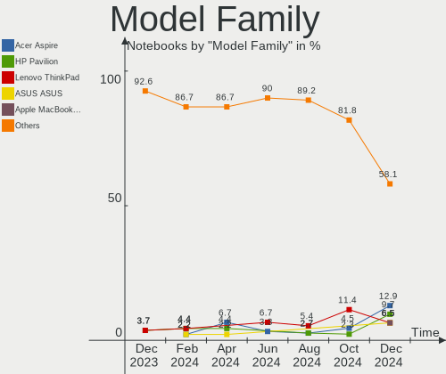
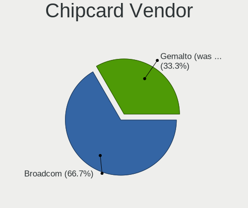

KDE neon Hardware Trends (Notebook)
-----------------------------------

A project to identify most popular hardware characteristics and track their change
over time based on data collected by KDE neon users at https://Linux-Hardware.org.

Anyone can contribute to the study by uploading probes of their computers by
the [hw-probe](https://github.com/linuxhw/hw-probe) tool:

    sudo -E hw-probe -all -upload

Full-feature report is available here: https://linux-hardware.org/?view=trends&formfactor=notebook

Period: May, 2021.

Contents
--------

- [ OS                       ](#os)
- [ OS Family                ](#os-family)
- [ Kernel                   ](#kernel)
- [ Kernel Family            ](#kernel-family)
- [ Kernel Major Ver.        ](#kernel-major-ver)
- [ Arch                     ](#arch)
- [ DE                       ](#de)
- [ Display Server           ](#display-server)
- [ Display Manager          ](#display-manager)
- [ OS Lang                  ](#os-lang)
- [ Boot Mode                ](#boot-mode)
- [ Filesystem               ](#filesystem)
- [ Part. scheme             ](#part-scheme)
- [ Dual Boot with Linux/BSD ](#dual-boot-with-linux/bsd)
- [ Dual Boot (Win)          ](#dual-boot-win)
- [ Country                  ](#country)
- [ City                     ](#city)
- [ Vendor                   ](#vendor)
- [ Model                    ](#model)
- [ Model Family             ](#model-family)
- [ MFG Year                 ](#mfg-year)
- [ Form Factor              ](#form-factor)
- [ Secure Boot              ](#secure-boot)
- [ Coreboot                 ](#coreboot)
- [ RAM Size                 ](#ram-size)
- [ RAM Used                 ](#ram-used)
- [ Has CD-ROM               ](#has-cd-rom)
- [ Total Drives             ](#total-drives)
- [ Has Ethernet             ](#has-ethernet)
- [ Has WiFi                 ](#has-wifi)
- [ Has Bluetooth            ](#has-bluetooth)
- [ Drive Vendor             ](#drive-vendor)
- [ Drive Model              ](#drive-model)
- [ HDD Vendor               ](#hdd-vendor)
- [ SSD Vendor               ](#ssd-vendor)
- [ Drive Kind               ](#drive-kind)
- [ Drive Connector          ](#drive-connector)
- [ Drive Size               ](#drive-size)
- [ Space Total              ](#space-total)
- [ Space Used               ](#space-used)
- [ Malfunc. Drives          ](#malfunc-drives)
- [ Malfunc. Drive Vendor    ](#malfunc-drive-vendor)
- [ Malfunc. HDD Vendor      ](#malfunc-hdd-vendor)
- [ Malfunc. Drive Kind      ](#malfunc-drive-kind)
- [ Failed Drives            ](#failed-drives)
- [ Failed Drive Vendor      ](#failed-drive-vendor)
- [ Drive Status             ](#drive-status)
- [ Storage Vendor           ](#storage-vendor)
- [ Storage Model            ](#storage-model)
- [ Storage Kind             ](#storage-kind)
- [ CPU Vendor               ](#cpu-vendor)
- [ CPU Model                ](#cpu-model)
- [ CPU Model Family         ](#cpu-model-family)
- [ CPU Cores                ](#cpu-cores)
- [ CPU Sockets              ](#cpu-sockets)
- [ CPU Threads              ](#cpu-threads)
- [ CPU Op-Modes             ](#cpu-op-modes)
- [ CPU Microcode            ](#cpu-microcode)
- [ CPU Microarch            ](#cpu-microarch)
- [ GPU Vendor               ](#gpu-vendor)
- [ GPU Model                ](#gpu-model)
- [ GPU Combo                ](#gpu-combo)
- [ GPU Driver               ](#gpu-driver)
- [ GPU Memory               ](#gpu-memory)
- [ Monitor Vendor           ](#monitor-vendor)
- [ Monitor Model            ](#monitor-model)
- [ Monitor Resolution       ](#monitor-resolution)
- [ Monitor Diagonal         ](#monitor-diagonal)
- [ Monitor Width            ](#monitor-width)
- [ Aspect Ratio             ](#aspect-ratio)
- [ Monitor Area             ](#monitor-area)
- [ Pixel Density            ](#pixel-density)
- [ Multiple Monitors        ](#multiple-monitors)
- [ Net Controller Vendor    ](#net-controller-vendor)
- [ Net Controller Model     ](#net-controller-model)
- [ Wireless Vendor          ](#wireless-vendor)
- [ Wireless Model           ](#wireless-model)
- [ Ethernet Vendor          ](#ethernet-vendor)
- [ Ethernet Model           ](#ethernet-model)
- [ Net Controller Kind      ](#net-controller-kind)
- [ Used Controller          ](#used-controller)
- [ NICs                     ](#nics)
- [ IPv6                     ](#ipv6)
- [ Memory Vendor            ](#memory-vendor)
- [ Memory Model             ](#memory-model)
- [ Memory Kind              ](#memory-kind)
- [ Memory Form Factor       ](#memory-form-factor)
- [ Memory Size              ](#memory-size)
- [ Memory Speed             ](#memory-speed)
- [ Sound Vendor             ](#sound-vendor)
- [ Sound Model              ](#sound-model)
- [ Camera Vendor            ](#camera-vendor)
- [ Camera Model             ](#camera-model)
- [ Fingerprint Vendor       ](#fingerprint-vendor)
- [ Fingerprint Model        ](#fingerprint-model)
- [ Chipcard Vendor          ](#chipcard-vendor)
- [ Chipcard Model           ](#chipcard-model)
- [ Printer Vendor           ](#printer-vendor)
- [ Printer Model            ](#printer-model)
- [ Scanner Vendor           ](#scanner-vendor)
- [ Scanner Model            ](#scanner-model)
- [ Bluetooth Vendor         ](#bluetooth-vendor)
- [ Bluetooth Model          ](#bluetooth-model)
- [ Unsupported Devices      ](#unsupported-devices)
- [ Unsupported Device Types ](#unsupported-device-types)

OS
--

Installed operating systems

| Name           | Notebooks | Percent |
|----------------|-----------|---------|
| KDE neon 20.04 | 76        | 100%    |

OS Family
---------

OS without a version

| Name     | Notebooks | Percent |
|----------|-----------|---------|
| KDE neon | 76        | 100%    |

Kernel
------

Version of the Linux kernel

| Version                | Notebooks | Percent |
|------------------------|-----------|---------|
| 5.4.0-73-generic       | 39        | 51.32%  |
| 5.4.0-72-generic       | 24        | 31.58%  |
| 5.8.0-53-generic       | 3         | 3.95%   |
| 5.4.0-70-generic       | 2         | 2.63%   |
| 5.8.0-50-generic       | 1         | 1.32%   |
| 5.4.0-66-generic       | 1         | 1.32%   |
| 5.4.0-65-generic       | 1         | 1.32%   |
| 5.4.0-58-generic       | 1         | 1.32%   |
| 5.4.0-42-generic       | 1         | 1.32%   |
| 5.12.2-051202-generic  | 1         | 1.32%   |
| 5.11.16-051116-generic | 1         | 1.32%   |
| 5.10.41-xanmod1        | 1         | 1.32%   |

Kernel Family
-------------

Linux kernel without a distro release

| Version | Notebooks | Percent |
|---------|-----------|---------|
| 5.4.0   | 69        | 90.79%  |
| 5.8.0   | 4         | 5.26%   |
| 5.12.2  | 1         | 1.32%   |
| 5.11.16 | 1         | 1.32%   |
| 5.10.41 | 1         | 1.32%   |

Kernel Major Ver.
-----------------

Linux kernel major version

| Version | Notebooks | Percent |
|---------|-----------|---------|
| 5.4     | 69        | 90.79%  |
| 5.8     | 4         | 5.26%   |
| 5.12    | 1         | 1.32%   |
| 5.11    | 1         | 1.32%   |
| 5.10    | 1         | 1.32%   |

Arch
----

OS architecture (x86_64, i586, etc.)

| Name   | Notebooks | Percent |
|--------|-----------|---------|
| x86_64 | 76        | 100%    |

DE
--

Desktop Environment

| Name    | Notebooks | Percent |
|---------|-----------|---------|
| KDE     | 69        | 90.79%  |
| KDE5    | 4         | 5.26%   |
| Unknown | 3         | 3.95%   |

Display Server
--------------

X11 or Wayland

| Name    | Notebooks | Percent |
|---------|-----------|---------|
| X11     | 71        | 93.42%  |
| Wayland | 5         | 6.58%   |

Display Manager
---------------

SDDM, LightDM, etc.

| Name    | Notebooks | Percent |
|---------|-----------|---------|
| Unknown | 71        | 93.42%  |
| SDDM    | 5         | 6.58%   |

OS Lang
-------

Language

| Lang  | Notebooks | Percent |
|-------|-----------|---------|
| en_US | 29        | 38.16%  |
| de_DE | 7         | 9.21%   |
| es_ES | 5         | 6.58%   |
| en_GB | 5         | 6.58%   |
| C     | 5         | 6.58%   |
| ru_RU | 4         | 5.26%   |
| pt_BR | 3         | 3.95%   |
| es_MX | 3         | 3.95%   |
| en_IN | 3         | 3.95%   |
| pt_PT | 2         | 2.63%   |
| en_CA | 2         | 2.63%   |
| it_IT | 1         | 1.32%   |
| fr_FR | 1         | 1.32%   |
| es_GT | 1         | 1.32%   |
| es_AR | 1         | 1.32%   |
| en_ZA | 1         | 1.32%   |
| en_NZ | 1         | 1.32%   |
| en_AU | 1         | 1.32%   |
| bg_BG | 1         | 1.32%   |

Boot Mode
---------

EFI or BIOS

| Mode | Notebooks | Percent |
|------|-----------|---------|
| EFI  | 44        | 57.89%  |
| BIOS | 32        | 42.11%  |

Filesystem
----------

Type of filesystem

| Type    | Notebooks | Percent |
|---------|-----------|---------|
| Ext4    | 73        | 96.05%  |
| Overlay | 2         | 2.63%   |
| Btrfs   | 1         | 1.32%   |

Part. scheme
------------

Scheme of partitioning

| Type    | Notebooks | Percent |
|---------|-----------|---------|
| Unknown | 70        | 92.11%  |
| GPT     | 6         | 7.89%   |

Dual Boot with Linux/BSD
------------------------

Hosting more than one Linux/BSD

| Dual boot | Notebooks | Percent |
|-----------|-----------|---------|
| No        | 76        | 100%    |

Dual Boot (Win)
---------------

Hosting Linux and Windows

| Dual boot | Notebooks | Percent |
|-----------|-----------|---------|
| No        | 69        | 90.79%  |
| Yes       | 7         | 9.21%   |

Country
-------

Geographic location (country)

| Country      | Notebooks | Percent |
|--------------|-----------|---------|
| USA          | 19        | 25%     |
| Germany      | 8         | 10.53%  |
| Spain        | 6         | 7.89%   |
| UK           | 4         | 5.26%   |
| Russia       | 4         | 5.26%   |
| Mexico       | 3         | 3.95%   |
| India        | 3         | 3.95%   |
| Brazil       | 3         | 3.95%   |
| Thailand     | 2         | 2.63%   |
| Portugal     | 2         | 2.63%   |
| Poland       | 2         | 2.63%   |
| Netherlands  | 2         | 2.63%   |
| France       | 2         | 2.63%   |
| Canada       | 2         | 2.63%   |
| Argentina    | 2         | 2.63%   |
| UAE          | 1         | 1.32%   |
| South Africa | 1         | 1.32%   |
| New Zealand  | 1         | 1.32%   |
| Italy        | 1         | 1.32%   |
| Iran         | 1         | 1.32%   |
| Hungary      | 1         | 1.32%   |
| Guatemala    | 1         | 1.32%   |
| Bulgaria     | 1         | 1.32%   |
| Belgium      | 1         | 1.32%   |
| Bangladesh   | 1         | 1.32%   |
| Australia    | 1         | 1.32%   |
| Albania      | 1         | 1.32%   |

City
----

Geographic location (city)

| City                  | Notebooks | Percent |
|-----------------------|-----------|---------|
| São Paulo            | 2         | 2.63%   |
| Mexico City           | 2         | 2.63%   |
| Everett               | 2         | 2.63%   |
| Buenos Aires          | 2         | 2.63%   |
| Bangkok               | 2         | 2.63%   |
| Wilderness Rim        | 1         | 1.32%   |
| Wetzlar               | 1         | 1.32%   |
| West Lafayette        | 1         | 1.32%   |
| Washington            | 1         | 1.32%   |
| Warsaw                | 1         | 1.32%   |
| Warminster            | 1         | 1.32%   |
| Wabern                | 1         | 1.32%   |
| Vigo                  | 1         | 1.32%   |
| Vasvar                | 1         | 1.32%   |
| Valladolid            | 1         | 1.32%   |
| Tver                  | 1         | 1.32%   |
| The Hague             | 1         | 1.32%   |
| Tehran                | 1         | 1.32%   |
| Słupsk               | 1         | 1.32%   |
| Southampton           | 1         | 1.32%   |
| Sierra Vista          | 1         | 1.32%   |
| Shumen                | 1         | 1.32%   |
| Senhora da Hora       | 1         | 1.32%   |
| San Luis Potosí City | 1         | 1.32%   |
| Saint Paul            | 1         | 1.32%   |
| Reus                  | 1         | 1.32%   |
| Ramonville-Saint-Agne | 1         | 1.32%   |
| Pune                  | 1         | 1.32%   |
| Portland              | 1         | 1.32%   |
| Petrozavodsk          | 1         | 1.32%   |
| Myrtle Beach          | 1         | 1.32%   |
| Munich                | 1         | 1.32%   |
| Moscow                | 1         | 1.32%   |
| Montreal              | 1         | 1.32%   |
| Mesa                  | 1         | 1.32%   |
| McKeesport            | 1         | 1.32%   |
| Manchester            | 1         | 1.32%   |
| Lünen                | 1         | 1.32%   |
| Lisbon                | 1         | 1.32%   |
| Leipzig               | 1         | 1.32%   |
| Krasnoyarsk           | 1         | 1.32%   |
| Islington             | 1         | 1.32%   |
| Hyderabad             | 1         | 1.32%   |
| Houston               | 1         | 1.32%   |
| Hoboken               | 1         | 1.32%   |
| Hamburg               | 1         | 1.32%   |
| Guatemala City        | 1         | 1.32%   |
| Grimma                | 1         | 1.32%   |
| Gijón                | 1         | 1.32%   |
| Germiston             | 1         | 1.32%   |
| Fruitland             | 1         | 1.32%   |
| Freiburg im Breisgau  | 1         | 1.32%   |
| Edmonton              | 1         | 1.32%   |
| Durrës               | 1         | 1.32%   |
| Dubai                 | 1         | 1.32%   |
| Dhaka                 | 1         | 1.32%   |
| Delft                 | 1         | 1.32%   |
| Dannevirke            | 1         | 1.32%   |
| Dallas                | 1         | 1.32%   |
| Concord               | 1         | 1.32%   |

Vendor
------

Motherboard manufacturer

| Name                | Notebooks | Percent |
|---------------------|-----------|---------|
| Hewlett-Packard     | 18        | 23.68%  |
| Lenovo              | 15        | 19.74%  |
| Dell                | 10        | 13.16%  |
| ASUSTek Computer    | 9         | 11.84%  |
| Acer                | 6         | 7.89%   |
| MSI                 | 3         | 3.95%   |
| Apple               | 3         | 3.95%   |
| Toshiba             | 2         | 2.63%   |
| YJKC                | 1         | 1.32%   |
| Standard            | 1         | 1.32%   |
| Sony                | 1         | 1.32%   |
| Samsung Electronics | 1         | 1.32%   |
| PRIXTON             | 1         | 1.32%   |
| OEGStone            | 1         | 1.32%   |
| Fujitsu             | 1         | 1.32%   |
| Alienware           | 1         | 1.32%   |
| ADMIRAL             | 1         | 1.32%   |
| Unknown             | 1         | 1.32%   |

Model
-----

Motherboard model

| Name                                   | Notebooks | Percent |
|----------------------------------------|-----------|---------|
| HP Pavilion Notebook                   | 2         | 2.63%   |
| HP 15 Notebook PC                      | 2         | 2.63%   |
| Apple MacBookPro8,1                    | 2         | 2.63%   |
| Acer Aspire A515-43                    | 2         | 2.63%   |
| Unknown                                | 2         | 2.63%   |
| YJKC vBOOK Plus                        | 1         | 1.32%   |
| Toshiba Satellite S55t-C               | 1         | 1.32%   |
| Toshiba Satellite C55t-B               | 1         | 1.32%   |
| Sony SVE14A25CAB                       | 1         | 1.32%   |
| Samsung 700T1C                         | 1         | 1.32%   |
| PRIXTON Flex Pro F100 4/64             | 1         | 1.32%   |
| OEGStone C4100/C5100                   | 1         | 1.32%   |
| MSI GS75 Stealth 8SF                   | 1         | 1.32%   |
| MSI GP62 6QE                           | 1         | 1.32%   |
| MSI GF65 Thin 9SD                      | 1         | 1.32%   |
| Lenovo Y520-15IKBN 80WK                | 1         | 1.32%   |
| Lenovo V15-IIL 82C5                    | 1         | 1.32%   |
| Lenovo V15-ADA 82C7                    | 1         | 1.32%   |
| Lenovo ThinkPad X1 Extreme 20MFCTO1WW  | 1         | 1.32%   |
| Lenovo ThinkPad T530 239265U           | 1         | 1.32%   |
| Lenovo ThinkPad L14 Gen 1 20U6S1JD00   | 1         | 1.32%   |
| Lenovo IdeaPad S145-15API 81V7         | 1         | 1.32%   |
| Lenovo IdeaPad S145-14IWL 81MU         | 1         | 1.32%   |
| Lenovo IdeaPad 330-15ARR 81D2          | 1         | 1.32%   |
| Lenovo IdeaPad 320-15IKB 81BG          | 1         | 1.32%   |
| Lenovo IdeaPad 320-15ABR 80XS          | 1         | 1.32%   |
| Lenovo IdeaPad 3 15IIL05 81WE          | 1         | 1.32%   |
| Lenovo G700 20251                      | 1         | 1.32%   |
| Lenovo G570 20079                      | 1         | 1.32%   |
| Lenovo G50-80 80R0                     | 1         | 1.32%   |
| HP ZBook Studio G5                     | 1         | 1.32%   |
| HP Stream Laptop 11-y0XX               | 1         | 1.32%   |
| HP ProBook 455 G7                      | 1         | 1.32%   |
| HP ProBook 4540s                       | 1         | 1.32%   |
| HP Pavilion g7                         | 1         | 1.32%   |
| HP Pavilion g4                         | 1         | 1.32%   |
| HP Pavilion dv7                        | 1         | 1.32%   |
| HP Notebook                            | 1         | 1.32%   |
| HP Laptop 15s-fq1xxx                   | 1         | 1.32%   |
| HP Laptop 15-bw0xx                     | 1         | 1.32%   |
| HP Laptop 14s-fq0xxx                   | 1         | 1.32%   |
| HP EliteBook 840 G2                    | 1         | 1.32%   |
| HP Compaq 6910p                        | 1         | 1.32%   |
| HP Compaq 6735b                        | 1         | 1.32%   |
| Fujitsu LIFEBOOK AH544                 | 1         | 1.32%   |
| Dell XPS 13 9380                       | 1         | 1.32%   |
| Dell XPS 13 9350                       | 1         | 1.32%   |
| Dell Latitude E6410                    | 1         | 1.32%   |
| Dell Latitude E6400                    | 1         | 1.32%   |
| Dell Latitude E6330                    | 1         | 1.32%   |
| Dell Latitude E6230                    | 1         | 1.32%   |
| Dell Latitude D830                     | 1         | 1.32%   |
| Dell Latitude 3410                     | 1         | 1.32%   |
| Dell Inspiron 7501                     | 1         | 1.32%   |
| Dell Inspiron 3542                     | 1         | 1.32%   |
| ASUS X55C                              | 1         | 1.32%   |
| ASUS X555LD                            | 1         | 1.32%   |
| ASUS VivoBook_ASUSLaptop X403JA_K403JA | 1         | 1.32%   |
| ASUS Q304UA                            | 1         | 1.32%   |
| ASUS N56VM                             | 1         | 1.32%   |

Model Family
------------

Motherboard model prefix

| Name               | Notebooks | Percent |
|--------------------|-----------|---------|
| Lenovo IdeaPad     | 6         | 7.89%   |
| Dell Latitude      | 6         | 7.89%   |
| HP Pavilion        | 5         | 6.58%   |
| Acer Aspire        | 5         | 6.58%   |
| Lenovo ThinkPad    | 3         | 3.95%   |
| HP Laptop          | 3         | 3.95%   |
| Toshiba Satellite  | 2         | 2.63%   |
| HP ProBook         | 2         | 2.63%   |
| HP Compaq          | 2         | 2.63%   |
| HP 15              | 2         | 2.63%   |
| Dell XPS           | 2         | 2.63%   |
| Dell Inspiron      | 2         | 2.63%   |
| Apple MacBookPro8  | 2         | 2.63%   |
| Unknown            | 2         | 2.63%   |
| YJKC vBOOK         | 1         | 1.32%   |
| Sony SVE14A25CAB   | 1         | 1.32%   |
| Samsung 700T1C     | 1         | 1.32%   |
| PRIXTON Flex       | 1         | 1.32%   |
| OEGStone C4100     | 1         | 1.32%   |
| MSI GS75           | 1         | 1.32%   |
| MSI GP62           | 1         | 1.32%   |
| MSI GF65           | 1         | 1.32%   |
| Lenovo Y520-15IKBN | 1         | 1.32%   |
| Lenovo V15-IIL     | 1         | 1.32%   |
| Lenovo V15-ADA     | 1         | 1.32%   |
| Lenovo G700        | 1         | 1.32%   |
| Lenovo G570        | 1         | 1.32%   |
| Lenovo G50-80      | 1         | 1.32%   |
| HP ZBook           | 1         | 1.32%   |
| HP Stream          | 1         | 1.32%   |
| HP Notebook        | 1         | 1.32%   |
| HP EliteBook       | 1         | 1.32%   |
| Fujitsu LIFEBOOK   | 1         | 1.32%   |
| ASUS X55C          | 1         | 1.32%   |
| ASUS X555LD        | 1         | 1.32%   |
| ASUS VivoBook      | 1         | 1.32%   |
| ASUS Q304UA        | 1         | 1.32%   |
| ASUS N56VM         | 1         | 1.32%   |
| ASUS N53SN         | 1         | 1.32%   |
| ASUS N501VW        | 1         | 1.32%   |
| ASUS K501UQ        | 1         | 1.32%   |
| ASUS G752VY        | 1         | 1.32%   |
| Apple MacBookPro9  | 1         | 1.32%   |
| Alienware 17       | 1         | 1.32%   |
| ADMIRAL ADC14      | 1         | 1.32%   |
| Acer Extensa       | 1         | 1.32%   |

MFG Year
--------

Motherboard manufacture year

| Year | Notebooks | Percent |
|------|-----------|---------|
| 2020 | 18        | 23.68%  |
| 2019 | 11        | 14.47%  |
| 2018 | 9         | 11.84%  |
| 2013 | 7         | 9.21%   |
| 2021 | 5         | 6.58%   |
| 2017 | 5         | 6.58%   |
| 2016 | 5         | 6.58%   |
| 2012 | 5         | 6.58%   |
| 2015 | 4         | 5.26%   |
| 2014 | 2         | 2.63%   |
| 2011 | 2         | 2.63%   |
| 2010 | 1         | 1.32%   |
| 2009 | 1         | 1.32%   |
| 2008 | 1         | 1.32%   |

Form Factor
-----------

Physical design of the computer

| Name     | Notebooks | Percent |
|----------|-----------|---------|
| Notebook | 76        | 100%    |

Secure Boot
-----------

Enabled or disabled

| State    | Notebooks | Percent |
|----------|-----------|---------|
| Disabled | 68        | 89.47%  |
| Enabled  | 8         | 10.53%  |

Coreboot
--------

Have coreboot on board

| Used | Notebooks | Percent |
|------|-----------|---------|
| No   | 76        | 100%    |

RAM Size
--------

Total RAM memory

| Size in GB  | Notebooks | Percent |
|-------------|-----------|---------|
| 4.01-8.0    | 25        | 32.89%  |
| 3.01-4.0    | 21        | 27.63%  |
| 16.01-24.0  | 12        | 15.79%  |
| 8.01-16.0   | 11        | 14.47%  |
| 32.01-64.0  | 5         | 6.58%   |
| 24.01-32.0  | 1         | 1.32%   |
| 64.01-256.0 | 1         | 1.32%   |

RAM Used
--------

Used RAM memory

| Used GB  | Notebooks | Percent |
|----------|-----------|---------|
| 1.01-2.0 | 31        | 40.79%  |
| 2.01-3.0 | 22        | 28.95%  |
| 3.01-4.0 | 11        | 14.47%  |
| 4.01-8.0 | 9         | 11.84%  |
| 0.51-1.0 | 3         | 3.95%   |

Has CD-ROM
----------

Has CD-ROM on board

| Presented | Notebooks | Percent |
|-----------|-----------|---------|
| No        | 50        | 65.79%  |
| Yes       | 26        | 34.21%  |

Total Drives
------------

Number of drives on board

| Drives | Notebooks | Percent |
|--------|-----------|---------|
| 1      | 54        | 71.05%  |
| 2      | 20        | 26.32%  |
| 6      | 1         | 1.32%   |
| 3      | 1         | 1.32%   |

Has Ethernet
------------

Has Ethernet on board

| Presented | Notebooks | Percent |
|-----------|-----------|---------|
| Yes       | 60        | 78.95%  |
| No        | 16        | 21.05%  |

Has WiFi
--------

Has WiFi module

| Presented | Notebooks | Percent |
|-----------|-----------|---------|
| Yes       | 73        | 96.05%  |
| No        | 3         | 3.95%   |

Has Bluetooth
-------------

Has Bluetooth module

| Presented | Notebooks | Percent |
|-----------|-----------|---------|
| Yes       | 63        | 82.89%  |
| No        | 13        | 17.11%  |

Drive Vendor
------------

Hard drive vendors

| Vendor                    | Notebooks | Drives | Percent |
|---------------------------|-----------|--------|---------|
| Seagate                   | 13        | 13     | 13.54%  |
| Samsung Electronics       | 13        | 15     | 13.54%  |
| WDC                       | 12        | 12     | 12.5%   |
| Kingston                  | 9         | 10     | 9.38%   |
| SanDisk                   | 8         | 8      | 8.33%   |
| HGST                      | 5         | 5      | 5.21%   |
| Crucial                   | 5         | 5      | 5.21%   |
| Unknown                   | 3         | 6      | 3.13%   |
| Toshiba                   | 3         | 3      | 3.13%   |
| KingSpec                  | 2         | 3      | 2.08%   |
| Intel                     | 2         | 3      | 2.08%   |
| XPG                       | 1         | 1      | 1.04%   |
| Union Memory              | 1         | 1      | 1.04%   |
| Transcend                 | 1         | 1      | 1.04%   |
| StarTech                  | 1         | 2      | 1.04%   |
| SPCC                      | 1         | 1      | 1.04%   |
| SK Hynix                  | 1         | 1      | 1.04%   |
| Silicon Motion            | 1         | 2      | 1.04%   |
| ShanDianZhe               | 1         | 1      | 1.04%   |
| Micron/Crucial Technology | 1         | 1      | 1.04%   |
| Micron Technology         | 1         | 1      | 1.04%   |
| LITEONIT                  | 1         | 1      | 1.04%   |
| LITEON                    | 1         | 1      | 1.04%   |
| Lexar                     | 1         | 1      | 1.04%   |
| Intenso                   | 1         | 1      | 1.04%   |
| Hitachi                   | 1         | 1      | 1.04%   |
| GOODRAM                   | 1         | 1      | 1.04%   |
| Fujitsu                   | 1         | 1      | 1.04%   |
| Corsair                   | 1         | 1      | 1.04%   |
| Blackpcs                  | 1         | 1      | 1.04%   |
| Apple                     | 1         | 1      | 1.04%   |
| A-DATA Technology         | 1         | 1      | 1.04%   |

Drive Model
-----------

Hard drive models

| Model                                | Notebooks | Percent |
|--------------------------------------|-----------|---------|
| Seagate ST1000LM035-1RK172 1TB       | 5         | 4.81%   |
| Samsung NVMe SSD Drive 256GB         | 3         | 2.88%   |
| Kingston SA400S37480G 480GB SSD      | 3         | 2.88%   |
| HGST HTS545050A7E680 500GB           | 3         | 2.88%   |
| Unknown MMC Card  64GB               | 2         | 1.92%   |
| Unknown MMC Card  134GB              | 2         | 1.92%   |
| Seagate ST1000LM024 HN-M101MBB 1TB   | 2         | 1.92%   |
| Samsung SSD 860 EVO 1TB              | 2         | 1.92%   |
| Kingston SA400S37240G 240GB SSD      | 2         | 1.92%   |
| XPG NVMe SSD Drive 2TB               | 1         | 0.96%   |
| WDC WDS480G2G0A-00JH30 480GB SSD     | 1         | 0.96%   |
| WDC WDS240G2G0B-00EPW0 240GB SSD     | 1         | 0.96%   |
| WDC WDS120G1G0B-00RC30 120GB SSD     | 1         | 0.96%   |
| WDC WDS100T2B0B-00YS70 1TB SSD       | 1         | 0.96%   |
| WDC WD5000LPVX-08V0TT6 500GB         | 1         | 0.96%   |
| WDC WD5000BPVT-22HXZT3 500GB         | 1         | 0.96%   |
| WDC WD3200BEVT-80A0RT0 320GB         | 1         | 0.96%   |
| WDC WD10SPZX-00Z10T0 1TB             | 1         | 0.96%   |
| WDC WD10JPVX-60JC3T1 1TB             | 1         | 0.96%   |
| WDC WD10JPVX-60JC3T0 1TB             | 1         | 0.96%   |
| WDC WD10JPVX-22JC3T0 1TB             | 1         | 0.96%   |
| WDC WD10JPCX-24UE4T0 1TB             | 1         | 0.96%   |
| Unknown S0J9F8  64GB                 | 1         | 0.96%   |
| Unknown APPSD  134GB                 | 1         | 0.96%   |
| Union Memory RTOTJ128VGD2EYX 128GB   | 1         | 0.96%   |
| Transcend TS256GMTS830S 256GB SSD    | 1         | 0.96%   |
| Toshiba NVMe SSD Drive 512GB         | 1         | 0.96%   |
| Toshiba MQ01ABF050 500GB             | 1         | 0.96%   |
| Toshiba MQ01ABD075 752GB             | 1         | 0.96%   |
| StarTech PM 2TB                      | 1         | 0.96%   |
| SPCC M.2 PCIe SSD 1TB                | 1         | 0.96%   |
| SK Hynix NVMe SSD Drive 256GB        | 1         | 0.96%   |
| Silicon Motion NVMe SSD Drive 2TB    | 1         | 0.96%   |
| ShanDianZhe 512GB                    | 1         | 0.96%   |
| Seagate ST9500423AS 500GB            | 1         | 0.96%   |
| Seagate ST9100821AS 100GB            | 1         | 0.96%   |
| Seagate ST500LT012-1DG142 500GB      | 1         | 0.96%   |
| Seagate ST500LM030-2E717D 500GB      | 1         | 0.96%   |
| Seagate ST2000LM007-1R8174 2TB       | 1         | 0.96%   |
| Seagate ST2000LM003 HN-M201RAD 2TB   | 1         | 0.96%   |
| SanDisk SDSSDH31000G 1TB             | 1         | 0.96%   |
| SanDisk SDSSDA120G 120GB             | 1         | 0.96%   |
| SanDisk SD6SB1M-256G-1006 256GB SSD  | 1         | 0.96%   |
| Sandisk NVMe SSD Drive 512GB         | 1         | 0.96%   |
| Sandisk NVMe SSD Drive 500GB         | 1         | 0.96%   |
| Sandisk NVMe SSD Drive 256GB         | 1         | 0.96%   |
| Sandisk NVMe SSD Drive 1TB           | 1         | 0.96%   |
| SanDisk DF4032  32GB                 | 1         | 0.96%   |
| Samsung SSD PM851 mSATA 128GB        | 1         | 0.96%   |
| Samsung SSD 860 EVO 500GB            | 1         | 0.96%   |
| Samsung SSD 850 EVO 250GB            | 1         | 0.96%   |
| Samsung SSD 750 EVO 120GB            | 1         | 0.96%   |
| Samsung PM951 NVMe 256GB             | 1         | 0.96%   |
| Samsung NVMe SSD Drive 250GB         | 1         | 0.96%   |
| Samsung NVMe SSD Drive 128GB         | 1         | 0.96%   |
| Samsung NVMe SSD Drive 1024GB        | 1         | 0.96%   |
| Samsung MZ7LN256HAJQ-000L2 256GB SSD | 1         | 0.96%   |
| Samsung HM641JI 640GB                | 1         | 0.96%   |
| Micron/Crucial NVMe SSD Drive 1TB    | 1         | 0.96%   |
| Micron NVMe SSD Drive 512GB          | 1         | 0.96%   |

HDD Vendor
----------

Hard disk drive vendors

| Vendor              | Notebooks | Drives | Percent |
|---------------------|-----------|--------|---------|
| Seagate             | 13        | 13     | 40.63%  |
| WDC                 | 8         | 8      | 25%     |
| HGST                | 5         | 5      | 15.63%  |
| Toshiba             | 2         | 2      | 6.25%   |
| Samsung Electronics | 1         | 1      | 3.13%   |
| Hitachi             | 1         | 1      | 3.13%   |
| Fujitsu             | 1         | 1      | 3.13%   |
| Apple               | 1         | 1      | 3.13%   |

SSD Vendor
----------

Solid state drive vendors

| Vendor              | Notebooks | Drives | Percent |
|---------------------|-----------|--------|---------|
| Kingston            | 8         | 9      | 22.22%  |
| Samsung Electronics | 6         | 7      | 16.67%  |
| WDC                 | 4         | 4      | 11.11%  |
| Crucial             | 4         | 4      | 11.11%  |
| SanDisk             | 3         | 3      | 8.33%   |
| KingSpec            | 2         | 3      | 5.56%   |
| Union Memory        | 1         | 1      | 2.78%   |
| Transcend           | 1         | 1      | 2.78%   |
| LITEONIT            | 1         | 1      | 2.78%   |
| LITEON              | 1         | 1      | 2.78%   |
| Lexar               | 1         | 1      | 2.78%   |
| Intenso             | 1         | 1      | 2.78%   |
| GOODRAM             | 1         | 1      | 2.78%   |
| Corsair             | 1         | 1      | 2.78%   |
| Blackpcs            | 1         | 1      | 2.78%   |

Drive Kind
----------

HDD or SSD

| Kind    | Notebooks | Drives | Percent |
|---------|-----------|--------|---------|
| SSD     | 34        | 39     | 37.78%  |
| HDD     | 31        | 32     | 34.44%  |
| NVMe    | 19        | 25     | 21.11%  |
| MMC     | 4         | 7      | 4.44%   |
| Unknown | 2         | 3      | 2.22%   |

Drive Connector
---------------

SATA, SAS, NVMe, etc.

| Type | Notebooks | Drives | Percent |
|------|-----------|--------|---------|
| SATA | 61        | 72     | 71.76%  |
| NVMe | 19        | 25     | 22.35%  |
| MMC  | 4         | 7      | 4.71%   |
| SAS  | 1         | 2      | 1.18%   |

Drive Size
----------

Size of hard drive

| Size in TB | Notebooks | Drives | Percent |
|------------|-----------|--------|---------|
| 0.01-0.5   | 41        | 45     | 62.12%  |
| 0.51-1.0   | 22        | 22     | 33.33%  |
| 1.01-2.0   | 3         | 4      | 4.55%   |

Space Total
-----------

Amount of disk space available on the file system

| Size in GB     | Notebooks | Percent |
|----------------|-----------|---------|
| 101-250        | 22        | 28.95%  |
| 251-500        | 20        | 26.32%  |
| 501-1000       | 13        | 17.11%  |
| 1-20           | 5         | 6.58%   |
| 1001-2000      | 4         | 5.26%   |
| 51-100         | 4         | 5.26%   |
| 21-50          | 3         | 3.95%   |
| Unknown        | 3         | 3.95%   |
| More than 3000 | 1         | 1.32%   |
| 2001-3000      | 1         | 1.32%   |

Space Used
----------

Amount of used disk space

| Used GB   | Notebooks | Percent |
|-----------|-----------|---------|
| 1-20      | 36        | 47.37%  |
| 21-50     | 11        | 14.47%  |
| 101-250   | 11        | 14.47%  |
| 51-100    | 7         | 9.21%   |
| 251-500   | 5         | 6.58%   |
| Unknown   | 3         | 3.95%   |
| 2001-3000 | 1         | 1.32%   |
| 1001-2000 | 1         | 1.32%   |
| 501-1000  | 1         | 1.32%   |

Malfunc. Drives
---------------

Drive models with a malfunction

| Model                          | Notebooks | Drives | Percent |
|--------------------------------|-----------|--------|---------|
| Seagate ST1000LM035-1RK172 1TB | 1         | 1      | 50%     |
| HGST HTS545050A7E680 500GB     | 1         | 1      | 50%     |

Malfunc. Drive Vendor
---------------------

Vendors of faulty drives

| Vendor  | Notebooks | Drives | Percent |
|---------|-----------|--------|---------|
| Seagate | 1         | 1      | 50%     |
| HGST    | 1         | 1      | 50%     |

Malfunc. HDD Vendor
-------------------

Vendors of faulty HDD drives

| Vendor  | Notebooks | Drives | Percent |
|---------|-----------|--------|---------|
| Seagate | 1         | 1      | 50%     |
| HGST    | 1         | 1      | 50%     |

Malfunc. Drive Kind
-------------------

Kinds of faulty drives

| Kind | Notebooks | Drives | Percent |
|------|-----------|--------|---------|
| HDD  | 2         | 2      | 100%    |

Failed Drives
-------------

Failed drive models

Zero info for selected period =(

Failed Drive Vendor
-------------------

Failed drive vendors

Zero info for selected period =(

Drive Status
------------

Number of failed and malfunc. drives

| Status   | Notebooks | Drives | Percent |
|----------|-----------|--------|---------|
| Detected | 71        | 99     | 91.03%  |
| Works    | 5         | 5      | 6.41%   |
| Malfunc  | 2         | 2      | 2.56%   |

Storage Vendor
--------------

Storage controller vendors

| Vendor                       | Notebooks | Percent |
|------------------------------|-----------|---------|
| Intel                        | 59        | 66.29%  |
| AMD                          | 10        | 11.24%  |
| Samsung Electronics          | 6         | 6.74%   |
| Sandisk                      | 4         | 4.49%   |
| Micron/Crucial Technology    | 2         | 2.25%   |
| ADATA Technology             | 2         | 2.25%   |
| Toshiba America Info Systems | 1         | 1.12%   |
| SK Hynix                     | 1         | 1.12%   |
| Silicon Motion               | 1         | 1.12%   |
| Phison Electronics           | 1         | 1.12%   |
| Micron Technology            | 1         | 1.12%   |
| Kingston Technology Company  | 1         | 1.12%   |

Storage Model
-------------

Storage controller models

| Model                                                                            | Notebooks | Percent |
|----------------------------------------------------------------------------------|-----------|---------|
| Intel 7 Series Chipset Family 6-port SATA Controller [AHCI mode]                 | 12        | 12.77%  |
| AMD FCH SATA Controller [AHCI mode]                                              | 9         | 9.57%   |
| Intel Sunrise Point-LP SATA Controller [AHCI mode]                               | 8         | 8.51%   |
| Intel HM170/QM170 Chipset SATA Controller [AHCI Mode]                            | 4         | 4.26%   |
| Intel 82801 Mobile SATA Controller [RAID mode]                                   | 4         | 4.26%   |
| Intel 6 Series/C200 Series Chipset Family 6 port Mobile SATA AHCI Controller     | 4         | 4.26%   |
| Intel Cannon Lake Mobile PCH SATA AHCI Controller                                | 3         | 3.19%   |
| Intel Atom Processor E3800 Series SATA AHCI Controller                           | 3         | 3.19%   |
| Intel 82801IBM/IEM (ICH9M/ICH9M-E) 4 port SATA Controller [AHCI mode]            | 3         | 3.19%   |
| Samsung NVMe SSD Controller SM961/PM961/SM963                                    | 2         | 2.13%   |
| Samsung NVMe SSD Controller SM951/PM951                                          | 2         | 2.13%   |
| Intel Wildcat Point-LP SATA Controller [AHCI Mode]                               | 2         | 2.13%   |
| Intel Q170/Q150/B150/H170/H110/Z170/CM236 Chipset SATA Controller [AHCI Mode]    | 2         | 2.13%   |
| Intel Ice Lake-LP SATA Controller [AHCI mode]                                    | 2         | 2.13%   |
| Intel Celeron/Pentium Silver Processor SATA Controller                           | 2         | 2.13%   |
| Intel 82801HM/HEM (ICH8M/ICH8M-E) IDE Controller                                 | 2         | 2.13%   |
| Intel 8 Series SATA Controller 1 [AHCI mode]                                     | 2         | 2.13%   |
| Toshiba America Info Systems Toshiba America Info Non-Volatile memory controller | 1         | 1.06%   |
| SK Hynix BC511                                                                   | 1         | 1.06%   |
| Silicon Motion SM2262/SM2262EN SSD Controller                                    | 1         | 1.06%   |
| Sandisk WD Blue SN550 NVMe SSD                                                   | 1         | 1.06%   |
| Sandisk WD Black SN750 / PC SN730 NVMe SSD                                       | 1         | 1.06%   |
| Sandisk WD Black 2018/SN750 / PC SN720 NVMe SSD                                  | 1         | 1.06%   |
| Sandisk Non-Volatile memory controller                                           | 1         | 1.06%   |
| Samsung NVMe SSD Controller SM981/PM981/PM983                                    | 1         | 1.06%   |
| Samsung NVMe Controller                                                          | 1         | 1.06%   |
| Phison E12 NVMe Controller                                                       | 1         | 1.06%   |
| Micron/Crucial P2 NVMe PCIe SSD                                                  | 1         | 1.06%   |
| Micron/Crucial Non-Volatile memory controller                                    | 1         | 1.06%   |
| Micron Non-Volatile memory controller                                            | 1         | 1.06%   |
| Kingston Company U-SNS8154P3 NVMe SSD                                            | 1         | 1.06%   |
| Intel SSD 660P Series                                                            | 1         | 1.06%   |
| Intel Non-Volatile memory controller                                             | 1         | 1.06%   |
| Intel Comet Lake SATA AHCI Controller                                            | 1         | 1.06%   |
| Intel Cannon Point-LP SATA Controller [AHCI Mode]                                | 1         | 1.06%   |
| Intel Atom/Celeron/Pentium Processor x5-E8000/J3xxx/N3xxx Series SATA Controller | 1         | 1.06%   |
| Intel 82801HM/HEM (ICH8M/ICH8M-E) SATA Controller [IDE mode]                     | 1         | 1.06%   |
| Intel 82801HM/HEM (ICH8M/ICH8M-E) SATA Controller [AHCI mode]                    | 1         | 1.06%   |
| Intel 8 Series/C220 Series Chipset Family 6-port SATA Controller 1 [AHCI mode]   | 1         | 1.06%   |
| Intel 5 Series/3400 Series Chipset 4 port SATA IDE Controller                    | 1         | 1.06%   |
| Intel 5 Series/3400 Series Chipset 2 port SATA IDE Controller                    | 1         | 1.06%   |
| Intel 400 Series Chipset Family SATA AHCI Controller                             | 1         | 1.06%   |
| AMD SB7x0/SB8x0/SB9x0 SATA Controller [IDE mode]                                 | 1         | 1.06%   |
| ADATA XPG SX8200 Pro PCIe Gen3x4 M.2 2280 Solid State Drive                      | 1         | 1.06%   |
| ADATA Non-Volatile memory controller                                             | 1         | 1.06%   |

Storage Kind
------------

Kind of storage controller (IDE, SATA, NVMe, SAS, ...)

| Kind | Notebooks | Percent |
|------|-----------|---------|
| SATA | 63        | 70.79%  |
| NVMe | 19        | 21.35%  |
| RAID | 4         | 4.49%   |
| IDE  | 3         | 3.37%   |

CPU Vendor
----------

Processor vendors

| Vendor | Notebooks | Percent |
|--------|-----------|---------|
| Intel  | 63        | 82.89%  |
| AMD    | 13        | 17.11%  |

CPU Model
---------

Processor models

| Model                                           | Notebooks | Percent |
|-------------------------------------------------|-----------|---------|
| Intel Core i5-6200U CPU @ 2.30GHz               | 4         | 5.26%   |
| Intel Core i7-6700HQ CPU @ 2.60GHz              | 3         | 3.95%   |
| Intel Core i5-3210M CPU @ 2.50GHz               | 3         | 3.95%   |
| Intel Core i7-8750H CPU @ 2.20GHz               | 2         | 2.63%   |
| Intel Core i5-7200U CPU @ 2.50GHz               | 2         | 2.63%   |
| Intel Core i5-3320M CPU @ 2.60GHz               | 2         | 2.63%   |
| Intel Core i5-1035G1 CPU @ 1.00GHz              | 2         | 2.63%   |
| Intel Core i3-1005G1 CPU @ 1.20GHz              | 2         | 2.63%   |
| Intel Celeron CPU N2840 @ 2.16GHz               | 2         | 2.63%   |
| AMD Ryzen 5 4500U with Radeon Graphics          | 2         | 2.63%   |
| AMD Ryzen 5 3500U with Radeon Vega Mobile Gfx   | 2         | 2.63%   |
| AMD A12-9720P RADEON R7, 12 COMPUTE CORES 4C+8G | 2         | 2.63%   |
| Intel Pentium Dual-Core CPU T4400 @ 2.20GHz     | 1         | 1.32%   |
| Intel Core i7-8850H CPU @ 2.60GHz               | 1         | 1.32%   |
| Intel Core i7-8565U CPU @ 1.80GHz               | 1         | 1.32%   |
| Intel Core i7-8550U CPU @ 1.80GHz               | 1         | 1.32%   |
| Intel Core i7-7820HK CPU @ 2.90GHz              | 1         | 1.32%   |
| Intel Core i7-7700HQ CPU @ 2.80GHz              | 1         | 1.32%   |
| Intel Core i7-7500U CPU @ 2.70GHz               | 1         | 1.32%   |
| Intel Core i7-5600U CPU @ 2.60GHz               | 1         | 1.32%   |
| Intel Core i7-5500U CPU @ 2.40GHz               | 1         | 1.32%   |
| Intel Core i7-4702MQ CPU @ 2.20GHz              | 1         | 1.32%   |
| Intel Core i7-4510U CPU @ 2.00GHz               | 1         | 1.32%   |
| Intel Core i7-3632QM CPU @ 2.20GHz              | 1         | 1.32%   |
| Intel Core i7-3612QM CPU @ 2.10GHz              | 1         | 1.32%   |
| Intel Core i7-3520M CPU @ 2.90GHz               | 1         | 1.32%   |
| Intel Core i7-2630QM CPU @ 2.00GHz              | 1         | 1.32%   |
| Intel Core i7-10750H CPU @ 2.60GHz              | 1         | 1.32%   |
| Intel Core i7-10510U CPU @ 1.80GHz              | 1         | 1.32%   |
| Intel Core i5-9300H CPU @ 2.40GHz               | 1         | 1.32%   |
| Intel Core i5-6300HQ CPU @ 2.30GHz              | 1         | 1.32%   |
| Intel Core i5-3317U CPU @ 1.70GHz               | 1         | 1.32%   |
| Intel Core i5-2435M CPU @ 2.40GHz               | 1         | 1.32%   |
| Intel Core i5-2415M CPU @ 2.30GHz               | 1         | 1.32%   |
| Intel Core i5 CPU M 560 @ 2.67GHz               | 1         | 1.32%   |
| Intel Core i3-6100U CPU @ 2.30GHz               | 1         | 1.32%   |
| Intel Core i3-4005U CPU @ 1.70GHz               | 1         | 1.32%   |
| Intel Core i3-3120M CPU @ 2.50GHz               | 1         | 1.32%   |
| Intel Core i3-3110M CPU @ 2.40GHz               | 1         | 1.32%   |
| Intel Core i3-2370M CPU @ 2.40GHz               | 1         | 1.32%   |
| Intel Core i3-2310M CPU @ 2.10GHz               | 1         | 1.32%   |
| Intel Core 2 Duo CPU T9300 @ 2.50GHz            | 1         | 1.32%   |
| Intel Core 2 Duo CPU T7300 @ 2.00GHz            | 1         | 1.32%   |
| Intel Core 2 Duo CPU P9700 @ 2.80GHz            | 1         | 1.32%   |
| Intel Core 2 Duo CPU P7450 @ 2.13GHz            | 1         | 1.32%   |
| Intel Celeron N4020 CPU @ 1.10GHz               | 1         | 1.32%   |
| Intel Celeron J4115 CPU @ 1.80GHz               | 1         | 1.32%   |
| Intel Celeron CPU N3060 @ 1.60GHz               | 1         | 1.32%   |
| Intel Celeron CPU N3050 @ 1.60GHz               | 1         | 1.32%   |
| Intel Celeron CPU N2830 @ 2.16GHz               | 1         | 1.32%   |
| Intel Celeron CPU B800 @ 1.50GHz                | 1         | 1.32%   |
| Intel Celeron CPU 4205U @ 1.80GHz               | 1         | 1.32%   |
| Intel Atom x5-Z8350 CPU @ 1.44GHz               | 1         | 1.32%   |
| AMD Turion X2 Ultra DualCore Mobile ZM-86       | 1         | 1.32%   |
| AMD Ryzen 7 5800H with Radeon Graphics          | 1         | 1.32%   |
| AMD Ryzen 7 3700U with Radeon Vega Mobile Gfx   | 1         | 1.32%   |
| AMD Ryzen 7 2700U with Radeon Vega Mobile Gfx   | 1         | 1.32%   |
| AMD Ryzen 5 PRO 4650U with Radeon Graphics      | 1         | 1.32%   |
| AMD Ryzen 3 3200U with Radeon Vega Mobile Gfx   | 1         | 1.32%   |
| AMD A8-7410 APU with AMD Radeon R5 Graphics     | 1         | 1.32%   |

CPU Model Family
----------------

Processor model prefix

| Model                   | Notebooks | Percent |
|-------------------------|-----------|---------|
| Intel Core i7           | 21        | 27.63%  |
| Intel Core i5           | 19        | 25%     |
| Intel Celeron           | 9         | 11.84%  |
| Intel Core i3           | 8         | 10.53%  |
| Intel Core 2 Duo        | 4         | 5.26%   |
| AMD Ryzen 5             | 4         | 5.26%   |
| AMD Ryzen 7             | 3         | 3.95%   |
| AMD A12                 | 2         | 2.63%   |
| Intel Pentium Dual-Core | 1         | 1.32%   |
| Intel Atom              | 1         | 1.32%   |
| AMD Turion              | 1         | 1.32%   |
| AMD Ryzen 5 PRO         | 1         | 1.32%   |
| AMD Ryzen 3             | 1         | 1.32%   |
| AMD A8                  | 1         | 1.32%   |

CPU Cores
---------

Number of processor cores

| Number | Notebooks | Percent |
|--------|-----------|---------|
| 2      | 45        | 59.21%  |
| 4      | 23        | 30.26%  |
| 6      | 7         | 9.21%   |
| 8      | 1         | 1.32%   |

CPU Sockets
-----------

Number of sockets

| Number | Notebooks | Percent |
|--------|-----------|---------|
| 1      | 76        | 100%    |

CPU Threads
-----------

Threads per core (Hyper-Threading)

| Number | Notebooks | Percent |
|--------|-----------|---------|
| 2      | 56        | 73.68%  |
| 1      | 20        | 26.32%  |

CPU Op-Modes
------------

CPU Operation Modes (32-bit, 64-bit)

| Op mode        | Notebooks | Percent |
|----------------|-----------|---------|
| 32-bit, 64-bit | 76        | 100%    |

CPU Microcode
-------------

Microcode number

| Number     | Notebooks | Percent |
|------------|-----------|---------|
| Unknown    | 11        | 14.47%  |
| 0x306a9    | 10        | 13.16%  |
| 0x206a7    | 6         | 7.89%   |
| 0x706e5    | 4         | 5.26%   |
| 0x406e3    | 4         | 5.26%   |
| 0x906ea    | 3         | 3.95%   |
| 0x806e9    | 3         | 3.95%   |
| 0x30678    | 3         | 3.95%   |
| 0x906e9    | 2         | 2.63%   |
| 0x806eb    | 2         | 2.63%   |
| 0x506e3    | 2         | 2.63%   |
| 0x406c4    | 2         | 2.63%   |
| 0x40651    | 2         | 2.63%   |
| 0x1067a    | 2         | 2.63%   |
| 0x08600106 | 2         | 2.63%   |
| 0x08108102 | 2         | 2.63%   |
| 0x06006118 | 2         | 2.63%   |
| 0xa0652    | 1         | 1.32%   |
| 0x806ec    | 1         | 1.32%   |
| 0x806ea    | 1         | 1.32%   |
| 0x706a8    | 1         | 1.32%   |
| 0x706a1    | 1         | 1.32%   |
| 0x6fb      | 1         | 1.32%   |
| 0x406c3    | 1         | 1.32%   |
| 0x306d4    | 1         | 1.32%   |
| 0x306c3    | 1         | 1.32%   |
| 0x20655    | 1         | 1.32%   |
| 0x10676    | 1         | 1.32%   |
| 0x08108109 | 1         | 1.32%   |
| 0x07030105 | 1         | 1.32%   |
| 0x02000057 | 1         | 1.32%   |

CPU Microarch
-------------

Microarchitecture

| Name            | Notebooks | Percent |
|-----------------|-----------|---------|
| KabyLake        | 13        | 17.11%  |
| IvyBridge       | 11        | 14.47%  |
| Skylake         | 9         | 11.84%  |
| Silvermont      | 6         | 7.89%   |
| SandyBridge     | 6         | 7.89%   |
| Zen+            | 4         | 5.26%   |
| Penryn          | 4         | 5.26%   |
| IceLake         | 4         | 5.26%   |
| Zen 2           | 3         | 3.95%   |
| Haswell         | 3         | 3.95%   |
| Goldmont plus   | 2         | 2.63%   |
| Excavator       | 2         | 2.63%   |
| Broadwell       | 2         | 2.63%   |
| Zen 3           | 1         | 1.32%   |
| Zen             | 1         | 1.32%   |
| Westmere        | 1         | 1.32%   |
| Puma            | 1         | 1.32%   |
| K8 & K10 hybrid | 1         | 1.32%   |
| Core            | 1         | 1.32%   |
| CometLake       | 1         | 1.32%   |

GPU Vendor
----------

Vendors of graphics cards

| Vendor | Notebooks | Percent |
|--------|-----------|---------|
| Intel  | 59        | 61.46%  |
| Nvidia | 20        | 20.83%  |
| AMD    | 17        | 17.71%  |

GPU Model
---------

Graphics card models

| Model                                                                                    | Notebooks | Percent |
|------------------------------------------------------------------------------------------|-----------|---------|
| Intel 3rd Gen Core processor Graphics Controller                                         | 11        | 11.22%  |
| Intel 2nd Generation Core Processor Family Integrated Graphics Controller                | 6         | 6.12%   |
| Intel Skylake GT2 [HD Graphics 520]                                                      | 5         | 5.1%    |
| Intel Iris Plus Graphics G1 (Ice Lake)                                                   | 4         | 4.08%   |
| AMD Picasso                                                                              | 4         | 4.08%   |
| Intel HD Graphics 620                                                                    | 3         | 3.06%   |
| Intel HD Graphics 530                                                                    | 3         | 3.06%   |
| Intel CoffeeLake-H GT2 [UHD Graphics 630]                                                | 3         | 3.06%   |
| Intel Atom/Celeron/Pentium Processor x5-E8000/J3xxx/N3xxx Integrated Graphics Controller | 3         | 3.06%   |
| Intel Atom Processor Z36xxx/Z37xxx Series Graphics & Display                             | 3         | 3.06%   |
| AMD Renoir                                                                               | 3         | 3.06%   |
| Nvidia GM107M [GeForce GTX 950M]                                                         | 2         | 2.04%   |
| Nvidia GF117M [GeForce 610M/710M/810M/820M / GT 620M/625M/630M/720M]                     | 2         | 2.04%   |
| Intel Mobile 4 Series Chipset Integrated Graphics Controller                             | 2         | 2.04%   |
| Intel HD Graphics 630                                                                    | 2         | 2.04%   |
| Intel HD Graphics 5500                                                                   | 2         | 2.04%   |
| Intel Haswell-ULT Integrated Graphics Controller                                         | 2         | 2.04%   |
| Intel GeminiLake [UHD Graphics 600]                                                      | 2         | 2.04%   |
| AMD Wani [Radeon R5/R6/R7 Graphics]                                                      | 2         | 2.04%   |
| AMD Thames [Radeon HD 7500M/7600M Series]                                                | 2         | 2.04%   |
| Nvidia TU117M [GeForce GTX 1650 Ti Mobile]                                               | 1         | 1.02%   |
| Nvidia TU116M [GeForce GTX 1660 Ti Mobile]                                               | 1         | 1.02%   |
| Nvidia TU106M [GeForce RTX 2070 Mobile]                                                  | 1         | 1.02%   |
| Nvidia GP108M [GeForce MX150]                                                            | 1         | 1.02%   |
| Nvidia GP107M [GeForce GTX 1050 Ti Mobile]                                               | 1         | 1.02%   |
| Nvidia GP107M [GeForce GTX 1050 Mobile]                                                  | 1         | 1.02%   |
| Nvidia GP107GLM [Quadro P1000 Mobile]                                                    | 1         | 1.02%   |
| Nvidia GP104BM [GeForce GTX 1080 Mobile]                                                 | 1         | 1.02%   |
| Nvidia GM204M [GeForce GTX 980M]                                                         | 1         | 1.02%   |
| Nvidia GM107M [GeForce GTX 960M]                                                         | 1         | 1.02%   |
| Nvidia GM107 [GeForce 940MX]                                                             | 1         | 1.02%   |
| Nvidia GF108M [GeForce GT 620M/630M/635M/640M LE]                                        | 1         | 1.02%   |
| Nvidia GF108M [GeForce GT 550M]                                                          | 1         | 1.02%   |
| Nvidia GA104M [GeForce RTX 3070 Mobile / Max-Q]                                          | 1         | 1.02%   |
| Nvidia G96CM [GeForce 9600M GT]                                                          | 1         | 1.02%   |
| Nvidia G86M [Quadro NVS 140M]                                                            | 1         | 1.02%   |
| Intel WhiskeyLake-U GT2 [UHD Graphics 620]                                               | 1         | 1.02%   |
| Intel UHD Graphics 620                                                                   | 1         | 1.02%   |
| Intel Mobile GM965/GL960 Integrated Graphics Controller (secondary)                      | 1         | 1.02%   |
| Intel Mobile GM965/GL960 Integrated Graphics Controller (primary)                        | 1         | 1.02%   |
| Intel Core Processor Integrated Graphics Controller                                      | 1         | 1.02%   |
| Intel CometLake-U GT2 [UHD Graphics]                                                     | 1         | 1.02%   |
| Intel CometLake-H GT2 [UHD Graphics]                                                     | 1         | 1.02%   |
| Intel Coffee Lake UHD 610 Graphics Controller                                            | 1         | 1.02%   |
| Intel 4th Gen Core Processor Integrated Graphics Controller                              | 1         | 1.02%   |
| AMD Topaz XT [Radeon R7 M260/M265 / M340/M360 / M440/M445 / 530/535 / 620/625 Mobile]    | 1         | 1.02%   |
| AMD Thames [Radeon HD 7550M/7570M/7650M]                                                 | 1         | 1.02%   |
| AMD Sun LE [Radeon HD 8550M / R5 M230]                                                   | 1         | 1.02%   |
| AMD RS780M [Mobility Radeon HD 3200]                                                     | 1         | 1.02%   |
| AMD Raven Ridge [Radeon Vega Series / Radeon Vega Mobile Series]                         | 1         | 1.02%   |
| AMD Opal PRO [Radeon R7 M260X]                                                           | 1         | 1.02%   |
| AMD Mullins [Radeon R4/R5 Graphics]                                                      | 1         | 1.02%   |

GPU Combo
---------

Combinations of graphics cards

| Name           | Notebooks | Percent |
|----------------|-----------|---------|
| 1 x Intel      | 39        | 51.32%  |
| Intel + Nvidia | 14        | 18.42%  |
| 1 x AMD        | 11        | 14.47%  |
| 1 x Nvidia     | 6         | 7.89%   |
| Intel + AMD    | 5         | 6.58%   |
| 2 x AMD        | 1         | 1.32%   |

GPU Driver
----------

Free vs proprietary

| Driver      | Notebooks | Percent |
|-------------|-----------|---------|
| Free        | 67        | 88.16%  |
| Proprietary | 5         | 6.58%   |
| Unknown     | 4         | 5.26%   |

GPU Memory
----------

Total video memory

| Size in GB | Notebooks | Percent |
|------------|-----------|---------|
| Unknown    | 51        | 67.11%  |
| 1.01-2.0   | 8         | 10.53%  |
| 3.01-4.0   | 5         | 6.58%   |
| 0.01-0.5   | 5         | 6.58%   |
| 7.01-8.0   | 3         | 3.95%   |
| 0.51-1.0   | 3         | 3.95%   |
| 5.01-6.0   | 1         | 1.32%   |

Monitor Vendor
--------------

Monitor vendors

| Vendor                  | Notebooks | Percent |
|-------------------------|-----------|---------|
| AU Optronics            | 20        | 23.26%  |
| Chimei Innolux          | 17        | 19.77%  |
| LG Display              | 12        | 13.95%  |
| Samsung Electronics     | 6         | 6.98%   |
| BOE                     | 6         | 6.98%   |
| Goldstar                | 4         | 4.65%   |
| Apple                   | 3         | 3.49%   |
| Sharp                   | 2         | 2.33%   |
| LG Philips              | 2         | 2.33%   |
| Lenovo                  | 2         | 2.33%   |
| InfoVision              | 2         | 2.33%   |
| Acer                    | 2         | 2.33%   |
| Pioneer                 | 1         | 1.16%   |
| Philips                 | 1         | 1.16%   |
| PANDA                   | 1         | 1.16%   |
| MCT                     | 1         | 1.16%   |
| Hewlett-Packard         | 1         | 1.16%   |
| Gateway                 | 1         | 1.16%   |
| Chi Mei Optoelectronics | 1         | 1.16%   |
| AOC                     | 1         | 1.16%   |

Monitor Model
-------------

Monitor models

| Model                                                                    | Notebooks | Percent |
|--------------------------------------------------------------------------|-----------|---------|
| Chimei Innolux LCD Monitor CMN15DB 1366x768 344x193mm 15.5-inch          | 3         | 3.45%   |
| AU Optronics LCD Monitor AUO10EC 1366x768 340x190mm 15.3-inch            | 3         | 3.45%   |
| Goldstar HDR 4K GSM7707 3840x2160 600x340mm 27.2-inch                    | 2         | 2.3%    |
| Chimei Innolux LCD Monitor CMN15E6 1366x768 344x193mm 15.5-inch          | 2         | 2.3%    |
| AU Optronics LCD Monitor AUO723C 1366x768 309x173mm 13.9-inch            | 2         | 2.3%    |
| Apple LCD Monitor APP9CC5 1280x800 286x179mm 13.3-inch                   | 2         | 2.3%    |
| Sharp LCD Monitor SHP14AD 3840x2160 294x165mm 13.3-inch                  | 1         | 1.15%   |
| Sharp LCD Monitor SHP144A 3200x1800 294x165mm 13.3-inch                  | 1         | 1.15%   |
| Samsung Electronics LCD Monitor SEC5441 1366x768 344x194mm 15.5-inch     | 1         | 1.15%   |
| Samsung Electronics LCD Monitor SEC3454 1600x900 382x215mm 17.3-inch     | 1         | 1.15%   |
| Samsung Electronics LCD Monitor SEC334B 1440x900 367x230mm 17.1-inch     | 1         | 1.15%   |
| Samsung Electronics LCD Monitor SDC5844 1920x1080 344x194mm 15.5-inch    | 1         | 1.15%   |
| Samsung Electronics LCD Monitor SDC324C 1920x1080 344x194mm 15.5-inch    | 1         | 1.15%   |
| Samsung Electronics C24F390 SAM0D2C 1920x1080 520x290mm 23.4-inch        | 1         | 1.15%   |
| Pioneer PDP-425CMX PIO008F 1920x540 918x518mm 41.5-inch                  | 1         | 1.15%   |
| Pioneer PDP-425CMX PIO008E 1600x1200 918x518mm 41.5-inch                 | 1         | 1.15%   |
| Philips PHL 273V5 PHLC0D2 1920x1080 600x340mm 27.2-inch                  | 1         | 1.15%   |
| PANDA LCD Monitor NCP003D 1920x1080 344x194mm 15.5-inch                  | 1         | 1.15%   |
| MCT BOBCAT2800 MCT0AF0 1920x1200 518x324mm 24.1-inch                     | 1         | 1.15%   |
| LG Philips LP154WX4-TLAB LPL3D01 1280x800 331x207mm 15.4-inch            | 1         | 1.15%   |
| LG Philips LCD Monitor LPL0140 1440x900 304x190mm 14.1-inch              | 1         | 1.15%   |
| LG Display LCD Monitor LGD05A9 1920x1080 344x194mm 15.5-inch             | 1         | 1.15%   |
| LG Display LCD Monitor LGD0590 1920x1080 344x194mm 15.5-inch             | 1         | 1.15%   |
| LG Display LCD Monitor LGD04E8 1920x1080 382x215mm 17.3-inch             | 1         | 1.15%   |
| LG Display LCD Monitor LGD04CF 3840x2160 340x190mm 15.3-inch             | 1         | 1.15%   |
| LG Display LCD Monitor LGD0493 1366x768 344x194mm 15.5-inch              | 1         | 1.15%   |
| LG Display LCD Monitor LGD045D 1366x768 345x194mm 15.6-inch              | 1         | 1.15%   |
| LG Display LCD Monitor LGD0396 1600x900 382x215mm 17.3-inch              | 1         | 1.15%   |
| LG Display LCD Monitor LGD0395 1366x768 344x194mm 15.5-inch              | 1         | 1.15%   |
| LG Display LCD Monitor LGD0385 1366x768 309x174mm 14.0-inch              | 1         | 1.15%   |
| LG Display LCD Monitor LGD0353 1366x768 345x194mm 15.6-inch              | 1         | 1.15%   |
| LG Display LCD Monitor LGD034C 1366x768 293x165mm 13.2-inch              | 1         | 1.15%   |
| LG Display LCD Monitor LGD02DC 1366x768 344x194mm 15.5-inch              | 1         | 1.15%   |
| Lenovo LEN L24q-30 LEN65FB 2560x1440 527x296mm 23.8-inch                 | 1         | 1.15%   |
| Lenovo LCD Monitor LEN40B1 1600x900 344x194mm 15.5-inch                  | 1         | 1.15%   |
| InfoVision M140NWR2 R1 IVO057A 1366x768 309x174mm 14.0-inch              | 1         | 1.15%   |
| InfoVision LCD Monitor IVO061F 1920x1080 344x194mm 15.5-inch             | 1         | 1.15%   |
| Hewlett-Packard LA2405 HWP284C 1920x1200 518x324mm 24.1-inch             | 1         | 1.15%   |
| Goldstar HDR WFHD GSM7714 2560x1080 798x334mm 34.1-inch                  | 1         | 1.15%   |
| Goldstar 2D HD LG TV GSM59CA 1920x1080 510x290mm 23.1-inch               | 1         | 1.15%   |
| Gateway KX1953 GWY03B2 1600x900 432x240mm 19.5-inch                      | 1         | 1.15%   |
| Chimei Innolux LCD Monitor CMN175C 1920x1080 381x214mm 17.2-inch         | 1         | 1.15%   |
| Chimei Innolux LCD Monitor CMN15F5 1920x1080 344x193mm 15.5-inch         | 1         | 1.15%   |
| Chimei Innolux LCD Monitor CMN15D2 1920x1080 340x190mm 15.3-inch         | 1         | 1.15%   |
| Chimei Innolux LCD Monitor CMN15CC 1366x768 344x193mm 15.5-inch          | 1         | 1.15%   |
| Chimei Innolux LCD Monitor CMN15C4 1920x1080 344x193mm 15.5-inch         | 1         | 1.15%   |
| Chimei Innolux LCD Monitor CMN15BF 1366x768 344x193mm 15.5-inch          | 1         | 1.15%   |
| Chimei Innolux LCD Monitor CMN14D5 1920x1080 309x173mm 13.9-inch         | 1         | 1.15%   |
| Chimei Innolux LCD Monitor CMN14D4 1920x1080 309x173mm 13.9-inch         | 1         | 1.15%   |
| Chimei Innolux LCD Monitor CMN1493 1366x768 310x170mm 13.9-inch          | 1         | 1.15%   |
| Chimei Innolux LCD Monitor CMN1361 1920x1080 290x170mm 13.2-inch         | 1         | 1.15%   |
| Chimei Innolux LCD Monitor CMN1139 1366x768 256x144mm 11.6-inch          | 1         | 1.15%   |
| Chimei Innolux LCD Monitor CMN1132 1366x768 260x140mm 11.6-inch          | 1         | 1.15%   |
| Chi Mei Optoelectronics LCD Monitor CMO1591 1366x768 344x193mm 15.5-inch | 1         | 1.15%   |
| BOE LCD Monitor BOE08C7 1920x1080 309x174mm 14.0-inch                    | 1         | 1.15%   |
| BOE LCD Monitor BOE07A3 1920x1080 344x193mm 15.5-inch                    | 1         | 1.15%   |
| BOE LCD Monitor BOE0757 1366x768 344x194mm 15.5-inch                     | 1         | 1.15%   |
| BOE LCD Monitor BOE06D0 2880x1920 266x177mm 12.6-inch                    | 1         | 1.15%   |
| BOE LCD Monitor BOE06A5 1366x768 344x194mm 15.5-inch                     | 1         | 1.15%   |
| BOE LCD Monitor BOE0648 1920x1080 344x194mm 15.5-inch                    | 1         | 1.15%   |

Monitor Resolution
------------------

Monitor screen resolution

| Resolution         | Notebooks | Percent |
|--------------------|-----------|---------|
| 1366x768 (WXGA)    | 31        | 36.47%  |
| 1920x1080 (FHD)    | 29        | 34.12%  |
| 1600x900 (HD+)     | 5         | 5.88%   |
| 3840x2160 (4K)     | 4         | 4.71%   |
| 1280x800 (WXGA)    | 4         | 4.71%   |
| 1440x900 (WXGA+)   | 3         | 3.53%   |
| 2560x1440 (QHD)    | 2         | 2.35%   |
| 3200x1800 (QHD+)   | 1         | 1.18%   |
| 2880x1920          | 1         | 1.18%   |
| 2560x1080          | 1         | 1.18%   |
| 1920x540           | 1         | 1.18%   |
| 1920x1200 (WUXGA)  | 1         | 1.18%   |
| 1680x1050 (WSXGA+) | 1         | 1.18%   |
| 1600x1200          | 1         | 1.18%   |

Monitor Diagonal
----------------

Diagonal size in inches

| Inches | Notebooks | Percent |
|--------|-----------|---------|
| 15     | 41        | 47.67%  |
| 13     | 11        | 12.79%  |
| 14     | 9         | 10.47%  |
| 17     | 6         | 6.98%   |
| 27     | 4         | 4.65%   |
| 24     | 3         | 3.49%   |
| 11     | 3         | 3.49%   |
| 23     | 2         | 2.33%   |
| 12     | 2         | 2.33%   |
| 41     | 1         | 1.16%   |
| 34     | 1         | 1.16%   |
| 22     | 1         | 1.16%   |
| 19     | 1         | 1.16%   |
| 18     | 1         | 1.16%   |

Monitor Width
-------------

Physical width

| Width in mm | Notebooks | Percent |
|-------------|-----------|---------|
| 301-350     | 53        | 61.63%  |
| 201-300     | 12        | 13.95%  |
| 501-600     | 9         | 10.47%  |
| 351-400     | 7         | 8.14%   |
| 401-500     | 3         | 3.49%   |
| 701-800     | 1         | 1.16%   |
| 901-1000    | 1         | 1.16%   |

Aspect Ratio
------------

Proportional relationship between the width and the height

| Ratio | Notebooks | Percent |
|-------|-----------|---------|
| 16/9  | 65        | 84.42%  |
| 16/10 | 10        | 12.99%  |
| 3/2   | 1         | 1.3%    |
| 21/9  | 1         | 1.3%    |

Monitor Area
------------

Area in inch²

| Area in inch² | Notebooks | Percent |
|----------------|-----------|---------|
| 101-110        | 41        | 47.67%  |
| 81-90          | 16        | 18.6%   |
| 71-80          | 5         | 5.81%   |
| 121-130        | 5         | 5.81%   |
| 301-350        | 4         | 4.65%   |
| 201-250        | 4         | 4.65%   |
| 51-60          | 3         | 3.49%   |
| 251-300        | 2         | 2.33%   |
| 61-70          | 1         | 1.16%   |
| 351-500        | 1         | 1.16%   |
| 151-200        | 1         | 1.16%   |
| 141-150        | 1         | 1.16%   |
| 131-140        | 1         | 1.16%   |
| 501-1000       | 1         | 1.16%   |

Pixel Density
-------------

Pixels per inch

| Density       | Notebooks | Percent |
|---------------|-----------|---------|
| 101-120       | 31        | 37.8%   |
| 121-160       | 28        | 34.15%  |
| 51-100        | 13        | 15.85%  |
| More than 240 | 5         | 6.1%    |
| 161-240       | 4         | 4.88%   |
| 1-50          | 1         | 1.22%   |

Multiple Monitors
-----------------

Total monitors connected

| Total | Notebooks | Percent |
|-------|-----------|---------|
| 1     | 58        | 76.32%  |
| 2     | 13        | 17.11%  |
| 0     | 4         | 5.26%   |
| 3     | 1         | 1.32%   |

Net Controller Vendor
---------------------

Controller vendors

| Vendor                          | Notebooks | Percent |
|---------------------------------|-----------|---------|
| Realtek Semiconductor           | 42        | 33.07%  |
| Intel                           | 37        | 29.13%  |
| Qualcomm Atheros                | 19        | 14.96%  |
| Broadcom                        | 12        | 9.45%   |
| Xiaomi                          | 2         | 1.57%   |
| Ralink                          | 2         | 1.57%   |
| JMicron Technology              | 2         | 1.57%   |
| Huawei Technologies             | 2         | 1.57%   |
| Broadcom Limited                | 2         | 1.57%   |
| Sitecom Europe                  | 1         | 0.79%   |
| Ralink Technology               | 1         | 0.79%   |
| Qualcomm Atheros Communications | 1         | 0.79%   |
| Qualcomm                        | 1         | 0.79%   |
| MediaTek                        | 1         | 0.79%   |
| Dell                            | 1         | 0.79%   |
| Cypress Semiconductor           | 1         | 0.79%   |

Net Controller Model
--------------------

Controller models

| Model                                                                      | Notebooks | Percent |
|----------------------------------------------------------------------------|-----------|---------|
| Realtek RTL8111/8168/8411 PCI Express Gigabit Ethernet Controller          | 25        | 17.12%  |
| Realtek RTL810xE PCI Express Fast Ethernet controller                      | 9         | 6.16%   |
| Realtek RTL8821CE 802.11ac PCIe Wireless Network Adapter                   | 5         | 3.42%   |
| Intel Wireless 7265                                                        | 5         | 3.42%   |
| Qualcomm Atheros QCA9565 / AR9565 Wireless Network Adapter                 | 4         | 2.74%   |
| Qualcomm Atheros QCA9377 802.11ac Wireless Network Adapter                 | 4         | 2.74%   |
| Intel Cannon Lake PCH CNVi WiFi                                            | 4         | 2.74%   |
| Realtek RTL8188EE Wireless Network Adapter                                 | 3         | 2.05%   |
| Realtek RTL8153 Gigabit Ethernet Adapter                                   | 3         | 2.05%   |
| Qualcomm Atheros QCA6174 802.11ac Wireless Network Adapter                 | 3         | 2.05%   |
| Intel Wireless 3165                                                        | 3         | 2.05%   |
| Intel Wi-Fi 6 AX200                                                        | 3         | 2.05%   |
| Intel Ice Lake-LP PCH CNVi WiFi                                            | 3         | 2.05%   |
| Intel 82579LM Gigabit Network Connection (Lewisville)                      | 3         | 2.05%   |
| Broadcom NetXtreme BCM57765 Gigabit Ethernet PCIe                          | 3         | 2.05%   |
| Broadcom BCM4331 802.11a/b/g/n                                             | 3         | 2.05%   |
| Realtek RTL8188EUS 802.11n Wireless Network Adapter                        | 2         | 1.37%   |
| Ralink RT3290 Wireless 802.11n 1T/1R PCIe                                  | 2         | 1.37%   |
| Qualcomm Atheros Killer E2500 Gigabit Ethernet Controller                  | 2         | 1.37%   |
| Qualcomm Atheros AR8161 Gigabit Ethernet                                   | 2         | 1.37%   |
| Intel Wireless-AC 9260                                                     | 2         | 1.37%   |
| Intel Dual Band Wireless-AC 3168NGW [Stone Peak]                           | 2         | 1.37%   |
| Intel Centrino Advanced-N 6235                                             | 2         | 1.37%   |
| Broadcom BCM43142 802.11b/g/n                                              | 2         | 1.37%   |
| Broadcom BCM4313 802.11bgn Wireless Network Adapter                        | 2         | 1.37%   |
| Xiaomi Mi/Redmi series (RNDIS)                                             | 1         | 0.68%   |
| Xiaomi Mi/Redmi series (RNDIS + ADB)                                       | 1         | 0.68%   |
| Sitecom Europe WL-349v3 Wireless Micro Adapter 150N X1 [Realtek RTL8192SU] | 1         | 0.68%   |
| Realtek RTL8822CE 802.11ac PCIe Wireless Network Adapter                   | 1         | 0.68%   |
| Realtek RTL8821AE 802.11ac PCIe Wireless Network Adapter                   | 1         | 0.68%   |
| Realtek RTL8188CE 802.11b/g/n WiFi Adapter                                 | 1         | 0.68%   |
| Realtek RTL8125 2.5GbE Controller                                          | 1         | 0.68%   |
| Ralink RT5370 Wireless Adapter                                             | 1         | 0.68%   |
| Qualcomm U693CL                                                            | 1         | 0.68%   |
| Qualcomm Atheros QCA8172 Fast Ethernet                                     | 1         | 0.68%   |
| Qualcomm Atheros Killer E2400 Gigabit Ethernet Controller                  | 1         | 0.68%   |
| Qualcomm Atheros AR9271 802.11n                                            | 1         | 0.68%   |
| Qualcomm Atheros AR9285 Wireless Network Adapter (PCI-Express)             | 1         | 0.68%   |
| Qualcomm Atheros AR8152 v2.0 Fast Ethernet                                 | 1         | 0.68%   |
| MediaTek A80Pro                                                            | 1         | 0.68%   |
| JMicron JMC260 PCI Express Fast Ethernet Controller                        | 1         | 0.68%   |
| JMicron JMC250 PCI Express Gigabit Ethernet Controller                     | 1         | 0.68%   |
| Intel Wireless 7260                                                        | 1         | 0.68%   |
| Intel WiMAX Connection 2400m                                               | 1         | 0.68%   |
| Intel PRO/Wireless 5100 AGN [Shiloh] Network Connection                    | 1         | 0.68%   |
| Intel PRO/Wireless 4965 AG or AGN [Kedron] Network Connection              | 1         | 0.68%   |
| Intel Ethernet Connection (7) I219-LM                                      | 1         | 0.68%   |
| Intel Ethernet Connection (3) I218-LM                                      | 1         | 0.68%   |
| Intel Comet Lake PCH-LP CNVi WiFi                                          | 1         | 0.68%   |
| Intel Comet Lake PCH CNVi WiFi                                             | 1         | 0.68%   |
| Intel Centrino Wireless-N 2230                                             | 1         | 0.68%   |
| Intel Centrino Wireless-N 1030 [Rainbow Peak]                              | 1         | 0.68%   |
| Intel Centrino Ultimate-N 6300                                             | 1         | 0.68%   |
| Intel Centrino Advanced-N 6205 [Taylor Peak]                               | 1         | 0.68%   |
| Intel Centrino Advanced-N + WiMAX 6250 [Kilmer Peak]                       | 1         | 0.68%   |
| Intel 82577LM Gigabit Network Connection                                   | 1         | 0.68%   |
| Intel 82567LM Gigabit Network Connection                                   | 1         | 0.68%   |
| Intel 82566MM Gigabit Network Connection                                   | 1         | 0.68%   |
| Huawei RNE-L21                                                             | 1         | 0.68%   |
| Huawei MOBILE                                                              | 1         | 0.68%   |

Wireless Vendor
---------------

Wireless vendors

| Vendor                          | Notebooks | Percent |
|---------------------------------|-----------|---------|
| Intel                           | 34        | 44.74%  |
| Realtek Semiconductor           | 12        | 15.79%  |
| Qualcomm Atheros                | 12        | 15.79%  |
| Broadcom                        | 12        | 15.79%  |
| Ralink                          | 2         | 2.63%   |
| Sitecom Europe                  | 1         | 1.32%   |
| Ralink Technology               | 1         | 1.32%   |
| Qualcomm Atheros Communications | 1         | 1.32%   |
| Broadcom Limited                | 1         | 1.32%   |

Wireless Model
--------------

Wireless models

| Model                                                                      | Notebooks | Percent |
|----------------------------------------------------------------------------|-----------|---------|
| Realtek RTL8821CE 802.11ac PCIe Wireless Network Adapter                   | 5         | 6.49%   |
| Intel Wireless 7265                                                        | 5         | 6.49%   |
| Qualcomm Atheros QCA9565 / AR9565 Wireless Network Adapter                 | 4         | 5.19%   |
| Qualcomm Atheros QCA9377 802.11ac Wireless Network Adapter                 | 4         | 5.19%   |
| Intel Cannon Lake PCH CNVi WiFi                                            | 4         | 5.19%   |
| Realtek RTL8188EE Wireless Network Adapter                                 | 3         | 3.9%    |
| Qualcomm Atheros QCA6174 802.11ac Wireless Network Adapter                 | 3         | 3.9%    |
| Intel Wireless 3165                                                        | 3         | 3.9%    |
| Intel Wi-Fi 6 AX200                                                        | 3         | 3.9%    |
| Intel Ice Lake-LP PCH CNVi WiFi                                            | 3         | 3.9%    |
| Broadcom BCM4331 802.11a/b/g/n                                             | 3         | 3.9%    |
| Realtek RTL8188EUS 802.11n Wireless Network Adapter                        | 2         | 2.6%    |
| Ralink RT3290 Wireless 802.11n 1T/1R PCIe                                  | 2         | 2.6%    |
| Intel Wireless-AC 9260                                                     | 2         | 2.6%    |
| Intel Dual Band Wireless-AC 3168NGW [Stone Peak]                           | 2         | 2.6%    |
| Intel Centrino Advanced-N 6235                                             | 2         | 2.6%    |
| Broadcom BCM43142 802.11b/g/n                                              | 2         | 2.6%    |
| Broadcom BCM4313 802.11bgn Wireless Network Adapter                        | 2         | 2.6%    |
| Sitecom Europe WL-349v3 Wireless Micro Adapter 150N X1 [Realtek RTL8192SU] | 1         | 1.3%    |
| Realtek RTL8822CE 802.11ac PCIe Wireless Network Adapter                   | 1         | 1.3%    |
| Realtek RTL8821AE 802.11ac PCIe Wireless Network Adapter                   | 1         | 1.3%    |
| Realtek RTL8188CE 802.11b/g/n WiFi Adapter                                 | 1         | 1.3%    |
| Ralink RT5370 Wireless Adapter                                             | 1         | 1.3%    |
| Qualcomm Atheros AR9271 802.11n                                            | 1         | 1.3%    |
| Qualcomm Atheros AR9285 Wireless Network Adapter (PCI-Express)             | 1         | 1.3%    |
| Intel Wireless 7260                                                        | 1         | 1.3%    |
| Intel PRO/Wireless 5100 AGN [Shiloh] Network Connection                    | 1         | 1.3%    |
| Intel PRO/Wireless 4965 AG or AGN [Kedron] Network Connection              | 1         | 1.3%    |
| Intel Comet Lake PCH-LP CNVi WiFi                                          | 1         | 1.3%    |
| Intel Comet Lake PCH CNVi WiFi                                             | 1         | 1.3%    |
| Intel Centrino Wireless-N 2230                                             | 1         | 1.3%    |
| Intel Centrino Wireless-N 1030 [Rainbow Peak]                              | 1         | 1.3%    |
| Intel Centrino Ultimate-N 6300                                             | 1         | 1.3%    |
| Intel Centrino Advanced-N 6205 [Taylor Peak]                               | 1         | 1.3%    |
| Intel Centrino Advanced-N + WiMAX 6250 [Kilmer Peak]                       | 1         | 1.3%    |
| Broadcom Limited BCM4360 802.11ac Wireless Network Adapter                 | 1         | 1.3%    |
| Broadcom BCM4350 802.11ac Wireless Network Adapter                         | 1         | 1.3%    |
| Broadcom BCM43228 802.11a/b/g/n                                            | 1         | 1.3%    |
| Broadcom BCM4322 802.11a/b/g/n Wireless LAN Controller                     | 1         | 1.3%    |
| Broadcom BCM4312 802.11b/g LP-PHY                                          | 1         | 1.3%    |
| Broadcom BCM4311 802.11a/b/g                                               | 1         | 1.3%    |

Ethernet Vendor
---------------

Ethernet vendors

| Vendor                | Notebooks | Percent |
|-----------------------|-----------|---------|
| Realtek Semiconductor | 38        | 57.58%  |
| Intel                 | 8         | 12.12%  |
| Qualcomm Atheros      | 7         | 10.61%  |
| Broadcom              | 4         | 6.06%   |
| Xiaomi                | 2         | 3.03%   |
| JMicron Technology    | 2         | 3.03%   |
| Qualcomm              | 1         | 1.52%   |
| MediaTek              | 1         | 1.52%   |
| Huawei Technologies   | 1         | 1.52%   |
| Cypress Semiconductor | 1         | 1.52%   |
| Broadcom Limited      | 1         | 1.52%   |

Ethernet Model
--------------

Ethernet models

| Model                                                             | Notebooks | Percent |
|-------------------------------------------------------------------|-----------|---------|
| Realtek RTL8111/8168/8411 PCI Express Gigabit Ethernet Controller | 25        | 37.31%  |
| Realtek RTL810xE PCI Express Fast Ethernet controller             | 9         | 13.43%  |
| Realtek RTL8153 Gigabit Ethernet Adapter                          | 3         | 4.48%   |
| Intel 82579LM Gigabit Network Connection (Lewisville)             | 3         | 4.48%   |
| Broadcom NetXtreme BCM57765 Gigabit Ethernet PCIe                 | 3         | 4.48%   |
| Qualcomm Atheros Killer E2500 Gigabit Ethernet Controller         | 2         | 2.99%   |
| Qualcomm Atheros AR8161 Gigabit Ethernet                          | 2         | 2.99%   |
| Xiaomi Mi/Redmi series (RNDIS)                                    | 1         | 1.49%   |
| Xiaomi Mi/Redmi series (RNDIS + ADB)                              | 1         | 1.49%   |
| Realtek RTL8125 2.5GbE Controller                                 | 1         | 1.49%   |
| Qualcomm U693CL                                                   | 1         | 1.49%   |
| Qualcomm Atheros QCA8172 Fast Ethernet                            | 1         | 1.49%   |
| Qualcomm Atheros Killer E2400 Gigabit Ethernet Controller         | 1         | 1.49%   |
| Qualcomm Atheros AR8152 v2.0 Fast Ethernet                        | 1         | 1.49%   |
| MediaTek A80Pro                                                   | 1         | 1.49%   |
| JMicron JMC260 PCI Express Fast Ethernet Controller               | 1         | 1.49%   |
| JMicron JMC250 PCI Express Gigabit Ethernet Controller            | 1         | 1.49%   |
| Intel WiMAX Connection 2400m                                      | 1         | 1.49%   |
| Intel Ethernet Connection (7) I219-LM                             | 1         | 1.49%   |
| Intel Ethernet Connection (3) I218-LM                             | 1         | 1.49%   |
| Intel 82577LM Gigabit Network Connection                          | 1         | 1.49%   |
| Intel 82567LM Gigabit Network Connection                          | 1         | 1.49%   |
| Intel 82566MM Gigabit Network Connection                          | 1         | 1.49%   |
| Huawei RNE-L21                                                    | 1         | 1.49%   |
| Cypress K38231_03                                                 | 1         | 1.49%   |
| Broadcom NetLink BCM5787M Gigabit Ethernet PCI Express            | 1         | 1.49%   |
| Broadcom Limited NetXtreme BCM5755M Gigabit Ethernet PCI Express  | 1         | 1.49%   |

Net Controller Kind
-------------------

Ethernet, WiFi or modem

| Kind     | Notebooks | Percent |
|----------|-----------|---------|
| WiFi     | 73        | 53.68%  |
| Ethernet | 61        | 44.85%  |
| Modem    | 2         | 1.47%   |

Used Controller
---------------

Currently used network controller

| Kind     | Notebooks | Percent |
|----------|-----------|---------|
| WiFi     | 66        | 55.46%  |
| Ethernet | 52        | 43.7%   |
| Modem    | 1         | 0.84%   |

NICs
----

Total network controllers on board

| Total | Notebooks | Percent |
|-------|-----------|---------|
| 2     | 54        | 71.05%  |
| 1     | 21        | 27.63%  |
| 0     | 1         | 1.32%   |

IPv6
----

IPv6 vs IPv4

| Used | Notebooks | Percent |
|------|-----------|---------|
| No   | 51        | 67.11%  |
| Yes  | 25        | 32.89%  |

Memory Vendor
-------------

Memory module vendors

| Vendor              | Notebooks | Percent |
|---------------------|-----------|---------|
| Samsung Electronics | 5         | 41.67%  |
| SK Hynix            | 3         | 25%     |
| Kingston            | 3         | 25%     |
| Elpida              | 1         | 8.33%   |

Memory Model
------------

Memory module models

| Model                                                        | Notebooks | Percent |
|--------------------------------------------------------------|-----------|---------|
| SK Hynix RAM Module 4096MB SODIMM DDR3 1066MT/s              | 1         | 8.33%   |
| SK Hynix RAM HMT451S6BFR8A-PB 4GB SODIMM DDR3 1600MT/s       | 1         | 8.33%   |
| SK Hynix RAM HMA82GS6JJR8N-VK 16GB SODIMM DDR4 2667MT/s      | 1         | 8.33%   |
| Samsung RAM Module 2048MB Row Of Chips DDR3 1600MT/s         | 1         | 8.33%   |
| Samsung RAM M471B5173DB0-YK0 4096MB SODIMM DDR3 1600MT/s     | 1         | 8.33%   |
| Samsung RAM M471A1K43CB1-CRC 8192MB SODIMM DDR4 2667MT/s     | 1         | 8.33%   |
| Samsung RAM M471A1G44AB0-CWE 8192MB SODIMM DDR4 3200MT/s     | 1         | 8.33%   |
| Samsung RAM K4U6E3S4AA-MGCL 4GB Row Of Chips LPDDR4 4267MT/s | 1         | 8.33%   |
| Kingston RAM HP687515-H66-MCN 4096MB SODIMM DDR3 1600MT/s    | 1         | 8.33%   |
| Kingston RAM HP16D3LS1KFG/4G 4096MB SODIMM DDR3 1600MT/s     | 1         | 8.33%   |
| Kingston RAM 99U5428-082.A00LF 8GB SODIMM DDR3 1600MT/s      | 1         | 8.33%   |
| Elpida RAM EDFA232A2MA-JD-F-R 4096MB Chip LPDDR3 1867MT/s    | 1         | 8.33%   |

Memory Kind
-----------

Memory module kinds

| Kind   | Notebooks | Percent |
|--------|-----------|---------|
| DDR3   | 6         | 54.55%  |
| DDR4   | 3         | 27.27%  |
| LPDDR4 | 1         | 9.09%   |
| LPDDR3 | 1         | 9.09%   |

Memory Form Factor
------------------

Physical design of the memory module

| Name         | Notebooks | Percent |
|--------------|-----------|---------|
| SODIMM       | 8         | 72.73%  |
| Row Of Chips | 2         | 18.18%  |
| Chip         | 1         | 9.09%   |

Memory Size
-----------

Memory module size

| Size  | Notebooks | Percent |
|-------|-----------|---------|
| 4096  | 6         | 54.55%  |
| 8192  | 3         | 27.27%  |
| 16384 | 1         | 9.09%   |
| 2048  | 1         | 9.09%   |

Memory Speed
------------

Memory module speed

| Speed | Notebooks | Percent |
|-------|-----------|---------|
| 1600  | 5         | 45.45%  |
| 2667  | 2         | 18.18%  |
| 4267  | 1         | 9.09%   |
| 3200  | 1         | 9.09%   |
| 1867  | 1         | 9.09%   |
| 1066  | 1         | 9.09%   |

Sound Vendor
------------

Sound card vendors

| Vendor             | Notebooks | Percent |
|--------------------|-----------|---------|
| Intel              | 62        | 68.89%  |
| AMD                | 13        | 14.44%  |
| Nvidia             | 12        | 13.33%  |
| Texas Instruments  | 1         | 1.11%   |
| Phison Electronics | 1         | 1.11%   |
| JMTek              | 1         | 1.11%   |

Sound Model
-----------

Sound card models

| Model                                                                                             | Notebooks | Percent |
|---------------------------------------------------------------------------------------------------|-----------|---------|
| Intel 7 Series/C216 Chipset Family High Definition Audio Controller                               | 13        | 12.26%  |
| Intel Sunrise Point-LP HD Audio                                                                   | 9         | 8.49%   |
| AMD Family 17h (Models 10h-1fh) HD Audio Controller                                               | 9         | 8.49%   |
| AMD Raven/Raven2/Fenghuang HDMI/DP Audio Controller                                               | 5         | 4.72%   |
| Intel Ice Lake-LP Smart Sound Technology Audio Controller                                         | 4         | 3.77%   |
| Intel Cannon Lake PCH cAVS                                                                        | 4         | 3.77%   |
| Intel 6 Series/C200 Series Chipset Family High Definition Audio Controller                        | 4         | 3.77%   |
| Intel 100 Series/C230 Series Chipset Family HD Audio Controller                                   | 4         | 3.77%   |
| Intel Atom Processor Z36xxx/Z37xxx Series High Definition Audio Controller                        | 3         | 2.83%   |
| Intel 82801I (ICH9 Family) HD Audio Controller                                                    | 3         | 2.83%   |
| AMD Renoir Radeon High Definition Audio Controller                                                | 3         | 2.83%   |
| AMD Kabini HDMI/DP Audio                                                                          | 3         | 2.83%   |
| Nvidia TU107 GeForce GTX 1650 High Definition Audio Controller                                    | 2         | 1.89%   |
| Nvidia GP107GL High Definition Audio Controller                                                   | 2         | 1.89%   |
| Nvidia GF108 High Definition Audio Controller                                                     | 2         | 1.89%   |
| Intel Wildcat Point-LP High Definition Audio Controller                                           | 2         | 1.89%   |
| Intel Haswell-ULT HD Audio Controller                                                             | 2         | 1.89%   |
| Intel CM238 HD Audio Controller                                                                   | 2         | 1.89%   |
| Intel Celeron/Pentium Silver Processor High Definition Audio                                      | 2         | 1.89%   |
| Intel Cannon Point-LP High Definition Audio Controller                                            | 2         | 1.89%   |
| Intel Broadwell-U Audio Controller                                                                | 2         | 1.89%   |
| Intel Atom/Celeron/Pentium Processor x5-E8000/J3xxx/N3xxx Series High Definition Audio Controller | 2         | 1.89%   |
| Intel 82801H (ICH8 Family) HD Audio Controller                                                    | 2         | 1.89%   |
| Intel 8 Series HD Audio Controller                                                                | 2         | 1.89%   |
| AMD Family 15h (Models 60h-6fh) Audio Controller                                                  | 2         | 1.89%   |
| Texas Instruments PCM2912A Audio Codec                                                            | 1         | 0.94%   |
| Phison Electronics SoundYou Voyage                                                                | 1         | 0.94%   |
| Nvidia TU116 High Definition Audio Controller                                                     | 1         | 0.94%   |
| Nvidia TU106 High Definition Audio Controller                                                     | 1         | 0.94%   |
| Nvidia GP104 High Definition Audio Controller                                                     | 1         | 0.94%   |
| Nvidia GM204 High Definition Audio Controller                                                     | 1         | 0.94%   |
| Nvidia GM107 High Definition Audio Controller [GeForce 940MX]                                     | 1         | 0.94%   |
| Nvidia GA104 High Definition Audio Controller                                                     | 1         | 0.94%   |
| JMTek USB PnP Audio Device                                                                        | 1         | 0.94%   |
| Intel Xeon E3-1200 v3/4th Gen Core Processor HD Audio Controller                                  | 1         | 0.94%   |
| Intel Comet Lake PCH-LP cAVS                                                                      | 1         | 0.94%   |
| Intel Comet Lake PCH cAVS                                                                         | 1         | 0.94%   |
| Intel 8 Series/C220 Series Chipset High Definition Audio Controller                               | 1         | 0.94%   |
| Intel 5 Series/3400 Series Chipset High Definition Audio                                          | 1         | 0.94%   |
| AMD SBx00 Azalia (Intel HDA)                                                                      | 1         | 0.94%   |
| AMD FCH Azalia Controller                                                                         | 1         | 0.94%   |

Camera Vendor
-------------

Camera device vendors

| Vendor                                 | Notebooks | Percent |
|----------------------------------------|-----------|---------|
| Chicony Electronics                    | 19        | 27.14%  |
| Microdia                               | 9         | 12.86%  |
| Realtek Semiconductor                  | 7         | 10%     |
| Acer                                   | 6         | 8.57%   |
| Sunplus Innovation Technology          | 5         | 7.14%   |
| IMC Networks                           | 4         | 5.71%   |
| Syntek                                 | 3         | 4.29%   |
| Cheng Uei Precision Industry (Foxlink) | 3         | 4.29%   |
| Apple                                  | 3         | 4.29%   |
| Silicon Motion                         | 2         | 2.86%   |
| Quanta                                 | 2         | 2.86%   |
| Logitech                               | 2         | 2.86%   |
| Tobii Technology AB                    | 1         | 1.43%   |
| Samsung Electronics                    | 1         | 1.43%   |
| Luxvisions Innotech Limited            | 1         | 1.43%   |
| Importek                               | 1         | 1.43%   |
| Alcor Micro                            | 1         | 1.43%   |

Camera Model
------------

Camera device models

| Model                                                                    | Notebooks | Percent |
|--------------------------------------------------------------------------|-----------|---------|
| Microdia Integrated_Webcam_HD                                            | 3         | 4.17%   |
| Microdia Integrated Webcam                                               | 3         | 4.17%   |
| Apple FaceTime HD Camera                                                 | 3         | 4.17%   |
| Acer Integrated Camera                                                   | 3         | 4.17%   |
| Syntek Integrated Camera                                                 | 2         | 2.78%   |
| Realtek Lenovo EasyCamera                                                | 2         | 2.78%   |
| IMC Networks USB2.0 HD UVC WebCam                                        | 2         | 2.78%   |
| Chicony VGA Webcam                                                       | 2         | 2.78%   |
| Chicony USB2.0 VGA UVC WebCam                                            | 2         | 2.78%   |
| Chicony HP Webcam                                                        | 2         | 2.78%   |
| Chicony HD User Facing                                                   | 2         | 2.78%   |
| Chicony EasyCamera                                                       | 2         | 2.78%   |
| Tobii AB EyeChip                                                         | 1         | 1.39%   |
| Syntek USB Video Device                                                  | 1         | 1.39%   |
| Sunplus USB2.0 Camera                                                    | 1         | 1.39%   |
| Sunplus HP Wide Vision HD                                                | 1         | 1.39%   |
| Sunplus HP TrueVision HD Camera                                          | 1         | 1.39%   |
| Sunplus HP Truevision HD                                                 | 1         | 1.39%   |
| Sunplus ASUS USB2.0 Webcam                                               | 1         | 1.39%   |
| Silicon Motion WebCam SC-50AFL11C54N                                     | 1         | 1.39%   |
| Silicon Motion WebCam SC-20HDM12347N                                     | 1         | 1.39%   |
| Silicon Motion HP Webcam                                                 | 1         | 1.39%   |
| Samsung Galaxy A5 (MTP)                                                  | 1         | 1.39%   |
| Realtek USB2.0 VGA UVC WebCam                                            | 1         | 1.39%   |
| Realtek USB 2.0 Camera                                                   | 1         | 1.39%   |
| Realtek Integrated_Webcam_HD                                             | 1         | 1.39%   |
| Realtek HP Truevision HD                                                 | 1         | 1.39%   |
| Realtek HD WebCam                                                        | 1         | 1.39%   |
| Quanta HP TrueVision HD Camera                                           | 1         | 1.39%   |
| Quanta HP HD Camera                                                      | 1         | 1.39%   |
| Microdia Integrated_Webcam_FHD                                           | 1         | 1.39%   |
| Microdia Integrated Webcam HD                                            | 1         | 1.39%   |
| Microdia Integrated Camera                                               | 1         | 1.39%   |
| Luxvisions Innotech Limited HP TrueVision HD Camera                      | 1         | 1.39%   |
| Logitech Webcam Pro 9000                                                 | 1         | 1.39%   |
| Logitech C505 HD Webcam                                                  | 1         | 1.39%   |
| Importek FJ Camera                                                       | 1         | 1.39%   |
| IMC Networks Integrated Camera                                           | 1         | 1.39%   |
| IMC Networks EasyCamera                                                  | 1         | 1.39%   |
| Chicony UVC 1.00 device HD UVC WebCam                                    | 1         | 1.39%   |
| Chicony USB 2.0 Webcam Device                                            | 1         | 1.39%   |
| Chicony TOSHIBA Web Camera - HD                                          | 1         | 1.39%   |
| Chicony Integrated Camera                                                | 1         | 1.39%   |
| Chicony HP Webcam-50                                                     | 1         | 1.39%   |
| Chicony HP TrueVision HD                                                 | 1         | 1.39%   |
| Chicony HP HD Webcam [Fixed]                                             | 1         | 1.39%   |
| Chicony HD WebCam (Asus N-series)                                        | 1         | 1.39%   |
| Chicony HD Webcam                                                        | 1         | 1.39%   |
| Cheng Uei Precision Industry (Foxlink) Webcam                            | 1         | 1.39%   |
| Cheng Uei Precision Industry (Foxlink) HP Webcam                         | 1         | 1.39%   |
| Cheng Uei Precision Industry (Foxlink) HP EliteBook integrated HD Webcam | 1         | 1.39%   |
| Alcor Micro USB 2.0 WebCamera                                            | 1         | 1.39%   |
| Acer Lenovo Integrated Webcam                                            | 1         | 1.39%   |
| Acer Integrated IR Camera                                                | 1         | 1.39%   |
| Acer HD Webcam                                                           | 1         | 1.39%   |
| Acer EasyCamera                                                          | 1         | 1.39%   |

Fingerprint Vendor
------------------

Fingerprint sensor vendors

| Vendor           | Notebooks | Percent |
|------------------|-----------|---------|
| Synaptics        | 2         | 40%     |
| AuthenTec        | 2         | 40%     |
| Validity Sensors | 1         | 20%     |

Fingerprint Model
-----------------

Fingerprint sensor models

| Model                                                                      | Notebooks | Percent |
|----------------------------------------------------------------------------|-----------|---------|
| Validity Sensors Synaptics VFS7552 Touch Fingerprint Sensor with PurePrint | 1         | 20%     |
| Synaptics  FS7604 Touch Fingerprint Sensor with PurePrint                  | 1         | 20%     |
| Synaptics Metallica MIS Touch Fingerprint Reader                           | 1         | 20%     |
| AuthenTec AES2810                                                          | 1         | 20%     |
| AuthenTec AES2501 Fingerprint Sensor                                       | 1         | 20%     |

Chipcard Vendor
---------------

Chipcard module vendors

| Vendor      | Notebooks | Percent |
|-------------|-----------|---------|
| Broadcom    | 2         | 40%     |
| Upek        | 1         | 20%     |
| O2 Micro    | 1         | 20%     |
| Alcor Micro | 1         | 20%     |

Chipcard Model
--------------

Chipcard module models

| Model                                                      | Notebooks | Percent |
|------------------------------------------------------------|-----------|---------|
| Broadcom BCM5880 Secure Applications Processor             | 2         | 40%     |
| Upek TouchChip Fingerprint Coprocessor (WBF advanced mode) | 1         | 20%     |
| O2 Micro OZ776 CCID Smartcard Reader                       | 1         | 20%     |
| Alcor Micro AU9540 Smartcard Reader                        | 1         | 20%     |

Printer Vendor
--------------

Printer device vendors

| Vendor          | Notebooks | Percent |
|-----------------|-----------|---------|
| Hewlett-Packard | 1         | 100%    |

Printer Model
-------------

Printer device models

| Model                           | Notebooks | Percent |
|---------------------------------|-----------|---------|
| HP LaserJet 200 colorMFP M275nw | 1         | 100%    |

Scanner Vendor
--------------

Scanner device vendors

Zero info for selected period =(

Scanner Model
-------------

Scanner device models

Zero info for selected period =(

Bluetooth Vendor
----------------

Controller vendors

| Vendor                          | Notebooks | Percent |
|---------------------------------|-----------|---------|
| Intel                           | 28        | 43.75%  |
| Realtek Semiconductor           | 8         | 12.5%   |
| Qualcomm Atheros Communications | 6         | 9.38%   |
| Lite-On Technology              | 4         | 6.25%   |
| Dell                            | 4         | 6.25%   |
| Apple                           | 4         | 6.25%   |
| Broadcom                        | 3         | 4.69%   |
| Ralink                          | 2         | 3.13%   |
| Foxconn / Hon Hai               | 2         | 3.13%   |
| Toshiba                         | 1         | 1.56%   |
| Hewlett-Packard                 | 1         | 1.56%   |
| Foxconn International           | 1         | 1.56%   |

Bluetooth Model
---------------

Controller models

| Model                                             | Notebooks | Percent |
|---------------------------------------------------|-----------|---------|
| Intel Bluetooth Device                            | 11        | 17.19%  |
| Realtek Bluetooth Radio                           | 7         | 10.94%  |
| Intel Bluetooth 9460/9560 Jefferson Peak (JfP)    | 6         | 9.38%   |
| Qualcomm Atheros  Bluetooth Device                | 3         | 4.69%   |
| Lite-On Bluetooth Device                          | 3         | 4.69%   |
| Intel AX200 Bluetooth                             | 3         | 4.69%   |
| Ralink RT3290 Bluetooth                           | 2         | 3.13%   |
| Intel Wireless-AC 9260 Bluetooth Adapter          | 2         | 3.13%   |
| Intel Wireless-AC 3168 Bluetooth                  | 2         | 3.13%   |
| Intel Centrino Bluetooth Wireless Transceiver     | 2         | 3.13%   |
| Intel Bluetooth wireless interface                | 2         | 3.13%   |
| Dell BCM20702A0                                   | 2         | 3.13%   |
| Apple Bluetooth USB Host Controller               | 2         | 3.13%   |
| Apple Bluetooth Host Controller                   | 2         | 3.13%   |
| Toshiba Bluetooth Device                          | 1         | 1.56%   |
| Realtek RTL8821A Bluetooth                        | 1         | 1.56%   |
| Qualcomm Atheros AR9462 Bluetooth                 | 1         | 1.56%   |
| Qualcomm Atheros AR3012 Bluetooth 4.0             | 1         | 1.56%   |
| Qualcomm Atheros AR3011 Bluetooth                 | 1         | 1.56%   |
| Lite-On Qualcomm Atheros QCA9377 Bluetooth        | 1         | 1.56%   |
| HP Bluetooth 2.0 Interface [Broadcom BCM2045]     | 1         | 1.56%   |
| Foxconn International BCM43142A0 Bluetooth module | 1         | 1.56%   |
| Foxconn / Hon Hai Bluetooth Device                | 1         | 1.56%   |
| Foxconn / Hon Hai BCM43142A0 broadcom bluetooth   | 1         | 1.56%   |
| Dell Wireless 370 Bluetooth Mini-card             | 1         | 1.56%   |
| Dell Wireless 360 Bluetooth                       | 1         | 1.56%   |
| Broadcom HP Portable Valentine                    | 1         | 1.56%   |
| Broadcom BCM20702 Bluetooth 4.0 [ThinkPad]        | 1         | 1.56%   |
| Broadcom BCM2045A0                                | 1         | 1.56%   |

Unsupported Devices
-------------------

Total unsupported devices on board

| Total | Notebooks | Percent |
|-------|-----------|---------|
| 0     | 51        | 67.11%  |
| 1     | 20        | 26.32%  |
| 2     | 5         | 6.58%   |

Unsupported Device Types
------------------------

Types of unsupported devices

| Type                  | Notebooks | Percent |
|-----------------------|-----------|---------|
| Net/wireless          | 8         | 25.81%  |
| Multimedia controller | 5         | 16.13%  |
| Graphics card         | 5         | 16.13%  |
| Fingerprint reader    | 5         | 16.13%  |
| Chipcard              | 5         | 16.13%  |
| Bluetooth             | 2         | 6.45%   |
| Camera                | 1         | 3.23%   |

