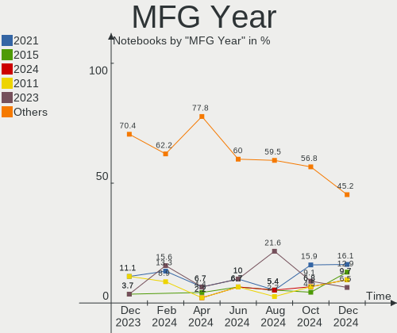
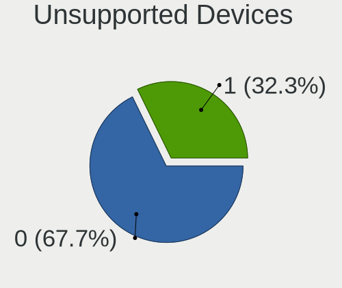
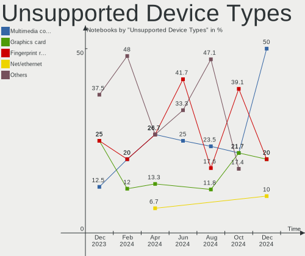

KDE neon - Hardware Trends (Notebooks)
--------------------------------------

A project to identify most popular hardware characteristics and track their change
over time based on data collected by Linux users at https://Linux-Hardware.org.

Anyone can contribute to this report by the [hw-probe](https://github.com/linuxhw/hw-probe) tool:

    sudo -E hw-probe -all -upload

This report is for one last month. Overall report since the beginning of time: [TestCoverage](https://github.com/linuxhw/TestCoverage)

Period: Oct, 2022.

Contents
--------

* [ System ](#system)
  - [ OS                       ](#os)
  - [ OS Family                ](#os-family)
  - [ Kernel                   ](#kernel)
  - [ Kernel Family            ](#kernel-family)
  - [ Kernel Major Ver.        ](#kernel-major-ver)
  - [ Arch                     ](#arch)
  - [ DE                       ](#de)
  - [ Display Server           ](#display-server)
  - [ Display Manager          ](#display-manager)
  - [ OS Lang                  ](#os-lang)
  - [ Boot Mode                ](#boot-mode)
  - [ Filesystem               ](#filesystem)
  - [ Part. scheme             ](#part-scheme)
  - [ Dual Boot with Linux/BSD ](#dual-boot-with-linuxbsd)
  - [ Dual Boot (Win)          ](#dual-boot-win)

* [ Board ](#board)
  - [ Vendor                   ](#vendor)
  - [ Model                    ](#model)
  - [ Model Family             ](#model-family)
  - [ MFG Year                 ](#mfg-year)
  - [ Form Factor              ](#form-factor)
  - [ Secure Boot              ](#secure-boot)
  - [ Coreboot                 ](#coreboot)
  - [ RAM Size                 ](#ram-size)
  - [ RAM Used                 ](#ram-used)
  - [ Total Drives             ](#total-drives)
  - [ Has CD-ROM               ](#has-cd-rom)
  - [ Has Ethernet             ](#has-ethernet)
  - [ Has WiFi                 ](#has-wifi)
  - [ Has Bluetooth            ](#has-bluetooth)

* [ Location ](#location)
  - [ Country                  ](#country)
  - [ City                     ](#city)

* [ Drives ](#drives)
  - [ Drive Vendor             ](#drive-vendor)
  - [ Drive Model              ](#drive-model)
  - [ HDD Vendor               ](#hdd-vendor)
  - [ SSD Vendor               ](#ssd-vendor)
  - [ Drive Kind               ](#drive-kind)
  - [ Drive Connector          ](#drive-connector)
  - [ Drive Size               ](#drive-size)
  - [ Space Total              ](#space-total)
  - [ Space Used               ](#space-used)
  - [ Malfunc. Drives          ](#malfunc-drives)
  - [ Malfunc. Drive Vendor    ](#malfunc-drive-vendor)
  - [ Malfunc. HDD Vendor      ](#malfunc-hdd-vendor)
  - [ Malfunc. Drive Kind      ](#malfunc-drive-kind)
  - [ Failed Drives            ](#failed-drives)
  - [ Failed Drive Vendor      ](#failed-drive-vendor)
  - [ Drive Status             ](#drive-status)

* [ Storage controller ](#storage-controller)
  - [ Storage Vendor           ](#storage-vendor)
  - [ Storage Model            ](#storage-model)
  - [ Storage Kind             ](#storage-kind)

* [ Processor ](#processor)
  - [ CPU Vendor               ](#cpu-vendor)
  - [ CPU Model                ](#cpu-model)
  - [ CPU Model Family         ](#cpu-model-family)
  - [ CPU Cores                ](#cpu-cores)
  - [ CPU Sockets              ](#cpu-sockets)
  - [ CPU Threads              ](#cpu-threads)
  - [ CPU Op-Modes             ](#cpu-op-modes)
  - [ CPU Microcode            ](#cpu-microcode)
  - [ CPU Microarch            ](#cpu-microarch)

* [ Graphics ](#graphics)
  - [ GPU Vendor               ](#gpu-vendor)
  - [ GPU Model                ](#gpu-model)
  - [ GPU Combo                ](#gpu-combo)
  - [ GPU Driver               ](#gpu-driver)
  - [ GPU Memory               ](#gpu-memory)

* [ Monitor ](#monitor)
  - [ Monitor Vendor           ](#monitor-vendor)
  - [ Monitor Model            ](#monitor-model)
  - [ Monitor Resolution       ](#monitor-resolution)
  - [ Monitor Diagonal         ](#monitor-diagonal)
  - [ Monitor Width            ](#monitor-width)
  - [ Aspect Ratio             ](#aspect-ratio)
  - [ Monitor Area             ](#monitor-area)
  - [ Pixel Density            ](#pixel-density)
  - [ Multiple Monitors        ](#multiple-monitors)

* [ Network ](#network)
  - [ Net Controller Vendor    ](#net-controller-vendor)
  - [ Net Controller Model     ](#net-controller-model)
  - [ Wireless Vendor          ](#wireless-vendor)
  - [ Wireless Model           ](#wireless-model)
  - [ Ethernet Vendor          ](#ethernet-vendor)
  - [ Ethernet Model           ](#ethernet-model)
  - [ Net Controller Kind      ](#net-controller-kind)
  - [ Used Controller          ](#used-controller)
  - [ NICs                     ](#nics)
  - [ IPv6                     ](#ipv6)

* [ Bluetooth ](#bluetooth)
  - [ Bluetooth Vendor         ](#bluetooth-vendor)
  - [ Bluetooth Model          ](#bluetooth-model)

* [ Sound ](#sound)
  - [ Sound Vendor             ](#sound-vendor)
  - [ Sound Model              ](#sound-model)

* [ Memory ](#memory)
  - [ Memory Vendor            ](#memory-vendor)
  - [ Memory Model             ](#memory-model)
  - [ Memory Kind              ](#memory-kind)
  - [ Memory Form Factor       ](#memory-form-factor)
  - [ Memory Size              ](#memory-size)
  - [ Memory Speed             ](#memory-speed)

* [ Printers & scanners ](#printers--scanners)
  - [ Printer Vendor           ](#printer-vendor)
  - [ Printer Model            ](#printer-model)
  - [ Scanner Vendor           ](#scanner-vendor)
  - [ Scanner Model            ](#scanner-model)

* [ Camera ](#camera)
  - [ Camera Vendor            ](#camera-vendor)
  - [ Camera Model             ](#camera-model)

* [ Security ](#security)
  - [ Fingerprint Vendor       ](#fingerprint-vendor)
  - [ Fingerprint Model        ](#fingerprint-model)
  - [ Chipcard Vendor          ](#chipcard-vendor)
  - [ Chipcard Model           ](#chipcard-model)

* [ Unsupported ](#unsupported)
  - [ Unsupported Devices      ](#unsupported-devices)
  - [ Unsupported Device Types ](#unsupported-device-types)

System
------

OS
--

Installed operating systems

| Name           | Notebooks | Percent |
|----------------|-----------|---------|
| KDE neon 20.04 | 48        | 71.64%  |
| KDE neon 22.04 | 19        | 28.36%  |

OS Family
---------

OS without a version

| Name     | Notebooks | Percent |
|----------|-----------|---------|
| KDE neon | 67        | 100%    |

Kernel
------

Version of the Linux kernel

| Version                  | Notebooks | Percent |
|--------------------------|-----------|---------|
| 5.15.0-52-generic        | 24        | 35.82%  |
| 5.15.0-48-generic        | 20        | 29.85%  |
| 5.15.0-50-generic        | 17        | 25.37%  |
| 6.0.5-060005-generic     | 1         | 1.49%   |
| 5.16.11-76051611-generic | 1         | 1.49%   |
| 5.15.0-53-generic        | 1         | 1.49%   |
| 5.15.0-41-generic        | 1         | 1.49%   |
| 5.14.0-1042-oem          | 1         | 1.49%   |
| 5.13.0-39-generic        | 1         | 1.49%   |

Kernel Family
-------------

Linux kernel without a distro release

| Version | Notebooks | Percent |
|---------|-----------|---------|
| 5.15.0  | 63        | 94.03%  |
| 6.0.5   | 1         | 1.49%   |
| 5.16.11 | 1         | 1.49%   |
| 5.14.0  | 1         | 1.49%   |
| 5.13.0  | 1         | 1.49%   |

Kernel Major Ver.
-----------------

Linux kernel major version

| Version | Notebooks | Percent |
|---------|-----------|---------|
| 5.15    | 63        | 94.03%  |
| 6.0     | 1         | 1.49%   |
| 5.16    | 1         | 1.49%   |
| 5.14    | 1         | 1.49%   |
| 5.13    | 1         | 1.49%   |

Arch
----

OS architecture (x86_64, i586, etc.)

| Name   | Notebooks | Percent |
|--------|-----------|---------|
| x86_64 | 67        | 100%    |

DE
--

Desktop Environment

| Name | Notebooks | Percent |
|------|-----------|---------|
| KDE5 | 67        | 100%    |

Display Server
--------------

X11 or Wayland

| Name    | Notebooks | Percent |
|---------|-----------|---------|
| X11     | 64        | 95.52%  |
| Wayland | 3         | 4.48%   |

Display Manager
---------------

SDDM, LightDM, etc.

| Name    | Notebooks | Percent |
|---------|-----------|---------|
| Unknown | 48        | 71.64%  |
| SDDM    | 19        | 28.36%  |

OS Lang
-------

Language

| Lang    | Notebooks | Percent |
|---------|-----------|---------|
| en_US   | 23        | 34.33%  |
| en_AG   | 11        | 16.42%  |
| pt_BR   | 6         | 8.96%   |
| it_IT   | 4         | 5.97%   |
| ru_RU   | 2         | 2.99%   |
| pl_PL   | 2         | 2.99%   |
| es_MX   | 2         | 2.99%   |
| es_CO   | 2         | 2.99%   |
| es_CL   | 2         | 2.99%   |
| de_DE   | 2         | 2.99%   |
| uk_UA   | 1         | 1.49%   |
| sv_SE   | 1         | 1.49%   |
| nb_NO   | 1         | 1.49%   |
| es_VE   | 1         | 1.49%   |
| es_HN   | 1         | 1.49%   |
| es_GT   | 1         | 1.49%   |
| es_ES   | 1         | 1.49%   |
| en_ZA   | 1         | 1.49%   |
| en_GB   | 1         | 1.49%   |
| Default | 1         | 1.49%   |
| C       | 1         | 1.49%   |

Boot Mode
---------

EFI or BIOS

| Mode | Notebooks | Percent |
|------|-----------|---------|
| EFI  | 43        | 64.18%  |
| BIOS | 24        | 35.82%  |

Filesystem
----------

Type of filesystem

| Type    | Notebooks | Percent |
|---------|-----------|---------|
| Ext4    | 64        | 95.52%  |
| Xfs     | 1         | 1.49%   |
| Overlay | 1         | 1.49%   |
| Btrfs   | 1         | 1.49%   |

Part. scheme
------------

Scheme of partitioning

| Type    | Notebooks | Percent |
|---------|-----------|---------|
| Unknown | 48        | 71.64%  |
| GPT     | 17        | 25.37%  |
| MBR     | 2         | 2.99%   |

Dual Boot with Linux/BSD
------------------------

Hosting more than one Linux/BSD

| Dual boot | Notebooks | Percent |
|-----------|-----------|---------|
| No        | 66        | 98.51%  |
| Yes       | 1         | 1.49%   |

Dual Boot (Win)
---------------

Hosting Linux and Windows

| Dual boot | Notebooks | Percent |
|-----------|-----------|---------|
| No        | 57        | 85.07%  |
| Yes       | 10        | 14.93%  |

Board
-----

Vendor
------

Motherboard manufacturer

| Name                | Notebooks | Percent |
|---------------------|-----------|---------|
| Hewlett-Packard     | 14        | 20.9%   |
| Lenovo              | 13        | 19.4%   |
| Dell                | 9         | 13.43%  |
| ASUSTek Computer    | 6         | 8.96%   |
| HUAWEI              | 3         | 4.48%   |
| Apple               | 3         | 4.48%   |
| Acer                | 3         | 4.48%   |
| Toshiba             | 2         | 2.99%   |
| System76            | 2         | 2.99%   |
| UNOWHY              | 1         | 1.49%   |
| Sony                | 1         | 1.49%   |
| SLIMBOOK            | 1         | 1.49%   |
| Samsung Electronics | 1         | 1.49%   |
| PC Specialist       | 1         | 1.49%   |
| Notebook            | 1         | 1.49%   |
| Medion              | 1         | 1.49%   |
| LG Electronics      | 1         | 1.49%   |
| GPU Company         | 1         | 1.49%   |
| Google              | 1         | 1.49%   |
| Gateway             | 1         | 1.49%   |
| A-DATA Technology   | 1         | 1.49%   |

Model
-----

Motherboard model

| Name                                       | Notebooks | Percent |
|--------------------------------------------|-----------|---------|
| UNOWHY Y13G010S4EI                         | 1         | 1.49%   |
| Toshiba TECRA M11                          | 1         | 1.49%   |
| Toshiba Satellite A505                     | 1         | 1.49%   |
| System76 Gazelle                           | 1         | 1.49%   |
| System76 Galago Pro                        | 1         | 1.49%   |
| Sony VPCEA23FB                             | 1         | 1.49%   |
| SLIMBOOK PROX-AMD5                         | 1         | 1.49%   |
| Samsung 550XBE/350XBE                      | 1         | 1.49%   |
| PC Specialist N750HU                       | 1         | 1.49%   |
| Notebook NL5xNU                            | 1         | 1.49%   |
| Medion Akoya E6239                         | 1         | 1.49%   |
| LG A560-T.BG77P1                           | 1         | 1.49%   |
| Lenovo Y520-15IKBM 80YY                    | 1         | 1.49%   |
| Lenovo ThinkPad X1 Carbon Gen 9 20XWS21H00 | 1         | 1.49%   |
| Lenovo ThinkPad X1 Carbon 5th 20HR0021MX   | 1         | 1.49%   |
| Lenovo ThinkPad L14 Gen 1 20U6S1JD00       | 1         | 1.49%   |
| Lenovo ThinkPad E550 20DFCTO1WW            | 1         | 1.49%   |
| Lenovo Legion Y540-15IRH-PG0 81SY          | 1         | 1.49%   |
| Lenovo IdeaPad U430 Touch 20270            | 1         | 1.49%   |
| Lenovo IdeaPad 330-15ARR 81D2              | 1         | 1.49%   |
| Lenovo IdeaPad 3 15ITL6 82H8               | 1         | 1.49%   |
| Lenovo IdeaPad 100-15IBD 80QQ              | 1         | 1.49%   |
| Lenovo G70-70 80HW                         | 1         | 1.49%   |
| Lenovo G50-80 80R0                         | 1         | 1.49%   |
| Lenovo B590 20206                          | 1         | 1.49%   |
| HUAWEI RLEF-XX                             | 1         | 1.49%   |
| HUAWEI MACHD-WXX9                          | 1         | 1.49%   |
| HUAWEI HLY-WX9XX                           | 1         | 1.49%   |
| HP ProBook 645 G1                          | 1         | 1.49%   |
| HP ProBook 450 G6                          | 1         | 1.49%   |
| HP ProBook 430 G3                          | 1         | 1.49%   |
| HP Pavilion Gaming Laptop 15-ec1xxx        | 1         | 1.49%   |
| HP Pavilion dv7                            | 1         | 1.49%   |
| HP Laptop 15s-fq5xxx                       | 1         | 1.49%   |
| HP Laptop 15s-fq2xxx                       | 1         | 1.49%   |
| HP Laptop 15-dw3xxx                        | 1         | 1.49%   |
| HP Laptop 14-dk1xxx                        | 1         | 1.49%   |
| HP G62                                     | 1         | 1.49%   |
| HP EliteBook 855 G8 Notebook PC            | 1         | 1.49%   |
| HP EliteBook 840 G1                        | 1         | 1.49%   |

Model Family
------------

Motherboard model prefix

| Name                  | Notebooks | Percent |
|-----------------------|-----------|---------|
| Dell Inspiron         | 5         | 7.46%   |
| Lenovo ThinkPad       | 4         | 5.97%   |
| Lenovo IdeaPad        | 4         | 5.97%   |
| HP Laptop             | 4         | 5.97%   |
| HP ProBook            | 3         | 4.48%   |
| HP EliteBook          | 3         | 4.48%   |
| Dell Latitude         | 3         | 4.48%   |
| ASUS VivoBook         | 3         | 4.48%   |
| Acer Aspire           | 3         | 4.48%   |
| HP Pavilion           | 2         | 2.99%   |
| UNOWHY Y13G010S4EI    | 1         | 1.49%   |
| Toshiba TECRA         | 1         | 1.49%   |
| Toshiba Satellite     | 1         | 1.49%   |
| System76 Gazelle      | 1         | 1.49%   |
| System76 Galago       | 1         | 1.49%   |
| Sony VPCEA23FB        | 1         | 1.49%   |
| SLIMBOOK PROX-AMD5    | 1         | 1.49%   |
| Samsung 550XBE        | 1         | 1.49%   |
| PC Specialist N750HU  | 1         | 1.49%   |
| Notebook NL5xNU       | 1         | 1.49%   |
| Medion Akoya          | 1         | 1.49%   |
| LG A560-T.BG77P1      | 1         | 1.49%   |
| Lenovo Y520-15IKBM    | 1         | 1.49%   |
| Lenovo Legion         | 1         | 1.49%   |
| Lenovo G70-70         | 1         | 1.49%   |
| Lenovo G50-80         | 1         | 1.49%   |
| Lenovo B590           | 1         | 1.49%   |
| HUAWEI RLEF-XX        | 1         | 1.49%   |
| HUAWEI MACHD-WXX9     | 1         | 1.49%   |
| HUAWEI HLY-WX9XX      | 1         | 1.49%   |
| HP G62                | 1         | 1.49%   |
| GPU Company GWNR71517 | 1         | 1.49%   |
| Google Candy          | 1         | 1.49%   |
| Gateway NV510P        | 1         | 1.49%   |
| Dell XPS              | 1         | 1.49%   |
| ASUS X555LAB          | 1         | 1.49%   |
| ASUS X550CC           | 1         | 1.49%   |
| ASUS S500CA           | 1         | 1.49%   |
| Apple MacBookPro8     | 1         | 1.49%   |
| Apple MacBookPro11    | 1         | 1.49%   |

MFG Year
--------

Motherboard manufacture year

| Year | Notebooks | Percent |
|------|-----------|---------|
| 2020 | 9         | 13.43%  |
| 2021 | 8         | 11.94%  |
| 2019 | 7         | 10.45%  |
| 2014 | 7         | 10.45%  |
| 2015 | 6         | 8.96%   |
| 2013 | 6         | 8.96%   |
| 2022 | 5         | 7.46%   |
| 2018 | 5         | 7.46%   |
| 2017 | 4         | 5.97%   |
| 2012 | 3         | 4.48%   |
| 2010 | 3         | 4.48%   |
| 2011 | 2         | 2.99%   |
| 2009 | 1         | 1.49%   |
| 2008 | 1         | 1.49%   |

Form Factor
-----------

Physical design of the computer

| Name     | Notebooks | Percent |
|----------|-----------|---------|
| Notebook | 67        | 100%    |

Secure Boot
-----------

Enabled or disabled

| State    | Notebooks | Percent |
|----------|-----------|---------|
| Disabled | 57        | 85.07%  |
| Enabled  | 10        | 14.93%  |

Coreboot
--------

Have coreboot on board

| Used | Notebooks | Percent |
|------|-----------|---------|
| No   | 64        | 95.52%  |
| Yes  | 3         | 4.48%   |

RAM Size
--------

Total RAM memory

| Size in GB  | Notebooks | Percent |
|-------------|-----------|---------|
| 4.01-8.0    | 26        | 38.81%  |
| 16.01-24.0  | 16        | 23.88%  |
| 8.01-16.0   | 10        | 14.93%  |
| 3.01-4.0    | 7         | 10.45%  |
| 32.01-64.0  | 5         | 7.46%   |
| 24.01-32.0  | 1         | 1.49%   |
| 64.01-256.0 | 1         | 1.49%   |
| 1.01-2.0    | 1         | 1.49%   |

RAM Used
--------

Used RAM memory

| Used GB    | Notebooks | Percent |
|------------|-----------|---------|
| 2.01-3.0   | 23        | 34.33%  |
| 1.01-2.0   | 20        | 29.85%  |
| 4.01-8.0   | 9         | 13.43%  |
| 3.01-4.0   | 8         | 11.94%  |
| 0.51-1.0   | 4         | 5.97%   |
| 8.01-16.0  | 2         | 2.99%   |
| 16.01-24.0 | 1         | 1.49%   |

Total Drives
------------

Number of drives on board

| Drives | Notebooks | Percent |
|--------|-----------|---------|
| 1      | 47        | 70.15%  |
| 2      | 18        | 26.87%  |
| 3      | 2         | 2.99%   |

Has CD-ROM
----------

Has CD-ROM on board

| Presented | Notebooks | Percent |
|-----------|-----------|---------|
| No        | 52        | 77.61%  |
| Yes       | 15        | 22.39%  |

Has Ethernet
------------

Has Ethernet on board

| Presented | Notebooks | Percent |
|-----------|-----------|---------|
| Yes       | 51        | 76.12%  |
| No        | 16        | 23.88%  |

Has WiFi
--------

Has WiFi module

| Presented | Notebooks | Percent |
|-----------|-----------|---------|
| Yes       | 65        | 97.01%  |
| No        | 2         | 2.99%   |

Has Bluetooth
-------------

Has Bluetooth module

| Presented | Notebooks | Percent |
|-----------|-----------|---------|
| Yes       | 60        | 89.55%  |
| No        | 7         | 10.45%  |

Location
--------

Country
-------

Geographic location (country)

| Country             | Notebooks | Percent |
|---------------------|-----------|---------|
| USA                 | 14        | 20.9%   |
| Brazil              | 8         | 11.94%  |
| Spain               | 5         | 7.46%   |
| Italy               | 5         | 7.46%   |
| Russia              | 4         | 5.97%   |
| Germany             | 4         | 5.97%   |
| Mexico              | 3         | 4.48%   |
| Chile               | 3         | 4.48%   |
| Sweden              | 2         | 2.99%   |
| Poland              | 2         | 2.99%   |
| India               | 2         | 2.99%   |
| Venezuela           | 1         | 1.49%   |
| Trinidad and Tobago | 1         | 1.49%   |
| South Africa        | 1         | 1.49%   |
| Romania             | 1         | 1.49%   |
| Norway              | 1         | 1.49%   |
| Nepal               | 1         | 1.49%   |
| Iraq                | 1         | 1.49%   |
| Iran                | 1         | 1.49%   |
| Indonesia           | 1         | 1.49%   |
| Honduras            | 1         | 1.49%   |
| Guatemala           | 1         | 1.49%   |
| France              | 1         | 1.49%   |
| Ecuador             | 1         | 1.49%   |
| Colombia            | 1         | 1.49%   |
| Belgium             | 1         | 1.49%   |

City
----

Geographic location (city)

| City                 | Notebooks | Percent |
|----------------------|-----------|---------|
| Sao Paulo            | 3         | 4.48%   |
| Madrid               | 2         | 2.99%   |
| Yerres               | 1         | 1.49%   |
| Warsaw               | 1         | 1.49%   |
| Voronezh             | 1         | 1.49%   |
| Viamao               | 1         | 1.49%   |
| Vadodara             | 1         | 1.49%   |
| Tubarao              | 1         | 1.49%   |
| Timișoara           | 1         | 1.49%   |
| Tehran               | 1         | 1.49%   |
| Tegucigalpa          | 1         | 1.49%   |
| Södertälje         | 1         | 1.49%   |
| Seville              | 1         | 1.49%   |
| Santiago             | 1         | 1.49%   |
| San Carlos del Zulia | 1         | 1.49%   |
| Sabadell             | 1         | 1.49%   |
| Rome                 | 1         | 1.49%   |
| Pretoria             | 1         | 1.49%   |
| Phoenix              | 1         | 1.49%   |
| Orenburg             | 1         | 1.49%   |
| Nurtingen            | 1         | 1.49%   |
| Novosibirsk          | 1         | 1.49%   |
| New Port Richey      | 1         | 1.49%   |
| Moscow               | 1         | 1.49%   |
| Milan                | 1         | 1.49%   |
| Mexico City          | 1         | 1.49%   |
| Mesa                 | 1         | 1.49%   |
| Mérida              | 1         | 1.49%   |
| Louisburg            | 1         | 1.49%   |
| Las Condes           | 1         | 1.49%   |
| La Reina             | 1         | 1.49%   |
| Kiezliny             | 1         | 1.49%   |
| Kernersville         | 1         | 1.49%   |
| Kathmandu            | 1         | 1.49%   |
| Jakarta              | 1         | 1.49%   |
| Inveruno             | 1         | 1.49%   |
| Henrico              | 1         | 1.49%   |
| Hemmoor              | 1         | 1.49%   |
| Hamburg              | 1         | 1.49%   |
| Guatemala City       | 1         | 1.49%   |

Drives
------

Drive Vendor
------------

Hard drive vendors

| Vendor                      | Notebooks | Drives | Percent |
|-----------------------------|-----------|--------|---------|
| Samsung Electronics         | 14        | 14     | 16.09%  |
| WDC                         | 9         | 9      | 10.34%  |
| Kingston                    | 9         | 10     | 10.34%  |
| SanDisk                     | 8         | 8      | 9.2%    |
| Unknown                     | 7         | 7      | 8.05%   |
| Seagate                     | 6         | 6      | 6.9%    |
| Hitachi                     | 6         | 6      | 6.9%    |
| SK hynix                    | 3         | 3      | 3.45%   |
| Micron/Crucial Technology   | 2         | 2      | 2.3%    |
| Micron Technology           | 2         | 2      | 2.3%    |
| Kingston Technology Company | 2         | 2      | 2.3%    |
| Intel                       | 2         | 2      | 2.3%    |
| Apple                       | 2         | 2      | 2.3%    |
| ADATA Technology            | 2         | 2      | 2.3%    |
| Toshiba                     | 1         | 1      | 1.15%   |
| Silicon Motion              | 1         | 1      | 1.15%   |
| Phison Electronics          | 1         | 1      | 1.15%   |
| Phison                      | 1         | 1      | 1.15%   |
| LITEON                      | 1         | 1      | 1.15%   |
| KIOXIA                      | 1         | 1      | 1.15%   |
| Intenso                     | 1         | 1      | 1.15%   |
| HGST                        | 1         | 1      | 1.15%   |
| Crucial                     | 1         | 1      | 1.15%   |
| China                       | 1         | 1      | 1.15%   |
| BIWIN                       | 1         | 1      | 1.15%   |
| A-DATA Technology           | 1         | 1      | 1.15%   |
| Unknown                     | 1         | 1      | 1.15%   |

Drive Model
-----------

Hard drive models

| Model                                                | Notebooks | Percent |
|------------------------------------------------------|-----------|---------|
| Samsung NVMe SSD Controller SM981/PM981/PM983 500GB  | 5         | 5.68%   |
| WDC WD10JPCX-24UE4T0 1TB                             | 3         | 3.41%   |
| WDC WD5000LPCX-24VHAT0 500GB                         | 2         | 2.27%   |
| WDC WD10JPVX-22JC3T0 1TB                             | 2         | 2.27%   |
| Unknown SD/MMC/MS PRO 1TB                            | 2         | 2.27%   |
| Unknown MMC Card  32GB                               | 2         | 2.27%   |
| SK hynix BC511 256GB                                 | 2         | 2.27%   |
| Samsung NVMe SSD Controller PM9A1/PM9A3/980PRO 250GB | 2         | 2.27%   |
| Kingston SV300S37A120G 120GB SSD                     | 2         | 2.27%   |
| Kingston SA400S37240G 240GB SSD                      | 2         | 2.27%   |
| WDC WDS240G2G0A-00JH30 240GB SSD                     | 1         | 1.14%   |
| WDC WD10JPVX-75JC3T0 1TB                             | 1         | 1.14%   |
| Unknown MMC Card  64GB                               | 1         | 1.14%   |
| Unknown MMC Card  16GB                               | 1         | 1.14%   |
| Unknown DA4064  64GB                                 | 1         | 1.14%   |
| Toshiba MQ01ABF050 500GB                             | 1         | 1.14%   |
| SK hynix BC711 NVMe 256GB                            | 1         | 1.14%   |
| Silicon Motion PCIe-8 SSD 512GB                      | 1         | 1.14%   |
| Seagate ST9500325AS 500GB                            | 1         | 1.14%   |
| Seagate ST500LM021-1KJ152 500GB                      | 1         | 1.14%   |
| Seagate ST500LM000-SSHD-8GB                          | 1         | 1.14%   |
| Seagate ST320LM001 HN-M320MBB 320GB                  | 1         | 1.14%   |
| Seagate ST1000LX015-1U7172 1TB                       | 1         | 1.14%   |
| Seagate ST1000LM048-2E7172 1TB                       | 1         | 1.14%   |
| Sandisk WDC WDS240G2G0C-00AJM0 240GB                 | 1         | 1.14%   |
| Sandisk WD Blue SN550 NVMe SSD 1TB                   | 1         | 1.14%   |
| Sandisk WD Black SN750 / PC SN730 NVMe SSD 1TB       | 1         | 1.14%   |
| SanDisk SSD PLUS 1000GB                              | 1         | 1.14%   |
| SanDisk SDSSDH3 500G                                 | 1         | 1.14%   |
| SanDisk SDSSDA120G 120GB                             | 1         | 1.14%   |
| SanDisk SD9SN8W256G1002 256GB SSD                    | 1         | 1.14%   |
| SanDisk SD8TB8U256G1001 256GB SSD                    | 1         | 1.14%   |
| Samsung SSD 980 1TB                                  | 1         | 1.14%   |
| Samsung SSD 850 EVO 500GB                            | 1         | 1.14%   |
| Samsung SG9MSM6D024GPM00 22GB SSD                    | 1         | 1.14%   |
| Samsung PM981 NVMe 512GB                             | 1         | 1.14%   |
| Samsung NVMe SSD Controller SM951/PM951 512GB        | 1         | 1.14%   |
| Samsung MZVLQ256HAJD-000H1 256GB                     | 1         | 1.14%   |
| Samsung MZ7TE128HMGR-000H1 128GB SSD                 | 1         | 1.14%   |
| Phison Sabrent Rocket Q 1TB                          | 1         | 1.14%   |

HDD Vendor
----------

Hard disk drive vendors

| Vendor  | Notebooks | Drives | Percent |
|---------|-----------|--------|---------|
| WDC     | 8         | 8      | 33.33%  |
| Seagate | 6         | 6      | 25%     |
| Hitachi | 6         | 6      | 25%     |
| Unknown | 2         | 2      | 8.33%   |
| Toshiba | 1         | 1      | 4.17%   |
| HGST    | 1         | 1      | 4.17%   |

SSD Vendor
----------

Solid state drive vendors

| Vendor              | Notebooks | Drives | Percent |
|---------------------|-----------|--------|---------|
| Kingston            | 6         | 7      | 24%     |
| SanDisk             | 5         | 5      | 20%     |
| Samsung Electronics | 3         | 3      | 12%     |
| Apple               | 2         | 2      | 8%      |
| WDC                 | 1         | 1      | 4%      |
| Micron Technology   | 1         | 1      | 4%      |
| LITEON              | 1         | 1      | 4%      |
| Intenso             | 1         | 1      | 4%      |
| Crucial             | 1         | 1      | 4%      |
| China               | 1         | 1      | 4%      |
| BIWIN               | 1         | 1      | 4%      |
| A-DATA Technology   | 1         | 1      | 4%      |
| Unknown             | 1         | 1      | 4%      |

Drive Kind
----------

HDD or SSD

| Kind | Notebooks | Drives | Percent |
|------|-----------|--------|---------|
| NVMe | 31        | 33     | 37.8%   |
| SSD  | 23        | 26     | 28.05%  |
| HDD  | 23        | 24     | 28.05%  |
| MMC  | 5         | 5      | 6.1%    |

Drive Connector
---------------

SATA, SAS, NVMe, etc.

| Type | Notebooks | Drives | Percent |
|------|-----------|--------|---------|
| SATA | 38        | 48     | 50%     |
| NVMe | 31        | 33     | 40.79%  |
| MMC  | 5         | 5      | 6.58%   |
| SAS  | 2         | 2      | 2.63%   |

Drive Size
----------

Size of hard drive

| Size in TB | Notebooks | Drives | Percent |
|------------|-----------|--------|---------|
| 0.01-0.5   | 32        | 36     | 69.57%  |
| 0.51-1.0   | 14        | 14     | 30.43%  |

Space Total
-----------

Amount of disk space available on the file system

| Size in GB | Notebooks | Percent |
|------------|-----------|---------|
| 101-250    | 22        | 32.84%  |
| 251-500    | 19        | 28.36%  |
| 501-1000   | 10        | 14.93%  |
| 1001-2000  | 5         | 7.46%   |
| 21-50      | 3         | 4.48%   |
| 2001-3000  | 2         | 2.99%   |
| 1-20       | 2         | 2.99%   |
| 51-100     | 2         | 2.99%   |
| Unknown    | 2         | 2.99%   |

Space Used
----------

Amount of used disk space

| Used GB   | Notebooks | Percent |
|-----------|-----------|---------|
| 1-20      | 30        | 44.78%  |
| 51-100    | 11        | 16.42%  |
| 101-250   | 8         | 11.94%  |
| 501-1000  | 6         | 8.96%   |
| 21-50     | 5         | 7.46%   |
| 251-500   | 4         | 5.97%   |
| Unknown   | 2         | 2.99%   |
| 1001-2000 | 1         | 1.49%   |

Malfunc. Drives
---------------

Drive models with a malfunction

| Model                    | Notebooks | Drives | Percent |
|--------------------------|-----------|--------|---------|
| WDC WD10JPVX-22JC3T0 1TB | 1         | 1      | 100%    |

Malfunc. Drive Vendor
---------------------

Vendors of faulty drives

| Vendor | Notebooks | Drives | Percent |
|--------|-----------|--------|---------|
| WDC    | 1         | 1      | 100%    |

Malfunc. HDD Vendor
-------------------

Vendors of faulty HDD drives

| Vendor | Notebooks | Drives | Percent |
|--------|-----------|--------|---------|
| WDC    | 1         | 1      | 100%    |

Malfunc. Drive Kind
-------------------

Kinds of faulty drives

| Kind | Notebooks | Drives | Percent |
|------|-----------|--------|---------|
| HDD  | 1         | 1      | 100%    |

Failed Drives
-------------

Failed drive models

Zero info for selected period =(

Failed Drive Vendor
-------------------

Failed drive vendors

Zero info for selected period =(

Drive Status
------------

Number of failed and malfunc. drives

| Status   | Notebooks | Drives | Percent |
|----------|-----------|--------|---------|
| Detected | 59        | 79     | 86.76%  |
| Works    | 8         | 8      | 11.76%  |
| Malfunc  | 1         | 1      | 1.47%   |

Storage controller
------------------

Storage Vendor
--------------

Storage controller vendors

| Vendor                      | Notebooks | Percent |
|-----------------------------|-----------|---------|
| Intel                       | 42        | 50%     |
| Samsung Electronics         | 13        | 15.48%  |
| AMD                         | 9         | 10.71%  |
| Kingston Technology Company | 5         | 5.95%   |
| SK hynix                    | 3         | 3.57%   |
| SanDisk                     | 3         | 3.57%   |
| Phison Electronics          | 2         | 2.38%   |
| Micron/Crucial Technology   | 2         | 2.38%   |
| ADATA Technology            | 2         | 2.38%   |
| Silicon Motion              | 1         | 1.19%   |
| Micron Technology           | 1         | 1.19%   |
| KIOXIA                      | 1         | 1.19%   |

Storage Model
-------------

Storage controller models

| Model                                                                        | Notebooks | Percent |
|------------------------------------------------------------------------------|-----------|---------|
| AMD FCH SATA Controller [AHCI mode]                                          | 9         | 10.23%  |
| Samsung NVMe SSD Controller SM981/PM981/PM983                                | 6         | 6.82%   |
| Intel 8 Series SATA Controller 1 [AHCI mode]                                 | 5         | 5.68%   |
| Intel 7 Series Chipset Family 6-port SATA Controller [AHCI mode]             | 4         | 4.55%   |
| Intel 5 Series/3400 Series Chipset 4 port SATA AHCI Controller               | 4         | 4.55%   |
| Intel Wildcat Point-LP SATA Controller [AHCI Mode]                           | 3         | 3.41%   |
| Intel Sunrise Point-LP SATA Controller [AHCI mode]                           | 3         | 3.41%   |
| Intel HM170/QM170 Chipset SATA Controller [AHCI Mode]                        | 3         | 3.41%   |
| Intel Cannon Point-LP SATA Controller [AHCI Mode]                            | 3         | 3.41%   |
| SK hynix BC511                                                               | 2         | 2.27%   |
| Samsung NVMe SSD Controller PM9A1/PM9A3/980PRO                               | 2         | 2.27%   |
| Samsung NVMe SSD Controller 980                                              | 2         | 2.27%   |
| Intel Volume Management Device NVMe RAID Controller                          | 2         | 2.27%   |
| Intel Tiger Lake-LP SATA Controller                                          | 2         | 2.27%   |
| Intel Cannon Lake Mobile PCH SATA AHCI Controller                            | 2         | 2.27%   |
| Intel Atom Processor E3800 Series SATA AHCI Controller                       | 2         | 2.27%   |
| Intel 6 Series/C200 Series Chipset Family 6 port Mobile SATA AHCI Controller | 2         | 2.27%   |
| SK hynix Gold P31 SSD                                                        | 1         | 1.14%   |
| Silicon Motion Non-Volatile memory controller                                | 1         | 1.14%   |
| SanDisk WD Blue SN550 NVMe SSD                                               | 1         | 1.14%   |
| SanDisk WD Black SN750 / PC SN730 NVMe SSD                                   | 1         | 1.14%   |
| SanDisk Non-Volatile memory controller                                       | 1         | 1.14%   |
| Samsung NVMe SSD Controller SM951/PM951                                      | 1         | 1.14%   |
| Samsung Electronics SATA controller                                          | 1         | 1.14%   |
| Samsung Apple PCIe SSD                                                       | 1         | 1.14%   |
| Phison NVMe Storage Controller                                               | 1         | 1.14%   |
| Phison E12 NVMe Controller                                                   | 1         | 1.14%   |
| Micron/Crucial P2 NVMe PCIe SSD                                              | 1         | 1.14%   |
| Micron/Crucial Non-Volatile memory controller                                | 1         | 1.14%   |
| Micron Non-Volatile memory controller                                        | 1         | 1.14%   |
| KIOXIA NVMe SSD Controller BG4                                               | 1         | 1.14%   |
| Kingston Company U-SNS8154P3 NVMe SSD                                        | 1         | 1.14%   |
| Kingston Company Company Non-Volatile memory controller                      | 1         | 1.14%   |
| Kingston Company OM3PDP3 NVMe SSD                                            | 1         | 1.14%   |
| Kingston Company KC2000 NVMe SSD                                             | 1         | 1.14%   |
| Kingston Company A2000 NVMe SSD                                              | 1         | 1.14%   |
| Intel SSD Pro 7600p/760p/E 6100p Series                                      | 1         | 1.14%   |
| Intel SSD 600P Series                                                        | 1         | 1.14%   |
| Intel Comet Lake SATA AHCI Controller                                        | 1         | 1.14%   |
| Intel Celeron/Pentium Silver Processor SATA Controller                       | 1         | 1.14%   |

Storage Kind
------------

Kind of storage controller (IDE, SATA, NVMe, SAS, ...)

| Kind | Notebooks | Percent |
|------|-----------|---------|
| SATA | 48        | 57.14%  |
| NVMe | 31        | 36.9%   |
| RAID | 3         | 3.57%   |
| IDE  | 2         | 2.38%   |

Processor
---------

CPU Vendor
----------

Processor vendors

| Vendor | Notebooks | Percent |
|--------|-----------|---------|
| Intel  | 52        | 77.61%  |
| AMD    | 15        | 22.39%  |

CPU Model
---------

Processor models

| Model                                   | Notebooks | Percent |
|-----------------------------------------|-----------|---------|
| Intel 11th Gen Core i5-1135G7 @ 2.40GHz | 4         | 5.97%   |
| Intel Core i7-8565U CPU @ 1.80GHz       | 2         | 2.99%   |
| Intel Core i7-7700HQ CPU @ 2.80GHz      | 2         | 2.99%   |
| Intel Core i3-5005U CPU @ 2.00GHz       | 2         | 2.99%   |
| AMD Ryzen 5 5500U with Radeon Graphics  | 2         | 2.99%   |
| Intel Pentium CPU N3520 @ 2.16GHz       | 1         | 1.49%   |
| Intel Pentium CPU 2020M @ 2.40GHz       | 1         | 1.49%   |
| Intel Core i7-8750H CPU @ 2.20GHz       | 1         | 1.49%   |
| Intel Core i7-8550U CPU @ 1.80GHz       | 1         | 1.49%   |
| Intel Core i7-6600U CPU @ 2.60GHz       | 1         | 1.49%   |
| Intel Core i7-5500U CPU @ 2.40GHz       | 1         | 1.49%   |
| Intel Core i7-4850HQ CPU @ 2.30GHz      | 1         | 1.49%   |
| Intel Core i7-4500U CPU @ 1.80GHz       | 1         | 1.49%   |
| Intel Core i7-3630QM CPU @ 2.40GHz      | 1         | 1.49%   |
| Intel Core i7-3537U CPU @ 2.00GHz       | 1         | 1.49%   |
| Intel Core i7-2670QM CPU @ 2.20GHz      | 1         | 1.49%   |
| Intel Core i7-2630QM CPU @ 2.00GHz      | 1         | 1.49%   |
| Intel Core i7-10850H CPU @ 2.70GHz      | 1         | 1.49%   |
| Intel Core i7 CPU Q 720 @ 1.60GHz       | 1         | 1.49%   |
| Intel Core i5-9300H CPU @ 2.40GHz       | 1         | 1.49%   |
| Intel Core i5-8265U CPU @ 1.60GHz       | 1         | 1.49%   |
| Intel Core i5-7300HQ CPU @ 2.50GHz      | 1         | 1.49%   |
| Intel Core i5-7200U CPU @ 2.50GHz       | 1         | 1.49%   |
| Intel Core i5-6200U CPU @ 2.30GHz       | 1         | 1.49%   |
| Intel Core i5-5250U CPU @ 1.60GHz       | 1         | 1.49%   |
| Intel Core i5-4300U CPU @ 1.90GHz       | 1         | 1.49%   |
| Intel Core i5-4210U CPU @ 1.70GHz       | 1         | 1.49%   |
| Intel Core i5-3340M CPU @ 2.70GHz       | 1         | 1.49%   |
| Intel Core i5-2435M CPU @ 2.40GHz       | 1         | 1.49%   |
| Intel Core i5-10210U CPU @ 1.60GHz      | 1         | 1.49%   |
| Intel Core i5 CPU M 520 @ 2.40GHz       | 1         | 1.49%   |
| Intel Core i5 CPU M 460 @ 2.53GHz       | 1         | 1.49%   |
| Intel Core i5 CPU M 430 @ 2.27GHz       | 1         | 1.49%   |
| Intel Core i3-4030U CPU @ 1.90GHz       | 1         | 1.49%   |
| Intel Core i3-4005U CPU @ 1.70GHz       | 1         | 1.49%   |
| Intel Core i3-3217U CPU @ 1.80GHz       | 1         | 1.49%   |
| Intel Core i3 CPU M 330 @ 2.13GHz       | 1         | 1.49%   |
| Intel Celeron N4100 CPU @ 1.10GHz       | 1         | 1.49%   |
| Intel Celeron CPU N2840 @ 2.16GHz       | 1         | 1.49%   |
| Intel Celeron CPU N2830 @ 2.16GHz       | 1         | 1.49%   |

CPU Model Family
----------------

Processor model prefix

| Model           | Notebooks | Percent |
|-----------------|-----------|---------|
| Intel Core i7   | 16        | 23.88%  |
| Intel Core i5   | 14        | 20.9%   |
| Other           | 10        | 14.93%  |
| Intel Core i3   | 6         | 8.96%   |
| AMD Ryzen 5     | 5         | 7.46%   |
| AMD Ryzen 7     | 4         | 5.97%   |
| Intel Celeron   | 3         | 4.48%   |
| Intel Pentium   | 2         | 2.99%   |
| AMD Ryzen 5 PRO | 2         | 2.99%   |
| Intel Atom      | 1         | 1.49%   |
| AMD Ryzen 7 PRO | 1         | 1.49%   |
| AMD Ryzen 3     | 1         | 1.49%   |
| AMD Athlon      | 1         | 1.49%   |
| AMD A8          | 1         | 1.49%   |

CPU Cores
---------

Number of processor cores

| Number | Notebooks | Percent |
|--------|-----------|---------|
| 4      | 28        | 41.79%  |
| 2      | 27        | 40.3%   |
| 8      | 6         | 8.96%   |
| 6      | 5         | 7.46%   |
| 10     | 1         | 1.49%   |

CPU Sockets
-----------

Number of sockets

| Number | Notebooks | Percent |
|--------|-----------|---------|
| 1      | 67        | 100%    |

CPU Threads
-----------

Threads per core (Hyper-Threading)

| Number | Notebooks | Percent |
|--------|-----------|---------|
| 2      | 57        | 85.07%  |
| 1      | 10        | 14.93%  |

CPU Op-Modes
------------

CPU Operation Modes (32-bit, 64-bit)

| Op mode        | Notebooks | Percent |
|----------------|-----------|---------|
| 32-bit, 64-bit | 67        | 100%    |

CPU Microcode
-------------

Microcode number

| Number     | Notebooks | Percent |
|------------|-----------|---------|
| Unknown    | 15        | 22.39%  |
| 0x806c1    | 5         | 7.46%   |
| 0x40651    | 4         | 5.97%   |
| 0x306a9    | 4         | 5.97%   |
| 0x906e9    | 3         | 4.48%   |
| 0x306d4    | 3         | 4.48%   |
| 0x30678    | 3         | 4.48%   |
| 0x906ea    | 2         | 2.99%   |
| 0x806ec    | 2         | 2.99%   |
| 0x806eb    | 2         | 2.99%   |
| 0x206a7    | 2         | 2.99%   |
| 0x08608103 | 2         | 2.99%   |
| 0x0810100b | 2         | 2.99%   |
| 0xa0652    | 1         | 1.49%   |
| 0x906a4    | 1         | 1.49%   |
| 0x906a3    | 1         | 1.49%   |
| 0x806e9    | 1         | 1.49%   |
| 0x706a1    | 1         | 1.49%   |
| 0x406e3    | 1         | 1.49%   |
| 0x40661    | 1         | 1.49%   |
| 0x30673    | 1         | 1.49%   |
| 0x20655    | 1         | 1.49%   |
| 0x20652    | 1         | 1.49%   |
| 0x106e5    | 1         | 1.49%   |
| 0x0a50000c | 1         | 1.49%   |
| 0x08608102 | 1         | 1.49%   |
| 0x08600106 | 1         | 1.49%   |
| 0x08600104 | 1         | 1.49%   |
| 0x08108109 | 1         | 1.49%   |
| 0x08108102 | 1         | 1.49%   |
| 0x0600111f | 1         | 1.49%   |

CPU Microarch
-------------

Microarchitecture

| Name             | Notebooks | Percent |
|------------------|-----------|---------|
| KabyLake         | 11        | 16.42%  |
| TigerLake        | 7         | 10.45%  |
| Haswell          | 6         | 8.96%   |
| Zen+             | 5         | 7.46%   |
| IvyBridge        | 5         | 7.46%   |
| Westmere         | 4         | 5.97%   |
| Silvermont       | 4         | 5.97%   |
| Broadwell        | 4         | 5.97%   |
| Unknown          | 4         | 5.97%   |
| Zen 2            | 3         | 4.48%   |
| SandyBridge      | 3         | 4.48%   |
| Zen              | 2         | 2.99%   |
| Skylake          | 2         | 2.99%   |
| Alderlake Hybrid | 2         | 2.99%   |
| Zen 3            | 1         | 1.49%   |
| Piledriver       | 1         | 1.49%   |
| Nehalem          | 1         | 1.49%   |
| Goldmont plus    | 1         | 1.49%   |
| CometLake        | 1         | 1.49%   |

Graphics
--------

GPU Vendor
----------

Vendors of graphics cards

| Vendor | Notebooks | Percent |
|--------|-----------|---------|
| Intel  | 48        | 57.83%  |
| AMD    | 20        | 24.1%   |
| Nvidia | 15        | 18.07%  |

GPU Model
---------

Graphics card models

| Model                                                                     | Notebooks | Percent |
|---------------------------------------------------------------------------|-----------|---------|
| Intel TigerLake-LP GT2 [Iris Xe Graphics]                                 | 6         | 7.14%   |
| Intel Haswell-ULT Integrated Graphics Controller                          | 5         | 5.95%   |
| Intel 3rd Gen Core processor Graphics Controller                          | 5         | 5.95%   |
| AMD Picasso/Raven 2 [Radeon Vega Series / Radeon Vega Mobile Series]      | 5         | 5.95%   |
| Intel Core Processor Integrated Graphics Controller                       | 4         | 4.76%   |
| Intel Atom Processor Z36xxx/Z37xxx Series Graphics & Display              | 4         | 4.76%   |
| Intel WhiskeyLake-U GT2 [UHD Graphics 620]                                | 3         | 3.57%   |
| Intel HD Graphics 630                                                     | 3         | 3.57%   |
| Intel HD Graphics 5500                                                    | 3         | 3.57%   |
| AMD Renoir                                                                | 3         | 3.57%   |
| AMD Lucienne                                                              | 3         | 3.57%   |
| Nvidia GF117M [GeForce 610M/710M/810M/820M / GT 620M/625M/630M/720M]      | 2         | 2.38%   |
| Intel Skylake GT2 [HD Graphics 520]                                       | 2         | 2.38%   |
| Intel 2nd Generation Core Processor Family Integrated Graphics Controller | 2         | 2.38%   |
| AMD Raven Ridge [Radeon Vega Series / Radeon Vega Mobile Series]          | 2         | 2.38%   |
| AMD Opal XT [Radeon R7 M265/M365X/M465]                                   | 2         | 2.38%   |
| Nvidia TU117M [GeForce GTX 1650 Mobile / Max-Q]                           | 1         | 1.19%   |
| Nvidia TU117M                                                             | 1         | 1.19%   |
| Nvidia GT218M [GeForce 310M]                                              | 1         | 1.19%   |
| Nvidia GP108M [GeForce MX330]                                             | 1         | 1.19%   |
| Nvidia GP108M [GeForce MX150]                                             | 1         | 1.19%   |
| Nvidia GP107M [GeForce MX150]                                             | 1         | 1.19%   |
| Nvidia GP107M [GeForce GTX 1050 Ti Mobile]                                | 1         | 1.19%   |
| Nvidia GP107M [GeForce GTX 1050 Mobile]                                   | 1         | 1.19%   |
| Nvidia GP106M [GeForce GTX 1060 Mobile]                                   | 1         | 1.19%   |
| Nvidia GM108M [GeForce 940MX]                                             | 1         | 1.19%   |
| Nvidia GK107M [GeForce GT 750M Mac Edition]                               | 1         | 1.19%   |
| Nvidia GK107M [GeForce GT 640M]                                           | 1         | 1.19%   |
| Nvidia GA107M [GeForce RTX 3050 Mobile]                                   | 1         | 1.19%   |
| Intel VGA compatible controller                                           | 1         | 1.19%   |
| Intel UHD Graphics 620                                                    | 1         | 1.19%   |
| Intel TigerLake-H GT1 [UHD Graphics]                                      | 1         | 1.19%   |
| Intel Tiger Lake UHD Graphics                                             | 1         | 1.19%   |
| Intel HD Graphics 620                                                     | 1         | 1.19%   |
| Intel HD Graphics 6000                                                    | 1         | 1.19%   |
| Intel GeminiLake [UHD Graphics 600]                                       | 1         | 1.19%   |
| Intel CometLake-U GT2 [UHD Graphics]                                      | 1         | 1.19%   |
| Intel CometLake-H GT2 [UHD Graphics]                                      | 1         | 1.19%   |
| Intel CoffeeLake-H GT2 [UHD Graphics 630]                                 | 1         | 1.19%   |
| Intel Alder Lake-P GT1 [UHD Graphics]                                     | 1         | 1.19%   |

GPU Combo
---------

Combinations of graphics cards

| Name           | Notebooks | Percent |
|----------------|-----------|---------|
| 1 x Intel      | 34        | 50.75%  |
| 1 x AMD        | 14        | 20.9%   |
| Intel + Nvidia | 10        | 14.93%  |
| 1 x Nvidia     | 3         | 4.48%   |
| Intel + AMD    | 3         | 4.48%   |
| AMD + Nvidia   | 2         | 2.99%   |
| 2 x AMD        | 1         | 1.49%   |

GPU Driver
----------

Free vs proprietary

| Driver      | Notebooks | Percent |
|-------------|-----------|---------|
| Free        | 62        | 92.54%  |
| Proprietary | 5         | 7.46%   |

GPU Memory
----------

Total video memory

| Size in GB | Notebooks | Percent |
|------------|-----------|---------|
| Unknown    | 48        | 71.64%  |
| 1.01-2.0   | 9         | 13.43%  |
| 0.01-0.5   | 5         | 7.46%   |
| 0.51-1.0   | 3         | 4.48%   |
| 5.01-6.0   | 1         | 1.49%   |
| 3.01-4.0   | 1         | 1.49%   |

Monitor
-------

Monitor Vendor
--------------

Monitor vendors

| Vendor                  | Notebooks | Percent |
|-------------------------|-----------|---------|
| BOE                     | 13        | 16.05%  |
| AU Optronics            | 13        | 16.05%  |
| Chimei Innolux          | 11        | 13.58%  |
| LG Display              | 10        | 12.35%  |
| PANDA                   | 8         | 9.88%   |
| Samsung Electronics     | 5         | 6.17%   |
| Goldstar                | 3         | 3.7%    |
| Apple                   | 3         | 3.7%    |
| Tianma XM               | 1         | 1.23%   |
| Sony                    | 1         | 1.23%   |
| Sharp                   | 1         | 1.23%   |
| MSI                     | 1         | 1.23%   |
| Mi                      | 1         | 1.23%   |
| Lenovo                  | 1         | 1.23%   |
| InfoVision              | 1         | 1.23%   |
| Huion                   | 1         | 1.23%   |
| HKC                     | 1         | 1.23%   |
| Hitachi                 | 1         | 1.23%   |
| Gigabyte Technology     | 1         | 1.23%   |
| Dell                    | 1         | 1.23%   |
| Chi Mei Optoelectronics | 1         | 1.23%   |
| BenQ                    | 1         | 1.23%   |
| Acer                    | 1         | 1.23%   |

Monitor Model
-------------

Monitor models

| Model                                                                   | Notebooks | Percent |
|-------------------------------------------------------------------------|-----------|---------|
| PANDA LCD Monitor NCP0040 1920x1080 344x194mm 15.5-inch                 | 2         | 2.47%   |
| Chimei Innolux LCD Monitor CMN15AB 1366x768 344x194mm 15.5-inch         | 2         | 2.47%   |
| Tianma XM LCD Monitor TLX1388 3000x2000 293x196mm 13.9-inch             | 1         | 1.23%   |
| Sony TV SNYEF03 1600x900                                                | 1         | 1.23%   |
| Sharp LCD Monitor SHP149A 1920x1080 344x194mm 15.5-inch                 | 1         | 1.23%   |
| Samsung Electronics SyncMaster SAM02E3 1440x900 367x229mm 17.0-inch     | 1         | 1.23%   |
| Samsung Electronics SMBX2450 SAM0722 1920x1080 531x299mm 24.0-inch      | 1         | 1.23%   |
| Samsung Electronics SM2333TN SAM06FC 1920x1080 477x268mm 21.5-inch      | 1         | 1.23%   |
| Samsung Electronics LCD Monitor SEC3041 1366x768 353x198mm 15.9-inch    | 1         | 1.23%   |
| Samsung Electronics 170EI-A01-V50 SEC0004 1280x1024 338x270mm 17.0-inch | 1         | 1.23%   |
| PANDA LCD Monitor NCP0067 1920x1080 309x174mm 14.0-inch                 | 1         | 1.23%   |
| PANDA LCD Monitor NCP004D 1920x1080 344x194mm 15.5-inch                 | 1         | 1.23%   |
| PANDA LCD Monitor NCP0046 1920x1080 344x194mm 15.5-inch                 | 1         | 1.23%   |
| PANDA LCD Monitor NCP0035 1920x1080 309x174mm 14.0-inch                 | 1         | 1.23%   |
| PANDA LCD Monitor NCP0027 1920x1080 344x194mm 15.5-inch                 | 1         | 1.23%   |
| PANDA LC133LF2L03 NCP0015 1920x1080 294x165mm 13.3-inch                 | 1         | 1.23%   |
| MSI MAG271C MSI3FA6 1920x1080 598x336mm 27.0-inch                       | 1         | 1.23%   |
| Mi Monitor XMI3444 3440x1440 800x330mm 34.1-inch                        | 1         | 1.23%   |
| LG Display LP156WH2-TLR2 LGD027D 1366x768 344x194mm 15.5-inch           | 1         | 1.23%   |
| LG Display LCD Monitor LGD0590 1920x1080 344x194mm 15.5-inch            | 1         | 1.23%   |
| LG Display LCD Monitor LGD0533 1920x1080 344x194mm 15.5-inch            | 1         | 1.23%   |
| LG Display LCD Monitor LGD051F 1920x1080 344x194mm 15.5-inch            | 1         | 1.23%   |
| LG Display LCD Monitor LGD04E1 1366x768 344x194mm 15.5-inch             | 1         | 1.23%   |
| LG Display LCD Monitor LGD0468 1366x768 344x194mm 15.5-inch             | 1         | 1.23%   |
| LG Display LCD Monitor LGD045E 1366x768 309x174mm 14.0-inch             | 1         | 1.23%   |
| LG Display LCD Monitor LGD0430 1366x768 345x194mm 15.6-inch             | 1         | 1.23%   |
| LG Display LCD Monitor LGD02C6 1920x1080 345x194mm 15.6-inch            | 1         | 1.23%   |
| LG Display LCD Monitor LGD027A 1600x900 382x215mm 17.3-inch             | 1         | 1.23%   |
| Lenovo LEN L1900pA LEN114F 1280x1024 376x301mm 19.0-inch                | 1         | 1.23%   |
| InfoVision LCD Monitor IVO8C69 1920x1080 309x174mm 14.0-inch            | 1         | 1.23%   |
| Huion GT-220 HAT2200 1920x1080 477x268mm 21.5-inch                      | 1         | 1.23%   |
| HKC LCD Monitor HKC3CFB 1920x1080 344x194mm 15.5-inch                   | 1         | 1.23%   |
| Hitachi HISENSE HEC0030 3840x2160 1095x616mm 49.5-inch                  | 1         | 1.23%   |
| Goldstar FULL HD GSM5BDE 1920x1080 480x270mm 21.7-inch                  | 1         | 1.23%   |
| Goldstar D2343 GSM592A 1920x1080 509x286mm 23.0-inch                    | 1         | 1.23%   |
| Goldstar 27GL650F GSM5B70 1920x1080 530x300mm 24.0-inch                 | 1         | 1.23%   |
| Gigabyte Technology G27QC A GBT2716 2560x1440 597x336mm 27.0-inch       | 1         | 1.23%   |
| Dell U2412M DELA07A 1920x1200 518x324mm 24.1-inch                       | 1         | 1.23%   |
| Chimei Innolux LCD Monitor CMN1734 1600x900 382x214mm 17.2-inch         | 1         | 1.23%   |
| Chimei Innolux LCD Monitor CMN1604 1920x1080 355x199mm 16.0-inch        | 1         | 1.23%   |

Monitor Resolution
------------------

Monitor screen resolution

| Resolution        | Notebooks | Percent |
|-------------------|-----------|---------|
| 1920x1080 (FHD)   | 37        | 48.68%  |
| 1366x768 (WXGA)   | 21        | 27.63%  |
| 1920x1200 (WUXGA) | 4         | 5.26%   |
| 1600x900 (HD+)    | 4         | 5.26%   |
| 1440x900 (WXGA+)  | 2         | 2.63%   |
| 1280x1024 (SXGA)  | 2         | 2.63%   |
| 3840x2160 (4K)    | 1         | 1.32%   |
| 3440x1440         | 1         | 1.32%   |
| 3000x2000         | 1         | 1.32%   |
| 2880x1800         | 1         | 1.32%   |
| 2560x1440 (QHD)   | 1         | 1.32%   |
| 1280x800 (WXGA)   | 1         | 1.32%   |

Monitor Diagonal
----------------

Diagonal size in inches

| Inches  | Notebooks | Percent |
|---------|-----------|---------|
| 15      | 37        | 46.25%  |
| 14      | 11        | 13.75%  |
| 13      | 9         | 11.25%  |
| 24      | 4         | 5%      |
| 17      | 4         | 5%      |
| 27      | 2         | 2.5%    |
| 23      | 2         | 2.5%    |
| 21      | 2         | 2.5%    |
| 16      | 2         | 2.5%    |
| 84      | 1         | 1.25%   |
| 72      | 1         | 1.25%   |
| 34      | 1         | 1.25%   |
| 20      | 1         | 1.25%   |
| 18      | 1         | 1.25%   |
| 11      | 1         | 1.25%   |
| Unknown | 1         | 1.25%   |

Monitor Width
-------------

Physical width

| Width in mm | Notebooks | Percent |
|-------------|-----------|---------|
| 301-350     | 51        | 65.38%  |
| 501-600     | 7         | 8.97%   |
| 201-300     | 7         | 8.97%   |
| 351-400     | 6         | 7.69%   |
| 401-500     | 3         | 3.85%   |
| 1501-2000   | 2         | 2.56%   |
| 701-800     | 1         | 1.28%   |
| Unknown     | 1         | 1.28%   |

Aspect Ratio
------------

Proportional relationship between the width and the height

| Ratio   | Notebooks | Percent |
|---------|-----------|---------|
| 16/9    | 59        | 83.1%   |
| 16/10   | 7         | 9.86%   |
| 5/4     | 2         | 2.82%   |
| 3/2     | 1         | 1.41%   |
| 21/9    | 1         | 1.41%   |
| Unknown | 1         | 1.41%   |

Monitor Area
------------

Area in inch²

| Area in inch² | Notebooks | Percent |
|----------------|-----------|---------|
| 101-110        | 38        | 47.5%   |
| 81-90          | 17        | 21.25%  |
| 201-250        | 6         | 7.5%    |
| 71-80          | 3         | 3.75%   |
| More than 1000 | 2         | 2.5%    |
| 301-350        | 2         | 2.5%    |
| 151-200        | 2         | 2.5%    |
| 141-150        | 2         | 2.5%    |
| 121-130        | 2         | 2.5%    |
| 51-60          | 1         | 1.25%   |
| 351-500        | 1         | 1.25%   |
| 251-300        | 1         | 1.25%   |
| 131-140        | 1         | 1.25%   |
| 111-120        | 1         | 1.25%   |
| Unknown        | 1         | 1.25%   |

Pixel Density
-------------

Pixels per inch

| Density       | Notebooks | Percent |
|---------------|-----------|---------|
| 121-160       | 35        | 44.87%  |
| 101-120       | 22        | 28.21%  |
| 51-100        | 15        | 19.23%  |
| 161-240       | 3         | 3.85%   |
| More than 240 | 1         | 1.28%   |
| 1-50          | 1         | 1.28%   |
| Unknown       | 1         | 1.28%   |

Multiple Monitors
-----------------

Total monitors connected

| Total | Notebooks | Percent |
|-------|-----------|---------|
| 1     | 52        | 77.61%  |
| 2     | 14        | 20.9%   |
| 4     | 1         | 1.49%   |

Network
-------

Net Controller Vendor
---------------------

Controller vendors

| Vendor                   | Notebooks | Percent |
|--------------------------|-----------|---------|
| Realtek Semiconductor    | 42        | 38.18%  |
| Intel                    | 31        | 28.18%  |
| Qualcomm Atheros         | 14        | 12.73%  |
| Broadcom                 | 9         | 8.18%   |
| Marvell Technology Group | 2         | 1.82%   |
| Broadcom Limited         | 2         | 1.82%   |
| Samsung Electronics      | 1         | 0.91%   |
| Ralink Technology        | 1         | 0.91%   |
| Ralink                   | 1         | 0.91%   |
| Microchip Technology     | 1         | 0.91%   |
| Huawei Technologies      | 1         | 0.91%   |
| DisplayLink              | 1         | 0.91%   |
| D-Link                   | 1         | 0.91%   |
| ASUSTek Computer         | 1         | 0.91%   |
| ASIX Electronics         | 1         | 0.91%   |
| Arduino SA               | 1         | 0.91%   |

Net Controller Model
--------------------

Controller models

| Model                                                                          | Notebooks | Percent |
|--------------------------------------------------------------------------------|-----------|---------|
| Realtek RTL8111/8168/8411 PCI Express Gigabit Ethernet Controller              | 29        | 23.02%  |
| Realtek RTL8821CE 802.11ac PCIe Wireless Network Adapter                       | 5         | 3.97%   |
| Realtek RTL810xE PCI Express Fast Ethernet controller                          | 5         | 3.97%   |
| Intel Wi-Fi 6 AX200                                                            | 5         | 3.97%   |
| Intel Wi-Fi 6 AX201                                                            | 4         | 3.17%   |
| Realtek RTL8822CE 802.11ac PCIe Wireless Network Adapter                       | 3         | 2.38%   |
| Realtek RTL8153 Gigabit Ethernet Adapter                                       | 3         | 2.38%   |
| Qualcomm Atheros QCA6174 802.11ac Wireless Network Adapter                     | 3         | 2.38%   |
| Intel Wireless 7260                                                            | 3         | 2.38%   |
| Broadcom BCM43142 802.11b/g/n                                                  | 3         | 2.38%   |
| Realtek RTL8723BE PCIe Wireless Network Adapter                                | 2         | 1.59%   |
| Qualcomm Atheros QCA9565 / AR9565 Wireless Network Adapter                     | 2         | 1.59%   |
| Qualcomm Atheros QCA9377 802.11ac Wireless Network Adapter                     | 2         | 1.59%   |
| Qualcomm Atheros AR9485 Wireless Network Adapter                               | 2         | 1.59%   |
| Qualcomm Atheros AR9285 Wireless Network Adapter (PCI-Express)                 | 2         | 1.59%   |
| Qualcomm Atheros AR8161 Gigabit Ethernet                                       | 2         | 1.59%   |
| Intel Wireless-AC 9260                                                         | 2         | 1.59%   |
| Intel Wireless 8265 / 8275                                                     | 2         | 1.59%   |
| Broadcom BCM43228 802.11a/b/g/n                                                | 2         | 1.59%   |
| Samsung Galaxy series, misc. (tethering mode)                                  | 1         | 0.79%   |
| Realtek RTL88x2bu [AC1200 Techkey]                                             | 1         | 0.79%   |
| Realtek RTL8822BE 802.11a/b/g/n/ac WiFi adapter                                | 1         | 0.79%   |
| Realtek RTL8191SEvB Wireless LAN Controller                                    | 1         | 0.79%   |
| Realtek 802.11ac NIC                                                           | 1         | 0.79%   |
| Ralink MT7601U Wireless Adapter                                                | 1         | 0.79%   |
| Ralink RT3090 Wireless 802.11n 1T/1R PCIe                                      | 1         | 0.79%   |
| Qualcomm Atheros AR9462 Wireless Network Adapter                               | 1         | 0.79%   |
| Qualcomm Atheros AR9287 Wireless Network Adapter (PCI-Express)                 | 1         | 0.79%   |
| Microchip SMSC9512/9514 Fast Ethernet Adapter                                  | 1         | 0.79%   |
| Marvell Group Yukon Optima 88E8059 [PCIe Gigabit Ethernet Controller with AVB] | 1         | 0.79%   |
| Marvell Group 88E8072 PCI-E Gigabit Ethernet Controller                        | 1         | 0.79%   |
| Intel Wireless 7265                                                            | 1         | 0.79%   |
| Intel Wireless 3165                                                            | 1         | 0.79%   |
| Intel Wireless 3160                                                            | 1         | 0.79%   |
| Intel Wi-Fi 6 AX210/AX211/AX411 160MHz                                         | 1         | 0.79%   |
| Intel Tiger Lake PCH CNVi WiFi                                                 | 1         | 0.79%   |
| Intel Ethernet Connection I219-LM                                              | 1         | 0.79%   |
| Intel Ethernet Connection I218-LM                                              | 1         | 0.79%   |
| Intel Ethernet Connection (4) I219-V                                           | 1         | 0.79%   |
| Intel Ethernet Connection (3) I218-V                                           | 1         | 0.79%   |

Wireless Vendor
---------------

Wireless vendors

| Vendor                | Notebooks | Percent |
|-----------------------|-----------|---------|
| Intel                 | 29        | 41.43%  |
| Realtek Semiconductor | 14        | 20%     |
| Qualcomm Atheros      | 13        | 18.57%  |
| Broadcom              | 8         | 11.43%  |
| Broadcom Limited      | 2         | 2.86%   |
| Ralink Technology     | 1         | 1.43%   |
| Ralink                | 1         | 1.43%   |
| D-Link                | 1         | 1.43%   |
| ASUSTek Computer      | 1         | 1.43%   |

Wireless Model
--------------

Wireless models

| Model                                                                  | Notebooks | Percent |
|------------------------------------------------------------------------|-----------|---------|
| Realtek RTL8821CE 802.11ac PCIe Wireless Network Adapter               | 5         | 7.14%   |
| Intel Wi-Fi 6 AX200                                                    | 5         | 7.14%   |
| Intel Wi-Fi 6 AX201                                                    | 4         | 5.71%   |
| Realtek RTL8822CE 802.11ac PCIe Wireless Network Adapter               | 3         | 4.29%   |
| Qualcomm Atheros QCA6174 802.11ac Wireless Network Adapter             | 3         | 4.29%   |
| Intel Wireless 7260                                                    | 3         | 4.29%   |
| Broadcom BCM43142 802.11b/g/n                                          | 3         | 4.29%   |
| Realtek RTL8723BE PCIe Wireless Network Adapter                        | 2         | 2.86%   |
| Qualcomm Atheros QCA9565 / AR9565 Wireless Network Adapter             | 2         | 2.86%   |
| Qualcomm Atheros QCA9377 802.11ac Wireless Network Adapter             | 2         | 2.86%   |
| Qualcomm Atheros AR9485 Wireless Network Adapter                       | 2         | 2.86%   |
| Qualcomm Atheros AR9285 Wireless Network Adapter (PCI-Express)         | 2         | 2.86%   |
| Intel Wireless-AC 9260                                                 | 2         | 2.86%   |
| Intel Wireless 8265 / 8275                                             | 2         | 2.86%   |
| Broadcom BCM43228 802.11a/b/g/n                                        | 2         | 2.86%   |
| Realtek RTL88x2bu [AC1200 Techkey]                                     | 1         | 1.43%   |
| Realtek RTL8822BE 802.11a/b/g/n/ac WiFi adapter                        | 1         | 1.43%   |
| Realtek RTL8191SEvB Wireless LAN Controller                            | 1         | 1.43%   |
| Realtek 802.11ac NIC                                                   | 1         | 1.43%   |
| Ralink MT7601U Wireless Adapter                                        | 1         | 1.43%   |
| Ralink RT3090 Wireless 802.11n 1T/1R PCIe                              | 1         | 1.43%   |
| Qualcomm Atheros AR9462 Wireless Network Adapter                       | 1         | 1.43%   |
| Qualcomm Atheros AR9287 Wireless Network Adapter (PCI-Express)         | 1         | 1.43%   |
| Intel Wireless 7265                                                    | 1         | 1.43%   |
| Intel Wireless 3165                                                    | 1         | 1.43%   |
| Intel Wireless 3160                                                    | 1         | 1.43%   |
| Intel Wi-Fi 6 AX210/AX211/AX411 160MHz                                 | 1         | 1.43%   |
| Intel Tiger Lake PCH CNVi WiFi                                         | 1         | 1.43%   |
| Intel Dual Band Wireless-AC 3165 Plus Bluetooth                        | 1         | 1.43%   |
| Intel Comet Lake PCH-LP CNVi WiFi                                      | 1         | 1.43%   |
| Intel Comet Lake PCH CNVi WiFi                                         | 1         | 1.43%   |
| Intel Centrino Wireless-N 2230                                         | 1         | 1.43%   |
| Intel Centrino Advanced-N 6200                                         | 1         | 1.43%   |
| Intel Cannon Point-LP CNVi [Wireless-AC]                               | 1         | 1.43%   |
| Intel Cannon Lake PCH CNVi WiFi                                        | 1         | 1.43%   |
| Intel Alder Lake-P PCH CNVi WiFi                                       | 1         | 1.43%   |
| D-Link DWA-182 Wireless AC Dualband Adapter(rev.C) [Realtek RTL8812AU] | 1         | 1.43%   |
| Broadcom Limited BCM4360 802.11ac Wireless Network Adapter             | 1         | 1.43%   |
| Broadcom Limited BCM43228 802.11a/b/g/n                                | 1         | 1.43%   |
| Broadcom BCM4360 802.11ac Wireless Network Adapter                     | 1         | 1.43%   |

Ethernet Vendor
---------------

Ethernet vendors

| Vendor                   | Notebooks | Percent |
|--------------------------|-----------|---------|
| Realtek Semiconductor    | 37        | 67.27%  |
| Intel                    | 7         | 12.73%  |
| Qualcomm Atheros         | 2         | 3.64%   |
| Marvell Technology Group | 2         | 3.64%   |
| Broadcom                 | 2         | 3.64%   |
| Samsung Electronics      | 1         | 1.82%   |
| Microchip Technology     | 1         | 1.82%   |
| Huawei Technologies      | 1         | 1.82%   |
| DisplayLink              | 1         | 1.82%   |
| ASIX Electronics         | 1         | 1.82%   |

Ethernet Model
--------------

Ethernet models

| Model                                                                          | Notebooks | Percent |
|--------------------------------------------------------------------------------|-----------|---------|
| Realtek RTL8111/8168/8411 PCI Express Gigabit Ethernet Controller              | 29        | 52.73%  |
| Realtek RTL810xE PCI Express Fast Ethernet controller                          | 5         | 9.09%   |
| Realtek RTL8153 Gigabit Ethernet Adapter                                       | 3         | 5.45%   |
| Qualcomm Atheros AR8161 Gigabit Ethernet                                       | 2         | 3.64%   |
| Samsung Galaxy series, misc. (tethering mode)                                  | 1         | 1.82%   |
| Microchip SMSC9512/9514 Fast Ethernet Adapter                                  | 1         | 1.82%   |
| Marvell Group Yukon Optima 88E8059 [PCIe Gigabit Ethernet Controller with AVB] | 1         | 1.82%   |
| Marvell Group 88E8072 PCI-E Gigabit Ethernet Controller                        | 1         | 1.82%   |
| Intel Ethernet Connection I219-LM                                              | 1         | 1.82%   |
| Intel Ethernet Connection I218-LM                                              | 1         | 1.82%   |
| Intel Ethernet Connection (4) I219-V                                           | 1         | 1.82%   |
| Intel Ethernet Connection (3) I218-V                                           | 1         | 1.82%   |
| Intel Ethernet Connection (11) I219-LM                                         | 1         | 1.82%   |
| Intel 82579LM Gigabit Network Connection (Lewisville)                          | 1         | 1.82%   |
| Intel 82577LC Gigabit Network Connection                                       | 1         | 1.82%   |
| Huawei LYA-L09                                                                 | 1         | 1.82%   |
| DisplayLink Dell Universal Dock D6000                                          | 1         | 1.82%   |
| Broadcom NetXtreme BCM57786 Gigabit Ethernet PCIe                              | 1         | 1.82%   |
| Broadcom NetXtreme BCM57765 Gigabit Ethernet PCIe                              | 1         | 1.82%   |
| ASIX AX88179 Gigabit Ethernet                                                  | 1         | 1.82%   |

Net Controller Kind
-------------------

Ethernet, WiFi or modem

| Kind     | Notebooks | Percent |
|----------|-----------|---------|
| WiFi     | 65        | 55.56%  |
| Ethernet | 51        | 43.59%  |
| Modem    | 1         | 0.85%   |

Used Controller
---------------

Currently used network controller

| Kind     | Notebooks | Percent |
|----------|-----------|---------|
| WiFi     | 51        | 77.27%  |
| Ethernet | 15        | 22.73%  |

NICs
----

Total network controllers on board

| Total | Notebooks | Percent |
|-------|-----------|---------|
| 2     | 46        | 68.66%  |
| 1     | 19        | 28.36%  |
| 0     | 2         | 2.99%   |

IPv6
----

IPv6 vs IPv4

| Used | Notebooks | Percent |
|------|-----------|---------|
| No   | 51        | 76.12%  |
| Yes  | 16        | 23.88%  |

Bluetooth
---------

Bluetooth Vendor
----------------

Controller vendors

| Vendor                          | Notebooks | Percent |
|---------------------------------|-----------|---------|
| Intel                           | 28        | 45.9%   |
| Realtek Semiconductor           | 9         | 14.75%  |
| Qualcomm Atheros Communications | 5         | 8.2%    |
| Lite-On Technology              | 3         | 4.92%   |
| IMC Networks                    | 3         | 4.92%   |
| Foxconn / Hon Hai               | 3         | 4.92%   |
| Apple                           | 3         | 4.92%   |
| Cambridge Silicon Radio         | 2         | 3.28%   |
| Broadcom                        | 2         | 3.28%   |
| Realtek                         | 1         | 1.64%   |
| Ralink Technology               | 1         | 1.64%   |
| Foxconn International           | 1         | 1.64%   |

Bluetooth Model
---------------

Controller models

| Model                                                                               | Notebooks | Percent |
|-------------------------------------------------------------------------------------|-----------|---------|
| Intel Bluetooth wireless interface                                                  | 9         | 14.75%  |
| Realtek Bluetooth Radio                                                             | 7         | 11.48%  |
| Intel AX201 Bluetooth                                                               | 6         | 9.84%   |
| Intel AX200 Bluetooth                                                               | 5         | 8.2%    |
| Intel Bluetooth 9460/9560 Jefferson Peak (JfP)                                      | 4         | 6.56%   |
| Qualcomm Atheros  Bluetooth Device                                                  | 2         | 3.28%   |
| Qualcomm Atheros QCA61x4 Bluetooth 4.0                                              | 2         | 3.28%   |
| Lite-On Broadcom BCM43142A0 Bluetooth Device                                        | 2         | 3.28%   |
| Intel Wireless-AC 9260 Bluetooth Adapter                                            | 2         | 3.28%   |
| IMC Networks Bluetooth Radio                                                        | 2         | 3.28%   |
| Cambridge Silicon Radio Bluetooth Dongle (HCI mode)                                 | 2         | 3.28%   |
| Apple Bluetooth Host Controller                                                     | 2         | 3.28%   |
| Realtek RTL8723B Bluetooth                                                          | 1         | 1.64%   |
| Realtek  Bluetooth 4.2 Adapter                                                      | 1         | 1.64%   |
| Realtek Bluetooth Radio                                                             | 1         | 1.64%   |
| Ralink Motorola BC4 Bluetooth 3.0+HS Adapter                                        | 1         | 1.64%   |
| Qualcomm Atheros AR3012 Bluetooth 4.0                                               | 1         | 1.64%   |
| Lite-On Atheros AR3012 Bluetooth                                                    | 1         | 1.64%   |
| Intel Centrino Bluetooth Wireless Transceiver                                       | 1         | 1.64%   |
| Intel AX210 Bluetooth                                                               | 1         | 1.64%   |
| IMC Networks Bluetooth USB Host Controller                                          | 1         | 1.64%   |
| Foxconn International BCM43142A0 Bluetooth module                                   | 1         | 1.64%   |
| Foxconn / Hon Hai Foxconn T77H114 BCM2070 [Single-Chip Bluetooth 2.1 + EDR Adapter] | 1         | 1.64%   |
| Foxconn / Hon Hai Bluetooth USB Host Controller                                     | 1         | 1.64%   |
| Foxconn / Hon Hai Bluetooth Device                                                  | 1         | 1.64%   |
| Broadcom HP Portable Bumble Bee                                                     | 1         | 1.64%   |
| Broadcom BCM20702A0                                                                 | 1         | 1.64%   |
| Apple Bluetooth USB Host Controller                                                 | 1         | 1.64%   |

Sound
-----

Sound Vendor
------------

Sound card vendors

| Vendor              | Notebooks | Percent |
|---------------------|-----------|---------|
| Intel               | 51        | 65.38%  |
| AMD                 | 17        | 21.79%  |
| Nvidia              | 6         | 7.69%   |
| Microsoft           | 1         | 1.28%   |
| JMTek               | 1         | 1.28%   |
| Guillemot           | 1         | 1.28%   |
| C-Media Electronics | 1         | 1.28%   |

Sound Model
-----------

Sound card models

| Model                                                                      | Notebooks | Percent |
|----------------------------------------------------------------------------|-----------|---------|
| AMD Family 17h/19h HD Audio Controller                                     | 14        | 13.86%  |
| Intel Tiger Lake-LP Smart Sound Technology Audio Controller                | 7         | 6.93%   |
| AMD Raven/Raven2/Fenghuang HDMI/DP Audio Controller                        | 7         | 6.93%   |
| AMD Renoir Radeon High Definition Audio Controller                         | 6         | 5.94%   |
| Intel Haswell-ULT HD Audio Controller                                      | 5         | 4.95%   |
| Intel 8 Series HD Audio Controller                                         | 5         | 4.95%   |
| Intel 7 Series/C216 Chipset Family High Definition Audio Controller        | 5         | 4.95%   |
| Intel 5 Series/3400 Series Chipset High Definition Audio                   | 5         | 4.95%   |
| Intel Wildcat Point-LP High Definition Audio Controller                    | 4         | 3.96%   |
| Intel Sunrise Point-LP HD Audio                                            | 4         | 3.96%   |
| Intel Broadwell-U Audio Controller                                         | 4         | 3.96%   |
| Intel CM238 HD Audio Controller                                            | 3         | 2.97%   |
| Intel Cannon Point-LP High Definition Audio Controller                     | 3         | 2.97%   |
| Intel Atom Processor Z36xxx/Z37xxx Series High Definition Audio Controller | 3         | 2.97%   |
| Intel 6 Series/C200 Series Chipset Family High Definition Audio Controller | 3         | 2.97%   |
| Nvidia TU107 GeForce GTX 1650 High Definition Audio Controller             | 2         | 1.98%   |
| Intel Cannon Lake PCH cAVS                                                 | 2         | 1.98%   |
| Intel Alder Lake PCH-P High Definition Audio Controller                    | 2         | 1.98%   |
| Nvidia High Definition Audio Controller                                    | 1         | 0.99%   |
| Nvidia GP106 High Definition Audio Controller                              | 1         | 0.99%   |
| Nvidia GK107 HDMI Audio Controller                                         | 1         | 0.99%   |
| Nvidia Audio device                                                        | 1         | 0.99%   |
| Microsoft LifeChat LX-3000 Headset                                         | 1         | 0.99%   |
| JMTek USB PnP Audio Device                                                 | 1         | 0.99%   |
| Intel Tiger Lake-H HD Audio Controller                                     | 1         | 0.99%   |
| Intel Comet Lake PCH-LP cAVS                                               | 1         | 0.99%   |
| Intel Comet Lake PCH cAVS                                                  | 1         | 0.99%   |
| Intel Celeron/Pentium Silver Processor High Definition Audio               | 1         | 0.99%   |
| Intel 8 Series/C220 Series Chipset High Definition Audio Controller        | 1         | 0.99%   |
| Guillemot DJControl Inpulse 500                                            | 1         | 0.99%   |
| C-Media Electronics Audio Adapter (Unitek Y-247A)                          | 1         | 0.99%   |
| AMD Turks HDMI Audio [Radeon HD 6500/6600 / 6700M Series]                  | 1         | 0.99%   |
| AMD Trinity HDMI Audio Controller                                          | 1         | 0.99%   |
| AMD FCH Azalia Controller                                                  | 1         | 0.99%   |
| AMD Cedar HDMI Audio [Radeon HD 5400/6300/7300 Series]                     | 1         | 0.99%   |

Memory
------

Memory Vendor
-------------

Memory module vendors

| Vendor              | Notebooks | Percent |
|---------------------|-----------|---------|
| Samsung Electronics | 3         | 25%     |
| Micron Technology   | 3         | 25%     |
| SK hynix            | 2         | 16.67%  |
| Kingston            | 2         | 16.67%  |
| Unknown (ABCD)      | 1         | 8.33%   |
| Ramaxel Technology  | 1         | 8.33%   |

Memory Model
------------

Memory module models

| Model                                                            | Notebooks | Percent |
|------------------------------------------------------------------|-----------|---------|
| Samsung RAM M471A5244CB0-CTD 4GB SODIMM DDR4 3266MT/s            | 2         | 14.29%  |
| Unknown (ABCD) RAM 123456789012345678 2GB SODIMM LPDDR4 2400MT/s | 1         | 7.14%   |
| SK hynix RAM HMT451S6BFR8A-PB 4GB SODIMM DDR3 1600MT/s           | 1         | 7.14%   |
| SK hynix RAM HMT425S6CFR6A-PB 2GB SODIMM DDR3 1600MT/s           | 1         | 7.14%   |
| SK hynix RAM HMA82GS6JJR8N-VK 16GB SODIMM DDR4 2667MT/s          | 1         | 7.14%   |
| Samsung RAM M471A5244CB0-CWE 4GB SODIMM DDR4 3200MT/s            | 1         | 7.14%   |
| Samsung RAM M471A5244CB0-CRC 4GB SODIMM DDR4 2667MT/s            | 1         | 7.14%   |
| Ramaxel RAM RMSA3270MB76H8F2400 2048MB SODIMM DDR4 2400MT/s      | 1         | 7.14%   |
| Micron RAM 8ATF1G64HZ-2G6E1 8GB SODIMM DDR4 2667MT/s             | 1         | 7.14%   |
| Micron RAM 53E1G32D4NQ 2GB Row Of Chips LPDDR4 4267MT/s          | 1         | 7.14%   |
| Micron RAM 16KTF1G64HZ-1G6E1 8GB SODIMM DDR3 1600MT/s            | 1         | 7.14%   |
| Kingston RAM ACR16D3LS1KFG/4G 4GB SODIMM DDR3 1600MT/s           | 1         | 7.14%   |
| Kingston RAM 9905744-101.A00G 32GB SODIMM DDR4 3200MT/s          | 1         | 7.14%   |

Memory Kind
-----------

Memory module kinds

| Kind   | Notebooks | Percent |
|--------|-----------|---------|
| DDR4   | 6         | 60%     |
| LPDDR4 | 2         | 20%     |
| DDR3   | 2         | 20%     |

Memory Form Factor
------------------

Physical design of the memory module

| Name         | Notebooks | Percent |
|--------------|-----------|---------|
| SODIMM       | 9         | 90%     |
| Row Of Chips | 1         | 10%     |

Memory Size
-----------

Memory module size

| Size  | Notebooks | Percent |
|-------|-----------|---------|
| 4096  | 6         | 46.15%  |
| 2048  | 3         | 23.08%  |
| 8192  | 2         | 15.38%  |
| 32768 | 1         | 7.69%   |
| 16384 | 1         | 7.69%   |

Memory Speed
------------

Memory module speed

| Speed | Notebooks | Percent |
|-------|-----------|---------|
| 2667  | 3         | 25%     |
| 3266  | 2         | 16.67%  |
| 3200  | 2         | 16.67%  |
| 2400  | 2         | 16.67%  |
| 1600  | 2         | 16.67%  |
| 4267  | 1         | 8.33%   |

Printers & scanners
-------------------

Printer Vendor
--------------

Printer device vendors

Zero info for selected period =(

Printer Model
-------------

Printer device models

Zero info for selected period =(

Scanner Vendor
--------------

Scanner device vendors

Zero info for selected period =(

Scanner Model
-------------

Scanner device models

Zero info for selected period =(

Camera
------

Camera Vendor
-------------

Camera device vendors

| Vendor                                 | Notebooks | Percent |
|----------------------------------------|-----------|---------|
| Chicony Electronics                    | 17        | 27.42%  |
| IMC Networks                           | 8         | 12.9%   |
| Realtek Semiconductor                  | 7         | 11.29%  |
| Acer                                   | 6         | 9.68%   |
| Sunplus Innovation Technology          | 4         | 6.45%   |
| Suyin                                  | 3         | 4.84%   |
| Quanta                                 | 2         | 3.23%   |
| Microdia                               | 2         | 3.23%   |
| Luxvisions Innotech Limited            | 2         | 3.23%   |
| Lite-On Technology                     | 2         | 3.23%   |
| Sonix Technology                       | 1         | 1.61%   |
| Silicon Motion                         | 1         | 1.61%   |
| Samsung Electronics                    | 1         | 1.61%   |
| Microsoft                              | 1         | 1.61%   |
| Logitech                               | 1         | 1.61%   |
| HRY                                    | 1         | 1.61%   |
| Cheng Uei Precision Industry (Foxlink) | 1         | 1.61%   |
| Apple                                  | 1         | 1.61%   |
| Alcor Micro                            | 1         | 1.61%   |

Camera Model
------------

Camera device models

| Model                                                       | Notebooks | Percent |
|-------------------------------------------------------------|-----------|---------|
| Realtek Integrated_Webcam_HD                                | 4         | 6.45%   |
| Microdia Integrated_Webcam_HD                               | 2         | 3.23%   |
| Luxvisions Innotech Limited HP TrueVision HD Camera         | 2         | 3.23%   |
| IMC Networks USB2.0 HD UVC WebCam                           | 2         | 3.23%   |
| IMC Networks HP TrueVision HD Camera                        | 2         | 3.23%   |
| Chicony USB2.0 UVC WebCam                                   | 2         | 3.23%   |
| Chicony USB2.0 HD UVC WebCam                                | 2         | 3.23%   |
| Chicony HP HD Webcam                                        | 2         | 3.23%   |
| Chicony HP HD Camera                                        | 2         | 3.23%   |
| Chicony HD WebCam (Acer)                                    | 2         | 3.23%   |
| Chicony HD Webcam                                           | 2         | 3.23%   |
| Acer Lenovo EasyCamera                                      | 2         | 3.23%   |
| Acer BisonCam,NB Pro                                        | 2         | 3.23%   |
| Suyin Integrated_Webcam_HD                                  | 1         | 1.61%   |
| Suyin HP TrueVision HD Integrated Webcam                    | 1         | 1.61%   |
| Suyin 1.3M WebCam (notebook emachines E730, Acer sub-brand) | 1         | 1.61%   |
| Sunplus Integrated_Webcam_HD                                | 1         | 1.61%   |
| Sunplus Integrated Webcam                                   | 1         | 1.61%   |
| Sunplus Integrated Camera                                   | 1         | 1.61%   |
| Sunplus Dell Integrated Webcam                              | 1         | 1.61%   |
| Sonix Integrated Webcam_FHD                                 | 1         | 1.61%   |
| Silicon Motion Web Camera                                   | 1         | 1.61%   |
| Samsung Galaxy series, misc. (MTP mode)                     | 1         | 1.61%   |
| Realtek USB Camera                                          | 1         | 1.61%   |
| Realtek Lenovo EasyCamera                                   | 1         | 1.61%   |
| Realtek 2SF022                                              | 1         | 1.61%   |
| Quanta ov9734_techfront_camera                              | 1         | 1.61%   |
| Quanta HP HD Camera                                         | 1         | 1.61%   |
| Microsoft LifeCam HD-5000                                   | 1         | 1.61%   |
| Logitech C505 HD Webcam                                     | 1         | 1.61%   |
| Lite-On Integrated Camera                                   | 1         | 1.61%   |
| Lite-On HP HD Camera                                        | 1         | 1.61%   |
| IMC Networks USB2.0 VGA UVC WebCam                          | 1         | 1.61%   |
| IMC Networks USB2.0 UVC HD Webcam                           | 1         | 1.61%   |
| IMC Networks SunplusIT Integrated Camera                    | 1         | 1.61%   |
| IMC Networks Integrated Camera                              | 1         | 1.61%   |
| HRY USB Camera                                              | 1         | 1.61%   |
| Chicony USB2.0 Camera                                       | 1         | 1.61%   |
| Chicony Lenovo EasyCamera                                   | 1         | 1.61%   |
| Chicony Integrated Camera                                   | 1         | 1.61%   |

Security
--------

Fingerprint Vendor
------------------

Fingerprint sensor vendors

| Vendor                     | Notebooks | Percent |
|----------------------------|-----------|---------|
| Validity Sensors           | 5         | 38.46%  |
| Synaptics                  | 3         | 23.08%  |
| Shenzhen Goodix Technology | 1         | 7.69%   |
| LighTuning Technology      | 1         | 7.69%   |
| Focal-systems.Corp         | 1         | 7.69%   |
| Elan Microelectronics      | 1         | 7.69%   |
| AuthenTec                  | 1         | 7.69%   |

Fingerprint Model
-----------------

Fingerprint sensor models

| Model                                                      | Notebooks | Percent |
|------------------------------------------------------------|-----------|---------|
| Synaptics  VFS7552 Touch Fingerprint Sensor with PurePrint | 2         | 15.38%  |
| Validity Sensors VFS5011 Fingerprint Reader                | 1         | 7.69%   |
| Validity Sensors VFS495 Fingerprint Reader                 | 1         | 7.69%   |
| Validity Sensors VFS451 Fingerprint Reader                 | 1         | 7.69%   |
| Validity Sensors Synaptics WBDI                            | 1         | 7.69%   |
| Validity Sensors Fingerprint scanner                       | 1         | 7.69%   |
| Shenzhen Goodix Fingerprint Reader                         | 1         | 7.69%   |
| LighTuning Fingerprint Reader                              | 1         | 7.69%   |
| Focal-systems.Corp FT9201Fingerprint.                      | 1         | 7.69%   |
| Elan ELAN:Fingerprint                                      | 1         | 7.69%   |
| AuthenTec Fingerprint Sensor                               | 1         | 7.69%   |
| Unknown                                                    | 1         | 7.69%   |

Chipcard Vendor
---------------

Chipcard module vendors

| Vendor   | Notebooks | Percent |
|----------|-----------|---------|
| Broadcom | 3         | 100%    |

Chipcard Model
--------------

Chipcard module models

| Model                                                                        | Notebooks | Percent |
|------------------------------------------------------------------------------|-----------|---------|
| Broadcom BCM5880 Secure Applications Processor with fingerprint swipe sensor | 1         | 33.33%  |
| Broadcom 5880                                                                | 1         | 33.33%  |
| Broadcom 58200                                                               | 1         | 33.33%  |

Unsupported
-----------

Unsupported Devices
-------------------

Total unsupported devices on board

| Total | Notebooks | Percent |
|-------|-----------|---------|
| 0     | 34        | 50.75%  |
| 1     | 31        | 46.27%  |
| 7     | 1         | 1.49%   |
| 2     | 1         | 1.49%   |

Unsupported Device Types
------------------------

Types of unsupported devices

| Type                     | Notebooks | Percent |
|--------------------------|-----------|---------|
| Fingerprint reader       | 13        | 33.33%  |
| Net/wireless             | 7         | 17.95%  |
| Multimedia controller    | 7         | 17.95%  |
| Graphics card            | 3         | 7.69%   |
| Chipcard                 | 3         | 7.69%   |
| Communication controller | 2         | 5.13%   |
| Sound                    | 1         | 2.56%   |
| Modem                    | 1         | 2.56%   |
| Camera                   | 1         | 2.56%   |
| Bluetooth                | 1         | 2.56%   |

