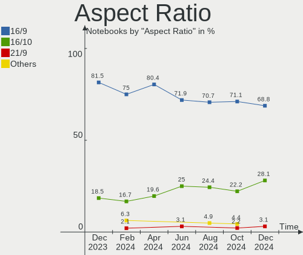
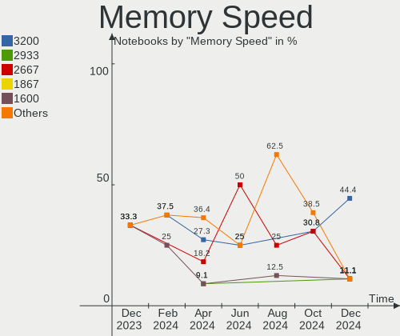
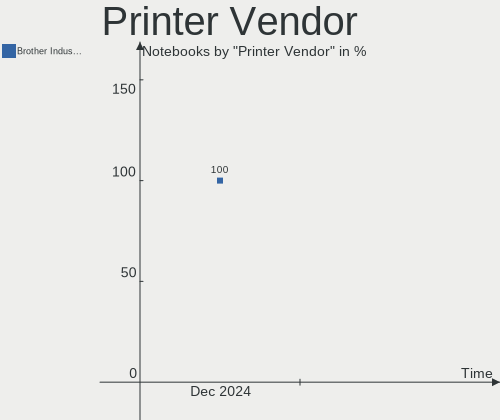

KDE neon - Hardware Trends (Notebooks)
--------------------------------------

A project to identify most popular hardware characteristics and track their change
over time based on data collected by Linux users at https://Linux-Hardware.org.

Anyone can contribute to this report by the [hw-probe](https://github.com/linuxhw/hw-probe) tool:

    sudo -E hw-probe -all -upload

This report is for one last month. Overall report since the beginning of time: [TestCoverage](https://github.com/linuxhw/TestCoverage)

Period: Sep, 2022.

Contents
--------

* [ System ](#system)
  - [ OS                       ](#os)
  - [ OS Family                ](#os-family)
  - [ Kernel                   ](#kernel)
  - [ Kernel Family            ](#kernel-family)
  - [ Kernel Major Ver.        ](#kernel-major-ver)
  - [ Arch                     ](#arch)
  - [ DE                       ](#de)
  - [ Display Server           ](#display-server)
  - [ Display Manager          ](#display-manager)
  - [ OS Lang                  ](#os-lang)
  - [ Boot Mode                ](#boot-mode)
  - [ Filesystem               ](#filesystem)
  - [ Part. scheme             ](#part-scheme)
  - [ Dual Boot with Linux/BSD ](#dual-boot-with-linuxbsd)
  - [ Dual Boot (Win)          ](#dual-boot-win)

* [ Board ](#board)
  - [ Vendor                   ](#vendor)
  - [ Model                    ](#model)
  - [ Model Family             ](#model-family)
  - [ MFG Year                 ](#mfg-year)
  - [ Form Factor              ](#form-factor)
  - [ Secure Boot              ](#secure-boot)
  - [ Coreboot                 ](#coreboot)
  - [ RAM Size                 ](#ram-size)
  - [ RAM Used                 ](#ram-used)
  - [ Total Drives             ](#total-drives)
  - [ Has CD-ROM               ](#has-cd-rom)
  - [ Has Ethernet             ](#has-ethernet)
  - [ Has WiFi                 ](#has-wifi)
  - [ Has Bluetooth            ](#has-bluetooth)

* [ Location ](#location)
  - [ Country                  ](#country)
  - [ City                     ](#city)

* [ Drives ](#drives)
  - [ Drive Vendor             ](#drive-vendor)
  - [ Drive Model              ](#drive-model)
  - [ HDD Vendor               ](#hdd-vendor)
  - [ SSD Vendor               ](#ssd-vendor)
  - [ Drive Kind               ](#drive-kind)
  - [ Drive Connector          ](#drive-connector)
  - [ Drive Size               ](#drive-size)
  - [ Space Total              ](#space-total)
  - [ Space Used               ](#space-used)
  - [ Malfunc. Drives          ](#malfunc-drives)
  - [ Malfunc. Drive Vendor    ](#malfunc-drive-vendor)
  - [ Malfunc. HDD Vendor      ](#malfunc-hdd-vendor)
  - [ Malfunc. Drive Kind      ](#malfunc-drive-kind)
  - [ Failed Drives            ](#failed-drives)
  - [ Failed Drive Vendor      ](#failed-drive-vendor)
  - [ Drive Status             ](#drive-status)

* [ Storage controller ](#storage-controller)
  - [ Storage Vendor           ](#storage-vendor)
  - [ Storage Model            ](#storage-model)
  - [ Storage Kind             ](#storage-kind)

* [ Processor ](#processor)
  - [ CPU Vendor               ](#cpu-vendor)
  - [ CPU Model                ](#cpu-model)
  - [ CPU Model Family         ](#cpu-model-family)
  - [ CPU Cores                ](#cpu-cores)
  - [ CPU Sockets              ](#cpu-sockets)
  - [ CPU Threads              ](#cpu-threads)
  - [ CPU Op-Modes             ](#cpu-op-modes)
  - [ CPU Microcode            ](#cpu-microcode)
  - [ CPU Microarch            ](#cpu-microarch)

* [ Graphics ](#graphics)
  - [ GPU Vendor               ](#gpu-vendor)
  - [ GPU Model                ](#gpu-model)
  - [ GPU Combo                ](#gpu-combo)
  - [ GPU Driver               ](#gpu-driver)
  - [ GPU Memory               ](#gpu-memory)

* [ Monitor ](#monitor)
  - [ Monitor Vendor           ](#monitor-vendor)
  - [ Monitor Model            ](#monitor-model)
  - [ Monitor Resolution       ](#monitor-resolution)
  - [ Monitor Diagonal         ](#monitor-diagonal)
  - [ Monitor Width            ](#monitor-width)
  - [ Aspect Ratio             ](#aspect-ratio)
  - [ Monitor Area             ](#monitor-area)
  - [ Pixel Density            ](#pixel-density)
  - [ Multiple Monitors        ](#multiple-monitors)

* [ Network ](#network)
  - [ Net Controller Vendor    ](#net-controller-vendor)
  - [ Net Controller Model     ](#net-controller-model)
  - [ Wireless Vendor          ](#wireless-vendor)
  - [ Wireless Model           ](#wireless-model)
  - [ Ethernet Vendor          ](#ethernet-vendor)
  - [ Ethernet Model           ](#ethernet-model)
  - [ Net Controller Kind      ](#net-controller-kind)
  - [ Used Controller          ](#used-controller)
  - [ NICs                     ](#nics)
  - [ IPv6                     ](#ipv6)

* [ Bluetooth ](#bluetooth)
  - [ Bluetooth Vendor         ](#bluetooth-vendor)
  - [ Bluetooth Model          ](#bluetooth-model)

* [ Sound ](#sound)
  - [ Sound Vendor             ](#sound-vendor)
  - [ Sound Model              ](#sound-model)

* [ Memory ](#memory)
  - [ Memory Vendor            ](#memory-vendor)
  - [ Memory Model             ](#memory-model)
  - [ Memory Kind              ](#memory-kind)
  - [ Memory Form Factor       ](#memory-form-factor)
  - [ Memory Size              ](#memory-size)
  - [ Memory Speed             ](#memory-speed)

* [ Printers & scanners ](#printers--scanners)
  - [ Printer Vendor           ](#printer-vendor)
  - [ Printer Model            ](#printer-model)
  - [ Scanner Vendor           ](#scanner-vendor)
  - [ Scanner Model            ](#scanner-model)

* [ Camera ](#camera)
  - [ Camera Vendor            ](#camera-vendor)
  - [ Camera Model             ](#camera-model)

* [ Security ](#security)
  - [ Fingerprint Vendor       ](#fingerprint-vendor)
  - [ Fingerprint Model        ](#fingerprint-model)
  - [ Chipcard Vendor          ](#chipcard-vendor)
  - [ Chipcard Model           ](#chipcard-model)

* [ Unsupported ](#unsupported)
  - [ Unsupported Devices      ](#unsupported-devices)
  - [ Unsupported Device Types ](#unsupported-device-types)

System
------

OS
--

Installed operating systems

| Name           | Notebooks | Percent |
|----------------|-----------|---------|
| KDE neon 20.04 | 56        | 86.15%  |
| KDE neon 22.04 | 9         | 13.85%  |

OS Family
---------

OS without a version

| Name     | Notebooks | Percent |
|----------|-----------|---------|
| KDE neon | 65        | 100%    |

Kernel
------

Version of the Linux kernel

| Version              | Notebooks | Percent |
|----------------------|-----------|---------|
| 5.15.0-46-generic    | 37        | 56.92%  |
| 5.15.0-48-generic    | 15        | 23.08%  |
| 5.15.0-47-generic    | 8         | 12.31%  |
| 5.19.6-xanmod1-x64v2 | 1         | 1.54%   |
| 5.15.0-41-generic    | 1         | 1.54%   |
| 5.13.0-52-generic    | 1         | 1.54%   |
| 5.13.0-44-generic    | 1         | 1.54%   |
| 5.11.0-38-generic    | 1         | 1.54%   |

Kernel Family
-------------

Linux kernel without a distro release

| Version | Notebooks | Percent |
|---------|-----------|---------|
| 5.15.0  | 61        | 93.85%  |
| 5.13.0  | 2         | 3.08%   |
| 5.19.6  | 1         | 1.54%   |
| 5.11.0  | 1         | 1.54%   |

Kernel Major Ver.
-----------------

Linux kernel major version

| Version | Notebooks | Percent |
|---------|-----------|---------|
| 5.15    | 61        | 93.85%  |
| 5.13    | 2         | 3.08%   |
| 5.19    | 1         | 1.54%   |
| 5.11    | 1         | 1.54%   |

Arch
----

OS architecture (x86_64, i586, etc.)

| Name   | Notebooks | Percent |
|--------|-----------|---------|
| x86_64 | 65        | 100%    |

DE
--

Desktop Environment

| Name    | Notebooks | Percent |
|---------|-----------|---------|
| KDE5    | 64        | 98.46%  |
| Unknown | 1         | 1.54%   |

Display Server
--------------

X11 or Wayland

| Name    | Notebooks | Percent |
|---------|-----------|---------|
| X11     | 60        | 92.31%  |
| Wayland | 4         | 6.15%   |
| Tty     | 1         | 1.54%   |

Display Manager
---------------

SDDM, LightDM, etc.

| Name    | Notebooks | Percent |
|---------|-----------|---------|
| Unknown | 46        | 70.77%  |
| SDDM    | 19        | 29.23%  |

OS Lang
-------

Language

| Lang    | Notebooks | Percent |
|---------|-----------|---------|
| en_US   | 22        | 33.85%  |
| en_AG   | 8         | 12.31%  |
| en_GB   | 5         | 7.69%   |
| it_IT   | 3         | 4.62%   |
| de_DE   | 3         | 4.62%   |
| ru_RU   | 2         | 3.08%   |
| id_ID   | 2         | 3.08%   |
| fr_FR   | 2         | 3.08%   |
| es_ES   | 2         | 3.08%   |
| C       | 2         | 3.08%   |
| pt_BR   | 1         | 1.54%   |
| nl_NL   | 1         | 1.54%   |
| hr_HR   | 1         | 1.54%   |
| fi_FI   | 1         | 1.54%   |
| es_MX   | 1         | 1.54%   |
| es_GT   | 1         | 1.54%   |
| es_CO   | 1         | 1.54%   |
| es_CL   | 1         | 1.54%   |
| es_BO   | 1         | 1.54%   |
| el_GR   | 1         | 1.54%   |
| de_LI   | 1         | 1.54%   |
| de_AT   | 1         | 1.54%   |
| ca_ES   | 1         | 1.54%   |
| Unknown | 1         | 1.54%   |

Boot Mode
---------

EFI or BIOS

| Mode | Notebooks | Percent |
|------|-----------|---------|
| EFI  | 36        | 55.38%  |
| BIOS | 29        | 44.62%  |

Filesystem
----------

Type of filesystem

| Type    | Notebooks | Percent |
|---------|-----------|---------|
| Ext4    | 62        | 95.38%  |
| Btrfs   | 2         | 3.08%   |
| Overlay | 1         | 1.54%   |

Part. scheme
------------

Scheme of partitioning

| Type    | Notebooks | Percent |
|---------|-----------|---------|
| Unknown | 50        | 76.92%  |
| GPT     | 12        | 18.46%  |
| MBR     | 3         | 4.62%   |

Dual Boot with Linux/BSD
------------------------

Hosting more than one Linux/BSD

| Dual boot | Notebooks | Percent |
|-----------|-----------|---------|
| No        | 61        | 93.85%  |
| Yes       | 4         | 6.15%   |

Dual Boot (Win)
---------------

Hosting Linux and Windows

| Dual boot | Notebooks | Percent |
|-----------|-----------|---------|
| No        | 56        | 86.15%  |
| Yes       | 9         | 13.85%  |

Board
-----

Vendor
------

Motherboard manufacturer

| Name                | Notebooks | Percent |
|---------------------|-----------|---------|
| Lenovo              | 13        | 20%     |
| Hewlett-Packard     | 11        | 16.92%  |
| ASUSTek Computer    | 9         | 13.85%  |
| Dell                | 8         | 12.31%  |
| Acer                | 6         | 9.23%   |
| Samsung Electronics | 3         | 4.62%   |
| Toshiba             | 2         | 3.08%   |
| TUXEDO              | 1         | 1.54%   |
| Timi                | 1         | 1.54%   |
| Tactus              | 1         | 1.54%   |
| Razer               | 1         | 1.54%   |
| Purism              | 1         | 1.54%   |
| PC Specialist       | 1         | 1.54%   |
| Panasonic           | 1         | 1.54%   |
| HUAWEI              | 1         | 1.54%   |
| Chuwi               | 1         | 1.54%   |
| Apple               | 1         | 1.54%   |
| American Megatrends | 1         | 1.54%   |
| Alienware           | 1         | 1.54%   |
| Unknown             | 1         | 1.54%   |

Model
-----

Motherboard model

| Name                                  | Notebooks | Percent |
|---------------------------------------|-----------|---------|
| Lenovo IdeaPad Gaming 3 15ACH6 82K2   | 2         | 3.08%   |
| Unknown                               | 2         | 3.08%   |
| TUXEDO N8xEJEK                        | 1         | 1.54%   |
| Toshiba Satellite P200                | 1         | 1.54%   |
| Toshiba Satellite L645                | 1         | 1.54%   |
| Timi Xiaomi Book Pro 16 2022          | 1         | 1.54%   |
| Tactus GeoBook 110                    | 1         | 1.54%   |
| Samsung 305V4A/305V5A                 | 1         | 1.54%   |
| Samsung 300E4C/300E5C/300E7C          | 1         | 1.54%   |
| Samsung 275E4E/275E5E                 | 1         | 1.54%   |
| Razer Blade Stealth                   | 1         | 1.54%   |
| Purism Librem 14                      | 1         | 1.54%   |
| PC Specialist NS50MU                  | 1         | 1.54%   |
| Panasonic CF-191HACHFG                | 1         | 1.54%   |
| Lenovo ThinkPad X260 20F60097US       | 1         | 1.54%   |
| Lenovo ThinkPad T61p 64575KU          | 1         | 1.54%   |
| Lenovo ThinkPad T500 2241WH7          | 1         | 1.54%   |
| Lenovo ThinkPad T450s 20BWS0S100      | 1         | 1.54%   |
| Lenovo ThinkPad T450 20BV001CSP       | 1         | 1.54%   |
| Lenovo ThinkPad T14 Gen 1 20UD0013GE  | 1         | 1.54%   |
| Lenovo ThinkPad S1 Yoga 12 20DKA00B00 | 1         | 1.54%   |
| Lenovo ThinkPad P1 Gen 4i 20Y3CTO1WW  | 1         | 1.54%   |
| Lenovo IdeaPad Geming 3 15ARH05 82EY  | 1         | 1.54%   |
| Lenovo IdeaPad 320-15IKB 81BG         | 1         | 1.54%   |
| Lenovo G580 20150                     | 1         | 1.54%   |
| HUAWEI BOHK-WAX9X                     | 1         | 1.54%   |
| HP ProBook 6560b                      | 1         | 1.54%   |
| HP Pavilion Gaming Laptop 15-ec2xxx   | 1         | 1.54%   |
| HP Pavilion dv9700                    | 1         | 1.54%   |
| HP Laptop 15-dy1xxx                   | 1         | 1.54%   |
| HP ENVY Laptop 17-ch0xxx              | 1         | 1.54%   |
| HP ENVY 14                            | 1         | 1.54%   |
| HP EliteBook Revolve 810 G3           | 1         | 1.54%   |
| HP EliteBook Folio 1040 G2            | 1         | 1.54%   |
| HP EliteBook 8460p                    | 1         | 1.54%   |
| HP Elite x2 1012 G1                   | 1         | 1.54%   |
| Dell Precision M6800                  | 1         | 1.54%   |
| Dell Latitude E5420                   | 1         | 1.54%   |
| Dell Latitude 5511                    | 1         | 1.54%   |
| Dell Latitude 5490                    | 1         | 1.54%   |

Model Family
------------

Motherboard model prefix

| Name                           | Notebooks | Percent |
|--------------------------------|-----------|---------|
| Lenovo ThinkPad                | 8         | 12.31%  |
| Acer Aspire                    | 5         | 7.69%   |
| Lenovo IdeaPad                 | 4         | 6.15%   |
| Dell Inspiron                  | 4         | 6.15%   |
| HP EliteBook                   | 3         | 4.62%   |
| Dell Latitude                  | 3         | 4.62%   |
| Toshiba Satellite              | 2         | 3.08%   |
| HP Pavilion                    | 2         | 3.08%   |
| HP ENVY                        | 2         | 3.08%   |
| Unknown                        | 2         | 3.08%   |
| TUXEDO N8xEJEK                 | 1         | 1.54%   |
| Timi Xiaomi                    | 1         | 1.54%   |
| Tactus GeoBook                 | 1         | 1.54%   |
| Samsung 305V4A                 | 1         | 1.54%   |
| Samsung 300E4C                 | 1         | 1.54%   |
| Samsung 275E4E                 | 1         | 1.54%   |
| Razer Blade                    | 1         | 1.54%   |
| Purism Librem                  | 1         | 1.54%   |
| PC Specialist NS50MU           | 1         | 1.54%   |
| Panasonic CF-191HACHFG         | 1         | 1.54%   |
| Lenovo G580                    | 1         | 1.54%   |
| HUAWEI BOHK-WAX9X              | 1         | 1.54%   |
| HP ProBook                     | 1         | 1.54%   |
| HP Laptop                      | 1         | 1.54%   |
| HP Elite                       | 1         | 1.54%   |
| Dell Precision                 | 1         | 1.54%   |
| Chuwi CoreBook                 | 1         | 1.54%   |
| ASUS X75VC                     | 1         | 1.54%   |
| ASUS X455LJ                    | 1         | 1.54%   |
| ASUS X450EA                    | 1         | 1.54%   |
| ASUS VivoBook                  | 1         | 1.54%   |
| ASUS P2540UA                   | 1         | 1.54%   |
| ASUS N750JV                    | 1         | 1.54%   |
| ASUS N552VX                    | 1         | 1.54%   |
| ASUS GL703VM                   | 1         | 1.54%   |
| ASUS ASUS                      | 1         | 1.54%   |
| Apple MacBookPro5              | 1         | 1.54%   |
| American Megatrends XA133PR110 | 1         | 1.54%   |
| Alienware 17                   | 1         | 1.54%   |
| Acer Extensa                   | 1         | 1.54%   |

MFG Year
--------

Motherboard manufacture year

| Year | Notebooks | Percent |
|------|-----------|---------|
| 2021 | 11        | 16.92%  |
| 2015 | 8         | 12.31%  |
| 2013 | 8         | 12.31%  |
| 2020 | 5         | 7.69%   |
| 2011 | 5         | 7.69%   |
| 2016 | 4         | 6.15%   |
| 2014 | 4         | 6.15%   |
| 2012 | 4         | 6.15%   |
| 2019 | 3         | 4.62%   |
| 2018 | 3         | 4.62%   |
| 2017 | 3         | 4.62%   |
| 2007 | 3         | 4.62%   |
| 2022 | 1         | 1.54%   |
| 2010 | 1         | 1.54%   |
| 2009 | 1         | 1.54%   |
| 2008 | 1         | 1.54%   |

Form Factor
-----------

Physical design of the computer

| Name     | Notebooks | Percent |
|----------|-----------|---------|
| Notebook | 65        | 100%    |

Secure Boot
-----------

Enabled or disabled

| State    | Notebooks | Percent |
|----------|-----------|---------|
| Disabled | 60        | 92.31%  |
| Enabled  | 5         | 7.69%   |

Coreboot
--------

Have coreboot on board

| Used | Notebooks | Percent |
|------|-----------|---------|
| No   | 64        | 98.46%  |
| Yes  | 1         | 1.54%   |

RAM Size
--------

Total RAM memory

| Size in GB | Notebooks | Percent |
|------------|-----------|---------|
| 4.01-8.0   | 25        | 38.46%  |
| 3.01-4.0   | 12        | 18.46%  |
| 16.01-24.0 | 12        | 18.46%  |
| 8.01-16.0  | 11        | 16.92%  |
| 32.01-64.0 | 2         | 3.08%   |
| 1.01-2.0   | 2         | 3.08%   |
| 24.01-32.0 | 1         | 1.54%   |

RAM Used
--------

Used RAM memory

| Used GB   | Notebooks | Percent |
|-----------|-----------|---------|
| 1.01-2.0  | 20        | 30.77%  |
| 2.01-3.0  | 19        | 29.23%  |
| 4.01-8.0  | 11        | 16.92%  |
| 3.01-4.0  | 9         | 13.85%  |
| 0.51-1.0  | 5         | 7.69%   |
| 8.01-16.0 | 1         | 1.54%   |

Total Drives
------------

Number of drives on board

| Drives | Notebooks | Percent |
|--------|-----------|---------|
| 1      | 47        | 72.31%  |
| 2      | 16        | 24.62%  |
| 3      | 2         | 3.08%   |

Has CD-ROM
----------

Has CD-ROM on board

| Presented | Notebooks | Percent |
|-----------|-----------|---------|
| No        | 42        | 64.62%  |
| Yes       | 23        | 35.38%  |

Has Ethernet
------------

Has Ethernet on board

| Presented | Notebooks | Percent |
|-----------|-----------|---------|
| Yes       | 55        | 84.62%  |
| No        | 10        | 15.38%  |

Has WiFi
--------

Has WiFi module

| Presented | Notebooks | Percent |
|-----------|-----------|---------|
| Yes       | 64        | 98.46%  |
| No        | 1         | 1.54%   |

Has Bluetooth
-------------

Has Bluetooth module

| Presented | Notebooks | Percent |
|-----------|-----------|---------|
| Yes       | 55        | 84.62%  |
| No        | 10        | 15.38%  |

Location
--------

Country
-------

Geographic location (country)

| Country     | Notebooks | Percent |
|-------------|-----------|---------|
| USA         | 11        | 16.92%  |
| Italy       | 5         | 7.69%   |
| Indonesia   | 5         | 7.69%   |
| UK          | 4         | 6.15%   |
| Germany     | 4         | 6.15%   |
| Spain       | 3         | 4.62%   |
| Netherlands | 3         | 4.62%   |
| Mexico      | 3         | 4.62%   |
| Philippines | 2         | 3.08%   |
| India       | 2         | 3.08%   |
| France      | 2         | 3.08%   |
| Finland     | 2         | 3.08%   |
| Croatia     | 2         | 3.08%   |
| Austria     | 2         | 3.08%   |
| Ukraine     | 1         | 1.54%   |
| Tunisia     | 1         | 1.54%   |
| Switzerland | 1         | 1.54%   |
| Portugal    | 1         | 1.54%   |
| Morocco     | 1         | 1.54%   |
| Guatemala   | 1         | 1.54%   |
| Greece      | 1         | 1.54%   |
| Colombia    | 1         | 1.54%   |
| China       | 1         | 1.54%   |
| Chile       | 1         | 1.54%   |
| Canada      | 1         | 1.54%   |
| Brazil      | 1         | 1.54%   |
| Bolivia     | 1         | 1.54%   |
| Bangladesh  | 1         | 1.54%   |
| Armenia     | 1         | 1.54%   |

City
----

Geographic location (city)

| City             | Notebooks | Percent |
|------------------|-----------|---------|
| Zagreb           | 2         | 3.08%   |
| Jakarta          | 2         | 3.08%   |
| Barcelona        | 2         | 3.08%   |
| Amsterdam        | 2         | 3.08%   |
| Zurich           | 1         | 1.54%   |
| Yerevan          | 1         | 1.54%   |
| Yeovil           | 1         | 1.54%   |
| Waddinxveen      | 1         | 1.54%   |
| Valencia         | 1         | 1.54%   |
| Tunis            | 1         | 1.54%   |
| Toronto          | 1         | 1.54%   |
| Talisay City     | 1         | 1.54%   |
| St. George       | 1         | 1.54%   |
| Sao Pedro do Sul | 1         | 1.54%   |
| San Diego        | 1         | 1.54%   |
| Rome             | 1         | 1.54%   |
| Quiberon         | 1         | 1.54%   |
| Puebla City      | 1         | 1.54%   |
| Plymouth         | 1         | 1.54%   |
| Pátrai          | 1         | 1.54%   |
| Patiala          | 1         | 1.54%   |
| Pasig            | 1         | 1.54%   |
| Paris            | 1         | 1.54%   |
| Orizaba          | 1         | 1.54%   |
| Obersiebenbrunn  | 1         | 1.54%   |
| Oberndorf        | 1         | 1.54%   |
| Nilphamari       | 1         | 1.54%   |
| New Delhi        | 1         | 1.54%   |
| Nembro           | 1         | 1.54%   |
| Milan            | 1         | 1.54%   |
| Maipu            | 1         | 1.54%   |
| Luton            | 1         | 1.54%   |
| Lünen           | 1         | 1.54%   |
| Lisbon           | 1         | 1.54%   |
| Legnano          | 1         | 1.54%   |
| Kyiv             | 1         | 1.54%   |
| Kenitra          | 1         | 1.54%   |
| Helsinki         | 1         | 1.54%   |
| Guatemala City   | 1         | 1.54%   |
| Glendale         | 1         | 1.54%   |

Drives
------

Drive Vendor
------------

Hard drive vendors

| Vendor                    | Notebooks | Drives | Percent |
|---------------------------|-----------|--------|---------|
| Samsung Electronics       | 13        | 16     | 15.29%  |
| Seagate                   | 11        | 11     | 12.94%  |
| Kingston                  | 8         | 8      | 9.41%   |
| Sandisk                   | 7         | 7      | 8.24%   |
| WDC                       | 6         | 6      | 7.06%   |
| Unknown                   | 5         | 5      | 5.88%   |
| SK hynix                  | 5         | 6      | 5.88%   |
| Toshiba                   | 4         | 4      | 4.71%   |
| HGST                      | 4         | 4      | 4.71%   |
| Crucial                   | 3         | 3      | 3.53%   |
| A-DATA Technology         | 3         | 3      | 3.53%   |
| Fujitsu                   | 2         | 2      | 2.35%   |
| Transcend                 | 1         | 1      | 1.18%   |
| SPCC                      | 1         | 1      | 1.18%   |
| ShiJi                     | 1         | 1      | 1.18%   |
| Patriot                   | 1         | 1      | 1.18%   |
| Micron/Crucial Technology | 1         | 1      | 1.18%   |
| Micron Technology         | 1         | 1      | 1.18%   |
| LITEON                    | 1         | 1      | 1.18%   |
| KIOXIA                    | 1         | 1      | 1.18%   |
| Intenso                   | 1         | 1      | 1.18%   |
| faspeed                   | 1         | 1      | 1.18%   |
| External                  | 1         | 1      | 1.18%   |
| Emtec                     | 1         | 1      | 1.18%   |
| Corsair                   | 1         | 1      | 1.18%   |
| China                     | 1         | 1      | 1.18%   |

Drive Model
-----------

Hard drive models

| Model                                                 | Notebooks | Percent |
|-------------------------------------------------------|-----------|---------|
| Unknown MMC Card  64GB                                | 3         | 3.37%   |
| Seagate ST500LT012-1DG142 500GB                       | 3         | 3.37%   |
| Toshiba MQ01ABD100 1TB                                | 2         | 2.25%   |
| Seagate ST500VT000-1DK142 500GB                       | 2         | 2.25%   |
| SanDisk SDSSDH3 500G                                  | 2         | 2.25%   |
| Samsung SSD 860 EVO 500GB                             | 2         | 2.25%   |
| Samsung NVMe SSD Controller PM9A1/PM9A3/980PRO 1024GB | 2         | 2.25%   |
| Kingston SA400S37240G 240GB SSD                       | 2         | 2.25%   |
| HGST HTS721010A9E630 1TB                              | 2         | 2.25%   |
| WDC WD7500BPVT-22HXZT3 752GB                          | 1         | 1.12%   |
| WDC WD7500BPKX-75HPJT0 752GB                          | 1         | 1.12%   |
| WDC WD7500BPKT-60PK4T0 752GB                          | 1         | 1.12%   |
| WDC WD10SPZX-22Z10T1 1TB                              | 1         | 1.12%   |
| WDC WD10JPVX-22JC3T0 1TB                              | 1         | 1.12%   |
| WDC PC SN530 SDBPNPZ-1T00-1006 1TB                    | 1         | 1.12%   |
| Unknown MMC Card  32GB                                | 1         | 1.12%   |
| Unknown MMC Card  16GB                                | 1         | 1.12%   |
| Transcend TS64GSSD630 64GB                            | 1         | 1.12%   |
| Toshiba THNSFJ256GCSU 256GB SSD                       | 1         | 1.12%   |
| Toshiba NVMe SSD Drive 256GB                          | 1         | 1.12%   |
| SPCC Solid State Disk 512GB                           | 1         | 1.12%   |
| SK hynix SKHynix_HFM512GDHTNI-87A0B 512GB             | 1         | 1.12%   |
| SK hynix SC311 SATA 256GB SSD                         | 1         | 1.12%   |
| SK hynix SC311 SATA 128GB SSD                         | 1         | 1.12%   |
| SK hynix NVMe SSD Drive 512GB                         | 1         | 1.12%   |
| SK hynix HFS256G39TND-N210A 256GB SSD                 | 1         | 1.12%   |
| SK hynix BC511 512GB                                  | 1         | 1.12%   |
| ShiJi 512GB                                           | 1         | 1.12%   |
| Seagate ST9500325AS 500GB                             | 1         | 1.12%   |
| Seagate ST750LM022 HN-M750MBB 752GB                   | 1         | 1.12%   |
| Seagate ST500LM012 HN-M500MBB 500GB                   | 1         | 1.12%   |
| Seagate ST1000LM035-1RK172 1TB                        | 1         | 1.12%   |
| Seagate BUP BK 5TB                                    | 1         | 1.12%   |
| Seagate Backup+ Desk 2TB                              | 1         | 1.12%   |
| Sandisk WDC PC SN530 SDBPMPZ-512G-1101 512GB          | 1         | 1.12%   |
| Sandisk WD Black SN750 / PC SN730 NVMe SSD 1024GB     | 1         | 1.12%   |
| SanDisk SSD PLUS 480 GB                               | 1         | 1.12%   |
| SanDisk SD8TB8U256G1001 256GB SSD                     | 1         | 1.12%   |
| SanDisk SD7SN6S-256G-1006 256GB SSD                   | 1         | 1.12%   |
| Samsung SSD SM841 2.5 7mm 128GB                       | 1         | 1.12%   |

HDD Vendor
----------

Hard disk drive vendors

| Vendor  | Notebooks | Drives | Percent |
|---------|-----------|--------|---------|
| Seagate | 10        | 10     | 43.48%  |
| WDC     | 5         | 5      | 21.74%  |
| HGST    | 4         | 4      | 17.39%  |
| Toshiba | 2         | 2      | 8.7%    |
| Fujitsu | 2         | 2      | 8.7%    |

SSD Vendor
----------

Solid state drive vendors

| Vendor              | Notebooks | Drives | Percent |
|---------------------|-----------|--------|---------|
| Samsung Electronics | 6         | 6      | 18.18%  |
| SanDisk             | 5         | 5      | 15.15%  |
| Kingston            | 5         | 5      | 15.15%  |
| SK hynix            | 3         | 3      | 9.09%   |
| Crucial             | 3         | 3      | 9.09%   |
| A-DATA Technology   | 3         | 3      | 9.09%   |
| Transcend           | 1         | 1      | 3.03%   |
| Toshiba             | 1         | 1      | 3.03%   |
| SPCC                | 1         | 1      | 3.03%   |
| Patriot             | 1         | 1      | 3.03%   |
| LITEON              | 1         | 1      | 3.03%   |
| Emtec               | 1         | 1      | 3.03%   |
| Corsair             | 1         | 1      | 3.03%   |
| China               | 1         | 1      | 3.03%   |

Drive Kind
----------

HDD or SSD

| Kind    | Notebooks | Drives | Percent |
|---------|-----------|--------|---------|
| SSD     | 32        | 33     | 39.51%  |
| HDD     | 22        | 23     | 27.16%  |
| NVMe    | 19        | 24     | 23.46%  |
| MMC     | 5         | 5      | 6.17%   |
| Unknown | 3         | 4      | 3.7%    |

Drive Connector
---------------

SATA, SAS, NVMe, etc.

| Type | Notebooks | Drives | Percent |
|------|-----------|--------|---------|
| SATA | 48        | 58     | 64%     |
| NVMe | 19        | 23     | 25.33%  |
| MMC  | 5         | 5      | 6.67%   |
| SAS  | 3         | 3      | 4%      |

Drive Size
----------

Size of hard drive

| Size in TB | Notebooks | Drives | Percent |
|------------|-----------|--------|---------|
| 0.01-0.5   | 38        | 39     | 70.37%  |
| 0.51-1.0   | 15        | 16     | 27.78%  |
| 4.01-10.0  | 1         | 1      | 1.85%   |

Space Total
-----------

Amount of disk space available on the file system

| Size in GB     | Notebooks | Percent |
|----------------|-----------|---------|
| 101-250        | 21        | 32.31%  |
| 251-500        | 15        | 23.08%  |
| 21-50          | 6         | 9.23%   |
| 501-1000       | 6         | 9.23%   |
| 51-100         | 5         | 7.69%   |
| Unknown        | 4         | 6.15%   |
| More than 3000 | 3         | 4.62%   |
| 1001-2000      | 3         | 4.62%   |
| 1-20           | 2         | 3.08%   |

Space Used
----------

Amount of used disk space

| Used GB        | Notebooks | Percent |
|----------------|-----------|---------|
| 1-20           | 26        | 40%     |
| 21-50          | 12        | 18.46%  |
| 101-250        | 11        | 16.92%  |
| 51-100         | 5         | 7.69%   |
| 251-500        | 4         | 6.15%   |
| Unknown        | 4         | 6.15%   |
| More than 3000 | 2         | 3.08%   |
| 501-1000       | 1         | 1.54%   |

Malfunc. Drives
---------------

Drive models with a malfunction

| Model                            | Notebooks | Drives | Percent |
|----------------------------------|-----------|--------|---------|
| WDC WD7500BPKT-60PK4T0 752GB     | 1         | 1      | 20%     |
| WDC WD10JPVX-22JC3T0 1TB         | 1         | 1      | 20%     |
| Seagate ST500LT012-1DG142 500GB  | 1         | 1      | 20%     |
| Seagate ST1000LM035-1RK172 1TB   | 1         | 1      | 20%     |
| Kingston RBUSNS8154P3512GJ 512GB | 1         | 1      | 20%     |

Malfunc. Drive Vendor
---------------------

Vendors of faulty drives

| Vendor   | Notebooks | Drives | Percent |
|----------|-----------|--------|---------|
| WDC      | 2         | 2      | 40%     |
| Seagate  | 2         | 2      | 40%     |
| Kingston | 1         | 1      | 20%     |

Malfunc. HDD Vendor
-------------------

Vendors of faulty HDD drives

| Vendor  | Notebooks | Drives | Percent |
|---------|-----------|--------|---------|
| WDC     | 2         | 2      | 50%     |
| Seagate | 2         | 2      | 50%     |

Malfunc. Drive Kind
-------------------

Kinds of faulty drives

| Kind | Notebooks | Drives | Percent |
|------|-----------|--------|---------|
| HDD  | 4         | 4      | 80%     |
| NVMe | 1         | 1      | 20%     |

Failed Drives
-------------

Failed drive models

Zero info for selected period =(

Failed Drive Vendor
-------------------

Failed drive vendors

Zero info for selected period =(

Drive Status
------------

Number of failed and malfunc. drives

| Status   | Notebooks | Drives | Percent |
|----------|-----------|--------|---------|
| Detected | 51        | 69     | 73.91%  |
| Works    | 13        | 15     | 18.84%  |
| Malfunc  | 5         | 5      | 7.25%   |

Storage controller
------------------

Storage Vendor
--------------

Storage controller vendors

| Vendor                       | Notebooks | Percent |
|------------------------------|-----------|---------|
| Intel                        | 48        | 62.34%  |
| Samsung Electronics          | 8         | 10.39%  |
| AMD                          | 8         | 10.39%  |
| SanDisk                      | 3         | 3.9%    |
| Kingston Technology Company  | 3         | 3.9%    |
| SK hynix                     | 2         | 2.6%    |
| Toshiba America Info Systems | 1         | 1.3%    |
| Nvidia                       | 1         | 1.3%    |
| Micron/Crucial Technology    | 1         | 1.3%    |
| Micron Technology            | 1         | 1.3%    |
| KIOXIA                       | 1         | 1.3%    |

Storage Model
-------------

Storage controller models

| Model                                                                            | Notebooks | Percent |
|----------------------------------------------------------------------------------|-----------|---------|
| Intel Wildcat Point-LP SATA Controller [AHCI Mode]                               | 8         | 9.64%   |
| AMD FCH SATA Controller [AHCI mode]                                              | 8         | 9.64%   |
| Intel Sunrise Point-LP SATA Controller [AHCI mode]                               | 6         | 7.23%   |
| Intel 82801 Mobile SATA Controller [RAID mode]                                   | 5         | 6.02%   |
| Intel 7 Series Chipset Family 6-port SATA Controller [AHCI mode]                 | 5         | 6.02%   |
| Samsung NVMe SSD Controller SM981/PM981/PM983                                    | 3         | 3.61%   |
| Samsung NVMe SSD Controller PM9A1/PM9A3/980PRO                                   | 3         | 3.61%   |
| Intel Celeron/Pentium Silver Processor SATA Controller                           | 3         | 3.61%   |
| Intel 82801HM/HEM (ICH8M/ICH8M-E) SATA Controller [AHCI mode]                    | 3         | 3.61%   |
| Intel 82801HM/HEM (ICH8M/ICH8M-E) IDE Controller                                 | 3         | 3.61%   |
| Intel 6 Series/C200 Series Chipset Family 6 port Mobile SATA AHCI Controller     | 3         | 3.61%   |
| Samsung NVMe SSD Controller 980                                                  | 2         | 2.41%   |
| Kingston Company Company Non-Volatile memory controller                          | 2         | 2.41%   |
| Intel 8 Series/C220 Series Chipset Family 6-port SATA Controller 1 [AHCI mode]   | 2         | 2.41%   |
| Intel 8 Series SATA Controller 1 [AHCI mode]                                     | 2         | 2.41%   |
| Intel 400 Series Chipset Family SATA AHCI Controller                             | 2         | 2.41%   |
| Toshiba America Info Systems BG3 NVMe SSD Controller                             | 1         | 1.2%    |
| SK hynix Non-Volatile memory controller                                          | 1         | 1.2%    |
| SK hynix BC511                                                                   | 1         | 1.2%    |
| SanDisk WD Blue SN550 NVMe SSD                                                   | 1         | 1.2%    |
| SanDisk WD Black SN750 / PC SN730 NVMe SSD                                       | 1         | 1.2%    |
| SanDisk Non-Volatile memory controller                                           | 1         | 1.2%    |
| Samsung NVMe SSD Controller SM961/PM961/SM963                                    | 1         | 1.2%    |
| Nvidia MCP79 AHCI Controller                                                     | 1         | 1.2%    |
| Micron/Crucial P2 NVMe PCIe SSD                                                  | 1         | 1.2%    |
| Micron Non-Volatile memory controller                                            | 1         | 1.2%    |
| KIOXIA Non-Volatile memory controller                                            | 1         | 1.2%    |
| Kingston Company U-SNS8154P3 NVMe SSD                                            | 1         | 1.2%    |
| Intel Volume Management Device NVMe RAID Controller                              | 1         | 1.2%    |
| Intel Mobile 4 Series Chipset PT IDER Controller                                 | 1         | 1.2%    |
| Intel HM170/QM170 Chipset SATA Controller [AHCI Mode]                            | 1         | 1.2%    |
| Intel Cannon Point-LP SATA Controller [AHCI Mode]                                | 1         | 1.2%    |
| Intel Cannon Lake Mobile PCH SATA AHCI Controller                                | 1         | 1.2%    |
| Intel Atom/Celeron/Pentium Processor x5-E8000/J3xxx/N3xxx Series SATA Controller | 1         | 1.2%    |
| Intel Atom Processor E3800 Series SATA AHCI Controller                           | 1         | 1.2%    |
| Intel 82801IBM/IEM (ICH9M/ICH9M-E) 4 port SATA Controller [AHCI mode]            | 1         | 1.2%    |
| Intel 5 Series/3400 Series Chipset 4 port SATA IDE Controller                    | 1         | 1.2%    |
| Intel 5 Series/3400 Series Chipset 4 port SATA AHCI Controller                   | 1         | 1.2%    |
| Intel 5 Series/3400 Series Chipset 2 port SATA IDE Controller                    | 1         | 1.2%    |

Storage Kind
------------

Kind of storage controller (IDE, SATA, NVMe, SAS, ...)

| Kind | Notebooks | Percent |
|------|-----------|---------|
| SATA | 50        | 62.5%   |
| NVMe | 19        | 23.75%  |
| RAID | 6         | 7.5%    |
| IDE  | 5         | 6.25%   |

Processor
---------

CPU Vendor
----------

Processor vendors

| Vendor | Notebooks | Percent |
|--------|-----------|---------|
| Intel  | 54        | 83.08%  |
| AMD    | 11        | 16.92%  |

CPU Model
---------

Processor models

| Model                                   | Notebooks | Percent |
|-----------------------------------------|-----------|---------|
| Intel Core i5-8250U CPU @ 1.60GHz       | 4         | 6.15%   |
| Intel Core i5-5200U CPU @ 2.20GHz       | 4         | 6.15%   |
| Intel Core i5-3210M CPU @ 2.50GHz       | 2         | 3.08%   |
| Intel Celeron N4020 CPU @ 1.10GHz       | 2         | 3.08%   |
| Intel 11th Gen Core i7-1165G7 @ 2.80GHz | 2         | 3.08%   |
| AMD Ryzen 7 5800H with Radeon Graphics  | 2         | 3.08%   |
| Intel Pentium Dual CPU T2330 @ 1.60GHz  | 1         | 1.54%   |
| Intel Core m5-6Y54 CPU @ 1.10GHz        | 1         | 1.54%   |
| Intel Core i7-8750H CPU @ 2.20GHz       | 1         | 1.54%   |
| Intel Core i7-7700HQ CPU @ 2.80GHz      | 1         | 1.54%   |
| Intel Core i7-7500U CPU @ 2.70GHz       | 1         | 1.54%   |
| Intel Core i7-6700HQ CPU @ 2.60GHz      | 1         | 1.54%   |
| Intel Core i7-6600U CPU @ 2.60GHz       | 1         | 1.54%   |
| Intel Core i7-5600U CPU @ 2.60GHz       | 1         | 1.54%   |
| Intel Core i7-5500U CPU @ 2.40GHz       | 1         | 1.54%   |
| Intel Core i7-4800MQ CPU @ 2.70GHz      | 1         | 1.54%   |
| Intel Core i7-4700MQ CPU @ 2.40GHz      | 1         | 1.54%   |
| Intel Core i7-4700HQ CPU @ 2.40GHz      | 1         | 1.54%   |
| Intel Core i7-4500U CPU @ 1.80GHz       | 1         | 1.54%   |
| Intel Core i7-2620M CPU @ 2.70GHz       | 1         | 1.54%   |
| Intel Core i7-10850H CPU @ 2.70GHz      | 1         | 1.54%   |
| Intel Core i7-10710U CPU @ 1.10GHz      | 1         | 1.54%   |
| Intel Core i7-1065G7 CPU @ 1.30GHz      | 1         | 1.54%   |
| Intel Core i5-8259U CPU @ 2.30GHz       | 1         | 1.54%   |
| Intel Core i5-7200U CPU @ 2.50GHz       | 1         | 1.54%   |
| Intel Core i5-6200U CPU @ 2.30GHz       | 1         | 1.54%   |
| Intel Core i5-5300U CPU @ 2.30GHz       | 1         | 1.54%   |
| Intel Core i5-4210U CPU @ 1.70GHz       | 1         | 1.54%   |
| Intel Core i5-3320M CPU @ 2.60GHz       | 1         | 1.54%   |
| Intel Core i5-2520M CPU @ 2.50GHz       | 1         | 1.54%   |
| Intel Core i5-2410M CPU @ 2.30GHz       | 1         | 1.54%   |
| Intel Core i5-10300H CPU @ 2.50GHz      | 1         | 1.54%   |
| Intel Core i5 CPU M 480 @ 2.67GHz       | 1         | 1.54%   |
| Intel Core i5 CPU M 430 @ 2.27GHz       | 1         | 1.54%   |
| Intel Core i3-5005U CPU @ 2.00GHz       | 1         | 1.54%   |
| Intel Core i3-3217U CPU @ 1.80GHz       | 1         | 1.54%   |
| Intel Core i3-2348M CPU @ 2.30GHz       | 1         | 1.54%   |
| Intel Core 2 Duo CPU T8300 @ 2.40GHz    | 1         | 1.54%   |
| Intel Core 2 Duo CPU T7700 @ 2.40GHz    | 1         | 1.54%   |
| Intel Core 2 Duo CPU P8700 @ 2.53GHz    | 1         | 1.54%   |

CPU Model Family
----------------

Processor model prefix

| Model              | Notebooks | Percent |
|--------------------|-----------|---------|
| Intel Core i5      | 21        | 32.31%  |
| Intel Core i7      | 15        | 23.08%  |
| Intel Celeron      | 5         | 7.69%   |
| Other              | 4         | 6.15%   |
| Intel Core 2 Duo   | 4         | 6.15%   |
| AMD Ryzen 7        | 4         | 6.15%   |
| Intel Core i3      | 3         | 4.62%   |
| AMD E1             | 3         | 4.62%   |
| AMD Ryzen 5        | 2         | 3.08%   |
| Intel Pentium Dual | 1         | 1.54%   |
| Intel Core m5      | 1         | 1.54%   |
| AMD Ryzen 7 PRO    | 1         | 1.54%   |
| AMD A8             | 1         | 1.54%   |

CPU Cores
---------

Number of processor cores

| Number | Notebooks | Percent |
|--------|-----------|---------|
| 2      | 37        | 56.92%  |
| 4      | 18        | 27.69%  |
| 8      | 5         | 7.69%   |
| 6      | 4         | 6.15%   |
| 12     | 1         | 1.54%   |

CPU Sockets
-----------

Number of sockets

| Number | Notebooks | Percent |
|--------|-----------|---------|
| 1      | 65        | 100%    |

CPU Threads
-----------

Threads per core (Hyper-Threading)

| Number | Notebooks | Percent |
|--------|-----------|---------|
| 2      | 51        | 78.46%  |
| 1      | 14        | 21.54%  |

CPU Op-Modes
------------

CPU Operation Modes (32-bit, 64-bit)

| Op mode        | Notebooks | Percent |
|----------------|-----------|---------|
| 32-bit, 64-bit | 65        | 100%    |

CPU Microcode
-------------

Microcode number

| Number     | Notebooks | Percent |
|------------|-----------|---------|
| Unknown    | 13        | 20%     |
| 0x306d4    | 6         | 9.23%   |
| 0x806ea    | 5         | 7.69%   |
| 0x206a7    | 4         | 6.15%   |
| 0x706a8    | 3         | 4.62%   |
| 0x406e3    | 3         | 4.62%   |
| 0x0a50000c | 3         | 4.62%   |
| 0xa0652    | 2         | 3.08%   |
| 0x806e9    | 2         | 3.08%   |
| 0x806c1    | 2         | 3.08%   |
| 0x40651    | 2         | 3.08%   |
| 0x306a9    | 2         | 3.08%   |
| 0x1067a    | 2         | 3.08%   |
| 0x08108109 | 2         | 3.08%   |
| 0xa0660    | 1         | 1.54%   |
| 0x906e9    | 1         | 1.54%   |
| 0x806d1    | 1         | 1.54%   |
| 0x706e5    | 1         | 1.54%   |
| 0x6fd      | 1         | 1.54%   |
| 0x6fa      | 1         | 1.54%   |
| 0x406c4    | 1         | 1.54%   |
| 0x30678    | 1         | 1.54%   |
| 0x20655    | 1         | 1.54%   |
| 0x20652    | 1         | 1.54%   |
| 0x08600106 | 1         | 1.54%   |
| 0x08600104 | 1         | 1.54%   |
| 0x0700010f | 1         | 1.54%   |
| 0x03000027 | 1         | 1.54%   |

CPU Microarch
-------------

Microarchitecture

| Name          | Notebooks | Percent |
|---------------|-----------|---------|
| KabyLake      | 9         | 13.85%  |
| Broadwell     | 8         | 12.31%  |
| Haswell       | 5         | 7.69%   |
| Skylake       | 4         | 6.15%   |
| SandyBridge   | 4         | 6.15%   |
| IvyBridge     | 4         | 6.15%   |
| Zen 3         | 3         | 4.62%   |
| Penryn        | 3         | 4.62%   |
| Goldmont plus | 3         | 4.62%   |
| CometLake     | 3         | 4.62%   |
| Zen+          | 2         | 3.08%   |
| Zen 2         | 2         | 3.08%   |
| Westmere      | 2         | 3.08%   |
| TigerLake     | 2         | 3.08%   |
| Silvermont    | 2         | 3.08%   |
| Jaguar        | 2         | 3.08%   |
| Icelake       | 2         | 3.08%   |
| Core          | 2         | 3.08%   |
| K10 Llano     | 1         | 1.54%   |
| Bobcat        | 1         | 1.54%   |
| Unknown       | 1         | 1.54%   |

Graphics
--------

GPU Vendor
----------

Vendors of graphics cards

| Vendor | Notebooks | Percent |
|--------|-----------|---------|
| Intel  | 48        | 54.55%  |
| Nvidia | 25        | 28.41%  |
| AMD    | 15        | 17.05%  |

GPU Model
---------

Graphics card models

| Model                                                                     | Notebooks | Percent |
|---------------------------------------------------------------------------|-----------|---------|
| Intel HD Graphics 5500                                                    | 8         | 8.99%   |
| Intel UHD Graphics 620                                                    | 4         | 4.49%   |
| Intel 3rd Gen Core processor Graphics Controller                          | 4         | 4.49%   |
| Intel GeminiLake [UHD Graphics 600]                                       | 3         | 3.37%   |
| Intel 4th Gen Core Processor Integrated Graphics Controller               | 3         | 3.37%   |
| Intel 2nd Generation Core Processor Family Integrated Graphics Controller | 3         | 3.37%   |
| AMD Cezanne                                                               | 3         | 3.37%   |
| Nvidia GP108M [GeForce MX150]                                             | 2         | 2.25%   |
| Nvidia GK208BM [GeForce 920M]                                             | 2         | 2.25%   |
| Nvidia GF117M [GeForce 610M/710M/810M/820M / GT 620M/625M/630M/720M]      | 2         | 2.25%   |
| Nvidia GA107M [GeForce RTX 3050 Mobile]                                   | 2         | 2.25%   |
| Intel TigerLake-LP GT2 [Iris Xe Graphics]                                 | 2         | 2.25%   |
| Intel Skylake GT2 [HD Graphics 520]                                       | 2         | 2.25%   |
| Intel HD Graphics 620                                                     | 2         | 2.25%   |
| Intel Haswell-ULT Integrated Graphics Controller                          | 2         | 2.25%   |
| Intel Core Processor Integrated Graphics Controller                       | 2         | 2.25%   |
| Intel CometLake-H GT2 [UHD Graphics]                                      | 2         | 2.25%   |
| AMD Renoir                                                                | 2         | 2.25%   |
| AMD Picasso/Raven 2 [Radeon Vega Series / Radeon Vega Mobile Series]      | 2         | 2.25%   |
| Nvidia TU117M [GeForce MX450]                                             | 1         | 1.12%   |
| Nvidia TU117M [GeForce GTX 1650 Ti Mobile]                                | 1         | 1.12%   |
| Nvidia TU117M                                                             | 1         | 1.12%   |
| Nvidia GP107M [GeForce MX150]                                             | 1         | 1.12%   |
| Nvidia GP107M [GeForce GTX 1050 Mobile]                                   | 1         | 1.12%   |
| Nvidia GP106M [GeForce GTX 1060 Mobile]                                   | 1         | 1.12%   |
| Nvidia GM107M [GeForce GTX 950M]                                          | 1         | 1.12%   |
| Nvidia GM107M [GeForce GTX 850M]                                          | 1         | 1.12%   |
| Nvidia GK107M [GeForce GT 750M]                                           | 1         | 1.12%   |
| Nvidia GK107M [GeForce GT 640M]                                           | 1         | 1.12%   |
| Nvidia GK106M [GeForce GTX 770M]                                          | 1         | 1.12%   |
| Nvidia GK104GLM [Quadro K3100M]                                           | 1         | 1.12%   |
| Nvidia GF108M [GeForce GT 635M]                                           | 1         | 1.12%   |
| Nvidia GA107M [GeForce RTX 3050 Ti Mobile]                                | 1         | 1.12%   |
| Nvidia G86M [GeForce 8600M GS]                                            | 1         | 1.12%   |
| Nvidia G84GLM [Quadro FX 570M]                                            | 1         | 1.12%   |
| Nvidia C79 [GeForce 9400M]                                                | 1         | 1.12%   |
| Intel TigerLake-H GT1 [UHD Graphics]                                      | 1         | 1.12%   |
| Intel Mobile 4 Series Chipset Integrated Graphics Controller              | 1         | 1.12%   |
| Intel Iris Plus Graphics G7                                               | 1         | 1.12%   |
| Intel HD Graphics 530                                                     | 1         | 1.12%   |

GPU Combo
---------

Combinations of graphics cards

| Name           | Notebooks | Percent |
|----------------|-----------|---------|
| 1 x Intel      | 29        | 44.62%  |
| Intel + Nvidia | 17        | 26.15%  |
| 1 x AMD        | 8         | 12.31%  |
| 1 x Nvidia     | 4         | 6.15%   |
| AMD + Nvidia   | 4         | 6.15%   |
| Intel + AMD    | 2         | 3.08%   |
| 2 x AMD        | 1         | 1.54%   |

GPU Driver
----------

Free vs proprietary

| Driver      | Notebooks | Percent |
|-------------|-----------|---------|
| Free        | 55        | 84.62%  |
| Proprietary | 8         | 12.31%  |
| Unknown     | 2         | 3.08%   |

GPU Memory
----------

Total video memory

| Size in GB | Notebooks | Percent |
|------------|-----------|---------|
| Unknown    | 44        | 67.69%  |
| 1.01-2.0   | 8         | 12.31%  |
| 0.01-0.5   | 6         | 9.23%   |
| 3.01-4.0   | 4         | 6.15%   |
| 0.51-1.0   | 2         | 3.08%   |
| 5.01-6.0   | 1         | 1.54%   |

Monitor
-------

Monitor Vendor
--------------

Monitor vendors

| Vendor                  | Notebooks | Percent |
|-------------------------|-----------|---------|
| Chimei Innolux          | 16        | 22.54%  |
| AU Optronics            | 15        | 21.13%  |
| LG Display              | 14        | 19.72%  |
| Samsung Electronics     | 7         | 9.86%   |
| BOE                     | 3         | 4.23%   |
| PANDA                   | 2         | 2.82%   |
| Lenovo                  | 2         | 2.82%   |
| Goldstar                | 2         | 2.82%   |
| Chi Mei Optoelectronics | 2         | 2.82%   |
| ZTR                     | 1         | 1.41%   |
| Vizio                   | 1         | 1.41%   |
| Sony                    | 1         | 1.41%   |
| Sharp                   | 1         | 1.41%   |
| LG Philips              | 1         | 1.41%   |
| InfoVision              | 1         | 1.41%   |
| Apple                   | 1         | 1.41%   |
| Acer                    | 1         | 1.41%   |

Monitor Model
-------------

Monitor models

| Model                                                                  | Notebooks | Percent |
|------------------------------------------------------------------------|-----------|---------|
| LG Display LCD Monitor LGD02DA 1920x1080 382x215mm 17.3-inch           | 2         | 2.82%   |
| Chimei Innolux LCD Monitor CMN15E7 1920x1080 344x193mm 15.5-inch       | 2         | 2.82%   |
| Chimei Innolux LCD Monitor CMN1482 1600x900 309x174mm 14.0-inch        | 2         | 2.82%   |
| ZTR LCD Monitor ZTR0001 1366x768 256x144mm 11.6-inch                   | 1         | 1.41%   |
| Vizio E500i-B1 VIZ1004 1920x1080 1095x616mm 49.5-inch                  | 1         | 1.41%   |
| Sony TV *30 SNY7905 3840x2160 1218x685mm 55.0-inch                     | 1         | 1.41%   |
| Sharp LQ125T1JW02 SHP142F 2560x1440 277x155mm 12.5-inch                | 1         | 1.41%   |
| Samsung Electronics SM2333TN SAM06FC 1920x1080 477x268mm 21.5-inch     | 1         | 1.41%   |
| Samsung Electronics S27C450 SAM09D0 1920x1080 598x336mm 27.0-inch      | 1         | 1.41%   |
| Samsung Electronics LF27T450F SAM7098 1920x1080 597x336mm 27.0-inch    | 1         | 1.41%   |
| Samsung Electronics LCD Monitor SEC3651 1366x768 344x194mm 15.5-inch   | 1         | 1.41%   |
| Samsung Electronics LCD Monitor SEC324A 1366x768 344x194mm 15.5-inch   | 1         | 1.41%   |
| Samsung Electronics LCD Monitor SDC4173 3840x2400 344x215mm 16.0-inch  | 1         | 1.41%   |
| Samsung Electronics LCD Monitor SAM07C5 1920x1080 1020x570mm 46.0-inch | 1         | 1.41%   |
| PANDA LM156LF1L03 NCP001C 1920x1080 344x194mm 15.5-inch                | 1         | 1.41%   |
| PANDA LCD Monitor NCP004D 1920x1080 344x194mm 15.5-inch                | 1         | 1.41%   |
| LG Philips LCD Monitor LPLA002 1440x900 367x230mm 17.1-inch            | 1         | 1.41%   |
| LG Display LP156WH2-TLR2 LGD027D 1366x768 344x194mm 15.5-inch          | 1         | 1.41%   |
| LG Display LCD Monitor LGD06D8 1920x1080 344x194mm 15.5-inch           | 1         | 1.41%   |
| LG Display LCD Monitor LGD05FE 1920x1080 344x194mm 15.5-inch           | 1         | 1.41%   |
| LG Display LCD Monitor LGD059D 1920x1080 309x174mm 14.0-inch           | 1         | 1.41%   |
| LG Display LCD Monitor LGD0570 1920x1080 344x194mm 15.5-inch           | 1         | 1.41%   |
| LG Display LCD Monitor LGD04E8 1920x1080 382x215mm 17.3-inch           | 1         | 1.41%   |
| LG Display LCD Monitor LGD04A5 1920x1280 253x169mm 12.0-inch           | 1         | 1.41%   |
| LG Display LCD Monitor LGD0437 1920x1080 276x156mm 12.5-inch           | 1         | 1.41%   |
| LG Display LCD Monitor LGD0430 1366x768 345x194mm 15.6-inch            | 1         | 1.41%   |
| LG Display LCD Monitor LGD02F1 1366x768 344x194mm 15.5-inch            | 1         | 1.41%   |
| LG Display LCD Monitor LGD02EB 1366x768 309x174mm 14.0-inch            | 1         | 1.41%   |
| LG Display LCD Monitor LGD029B 1366x768 310x174mm 14.0-inch            | 1         | 1.41%   |
| Lenovo LCD Monitor LEN4055 1920x1200 331x207mm 15.4-inch               | 1         | 1.41%   |
| Lenovo LCD Monitor LEN4053 1680x1050 331x207mm 15.4-inch               | 1         | 1.41%   |
| InfoVision LCD Monitor IVO8544 1920x1080 294x165mm 13.3-inch           | 1         | 1.41%   |
| Goldstar LG ULTRAWIDE GSM76F9 2560x1080 800x340mm 34.2-inch            | 1         | 1.41%   |
| Goldstar E2442 GSM58C6 1920x1080 531x299mm 24.0-inch                   | 1         | 1.41%   |
| Chimei Innolux LCD Monitor CMN1728 1600x900 382x215mm 17.3-inch        | 1         | 1.41%   |
| Chimei Innolux LCD Monitor CMN15F5 1920x1080 344x193mm 15.5-inch       | 1         | 1.41%   |
| Chimei Innolux LCD Monitor CMN15D5 1920x1080 344x193mm 15.5-inch       | 1         | 1.41%   |
| Chimei Innolux LCD Monitor CMN15D2 1920x1080 344x193mm 15.5-inch       | 1         | 1.41%   |
| Chimei Innolux LCD Monitor CMN15C9 1366x768 344x193mm 15.5-inch        | 1         | 1.41%   |
| Chimei Innolux LCD Monitor CMN151E 1920x1080 344x193mm 15.5-inch       | 1         | 1.41%   |

Monitor Resolution
------------------

Monitor screen resolution

| Resolution         | Notebooks | Percent |
|--------------------|-----------|---------|
| 1920x1080 (FHD)    | 32        | 47.76%  |
| 1366x768 (WXGA)    | 19        | 28.36%  |
| 1600x900 (HD+)     | 5         | 7.46%   |
| 1440x900 (WXGA+)   | 3         | 4.48%   |
| 3840x2400          | 1         | 1.49%   |
| 3840x2160 (4K)     | 1         | 1.49%   |
| 2560x1600          | 1         | 1.49%   |
| 2560x1440 (QHD)    | 1         | 1.49%   |
| 2560x1080          | 1         | 1.49%   |
| 1920x1280          | 1         | 1.49%   |
| 1920x1200 (WUXGA)  | 1         | 1.49%   |
| 1680x1050 (WSXGA+) | 1         | 1.49%   |

Monitor Diagonal
----------------

Diagonal size in inches

| Inches | Notebooks | Percent |
|--------|-----------|---------|
| 15     | 28        | 39.44%  |
| 17     | 9         | 12.68%  |
| 14     | 8         | 11.27%  |
| 13     | 6         | 8.45%   |
| 11     | 5         | 7.04%   |
| 12     | 4         | 5.63%   |
| 27     | 2         | 2.82%   |
| 24     | 2         | 2.82%   |
| 16     | 2         | 2.82%   |
| 65     | 1         | 1.41%   |
| 54     | 1         | 1.41%   |
| 49     | 1         | 1.41%   |
| 34     | 1         | 1.41%   |
| 23     | 1         | 1.41%   |

Monitor Width
-------------

Physical width

| Width in mm | Notebooks | Percent |
|-------------|-----------|---------|
| 301-350     | 43        | 60.56%  |
| 201-300     | 10        | 14.08%  |
| 351-400     | 9         | 12.68%  |
| 501-600     | 5         | 7.04%   |
| 1001-1500   | 3         | 4.23%   |
| 701-800     | 1         | 1.41%   |

Aspect Ratio
------------

Proportional relationship between the width and the height

| Ratio | Notebooks | Percent |
|-------|-----------|---------|
| 16/9  | 55        | 85.94%  |
| 16/10 | 7         | 10.94%  |
| 3/2   | 1         | 1.56%   |
| 21/9  | 1         | 1.56%   |

Monitor Area
------------

Area in inch²

| Area in inch² | Notebooks | Percent |
|----------------|-----------|---------|
| 101-110        | 28        | 39.44%  |
| 81-90          | 13        | 18.31%  |
| 121-130        | 6         | 8.45%   |
| 51-60          | 5         | 7.04%   |
| 61-70          | 4         | 5.63%   |
| More than 1000 | 3         | 4.23%   |
| 201-250        | 3         | 4.23%   |
| 131-140        | 3         | 4.23%   |
| 301-350        | 2         | 2.82%   |
| 111-120        | 2         | 2.82%   |
| 71-80          | 1         | 1.41%   |
| 351-500        | 1         | 1.41%   |

Pixel Density
-------------

Pixels per inch

| Density       | Notebooks | Percent |
|---------------|-----------|---------|
| 121-160       | 36        | 50.7%   |
| 101-120       | 16        | 22.54%  |
| 51-100        | 10        | 14.08%  |
| 161-240       | 6         | 8.45%   |
| 1-50          | 2         | 2.82%   |
| More than 240 | 1         | 1.41%   |

Multiple Monitors
-----------------

Total monitors connected

| Total | Notebooks | Percent |
|-------|-----------|---------|
| 1     | 53        | 81.54%  |
| 2     | 10        | 15.38%  |
| 0     | 2         | 3.08%   |

Network
-------

Net Controller Vendor
---------------------

Controller vendors

| Vendor                            | Notebooks | Percent |
|-----------------------------------|-----------|---------|
| Realtek Semiconductor             | 36        | 31.3%   |
| Intel                             | 31        | 26.96%  |
| Qualcomm Atheros                  | 19        | 16.52%  |
| Broadcom                          | 9         | 7.83%   |
| Broadcom Limited                  | 4         | 3.48%   |
| Hewlett-Packard                   | 3         | 2.61%   |
| TP-Link                           | 2         | 1.74%   |
| Samsung Electronics               | 1         | 0.87%   |
| OPPO Electronics                  | 1         | 0.87%   |
| OnePlus Technology (Shenzhen)     | 1         | 0.87%   |
| Nvidia                            | 1         | 0.87%   |
| MediaTek                          | 1         | 0.87%   |
| Marvell Technology Group          | 1         | 0.87%   |
| Lenovo                            | 1         | 0.87%   |
| ICS Advent                        | 1         | 0.87%   |
| Ericsson Business Mobile Networks | 1         | 0.87%   |
| Edimax Technology                 | 1         | 0.87%   |
| DisplayLink                       | 1         | 0.87%   |

Net Controller Model
--------------------

Controller models

| Model                                                                                         | Notebooks | Percent |
|-----------------------------------------------------------------------------------------------|-----------|---------|
| Realtek RTL8111/8168/8411 PCI Express Gigabit Ethernet Controller                             | 24        | 18.32%  |
| Intel Wireless 7265                                                                           | 6         | 4.58%   |
| Realtek RTL810xE PCI Express Fast Ethernet controller                                         | 5         | 3.82%   |
| Qualcomm Atheros AR9485 Wireless Network Adapter                                              | 5         | 3.82%   |
| Realtek RTL8821CE 802.11ac PCIe Wireless Network Adapter                                      | 4         | 3.05%   |
| Qualcomm Atheros AR9462 Wireless Network Adapter                                              | 4         | 3.05%   |
| Intel Wireless 8260                                                                           | 3         | 2.29%   |
| Intel Wi-Fi 6 AX200                                                                           | 3         | 2.29%   |
| Intel Ethernet Connection (3) I218-LM                                                         | 3         | 2.29%   |
| Broadcom BCM43142 802.11b/g/n                                                                 | 3         | 2.29%   |
| Realtek RTL8852AE 802.11ax PCIe Wireless Network Adapter                                      | 2         | 1.53%   |
| Realtek RTL8822CE 802.11ac PCIe Wireless Network Adapter                                      | 2         | 1.53%   |
| Qualcomm Atheros QCA9565 / AR9565 Wireless Network Adapter                                    | 2         | 1.53%   |
| Qualcomm Atheros QCA9377 802.11ac Wireless Network Adapter                                    | 2         | 1.53%   |
| Qualcomm Atheros QCA6174 802.11ac Wireless Network Adapter                                    | 2         | 1.53%   |
| Intel Wireless 8265 / 8275                                                                    | 2         | 1.53%   |
| Intel PRO/Wireless 4965 AG or AGN [Kedron] Network Connection                                 | 2         | 1.53%   |
| Intel 82579LM Gigabit Network Connection (Lewisville)                                         | 2         | 1.53%   |
| HP lt4112 Gobi 4G Module Network Device                                                       | 2         | 1.53%   |
| Broadcom BCM4313 802.11bgn Wireless Network Adapter                                           | 2         | 1.53%   |
| TP-Link TL-WN722N v2/v3 [Realtek RTL8188EUS]                                                  | 1         | 0.76%   |
| TP-Link Archer T2U PLUS [RTL8821AU]                                                           | 1         | 0.76%   |
| Samsung Galaxy series, misc. (tethering mode)                                                 | 1         | 0.76%   |
| Realtek RTL8153 Gigabit Ethernet Adapter                                                      | 1         | 0.76%   |
| Realtek Realtek 8812AU/8821AU 802.11ac WLAN Adapter [USB Wireless Dual-Band Adapter 2.4/5Ghz] | 1         | 0.76%   |
| Qualcomm Atheros QCA8171 Gigabit Ethernet                                                     | 1         | 0.76%   |
| Qualcomm Atheros Killer E220x Gigabit Ethernet Controller                                     | 1         | 0.76%   |
| Qualcomm Atheros AR8162 Fast Ethernet                                                         | 1         | 0.76%   |
| Qualcomm Atheros AR8161 Gigabit Ethernet                                                      | 1         | 0.76%   |
| Qualcomm Atheros AR8152 v1.1 Fast Ethernet                                                    | 1         | 0.76%   |
| Qualcomm Atheros AR8151 v2.0 Gigabit Ethernet                                                 | 1         | 0.76%   |
| Qualcomm Atheros AR242x / AR542x Wireless Network Adapter (PCI-Express)                       | 1         | 0.76%   |
| OPPO RMX2117                                                                                  | 1         | 0.76%   |
| OnePlus (Shenzhen) OnePlus                                                                    | 1         | 0.76%   |
| Nvidia MCP79 Ethernet                                                                         | 1         | 0.76%   |
| MediaTek MT7921 802.11ax PCI Express Wireless Network Adapter                                 | 1         | 0.76%   |
| Marvell Group 88E8072 PCI-E Gigabit Ethernet Controller                                       | 1         | 0.76%   |
| Lenovo USB-C to LAN                                                                           | 1         | 0.76%   |
| Intel Wireless-AC 9260                                                                        | 1         | 0.76%   |
| Intel Wireless 3165                                                                           | 1         | 0.76%   |

Wireless Vendor
---------------

Wireless vendors

| Vendor                | Notebooks | Percent |
|-----------------------|-----------|---------|
| Intel                 | 28        | 40%     |
| Qualcomm Atheros      | 16        | 22.86%  |
| Realtek Semiconductor | 9         | 12.86%  |
| Broadcom              | 8         | 11.43%  |
| Broadcom Limited      | 3         | 4.29%   |
| TP-Link               | 2         | 2.86%   |
| Hewlett-Packard       | 2         | 2.86%   |
| MediaTek              | 1         | 1.43%   |
| Edimax Technology     | 1         | 1.43%   |

Wireless Model
--------------

Wireless models

| Model                                                                                         | Notebooks | Percent |
|-----------------------------------------------------------------------------------------------|-----------|---------|
| Intel Wireless 7265                                                                           | 6         | 8.57%   |
| Qualcomm Atheros AR9485 Wireless Network Adapter                                              | 5         | 7.14%   |
| Realtek RTL8821CE 802.11ac PCIe Wireless Network Adapter                                      | 4         | 5.71%   |
| Qualcomm Atheros AR9462 Wireless Network Adapter                                              | 4         | 5.71%   |
| Intel Wireless 8260                                                                           | 3         | 4.29%   |
| Intel Wi-Fi 6 AX200                                                                           | 3         | 4.29%   |
| Broadcom BCM43142 802.11b/g/n                                                                 | 3         | 4.29%   |
| Realtek RTL8852AE 802.11ax PCIe Wireless Network Adapter                                      | 2         | 2.86%   |
| Realtek RTL8822CE 802.11ac PCIe Wireless Network Adapter                                      | 2         | 2.86%   |
| Qualcomm Atheros QCA9565 / AR9565 Wireless Network Adapter                                    | 2         | 2.86%   |
| Qualcomm Atheros QCA9377 802.11ac Wireless Network Adapter                                    | 2         | 2.86%   |
| Qualcomm Atheros QCA6174 802.11ac Wireless Network Adapter                                    | 2         | 2.86%   |
| Intel Wireless 8265 / 8275                                                                    | 2         | 2.86%   |
| Intel PRO/Wireless 4965 AG or AGN [Kedron] Network Connection                                 | 2         | 2.86%   |
| HP lt4112 Gobi 4G Module Network Device                                                       | 2         | 2.86%   |
| Broadcom BCM4313 802.11bgn Wireless Network Adapter                                           | 2         | 2.86%   |
| TP-Link TL-WN722N v2/v3 [Realtek RTL8188EUS]                                                  | 1         | 1.43%   |
| TP-Link Archer T2U PLUS [RTL8821AU]                                                           | 1         | 1.43%   |
| Realtek Realtek 8812AU/8821AU 802.11ac WLAN Adapter [USB Wireless Dual-Band Adapter 2.4/5Ghz] | 1         | 1.43%   |
| Qualcomm Atheros AR242x / AR542x Wireless Network Adapter (PCI-Express)                       | 1         | 1.43%   |
| MediaTek MT7921 802.11ax PCI Express Wireless Network Adapter                                 | 1         | 1.43%   |
| Intel Wireless-AC 9260                                                                        | 1         | 1.43%   |
| Intel Wireless 3165                                                                           | 1         | 1.43%   |
| Intel Wireless 3160                                                                           | 1         | 1.43%   |
| Intel Wi-Fi 6 AX210/AX211/AX411 160MHz                                                        | 1         | 1.43%   |
| Intel Wi-Fi 6 AX201                                                                           | 1         | 1.43%   |
| Intel PRO/Wireless 5100 AGN [Shiloh] Network Connection                                       | 1         | 1.43%   |
| Intel Gemini Lake PCH CNVi WiFi                                                               | 1         | 1.43%   |
| Intel Dual Band Wireless-AC 3168NGW [Stone Peak]                                              | 1         | 1.43%   |
| Intel Comet Lake PCH CNVi WiFi                                                                | 1         | 1.43%   |
| Intel Centrino Advanced-N 6235                                                                | 1         | 1.43%   |
| Intel Centrino Advanced-N 6205 [Taylor Peak]                                                  | 1         | 1.43%   |
| Intel Alder Lake-P PCH CNVi WiFi                                                              | 1         | 1.43%   |
| Edimax EW-7811Un 802.11n Wireless Adapter [Realtek RTL8188CUS]                                | 1         | 1.43%   |
| Broadcom Limited BCM4352 802.11ac Wireless Network Adapter                                    | 1         | 1.43%   |
| Broadcom Limited BCM43142 802.11b/g/n                                                         | 1         | 1.43%   |
| Broadcom Limited BCM4313 802.11bgn Wireless Network Adapter                                   | 1         | 1.43%   |
| Broadcom BCM4352 802.11ac Wireless Network Adapter                                            | 1         | 1.43%   |
| Broadcom BCM43228 802.11a/b/g/n                                                               | 1         | 1.43%   |
| Broadcom BCM4322 802.11a/b/g/n Wireless LAN Controller                                        | 1         | 1.43%   |

Ethernet Vendor
---------------

Ethernet vendors

| Vendor                        | Notebooks | Percent |
|-------------------------------|-----------|---------|
| Realtek Semiconductor         | 30        | 50.85%  |
| Intel                         | 13        | 22.03%  |
| Qualcomm Atheros              | 6         | 10.17%  |
| Samsung Electronics           | 1         | 1.69%   |
| OPPO Electronics              | 1         | 1.69%   |
| OnePlus Technology (Shenzhen) | 1         | 1.69%   |
| Nvidia                        | 1         | 1.69%   |
| Marvell Technology Group      | 1         | 1.69%   |
| Lenovo                        | 1         | 1.69%   |
| ICS Advent                    | 1         | 1.69%   |
| DisplayLink                   | 1         | 1.69%   |
| Broadcom Limited              | 1         | 1.69%   |
| Broadcom                      | 1         | 1.69%   |

Ethernet Model
--------------

Ethernet models

| Model                                                             | Notebooks | Percent |
|-------------------------------------------------------------------|-----------|---------|
| Realtek RTL8111/8168/8411 PCI Express Gigabit Ethernet Controller | 24        | 40.68%  |
| Realtek RTL810xE PCI Express Fast Ethernet controller             | 5         | 8.47%   |
| Intel Ethernet Connection (3) I218-LM                             | 3         | 5.08%   |
| Intel 82579LM Gigabit Network Connection (Lewisville)             | 2         | 3.39%   |
| Samsung Galaxy series, misc. (tethering mode)                     | 1         | 1.69%   |
| Realtek RTL8153 Gigabit Ethernet Adapter                          | 1         | 1.69%   |
| Qualcomm Atheros QCA8171 Gigabit Ethernet                         | 1         | 1.69%   |
| Qualcomm Atheros Killer E220x Gigabit Ethernet Controller         | 1         | 1.69%   |
| Qualcomm Atheros AR8162 Fast Ethernet                             | 1         | 1.69%   |
| Qualcomm Atheros AR8161 Gigabit Ethernet                          | 1         | 1.69%   |
| Qualcomm Atheros AR8152 v1.1 Fast Ethernet                        | 1         | 1.69%   |
| Qualcomm Atheros AR8151 v2.0 Gigabit Ethernet                     | 1         | 1.69%   |
| OPPO RMX2117                                                      | 1         | 1.69%   |
| OnePlus (Shenzhen) OnePlus                                        | 1         | 1.69%   |
| Nvidia MCP79 Ethernet                                             | 1         | 1.69%   |
| Marvell Group 88E8072 PCI-E Gigabit Ethernet Controller           | 1         | 1.69%   |
| Lenovo USB-C to LAN                                               | 1         | 1.69%   |
| Intel Ethernet Connection I219-LM                                 | 1         | 1.69%   |
| Intel Ethernet Connection I217-LM                                 | 1         | 1.69%   |
| Intel Ethernet Connection (4) I219-LM                             | 1         | 1.69%   |
| Intel Ethernet Connection (3) I218-V                              | 1         | 1.69%   |
| Intel Ethernet Connection (11) I219-LM                            | 1         | 1.69%   |
| Intel 82579V Gigabit Network Connection                           | 1         | 1.69%   |
| Intel 82567LM Gigabit Network Connection                          | 1         | 1.69%   |
| Intel 82566MM Gigabit Network Connection                          | 1         | 1.69%   |
| ICS Advent 10/100M LAN                                            | 1         | 1.69%   |
| DisplayLink Dell Universal Dock D6000                             | 1         | 1.69%   |
| Broadcom NetXtreme BCM57786 Gigabit Ethernet PCIe                 | 1         | 1.69%   |
| Broadcom Limited NetXtreme BCM5761 Gigabit Ethernet PCIe          | 1         | 1.69%   |

Net Controller Kind
-------------------

Ethernet, WiFi or modem

| Kind     | Notebooks | Percent |
|----------|-----------|---------|
| WiFi     | 64        | 52.89%  |
| Ethernet | 55        | 45.45%  |
| Modem    | 2         | 1.65%   |

Used Controller
---------------

Currently used network controller

| Kind     | Notebooks | Percent |
|----------|-----------|---------|
| WiFi     | 50        | 79.37%  |
| Ethernet | 13        | 20.63%  |

NICs
----

Total network controllers on board

| Total | Notebooks | Percent |
|-------|-----------|---------|
| 2     | 50        | 76.92%  |
| 1     | 14        | 21.54%  |
| 3     | 1         | 1.54%   |

IPv6
----

IPv6 vs IPv4

| Used | Notebooks | Percent |
|------|-----------|---------|
| No   | 47        | 72.31%  |
| Yes  | 18        | 27.69%  |

Bluetooth
---------

Bluetooth Vendor
----------------

Controller vendors

| Vendor                          | Notebooks | Percent |
|---------------------------------|-----------|---------|
| Intel                           | 20        | 36.36%  |
| Qualcomm Atheros Communications | 8         | 14.55%  |
| Realtek Semiconductor           | 6         | 10.91%  |
| IMC Networks                    | 5         | 9.09%   |
| Lite-On Technology              | 4         | 7.27%   |
| Foxconn / Hon Hai               | 4         | 7.27%   |
| Broadcom                        | 3         | 5.45%   |
| Hewlett-Packard                 | 2         | 3.64%   |
| Toshiba                         | 1         | 1.82%   |
| Realtek                         | 1         | 1.82%   |
| Apple                           | 1         | 1.82%   |

Bluetooth Model
---------------

Controller models

| Model                                             | Notebooks | Percent |
|---------------------------------------------------|-----------|---------|
| Intel Bluetooth wireless interface                | 10        | 18.18%  |
| Realtek Bluetooth Radio                           | 5         | 9.09%   |
| Qualcomm Atheros  Bluetooth Device                | 4         | 7.27%   |
| Qualcomm Atheros AR3012 Bluetooth 4.0             | 3         | 5.45%   |
| Intel AX200 Bluetooth                             | 3         | 5.45%   |
| Lite-On Bluetooth Device                          | 2         | 3.64%   |
| Intel AX201 Bluetooth                             | 2         | 3.64%   |
| Foxconn / Hon Hai Bluetooth Device                | 2         | 3.64%   |
| Toshiba Integrated Bluetooth HCI                  | 1         | 1.82%   |
| Realtek  Bluetooth 4.2 Adapter                    | 1         | 1.82%   |
| Realtek Bluetooth Radio                           | 1         | 1.82%   |
| Qualcomm Atheros QCA61x4 Bluetooth 4.0            | 1         | 1.82%   |
| Lite-On Broadcom BCM43142A0 Bluetooth Device      | 1         | 1.82%   |
| Lite-On Atheros AR3012 Bluetooth                  | 1         | 1.82%   |
| Intel Wireless-AC 9260 Bluetooth Adapter          | 1         | 1.82%   |
| Intel Wireless-AC 3168 Bluetooth                  | 1         | 1.82%   |
| Intel Centrino Bluetooth Wireless Transceiver     | 1         | 1.82%   |
| Intel Bluetooth Device                            | 1         | 1.82%   |
| Intel Bluetooth 9460/9560 Jefferson Peak (JfP)    | 1         | 1.82%   |
| IMC Networks Wireless_Device                      | 1         | 1.82%   |
| IMC Networks Bluetooth USB Host Controller        | 1         | 1.82%   |
| IMC Networks Bluetooth Radio                      | 1         | 1.82%   |
| IMC Networks BCM20702A0                           | 1         | 1.82%   |
| IMC Networks Atheros AR3012 Bluetooth 4.0 Adapter | 1         | 1.82%   |
| HP Broadcom 2070 Bluetooth Combo                  | 1         | 1.82%   |
| HP Bluetooth 2.0 Interface [Broadcom BCM2045]     | 1         | 1.82%   |
| Foxconn / Hon Hai Broadcom BCM20702 Bluetooth     | 1         | 1.82%   |
| Foxconn / Hon Hai BCM43142A0 broadcom bluetooth   | 1         | 1.82%   |
| Broadcom BCM43142A0 Bluetooth Device              | 1         | 1.82%   |
| Broadcom BCM43142 Bluetooth 4.0                   | 1         | 1.82%   |
| Broadcom BCM2045B (BDC-2) [Bluetooth Controller]  | 1         | 1.82%   |
| Apple Bluetooth Host Controller                   | 1         | 1.82%   |

Sound
-----

Sound Vendor
------------

Sound card vendors

| Vendor                 | Notebooks | Percent |
|------------------------|-----------|---------|
| Intel                  | 53        | 64.63%  |
| AMD                    | 13        | 15.85%  |
| Nvidia                 | 12        | 14.63%  |
| Polycom                | 1         | 1.22%   |
| Plantronics            | 1         | 1.22%   |
| Kingston Technology    | 1         | 1.22%   |
| Generalplus Technology | 1         | 1.22%   |

Sound Model
-----------

Sound card models

| Model                                                                                             | Notebooks | Percent |
|---------------------------------------------------------------------------------------------------|-----------|---------|
| Intel Sunrise Point-LP HD Audio                                                                   | 9         | 8.65%   |
| Intel Wildcat Point-LP High Definition Audio Controller                                           | 8         | 7.69%   |
| Intel Broadwell-U Audio Controller                                                                | 8         | 7.69%   |
| AMD Family 17h/19h HD Audio Controller                                                            | 7         | 6.73%   |
| Intel 7 Series/C216 Chipset Family High Definition Audio Controller                               | 5         | 4.81%   |
| AMD FCH Azalia Controller                                                                         | 4         | 3.85%   |
| Intel Xeon E3-1200 v3/4th Gen Core Processor HD Audio Controller                                  | 3         | 2.88%   |
| Intel Celeron/Pentium Silver Processor High Definition Audio                                      | 3         | 2.88%   |
| Intel 82801H (ICH8 Family) HD Audio Controller                                                    | 3         | 2.88%   |
| Intel 8 Series/C220 Series Chipset High Definition Audio Controller                               | 3         | 2.88%   |
| Intel 6 Series/C200 Series Chipset Family High Definition Audio Controller                        | 3         | 2.88%   |
| AMD Renoir Radeon High Definition Audio Controller                                                | 3         | 2.88%   |
| Nvidia TU107 GeForce GTX 1650 High Definition Audio Controller                                    | 2         | 1.92%   |
| Nvidia GK208 HDMI/DP Audio Controller                                                             | 2         | 1.92%   |
| Intel Tiger Lake-LP Smart Sound Technology Audio Controller                                       | 2         | 1.92%   |
| Intel Haswell-ULT HD Audio Controller                                                             | 2         | 1.92%   |
| Intel Comet Lake PCH cAVS                                                                         | 2         | 1.92%   |
| Intel 8 Series HD Audio Controller                                                                | 2         | 1.92%   |
| Intel 5 Series/3400 Series Chipset High Definition Audio                                          | 2         | 1.92%   |
| AMD Raven/Raven2/Fenghuang HDMI/DP Audio Controller                                               | 2         | 1.92%   |
| AMD Kabini HDMI/DP Audio                                                                          | 2         | 1.92%   |
| Polycom CX300                                                                                     | 1         | 0.96%   |
| Plantronics C520-M                                                                                | 1         | 0.96%   |
| Nvidia MCP79 High Definition Audio                                                                | 1         | 0.96%   |
| Nvidia GP107GL High Definition Audio Controller                                                   | 1         | 0.96%   |
| Nvidia GP106 High Definition Audio Controller                                                     | 1         | 0.96%   |
| Nvidia GM107 High Definition Audio Controller [GeForce 940MX]                                     | 1         | 0.96%   |
| Nvidia GK106 HDMI Audio Controller                                                                | 1         | 0.96%   |
| Nvidia GK104 HDMI Audio Controller                                                                | 1         | 0.96%   |
| Nvidia GF108 High Definition Audio Controller                                                     | 1         | 0.96%   |
| Nvidia Audio device                                                                               | 1         | 0.96%   |
| Kingston Technology HyperX Cloud Stinger Core Wireless + 7.1                                      | 1         | 0.96%   |
| Intel Tiger Lake-H HD Audio Controller                                                            | 1         | 0.96%   |
| Intel Ice Lake-LP Smart Sound Technology Audio Controller                                         | 1         | 0.96%   |
| Intel Comet Lake PCH-LP cAVS                                                                      | 1         | 0.96%   |
| Intel CM238 HD Audio Controller                                                                   | 1         | 0.96%   |
| Intel Cannon Point-LP High Definition Audio Controller                                            | 1         | 0.96%   |
| Intel Cannon Lake PCH cAVS                                                                        | 1         | 0.96%   |
| Intel Atom/Celeron/Pentium Processor x5-E8000/J3xxx/N3xxx Series High Definition Audio Controller | 1         | 0.96%   |
| Intel Atom Processor Z36xxx/Z37xxx Series High Definition Audio Controller                        | 1         | 0.96%   |

Memory
------

Memory Vendor
-------------

Memory module vendors

| Vendor              | Notebooks | Percent |
|---------------------|-----------|---------|
| SK hynix            | 6         | 28.57%  |
| Samsung Electronics | 5         | 23.81%  |
| Kingston            | 3         | 14.29%  |
| Unknown             | 1         | 4.76%   |
| Timetec             | 1         | 4.76%   |
| Team                | 1         | 4.76%   |
| Micron Technology   | 1         | 4.76%   |
| Crucial             | 1         | 4.76%   |
| Corsair             | 1         | 4.76%   |
| A-DATA Technology   | 1         | 4.76%   |

Memory Model
------------

Memory module models

| Model                                                           | Notebooks | Percent |
|-----------------------------------------------------------------|-----------|---------|
| SK hynix RAM HMT451S6BFR8A-PB 4096MB SODIMM DDR3 1600MT/s       | 2         | 9.09%   |
| Unknown RAM Module 2048MB SODIMM DDR2 667MT/s                   | 1         | 4.55%   |
| Timetec RAM SD3-1600 8GB SODIMM DDR3 1600MT/s                   | 1         | 4.55%   |
| Team RAM TEAMGROUP-SD4-2400 16384MB SODIMM DDR4 8400MT/s        | 1         | 4.55%   |
| SK hynix RAM Module 4096MB SODIMM DDR3 1600MT/s                 | 1         | 4.55%   |
| SK hynix RAM HMT451S6AFR8A-PB 4GB SODIMM DDR3 1600MT/s          | 1         | 4.55%   |
| SK hynix RAM HMT451S6AFR8A-PB 4096MB SODIMM DDR3 1600MT/s       | 1         | 4.55%   |
| SK hynix RAM HMA851S6CJR6N-VK 4GB SODIMM DDR4 2667MT/s          | 1         | 4.55%   |
| SK hynix RAM HMA81GS6AFR8N-UH 8192MB SODIMM DDR4 2667MT/s       | 1         | 4.55%   |
| Samsung RAM M471B5273EB0-CK0 4096MB SODIMM DDR3 4199MT/s        | 1         | 4.55%   |
| Samsung RAM M471B5173QH0-YK0 4GB SODIMM DDR3 1600MT/s           | 1         | 4.55%   |
| Samsung RAM M471B5173DB0-YK0 4GB SODIMM DDR3 1600MT/s           | 1         | 4.55%   |
| Samsung RAM M471A5244CB0-CRC 4GB SODIMM DDR4 2667MT/s           | 1         | 4.55%   |
| Samsung RAM K4EBE304EB-EGCF 8192MB Row Of Chips LPDDR3 1867MT/s | 1         | 4.55%   |
| Micron RAM 16KTF1G64HZ-1G6E1 8GB SODIMM DDR3 1600MT/s           | 1         | 4.55%   |
| Kingston RAM LV32D4S2S8HD-8 8GB SODIMM DDR4 3200MT/s            | 1         | 4.55%   |
| Kingston RAM ACR16D3LS1KFG/4G 4GB SODIMM DDR3 1600MT/s          | 1         | 4.55%   |
| Kingston RAM ACR16D3LS1KBGR/8G 8192MB SODIMM DDR3 1600MT/s      | 1         | 4.55%   |
| Crucial RAM CT102464BF160B.M16 8GB SODIMM DDR3 1600MT/s         | 1         | 4.55%   |
| Corsair RAM CM4X16GE2666C18S4 16384MB SODIMM DDR4 2667MT/s      | 1         | 4.55%   |
| A-DATA RAM AO1P32NC8T1-BBVS 8192MB SODIMM DDR4 3200MT/s         | 1         | 4.55%   |

Memory Kind
-----------

Memory module kinds

| Kind   | Notebooks | Percent |
|--------|-----------|---------|
| DDR3   | 8         | 47.06%  |
| DDR4   | 6         | 35.29%  |
| SDRAM  | 1         | 5.88%   |
| LPDDR3 | 1         | 5.88%   |
| DDR2   | 1         | 5.88%   |

Memory Form Factor
------------------

Physical design of the memory module

| Name         | Notebooks | Percent |
|--------------|-----------|---------|
| SODIMM       | 16        | 94.12%  |
| Row Of Chips | 1         | 5.88%   |

Memory Size
-----------

Memory module size

| Size  | Notebooks | Percent |
|-------|-----------|---------|
| 8192  | 8         | 42.11%  |
| 4096  | 8         | 42.11%  |
| 16384 | 2         | 10.53%  |
| 2048  | 1         | 5.26%   |

Memory Speed
------------

Memory module speed

| Speed | Notebooks | Percent |
|-------|-----------|---------|
| 1600  | 8         | 44.44%  |
| 2667  | 4         | 22.22%  |
| 3200  | 2         | 11.11%  |
| 8400  | 1         | 5.56%   |
| 4199  | 1         | 5.56%   |
| 1867  | 1         | 5.56%   |
| 667   | 1         | 5.56%   |

Printers & scanners
-------------------

Printer Vendor
--------------

Printer device vendors

| Vendor | Notebooks | Percent |
|--------|-----------|---------|
| Canon  | 1         | 100%    |

Printer Model
-------------

Printer device models

| Model          | Notebooks | Percent |
|----------------|-----------|---------|
| Canon LiDE 300 | 1         | 100%    |

Scanner Vendor
--------------

Scanner device vendors

Zero info for selected period =(

Scanner Model
-------------

Scanner device models

Zero info for selected period =(

Camera
------

Camera Vendor
-------------

Camera device vendors

| Vendor                                 | Notebooks | Percent |
|----------------------------------------|-----------|---------|
| Chicony Electronics                    | 16        | 26.23%  |
| Realtek Semiconductor                  | 9         | 14.75%  |
| Sunplus Innovation Technology          | 6         | 9.84%   |
| IMC Networks                           | 6         | 9.84%   |
| Microdia                               | 4         | 6.56%   |
| Acer                                   | 4         | 6.56%   |
| Silicon Motion                         | 2         | 3.28%   |
| Luxvisions Innotech Limited            | 2         | 3.28%   |
| Logitech                               | 2         | 3.28%   |
| Z-Star Microelectronics                | 1         | 1.64%   |
| Trust                                  | 1         | 1.64%   |
| SunplusIT                              | 1         | 1.64%   |
| Sonix Technology                       | 1         | 1.64%   |
| Samsung Electronics                    | 1         | 1.64%   |
| Quanta                                 | 1         | 1.64%   |
| Nebraska Furniture Mart                | 1         | 1.64%   |
| icSpring                               | 1         | 1.64%   |
| Cheng Uei Precision Industry (Foxlink) | 1         | 1.64%   |
| Apple                                  | 1         | 1.64%   |

Camera Model
------------

Camera device models

| Model                                               | Notebooks | Percent |
|-----------------------------------------------------|-----------|---------|
| Chicony Integrated Camera                           | 5         | 8.2%    |
| Realtek USB Camera                                  | 2         | 3.28%   |
| Microdia Integrated_Webcam_HD                       | 2         | 3.28%   |
| Microdia Integrated Webcam                          | 2         | 3.28%   |
| IMC Networks USB2.0 HD UVC WebCam                   | 2         | 3.28%   |
| Chicony HD WebCam (Acer)                            | 2         | 3.28%   |
| Acer Integrated Camera                              | 2         | 3.28%   |
| Z-Star WebCam SC-03FFL11739P                        | 1         | 1.64%   |
| Trust Full HD Webcam                                | 1         | 1.64%   |
| SunplusIT USB camera                                | 1         | 1.64%   |
| Sunplus XiaoMi WebCam                               | 1         | 1.64%   |
| Sunplus Laptop Integrated Webcam FHD                | 1         | 1.64%   |
| Sunplus Integrated_Webcam_HD                        | 1         | 1.64%   |
| Sunplus HP HD Webcam [Fixed]                        | 1         | 1.64%   |
| Sunplus HD WebCam                                   | 1         | 1.64%   |
| Sunplus ASUS USB2.0 Webcam                          | 1         | 1.64%   |
| Sonix USB2.0 HD UVC WebCam                          | 1         | 1.64%   |
| Silicon Motion WebCam SCB-1100N                     | 1         | 1.64%   |
| Silicon Motion WebCam SC-10HDD12636N                | 1         | 1.64%   |
| Samsung Galaxy A5 (MTP)                             | 1         | 1.64%   |
| Realtek USB2.0 VGA UVC WebCam                       | 1         | 1.64%   |
| Realtek MTD Camera                                  | 1         | 1.64%   |
| Realtek Integrated Webcam HD                        | 1         | 1.64%   |
| Realtek Integrated Webcam                           | 1         | 1.64%   |
| Realtek HD Webcam - Realtek                         | 1         | 1.64%   |
| Realtek EasyCamera                                  | 1         | 1.64%   |
| Realtek Acer 640 x 480 laptop camera                | 1         | 1.64%   |
| Quanta ov9734_techfront_camera                      | 1         | 1.64%   |
| Nebraska Furniture Mart USB 2.0 Webcamera           | 1         | 1.64%   |
| Luxvisions Innotech Limited Integrated Camera       | 1         | 1.64%   |
| Luxvisions Innotech Limited HP TrueVision HD Camera | 1         | 1.64%   |
| Logitech QuickCam Pro for Notebooks                 | 1         | 1.64%   |
| Logitech HD Pro Webcam C920                         | 1         | 1.64%   |
| IMC Networks USB2.0 VGA UVC WebCam                  | 1         | 1.64%   |
| IMC Networks USB2.0 UVC HD Webcam                   | 1         | 1.64%   |
| IMC Networks Integrated Camera                      | 1         | 1.64%   |
| IMC Networks HP TrueVision HD Camera                | 1         | 1.64%   |
| icSpring camera                                     | 1         | 1.64%   |
| Chicony USB2.0 VGA UVC WebCam                       | 1         | 1.64%   |
| Chicony USB2.0 HD UVC WebCam                        | 1         | 1.64%   |

Security
--------

Fingerprint Vendor
------------------

Fingerprint sensor vendors

| Vendor                     | Notebooks | Percent |
|----------------------------|-----------|---------|
| Validity Sensors           | 8         | 57.14%  |
| Synaptics                  | 1         | 7.14%   |
| STMicroelectronics         | 1         | 7.14%   |
| Shenzhen Goodix Technology | 1         | 7.14%   |
| LighTuning Technology      | 1         | 7.14%   |
| Focal-systems.Corp         | 1         | 7.14%   |
| AuthenTec                  | 1         | 7.14%   |

Fingerprint Model
-----------------

Fingerprint sensor models

| Model                                             | Notebooks | Percent |
|---------------------------------------------------|-----------|---------|
| Validity Sensors VFS495 Fingerprint Reader        | 2         | 14.29%  |
| Validity Sensors VFS 5011 fingerprint sensor      | 2         | 14.29%  |
| Validity Sensors VFS471 Fingerprint Reader        | 1         | 7.14%   |
| Validity Sensors VFS451 Fingerprint Reader        | 1         | 7.14%   |
| Validity Sensors VFS Fingerprint sensor           | 1         | 7.14%   |
| Validity Sensors Swipe Fingerprint Sensor         | 1         | 7.14%   |
| Synaptics Prometheus MIS Touch Fingerprint Reader | 1         | 7.14%   |
| STMicroelectronics Fingerprint Reader             | 1         | 7.14%   |
| Shenzhen Goodix  Fingerprint Device               | 1         | 7.14%   |
| LighTuning ES603 Swipe Fingerprint Sensor         | 1         | 7.14%   |
| Focal-systems.Corp FT9201Fingerprint.             | 1         | 7.14%   |
| AuthenTec AES2501 Fingerprint Sensor              | 1         | 7.14%   |

Chipcard Vendor
---------------

Chipcard module vendors

| Vendor      | Notebooks | Percent |
|-------------|-----------|---------|
| Broadcom    | 3         | 60%     |
| Lenovo      | 1         | 20%     |
| Alcor Micro | 1         | 20%     |

Chipcard Model
--------------

Chipcard module models

| Model                                          | Notebooks | Percent |
|------------------------------------------------|-----------|---------|
| Lenovo Integrated Smart Card Reader            | 1         | 20%     |
| Broadcom BCM5880 Secure Applications Processor | 1         | 20%     |
| Broadcom 5880                                  | 1         | 20%     |
| Broadcom 58200                                 | 1         | 20%     |
| Alcor Micro AU9540 Smartcard Reader            | 1         | 20%     |

Unsupported
-----------

Unsupported Devices
-------------------

Total unsupported devices on board

| Total | Notebooks | Percent |
|-------|-----------|---------|
| 0     | 36        | 55.38%  |
| 1     | 23        | 35.38%  |
| 3     | 3         | 4.62%   |
| 2     | 3         | 4.62%   |

Unsupported Device Types
------------------------

Types of unsupported devices

| Type                  | Notebooks | Percent |
|-----------------------|-----------|---------|
| Fingerprint reader    | 14        | 38.89%  |
| Net/wireless          | 6         | 16.67%  |
| Graphics card         | 5         | 13.89%  |
| Chipcard              | 5         | 13.89%  |
| Multimedia controller | 4         | 11.11%  |
| Storage               | 1         | 2.78%   |
| Modem                 | 1         | 2.78%   |

