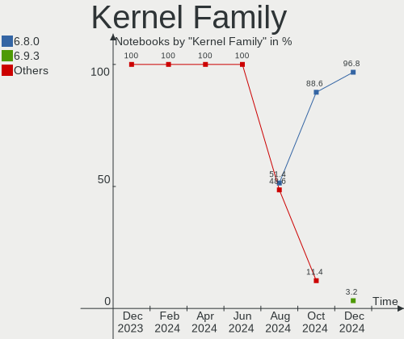
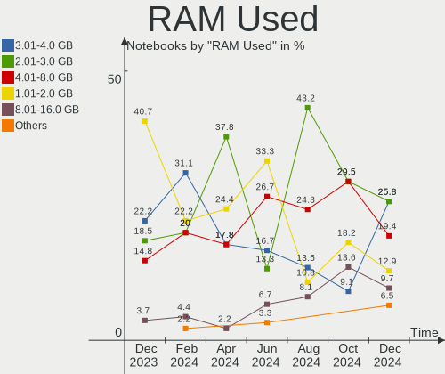
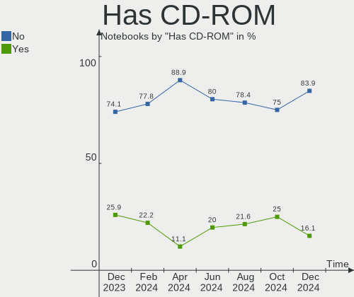
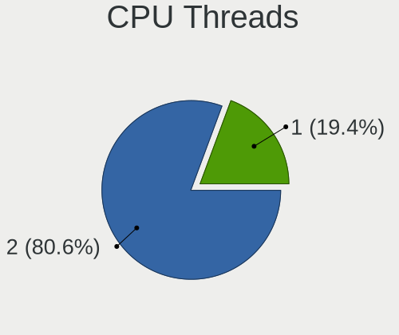
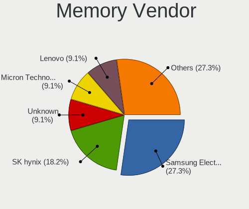
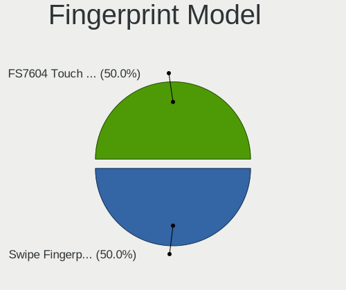
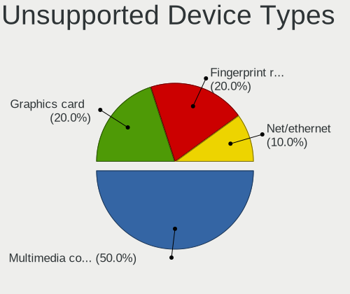

KDE neon - Hardware Trends (Notebooks)
--------------------------------------

A project to identify most popular hardware characteristics and track their change
over time based on data collected by Linux users at https://Linux-Hardware.org.

Anyone can contribute to this report by the [hw-probe](https://github.com/linuxhw/hw-probe) tool:

    sudo -E hw-probe -all -upload

This report is for one last month. Overall report since the beginning of time: [TestDays](https://github.com/linuxhw/TestDays)

Period: Feb, 2023.

Contents
--------

* [ System ](#system)
  - [ OS                       ](#os)
  - [ OS Family                ](#os-family)
  - [ Kernel                   ](#kernel)
  - [ Kernel Family            ](#kernel-family)
  - [ Kernel Major Ver.        ](#kernel-major-ver)
  - [ Arch                     ](#arch)
  - [ DE                       ](#de)
  - [ Display Server           ](#display-server)
  - [ Display Manager          ](#display-manager)
  - [ OS Lang                  ](#os-lang)
  - [ Boot Mode                ](#boot-mode)
  - [ Filesystem               ](#filesystem)
  - [ Part. scheme             ](#part-scheme)
  - [ Dual Boot with Linux/BSD ](#dual-boot-with-linuxbsd)
  - [ Dual Boot (Win)          ](#dual-boot-win)

* [ Board ](#board)
  - [ Vendor                   ](#vendor)
  - [ Model                    ](#model)
  - [ Model Family             ](#model-family)
  - [ MFG Year                 ](#mfg-year)
  - [ Form Factor              ](#form-factor)
  - [ Secure Boot              ](#secure-boot)
  - [ Coreboot                 ](#coreboot)
  - [ RAM Size                 ](#ram-size)
  - [ RAM Used                 ](#ram-used)
  - [ Total Drives             ](#total-drives)
  - [ Has CD-ROM               ](#has-cd-rom)
  - [ Has Ethernet             ](#has-ethernet)
  - [ Has WiFi                 ](#has-wifi)
  - [ Has Bluetooth            ](#has-bluetooth)

* [ Location ](#location)
  - [ Country                  ](#country)
  - [ City                     ](#city)

* [ Drives ](#drives)
  - [ Drive Vendor             ](#drive-vendor)
  - [ Drive Model              ](#drive-model)
  - [ HDD Vendor               ](#hdd-vendor)
  - [ SSD Vendor               ](#ssd-vendor)
  - [ Drive Kind               ](#drive-kind)
  - [ Drive Connector          ](#drive-connector)
  - [ Drive Size               ](#drive-size)
  - [ Space Total              ](#space-total)
  - [ Space Used               ](#space-used)
  - [ Malfunc. Drives          ](#malfunc-drives)
  - [ Malfunc. Drive Vendor    ](#malfunc-drive-vendor)
  - [ Malfunc. HDD Vendor      ](#malfunc-hdd-vendor)
  - [ Malfunc. Drive Kind      ](#malfunc-drive-kind)
  - [ Failed Drives            ](#failed-drives)
  - [ Failed Drive Vendor      ](#failed-drive-vendor)
  - [ Drive Status             ](#drive-status)

* [ Storage controller ](#storage-controller)
  - [ Storage Vendor           ](#storage-vendor)
  - [ Storage Model            ](#storage-model)
  - [ Storage Kind             ](#storage-kind)

* [ Processor ](#processor)
  - [ CPU Vendor               ](#cpu-vendor)
  - [ CPU Model                ](#cpu-model)
  - [ CPU Model Family         ](#cpu-model-family)
  - [ CPU Cores                ](#cpu-cores)
  - [ CPU Sockets              ](#cpu-sockets)
  - [ CPU Threads              ](#cpu-threads)
  - [ CPU Op-Modes             ](#cpu-op-modes)
  - [ CPU Microcode            ](#cpu-microcode)
  - [ CPU Microarch            ](#cpu-microarch)

* [ Graphics ](#graphics)
  - [ GPU Vendor               ](#gpu-vendor)
  - [ GPU Model                ](#gpu-model)
  - [ GPU Combo                ](#gpu-combo)
  - [ GPU Driver               ](#gpu-driver)
  - [ GPU Memory               ](#gpu-memory)

* [ Monitor ](#monitor)
  - [ Monitor Vendor           ](#monitor-vendor)
  - [ Monitor Model            ](#monitor-model)
  - [ Monitor Resolution       ](#monitor-resolution)
  - [ Monitor Diagonal         ](#monitor-diagonal)
  - [ Monitor Width            ](#monitor-width)
  - [ Aspect Ratio             ](#aspect-ratio)
  - [ Monitor Area             ](#monitor-area)
  - [ Pixel Density            ](#pixel-density)
  - [ Multiple Monitors        ](#multiple-monitors)

* [ Network ](#network)
  - [ Net Controller Vendor    ](#net-controller-vendor)
  - [ Net Controller Model     ](#net-controller-model)
  - [ Wireless Vendor          ](#wireless-vendor)
  - [ Wireless Model           ](#wireless-model)
  - [ Ethernet Vendor          ](#ethernet-vendor)
  - [ Ethernet Model           ](#ethernet-model)
  - [ Net Controller Kind      ](#net-controller-kind)
  - [ Used Controller          ](#used-controller)
  - [ NICs                     ](#nics)
  - [ IPv6                     ](#ipv6)

* [ Bluetooth ](#bluetooth)
  - [ Bluetooth Vendor         ](#bluetooth-vendor)
  - [ Bluetooth Model          ](#bluetooth-model)

* [ Sound ](#sound)
  - [ Sound Vendor             ](#sound-vendor)
  - [ Sound Model              ](#sound-model)

* [ Memory ](#memory)
  - [ Memory Vendor            ](#memory-vendor)
  - [ Memory Model             ](#memory-model)
  - [ Memory Kind              ](#memory-kind)
  - [ Memory Form Factor       ](#memory-form-factor)
  - [ Memory Size              ](#memory-size)
  - [ Memory Speed             ](#memory-speed)

* [ Printers & scanners ](#printers--scanners)
  - [ Printer Vendor           ](#printer-vendor)
  - [ Printer Model            ](#printer-model)
  - [ Scanner Vendor           ](#scanner-vendor)
  - [ Scanner Model            ](#scanner-model)

* [ Camera ](#camera)
  - [ Camera Vendor            ](#camera-vendor)
  - [ Camera Model             ](#camera-model)

* [ Security ](#security)
  - [ Fingerprint Vendor       ](#fingerprint-vendor)
  - [ Fingerprint Model        ](#fingerprint-model)
  - [ Chipcard Vendor          ](#chipcard-vendor)
  - [ Chipcard Model           ](#chipcard-model)

* [ Unsupported ](#unsupported)
  - [ Unsupported Devices      ](#unsupported-devices)
  - [ Unsupported Device Types ](#unsupported-device-types)

System
------

OS
--

Installed operating systems

| Name           | Notebooks | Percent |
|----------------|-----------|---------|
| KDE neon 22.04 | 64        | 98.46%  |
| KDE neon 20.04 | 1         | 1.54%   |

OS Family
---------

OS without a version

| Name     | Notebooks | Percent |
|----------|-----------|---------|
| KDE neon | 65        | 100%    |

Kernel
------

Version of the Linux kernel

| Version                              | Notebooks | Percent |
|--------------------------------------|-----------|---------|
| 5.15.0-60-generic                    | 25        | 38.46%  |
| 5.19.0-32-generic                    | 23        | 35.38%  |
| 5.15.0-58-generic                    | 10        | 15.38%  |
| 6.1.12-060112-generic                | 2         | 3.08%   |
| 5.15.0-52-generic                    | 2         | 3.08%   |
| 6.2.0-060200rc3daily20230115-generic | 1         | 1.54%   |
| 6.1.12-3-liquorix-amd64              | 1         | 1.54%   |
| 5.17.1-051701-generic                | 1         | 1.54%   |

Kernel Family
-------------

Linux kernel without a distro release

| Version | Notebooks | Percent |
|---------|-----------|---------|
| 5.15.0  | 37        | 56.92%  |
| 5.19.0  | 23        | 35.38%  |
| 6.1.12  | 3         | 4.62%   |
| 6.2.0   | 1         | 1.54%   |
| 5.17.1  | 1         | 1.54%   |

Kernel Major Ver.
-----------------

Linux kernel major version

| Version | Notebooks | Percent |
|---------|-----------|---------|
| 5.15    | 37        | 56.92%  |
| 5.19    | 23        | 35.38%  |
| 6.1     | 3         | 4.62%   |
| 6.2     | 1         | 1.54%   |
| 5.17    | 1         | 1.54%   |

Arch
----

OS architecture (x86_64, i586, etc.)

| Name   | Notebooks | Percent |
|--------|-----------|---------|
| x86_64 | 65        | 100%    |

DE
--

Desktop Environment

| Name | Notebooks | Percent |
|------|-----------|---------|
| KDE5 | 65        | 100%    |

Display Server
--------------

X11 or Wayland

| Name    | Notebooks | Percent |
|---------|-----------|---------|
| X11     | 59        | 90.77%  |
| Wayland | 6         | 9.23%   |

Display Manager
---------------

SDDM, LightDM, etc.

| Name    | Notebooks | Percent |
|---------|-----------|---------|
| Unknown | 53        | 81.54%  |
| SDDM    | 12        | 18.46%  |

OS Lang
-------

Language

| Lang    | Notebooks | Percent |
|---------|-----------|---------|
| en_US   | 29        | 44.62%  |
| en_GB   | 7         | 10.77%  |
| ru_RU   | 6         | 9.23%   |
| de_DE   | 5         | 7.69%   |
| fr_FR   | 3         | 4.62%   |
| C       | 3         | 4.62%   |
| tr_TR   | 1         | 1.54%   |
| pt_BR   | 1         | 1.54%   |
| pl_PL   | 1         | 1.54%   |
| nl_NL   | 1         | 1.54%   |
| it_IT   | 1         | 1.54%   |
| hu_HU   | 1         | 1.54%   |
| es_MX   | 1         | 1.54%   |
| en_DK   | 1         | 1.54%   |
| en_CA   | 1         | 1.54%   |
| en_AG   | 1         | 1.54%   |
| de_CH   | 1         | 1.54%   |
| Default | 1         | 1.54%   |

Boot Mode
---------

EFI or BIOS

| Mode | Notebooks | Percent |
|------|-----------|---------|
| BIOS | 57        | 87.69%  |
| EFI  | 8         | 12.31%  |

Filesystem
----------

Type of filesystem

| Type    | Notebooks | Percent |
|---------|-----------|---------|
| Ext4    | 62        | 95.38%  |
| Btrfs   | 2         | 3.08%   |
| Overlay | 1         | 1.54%   |

Part. scheme
------------

Scheme of partitioning

| Type    | Notebooks | Percent |
|---------|-----------|---------|
| Unknown | 53        | 81.54%  |
| GPT     | 12        | 18.46%  |

Dual Boot with Linux/BSD
------------------------

Hosting more than one Linux/BSD

| Dual boot | Notebooks | Percent |
|-----------|-----------|---------|
| No        | 61        | 93.85%  |
| Yes       | 4         | 6.15%   |

Dual Boot (Win)
---------------

Hosting Linux and Windows

| Dual boot | Notebooks | Percent |
|-----------|-----------|---------|
| No        | 61        | 93.85%  |
| Yes       | 4         | 6.15%   |

Board
-----

Vendor
------

Motherboard manufacturer

| Name                | Notebooks | Percent |
|---------------------|-----------|---------|
| Lenovo              | 11        | 16.92%  |
| Hewlett-Packard     | 10        | 15.38%  |
| ASUSTek Computer    | 10        | 15.38%  |
| Dell                | 8         | 12.31%  |
| Apple               | 5         | 7.69%   |
| Acer                | 5         | 7.69%   |
| HUAWEI              | 3         | 4.62%   |
| Timi                | 2         | 3.08%   |
| Samsung Electronics | 2         | 3.08%   |
| MSI                 | 2         | 3.08%   |
| Wortmann AG         | 1         | 1.54%   |
| TUXEDO              | 1         | 1.54%   |
| Sony                | 1         | 1.54%   |
| SLIMBOOK            | 1         | 1.54%   |
| Razer               | 1         | 1.54%   |
| HONOR               | 1         | 1.54%   |
| Fujitsu             | 1         | 1.54%   |

Model
-----

Motherboard model

| Name                                    | Notebooks | Percent |
|-----------------------------------------|-----------|---------|
| Apple MacBookPro11,5                    | 2         | 3.08%   |
| Wortmann AG 1220595_1470122             | 1         | 1.54%   |
| TUXEDO Aura 15 Gen2                     | 1         | 1.54%   |
| Timi RedmiBook Pro 15S                  | 1         | 1.54%   |
| Timi Mi Laptop Pro 15 2020              | 1         | 1.54%   |
| Sony SVF1521Q1EW                        | 1         | 1.54%   |
| SLIMBOOK PROX15                         | 1         | 1.54%   |
| Samsung 350V5C/351V5C/3540VC/3440VC     | 1         | 1.54%   |
| Samsung 270E5G/270E5U                   | 1         | 1.54%   |
| Razer Blade 15 (2022) - RZ09-0421       | 1         | 1.54%   |
| MSI Katana GF66 11SC                    | 1         | 1.54%   |
| MSI Delta 15 A5EFK                      | 1         | 1.54%   |
| Lenovo ThinkPad T470p 20J6CTO1WW        | 1         | 1.54%   |
| Lenovo ThinkPad L560 20F2S0DA00         | 1         | 1.54%   |
| Lenovo ThinkPad L380 20M5S09Y00         | 1         | 1.54%   |
| Lenovo Legion 5 15IMH05H 81Y6           | 1         | 1.54%   |
| Lenovo IdeaPad Y510P 20217              | 1         | 1.54%   |
| Lenovo IdeaPad S530-13IWL 81J7          | 1         | 1.54%   |
| Lenovo IdeaPad C340-14API 81N6          | 1         | 1.54%   |
| Lenovo IdeaPad 5 Pro 16ACH6 82L5        | 1         | 1.54%   |
| Lenovo IdeaPad 320-15AST 80XV           | 1         | 1.54%   |
| Lenovo IdeaPad 110-15ACL 80TJ           | 1         | 1.54%   |
| Lenovo G510 20238                       | 1         | 1.54%   |
| HUAWEI NBLK-WAX9X                       | 1         | 1.54%   |
| HUAWEI MRGF-XX                          | 1         | 1.54%   |
| HUAWEI KLVD-WXX9                        | 1         | 1.54%   |
| HONOR HYM-WXX                           | 1         | 1.54%   |
| HP Victus by Laptop 16-e0xxx            | 1         | 1.54%   |
| HP Stream Laptop 11-ak1xxx              | 1         | 1.54%   |
| HP ProBook 645 G1                       | 1         | 1.54%   |
| HP Pavilion dv6                         | 1         | 1.54%   |
| HP Laptop 17-cp0xxx                     | 1         | 1.54%   |
| HP Laptop 17-cn0xxx                     | 1         | 1.54%   |
| HP Laptop 14s-dq1xxx                    | 1         | 1.54%   |
| HP EliteBook 865 16 inch G9 Notebook PC | 1         | 1.54%   |
| HP EliteBook 745 G6                     | 1         | 1.54%   |
| HP 2000                                 | 1         | 1.54%   |
| Fujitsu LIFEBOOK E744                   | 1         | 1.54%   |
| Dell XPS 9315                           | 1         | 1.54%   |
| Dell Venue 11 Pro 7130                  | 1         | 1.54%   |

Model Family
------------

Motherboard model prefix

| Name                | Notebooks | Percent |
|---------------------|-----------|---------|
| Lenovo IdeaPad      | 6         | 9.23%   |
| ASUS ROG            | 4         | 6.15%   |
| Lenovo ThinkPad     | 3         | 4.62%   |
| HP Laptop           | 3         | 4.62%   |
| Dell Latitude       | 3         | 4.62%   |
| Dell Inspiron       | 3         | 4.62%   |
| HP EliteBook        | 2         | 3.08%   |
| Apple MacBookPro8   | 2         | 3.08%   |
| Apple MacBookPro11  | 2         | 3.08%   |
| Acer Nitro          | 2         | 3.08%   |
| Acer Aspire         | 2         | 3.08%   |
| Wortmann AG 1220595 | 1         | 1.54%   |
| TUXEDO Aura         | 1         | 1.54%   |
| Timi RedmiBook      | 1         | 1.54%   |
| Timi Mi             | 1         | 1.54%   |
| Sony SVF1521Q1EW    | 1         | 1.54%   |
| SLIMBOOK PROX15     | 1         | 1.54%   |
| Samsung 350V5C      | 1         | 1.54%   |
| Samsung 270E5G      | 1         | 1.54%   |
| Razer Blade         | 1         | 1.54%   |
| MSI Katana          | 1         | 1.54%   |
| MSI Delta           | 1         | 1.54%   |
| Lenovo Legion       | 1         | 1.54%   |
| Lenovo G510         | 1         | 1.54%   |
| HUAWEI NBLK-WAX9X   | 1         | 1.54%   |
| HUAWEI MRGF-XX      | 1         | 1.54%   |
| HUAWEI KLVD-WXX9    | 1         | 1.54%   |
| HONOR HYM-WXX       | 1         | 1.54%   |
| HP Victus           | 1         | 1.54%   |
| HP Stream           | 1         | 1.54%   |
| HP ProBook          | 1         | 1.54%   |
| HP Pavilion         | 1         | 1.54%   |
| HP 2000             | 1         | 1.54%   |
| Fujitsu LIFEBOOK    | 1         | 1.54%   |
| Dell XPS            | 1         | 1.54%   |
| Dell Venue          | 1         | 1.54%   |
| ASUS Zenbook        | 1         | 1.54%   |
| ASUS VivoBook       | 1         | 1.54%   |
| ASUS U47A           | 1         | 1.54%   |
| ASUS TUF            | 1         | 1.54%   |

MFG Year
--------

Motherboard manufacture year

| Year | Notebooks | Percent |
|------|-----------|---------|
| 2019 | 11        | 16.92%  |
| 2022 | 8         | 12.31%  |
| 2021 | 8         | 12.31%  |
| 2016 | 6         | 9.23%   |
| 2020 | 5         | 7.69%   |
| 2018 | 5         | 7.69%   |
| 2014 | 5         | 7.69%   |
| 2013 | 5         | 7.69%   |
| 2012 | 5         | 7.69%   |
| 2017 | 3         | 4.62%   |
| 2011 | 3         | 4.62%   |
| 2008 | 1         | 1.54%   |

Form Factor
-----------

Physical design of the computer

| Name     | Notebooks | Percent |
|----------|-----------|---------|
| Notebook | 65        | 100%    |

Secure Boot
-----------

Enabled or disabled

| State    | Notebooks | Percent |
|----------|-----------|---------|
| Disabled | 64        | 98.46%  |
| Enabled  | 1         | 1.54%   |

Coreboot
--------

Have coreboot on board

| Used | Notebooks | Percent |
|------|-----------|---------|
| No   | 65        | 100%    |

RAM Size
--------

Total RAM memory

| Size in GB | Notebooks | Percent |
|------------|-----------|---------|
| 4.01-8.0   | 21        | 32.31%  |
| 16.01-24.0 | 16        | 24.62%  |
| 8.01-16.0  | 13        | 20%     |
| 32.01-64.0 | 6         | 9.23%   |
| 3.01-4.0   | 6         | 9.23%   |
| 24.01-32.0 | 2         | 3.08%   |
| 1.01-2.0   | 1         | 1.54%   |

RAM Used
--------

Used RAM memory

| Used GB   | Notebooks | Percent |
|-----------|-----------|---------|
| 1.01-2.0  | 19        | 29.23%  |
| 2.01-3.0  | 18        | 27.69%  |
| 4.01-8.0  | 13        | 20%     |
| 3.01-4.0  | 10        | 15.38%  |
| 8.01-16.0 | 4         | 6.15%   |
| 0.51-1.0  | 1         | 1.54%   |

Total Drives
------------

Number of drives on board

| Drives | Notebooks | Percent |
|--------|-----------|---------|
| 1      | 46        | 70.77%  |
| 2      | 14        | 21.54%  |
| 3      | 5         | 7.69%   |

Has CD-ROM
----------

Has CD-ROM on board

| Presented | Notebooks | Percent |
|-----------|-----------|---------|
| No        | 49        | 75.38%  |
| Yes       | 16        | 24.62%  |

Has Ethernet
------------

Has Ethernet on board

| Presented | Notebooks | Percent |
|-----------|-----------|---------|
| Yes       | 45        | 69.23%  |
| No        | 20        | 30.77%  |

Has WiFi
--------

Has WiFi module

| Presented | Notebooks | Percent |
|-----------|-----------|---------|
| Yes       | 63        | 96.92%  |
| No        | 2         | 3.08%   |

Has Bluetooth
-------------

Has Bluetooth module

| Presented | Notebooks | Percent |
|-----------|-----------|---------|
| Yes       | 61        | 93.85%  |
| No        | 4         | 6.15%   |

Location
--------

Country
-------

Geographic location (country)

| Country      | Notebooks | Percent |
|--------------|-----------|---------|
| USA          | 12        | 18.46%  |
| Russia       | 7         | 10.77%  |
| Germany      | 5         | 7.69%   |
| UK           | 4         | 6.15%   |
| France       | 4         | 6.15%   |
| Brazil       | 3         | 4.62%   |
| Turkey       | 2         | 3.08%   |
| Thailand     | 2         | 3.08%   |
| Switzerland  | 2         | 3.08%   |
| Poland       | 2         | 3.08%   |
| Philippines  | 2         | 3.08%   |
| Norway       | 2         | 3.08%   |
| Mexico       | 2         | 3.08%   |
| Italy        | 2         | 3.08%   |
| Belgium      | 2         | 3.08%   |
| Austria      | 2         | 3.08%   |
| Saudi Arabia | 1         | 1.54%   |
| Portugal     | 1         | 1.54%   |
| Netherlands  | 1         | 1.54%   |
| Lithuania    | 1         | 1.54%   |
| Indonesia    | 1         | 1.54%   |
| Georgia      | 1         | 1.54%   |
| Denmark      | 1         | 1.54%   |
| Curaçao     | 1         | 1.54%   |
| Chile        | 1         | 1.54%   |
| Canada       | 1         | 1.54%   |

City
----

Geographic location (city)

| City                | Notebooks | Percent |
|---------------------|-----------|---------|
| Moscow              | 2         | 3.08%   |
| Yala                | 1         | 1.54%   |
| Willemstad          | 1         | 1.54%   |
| Vladivostok         | 1         | 1.54%   |
| Vienna              | 1         | 1.54%   |
| Vancouver           | 1         | 1.54%   |
| Tula                | 1         | 1.54%   |
| Tubarao             | 1         | 1.54%   |
| Trier               | 1         | 1.54%   |
| Timbauba            | 1         | 1.54%   |
| Telford             | 1         | 1.54%   |
| Tbilisi             | 1         | 1.54%   |
| Sullivan            | 1         | 1.54%   |
| St Petersburg       | 1         | 1.54%   |
| Shirley             | 1         | 1.54%   |
| Selma               | 1         | 1.54%   |
| Santiago            | 1         | 1.54%   |
| Sankt Augustin      | 1         | 1.54%   |
| Rio de Janeiro      | 1         | 1.54%   |
| Randaberg           | 1         | 1.54%   |
| Plymouth            | 1         | 1.54%   |
| Peschiera Borromeo  | 1         | 1.54%   |
| Notodden            | 1         | 1.54%   |
| Nizhniy Novgorod    | 1         | 1.54%   |
| Nanterre            | 1         | 1.54%   |
| Naberezhnyye Chelny | 1         | 1.54%   |
| Murrieta            | 1         | 1.54%   |
| Mönchengladbach    | 1         | 1.54%   |
| Milano              | 1         | 1.54%   |
| Mérida             | 1         | 1.54%   |
| Medina              | 1         | 1.54%   |
| Manchester          | 1         | 1.54%   |
| Long Beach          | 1         | 1.54%   |
| London              | 1         | 1.54%   |
| Liège              | 1         | 1.54%   |
| Lausanne            | 1         | 1.54%   |
| Krakow              | 1         | 1.54%   |
| Kopki               | 1         | 1.54%   |
| Konya               | 1         | 1.54%   |
| Keller              | 1         | 1.54%   |

Drives
------

Drive Vendor
------------

Hard drive vendors

| Vendor                      | Notebooks | Drives  | Percent |
|-----------------------------|-----------|---------|---------|
| Samsung Electronics         | 14        | 15      | 16.09%  |
| Sandisk                     | 10        | 11      | 11.49%  |
| Seagate                     | 9         | 9       | 10.34%  |
| WDC                         | 6         | 6       | 6.9%    |
| Unknown                     | 5         | 8       | 5.75%   |
| Toshiba                     | 5         | 5       | 5.75%   |
| Kingston                    | 5         | 5       | 5.75%   |
| SK hynix                    | 4         | 4       | 4.6%    |
| Phison Electronics          | 4         | 4       | 4.6%    |
| Micron Technology           | 3         | 3       | 3.45%   |
| Intel                       | 3         | 3       | 3.45%   |
| Apple                       | 3         | 3       | 3.45%   |
| Micron/Crucial Technology   | 2         | 2       | 2.3%    |
| LITEONIT                    | 2         | 2       | 2.3%    |
| Hitachi                     | 2         | 2       | 2.3%    |
| Union Memory (Shenzhen)     | 1         | 1       | 1.15%   |
| Silicon Motion              | 1         | 1       | 1.15%   |
| MAXIO Technology (Hangzhou) | 1         | 1       | 1.15%   |
| HUAWEI                      | 1         | 1       | 1.15%   |
| HGST                        | 1         | 1       | 1.15%   |
| Hewlett-Packard             | 1         | Unknown | 1.15%   |
| Crucial                     | 1         | 1       | 1.15%   |
| ASMT                        | 1         | 1       | 1.15%   |
| ADATA Technology            | 1         | 1       | 1.15%   |
| Unknown                     | 1         | 1       | 1.15%   |

Drive Model
-----------

Hard drive models

| Model                                                 | Notebooks | Percent |
|-------------------------------------------------------|-----------|---------|
| Unknown MMC Card  32GB                                | 3         | 3.3%    |
| Samsung SSD 980 500GB                                 | 3         | 3.3%    |
| Unknown MMC Card  128GB                               | 2         | 2.2%    |
| Seagate ST1000LM035-1RK172 1TB                        | 2         | 2.2%    |
| Sandisk WD Black SN750 / PC SN730 NVMe SSD 512GB      | 2         | 2.2%    |
| SanDisk SSD PLUS 480GB                                | 2         | 2.2%    |
| Phison PS5013 E13 NVMe Controller 500GB               | 2         | 2.2%    |
| Micron/Crucial CT1000P1SSD8 1TB                       | 2         | 2.2%    |
| Kingston SA400S37120G 120GB SSD                       | 2         | 2.2%    |
| Apple SSD SM0512G 500GB                               | 2         | 2.2%    |
| WDC WDS500G2B0B-00YS70 500GB SSD                      | 1         | 1.1%    |
| WDC WDS250G2B0C-00PXH0 250GB                          | 1         | 1.1%    |
| WDC WD6400BPVT-22HXZT1 640GB                          | 1         | 1.1%    |
| WDC WD5000LPCX-24C6HT0 500GB                          | 1         | 1.1%    |
| WDC WD20SPZX-22UA7T0 2TB                              | 1         | 1.1%    |
| WDC WD10SPZX-75Z10T2 1TB                              | 1         | 1.1%    |
| Unknown SC32G  32GB                                   | 1         | 1.1%    |
| Unknown MMC Card  64GB                                | 1         | 1.1%    |
| Union Memory (Shenzhen) RPFTJ256PDD2MWX 256GB         | 1         | 1.1%    |
| Toshiba XG6 NVMe SSD Controller 512GB                 | 1         | 1.1%    |
| Toshiba THNSNJ256G8NY 256GB SSD                       | 1         | 1.1%    |
| Toshiba MQ04ABF100 1TB                                | 1         | 1.1%    |
| Toshiba MQ01ABF032 320GB                              | 1         | 1.1%    |
| Toshiba MQ01ABD100 1TB                                | 1         | 1.1%    |
| SK hynix SHGP31-1000GM 1TB                            | 1         | 1.1%    |
| SK hynix HFS128G39TND-N210A 128GB SSD                 | 1         | 1.1%    |
| SK hynix HFM001TD3JX013N 1TB                          | 1         | 1.1%    |
| SK hynix BC501 NVMe Solid State Drive 512GB           | 1         | 1.1%    |
| Silicon Motion SM2263EN/SM2263XT SSD Controller 512GB | 1         | 1.1%    |
| Seagate ST750LX003-1AC154 752GB                       | 1         | 1.1%    |
| Seagate ST500LT012-1DG142 500GB                       | 1         | 1.1%    |
| Seagate ST500LM021-1KJ152 500GB                       | 1         | 1.1%    |
| Seagate ST500LM012 HN-M500MBB 500GB                   | 1         | 1.1%    |
| Seagate ST320LM001 HN-M320MBB 320GB                   | 1         | 1.1%    |
| Seagate ST2000DM008-2FR102 2TB                        | 1         | 1.1%    |
| Seagate ST1000LM024 HN-M101MBB 1TB                    | 1         | 1.1%    |
| Sandisk WDC WDS240G2G0C-00AJM0 240GB                  | 1         | 1.1%    |
| Sandisk WDC PC SN540 SDDPNPF-1T00-1032 1024GB         | 1         | 1.1%    |
| Sandisk WD PC SN740 SDDPNQD-1T00-1027 1024GB          | 1         | 1.1%    |
| Sandisk WD Blue SN550 NVMe SSD 1TB                    | 1         | 1.1%    |

HDD Vendor
----------

Hard disk drive vendors

| Vendor  | Notebooks | Drives | Percent |
|---------|-----------|--------|---------|
| Seagate | 9         | 9      | 42.86%  |
| WDC     | 4         | 4      | 19.05%  |
| Toshiba | 3         | 3      | 14.29%  |
| Hitachi | 2         | 2      | 9.52%   |
| HGST    | 1         | 1      | 4.76%   |
| ASMT    | 1         | 1      | 4.76%   |
| Apple   | 1         | 1      | 4.76%   |

SSD Vendor
----------

Solid state drive vendors

| Vendor              | Notebooks | Drives | Percent |
|---------------------|-----------|--------|---------|
| Samsung Electronics | 7         | 7      | 31.82%  |
| SanDisk             | 4         | 4      | 18.18%  |
| Kingston            | 3         | 3      | 13.64%  |
| LITEONIT            | 2         | 2      | 9.09%   |
| Apple               | 2         | 2      | 9.09%   |
| WDC                 | 1         | 1      | 4.55%   |
| Toshiba             | 1         | 1      | 4.55%   |
| SK hynix            | 1         | 1      | 4.55%   |
| Crucial             | 1         | 1      | 4.55%   |

Drive Kind
----------

HDD or SSD

| Kind    | Notebooks | Drives | Percent |
|---------|-----------|--------|---------|
| NVMe    | 33        | 38     | 39.76%  |
| SSD     | 22        | 22     | 26.51%  |
| HDD     | 20        | 21     | 24.1%   |
| MMC     | 6         | 9      | 7.23%   |
| Unknown | 2         | 1      | 2.41%   |

Drive Connector
---------------

SATA, SAS, NVMe, etc.

| Type | Notebooks | Drives | Percent |
|------|-----------|--------|---------|
| SATA | 36        | 42     | 46.15%  |
| NVMe | 33        | 38     | 42.31%  |
| MMC  | 6         | 9      | 7.69%   |
| SAS  | 3         | 2      | 3.85%   |

Drive Size
----------

Size of hard drive

| Size in TB | Notebooks | Drives | Percent |
|------------|-----------|--------|---------|
| 0.01-0.5   | 28        | 31     | 70%     |
| 0.51-1.0   | 9         | 9      | 22.5%   |
| 1.01-2.0   | 2         | 2      | 5%      |
| 2.01-3.0   | 1         | 1      | 2.5%    |

Space Total
-----------

Amount of disk space available on the file system

| Size in GB     | Notebooks | Percent |
|----------------|-----------|---------|
| 251-500        | 20        | 30.77%  |
| 101-250        | 19        | 29.23%  |
| 501-1000       | 13        | 20%     |
| 21-50          | 4         | 6.15%   |
| 51-100         | 4         | 6.15%   |
| 1-20           | 2         | 3.08%   |
| More than 3000 | 1         | 1.54%   |
| 2001-3000      | 1         | 1.54%   |
| 1001-2000      | 1         | 1.54%   |

Space Used
----------

Amount of used disk space

| Used GB  | Notebooks | Percent |
|----------|-----------|---------|
| 1-20     | 30        | 46.15%  |
| 21-50    | 12        | 18.46%  |
| 251-500  | 7         | 10.77%  |
| 101-250  | 7         | 10.77%  |
| 51-100   | 5         | 7.69%   |
| 501-1000 | 4         | 6.15%   |

Malfunc. Drives
---------------

Drive models with a malfunction

| Model         | Notebooks | Drives | Percent |
|---------------|-----------|--------|---------|
| ASMT 2105 3TB | 1         | 1      | 100%    |

Malfunc. Drive Vendor
---------------------

Vendors of faulty drives

| Vendor | Notebooks | Drives | Percent |
|--------|-----------|--------|---------|
| ASMT   | 1         | 1      | 100%    |

Malfunc. HDD Vendor
-------------------

Vendors of faulty HDD drives

| Vendor | Notebooks | Drives | Percent |
|--------|-----------|--------|---------|
| ASMT   | 1         | 1      | 100%    |

Malfunc. Drive Kind
-------------------

Kinds of faulty drives

| Kind | Notebooks | Drives | Percent |
|------|-----------|--------|---------|
| HDD  | 1         | 1      | 100%    |

Failed Drives
-------------

Failed drive models

Zero info for selected period =(

Failed Drive Vendor
-------------------

Failed drive vendors

Zero info for selected period =(

Drive Status
------------

Number of failed and malfunc. drives

| Status   | Notebooks | Drives | Percent |
|----------|-----------|--------|---------|
| Detected | 60        | 81     | 89.55%  |
| Works    | 6         | 9      | 8.96%   |
| Malfunc  | 1         | 1      | 1.49%   |

Storage controller
------------------

Storage Vendor
--------------

Storage controller vendors

| Vendor                       | Notebooks | Percent |
|------------------------------|-----------|---------|
| Intel                        | 38        | 45.24%  |
| AMD                          | 11        | 13.1%   |
| Samsung Electronics          | 9         | 10.71%  |
| SanDisk                      | 7         | 8.33%   |
| Phison Electronics           | 4         | 4.76%   |
| SK hynix                     | 3         | 3.57%   |
| Micron Technology            | 3         | 3.57%   |
| Micron/Crucial Technology    | 2         | 2.38%   |
| Kingston Technology Company  | 2         | 2.38%   |
| Union Memory (Shenzhen)      | 1         | 1.19%   |
| Toshiba America Info Systems | 1         | 1.19%   |
| Silicon Motion               | 1         | 1.19%   |
| MAXIO Technology (Hangzhou)  | 1         | 1.19%   |
| ADATA Technology             | 1         | 1.19%   |

Storage Model
-------------

Storage controller models

| Model                                                                          | Notebooks | Percent |
|--------------------------------------------------------------------------------|-----------|---------|
| AMD FCH SATA Controller [AHCI mode]                                            | 9         | 10.34%  |
| Intel 7 Series Chipset Family 6-port SATA Controller [AHCI mode]               | 6         | 6.9%    |
| Intel 6 Series/C200 Series Chipset Family 6 port Mobile SATA AHCI Controller   | 5         | 5.75%   |
| Intel Sunrise Point-LP SATA Controller [AHCI mode]                             | 4         | 4.6%    |
| Intel Cannon Lake Mobile PCH SATA AHCI Controller                              | 4         | 4.6%    |
| Intel 8 Series/C220 Series Chipset Family 6-port SATA Controller 1 [AHCI mode] | 4         | 4.6%    |
| SanDisk Non-Volatile memory controller                                         | 3         | 3.45%   |
| Samsung NVMe SSD Controller 980                                                | 3         | 3.45%   |
| Micron Non-Volatile memory controller                                          | 3         | 3.45%   |
| SK hynix Gold P31/PC711 NVMe Solid State Drive                                 | 2         | 2.3%    |
| SanDisk WD Blue SN550 NVMe SSD                                                 | 2         | 2.3%    |
| SanDisk WD Black SN750 / PC SN730 NVMe SSD                                     | 2         | 2.3%    |
| Samsung NVMe SSD Controller SM981/PM981/PM983                                  | 2         | 2.3%    |
| Samsung NVMe SSD Controller PM9A1/PM9A3/980PRO                                 | 2         | 2.3%    |
| Samsung Electronics SATA controller                                            | 2         | 2.3%    |
| Phison PS5013 E13 NVMe Controller                                              | 2         | 2.3%    |
| Micron/Crucial NVMe Controller                                                 | 2         | 2.3%    |
| Intel Volume Management Device NVMe RAID Controller                            | 2         | 2.3%    |
| Intel SSD 660P Series                                                          | 2         | 2.3%    |
| Intel 82801 Mobile SATA Controller [RAID mode]                                 | 2         | 2.3%    |
| Intel 8 Series SATA Controller 1 [AHCI mode]                                   | 2         | 2.3%    |
| Union Memory (Shenzhen) Non-Volatile memory controller                         | 1         | 1.15%   |
| Toshiba America Info Systems XG6 NVMe SSD Controller                           | 1         | 1.15%   |
| SK hynix BC501 NVMe Solid State Drive                                          | 1         | 1.15%   |
| Silicon Motion SM2263EN/SM2263XT SSD Controller                                | 1         | 1.15%   |
| SanDisk WD PC SN810 / Black SN850 NVMe SSD                                     | 1         | 1.15%   |
| Samsung NVMe SSD Controller SM961/PM961/SM963                                  | 1         | 1.15%   |
| Phison Electronics Non-Volatile memory controller                              | 1         | 1.15%   |
| Phison E12 NVMe Controller                                                     | 1         | 1.15%   |
| MAXIO (Hangzhou) NVMe SSD Controller MAP1202                                   | 1         | 1.15%   |
| Kingston Company U-SNS8154P3 NVMe SSD                                          | 1         | 1.15%   |
| Kingston Company Company Non-Volatile memory controller                        | 1         | 1.15%   |
| Intel Wildcat Point-LP SATA Controller [AHCI Mode]                             | 1         | 1.15%   |
| Intel Tiger Lake-LP SATA Controller                                            | 1         | 1.15%   |
| Intel Non-Volatile memory controller                                           | 1         | 1.15%   |
| Intel HM170/QM170 Chipset SATA Controller [AHCI Mode]                          | 1         | 1.15%   |
| Intel Comet Lake SATA AHCI Controller                                          | 1         | 1.15%   |
| Intel Cannon Point-LP SATA Controller [AHCI Mode]                              | 1         | 1.15%   |
| Intel 500 Series Chipset Family SATA AHCI Controller                           | 1         | 1.15%   |
| Intel 400 Series Chipset Family SATA AHCI Controller                           | 1         | 1.15%   |

Storage Kind
------------

Kind of storage controller (IDE, SATA, NVMe, SAS, ...)

| Kind | Notebooks | Percent |
|------|-----------|---------|
| SATA | 45        | 54.88%  |
| NVMe | 33        | 40.24%  |
| RAID | 4         | 4.88%   |

Processor
---------

CPU Vendor
----------

Processor vendors

| Vendor | Notebooks | Percent |
|--------|-----------|---------|
| Intel  | 46        | 70.77%  |
| AMD    | 19        | 29.23%  |

CPU Model
---------

Processor models

| Model                                  | Notebooks | Percent |
|----------------------------------------|-----------|---------|
| Intel Core i5-3210M CPU @ 2.50GHz      | 3         | 4.62%   |
| AMD Ryzen 7 5800H with Radeon Graphics | 3         | 4.62%   |
| AMD Ryzen 5 5600H with Radeon Graphics | 3         | 4.62%   |
| Intel Core i7-9750H CPU @ 2.60GHz      | 2         | 3.08%   |
| Intel Core i7-4870HQ CPU @ 2.50GHz     | 2         | 3.08%   |
| Intel Core i7-10510U CPU @ 1.80GHz     | 2         | 3.08%   |
| Intel Core i7-8565U CPU @ 1.80GHz      | 1         | 1.54%   |
| Intel Core i7-8550U CPU @ 1.80GHz      | 1         | 1.54%   |
| Intel Core i7-7820HQ CPU @ 2.90GHz     | 1         | 1.54%   |
| Intel Core i7-7700HQ CPU @ 2.80GHz     | 1         | 1.54%   |
| Intel Core i7-4710HQ CPU @ 2.50GHz     | 1         | 1.54%   |
| Intel Core i7-4702MQ CPU @ 2.20GHz     | 1         | 1.54%   |
| Intel Core i7-4700MQ CPU @ 2.40GHz     | 1         | 1.54%   |
| Intel Core i7-3632QM CPU @ 2.20GHz     | 1         | 1.54%   |
| Intel Core i7-2760QM CPU @ 2.40GHz     | 1         | 1.54%   |
| Intel Core i7-2670QM CPU @ 2.20GHz     | 1         | 1.54%   |
| Intel Core i7-2620M CPU @ 2.70GHz      | 1         | 1.54%   |
| Intel Core i7-10870H CPU @ 2.20GHz     | 1         | 1.54%   |
| Intel Core i7-10750H CPU @ 2.60GHz     | 1         | 1.54%   |
| Intel Core i7-1065G7 CPU @ 1.30GHz     | 1         | 1.54%   |
| Intel Core i5-9300H CPU @ 2.40GHz      | 1         | 1.54%   |
| Intel Core i5-8300H CPU @ 2.30GHz      | 1         | 1.54%   |
| Intel Core i5-8265U CPU @ 1.60GHz      | 1         | 1.54%   |
| Intel Core i5-8250U CPU @ 1.60GHz      | 1         | 1.54%   |
| Intel Core i5-7200U CPU @ 2.50GHz      | 1         | 1.54%   |
| Intel Core i5-6200U CPU @ 2.30GHz      | 1         | 1.54%   |
| Intel Core i5-5300U CPU @ 2.30GHz      | 1         | 1.54%   |
| Intel Core i5-4210U CPU @ 1.70GHz      | 1         | 1.54%   |
| Intel Core i5-4210M CPU @ 2.60GHz      | 1         | 1.54%   |
| Intel Core i5-3337U CPU @ 1.80GHz      | 1         | 1.54%   |
| Intel Core i5-2520M CPU @ 2.50GHz      | 1         | 1.54%   |
| Intel Core i5-2430M CPU @ 2.40GHz      | 1         | 1.54%   |
| Intel Core i3-7020U CPU @ 2.30GHz      | 1         | 1.54%   |
| Intel Core i3-4030Y CPU @ 1.60GHz      | 1         | 1.54%   |
| Intel Core i3-3110M CPU @ 2.40GHz      | 1         | 1.54%   |
| Intel Celeron CPU N3060 @ 1.60GHz      | 1         | 1.54%   |
| Intel Atom x5-E8000 CPU @ 1.04GHz      | 1         | 1.54%   |
| Intel 12th Gen Core i7-12800H          | 1         | 1.54%   |
| Intel 12th Gen Core i7-1260P           | 1         | 1.54%   |
| Intel 12th Gen Core i5-1230U           | 1         | 1.54%   |

CPU Model Family
----------------

Processor model prefix

| Model           | Notebooks | Percent |
|-----------------|-----------|---------|
| Intel Core i7   | 20        | 30.77%  |
| Intel Core i5   | 15        | 23.08%  |
| Other           | 7         | 10.77%  |
| AMD Ryzen 5     | 7         | 10.77%  |
| AMD Ryzen 7     | 5         | 7.69%   |
| Intel Core i3   | 3         | 4.62%   |
| AMD A6          | 2         | 3.08%   |
| Intel Celeron   | 1         | 1.54%   |
| Intel Atom      | 1         | 1.54%   |
| AMD Ryzen 9     | 1         | 1.54%   |
| AMD Ryzen 5 PRO | 1         | 1.54%   |
| AMD Ryzen 3     | 1         | 1.54%   |
| AMD E           | 1         | 1.54%   |

CPU Cores
---------

Number of processor cores

| Number | Notebooks | Percent |
|--------|-----------|---------|
| 4      | 25        | 38.46%  |
| 2      | 20        | 30.77%  |
| 6      | 10        | 15.38%  |
| 8      | 6         | 9.23%   |
| 14     | 1         | 1.54%   |
| 12     | 1         | 1.54%   |
| 10     | 1         | 1.54%   |
| 1      | 1         | 1.54%   |

CPU Sockets
-----------

Number of sockets

| Number | Notebooks | Percent |
|--------|-----------|---------|
| 1      | 65        | 100%    |

CPU Threads
-----------

Threads per core (Hyper-Threading)

| Number | Notebooks | Percent |
|--------|-----------|---------|
| 2      | 59        | 90.77%  |
| 1      | 6         | 9.23%   |

CPU Op-Modes
------------

CPU Operation Modes (32-bit, 64-bit)

| Op mode        | Notebooks | Percent |
|----------------|-----------|---------|
| 32-bit, 64-bit | 65        | 100%    |

CPU Microcode
-------------

Microcode number

| Number     | Notebooks | Percent |
|------------|-----------|---------|
| Unknown    | 56        | 86.15%  |
| 0x906ea    | 1         | 1.54%   |
| 0x806ec    | 1         | 1.54%   |
| 0x806ea    | 1         | 1.54%   |
| 0x806e9    | 1         | 1.54%   |
| 0x40661    | 1         | 1.54%   |
| 0x40651    | 1         | 1.54%   |
| 0x306c3    | 1         | 1.54%   |
| 0x0a50000c | 1         | 1.54%   |
| 0x0a404102 | 1         | 1.54%   |

CPU Microarch
-------------

Microarchitecture

| Name        | Notebooks | Percent |
|-------------|-----------|---------|
| KabyLake    | 14        | 21.54%  |
| Haswell     | 8         | 12.31%  |
| Zen 3       | 7         | 10.77%  |
| Unknown     | 7         | 10.77%  |
| IvyBridge   | 6         | 9.23%   |
| SandyBridge | 5         | 7.69%   |
| Zen+        | 4         | 6.15%   |
| TigerLake   | 2         | 3.08%   |
| Silvermont  | 2         | 3.08%   |
| CometLake   | 2         | 3.08%   |
| Zen 2       | 1         | 1.54%   |
| Skylake     | 1         | 1.54%   |
| Puma        | 1         | 1.54%   |
| Piledriver  | 1         | 1.54%   |
| IceLake     | 1         | 1.54%   |
| Excavator   | 1         | 1.54%   |
| Broadwell   | 1         | 1.54%   |
| Bobcat      | 1         | 1.54%   |

Graphics
--------

GPU Vendor
----------

Vendors of graphics cards

| Vendor | Notebooks | Percent |
|--------|-----------|---------|
| Intel  | 42        | 47.19%  |
| Nvidia | 24        | 26.97%  |
| AMD    | 23        | 25.84%  |

GPU Model
---------

Graphics card models

| Model                                                                                    | Notebooks | Percent |
|------------------------------------------------------------------------------------------|-----------|---------|
| Intel 3rd Gen Core processor Graphics Controller                                         | 6         | 6.52%   |
| AMD Cezanne [Radeon Vega Series / Radeon Vega Mobile Series]                             | 6         | 6.52%   |
| Intel CoffeeLake-H GT2 [UHD Graphics 630]                                                | 4         | 4.35%   |
| Intel 4th Gen Core Processor Integrated Graphics Controller                              | 4         | 4.35%   |
| Intel 2nd Generation Core Processor Family Integrated Graphics Controller                | 4         | 4.35%   |
| AMD Picasso/Raven 2 [Radeon Vega Series / Radeon Vega Mobile Series]                     | 4         | 4.35%   |
| Nvidia TU117M [GeForce GTX 1650 Mobile / Max-Q]                                          | 3         | 3.26%   |
| Nvidia TU116M [GeForce GTX 1660 Ti Mobile]                                               | 3         | 3.26%   |
| Nvidia GP108M [GeForce MX150]                                                            | 3         | 3.26%   |
| Nvidia GP107M [GeForce GTX 1050 Mobile]                                                  | 2         | 2.17%   |
| Intel WhiskeyLake-U GT2 [UHD Graphics 620]                                               | 2         | 2.17%   |
| Intel UHD Graphics 620                                                                   | 2         | 2.17%   |
| Intel HD Graphics 630                                                                    | 2         | 2.17%   |
| Intel HD Graphics 620                                                                    | 2         | 2.17%   |
| Intel CometLake-U GT2 [UHD Graphics]                                                     | 2         | 2.17%   |
| Intel Atom/Celeron/Pentium Processor x5-E8000/J3xxx/N3xxx Integrated Graphics Controller | 2         | 2.17%   |
| Intel Alder Lake-P Integrated Graphics Controller                                        | 2         | 2.17%   |
| AMD Venus XT [Radeon HD 8870M / R9 M270X/M370X]                                          | 2         | 2.17%   |
| AMD Lucienne                                                                             | 2         | 2.17%   |
| Nvidia TU106M [GeForce RTX 2070 Mobile / Max-Q Refresh]                                  | 1         | 1.09%   |
| Nvidia TU106M [GeForce RTX 2060 Mobile]                                                  | 1         | 1.09%   |
| Nvidia TU106M [GeForce RTX 2060 Max-Q]                                                   | 1         | 1.09%   |
| Nvidia GP107M [GeForce MX350]                                                            | 1         | 1.09%   |
| Nvidia GM108M [GeForce 940MX]                                                            | 1         | 1.09%   |
| Nvidia GM107M [GeForce GTX 950M]                                                         | 1         | 1.09%   |
| Nvidia GM107M [GeForce GTX 860M]                                                         | 1         | 1.09%   |
| Nvidia GK107M [GeForce GT 755M]                                                          | 1         | 1.09%   |
| Nvidia GF119M [NVS 4200M]                                                                | 1         | 1.09%   |
| Nvidia GF117M [GeForce 610M/710M/810M/820M / GT 620M/625M/630M/720M]                     | 1         | 1.09%   |
| Nvidia GF108M [GeForce GT 540M]                                                          | 1         | 1.09%   |
| Nvidia GA106M [GeForce RTX 3060 Mobile / Max-Q]                                          | 1         | 1.09%   |
| Nvidia GA104 [GeForce RTX 3070 Lite Hash Rate]                                           | 1         | 1.09%   |
| Intel TigerLake-LP GT2 [Iris Xe Graphics]                                                | 1         | 1.09%   |
| Intel TigerLake-H GT1 [UHD Graphics]                                                     | 1         | 1.09%   |
| Intel Tiger Lake-LP GT2 [UHD Graphics G4]                                                | 1         | 1.09%   |
| Intel Skylake GT2 [HD Graphics 520]                                                      | 1         | 1.09%   |
| Intel Iris Plus Graphics G7                                                              | 1         | 1.09%   |
| Intel HD Graphics 5500                                                                   | 1         | 1.09%   |
| Intel Haswell-ULT Integrated Graphics Controller                                         | 1         | 1.09%   |
| Intel Haswell-ULT High Definition Audio Controller [HD Graphics]                         | 1         | 1.09%   |

GPU Combo
---------

Combinations of graphics cards

| Name           | Notebooks | Percent |
|----------------|-----------|---------|
| 1 x Intel      | 21        | 32.31%  |
| Intel + Nvidia | 18        | 27.69%  |
| 1 x AMD        | 14        | 21.54%  |
| 2 x AMD        | 3         | 4.62%   |
| 1 x Nvidia     | 3         | 4.62%   |
| Intel + AMD    | 3         | 4.62%   |
| AMD + Nvidia   | 3         | 4.62%   |

GPU Driver
----------

Free vs proprietary

| Driver      | Notebooks | Percent |
|-------------|-----------|---------|
| Free        | 55        | 84.62%  |
| Proprietary | 8         | 12.31%  |
| Unknown     | 2         | 3.08%   |

GPU Memory
----------

Total video memory

| Size in GB | Notebooks | Percent |
|------------|-----------|---------|
| Unknown    | 57        | 87.69%  |
| 3.01-4.0   | 3         | 4.62%   |
| 5.01-6.0   | 2         | 3.08%   |
| 0.01-0.5   | 2         | 3.08%   |
| 1.01-2.0   | 1         | 1.54%   |

Monitor
-------

Monitor Vendor
--------------

Monitor vendors

| Vendor                  | Notebooks | Percent |
|-------------------------|-----------|---------|
| AU Optronics            | 15        | 20.27%  |
| BOE                     | 13        | 17.57%  |
| Samsung Electronics     | 5         | 6.76%   |
| LG Display              | 5         | 6.76%   |
| Apple                   | 5         | 6.76%   |
| Sharp                   | 4         | 5.41%   |
| Chimei Innolux          | 4         | 5.41%   |
| PANDA                   | 3         | 4.05%   |
| Dell                    | 3         | 4.05%   |
| Chi Mei Optoelectronics | 3         | 4.05%   |
| AOC                     | 3         | 4.05%   |
| TMX                     | 2         | 2.7%    |
| Hewlett-Packard         | 2         | 2.7%    |
| Valve                   | 1         | 1.35%   |
| Toshiba                 | 1         | 1.35%   |
| InfoVision              | 1         | 1.35%   |
| HannStar                | 1         | 1.35%   |
| Fujitsu Siemens         | 1         | 1.35%   |
| CPT                     | 1         | 1.35%   |
| Acer                    | 1         | 1.35%   |

Monitor Model
-------------

Monitor models

| Model                                                                    | Notebooks | Percent |
|--------------------------------------------------------------------------|-----------|---------|
| BOE LCD Monitor BOE0747 1920x1080 344x194mm 15.5-inch                    | 2         | 2.63%   |
| Apple Color LCD APPA02E 2880x1800 331x207mm 15.4-inch                    | 2         | 2.63%   |
| Apple Color LCD APP9CC7 1280x800 286x179mm 13.3-inch                     | 2         | 2.63%   |
| Valve LCD Monitor VLV91A8                                                | 1         | 1.32%   |
| Toshiba TV TSB0206 1920x1080 886x498mm 40.0-inch                         | 1         | 1.32%   |
| Toshiba TV TSB0205 1360x765 886x498mm 40.0-inch                          | 1         | 1.32%   |
| TMX TL156MDMP01-0 TMX1560 3200x2000 336x210mm 15.6-inch                  | 1         | 1.32%   |
| TMX LCD Monitor TMX1422 3120x2080 300x200mm 14.2-inch                    | 1         | 1.32%   |
| Sharp LQ156T1JW03 SHP1529 2560x1440 344x194mm 15.5-inch                  | 1         | 1.32%   |
| Sharp LQ156M1JW03 SHP155D 1920x1080 344x194mm 15.5-inch                  | 1         | 1.32%   |
| Sharp LQ156M1JW01 SHP14C3 1920x1080 344x194mm 15.5-inch                  | 1         | 1.32%   |
| Sharp LCD Monitor SHP1548 1920x1200 288x180mm 13.4-inch                  | 1         | 1.32%   |
| Samsung Electronics S24D300 SAM0B43 1920x1080 531x299mm 24.0-inch        | 1         | 1.32%   |
| Samsung Electronics LCD Monitor SEC384A 1366x768 344x194mm 15.5-inch     | 1         | 1.32%   |
| Samsung Electronics LCD Monitor SEC3150 1366x768 344x193mm 15.5-inch     | 1         | 1.32%   |
| Samsung Electronics LCD Monitor SDC4C48 1920x1080 344x194mm 15.5-inch    | 1         | 1.32%   |
| Samsung Electronics C27F390 SAM0D33 1920x1080 598x336mm 27.0-inch        | 1         | 1.32%   |
| Samsung Electronics C27F390 SAM0D32 1920x1080 598x336mm 27.0-inch        | 1         | 1.32%   |
| PANDA LCD Monitor NCP0061 2560x1600 302x189mm 14.0-inch                  | 1         | 1.32%   |
| PANDA LCD Monitor NCP004D 1920x1080 344x194mm 15.5-inch                  | 1         | 1.32%   |
| PANDA LCD Monitor NCP0027 1920x1080 344x194mm 15.5-inch                  | 1         | 1.32%   |
| LG Display LCD Monitor LGD05D8 1920x1080 344x194mm 15.5-inch             | 1         | 1.32%   |
| LG Display LCD Monitor LGD04E8 1920x1080 382x215mm 17.3-inch             | 1         | 1.32%   |
| LG Display LCD Monitor LGD046D 1920x1080 309x174mm 14.0-inch             | 1         | 1.32%   |
| LG Display LCD Monitor LGD03E8 1366x768 309x174mm 14.0-inch              | 1         | 1.32%   |
| LG Display LCD Monitor LGD0323 1920x1080 345x194mm 15.6-inch             | 1         | 1.32%   |
| InfoVision LCD Monitor IVO8C69 1920x1080 309x174mm 14.0-inch             | 1         | 1.32%   |
| Hewlett-Packard E273 HPN3471 1920x1080 598x336mm 27.0-inch               | 1         | 1.32%   |
| Hewlett-Packard 24w HPN3431 1920x1080 527x296mm 23.8-inch                | 1         | 1.32%   |
| HannStar LM02 HSP0013 1440x900 408x255mm 18.9-inch                       | 1         | 1.32%   |
| Fujitsu Siemens P27-8 TE Pro FUS089D 2560x1440 597x336mm 27.0-inch       | 1         | 1.32%   |
| Dell U2713HM DEL407F 1920x1080 597x336mm 27.0-inch                       | 1         | 1.32%   |
| Dell U2515H DELD070 2560x1440 553x311mm 25.0-inch                        | 1         | 1.32%   |
| Dell SE2222H DEL424C 1920x1080 479x260mm 21.5-inch                       | 1         | 1.32%   |
| CPT LCD Monitor COR0207 1366x768 309x174mm 14.0-inch                     | 1         | 1.32%   |
| Chimei Innolux LCD Monitor CMN176F 1920x1080 381x214mm 17.2-inch         | 1         | 1.32%   |
| Chimei Innolux LCD Monitor CMN1521 1920x1080 344x193mm 15.5-inch         | 1         | 1.32%   |
| Chimei Innolux LCD Monitor CMN14FF 1920x1080 309x173mm 13.9-inch         | 1         | 1.32%   |
| Chimei Innolux LCD Monitor CMN1404 1920x1080 309x173mm 13.9-inch         | 1         | 1.32%   |
| Chi Mei Optoelectronics LCD Monitor CMO15AB 1366x768 340x190mm 15.3-inch | 1         | 1.32%   |

Monitor Resolution
------------------

Monitor screen resolution

| Resolution        | Notebooks | Percent |
|-------------------|-----------|---------|
| 1920x1080 (FHD)   | 32        | 47.76%  |
| 1366x768 (WXGA)   | 17        | 25.37%  |
| 2560x1440 (QHD)   | 3         | 4.48%   |
| 2880x1800         | 2         | 2.99%   |
| 1920x1200 (WUXGA) | 2         | 2.99%   |
| 1440x900 (WXGA+)  | 2         | 2.99%   |
| 1280x800 (WXGA)   | 2         | 2.99%   |
| 3440x1440         | 1         | 1.49%   |
| 3200x2000         | 1         | 1.49%   |
| 3120x2080         | 1         | 1.49%   |
| 2560x1600         | 1         | 1.49%   |
| 2160x1440         | 1         | 1.49%   |
| 1600x900 (HD+)    | 1         | 1.49%   |
| Unknown           | 1         | 1.49%   |

Monitor Diagonal
----------------

Diagonal size in inches

| Inches  | Notebooks | Percent |
|---------|-----------|---------|
| 15      | 32        | 42.11%  |
| 14      | 9         | 11.84%  |
| 13      | 8         | 10.53%  |
| 17      | 5         | 6.58%   |
| 27      | 4         | 5.26%   |
| 16      | 3         | 3.95%   |
| 24      | 2         | 2.63%   |
| 23      | 2         | 2.63%   |
| 21      | 2         | 2.63%   |
| 18      | 2         | 2.63%   |
| 74      | 1         | 1.32%   |
| 72      | 1         | 1.32%   |
| 40      | 1         | 1.32%   |
| 34      | 1         | 1.32%   |
| 25      | 1         | 1.32%   |
| 11      | 1         | 1.32%   |
| Unknown | 1         | 1.32%   |

Monitor Width
-------------

Physical width

| Width in mm | Notebooks | Percent |
|-------------|-----------|---------|
| 301-350     | 43        | 57.33%  |
| 501-600     | 9         | 12%     |
| 201-300     | 8         | 10.67%  |
| 351-400     | 7         | 9.33%   |
| 401-500     | 4         | 5.33%   |
| 801-900     | 1         | 1.33%   |
| 701-800     | 1         | 1.33%   |
| 1501-2000   | 1         | 1.33%   |
| Unknown     | 1         | 1.33%   |

Aspect Ratio
------------

Proportional relationship between the width and the height

| Ratio   | Notebooks | Percent |
|---------|-----------|---------|
| 16/9    | 52        | 77.61%  |
| 16/10   | 11        | 16.42%  |
| 3/2     | 2         | 2.99%   |
| 21/9    | 1         | 1.49%   |
| Unknown | 1         | 1.49%   |

Monitor Area
------------

Area in inch²

| Area in inch² | Notebooks | Percent |
|----------------|-----------|---------|
| 101-110        | 34        | 45.33%  |
| 81-90          | 13        | 17.33%  |
| 121-130        | 5         | 6.67%   |
| 301-350        | 4         | 5.33%   |
| 201-250        | 4         | 5.33%   |
| 71-80          | 3         | 4%      |
| 151-200        | 3         | 4%      |
| More than 1000 | 1         | 1.33%   |
| 51-60          | 1         | 1.33%   |
| 351-500        | 1         | 1.33%   |
| 251-300        | 1         | 1.33%   |
| 141-150        | 1         | 1.33%   |
| 111-120        | 1         | 1.33%   |
| 501-1000       | 1         | 1.33%   |
| 91-100         | 1         | 1.33%   |
| Unknown        | 1         | 1.33%   |

Pixel Density
-------------

Pixels per inch

| Density       | Notebooks | Percent |
|---------------|-----------|---------|
| 121-160       | 27        | 36.49%  |
| 101-120       | 23        | 31.08%  |
| 51-100        | 11        | 14.86%  |
| 161-240       | 9         | 12.16%  |
| More than 240 | 2         | 2.7%    |
| 1-50          | 1         | 1.35%   |
| Unknown       | 1         | 1.35%   |

Multiple Monitors
-----------------

Total monitors connected

| Total | Notebooks | Percent |
|-------|-----------|---------|
| 1     | 49        | 75.38%  |
| 2     | 12        | 18.46%  |
| 3     | 2         | 3.08%   |
| 0     | 2         | 3.08%   |

Network
-------

Net Controller Vendor
---------------------

Controller vendors

| Vendor                | Notebooks | Percent |
|-----------------------|-----------|---------|
| Realtek Semiconductor | 34        | 34.34%  |
| Intel                 | 31        | 31.31%  |
| Qualcomm Atheros      | 14        | 14.14%  |
| Broadcom              | 11        | 11.11%  |
| Samsung Electronics   | 2         | 2.02%   |
| NetGear               | 2         | 2.02%   |
| TP-Link               | 1         | 1.01%   |
| Ralink Technology     | 1         | 1.01%   |
| Qualcomm              | 1         | 1.01%   |
| Huawei Technologies   | 1         | 1.01%   |
| Google                | 1         | 1.01%   |

Net Controller Model
--------------------

Controller models

| Model                                                             | Notebooks | Percent |
|-------------------------------------------------------------------|-----------|---------|
| Realtek RTL8111/8168/8411 PCI Express Gigabit Ethernet Controller | 20        | 17.39%  |
| Realtek RTL810xE PCI Express Fast Ethernet controller             | 6         | 5.22%   |
| Qualcomm Atheros QCA9377 802.11ac Wireless Network Adapter        | 4         | 3.48%   |
| Intel Wi-Fi 6 AX200                                               | 4         | 3.48%   |
| Realtek RTL8822CE 802.11ac PCIe Wireless Network Adapter          | 3         | 2.61%   |
| Realtek RTL8821CE 802.11ac PCIe Wireless Network Adapter          | 3         | 2.61%   |
| Qualcomm Atheros AR9485 Wireless Network Adapter                  | 3         | 2.61%   |
| Intel Wireless-AC 9260                                            | 3         | 2.61%   |
| Intel Wireless 8265 / 8275                                        | 3         | 2.61%   |
| Intel Cannon Lake PCH CNVi WiFi                                   | 3         | 2.61%   |
| Intel Alder Lake-P PCH CNVi WiFi                                  | 3         | 2.61%   |
| Broadcom NetXtreme BCM57765 Gigabit Ethernet PCIe                 | 3         | 2.61%   |
| Broadcom BCM4331 802.11a/b/g/n                                    | 3         | 2.61%   |
| Realtek RTL8852AE 802.11ax PCIe Wireless Network Adapter          | 2         | 1.74%   |
| Qualcomm Atheros QCA9565 / AR9565 Wireless Network Adapter        | 2         | 1.74%   |
| Qualcomm Atheros AR9462 Wireless Network Adapter                  | 2         | 1.74%   |
| Intel Wireless 7260                                               | 2         | 1.74%   |
| Intel Wi-Fi 6 AX210/AX211/AX411 160MHz                            | 2         | 1.74%   |
| Intel Comet Lake PCH-LP CNVi WiFi                                 | 2         | 1.74%   |
| Intel Comet Lake PCH CNVi WiFi                                    | 2         | 1.74%   |
| Broadcom BCM43602 802.11ac Wireless LAN SoC                       | 2         | 1.74%   |
| Broadcom BCM43142 802.11b/g/n                                     | 2         | 1.74%   |
| TP-Link AC600 wireless Realtek RTL8811AU [Archer T2U Nano]        | 1         | 0.87%   |
| Samsung GT-I9070 (network tethering, USB debugging enabled)       | 1         | 0.87%   |
| Samsung Galaxy series, misc. (tethering mode)                     | 1         | 0.87%   |
| Realtek RTL8822BE 802.11a/b/g/n/ac WiFi adapter                   | 1         | 0.87%   |
| Realtek RTL8821AE 802.11ac PCIe Wireless Network Adapter          | 1         | 0.87%   |
| Realtek RTL8153 Gigabit Ethernet Adapter                          | 1         | 0.87%   |
| Realtek RTL8152 Fast Ethernet Adapter                             | 1         | 0.87%   |
| Realtek Realtek Network controller                                | 1         | 0.87%   |
| Ralink MT7601U Wireless Adapter                                   | 1         | 0.87%   |
| Qualcomm QCNFA765 Wireless Network Adapter                        | 1         | 0.87%   |
| Qualcomm Atheros QCA8171 Gigabit Ethernet                         | 1         | 0.87%   |
| Qualcomm Atheros Killer E2500 Gigabit Ethernet Controller         | 1         | 0.87%   |
| Qualcomm Atheros AR8162 Fast Ethernet                             | 1         | 0.87%   |
| Qualcomm Atheros AR8151 v2.0 Gigabit Ethernet                     | 1         | 0.87%   |
| NetGear WNA3100M(v1) Wireless-N 300 [Realtek RTL8192CU]           | 1         | 0.87%   |
| NetGear A6210                                                     | 1         | 0.87%   |
| Intel Wireless 8260                                               | 1         | 0.87%   |
| Intel Wireless 7265                                               | 1         | 0.87%   |

Wireless Vendor
---------------

Wireless vendors

| Vendor                | Notebooks | Percent |
|-----------------------|-----------|---------|
| Intel                 | 30        | 44.78%  |
| Realtek Semiconductor | 11        | 16.42%  |
| Qualcomm Atheros      | 11        | 16.42%  |
| Broadcom              | 10        | 14.93%  |
| NetGear               | 2         | 2.99%   |
| TP-Link               | 1         | 1.49%   |
| Ralink Technology     | 1         | 1.49%   |
| Qualcomm              | 1         | 1.49%   |

Wireless Model
--------------

Wireless models

| Model                                                      | Notebooks | Percent |
|------------------------------------------------------------|-----------|---------|
| Qualcomm Atheros QCA9377 802.11ac Wireless Network Adapter | 4         | 5.97%   |
| Intel Wi-Fi 6 AX200                                        | 4         | 5.97%   |
| Realtek RTL8822CE 802.11ac PCIe Wireless Network Adapter   | 3         | 4.48%   |
| Realtek RTL8821CE 802.11ac PCIe Wireless Network Adapter   | 3         | 4.48%   |
| Qualcomm Atheros AR9485 Wireless Network Adapter           | 3         | 4.48%   |
| Intel Wireless-AC 9260                                     | 3         | 4.48%   |
| Intel Wireless 8265 / 8275                                 | 3         | 4.48%   |
| Intel Cannon Lake PCH CNVi WiFi                            | 3         | 4.48%   |
| Intel Alder Lake-P PCH CNVi WiFi                           | 3         | 4.48%   |
| Broadcom BCM4331 802.11a/b/g/n                             | 3         | 4.48%   |
| Realtek RTL8852AE 802.11ax PCIe Wireless Network Adapter   | 2         | 2.99%   |
| Qualcomm Atheros QCA9565 / AR9565 Wireless Network Adapter | 2         | 2.99%   |
| Qualcomm Atheros AR9462 Wireless Network Adapter           | 2         | 2.99%   |
| Intel Wireless 7260                                        | 2         | 2.99%   |
| Intel Wi-Fi 6 AX210/AX211/AX411 160MHz                     | 2         | 2.99%   |
| Intel Comet Lake PCH-LP CNVi WiFi                          | 2         | 2.99%   |
| Intel Comet Lake PCH CNVi WiFi                             | 2         | 2.99%   |
| Broadcom BCM43602 802.11ac Wireless LAN SoC                | 2         | 2.99%   |
| Broadcom BCM43142 802.11b/g/n                              | 2         | 2.99%   |
| TP-Link AC600 wireless Realtek RTL8811AU [Archer T2U Nano] | 1         | 1.49%   |
| Realtek RTL8822BE 802.11a/b/g/n/ac WiFi adapter            | 1         | 1.49%   |
| Realtek RTL8821AE 802.11ac PCIe Wireless Network Adapter   | 1         | 1.49%   |
| Realtek Realtek Network controller                         | 1         | 1.49%   |
| Ralink MT7601U Wireless Adapter                            | 1         | 1.49%   |
| Qualcomm QCNFA765 Wireless Network Adapter                 | 1         | 1.49%   |
| NetGear WNA3100M(v1) Wireless-N 300 [Realtek RTL8192CU]    | 1         | 1.49%   |
| NetGear A6210                                              | 1         | 1.49%   |
| Intel Wireless 8260                                        | 1         | 1.49%   |
| Intel Wireless 7265                                        | 1         | 1.49%   |
| Intel Wi-Fi 6 AX201                                        | 1         | 1.49%   |
| Intel Tiger Lake PCH CNVi WiFi                             | 1         | 1.49%   |
| Intel Centrino Wireless-N 2230                             | 1         | 1.49%   |
| Intel Centrino Advanced-N 6205 [Taylor Peak]               | 1         | 1.49%   |
| Broadcom BCM43228 802.11a/b/g/n                            | 1         | 1.49%   |
| Broadcom BCM43227 802.11b/g/n                              | 1         | 1.49%   |
| Broadcom BCM4313 802.11bgn Wireless Network Adapter        | 1         | 1.49%   |

Ethernet Vendor
---------------

Ethernet vendors

| Vendor                | Notebooks | Percent |
|-----------------------|-----------|---------|
| Realtek Semiconductor | 27        | 58.7%   |
| Intel                 | 7         | 15.22%  |
| Broadcom              | 5         | 10.87%  |
| Qualcomm Atheros      | 4         | 8.7%    |
| Samsung Electronics   | 2         | 4.35%   |
| Google                | 1         | 2.17%   |

Ethernet Model
--------------

Ethernet models

| Model                                                             | Notebooks | Percent |
|-------------------------------------------------------------------|-----------|---------|
| Realtek RTL8111/8168/8411 PCI Express Gigabit Ethernet Controller | 20        | 42.55%  |
| Realtek RTL810xE PCI Express Fast Ethernet controller             | 6         | 12.77%  |
| Broadcom NetXtreme BCM57765 Gigabit Ethernet PCIe                 | 3         | 6.38%   |
| Samsung GT-I9070 (network tethering, USB debugging enabled)       | 1         | 2.13%   |
| Samsung Galaxy series, misc. (tethering mode)                     | 1         | 2.13%   |
| Realtek RTL8153 Gigabit Ethernet Adapter                          | 1         | 2.13%   |
| Realtek RTL8152 Fast Ethernet Adapter                             | 1         | 2.13%   |
| Qualcomm Atheros QCA8171 Gigabit Ethernet                         | 1         | 2.13%   |
| Qualcomm Atheros Killer E2500 Gigabit Ethernet Controller         | 1         | 2.13%   |
| Qualcomm Atheros AR8162 Fast Ethernet                             | 1         | 2.13%   |
| Qualcomm Atheros AR8151 v2.0 Gigabit Ethernet                     | 1         | 2.13%   |
| Intel Ethernet Controller I225-V                                  | 1         | 2.13%   |
| Intel Ethernet Connection I219-V                                  | 1         | 2.13%   |
| Intel Ethernet Connection I217-LM                                 | 1         | 2.13%   |
| Intel Ethernet Connection (5) I219-LM                             | 1         | 2.13%   |
| Intel Ethernet Connection (4) I219-V                              | 1         | 2.13%   |
| Intel Ethernet Connection (3) I218-LM                             | 1         | 2.13%   |
| Intel 82579LM Gigabit Network Connection (Lewisville)             | 1         | 2.13%   |
| Google Nexus/Pixel Device (tether+ debug)                         | 1         | 2.13%   |
| Broadcom NetXtreme BCM57761 Gigabit Ethernet PCIe                 | 1         | 2.13%   |
| Broadcom NetLink BCM57785 Gigabit Ethernet PCIe                   | 1         | 2.13%   |

Net Controller Kind
-------------------

Ethernet, WiFi or modem

| Kind     | Notebooks | Percent |
|----------|-----------|---------|
| WiFi     | 63        | 57.8%   |
| Ethernet | 45        | 41.28%  |
| Modem    | 1         | 0.92%   |

Used Controller
---------------

Currently used network controller

| Kind     | Notebooks | Percent |
|----------|-----------|---------|
| WiFi     | 56        | 82.35%  |
| Ethernet | 12        | 17.65%  |

NICs
----

Total network controllers on board

| Total | Notebooks | Percent |
|-------|-----------|---------|
| 2     | 41        | 63.08%  |
| 1     | 23        | 35.38%  |
| 0     | 1         | 1.54%   |

IPv6
----

IPv6 vs IPv4

| Used | Notebooks | Percent |
|------|-----------|---------|
| No   | 44        | 67.69%  |
| Yes  | 21        | 32.31%  |

Bluetooth
---------

Bluetooth Vendor
----------------

Controller vendors

| Vendor                          | Notebooks | Percent |
|---------------------------------|-----------|---------|
| Intel                           | 29        | 47.54%  |
| Realtek Semiconductor           | 8         | 13.11%  |
| Qualcomm Atheros Communications | 6         | 9.84%   |
| Apple                           | 5         | 8.2%    |
| Foxconn / Hon Hai               | 4         | 6.56%   |
| Lite-On Technology              | 2         | 3.28%   |
| IMC Networks                    | 2         | 3.28%   |
| Broadcom                        | 2         | 3.28%   |
| Realtek                         | 1         | 1.64%   |
| Opticis                         | 1         | 1.64%   |
| Foxconn International           | 1         | 1.64%   |

Bluetooth Model
---------------

Controller models

| Model                                             | Notebooks | Percent |
|---------------------------------------------------|-----------|---------|
| Intel Bluetooth wireless interface                | 7         | 11.48%  |
| Realtek Bluetooth Radio                           | 5         | 8.2%    |
| Intel AX201 Bluetooth                             | 5         | 8.2%    |
| Intel Bluetooth 9460/9560 Jefferson Peak (JfP)    | 4         | 6.56%   |
| Intel AX200 Bluetooth                             | 4         | 6.56%   |
| Apple Bluetooth Host Controller                   | 4         | 6.56%   |
| Qualcomm Atheros  Bluetooth Device                | 3         | 4.92%   |
| Qualcomm Atheros AR3012 Bluetooth 4.0             | 3         | 4.92%   |
| Intel Wireless-AC 9260 Bluetooth Adapter          | 3         | 4.92%   |
| Intel Bluetooth Device                            | 3         | 4.92%   |
| Intel AX210 Bluetooth                             | 2         | 3.28%   |
| Foxconn / Hon Hai Bluetooth Device                | 2         | 3.28%   |
| Realtek RTL8822BE Bluetooth 4.2 Adapter           | 1         | 1.64%   |
| Realtek RTL8821A Bluetooth                        | 1         | 1.64%   |
| Realtek  Bluetooth 4.2 Adapter                    | 1         | 1.64%   |
| Realtek 802.11ac WLAN Adapter                     | 1         | 1.64%   |
| Opticis Bluetooth Radio                           | 1         | 1.64%   |
| Lite-On Qualcomm Atheros QCA9377 Bluetooth        | 1         | 1.64%   |
| Lite-On Bluetooth Device                          | 1         | 1.64%   |
| Intel Centrino Bluetooth Wireless Transceiver     | 1         | 1.64%   |
| IMC Networks Bluetooth Radio                      | 1         | 1.64%   |
| IMC Networks Bluetooth Device                     | 1         | 1.64%   |
| Foxconn International BCM43142A0 Bluetooth module | 1         | 1.64%   |
| Foxconn / Hon Hai BCM43142A0                      | 1         | 1.64%   |
| Foxconn / Hon Hai Acer Module                     | 1         | 1.64%   |
| Broadcom HP Portable Bumble Bee                   | 1         | 1.64%   |
| Broadcom BCM2070 Bluetooth 2.1 + EDR              | 1         | 1.64%   |
| Apple Bluetooth USB Host Controller               | 1         | 1.64%   |

Sound
-----

Sound Vendor
------------

Sound card vendors

| Vendor                | Notebooks | Percent |
|-----------------------|-----------|---------|
| Intel                 | 46        | 52.87%  |
| AMD                   | 21        | 24.14%  |
| Nvidia                | 12        | 13.79%  |
| Sony                  | 2         | 2.3%    |
| Valve Software        | 1         | 1.15%   |
| Realtek Semiconductor | 1         | 1.15%   |
| Logitech              | 1         | 1.15%   |
| Kingston Technology   | 1         | 1.15%   |
| JMTek                 | 1         | 1.15%   |
| GN Netcom             | 1         | 1.15%   |

Sound Model
-----------

Sound card models

| Model                                                                                             | Notebooks | Percent |
|---------------------------------------------------------------------------------------------------|-----------|---------|
| AMD Family 17h/19h HD Audio Controller                                                            | 14        | 12.39%  |
| AMD Renoir Radeon High Definition Audio Controller                                                | 9         | 7.96%   |
| Intel 8 Series/C220 Series Chipset High Definition Audio Controller                               | 6         | 5.31%   |
| Intel 7 Series/C216 Chipset Family High Definition Audio Controller                               | 6         | 5.31%   |
| Intel Sunrise Point-LP HD Audio                                                                   | 5         | 4.42%   |
| Intel 6 Series/C200 Series Chipset Family High Definition Audio Controller                        | 5         | 4.42%   |
| Intel Xeon E3-1200 v3/4th Gen Core Processor HD Audio Controller                                  | 4         | 3.54%   |
| Intel Cannon Lake PCH cAVS                                                                        | 4         | 3.54%   |
| Nvidia TU116 High Definition Audio Controller                                                     | 3         | 2.65%   |
| Nvidia TU106 High Definition Audio Controller                                                     | 3         | 2.65%   |
| AMD Raven/Raven2/Fenghuang HDMI/DP Audio Controller                                               | 3         | 2.65%   |
| AMD FCH Azalia Controller                                                                         | 3         | 2.65%   |
| Intel Tiger Lake-LP Smart Sound Technology Audio Controller                                       | 2         | 1.77%   |
| Intel Haswell-ULT HD Audio Controller                                                             | 2         | 1.77%   |
| Intel Comet Lake PCH-LP cAVS                                                                      | 2         | 1.77%   |
| Intel Comet Lake PCH cAVS                                                                         | 2         | 1.77%   |
| Intel CM238 HD Audio Controller                                                                   | 2         | 1.77%   |
| Intel Cannon Point-LP High Definition Audio Controller                                            | 2         | 1.77%   |
| Intel Atom/Celeron/Pentium Processor x5-E8000/J3xxx/N3xxx Series High Definition Audio Controller | 2         | 1.77%   |
| Intel Alder Lake PCH-P High Definition Audio Controller                                           | 2         | 1.77%   |
| Intel 8 Series HD Audio Controller                                                                | 2         | 1.77%   |
| AMD Oland/Hainan/Cape Verde/Pitcairn HDMI Audio [Radeon HD 7000 Series]                           | 2         | 1.77%   |
| Valve Software Valve VR Radio & HMD Mic                                                           | 1         | 0.88%   |
| Sony WALKMAN                                                                                      | 1         | 0.88%   |
| Sony DualSense wireless controller (PS5)                                                          | 1         | 0.88%   |
| Realtek Semiconductor USB Audio                                                                   | 1         | 0.88%   |
| Nvidia GP107GL High Definition Audio Controller                                                   | 1         | 0.88%   |
| Nvidia GK107 HDMI Audio Controller                                                                | 1         | 0.88%   |
| Nvidia GF119 HDMI Audio Controller                                                                | 1         | 0.88%   |
| Nvidia GF108 High Definition Audio Controller                                                     | 1         | 0.88%   |
| Nvidia GA106 High Definition Audio Controller                                                     | 1         | 0.88%   |
| Nvidia GA104 High Definition Audio Controller                                                     | 1         | 0.88%   |
| Logitech 960 Headset                                                                              | 1         | 0.88%   |
| Kingston Technology HyperX QuadCast S                                                             | 1         | 0.88%   |
| JMTek USB PnP Audio Device                                                                        | 1         | 0.88%   |
| Intel Wildcat Point-LP High Definition Audio Controller                                           | 1         | 0.88%   |
| Intel Tiger Lake-H HD Audio Controller                                                            | 1         | 0.88%   |
| Intel Multimedia audio controller                                                                 | 1         | 0.88%   |
| Intel Ice Lake-LP Smart Sound Technology Audio Controller                                         | 1         | 0.88%   |
| Intel Broadwell-U Audio Controller                                                                | 1         | 0.88%   |

Memory
------

Memory Vendor
-------------

Memory module vendors

| Vendor              | Notebooks | Percent |
|---------------------|-----------|---------|
| SK hynix            | 3         | 30%     |
| Samsung Electronics | 3         | 30%     |
| Micron Technology   | 2         | 20%     |
| 8A020000802C        | 1         | 10%     |
| Unknown             | 1         | 10%     |

Memory Model
------------

Memory module models

| Model                                                        | Notebooks | Percent |
|--------------------------------------------------------------|-----------|---------|
| SK hynix RAM Module 16GB SODIMM DDR5 4800MT/s                | 1         | 10%     |
| SK hynix RAM HMAA1GS6CJR6N-XN 8GB Row Of Chips DDR4 3200MT/s | 1         | 10%     |
| SK hynix RAM HMA81GS6CJR8N-VK 8GB SODIMM DDR4 2667MT/s       | 1         | 10%     |
| Samsung RAM Module 2GB SODIMM DDR3 1600MT/s                  | 1         | 10%     |
| Samsung RAM M471B5173DB0-YK0 4GB SODIMM DDR3 1600MT/s        | 1         | 10%     |
| Samsung RAM M471A1G44AB0-CTD 8GB SODIMM DDR4 2667MT/s        | 1         | 10%     |
| Micron RAM Module 8GB SODIMM DDR3 1600MT/s                   | 1         | 10%     |
| Micron RAM 16ATF2G64HZ-2G6J1 16GB SODIMM DDR4 2667MT/s       | 1         | 10%     |
| 8A020000802C RAM KS2666D4N12008G 8GB SODIMM DDR4 2667MT/s    | 1         | 10%     |
| Unknown                                                      | 1         | 10%     |

Memory Kind
-----------

Memory module kinds

| Kind | Notebooks | Percent |
|------|-----------|---------|
| DDR4 | 5         | 55.56%  |
| DDR3 | 3         | 33.33%  |
| DDR5 | 1         | 11.11%  |

Memory Form Factor
------------------

Physical design of the memory module

| Name         | Notebooks | Percent |
|--------------|-----------|---------|
| SODIMM       | 8         | 88.89%  |
| Row Of Chips | 1         | 11.11%  |

Memory Size
-----------

Memory module size

| Size  | Notebooks | Percent |
|-------|-----------|---------|
| 8192  | 5         | 55.56%  |
| 16384 | 2         | 22.22%  |
| 4096  | 1         | 11.11%  |
| 2048  | 1         | 11.11%  |

Memory Speed
------------

Memory module speed

| Speed | Notebooks | Percent |
|-------|-----------|---------|
| 2667  | 4         | 44.44%  |
| 1600  | 3         | 33.33%  |
| 4800  | 1         | 11.11%  |
| 3200  | 1         | 11.11%  |

Printers & scanners
-------------------

Printer Vendor
--------------

Printer device vendors

Zero info for selected period =(

Printer Model
-------------

Printer device models

Zero info for selected period =(

Scanner Vendor
--------------

Scanner device vendors

Zero info for selected period =(

Scanner Model
-------------

Scanner device models

Zero info for selected period =(

Camera
------

Camera Vendor
-------------

Camera device vendors

| Vendor                           | Notebooks | Percent |
|----------------------------------|-----------|---------|
| Chicony Electronics              | 12        | 21.82%  |
| IMC Networks                     | 10        | 18.18%  |
| Realtek Semiconductor            | 7         | 12.73%  |
| Acer                             | 4         | 7.27%   |
| Syntek                           | 3         | 5.45%   |
| Apple                            | 3         | 5.45%   |
| Sunplus Innovation Technology    | 2         | 3.64%   |
| Quanta                           | 2         | 3.64%   |
| Microdia                         | 2         | 3.64%   |
| Luxvisions Innotech Limited      | 2         | 3.64%   |
| Logitech                         | 2         | 3.64%   |
| Valve Software                   | 1         | 1.82%   |
| Unknown (3730304231443631474643) | 1         | 1.82%   |
| Suyin                            | 1         | 1.82%   |
| SunplusIT                        | 1         | 1.82%   |
| Silicon Motion                   | 1         | 1.82%   |
| Lite-On Technology               | 1         | 1.82%   |

Camera Model
------------

Camera device models

| Model                                               | Notebooks | Percent |
|-----------------------------------------------------|-----------|---------|
| IMC Networks USB2.0 HD UVC WebCam                   | 3         | 5.45%   |
| Apple FaceTime HD Camera                            | 3         | 5.45%   |
| Syntek Integrated Camera                            | 2         | 3.64%   |
| Realtek Integrated_Webcam_HD                        | 2         | 3.64%   |
| Realtek HD WebCam                                   | 2         | 3.64%   |
| Microdia Integrated_Webcam_HD                       | 2         | 3.64%   |
| Logitech HD Pro Webcam C920                         | 2         | 3.64%   |
| Chicony HP TrueVision HD Camera                     | 2         | 3.64%   |
| Chicony HD Webcam                                   | 2         | 3.64%   |
| Valve Software 3D Camera                            | 1         | 1.82%   |
| Unknown (3730304231443631474643) USB Camera         | 1         | 1.82%   |
| Syntek Lenovo EasyCamera                            | 1         | 1.82%   |
| Suyin HP TrueVision HD Integrated Webcam            | 1         | 1.82%   |
| SunplusIT HD Camera                                 | 1         | 1.82%   |
| Sunplus XiaoMi USB 2.0 Webcam                       | 1         | 1.82%   |
| Sunplus Integrated_Webcam_HD                        | 1         | 1.82%   |
| Silicon Motion WebCam SC-10HDD12636N                | 1         | 1.82%   |
| Realtek Integrated Webcam                           | 1         | 1.82%   |
| Realtek Integrated Camera                           | 1         | 1.82%   |
| Realtek HP Webcam                                   | 1         | 1.82%   |
| Quanta HP Wide Vision HD Camera                     | 1         | 1.82%   |
| Quanta HD User Facing                               | 1         | 1.82%   |
| Luxvisions Innotech Limited HP TrueVision HD Camera | 1         | 1.82%   |
| Luxvisions Innotech Limited HP 5MP Camera           | 1         | 1.82%   |
| Lite-On Integrated Camera                           | 1         | 1.82%   |
| IMC Networks VGA UVC WebCam                         | 1         | 1.82%   |
| IMC Networks USB2.0 VGA Webcam                      | 1         | 1.82%   |
| IMC Networks ov9734_azurewave_camera                | 1         | 1.82%   |
| IMC Networks Integrated RGB Camera                  | 1         | 1.82%   |
| IMC Networks Integrated Camera                      | 1         | 1.82%   |
| IMC Networks HD Camera                              | 1         | 1.82%   |
| IMC Networks EasyCamera                             | 1         | 1.82%   |
| Chicony XiaoMi USB 2.0 Webcam                       | 1         | 1.82%   |
| Chicony USB2.0 Camera                               | 1         | 1.82%   |
| Chicony Integrated Camera (1280x720@30)             | 1         | 1.82%   |
| Chicony HP HD Camera                                | 1         | 1.82%   |
| Chicony HD WebCam (Asus N-series)                   | 1         | 1.82%   |
| Chicony Front Camera                                | 1         | 1.82%   |
| Chicony FJ Camera                                   | 1         | 1.82%   |
| Chicony EasyCamera                                  | 1         | 1.82%   |

Security
--------

Fingerprint Vendor
------------------

Fingerprint sensor vendors

| Vendor                     | Notebooks | Percent |
|----------------------------|-----------|---------|
| Shenzhen Goodix Technology | 4         | 36.36%  |
| Validity Sensors           | 3         | 27.27%  |
| Synaptics                  | 2         | 18.18%  |
| LighTuning Technology      | 1         | 9.09%   |
| Elan Microelectronics      | 1         | 9.09%   |

Fingerprint Model
-----------------

Fingerprint sensor models

| Model                                                      | Notebooks | Percent |
|------------------------------------------------------------|-----------|---------|
| Shenzhen Goodix  Fingerprint Device                        | 3         | 27.27%  |
| Validity Sensors VFS495 Fingerprint Reader                 | 1         | 9.09%   |
| Validity Sensors Synaptics WBDI                            | 1         | 9.09%   |
| Validity Sensors Fingerprint scanner                       | 1         | 9.09%   |
| Synaptics  VFS7552 Touch Fingerprint Sensor with PurePrint | 1         | 9.09%   |
| Synaptics Metallica MOH Touch Fingerprint Reader           | 1         | 9.09%   |
| Shenzhen Goodix Fingerprint Reader                         | 1         | 9.09%   |
| LighTuning ES603 Swipe Fingerprint Sensor                  | 1         | 9.09%   |
| Elan ELAN:Fingerprint                                      | 1         | 9.09%   |

Chipcard Vendor
---------------

Chipcard module vendors

| Vendor                | Notebooks | Percent |
|-----------------------|-----------|---------|
| Broadcom              | 2         | 40%     |
| O2 Micro              | 1         | 20%     |
| Gemalto (was Gemplus) | 1         | 20%     |
| Alcor Micro           | 1         | 20%     |

Chipcard Model
--------------

Chipcard module models

| Model                                                                        | Notebooks | Percent |
|------------------------------------------------------------------------------|-----------|---------|
| O2 Micro OZ776 CCID Smartcard Reader                                         | 1         | 20%     |
| Gemalto (was Gemplus) GemPC Twin SmartCard Reader                            | 1         | 20%     |
| Broadcom BCM5880 Secure Applications Processor with fingerprint swipe sensor | 1         | 20%     |
| Broadcom BCM5880 Secure Applications Processor                               | 1         | 20%     |
| Alcor Micro AU9540 Smartcard Reader                                          | 1         | 20%     |

Unsupported
-----------

Unsupported Devices
-------------------

Total unsupported devices on board

| Total | Notebooks | Percent |
|-------|-----------|---------|
| 0     | 37        | 56.92%  |
| 1     | 23        | 35.38%  |
| 2     | 4         | 6.15%   |
| 3     | 1         | 1.54%   |

Unsupported Device Types
------------------------

Types of unsupported devices

| Type                  | Notebooks | Percent |
|-----------------------|-----------|---------|
| Fingerprint reader    | 11        | 33.33%  |
| Multimedia controller | 6         | 18.18%  |
| Net/wireless          | 5         | 15.15%  |
| Graphics card         | 5         | 15.15%  |
| Chipcard              | 5         | 15.15%  |
| Storage               | 1         | 3.03%   |

