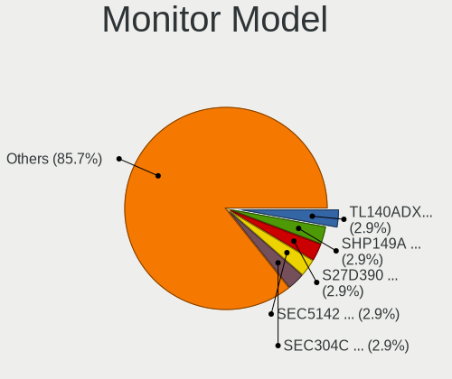
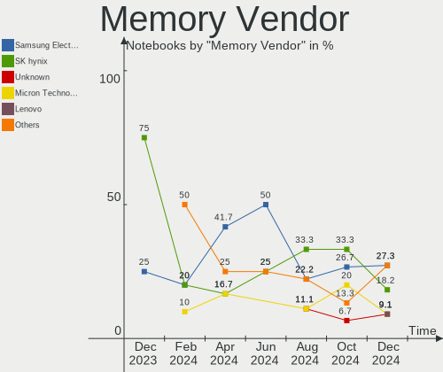
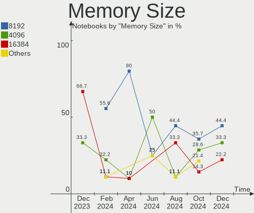

KDE neon - Hardware Trends (Notebooks)
--------------------------------------

A project to identify most popular hardware characteristics and track their change
over time based on data collected by Linux users at https://Linux-Hardware.org.

Anyone can contribute to this report by the [hw-probe](https://github.com/linuxhw/hw-probe) tool:

    sudo -E hw-probe -all -upload

This report is for one last month. Overall report since the beginning of time: [TestCoverage](https://github.com/linuxhw/TestCoverage)

Period: Jun, 2022.

Contents
--------

* [ System ](#system)
  - [ OS                       ](#os)
  - [ OS Family                ](#os-family)
  - [ Kernel                   ](#kernel)
  - [ Kernel Family            ](#kernel-family)
  - [ Kernel Major Ver.        ](#kernel-major-ver)
  - [ Arch                     ](#arch)
  - [ DE                       ](#de)
  - [ Display Server           ](#display-server)
  - [ Display Manager          ](#display-manager)
  - [ OS Lang                  ](#os-lang)
  - [ Boot Mode                ](#boot-mode)
  - [ Filesystem               ](#filesystem)
  - [ Part. scheme             ](#part-scheme)
  - [ Dual Boot with Linux/BSD ](#dual-boot-with-linuxbsd)
  - [ Dual Boot (Win)          ](#dual-boot-win)

* [ Board ](#board)
  - [ Vendor                   ](#vendor)
  - [ Model                    ](#model)
  - [ Model Family             ](#model-family)
  - [ MFG Year                 ](#mfg-year)
  - [ Form Factor              ](#form-factor)
  - [ Secure Boot              ](#secure-boot)
  - [ Coreboot                 ](#coreboot)
  - [ RAM Size                 ](#ram-size)
  - [ RAM Used                 ](#ram-used)
  - [ Total Drives             ](#total-drives)
  - [ Has CD-ROM               ](#has-cd-rom)
  - [ Has Ethernet             ](#has-ethernet)
  - [ Has WiFi                 ](#has-wifi)
  - [ Has Bluetooth            ](#has-bluetooth)

* [ Location ](#location)
  - [ Country                  ](#country)
  - [ City                     ](#city)

* [ Drives ](#drives)
  - [ Drive Vendor             ](#drive-vendor)
  - [ Drive Model              ](#drive-model)
  - [ HDD Vendor               ](#hdd-vendor)
  - [ SSD Vendor               ](#ssd-vendor)
  - [ Drive Kind               ](#drive-kind)
  - [ Drive Connector          ](#drive-connector)
  - [ Drive Size               ](#drive-size)
  - [ Space Total              ](#space-total)
  - [ Space Used               ](#space-used)
  - [ Malfunc. Drives          ](#malfunc-drives)
  - [ Malfunc. Drive Vendor    ](#malfunc-drive-vendor)
  - [ Malfunc. HDD Vendor      ](#malfunc-hdd-vendor)
  - [ Malfunc. Drive Kind      ](#malfunc-drive-kind)
  - [ Failed Drives            ](#failed-drives)
  - [ Failed Drive Vendor      ](#failed-drive-vendor)
  - [ Drive Status             ](#drive-status)

* [ Storage controller ](#storage-controller)
  - [ Storage Vendor           ](#storage-vendor)
  - [ Storage Model            ](#storage-model)
  - [ Storage Kind             ](#storage-kind)

* [ Processor ](#processor)
  - [ CPU Vendor               ](#cpu-vendor)
  - [ CPU Model                ](#cpu-model)
  - [ CPU Model Family         ](#cpu-model-family)
  - [ CPU Cores                ](#cpu-cores)
  - [ CPU Sockets              ](#cpu-sockets)
  - [ CPU Threads              ](#cpu-threads)
  - [ CPU Op-Modes             ](#cpu-op-modes)
  - [ CPU Microcode            ](#cpu-microcode)
  - [ CPU Microarch            ](#cpu-microarch)

* [ Graphics ](#graphics)
  - [ GPU Vendor               ](#gpu-vendor)
  - [ GPU Model                ](#gpu-model)
  - [ GPU Combo                ](#gpu-combo)
  - [ GPU Driver               ](#gpu-driver)
  - [ GPU Memory               ](#gpu-memory)

* [ Monitor ](#monitor)
  - [ Monitor Vendor           ](#monitor-vendor)
  - [ Monitor Model            ](#monitor-model)
  - [ Monitor Resolution       ](#monitor-resolution)
  - [ Monitor Diagonal         ](#monitor-diagonal)
  - [ Monitor Width            ](#monitor-width)
  - [ Aspect Ratio             ](#aspect-ratio)
  - [ Monitor Area             ](#monitor-area)
  - [ Pixel Density            ](#pixel-density)
  - [ Multiple Monitors        ](#multiple-monitors)

* [ Network ](#network)
  - [ Net Controller Vendor    ](#net-controller-vendor)
  - [ Net Controller Model     ](#net-controller-model)
  - [ Wireless Vendor          ](#wireless-vendor)
  - [ Wireless Model           ](#wireless-model)
  - [ Ethernet Vendor          ](#ethernet-vendor)
  - [ Ethernet Model           ](#ethernet-model)
  - [ Net Controller Kind      ](#net-controller-kind)
  - [ Used Controller          ](#used-controller)
  - [ NICs                     ](#nics)
  - [ IPv6                     ](#ipv6)

* [ Bluetooth ](#bluetooth)
  - [ Bluetooth Vendor         ](#bluetooth-vendor)
  - [ Bluetooth Model          ](#bluetooth-model)

* [ Sound ](#sound)
  - [ Sound Vendor             ](#sound-vendor)
  - [ Sound Model              ](#sound-model)

* [ Memory ](#memory)
  - [ Memory Vendor            ](#memory-vendor)
  - [ Memory Model             ](#memory-model)
  - [ Memory Kind              ](#memory-kind)
  - [ Memory Form Factor       ](#memory-form-factor)
  - [ Memory Size              ](#memory-size)
  - [ Memory Speed             ](#memory-speed)

* [ Printers & scanners ](#printers--scanners)
  - [ Printer Vendor           ](#printer-vendor)
  - [ Printer Model            ](#printer-model)
  - [ Scanner Vendor           ](#scanner-vendor)
  - [ Scanner Model            ](#scanner-model)

* [ Camera ](#camera)
  - [ Camera Vendor            ](#camera-vendor)
  - [ Camera Model             ](#camera-model)

* [ Security ](#security)
  - [ Fingerprint Vendor       ](#fingerprint-vendor)
  - [ Fingerprint Model        ](#fingerprint-model)
  - [ Chipcard Vendor          ](#chipcard-vendor)
  - [ Chipcard Model           ](#chipcard-model)

* [ Unsupported ](#unsupported)
  - [ Unsupported Devices      ](#unsupported-devices)
  - [ Unsupported Device Types ](#unsupported-device-types)

System
------

OS
--

Installed operating systems

| Name           | Notebooks | Percent |
|----------------|-----------|---------|
| KDE neon 20.04 | 58        | 100%    |

OS Family
---------

OS without a version

| Name     | Notebooks | Percent |
|----------|-----------|---------|
| KDE neon | 58        | 100%    |

Kernel
------

Version of the Linux kernel

| Version                 | Notebooks | Percent |
|-------------------------|-----------|---------|
| 5.13.0-51-generic       | 25        | 43.1%   |
| 5.13.0-48-generic       | 13        | 22.41%  |
| 5.13.0-44-generic       | 13        | 22.41%  |
| 5.13.0-41-generic       | 2         | 3.45%   |
| 5.14.0-1042-oem         | 1         | 1.72%   |
| 5.13.0-52-generic       | 1         | 1.72%   |
| 5.13.0-1014-intel       | 1         | 1.72%   |
| 5.11.0-38-generic       | 1         | 1.72%   |
| 5.0.0-050000rc1-generic | 1         | 1.72%   |

Kernel Family
-------------

Linux kernel without a distro release

| Version | Notebooks | Percent |
|---------|-----------|---------|
| 5.13.0  | 55        | 94.83%  |
| 5.14.0  | 1         | 1.72%   |
| 5.11.0  | 1         | 1.72%   |
| 5.0.0   | 1         | 1.72%   |

Kernel Major Ver.
-----------------

Linux kernel major version

| Version | Notebooks | Percent |
|---------|-----------|---------|
| 5.13    | 55        | 94.83%  |
| 5.14    | 1         | 1.72%   |
| 5.11    | 1         | 1.72%   |
| 5.0     | 1         | 1.72%   |

Arch
----

OS architecture (x86_64, i586, etc.)

| Name   | Notebooks | Percent |
|--------|-----------|---------|
| x86_64 | 58        | 100%    |

DE
--

Desktop Environment

| Name | Notebooks | Percent |
|------|-----------|---------|
| KDE5 | 58        | 100%    |

Display Server
--------------

X11 or Wayland

| Name    | Notebooks | Percent |
|---------|-----------|---------|
| X11     | 50        | 86.21%  |
| Wayland | 8         | 13.79%  |

Display Manager
---------------

SDDM, LightDM, etc.

| Name    | Notebooks | Percent |
|---------|-----------|---------|
| Unknown | 46        | 79.31%  |
| SDDM    | 12        | 20.69%  |

OS Lang
-------

Language

| Lang           | Notebooks | Percent |
|----------------|-----------|---------|
| en_US          | 25        | 43.1%   |
| de_DE          | 5         | 8.62%   |
| pt_BR          | 4         | 6.9%    |
| ru_RU          | 3         | 5.17%   |
| it_IT          | 3         | 5.17%   |
| C              | 3         | 5.17%   |
| zh_TW          | 1         | 1.72%   |
| th_TH          | 1         | 1.72%   |
| fr_FR          | 1         | 1.72%   |
| es_VE          | 1         | 1.72%   |
| es_MX          | 1         | 1.72%   |
| es_ES          | 1         | 1.72%   |
| es_CO          | 1         | 1.72%   |
| en_ZW          | 1         | 1.72%   |
| en_PH          | 1         | 1.72%   |
| en_IN          | 1         | 1.72%   |
| en_GB          | 1         | 1.72%   |
| en_CA          | 1         | 1.72%   |
| de_CH          | 1         | 1.72%   |
| de_AT          | 1         | 1.72%   |
| ca_ES@valencia | 1         | 1.72%   |

Boot Mode
---------

EFI or BIOS

| Mode | Notebooks | Percent |
|------|-----------|---------|
| EFI  | 41        | 70.69%  |
| BIOS | 17        | 29.31%  |

Filesystem
----------

Type of filesystem

| Type    | Notebooks | Percent |
|---------|-----------|---------|
| Ext4    | 53        | 91.38%  |
| Overlay | 3         | 5.17%   |
| Btrfs   | 2         | 3.45%   |

Part. scheme
------------

Scheme of partitioning

| Type    | Notebooks | Percent |
|---------|-----------|---------|
| Unknown | 53        | 91.38%  |
| GPT     | 4         | 6.9%    |
| MBR     | 1         | 1.72%   |

Dual Boot with Linux/BSD
------------------------

Hosting more than one Linux/BSD

| Dual boot | Notebooks | Percent |
|-----------|-----------|---------|
| No        | 58        | 100%    |

Dual Boot (Win)
---------------

Hosting Linux and Windows

| Dual boot | Notebooks | Percent |
|-----------|-----------|---------|
| No        | 52        | 89.66%  |
| Yes       | 6         | 10.34%  |

Board
-----

Vendor
------

Motherboard manufacturer

| Name                | Notebooks | Percent |
|---------------------|-----------|---------|
| Dell                | 12        | 20.69%  |
| Acer                | 12        | 20.69%  |
| Hewlett-Packard     | 11        | 18.97%  |
| ASUSTek Computer    | 7         | 12.07%  |
| Samsung Electronics | 3         | 5.17%   |
| Lenovo              | 3         | 5.17%   |
| Toshiba             | 2         | 3.45%   |
| Google              | 2         | 3.45%   |
| Sony                | 1         | 1.72%   |
| Positivo            | 1         | 1.72%   |
| MSI                 | 1         | 1.72%   |
| Gigabyte Technology | 1         | 1.72%   |
| AZW                 | 1         | 1.72%   |
| Apple               | 1         | 1.72%   |

Model
-----

Motherboard model

| Name                                     | Notebooks | Percent |
|------------------------------------------|-----------|---------|
| ASUS ZenBook UX425UAZ_UM425UAZ           | 2         | 3.45%   |
| Toshiba Satellite Pro C70-C-19V          | 1         | 1.72%   |
| Toshiba Satellite L775D                  | 1         | 1.72%   |
| Sony SVS15115FWB                         | 1         | 1.72%   |
| Samsung R530/R730                        | 1         | 1.72%   |
| Samsung 670Z5E                           | 1         | 1.72%   |
| Samsung 550XDA                           | 1         | 1.72%   |
| Positivo CHT14B                          | 1         | 1.72%   |
| MSI GF63 8RC                             | 1         | 1.72%   |
| Lenovo ThinkPad X140e 20BLS00400         | 1         | 1.72%   |
| Lenovo ThinkPad T510 4384FF3             | 1         | 1.72%   |
| Lenovo IdeaPad Gaming 3 15ACH6 82K2      | 1         | 1.72%   |
| HP Stream Notebook PC 11                 | 1         | 1.72%   |
| HP ProBook 6470b                         | 1         | 1.72%   |
| HP ProBook 450 G3                        | 1         | 1.72%   |
| HP ProBook 430 G4                        | 1         | 1.72%   |
| HP Pavilion Gaming Laptop 15-cx0xxx      | 1         | 1.72%   |
| HP Pavilion g6                           | 1         | 1.72%   |
| HP OMEN Laptop 15-en1xxx                 | 1         | 1.72%   |
| HP OMEN by Laptop 16-c0xxx               | 1         | 1.72%   |
| HP EliteBook 855 G8 Notebook PC          | 1         | 1.72%   |
| HP EliteBook 840 G2                      | 1         | 1.72%   |
| HP 255 G8 Notebook PC                    | 1         | 1.72%   |
| Google Cyan                              | 1         | 1.72%   |
| Google Banon                             | 1         | 1.72%   |
| Gigabyte AORUS 5 MB                      | 1         | 1.72%   |
| Dell XPS 17 9710                         | 1         | 1.72%   |
| Dell XPS 15 9520                         | 1         | 1.72%   |
| Dell XPS 13 9310                         | 1         | 1.72%   |
| Dell Vostro 3560                         | 1         | 1.72%   |
| Dell Studio XPS 1340                     | 1         | 1.72%   |
| Dell Precision 5530                      | 1         | 1.72%   |
| Dell Latitude E7440                      | 1         | 1.72%   |
| Dell Latitude 5511                       | 1         | 1.72%   |
| Dell Latitude 3450                       | 1         | 1.72%   |
| Dell Inspiron 7573                       | 1         | 1.72%   |
| Dell Inspiron 5437                       | 1         | 1.72%   |
| Dell Inspiron 1440                       | 1         | 1.72%   |
| AZW GT-R                                 | 1         | 1.72%   |
| ASUS VivoBook_ASUSLaptop X7400PC_N7400PC | 1         | 1.72%   |
| ASUS VivoBook_ASUSLaptop X515MA_F515MA   | 1         | 1.72%   |
| ASUS N53SV                               | 1         | 1.72%   |
| ASUS K55A                                | 1         | 1.72%   |
| ASUS ASUS TUF Dash F15 FX516PM_FX516PM   | 1         | 1.72%   |
| Apple MacBookPro8,2                      | 1         | 1.72%   |
| Acer TravelMate P278-M                   | 1         | 1.72%   |
| Acer Predator PH315-53                   | 1         | 1.72%   |
| Acer Nitro AN517-52                      | 1         | 1.72%   |
| Acer Nitro AN515-52                      | 1         | 1.72%   |
| Acer Aspire V3-772G                      | 1         | 1.72%   |
| Acer Aspire V3-572G                      | 1         | 1.72%   |
| Acer Aspire V3-571G                      | 1         | 1.72%   |
| Acer Aspire F5-573G                      | 1         | 1.72%   |
| Acer Aspire ES1-572                      | 1         | 1.72%   |
| Acer Aspire A515-45                      | 1         | 1.72%   |
| Acer Aspire A515-44G                     | 1         | 1.72%   |
| Acer Aspire A315-42                      | 1         | 1.72%   |

Model Family
------------

Motherboard model prefix

| Name              | Notebooks | Percent |
|-------------------|-----------|---------|
| Acer Aspire       | 8         | 13.79%  |
| HP ProBook        | 3         | 5.17%   |
| Dell XPS          | 3         | 5.17%   |
| Dell Latitude     | 3         | 5.17%   |
| Dell Inspiron     | 3         | 5.17%   |
| Toshiba Satellite | 2         | 3.45%   |
| Lenovo ThinkPad   | 2         | 3.45%   |
| HP Pavilion       | 2         | 3.45%   |
| HP OMEN           | 2         | 3.45%   |
| HP EliteBook      | 2         | 3.45%   |
| ASUS ZenBook      | 2         | 3.45%   |
| ASUS VivoBook     | 2         | 3.45%   |
| Acer Nitro        | 2         | 3.45%   |
| Sony SVS15115FWB  | 1         | 1.72%   |
| Samsung R530      | 1         | 1.72%   |
| Samsung 670Z5E    | 1         | 1.72%   |
| Samsung 550XDA    | 1         | 1.72%   |
| Positivo CHT14B   | 1         | 1.72%   |
| MSI GF63          | 1         | 1.72%   |
| Lenovo IdeaPad    | 1         | 1.72%   |
| HP Stream         | 1         | 1.72%   |
| HP 255            | 1         | 1.72%   |
| Google Cyan       | 1         | 1.72%   |
| Google Banon      | 1         | 1.72%   |
| Gigabyte AORUS    | 1         | 1.72%   |
| Dell Vostro       | 1         | 1.72%   |
| Dell Studio       | 1         | 1.72%   |
| Dell Precision    | 1         | 1.72%   |
| AZW GT-R          | 1         | 1.72%   |
| ASUS N53SV        | 1         | 1.72%   |
| ASUS K55A         | 1         | 1.72%   |
| ASUS ASUS         | 1         | 1.72%   |
| Apple MacBookPro8 | 1         | 1.72%   |
| Acer TravelMate   | 1         | 1.72%   |
| Acer Predator     | 1         | 1.72%   |

MFG Year
--------

Motherboard manufacture year

| Year | Notebooks | Percent |
|------|-----------|---------|
| 2021 | 12        | 20.69%  |
| 2020 | 9         | 15.52%  |
| 2012 | 6         | 10.34%  |
| 2018 | 5         | 8.62%   |
| 2014 | 5         | 8.62%   |
| 2009 | 4         | 6.9%    |
| 2016 | 3         | 5.17%   |
| 2015 | 3         | 5.17%   |
| 2013 | 3         | 5.17%   |
| 2022 | 2         | 3.45%   |
| 2017 | 2         | 3.45%   |
| 2011 | 2         | 3.45%   |
| 2019 | 1         | 1.72%   |
| 2010 | 1         | 1.72%   |

Form Factor
-----------

Physical design of the computer

| Name     | Notebooks | Percent |
|----------|-----------|---------|
| Notebook | 58        | 100%    |

Secure Boot
-----------

Enabled or disabled

| State    | Notebooks | Percent |
|----------|-----------|---------|
| Disabled | 52        | 89.66%  |
| Enabled  | 6         | 10.34%  |

Coreboot
--------

Have coreboot on board

| Used | Notebooks | Percent |
|------|-----------|---------|
| No   | 56        | 96.55%  |
| Yes  | 2         | 3.45%   |

RAM Size
--------

Total RAM memory

| Size in GB  | Notebooks | Percent |
|-------------|-----------|---------|
| 4.01-8.0    | 18        | 31.03%  |
| 16.01-24.0  | 12        | 20.69%  |
| 8.01-16.0   | 9         | 15.52%  |
| 3.01-4.0    | 8         | 13.79%  |
| 32.01-64.0  | 5         | 8.62%   |
| 1.01-2.0    | 3         | 5.17%   |
| 64.01-256.0 | 2         | 3.45%   |
| 24.01-32.0  | 1         | 1.72%   |

RAM Used
--------

Used RAM memory

| Used GB   | Notebooks | Percent |
|-----------|-----------|---------|
| 1.01-2.0  | 30        | 51.72%  |
| 2.01-3.0  | 16        | 27.59%  |
| 3.01-4.0  | 4         | 6.9%    |
| 8.01-16.0 | 4         | 6.9%    |
| 4.01-8.0  | 2         | 3.45%   |
| 0.51-1.0  | 2         | 3.45%   |

Total Drives
------------

Number of drives on board

| Drives | Notebooks | Percent |
|--------|-----------|---------|
| 1      | 37        | 63.79%  |
| 2      | 19        | 32.76%  |
| 6      | 1         | 1.72%   |
| 3      | 1         | 1.72%   |

Has CD-ROM
----------

Has CD-ROM on board

| Presented | Notebooks | Percent |
|-----------|-----------|---------|
| No        | 42        | 72.41%  |
| Yes       | 16        | 27.59%  |

Has Ethernet
------------

Has Ethernet on board

| Presented | Notebooks | Percent |
|-----------|-----------|---------|
| Yes       | 46        | 79.31%  |
| No        | 12        | 20.69%  |

Has WiFi
--------

Has WiFi module

| Presented | Notebooks | Percent |
|-----------|-----------|---------|
| Yes       | 57        | 98.28%  |
| No        | 1         | 1.72%   |

Has Bluetooth
-------------

Has Bluetooth module

| Presented | Notebooks | Percent |
|-----------|-----------|---------|
| Yes       | 52        | 89.66%  |
| No        | 6         | 10.34%  |

Location
--------

Country
-------

Geographic location (country)

| Country     | Notebooks | Percent |
|-------------|-----------|---------|
| USA         | 19        | 32.76%  |
| Germany     | 6         | 10.34%  |
| Brazil      | 5         | 8.62%   |
| Spain       | 3         | 5.17%   |
| Italy       | 3         | 5.17%   |
| Bulgaria    | 3         | 5.17%   |
| Belarus     | 2         | 3.45%   |
| Zimbabwe    | 1         | 1.72%   |
| Venezuela   | 1         | 1.72%   |
| UK          | 1         | 1.72%   |
| Turkey      | 1         | 1.72%   |
| Thailand    | 1         | 1.72%   |
| Taiwan      | 1         | 1.72%   |
| Switzerland | 1         | 1.72%   |
| South Korea | 1         | 1.72%   |
| Russia      | 1         | 1.72%   |
| Réunion    | 1         | 1.72%   |
| Philippines | 1         | 1.72%   |
| Mexico      | 1         | 1.72%   |
| Kazakhstan  | 1         | 1.72%   |
| India       | 1         | 1.72%   |
| Colombia    | 1         | 1.72%   |
| Canada      | 1         | 1.72%   |
| Austria     | 1         | 1.72%   |

City
----

Geographic location (city)

| City                  | Notebooks | Percent |
|-----------------------|-----------|---------|
| Plovdiv               | 2         | 3.45%   |
| New York              | 2         | 3.45%   |
| Wolfsburg             | 1         | 1.72%   |
| Winterthur            | 1         | 1.72%   |
| Vienna                | 1         | 1.72%   |
| Vicenza               | 1         | 1.72%   |
| Vernon                | 1         | 1.72%   |
| Turkoba               | 1         | 1.72%   |
| Tainan City           | 1         | 1.72%   |
| Statesboro            | 1         | 1.72%   |
| Stara Zagora          | 1         | 1.72%   |
| Santee                | 1         | 1.72%   |
| Salvador              | 1         | 1.72%   |
| Saint-Denis           | 1         | 1.72%   |
| Riverside             | 1         | 1.72%   |
| Rho                   | 1         | 1.72%   |
| Rheinberg             | 1         | 1.72%   |
| Resende               | 1         | 1.72%   |
| Puyallup              | 1         | 1.72%   |
| Pocking               | 1         | 1.72%   |
| Plymouth              | 1         | 1.72%   |
| Pachuca               | 1         | 1.72%   |
| Oxford                | 1         | 1.72%   |
| Orleans               | 1         | 1.72%   |
| Norman                | 1         | 1.72%   |
| New Delhi             | 1         | 1.72%   |
| Moscow                | 1         | 1.72%   |
| Montería             | 1         | 1.72%   |
| Minsk                 | 1         | 1.72%   |
| Maracaibo             | 1         | 1.72%   |
| Lincoln               | 1         | 1.72%   |
| Licking               | 1         | 1.72%   |
| Köthen               | 1         | 1.72%   |
| Kansas City           | 1         | 1.72%   |
| Inverness             | 1         | 1.72%   |
| Ibiza Town            | 1         | 1.72%   |
| Horcajo de las Torres | 1         | 1.72%   |
| Herriman              | 1         | 1.72%   |
| Harare                | 1         | 1.72%   |
| Hamm                  | 1         | 1.72%   |
| Hamburg               | 1         | 1.72%   |
| Gomel                 | 1         | 1.72%   |
| Gangnam-gu            | 1         | 1.72%   |
| Florence              | 1         | 1.72%   |
| Farmington            | 1         | 1.72%   |
| Dallas                | 1         | 1.72%   |
| Cuiabá               | 1         | 1.72%   |
| City of Muntinglupa   | 1         | 1.72%   |
| Charlotte             | 1         | 1.72%   |
| Camaçari             | 1         | 1.72%   |
| Bewbush               | 1         | 1.72%   |
| Bangkok               | 1         | 1.72%   |
| Americana             | 1         | 1.72%   |
| Almaty                | 1         | 1.72%   |
| Albacete              | 1         | 1.72%   |
| Aberdeen              | 1         | 1.72%   |

Drives
------

Drive Vendor
------------

Hard drive vendors

| Vendor                         | Notebooks | Drives | Percent |
|--------------------------------|-----------|--------|---------|
| Samsung Electronics            | 15        | 19     | 18.99%  |
| Toshiba                        | 8         | 8      | 10.13%  |
| WDC                            | 7         | 7      | 8.86%   |
| SanDisk                        | 7         | 7      | 8.86%   |
| Unknown                        | 6         | 7      | 7.59%   |
| Seagate                        | 5         | 6      | 6.33%   |
| Kingston                       | 5         | 5      | 6.33%   |
| Micron Technology              | 4         | 4      | 5.06%   |
| SK hynix                       | 3         | 3      | 3.8%    |
| Intel                          | 3         | 4      | 3.8%    |
| Hewlett-Packard                | 2         | 2      | 2.53%   |
| USB3.0                         | 1         | 1      | 1.27%   |
| SPCC                           | 1         | 1      | 1.27%   |
| Solid State Storage Technology | 1         | 1      | 1.27%   |
| Silicon Motion                 | 1         | 1      | 1.27%   |
| Shenzhen Longsys Electronics   | 1         | 1      | 1.27%   |
| PNY                            | 1         | 1      | 1.27%   |
| KIOXIA                         | 1         | 1      | 1.27%   |
| KingDian                       | 1         | 1      | 1.27%   |
| Hitachi                        | 1         | 1      | 1.27%   |
| HGST                           | 1         | 1      | 1.27%   |
| Dogfish                        | 1         | 1      | 1.27%   |
| ASMT                           | 1         | 1      | 1.27%   |
| A-DATA Technology              | 1         | 1      | 1.27%   |
| Unknown                        | 1         | 1      | 1.27%   |

Drive Model
-----------

Hard drive models

| Model                                    | Notebooks | Percent |
|------------------------------------------|-----------|---------|
| WDC WD10JPVX-22JC3T0 1TB                 | 3         | 3.53%   |
| SanDisk NVMe SSD Drive 512GB             | 3         | 3.53%   |
| Samsung NVMe SSD Drive 512GB             | 3         | 3.53%   |
| Samsung NVMe SSD Drive 1024GB            | 3         | 3.53%   |
| Unknown MMC Card  32GB                   | 2         | 2.35%   |
| Samsung NVMe SSD Drive 256GB             | 2         | 2.35%   |
| Micron NVMe SSD Drive 512GB              | 2         | 2.35%   |
| HP SSD S700 500GB                        | 2         | 2.35%   |
| WDC WDS240G2G0A-00JH30 240GB SSD         | 1         | 1.18%   |
| WDC WDBNCE0010PNC 1TB SSD                | 1         | 1.18%   |
| WDC WD3200BEVT-75ZCT2 320GB              | 1         | 1.18%   |
| WDC WD1600BEVT-75ZCT0 160GB              | 1         | 1.18%   |
| USB3.0 Super Speed 320GB                 | 1         | 1.18%   |
| Unknown SD/MMC/MS PRO 128GB              | 1         | 1.18%   |
| Unknown MMC Card  256GB                  | 1         | 1.18%   |
| Unknown MMC Card  16GB                   | 1         | 1.18%   |
| Unknown ED2S5  128GB                     | 1         | 1.18%   |
| Unknown DF4016  16GB                     | 1         | 1.18%   |
| Toshiba THNSNH128GMCT 128GB SSD          | 1         | 1.18%   |
| Toshiba Q300 Pro. 1024GB SSD             | 1         | 1.18%   |
| Toshiba MQ04ABF100 1TB                   | 1         | 1.18%   |
| Toshiba MQ01ABF050 500GB                 | 1         | 1.18%   |
| Toshiba MQ01ABD100 1TB                   | 1         | 1.18%   |
| Toshiba MK6475GSX 640GB                  | 1         | 1.18%   |
| Toshiba KBG30ZMS128G 128GB NVMe SSD      | 1         | 1.18%   |
| Toshiba HDWL110 1TB                      | 1         | 1.18%   |
| SPCC Solid State Disk 512GB              | 1         | 1.18%   |
| Solid State Storage NVMe SSD Drive 256GB | 1         | 1.18%   |
| SK hynix SHGS31-1000GS-2 1TB SSD         | 1         | 1.18%   |
| SK hynix NVMe SSD Drive 512GB            | 1         | 1.18%   |
| SK hynix NVMe SSD Drive 256GB            | 1         | 1.18%   |
| Silicon Motion NVMe SSD Drive 256GB      | 1         | 1.18%   |
| Shenzhen Longsys NVMe SSD Drive 128GB    | 1         | 1.18%   |
| Seagate ST1000LM049-2GH172 1TB           | 1         | 1.18%   |
| Seagate ST1000LM014-1EJ164-SSHD 1TB      | 1         | 1.18%   |
| Seagate ST1000LM014-1EJ164 1TB           | 1         | 1.18%   |
| Seagate BUP Slim BK 1TB                  | 1         | 1.18%   |
| Seagate BUP Slim 2TB                     | 1         | 1.18%   |
| Seagate BACKUP+ 120GB                    | 1         | 1.18%   |
| SanDisk SSD PLUS 480GB                   | 1         | 1.18%   |
| SanDisk SDSSDH3 4T00 4TB                 | 1         | 1.18%   |
| SanDisk SD8SN8U-256G-1006 256GB SSD      | 1         | 1.18%   |
| SanDisk Extreme 55AE 2TB SSD             | 1         | 1.18%   |
| Samsung SSD SM841 2.5 7mm 128GB          | 1         | 1.18%   |
| Samsung SSD PM851 mSATA 128GB            | 1         | 1.18%   |
| Samsung SSD 980 PRO 2TB                  | 1         | 1.18%   |
| Samsung SSD 970 EVO Plus 1TB             | 1         | 1.18%   |
| Samsung SSD 870 EVO 1TB                  | 1         | 1.18%   |
| Samsung SSD 860 EVO M.2 1TB              | 1         | 1.18%   |
| Samsung SSD 840 EVO 250GB                | 1         | 1.18%   |
| Samsung SM963 2.5" NVMe PCIe SSD 500GB   | 1         | 1.18%   |
| Samsung NVMe SSD Drive 250GB             | 1         | 1.18%   |
| Samsung NVMe SSD Drive 1TB               | 1         | 1.18%   |
| PNY CS900 240GB SSD                      | 1         | 1.18%   |
| Micron NVMe SSD Drive 1024GB             | 1         | 1.18%   |
| Micron 1100 SATA 256GB SSD               | 1         | 1.18%   |
| KIOXIA NVMe SSD Drive 256GB              | 1         | 1.18%   |
| Kingston SKC2500M82000G 2TB              | 1         | 1.18%   |
| Kingston SA400S37480G 480GB SSD          | 1         | 1.18%   |
| Kingston SA400S37240G 240GB SSD          | 1         | 1.18%   |

HDD Vendor
----------

Hard disk drive vendors

| Vendor  | Notebooks | Drives | Percent |
|---------|-----------|--------|---------|
| WDC     | 5         | 5      | 27.78%  |
| Toshiba | 5         | 5      | 27.78%  |
| Seagate | 4         | 5      | 22.22%  |
| Unknown | 1         | 1      | 5.56%   |
| Hitachi | 1         | 1      | 5.56%   |
| HGST    | 1         | 1      | 5.56%   |
| ASMT    | 1         | 1      | 5.56%   |

SSD Vendor
----------

Solid state drive vendors

| Vendor              | Notebooks | Drives | Percent |
|---------------------|-----------|--------|---------|
| Samsung Electronics | 5         | 5      | 18.52%  |
| SanDisk             | 4         | 4      | 14.81%  |
| Kingston            | 3         | 3      | 11.11%  |
| WDC                 | 2         | 2      | 7.41%   |
| Toshiba             | 2         | 2      | 7.41%   |
| Hewlett-Packard     | 2         | 2      | 7.41%   |
| USB3.0              | 1         | 1      | 3.7%    |
| SPCC                | 1         | 1      | 3.7%    |
| SK hynix            | 1         | 1      | 3.7%    |
| PNY                 | 1         | 1      | 3.7%    |
| Micron Technology   | 1         | 1      | 3.7%    |
| KingDian            | 1         | 1      | 3.7%    |
| Intel               | 1         | 1      | 3.7%    |
| Dogfish             | 1         | 1      | 3.7%    |
| A-DATA Technology   | 1         | 1      | 3.7%    |

Drive Kind
----------

HDD or SSD

| Kind    | Notebooks | Drives | Percent |
|---------|-----------|--------|---------|
| NVMe    | 27        | 32     | 35.53%  |
| SSD     | 23        | 27     | 30.26%  |
| HDD     | 18        | 19     | 23.68%  |
| MMC     | 7         | 7      | 9.21%   |
| Unknown | 1         | 1      | 1.32%   |

Drive Connector
---------------

SATA, SAS, NVMe, etc.

| Type | Notebooks | Drives | Percent |
|------|-----------|--------|---------|
| SATA | 35        | 39     | 46.05%  |
| NVMe | 27        | 32     | 35.53%  |
| SAS  | 7         | 8      | 9.21%   |
| MMC  | 7         | 7      | 9.21%   |

Drive Size
----------

Size of hard drive

| Size in TB | Notebooks | Drives | Percent |
|------------|-----------|--------|---------|
| 0.01-0.5   | 23        | 25     | 53.49%  |
| 0.51-1.0   | 16        | 17     | 37.21%  |
| 1.01-2.0   | 3         | 3      | 6.98%   |
| 3.01-4.0   | 1         | 1      | 2.33%   |

Space Total
-----------

Amount of disk space available on the file system

| Size in GB     | Notebooks | Percent |
|----------------|-----------|---------|
| 101-250        | 18        | 31.03%  |
| 251-500        | 13        | 22.41%  |
| 1001-2000      | 6         | 10.34%  |
| 501-1000       | 6         | 10.34%  |
| 1-20           | 5         | 8.62%   |
| 21-50          | 4         | 6.9%    |
| 51-100         | 4         | 6.9%    |
| More than 3000 | 1         | 1.72%   |
| Unknown        | 1         | 1.72%   |

Space Used
----------

Amount of used disk space

| Used GB   | Notebooks | Percent |
|-----------|-----------|---------|
| 1-20      | 31        | 53.45%  |
| 21-50     | 8         | 13.79%  |
| 251-500   | 6         | 10.34%  |
| 101-250   | 5         | 8.62%   |
| 51-100    | 5         | 8.62%   |
| 1001-2000 | 1         | 1.72%   |
| 501-1000  | 1         | 1.72%   |
| Unknown   | 1         | 1.72%   |

Malfunc. Drives
---------------

Drive models with a malfunction

Zero info for selected period =(

Malfunc. Drive Vendor
---------------------

Vendors of faulty drives

Zero info for selected period =(

Malfunc. HDD Vendor
-------------------

Vendors of faulty HDD drives

Zero info for selected period =(

Malfunc. Drive Kind
-------------------

Kinds of faulty drives

Zero info for selected period =(

Failed Drives
-------------

Failed drive models

Zero info for selected period =(

Failed Drive Vendor
-------------------

Failed drive vendors

Zero info for selected period =(

Drive Status
------------

Number of failed and malfunc. drives

| Status   | Notebooks | Drives | Percent |
|----------|-----------|--------|---------|
| Detected | 56        | 82     | 93.33%  |
| Works    | 4         | 4      | 6.67%   |

Storage controller
------------------

Storage Vendor
--------------

Storage controller vendors

| Vendor                         | Notebooks | Percent |
|--------------------------------|-----------|---------|
| Intel                          | 39        | 52%     |
| Samsung Electronics            | 11        | 14.67%  |
| AMD                            | 8         | 10.67%  |
| SanDisk                        | 3         | 4%      |
| Micron Technology              | 3         | 4%      |
| SK hynix                       | 2         | 2.67%   |
| Kingston Technology Company    | 2         | 2.67%   |
| Toshiba America Info Systems   | 1         | 1.33%   |
| Solid State Storage Technology | 1         | 1.33%   |
| Silicon Motion                 | 1         | 1.33%   |
| Shenzhen Longsys Electronics   | 1         | 1.33%   |
| Nvidia                         | 1         | 1.33%   |
| KIOXIA                         | 1         | 1.33%   |
| ASMedia Technology             | 1         | 1.33%   |

Storage Model
-------------

Storage controller models

| Model                                                                         | Notebooks | Percent |
|-------------------------------------------------------------------------------|-----------|---------|
| AMD FCH SATA Controller [AHCI mode]                                           | 8         | 10.13%  |
| Intel Volume Management Device NVMe RAID Controller                           | 5         | 6.33%   |
| Intel Sunrise Point-LP SATA Controller [AHCI mode]                            | 5         | 6.33%   |
| Intel 7 Series Chipset Family 6-port SATA Controller [AHCI mode]              | 5         | 6.33%   |
| Samsung NVMe SSD Controller SM981/PM981/PM983                                 | 4         | 5.06%   |
| Samsung NVMe SSD Controller 980                                               | 4         | 5.06%   |
| Intel 400 Series Chipset Family SATA AHCI Controller                          | 4         | 5.06%   |
| SanDisk Non-Volatile memory controller                                        | 3         | 3.8%    |
| Samsung NVMe SSD Controller PM9A1/PM9A3/980PRO                                | 3         | 3.8%    |
| Micron Non-Volatile memory controller                                         | 3         | 3.8%    |
| Intel Wildcat Point-LP SATA Controller [AHCI Mode]                            | 3         | 3.8%    |
| Intel Cannon Lake Mobile PCH SATA AHCI Controller                             | 3         | 3.8%    |
| Intel 8 Series SATA Controller 1 [AHCI mode]                                  | 3         | 3.8%    |
| SK hynix PC401 NVMe Solid State Drive 256GB                                   | 2         | 2.53%   |
| Intel 82801IBM/IEM (ICH9M/ICH9M-E) 4 port SATA Controller [AHCI mode]         | 2         | 2.53%   |
| Intel 82801 Mobile SATA Controller [RAID mode]                                | 2         | 2.53%   |
| Intel 6 Series/C200 Series Chipset Family 6 port Mobile SATA AHCI Controller  | 2         | 2.53%   |
| Toshiba America Info Systems BG3 NVMe SSD Controller                          | 1         | 1.27%   |
| Solid State Storage Non-Volatile memory controller                            | 1         | 1.27%   |
| Silicon Motion SM2263EN/SM2263XT SSD Controller                               | 1         | 1.27%   |
| Shenzhen Longsys Non-Volatile memory controller                               | 1         | 1.27%   |
| Nvidia MCP79 AHCI Controller                                                  | 1         | 1.27%   |
| KIOXIA Non-Volatile memory controller                                         | 1         | 1.27%   |
| Kingston Company SNVS2000G [NV1 NVMe PCIe SSD 2TB]                            | 1         | 1.27%   |
| Kingston Company KC2000 NVMe SSD                                              | 1         | 1.27%   |
| Intel Tiger Lake-LP SATA Controller [AHCI mode]                               | 1         | 1.27%   |
| Intel Non-Volatile memory controller                                          | 1         | 1.27%   |
| Intel Celeron/Pentium Silver Processor SATA Controller                        | 1         | 1.27%   |
| Intel 8 Series/C220 Series Chipset Family 2-port SATA Controller 2 [IDE mode] | 1         | 1.27%   |
| Intel 8 Series Chipset Family 4-port SATA Controller 1 [IDE mode] - Mobile    | 1         | 1.27%   |
| Intel 7 Series Chipset Family 4-port SATA Controller [IDE mode]               | 1         | 1.27%   |
| Intel 7 Series Chipset Family 2-port SATA Controller [IDE mode]               | 1         | 1.27%   |
| Intel 5 Series/3400 Series Chipset 6 port SATA AHCI Controller                | 1         | 1.27%   |
| ASMedia ASM1062 Serial ATA Controller                                         | 1         | 1.27%   |
| AMD FCH IDE Controller                                                        | 1         | 1.27%   |

Storage Kind
------------

Kind of storage controller (IDE, SATA, NVMe, SAS, ...)

| Kind | Notebooks | Percent |
|------|-----------|---------|
| SATA | 39        | 52%     |
| NVMe | 26        | 34.67%  |
| RAID | 7         | 9.33%   |
| IDE  | 3         | 4%      |

Processor
---------

CPU Vendor
----------

Processor vendors

| Vendor | Notebooks | Percent |
|--------|-----------|---------|
| Intel  | 44        | 75.86%  |
| AMD    | 14        | 24.14%  |

CPU Model
---------

Processor models

| Model                                         | Notebooks | Percent |
|-----------------------------------------------|-----------|---------|
| Intel Core i5-5200U CPU @ 2.20GHz             | 3         | 5.17%   |
| AMD Ryzen 5 5500U with Radeon Graphics        | 3         | 5.17%   |
| Intel Pentium Dual-Core CPU T4400 @ 2.20GHz   | 2         | 3.45%   |
| Intel Core i5-8300H CPU @ 2.30GHz             | 2         | 3.45%   |
| Intel Core i5-7200U CPU @ 2.50GHz             | 2         | 3.45%   |
| Intel Core i5-6200U CPU @ 2.30GHz             | 2         | 3.45%   |
| Intel Core i5-3210M CPU @ 2.50GHz             | 2         | 3.45%   |
| Intel Core i5-10300H CPU @ 2.50GHz            | 2         | 3.45%   |
| Intel Core i3-2370M CPU @ 2.40GHz             | 2         | 3.45%   |
| Intel Celeron CPU N3060 @ 1.60GHz             | 2         | 3.45%   |
| Intel 11th Gen Core i7-11370H @ 3.30GHz       | 2         | 3.45%   |
| AMD Ryzen 7 5800H with Radeon Graphics        | 2         | 3.45%   |
| Intel Core i7-8850H CPU @ 2.60GHz             | 1         | 1.72%   |
| Intel Core i7-8750H CPU @ 2.20GHz             | 1         | 1.72%   |
| Intel Core i7-4702MQ CPU @ 2.20GHz            | 1         | 1.72%   |
| Intel Core i7-4510U CPU @ 2.00GHz             | 1         | 1.72%   |
| Intel Core i7-2635QM CPU @ 2.00GHz            | 1         | 1.72%   |
| Intel Core i7-2630QM CPU @ 2.00GHz            | 1         | 1.72%   |
| Intel Core i7-10850H CPU @ 2.70GHz            | 1         | 1.72%   |
| Intel Core i5-8250U CPU @ 1.60GHz             | 1         | 1.72%   |
| Intel Core i5-4310U CPU @ 2.00GHz             | 1         | 1.72%   |
| Intel Core i5-4200U CPU @ 1.60GHz             | 1         | 1.72%   |
| Intel Core i5-3320M CPU @ 2.60GHz             | 1         | 1.72%   |
| Intel Core i5-3230M CPU @ 2.60GHz             | 1         | 1.72%   |
| Intel Core i5-10200H CPU @ 2.40GHz            | 1         | 1.72%   |
| Intel Core i5 CPU M 560 @ 2.67GHz             | 1         | 1.72%   |
| Intel Core i3-6100U CPU @ 2.30GHz             | 1         | 1.72%   |
| Intel Core 2 Duo CPU P8400 @ 2.26GHz          | 1         | 1.72%   |
| Intel Celeron N4020 CPU @ 1.10GHz             | 1         | 1.72%   |
| Intel Celeron CPU N2840 @ 2.16GHz             | 1         | 1.72%   |
| Intel Atom x5-Z8350 CPU @ 1.44GHz             | 1         | 1.72%   |
| Intel 12th Gen Core i9-12900HK                | 1         | 1.72%   |
| Intel 11th Gen Core i7-1185G7 @ 3.00GHz       | 1         | 1.72%   |
| Intel 11th Gen Core i7-11800H @ 2.30GHz       | 1         | 1.72%   |
| Intel 11th Gen Core i5-1135G7 @ 2.40GHz       | 1         | 1.72%   |
| AMD Ryzen 7 PRO 5850U with Radeon Graphics    | 1         | 1.72%   |
| AMD Ryzen 7 3750H with Radeon Vega Mobile Gfx | 1         | 1.72%   |
| AMD Ryzen 5 5600H with Radeon Graphics        | 1         | 1.72%   |
| AMD Ryzen 5 4500U with Radeon Graphics        | 1         | 1.72%   |
| AMD Ryzen 5 3500U with Radeon Vega Mobile Gfx | 1         | 1.72%   |
| AMD Athlon Silver 3050U with Radeon Graphics  | 1         | 1.72%   |
| AMD A6-3420M APU with Radeon HD Graphics      | 1         | 1.72%   |
| AMD A6-3400M APU with Radeon HD Graphics      | 1         | 1.72%   |
| AMD A4-5000 APU with Radeon HD Graphics       | 1         | 1.72%   |

CPU Model Family
----------------

Processor model prefix

| Model                   | Notebooks | Percent |
|-------------------------|-----------|---------|
| Intel Core i5           | 20        | 34.48%  |
| Intel Core i7           | 7         | 12.07%  |
| Other                   | 6         | 10.34%  |
| AMD Ryzen 5             | 6         | 10.34%  |
| Intel Celeron           | 4         | 6.9%    |
| Intel Core i3           | 3         | 5.17%   |
| AMD Ryzen 7             | 3         | 5.17%   |
| Intel Pentium Dual-Core | 2         | 3.45%   |
| AMD A6                  | 2         | 3.45%   |
| Intel Core 2 Duo        | 1         | 1.72%   |
| Intel Atom              | 1         | 1.72%   |
| AMD Ryzen 7 PRO         | 1         | 1.72%   |
| AMD Athlon              | 1         | 1.72%   |
| AMD A4                  | 1         | 1.72%   |

CPU Cores
---------

Number of processor cores

| Number | Notebooks | Percent |
|--------|-----------|---------|
| 2      | 26        | 44.83%  |
| 4      | 19        | 32.76%  |
| 6      | 8         | 13.79%  |
| 8      | 4         | 6.9%    |
| 14     | 1         | 1.72%   |

CPU Sockets
-----------

Number of sockets

| Number | Notebooks | Percent |
|--------|-----------|---------|
| 1      | 58        | 100%    |

CPU Threads
-----------

Threads per core (Hyper-Threading)

| Number | Notebooks | Percent |
|--------|-----------|---------|
| 2      | 43        | 74.14%  |
| 1      | 15        | 25.86%  |

CPU Op-Modes
------------

CPU Operation Modes (32-bit, 64-bit)

| Op mode        | Notebooks | Percent |
|----------------|-----------|---------|
| 32-bit, 64-bit | 58        | 100%    |

CPU Microcode
-------------

Microcode number

| Number     | Notebooks | Percent |
|------------|-----------|---------|
| 0xa0652    | 4         | 6.9%    |
| 0x806c1    | 4         | 6.9%    |
| 0x306a9    | 4         | 6.9%    |
| 0x206a7    | 4         | 6.9%    |
| 0x0a50000c | 4         | 6.9%    |
| 0x906ea    | 3         | 5.17%   |
| 0x406e3    | 3         | 5.17%   |
| 0x406c4    | 3         | 5.17%   |
| 0x40651    | 3         | 5.17%   |
| 0x306d4    | 3         | 5.17%   |
| 0x806e9    | 2         | 3.45%   |
| 0x1067a    | 2         | 3.45%   |
| 0x08608103 | 2         | 3.45%   |
| 0x08108109 | 2         | 3.45%   |
| 0x03000027 | 2         | 3.45%   |
| Unknown    | 2         | 3.45%   |
| 0x806ea    | 1         | 1.72%   |
| 0x806d1    | 1         | 1.72%   |
| 0x706a8    | 1         | 1.72%   |
| 0x306c3    | 1         | 1.72%   |
| 0x30678    | 1         | 1.72%   |
| 0x20655    | 1         | 1.72%   |
| 0x10676    | 1         | 1.72%   |
| 0x08608102 | 1         | 1.72%   |
| 0x08600103 | 1         | 1.72%   |
| 0x08108102 | 1         | 1.72%   |
| 0x0700010f | 1         | 1.72%   |

CPU Microarch
-------------

Microarchitecture

| Name             | Notebooks | Percent |
|------------------|-----------|---------|
| KabyLake         | 7         | 12.07%  |
| Zen 3            | 4         | 6.9%    |
| TigerLake        | 4         | 6.9%    |
| Silvermont       | 4         | 6.9%    |
| SandyBridge      | 4         | 6.9%    |
| IvyBridge        | 4         | 6.9%    |
| Haswell          | 4         | 6.9%    |
| CometLake        | 4         | 6.9%    |
| Zen+             | 3         | 5.17%   |
| Skylake          | 3         | 5.17%   |
| Penryn           | 3         | 5.17%   |
| Broadwell        | 3         | 5.17%   |
| Unknown          | 3         | 5.17%   |
| K10 Llano        | 2         | 3.45%   |
| Zen 2            | 1         | 1.72%   |
| Westmere         | 1         | 1.72%   |
| Jaguar           | 1         | 1.72%   |
| Icelake          | 1         | 1.72%   |
| Goldmont plus    | 1         | 1.72%   |
| Alderlake Hybrid | 1         | 1.72%   |

Graphics
--------

GPU Vendor
----------

Vendors of graphics cards

| Vendor | Notebooks | Percent |
|--------|-----------|---------|
| Intel  | 42        | 50.6%   |
| Nvidia | 24        | 28.92%  |
| AMD    | 17        | 20.48%  |

GPU Model
---------

Graphics card models

| Model                                                                                    | Notebooks | Percent |
|------------------------------------------------------------------------------------------|-----------|---------|
| Intel TigerLake-LP GT2 [Iris Xe Graphics]                                                | 4         | 4.71%   |
| Intel CoffeeLake-H GT2 [UHD Graphics 630]                                                | 4         | 4.71%   |
| Intel 3rd Gen Core processor Graphics Controller                                         | 4         | 4.71%   |
| Intel 2nd Generation Core Processor Family Integrated Graphics Controller                | 4         | 4.71%   |
| AMD Cezanne                                                                              | 4         | 4.71%   |
| Nvidia GA106M [GeForce RTX 3060 Mobile / Max-Q]                                          | 3         | 3.53%   |
| Intel Skylake GT2 [HD Graphics 520]                                                      | 3         | 3.53%   |
| Intel HD Graphics 5500                                                                   | 3         | 3.53%   |
| Intel Haswell-ULT Integrated Graphics Controller                                         | 3         | 3.53%   |
| Intel CometLake-H GT2 [UHD Graphics]                                                     | 3         | 3.53%   |
| Intel Atom/Celeron/Pentium Processor x5-E8000/J3xxx/N3xxx Integrated Graphics Controller | 3         | 3.53%   |
| AMD Picasso/Raven 2 [Radeon Vega Series / Radeon Vega Mobile Series]                     | 3         | 3.53%   |
| AMD Lucienne                                                                             | 3         | 3.53%   |
| Nvidia GP107M [GeForce GTX 1050 Mobile]                                                  | 2         | 2.35%   |
| Nvidia GA107M [GeForce RTX 3050 Mobile]                                                  | 2         | 2.35%   |
| Intel HD Graphics 620                                                                    | 2         | 2.35%   |
| AMD Sumo [Radeon HD 6520G]                                                               | 2         | 2.35%   |
| Nvidia TU117M [GeForce GTX 1650 Ti Mobile]                                               | 1         | 1.18%   |
| Nvidia TU117M [GeForce GTX 1650 Mobile / Max-Q]                                          | 1         | 1.18%   |
| Nvidia TU106M [GeForce RTX 2070 Mobile / Max-Q Refresh]                                  | 1         | 1.18%   |
| Nvidia GT218M [GeForce 310M]                                                             | 1         | 1.18%   |
| Nvidia GP107M [GeForce MX150]                                                            | 1         | 1.18%   |
| Nvidia GP107M [GeForce GTX 1050 Ti Mobile]                                               | 1         | 1.18%   |
| Nvidia GP107GLM [Quadro P1000 Mobile]                                                    | 1         | 1.18%   |
| Nvidia GM108M [GeForce 930M]                                                             | 1         | 1.18%   |
| Nvidia GM108M [GeForce 840M]                                                             | 1         | 1.18%   |
| Nvidia GM107M [GeForce GTX 950M]                                                         | 1         | 1.18%   |
| Nvidia GK208M [GeForce GT 740M]                                                          | 1         | 1.18%   |
| Nvidia GK107M [GeForce GT 750M]                                                          | 1         | 1.18%   |
| Nvidia GK107M [GeForce GT 640M LE]                                                       | 1         | 1.18%   |
| Nvidia GF108M [GeForce GT 620M/630M/635M/640M LE]                                        | 1         | 1.18%   |
| Nvidia GF108M [GeForce GT 540M]                                                          | 1         | 1.18%   |
| Nvidia GA107M [GeForce RTX 3050 Ti Mobile]                                               | 1         | 1.18%   |
| Nvidia C79 [GeForce 9400M G]                                                             | 1         | 1.18%   |
| Intel UHD Graphics 620                                                                   | 1         | 1.18%   |
| Intel TigerLake-H GT1 [UHD Graphics]                                                     | 1         | 1.18%   |
| Intel Mobile 4 Series Chipset Integrated Graphics Controller                             | 1         | 1.18%   |
| Intel GeminiLake [UHD Graphics 600]                                                      | 1         | 1.18%   |
| Intel Core Processor Integrated Graphics Controller                                      | 1         | 1.18%   |
| Intel Comet Lake UHD Graphics                                                            | 1         | 1.18%   |
| Intel Atom Processor Z36xxx/Z37xxx Series Graphics & Display                             | 1         | 1.18%   |
| Intel Alder Lake-P Integrated Graphics Controller                                        | 1         | 1.18%   |
| Intel 4th Gen Core Processor Integrated Graphics Controller                              | 1         | 1.18%   |
| AMD Venus XT [Radeon HD 8870M / R9 M270X/M370X]                                          | 1         | 1.18%   |
| AMD Seymour [Radeon HD 6400M/7400M Series]                                               | 1         | 1.18%   |
| AMD Renoir                                                                               | 1         | 1.18%   |
| AMD Opal PRO [Radeon R7 M260X]                                                           | 1         | 1.18%   |
| AMD Navi 23 [Radeon RX 6600/6600 XT/6600M]                                               | 1         | 1.18%   |
| AMD Lexa [Radeon 540X/550X/630 / RX 640 / E9171 MCM]                                     | 1         | 1.18%   |
| AMD Kabini [Radeon HD 8330]                                                              | 1         | 1.18%   |

GPU Combo
---------

Combinations of graphics cards

| Name           | Notebooks | Percent |
|----------------|-----------|---------|
| Intel + Nvidia | 20        | 34.48%  |
| 1 x Intel      | 19        | 32.76%  |
| 1 x AMD        | 10        | 17.24%  |
| Intel + AMD    | 3         | 5.17%   |
| 2 x AMD        | 2         | 3.45%   |
| 1 x Nvidia     | 2         | 3.45%   |
| AMD + Nvidia   | 2         | 3.45%   |

GPU Driver
----------

Free vs proprietary

| Driver      | Notebooks | Percent |
|-------------|-----------|---------|
| Free        | 48        | 82.76%  |
| Proprietary | 8         | 13.79%  |
| Unknown     | 2         | 3.45%   |

GPU Memory
----------

Total video memory

| Size in GB | Notebooks | Percent |
|------------|-----------|---------|
| Unknown    | 27        | 46.55%  |
| 1.01-2.0   | 11        | 18.97%  |
| 0.01-0.5   | 10        | 17.24%  |
| 3.01-4.0   | 7         | 12.07%  |
| 0.51-1.0   | 2         | 3.45%   |
| 7.01-8.0   | 1         | 1.72%   |

Monitor
-------

Monitor Vendor
--------------

Monitor vendors

| Vendor                  | Notebooks | Percent |
|-------------------------|-----------|---------|
| AU Optronics            | 15        | 23.44%  |
| Chimei Innolux          | 11        | 17.19%  |
| LG Display              | 7         | 10.94%  |
| Samsung Electronics     | 6         | 9.38%   |
| BOE                     | 5         | 7.81%   |
| PANDA                   | 4         | 6.25%   |
| Goldstar                | 4         | 6.25%   |
| Sharp                   | 3         | 4.69%   |
| Lenovo                  | 2         | 3.13%   |
| InnoLux Display         | 1         | 1.56%   |
| Grundig                 | 1         | 1.56%   |
| G-Story                 | 1         | 1.56%   |
| EIA                     | 1         | 1.56%   |
| Dell                    | 1         | 1.56%   |
| Chi Mei Optoelectronics | 1         | 1.56%   |
| Apple                   | 1         | 1.56%   |

Monitor Model
-------------

Monitor models

| Model                                                                    | Notebooks | Percent |
|--------------------------------------------------------------------------|-----------|---------|
| PANDA LCD Monitor NCP0035 1920x1080 309x174mm 14.0-inch                  | 2         | 3.13%   |
| AU Optronics LCD Monitor AUO81EC 1366x768 344x193mm 15.5-inch            | 2         | 3.13%   |
| Sharp LCD Monitor SHP1517 3840x2400 366x229mm 17.0-inch                  | 1         | 1.56%   |
| Sharp LCD Monitor SHP14FA 3840x2400 288x180mm 13.4-inch                  | 1         | 1.56%   |
| Sharp LCD Monitor SHP148D 3840x2160 344x194mm 15.5-inch                  | 1         | 1.56%   |
| Samsung Electronics LCD Monitor SEC5441 1366x768 344x194mm 15.5-inch     | 1         | 1.56%   |
| Samsung Electronics LCD Monitor SEC345A 1366x768 309x174mm 14.0-inch     | 1         | 1.56%   |
| Samsung Electronics LCD Monitor SEC3245 1280x800 261x163mm 12.1-inch     | 1         | 1.56%   |
| Samsung Electronics LCD Monitor SDC5441 1366x768 344x193mm 15.5-inch     | 1         | 1.56%   |
| Samsung Electronics LCD Monitor SDC4171 2880x1800 302x189mm 14.0-inch    | 1         | 1.56%   |
| Samsung Electronics C32F391 SAM0D35 1920x1080 698x393mm 31.5-inch        | 1         | 1.56%   |
| PANDA LCD Monitor NCP004D 1920x1080 344x194mm 15.5-inch                  | 1         | 1.56%   |
| PANDA LCD Monitor NCP0025 1920x1080 344x194mm 15.5-inch                  | 1         | 1.56%   |
| LG Display LCD Monitor LGD0590 1920x1080 344x194mm 15.5-inch             | 1         | 1.56%   |
| LG Display LCD Monitor LGD052D 1920x1080 294x165mm 13.3-inch             | 1         | 1.56%   |
| LG Display LCD Monitor LGD0456 1366x768 344x194mm 15.5-inch              | 1         | 1.56%   |
| LG Display LCD Monitor LGD0397 1600x900 382x215mm 17.3-inch              | 1         | 1.56%   |
| LG Display LCD Monitor LGD0323 1920x1080 345x194mm 15.6-inch             | 1         | 1.56%   |
| LG Display LCD Monitor LGD02F7 1600x900 382x215mm 17.3-inch              | 1         | 1.56%   |
| LG Display LCD Monitor LGD02F2 1366x768 344x194mm 15.5-inch              | 1         | 1.56%   |
| Lenovo LCD Monitor LEN40B0 1366x768 344x194mm 15.5-inch                  | 1         | 1.56%   |
| Lenovo D27-30 LEN66B8 1920x1080 597x336mm 27.0-inch                      | 1         | 1.56%   |
| InnoLux Display LCD Monitor INL0002 1366x768 309x174mm 14.0-inch         | 1         | 1.56%   |
| Grundig WXGA GRU4448 1600x1200                                           | 1         | 1.56%   |
| Goldstar W2353 GSM56F0 1920x1080 510x290mm 23.1-inch                     | 1         | 1.56%   |
| Goldstar ULTRAWIDE GSM76F9 2560x1080 531x298mm 24.0-inch                 | 1         | 1.56%   |
| Goldstar Ultra HD GSM5B08 3840x2160 600x340mm 27.2-inch                  | 1         | 1.56%   |
| Goldstar E2350 GSM5791 1920x1080 510x290mm 23.1-inch                     | 1         | 1.56%   |
| G-Story 2CH 1080 3D GSV0100 1920x1080 708x398mm 32.0-inch                | 1         | 1.56%   |
| EIA E1AA24N-G EIAA19E 1366x768 410x220mm 18.3-inch                       | 1         | 1.56%   |
| Dell S3220DGF DELD0F4 2560x1440 697x392mm 31.5-inch                      | 1         | 1.56%   |
| Chimei Innolux LCD Monitor CMN175C 1920x1080 381x214mm 17.2-inch         | 1         | 1.56%   |
| Chimei Innolux LCD Monitor CMN1735 1920x1080 382x215mm 17.3-inch         | 1         | 1.56%   |
| Chimei Innolux LCD Monitor CMN1734 1600x900 382x214mm 17.2-inch          | 1         | 1.56%   |
| Chimei Innolux LCD Monitor CMN1609 1920x1080 355x199mm 16.0-inch         | 1         | 1.56%   |
| Chimei Innolux LCD Monitor CMN15DB 1366x768 344x193mm 15.5-inch          | 1         | 1.56%   |
| Chimei Innolux LCD Monitor CMN15A9 1366x768 344x194mm 15.5-inch          | 1         | 1.56%   |
| Chimei Innolux LCD Monitor CMN1535 1366x768 344x193mm 15.5-inch          | 1         | 1.56%   |
| Chimei Innolux LCD Monitor CMN1521 1920x1080 344x193mm 15.5-inch         | 1         | 1.56%   |
| Chimei Innolux LCD Monitor CMN1509 1920x1080 344x193mm 15.5-inch         | 1         | 1.56%   |
| Chimei Innolux LCD Monitor CMN1136 1366x768 256x144mm 11.6-inch          | 1         | 1.56%   |
| Chimei Innolux LCD Monitor CMN1118 1366x768 256x144mm 11.6-inch          | 1         | 1.56%   |
| Chi Mei Optoelectronics LCD Monitor CMO15A7 1366x768 344x193mm 15.5-inch | 1         | 1.56%   |
| BOE LCD Monitor BOE0A56 1920x1080 344x194mm 15.5-inch                    | 1         | 1.56%   |
| BOE LCD Monitor BOE08B3 1920x1080 344x193mm 15.5-inch                    | 1         | 1.56%   |
| BOE LCD Monitor BOE0812 1920x1080 344x194mm 15.5-inch                    | 1         | 1.56%   |
| BOE LCD Monitor BOE06B4 1920x1080 344x194mm 15.5-inch                    | 1         | 1.56%   |
| BOE LCD Monitor BOE0600 1366x768 309x173mm 13.9-inch                     | 1         | 1.56%   |
| AU Optronics LCD Monitor AUODF87 1920x1080 344x193mm 15.5-inch           | 1         | 1.56%   |
| AU Optronics LCD Monitor AUOD1ED 1920x1080 344x193mm 15.5-inch           | 1         | 1.56%   |
| AU Optronics LCD Monitor AUOA08B 1920x1080 344x193mm 15.5-inch           | 1         | 1.56%   |
| AU Optronics LCD Monitor AUO70EC 1366x768 344x193mm 15.5-inch            | 1         | 1.56%   |
| AU Optronics LCD Monitor AUO46EC 1366x768 344x193mm 15.5-inch            | 1         | 1.56%   |
| AU Optronics LCD Monitor AUO40EC 1366x768 344x193mm 15.5-inch            | 1         | 1.56%   |
| AU Optronics LCD Monitor AUO405C 1366x768 256x144mm 11.6-inch            | 1         | 1.56%   |
| AU Optronics LCD Monitor AUO303C 1366x768 309x173mm 13.9-inch            | 1         | 1.56%   |
| AU Optronics LCD Monitor AUO26EC 1366x768 344x193mm 15.5-inch            | 1         | 1.56%   |
| AU Optronics LCD Monitor AUO21ED 1920x1080 344x193mm 15.5-inch           | 1         | 1.56%   |
| AU Optronics LCD Monitor AUO1424 1280x800 290x180mm 13.4-inch            | 1         | 1.56%   |
| AU Optronics LCD Monitor AUO133D 1920x1080 309x173mm 13.9-inch           | 1         | 1.56%   |

Monitor Resolution
------------------

Monitor screen resolution

| Resolution       | Notebooks | Percent |
|------------------|-----------|---------|
| 1920x1080 (FHD)  | 24        | 39.34%  |
| 1366x768 (WXGA)  | 23        | 37.7%   |
| 1600x900 (HD+)   | 4         | 6.56%   |
| 3840x2160 (4K)   | 3         | 4.92%   |
| 3840x2400        | 2         | 3.28%   |
| 2880x1800        | 1         | 1.64%   |
| 2560x1440 (QHD)  | 1         | 1.64%   |
| 2560x1080        | 1         | 1.64%   |
| 1440x900 (WXGA+) | 1         | 1.64%   |
| 1280x800 (WXGA)  | 1         | 1.64%   |

Monitor Diagonal
----------------

Diagonal size in inches

| Inches | Notebooks | Percent |
|--------|-----------|---------|
| 15     | 34        | 53.13%  |
| 17     | 6         | 9.38%   |
| 13     | 6         | 9.38%   |
| 23     | 3         | 4.69%   |
| 14     | 3         | 4.69%   |
| 11     | 3         | 4.69%   |
| 31     | 2         | 3.13%   |
| 27     | 2         | 3.13%   |
| 54     | 1         | 1.56%   |
| 34     | 1         | 1.56%   |
| 32     | 1         | 1.56%   |
| 18     | 1         | 1.56%   |
| 16     | 1         | 1.56%   |

Monitor Width
-------------

Physical width

| Width in mm | Notebooks | Percent |
|-------------|-----------|---------|
| 301-350     | 39        | 60.94%  |
| 351-400     | 8         | 12.5%   |
| 201-300     | 6         | 9.38%   |
| 501-600     | 5         | 7.81%   |
| 701-800     | 2         | 3.13%   |
| 601-700     | 2         | 3.13%   |
| 401-500     | 1         | 1.56%   |
| 1001-1500   | 1         | 1.56%   |

Aspect Ratio
------------

Proportional relationship between the width and the height

| Ratio | Notebooks | Percent |
|-------|-----------|---------|
| 16/9  | 52        | 89.66%  |
| 16/10 | 5         | 8.62%   |
| 21/9  | 1         | 1.72%   |

Monitor Area
------------

Area in inch²

| Area in inch² | Notebooks | Percent |
|----------------|-----------|---------|
| 101-110        | 35        | 54.69%  |
| 81-90          | 7         | 10.94%  |
| 121-130        | 6         | 9.38%   |
| 351-500        | 4         | 6.25%   |
| 51-60          | 3         | 4.69%   |
| 201-250        | 3         | 4.69%   |
| 71-80          | 2         | 3.13%   |
| 301-350        | 2         | 3.13%   |
| More than 1000 | 1         | 1.56%   |
| 131-140        | 1         | 1.56%   |

Pixel Density
-------------

Pixels per inch

| Density       | Notebooks | Percent |
|---------------|-----------|---------|
| 121-160       | 23        | 35.94%  |
| 101-120       | 22        | 34.38%  |
| 51-100        | 13        | 20.31%  |
| More than 240 | 4         | 6.25%   |
| 161-240       | 2         | 3.13%   |

Multiple Monitors
-----------------

Total monitors connected

| Total | Notebooks | Percent |
|-------|-----------|---------|
| 1     | 48        | 82.76%  |
| 2     | 8         | 13.79%  |
| 0     | 2         | 3.45%   |

Network
-------

Net Controller Vendor
---------------------

Controller vendors

| Vendor                   | Notebooks | Percent |
|--------------------------|-----------|---------|
| Realtek Semiconductor    | 37        | 38.95%  |
| Intel                    | 28        | 29.47%  |
| Qualcomm Atheros         | 13        | 13.68%  |
| MediaTek                 | 4         | 4.21%   |
| Broadcom                 | 4         | 4.21%   |
| Broadcom Limited         | 3         | 3.16%   |
| Qualcomm                 | 1         | 1.05%   |
| Nvidia                   | 1         | 1.05%   |
| Motorola PCS             | 1         | 1.05%   |
| Marvell Technology Group | 1         | 1.05%   |
| Google                   | 1         | 1.05%   |
| DisplayLink              | 1         | 1.05%   |

Net Controller Model
--------------------

Controller models

| Model                                                             | Notebooks | Percent |
|-------------------------------------------------------------------|-----------|---------|
| Realtek RTL8111/8168/8411 PCI Express Gigabit Ethernet Controller | 27        | 25.23%  |
| Intel Wireless 7265                                               | 7         | 6.54%   |
| Realtek RTL810xE PCI Express Fast Ethernet controller             | 4         | 3.74%   |
| MediaTek MT7921 802.11ax PCI Express Wireless Network Adapter     | 4         | 3.74%   |
| Qualcomm Atheros QCA9377 802.11ac Wireless Network Adapter        | 3         | 2.8%    |
| Qualcomm Atheros AR9462 Wireless Network Adapter                  | 3         | 2.8%    |
| Intel Wi-Fi 6 AX201                                               | 3         | 2.8%    |
| Intel Wi-Fi 6 AX200                                               | 3         | 2.8%    |
| Intel Comet Lake PCH CNVi WiFi                                    | 3         | 2.8%    |
| Realtek RTL8852AE 802.11ax PCIe Wireless Network Adapter          | 2         | 1.87%   |
| Realtek RTL8822CE 802.11ac PCIe Wireless Network Adapter          | 2         | 1.87%   |
| Realtek RTL8153 Gigabit Ethernet Adapter                          | 2         | 1.87%   |
| Realtek Killer E2600 Gigabit Ethernet Controller                  | 2         | 1.87%   |
| Qualcomm Atheros QCA9565 / AR9565 Wireless Network Adapter        | 2         | 1.87%   |
| Qualcomm Atheros AR9285 Wireless Network Adapter (PCI-Express)    | 2         | 1.87%   |
| Intel Centrino Advanced-N 6235                                    | 2         | 1.87%   |
| Intel Cannon Lake PCH CNVi WiFi                                   | 2         | 1.87%   |
| Broadcom BCM43228 802.11a/b/g/n                                   | 2         | 1.87%   |
| Realtek RTL8822BE 802.11a/b/g/n/ac WiFi adapter                   | 1         | 0.93%   |
| Realtek RTL8821CE 802.11ac PCIe Wireless Network Adapter          | 1         | 0.93%   |
| Realtek RTL8188CE 802.11b/g/n WiFi Adapter                        | 1         | 0.93%   |
| Qualcomm Redmi 9T                                                 | 1         | 0.93%   |
| Qualcomm Atheros QCA8171 Gigabit Ethernet                         | 1         | 0.93%   |
| Qualcomm Atheros QCA6174 802.11ac Wireless Network Adapter        | 1         | 0.93%   |
| Qualcomm Atheros AR928X Wireless Network Adapter (PCI-Express)    | 1         | 0.93%   |
| Nvidia MCP79 Ethernet                                             | 1         | 0.93%   |
| Motorola PCS Moto G (5S) Plus                                     | 1         | 0.93%   |
| Marvell Group 88E8040 PCI-E Fast Ethernet Controller              | 1         | 0.93%   |
| Intel Wireless-AC 9260                                            | 1         | 0.93%   |
| Intel Wireless 7260                                               | 1         | 0.93%   |
| Intel Wireless 3160                                               | 1         | 0.93%   |
| Intel Tiger Lake PCH CNVi WiFi                                    | 1         | 0.93%   |
| Intel Ethernet Connection I218-LM                                 | 1         | 0.93%   |
| Intel Ethernet Connection (3) I218-LM                             | 1         | 0.93%   |
| Intel Ethernet Connection (11) I219-LM                            | 1         | 0.93%   |
| Intel Centrino Wireless-N 1000 [Condor Peak]                      | 1         | 0.93%   |
| Intel Centrino Advanced-N 6205 [Taylor Peak]                      | 1         | 0.93%   |
| Intel Centrino Advanced-N 6200                                    | 1         | 0.93%   |
| Intel Alder Lake-P PCH CNVi WiFi                                  | 1         | 0.93%   |
| Intel 82579LM Gigabit Network Connection (Lewisville)             | 1         | 0.93%   |
| Intel 82577LM Gigabit Network Connection                          | 1         | 0.93%   |
| Google Nexus/Pixel Device (tether+ debug)                         | 1         | 0.93%   |
| DisplayLink Dell Universal Dock D6000                             | 1         | 0.93%   |
| Broadcom NetXtreme BCM57765 Gigabit Ethernet PCIe                 | 1         | 0.93%   |
| Broadcom NetLink BCM57785 Gigabit Ethernet PCIe                   | 1         | 0.93%   |
| Broadcom Limited NetLink BCM57780 Gigabit Ethernet PCIe           | 1         | 0.93%   |
| Broadcom Limited BCM43228 802.11a/b/g/n                           | 1         | 0.93%   |
| Broadcom Limited BCM4312 802.11b/g LP-PHY                         | 1         | 0.93%   |
| Broadcom BCM4331 802.11a/b/g/n                                    | 1         | 0.93%   |
| Broadcom BCM43142 802.11b/g/n                                     | 1         | 0.93%   |

Wireless Vendor
---------------

Wireless vendors

| Vendor                | Notebooks | Percent |
|-----------------------|-----------|---------|
| Intel                 | 28        | 49.12%  |
| Qualcomm Atheros      | 12        | 21.05%  |
| Realtek Semiconductor | 7         | 12.28%  |
| MediaTek              | 4         | 7.02%   |
| Broadcom              | 4         | 7.02%   |
| Broadcom Limited      | 2         | 3.51%   |

Wireless Model
--------------

Wireless models

| Model                                                          | Notebooks | Percent |
|----------------------------------------------------------------|-----------|---------|
| Intel Wireless 7265                                            | 7         | 12.28%  |
| MediaTek MT7921 802.11ax PCI Express Wireless Network Adapter  | 4         | 7.02%   |
| Qualcomm Atheros QCA9377 802.11ac Wireless Network Adapter     | 3         | 5.26%   |
| Qualcomm Atheros AR9462 Wireless Network Adapter               | 3         | 5.26%   |
| Intel Wi-Fi 6 AX201                                            | 3         | 5.26%   |
| Intel Wi-Fi 6 AX200                                            | 3         | 5.26%   |
| Intel Comet Lake PCH CNVi WiFi                                 | 3         | 5.26%   |
| Realtek RTL8852AE 802.11ax PCIe Wireless Network Adapter       | 2         | 3.51%   |
| Realtek RTL8822CE 802.11ac PCIe Wireless Network Adapter       | 2         | 3.51%   |
| Qualcomm Atheros QCA9565 / AR9565 Wireless Network Adapter     | 2         | 3.51%   |
| Qualcomm Atheros AR9285 Wireless Network Adapter (PCI-Express) | 2         | 3.51%   |
| Intel Centrino Advanced-N 6235                                 | 2         | 3.51%   |
| Intel Cannon Lake PCH CNVi WiFi                                | 2         | 3.51%   |
| Broadcom BCM43228 802.11a/b/g/n                                | 2         | 3.51%   |
| Realtek RTL8822BE 802.11a/b/g/n/ac WiFi adapter                | 1         | 1.75%   |
| Realtek RTL8821CE 802.11ac PCIe Wireless Network Adapter       | 1         | 1.75%   |
| Realtek RTL8188CE 802.11b/g/n WiFi Adapter                     | 1         | 1.75%   |
| Qualcomm Atheros QCA6174 802.11ac Wireless Network Adapter     | 1         | 1.75%   |
| Qualcomm Atheros AR928X Wireless Network Adapter (PCI-Express) | 1         | 1.75%   |
| Intel Wireless-AC 9260                                         | 1         | 1.75%   |
| Intel Wireless 7260                                            | 1         | 1.75%   |
| Intel Wireless 3160                                            | 1         | 1.75%   |
| Intel Tiger Lake PCH CNVi WiFi                                 | 1         | 1.75%   |
| Intel Centrino Wireless-N 1000 [Condor Peak]                   | 1         | 1.75%   |
| Intel Centrino Advanced-N 6205 [Taylor Peak]                   | 1         | 1.75%   |
| Intel Centrino Advanced-N 6200                                 | 1         | 1.75%   |
| Intel Alder Lake-P PCH CNVi WiFi                               | 1         | 1.75%   |
| Broadcom Limited BCM43228 802.11a/b/g/n                        | 1         | 1.75%   |
| Broadcom Limited BCM4312 802.11b/g LP-PHY                      | 1         | 1.75%   |
| Broadcom BCM4331 802.11a/b/g/n                                 | 1         | 1.75%   |
| Broadcom BCM43142 802.11b/g/n                                  | 1         | 1.75%   |

Ethernet Vendor
---------------

Ethernet vendors

| Vendor                   | Notebooks | Percent |
|--------------------------|-----------|---------|
| Realtek Semiconductor    | 35        | 72.92%  |
| Intel                    | 5         | 10.42%  |
| Broadcom                 | 2         | 4.17%   |
| Qualcomm Atheros         | 1         | 2.08%   |
| Qualcomm                 | 1         | 2.08%   |
| Nvidia                   | 1         | 2.08%   |
| Marvell Technology Group | 1         | 2.08%   |
| DisplayLink              | 1         | 2.08%   |
| Broadcom Limited         | 1         | 2.08%   |

Ethernet Model
--------------

Ethernet models

| Model                                                             | Notebooks | Percent |
|-------------------------------------------------------------------|-----------|---------|
| Realtek RTL8111/8168/8411 PCI Express Gigabit Ethernet Controller | 27        | 56.25%  |
| Realtek RTL810xE PCI Express Fast Ethernet controller             | 4         | 8.33%   |
| Realtek RTL8153 Gigabit Ethernet Adapter                          | 2         | 4.17%   |
| Realtek Killer E2600 Gigabit Ethernet Controller                  | 2         | 4.17%   |
| Qualcomm Redmi 9T                                                 | 1         | 2.08%   |
| Qualcomm Atheros QCA8171 Gigabit Ethernet                         | 1         | 2.08%   |
| Nvidia MCP79 Ethernet                                             | 1         | 2.08%   |
| Marvell Group 88E8040 PCI-E Fast Ethernet Controller              | 1         | 2.08%   |
| Intel Ethernet Connection I218-LM                                 | 1         | 2.08%   |
| Intel Ethernet Connection (3) I218-LM                             | 1         | 2.08%   |
| Intel Ethernet Connection (11) I219-LM                            | 1         | 2.08%   |
| Intel 82579LM Gigabit Network Connection (Lewisville)             | 1         | 2.08%   |
| Intel 82577LM Gigabit Network Connection                          | 1         | 2.08%   |
| DisplayLink Dell Universal Dock D6000                             | 1         | 2.08%   |
| Broadcom NetXtreme BCM57765 Gigabit Ethernet PCIe                 | 1         | 2.08%   |
| Broadcom NetLink BCM57785 Gigabit Ethernet PCIe                   | 1         | 2.08%   |
| Broadcom Limited NetLink BCM57780 Gigabit Ethernet PCIe           | 1         | 2.08%   |

Net Controller Kind
-------------------

Ethernet, WiFi or modem

| Kind     | Notebooks | Percent |
|----------|-----------|---------|
| WiFi     | 57        | 54.29%  |
| Ethernet | 46        | 43.81%  |
| Modem    | 1         | 0.95%   |
| Unknown  | 1         | 0.95%   |

Used Controller
---------------

Currently used network controller

| Kind     | Notebooks | Percent |
|----------|-----------|---------|
| WiFi     | 45        | 83.33%  |
| Ethernet | 9         | 16.67%  |

NICs
----

Total network controllers on board

| Total | Notebooks | Percent |
|-------|-----------|---------|
| 2     | 43        | 74.14%  |
| 1     | 13        | 22.41%  |
| 3     | 1         | 1.72%   |
| 0     | 1         | 1.72%   |

IPv6
----

IPv6 vs IPv4

| Used | Notebooks | Percent |
|------|-----------|---------|
| No   | 42        | 72.41%  |
| Yes  | 16        | 27.59%  |

Bluetooth
---------

Bluetooth Vendor
----------------

Controller vendors

| Vendor                          | Notebooks | Percent |
|---------------------------------|-----------|---------|
| Intel                           | 25        | 47.17%  |
| Realtek Semiconductor           | 5         | 9.43%   |
| IMC Networks                    | 5         | 9.43%   |
| Foxconn / Hon Hai               | 5         | 9.43%   |
| Broadcom                        | 4         | 7.55%   |
| Qualcomm Atheros Communications | 3         | 5.66%   |
| Lite-On Technology              | 3         | 5.66%   |
| Dell                            | 1         | 1.89%   |
| Cambridge Silicon Radio         | 1         | 1.89%   |
| Apple                           | 1         | 1.89%   |

Bluetooth Model
---------------

Controller models

| Model                                               | Notebooks | Percent |
|-----------------------------------------------------|-----------|---------|
| Intel Bluetooth wireless interface                  | 9         | 16.98%  |
| Intel Bluetooth Device                              | 7         | 13.21%  |
| Realtek Bluetooth Radio                             | 4         | 7.55%   |
| Intel Bluetooth 9460/9560 Jefferson Peak (JfP)      | 3         | 5.66%   |
| Intel AX200 Bluetooth                               | 3         | 5.66%   |
| IMC Networks Wireless_Device                        | 3         | 5.66%   |
| Foxconn / Hon Hai Bluetooth Device                  | 3         | 5.66%   |
| Intel Centrino Bluetooth Wireless Transceiver       | 2         | 3.77%   |
| Foxconn / Hon Hai BCM20702A0                        | 2         | 3.77%   |
| Realtek  Bluetooth 4.2 Adapter                      | 1         | 1.89%   |
| Qualcomm Atheros  Bluetooth Device                  | 1         | 1.89%   |
| Qualcomm Atheros AR9462 Bluetooth                   | 1         | 1.89%   |
| Qualcomm Atheros AR3011 Bluetooth                   | 1         | 1.89%   |
| Lite-On Wireless_Device                             | 1         | 1.89%   |
| Lite-On Qualcomm Atheros Bluetooth                  | 1         | 1.89%   |
| Lite-On Bluetooth Device                            | 1         | 1.89%   |
| Intel Wireless-AC 9260 Bluetooth Adapter            | 1         | 1.89%   |
| IMC Networks Bluetooth Radio                        | 1         | 1.89%   |
| IMC Networks Bluetooth Device                       | 1         | 1.89%   |
| Dell Wireless 370 Bluetooth Mini-card               | 1         | 1.89%   |
| Cambridge Silicon Radio Bluetooth Dongle (HCI mode) | 1         | 1.89%   |
| Broadcom HP Portable SoftSailing                    | 1         | 1.89%   |
| Broadcom BCM43142A0 Bluetooth Device                | 1         | 1.89%   |
| Broadcom BCM20702A0                                 | 1         | 1.89%   |
| Broadcom BCM2045B (BDC-2.1)                         | 1         | 1.89%   |
| Apple Bluetooth Host Controller                     | 1         | 1.89%   |

Sound
-----

Sound Vendor
------------

Sound card vendors

| Vendor           | Notebooks | Percent |
|------------------|-----------|---------|
| Intel            | 42        | 59.15%  |
| AMD              | 15        | 21.13%  |
| Nvidia           | 12        | 16.9%   |
| Plantronics      | 1         | 1.41%   |
| Conexant Systems | 1         | 1.41%   |

Sound Model
-----------

Sound card models

| Model                                                                                             | Notebooks | Percent |
|---------------------------------------------------------------------------------------------------|-----------|---------|
| AMD Family 17h/19h HD Audio Controller                                                            | 11        | 11.96%  |
| AMD Renoir Radeon High Definition Audio Controller                                                | 7         | 7.61%   |
| Intel Sunrise Point-LP HD Audio                                                                   | 6         | 6.52%   |
| Intel 7 Series/C216 Chipset Family High Definition Audio Controller                               | 6         | 6.52%   |
| Intel Tiger Lake-LP Smart Sound Technology Audio Controller                                       | 4         | 4.35%   |
| Intel Comet Lake PCH cAVS                                                                         | 4         | 4.35%   |
| Intel Cannon Lake PCH cAVS                                                                        | 4         | 4.35%   |
| Nvidia Audio device                                                                               | 3         | 3.26%   |
| Intel Wildcat Point-LP High Definition Audio Controller                                           | 3         | 3.26%   |
| Intel Haswell-ULT HD Audio Controller                                                             | 3         | 3.26%   |
| Intel Broadwell-U Audio Controller                                                                | 3         | 3.26%   |
| Intel 8 Series HD Audio Controller                                                                | 3         | 3.26%   |
| AMD Raven/Raven2/Fenghuang HDMI/DP Audio Controller                                               | 3         | 3.26%   |
| AMD FCH Azalia Controller                                                                         | 3         | 3.26%   |
| Nvidia TU107 GeForce GTX 1650 High Definition Audio Controller                                    | 2         | 2.17%   |
| Nvidia GP107GL High Definition Audio Controller                                                   | 2         | 2.17%   |
| Nvidia GF108 High Definition Audio Controller                                                     | 2         | 2.17%   |
| Intel Atom/Celeron/Pentium Processor x5-E8000/J3xxx/N3xxx Series High Definition Audio Controller | 2         | 2.17%   |
| Intel 82801I (ICH9 Family) HD Audio Controller                                                    | 2         | 2.17%   |
| Intel 6 Series/C200 Series Chipset Family High Definition Audio Controller                        | 2         | 2.17%   |
| AMD BeaverCreek HDMI Audio [Radeon HD 6500D and 6400G-6600G series]                               | 2         | 2.17%   |
| Plantronics RIG WX1                                                                               | 1         | 1.09%   |
| Nvidia TU106 High Definition Audio Controller                                                     | 1         | 1.09%   |
| Nvidia MCP79 High Definition Audio                                                                | 1         | 1.09%   |
| Nvidia High Definition Audio Controller                                                           | 1         | 1.09%   |
| Intel Xeon E3-1200 v3/4th Gen Core Processor HD Audio Controller                                  | 1         | 1.09%   |
| Intel Tiger Lake-H HD Audio Controller                                                            | 1         | 1.09%   |
| Intel Celeron/Pentium Silver Processor High Definition Audio                                      | 1         | 1.09%   |
| Intel Atom Processor Z36xxx/Z37xxx Series High Definition Audio Controller                        | 1         | 1.09%   |
| Intel Alder Lake PCH-P High Definition Audio Controller                                           | 1         | 1.09%   |
| Intel 8 Series/C220 Series Chipset High Definition Audio Controller                               | 1         | 1.09%   |
| Intel 5 Series/3400 Series Chipset High Definition Audio                                          | 1         | 1.09%   |
| Conexant Systems Hi-Res Audio                                                                     | 1         | 1.09%   |
| AMD Navi 21/23 HDMI/DP Audio Controller                                                           | 1         | 1.09%   |
| AMD Kabini HDMI/DP Audio                                                                          | 1         | 1.09%   |
| AMD Caicos HDMI Audio [Radeon HD 6450 / 7450/8450/8490 OEM / R5 230/235/235X OEM]                 | 1         | 1.09%   |

Memory
------

Memory Vendor
-------------

Memory module vendors

| Vendor              | Notebooks | Percent |
|---------------------|-----------|---------|
| Unknown             | 2         | 28.57%  |
| Team                | 1         | 14.29%  |
| Samsung Electronics | 1         | 14.29%  |
| Micron Technology   | 1         | 14.29%  |
| Kingston            | 1         | 14.29%  |
| A-DATA Technology   | 1         | 14.29%  |

Memory Model
------------

Memory module models

| Model                                                   | Notebooks | Percent |
|---------------------------------------------------------|-----------|---------|
| Unknown RAM Module 2048MB SODIMM DDR2 800MT/s           | 1         | 12.5%   |
| Unknown RAM Module 2048MB Row Of Chips LPDDR4 4267MT/s  | 1         | 12.5%   |
| Unknown RAM Module 1024MB SODIMM DDR2 800MT/s           | 1         | 12.5%   |
| Team RAM Module 8192MB SODIMM DDR4 2133MT/s             | 1         | 12.5%   |
| Samsung RAM K4E8E324EB-EGCF 2048MB LPDDR3 1867MT/s      | 1         | 12.5%   |
| Micron RAM Module 8GB SODIMM DDR4 3200MT/s              | 1         | 12.5%   |
| Kingston RAM 9905744-101.A00G 32GB SODIMM DDR4 3200MT/s | 1         | 12.5%   |
| A-DATA RAM AD4S320038G22-BHYD 8GB SODIMM DDR4 3200MT/s  | 1         | 12.5%   |

Memory Kind
-----------

Memory module kinds

| Kind   | Notebooks | Percent |
|--------|-----------|---------|
| DDR4   | 4         | 57.14%  |
| LPDDR4 | 1         | 14.29%  |
| LPDDR3 | 1         | 14.29%  |
| DDR2   | 1         | 14.29%  |

Memory Form Factor
------------------

Physical design of the memory module

| Name         | Notebooks | Percent |
|--------------|-----------|---------|
| SODIMM       | 5         | 71.43%  |
| Row Of Chips | 1         | 14.29%  |
| Unknown      | 1         | 14.29%  |

Memory Size
-----------

Memory module size

| Size  | Notebooks | Percent |
|-------|-----------|---------|
| 8192  | 3         | 37.5%   |
| 2048  | 3         | 37.5%   |
| 32768 | 1         | 12.5%   |
| 1024  | 1         | 12.5%   |

Memory Speed
------------

Memory module speed

| Speed | Notebooks | Percent |
|-------|-----------|---------|
| 3200  | 3         | 42.86%  |
| 4267  | 1         | 14.29%  |
| 2133  | 1         | 14.29%  |
| 1867  | 1         | 14.29%  |
| 800   | 1         | 14.29%  |

Printers & scanners
-------------------

Printer Vendor
--------------

Printer device vendors

| Vendor             | Notebooks | Percent |
|--------------------|-----------|---------|
| Brother Industries | 1         | 100%    |

Printer Model
-------------

Printer device models

| Model                        | Notebooks | Percent |
|------------------------------|-----------|---------|
| Brother MFC Composite Device | 1         | 100%    |

Scanner Vendor
--------------

Scanner device vendors

Zero info for selected period =(

Scanner Model
-------------

Scanner device models

Zero info for selected period =(

Camera
------

Camera Vendor
-------------

Camera device vendors

| Vendor                                 | Notebooks | Percent |
|----------------------------------------|-----------|---------|
| Quanta                                 | 9         | 17.31%  |
| Chicony Electronics                    | 9         | 17.31%  |
| Microdia                               | 8         | 15.38%  |
| Cheng Uei Precision Industry (Foxlink) | 5         | 9.62%   |
| Sunplus Innovation Technology          | 4         | 7.69%   |
| Realtek Semiconductor                  | 4         | 7.69%   |
| IMC Networks                           | 3         | 5.77%   |
| Silicon Motion                         | 1         | 1.92%   |
| Ricoh                                  | 1         | 1.92%   |
| Pixart Imaging                         | 1         | 1.92%   |
| Nikon                                  | 1         | 1.92%   |
| Luxvisions Innotech Limited            | 1         | 1.92%   |
| Logitech                               | 1         | 1.92%   |
| Foxconn / Hon Hai                      | 1         | 1.92%   |
| DigiTech                               | 1         | 1.92%   |
| Apple                                  | 1         | 1.92%   |
| Acer                                   | 1         | 1.92%   |

Camera Model
------------

Camera device models

| Model                                                                    | Notebooks | Percent |
|--------------------------------------------------------------------------|-----------|---------|
| Quanta HD User Facing                                                    | 4         | 7.55%   |
| Microdia Integrated_Webcam_HD                                            | 4         | 7.55%   |
| Sunplus HD WebCam                                                        | 2         | 3.77%   |
| Realtek HD WebCam                                                        | 2         | 3.77%   |
| Quanta USB2.0 HD UVC WebCam                                              | 2         | 3.77%   |
| Microdia Integrated Webcam                                               | 2         | 3.77%   |
| Chicony HD WebCam                                                        | 2         | 3.77%   |
| Sunplus Integrated_Webcam_HD                                             | 1         | 1.89%   |
| Sunplus Asus Webcam                                                      | 1         | 1.89%   |
| Silicon Motion WebCam SC-10HDP12631N                                     | 1         | 1.89%   |
| Ricoh Integrated Webcam                                                  | 1         | 1.89%   |
| Realtek HD Webcam - Realtek                                              | 1         | 1.89%   |
| Realtek 2SF001                                                           | 1         | 1.89%   |
| Quanta HP Wide Vision HD Camera                                          | 1         | 1.89%   |
| Quanta HP HD Camera                                                      | 1         | 1.89%   |
| Quanta HD Webcam                                                         | 1         | 1.89%   |
| Pixart Imaging VGA Webcam                                                | 1         | 1.89%   |
| Nikon DSC COOLPIX S3300-PTP                                              | 1         | 1.89%   |
| Microdia USB 2.0 Camera                                                  | 1         | 1.89%   |
| Microdia Integrated_Webcam_1.3M                                          | 1         | 1.89%   |
| Microdia Dell Laptop Integrated Webcam HD                                | 1         | 1.89%   |
| Luxvisions Innotech Limited HP TrueVision HD Camera                      | 1         | 1.89%   |
| Logitech HD Webcam C910                                                  | 1         | 1.89%   |
| IMC Networks USB2.0 VGA UVC WebCam                                       | 1         | 1.89%   |
| IMC Networks USB2.0 HD UVC WebCam                                        | 1         | 1.89%   |
| IMC Networks Integrated Camera                                           | 1         | 1.89%   |
| Foxconn / Hon Hai USB2.0 Camera                                          | 1         | 1.89%   |
| DigiTech USB 2.0 PC Camera                                               | 1         | 1.89%   |
| Chicony VGA Webcam                                                       | 1         | 1.89%   |
| Chicony USB2.0 Camera                                                    | 1         | 1.89%   |
| Chicony TOSHIBA Web Camera - MP                                          | 1         | 1.89%   |
| Chicony TOSHIBA Web Camera - HD                                          | 1         | 1.89%   |
| Chicony HP Integrated Webcam                                             | 1         | 1.89%   |
| Chicony HP HD Camera                                                     | 1         | 1.89%   |
| Chicony 2.0M UVC WebCam                                                  | 1         | 1.89%   |
| Cheng Uei Precision Industry (Foxlink) Webcam                            | 1         | 1.89%   |
| Cheng Uei Precision Industry (Foxlink) VGA Camera                        | 1         | 1.89%   |
| Cheng Uei Precision Industry (Foxlink) HP Wide Vision HD Camera          | 1         | 1.89%   |
| Cheng Uei Precision Industry (Foxlink) HP HD Camera                      | 1         | 1.89%   |
| Cheng Uei Precision Industry (Foxlink) HP EliteBook integrated HD Webcam | 1         | 1.89%   |
| Apple FaceTime HD Camera                                                 | 1         | 1.89%   |
| Acer Lenovo Integrated Webcam                                            | 1         | 1.89%   |

Security
--------

Fingerprint Vendor
------------------

Fingerprint sensor vendors

| Vendor                     | Notebooks | Percent |
|----------------------------|-----------|---------|
| Validity Sensors           | 5         | 62.5%   |
| Synaptics                  | 1         | 12.5%   |
| Shenzhen Goodix Technology | 1         | 12.5%   |
| AuthenTec                  | 1         | 12.5%   |

Fingerprint Model
-----------------

Fingerprint sensor models

| Model                                       | Notebooks | Percent |
|---------------------------------------------|-----------|---------|
| Validity Sensors VFS495 Fingerprint Reader  | 4         | 50%     |
| Validity Sensors VFS5011 Fingerprint Reader | 1         | 12.5%   |
| Shenzhen Goodix FingerPrint                 | 1         | 12.5%   |
| AuthenTec AES1660 Fingerprint Sensor        | 1         | 12.5%   |
| Unknown                                     | 1         | 12.5%   |

Chipcard Vendor
---------------

Chipcard module vendors

| Vendor   | Notebooks | Percent |
|----------|-----------|---------|
| Lenovo   | 1         | 50%     |
| Broadcom | 1         | 50%     |

Chipcard Model
--------------

Chipcard module models

| Model                               | Notebooks | Percent |
|-------------------------------------|-----------|---------|
| Lenovo Integrated Smart Card Reader | 1         | 50%     |
| Broadcom 58200                      | 1         | 50%     |

Unsupported
-----------

Unsupported Devices
-------------------

Total unsupported devices on board

| Total | Notebooks | Percent |
|-------|-----------|---------|
| 0     | 38        | 65.52%  |
| 1     | 17        | 29.31%  |
| 2     | 2         | 3.45%   |
| 3     | 1         | 1.72%   |

Unsupported Device Types
------------------------

Types of unsupported devices

| Type                  | Notebooks | Percent |
|-----------------------|-----------|---------|
| Fingerprint reader    | 8         | 36.36%  |
| Multimedia controller | 4         | 18.18%  |
| Graphics card         | 4         | 18.18%  |
| Net/wireless          | 2         | 9.09%   |
| Chipcard              | 2         | 9.09%   |
| Camera                | 1         | 4.55%   |
| Bluetooth             | 1         | 4.55%   |

