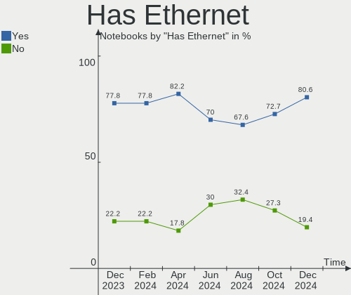
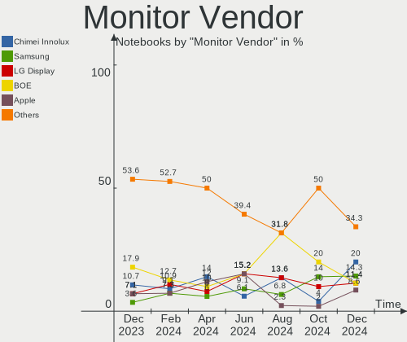
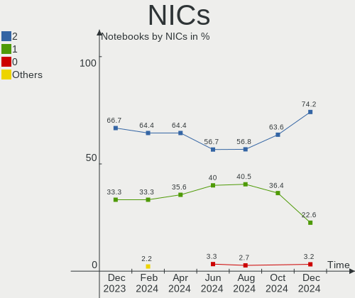
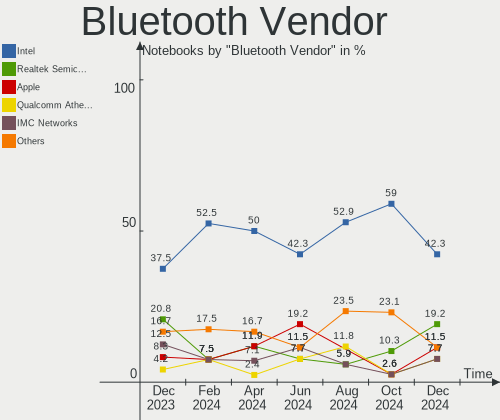

KDE neon - Hardware Trends (Notebooks)
--------------------------------------

A project to identify most popular hardware characteristics and track their change
over time based on data collected by Linux users at https://Linux-Hardware.org.

Anyone can contribute to this report by the [hw-probe](https://github.com/linuxhw/hw-probe) tool:

    sudo -E hw-probe -all -upload

This report is for one last month. Overall report since the beginning of time: [TestDays](https://github.com/linuxhw/TestDays)

Period: Dec, 2023.

Contents
--------

* [ System ](#system)
  - [ OS                       ](#os)
  - [ OS Family                ](#os-family)
  - [ Kernel                   ](#kernel)
  - [ Kernel Family            ](#kernel-family)
  - [ Kernel Major Ver.        ](#kernel-major-ver)
  - [ Arch                     ](#arch)
  - [ DE                       ](#de)
  - [ Display Server           ](#display-server)
  - [ Display Manager          ](#display-manager)
  - [ OS Lang                  ](#os-lang)
  - [ Boot Mode                ](#boot-mode)
  - [ Filesystem               ](#filesystem)
  - [ Part. scheme             ](#part-scheme)
  - [ Dual Boot with Linux/BSD ](#dual-boot-with-linuxbsd)
  - [ Dual Boot (Win)          ](#dual-boot-win)

* [ Board ](#board)
  - [ Vendor                   ](#vendor)
  - [ Model                    ](#model)
  - [ Model Family             ](#model-family)
  - [ MFG Year                 ](#mfg-year)
  - [ Form Factor              ](#form-factor)
  - [ Secure Boot              ](#secure-boot)
  - [ Coreboot                 ](#coreboot)
  - [ RAM Size                 ](#ram-size)
  - [ RAM Used                 ](#ram-used)
  - [ Total Drives             ](#total-drives)
  - [ Has CD-ROM               ](#has-cd-rom)
  - [ Has Ethernet             ](#has-ethernet)
  - [ Has WiFi                 ](#has-wifi)
  - [ Has Bluetooth            ](#has-bluetooth)

* [ Location ](#location)
  - [ Country                  ](#country)
  - [ City                     ](#city)

* [ Drives ](#drives)
  - [ Drive Vendor             ](#drive-vendor)
  - [ Drive Model              ](#drive-model)
  - [ HDD Vendor               ](#hdd-vendor)
  - [ SSD Vendor               ](#ssd-vendor)
  - [ Drive Kind               ](#drive-kind)
  - [ Drive Connector          ](#drive-connector)
  - [ Drive Size               ](#drive-size)
  - [ Space Total              ](#space-total)
  - [ Space Used               ](#space-used)
  - [ Malfunc. Drives          ](#malfunc-drives)
  - [ Malfunc. Drive Vendor    ](#malfunc-drive-vendor)
  - [ Malfunc. HDD Vendor      ](#malfunc-hdd-vendor)
  - [ Malfunc. Drive Kind      ](#malfunc-drive-kind)
  - [ Failed Drives            ](#failed-drives)
  - [ Failed Drive Vendor      ](#failed-drive-vendor)
  - [ Drive Status             ](#drive-status)

* [ Storage controller ](#storage-controller)
  - [ Storage Vendor           ](#storage-vendor)
  - [ Storage Model            ](#storage-model)
  - [ Storage Kind             ](#storage-kind)

* [ Processor ](#processor)
  - [ CPU Vendor               ](#cpu-vendor)
  - [ CPU Model                ](#cpu-model)
  - [ CPU Model Family         ](#cpu-model-family)
  - [ CPU Cores                ](#cpu-cores)
  - [ CPU Sockets              ](#cpu-sockets)
  - [ CPU Threads              ](#cpu-threads)
  - [ CPU Op-Modes             ](#cpu-op-modes)
  - [ CPU Microcode            ](#cpu-microcode)
  - [ CPU Microarch            ](#cpu-microarch)

* [ Graphics ](#graphics)
  - [ GPU Vendor               ](#gpu-vendor)
  - [ GPU Model                ](#gpu-model)
  - [ GPU Combo                ](#gpu-combo)
  - [ GPU Driver               ](#gpu-driver)
  - [ GPU Memory               ](#gpu-memory)

* [ Monitor ](#monitor)
  - [ Monitor Vendor           ](#monitor-vendor)
  - [ Monitor Model            ](#monitor-model)
  - [ Monitor Resolution       ](#monitor-resolution)
  - [ Monitor Diagonal         ](#monitor-diagonal)
  - [ Monitor Width            ](#monitor-width)
  - [ Aspect Ratio             ](#aspect-ratio)
  - [ Monitor Area             ](#monitor-area)
  - [ Pixel Density            ](#pixel-density)
  - [ Multiple Monitors        ](#multiple-monitors)

* [ Network ](#network)
  - [ Net Controller Vendor    ](#net-controller-vendor)
  - [ Net Controller Model     ](#net-controller-model)
  - [ Wireless Vendor          ](#wireless-vendor)
  - [ Wireless Model           ](#wireless-model)
  - [ Ethernet Vendor          ](#ethernet-vendor)
  - [ Ethernet Model           ](#ethernet-model)
  - [ Net Controller Kind      ](#net-controller-kind)
  - [ Used Controller          ](#used-controller)
  - [ NICs                     ](#nics)
  - [ IPv6                     ](#ipv6)

* [ Bluetooth ](#bluetooth)
  - [ Bluetooth Vendor         ](#bluetooth-vendor)
  - [ Bluetooth Model          ](#bluetooth-model)

* [ Sound ](#sound)
  - [ Sound Vendor             ](#sound-vendor)
  - [ Sound Model              ](#sound-model)

* [ Memory ](#memory)
  - [ Memory Vendor            ](#memory-vendor)
  - [ Memory Model             ](#memory-model)
  - [ Memory Kind              ](#memory-kind)
  - [ Memory Form Factor       ](#memory-form-factor)
  - [ Memory Size              ](#memory-size)
  - [ Memory Speed             ](#memory-speed)

* [ Printers & scanners ](#printers--scanners)
  - [ Printer Vendor           ](#printer-vendor)
  - [ Printer Model            ](#printer-model)
  - [ Scanner Vendor           ](#scanner-vendor)
  - [ Scanner Model            ](#scanner-model)

* [ Camera ](#camera)
  - [ Camera Vendor            ](#camera-vendor)
  - [ Camera Model             ](#camera-model)

* [ Security ](#security)
  - [ Fingerprint Vendor       ](#fingerprint-vendor)
  - [ Fingerprint Model        ](#fingerprint-model)
  - [ Chipcard Vendor          ](#chipcard-vendor)
  - [ Chipcard Model           ](#chipcard-model)

* [ Unsupported ](#unsupported)
  - [ Unsupported Devices      ](#unsupported-devices)
  - [ Unsupported Device Types ](#unsupported-device-types)

System
------

OS
--

Installed operating systems

| Name           | Notebooks | Percent |
|----------------|-----------|---------|
| KDE neon 22.04 | 27        | 100%    |

OS Family
---------

OS without a version

| Name     | Notebooks | Percent |
|----------|-----------|---------|
| KDE neon | 27        | 100%    |

Kernel
------

Version of the Linux kernel

| Version          | Notebooks | Percent |
|------------------|-----------|---------|
| 6.2.0-37-generic | 15        | 55.56%  |
| 6.2.0-39-generic | 12        | 44.44%  |

Kernel Family
-------------

Linux kernel without a distro release

| Version | Notebooks | Percent |
|---------|-----------|---------|
| 6.2.0   | 27        | 100%    |

Kernel Major Ver.
-----------------

Linux kernel major version

| Version | Notebooks | Percent |
|---------|-----------|---------|
| 6.2     | 27        | 100%    |

Arch
----

OS architecture (x86_64, i586, etc.)

| Name   | Notebooks | Percent |
|--------|-----------|---------|
| x86_64 | 27        | 100%    |

DE
--

Desktop Environment

| Name  | Notebooks | Percent |
|-------|-----------|---------|
| KDE5  | 25        | 92.59%  |
| GNOME | 2         | 7.41%   |

Display Server
--------------

X11 or Wayland

| Name    | Notebooks | Percent |
|---------|-----------|---------|
| X11     | 23        | 85.19%  |
| Wayland | 4         | 14.81%  |

Display Manager
---------------

SDDM, LightDM, etc.

| Name    | Notebooks | Percent |
|---------|-----------|---------|
| Unknown | 23        | 85.19%  |
| SDDM    | 4         | 14.81%  |

OS Lang
-------

Language

| Lang  | Notebooks | Percent |
|-------|-----------|---------|
| en_US | 15        | 55.56%  |
| es_MX | 3         | 11.11%  |
| en_GB | 3         | 11.11%  |
| fr_FR | 2         | 7.41%   |
| pt_PT | 1         | 3.7%    |
| en_IN | 1         | 3.7%    |
| en_CA | 1         | 3.7%    |
| de_DE | 1         | 3.7%    |

Boot Mode
---------

EFI or BIOS

| Mode | Notebooks | Percent |
|------|-----------|---------|
| BIOS | 24        | 88.89%  |
| EFI  | 3         | 11.11%  |

Filesystem
----------

Type of filesystem

| Type  | Notebooks | Percent |
|-------|-----------|---------|
| Ext4  | 26        | 96.3%   |
| Tmpfs | 1         | 3.7%    |

Part. scheme
------------

Scheme of partitioning

| Type    | Notebooks | Percent |
|---------|-----------|---------|
| Unknown | 23        | 85.19%  |
| GPT     | 3         | 11.11%  |
| MBR     | 1         | 3.7%    |

Dual Boot with Linux/BSD
------------------------

Hosting more than one Linux/BSD

| Dual boot | Notebooks | Percent |
|-----------|-----------|---------|
| No        | 26        | 96.3%   |
| Yes       | 1         | 3.7%    |

Dual Boot (Win)
---------------

Hosting Linux and Windows

| Dual boot | Notebooks | Percent |
|-----------|-----------|---------|
| No        | 27        | 100%    |

Board
-----

Vendor
------

Motherboard manufacturer

| Name             | Notebooks | Percent |
|------------------|-----------|---------|
| Hewlett-Packard  | 6         | 22.22%  |
| ASUSTek Computer | 6         | 22.22%  |
| Dell             | 5         | 18.52%  |
| Lenovo           | 4         | 14.81%  |
| Apple            | 2         | 7.41%   |
| SK hynix         | 1         | 3.7%    |
| MSI              | 1         | 3.7%    |
| Medion           | 1         | 3.7%    |
| Unknown          | 1         | 3.7%    |

Model
-----

Motherboard model

| Name                                   | Notebooks | Percent |
|----------------------------------------|-----------|---------|
| SK hynix HyBook                        | 1         | 3.7%    |
| MSI Vector GP66 12UGS                  | 1         | 3.7%    |
| Medion Akoya E6239                     | 1         | 3.7%    |
| Lenovo Yoga 500-15IBD 80N6             | 1         | 3.7%    |
| Lenovo ThinkPad T520 424049U           | 1         | 3.7%    |
| Lenovo ThinkBook 16 G6 IRL 21KH        | 1         | 3.7%    |
| Lenovo IdeaPad U430 Touch 20270        | 1         | 3.7%    |
| HP Pavilion Laptop 14-ce3xxx           | 1         | 3.7%    |
| HP Laptop 15s-eq1xxx                   | 1         | 3.7%    |
| HP Laptop 15-dw0xxx                    | 1         | 3.7%    |
| HP Laptop 15-da0xxx                    | 1         | 3.7%    |
| HP EliteBook 745 G6                    | 1         | 3.7%    |
| HP Compaq Presario A900                | 1         | 3.7%    |
| Dell Vostro 7500                       | 1         | 3.7%    |
| Dell Precision 5510                    | 1         | 3.7%    |
| Dell Latitude E6520                    | 1         | 3.7%    |
| Dell Inspiron 3583                     | 1         | 3.7%    |
| Dell G7 7700                           | 1         | 3.7%    |
| ASUS X556UQK                           | 1         | 3.7%    |
| ASUS X441BA                            | 1         | 3.7%    |
| ASUS X411UN                            | 1         | 3.7%    |
| ASUS VivoBook_ASUSLaptop X415EA_X415EA | 1         | 3.7%    |
| ASUS TP501UAM                          | 1         | 3.7%    |
| ASUS 1015PEM                           | 1         | 3.7%    |
| Apple MacBookPro8,1                    | 1         | 3.7%    |
| Apple MacBookPro11,2                   | 1         | 3.7%    |
| Unknown                                | 1         | 3.7%    |

Model Family
------------

Motherboard model prefix

| Name               | Notebooks | Percent |
|--------------------|-----------|---------|
| HP Laptop          | 3         | 11.11%  |
| SK hynix HyBook    | 1         | 3.7%    |
| MSI Vector         | 1         | 3.7%    |
| Medion Akoya       | 1         | 3.7%    |
| Lenovo Yoga        | 1         | 3.7%    |
| Lenovo ThinkPad    | 1         | 3.7%    |
| Lenovo ThinkBook   | 1         | 3.7%    |
| Lenovo IdeaPad     | 1         | 3.7%    |
| HP Pavilion        | 1         | 3.7%    |
| HP EliteBook       | 1         | 3.7%    |
| HP Compaq          | 1         | 3.7%    |
| Dell Vostro        | 1         | 3.7%    |
| Dell Precision     | 1         | 3.7%    |
| Dell Latitude      | 1         | 3.7%    |
| Dell Inspiron      | 1         | 3.7%    |
| Dell G7            | 1         | 3.7%    |
| ASUS X556UQK       | 1         | 3.7%    |
| ASUS X441BA        | 1         | 3.7%    |
| ASUS X411UN        | 1         | 3.7%    |
| ASUS VivoBook      | 1         | 3.7%    |
| ASUS TP501UAM      | 1         | 3.7%    |
| ASUS 1015PEM       | 1         | 3.7%    |
| Apple MacBookPro8  | 1         | 3.7%    |
| Apple MacBookPro11 | 1         | 3.7%    |
| Unknown            | 1         | 3.7%    |

MFG Year
--------

Motherboard manufacture year

| Year | Notebooks | Percent |
|------|-----------|---------|
| 2019 | 4         | 14.81%  |
| 2021 | 3         | 11.11%  |
| 2020 | 3         | 11.11%  |
| 2016 | 3         | 11.11%  |
| 2011 | 3         | 11.11%  |
| 2018 | 2         | 7.41%   |
| 2013 | 2         | 7.41%   |
| 2023 | 1         | 3.7%    |
| 2022 | 1         | 3.7%    |
| 2017 | 1         | 3.7%    |
| 2015 | 1         | 3.7%    |
| 2014 | 1         | 3.7%    |
| 2010 | 1         | 3.7%    |
| 2007 | 1         | 3.7%    |

Form Factor
-----------

Physical design of the computer

| Name     | Notebooks | Percent |
|----------|-----------|---------|
| Notebook | 27        | 100%    |

Secure Boot
-----------

Enabled or disabled

| State    | Notebooks | Percent |
|----------|-----------|---------|
| Disabled | 27        | 100%    |

Coreboot
--------

Have coreboot on board

| Used | Notebooks | Percent |
|------|-----------|---------|
| No   | 27        | 100%    |

RAM Size
--------

Total RAM memory

| Size in GB | Notebooks | Percent |
|------------|-----------|---------|
| 4.01-8.0   | 10        | 37.04%  |
| 3.01-4.0   | 5         | 18.52%  |
| 8.01-16.0  | 4         | 14.81%  |
| 32.01-64.0 | 3         | 11.11%  |
| 16.01-24.0 | 2         | 7.41%   |
| 1.01-2.0   | 2         | 7.41%   |
| 24.01-32.0 | 1         | 3.7%    |

RAM Used
--------

Used RAM memory

| Used GB   | Notebooks | Percent |
|-----------|-----------|---------|
| 1.01-2.0  | 11        | 40.74%  |
| 3.01-4.0  | 6         | 22.22%  |
| 2.01-3.0  | 5         | 18.52%  |
| 4.01-8.0  | 4         | 14.81%  |
| 8.01-16.0 | 1         | 3.7%    |

Total Drives
------------

Number of drives on board

| Drives | Notebooks | Percent |
|--------|-----------|---------|
| 1      | 23        | 85.19%  |
| 2      | 3         | 11.11%  |
| 3      | 1         | 3.7%    |

Has CD-ROM
----------

Has CD-ROM on board

| Presented | Notebooks | Percent |
|-----------|-----------|---------|
| No        | 20        | 74.07%  |
| Yes       | 7         | 25.93%  |

Has Ethernet
------------

Has Ethernet on board

| Presented | Notebooks | Percent |
|-----------|-----------|---------|
| Yes       | 21        | 77.78%  |
| No        | 6         | 22.22%  |

Has WiFi
--------

Has WiFi module

| Presented | Notebooks | Percent |
|-----------|-----------|---------|
| Yes       | 27        | 100%    |

Has Bluetooth
-------------

Has Bluetooth module

| Presented | Notebooks | Percent |
|-----------|-----------|---------|
| Yes       | 24        | 88.89%  |
| No        | 3         | 11.11%  |

Location
--------

Country
-------

Geographic location (country)

| Country      | Notebooks | Percent |
|--------------|-----------|---------|
| USA          | 7         | 25.93%  |
| Mexico       | 3         | 11.11%  |
| Canada       | 3         | 11.11%  |
| Indonesia    | 2         | 7.41%   |
| Ukraine      | 1         | 3.7%    |
| UK           | 1         | 3.7%    |
| Turkey       | 1         | 3.7%    |
| South Africa | 1         | 3.7%    |
| Slovenia     | 1         | 3.7%    |
| Portugal     | 1         | 3.7%    |
| Netherlands  | 1         | 3.7%    |
| Ireland      | 1         | 3.7%    |
| India        | 1         | 3.7%    |
| Germany      | 1         | 3.7%    |
| France       | 1         | 3.7%    |
| Chile        | 1         | 3.7%    |

City
----

Geographic location (city)

| City                | Notebooks | Percent |
|---------------------|-----------|---------|
| Wasilla             | 1         | 3.7%    |
| Voiron              | 1         | 3.7%    |
| Uzhhorod            | 1         | 3.7%    |
| Tijuana             | 1         | 3.7%    |
| Sukoharjo           | 1         | 3.7%    |
| Sorel-Tracy         | 1         | 3.7%    |
| Sacramento          | 1         | 3.7%    |
| Quilpué            | 1         | 3.7%    |
| Oxford              | 1         | 3.7%    |
| Molalla             | 1         | 3.7%    |
| Mexico City         | 1         | 3.7%    |
| Ljubljana           | 1         | 3.7%    |
| Lisbon              | 1         | 3.7%    |
| Kelowna             | 1         | 3.7%    |
| Karatay             | 1         | 3.7%    |
| Glen Allen          | 1         | 3.7%    |
| Gatineau            | 1         | 3.7%    |
| Dublin              | 1         | 3.7%    |
| Delhi               | 1         | 3.7%    |
| Charlotte           | 1         | 3.7%    |
| Benoni              | 1         | 3.7%    |
| Balikpapan          | 1         | 3.7%    |
| Atlanta             | 1         | 3.7%    |
| Aschaffenburg       | 1         | 3.7%    |
| Amsterdam           | 1         | 3.7%    |
| Aldine              | 1         | 3.7%    |
| Acapulco de Juárez | 1         | 3.7%    |

Drives
------

Drive Vendor
------------

Hard drive vendors

| Vendor                      | Notebooks | Drives | Percent |
|-----------------------------|-----------|--------|---------|
| WDC                         | 3         | 3      | 9.38%   |
| Seagate                     | 3         | 3      | 9.38%   |
| Crucial                     | 3         | 3      | 9.38%   |
| Unknown                     | 2         | 2      | 6.25%   |
| SK hynix                    | 2         | 2      | 6.25%   |
| Sandisk                     | 2         | 2      | 6.25%   |
| Samsung Electronics         | 2         | 2      | 6.25%   |
| Micron/Crucial Technology   | 2         | 2      | 6.25%   |
| Micron Technology           | 2         | 2      | 6.25%   |
| Toshiba                     | 1         | 1      | 3.13%   |
| Team                        | 1         | 1      | 3.13%   |
| SSSTC                       | 1         | 1      | 3.13%   |
| PC SN530                    | 1         | 1      | 3.13%   |
| LS                          | 1         | 1      | 3.13%   |
| Kingston Technology Company | 1         | 1      | 3.13%   |
| Kingston                    | 1         | 1      | 3.13%   |
| HGST                        | 1         | 1      | 3.13%   |
| Fujitsu                     | 1         | 1      | 3.13%   |
| China                       | 1         | 1      | 3.13%   |
| Apple                       | 1         | 1      | 3.13%   |

Drive Model
-----------

Hard drive models

| Model                                               | Notebooks | Percent |
|-----------------------------------------------------|-----------|---------|
| WDC WD5000LPVX-28V0TT0 500GB                        | 1         | 3.13%   |
| WDC WD5000LPCX-60VHAT1 500GB                        | 1         | 3.13%   |
| WDC WD10SPCX-24HWST1 1TB                            | 1         | 3.13%   |
| Unknown NVMe SSD Drive 256GB                        | 1         | 3.13%   |
| Unknown MMC Card  128GB                             | 1         | 3.13%   |
| Toshiba MQ01ABD100 1TB                              | 1         | 3.13%   |
| Team T2531TB 1024GB SSD                             | 1         | 3.13%   |
| SSSTC CV8-8E128-HP 128GB                            | 1         | 3.13%   |
| SK hynix PC711 NVMe 1TB                             | 1         | 3.13%   |
| SK hynix BC511 512GB                                | 1         | 3.13%   |
| Seagate ST500LT012-1DG142 500GB                     | 1         | 3.13%   |
| Seagate ST500LM000-SSHD-8GB                         | 1         | 3.13%   |
| Seagate ST1000LM035-1RK172 1TB                      | 1         | 3.13%   |
| Sandisk WD_BLACK SN770 1TB                          | 1         | 3.13%   |
| SanDisk NVMe SSD Drive 1TB                          | 1         | 3.13%   |
| Samsung NVMe SSD Controller SM981/PM981/PM983 512GB | 1         | 3.13%   |
| Samsung MZVLB256HAHQ-000H1 256GB                    | 1         | 3.13%   |
| PC SN530 NVMe WDC 256GB                             | 1         | 3.13%   |
| Micron/Crucial P1 NVMe PCIe SSD 1TB                 | 1         | 3.13%   |
| Micron/Crucial CT500P1SSD8 500GB                    | 1         | 3.13%   |
| Micron 2450_MTFDKBA1T0TFK 1TB                       | 1         | 3.13%   |
| Micron 1100_MTFDDAV256TBN 256GB SSD                 | 1         | 3.13%   |
| LS 256GB M300                                       | 1         | 3.13%   |
| Kingston Company OM3PDP3 NVMe SSD 512GB             | 1         | 3.13%   |
| Kingston A400 240GB SSD                             | 1         | 3.13%   |
| HGST HTS545050A7E680 500GB                          | 1         | 3.13%   |
| Fujitsu MHY2250BH 250GB                             | 1         | 3.13%   |
| Crucial CT500P5PSSD8 500GB                          | 1         | 3.13%   |
| Crucial CT120BX500SSD1 120GB                        | 1         | 3.13%   |
| Crucial CT1000P1SSD8 1TB                            | 1         | 3.13%   |
| China SATA SSD 64GB                                 | 1         | 3.13%   |
| Apple SSD SM0256F 256GB                             | 1         | 3.13%   |

HDD Vendor
----------

Hard disk drive vendors

| Vendor  | Notebooks | Drives | Percent |
|---------|-----------|--------|---------|
| WDC     | 3         | 3      | 33.33%  |
| Seagate | 3         | 3      | 33.33%  |
| Toshiba | 1         | 1      | 11.11%  |
| HGST    | 1         | 1      | 11.11%  |
| Fujitsu | 1         | 1      | 11.11%  |

SSD Vendor
----------

Solid state drive vendors

| Vendor            | Notebooks | Drives | Percent |
|-------------------|-----------|--------|---------|
| Team              | 1         | 1      | 12.5%   |
| SSSTC             | 1         | 1      | 12.5%   |
| Micron Technology | 1         | 1      | 12.5%   |
| LS                | 1         | 1      | 12.5%   |
| Kingston          | 1         | 1      | 12.5%   |
| Crucial           | 1         | 1      | 12.5%   |
| China             | 1         | 1      | 12.5%   |
| Apple             | 1         | 1      | 12.5%   |

Drive Kind
----------

HDD or SSD

| Kind    | Notebooks | Drives | Percent |
|---------|-----------|--------|---------|
| NVMe    | 10        | 13     | 34.48%  |
| HDD     | 9         | 9      | 31.03%  |
| SSD     | 8         | 8      | 27.59%  |
| MMC     | 1         | 1      | 3.45%   |
| Unknown | 1         | 1      | 3.45%   |

Drive Connector
---------------

SATA, SAS, NVMe, etc.

| Type | Notebooks | Drives | Percent |
|------|-----------|--------|---------|
| SATA | 17        | 17     | 58.62%  |
| NVMe | 10        | 13     | 34.48%  |
| SAS  | 1         | 1      | 3.45%   |
| MMC  | 1         | 1      | 3.45%   |

Drive Size
----------

Size of hard drive

| Size in TB | Notebooks | Drives | Percent |
|------------|-----------|--------|---------|
| 0.01-0.5   | 13        | 13     | 76.47%  |
| 0.51-1.0   | 3         | 3      | 17.65%  |
| 1.01-2.0   | 1         | 1      | 5.88%   |

Space Total
-----------

Amount of disk space available on the file system

| Size in GB | Notebooks | Percent |
|------------|-----------|---------|
| 101-250    | 11        | 40.74%  |
| 251-500    | 8         | 29.63%  |
| 501-1000   | 3         | 11.11%  |
| 51-100     | 2         | 7.41%   |
| 21-50      | 1         | 3.7%    |
| 2001-3000  | 1         | 3.7%    |
| Unknown    | 1         | 3.7%    |

Space Used
----------

Amount of used disk space

| Used GB | Notebooks | Percent |
|---------|-----------|---------|
| 1-20    | 11        | 40.74%  |
| 101-250 | 7         | 25.93%  |
| 51-100  | 5         | 18.52%  |
| 21-50   | 2         | 7.41%   |
| 251-500 | 1         | 3.7%    |
| Unknown | 1         | 3.7%    |

Malfunc. Drives
---------------

Drive models with a malfunction

Zero info for selected period =(

Malfunc. Drive Vendor
---------------------

Vendors of faulty drives

Zero info for selected period =(

Malfunc. HDD Vendor
-------------------

Vendors of faulty HDD drives

Zero info for selected period =(

Malfunc. Drive Kind
-------------------

Kinds of faulty drives

Zero info for selected period =(

Failed Drives
-------------

Failed drive models

Zero info for selected period =(

Failed Drive Vendor
-------------------

Failed drive vendors

Zero info for selected period =(

Drive Status
------------

Number of failed and malfunc. drives

| Status   | Notebooks | Drives | Percent |
|----------|-----------|--------|---------|
| Detected | 25        | 28     | 86.21%  |
| Works    | 4         | 4      | 13.79%  |

Storage controller
------------------

Storage Vendor
--------------

Storage controller vendors

| Vendor                      | Notebooks | Percent |
|-----------------------------|-----------|---------|
| Intel                       | 20        | 58.82%  |
| Samsung Electronics         | 3         | 8.82%   |
| Micron/Crucial Technology   | 3         | 8.82%   |
| SK hynix                    | 2         | 5.88%   |
| SanDisk                     | 2         | 5.88%   |
| Transcend                   | 1         | 2.94%   |
| Micron Technology           | 1         | 2.94%   |
| Kingston Technology Company | 1         | 2.94%   |
| AMD                         | 1         | 2.94%   |

Storage Model
-------------

Storage controller models

| Model                                                                        | Notebooks | Percent |
|------------------------------------------------------------------------------|-----------|---------|
| Intel Celeron/Pentium Silver Processor SATA Controller                       | 4         | 11.43%  |
| Intel Sunrise Point-LP SATA Controller [AHCI mode]                           | 3         | 8.57%   |
| Samsung NVMe SSD Controller SM981/PM981/PM983                                | 2         | 5.71%   |
| Intel 82801 Mobile SATA Controller [RAID mode]                               | 2         | 5.71%   |
| Intel 6 Series/C200 Series Chipset Family 6 port Mobile SATA AHCI Controller | 2         | 5.71%   |
| Intel 400 Series Chipset Family SATA AHCI Controller                         | 2         | 5.71%   |
| Transcend NVMe PCIe SSD 240S/MTE710T                                         | 1         | 2.86%   |
| SK hynix Gold P31/BC711/PC711 NVMe Solid State Drive                         | 1         | 2.86%   |
| SK hynix BC511 NVMe SSD                                                      | 1         | 2.86%   |
| Sandisk WD PC SN740 NVMe SSD 512GB (DRAM-less)                               | 1         | 2.86%   |
| SanDisk WD Black SN770 / PC SN740 256GB / PC SN560 (DRAM-less) NVMe SSD      | 1         | 2.86%   |
| Samsung S4LN053X01 AHCI SSD Controller(Apple slot)                           | 1         | 2.86%   |
| Micron/Crucial P5 Plus NVMe PCIe SSD                                         | 1         | 2.86%   |
| Micron/Crucial P1 NVMe PCIe SSD[Frampton]                                    | 1         | 2.86%   |
| Micron/Crucial P1 NVMe PCIe SSD[Frampton2]                                   | 1         | 2.86%   |
| Micron 2450 NVMe SSD [HendrixV] (DRAM-less)                                  | 1         | 2.86%   |
| Kingston Company OM3PDP3 NVMe SSD                                            | 1         | 2.86%   |
| Intel Wildcat Point-LP SATA Controller [AHCI Mode]                           | 1         | 2.86%   |
| Intel Volume Management Device NVMe RAID Controller                          | 1         | 2.86%   |
| Intel Tiger Lake-LP SATA Controller                                          | 1         | 2.86%   |
| Intel NM10/ICH7 Family SATA Controller [AHCI mode]                           | 1         | 2.86%   |
| Intel Cannon Point-LP SATA Controller [AHCI Mode]                            | 1         | 2.86%   |
| Intel Atom Processor E3800 Series SATA AHCI Controller                       | 1         | 2.86%   |
| Intel 82801HM/HEM (ICH8M/ICH8M-E) SATA Controller [IDE mode]                 | 1         | 2.86%   |
| Intel 8 Series SATA Controller 1 [AHCI mode]                                 | 1         | 2.86%   |
| AMD FCH SATA Controller [AHCI mode]                                          | 1         | 2.86%   |

Storage Kind
------------

Kind of storage controller (IDE, SATA, NVMe, SAS, ...)

| Kind | Notebooks | Percent |
|------|-----------|---------|
| SATA | 19        | 57.58%  |
| NVMe | 10        | 30.3%   |
| RAID | 3         | 9.09%   |
| IDE  | 1         | 3.03%   |

Processor
---------

CPU Vendor
----------

Processor vendors

| Vendor | Notebooks | Percent |
|--------|-----------|---------|
| Intel  | 24        | 88.89%  |
| AMD    | 3         | 11.11%  |

CPU Model
---------

Processor models

| Model                                           | Notebooks | Percent |
|-------------------------------------------------|-----------|---------|
| Intel Core i7-10750H CPU @ 2.60GHz              | 2         | 7.41%   |
| Intel Pentium Silver N5000 CPU @ 1.10GHz        | 1         | 3.7%    |
| Intel Pentium Gold 7505 @ 2.00GHz               | 1         | 3.7%    |
| Intel Pentium Dual CPU T2330 @ 1.60GHz          | 1         | 3.7%    |
| Intel Pentium CPU 5405U @ 2.30GHz               | 1         | 3.7%    |
| Intel Core i7-8550U CPU @ 1.80GHz               | 1         | 3.7%    |
| Intel Core i7-7500U CPU @ 2.70GHz               | 1         | 3.7%    |
| Intel Core i7-6820HQ CPU @ 2.70GHz              | 1         | 3.7%    |
| Intel Core i7-4750HQ CPU @ 2.00GHz              | 1         | 3.7%    |
| Intel Core i7-2620M CPU @ 2.70GHz               | 1         | 3.7%    |
| Intel Core i5-4210U CPU @ 1.70GHz               | 1         | 3.7%    |
| Intel Core i5-2520M CPU @ 2.50GHz               | 1         | 3.7%    |
| Intel Core i5-2430M CPU @ 2.40GHz               | 1         | 3.7%    |
| Intel Core i5-1035G1 CPU @ 1.00GHz              | 1         | 3.7%    |
| Intel Core i3-6100U CPU @ 2.30GHz               | 1         | 3.7%    |
| Intel Core i3-5005U CPU @ 2.00GHz               | 1         | 3.7%    |
| Intel Celeron N4020 CPU @ 1.10GHz               | 1         | 3.7%    |
| Intel Celeron N4000 CPU @ 1.10GHz               | 1         | 3.7%    |
| Intel Celeron J4125 CPU @ 2.00GHz               | 1         | 3.7%    |
| Intel Celeron CPU N2830 @ 2.16GHz               | 1         | 3.7%    |
| Intel Atom CPU N550 @ 1.50GHz                   | 1         | 3.7%    |
| Intel 13th Gen Core i7-13700H                   | 1         | 3.7%    |
| Intel 12th Gen Core i7-12700H                   | 1         | 3.7%    |
| AMD Ryzen 5 PRO 3500U w/ Radeon Vega Mobile Gfx | 1         | 3.7%    |
| AMD Ryzen 5 4500U with Radeon Graphics          | 1         | 3.7%    |
| AMD A9-9420 RADEON R5, 5 COMPUTE CORES 2C+3G    | 1         | 3.7%    |

CPU Model Family
----------------

Processor model prefix

| Model                | Notebooks | Percent |
|----------------------|-----------|---------|
| Intel Core i7        | 7         | 25.93%  |
| Intel Core i5        | 4         | 14.81%  |
| Intel Celeron        | 4         | 14.81%  |
| Other                | 3         | 11.11%  |
| Intel Core i3        | 2         | 7.41%   |
| Intel Pentium Silver | 1         | 3.7%    |
| Intel Pentium Gold   | 1         | 3.7%    |
| Intel Pentium Dual   | 1         | 3.7%    |
| Intel Pentium        | 1         | 3.7%    |
| Intel Atom           | 1         | 3.7%    |
| AMD Ryzen 5 PRO      | 1         | 3.7%    |
| AMD Ryzen 5          | 1         | 3.7%    |

CPU Cores
---------

Number of processor cores

| Number | Notebooks | Percent |
|--------|-----------|---------|
| 2      | 15        | 55.56%  |
| 4      | 7         | 25.93%  |
| 6      | 3         | 11.11%  |
| 14     | 2         | 7.41%   |

CPU Sockets
-----------

Number of sockets

| Number | Notebooks | Percent |
|--------|-----------|---------|
| 1      | 27        | 100%    |

CPU Threads
-----------

Threads per core (Hyper-Threading)

| Number | Notebooks | Percent |
|--------|-----------|---------|
| 2      | 18        | 66.67%  |
| 1      | 9         | 33.33%  |

CPU Op-Modes
------------

CPU Operation Modes (32-bit, 64-bit)

| Op mode        | Notebooks | Percent |
|----------------|-----------|---------|
| 32-bit, 64-bit | 27        | 100%    |

CPU Microcode
-------------

Microcode number

| Number     | Notebooks | Percent |
|------------|-----------|---------|
| Unknown    | 26        | 96.3%   |
| 0x08108109 | 1         | 3.7%    |

CPU Microarch
-------------

Microarchitecture

| Name             | Notebooks | Percent |
|------------------|-----------|---------|
| Goldmont plus    | 4         | 14.81%  |
| SandyBridge      | 3         | 11.11%  |
| KabyLake         | 3         | 11.11%  |
| Skylake          | 2         | 7.41%   |
| Haswell          | 2         | 7.41%   |
| CometLake        | 2         | 7.41%   |
| Zen+             | 1         | 3.7%    |
| Zen 2            | 1         | 3.7%    |
| TigerLake        | 1         | 3.7%    |
| Silvermont       | 1         | 3.7%    |
| IceLake          | 1         | 3.7%    |
| Excavator        | 1         | 3.7%    |
| Core             | 1         | 3.7%    |
| Broadwell        | 1         | 3.7%    |
| Bonnell          | 1         | 3.7%    |
| Alderlake Hybrid | 1         | 3.7%    |
| Unknown          | 1         | 3.7%    |

Graphics
--------

GPU Vendor
----------

Vendors of graphics cards

| Vendor | Notebooks | Percent |
|--------|-----------|---------|
| Intel  | 24        | 72.73%  |
| Nvidia | 6         | 18.18%  |
| AMD    | 3         | 9.09%   |

GPU Model
---------

Graphics card models

| Model                                                                     | Notebooks | Percent |
|---------------------------------------------------------------------------|-----------|---------|
| Intel GeminiLake [UHD Graphics 600]                                       | 3         | 8.82%   |
| Intel 2nd Generation Core Processor Family Integrated Graphics Controller | 3         | 8.82%   |
| Intel CometLake-H GT2 [UHD Graphics]                                      | 2         | 5.88%   |
| Nvidia TU117M [GeForce GTX 1650 Ti Mobile]                                | 1         | 2.94%   |
| Nvidia GP108M [GeForce MX150]                                             | 1         | 2.94%   |
| Nvidia GM108M [GeForce 940MX]                                             | 1         | 2.94%   |
| Nvidia GM107GLM [Quadro M1000M]                                           | 1         | 2.94%   |
| Nvidia GF119M [Quadro NVS 4200M]                                          | 1         | 2.94%   |
| Nvidia GA104 [Geforce RTX 3070 Ti Laptop GPU]                             | 1         | 2.94%   |
| Intel Whiskey Lake-U GT1 [UHD Graphics 610]                               | 1         | 2.94%   |
| Intel UHD Graphics 620                                                    | 1         | 2.94%   |
| Intel Tiger Lake-LP GT2 [UHD Graphics G4]                                 | 1         | 2.94%   |
| Intel Skylake GT2 [HD Graphics 520]                                       | 1         | 2.94%   |
| Intel Raptor Lake-P [Iris Xe Graphics]                                    | 1         | 2.94%   |
| Intel Mobile GM965/GL960 Integrated Graphics Controller (secondary)       | 1         | 2.94%   |
| Intel Mobile GM965/GL960 Integrated Graphics Controller (primary)         | 1         | 2.94%   |
| Intel Iris Plus Graphics G1 (Ice Lake)                                    | 1         | 2.94%   |
| Intel HD Graphics 620                                                     | 1         | 2.94%   |
| Intel HD Graphics 5500                                                    | 1         | 2.94%   |
| Intel HD Graphics 530                                                     | 1         | 2.94%   |
| Intel Haswell-ULT Integrated Graphics Controller                          | 1         | 2.94%   |
| Intel GeminiLake [UHD Graphics 605]                                       | 1         | 2.94%   |
| Intel Crystal Well Integrated Graphics Controller                         | 1         | 2.94%   |
| Intel Atom Processor Z36xxx/Z37xxx Series Graphics & Display              | 1         | 2.94%   |
| Intel Atom Processor D4xx/D5xx/N4xx/N5xx Integrated Graphics Controller   | 1         | 2.94%   |
| Intel Alder Lake-P GT2 [Iris Xe Graphics]                                 | 1         | 2.94%   |
| AMD Stoney [Radeon R2/R3/R4/R5 Graphics]                                  | 1         | 2.94%   |
| AMD Renoir [Radeon RX Vega 6 (Ryzen 4000/5000 Mobile Series)]             | 1         | 2.94%   |
| AMD Picasso/Raven 2 [Radeon Vega Series / Radeon Vega Mobile Series]      | 1         | 2.94%   |

GPU Combo
---------

Combinations of graphics cards

| Name           | Notebooks | Percent |
|----------------|-----------|---------|
| 1 x Intel      | 18        | 66.67%  |
| Intel + Nvidia | 6         | 22.22%  |
| 1 x AMD        | 3         | 11.11%  |

GPU Driver
----------

Free vs proprietary

| Driver      | Notebooks | Percent |
|-------------|-----------|---------|
| Free        | 26        | 96.3%   |
| Proprietary | 1         | 3.7%    |

GPU Memory
----------

Total video memory

| Size in GB | Notebooks | Percent |
|------------|-----------|---------|
| Unknown    | 26        | 96.3%   |
| 1.01-2.0   | 1         | 3.7%    |

Monitor
-------

Monitor Vendor
--------------

Monitor vendors

| Vendor                  | Notebooks | Percent |
|-------------------------|-----------|---------|
| AU Optronics            | 6         | 21.43%  |
| BOE                     | 5         | 17.86%  |
| Chimei Innolux          | 3         | 10.71%  |
| LG Display              | 2         | 7.14%   |
| HannStar                | 2         | 7.14%   |
| Dell                    | 2         | 7.14%   |
| Apple                   | 2         | 7.14%   |
| SLD                     | 1         | 3.57%   |
| Sharp                   | 1         | 3.57%   |
| Samsung Electronics     | 1         | 3.57%   |
| Lenovo                  | 1         | 3.57%   |
| InfoVision              | 1         | 3.57%   |
| Chi Mei Optoelectronics | 1         | 3.57%   |

Monitor Model
-------------

Monitor models

| Model                                                                    | Notebooks | Percent |
|--------------------------------------------------------------------------|-----------|---------|
| SLD LCD Monitor SLD003C 1366x768 309x173mm 13.9-inch                     | 1         | 3.57%   |
| Sharp LCD Monitor SHP1453 1920x1080 346x194mm 15.6-inch                  | 1         | 3.57%   |
| Samsung Electronics LCD Monitor SDC3852 1366x768 344x194mm 15.5-inch     | 1         | 3.57%   |
| LG Display LCD Monitor LGD066C 1920x1080 382x215mm 17.3-inch             | 1         | 3.57%   |
| LG Display LCD Monitor LGD060F 1920x1080 309x174mm 14.0-inch             | 1         | 3.57%   |
| Lenovo LCD Monitor LEN40B1 1600x900 344x193mm 15.5-inch                  | 1         | 3.57%   |
| InfoVision LCD Monitor IVO061F 1920x1080 344x194mm 15.5-inch             | 1         | 3.57%   |
| HannStar LCD Monitor HSD03E9 1024x600 220x129mm 10.0-inch                | 1         | 3.57%   |
| HannStar HL161ABB HSD61C7 1366x768 344x193mm 15.5-inch                   | 1         | 3.57%   |
| Dell U2412M DELA07A 1920x1200 520x320mm 24.0-inch                        | 1         | 3.57%   |
| Dell S2721HN DEL41F8 1920x1080 598x336mm 27.0-inch                       | 1         | 3.57%   |
| Chimei Innolux LCD Monitor CMN152A 2560x1440 344x193mm 15.5-inch         | 1         | 3.57%   |
| Chimei Innolux LCD Monitor CMN14E5 1920x1080 309x173mm 13.9-inch         | 1         | 3.57%   |
| Chimei Innolux LCD Monitor CMN1482 1600x900 309x174mm 14.0-inch          | 1         | 3.57%   |
| Chi Mei Optoelectronics LCD Monitor CMO15A3 1366x768 344x193mm 15.5-inch | 1         | 3.57%   |
| BOE LCD Monitor BOE08B2 1366x768 309x174mm 14.0-inch                     | 1         | 3.57%   |
| BOE LCD Monitor BOE0808 1366x768 344x194mm 15.5-inch                     | 1         | 3.57%   |
| BOE LCD Monitor BOE076F 1366x768 344x194mm 15.5-inch                     | 1         | 3.57%   |
| BOE LCD Monitor BOE0696 1366x768 309x173mm 13.9-inch                     | 1         | 3.57%   |
| BOE LCD Monitor BOE066E 1366x768 344x194mm 15.5-inch                     | 1         | 3.57%   |
| AU Optronics LCD Monitor AUOA7A7 1920x1200 344x215mm 16.0-inch           | 1         | 3.57%   |
| AU Optronics LCD Monitor AUO6287 1440x900 367x229mm 17.0-inch            | 1         | 3.57%   |
| AU Optronics LCD Monitor AUO46EC 1366x768 344x193mm 15.5-inch            | 1         | 3.57%   |
| AU Optronics LCD Monitor AUO43EC 1366x768 344x193mm 15.5-inch            | 1         | 3.57%   |
| AU Optronics LCD Monitor AUO423D 1920x1080 309x173mm 13.9-inch           | 1         | 3.57%   |
| AU Optronics LCD Monitor AUO3791 1920x1080 344x194mm 15.5-inch           | 1         | 3.57%   |
| Apple LCD Monitor APP9CC3 1280x800 286x179mm 13.3-inch                   | 1         | 3.57%   |
| Apple Color LCD APPA019 2880x1800 331x207mm 15.4-inch                    | 1         | 3.57%   |

Monitor Resolution
------------------

Monitor screen resolution

| Resolution        | Notebooks | Percent |
|-------------------|-----------|---------|
| 1366x768 (WXGA)   | 11        | 40.74%  |
| 1920x1080 (FHD)   | 7         | 25.93%  |
| 1920x1200 (WUXGA) | 2         | 7.41%   |
| 1600x900 (HD+)    | 2         | 7.41%   |
| 2880x1800         | 1         | 3.7%    |
| 2560x1440 (QHD)   | 1         | 3.7%    |
| 1440x900 (WXGA+)  | 1         | 3.7%    |
| 1280x800 (WXGA)   | 1         | 3.7%    |
| 1024x600          | 1         | 3.7%    |

Monitor Diagonal
----------------

Diagonal size in inches

| Inches | Notebooks | Percent |
|--------|-----------|---------|
| 15     | 14        | 50%     |
| 13     | 5         | 17.86%  |
| 14     | 3         | 10.71%  |
| 17     | 2         | 7.14%   |
| 27     | 1         | 3.57%   |
| 24     | 1         | 3.57%   |
| 16     | 1         | 3.57%   |
| 10     | 1         | 3.57%   |

Monitor Width
-------------

Physical width

| Width in mm | Notebooks | Percent |
|-------------|-----------|---------|
| 301-350     | 22        | 78.57%  |
| 501-600     | 2         | 7.14%   |
| 351-400     | 2         | 7.14%   |
| 201-300     | 2         | 7.14%   |

Aspect Ratio
------------

Proportional relationship between the width and the height

| Ratio | Notebooks | Percent |
|-------|-----------|---------|
| 16/9  | 22        | 81.48%  |
| 16/10 | 5         | 18.52%  |

Monitor Area
------------

Area in inch²

| Area in inch² | Notebooks | Percent |
|----------------|-----------|---------|
| 101-110        | 14        | 50%     |
| 81-90          | 8         | 28.57%  |
| 41-50          | 1         | 3.57%   |
| 301-350        | 1         | 3.57%   |
| 251-300        | 1         | 3.57%   |
| 131-140        | 1         | 3.57%   |
| 121-130        | 1         | 3.57%   |
| 111-120        | 1         | 3.57%   |

Pixel Density
-------------

Pixels per inch

| Density | Notebooks | Percent |
|---------|-----------|---------|
| 101-120 | 13        | 46.43%  |
| 121-160 | 9         | 32.14%  |
| 51-100  | 4         | 14.29%  |
| 161-240 | 2         | 7.14%   |

Multiple Monitors
-----------------

Total monitors connected

| Total | Notebooks | Percent |
|-------|-----------|---------|
| 1     | 24        | 88.89%  |
| 2     | 3         | 11.11%  |

Network
-------

Net Controller Vendor
---------------------

Controller vendors

| Vendor                | Notebooks | Percent |
|-----------------------|-----------|---------|
| Realtek Semiconductor | 18        | 43.9%   |
| Intel                 | 11        | 26.83%  |
| Broadcom              | 5         | 12.2%   |
| Qualcomm Atheros      | 4         | 9.76%   |
| DisplayLink           | 1         | 2.44%   |
| Broadcom Limited      | 1         | 2.44%   |
| ASIX Electronics      | 1         | 2.44%   |

Net Controller Model
--------------------

Controller models

| Model                                                             | Notebooks | Percent |
|-------------------------------------------------------------------|-----------|---------|
| Realtek RTL8111/8168/8411 PCI Express Gigabit Ethernet Controller | 8         | 16.67%  |
| Realtek RTL8821CE 802.11ac PCIe Wireless Network Adapter          | 4         | 8.33%   |
| Realtek RTL810xE PCI Express Fast Ethernet controller             | 3         | 6.25%   |
| Qualcomm Atheros QCA9565 / AR9565 Wireless Network Adapter        | 2         | 4.17%   |
| Intel Comet Lake PCH CNVi WiFi                                    | 2         | 4.17%   |
| Intel 82579LM Gigabit Network Connection (Lewisville)             | 2         | 4.17%   |
| Broadcom BCM4313 802.11bgn Wireless Network Adapter               | 2         | 4.17%   |
| Realtek RTL8822BE 802.11a/b/g/n/ac WiFi adapter                   | 1         | 2.08%   |
| Realtek RTL8723BE PCIe Wireless Network Adapter                   | 1         | 2.08%   |
| Realtek RTL8192EE PCIe Wireless Network Adapter                   | 1         | 2.08%   |
| Realtek RTL8125 2.5GbE Controller                                 | 1         | 2.08%   |
| Realtek RTL-8100/8101L/8139 PCI Fast Ethernet Adapter             | 1         | 2.08%   |
| Realtek Killer E2500 Gigabit Ethernet Controller                  | 1         | 2.08%   |
| Realtek 802.11n WLAN Adapter                                      | 1         | 2.08%   |
| Qualcomm Atheros QCA9377 802.11ac Wireless Network Adapter        | 1         | 2.08%   |
| Qualcomm Atheros AR8132 Fast Ethernet                             | 1         | 2.08%   |
| Intel Wireless-AC 9260                                            | 1         | 2.08%   |
| Intel Wireless 8260                                               | 1         | 2.08%   |
| Intel Wireless 7260                                               | 1         | 2.08%   |
| Intel Wi-Fi 6 AX201                                               | 1         | 2.08%   |
| Intel Raptor Lake PCH CNVi WiFi                                   | 1         | 2.08%   |
| Intel Ice Lake-LP PCH CNVi WiFi                                   | 1         | 2.08%   |
| Intel Ethernet Connection (23) I219-V                             | 1         | 2.08%   |
| Intel Centrino Advanced-N 6205 [Taylor Peak]                      | 1         | 2.08%   |
| Intel Alder Lake-P PCH CNVi WiFi                                  | 1         | 2.08%   |
| DisplayLink Dell D3100 Docking Station                            | 1         | 2.08%   |
| Broadcom NetXtreme BCM57765 Gigabit Ethernet PCIe                 | 1         | 2.08%   |
| Broadcom Limited BCM4311 802.11b/g WLAN                           | 1         | 2.08%   |
| Broadcom BCM4360 802.11ac Dual Band Wireless Network Adapter      | 1         | 2.08%   |
| Broadcom BCM4331 802.11a/b/g/n                                    | 1         | 2.08%   |
| Broadcom BCM43162 802.11ac Wireless Network Adapter               | 1         | 2.08%   |
| ASIX AX88179 Gigabit Ethernet                                     | 1         | 2.08%   |

Wireless Vendor
---------------

Wireless vendors

| Vendor                | Notebooks | Percent |
|-----------------------|-----------|---------|
| Intel                 | 10        | 37.04%  |
| Realtek Semiconductor | 8         | 29.63%  |
| Broadcom              | 5         | 18.52%  |
| Qualcomm Atheros      | 3         | 11.11%  |
| Broadcom Limited      | 1         | 3.7%    |

Wireless Model
--------------

Wireless models

| Model                                                        | Notebooks | Percent |
|--------------------------------------------------------------|-----------|---------|
| Realtek RTL8821CE 802.11ac PCIe Wireless Network Adapter     | 4         | 14.81%  |
| Qualcomm Atheros QCA9565 / AR9565 Wireless Network Adapter   | 2         | 7.41%   |
| Intel Comet Lake PCH CNVi WiFi                               | 2         | 7.41%   |
| Broadcom BCM4313 802.11bgn Wireless Network Adapter          | 2         | 7.41%   |
| Realtek RTL8822BE 802.11a/b/g/n/ac WiFi adapter              | 1         | 3.7%    |
| Realtek RTL8723BE PCIe Wireless Network Adapter              | 1         | 3.7%    |
| Realtek RTL8192EE PCIe Wireless Network Adapter              | 1         | 3.7%    |
| Realtek 802.11n WLAN Adapter                                 | 1         | 3.7%    |
| Qualcomm Atheros QCA9377 802.11ac Wireless Network Adapter   | 1         | 3.7%    |
| Intel Wireless-AC 9260                                       | 1         | 3.7%    |
| Intel Wireless 8260                                          | 1         | 3.7%    |
| Intel Wireless 7260                                          | 1         | 3.7%    |
| Intel Wi-Fi 6 AX201                                          | 1         | 3.7%    |
| Intel Raptor Lake PCH CNVi WiFi                              | 1         | 3.7%    |
| Intel Ice Lake-LP PCH CNVi WiFi                              | 1         | 3.7%    |
| Intel Centrino Advanced-N 6205 [Taylor Peak]                 | 1         | 3.7%    |
| Intel Alder Lake-P PCH CNVi WiFi                             | 1         | 3.7%    |
| Broadcom Limited BCM4311 802.11b/g WLAN                      | 1         | 3.7%    |
| Broadcom BCM4360 802.11ac Dual Band Wireless Network Adapter | 1         | 3.7%    |
| Broadcom BCM4331 802.11a/b/g/n                               | 1         | 3.7%    |
| Broadcom BCM43162 802.11ac Wireless Network Adapter          | 1         | 3.7%    |

Ethernet Vendor
---------------

Ethernet vendors

| Vendor                | Notebooks | Percent |
|-----------------------|-----------|---------|
| Realtek Semiconductor | 14        | 66.67%  |
| Intel                 | 3         | 14.29%  |
| Qualcomm Atheros      | 1         | 4.76%   |
| DisplayLink           | 1         | 4.76%   |
| Broadcom              | 1         | 4.76%   |
| ASIX Electronics      | 1         | 4.76%   |

Ethernet Model
--------------

Ethernet models

| Model                                                             | Notebooks | Percent |
|-------------------------------------------------------------------|-----------|---------|
| Realtek RTL8111/8168/8411 PCI Express Gigabit Ethernet Controller | 8         | 38.1%   |
| Realtek RTL810xE PCI Express Fast Ethernet controller             | 3         | 14.29%  |
| Intel 82579LM Gigabit Network Connection (Lewisville)             | 2         | 9.52%   |
| Realtek RTL8125 2.5GbE Controller                                 | 1         | 4.76%   |
| Realtek RTL-8100/8101L/8139 PCI Fast Ethernet Adapter             | 1         | 4.76%   |
| Realtek Killer E2500 Gigabit Ethernet Controller                  | 1         | 4.76%   |
| Qualcomm Atheros AR8132 Fast Ethernet                             | 1         | 4.76%   |
| Intel Ethernet Connection (23) I219-V                             | 1         | 4.76%   |
| DisplayLink Dell D3100 Docking Station                            | 1         | 4.76%   |
| Broadcom NetXtreme BCM57765 Gigabit Ethernet PCIe                 | 1         | 4.76%   |
| ASIX AX88179 Gigabit Ethernet                                     | 1         | 4.76%   |

Net Controller Kind
-------------------

Ethernet, WiFi or modem

| Kind     | Notebooks | Percent |
|----------|-----------|---------|
| WiFi     | 27        | 56.25%  |
| Ethernet | 21        | 43.75%  |

Used Controller
---------------

Currently used network controller

| Kind     | Notebooks | Percent |
|----------|-----------|---------|
| WiFi     | 23        | 82.14%  |
| Ethernet | 5         | 17.86%  |

NICs
----

Total network controllers on board

| Total | Notebooks | Percent |
|-------|-----------|---------|
| 2     | 18        | 66.67%  |
| 1     | 9         | 33.33%  |

IPv6
----

IPv6 vs IPv4

| Used | Notebooks | Percent |
|------|-----------|---------|
| No   | 19        | 70.37%  |
| Yes  | 8         | 29.63%  |

Bluetooth
---------

Bluetooth Vendor
----------------

Controller vendors

| Vendor                          | Notebooks | Percent |
|---------------------------------|-----------|---------|
| Intel                           | 9         | 37.5%   |
| Realtek Semiconductor           | 5         | 20.83%  |
| IMC Networks                    | 3         | 12.5%   |
| Lite-On Technology              | 2         | 8.33%   |
| Apple                           | 2         | 8.33%   |
| Qualcomm Atheros Communications | 1         | 4.17%   |
| Foxconn / Hon Hai               | 1         | 4.17%   |
| Broadcom                        | 1         | 4.17%   |

Bluetooth Model
---------------

Controller models

| Model                                          | Notebooks | Percent |
|------------------------------------------------|-----------|---------|
| Intel Bluetooth Device                         | 4         | 16.67%  |
| Realtek Bluetooth Radio                        | 3         | 12.5%   |
| Realtek  Bluetooth 4.2 Adapter                 | 2         | 8.33%   |
| Lite-On Bluetooth Device                       | 2         | 8.33%   |
| Intel Bluetooth wireless interface             | 2         | 8.33%   |
| Intel Bluetooth 9460/9560 Jefferson Peak (JfP) | 2         | 8.33%   |
| IMC Networks Bluetooth Radio                   | 2         | 8.33%   |
| Apple Bluetooth Host Controller                | 2         | 8.33%   |
| Qualcomm Atheros  Bluetooth Device             | 1         | 4.17%   |
| Intel Wireless-AC 9260 Bluetooth Adapter       | 1         | 4.17%   |
| IMC Networks Bluetooth module                  | 1         | 4.17%   |
| Foxconn / Hon Hai BCM2045A0                    | 1         | 4.17%   |
| Broadcom BCM2045B (BDC-2.1)                    | 1         | 4.17%   |

Sound
-----

Sound Vendor
------------

Sound card vendors

| Vendor | Notebooks | Percent |
|--------|-----------|---------|
| Intel  | 24        | 80%     |
| Nvidia | 3         | 10%     |
| AMD    | 3         | 10%     |

Sound Model
-----------

Sound card models

| Model                                                                      | Notebooks | Percent |
|----------------------------------------------------------------------------|-----------|---------|
| Intel Celeron/Pentium Silver Processor High Definition Audio               | 4         | 11.11%  |
| Intel Sunrise Point-LP HD Audio                                            | 3         | 8.33%   |
| Intel 6 Series/C200 Series Chipset Family High Definition Audio Controller | 3         | 8.33%   |
| Intel Comet Lake PCH cAVS                                                  | 2         | 5.56%   |
| AMD Family 17h/19h HD Audio Controller                                     | 2         | 5.56%   |
| Nvidia TU107 GeForce GTX 1650 High Definition Audio Controller             | 1         | 2.78%   |
| Nvidia GF119 HDMI Audio Controller                                         | 1         | 2.78%   |
| Nvidia GA104 High Definition Audio Controller                              | 1         | 2.78%   |
| Intel Wildcat Point-LP High Definition Audio Controller                    | 1         | 2.78%   |
| Intel Tiger Lake-LP Smart Sound Technology Audio Controller                | 1         | 2.78%   |
| Intel Raptor Lake-P/U/H cAVS                                               | 1         | 2.78%   |
| Intel NM10/ICH7 Family High Definition Audio Controller                    | 1         | 2.78%   |
| Intel Ice Lake-LP Smart Sound Technology Audio Controller                  | 1         | 2.78%   |
| Intel Haswell-ULT HD Audio Controller                                      | 1         | 2.78%   |
| Intel Crystal Well HD Audio Controller                                     | 1         | 2.78%   |
| Intel Cannon Point-LP High Definition Audio Controller                     | 1         | 2.78%   |
| Intel Broadwell-U Audio Controller                                         | 1         | 2.78%   |
| Intel Atom Processor Z36xxx/Z37xxx Series High Definition Audio Controller | 1         | 2.78%   |
| Intel Alder Lake PCH-P High Definition Audio Controller                    | 1         | 2.78%   |
| Intel 82801H (ICH8 Family) HD Audio Controller                             | 1         | 2.78%   |
| Intel 8 Series/C220 Series Chipset High Definition Audio Controller        | 1         | 2.78%   |
| Intel 8 Series HD Audio Controller                                         | 1         | 2.78%   |
| Intel 100 Series/C230 Series Chipset Family HD Audio Controller            | 1         | 2.78%   |
| AMD Renoir Radeon High Definition Audio Controller                         | 1         | 2.78%   |
| AMD Raven/Raven2/Fenghuang HDMI/DP Audio Controller                        | 1         | 2.78%   |
| AMD High Definition Audio Controller                                       | 1         | 2.78%   |
| AMD Family 15h (Models 60h-6fh) Audio Controller                           | 1         | 2.78%   |

Memory
------

Memory Vendor
-------------

Memory module vendors

| Vendor              | Notebooks | Percent |
|---------------------|-----------|---------|
| SK hynix            | 3         | 75%     |
| Samsung Electronics | 1         | 25%     |

Memory Model
------------

Memory module models

| Model                                                  | Notebooks | Percent |
|--------------------------------------------------------|-----------|---------|
| SK hynix RAM Module 4GB SODIMM DDR3 1600MT/s           | 1         | 25%     |
| SK hynix RAM Module 16GB SODIMM DDR4 2667MT/s          | 1         | 25%     |
| SK hynix RAM HMCG78AGBSA092N 16GB SODIMM DDR5 5600MT/s | 1         | 25%     |
| Samsung RAM Module 16GB SODIMM DDR4 2667MT/s           | 1         | 25%     |

Memory Kind
-----------

Memory module kinds

| Kind | Notebooks | Percent |
|------|-----------|---------|
| DDR5 | 1         | 33.33%  |
| DDR4 | 1         | 33.33%  |
| DDR3 | 1         | 33.33%  |

Memory Form Factor
------------------

Physical design of the memory module

| Name   | Notebooks | Percent |
|--------|-----------|---------|
| SODIMM | 3         | 100%    |

Memory Size
-----------

Memory module size

| Size  | Notebooks | Percent |
|-------|-----------|---------|
| 16384 | 2         | 66.67%  |
| 4096  | 1         | 33.33%  |

Memory Speed
------------

Memory module speed

| Speed | Notebooks | Percent |
|-------|-----------|---------|
| 5600  | 1         | 33.33%  |
| 2667  | 1         | 33.33%  |
| 1600  | 1         | 33.33%  |

Printers & scanners
-------------------

Printer Vendor
--------------

Printer device vendors

Zero info for selected period =(

Printer Model
-------------

Printer device models

Zero info for selected period =(

Scanner Vendor
--------------

Scanner device vendors

Zero info for selected period =(

Scanner Model
-------------

Scanner device models

Zero info for selected period =(

Camera
------

Camera Vendor
-------------

Camera device vendors

| Vendor                      | Notebooks | Percent |
|-----------------------------|-----------|---------|
| Chicony Electronics         | 5         | 21.74%  |
| IMC Networks                | 4         | 17.39%  |
| Quanta                      | 3         | 13.04%  |
| Realtek Semiconductor       | 2         | 8.7%    |
| Microdia                    | 2         | 8.7%    |
| Bison Electronics           | 2         | 8.7%    |
| USB Camera CS               | 1         | 4.35%   |
| Luxvisions Innotech Limited | 1         | 4.35%   |
| BRS 2Mp Camera              | 1         | 4.35%   |
| Apple                       | 1         | 4.35%   |
| Acer                        | 1         | 4.35%   |

Camera Model
------------

Camera device models

| Model                                               | Notebooks | Percent |
|-----------------------------------------------------|-----------|---------|
| Realtek Integrated_Webcam_HD                        | 2         | 8.7%    |
| Microdia Integrated_Webcam_HD                       | 2         | 8.7%    |
| IMC Networks USB2.0 VGA UVC WebCam                  | 2         | 8.7%    |
| USB Camera CS USB Camera CS                         | 1         | 4.35%   |
| Quanta HP Wide Vision HD Camera                     | 1         | 4.35%   |
| Quanta HP TrueVision HD Camera                      | 1         | 4.35%   |
| Quanta HP HD Camera                                 | 1         | 4.35%   |
| Luxvisions Innotech Limited HP TrueVision HD Camera | 1         | 4.35%   |
| IMC Networks VGA UVC WebCam                         | 1         | 4.35%   |
| IMC Networks UVC VGA Webcam                         | 1         | 4.35%   |
| Chicony USB2.0 VGA UVC WebCam                       | 1         | 4.35%   |
| Chicony USB2.0 HD UVC WebCam                        | 1         | 4.35%   |
| Chicony Lenovo Integrated Camera (0.3MP)            | 1         | 4.35%   |
| Chicony Lenovo EasyCamera                           | 1         | 4.35%   |
| Chicony integrated USB webcam                       | 1         | 4.35%   |
| BRS 2Mp Camera BRS 2Mp Camera                       | 1         | 4.35%   |
| Bison Lenovo EasyCamera                             | 1         | 4.35%   |
| Bison HD Webcam                                     | 1         | 4.35%   |
| Apple FaceTime HD Camera                            | 1         | 4.35%   |
| Acer Integrated RGB Camera                          | 1         | 4.35%   |

Security
--------

Fingerprint Vendor
------------------

Fingerprint sensor vendors

| Vendor    | Notebooks | Percent |
|-----------|-----------|---------|
| Upek      | 1         | 50%     |
| Synaptics | 1         | 50%     |

Fingerprint Model
-----------------

Fingerprint sensor models

| Model                                                  | Notebooks | Percent |
|--------------------------------------------------------|-----------|---------|
| Upek Biometric Touchchip/Touchstrip Fingerprint Sensor | 1         | 50%     |
| Synaptics Fingerprint reader [HP G6]                   | 1         | 50%     |

Chipcard Vendor
---------------

Chipcard module vendors

| Vendor   | Notebooks | Percent |
|----------|-----------|---------|
| Broadcom | 1         | 100%    |

Chipcard Model
--------------

Chipcard module models

| Model                                                                        | Notebooks | Percent |
|------------------------------------------------------------------------------|-----------|---------|
| Broadcom BCM5880 Secure Applications Processor with fingerprint swipe sensor | 1         | 100%    |

Unsupported
-----------

Unsupported Devices
-------------------

Total unsupported devices on board

| Total | Notebooks | Percent |
|-------|-----------|---------|
| 0     | 22        | 81.48%  |
| 1     | 3         | 11.11%  |
| 2     | 2         | 7.41%   |

Unsupported Device Types
------------------------

Types of unsupported devices

| Type                  | Notebooks | Percent |
|-----------------------|-----------|---------|
| Fingerprint reader    | 2         | 28.57%  |
| Storage               | 1         | 14.29%  |
| Net/wireless          | 1         | 14.29%  |
| Multimedia controller | 1         | 14.29%  |
| Graphics card         | 1         | 14.29%  |
| Chipcard              | 1         | 14.29%  |

