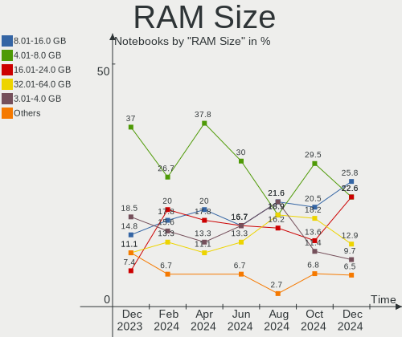
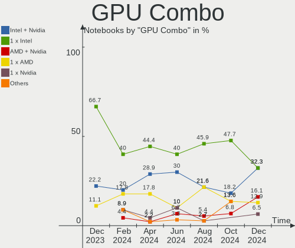
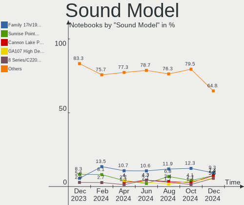

KDE neon - Hardware Trends (Notebooks)
--------------------------------------

A project to identify most popular hardware characteristics and track their change
over time based on data collected by Linux users at https://Linux-Hardware.org.

Anyone can contribute to this report by the [hw-probe](https://github.com/linuxhw/hw-probe) tool:

    sudo -E hw-probe -all -upload

This report is for one last month. Overall report since the beginning of time: [TestCoverage](https://github.com/linuxhw/TestCoverage)

Period: Jul, 2022.

Contents
--------

* [ System ](#system)
  - [ OS                       ](#os)
  - [ OS Family                ](#os-family)
  - [ Kernel                   ](#kernel)
  - [ Kernel Family            ](#kernel-family)
  - [ Kernel Major Ver.        ](#kernel-major-ver)
  - [ Arch                     ](#arch)
  - [ DE                       ](#de)
  - [ Display Server           ](#display-server)
  - [ Display Manager          ](#display-manager)
  - [ OS Lang                  ](#os-lang)
  - [ Boot Mode                ](#boot-mode)
  - [ Filesystem               ](#filesystem)
  - [ Part. scheme             ](#part-scheme)
  - [ Dual Boot with Linux/BSD ](#dual-boot-with-linuxbsd)
  - [ Dual Boot (Win)          ](#dual-boot-win)

* [ Board ](#board)
  - [ Vendor                   ](#vendor)
  - [ Model                    ](#model)
  - [ Model Family             ](#model-family)
  - [ MFG Year                 ](#mfg-year)
  - [ Form Factor              ](#form-factor)
  - [ Secure Boot              ](#secure-boot)
  - [ Coreboot                 ](#coreboot)
  - [ RAM Size                 ](#ram-size)
  - [ RAM Used                 ](#ram-used)
  - [ Total Drives             ](#total-drives)
  - [ Has CD-ROM               ](#has-cd-rom)
  - [ Has Ethernet             ](#has-ethernet)
  - [ Has WiFi                 ](#has-wifi)
  - [ Has Bluetooth            ](#has-bluetooth)

* [ Location ](#location)
  - [ Country                  ](#country)
  - [ City                     ](#city)

* [ Drives ](#drives)
  - [ Drive Vendor             ](#drive-vendor)
  - [ Drive Model              ](#drive-model)
  - [ HDD Vendor               ](#hdd-vendor)
  - [ SSD Vendor               ](#ssd-vendor)
  - [ Drive Kind               ](#drive-kind)
  - [ Drive Connector          ](#drive-connector)
  - [ Drive Size               ](#drive-size)
  - [ Space Total              ](#space-total)
  - [ Space Used               ](#space-used)
  - [ Malfunc. Drives          ](#malfunc-drives)
  - [ Malfunc. Drive Vendor    ](#malfunc-drive-vendor)
  - [ Malfunc. HDD Vendor      ](#malfunc-hdd-vendor)
  - [ Malfunc. Drive Kind      ](#malfunc-drive-kind)
  - [ Failed Drives            ](#failed-drives)
  - [ Failed Drive Vendor      ](#failed-drive-vendor)
  - [ Drive Status             ](#drive-status)

* [ Storage controller ](#storage-controller)
  - [ Storage Vendor           ](#storage-vendor)
  - [ Storage Model            ](#storage-model)
  - [ Storage Kind             ](#storage-kind)

* [ Processor ](#processor)
  - [ CPU Vendor               ](#cpu-vendor)
  - [ CPU Model                ](#cpu-model)
  - [ CPU Model Family         ](#cpu-model-family)
  - [ CPU Cores                ](#cpu-cores)
  - [ CPU Sockets              ](#cpu-sockets)
  - [ CPU Threads              ](#cpu-threads)
  - [ CPU Op-Modes             ](#cpu-op-modes)
  - [ CPU Microcode            ](#cpu-microcode)
  - [ CPU Microarch            ](#cpu-microarch)

* [ Graphics ](#graphics)
  - [ GPU Vendor               ](#gpu-vendor)
  - [ GPU Model                ](#gpu-model)
  - [ GPU Combo                ](#gpu-combo)
  - [ GPU Driver               ](#gpu-driver)
  - [ GPU Memory               ](#gpu-memory)

* [ Monitor ](#monitor)
  - [ Monitor Vendor           ](#monitor-vendor)
  - [ Monitor Model            ](#monitor-model)
  - [ Monitor Resolution       ](#monitor-resolution)
  - [ Monitor Diagonal         ](#monitor-diagonal)
  - [ Monitor Width            ](#monitor-width)
  - [ Aspect Ratio             ](#aspect-ratio)
  - [ Monitor Area             ](#monitor-area)
  - [ Pixel Density            ](#pixel-density)
  - [ Multiple Monitors        ](#multiple-monitors)

* [ Network ](#network)
  - [ Net Controller Vendor    ](#net-controller-vendor)
  - [ Net Controller Model     ](#net-controller-model)
  - [ Wireless Vendor          ](#wireless-vendor)
  - [ Wireless Model           ](#wireless-model)
  - [ Ethernet Vendor          ](#ethernet-vendor)
  - [ Ethernet Model           ](#ethernet-model)
  - [ Net Controller Kind      ](#net-controller-kind)
  - [ Used Controller          ](#used-controller)
  - [ NICs                     ](#nics)
  - [ IPv6                     ](#ipv6)

* [ Bluetooth ](#bluetooth)
  - [ Bluetooth Vendor         ](#bluetooth-vendor)
  - [ Bluetooth Model          ](#bluetooth-model)

* [ Sound ](#sound)
  - [ Sound Vendor             ](#sound-vendor)
  - [ Sound Model              ](#sound-model)

* [ Memory ](#memory)
  - [ Memory Vendor            ](#memory-vendor)
  - [ Memory Model             ](#memory-model)
  - [ Memory Kind              ](#memory-kind)
  - [ Memory Form Factor       ](#memory-form-factor)
  - [ Memory Size              ](#memory-size)
  - [ Memory Speed             ](#memory-speed)

* [ Printers & scanners ](#printers--scanners)
  - [ Printer Vendor           ](#printer-vendor)
  - [ Printer Model            ](#printer-model)
  - [ Scanner Vendor           ](#scanner-vendor)
  - [ Scanner Model            ](#scanner-model)

* [ Camera ](#camera)
  - [ Camera Vendor            ](#camera-vendor)
  - [ Camera Model             ](#camera-model)

* [ Security ](#security)
  - [ Fingerprint Vendor       ](#fingerprint-vendor)
  - [ Fingerprint Model        ](#fingerprint-model)
  - [ Chipcard Vendor          ](#chipcard-vendor)
  - [ Chipcard Model           ](#chipcard-model)

* [ Unsupported ](#unsupported)
  - [ Unsupported Devices      ](#unsupported-devices)
  - [ Unsupported Device Types ](#unsupported-device-types)

System
------

OS
--

Installed operating systems

| Name           | Notebooks | Percent |
|----------------|-----------|---------|
| KDE neon 20.04 | 68        | 100%    |

OS Family
---------

OS without a version

| Name     | Notebooks | Percent |
|----------|-----------|---------|
| KDE neon | 68        | 100%    |

Kernel
------

Version of the Linux kernel

| Version           | Notebooks | Percent |
|-------------------|-----------|---------|
| 5.15.0-41-generic | 28        | 41.18%  |
| 5.13.0-52-generic | 26        | 38.24%  |
| 5.13.0-51-generic | 9         | 13.24%  |
| 5.15.0-33-generic | 1         | 1.47%   |
| 5.13.0-41-generic | 1         | 1.47%   |
| 5.13.0-40-generic | 1         | 1.47%   |
| 5.13.0-39-generic | 1         | 1.47%   |
| 5.13.0-27-generic | 1         | 1.47%   |

Kernel Family
-------------

Linux kernel without a distro release

| Version | Notebooks | Percent |
|---------|-----------|---------|
| 5.13.0  | 39        | 57.35%  |
| 5.15.0  | 29        | 42.65%  |

Kernel Major Ver.
-----------------

Linux kernel major version

| Version | Notebooks | Percent |
|---------|-----------|---------|
| 5.13    | 39        | 57.35%  |
| 5.15    | 29        | 42.65%  |

Arch
----

OS architecture (x86_64, i586, etc.)

| Name   | Notebooks | Percent |
|--------|-----------|---------|
| x86_64 | 68        | 100%    |

DE
--

Desktop Environment

| Name | Notebooks | Percent |
|------|-----------|---------|
| KDE5 | 68        | 100%    |

Display Server
--------------

X11 or Wayland

| Name    | Notebooks | Percent |
|---------|-----------|---------|
| X11     | 65        | 95.59%  |
| Wayland | 3         | 4.41%   |

Display Manager
---------------

SDDM, LightDM, etc.

| Name    | Notebooks | Percent |
|---------|-----------|---------|
| Unknown | 57        | 83.82%  |
| SDDM    | 11        | 16.18%  |

OS Lang
-------

Language

| Lang  | Notebooks | Percent |
|-------|-----------|---------|
| en_US | 35        | 51.47%  |
| ru_RU | 8         | 11.76%  |
| pt_BR | 4         | 5.88%   |
| en_CA | 3         | 4.41%   |
| en_AU | 3         | 4.41%   |
| fr_FR | 2         | 2.94%   |
| en_ZA | 2         | 2.94%   |
| en_GB | 2         | 2.94%   |
| de_DE | 2         | 2.94%   |
| sv_SE | 1         | 1.47%   |
| pl_PL | 1         | 1.47%   |
| nl_NL | 1         | 1.47%   |
| es_SV | 1         | 1.47%   |
| en_SI | 1         | 1.47%   |
| de_AT | 1         | 1.47%   |
| C     | 1         | 1.47%   |

Boot Mode
---------

EFI or BIOS

| Mode | Notebooks | Percent |
|------|-----------|---------|
| EFI  | 44        | 64.71%  |
| BIOS | 24        | 35.29%  |

Filesystem
----------

Type of filesystem

| Type    | Notebooks | Percent |
|---------|-----------|---------|
| Ext4    | 63        | 92.65%  |
| Btrfs   | 2         | 2.94%   |
| Overlay | 1         | 1.47%   |
| F2fs    | 1         | 1.47%   |
| Unknown | 1         | 1.47%   |

Part. scheme
------------

Scheme of partitioning

| Type    | Notebooks | Percent |
|---------|-----------|---------|
| Unknown | 61        | 89.71%  |
| GPT     | 7         | 10.29%  |

Dual Boot with Linux/BSD
------------------------

Hosting more than one Linux/BSD

| Dual boot | Notebooks | Percent |
|-----------|-----------|---------|
| No        | 67        | 98.53%  |
| Yes       | 1         | 1.47%   |

Dual Boot (Win)
---------------

Hosting Linux and Windows

| Dual boot | Notebooks | Percent |
|-----------|-----------|---------|
| No        | 62        | 91.18%  |
| Yes       | 6         | 8.82%   |

Board
-----

Vendor
------

Motherboard manufacturer

| Name                | Notebooks | Percent |
|---------------------|-----------|---------|
| Dell                | 17        | 25%     |
| Hewlett-Packard     | 15        | 22.06%  |
| Lenovo              | 11        | 16.18%  |
| Acer                | 9         | 13.24%  |
| ASUSTek Computer    | 6         | 8.82%   |
| Apple               | 4         | 5.88%   |
| Toshiba             | 1         | 1.47%   |
| Samsung Electronics | 1         | 1.47%   |
| MSI                 | 1         | 1.47%   |
| Getac               | 1         | 1.47%   |
| Fujitsu             | 1         | 1.47%   |
| Clevo               | 1         | 1.47%   |

Model
-----

Motherboard model

| Name                                     | Notebooks | Percent |
|------------------------------------------|-----------|---------|
| Dell Latitude E7440                      | 3         | 4.41%   |
| Apple MacBookPro9,2                      | 2         | 2.94%   |
| Toshiba Satellite C640                   | 1         | 1.47%   |
| Samsung 535U3C                           | 1         | 1.47%   |
| MSI Pulse GL66 11UEK                     | 1         | 1.47%   |
| Lenovo Z50-70 20354                      | 1         | 1.47%   |
| Lenovo ThinkPad X270 20HMS0GJ00          | 1         | 1.47%   |
| Lenovo ThinkPad W530 24472SU             | 1         | 1.47%   |
| Lenovo ThinkPad T470s 20HGS15V00         | 1         | 1.47%   |
| Lenovo Legion S7 15ACH6 82K8             | 1         | 1.47%   |
| Lenovo IdeaPad S145-15API 81V7           | 1         | 1.47%   |
| Lenovo IdeaPad L340-15API 81LW           | 1         | 1.47%   |
| Lenovo IdeaPad 3 15IGL05 82BU            | 1         | 1.47%   |
| Lenovo G50-45 80E3                       | 1         | 1.47%   |
| Lenovo B570e HuronRiver Platform         | 1         | 1.47%   |
| Lenovo B50-30 20382                      | 1         | 1.47%   |
| HP Stream Laptop 14-cb1xxx               | 1         | 1.47%   |
| HP ProBook 450 G7                        | 1         | 1.47%   |
| HP Pavilion Notebook                     | 1         | 1.47%   |
| HP Pavilion Gaming Laptop 15-ec1xxx      | 1         | 1.47%   |
| HP Pavilion Gaming Laptop 15-ec0xxx      | 1         | 1.47%   |
| HP Laptop 15-dw3xxx                      | 1         | 1.47%   |
| HP Laptop 15-db0xxx                      | 1         | 1.47%   |
| HP Laptop 15-bs1xx                       | 1         | 1.47%   |
| HP G62                                   | 1         | 1.47%   |
| HP ENVY 15                               | 1         | 1.47%   |
| HP EliteBook Folio 1040 G2               | 1         | 1.47%   |
| HP EliteBook 840 G2                      | 1         | 1.47%   |
| HP EliteBook 830 G5                      | 1         | 1.47%   |
| HP EliteBook 2570p                       | 1         | 1.47%   |
| HP 250 G4                                | 1         | 1.47%   |
| Getac F110                               | 1         | 1.47%   |
| Fujitsu LIFEBOOK E734                    | 1         | 1.47%   |
| Dell Precision 5530                      | 1         | 1.47%   |
| Dell Latitude E6520                      | 1         | 1.47%   |
| Dell Latitude E6420                      | 1         | 1.47%   |
| Dell Latitude E6400                      | 1         | 1.47%   |
| Dell Latitude E5440                      | 1         | 1.47%   |
| Dell Latitude E5420                      | 1         | 1.47%   |
| Dell Latitude 7480                       | 1         | 1.47%   |
| Dell Latitude 5511                       | 1         | 1.47%   |
| Dell Latitude 5480                       | 1         | 1.47%   |
| Dell Latitude 5420                       | 1         | 1.47%   |
| Dell Latitude 3420                       | 1         | 1.47%   |
| Dell Inspiron 7348                       | 1         | 1.47%   |
| Dell Inspiron 5402                       | 1         | 1.47%   |
| Dell Inspiron 3520                       | 1         | 1.47%   |
| Clevo W240BU                             | 1         | 1.47%   |
| ASUS X75VC                               | 1         | 1.47%   |
| ASUS X540LJ                              | 1         | 1.47%   |
| ASUS VivoBook_ASUSLaptop M3401QC_M3401QC | 1         | 1.47%   |
| ASUS UX31E                               | 1         | 1.47%   |
| ASUS K50IJ                               | 1         | 1.47%   |
| ASUS GL703VM                             | 1         | 1.47%   |
| Apple MacBookPro11,2                     | 1         | 1.47%   |
| Apple MacBook9,1                         | 1         | 1.47%   |
| Acer Swift SF114-34                      | 1         | 1.47%   |
| Acer Nitro AN517-52                      | 1         | 1.47%   |
| Acer Aspire E5-475G                      | 1         | 1.47%   |
| Acer Aspire A515-52G                     | 1         | 1.47%   |

Model Family
------------

Motherboard model prefix

| Name               | Notebooks | Percent |
|--------------------|-----------|---------|
| Dell Latitude      | 13        | 19.12%  |
| Acer Aspire        | 7         | 10.29%  |
| HP EliteBook       | 4         | 5.88%   |
| Lenovo ThinkPad    | 3         | 4.41%   |
| Lenovo IdeaPad     | 3         | 4.41%   |
| HP Pavilion        | 3         | 4.41%   |
| HP Laptop          | 3         | 4.41%   |
| Dell Inspiron      | 3         | 4.41%   |
| Apple MacBookPro9  | 2         | 2.94%   |
| Toshiba Satellite  | 1         | 1.47%   |
| Samsung 535U3C     | 1         | 1.47%   |
| MSI Pulse          | 1         | 1.47%   |
| Lenovo Z50-70      | 1         | 1.47%   |
| Lenovo Legion      | 1         | 1.47%   |
| Lenovo G50-45      | 1         | 1.47%   |
| Lenovo B570e       | 1         | 1.47%   |
| Lenovo B50-30      | 1         | 1.47%   |
| HP Stream          | 1         | 1.47%   |
| HP ProBook         | 1         | 1.47%   |
| HP G62             | 1         | 1.47%   |
| HP ENVY            | 1         | 1.47%   |
| HP 250             | 1         | 1.47%   |
| Getac F110         | 1         | 1.47%   |
| Fujitsu LIFEBOOK   | 1         | 1.47%   |
| Dell Precision     | 1         | 1.47%   |
| Clevo W240BU       | 1         | 1.47%   |
| ASUS X75VC         | 1         | 1.47%   |
| ASUS X540LJ        | 1         | 1.47%   |
| ASUS VivoBook      | 1         | 1.47%   |
| ASUS UX31E         | 1         | 1.47%   |
| ASUS K50IJ         | 1         | 1.47%   |
| ASUS GL703VM       | 1         | 1.47%   |
| Apple MacBookPro11 | 1         | 1.47%   |
| Apple MacBook9     | 1         | 1.47%   |
| Acer Swift         | 1         | 1.47%   |
| Acer Nitro         | 1         | 1.47%   |

MFG Year
--------

Motherboard manufacture year

| Year | Notebooks | Percent |
|------|-----------|---------|
| 2011 | 8         | 11.76%  |
| 2020 | 7         | 10.29%  |
| 2017 | 7         | 10.29%  |
| 2019 | 6         | 8.82%   |
| 2018 | 6         | 8.82%   |
| 2014 | 6         | 8.82%   |
| 2012 | 6         | 8.82%   |
| 2021 | 5         | 7.35%   |
| 2013 | 5         | 7.35%   |
| 2015 | 4         | 5.88%   |
| 2016 | 3         | 4.41%   |
| 2010 | 2         | 2.94%   |
| 2022 | 1         | 1.47%   |
| 2009 | 1         | 1.47%   |
| 2008 | 1         | 1.47%   |

Form Factor
-----------

Physical design of the computer

| Name     | Notebooks | Percent |
|----------|-----------|---------|
| Notebook | 68        | 100%    |

Secure Boot
-----------

Enabled or disabled

| State    | Notebooks | Percent |
|----------|-----------|---------|
| Disabled | 60        | 88.24%  |
| Enabled  | 8         | 11.76%  |

Coreboot
--------

Have coreboot on board

| Used | Notebooks | Percent |
|------|-----------|---------|
| No   | 68        | 100%    |

RAM Size
--------

Total RAM memory

| Size in GB | Notebooks | Percent |
|------------|-----------|---------|
| 4.01-8.0   | 26        | 38.24%  |
| 3.01-4.0   | 16        | 23.53%  |
| 8.01-16.0  | 12        | 17.65%  |
| 32.01-64.0 | 7         | 10.29%  |
| 16.01-24.0 | 7         | 10.29%  |

RAM Used
--------

Used RAM memory

| Used GB   | Notebooks | Percent |
|-----------|-----------|---------|
| 1.01-2.0  | 29        | 42.65%  |
| 2.01-3.0  | 20        | 29.41%  |
| 4.01-8.0  | 10        | 14.71%  |
| 3.01-4.0  | 7         | 10.29%  |
| 8.01-16.0 | 1         | 1.47%   |
| 0.51-1.0  | 1         | 1.47%   |

Total Drives
------------

Number of drives on board

| Drives | Notebooks | Percent |
|--------|-----------|---------|
| 1      | 46        | 67.65%  |
| 2      | 19        | 27.94%  |
| 3      | 3         | 4.41%   |

Has CD-ROM
----------

Has CD-ROM on board

| Presented | Notebooks | Percent |
|-----------|-----------|---------|
| No        | 48        | 70.59%  |
| Yes       | 20        | 29.41%  |

Has Ethernet
------------

Has Ethernet on board

| Presented | Notebooks | Percent |
|-----------|-----------|---------|
| Yes       | 56        | 82.35%  |
| No        | 12        | 17.65%  |

Has WiFi
--------

Has WiFi module

| Presented | Notebooks | Percent |
|-----------|-----------|---------|
| Yes       | 68        | 100%    |

Has Bluetooth
-------------

Has Bluetooth module

| Presented | Notebooks | Percent |
|-----------|-----------|---------|
| Yes       | 57        | 83.82%  |
| No        | 11        | 16.18%  |

Location
--------

Country
-------

Geographic location (country)

| Country      | Notebooks | Percent |
|--------------|-----------|---------|
| USA          | 18        | 26.47%  |
| Russia       | 6         | 8.82%   |
| Brazil       | 6         | 8.82%   |
| Canada       | 4         | 5.88%   |
| Australia    | 4         | 5.88%   |
| Moldova      | 3         | 4.41%   |
| South Africa | 2         | 2.94%   |
| Netherlands  | 2         | 2.94%   |
| Indonesia    | 2         | 2.94%   |
| Germany      | 2         | 2.94%   |
| Ukraine      | 1         | 1.47%   |
| UK           | 1         | 1.47%   |
| Switzerland  | 1         | 1.47%   |
| Sweden       | 1         | 1.47%   |
| Slovenia     | 1         | 1.47%   |
| Romania      | 1         | 1.47%   |
| Portugal     | 1         | 1.47%   |
| Poland       | 1         | 1.47%   |
| Morocco      | 1         | 1.47%   |
| Malaysia     | 1         | 1.47%   |
| Lebanon      | 1         | 1.47%   |
| Iraq         | 1         | 1.47%   |
| Iran         | 1         | 1.47%   |
| Hungary      | 1         | 1.47%   |
| France       | 1         | 1.47%   |
| El Salvador  | 1         | 1.47%   |
| Croatia      | 1         | 1.47%   |
| Belarus      | 1         | 1.47%   |
| Austria      | 1         | 1.47%   |

City
----

Geographic location (city)

| City             | Notebooks | Percent |
|------------------|-----------|---------|
| Melbourne        | 3         | 4.41%   |
| Seattle          | 2         | 2.94%   |
| Aracaju          | 2         | 2.94%   |
| Đakovo          | 1         | 1.47%   |
| Zurich           | 1         | 1.47%   |
| Yekaterinburg    | 1         | 1.47%   |
| Yasinovataya     | 1         | 1.47%   |
| Wuppertal        | 1         | 1.47%   |
| Wroclaw          | 1         | 1.47%   |
| Winschoten       | 1         | 1.47%   |
| Volgograd        | 1         | 1.47%   |
| Vienna           | 1         | 1.47%   |
| Vaudreuil-Dorion | 1         | 1.47%   |
| Toronto          | 1         | 1.47%   |
| Tiraspol         | 1         | 1.47%   |
| Tehran           | 1         | 1.47%   |
| Sydney           | 1         | 1.47%   |
| Surgut           | 1         | 1.47%   |
| Stavropol        | 1         | 1.47%   |
| Soroca           | 1         | 1.47%   |
| Seffner          | 1         | 1.47%   |
| Sao Paulo        | 1         | 1.47%   |
| San Salvador     | 1         | 1.47%   |
| Salé            | 1         | 1.47%   |
| Puyallup         | 1         | 1.47%   |
| Port Elizabeth   | 1         | 1.47%   |
| Ploieşti        | 1         | 1.47%   |
| Phoenix          | 1         | 1.47%   |
| Philadelphia     | 1         | 1.47%   |
| Petaling Jaya    | 1         | 1.47%   |
| Pekanbaru        | 1         | 1.47%   |
| Pekan Baru       | 1         | 1.47%   |
| Orsay            | 1         | 1.47%   |
| Noyabrsk         | 1         | 1.47%   |
| Nottingham       | 1         | 1.47%   |
| Moscow           | 1         | 1.47%   |
| Mora             | 1         | 1.47%   |
| Mogilev          | 1         | 1.47%   |
| Mesa             | 1         | 1.47%   |
| Mem Martins      | 1         | 1.47%   |
| Magdeburg        | 1         | 1.47%   |
| Lufkin           | 1         | 1.47%   |
| Herriman         | 1         | 1.47%   |
| Harrisburg       | 1         | 1.47%   |
| Hamilton         | 1         | 1.47%   |
| Green River      | 1         | 1.47%   |
| Goioere          | 1         | 1.47%   |
| Frankfort        | 1         | 1.47%   |
| Fortaleza        | 1         | 1.47%   |
| Eindhoven        | 1         | 1.47%   |
| Duncan           | 1         | 1.47%   |
| Duhok            | 1         | 1.47%   |
| Domžale         | 1         | 1.47%   |
| Dallas           | 1         | 1.47%   |
| Coos Bay         | 1         | 1.47%   |
| Chisinau         | 1         | 1.47%   |
| Cape Town        | 1         | 1.47%   |
| Budapest         | 1         | 1.47%   |
| Bristol          | 1         | 1.47%   |
| Bellingham       | 1         | 1.47%   |

Drives
------

Drive Vendor
------------

Hard drive vendors

| Vendor                         | Notebooks | Drives | Percent |
|--------------------------------|-----------|--------|---------|
| Seagate                        | 14        | 14     | 15.38%  |
| Samsung Electronics            | 12        | 12     | 13.19%  |
| Kingston                       | 8         | 8      | 8.79%   |
| SanDisk                        | 7         | 7      | 7.69%   |
| WDC                            | 5         | 5      | 5.49%   |
| Toshiba                        | 5         | 5      | 5.49%   |
| Unknown                        | 4         | 4      | 4.4%    |
| SK hynix                       | 4         | 4      | 4.4%    |
| KIOXIA                         | 3         | 3      | 3.3%    |
| Team                           | 2         | 2      | 2.2%    |
| SPCC                           | 2         | 2      | 2.2%    |
| Phison                         | 2         | 2      | 2.2%    |
| HGST                           | 2         | 2      | 2.2%    |
| Crucial                        | 2         | 2      | 2.2%    |
| Apple                          | 2         | 3      | 2.2%    |
| A-DATA Technology              | 2         | 2      | 2.2%    |
| Transcend                      | 1         | 1      | 1.1%    |
| TO Exter                       | 1         | 1      | 1.1%    |
| Solid State Storage Technology | 1         | 1      | 1.1%    |
| PNY                            | 1         | 1      | 1.1%    |
| Patriot                        | 1         | 1      | 1.1%    |
| OWC                            | 1         | 1      | 1.1%    |
| Netac                          | 1         | 1      | 1.1%    |
| MidasForce                     | 1         | 1      | 1.1%    |
| LITEONIT                       | 1         | 1      | 1.1%    |
| LITEON                         | 1         | 1      | 1.1%    |
| Lexar                          | 1         | 1      | 1.1%    |
| Lenovo                         | 1         | 1      | 1.1%    |
| GALAX                          | 1         | 1      | 1.1%    |
| Corsair                        | 1         | 1      | 1.1%    |
| China                          | 1         | 1      | 1.1%    |

Drive Model
-----------

Hard drive models

| Model                                    | Notebooks | Percent |
|------------------------------------------|-----------|---------|
| Samsung NVMe SSD Drive 512GB             | 3         | 3.26%   |
| Toshiba MQ01ABF050 500GB                 | 2         | 2.17%   |
| Seagate ST500LT012-1DG142 500GB          | 2         | 2.17%   |
| Seagate ST1000LM035-1RK172 1TB           | 2         | 2.17%   |
| Seagate ST1000LM024 HN-M101MBB 1TB       | 2         | 2.17%   |
| SanDisk NVMe SSD Drive 512GB             | 2         | 2.17%   |
| KIOXIA NVMe SSD Drive 256GB              | 2         | 2.17%   |
| Kingston SA400S37480G 480GB SSD          | 2         | 2.17%   |
| WDC WDS500G2B0A-00SM50 500GB SSD         | 1         | 1.09%   |
| WDC WDS240G2G0A-00JH30 240GB SSD         | 1         | 1.09%   |
| WDC WD5000BEVT-22A0RT0 500GB             | 1         | 1.09%   |
| WDC WD10SPZX-24Z10 1TB                   | 1         | 1.09%   |
| WDC PC SN520 SDAPNUW-256G-1006 256GB     | 1         | 1.09%   |
| Unknown SD/MMC/MS PRO 64GB               | 1         | 1.09%   |
| Unknown MMC Card  64GB                   | 1         | 1.09%   |
| Unknown MMC Card  32GB                   | 1         | 1.09%   |
| Unknown 00000  64GB                      | 1         | 1.09%   |
| Transcend TS120GMTS820S 120GB SSD        | 1         | 1.09%   |
| Toshiba NVMe SSD Drive 256GB             | 1         | 1.09%   |
| Toshiba MQ01ABD075 752GB                 | 1         | 1.09%   |
| Toshiba MQ01ABD032 320GB                 | 1         | 1.09%   |
| TO Exter nal USB 3.0 1TB                 | 1         | 1.09%   |
| Team TM8PS7512G 512GB SSD                | 1         | 1.09%   |
| Team T253X2512G 512GB SSD                | 1         | 1.09%   |
| SPCC SSD170 120GB                        | 1         | 1.09%   |
| SPCC Solid State Disk MX 256GB           | 1         | 1.09%   |
| Solid State Storage NVMe SSD Drive 128GB | 1         | 1.09%   |
| SK hynix SKHynix_HFS001TDE9X084N 1TB     | 1         | 1.09%   |
| SK hynix NVMe SSD Drive 512GB            | 1         | 1.09%   |
| SK hynix HFS256G39TND-N210A 256GB SSD    | 1         | 1.09%   |
| SK hynix BC711 NVMe 256GB                | 1         | 1.09%   |
| Seagate ST750LM022 HN-M750MBB 752GB      | 1         | 1.09%   |
| Seagate ST500LT032-1E9142 500GB          | 1         | 1.09%   |
| Seagate ST500LM012 HN-M500MBB 500GB      | 1         | 1.09%   |
| Seagate ST320LT020-9YG142 320GB          | 1         | 1.09%   |
| Seagate ST320LT012-1DG14C 320GB          | 1         | 1.09%   |
| Seagate ST1000LM048-2E7172 1TB           | 1         | 1.09%   |
| Seagate Portable 2TB                     | 1         | 1.09%   |
| Seagate Expansion 1TB                    | 1         | 1.09%   |
| SanDisk Ultra II 240GB SSD               | 1         | 1.09%   |
| SanDisk SSD U100 256GB                   | 1         | 1.09%   |
| SanDisk SD9SN8W256G1014 256GB SSD        | 1         | 1.09%   |
| SanDisk SD8SNAT-128G-1006 128GB SSD      | 1         | 1.09%   |
| SanDisk NVMe SSD Drive 256GB             | 1         | 1.09%   |
| Samsung SSD PM851 mSATA 256GB            | 1         | 1.09%   |
| Samsung SSD PM851 mSATA 128GB            | 1         | 1.09%   |
| Samsung SSD 870 EVO 500GB                | 1         | 1.09%   |
| Samsung SSD 860 EVO 250GB                | 1         | 1.09%   |
| Samsung SSD 750 EVO 250GB                | 1         | 1.09%   |
| Samsung NVMe SSD Drive 1TB               | 1         | 1.09%   |
| Samsung MZVLQ512HALU-000H1 512GB         | 1         | 1.09%   |
| Samsung MZNLH128HBHQ-000H1 128GB SSD     | 1         | 1.09%   |
| Samsung MZ7TE128HMGR-00004 128GB SSD     | 1         | 1.09%   |
| PNY CS900 240GB SSD                      | 1         | 1.09%   |
| Phison Sabrent Rocket Q 1TB              | 1         | 1.09%   |
| Phison NVMe SSD Drive 512GB              | 1         | 1.09%   |
| Patriot Burst 240GB SSD                  | 1         | 1.09%   |
| OWC Mercury Electra 6G SSD               | 1         | 1.09%   |
| Netac SSD 240GB                          | 1         | 1.09%   |
| MidasForce SSD 120GB                     | 1         | 1.09%   |

HDD Vendor
----------

Hard disk drive vendors

| Vendor  | Notebooks | Drives | Percent |
|---------|-----------|--------|---------|
| Seagate | 13        | 13     | 59.09%  |
| Toshiba | 4         | 4      | 18.18%  |
| WDC     | 2         | 2      | 9.09%   |
| HGST    | 2         | 2      | 9.09%   |
| Unknown | 1         | 1      | 4.55%   |

SSD Vendor
----------

Solid state drive vendors

| Vendor              | Notebooks | Drives | Percent |
|---------------------|-----------|--------|---------|
| Samsung Electronics | 7         | 7      | 17.07%  |
| Kingston            | 6         | 6      | 14.63%  |
| SanDisk             | 4         | 4      | 9.76%   |
| WDC                 | 2         | 2      | 4.88%   |
| Team                | 2         | 2      | 4.88%   |
| SPCC                | 2         | 2      | 4.88%   |
| Crucial             | 2         | 2      | 4.88%   |
| A-DATA Technology   | 2         | 2      | 4.88%   |
| Transcend           | 1         | 1      | 2.44%   |
| TO Exter            | 1         | 1      | 2.44%   |
| SK hynix            | 1         | 1      | 2.44%   |
| PNY                 | 1         | 1      | 2.44%   |
| Patriot             | 1         | 1      | 2.44%   |
| OWC                 | 1         | 1      | 2.44%   |
| Netac               | 1         | 1      | 2.44%   |
| MidasForce          | 1         | 1      | 2.44%   |
| LITEONIT            | 1         | 1      | 2.44%   |
| LITEON              | 1         | 1      | 2.44%   |
| Lexar               | 1         | 1      | 2.44%   |
| Corsair             | 1         | 1      | 2.44%   |
| China               | 1         | 1      | 2.44%   |
| Apple               | 1         | 1      | 2.44%   |

Drive Kind
----------

HDD or SSD

| Kind    | Notebooks | Drives | Percent |
|---------|-----------|--------|---------|
| SSD     | 39        | 41     | 46.99%  |
| HDD     | 20        | 22     | 24.1%   |
| NVMe    | 19        | 24     | 22.89%  |
| MMC     | 3         | 3      | 3.61%   |
| Unknown | 2         | 2      | 2.41%   |

Drive Connector
---------------

SATA, SAS, NVMe, etc.

| Type | Notebooks | Drives | Percent |
|------|-----------|--------|---------|
| SATA | 51        | 61     | 66.23%  |
| NVMe | 19        | 24     | 24.68%  |
| SAS  | 4         | 4      | 5.19%   |
| MMC  | 3         | 3      | 3.9%    |

Drive Size
----------

Size of hard drive

| Size in TB | Notebooks | Drives | Percent |
|------------|-----------|--------|---------|
| 0.01-0.5   | 44        | 48     | 75.86%  |
| 0.51-1.0   | 14        | 15     | 24.14%  |

Space Total
-----------

Amount of disk space available on the file system

| Size in GB     | Notebooks | Percent |
|----------------|-----------|---------|
| 101-250        | 33        | 48.53%  |
| 251-500        | 15        | 22.06%  |
| 501-1000       | 6         | 8.82%   |
| 21-50          | 4         | 5.88%   |
| 1001-2000      | 3         | 4.41%   |
| 51-100         | 3         | 4.41%   |
| More than 3000 | 2         | 2.94%   |
| 2001-3000      | 1         | 1.47%   |
| 1-20           | 1         | 1.47%   |

Space Used
----------

Amount of used disk space

| Used GB        | Notebooks | Percent |
|----------------|-----------|---------|
| 1-20           | 33        | 48.53%  |
| 21-50          | 14        | 20.59%  |
| 101-250        | 7         | 10.29%  |
| 251-500        | 5         | 7.35%   |
| 51-100         | 5         | 7.35%   |
| More than 3000 | 2         | 2.94%   |
| 501-1000       | 2         | 2.94%   |

Malfunc. Drives
---------------

Drive models with a malfunction

| Model                                            | Notebooks | Drives | Percent |
|--------------------------------------------------|-----------|--------|---------|
| Samsung Electronics MZNLH128HBHQ-000H1 128GB SSD | 1         | 1      | 100%    |

Malfunc. Drive Vendor
---------------------

Vendors of faulty drives

| Vendor              | Notebooks | Drives | Percent |
|---------------------|-----------|--------|---------|
| Samsung Electronics | 1         | 1      | 100%    |

Malfunc. HDD Vendor
-------------------

Vendors of faulty HDD drives

Zero info for selected period =(

Malfunc. Drive Kind
-------------------

Kinds of faulty drives

| Kind | Notebooks | Drives | Percent |
|------|-----------|--------|---------|
| SSD  | 1         | 1      | 100%    |

Failed Drives
-------------

Failed drive models

Zero info for selected period =(

Failed Drive Vendor
-------------------

Failed drive vendors

Zero info for selected period =(

Drive Status
------------

Number of failed and malfunc. drives

| Status   | Notebooks | Drives | Percent |
|----------|-----------|--------|---------|
| Detected | 62        | 81     | 87.32%  |
| Works    | 8         | 10     | 11.27%  |
| Malfunc  | 1         | 1      | 1.41%   |

Storage controller
------------------

Storage Vendor
--------------

Storage controller vendors

| Vendor                         | Notebooks | Percent |
|--------------------------------|-----------|---------|
| Intel                          | 47        | 58.02%  |
| AMD                            | 11        | 13.58%  |
| Samsung Electronics            | 6         | 7.41%   |
| SK hynix                       | 3         | 3.7%    |
| SanDisk                        | 3         | 3.7%    |
| KIOXIA                         | 3         | 3.7%    |
| Phison Electronics             | 2         | 2.47%   |
| Kingston Technology Company    | 2         | 2.47%   |
| Toshiba America Info Systems   | 1         | 1.23%   |
| Solid State Storage Technology | 1         | 1.23%   |
| Lenovo                         | 1         | 1.23%   |
| Apple                          | 1         | 1.23%   |

Storage Model
-------------

Storage controller models

| Model                                                                          | Notebooks | Percent |
|--------------------------------------------------------------------------------|-----------|---------|
| AMD FCH SATA Controller [AHCI mode]                                            | 9         | 10.84%  |
| Intel 82801 Mobile SATA Controller [RAID mode]                                 | 8         | 9.64%   |
| Intel 7 Series Chipset Family 6-port SATA Controller [AHCI mode]               | 6         | 7.23%   |
| Intel Wildcat Point-LP SATA Controller [AHCI Mode]                             | 5         | 6.02%   |
| Intel Sunrise Point-LP SATA Controller [AHCI mode]                             | 5         | 6.02%   |
| Intel 8 Series SATA Controller 1 [AHCI mode]                                   | 5         | 6.02%   |
| Intel 6 Series/C200 Series Chipset Family 6 port Mobile SATA AHCI Controller   | 4         | 4.82%   |
| Samsung NVMe SSD Controller 980                                                | 3         | 3.61%   |
| Intel Volume Management Device NVMe RAID Controller                            | 3         | 3.61%   |
| SK hynix Gold P31 SSD                                                          | 2         | 2.41%   |
| Samsung NVMe SSD Controller PM9A1/PM9A3/980PRO                                 | 2         | 2.41%   |
| Phison E12 NVMe Controller                                                     | 2         | 2.41%   |
| KIOXIA NVMe SSD Controller BG4                                                 | 2         | 2.41%   |
| Intel Tiger Lake-LP SATA Controller                                            | 2         | 2.41%   |
| Intel 5 Series/3400 Series Chipset 4 port SATA AHCI Controller                 | 2         | 2.41%   |
| Intel 400 Series Chipset Family SATA AHCI Controller                           | 2         | 2.41%   |
| Toshiba America Info Systems XG6 NVMe SSD Controller                           | 1         | 1.2%    |
| Solid State Storage Non-Volatile memory controller                             | 1         | 1.2%    |
| SK hynix PC401 NVMe Solid State Drive 256GB                                    | 1         | 1.2%    |
| SanDisk WD Blue SN550 NVMe SSD                                                 | 1         | 1.2%    |
| SanDisk WD Blue SN500 / PC SN520 NVMe SSD                                      | 1         | 1.2%    |
| SanDisk WD Black SN750 / PC SN730 NVMe SSD                                     | 1         | 1.2%    |
| Samsung Apple PCIe SSD                                                         | 1         | 1.2%    |
| Lenovo Non-Volatile memory controller                                          | 1         | 1.2%    |
| KIOXIA Non-Volatile memory controller                                          | 1         | 1.2%    |
| Kingston Company U-SNS8154P3 NVMe SSD                                          | 1         | 1.2%    |
| Kingston Company A2000 NVMe SSD                                                | 1         | 1.2%    |
| Intel Comet Lake SATA AHCI Controller                                          | 1         | 1.2%    |
| Intel Celeron/Pentium Silver Processor SATA Controller                         | 1         | 1.2%    |
| Intel Cannon Lake Mobile PCH SATA AHCI Controller                              | 1         | 1.2%    |
| Intel Atom Processor E3800 Series SATA AHCI Controller                         | 1         | 1.2%    |
| Intel 82801IBM/IEM (ICH9M/ICH9M-E) 4 port SATA Controller [AHCI mode]          | 1         | 1.2%    |
| Intel 8 Series/C220 Series Chipset Family 6-port SATA Controller 1 [AHCI mode] | 1         | 1.2%    |
| Intel 500 Series Chipset Family SATA AHCI Controller                           | 1         | 1.2%    |
| Apple S3X NVMe Controller                                                      | 1         | 1.2%    |
| AMD SB7x0/SB8x0/SB9x0 SATA Controller [AHCI mode]                              | 1         | 1.2%    |
| AMD FCH SATA Controller [IDE mode]                                             | 1         | 1.2%    |

Storage Kind
------------

Kind of storage controller (IDE, SATA, NVMe, SAS, ...)

| Kind | Notebooks | Percent |
|------|-----------|---------|
| SATA | 50        | 62.5%   |
| NVMe | 19        | 23.75%  |
| RAID | 11        | 13.75%  |

Processor
---------

CPU Vendor
----------

Processor vendors

| Vendor | Notebooks | Percent |
|--------|-----------|---------|
| Intel  | 55        | 80.88%  |
| AMD    | 13        | 19.12%  |

CPU Model
---------

Processor models

| Model                                         | Notebooks | Percent |
|-----------------------------------------------|-----------|---------|
| Intel Core i5-7300U CPU @ 2.60GHz             | 2         | 2.94%   |
| Intel Core i5-5200U CPU @ 2.20GHz             | 2         | 2.94%   |
| Intel Core i5-4310U CPU @ 2.00GHz             | 2         | 2.94%   |
| Intel Core i5-4300U CPU @ 1.90GHz             | 2         | 2.94%   |
| Intel Core i5-3210M CPU @ 2.50GHz             | 2         | 2.94%   |
| Intel Core i5-2520M CPU @ 2.50GHz             | 2         | 2.94%   |
| Intel Core i3-5005U CPU @ 2.00GHz             | 2         | 2.94%   |
| Intel 11th Gen Core i5-1135G7 @ 2.40GHz       | 2         | 2.94%   |
| Intel Pentium CPU B950 @ 2.10GHz              | 1         | 1.47%   |
| Intel Pentium CPU 4417U @ 2.30GHz             | 1         | 1.47%   |
| Intel Core m5-6Y54 CPU @ 1.10GHz              | 1         | 1.47%   |
| Intel Core i7-8850H CPU @ 2.60GHz             | 1         | 1.47%   |
| Intel Core i7-7700HQ CPU @ 2.80GHz            | 1         | 1.47%   |
| Intel Core i7-6600U CPU @ 2.60GHz             | 1         | 1.47%   |
| Intel Core i7-5600U CPU @ 2.60GHz             | 1         | 1.47%   |
| Intel Core i7-4770HQ CPU @ 2.20GHz            | 1         | 1.47%   |
| Intel Core i7-4600U CPU @ 2.10GHz             | 1         | 1.47%   |
| Intel Core i7-3820QM CPU @ 2.70GHz            | 1         | 1.47%   |
| Intel Core i7-2677M CPU @ 1.80GHz             | 1         | 1.47%   |
| Intel Core i7-10850H CPU @ 2.70GHz            | 1         | 1.47%   |
| Intel Core i7-10510U CPU @ 1.80GHz            | 1         | 1.47%   |
| Intel Core i5-8265U CPU @ 1.60GHz             | 1         | 1.47%   |
| Intel Core i5-8250U CPU @ 1.60GHz             | 1         | 1.47%   |
| Intel Core i5-7200U CPU @ 2.50GHz             | 1         | 1.47%   |
| Intel Core i5-6200U CPU @ 2.30GHz             | 1         | 1.47%   |
| Intel Core i5-4300M CPU @ 2.60GHz             | 1         | 1.47%   |
| Intel Core i5-4210U CPU @ 1.70GHz             | 1         | 1.47%   |
| Intel Core i5-3320M CPU @ 2.60GHz             | 1         | 1.47%   |
| Intel Core i5-10300H CPU @ 2.50GHz            | 1         | 1.47%   |
| Intel Core i5 CPU M 460 @ 2.53GHz             | 1         | 1.47%   |
| Intel Core i3-7100U CPU @ 2.40GHz             | 1         | 1.47%   |
| Intel Core i3-7020U CPU @ 2.30GHz             | 1         | 1.47%   |
| Intel Core i3-6100U CPU @ 2.30GHz             | 1         | 1.47%   |
| Intel Core i3-4000M CPU @ 2.40GHz             | 1         | 1.47%   |
| Intel Core i3-3217U CPU @ 1.80GHz             | 1         | 1.47%   |
| Intel Core i3-2370M CPU @ 2.40GHz             | 1         | 1.47%   |
| Intel Core i3-2310M CPU @ 2.10GHz             | 1         | 1.47%   |
| Intel Core i3 CPU M 380 @ 2.53GHz             | 1         | 1.47%   |
| Intel Core 2 Duo CPU T9300 @ 2.50GHz          | 1         | 1.47%   |
| Intel Core 2 Duo CPU P8600 @ 2.40GHz          | 1         | 1.47%   |
| Intel Celeron N4500 @ 1.10GHz                 | 1         | 1.47%   |
| Intel Celeron N4020 CPU @ 1.10GHz             | 1         | 1.47%   |
| Intel Celeron N4000 CPU @ 1.10GHz             | 1         | 1.47%   |
| Intel Celeron CPU N2840 @ 2.16GHz             | 1         | 1.47%   |
| Intel 11th Gen Core i7-11800H @ 2.30GHz       | 1         | 1.47%   |
| Intel 11th Gen Core i7-1165G7 @ 2.80GHz       | 1         | 1.47%   |
| Intel 11th Gen Core i5-1145G7 @ 2.60GHz       | 1         | 1.47%   |
| AMD Ryzen 9 5900HX with Radeon Graphics       | 1         | 1.47%   |
| AMD Ryzen 7 5800H with Radeon Graphics        | 1         | 1.47%   |
| AMD Ryzen 5 4600H with Radeon Graphics        | 1         | 1.47%   |
| AMD Ryzen 5 3550H with Radeon Vega Mobile Gfx | 1         | 1.47%   |
| AMD Ryzen 5 3500U with Radeon Vega Mobile Gfx | 1         | 1.47%   |
| AMD Ryzen 3 3200U with Radeon Vega Mobile Gfx | 1         | 1.47%   |
| AMD C-60                                      | 1         | 1.47%   |
| AMD A9-9420 RADEON R5, 5 COMPUTE CORES 2C+3G  | 1         | 1.47%   |
| AMD A6-9225 RADEON R4, 5 COMPUTE CORES 2C+3G  | 1         | 1.47%   |
| AMD A6-9220e RADEON R4, 5 COMPUTE CORES 2C+3G | 1         | 1.47%   |
| AMD A6-6310 APU with AMD Radeon R4 Graphics   | 1         | 1.47%   |
| AMD A6-4455M APU with Radeon HD Graphics      | 1         | 1.47%   |
| AMD A6-3420M APU with Radeon HD Graphics      | 1         | 1.47%   |

CPU Model Family
----------------

Processor model prefix

| Model            | Notebooks | Percent |
|------------------|-----------|---------|
| Intel Core i5    | 21        | 30.88%  |
| Intel Core i7    | 10        | 14.71%  |
| Intel Core i3    | 10        | 14.71%  |
| Other            | 6         | 8.82%   |
| AMD A6           | 5         | 7.35%   |
| Intel Celeron    | 4         | 5.88%   |
| AMD Ryzen 5      | 3         | 4.41%   |
| Intel Pentium    | 2         | 2.94%   |
| Intel Core 2 Duo | 2         | 2.94%   |
| Intel Core m5    | 1         | 1.47%   |
| AMD Ryzen 9      | 1         | 1.47%   |
| AMD Ryzen 7      | 1         | 1.47%   |
| AMD Ryzen 3      | 1         | 1.47%   |
| AMD C-60         | 1         | 1.47%   |

CPU Cores
---------

Number of processor cores

| Number | Notebooks | Percent |
|--------|-----------|---------|
| 2      | 46        | 67.65%  |
| 4      | 15        | 22.06%  |
| 8      | 3         | 4.41%   |
| 6      | 3         | 4.41%   |
| 1      | 1         | 1.47%   |

CPU Sockets
-----------

Number of sockets

| Number | Notebooks | Percent |
|--------|-----------|---------|
| 1      | 68        | 100%    |

CPU Threads
-----------

Threads per core (Hyper-Threading)

| Number | Notebooks | Percent |
|--------|-----------|---------|
| 2      | 54        | 79.41%  |
| 1      | 14        | 20.59%  |

CPU Op-Modes
------------

CPU Operation Modes (32-bit, 64-bit)

| Op mode        | Notebooks | Percent |
|----------------|-----------|---------|
| 32-bit, 64-bit | 68        | 100%    |

CPU Microcode
-------------

Microcode number

| Number     | Notebooks | Percent |
|------------|-----------|---------|
| 0x40651    | 6         | 8.82%   |
| 0x806e9    | 5         | 7.35%   |
| 0x306d4    | 5         | 7.35%   |
| 0x306a9    | 5         | 7.35%   |
| 0x206a7    | 5         | 7.35%   |
| 0x806c1    | 4         | 5.88%   |
| 0x406e3    | 4         | 5.88%   |
| Unknown    | 3         | 4.41%   |
| 0xa0652    | 2         | 2.94%   |
| 0x806ea    | 2         | 2.94%   |
| 0x306c3    | 2         | 2.94%   |
| 0x20655    | 2         | 2.94%   |
| 0x0a50000c | 2         | 2.94%   |
| 0x08108102 | 2         | 2.94%   |
| 0x06006705 | 2         | 2.94%   |
| 0x906ea    | 1         | 1.47%   |
| 0x906e9    | 1         | 1.47%   |
| 0x906c0    | 1         | 1.47%   |
| 0x806ec    | 1         | 1.47%   |
| 0x806eb    | 1         | 1.47%   |
| 0x706a8    | 1         | 1.47%   |
| 0x40661    | 1         | 1.47%   |
| 0x30678    | 1         | 1.47%   |
| 0x1067a    | 1         | 1.47%   |
| 0x10676    | 1         | 1.47%   |
| 0x08600106 | 1         | 1.47%   |
| 0x08108109 | 1         | 1.47%   |
| 0x07030104 | 1         | 1.47%   |
| 0x06006704 | 1         | 1.47%   |
| 0x06001119 | 1         | 1.47%   |
| 0x05000119 | 1         | 1.47%   |
| 0x03000027 | 1         | 1.47%   |

CPU Microarch
-------------

Microarchitecture

| Name          | Notebooks | Percent |
|---------------|-----------|---------|
| KabyLake      | 11        | 16.18%  |
| Haswell       | 9         | 13.24%  |
| SandyBridge   | 6         | 8.82%   |
| IvyBridge     | 5         | 7.35%   |
| Broadwell     | 5         | 7.35%   |
| TigerLake     | 4         | 5.88%   |
| Skylake       | 4         | 5.88%   |
| Zen+          | 3         | 4.41%   |
| Excavator     | 3         | 4.41%   |
| Zen 3         | 2         | 2.94%   |
| Westmere      | 2         | 2.94%   |
| Penryn        | 2         | 2.94%   |
| Goldmont plus | 2         | 2.94%   |
| CometLake     | 2         | 2.94%   |
| Zen 2         | 1         | 1.47%   |
| Tremont       | 1         | 1.47%   |
| Silvermont    | 1         | 1.47%   |
| Puma          | 1         | 1.47%   |
| Piledriver    | 1         | 1.47%   |
| K10 Llano     | 1         | 1.47%   |
| Bobcat        | 1         | 1.47%   |
| Unknown       | 1         | 1.47%   |

Graphics
--------

GPU Vendor
----------

Vendors of graphics cards

| Vendor | Notebooks | Percent |
|--------|-----------|---------|
| Intel  | 53        | 60.23%  |
| Nvidia | 20        | 22.73%  |
| AMD    | 15        | 17.05%  |

GPU Model
---------

Graphics card models

| Model                                                                     | Notebooks | Percent |
|---------------------------------------------------------------------------|-----------|---------|
| Intel Haswell-ULT Integrated Graphics Controller                          | 6         | 6.74%   |
| Intel 2nd Generation Core Processor Family Integrated Graphics Controller | 6         | 6.74%   |
| Intel HD Graphics 5500                                                    | 5         | 5.62%   |
| Intel 3rd Gen Core processor Graphics Controller                          | 5         | 5.62%   |
| Intel TigerLake-LP GT2 [Iris Xe Graphics]                                 | 4         | 4.49%   |
| Intel HD Graphics 620                                                     | 4         | 4.49%   |
| Intel Skylake GT2 [HD Graphics 520]                                       | 3         | 3.37%   |
| AMD Stoney [Radeon R2/R3/R4/R5 Graphics]                                  | 3         | 3.37%   |
| AMD Picasso/Raven 2 [Radeon Vega Series / Radeon Vega Mobile Series]      | 3         | 3.37%   |
| Intel Mobile 4 Series Chipset Integrated Graphics Controller              | 2         | 2.25%   |
| Intel GeminiLake [UHD Graphics 600]                                       | 2         | 2.25%   |
| Intel CometLake-H GT2 [UHD Graphics]                                      | 2         | 2.25%   |
| Intel 4th Gen Core Processor Integrated Graphics Controller               | 2         | 2.25%   |
| AMD Cezanne                                                               | 2         | 2.25%   |
| Nvidia TU117M [GeForce MX450]                                             | 1         | 1.12%   |
| Nvidia TU117M [GeForce GTX 1650 Mobile / Max-Q]                           | 1         | 1.12%   |
| Nvidia TU117M                                                             | 1         | 1.12%   |
| Nvidia GP108M [GeForce MX330]                                             | 1         | 1.12%   |
| Nvidia GP108M [GeForce MX150]                                             | 1         | 1.12%   |
| Nvidia GP107M [GeForce MX150]                                             | 1         | 1.12%   |
| Nvidia GP107M [GeForce GTX 1050 3 GB Max-Q]                               | 1         | 1.12%   |
| Nvidia GP107GLM [Quadro P1000 Mobile]                                     | 1         | 1.12%   |
| Nvidia GP106M [GeForce GTX 1060 Mobile]                                   | 1         | 1.12%   |
| Nvidia GM108M [GeForce MX130]                                             | 1         | 1.12%   |
| Nvidia GM108M [GeForce 840M]                                              | 1         | 1.12%   |
| Nvidia GM107 [GeForce 940MX]                                              | 1         | 1.12%   |
| Nvidia GK208M [GeForce GT 740M]                                           | 1         | 1.12%   |
| Nvidia GK208BM [GeForce 920M]                                             | 1         | 1.12%   |
| Nvidia GK107GLM [Quadro K2000M]                                           | 1         | 1.12%   |
| Nvidia GF119M [GeForce 410M]                                              | 1         | 1.12%   |
| Nvidia GF117M [GeForce 610M/710M/810M/820M / GT 620M/625M/630M/720M]      | 1         | 1.12%   |
| Nvidia GA107M [GeForce RTX 3050 Mobile]                                   | 1         | 1.12%   |
| Nvidia GA106M [GeForce RTX 3060 Mobile / Max-Q]                           | 1         | 1.12%   |
| Nvidia GA106M [GeForce RTX 3050 Ti Mobile / Max-Q]                        | 1         | 1.12%   |
| Intel WhiskeyLake-U GT2 [UHD Graphics 620]                                | 1         | 1.12%   |
| Intel UHD Graphics 620                                                    | 1         | 1.12%   |
| Intel TigerLake-H GT1 [UHD Graphics]                                      | 1         | 1.12%   |
| Intel Kaby Lake-U GT2f HD 620 Graphics Controller                         | 1         | 1.12%   |
| Intel Kaby Lake-U GT1 Integrated Graphics Controller                      | 1         | 1.12%   |
| Intel JasperLake [UHD Graphics]                                           | 1         | 1.12%   |
| Intel HD Graphics 515                                                     | 1         | 1.12%   |
| Intel Crystal Well Integrated Graphics Controller                         | 1         | 1.12%   |
| Intel Core Processor Integrated Graphics Controller                       | 1         | 1.12%   |
| Intel CometLake-U GT2 [UHD Graphics]                                      | 1         | 1.12%   |
| Intel CoffeeLake-H GT2 [UHD Graphics 630]                                 | 1         | 1.12%   |
| Intel Atom Processor Z36xxx/Z37xxx Series Graphics & Display              | 1         | 1.12%   |
| AMD Wrestler [Radeon HD 6290]                                             | 1         | 1.12%   |
| AMD Trinity [Radeon HD 7500G]                                             | 1         | 1.12%   |
| AMD Sumo [Radeon HD 6520G]                                                | 1         | 1.12%   |
| AMD Renoir                                                                | 1         | 1.12%   |
| AMD Park [Mobility Radeon HD 5430/5450/5470]                              | 1         | 1.12%   |
| AMD Opal PRO [Radeon R7 M260X]                                            | 1         | 1.12%   |
| AMD Mullins [Radeon R4/R5 Graphics]                                       | 1         | 1.12%   |
| AMD Jet PRO [Radeon R5 M230 / R7 M260DX / Radeon 520 Mobile]              | 1         | 1.12%   |

GPU Combo
---------

Combinations of graphics cards

| Name           | Notebooks | Percent |
|----------------|-----------|---------|
| 1 x Intel      | 37        | 54.41%  |
| Intel + Nvidia | 15        | 22.06%  |
| 1 x AMD        | 9         | 13.24%  |
| AMD + Nvidia   | 4         | 5.88%   |
| 2 x AMD        | 1         | 1.47%   |
| 1 x Nvidia     | 1         | 1.47%   |
| Intel + AMD    | 1         | 1.47%   |

GPU Driver
----------

Free vs proprietary

| Driver      | Notebooks | Percent |
|-------------|-----------|---------|
| Free        | 62        | 91.18%  |
| Proprietary | 5         | 7.35%   |
| Unknown     | 1         | 1.47%   |

GPU Memory
----------

Total video memory

| Size in GB | Notebooks | Percent |
|------------|-----------|---------|
| Unknown    | 45        | 66.18%  |
| 1.01-2.0   | 11        | 16.18%  |
| 0.01-0.5   | 6         | 8.82%   |
| 0.51-1.0   | 4         | 5.88%   |
| 5.01-6.0   | 1         | 1.47%   |
| 3.01-4.0   | 1         | 1.47%   |

Monitor
-------

Monitor Vendor
--------------

Monitor vendors

| Vendor                  | Notebooks | Percent |
|-------------------------|-----------|---------|
| Chimei Innolux          | 15        | 19.48%  |
| AU Optronics            | 15        | 19.48%  |
| LG Display              | 9         | 11.69%  |
| BOE                     | 9         | 11.69%  |
| Samsung Electronics     | 7         | 9.09%   |
| Apple                   | 5         | 6.49%   |
| Sharp                   | 2         | 2.6%    |
| Goldstar                | 2         | 2.6%    |
| Dell                    | 2         | 2.6%    |
| CPT                     | 2         | 2.6%    |
| Vizio                   | 1         | 1.3%    |
| Roku                    | 1         | 1.3%    |
| Philips                 | 1         | 1.3%    |
| Lenovo                  | 1         | 1.3%    |
| InfoVision              | 1         | 1.3%    |
| G-Story                 | 1         | 1.3%    |
| CSO                     | 1         | 1.3%    |
| Chi Mei Optoelectronics | 1         | 1.3%    |
| AOC                     | 1         | 1.3%    |

Monitor Model
-------------

Monitor models

| Model                                                                    | Notebooks | Percent |
|--------------------------------------------------------------------------|-----------|---------|
| AU Optronics LCD Monitor AUO61ED 1920x1080 344x193mm 15.5-inch           | 3         | 3.9%    |
| Dell P2416D DELA0C3 2560x1440 527x296mm 23.8-inch                        | 2         | 2.6%    |
| Chimei Innolux LCD Monitor CMN15DC 1366x768 344x193mm 15.5-inch          | 2         | 2.6%    |
| AU Optronics LCD Monitor AUO133D 1920x1080 309x173mm 13.9-inch           | 2         | 2.6%    |
| Vizio E500i-A1 VIZ1004 1920x1080 1095x616mm 49.5-inch                    | 1         | 1.3%    |
| Sharp LCD Monitor SHP1542 1920x1080 309x174mm 14.0-inch                  | 1         | 1.3%    |
| Sharp LCD Monitor SHP148D 3840x2160 344x194mm 15.5-inch                  | 1         | 1.3%    |
| Samsung Electronics SyncMaster SAM0613 1920x1080                         | 1         | 1.3%    |
| Samsung Electronics SyncMaster SAM03E1 1440x900 410x257mm 19.1-inch      | 1         | 1.3%    |
| Samsung Electronics S24D332 SAM0F5E 1920x1080 531x299mm 24.0-inch        | 1         | 1.3%    |
| Samsung Electronics LCD Monitor SEC5441 1366x768 344x194mm 15.5-inch     | 1         | 1.3%    |
| Samsung Electronics LCD Monitor SDC5441 1366x768 344x193mm 15.5-inch     | 1         | 1.3%    |
| Samsung Electronics LCD Monitor SDC4C51 1366x768 344x194mm 15.5-inch     | 1         | 1.3%    |
| Samsung Electronics LCD Monitor SDC4171 2880x1800 302x189mm 14.0-inch    | 1         | 1.3%    |
| Roku TV RKU8526 1920x1080 930x520mm 41.9-inch                            | 1         | 1.3%    |
| Philips 192E PHLC04D 1366x768 410x230mm 18.5-inch                        | 1         | 1.3%    |
| LG Display LCD Monitor LGD0ABC 1280x800 304x190mm 14.1-inch              | 1         | 1.3%    |
| LG Display LCD Monitor LGD0508 1366x768 309x174mm 14.0-inch              | 1         | 1.3%    |
| LG Display LCD Monitor LGD04E8 1920x1080 382x215mm 17.3-inch             | 1         | 1.3%    |
| LG Display LCD Monitor LGD0465 1366x768 344x194mm 15.5-inch              | 1         | 1.3%    |
| LG Display LCD Monitor LGD0464 1366x768 293x165mm 13.2-inch              | 1         | 1.3%    |
| LG Display LCD Monitor LGD03EA 1920x1080 309x174mm 14.0-inch             | 1         | 1.3%    |
| LG Display LCD Monitor LGD033B 1366x768 344x194mm 15.5-inch              | 1         | 1.3%    |
| LG Display LCD Monitor LGD02EB 1366x768 309x174mm 14.0-inch              | 1         | 1.3%    |
| LG Display LCD Monitor LGD01E6 1366x768 309x174mm 14.0-inch              | 1         | 1.3%    |
| Lenovo LCD Monitor LEN40B2 1920x1080 344x193mm 15.5-inch                 | 1         | 1.3%    |
| InfoVision LCD Monitor IVO057E 1366x768 309x174mm 14.0-inch              | 1         | 1.3%    |
| Goldstar W1942 GSM4B6F 1440x900 408x255mm 18.9-inch                      | 1         | 1.3%    |
| Goldstar HDR DQHD GSM9E7B 3840x1080 1198x337mm 49.0-inch                 | 1         | 1.3%    |
| G-Story 2CH 1080 3D GSV0100 1920x1080 708x398mm 32.0-inch                | 1         | 1.3%    |
| CSO LCD Monitor CSO1505 3840x2160 344x194mm 15.5-inch                    | 1         | 1.3%    |
| CPT LCD Monitor CPT14BF 1366x768 344x193mm 15.5-inch                     | 1         | 1.3%    |
| CPT LCD Monitor COR17DB 1600x900 293x164mm 13.2-inch                     | 1         | 1.3%    |
| Chimei Innolux LCD Monitor CMN175C 1920x1080 380x210mm 17.1-inch         | 1         | 1.3%    |
| Chimei Innolux LCD Monitor CMN1728 1600x900 382x215mm 17.3-inch          | 1         | 1.3%    |
| Chimei Innolux LCD Monitor CMN15E6 1366x768 344x193mm 15.5-inch          | 1         | 1.3%    |
| Chimei Innolux LCD Monitor CMN15D5 1920x1080 344x193mm 15.5-inch         | 1         | 1.3%    |
| Chimei Innolux LCD Monitor CMN15CA 1366x768 344x193mm 15.5-inch          | 1         | 1.3%    |
| Chimei Innolux LCD Monitor CMN15C2 1920x1080 344x194mm 15.5-inch         | 1         | 1.3%    |
| Chimei Innolux LCD Monitor CMN15B9 1920x1080 344x193mm 15.5-inch         | 1         | 1.3%    |
| Chimei Innolux LCD Monitor CMN15B7 1366x768 344x193mm 15.5-inch          | 1         | 1.3%    |
| Chimei Innolux LCD Monitor CMN15AA 1366x768 344x194mm 15.5-inch          | 1         | 1.3%    |
| Chimei Innolux LCD Monitor CMN1509 1920x1080 344x193mm 15.5-inch         | 1         | 1.3%    |
| Chimei Innolux LCD Monitor CMN1492 1366x768 309x174mm 14.0-inch          | 1         | 1.3%    |
| Chimei Innolux LCD Monitor CMN1489 1366x768 309x173mm 13.9-inch          | 1         | 1.3%    |
| Chimei Innolux LCD Monitor CMN142B 1920x1080 309x173mm 13.9-inch         | 1         | 1.3%    |
| Chi Mei Optoelectronics LCD Monitor CMO1461 1366x768 309x174mm 14.0-inch | 1         | 1.3%    |
| BOE LCD Monitor BOE094A 1920x1080 344x194mm 15.5-inch                    | 1         | 1.3%    |
| BOE LCD Monitor BOE091D 1920x1080 309x174mm 14.0-inch                    | 1         | 1.3%    |
| BOE LCD Monitor BOE0852 1920x1080 344x194mm 15.5-inch                    | 1         | 1.3%    |
| BOE LCD Monitor BOE082E 1920x1080 309x174mm 14.0-inch                    | 1         | 1.3%    |
| BOE LCD Monitor BOE07CB 1920x1080 344x193mm 15.5-inch                    | 1         | 1.3%    |
| BOE LCD Monitor BOE0757 1366x768 344x194mm 15.5-inch                     | 1         | 1.3%    |
| BOE LCD Monitor BOE06EE 1920x1080 309x173mm 13.9-inch                    | 1         | 1.3%    |
| BOE LCD Monitor BOE0698 1366x768 309x173mm 13.9-inch                     | 1         | 1.3%    |
| BOE LCD Monitor BOE0672 1366x768 344x194mm 15.5-inch                     | 1         | 1.3%    |
| AU Optronics LCD Monitor AUOAF90 1920x1080 344x193mm 15.5-inch           | 1         | 1.3%    |
| AU Optronics LCD Monitor AUO70EC 1366x768 344x193mm 15.5-inch            | 1         | 1.3%    |
| AU Optronics LCD Monitor AUO472D 1920x1080 293x165mm 13.2-inch           | 1         | 1.3%    |
| AU Optronics LCD Monitor AUO3791 1920x1080 344x194mm 15.5-inch           | 1         | 1.3%    |

Monitor Resolution
------------------

Monitor screen resolution

| Resolution         | Notebooks | Percent |
|--------------------|-----------|---------|
| 1366x768 (WXGA)    | 29        | 39.73%  |
| 1920x1080 (FHD)    | 28        | 38.36%  |
| 1600x900 (HD+)     | 3         | 4.11%   |
| 1280x800 (WXGA)    | 3         | 4.11%   |
| 3840x2160 (4K)     | 2         | 2.74%   |
| 2880x1800          | 2         | 2.74%   |
| 2560x1440 (QHD)    | 2         | 2.74%   |
| 3840x1080          | 1         | 1.37%   |
| 2304x1440          | 1         | 1.37%   |
| 1680x1050 (WSXGA+) | 1         | 1.37%   |
| 1440x900 (WXGA+)   | 1         | 1.37%   |

Monitor Diagonal
----------------

Diagonal size in inches

| Inches  | Notebooks | Percent |
|---------|-----------|---------|
| 15      | 32        | 41.56%  |
| 14      | 14        | 18.18%  |
| 13      | 11        | 14.29%  |
| 17      | 4         | 5.19%   |
| 24      | 3         | 3.9%    |
| 12      | 3         | 3.9%    |
| 49      | 2         | 2.6%    |
| 41      | 1         | 1.3%    |
| 32      | 1         | 1.3%    |
| 23      | 1         | 1.3%    |
| 22      | 1         | 1.3%    |
| 19      | 1         | 1.3%    |
| 18      | 1         | 1.3%    |
| 11      | 1         | 1.3%    |
| Unknown | 1         | 1.3%    |

Monitor Width
-------------

Physical width

| Width in mm | Notebooks | Percent |
|-------------|-----------|---------|
| 301-350     | 51        | 66.23%  |
| 201-300     | 9         | 11.69%  |
| 351-400     | 5         | 6.49%   |
| 501-600     | 4         | 5.19%   |
| 401-500     | 3         | 3.9%    |
| 1001-1500   | 2         | 2.6%    |
| 701-800     | 1         | 1.3%    |
| 901-1000    | 1         | 1.3%    |
| Unknown     | 1         | 1.3%    |

Aspect Ratio
------------

Proportional relationship between the width and the height

| Ratio | Notebooks | Percent |
|-------|-----------|---------|
| 16/9  | 60        | 86.96%  |
| 16/10 | 8         | 11.59%  |
| 32/9  | 1         | 1.45%   |

Monitor Area
------------

Area in inch²

| Area in inch² | Notebooks | Percent |
|----------------|-----------|---------|
| 101-110        | 32        | 41.56%  |
| 81-90          | 22        | 28.57%  |
| 201-250        | 5         | 6.49%   |
| 71-80          | 3         | 3.9%    |
| 61-70          | 3         | 3.9%    |
| 121-130        | 3         | 3.9%    |
| 501-1000       | 2         | 2.6%    |
| More than 1000 | 1         | 1.3%    |
| 51-60          | 1         | 1.3%    |
| 351-500        | 1         | 1.3%    |
| 151-200        | 1         | 1.3%    |
| 141-150        | 1         | 1.3%    |
| 131-140        | 1         | 1.3%    |
| Unknown        | 1         | 1.3%    |

Pixel Density
-------------

Pixels per inch

| Density       | Notebooks | Percent |
|---------------|-----------|---------|
| 101-120       | 30        | 40%     |
| 121-160       | 27        | 36%     |
| 51-100        | 9         | 12%     |
| 161-240       | 4         | 5.33%   |
| More than 240 | 3         | 4%      |
| 1-50          | 1         | 1.33%   |
| Unknown       | 1         | 1.33%   |

Multiple Monitors
-----------------

Total monitors connected

| Total | Notebooks | Percent |
|-------|-----------|---------|
| 1     | 55        | 80.88%  |
| 2     | 12        | 17.65%  |
| 0     | 1         | 1.47%   |

Network
-------

Net Controller Vendor
---------------------

Controller vendors

| Vendor                        | Notebooks | Percent |
|-------------------------------|-----------|---------|
| Realtek Semiconductor         | 36        | 31.86%  |
| Intel                         | 35        | 30.97%  |
| Qualcomm Atheros              | 16        | 14.16%  |
| Broadcom                      | 10        | 8.85%   |
| Sierra Wireless               | 2         | 1.77%   |
| Broadcom Limited              | 2         | 1.77%   |
| Xiaomi                        | 1         | 0.88%   |
| TP-Link                       | 1         | 0.88%   |
| Ralink                        | 1         | 0.88%   |
| OnePlus Technology (Shenzhen) | 1         | 0.88%   |
| Motorola PCS                  | 1         | 0.88%   |
| Linksys                       | 1         | 0.88%   |
| JMicron Technology            | 1         | 0.88%   |
| Hewlett-Packard               | 1         | 0.88%   |
| Edimax Technology             | 1         | 0.88%   |
| DisplayLink                   | 1         | 0.88%   |
| Dell                          | 1         | 0.88%   |
| ASIX Electronics              | 1         | 0.88%   |

Net Controller Model
--------------------

Controller models

| Model                                                                                         | Notebooks | Percent |
|-----------------------------------------------------------------------------------------------|-----------|---------|
| Realtek RTL8111/8168/8411 PCI Express Gigabit Ethernet Controller                             | 23        | 16.43%  |
| Intel Wireless 7260                                                                           | 7         | 5%      |
| Qualcomm Atheros QCA9377 802.11ac Wireless Network Adapter                                    | 6         | 4.29%   |
| Intel Wireless 8265 / 8275                                                                    | 6         | 4.29%   |
| Realtek RTL810xE PCI Express Fast Ethernet controller                                         | 4         | 2.86%   |
| Intel Ethernet Connection I218-LM                                                             | 4         | 2.86%   |
| Intel Ethernet Connection (4) I219-LM                                                         | 4         | 2.86%   |
| Intel 82579LM Gigabit Network Connection (Lewisville)                                         | 4         | 2.86%   |
| Qualcomm Atheros AR9485 Wireless Network Adapter                                              | 3         | 2.14%   |
| Intel Wireless 7265                                                                           | 3         | 2.14%   |
| Intel Wi-Fi 6 AX201                                                                           | 3         | 2.14%   |
| Sierra Wireless EM7305 Modem                                                                  | 2         | 1.43%   |
| Realtek RTL88x2bu [AC1200 Techkey]                                                            | 2         | 1.43%   |
| Realtek RTL8822CE 802.11ac PCIe Wireless Network Adapter                                      | 2         | 1.43%   |
| Realtek RTL8821CE 802.11ac PCIe Wireless Network Adapter                                      | 2         | 1.43%   |
| Qualcomm Atheros QCA9565 / AR9565 Wireless Network Adapter                                    | 2         | 1.43%   |
| Qualcomm Atheros AR9285 Wireless Network Adapter (PCI-Express)                                | 2         | 1.43%   |
| Intel Ethernet Connection (3) I218-LM                                                         | 2         | 1.43%   |
| Intel Comet Lake PCH CNVi WiFi                                                                | 2         | 1.43%   |
| Broadcom NetXtreme BCM57765 Gigabit Ethernet PCIe                                             | 2         | 1.43%   |
| Broadcom BCM4331 802.11a/b/g/n                                                                | 2         | 1.43%   |
| Broadcom BCM43228 802.11a/b/g/n                                                               | 2         | 1.43%   |
| Broadcom BCM43142 802.11b/g/n                                                                 | 2         | 1.43%   |
| Xiaomi Mi/Redmi series (RNDIS)                                                                | 1         | 0.71%   |
| TP-Link TL-WN821N v5/v6 [RTL8192EU]                                                           | 1         | 0.71%   |
| Realtek RTL8852AE 802.11ax PCIe Wireless Network Adapter                                      | 1         | 0.71%   |
| Realtek RTL8822BE 802.11a/b/g/n/ac WiFi adapter                                               | 1         | 0.71%   |
| Realtek RTL8812AU 802.11a/b/g/n/ac 2T2R DB WLAN Adapter                                       | 1         | 0.71%   |
| Realtek RTL8723DE Wireless Network Adapter                                                    | 1         | 0.71%   |
| Realtek RTL8723BE PCIe Wireless Network Adapter                                               | 1         | 0.71%   |
| Realtek RTL8191SEvB Wireless LAN Controller                                                   | 1         | 0.71%   |
| Realtek RTL8188EUS 802.11n Wireless Network Adapter                                           | 1         | 0.71%   |
| Realtek Realtek 8812AU/8821AU 802.11ac WLAN Adapter [USB Wireless Dual-Band Adapter 2.4/5Ghz] | 1         | 0.71%   |
| Realtek Killer E2600 Gigabit Ethernet Controller                                              | 1         | 0.71%   |
| Ralink RT3090 Wireless 802.11n 1T/1R PCIe                                                     | 1         | 0.71%   |
| Qualcomm Atheros AR9462 Wireless Network Adapter                                              | 1         | 0.71%   |
| Qualcomm Atheros AR8161 Gigabit Ethernet                                                      | 1         | 0.71%   |
| Qualcomm Atheros AR8152 v1.1 Fast Ethernet                                                    | 1         | 0.71%   |
| Qualcomm Atheros AR8151 v2.0 Gigabit Ethernet                                                 | 1         | 0.71%   |
| Qualcomm Atheros AR8121/AR8113/AR8114 Gigabit or Fast Ethernet                                | 1         | 0.71%   |
| OnePlus (Shenzhen) OnePlus                                                                    | 1         | 0.71%   |
| Motorola PCS moto g(9) play                                                                   | 1         | 0.71%   |
| Linksys AE1200 802.11bgn Wireless Adapter [Broadcom BCM43235]                                 | 1         | 0.71%   |
| JMicron JMC260 PCI Express Fast Ethernet Controller                                           | 1         | 0.71%   |
| Intel Wireless-AC 9260                                                                        | 1         | 0.71%   |
| Intel Wireless 3160                                                                           | 1         | 0.71%   |
| Intel WiFi Link 5100                                                                          | 1         | 0.71%   |
| Intel Wi-Fi 6 AX201 160MHz                                                                    | 1         | 0.71%   |
| Intel Wi-Fi 6 AX200                                                                           | 1         | 0.71%   |
| Intel Tiger Lake PCH CNVi WiFi                                                                | 1         | 0.71%   |
| Intel Gemini Lake PCH CNVi WiFi                                                               | 1         | 0.71%   |
| Intel Ethernet Connection I217-V                                                              | 1         | 0.71%   |
| Intel Ethernet Connection (4) I219-V                                                          | 1         | 0.71%   |
| Intel Ethernet Connection (13) I219-LM                                                        | 1         | 0.71%   |
| Intel Ethernet Connection (11) I219-LM                                                        | 1         | 0.71%   |
| Intel Dual Band Wireless-AC 3168NGW [Stone Peak]                                              | 1         | 0.71%   |
| Intel Comet Lake PCH-LP CNVi WiFi                                                             | 1         | 0.71%   |
| Intel Centrino Ultimate-N 6300                                                                | 1         | 0.71%   |
| Intel Centrino Advanced-N 6205 [Taylor Peak]                                                  | 1         | 0.71%   |
| Intel Cannon Point-LP CNVi [Wireless-AC]                                                      | 1         | 0.71%   |

Wireless Vendor
---------------

Wireless vendors

| Vendor                | Notebooks | Percent |
|-----------------------|-----------|---------|
| Intel                 | 33        | 41.77%  |
| Realtek Semiconductor | 14        | 17.72%  |
| Qualcomm Atheros      | 14        | 17.72%  |
| Broadcom              | 10        | 12.66%  |
| Sierra Wireless       | 2         | 2.53%   |
| TP-Link               | 1         | 1.27%   |
| Ralink                | 1         | 1.27%   |
| Linksys               | 1         | 1.27%   |
| Hewlett-Packard       | 1         | 1.27%   |
| Edimax Technology     | 1         | 1.27%   |
| Broadcom Limited      | 1         | 1.27%   |

Wireless Model
--------------

Wireless models

| Model                                                                                         | Notebooks | Percent |
|-----------------------------------------------------------------------------------------------|-----------|---------|
| Intel Wireless 7260                                                                           | 7         | 8.86%   |
| Qualcomm Atheros QCA9377 802.11ac Wireless Network Adapter                                    | 6         | 7.59%   |
| Intel Wireless 8265 / 8275                                                                    | 6         | 7.59%   |
| Qualcomm Atheros AR9485 Wireless Network Adapter                                              | 3         | 3.8%    |
| Intel Wireless 7265                                                                           | 3         | 3.8%    |
| Intel Wi-Fi 6 AX201                                                                           | 3         | 3.8%    |
| Sierra Wireless EM7305 Modem                                                                  | 2         | 2.53%   |
| Realtek RTL88x2bu [AC1200 Techkey]                                                            | 2         | 2.53%   |
| Realtek RTL8822CE 802.11ac PCIe Wireless Network Adapter                                      | 2         | 2.53%   |
| Realtek RTL8821CE 802.11ac PCIe Wireless Network Adapter                                      | 2         | 2.53%   |
| Qualcomm Atheros QCA9565 / AR9565 Wireless Network Adapter                                    | 2         | 2.53%   |
| Qualcomm Atheros AR9285 Wireless Network Adapter (PCI-Express)                                | 2         | 2.53%   |
| Intel Comet Lake PCH CNVi WiFi                                                                | 2         | 2.53%   |
| Broadcom BCM4331 802.11a/b/g/n                                                                | 2         | 2.53%   |
| Broadcom BCM43228 802.11a/b/g/n                                                               | 2         | 2.53%   |
| Broadcom BCM43142 802.11b/g/n                                                                 | 2         | 2.53%   |
| TP-Link TL-WN821N v5/v6 [RTL8192EU]                                                           | 1         | 1.27%   |
| Realtek RTL8852AE 802.11ax PCIe Wireless Network Adapter                                      | 1         | 1.27%   |
| Realtek RTL8822BE 802.11a/b/g/n/ac WiFi adapter                                               | 1         | 1.27%   |
| Realtek RTL8812AU 802.11a/b/g/n/ac 2T2R DB WLAN Adapter                                       | 1         | 1.27%   |
| Realtek RTL8723DE Wireless Network Adapter                                                    | 1         | 1.27%   |
| Realtek RTL8723BE PCIe Wireless Network Adapter                                               | 1         | 1.27%   |
| Realtek RTL8191SEvB Wireless LAN Controller                                                   | 1         | 1.27%   |
| Realtek RTL8188EUS 802.11n Wireless Network Adapter                                           | 1         | 1.27%   |
| Realtek Realtek 8812AU/8821AU 802.11ac WLAN Adapter [USB Wireless Dual-Band Adapter 2.4/5Ghz] | 1         | 1.27%   |
| Ralink RT3090 Wireless 802.11n 1T/1R PCIe                                                     | 1         | 1.27%   |
| Qualcomm Atheros AR9462 Wireless Network Adapter                                              | 1         | 1.27%   |
| Linksys AE1200 802.11bgn Wireless Adapter [Broadcom BCM43235]                                 | 1         | 1.27%   |
| Intel Wireless-AC 9260                                                                        | 1         | 1.27%   |
| Intel Wireless 3160                                                                           | 1         | 1.27%   |
| Intel WiFi Link 5100                                                                          | 1         | 1.27%   |
| Intel Wi-Fi 6 AX201 160MHz                                                                    | 1         | 1.27%   |
| Intel Wi-Fi 6 AX200                                                                           | 1         | 1.27%   |
| Intel Tiger Lake PCH CNVi WiFi                                                                | 1         | 1.27%   |
| Intel Gemini Lake PCH CNVi WiFi                                                               | 1         | 1.27%   |
| Intel Dual Band Wireless-AC 3168NGW [Stone Peak]                                              | 1         | 1.27%   |
| Intel Comet Lake PCH-LP CNVi WiFi                                                             | 1         | 1.27%   |
| Intel Centrino Ultimate-N 6300                                                                | 1         | 1.27%   |
| Intel Centrino Advanced-N 6205 [Taylor Peak]                                                  | 1         | 1.27%   |
| Intel Cannon Point-LP CNVi [Wireless-AC]                                                      | 1         | 1.27%   |
| HP lt4112 Gobi 4G Module Network Device                                                       | 1         | 1.27%   |
| Edimax EW-7811Un 802.11n Wireless Adapter [Realtek RTL8188CUS]                                | 1         | 1.27%   |
| Broadcom Limited BCM4352 802.11ac Wireless Network Adapter                                    | 1         | 1.27%   |
| Broadcom BCM4360 802.11ac Wireless Network Adapter                                            | 1         | 1.27%   |
| Broadcom BCM4350 802.11ac Wireless Network Adapter                                            | 1         | 1.27%   |
| Broadcom BCM43227 802.11b/g/n                                                                 | 1         | 1.27%   |
| Broadcom BCM4313 802.11bgn Wireless Network Adapter                                           | 1         | 1.27%   |

Ethernet Vendor
---------------

Ethernet vendors

| Vendor                | Notebooks | Percent |
|-----------------------|-----------|---------|
| Realtek Semiconductor | 28        | 47.46%  |
| Intel                 | 19        | 32.2%   |
| Qualcomm Atheros      | 4         | 6.78%   |
| Broadcom              | 2         | 3.39%   |
| Xiaomi                | 1         | 1.69%   |
| Motorola PCS          | 1         | 1.69%   |
| JMicron Technology    | 1         | 1.69%   |
| DisplayLink           | 1         | 1.69%   |
| Broadcom Limited      | 1         | 1.69%   |
| ASIX Electronics      | 1         | 1.69%   |

Ethernet Model
--------------

Ethernet models

| Model                                                             | Notebooks | Percent |
|-------------------------------------------------------------------|-----------|---------|
| Realtek RTL8111/8168/8411 PCI Express Gigabit Ethernet Controller | 23        | 38.98%  |
| Realtek RTL810xE PCI Express Fast Ethernet controller             | 4         | 6.78%   |
| Intel Ethernet Connection I218-LM                                 | 4         | 6.78%   |
| Intel Ethernet Connection (4) I219-LM                             | 4         | 6.78%   |
| Intel 82579LM Gigabit Network Connection (Lewisville)             | 4         | 6.78%   |
| Intel Ethernet Connection (3) I218-LM                             | 2         | 3.39%   |
| Broadcom NetXtreme BCM57765 Gigabit Ethernet PCIe                 | 2         | 3.39%   |
| Xiaomi Mi/Redmi series (RNDIS)                                    | 1         | 1.69%   |
| Realtek Killer E2600 Gigabit Ethernet Controller                  | 1         | 1.69%   |
| Qualcomm Atheros AR8161 Gigabit Ethernet                          | 1         | 1.69%   |
| Qualcomm Atheros AR8152 v1.1 Fast Ethernet                        | 1         | 1.69%   |
| Qualcomm Atheros AR8151 v2.0 Gigabit Ethernet                     | 1         | 1.69%   |
| Qualcomm Atheros AR8121/AR8113/AR8114 Gigabit or Fast Ethernet    | 1         | 1.69%   |
| Motorola PCS moto g(9) play                                       | 1         | 1.69%   |
| JMicron JMC260 PCI Express Fast Ethernet Controller               | 1         | 1.69%   |
| Intel Ethernet Connection I217-V                                  | 1         | 1.69%   |
| Intel Ethernet Connection (4) I219-V                              | 1         | 1.69%   |
| Intel Ethernet Connection (13) I219-LM                            | 1         | 1.69%   |
| Intel Ethernet Connection (11) I219-LM                            | 1         | 1.69%   |
| Intel 82567LM Gigabit Network Connection                          | 1         | 1.69%   |
| DisplayLink Dell Universal Dock D6000                             | 1         | 1.69%   |
| Broadcom Limited NetXtreme BCM5761 Gigabit Ethernet PCIe          | 1         | 1.69%   |
| ASIX AX88179 Gigabit Ethernet                                     | 1         | 1.69%   |

Net Controller Kind
-------------------

Ethernet, WiFi or modem

| Kind     | Notebooks | Percent |
|----------|-----------|---------|
| WiFi     | 68        | 53.97%  |
| Ethernet | 56        | 44.44%  |
| Modem    | 1         | 0.79%   |
| Unknown  | 1         | 0.79%   |

Used Controller
---------------

Currently used network controller

| Kind     | Notebooks | Percent |
|----------|-----------|---------|
| WiFi     | 59        | 84.29%  |
| Ethernet | 11        | 15.71%  |

NICs
----

Total network controllers on board

| Total | Notebooks | Percent |
|-------|-----------|---------|
| 2     | 55        | 80.88%  |
| 1     | 13        | 19.12%  |

IPv6
----

IPv6 vs IPv4

| Used | Notebooks | Percent |
|------|-----------|---------|
| No   | 51        | 75%     |
| Yes  | 17        | 25%     |

Bluetooth
---------

Bluetooth Vendor
----------------

Controller vendors

| Vendor                          | Notebooks | Percent |
|---------------------------------|-----------|---------|
| Intel                           | 26        | 45.61%  |
| Realtek Semiconductor           | 8         | 14.04%  |
| Broadcom                        | 5         | 8.77%   |
| Qualcomm Atheros Communications | 4         | 7.02%   |
| Lite-On Technology              | 4         | 7.02%   |
| IMC Networks                    | 3         | 5.26%   |
| Apple                           | 3         | 5.26%   |
| Dell                            | 2         | 3.51%   |
| Ralink Technology               | 1         | 1.75%   |
| Cambridge Silicon Radio         | 1         | 1.75%   |

Bluetooth Model
---------------

Controller models

| Model                                               | Notebooks | Percent |
|-----------------------------------------------------|-----------|---------|
| Intel Bluetooth wireless interface                  | 14        | 24.56%  |
| Intel AX201 Bluetooth                               | 7         | 12.28%  |
| Realtek Bluetooth Radio                             | 5         | 8.77%   |
| Lite-On Qualcomm Atheros QCA9377 Bluetooth          | 4         | 7.02%   |
| Intel Bluetooth 9460/9560 Jefferson Peak (JfP)      | 3         | 5.26%   |
| Realtek  Bluetooth 4.2 Adapter                      | 2         | 3.51%   |
| Qualcomm Atheros AR3012 Bluetooth 4.0               | 2         | 3.51%   |
| IMC Networks Atheros AR3012 Bluetooth 4.0 Adapter   | 2         | 3.51%   |
| Broadcom BCM43142A0 Bluetooth 4.0                   | 2         | 3.51%   |
| Apple Bluetooth USB Host Controller                 | 2         | 3.51%   |
| Realtek RTL8723B Bluetooth                          | 1         | 1.75%   |
| Ralink Motorola BC4 Bluetooth 3.0+HS Adapter        | 1         | 1.75%   |
| Qualcomm Atheros  Bluetooth Device                  | 1         | 1.75%   |
| Qualcomm Atheros Bluetooth USB Host Controller      | 1         | 1.75%   |
| Intel Wireless-AC 3168 Bluetooth                    | 1         | 1.75%   |
| Intel Bluetooth Device                              | 1         | 1.75%   |
| IMC Networks Bluetooth Device                       | 1         | 1.75%   |
| Dell Wireless 370 Bluetooth Mini-card               | 1         | 1.75%   |
| Dell DW375 Bluetooth Module                         | 1         | 1.75%   |
| Cambridge Silicon Radio Bluetooth Dongle (HCI mode) | 1         | 1.75%   |
| Broadcom HP Portable SoftSailing                    | 1         | 1.75%   |
| Broadcom BCM20702A0                                 | 1         | 1.75%   |
| Broadcom BCM20702 Bluetooth 4.0 [ThinkPad]          | 1         | 1.75%   |
| Apple Bluetooth Host Controller                     | 1         | 1.75%   |

Sound
-----

Sound Vendor
------------

Sound card vendors

| Vendor              | Notebooks | Percent |
|---------------------|-----------|---------|
| Intel               | 55        | 67.9%   |
| AMD                 | 14        | 17.28%  |
| Nvidia              | 9         | 11.11%  |
| Kingston Technology | 1         | 1.23%   |
| GN Netcom           | 1         | 1.23%   |
| Blue Microphones    | 1         | 1.23%   |

Sound Model
-----------

Sound card models

| Model                                                                      | Notebooks | Percent |
|----------------------------------------------------------------------------|-----------|---------|
| Intel Sunrise Point-LP HD Audio                                            | 11        | 10.48%  |
| Intel Haswell-ULT HD Audio Controller                                      | 6         | 5.71%   |
| Intel 8 Series HD Audio Controller                                         | 6         | 5.71%   |
| Intel 7 Series/C216 Chipset Family High Definition Audio Controller        | 6         | 5.71%   |
| AMD Family 17h/19h HD Audio Controller                                     | 6         | 5.71%   |
| Intel Wildcat Point-LP High Definition Audio Controller                    | 5         | 4.76%   |
| Intel Broadwell-U Audio Controller                                         | 5         | 4.76%   |
| Intel 6 Series/C200 Series Chipset Family High Definition Audio Controller | 5         | 4.76%   |
| Intel Tiger Lake-LP Smart Sound Technology Audio Controller                | 4         | 3.81%   |
| Intel 8 Series/C220 Series Chipset High Definition Audio Controller        | 3         | 2.86%   |
| AMD High Definition Audio Controller                                       | 3         | 2.86%   |
| AMD FCH Azalia Controller                                                  | 3         | 2.86%   |
| AMD Family 15h (Models 60h-6fh) Audio Controller                           | 3         | 2.86%   |
| Nvidia TU107 GeForce GTX 1650 High Definition Audio Controller             | 2         | 1.9%    |
| Nvidia GA106 High Definition Audio Controller                              | 2         | 1.9%    |
| Intel Xeon E3-1200 v3/4th Gen Core Processor HD Audio Controller           | 2         | 1.9%    |
| Intel Comet Lake PCH cAVS                                                  | 2         | 1.9%    |
| Intel Celeron/Pentium Silver Processor High Definition Audio               | 2         | 1.9%    |
| Intel 82801I (ICH9 Family) HD Audio Controller                             | 2         | 1.9%    |
| Intel 5 Series/3400 Series Chipset High Definition Audio                   | 2         | 1.9%    |
| AMD Raven/Raven2/Fenghuang HDMI/DP Audio Controller                        | 2         | 1.9%    |
| Nvidia GP107GL High Definition Audio Controller                            | 1         | 0.95%   |
| Nvidia GP106 High Definition Audio Controller                              | 1         | 0.95%   |
| Nvidia GM107 High Definition Audio Controller [GeForce 940MX]              | 1         | 0.95%   |
| Nvidia GK208 HDMI/DP Audio Controller                                      | 1         | 0.95%   |
| Nvidia GK107 HDMI Audio Controller                                         | 1         | 0.95%   |
| Kingston Technology HyperX 7.1 Audio                                       | 1         | 0.95%   |
| Intel Tiger Lake-H HD Audio Controller                                     | 1         | 0.95%   |
| Intel Jasper Lake HD Audio                                                 | 1         | 0.95%   |
| Intel Crystal Well HD Audio Controller                                     | 1         | 0.95%   |
| Intel Comet Lake PCH-LP cAVS                                               | 1         | 0.95%   |
| Intel CM238 HD Audio Controller                                            | 1         | 0.95%   |
| Intel Cannon Point-LP High Definition Audio Controller                     | 1         | 0.95%   |
| Intel Cannon Lake PCH cAVS                                                 | 1         | 0.95%   |
| Intel Atom Processor Z36xxx/Z37xxx Series High Definition Audio Controller | 1         | 0.95%   |
| GN Netcom Jabra SPEAK 410 USB                                              | 1         | 0.95%   |
| Blue Microphones Yeti Nano                                                 | 1         | 0.95%   |
| AMD Wrestler HDMI Audio                                                    | 1         | 0.95%   |
| AMD Trinity HDMI Audio Controller                                          | 1         | 0.95%   |
| AMD SBx00 Azalia (Intel HDA)                                               | 1         | 0.95%   |
| AMD Renoir Radeon High Definition Audio Controller                         | 1         | 0.95%   |
| AMD Kabini HDMI/DP Audio                                                   | 1         | 0.95%   |
| AMD Cedar HDMI Audio [Radeon HD 5400/6300/7300 Series]                     | 1         | 0.95%   |
| AMD BeaverCreek HDMI Audio [Radeon HD 6500D and 6400G-6600G series]        | 1         | 0.95%   |

Memory
------

Memory Vendor
-------------

Memory module vendors

| Vendor              | Notebooks | Percent |
|---------------------|-----------|---------|
| Micron Technology   | 3         | 33.33%  |
| SK hynix            | 2         | 22.22%  |
| Samsung Electronics | 2         | 22.22%  |
| Kllisre             | 1         | 11.11%  |
| G.Skill             | 1         | 11.11%  |

Memory Model
------------

Memory module models

| Model                                                       | Notebooks | Percent |
|-------------------------------------------------------------|-----------|---------|
| SK hynix RAM HMAA1GS6CJR6N-XN 8GB SODIMM DDR4 3200MT/s      | 1         | 11.11%  |
| SK hynix RAM HMA81GS6DJR8N-XN 8GB SODIMM DDR4 3200MT/s      | 1         | 11.11%  |
| Samsung RAM Module 8192MB SODIMM DDR4 2400MT/s              | 1         | 11.11%  |
| Samsung RAM M471A1G44AB0-CWE 8GB Row Of Chips DDR4 3200MT/s | 1         | 11.11%  |
| Micron RAM 8KTF51264HZ-1G9P2 4096MB SODIMM DDR3 1867MT/s    | 1         | 11.11%  |
| Micron RAM 4ATF51264HZ-3G2J1 4GB SODIMM DDR4 3200MT/s       | 1         | 11.11%  |
| Micron RAM 16KTF1G64HZ-1G6N1 8GB SODIMM DDR3 1600MT/s       | 1         | 11.11%  |
| Kllisre RAM DDR4 NB 8G 2666 8192MB SODIMM DDR4 2667MT/s     | 1         | 11.11%  |
| G.Skill RAM F4-3200C22-16GRS 16GB SODIMM DDR4 3200MT/s      | 1         | 11.11%  |

Memory Kind
-----------

Memory module kinds

| Kind | Notebooks | Percent |
|------|-----------|---------|
| DDR4 | 6         | 75%     |
| DDR3 | 2         | 25%     |

Memory Form Factor
------------------

Physical design of the memory module

| Name         | Notebooks | Percent |
|--------------|-----------|---------|
| SODIMM       | 8         | 88.89%  |
| Row Of Chips | 1         | 11.11%  |

Memory Size
-----------

Memory module size

| Size  | Notebooks | Percent |
|-------|-----------|---------|
| 8192  | 5         | 62.5%   |
| 4096  | 2         | 25%     |
| 16384 | 1         | 12.5%   |

Memory Speed
------------

Memory module speed

| Speed | Notebooks | Percent |
|-------|-----------|---------|
| 3200  | 4         | 50%     |
| 2667  | 1         | 12.5%   |
| 2400  | 1         | 12.5%   |
| 1867  | 1         | 12.5%   |
| 1600  | 1         | 12.5%   |

Printers & scanners
-------------------

Printer Vendor
--------------

Printer device vendors

Zero info for selected period =(

Printer Model
-------------

Printer device models

Zero info for selected period =(

Scanner Vendor
--------------

Scanner device vendors

Zero info for selected period =(

Scanner Model
-------------

Scanner device models

Zero info for selected period =(

Camera
------

Camera Vendor
-------------

Camera device vendors

| Vendor                                 | Notebooks | Percent |
|----------------------------------------|-----------|---------|
| Chicony Electronics                    | 10        | 16.67%  |
| Realtek Semiconductor                  | 8         | 13.33%  |
| Quanta                                 | 7         | 11.67%  |
| Microdia                               | 7         | 11.67%  |
| Acer                                   | 6         | 10%     |
| Cheng Uei Precision Industry (Foxlink) | 5         | 8.33%   |
| Sunplus Innovation Technology          | 3         | 5%      |
| Lite-On Technology                     | 2         | 3.33%   |
| IMC Networks                           | 2         | 3.33%   |
| Apple                                  | 2         | 3.33%   |
| Syntek                                 | 1         | 1.67%   |
| Sunplus Technology                     | 1         | 1.67%   |
| Silicon Motion                         | 1         | 1.67%   |
| Ricoh                                  | 1         | 1.67%   |
| Luxvisions Innotech Limited            | 1         | 1.67%   |
| Logitech                               | 1         | 1.67%   |
| Importek                               | 1         | 1.67%   |
| Hewlett-Packard                        | 1         | 1.67%   |

Camera Model
------------

Camera device models

| Model                                                                      | Notebooks | Percent |
|----------------------------------------------------------------------------|-----------|---------|
| Quanta HD User Facing                                                      | 3         | 4.84%   |
| Microdia Integrated_Webcam_HD                                              | 3         | 4.84%   |
| Microdia Integrated Webcam                                                 | 3         | 4.84%   |
| Sunplus Integrated_Webcam_HD                                               | 2         | 3.23%   |
| Realtek Lenovo EasyCamera                                                  | 2         | 3.23%   |
| Quanta VGA WebCam                                                          | 2         | 3.23%   |
| Chicony VGA WebCam                                                         | 2         | 3.23%   |
| Cheng Uei Precision Industry (Foxlink) HP EliteBook integrated HD Webcam   | 2         | 3.23%   |
| Apple FaceTime HD Camera                                                   | 2         | 3.23%   |
| Acer Integrated Camera                                                     | 2         | 3.23%   |
| Syntek Integrated Camera                                                   | 1         | 1.61%   |
| Sunplus 1.3M HD WebCam                                                     | 1         | 1.61%   |
| Sunplus ASUS USB2.0 Webcam                                                 | 1         | 1.61%   |
| Silicon Motion WebCam SC-13HDL12131N                                       | 1         | 1.61%   |
| Ricoh Laptop_Integrated_Webcam_FHD                                         | 1         | 1.61%   |
| Realtek USB2.0 VGA UVC WebCam                                              | 1         | 1.61%   |
| Realtek Integrated_Webcam_HD                                               | 1         | 1.61%   |
| Realtek Integrated Webcam HD                                               | 1         | 1.61%   |
| Realtek HP Webcam-101                                                      | 1         | 1.61%   |
| Realtek HP Webcam                                                          | 1         | 1.61%   |
| Realtek HP Truevision HD                                                   | 1         | 1.61%   |
| Quanta HP Webcam                                                           | 1         | 1.61%   |
| Quanta HP TrueVision HD Camera                                             | 1         | 1.61%   |
| Microdia USB 2.0 Camera                                                    | 1         | 1.61%   |
| Microdia Laptop_Integrated_Webcam_HD                                       | 1         | 1.61%   |
| Luxvisions Innotech Limited HP TrueVision HD Camera                        | 1         | 1.61%   |
| Logitech BRIO Ultra HD Webcam                                              | 1         | 1.61%   |
| Lite-On Integrated Camera                                                  | 1         | 1.61%   |
| Lite-On HP HD Camera                                                       | 1         | 1.61%   |
| Importek Laptop Integrated Webcam                                          | 1         | 1.61%   |
| IMC Networks USB2.0 VGA Webcam                                             | 1         | 1.61%   |
| IMC Networks USB2.0 HD UVC WebCam                                          | 1         | 1.61%   |
| HP Webcam HD 2300                                                          | 1         | 1.61%   |
| Chicony USB 5M WebCam                                                      | 1         | 1.61%   |
| Chicony USB 2.0 Camera                                                     | 1         | 1.61%   |
| Chicony Lenovo EasyCamera                                                  | 1         | 1.61%   |
| Chicony Integrated Camera                                                  | 1         | 1.61%   |
| Chicony HP Webcam                                                          | 1         | 1.61%   |
| Chicony HP HD Webcam [Fixed]                                               | 1         | 1.61%   |
| Chicony HD WebCam                                                          | 1         | 1.61%   |
| Chicony FJ Camera                                                          | 1         | 1.61%   |
| Chicony 2.0M UVC Webcam / CNF7129                                          | 1         | 1.61%   |
| Cheng Uei Precision Industry (Foxlink) Webcam                              | 1         | 1.61%   |
| Cheng Uei Precision Industry (Foxlink) HP Wide Vision HD integrated webcam | 1         | 1.61%   |
| Cheng Uei Precision Industry (Foxlink) HP Webcam                           | 1         | 1.61%   |
| Acer ThinkPad Integrated Camera                                            | 1         | 1.61%   |
| Acer Lenovo EasyCamera                                                     | 1         | 1.61%   |
| Acer HD Webcam                                                             | 1         | 1.61%   |
| Acer BisonCam, NB Pro                                                      | 1         | 1.61%   |

Security
--------

Fingerprint Vendor
------------------

Fingerprint sensor vendors

| Vendor                | Notebooks | Percent |
|-----------------------|-----------|---------|
| Validity Sensors      | 8         | 80%     |
| Synaptics             | 1         | 10%     |
| Elan Microelectronics | 1         | 10%     |

Fingerprint Model
-----------------

Fingerprint sensor models

| Model                                                                      | Notebooks | Percent |
|----------------------------------------------------------------------------|-----------|---------|
| Validity Sensors VFS495 Fingerprint Reader                                 | 2         | 20%     |
| Validity Sensors Synaptics WBDI                                            | 2         | 20%     |
| Validity Sensors Swipe Fingerprint Sensor                                  | 2         | 20%     |
| Validity Sensors VFS5011 Fingerprint Reader                                | 1         | 10%     |
| Validity Sensors Synaptics VFS7552 Touch Fingerprint Sensor with PurePrint | 1         | 10%     |
| Synaptics  FS7604 Touch Fingerprint Sensor with PurePrint                  | 1         | 10%     |
| Elan ELAN:ARM-M4                                                           | 1         | 10%     |

Chipcard Vendor
---------------

Chipcard module vendors

| Vendor      | Notebooks | Percent |
|-------------|-----------|---------|
| Broadcom    | 6         | 66.67%  |
| Alcor Micro | 2         | 22.22%  |
| Upek        | 1         | 11.11%  |

Chipcard Model
--------------

Chipcard module models

| Model                                                                        | Notebooks | Percent |
|------------------------------------------------------------------------------|-----------|---------|
| Broadcom BCM5880 Secure Applications Processor                               | 3         | 33.33%  |
| Alcor Micro AU9540 Smartcard Reader                                          | 2         | 22.22%  |
| Upek TouchChip Fingerprint Coprocessor (WBF advanced mode)                   | 1         | 11.11%  |
| Broadcom BCM5880 Secure Applications Processor with fingerprint swipe sensor | 1         | 11.11%  |
| Broadcom 5880                                                                | 1         | 11.11%  |
| Broadcom 58200                                                               | 1         | 11.11%  |

Unsupported
-----------

Unsupported Devices
-------------------

Total unsupported devices on board

| Total | Notebooks | Percent |
|-------|-----------|---------|
| 0     | 40        | 58.82%  |
| 1     | 22        | 32.35%  |
| 2     | 6         | 8.82%   |

Unsupported Device Types
------------------------

Types of unsupported devices

| Type                     | Notebooks | Percent |
|--------------------------|-----------|---------|
| Fingerprint reader       | 10        | 28.57%  |
| Chipcard                 | 9         | 25.71%  |
| Graphics card            | 6         | 17.14%  |
| Storage                  | 3         | 8.57%   |
| Net/wireless             | 3         | 8.57%   |
| Multimedia controller    | 3         | 8.57%   |
| Communication controller | 1         | 2.86%   |

