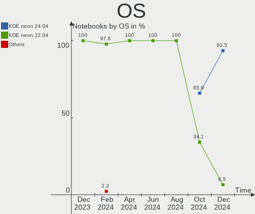
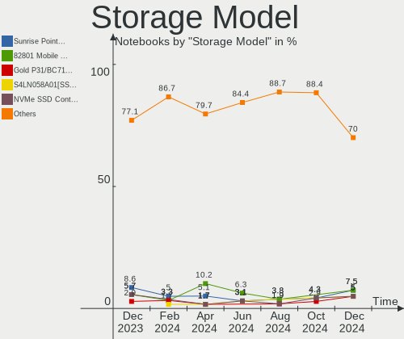
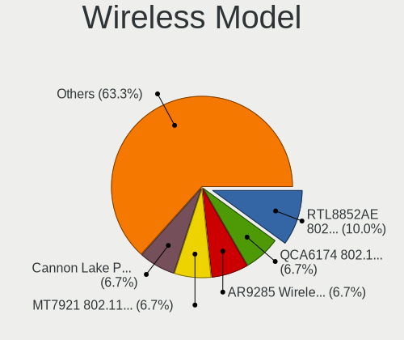

KDE neon - Hardware Trends (Notebooks)
--------------------------------------

A project to identify most popular hardware characteristics and track their change
over time based on data collected by Linux users at https://Linux-Hardware.org.

Anyone can contribute to this report by the [hw-probe](https://github.com/linuxhw/hw-probe) tool:

    sudo -E hw-probe -all -upload

This report is for one last month. Overall report since the beginning of time: [TestCoverage](https://github.com/linuxhw/TestCoverage)

Period: Nov, 2022.

Contents
--------

* [ System ](#system)
  - [ OS                       ](#os)
  - [ OS Family                ](#os-family)
  - [ Kernel                   ](#kernel)
  - [ Kernel Family            ](#kernel-family)
  - [ Kernel Major Ver.        ](#kernel-major-ver)
  - [ Arch                     ](#arch)
  - [ DE                       ](#de)
  - [ Display Server           ](#display-server)
  - [ Display Manager          ](#display-manager)
  - [ OS Lang                  ](#os-lang)
  - [ Boot Mode                ](#boot-mode)
  - [ Filesystem               ](#filesystem)
  - [ Part. scheme             ](#part-scheme)
  - [ Dual Boot with Linux/BSD ](#dual-boot-with-linuxbsd)
  - [ Dual Boot (Win)          ](#dual-boot-win)

* [ Board ](#board)
  - [ Vendor                   ](#vendor)
  - [ Model                    ](#model)
  - [ Model Family             ](#model-family)
  - [ MFG Year                 ](#mfg-year)
  - [ Form Factor              ](#form-factor)
  - [ Secure Boot              ](#secure-boot)
  - [ Coreboot                 ](#coreboot)
  - [ RAM Size                 ](#ram-size)
  - [ RAM Used                 ](#ram-used)
  - [ Total Drives             ](#total-drives)
  - [ Has CD-ROM               ](#has-cd-rom)
  - [ Has Ethernet             ](#has-ethernet)
  - [ Has WiFi                 ](#has-wifi)
  - [ Has Bluetooth            ](#has-bluetooth)

* [ Location ](#location)
  - [ Country                  ](#country)
  - [ City                     ](#city)

* [ Drives ](#drives)
  - [ Drive Vendor             ](#drive-vendor)
  - [ Drive Model              ](#drive-model)
  - [ HDD Vendor               ](#hdd-vendor)
  - [ SSD Vendor               ](#ssd-vendor)
  - [ Drive Kind               ](#drive-kind)
  - [ Drive Connector          ](#drive-connector)
  - [ Drive Size               ](#drive-size)
  - [ Space Total              ](#space-total)
  - [ Space Used               ](#space-used)
  - [ Malfunc. Drives          ](#malfunc-drives)
  - [ Malfunc. Drive Vendor    ](#malfunc-drive-vendor)
  - [ Malfunc. HDD Vendor      ](#malfunc-hdd-vendor)
  - [ Malfunc. Drive Kind      ](#malfunc-drive-kind)
  - [ Failed Drives            ](#failed-drives)
  - [ Failed Drive Vendor      ](#failed-drive-vendor)
  - [ Drive Status             ](#drive-status)

* [ Storage controller ](#storage-controller)
  - [ Storage Vendor           ](#storage-vendor)
  - [ Storage Model            ](#storage-model)
  - [ Storage Kind             ](#storage-kind)

* [ Processor ](#processor)
  - [ CPU Vendor               ](#cpu-vendor)
  - [ CPU Model                ](#cpu-model)
  - [ CPU Model Family         ](#cpu-model-family)
  - [ CPU Cores                ](#cpu-cores)
  - [ CPU Sockets              ](#cpu-sockets)
  - [ CPU Threads              ](#cpu-threads)
  - [ CPU Op-Modes             ](#cpu-op-modes)
  - [ CPU Microcode            ](#cpu-microcode)
  - [ CPU Microarch            ](#cpu-microarch)

* [ Graphics ](#graphics)
  - [ GPU Vendor               ](#gpu-vendor)
  - [ GPU Model                ](#gpu-model)
  - [ GPU Combo                ](#gpu-combo)
  - [ GPU Driver               ](#gpu-driver)
  - [ GPU Memory               ](#gpu-memory)

* [ Monitor ](#monitor)
  - [ Monitor Vendor           ](#monitor-vendor)
  - [ Monitor Model            ](#monitor-model)
  - [ Monitor Resolution       ](#monitor-resolution)
  - [ Monitor Diagonal         ](#monitor-diagonal)
  - [ Monitor Width            ](#monitor-width)
  - [ Aspect Ratio             ](#aspect-ratio)
  - [ Monitor Area             ](#monitor-area)
  - [ Pixel Density            ](#pixel-density)
  - [ Multiple Monitors        ](#multiple-monitors)

* [ Network ](#network)
  - [ Net Controller Vendor    ](#net-controller-vendor)
  - [ Net Controller Model     ](#net-controller-model)
  - [ Wireless Vendor          ](#wireless-vendor)
  - [ Wireless Model           ](#wireless-model)
  - [ Ethernet Vendor          ](#ethernet-vendor)
  - [ Ethernet Model           ](#ethernet-model)
  - [ Net Controller Kind      ](#net-controller-kind)
  - [ Used Controller          ](#used-controller)
  - [ NICs                     ](#nics)
  - [ IPv6                     ](#ipv6)

* [ Bluetooth ](#bluetooth)
  - [ Bluetooth Vendor         ](#bluetooth-vendor)
  - [ Bluetooth Model          ](#bluetooth-model)

* [ Sound ](#sound)
  - [ Sound Vendor             ](#sound-vendor)
  - [ Sound Model              ](#sound-model)

* [ Memory ](#memory)
  - [ Memory Vendor            ](#memory-vendor)
  - [ Memory Model             ](#memory-model)
  - [ Memory Kind              ](#memory-kind)
  - [ Memory Form Factor       ](#memory-form-factor)
  - [ Memory Size              ](#memory-size)
  - [ Memory Speed             ](#memory-speed)

* [ Printers & scanners ](#printers--scanners)
  - [ Printer Vendor           ](#printer-vendor)
  - [ Printer Model            ](#printer-model)
  - [ Scanner Vendor           ](#scanner-vendor)
  - [ Scanner Model            ](#scanner-model)

* [ Camera ](#camera)
  - [ Camera Vendor            ](#camera-vendor)
  - [ Camera Model             ](#camera-model)

* [ Security ](#security)
  - [ Fingerprint Vendor       ](#fingerprint-vendor)
  - [ Fingerprint Model        ](#fingerprint-model)
  - [ Chipcard Vendor          ](#chipcard-vendor)
  - [ Chipcard Model           ](#chipcard-model)

* [ Unsupported ](#unsupported)
  - [ Unsupported Devices      ](#unsupported-devices)
  - [ Unsupported Device Types ](#unsupported-device-types)

System
------

OS
--

Installed operating systems

| Name           | Notebooks | Percent |
|----------------|-----------|---------|
| KDE neon 22.04 | 61        | 95.31%  |
| KDE neon 20.04 | 3         | 4.69%   |

OS Family
---------

OS without a version

| Name     | Notebooks | Percent |
|----------|-----------|---------|
| KDE neon | 64        | 100%    |

Kernel
------

Version of the Linux kernel

| Version              | Notebooks | Percent |
|----------------------|-----------|---------|
| 5.15.0-52-generic    | 37        | 57.81%  |
| 5.15.0-53-generic    | 24        | 37.5%   |
| 6.0.7-060007-generic | 1         | 1.56%   |
| 5.15.0-50-generic    | 1         | 1.56%   |
| 5.13.0-30-generic    | 1         | 1.56%   |

Kernel Family
-------------

Linux kernel without a distro release

| Version | Notebooks | Percent |
|---------|-----------|---------|
| 5.15.0  | 62        | 96.88%  |
| 6.0.7   | 1         | 1.56%   |
| 5.13.0  | 1         | 1.56%   |

Kernel Major Ver.
-----------------

Linux kernel major version

| Version | Notebooks | Percent |
|---------|-----------|---------|
| 5.15    | 62        | 96.88%  |
| 6.0     | 1         | 1.56%   |
| 5.13    | 1         | 1.56%   |

Arch
----

OS architecture (x86_64, i586, etc.)

| Name   | Notebooks | Percent |
|--------|-----------|---------|
| x86_64 | 64        | 100%    |

DE
--

Desktop Environment

| Name | Notebooks | Percent |
|------|-----------|---------|
| KDE5 | 64        | 100%    |

Display Server
--------------

X11 or Wayland

| Name    | Notebooks | Percent |
|---------|-----------|---------|
| X11     | 60        | 93.75%  |
| Wayland | 4         | 6.25%   |

Display Manager
---------------

SDDM, LightDM, etc.

| Name    | Notebooks | Percent |
|---------|-----------|---------|
| Unknown | 46        | 71.88%  |
| SDDM    | 18        | 28.13%  |

OS Lang
-------

Language

| Lang  | Notebooks | Percent |
|-------|-----------|---------|
| en_US | 16        | 25%     |
| de_DE | 8         | 12.5%   |
| en_AG | 6         | 9.38%   |
| en_GB | 5         | 7.81%   |
| fr_FR | 4         | 6.25%   |
| pt_BR | 3         | 4.69%   |
| sv_SE | 2         | 3.13%   |
| ru_RU | 2         | 3.13%   |
| it_IT | 2         | 3.13%   |
| en_IN | 2         | 3.13%   |
| el_GR | 2         | 3.13%   |
| tr_TR | 1         | 1.56%   |
| pt_PT | 1         | 1.56%   |
| pl_PL | 1         | 1.56%   |
| nl_NL | 1         | 1.56%   |
| fr_BE | 1         | 1.56%   |
| es_MX | 1         | 1.56%   |
| es_CL | 1         | 1.56%   |
| en_PH | 1         | 1.56%   |
| en_CA | 1         | 1.56%   |
| cs_CZ | 1         | 1.56%   |
| ca_AD | 1         | 1.56%   |
| bg_BG | 1         | 1.56%   |

Boot Mode
---------

EFI or BIOS

| Mode | Notebooks | Percent |
|------|-----------|---------|
| BIOS | 55        | 85.94%  |
| EFI  | 9         | 14.06%  |

Filesystem
----------

Type of filesystem

| Type    | Notebooks | Percent |
|---------|-----------|---------|
| Ext4    | 63        | 98.44%  |
| Overlay | 1         | 1.56%   |

Part. scheme
------------

Scheme of partitioning

| Type    | Notebooks | Percent |
|---------|-----------|---------|
| Unknown | 46        | 71.88%  |
| GPT     | 14        | 21.88%  |
| MBR     | 4         | 6.25%   |

Dual Boot with Linux/BSD
------------------------

Hosting more than one Linux/BSD

| Dual boot | Notebooks | Percent |
|-----------|-----------|---------|
| No        | 62        | 96.88%  |
| Yes       | 2         | 3.13%   |

Dual Boot (Win)
---------------

Hosting Linux and Windows

| Dual boot | Notebooks | Percent |
|-----------|-----------|---------|
| No        | 56        | 87.5%   |
| Yes       | 8         | 12.5%   |

Board
-----

Vendor
------

Motherboard manufacturer

| Name                     | Notebooks | Percent |
|--------------------------|-----------|---------|
| Hewlett-Packard          | 14        | 21.88%  |
| ASUSTek Computer         | 11        | 17.19%  |
| Dell                     | 8         | 12.5%   |
| Lenovo                   | 7         | 10.94%  |
| Acer                     | 5         | 7.81%   |
| Toshiba                  | 4         | 6.25%   |
| Samsung Electronics      | 2         | 3.13%   |
| Notebook                 | 2         | 3.13%   |
| K.A.Technologies Limited | 2         | 3.13%   |
| Timi                     | 1         | 1.56%   |
| Sony                     | 1         | 1.56%   |
| Razer                    | 1         | 1.56%   |
| Purism                   | 1         | 1.56%   |
| HUAWEI                   | 1         | 1.56%   |
| GPU Company              | 1         | 1.56%   |
| eMachines                | 1         | 1.56%   |
| AXDIA International      | 1         | 1.56%   |
| Apple                    | 1         | 1.56%   |

Model
-----

Motherboard model

| Name                                       | Notebooks | Percent |
|--------------------------------------------|-----------|---------|
| K.A.Technologies Limited TM1               | 2         | 3.13%   |
| Toshiba TECRA M11                          | 1         | 1.56%   |
| Toshiba Satellite L750                     | 1         | 1.56%   |
| Toshiba Satellite C70D-B                   | 1         | 1.56%   |
| Toshiba Satellite A305                     | 1         | 1.56%   |
| Timi Xiaomi Book Pro 16 2022               | 1         | 1.56%   |
| Sony VPCEA23FB                             | 1         | 1.56%   |
| Samsung 550P5C/550P7C                      | 1         | 1.56%   |
| Samsung 305V4A/305V5A                      | 1         | 1.56%   |
| Razer Blade Stealth                        | 1         | 1.56%   |
| Purism Librem 14                           | 1         | 1.56%   |
| Notebook PA70ES                            | 1         | 1.56%   |
| Notebook NL40_50CU                         | 1         | 1.56%   |
| Lenovo ThinkPad X1 Carbon Gen 9 20XWS21H00 | 1         | 1.56%   |
| Lenovo ThinkPad T470s 20HFCTO1WW           | 1         | 1.56%   |
| Lenovo ThinkPad T420 4236WR1               | 1         | 1.56%   |
| Lenovo ThinkPad P1 Gen 4i 20Y3003CUS       | 1         | 1.56%   |
| Lenovo IdeaPad S340-15IWL 81N8             | 1         | 1.56%   |
| Lenovo IdeaPad 5 Pro 16ARH7 82SN           | 1         | 1.56%   |
| Lenovo IdeaPad 320-15IKB 81BG              | 1         | 1.56%   |
| HUAWEI KLVL-WXXW                           | 1         | 1.56%   |
| HP ZBook 15u G6                            | 1         | 1.56%   |
| HP Victus by Laptop 16-d0xxx               | 1         | 1.56%   |
| HP Pavilion Gaming Laptop 17-cd2xxx        | 1         | 1.56%   |
| HP Pavilion Gaming Laptop 15-ec2xxx        | 1         | 1.56%   |
| HP Pavilion g7                             | 1         | 1.56%   |
| HP OMEN by Laptop 15-dc0xxx                | 1         | 1.56%   |
| HP Notebook                                | 1         | 1.56%   |
| HP Laptop 15-dw1xxx                        | 1         | 1.56%   |
| HP Laptop 15-db0xxx                        | 1         | 1.56%   |
| HP G5000 (GF783EA#AKD)                     | 1         | 1.56%   |
| HP EliteBook Revolve 810 G3                | 1         | 1.56%   |
| HP EliteBook 8560w                         | 1         | 1.56%   |
| HP EliteBook 830 G5                        | 1         | 1.56%   |
| HP 15 Notebook PC                          | 1         | 1.56%   |
| GPU Company GWTN156-4                      | 1         | 1.56%   |
| eMachines G525                             | 1         | 1.56%   |
| Dell Vostro 5515                           | 1         | 1.56%   |
| Dell Vostro 3401                           | 1         | 1.56%   |
| Dell Vostro 15 5501                        | 1         | 1.56%   |

Model Family
------------

Motherboard model prefix

| Name                         | Notebooks | Percent |
|------------------------------|-----------|---------|
| Lenovo ThinkPad              | 4         | 6.25%   |
| Toshiba Satellite            | 3         | 4.69%   |
| Lenovo IdeaPad               | 3         | 4.69%   |
| HP Pavilion                  | 3         | 4.69%   |
| HP EliteBook                 | 3         | 4.69%   |
| Dell Vostro                  | 3         | 4.69%   |
| Dell Inspiron                | 3         | 4.69%   |
| ASUS VivoBook                | 3         | 4.69%   |
| Acer Aspire                  | 3         | 4.69%   |
| K.A.Technologies Limited TM1 | 2         | 3.13%   |
| HP Laptop                    | 2         | 3.13%   |
| Toshiba TECRA                | 1         | 1.56%   |
| Timi Xiaomi                  | 1         | 1.56%   |
| Sony VPCEA23FB               | 1         | 1.56%   |
| Samsung 550P5C               | 1         | 1.56%   |
| Samsung 305V4A               | 1         | 1.56%   |
| Razer Blade                  | 1         | 1.56%   |
| Purism Librem                | 1         | 1.56%   |
| Notebook PA70ES              | 1         | 1.56%   |
| Notebook NL40                | 1         | 1.56%   |
| HUAWEI KLVL-WXXW             | 1         | 1.56%   |
| HP ZBook                     | 1         | 1.56%   |
| HP Victus                    | 1         | 1.56%   |
| HP OMEN                      | 1         | 1.56%   |
| HP Notebook                  | 1         | 1.56%   |
| HP G5000                     | 1         | 1.56%   |
| HP 15                        | 1         | 1.56%   |
| GPU Company GWTN156-4        | 1         | 1.56%   |
| eMachines G525               | 1         | 1.56%   |
| Dell Venue                   | 1         | 1.56%   |
| Dell Precision               | 1         | 1.56%   |
| AXDIA International MYBOOK   | 1         | 1.56%   |
| ASUS P52F                    | 1         | 1.56%   |
| ASUS N61Jv                   | 1         | 1.56%   |
| ASUS N550JK                  | 1         | 1.56%   |
| ASUS K55A                    | 1         | 1.56%   |
| ASUS GR8                     | 1         | 1.56%   |
| ASUS GL703VD                 | 1         | 1.56%   |
| ASUS E203NAH                 | 1         | 1.56%   |
| ASUS A7K                     | 1         | 1.56%   |

MFG Year
--------

Motherboard manufacture year

| Year | Notebooks | Percent |
|------|-----------|---------|
| 2021 | 13        | 20.31%  |
| 2018 | 6         | 9.38%   |
| 2017 | 6         | 9.38%   |
| 2011 | 6         | 9.38%   |
| 2019 | 5         | 7.81%   |
| 2014 | 5         | 7.81%   |
| 2010 | 5         | 7.81%   |
| 2022 | 3         | 4.69%   |
| 2020 | 3         | 4.69%   |
| 2015 | 3         | 4.69%   |
| 2012 | 3         | 4.69%   |
| 2007 | 2         | 3.13%   |
| 2016 | 1         | 1.56%   |
| 2013 | 1         | 1.56%   |
| 2009 | 1         | 1.56%   |
| 2008 | 1         | 1.56%   |

Form Factor
-----------

Physical design of the computer

| Name     | Notebooks | Percent |
|----------|-----------|---------|
| Notebook | 64        | 100%    |

Secure Boot
-----------

Enabled or disabled

| State    | Notebooks | Percent |
|----------|-----------|---------|
| Disabled | 61        | 95.31%  |
| Enabled  | 3         | 4.69%   |

Coreboot
--------

Have coreboot on board

| Used | Notebooks | Percent |
|------|-----------|---------|
| No   | 63        | 98.44%  |
| Yes  | 1         | 1.56%   |

RAM Size
--------

Total RAM memory

| Size in GB | Notebooks | Percent |
|------------|-----------|---------|
| 4.01-8.0   | 23        | 35.94%  |
| 16.01-24.0 | 14        | 21.88%  |
| 3.01-4.0   | 9         | 14.06%  |
| 32.01-64.0 | 6         | 9.38%   |
| 8.01-16.0  | 6         | 9.38%   |
| 1.01-2.0   | 3         | 4.69%   |
| 24.01-32.0 | 2         | 3.13%   |
| 2.01-3.0   | 1         | 1.56%   |

RAM Used
--------

Used RAM memory

| Used GB   | Notebooks | Percent |
|-----------|-----------|---------|
| 2.01-3.0  | 24        | 37.5%   |
| 1.01-2.0  | 21        | 32.81%  |
| 4.01-8.0  | 8         | 12.5%   |
| 3.01-4.0  | 7         | 10.94%  |
| 8.01-16.0 | 2         | 3.13%   |
| 0.51-1.0  | 2         | 3.13%   |

Total Drives
------------

Number of drives on board

| Drives | Notebooks | Percent |
|--------|-----------|---------|
| 1      | 39        | 60.94%  |
| 2      | 21        | 32.81%  |
| 3      | 4         | 6.25%   |

Has CD-ROM
----------

Has CD-ROM on board

| Presented | Notebooks | Percent |
|-----------|-----------|---------|
| No        | 43        | 67.19%  |
| Yes       | 21        | 32.81%  |

Has Ethernet
------------

Has Ethernet on board

| Presented | Notebooks | Percent |
|-----------|-----------|---------|
| Yes       | 55        | 85.94%  |
| No        | 9         | 14.06%  |

Has WiFi
--------

Has WiFi module

| Presented | Notebooks | Percent |
|-----------|-----------|---------|
| Yes       | 63        | 98.44%  |
| No        | 1         | 1.56%   |

Has Bluetooth
-------------

Has Bluetooth module

| Presented | Notebooks | Percent |
|-----------|-----------|---------|
| Yes       | 49        | 76.56%  |
| No        | 15        | 23.44%  |

Location
--------

Country
-------

Geographic location (country)

| Country            | Notebooks | Percent |
|--------------------|-----------|---------|
| Germany            | 9         | 14.06%  |
| USA                | 8         | 12.5%   |
| India              | 4         | 6.25%   |
| Brazil             | 4         | 6.25%   |
| UK                 | 3         | 4.69%   |
| Sweden             | 3         | 4.69%   |
| Spain              | 3         | 4.69%   |
| Italy              | 3         | 4.69%   |
| Greece             | 3         | 4.69%   |
| France             | 3         | 4.69%   |
| Ghana              | 2         | 3.13%   |
| Canada             | 2         | 3.13%   |
| Bulgaria           | 2         | 3.13%   |
| Turkey             | 1         | 1.56%   |
| Tunisia            | 1         | 1.56%   |
| Russia             | 1         | 1.56%   |
| Portugal           | 1         | 1.56%   |
| Poland             | 1         | 1.56%   |
| Philippines        | 1         | 1.56%   |
| Netherlands        | 1         | 1.56%   |
| Mexico             | 1         | 1.56%   |
| Iran               | 1         | 1.56%   |
| Indonesia          | 1         | 1.56%   |
| Dominican Republic | 1         | 1.56%   |
| Czechia            | 1         | 1.56%   |
| Chile              | 1         | 1.56%   |
| Belgium            | 1         | 1.56%   |
| Algeria            | 1         | 1.56%   |

City
----

Geographic location (city)

| City                        | Notebooks | Percent |
|-----------------------------|-----------|---------|
| Brattleboro                 | 2         | 3.13%   |
| Accra                       | 2         | 3.13%   |
| Xhoris                      | 1         | 1.56%   |
| Wiesbaden                   | 1         | 1.56%   |
| Vila Real de Santo António | 1         | 1.56%   |
| Varna                       | 1         | 1.56%   |
| Vaernamo                    | 1         | 1.56%   |
| Tunis                       | 1         | 1.56%   |
| Tehran                      | 1         | 1.56%   |
| Stapelfeld                  | 1         | 1.56%   |
| Sofia                       | 1         | 1.56%   |
| Serres                      | 1         | 1.56%   |
| Schuettorf                  | 1         | 1.56%   |
| Santiago de los Caballeros  | 1         | 1.56%   |
| Santiago                    | 1         | 1.56%   |
| Sant Vicenc de Montalt      | 1         | 1.56%   |
| Saltillo                    | 1         | 1.56%   |
| Saint-Julien-les-Villas     | 1         | 1.56%   |
| Rochefort                   | 1         | 1.56%   |
| Rio de Janeiro              | 1         | 1.56%   |
| Richmond Hill               | 1         | 1.56%   |
| Rhodes                      | 1         | 1.56%   |
| Rapid City                  | 1         | 1.56%   |
| Portogruaro                 | 1         | 1.56%   |
| Porto Alegre                | 1         | 1.56%   |
| Örebro                     | 1         | 1.56%   |
| Nuremberg                   | 1         | 1.56%   |
| Northfield                  | 1         | 1.56%   |
| New Delhi                   | 1         | 1.56%   |
| Munich                      | 1         | 1.56%   |
| Mossingen                   | 1         | 1.56%   |
| Montreal                    | 1         | 1.56%   |
| Milan                       | 1         | 1.56%   |
| Midvale                     | 1         | 1.56%   |
| Malang                      | 1         | 1.56%   |
| Madrid                      | 1         | 1.56%   |
| Lyon                        | 1         | 1.56%   |
| Luleå                      | 1         | 1.56%   |
| London                      | 1         | 1.56%   |
| Lodz                        | 1         | 1.56%   |

Drives
------

Drive Vendor
------------

Hard drive vendors

| Vendor                      | Notebooks | Drives | Percent |
|-----------------------------|-----------|--------|---------|
| Samsung Electronics         | 14        | 18     | 16.28%  |
| WDC                         | 8         | 8      | 9.3%    |
| Seagate                     | 8         | 8      | 9.3%    |
| SK hynix                    | 6         | 6      | 6.98%   |
| Crucial                     | 6         | 6      | 6.98%   |
| Toshiba                     | 5         | 5      | 5.81%   |
| KIOXIA                      | 4         | 4      | 4.65%   |
| Unknown                     | 3         | 3      | 3.49%   |
| Netac                       | 3         | 3      | 3.49%   |
| Kingston Technology Company | 3         | 4      | 3.49%   |
| A-DATA Technology           | 3         | 3      | 3.49%   |
| Sandisk                     | 2         | 2      | 2.33%   |
| Phison Electronics          | 2         | 2      | 2.33%   |
| Micron/Crucial Technology   | 2         | 2      | 2.33%   |
| Kingston                    | 2         | 2      | 2.33%   |
| Intel                       | 2         | 2      | 2.33%   |
| Hitachi                     | 2         | 2      | 2.33%   |
| HGST                        | 2         | 2      | 2.33%   |
| USB3.0                      | 1         | 1      | 1.16%   |
| Silicon Motion              | 1         | 1      | 1.16%   |
| Micron Technology           | 1         | 1      | 1.16%   |
| Intenso                     | 1         | 1      | 1.16%   |
| Hewlett-Packard             | 1         | 1      | 1.16%   |
| GOODRAM                     | 1         | 1      | 1.16%   |
| Gigabyte Technology         | 1         | 1      | 1.16%   |
| China                       | 1         | 1      | 1.16%   |
| ADATA Technology            | 1         | 1      | 1.16%   |

Drive Model
-----------

Hard drive models

| Model                                                 | Notebooks | Percent |
|-------------------------------------------------------|-----------|---------|
| Toshiba MQ01ABD100 1TB                                | 3         | 3.33%   |
| Seagate ST1000LM035-1RK172 1TB                        | 3         | 3.33%   |
| Samsung NVMe SSD Controller SM981/PM981/PM983 1TB     | 3         | 3.33%   |
| Netac SSD 256GB                                       | 3         | 3.33%   |
| Toshiba MQ01ABF050 500GB                              | 2         | 2.22%   |
| Samsung MZVLQ512HALU-000H1 512GB                      | 2         | 2.22%   |
| Phison PS5013 E13 NVMe Controller 256GB               | 2         | 2.22%   |
| Micron/Crucial P2 NVMe PCIe SSD 250GB                 | 2         | 2.22%   |
| KIOXIA KBG40ZNS256G NVMe 256GB                        | 2         | 2.22%   |
| Kingston Company A2000 NVMe SSD 500GB                 | 2         | 2.22%   |
| WDC WD5000LPCX-21VHAT0 500GB                          | 1         | 1.11%   |
| WDC WD3200BPVT-22JJ5T0 320GB                          | 1         | 1.11%   |
| WDC WD3200BEVT-22ZCT0 320GB                           | 1         | 1.11%   |
| WDC WD10SPZX-21Z10T0 1TB                              | 1         | 1.11%   |
| WDC WD10JPVX-22JC3T0 1TB                              | 1         | 1.11%   |
| WDC WD10JPCX-24UE4T0 1TB                              | 1         | 1.11%   |
| WDC WD Blue SA510 2.5 1TB                             | 1         | 1.11%   |
| WDC PC SN520 SDAPNUW-256G-1006 256GB                  | 1         | 1.11%   |
| USB3.0 Super Speed 200GB                              | 1         | 1.11%   |
| Unknown SD/MMC/MS PRO 8GB                             | 1         | 1.11%   |
| Unknown MMC Card  32GB                                | 1         | 1.11%   |
| Unknown MMC Card  128GB                               | 1         | 1.11%   |
| SK hynix SHGS31-1000GS-2 1TB SSD                      | 1         | 1.11%   |
| SK hynix SC300 M.2 2280 256GB SSD                     | 1         | 1.11%   |
| SK hynix HFS256G39TND-N210A 256GB SSD                 | 1         | 1.11%   |
| SK hynix HFM512GD3JX016N 512GB                        | 1         | 1.11%   |
| SK hynix BC711 NVMe 512GB                             | 1         | 1.11%   |
| SK hynix BC711 NVMe 256GB                             | 1         | 1.11%   |
| Silicon Motion SM2263EN/SM2263XT SSD Controller 128GB | 1         | 1.11%   |
| Seagate ST9500325AS 500GB                             | 1         | 1.11%   |
| Seagate ST500LM000-1EJ162 500GB                       | 1         | 1.11%   |
| Seagate ST1000LM049-2GH172 1TB                        | 1         | 1.11%   |
| Seagate ST1000LM048-2E7172 1TB                        | 1         | 1.11%   |
| Seagate ST1000LM024 HN-M101MBB 1TB                    | 1         | 1.11%   |
| Sandisk WD Blue SN550 NVMe SSD 1TB                    | 1         | 1.11%   |
| Sandisk WD Blue SN500 / PC SN520 NVMe SSD 512GB       | 1         | 1.11%   |
| Samsung SSD 980 500GB                                 | 1         | 1.11%   |
| Samsung SSD 860 EVO 500GB                             | 1         | 1.11%   |
| Samsung SSD 860 EVO 250GB                             | 1         | 1.11%   |
| Samsung SSD 850 PRO 256GB                             | 1         | 1.11%   |

HDD Vendor
----------

Hard disk drive vendors

| Vendor  | Notebooks | Drives | Percent |
|---------|-----------|--------|---------|
| Seagate | 8         | 8      | 33.33%  |
| WDC     | 6         | 6      | 25%     |
| Toshiba | 5         | 5      | 20.83%  |
| Hitachi | 2         | 2      | 8.33%   |
| HGST    | 2         | 2      | 8.33%   |
| Unknown | 1         | 1      | 4.17%   |

SSD Vendor
----------

Solid state drive vendors

| Vendor              | Notebooks | Drives | Percent |
|---------------------|-----------|--------|---------|
| Crucial             | 6         | 6      | 20.69%  |
| Samsung Electronics | 5         | 5      | 17.24%  |
| SK hynix            | 3         | 3      | 10.34%  |
| Netac               | 3         | 3      | 10.34%  |
| A-DATA Technology   | 3         | 3      | 10.34%  |
| Kingston            | 2         | 2      | 6.9%    |
| WDC                 | 1         | 1      | 3.45%   |
| USB3.0              | 1         | 1      | 3.45%   |
| Intel               | 1         | 1      | 3.45%   |
| Hewlett-Packard     | 1         | 1      | 3.45%   |
| GOODRAM             | 1         | 1      | 3.45%   |
| Gigabyte Technology | 1         | 1      | 3.45%   |
| China               | 1         | 1      | 3.45%   |

Drive Kind
----------

HDD or SSD

| Kind    | Notebooks | Drives | Percent |
|---------|-----------|--------|---------|
| NVMe    | 28        | 34     | 34.15%  |
| SSD     | 26        | 29     | 31.71%  |
| HDD     | 24        | 24     | 29.27%  |
| MMC     | 3         | 3      | 3.66%   |
| Unknown | 1         | 1      | 1.22%   |

Drive Connector
---------------

SATA, SAS, NVMe, etc.

| Type | Notebooks | Drives | Percent |
|------|-----------|--------|---------|
| SATA | 42        | 51     | 54.55%  |
| NVMe | 28        | 33     | 36.36%  |
| SAS  | 4         | 4      | 5.19%   |
| MMC  | 3         | 3      | 3.9%    |

Drive Size
----------

Size of hard drive

| Size in TB | Notebooks | Drives | Percent |
|------------|-----------|--------|---------|
| 0.01-0.5   | 29        | 33     | 60.42%  |
| 0.51-1.0   | 18        | 19     | 37.5%   |
| 1.01-2.0   | 1         | 1      | 2.08%   |

Space Total
-----------

Amount of disk space available on the file system

| Size in GB | Notebooks | Percent |
|------------|-----------|---------|
| 251-500    | 16        | 25%     |
| 101-250    | 16        | 25%     |
| 501-1000   | 13        | 20.31%  |
| 1001-2000  | 7         | 10.94%  |
| 51-100     | 5         | 7.81%   |
| 1-20       | 3         | 4.69%   |
| 21-50      | 2         | 3.13%   |
| Unknown    | 2         | 3.13%   |

Space Used
----------

Amount of used disk space

| Used GB  | Notebooks | Percent |
|----------|-----------|---------|
| 1-20     | 26        | 40.63%  |
| 51-100   | 13        | 20.31%  |
| 21-50    | 9         | 14.06%  |
| 101-250  | 6         | 9.38%   |
| 251-500  | 5         | 7.81%   |
| 501-1000 | 3         | 4.69%   |
| Unknown  | 2         | 3.13%   |

Malfunc. Drives
---------------

Drive models with a malfunction

| Model                          | Notebooks | Drives | Percent |
|--------------------------------|-----------|--------|---------|
| WDC WD3200BPVT-22JJ5T0 320GB   | 1         | 1      | 50%     |
| Seagate ST1000LM035-1RK172 1TB | 1         | 1      | 50%     |

Malfunc. Drive Vendor
---------------------

Vendors of faulty drives

| Vendor  | Notebooks | Drives | Percent |
|---------|-----------|--------|---------|
| WDC     | 1         | 1      | 50%     |
| Seagate | 1         | 1      | 50%     |

Malfunc. HDD Vendor
-------------------

Vendors of faulty HDD drives

| Vendor  | Notebooks | Drives | Percent |
|---------|-----------|--------|---------|
| WDC     | 1         | 1      | 50%     |
| Seagate | 1         | 1      | 50%     |

Malfunc. Drive Kind
-------------------

Kinds of faulty drives

| Kind | Notebooks | Drives | Percent |
|------|-----------|--------|---------|
| HDD  | 2         | 2      | 100%    |

Failed Drives
-------------

Failed drive models

Zero info for selected period =(

Failed Drive Vendor
-------------------

Failed drive vendors

Zero info for selected period =(

Drive Status
------------

Number of failed and malfunc. drives

| Status   | Notebooks | Drives | Percent |
|----------|-----------|--------|---------|
| Detected | 57        | 81     | 85.07%  |
| Works    | 8         | 8      | 11.94%  |
| Malfunc  | 2         | 2      | 2.99%   |

Storage controller
------------------

Storage Vendor
--------------

Storage controller vendors

| Vendor                      | Notebooks | Percent |
|-----------------------------|-----------|---------|
| Intel                       | 41        | 50%     |
| AMD                         | 11        | 13.41%  |
| Samsung Electronics         | 10        | 12.2%   |
| KIOXIA                      | 4         | 4.88%   |
| SK hynix                    | 3         | 3.66%   |
| Kingston Technology Company | 3         | 3.66%   |
| SanDisk                     | 2         | 2.44%   |
| Phison Electronics          | 2         | 2.44%   |
| Micron/Crucial Technology   | 2         | 2.44%   |
| Silicon Motion              | 1         | 1.22%   |
| Micron Technology           | 1         | 1.22%   |
| JMicron Technology          | 1         | 1.22%   |
| ADATA Technology            | 1         | 1.22%   |

Storage Model
-------------

Storage controller models

| Model                                                                            | Notebooks | Percent |
|----------------------------------------------------------------------------------|-----------|---------|
| AMD FCH SATA Controller [AHCI mode]                                              | 10        | 11.24%  |
| Intel 5 Series/3400 Series Chipset 4 port SATA AHCI Controller                   | 5         | 5.62%   |
| Samsung NVMe SSD Controller SM981/PM981/PM983                                    | 4         | 4.49%   |
| Intel Volume Management Device NVMe RAID Controller                              | 4         | 4.49%   |
| Intel 82801 Mobile SATA Controller [RAID mode]                                   | 4         | 4.49%   |
| Intel 6 Series/C200 Series Chipset Family 6 port Mobile SATA AHCI Controller     | 4         | 4.49%   |
| SK hynix Gold P31/PC711 NVMe Solid State Drive                                   | 3         | 3.37%   |
| Samsung NVMe SSD Controller 980                                                  | 3         | 3.37%   |
| KIOXIA NVMe SSD Controller BG4                                                   | 3         | 3.37%   |
| Intel Sunrise Point-LP SATA Controller [AHCI mode]                               | 3         | 3.37%   |
| Intel 7 Series Chipset Family 6-port SATA Controller [AHCI mode]                 | 3         | 3.37%   |
| Samsung NVMe SSD Controller SM961/PM961/SM963                                    | 2         | 2.25%   |
| Phison PS5013 E13 NVMe Controller                                                | 2         | 2.25%   |
| Micron/Crucial P2 NVMe PCIe SSD                                                  | 2         | 2.25%   |
| Kingston Company A2000 NVMe SSD                                                  | 2         | 2.25%   |
| Intel Wildcat Point-LP SATA Controller [AHCI Mode]                               | 2         | 2.25%   |
| Intel Celeron/Pentium Silver Processor SATA Controller                           | 2         | 2.25%   |
| Intel Celeron N3350/Pentium N4200/Atom E3900 Series SATA AHCI Controller         | 2         | 2.25%   |
| Intel Cannon Lake Mobile PCH SATA AHCI Controller                                | 2         | 2.25%   |
| Intel 8 Series SATA Controller 1 [AHCI mode]                                     | 2         | 2.25%   |
| Silicon Motion SM2263EN/SM2263XT SSD Controller                                  | 1         | 1.12%   |
| SanDisk WD Blue SN550 NVMe SSD                                                   | 1         | 1.12%   |
| SanDisk WD Blue SN500 / PC SN520 NVMe SSD                                        | 1         | 1.12%   |
| Samsung NVMe SSD Controller PM9A1/PM9A3/980PRO                                   | 1         | 1.12%   |
| Micron Non-Volatile memory controller                                            | 1         | 1.12%   |
| KIOXIA Non-Volatile memory controller                                            | 1         | 1.12%   |
| Kingston Company U-SNS8154P3 NVMe SSD                                            | 1         | 1.12%   |
| Kingston Company Company Non-Volatile memory controller                          | 1         | 1.12%   |
| JMicron JMB360 AHCI Controller                                                   | 1         | 1.12%   |
| Intel Tiger Lake-LP SATA Controller                                              | 1         | 1.12%   |
| Intel Non-Volatile memory controller                                             | 1         | 1.12%   |
| Intel Ice Lake-LP SATA Controller [AHCI mode]                                    | 1         | 1.12%   |
| Intel Comet Lake SATA AHCI Controller                                            | 1         | 1.12%   |
| Intel Cannon Point-LP SATA Controller [AHCI Mode]                                | 1         | 1.12%   |
| Intel Atom/Celeron/Pentium Processor x5-E8000/J3xxx/N3xxx Series SATA Controller | 1         | 1.12%   |
| Intel 82801IBM/IEM (ICH9M/ICH9M-E) 4 port SATA Controller [AHCI mode]            | 1         | 1.12%   |
| Intel 82801HM/HEM (ICH8M/ICH8M-E) SATA Controller [IDE mode]                     | 1         | 1.12%   |
| Intel 82801HM/HEM (ICH8M/ICH8M-E) IDE Controller                                 | 1         | 1.12%   |
| Intel 82801GBM/GHM (ICH7-M Family) SATA Controller [AHCI mode]                   | 1         | 1.12%   |
| Intel 82801G (ICH7 Family) IDE Controller                                        | 1         | 1.12%   |

Storage Kind
------------

Kind of storage controller (IDE, SATA, NVMe, SAS, ...)

| Kind | Notebooks | Percent |
|------|-----------|---------|
| SATA | 44        | 52.38%  |
| NVMe | 28        | 33.33%  |
| RAID | 8         | 9.52%   |
| IDE  | 4         | 4.76%   |

Processor
---------

CPU Vendor
----------

Processor vendors

| Vendor | Notebooks | Percent |
|--------|-----------|---------|
| Intel  | 51        | 79.69%  |
| AMD    | 13        | 20.31%  |

CPU Model
---------

Processor models

| Model                                   | Notebooks | Percent |
|-----------------------------------------|-----------|---------|
| Intel Core i5-3210M CPU @ 2.50GHz       | 3         | 4.69%   |
| Intel Core i7-8750H CPU @ 2.20GHz       | 2         | 3.13%   |
| Intel Core i7-7500U CPU @ 2.70GHz       | 2         | 3.13%   |
| Intel Core i5-8250U CPU @ 1.60GHz       | 2         | 3.13%   |
| Intel Core i3 CPU M 330 @ 2.13GHz       | 2         | 3.13%   |
| Intel Celeron N4020 CPU @ 1.10GHz       | 2         | 3.13%   |
| Intel 11th Gen Core i5-11300H @ 3.10GHz | 2         | 3.13%   |
| AMD Ryzen 5 5500U with Radeon Graphics  | 2         | 3.13%   |
| Intel Core i7-9750H CPU @ 2.60GHz       | 1         | 1.56%   |
| Intel Core i7-8565U CPU @ 1.80GHz       | 1         | 1.56%   |
| Intel Core i7-8550U CPU @ 1.80GHz       | 1         | 1.56%   |
| Intel Core i7-7700HQ CPU @ 2.80GHz      | 1         | 1.56%   |
| Intel Core i7-4810MQ CPU @ 2.80GHz      | 1         | 1.56%   |
| Intel Core i7-4710HQ CPU @ 2.50GHz      | 1         | 1.56%   |
| Intel Core i7-4510U CPU @ 2.00GHz       | 1         | 1.56%   |
| Intel Core i7-2820QM CPU @ 2.30GHz      | 1         | 1.56%   |
| Intel Core i7-10710U CPU @ 1.10GHz      | 1         | 1.56%   |
| Intel Core i7-10510U CPU @ 1.80GHz      | 1         | 1.56%   |
| Intel Core i5-8265U CPU @ 1.60GHz       | 1         | 1.56%   |
| Intel Core i5-5200U CPU @ 2.20GHz       | 1         | 1.56%   |
| Intel Core i5-4210U CPU @ 1.70GHz       | 1         | 1.56%   |
| Intel Core i5-2540M CPU @ 2.60GHz       | 1         | 1.56%   |
| Intel Core i5-2430M CPU @ 2.40GHz       | 1         | 1.56%   |
| Intel Core i5-1035G1 CPU @ 1.00GHz      | 1         | 1.56%   |
| Intel Core i5-10210U CPU @ 1.60GHz      | 1         | 1.56%   |
| Intel Core i5 CPU M 520 @ 2.40GHz       | 1         | 1.56%   |
| Intel Core i5 CPU M 480 @ 2.67GHz       | 1         | 1.56%   |
| Intel Core i5 CPU M 460 @ 2.53GHz       | 1         | 1.56%   |
| Intel Core i3-7100U CPU @ 2.40GHz       | 1         | 1.56%   |
| Intel Core i3-5005U CPU @ 2.00GHz       | 1         | 1.56%   |
| Intel Core i3-2330M CPU @ 2.20GHz       | 1         | 1.56%   |
| Intel Core i3-1005G1 CPU @ 1.20GHz      | 1         | 1.56%   |
| Intel Core 2 Duo CPU T5550 @ 1.83GHz    | 1         | 1.56%   |
| Intel Celeron M CPU 520 @ 1.60GHz       | 1         | 1.56%   |
| Intel Celeron CPU N3450 @ 1.10GHz       | 1         | 1.56%   |
| Intel Celeron CPU N3350 @ 1.10GHz       | 1         | 1.56%   |
| Intel Celeron CPU N3050 @ 1.60GHz       | 1         | 1.56%   |
| Intel Celeron CPU 900 @ 2.20GHz         | 1         | 1.56%   |
| Intel Atom CPU Z3795 @ 1.60GHz          | 1         | 1.56%   |
| Intel 12th Gen Core i5-1240P            | 1         | 1.56%   |

CPU Model Family
----------------

Processor model prefix

| Model                   | Notebooks | Percent |
|-------------------------|-----------|---------|
| Intel Core i5           | 15        | 23.44%  |
| Intel Core i7           | 14        | 21.88%  |
| Other                   | 7         | 10.94%  |
| Intel Core i3           | 6         | 9.38%   |
| Intel Celeron           | 6         | 9.38%   |
| AMD Ryzen 5             | 6         | 9.38%   |
| AMD A8                  | 2         | 3.13%   |
| Intel Core 2 Duo        | 1         | 1.56%   |
| Intel Celeron M         | 1         | 1.56%   |
| Intel Atom              | 1         | 1.56%   |
| AMD Turion 64 X2 Mobile | 1         | 1.56%   |
| AMD Ryzen 7             | 1         | 1.56%   |
| AMD Ryzen 3             | 1         | 1.56%   |
| AMD E1                  | 1         | 1.56%   |
| AMD A6                  | 1         | 1.56%   |

CPU Cores
---------

Number of processor cores

| Number | Notebooks | Percent |
|--------|-----------|---------|
| 2      | 27        | 42.19%  |
| 4      | 22        | 34.38%  |
| 6      | 8         | 12.5%   |
| 8      | 3         | 4.69%   |
| 1      | 3         | 4.69%   |
| 12     | 1         | 1.56%   |

CPU Sockets
-----------

Number of sockets

| Number | Notebooks | Percent |
|--------|-----------|---------|
| 1      | 64        | 100%    |

CPU Threads
-----------

Threads per core (Hyper-Threading)

| Number | Notebooks | Percent |
|--------|-----------|---------|
| 2      | 51        | 79.69%  |
| 1      | 13        | 20.31%  |

CPU Op-Modes
------------

CPU Operation Modes (32-bit, 64-bit)

| Op mode        | Notebooks | Percent |
|----------------|-----------|---------|
| 32-bit, 64-bit | 64        | 100%    |

CPU Microcode
-------------

Microcode number

| Number     | Notebooks | Percent |
|------------|-----------|---------|
| Unknown    | 49        | 76.56%  |
| 0x806ea    | 3         | 4.69%   |
| 0x906a3    | 1         | 1.56%   |
| 0x806ec    | 1         | 1.56%   |
| 0x806e9    | 1         | 1.56%   |
| 0x806d1    | 1         | 1.56%   |
| 0x806c1    | 1         | 1.56%   |
| 0x706a8    | 1         | 1.56%   |
| 0x306d4    | 1         | 1.56%   |
| 0x306a9    | 1         | 1.56%   |
| 0x30678    | 1         | 1.56%   |
| 0x206a7    | 1         | 1.56%   |
| 0x20652    | 1         | 1.56%   |
| 0x07030105 | 1         | 1.56%   |

CPU Microarch
-------------

Microarchitecture

| Name             | Notebooks | Percent |
|------------------|-----------|---------|
| KabyLake         | 14        | 21.88%  |
| Unknown          | 6         | 9.38%   |
| Westmere         | 5         | 7.81%   |
| TigerLake        | 4         | 6.25%   |
| SandyBridge      | 4         | 6.25%   |
| Haswell          | 4         | 6.25%   |
| IvyBridge        | 3         | 4.69%   |
| Zen+             | 2         | 3.13%   |
| Silvermont       | 2         | 3.13%   |
| K10 Llano        | 2         | 3.13%   |
| IceLake          | 2         | 3.13%   |
| Goldmont plus    | 2         | 3.13%   |
| Goldmont         | 2         | 3.13%   |
| Core             | 2         | 3.13%   |
| Broadwell        | 2         | 3.13%   |
| Zen 3            | 1         | 1.56%   |
| Zen              | 1         | 1.56%   |
| Steamroller      | 1         | 1.56%   |
| Puma             | 1         | 1.56%   |
| Penryn           | 1         | 1.56%   |
| K8 Hammer        | 1         | 1.56%   |
| CometLake        | 1         | 1.56%   |
| Alderlake Hybrid | 1         | 1.56%   |

Graphics
--------

GPU Vendor
----------

Vendors of graphics cards

| Vendor | Notebooks | Percent |
|--------|-----------|---------|
| Intel  | 46        | 54.12%  |
| Nvidia | 22        | 25.88%  |
| AMD    | 17        | 20%     |

GPU Model
---------

Graphics card models

| Model                                                                         | Notebooks | Percent |
|-------------------------------------------------------------------------------|-----------|---------|
| Intel TigerLake-LP GT2 [Iris Xe Graphics]                                     | 4         | 4.55%   |
| Intel Core Processor Integrated Graphics Controller                           | 4         | 4.55%   |
| Intel UHD Graphics 620                                                        | 3         | 3.41%   |
| Intel HD Graphics 620                                                         | 3         | 3.41%   |
| Intel 3rd Gen Core processor Graphics Controller                              | 3         | 3.41%   |
| Intel 2nd Generation Core Processor Family Integrated Graphics Controller     | 3         | 3.41%   |
| AMD Lucienne                                                                  | 3         | 3.41%   |
| Nvidia TU117M [GeForce GTX 1650 Mobile / Max-Q]                               | 2         | 2.27%   |
| Nvidia GP107M [GeForce GTX 1050 Mobile]                                       | 2         | 2.27%   |
| Intel WhiskeyLake-U GT2 [UHD Graphics 620]                                    | 2         | 2.27%   |
| Intel Iris Plus Graphics G1 (Ice Lake)                                        | 2         | 2.27%   |
| Intel HD Graphics 5500                                                        | 2         | 2.27%   |
| Intel HD Graphics 500                                                         | 2         | 2.27%   |
| Intel Haswell-ULT Integrated Graphics Controller                              | 2         | 2.27%   |
| Intel GeminiLake [UHD Graphics 600]                                           | 2         | 2.27%   |
| Intel CometLake-U GT2 [UHD Graphics]                                          | 2         | 2.27%   |
| Intel CoffeeLake-H GT2 [UHD Graphics 630]                                     | 2         | 2.27%   |
| Intel 4th Gen Core Processor Integrated Graphics Controller                   | 2         | 2.27%   |
| AMD Picasso/Raven 2 [Radeon Vega Series / Radeon Vega Mobile Series]          | 2         | 2.27%   |
| Nvidia TU117M                                                                 | 1         | 1.14%   |
| Nvidia GT216M [GeForce GT 325M]                                               | 1         | 1.14%   |
| Nvidia GP108M [GeForce MX330]                                                 | 1         | 1.14%   |
| Nvidia GP108M [GeForce MX250]                                                 | 1         | 1.14%   |
| Nvidia GP108M [GeForce MX150]                                                 | 1         | 1.14%   |
| Nvidia GP107M [GeForce GTX 1050 3 GB Max-Q]                                   | 1         | 1.14%   |
| Nvidia GP106BM [GeForce GTX 1060 Mobile 6GB]                                  | 1         | 1.14%   |
| Nvidia GM108M [GeForce MX130]                                                 | 1         | 1.14%   |
| Nvidia GM107M [GeForce GTX 860M]                                              | 1         | 1.14%   |
| Nvidia GM107M [GeForce GTX 850M]                                              | 1         | 1.14%   |
| Nvidia GM107 [GeForce 940MX]                                                  | 1         | 1.14%   |
| Nvidia GK106GLM [Quadro K2100M]                                               | 1         | 1.14%   |
| Nvidia GF108M [GeForce GT 620M/630M/635M/640M LE]                             | 1         | 1.14%   |
| Nvidia GF108GLM [Quadro 1000M]                                                | 1         | 1.14%   |
| Nvidia GA107M [GeForce RTX 3050 Mobile]                                       | 1         | 1.14%   |
| Nvidia GA107GLM [RTX A2000 Mobile]                                            | 1         | 1.14%   |
| Nvidia GA107BM [GeForce RTX 3050 Mobile]                                      | 1         | 1.14%   |
| Nvidia GA106M [GeForce RTX 3060 Mobile / Max-Q]                               | 1         | 1.14%   |
| Intel TigerLake-H GT1 [UHD Graphics]                                          | 1         | 1.14%   |
| Intel Mobile 945GM/GMS/GME, 943/940GML Express Integrated Graphics Controller | 1         | 1.14%   |
| Intel Mobile 945GM/GMS, 943/940GML Express Integrated Graphics Controller     | 1         | 1.14%   |

GPU Combo
---------

Combinations of graphics cards

| Name           | Notebooks | Percent |
|----------------|-----------|---------|
| 1 x Intel      | 29        | 45.31%  |
| Intel + Nvidia | 16        | 25%     |
| 1 x AMD        | 10        | 15.63%  |
| 1 x Nvidia     | 3         | 4.69%   |
| AMD + Nvidia   | 3         | 4.69%   |
| 2 x AMD        | 2         | 3.13%   |
| Intel + AMD    | 1         | 1.56%   |

GPU Driver
----------

Free vs proprietary

| Driver      | Notebooks | Percent |
|-------------|-----------|---------|
| Free        | 60        | 93.75%  |
| Proprietary | 3         | 4.69%   |
| Unknown     | 1         | 1.56%   |

GPU Memory
----------

Total video memory

| Size in GB | Notebooks | Percent |
|------------|-----------|---------|
| Unknown    | 59        | 92.19%  |
| 1.01-2.0   | 2         | 3.13%   |
| 0.01-0.5   | 2         | 3.13%   |
| 3.01-4.0   | 1         | 1.56%   |

Monitor
-------

Monitor Vendor
--------------

Monitor vendors

| Vendor                  | Notebooks | Percent |
|-------------------------|-----------|---------|
| AU Optronics            | 16        | 22.22%  |
| Samsung Electronics     | 13        | 18.06%  |
| LG Display              | 12        | 16.67%  |
| BOE                     | 11        | 15.28%  |
| Goldstar                | 5         | 6.94%   |
| Dell                    | 3         | 4.17%   |
| Chimei Innolux          | 2         | 2.78%   |
| Chi Mei Optoelectronics | 2         | 2.78%   |
| Vizio                   | 1         | 1.39%   |
| Sharp                   | 1         | 1.39%   |
| Philips                 | 1         | 1.39%   |
| PANDA                   | 1         | 1.39%   |
| InfoVision              | 1         | 1.39%   |
| Apple                   | 1         | 1.39%   |
| AOC                     | 1         | 1.39%   |
| Ancor Communications    | 1         | 1.39%   |

Monitor Model
-------------

Monitor models

| Model                                                                  | Notebooks | Percent |
|------------------------------------------------------------------------|-----------|---------|
| AU Optronics LCD Monitor AUO21ED 1920x1080 344x193mm 15.5-inch         | 3         | 4.17%   |
| Samsung Electronics LCD Monitor SEC324A 1366x768 344x194mm 15.5-inch   | 2         | 2.78%   |
| LG Display LCD Monitor LGD04E8 1920x1080 382x215mm 17.3-inch           | 2         | 2.78%   |
| BOE LCD Monitor BOE06F8 1366x768 293x165mm 13.2-inch                   | 2         | 2.78%   |
| AU Optronics LCD Monitor AUO40EC 1366x768 344x193mm 15.5-inch          | 2         | 2.78%   |
| Vizio D43f-F1 VIZ1027 1920x1080 940x529mm 42.5-inch                    | 1         | 1.39%   |
| Sharp LQ133Z1JW26 SHP1493 3200x1800 294x165mm 13.3-inch                | 1         | 1.39%   |
| Samsung Electronics LS24AG32x SAM71D9 1920x1080 527x296mm 23.8-inch    | 1         | 1.39%   |
| Samsung Electronics LCD Monitor SEC5541 1366x768 344x193mm 15.5-inch   | 1         | 1.39%   |
| Samsung Electronics LCD Monitor SEC524D 1366x768 353x198mm 15.9-inch   | 1         | 1.39%   |
| Samsung Electronics LCD Monitor SEC4545 1280x800 331x207mm 15.4-inch   | 1         | 1.39%   |
| Samsung Electronics LCD Monitor SEC3741 1280x800 331x207mm 15.4-inch   | 1         | 1.39%   |
| Samsung Electronics LCD Monitor SEC3051 1366x768 344x194mm 15.5-inch   | 1         | 1.39%   |
| Samsung Electronics LCD Monitor SDC4C48 1920x1080 344x194mm 15.5-inch  | 1         | 1.39%   |
| Samsung Electronics LCD Monitor SDC424B 3840x2160 344x194mm 15.5-inch  | 1         | 1.39%   |
| Samsung Electronics LCD Monitor SDC4173 3840x2400 344x215mm 16.0-inch  | 1         | 1.39%   |
| Samsung Electronics LCD Monitor SDC4161 1920x1080 344x194mm 15.5-inch  | 1         | 1.39%   |
| Samsung Electronics LCD Monitor SAM0B90 3840x2160 1210x680mm 54.6-inch | 1         | 1.39%   |
| Philips 170S PHL0839 1280x1024 338x270mm 17.0-inch                     | 1         | 1.39%   |
| PANDA LCD Monitor NCP0046 1920x1080 344x194mm 15.5-inch                | 1         | 1.39%   |
| LG Display LCD Monitor LGD40A0 1366x768 310x174mm 14.0-inch            | 1         | 1.39%   |
| LG Display LCD Monitor LGD05F3 1920x1080 309x174mm 14.0-inch           | 1         | 1.39%   |
| LG Display LCD Monitor LGD05F2 1920x1080 344x194mm 15.5-inch           | 1         | 1.39%   |
| LG Display LCD Monitor LGD05E5 1920x1080 344x194mm 15.5-inch           | 1         | 1.39%   |
| LG Display LCD Monitor LGD056D 1920x1080 382x215mm 17.3-inch           | 1         | 1.39%   |
| LG Display LCD Monitor LGD0506 1366x768 344x194mm 15.5-inch            | 1         | 1.39%   |
| LG Display LCD Monitor LGD0493 1366x768 344x194mm 15.5-inch            | 1         | 1.39%   |
| LG Display LCD Monitor LGD046F 1920x1080 345x194mm 15.6-inch           | 1         | 1.39%   |
| LG Display LCD Monitor LGD0396 1600x900 382x215mm 17.3-inch            | 1         | 1.39%   |
| LG Display LCD Monitor LGD0259 1920x1080 345x194mm 15.6-inch           | 1         | 1.39%   |
| InfoVision LCD Monitor IVO048C 1366x768 256x144mm 11.6-inch            | 1         | 1.39%   |
| Goldstar W2353 GSM56F0 1920x1080 510x290mm 23.1-inch                   | 1         | 1.39%   |
| Goldstar Ultra HD GSM5B09 3840x2160 600x340mm 27.2-inch                | 1         | 1.39%   |
| Goldstar L1760TQ GSM4446 1280x1024 338x270mm 17.0-inch                 | 1         | 1.39%   |
| Goldstar IPS231 GSM5817 1920x1080 510x290mm 23.1-inch                  | 1         | 1.39%   |
| Goldstar FULL HD GSM5B55 1920x1080 480x270mm 21.7-inch                 | 1         | 1.39%   |
| Dell U2719D DEL415F 2560x1440 597x336mm 27.0-inch                      | 1         | 1.39%   |
| Dell P2416D DELA0C3 2560x1440 527x296mm 23.8-inch                      | 1         | 1.39%   |
| Dell P2319H DELD0D7 1920x1080 510x290mm 23.1-inch                      | 1         | 1.39%   |
| Chimei Innolux LCD Monitor CMN15D5 1920x1080 344x193mm 15.5-inch       | 1         | 1.39%   |

Monitor Resolution
------------------

Monitor screen resolution

| Resolution        | Notebooks | Percent |
|-------------------|-----------|---------|
| 1920x1080 (FHD)   | 31        | 44.93%  |
| 1366x768 (WXGA)   | 17        | 24.64%  |
| 3840x2160 (4K)    | 5         | 7.25%   |
| 2560x1440 (QHD)   | 3         | 4.35%   |
| 1600x900 (HD+)    | 3         | 4.35%   |
| 2560x1600         | 2         | 2.9%    |
| 1280x800 (WXGA)   | 2         | 2.9%    |
| 1280x1024 (SXGA)  | 2         | 2.9%    |
| 3840x2400         | 1         | 1.45%   |
| 3200x1800 (QHD+)  | 1         | 1.45%   |
| 2160x1440         | 1         | 1.45%   |
| 1920x1200 (WUXGA) | 1         | 1.45%   |

Monitor Diagonal
----------------

Diagonal size in inches

| Inches | Notebooks | Percent |
|--------|-----------|---------|
| 15     | 31        | 43.06%  |
| 17     | 8         | 11.11%  |
| 13     | 7         | 9.72%   |
| 14     | 6         | 8.33%   |
| 23     | 4         | 5.56%   |
| 16     | 4         | 5.56%   |
| 27     | 3         | 4.17%   |
| 18     | 2         | 2.78%   |
| 11     | 2         | 2.78%   |
| 84     | 1         | 1.39%   |
| 49     | 1         | 1.39%   |
| 31     | 1         | 1.39%   |
| 24     | 1         | 1.39%   |
| 21     | 1         | 1.39%   |

Monitor Width
-------------

Physical width

| Width in mm | Notebooks | Percent |
|-------------|-----------|---------|
| 301-350     | 41        | 57.75%  |
| 351-400     | 9         | 12.68%  |
| 201-300     | 8         | 11.27%  |
| 501-600     | 7         | 9.86%   |
| 601-700     | 2         | 2.82%   |
| 401-500     | 2         | 2.82%   |
| 1501-2000   | 1         | 1.41%   |
| 1001-1500   | 1         | 1.41%   |

Aspect Ratio
------------

Proportional relationship between the width and the height

| Ratio | Notebooks | Percent |
|-------|-----------|---------|
| 16/9  | 53        | 82.81%  |
| 16/10 | 8         | 12.5%   |
| 5/4   | 2         | 3.13%   |
| 3/2   | 1         | 1.56%   |

Monitor Area
------------

Area in inch²

| Area in inch² | Notebooks | Percent |
|----------------|-----------|---------|
| 101-110        | 32        | 45.07%  |
| 81-90          | 9         | 12.68%  |
| 201-250        | 6         | 8.45%   |
| 121-130        | 5         | 7.04%   |
| 71-80          | 4         | 5.63%   |
| 301-350        | 3         | 4.23%   |
| 141-150        | 3         | 4.23%   |
| 111-120        | 3         | 4.23%   |
| More than 1000 | 2         | 2.82%   |
| 51-60          | 2         | 2.82%   |
| 351-500        | 1         | 1.41%   |
| 131-140        | 1         | 1.41%   |

Pixel Density
-------------

Pixels per inch

| Density       | Notebooks | Percent |
|---------------|-----------|---------|
| 121-160       | 28        | 40%     |
| 101-120       | 19        | 27.14%  |
| 51-100        | 13        | 18.57%  |
| 161-240       | 6         | 8.57%   |
| More than 240 | 3         | 4.29%   |
| 1-50          | 1         | 1.43%   |

Multiple Monitors
-----------------

Total monitors connected

| Total | Notebooks | Percent |
|-------|-----------|---------|
| 1     | 53        | 82.81%  |
| 2     | 10        | 15.63%  |
| 3     | 1         | 1.56%   |

Network
-------

Net Controller Vendor
---------------------

Controller vendors

| Vendor                          | Notebooks | Percent |
|---------------------------------|-----------|---------|
| Realtek Semiconductor           | 40        | 38.83%  |
| Intel                           | 23        | 22.33%  |
| Qualcomm Atheros                | 18        | 17.48%  |
| Broadcom                        | 5         | 4.85%   |
| MediaTek                        | 3         | 2.91%   |
| Broadcom Limited                | 2         | 1.94%   |
| ASIX Electronics                | 2         | 1.94%   |
| Xiaomi                          | 1         | 0.97%   |
| TP-Link                         | 1         | 0.97%   |
| Samsung Electronics             | 1         | 0.97%   |
| Ralink                          | 1         | 0.97%   |
| Qualcomm Atheros Communications | 1         | 0.97%   |
| MosChip Semiconductor           | 1         | 0.97%   |
| Marvell Technology Group        | 1         | 0.97%   |
| JMicron Technology              | 1         | 0.97%   |
| DisplayLink                     | 1         | 0.97%   |
| Dell                            | 1         | 0.97%   |

Net Controller Model
--------------------

Controller models

| Model                                                                                 | Notebooks | Percent |
|---------------------------------------------------------------------------------------|-----------|---------|
| Realtek RTL8111/8168/8411 PCI Express Gigabit Ethernet Controller                     | 23        | 18.4%   |
| Realtek RTL810xE PCI Express Fast Ethernet controller                                 | 7         | 5.6%    |
| Realtek RTL8821CE 802.11ac PCIe Wireless Network Adapter                              | 5         | 4%      |
| Qualcomm Atheros QCA9377 802.11ac Wireless Network Adapter                            | 4         | 3.2%    |
| Realtek RTL8152 Fast Ethernet Adapter                                                 | 3         | 2.4%    |
| Qualcomm Atheros QCA6174 802.11ac Wireless Network Adapter                            | 3         | 2.4%    |
| Qualcomm Atheros AR9285 Wireless Network Adapter (PCI-Express)                        | 3         | 2.4%    |
| Intel Wireless 8265 / 8275                                                            | 3         | 2.4%    |
| Realtek RTL8188EE Wireless Network Adapter                                            | 2         | 1.6%    |
| Realtek Realtek Network controller                                                    | 2         | 1.6%    |
| Realtek 802.11n WLAN Adapter                                                          | 2         | 1.6%    |
| Qualcomm Atheros AR9462 Wireless Network Adapter                                      | 2         | 1.6%    |
| MediaTek MT7921 802.11ax PCI Express Wireless Network Adapter                         | 2         | 1.6%    |
| Intel Wireless 7265                                                                   | 2         | 1.6%    |
| Intel Wireless 7260                                                                   | 2         | 1.6%    |
| Intel Wi-Fi 6 AX201                                                                   | 2         | 1.6%    |
| Intel Wi-Fi 6 AX200                                                                   | 2         | 1.6%    |
| Intel Ethernet Connection (4) I219-V                                                  | 2         | 1.6%    |
| Intel 82579LM Gigabit Network Connection (Lewisville)                                 | 2         | 1.6%    |
| Broadcom BCM43142 802.11b/g/n                                                         | 2         | 1.6%    |
| ASIX AX88179 Gigabit Ethernet                                                         | 2         | 1.6%    |
| Xiaomi Mi/Redmi series (RNDIS)                                                        | 1         | 0.8%    |
| TP-Link UE300 10/100/1000 LAN (ethernet mode) [Realtek RTL8153]                       | 1         | 0.8%    |
| Samsung GT-I9070 (network tethering, USB debugging enabled)                           | 1         | 0.8%    |
| Realtek RTL8852AE 802.11ax PCIe Wireless Network Adapter                              | 1         | 0.8%    |
| Realtek RTL8822CE 802.11ac PCIe Wireless Network Adapter                              | 1         | 0.8%    |
| Realtek RTL8723BU 802.11b/g/n WLAN Adapter                                            | 1         | 0.8%    |
| Realtek RTL8188EUS 802.11n Wireless Network Adapter                                   | 1         | 0.8%    |
| Realtek RTL8188CE 802.11b/g/n WiFi Adapter                                            | 1         | 0.8%    |
| Realtek RTL-8110SC/8169SC Gigabit Ethernet                                            | 1         | 0.8%    |
| Realtek RTL-8100/8101L/8139 PCI Fast Ethernet Adapter                                 | 1         | 0.8%    |
| Ralink RT5390 Wireless 802.11n 1T/1R PCIe                                             | 1         | 0.8%    |
| Qualcomm Atheros QCA9565 / AR9565 Wireless Network Adapter                            | 1         | 0.8%    |
| Qualcomm Atheros AR9271 802.11n                                                       | 1         | 0.8%    |
| Qualcomm Atheros AR9485 Wireless Network Adapter                                      | 1         | 0.8%    |
| Qualcomm Atheros AR928X Wireless Network Adapter (PCI-Express)                        | 1         | 0.8%    |
| Qualcomm Atheros AR8152 v2.0 Fast Ethernet                                            | 1         | 0.8%    |
| Qualcomm Atheros AR8132 Fast Ethernet                                                 | 1         | 0.8%    |
| Qualcomm Atheros AR8131 Gigabit Ethernet                                              | 1         | 0.8%    |
| Qualcomm Atheros AR5418 Wireless Network Adapter [AR5008E 802.11(a)bgn] (PCI-Express) | 1         | 0.8%    |

Wireless Vendor
---------------

Wireless vendors

| Vendor                          | Notebooks | Percent |
|---------------------------------|-----------|---------|
| Intel                           | 22        | 33.85%  |
| Realtek Semiconductor           | 16        | 24.62%  |
| Qualcomm Atheros                | 16        | 24.62%  |
| Broadcom                        | 4         | 6.15%   |
| MediaTek                        | 2         | 3.08%   |
| Broadcom Limited                | 2         | 3.08%   |
| Ralink                          | 1         | 1.54%   |
| Qualcomm Atheros Communications | 1         | 1.54%   |
| Dell                            | 1         | 1.54%   |

Wireless Model
--------------

Wireless models

| Model                                                                                 | Notebooks | Percent |
|---------------------------------------------------------------------------------------|-----------|---------|
| Realtek RTL8821CE 802.11ac PCIe Wireless Network Adapter                              | 5         | 7.69%   |
| Qualcomm Atheros QCA9377 802.11ac Wireless Network Adapter                            | 4         | 6.15%   |
| Qualcomm Atheros QCA6174 802.11ac Wireless Network Adapter                            | 3         | 4.62%   |
| Qualcomm Atheros AR9285 Wireless Network Adapter (PCI-Express)                        | 3         | 4.62%   |
| Intel Wireless 8265 / 8275                                                            | 3         | 4.62%   |
| Realtek RTL8188EE Wireless Network Adapter                                            | 2         | 3.08%   |
| Realtek Realtek Network controller                                                    | 2         | 3.08%   |
| Realtek 802.11n WLAN Adapter                                                          | 2         | 3.08%   |
| Qualcomm Atheros AR9462 Wireless Network Adapter                                      | 2         | 3.08%   |
| MediaTek MT7921 802.11ax PCI Express Wireless Network Adapter                         | 2         | 3.08%   |
| Intel Wireless 7265                                                                   | 2         | 3.08%   |
| Intel Wireless 7260                                                                   | 2         | 3.08%   |
| Intel Wi-Fi 6 AX201                                                                   | 2         | 3.08%   |
| Intel Wi-Fi 6 AX200                                                                   | 2         | 3.08%   |
| Broadcom BCM43142 802.11b/g/n                                                         | 2         | 3.08%   |
| Realtek RTL8852AE 802.11ax PCIe Wireless Network Adapter                              | 1         | 1.54%   |
| Realtek RTL8822CE 802.11ac PCIe Wireless Network Adapter                              | 1         | 1.54%   |
| Realtek RTL8723BU 802.11b/g/n WLAN Adapter                                            | 1         | 1.54%   |
| Realtek RTL8188EUS 802.11n Wireless Network Adapter                                   | 1         | 1.54%   |
| Realtek RTL8188CE 802.11b/g/n WiFi Adapter                                            | 1         | 1.54%   |
| Ralink RT5390 Wireless 802.11n 1T/1R PCIe                                             | 1         | 1.54%   |
| Qualcomm Atheros QCA9565 / AR9565 Wireless Network Adapter                            | 1         | 1.54%   |
| Qualcomm Atheros AR9271 802.11n                                                       | 1         | 1.54%   |
| Qualcomm Atheros AR9485 Wireless Network Adapter                                      | 1         | 1.54%   |
| Qualcomm Atheros AR928X Wireless Network Adapter (PCI-Express)                        | 1         | 1.54%   |
| Qualcomm Atheros AR5418 Wireless Network Adapter [AR5008E 802.11(a)bgn] (PCI-Express) | 1         | 1.54%   |
| Intel Wireless-AC 9260                                                                | 1         | 1.54%   |
| Intel Wi-Fi 6 AX210/AX211/AX411 160MHz                                                | 1         | 1.54%   |
| Intel Tiger Lake PCH CNVi WiFi                                                        | 1         | 1.54%   |
| Intel PRO/Wireless 4965 AG or AGN [Kedron] Network Connection                         | 1         | 1.54%   |
| Intel Centrino Wireless-N 1000 [Condor Peak]                                          | 1         | 1.54%   |
| Intel Centrino Ultimate-N 6300                                                        | 1         | 1.54%   |
| Intel Centrino Advanced-N 6235                                                        | 1         | 1.54%   |
| Intel Centrino Advanced-N 6205 [Taylor Peak]                                          | 1         | 1.54%   |
| Intel Centrino Advanced-N 6200                                                        | 1         | 1.54%   |
| Intel Cannon Lake PCH CNVi WiFi                                                       | 1         | 1.54%   |
| Intel Alder Lake-P PCH CNVi WiFi                                                      | 1         | 1.54%   |
| Dell Wireless 5570e HSPA+ (42Mbps) Mobile Broadband Card                              | 1         | 1.54%   |
| Broadcom Limited BCM4352 802.11ac Wireless Network Adapter                            | 1         | 1.54%   |
| Broadcom Limited BCM4313 802.11bgn Wireless Network Adapter                           | 1         | 1.54%   |

Ethernet Vendor
---------------

Ethernet vendors

| Vendor                   | Notebooks | Percent |
|--------------------------|-----------|---------|
| Realtek Semiconductor    | 35        | 58.33%  |
| Intel                    | 10        | 16.67%  |
| Qualcomm Atheros         | 3         | 5%      |
| Broadcom                 | 2         | 3.33%   |
| ASIX Electronics         | 2         | 3.33%   |
| Xiaomi                   | 1         | 1.67%   |
| TP-Link                  | 1         | 1.67%   |
| Samsung Electronics      | 1         | 1.67%   |
| MosChip Semiconductor    | 1         | 1.67%   |
| MediaTek                 | 1         | 1.67%   |
| Marvell Technology Group | 1         | 1.67%   |
| JMicron Technology       | 1         | 1.67%   |
| DisplayLink              | 1         | 1.67%   |

Ethernet Model
--------------

Ethernet models

| Model                                                                          | Notebooks | Percent |
|--------------------------------------------------------------------------------|-----------|---------|
| Realtek RTL8111/8168/8411 PCI Express Gigabit Ethernet Controller              | 23        | 38.33%  |
| Realtek RTL810xE PCI Express Fast Ethernet controller                          | 7         | 11.67%  |
| Realtek RTL8152 Fast Ethernet Adapter                                          | 3         | 5%      |
| Intel Ethernet Connection (4) I219-V                                           | 2         | 3.33%   |
| Intel 82579LM Gigabit Network Connection (Lewisville)                          | 2         | 3.33%   |
| ASIX AX88179 Gigabit Ethernet                                                  | 2         | 3.33%   |
| Xiaomi Mi/Redmi series (RNDIS)                                                 | 1         | 1.67%   |
| TP-Link UE300 10/100/1000 LAN (ethernet mode) [Realtek RTL8153]                | 1         | 1.67%   |
| Samsung GT-I9070 (network tethering, USB debugging enabled)                    | 1         | 1.67%   |
| Realtek RTL-8110SC/8169SC Gigabit Ethernet                                     | 1         | 1.67%   |
| Realtek RTL-8100/8101L/8139 PCI Fast Ethernet Adapter                          | 1         | 1.67%   |
| Qualcomm Atheros AR8152 v2.0 Fast Ethernet                                     | 1         | 1.67%   |
| Qualcomm Atheros AR8132 Fast Ethernet                                          | 1         | 1.67%   |
| Qualcomm Atheros AR8131 Gigabit Ethernet                                       | 1         | 1.67%   |
| MosChip MCS7830 10/100 Mbps Ethernet adapter                                   | 1         | 1.67%   |
| MediaTek TECNO F1                                                              | 1         | 1.67%   |
| Marvell Group Yukon Optima 88E8059 [PCIe Gigabit Ethernet Controller with AVB] | 1         | 1.67%   |
| JMicron JMC250 PCI Express Gigabit Ethernet Controller                         | 1         | 1.67%   |
| Intel I210 Gigabit Network Connection                                          | 1         | 1.67%   |
| Intel Ethernet Connection I218-V                                               | 1         | 1.67%   |
| Intel Ethernet Connection I217-LM                                              | 1         | 1.67%   |
| Intel Ethernet Connection (6) I219-V                                           | 1         | 1.67%   |
| Intel Ethernet Connection (3) I218-LM                                          | 1         | 1.67%   |
| Intel 82577LC Gigabit Network Connection                                       | 1         | 1.67%   |
| DisplayLink Dell Universal Dock D6000                                          | 1         | 1.67%   |
| Broadcom NetXtreme BCM57765 Gigabit Ethernet PCIe                              | 1         | 1.67%   |
| Broadcom NetLink BCM57780 Gigabit Ethernet PCIe                                | 1         | 1.67%   |

Net Controller Kind
-------------------

Ethernet, WiFi or modem

| Kind     | Notebooks | Percent |
|----------|-----------|---------|
| WiFi     | 63        | 53.39%  |
| Ethernet | 55        | 46.61%  |

Used Controller
---------------

Currently used network controller

| Kind     | Notebooks | Percent |
|----------|-----------|---------|
| WiFi     | 48        | 76.19%  |
| Ethernet | 15        | 23.81%  |

NICs
----

Total network controllers on board

| Total | Notebooks | Percent |
|-------|-----------|---------|
| 2     | 48        | 75%     |
| 1     | 12        | 18.75%  |
| 0     | 4         | 6.25%   |

IPv6
----

IPv6 vs IPv4

| Used | Notebooks | Percent |
|------|-----------|---------|
| No   | 40        | 62.5%   |
| Yes  | 24        | 37.5%   |

Bluetooth
---------

Bluetooth Vendor
----------------

Controller vendors

| Vendor                          | Notebooks | Percent |
|---------------------------------|-----------|---------|
| Intel                           | 17        | 34.69%  |
| Qualcomm Atheros Communications | 7         | 14.29%  |
| Realtek Semiconductor           | 5         | 10.2%   |
| Lite-On Technology              | 4         | 8.16%   |
| IMC Networks                    | 4         | 8.16%   |
| Broadcom                        | 3         | 6.12%   |
| ASUSTek Computer                | 3         | 6.12%   |
| Foxconn / Hon Hai               | 2         | 4.08%   |
| Toshiba                         | 1         | 2.04%   |
| Realtek                         | 1         | 2.04%   |
| Hewlett-Packard                 | 1         | 2.04%   |
| Apple                           | 1         | 2.04%   |

Bluetooth Model
---------------

Controller models

| Model                                          | Notebooks | Percent |
|------------------------------------------------|-----------|---------|
| Intel Bluetooth wireless interface             | 7         | 14.29%  |
| Qualcomm Atheros  Bluetooth Device             | 5         | 10.2%   |
| Realtek Bluetooth Radio                        | 4         | 8.16%   |
| Lite-On Atheros AR3012 Bluetooth               | 2         | 4.08%   |
| Intel Bluetooth 9460/9560 Jefferson Peak (JfP) | 2         | 4.08%   |
| Intel AX201 Bluetooth                          | 2         | 4.08%   |
| Intel AX200 Bluetooth                          | 2         | 4.08%   |
| IMC Networks Bluetooth Radio                   | 2         | 4.08%   |
| ASUS BT-183 Bluetooth 2.0+EDR adapter          | 2         | 4.08%   |
| Toshiba BCM43142A0                             | 1         | 2.04%   |
| Realtek  Bluetooth 4.2 Adapter                 | 1         | 2.04%   |
| Realtek Bluetooth Radio                        | 1         | 2.04%   |
| Qualcomm Atheros AR3012 Bluetooth 4.0          | 1         | 2.04%   |
| Qualcomm Atheros AR3011 Bluetooth              | 1         | 2.04%   |
| Lite-On Wireless_Device                        | 1         | 2.04%   |
| Lite-On Bluetooth Device                       | 1         | 2.04%   |
| Intel Wireless-AC 9260 Bluetooth Adapter       | 1         | 2.04%   |
| Intel Centrino Bluetooth Wireless Transceiver  | 1         | 2.04%   |
| Intel Bluetooth Device                         | 1         | 2.04%   |
| Intel AX210 Bluetooth                          | 1         | 2.04%   |
| IMC Networks Wireless_Device                   | 1         | 2.04%   |
| IMC Networks Bluetooth Device                  | 1         | 2.04%   |
| HP Broadcom 2070 Bluetooth Combo               | 1         | 2.04%   |
| Foxconn / Hon Hai Bluetooth Device             | 1         | 2.04%   |
| Foxconn / Hon Hai BCM20702A0                   | 1         | 2.04%   |
| Broadcom BCM43142 Bluetooth 4.0                | 1         | 2.04%   |
| Broadcom BCM2070 Bluetooth 2.1 + EDR           | 1         | 2.04%   |
| Broadcom BCM2045B (BDC-2.1)                    | 1         | 2.04%   |
| ASUS BT-270 Bluetooth Adapter                  | 1         | 2.04%   |
| Apple Bluetooth USB Host Controller            | 1         | 2.04%   |

Sound
-----

Sound Vendor
------------

Sound card vendors

| Vendor              | Notebooks | Percent |
|---------------------|-----------|---------|
| Intel               | 50        | 62.5%   |
| AMD                 | 15        | 18.75%  |
| Nvidia              | 11        | 13.75%  |
| C-Media Electronics | 2         | 2.5%    |
| Texas Instruments   | 1         | 1.25%   |
| Corsair             | 1         | 1.25%   |

Sound Model
-----------

Sound card models

| Model                                                                                             | Notebooks | Percent |
|---------------------------------------------------------------------------------------------------|-----------|---------|
| AMD Family 17h/19h HD Audio Controller                                                            | 7         | 7.22%   |
| Intel Sunrise Point-LP HD Audio                                                                   | 6         | 6.19%   |
| Intel 5 Series/3400 Series Chipset High Definition Audio                                          | 5         | 5.15%   |
| Intel Tiger Lake-LP Smart Sound Technology Audio Controller                                       | 4         | 4.12%   |
| Intel 6 Series/C200 Series Chipset Family High Definition Audio Controller                        | 4         | 4.12%   |
| AMD FCH Azalia Controller                                                                         | 4         | 4.12%   |
| Intel Comet Lake PCH-LP cAVS                                                                      | 3         | 3.09%   |
| Intel Cannon Lake PCH cAVS                                                                        | 3         | 3.09%   |
| Intel 7 Series/C216 Chipset Family High Definition Audio Controller                               | 3         | 3.09%   |
| AMD Renoir Radeon High Definition Audio Controller                                                | 3         | 3.09%   |
| AMD Raven/Raven2/Fenghuang HDMI/DP Audio Controller                                               | 3         | 3.09%   |
| Nvidia GP107GL High Definition Audio Controller                                                   | 2         | 2.06%   |
| Nvidia GF108 High Definition Audio Controller                                                     | 2         | 2.06%   |
| Intel Xeon E3-1200 v3/4th Gen Core Processor HD Audio Controller                                  | 2         | 2.06%   |
| Intel Wildcat Point-LP High Definition Audio Controller                                           | 2         | 2.06%   |
| Intel Tiger Lake-H HD Audio Controller                                                            | 2         | 2.06%   |
| Intel Ice Lake-LP Smart Sound Technology Audio Controller                                         | 2         | 2.06%   |
| Intel Haswell-ULT HD Audio Controller                                                             | 2         | 2.06%   |
| Intel Celeron/Pentium Silver Processor High Definition Audio                                      | 2         | 2.06%   |
| Intel Celeron N3350/Pentium N4200/Atom E3900 Series Audio Cluster                                 | 2         | 2.06%   |
| Intel Cannon Point-LP High Definition Audio Controller                                            | 2         | 2.06%   |
| Intel Broadwell-U Audio Controller                                                                | 2         | 2.06%   |
| Intel 8 Series/C220 Series Chipset High Definition Audio Controller                               | 2         | 2.06%   |
| Intel 8 Series HD Audio Controller                                                                | 2         | 2.06%   |
| AMD BeaverCreek HDMI Audio [Radeon HD 6500D and 6400G-6600G series]                               | 2         | 2.06%   |
| Texas Instruments PCM2912A Audio Codec                                                            | 1         | 1.03%   |
| Nvidia TU107 GeForce GTX 1650 High Definition Audio Controller                                    | 1         | 1.03%   |
| Nvidia GT216 HDMI Audio Controller                                                                | 1         | 1.03%   |
| Nvidia GP106 High Definition Audio Controller                                                     | 1         | 1.03%   |
| Nvidia GM107 High Definition Audio Controller [GeForce 940MX]                                     | 1         | 1.03%   |
| Nvidia GK106 HDMI Audio Controller                                                                | 1         | 1.03%   |
| Nvidia GA106 High Definition Audio Controller                                                     | 1         | 1.03%   |
| Nvidia Audio device                                                                               | 1         | 1.03%   |
| Intel NM10/ICH7 Family High Definition Audio Controller                                           | 1         | 1.03%   |
| Intel CM238 HD Audio Controller                                                                   | 1         | 1.03%   |
| Intel Atom/Celeron/Pentium Processor x5-E8000/J3xxx/N3xxx Series High Definition Audio Controller | 1         | 1.03%   |
| Intel Alder Lake PCH-P High Definition Audio Controller                                           | 1         | 1.03%   |
| Intel 82801I (ICH9 Family) HD Audio Controller                                                    | 1         | 1.03%   |
| Intel 82801H (ICH8 Family) HD Audio Controller                                                    | 1         | 1.03%   |
| Corsair Vengeance 1100                                                                            | 1         | 1.03%   |

Memory
------

Memory Vendor
-------------

Memory module vendors

| Vendor              | Notebooks | Percent |
|---------------------|-----------|---------|
| Samsung Electronics | 4         | 22.22%  |
| Micron Technology   | 4         | 22.22%  |
| Kingston            | 3         | 16.67%  |
| SK hynix            | 2         | 11.11%  |
| Unknown (ABCD)      | 1         | 5.56%   |
| Unknown             | 1         | 5.56%   |
| Team                | 1         | 5.56%   |
| G.Skill             | 1         | 5.56%   |
| Crucial             | 1         | 5.56%   |

Memory Model
------------

Memory module models

| Model                                                            | Notebooks | Percent |
|------------------------------------------------------------------|-----------|---------|
| Kingston RAM Module 16GB SODIMM DDR4 2400MT/s                    | 2         | 11.11%  |
| Unknown RAM Module 1024MB SODIMM DDR3 1066MT/s                   | 1         | 5.56%   |
| Unknown (ABCD) RAM 123456789012345678 2GB SODIMM LPDDR4 2400MT/s | 1         | 5.56%   |
| Team RAM TEAMGROUP-SD4-2400 16GB SODIMM DDR4 8400MT/s            | 1         | 5.56%   |
| SK hynix RAM HMA851S6AFR6N-UH 4GB SODIMM DDR4 2667MT/s           | 1         | 5.56%   |
| SK hynix RAM H9JCNNNCP3MLYR-N6E 2048MB Row Of Chips 6400MT/s     | 1         | 5.56%   |
| Samsung RAM Module 8GB SODIMM DDR4 2400MT/s                      | 1         | 5.56%   |
| Samsung RAM M471B5173QH0-YK0 4GB SODIMM DDR3 1600MT/s            | 1         | 5.56%   |
| Samsung RAM M471B5173BH0-YK0 4GB SODIMM DDR3 1600MT/s            | 1         | 5.56%   |
| Samsung RAM M471A5244CB0-CRC 4GB SODIMM DDR4 2667MT/s            | 1         | 5.56%   |
| Micron RAM MT52L1G32D4PG-093 8GB Row Of Chips LPDDR3 2133MT/s    | 1         | 5.56%   |
| Micron RAM Module 16GB SODIMM DDR4 3200MT/s                      | 1         | 5.56%   |
| Micron RAM 8KTF51264HZ-1G6E1 4GB SODIMM DDR3 1600MT/s            | 1         | 5.56%   |
| Micron RAM 53E2G32D4NQ-046 4GB Row Of Chips LPDDR4 4267MT/s      | 1         | 5.56%   |
| Kingston RAM 9905428-056.A00G 4GB SODIMM DDR3 1334MT/s           | 1         | 5.56%   |
| G.Skill RAM F4-3200C22-16GRS 16GB SODIMM DDR4 3200MT/s           | 1         | 5.56%   |
| Crucial RAM CT8G4SFS824A.C8FE 8GB SODIMM DDR4 2667MT/s           | 1         | 5.56%   |

Memory Kind
-----------

Memory module kinds

| Kind   | Notebooks | Percent |
|--------|-----------|---------|
| DDR4   | 5         | 35.71%  |
| DDR3   | 4         | 28.57%  |
| LPDDR4 | 3         | 21.43%  |
| LPDDR5 | 1         | 7.14%   |
| LPDDR3 | 1         | 7.14%   |

Memory Form Factor
------------------

Physical design of the memory module

| Name         | Notebooks | Percent |
|--------------|-----------|---------|
| SODIMM       | 10        | 76.92%  |
| Row Of Chips | 3         | 23.08%  |

Memory Size
-----------

Memory module size

| Size  | Notebooks | Percent |
|-------|-----------|---------|
| 4096  | 5         | 33.33%  |
| 16384 | 4         | 26.67%  |
| 8192  | 4         | 26.67%  |
| 2048  | 1         | 6.67%   |
| 1024  | 1         | 6.67%   |

Memory Speed
------------

Memory module speed

| Speed | Notebooks | Percent |
|-------|-----------|---------|
| 2400  | 3         | 20%     |
| 3200  | 2         | 13.33%  |
| 2667  | 2         | 13.33%  |
| 1600  | 2         | 13.33%  |
| 8400  | 1         | 6.67%   |
| 6400  | 1         | 6.67%   |
| 4267  | 1         | 6.67%   |
| 2133  | 1         | 6.67%   |
| 1334  | 1         | 6.67%   |
| 1066  | 1         | 6.67%   |

Printers & scanners
-------------------

Printer Vendor
--------------

Printer device vendors

Zero info for selected period =(

Printer Model
-------------

Printer device models

Zero info for selected period =(

Scanner Vendor
--------------

Scanner device vendors

Zero info for selected period =(

Scanner Model
-------------

Scanner device models

Zero info for selected period =(

Camera
------

Camera Vendor
-------------

Camera device vendors

| Vendor                                 | Notebooks | Percent |
|----------------------------------------|-----------|---------|
| Chicony Electronics                    | 13        | 24.53%  |
| IMC Networks                           | 6         | 11.32%  |
| Sunplus Innovation Technology          | 5         | 9.43%   |
| Realtek Semiconductor                  | 5         | 9.43%   |
| Quanta                                 | 4         | 7.55%   |
| Cheng Uei Precision Industry (Foxlink) | 4         | 7.55%   |
| Acer                                   | 3         | 5.66%   |
| Y Media                                | 2         | 3.77%   |
| Suyin                                  | 2         | 3.77%   |
| Silicon Motion                         | 2         | 3.77%   |
| Lite-On Technology                     | 2         | 3.77%   |
| Samsung Electronics                    | 1         | 1.89%   |
| Microdia                               | 1         | 1.89%   |
| Logitech                               | 1         | 1.89%   |
| DJKANA19IDX53W                         | 1         | 1.89%   |
| Apple                                  | 1         | 1.89%   |

Camera Model
------------

Camera device models

| Model                                                                    | Notebooks | Percent |
|--------------------------------------------------------------------------|-----------|---------|
| Realtek Integrated_Webcam_HD                                             | 3         | 5.66%   |
| Y Media USB Camera                                                       | 2         | 3.77%   |
| Quanta HP TrueVision HD Camera                                           | 2         | 3.77%   |
| IMC Networks USB2.0 HD UVC WebCam                                        | 2         | 3.77%   |
| IMC Networks Integrated Camera                                           | 2         | 3.77%   |
| Chicony integrated camera                                                | 2         | 3.77%   |
| Chicony HD WebCam                                                        | 2         | 3.77%   |
| Suyin Laptop_Integrated_Webcam_HD                                        | 1         | 1.89%   |
| Suyin Acer/HP Integrated Webcam [CN0314]                                 | 1         | 1.89%   |
| Sunplus XiaoMi WebCam                                                    | 1         | 1.89%   |
| Sunplus USB Camera                                                       | 1         | 1.89%   |
| Sunplus MTD camera                                                       | 1         | 1.89%   |
| Sunplus Integrated_Webcam_HD                                             | 1         | 1.89%   |
| Sunplus Asus Webcam                                                      | 1         | 1.89%   |
| Silicon Motion WebCam SCB-1100N                                          | 1         | 1.89%   |
| Silicon Motion WebCam SC-13HDL11939N                                     | 1         | 1.89%   |
| Samsung Galaxy series, misc. (MTP mode)                                  | 1         | 1.89%   |
| Realtek USB Camera                                                       | 1         | 1.89%   |
| Realtek Lenovo easy camera                                               | 1         | 1.89%   |
| Quanta USB2.0 VGA UVC WebCam                                             | 1         | 1.89%   |
| Quanta HD User Facing                                                    | 1         | 1.89%   |
| Microdia Integrated_Webcam_HD                                            | 1         | 1.89%   |
| Logitech Webcam C270                                                     | 1         | 1.89%   |
| Lite-On HP Wide Vision HD Camera                                         | 1         | 1.89%   |
| Lite-On HP HD Camera                                                     | 1         | 1.89%   |
| IMC Networks Integrated RGB Camera                                       | 1         | 1.89%   |
| IMC Networks HP TrueVision HD Camera                                     | 1         | 1.89%   |
| DJKANA19IDX53W HP Wide Vision HD Camera                                  | 1         | 1.89%   |
| Chicony USB2.0 VGA UVC WebCam                                            | 1         | 1.89%   |
| Chicony USB2.0 UVC WebCam                                                | 1         | 1.89%   |
| Chicony USB2.0 0.3M UVC WebCam                                           | 1         | 1.89%   |
| Chicony USB 2.0 Camera                                                   | 1         | 1.89%   |
| Chicony HP Wide Vision HD Camera                                         | 1         | 1.89%   |
| Chicony HP Integrated Webcam                                             | 1         | 1.89%   |
| Chicony HD WebCam (Asus N-series)                                        | 1         | 1.89%   |
| Chicony HD User Facing                                                   | 1         | 1.89%   |
| Chicony Acer CrystalEye Webcam                                           | 1         | 1.89%   |
| Cheng Uei Precision Industry (Foxlink) HP Webcam                         | 1         | 1.89%   |
| Cheng Uei Precision Industry (Foxlink) HP HD Camera                      | 1         | 1.89%   |
| Cheng Uei Precision Industry (Foxlink) HP EliteBook integrated HD Webcam | 1         | 1.89%   |

Security
--------

Fingerprint Vendor
------------------

Fingerprint sensor vendors

| Vendor                     | Notebooks | Percent |
|----------------------------|-----------|---------|
| Validity Sensors           | 3         | 25%     |
| Synaptics                  | 2         | 16.67%  |
| AuthenTec                  | 2         | 16.67%  |
| Upek                       | 1         | 8.33%   |
| Shenzhen Goodix Technology | 1         | 8.33%   |
| LighTuning Technology      | 1         | 8.33%   |
| Focal-systems.Corp         | 1         | 8.33%   |
| Elan Microelectronics      | 1         | 8.33%   |

Fingerprint Model
-----------------

Fingerprint sensor models

| Model                                                                      | Notebooks | Percent |
|----------------------------------------------------------------------------|-----------|---------|
| Validity Sensors VFS471 Fingerprint Reader                                 | 1         | 8.33%   |
| Validity Sensors Synaptics WBDI                                            | 1         | 8.33%   |
| Validity Sensors Synaptics VFS7552 Touch Fingerprint Sensor with PurePrint | 1         | 8.33%   |
| Upek Biometric Touchchip/Touchstrip Fingerprint Sensor                     | 1         | 8.33%   |
| Synaptics WBDI Device                                                      | 1         | 8.33%   |
| Synaptics  VFS7552 Touch Fingerprint Sensor with PurePrint                 | 1         | 8.33%   |
| Shenzhen Goodix  Fingerprint Device                                        | 1         | 8.33%   |
| LighTuning EgisTec Touch Fingerprint Sensor                                | 1         | 8.33%   |
| Focal-systems.Corp FT9201Fingerprint.                                      | 1         | 8.33%   |
| Elan ELAN:ARM-M4                                                           | 1         | 8.33%   |
| AuthenTec Fingerprint Sensor                                               | 1         | 8.33%   |
| AuthenTec AES1600                                                          | 1         | 8.33%   |

Chipcard Vendor
---------------

Chipcard module vendors

| Vendor   | Notebooks | Percent |
|----------|-----------|---------|
| Broadcom | 1         | 100%    |

Chipcard Model
--------------

Chipcard module models

| Model                                          | Notebooks | Percent |
|------------------------------------------------|-----------|---------|
| Broadcom BCM5880 Secure Applications Processor | 1         | 100%    |

Unsupported
-----------

Unsupported Devices
-------------------

Total unsupported devices on board

| Total | Notebooks | Percent |
|-------|-----------|---------|
| 0     | 42        | 65.63%  |
| 1     | 19        | 29.69%  |
| 2     | 2         | 3.13%   |
| 3     | 1         | 1.56%   |

Unsupported Device Types
------------------------

Types of unsupported devices

| Type                  | Notebooks | Percent |
|-----------------------|-----------|---------|
| Fingerprint reader    | 12        | 50%     |
| Net/wireless          | 4         | 16.67%  |
| Graphics card         | 4         | 16.67%  |
| Multimedia controller | 2         | 8.33%   |
| Chipcard              | 1         | 4.17%   |
| Camera                | 1         | 4.17%   |

