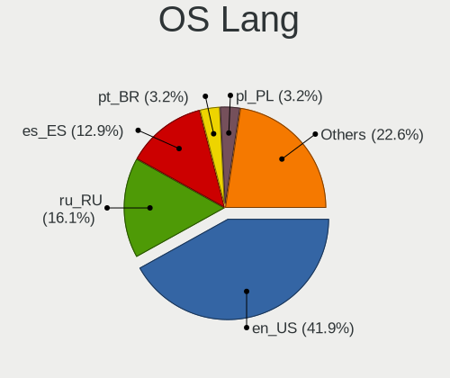
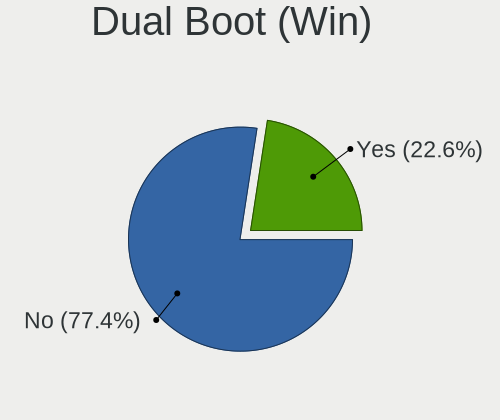
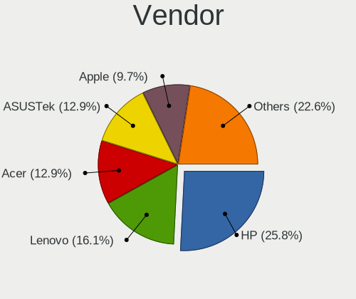
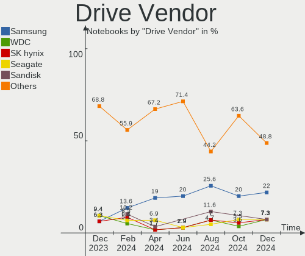
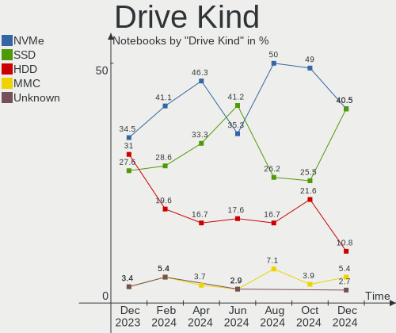
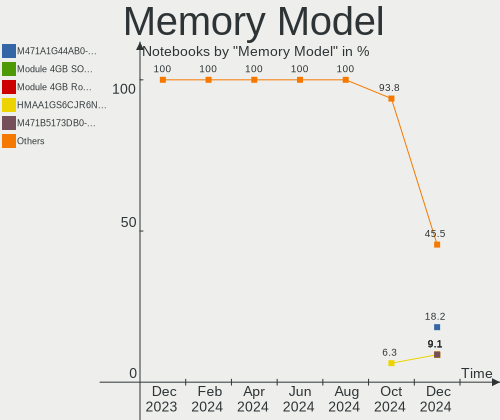

KDE neon Hardware Trends (Notebooks)
------------------------------------

A project to identify most popular hardware characteristics and track their change
over time based on data collected by KDE neon users at https://Linux-Hardware.org.

Anyone can contribute to this report by the [hw-probe](https://github.com/linuxhw/hw-probe) tool:

    sudo -E hw-probe -all -upload

Full-feature report is available here: https://linux-hardware.org/?view=trends

Period: Mar, 2022.

Contents
--------

* [ System ](#system)
  - [ OS                       ](#os)
  - [ OS Family                ](#os-family)
  - [ Kernel                   ](#kernel)
  - [ Kernel Family            ](#kernel-family)
  - [ Kernel Major Ver.        ](#kernel-major-ver)
  - [ Arch                     ](#arch)
  - [ DE                       ](#de)
  - [ Display Server           ](#display-server)
  - [ Display Manager          ](#display-manager)
  - [ OS Lang                  ](#os-lang)
  - [ Boot Mode                ](#boot-mode)
  - [ Filesystem               ](#filesystem)
  - [ Part. scheme             ](#part-scheme)
  - [ Dual Boot with Linux/BSD ](#dual-boot-with-linuxbsd)
  - [ Dual Boot (Win)          ](#dual-boot-win)

* [ Board ](#board)
  - [ Vendor                   ](#vendor)
  - [ Model                    ](#model)
  - [ Model Family             ](#model-family)
  - [ MFG Year                 ](#mfg-year)
  - [ Form Factor              ](#form-factor)
  - [ Secure Boot              ](#secure-boot)
  - [ Coreboot                 ](#coreboot)
  - [ RAM Size                 ](#ram-size)
  - [ RAM Used                 ](#ram-used)
  - [ Total Drives             ](#total-drives)
  - [ Has CD-ROM               ](#has-cd-rom)
  - [ Has Ethernet             ](#has-ethernet)
  - [ Has WiFi                 ](#has-wifi)
  - [ Has Bluetooth            ](#has-bluetooth)

* [ Location ](#location)
  - [ Country                  ](#country)
  - [ City                     ](#city)

* [ Drives ](#drives)
  - [ Drive Vendor             ](#drive-vendor)
  - [ Drive Model              ](#drive-model)
  - [ HDD Vendor               ](#hdd-vendor)
  - [ SSD Vendor               ](#ssd-vendor)
  - [ Drive Kind               ](#drive-kind)
  - [ Drive Connector          ](#drive-connector)
  - [ Drive Size               ](#drive-size)
  - [ Space Total              ](#space-total)
  - [ Space Used               ](#space-used)
  - [ Malfunc. Drives          ](#malfunc-drives)
  - [ Malfunc. Drive Vendor    ](#malfunc-drive-vendor)
  - [ Malfunc. HDD Vendor      ](#malfunc-hdd-vendor)
  - [ Malfunc. Drive Kind      ](#malfunc-drive-kind)
  - [ Failed Drives            ](#failed-drives)
  - [ Failed Drive Vendor      ](#failed-drive-vendor)
  - [ Drive Status             ](#drive-status)

* [ Storage controller ](#storage-controller)
  - [ Storage Vendor           ](#storage-vendor)
  - [ Storage Model            ](#storage-model)
  - [ Storage Kind             ](#storage-kind)

* [ Processor ](#processor)
  - [ CPU Vendor               ](#cpu-vendor)
  - [ CPU Model                ](#cpu-model)
  - [ CPU Model Family         ](#cpu-model-family)
  - [ CPU Cores                ](#cpu-cores)
  - [ CPU Sockets              ](#cpu-sockets)
  - [ CPU Threads              ](#cpu-threads)
  - [ CPU Op-Modes             ](#cpu-op-modes)
  - [ CPU Microcode            ](#cpu-microcode)
  - [ CPU Microarch            ](#cpu-microarch)

* [ Graphics ](#graphics)
  - [ GPU Vendor               ](#gpu-vendor)
  - [ GPU Model                ](#gpu-model)
  - [ GPU Combo                ](#gpu-combo)
  - [ GPU Driver               ](#gpu-driver)
  - [ GPU Memory               ](#gpu-memory)

* [ Monitor ](#monitor)
  - [ Monitor Vendor           ](#monitor-vendor)
  - [ Monitor Model            ](#monitor-model)
  - [ Monitor Resolution       ](#monitor-resolution)
  - [ Monitor Diagonal         ](#monitor-diagonal)
  - [ Monitor Width            ](#monitor-width)
  - [ Aspect Ratio             ](#aspect-ratio)
  - [ Monitor Area             ](#monitor-area)
  - [ Pixel Density            ](#pixel-density)
  - [ Multiple Monitors        ](#multiple-monitors)

* [ Network ](#network)
  - [ Net Controller Vendor    ](#net-controller-vendor)
  - [ Net Controller Model     ](#net-controller-model)
  - [ Wireless Vendor          ](#wireless-vendor)
  - [ Wireless Model           ](#wireless-model)
  - [ Ethernet Vendor          ](#ethernet-vendor)
  - [ Ethernet Model           ](#ethernet-model)
  - [ Net Controller Kind      ](#net-controller-kind)
  - [ Used Controller          ](#used-controller)
  - [ NICs                     ](#nics)
  - [ IPv6                     ](#ipv6)

* [ Bluetooth ](#bluetooth)
  - [ Bluetooth Vendor         ](#bluetooth-vendor)
  - [ Bluetooth Model          ](#bluetooth-model)

* [ Sound ](#sound)
  - [ Sound Vendor             ](#sound-vendor)
  - [ Sound Model              ](#sound-model)

* [ Memory ](#memory)
  - [ Memory Vendor            ](#memory-vendor)
  - [ Memory Model             ](#memory-model)
  - [ Memory Kind              ](#memory-kind)
  - [ Memory Form Factor       ](#memory-form-factor)
  - [ Memory Size              ](#memory-size)
  - [ Memory Speed             ](#memory-speed)

* [ Printers & scanners ](#printers--scanners)
  - [ Printer Vendor           ](#printer-vendor)
  - [ Printer Model            ](#printer-model)
  - [ Scanner Vendor           ](#scanner-vendor)
  - [ Scanner Model            ](#scanner-model)

* [ Camera ](#camera)
  - [ Camera Vendor            ](#camera-vendor)
  - [ Camera Model             ](#camera-model)

* [ Security ](#security)
  - [ Fingerprint Vendor       ](#fingerprint-vendor)
  - [ Fingerprint Model        ](#fingerprint-model)
  - [ Chipcard Vendor          ](#chipcard-vendor)
  - [ Chipcard Model           ](#chipcard-model)

* [ Unsupported ](#unsupported)
  - [ Unsupported Devices      ](#unsupported-devices)
  - [ Unsupported Device Types ](#unsupported-device-types)

System
------

OS
--

Installed operating systems

| Name           | Notebooks | Percent |
|----------------|-----------|---------|
| KDE neon 20.04 | 74        | 100%    |

OS Family
---------

OS without a version

| Name     | Notebooks | Percent |
|----------|-----------|---------|
| KDE neon | 74        | 100%    |

Kernel
------

Version of the Linux kernel

| Version           | Notebooks | Percent |
|-------------------|-----------|---------|
| 5.13.0-35-generic | 37        | 50%     |
| 5.13.0-30-generic | 15        | 20.27%  |
| 5.13.0-37-generic | 13        | 17.57%  |
| 5.13.0-39-generic | 4         | 5.41%   |
| 5.13.0-28-generic | 2         | 2.7%    |
| 5.14.0-1020-oem   | 1         | 1.35%   |
| 5.11.0-41-generic | 1         | 1.35%   |
| 5.11.0-37-generic | 1         | 1.35%   |

Kernel Family
-------------

Linux kernel without a distro release

| Version | Notebooks | Percent |
|---------|-----------|---------|
| 5.13.0  | 71        | 95.95%  |
| 5.11.0  | 2         | 2.7%    |
| 5.14.0  | 1         | 1.35%   |

Kernel Major Ver.
-----------------

Linux kernel major version

| Version | Notebooks | Percent |
|---------|-----------|---------|
| 5.13    | 71        | 95.95%  |
| 5.11    | 2         | 2.7%    |
| 5.14    | 1         | 1.35%   |

Arch
----

OS architecture (x86_64, i586, etc.)

| Name   | Notebooks | Percent |
|--------|-----------|---------|
| x86_64 | 74        | 100%    |

DE
--

Desktop Environment

| Name    | Notebooks | Percent |
|---------|-----------|---------|
| KDE5    | 73        | 98.65%  |
| Unknown | 1         | 1.35%   |

Display Server
--------------

X11 or Wayland

| Name    | Notebooks | Percent |
|---------|-----------|---------|
| X11     | 70        | 94.59%  |
| Wayland | 4         | 5.41%   |

Display Manager
---------------

SDDM, LightDM, etc.

| Name    | Notebooks | Percent |
|---------|-----------|---------|
| Unknown | 60        | 81.08%  |
| SDDM    | 14        | 18.92%  |

OS Lang
-------

Language

| Lang  | Notebooks | Percent |
|-------|-----------|---------|
| en_US | 36        | 48.65%  |
| de_DE | 7         | 9.46%   |
| pt_BR | 5         | 6.76%   |
| it_IT | 4         | 5.41%   |
| en_GB | 3         | 4.05%   |
| pt_PT | 2         | 2.7%    |
| en_IN | 2         | 2.7%    |
| en_CA | 2         | 2.7%    |
| zh_CN | 1         | 1.35%   |
| nb_NO | 1         | 1.35%   |
| hu_HU | 1         | 1.35%   |
| fr_FR | 1         | 1.35%   |
| fr_DZ | 1         | 1.35%   |
| es_UY | 1         | 1.35%   |
| es_MX | 1         | 1.35%   |
| en_SG | 1         | 1.35%   |
| en_NZ | 1         | 1.35%   |
| en_AU | 1         | 1.35%   |
| de_AT | 1         | 1.35%   |
| cs_CZ | 1         | 1.35%   |
| C     | 1         | 1.35%   |

Boot Mode
---------

EFI or BIOS

| Mode | Notebooks | Percent |
|------|-----------|---------|
| EFI  | 48        | 64.86%  |
| BIOS | 26        | 35.14%  |

Filesystem
----------

Type of filesystem

| Type  | Notebooks | Percent |
|-------|-----------|---------|
| Ext4  | 72        | 97.3%   |
| Btrfs | 2         | 2.7%    |

Part. scheme
------------

Scheme of partitioning

| Type    | Notebooks | Percent |
|---------|-----------|---------|
| Unknown | 63        | 85.14%  |
| GPT     | 8         | 10.81%  |
| MBR     | 3         | 4.05%   |

Dual Boot with Linux/BSD
------------------------

Hosting more than one Linux/BSD

| Dual boot | Notebooks | Percent |
|-----------|-----------|---------|
| No        | 73        | 98.65%  |
| Yes       | 1         | 1.35%   |

Dual Boot (Win)
---------------

Hosting Linux and Windows

| Dual boot | Notebooks | Percent |
|-----------|-----------|---------|
| No        | 67        | 90.54%  |
| Yes       | 7         | 9.46%   |

Board
-----

Vendor
------

Motherboard manufacturer

| Name                | Notebooks | Percent |
|---------------------|-----------|---------|
| Lenovo              | 20        | 27.03%  |
| Acer                | 13        | 17.57%  |
| Hewlett-Packard     | 11        | 14.86%  |
| Dell                | 9         | 12.16%  |
| ASUSTek Computer    | 7         | 9.46%   |
| Apple               | 6         | 8.11%   |
| TUXEDO              | 1         | 1.35%   |
| THUNDEROBOT         | 1         | 1.35%   |
| Sony                | 1         | 1.35%   |
| Samsung Electronics | 1         | 1.35%   |
| MSI                 | 1         | 1.35%   |
| MOTILE              | 1         | 1.35%   |
| Fujitsu Siemens     | 1         | 1.35%   |
| Unknown             | 1         | 1.35%   |

Model
-----

Motherboard model

| Name                                             | Notebooks | Percent |
|--------------------------------------------------|-----------|---------|
| Apple MacBookPro8,1                              | 2         | 2.7%    |
| TUXEDO N8xEJEK                                   | 1         | 1.35%   |
| THUNDEROBOT 911Targa                             | 1         | 1.35%   |
| Sony VJF153                                      | 1         | 1.35%   |
| Samsung 500R5L/501R5L/500R5P/550R5L              | 1         | 1.35%   |
| MSI Alpha 17 B5EEK                               | 1         | 1.35%   |
| MOTILE M142                                      | 1         | 1.35%   |
| Lenovo Z50-70 20354                              | 1         | 1.35%   |
| Lenovo V110-15ISK 80TL                           | 1         | 1.35%   |
| Lenovo ThinkPad X1 Carbon 3rd 20BS003HIX         | 1         | 1.35%   |
| Lenovo ThinkPad W530 24472SU                     | 1         | 1.35%   |
| Lenovo ThinkPad T480 20L60033MX                  | 1         | 1.35%   |
| Lenovo ThinkPad T430s 23539LU                    | 1         | 1.35%   |
| Lenovo ThinkPad L512 44444WG                     | 1         | 1.35%   |
| Lenovo ThinkPad L14 Gen 2 20X2S2HG00             | 1         | 1.35%   |
| Lenovo ThinkPad L14 Gen 1 20U1002EMB             | 1         | 1.35%   |
| Lenovo ThinkPad Edge E545 20B20015GE             | 1         | 1.35%   |
| Lenovo ThinkPad E14 Gen 3 20Y70077GE             | 1         | 1.35%   |
| Lenovo ThinkPad E14 Gen 2 20TBS4FM00             | 1         | 1.35%   |
| Lenovo Legion 7 16ACHg6 82N6                     | 1         | 1.35%   |
| Lenovo IdeaPad Y700-15ISK 80NV                   | 1         | 1.35%   |
| Lenovo IdeaPad Y410P 20216                       | 1         | 1.35%   |
| Lenovo IdeaPad Gaming 3 15IMH05 81Y4             | 1         | 1.35%   |
| Lenovo IdeaPad 3 15ALC6 82MF                     | 1         | 1.35%   |
| Lenovo IdeaPad 110-15ACL 80TJ                    | 1         | 1.35%   |
| Lenovo G700 20251                                | 1         | 1.35%   |
| Lenovo B50-70 20384                              | 1         | 1.35%   |
| HP ZBook Fury 15.6 inch G8 Mobile Workstation PC | 1         | 1.35%   |
| HP ProBook 6560b                                 | 1         | 1.35%   |
| HP Pavilion Gaming Laptop 16-a0xxx               | 1         | 1.35%   |
| HP Pavilion dv7                                  | 1         | 1.35%   |
| HP Pavilion 15                                   | 1         | 1.35%   |
| HP OMEN Laptop 15-en0xxx                         | 1         | 1.35%   |
| HP ENVY 15                                       | 1         | 1.35%   |
| HP EliteBook 8460p                               | 1         | 1.35%   |
| HP EliteBook 840 G4                              | 1         | 1.35%   |
| HP EliteBook 840 G2                              | 1         | 1.35%   |
| HP EliteBook 2570p                               | 1         | 1.35%   |
| Fujitsu Siemens AMILO Li 2732                    | 1         | 1.35%   |
| Dell Vostro 3400                                 | 1         | 1.35%   |
| Dell Precision M4600                             | 1         | 1.35%   |
| Dell Latitude E6510                              | 1         | 1.35%   |
| Dell Latitude E6420                              | 1         | 1.35%   |
| Dell Latitude E5500                              | 1         | 1.35%   |
| Dell Latitude E5440                              | 1         | 1.35%   |
| Dell Latitude 3400                               | 1         | 1.35%   |
| Dell Inspiron N7010                              | 1         | 1.35%   |
| Dell Inspiron 7559                               | 1         | 1.35%   |
| ASUS X580VN                                      | 1         | 1.35%   |
| ASUS X451CAP                                     | 1         | 1.35%   |
| ASUS UX310UA                                     | 1         | 1.35%   |
| ASUS TUF Gaming FX505DD_FX505DD                  | 1         | 1.35%   |
| ASUS K55VD                                       | 1         | 1.35%   |
| ASUS G75VX                                       | 1         | 1.35%   |
| ASUS ASUS TUF Gaming F15 FX506LH_FX506LH         | 1         | 1.35%   |
| Apple MacBookPro9,2                              | 1         | 1.35%   |
| Apple MacBookPro4,1                              | 1         | 1.35%   |
| Apple MacBookPro10,1                             | 1         | 1.35%   |
| Apple MacBook5,1                                 | 1         | 1.35%   |
| Acer Swift SF314-43                              | 1         | 1.35%   |

Model Family
------------

Motherboard model prefix

| Name                  | Notebooks | Percent |
|-----------------------|-----------|---------|
| Lenovo ThinkPad       | 10        | 13.51%  |
| Acer Aspire           | 10        | 13.51%  |
| Lenovo IdeaPad        | 5         | 6.76%   |
| Dell Latitude         | 5         | 6.76%   |
| HP EliteBook          | 4         | 5.41%   |
| HP Pavilion           | 3         | 4.05%   |
| Dell Inspiron         | 2         | 2.7%    |
| Apple MacBookPro8     | 2         | 2.7%    |
| Acer Swift            | 2         | 2.7%    |
| TUXEDO N8xEJEK        | 1         | 1.35%   |
| THUNDEROBOT 911Targa  | 1         | 1.35%   |
| Sony VJF153           | 1         | 1.35%   |
| Samsung 500R5L        | 1         | 1.35%   |
| MSI Alpha             | 1         | 1.35%   |
| MOTILE M142           | 1         | 1.35%   |
| Lenovo Z50-70         | 1         | 1.35%   |
| Lenovo V110-15ISK     | 1         | 1.35%   |
| Lenovo Legion         | 1         | 1.35%   |
| Lenovo G700           | 1         | 1.35%   |
| Lenovo B50-70         | 1         | 1.35%   |
| HP ZBook              | 1         | 1.35%   |
| HP ProBook            | 1         | 1.35%   |
| HP OMEN               | 1         | 1.35%   |
| HP ENVY               | 1         | 1.35%   |
| Fujitsu Siemens AMILO | 1         | 1.35%   |
| Dell Vostro           | 1         | 1.35%   |
| Dell Precision        | 1         | 1.35%   |
| ASUS X580VN           | 1         | 1.35%   |
| ASUS X451CAP          | 1         | 1.35%   |
| ASUS UX310UA          | 1         | 1.35%   |
| ASUS TUF              | 1         | 1.35%   |
| ASUS K55VD            | 1         | 1.35%   |
| ASUS G75VX            | 1         | 1.35%   |
| ASUS ASUS             | 1         | 1.35%   |
| Apple MacBookPro9     | 1         | 1.35%   |
| Apple MacBookPro4     | 1         | 1.35%   |
| Apple MacBookPro10    | 1         | 1.35%   |
| Apple MacBook5        | 1         | 1.35%   |
| Acer Nitro            | 1         | 1.35%   |
| Unknown               | 1         | 1.35%   |

MFG Year
--------

Motherboard manufacture year

| Year | Notebooks | Percent |
|------|-----------|---------|
| 2021 | 9         | 12.16%  |
| 2020 | 9         | 12.16%  |
| 2015 | 9         | 12.16%  |
| 2013 | 7         | 9.46%   |
| 2011 | 7         | 9.46%   |
| 2012 | 5         | 6.76%   |
| 2010 | 5         | 6.76%   |
| 2018 | 4         | 5.41%   |
| 2017 | 4         | 5.41%   |
| 2014 | 4         | 5.41%   |
| 2008 | 4         | 5.41%   |
| 2019 | 3         | 4.05%   |
| 2016 | 3         | 4.05%   |
| 2009 | 1         | 1.35%   |

Form Factor
-----------

Physical design of the computer

| Name     | Notebooks | Percent |
|----------|-----------|---------|
| Notebook | 74        | 100%    |

Secure Boot
-----------

Enabled or disabled

| State    | Notebooks | Percent |
|----------|-----------|---------|
| Disabled | 62        | 83.78%  |
| Enabled  | 12        | 16.22%  |

Coreboot
--------

Have coreboot on board

| Used | Notebooks | Percent |
|------|-----------|---------|
| No   | 74        | 100%    |

RAM Size
--------

Total RAM memory

| Size in GB | Notebooks | Percent |
|------------|-----------|---------|
| 4.01-8.0   | 33        | 44.59%  |
| 16.01-24.0 | 17        | 22.97%  |
| 8.01-16.0  | 10        | 13.51%  |
| 3.01-4.0   | 9         | 12.16%  |
| 32.01-64.0 | 2         | 2.7%    |
| 24.01-32.0 | 1         | 1.35%   |
| 2.01-3.0   | 1         | 1.35%   |
| 1.01-2.0   | 1         | 1.35%   |

RAM Used
--------

Used RAM memory

| Used GB  | Notebooks | Percent |
|----------|-----------|---------|
| 1.01-2.0 | 38        | 51.35%  |
| 2.01-3.0 | 14        | 18.92%  |
| 3.01-4.0 | 12        | 16.22%  |
| 4.01-8.0 | 7         | 9.46%   |
| 0.51-1.0 | 3         | 4.05%   |

Total Drives
------------

Number of drives on board

| Drives | Notebooks | Percent |
|--------|-----------|---------|
| 1      | 50        | 67.57%  |
| 2      | 21        | 28.38%  |
| 3      | 3         | 4.05%   |

Has CD-ROM
----------

Has CD-ROM on board

| Presented | Notebooks | Percent |
|-----------|-----------|---------|
| No        | 50        | 67.57%  |
| Yes       | 24        | 32.43%  |

Has Ethernet
------------

Has Ethernet on board

| Presented | Notebooks | Percent |
|-----------|-----------|---------|
| Yes       | 70        | 94.59%  |
| No        | 4         | 5.41%   |

Has WiFi
--------

Has WiFi module

| Presented | Notebooks | Percent |
|-----------|-----------|---------|
| Yes       | 72        | 97.3%   |
| No        | 2         | 2.7%    |

Has Bluetooth
-------------

Has Bluetooth module

| Presented | Notebooks | Percent |
|-----------|-----------|---------|
| Yes       | 64        | 86.49%  |
| No        | 10        | 13.51%  |

Location
--------

Country
-------

Geographic location (country)

| Country     | Notebooks | Percent |
|-------------|-----------|---------|
| USA         | 12        | 16.22%  |
| Germany     | 8         | 10.81%  |
| Brazil      | 6         | 8.11%   |
| Italy       | 4         | 5.41%   |
| Russia      | 2         | 2.7%    |
| Norway      | 2         | 2.7%    |
| Mexico      | 2         | 2.7%    |
| India       | 2         | 2.7%    |
| Canada      | 2         | 2.7%    |
| Algeria     | 2         | 2.7%    |
| Zimbabwe    | 1         | 1.35%   |
| Vietnam     | 1         | 1.35%   |
| Uruguay     | 1         | 1.35%   |
| UK          | 1         | 1.35%   |
| Sweden      | 1         | 1.35%   |
| Spain       | 1         | 1.35%   |
| Singapore   | 1         | 1.35%   |
| Serbia      | 1         | 1.35%   |
| Romania     | 1         | 1.35%   |
| Portugal    | 1         | 1.35%   |
| Poland      | 1         | 1.35%   |
| New Zealand | 1         | 1.35%   |
| Netherlands | 1         | 1.35%   |
| Morocco     | 1         | 1.35%   |
| Malta       | 1         | 1.35%   |
| Lithuania   | 1         | 1.35%   |
| Lebanon     | 1         | 1.35%   |
| Jordan      | 1         | 1.35%   |
| Hungary     | 1         | 1.35%   |
| France      | 1         | 1.35%   |
| Egypt       | 1         | 1.35%   |
| Czechia     | 1         | 1.35%   |
| Costa Rica  | 1         | 1.35%   |
| Colombia    | 1         | 1.35%   |
| China       | 1         | 1.35%   |
| Cambodia    | 1         | 1.35%   |
| Cabo Verde  | 1         | 1.35%   |
| Bulgaria    | 1         | 1.35%   |
| Belgium     | 1         | 1.35%   |
| Austria     | 1         | 1.35%   |
| Australia   | 1         | 1.35%   |
| Argentina   | 1         | 1.35%   |

City
----

Geographic location (city)

| City              | Notebooks | Percent |
|-------------------|-----------|---------|
| Rome              | 2         | 2.7%    |
| Zeitz             | 1         | 1.35%   |
| Weisswasser       | 1         | 1.35%   |
| Wegberg           | 1         | 1.35%   |
| Vienna            | 1         | 1.35%   |
| Toril             | 1         | 1.35%   |
| Tazoult-Lambese   | 1         | 1.35%   |
| Tauranga          | 1         | 1.35%   |
| Tandil            | 1         | 1.35%   |
| Sun City West     | 1         | 1.35%   |
| Sueca             | 1         | 1.35%   |
| St Petersburg     | 1         | 1.35%   |
| Singapore         | 1         | 1.35%   |
| Šiauliai         | 1         | 1.35%   |
| Sao Paulo         | 1         | 1.35%   |
| Pune              | 1         | 1.35%   |
| Puebla City       | 1         | 1.35%   |
| Poulsbo           | 1         | 1.35%   |
| Pilica            | 1         | 1.35%   |
| Phnom Penh        | 1         | 1.35%   |
| Pelotas           | 1         | 1.35%   |
| Patna             | 1         | 1.35%   |
| North Las Vegas   | 1         | 1.35%   |
| New York          | 1         | 1.35%   |
| Moscow            | 1         | 1.35%   |
| Morelia           | 1         | 1.35%   |
| Montevideo        | 1         | 1.35%   |
| Monfalcone        | 1         | 1.35%   |
| Minya             | 1         | 1.35%   |
| Milwaukee         | 1         | 1.35%   |
| Memphis           | 1         | 1.35%   |
| Melbourne         | 1         | 1.35%   |
| Markaryd          | 1         | 1.35%   |
| Livorno           | 1         | 1.35%   |
| Lisbon            | 1         | 1.35%   |
| Leipzig           | 1         | 1.35%   |
| Lazarevac         | 1         | 1.35%   |
| Kragero           | 1         | 1.35%   |
| Juiz de Fora      | 1         | 1.35%   |
| Joinville         | 1         | 1.35%   |
| Jindrichuv Hradec | 1         | 1.35%   |
| Innisfail         | 1         | 1.35%   |
| Hot Springs       | 1         | 1.35%   |
| Horstmar          | 1         | 1.35%   |
| Ho Chi Minh City  | 1         | 1.35%   |
| Harelbeke         | 1         | 1.35%   |
| Harare            | 1         | 1.35%   |
| Győr             | 1         | 1.35%   |
| Grand Rapids      | 1         | 1.35%   |
| General Toshevo   | 1         | 1.35%   |
| Envigado          | 1         | 1.35%   |
| Dunfermline       | 1         | 1.35%   |
| Duncan            | 1         | 1.35%   |
| Dallas            | 1         | 1.35%   |
| Curitiba          | 1         | 1.35%   |
| Corinth           | 1         | 1.35%   |
| Caxias do Sul     | 1         | 1.35%   |
| Casablanca        | 1         | 1.35%   |
| Braunschweig      | 1         | 1.35%   |
| Brasov            | 1         | 1.35%   |

Drives
------

Drive Vendor
------------

Hard drive vendors

| Vendor                      | Notebooks | Drives | Percent |
|-----------------------------|-----------|--------|---------|
| WDC                         | 13        | 14     | 13.27%  |
| Samsung Electronics         | 10        | 11     | 10.2%   |
| Kingston                    | 10        | 10     | 10.2%   |
| Seagate                     | 9         | 9      | 9.18%   |
| Toshiba                     | 7         | 7      | 7.14%   |
| Crucial                     | 6         | 6      | 6.12%   |
| SK Hynix                    | 5         | 5      | 5.1%    |
| Sandisk                     | 5         | 5      | 5.1%    |
| Unknown                     | 4         | 4      | 4.08%   |
| Micron Technology           | 3         | 3      | 3.06%   |
| Intel                       | 3         | 3      | 3.06%   |
| Hitachi                     | 2         | 2      | 2.04%   |
| A-DATA Technology           | 2         | 2      | 2.04%   |
| XPG                         | 1         | 1      | 1.02%   |
| Team                        | 1         | 1      | 1.02%   |
| Silicon Motion              | 1         | 1      | 1.02%   |
| PNY                         | 1         | 1      | 1.02%   |
| Patriot                     | 1         | 1      | 1.02%   |
| OCZ                         | 1         | 1      | 1.02%   |
| MyDigitalSSD                | 1         | 1      | 1.02%   |
| MAXIO Technology (Hangzhou) | 1         | 1      | 1.02%   |
| LITEON                      | 1         | 1      | 1.02%   |
| KIOXIA                      | 1         | 1      | 1.02%   |
| KingSpec                    | 1         | 1      | 1.02%   |
| JMicron                     | 1         | 1      | 1.02%   |
| Intenso                     | 1         | 1      | 1.02%   |
| GALAX                       | 1         | 1      | 1.02%   |
| Colorful                    | 1         | 1      | 1.02%   |
| China                       | 1         | 1      | 1.02%   |
| BIWIN                       | 1         | 1      | 1.02%   |
| Aura                        | 1         | 1      | 1.02%   |
| Apacer                      | 1         | 1      | 1.02%   |

Drive Model
-----------

Hard drive models

| Model                                  | Notebooks | Percent |
|----------------------------------------|-----------|---------|
| WDC WD10SPZX-21Z10T0 1TB               | 3         | 3%      |
| Kingston SA400S37480G 480GB SSD        | 3         | 3%      |
| Unknown MMC Card  128GB                | 2         | 2%      |
| Toshiba MQ01ABD100 1TB                 | 2         | 2%      |
| Seagate ST1000LM048-2E7172 1TB         | 2         | 2%      |
| Seagate ST1000LM024 HN-M101MBB 1TB     | 2         | 2%      |
| Sandisk NVMe SSD Drive 256GB           | 2         | 2%      |
| Kingston SA400S37240G 240GB SSD        | 2         | 2%      |
| Crucial CT240BX500SSD1 240GB           | 2         | 2%      |
| XPG NVMe SSD Drive 1024GB              | 1         | 1%      |
| WDC WDS500G2B0C-00PXH0 500GB           | 1         | 1%      |
| WDC WDS240G2G0A-00JH30 240GB SSD       | 1         | 1%      |
| WDC WDS120G2G0B-00EPW0 120GB SSD       | 1         | 1%      |
| WDC WD800BEVT-75ZCT2 80GB              | 1         | 1%      |
| WDC WD5000LUCT-63C26Y0 500GB           | 1         | 1%      |
| WDC WD5000LPVX-08V0TT2 500GB           | 1         | 1%      |
| WDC WD5000LPLX-08ZNTT0 500GB           | 1         | 1%      |
| WDC WD3200BEKX-75B7WT0 320GB           | 1         | 1%      |
| WDC WD3200BEKT-75PVMT1 320GB           | 1         | 1%      |
| WDC WD10SPZX-08Z10 1TB                 | 1         | 1%      |
| WDC PC SN530 SDBPNPZ-512G-1114 512GB   | 1         | 1%      |
| Unknown MMC Card  8GB                  | 1         | 1%      |
| Unknown MMC Card  64GB                 | 1         | 1%      |
| Toshiba NVMe SSD Drive 1024GB          | 1         | 1%      |
| Toshiba MQ04ABF100 1TB                 | 1         | 1%      |
| Toshiba MQ01ACF032 320GB               | 1         | 1%      |
| Toshiba MK7559GSXF 752GB               | 1         | 1%      |
| Toshiba KXG6AZNV512G 512GB             | 1         | 1%      |
| Team T253X2512G 512GB SSD              | 1         | 1%      |
| SK Hynix SKHynix_HFM256GD3HX015N 256GB | 1         | 1%      |
| SK Hynix SC308 SATA 128GB SSD          | 1         | 1%      |
| SK Hynix NVMe SSD Drive 512GB          | 1         | 1%      |
| SK Hynix NVMe SSD Drive 256GB          | 1         | 1%      |
| SK Hynix NVMe SSD Drive 1024GB         | 1         | 1%      |
| Silicon Motion NVMe SSD Drive 512GB    | 1         | 1%      |
| Seagate ST9640320AS 640GB              | 1         | 1%      |
| Seagate ST500LT012-1DG142 500GB        | 1         | 1%      |
| Seagate ST1000LM049-2GH172 1TB         | 1         | 1%      |
| Seagate ST1000LM035-1RK172 1TB         | 1         | 1%      |
| Seagate ST1000LM014-SSHD-8GB           | 1         | 1%      |
| SanDisk Z400s M.2 2280 256GB SSD       | 1         | 1%      |
| SanDisk SSD G5 BICS4 500GB             | 1         | 1%      |
| Sandisk NVMe SSD Drive 500GB           | 1         | 1%      |
| Samsung SSD PM830 2.5 7mm 256GB        | 1         | 1%      |
| Samsung SSD 860 EVO M.2 1TB            | 1         | 1%      |
| Samsung SSD 860 EVO 250GB              | 1         | 1%      |
| Samsung SSD 850 EVO mSATA 500GB        | 1         | 1%      |
| Samsung SSD 850 EVO 500GB              | 1         | 1%      |
| Samsung SSD 850 EVO 250GB              | 1         | 1%      |
| Samsung NVMe SSD Drive 512GB           | 1         | 1%      |
| Samsung NVMe SSD Drive 500GB           | 1         | 1%      |
| Samsung MZVLB256HAHQ-000L7 256GB       | 1         | 1%      |
| Samsung MZNLN128HCGR-000L2 128GB SSD   | 1         | 1%      |
| Samsung HD103UJ 1TB                    | 1         | 1%      |
| PNY CS900 500GB SSD                    | 1         | 1%      |
| Patriot Burst 120GB SSD                | 1         | 1%      |
| OCZ AGILITY4 128GB SSD                 | 1         | 1%      |
| MyDigitalSSD SC2 M2 SSD 64GB           | 1         | 1%      |
| Micron NVMe SSD Drive 512GB            | 1         | 1%      |
| Micron NVMe SSD Drive 256GB            | 1         | 1%      |

HDD Vendor
----------

Hard disk drive vendors

| Vendor              | Notebooks | Drives | Percent |
|---------------------|-----------|--------|---------|
| WDC                 | 10        | 10     | 37.04%  |
| Seagate             | 9         | 9      | 33.33%  |
| Toshiba             | 5         | 5      | 18.52%  |
| Hitachi             | 2         | 2      | 7.41%   |
| Samsung Electronics | 1         | 1      | 3.7%    |

SSD Vendor
----------

Solid state drive vendors

| Vendor              | Notebooks | Drives | Percent |
|---------------------|-----------|--------|---------|
| Samsung Electronics | 7         | 7      | 17.07%  |
| Kingston            | 6         | 6      | 14.63%  |
| Crucial             | 6         | 6      | 14.63%  |
| Intel               | 3         | 3      | 7.32%   |
| WDC                 | 2         | 2      | 4.88%   |
| SanDisk             | 2         | 2      | 4.88%   |
| A-DATA Technology   | 2         | 2      | 4.88%   |
| Team                | 1         | 1      | 2.44%   |
| SK Hynix            | 1         | 1      | 2.44%   |
| PNY                 | 1         | 1      | 2.44%   |
| Patriot             | 1         | 1      | 2.44%   |
| OCZ                 | 1         | 1      | 2.44%   |
| MyDigitalSSD        | 1         | 1      | 2.44%   |
| LITEON              | 1         | 1      | 2.44%   |
| KingSpec            | 1         | 1      | 2.44%   |
| JMicron             | 1         | 1      | 2.44%   |
| China               | 1         | 1      | 2.44%   |
| BIWIN               | 1         | 1      | 2.44%   |
| Aura                | 1         | 1      | 2.44%   |
| Apacer              | 1         | 1      | 2.44%   |

Drive Kind
----------

HDD or SSD

| Kind    | Notebooks | Drives | Percent |
|---------|-----------|--------|---------|
| SSD     | 37        | 41     | 38.95%  |
| HDD     | 27        | 27     | 28.42%  |
| NVMe    | 24        | 25     | 25.26%  |
| MMC     | 4         | 4      | 4.21%   |
| Unknown | 3         | 3      | 3.16%   |

Drive Connector
---------------

SATA, SAS, NVMe, etc.

| Type | Notebooks | Drives | Percent |
|------|-----------|--------|---------|
| SATA | 57        | 69     | 65.52%  |
| NVMe | 24        | 25     | 27.59%  |
| MMC  | 4         | 4      | 4.6%    |
| SAS  | 2         | 2      | 2.3%    |

Drive Size
----------

Size of hard drive

| Size in TB | Notebooks | Drives | Percent |
|------------|-----------|--------|---------|
| 0.01-0.5   | 41        | 46     | 66.13%  |
| 0.51-1.0   | 20        | 21     | 32.26%  |
| 1.01-2.0   | 1         | 1      | 1.61%   |

Space Total
-----------

Amount of disk space available on the file system

| Size in GB     | Notebooks | Percent |
|----------------|-----------|---------|
| 101-250        | 23        | 31.08%  |
| 251-500        | 16        | 21.62%  |
| 501-1000       | 14        | 18.92%  |
| 1001-2000      | 8         | 10.81%  |
| 51-100         | 6         | 8.11%   |
| Unknown        | 3         | 4.05%   |
| 21-50          | 2         | 2.7%    |
| More than 3000 | 1         | 1.35%   |
| 1-20           | 1         | 1.35%   |

Space Used
----------

Amount of used disk space

| Used GB  | Notebooks | Percent |
|----------|-----------|---------|
| 1-20     | 33        | 44.59%  |
| 101-250  | 11        | 14.86%  |
| 21-50    | 10        | 13.51%  |
| 51-100   | 8         | 10.81%  |
| 501-1000 | 5         | 6.76%   |
| 251-500  | 4         | 5.41%   |
| Unknown  | 3         | 4.05%   |

Malfunc. Drives
---------------

Drive models with a malfunction

| Model                            | Notebooks | Drives | Percent |
|----------------------------------|-----------|--------|---------|
| WDC WDS240G2G0A-00JH30 240GB SSD | 1         | 1      | 100%    |

Malfunc. Drive Vendor
---------------------

Vendors of faulty drives

| Vendor | Notebooks | Drives | Percent |
|--------|-----------|--------|---------|
| WDC    | 1         | 1      | 100%    |

Malfunc. HDD Vendor
-------------------

Vendors of faulty HDD drives

Zero info for selected period =(

Malfunc. Drive Kind
-------------------

Kinds of faulty drives

| Kind | Notebooks | Drives | Percent |
|------|-----------|--------|---------|
| SSD  | 1         | 1      | 100%    |

Failed Drives
-------------

Failed drive models

Zero info for selected period =(

Failed Drive Vendor
-------------------

Failed drive vendors

Zero info for selected period =(

Drive Status
------------

Number of failed and malfunc. drives

| Status   | Notebooks | Drives | Percent |
|----------|-----------|--------|---------|
| Detected | 63        | 88     | 85.14%  |
| Works    | 10        | 11     | 13.51%  |
| Malfunc  | 1         | 1      | 1.35%   |

Storage controller
------------------

Storage Vendor
--------------

Storage controller vendors

| Vendor                       | Notebooks | Percent |
|------------------------------|-----------|---------|
| Intel                        | 55        | 61.11%  |
| AMD                          | 9         | 10%     |
| Sandisk                      | 5         | 5.56%   |
| SK Hynix                     | 4         | 4.44%   |
| Kingston Technology Company  | 4         | 4.44%   |
| Samsung Electronics          | 3         | 3.33%   |
| Micron Technology            | 3         | 3.33%   |
| Toshiba America Info Systems | 2         | 2.22%   |
| Silicon Motion               | 1         | 1.11%   |
| Nvidia                       | 1         | 1.11%   |
| MAXIO Technology (Hangzhou)  | 1         | 1.11%   |
| KIOXIA                       | 1         | 1.11%   |
| ADATA Technology             | 1         | 1.11%   |

Storage Model
-------------

Storage controller models

| Model                                                                                  | Notebooks | Percent |
|----------------------------------------------------------------------------------------|-----------|---------|
| Intel 7 Series Chipset Family 6-port SATA Controller [AHCI mode]                       | 9         | 9.38%   |
| AMD FCH SATA Controller [AHCI mode]                                                    | 9         | 9.38%   |
| Intel Sunrise Point-LP SATA Controller [AHCI mode]                                     | 6         | 6.25%   |
| Intel 6 Series/C200 Series Chipset Family 6 port Mobile SATA AHCI Controller           | 5         | 5.21%   |
| Intel HM170/QM170 Chipset SATA Controller [AHCI Mode]                                  | 4         | 4.17%   |
| Intel 82801 Mobile SATA Controller [RAID mode]                                         | 4         | 4.17%   |
| Sandisk WD Blue SN550 NVMe SSD                                                         | 3         | 3.13%   |
| Micron Non-Volatile memory controller                                                  | 3         | 3.13%   |
| Intel Wildcat Point-LP SATA Controller [AHCI Mode]                                     | 3         | 3.13%   |
| Intel Tiger Lake-LP SATA Controller [AHCI mode]                                        | 3         | 3.13%   |
| Intel 8 Series SATA Controller 1 [AHCI mode]                                           | 3         | 3.13%   |
| Intel 400 Series Chipset Family SATA AHCI Controller                                   | 3         | 3.13%   |
| Toshiba America Info Systems XG6 NVMe SSD Controller                                   | 2         | 2.08%   |
| SK Hynix Gold P31 SSD                                                                  | 2         | 2.08%   |
| Samsung NVMe SSD Controller SM981/PM981/PM983                                          | 2         | 2.08%   |
| Kingston Company OM3PDP3 NVMe SSD                                                      | 2         | 2.08%   |
| Intel Volume Management Device NVMe RAID Controller                                    | 2         | 2.08%   |
| Intel Cannon Lake Mobile PCH SATA AHCI Controller                                      | 2         | 2.08%   |
| Intel 82801IBM/IEM (ICH9M/ICH9M-E) 4 port SATA Controller [AHCI mode]                  | 2         | 2.08%   |
| Intel 82801HM/HEM (ICH8M/ICH8M-E) SATA Controller [AHCI mode]                          | 2         | 2.08%   |
| Intel 82801HM/HEM (ICH8M/ICH8M-E) IDE Controller                                       | 2         | 2.08%   |
| SK Hynix Non-Volatile memory controller                                                | 1         | 1.04%   |
| SK Hynix BC511                                                                         | 1         | 1.04%   |
| Silicon Motion SM2263EN/SM2263XT SSD Controller                                        | 1         | 1.04%   |
| Sandisk WD Blue SN500 / PC SN520 NVMe SSD                                              | 1         | 1.04%   |
| Sandisk WD Black SN750 / PC SN730 NVMe SSD                                             | 1         | 1.04%   |
| Samsung NVMe SSD Controller 980                                                        | 1         | 1.04%   |
| Nvidia MCP79 AHCI Controller                                                           | 1         | 1.04%   |
| MAXIO (Hangzhou) NVMe SSD Controller MAP1202                                           | 1         | 1.04%   |
| KIOXIA Non-Volatile memory controller                                                  | 1         | 1.04%   |
| Kingston Company U-SNS8154P3 NVMe SSD                                                  | 1         | 1.04%   |
| Kingston Company Company Non-Volatile memory controller                                | 1         | 1.04%   |
| Intel Celeron/Pentium Silver Processor SATA Controller                                 | 1         | 1.04%   |
| Intel Cannon Point-LP SATA Controller [AHCI Mode]                                      | 1         | 1.04%   |
| Intel Atom/Celeron/Pentium Processor x5-E8000/J3xxx/N3xxx Series SATA Controller       | 1         | 1.04%   |
| Intel Atom Processor E3800 Series SATA AHCI Controller                                 | 1         | 1.04%   |
| Intel 8 Series/C220 Series Chipset Family 6-port SATA Controller 1 [AHCI mode]         | 1         | 1.04%   |
| Intel 6 Series/C200 Series Chipset Family Mobile SATA Controller (IDE mode, ports 4-5) | 1         | 1.04%   |
| Intel 6 Series/C200 Series Chipset Family Mobile SATA Controller (IDE mode, ports 0-3) | 1         | 1.04%   |
| Intel 5 Series/3400 Series Chipset 6 port SATA AHCI Controller                         | 1         | 1.04%   |
| Intel 5 Series/3400 Series Chipset 4 port SATA IDE Controller                          | 1         | 1.04%   |
| Intel 5 Series/3400 Series Chipset 4 port SATA AHCI Controller                         | 1         | 1.04%   |
| Intel 5 Series/3400 Series Chipset 2 port SATA IDE Controller                          | 1         | 1.04%   |
| ADATA XPG SX8200 Pro PCIe Gen3x4 M.2 2280 Solid State Drive                            | 1         | 1.04%   |

Storage Kind
------------

Kind of storage controller (IDE, SATA, NVMe, SAS, ...)

| Kind | Notebooks | Percent |
|------|-----------|---------|
| SATA | 59        | 63.44%  |
| NVMe | 24        | 25.81%  |
| RAID | 6         | 6.45%   |
| IDE  | 4         | 4.3%    |

Processor
---------

CPU Vendor
----------

Processor vendors

| Vendor | Notebooks | Percent |
|--------|-----------|---------|
| Intel  | 62        | 83.78%  |
| AMD    | 12        | 16.22%  |

CPU Model
---------

Processor models

| Model                                         | Notebooks | Percent |
|-----------------------------------------------|-----------|---------|
| Intel Core i5-6200U CPU @ 2.30GHz             | 3         | 4.05%   |
| Intel Core i5-5200U CPU @ 2.20GHz             | 3         | 4.05%   |
| Intel Core i5-10300H CPU @ 2.50GHz            | 3         | 4.05%   |
| Intel 11th Gen Core i5-1135G7 @ 2.40GHz       | 3         | 4.05%   |
| Intel Core i7-8750H CPU @ 2.20GHz             | 2         | 2.7%    |
| Intel Core i7-3630QM CPU @ 2.40GHz            | 2         | 2.7%    |
| Intel Core i5-6300HQ CPU @ 2.30GHz            | 2         | 2.7%    |
| Intel Core i5-4210U CPU @ 1.70GHz             | 2         | 2.7%    |
| Intel Core i5-3320M CPU @ 2.60GHz             | 2         | 2.7%    |
| Intel Core i5-2520M CPU @ 2.50GHz             | 2         | 2.7%    |
| Intel Core 2 Duo CPU P8600 @ 2.40GHz          | 2         | 2.7%    |
| Intel 11th Gen Core i7-1165G7 @ 2.80GHz       | 2         | 2.7%    |
| AMD Ryzen 7 5800H with Radeon Graphics        | 2         | 2.7%    |
| AMD Ryzen 5 5500U with Radeon Graphics        | 2         | 2.7%    |
| Intel Pentium Silver N6000 @ 1.10GHz          | 1         | 1.35%   |
| Intel Pentium Dual CPU T2370 @ 1.73GHz        | 1         | 1.35%   |
| Intel Pentium CPU N3540 @ 2.16GHz             | 1         | 1.35%   |
| Intel Pentium CPU 2020M @ 2.40GHz             | 1         | 1.35%   |
| Intel Core i7-8565U CPU @ 1.80GHz             | 1         | 1.35%   |
| Intel Core i7-7700HQ CPU @ 2.80GHz            | 1         | 1.35%   |
| Intel Core i7-6700HQ CPU @ 2.60GHz            | 1         | 1.35%   |
| Intel Core i7-4702MQ CPU @ 2.20GHz            | 1         | 1.35%   |
| Intel Core i7-4700MQ CPU @ 2.40GHz            | 1         | 1.35%   |
| Intel Core i7-3820QM CPU @ 2.70GHz            | 1         | 1.35%   |
| Intel Core i7-3615QM CPU @ 2.30GHz            | 1         | 1.35%   |
| Intel Core i7-2620M CPU @ 2.70GHz             | 1         | 1.35%   |
| Intel Core i7-10750H CPU @ 2.60GHz            | 1         | 1.35%   |
| Intel Core i5-8250U CPU @ 1.60GHz             | 1         | 1.35%   |
| Intel Core i5-7300U CPU @ 2.60GHz             | 1         | 1.35%   |
| Intel Core i5-7200U CPU @ 2.50GHz             | 1         | 1.35%   |
| Intel Core i5-6267U CPU @ 2.90GHz             | 1         | 1.35%   |
| Intel Core i5-4300U CPU @ 1.90GHz             | 1         | 1.35%   |
| Intel Core i5-3210M CPU @ 2.50GHz             | 1         | 1.35%   |
| Intel Core i5-2435M CPU @ 2.40GHz             | 1         | 1.35%   |
| Intel Core i5-2415M CPU @ 2.30GHz             | 1         | 1.35%   |
| Intel Core i5-10210U CPU @ 1.60GHz            | 1         | 1.35%   |
| Intel Core i5 CPU M 560 @ 2.67GHz             | 1         | 1.35%   |
| Intel Core i5 CPU M 460 @ 2.53GHz             | 1         | 1.35%   |
| Intel Core i3-4030U CPU @ 1.90GHz             | 1         | 1.35%   |
| Intel Core i3-2375M CPU @ 1.50GHz             | 1         | 1.35%   |
| Intel Core i3-2330M CPU @ 2.20GHz             | 1         | 1.35%   |
| Intel Core i3-2310M CPU @ 2.10GHz             | 1         | 1.35%   |
| Intel Core i3 CPU M 380 @ 2.53GHz             | 1         | 1.35%   |
| Intel Core 2 Duo CPU T8300 @ 2.40GHz          | 1         | 1.35%   |
| Intel Core 2 Duo CPU P7450 @ 2.13GHz          | 1         | 1.35%   |
| Intel Celeron N4000 CPU @ 1.10GHz             | 1         | 1.35%   |
| Intel Celeron CPU N3150 @ 1.60GHz             | 1         | 1.35%   |
| Intel 11th Gen Core i7-11800H @ 2.30GHz       | 1         | 1.35%   |
| AMD Ryzen 7 5700U with Radeon Graphics        | 1         | 1.35%   |
| AMD Ryzen 7 4800H with Radeon Graphics        | 1         | 1.35%   |
| AMD Ryzen 7 2700U with Radeon Vega Mobile Gfx | 1         | 1.35%   |
| AMD Ryzen 5 3550H with Radeon Vega Mobile Gfx | 1         | 1.35%   |
| AMD Ryzen 5 3500U with Radeon Vega Mobile Gfx | 1         | 1.35%   |
| AMD E2-7110 APU with AMD Radeon R2 Graphics   | 1         | 1.35%   |
| AMD A8-6410 APU with AMD Radeon R5 Graphics   | 1         | 1.35%   |
| AMD A8-4500M APU with Radeon HD Graphics      | 1         | 1.35%   |

CPU Model Family
----------------

Processor model prefix

| Model                | Notebooks | Percent |
|----------------------|-----------|---------|
| Intel Core i5        | 28        | 37.84%  |
| Intel Core i7        | 13        | 17.57%  |
| Other                | 6         | 8.11%   |
| Intel Core i3        | 5         | 6.76%   |
| AMD Ryzen 7          | 5         | 6.76%   |
| Intel Core 2 Duo     | 4         | 5.41%   |
| AMD Ryzen 5          | 4         | 5.41%   |
| Intel Pentium        | 2         | 2.7%    |
| Intel Celeron        | 2         | 2.7%    |
| AMD A8               | 2         | 2.7%    |
| Intel Pentium Silver | 1         | 1.35%   |
| Intel Pentium Dual   | 1         | 1.35%   |
| AMD E2               | 1         | 1.35%   |

CPU Cores
---------

Number of processor cores

| Number | Notebooks | Percent |
|--------|-----------|---------|
| 2      | 35        | 47.3%   |
| 4      | 29        | 39.19%  |
| 8      | 5         | 6.76%   |
| 6      | 5         | 6.76%   |

CPU Sockets
-----------

Number of sockets

| Number | Notebooks | Percent |
|--------|-----------|---------|
| 1      | 74        | 100%    |

CPU Threads
-----------

Threads per core (Hyper-Threading)

| Number | Notebooks | Percent |
|--------|-----------|---------|
| 2      | 60        | 81.08%  |
| 1      | 14        | 18.92%  |

CPU Op-Modes
------------

CPU Operation Modes (32-bit, 64-bit)

| Op mode        | Notebooks | Percent |
|----------------|-----------|---------|
| 32-bit, 64-bit | 74        | 100%    |

CPU Microcode
-------------

Microcode number

| Number     | Notebooks | Percent |
|------------|-----------|---------|
| 0x306a9    | 8         | 10.81%  |
| 0x206a7    | 8         | 10.81%  |
| 0x806c1    | 5         | 6.76%   |
| 0xa0652    | 4         | 5.41%   |
| 0x406e3    | 4         | 5.41%   |
| 0x40651    | 4         | 5.41%   |
| 0x506e3    | 3         | 4.05%   |
| 0x306d4    | 3         | 4.05%   |
| 0x20655    | 3         | 4.05%   |
| 0x806ec    | 2         | 2.7%    |
| 0x806e9    | 2         | 2.7%    |
| 0x306c3    | 2         | 2.7%    |
| 0x1067a    | 2         | 2.7%    |
| 0x10676    | 2         | 2.7%    |
| 0x0a50000c | 2         | 2.7%    |
| 0x08608103 | 2         | 2.7%    |
| 0x08108102 | 2         | 2.7%    |
| Unknown    | 2         | 2.7%    |
| 0x906ea    | 1         | 1.35%   |
| 0x906e9    | 1         | 1.35%   |
| 0x906c0    | 1         | 1.35%   |
| 0x806d1    | 1         | 1.35%   |
| 0x706a1    | 1         | 1.35%   |
| 0x6fd      | 1         | 1.35%   |
| 0x406c3    | 1         | 1.35%   |
| 0x30678    | 1         | 1.35%   |
| 0x08608102 | 1         | 1.35%   |
| 0x08600103 | 1         | 1.35%   |
| 0x0810100b | 1         | 1.35%   |
| 0x07030105 | 1         | 1.35%   |
| 0x07030104 | 1         | 1.35%   |
| 0x06001119 | 1         | 1.35%   |

CPU Microarch
-------------

Microarchitecture

| Name          | Notebooks | Percent |
|---------------|-----------|---------|
| SandyBridge   | 8         | 10.81%  |
| KabyLake      | 8         | 10.81%  |
| IvyBridge     | 8         | 10.81%  |
| Skylake       | 7         | 9.46%   |
| Haswell       | 6         | 8.11%   |
| TigerLake     | 5         | 6.76%   |
| Penryn        | 4         | 5.41%   |
| CometLake     | 4         | 5.41%   |
| Westmere      | 3         | 4.05%   |
| Broadwell     | 3         | 4.05%   |
| Unknown       | 3         | 4.05%   |
| Zen+          | 2         | 2.7%    |
| Zen 3         | 2         | 2.7%    |
| Silvermont    | 2         | 2.7%    |
| Puma          | 2         | 2.7%    |
| Zen 2         | 1         | 1.35%   |
| Zen           | 1         | 1.35%   |
| Tremont       | 1         | 1.35%   |
| Piledriver    | 1         | 1.35%   |
| Icelake       | 1         | 1.35%   |
| Goldmont plus | 1         | 1.35%   |
| Core          | 1         | 1.35%   |

Graphics
--------

GPU Vendor
----------

Vendors of graphics cards

| Vendor | Notebooks | Percent |
|--------|-----------|---------|
| Intel  | 57        | 56.44%  |
| Nvidia | 32        | 31.68%  |
| AMD    | 12        | 11.88%  |

GPU Model
---------

Graphics card models

| Model                                                                                    | Notebooks | Percent |
|------------------------------------------------------------------------------------------|-----------|---------|
| Intel 2nd Generation Core Processor Family Integrated Graphics Controller                | 8         | 7.77%   |
| Intel 3rd Gen Core processor Graphics Controller                                         | 7         | 6.8%    |
| Intel TigerLake-LP GT2 [Iris Xe Graphics]                                                | 5         | 4.85%   |
| Intel Haswell-ULT Integrated Graphics Controller                                         | 4         | 3.88%   |
| Intel CometLake-H GT2 [UHD Graphics]                                                     | 4         | 3.88%   |
| Nvidia TU117M                                                                            | 3         | 2.91%   |
| Nvidia GM107M [GeForce GTX 960M]                                                         | 3         | 2.91%   |
| Intel Skylake GT2 [HD Graphics 520]                                                      | 3         | 2.91%   |
| Intel HD Graphics 5500                                                                   | 3         | 2.91%   |
| Intel HD Graphics 530                                                                    | 3         | 2.91%   |
| Intel Core Processor Integrated Graphics Controller                                      | 3         | 2.91%   |
| AMD Lucienne                                                                             | 3         | 2.91%   |
| Nvidia GP107M [GeForce MX350]                                                            | 2         | 1.94%   |
| Nvidia GF117M [GeForce 610M/710M/810M/820M / GT 620M/625M/630M/720M]                     | 2         | 1.94%   |
| Intel HD Graphics 620                                                                    | 2         | 1.94%   |
| Intel CoffeeLake-H GT2 [UHD Graphics 630]                                                | 2         | 1.94%   |
| AMD Picasso/Raven 2 [Radeon Vega Series / Radeon Vega Mobile Series]                     | 2         | 1.94%   |
| Nvidia TU117M [GeForce GTX 1650 Ti Mobile]                                               | 1         | 0.97%   |
| Nvidia TU106M [GeForce RTX 2060 Mobile]                                                  | 1         | 0.97%   |
| Nvidia GP108M [GeForce MX150]                                                            | 1         | 0.97%   |
| Nvidia GP107M [GeForce GTX 1050 Ti Mobile]                                               | 1         | 0.97%   |
| Nvidia GP107M [GeForce GTX 1050 Mobile]                                                  | 1         | 0.97%   |
| Nvidia GP107M [GeForce GTX 1050 3 GB Max-Q]                                              | 1         | 0.97%   |
| Nvidia GM108M [GeForce MX130]                                                            | 1         | 0.97%   |
| Nvidia GM108M [GeForce 940MX]                                                            | 1         | 0.97%   |
| Nvidia GM108M [GeForce 840M]                                                             | 1         | 0.97%   |
| Nvidia GK107M [GeForce GT 755M]                                                          | 1         | 0.97%   |
| Nvidia GK107M [GeForce GT 750M]                                                          | 1         | 0.97%   |
| Nvidia GK107M [GeForce GT 650M Mac Edition]                                              | 1         | 0.97%   |
| Nvidia GK107GLM [Quadro K2000M]                                                          | 1         | 0.97%   |
| Nvidia GK104M [GeForce GTX 670MX]                                                        | 1         | 0.97%   |
| Nvidia GF119M [NVS 4200M]                                                                | 1         | 0.97%   |
| Nvidia GF119M [GeForce 610M]                                                             | 1         | 0.97%   |
| Nvidia GF108GLM [Quadro 1000M]                                                           | 1         | 0.97%   |
| Nvidia GA104M [GeForce RTX 3070 Mobile / Max-Q]                                          | 1         | 0.97%   |
| Nvidia GA104GLM [RTX A3000 Mobile]                                                       | 1         | 0.97%   |
| Nvidia G96CM [GeForce 9600M GT]                                                          | 1         | 0.97%   |
| Nvidia G84M [GeForce 8600M GT]                                                           | 1         | 0.97%   |
| Nvidia C79 [GeForce 9400M]                                                               | 1         | 0.97%   |
| Intel WhiskeyLake-U GT2 [UHD Graphics 620]                                               | 1         | 0.97%   |
| Intel UHD Graphics 620                                                                   | 1         | 0.97%   |
| Intel TigerLake-H GT1 [UHD Graphics]                                                     | 1         | 0.97%   |
| Intel Mobile GM965/GL960 Integrated Graphics Controller (secondary)                      | 1         | 0.97%   |
| Intel Mobile GM965/GL960 Integrated Graphics Controller (primary)                        | 1         | 0.97%   |
| Intel Mobile 4 Series Chipset Integrated Graphics Controller                             | 1         | 0.97%   |
| Intel JasperLake [UHD Graphics]                                                          | 1         | 0.97%   |
| Intel Iris Graphics 540                                                                  | 1         | 0.97%   |
| Intel HD Graphics 630                                                                    | 1         | 0.97%   |
| Intel GeminiLake [UHD Graphics 600]                                                      | 1         | 0.97%   |
| Intel CometLake-U GT2 [UHD Graphics]                                                     | 1         | 0.97%   |
| Intel Atom/Celeron/Pentium Processor x5-E8000/J3xxx/N3xxx Integrated Graphics Controller | 1         | 0.97%   |
| Intel Atom Processor Z36xxx/Z37xxx Series Graphics & Display                             | 1         | 0.97%   |
| Intel 4th Gen Core Processor Integrated Graphics Controller                              | 1         | 0.97%   |
| AMD Trinity [Radeon HD 7640G]                                                            | 1         | 0.97%   |
| AMD Renoir                                                                               | 1         | 0.97%   |
| AMD Raven Ridge [Radeon Vega Series / Radeon Vega Mobile Series]                         | 1         | 0.97%   |
| AMD Opal PRO [Radeon R7 M260X]                                                           | 1         | 0.97%   |
| AMD Navi 23 [Radeon RX 6600/6600 XT/6600M]                                               | 1         | 0.97%   |
| AMD Mullins [Radeon R4/R5 Graphics]                                                      | 1         | 0.97%   |
| AMD Mullins [Radeon R3 Graphics]                                                         | 1         | 0.97%   |

GPU Combo
---------

Combinations of graphics cards

| Name           | Notebooks | Percent |
|----------------|-----------|---------|
| 1 x Intel      | 32        | 43.24%  |
| Intel + Nvidia | 24        | 32.43%  |
| 1 x AMD        | 8         | 10.81%  |
| 1 x Nvidia     | 6         | 8.11%   |
| AMD + Nvidia   | 2         | 2.7%    |
| 2 x AMD        | 1         | 1.35%   |
| Intel + AMD    | 1         | 1.35%   |

GPU Driver
----------

Free vs proprietary

| Driver      | Notebooks | Percent |
|-------------|-----------|---------|
| Free        | 71        | 95.95%  |
| Proprietary | 3         | 4.05%   |

GPU Memory
----------

Total video memory

| Size in GB | Notebooks | Percent |
|------------|-----------|---------|
| Unknown    | 36        | 48.65%  |
| 1.01-2.0   | 12        | 16.22%  |
| 3.01-4.0   | 9         | 12.16%  |
| 0.51-1.0   | 7         | 9.46%   |
| 0.01-0.5   | 6         | 8.11%   |
| 7.01-8.0   | 2         | 2.7%    |
| 2.01-3.0   | 2         | 2.7%    |

Monitor
-------

Monitor Vendor
--------------

Monitor vendors

| Vendor              | Notebooks | Percent |
|---------------------|-----------|---------|
| LG Display          | 17        | 20.73%  |
| AU Optronics        | 17        | 20.73%  |
| Chimei Innolux      | 15        | 18.29%  |
| Samsung Electronics | 8         | 9.76%   |
| BOE                 | 7         | 8.54%   |
| Apple               | 5         | 6.1%    |
| Philips             | 2         | 2.44%   |
| PANDA               | 2         | 2.44%   |
| Lenovo              | 2         | 2.44%   |
| Acer                | 2         | 2.44%   |
| InfoVision          | 1         | 1.22%   |
| Goldstar            | 1         | 1.22%   |
| Dell                | 1         | 1.22%   |
| CSO                 | 1         | 1.22%   |
| AOC                 | 1         | 1.22%   |

Monitor Model
-------------

Monitor models

| Model                                                                 | Notebooks | Percent |
|-----------------------------------------------------------------------|-----------|---------|
| Chimei Innolux LCD Monitor CMN14D4 1920x1080 309x173mm 13.9-inch      | 4         | 4.88%   |
| Chimei Innolux LCD Monitor CMN15D5 1920x1080 344x193mm 15.5-inch      | 2         | 2.44%   |
| AU Optronics LCD Monitor AUO133D 1920x1080 309x173mm 13.9-inch        | 2         | 2.44%   |
| Apple LCD Monitor APP9CC3 1280x800 286x179mm 13.3-inch                | 2         | 2.44%   |
| Samsung Electronics LCD Monitor SEC5A42 1366x768 309x174mm 14.0-inch  | 1         | 1.22%   |
| Samsung Electronics LCD Monitor SEC5044 1920x1080 382x215mm 17.3-inch | 1         | 1.22%   |
| Samsung Electronics LCD Monitor SEC4E45 1280x800 331x207mm 15.4-inch  | 1         | 1.22%   |
| Samsung Electronics LCD Monitor SEC4545 1280x800 331x207mm 15.4-inch  | 1         | 1.22%   |
| Samsung Electronics LCD Monitor SEC334B 1440x900 367x230mm 17.1-inch  | 1         | 1.22%   |
| Samsung Electronics LCD Monitor SDC5441 1366x768 344x194mm 15.5-inch  | 1         | 1.22%   |
| Samsung Electronics C27F398 SAM0D45 1920x1080 598x336mm 27.0-inch     | 1         | 1.22%   |
| Samsung Electronics C24F390 SAM0D2C 1920x1080 521x293mm 23.5-inch     | 1         | 1.22%   |
| Philips PHL 288P6L PHL08F2 3840x2160 621x341mm 27.9-inch              | 1         | 1.22%   |
| Philips 240PW PHL0873 1920x1200 519x324mm 24.1-inch                   | 1         | 1.22%   |
| PANDA LCD Monitor NCP004D 1920x1080 344x194mm 15.5-inch               | 1         | 1.22%   |
| PANDA LCD Monitor NCP002D 1920x1080 344x194mm 15.5-inch               | 1         | 1.22%   |
| LG Display LCD Monitor LGD0685 1920x1080 309x174mm 14.0-inch          | 1         | 1.22%   |
| LG Display LCD Monitor LGD0671 1920x1080 382x215mm 17.3-inch          | 1         | 1.22%   |
| LG Display LCD Monitor LGD05F3 1920x1080 309x174mm 14.0-inch          | 1         | 1.22%   |
| LG Display LCD Monitor LGD0599 1920x1080 309x174mm 14.0-inch          | 1         | 1.22%   |
| LG Display LCD Monitor LGD0570 1920x1080 344x194mm 15.5-inch          | 1         | 1.22%   |
| LG Display LCD Monitor LGD04CB 1920x1080 294x165mm 13.3-inch          | 1         | 1.22%   |
| LG Display LCD Monitor LGD04B9 1920x1080 344x194mm 15.5-inch          | 1         | 1.22%   |
| LG Display LCD Monitor LGD04A7 1920x1080 344x194mm 15.5-inch          | 1         | 1.22%   |
| LG Display LCD Monitor LGD046F 1920x1080 345x194mm 15.6-inch          | 1         | 1.22%   |
| LG Display LCD Monitor LGD046A 1366x768 344x194mm 15.5-inch           | 1         | 1.22%   |
| LG Display LCD Monitor LGD0456 1366x768 340x190mm 15.3-inch           | 1         | 1.22%   |
| LG Display LCD Monitor LGD0396 1600x900 382x215mm 17.3-inch           | 1         | 1.22%   |
| LG Display LCD Monitor LGD02F1 1366x768 344x194mm 15.5-inch           | 1         | 1.22%   |
| LG Display LCD Monitor LGD02EB 1366x768 309x174mm 14.0-inch           | 1         | 1.22%   |
| LG Display LCD Monitor LGD02D9 1920x1080 344x194mm 15.5-inch          | 1         | 1.22%   |
| LG Display LCD Monitor LGD024B 1366x768 344x194mm 15.5-inch           | 1         | 1.22%   |
| LG Display LCD Monitor LGD021D 1600x900 382x215mm 17.3-inch           | 1         | 1.22%   |
| Lenovo LCD Monitor LEN40B2 1920x1080 340x190mm 15.3-inch              | 1         | 1.22%   |
| Lenovo LCD Monitor LEN40B0 1366x768 344x193mm 15.5-inch               | 1         | 1.22%   |
| InfoVision LCD Monitor IVO0489 1366x768 256x144mm 11.6-inch           | 1         | 1.22%   |
| Goldstar HDR QHD GSM5B96 2560x1440 698x392mm 31.5-inch                | 1         | 1.22%   |
| Dell P2419H DELD0DA 1920x1080 527x296mm 23.8-inch                     | 1         | 1.22%   |
| CSO LCD Monitor CSO1609 2560x1600 345x215mm 16.0-inch                 | 1         | 1.22%   |
| Chimei Innolux LCD Monitor CMN1606 1920x1080 355x199mm 16.0-inch      | 1         | 1.22%   |
| Chimei Innolux LCD Monitor CMN15DC 1366x768 344x193mm 15.5-inch       | 1         | 1.22%   |
| Chimei Innolux LCD Monitor CMN15C9 1366x768 344x193mm 15.5-inch       | 1         | 1.22%   |
| Chimei Innolux LCD Monitor CMN15BB 1920x1080 344x194mm 15.5-inch      | 1         | 1.22%   |
| Chimei Innolux LCD Monitor CMN1510 1920x1080 344x193mm 15.5-inch      | 1         | 1.22%   |
| Chimei Innolux LCD Monitor CMN14D5 1920x1080 309x173mm 13.9-inch      | 1         | 1.22%   |
| Chimei Innolux LCD Monitor CMN14C3 1366x768 309x173mm 13.9-inch       | 1         | 1.22%   |
| Chimei Innolux LCD Monitor CMN1470 1366x768 309x174mm 14.0-inch       | 1         | 1.22%   |
| Chimei Innolux LCD Monitor CMN140A 1920x1080 309x173mm 13.9-inch      | 1         | 1.22%   |
| BOE LCD Monitor BOE0969 3840x2160 344x194mm 15.5-inch                 | 1         | 1.22%   |
| BOE LCD Monitor BOE08D5 1920x1080 344x194mm 15.5-inch                 | 1         | 1.22%   |
| BOE LCD Monitor BOE08C7 1920x1080 309x174mm 14.0-inch                 | 1         | 1.22%   |
| BOE LCD Monitor BOE0791 1920x1080 309x173mm 13.9-inch                 | 1         | 1.22%   |
| BOE LCD Monitor BOE062B 1920x1080 344x193mm 15.5-inch                 | 1         | 1.22%   |
| BOE LCD Monitor BOE0615 1366x768 309x173mm 13.9-inch                  | 1         | 1.22%   |
| BOE LCD Monitor BOE0610 1920x1080 344x193mm 15.5-inch                 | 1         | 1.22%   |
| AU Optronics LCD Monitor AUO978F 1920x1080 382x215mm 17.3-inch        | 1         | 1.22%   |
| AU Optronics LCD Monitor AUO82ED 1920x1080 344x193mm 15.5-inch        | 1         | 1.22%   |
| AU Optronics LCD Monitor AUO71EC 1366x768 344x193mm 15.5-inch         | 1         | 1.22%   |
| AU Optronics LCD Monitor AUO70EC 1366x768 344x193mm 15.5-inch         | 1         | 1.22%   |
| AU Optronics LCD Monitor AUO61ED 1920x1080 344x193mm 15.5-inch        | 1         | 1.22%   |

Monitor Resolution
------------------

Monitor screen resolution

| Resolution        | Notebooks | Percent |
|-------------------|-----------|---------|
| 1920x1080 (FHD)   | 37        | 48.05%  |
| 1366x768 (WXGA)   | 22        | 28.57%  |
| 1280x800 (WXGA)   | 5         | 6.49%   |
| 1600x900 (HD+)    | 4         | 5.19%   |
| 3840x2160 (4K)    | 2         | 2.6%    |
| 2560x1440 (QHD)   | 2         | 2.6%    |
| 1440x900 (WXGA+)  | 2         | 2.6%    |
| 2880x1800         | 1         | 1.3%    |
| 2560x1600         | 1         | 1.3%    |
| 1920x1200 (WUXGA) | 1         | 1.3%    |

Monitor Diagonal
----------------

Diagonal size in inches

| Inches | Notebooks | Percent |
|--------|-----------|---------|
| 15     | 38        | 46.34%  |
| 13     | 16        | 19.51%  |
| 14     | 9         | 10.98%  |
| 17     | 6         | 7.32%   |
| 27     | 3         | 3.66%   |
| 24     | 2         | 2.44%   |
| 23     | 2         | 2.44%   |
| 16     | 2         | 2.44%   |
| 31     | 1         | 1.22%   |
| 21     | 1         | 1.22%   |
| 12     | 1         | 1.22%   |
| 11     | 1         | 1.22%   |

Monitor Width
-------------

Physical width

| Width in mm | Notebooks | Percent |
|-------------|-----------|---------|
| 301-350     | 59        | 72.84%  |
| 351-400     | 7         | 8.64%   |
| 201-300     | 7         | 8.64%   |
| 501-600     | 5         | 6.17%   |
| 601-700     | 2         | 2.47%   |
| 401-500     | 1         | 1.23%   |

Aspect Ratio
------------

Proportional relationship between the width and the height

| Ratio | Notebooks | Percent |
|-------|-----------|---------|
| 16/9  | 64        | 86.49%  |
| 16/10 | 10        | 13.51%  |

Monitor Area
------------

Area in inch²

| Area in inch² | Notebooks | Percent |
|----------------|-----------|---------|
| 101-110        | 39        | 47.56%  |
| 81-90          | 23        | 28.05%  |
| 121-130        | 5         | 6.1%    |
| 301-350        | 3         | 3.66%   |
| 201-250        | 3         | 3.66%   |
| 71-80          | 2         | 2.44%   |
| 61-70          | 1         | 1.22%   |
| 51-60          | 1         | 1.22%   |
| 351-500        | 1         | 1.22%   |
| 251-300        | 1         | 1.22%   |
| 151-200        | 1         | 1.22%   |
| 131-140        | 1         | 1.22%   |
| 111-120        | 1         | 1.22%   |

Pixel Density
-------------

Pixels per inch

| Density       | Notebooks | Percent |
|---------------|-----------|---------|
| 121-160       | 39        | 48.75%  |
| 101-120       | 27        | 33.75%  |
| 51-100        | 9         | 11.25%  |
| 161-240       | 4         | 5%      |
| More than 240 | 1         | 1.25%   |

Multiple Monitors
-----------------

Total monitors connected

| Total | Notebooks | Percent |
|-------|-----------|---------|
| 1     | 64        | 86.49%  |
| 2     | 8         | 10.81%  |
| 3     | 1         | 1.35%   |
| 0     | 1         | 1.35%   |

Network
-------

Net Controller Vendor
---------------------

Controller vendors

| Vendor                    | Notebooks | Percent |
|---------------------------|-----------|---------|
| Realtek Semiconductor     | 44        | 32.84%  |
| Intel                     | 38        | 28.36%  |
| Broadcom                  | 17        | 12.69%  |
| Qualcomm Atheros          | 15        | 11.19%  |
| MEDIATEK                  | 3         | 2.24%   |
| Samsung Electronics       | 2         | 1.49%   |
| Ralink Technology         | 2         | 1.49%   |
| Broadcom Limited          | 2         | 1.49%   |
| ASIX Electronics          | 2         | 1.49%   |
| T & A Mobile Phones       | 1         | 0.75%   |
| Spreadtrum Communications | 1         | 0.75%   |
| OPPO Electronics          | 1         | 0.75%   |
| Nvidia                    | 1         | 0.75%   |
| NetGear                   | 1         | 0.75%   |
| Marvell Technology Group  | 1         | 0.75%   |
| Lenovo                    | 1         | 0.75%   |
| Huawei Technologies       | 1         | 0.75%   |
| FIBOCOM                   | 1         | 0.75%   |

Net Controller Model
--------------------

Controller models

| Model                                                                                         | Notebooks | Percent |
|-----------------------------------------------------------------------------------------------|-----------|---------|
| Realtek RTL8111/8168/8411 PCI Express Gigabit Ethernet Controller                             | 35        | 22.29%  |
| Intel 82579LM Gigabit Network Connection (Lewisville)                                         | 7         | 4.46%   |
| Broadcom BCM43142 802.11b/g/n                                                                 | 6         | 3.82%   |
| Realtek RTL8822CE 802.11ac PCIe Wireless Network Adapter                                      | 5         | 3.18%   |
| Realtek RTL810xE PCI Express Fast Ethernet controller                                         | 5         | 3.18%   |
| Intel Centrino Advanced-N 6205 [Taylor Peak]                                                  | 4         | 2.55%   |
| Qualcomm Atheros QCA9377 802.11ac Wireless Network Adapter                                    | 3         | 1.91%   |
| Qualcomm Atheros QCA6174 802.11ac Wireless Network Adapter                                    | 3         | 1.91%   |
| Qualcomm Atheros AR9485 Wireless Network Adapter                                              | 3         | 1.91%   |
| MEDIATEK MT7921 802.11ax PCI Express Wireless Network Adapter                                 | 3         | 1.91%   |
| Intel Wireless 8265 / 8275                                                                    | 3         | 1.91%   |
| Intel Wireless 7265                                                                           | 3         | 1.91%   |
| Intel Wireless 7260                                                                           | 3         | 1.91%   |
| Intel Wi-Fi 6 AX201                                                                           | 3         | 1.91%   |
| Intel Wi-Fi 6 AX200                                                                           | 3         | 1.91%   |
| Broadcom NetXtreme BCM57765 Gigabit Ethernet PCIe                                             | 3         | 1.91%   |
| Broadcom BCM4331 802.11a/b/g/n                                                                | 3         | 1.91%   |
| Ralink MT7601U Wireless Adapter                                                               | 2         | 1.27%   |
| Qualcomm Atheros QCA8171 Gigabit Ethernet                                                     | 2         | 1.27%   |
| Intel Wireless 8260                                                                           | 2         | 1.27%   |
| Intel Wireless 3160                                                                           | 2         | 1.27%   |
| Intel Comet Lake PCH CNVi WiFi                                                                | 2         | 1.27%   |
| Intel Centrino Ultimate-N 6300                                                                | 2         | 1.27%   |
| Broadcom BCM4313 802.11bgn Wireless Network Adapter                                           | 2         | 1.27%   |
| ASIX AX88179 Gigabit Ethernet                                                                 | 2         | 1.27%   |
| T & A Mobile Phones Mobilebroadband                                                           | 1         | 0.64%   |
| Spreadtrum Unisoc Phone                                                                       | 1         | 0.64%   |
| Samsung GT-I9070 (network tethering, USB debugging enabled)                                   | 1         | 0.64%   |
| Samsung Galaxy series, misc. (tethering mode)                                                 | 1         | 0.64%   |
| Realtek RTL88x2bu [AC1200 Techkey]                                                            | 1         | 0.64%   |
| Realtek RTL8821AE 802.11ac PCIe Wireless Network Adapter                                      | 1         | 0.64%   |
| Realtek RTL8191SEvB Wireless LAN Controller                                                   | 1         | 0.64%   |
| Realtek RTL8188EUS 802.11n Wireless Network Adapter                                           | 1         | 0.64%   |
| Realtek RTL8153 Gigabit Ethernet Adapter                                                      | 1         | 0.64%   |
| Realtek Realtek 8812AU/8821AU 802.11ac WLAN Adapter [USB Wireless Dual-Band Adapter 2.4/5Ghz] | 1         | 0.64%   |
| Realtek Killer E2600 Gigabit Ethernet Controller                                              | 1         | 0.64%   |
| Qualcomm Atheros QCA9565 / AR9565 Wireless Network Adapter                                    | 1         | 0.64%   |
| Qualcomm Atheros AR8162 Fast Ethernet                                                         | 1         | 0.64%   |
| Qualcomm Atheros AR8152 v1.1 Fast Ethernet                                                    | 1         | 0.64%   |
| Qualcomm Atheros AR8151 v2.0 Gigabit Ethernet                                                 | 1         | 0.64%   |
| OPPO RMX2001                                                                                  | 1         | 0.64%   |
| Nvidia MCP79 Ethernet                                                                         | 1         | 0.64%   |
| NetGear WNA3100M(v1) Wireless-N 300 [Realtek RTL8192CU]                                       | 1         | 0.64%   |
| Marvell Group 88E8058 PCI-E Gigabit Ethernet Controller                                       | 1         | 0.64%   |
| Lenovo ThinkPad TBT3 LAN                                                                      | 1         | 0.64%   |
| Intel Wireless-AC 9260                                                                        | 1         | 0.64%   |
| Intel Wireless 3165                                                                           | 1         | 0.64%   |
| Intel Wi-Fi 6 AX201 160MHz                                                                    | 1         | 0.64%   |
| Intel Tiger Lake PCH CNVi WiFi                                                                | 1         | 0.64%   |
| Intel PRO/Wireless 5100 AGN [Shiloh] Network Connection                                       | 1         | 0.64%   |
| Intel Ethernet Connection I218-LM                                                             | 1         | 0.64%   |
| Intel Ethernet Connection (4) I219-V                                                          | 1         | 0.64%   |
| Intel Ethernet Connection (3) I218-V                                                          | 1         | 0.64%   |
| Intel Ethernet Connection (3) I218-LM                                                         | 1         | 0.64%   |
| Intel Ethernet Connection (14) I219-V                                                         | 1         | 0.64%   |
| Intel Ethernet Connection (13) I219-V                                                         | 1         | 0.64%   |
| Intel Ethernet Connection (10) I219-V                                                         | 1         | 0.64%   |
| Intel Dual Band Wireless-AC 3168NGW [Stone Peak]                                              | 1         | 0.64%   |
| Intel Cannon Point-LP CNVi [Wireless-AC]                                                      | 1         | 0.64%   |
| Intel Cannon Lake PCH CNVi WiFi                                                               | 1         | 0.64%   |

Wireless Vendor
---------------

Wireless vendors

| Vendor                | Notebooks | Percent |
|-----------------------|-----------|---------|
| Intel                 | 35        | 44.87%  |
| Broadcom              | 14        | 17.95%  |
| Realtek Semiconductor | 10        | 12.82%  |
| Qualcomm Atheros      | 10        | 12.82%  |
| MEDIATEK              | 3         | 3.85%   |
| Ralink Technology     | 2         | 2.56%   |
| Broadcom Limited      | 2         | 2.56%   |
| NetGear               | 1         | 1.28%   |
| FIBOCOM               | 1         | 1.28%   |

Wireless Model
--------------

Wireless models

| Model                                                                                         | Notebooks | Percent |
|-----------------------------------------------------------------------------------------------|-----------|---------|
| Broadcom BCM43142 802.11b/g/n                                                                 | 6         | 7.69%   |
| Realtek RTL8822CE 802.11ac PCIe Wireless Network Adapter                                      | 5         | 6.41%   |
| Intel Centrino Advanced-N 6205 [Taylor Peak]                                                  | 4         | 5.13%   |
| Qualcomm Atheros QCA9377 802.11ac Wireless Network Adapter                                    | 3         | 3.85%   |
| Qualcomm Atheros QCA6174 802.11ac Wireless Network Adapter                                    | 3         | 3.85%   |
| Qualcomm Atheros AR9485 Wireless Network Adapter                                              | 3         | 3.85%   |
| MEDIATEK MT7921 802.11ax PCI Express Wireless Network Adapter                                 | 3         | 3.85%   |
| Intel Wireless 8265 / 8275                                                                    | 3         | 3.85%   |
| Intel Wireless 7265                                                                           | 3         | 3.85%   |
| Intel Wireless 7260                                                                           | 3         | 3.85%   |
| Intel Wi-Fi 6 AX201                                                                           | 3         | 3.85%   |
| Intel Wi-Fi 6 AX200                                                                           | 3         | 3.85%   |
| Broadcom BCM4331 802.11a/b/g/n                                                                | 3         | 3.85%   |
| Ralink MT7601U Wireless Adapter                                                               | 2         | 2.56%   |
| Intel Wireless 8260                                                                           | 2         | 2.56%   |
| Intel Wireless 3160                                                                           | 2         | 2.56%   |
| Intel Comet Lake PCH CNVi WiFi                                                                | 2         | 2.56%   |
| Intel Centrino Ultimate-N 6300                                                                | 2         | 2.56%   |
| Broadcom BCM4313 802.11bgn Wireless Network Adapter                                           | 2         | 2.56%   |
| Realtek RTL88x2bu [AC1200 Techkey]                                                            | 1         | 1.28%   |
| Realtek RTL8821AE 802.11ac PCIe Wireless Network Adapter                                      | 1         | 1.28%   |
| Realtek RTL8191SEvB Wireless LAN Controller                                                   | 1         | 1.28%   |
| Realtek RTL8188EUS 802.11n Wireless Network Adapter                                           | 1         | 1.28%   |
| Realtek Realtek 8812AU/8821AU 802.11ac WLAN Adapter [USB Wireless Dual-Band Adapter 2.4/5Ghz] | 1         | 1.28%   |
| Qualcomm Atheros QCA9565 / AR9565 Wireless Network Adapter                                    | 1         | 1.28%   |
| NetGear WNA3100M(v1) Wireless-N 300 [Realtek RTL8192CU]                                       | 1         | 1.28%   |
| Intel Wireless-AC 9260                                                                        | 1         | 1.28%   |
| Intel Wireless 3165                                                                           | 1         | 1.28%   |
| Intel Wi-Fi 6 AX201 160MHz                                                                    | 1         | 1.28%   |
| Intel Tiger Lake PCH CNVi WiFi                                                                | 1         | 1.28%   |
| Intel PRO/Wireless 5100 AGN [Shiloh] Network Connection                                       | 1         | 1.28%   |
| Intel Dual Band Wireless-AC 3168NGW [Stone Peak]                                              | 1         | 1.28%   |
| Intel Cannon Point-LP CNVi [Wireless-AC]                                                      | 1         | 1.28%   |
| Intel Cannon Lake PCH CNVi WiFi                                                               | 1         | 1.28%   |
| FIBOCOM L830-EB                                                                               | 1         | 1.28%   |
| Broadcom Limited BCM4331 802.11a/b/g/n                                                        | 1         | 1.28%   |
| Broadcom Limited BCM4312 802.11b/g LP-PHY                                                     | 1         | 1.28%   |
| Broadcom BCM4352 802.11ac Wireless Network Adapter                                            | 1         | 1.28%   |
| Broadcom BCM43228 802.11a/b/g/n                                                               | 1         | 1.28%   |
| Broadcom BCM4321 802.11a/b/g/n                                                                | 1         | 1.28%   |

Ethernet Vendor
---------------

Ethernet vendors

| Vendor                    | Notebooks | Percent |
|---------------------------|-----------|---------|
| Realtek Semiconductor     | 41        | 53.25%  |
| Intel                     | 15        | 19.48%  |
| Broadcom                  | 6         | 7.79%   |
| Qualcomm Atheros          | 5         | 6.49%   |
| Samsung Electronics       | 2         | 2.6%    |
| ASIX Electronics          | 2         | 2.6%    |
| Spreadtrum Communications | 1         | 1.3%    |
| OPPO Electronics          | 1         | 1.3%    |
| Nvidia                    | 1         | 1.3%    |
| Marvell Technology Group  | 1         | 1.3%    |
| Lenovo                    | 1         | 1.3%    |
| Huawei Technologies       | 1         | 1.3%    |

Ethernet Model
--------------

Ethernet models

| Model                                                             | Notebooks | Percent |
|-------------------------------------------------------------------|-----------|---------|
| Realtek RTL8111/8168/8411 PCI Express Gigabit Ethernet Controller | 35        | 44.87%  |
| Intel 82579LM Gigabit Network Connection (Lewisville)             | 7         | 8.97%   |
| Realtek RTL810xE PCI Express Fast Ethernet controller             | 5         | 6.41%   |
| Broadcom NetXtreme BCM57765 Gigabit Ethernet PCIe                 | 3         | 3.85%   |
| Qualcomm Atheros QCA8171 Gigabit Ethernet                         | 2         | 2.56%   |
| ASIX AX88179 Gigabit Ethernet                                     | 2         | 2.56%   |
| Spreadtrum Unisoc Phone                                           | 1         | 1.28%   |
| Samsung GT-I9070 (network tethering, USB debugging enabled)       | 1         | 1.28%   |
| Samsung Galaxy series, misc. (tethering mode)                     | 1         | 1.28%   |
| Realtek RTL8153 Gigabit Ethernet Adapter                          | 1         | 1.28%   |
| Realtek Killer E2600 Gigabit Ethernet Controller                  | 1         | 1.28%   |
| Qualcomm Atheros AR8162 Fast Ethernet                             | 1         | 1.28%   |
| Qualcomm Atheros AR8152 v1.1 Fast Ethernet                        | 1         | 1.28%   |
| Qualcomm Atheros AR8151 v2.0 Gigabit Ethernet                     | 1         | 1.28%   |
| OPPO RMX2001                                                      | 1         | 1.28%   |
| Nvidia MCP79 Ethernet                                             | 1         | 1.28%   |
| Marvell Group 88E8058 PCI-E Gigabit Ethernet Controller           | 1         | 1.28%   |
| Lenovo ThinkPad TBT3 LAN                                          | 1         | 1.28%   |
| Intel Ethernet Connection I218-LM                                 | 1         | 1.28%   |
| Intel Ethernet Connection (4) I219-V                              | 1         | 1.28%   |
| Intel Ethernet Connection (3) I218-V                              | 1         | 1.28%   |
| Intel Ethernet Connection (3) I218-LM                             | 1         | 1.28%   |
| Intel Ethernet Connection (14) I219-V                             | 1         | 1.28%   |
| Intel Ethernet Connection (13) I219-V                             | 1         | 1.28%   |
| Intel Ethernet Connection (10) I219-V                             | 1         | 1.28%   |
| Intel 82577LM Gigabit Network Connection                          | 1         | 1.28%   |
| Huawei E353/E3131                                                 | 1         | 1.28%   |
| Broadcom NetXtreme BCM57786 Gigabit Ethernet PCIe                 | 1         | 1.28%   |
| Broadcom NetXtreme BCM5761e Gigabit Ethernet PCIe                 | 1         | 1.28%   |
| Broadcom NetLink BCM57785 Gigabit Ethernet PCIe                   | 1         | 1.28%   |

Net Controller Kind
-------------------

Ethernet, WiFi or modem

| Kind     | Notebooks | Percent |
|----------|-----------|---------|
| WiFi     | 72        | 50.35%  |
| Ethernet | 70        | 48.95%  |
| Modem    | 1         | 0.7%    |

Used Controller
---------------

Currently used network controller

| Kind     | Notebooks | Percent |
|----------|-----------|---------|
| WiFi     | 59        | 63.44%  |
| Ethernet | 33        | 35.48%  |
| Modem    | 1         | 1.08%   |

NICs
----

Total network controllers on board

| Total | Notebooks | Percent |
|-------|-----------|---------|
| 2     | 66        | 89.19%  |
| 1     | 8         | 10.81%  |

IPv6
----

IPv6 vs IPv4

| Used | Notebooks | Percent |
|------|-----------|---------|
| No   | 53        | 71.62%  |
| Yes  | 21        | 28.38%  |

Bluetooth
---------

Bluetooth Vendor
----------------

Controller vendors

| Vendor                          | Notebooks | Percent |
|---------------------------------|-----------|---------|
| Intel                           | 26        | 40.63%  |
| Lite-On Technology              | 8         | 12.5%   |
| Apple                           | 6         | 9.38%   |
| Broadcom                        | 5         | 7.81%   |
| Realtek Semiconductor           | 4         | 6.25%   |
| IMC Networks                    | 4         | 6.25%   |
| Foxconn / Hon Hai               | 3         | 4.69%   |
| Qualcomm Atheros Communications | 2         | 3.13%   |
| Hewlett-Packard                 | 2         | 3.13%   |
| Foxconn International           | 2         | 3.13%   |
| MediaTek                        | 1         | 1.56%   |
| Dell                            | 1         | 1.56%   |

Bluetooth Model
---------------

Controller models

| Model                                             | Notebooks | Percent |
|---------------------------------------------------|-----------|---------|
| Intel Bluetooth wireless interface                | 13        | 20.31%  |
| Intel AX201 Bluetooth                             | 5         | 7.81%   |
| Apple Bluetooth Host Controller                   | 4         | 6.25%   |
| Realtek Bluetooth Radio                           | 3         | 4.69%   |
| Intel Bluetooth 9460/9560 Jefferson Peak (JfP)    | 3         | 4.69%   |
| Intel AX200 Bluetooth                             | 3         | 4.69%   |
| Lite-On Qualcomm Atheros QCA9377 Bluetooth        | 2         | 3.13%   |
| Lite-On Bluetooth Device                          | 2         | 3.13%   |
| Lite-On BCM43142A0                                | 2         | 3.13%   |
| IMC Networks Bluetooth Radio                      | 2         | 3.13%   |
| HP Broadcom 2070 Bluetooth Combo                  | 2         | 3.13%   |
| Foxconn International BCM43142A0 Bluetooth module | 2         | 3.13%   |
| Foxconn / Hon Hai Bluetooth Device                | 2         | 3.13%   |
| Realtek RTL8821A Bluetooth                        | 1         | 1.56%   |
| Qualcomm Atheros  Bluetooth Device                | 1         | 1.56%   |
| Qualcomm Atheros Bluetooth USB Host Controller    | 1         | 1.56%   |
| MediaTek Wireless_Device                          | 1         | 1.56%   |
| Lite-On Wireless_Device                           | 1         | 1.56%   |
| Lite-On Broadcom BCM43142A0 Bluetooth Device      | 1         | 1.56%   |
| Intel Wireless-AC 3168 Bluetooth                  | 1         | 1.56%   |
| Intel Bluetooth Device                            | 1         | 1.56%   |
| IMC Networks Wireless_Device                      | 1         | 1.56%   |
| IMC Networks BCM20702A0                           | 1         | 1.56%   |
| Foxconn / Hon Hai Wireless_Device                 | 1         | 1.56%   |
| Dell DW375 Bluetooth Module                       | 1         | 1.56%   |
| Broadcom HP Portable Valentine                    | 1         | 1.56%   |
| Broadcom HP Portable SoftSailing                  | 1         | 1.56%   |
| Broadcom BCM43142A0 Bluetooth Device              | 1         | 1.56%   |
| Broadcom BCM20702 Bluetooth 4.0 [ThinkPad]        | 1         | 1.56%   |
| Broadcom BCM2045B (BDC-2.1)                       | 1         | 1.56%   |
| Apple Bluetooth USB Host Controller               | 1         | 1.56%   |
| Apple Bluetooth HCI                               | 1         | 1.56%   |

Sound
-----

Sound Vendor
------------

Sound card vendors

| Vendor                | Notebooks | Percent |
|-----------------------|-----------|---------|
| Intel                 | 61        | 64.89%  |
| Nvidia                | 16        | 17.02%  |
| AMD                   | 12        | 12.77%  |
| Realtek Semiconductor | 1         | 1.06%   |
| Logitech              | 1         | 1.06%   |
| Lenovo                | 1         | 1.06%   |
| Kingston Technology   | 1         | 1.06%   |
| DCMT Technology       | 1         | 1.06%   |

Sound Model
-----------

Sound card models

| Model                                                                                             | Notebooks | Percent |
|---------------------------------------------------------------------------------------------------|-----------|---------|
| Intel 7 Series/C216 Chipset Family High Definition Audio Controller                               | 9         | 7.96%   |
| AMD Family 17h/19h HD Audio Controller                                                            | 9         | 7.96%   |
| Intel Sunrise Point-LP HD Audio                                                                   | 7         | 6.19%   |
| Intel 6 Series/C200 Series Chipset Family High Definition Audio Controller                        | 7         | 6.19%   |
| Intel Tiger Lake-LP Smart Sound Technology Audio Controller                                       | 5         | 4.42%   |
| Nvidia TU107 GeForce GTX 1650 High Definition Audio Controller                                    | 4         | 3.54%   |
| Intel Haswell-ULT HD Audio Controller                                                             | 4         | 3.54%   |
| Intel Comet Lake PCH cAVS                                                                         | 4         | 3.54%   |
| Intel 8 Series HD Audio Controller                                                                | 4         | 3.54%   |
| AMD Renoir Radeon High Definition Audio Controller                                                | 4         | 3.54%   |
| Nvidia GK107 HDMI Audio Controller                                                                | 3         | 2.65%   |
| Intel Wildcat Point-LP High Definition Audio Controller                                           | 3         | 2.65%   |
| Intel Broadwell-U Audio Controller                                                                | 3         | 2.65%   |
| Intel 5 Series/3400 Series Chipset High Definition Audio                                          | 3         | 2.65%   |
| Intel 100 Series/C230 Series Chipset Family HD Audio Controller                                   | 3         | 2.65%   |
| AMD FCH Azalia Controller                                                                         | 3         | 2.65%   |
| Nvidia GP107GL High Definition Audio Controller                                                   | 2         | 1.77%   |
| Nvidia GA104 High Definition Audio Controller                                                     | 2         | 1.77%   |
| Intel Cannon Lake PCH cAVS                                                                        | 2         | 1.77%   |
| Intel 82801I (ICH9 Family) HD Audio Controller                                                    | 2         | 1.77%   |
| Intel 82801H (ICH8 Family) HD Audio Controller                                                    | 2         | 1.77%   |
| Intel 8 Series/C220 Series Chipset High Definition Audio Controller                               | 2         | 1.77%   |
| AMD Raven/Raven2/Fenghuang HDMI/DP Audio Controller                                               | 2         | 1.77%   |
| AMD Kabini HDMI/DP Audio                                                                          | 2         | 1.77%   |
| Realtek Semiconductor USB Audio                                                                   | 1         | 0.88%   |
| Nvidia TU106 High Definition Audio Controller                                                     | 1         | 0.88%   |
| Nvidia stereo controller                                                                          | 1         | 0.88%   |
| Nvidia MCP79 High Definition Audio                                                                | 1         | 0.88%   |
| Nvidia GK104 HDMI Audio Controller                                                                | 1         | 0.88%   |
| Nvidia GF119 HDMI Audio Controller                                                                | 1         | 0.88%   |
| Nvidia GF108 High Definition Audio Controller                                                     | 1         | 0.88%   |
| Logitech USB Headset                                                                              | 1         | 0.88%   |
| Lenovo ThinkPad Thunderbolt 3 Dock USB Audio                                                      | 1         | 0.88%   |
| Kingston Technology HyperX 7.1 Audio                                                              | 1         | 0.88%   |
| Intel Xeon E3-1200 v3/4th Gen Core Processor HD Audio Controller                                  | 1         | 0.88%   |
| Intel Tiger Lake-H HD Audio Controller                                                            | 1         | 0.88%   |
| Intel Jasper Lake HD Audio                                                                        | 1         | 0.88%   |
| Intel Comet Lake PCH-LP cAVS                                                                      | 1         | 0.88%   |
| Intel CM238 HD Audio Controller                                                                   | 1         | 0.88%   |
| Intel Celeron/Pentium Silver Processor High Definition Audio                                      | 1         | 0.88%   |
| Intel Cannon Point-LP High Definition Audio Controller                                            | 1         | 0.88%   |
| Intel Atom/Celeron/Pentium Processor x5-E8000/J3xxx/N3xxx Series High Definition Audio Controller | 1         | 0.88%   |
| Intel Atom Processor Z36xxx/Z37xxx Series High Definition Audio Controller                        | 1         | 0.88%   |
| DCMT Technology USB Condenser Microphone                                                          | 1         | 0.88%   |
| AMD Trinity HDMI Audio Controller                                                                 | 1         | 0.88%   |
| AMD Navi 21/23 HDMI/DP Audio Controller                                                           | 1         | 0.88%   |

Memory
------

Memory Vendor
-------------

Memory module vendors

| Vendor              | Notebooks | Percent |
|---------------------|-----------|---------|
| SK Hynix            | 4         | 23.53%  |
| Samsung Electronics | 4         | 23.53%  |
| Kingston            | 3         | 17.65%  |
| Crucial             | 2         | 11.76%  |
| Smart Modular       | 1         | 5.88%   |
| Smart               | 1         | 5.88%   |
| Ramaxel Technology  | 1         | 5.88%   |
| Micron Technology   | 1         | 5.88%   |

Memory Model
------------

Memory module models

| Model                                                            | Notebooks | Percent |
|------------------------------------------------------------------|-----------|---------|
| Samsung RAM M471B1G73QH0-YK0 8GB SODIMM DDR3 1600MT/s            | 2         | 11.76%  |
| Smart RAM SH564568FH8NZPHSCR 2048MB SODIMM DDR3 1333MT/s         | 1         | 5.88%   |
| Smart Modular RAM SDQC8G8W16XCWE9N1T 4096MB SODIMM DDR4 3200MT/s | 1         | 5.88%   |
| SK Hynix RAM HMT425S6AFR6A-PB 2048MB SODIMM DDR3 1600MT/s        | 1         | 5.88%   |
| SK Hynix RAM HMAA2GS6CJR8N-XN 16GB SODIMM DDR4 3200MT/s          | 1         | 5.88%   |
| SK Hynix RAM HMA81GS6DJR8N-XN 8GB SODIMM DDR4 3200MT/s           | 1         | 5.88%   |
| SK Hynix RAM HMA81GS6DJR8N-VK 8192MB SODIMM DDR4 2667MT/s        | 1         | 5.88%   |
| Samsung RAM M471A2K43CB1-CRC 16384MB SODIMM DDR4 2667MT/s        | 1         | 5.88%   |
| Samsung RAM K4U6E3S4AA-MGCR 4096MB SODIMM LPDDR4 4266MT/s        | 1         | 5.88%   |
| Ramaxel RAM RMSA3230KE68H9F2133 4096MB SODIMM DDR4 2133MT/s      | 1         | 5.88%   |
| Micron RAM 4ATF51264HZ-2G3B2 4096MB SODIMM DDR4 2400MT/s         | 1         | 5.88%   |
| Kingston RAM KF3200C20S4/8G 8GB SODIMM DDR4 3200MT/s             | 1         | 5.88%   |
| Kingston RAM HP687515-H64-KEF 4096MB SODIMM DDR3 1600MT/s        | 1         | 5.88%   |
| Kingston RAM 99U5428-078.A00LF 4096MB SODIMM DDR3 1333MT/s       | 1         | 5.88%   |
| Crucial RAM Module 2048MB SODIMM DDR3 1067MT/s                   | 1         | 5.88%   |
| Crucial RAM CB8GS2666.C8JT 8192MB SODIMM DDR4 2667MT/s           | 1         | 5.88%   |

Memory Kind
-----------

Memory module kinds

| Kind   | Notebooks | Percent |
|--------|-----------|---------|
| DDR4   | 6         | 50%     |
| DDR3   | 5         | 41.67%  |
| LPDDR4 | 1         | 8.33%   |

Memory Form Factor
------------------

Physical design of the memory module

| Name   | Notebooks | Percent |
|--------|-----------|---------|
| SODIMM | 12        | 100%    |

Memory Size
-----------

Memory module size

| Size  | Notebooks | Percent |
|-------|-----------|---------|
| 8192  | 6         | 40%     |
| 4096  | 4         | 26.67%  |
| 2048  | 3         | 20%     |
| 16384 | 2         | 13.33%  |

Memory Speed
------------

Memory module speed

| Speed | Notebooks | Percent |
|-------|-----------|---------|
| 2667  | 4         | 28.57%  |
| 3200  | 3         | 21.43%  |
| 4266  | 1         | 7.14%   |
| 2400  | 1         | 7.14%   |
| 2133  | 1         | 7.14%   |
| 1600  | 1         | 7.14%   |
| 1334  | 1         | 7.14%   |
| 1333  | 1         | 7.14%   |
| 1067  | 1         | 7.14%   |

Printers & scanners
-------------------

Printer Vendor
--------------

Printer device vendors

Zero info for selected period =(

Printer Model
-------------

Printer device models

Zero info for selected period =(

Scanner Vendor
--------------

Scanner device vendors

Zero info for selected period =(

Scanner Model
-------------

Scanner device models

Zero info for selected period =(

Camera
------

Camera Vendor
-------------

Camera device vendors

| Vendor                                 | Notebooks | Percent |
|----------------------------------------|-----------|---------|
| Chicony Electronics                    | 19        | 26.03%  |
| Acer                                   | 10        | 13.7%   |
| Quanta                                 | 8         | 10.96%  |
| Sunplus Innovation Technology          | 6         | 8.22%   |
| Apple                                  | 6         | 8.22%   |
| Microdia                               | 4         | 5.48%   |
| Alcor Micro                            | 3         | 4.11%   |
| Realtek Semiconductor                  | 2         | 2.74%   |
| Cheng Uei Precision Industry (Foxlink) | 2         | 2.74%   |
| Unknown                                | 1         | 1.37%   |
| Syntek                                 | 1         | 1.37%   |
| Suyin                                  | 1         | 1.37%   |
| Sonix Technology                       | 1         | 1.37%   |
| Silicon Motion                         | 1         | 1.37%   |
| Ricoh                                  | 1         | 1.37%   |
| Omnivision                             | 1         | 1.37%   |
| Luxvisions Innotech Limited            | 1         | 1.37%   |
| Lenovo                                 | 1         | 1.37%   |
| Intel                                  | 1         | 1.37%   |
| IMC Networks                           | 1         | 1.37%   |
| Generalplus Technology                 | 1         | 1.37%   |
| DJKANA1BIFZTDM                         | 1         | 1.37%   |

Camera Model
------------

Camera device models

| Model                                                                    | Notebooks | Percent |
|--------------------------------------------------------------------------|-----------|---------|
| Chicony Integrated Camera                                                | 6         | 8.22%   |
| Quanta HD User Facing                                                    | 5         | 6.85%   |
| Chicony USB2.0 HD UVC WebCam                                             | 4         | 5.48%   |
| Chicony HD WebCam                                                        | 4         | 5.48%   |
| Apple FaceTime HD Camera                                                 | 3         | 4.11%   |
| Acer Lenovo EasyCamera                                                   | 3         | 4.11%   |
| Sunplus Integrated_Webcam_HD                                             | 2         | 2.74%   |
| Apple Built-in iSight                                                    | 2         | 2.74%   |
| Acer Integrated Camera                                                   | 2         | 2.74%   |
| Unknown ATIV VGA CAMERA                                                  | 1         | 1.37%   |
| Syntek Lenovo EasyCamera                                                 | 1         | 1.37%   |
| Suyin HP Truevision HD                                                   | 1         | 1.37%   |
| Sunplus Laptop_Integrated_Webcam_FHD                                     | 1         | 1.37%   |
| Sunplus HP HD Webcam [Fixed]                                             | 1         | 1.37%   |
| Sunplus HD WebCam                                                        | 1         | 1.37%   |
| Sunplus ASUS Webcam                                                      | 1         | 1.37%   |
| Sonix USB2.0 HD UVC WebCam                                               | 1         | 1.37%   |
| Silicon Motion HP Webcam                                                 | 1         | 1.37%   |
| Ricoh Integrated Camera                                                  | 1         | 1.37%   |
| Realtek Lenovo EasyCamera                                                | 1         | 1.37%   |
| Realtek Acer 640 x 480 laptop camera                                     | 1         | 1.37%   |
| Quanta VGA WebCam                                                        | 1         | 1.37%   |
| Quanta HP TrueVision HD Camera                                           | 1         | 1.37%   |
| Quanta HP HD Camera                                                      | 1         | 1.37%   |
| Omnivision Scanner Mouse                                                 | 1         | 1.37%   |
| Microdia Integrated_Webcam_HD                                            | 1         | 1.37%   |
| Microdia Integrated Webcam                                               | 1         | 1.37%   |
| Microdia Hy-HD-Camera                                                    | 1         | 1.37%   |
| Microdia 1.3 MPixel Integrated Webcam                                    | 1         | 1.37%   |
| Luxvisions Innotech Limited Integrated Camera                            | 1         | 1.37%   |
| Lenovo Integrated Webcam [R5U877]                                        | 1         | 1.37%   |
| Intel RealSense Camera SR300                                             | 1         | 1.37%   |
| IMC Networks USB2.0 HD UVC WebCam                                        | 1         | 1.37%   |
| Generalplus GENERAL WEBCAM                                               | 1         | 1.37%   |
| DJKANA1BIFZTDM HP Wide Vision HD Camera                                  | 1         | 1.37%   |
| Chicony UVC 1.00 device HD UVC WebCam                                    | 1         | 1.37%   |
| Chicony Integrated HP HD Webcam                                          | 1         | 1.37%   |
| Chicony HP Truevision HD camera                                          | 1         | 1.37%   |
| Chicony HP HD Webcam [Fixed]                                             | 1         | 1.37%   |
| Chicony EasyCamera                                                       | 1         | 1.37%   |
| Cheng Uei Precision Industry (Foxlink) HP EliteBook integrated HD Webcam | 1         | 1.37%   |
| Cheng Uei Precision Industry (Foxlink) HD User Facing                    | 1         | 1.37%   |
| Apple FaceTime HD Camera (Built-in)                                      | 1         | 1.37%   |
| Alcor Micro USB 2.0 PC cam                                               | 1         | 1.37%   |
| Alcor Micro USB 2.0 Camera                                               | 1         | 1.37%   |
| Alcor Micro Acer Integrated Webcam                                       | 1         | 1.37%   |
| Acer ThinkPad Integrated Camera                                          | 1         | 1.37%   |
| Acer SunplusIT Integrated Camera                                         | 1         | 1.37%   |
| Acer HD Webcam                                                           | 1         | 1.37%   |
| Acer EasyCamera                                                          | 1         | 1.37%   |
| Acer BisonCam, NB Pro                                                    | 1         | 1.37%   |

Security
--------

Fingerprint Vendor
------------------

Fingerprint sensor vendors

| Vendor                     | Notebooks | Percent |
|----------------------------|-----------|---------|
| Validity Sensors           | 5         | 41.67%  |
| Synaptics                  | 4         | 33.33%  |
| Upek                       | 1         | 8.33%   |
| Shenzhen Goodix Technology | 1         | 8.33%   |
| LighTuning Technology      | 1         | 8.33%   |

Fingerprint Model
-----------------

Fingerprint sensor models

| Model                                             | Notebooks | Percent |
|---------------------------------------------------|-----------|---------|
| Validity Sensors VFS495 Fingerprint Reader        | 2         | 16.67%  |
| Unknown                                           | 2         | 16.67%  |
| Validity Sensors VFS471 Fingerprint Reader        | 1         | 8.33%   |
| Validity Sensors VFS 5011 fingerprint sensor      | 1         | 8.33%   |
| Validity Sensors Swipe Fingerprint Sensor         | 1         | 8.33%   |
| Upek TCS5B Fingerprint sensor                     | 1         | 8.33%   |
| Synaptics Prometheus MIS Touch Fingerprint Reader | 1         | 8.33%   |
| Synaptics Metallica MIS Touch Fingerprint Reader  | 1         | 8.33%   |
| Shenzhen Goodix  FingerPrint Device               | 1         | 8.33%   |
| LighTuning ES603 Swipe Fingerprint Sensor         | 1         | 8.33%   |

Chipcard Vendor
---------------

Chipcard module vendors

| Vendor      | Notebooks | Percent |
|-------------|-----------|---------|
| Broadcom    | 3         | 37.5%   |
| Upek        | 2         | 25%     |
| Alcor Micro | 2         | 25%     |
| O2 Micro    | 1         | 12.5%   |

Chipcard Model
--------------

Chipcard module models

| Model                                                                        | Notebooks | Percent |
|------------------------------------------------------------------------------|-----------|---------|
| Upek TouchChip Fingerprint Coprocessor (WBF advanced mode)                   | 2         | 25%     |
| Broadcom BCM5880 Secure Applications Processor                               | 2         | 25%     |
| Alcor Micro AU9540 Smartcard Reader                                          | 2         | 25%     |
| O2 Micro OZ776 CCID Smartcard Reader                                         | 1         | 12.5%   |
| Broadcom BCM5880 Secure Applications Processor with fingerprint swipe sensor | 1         | 12.5%   |

Unsupported
-----------

Unsupported Devices
-------------------

Total unsupported devices on board

| Total | Notebooks | Percent |
|-------|-----------|---------|
| 0     | 48        | 64.86%  |
| 1     | 19        | 25.68%  |
| 2     | 5         | 6.76%   |
| 5     | 1         | 1.35%   |
| 3     | 1         | 1.35%   |

Unsupported Device Types
------------------------

Types of unsupported devices

| Type                  | Notebooks | Percent |
|-----------------------|-----------|---------|
| Fingerprint reader    | 12        | 34.29%  |
| Chipcard              | 8         | 22.86%  |
| Net/wireless          | 5         | 14.29%  |
| Graphics card         | 4         | 11.43%  |
| Storage               | 2         | 5.71%   |
| Sound                 | 1         | 2.86%   |
| Net/ethernet          | 1         | 2.86%   |
| Multimedia controller | 1         | 2.86%   |
| Card reader           | 1         | 2.86%   |

