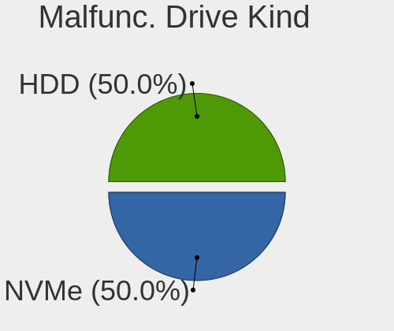
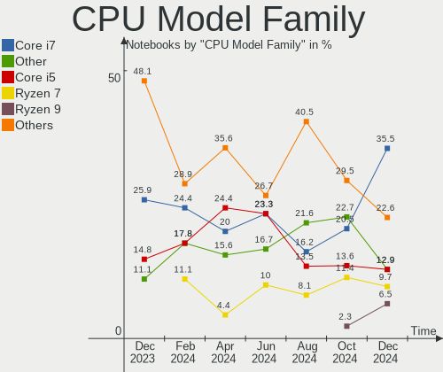

KDE neon Hardware Trends (Notebook)
-----------------------------------

A project to identify most popular hardware characteristics and track their change
over time based on data collected by KDE neon users at https://Linux-Hardware.org.

Anyone can contribute to the study by uploading probes of their computers by
the [hw-probe](https://github.com/linuxhw/hw-probe) tool:

    sudo -E hw-probe -all -upload

Full-feature report is available here: https://linux-hardware.org/?view=trends&formfactor=notebook

Period: Jun, 2021.

Contents
--------

- [ OS                       ](#os)
- [ OS Family                ](#os-family)
- [ Kernel                   ](#kernel)
- [ Kernel Family            ](#kernel-family)
- [ Kernel Major Ver.        ](#kernel-major-ver)
- [ Arch                     ](#arch)
- [ DE                       ](#de)
- [ Display Server           ](#display-server)
- [ Display Manager          ](#display-manager)
- [ OS Lang                  ](#os-lang)
- [ Boot Mode                ](#boot-mode)
- [ Filesystem               ](#filesystem)
- [ Part. scheme             ](#part-scheme)
- [ Dual Boot with Linux/BSD ](#dual-boot-with-linux/bsd)
- [ Dual Boot (Win)          ](#dual-boot-win)
- [ Country                  ](#country)
- [ City                     ](#city)
- [ Vendor                   ](#vendor)
- [ Model                    ](#model)
- [ Model Family             ](#model-family)
- [ MFG Year                 ](#mfg-year)
- [ Form Factor              ](#form-factor)
- [ Secure Boot              ](#secure-boot)
- [ Coreboot                 ](#coreboot)
- [ RAM Size                 ](#ram-size)
- [ RAM Used                 ](#ram-used)
- [ Has CD-ROM               ](#has-cd-rom)
- [ Total Drives             ](#total-drives)
- [ Has Ethernet             ](#has-ethernet)
- [ Has WiFi                 ](#has-wifi)
- [ Has Bluetooth            ](#has-bluetooth)
- [ Drive Vendor             ](#drive-vendor)
- [ Drive Model              ](#drive-model)
- [ HDD Vendor               ](#hdd-vendor)
- [ SSD Vendor               ](#ssd-vendor)
- [ Drive Kind               ](#drive-kind)
- [ Drive Connector          ](#drive-connector)
- [ Drive Size               ](#drive-size)
- [ Space Total              ](#space-total)
- [ Space Used               ](#space-used)
- [ Malfunc. Drives          ](#malfunc-drives)
- [ Malfunc. Drive Vendor    ](#malfunc-drive-vendor)
- [ Malfunc. HDD Vendor      ](#malfunc-hdd-vendor)
- [ Malfunc. Drive Kind      ](#malfunc-drive-kind)
- [ Failed Drives            ](#failed-drives)
- [ Failed Drive Vendor      ](#failed-drive-vendor)
- [ Drive Status             ](#drive-status)
- [ Storage Vendor           ](#storage-vendor)
- [ Storage Model            ](#storage-model)
- [ Storage Kind             ](#storage-kind)
- [ CPU Vendor               ](#cpu-vendor)
- [ CPU Model                ](#cpu-model)
- [ CPU Model Family         ](#cpu-model-family)
- [ CPU Cores                ](#cpu-cores)
- [ CPU Sockets              ](#cpu-sockets)
- [ CPU Threads              ](#cpu-threads)
- [ CPU Op-Modes             ](#cpu-op-modes)
- [ CPU Microcode            ](#cpu-microcode)
- [ CPU Microarch            ](#cpu-microarch)
- [ GPU Vendor               ](#gpu-vendor)
- [ GPU Model                ](#gpu-model)
- [ GPU Combo                ](#gpu-combo)
- [ GPU Driver               ](#gpu-driver)
- [ GPU Memory               ](#gpu-memory)
- [ Monitor Vendor           ](#monitor-vendor)
- [ Monitor Model            ](#monitor-model)
- [ Monitor Resolution       ](#monitor-resolution)
- [ Monitor Diagonal         ](#monitor-diagonal)
- [ Monitor Width            ](#monitor-width)
- [ Aspect Ratio             ](#aspect-ratio)
- [ Monitor Area             ](#monitor-area)
- [ Pixel Density            ](#pixel-density)
- [ Multiple Monitors        ](#multiple-monitors)
- [ Net Controller Vendor    ](#net-controller-vendor)
- [ Net Controller Model     ](#net-controller-model)
- [ Wireless Vendor          ](#wireless-vendor)
- [ Wireless Model           ](#wireless-model)
- [ Ethernet Vendor          ](#ethernet-vendor)
- [ Ethernet Model           ](#ethernet-model)
- [ Net Controller Kind      ](#net-controller-kind)
- [ Used Controller          ](#used-controller)
- [ NICs                     ](#nics)
- [ IPv6                     ](#ipv6)
- [ Memory Vendor            ](#memory-vendor)
- [ Memory Model             ](#memory-model)
- [ Memory Kind              ](#memory-kind)
- [ Memory Form Factor       ](#memory-form-factor)
- [ Memory Size              ](#memory-size)
- [ Memory Speed             ](#memory-speed)
- [ Sound Vendor             ](#sound-vendor)
- [ Sound Model              ](#sound-model)
- [ Camera Vendor            ](#camera-vendor)
- [ Camera Model             ](#camera-model)
- [ Fingerprint Vendor       ](#fingerprint-vendor)
- [ Fingerprint Model        ](#fingerprint-model)
- [ Chipcard Vendor          ](#chipcard-vendor)
- [ Chipcard Model           ](#chipcard-model)
- [ Printer Vendor           ](#printer-vendor)
- [ Printer Model            ](#printer-model)
- [ Scanner Vendor           ](#scanner-vendor)
- [ Scanner Model            ](#scanner-model)
- [ Bluetooth Vendor         ](#bluetooth-vendor)
- [ Bluetooth Model          ](#bluetooth-model)
- [ Unsupported Devices      ](#unsupported-devices)
- [ Unsupported Device Types ](#unsupported-device-types)

OS
--

Installed operating systems

| Name           | Notebooks | Percent |
|----------------|-----------|---------|
| KDE neon 20.04 | 50        | 100%    |

OS Family
---------

OS without a version

| Name     | Notebooks | Percent |
|----------|-----------|---------|
| KDE neon | 50        | 100%    |

Kernel
------

Version of the Linux kernel

| Version                | Notebooks | Percent |
|------------------------|-----------|---------|
| 5.4.0-74-generic       | 29        | 58%     |
| 5.8.0-55-generic       | 8         | 16%     |
| 5.8.0-59-generic       | 6         | 12%     |
| 5.4.0-73-generic       | 4         | 8%      |
| 5.4.0-77-generic       | 1         | 2%      |
| 5.4.0-75-generic       | 1         | 2%      |
| 5.10.13-051013-generic | 1         | 2%      |

Kernel Family
-------------

Linux kernel without a distro release

| Version | Notebooks | Percent |
|---------|-----------|---------|
| 5.4.0   | 35        | 70%     |
| 5.8.0   | 14        | 28%     |
| 5.10.13 | 1         | 2%      |

Kernel Major Ver.
-----------------

Linux kernel major version

| Version | Notebooks | Percent |
|---------|-----------|---------|
| 5.4     | 35        | 70%     |
| 5.8     | 14        | 28%     |
| 5.10    | 1         | 2%      |

Arch
----

OS architecture (x86_64, i586, etc.)

| Name   | Notebooks | Percent |
|--------|-----------|---------|
| x86_64 | 50        | 100%    |

DE
--

Desktop Environment

| Name    | Notebooks | Percent |
|---------|-----------|---------|
| KDE     | 44        | 88%     |
| KDE5    | 3         | 6%      |
| Unknown | 3         | 6%      |

Display Server
--------------

X11 or Wayland

| Name    | Notebooks | Percent |
|---------|-----------|---------|
| X11     | 47        | 94%     |
| Wayland | 3         | 6%      |

Display Manager
---------------

SDDM, LightDM, etc.

| Name    | Notebooks | Percent |
|---------|-----------|---------|
| Unknown | 47        | 94%     |
| SDDM    | 3         | 6%      |

OS Lang
-------

Language

| Lang  | Notebooks | Percent |
|-------|-----------|---------|
| en_US | 16        | 32%     |
| ru_RU | 7         | 14%     |
| de_DE | 5         | 10%     |
| pt_BR | 3         | 6%      |
| pl_PL | 3         | 6%      |
| en_IN | 3         | 6%      |
| en_GB | 3         | 6%      |
| es_MX | 2         | 4%      |
| zh_CN | 1         | 2%      |
| it_IT | 1         | 2%      |
| es_SV | 1         | 2%      |
| en_IL | 1         | 2%      |
| en_CA | 1         | 2%      |
| en_AU | 1         | 2%      |
| de_AT | 1         | 2%      |
| C     | 1         | 2%      |

Boot Mode
---------

EFI or BIOS

| Mode | Notebooks | Percent |
|------|-----------|---------|
| EFI  | 26        | 52%     |
| BIOS | 24        | 48%     |

Filesystem
----------

Type of filesystem

| Type    | Notebooks | Percent |
|---------|-----------|---------|
| Ext4    | 48        | 96%     |
| Overlay | 1         | 2%      |
| Btrfs   | 1         | 2%      |

Part. scheme
------------

Scheme of partitioning

| Type    | Notebooks | Percent |
|---------|-----------|---------|
| Unknown | 47        | 94%     |
| GPT     | 2         | 4%      |
| MBR     | 1         | 2%      |

Dual Boot with Linux/BSD
------------------------

Hosting more than one Linux/BSD

| Dual boot | Notebooks | Percent |
|-----------|-----------|---------|
| No        | 48        | 96%     |
| Yes       | 2         | 4%      |

Dual Boot (Win)
---------------

Hosting Linux and Windows

| Dual boot | Notebooks | Percent |
|-----------|-----------|---------|
| No        | 44        | 88%     |
| Yes       | 6         | 12%     |

Country
-------

Geographic location (country)

| Country     | Notebooks | Percent |
|-------------|-----------|---------|
| USA         | 7         | 14%     |
| Russia      | 7         | 14%     |
| Germany     | 5         | 10%     |
| Poland      | 3         | 6%      |
| Mexico      | 3         | 6%      |
| India       | 3         | 6%      |
| Brazil      | 3         | 6%      |
| UK          | 2         | 4%      |
| Romania     | 2         | 4%      |
| Switzerland | 1         | 2%      |
| Sweden      | 1         | 2%      |
| Sri Lanka   | 1         | 2%      |
| Spain       | 1         | 2%      |
| Slovenia    | 1         | 2%      |
| Netherlands | 1         | 2%      |
| Malaysia    | 1         | 2%      |
| Italy       | 1         | 2%      |
| Israel      | 1         | 2%      |
| Iran        | 1         | 2%      |
| El Salvador | 1         | 2%      |
| China       | 1         | 2%      |
| Canada      | 1         | 2%      |
| Austria     | 1         | 2%      |
| Australia   | 1         | 2%      |

City
----

Geographic location (city)

| City                      | Notebooks | Percent |
|---------------------------|-----------|---------|
| Moscow                    | 3         | 6%      |
| Delhi                     | 2         | 4%      |
| Bucharest                 | 2         | 4%      |
| Zurich                    | 1         | 2%      |
| Wroclaw                   | 1         | 2%      |
| Walsall                   | 1         | 2%      |
| Vienna                    | 1         | 2%      |
| Ufa                       | 1         | 2%      |
| Tehran                    | 1         | 2%      |
| Tampico                   | 1         | 2%      |
| Stockholm                 | 1         | 2%      |
| Siechnice                 | 1         | 2%      |
| Santo Antonio da Platina  | 1         | 2%      |
| Santa Monica              | 1         | 2%      |
| Sant Pere de Riudebitlles | 1         | 2%      |
| San Salvador              | 1         | 2%      |
| San Luis Potosí City     | 1         | 2%      |
| Rochester                 | 1         | 2%      |
| Poznan                    | 1         | 2%      |
| Phoenix                   | 1         | 2%      |
| Novosibirsk               | 1         | 2%      |
| Nanning                   | 1         | 2%      |
| Naaldwijk                 | 1         | 2%      |
| Munich                    | 1         | 2%      |
| Middlesbrough             | 1         | 2%      |
| Miami                     | 1         | 2%      |
| Mexicali                  | 1         | 2%      |
| Maringá                  | 1         | 2%      |
| Laufach                   | 1         | 2%      |
| Kota Kinabalu             | 1         | 2%      |
| Kolomna                   | 1         | 2%      |
| Kelaniya                  | 1         | 2%      |
| Izhevsk                   | 1         | 2%      |
| Idrija                    | 1         | 2%      |
| Haifa                     | 1         | 2%      |
| Everett                   | 1         | 2%      |
| Dingolfing                | 1         | 2%      |
| Concord                   | 1         | 2%      |
| Castelfidardo             | 1         | 2%      |
| Brooks                    | 1         | 2%      |
| Brisbane                  | 1         | 2%      |
| Breaux Bridge             | 1         | 2%      |
| Bernsbach                 | 1         | 2%      |
| Baden-Baden               | 1         | 2%      |
| Arcoverde                 | 1         | 2%      |
| Ahmedabad                 | 1         | 2%      |

Vendor
------

Motherboard manufacturer

| Name                | Notebooks | Percent |
|---------------------|-----------|---------|
| Hewlett-Packard     | 14        | 28%     |
| Dell                | 10        | 20%     |
| Lenovo              | 8         | 16%     |
| Acer                | 8         | 16%     |
| ASUSTek Computer    | 4         | 8%      |
| HUAWEI              | 2         | 4%      |
| Toshiba             | 1         | 2%      |
| Samsung Electronics | 1         | 2%      |
| HKC                 | 1         | 2%      |
| Apple               | 1         | 2%      |

Model
-----

Motherboard model

| Name                                   | Notebooks | Percent |
|----------------------------------------|-----------|---------|
| HUAWEI NBLK-WAX9X                      | 2         | 4%      |
| Toshiba Satellite C55D-A-15H           | 1         | 2%      |
| Samsung 300E5M/300E5L                  | 1         | 2%      |
| Lenovo Yoga 700-14ISK 80QD             | 1         | 2%      |
| Lenovo V310-15ISK 80SY                 | 1         | 2%      |
| Lenovo ThinkPad X230 232425U           | 1         | 2%      |
| Lenovo ThinkPad T61 8897CTO            | 1         | 2%      |
| Lenovo ThinkPad T400 6475F75           | 1         | 2%      |
| Lenovo ThinkPad S3 Yoga 14 20DM000VUS  | 1         | 2%      |
| Lenovo ThinkPad P50 20EQS37F00         | 1         | 2%      |
| Lenovo Legion Y7000 2019 PG0 81T0      | 1         | 2%      |
| HKC NT14W                              | 1         | 2%      |
| HP ProBook 470 G5                      | 1         | 2%      |
| HP Pavilion Notebook                   | 1         | 2%      |
| HP Pavilion Laptop 15-cc1xx            | 1         | 2%      |
| HP Pavilion g7                         | 1         | 2%      |
| HP Pavilion dv7                        | 1         | 2%      |
| HP Pavilion 15                         | 1         | 2%      |
| HP OMEN by HP Laptop                   | 1         | 2%      |
| HP Laptop 17-by2xxx                    | 1         | 2%      |
| HP Laptop 15s-du1xxx                   | 1         | 2%      |
| HP Laptop 15-dy1xxx                    | 1         | 2%      |
| HP InsydeH2O EFI BIOS                  | 1         | 2%      |
| HP EliteBook 8770w                     | 1         | 2%      |
| HP EliteBook 840 G5                    | 1         | 2%      |
| HP Compaq 6735b                        | 1         | 2%      |
| Dell XPS 13 9370                       | 1         | 2%      |
| Dell XPS 13 9350                       | 1         | 2%      |
| Dell Precision M6600                   | 1         | 2%      |
| Dell Latitude E7250                    | 1         | 2%      |
| Dell Latitude E6530                    | 1         | 2%      |
| Dell Latitude E6510                    | 1         | 2%      |
| Dell Inspiron 7580                     | 1         | 2%      |
| Dell Inspiron 5559                     | 1         | 2%      |
| Dell Inspiron 3442                     | 1         | 2%      |
| Dell Inspiron 15-3567                  | 1         | 2%      |
| ASUS X550LA                            | 1         | 2%      |
| ASUS VivoBook_ASUSLaptop X521IA_M533IA | 1         | 2%      |
| ASUS VivoBook_ASUSLaptop X403JA_K403JA | 1         | 2%      |
| ASUS N56VM                             | 1         | 2%      |
| Apple MacBookAir4,2                    | 1         | 2%      |
| Acer TravelMate X349-G2-M              | 1         | 2%      |
| Acer Extensa 2540                      | 1         | 2%      |
| Acer Aspire ES1-522                    | 1         | 2%      |
| Acer Aspire E5-575G                    | 1         | 2%      |
| Acer Aspire A515-43                    | 1         | 2%      |
| Acer Aspire A515-41G                   | 1         | 2%      |
| Acer Aspire A315-21                    | 1         | 2%      |
| Acer Aspire 5742G                      | 1         | 2%      |

Model Family
------------

Motherboard model prefix

| Name              | Notebooks | Percent |
|-------------------|-----------|---------|
| Acer Aspire       | 6         | 12%     |
| Lenovo ThinkPad   | 5         | 10%     |
| HP Pavilion       | 5         | 10%     |
| Dell Inspiron     | 4         | 8%      |
| HP Laptop         | 3         | 6%      |
| Dell Latitude     | 3         | 6%      |
| HUAWEI NBLK-WAX9X | 2         | 4%      |
| HP EliteBook      | 2         | 4%      |
| Dell XPS          | 2         | 4%      |
| ASUS VivoBook     | 2         | 4%      |
| Toshiba Satellite | 1         | 2%      |
| Samsung 300E5M    | 1         | 2%      |
| Lenovo Yoga       | 1         | 2%      |
| Lenovo V310-15ISK | 1         | 2%      |
| Lenovo Legion     | 1         | 2%      |
| HKC NT14W         | 1         | 2%      |
| HP ProBook        | 1         | 2%      |
| HP OMEN           | 1         | 2%      |
| HP InsydeH2O      | 1         | 2%      |
| HP Compaq         | 1         | 2%      |
| Dell Precision    | 1         | 2%      |
| ASUS X550LA       | 1         | 2%      |
| ASUS N56VM        | 1         | 2%      |
| Apple MacBookAir4 | 1         | 2%      |
| Acer TravelMate   | 1         | 2%      |
| Acer Extensa      | 1         | 2%      |

MFG Year
--------

Motherboard manufacture year

| Year | Notebooks | Percent |
|------|-----------|---------|
| 2018 | 9         | 18%     |
| 2020 | 8         | 16%     |
| 2019 | 6         | 12%     |
| 2017 | 5         | 10%     |
| 2021 | 4         | 8%      |
| 2016 | 4         | 8%      |
| 2015 | 4         | 8%      |
| 2012 | 2         | 4%      |
| 2011 | 2         | 4%      |
| 2010 | 2         | 4%      |
| 2014 | 1         | 2%      |
| 2013 | 1         | 2%      |
| 2009 | 1         | 2%      |
| 2008 | 1         | 2%      |

Form Factor
-----------

Physical design of the computer

| Name     | Notebooks | Percent |
|----------|-----------|---------|
| Notebook | 50        | 100%    |

Secure Boot
-----------

Enabled or disabled

| State    | Notebooks | Percent |
|----------|-----------|---------|
| Disabled | 43        | 86%     |
| Enabled  | 7         | 14%     |

Coreboot
--------

Have coreboot on board

| Used | Notebooks | Percent |
|------|-----------|---------|
| No   | 50        | 100%    |

RAM Size
--------

Total RAM memory

| Size in GB | Notebooks | Percent |
|------------|-----------|---------|
| 4.01-8.0   | 23        | 46%     |
| 8.01-16.0  | 10        | 20%     |
| 3.01-4.0   | 9         | 18%     |
| 16.01-24.0 | 4         | 8%      |
| 32.01-64.0 | 3         | 6%      |
| 24.01-32.0 | 1         | 2%      |

RAM Used
--------

Used RAM memory

| Used GB   | Notebooks | Percent |
|-----------|-----------|---------|
| 1.01-2.0  | 25        | 50%     |
| 2.01-3.0  | 10        | 20%     |
| 3.01-4.0  | 6         | 12%     |
| 4.01-8.0  | 5         | 10%     |
| 8.01-16.0 | 2         | 4%      |
| 0.51-1.0  | 2         | 4%      |

Has CD-ROM
----------

Has CD-ROM on board

| Presented | Notebooks | Percent |
|-----------|-----------|---------|
| No        | 31        | 62%     |
| Yes       | 19        | 38%     |

Total Drives
------------

Number of drives on board

| Drives | Notebooks | Percent |
|--------|-----------|---------|
| 1      | 32        | 64%     |
| 2      | 16        | 32%     |
| 4      | 1         | 2%      |
| 3      | 1         | 2%      |

Has Ethernet
------------

Has Ethernet on board

| Presented | Notebooks | Percent |
|-----------|-----------|---------|
| Yes       | 38        | 76%     |
| No        | 12        | 24%     |

Has WiFi
--------

Has WiFi module

| Presented | Notebooks | Percent |
|-----------|-----------|---------|
| Yes       | 49        | 98%     |
| No        | 1         | 2%      |

Has Bluetooth
-------------

Has Bluetooth module

| Presented | Notebooks | Percent |
|-----------|-----------|---------|
| Yes       | 39        | 78%     |
| No        | 11        | 22%     |

Drive Vendor
------------

Hard drive vendors

| Vendor              | Notebooks | Drives | Percent |
|---------------------|-----------|--------|---------|
| Seagate             | 12        | 12     | 17.91%  |
| Samsung Electronics | 8         | 9      | 11.94%  |
| Intel               | 7         | 10     | 10.45%  |
| WDC                 | 4         | 4      | 5.97%   |
| Unknown             | 4         | 5      | 5.97%   |
| Sandisk             | 4         | 4      | 5.97%   |
| Toshiba             | 3         | 3      | 4.48%   |
| HGST                | 3         | 3      | 4.48%   |
| SK Hynix            | 2         | 2      | 2.99%   |
| Patriot             | 2         | 2      | 2.99%   |
| LITEON              | 2         | 2      | 2.99%   |
| Kingston            | 2         | 2      | 2.99%   |
| A-DATA Technology   | 2         | 2      | 2.99%   |
| LONDISK             | 1         | 1      | 1.49%   |
| Lite-On             | 1         | 1      | 1.49%   |
| KingSpec            | 1         | 1      | 1.49%   |
| Hitachi             | 1         | 1      | 1.49%   |
| HGST HTS            | 1         | 1      | 1.49%   |
| GOODRAM             | 1         | 1      | 1.49%   |
| Gigabyte Technology | 1         | 1      | 1.49%   |
| Fujitsu             | 1         | 1      | 1.49%   |
| EDGE                | 1         | 1      | 1.49%   |
| DOGFISH             | 1         | 1      | 1.49%   |
| Crucial             | 1         | 1      | 1.49%   |
| Apple               | 1         | 1      | 1.49%   |

Drive Model
-----------

Hard drive models

| Model                                | Notebooks | Percent |
|--------------------------------------|-----------|---------|
| Intel NVMe SSD Drive 512GB           | 3         | 4.17%   |
| Toshiba NVMe SSD Drive 256GB         | 2         | 2.78%   |
| Seagate ST1000LM048-2E7172 1TB       | 2         | 2.78%   |
| Seagate ST1000LM035-1RK172 1TB       | 2         | 2.78%   |
| Seagate ST1000LM024 HN-M101MBB 1TB   | 2         | 2.78%   |
| Intel NVMe SSD Drive 32GB            | 2         | 2.78%   |
| WDC WD10SPZX-60Z10T0 1TB             | 1         | 1.39%   |
| WDC WD10SPZX-21Z10T0 1TB             | 1         | 1.39%   |
| WDC WD10JPVX-75JC3T0 1TB             | 1         | 1.39%   |
| WDC WD10JPCX-24UE4T0 1TB             | 1         | 1.39%   |
| Unknown SD/MMC/MS PRO 128GB          | 1         | 1.39%   |
| Unknown MMC Card  32GB               | 1         | 1.39%   |
| Unknown MMC Card  16GB               | 1         | 1.39%   |
| Unknown MMC Card  128GB              | 1         | 1.39%   |
| Unknown APPSD  16GB                  | 1         | 1.39%   |
| Toshiba MQ01ABF050 500GB             | 1         | 1.39%   |
| SK Hynix NVMe SSD Drive 256GB        | 1         | 1.39%   |
| SK Hynix NVMe SSD Drive 1024GB       | 1         | 1.39%   |
| Seagate ST9250315AS 250GB            | 1         | 1.39%   |
| Seagate ST9160821AS 160GB            | 1         | 1.39%   |
| Seagate ST500LT012-1DG142 500GB      | 1         | 1.39%   |
| Seagate ST2000LM007-1R8174 2TB       | 1         | 1.39%   |
| Seagate ST1000LX015-1U7172-SSHD 1TB  | 1         | 1.39%   |
| Seagate BUP Slim BK 1TB              | 1         | 1.39%   |
| SanDisk SSD U110 16GB                | 1         | 1.39%   |
| SanDisk SD7SB3Q064G 56GB SSD         | 1         | 1.39%   |
| Sandisk NVMe SSD Drive 500GB         | 1         | 1.39%   |
| Sandisk NVMe SSD Drive 256GB         | 1         | 1.39%   |
| Samsung SSD PM830 2.5 7mm 128GB      | 1         | 1.39%   |
| Samsung SSD 970 EVO 250GB            | 1         | 1.39%   |
| Samsung SSD 860 EVO 500GB            | 1         | 1.39%   |
| Samsung SSD 860 EVO 1TB              | 1         | 1.39%   |
| Samsung SSD 850 EVO M.2 250GB        | 1         | 1.39%   |
| Samsung SSD 850 EVO 250GB            | 1         | 1.39%   |
| Samsung NVMe SSD Drive 256GB         | 1         | 1.39%   |
| Samsung MZVLB1T0HBLR-000L7 1TB       | 1         | 1.39%   |
| Samsung MZNLN512HMJP-000L7 512GB SSD | 1         | 1.39%   |
| Patriot Spark 128GB SSD              | 1         | 1.39%   |
| Patriot Burst 120GB SSD              | 1         | 1.39%   |
| LONDISK SSD 240GB                    | 1         | 1.39%   |
| LITEON IT LCS-128L9S 128GB SSD       | 1         | 1.39%   |
| LITEON CV1-DB256 256GB SSD           | 1         | 1.39%   |
| Lite-On NVMe SSD Drive 512GB         | 1         | 1.39%   |
| Kingston SA400S37480G 480GB SSD      | 1         | 1.39%   |
| Kingston NVMe SSD Drive 512GB        | 1         | 1.39%   |
| KingSpec P3-1TB                      | 1         | 1.39%   |
| Intel SSDSC2BW240A3L 240GB           | 1         | 1.39%   |
| Intel SSDPEKKF512G8 NVMe 512GB       | 1         | 1.39%   |
| Intel SSDMAEXC024G3H 24GB            | 1         | 1.39%   |
| Intel NVMe SSD Drive 256GB           | 1         | 1.39%   |
| Intel NVMe SSD Drive 16GB            | 1         | 1.39%   |
| Hitachi HTS545032B9A300 320GB        | 1         | 1.39%   |
| HGST HTS545050A7E680 500GB           | 1         | 1.39%   |
| HGST HTS545050A7E380 500GB           | 1         | 1.39%   |
| HGST HTS541010A9E680 1TB             | 1         | 1.39%   |
| HGST HTS 541010A9E680 1TB            | 1         | 1.39%   |
| GOODRAM SSDPR-CL100-240-G3 240GB     | 1         | 1.39%   |
| Gigabyte GP-GSTFS31120GNTD 120GB SSD | 1         | 1.39%   |
| Fujitsu MHZ2160BJ G2 160GB           | 1         | 1.39%   |
| EDGE Boost Pro Plus SSD 240GB        | 1         | 1.39%   |

HDD Vendor
----------

Hard disk drive vendors

| Vendor   | Notebooks | Drives | Percent |
|----------|-----------|--------|---------|
| Seagate  | 12        | 12     | 52.17%  |
| WDC      | 4         | 4      | 17.39%  |
| HGST     | 3         | 3      | 13.04%  |
| Toshiba  | 1         | 1      | 4.35%   |
| Hitachi  | 1         | 1      | 4.35%   |
| HGST HTS | 1         | 1      | 4.35%   |
| Fujitsu  | 1         | 1      | 4.35%   |

SSD Vendor
----------

Solid state drive vendors

| Vendor              | Notebooks | Drives | Percent |
|---------------------|-----------|--------|---------|
| Samsung Electronics | 6         | 6      | 24%     |
| SanDisk             | 2         | 2      | 8%      |
| Patriot             | 2         | 2      | 8%      |
| LITEON              | 2         | 2      | 8%      |
| Intel               | 2         | 2      | 8%      |
| A-DATA Technology   | 2         | 2      | 8%      |
| LONDISK             | 1         | 1      | 4%      |
| Kingston            | 1         | 1      | 4%      |
| KingSpec            | 1         | 1      | 4%      |
| GOODRAM             | 1         | 1      | 4%      |
| Gigabyte Technology | 1         | 1      | 4%      |
| EDGE                | 1         | 1      | 4%      |
| DOGFISH             | 1         | 1      | 4%      |
| Crucial             | 1         | 1      | 4%      |
| Apple               | 1         | 1      | 4%      |

Drive Kind
----------

HDD or SSD

| Kind    | Notebooks | Drives | Percent |
|---------|-----------|--------|---------|
| SSD     | 22        | 25     | 34.38%  |
| HDD     | 22        | 23     | 34.38%  |
| NVMe    | 16        | 19     | 25%     |
| MMC     | 3         | 4      | 4.69%   |
| Unknown | 1         | 1      | 1.56%   |

Drive Connector
---------------

SATA, SAS, NVMe, etc.

| Type | Notebooks | Drives | Percent |
|------|-----------|--------|---------|
| SATA | 37        | 46     | 62.71%  |
| NVMe | 16        | 19     | 27.12%  |
| SAS  | 3         | 3      | 5.08%   |
| MMC  | 3         | 4      | 5.08%   |

Drive Size
----------

Size of hard drive

| Size in TB | Notebooks | Drives | Percent |
|------------|-----------|--------|---------|
| 0.01-0.5   | 24        | 29     | 57.14%  |
| 0.51-1.0   | 17        | 18     | 40.48%  |
| 1.01-2.0   | 1         | 1      | 2.38%   |

Space Total
-----------

Amount of disk space available on the file system

| Size in GB | Notebooks | Percent |
|------------|-----------|---------|
| 101-250    | 18        | 36%     |
| 251-500    | 13        | 26%     |
| 501-1000   | 7         | 14%     |
| 21-50      | 4         | 8%      |
| 1001-2000  | 4         | 8%      |
| 1-20       | 3         | 6%      |
| Unknown    | 1         | 2%      |

Space Used
----------

Amount of used disk space

| Used GB  | Notebooks | Percent |
|----------|-----------|---------|
| 1-20     | 25        | 50%     |
| 251-500  | 7         | 14%     |
| 21-50    | 7         | 14%     |
| 101-250  | 5         | 10%     |
| 51-100   | 3         | 6%      |
| 501-1000 | 2         | 4%      |
| Unknown  | 1         | 2%      |

Malfunc. Drives
---------------

Drive models with a malfunction

| Model                                       | Notebooks | Drives | Percent |
|---------------------------------------------|-----------|--------|---------|
| Samsung Electronics SSD PM830 2.5 7mm 128GB | 1         | 1      | 100%    |

Malfunc. Drive Vendor
---------------------

Vendors of faulty drives

| Vendor              | Notebooks | Drives | Percent |
|---------------------|-----------|--------|---------|
| Samsung Electronics | 1         | 1      | 100%    |

Malfunc. HDD Vendor
-------------------

Vendors of faulty HDD drives

Zero info for selected period =(

Malfunc. Drive Kind
-------------------

Kinds of faulty drives

| Kind | Notebooks | Drives | Percent |
|------|-----------|--------|---------|
| SSD  | 1         | 1      | 100%    |

Failed Drives
-------------

Failed drive models

Zero info for selected period =(

Failed Drive Vendor
-------------------

Failed drive vendors

Zero info for selected period =(

Drive Status
------------

Number of failed and malfunc. drives

| Status   | Notebooks | Drives | Percent |
|----------|-----------|--------|---------|
| Detected | 45        | 61     | 86.54%  |
| Works    | 6         | 10     | 11.54%  |
| Malfunc  | 1         | 1      | 1.92%   |

Storage Vendor
--------------

Storage controller vendors

| Vendor                       | Notebooks | Percent |
|------------------------------|-----------|---------|
| Intel                        | 37        | 64.91%  |
| AMD                          | 8         | 14.04%  |
| Samsung Electronics          | 3         | 5.26%   |
| Toshiba America Info Systems | 2         | 3.51%   |
| SK Hynix                     | 2         | 3.51%   |
| Sandisk                      | 2         | 3.51%   |
| Lite-On Technology           | 1         | 1.75%   |
| Kingston Technology Company  | 1         | 1.75%   |
| JMicron Technology           | 1         | 1.75%   |

Storage Model
-------------

Storage controller models

| Model                                                                                  | Notebooks | Percent |
|----------------------------------------------------------------------------------------|-----------|---------|
| Intel Sunrise Point-LP SATA Controller [AHCI mode]                                     | 8         | 13.11%  |
| Intel 82801 Mobile SATA Controller [RAID mode]                                         | 8         | 13.11%  |
| AMD FCH SATA Controller [AHCI mode]                                                    | 7         | 11.48%  |
| Intel 7 Series Chipset Family 6-port SATA Controller [AHCI mode]                       | 5         | 8.2%    |
| Intel Non-Volatile memory controller                                                   | 3         | 4.92%   |
| Intel 8 Series SATA Controller 1 [AHCI mode]                                           | 3         | 4.92%   |
| Sandisk WD Black SN750 / PC SN730 NVMe SSD                                             | 2         | 3.28%   |
| Samsung NVMe SSD Controller SM981/PM981/PM983                                          | 2         | 3.28%   |
| Intel Cannon Lake Mobile PCH SATA AHCI Controller                                      | 2         | 3.28%   |
| Intel 82801IBM/IEM (ICH9M/ICH9M-E) 4 port SATA Controller [AHCI mode]                  | 2         | 3.28%   |
| Toshiba America Info Systems XG6 NVMe SSD Controller                                   | 1         | 1.64%   |
| Toshiba America Info Systems BG3 NVMe SSD Controller                                   | 1         | 1.64%   |
| SK Hynix Non-Volatile memory controller                                                | 1         | 1.64%   |
| SK Hynix BC501 NVMe Solid State Drive                                                  | 1         | 1.64%   |
| Samsung NVMe SSD Controller SM951/PM951                                                | 1         | 1.64%   |
| Lite-On Non-Volatile memory controller                                                 | 1         | 1.64%   |
| Kingston Company Company Non-Volatile memory controller                                | 1         | 1.64%   |
| JMicron JMB360 AHCI Controller                                                         | 1         | 1.64%   |
| Intel SSD Pro 7600p/760p/E 6100p Series                                                | 1         | 1.64%   |
| Intel SSD 600P Series                                                                  | 1         | 1.64%   |
| Intel Q170/Q150/B150/H170/H110/Z170/CM236 Chipset SATA Controller [AHCI Mode]          | 1         | 1.64%   |
| Intel HM170/QM170 Chipset SATA Controller [AHCI Mode]                                  | 1         | 1.64%   |
| Intel Cannon Point-LP SATA Controller [AHCI Mode]                                      | 1         | 1.64%   |
| Intel 82801HM/HEM (ICH8M/ICH8M-E) SATA Controller [AHCI mode]                          | 1         | 1.64%   |
| Intel 82801HM/HEM (ICH8M/ICH8M-E) IDE Controller                                       | 1         | 1.64%   |
| Intel 6 Series/C200 Series Chipset Family Mobile SATA Controller (IDE mode, ports 0-3) | 1         | 1.64%   |
| Intel 6 Series/C200 Series Chipset Family 6 port Mobile SATA AHCI Controller           | 1         | 1.64%   |
| Intel 5 Series/3400 Series Chipset 4 port SATA AHCI Controller                         | 1         | 1.64%   |
| AMD SB7x0/SB8x0/SB9x0 SATA Controller [IDE mode]                                       | 1         | 1.64%   |

Storage Kind
------------

Kind of storage controller (IDE, SATA, NVMe, SAS, ...)

| Kind | Notebooks | Percent |
|------|-----------|---------|
| SATA | 34        | 56.67%  |
| NVMe | 16        | 26.67%  |
| RAID | 8         | 13.33%  |
| IDE  | 2         | 3.33%   |

CPU Vendor
----------

Processor vendors

| Vendor | Notebooks | Percent |
|--------|-----------|---------|
| Intel  | 40        | 80%     |
| AMD    | 10        | 20%     |

CPU Model
---------

Processor models

| Model                                           | Notebooks | Percent |
|-------------------------------------------------|-----------|---------|
| Intel Core i5-7200U CPU @ 2.50GHz               | 4         | 8%      |
| Intel Core i7-8550U CPU @ 1.80GHz               | 2         | 4%      |
| Intel Core i5-6200U CPU @ 2.30GHz               | 2         | 4%      |
| Intel Core i5-4210U CPU @ 1.70GHz               | 2         | 4%      |
| Intel Core i5-10210U CPU @ 1.60GHz              | 2         | 4%      |
| AMD Ryzen 5 3500U with Radeon Vega Mobile Gfx   | 2         | 4%      |
| Intel Core i7-7500U CPU @ 2.70GHz               | 1         | 2%      |
| Intel Core i7-6820HQ CPU @ 2.70GHz              | 1         | 2%      |
| Intel Core i7-6500U CPU @ 2.50GHz               | 1         | 2%      |
| Intel Core i7-3632QM CPU @ 2.20GHz              | 1         | 2%      |
| Intel Core i7-3630QM CPU @ 2.40GHz              | 1         | 2%      |
| Intel Core i7-2720QM CPU @ 2.20GHz              | 1         | 2%      |
| Intel Core i7-1065G7 CPU @ 1.30GHz              | 1         | 2%      |
| Intel Core i5-9300H CPU @ 2.40GHz               | 1         | 2%      |
| Intel Core i5-8350U CPU @ 1.70GHz               | 1         | 2%      |
| Intel Core i5-8300H CPU @ 2.30GHz               | 1         | 2%      |
| Intel Core i5-8265U CPU @ 1.60GHz               | 1         | 2%      |
| Intel Core i5-8250U CPU @ 1.60GHz               | 1         | 2%      |
| Intel Core i5-7300HQ CPU @ 2.50GHz              | 1         | 2%      |
| Intel Core i5-5300U CPU @ 2.30GHz               | 1         | 2%      |
| Intel Core i5-3360M CPU @ 2.80GHz               | 1         | 2%      |
| Intel Core i5-3230M CPU @ 2.60GHz               | 1         | 2%      |
| Intel Core i5-3210M CPU @ 2.50GHz               | 1         | 2%      |
| Intel Core i5-2557M CPU @ 1.70GHz               | 1         | 2%      |
| Intel Core i5-1035G1 CPU @ 1.00GHz              | 1         | 2%      |
| Intel Core i5 CPU M 520 @ 2.40GHz               | 1         | 2%      |
| Intel Core i3-6006U CPU @ 2.00GHz               | 1         | 2%      |
| Intel Core i3-4030U CPU @ 1.90GHz               | 1         | 2%      |
| Intel Core i3-3217U CPU @ 1.80GHz               | 1         | 2%      |
| Intel Core i3 CPU M 370 @ 2.40GHz               | 1         | 2%      |
| Intel Core 2 Duo CPU T8300 @ 2.40GHz            | 1         | 2%      |
| Intel Core 2 Duo CPU P9500 @ 2.53GHz            | 1         | 2%      |
| Intel Core 2 Duo CPU P7450 @ 2.13GHz            | 1         | 2%      |
| Intel Atom x5-Z8300 CPU @ 1.44GHz               | 1         | 2%      |
| AMD Turion X2 Ultra DualCore Mobile ZM-86       | 1         | 2%      |
| AMD Ryzen 7 4700U with Radeon Graphics          | 1         | 2%      |
| AMD Ryzen 3 3200U with Radeon Vega Mobile Gfx   | 1         | 2%      |
| AMD A8-7410 APU with AMD Radeon R5 Graphics     | 1         | 2%      |
| AMD A6-9220 RADEON R4, 5 COMPUTE CORES 2C+3G    | 1         | 2%      |
| AMD A6-5200 APU with Radeon HD Graphics         | 1         | 2%      |
| AMD A4-7210 APU with AMD Radeon R3 Graphics     | 1         | 2%      |
| AMD A12-9720P RADEON R7, 12 COMPUTE CORES 4C+8G | 1         | 2%      |

CPU Model Family
----------------

Processor model prefix

| Model            | Notebooks | Percent |
|------------------|-----------|---------|
| Intel Core i5    | 23        | 46%     |
| Intel Core i7    | 9         | 18%     |
| Intel Core i3    | 4         | 8%      |
| Intel Core 2 Duo | 3         | 6%      |
| AMD Ryzen 5      | 2         | 4%      |
| AMD A6           | 2         | 4%      |
| Intel Atom       | 1         | 2%      |
| AMD Turion       | 1         | 2%      |
| AMD Ryzen 7      | 1         | 2%      |
| AMD Ryzen 3      | 1         | 2%      |
| AMD A8           | 1         | 2%      |
| AMD A4           | 1         | 2%      |
| AMD A12          | 1         | 2%      |

CPU Cores
---------

Number of processor cores

| Number | Notebooks | Percent |
|--------|-----------|---------|
| 2      | 27        | 54%     |
| 4      | 22        | 44%     |
| 8      | 1         | 2%      |

CPU Sockets
-----------

Number of sockets

| Number | Notebooks | Percent |
|--------|-----------|---------|
| 1      | 50        | 100%    |

CPU Threads
-----------

Threads per core (Hyper-Threading)

| Number | Notebooks | Percent |
|--------|-----------|---------|
| 2      | 39        | 78%     |
| 1      | 11        | 22%     |

CPU Op-Modes
------------

CPU Operation Modes (32-bit, 64-bit)

| Op mode        | Notebooks | Percent |
|----------------|-----------|---------|
| 32-bit, 64-bit | 50        | 100%    |

CPU Microcode
-------------

Microcode number

| Number     | Notebooks | Percent |
|------------|-----------|---------|
| 0x306a9    | 6         | 12%     |
| 0x806e9    | 5         | 10%     |
| 0x806ea    | 4         | 8%      |
| 0x406e3    | 4         | 8%      |
| 0x40651    | 3         | 6%      |
| 0x10676    | 3         | 6%      |
| Unknown    | 3         | 6%      |
| 0x906ea    | 2         | 4%      |
| 0x806ec    | 2         | 4%      |
| 0x206a7    | 2         | 4%      |
| 0x20655    | 2         | 4%      |
| 0x08108109 | 2         | 4%      |
| 0x07030105 | 2         | 4%      |
| 0x906e9    | 1         | 2%      |
| 0x806eb    | 1         | 2%      |
| 0x706e5    | 1         | 2%      |
| 0x506e3    | 1         | 2%      |
| 0x406c3    | 1         | 2%      |
| 0x08108102 | 1         | 2%      |
| 0x0700010f | 1         | 2%      |
| 0x06006705 | 1         | 2%      |
| 0x06006118 | 1         | 2%      |
| 0x02000057 | 1         | 2%      |

CPU Microarch
-------------

Microarchitecture

| Name            | Notebooks | Percent |
|-----------------|-----------|---------|
| KabyLake        | 15        | 30%     |
| IvyBridge       | 6         | 12%     |
| Skylake         | 5         | 10%     |
| Zen+            | 3         | 6%      |
| Penryn          | 3         | 6%      |
| Haswell         | 3         | 6%      |
| Westmere        | 2         | 4%      |
| SandyBridge     | 2         | 4%      |
| Puma            | 2         | 4%      |
| IceLake         | 2         | 4%      |
| Excavator       | 2         | 4%      |
| Zen 2           | 1         | 2%      |
| Silvermont      | 1         | 2%      |
| K8 & K10 hybrid | 1         | 2%      |
| Jaguar          | 1         | 2%      |
| Broadwell       | 1         | 2%      |

GPU Vendor
----------

Vendors of graphics cards

| Vendor | Notebooks | Percent |
|--------|-----------|---------|
| Intel  | 36        | 53.73%  |
| Nvidia | 16        | 23.88%  |
| AMD    | 15        | 22.39%  |

GPU Model
---------

Graphics card models

| Model                                                                                    | Notebooks | Percent |
|------------------------------------------------------------------------------------------|-----------|---------|
| Intel HD Graphics 620                                                                    | 5         | 7.25%   |
| Intel 3rd Gen Core processor Graphics Controller                                         | 5         | 7.25%   |
| Intel UHD Graphics 620                                                                   | 4         | 5.8%    |
| Intel Skylake GT2 [HD Graphics 520]                                                      | 3         | 4.35%   |
| Intel Haswell-ULT Integrated Graphics Controller                                         | 3         | 4.35%   |
| AMD Sun XT [Radeon HD 8670A/8670M/8690M / R5 M330 / M430 / Radeon 520 Mobile]            | 3         | 4.35%   |
| AMD Picasso                                                                              | 3         | 4.35%   |
| Nvidia GP107M [GeForce GTX 1050 Mobile]                                                  | 2         | 2.9%    |
| Intel CometLake-U GT2 [UHD Graphics]                                                     | 2         | 2.9%    |
| Intel 2nd Generation Core Processor Family Integrated Graphics Controller                | 2         | 2.9%    |
| Nvidia TU117M [GeForce GTX 1650 Mobile / Max-Q]                                          | 1         | 1.45%   |
| Nvidia GP108M [GeForce MX150]                                                            | 1         | 1.45%   |
| Nvidia GM108M [GeForce 940MX]                                                            | 1         | 1.45%   |
| Nvidia GM108M [GeForce 930MX]                                                            | 1         | 1.45%   |
| Nvidia GM108M [GeForce 920MX]                                                            | 1         | 1.45%   |
| Nvidia GM108M [GeForce 840M]                                                             | 1         | 1.45%   |
| Nvidia GM107GLM [Quadro M1000M]                                                          | 1         | 1.45%   |
| Nvidia GM107 [GeForce 940MX]                                                             | 1         | 1.45%   |
| Nvidia GK104GLM [Quadro K3000M]                                                          | 1         | 1.45%   |
| Nvidia GF117M [GeForce 610M/710M/810M/820M / GT 620M/625M/630M/720M]                     | 1         | 1.45%   |
| Nvidia GF108M [GeForce GT 620M/630M/635M/640M LE]                                        | 1         | 1.45%   |
| Nvidia GF108GLM [NVS 5200M]                                                              | 1         | 1.45%   |
| Nvidia GF104GLM [Quadro 4000M]                                                           | 1         | 1.45%   |
| Nvidia G96CM [GeForce 9600M GT]                                                          | 1         | 1.45%   |
| Intel WhiskeyLake-U GT2 [UHD Graphics 620]                                               | 1         | 1.45%   |
| Intel Mobile GM965/GL960 Integrated Graphics Controller (secondary)                      | 1         | 1.45%   |
| Intel Mobile GM965/GL960 Integrated Graphics Controller (primary)                        | 1         | 1.45%   |
| Intel Mobile 4 Series Chipset Integrated Graphics Controller                             | 1         | 1.45%   |
| Intel Iris Plus Graphics G7                                                              | 1         | 1.45%   |
| Intel Iris Plus Graphics G1 (Ice Lake)                                                   | 1         | 1.45%   |
| Intel HD Graphics 630                                                                    | 1         | 1.45%   |
| Intel HD Graphics 5500                                                                   | 1         | 1.45%   |
| Intel HD Graphics 530                                                                    | 1         | 1.45%   |
| Intel HD Graphics 520                                                                    | 1         | 1.45%   |
| Intel Core Processor Integrated Graphics Controller                                      | 1         | 1.45%   |
| Intel CoffeeLake-H GT2 [UHD Graphics 630]                                                | 1         | 1.45%   |
| Intel Atom/Celeron/Pentium Processor x5-E8000/J3xxx/N3xxx Integrated Graphics Controller | 1         | 1.45%   |
| AMD Wani [Radeon R5/R6/R7 Graphics]                                                      | 1         | 1.45%   |
| AMD Thames [Radeon HD 7500M/7600M Series]                                                | 1         | 1.45%   |
| AMD Stoney [Radeon R2/R3/R4/R5 Graphics]                                                 | 1         | 1.45%   |
| AMD RS780M [Mobility Radeon HD 3200]                                                     | 1         | 1.45%   |
| AMD Renoir                                                                               | 1         | 1.45%   |
| AMD Park [Mobility Radeon HD 5430/5450/5470]                                             | 1         | 1.45%   |
| AMD Mullins [Radeon R4/R5 Graphics]                                                      | 1         | 1.45%   |
| AMD Mullins [Radeon R3 Graphics]                                                         | 1         | 1.45%   |
| AMD Lexa PRO [Radeon 540/540X/550/550X / RX 540X/550/550X]                               | 1         | 1.45%   |
| AMD Kabini [Radeon HD 8400 / R3 Series]                                                  | 1         | 1.45%   |

GPU Combo
---------

Combinations of graphics cards

| Name           | Notebooks | Percent |
|----------------|-----------|---------|
| 1 x Intel      | 19        | 38%     |
| Intel + Nvidia | 13        | 26%     |
| 1 x AMD        | 10        | 20%     |
| Intel + AMD    | 4         | 8%      |
| 1 x Nvidia     | 3         | 6%      |
| 2 x AMD        | 1         | 2%      |

GPU Driver
----------

Free vs proprietary

| Driver      | Notebooks | Percent |
|-------------|-----------|---------|
| Free        | 45        | 90%     |
| Proprietary | 3         | 6%      |
| Unknown     | 2         | 4%      |

GPU Memory
----------

Total video memory

| Size in GB | Notebooks | Percent |
|------------|-----------|---------|
| Unknown    | 25        | 50%     |
| 1.01-2.0   | 12        | 24%     |
| 0.51-1.0   | 6         | 12%     |
| 0.01-0.5   | 6         | 12%     |
| 3.01-4.0   | 1         | 2%      |

Monitor Vendor
--------------

Monitor vendors

| Vendor              | Notebooks | Percent |
|---------------------|-----------|---------|
| LG Display          | 11        | 22%     |
| BOE                 | 10        | 20%     |
| Chimei Innolux      | 9         | 18%     |
| AU Optronics        | 7         | 14%     |
| Samsung Electronics | 6         | 12%     |
| Lenovo              | 2         | 4%      |
| Sharp               | 1         | 2%      |
| LG Philips          | 1         | 2%      |
| Goldstar            | 1         | 2%      |
| Gateway             | 1         | 2%      |
| Apple               | 1         | 2%      |

Monitor Model
-------------

Monitor models

| Model                                                                | Notebooks | Percent |
|----------------------------------------------------------------------|-----------|---------|
| BOE LCD Monitor BOE06BA 1920x1080 344x193mm 15.5-inch                | 2         | 4%      |
| Sharp LCD Monitor SHP144A 3200x1800 294x165mm 13.3-inch              | 1         | 2%      |
| Samsung Electronics LCD Monitor SEC544B 1600x900 382x214mm 17.2-inch | 1         | 2%      |
| Samsung Electronics LCD Monitor SEC3454 1600x900 382x215mm 17.3-inch | 1         | 2%      |
| Samsung Electronics LCD Monitor SEC334B 1440x900 367x230mm 17.1-inch | 1         | 2%      |
| Samsung Electronics LCD Monitor SDC4651 1366x768 344x194mm 15.5-inch | 1         | 2%      |
| Samsung Electronics LCD Monitor SDC4347 1366x768 340x190mm 15.3-inch | 1         | 2%      |
| Samsung Electronics C24F390 SAM0D2D 1920x1080 521x293mm 23.5-inch    | 1         | 2%      |
| LG Philips LP154WX4-TLAB LPL3D01 1280x800 331x207mm 15.4-inch        | 1         | 2%      |
| LG Display LCD Monitor LGD05E5 1920x1080 344x194mm 15.5-inch         | 1         | 2%      |
| LG Display LCD Monitor LGD056E 1920x1080 344x194mm 15.5-inch         | 1         | 2%      |
| LG Display LCD Monitor LGD0532 1920x1080 344x194mm 15.5-inch         | 1         | 2%      |
| LG Display LCD Monitor LGD0506 1366x768 344x194mm 15.5-inch          | 1         | 2%      |
| LG Display LCD Monitor LGD04A7 1920x1080 340x190mm 15.3-inch         | 1         | 2%      |
| LG Display LCD Monitor LGD0484 1366x768 344x194mm 15.5-inch          | 1         | 2%      |
| LG Display LCD Monitor LGD047A 1920x1080 309x174mm 14.0-inch         | 1         | 2%      |
| LG Display LCD Monitor LGD0450 1366x768 277x156mm 12.5-inch          | 1         | 2%      |
| LG Display LCD Monitor LGD033B 1366x768 344x194mm 15.5-inch          | 1         | 2%      |
| LG Display LCD Monitor LGD02DA 1920x1080 380x220mm 17.3-inch         | 1         | 2%      |
| LG Display LCD Monitor LGD02D8 1366x768 277x156mm 12.5-inch          | 1         | 2%      |
| Lenovo LCD Monitor LEN4043 1400x1050 305x228mm 15.0-inch             | 1         | 2%      |
| Lenovo LCD Monitor LEN4036 1440x900 304x190mm 14.1-inch              | 1         | 2%      |
| Goldstar HDR WFHD GSM7714 2560x1080 798x334mm 34.1-inch              | 1         | 2%      |
| Gateway KX1953 GWY03B2 1600x900 432x240mm 19.5-inch                  | 1         | 2%      |
| Chimei Innolux LCD Monitor CMN1738 1920x1080 381x214mm 17.2-inch     | 1         | 2%      |
| Chimei Innolux LCD Monitor CMN15E3 1920x1080 344x193mm 15.5-inch     | 1         | 2%      |
| Chimei Innolux LCD Monitor CMN15D5 1920x1080 340x190mm 15.3-inch     | 1         | 2%      |
| Chimei Innolux LCD Monitor CMN14D5 1920x1080 309x173mm 13.9-inch     | 1         | 2%      |
| Chimei Innolux LCD Monitor CMN14D4 1920x1080 309x173mm 13.9-inch     | 1         | 2%      |
| Chimei Innolux LCD Monitor CMN14C9 1920x1080 309x173mm 13.9-inch     | 1         | 2%      |
| Chimei Innolux LCD Monitor CMN14C4 1366x768 309x173mm 13.9-inch      | 1         | 2%      |
| Chimei Innolux LCD Monitor CMN1496 1366x768 309x173mm 13.9-inch      | 1         | 2%      |
| Chimei Innolux LCD Monitor CMN1404 1920x1080 309x173mm 13.9-inch     | 1         | 2%      |
| BOE LCD Monitor BOE0877 1920x1080 309x173mm 13.9-inch                | 1         | 2%      |
| BOE LCD Monitor BOE078C 1920x1080 344x194mm 15.5-inch                | 1         | 2%      |
| BOE LCD Monitor BOE077B 1920x1080 380x210mm 17.1-inch                | 1         | 2%      |
| BOE LCD Monitor BOE076F 1366x768 344x194mm 15.5-inch                 | 1         | 2%      |
| BOE LCD Monitor BOE0671 1366x768 344x194mm 15.5-inch                 | 1         | 2%      |
| BOE LCD Monitor BOE0637 1920x1080 309x173mm 13.9-inch                | 1         | 2%      |
| BOE LCD Monitor BOE062B 1920x1080 344x193mm 15.5-inch                | 1         | 2%      |
| BOE LCD Monitor BOE061D 1366x768 309x173mm 13.9-inch                 | 1         | 2%      |
| AU Optronics LCD Monitor AUO61ED 1920x1080 340x190mm 15.3-inch       | 1         | 2%      |
| AU Optronics LCD Monitor AUO502D 1920x1080 293x162mm 13.2-inch       | 1         | 2%      |
| AU Optronics LCD Monitor AUO43EC 1366x768 344x193mm 15.5-inch        | 1         | 2%      |
| AU Optronics LCD Monitor AUO38ED 1920x1080 340x190mm 15.3-inch       | 1         | 2%      |
| AU Optronics LCD Monitor AUO24EC 1366x768 344x193mm 15.5-inch        | 1         | 2%      |
| AU Optronics LCD Monitor AUO219D 1920x1080 381x214mm 17.2-inch       | 1         | 2%      |
| AU Optronics LCD Monitor AUO143D 1920x1080 309x173mm 13.9-inch       | 1         | 2%      |
| Apple Color LCD APP9CDF 1440x900 286x179mm 13.3-inch                 | 1         | 2%      |

Monitor Resolution
------------------

Monitor screen resolution

| Resolution       | Notebooks | Percent |
|------------------|-----------|---------|
| 1920x1080 (FHD)  | 25        | 51.02%  |
| 1366x768 (WXGA)  | 14        | 28.57%  |
| 1600x900 (HD+)   | 3         | 6.12%   |
| 1440x900 (WXGA+) | 3         | 6.12%   |
| 3200x1800 (QHD+) | 1         | 2.04%   |
| 2560x1080        | 1         | 2.04%   |
| 1400x1050        | 1         | 2.04%   |
| 1280x800 (WXGA)  | 1         | 2.04%   |

Monitor Diagonal
----------------

Diagonal size in inches

| Inches | Notebooks | Percent |
|--------|-----------|---------|
| 15     | 23        | 46%     |
| 13     | 13        | 26%     |
| 17     | 7         | 14%     |
| 14     | 2         | 4%      |
| 12     | 2         | 4%      |
| 34     | 1         | 2%      |
| 23     | 1         | 2%      |
| 19     | 1         | 2%      |

Monitor Width
-------------

Physical width

| Width in mm | Notebooks | Percent |
|-------------|-----------|---------|
| 301-350     | 35        | 70%     |
| 351-400     | 7         | 14%     |
| 201-300     | 5         | 10%     |
| 701-800     | 1         | 2%      |
| 501-600     | 1         | 2%      |
| 401-500     | 1         | 2%      |

Aspect Ratio
------------

Proportional relationship between the width and the height

| Ratio | Notebooks | Percent |
|-------|-----------|---------|
| 16/9  | 43        | 87.76%  |
| 16/10 | 4         | 8.16%   |
| 4/3   | 1         | 2.04%   |
| 21/9  | 1         | 2.04%   |

Monitor Area
------------

Area in inch²

| Area in inch² | Notebooks | Percent |
|----------------|-----------|---------|
| 101-110        | 23        | 46%     |
| 81-90          | 12        | 24%     |
| 121-130        | 6         | 12%     |
| 71-80          | 3         | 6%      |
| 61-70          | 2         | 4%      |
| 351-500        | 1         | 2%      |
| 201-250        | 1         | 2%      |
| 151-200        | 1         | 2%      |
| 131-140        | 1         | 2%      |

Pixel Density
-------------

Pixels per inch

| Density       | Notebooks | Percent |
|---------------|-----------|---------|
| 121-160       | 28        | 57.14%  |
| 101-120       | 15        | 30.61%  |
| 51-100        | 4         | 8.16%   |
| More than 240 | 1         | 2.04%   |
| 161-240       | 1         | 2.04%   |

Multiple Monitors
-----------------

Total monitors connected

| Total | Notebooks | Percent |
|-------|-----------|---------|
| 1     | 44        | 88%     |
| 2     | 4         | 8%      |
| 0     | 2         | 4%      |

Net Controller Vendor
---------------------

Controller vendors

| Vendor                     | Notebooks | Percent |
|----------------------------|-----------|---------|
| Realtek Semiconductor      | 27        | 34.62%  |
| Intel                      | 27        | 34.62%  |
| Qualcomm Atheros           | 12        | 15.38%  |
| Broadcom                   | 7         | 8.97%   |
| Ralink                     | 2         | 2.56%   |
| ZTE WCDMA Technologies MSM | 1         | 1.28%   |
| TP-Link                    | 1         | 1.28%   |
| Samsung Electronics        | 1         | 1.28%   |

Net Controller Model
--------------------

Controller models

| Model                                                                                 | Notebooks | Percent |
|---------------------------------------------------------------------------------------|-----------|---------|
| Realtek RTL8111/8168/8411 PCI Express Gigabit Ethernet Controller                     | 17        | 18.68%  |
| Realtek RTL810xE PCI Express Fast Ethernet controller                                 | 7         | 7.69%   |
| Intel Wireless 7265                                                                   | 5         | 5.49%   |
| Qualcomm Atheros QCA9377 802.11ac Wireless Network Adapter                            | 4         | 4.4%    |
| Intel 82579LM Gigabit Network Connection (Lewisville)                                 | 4         | 4.4%    |
| Realtek RTL8822CE 802.11ac PCIe Wireless Network Adapter                              | 3         | 3.3%    |
| Qualcomm Atheros QCA9565 / AR9565 Wireless Network Adapter                            | 3         | 3.3%    |
| Realtek RTL8821CE 802.11ac PCIe Wireless Network Adapter                              | 2         | 2.2%    |
| Ralink RT3290 Wireless 802.11n 1T/1R PCIe                                             | 2         | 2.2%    |
| Qualcomm Atheros QCA6174 802.11ac Wireless Network Adapter                            | 2         | 2.2%    |
| Intel Wireless-AC 9260                                                                | 2         | 2.2%    |
| Intel Dual Band Wireless-AC 3168NGW [Stone Peak]                                      | 2         | 2.2%    |
| Intel Centrino Ultimate-N 6300                                                        | 2         | 2.2%    |
| Intel Centrino Advanced-N 6205 [Taylor Peak]                                          | 2         | 2.2%    |
| Intel Cannon Lake PCH CNVi WiFi                                                       | 2         | 2.2%    |
| Broadcom BCM4313 802.11bgn Wireless Network Adapter                                   | 2         | 2.2%    |
| ZTE WCDMA MSM SM8150-MTP _SN:2C95DDEB                                                 | 1         | 1.1%    |
| TP-Link UE300 10/100/1000 LAN (ethernet mode) [Realtek RTL8153]                       | 1         | 1.1%    |
| Samsung GT-I9070 (network tethering, USB debugging enabled)                           | 1         | 1.1%    |
| Realtek RTL8192EU 802.11b/g/n WLAN Adapter                                            | 1         | 1.1%    |
| Qualcomm Atheros QCA8172 Fast Ethernet                                                | 1         | 1.1%    |
| Qualcomm Atheros AR9287 Wireless Network Adapter (PCI-Express)                        | 1         | 1.1%    |
| Qualcomm Atheros AR8161 Gigabit Ethernet                                              | 1         | 1.1%    |
| Qualcomm Atheros AR5418 Wireless Network Adapter [AR5008E 802.11(a)bgn] (PCI-Express) | 1         | 1.1%    |
| Intel Wireless 8265 / 8275                                                            | 1         | 1.1%    |
| Intel Wireless 8260                                                                   | 1         | 1.1%    |
| Intel Wireless 3165                                                                   | 1         | 1.1%    |
| Intel Wireless 3160                                                                   | 1         | 1.1%    |
| Intel Wi-Fi 6 AX200                                                                   | 1         | 1.1%    |
| Intel Ultimate N WiFi Link 5300                                                       | 1         | 1.1%    |
| Intel PRO/Wireless 5100 AGN [Shiloh] Network Connection                               | 1         | 1.1%    |
| Intel Ice Lake-LP PCH CNVi WiFi                                                       | 1         | 1.1%    |
| Intel Ethernet Connection (4) I219-LM                                                 | 1         | 1.1%    |
| Intel Ethernet Connection (3) I218-LM                                                 | 1         | 1.1%    |
| Intel Ethernet Connection (2) I219-LM                                                 | 1         | 1.1%    |
| Intel Dual Band Wireless-AC 3165 Plus Bluetooth                                       | 1         | 1.1%    |
| Intel Centrino Wireless-N 2230                                                        | 1         | 1.1%    |
| Intel 82577LM Gigabit Network Connection                                              | 1         | 1.1%    |
| Intel 82567LM Gigabit Network Connection                                              | 1         | 1.1%    |
| Intel 82566MM Gigabit Network Connection                                              | 1         | 1.1%    |
| Broadcom NetLink BCM5787M Gigabit Ethernet PCI Express                                | 1         | 1.1%    |
| Broadcom NetLink BCM57780 Gigabit Ethernet PCIe                                       | 1         | 1.1%    |
| Broadcom BCM4350 802.11ac Wireless Network Adapter                                    | 1         | 1.1%    |
| Broadcom BCM43224 802.11a/b/g/n                                                       | 1         | 1.1%    |
| Broadcom BCM43142 802.11b/g/n                                                         | 1         | 1.1%    |
| Broadcom BCM4312 802.11b/g LP-PHY                                                     | 1         | 1.1%    |

Wireless Vendor
---------------

Wireless vendors

| Vendor                | Notebooks | Percent |
|-----------------------|-----------|---------|
| Intel                 | 25        | 50%     |
| Qualcomm Atheros      | 11        | 22%     |
| Realtek Semiconductor | 6         | 12%     |
| Broadcom              | 6         | 12%     |
| Ralink                | 2         | 4%      |

Wireless Model
--------------

Wireless models

| Model                                                                                 | Notebooks | Percent |
|---------------------------------------------------------------------------------------|-----------|---------|
| Intel Wireless 7265                                                                   | 5         | 10%     |
| Qualcomm Atheros QCA9377 802.11ac Wireless Network Adapter                            | 4         | 8%      |
| Realtek RTL8822CE 802.11ac PCIe Wireless Network Adapter                              | 3         | 6%      |
| Qualcomm Atheros QCA9565 / AR9565 Wireless Network Adapter                            | 3         | 6%      |
| Realtek RTL8821CE 802.11ac PCIe Wireless Network Adapter                              | 2         | 4%      |
| Ralink RT3290 Wireless 802.11n 1T/1R PCIe                                             | 2         | 4%      |
| Qualcomm Atheros QCA6174 802.11ac Wireless Network Adapter                            | 2         | 4%      |
| Intel Wireless-AC 9260                                                                | 2         | 4%      |
| Intel Dual Band Wireless-AC 3168NGW [Stone Peak]                                      | 2         | 4%      |
| Intel Centrino Ultimate-N 6300                                                        | 2         | 4%      |
| Intel Centrino Advanced-N 6205 [Taylor Peak]                                          | 2         | 4%      |
| Intel Cannon Lake PCH CNVi WiFi                                                       | 2         | 4%      |
| Broadcom BCM4313 802.11bgn Wireless Network Adapter                                   | 2         | 4%      |
| Realtek RTL8192EU 802.11b/g/n WLAN Adapter                                            | 1         | 2%      |
| Qualcomm Atheros AR9287 Wireless Network Adapter (PCI-Express)                        | 1         | 2%      |
| Qualcomm Atheros AR5418 Wireless Network Adapter [AR5008E 802.11(a)bgn] (PCI-Express) | 1         | 2%      |
| Intel Wireless 8265 / 8275                                                            | 1         | 2%      |
| Intel Wireless 8260                                                                   | 1         | 2%      |
| Intel Wireless 3165                                                                   | 1         | 2%      |
| Intel Wireless 3160                                                                   | 1         | 2%      |
| Intel Wi-Fi 6 AX200                                                                   | 1         | 2%      |
| Intel Ultimate N WiFi Link 5300                                                       | 1         | 2%      |
| Intel PRO/Wireless 5100 AGN [Shiloh] Network Connection                               | 1         | 2%      |
| Intel Ice Lake-LP PCH CNVi WiFi                                                       | 1         | 2%      |
| Intel Dual Band Wireless-AC 3165 Plus Bluetooth                                       | 1         | 2%      |
| Intel Centrino Wireless-N 2230                                                        | 1         | 2%      |
| Broadcom BCM4350 802.11ac Wireless Network Adapter                                    | 1         | 2%      |
| Broadcom BCM43224 802.11a/b/g/n                                                       | 1         | 2%      |
| Broadcom BCM43142 802.11b/g/n                                                         | 1         | 2%      |
| Broadcom BCM4312 802.11b/g LP-PHY                                                     | 1         | 2%      |

Ethernet Vendor
---------------

Ethernet vendors

| Vendor                | Notebooks | Percent |
|-----------------------|-----------|---------|
| Realtek Semiconductor | 24        | 60%     |
| Intel                 | 10        | 25%     |
| Qualcomm Atheros      | 2         | 5%      |
| Broadcom              | 2         | 5%      |
| TP-Link               | 1         | 2.5%    |
| Samsung Electronics   | 1         | 2.5%    |

Ethernet Model
--------------

Ethernet models

| Model                                                             | Notebooks | Percent |
|-------------------------------------------------------------------|-----------|---------|
| Realtek RTL8111/8168/8411 PCI Express Gigabit Ethernet Controller | 17        | 42.5%   |
| Realtek RTL810xE PCI Express Fast Ethernet controller             | 7         | 17.5%   |
| Intel 82579LM Gigabit Network Connection (Lewisville)             | 4         | 10%     |
| TP-Link UE300 10/100/1000 LAN (ethernet mode) [Realtek RTL8153]   | 1         | 2.5%    |
| Samsung GT-I9070 (network tethering, USB debugging enabled)       | 1         | 2.5%    |
| Qualcomm Atheros QCA8172 Fast Ethernet                            | 1         | 2.5%    |
| Qualcomm Atheros AR8161 Gigabit Ethernet                          | 1         | 2.5%    |
| Intel Ethernet Connection (4) I219-LM                             | 1         | 2.5%    |
| Intel Ethernet Connection (3) I218-LM                             | 1         | 2.5%    |
| Intel Ethernet Connection (2) I219-LM                             | 1         | 2.5%    |
| Intel 82577LM Gigabit Network Connection                          | 1         | 2.5%    |
| Intel 82567LM Gigabit Network Connection                          | 1         | 2.5%    |
| Intel 82566MM Gigabit Network Connection                          | 1         | 2.5%    |
| Broadcom NetLink BCM5787M Gigabit Ethernet PCI Express            | 1         | 2.5%    |
| Broadcom NetLink BCM57780 Gigabit Ethernet PCIe                   | 1         | 2.5%    |

Net Controller Kind
-------------------

Ethernet, WiFi or modem

| Kind     | Notebooks | Percent |
|----------|-----------|---------|
| WiFi     | 49        | 55.68%  |
| Ethernet | 38        | 43.18%  |
| Unknown  | 1         | 1.14%   |

Used Controller
---------------

Currently used network controller

| Kind     | Notebooks | Percent |
|----------|-----------|---------|
| WiFi     | 45        | 56.25%  |
| Ethernet | 35        | 43.75%  |

NICs
----

Total network controllers on board

| Total | Notebooks | Percent |
|-------|-----------|---------|
| 2     | 38        | 76%     |
| 1     | 11        | 22%     |
| 0     | 1         | 2%      |

IPv6
----

IPv6 vs IPv4

| Used | Notebooks | Percent |
|------|-----------|---------|
| No   | 41        | 82%     |
| Yes  | 9         | 18%     |

Memory Vendor
-------------

Memory module vendors

| Vendor              | Notebooks | Percent |
|---------------------|-----------|---------|
| SK Hynix            | 3         | 30%     |
| Micron Technology   | 2         | 20%     |
| Kingston            | 2         | 20%     |
| Samsung Electronics | 1         | 10%     |
| Kembona             | 1         | 10%     |
| GOODRAM             | 1         | 10%     |

Memory Model
------------

Memory module models

| Model                                                            | Notebooks | Percent |
|------------------------------------------------------------------|-----------|---------|
| SK Hynix RAM HMT351S6CFR8C-PB 4GB SODIMM DDR3 1600MT/s           | 1         | 9.09%   |
| SK Hynix RAM HMT351S6CFR8A-PB 4096MB SODIMM DDR3 1600MT/s        | 1         | 9.09%   |
| SK Hynix RAM H9CCNNNCLGALAR-NVD 8GB Row Of Chips LPDDR3 2133MT/s | 1         | 9.09%   |
| Samsung RAM M471B5273CH0-CH9 4GB SODIMM DDR3 1334MT/s            | 1         | 9.09%   |
| Micron RAM 8ATF1G64HZ-2G3B1 8GB SODIMM DDR4 2400MT/s             | 1         | 9.09%   |
| Micron RAM 16KTF1G64HZ-1G6P1 8GB SODIMM DDR3 1600MT/s            | 1         | 9.09%   |
| Micron RAM 16KTF1G64HZ-1G6N1 8GB SODIMM DDR3 1600MT/s            | 1         | 9.09%   |
| Kingston RAM KN2M64-ETF 8GB SODIMM DDR3 1600MT/s                 | 1         | 9.09%   |
| Kingston RAM KHX2666C15S4/16G 16384MB SODIMM DDR4 2667MT/s       | 1         | 9.09%   |
| Kembona RAM KBN24S17S8/8 8192MB SODIMM DDR4 2133MT/s             | 1         | 9.09%   |
| GOODRAM RAM GR1600S3V64L11/8G 8GB SODIMM DDR3 1600MT/s           | 1         | 9.09%   |

Memory Kind
-----------

Memory module kinds

| Kind   | Notebooks | Percent |
|--------|-----------|---------|
| DDR3   | 5         | 55.56%  |
| DDR4   | 3         | 33.33%  |
| LPDDR3 | 1         | 11.11%  |

Memory Form Factor
------------------

Physical design of the memory module

| Name         | Notebooks | Percent |
|--------------|-----------|---------|
| SODIMM       | 8         | 88.89%  |
| Row Of Chips | 1         | 11.11%  |

Memory Size
-----------

Memory module size

| Size  | Notebooks | Percent |
|-------|-----------|---------|
| 8192  | 6         | 66.67%  |
| 4096  | 2         | 22.22%  |
| 16384 | 1         | 11.11%  |

Memory Speed
------------

Memory module speed

| Speed | Notebooks | Percent |
|-------|-----------|---------|
| 1600  | 5         | 50%     |
| 2133  | 2         | 20%     |
| 2667  | 1         | 10%     |
| 2400  | 1         | 10%     |
| 1334  | 1         | 10%     |

Sound Vendor
------------

Sound card vendors

| Vendor              | Notebooks | Percent |
|---------------------|-----------|---------|
| Intel               | 39        | 63.93%  |
| AMD                 | 11        | 18.03%  |
| Nvidia              | 9         | 14.75%  |
| Creative Technology | 1         | 1.64%   |
| C-Media Electronics | 1         | 1.64%   |

Sound Model
-----------

Sound card models

| Model                                                                      | Notebooks | Percent |
|----------------------------------------------------------------------------|-----------|---------|
| Intel Sunrise Point-LP HD Audio                                            | 13        | 17.57%  |
| Intel 7 Series/C216 Chipset Family High Definition Audio Controller        | 6         | 8.11%   |
| AMD Kabini HDMI/DP Audio                                                   | 4         | 5.41%   |
| AMD Family 17h (Models 10h-1fh) HD Audio Controller                        | 4         | 5.41%   |
| Intel Haswell-ULT HD Audio Controller                                      | 3         | 4.05%   |
| Intel 8 Series HD Audio Controller                                         | 3         | 4.05%   |
| AMD Raven/Raven2/Fenghuang HDMI/DP Audio Controller                        | 3         | 4.05%   |
| AMD FCH Azalia Controller                                                  | 3         | 4.05%   |
| Nvidia GP107GL High Definition Audio Controller                            | 2         | 2.7%    |
| Nvidia GM107 High Definition Audio Controller [GeForce 940MX]              | 2         | 2.7%    |
| Nvidia GF108 High Definition Audio Controller                              | 2         | 2.7%    |
| Intel Ice Lake-LP Smart Sound Technology Audio Controller                  | 2         | 2.7%    |
| Intel Comet Lake PCH-LP cAVS                                               | 2         | 2.7%    |
| Intel Cannon Lake PCH cAVS                                                 | 2         | 2.7%    |
| Intel 82801I (ICH9 Family) HD Audio Controller                             | 2         | 2.7%    |
| Intel 6 Series/C200 Series Chipset Family High Definition Audio Controller | 2         | 2.7%    |
| Intel 5 Series/3400 Series Chipset High Definition Audio                   | 2         | 2.7%    |
| AMD Family 15h (Models 60h-6fh) Audio Controller                           | 2         | 2.7%    |
| Nvidia TU107 GeForce GTX 1650 High Definition Audio Controller             | 1         | 1.35%   |
| Nvidia GK104 HDMI Audio Controller                                         | 1         | 1.35%   |
| Nvidia GF104 High Definition Audio Controller                              | 1         | 1.35%   |
| Intel Wildcat Point-LP High Definition Audio Controller                    | 1         | 1.35%   |
| Intel CM238 HD Audio Controller                                            | 1         | 1.35%   |
| Intel Cannon Point-LP High Definition Audio Controller                     | 1         | 1.35%   |
| Intel Broadwell-U Audio Controller                                         | 1         | 1.35%   |
| Intel 82801H (ICH8 Family) HD Audio Controller                             | 1         | 1.35%   |
| Intel 100 Series/C230 Series Chipset Family HD Audio Controller            | 1         | 1.35%   |
| Creative Technology Sound Blaster Play! 3                                  | 1         | 1.35%   |
| C-Media Electronics USB Audio Device                                       | 1         | 1.35%   |
| AMD SBx00 Azalia (Intel HDA)                                               | 1         | 1.35%   |
| AMD Renoir Radeon High Definition Audio Controller                         | 1         | 1.35%   |
| AMD High Definition Audio Controller                                       | 1         | 1.35%   |
| AMD Cedar HDMI Audio [Radeon HD 5400/6300/7300 Series]                     | 1         | 1.35%   |

Camera Vendor
-------------

Camera device vendors

| Vendor                                 | Notebooks | Percent |
|----------------------------------------|-----------|---------|
| Realtek Semiconductor                  | 8         | 17.78%  |
| Chicony Electronics                    | 7         | 15.56%  |
| IMC Networks                           | 6         | 13.33%  |
| Sunplus Innovation Technology          | 4         | 8.89%   |
| Cheng Uei Precision Industry (Foxlink) | 4         | 8.89%   |
| Silicon Motion                         | 3         | 6.67%   |
| Microdia                               | 2         | 4.44%   |
| Lite-On Technology                     | 2         | 4.44%   |
| Apple                                  | 2         | 4.44%   |
| Z-Star Microelectronics                | 1         | 2.22%   |
| Syntek                                 | 1         | 2.22%   |
| Quanta                                 | 1         | 2.22%   |
| Lenovo                                 | 1         | 2.22%   |
| DJKCVA1BIDP2RA                         | 1         | 2.22%   |
| ALi                                    | 1         | 2.22%   |
| Acer                                   | 1         | 2.22%   |

Camera Model
------------

Camera device models

| Model                                                                      | Notebooks | Percent |
|----------------------------------------------------------------------------|-----------|---------|
| Sunplus Integrated_Webcam_HD                                               | 2         | 4.44%   |
| Realtek Integrated_Webcam_HD                                               | 2         | 4.44%   |
| Realtek HD WebCam                                                          | 2         | 4.44%   |
| Microdia Integrated Webcam HD                                              | 2         | 4.44%   |
| IMC Networks USB2.0 HD UVC WebCam                                          | 2         | 4.44%   |
| IMC Networks ov9734_azurewave_camera                                       | 2         | 4.44%   |
| Cheng Uei Precision Industry (Foxlink) HP Wide Vision HD Integrated Webcam | 2         | 4.44%   |
| Z-Star Traveler TV 6500 SF Dia-scanner                                     | 1         | 2.22%   |
| Syntek EasyCamera                                                          | 1         | 2.22%   |
| Sunplus HP HD Webcam [Fixed]                                               | 1         | 2.22%   |
| Sunplus ASUS USB2.0 Webcam                                                 | 1         | 2.22%   |
| Silicon Motion Web Camera                                                  | 1         | 2.22%   |
| Silicon Motion HP Webcam                                                   | 1         | 2.22%   |
| Silicon Motion 300k Pixel Camera                                           | 1         | 2.22%   |
| Realtek USB Camera                                                         | 1         | 2.22%   |
| Realtek HP Truevision HD                                                   | 1         | 2.22%   |
| Realtek HP "Truevision HD" laptop camera                                   | 1         | 2.22%   |
| Realtek Acer 640 x 480 laptop camera                                       | 1         | 2.22%   |
| Quanta VGA WebCam                                                          | 1         | 2.22%   |
| Lite-On Integrated Camera                                                  | 1         | 2.22%   |
| Lite-On HP HD Camera                                                       | 1         | 2.22%   |
| Lenovo Integrated Webcam                                                   | 1         | 2.22%   |
| IMC Networks Integrated Camera                                             | 1         | 2.22%   |
| IMC Networks HP TrueVision HD Camera                                       | 1         | 2.22%   |
| DJKCVA1BIDP2RA HP TrueVision HD Camera                                     | 1         | 2.22%   |
| Chicony VGA Webcam                                                         | 1         | 2.22%   |
| Chicony Integrated Camera [ThinkPad]                                       | 1         | 2.22%   |
| Chicony Integrated Camera                                                  | 1         | 2.22%   |
| Chicony HP Webcam-50                                                       | 1         | 2.22%   |
| Chicony HP HD Camera                                                       | 1         | 2.22%   |
| Chicony HD WebCam                                                          | 1         | 2.22%   |
| Chicony HD User Facing                                                     | 1         | 2.22%   |
| Cheng Uei Precision Industry (Foxlink) HP Wide Vision HD Camera            | 1         | 2.22%   |
| Cheng Uei Precision Industry (Foxlink) HP TrueVision HD Camera             | 1         | 2.22%   |
| Apple iPhone 5/5C/5S/6/SE                                                  | 1         | 2.22%   |
| Apple FaceTime Camera                                                      | 1         | 2.22%   |
| ALi Gateway Webcam                                                         | 1         | 2.22%   |
| Acer Lenovo EasyCamera integrated webcam                                   | 1         | 2.22%   |

Fingerprint Vendor
------------------

Fingerprint sensor vendors

| Vendor                     | Notebooks | Percent |
|----------------------------|-----------|---------|
| Validity Sensors           | 5         | 41.67%  |
| Shenzhen Goodix Technology | 2         | 16.67%  |
| AuthenTec                  | 2         | 16.67%  |
| STMicroelectronics         | 1         | 8.33%   |
| LighTuning Technology      | 1         | 8.33%   |
| Elan Microelectronics      | 1         | 8.33%   |

Fingerprint Model
-----------------

Fingerprint sensor models

| Model                                                                      | Notebooks | Percent |
|----------------------------------------------------------------------------|-----------|---------|
| Shenzhen Goodix  Fingerprint Device                                        | 2         | 16.67%  |
| AuthenTec AES2810                                                          | 2         | 16.67%  |
| Validity Sensors VFS7500 Touch Fingerprint Sensor                          | 1         | 8.33%   |
| Validity Sensors VFS5011 Fingerprint Reader                                | 1         | 8.33%   |
| Validity Sensors VFS495 Fingerprint Reader                                 | 1         | 8.33%   |
| Validity Sensors VFS491                                                    | 1         | 8.33%   |
| Validity Sensors Synaptics VFS7552 Touch Fingerprint Sensor with PurePrint | 1         | 8.33%   |
| STMicroelectronics Fingerprint Reader                                      | 1         | 8.33%   |
| LighTuning EgisTec Touch Fingerprint Sensor                                | 1         | 8.33%   |
| Elan ELAN:Fingerprint                                                      | 1         | 8.33%   |

Chipcard Vendor
---------------

Chipcard module vendors

| Vendor   | Notebooks | Percent |
|----------|-----------|---------|
| Broadcom | 3         | 75%     |
| Upek     | 1         | 25%     |

Chipcard Model
--------------

Chipcard module models

| Model                                                      | Notebooks | Percent |
|------------------------------------------------------------|-----------|---------|
| Broadcom BCM5880 Secure Applications Processor             | 3         | 75%     |
| Upek TouchChip Fingerprint Coprocessor (WBF advanced mode) | 1         | 25%     |

Printer Vendor
--------------

Printer device vendors

Zero info for selected period =(

Printer Model
-------------

Printer device models

Zero info for selected period =(

Scanner Vendor
--------------

Scanner device vendors

Zero info for selected period =(

Scanner Model
-------------

Scanner device models

Zero info for selected period =(

Bluetooth Vendor
----------------

Controller vendors

| Vendor                          | Notebooks | Percent |
|---------------------------------|-----------|---------|
| Intel                           | 17        | 43.59%  |
| Broadcom                        | 5         | 12.82%  |
| Lite-On Technology              | 4         | 10.26%  |
| Qualcomm Atheros Communications | 3         | 7.69%   |
| Realtek Semiconductor           | 2         | 5.13%   |
| Realtek                         | 2         | 5.13%   |
| Ralink                          | 2         | 5.13%   |
| Dell                            | 2         | 5.13%   |
| Foxconn / Hon Hai               | 1         | 2.56%   |
| Apple                           | 1         | 2.56%   |

Bluetooth Model
---------------

Controller models

| Model                                            | Notebooks | Percent |
|--------------------------------------------------|-----------|---------|
| Intel Bluetooth wireless interface               | 9         | 23.08%  |
| Realtek Bluetooth Radio                          | 2         | 5.13%   |
| Realtek Bluetooth Radio                          | 2         | 5.13%   |
| Ralink RT3290 Bluetooth                          | 2         | 5.13%   |
| Qualcomm Atheros  Bluetooth Device               | 2         | 5.13%   |
| Lite-On Qualcomm Atheros QCA9377 Bluetooth       | 2         | 5.13%   |
| Intel Wireless-AC 9260 Bluetooth Adapter         | 2         | 5.13%   |
| Intel Wireless-AC 3168 Bluetooth                 | 2         | 5.13%   |
| Intel Bluetooth 9460/9560 Jefferson Peak (JfP)   | 2         | 5.13%   |
| Dell DW375 Bluetooth Module                      | 2         | 5.13%   |
| Qualcomm Atheros AR9462 Bluetooth                | 1         | 2.56%   |
| Lite-On Bluetooth Device                         | 1         | 2.56%   |
| Lite-On Atheros AR3012 Bluetooth                 | 1         | 2.56%   |
| Intel Bluetooth Device                           | 1         | 2.56%   |
| Intel AX200 Bluetooth                            | 1         | 2.56%   |
| Foxconn / Hon Hai Bluetooth Device               | 1         | 2.56%   |
| Broadcom HP Portable Valentine                   | 1         | 2.56%   |
| Broadcom HP Portable SoftSailing                 | 1         | 2.56%   |
| Broadcom BCM43142A0 Bluetooth 4.0                | 1         | 2.56%   |
| Broadcom BCM2045B (BDC-2) [Bluetooth Controller] | 1         | 2.56%   |
| Broadcom BCM2045A0                               | 1         | 2.56%   |
| Apple Built-in Bluetooth 2.0+EDR HCI             | 1         | 2.56%   |

Unsupported Devices
-------------------

Total unsupported devices on board

| Total | Notebooks | Percent |
|-------|-----------|---------|
| 0     | 26        | 52%     |
| 1     | 16        | 32%     |
| 2     | 8         | 16%     |

Unsupported Device Types
------------------------

Types of unsupported devices

| Type                  | Notebooks | Percent |
|-----------------------|-----------|---------|
| Fingerprint reader    | 12        | 37.5%   |
| Net/wireless          | 4         | 12.5%   |
| Chipcard              | 4         | 12.5%   |
| Multimedia controller | 3         | 9.38%   |
| Graphics card         | 3         | 9.38%   |
| Card reader           | 2         | 6.25%   |
| Bluetooth             | 2         | 6.25%   |
| Storage               | 1         | 3.13%   |
| Camera                | 1         | 3.13%   |

