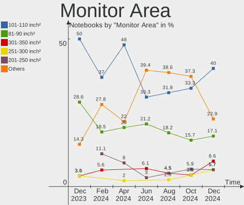

KDE neon Hardware Trends (Notebooks)
------------------------------------

A project to identify most popular hardware characteristics and track their change
over time based on data collected by KDE neon users at https://Linux-Hardware.org.

Anyone can contribute to this report by the [hw-probe](https://github.com/linuxhw/hw-probe) tool:

    sudo -E hw-probe -all -upload

Full-feature report is available here: https://linux-hardware.org/?view=trends&formfactor=notebook

Period: Oct, 2021.

Contents
--------

* [ System ](#system)
  - [ OS                       ](#os)
  - [ OS Family                ](#os-family)
  - [ Kernel                   ](#kernel)
  - [ Kernel Family            ](#kernel-family)
  - [ Kernel Major Ver.        ](#kernel-major-ver)
  - [ Arch                     ](#arch)
  - [ DE                       ](#de)
  - [ Display Server           ](#display-server)
  - [ Display Manager          ](#display-manager)
  - [ OS Lang                  ](#os-lang)
  - [ Boot Mode                ](#boot-mode)
  - [ Filesystem               ](#filesystem)
  - [ Part. scheme             ](#part-scheme)
  - [ Dual Boot with Linux/BSD ](#dual-boot-with-linuxbsd)
  - [ Dual Boot (Win)          ](#dual-boot-win)

* [ Board ](#board)
  - [ Vendor                   ](#vendor)
  - [ Model                    ](#model)
  - [ Model Family             ](#model-family)
  - [ MFG Year                 ](#mfg-year)
  - [ Form Factor              ](#form-factor)
  - [ Secure Boot              ](#secure-boot)
  - [ Coreboot                 ](#coreboot)
  - [ RAM Size                 ](#ram-size)
  - [ RAM Used                 ](#ram-used)
  - [ Total Drives             ](#total-drives)
  - [ Has CD-ROM               ](#has-cd-rom)
  - [ Has Ethernet             ](#has-ethernet)
  - [ Has WiFi                 ](#has-wifi)
  - [ Has Bluetooth            ](#has-bluetooth)

* [ Location ](#location)
  - [ Country                  ](#country)
  - [ City                     ](#city)

* [ Drives ](#drives)
  - [ Drive Vendor             ](#drive-vendor)
  - [ Drive Model              ](#drive-model)
  - [ HDD Vendor               ](#hdd-vendor)
  - [ SSD Vendor               ](#ssd-vendor)
  - [ Drive Kind               ](#drive-kind)
  - [ Drive Connector          ](#drive-connector)
  - [ Drive Size               ](#drive-size)
  - [ Space Total              ](#space-total)
  - [ Space Used               ](#space-used)
  - [ Malfunc. Drives          ](#malfunc-drives)
  - [ Malfunc. Drive Vendor    ](#malfunc-drive-vendor)
  - [ Malfunc. HDD Vendor      ](#malfunc-hdd-vendor)
  - [ Malfunc. Drive Kind      ](#malfunc-drive-kind)
  - [ Failed Drives            ](#failed-drives)
  - [ Failed Drive Vendor      ](#failed-drive-vendor)
  - [ Drive Status             ](#drive-status)

* [ Storage controller ](#storage-controller)
  - [ Storage Vendor           ](#storage-vendor)
  - [ Storage Model            ](#storage-model)
  - [ Storage Kind             ](#storage-kind)

* [ Processor ](#processor)
  - [ CPU Vendor               ](#cpu-vendor)
  - [ CPU Model                ](#cpu-model)
  - [ CPU Model Family         ](#cpu-model-family)
  - [ CPU Cores                ](#cpu-cores)
  - [ CPU Sockets              ](#cpu-sockets)
  - [ CPU Threads              ](#cpu-threads)
  - [ CPU Op-Modes             ](#cpu-op-modes)
  - [ CPU Microcode            ](#cpu-microcode)
  - [ CPU Microarch            ](#cpu-microarch)

* [ Graphics ](#graphics)
  - [ GPU Vendor               ](#gpu-vendor)
  - [ GPU Model                ](#gpu-model)
  - [ GPU Combo                ](#gpu-combo)
  - [ GPU Driver               ](#gpu-driver)
  - [ GPU Memory               ](#gpu-memory)

* [ Monitor ](#monitor)
  - [ Monitor Vendor           ](#monitor-vendor)
  - [ Monitor Model            ](#monitor-model)
  - [ Monitor Resolution       ](#monitor-resolution)
  - [ Monitor Diagonal         ](#monitor-diagonal)
  - [ Monitor Width            ](#monitor-width)
  - [ Aspect Ratio             ](#aspect-ratio)
  - [ Monitor Area             ](#monitor-area)
  - [ Pixel Density            ](#pixel-density)
  - [ Multiple Monitors        ](#multiple-monitors)

* [ Network ](#network)
  - [ Net Controller Vendor    ](#net-controller-vendor)
  - [ Net Controller Model     ](#net-controller-model)
  - [ Wireless Vendor          ](#wireless-vendor)
  - [ Wireless Model           ](#wireless-model)
  - [ Ethernet Vendor          ](#ethernet-vendor)
  - [ Ethernet Model           ](#ethernet-model)
  - [ Net Controller Kind      ](#net-controller-kind)
  - [ Used Controller          ](#used-controller)
  - [ NICs                     ](#nics)
  - [ IPv6                     ](#ipv6)

* [ Bluetooth ](#bluetooth)
  - [ Bluetooth Vendor         ](#bluetooth-vendor)
  - [ Bluetooth Model          ](#bluetooth-model)

* [ Sound ](#sound)
  - [ Sound Vendor             ](#sound-vendor)
  - [ Sound Model              ](#sound-model)

* [ Memory ](#memory)
  - [ Memory Vendor            ](#memory-vendor)
  - [ Memory Model             ](#memory-model)
  - [ Memory Kind              ](#memory-kind)
  - [ Memory Form Factor       ](#memory-form-factor)
  - [ Memory Size              ](#memory-size)
  - [ Memory Speed             ](#memory-speed)

* [ Printers & scanners ](#printers--scanners)
  - [ Printer Vendor           ](#printer-vendor)
  - [ Printer Model            ](#printer-model)
  - [ Scanner Vendor           ](#scanner-vendor)
  - [ Scanner Model            ](#scanner-model)

* [ Camera ](#camera)
  - [ Camera Vendor            ](#camera-vendor)
  - [ Camera Model             ](#camera-model)

* [ Security ](#security)
  - [ Fingerprint Vendor       ](#fingerprint-vendor)
  - [ Fingerprint Model        ](#fingerprint-model)
  - [ Chipcard Vendor          ](#chipcard-vendor)
  - [ Chipcard Model           ](#chipcard-model)

* [ Unsupported ](#unsupported)
  - [ Unsupported Devices      ](#unsupported-devices)
  - [ Unsupported Device Types ](#unsupported-device-types)

System
------

OS
--

Installed operating systems

| Name           | Notebooks | Percent |
|----------------|-----------|---------|
| KDE neon 20.04 | 53        | 100%    |

OS Family
---------

OS without a version

| Name     | Notebooks | Percent |
|----------|-----------|---------|
| KDE neon | 53        | 100%    |

Kernel
------

Version of the Linux kernel

| Version                | Notebooks | Percent |
|------------------------|-----------|---------|
| 5.11.0-37-generic      | 29        | 54.72%  |
| 5.11.0-38-generic      | 14        | 26.42%  |
| 5.11.0-36-generic      | 3         | 5.66%   |
| 5.4.0-89-generic       | 1         | 1.89%   |
| 5.4.0-88-generic       | 1         | 1.89%   |
| 5.4.0-77-generic       | 1         | 1.89%   |
| 5.4.0-70-generic       | 1         | 1.89%   |
| 5.4.0-58-generic       | 1         | 1.89%   |
| 5.14.11-xanmod1-cacule | 1         | 1.89%   |
| 5.11.0-34-generic      | 1         | 1.89%   |

Kernel Family
-------------

Linux kernel without a distro release

| Version | Notebooks | Percent |
|---------|-----------|---------|
| 5.11.0  | 47        | 88.68%  |
| 5.4.0   | 5         | 9.43%   |
| 5.14.11 | 1         | 1.89%   |

Kernel Major Ver.
-----------------

Linux kernel major version

| Version | Notebooks | Percent |
|---------|-----------|---------|
| 5.11    | 47        | 88.68%  |
| 5.4     | 5         | 9.43%   |
| 5.14    | 1         | 1.89%   |

Arch
----

OS architecture (x86_64, i586, etc.)

| Name   | Notebooks | Percent |
|--------|-----------|---------|
| x86_64 | 53        | 100%    |

DE
--

Desktop Environment

| Name            | Notebooks | Percent |
|-----------------|-----------|---------|
| KDE5            | 50        | 94.34%  |
| KDE             | 1         | 1.89%   |
| GNOME Flashback | 1         | 1.89%   |
| Unknown         | 1         | 1.89%   |

Display Server
--------------

X11 or Wayland

| Name    | Notebooks | Percent |
|---------|-----------|---------|
| X11     | 50        | 94.34%  |
| Wayland | 2         | 3.77%   |
| Tty     | 1         | 1.89%   |

Display Manager
---------------

SDDM, LightDM, etc.

| Name    | Notebooks | Percent |
|---------|-----------|---------|
| Unknown | 38        | 71.7%   |
| SDDM    | 15        | 28.3%   |

OS Lang
-------

Language

| Lang   | Notebooks | Percent |
|--------|-----------|---------|
| en_US  | 17        | 32.08%  |
| de_DE  | 5         | 9.43%   |
| ru_RU  | 3         | 5.66%   |
| pt_BR  | 3         | 5.66%   |
| es_ES  | 3         | 5.66%   |
| en_GB  | 3         | 5.66%   |
| en_CA  | 3         | 5.66%   |
| C      | 3         | 5.66%   |
| it_IT  | 2         | 3.77%   |
| en_AU  | 2         | 3.77%   |
| szl_PL | 1         | 1.89%   |
| sv_SE  | 1         | 1.89%   |
| nl_NL  | 1         | 1.89%   |
| lv_LV  | 1         | 1.89%   |
| hr_HR  | 1         | 1.89%   |
| fr_FR  | 1         | 1.89%   |
| es_MX  | 1         | 1.89%   |
| es_CL  | 1         | 1.89%   |
| en_IN  | 1         | 1.89%   |

Boot Mode
---------

EFI or BIOS

| Mode | Notebooks | Percent |
|------|-----------|---------|
| EFI  | 35        | 66.04%  |
| BIOS | 18        | 33.96%  |

Filesystem
----------

Type of filesystem

| Type    | Notebooks | Percent |
|---------|-----------|---------|
| Ext4    | 48        | 90.57%  |
| Overlay | 3         | 5.66%   |
| Btrfs   | 2         | 3.77%   |

Part. scheme
------------

Scheme of partitioning

| Type    | Notebooks | Percent |
|---------|-----------|---------|
| Unknown | 43        | 81.13%  |
| GPT     | 9         | 16.98%  |
| MBR     | 1         | 1.89%   |

Dual Boot with Linux/BSD
------------------------

Hosting more than one Linux/BSD

| Dual boot | Notebooks | Percent |
|-----------|-----------|---------|
| No        | 50        | 94.34%  |
| Yes       | 3         | 5.66%   |

Dual Boot (Win)
---------------

Hosting Linux and Windows

| Dual boot | Notebooks | Percent |
|-----------|-----------|---------|
| No        | 46        | 86.79%  |
| Yes       | 7         | 13.21%  |

Board
-----

Vendor
------

Motherboard manufacturer

| Name                | Notebooks | Percent |
|---------------------|-----------|---------|
| Lenovo              | 12        | 22.64%  |
| Hewlett-Packard     | 8         | 15.09%  |
| Dell                | 8         | 15.09%  |
| Acer                | 7         | 13.21%  |
| ASUSTek Computer    | 6         | 11.32%  |
| Apple               | 3         | 5.66%   |
| Toshiba             | 2         | 3.77%   |
| HUAWEI              | 2         | 3.77%   |
| Samsung Electronics | 1         | 1.89%   |
| HONOR               | 1         | 1.89%   |
| Fujitsu             | 1         | 1.89%   |
| Eluktronics         | 1         | 1.89%   |
| Alienware           | 1         | 1.89%   |

Model
-----

Motherboard model

| Name                                     | Notebooks | Percent |
|------------------------------------------|-----------|---------|
| ASUS VivoBook_ASUSLaptop X415JA_X415JA   | 2         | 3.77%   |
| Acer Aspire E5-571                       | 2         | 3.77%   |
| Toshiba Satellite P200                   | 1         | 1.89%   |
| Toshiba Satellite C55D-A-15H             | 1         | 1.89%   |
| Samsung 900X5T                           | 1         | 1.89%   |
| Lenovo ThinkPad X220 4291B48             | 1         | 1.89%   |
| Lenovo ThinkPad X1 Carbon 6th 20KHS0KV00 | 1         | 1.89%   |
| Lenovo ThinkPad X1 Carbon 2nd 20A7005JGE | 1         | 1.89%   |
| Lenovo ThinkPad T460s 20FAS4A200         | 1         | 1.89%   |
| Lenovo ThinkPad L15 Gen 1 20U3CTO1WW     | 1         | 1.89%   |
| Lenovo ThinkPad E490s 20NGA000AU         | 1         | 1.89%   |
| Lenovo ThinkPad E490 20N9001FBR          | 1         | 1.89%   |
| Lenovo ThinkPad E14 Gen 3 20Y7CTO1WW     | 1         | 1.89%   |
| Lenovo IdeaPad L3 15IML05 81Y3           | 1         | 1.89%   |
| Lenovo IdeaPad Gaming 3 15ACH6 82K2      | 1         | 1.89%   |
| Lenovo G700 20251                        | 1         | 1.89%   |
| Lenovo G50-80 80E5                       | 1         | 1.89%   |
| HUAWEI WRT-WX9                           | 1         | 1.89%   |
| HUAWEI HVY-WXX9                          | 1         | 1.89%   |
| HONOR NBD-WXX9                           | 1         | 1.89%   |
| HP ProBook 6475b                         | 1         | 1.89%   |
| HP Pavilion g6                           | 1         | 1.89%   |
| HP Laptop 17-by2xxx                      | 1         | 1.89%   |
| HP Laptop 15-dw0xxx                      | 1         | 1.89%   |
| HP Laptop 14-bw0xx                       | 1         | 1.89%   |
| HP EliteBook Revolve 810 G3              | 1         | 1.89%   |
| HP EliteBook 850 G4                      | 1         | 1.89%   |
| HP Compaq 15                             | 1         | 1.89%   |
| Fujitsu LIFEBOOK E556                    | 1         | 1.89%   |
| Eluktronics MAX-17                       | 1         | 1.89%   |
| Dell XPS 15 9570                         | 1         | 1.89%   |
| Dell Precision 7510                      | 1         | 1.89%   |
| Dell Latitude E6520                      | 1         | 1.89%   |
| Dell Latitude 5420                       | 1         | 1.89%   |
| Dell Inspiron 3520                       | 1         | 1.89%   |
| Dell Inspiron 1545                       | 1         | 1.89%   |
| Dell Inspiron 1525                       | 1         | 1.89%   |
| Dell G3 3590                             | 1         | 1.89%   |
| ASUS ROG Strix G512LI_G512LI             | 1         | 1.89%   |
| ASUS K75VM                               | 1         | 1.89%   |
| ASUS K52JT                               | 1         | 1.89%   |
| ASUS G751JT                              | 1         | 1.89%   |
| Apple MacBookPro9,1                      | 1         | 1.89%   |
| Apple MacBookPro11,3                     | 1         | 1.89%   |
| Apple MacBookPro11,2                     | 1         | 1.89%   |
| Alienware M17xR3                         | 1         | 1.89%   |
| Acer TravelMate 5720                     | 1         | 1.89%   |
| Acer Swift SF514-52TP                    | 1         | 1.89%   |
| Acer E1-510                              | 1         | 1.89%   |
| Acer Aspire E1-532                       | 1         | 1.89%   |
| Acer Aspire A315-55KG                    | 1         | 1.89%   |

Model Family
------------

Motherboard model prefix

| Name               | Notebooks | Percent |
|--------------------|-----------|---------|
| Lenovo ThinkPad    | 8         | 15.09%  |
| Acer Aspire        | 4         | 7.55%   |
| HP Laptop          | 3         | 5.66%   |
| Dell Inspiron      | 3         | 5.66%   |
| Toshiba Satellite  | 2         | 3.77%   |
| Lenovo IdeaPad     | 2         | 3.77%   |
| HP EliteBook       | 2         | 3.77%   |
| Dell Latitude      | 2         | 3.77%   |
| ASUS VivoBook      | 2         | 3.77%   |
| Apple MacBookPro11 | 2         | 3.77%   |
| Samsung 900X5T     | 1         | 1.89%   |
| Lenovo G700        | 1         | 1.89%   |
| Lenovo G50-80      | 1         | 1.89%   |
| HUAWEI WRT-WX9     | 1         | 1.89%   |
| HUAWEI HVY-WXX9    | 1         | 1.89%   |
| HONOR NBD-WXX9     | 1         | 1.89%   |
| HP ProBook         | 1         | 1.89%   |
| HP Pavilion        | 1         | 1.89%   |
| HP Compaq          | 1         | 1.89%   |
| Fujitsu LIFEBOOK   | 1         | 1.89%   |
| Eluktronics MAX-17 | 1         | 1.89%   |
| Dell XPS           | 1         | 1.89%   |
| Dell Precision     | 1         | 1.89%   |
| Dell G3            | 1         | 1.89%   |
| ASUS ROG           | 1         | 1.89%   |
| ASUS K75VM         | 1         | 1.89%   |
| ASUS K52JT         | 1         | 1.89%   |
| ASUS G751JT        | 1         | 1.89%   |
| Apple MacBookPro9  | 1         | 1.89%   |
| Alienware M17xR3   | 1         | 1.89%   |
| Acer TravelMate    | 1         | 1.89%   |
| Acer Swift         | 1         | 1.89%   |
| Acer E1-510        | 1         | 1.89%   |

MFG Year
--------

Motherboard manufacture year

| Year | Notebooks | Percent |
|------|-----------|---------|
| 2021 | 16        | 30.19%  |
| 2020 | 8         | 15.09%  |
| 2018 | 7         | 13.21%  |
| 2013 | 5         | 9.43%   |
| 2012 | 4         | 7.55%   |
| 2019 | 2         | 3.77%   |
| 2016 | 2         | 3.77%   |
| 2014 | 2         | 3.77%   |
| 2009 | 2         | 3.77%   |
| 2017 | 1         | 1.89%   |
| 2015 | 1         | 1.89%   |
| 2011 | 1         | 1.89%   |
| 2008 | 1         | 1.89%   |
| 2007 | 1         | 1.89%   |

Form Factor
-----------

Physical design of the computer

| Name     | Notebooks | Percent |
|----------|-----------|---------|
| Notebook | 53        | 100%    |

Secure Boot
-----------

Enabled or disabled

| State    | Notebooks | Percent |
|----------|-----------|---------|
| Disabled | 47        | 88.68%  |
| Enabled  | 6         | 11.32%  |

Coreboot
--------

Have coreboot on board

| Used | Notebooks | Percent |
|------|-----------|---------|
| No   | 53        | 100%    |

RAM Size
--------

Total RAM memory

| Size in GB  | Notebooks | Percent |
|-------------|-----------|---------|
| 4.01-8.0    | 16        | 30.19%  |
| 8.01-16.0   | 12        | 22.64%  |
| 16.01-24.0  | 10        | 18.87%  |
| 3.01-4.0    | 9         | 16.98%  |
| 32.01-64.0  | 2         | 3.77%   |
| 1.01-2.0    | 2         | 3.77%   |
| 2.01-3.0    | 1         | 1.89%   |
| 64.01-256.0 | 1         | 1.89%   |

RAM Used
--------

Used RAM memory

| Used GB   | Notebooks | Percent |
|-----------|-----------|---------|
| 1.01-2.0  | 18        | 33.96%  |
| 3.01-4.0  | 12        | 22.64%  |
| 2.01-3.0  | 8         | 15.09%  |
| 0.51-1.0  | 8         | 15.09%  |
| 4.01-8.0  | 5         | 9.43%   |
| 8.01-16.0 | 2         | 3.77%   |

Total Drives
------------

Number of drives on board

| Drives | Notebooks | Percent |
|--------|-----------|---------|
| 1      | 40        | 75.47%  |
| 2      | 12        | 22.64%  |
| 3      | 1         | 1.89%   |

Has CD-ROM
----------

Has CD-ROM on board

| Presented | Notebooks | Percent |
|-----------|-----------|---------|
| No        | 33        | 62.26%  |
| Yes       | 20        | 37.74%  |

Has Ethernet
------------

Has Ethernet on board

| Presented | Notebooks | Percent |
|-----------|-----------|---------|
| Yes       | 44        | 83.02%  |
| No        | 9         | 16.98%  |

Has WiFi
--------

Has WiFi module

| Presented | Notebooks | Percent |
|-----------|-----------|---------|
| Yes       | 53        | 100%    |

Has Bluetooth
-------------

Has Bluetooth module

| Presented | Notebooks | Percent |
|-----------|-----------|---------|
| Yes       | 46        | 86.79%  |
| No        | 7         | 13.21%  |

Location
--------

Country
-------

Geographic location (country)

| Country     | Notebooks | Percent |
|-------------|-----------|---------|
| USA         | 9         | 16.98%  |
| Germany     | 7         | 13.21%  |
| Russia      | 5         | 9.43%   |
| Canada      | 4         | 7.55%   |
| Brazil      | 4         | 7.55%   |
| UK          | 3         | 5.66%   |
| Spain       | 3         | 5.66%   |
| Poland      | 2         | 3.77%   |
| Italy       | 2         | 3.77%   |
| Australia   | 2         | 3.77%   |
| UAE         | 1         | 1.89%   |
| Sweden      | 1         | 1.89%   |
| Serbia      | 1         | 1.89%   |
| Netherlands | 1         | 1.89%   |
| Mexico      | 1         | 1.89%   |
| Latvia      | 1         | 1.89%   |
| Kazakhstan  | 1         | 1.89%   |
| Indonesia   | 1         | 1.89%   |
| France      | 1         | 1.89%   |
| Croatia     | 1         | 1.89%   |
| Chile       | 1         | 1.89%   |
| Bahrain     | 1         | 1.89%   |

City
----

Geographic location (city)

| City                      | Notebooks | Percent |
|---------------------------|-----------|---------|
| S??o Paulo                | 2         | 3.77%   |
| Novosibirsk               | 2         | 3.77%   |
| Melbourne                 | 2         | 3.77%   |
| Berlin                    | 2         | 3.77%   |
| Zagreb                    | 1         | 1.89%   |
| Wuppertal                 | 1         | 1.89%   |
| West Lafayette            | 1         | 1.89%   |
| Voronezh                  | 1         | 1.89%   |
| Vancouver                 | 1         | 1.89%   |
| Valen?§a                  | 1         | 1.89%   |
| Turin                     | 1         | 1.89%   |
| Swansea                   | 1         | 1.89%   |
| Sharjah                   | 1         | 1.89%   |
| Secaucus                  | 1         | 1.89%   |
| Santa Pola                | 1         | 1.89%   |
| San Pedro de la Paz       | 1         | 1.89%   |
| San Marcos                | 1         | 1.89%   |
| Saint-Hilaire-sur-Benaize | 1         | 1.89%   |
| Saint Cloud               | 1         | 1.89%   |
| Riga                      | 1         | 1.89%   |
| Quer?©taro City           | 1         | 1.89%   |
| Poznan                    | 1         | 1.89%   |
| Plymouth                  | 1         | 1.89%   |
| Pite??                    | 1         | 1.89%   |
| Petrozavodsk              | 1         | 1.89%   |
| Palma                     | 1         | 1.89%   |
| Nur-Sultan                | 1         | 1.89%   |
| Newport News              | 1         | 1.89%   |
| Munich                    | 1         | 1.89%   |
| Moncton                   | 1         | 1.89%   |
| Monahans                  | 1         | 1.89%   |
| Loja                      | 1         | 1.89%   |
| Lissone                   | 1         | 1.89%   |
| Krakow                    | 1         | 1.89%   |
| Kinburn                   | 1         | 1.89%   |
| Kazan?ˆ™                  | 1         | 1.89%   |
| Jakarta                   | 1         | 1.89%   |
| Hundeshagen               | 1         | 1.89%   |
| Horstmar                  | 1         | 1.89%   |
| Frankfurt am Main         | 1         | 1.89%   |
| Edmonton                  | 1         | 1.89%   |
| Curitiba                  | 1         | 1.89%   |
| Charlotte                 | 1         | 1.89%   |
| Billingham                | 1         | 1.89%   |
| Berkhamsted               | 1         | 1.89%   |
| Belgrade                  | 1         | 1.89%   |
| Atlanta                   | 1         | 1.89%   |
| Amsterdam                 | 1         | 1.89%   |
| Al Muharraq               | 1         | 1.89%   |

Drives
------

Drive Vendor
------------

Hard drive vendors

| Vendor                      | Notebooks | Drives | Percent |
|-----------------------------|-----------|--------|---------|
| WDC                         | 11        | 11     | 17.19%  |
| Samsung Electronics         | 8         | 8      | 12.5%   |
| Seagate                     | 5         | 5      | 7.81%   |
| SK Hynix                    | 4         | 4      | 6.25%   |
| Sandisk                     | 4         | 4      | 6.25%   |
| Toshiba                     | 3         | 3      | 4.69%   |
| Kingston                    | 3         | 3      | 4.69%   |
| HGST                        | 3         | 3      | 4.69%   |
| Unknown                     | 2         | 2      | 3.13%   |
| Micron Technology           | 2         | 2      | 3.13%   |
| Intel                       | 2         | 2      | 3.13%   |
| Apple                       | 2         | 2      | 3.13%   |
| Yangtze Memory Technologies | 1         | 1      | 1.56%   |
| V-GeN                       | 1         | 1      | 1.56%   |
| USB3.0                      | 1         | 1      | 1.56%   |
| Smartbuy                    | 1         | 1      | 1.56%   |
| Silicon Motion              | 1         | 1      | 1.56%   |
| PNY                         | 1         | 1      | 1.56%   |
| Phison                      | 1         | 1      | 1.56%   |
| LITEONIT                    | 1         | 1      | 1.56%   |
| Lenovo                      | 1         | 1      | 1.56%   |
| Hitachi                     | 1         | 1      | 1.56%   |
| Fujitsu                     | 1         | 1      | 1.56%   |
| Crucial                     | 1         | 1      | 1.56%   |
| ASMT                        | 1         | 1      | 1.56%   |
| ADATA Technology            | 1         | 1      | 1.56%   |
| A-DATA Technology           | 1         | 1      | 1.56%   |

Drive Model
-----------

Hard drive models

| Model                                    | Notebooks | Percent |
|------------------------------------------|-----------|---------|
| Sandisk NVMe SSD Drive 512GB             | 3         | 4.69%   |
| SK Hynix NVMe SSD Drive 128GB            | 2         | 3.13%   |
| Seagate ST500LT012-1DG142 500GB          | 2         | 3.13%   |
| Kingston SA400S37240G 240GB SSD          | 2         | 3.13%   |
| Yangtze Memory NVMe SSD Drive 512GB      | 1         | 1.56%   |
| WDC WDS480G2G0A-00JH30 480GB SSD         | 1         | 1.56%   |
| WDC WD5000LPVX-22V0TT0 500GB             | 1         | 1.56%   |
| WDC WD5000LPCX-60VHAT0 500GB             | 1         | 1.56%   |
| WDC WD3200BEVT-22ZCT0 320GB              | 1         | 1.56%   |
| WDC WD1200BEVS-75UST0 120GB              | 1         | 1.56%   |
| WDC WD10SPZX-21Z10T0 1TB                 | 1         | 1.56%   |
| WDC WD10SPZX-08Z10 1TB                   | 1         | 1.56%   |
| WDC PC SN730 SDBQNTY-512G-1001 512GB     | 1         | 1.56%   |
| WDC PC SN730 SDBPNTY-512G-1027 512GB     | 1         | 1.56%   |
| WDC PC SN530 SDBPMPZ-256G-1001 256GB     | 1         | 1.56%   |
| WDC PC SN530 NVMe 512GB                  | 1         | 1.56%   |
| V-GeN V-GEN12SM20AR128SDK 128GB          | 1         | 1.56%   |
| USB3.0 Disk 1TB                          | 1         | 1.56%   |
| Unknown NVMe SSD Drive 1024GB            | 1         | 1.56%   |
| Unknown MMC Card  128GB                  | 1         | 1.56%   |
| Toshiba NVMe SSD Drive 512GB             | 1         | 1.56%   |
| Toshiba MQ01ABF032 320GB                 | 1         | 1.56%   |
| Toshiba MK5065GSXF 500GB                 | 1         | 1.56%   |
| Smartbuy SSD 120 120GB                   | 1         | 1.56%   |
| SK Hynix SC311 SATA 512GB SSD            | 1         | 1.56%   |
| SK Hynix HFS256G39MND-3510A 256GB SSD    | 1         | 1.56%   |
| Silicon Motion NVMe SSD Drive 512GB      | 1         | 1.56%   |
| Seagate ST500LM012 HN-M500MBB 500GB      | 1         | 1.56%   |
| Seagate ST320LT007-9ZV142 320GB          | 1         | 1.56%   |
| Seagate ST1000LM024 HN-M101MBB 1TB       | 1         | 1.56%   |
| Sandisk NVMe SSD Drive 2TB               | 1         | 1.56%   |
| Samsung SSD SM841 2.5 7mm 128GB          | 1         | 1.56%   |
| Samsung SSD 870 QVO 1TB                  | 1         | 1.56%   |
| Samsung SSD 850 EVO 500GB                | 1         | 1.56%   |
| Samsung SSD 840 PRO Series 128GB         | 1         | 1.56%   |
| Samsung PM963 2.5" NVMe PCIe SSD 512GB   | 1         | 1.56%   |
| Samsung NVMe SSD Drive 500GB             | 1         | 1.56%   |
| Samsung NVMe SSD Drive 1TB               | 1         | 1.56%   |
| Samsung MZVLB256HBHQ-000L7 256GB         | 1         | 1.56%   |
| PNY CS900 240GB SSD                      | 1         | 1.56%   |
| Phison NVMe SSD Drive 2TB                | 1         | 1.56%   |
| Micron MTFDDAV256TBN-1AR15ABHA 256GB SSD | 1         | 1.56%   |
| Micron 1100_MTFDDAK256TBN 256GB SSD      | 1         | 1.56%   |
| LITEONIT LGT-256M6G 256GB SSD            | 1         | 1.56%   |
| Lenovo LENSE30512GMSP34MEAT3TA 512GB     | 1         | 1.56%   |
| Kingston SA400S37480G 480GB SSD          | 1         | 1.56%   |
| Intel SSDPEKKW512G7 512GB                | 1         | 1.56%   |
| Intel NVMe SSD Drive 512GB               | 1         | 1.56%   |
| Hitachi HTS547575A9E384 752GB            | 1         | 1.56%   |
| HGST HTS725050A7E630 500GB               | 1         | 1.56%   |
| HGST HTS721010A9E630 1TB                 | 1         | 1.56%   |
| HGST HTS541010A9E680 1TB                 | 1         | 1.56%   |
| Fujitsu MHX2250BT 250GB                  | 1         | 1.56%   |
| Crucial M4-CT256M4SSD3 256GB             | 1         | 1.56%   |
| ASMT ASM105x 500GB                       | 1         | 1.56%   |
| Apple SSD SM0256F 256GB                  | 1         | 1.56%   |
| Apple HDD ST500LM012 500GB               | 1         | 1.56%   |
| ADATA NVMe SSD Drive 512GB               | 1         | 1.56%   |
| A-DATA SU740 1TB SSD                     | 1         | 1.56%   |

HDD Vendor
----------

Hard disk drive vendors

| Vendor  | Notebooks | Drives | Percent |
|---------|-----------|--------|---------|
| WDC     | 6         | 6      | 30%     |
| Seagate | 5         | 5      | 25%     |
| HGST    | 3         | 3      | 15%     |
| Toshiba | 2         | 2      | 10%     |
| USB3.0  | 1         | 1      | 5%      |
| Hitachi | 1         | 1      | 5%      |
| Fujitsu | 1         | 1      | 5%      |
| Apple   | 1         | 1      | 5%      |

SSD Vendor
----------

Solid state drive vendors

| Vendor              | Notebooks | Drives | Percent |
|---------------------|-----------|--------|---------|
| Samsung Electronics | 4         | 4      | 21.05%  |
| Kingston            | 3         | 3      | 15.79%  |
| SK Hynix            | 2         | 2      | 10.53%  |
| Micron Technology   | 2         | 2      | 10.53%  |
| WDC                 | 1         | 1      | 5.26%   |
| Smartbuy            | 1         | 1      | 5.26%   |
| PNY                 | 1         | 1      | 5.26%   |
| LITEONIT            | 1         | 1      | 5.26%   |
| Crucial             | 1         | 1      | 5.26%   |
| ASMT                | 1         | 1      | 5.26%   |
| Apple               | 1         | 1      | 5.26%   |
| A-DATA Technology   | 1         | 1      | 5.26%   |

Drive Kind
----------

HDD or SSD

| Kind    | Notebooks | Drives | Percent |
|---------|-----------|--------|---------|
| NVMe    | 21        | 23     | 35.59%  |
| HDD     | 19        | 20     | 32.2%   |
| SSD     | 17        | 19     | 28.81%  |
| MMC     | 1         | 1      | 1.69%   |
| Unknown | 1         | 1      | 1.69%   |

Drive Connector
---------------

SATA, SAS, NVMe, etc.

| Type | Notebooks | Drives | Percent |
|------|-----------|--------|---------|
| SATA | 34        | 38     | 58.62%  |
| NVMe | 21        | 23     | 36.21%  |
| SAS  | 2         | 2      | 3.45%   |
| MMC  | 1         | 1      | 1.72%   |

Drive Size
----------

Size of hard drive

| Size in TB | Notebooks | Drives | Percent |
|------------|-----------|--------|---------|
| 0.01-0.5   | 28        | 29     | 75.68%  |
| 0.51-1.0   | 9         | 10     | 24.32%  |

Space Total
-----------

Amount of disk space available on the file system

| Size in GB | Notebooks | Percent |
|------------|-----------|---------|
| 101-250    | 17        | 32.08%  |
| 251-500    | 16        | 30.19%  |
| 501-1000   | 5         | 9.43%   |
| 51-100     | 5         | 9.43%   |
| 1001-2000  | 3         | 5.66%   |
| 21-50      | 2         | 3.77%   |
| 1-20       | 2         | 3.77%   |
| Unknown    | 2         | 3.77%   |
| 2001-3000  | 1         | 1.89%   |

Space Used
----------

Amount of used disk space

| Used GB   | Notebooks | Percent |
|-----------|-----------|---------|
| 1-20      | 23        | 43.4%   |
| 21-50     | 11        | 20.75%  |
| 101-250   | 7         | 13.21%  |
| 51-100    | 5         | 9.43%   |
| 251-500   | 4         | 7.55%   |
| Unknown   | 2         | 3.77%   |
| 1001-2000 | 1         | 1.89%   |

Malfunc. Drives
---------------

Drive models with a malfunction

Zero info for selected period =(

Malfunc. Drive Vendor
---------------------

Vendors of faulty drives

Zero info for selected period =(

Malfunc. HDD Vendor
-------------------

Vendors of faulty HDD drives

Zero info for selected period =(

Malfunc. Drive Kind
-------------------

Kinds of faulty drives

Zero info for selected period =(

Failed Drives
-------------

Failed drive models

Zero info for selected period =(

Failed Drive Vendor
-------------------

Failed drive vendors

Zero info for selected period =(

Drive Status
------------

Number of failed and malfunc. drives

| Status   | Notebooks | Drives | Percent |
|----------|-----------|--------|---------|
| Detected | 43        | 53     | 81.13%  |
| Works    | 10        | 11     | 18.87%  |

Storage controller
------------------

Storage Vendor
--------------

Storage controller vendors

| Vendor                       | Notebooks | Percent |
|------------------------------|-----------|---------|
| Intel                        | 33        | 54.1%   |
| Sandisk                      | 8         | 13.11%  |
| AMD                          | 6         | 9.84%   |
| Samsung Electronics          | 5         | 8.2%    |
| SK Hynix                     | 2         | 3.28%   |
| Yangtze Memory Technologies  | 1         | 1.64%   |
| Unknown                      | 1         | 1.64%   |
| Toshiba America Info Systems | 1         | 1.64%   |
| Silicon Motion               | 1         | 1.64%   |
| Phison Electronics           | 1         | 1.64%   |
| Lenovo                       | 1         | 1.64%   |
| ADATA Technology             | 1         | 1.64%   |

Storage Model
-------------

Storage controller models

| Model                                                                                  | Notebooks | Percent |
|----------------------------------------------------------------------------------------|-----------|---------|
| AMD FCH SATA Controller [AHCI mode]                                                    | 6         | 9.09%   |
| Intel 82801 Mobile SATA Controller [RAID mode]                                         | 4         | 6.06%   |
| Intel 8 Series SATA Controller 1 [AHCI mode]                                           | 4         | 6.06%   |
| Intel 7 Series Chipset Family 6-port SATA Controller [AHCI mode]                       | 4         | 6.06%   |
| Sandisk WD Black SN750 / PC SN730 NVMe SSD                                             | 3         | 4.55%   |
| Sandisk Non-Volatile memory controller                                                 | 3         | 4.55%   |
| Samsung NVMe SSD Controller SM981/PM981/PM983                                          | 3         | 4.55%   |
| Intel Sunrise Point-LP SATA Controller [AHCI mode]                                     | 3         | 4.55%   |
| Intel 82801HM/HEM (ICH8M/ICH8M-E) IDE Controller                                       | 3         | 4.55%   |
| SK Hynix BC501 NVMe Solid State Drive                                                  | 2         | 3.03%   |
| Intel Wildcat Point-LP SATA Controller [AHCI Mode]                                     | 2         | 3.03%   |
| Intel Comet Lake SATA AHCI Controller                                                  | 2         | 3.03%   |
| Intel Cannon Lake Mobile PCH SATA AHCI Controller                                      | 2         | 3.03%   |
| Intel 82801HM/HEM (ICH8M/ICH8M-E) SATA Controller [AHCI mode]                          | 2         | 3.03%   |
| Intel 6 Series/C200 Series Chipset Family 6 port Mobile SATA AHCI Controller           | 2         | 3.03%   |
| Yangtze Memory Non-Volatile memory controller                                          | 1         | 1.52%   |
| Unknown Non-Volatile memory controller                                                 | 1         | 1.52%   |
| Toshiba America Info Systems BG3 NVMe SSD Controller                                   | 1         | 1.52%   |
| Silicon Motion SM2263EN/SM2263XT SSD Controller                                        | 1         | 1.52%   |
| Sandisk WD Blue SN500 / PC SN520 NVMe SSD                                              | 1         | 1.52%   |
| Sandisk WD Black SN850                                                                 | 1         | 1.52%   |
| Samsung NVMe SSD Controller SM951/PM951                                                | 1         | 1.52%   |
| Samsung Apple PCIe SSD                                                                 | 1         | 1.52%   |
| Phison PS5013 E13 NVMe Controller                                                      | 1         | 1.52%   |
| Lenovo Non-Volatile memory controller                                                  | 1         | 1.52%   |
| Intel SSD 660P Series                                                                  | 1         | 1.52%   |
| Intel SSD 600P Series                                                                  | 1         | 1.52%   |
| Intel Q170/Q150/B150/H170/H110/Z170/CM236 Chipset SATA Controller [AHCI Mode]          | 1         | 1.52%   |
| Intel Atom Processor E3800 Series SATA AHCI Controller                                 | 1         | 1.52%   |
| Intel 82801IBM/IEM (ICH9M/ICH9M-E) 4 port SATA Controller [AHCI mode]                  | 1         | 1.52%   |
| Intel 82801HM/HEM (ICH8M/ICH8M-E) SATA Controller [IDE mode]                           | 1         | 1.52%   |
| Intel 8 Series/C220 Series Chipset Family 6-port SATA Controller 1 [AHCI mode]         | 1         | 1.52%   |
| Intel 6 Series/C200 Series Chipset Family Mobile SATA Controller (IDE mode, ports 4-5) | 1         | 1.52%   |
| Intel 6 Series/C200 Series Chipset Family Mobile SATA Controller (IDE mode, ports 0-3) | 1         | 1.52%   |
| Intel 5 Series/3400 Series Chipset 4 port SATA AHCI Controller                         | 1         | 1.52%   |
| ADATA Non-Volatile memory controller                                                   | 1         | 1.52%   |

Storage Kind
------------

Kind of storage controller (IDE, SATA, NVMe, SAS, ...)

| Kind | Notebooks | Percent |
|------|-----------|---------|
| SATA | 33        | 53.23%  |
| NVMe | 21        | 33.87%  |
| RAID | 4         | 6.45%   |
| IDE  | 4         | 6.45%   |

Processor
---------

CPU Vendor
----------

Processor vendors

| Vendor | Notebooks | Percent |
|--------|-----------|---------|
| Intel  | 44        | 83.02%  |
| AMD    | 9         | 16.98%  |

CPU Model
---------

Processor models

| Model                                         | Notebooks | Percent |
|-----------------------------------------------|-----------|---------|
| Intel Core i7-8550U CPU @ 1.80GHz             | 3         | 5.66%   |
| Intel Core i5-8265U CPU @ 1.60GHz             | 3         | 5.66%   |
| Intel Core i5-4210U CPU @ 1.70GHz             | 2         | 3.77%   |
| Intel Core i5-2520M CPU @ 2.50GHz             | 2         | 3.77%   |
| Intel Core i3-1005G1 CPU @ 1.20GHz            | 2         | 3.77%   |
| Intel 11th Gen Core i5-1135G7 @ 2.40GHz       | 2         | 3.77%   |
| AMD Ryzen 7 5800H with Radeon Graphics        | 2         | 3.77%   |
| AMD A6-4400M APU with Radeon HD Graphics      | 2         | 3.77%   |
| Intel Pentium Dual-Core CPU T4400 @ 2.20GHz   | 1         | 1.89%   |
| Intel Pentium Dual CPU T2330 @ 1.60GHz        | 1         | 1.89%   |
| Intel Pentium CPU 6405U @ 2.40GHz             | 1         | 1.89%   |
| Intel Pentium CPU 2020M @ 2.40GHz             | 1         | 1.89%   |
| Intel Core i7-8750H CPU @ 2.20GHz             | 1         | 1.89%   |
| Intel Core i7-7600U CPU @ 2.80GHz             | 1         | 1.89%   |
| Intel Core i7-6820HQ CPU @ 2.70GHz            | 1         | 1.89%   |
| Intel Core i7-6500U CPU @ 2.50GHz             | 1         | 1.89%   |
| Intel Core i7-4850HQ CPU @ 2.30GHz            | 1         | 1.89%   |
| Intel Core i7-4750HQ CPU @ 2.00GHz            | 1         | 1.89%   |
| Intel Core i7-4710HQ CPU @ 2.50GHz            | 1         | 1.89%   |
| Intel Core i7-4550U CPU @ 1.50GHz             | 1         | 1.89%   |
| Intel Core i7-3615QM CPU @ 2.30GHz            | 1         | 1.89%   |
| Intel Core i7-3610QM CPU @ 2.30GHz            | 1         | 1.89%   |
| Intel Core i7-2630QM CPU @ 2.00GHz            | 1         | 1.89%   |
| Intel Core i7-10750H CPU @ 2.60GHz            | 1         | 1.89%   |
| Intel Core i7-10510U CPU @ 1.80GHz            | 1         | 1.89%   |
| Intel Core i5-9300H CPU @ 2.40GHz             | 1         | 1.89%   |
| Intel Core i5-6300U CPU @ 2.40GHz             | 1         | 1.89%   |
| Intel Core i5-5300U CPU @ 2.30GHz             | 1         | 1.89%   |
| Intel Core i5-5200U CPU @ 2.20GHz             | 1         | 1.89%   |
| Intel Core i5-10210U CPU @ 1.60GHz            | 1         | 1.89%   |
| Intel Core i3-8145U CPU @ 2.10GHz             | 1         | 1.89%   |
| Intel Core i3-7020U CPU @ 2.30GHz             | 1         | 1.89%   |
| Intel Core i3-2370M CPU @ 2.40GHz             | 1         | 1.89%   |
| Intel Core i3 CPU M 350 @ 2.27GHz             | 1         | 1.89%   |
| Intel Core 2 Duo CPU T8100 @ 2.10GHz          | 1         | 1.89%   |
| Intel Core 2 Duo CPU T5670 @ 1.80GHz          | 1         | 1.89%   |
| Intel Celeron CPU N2920 @ 1.86GHz             | 1         | 1.89%   |
| Intel Celeron 2957U @ 1.40GHz                 | 1         | 1.89%   |
| AMD Ryzen 7 5700U with Radeon Graphics        | 1         | 1.89%   |
| AMD Ryzen 5 4600H with Radeon Graphics        | 1         | 1.89%   |
| AMD E2-9000e RADEON R2, 4 COMPUTE CORES 2C+2G | 1         | 1.89%   |
| AMD E1-6010 APU with AMD Radeon R2 Graphics   | 1         | 1.89%   |
| AMD A6-5200 APU with Radeon HD Graphics       | 1         | 1.89%   |

CPU Model Family
----------------

Processor model prefix

| Model                   | Notebooks | Percent |
|-------------------------|-----------|---------|
| Intel Core i7           | 16        | 30.19%  |
| Intel Core i5           | 12        | 22.64%  |
| Intel Core i3           | 6         | 11.32%  |
| AMD Ryzen 7             | 3         | 5.66%   |
| AMD A6                  | 3         | 5.66%   |
| Other                   | 2         | 3.77%   |
| Intel Pentium           | 2         | 3.77%   |
| Intel Core 2 Duo        | 2         | 3.77%   |
| Intel Celeron           | 2         | 3.77%   |
| Intel Pentium Dual-Core | 1         | 1.89%   |
| Intel Pentium Dual      | 1         | 1.89%   |
| AMD Ryzen 5             | 1         | 1.89%   |
| AMD E2                  | 1         | 1.89%   |
| AMD E1                  | 1         | 1.89%   |

CPU Cores
---------

Number of processor cores

| Number | Notebooks | Percent |
|--------|-----------|---------|
| 2      | 25        | 47.17%  |
| 4      | 20        | 37.74%  |
| 8      | 3         | 5.66%   |
| 6      | 3         | 5.66%   |
| 1      | 2         | 3.77%   |

CPU Sockets
-----------

Number of sockets

| Number | Notebooks | Percent |
|--------|-----------|---------|
| 1      | 53        | 100%    |

CPU Threads
-----------

Threads per core (Hyper-Threading)

| Number | Notebooks | Percent |
|--------|-----------|---------|
| 2      | 43        | 81.13%  |
| 1      | 10        | 18.87%  |

CPU Op-Modes
------------

CPU Operation Modes (32-bit, 64-bit)

| Op mode        | Notebooks | Percent |
|----------------|-----------|---------|
| 32-bit, 64-bit | 53        | 100%    |

CPU Microcode
-------------

Microcode number

| Number     | Notebooks | Percent |
|------------|-----------|---------|
| 0x806ec    | 6         | 11.32%  |
| Unknown    | 4         | 7.55%   |
| 0x40651    | 3         | 5.66%   |
| 0x306a9    | 3         | 5.66%   |
| 0x206a7    | 3         | 5.66%   |
| 0x906ea    | 2         | 3.77%   |
| 0x806ea    | 2         | 3.77%   |
| 0x806e9    | 2         | 3.77%   |
| 0x806c1    | 2         | 3.77%   |
| 0x706e5    | 2         | 3.77%   |
| 0x6fd      | 2         | 3.77%   |
| 0x406e3    | 2         | 3.77%   |
| 0x40661    | 2         | 3.77%   |
| 0x306d4    | 2         | 3.77%   |
| 0x06001119 | 2         | 3.77%   |
| 0xa0652    | 1         | 1.89%   |
| 0x806eb    | 1         | 1.89%   |
| 0x506e3    | 1         | 1.89%   |
| 0x306c3    | 1         | 1.89%   |
| 0x30673    | 1         | 1.89%   |
| 0x20652    | 1         | 1.89%   |
| 0x1067a    | 1         | 1.89%   |
| 0x10676    | 1         | 1.89%   |
| 0x0a50000c | 1         | 1.89%   |
| 0x08608103 | 1         | 1.89%   |
| 0x08600106 | 1         | 1.89%   |
| 0x07030105 | 1         | 1.89%   |
| 0x0700010f | 1         | 1.89%   |
| 0x06006705 | 1         | 1.89%   |

CPU Microarch
-------------

Microarchitecture

| Name        | Notebooks | Percent |
|-------------|-----------|---------|
| KabyLake    | 14        | 26.42%  |
| Haswell     | 7         | 13.21%  |
| SandyBridge | 4         | 7.55%   |
| Skylake     | 3         | 5.66%   |
| IvyBridge   | 3         | 5.66%   |
| Zen 3       | 2         | 3.77%   |
| TigerLake   | 2         | 3.77%   |
| Piledriver  | 2         | 3.77%   |
| Penryn      | 2         | 3.77%   |
| IceLake     | 2         | 3.77%   |
| Core        | 2         | 3.77%   |
| Broadwell   | 2         | 3.77%   |
| Zen 2       | 1         | 1.89%   |
| Westmere    | 1         | 1.89%   |
| Silvermont  | 1         | 1.89%   |
| Puma        | 1         | 1.89%   |
| Jaguar      | 1         | 1.89%   |
| Excavator   | 1         | 1.89%   |
| CometLake   | 1         | 1.89%   |
| Unknown     | 1         | 1.89%   |

Graphics
--------

GPU Vendor
----------

Vendors of graphics cards

| Vendor | Notebooks | Percent |
|--------|-----------|---------|
| Intel  | 39        | 59.09%  |
| Nvidia | 15        | 22.73%  |
| AMD    | 12        | 18.18%  |

GPU Model
---------

Graphics card models

| Model                                                                     | Notebooks | Percent |
|---------------------------------------------------------------------------|-----------|---------|
| Intel WhiskeyLake-U GT2 [UHD Graphics 620]                                | 4         | 5.97%   |
| Intel Haswell-ULT Integrated Graphics Controller                          | 4         | 5.97%   |
| Intel 2nd Generation Core Processor Family Integrated Graphics Controller | 4         | 5.97%   |
| Intel UHD Graphics 620                                                    | 3         | 4.48%   |
| Intel 3rd Gen Core processor Graphics Controller                          | 3         | 4.48%   |
| Nvidia GM108M [GeForce MX130]                                             | 2         | 2.99%   |
| Intel TigerLake-LP GT2 [Iris Xe Graphics]                                 | 2         | 2.99%   |
| Intel Skylake GT2 [HD Graphics 520]                                       | 2         | 2.99%   |
| Intel Iris Plus Graphics G1 (Ice Lake)                                    | 2         | 2.99%   |
| Intel HD Graphics 620                                                     | 2         | 2.99%   |
| Intel HD Graphics 5500                                                    | 2         | 2.99%   |
| Intel CometLake-U GT2 [UHD Graphics]                                      | 2         | 2.99%   |
| Intel CoffeeLake-H GT2 [UHD Graphics 630]                                 | 2         | 2.99%   |
| AMD Trinity 2 [Radeon HD 7520G]                                           | 2         | 2.99%   |
| AMD RV630/M76 [Mobility Radeon HD 2600]                                   | 2         | 2.99%   |
| AMD Cezanne                                                               | 2         | 2.99%   |
| Nvidia TU117M [GeForce GTX 1650 Ti Mobile]                                | 1         | 1.49%   |
| Nvidia TU117M [GeForce GTX 1650 Mobile / Max-Q]                           | 1         | 1.49%   |
| Nvidia GP108M [GeForce MX250]                                             | 1         | 1.49%   |
| Nvidia GP108M [GeForce MX150]                                             | 1         | 1.49%   |
| Nvidia GP107M [GeForce GTX 1050 Ti Mobile]                                | 1         | 1.49%   |
| Nvidia GM204M [GeForce GTX 970M]                                          | 1         | 1.49%   |
| Nvidia GM107GLM [Quadro M2000M]                                           | 1         | 1.49%   |
| Nvidia GK107M [GeForce GT 750M Mac Edition]                               | 1         | 1.49%   |
| Nvidia GK107M [GeForce GT 650M Mac Edition]                               | 1         | 1.49%   |
| Nvidia GF119M [NVS 4200M]                                                 | 1         | 1.49%   |
| Nvidia GF108M [GeForce GT 620M/630M/635M/640M LE]                         | 1         | 1.49%   |
| Nvidia GA107M [GeForce RTX 3050 Mobile]                                   | 1         | 1.49%   |
| Nvidia GA104M [GeForce RTX 3080 Mobile / Max-Q 8GB/16GB]                  | 1         | 1.49%   |
| Intel Mobile GM965/GL960 Integrated Graphics Controller (secondary)       | 1         | 1.49%   |
| Intel Mobile GM965/GL960 Integrated Graphics Controller (primary)         | 1         | 1.49%   |
| Intel Mobile 4 Series Chipset Integrated Graphics Controller              | 1         | 1.49%   |
| Intel HD Graphics 530                                                     | 1         | 1.49%   |
| Intel Crystal Well Integrated Graphics Controller                         | 1         | 1.49%   |
| Intel CometLake-H GT2 [UHD Graphics]                                      | 1         | 1.49%   |
| Intel Comet Lake UHD Graphics                                             | 1         | 1.49%   |
| Intel Atom Processor Z36xxx/Z37xxx Series Graphics & Display              | 1         | 1.49%   |
| AMD Stoney [Radeon R2/R3/R4/R5 Graphics]                                  | 1         | 1.49%   |
| AMD Robson CE [Radeon HD 6370M/7370M]                                     | 1         | 1.49%   |
| AMD Renoir                                                                | 1         | 1.49%   |
| AMD Mullins [Radeon R2 Graphics]                                          | 1         | 1.49%   |
| AMD Lucienne                                                              | 1         | 1.49%   |
| AMD Kabini [Radeon HD 8400 / R3 Series]                                   | 1         | 1.49%   |

GPU Combo
---------

Combinations of graphics cards

| Name           | Notebooks | Percent |
|----------------|-----------|---------|
| 1 x Intel      | 28        | 52.83%  |
| Intel + Nvidia | 11        | 20.75%  |
| 1 x AMD        | 10        | 18.87%  |
| 1 x Nvidia     | 2         | 3.77%   |
| AMD + Nvidia   | 2         | 3.77%   |

GPU Driver
----------

Free vs proprietary

| Driver      | Notebooks | Percent |
|-------------|-----------|---------|
| Free        | 50        | 94.34%  |
| Proprietary | 3         | 5.66%   |

GPU Memory
----------

Total video memory

| Size in GB | Notebooks | Percent |
|------------|-----------|---------|
| Unknown    | 30        | 56.6%   |
| 1.01-2.0   | 7         | 13.21%  |
| 0.01-0.5   | 7         | 13.21%  |
| 3.01-4.0   | 4         | 7.55%   |
| 0.51-1.0   | 4         | 7.55%   |
| 2.01-3.0   | 1         | 1.89%   |

Monitor
-------

Monitor Vendor
--------------

Monitor vendors

| Vendor                  | Notebooks | Percent |
|-------------------------|-----------|---------|
| AU Optronics            | 12        | 19.05%  |
| LG Display              | 10        | 15.87%  |
| BOE                     | 9         | 14.29%  |
| Samsung Electronics     | 8         | 12.7%   |
| Chimei Innolux          | 8         | 12.7%   |
| Apple                   | 3         | 4.76%   |
| Hewlett-Packard         | 2         | 3.17%   |
| Goldstar                | 2         | 3.17%   |
| Sharp                   | 1         | 1.59%   |
| RTK                     | 1         | 1.59%   |
| PANDA                   | 1         | 1.59%   |
| LG Philips              | 1         | 1.59%   |
| Hitachi                 | 1         | 1.59%   |
| Dell                    | 1         | 1.59%   |
| Chi Mei Optoelectronics | 1         | 1.59%   |
| BenQ                    | 1         | 1.59%   |
| Ancor Communications    | 1         | 1.59%   |

Monitor Model
-------------

Monitor models

| Model                                                                    | Notebooks | Percent |
|--------------------------------------------------------------------------|-----------|---------|
| Chimei Innolux LCD Monitor CMN15BF 1366x768 344x193mm 15.5-inch          | 2         | 3.08%   |
| Chimei Innolux LCD Monitor CMN14D4 1920x1080 309x173mm 13.9-inch         | 2         | 3.08%   |
| AU Optronics LCD Monitor AUO40EC 1366x768 340x190mm 15.3-inch            | 2         | 3.08%   |
| Sharp LCD Monitor SHP149A 1920x1080 344x194mm 15.5-inch                  | 1         | 1.54%   |
| Samsung Electronics LCD Monitor SEC3358 1280x800 331x207mm 15.4-inch     | 1         | 1.54%   |
| Samsung Electronics LCD Monitor SEC315A 1366x768 344x194mm 15.5-inch     | 1         | 1.54%   |
| Samsung Electronics LCD Monitor SDC824F 1920x1080 344x194mm 15.5-inch    | 1         | 1.54%   |
| Samsung Electronics LCD Monitor SDC4347 1366x768 340x190mm 15.3-inch     | 1         | 1.54%   |
| Samsung Electronics LCD Monitor SAM0FF0 3840x2160 1872x1053mm 84.6-inch  | 1         | 1.54%   |
| Samsung Electronics LCD Monitor SAM04FB 1920x1080                        | 1         | 1.54%   |
| Samsung Electronics LCD Monitor SAM04FA 1920x1080 886x498mm 40.0-inch    | 1         | 1.54%   |
| Samsung Electronics LC27T55 SAM701E 1920x1080 609x349mm 27.6-inch        | 1         | 1.54%   |
| Samsung Electronics EPSON PJ SECA10D 1280x1024                           | 1         | 1.54%   |
| RTK FHD HDR RTK1920 1920x1080 344x195mm 15.6-inch                        | 1         | 1.54%   |
| PANDA LCD Monitor NCP004D 1920x1080 344x194mm 15.5-inch                  | 1         | 1.54%   |
| LG Philips LCD Monitor LPLA002 1440x900 367x230mm 17.1-inch              | 1         | 1.54%   |
| LG Display LCD Monitor LGD068B 1920x1080 309x174mm 14.0-inch             | 1         | 1.54%   |
| LG Display LCD Monitor LGD04A7 1920x1080 340x190mm 15.3-inch             | 1         | 1.54%   |
| LG Display LCD Monitor LGD046C 1920x1080 380x210mm 17.1-inch             | 1         | 1.54%   |
| LG Display LCD Monitor LGD0419 2560x1440 310x174mm 14.0-inch             | 1         | 1.54%   |
| LG Display LCD Monitor LGD03CF 1366x768 256x144mm 11.6-inch              | 1         | 1.54%   |
| LG Display LCD Monitor LGD039F 1366x768 345x194mm 15.6-inch              | 1         | 1.54%   |
| LG Display LCD Monitor LGD0396 1600x900 382x215mm 17.3-inch              | 1         | 1.54%   |
| LG Display LCD Monitor LGD0386 1366x768 309x174mm 14.0-inch              | 1         | 1.54%   |
| LG Display LCD Monitor LGD02D8 1366x768 277x156mm 12.5-inch              | 1         | 1.54%   |
| LG Display LCD Monitor LGD0266 1366x768 344x194mm 15.5-inch              | 1         | 1.54%   |
| Hitachi PROJECTOR HTC663A 1280x1024                                      | 1         | 1.54%   |
| Hewlett-Packard Pavilion32 HWP3339 2560x1440 708x399mm 32.0-inch         | 1         | 1.54%   |
| Hewlett-Packard E232 HWP327A 1920x1080 509x286mm 23.0-inch               | 1         | 1.54%   |
| Goldstar E2240 GSM57A4 1920x1080 477x268mm 21.5-inch                     | 1         | 1.54%   |
| Goldstar E2041 GSM4EC9 1600x900 443x249mm 20.0-inch                      | 1         | 1.54%   |
| Dell SE2216H DELF070 1920x1080 476x268mm 21.5-inch                       | 1         | 1.54%   |
| Chimei Innolux P130ZDZ-EF1 CMN8201 2160x1440 275x183mm 13.0-inch         | 1         | 1.54%   |
| Chimei Innolux LCD Monitor CMN15E6 1366x768 344x193mm 15.5-inch          | 1         | 1.54%   |
| Chimei Innolux LCD Monitor CMN15C3 1920x1080 340x190mm 15.3-inch         | 1         | 1.54%   |
| Chimei Innolux LCD Monitor CMN15B7 1366x768 340x190mm 15.3-inch          | 1         | 1.54%   |
| Chi Mei Optoelectronics LCD Monitor CMO1721 1600x900 382x215mm 17.3-inch | 1         | 1.54%   |
| BOE LCD Monitor BOE0977 2560x1440 381x214mm 17.2-inch                    | 1         | 1.54%   |
| BOE LCD Monitor BOE08D7 1920x1080 309x174mm 14.0-inch                    | 1         | 1.54%   |
| BOE LCD Monitor BOE08C2 1920x1080 344x194mm 15.5-inch                    | 1         | 1.54%   |
| BOE LCD Monitor BOE0878 1920x1080 355x200mm 16.0-inch                    | 1         | 1.54%   |
| BOE LCD Monitor BOE0877 1920x1080 309x173mm 13.9-inch                    | 1         | 1.54%   |
| BOE LCD Monitor BOE0819 1920x1080 344x194mm 15.5-inch                    | 1         | 1.54%   |
| BOE LCD Monitor BOE0742 1920x1080 309x173mm 13.9-inch                    | 1         | 1.54%   |
| BOE LCD Monitor BOE06E8 1920x1080 332x186mm 15.0-inch                    | 1         | 1.54%   |
| BOE LCD Monitor BOE0696 1366x768 309x173mm 13.9-inch                     | 1         | 1.54%   |
| BenQ GW2760 BNQ78C6 1920x1080 598x336mm 27.0-inch                        | 1         | 1.54%   |
| BenQ GL955 BNQ78C7 1280x720 410x230mm 18.5-inch                          | 1         | 1.54%   |
| AU Optronics LCD Monitor AUOD1ED 1920x1080 340x190mm 15.3-inch           | 1         | 1.54%   |
| AU Optronics LCD Monitor AUO80EC 1366x768 344x193mm 15.5-inch            | 1         | 1.54%   |
| AU Optronics LCD Monitor AUO8074 1280x800 331x207mm 15.4-inch            | 1         | 1.54%   |
| AU Optronics LCD Monitor AUO61ED 1920x1080 340x190mm 15.3-inch           | 1         | 1.54%   |
| AU Optronics LCD Monitor AUO403D 1920x1080 309x173mm 13.9-inch           | 1         | 1.54%   |
| AU Optronics LCD Monitor AUO243D 1920x1080 309x173mm 13.9-inch           | 1         | 1.54%   |
| AU Optronics LCD Monitor AUO2336 2560x1440 309x174mm 14.0-inch           | 1         | 1.54%   |
| AU Optronics LCD Monitor AUO219E 1600x900 382x214mm 17.2-inch            | 1         | 1.54%   |
| AU Optronics LCD Monitor AUO203D 1920x1080 309x174mm 14.0-inch           | 1         | 1.54%   |
| AU Optronics LCD Monitor AUO129E 1600x900 382x214mm 17.2-inch            | 1         | 1.54%   |
| Apple LCD Monitor APP9CA3 1440x900 330x210mm 15.4-inch                   | 1         | 1.54%   |
| Apple Color LCD APPA022 2880x1800 331x207mm 15.4-inch                    | 1         | 1.54%   |

Monitor Resolution
------------------

Monitor screen resolution

| Resolution       | Notebooks | Percent |
|------------------|-----------|---------|
| 1920x1080 (FHD)  | 24        | 40.68%  |
| 1366x768 (WXGA)  | 15        | 25.42%  |
| 1600x900 (HD+)   | 5         | 8.47%   |
| 2560x1440 (QHD)  | 4         | 6.78%   |
| 1440x900 (WXGA+) | 3         | 5.08%   |
| 2880x1800        | 2         | 3.39%   |
| 1280x800 (WXGA)  | 2         | 3.39%   |
| 1280x1024 (SXGA) | 2         | 3.39%   |
| 3840x2160 (4K)   | 1         | 1.69%   |
| 2160x1440        | 1         | 1.69%   |

Monitor Diagonal
----------------

Diagonal size in inches

| Inches  | Notebooks | Percent |
|---------|-----------|---------|
| 15      | 26        | 41.27%  |
| 14      | 8         | 12.7%   |
| 17      | 7         | 11.11%  |
| 13      | 6         | 9.52%   |
| Unknown | 3         | 4.76%   |
| 27      | 2         | 3.17%   |
| 21      | 2         | 3.17%   |
| 84      | 1         | 1.59%   |
| 40      | 1         | 1.59%   |
| 32      | 1         | 1.59%   |
| 23      | 1         | 1.59%   |
| 20      | 1         | 1.59%   |
| 19      | 1         | 1.59%   |
| 16      | 1         | 1.59%   |
| 12      | 1         | 1.59%   |
| 11      | 1         | 1.59%   |

Monitor Width
-------------

Physical width

| Width in mm | Notebooks | Percent |
|-------------|-----------|---------|
| 301-350     | 39        | 61.9%   |
| 351-400     | 8         | 12.7%   |
| 401-500     | 4         | 6.35%   |
| 201-300     | 3         | 4.76%   |
| Unknown     | 3         | 4.76%   |
| 501-600     | 2         | 3.17%   |
| 801-900     | 1         | 1.59%   |
| 701-800     | 1         | 1.59%   |
| 601-700     | 1         | 1.59%   |
| 1501-2000   | 1         | 1.59%   |

Aspect Ratio
------------

Proportional relationship between the width and the height

| Ratio | Notebooks | Percent |
|-------|-----------|---------|
| 16/9  | 46        | 82.14%  |
| 16/10 | 7         | 12.5%   |
| 5/4   | 2         | 3.57%   |
| 3/2   | 1         | 1.79%   |

Monitor Area
------------

Area in inch²

| Area in inch² | Notebooks | Percent |
|----------------|-----------|---------|
| 101-110        | 26        | 41.27%  |
| 81-90          | 13        | 20.63%  |
| 121-130        | 6         | 9.52%   |
| 201-250        | 3         | 4.76%   |
| Unknown        | 3         | 4.76%   |
| 301-350        | 2         | 3.17%   |
| 151-200        | 2         | 3.17%   |
| More than 1000 | 1         | 1.59%   |
| 71-80          | 1         | 1.59%   |
| 61-70          | 1         | 1.59%   |
| 51-60          | 1         | 1.59%   |
| 351-500        | 1         | 1.59%   |
| 131-140        | 1         | 1.59%   |
| 501-1000       | 1         | 1.59%   |
| 91-100         | 1         | 1.59%   |

Pixel Density
-------------

Pixels per inch

| Density | Notebooks | Percent |
|---------|-----------|---------|
| 121-160 | 24        | 38.71%  |
| 101-120 | 18        | 29.03%  |
| 51-100  | 11        | 17.74%  |
| 161-240 | 6         | 9.68%   |
| Unknown | 3         | 4.84%   |

Multiple Monitors
-----------------

Total monitors connected

| Total | Notebooks | Percent |
|-------|-----------|---------|
| 1     | 41        | 77.36%  |
| 2     | 11        | 20.75%  |
| 3     | 1         | 1.89%   |

Network
-------

Net Controller Vendor
---------------------

Controller vendors

| Vendor                          | Notebooks | Percent |
|---------------------------------|-----------|---------|
| Realtek Semiconductor           | 25        | 30.12%  |
| Intel                           | 24        | 28.92%  |
| Qualcomm Atheros                | 13        | 15.66%  |
| Broadcom                        | 9         | 10.84%  |
| Marvell Technology Group        | 2         | 2.41%   |
| Hewlett-Packard                 | 2         | 2.41%   |
| Xiaomi                          | 1         | 1.2%    |
| TP-Link                         | 1         | 1.2%    |
| Sierra Wireless                 | 1         | 1.2%    |
| Samsung Electronics             | 1         | 1.2%    |
| Ralink                          | 1         | 1.2%    |
| Qualcomm Atheros Communications | 1         | 1.2%    |
| MEDIATEK                        | 1         | 1.2%    |
| Broadcom Limited                | 1         | 1.2%    |

Net Controller Model
--------------------

Controller models

| Model                                                                   | Notebooks | Percent |
|-------------------------------------------------------------------------|-----------|---------|
| Realtek RTL8111/8168/8411 PCI Express Gigabit Ethernet Controller       | 18        | 17.31%  |
| Qualcomm Atheros QCA9565 / AR9565 Wireless Network Adapter              | 5         | 4.81%   |
| Realtek RTL8821CE 802.11ac PCIe Wireless Network Adapter                | 3         | 2.88%   |
| Realtek RTL810xE PCI Express Fast Ethernet controller                   | 3         | 2.88%   |
| Intel Wireless 8265 / 8275                                              | 3         | 2.88%   |
| Intel Wi-Fi 6 AX200                                                     | 3         | 2.88%   |
| Intel Centrino Advanced-N 6205 [Taylor Peak]                            | 3         | 2.88%   |
| Realtek RTL8723DE Wireless Network Adapter                              | 2         | 1.92%   |
| Qualcomm Atheros QCA9377 802.11ac Wireless Network Adapter              | 2         | 1.92%   |
| Qualcomm Atheros AR9485 Wireless Network Adapter                        | 2         | 1.92%   |
| Marvell Group 88E8040 PCI-E Fast Ethernet Controller                    | 2         | 1.92%   |
| Intel Wireless-AC 9260                                                  | 2         | 1.92%   |
| Intel Wireless 8260                                                     | 2         | 1.92%   |
| Intel Wireless 7265                                                     | 2         | 1.92%   |
| Intel Wireless 7260                                                     | 2         | 1.92%   |
| Intel Wi-Fi 6 AX201                                                     | 2         | 1.92%   |
| Intel 82579LM Gigabit Network Connection (Lewisville)                   | 2         | 1.92%   |
| Broadcom BCM4360 802.11ac Wireless Network Adapter                      | 2         | 1.92%   |
| Xiaomi Mi/Redmi series (RNDIS + ADB)                                    | 1         | 0.96%   |
| TP-Link UE300 10/100/1000 LAN (ethernet mode) [Realtek RTL8153]         | 1         | 0.96%   |
| Sierra Wireless EM7345 4G LTE                                           | 1         | 0.96%   |
| Samsung Galaxy series, misc. (tethering mode)                           | 1         | 0.96%   |
| Realtek RTL8852AE 802.11ax PCIe Wireless Network Adapter                | 1         | 0.96%   |
| Realtek RTL8822BE 802.11a/b/g/n/ac WiFi adapter                         | 1         | 0.96%   |
| Realtek RTL8723BE PCIe Wireless Network Adapter                         | 1         | 0.96%   |
| Realtek RTL8188EUS 802.11n Wireless Network Adapter                     | 1         | 0.96%   |
| Realtek RTL8188EE Wireless Network Adapter                              | 1         | 0.96%   |
| Realtek RTL8153 Gigabit Ethernet Adapter                                | 1         | 0.96%   |
| Realtek RTL8125 2.5GbE Controller                                       | 1         | 0.96%   |
| Ralink RT3290 Wireless 802.11n 1T/1R PCIe                               | 1         | 0.96%   |
| Qualcomm Atheros QCA8172 Fast Ethernet                                  | 1         | 0.96%   |
| Qualcomm Atheros QCA6174 802.11ac Wireless Network Adapter              | 1         | 0.96%   |
| Qualcomm Atheros AR9271 802.11n                                         | 1         | 0.96%   |
| Qualcomm Atheros AR8162 Fast Ethernet                                   | 1         | 0.96%   |
| Qualcomm Atheros AR8151 v2.0 Gigabit Ethernet                           | 1         | 0.96%   |
| Qualcomm Atheros AR242x / AR542x Wireless Network Adapter (PCI-Express) | 1         | 0.96%   |
| MEDIATEK Network controller                                             | 1         | 0.96%   |
| Intel PRO/Wireless 4965 AG or AGN [Kedron] Network Connection           | 1         | 0.96%   |
| Intel Ethernet Connection I219-V                                        | 1         | 0.96%   |
| Intel Ethernet Connection I219-LM                                       | 1         | 0.96%   |
| Intel Ethernet Connection I218-V                                        | 1         | 0.96%   |
| Intel Ethernet Connection (4) I219-V                                    | 1         | 0.96%   |
| Intel Ethernet Connection (4) I219-LM                                   | 1         | 0.96%   |
| Intel Ethernet Connection (3) I218-LM                                   | 1         | 0.96%   |
| Intel Ethernet Connection (2) I219-LM                                   | 1         | 0.96%   |
| Intel Ethernet Connection (13) I219-V                                   | 1         | 0.96%   |
| Intel Ethernet Connection (10) I219-V                                   | 1         | 0.96%   |
| Intel Comet Lake PCH-LP CNVi WiFi                                       | 1         | 0.96%   |
| Intel Comet Lake PCH CNVi WiFi                                          | 1         | 0.96%   |
| Intel Cannon Point-LP CNVi [Wireless-AC]                                | 1         | 0.96%   |
| HP lt4211 Gobi 4G Module                                                | 1         | 0.96%   |
| HP lt4120 Snapdragon X5 LTE                                             | 1         | 0.96%   |
| Broadcom NetXtreme BCM57786 Gigabit Ethernet PCIe                       | 1         | 0.96%   |
| Broadcom NetXtreme BCM57765 Gigabit Ethernet PCIe                       | 1         | 0.96%   |
| Broadcom NetXtreme BCM57762 Gigabit Ethernet PCIe                       | 1         | 0.96%   |
| Broadcom NetLink BCM5787M Gigabit Ethernet PCI Express                  | 1         | 0.96%   |
| Broadcom Limited BCM4312 802.11b/g LP-PHY                               | 1         | 0.96%   |
| Broadcom BCM4331 802.11a/b/g/n                                          | 1         | 0.96%   |
| Broadcom BCM43228 802.11a/b/g/n                                         | 1         | 0.96%   |
| Broadcom BCM43142 802.11b/g/n                                           | 1         | 0.96%   |

Wireless Vendor
---------------

Wireless vendors

| Vendor                          | Notebooks | Percent |
|---------------------------------|-----------|---------|
| Intel                           | 23        | 41.07%  |
| Qualcomm Atheros                | 11        | 19.64%  |
| Realtek Semiconductor           | 10        | 17.86%  |
| Broadcom                        | 7         | 12.5%   |
| Sierra Wireless                 | 1         | 1.79%   |
| Ralink                          | 1         | 1.79%   |
| Qualcomm Atheros Communications | 1         | 1.79%   |
| MEDIATEK                        | 1         | 1.79%   |
| Broadcom Limited                | 1         | 1.79%   |

Wireless Model
--------------

Wireless models

| Model                                                                   | Notebooks | Percent |
|-------------------------------------------------------------------------|-----------|---------|
| Qualcomm Atheros QCA9565 / AR9565 Wireless Network Adapter              | 5         | 8.93%   |
| Realtek RTL8821CE 802.11ac PCIe Wireless Network Adapter                | 3         | 5.36%   |
| Intel Wireless 8265 / 8275                                              | 3         | 5.36%   |
| Intel Wi-Fi 6 AX200                                                     | 3         | 5.36%   |
| Intel Centrino Advanced-N 6205 [Taylor Peak]                            | 3         | 5.36%   |
| Realtek RTL8723DE Wireless Network Adapter                              | 2         | 3.57%   |
| Qualcomm Atheros QCA9377 802.11ac Wireless Network Adapter              | 2         | 3.57%   |
| Qualcomm Atheros AR9485 Wireless Network Adapter                        | 2         | 3.57%   |
| Intel Wireless-AC 9260                                                  | 2         | 3.57%   |
| Intel Wireless 8260                                                     | 2         | 3.57%   |
| Intel Wireless 7265                                                     | 2         | 3.57%   |
| Intel Wireless 7260                                                     | 2         | 3.57%   |
| Intel Wi-Fi 6 AX201                                                     | 2         | 3.57%   |
| Broadcom BCM4360 802.11ac Wireless Network Adapter                      | 2         | 3.57%   |
| Sierra Wireless EM7345 4G LTE                                           | 1         | 1.79%   |
| Realtek RTL8852AE 802.11ax PCIe Wireless Network Adapter                | 1         | 1.79%   |
| Realtek RTL8822BE 802.11a/b/g/n/ac WiFi adapter                         | 1         | 1.79%   |
| Realtek RTL8723BE PCIe Wireless Network Adapter                         | 1         | 1.79%   |
| Realtek RTL8188EUS 802.11n Wireless Network Adapter                     | 1         | 1.79%   |
| Realtek RTL8188EE Wireless Network Adapter                              | 1         | 1.79%   |
| Ralink RT3290 Wireless 802.11n 1T/1R PCIe                               | 1         | 1.79%   |
| Qualcomm Atheros QCA6174 802.11ac Wireless Network Adapter              | 1         | 1.79%   |
| Qualcomm Atheros AR9271 802.11n                                         | 1         | 1.79%   |
| Qualcomm Atheros AR242x / AR542x Wireless Network Adapter (PCI-Express) | 1         | 1.79%   |
| MEDIATEK Network controller                                             | 1         | 1.79%   |
| Intel PRO/Wireless 4965 AG or AGN [Kedron] Network Connection           | 1         | 1.79%   |
| Intel Comet Lake PCH-LP CNVi WiFi                                       | 1         | 1.79%   |
| Intel Comet Lake PCH CNVi WiFi                                          | 1         | 1.79%   |
| Intel Cannon Point-LP CNVi [Wireless-AC]                                | 1         | 1.79%   |
| Broadcom Limited BCM4312 802.11b/g LP-PHY                               | 1         | 1.79%   |
| Broadcom BCM4331 802.11a/b/g/n                                          | 1         | 1.79%   |
| Broadcom BCM43228 802.11a/b/g/n                                         | 1         | 1.79%   |
| Broadcom BCM43142 802.11b/g/n                                           | 1         | 1.79%   |
| Broadcom BCM4313 802.11bgn Wireless Network Adapter                     | 1         | 1.79%   |
| Broadcom BCM4312 802.11b/g LP-PHY                                       | 1         | 1.79%   |

Ethernet Vendor
---------------

Ethernet vendors

| Vendor                   | Notebooks | Percent |
|--------------------------|-----------|---------|
| Realtek Semiconductor    | 22        | 46.81%  |
| Intel                    | 11        | 23.4%   |
| Broadcom                 | 4         | 8.51%   |
| Qualcomm Atheros         | 3         | 6.38%   |
| Marvell Technology Group | 2         | 4.26%   |
| Hewlett-Packard          | 2         | 4.26%   |
| Xiaomi                   | 1         | 2.13%   |
| TP-Link                  | 1         | 2.13%   |
| Samsung Electronics      | 1         | 2.13%   |

Ethernet Model
--------------

Ethernet models

| Model                                                             | Notebooks | Percent |
|-------------------------------------------------------------------|-----------|---------|
| Realtek RTL8111/8168/8411 PCI Express Gigabit Ethernet Controller | 18        | 37.5%   |
| Realtek RTL810xE PCI Express Fast Ethernet controller             | 3         | 6.25%   |
| Marvell Group 88E8040 PCI-E Fast Ethernet Controller              | 2         | 4.17%   |
| Intel 82579LM Gigabit Network Connection (Lewisville)             | 2         | 4.17%   |
| Xiaomi Mi/Redmi series (RNDIS + ADB)                              | 1         | 2.08%   |
| TP-Link UE300 10/100/1000 LAN (ethernet mode) [Realtek RTL8153]   | 1         | 2.08%   |
| Samsung Galaxy series, misc. (tethering mode)                     | 1         | 2.08%   |
| Realtek RTL8153 Gigabit Ethernet Adapter                          | 1         | 2.08%   |
| Realtek RTL8125 2.5GbE Controller                                 | 1         | 2.08%   |
| Qualcomm Atheros QCA8172 Fast Ethernet                            | 1         | 2.08%   |
| Qualcomm Atheros AR8162 Fast Ethernet                             | 1         | 2.08%   |
| Qualcomm Atheros AR8151 v2.0 Gigabit Ethernet                     | 1         | 2.08%   |
| Intel Ethernet Connection I219-V                                  | 1         | 2.08%   |
| Intel Ethernet Connection I219-LM                                 | 1         | 2.08%   |
| Intel Ethernet Connection I218-V                                  | 1         | 2.08%   |
| Intel Ethernet Connection (4) I219-V                              | 1         | 2.08%   |
| Intel Ethernet Connection (4) I219-LM                             | 1         | 2.08%   |
| Intel Ethernet Connection (3) I218-LM                             | 1         | 2.08%   |
| Intel Ethernet Connection (2) I219-LM                             | 1         | 2.08%   |
| Intel Ethernet Connection (13) I219-V                             | 1         | 2.08%   |
| Intel Ethernet Connection (10) I219-V                             | 1         | 2.08%   |
| HP lt4211 Gobi 4G Module                                          | 1         | 2.08%   |
| HP lt4120 Snapdragon X5 LTE                                       | 1         | 2.08%   |
| Broadcom NetXtreme BCM57786 Gigabit Ethernet PCIe                 | 1         | 2.08%   |
| Broadcom NetXtreme BCM57765 Gigabit Ethernet PCIe                 | 1         | 2.08%   |
| Broadcom NetXtreme BCM57762 Gigabit Ethernet PCIe                 | 1         | 2.08%   |
| Broadcom NetLink BCM5787M Gigabit Ethernet PCI Express            | 1         | 2.08%   |

Net Controller Kind
-------------------

Ethernet, WiFi or modem

| Kind     | Notebooks | Percent |
|----------|-----------|---------|
| WiFi     | 53        | 54.64%  |
| Ethernet | 44        | 45.36%  |

Used Controller
---------------

Currently used network controller

| Kind     | Notebooks | Percent |
|----------|-----------|---------|
| WiFi     | 47        | 55.95%  |
| Ethernet | 37        | 44.05%  |

NICs
----

Total network controllers on board

| Total | Notebooks | Percent |
|-------|-----------|---------|
| 2     | 41        | 77.36%  |
| 1     | 12        | 22.64%  |

IPv6
----

IPv6 vs IPv4

| Used | Notebooks | Percent |
|------|-----------|---------|
| No   | 43        | 81.13%  |
| Yes  | 10        | 18.87%  |

Bluetooth
---------

Bluetooth Vendor
----------------

Controller vendors

| Vendor                          | Notebooks | Percent |
|---------------------------------|-----------|---------|
| Intel                           | 19        | 41.3%   |
| Realtek Semiconductor           | 6         | 13.04%  |
| Lite-On Technology              | 3         | 6.52%   |
| IMC Networks                    | 3         | 6.52%   |
| Foxconn / Hon Hai               | 3         | 6.52%   |
| Broadcom                        | 3         | 6.52%   |
| Apple                           | 3         | 6.52%   |
| Qualcomm Atheros Communications | 2         | 4.35%   |
| Toshiba                         | 1         | 2.17%   |
| Ralink                          | 1         | 2.17%   |
| Foxconn International           | 1         | 2.17%   |
| Dell                            | 1         | 2.17%   |

Bluetooth Model
---------------

Controller models

| Model                                             | Notebooks | Percent |
|---------------------------------------------------|-----------|---------|
| Intel Bluetooth Device                            | 5         | 10.87%  |
| Intel Bluetooth wireless interface                | 4         | 8.7%    |
| Intel AX201 Bluetooth                             | 3         | 6.52%   |
| Intel AX200 Bluetooth                             | 3         | 6.52%   |
| Realtek  Bluetooth 4.2 Adapter                    | 2         | 4.35%   |
| Realtek Bluetooth Radio                           | 2         | 4.35%   |
| Qualcomm Atheros  Bluetooth Device                | 2         | 4.35%   |
| Lite-On Atheros AR3012 Bluetooth                  | 2         | 4.35%   |
| Intel Wireless-AC 9260 Bluetooth Adapter          | 2         | 4.35%   |
| Intel Bluetooth 9460/9560 Jefferson Peak (JfP)    | 2         | 4.35%   |
| IMC Networks Bluetooth Radio                      | 2         | 4.35%   |
| Foxconn / Hon Hai Bluetooth Device                | 2         | 4.35%   |
| Apple Bluetooth Host Controller                   | 2         | 4.35%   |
| Toshiba Integrated Bluetooth HCI                  | 1         | 2.17%   |
| Realtek RTL8822BE Bluetooth 4.2 Adapter           | 1         | 2.17%   |
| Realtek RTL8723B Bluetooth                        | 1         | 2.17%   |
| Ralink RT3290 Bluetooth                           | 1         | 2.17%   |
| Lite-On Bluetooth Device                          | 1         | 2.17%   |
| IMC Networks Atheros AR3012 Bluetooth 4.0 Adapter | 1         | 2.17%   |
| Foxconn International BCM43142A0 Bluetooth module | 1         | 2.17%   |
| Foxconn / Hon Hai Wireless_Device                 | 1         | 2.17%   |
| Dell DW375 Bluetooth Module                       | 1         | 2.17%   |
| Broadcom HP Portable SoftSailing                  | 1         | 2.17%   |
| Broadcom BCM2045B (BDC-2.1)                       | 1         | 2.17%   |
| Broadcom BCM2045 Bluetooth                        | 1         | 2.17%   |
| Apple Bluetooth USB Host Controller               | 1         | 2.17%   |

Sound
-----

Sound Vendor
------------

Sound card vendors

| Vendor              | Notebooks | Percent |
|---------------------|-----------|---------|
| Intel               | 44        | 67.69%  |
| AMD                 | 11        | 16.92%  |
| Nvidia              | 9         | 13.85%  |
| C-Media Electronics | 1         | 1.54%   |

Sound Model
-----------

Sound card models

| Model                                                                      | Notebooks | Percent |
|----------------------------------------------------------------------------|-----------|---------|
| Intel Sunrise Point-LP HD Audio                                            | 7         | 8.86%   |
| Intel Haswell-ULT HD Audio Controller                                      | 4         | 5.06%   |
| Intel Cannon Point-LP High Definition Audio Controller                     | 4         | 5.06%   |
| Intel 8 Series HD Audio Controller                                         | 4         | 5.06%   |
| Intel 7 Series/C216 Chipset Family High Definition Audio Controller        | 4         | 5.06%   |
| AMD FCH Azalia Controller                                                  | 4         | 5.06%   |
| Intel Comet Lake PCH-LP cAVS                                               | 3         | 3.8%    |
| Intel 82801H (ICH8 Family) HD Audio Controller                             | 3         | 3.8%    |
| Intel 8 Series/C220 Series Chipset High Definition Audio Controller        | 3         | 3.8%    |
| Intel 6 Series/C200 Series Chipset Family High Definition Audio Controller | 3         | 3.8%    |
| AMD Renoir Radeon High Definition Audio Controller                         | 3         | 3.8%    |
| AMD Family 17h (Models 10h-1fh) HD Audio Controller                        | 3         | 3.8%    |
| Nvidia TU107 GeForce GTX 1650 High Definition Audio Controller             | 2         | 2.53%   |
| Nvidia GK107 HDMI Audio Controller                                         | 2         | 2.53%   |
| Intel Wildcat Point-LP High Definition Audio Controller                    | 2         | 2.53%   |
| Intel Tiger Lake-LP Smart Sound Technology Audio Controller                | 2         | 2.53%   |
| Intel Ice Lake-LP Smart Sound Technology Audio Controller                  | 2         | 2.53%   |
| Intel Cannon Lake PCH cAVS                                                 | 2         | 2.53%   |
| Intel Broadwell-U Audio Controller                                         | 2         | 2.53%   |
| AMD Trinity HDMI Audio Controller                                          | 2         | 2.53%   |
| AMD Kabini HDMI/DP Audio                                                   | 2         | 2.53%   |
| Nvidia GM204 High Definition Audio Controller                              | 1         | 1.27%   |
| Nvidia GM107 High Definition Audio Controller [GeForce 940MX]              | 1         | 1.27%   |
| Nvidia GF119 HDMI Audio Controller                                         | 1         | 1.27%   |
| Nvidia GF108 High Definition Audio Controller                              | 1         | 1.27%   |
| Nvidia GA104 High Definition Audio Controller                              | 1         | 1.27%   |
| Intel Crystal Well HD Audio Controller                                     | 1         | 1.27%   |
| Intel Comet Lake PCH cAVS                                                  | 1         | 1.27%   |
| Intel Atom Processor Z36xxx/Z37xxx Series High Definition Audio Controller | 1         | 1.27%   |
| Intel 82801I (ICH9 Family) HD Audio Controller                             | 1         | 1.27%   |
| Intel 5 Series/3400 Series Chipset High Definition Audio                   | 1         | 1.27%   |
| Intel 100 Series/C230 Series Chipset Family HD Audio Controller            | 1         | 1.27%   |
| C-Media Electronics USB PnP Sound Device                                   | 1         | 1.27%   |
| AMD RV630 HDMI Audio [Radeon HD 2600 PRO/XT / HD 3610]                     | 1         | 1.27%   |
| AMD High Definition Audio Controller                                       | 1         | 1.27%   |
| AMD Family 15h (Models 60h-6fh) Audio Controller                           | 1         | 1.27%   |
| AMD Cedar HDMI Audio [Radeon HD 5400/6300/7300 Series]                     | 1         | 1.27%   |

Memory
------

Memory Vendor
-------------

Memory module vendors

| Vendor              | Notebooks | Percent |
|---------------------|-----------|---------|
| SK Hynix            | 6         | 46.15%  |
| Samsung Electronics | 5         | 38.46%  |
| Micron Technology   | 2         | 15.38%  |

Memory Model
------------

Memory module models

| Model                                                               | Notebooks | Percent |
|---------------------------------------------------------------------|-----------|---------|
| SK Hynix RAM HMAA1GS6CJR6N-XN 8GB SODIMM DDR4 3200MT/s              | 2         | 13.33%  |
| Samsung RAM M471A2K43DB1-CWE 16GB SODIMM DDR4 3200MT/s              | 2         | 13.33%  |
| SK Hynix RAM HMT451S6BFR8A-PB 4GB SODIMM DDR3 1600MT/s              | 1         | 6.67%   |
| SK Hynix RAM HMT451S6AFR8A-PB 4GB SODIMM DDR3 1600MT/s              | 1         | 6.67%   |
| SK Hynix RAM HMT351S6CFR8C-H9 4GB SODIMM DDR3 1333MT/s              | 1         | 6.67%   |
| SK Hynix RAM HMAA2GS6CJR8N-XN 16GB SODIMM DDR4 3200MT/s             | 1         | 6.67%   |
| SK Hynix RAM HMA851S6CJR6N-UH 4096MB SODIMM DDR4 2400MT/s           | 1         | 6.67%   |
| SK Hynix RAM H9CCNNNCLGALAR-NVD 8192MB Row Of Chips LPDDR3 2133MT/s | 1         | 6.67%   |
| Samsung RAM Module 16384MB SODIMM DDR4 2133MT/s                     | 1         | 6.67%   |
| Samsung RAM M471A1K43DB1-CTD 8192MB SODIMM DDR4 2667MT/s            | 1         | 6.67%   |
| Samsung RAM K4EBE304EB-EGCG 8GB Row Of Chips LPDDR3 2133MT/s        | 1         | 6.67%   |
| Micron RAM 4ATF51264HZ-3G2J1 4GB Row Of Chips DDR4 3200MT/s         | 1         | 6.67%   |
| Micron RAM 4ATF51264HZ-2G6E1 4GB Row Of Chips DDR4 2667MT/s         | 1         | 6.67%   |

Memory Kind
-----------

Memory module kinds

| Kind   | Notebooks | Percent |
|--------|-----------|---------|
| DDR4   | 9         | 69.23%  |
| LPDDR3 | 2         | 15.38%  |
| DDR3   | 2         | 15.38%  |

Memory Form Factor
------------------

Physical design of the memory module

| Name         | Notebooks | Percent |
|--------------|-----------|---------|
| SODIMM       | 9         | 69.23%  |
| Row Of Chips | 4         | 30.77%  |

Memory Size
-----------

Memory module size

| Size  | Notebooks | Percent |
|-------|-----------|---------|
| 8192  | 5         | 35.71%  |
| 4096  | 5         | 35.71%  |
| 16384 | 4         | 28.57%  |

Memory Speed
------------

Memory module speed

| Speed | Notebooks | Percent |
|-------|-----------|---------|
| 3200  | 5         | 38.46%  |
| 2133  | 3         | 23.08%  |
| 2667  | 2         | 15.38%  |
| 2400  | 1         | 7.69%   |
| 1600  | 1         | 7.69%   |
| 1333  | 1         | 7.69%   |

Printers & scanners
-------------------

Printer Vendor
--------------

Printer device vendors

| Vendor             | Notebooks | Percent |
|--------------------|-----------|---------|
| Canon              | 1         | 50%     |
| Brother Industries | 1         | 50%     |

Printer Model
-------------

Printer device models

| Model                   | Notebooks | Percent |
|-------------------------|-----------|---------|
| Canon iP2700 series     | 1         | 50%     |
| Brother HL-5440D series | 1         | 50%     |

Scanner Vendor
--------------

Scanner device vendors

Zero info for selected period =(

Scanner Model
-------------

Scanner device models

Zero info for selected period =(

Camera
------

Camera Vendor
-------------

Camera device vendors

| Vendor                                 | Notebooks | Percent |
|----------------------------------------|-----------|---------|
| Chicony Electronics                    | 17        | 36.96%  |
| IMC Networks                           | 8         | 17.39%  |
| Quanta                                 | 4         | 8.7%    |
| Suyin                                  | 2         | 4.35%   |
| Ricoh                                  | 2         | 4.35%   |
| Microdia                               | 2         | 4.35%   |
| Acer                                   | 2         | 4.35%   |
| Syntek                                 | 1         | 2.17%   |
| Sunplus Innovation Technology          | 1         | 2.17%   |
| Silicon Motion                         | 1         | 2.17%   |
| Realtek Semiconductor                  | 1         | 2.17%   |
| OmniVision Technologies                | 1         | 2.17%   |
| Lite-On Technology                     | 1         | 2.17%   |
| Cheng Uei Precision Industry (Foxlink) | 1         | 2.17%   |
| Apple                                  | 1         | 2.17%   |
| Alcor Micro                            | 1         | 2.17%   |

Camera Model
------------

Camera device models

| Model                                         | Notebooks | Percent |
|-----------------------------------------------|-----------|---------|
| Chicony HD Webcam                             | 4         | 8.7%    |
| IMC Networks Integrated Camera                | 3         | 6.52%   |
| Chicony Integrated Camera                     | 3         | 6.52%   |
| Quanta HP TrueVision HD Camera                | 2         | 4.35%   |
| Microdia Integrated_Webcam_HD                 | 2         | 4.35%   |
| IMC Networks USB2.0 VGA UVC WebCam            | 2         | 4.35%   |
| IMC Networks HD Camera                        | 2         | 4.35%   |
| Chicony HD WebCam (Acer)                      | 2         | 4.35%   |
| Syntek Integrated Camera                      | 1         | 2.17%   |
| Suyin HP TrueVision HD Integrated Webcam      | 1         | 2.17%   |
| Suyin Acer/HP Integrated Webcam [CN0314]      | 1         | 2.17%   |
| Sunplus Integrated_Webcam_HD                  | 1         | 2.17%   |
| Silicon Motion 720p HD Camera                 | 1         | 2.17%   |
| Ricoh Laptop_Integrated_Webcam_3M             | 1         | 2.17%   |
| Ricoh Integrated Webcam                       | 1         | 2.17%   |
| Realtek Lenovo EasyCamera                     | 1         | 2.17%   |
| Quanta VGA WebCam                             | 1         | 2.17%   |
| Quanta ov9734_techfront_camera                | 1         | 2.17%   |
| OmniVision OV2640 Webcam                      | 1         | 2.17%   |
| Lite-On HP HD Webcam                          | 1         | 2.17%   |
| IMC Networks Integrated Webcam                | 1         | 2.17%   |
| Chicony USB2.0 HD UVC WebCam                  | 1         | 2.17%   |
| Chicony USB 2.0 Camera                        | 1         | 2.17%   |
| Chicony Lenovo Integrated Camera (0.3MP)      | 1         | 2.17%   |
| Chicony Integrated Camera (1280x720@30)       | 1         | 2.17%   |
| Chicony HP Webcam                             | 1         | 2.17%   |
| Chicony HP HD Webcam [Fixed]                  | 1         | 2.17%   |
| Chicony HP HD Camera                          | 1         | 2.17%   |
| Chicony FJ Camera                             | 1         | 2.17%   |
| Cheng Uei Precision Industry (Foxlink) Webcam | 1         | 2.17%   |
| Apple FaceTime HD Camera                      | 1         | 2.17%   |
| Alcor Micro Asus Integrated Webcam            | 1         | 2.17%   |
| Acer Lenovo Integrated Webcam                 | 1         | 2.17%   |
| Acer Integrated Camera                        | 1         | 2.17%   |

Security
--------

Fingerprint Vendor
------------------

Fingerprint sensor vendors

| Vendor                     | Notebooks | Percent |
|----------------------------|-----------|---------|
| Validity Sensors           | 3         | 27.27%  |
| Synaptics                  | 3         | 27.27%  |
| Shenzhen Goodix Technology | 3         | 27.27%  |
| Samsung Electronics        | 1         | 9.09%   |
| LighTuning Technology      | 1         | 9.09%   |

Fingerprint Model
-----------------

Fingerprint sensor models

| Model                                             | Notebooks | Percent |
|---------------------------------------------------|-----------|---------|
| Shenzhen Goodix Fingerprint Reader                | 2         | 18.18%  |
| Validity Sensors VFS7500 Touch Fingerprint Sensor | 1         | 9.09%   |
| Validity Sensors VFS491                           | 1         | 9.09%   |
| Validity Sensors VFS 5011 fingerprint sensor      | 1         | 9.09%   |
| Synaptics  WBDI Fingerprint Reader - USB 052      | 1         | 9.09%   |
| Synaptics Metallica MOH Touch Fingerprint Reader  | 1         | 9.09%   |
| Synaptics Metallica MIS Touch Fingerprint Reader  | 1         | 9.09%   |
| Shenzhen Goodix  Fingerprint Device               | 1         | 9.09%   |
| Samsung Fingerprint Device                        | 1         | 9.09%   |
| LighTuning EgisTec Touch Fingerprint Sensor       | 1         | 9.09%   |

Chipcard Vendor
---------------

Chipcard module vendors

| Vendor      | Notebooks | Percent |
|-------------|-----------|---------|
| Broadcom    | 2         | 66.67%  |
| Alcor Micro | 1         | 33.33%  |

Chipcard Model
--------------

Chipcard module models

| Model                                          | Notebooks | Percent |
|------------------------------------------------|-----------|---------|
| Broadcom BCM5880 Secure Applications Processor | 1         | 33.33%  |
| Broadcom 5880                                  | 1         | 33.33%  |
| Alcor Micro AU9540 Smartcard Reader            | 1         | 33.33%  |

Unsupported
-----------

Unsupported Devices
-------------------

Total unsupported devices on board

| Total | Notebooks | Percent |
|-------|-----------|---------|
| 0     | 30        | 56.6%   |
| 1     | 18        | 33.96%  |
| 2     | 3         | 5.66%   |
| 3     | 2         | 3.77%   |

Unsupported Device Types
------------------------

Types of unsupported devices

| Type                  | Notebooks | Percent |
|-----------------------|-----------|---------|
| Fingerprint reader    | 11        | 36.67%  |
| Net/wireless          | 5         | 16.67%  |
| Multimedia controller | 5         | 16.67%  |
| Graphics card         | 3         | 10%     |
| Chipcard              | 2         | 6.67%   |
| Bluetooth             | 2         | 6.67%   |
| Storage               | 1         | 3.33%   |
| Modem                 | 1         | 3.33%   |

