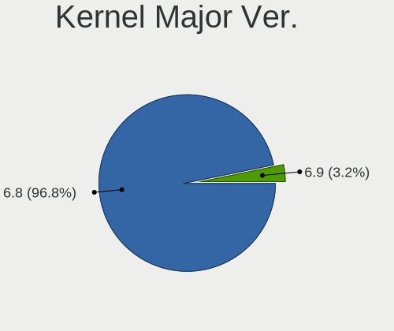
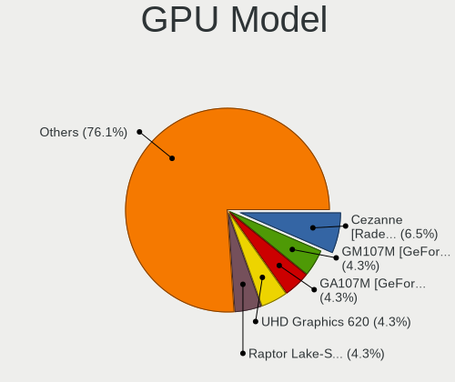

KDE neon - Hardware Trends (Notebooks)
--------------------------------------

A project to identify most popular hardware characteristics and track their change
over time based on data collected by Linux users at https://Linux-Hardware.org.

Anyone can contribute to this report by the [hw-probe](https://github.com/linuxhw/hw-probe) tool:

    sudo -E hw-probe -all -upload

This report is for one last month. Overall report since the beginning of time: [TestCoverage](https://github.com/linuxhw/TestCoverage)

Period: Dec, 2022.

Contents
--------

* [ System ](#system)
  - [ OS                       ](#os)
  - [ OS Family                ](#os-family)
  - [ Kernel                   ](#kernel)
  - [ Kernel Family            ](#kernel-family)
  - [ Kernel Major Ver.        ](#kernel-major-ver)
  - [ Arch                     ](#arch)
  - [ DE                       ](#de)
  - [ Display Server           ](#display-server)
  - [ Display Manager          ](#display-manager)
  - [ OS Lang                  ](#os-lang)
  - [ Boot Mode                ](#boot-mode)
  - [ Filesystem               ](#filesystem)
  - [ Part. scheme             ](#part-scheme)
  - [ Dual Boot with Linux/BSD ](#dual-boot-with-linuxbsd)
  - [ Dual Boot (Win)          ](#dual-boot-win)

* [ Board ](#board)
  - [ Vendor                   ](#vendor)
  - [ Model                    ](#model)
  - [ Model Family             ](#model-family)
  - [ MFG Year                 ](#mfg-year)
  - [ Form Factor              ](#form-factor)
  - [ Secure Boot              ](#secure-boot)
  - [ Coreboot                 ](#coreboot)
  - [ RAM Size                 ](#ram-size)
  - [ RAM Used                 ](#ram-used)
  - [ Total Drives             ](#total-drives)
  - [ Has CD-ROM               ](#has-cd-rom)
  - [ Has Ethernet             ](#has-ethernet)
  - [ Has WiFi                 ](#has-wifi)
  - [ Has Bluetooth            ](#has-bluetooth)

* [ Location ](#location)
  - [ Country                  ](#country)
  - [ City                     ](#city)

* [ Drives ](#drives)
  - [ Drive Vendor             ](#drive-vendor)
  - [ Drive Model              ](#drive-model)
  - [ HDD Vendor               ](#hdd-vendor)
  - [ SSD Vendor               ](#ssd-vendor)
  - [ Drive Kind               ](#drive-kind)
  - [ Drive Connector          ](#drive-connector)
  - [ Drive Size               ](#drive-size)
  - [ Space Total              ](#space-total)
  - [ Space Used               ](#space-used)
  - [ Malfunc. Drives          ](#malfunc-drives)
  - [ Malfunc. Drive Vendor    ](#malfunc-drive-vendor)
  - [ Malfunc. HDD Vendor      ](#malfunc-hdd-vendor)
  - [ Malfunc. Drive Kind      ](#malfunc-drive-kind)
  - [ Failed Drives            ](#failed-drives)
  - [ Failed Drive Vendor      ](#failed-drive-vendor)
  - [ Drive Status             ](#drive-status)

* [ Storage controller ](#storage-controller)
  - [ Storage Vendor           ](#storage-vendor)
  - [ Storage Model            ](#storage-model)
  - [ Storage Kind             ](#storage-kind)

* [ Processor ](#processor)
  - [ CPU Vendor               ](#cpu-vendor)
  - [ CPU Model                ](#cpu-model)
  - [ CPU Model Family         ](#cpu-model-family)
  - [ CPU Cores                ](#cpu-cores)
  - [ CPU Sockets              ](#cpu-sockets)
  - [ CPU Threads              ](#cpu-threads)
  - [ CPU Op-Modes             ](#cpu-op-modes)
  - [ CPU Microcode            ](#cpu-microcode)
  - [ CPU Microarch            ](#cpu-microarch)

* [ Graphics ](#graphics)
  - [ GPU Vendor               ](#gpu-vendor)
  - [ GPU Model                ](#gpu-model)
  - [ GPU Combo                ](#gpu-combo)
  - [ GPU Driver               ](#gpu-driver)
  - [ GPU Memory               ](#gpu-memory)

* [ Monitor ](#monitor)
  - [ Monitor Vendor           ](#monitor-vendor)
  - [ Monitor Model            ](#monitor-model)
  - [ Monitor Resolution       ](#monitor-resolution)
  - [ Monitor Diagonal         ](#monitor-diagonal)
  - [ Monitor Width            ](#monitor-width)
  - [ Aspect Ratio             ](#aspect-ratio)
  - [ Monitor Area             ](#monitor-area)
  - [ Pixel Density            ](#pixel-density)
  - [ Multiple Monitors        ](#multiple-monitors)

* [ Network ](#network)
  - [ Net Controller Vendor    ](#net-controller-vendor)
  - [ Net Controller Model     ](#net-controller-model)
  - [ Wireless Vendor          ](#wireless-vendor)
  - [ Wireless Model           ](#wireless-model)
  - [ Ethernet Vendor          ](#ethernet-vendor)
  - [ Ethernet Model           ](#ethernet-model)
  - [ Net Controller Kind      ](#net-controller-kind)
  - [ Used Controller          ](#used-controller)
  - [ NICs                     ](#nics)
  - [ IPv6                     ](#ipv6)

* [ Bluetooth ](#bluetooth)
  - [ Bluetooth Vendor         ](#bluetooth-vendor)
  - [ Bluetooth Model          ](#bluetooth-model)

* [ Sound ](#sound)
  - [ Sound Vendor             ](#sound-vendor)
  - [ Sound Model              ](#sound-model)

* [ Memory ](#memory)
  - [ Memory Vendor            ](#memory-vendor)
  - [ Memory Model             ](#memory-model)
  - [ Memory Kind              ](#memory-kind)
  - [ Memory Form Factor       ](#memory-form-factor)
  - [ Memory Size              ](#memory-size)
  - [ Memory Speed             ](#memory-speed)

* [ Printers & scanners ](#printers--scanners)
  - [ Printer Vendor           ](#printer-vendor)
  - [ Printer Model            ](#printer-model)
  - [ Scanner Vendor           ](#scanner-vendor)
  - [ Scanner Model            ](#scanner-model)

* [ Camera ](#camera)
  - [ Camera Vendor            ](#camera-vendor)
  - [ Camera Model             ](#camera-model)

* [ Security ](#security)
  - [ Fingerprint Vendor       ](#fingerprint-vendor)
  - [ Fingerprint Model        ](#fingerprint-model)
  - [ Chipcard Vendor          ](#chipcard-vendor)
  - [ Chipcard Model           ](#chipcard-model)

* [ Unsupported ](#unsupported)
  - [ Unsupported Devices      ](#unsupported-devices)
  - [ Unsupported Device Types ](#unsupported-device-types)

System
------

OS
--

Installed operating systems

| Name           | Notebooks | Percent |
|----------------|-----------|---------|
| KDE neon 22.04 | 49        | 98%     |
| KDE neon 20.04 | 1         | 2%      |

OS Family
---------

OS without a version

| Name     | Notebooks | Percent |
|----------|-----------|---------|
| KDE neon | 50        | 100%    |

Kernel
------

Version of the Linux kernel

| Version           | Notebooks | Percent |
|-------------------|-----------|---------|
| 5.15.0-56-generic | 43        | 86%     |
| 5.15.0-52-generic | 3         | 6%      |
| 5.15.0-53-generic | 2         | 4%      |
| 6.0.0-1007-oem    | 1         | 2%      |
| 5.13.0-44-generic | 1         | 2%      |

Kernel Family
-------------

Linux kernel without a distro release

| Version | Notebooks | Percent |
|---------|-----------|---------|
| 5.15.0  | 48        | 96%     |
| 6.0.0   | 1         | 2%      |
| 5.13.0  | 1         | 2%      |

Kernel Major Ver.
-----------------

Linux kernel major version

| Version | Notebooks | Percent |
|---------|-----------|---------|
| 5.15    | 48        | 96%     |
| 6.0     | 1         | 2%      |
| 5.13    | 1         | 2%      |

Arch
----

OS architecture (x86_64, i586, etc.)

| Name   | Notebooks | Percent |
|--------|-----------|---------|
| x86_64 | 50        | 100%    |

DE
--

Desktop Environment

| Name | Notebooks | Percent |
|------|-----------|---------|
| KDE5 | 50        | 100%    |

Display Server
--------------

X11 or Wayland

| Name    | Notebooks | Percent |
|---------|-----------|---------|
| X11     | 48        | 96%     |
| Wayland | 2         | 4%      |

Display Manager
---------------

SDDM, LightDM, etc.

| Name    | Notebooks | Percent |
|---------|-----------|---------|
| Unknown | 37        | 74%     |
| SDDM    | 13        | 26%     |

OS Lang
-------

Language

| Lang  | Notebooks | Percent |
|-------|-----------|---------|
| en_US | 23        | 46%     |
| en_GB | 4         | 8%      |
| pt_BR | 3         | 6%      |
| ru_RU | 2         | 4%      |
| fr_BE | 2         | 4%      |
| es_ES | 2         | 4%      |
| C     | 2         | 4%      |
| sv_SE | 1         | 2%      |
| sk_SK | 1         | 2%      |
| hu_HU | 1         | 2%      |
| es_PE | 1         | 2%      |
| es_MX | 1         | 2%      |
| en_SG | 1         | 2%      |
| en_IN | 1         | 2%      |
| en_DK | 1         | 2%      |
| en_CA | 1         | 2%      |
| en_AU | 1         | 2%      |
| en_AG | 1         | 2%      |
| bg_BG | 1         | 2%      |

Boot Mode
---------

EFI or BIOS

| Mode | Notebooks | Percent |
|------|-----------|---------|
| BIOS | 41        | 82%     |
| EFI  | 9         | 18%     |

Filesystem
----------

Type of filesystem

| Type    | Notebooks | Percent |
|---------|-----------|---------|
| Ext4    | 46        | 92%     |
| Overlay | 2         | 4%      |
| Ext3    | 1         | 2%      |
| Btrfs   | 1         | 2%      |

Part. scheme
------------

Scheme of partitioning

| Type    | Notebooks | Percent |
|---------|-----------|---------|
| Unknown | 37        | 74%     |
| GPT     | 11        | 22%     |
| MBR     | 2         | 4%      |

Dual Boot with Linux/BSD
------------------------

Hosting more than one Linux/BSD

| Dual boot | Notebooks | Percent |
|-----------|-----------|---------|
| No        | 48        | 96%     |
| Yes       | 2         | 4%      |

Dual Boot (Win)
---------------

Hosting Linux and Windows

| Dual boot | Notebooks | Percent |
|-----------|-----------|---------|
| No        | 46        | 92%     |
| Yes       | 4         | 8%      |

Board
-----

Vendor
------

Motherboard manufacturer

| Name             | Notebooks | Percent |
|------------------|-----------|---------|
| Lenovo           | 13        | 26%     |
| Dell             | 8         | 16%     |
| Hewlett-Packard  | 7         | 14%     |
| ASUSTek Computer | 6         | 12%     |
| Acer             | 5         | 10%     |
| MSI              | 4         | 8%      |
| Timi             | 2         | 4%      |
| Apple            | 2         | 4%      |
| Sony             | 1         | 2%      |
| Razer            | 1         | 2%      |
| Google           | 1         | 2%      |

Model
-----

Motherboard model

| Name                                     | Notebooks | Percent |
|------------------------------------------|-----------|---------|
| Timi RedmiBook Pro 15S                   | 2         | 4%      |
| Lenovo Y520-15IKBN 80WK                  | 2         | 4%      |
| ASUS TUF Gaming FX505DT_FX505DT          | 2         | 4%      |
| Sony VPCEA23FB                           | 1         | 2%      |
| Razer Blade Stealth                      | 1         | 2%      |
| MSI Modern 14 A10RB                      | 1         | 2%      |
| MSI GP65 Leopard 9SE                     | 1         | 2%      |
| MSI GL62M 7RE                            | 1         | 2%      |
| MSI GF63 Thin 11UC                       | 1         | 2%      |
| Lenovo ThinkPad X13 Gen 1 20UF0020MX     | 1         | 2%      |
| Lenovo ThinkPad X1 Carbon 6th 20KHCTO1WW | 1         | 2%      |
| Lenovo ThinkPad T530 2392APU             | 1         | 2%      |
| Lenovo ThinkPad T470p 20J6CTO1WW         | 1         | 2%      |
| Lenovo ThinkBook 15 G3 ACL 21A4          | 1         | 2%      |
| Lenovo Legion 5 15ARH7H 82RD             | 1         | 2%      |
| Lenovo IdeaPad U430 Touch 20270          | 1         | 2%      |
| Lenovo IdeaPad U400 099342G              | 1         | 2%      |
| Lenovo IdeaPad Gaming 3 15ARH05 82EY     | 1         | 2%      |
| Lenovo IdeaPad Gaming 3 15ACH6 82MJ      | 1         | 2%      |
| Lenovo B70-80 80MR                       | 1         | 2%      |
| HP ZBook 15 G2                           | 1         | 2%      |
| HP Pavilion Laptop 14-ce0xxx             | 1         | 2%      |
| HP Pavilion Gaming Laptop 15-ec2xxx      | 1         | 2%      |
| HP Pavilion dv7                          | 1         | 2%      |
| HP G62                                   | 1         | 2%      |
| HP EliteBook Revolve 810 G3              | 1         | 2%      |
| HP EliteBook 840 G5                      | 1         | 2%      |
| Google Orco                              | 1         | 2%      |
| Dell Precision 5550                      | 1         | 2%      |
| Dell Inspiron N5050                      | 1         | 2%      |
| Dell Inspiron 7737                       | 1         | 2%      |
| Dell Inspiron 7580                       | 1         | 2%      |
| Dell Inspiron 3541                       | 1         | 2%      |
| Dell Inspiron 3505                       | 1         | 2%      |
| Dell Inspiron 14 5401                    | 1         | 2%      |
| Dell G5 5500                             | 1         | 2%      |
| ASUS Zenbook UX5400EA_UX5400EA           | 1         | 2%      |
| ASUS ROG Zephyrus G15 GA503QS_GA503QS    | 1         | 2%      |
| ASUS K53SC                               | 1         | 2%      |
| ASUS ASUS BR1100CKA BR1100CKA_BR1100CKA  | 1         | 2%      |

Model Family
------------

Motherboard model prefix

| Name               | Notebooks | Percent |
|--------------------|-----------|---------|
| Dell Inspiron      | 6         | 12%     |
| Lenovo ThinkPad    | 4         | 8%      |
| Lenovo IdeaPad     | 4         | 8%      |
| HP Pavilion        | 3         | 6%      |
| Timi RedmiBook     | 2         | 4%      |
| Lenovo Y520-15IKBN | 2         | 4%      |
| HP EliteBook       | 2         | 4%      |
| ASUS TUF           | 2         | 4%      |
| Apple MacBookPro10 | 2         | 4%      |
| Acer Nitro         | 2         | 4%      |
| Acer Aspire        | 2         | 4%      |
| Sony VPCEA23FB     | 1         | 2%      |
| Razer Blade        | 1         | 2%      |
| MSI Modern         | 1         | 2%      |
| MSI GP65           | 1         | 2%      |
| MSI GL62M          | 1         | 2%      |
| MSI GF63           | 1         | 2%      |
| Lenovo ThinkBook   | 1         | 2%      |
| Lenovo Legion      | 1         | 2%      |
| Lenovo B70-80      | 1         | 2%      |
| HP ZBook           | 1         | 2%      |
| HP G62             | 1         | 2%      |
| Google Orco        | 1         | 2%      |
| Dell Precision     | 1         | 2%      |
| Dell G5            | 1         | 2%      |
| ASUS Zenbook       | 1         | 2%      |
| ASUS ROG           | 1         | 2%      |
| ASUS K53SC         | 1         | 2%      |
| ASUS ASUS          | 1         | 2%      |
| Acer Swift         | 1         | 2%      |

MFG Year
--------

Motherboard manufacture year

| Year | Notebooks | Percent |
|------|-----------|---------|
| 2021 | 11        | 22%     |
| 2020 | 6         | 12%     |
| 2019 | 6         | 12%     |
| 2015 | 6         | 12%     |
| 2018 | 5         | 10%     |
| 2017 | 3         | 6%      |
| 2011 | 3         | 6%      |
| 2022 | 2         | 4%      |
| 2013 | 2         | 4%      |
| 2010 | 2         | 4%      |
| 2014 | 1         | 2%      |
| 2012 | 1         | 2%      |
| 2009 | 1         | 2%      |
| 2008 | 1         | 2%      |

Form Factor
-----------

Physical design of the computer

| Name     | Notebooks | Percent |
|----------|-----------|---------|
| Notebook | 50        | 100%    |

Secure Boot
-----------

Enabled or disabled

| State    | Notebooks | Percent |
|----------|-----------|---------|
| Disabled | 47        | 94%     |
| Enabled  | 3         | 6%      |

Coreboot
--------

Have coreboot on board

| Used | Notebooks | Percent |
|------|-----------|---------|
| No   | 49        | 98%     |
| Yes  | 1         | 2%      |

RAM Size
--------

Total RAM memory

| Size in GB | Notebooks | Percent |
|------------|-----------|---------|
| 4.01-8.0   | 17        | 34%     |
| 16.01-24.0 | 11        | 22%     |
| 8.01-16.0  | 11        | 22%     |
| 32.01-64.0 | 5         | 10%     |
| 3.01-4.0   | 5         | 10%     |
| 2.01-3.0   | 1         | 2%      |

RAM Used
--------

Used RAM memory

| Used GB   | Notebooks | Percent |
|-----------|-----------|---------|
| 2.01-3.0  | 17        | 34%     |
| 3.01-4.0  | 12        | 24%     |
| 4.01-8.0  | 11        | 22%     |
| 1.01-2.0  | 8         | 16%     |
| 8.01-16.0 | 1         | 2%      |
| 0.51-1.0  | 1         | 2%      |

Total Drives
------------

Number of drives on board

| Drives | Notebooks | Percent |
|--------|-----------|---------|
| 1      | 38        | 76%     |
| 2      | 11        | 22%     |
| 3      | 1         | 2%      |

Has CD-ROM
----------

Has CD-ROM on board

| Presented | Notebooks | Percent |
|-----------|-----------|---------|
| No        | 38        | 76%     |
| Yes       | 12        | 24%     |

Has Ethernet
------------

Has Ethernet on board

| Presented | Notebooks | Percent |
|-----------|-----------|---------|
| Yes       | 42        | 84%     |
| No        | 8         | 16%     |

Has WiFi
--------

Has WiFi module

| Presented | Notebooks | Percent |
|-----------|-----------|---------|
| Yes       | 50        | 100%    |

Has Bluetooth
-------------

Has Bluetooth module

| Presented | Notebooks | Percent |
|-----------|-----------|---------|
| Yes       | 47        | 94%     |
| No        | 3         | 6%      |

Location
--------

Country
-------

Geographic location (country)

| Country     | Notebooks | Percent |
|-------------|-----------|---------|
| USA         | 13        | 26%     |
| Spain       | 4         | 8%      |
| Brazil      | 3         | 6%      |
| Sweden      | 2         | 4%      |
| Slovakia    | 2         | 4%      |
| Russia      | 2         | 4%      |
| Latvia      | 2         | 4%      |
| India       | 2         | 4%      |
| Denmark     | 2         | 4%      |
| Bulgaria    | 2         | 4%      |
| UK          | 1         | 2%      |
| Singapore   | 1         | 2%      |
| Peru        | 1         | 2%      |
| Netherlands | 1         | 2%      |
| Malaysia    | 1         | 2%      |
| Italy       | 1         | 2%      |
| Iran        | 1         | 2%      |
| Hungary     | 1         | 2%      |
| Germany     | 1         | 2%      |
| France      | 1         | 2%      |
| Estonia     | 1         | 2%      |
| Chile       | 1         | 2%      |
| Canada      | 1         | 2%      |
| Belgium     | 1         | 2%      |
| Australia   | 1         | 2%      |
| Algeria     | 1         | 2%      |

City
----

Geographic location (city)

| City                      | Notebooks | Percent |
|---------------------------|-----------|---------|
| Sofia                     | 2         | 4%      |
| Riga                      | 2         | 4%      |
| Randers                   | 2         | 4%      |
| Porto Alegre              | 2         | 4%      |
| Worcester                 | 1         | 2%      |
| Villafranca de los Barros | 1         | 2%      |
| Tipasa                    | 1         | 2%      |
| Tallinn                   | 1         | 2%      |
| Sumaré                   | 1         | 2%      |
| St. Claude                | 1         | 2%      |
| Singapore                 | 1         | 2%      |
| Santiago                  | 1         | 2%      |
| Rome                      | 1         | 2%      |
| Pune                      | 1         | 2%      |
| Poway                     | 1         | 2%      |
| Paris                     | 1         | 2%      |
| New York                  | 1         | 2%      |
| Moscow                    | 1         | 2%      |
| McMinnville               | 1         | 2%      |
| Maracena                  | 1         | 2%      |
| Malmo                     | 1         | 2%      |
| Madrid                    | 1         | 2%      |
| Ludwigsburg               | 1         | 2%      |
| Kuala Lumpur              | 1         | 2%      |
| Kansas City               | 1         | 2%      |
| Guwahati                  | 1         | 2%      |
| Granada                   | 1         | 2%      |
| Gothenburg                | 1         | 2%      |
| Glen Allen                | 1         | 2%      |
| Findlay                   | 1         | 2%      |
| Dubna                     | 1         | 2%      |
| Drienovec                 | 1         | 2%      |
| Detva                     | 1         | 2%      |
| Denton                    | 1         | 2%      |
| Chesapeake                | 1         | 2%      |
| Casa Grande               | 1         | 2%      |
| Bushehr                   | 1         | 2%      |
| Budapest                  | 1         | 2%      |
| Beverly                   | 1         | 2%      |
| Belmont                   | 1         | 2%      |

Drives
------

Drive Vendor
------------

Hard drive vendors

| Vendor                      | Notebooks | Drives | Percent |
|-----------------------------|-----------|--------|---------|
| Samsung Electronics         | 11        | 12     | 18.03%  |
| Seagate                     | 8         | 8      | 13.11%  |
| SK hynix                    | 7         | 7      | 11.48%  |
| Kingston                    | 7         | 7      | 11.48%  |
| WDC                         | 4         | 4      | 6.56%   |
| Intel                       | 4         | 5      | 6.56%   |
| Toshiba                     | 3         | 3      | 4.92%   |
| Unknown                     | 2         | 2      | 3.28%   |
| Micron Technology           | 2         | 2      | 3.28%   |
| Crucial                     | 2         | 2      | 3.28%   |
| China                       | 2         | 2      | 3.28%   |
| ADATA Technology            | 2         | 2      | 3.28%   |
| SPCC                        | 1         | 1      | 1.64%   |
| Sandisk                     | 1         | 1      | 1.64%   |
| Netac                       | 1         | 1      | 1.64%   |
| Kingston Technology Company | 1         | 1      | 1.64%   |
| KingFast                    | 1         | 1      | 1.64%   |
| Intenso                     | 1         | 1      | 1.64%   |
| Apple                       | 1         | 1      | 1.64%   |

Drive Model
-----------

Hard drive models

| Model                                               | Notebooks | Percent |
|-----------------------------------------------------|-----------|---------|
| Kingston SA400S37240G 240GB SSD                     | 3         | 4.76%   |
| SK hynix HFM001TD3JX013N 1TB                        | 2         | 3.17%   |
| Seagate ST1000LM024 HN-M101MBB 1TB                  | 2         | 3.17%   |
| Micron 2200V_MTFDHBA512TCK 512GB                    | 2         | 3.17%   |
| WDC WDS240G2G0A-00JH30 240GB SSD                    | 1         | 1.59%   |
| WDC WD5000BPKX-22HPJT0 500GB                        | 1         | 1.59%   |
| WDC WD10JPCX-24UE4T0 1TB                            | 1         | 1.59%   |
| WDC PC SN730 NVMe 1024GB                            | 1         | 1.59%   |
| Unknown MMC Card  64GB                              | 1         | 1.59%   |
| Unknown MMC Card  16GB                              | 1         | 1.59%   |
| Toshiba MQ01ABD100 1TB                              | 1         | 1.59%   |
| Toshiba MK6476GSX 640GB                             | 1         | 1.59%   |
| Toshiba BG3 NVMe SSD Controller 256GB               | 1         | 1.59%   |
| SPCC Solid State Disk 128GB                         | 1         | 1.59%   |
| SK hynix SKHynix_HFS001TEJ9X115N 1024GB             | 1         | 1.59%   |
| SK hynix SKHynix_HFM512GD3HX015N 512GB              | 1         | 1.59%   |
| SK hynix SC300 M.2 2280 256GB SSD                   | 1         | 1.59%   |
| SK hynix BC511 256GB                                | 1         | 1.59%   |
| SK hynix BC501 NVMe Solid State Drive 512GB         | 1         | 1.59%   |
| Seagate ST500LT012-9WS142 500GB                     | 1         | 1.59%   |
| Seagate ST500LM012 HN-M500MBB 500GB                 | 1         | 1.59%   |
| Seagate ST500LM000-SSHD-8GB                         | 1         | 1.59%   |
| Seagate ST1000LM049-2GH172 1TB                      | 1         | 1.59%   |
| Seagate FA GoFlex Desk 2TB                          | 1         | 1.59%   |
| Seagate BUP Slim 2TB                                | 1         | 1.59%   |
| Sandisk WD Blue SN500 / PC SN520 NVMe SSD 256GB     | 1         | 1.59%   |
| Samsung SSD PM871 mSATA 256GB                       | 1         | 1.59%   |
| Samsung SSD PM851 2.5 7mm 256GB                     | 1         | 1.59%   |
| Samsung SSD 980 500GB                               | 1         | 1.59%   |
| Samsung SSD 870 QVO 1TB                             | 1         | 1.59%   |
| Samsung SSD 850 PRO 256GB                           | 1         | 1.59%   |
| Samsung SSD 850 EVO 500GB                           | 1         | 1.59%   |
| Samsung PM991a NVMe 256GB                           | 1         | 1.59%   |
| Samsung NVMe SSD Controller SM981/PM981/PM983 500GB | 1         | 1.59%   |
| Samsung NVMe SSD Controller SM961/PM961/SM963 256GB | 1         | 1.59%   |
| Samsung NVMe SSD Controller PM9A1/PM9A3/980PRO 2TB  | 1         | 1.59%   |
| Samsung MZVLB512HAJQ-00000 512GB                    | 1         | 1.59%   |
| Samsung MZMPA032HMCD-000L1 32GB SSD                 | 1         | 1.59%   |
| Netac NVMe SSD Drive 1TB                            | 1         | 1.59%   |
| Kingston Company OM3PDP3 NVMe SSD 512GB             | 1         | 1.59%   |

HDD Vendor
----------

Hard disk drive vendors

| Vendor  | Notebooks | Drives | Percent |
|---------|-----------|--------|---------|
| Seagate | 7         | 7      | 63.64%  |
| WDC     | 2         | 2      | 18.18%  |
| Toshiba | 2         | 2      | 18.18%  |

SSD Vendor
----------

Solid state drive vendors

| Vendor              | Notebooks | Drives | Percent |
|---------------------|-----------|--------|---------|
| Samsung Electronics | 5         | 6      | 29.41%  |
| Kingston            | 3         | 3      | 17.65%  |
| Crucial             | 2         | 2      | 11.76%  |
| China               | 2         | 2      | 11.76%  |
| WDC                 | 1         | 1      | 5.88%   |
| SPCC                | 1         | 1      | 5.88%   |
| SK hynix            | 1         | 1      | 5.88%   |
| Intenso             | 1         | 1      | 5.88%   |
| Apple               | 1         | 1      | 5.88%   |

Drive Kind
----------

HDD or SSD

| Kind    | Notebooks | Drives | Percent |
|---------|-----------|--------|---------|
| NVMe    | 28        | 30     | 48.28%  |
| SSD     | 16        | 18     | 27.59%  |
| HDD     | 10        | 11     | 17.24%  |
| MMC     | 2         | 2      | 3.45%   |
| Unknown | 2         | 2      | 3.45%   |

Drive Connector
---------------

SATA, SAS, NVMe, etc.

| Type | Notebooks | Drives | Percent |
|------|-----------|--------|---------|
| NVMe | 28        | 30     | 48.28%  |
| SATA | 26        | 29     | 44.83%  |
| SAS  | 2         | 2      | 3.45%   |
| MMC  | 2         | 2      | 3.45%   |

Drive Size
----------

Size of hard drive

| Size in TB | Notebooks | Drives | Percent |
|------------|-----------|--------|---------|
| 0.01-0.5   | 17        | 19     | 62.96%  |
| 0.51-1.0   | 9         | 9      | 33.33%  |
| 1.01-2.0   | 1         | 1      | 3.7%    |

Space Total
-----------

Amount of disk space available on the file system

| Size in GB | Notebooks | Percent |
|------------|-----------|---------|
| 101-250    | 16        | 32%     |
| 251-500    | 10        | 20%     |
| 501-1000   | 10        | 20%     |
| 1-20       | 5         | 10%     |
| 21-50      | 3         | 6%      |
| Unknown    | 3         | 6%      |
| 2001-3000  | 1         | 2%      |
| 1001-2000  | 1         | 2%      |
| 51-100     | 1         | 2%      |

Space Used
----------

Amount of used disk space

| Used GB | Notebooks | Percent |
|---------|-----------|---------|
| 1-20    | 27        | 54%     |
| 21-50   | 11        | 22%     |
| 101-250 | 4         | 8%      |
| 51-100  | 4         | 8%      |
| Unknown | 3         | 6%      |
| 251-500 | 1         | 2%      |

Malfunc. Drives
---------------

Drive models with a malfunction

| Model                   | Notebooks | Drives | Percent |
|-------------------------|-----------|--------|---------|
| Toshiba MK6476GSX 640GB | 1         | 1      | 100%    |

Malfunc. Drive Vendor
---------------------

Vendors of faulty drives

| Vendor  | Notebooks | Drives | Percent |
|---------|-----------|--------|---------|
| Toshiba | 1         | 1      | 100%    |

Malfunc. HDD Vendor
-------------------

Vendors of faulty HDD drives

| Vendor  | Notebooks | Drives | Percent |
|---------|-----------|--------|---------|
| Toshiba | 1         | 1      | 100%    |

Malfunc. Drive Kind
-------------------

Kinds of faulty drives

| Kind | Notebooks | Drives | Percent |
|------|-----------|--------|---------|
| HDD  | 1         | 1      | 100%    |

Failed Drives
-------------

Failed drive models

Zero info for selected period =(

Failed Drive Vendor
-------------------

Failed drive vendors

Zero info for selected period =(

Drive Status
------------

Number of failed and malfunc. drives

| Status   | Notebooks | Drives | Percent |
|----------|-----------|--------|---------|
| Detected | 42        | 50     | 79.25%  |
| Works    | 10        | 12     | 18.87%  |
| Malfunc  | 1         | 1      | 1.89%   |

Storage controller
------------------

Storage Vendor
--------------

Storage controller vendors

| Vendor                       | Notebooks | Percent |
|------------------------------|-----------|---------|
| Intel                        | 29        | 46.03%  |
| AMD                          | 10        | 15.87%  |
| SK hynix                     | 6         | 9.52%   |
| Samsung Electronics          | 6         | 9.52%   |
| Kingston Technology Company  | 5         | 7.94%   |
| SanDisk                      | 2         | 3.17%   |
| Micron Technology            | 2         | 3.17%   |
| ADATA Technology             | 2         | 3.17%   |
| Toshiba America Info Systems | 1         | 1.59%   |

Storage Model
-------------

Storage controller models

| Model                                                                            | Notebooks | Percent |
|----------------------------------------------------------------------------------|-----------|---------|
| AMD FCH SATA Controller [AHCI mode]                                              | 10        | 15.38%  |
| SK hynix Gold P31/PC711 NVMe Solid State Drive                                   | 3         | 4.62%   |
| Kingston Company Company Non-Volatile memory controller                          | 3         | 4.62%   |
| Intel Non-Volatile memory controller                                             | 3         | 4.62%   |
| Intel HM170/QM170 Chipset SATA Controller [AHCI Mode]                            | 3         | 4.62%   |
| Intel 7 Series Chipset Family 6-port SATA Controller [AHCI mode]                 | 3         | 4.62%   |
| Intel 6 Series/C200 Series Chipset Family 6 port Mobile SATA AHCI Controller     | 3         | 4.62%   |
| Samsung NVMe SSD Controller SM981/PM981/PM983                                    | 2         | 3.08%   |
| Samsung NVMe SSD Controller 980                                                  | 2         | 3.08%   |
| Micron Non-Volatile memory controller                                            | 2         | 3.08%   |
| Kingston Company OM3PDP3 NVMe SSD                                                | 2         | 3.08%   |
| Intel Wildcat Point-LP SATA Controller [AHCI Mode]                               | 2         | 3.08%   |
| Intel Cannon Lake Mobile PCH SATA AHCI Controller                                | 2         | 3.08%   |
| Intel 82801IBM/IEM (ICH9M/ICH9M-E) 4 port SATA Controller [AHCI mode]            | 2         | 3.08%   |
| Intel 8 Series SATA Controller 1 [AHCI mode]                                     | 2         | 3.08%   |
| Intel 5 Series/3400 Series Chipset 4 port SATA AHCI Controller                   | 2         | 3.08%   |
| Toshiba America Info Systems BG3 NVMe SSD Controller                             | 1         | 1.54%   |
| SK hynix Non-Volatile memory controller                                          | 1         | 1.54%   |
| SK hynix BC511                                                                   | 1         | 1.54%   |
| SK hynix BC501 NVMe Solid State Drive                                            | 1         | 1.54%   |
| SanDisk WD Blue SN500 / PC SN520 NVMe SSD                                        | 1         | 1.54%   |
| SanDisk WD Black SN750 / PC SN730 NVMe SSD                                       | 1         | 1.54%   |
| Samsung NVMe SSD Controller SM961/PM961/SM963                                    | 1         | 1.54%   |
| Samsung NVMe SSD Controller PM9A1/PM9A3/980PRO                                   | 1         | 1.54%   |
| Intel Volume Management Device NVMe RAID Controller                              | 1         | 1.54%   |
| Intel Sunrise Point-LP SATA Controller [AHCI mode]                               | 1         | 1.54%   |
| Intel NVMe Optane Memory Series                                                  | 1         | 1.54%   |
| Intel Comet Lake PCH-H RAID                                                      | 1         | 1.54%   |
| Intel Cannon Point-LP SATA Controller [AHCI Mode]                                | 1         | 1.54%   |
| Intel Atom/Celeron/Pentium Processor x5-E8000/J3xxx/N3xxx Series SATA Controller | 1         | 1.54%   |
| Intel 82801 Mobile SATA Controller [RAID mode]                                   | 1         | 1.54%   |
| Intel 8 Series/C220 Series Chipset Family 6-port SATA Controller 1 [AHCI mode]   | 1         | 1.54%   |
| Intel 500 Series Chipset Family SATA AHCI Controller                             | 1         | 1.54%   |
| ADATA ADATA XPG GAMMIXS1 1L Media                                                | 1         | 1.54%   |
| ADATA A Non-Volatile memory controller                                           | 1         | 1.54%   |

Storage Kind
------------

Kind of storage controller (IDE, SATA, NVMe, SAS, ...)

| Kind | Notebooks | Percent |
|------|-----------|---------|
| SATA | 34        | 53.13%  |
| NVMe | 27        | 42.19%  |
| RAID | 3         | 4.69%   |

Processor
---------

CPU Vendor
----------

Processor vendors

| Vendor | Notebooks | Percent |
|--------|-----------|---------|
| Intel  | 35        | 70%     |
| AMD    | 15        | 30%     |

CPU Model
---------

Processor models

| Model                                         | Notebooks | Percent |
|-----------------------------------------------|-----------|---------|
| AMD Ryzen 7 5800H with Radeon Graphics        | 5         | 10%     |
| Intel Core i7-8550U CPU @ 1.80GHz             | 2         | 4%      |
| Intel Core i5-7300HQ CPU @ 2.50GHz            | 2         | 4%      |
| AMD Ryzen 7 5700U with Radeon Graphics        | 2         | 4%      |
| Intel Pentium Dual-Core CPU T4300 @ 2.10GHz   | 1         | 2%      |
| Intel Pentium CPU P6100 @ 2.00GHz             | 1         | 2%      |
| Intel Pentium CPU B960 @ 2.20GHz              | 1         | 2%      |
| Intel Core i7-9750H CPU @ 2.60GHz             | 1         | 2%      |
| Intel Core i7-8565U CPU @ 1.80GHz             | 1         | 2%      |
| Intel Core i7-7820HQ CPU @ 2.90GHz            | 1         | 2%      |
| Intel Core i7-7700HQ CPU @ 2.80GHz            | 1         | 2%      |
| Intel Core i7-7500U CPU @ 2.70GHz             | 1         | 2%      |
| Intel Core i7-4810MQ CPU @ 2.80GHz            | 1         | 2%      |
| Intel Core i7-4500U CPU @ 1.80GHz             | 1         | 2%      |
| Intel Core i7-3720QM CPU @ 2.60GHz            | 1         | 2%      |
| Intel Core i7-3615QM CPU @ 2.30GHz            | 1         | 2%      |
| Intel Core i7-2620M CPU @ 2.70GHz             | 1         | 2%      |
| Intel Core i7-10850H CPU @ 2.70GHz            | 1         | 2%      |
| Intel Core i7-10750H CPU @ 2.60GHz            | 1         | 2%      |
| Intel Core i7-1065G7 CPU @ 1.30GHz            | 1         | 2%      |
| Intel Core i5-8300H CPU @ 2.30GHz             | 1         | 2%      |
| Intel Core i5-8250U CPU @ 1.60GHz             | 1         | 2%      |
| Intel Core i5-5200U CPU @ 2.20GHz             | 1         | 2%      |
| Intel Core i5-4210U CPU @ 1.70GHz             | 1         | 2%      |
| Intel Core i5-3230M CPU @ 2.60GHz             | 1         | 2%      |
| Intel Core i5-10210U CPU @ 1.60GHz            | 1         | 2%      |
| Intel Core i3-5005U CPU @ 2.00GHz             | 1         | 2%      |
| Intel Core i3-2310M CPU @ 2.10GHz             | 1         | 2%      |
| Intel Core i3 CPU M 330 @ 2.13GHz             | 1         | 2%      |
| Intel Core 2 Quad CPU Q9000 @ 2.00GHz         | 1         | 2%      |
| Intel Celeron N4500 @ 1.10GHz                 | 1         | 2%      |
| Intel Celeron CPU N3150 @ 1.60GHz             | 1         | 2%      |
| Intel Celeron CPU N2840 @ 2.16GHz             | 1         | 2%      |
| Intel 11th Gen Core i5-11400H @ 2.70GHz       | 1         | 2%      |
| Intel 11th Gen Core i5-1135G7 @ 2.40GHz       | 1         | 2%      |
| AMD Ryzen 9 5900HS with Radeon Graphics       | 1         | 2%      |
| AMD Ryzen 7 6800H with Radeon Graphics        | 1         | 2%      |
| AMD Ryzen 7 3750H with Radeon Vega Mobile Gfx | 1         | 2%      |
| AMD Ryzen 5 PRO 4650U with Radeon Graphics    | 1         | 2%      |
| AMD Ryzen 5 4600H with Radeon Graphics        | 1         | 2%      |

CPU Model Family
----------------

Processor model prefix

| Model                   | Notebooks | Percent |
|-------------------------|-----------|---------|
| Intel Core i7           | 15        | 30%     |
| AMD Ryzen 7             | 9         | 18%     |
| Intel Core i5           | 8         | 16%     |
| Intel Core i3           | 3         | 6%      |
| Intel Celeron           | 3         | 6%      |
| Other                   | 2         | 4%      |
| Intel Pentium           | 2         | 4%      |
| AMD Ryzen 5             | 2         | 4%      |
| Intel Pentium Dual-Core | 1         | 2%      |
| Intel Core 2 Quad       | 1         | 2%      |
| AMD Ryzen 9             | 1         | 2%      |
| AMD Ryzen 5 PRO         | 1         | 2%      |
| AMD Athlon              | 1         | 2%      |
| AMD A6                  | 1         | 2%      |

CPU Cores
---------

Number of processor cores

| Number | Notebooks | Percent |
|--------|-----------|---------|
| 4      | 20        | 40%     |
| 2      | 15        | 30%     |
| 8      | 9         | 18%     |
| 6      | 6         | 12%     |

CPU Sockets
-----------

Number of sockets

| Number | Notebooks | Percent |
|--------|-----------|---------|
| 1      | 50        | 100%    |

CPU Threads
-----------

Threads per core (Hyper-Threading)

| Number | Notebooks | Percent |
|--------|-----------|---------|
| 2      | 39        | 78%     |
| 1      | 11        | 22%     |

CPU Op-Modes
------------

CPU Operation Modes (32-bit, 64-bit)

| Op mode        | Notebooks | Percent |
|----------------|-----------|---------|
| 32-bit, 64-bit | 50        | 100%    |

CPU Microcode
-------------

Microcode number

| Number     | Notebooks | Percent |
|------------|-----------|---------|
| Unknown    | 39        | 78%     |
| 0x806ec    | 1         | 2%      |
| 0x806e9    | 1         | 2%      |
| 0x806c1    | 1         | 2%      |
| 0x706e5    | 1         | 2%      |
| 0x40651    | 1         | 2%      |
| 0x306a9    | 1         | 2%      |
| 0x1067a    | 1         | 2%      |
| 0x0a50000d | 1         | 2%      |
| 0x08608103 | 1         | 2%      |
| 0x08608102 | 1         | 2%      |
| 0x08108102 | 1         | 2%      |

CPU Microarch
-------------

Microarchitecture

| Name        | Notebooks | Percent |
|-------------|-----------|---------|
| KabyLake    | 12        | 24%     |
| Zen 3       | 6         | 12%     |
| Unknown     | 5         | 10%     |
| Zen+        | 3         | 6%      |
| SandyBridge | 3         | 6%      |
| IvyBridge   | 3         | 6%      |
| Haswell     | 3         | 6%      |
| Zen 2       | 2         | 4%      |
| Westmere    | 2         | 4%      |
| Silvermont  | 2         | 4%      |
| Penryn      | 2         | 4%      |
| CometLake   | 2         | 4%      |
| Broadwell   | 2         | 4%      |
| TigerLake   | 1         | 2%      |
| Puma        | 1         | 2%      |
| IceLake     | 1         | 2%      |

Graphics
--------

GPU Vendor
----------

Vendors of graphics cards

| Vendor | Notebooks | Percent |
|--------|-----------|---------|
| Intel  | 34        | 45.33%  |
| Nvidia | 23        | 30.67%  |
| AMD    | 18        | 24%     |

GPU Model
---------

Graphics card models

| Model                                                                                    | Notebooks | Percent |
|------------------------------------------------------------------------------------------|-----------|---------|
| AMD Cezanne [Radeon Vega Series / Radeon Vega Mobile Series]                             | 6         | 8%      |
| Intel HD Graphics 630                                                                    | 4         | 5.33%   |
| Nvidia TU117M [GeForce GTX 1650 Mobile / Max-Q]                                          | 3         | 4%      |
| Intel UHD Graphics 620                                                                   | 3         | 4%      |
| Intel 3rd Gen Core processor Graphics Controller                                         | 3         | 4%      |
| Intel 2nd Generation Core Processor Family Integrated Graphics Controller                | 3         | 4%      |
| AMD Picasso/Raven 2 [Radeon Vega Series / Radeon Vega Mobile Series]                     | 3         | 4%      |
| Nvidia TU117M [GeForce GTX 1650 Ti Mobile]                                               | 2         | 2.67%   |
| Nvidia GP107M [GeForce GTX 1050 Ti Mobile]                                               | 2         | 2.67%   |
| Nvidia GA106M [GeForce RTX 3060 Mobile / Max-Q]                                          | 2         | 2.67%   |
| Intel HD Graphics 5500                                                                   | 2         | 2.67%   |
| Intel Haswell-ULT Integrated Graphics Controller                                         | 2         | 2.67%   |
| Intel Core Processor Integrated Graphics Controller                                      | 2         | 2.67%   |
| Intel CometLake-H GT2 [UHD Graphics]                                                     | 2         | 2.67%   |
| Intel CoffeeLake-H GT2 [UHD Graphics 630]                                                | 2         | 2.67%   |
| AMD Renoir                                                                               | 2         | 2.67%   |
| AMD Lucienne                                                                             | 2         | 2.67%   |
| Nvidia TU117GLM [Quadro T1000 Mobile]                                                    | 1         | 1.33%   |
| Nvidia TU106M [GeForce RTX 2060 Mobile]                                                  | 1         | 1.33%   |
| Nvidia GP108M [GeForce MX330]                                                            | 1         | 1.33%   |
| Nvidia GP108M [GeForce MX250]                                                            | 1         | 1.33%   |
| Nvidia GP108M [GeForce MX150]                                                            | 1         | 1.33%   |
| Nvidia GP107M [GeForce GTX 1050 Mobile]                                                  | 1         | 1.33%   |
| Nvidia GM108M [GeForce MX130]                                                            | 1         | 1.33%   |
| Nvidia GM108M [GeForce 940MX]                                                            | 1         | 1.33%   |
| Nvidia GK208BM [GeForce 910M]                                                            | 1         | 1.33%   |
| Nvidia GK107M [GeForce GT 650M Mac Edition]                                              | 1         | 1.33%   |
| Nvidia GK107GLM [Quadro K1100M]                                                          | 1         | 1.33%   |
| Nvidia GF119M [GeForce GT 520MX]                                                         | 1         | 1.33%   |
| Nvidia GA107M [GeForce RTX 3050 Mobile]                                                  | 1         | 1.33%   |
| Nvidia GA104M [GeForce RTX 3080 Mobile / Max-Q 8GB/16GB]                                 | 1         | 1.33%   |
| Intel WhiskeyLake-U GT2 [UHD Graphics 620]                                               | 1         | 1.33%   |
| Intel TigerLake-LP GT2 [Iris Xe Graphics]                                                | 1         | 1.33%   |
| Intel TigerLake-H GT1 [UHD Graphics]                                                     | 1         | 1.33%   |
| Intel Mobile 4 Series Chipset Integrated Graphics Controller                             | 1         | 1.33%   |
| Intel JasperLake [UHD Graphics]                                                          | 1         | 1.33%   |
| Intel Iris Plus Graphics G7                                                              | 1         | 1.33%   |
| Intel HD Graphics 620                                                                    | 1         | 1.33%   |
| Intel CometLake-U GT2 [UHD Graphics]                                                     | 1         | 1.33%   |
| Intel Atom/Celeron/Pentium Processor x5-E8000/J3xxx/N3xxx Integrated Graphics Controller | 1         | 1.33%   |

GPU Combo
---------

Combinations of graphics cards

| Name           | Notebooks | Percent |
|----------------|-----------|---------|
| Intel + Nvidia | 16        | 32%     |
| 1 x Intel      | 16        | 32%     |
| 1 x AMD        | 9         | 18%     |
| AMD + Nvidia   | 7         | 14%     |
| Intel + AMD    | 2         | 4%      |

GPU Driver
----------

Free vs proprietary

| Driver      | Notebooks | Percent |
|-------------|-----------|---------|
| Free        | 45        | 90%     |
| Proprietary | 4         | 8%      |
| Unknown     | 1         | 2%      |

GPU Memory
----------

Total video memory

| Size in GB | Notebooks | Percent |
|------------|-----------|---------|
| Unknown    | 44        | 88%     |
| 1.01-2.0   | 3         | 6%      |
| 0.01-0.5   | 2         | 4%      |
| 0.51-1.0   | 1         | 2%      |

Monitor
-------

Monitor Vendor
--------------

Monitor vendors

| Vendor                  | Notebooks | Percent |
|-------------------------|-----------|---------|
| Chimei Innolux          | 12        | 19.67%  |
| AU Optronics            | 11        | 18.03%  |
| LG Display              | 7         | 11.48%  |
| BOE                     | 5         | 8.2%    |
| Samsung Electronics     | 4         | 6.56%   |
| PANDA                   | 3         | 4.92%   |
| TMX                     | 2         | 3.28%   |
| Sharp                   | 2         | 3.28%   |
| Dell                    | 2         | 3.28%   |
| Apple                   | 2         | 3.28%   |
| Viotek                  | 1         | 1.64%   |
| ViewSonic               | 1         | 1.64%   |
| Toshiba                 | 1         | 1.64%   |
| STA                     | 1         | 1.64%   |
| Sceptre Tech            | 1         | 1.64%   |
| Philips                 | 1         | 1.64%   |
| InfoVision              | 1         | 1.64%   |
| Goldstar                | 1         | 1.64%   |
| Chi Mei Optoelectronics | 1         | 1.64%   |
| AOC                     | 1         | 1.64%   |
| Acer                    | 1         | 1.64%   |

Monitor Model
-------------

Monitor models

| Model                                                                    | Notebooks | Percent |
|--------------------------------------------------------------------------|-----------|---------|
| TMX TL156MDMP01-0 TMX1560 3200x2000 336x210mm 15.6-inch                  | 2         | 3.23%   |
| Samsung Electronics S24D300 SAM0B43 1920x1080 531x299mm 24.0-inch        | 2         | 3.23%   |
| Chimei Innolux LCD Monitor CMN14D5 1920x1080 309x173mm 13.9-inch         | 2         | 3.23%   |
| AU Optronics LCD Monitor AUO61ED 1920x1080 344x194mm 15.5-inch           | 2         | 3.23%   |
| Viotek GNV29CB VTK2900 2560x1080 680x288mm 29.1-inch                     | 1         | 1.61%   |
| ViewSonic VX2768-PC-mhd VSC083A 1920x1080 598x336mm 27.0-inch            | 1         | 1.61%   |
| Toshiba ScreenXpert TSB8888 1080x2160                                    | 1         | 1.61%   |
| STA LCD Monitor STA5DCA 1366x768 256x144mm 11.6-inch                     | 1         | 1.61%   |
| Sharp LQ125T1JW02 SHP142F 2560x1440 277x155mm 12.5-inch                  | 1         | 1.61%   |
| Sharp LCD Monitor SHP14D0 3840x2400 336x210mm 15.6-inch                  | 1         | 1.61%   |
| Sceptre Tech Sceptre F24 SPT09AB 1920x1080 530x290mm 23.8-inch           | 1         | 1.61%   |
| Samsung Electronics LF27T450F SAM7097 1920x1080 597x336mm 27.0-inch      | 1         | 1.61%   |
| Samsung Electronics LCD Monitor SDC415B 3840x2400 302x189mm 14.0-inch    | 1         | 1.61%   |
| Philips PHL 246V5 PHLC0C5 1920x1080 531x299mm 24.0-inch                  | 1         | 1.61%   |
| PANDA LCD Monitor NCP0036 1920x1080 344x194mm 15.5-inch                  | 1         | 1.61%   |
| PANDA LCD Monitor NCP002D 1920x1080 344x194mm 15.5-inch                  | 1         | 1.61%   |
| PANDA LCD Monitor NCP0027 1920x1080 344x194mm 15.5-inch                  | 1         | 1.61%   |
| LG Display LCD Monitor LGDD901 1366x768 344x194mm 15.5-inch              | 1         | 1.61%   |
| LG Display LCD Monitor LGD0625 1920x1080 344x194mm 15.5-inch             | 1         | 1.61%   |
| LG Display LCD Monitor LGD05D8 1920x1080 344x194mm 15.5-inch             | 1         | 1.61%   |
| LG Display LCD Monitor LGD03DE 1600x900 382x215mm 17.3-inch              | 1         | 1.61%   |
| LG Display LCD Monitor LGD0365 1600x900 382x215mm 17.3-inch              | 1         | 1.61%   |
| LG Display LCD Monitor LGD02AC 1366x768 344x194mm 15.5-inch              | 1         | 1.61%   |
| LG Display LCD Monitor LGD01DD 1600x900 382x215mm 17.3-inch              | 1         | 1.61%   |
| InfoVision LCD Monitor IVO057F 1920x1080 309x174mm 14.0-inch             | 1         | 1.61%   |
| Goldstar IPS FULLHD GSM5AB8 1920x1080 480x270mm 21.7-inch                | 1         | 1.61%   |
| Dell U2419H DEL415D 1920x1080 527x296mm 23.8-inch                        | 1         | 1.61%   |
| Dell U2419H DEL4148 1920x1080 527x296mm 23.8-inch                        | 1         | 1.61%   |
| Dell P2720DC DELD0FB 2560x1440 597x336mm 27.0-inch                       | 1         | 1.61%   |
| Chimei Innolux LCD Monitor CMN1721 1600x900 382x214mm 17.2-inch          | 1         | 1.61%   |
| Chimei Innolux LCD Monitor CMN15E7 1920x1080 344x193mm 15.5-inch         | 1         | 1.61%   |
| Chimei Innolux LCD Monitor CMN15E6 1366x768 344x193mm 15.5-inch          | 1         | 1.61%   |
| Chimei Innolux LCD Monitor CMN15D2 1920x1080 344x193mm 15.5-inch         | 1         | 1.61%   |
| Chimei Innolux LCD Monitor CMN15C2 1920x1080 344x194mm 15.5-inch         | 1         | 1.61%   |
| Chimei Innolux LCD Monitor CMN1540 2560x1440 344x193mm 15.5-inch         | 1         | 1.61%   |
| Chimei Innolux LCD Monitor CMN1521 1920x1080 344x193mm 15.5-inch         | 1         | 1.61%   |
| Chimei Innolux LCD Monitor CMN151E 1920x1080 344x193mm 15.5-inch         | 1         | 1.61%   |
| Chimei Innolux LCD Monitor CMN14E0 1920x1080 309x173mm 13.9-inch         | 1         | 1.61%   |
| Chimei Innolux LCD Monitor CMN1482 1600x900 309x174mm 14.0-inch          | 1         | 1.61%   |
| Chi Mei Optoelectronics LCD Monitor CMO15A4 1366x768 344x194mm 15.5-inch | 1         | 1.61%   |

Monitor Resolution
------------------

Monitor screen resolution

| Resolution       | Notebooks | Percent |
|------------------|-----------|---------|
| 1920x1080 (FHD)  | 26        | 48.15%  |
| 1366x768 (WXGA)  | 9         | 16.67%  |
| 2560x1440 (QHD)  | 6         | 11.11%  |
| 1600x900 (HD+)   | 5         | 9.26%   |
| 3840x2400        | 2         | 3.7%    |
| 3200x2000        | 2         | 3.7%    |
| 2880x1800        | 1         | 1.85%   |
| 2560x1600        | 1         | 1.85%   |
| 2560x1080        | 1         | 1.85%   |
| 1280x1024 (SXGA) | 1         | 1.85%   |

Monitor Diagonal
----------------

Diagonal size in inches

| Inches | Notebooks | Percent |
|--------|-----------|---------|
| 15     | 29        | 47.54%  |
| 14     | 6         | 9.84%   |
| 24     | 5         | 8.2%    |
| 13     | 5         | 8.2%    |
| 17     | 4         | 6.56%   |
| 27     | 3         | 4.92%   |
| 11     | 3         | 4.92%   |
| 33     | 1         | 1.64%   |
| 32     | 1         | 1.64%   |
| 29     | 1         | 1.64%   |
| 26     | 1         | 1.64%   |
| 21     | 1         | 1.64%   |
| 12     | 1         | 1.64%   |

Monitor Width
-------------

Physical width

| Width in mm | Notebooks | Percent |
|-------------|-----------|---------|
| 301-350     | 38        | 62.3%   |
| 501-600     | 9         | 14.75%  |
| 201-300     | 6         | 9.84%   |
| 351-400     | 4         | 6.56%   |
| 701-800     | 2         | 3.28%   |
| 601-700     | 1         | 1.64%   |
| 401-500     | 1         | 1.64%   |

Aspect Ratio
------------

Proportional relationship between the width and the height

| Ratio | Notebooks | Percent |
|-------|-----------|---------|
| 16/9  | 44        | 84.62%  |
| 16/10 | 6         | 11.54%  |
| 4/3   | 1         | 1.92%   |
| 21/9  | 1         | 1.92%   |

Monitor Area
------------

Area in inch²

| Area in inch² | Notebooks | Percent |
|----------------|-----------|---------|
| 101-110        | 29        | 47.54%  |
| 81-90          | 9         | 14.75%  |
| 201-250        | 6         | 9.84%   |
| 301-350        | 5         | 8.2%    |
| 121-130        | 4         | 6.56%   |
| 51-60          | 3         | 4.92%   |
| 71-80          | 2         | 3.28%   |
| 351-500        | 2         | 3.28%   |
| 61-70          | 1         | 1.64%   |

Pixel Density
-------------

Pixels per inch

| Density       | Notebooks | Percent |
|---------------|-----------|---------|
| 121-160       | 27        | 45.76%  |
| 101-120       | 12        | 20.34%  |
| 51-100        | 9         | 15.25%  |
| 161-240       | 7         | 11.86%  |
| More than 240 | 4         | 6.78%   |

Multiple Monitors
-----------------

Total monitors connected

| Total | Notebooks | Percent |
|-------|-----------|---------|
| 1     | 38        | 76%     |
| 2     | 8         | 16%     |
| 3     | 2         | 4%      |
| 4     | 1         | 2%      |
| 0     | 1         | 2%      |

Network
-------

Net Controller Vendor
---------------------

Controller vendors

| Vendor                   | Notebooks | Percent |
|--------------------------|-----------|---------|
| Realtek Semiconductor    | 32        | 40%     |
| Intel                    | 23        | 28.75%  |
| Qualcomm Atheros         | 12        | 15%     |
| MediaTek                 | 4         | 5%      |
| Broadcom                 | 2         | 2.5%    |
| Samsung Electronics      | 1         | 1.25%   |
| Ralink                   | 1         | 1.25%   |
| NetGear                  | 1         | 1.25%   |
| Marvell Technology Group | 1         | 1.25%   |
| Lenovo                   | 1         | 1.25%   |
| Broadcom Limited         | 1         | 1.25%   |
| ASUSTek Computer         | 1         | 1.25%   |

Net Controller Model
--------------------

Controller models

| Model                                                                          | Notebooks | Percent |
|--------------------------------------------------------------------------------|-----------|---------|
| Realtek RTL8111/8168/8411 PCI Express Gigabit Ethernet Controller              | 22        | 22.92%  |
| Intel Wireless 8265 / 8275                                                     | 5         | 5.21%   |
| Realtek RTL8822CE 802.11ac PCIe Wireless Network Adapter                       | 4         | 4.17%   |
| Realtek RTL810xE PCI Express Fast Ethernet controller                          | 4         | 4.17%   |
| MediaTek MT7921 802.11ax PCI Express Wireless Network Adapter                  | 4         | 4.17%   |
| Intel Wireless 7260                                                            | 4         | 4.17%   |
| Realtek Realtek Network controller                                             | 3         | 3.13%   |
| Qualcomm Atheros QCA6174 802.11ac Wireless Network Adapter                     | 3         | 3.13%   |
| Qualcomm Atheros AR9285 Wireless Network Adapter (PCI-Express)                 | 3         | 3.13%   |
| Realtek RTL8852AE 802.11ax PCIe Wireless Network Adapter                       | 2         | 2.08%   |
| Realtek Killer E2600 Gigabit Ethernet Controller                               | 2         | 2.08%   |
| Qualcomm Atheros QCA9565 / AR9565 Wireless Network Adapter                     | 2         | 2.08%   |
| Intel Ethernet Connection (4) I219-V                                           | 2         | 2.08%   |
| Intel Cannon Lake PCH CNVi WiFi                                                | 2         | 2.08%   |
| Broadcom NetXtreme BCM57786 Gigabit Ethernet PCIe                              | 2         | 2.08%   |
| Samsung Galaxy series, misc. (tethering mode)                                  | 1         | 1.04%   |
| Realtek RTL8821CE 802.11ac PCIe Wireless Network Adapter                       | 1         | 1.04%   |
| Realtek RTL8153 Gigabit Ethernet Adapter                                       | 1         | 1.04%   |
| Realtek Realtek Ethernet controller                                            | 1         | 1.04%   |
| Ralink RT3090 Wireless 802.11n 1T/1R PCIe                                      | 1         | 1.04%   |
| Qualcomm Atheros QCA9377 802.11ac Wireless Network Adapter                     | 1         | 1.04%   |
| Qualcomm Atheros QCA8171 Gigabit Ethernet                                      | 1         | 1.04%   |
| Qualcomm Atheros AR9462 Wireless Network Adapter                               | 1         | 1.04%   |
| Qualcomm Atheros AR928X Wireless Network Adapter (PCI-Express)                 | 1         | 1.04%   |
| Qualcomm Atheros AR8132 Fast Ethernet                                          | 1         | 1.04%   |
| NetGear A6210                                                                  | 1         | 1.04%   |
| Marvell Group Yukon Optima 88E8059 [PCIe Gigabit Ethernet Controller with AVB] | 1         | 1.04%   |
| Lenovo USB-C Dock Ethernet                                                     | 1         | 1.04%   |
| Intel Wireless-AC 9260                                                         | 1         | 1.04%   |
| Intel Wireless 7265                                                            | 1         | 1.04%   |
| Intel Wireless 3160                                                            | 1         | 1.04%   |
| Intel Wi-Fi 6 AX201 160MHz                                                     | 1         | 1.04%   |
| Intel Wi-Fi 6 AX201                                                            | 1         | 1.04%   |
| Intel Wi-Fi 6 AX200                                                            | 1         | 1.04%   |
| Intel Tiger Lake PCH CNVi WiFi                                                 | 1         | 1.04%   |
| Intel PRO/Wireless 5100 AGN [Shiloh] Network Connection                        | 1         | 1.04%   |
| Intel Ethernet Connection I217-LM                                              | 1         | 1.04%   |
| Intel Ethernet Connection (5) I219-LM                                          | 1         | 1.04%   |
| Intel Ethernet Connection (3) I218-LM                                          | 1         | 1.04%   |
| Intel Comet Lake PCH-LP CNVi WiFi                                              | 1         | 1.04%   |

Wireless Vendor
---------------

Wireless vendors

| Vendor                | Notebooks | Percent |
|-----------------------|-----------|---------|
| Intel                 | 22        | 42.31%  |
| Qualcomm Atheros      | 11        | 21.15%  |
| Realtek Semiconductor | 10        | 19.23%  |
| MediaTek              | 4         | 7.69%   |
| Ralink                | 1         | 1.92%   |
| NetGear               | 1         | 1.92%   |
| Broadcom Limited      | 1         | 1.92%   |
| Broadcom              | 1         | 1.92%   |
| ASUSTek Computer      | 1         | 1.92%   |

Wireless Model
--------------

Wireless models

| Model                                                          | Notebooks | Percent |
|----------------------------------------------------------------|-----------|---------|
| Intel Wireless 8265 / 8275                                     | 5         | 9.62%   |
| Realtek RTL8822CE 802.11ac PCIe Wireless Network Adapter       | 4         | 7.69%   |
| MediaTek MT7921 802.11ax PCI Express Wireless Network Adapter  | 4         | 7.69%   |
| Intel Wireless 7260                                            | 4         | 7.69%   |
| Realtek Realtek Network controller                             | 3         | 5.77%   |
| Qualcomm Atheros QCA6174 802.11ac Wireless Network Adapter     | 3         | 5.77%   |
| Qualcomm Atheros AR9285 Wireless Network Adapter (PCI-Express) | 3         | 5.77%   |
| Realtek RTL8852AE 802.11ax PCIe Wireless Network Adapter       | 2         | 3.85%   |
| Qualcomm Atheros QCA9565 / AR9565 Wireless Network Adapter     | 2         | 3.85%   |
| Intel Cannon Lake PCH CNVi WiFi                                | 2         | 3.85%   |
| Realtek RTL8821CE 802.11ac PCIe Wireless Network Adapter       | 1         | 1.92%   |
| Ralink RT3090 Wireless 802.11n 1T/1R PCIe                      | 1         | 1.92%   |
| Qualcomm Atheros QCA9377 802.11ac Wireless Network Adapter     | 1         | 1.92%   |
| Qualcomm Atheros AR9462 Wireless Network Adapter               | 1         | 1.92%   |
| Qualcomm Atheros AR928X Wireless Network Adapter (PCI-Express) | 1         | 1.92%   |
| NetGear A6210                                                  | 1         | 1.92%   |
| Intel Wireless-AC 9260                                         | 1         | 1.92%   |
| Intel Wireless 7265                                            | 1         | 1.92%   |
| Intel Wireless 3160                                            | 1         | 1.92%   |
| Intel Wi-Fi 6 AX201 160MHz                                     | 1         | 1.92%   |
| Intel Wi-Fi 6 AX201                                            | 1         | 1.92%   |
| Intel Wi-Fi 6 AX200                                            | 1         | 1.92%   |
| Intel Tiger Lake PCH CNVi WiFi                                 | 1         | 1.92%   |
| Intel PRO/Wireless 5100 AGN [Shiloh] Network Connection        | 1         | 1.92%   |
| Intel Comet Lake PCH-LP CNVi WiFi                              | 1         | 1.92%   |
| Intel Comet Lake PCH CNVi WiFi                                 | 1         | 1.92%   |
| Intel Centrino Wireless-N 1030 [Rainbow Peak]                  | 1         | 1.92%   |
| Broadcom Limited BCM4331 802.11a/b/g/n                         | 1         | 1.92%   |
| Broadcom BCM4331 802.11a/b/g/n                                 | 1         | 1.92%   |
| ASUS 802.11ac NIC                                              | 1         | 1.92%   |

Ethernet Vendor
---------------

Ethernet vendors

| Vendor                   | Notebooks | Percent |
|--------------------------|-----------|---------|
| Realtek Semiconductor    | 29        | 67.44%  |
| Intel                    | 7         | 16.28%  |
| Qualcomm Atheros         | 2         | 4.65%   |
| Broadcom                 | 2         | 4.65%   |
| Samsung Electronics      | 1         | 2.33%   |
| Marvell Technology Group | 1         | 2.33%   |
| Lenovo                   | 1         | 2.33%   |

Ethernet Model
--------------

Ethernet models

| Model                                                                          | Notebooks | Percent |
|--------------------------------------------------------------------------------|-----------|---------|
| Realtek RTL8111/8168/8411 PCI Express Gigabit Ethernet Controller              | 22        | 50%     |
| Realtek RTL810xE PCI Express Fast Ethernet controller                          | 4         | 9.09%   |
| Realtek Killer E2600 Gigabit Ethernet Controller                               | 2         | 4.55%   |
| Intel Ethernet Connection (4) I219-V                                           | 2         | 4.55%   |
| Broadcom NetXtreme BCM57786 Gigabit Ethernet PCIe                              | 2         | 4.55%   |
| Samsung Galaxy series, misc. (tethering mode)                                  | 1         | 2.27%   |
| Realtek RTL8153 Gigabit Ethernet Adapter                                       | 1         | 2.27%   |
| Realtek Realtek Ethernet controller                                            | 1         | 2.27%   |
| Qualcomm Atheros QCA8171 Gigabit Ethernet                                      | 1         | 2.27%   |
| Qualcomm Atheros AR8132 Fast Ethernet                                          | 1         | 2.27%   |
| Marvell Group Yukon Optima 88E8059 [PCIe Gigabit Ethernet Controller with AVB] | 1         | 2.27%   |
| Lenovo USB-C Dock Ethernet                                                     | 1         | 2.27%   |
| Intel Ethernet Connection I217-LM                                              | 1         | 2.27%   |
| Intel Ethernet Connection (5) I219-LM                                          | 1         | 2.27%   |
| Intel Ethernet Connection (3) I218-LM                                          | 1         | 2.27%   |
| Intel 82579V Gigabit Network Connection                                        | 1         | 2.27%   |
| Intel 82579LM Gigabit Network Connection (Lewisville)                          | 1         | 2.27%   |

Net Controller Kind
-------------------

Ethernet, WiFi or modem

| Kind     | Notebooks | Percent |
|----------|-----------|---------|
| WiFi     | 50        | 54.35%  |
| Ethernet | 42        | 45.65%  |

Used Controller
---------------

Currently used network controller

| Kind     | Notebooks | Percent |
|----------|-----------|---------|
| WiFi     | 40        | 78.43%  |
| Ethernet | 11        | 21.57%  |

NICs
----

Total network controllers on board

| Total | Notebooks | Percent |
|-------|-----------|---------|
| 2     | 41        | 82%     |
| 1     | 9         | 18%     |

IPv6
----

IPv6 vs IPv4

| Used | Notebooks | Percent |
|------|-----------|---------|
| No   | 36        | 72%     |
| Yes  | 14        | 28%     |

Bluetooth
---------

Bluetooth Vendor
----------------

Controller vendors

| Vendor                          | Notebooks | Percent |
|---------------------------------|-----------|---------|
| Intel                           | 21        | 44.68%  |
| Qualcomm Atheros Communications | 6         | 12.77%  |
| Realtek Semiconductor           | 5         | 10.64%  |
| IMC Networks                    | 4         | 8.51%   |
| Lite-On Technology              | 3         | 6.38%   |
| Opticis                         | 2         | 4.26%   |
| Apple                           | 2         | 4.26%   |
| Ralink Technology               | 1         | 2.13%   |
| Hewlett-Packard                 | 1         | 2.13%   |
| Foxconn / Hon Hai               | 1         | 2.13%   |
| Broadcom                        | 1         | 2.13%   |

Bluetooth Model
---------------

Controller models

| Model                                            | Notebooks | Percent |
|--------------------------------------------------|-----------|---------|
| Intel Bluetooth wireless interface               | 11        | 23.4%   |
| Realtek Bluetooth Radio                          | 4         | 8.51%   |
| Intel Bluetooth 9460/9560 Jefferson Peak (JfP)   | 4         | 8.51%   |
| Qualcomm Atheros  Bluetooth Device               | 3         | 6.38%   |
| Intel AX201 Bluetooth                            | 3         | 6.38%   |
| IMC Networks Bluetooth Radio                     | 3         | 6.38%   |
| Opticis Bluetooth Radio                          | 2         | 4.26%   |
| Lite-On Wireless_Device                          | 2         | 4.26%   |
| Apple Bluetooth Host Controller                  | 2         | 4.26%   |
| Realtek  Bluetooth 4.2 Adapter                   | 1         | 2.13%   |
| Ralink Motorola BC4 Bluetooth 3.0+HS Adapter     | 1         | 2.13%   |
| Qualcomm Atheros QCA61x4 Bluetooth 4.0           | 1         | 2.13%   |
| Qualcomm Atheros AR9462 Bluetooth                | 1         | 2.13%   |
| Qualcomm Atheros AR3011 Bluetooth                | 1         | 2.13%   |
| Lite-On Qualcomm Atheros Bluetooth               | 1         | 2.13%   |
| Intel Wireless-AC 9260 Bluetooth Adapter         | 1         | 2.13%   |
| Intel Centrino Advanced-N 6230 Bluetooth adapter | 1         | 2.13%   |
| Intel AX200 Bluetooth                            | 1         | 2.13%   |
| IMC Networks Wireless_Device                     | 1         | 2.13%   |
| HP Bluetooth 2.0 Interface [Broadcom BCM2045]    | 1         | 2.13%   |
| Foxconn / Hon Hai Wireless_Device                | 1         | 2.13%   |
| Broadcom BCM20702 Bluetooth 4.0 [ThinkPad]       | 1         | 2.13%   |

Sound
-----

Sound Vendor
------------

Sound card vendors

| Vendor          | Notebooks | Percent |
|-----------------|-----------|---------|
| Intel           | 35        | 50%     |
| AMD             | 17        | 24.29%  |
| Nvidia          | 12        | 17.14%  |
| Logitech        | 2         | 2.86%   |
| Lenovo          | 1         | 1.43%   |
| Hewlett-Packard | 1         | 1.43%   |
| GN Netcom       | 1         | 1.43%   |
| DSEA A/S        | 1         | 1.43%   |

Sound Model
-----------

Sound card models

| Model                                                                                             | Notebooks | Percent |
|---------------------------------------------------------------------------------------------------|-----------|---------|
| AMD Family 17h/19h HD Audio Controller                                                            | 14        | 16.67%  |
| AMD Renoir Radeon High Definition Audio Controller                                                | 7         | 8.33%   |
| Nvidia TU107 GeForce GTX 1650 High Definition Audio Controller                                    | 4         | 4.76%   |
| Intel Sunrise Point-LP HD Audio                                                                   | 4         | 4.76%   |
| Intel CM238 HD Audio Controller                                                                   | 4         | 4.76%   |
| Intel 7 Series/C216 Chipset Family High Definition Audio Controller                               | 3         | 3.57%   |
| Intel 6 Series/C200 Series Chipset Family High Definition Audio Controller                        | 3         | 3.57%   |
| Nvidia GK107 HDMI Audio Controller                                                                | 2         | 2.38%   |
| Nvidia GA106 High Definition Audio Controller                                                     | 2         | 2.38%   |
| Logitech 960 Headset                                                                              | 2         | 2.38%   |
| Intel Wildcat Point-LP High Definition Audio Controller                                           | 2         | 2.38%   |
| Intel Haswell-ULT HD Audio Controller                                                             | 2         | 2.38%   |
| Intel Comet Lake PCH cAVS                                                                         | 2         | 2.38%   |
| Intel Cannon Lake PCH cAVS                                                                        | 2         | 2.38%   |
| Intel Broadwell-U Audio Controller                                                                | 2         | 2.38%   |
| Intel 82801I (ICH9 Family) HD Audio Controller                                                    | 2         | 2.38%   |
| Intel 8 Series HD Audio Controller                                                                | 2         | 2.38%   |
| Intel 5 Series/3400 Series Chipset High Definition Audio                                          | 2         | 2.38%   |
| Nvidia TU106 High Definition Audio Controller                                                     | 1         | 1.19%   |
| Nvidia GP107GL High Definition Audio Controller                                                   | 1         | 1.19%   |
| Nvidia GK208 HDMI/DP Audio Controller                                                             | 1         | 1.19%   |
| Nvidia GA104 High Definition Audio Controller                                                     | 1         | 1.19%   |
| Lenovo ThinkPad USB-C Dock Gen2 USB Audio                                                         | 1         | 1.19%   |
| Intel Tiger Lake-LP Smart Sound Technology Audio Controller                                       | 1         | 1.19%   |
| Intel Tiger Lake-H HD Audio Controller                                                            | 1         | 1.19%   |
| Intel Jasper Lake HD Audio                                                                        | 1         | 1.19%   |
| Intel Ice Lake-LP Smart Sound Technology Audio Controller                                         | 1         | 1.19%   |
| Intel Comet Lake PCH-LP cAVS                                                                      | 1         | 1.19%   |
| Intel Cannon Point-LP High Definition Audio Controller                                            | 1         | 1.19%   |
| Intel Atom/Celeron/Pentium Processor x5-E8000/J3xxx/N3xxx Series High Definition Audio Controller | 1         | 1.19%   |
| Intel Atom Processor Z36xxx/Z37xxx Series High Definition Audio Controller                        | 1         | 1.19%   |
| Intel 8 Series/C220 Series Chipset High Definition Audio Controller                               | 1         | 1.19%   |
| Hewlett-Packard USB Audio                                                                         | 1         | 1.19%   |
| GN Netcom Jabra Evolve2 40                                                                        | 1         | 1.19%   |
| DSEA A/S Headset [PC 8]                                                                           | 1         | 1.19%   |
| AMD RV710/730 HDMI Audio [Radeon HD 4000 series]                                                  | 1         | 1.19%   |
| AMD Rembrandt Radeon High Definition Audio Controller                                             | 1         | 1.19%   |
| AMD Raven/Raven2/Fenghuang HDMI/DP Audio Controller                                               | 1         | 1.19%   |
| AMD Kabini HDMI/DP Audio                                                                          | 1         | 1.19%   |
| AMD FCH Azalia Controller                                                                         | 1         | 1.19%   |

Memory
------

Memory Vendor
-------------

Memory module vendors

| Vendor              | Notebooks | Percent |
|---------------------|-----------|---------|
| Samsung Electronics | 4         | 33.33%  |
| SK hynix            | 2         | 16.67%  |
| Micron Technology   | 2         | 16.67%  |
| Team                | 1         | 8.33%   |
| Ramaxel Technology  | 1         | 8.33%   |
| Kingston            | 1         | 8.33%   |
| Crucial             | 1         | 8.33%   |

Memory Model
------------

Memory module models

| Model                                                         | Notebooks | Percent |
|---------------------------------------------------------------|-----------|---------|
| Team RAM TEAMGROUP-SD4-3200 16GB SODIMM DDR4 3200MT/s         | 1         | 7.69%   |
| SK hynix RAM HMT351S6EFR8A-PB 4096MB SODIMM DDR3 1600MT/s     | 1         | 7.69%   |
| SK hynix RAM HMP351S6AFR8C-S6 4GB SODIMM DDR2 800MT/s         | 1         | 7.69%   |
| Samsung RAM M471A1G44BB0-CWE 8GB SODIMM DDR4 3200MT/s         | 1         | 7.69%   |
| Samsung RAM M471A1G44AB0-CWE 8GB Row Of Chips DDR4 3200MT/s   | 1         | 7.69%   |
| Samsung RAM M4 70T5663QZ3-CF7 2GB SODIMM DDR2 2048MT/s        | 1         | 7.69%   |
| Samsung RAM K4U6E3S4AA-MGCR 4GB SODIMM LPDDR4 4266MT/s        | 1         | 7.69%   |
| Samsung RAM K4EBE304EB-EGCF 8GB Row Of Chips LPDDR3 1867MT/s  | 1         | 7.69%   |
| Ramaxel RAM RMSA3320KE78HAF-3200 8GB SODIMM DDR4 3200MT/s     | 1         | 7.69%   |
| Micron RAM 8ATF1G64HZ-3G2J1 8GB SODIMM DDR4 3200MT/s          | 1         | 7.69%   |
| Micron RAM 53E512M32D2NP-046 1GB Row Of Chips LPDDR4 4267MT/s | 1         | 7.69%   |
| Kingston RAM 9905744-067.A00G 32GB SODIMM DDR4 2667MT/s       | 1         | 7.69%   |
| Crucial RAM BLS8G3N18AES4.16FE 8GB SODIMM DDR3 1867MT/s       | 1         | 7.69%   |

Memory Kind
-----------

Memory module kinds

| Kind   | Notebooks | Percent |
|--------|-----------|---------|
| DDR4   | 5         | 41.67%  |
| LPDDR4 | 2         | 16.67%  |
| DDR3   | 2         | 16.67%  |
| SDRAM  | 1         | 8.33%   |
| LPDDR3 | 1         | 8.33%   |
| DDR2   | 1         | 8.33%   |

Memory Form Factor
------------------

Physical design of the memory module

| Name         | Notebooks | Percent |
|--------------|-----------|---------|
| SODIMM       | 9         | 75%     |
| Row Of Chips | 3         | 25%     |

Memory Size
-----------

Memory module size

| Size  | Notebooks | Percent |
|-------|-----------|---------|
| 8192  | 5         | 41.67%  |
| 4096  | 4         | 33.33%  |
| 32768 | 2         | 16.67%  |
| 2048  | 1         | 8.33%   |

Memory Speed
------------

Memory module speed

| Speed | Notebooks | Percent |
|-------|-----------|---------|
| 3200  | 4         | 33.33%  |
| 1867  | 2         | 16.67%  |
| 4267  | 1         | 8.33%   |
| 4266  | 1         | 8.33%   |
| 2667  | 1         | 8.33%   |
| 2048  | 1         | 8.33%   |
| 1600  | 1         | 8.33%   |
| 800   | 1         | 8.33%   |

Printers & scanners
-------------------

Printer Vendor
--------------

Printer device vendors

Zero info for selected period =(

Printer Model
-------------

Printer device models

Zero info for selected period =(

Scanner Vendor
--------------

Scanner device vendors

Zero info for selected period =(

Scanner Model
-------------

Scanner device models

Zero info for selected period =(

Camera
------

Camera Vendor
-------------

Camera device vendors

| Vendor                                 | Notebooks | Percent |
|----------------------------------------|-----------|---------|
| Acer                                   | 9         | 19.15%  |
| Realtek Semiconductor                  | 8         | 17.02%  |
| IMC Networks                           | 7         | 14.89%  |
| Sunplus Innovation Technology          | 3         | 6.38%   |
| Quanta                                 | 3         | 6.38%   |
| Microdia                               | 3         | 6.38%   |
| Chicony Electronics                    | 3         | 6.38%   |
| Apple                                  | 3         | 6.38%   |
| Syntek                                 | 1         | 2.13%   |
| Suyin                                  | 1         | 2.13%   |
| Samsung Electronics                    | 1         | 2.13%   |
| Logitech                               | 1         | 2.13%   |
| Lite-On Technology                     | 1         | 2.13%   |
| LG Electronics                         | 1         | 2.13%   |
| Cheng Uei Precision Industry (Foxlink) | 1         | 2.13%   |
| Alcor Micro                            | 1         | 2.13%   |

Camera Model
------------

Camera device models

| Model                                                                    | Notebooks | Percent |
|--------------------------------------------------------------------------|-----------|---------|
| IMC Networks USB2.0 HD UVC WebCam                                        | 4         | 8.51%   |
| Realtek Integrated_Webcam_HD                                             | 3         | 6.38%   |
| IMC Networks Integrated Camera                                           | 3         | 6.38%   |
| Acer Lenovo EasyCamera                                                   | 3         | 6.38%   |
| Sunplus XiaoMi USB 2.0 Webcam                                            | 2         | 4.26%   |
| Microdia Integrated_Webcam_HD                                            | 2         | 4.26%   |
| Apple FaceTime HD Camera (Built-in)                                      | 2         | 4.26%   |
| Acer HD Webcam                                                           | 2         | 4.26%   |
| Acer EasyCamera                                                          | 2         | 4.26%   |
| Syntek Integrated Camera                                                 | 1         | 2.13%   |
| Suyin Integrated_Webcam_HD                                               | 1         | 2.13%   |
| Sunplus USB 2.0 Camera                                                   | 1         | 2.13%   |
| Samsung Galaxy A5 (MTP)                                                  | 1         | 2.13%   |
| Realtek USB Camera                                                       | 1         | 2.13%   |
| Realtek Lenovo EasyCamera                                                | 1         | 2.13%   |
| Realtek Integrated Webcam                                                | 1         | 2.13%   |
| Realtek Integrated Camera                                                | 1         | 2.13%   |
| Realtek Acer 640 x 480 laptop camera                                     | 1         | 2.13%   |
| Quanta HP TrueVision HD Camera                                           | 1         | 2.13%   |
| Quanta HD Webcam                                                         | 1         | 2.13%   |
| Quanta HD User Facing                                                    | 1         | 2.13%   |
| Microdia Integrated HD Webcam                                            | 1         | 2.13%   |
| Logitech C920 PRO HD Webcam                                              | 1         | 2.13%   |
| Lite-On HP Wide Vision FHD Camera                                        | 1         | 2.13%   |
| LG AN-VC500 Camera                                                       | 1         | 2.13%   |
| Chicony Webcam-101                                                       | 1         | 2.13%   |
| Chicony Integrated Camera                                                | 1         | 2.13%   |
| Chicony HD User Facing                                                   | 1         | 2.13%   |
| Cheng Uei Precision Industry (Foxlink) HP EliteBook integrated HD Webcam | 1         | 2.13%   |
| Apple iPhone5/5C/5S/6                                                    | 1         | 2.13%   |
| Alcor Micro Asus Integrated Webcam                                       | 1         | 2.13%   |
| Acer Integrated Camera                                                   | 1         | 2.13%   |
| Acer HP Webcam                                                           | 1         | 2.13%   |

Security
--------

Fingerprint Vendor
------------------

Fingerprint sensor vendors

| Vendor                     | Notebooks | Percent |
|----------------------------|-----------|---------|
| Validity Sensors           | 2         | 50%     |
| Synaptics                  | 1         | 25%     |
| Shenzhen Goodix Technology | 1         | 25%     |

Fingerprint Model
-----------------

Fingerprint sensor models

| Model                                            | Notebooks | Percent |
|--------------------------------------------------|-----------|---------|
| Validity Sensors VFS495 Fingerprint Reader       | 1         | 25%     |
| Validity Sensors Synaptics WBDI                  | 1         | 25%     |
| Synaptics Metallica MIS Touch Fingerprint Reader | 1         | 25%     |
| Shenzhen Goodix FingerPrint                      | 1         | 25%     |

Chipcard Vendor
---------------

Chipcard module vendors

| Vendor      | Notebooks | Percent |
|-------------|-----------|---------|
| Alcor Micro | 2         | 66.67%  |
| Upek        | 1         | 33.33%  |

Chipcard Model
--------------

Chipcard module models

| Model                                                      | Notebooks | Percent |
|------------------------------------------------------------|-----------|---------|
| Alcor Micro AU9540 Smartcard Reader                        | 2         | 66.67%  |
| Upek TouchChip Fingerprint Coprocessor (WBF advanced mode) | 1         | 33.33%  |

Unsupported
-----------

Unsupported Devices
-------------------

Total unsupported devices on board

| Total | Notebooks | Percent |
|-------|-----------|---------|
| 0     | 32        | 64%     |
| 1     | 12        | 24%     |
| 2     | 5         | 10%     |
| 3     | 1         | 2%      |

Unsupported Device Types
------------------------

Types of unsupported devices

| Type                  | Notebooks | Percent |
|-----------------------|-----------|---------|
| Multimedia controller | 5         | 20.83%  |
| Graphics card         | 5         | 20.83%  |
| Fingerprint reader    | 4         | 16.67%  |
| Net/wireless          | 3         | 12.5%   |
| Chipcard              | 3         | 12.5%   |
| Net/ethernet          | 2         | 8.33%   |
| Card reader           | 1         | 4.17%   |
| Camera                | 1         | 4.17%   |

