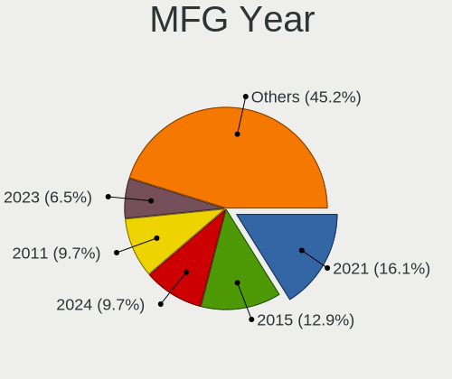

KDE neon Hardware Trends (Notebook)
-----------------------------------

A project to identify most popular hardware characteristics and track their change
over time based on data collected by KDE neon users at https://Linux-Hardware.org.

Anyone can contribute to the study by uploading probes of their computers by
the [hw-probe](https://github.com/linuxhw/hw-probe) tool:

    sudo -E hw-probe -all -upload

Full-feature report is available here: https://linux-hardware.org/?view=trends&formfactor=notebook

Period: Mar, 2021.

Contents
--------

- [ OS                       ](#os)
- [ OS Family                ](#os-family)
- [ Kernel                   ](#kernel)
- [ Kernel Family            ](#kernel-family)
- [ Kernel Major Ver.        ](#kernel-major-ver)
- [ Arch                     ](#arch)
- [ DE                       ](#de)
- [ Display Server           ](#display-server)
- [ Display Manager          ](#display-manager)
- [ OS Lang                  ](#os-lang)
- [ Boot Mode                ](#boot-mode)
- [ Filesystem               ](#filesystem)
- [ Part. scheme             ](#part-scheme)
- [ Dual Boot with Linux/BSD ](#dual-boot-with-linux/bsd)
- [ Dual Boot (Win)          ](#dual-boot-win)
- [ Country                  ](#country)
- [ City                     ](#city)
- [ Vendor                   ](#vendor)
- [ Model                    ](#model)
- [ Model Family             ](#model-family)
- [ MFG Year                 ](#mfg-year)
- [ Form Factor              ](#form-factor)
- [ Secure Boot              ](#secure-boot)
- [ Coreboot                 ](#coreboot)
- [ RAM Size                 ](#ram-size)
- [ RAM Used                 ](#ram-used)
- [ Has CD-ROM               ](#has-cd-rom)
- [ Total Drives             ](#total-drives)
- [ Has Ethernet             ](#has-ethernet)
- [ Has WiFi                 ](#has-wifi)
- [ Has Bluetooth            ](#has-bluetooth)
- [ Drive Vendor             ](#drive-vendor)
- [ Drive Model              ](#drive-model)
- [ HDD Vendor               ](#hdd-vendor)
- [ SSD Vendor               ](#ssd-vendor)
- [ Drive Kind               ](#drive-kind)
- [ Drive Connector          ](#drive-connector)
- [ Drive Size               ](#drive-size)
- [ Space Total              ](#space-total)
- [ Space Used               ](#space-used)
- [ Malfunc. Drives          ](#malfunc-drives)
- [ Malfunc. Drive Vendor    ](#malfunc-drive-vendor)
- [ Malfunc. HDD Vendor      ](#malfunc-hdd-vendor)
- [ Malfunc. Drive Kind      ](#malfunc-drive-kind)
- [ Failed Drives            ](#failed-drives)
- [ Failed Drive Vendor      ](#failed-drive-vendor)
- [ Drive Status             ](#drive-status)
- [ Storage Vendor           ](#storage-vendor)
- [ Storage Model            ](#storage-model)
- [ Storage Kind             ](#storage-kind)
- [ CPU Vendor               ](#cpu-vendor)
- [ CPU Model                ](#cpu-model)
- [ CPU Model Family         ](#cpu-model-family)
- [ CPU Cores                ](#cpu-cores)
- [ CPU Sockets              ](#cpu-sockets)
- [ CPU Threads              ](#cpu-threads)
- [ CPU Op-Modes             ](#cpu-op-modes)
- [ CPU Microcode            ](#cpu-microcode)
- [ CPU Microarch            ](#cpu-microarch)
- [ GPU Vendor               ](#gpu-vendor)
- [ GPU Model                ](#gpu-model)
- [ GPU Combo                ](#gpu-combo)
- [ GPU Driver               ](#gpu-driver)
- [ GPU Memory               ](#gpu-memory)
- [ Monitor Vendor           ](#monitor-vendor)
- [ Monitor Model            ](#monitor-model)
- [ Monitor Resolution       ](#monitor-resolution)
- [ Monitor Diagonal         ](#monitor-diagonal)
- [ Monitor Width            ](#monitor-width)
- [ Aspect Ratio             ](#aspect-ratio)
- [ Monitor Area             ](#monitor-area)
- [ Pixel Density            ](#pixel-density)
- [ Multiple Monitors        ](#multiple-monitors)
- [ Net Controller Vendor    ](#net-controller-vendor)
- [ Net Controller Model     ](#net-controller-model)
- [ Wireless Vendor          ](#wireless-vendor)
- [ Wireless Model           ](#wireless-model)
- [ Ethernet Vendor          ](#ethernet-vendor)
- [ Ethernet Model           ](#ethernet-model)
- [ Net Controller Kind      ](#net-controller-kind)
- [ Used Controller          ](#used-controller)
- [ NICs                     ](#nics)
- [ IPv6                     ](#ipv6)
- [ Memory Vendor            ](#memory-vendor)
- [ Memory Model             ](#memory-model)
- [ Memory Kind              ](#memory-kind)
- [ Memory Form Factor       ](#memory-form-factor)
- [ Memory Size              ](#memory-size)
- [ Memory Speed             ](#memory-speed)
- [ Sound Vendor             ](#sound-vendor)
- [ Sound Model              ](#sound-model)
- [ Camera Vendor            ](#camera-vendor)
- [ Camera Model             ](#camera-model)
- [ Fingerprint Vendor       ](#fingerprint-vendor)
- [ Fingerprint Model        ](#fingerprint-model)
- [ Chipcard Vendor          ](#chipcard-vendor)
- [ Chipcard Model           ](#chipcard-model)
- [ Printer Vendor           ](#printer-vendor)
- [ Printer Model            ](#printer-model)
- [ Scanner Vendor           ](#scanner-vendor)
- [ Scanner Model            ](#scanner-model)
- [ Bluetooth Vendor         ](#bluetooth-vendor)
- [ Bluetooth Model          ](#bluetooth-model)
- [ Unsupported Devices      ](#unsupported-devices)
- [ Unsupported Device Types ](#unsupported-device-types)

OS
--

Installed operating systems

| Name           | Notebooks | Percent |
|----------------|-----------|---------|
| KDE neon 20.04 | 92        | 100%    |

OS Family
---------

OS without a version

| Name     | Notebooks | Percent |
|----------|-----------|---------|
| KDE neon | 92        | 100%    |

Kernel
------

Version of the Linux kernel

| Version                  | Notebooks | Percent |
|--------------------------|-----------|---------|
| 5.4.0-66-generic         | 46        | 50%     |
| 5.4.0-70-generic         | 18        | 19.57%  |
| 5.4.0-67-generic         | 18        | 19.57%  |
| 5.10.23-xanmod1          | 2         | 2.17%   |
| 5.8.0-7642-generic       | 1         | 1.09%   |
| 5.8.0-48-generic         | 1         | 1.09%   |
| 5.8.0-45-generic         | 1         | 1.09%   |
| 5.8.0-44-generic         | 1         | 1.09%   |
| 5.4.0-53-generic         | 1         | 1.09%   |
| 5.4.0-52-generic         | 1         | 1.09%   |
| 5.11.0-051100-lowlatency | 1         | 1.09%   |
| 5.10.20-xanmod1          | 1         | 1.09%   |

Kernel Family
-------------

Linux kernel without a distro release

| Version | Notebooks | Percent |
|---------|-----------|---------|
| 5.4.0   | 84        | 91.3%   |
| 5.8.0   | 4         | 4.35%   |
| 5.10.23 | 2         | 2.17%   |
| 5.11.0  | 1         | 1.09%   |
| 5.10.20 | 1         | 1.09%   |

Kernel Major Ver.
-----------------

Linux kernel major version

| Version | Notebooks | Percent |
|---------|-----------|---------|
| 5.4     | 84        | 91.3%   |
| 5.8     | 4         | 4.35%   |
| 5.10    | 3         | 3.26%   |
| 5.11    | 1         | 1.09%   |

Arch
----

OS architecture (x86_64, i586, etc.)

| Name   | Notebooks | Percent |
|--------|-----------|---------|
| x86_64 | 92        | 100%    |

DE
--

Desktop Environment

| Name    | Notebooks | Percent |
|---------|-----------|---------|
| KDE     | 82        | 89.13%  |
| KDE5    | 6         | 6.52%   |
| Unknown | 4         | 4.35%   |

Display Server
--------------

X11 or Wayland

| Name    | Notebooks | Percent |
|---------|-----------|---------|
| X11     | 87        | 94.57%  |
| Wayland | 4         | 4.35%   |
| Tty     | 1         | 1.09%   |

Display Manager
---------------

SDDM, LightDM, etc.

| Name    | Notebooks | Percent |
|---------|-----------|---------|
| Unknown | 86        | 93.48%  |
| SDDM    | 6         | 6.52%   |

OS Lang
-------

Language

| Lang  | Notebooks | Percent |
|-------|-----------|---------|
| en_US | 31        | 33.7%   |
| ru_RU | 13        | 14.13%  |
| pt_BR | 7         | 7.61%   |
| es_ES | 7         | 7.61%   |
| de_DE | 6         | 6.52%   |
| en_IN | 5         | 5.43%   |
| it_IT | 3         | 3.26%   |
| pt_PT | 2         | 2.17%   |
| es_US | 2         | 2.17%   |
| en_GB | 2         | 2.17%   |
| uk_UA | 1         | 1.09%   |
| sv_SE | 1         | 1.09%   |
| ro_RO | 1         | 1.09%   |
| pl_PL | 1         | 1.09%   |
| hu_HU | 1         | 1.09%   |
| es_VE | 1         | 1.09%   |
| es_PY | 1         | 1.09%   |
| es_PE | 1         | 1.09%   |
| es_EC | 1         | 1.09%   |
| es_CL | 1         | 1.09%   |
| en_NZ | 1         | 1.09%   |
| en_CA | 1         | 1.09%   |
| cs_CZ | 1         | 1.09%   |
| C     | 1         | 1.09%   |

Boot Mode
---------

EFI or BIOS

| Mode | Notebooks | Percent |
|------|-----------|---------|
| EFI  | 49        | 53.26%  |
| BIOS | 43        | 46.74%  |

Filesystem
----------

Type of filesystem

| Type    | Notebooks | Percent |
|---------|-----------|---------|
| Ext4    | 88        | 95.65%  |
| Btrfs   | 3         | 3.26%   |
| Overlay | 1         | 1.09%   |

Part. scheme
------------

Scheme of partitioning

| Type    | Notebooks | Percent |
|---------|-----------|---------|
| Unknown | 86        | 93.48%  |
| MBR     | 3         | 3.26%   |
| GPT     | 3         | 3.26%   |

Dual Boot with Linux/BSD
------------------------

Hosting more than one Linux/BSD

| Dual boot | Notebooks | Percent |
|-----------|-----------|---------|
| No        | 86        | 93.48%  |
| Yes       | 6         | 6.52%   |

Dual Boot (Win)
---------------

Hosting Linux and Windows

| Dual boot | Notebooks | Percent |
|-----------|-----------|---------|
| No        | 81        | 88.04%  |
| Yes       | 11        | 11.96%  |

Country
-------

Geographic location (country)

| Country     | Notebooks | Percent |
|-------------|-----------|---------|
| USA         | 17        | 18.48%  |
| Russia      | 11        | 11.96%  |
| Brazil      | 8         | 8.7%    |
| Spain       | 7         | 7.61%   |
| Germany     | 6         | 6.52%   |
| India       | 5         | 5.43%   |
| Ukraine     | 3         | 3.26%   |
| Italy       | 3         | 3.26%   |
| UK          | 2         | 2.17%   |
| Sweden      | 2         | 2.17%   |
| Romania     | 2         | 2.17%   |
| Portugal    | 2         | 2.17%   |
| Norway      | 2         | 2.17%   |
| Netherlands | 2         | 2.17%   |
| Kazakhstan  | 2         | 2.17%   |
| Canada      | 2         | 2.17%   |
| Venezuela   | 1         | 1.09%   |
| Uruguay     | 1         | 1.09%   |
| Poland      | 1         | 1.09%   |
| Peru        | 1         | 1.09%   |
| Lithuania   | 1         | 1.09%   |
| Latvia      | 1         | 1.09%   |
| Iran        | 1         | 1.09%   |
| Hungary     | 1         | 1.09%   |
| Estonia     | 1         | 1.09%   |
| Ecuador     | 1         | 1.09%   |
| Czechia     | 1         | 1.09%   |
| Cuba        | 1         | 1.09%   |
| Croatia     | 1         | 1.09%   |
| China       | 1         | 1.09%   |
| Chile       | 1         | 1.09%   |
| Argentina   | 1         | 1.09%   |

City
----

Geographic location (city)

| City                       | Notebooks | Percent |
|----------------------------|-----------|---------|
| St Petersburg              | 2         | 2.17%   |
| Salvador                   | 2         | 2.17%   |
| Maringá                   | 2         | 2.17%   |
| Los Palacios y Villafranca | 2         | 2.17%   |
| Amsterdam                  | 2         | 2.17%   |
| Zaporizhzhya               | 1         | 1.09%   |
| Yekaterinburg              | 1         | 1.09%   |
| Yaroslavl                  | 1         | 1.09%   |
| Woonsocket                 | 1         | 1.09%   |
| Wichita                    | 1         | 1.09%   |
| Wasilla                    | 1         | 1.09%   |
| Voronezh                   | 1         | 1.09%   |
| Vilyuchinsk                | 1         | 1.09%   |
| Ulan-Ude                   | 1         | 1.09%   |
| Ufa                        | 1         | 1.09%   |
| Târgu Jiu                 | 1         | 1.09%   |
| Toronto                    | 1         | 1.09%   |
| Thale                      | 1         | 1.09%   |
| Tehran                     | 1         | 1.09%   |
| Tallinn                    | 1         | 1.09%   |
| Stockholm                  | 1         | 1.09%   |
| Springfield                | 1         | 1.09%   |
| Songjiang                  | 1         | 1.09%   |
| Setúbal                   | 1         | 1.09%   |
| San Mateo                  | 1         | 1.09%   |
| Rudolstadt                 | 1         | 1.09%   |
| Rochester                  | 1         | 1.09%   |
| River Falls                | 1         | 1.09%   |
| Riga                       | 1         | 1.09%   |
| Ribeirão das Neves        | 1         | 1.09%   |
| Quito                      | 1         | 1.09%   |
| Pune                       | 1         | 1.09%   |
| Prague                     | 1         | 1.09%   |
| Plauen                     | 1         | 1.09%   |
| Peoria                     | 1         | 1.09%   |
| Orsago                     | 1         | 1.09%   |
| Orlando                    | 1         | 1.09%   |
| Onda                       | 1         | 1.09%   |
| Nur-Sultan                 | 1         | 1.09%   |
| Novy Urengoy               | 1         | 1.09%   |
| Nichelino                  | 1         | 1.09%   |
| Mérida                    | 1         | 1.09%   |
| Munich                     | 1         | 1.09%   |
| Moscow                     | 1         | 1.09%   |
| Montevideo                 | 1         | 1.09%   |
| Moelv                      | 1         | 1.09%   |
| Mjoelby                    | 1         | 1.09%   |
| London                     | 1         | 1.09%   |
| Lisbon                     | 1         | 1.09%   |
| Lake Havasu City           | 1         | 1.09%   |
| L'Hospitalet de Llobregat  | 1         | 1.09%   |
| Kyiv                       | 1         | 1.09%   |
| Krapina                    | 1         | 1.09%   |
| Krakow                     | 1         | 1.09%   |
| Kitchener                  | 1         | 1.09%   |
| Keller                     | 1         | 1.09%   |
| Karaganda                  | 1         | 1.09%   |
| Janesville                 | 1         | 1.09%   |
| Ivano-Frankivsk            | 1         | 1.09%   |
| Hyderabad                  | 1         | 1.09%   |

Vendor
------

Motherboard manufacturer

| Name                | Notebooks | Percent |
|---------------------|-----------|---------|
| Hewlett-Packard     | 21        | 22.83%  |
| Dell                | 18        | 19.57%  |
| Lenovo              | 17        | 18.48%  |
| ASUSTek Computer    | 10        | 10.87%  |
| Acer                | 10        | 10.87%  |
| Apple               | 4         | 4.35%   |
| Samsung Electronics | 3         | 3.26%   |
| HUAWEI              | 2         | 2.17%   |
| Toshiba             | 1         | 1.09%   |
| System76            | 1         | 1.09%   |
| Sony                | 1         | 1.09%   |
| MSI                 | 1         | 1.09%   |
| Medion              | 1         | 1.09%   |
| HASEE Computer      | 1         | 1.09%   |
| Unknown             | 1         | 1.09%   |

Model
-----

Motherboard model

| Name                                     | Notebooks | Percent |
|------------------------------------------|-----------|---------|
| HP Pavilion dv6                          | 2         | 2.17%   |
| Toshiba Satellite A665                   | 1         | 1.09%   |
| System76 Galago Pro                      | 1         | 1.09%   |
| Sony VGN-FZ31M                           | 1         | 1.09%   |
| Samsung R510/P510                        | 1         | 1.09%   |
| Samsung 550P5C/550P7C                    | 1         | 1.09%   |
| Samsung 300E5M/300E5L                    | 1         | 1.09%   |
| MSI GL65 Leopard 10SCXR                  | 1         | 1.09%   |
| Medion E2216T MD99940                    | 1         | 1.09%   |
| Lenovo Yoga Slim 7 14ARE05 82A2          | 1         | 1.09%   |
| Lenovo V310-15ISK 80SY                   | 1         | 1.09%   |
| Lenovo ThinkPad Yoga 11e 20DAS02M00      | 1         | 1.09%   |
| Lenovo ThinkPad X230 23301G3             | 1         | 1.09%   |
| Lenovo ThinkPad X1 Carbon 6th 20KGS3AC00 | 1         | 1.09%   |
| Lenovo ThinkPad T440 20B7000HUS          | 1         | 1.09%   |
| Lenovo ThinkPad T15 Gen 1 20S6005JMH     | 1         | 1.09%   |
| Lenovo ThinkPad L450 20DSS1G604          | 1         | 1.09%   |
| Lenovo Legion 5 15IMH05H 82CF            | 1         | 1.09%   |
| Lenovo IdeaPad L340-17IRH Gaming 81LL    | 1         | 1.09%   |
| Lenovo IdeaPad 3 15IIL05 81WE            | 1         | 1.09%   |
| Lenovo IdeaPad 3 14ADA05 81W0            | 1         | 1.09%   |
| Lenovo G780                              | 1         | 1.09%   |
| Lenovo G700 20251                        | 1         | 1.09%   |
| Lenovo G570 20079                        | 1         | 1.09%   |
| Lenovo G510 20238                        | 1         | 1.09%   |
| Lenovo G500 20236                        | 1         | 1.09%   |
| HUAWEI NBLK-WAX9X                        | 1         | 1.09%   |
| HUAWEI HN-WX9X                           | 1         | 1.09%   |
| HP ZBook 15u G3                          | 1         | 1.09%   |
| HP ProBook 650 G1                        | 1         | 1.09%   |
| HP ProBook 6460b                         | 1         | 1.09%   |
| HP ProBook 4540s                         | 1         | 1.09%   |
| HP Pavilion dv7                          | 1         | 1.09%   |
| HP OMEN by HP Laptop 15-dh0xxx           | 1         | 1.09%   |
| HP Notebook                              | 1         | 1.09%   |
| HP Laptop 17-bs0xx                       | 1         | 1.09%   |
| HP Laptop 17-ak0xx                       | 1         | 1.09%   |
| HP Laptop 15s-eq0xxx                     | 1         | 1.09%   |
| HP Laptop 15-db0xxx                      | 1         | 1.09%   |
| HP ENVY Notebook                         | 1         | 1.09%   |
| HP ENVY m6                               | 1         | 1.09%   |
| HP EliteBook 8560p                       | 1         | 1.09%   |
| HP EliteBook 8470p                       | 1         | 1.09%   |
| HP Compaq Presario CQ60                  | 1         | 1.09%   |
| HP Compaq 615                            | 1         | 1.09%   |
| HP Compaq 15                             | 1         | 1.09%   |
| HP 250 G7 Notebook PC                    | 1         | 1.09%   |
| HASEE HEC41                              | 1         | 1.09%   |
| Dell XPS L321X                           | 1         | 1.09%   |
| Dell XPS 15 9570                         | 1         | 1.09%   |
| Dell Vostro 1520                         | 1         | 1.09%   |
| Dell Studio XPS 1645                     | 1         | 1.09%   |
| Dell Latitude E6530                      | 1         | 1.09%   |
| Dell Latitude E6430                      | 1         | 1.09%   |
| Dell Latitude E6400                      | 1         | 1.09%   |
| Dell Latitude E5420                      | 1         | 1.09%   |
| Dell Latitude E4310                      | 1         | 1.09%   |
| Dell Latitude D630                       | 1         | 1.09%   |
| Dell Latitude 7390                       | 1         | 1.09%   |
| Dell Latitude 7380                       | 1         | 1.09%   |

Model Family
------------

Motherboard model prefix

| Name               | Notebooks | Percent |
|--------------------|-----------|---------|
| Dell Latitude      | 9         | 9.78%   |
| Acer Aspire        | 9         | 9.78%   |
| Lenovo ThinkPad    | 6         | 6.52%   |
| Dell Inspiron      | 5         | 5.43%   |
| HP Laptop          | 4         | 4.35%   |
| Lenovo IdeaPad     | 3         | 3.26%   |
| HP ProBook         | 3         | 3.26%   |
| HP Pavilion        | 3         | 3.26%   |
| HP Compaq          | 3         | 3.26%   |
| ASUS ZenBook       | 3         | 3.26%   |
| HP ENVY            | 2         | 2.17%   |
| HP EliteBook       | 2         | 2.17%   |
| Dell XPS           | 2         | 2.17%   |
| Toshiba Satellite  | 1         | 1.09%   |
| System76 Galago    | 1         | 1.09%   |
| Sony VGN-FZ31M     | 1         | 1.09%   |
| Samsung R510       | 1         | 1.09%   |
| Samsung 550P5C     | 1         | 1.09%   |
| Samsung 300E5M     | 1         | 1.09%   |
| MSI GL65           | 1         | 1.09%   |
| Medion E2216T      | 1         | 1.09%   |
| Lenovo Yoga        | 1         | 1.09%   |
| Lenovo V310-15ISK  | 1         | 1.09%   |
| Lenovo Legion      | 1         | 1.09%   |
| Lenovo G780        | 1         | 1.09%   |
| Lenovo G700        | 1         | 1.09%   |
| Lenovo G570        | 1         | 1.09%   |
| Lenovo G510        | 1         | 1.09%   |
| Lenovo G500        | 1         | 1.09%   |
| HUAWEI NBLK-WAX9X  | 1         | 1.09%   |
| HUAWEI HN-WX9X     | 1         | 1.09%   |
| HP ZBook           | 1         | 1.09%   |
| HP OMEN            | 1         | 1.09%   |
| HP Notebook        | 1         | 1.09%   |
| HP 250             | 1         | 1.09%   |
| HASEE HEC41        | 1         | 1.09%   |
| Dell Vostro        | 1         | 1.09%   |
| Dell Studio        | 1         | 1.09%   |
| ASUS X555DA        | 1         | 1.09%   |
| ASUS X550WE        | 1         | 1.09%   |
| ASUS X450LCP       | 1         | 1.09%   |
| ASUS VivoBook      | 1         | 1.09%   |
| ASUS S301LA        | 1         | 1.09%   |
| ASUS GL552JX       | 1         | 1.09%   |
| ASUS G750JX        | 1         | 1.09%   |
| Apple MacBookPro8  | 1         | 1.09%   |
| Apple MacBookPro12 | 1         | 1.09%   |
| Apple MacBook5     | 1         | 1.09%   |
| Apple MacBook10    | 1         | 1.09%   |
| Acer Predator      | 1         | 1.09%   |
| Unknown            | 1         | 1.09%   |

MFG Year
--------

Motherboard manufacture year

| Year | Notebooks | Percent |
|------|-----------|---------|
| 2020 | 23        | 25%     |
| 2019 | 10        | 10.87%  |
| 2013 | 10        | 10.87%  |
| 2018 | 8         | 8.7%    |
| 2012 | 7         | 7.61%   |
| 2017 | 6         | 6.52%   |
| 2011 | 6         | 6.52%   |
| 2015 | 4         | 4.35%   |
| 2014 | 4         | 4.35%   |
| 2009 | 4         | 4.35%   |
| 2016 | 3         | 3.26%   |
| 2010 | 3         | 3.26%   |
| 2021 | 2         | 2.17%   |
| 2008 | 1         | 1.09%   |
| 2007 | 1         | 1.09%   |

Form Factor
-----------

Physical design of the computer

| Name     | Notebooks | Percent |
|----------|-----------|---------|
| Notebook | 92        | 100%    |

Secure Boot
-----------

Enabled or disabled

| State    | Notebooks | Percent |
|----------|-----------|---------|
| Disabled | 83        | 90.22%  |
| Enabled  | 9         | 9.78%   |

Coreboot
--------

Have coreboot on board

| Used | Notebooks | Percent |
|------|-----------|---------|
| No   | 91        | 98.91%  |
| Yes  | 1         | 1.09%   |

RAM Size
--------

Total RAM memory

| Size in GB  | Notebooks | Percent |
|-------------|-----------|---------|
| 4.01-8.0    | 27        | 29.35%  |
| 3.01-4.0    | 24        | 26.09%  |
| 8.01-16.0   | 22        | 23.91%  |
| 16.01-24.0  | 12        | 13.04%  |
| 32.01-64.0  | 3         | 3.26%   |
| 1.01-2.0    | 3         | 3.26%   |
| 64.01-256.0 | 1         | 1.09%   |

RAM Used
--------

Used RAM memory

| Used GB    | Notebooks | Percent |
|------------|-----------|---------|
| 1.01-2.0   | 44        | 47.83%  |
| 2.01-3.0   | 21        | 22.83%  |
| 3.01-4.0   | 10        | 10.87%  |
| 4.01-8.0   | 9         | 9.78%   |
| 0.51-1.0   | 5         | 5.43%   |
| 8.01-16.0  | 2         | 2.17%   |
| 24.01-32.0 | 1         | 1.09%   |

Has CD-ROM
----------

Has CD-ROM on board

| Presented | Notebooks | Percent |
|-----------|-----------|---------|
| Yes       | 50        | 54.35%  |
| No        | 42        | 45.65%  |

Total Drives
------------

Number of drives on board

| Drives | Notebooks | Percent |
|--------|-----------|---------|
| 1      | 68        | 73.91%  |
| 2      | 22        | 23.91%  |
| 3      | 2         | 2.17%   |

Has Ethernet
------------

Has Ethernet on board

| Presented | Notebooks | Percent |
|-----------|-----------|---------|
| Yes       | 78        | 84.78%  |
| No        | 14        | 15.22%  |

Has WiFi
--------

Has WiFi module

| Presented | Notebooks | Percent |
|-----------|-----------|---------|
| Yes       | 92        | 100%    |

Has Bluetooth
-------------

Has Bluetooth module

| Presented | Notebooks | Percent |
|-----------|-----------|---------|
| Yes       | 71        | 77.17%  |
| No        | 21        | 22.83%  |

Drive Vendor
------------

Hard drive vendors

| Vendor                | Notebooks | Drives | Percent |
|-----------------------|-----------|--------|---------|
| Toshiba               | 19        | 19     | 16.96%  |
| Samsung Electronics   | 17        | 18     | 15.18%  |
| Seagate               | 11        | 11     | 9.82%   |
| WDC                   | 9         | 10     | 8.04%   |
| Intel                 | 9         | 9      | 8.04%   |
| Kingston              | 8         | 8      | 7.14%   |
| Unknown               | 6         | 6      | 5.36%   |
| Sandisk               | 6         | 6      | 5.36%   |
| SK Hynix              | 3         | 3      | 2.68%   |
| Micron Technology     | 3         | 3      | 2.68%   |
| Crucial               | 3         | 3      | 2.68%   |
| PNY                   | 2         | 2      | 1.79%   |
| HGST                  | 2         | 2      | 1.79%   |
| China                 | 2         | 2      | 1.79%   |
| Apple                 | 2         | 3      | 1.79%   |
| Transcend             | 1         | 1      | 0.89%   |
| SPCC                  | 1         | 1      | 0.89%   |
| Realtek Semiconductor | 1         | 1      | 0.89%   |
| PLEXTOR               | 1         | 1      | 0.89%   |
| Netac                 | 1         | 1      | 0.89%   |
| LONDISK               | 1         | 1      | 0.89%   |
| LITEON                | 1         | 1      | 0.89%   |
| Hitachi               | 1         | 1      | 0.89%   |
| GOODRAM               | 1         | 1      | 0.89%   |
| Corsair               | 1         | 1      | 0.89%   |

Drive Model
-----------

Hard drive models

| Model                                | Notebooks | Percent |
|--------------------------------------|-----------|---------|
| Toshiba MQ01ABD100 1TB               | 5         | 4.35%   |
| Unknown MMC Card  64GB               | 4         | 3.48%   |
| Kingston SA400S37480G 480GB SSD      | 4         | 3.48%   |
| SK Hynix NVMe SSD Drive 512GB        | 3         | 2.61%   |
| Samsung SSD 860 EVO 500GB            | 3         | 2.61%   |
| Samsung NVMe SSD Drive 256GB         | 3         | 2.61%   |
| Kingston SA400S37240G 240GB SSD      | 3         | 2.61%   |
| Toshiba MQ01ABF050 500GB             | 2         | 1.74%   |
| Toshiba MK3263GSXN 320GB             | 2         | 1.74%   |
| Seagate ST9500325AS 500GB            | 2         | 1.74%   |
| Seagate ST500LM012 HN-M500MBB 500GB  | 2         | 1.74%   |
| Seagate ST1000LM049-2GH172 1TB       | 2         | 1.74%   |
| Samsung NVMe SSD Drive 1TB           | 2         | 1.74%   |
| Intel NVMe SSD Drive 1024GB          | 2         | 1.74%   |
| WDC WDS500G3X0C-00SJG0 500GB         | 1         | 0.87%   |
| WDC WDS500G2B0A-00SM50 500GB SSD     | 1         | 0.87%   |
| WDC WDS480G2G0A-00JH30 480GB SSD     | 1         | 0.87%   |
| WDC WDS100T2B0C-00PXH0 1TB           | 1         | 0.87%   |
| WDC WD5000LPCX-60VHAT0 500GB         | 1         | 0.87%   |
| WDC WD5000LPCX-24VHAT0 500GB         | 1         | 0.87%   |
| WDC WD5000BPVT-60HXZT3 500GB         | 1         | 0.87%   |
| WDC WD5000BPKT-75PK4T0 500GB         | 1         | 0.87%   |
| WDC WD3200BEVT-60ZCT1 320GB          | 1         | 0.87%   |
| WDC WD3200BEVT-22ZCT0 320GB          | 1         | 0.87%   |
| Unknown SD/MMC/MS PRO 128GB          | 1         | 0.87%   |
| Unknown MMC Card  7GB                | 1         | 0.87%   |
| Transcend TS120GSSD220S 120GB        | 1         | 0.87%   |
| Toshiba NVMe SSD Drive 512GB         | 1         | 0.87%   |
| Toshiba NVMe SSD Drive 256GB         | 1         | 0.87%   |
| Toshiba MQ04ABF100 1TB               | 1         | 0.87%   |
| Toshiba MQ01ABD100V 1TB              | 1         | 0.87%   |
| Toshiba MQ01ABD032 320GB             | 1         | 0.87%   |
| Toshiba MK6465GSX 640GB              | 1         | 0.87%   |
| Toshiba MK5065GSX 500GB              | 1         | 0.87%   |
| Toshiba MK3261GSYN 320GB             | 1         | 0.87%   |
| Toshiba MK1655GSXF 160GB             | 1         | 0.87%   |
| Toshiba MK1059GSMP 1TB               | 1         | 0.87%   |
| SPCC SSD162 120GB                    | 1         | 0.87%   |
| Seagate ST980313AS 80GB              | 1         | 0.87%   |
| Seagate ST500LT012-9WS142 500GB      | 1         | 0.87%   |
| Seagate ST332062 0AS 320GB           | 1         | 0.87%   |
| Seagate ST2000LM003 HN-M201RAD 2TB   | 1         | 0.87%   |
| Seagate ST1000LM024 HN-M101MBB 1TB   | 1         | 0.87%   |
| SanDisk SDSSDP128G 128GB             | 1         | 0.87%   |
| SanDisk SDSSDH3 1T00 1TB             | 1         | 0.87%   |
| SanDisk SD8SN8U-128G-1006 128GB SSD  | 1         | 0.87%   |
| SanDisk SD8SBBU120G1122 120GB SSD    | 1         | 0.87%   |
| Sandisk NVMe SSD Drive 512GB         | 1         | 0.87%   |
| Sandisk NVMe SSD Drive 256GB         | 1         | 0.87%   |
| Samsung SSD PM830 mSATA 128GB        | 1         | 0.87%   |
| Samsung SSD PM810 TH 64GB            | 1         | 0.87%   |
| Samsung SSD 970 EVO 500GB            | 1         | 0.87%   |
| Samsung SSD 870 EVO 1TB              | 1         | 0.87%   |
| Samsung SSD 860 EVO 1TB              | 1         | 0.87%   |
| Samsung SSD 850 EVO 500GB            | 1         | 0.87%   |
| Samsung MZNTY128HDHP-000H1 128GB SSD | 1         | 0.87%   |
| Samsung MZ7TE128HMGR-000L1 128GB SSD | 1         | 0.87%   |
| Samsung MZ7LH960HAJR-00005 960GB SSD | 1         | 0.87%   |
| Samsung HM250HI 250GB                | 1         | 0.87%   |
| Realtek NVMe SSD Drive 512GB         | 1         | 0.87%   |

HDD Vendor
----------

Hard disk drive vendors

| Vendor              | Notebooks | Drives | Percent |
|---------------------|-----------|--------|---------|
| Toshiba             | 17        | 17     | 44.74%  |
| Seagate             | 11        | 11     | 28.95%  |
| WDC                 | 6         | 6      | 15.79%  |
| HGST                | 2         | 2      | 5.26%   |
| Samsung Electronics | 1         | 1      | 2.63%   |
| Hitachi             | 1         | 1      | 2.63%   |

SSD Vendor
----------

Solid state drive vendors

| Vendor              | Notebooks | Drives | Percent |
|---------------------|-----------|--------|---------|
| Samsung Electronics | 12        | 12     | 26.67%  |
| Kingston            | 8         | 8      | 17.78%  |
| SanDisk             | 4         | 4      | 8.89%   |
| Intel               | 3         | 3      | 6.67%   |
| Crucial             | 3         | 3      | 6.67%   |
| WDC                 | 2         | 2      | 4.44%   |
| PNY                 | 2         | 2      | 4.44%   |
| Micron Technology   | 2         | 2      | 4.44%   |
| China               | 2         | 2      | 4.44%   |
| Transcend           | 1         | 1      | 2.22%   |
| SPCC                | 1         | 1      | 2.22%   |
| PLEXTOR             | 1         | 1      | 2.22%   |
| LONDISK             | 1         | 1      | 2.22%   |
| GOODRAM             | 1         | 1      | 2.22%   |
| Corsair             | 1         | 1      | 2.22%   |
| Apple               | 1         | 1      | 2.22%   |

Drive Kind
----------

HDD or SSD

| Kind    | Notebooks | Drives | Percent |
|---------|-----------|--------|---------|
| SSD     | 43        | 45     | 39.09%  |
| HDD     | 37        | 38     | 33.64%  |
| NVMe    | 23        | 25     | 20.91%  |
| MMC     | 5         | 5      | 4.55%   |
| Unknown | 2         | 2      | 1.82%   |

Drive Connector
---------------

SATA, SAS, NVMe, etc.

| Type | Notebooks | Drives | Percent |
|------|-----------|--------|---------|
| SATA | 74        | 81     | 69.81%  |
| NVMe | 23        | 25     | 21.7%   |
| MMC  | 5         | 5      | 4.72%   |
| SAS  | 4         | 4      | 3.77%   |

Drive Size
----------

Size of hard drive

| Size in TB | Notebooks | Drives | Percent |
|------------|-----------|--------|---------|
| 0.01-0.5   | 56        | 61     | 71.79%  |
| 0.51-1.0   | 21        | 21     | 26.92%  |
| 1.01-2.0   | 1         | 1      | 1.28%   |

Space Total
-----------

Amount of disk space available on the file system

| Size in GB     | Notebooks | Percent |
|----------------|-----------|---------|
| 101-250        | 28        | 30.43%  |
| 251-500        | 27        | 29.35%  |
| 501-1000       | 14        | 15.22%  |
| 51-100         | 9         | 9.78%   |
| 21-50          | 4         | 4.35%   |
| Unknown        | 4         | 4.35%   |
| 1-20           | 3         | 3.26%   |
| 1001-2000      | 2         | 2.17%   |
| More than 3000 | 1         | 1.09%   |

Space Used
----------

Amount of used disk space

| Used GB   | Notebooks | Percent |
|-----------|-----------|---------|
| 1-20      | 45        | 48.91%  |
| 21-50     | 19        | 20.65%  |
| 51-100    | 8         | 8.7%    |
| 251-500   | 7         | 7.61%   |
| 101-250   | 7         | 7.61%   |
| Unknown   | 4         | 4.35%   |
| 1001-2000 | 1         | 1.09%   |
| 501-1000  | 1         | 1.09%   |

Malfunc. Drives
---------------

Drive models with a malfunction

| Model                      | Notebooks | Drives | Percent |
|----------------------------|-----------|--------|---------|
| Toshiba MQ01ABD032 320GB   | 1         | 1      | 50%     |
| Corsair Force GS 240GB SSD | 1         | 1      | 50%     |

Malfunc. Drive Vendor
---------------------

Vendors of faulty drives

| Vendor  | Notebooks | Drives | Percent |
|---------|-----------|--------|---------|
| Toshiba | 1         | 1      | 50%     |
| Corsair | 1         | 1      | 50%     |

Malfunc. HDD Vendor
-------------------

Vendors of faulty HDD drives

| Vendor  | Notebooks | Drives | Percent |
|---------|-----------|--------|---------|
| Toshiba | 1         | 1      | 100%    |

Malfunc. Drive Kind
-------------------

Kinds of faulty drives

| Kind | Notebooks | Drives | Percent |
|------|-----------|--------|---------|
| SSD  | 1         | 1      | 50%     |
| HDD  | 1         | 1      | 50%     |

Failed Drives
-------------

Failed drive models

Zero info for selected period =(

Failed Drive Vendor
-------------------

Failed drive vendors

Zero info for selected period =(

Drive Status
------------

Number of failed and malfunc. drives

| Status   | Notebooks | Drives | Percent |
|----------|-----------|--------|---------|
| Detected | 85        | 105    | 91.4%   |
| Works    | 6         | 8      | 6.45%   |
| Malfunc  | 2         | 2      | 2.15%   |

Storage Vendor
--------------

Storage controller vendors

| Vendor                       | Notebooks | Percent |
|------------------------------|-----------|---------|
| Intel                        | 69        | 68.32%  |
| AMD                          | 12        | 11.88%  |
| Samsung Electronics          | 6         | 5.94%   |
| SK Hynix                     | 3         | 2.97%   |
| Sandisk                      | 3         | 2.97%   |
| Toshiba America Info Systems | 2         | 1.98%   |
| Nvidia                       | 2         | 1.98%   |
| Realtek Semiconductor        | 1         | 0.99%   |
| Micron Technology            | 1         | 0.99%   |
| Lite-On Technology           | 1         | 0.99%   |
| Apple                        | 1         | 0.99%   |

Storage Model
-------------

Storage controller models

| Model                                                                          | Notebooks | Percent |
|--------------------------------------------------------------------------------|-----------|---------|
| Intel 7 Series Chipset Family 6-port SATA Controller [AHCI mode]               | 13        | 11.93%  |
| Intel 82801 Mobile SATA Controller [RAID mode]                                 | 9         | 8.26%   |
| AMD FCH SATA Controller [AHCI mode]                                            | 9         | 8.26%   |
| Intel Sunrise Point-LP SATA Controller [AHCI mode]                             | 7         | 6.42%   |
| Intel 6 Series/C200 Series Chipset Family 6 port Mobile SATA AHCI Controller   | 7         | 6.42%   |
| Intel 8 Series SATA Controller 1 [AHCI mode]                                   | 5         | 4.59%   |
| Intel 8 Series/C220 Series Chipset Family 6-port SATA Controller 1 [AHCI mode] | 4         | 3.67%   |
| Samsung NVMe SSD Controller SM981/PM981/PM983                                  | 3         | 2.75%   |
| Intel SSD 660P Series                                                          | 3         | 2.75%   |
| Intel 5 Series/3400 Series Chipset 6 port SATA AHCI Controller                 | 3         | 2.75%   |
| AMD SB7x0/SB8x0/SB9x0 SATA Controller [AHCI mode]                              | 3         | 2.75%   |
| Sandisk WD Black SN750 / PC SN730 NVMe SSD                                     | 2         | 1.83%   |
| Intel Wildcat Point-LP SATA Controller [AHCI Mode]                             | 2         | 1.83%   |
| Intel Volume Management Device NVMe RAID Controller                            | 2         | 1.83%   |
| Intel Ice Lake-LP SATA Controller [AHCI mode]                                  | 2         | 1.83%   |
| Intel Cannon Lake Mobile PCH SATA AHCI Controller                              | 2         | 1.83%   |
| Intel Atom Processor E3800 Series SATA AHCI Controller                         | 2         | 1.83%   |
| Intel 82801IBM/IEM (ICH9M/ICH9M-E) 4 port SATA Controller [AHCI mode]          | 2         | 1.83%   |
| Intel 82801HM/HEM (ICH8M/ICH8M-E) SATA Controller [AHCI mode]                  | 2         | 1.83%   |
| Intel 82801HM/HEM (ICH8M/ICH8M-E) IDE Controller                               | 2         | 1.83%   |
| Intel 5 Series/3400 Series Chipset 4 port SATA AHCI Controller                 | 2         | 1.83%   |
| Intel 400 Series Chipset Family SATA AHCI Controller                           | 2         | 1.83%   |
| Toshiba America Info Systems XG6 NVMe SSD Controller                           | 1         | 0.92%   |
| Toshiba America Info Systems BG3 NVMe SSD Controller                           | 1         | 0.92%   |
| SK Hynix Non-Volatile memory controller                                        | 1         | 0.92%   |
| SK Hynix BC511                                                                 | 1         | 0.92%   |
| SK Hynix BC501 NVMe Solid State Drive 512GB                                    | 1         | 0.92%   |
| Sandisk WD Blue SN550 NVMe SSD                                                 | 1         | 0.92%   |
| Sandisk WD Black 2018/SN750 / PC SN720 NVMe SSD                                | 1         | 0.92%   |
| Samsung NVMe SSD Controller SM951/PM951                                        | 1         | 0.92%   |
| Samsung NVMe Controller                                                        | 1         | 0.92%   |
| Samsung Electronics SATA controller                                            | 1         | 0.92%   |
| Realtek Realtek Non-Volatile memory controller                                 | 1         | 0.92%   |
| Nvidia MCP79 AHCI Controller                                                   | 1         | 0.92%   |
| Nvidia MCP78S [GeForce 8200] SATA Controller (non-AHCI mode)                   | 1         | 0.92%   |
| Nvidia MCP78S [GeForce 8200] IDE                                               | 1         | 0.92%   |
| Micron Non-Volatile memory controller                                          | 1         | 0.92%   |
| Lite-On NVMe Controller                                                        | 1         | 0.92%   |
| Intel SSD Pro 7600p/760p/E 6100p Series                                        | 1         | 0.92%   |
| Intel NVMe Optane Memory Series                                                | 1         | 0.92%   |
| Intel HM170/QM170 Chipset SATA Controller [AHCI Mode]                          | 1         | 0.92%   |
| Apple S3X NVMe Controller                                                      | 1         | 0.92%   |
| AMD SB7x0/SB8x0/SB9x0 IDE Controller                                           | 1         | 0.92%   |

Storage Kind
------------

Kind of storage controller (IDE, SATA, NVMe, SAS, ...)

| Kind | Notebooks | Percent |
|------|-----------|---------|
| SATA | 70        | 65.42%  |
| NVMe | 22        | 20.56%  |
| RAID | 11        | 10.28%  |
| IDE  | 4         | 3.74%   |

CPU Vendor
----------

Processor vendors

| Vendor | Notebooks | Percent |
|--------|-----------|---------|
| Intel  | 74        | 80.43%  |
| AMD    | 18        | 19.57%  |

CPU Model
---------

Processor models

| Model                                         | Notebooks | Percent |
|-----------------------------------------------|-----------|---------|
| Intel Core i5-2450M CPU @ 2.50GHz             | 3         | 3.26%   |
| Intel 11th Gen Core i7-1165G7 @ 2.80GHz       | 3         | 3.26%   |
| AMD Ryzen 5 3500U with Radeon Vega Mobile Gfx | 3         | 3.26%   |
| Intel Core i7-9750H CPU @ 2.60GHz             | 2         | 2.17%   |
| Intel Core i7-6500U CPU @ 2.50GHz             | 2         | 2.17%   |
| Intel Core i7-3630QM CPU @ 2.40GHz            | 2         | 2.17%   |
| Intel Core i7-10750H CPU @ 2.60GHz            | 2         | 2.17%   |
| Intel Core i5-8250U CPU @ 1.60GHz             | 2         | 2.17%   |
| Intel Core i5-4300U CPU @ 1.90GHz             | 2         | 2.17%   |
| Intel Core i5-2520M CPU @ 2.50GHz             | 2         | 2.17%   |
| Intel Core i5-1035G1 CPU @ 1.00GHz            | 2         | 2.17%   |
| Intel Core i3-6006U CPU @ 2.00GHz             | 2         | 2.17%   |
| Intel Core i3-4010U CPU @ 1.70GHz             | 2         | 2.17%   |
| Intel Core i3 CPU M 370 @ 2.40GHz             | 2         | 2.17%   |
| Intel Core 2 Duo CPU T7250 @ 2.00GHz          | 2         | 2.17%   |
| Intel Core 2 Duo CPU P8600 @ 2.40GHz          | 2         | 2.17%   |
| AMD Ryzen 7 3700U with Radeon Vega Mobile Gfx | 2         | 2.17%   |
| Intel Pentium Dual CPU T3200 @ 2.00GHz        | 1         | 1.09%   |
| Intel Pentium CPU B950 @ 2.10GHz              | 1         | 1.09%   |
| Intel Pentium CPU 2020M @ 2.40GHz             | 1         | 1.09%   |
| Intel Core i7-8750H CPU @ 2.20GHz             | 1         | 1.09%   |
| Intel Core i7-7Y75 CPU @ 1.30GHz              | 1         | 1.09%   |
| Intel Core i7-7700HQ CPU @ 2.80GHz            | 1         | 1.09%   |
| Intel Core i7-4720HQ CPU @ 2.60GHz            | 1         | 1.09%   |
| Intel Core i7-4700HQ CPU @ 2.40GHz            | 1         | 1.09%   |
| Intel Core i7-3720QM CPU @ 2.60GHz            | 1         | 1.09%   |
| Intel Core i7-3612QM CPU @ 2.10GHz            | 1         | 1.09%   |
| Intel Core i7-3537U CPU @ 2.00GHz             | 1         | 1.09%   |
| Intel Core i7-3520M CPU @ 2.90GHz             | 1         | 1.09%   |
| Intel Core i7-10510U CPU @ 1.80GHz            | 1         | 1.09%   |
| Intel Core i7 CPU Q 720 @ 1.60GHz             | 1         | 1.09%   |
| Intel Core i5-8350U CPU @ 1.70GHz             | 1         | 1.09%   |
| Intel Core i5-8265U CPU @ 1.60GHz             | 1         | 1.09%   |
| Intel Core i5-7300U CPU @ 2.60GHz             | 1         | 1.09%   |
| Intel Core i5-7200U CPU @ 2.50GHz             | 1         | 1.09%   |
| Intel Core i5-6200U CPU @ 2.30GHz             | 1         | 1.09%   |
| Intel Core i5-5257U CPU @ 2.70GHz             | 1         | 1.09%   |
| Intel Core i5-5200U CPU @ 2.20GHz             | 1         | 1.09%   |
| Intel Core i5-4210M CPU @ 2.60GHz             | 1         | 1.09%   |
| Intel Core i5-4200U CPU @ 1.60GHz             | 1         | 1.09%   |
| Intel Core i5-4200M CPU @ 2.50GHz             | 1         | 1.09%   |
| Intel Core i5-3337U CPU @ 1.80GHz             | 1         | 1.09%   |
| Intel Core i5-3320M CPU @ 2.60GHz             | 1         | 1.09%   |
| Intel Core i5-3230M CPU @ 2.60GHz             | 1         | 1.09%   |
| Intel Core i5-3210M CPU @ 2.50GHz             | 1         | 1.09%   |
| Intel Core i5-2467M CPU @ 1.60GHz             | 1         | 1.09%   |
| Intel Core i5-2415M CPU @ 2.30GHz             | 1         | 1.09%   |
| Intel Core i5 CPU M 450 @ 2.40GHz             | 1         | 1.09%   |
| Intel Core i5 CPU M 430 @ 2.27GHz             | 1         | 1.09%   |
| Intel Core i3-7020U CPU @ 2.30GHz             | 1         | 1.09%   |
| Intel Core i3-5015U CPU @ 2.10GHz             | 1         | 1.09%   |
| Intel Core i3-3110M CPU @ 2.40GHz             | 1         | 1.09%   |
| Intel Core i3-2370M CPU @ 2.40GHz             | 1         | 1.09%   |
| Intel Core i3-2348M CPU @ 2.30GHz             | 1         | 1.09%   |
| Intel Core i3-2330M CPU @ 2.20GHz             | 1         | 1.09%   |
| Intel Core 2 Duo CPU P7450 @ 2.13GHz          | 1         | 1.09%   |
| Intel Celeron CPU N2930 @ 1.83GHz             | 1         | 1.09%   |
| Intel Celeron CPU J1900 @ 1.99GHz             | 1         | 1.09%   |
| Intel Atom x5-Z8350 CPU @ 1.44GHz             | 1         | 1.09%   |
| AMD Turion X2 Dual-Core Mobile RM-74          | 1         | 1.09%   |

CPU Model Family
----------------

Processor model prefix

| Model                          | Notebooks | Percent |
|--------------------------------|-----------|---------|
| Intel Core i5                  | 29        | 31.52%  |
| Intel Core i7                  | 19        | 20.65%  |
| Intel Core i3                  | 12        | 13.04%  |
| Other                          | 5         | 5.43%   |
| Intel Core 2 Duo               | 5         | 5.43%   |
| AMD Ryzen 7                    | 3         | 3.26%   |
| AMD Ryzen 5                    | 3         | 3.26%   |
| Intel Pentium                  | 2         | 2.17%   |
| Intel Celeron                  | 2         | 2.17%   |
| AMD E1                         | 2         | 2.17%   |
| Intel Pentium Dual             | 1         | 1.09%   |
| Intel Atom                     | 1         | 1.09%   |
| AMD Turion X2 Dual-Core Mobile | 1         | 1.09%   |
| AMD Phenom II                  | 1         | 1.09%   |
| AMD E2                         | 1         | 1.09%   |
| AMD Athlon X2                  | 1         | 1.09%   |
| AMD Athlon                     | 1         | 1.09%   |
| AMD A8                         | 1         | 1.09%   |
| AMD A4                         | 1         | 1.09%   |
| AMD A10                        | 1         | 1.09%   |

CPU Cores
---------

Number of processor cores

| Number | Notebooks | Percent |
|--------|-----------|---------|
| 2      | 56        | 60.87%  |
| 4      | 29        | 31.52%  |
| 6      | 5         | 5.43%   |
| 8      | 1         | 1.09%   |
| 3      | 1         | 1.09%   |

CPU Sockets
-----------

Number of sockets

| Number | Notebooks | Percent |
|--------|-----------|---------|
| 1      | 92        | 100%    |

CPU Threads
-----------

Threads per core (Hyper-Threading)

| Number | Notebooks | Percent |
|--------|-----------|---------|
| 2      | 69        | 75%     |
| 1      | 23        | 25%     |

CPU Op-Modes
------------

CPU Operation Modes (32-bit, 64-bit)

| Op mode        | Notebooks | Percent |
|----------------|-----------|---------|
| 32-bit, 64-bit | 92        | 100%    |

CPU Microcode
-------------

Microcode number

| Number     | Notebooks | Percent |
|------------|-----------|---------|
| 0x306a9    | 11        | 11.96%  |
| 0x206a7    | 10        | 10.87%  |
| Unknown    | 6         | 6.52%   |
| 0x406e3    | 5         | 5.43%   |
| 0x08108109 | 5         | 5.43%   |
| 0x806e9    | 4         | 4.35%   |
| 0x40651    | 4         | 4.35%   |
| 0x306c3    | 4         | 4.35%   |
| 0x906ea    | 3         | 3.26%   |
| 0x806ea    | 3         | 3.26%   |
| 0x306d4    | 3         | 3.26%   |
| 0x20655    | 3         | 3.26%   |
| 0x1067a    | 3         | 3.26%   |
| 0x07030105 | 3         | 3.26%   |
| 0xa0652    | 2         | 2.17%   |
| 0x806ec    | 2         | 2.17%   |
| 0x806c1    | 2         | 2.17%   |
| 0x706e5    | 2         | 2.17%   |
| 0x6fd      | 2         | 2.17%   |
| 0x30678    | 2         | 2.17%   |
| 0x02000057 | 2         | 2.17%   |
| 0x906e9    | 1         | 1.09%   |
| 0x406c4    | 1         | 1.09%   |
| 0x20652    | 1         | 1.09%   |
| 0x106e5    | 1         | 1.09%   |
| 0x08600106 | 1         | 1.09%   |
| 0x0700010f | 1         | 1.09%   |
| 0x06006705 | 1         | 1.09%   |
| 0x06006704 | 1         | 1.09%   |
| 0x06006118 | 1         | 1.09%   |
| 0x03000027 | 1         | 1.09%   |
| 0x010000c8 | 1         | 1.09%   |

CPU Microarch
-------------

Microarchitecture

| Name            | Notebooks | Percent |
|-----------------|-----------|---------|
| KabyLake        | 13        | 14.13%  |
| IvyBridge       | 12        | 13.04%  |
| SandyBridge     | 11        | 11.96%  |
| Haswell         | 9         | 9.78%   |
| Zen+            | 5         | 5.43%   |
| Skylake         | 5         | 5.43%   |
| Westmere        | 4         | 4.35%   |
| TigerLake       | 3         | 3.26%   |
| Silvermont      | 3         | 3.26%   |
| Puma            | 3         | 3.26%   |
| Penryn          | 3         | 3.26%   |
| K8 & K10 hybrid | 3         | 3.26%   |
| Excavator       | 3         | 3.26%   |
| Core            | 3         | 3.26%   |
| Broadwell       | 3         | 3.26%   |
| IceLake         | 2         | 2.17%   |
| CometLake       | 2         | 2.17%   |
| Zen 2           | 1         | 1.09%   |
| Nehalem         | 1         | 1.09%   |
| K10 Llano       | 1         | 1.09%   |
| K10             | 1         | 1.09%   |
| Jaguar          | 1         | 1.09%   |

GPU Vendor
----------

Vendors of graphics cards

| Vendor | Notebooks | Percent |
|--------|-----------|---------|
| Intel  | 63        | 55.26%  |
| Nvidia | 26        | 22.81%  |
| AMD    | 25        | 21.93%  |

GPU Model
---------

Graphics card models

| Model                                                                                    | Notebooks | Percent |
|------------------------------------------------------------------------------------------|-----------|---------|
| Intel 3rd Gen Core processor Graphics Controller                                         | 11        | 9.48%   |
| Intel 2nd Generation Core Processor Family Integrated Graphics Controller                | 11        | 9.48%   |
| Intel Haswell-ULT Integrated Graphics Controller                                         | 5         | 4.31%   |
| AMD Picasso                                                                              | 5         | 4.31%   |
| Intel Skylake GT2 [HD Graphics 520]                                                      | 4         | 3.45%   |
| Intel UHD Graphics 620                                                                   | 3         | 2.59%   |
| Intel TigerLake GT2 [Iris Xe Graphics]                                                   | 3         | 2.59%   |
| Intel Core Processor Integrated Graphics Controller                                      | 3         | 2.59%   |
| Intel 4th Gen Core Processor Integrated Graphics Controller                              | 3         | 2.59%   |
| Nvidia TU106M [GeForce RTX 2060 Mobile]                                                  | 2         | 1.72%   |
| Nvidia GF108GLM [NVS 5200M]                                                              | 2         | 1.72%   |
| Intel Iris Plus Graphics G1 (Ice Lake)                                                   | 2         | 1.72%   |
| Intel HD Graphics 620                                                                    | 2         | 1.72%   |
| Intel HD Graphics 5500                                                                   | 2         | 1.72%   |
| Intel CometLake-H GT2 [UHD Graphics]                                                     | 2         | 1.72%   |
| Intel CoffeeLake-H GT2 [UHD Graphics 630]                                                | 2         | 1.72%   |
| Intel Atom Processor Z36xxx/Z37xxx Series Graphics & Display                             | 2         | 1.72%   |
| AMD Sun XT [Radeon HD 8670A/8670M/8690M / R5 M330 / M430 / Radeon 520 Mobile]            | 2         | 1.72%   |
| AMD Stoney [Radeon R2/R3/R4/R5 Graphics]                                                 | 2         | 1.72%   |
| AMD Mullins [Radeon R3 Graphics]                                                         | 2         | 1.72%   |
| Nvidia TU117M [GeForce GTX 1650 Mobile / Max-Q]                                          | 1         | 0.86%   |
| Nvidia TU117M                                                                            | 1         | 0.86%   |
| Nvidia GT216M [GeForce GT 320M]                                                          | 1         | 0.86%   |
| Nvidia GP108M [GeForce MX330]                                                            | 1         | 0.86%   |
| Nvidia GP108M [GeForce MX230]                                                            | 1         | 0.86%   |
| Nvidia GP107M [GeForce GTX 1050 Ti Mobile]                                               | 1         | 0.86%   |
| Nvidia GP106M [GeForce GTX 1060 Mobile]                                                  | 1         | 0.86%   |
| Nvidia GM108M [GeForce MX130]                                                            | 1         | 0.86%   |
| Nvidia GM108M [GeForce 940M]                                                             | 1         | 0.86%   |
| Nvidia GM107M [GeForce GTX 950M]                                                         | 1         | 0.86%   |
| Nvidia GK208BM [GeForce 920M]                                                            | 1         | 0.86%   |
| Nvidia GK107M [GeForce GT 650M]                                                          | 1         | 0.86%   |
| Nvidia GK106M [GeForce GTX 770M]                                                         | 1         | 0.86%   |
| Nvidia GF117M [GeForce 610M/710M/810M/820M / GT 620M/625M/630M/720M]                     | 1         | 0.86%   |
| Nvidia GF108M [GeForce GT 620M/630M/635M/640M LE]                                        | 1         | 0.86%   |
| Nvidia G98M [Quadro NVS 160M]                                                            | 1         | 0.86%   |
| Nvidia G98M [GeForce 9300M GS]                                                           | 1         | 0.86%   |
| Nvidia G98M [GeForce 9200M GS]                                                           | 1         | 0.86%   |
| Nvidia G86M [Quadro NVS 135M]                                                            | 1         | 0.86%   |
| Nvidia G86M [GeForce 8400M GT]                                                           | 1         | 0.86%   |
| Nvidia C79 [GeForce 9400M G]                                                             | 1         | 0.86%   |
| Nvidia C77 [GeForce 8200M G]                                                             | 1         | 0.86%   |
| Intel WhiskeyLake-U GT2 [UHD Graphics 620]                                               | 1         | 0.86%   |
| Intel Kaby Lake-U GT2f HD 620 Graphics Controller                                        | 1         | 0.86%   |
| Intel Iris Graphics 6100                                                                 | 1         | 0.86%   |
| Intel HD Graphics 630                                                                    | 1         | 0.86%   |
| Intel HD Graphics 615                                                                    | 1         | 0.86%   |
| Intel HD Graphics 520                                                                    | 1         | 0.86%   |
| Intel CometLake-U GT2 [UHD Graphics]                                                     | 1         | 0.86%   |
| Intel Atom/Celeron/Pentium Processor x5-E8000/J3xxx/N3xxx Integrated Graphics Controller | 1         | 0.86%   |
| AMD Whistler [Radeon HD 6630M/6650M/6750M/7670M/7690M]                                   | 1         | 0.86%   |
| AMD Wani [Radeon R5/R6/R7 Graphics]                                                      | 1         | 0.86%   |
| AMD Thames [Radeon HD 7550M/7570M/7650M]                                                 | 1         | 0.86%   |
| AMD Thames [Radeon HD 7500M/7600M Series]                                                | 1         | 0.86%   |
| AMD Sun PRO [Radeon HD 8570A/8570M]                                                      | 1         | 0.86%   |
| AMD Sun LE [Radeon HD 8550M / R5 M230]                                                   | 1         | 0.86%   |
| AMD Sumo [Radeon HD 6620G]                                                               | 1         | 0.86%   |
| AMD Seymour [Radeon HD 6400M/7400M Series]                                               | 1         | 0.86%   |
| AMD RV730/M96-XT [Mobility Radeon HD 4670]                                               | 1         | 0.86%   |
| AMD RV635/M86 [Mobility Radeon HD 3650]                                                  | 1         | 0.86%   |

GPU Combo
---------

Combinations of graphics cards

| Name           | Notebooks | Percent |
|----------------|-----------|---------|
| 1 x Intel      | 41        | 44.57%  |
| 1 x AMD        | 17        | 18.48%  |
| Intel + Nvidia | 16        | 17.39%  |
| 1 x Nvidia     | 10        | 10.87%  |
| Intel + AMD    | 6         | 6.52%   |
| 2 x AMD        | 2         | 2.17%   |

GPU Driver
----------

Free vs proprietary

| Driver      | Notebooks | Percent |
|-------------|-----------|---------|
| Free        | 80        | 86.96%  |
| Proprietary | 7         | 7.61%   |
| Unknown     | 5         | 5.43%   |

GPU Memory
----------

Total video memory

| Size in GB | Notebooks | Percent |
|------------|-----------|---------|
| Unknown    | 49        | 53.26%  |
| 0.01-0.5   | 14        | 15.22%  |
| 1.01-2.0   | 12        | 13.04%  |
| 0.51-1.0   | 10        | 10.87%  |
| 3.01-4.0   | 4         | 4.35%   |
| 5.01-6.0   | 2         | 2.17%   |
| 2.01-3.0   | 1         | 1.09%   |

Monitor Vendor
--------------

Monitor vendors

| Vendor                  | Notebooks | Percent |
|-------------------------|-----------|---------|
| AU Optronics            | 27        | 28.42%  |
| LG Display              | 15        | 15.79%  |
| BOE                     | 13        | 13.68%  |
| Chimei Innolux          | 11        | 11.58%  |
| Samsung Electronics     | 7         | 7.37%   |
| Chi Mei Optoelectronics | 4         | 4.21%   |
| Apple                   | 4         | 4.21%   |
| Goldstar                | 3         | 3.16%   |
| Sharp                   | 2         | 2.11%   |
| LG Philips              | 2         | 2.11%   |
| Dell                    | 2         | 2.11%   |
| Vizio                   | 1         | 1.05%   |
| PANDA                   | 1         | 1.05%   |
| LGD                     | 1         | 1.05%   |
| KTC                     | 1         | 1.05%   |
| Hewlett-Packard         | 1         | 1.05%   |

Monitor Model
-------------

Monitor models

| Model                                                                    | Notebooks | Percent |
|--------------------------------------------------------------------------|-----------|---------|
| Chi Mei Optoelectronics LCD Monitor CMO15A7 1366x768 350x190mm 15.7-inch | 2         | 2.11%   |
| AU Optronics LCD Monitor AUO38ED 1920x1080 340x190mm 15.3-inch           | 2         | 2.11%   |
| AU Optronics LCD Monitor AUO26EC 1366x768 344x193mm 15.5-inch            | 2         | 2.11%   |
| AU Optronics LCD Monitor AUO22EC 1366x768 344x193mm 15.5-inch            | 2         | 2.11%   |
| AU Optronics LCD Monitor AUO20EC 1366x768 344x193mm 15.5-inch            | 2         | 2.11%   |
| Vizio E190VA VIZ0067 1360x768 410x230mm 18.5-inch                        | 1         | 1.05%   |
| Sharp LQ133M1JW40 SHP10CD 1920x1080 294x165mm 13.3-inch                  | 1         | 1.05%   |
| Sharp LCD Monitor SHP149A 1920x1080 344x194mm 15.5-inch                  | 1         | 1.05%   |
| Samsung Electronics LCD Monitor SEC5842 1366x768 309x174mm 14.0-inch     | 1         | 1.05%   |
| Samsung Electronics LCD Monitor SEC544B 1600x900 382x214mm 17.2-inch     | 1         | 1.05%   |
| Samsung Electronics LCD Monitor SEC4256 1600x900 382x215mm 17.3-inch     | 1         | 1.05%   |
| Samsung Electronics LCD Monitor SEC3641 1366x768 353x198mm 15.9-inch     | 1         | 1.05%   |
| Samsung Electronics LCD Monitor SEC3245 1366x768 344x194mm 15.5-inch     | 1         | 1.05%   |
| Samsung Electronics LCD Monitor SEC314B 1680x945 409x230mm 18.5-inch     | 1         | 1.05%   |
| Samsung Electronics LCD Monitor S22B150                                  | 1         | 1.05%   |
| PANDA LCD Monitor NCP0035 1920x1080 309x174mm 14.0-inch                  | 1         | 1.05%   |
| LGD LCD Monitor 3840x1080                                                | 1         | 1.05%   |
| LG Philips LCD Monitor LPLA104 1440x900 367x230mm 17.1-inch              | 1         | 1.05%   |
| LG Philips LCD Monitor LPL0140 1440x900 304x190mm 14.1-inch              | 1         | 1.05%   |
| LG Display LCD Monitor LGD059B 1920x1080 294x165mm 13.3-inch             | 1         | 1.05%   |
| LG Display LCD Monitor LGD056D 1920x1080 380x210mm 17.1-inch             | 1         | 1.05%   |
| LG Display LCD Monitor LGD0558 1920x1080 309x174mm 14.0-inch             | 1         | 1.05%   |
| LG Display LCD Monitor LGD04B3 1920x1080 350x190mm 15.7-inch             | 1         | 1.05%   |
| LG Display LCD Monitor LGD046F 1920x1080 344x194mm 15.5-inch             | 1         | 1.05%   |
| LG Display LCD Monitor LGD0456 1366x768 344x194mm 15.5-inch              | 1         | 1.05%   |
| LG Display LCD Monitor LGD03A3 1366x768 277x156mm 12.5-inch              | 1         | 1.05%   |
| LG Display LCD Monitor LGD039F 1366x768 345x194mm 15.6-inch              | 1         | 1.05%   |
| LG Display LCD Monitor LGD033B 1366x768 344x194mm 15.5-inch              | 1         | 1.05%   |
| LG Display LCD Monitor LGD033A 1366x768 340x190mm 15.3-inch              | 1         | 1.05%   |
| LG Display LCD Monitor LGD0306 1600x900 310x174mm 14.0-inch              | 1         | 1.05%   |
| LG Display LCD Monitor LGD02F1 1366x768 344x194mm 15.5-inch              | 1         | 1.05%   |
| LG Display LCD Monitor LGD02DF 1600x900 310x174mm 14.0-inch              | 1         | 1.05%   |
| LG Display LCD Monitor LGD02DC 1366x768 344x194mm 15.5-inch              | 1         | 1.05%   |
| LG Display LCD Monitor LGD024D 1366x768 294x166mm 13.3-inch              | 1         | 1.05%   |
| KTC 23'TV KTC2300 1920x1080 510x290mm 23.1-inch                          | 1         | 1.05%   |
| Hewlett-Packard LA2306 HWP294A 1920x1080 510x287mm 23.0-inch             | 1         | 1.05%   |
| Goldstar W1943 GSM4BAD 1024x768 410x230mm 18.5-inch                      | 1         | 1.05%   |
| Goldstar MP59G GSM5B34 1920x1080 480x270mm 21.7-inch                     | 1         | 1.05%   |
| Goldstar HDR WFHD GSM7714 2560x1080 798x334mm 34.1-inch                  | 1         | 1.05%   |
| Dell U2417H DEL40E7 1920x1080 527x296mm 23.8-inch                        | 1         | 1.05%   |
| Dell SE2417HG DELD08D 1920x1080 521x293mm 23.5-inch                      | 1         | 1.05%   |
| Chimei Innolux P130ZDZ-EF1 CMN8201 2160x1440 275x183mm 13.0-inch         | 1         | 1.05%   |
| Chimei Innolux LCD Monitor CMN15F5 1920x1080 344x193mm 15.5-inch         | 1         | 1.05%   |
| Chimei Innolux LCD Monitor CMN15DC 1366x768 344x193mm 15.5-inch          | 1         | 1.05%   |
| Chimei Innolux LCD Monitor CMN15DB 1366x768 344x193mm 15.5-inch          | 1         | 1.05%   |
| Chimei Innolux LCD Monitor CMN15C4 1920x1080 344x193mm 15.5-inch         | 1         | 1.05%   |
| Chimei Innolux LCD Monitor CMN15BF 1366x768 344x193mm 15.5-inch          | 1         | 1.05%   |
| Chimei Innolux LCD Monitor CMN15B6 1366x768 340x190mm 15.3-inch          | 1         | 1.05%   |
| Chimei Innolux LCD Monitor CMN14A7 1920x1080 308x173mm 13.9-inch         | 1         | 1.05%   |
| Chimei Innolux LCD Monitor CMN1482 1600x900 309x174mm 14.0-inch          | 1         | 1.05%   |
| Chimei Innolux LCD Monitor CMN1404 1920x1080 309x173mm 13.9-inch         | 1         | 1.05%   |
| Chimei Innolux LCD Monitor CMN1338 1366x768 293x164mm 13.2-inch          | 1         | 1.05%   |
| Chi Mei Optoelectronics LCD Monitor CMO1428 1440x900 303x190mm 14.1-inch | 1         | 1.05%   |
| Chi Mei Optoelectronics LCD Monitor CMO1333 1366x768 293x164mm 13.2-inch | 1         | 1.05%   |
| BOE LCD Monitor BOE08F2 1920x1080 310x174mm 14.0-inch                    | 1         | 1.05%   |
| BOE LCD Monitor BOE08E8 1920x1080 344x194mm 15.5-inch                    | 1         | 1.05%   |
| BOE LCD Monitor BOE08E7 1920x1080 344x193mm 15.5-inch                    | 1         | 1.05%   |
| BOE LCD Monitor BOE0816 1366x768 344x193mm 15.5-inch                     | 1         | 1.05%   |
| BOE LCD Monitor BOE0809 3840x2160 344x194mm 15.5-inch                    | 1         | 1.05%   |
| BOE LCD Monitor BOE0718 1920x1080 309x173mm 13.9-inch                    | 1         | 1.05%   |

Monitor Resolution
------------------

Monitor screen resolution

| Resolution       | Notebooks | Percent |
|------------------|-----------|---------|
| 1366x768 (WXGA)  | 36        | 39.56%  |
| 1920x1080 (FHD)  | 29        | 31.87%  |
| 1600x900 (HD+)   | 10        | 10.99%  |
| 1440x900 (WXGA+) | 4         | 4.4%    |
| 3840x2160 (4K)   | 2         | 2.2%    |
| 1280x800 (WXGA)  | 2         | 2.2%    |
| 3840x1080        | 1         | 1.1%    |
| 2560x1600        | 1         | 1.1%    |
| 2560x1080        | 1         | 1.1%    |
| 2304x1440        | 1         | 1.1%    |
| 2160x1440        | 1         | 1.1%    |
| 1680x945         | 1         | 1.1%    |
| 1360x768         | 1         | 1.1%    |
| Unknown          | 1         | 1.1%    |

Monitor Diagonal
----------------

Diagonal size in inches

| Inches  | Notebooks | Percent |
|---------|-----------|---------|
| 15      | 43        | 46.24%  |
| 13      | 17        | 18.28%  |
| 14      | 9         | 9.68%   |
| 17      | 8         | 8.6%    |
| Unknown | 3         | 3.23%   |
| 23      | 2         | 2.15%   |
| 18      | 2         | 2.15%   |
| 12      | 2         | 2.15%   |
| 11      | 2         | 2.15%   |
| 34      | 1         | 1.08%   |
| 31      | 1         | 1.08%   |
| 27      | 1         | 1.08%   |
| 24      | 1         | 1.08%   |
| 21      | 1         | 1.08%   |

Monitor Width
-------------

Physical width

| Width in mm | Notebooks | Percent |
|-------------|-----------|---------|
| 301-350     | 60        | 64.52%  |
| 201-300     | 12        | 12.9%   |
| 351-400     | 9         | 9.68%   |
| 501-600     | 4         | 4.3%    |
| 401-500     | 3         | 3.23%   |
| Unknown     | 3         | 3.23%   |
| 701-800     | 1         | 1.08%   |
| 601-700     | 1         | 1.08%   |

Aspect Ratio
------------

Proportional relationship between the width and the height

| Ratio   | Notebooks | Percent |
|---------|-----------|---------|
| 16/9    | 75        | 86.21%  |
| 16/10   | 7         | 8.05%   |
| Unknown | 3         | 3.45%   |
| 3/2     | 1         | 1.15%   |
| 21/9    | 1         | 1.15%   |

Monitor Area
------------

Area in inch²

| Area in inch² | Notebooks | Percent |
|----------------|-----------|---------|
| 101-110        | 43        | 46.24%  |
| 81-90          | 20        | 21.51%  |
| 121-130        | 7         | 7.53%   |
| 71-80          | 6         | 6.45%   |
| 201-250        | 4         | 4.3%    |
| Unknown        | 3         | 3.23%   |
| 61-70          | 2         | 2.15%   |
| 51-60          | 2         | 2.15%   |
| 351-500        | 2         | 2.15%   |
| 141-150        | 2         | 2.15%   |
| 301-350        | 1         | 1.08%   |
| 131-140        | 1         | 1.08%   |

Pixel Density
-------------

Pixels per inch

| Density       | Notebooks | Percent |
|---------------|-----------|---------|
| 101-120       | 38        | 41.76%  |
| 121-160       | 32        | 35.16%  |
| 51-100        | 10        | 10.99%  |
| 161-240       | 7         | 7.69%   |
| Unknown       | 3         | 3.3%    |
| More than 240 | 1         | 1.1%    |

Multiple Monitors
-----------------

Total monitors connected

| Total | Notebooks | Percent |
|-------|-----------|---------|
| 1     | 78        | 84.78%  |
| 2     | 8         | 8.7%    |
| 0     | 5         | 5.43%   |
| 3     | 1         | 1.09%   |

Net Controller Vendor
---------------------

Controller vendors

| Vendor                         | Notebooks | Percent |
|--------------------------------|-----------|---------|
| Realtek Semiconductor          | 42        | 26.75%  |
| Intel                          | 41        | 26.11%  |
| Qualcomm Atheros               | 28        | 17.83%  |
| Broadcom Inc. and subsidiaries | 21        | 13.38%  |
| Broadcom Limited               | 8         | 5.1%    |
| Marvell Technology Group       | 3         | 1.91%   |
| Ralink                         | 2         | 1.27%   |
| Nvidia                         | 2         | 1.27%   |
| Broadcom                       | 2         | 1.27%   |
| TP-Link                        | 1         | 0.64%   |
| Samsung Electronics            | 1         | 0.64%   |
| Ralink Technology              | 1         | 0.64%   |
| Motorola PCS                   | 1         | 0.64%   |
| HTC (High Tech Computer)       | 1         | 0.64%   |
| DisplayLink                    | 1         | 0.64%   |
| Dell                           | 1         | 0.64%   |
| D-Link System                  | 1         | 0.64%   |

Net Controller Model
--------------------

Controller models

| Model                                                                                         | Notebooks | Percent |
|-----------------------------------------------------------------------------------------------|-----------|---------|
| Realtek RTL8111/8168/8411 PCI Express Gigabit Ethernet Controller                             | 26        | 14.21%  |
| Realtek RTL810xE PCI Express Fast Ethernet controller                                         | 10        | 5.46%   |
| Intel Wireless 8265 / 8275                                                                    | 6         | 3.28%   |
| Qualcomm Atheros QCA9377 802.11ac Wireless Network Adapter                                    | 5         | 2.73%   |
| Qualcomm Atheros AR9485 Wireless Network Adapter                                              | 5         | 2.73%   |
| Intel Centrino Advanced-N 6205 [Taylor Peak]                                                  | 5         | 2.73%   |
| Intel 82579LM Gigabit Network Connection (Lewisville)                                         | 5         | 2.73%   |
| Broadcom Inc. and subsidiaries BCM43142 802.11b/g/n                                           | 5         | 2.73%   |
| Realtek RTL8153 Gigabit Ethernet Adapter                                                      | 4         | 2.19%   |
| Qualcomm Atheros QCA9565 / AR9565 Wireless Network Adapter                                    | 3         | 1.64%   |
| Qualcomm Atheros QCA8171 Gigabit Ethernet                                                     | 3         | 1.64%   |
| Qualcomm Atheros AR8162 Fast Ethernet                                                         | 3         | 1.64%   |
| Qualcomm Atheros AR242x / AR542x Wireless Network Adapter (PCI-Express)                       | 3         | 1.64%   |
| Intel Wireless 7265                                                                           | 3         | 1.64%   |
| Intel Wireless 7260                                                                           | 3         | 1.64%   |
| Intel Wi-Fi 6 AX201                                                                           | 3         | 1.64%   |
| Intel Wi-Fi 6 AX200                                                                           | 3         | 1.64%   |
| Intel Ethernet Connection (4) I219-LM                                                         | 3         | 1.64%   |
| Broadcom Inc. and subsidiaries BCM4313 802.11bgn Wireless Network Adapter                     | 3         | 1.64%   |
| Realtek RTL8822CE 802.11ac PCIe Wireless Network Adapter                                      | 2         | 1.09%   |
| Realtek RTL8821CE 802.11ac PCIe Wireless Network Adapter                                      | 2         | 1.09%   |
| Realtek RTL8723DE Wireless Network Adapter                                                    | 2         | 1.09%   |
| Realtek RTL8188EUS 802.11n Wireless Network Adapter                                           | 2         | 1.09%   |
| Ralink RT3290 Wireless 802.11n 1T/1R PCIe                                                     | 2         | 1.09%   |
| Qualcomm Atheros QCA8172 Fast Ethernet                                                        | 2         | 1.09%   |
| Qualcomm Atheros QCA6174 802.11ac Wireless Network Adapter                                    | 2         | 1.09%   |
| Intel Ethernet Connection I218-LM                                                             | 2         | 1.09%   |
| Intel Comet Lake PCH CNVi WiFi                                                                | 2         | 1.09%   |
| Broadcom Limited NetLink BCM57780 Gigabit Ethernet PCIe                                       | 2         | 1.09%   |
| Broadcom Limited BCM4312 802.11b/g LP-PHY                                                     | 2         | 1.09%   |
| Broadcom Inc. and subsidiaries BCM4352 802.11ac Wireless Network Adapter                      | 2         | 1.09%   |
| TP-Link 802.11ac WLAN Adapter                                                                 | 1         | 0.55%   |
| Samsung Galaxy series, misc. (tethering mode)                                                 | 1         | 0.55%   |
| Realtek RTL8723BE PCIe Wireless Network Adapter                                               | 1         | 0.55%   |
| Realtek RTL8188EE Wireless Network Adapter                                                    | 1         | 0.55%   |
| Realtek Realtek 8812AU/8821AU 802.11ac WLAN Adapter [USB Wireless Dual-Band Adapter 2.4/5Ghz] | 1         | 0.55%   |
| Ralink RT2870/RT3070 Wireless Adapter                                                         | 1         | 0.55%   |
| Qualcomm Atheros AR9462 Wireless Network Adapter                                              | 1         | 0.55%   |
| Qualcomm Atheros AR928X Wireless Network Adapter (PCI-Express)                                | 1         | 0.55%   |
| Qualcomm Atheros AR8152 v2.0 Fast Ethernet                                                    | 1         | 0.55%   |
| Qualcomm Atheros AR8151 v2.0 Gigabit Ethernet                                                 | 1         | 0.55%   |
| Nvidia MCP79 Ethernet                                                                         | 1         | 0.55%   |
| Nvidia MCP77 Ethernet                                                                         | 1         | 0.55%   |
| Motorola PCS XT1025                                                                           | 1         | 0.55%   |
| Marvell Group 88E8055 PCI-E Gigabit Ethernet Controller                                       | 1         | 0.55%   |
| Marvell Group 88E8042 PCI-E Fast Ethernet Controller                                          | 1         | 0.55%   |
| Marvell Group 88E8036 PCI-E Fast Ethernet Controller                                          | 1         | 0.55%   |
| Intel Wireless-AC 9260                                                                        | 1         | 0.55%   |
| Intel Wireless 8260                                                                           | 1         | 0.55%   |
| Intel Wireless 3165                                                                           | 1         | 0.55%   |
| Intel Wireless 3160                                                                           | 1         | 0.55%   |
| Intel Ultimate N WiFi Link 5300                                                               | 1         | 0.55%   |
| Intel PRO/Wireless 4965 AG or AGN [Kedron] Network Connection                                 | 1         | 0.55%   |
| Intel Killer Wi-Fi 6 AX1650i 160MHz Wireless Network Adapter (201NGW)                         | 1         | 0.55%   |
| Intel Ethernet Connection I219-V                                                              | 1         | 0.55%   |
| Intel Ethernet Connection I217-V                                                              | 1         | 0.55%   |
| Intel Ethernet Connection (4) I219-V                                                          | 1         | 0.55%   |
| Intel Ethernet Connection (10) I219-V                                                         | 1         | 0.55%   |
| Intel Dual Band Wireless-AC 3168NGW [Stone Peak]                                              | 1         | 0.55%   |
| Intel Comet Lake PCH-LP CNVi WiFi                                                             | 1         | 0.55%   |

Wireless Vendor
---------------

Wireless vendors

| Vendor                         | Notebooks | Percent |
|--------------------------------|-----------|---------|
| Intel                          | 38        | 38.78%  |
| Qualcomm Atheros               | 20        | 20.41%  |
| Broadcom Inc. and subsidiaries | 19        | 19.39%  |
| Realtek Semiconductor          | 11        | 11.22%  |
| Broadcom Limited               | 5         | 5.1%    |
| Ralink                         | 2         | 2.04%   |
| TP-Link                        | 1         | 1.02%   |
| Ralink Technology              | 1         | 1.02%   |
| D-Link System                  | 1         | 1.02%   |

Wireless Model
--------------

Wireless models

| Model                                                                                         | Notebooks | Percent |
|-----------------------------------------------------------------------------------------------|-----------|---------|
| Intel Wireless 8265 / 8275                                                                    | 6         | 6.12%   |
| Qualcomm Atheros QCA9377 802.11ac Wireless Network Adapter                                    | 5         | 5.1%    |
| Qualcomm Atheros AR9485 Wireless Network Adapter                                              | 5         | 5.1%    |
| Intel Centrino Advanced-N 6205 [Taylor Peak]                                                  | 5         | 5.1%    |
| Broadcom Inc. and subsidiaries BCM43142 802.11b/g/n                                           | 5         | 5.1%    |
| Qualcomm Atheros QCA9565 / AR9565 Wireless Network Adapter                                    | 3         | 3.06%   |
| Qualcomm Atheros AR242x / AR542x Wireless Network Adapter (PCI-Express)                       | 3         | 3.06%   |
| Intel Wireless 7265                                                                           | 3         | 3.06%   |
| Intel Wireless 7260                                                                           | 3         | 3.06%   |
| Intel Wi-Fi 6 AX201                                                                           | 3         | 3.06%   |
| Intel Wi-Fi 6 AX200                                                                           | 3         | 3.06%   |
| Broadcom Inc. and subsidiaries BCM4313 802.11bgn Wireless Network Adapter                     | 3         | 3.06%   |
| Realtek RTL8822CE 802.11ac PCIe Wireless Network Adapter                                      | 2         | 2.04%   |
| Realtek RTL8821CE 802.11ac PCIe Wireless Network Adapter                                      | 2         | 2.04%   |
| Realtek RTL8723DE Wireless Network Adapter                                                    | 2         | 2.04%   |
| Realtek RTL8188EUS 802.11n Wireless Network Adapter                                           | 2         | 2.04%   |
| Ralink RT3290 Wireless 802.11n 1T/1R PCIe                                                     | 2         | 2.04%   |
| Qualcomm Atheros QCA6174 802.11ac Wireless Network Adapter                                    | 2         | 2.04%   |
| Intel Comet Lake PCH CNVi WiFi                                                                | 2         | 2.04%   |
| Broadcom Limited BCM4312 802.11b/g LP-PHY                                                     | 2         | 2.04%   |
| Broadcom Inc. and subsidiaries BCM4352 802.11ac Wireless Network Adapter                      | 2         | 2.04%   |
| TP-Link 802.11ac WLAN Adapter                                                                 | 1         | 1.02%   |
| Realtek RTL8723BE PCIe Wireless Network Adapter                                               | 1         | 1.02%   |
| Realtek RTL8188EE Wireless Network Adapter                                                    | 1         | 1.02%   |
| Realtek Realtek 8812AU/8821AU 802.11ac WLAN Adapter [USB Wireless Dual-Band Adapter 2.4/5Ghz] | 1         | 1.02%   |
| Ralink RT2870/RT3070 Wireless Adapter                                                         | 1         | 1.02%   |
| Qualcomm Atheros AR9462 Wireless Network Adapter                                              | 1         | 1.02%   |
| Qualcomm Atheros AR928X Wireless Network Adapter (PCI-Express)                                | 1         | 1.02%   |
| Intel Wireless-AC 9260                                                                        | 1         | 1.02%   |
| Intel Wireless 8260                                                                           | 1         | 1.02%   |
| Intel Wireless 3165                                                                           | 1         | 1.02%   |
| Intel Wireless 3160                                                                           | 1         | 1.02%   |
| Intel Ultimate N WiFi Link 5300                                                               | 1         | 1.02%   |
| Intel PRO/Wireless 4965 AG or AGN [Kedron] Network Connection                                 | 1         | 1.02%   |
| Intel Killer Wi-Fi 6 AX1650i 160MHz Wireless Network Adapter (201NGW)                         | 1         | 1.02%   |
| Intel Dual Band Wireless-AC 3168NGW [Stone Peak]                                              | 1         | 1.02%   |
| Intel Comet Lake PCH-LP CNVi WiFi                                                             | 1         | 1.02%   |
| Intel Centrino Wireless-N 2230                                                                | 1         | 1.02%   |
| Intel Centrino Ultimate-N 6300                                                                | 1         | 1.02%   |
| Intel Centrino Advanced-N 6235                                                                | 1         | 1.02%   |
| Intel Centrino Advanced-N 6200                                                                | 1         | 1.02%   |
| D-Link System DWA-140 RangeBooster N Adapter(rev.B2) [Ralink RT3072]                          | 1         | 1.02%   |
| Broadcom Limited BCM43225 802.11b/g/n                                                         | 1         | 1.02%   |
| Broadcom Limited BCM43224 802.11a/b/g/n                                                       | 1         | 1.02%   |
| Broadcom Limited BCM4313 802.11bgn Wireless Network Adapter                                   | 1         | 1.02%   |
| Broadcom Inc. and subsidiaries BCM43602 802.11ac Wireless LAN SoC                             | 1         | 1.02%   |
| Broadcom Inc. and subsidiaries BCM4350 802.11ac Wireless Network Adapter                      | 1         | 1.02%   |
| Broadcom Inc. and subsidiaries BCM4331 802.11a/b/g/n                                          | 1         | 1.02%   |
| Broadcom Inc. and subsidiaries BCM43228 802.11a/b/g/n                                         | 1         | 1.02%   |
| Broadcom Inc. and subsidiaries BCM43227 802.11b/g/n                                           | 1         | 1.02%   |
| Broadcom Inc. and subsidiaries BCM43224 802.11a/b/g/n                                         | 1         | 1.02%   |
| Broadcom Inc. and subsidiaries BCM4322 802.11a/b/g/n Wireless LAN Controller                  | 1         | 1.02%   |
| Broadcom Inc. and subsidiaries BCM4312 802.11b/g LP-PHY                                       | 1         | 1.02%   |
| Broadcom Inc. and subsidiaries BCM4311 802.11b/g WLAN                                         | 1         | 1.02%   |

Ethernet Vendor
---------------

Ethernet vendors

| Vendor                         | Notebooks | Percent |
|--------------------------------|-----------|---------|
| Realtek Semiconductor          | 38        | 46.34%  |
| Intel                          | 16        | 19.51%  |
| Qualcomm Atheros               | 10        | 12.2%   |
| Broadcom Inc. and subsidiaries | 4         | 4.88%   |
| Marvell Technology Group       | 3         | 3.66%   |
| Broadcom Limited               | 3         | 3.66%   |
| Nvidia                         | 2         | 2.44%   |
| Broadcom                       | 2         | 2.44%   |
| Samsung Electronics            | 1         | 1.22%   |
| Motorola PCS                   | 1         | 1.22%   |
| HTC (High Tech Computer)       | 1         | 1.22%   |
| DisplayLink                    | 1         | 1.22%   |

Ethernet Model
--------------

Ethernet models

| Model                                                                          | Notebooks | Percent |
|--------------------------------------------------------------------------------|-----------|---------|
| Realtek RTL8111/8168/8411 PCI Express Gigabit Ethernet Controller              | 26        | 30.95%  |
| Realtek RTL810xE PCI Express Fast Ethernet controller                          | 10        | 11.9%   |
| Intel 82579LM Gigabit Network Connection (Lewisville)                          | 5         | 5.95%   |
| Realtek RTL8153 Gigabit Ethernet Adapter                                       | 4         | 4.76%   |
| Qualcomm Atheros QCA8171 Gigabit Ethernet                                      | 3         | 3.57%   |
| Qualcomm Atheros AR8162 Fast Ethernet                                          | 3         | 3.57%   |
| Intel Ethernet Connection (4) I219-LM                                          | 3         | 3.57%   |
| Qualcomm Atheros QCA8172 Fast Ethernet                                         | 2         | 2.38%   |
| Intel Ethernet Connection I218-LM                                              | 2         | 2.38%   |
| Broadcom Limited NetLink BCM57780 Gigabit Ethernet PCIe                        | 2         | 2.38%   |
| Samsung Galaxy series, misc. (tethering mode)                                  | 1         | 1.19%   |
| Qualcomm Atheros AR8152 v2.0 Fast Ethernet                                     | 1         | 1.19%   |
| Qualcomm Atheros AR8151 v2.0 Gigabit Ethernet                                  | 1         | 1.19%   |
| Nvidia MCP79 Ethernet                                                          | 1         | 1.19%   |
| Nvidia MCP77 Ethernet                                                          | 1         | 1.19%   |
| Motorola PCS XT1025                                                            | 1         | 1.19%   |
| Marvell Group 88E8055 PCI-E Gigabit Ethernet Controller                        | 1         | 1.19%   |
| Marvell Group 88E8042 PCI-E Fast Ethernet Controller                           | 1         | 1.19%   |
| Marvell Group 88E8036 PCI-E Fast Ethernet Controller                           | 1         | 1.19%   |
| Intel Ethernet Connection I219-V                                               | 1         | 1.19%   |
| Intel Ethernet Connection I217-V                                               | 1         | 1.19%   |
| Intel Ethernet Connection (4) I219-V                                           | 1         | 1.19%   |
| Intel Ethernet Connection (10) I219-V                                          | 1         | 1.19%   |
| Intel 82579V Gigabit Network Connection                                        | 1         | 1.19%   |
| Intel 82567LM Gigabit Network Connection                                       | 1         | 1.19%   |
| HTC (High Tech Computer) Android USB Device                                    | 1         | 1.19%   |
| DisplayLink Plugable UD-3900                                                   | 1         | 1.19%   |
| Broadcom NetLink BCM5784M Gigabit Ethernet PCIe                                | 1         | 1.19%   |
| Broadcom NetLink BCM57780 Gigabit Ethernet PCIe                                | 1         | 1.19%   |
| Broadcom Limited NetXtreme BCM5761 Gigabit Ethernet PCIe                       | 1         | 1.19%   |
| Broadcom Inc. and subsidiaries NetXtreme BCM57786 Gigabit Ethernet PCIe        | 1         | 1.19%   |
| Broadcom Inc. and subsidiaries NetXtreme BCM57765 Gigabit Ethernet PCIe        | 1         | 1.19%   |
| Broadcom Inc. and subsidiaries NetXtreme BCM5755M Gigabit Ethernet PCI Express | 1         | 1.19%   |
| Broadcom Inc. and subsidiaries NetLink BCM57785 Gigabit Ethernet PCIe          | 1         | 1.19%   |

Net Controller Kind
-------------------

Ethernet, WiFi or modem

| Kind     | Notebooks | Percent |
|----------|-----------|---------|
| WiFi     | 92        | 53.8%   |
| Ethernet | 78        | 45.61%  |
| Modem    | 1         | 0.58%   |

Used Controller
---------------

Currently used network controller

| Kind     | Notebooks | Percent |
|----------|-----------|---------|
| WiFi     | 86        | 55.48%  |
| Ethernet | 69        | 44.52%  |

NICs
----

Total network controllers on board

| Total | Notebooks | Percent |
|-------|-----------|---------|
| 2     | 75        | 81.52%  |
| 1     | 17        | 18.48%  |

IPv6
----

IPv6 vs IPv4

| Used | Notebooks | Percent |
|------|-----------|---------|
| No   | 80        | 86.96%  |
| Yes  | 12        | 13.04%  |

Memory Vendor
-------------

Memory module vendors

| Vendor              | Notebooks | Percent |
|---------------------|-----------|---------|
| SK Hynix            | 6         | 25%     |
| Micron Technology   | 3         | 12.5%   |
| Kingston            | 3         | 12.5%   |
| ELPIDA              | 2         | 8.33%   |
| Crucial             | 2         | 8.33%   |
| Unknown             | 1         | 4.17%   |
| Teikon              | 1         | 4.17%   |
| Smart               | 1         | 4.17%   |
| Samsung Electronics | 1         | 4.17%   |
| Kllisre             | 1         | 4.17%   |
| Kembona             | 1         | 4.17%   |
| High Bridge         | 1         | 4.17%   |
| Corsair             | 1         | 4.17%   |

Memory Model
------------

Memory module models

| Model                                                            | Notebooks | Percent |
|------------------------------------------------------------------|-----------|---------|
| Unknown RAM ZION8GBDDR4PC2666 8GB SODIMM DDR4 2667MT/s           | 1         | 4.17%   |
| Teikon RAM TMT351S6EFR8A-PBHJ 4GB SODIMM DDR3 1600MT/s           | 1         | 4.17%   |
| Smart RAM SH564128FH8NZPHSCR 4GB SODIMM DDR3 1333MT/s            | 1         | 4.17%   |
| SK Hynix RAM Module 2GB SODIMM DDR3 1600MT/s                     | 1         | 4.17%   |
| SK Hynix RAM HT2SCRCH 2GB SODIMM DDR3 1333MT/s                   | 1         | 4.17%   |
| SK Hynix RAM HMT112S6DFR8C-H9 1024MB SODIMM DDR3 1333MT/s        | 1         | 4.17%   |
| SK Hynix RAM HMA851S6CJR6N-VK 4096MB SODIMM DDR4 2667MT/s        | 1         | 4.17%   |
| SK Hynix RAM HMA82GS6AFR8N-UH 16384MB SODIMM DDR4 2400MT/s       | 1         | 4.17%   |
| SK Hynix RAM HMA81GS6CJR8N-VK 8192MB SODIMM DDR4 2667MT/s        | 1         | 4.17%   |
| Samsung RAM M471B5273CH0-YK0 4GB SODIMM DDR3 1600MT/s            | 1         | 4.17%   |
| Micron RAM 53E512M32D2NP-046 1024MB Row Of Chips LPDDR4 4267MT/s | 1         | 4.17%   |
| Micron RAM 16ATF4G64HZ-3G2E1 32GB SODIMM DDR4 3200MT/s           | 1         | 4.17%   |
| Micron RAM 16ATF4G64HZ-2G6B2 32GB SODIMM DDR4 2667MT/s           | 1         | 4.17%   |
| Kllisre RAM KRE-D3S1600M/8G 8192MB SODIMM DDR3 1600MT/s          | 1         | 4.17%   |
| Kingston RAM ACR16D3LS1NGG/4G 4GB SODIMM DDR3 1600MT/s           | 1         | 4.17%   |
| Kingston RAM 99U5469-053.A00LF 4GB SODIMM DDR3 1333MT/s          | 1         | 4.17%   |
| Kingston RAM 9905428-095.D00LF 8192MB SODIMM DDR3 1600MT/s       | 1         | 4.17%   |
| Kembona RAM KBN24S17S8/8 8192MB SODIMM DDR4 2133MT/s             | 1         | 4.17%   |
| High Bridge RAM HB3SU002GFM8MMD33 2GB SODIMM DDR3 1333MT/s       | 1         | 4.17%   |
| ELPIDA RAM EBJ20UF8BDU0-GN- 0 2GB SODIMM DDR3 1333MT/s           | 1         | 4.17%   |
| Elpida RAM EBE21UE8AFSA-8G-F 2GB SODIMM DDR2 2048MT/s            | 1         | 4.17%   |
| Crucial RAM CT8G4SFRA32A.C8FE 8GB SODIMM DDR4 3200MT/s           | 1         | 4.17%   |
| Crucial RAM CT102464BF160B.C16 8GB SODIMM DDR3 1600MT/s          | 1         | 4.17%   |
| Corsair RAM CMSX32GX4M2A2666C18 16GB SODIMM DDR4 2667MT/s        | 1         | 4.17%   |

Memory Kind
-----------

Memory module kinds

| Kind   | Notebooks | Percent |
|--------|-----------|---------|
| DDR3   | 9         | 50%     |
| DDR4   | 7         | 38.89%  |
| SDRAM  | 1         | 5.56%   |
| LPDDR4 | 1         | 5.56%   |

Memory Form Factor
------------------

Physical design of the memory module

| Name         | Notebooks | Percent |
|--------------|-----------|---------|
| SODIMM       | 17        | 94.44%  |
| Row Of Chips | 1         | 5.56%   |

Memory Size
-----------

Memory module size

| Size  | Notebooks | Percent |
|-------|-----------|---------|
| 8192  | 6         | 27.27%  |
| 4096  | 5         | 22.73%  |
| 2048  | 5         | 22.73%  |
| 32768 | 2         | 9.09%   |
| 16384 | 2         | 9.09%   |
| 1024  | 2         | 9.09%   |

Memory Speed
------------

Memory module speed

| Speed | Notebooks | Percent |
|-------|-----------|---------|
| 1600  | 5         | 27.78%  |
| 2667  | 4         | 22.22%  |
| 1333  | 4         | 22.22%  |
| 4267  | 1         | 5.56%   |
| 3200  | 1         | 5.56%   |
| 2400  | 1         | 5.56%   |
| 2133  | 1         | 5.56%   |
| 2048  | 1         | 5.56%   |

Sound Vendor
------------

Sound card vendors

| Vendor                | Notebooks | Percent |
|-----------------------|-----------|---------|
| Intel                 | 72        | 66.06%  |
| AMD                   | 19        | 17.43%  |
| Nvidia                | 12        | 11.01%  |
| Realtek Semiconductor | 2         | 1.83%   |
| Razer USA             | 1         | 0.92%   |
| Logitech              | 1         | 0.92%   |
| Kingston Technology   | 1         | 0.92%   |
| C-Media Electronics   | 1         | 0.92%   |

Sound Model
-----------

Sound card models

| Model                                                                      | Notebooks | Percent |
|----------------------------------------------------------------------------|-----------|---------|
| Intel 7 Series/C216 Chipset Family High Definition Audio Controller        | 16        | 11.76%  |
| Intel Sunrise Point-LP HD Audio                                            | 12        | 8.82%   |
| Intel 6 Series/C200 Series Chipset Family High Definition Audio Controller | 7         | 5.15%   |
| AMD Family 17h (Models 10h-1fh) HD Audio Controller                        | 6         | 4.41%   |
| Intel Haswell-ULT HD Audio Controller                                      | 5         | 3.68%   |
| Intel 8 Series HD Audio Controller                                         | 5         | 3.68%   |
| Intel 5 Series/3400 Series Chipset High Definition Audio                   | 5         | 3.68%   |
| AMD Raven/Raven2/Fenghuang HDMI/DP Audio Controller                        | 5         | 3.68%   |
| AMD Kabini HDMI/DP Audio                                                   | 5         | 3.68%   |
| AMD FCH Azalia Controller                                                  | 5         | 3.68%   |
| Intel 8 Series/C220 Series Chipset High Definition Audio Controller        | 4         | 2.94%   |
| Nvidia GF108 High Definition Audio Controller                              | 3         | 2.21%   |
| Intel Xeon E3-1200 v3/4th Gen Core Processor HD Audio Controller           | 3         | 2.21%   |
| Intel Wildcat Point-LP High Definition Audio Controller                    | 3         | 2.21%   |
| Intel Tiger Lake-LP Smart Sound Technology Audio Controller                | 3         | 2.21%   |
| Intel Cannon Lake PCH cAVS                                                 | 3         | 2.21%   |
| Intel Broadwell-U Audio Controller                                         | 3         | 2.21%   |
| Intel 82801I (ICH9 Family) HD Audio Controller                             | 3         | 2.21%   |
| AMD SBx00 Azalia (Intel HDA)                                               | 3         | 2.21%   |
| AMD Family 15h (Models 60h-6fh) Audio Controller                           | 3         | 2.21%   |
| Realtek Semiconductor USB Audio                                            | 2         | 1.47%   |
| Nvidia TU106 High Definition Audio Controller                              | 2         | 1.47%   |
| Intel Ice Lake-LP Smart Sound Technology Audio Controller                  | 2         | 1.47%   |
| Intel Comet Lake PCH cAVS                                                  | 2         | 1.47%   |
| Intel Atom Processor Z36xxx/Z37xxx Series High Definition Audio Controller | 2         | 1.47%   |
| Intel 82801H (ICH8 Family) HD Audio Controller                             | 2         | 1.47%   |
| AMD High Definition Audio Controller                                       | 2         | 1.47%   |
| Razer USA Kraken 7.1 V2                                                    | 1         | 0.74%   |
| Nvidia TU107 GeForce GTX 1650 High Definition Audio Controller             | 1         | 0.74%   |
| Nvidia MCP79 High Definition Audio                                         | 1         | 0.74%   |
| Nvidia MCP72XE/MCP72P/MCP78U/MCP78S High Definition Audio                  | 1         | 0.74%   |
| Nvidia GT216 HDMI Audio Controller                                         | 1         | 0.74%   |
| Nvidia GP106 High Definition Audio Controller                              | 1         | 0.74%   |
| Nvidia GK208 HDMI/DP Audio Controller                                      | 1         | 0.74%   |
| Nvidia GK106 HDMI Audio Controller                                         | 1         | 0.74%   |
| Logitech Zone Wireless Plus                                                | 1         | 0.74%   |
| Kingston Technology HyperX 7.1 Audio                                       | 1         | 0.74%   |
| Intel Comet Lake PCH-LP cAVS                                               | 1         | 0.74%   |
| Intel CM238 HD Audio Controller                                            | 1         | 0.74%   |
| Intel Cannon Point-LP High Definition Audio Controller                     | 1         | 0.74%   |
| C-Media Electronics XIBERIA                                                | 1         | 0.74%   |
| AMD Turks HDMI Audio [Radeon HD 6500/6600 / 6700M Series]                  | 1         | 0.74%   |
| AMD RV710/730 HDMI Audio [Radeon HD 4000 series]                           | 1         | 0.74%   |
| AMD RV635 HDMI Audio [Radeon HD 3650/3730/3750]                            | 1         | 0.74%   |
| AMD Renoir Radeon High Definition Audio Controller                         | 1         | 0.74%   |
| AMD Cedar HDMI Audio [Radeon HD 5400/6300/7300 Series]                     | 1         | 0.74%   |
| AMD BeaverCreek HDMI Audio [Radeon HD 6500D and 6400G-6600G series]        | 1         | 0.74%   |

Camera Vendor
-------------

Camera device vendors

| Vendor                                 | Notebooks | Percent |
|----------------------------------------|-----------|---------|
| Chicony Electronics                    | 18        | 21.18%  |
| Realtek Semiconductor                  | 10        | 11.76%  |
| IMC Networks                           | 9         | 10.59%  |
| Microdia                               | 7         | 8.24%   |
| Acer                                   | 7         | 8.24%   |
| Sunplus Innovation Technology          | 6         | 7.06%   |
| Silicon Motion                         | 4         | 4.71%   |
| Lite-On Technology                     | 4         | 4.71%   |
| Syntek                                 | 3         | 3.53%   |
| Suyin                                  | 3         | 3.53%   |
| Quanta                                 | 3         | 3.53%   |
| Primax Electronics                     | 2         | 2.35%   |
| Cheng Uei Precision Industry (Foxlink) | 2         | 2.35%   |
| Apple                                  | 2         | 2.35%   |
| Z-Star Microelectronics                | 1         | 1.18%   |
| Ricoh                                  | 1         | 1.18%   |
| Logitech                               | 1         | 1.18%   |
| GEMBIRD                                | 1         | 1.18%   |
| Alcor Micro                            | 1         | 1.18%   |

Camera Model
------------

Camera device models

| Model                                                       | Notebooks | Percent |
|-------------------------------------------------------------|-----------|---------|
| Chicony Integrated Camera                                   | 4         | 4.71%   |
| Sunplus HD WebCam                                           | 3         | 3.53%   |
| Chicony HD WebCam                                           | 3         | 3.53%   |
| Realtek USB Camera                                          | 2         | 2.35%   |
| Realtek Integrated_Webcam_HD                                | 2         | 2.35%   |
| Realtek Integrated Webcam_HD                                | 2         | 2.35%   |
| Quanta HP Webcam                                            | 2         | 2.35%   |
| Microdia Integrated Webcam                                  | 2         | 2.35%   |
| IMC Networks USB2.0 UVC HD Webcam                           | 2         | 2.35%   |
| IMC Networks USB2.0 HD UVC WebCam                           | 2         | 2.35%   |
| Chicony USB2.0 HD UVC WebCam                                | 2         | 2.35%   |
| Chicony HP TrueVision HD Camera                             | 2         | 2.35%   |
| Acer Lenovo Integrated Webcam                               | 2         | 2.35%   |
| Acer Integrated Camera                                      | 2         | 2.35%   |
| Z-Star Namuga 1.3M Webcam                                   | 1         | 1.18%   |
| Syntek Lenovo EasyCamera                                    | 1         | 1.18%   |
| Syntek Integrated Camera                                    | 1         | 1.18%   |
| Syntek EasyCamera                                           | 1         | 1.18%   |
| Suyin HP TrueVision HD                                      | 1         | 1.18%   |
| Suyin 1.3M WebCam (notebook emachines E730, Acer sub-brand) | 1         | 1.18%   |
| Suyin 1.3M HD WebCam                                        | 1         | 1.18%   |
| Sunplus Laptop_Integrated_Webcam_1.3M                       | 1         | 1.18%   |
| Sunplus Laptop Integrated Webcam FHD                        | 1         | 1.18%   |
| Sunplus HP HD Webcam [Fixed]                                | 1         | 1.18%   |
| Silicon Motion WebCam SC-13HDL11939N                        | 1         | 1.18%   |
| Silicon Motion Web Camera                                   | 1         | 1.18%   |
| Silicon Motion HP Webcam                                    | 1         | 1.18%   |
| Silicon Motion 300k Pixel Camera                            | 1         | 1.18%   |
| Ricoh Visual Communication Camera VGP-VCC8 [R5U870]         | 1         | 1.18%   |
| Realtek Lenovo EasyCamera                                   | 1         | 1.18%   |
| Realtek Laptop_Integrated_Webcam_HD                         | 1         | 1.18%   |
| Realtek Integrated Webcam HD                                | 1         | 1.18%   |
| Realtek HP Truevision HD                                    | 1         | 1.18%   |
| Quanta HP TrueVision HD Camera                              | 1         | 1.18%   |
| Primax HP HD Webcam [Fixed]                                 | 1         | 1.18%   |
| Primax Dell Laptop Integrated Webcam 2Mpix                  | 1         | 1.18%   |
| Microdia Sonix Integrated Webcam                            | 1         | 1.18%   |
| Microdia Laptop_Integrated_Webcam_HD                        | 1         | 1.18%   |
| Microdia Laptop_Integrated_Webcam_E4HD                      | 1         | 1.18%   |
| Microdia Laptop_Integrated_Webcam_2M                        | 1         | 1.18%   |
| Microdia Integrated_Webcam_HD                               | 1         | 1.18%   |
| Logitech HD Pro Webcam C920                                 | 1         | 1.18%   |
| Lite-On Integrated Camera                                   | 1         | 1.18%   |
| Lite-On HP Wide Vision HD Camera                            | 1         | 1.18%   |
| Lite-On HP TrueVision HD Camera                             | 1         | 1.18%   |
| Lite-On HP HD Webcam                                        | 1         | 1.18%   |
| IMC Networks USB2.0 VGA UVC WebCam                          | 1         | 1.18%   |
| IMC Networks USB2.0 HD IR UVC WebCam                        | 1         | 1.18%   |
| IMC Networks ov9734_azurewave_camera                        | 1         | 1.18%   |
| IMC Networks Integrated Camera                              | 1         | 1.18%   |
| IMC Networks HD Camera                                      | 1         | 1.18%   |
| GEMBIRD Generic UVC 1.00 camera [AppoTech AX2311]           | 1         | 1.18%   |
| Chicony Webcam                                              | 1         | 1.18%   |
| Chicony Toshiba Integrated Webcam                           | 1         | 1.18%   |
| Chicony Lenovo EasyCamera                                   | 1         | 1.18%   |
| Chicony Integrated HP HD Webcam                             | 1         | 1.18%   |
| Chicony HP Webcam                                           | 1         | 1.18%   |
| Chicony HD WebCam (Acer)                                    | 1         | 1.18%   |
| Chicony CNF8243 Webcam                                      | 1         | 1.18%   |
| Cheng Uei Precision Industry (Foxlink) Webcam               | 1         | 1.18%   |

Fingerprint Vendor
------------------

Fingerprint sensor vendors

| Vendor                     | Notebooks | Percent |
|----------------------------|-----------|---------|
| Validity Sensors           | 7         | 58.33%  |
| Synaptics                  | 2         | 16.67%  |
| Shenzhen Goodix Technology | 2         | 16.67%  |
| Elan Microelectronics      | 1         | 8.33%   |

Fingerprint Model
-----------------

Fingerprint sensor models

| Model                                             | Notebooks | Percent |
|---------------------------------------------------|-----------|---------|
| Validity Sensors VFS495 Fingerprint Reader        | 2         | 16.67%  |
| Validity Sensors VFS5011 Fingerprint Reader       | 1         | 8.33%   |
| Validity Sensors VFS491                           | 1         | 8.33%   |
| Validity Sensors VFS 5011 fingerprint sensor      | 1         | 8.33%   |
| Validity Sensors Swipe Fingerprint Sensor         | 1         | 8.33%   |
| Validity Sensors Fingerprint scanner              | 1         | 8.33%   |
| Synaptics Prometheus MIS Touch Fingerprint Reader | 1         | 8.33%   |
| Synaptics Metallica MIS Touch Fingerprint Reader  | 1         | 8.33%   |
| Shenzhen Goodix  Fingerprint Device               | 1         | 8.33%   |
| Shenzhen Goodix Fingerprint Reader                | 1         | 8.33%   |
| Elan ELAN:Fingerprint                             | 1         | 8.33%   |

Chipcard Vendor
---------------

Chipcard module vendors

| Vendor      | Notebooks | Percent |
|-------------|-----------|---------|
| Broadcom    | 4         | 57.14%  |
| Alcor Micro | 2         | 28.57%  |
| O2 Micro    | 1         | 14.29%  |

Chipcard Model
--------------

Chipcard module models

| Model                                                                        | Notebooks | Percent |
|------------------------------------------------------------------------------|-----------|---------|
| Broadcom BCM5880 Secure Applications Processor                               | 2         | 28.57%  |
| Alcor Micro AU9540 Smartcard Reader                                          | 2         | 28.57%  |
| O2 Micro OZ776 CCID Smartcard Reader                                         | 1         | 14.29%  |
| Broadcom BCM5880 Secure Applications Processor with fingerprint swipe sensor | 1         | 14.29%  |
| Broadcom 5880                                                                | 1         | 14.29%  |

Printer Vendor
--------------

Printer device vendors

| Vendor          | Notebooks | Percent |
|-----------------|-----------|---------|
| Hewlett-Packard | 2         | 100%    |

Printer Model
-------------

Printer device models

| Model                     | Notebooks | Percent |
|---------------------------|-----------|---------|
| HP Officejet 4500 G510g-m | 1         | 50%     |
| HP LaserJet P1005         | 1         | 50%     |

Scanner Vendor
--------------

Scanner device vendors

Zero info for selected period =(

Scanner Model
-------------

Scanner device models

Zero info for selected period =(

Bluetooth Vendor
----------------

Controller vendors

| Vendor                          | Notebooks | Percent |
|---------------------------------|-----------|---------|
| Intel                           | 27        | 38.03%  |
| Qualcomm Atheros Communications | 7         | 9.86%   |
| Broadcom                        | 6         | 8.45%   |
| Realtek Semiconductor           | 5         | 7.04%   |
| Dell                            | 5         | 7.04%   |
| Lite-On Technology              | 3         | 4.23%   |
| IMC Networks                    | 3         | 4.23%   |
| Apple                           | 3         | 4.23%   |
| Realtek                         | 2         | 2.82%   |
| Ralink                          | 2         | 2.82%   |
| Foxconn International           | 2         | 2.82%   |
| Foxconn / Hon Hai               | 2         | 2.82%   |
| USI                             | 1         | 1.41%   |
| Toshiba                         | 1         | 1.41%   |
| Hewlett-Packard                 | 1         | 1.41%   |
| Edimax Technology               | 1         | 1.41%   |

Bluetooth Model
---------------

Controller models

| Model                                                   | Notebooks | Percent |
|---------------------------------------------------------|-----------|---------|
| Intel Bluetooth wireless interface                      | 13        | 18.31%  |
| Intel Bluetooth Device                                  | 8         | 11.27%  |
| Qualcomm Atheros  Bluetooth Device                      | 5         | 7.04%   |
| Intel AX200 Bluetooth                                   | 3         | 4.23%   |
| Realtek Bluetooth Radio                                 | 2         | 2.82%   |
| Realtek 802.11n WLAN Adapter                            | 2         | 2.82%   |
| Realtek Bluetooth Radio                                 | 2         | 2.82%   |
| Ralink RT3290 Bluetooth                                 | 2         | 2.82%   |
| Intel Centrino Bluetooth Wireless Transceiver           | 2         | 2.82%   |
| IMC Networks BCM20702A0                                 | 2         | 2.82%   |
| Foxconn International BCM43142A0 Bluetooth module       | 2         | 2.82%   |
| Dell Wireless 370 Bluetooth Mini-card                   | 2         | 2.82%   |
| Dell BCM20702A0 Bluetooth Module                        | 2         | 2.82%   |
| Apple Bluetooth Host Controller                         | 2         | 2.82%   |
| USI Bluetooth Module BCM92070                           | 1         | 1.41%   |
| Toshiba Askey Bluetooth Module                          | 1         | 1.41%   |
| Realtek  Bluetooth 4.2 Adapter                          | 1         | 1.41%   |
| Qualcomm Atheros QCA61x4 Bluetooth 4.0                  | 1         | 1.41%   |
| Qualcomm Atheros AR3012 Bluetooth 4.0                   | 1         | 1.41%   |
| Lite-On Broadcom BCM43142A0 Bluetooth Device            | 1         | 1.41%   |
| Lite-On Bluetooth Device                                | 1         | 1.41%   |
| Lite-On Atheros AR3012 Bluetooth                        | 1         | 1.41%   |
| Intel Wireless-AC 9260 Bluetooth Adapter                | 1         | 1.41%   |
| IMC Networks Bluetooth USB Host Controller              | 1         | 1.41%   |
| HP Broadcom 2070 Bluetooth Combo                        | 1         | 1.41%   |
| Foxconn / Hon Hai Broadcom BCM20702 Bluetooth           | 1         | 1.41%   |
| Foxconn / Hon Hai Bluetooth Device                      | 1         | 1.41%   |
| Edimax EW-7611ULB 802.11b/g/n and Bluetooth 4.0 Adapter | 1         | 1.41%   |
| Dell DW375 Bluetooth Module                             | 1         | 1.41%   |
| Broadcom HP Portable SoftSailing                        | 1         | 1.41%   |
| Broadcom HP Portable Bumble Bee                         | 1         | 1.41%   |
| Broadcom BCM43142 Bluetooth 4.0                         | 1         | 1.41%   |
| Broadcom BCM20702A0 Bluetooth 4.0                       | 1         | 1.41%   |
| Broadcom BCM20702 Bluetooth 4.0 [ThinkPad]              | 1         | 1.41%   |
| Broadcom BCM2070 Bluetooth 2.1 + EDR                    | 1         | 1.41%   |
| Apple Built-in Bluetooth 2.0+EDR HCI                    | 1         | 1.41%   |

Unsupported Devices
-------------------

Total unsupported devices on board

| Total | Notebooks | Percent |
|-------|-----------|---------|
| 0     | 56        | 60.87%  |
| 1     | 30        | 32.61%  |
| 2     | 6         | 6.52%   |

Unsupported Device Types
------------------------

Types of unsupported devices

| Type                  | Notebooks | Percent |
|-----------------------|-----------|---------|
| Fingerprint reader    | 12        | 28.57%  |
| Graphics card         | 7         | 16.67%  |
| Chipcard              | 7         | 16.67%  |
| Multimedia controller | 6         | 14.29%  |
| Net/wireless          | 5         | 11.9%   |
| Storage               | 2         | 4.76%   |
| Bluetooth             | 2         | 4.76%   |
| Camera                | 1         | 2.38%   |

