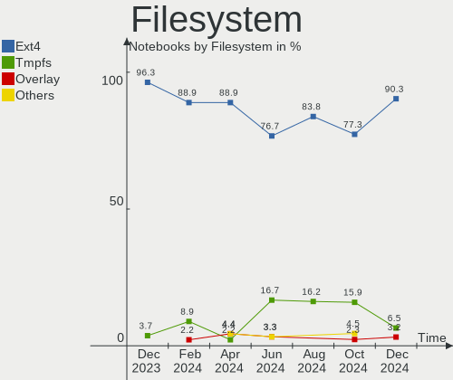
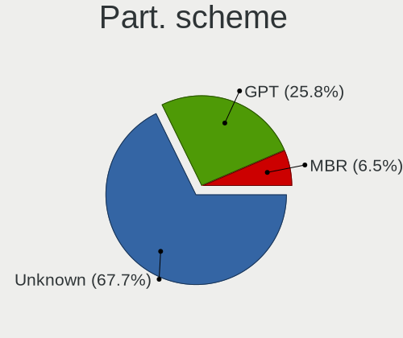
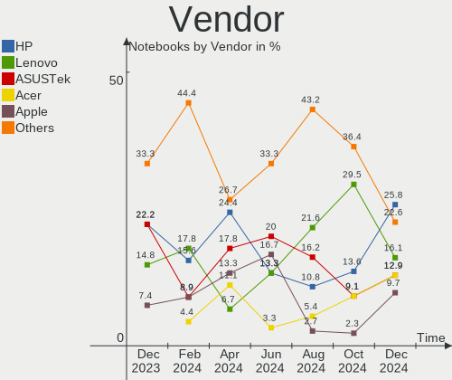
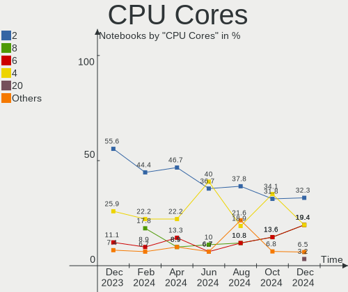
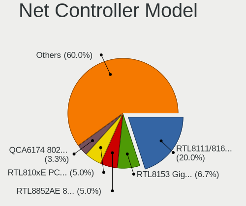
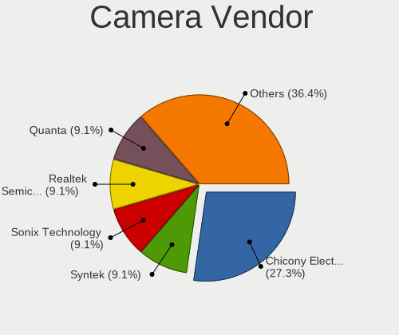
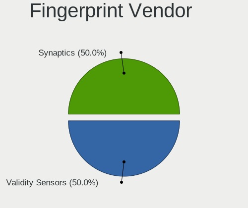

KDE neon Hardware Trends (Notebooks)
------------------------------------

A project to identify most popular hardware characteristics and track their change
over time based on data collected by KDE neon users at https://Linux-Hardware.org.

Anyone can contribute to this report by the [hw-probe](https://github.com/linuxhw/hw-probe) tool:

    sudo -E hw-probe -all -upload

Full-feature report is available here: https://linux-hardware.org/?view=trends&formfactor=notebook

Period: Sep, 2021.

Contents
--------

* [ System ](#system)
  - [ OS                       ](#os)
  - [ OS Family                ](#os-family)
  - [ Kernel                   ](#kernel)
  - [ Kernel Family            ](#kernel-family)
  - [ Kernel Major Ver.        ](#kernel-major-ver)
  - [ Arch                     ](#arch)
  - [ DE                       ](#de)
  - [ Display Server           ](#display-server)
  - [ Display Manager          ](#display-manager)
  - [ OS Lang                  ](#os-lang)
  - [ Boot Mode                ](#boot-mode)
  - [ Filesystem               ](#filesystem)
  - [ Part. scheme             ](#part-scheme)
  - [ Dual Boot with Linux/BSD ](#dual-boot-with-linuxbsd)
  - [ Dual Boot (Win)          ](#dual-boot-win)

* [ Board ](#board)
  - [ Vendor                   ](#vendor)
  - [ Model                    ](#model)
  - [ Model Family             ](#model-family)
  - [ MFG Year                 ](#mfg-year)
  - [ Form Factor              ](#form-factor)
  - [ Secure Boot              ](#secure-boot)
  - [ Coreboot                 ](#coreboot)
  - [ RAM Size                 ](#ram-size)
  - [ RAM Used                 ](#ram-used)
  - [ Total Drives             ](#total-drives)
  - [ Has CD-ROM               ](#has-cd-rom)
  - [ Has Ethernet             ](#has-ethernet)
  - [ Has WiFi                 ](#has-wifi)
  - [ Has Bluetooth            ](#has-bluetooth)

* [ Location ](#location)
  - [ Country                  ](#country)
  - [ City                     ](#city)

* [ Drives ](#drives)
  - [ Drive Vendor             ](#drive-vendor)
  - [ Drive Model              ](#drive-model)
  - [ HDD Vendor               ](#hdd-vendor)
  - [ SSD Vendor               ](#ssd-vendor)
  - [ Drive Kind               ](#drive-kind)
  - [ Drive Connector          ](#drive-connector)
  - [ Drive Size               ](#drive-size)
  - [ Space Total              ](#space-total)
  - [ Space Used               ](#space-used)
  - [ Malfunc. Drives          ](#malfunc-drives)
  - [ Malfunc. Drive Vendor    ](#malfunc-drive-vendor)
  - [ Malfunc. HDD Vendor      ](#malfunc-hdd-vendor)
  - [ Malfunc. Drive Kind      ](#malfunc-drive-kind)
  - [ Failed Drives            ](#failed-drives)
  - [ Failed Drive Vendor      ](#failed-drive-vendor)
  - [ Drive Status             ](#drive-status)

* [ Storage controller ](#storage-controller)
  - [ Storage Vendor           ](#storage-vendor)
  - [ Storage Model            ](#storage-model)
  - [ Storage Kind             ](#storage-kind)

* [ Processor ](#processor)
  - [ CPU Vendor               ](#cpu-vendor)
  - [ CPU Model                ](#cpu-model)
  - [ CPU Model Family         ](#cpu-model-family)
  - [ CPU Cores                ](#cpu-cores)
  - [ CPU Sockets              ](#cpu-sockets)
  - [ CPU Threads              ](#cpu-threads)
  - [ CPU Op-Modes             ](#cpu-op-modes)
  - [ CPU Microcode            ](#cpu-microcode)
  - [ CPU Microarch            ](#cpu-microarch)

* [ Graphics ](#graphics)
  - [ GPU Vendor               ](#gpu-vendor)
  - [ GPU Model                ](#gpu-model)
  - [ GPU Combo                ](#gpu-combo)
  - [ GPU Driver               ](#gpu-driver)
  - [ GPU Memory               ](#gpu-memory)

* [ Monitor ](#monitor)
  - [ Monitor Vendor           ](#monitor-vendor)
  - [ Monitor Model            ](#monitor-model)
  - [ Monitor Resolution       ](#monitor-resolution)
  - [ Monitor Diagonal         ](#monitor-diagonal)
  - [ Monitor Width            ](#monitor-width)
  - [ Aspect Ratio             ](#aspect-ratio)
  - [ Monitor Area             ](#monitor-area)
  - [ Pixel Density            ](#pixel-density)
  - [ Multiple Monitors        ](#multiple-monitors)

* [ Network ](#network)
  - [ Net Controller Vendor    ](#net-controller-vendor)
  - [ Net Controller Model     ](#net-controller-model)
  - [ Wireless Vendor          ](#wireless-vendor)
  - [ Wireless Model           ](#wireless-model)
  - [ Ethernet Vendor          ](#ethernet-vendor)
  - [ Ethernet Model           ](#ethernet-model)
  - [ Net Controller Kind      ](#net-controller-kind)
  - [ Used Controller          ](#used-controller)
  - [ NICs                     ](#nics)
  - [ IPv6                     ](#ipv6)

* [ Bluetooth ](#bluetooth)
  - [ Bluetooth Vendor         ](#bluetooth-vendor)
  - [ Bluetooth Model          ](#bluetooth-model)

* [ Sound ](#sound)
  - [ Sound Vendor             ](#sound-vendor)
  - [ Sound Model              ](#sound-model)

* [ Memory ](#memory)
  - [ Memory Vendor            ](#memory-vendor)
  - [ Memory Model             ](#memory-model)
  - [ Memory Kind              ](#memory-kind)
  - [ Memory Form Factor       ](#memory-form-factor)
  - [ Memory Size              ](#memory-size)
  - [ Memory Speed             ](#memory-speed)

* [ Printers & scanners ](#printers--scanners)
  - [ Printer Vendor           ](#printer-vendor)
  - [ Printer Model            ](#printer-model)
  - [ Scanner Vendor           ](#scanner-vendor)
  - [ Scanner Model            ](#scanner-model)

* [ Camera ](#camera)
  - [ Camera Vendor            ](#camera-vendor)
  - [ Camera Model             ](#camera-model)

* [ Security ](#security)
  - [ Fingerprint Vendor       ](#fingerprint-vendor)
  - [ Fingerprint Model        ](#fingerprint-model)
  - [ Chipcard Vendor          ](#chipcard-vendor)
  - [ Chipcard Model           ](#chipcard-model)

* [ Unsupported ](#unsupported)
  - [ Unsupported Devices      ](#unsupported-devices)
  - [ Unsupported Device Types ](#unsupported-device-types)

System
------

OS
--

Installed operating systems

| Name           | Notebooks | Percent |
|----------------|-----------|---------|
| KDE neon 20.04 | 50        | 100%    |

OS Family
---------

OS without a version

| Name     | Notebooks | Percent |
|----------|-----------|---------|
| KDE neon | 50        | 100%    |

Kernel
------

Version of the Linux kernel

| Version             | Notebooks | Percent |
|---------------------|-----------|---------|
| 5.11.0-34-generic   | 20        | 40%     |
| 5.11.0-27-generic   | 14        | 28%     |
| 5.11.0-36-generic   | 12        | 24%     |
| 5.11.0-37-generic   | 3         | 6%      |
| 5.14-051400-generic | 1         | 2%      |

Kernel Family
-------------

Linux kernel without a distro release

| Version | Notebooks | Percent |
|---------|-----------|---------|
| 5.11.0  | 49        | 98%     |
| 5.14    | 1         | 2%      |

Kernel Major Ver.
-----------------

Linux kernel major version

| Version | Notebooks | Percent |
|---------|-----------|---------|
| 5.11    | 49        | 98%     |
| 5       | 1         | 2%      |

Arch
----

OS architecture (x86_64, i586, etc.)

| Name   | Notebooks | Percent |
|--------|-----------|---------|
| x86_64 | 50        | 100%    |

DE
--

Desktop Environment

| Name            | Notebooks | Percent |
|-----------------|-----------|---------|
| KDE             | 26        | 52%     |
| KDE5            | 22        | 44%     |
| GNOME Flashback | 1         | 2%      |
| Unknown         | 1         | 2%      |

Display Server
--------------

X11 or Wayland

| Name    | Notebooks | Percent |
|---------|-----------|---------|
| X11     | 46        | 92%     |
| Wayland | 4         | 8%      |

Display Manager
---------------

SDDM, LightDM, etc.

| Name    | Notebooks | Percent |
|---------|-----------|---------|
| Unknown | 40        | 80%     |
| SDDM    | 9         | 18%     |
| GDM3    | 1         | 2%      |

OS Lang
-------

Language

| Lang   | Notebooks | Percent |
|--------|-----------|---------|
| en_US  | 20        | 40%     |
| de_DE  | 5         | 10%     |
| pt_BR  | 4         | 8%      |
| en_CA  | 4         | 8%      |
| ru_RU  | 3         | 6%      |
| en_GB  | 3         | 6%      |
| pl_PL  | 2         | 4%      |
| it_IT  | 2         | 4%      |
| zh_CN  | 1         | 2%      |
| szl_PL | 1         | 2%      |
| fr_FR  | 1         | 2%      |
| es_ES  | 1         | 2%      |
| en_AU  | 1         | 2%      |
| el_GR  | 1         | 2%      |
| de_AT  | 1         | 2%      |

Boot Mode
---------

EFI or BIOS

| Mode | Notebooks | Percent |
|------|-----------|---------|
| EFI  | 27        | 54%     |
| BIOS | 23        | 46%     |

Filesystem
----------

Type of filesystem

| Type | Notebooks | Percent |
|------|-----------|---------|
| Ext4 | 50        | 100%    |

Part. scheme
------------

Scheme of partitioning

| Type    | Notebooks | Percent |
|---------|-----------|---------|
| Unknown | 41        | 82%     |
| GPT     | 8         | 16%     |
| MBR     | 1         | 2%      |

Dual Boot with Linux/BSD
------------------------

Hosting more than one Linux/BSD

| Dual boot | Notebooks | Percent |
|-----------|-----------|---------|
| No        | 48        | 96%     |
| Yes       | 2         | 4%      |

Dual Boot (Win)
---------------

Hosting Linux and Windows

| Dual boot | Notebooks | Percent |
|-----------|-----------|---------|
| No        | 46        | 92%     |
| Yes       | 4         | 8%      |

Board
-----

Vendor
------

Motherboard manufacturer

| Name                | Notebooks | Percent |
|---------------------|-----------|---------|
| Dell                | 11        | 22%     |
| Lenovo              | 9         | 18%     |
| Hewlett-Packard     | 6         | 12%     |
| Apple               | 5         | 10%     |
| ASUSTek Computer    | 4         | 8%      |
| Acer                | 4         | 8%      |
| Samsung Electronics | 3         | 6%      |
| Toshiba             | 1         | 2%      |
| Razer               | 1         | 2%      |
| Positivo            | 1         | 2%      |
| Medion              | 1         | 2%      |
| Jumper              | 1         | 2%      |
| Gateway             | 1         | 2%      |
| Fujitsu Siemens     | 1         | 2%      |
| Alienware           | 1         | 2%      |

Model
-----

Motherboard model

| Name                                                                                     | Notebooks | Percent |
|------------------------------------------------------------------------------------------|-----------|---------|
| Toshiba Satellite U920T                                                                  | 1         | 2%      |
| Samsung RF511/RF411/RF711                                                                | 1         | 2%      |
| Samsung 3570R/370R/470R/450R/510R/4450RV                                                 | 1         | 2%      |
| Samsung 355V4C/355V4X/355V5C/355V5X/356V4C/356V4X/356V5C/356V5X/3445VC/3445VX/3545VC/354 | 1         | 2%      |
| Razer Blade Stealth                                                                      | 1         | 2%      |
| Positivo MOBILE                                                                          | 1         | 2%      |
| Medion E7214                                                                             | 1         | 2%      |
| Lenovo ThinkPad Yoga 11e 20DAS02M00                                                      | 1         | 2%      |
| Lenovo ThinkPad T460s 20FAS4A200                                                         | 1         | 2%      |
| Lenovo ThinkPad T15 Gen 1 20S6003PGE                                                     | 1         | 2%      |
| Lenovo IdeaPad S130-14IGM 81J2                                                           | 1         | 2%      |
| Lenovo IdeaPad N580 20182                                                                | 1         | 2%      |
| Lenovo IdeaPad C340-14API 81N6                                                           | 1         | 2%      |
| Lenovo IdeaPad 3 15ADA05 81W1                                                            | 1         | 2%      |
| Lenovo Flex 2-15D 20377                                                                  | 1         | 2%      |
| Lenovo B51-30 80LK                                                                       | 1         | 2%      |
| Jumper EZbook                                                                            | 1         | 2%      |
| HP ProBook 4530s                                                                         | 1         | 2%      |
| HP Pavilion g6                                                                           | 1         | 2%      |
| HP Pavilion Aero Laptop 13-be0xxx                                                        | 1         | 2%      |
| HP Pavilion 17                                                                           | 1         | 2%      |
| HP EliteBook 8730w                                                                       | 1         | 2%      |
| HP 431                                                                                   | 1         | 2%      |
| Gateway NV53A                                                                            | 1         | 2%      |
| Fujitsu Siemens AMILO Li 2732                                                            | 1         | 2%      |
| Dell XPS 15 7590                                                                         | 1         | 2%      |
| Dell Vostro 3550                                                                         | 1         | 2%      |
| Dell Latitude E6520                                                                      | 1         | 2%      |
| Dell Latitude E6420                                                                      | 1         | 2%      |
| Dell Latitude E6400                                                                      | 1         | 2%      |
| Dell Latitude 7490                                                                       | 1         | 2%      |
| Dell Latitude 3550                                                                       | 1         | 2%      |
| Dell Latitude 3490                                                                       | 1         | 2%      |
| Dell Inspiron N4050                                                                      | 1         | 2%      |
| Dell Inspiron 5565                                                                       | 1         | 2%      |
| Dell Inspiron 1545                                                                       | 1         | 2%      |
| ASUS ZenBook UX333FN_UX333FN                                                             | 1         | 2%      |
| ASUS K54C                                                                                | 1         | 2%      |
| ASUS F5SL                                                                                | 1         | 2%      |
| ASUS ASUS TUF Gaming F15 FX506LH_FX506LH                                                 | 1         | 2%      |
| Apple MacBookPro8,1                                                                      | 1         | 2%      |
| Apple MacBookPro12,1                                                                     | 1         | 2%      |
| Apple MacBookAir7,2                                                                      | 1         | 2%      |
| Apple MacBookAir3,1                                                                      | 1         | 2%      |
| Apple MacBook4,1                                                                         | 1         | 2%      |
| Alienware 15 R4                                                                          | 1         | 2%      |
| Acer Aspire R7-572                                                                       | 1         | 2%      |
| Acer Aspire F5-573G                                                                      | 1         | 2%      |
| Acer Aspire A715-42G                                                                     | 1         | 2%      |
| Acer Aspire 5740                                                                         | 1         | 2%      |

Model Family
------------

Motherboard model prefix

| Name                  | Notebooks | Percent |
|-----------------------|-----------|---------|
| Dell Latitude         | 6         | 12%     |
| Lenovo IdeaPad        | 4         | 8%      |
| Acer Aspire           | 4         | 8%      |
| Lenovo ThinkPad       | 3         | 6%      |
| HP Pavilion           | 3         | 6%      |
| Dell Inspiron         | 3         | 6%      |
| Toshiba Satellite     | 1         | 2%      |
| Samsung RF511         | 1         | 2%      |
| Samsung 3570R         | 1         | 2%      |
| Samsung 355V4C        | 1         | 2%      |
| Razer Blade           | 1         | 2%      |
| Positivo MOBILE       | 1         | 2%      |
| Medion E7214          | 1         | 2%      |
| Lenovo Flex           | 1         | 2%      |
| Lenovo B51-30         | 1         | 2%      |
| Jumper EZbook         | 1         | 2%      |
| HP ProBook            | 1         | 2%      |
| HP EliteBook          | 1         | 2%      |
| HP 431                | 1         | 2%      |
| Gateway NV53A         | 1         | 2%      |
| Fujitsu Siemens AMILO | 1         | 2%      |
| Dell XPS              | 1         | 2%      |
| Dell Vostro           | 1         | 2%      |
| ASUS ZenBook          | 1         | 2%      |
| ASUS K54C             | 1         | 2%      |
| ASUS F5SL             | 1         | 2%      |
| ASUS ASUS             | 1         | 2%      |
| Apple MacBookPro8     | 1         | 2%      |
| Apple MacBookPro12    | 1         | 2%      |
| Apple MacBookAir7     | 1         | 2%      |
| Apple MacBookAir3     | 1         | 2%      |
| Apple MacBook4        | 1         | 2%      |
| Alienware 15          | 1         | 2%      |

MFG Year
--------

Motherboard manufacture year

| Year | Notebooks | Percent |
|------|-----------|---------|
| 2021 | 8         | 16%     |
| 2019 | 7         | 14%     |
| 2018 | 5         | 10%     |
| 2011 | 5         | 10%     |
| 2013 | 4         | 8%      |
| 2020 | 3         | 6%      |
| 2016 | 3         | 6%      |
| 2014 | 3         | 6%      |
| 2012 | 3         | 6%      |
| 2008 | 3         | 6%      |
| 2017 | 2         | 4%      |
| 2009 | 2         | 4%      |
| 2015 | 1         | 2%      |
| 2010 | 1         | 2%      |

Form Factor
-----------

Physical design of the computer

| Name     | Notebooks | Percent |
|----------|-----------|---------|
| Notebook | 50        | 100%    |

Secure Boot
-----------

Enabled or disabled

| State    | Notebooks | Percent |
|----------|-----------|---------|
| Disabled | 48        | 96%     |
| Enabled  | 2         | 4%      |

Coreboot
--------

Have coreboot on board

| Used | Notebooks | Percent |
|------|-----------|---------|
| No   | 50        | 100%    |

RAM Size
--------

Total RAM memory

| Size in GB  | Notebooks | Percent |
|-------------|-----------|---------|
| 4.01-8.0    | 17        | 34%     |
| 8.01-16.0   | 11        | 22%     |
| 3.01-4.0    | 9         | 18%     |
| 16.01-24.0  | 6         | 12%     |
| 32.01-64.0  | 3         | 6%      |
| 1.01-2.0    | 2         | 4%      |
| 2.01-3.0    | 1         | 2%      |
| 64.01-256.0 | 1         | 2%      |

RAM Used
--------

Used RAM memory

| Used GB   | Notebooks | Percent |
|-----------|-----------|---------|
| 1.01-2.0  | 21        | 42%     |
| 2.01-3.0  | 16        | 32%     |
| 0.51-1.0  | 8         | 16%     |
| 4.01-8.0  | 3         | 6%      |
| 3.01-4.0  | 1         | 2%      |
| 8.01-16.0 | 1         | 2%      |

Total Drives
------------

Number of drives on board

| Drives | Notebooks | Percent |
|--------|-----------|---------|
| 1      | 36        | 72%     |
| 2      | 11        | 22%     |
| 3      | 3         | 6%      |

Has CD-ROM
----------

Has CD-ROM on board

| Presented | Notebooks | Percent |
|-----------|-----------|---------|
| Yes       | 25        | 50%     |
| No        | 25        | 50%     |

Has Ethernet
------------

Has Ethernet on board

| Presented | Notebooks | Percent |
|-----------|-----------|---------|
| Yes       | 38        | 76%     |
| No        | 12        | 24%     |

Has WiFi
--------

Has WiFi module

| Presented | Notebooks | Percent |
|-----------|-----------|---------|
| Yes       | 50        | 100%    |

Has Bluetooth
-------------

Has Bluetooth module

| Presented | Notebooks | Percent |
|-----------|-----------|---------|
| Yes       | 39        | 78%     |
| No        | 11        | 22%     |

Location
--------

Country
-------

Geographic location (country)

| Country   | Notebooks | Percent |
|-----------|-----------|---------|
| USA       | 9         | 18%     |
| Germany   | 5         | 10%     |
| Poland    | 4         | 8%      |
| Canada    | 4         | 8%      |
| Brazil    | 4         | 8%      |
| UK        | 3         | 6%      |
| Russia    | 3         | 6%      |
| Italy     | 2         | 4%      |
| Greece    | 2         | 4%      |
| France    | 2         | 4%      |
| Uruguay   | 1         | 2%      |
| Thailand  | 1         | 2%      |
| Sweden    | 1         | 2%      |
| Spain     | 1         | 2%      |
| Norway    | 1         | 2%      |
| Iran      | 1         | 2%      |
| Indonesia | 1         | 2%      |
| India     | 1         | 2%      |
| China     | 1         | 2%      |
| Bulgaria  | 1         | 2%      |
| Austria   | 1         | 2%      |
| Australia | 1         | 2%      |

City
----

Geographic location (city)

| City                 | Notebooks | Percent |
|----------------------|-----------|---------|
| Yogyakarta           | 1         | 2%      |
| Wroclaw              | 1         | 2%      |
| Wiesbaden            | 1         | 2%      |
| Voronezh             | 1         | 2%      |
| Vancouver            | 1         | 2%      |
| Trollh?¤ttan         | 1         | 2%      |
| Tehran               | 1         | 2%      |
| Sydney               | 1         | 2%      |
| Surbiton             | 1         | 2%      |
| Sunderland           | 1         | 2%      |
| Solingen             | 1         | 2%      |
| Sofia                | 1         | 2%      |
| Sleaford             | 1         | 2%      |
| Shangrao             | 1         | 2%      |
| S??o Paulo           | 1         | 2%      |
| Santos               | 1         | 2%      |
| Saint-Laurent-du-Var | 1         | 2%      |
| Rome                 | 1         | 2%      |
| Rochester            | 1         | 2%      |
| Punta Carretas       | 1         | 2%      |
| Peyrins              | 1         | 2%      |
| Novosibirsk          | 1         | 2%      |
| Mumbai               | 1         | 2%      |
| Moscow               | 1         | 2%      |
| Mesa                 | 1         | 2%      |
| Lodz                 | 1         | 2%      |
| Krakow               | 1         | 2%      |
| Kingston             | 1         | 2%      |
| Kansas City          | 1         | 2%      |
| Joinville            | 1         | 2%      |
| Innsbruck            | 1         | 2%      |
| Harstad              | 1         | 2%      |
| Hamburg              | 1         | 2%      |
| Guarulhos            | 1         | 2%      |
| Gora Kalwaria        | 1         | 2%      |
| Gartringen           | 1         | 2%      |
| Fayetteville         | 1         | 2%      |
| Edmonton             | 1         | 2%      |
| Denham Springs       | 1         | 2%      |
| Chicago              | 1         | 2%      |
| Chattanooga          | 1         | 2%      |
| Chandler             | 1         | 2%      |
| Chalcis              | 1         | 2%      |
| Castrop-Rauxel       | 1         | 2%      |
| Cambridge            | 1         | 2%      |
| Breganze             | 1         | 2%      |
| Barcelona            | 1         | 2%      |
| Bangkok              | 1         | 2%      |
| Athens               | 1         | 2%      |
| Allen                | 1         | 2%      |

Drives
------

Drive Vendor
------------

Hard drive vendors

| Vendor                  | Notebooks | Drives | Percent |
|-------------------------|-----------|--------|---------|
| Toshiba                 | 9         | 9      | 15%     |
| Seagate                 | 9         | 9      | 15%     |
| Samsung Electronics     | 7         | 8      | 11.67%  |
| WDC                     | 6         | 6      | 10%     |
| Unknown                 | 4         | 5      | 6.67%   |
| Kingston                | 4         | 4      | 6.67%   |
| SK Hynix                | 3         | 3      | 5%      |
| HGST                    | 3         | 3      | 5%      |
| Apple                   | 3         | 3      | 5%      |
| Micron Technology       | 2         | 2      | 3.33%   |
| Intel                   | 2         | 2      | 3.33%   |
| Union Memory (Shenzhen) | 1         | 1      | 1.67%   |
| Transcend               | 1         | 1      | 1.67%   |
| Sandisk                 | 1         | 1      | 1.67%   |
| PNY                     | 1         | 1      | 1.67%   |
| Phison                  | 1         | 1      | 1.67%   |
| Patriot                 | 1         | 1      | 1.67%   |
| Hewlett-Packard         | 1         | 1      | 1.67%   |
| Crucial                 | 1         | 1      | 1.67%   |

Drive Model
-----------

Hard drive models

| Model                                        | Notebooks | Percent |
|----------------------------------------------|-----------|---------|
| Unknown MMC Card  32GB                       | 2         | 3.23%   |
| Seagate ST500LM021-1KJ152 500GB              | 2         | 3.23%   |
| Samsung SSD 850 EVO 250GB                    | 2         | 3.23%   |
| HGST HTS721010A9E630 1TB                     | 2         | 3.23%   |
| Apple SSD SM0128G 121GB                      | 2         | 3.23%   |
| WDC WDS120G2G0B-00EPW0 120GB SSD             | 1         | 1.61%   |
| WDC WDS120G2G0A-00JH30 120GB SSD             | 1         | 1.61%   |
| WDC WDBNCE5000PNC 500GB SSD                  | 1         | 1.61%   |
| WDC WD5000LPLX-60ZNTT1 500GB                 | 1         | 1.61%   |
| WDC WD5000LPCX-24C6HT0 500GB                 | 1         | 1.61%   |
| WDC WD10JPVX-22JC3T0 1TB                     | 1         | 1.61%   |
| Unknown MMC Card  7GB                        | 1         | 1.61%   |
| Unknown MMC Card  64GB                       | 1         | 1.61%   |
| Unknown MMC Card  128GB                      | 1         | 1.61%   |
| Union Memory (Shenzhen) NVMe SSD Drive 512GB | 1         | 1.61%   |
| Transcend TS128GSSD230S 128GB                | 1         | 1.61%   |
| Toshiba THNSNF128GMCS 128GB SSD              | 1         | 1.61%   |
| Toshiba MQ01ACF050 500GB                     | 1         | 1.61%   |
| Toshiba MQ01ACF032 320GB                     | 1         | 1.61%   |
| Toshiba MQ01ABF050 500GB                     | 1         | 1.61%   |
| Toshiba MQ01ABD075 752GB                     | 1         | 1.61%   |
| Toshiba MQ01ABD050V 500GB                    | 1         | 1.61%   |
| Toshiba MQ01ABD050 500GB                     | 1         | 1.61%   |
| Toshiba KXG60ZNV512G NVMe KIOXIA 512GB       | 1         | 1.61%   |
| Toshiba KBG30ZMS128G 128GB NVMe SSD          | 1         | 1.61%   |
| SK Hynix SKHynix_HFS256GD9TNG-L3A0B 256GB    | 1         | 1.61%   |
| SK Hynix SC311 SATA 512GB SSD                | 1         | 1.61%   |
| SK Hynix NVMe SSD Drive 512GB                | 1         | 1.61%   |
| Seagate ST9250827AS 250GB                    | 1         | 1.61%   |
| Seagate ST9120823AS 120GB                    | 1         | 1.61%   |
| Seagate ST500LT012-1DG142 500GB              | 1         | 1.61%   |
| Seagate ST500LM012 HN-M500MBB 500GB          | 1         | 1.61%   |
| Seagate ST1500LM006 HN-M151RAD 1TB           | 1         | 1.61%   |
| Seagate ST1000LM035-1RK172 1TB               | 1         | 1.61%   |
| Seagate BUP Portable 5TB                     | 1         | 1.61%   |
| Sandisk NVMe SSD Drive 1024GB                | 1         | 1.61%   |
| Samsung SSD 860 EVO 250GB                    | 1         | 1.61%   |
| Samsung SSD 840 Series 120GB                 | 1         | 1.61%   |
| Samsung NVMe SSD Drive 1TB                   | 1         | 1.61%   |
| Samsung MZ7TE128HMGR-000L1 128GB SSD         | 1         | 1.61%   |
| Samsung HM500JI 500GB                        | 1         | 1.61%   |
| Samsung HM160HI 160GB                        | 1         | 1.61%   |
| PNY CS1311 120GB SSD                         | 1         | 1.61%   |
| Phison NVMe SSD Drive 1024GB                 | 1         | 1.61%   |
| Patriot P210 256GB SSD                       | 1         | 1.61%   |
| Micron NVMe SSD Drive 512GB                  | 1         | 1.61%   |
| Micron MTFDHBA512QFD-1AX1AABHA 512GB         | 1         | 1.61%   |
| Kingston SV300S37A120G 120GB SSD             | 1         | 1.61%   |
| Kingston SA400S37480G 480GB SSD              | 1         | 1.61%   |
| Kingston SA400S37120G 120GB SSD              | 1         | 1.61%   |
| Kingston RBUSNS8180DS3128GH 128GB SSD        | 1         | 1.61%   |
| Intel SSDSC2CW120A3 120GB                    | 1         | 1.61%   |
| Intel SSDPEKKW512G7 512GB                    | 1         | 1.61%   |
| HGST HCC545050A7E630 500GB                   | 1         | 1.61%   |
| HP SSD EX920 1TB                             | 1         | 1.61%   |
| Crucial CT240M500SSD1 240GB                  | 1         | 1.61%   |
| Apple SSD TS128C 121GB                       | 1         | 1.61%   |

HDD Vendor
----------

Hard disk drive vendors

| Vendor              | Notebooks | Drives | Percent |
|---------------------|-----------|--------|---------|
| Seagate             | 9         | 9      | 39.13%  |
| Toshiba             | 6         | 6      | 26.09%  |
| WDC                 | 3         | 3      | 13.04%  |
| HGST                | 3         | 3      | 13.04%  |
| Samsung Electronics | 2         | 2      | 8.7%    |

SSD Vendor
----------

Solid state drive vendors

| Vendor              | Notebooks | Drives | Percent |
|---------------------|-----------|--------|---------|
| Samsung Electronics | 5         | 5      | 22.73%  |
| Kingston            | 4         | 4      | 18.18%  |
| WDC                 | 3         | 3      | 13.64%  |
| Apple               | 3         | 3      | 13.64%  |
| Transcend           | 1         | 1      | 4.55%   |
| Toshiba             | 1         | 1      | 4.55%   |
| SK Hynix            | 1         | 1      | 4.55%   |
| PNY                 | 1         | 1      | 4.55%   |
| Patriot             | 1         | 1      | 4.55%   |
| Intel               | 1         | 1      | 4.55%   |
| Crucial             | 1         | 1      | 4.55%   |

Drive Kind
----------

HDD or SSD

| Kind | Notebooks | Drives | Percent |
|------|-----------|--------|---------|
| HDD  | 23        | 23     | 38.98%  |
| SSD  | 21        | 22     | 35.59%  |
| NVMe | 11        | 12     | 18.64%  |
| MMC  | 4         | 5      | 6.78%   |

Drive Connector
---------------

SATA, SAS, NVMe, etc.

| Type | Notebooks | Drives | Percent |
|------|-----------|--------|---------|
| SATA | 38        | 43     | 69.09%  |
| NVMe | 11        | 12     | 20%     |
| MMC  | 4         | 5      | 7.27%   |
| SAS  | 2         | 2      | 3.64%   |

Drive Size
----------

Size of hard drive

| Size in TB | Notebooks | Drives | Percent |
|------------|-----------|--------|---------|
| 0.01-0.5   | 32        | 37     | 80%     |
| 0.51-1.0   | 7         | 7      | 17.5%   |
| 4.01-10.0  | 1         | 1      | 2.5%    |

Space Total
-----------

Amount of disk space available on the file system

| Size in GB     | Notebooks | Percent |
|----------------|-----------|---------|
| 101-250        | 15        | 30%     |
| 251-500        | 11        | 22%     |
| 51-100         | 7         | 14%     |
| 21-50          | 4         | 8%      |
| 501-1000       | 4         | 8%      |
| Unknown        | 4         | 8%      |
| 1001-2000      | 3         | 6%      |
| More than 3000 | 1         | 2%      |
| 1-20           | 1         | 2%      |

Space Used
----------

Amount of used disk space

| Used GB   | Notebooks | Percent |
|-----------|-----------|---------|
| 1-20      | 29        | 58%     |
| 21-50     | 10        | 20%     |
| Unknown   | 4         | 8%      |
| 251-500   | 2         | 4%      |
| 101-250   | 2         | 4%      |
| 1001-2000 | 2         | 4%      |
| 51-100    | 1         | 2%      |

Malfunc. Drives
---------------

Drive models with a malfunction

| Model                        | Notebooks | Drives | Percent |
|------------------------------|-----------|--------|---------|
| WDC WD5000LPCX-24C6HT0 500GB | 1         | 1      | 100%    |

Malfunc. Drive Vendor
---------------------

Vendors of faulty drives

| Vendor | Notebooks | Drives | Percent |
|--------|-----------|--------|---------|
| WDC    | 1         | 1      | 100%    |

Malfunc. HDD Vendor
-------------------

Vendors of faulty HDD drives

| Vendor | Notebooks | Drives | Percent |
|--------|-----------|--------|---------|
| WDC    | 1         | 1      | 100%    |

Malfunc. Drive Kind
-------------------

Kinds of faulty drives

| Kind | Notebooks | Drives | Percent |
|------|-----------|--------|---------|
| HDD  | 1         | 1      | 100%    |

Failed Drives
-------------

Failed drive models

Zero info for selected period =(

Failed Drive Vendor
-------------------

Failed drive vendors

Zero info for selected period =(

Drive Status
------------

Number of failed and malfunc. drives

| Status   | Notebooks | Drives | Percent |
|----------|-----------|--------|---------|
| Detected | 43        | 51     | 82.69%  |
| Works    | 8         | 10     | 15.38%  |
| Malfunc  | 1         | 1      | 1.92%   |

Storage controller
------------------

Storage Vendor
--------------

Storage controller vendors

| Vendor                           | Notebooks | Percent |
|----------------------------------|-----------|---------|
| Intel                            | 34        | 61.82%  |
| AMD                              | 6         | 10.91%  |
| Samsung Electronics              | 3         | 5.45%   |
| Toshiba America Info Systems     | 2         | 3.64%   |
| SK Hynix                         | 2         | 3.64%   |
| Micron Technology                | 2         | 3.64%   |
| Union Memory (Shenzhen)          | 1         | 1.82%   |
| Silicon Motion                   | 1         | 1.82%   |
| Silicon Integrated Systems [SiS] | 1         | 1.82%   |
| Sandisk                          | 1         | 1.82%   |
| Phison Electronics               | 1         | 1.82%   |
| Nvidia                           | 1         | 1.82%   |

Storage Model
-------------

Storage controller models

| Model                                                                                  | Notebooks | Percent |
|----------------------------------------------------------------------------------------|-----------|---------|
| Intel 6 Series/C200 Series Chipset Family 6 port Mobile SATA AHCI Controller           | 7         | 11.67%  |
| AMD FCH SATA Controller [AHCI mode]                                                    | 5         | 8.33%   |
| Intel 82801IBM/IEM (ICH9M/ICH9M-E) 4 port SATA Controller [AHCI mode]                  | 3         | 5%      |
| Intel 7 Series Chipset Family 6-port SATA Controller [AHCI mode]                       | 3         | 5%      |
| Samsung Electronics SATA controller                                                    | 2         | 3.33%   |
| Micron Non-Volatile memory controller                                                  | 2         | 3.33%   |
| Intel Wildcat Point-LP SATA Controller [AHCI Mode]                                     | 2         | 3.33%   |
| Intel Sunrise Point-LP SATA Controller [AHCI mode]                                     | 2         | 3.33%   |
| Intel Cannon Lake Mobile PCH SATA AHCI Controller                                      | 2         | 3.33%   |
| Intel 82801HM/HEM (ICH8M/ICH8M-E) SATA Controller [AHCI mode]                          | 2         | 3.33%   |
| Intel 82801HM/HEM (ICH8M/ICH8M-E) IDE Controller                                       | 2         | 3.33%   |
| Intel 82801 Mobile SATA Controller [RAID mode]                                         | 2         | 3.33%   |
| Intel 6 Series/C200 Series Chipset Family Mobile SATA Controller (IDE mode, ports 4-5) | 2         | 3.33%   |
| Intel 6 Series/C200 Series Chipset Family Mobile SATA Controller (IDE mode, ports 0-3) | 2         | 3.33%   |
| Intel 5 Series/3400 Series Chipset 4 port SATA AHCI Controller                         | 2         | 3.33%   |
| Union Memory (Shenzhen) Non-Volatile memory controller                                 | 1         | 1.67%   |
| Toshiba America Info Systems XG6 NVMe SSD Controller                                   | 1         | 1.67%   |
| Toshiba America Info Systems Toshiba America Info Non-Volatile memory controller       | 1         | 1.67%   |
| SK Hynix Non-Volatile memory controller                                                | 1         | 1.67%   |
| SK Hynix Gold P31 SSD                                                                  | 1         | 1.67%   |
| Silicon Motion SM2262/SM2262EN SSD Controller                                          | 1         | 1.67%   |
| Silicon Integrated Systems [SiS] SATA Controller / IDE mode                            | 1         | 1.67%   |
| Silicon Integrated Systems [SiS] 5513 IDE Controller                                   | 1         | 1.67%   |
| Sandisk WD Black SN750 / PC SN730 NVMe SSD                                             | 1         | 1.67%   |
| Samsung NVMe SSD Controller SM961/PM961/SM963                                          | 1         | 1.67%   |
| Phison E12 NVMe Controller                                                             | 1         | 1.67%   |
| Nvidia MCP89 SATA Controller (AHCI mode)                                               | 1         | 1.67%   |
| Intel SSD 600P Series                                                                  | 1         | 1.67%   |
| Intel Celeron/Pentium Silver Processor SATA Controller                                 | 1         | 1.67%   |
| Intel Celeron N3350/Pentium N4200/Atom E3900 Series SATA AHCI Controller               | 1         | 1.67%   |
| Intel Atom/Celeron/Pentium Processor x5-E8000/J3xxx/N3xxx Series SATA Controller       | 1         | 1.67%   |
| Intel Atom Processor E3800 Series SATA AHCI Controller                                 | 1         | 1.67%   |
| Intel 8 Series SATA Controller 1 [AHCI mode]                                           | 1         | 1.67%   |
| Intel 400 Series Chipset Family SATA AHCI Controller                                   | 1         | 1.67%   |
| AMD SB7x0/SB8x0/SB9x0 SATA Controller [AHCI mode]                                      | 1         | 1.67%   |

Storage Kind
------------

Kind of storage controller (IDE, SATA, NVMe, SAS, ...)

| Kind | Notebooks | Percent |
|------|-----------|---------|
| SATA | 38        | 67.86%  |
| NVMe | 11        | 19.64%  |
| IDE  | 5         | 8.93%   |
| RAID | 2         | 3.57%   |

Processor
---------

CPU Vendor
----------

Processor vendors

| Vendor | Notebooks | Percent |
|--------|-----------|---------|
| Intel  | 41        | 82%     |
| AMD    | 9         | 18%     |

CPU Model
---------

Processor models

| Model                                           | Notebooks | Percent |
|-------------------------------------------------|-----------|---------|
| Intel Core i5-2520M CPU @ 2.50GHz               | 2         | 4%      |
| Intel Core i3-2350M CPU @ 2.30GHz               | 2         | 4%      |
| Intel Core i3-2310M CPU @ 2.10GHz               | 2         | 4%      |
| AMD Ryzen 5 3500U with Radeon Vega Mobile Gfx   | 2         | 4%      |
| Intel Pentium Dual-Core CPU T4300 @ 2.10GHz     | 1         | 2%      |
| Intel Pentium Dual CPU T2370 @ 1.73GHz          | 1         | 2%      |
| Intel Pentium CPU N3700 @ 1.60GHz               | 1         | 2%      |
| Intel Pentium CPU B960 @ 2.20GHz                | 1         | 2%      |
| Intel Core i7-9750H CPU @ 2.60GHz               | 1         | 2%      |
| Intel Core i7-8750H CPU @ 2.20GHz               | 1         | 2%      |
| Intel Core i7-8565U CPU @ 1.80GHz               | 1         | 2%      |
| Intel Core i7-7500U CPU @ 2.70GHz               | 1         | 2%      |
| Intel Core i7-6500U CPU @ 2.50GHz               | 1         | 2%      |
| Intel Core i7-5500U CPU @ 2.40GHz               | 1         | 2%      |
| Intel Core i7-2630QM CPU @ 2.00GHz              | 1         | 2%      |
| Intel Core i7-10510U CPU @ 1.80GHz              | 1         | 2%      |
| Intel Core i5-8350U CPU @ 1.70GHz               | 1         | 2%      |
| Intel Core i5-8250U CPU @ 1.60GHz               | 1         | 2%      |
| Intel Core i5-6300U CPU @ 2.40GHz               | 1         | 2%      |
| Intel Core i5-5350U CPU @ 1.80GHz               | 1         | 2%      |
| Intel Core i5-5257U CPU @ 2.70GHz               | 1         | 2%      |
| Intel Core i5-4200U CPU @ 1.60GHz               | 1         | 2%      |
| Intel Core i5-3317U CPU @ 1.70GHz               | 1         | 2%      |
| Intel Core i5-3230M CPU @ 2.60GHz               | 1         | 2%      |
| Intel Core i5-2450M CPU @ 2.50GHz               | 1         | 2%      |
| Intel Core i5-2415M CPU @ 2.30GHz               | 1         | 2%      |
| Intel Core i5-2410M CPU @ 2.30GHz               | 1         | 2%      |
| Intel Core i5-10300H CPU @ 2.50GHz              | 1         | 2%      |
| Intel Core i3-5005U CPU @ 2.00GHz               | 1         | 2%      |
| Intel Core i3 CPU M 350 @ 2.27GHz               | 1         | 2%      |
| Intel Core i3 CPU M 330 @ 2.13GHz               | 1         | 2%      |
| Intel Core 2 Duo CPU U9400 @ 1.40GHz            | 1         | 2%      |
| Intel Core 2 Duo CPU T9600 @ 2.80GHz            | 1         | 2%      |
| Intel Core 2 Duo CPU T8300 @ 2.40GHz            | 1         | 2%      |
| Intel Core 2 Duo CPU T7700 @ 2.40GHz            | 1         | 2%      |
| Intel Core 2 Duo CPU P8700 @ 2.53GHz            | 1         | 2%      |
| Intel Celeron N4000 CPU @ 1.10GHz               | 1         | 2%      |
| Intel Celeron CPU N2930 @ 1.83GHz               | 1         | 2%      |
| Intel Celeron CPU J3455 @ 1.50GHz               | 1         | 2%      |
| AMD Ryzen 5 5600U with Radeon Graphics          | 1         | 2%      |
| AMD Ryzen 5 5500U with Radeon Graphics          | 1         | 2%      |
| AMD Phenom II N660 Dual-Core Processor          | 1         | 2%      |
| AMD E1-6010 APU with AMD Radeon R2 Graphics     | 1         | 2%      |
| AMD A8-4500M APU with Radeon HD Graphics        | 1         | 2%      |
| AMD A4-3300M APU with Radeon HD Graphics        | 1         | 2%      |
| AMD A10-9600P RADEON R5, 10 COMPUTE CORES 4C+6G | 1         | 2%      |

CPU Model Family
----------------

Processor model prefix

| Model                   | Notebooks | Percent |
|-------------------------|-----------|---------|
| Intel Core i5           | 14        | 28%     |
| Intel Core i7           | 8         | 16%     |
| Intel Core i3           | 7         | 14%     |
| Intel Core 2 Duo        | 5         | 10%     |
| AMD Ryzen 5             | 4         | 8%      |
| Intel Celeron           | 3         | 6%      |
| Intel Pentium           | 2         | 4%      |
| Intel Pentium Dual-Core | 1         | 2%      |
| Intel Pentium Dual      | 1         | 2%      |
| AMD Phenom II           | 1         | 2%      |
| AMD E1                  | 1         | 2%      |
| AMD A8                  | 1         | 2%      |
| AMD A4                  | 1         | 2%      |
| AMD A10                 | 1         | 2%      |

CPU Cores
---------

Number of processor cores

| Number | Notebooks | Percent |
|--------|-----------|---------|
| 2      | 35        | 70%     |
| 4      | 11        | 22%     |
| 6      | 4         | 8%      |

CPU Sockets
-----------

Number of sockets

| Number | Notebooks | Percent |
|--------|-----------|---------|
| 1      | 50        | 100%    |

CPU Threads
-----------

Threads per core (Hyper-Threading)

| Number | Notebooks | Percent |
|--------|-----------|---------|
| 2      | 34        | 68%     |
| 1      | 16        | 32%     |

CPU Op-Modes
------------

CPU Operation Modes (32-bit, 64-bit)

| Op mode        | Notebooks | Percent |
|----------------|-----------|---------|
| 32-bit, 64-bit | 50        | 100%    |

CPU Microcode
-------------

Microcode number

| Number     | Notebooks | Percent |
|------------|-----------|---------|
| 0x206a7    | 9         | 18%     |
| Unknown    | 6         | 12%     |
| 0x306d4    | 4         | 8%      |
| 0x1067a    | 3         | 6%      |
| 0x906ea    | 2         | 4%      |
| 0x306a9    | 2         | 4%      |
| 0x20652    | 2         | 4%      |
| 0x10676    | 2         | 4%      |
| 0xa0652    | 1         | 2%      |
| 0x806ec    | 1         | 2%      |
| 0x806ea    | 1         | 2%      |
| 0x806e9    | 1         | 2%      |
| 0x706a1    | 1         | 2%      |
| 0x6fd      | 1         | 2%      |
| 0x6fb      | 1         | 2%      |
| 0x506ca    | 1         | 2%      |
| 0x406e3    | 1         | 2%      |
| 0x406c3    | 1         | 2%      |
| 0x40651    | 1         | 2%      |
| 0x30678    | 1         | 2%      |
| 0x0a50000c | 1         | 2%      |
| 0x08108109 | 1         | 2%      |
| 0x08108102 | 1         | 2%      |
| 0x07030104 | 1         | 2%      |
| 0x06006118 | 1         | 2%      |
| 0x06001119 | 1         | 2%      |
| 0x03000027 | 1         | 2%      |
| 0x010000c8 | 1         | 2%      |

CPU Microarch
-------------

Microarchitecture

| Name          | Notebooks | Percent |
|---------------|-----------|---------|
| SandyBridge   | 11        | 22%     |
| KabyLake      | 7         | 14%     |
| Penryn        | 5         | 10%     |
| Broadwell     | 4         | 8%      |
| Zen+          | 2         | 4%      |
| Westmere      | 2         | 4%      |
| Skylake       | 2         | 4%      |
| Silvermont    | 2         | 4%      |
| IvyBridge     | 2         | 4%      |
| Core          | 2         | 4%      |
| Zen 3         | 1         | 2%      |
| Puma          | 1         | 2%      |
| Piledriver    | 1         | 2%      |
| K10 Llano     | 1         | 2%      |
| K10           | 1         | 2%      |
| Haswell       | 1         | 2%      |
| Goldmont plus | 1         | 2%      |
| Goldmont      | 1         | 2%      |
| Excavator     | 1         | 2%      |
| CometLake     | 1         | 2%      |
| Unknown       | 1         | 2%      |

Graphics
--------

GPU Vendor
----------

Vendors of graphics cards

| Vendor | Notebooks | Percent |
|--------|-----------|---------|
| Intel  | 38        | 61.29%  |
| Nvidia | 12        | 19.35%  |
| AMD    | 12        | 19.35%  |

GPU Model
---------

Graphics card models

| Model                                                                                    | Notebooks | Percent |
|------------------------------------------------------------------------------------------|-----------|---------|
| Intel 2nd Generation Core Processor Family Integrated Graphics Controller                | 11        | 16.42%  |
| Nvidia TU117M [GeForce GTX 1650 Mobile / Max-Q]                                          | 2         | 2.99%   |
| Intel UHD Graphics 620                                                                   | 2         | 2.99%   |
| Intel Skylake GT2 [HD Graphics 520]                                                      | 2         | 2.99%   |
| Intel Mobile GM965/GL960 Integrated Graphics Controller (secondary)                      | 2         | 2.99%   |
| Intel Mobile GM965/GL960 Integrated Graphics Controller (primary)                        | 2         | 2.99%   |
| Intel Mobile 4 Series Chipset Integrated Graphics Controller                             | 2         | 2.99%   |
| Intel HD Graphics 5500                                                                   | 2         | 2.99%   |
| Intel Core Processor Integrated Graphics Controller                                      | 2         | 2.99%   |
| Intel CoffeeLake-H GT2 [UHD Graphics 630]                                                | 2         | 2.99%   |
| Intel 3rd Gen Core processor Graphics Controller                                         | 2         | 2.99%   |
| AMD Seymour [Radeon HD 6400M/7400M Series]                                               | 2         | 2.99%   |
| AMD Picasso                                                                              | 2         | 2.99%   |
| Nvidia TU117M                                                                            | 1         | 1.49%   |
| Nvidia MCP89 [GeForce 320M]                                                              | 1         | 1.49%   |
| Nvidia GP108M [GeForce MX330]                                                            | 1         | 1.49%   |
| Nvidia GP108M [GeForce MX150]                                                            | 1         | 1.49%   |
| Nvidia GP104BM [GeForce GTX 1070 Mobile]                                                 | 1         | 1.49%   |
| Nvidia GM108M [GeForce 840M]                                                             | 1         | 1.49%   |
| Nvidia GM107 [GeForce 940MX]                                                             | 1         | 1.49%   |
| Nvidia GF119M [NVS 4200M]                                                                | 1         | 1.49%   |
| Nvidia GF108M [GeForce GT 540M]                                                          | 1         | 1.49%   |
| Nvidia G94GLM [Quadro FX 2700M]                                                          | 1         | 1.49%   |
| Intel WhiskeyLake-U GT2 [UHD Graphics 620]                                               | 1         | 1.49%   |
| Intel Iris Graphics 6100                                                                 | 1         | 1.49%   |
| Intel HD Graphics 620                                                                    | 1         | 1.49%   |
| Intel HD Graphics 6000                                                                   | 1         | 1.49%   |
| Intel HD Graphics 500                                                                    | 1         | 1.49%   |
| Intel Haswell-ULT Integrated Graphics Controller                                         | 1         | 1.49%   |
| Intel GeminiLake [UHD Graphics 600]                                                      | 1         | 1.49%   |
| Intel CometLake-U GT2 [UHD Graphics]                                                     | 1         | 1.49%   |
| Intel CometLake-H GT2 [UHD Graphics]                                                     | 1         | 1.49%   |
| Intel Atom/Celeron/Pentium Processor x5-E8000/J3xxx/N3xxx Integrated Graphics Controller | 1         | 1.49%   |
| Intel Atom Processor Z36xxx/Z37xxx Series Graphics & Display                             | 1         | 1.49%   |
| AMD Wani [Radeon R5/R6/R7 Graphics]                                                      | 1         | 1.49%   |
| AMD Trinity [Radeon HD 7640G]                                                            | 1         | 1.49%   |
| AMD Topaz XT [Radeon R7 M260/M265 / M340/M360 / M440/M445 / 530/535 / 620/625 Mobile]    | 1         | 1.49%   |
| AMD Thames [Radeon HD 7500M/7600M Series]                                                | 1         | 1.49%   |
| AMD Sumo [Radeon HD 6480G]                                                               | 1         | 1.49%   |
| AMD RV620/M82 [Mobility Radeon HD 3450/3470]                                             | 1         | 1.49%   |
| AMD RS880M [Mobility Radeon HD 4225/4250]                                                | 1         | 1.49%   |
| AMD Mullins [Radeon R2 Graphics]                                                         | 1         | 1.49%   |
| AMD Mars [Radeon HD 8670A/8670M/8750M / R7 M370]                                         | 1         | 1.49%   |
| AMD Lucienne                                                                             | 1         | 1.49%   |
| AMD Cezanne                                                                              | 1         | 1.49%   |

GPU Combo
---------

Combinations of graphics cards

| Name           | Notebooks | Percent |
|----------------|-----------|---------|
| 1 x Intel      | 27        | 54%     |
| Intel + Nvidia | 8         | 16%     |
| 1 x AMD        | 6         | 12%     |
| 2 x AMD        | 3         | 6%      |
| 1 x Nvidia     | 3         | 6%      |
| Intel + AMD    | 2         | 4%      |
| AMD + Nvidia   | 1         | 2%      |

GPU Driver
----------

Free vs proprietary

| Driver      | Notebooks | Percent |
|-------------|-----------|---------|
| Free        | 46        | 92%     |
| Proprietary | 3         | 6%      |
| Unknown     | 1         | 2%      |

GPU Memory
----------

Total video memory

| Size in GB | Notebooks | Percent |
|------------|-----------|---------|
| Unknown    | 31        | 62%     |
| 0.01-0.5   | 8         | 16%     |
| 1.01-2.0   | 6         | 12%     |
| 3.01-4.0   | 3         | 6%      |
| 7.01-8.0   | 1         | 2%      |
| 0.51-1.0   | 1         | 2%      |

Monitor
-------

Monitor Vendor
--------------

Monitor vendors

| Vendor               | Notebooks | Percent |
|----------------------|-----------|---------|
| AU Optronics         | 17        | 29.82%  |
| Samsung Electronics  | 9         | 15.79%  |
| LG Display           | 5         | 8.77%   |
| BOE                  | 5         | 8.77%   |
| Apple                | 5         | 8.77%   |
| Dell                 | 3         | 5.26%   |
| Chimei Innolux       | 3         | 5.26%   |
| Sharp                | 2         | 3.51%   |
| PANDA                | 2         | 3.51%   |
| ViewSonic            | 1         | 1.75%   |
| Lenovo               | 1         | 1.75%   |
| Hewlett-Packard      | 1         | 1.75%   |
| Goldstar             | 1         | 1.75%   |
| CPT                  | 1         | 1.75%   |
| Ancor Communications | 1         | 1.75%   |

Monitor Model
-------------

Monitor models

| Model                                                                 | Notebooks | Percent |
|-----------------------------------------------------------------------|-----------|---------|
| Samsung Electronics LCD Monitor SEC5441 1366x768 344x194mm 15.5-inch  | 2         | 3.33%   |
| AU Optronics LCD Monitor AUO46EC 1366x768 344x193mm 15.5-inch         | 2         | 3.33%   |
| ViewSonic LCD Monitor VX3276-QHD                                      | 1         | 1.67%   |
| ViewSonic LCD Monitor VX3211-2K                                       | 1         | 1.67%   |
| Sharp LQ125T1JW02 SHP142F 2560x1440 277x155mm 12.5-inch               | 1         | 1.67%   |
| Sharp LCD Monitor SHP14BA 1920x1080 344x194mm 15.5-inch               | 1         | 1.67%   |
| Samsung Electronics S27F350 SAM0D22 1920x1080 598x336mm 27.0-inch     | 1         | 1.67%   |
| Samsung Electronics LCD Monitor SEC4545 1280x800 331x207mm 15.4-inch  | 1         | 1.67%   |
| Samsung Electronics LCD Monitor SEC4351 1366x768 344x194mm 15.5-inch  | 1         | 1.67%   |
| Samsung Electronics LCD Monitor SEC3448 1920x1200 367x230mm 17.1-inch | 1         | 1.67%   |
| Samsung Electronics LCD Monitor SEC334D 1600x900 382x214mm 17.2-inch  | 1         | 1.67%   |
| Samsung Electronics LCD Monitor SAM0B30 1920x1080 890x500mm 40.2-inch | 1         | 1.67%   |
| Samsung Electronics LCD Monitor SAM04FA 1920x1080 886x498mm 40.0-inch | 1         | 1.67%   |
| PANDA LCD Monitor NCP004D 1920x1080 344x194mm 15.5-inch               | 1         | 1.67%   |
| PANDA LC133LF2L03 NCP0015 1920x1080 294x165mm 13.3-inch               | 1         | 1.67%   |
| LG Display LCD Monitor LGD06B9 1920x1200 286x179mm 13.3-inch          | 1         | 1.67%   |
| LG Display LCD Monitor LGD033A 1366x768 340x190mm 15.3-inch           | 1         | 1.67%   |
| LG Display LCD Monitor LGD02F2 1366x768 344x194mm 15.5-inch           | 1         | 1.67%   |
| LG Display LCD Monitor LGD02E3 1366x768 344x194mm 15.5-inch           | 1         | 1.67%   |
| LG Display LCD Monitor LGD0250 1366x768 345x194mm 15.6-inch           | 1         | 1.67%   |
| Lenovo LEN T24i-20 LEN61F7 1920x1080 527x296mm 23.8-inch              | 1         | 1.67%   |
| Lenovo LCD Monitor LEN40BA 1920x1080 344x194mm 15.5-inch              | 1         | 1.67%   |
| Hewlett-Packard V22b HPN353B 1920x1080 476x268mm 21.5-inch            | 1         | 1.67%   |
| Goldstar E2342 GSM58C3 1920x1080 510x290mm 23.1-inch                  | 1         | 1.67%   |
| Dell U3415W DELA0A6 1920x1080 800x330mm 34.1-inch                     | 1         | 1.67%   |
| Dell U2718Q DELA0EC 3840x2160 609x349mm 27.6-inch                     | 1         | 1.67%   |
| Dell S2721Q DELA193 3840x2160 597x336mm 27.0-inch                     | 1         | 1.67%   |
| Dell E2311H DELF034 1920x1080 510x287mm 23.0-inch                     | 1         | 1.67%   |
| CPT LCD Monitor CPT17AB 1366x768 309x173mm 13.9-inch                  | 1         | 1.67%   |
| Chimei Innolux LCD Monitor CMN15C5 1366x768 344x193mm 15.5-inch       | 1         | 1.67%   |
| Chimei Innolux LCD Monitor CMN14D4 1920x1080 309x173mm 13.9-inch      | 1         | 1.67%   |
| Chimei Innolux LCD Monitor CMN14C3 1366x768 309x173mm 13.9-inch       | 1         | 1.67%   |
| BOE LCD Monitor BOE0812 1920x1080 344x194mm 15.5-inch                 | 1         | 1.67%   |
| BOE LCD Monitor BOE06EE 1920x1080 309x173mm 13.9-inch                 | 1         | 1.67%   |
| BOE LCD Monitor BOE06A9 1920x1080 344x193mm 15.5-inch                 | 1         | 1.67%   |
| BOE LCD Monitor BOE05E9 1366x768 256x144mm 11.6-inch                  | 1         | 1.67%   |
| BOE LCD Monitor BOE05A8 1366x768 309x173mm 13.9-inch                  | 1         | 1.67%   |
| AU Optronics LCD Monitor AUODF87 1920x1080 344x193mm 15.5-inch        | 1         | 1.67%   |
| AU Optronics LCD Monitor AUO5C2D 1920x1080 293x165mm 13.2-inch        | 1         | 1.67%   |
| AU Optronics LCD Monitor AUO38ED 1920x1080 340x190mm 15.3-inch        | 1         | 1.67%   |
| AU Optronics LCD Monitor AUO35EC 1366x768 344x193mm 15.5-inch         | 1         | 1.67%   |
| AU Optronics LCD Monitor AUO313E 1600x900 309x174mm 14.0-inch         | 1         | 1.67%   |
| AU Optronics LCD Monitor AUO2E3C 1366x768 309x173mm 13.9-inch         | 1         | 1.67%   |
| AU Optronics LCD Monitor AUO27EC 1366x768 344x193mm 15.5-inch         | 1         | 1.67%   |
| AU Optronics LCD Monitor AUO243D 1920x1080 309x173mm 13.9-inch        | 1         | 1.67%   |
| AU Optronics LCD Monitor AUO20EC 1366x768 344x193mm 15.5-inch         | 1         | 1.67%   |
| AU Optronics LCD Monitor AUO183C 1366x768 309x173mm 13.9-inch         | 1         | 1.67%   |
| AU Optronics LCD Monitor AUO159E 1600x900 380x210mm 17.1-inch         | 1         | 1.67%   |
| AU Optronics LCD Monitor AUO149E 1600x900 382x214mm 17.2-inch         | 1         | 1.67%   |
| AU Optronics LCD Monitor AUO12ED 1920x1080 344x193mm 15.5-inch        | 1         | 1.67%   |
| AU Optronics LCD Monitor AUO119E 1600x900 382x214mm 17.2-inch         | 1         | 1.67%   |
| AU Optronics LCD Monitor 7040x1440                                    | 1         | 1.67%   |
| Apple LCD Monitor APP9CC5 1280x800 286x179mm 13.3-inch                | 1         | 1.67%   |
| Apple LCD Monitor APP9C5F 1280x800 286x179mm 13.3-inch                | 1         | 1.67%   |
| Apple Color LCD APPA029 2560x1600 290x180mm 13.4-inch                 | 1         | 1.67%   |
| Apple Color LCD APPA01B 1440x900 286x179mm 13.3-inch                  | 1         | 1.67%   |
| Apple Color LCD APP9CF3 1366x768 260x140mm 11.6-inch                  | 1         | 1.67%   |
| Ancor Communications ASUS VT168 ACI16F1 1366x768 344x194mm 15.5-inch  | 1         | 1.67%   |

Monitor Resolution
------------------

Monitor screen resolution

| Resolution        | Notebooks | Percent |
|-------------------|-----------|---------|
| 1366x768 (WXGA)   | 21        | 37.5%   |
| 1920x1080 (FHD)   | 18        | 32.14%  |
| 1600x900 (HD+)    | 5         | 8.93%   |
| 1280x800 (WXGA)   | 3         | 5.36%   |
| 1920x1200 (WUXGA) | 2         | 3.57%   |
| 7040x1440         | 1         | 1.79%   |
| 3840x2160 (4K)    | 1         | 1.79%   |
| 3440x1440         | 1         | 1.79%   |
| 2560x1600         | 1         | 1.79%   |
| 2560x1440 (QHD)   | 1         | 1.79%   |
| 1440x900 (WXGA+)  | 1         | 1.79%   |
| Unknown           | 1         | 1.79%   |

Monitor Diagonal
----------------

Diagonal size in inches

| Inches  | Notebooks | Percent |
|---------|-----------|---------|
| 15      | 23        | 41.07%  |
| 13      | 14        | 25%     |
| 17      | 4         | 7.14%   |
| 40      | 2         | 3.57%   |
| 27      | 2         | 3.57%   |
| 14      | 2         | 3.57%   |
| 11      | 2         | 3.57%   |
| 34      | 1         | 1.79%   |
| 24      | 1         | 1.79%   |
| 23      | 1         | 1.79%   |
| 21      | 1         | 1.79%   |
| 18      | 1         | 1.79%   |
| 12      | 1         | 1.79%   |
| Unknown | 1         | 1.79%   |

Monitor Width
-------------

Physical width

| Width in mm | Notebooks | Percent |
|-------------|-----------|---------|
| 301-350     | 30        | 52.63%  |
| 201-300     | 10        | 17.54%  |
| 351-400     | 6         | 10.53%  |
| 501-600     | 4         | 7.02%   |
| 801-900     | 2         | 3.51%   |
| 401-500     | 2         | 3.51%   |
| 701-800     | 1         | 1.75%   |
| 601-700     | 1         | 1.75%   |
| Unknown     | 1         | 1.75%   |

Aspect Ratio
------------

Proportional relationship between the width and the height

| Ratio   | Notebooks | Percent |
|---------|-----------|---------|
| 16/9    | 42        | 84%     |
| 16/10   | 6         | 12%     |
| 21/9    | 1         | 2%      |
| Unknown | 1         | 2%      |

Monitor Area
------------

Area in inch²

| Area in inch² | Notebooks | Percent |
|----------------|-----------|---------|
| 101-110        | 23        | 41.07%  |
| 81-90          | 13        | 23.21%  |
| 121-130        | 4         | 7.14%   |
| 71-80          | 3         | 5.36%   |
| 51-60          | 2         | 3.57%   |
| 301-350        | 2         | 3.57%   |
| 201-250        | 2         | 3.57%   |
| 501-1000       | 2         | 3.57%   |
| 61-70          | 1         | 1.79%   |
| 351-500        | 1         | 1.79%   |
| 151-200        | 1         | 1.79%   |
| 141-150        | 1         | 1.79%   |
| Unknown        | 1         | 1.79%   |

Pixel Density
-------------

Pixels per inch

| Density | Notebooks | Percent |
|---------|-----------|---------|
| 101-120 | 24        | 43.64%  |
| 121-160 | 15        | 27.27%  |
| 51-100  | 9         | 16.36%  |
| 161-240 | 6         | 10.91%  |
| Unknown | 1         | 1.82%   |

Multiple Monitors
-----------------

Total monitors connected

| Total | Notebooks | Percent |
|-------|-----------|---------|
| 1     | 42        | 84%     |
| 3     | 4         | 8%      |
| 2     | 3         | 6%      |
| 0     | 1         | 2%      |

Network
-------

Net Controller Vendor
---------------------

Controller vendors

| Vendor                           | Notebooks | Percent |
|----------------------------------|-----------|---------|
| Realtek Semiconductor            | 24        | 28.57%  |
| Qualcomm Atheros                 | 19        | 22.62%  |
| Intel                            | 16        | 19.05%  |
| Broadcom                         | 10        | 11.9%   |
| Marvell Technology Group         | 2         | 2.38%   |
| Broadcom Limited                 | 2         | 2.38%   |
| Xiaomi                           | 1         | 1.19%   |
| TP-Link                          | 1         | 1.19%   |
| Silicon Integrated Systems [SiS] | 1         | 1.19%   |
| Sierra Wireless                  | 1         | 1.19%   |
| Ralink Technology                | 1         | 1.19%   |
| Qualcomm Atheros Communications  | 1         | 1.19%   |
| MEDIATEK                         | 1         | 1.19%   |
| Lenovo                           | 1         | 1.19%   |
| Google                           | 1         | 1.19%   |
| Belkin Components                | 1         | 1.19%   |
| ASUSTek Computer                 | 1         | 1.19%   |

Net Controller Model
--------------------

Controller models

| Model                                                              | Notebooks | Percent |
|--------------------------------------------------------------------|-----------|---------|
| Realtek RTL8111/8168/8411 PCI Express Gigabit Ethernet Controller  | 14        | 14.43%  |
| Realtek RTL810xE PCI Express Fast Ethernet controller              | 5         | 5.15%   |
| Qualcomm Atheros AR9485 Wireless Network Adapter                   | 4         | 4.12%   |
| Qualcomm Atheros AR9285 Wireless Network Adapter (PCI-Express)     | 4         | 4.12%   |
| Qualcomm Atheros QCA9377 802.11ac Wireless Network Adapter         | 3         | 3.09%   |
| Qualcomm Atheros QCA6174 802.11ac Wireless Network Adapter         | 3         | 3.09%   |
| Intel Wireless 7260                                                | 3         | 3.09%   |
| Intel Wi-Fi 6 AX200                                                | 3         | 3.09%   |
| Realtek RTL8821CE 802.11ac PCIe Wireless Network Adapter           | 2         | 2.06%   |
| Qualcomm Atheros QCA9565 / AR9565 Wireless Network Adapter         | 2         | 2.06%   |
| Qualcomm Atheros AR928X Wireless Network Adapter (PCI-Express)     | 2         | 2.06%   |
| Intel 82579LM Gigabit Network Connection (Lewisville)              | 2         | 2.06%   |
| Intel 82567LM Gigabit Network Connection                           | 2         | 2.06%   |
| Broadcom NetLink BCM57780 Gigabit Ethernet PCIe                    | 2         | 2.06%   |
| Xiaomi Mi/Redmi series (RNDIS + ADB)                               | 1         | 1.03%   |
| TP-Link AC600 wireless Realtek RTL8811AU [Archer T2U Nano]         | 1         | 1.03%   |
| Silicon Integrated Systems [SiS] 191 Gigabit Ethernet Adapter      | 1         | 1.03%   |
| Sierra Wireless MC7710                                             | 1         | 1.03%   |
| Realtek RTL8852AE 802.11ax PCIe Wireless Network Adapter           | 1         | 1.03%   |
| Realtek RTL8822CE 802.11ac PCIe Wireless Network Adapter           | 1         | 1.03%   |
| Realtek RTL8192CU 802.11n WLAN Adapter                             | 1         | 1.03%   |
| Realtek RTL8188EUS 802.11n Wireless Network Adapter                | 1         | 1.03%   |
| Realtek RTL8188CE 802.11b/g/n WiFi Adapter                         | 1         | 1.03%   |
| Realtek RTL8153 Gigabit Ethernet Adapter                           | 1         | 1.03%   |
| Ralink RT2501/RT2573 Wireless Adapter                              | 1         | 1.03%   |
| Qualcomm Atheros Killer E2500 Gigabit Ethernet Controller          | 1         | 1.03%   |
| Qualcomm Atheros AR5523                                            | 1         | 1.03%   |
| Qualcomm Atheros AR8161 Gigabit Ethernet                           | 1         | 1.03%   |
| Qualcomm Atheros AR8151 v2.0 Gigabit Ethernet                      | 1         | 1.03%   |
| Qualcomm Atheros AR8131 Gigabit Ethernet                           | 1         | 1.03%   |
| MEDIATEK Network controller                                        | 1         | 1.03%   |
| Marvell Group 88E8058 PCI-E Gigabit Ethernet Controller            | 1         | 1.03%   |
| Marvell Group 88E8040 PCI-E Fast Ethernet Controller               | 1         | 1.03%   |
| Lenovo ThinkPad Lan                                                | 1         | 1.03%   |
| Intel Wireless 8260                                                | 1         | 1.03%   |
| Intel Wireless 3160                                                | 1         | 1.03%   |
| Intel WiFi Link 5100                                               | 1         | 1.03%   |
| Intel Ultimate N WiFi Link 5300                                    | 1         | 1.03%   |
| Intel Ethernet Connection I219-LM                                  | 1         | 1.03%   |
| Intel Ethernet Connection (4) I219-LM                              | 1         | 1.03%   |
| Intel Ethernet Connection (10) I219-V                              | 1         | 1.03%   |
| Intel Comet Lake PCH-LP CNVi WiFi                                  | 1         | 1.03%   |
| Intel Centrino Wireless-N 2230                                     | 1         | 1.03%   |
| Intel Centrino Wireless-N 1030 [Rainbow Peak]                      | 1         | 1.03%   |
| Intel Centrino Advanced-N 6205 [Taylor Peak]                       | 1         | 1.03%   |
| Intel Cannon Point-LP CNVi [Wireless-AC]                           | 1         | 1.03%   |
| Google Nexus 4 (fastboot)                                          | 1         | 1.03%   |
| Broadcom NetXtreme BCM57765 Gigabit Ethernet PCIe                  | 1         | 1.03%   |
| Broadcom NetXtreme BCM57762 Gigabit Ethernet PCIe                  | 1         | 1.03%   |
| Broadcom Limited BCM4360 802.11ac Wireless Network Adapter         | 1         | 1.03%   |
| Broadcom Limited BCM4312 802.11b/g LP-PHY                          | 1         | 1.03%   |
| Broadcom BCM43602 802.11ac Wireless LAN SoC                        | 1         | 1.03%   |
| Broadcom BCM4331 802.11a/b/g/n                                     | 1         | 1.03%   |
| Broadcom BCM43228 802.11a/b/g/n                                    | 1         | 1.03%   |
| Broadcom BCM43224 802.11a/b/g/n                                    | 1         | 1.03%   |
| Broadcom BCM4321 802.11a/b/g/n                                     | 1         | 1.03%   |
| Broadcom BCM43142 802.11b/g/n                                      | 1         | 1.03%   |
| Broadcom BCM4313 802.11bgn Wireless Network Adapter                | 1         | 1.03%   |
| Belkin Components F5D7050 Wireless G Adapter v4000 [Zydas ZD1211B] | 1         | 1.03%   |
| ASUS USB-N10 802.11n Network Adapter [Realtek RTL8188SU]           | 1         | 1.03%   |

Wireless Vendor
---------------

Wireless vendors

| Vendor                          | Notebooks | Percent |
|---------------------------------|-----------|---------|
| Qualcomm Atheros                | 18        | 32.14%  |
| Intel                           | 15        | 26.79%  |
| Realtek Semiconductor           | 7         | 12.5%   |
| Broadcom                        | 7         | 12.5%   |
| Broadcom Limited                | 2         | 3.57%   |
| TP-Link                         | 1         | 1.79%   |
| Sierra Wireless                 | 1         | 1.79%   |
| Ralink Technology               | 1         | 1.79%   |
| Qualcomm Atheros Communications | 1         | 1.79%   |
| MEDIATEK                        | 1         | 1.79%   |
| Belkin Components               | 1         | 1.79%   |
| ASUSTek Computer                | 1         | 1.79%   |

Wireless Model
--------------

Wireless models

| Model                                                              | Notebooks | Percent |
|--------------------------------------------------------------------|-----------|---------|
| Qualcomm Atheros AR9485 Wireless Network Adapter                   | 4         | 7.14%   |
| Qualcomm Atheros AR9285 Wireless Network Adapter (PCI-Express)     | 4         | 7.14%   |
| Qualcomm Atheros QCA9377 802.11ac Wireless Network Adapter         | 3         | 5.36%   |
| Qualcomm Atheros QCA6174 802.11ac Wireless Network Adapter         | 3         | 5.36%   |
| Intel Wireless 7260                                                | 3         | 5.36%   |
| Intel Wi-Fi 6 AX200                                                | 3         | 5.36%   |
| Realtek RTL8821CE 802.11ac PCIe Wireless Network Adapter           | 2         | 3.57%   |
| Qualcomm Atheros QCA9565 / AR9565 Wireless Network Adapter         | 2         | 3.57%   |
| Qualcomm Atheros AR928X Wireless Network Adapter (PCI-Express)     | 2         | 3.57%   |
| TP-Link AC600 wireless Realtek RTL8811AU [Archer T2U Nano]         | 1         | 1.79%   |
| Sierra Wireless MC7710                                             | 1         | 1.79%   |
| Realtek RTL8852AE 802.11ax PCIe Wireless Network Adapter           | 1         | 1.79%   |
| Realtek RTL8822CE 802.11ac PCIe Wireless Network Adapter           | 1         | 1.79%   |
| Realtek RTL8192CU 802.11n WLAN Adapter                             | 1         | 1.79%   |
| Realtek RTL8188EUS 802.11n Wireless Network Adapter                | 1         | 1.79%   |
| Realtek RTL8188CE 802.11b/g/n WiFi Adapter                         | 1         | 1.79%   |
| Ralink RT2501/RT2573 Wireless Adapter                              | 1         | 1.79%   |
| Qualcomm Atheros AR5523                                            | 1         | 1.79%   |
| MEDIATEK Network controller                                        | 1         | 1.79%   |
| Intel Wireless 8260                                                | 1         | 1.79%   |
| Intel Wireless 3160                                                | 1         | 1.79%   |
| Intel WiFi Link 5100                                               | 1         | 1.79%   |
| Intel Ultimate N WiFi Link 5300                                    | 1         | 1.79%   |
| Intel Comet Lake PCH-LP CNVi WiFi                                  | 1         | 1.79%   |
| Intel Centrino Wireless-N 2230                                     | 1         | 1.79%   |
| Intel Centrino Wireless-N 1030 [Rainbow Peak]                      | 1         | 1.79%   |
| Intel Centrino Advanced-N 6205 [Taylor Peak]                       | 1         | 1.79%   |
| Intel Cannon Point-LP CNVi [Wireless-AC]                           | 1         | 1.79%   |
| Broadcom Limited BCM4360 802.11ac Wireless Network Adapter         | 1         | 1.79%   |
| Broadcom Limited BCM4312 802.11b/g LP-PHY                          | 1         | 1.79%   |
| Broadcom BCM43602 802.11ac Wireless LAN SoC                        | 1         | 1.79%   |
| Broadcom BCM4331 802.11a/b/g/n                                     | 1         | 1.79%   |
| Broadcom BCM43228 802.11a/b/g/n                                    | 1         | 1.79%   |
| Broadcom BCM43224 802.11a/b/g/n                                    | 1         | 1.79%   |
| Broadcom BCM4321 802.11a/b/g/n                                     | 1         | 1.79%   |
| Broadcom BCM43142 802.11b/g/n                                      | 1         | 1.79%   |
| Broadcom BCM4313 802.11bgn Wireless Network Adapter                | 1         | 1.79%   |
| Belkin Components F5D7050 Wireless G Adapter v4000 [Zydas ZD1211B] | 1         | 1.79%   |
| ASUS USB-N10 802.11n Network Adapter [Realtek RTL8188SU]           | 1         | 1.79%   |

Ethernet Vendor
---------------

Ethernet vendors

| Vendor                           | Notebooks | Percent |
|----------------------------------|-----------|---------|
| Realtek Semiconductor            | 20        | 50%     |
| Intel                            | 7         | 17.5%   |
| Qualcomm Atheros                 | 4         | 10%     |
| Broadcom                         | 4         | 10%     |
| Marvell Technology Group         | 2         | 5%      |
| Xiaomi                           | 1         | 2.5%    |
| Silicon Integrated Systems [SiS] | 1         | 2.5%    |
| Lenovo                           | 1         | 2.5%    |

Ethernet Model
--------------

Ethernet models

| Model                                                             | Notebooks | Percent |
|-------------------------------------------------------------------|-----------|---------|
| Realtek RTL8111/8168/8411 PCI Express Gigabit Ethernet Controller | 14        | 35%     |
| Realtek RTL810xE PCI Express Fast Ethernet controller             | 5         | 12.5%   |
| Intel 82579LM Gigabit Network Connection (Lewisville)             | 2         | 5%      |
| Intel 82567LM Gigabit Network Connection                          | 2         | 5%      |
| Broadcom NetLink BCM57780 Gigabit Ethernet PCIe                   | 2         | 5%      |
| Xiaomi Mi/Redmi series (RNDIS + ADB)                              | 1         | 2.5%    |
| Silicon Integrated Systems [SiS] 191 Gigabit Ethernet Adapter     | 1         | 2.5%    |
| Realtek RTL8153 Gigabit Ethernet Adapter                          | 1         | 2.5%    |
| Qualcomm Atheros Killer E2500 Gigabit Ethernet Controller         | 1         | 2.5%    |
| Qualcomm Atheros AR8161 Gigabit Ethernet                          | 1         | 2.5%    |
| Qualcomm Atheros AR8151 v2.0 Gigabit Ethernet                     | 1         | 2.5%    |
| Qualcomm Atheros AR8131 Gigabit Ethernet                          | 1         | 2.5%    |
| Marvell Group 88E8058 PCI-E Gigabit Ethernet Controller           | 1         | 2.5%    |
| Marvell Group 88E8040 PCI-E Fast Ethernet Controller              | 1         | 2.5%    |
| Lenovo ThinkPad Lan                                               | 1         | 2.5%    |
| Intel Ethernet Connection I219-LM                                 | 1         | 2.5%    |
| Intel Ethernet Connection (4) I219-LM                             | 1         | 2.5%    |
| Intel Ethernet Connection (10) I219-V                             | 1         | 2.5%    |
| Broadcom NetXtreme BCM57765 Gigabit Ethernet PCIe                 | 1         | 2.5%    |
| Broadcom NetXtreme BCM57762 Gigabit Ethernet PCIe                 | 1         | 2.5%    |

Net Controller Kind
-------------------

Ethernet, WiFi or modem

| Kind     | Notebooks | Percent |
|----------|-----------|---------|
| WiFi     | 50        | 56.18%  |
| Ethernet | 38        | 42.7%   |
| Modem    | 1         | 1.12%   |

Used Controller
---------------

Currently used network controller

| Kind     | Notebooks | Percent |
|----------|-----------|---------|
| WiFi     | 46        | 58.97%  |
| Ethernet | 32        | 41.03%  |

NICs
----

Total network controllers on board

| Total | Notebooks | Percent |
|-------|-----------|---------|
| 2     | 35        | 70%     |
| 1     | 15        | 30%     |

IPv6
----

IPv6 vs IPv4

| Used | Notebooks | Percent |
|------|-----------|---------|
| No   | 31        | 62%     |
| Yes  | 19        | 38%     |

Bluetooth
---------

Bluetooth Vendor
----------------

Controller vendors

| Vendor                          | Notebooks | Percent |
|---------------------------------|-----------|---------|
| Qualcomm Atheros Communications | 13        | 32.5%   |
| Intel                           | 9         | 22.5%   |
| Apple                           | 5         | 12.5%   |
| Realtek Semiconductor           | 4         | 10%     |
| Lite-On Technology              | 2         | 5%      |
| Dell                            | 2         | 5%      |
| Broadcom                        | 2         | 5%      |
| IMC Networks                    | 1         | 2.5%    |
| Cambridge Silicon Radio         | 1         | 2.5%    |
| ASUSTek Computer                | 1         | 2.5%    |

Bluetooth Model
---------------

Controller models

| Model                                               | Notebooks | Percent |
|-----------------------------------------------------|-----------|---------|
| Realtek Bluetooth Radio                             | 4         | 10%     |
| Qualcomm Atheros  Bluetooth Device                  | 4         | 10%     |
| Qualcomm Atheros AR3012 Bluetooth 4.0               | 3         | 7.5%    |
| Qualcomm Atheros AR3011 Bluetooth                   | 3         | 7.5%    |
| Intel Bluetooth wireless interface                  | 3         | 7.5%    |
| Intel AX200 Bluetooth                               | 3         | 7.5%    |
| Qualcomm Atheros QCA61x4 Bluetooth 4.0              | 2         | 5%      |
| Apple Bluetooth USB Host Controller                 | 2         | 5%      |
| Apple Bluetooth Host Controller                     | 2         | 5%      |
| Qualcomm Atheros Bluetooth USB Host Controller      | 1         | 2.5%    |
| Lite-On Qualcomm Atheros QCA9377 Bluetooth          | 1         | 2.5%    |
| Lite-On Bluetooth 4.0 [Broadcom BCM20702A0]         | 1         | 2.5%    |
| Intel Centrino Advanced-N 6230 Bluetooth adapter    | 1         | 2.5%    |
| Intel Bluetooth 9460/9560 Jefferson Peak (JfP)      | 1         | 2.5%    |
| Intel AX201 Bluetooth                               | 1         | 2.5%    |
| IMC Networks Wireless_Device                        | 1         | 2.5%    |
| Dell Wireless 370 Bluetooth Mini-card               | 1         | 2.5%    |
| Dell DW375 Bluetooth Module                         | 1         | 2.5%    |
| Cambridge Silicon Radio Bluetooth Dongle (HCI mode) | 1         | 2.5%    |
| Broadcom BCM92046DG-CL1ROM Bluetooth 2.1 UHE Dongle | 1         | 2.5%    |
| Broadcom BCM43142A0 Bluetooth Device                | 1         | 2.5%    |
| ASUS Broadcom BCM20702A0 Bluetooth                  | 1         | 2.5%    |
| Apple Bluetooth HCI                                 | 1         | 2.5%    |

Sound
-----

Sound Vendor
------------

Sound card vendors

| Vendor                           | Notebooks | Percent |
|----------------------------------|-----------|---------|
| Intel                            | 39        | 68.42%  |
| AMD                              | 9         | 15.79%  |
| Nvidia                           | 6         | 10.53%  |
| Silicon Integrated Systems [SiS] | 1         | 1.75%   |
| GN Netcom                        | 1         | 1.75%   |
| Corsair                          | 1         | 1.75%   |

Sound Model
-----------

Sound card models

| Model                                                                                             | Notebooks | Percent |
|---------------------------------------------------------------------------------------------------|-----------|---------|
| Intel 6 Series/C200 Series Chipset Family High Definition Audio Controller                        | 10        | 14.08%  |
| Intel Sunrise Point-LP HD Audio                                                                   | 5         | 7.04%   |
| Intel Wildcat Point-LP High Definition Audio Controller                                           | 4         | 5.63%   |
| Intel Broadwell-U Audio Controller                                                                | 4         | 5.63%   |
| AMD Family 17h (Models 10h-1fh) HD Audio Controller                                               | 4         | 5.63%   |
| Intel 82801I (ICH9 Family) HD Audio Controller                                                    | 3         | 4.23%   |
| Intel 7 Series/C216 Chipset Family High Definition Audio Controller                               | 3         | 4.23%   |
| AMD FCH Azalia Controller                                                                         | 3         | 4.23%   |
| Intel Cannon Lake PCH cAVS                                                                        | 2         | 2.82%   |
| Intel 82801H (ICH8 Family) HD Audio Controller                                                    | 2         | 2.82%   |
| Intel 5 Series/3400 Series Chipset High Definition Audio                                          | 2         | 2.82%   |
| AMD Renoir Radeon High Definition Audio Controller                                                | 2         | 2.82%   |
| AMD Raven/Raven2/Fenghuang HDMI/DP Audio Controller                                               | 2         | 2.82%   |
| AMD Kabini HDMI/DP Audio                                                                          | 2         | 2.82%   |
| Silicon Integrated Systems [SiS] Azalia Audio Controller                                          | 1         | 1.41%   |
| Nvidia TU107 GeForce GTX 1650 High Definition Audio Controller                                    | 1         | 1.41%   |
| Nvidia MCP89 High Definition Audio                                                                | 1         | 1.41%   |
| Nvidia GP104 High Definition Audio Controller                                                     | 1         | 1.41%   |
| Nvidia GM107 High Definition Audio Controller [GeForce 940MX]                                     | 1         | 1.41%   |
| Nvidia GF119 HDMI Audio Controller                                                                | 1         | 1.41%   |
| Nvidia GF108 High Definition Audio Controller                                                     | 1         | 1.41%   |
| Intel Haswell-ULT HD Audio Controller                                                             | 1         | 1.41%   |
| Intel Comet Lake PCH-LP cAVS                                                                      | 1         | 1.41%   |
| Intel Comet Lake PCH cAVS                                                                         | 1         | 1.41%   |
| Intel Celeron/Pentium Silver Processor High Definition Audio                                      | 1         | 1.41%   |
| Intel Celeron N3350/Pentium N4200/Atom E3900 Series Audio Cluster                                 | 1         | 1.41%   |
| Intel Cannon Point-LP High Definition Audio Controller                                            | 1         | 1.41%   |
| Intel Atom/Celeron/Pentium Processor x5-E8000/J3xxx/N3xxx Series High Definition Audio Controller | 1         | 1.41%   |
| Intel Atom Processor Z36xxx/Z37xxx Series High Definition Audio Controller                        | 1         | 1.41%   |
| Intel 8 Series HD Audio Controller                                                                | 1         | 1.41%   |
| GN Netcom Jabra Link 380                                                                          | 1         | 1.41%   |
| Corsair Vengeance 2100                                                                            | 1         | 1.41%   |
| AMD Trinity HDMI Audio Controller                                                                 | 1         | 1.41%   |
| AMD SBx00 Azalia (Intel HDA)                                                                      | 1         | 1.41%   |
| AMD RS880 HDMI Audio [Radeon HD 4200 Series]                                                      | 1         | 1.41%   |
| AMD Family 15h (Models 60h-6fh) Audio Controller                                                  | 1         | 1.41%   |
| AMD BeaverCreek HDMI Audio [Radeon HD 6500D and 6400G-6600G series]                               | 1         | 1.41%   |

Memory
------

Memory Vendor
-------------

Memory module vendors

| Vendor              | Notebooks | Percent |
|---------------------|-----------|---------|
| Samsung Electronics | 4         | 33.33%  |
| Crucial             | 3         | 25%     |
| Micron Technology   | 2         | 16.67%  |
| Unknown             | 1         | 8.33%   |
| SK Hynix            | 1         | 8.33%   |
| Kingston            | 1         | 8.33%   |

Memory Model
------------

Memory module models

| Model                                                             | Notebooks | Percent |
|-------------------------------------------------------------------|-----------|---------|
| Unknown RAM Module 8192MB SODIMM DDR3 1600MT/s                    | 1         | 8.33%   |
| SK Hynix RAM HMT351S6CFR8C-H9 4096MB SODIMM DDR3 1333MT/s         | 1         | 8.33%   |
| Samsung RAM Module 4GB SODIMM LPDDR3 1867MT/s                     | 1         | 8.33%   |
| Samsung RAM M471A5244CB0-CTD 4096MB SODIMM DDR4 3266MT/s          | 1         | 8.33%   |
| Samsung RAM M471A1G44AB0-CWE 8GB SODIMM DDR4 3200MT/s             | 1         | 8.33%   |
| Samsung RAM M4 70T5663QZ3-CF7 2048MB SODIMM DDR2 2048MT/s         | 1         | 8.33%   |
| Micron RAM MT52L512M32D2PF-09 4096MB Row Of Chips LPDDR3 2133MT/s | 1         | 8.33%   |
| Micron RAM 8ATF1G64HZ-2G3B1 8GB SODIMM DDR4 2400MT/s              | 1         | 8.33%   |
| Kingston RAM KHX2400C14S4/16G 16384MB SODIMM DDR4 2667MT/s        | 1         | 8.33%   |
| Crucial RAM M471A2K43BB1-CRC 16384MB SODIMM DDR4 2667MT/s         | 1         | 8.33%   |
| Crucial RAM CT51264BF160B.C16F 4096MB SODIMM DDR3 1600MT/s        | 1         | 8.33%   |
| Crucial RAM CT32G4SFD8266.C16FB 32GB SODIMM DDR4 2667MT/s         | 1         | 8.33%   |

Memory Kind
-----------

Memory module kinds

| Kind   | Notebooks | Percent |
|--------|-----------|---------|
| DDR4   | 5         | 45.45%  |
| DDR3   | 3         | 27.27%  |
| LPDDR3 | 2         | 18.18%  |
| SDRAM  | 1         | 9.09%   |

Memory Form Factor
------------------

Physical design of the memory module

| Name         | Notebooks | Percent |
|--------------|-----------|---------|
| SODIMM       | 10        | 90.91%  |
| Row Of Chips | 1         | 9.09%   |

Memory Size
-----------

Memory module size

| Size  | Notebooks | Percent |
|-------|-----------|---------|
| 4096  | 5         | 41.67%  |
| 8192  | 3         | 25%     |
| 16384 | 2         | 16.67%  |
| 32768 | 1         | 8.33%   |
| 2048  | 1         | 8.33%   |

Memory Speed
------------

Memory module speed

| Speed | Notebooks | Percent |
|-------|-----------|---------|
| 2667  | 3         | 25%     |
| 1600  | 2         | 16.67%  |
| 3266  | 1         | 8.33%   |
| 3200  | 1         | 8.33%   |
| 2400  | 1         | 8.33%   |
| 2133  | 1         | 8.33%   |
| 2048  | 1         | 8.33%   |
| 1867  | 1         | 8.33%   |
| 1333  | 1         | 8.33%   |

Printers & scanners
-------------------

Printer Vendor
--------------

Printer device vendors

| Vendor      | Notebooks | Percent |
|-------------|-----------|---------|
| Seiko Epson | 1         | 100%    |

Printer Model
-------------

Printer device models

| Model               | Notebooks | Percent |
|---------------------|-----------|---------|
| Seiko Epson Printer | 1         | 100%    |

Scanner Vendor
--------------

Scanner device vendors

| Vendor      | Notebooks | Percent |
|-------------|-----------|---------|
| Seiko Epson | 1         | 100%    |

Scanner Model
-------------

Scanner device models

| Model                                                    | Notebooks | Percent |
|----------------------------------------------------------|-----------|---------|
| Seiko Epson GT-F500/GT-F550 [Perfection 2480/2580 PHOTO] | 1         | 100%    |

Camera
------

Camera Vendor
-------------

Camera device vendors

| Vendor                                 | Notebooks | Percent |
|----------------------------------------|-----------|---------|
| Chicony Electronics                    | 10        | 23.81%  |
| Realtek Semiconductor                  | 6         | 14.29%  |
| Microdia                               | 5         | 11.9%   |
| Sunplus Innovation Technology          | 3         | 7.14%   |
| Silicon Motion                         | 3         | 7.14%   |
| Alcor Micro                            | 3         | 7.14%   |
| Syntek                                 | 2         | 4.76%   |
| Suyin                                  | 2         | 4.76%   |
| Apple                                  | 2         | 4.76%   |
| Sonix Technology                       | 1         | 2.38%   |
| Samsung Electronics                    | 1         | 2.38%   |
| Quanta                                 | 1         | 2.38%   |
| IMC Networks                           | 1         | 2.38%   |
| Cheng Uei Precision Industry (Foxlink) | 1         | 2.38%   |
| Acer                                   | 1         | 2.38%   |

Camera Model
------------

Camera device models

| Model                                                           | Notebooks | Percent |
|-----------------------------------------------------------------|-----------|---------|
| Chicony Integrated Camera                                       | 4         | 9.52%   |
| Sunplus Laptop_Integrated_Webcam_FHD                            | 2         | 4.76%   |
| Realtek Integrated_Webcam_HD                                    | 2         | 4.76%   |
| Microdia Integrated_Webcam_HD                                   | 2         | 4.76%   |
| Alcor Micro HP Webcam-101                                       | 2         | 4.76%   |
| Syntek Sonix USB 2.0 Camera                                     | 1         | 2.38%   |
| Syntek Integrated Camera                                        | 1         | 2.38%   |
| Suyin Acer/HP Integrated Webcam [CN0314]                        | 1         | 2.38%   |
| Suyin 1.3M WebCam (notebook emachines E730, Acer sub-brand)     | 1         | 2.38%   |
| Sunplus Integrated_Webcam_HD                                    | 1         | 2.38%   |
| Sonix USB2.0 HD UVC WebCam                                      | 1         | 2.38%   |
| Silicon Motion WebCam SCB-1100N                                 | 1         | 2.38%   |
| Silicon Motion WebCam SC-13HDL11939N                            | 1         | 2.38%   |
| Silicon Motion WebCam SC-10HDD12636N                            | 1         | 2.38%   |
| Samsung Galaxy A5 (MTP)                                         | 1         | 2.38%   |
| Realtek USB Camera                                              | 1         | 2.38%   |
| Realtek Lenovo EasyCamera                                       | 1         | 2.38%   |
| Realtek Integrated Webcam                                       | 1         | 2.38%   |
| Realtek HD WebCam                                               | 1         | 2.38%   |
| Quanta HD User Facing                                           | 1         | 2.38%   |
| Microdia Laptop_Integrated_Webcam_1.3M                          | 1         | 2.38%   |
| Microdia Integrated_Webcam_1.3M                                 | 1         | 2.38%   |
| Microdia Integrated Webcam                                      | 1         | 2.38%   |
| IMC Networks USB2.0 HD IR UVC WebCam                            | 1         | 2.38%   |
| Chicony Lenovo EasyCamera                                       | 1         | 2.38%   |
| Chicony HP Truevision HD camera                                 | 1         | 2.38%   |
| Chicony HD WebCam (Acer)                                        | 1         | 2.38%   |
| Chicony HD WebCam                                               | 1         | 2.38%   |
| Chicony EasyCamera                                              | 1         | 2.38%   |
| Chicony CKA7216                                                 | 1         | 2.38%   |
| Cheng Uei Precision Industry (Foxlink) HP Wide Vision HD Camera | 1         | 2.38%   |
| Apple FaceTime HD Camera                                        | 1         | 2.38%   |
| Apple FaceTime Camera                                           | 1         | 2.38%   |
| Alcor Micro Asus Integrated Webcam                              | 1         | 2.38%   |
| Acer Lenovo EasyCamera                                          | 1         | 2.38%   |

Security
--------

Fingerprint Vendor
------------------

Fingerprint sensor vendors

| Vendor                     | Notebooks | Percent |
|----------------------------|-----------|---------|
| Validity Sensors           | 3         | 60%     |
| Shenzhen Goodix Technology | 1         | 20%     |
| AuthenTec                  | 1         | 20%     |

Fingerprint Model
-----------------

Fingerprint sensor models

| Model                                             | Notebooks | Percent |
|---------------------------------------------------|-----------|---------|
| Validity Sensors VFS7500 Touch Fingerprint Sensor | 1         | 20%     |
| Validity Sensors VFS5011 Fingerprint Reader       | 1         | 20%     |
| Validity Sensors VFS471 Fingerprint Reader        | 1         | 20%     |
| Shenzhen Goodix  FingerPrint Device               | 1         | 20%     |
| AuthenTec AES2810                                 | 1         | 20%     |

Chipcard Vendor
---------------

Chipcard module vendors

| Vendor   | Notebooks | Percent |
|----------|-----------|---------|
| Broadcom | 4         | 100%    |

Chipcard Model
--------------

Chipcard module models

| Model                                          | Notebooks | Percent |
|------------------------------------------------|-----------|---------|
| Broadcom BCM5880 Secure Applications Processor | 3         | 75%     |
| Broadcom 5880                                  | 1         | 25%     |

Unsupported
-----------

Unsupported Devices
-------------------

Total unsupported devices on board

| Total | Notebooks | Percent |
|-------|-----------|---------|
| 0     | 32        | 64%     |
| 1     | 16        | 32%     |
| 3     | 1         | 2%      |
| 2     | 1         | 2%      |

Unsupported Device Types
------------------------

Types of unsupported devices

| Type                  | Notebooks | Percent |
|-----------------------|-----------|---------|
| Fingerprint reader    | 5         | 23.81%  |
| Chipcard              | 4         | 19.05%  |
| Net/wireless          | 3         | 14.29%  |
| Multimedia controller | 3         | 14.29%  |
| Storage               | 2         | 9.52%   |
| Graphics card         | 2         | 9.52%   |
| Card reader           | 2         | 9.52%   |

