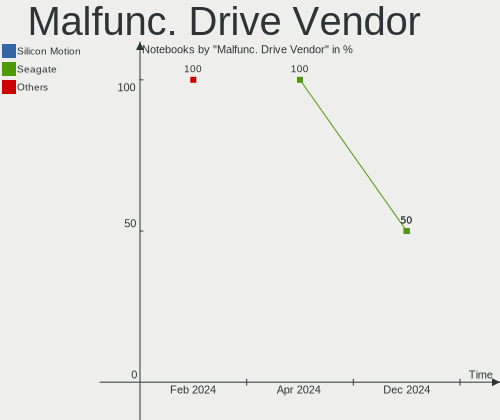
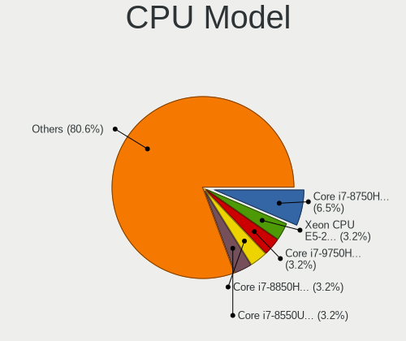
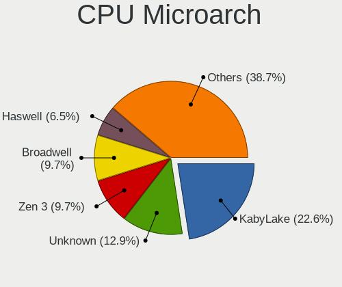
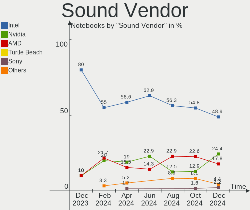

KDE neon - Hardware Trends (Notebooks)
--------------------------------------

A project to identify most popular hardware characteristics and track their change
over time based on data collected by Linux users at https://Linux-Hardware.org.

Anyone can contribute to this report by the [hw-probe](https://github.com/linuxhw/hw-probe) tool:

    sudo -E hw-probe -all -upload

This report is for one last month. Overall report since the beginning of time: [TestDays](https://github.com/linuxhw/TestDays)

Period: Apr, 2023.

Contents
--------

* [ System ](#system)
  - [ OS                       ](#os)
  - [ OS Family                ](#os-family)
  - [ Kernel                   ](#kernel)
  - [ Kernel Family            ](#kernel-family)
  - [ Kernel Major Ver.        ](#kernel-major-ver)
  - [ Arch                     ](#arch)
  - [ DE                       ](#de)
  - [ Display Server           ](#display-server)
  - [ Display Manager          ](#display-manager)
  - [ OS Lang                  ](#os-lang)
  - [ Boot Mode                ](#boot-mode)
  - [ Filesystem               ](#filesystem)
  - [ Part. scheme             ](#part-scheme)
  - [ Dual Boot with Linux/BSD ](#dual-boot-with-linuxbsd)
  - [ Dual Boot (Win)          ](#dual-boot-win)

* [ Board ](#board)
  - [ Vendor                   ](#vendor)
  - [ Model                    ](#model)
  - [ Model Family             ](#model-family)
  - [ MFG Year                 ](#mfg-year)
  - [ Form Factor              ](#form-factor)
  - [ Secure Boot              ](#secure-boot)
  - [ Coreboot                 ](#coreboot)
  - [ RAM Size                 ](#ram-size)
  - [ RAM Used                 ](#ram-used)
  - [ Total Drives             ](#total-drives)
  - [ Has CD-ROM               ](#has-cd-rom)
  - [ Has Ethernet             ](#has-ethernet)
  - [ Has WiFi                 ](#has-wifi)
  - [ Has Bluetooth            ](#has-bluetooth)

* [ Location ](#location)
  - [ Country                  ](#country)
  - [ City                     ](#city)

* [ Drives ](#drives)
  - [ Drive Vendor             ](#drive-vendor)
  - [ Drive Model              ](#drive-model)
  - [ HDD Vendor               ](#hdd-vendor)
  - [ SSD Vendor               ](#ssd-vendor)
  - [ Drive Kind               ](#drive-kind)
  - [ Drive Connector          ](#drive-connector)
  - [ Drive Size               ](#drive-size)
  - [ Space Total              ](#space-total)
  - [ Space Used               ](#space-used)
  - [ Malfunc. Drives          ](#malfunc-drives)
  - [ Malfunc. Drive Vendor    ](#malfunc-drive-vendor)
  - [ Malfunc. HDD Vendor      ](#malfunc-hdd-vendor)
  - [ Malfunc. Drive Kind      ](#malfunc-drive-kind)
  - [ Failed Drives            ](#failed-drives)
  - [ Failed Drive Vendor      ](#failed-drive-vendor)
  - [ Drive Status             ](#drive-status)

* [ Storage controller ](#storage-controller)
  - [ Storage Vendor           ](#storage-vendor)
  - [ Storage Model            ](#storage-model)
  - [ Storage Kind             ](#storage-kind)

* [ Processor ](#processor)
  - [ CPU Vendor               ](#cpu-vendor)
  - [ CPU Model                ](#cpu-model)
  - [ CPU Model Family         ](#cpu-model-family)
  - [ CPU Cores                ](#cpu-cores)
  - [ CPU Sockets              ](#cpu-sockets)
  - [ CPU Threads              ](#cpu-threads)
  - [ CPU Op-Modes             ](#cpu-op-modes)
  - [ CPU Microcode            ](#cpu-microcode)
  - [ CPU Microarch            ](#cpu-microarch)

* [ Graphics ](#graphics)
  - [ GPU Vendor               ](#gpu-vendor)
  - [ GPU Model                ](#gpu-model)
  - [ GPU Combo                ](#gpu-combo)
  - [ GPU Driver               ](#gpu-driver)
  - [ GPU Memory               ](#gpu-memory)

* [ Monitor ](#monitor)
  - [ Monitor Vendor           ](#monitor-vendor)
  - [ Monitor Model            ](#monitor-model)
  - [ Monitor Resolution       ](#monitor-resolution)
  - [ Monitor Diagonal         ](#monitor-diagonal)
  - [ Monitor Width            ](#monitor-width)
  - [ Aspect Ratio             ](#aspect-ratio)
  - [ Monitor Area             ](#monitor-area)
  - [ Pixel Density            ](#pixel-density)
  - [ Multiple Monitors        ](#multiple-monitors)

* [ Network ](#network)
  - [ Net Controller Vendor    ](#net-controller-vendor)
  - [ Net Controller Model     ](#net-controller-model)
  - [ Wireless Vendor          ](#wireless-vendor)
  - [ Wireless Model           ](#wireless-model)
  - [ Ethernet Vendor          ](#ethernet-vendor)
  - [ Ethernet Model           ](#ethernet-model)
  - [ Net Controller Kind      ](#net-controller-kind)
  - [ Used Controller          ](#used-controller)
  - [ NICs                     ](#nics)
  - [ IPv6                     ](#ipv6)

* [ Bluetooth ](#bluetooth)
  - [ Bluetooth Vendor         ](#bluetooth-vendor)
  - [ Bluetooth Model          ](#bluetooth-model)

* [ Sound ](#sound)
  - [ Sound Vendor             ](#sound-vendor)
  - [ Sound Model              ](#sound-model)

* [ Memory ](#memory)
  - [ Memory Vendor            ](#memory-vendor)
  - [ Memory Model             ](#memory-model)
  - [ Memory Kind              ](#memory-kind)
  - [ Memory Form Factor       ](#memory-form-factor)
  - [ Memory Size              ](#memory-size)
  - [ Memory Speed             ](#memory-speed)

* [ Printers & scanners ](#printers--scanners)
  - [ Printer Vendor           ](#printer-vendor)
  - [ Printer Model            ](#printer-model)
  - [ Scanner Vendor           ](#scanner-vendor)
  - [ Scanner Model            ](#scanner-model)

* [ Camera ](#camera)
  - [ Camera Vendor            ](#camera-vendor)
  - [ Camera Model             ](#camera-model)

* [ Security ](#security)
  - [ Fingerprint Vendor       ](#fingerprint-vendor)
  - [ Fingerprint Model        ](#fingerprint-model)
  - [ Chipcard Vendor          ](#chipcard-vendor)
  - [ Chipcard Model           ](#chipcard-model)

* [ Unsupported ](#unsupported)
  - [ Unsupported Devices      ](#unsupported-devices)
  - [ Unsupported Device Types ](#unsupported-device-types)

System
------

OS
--

Installed operating systems

| Name           | Notebooks | Percent |
|----------------|-----------|---------|
| KDE neon 22.04 | 60        | 100%    |

OS Family
---------

OS without a version

| Name     | Notebooks | Percent |
|----------|-----------|---------|
| KDE neon | 60        | 100%    |

Kernel
------

Version of the Linux kernel

| Version                 | Notebooks | Percent |
|-------------------------|-----------|---------|
| 5.19.0-38-generic       | 30        | 50%     |
| 5.19.0-40-generic       | 15        | 25%     |
| 5.19.0-41-generic       | 10        | 16.67%  |
| 5.15.0-60-generic       | 2         | 3.33%   |
| 6.2.10-1-liquorix-amd64 | 1         | 1.67%   |
| 6.0.0-060000-generic    | 1         | 1.67%   |
| 5.19.0-35-generic       | 1         | 1.67%   |

Kernel Family
-------------

Linux kernel without a distro release

| Version | Notebooks | Percent |
|---------|-----------|---------|
| 5.19.0  | 56        | 93.33%  |
| 5.15.0  | 2         | 3.33%   |
| 6.2.10  | 1         | 1.67%   |
| 6.0.0   | 1         | 1.67%   |

Kernel Major Ver.
-----------------

Linux kernel major version

| Version | Notebooks | Percent |
|---------|-----------|---------|
| 5.19    | 56        | 93.33%  |
| 5.15    | 2         | 3.33%   |
| 6.2     | 1         | 1.67%   |
| 6.0     | 1         | 1.67%   |

Arch
----

OS architecture (x86_64, i586, etc.)

| Name   | Notebooks | Percent |
|--------|-----------|---------|
| x86_64 | 60        | 100%    |

DE
--

Desktop Environment

| Name  | Notebooks | Percent |
|-------|-----------|---------|
| KDE5  | 59        | 98.33%  |
| GNOME | 1         | 1.67%   |

Display Server
--------------

X11 or Wayland

| Name    | Notebooks | Percent |
|---------|-----------|---------|
| X11     | 55        | 91.67%  |
| Wayland | 5         | 8.33%   |

Display Manager
---------------

SDDM, LightDM, etc.

| Name    | Notebooks | Percent |
|---------|-----------|---------|
| Unknown | 52        | 86.67%  |
| SDDM    | 8         | 13.33%  |

OS Lang
-------

Language

| Lang  | Notebooks | Percent |
|-------|-----------|---------|
| en_US | 25        | 41.67%  |
| es_MX | 5         | 8.33%   |
| pt_BR | 4         | 6.67%   |
| es_ES | 3         | 5%      |
| en_GB | 3         | 5%      |
| en_AU | 3         | 5%      |
| en_AG | 3         | 5%      |
| ru_RU | 2         | 3.33%   |
| de_DE | 2         | 3.33%   |
| pt_PT | 1         | 1.67%   |
| pl_PL | 1         | 1.67%   |
| it_IT | 1         | 1.67%   |
| hu_HU | 1         | 1.67%   |
| fr_FR | 1         | 1.67%   |
| fr_CA | 1         | 1.67%   |
| en_ZA | 1         | 1.67%   |
| en_PH | 1         | 1.67%   |
| en_IN | 1         | 1.67%   |
| cs_CZ | 1         | 1.67%   |

Boot Mode
---------

EFI or BIOS

| Mode | Notebooks | Percent |
|------|-----------|---------|
| BIOS | 53        | 88.33%  |
| EFI  | 7         | 11.67%  |

Filesystem
----------

Type of filesystem

| Type  | Notebooks | Percent |
|-------|-----------|---------|
| Ext4  | 57        | 95%     |
| Btrfs | 3         | 5%      |

Part. scheme
------------

Scheme of partitioning

| Type    | Notebooks | Percent |
|---------|-----------|---------|
| Unknown | 52        | 86.67%  |
| GPT     | 8         | 13.33%  |

Dual Boot with Linux/BSD
------------------------

Hosting more than one Linux/BSD

| Dual boot | Notebooks | Percent |
|-----------|-----------|---------|
| No        | 60        | 100%    |

Dual Boot (Win)
---------------

Hosting Linux and Windows

| Dual boot | Notebooks | Percent |
|-----------|-----------|---------|
| No        | 56        | 93.33%  |
| Yes       | 4         | 6.67%   |

Board
-----

Vendor
------

Motherboard manufacturer

| Name                | Notebooks | Percent |
|---------------------|-----------|---------|
| Lenovo              | 14        | 23.33%  |
| Hewlett-Packard     | 12        | 20%     |
| Dell                | 11        | 18.33%  |
| ASUSTek Computer    | 4         | 6.67%   |
| Acer                | 4         | 6.67%   |
| MSI                 | 3         | 5%      |
| Timi                | 2         | 3.33%   |
| HUAWEI              | 2         | 3.33%   |
| Apple               | 2         | 3.33%   |
| Unchartevice        | 1         | 1.67%   |
| Samsung Electronics | 1         | 1.67%   |
| Positivo            | 1         | 1.67%   |
| Gigabyte Technology | 1         | 1.67%   |
| Getac               | 1         | 1.67%   |
| Fujitsu             | 1         | 1.67%   |

Model
-----

Motherboard model

| Name                                 | Notebooks | Percent |
|--------------------------------------|-----------|---------|
| Unchartevice 6540                    | 1         | 1.67%   |
| Timi Xiaomi NoteBook Pro             | 1         | 1.67%   |
| Timi Mi Laptop Pro 15 2020           | 1         | 1.67%   |
| Samsung 905S3G/906S3G/915S3G         | 1         | 1.67%   |
| Positivo Q4128C-S                    | 1         | 1.67%   |
| MSI GS65 Stealth 8SE                 | 1         | 1.67%   |
| MSI GP72 7RDX                        | 1         | 1.67%   |
| MSI GE72VR 6RF                       | 1         | 1.67%   |
| Lenovo ThinkPad X220 429044U         | 1         | 1.67%   |
| Lenovo ThinkPad T530 24292DG         | 1         | 1.67%   |
| Lenovo ThinkPad P51 20HH001RMX       | 1         | 1.67%   |
| Lenovo ThinkPad L530 24783B3         | 1         | 1.67%   |
| Lenovo ThinkPad Edge E531 688567G    | 1         | 1.67%   |
| Lenovo ThinkPad E14 Gen 3 20Y7S00700 | 1         | 1.67%   |
| Lenovo Legion 5 Pro 16ACH6 82JS      | 1         | 1.67%   |
| Lenovo IdeaPad Z410 20292            | 1         | 1.67%   |
| Lenovo IdeaPad 5 Pro 14IAP7 82SH     | 1         | 1.67%   |
| Lenovo IdeaPad 5 Pro 14ACN6 82L7     | 1         | 1.67%   |
| Lenovo IdeaPad 3 15ALC6 82KU         | 1         | 1.67%   |
| Lenovo G560 0679                     | 1         | 1.67%   |
| Lenovo G405 20239                    | 1         | 1.67%   |
| Lenovo B570e HuronRiver Platform     | 1         | 1.67%   |
| HUAWEI CREM-WXX9                     | 1         | 1.67%   |
| HUAWEI BOHB-WAX9                     | 1         | 1.67%   |
| HP Victus by Gaming Laptop 15-fb0xxx | 1         | 1.67%   |
| HP ProBook 6570b                     | 1         | 1.67%   |
| HP Pavilion Gaming Laptop 15-ec2xxx  | 1         | 1.67%   |
| HP Pavilion Gaming Laptop 15-ec0xxx  | 1         | 1.67%   |
| HP Pavilion dv7                      | 1         | 1.67%   |
| HP Pavilion dm4                      | 1         | 1.67%   |
| HP OMEN Laptop 15-en1xxx             | 1         | 1.67%   |
| HP Laptop 17-cp0xxx                  | 1         | 1.67%   |
| HP Laptop 15-bs1xx                   | 1         | 1.67%   |
| HP Laptop 14-dk1xxx                  | 1         | 1.67%   |
| HP 2000                              | 1         | 1.67%   |
| Gigabyte G5 GD                       | 1         | 1.67%   |
| Getac X500G2                         | 1         | 1.67%   |
| Fujitsu LIFEBOOK U7411               | 1         | 1.67%   |
| Dell XPS 15 9520                     | 1         | 1.67%   |
| Dell System XPS L702X                | 1         | 1.67%   |

Model Family
------------

Motherboard model prefix

| Name               | Notebooks | Percent |
|--------------------|-----------|---------|
| Lenovo ThinkPad    | 6         | 10%     |
| Dell Inspiron      | 5         | 8.33%   |
| Lenovo IdeaPad     | 4         | 6.67%   |
| HP Pavilion        | 4         | 6.67%   |
| HP Laptop          | 3         | 5%      |
| Dell Latitude      | 3         | 5%      |
| Acer Aspire        | 3         | 5%      |
| ASUS VivoBook      | 2         | 3.33%   |
| Unchartevice 6540  | 1         | 1.67%   |
| Timi Xiaomi        | 1         | 1.67%   |
| Timi Mi            | 1         | 1.67%   |
| Samsung 905S3G     | 1         | 1.67%   |
| Positivo Q4128C-S  | 1         | 1.67%   |
| MSI GS65           | 1         | 1.67%   |
| MSI GP72           | 1         | 1.67%   |
| MSI GE72VR         | 1         | 1.67%   |
| Lenovo Legion      | 1         | 1.67%   |
| Lenovo G560        | 1         | 1.67%   |
| Lenovo G405        | 1         | 1.67%   |
| Lenovo B570e       | 1         | 1.67%   |
| HUAWEI CREM-WXX9   | 1         | 1.67%   |
| HUAWEI BOHB-WAX9   | 1         | 1.67%   |
| HP Victus          | 1         | 1.67%   |
| HP ProBook         | 1         | 1.67%   |
| HP OMEN            | 1         | 1.67%   |
| HP 2000            | 1         | 1.67%   |
| Gigabyte G5        | 1         | 1.67%   |
| Getac X500G2       | 1         | 1.67%   |
| Fujitsu LIFEBOOK   | 1         | 1.67%   |
| Dell XPS           | 1         | 1.67%   |
| Dell System        | 1         | 1.67%   |
| Dell G15           | 1         | 1.67%   |
| ASUS G750JS        | 1         | 1.67%   |
| ASUS ASUS          | 1         | 1.67%   |
| Apple MacBookPro9  | 1         | 1.67%   |
| Apple MacBookPro12 | 1         | 1.67%   |
| Acer Swift         | 1         | 1.67%   |
| Unknown            | 1         | 1.67%   |

MFG Year
--------

Motherboard manufacture year

| Year | Notebooks | Percent |
|------|-----------|---------|
| 2021 | 13        | 21.67%  |
| 2019 | 7         | 11.67%  |
| 2022 | 6         | 10%     |
| 2013 | 5         | 8.33%   |
| 2012 | 5         | 8.33%   |
| 2020 | 4         | 6.67%   |
| 2011 | 4         | 6.67%   |
| 2017 | 3         | 5%      |
| 2015 | 3         | 5%      |
| 2018 | 2         | 3.33%   |
| 2016 | 2         | 3.33%   |
| 2014 | 2         | 3.33%   |
| 2010 | 2         | 3.33%   |
| 2008 | 2         | 3.33%   |

Form Factor
-----------

Physical design of the computer

| Name     | Notebooks | Percent |
|----------|-----------|---------|
| Notebook | 60        | 100%    |

Secure Boot
-----------

Enabled or disabled

| State    | Notebooks | Percent |
|----------|-----------|---------|
| Disabled | 59        | 98.33%  |
| Enabled  | 1         | 1.67%   |

Coreboot
--------

Have coreboot on board

| Used | Notebooks | Percent |
|------|-----------|---------|
| No   | 60        | 100%    |

RAM Size
--------

Total RAM memory

| Size in GB  | Notebooks | Percent |
|-------------|-----------|---------|
| 4.01-8.0    | 23        | 38.33%  |
| 16.01-24.0  | 13        | 21.67%  |
| 8.01-16.0   | 10        | 16.67%  |
| 32.01-64.0  | 5         | 8.33%   |
| 3.01-4.0    | 5         | 8.33%   |
| 1.01-2.0    | 2         | 3.33%   |
| 24.01-32.0  | 1         | 1.67%   |
| 64.01-256.0 | 1         | 1.67%   |

RAM Used
--------

Used RAM memory

| Used GB   | Notebooks | Percent |
|-----------|-----------|---------|
| 2.01-3.0  | 18        | 30%     |
| 1.01-2.0  | 14        | 23.33%  |
| 3.01-4.0  | 13        | 21.67%  |
| 4.01-8.0  | 12        | 20%     |
| 8.01-16.0 | 2         | 3.33%   |
| 0.51-1.0  | 1         | 1.67%   |

Total Drives
------------

Number of drives on board

| Drives | Notebooks | Percent |
|--------|-----------|---------|
| 1      | 43        | 71.67%  |
| 2      | 13        | 21.67%  |
| 3      | 3         | 5%      |
| 4      | 1         | 1.67%   |

Has CD-ROM
----------

Has CD-ROM on board

| Presented | Notebooks | Percent |
|-----------|-----------|---------|
| No        | 42        | 70%     |
| Yes       | 18        | 30%     |

Has Ethernet
------------

Has Ethernet on board

| Presented | Notebooks | Percent |
|-----------|-----------|---------|
| Yes       | 46        | 76.67%  |
| No        | 14        | 23.33%  |

Has WiFi
--------

Has WiFi module

| Presented | Notebooks | Percent |
|-----------|-----------|---------|
| Yes       | 58        | 96.67%  |
| No        | 2         | 3.33%   |

Has Bluetooth
-------------

Has Bluetooth module

| Presented | Notebooks | Percent |
|-----------|-----------|---------|
| Yes       | 52        | 86.67%  |
| No        | 8         | 13.33%  |

Location
--------

Country
-------

Geographic location (country)

| Country      | Notebooks | Percent |
|--------------|-----------|---------|
| USA          | 9         | 15%     |
| Mexico       | 4         | 6.67%   |
| Brazil       | 4         | 6.67%   |
| Spain        | 3         | 5%      |
| Russia       | 3         | 5%      |
| India        | 3         | 5%      |
| Australia    | 3         | 5%      |
| Venezuela    | 2         | 3.33%   |
| UK           | 2         | 3.33%   |
| Thailand     | 2         | 3.33%   |
| Italy        | 2         | 3.33%   |
| Germany      | 2         | 3.33%   |
| Ukraine      | 1         | 1.67%   |
| Taiwan       | 1         | 1.67%   |
| South Africa | 1         | 1.67%   |
| Portugal     | 1         | 1.67%   |
| Poland       | 1         | 1.67%   |
| Philippines  | 1         | 1.67%   |
| Norway       | 1         | 1.67%   |
| Netherlands  | 1         | 1.67%   |
| Luxembourg   | 1         | 1.67%   |
| Latvia       | 1         | 1.67%   |
| Indonesia    | 1         | 1.67%   |
| Hungary      | 1         | 1.67%   |
| Georgia      | 1         | 1.67%   |
| France       | 1         | 1.67%   |
| Egypt        | 1         | 1.67%   |
| Czechia      | 1         | 1.67%   |
| Costa Rica   | 1         | 1.67%   |
| Chile        | 1         | 1.67%   |
| Canada       | 1         | 1.67%   |
| Armenia      | 1         | 1.67%   |
| Algeria      | 1         | 1.67%   |

City
----

Geographic location (city)

| City           | Notebooks | Percent |
|----------------|-----------|---------|
| Valencia       | 2         | 3.33%   |
| Melbourne      | 2         | 3.33%   |
| Zamora         | 1         | 1.67%   |
| Yerevan        | 1         | 1.67%   |
| Verona         | 1         | 1.67%   |
| Veracruz       | 1         | 1.67%   |
| Vallejo        | 1         | 1.67%   |
| Utrecht        | 1         | 1.67%   |
| Ufa            | 1         | 1.67%   |
| Tucson         | 1         | 1.67%   |
| Tbilisi        | 1         | 1.67%   |
| Taichung       | 1         | 1.67%   |
| Sosnowiec      | 1         | 1.67%   |
| Songkhla       | 1         | 1.67%   |
| Santa Rosa     | 1         | 1.67%   |
| Salamanca      | 1         | 1.67%   |
| Saint-Jerome   | 1         | 1.67%   |
| Rostov-on-Don  | 1         | 1.67%   |
| Roselle        | 1         | 1.67%   |
| Riga           | 1         | 1.67%   |
| Pune           | 1         | 1.67%   |
| Puerto Juárez | 1         | 1.67%   |
| Pretoria       | 1         | 1.67%   |
| Prague         | 1         | 1.67%   |
| Polla          | 1         | 1.67%   |
| Pasuruan       | 1         | 1.67%   |
| Oued Sly       | 1         | 1.67%   |
| Oslo           | 1         | 1.67%   |
| Oldham         | 1         | 1.67%   |
| Oakland        | 1         | 1.67%   |
| Mount Clare    | 1         | 1.67%   |
| Moscow         | 1         | 1.67%   |
| Mexico City    | 1         | 1.67%   |
| Maturín       | 1         | 1.67%   |
| Luxembourg     | 1         | 1.67%   |
| Kingsport      | 1         | 1.67%   |
| Keuka Park     | 1         | 1.67%   |
| Hueckelhoven   | 1         | 1.67%   |
| Houilles       | 1         | 1.67%   |
| Hamburg        | 1         | 1.67%   |

Drives
------

Drive Vendor
------------

Hard drive vendors

| Vendor                       | Notebooks | Drives | Percent |
|------------------------------|-----------|--------|---------|
| Samsung Electronics          | 11        | 11     | 13.41%  |
| Sandisk                      | 9         | 9      | 10.98%  |
| Unknown                      | 8         | 8      | 9.76%   |
| Toshiba                      | 6         | 6      | 7.32%   |
| Seagate                      | 5         | 5      | 6.1%    |
| SK hynix                     | 4         | 4      | 4.88%   |
| Kingston                     | 4         | 4      | 4.88%   |
| WDC                          | 3         | 3      | 3.66%   |
| KIOXIA                       | 3         | 3      | 3.66%   |
| Kingston Technology Company  | 3         | 3      | 3.66%   |
| HGST                         | 3         | 3      | 3.66%   |
| Crucial                      | 3         | 4      | 3.66%   |
| Phison Electronics           | 2         | 2      | 2.44%   |
| Intel                        | 2         | 2      | 2.44%   |
| XrayDisk                     | 1         | 1      | 1.22%   |
| Verbatim                     | 1         | 1      | 1.22%   |
| SPCC                         | 1         | 1      | 1.22%   |
| Shenzhen Longsys Electronics | 1         | 1      | 1.22%   |
| Realtek Semiconductor        | 1         | 1      | 1.22%   |
| Phison                       | 1         | 1      | 1.22%   |
| Micron/Crucial Technology    | 1         | 1      | 1.22%   |
| LITEONIT                     | 1         | 1      | 1.22%   |
| Lenovo                       | 1         | 1      | 1.22%   |
| JMicron Technology           | 1         | 1      | 1.22%   |
| Hitachi                      | 1         | 1      | 1.22%   |
| China                        | 1         | 1      | 1.22%   |
| ASENNO                       | 1         | 1      | 1.22%   |
| Apple                        | 1         | 1      | 1.22%   |
| A-DATA Technology            | 1         | 1      | 1.22%   |
| Unknown                      | 1         | 1      | 1.22%   |

Drive Model
-----------

Hard drive models

| Model                                                 | Notebooks | Percent |
|-------------------------------------------------------|-----------|---------|
| Unknown MMC Card  128GB                               | 3         | 3.61%   |
| Unknown SD/MMC/MS PRO 249GB                           | 2         | 2.41%   |
| Unknown MMC Card  64GB                                | 2         | 2.41%   |
| Toshiba MQ04ABF100 1TB                                | 2         | 2.41%   |
| Sandisk WD Black SN750 / PC SN730 NVMe SSD 512GB      | 2         | 2.41%   |
| Samsung SSD 850 EVO 250GB                             | 2         | 2.41%   |
| Kingston Company OM3PDP3 NVMe SSD 512GB               | 2         | 2.41%   |
| Kingston SA400S37240G 240GB SSD                       | 2         | 2.41%   |
| HGST HTS721010A9E630 1TB                              | 2         | 2.41%   |
| XrayDisk 512GB SSD                                    | 1         | 1.2%    |
| WDC WDBNCE5000PNC 500GB SSD                           | 1         | 1.2%    |
| WDC WD5000LPVX-22V0TT0 500GB                          | 1         | 1.2%    |
| WDC PC SN530 SDBPNPZ-512G-1114 512GB                  | 1         | 1.2%    |
| Verbatim Vi550 S3 128GB                               | 1         | 1.2%    |
| Unknown MMC Card  1GB                                 | 1         | 1.2%    |
| Toshiba XG6 NVMe SSD Controller 1024GB                | 1         | 1.2%    |
| Toshiba MQ01ABF032 320GB                              | 1         | 1.2%    |
| Toshiba KBG40ZNS128G NVMe 128GB                       | 1         | 1.2%    |
| Toshiba HDWJ105 500GB                                 | 1         | 1.2%    |
| SPCC Solid State Disk 128GB                           | 1         | 1.2%    |
| SK hynix PC801 NVMe 1TB                               | 1         | 1.2%    |
| SK hynix PC711 NVMe 512GB                             | 1         | 1.2%    |
| SK hynix HFS256G39MND-3510A 256GB SSD                 | 1         | 1.2%    |
| SK hynix BC501 NVMe Solid State Drive 512GB           | 1         | 1.2%    |
| Shenzhen Longsys Lexar SSD NM620 1TB                  | 1         | 1.2%    |
| Seagate ST9750420AS 752GB                             | 1         | 1.2%    |
| Seagate ST500LM021-1KJ152 500GB                       | 1         | 1.2%    |
| Seagate ST500LM012 HN-M500MBB 500GB                   | 1         | 1.2%    |
| Seagate ST1000LM024 HN-M101MBB 1TB                    | 1         | 1.2%    |
| Seagate BUP Portable 5TB                              | 1         | 1.2%    |
| Sandisk WDC WDS100T2B0C-00PXH0 1TB                    | 1         | 1.2%    |
| Sandisk WDC PC SN530 SDBPMPZ-256G-1101 256GB          | 1         | 1.2%    |
| Sandisk WD Black 2018/SN750 / PC SN720 NVMe SSD 500GB | 1         | 1.2%    |
| SanDisk SD9SN8W256G1002 256GB SSD                     | 1         | 1.2%    |
| SanDisk SD9SN8W-128G-1006 128GB SSD                   | 1         | 1.2%    |
| SanDisk SD6SP1M128G1002 128GB SSD                     | 1         | 1.2%    |
| SanDisk NVMe SSD Drive 500GB                          | 1         | 1.2%    |
| Samsung SSD 980 500GB                                 | 1         | 1.2%    |
| Samsung PSSD T7 500GB                                 | 1         | 1.2%    |
| Samsung NVMe SSD Controller SM981/PM981/PM983 1TB     | 1         | 1.2%    |

HDD Vendor
----------

Hard disk drive vendors

| Vendor  | Notebooks | Drives | Percent |
|---------|-----------|--------|---------|
| Seagate | 5         | 5      | 31.25%  |
| Toshiba | 4         | 4      | 25%     |
| HGST    | 3         | 3      | 18.75%  |
| Unknown | 2         | 2      | 12.5%   |
| WDC     | 1         | 1      | 6.25%   |
| Hitachi | 1         | 1      | 6.25%   |

SSD Vendor
----------

Solid state drive vendors

| Vendor              | Notebooks | Drives | Percent |
|---------------------|-----------|--------|---------|
| Samsung Electronics | 5         | 5      | 19.23%  |
| Kingston            | 4         | 4      | 15.38%  |
| SanDisk             | 3         | 3      | 11.54%  |
| Crucial             | 3         | 4      | 11.54%  |
| XrayDisk            | 1         | 1      | 3.85%   |
| WDC                 | 1         | 1      | 3.85%   |
| Verbatim            | 1         | 1      | 3.85%   |
| SPCC                | 1         | 1      | 3.85%   |
| SK hynix            | 1         | 1      | 3.85%   |
| LITEONIT            | 1         | 1      | 3.85%   |
| Lenovo              | 1         | 1      | 3.85%   |
| China               | 1         | 1      | 3.85%   |
| ASENNO              | 1         | 1      | 3.85%   |
| Apple               | 1         | 1      | 3.85%   |
| A-DATA Technology   | 1         | 1      | 3.85%   |

Drive Kind
----------

HDD or SSD

| Kind    | Notebooks | Drives | Percent |
|---------|-----------|--------|---------|
| NVMe    | 30        | 32     | 40.54%  |
| SSD     | 23        | 27     | 31.08%  |
| HDD     | 14        | 16     | 18.92%  |
| MMC     | 6         | 7      | 8.11%   |
| Unknown | 1         | 1      | 1.35%   |

Drive Connector
---------------

SATA, SAS, NVMe, etc.

| Type | Notebooks | Drives | Percent |
|------|-----------|--------|---------|
| SATA | 32        | 39     | 43.84%  |
| NVMe | 30        | 32     | 41.1%   |
| MMC  | 6         | 7      | 8.22%   |
| SAS  | 5         | 5      | 6.85%   |

Drive Size
----------

Size of hard drive

| Size in TB | Notebooks | Drives | Percent |
|------------|-----------|--------|---------|
| 0.01-0.5   | 28        | 33     | 73.68%  |
| 0.51-1.0   | 8         | 8      | 21.05%  |
| 1.01-2.0   | 1         | 1      | 2.63%   |
| 4.01-10.0  | 1         | 1      | 2.63%   |

Space Total
-----------

Amount of disk space available on the file system

| Size in GB     | Notebooks | Percent |
|----------------|-----------|---------|
| 101-250        | 28        | 46.67%  |
| 251-500        | 15        | 25%     |
| Unknown        | 5         | 8.33%   |
| 1001-2000      | 4         | 6.67%   |
| 501-1000       | 3         | 5%      |
| 51-100         | 3         | 5%      |
| More than 3000 | 2         | 3.33%   |

Space Used
----------

Amount of used disk space

| Used GB        | Notebooks | Percent |
|----------------|-----------|---------|
| 1-20           | 23        | 38.33%  |
| 21-50          | 12        | 20%     |
| 101-250        | 8         | 13.33%  |
| 51-100         | 6         | 10%     |
| Unknown        | 5         | 8.33%   |
| 251-500        | 3         | 5%      |
| 501-1000       | 2         | 3.33%   |
| More than 3000 | 1         | 1.67%   |

Malfunc. Drives
---------------

Drive models with a malfunction

| Model                  | Notebooks | Drives | Percent |
|------------------------|-----------|--------|---------|
| Toshiba MQ04ABF100 1TB | 1         | 1      | 100%    |

Malfunc. Drive Vendor
---------------------

Vendors of faulty drives

| Vendor  | Notebooks | Drives | Percent |
|---------|-----------|--------|---------|
| Toshiba | 1         | 1      | 100%    |

Malfunc. HDD Vendor
-------------------

Vendors of faulty HDD drives

| Vendor  | Notebooks | Drives | Percent |
|---------|-----------|--------|---------|
| Toshiba | 1         | 1      | 100%    |

Malfunc. Drive Kind
-------------------

Kinds of faulty drives

| Kind | Notebooks | Drives | Percent |
|------|-----------|--------|---------|
| HDD  | 1         | 1      | 100%    |

Failed Drives
-------------

Failed drive models

Zero info for selected period =(

Failed Drive Vendor
-------------------

Failed drive vendors

Zero info for selected period =(

Drive Status
------------

Number of failed and malfunc. drives

| Status   | Notebooks | Drives | Percent |
|----------|-----------|--------|---------|
| Detected | 54        | 76     | 88.52%  |
| Works    | 6         | 6      | 9.84%   |
| Malfunc  | 1         | 1      | 1.64%   |

Storage controller
------------------

Storage Vendor
--------------

Storage controller vendors

| Vendor                       | Notebooks | Percent |
|------------------------------|-----------|---------|
| Intel                        | 33        | 42.86%  |
| AMD                          | 13        | 16.88%  |
| SanDisk                      | 7         | 9.09%   |
| Samsung Electronics          | 7         | 9.09%   |
| KIOXIA                       | 4         | 5.19%   |
| SK hynix                     | 3         | 3.9%    |
| Phison Electronics           | 3         | 3.9%    |
| Kingston Technology Company  | 3         | 3.9%    |
| Toshiba America Info Systems | 1         | 1.3%    |
| Shenzhen Longsys Electronics | 1         | 1.3%    |
| Realtek Semiconductor        | 1         | 1.3%    |
| Micron/Crucial Technology    | 1         | 1.3%    |

Storage Model
-------------

Storage controller models

| Model                                                                          | Notebooks | Percent |
|--------------------------------------------------------------------------------|-----------|---------|
| AMD FCH SATA Controller [AHCI mode]                                            | 11        | 13.41%  |
| Intel 7 Series Chipset Family 6-port SATA Controller [AHCI mode]               | 5         | 6.1%    |
| Intel Cannon Point-LP SATA Controller [AHCI Mode]                              | 4         | 4.88%   |
| Samsung NVMe SSD Controller 980                                                | 3         | 3.66%   |
| Intel 8 Series/C220 Series Chipset Family 6-port SATA Controller 1 [AHCI mode] | 3         | 3.66%   |
| Intel 6 Series/C200 Series Chipset Family 6 port Mobile SATA AHCI Controller   | 3         | 3.66%   |
| SanDisk WD Black SN750 / PC SN730 NVMe SSD                                     | 2         | 2.44%   |
| KIOXIA NVMe SSD Controller BG4                                                 | 2         | 2.44%   |
| KIOXIA Non-Volatile memory controller                                          | 2         | 2.44%   |
| Kingston Company OM3PDP3 NVMe SSD                                              | 2         | 2.44%   |
| Intel Volume Management Device NVMe RAID Controller                            | 2         | 2.44%   |
| Intel Sunrise Point-LP SATA Controller [AHCI mode]                             | 2         | 2.44%   |
| Intel HM170/QM170 Chipset SATA Controller [AHCI Mode]                          | 2         | 2.44%   |
| Intel 5 Series/3400 Series Chipset 4 port SATA AHCI Controller                 | 2         | 2.44%   |
| Toshiba America Info Systems XG6 NVMe SSD Controller                           | 1         | 1.22%   |
| SK hynix Platinum P41 NVMe Solid State Drive 2TB                               | 1         | 1.22%   |
| SK hynix Gold P31/PC711 NVMe Solid State Drive                                 | 1         | 1.22%   |
| SK hynix BC501 NVMe Solid State Drive                                          | 1         | 1.22%   |
| Shenzhen Longsys Electronics Non-Volatile memory controller                    | 1         | 1.22%   |
| SanDisk WD Blue SN570 NVMe SSD 1TB                                             | 1         | 1.22%   |
| SanDisk WD Blue SN550 NVMe SSD                                                 | 1         | 1.22%   |
| SanDisk WD Black 2018/SN750 / PC SN720 NVMe SSD                                | 1         | 1.22%   |
| SanDisk NVMe Controller                                                        | 1         | 1.22%   |
| SanDisk Non-Volatile memory controller                                         | 1         | 1.22%   |
| Samsung NVMe SSD Controller SM981/PM981/PM983                                  | 1         | 1.22%   |
| Samsung NVMe SSD Controller SM961/PM961/SM963                                  | 1         | 1.22%   |
| Samsung NVMe SSD Controller PM9A1/PM9A3/980PRO                                 | 1         | 1.22%   |
| Samsung Electronics SATA controller                                            | 1         | 1.22%   |
| Realtek NVMe Controller                                                        | 1         | 1.22%   |
| Phison PS5013 E13 NVMe Controller                                              | 1         | 1.22%   |
| Phison E16 PCIe4 NVMe Controller                                               | 1         | 1.22%   |
| Phison E12 NVMe Controller                                                     | 1         | 1.22%   |
| Micron/Crucial P2 NVMe PCIe SSD                                                | 1         | 1.22%   |
| Kingston Company Company Non-Volatile memory controller                        | 1         | 1.22%   |
| Intel Wildcat Point-LP SATA Controller [AHCI Mode]                             | 1         | 1.22%   |
| Intel SSD 660P Series                                                          | 1         | 1.22%   |
| Intel SATA Controller [RAID mode]                                              | 1         | 1.22%   |
| Intel Non-Volatile memory controller                                           | 1         | 1.22%   |
| Intel Comet Lake SATA AHCI Controller                                          | 1         | 1.22%   |
| Intel 82801IBM/IEM (ICH9M/ICH9M-E) 4 port SATA Controller [AHCI mode]          | 1         | 1.22%   |

Storage Kind
------------

Kind of storage controller (IDE, SATA, NVMe, SAS, ...)

| Kind | Notebooks | Percent |
|------|-----------|---------|
| SATA | 40        | 51.95%  |
| NVMe | 30        | 38.96%  |
| RAID | 4         | 5.19%   |
| IDE  | 3         | 3.9%    |

Processor
---------

CPU Vendor
----------

Processor vendors

| Vendor | Notebooks | Percent |
|--------|-----------|---------|
| Intel  | 41        | 68.33%  |
| AMD    | 19        | 31.67%  |

CPU Model
---------

Processor models

| Model                                   | Notebooks | Percent |
|-----------------------------------------|-----------|---------|
| AMD Ryzen 7 5800H with Radeon Graphics  | 3         | 5%      |
| Intel Core i7-8565U CPU @ 1.80GHz       | 2         | 3.33%   |
| Intel Core i5-3230M CPU @ 2.60GHz       | 2         | 3.33%   |
| Intel Core i5 CPU M 430 @ 2.27GHz       | 2         | 3.33%   |
| Intel 11th Gen Core i5-11400H @ 2.70GHz | 2         | 3.33%   |
| AMD Ryzen 5 5600U with Radeon Graphics  | 2         | 3.33%   |
| AMD Ryzen 5 5600H with Radeon Graphics  | 2         | 3.33%   |
| AMD Ryzen 3 3250U with Radeon Graphics  | 2         | 3.33%   |
| Intel Pentium Dual CPU T2370 @ 1.73GHz  | 1         | 1.67%   |
| Intel Pentium CPU P6200 @ 2.13GHz       | 1         | 1.67%   |
| Intel Pentium CPU 2020M @ 2.40GHz       | 1         | 1.67%   |
| Intel Core i7-8750H CPU @ 2.20GHz       | 1         | 1.67%   |
| Intel Core i7-7820HQ CPU @ 2.90GHz      | 1         | 1.67%   |
| Intel Core i7-7700HQ CPU @ 2.80GHz      | 1         | 1.67%   |
| Intel Core i7-6700HQ CPU @ 2.60GHz      | 1         | 1.67%   |
| Intel Core i7-5500U CPU @ 2.40GHz       | 1         | 1.67%   |
| Intel Core i7-4702MQ CPU @ 2.20GHz      | 1         | 1.67%   |
| Intel Core i7-4700HQ CPU @ 2.40GHz      | 1         | 1.67%   |
| Intel Core i7-4600M CPU @ 2.90GHz       | 1         | 1.67%   |
| Intel Core i7-3630QM CPU @ 2.40GHz      | 1         | 1.67%   |
| Intel Core i7-3520M CPU @ 2.90GHz       | 1         | 1.67%   |
| Intel Core i7-2670QM CPU @ 2.20GHz      | 1         | 1.67%   |
| Intel Core i7-10510U CPU @ 1.80GHz      | 1         | 1.67%   |
| Intel Core i5-8265U CPU @ 1.60GHz       | 1         | 1.67%   |
| Intel Core i5-8250U CPU @ 1.60GHz       | 1         | 1.67%   |
| Intel Core i5-7200U CPU @ 2.50GHz       | 1         | 1.67%   |
| Intel Core i5-5257U CPU @ 2.70GHz       | 1         | 1.67%   |
| Intel Core i5-3320M CPU @ 2.60GHz       | 1         | 1.67%   |
| Intel Core i5-3210M CPU @ 2.50GHz       | 1         | 1.67%   |
| Intel Core i5-2520M CPU @ 2.50GHz       | 1         | 1.67%   |
| Intel Core i5-10210U CPU @ 1.60GHz      | 1         | 1.67%   |
| Intel Core i5-10200H CPU @ 2.40GHz      | 1         | 1.67%   |
| Intel Core i3-8145U CPU @ 2.10GHz       | 1         | 1.67%   |
| Intel Core 2 Duo CPU P7450 @ 2.13GHz    | 1         | 1.67%   |
| Intel Celeron CPU B800 @ 1.50GHz        | 1         | 1.67%   |
| Intel Atom x5-Z8330 CPU @ 1.44GHz       | 1         | 1.67%   |
| Intel 12th Gen Core i7-12700H           | 1         | 1.67%   |
| Intel 12th Gen Core i5-12450H           | 1         | 1.67%   |
| Intel 12th Gen Core i5-1240P            | 1         | 1.67%   |
| Intel 11th Gen Core i7-1165G7 @ 2.80GHz | 1         | 1.67%   |

CPU Model Family
----------------

Processor model prefix

| Model              | Notebooks | Percent |
|--------------------|-----------|---------|
| Intel Core i7      | 14        | 23.33%  |
| Intel Core i5      | 13        | 21.67%  |
| Other              | 7         | 11.67%  |
| AMD Ryzen 5        | 7         | 11.67%  |
| AMD Ryzen 7        | 4         | 6.67%   |
| AMD Ryzen 3        | 4         | 6.67%   |
| Intel Pentium      | 2         | 3.33%   |
| Intel Pentium Dual | 1         | 1.67%   |
| Intel Core i3      | 1         | 1.67%   |
| Intel Core 2 Duo   | 1         | 1.67%   |
| Intel Celeron      | 1         | 1.67%   |
| Intel Atom         | 1         | 1.67%   |
| AMD Quad-Core      | 1         | 1.67%   |
| AMD E1             | 1         | 1.67%   |
| AMD E              | 1         | 1.67%   |
| AMD Athlon         | 1         | 1.67%   |

CPU Cores
---------

Number of processor cores

| Number | Notebooks | Percent |
|--------|-----------|---------|
| 2      | 24        | 40%     |
| 4      | 21        | 35%     |
| 6      | 8         | 13.33%  |
| 8      | 5         | 8.33%   |
| 14     | 1         | 1.67%   |
| 12     | 1         | 1.67%   |

CPU Sockets
-----------

Number of sockets

| Number | Notebooks | Percent |
|--------|-----------|---------|
| 1      | 60        | 100%    |

CPU Threads
-----------

Threads per core (Hyper-Threading)

| Number | Notebooks | Percent |
|--------|-----------|---------|
| 2      | 50        | 83.33%  |
| 1      | 10        | 16.67%  |

CPU Op-Modes
------------

CPU Operation Modes (32-bit, 64-bit)

| Op mode        | Notebooks | Percent |
|----------------|-----------|---------|
| 32-bit, 64-bit | 60        | 100%    |

CPU Microcode
-------------

Microcode number

| Number     | Notebooks | Percent |
|------------|-----------|---------|
| Unknown    | 52        | 86.67%  |
| 0x806ec    | 2         | 3.33%   |
| 0x306c3    | 2         | 3.33%   |
| 0x906a3    | 1         | 1.67%   |
| 0x806eb    | 1         | 1.67%   |
| 0x406c4    | 1         | 1.67%   |
| 0x0a50000c | 1         | 1.67%   |

CPU Microarch
-------------

Microarchitecture

| Name             | Notebooks | Percent |
|------------------|-----------|---------|
| KabyLake         | 11        | 18.33%  |
| Zen 3            | 7         | 11.67%  |
| IvyBridge        | 7         | 11.67%  |
| Unknown          | 7         | 11.67%  |
| Zen+             | 5         | 8.33%   |
| Westmere         | 3         | 5%      |
| SandyBridge      | 3         | 5%      |
| Haswell          | 3         | 5%      |
| TigerLake        | 2         | 3.33%   |
| Jaguar           | 2         | 3.33%   |
| Broadwell        | 2         | 3.33%   |
| Zen              | 1         | 1.67%   |
| Skylake          | 1         | 1.67%   |
| Silvermont       | 1         | 1.67%   |
| Penryn           | 1         | 1.67%   |
| Core             | 1         | 1.67%   |
| CometLake        | 1         | 1.67%   |
| Bobcat           | 1         | 1.67%   |
| Alderlake Hybrid | 1         | 1.67%   |

Graphics
--------

GPU Vendor
----------

Vendors of graphics cards

| Vendor | Notebooks | Percent |
|--------|-----------|---------|
| Intel  | 39        | 46.43%  |
| Nvidia | 25        | 29.76%  |
| AMD    | 20        | 23.81%  |

GPU Model
---------

Graphics card models

| Model                                                                     | Notebooks | Percent |
|---------------------------------------------------------------------------|-----------|---------|
| Intel 3rd Gen Core processor Graphics Controller                          | 7         | 8.14%   |
| AMD Cezanne [Radeon Vega Series / Radeon Vega Mobile Series]              | 6         | 6.98%   |
| AMD Picasso/Raven 2 [Radeon Vega Series / Radeon Vega Mobile Series]      | 5         | 5.81%   |
| Intel WhiskeyLake-U GT2 [UHD Graphics 620]                                | 4         | 4.65%   |
| Nvidia GA107M [GeForce RTX 3050 Mobile]                                   | 3         | 3.49%   |
| Intel Core Processor Integrated Graphics Controller                       | 3         | 3.49%   |
| Intel 4th Gen Core Processor Integrated Graphics Controller               | 3         | 3.49%   |
| Intel 2nd Generation Core Processor Family Integrated Graphics Controller | 3         | 3.49%   |
| AMD Lucienne                                                              | 3         | 3.49%   |
| Nvidia TU117M [GeForce GTX 1650 Mobile / Max-Q]                           | 2         | 2.33%   |
| Nvidia GP107M [GeForce GTX 1050 Mobile]                                   | 2         | 2.33%   |
| Nvidia GA107M [GeForce RTX 3050 Ti Mobile]                                | 2         | 2.33%   |
| Intel TigerLake-LP GT2 [Iris Xe Graphics]                                 | 2         | 2.33%   |
| Intel TigerLake-H GT1 [UHD Graphics]                                      | 2         | 2.33%   |
| Intel CometLake-U GT2 [UHD Graphics]                                      | 2         | 2.33%   |
| Intel Alder Lake-P Integrated Graphics Controller                         | 2         | 2.33%   |
| Nvidia TU117M [GeForce MX550]                                             | 1         | 1.16%   |
| Nvidia TU106M [GeForce RTX 2060 Mobile]                                   | 1         | 1.16%   |
| Nvidia GP108M [GeForce MX150]                                             | 1         | 1.16%   |
| Nvidia GP107M [GeForce MX350]                                             | 1         | 1.16%   |
| Nvidia GP107M [GeForce GTX 1050 3 GB Max-Q]                               | 1         | 1.16%   |
| Nvidia GP106M [GeForce GTX 1060 Mobile]                                   | 1         | 1.16%   |
| Nvidia GM206GLM [Quadro M2200 Mobile]                                     | 1         | 1.16%   |
| Nvidia GM108M [GeForce MX130]                                             | 1         | 1.16%   |
| Nvidia GM107M [GeForce GTX 950M]                                          | 1         | 1.16%   |
| Nvidia GK208M [GeForce GT 740M]                                           | 1         | 1.16%   |
| Nvidia GK107M [GeForce GT 745M]                                           | 1         | 1.16%   |
| Nvidia GK104M [GeForce GTX 880M]                                          | 1         | 1.16%   |
| Nvidia GF116M [GeForce GT 555M/635M]                                      | 1         | 1.16%   |
| Nvidia GA107BM [GeForce RTX 3050 Ti Mobile]                               | 1         | 1.16%   |
| Nvidia GA106M [GeForce RTX 3060 Mobile / Max-Q]                           | 1         | 1.16%   |
| Nvidia G96CM [GeForce 9600M GT]                                           | 1         | 1.16%   |
| Intel UHD Graphics 620                                                    | 1         | 1.16%   |
| Intel Mobile GM965/GL960 Integrated Graphics Controller (secondary)       | 1         | 1.16%   |
| Intel Mobile GM965/GL960 Integrated Graphics Controller (primary)         | 1         | 1.16%   |
| Intel Iris Graphics 6100                                                  | 1         | 1.16%   |
| Intel HD Graphics 630                                                     | 1         | 1.16%   |
| Intel HD Graphics 620                                                     | 1         | 1.16%   |
| Intel HD Graphics 5500                                                    | 1         | 1.16%   |
| Intel HD Graphics 530                                                     | 1         | 1.16%   |

GPU Combo
---------

Combinations of graphics cards

| Name           | Notebooks | Percent |
|----------------|-----------|---------|
| 1 x Intel      | 21        | 35%     |
| Intel + Nvidia | 16        | 26.67%  |
| 1 x AMD        | 11        | 18.33%  |
| AMD + Nvidia   | 6         | 10%     |
| 1 x Nvidia     | 3         | 5%      |
| Intel + AMD    | 2         | 3.33%   |
| 2 x AMD        | 1         | 1.67%   |

GPU Driver
----------

Free vs proprietary

| Driver      | Notebooks | Percent |
|-------------|-----------|---------|
| Free        | 47        | 78.33%  |
| Proprietary | 11        | 18.33%  |
| Unknown     | 2         | 3.33%   |

GPU Memory
----------

Total video memory

| Size in GB | Notebooks | Percent |
|------------|-----------|---------|
| Unknown    | 58        | 96.67%  |
| 3.01-4.0   | 1         | 1.67%   |
| 1.01-2.0   | 1         | 1.67%   |

Monitor
-------

Monitor Vendor
--------------

Monitor vendors

| Vendor                  | Notebooks | Percent |
|-------------------------|-----------|---------|
| AU Optronics            | 17        | 23.29%  |
| BOE                     | 11        | 15.07%  |
| Samsung Electronics     | 10        | 13.7%   |
| LG Display              | 7         | 9.59%   |
| Chimei Innolux          | 6         | 8.22%   |
| PANDA                   | 4         | 5.48%   |
| Dell                    | 3         | 4.11%   |
| Philips                 | 2         | 2.74%   |
| Chi Mei Optoelectronics | 2         | 2.74%   |
| BenQ                    | 2         | 2.74%   |
| Apple                   | 2         | 2.74%   |
| Sharp                   | 1         | 1.37%   |
| Positivo                | 1         | 1.37%   |
| Hewlett-Packard         | 1         | 1.37%   |
| Goldstar                | 1         | 1.37%   |
| Eizo                    | 1         | 1.37%   |
| CRM                     | 1         | 1.37%   |
| Acer                    | 1         | 1.37%   |

Monitor Model
-------------

Monitor models

| Model                                                                    | Notebooks | Percent |
|--------------------------------------------------------------------------|-----------|---------|
| PANDA LCD Monitor NCP004D 1920x1080 344x194mm 15.5-inch                  | 2         | 2.67%   |
| Sharp LQ156M1JW01 SHP14C3 1920x1080 344x194mm 15.5-inch                  | 1         | 1.33%   |
| Samsung Electronics SyncMaster SAM043F 1920x1200 518x324mm 24.1-inch     | 1         | 1.33%   |
| Samsung Electronics SM2333TN SAM06FC 1920x1080 477x268mm 21.5-inch       | 1         | 1.33%   |
| Samsung Electronics S24C650 SAM0B15 1920x1200 518x324mm 24.1-inch        | 1         | 1.33%   |
| Samsung Electronics LCD Monitor SEC5441 1366x768 344x194mm 15.5-inch     | 1         | 1.33%   |
| Samsung Electronics LCD Monitor SEC4251 1366x768 344x194mm 15.5-inch     | 1         | 1.33%   |
| Samsung Electronics LCD Monitor SEC3358 1280x800 331x207mm 15.4-inch     | 1         | 1.33%   |
| Samsung Electronics LCD Monitor SEC334B 1440x900 367x230mm 17.1-inch     | 1         | 1.33%   |
| Samsung Electronics LCD Monitor SEC3252 1600x900 344x194mm 15.5-inch     | 1         | 1.33%   |
| Samsung Electronics LCD Monitor SDC4C46 3840x2160 344x194mm 15.5-inch    | 1         | 1.33%   |
| Samsung Electronics LCD Monitor SDC3352 1366x768 344x194mm 15.5-inch     | 1         | 1.33%   |
| Samsung Electronics LCD Monitor SAM0503 1920x1080                        | 1         | 1.33%   |
| Positivo FIT85X NON1801 1360x768 344x194mm 15.5-inch                     | 1         | 1.33%   |
| Philips PHL 243V7 PHLC155 1920x1080 527x296mm 23.8-inch                  | 1         | 1.33%   |
| Philips PHL 241B8Q PHL0929 1920x1080 527x296mm 23.8-inch                 | 1         | 1.33%   |
| PANDA LCD Monitor NCP005F 1920x1080 344x194mm 15.5-inch                  | 1         | 1.33%   |
| PANDA LCD Monitor NCP0027 1920x1080 344x194mm 15.5-inch                  | 1         | 1.33%   |
| LG Display LP156WH2-TLR2 LGD027D 1366x768 344x194mm 15.5-inch            | 1         | 1.33%   |
| LG Display LP156WH2-TLAA LGD0230 1366x768 344x194mm 15.5-inch            | 1         | 1.33%   |
| LG Display LCD Monitor LGD069A 1920x1080 344x194mm 15.5-inch             | 1         | 1.33%   |
| LG Display LCD Monitor LGD05FE 1920x1080 344x194mm 15.5-inch             | 1         | 1.33%   |
| LG Display LCD Monitor LGD0469 1920x1080 382x215mm 17.3-inch             | 1         | 1.33%   |
| LG Display LCD Monitor LGD02AC 1366x768 344x194mm 15.5-inch              | 1         | 1.33%   |
| LG Display LCD Monitor LGD0201 1366x768 310x174mm 14.0-inch              | 1         | 1.33%   |
| Hewlett-Packard Z24n HWP3211 1920x1080 518x324mm 24.1-inch               | 1         | 1.33%   |
| Goldstar ULTRAGEAR GSM5BB3 2560x1440 597x336mm 27.0-inch                 | 1         | 1.33%   |
| Eizo EV2455 ENC2534 1920x1080 519x324mm 24.1-inch                        | 1         | 1.33%   |
| Dell U2723QE DEL4277 3840x2160 597x336mm 27.0-inch                       | 1         | 1.33%   |
| Dell U2415 DELA0BA 1920x1080 518x324mm 24.1-inch                         | 1         | 1.33%   |
| Dell U2415 DELA0B8 1920x1080 518x324mm 24.1-inch                         | 1         | 1.33%   |
| Dell P2219H DELA115 1920x1080 476x267mm 21.5-inch                        | 1         | 1.33%   |
| CRM 32QHD165 CRM1B1C 2560x1440 708x399mm 32.0-inch                       | 1         | 1.33%   |
| Chimei Innolux LCD Monitor CMN1735 1920x1080 381x214mm 17.2-inch         | 1         | 1.33%   |
| Chimei Innolux LCD Monitor CMN14F2 1920x1080 309x173mm 13.9-inch         | 1         | 1.33%   |
| Chimei Innolux LCD Monitor CMN14E5 1920x1080 309x173mm 13.9-inch         | 1         | 1.33%   |
| Chimei Innolux LCD Monitor CMN14E3 1366x768 309x173mm 13.9-inch          | 1         | 1.33%   |
| Chimei Innolux LCD Monitor CMN14D6 1366x768 309x173mm 13.9-inch          | 1         | 1.33%   |
| Chimei Innolux LCD Monitor CMN1492 1366x768 309x174mm 14.0-inch          | 1         | 1.33%   |
| Chi Mei Optoelectronics LCD Monitor CMO1718 1600x900 382x215mm 17.3-inch | 1         | 1.33%   |

Monitor Resolution
------------------

Monitor screen resolution

| Resolution        | Notebooks | Percent |
|-------------------|-----------|---------|
| 1920x1080 (FHD)   | 29        | 43.28%  |
| 1366x768 (WXGA)   | 18        | 26.87%  |
| 3840x2160 (4K)    | 3         | 4.48%   |
| 1920x1200 (WUXGA) | 3         | 4.48%   |
| 1600x900 (HD+)    | 3         | 4.48%   |
| 2560x1600         | 2         | 2.99%   |
| 2560x1440 (QHD)   | 2         | 2.99%   |
| 1280x800 (WXGA)   | 2         | 2.99%   |
| 2880x1800         | 1         | 1.49%   |
| 2520x1680         | 1         | 1.49%   |
| 2240x1400         | 1         | 1.49%   |
| 1440x900 (WXGA+)  | 1         | 1.49%   |
| 1360x768          | 1         | 1.49%   |

Monitor Diagonal
----------------

Diagonal size in inches

| Inches  | Notebooks | Percent |
|---------|-----------|---------|
| 15      | 31        | 42.47%  |
| 13      | 11        | 15.07%  |
| 14      | 7         | 9.59%   |
| 24      | 6         | 8.22%   |
| 17      | 6         | 8.22%   |
| 27      | 3         | 4.11%   |
| 21      | 3         | 4.11%   |
| 32      | 1         | 1.37%   |
| 23      | 1         | 1.37%   |
| 18      | 1         | 1.37%   |
| 16      | 1         | 1.37%   |
| 12      | 1         | 1.37%   |
| Unknown | 1         | 1.37%   |

Monitor Width
-------------

Physical width

| Width in mm | Notebooks | Percent |
|-------------|-----------|---------|
| 301-350     | 46        | 63.01%  |
| 501-600     | 10        | 13.7%   |
| 351-400     | 7         | 9.59%   |
| 401-500     | 4         | 5.48%   |
| 201-300     | 4         | 5.48%   |
| 701-800     | 1         | 1.37%   |
| Unknown     | 1         | 1.37%   |

Aspect Ratio
------------

Proportional relationship between the width and the height

| Ratio | Notebooks | Percent |
|-------|-----------|---------|
| 16/9  | 49        | 80.33%  |
| 16/10 | 11        | 18.03%  |
| 3/2   | 1         | 1.64%   |

Monitor Area
------------

Area in inch²

| Area in inch² | Notebooks | Percent |
|----------------|-----------|---------|
| 101-110        | 31        | 42.47%  |
| 81-90          | 17        | 23.29%  |
| 201-250        | 6         | 8.22%   |
| 121-130        | 5         | 6.85%   |
| 251-300        | 4         | 5.48%   |
| 301-350        | 3         | 4.11%   |
| 71-80          | 1         | 1.37%   |
| 61-70          | 1         | 1.37%   |
| 351-500        | 1         | 1.37%   |
| 141-150        | 1         | 1.37%   |
| 131-140        | 1         | 1.37%   |
| 111-120        | 1         | 1.37%   |
| Unknown        | 1         | 1.37%   |

Pixel Density
-------------

Pixels per inch

| Density       | Notebooks | Percent |
|---------------|-----------|---------|
| 121-160       | 27        | 36.99%  |
| 101-120       | 24        | 32.88%  |
| 51-100        | 13        | 17.81%  |
| 161-240       | 5         | 6.85%   |
| More than 240 | 3         | 4.11%   |
| Unknown       | 1         | 1.37%   |

Multiple Monitors
-----------------

Total monitors connected

| Total | Notebooks | Percent |
|-------|-----------|---------|
| 1     | 41        | 68.33%  |
| 2     | 13        | 21.67%  |
| 3     | 3         | 5%      |
| 0     | 3         | 5%      |

Network
-------

Net Controller Vendor
---------------------

Controller vendors

| Vendor                   | Notebooks | Percent |
|--------------------------|-----------|---------|
| Realtek Semiconductor    | 35        | 37.23%  |
| Intel                    | 26        | 27.66%  |
| Qualcomm Atheros         | 16        | 17.02%  |
| Broadcom                 | 5         | 5.32%   |
| MediaTek                 | 4         | 4.26%   |
| Marvell Technology Group | 2         | 2.13%   |
| Ralink Technology        | 1         | 1.06%   |
| Ralink                   | 1         | 1.06%   |
| Lenovo                   | 1         | 1.06%   |
| Dell                     | 1         | 1.06%   |
| Broadcom Limited         | 1         | 1.06%   |
| ASIX Electronics         | 1         | 1.06%   |

Net Controller Model
--------------------

Controller models

| Model                                                             | Notebooks | Percent |
|-------------------------------------------------------------------|-----------|---------|
| Realtek RTL8111/8168/8411 PCI Express Gigabit Ethernet Controller | 23        | 20.91%  |
| Qualcomm Atheros QCA9377 802.11ac Wireless Network Adapter        | 6         | 5.45%   |
| Realtek RTL810xE PCI Express Fast Ethernet controller             | 5         | 4.55%   |
| Realtek RTL8822CE 802.11ac PCIe Wireless Network Adapter          | 3         | 2.73%   |
| Realtek RTL8821CE 802.11ac PCIe Wireless Network Adapter          | 3         | 2.73%   |
| MediaTek MT7921 802.11ax PCI Express Wireless Network Adapter     | 3         | 2.73%   |
| Intel Wi-Fi 6 AX200                                               | 3         | 2.73%   |
| Intel 82579LM Gigabit Network Connection (Lewisville)             | 3         | 2.73%   |
| Realtek RTL8852BE PCIe 802.11ax Wireless Network Controller       | 2         | 1.82%   |
| Realtek RTL8153 Gigabit Ethernet Adapter                          | 2         | 1.82%   |
| Qualcomm Atheros QCA9565 / AR9565 Wireless Network Adapter        | 2         | 1.82%   |
| Qualcomm Atheros Killer E2400 Gigabit Ethernet Controller         | 2         | 1.82%   |
| Qualcomm Atheros AR9285 Wireless Network Adapter (PCI-Express)    | 2         | 1.82%   |
| Intel Wi-Fi 6 AX201                                               | 2         | 1.82%   |
| Intel Dual Band Wireless-AC 3168NGW [Stone Peak]                  | 2         | 1.82%   |
| Intel Comet Lake PCH-LP CNVi WiFi                                 | 2         | 1.82%   |
| Intel Centrino Advanced-N 6205 [Taylor Peak]                      | 2         | 1.82%   |
| Realtek RTL8852AE 802.11ax PCIe Wireless Network Adapter          | 1         | 0.91%   |
| Realtek RTL8188CE 802.11b/g/n WiFi Adapter                        | 1         | 0.91%   |
| Ralink MT7601U Wireless Adapter                                   | 1         | 0.91%   |
| Ralink RT5390 Wireless 802.11n 1T/1R PCIe                         | 1         | 0.91%   |
| Qualcomm Atheros QCA8172 Fast Ethernet                            | 1         | 0.91%   |
| Qualcomm Atheros QCA8171 Gigabit Ethernet                         | 1         | 0.91%   |
| Qualcomm Atheros Killer E2500 Gigabit Ethernet Controller         | 1         | 0.91%   |
| Qualcomm Atheros AR9462 Wireless Network Adapter                  | 1         | 0.91%   |
| Qualcomm Atheros AR9287 Wireless Network Adapter (PCI-Express)    | 1         | 0.91%   |
| Qualcomm Atheros AR8151 v2.0 Gigabit Ethernet                     | 1         | 0.91%   |
| MediaTek MT7922 802.11ax PCI Express Wireless Network Adapter     | 1         | 0.91%   |
| Marvell Group 88E8072 PCI-E Gigabit Ethernet Controller           | 1         | 0.91%   |
| Marvell Group 88E8040 PCI-E Fast Ethernet Controller              | 1         | 0.91%   |
| Lenovo USB-C Dock Ethernet                                        | 1         | 0.91%   |
| Intel Wireless-AC 9260                                            | 1         | 0.91%   |
| Intel Wireless 8265 / 8275                                        | 1         | 0.91%   |
| Intel Wireless 7265                                               | 1         | 0.91%   |
| Intel Wireless 7260                                               | 1         | 0.91%   |
| Intel Wireless 3165                                               | 1         | 0.91%   |
| Intel Tiger Lake PCH CNVi WiFi                                    | 1         | 0.91%   |
| Intel PRO/Wireless 5100 AGN [Shiloh] Network Connection           | 1         | 0.91%   |
| Intel Ethernet Connection I217-LM                                 | 1         | 0.91%   |
| Intel Ethernet Connection (6) I219-V                              | 1         | 0.91%   |

Wireless Vendor
---------------

Wireless vendors

| Vendor                | Notebooks | Percent |
|-----------------------|-----------|---------|
| Intel                 | 25        | 42.37%  |
| Qualcomm Atheros      | 12        | 20.34%  |
| Realtek Semiconductor | 10        | 16.95%  |
| Broadcom              | 5         | 8.47%   |
| MediaTek              | 4         | 6.78%   |
| Ralink Technology     | 1         | 1.69%   |
| Ralink                | 1         | 1.69%   |
| Broadcom Limited      | 1         | 1.69%   |

Wireless Model
--------------

Wireless models

| Model                                                          | Notebooks | Percent |
|----------------------------------------------------------------|-----------|---------|
| Qualcomm Atheros QCA9377 802.11ac Wireless Network Adapter     | 6         | 10.17%  |
| Realtek RTL8822CE 802.11ac PCIe Wireless Network Adapter       | 3         | 5.08%   |
| Realtek RTL8821CE 802.11ac PCIe Wireless Network Adapter       | 3         | 5.08%   |
| MediaTek MT7921 802.11ax PCI Express Wireless Network Adapter  | 3         | 5.08%   |
| Intel Wi-Fi 6 AX200                                            | 3         | 5.08%   |
| Realtek RTL8852BE PCIe 802.11ax Wireless Network Controller    | 2         | 3.39%   |
| Qualcomm Atheros QCA9565 / AR9565 Wireless Network Adapter     | 2         | 3.39%   |
| Qualcomm Atheros AR9285 Wireless Network Adapter (PCI-Express) | 2         | 3.39%   |
| Intel Wi-Fi 6 AX201                                            | 2         | 3.39%   |
| Intel Dual Band Wireless-AC 3168NGW [Stone Peak]               | 2         | 3.39%   |
| Intel Comet Lake PCH-LP CNVi WiFi                              | 2         | 3.39%   |
| Intel Centrino Advanced-N 6205 [Taylor Peak]                   | 2         | 3.39%   |
| Realtek RTL8852AE 802.11ax PCIe Wireless Network Adapter       | 1         | 1.69%   |
| Realtek RTL8188CE 802.11b/g/n WiFi Adapter                     | 1         | 1.69%   |
| Ralink MT7601U Wireless Adapter                                | 1         | 1.69%   |
| Ralink RT5390 Wireless 802.11n 1T/1R PCIe                      | 1         | 1.69%   |
| Qualcomm Atheros AR9462 Wireless Network Adapter               | 1         | 1.69%   |
| Qualcomm Atheros AR9287 Wireless Network Adapter (PCI-Express) | 1         | 1.69%   |
| MediaTek MT7922 802.11ax PCI Express Wireless Network Adapter  | 1         | 1.69%   |
| Intel Wireless-AC 9260                                         | 1         | 1.69%   |
| Intel Wireless 8265 / 8275                                     | 1         | 1.69%   |
| Intel Wireless 7265                                            | 1         | 1.69%   |
| Intel Wireless 7260                                            | 1         | 1.69%   |
| Intel Wireless 3165                                            | 1         | 1.69%   |
| Intel Tiger Lake PCH CNVi WiFi                                 | 1         | 1.69%   |
| Intel PRO/Wireless 5100 AGN [Shiloh] Network Connection        | 1         | 1.69%   |
| Intel Comet Lake PCH CNVi WiFi                                 | 1         | 1.69%   |
| Intel Centrino Wireless-N 1000 [Condor Peak]                   | 1         | 1.69%   |
| Intel Centrino Ultimate-N 6300                                 | 1         | 1.69%   |
| Intel Centrino Advanced-N 6230 [Rainbow Peak]                  | 1         | 1.69%   |
| Intel Cannon Point-LP CNVi [Wireless-AC]                       | 1         | 1.69%   |
| Intel Cannon Lake PCH CNVi WiFi                                | 1         | 1.69%   |
| Intel Alder Lake-P PCH CNVi WiFi                               | 1         | 1.69%   |
| Broadcom Limited BCM43228 802.11a/b/g/n                        | 1         | 1.69%   |
| Broadcom BCM43602 802.11ac Wireless LAN SoC                    | 1         | 1.69%   |
| Broadcom BCM4331 802.11a/b/g/n                                 | 1         | 1.69%   |
| Broadcom BCM43142 802.11b/g/n                                  | 1         | 1.69%   |
| Broadcom BCM4313 802.11bgn Wireless Network Adapter            | 1         | 1.69%   |
| Broadcom BCM4312 802.11b/g LP-PHY                              | 1         | 1.69%   |

Ethernet Vendor
---------------

Ethernet vendors

| Vendor                   | Notebooks | Percent |
|--------------------------|-----------|---------|
| Realtek Semiconductor    | 30        | 60%     |
| Intel                    | 9         | 18%     |
| Qualcomm Atheros         | 6         | 12%     |
| Marvell Technology Group | 2         | 4%      |
| Lenovo                   | 1         | 2%      |
| Broadcom                 | 1         | 2%      |
| ASIX Electronics         | 1         | 2%      |

Ethernet Model
--------------

Ethernet models

| Model                                                             | Notebooks | Percent |
|-------------------------------------------------------------------|-----------|---------|
| Realtek RTL8111/8168/8411 PCI Express Gigabit Ethernet Controller | 23        | 46%     |
| Realtek RTL810xE PCI Express Fast Ethernet controller             | 5         | 10%     |
| Intel 82579LM Gigabit Network Connection (Lewisville)             | 3         | 6%      |
| Realtek RTL8153 Gigabit Ethernet Adapter                          | 2         | 4%      |
| Qualcomm Atheros Killer E2400 Gigabit Ethernet Controller         | 2         | 4%      |
| Qualcomm Atheros QCA8172 Fast Ethernet                            | 1         | 2%      |
| Qualcomm Atheros QCA8171 Gigabit Ethernet                         | 1         | 2%      |
| Qualcomm Atheros Killer E2500 Gigabit Ethernet Controller         | 1         | 2%      |
| Qualcomm Atheros AR8151 v2.0 Gigabit Ethernet                     | 1         | 2%      |
| Marvell Group 88E8072 PCI-E Gigabit Ethernet Controller           | 1         | 2%      |
| Marvell Group 88E8040 PCI-E Fast Ethernet Controller              | 1         | 2%      |
| Lenovo USB-C Dock Ethernet                                        | 1         | 2%      |
| Intel Ethernet Connection I217-LM                                 | 1         | 2%      |
| Intel Ethernet Connection (6) I219-V                              | 1         | 2%      |
| Intel Ethernet Connection (5) I219-LM                             | 1         | 2%      |
| Intel Ethernet Connection (13) I219-V                             | 1         | 2%      |
| Intel Ethernet Connection (13) I219-LM                            | 1         | 2%      |
| Intel 82579V Gigabit Network Connection                           | 1         | 2%      |
| Broadcom NetXtreme BCM57765 Gigabit Ethernet PCIe                 | 1         | 2%      |
| ASIX AX88179 Gigabit Ethernet                                     | 1         | 2%      |

Net Controller Kind
-------------------

Ethernet, WiFi or modem

| Kind     | Notebooks | Percent |
|----------|-----------|---------|
| WiFi     | 58        | 55.24%  |
| Ethernet | 46        | 43.81%  |
| Modem    | 1         | 0.95%   |

Used Controller
---------------

Currently used network controller

| Kind     | Notebooks | Percent |
|----------|-----------|---------|
| WiFi     | 46        | 75.41%  |
| Ethernet | 15        | 24.59%  |

NICs
----

Total network controllers on board

| Total | Notebooks | Percent |
|-------|-----------|---------|
| 2     | 43        | 71.67%  |
| 1     | 15        | 25%     |
| 3     | 1         | 1.67%   |
| 0     | 1         | 1.67%   |

IPv6
----

IPv6 vs IPv4

| Used | Notebooks | Percent |
|------|-----------|---------|
| No   | 44        | 73.33%  |
| Yes  | 16        | 26.67%  |

Bluetooth
---------

Bluetooth Vendor
----------------

Controller vendors

| Vendor                          | Notebooks | Percent |
|---------------------------------|-----------|---------|
| Intel                           | 20        | 37.74%  |
| Realtek Semiconductor           | 8         | 15.09%  |
| Qualcomm Atheros Communications | 5         | 9.43%   |
| IMC Networks                    | 4         | 7.55%   |
| Broadcom                        | 4         | 7.55%   |
| Lite-On Technology              | 3         | 5.66%   |
| Foxconn / Hon Hai               | 2         | 3.77%   |
| Dell                            | 2         | 3.77%   |
| Apple                           | 2         | 3.77%   |
| Opticis                         | 1         | 1.89%   |
| Hewlett-Packard                 | 1         | 1.89%   |
| Foxconn International           | 1         | 1.89%   |

Bluetooth Model
---------------

Controller models

| Model                                             | Notebooks | Percent |
|---------------------------------------------------|-----------|---------|
| Realtek Bluetooth Radio                           | 6         | 11.32%  |
| Intel Bluetooth wireless interface                | 4         | 7.55%   |
| Intel Bluetooth 9460/9560 Jefferson Peak (JfP)    | 4         | 7.55%   |
| Intel AX201 Bluetooth                             | 4         | 7.55%   |
| Qualcomm Atheros AR3012 Bluetooth 4.0             | 3         | 5.66%   |
| Intel AX200 Bluetooth                             | 3         | 5.66%   |
| Qualcomm Atheros  Bluetooth Device                | 2         | 3.77%   |
| Lite-On Qualcomm Atheros QCA9377 Bluetooth        | 2         | 3.77%   |
| Intel Wireless-AC 3168 Bluetooth                  | 2         | 3.77%   |
| IMC Networks Bluetooth Device                     | 2         | 3.77%   |
| Foxconn / Hon Hai Wireless_Device                 | 2         | 3.77%   |
| Broadcom BCM20702 Bluetooth 4.0 [ThinkPad]        | 2         | 3.77%   |
| Realtek  Bluetooth 4.2 Adapter                    | 1         | 1.89%   |
| Realtek Bluetooth 5.1 Radio                       | 1         | 1.89%   |
| Opticis Bluetooth Radio                           | 1         | 1.89%   |
| Lite-On Wireless_Device                           | 1         | 1.89%   |
| Intel Wireless-AC 9260 Bluetooth Adapter          | 1         | 1.89%   |
| Intel Centrino Advanced-N 6230 Bluetooth adapter  | 1         | 1.89%   |
| Intel Bluetooth Device                            | 1         | 1.89%   |
| IMC Networks Wireless_Device                      | 1         | 1.89%   |
| IMC Networks Bluetooth Radio                      | 1         | 1.89%   |
| HP Broadcom 2070 Bluetooth Combo                  | 1         | 1.89%   |
| Foxconn International BCM43142A0 Bluetooth module | 1         | 1.89%   |
| Dell Wireless 355 Bluetooth                       | 1         | 1.89%   |
| Dell BCM20702A0 Bluetooth Module                  | 1         | 1.89%   |
| Broadcom HP Portable SoftSailing                  | 1         | 1.89%   |
| Broadcom BCM20702A0                               | 1         | 1.89%   |
| Apple Bluetooth USB Host Controller               | 1         | 1.89%   |
| Apple Bluetooth Host Controller                   | 1         | 1.89%   |

Sound
-----

Sound Vendor
------------

Sound card vendors

| Vendor                 | Notebooks | Percent |
|------------------------|-----------|---------|
| Intel                  | 40        | 51.95%  |
| AMD                    | 20        | 25.97%  |
| Nvidia                 | 12        | 15.58%  |
| Realtek Semiconductor  | 1         | 1.3%    |
| Lenovo                 | 1         | 1.3%    |
| GN Netcom              | 1         | 1.3%    |
| Generalplus Technology | 1         | 1.3%    |
| Bose                   | 1         | 1.3%    |

Sound Model
-----------

Sound card models

| Model                                                                      | Notebooks | Percent |
|----------------------------------------------------------------------------|-----------|---------|
| AMD Family 17h/19h HD Audio Controller                                     | 16        | 16.67%  |
| Intel 7 Series/C216 Chipset Family High Definition Audio Controller        | 7         | 7.29%   |
| AMD Renoir Radeon High Definition Audio Controller                         | 7         | 7.29%   |
| AMD Raven/Raven2/Fenghuang HDMI/DP Audio Controller                        | 5         | 5.21%   |
| Nvidia Audio device                                                        | 4         | 4.17%   |
| Intel Cannon Point-LP High Definition Audio Controller                     | 4         | 4.17%   |
| Intel Xeon E3-1200 v3/4th Gen Core Processor HD Audio Controller           | 3         | 3.13%   |
| Intel Alder Lake PCH-P High Definition Audio Controller                    | 3         | 3.13%   |
| Intel 8 Series/C220 Series Chipset High Definition Audio Controller        | 3         | 3.13%   |
| Intel 6 Series/C200 Series Chipset Family High Definition Audio Controller | 3         | 3.13%   |
| Intel 5 Series/3400 Series Chipset High Definition Audio                   | 3         | 3.13%   |
| Nvidia TU107 GeForce GTX 1650 High Definition Audio Controller             | 2         | 2.08%   |
| Intel Wildcat Point-LP High Definition Audio Controller                    | 2         | 2.08%   |
| Intel Tiger Lake-LP Smart Sound Technology Audio Controller                | 2         | 2.08%   |
| Intel Tiger Lake-H HD Audio Controller                                     | 2         | 2.08%   |
| Intel Sunrise Point-LP HD Audio                                            | 2         | 2.08%   |
| Intel Comet Lake PCH-LP cAVS                                               | 2         | 2.08%   |
| Intel CM238 HD Audio Controller                                            | 2         | 2.08%   |
| Intel Broadwell-U Audio Controller                                         | 2         | 2.08%   |
| AMD Kabini HDMI/DP Audio                                                   | 2         | 2.08%   |
| AMD FCH Azalia Controller                                                  | 2         | 2.08%   |
| Realtek Semiconductor USB Audio                                            | 1         | 1.04%   |
| Nvidia TU106 High Definition Audio Controller                              | 1         | 1.04%   |
| Nvidia GP107GL High Definition Audio Controller                            | 1         | 1.04%   |
| Nvidia GP106 High Definition Audio Controller                              | 1         | 1.04%   |
| Nvidia GM206 High Definition Audio Controller                              | 1         | 1.04%   |
| Nvidia GF116 High Definition Audio Controller                              | 1         | 1.04%   |
| Nvidia GA106 High Definition Audio Controller                              | 1         | 1.04%   |
| Lenovo ThinkPad USB-C Dock Gen2 USB Audio                                  | 1         | 1.04%   |
| Intel Comet Lake PCH cAVS                                                  | 1         | 1.04%   |
| Intel Cannon Lake PCH cAVS                                                 | 1         | 1.04%   |
| Intel 82801I (ICH9 Family) HD Audio Controller                             | 1         | 1.04%   |
| Intel 82801H (ICH8 Family) HD Audio Controller                             | 1         | 1.04%   |
| Intel 100 Series/C230 Series Chipset Family HD Audio Controller            | 1         | 1.04%   |
| GN Netcom enc060:Buttons Volume up/down/mute + phone [Jabra]               | 1         | 1.04%   |
| Generalplus Technology USB Audio Device                                    | 1         | 1.04%   |
| Bose USB Audio                                                             | 1         | 1.04%   |
| AMD SBx00 Azalia (Intel HDA)                                               | 1         | 1.04%   |
| AMD Cedar HDMI Audio [Radeon HD 5400/6300/7300 Series]                     | 1         | 1.04%   |

Memory
------

Memory Vendor
-------------

Memory module vendors

| Vendor              | Notebooks | Percent |
|---------------------|-----------|---------|
| SK hynix            | 5         | 50%     |
| Samsung Electronics | 3         | 30%     |
| Kingston            | 1         | 10%     |
| Crucial             | 1         | 10%     |

Memory Model
------------

Memory module models

| Model                                                        | Notebooks | Percent |
|--------------------------------------------------------------|-----------|---------|
| SK hynix RAM HMT451S6AFR8A-PB 4GB SODIMM DDR3 1600MT/s       | 2         | 18.18%  |
| SK hynix RAM Module 4GB SODIMM DDR3 1066MT/s                 | 1         | 9.09%   |
| SK hynix RAM HMT41GS6AFR8A-PB 8GB SODIMM DDR3 1600MT/s       | 1         | 9.09%   |
| SK hynix RAM HMA81GS6JJR8N-VK 8GB SODIMM DDR4 2667MT/s       | 1         | 9.09%   |
| SK hynix RAM H5AN8G6NCJR-VKC 4GB SODIMM DDR4 2667MT/s        | 1         | 9.09%   |
| Samsung RAM M471A1G44AB0-CTD 8GB SODIMM DDR4 2667MT/s        | 1         | 9.09%   |
| Samsung RAM K4UBE3D4AA-MGCR 8GB SODIMM LPDDR4 4266MT/s       | 1         | 9.09%   |
| Samsung RAM K3LKBKB@BM-MGCP 2GB Row Of Chips LPDDR5 6400MT/s | 1         | 9.09%   |
| Kingston RAM 9905469-063.A00LF 4GB SODIMM DDR3 1600MT/s      | 1         | 9.09%   |
| Crucial RAM CT16G4SFRA32A.M16FRS 16GB SODIMM DDR4 3200MT/s   | 1         | 9.09%   |

Memory Kind
-----------

Memory module kinds

| Kind   | Notebooks | Percent |
|--------|-----------|---------|
| DDR4   | 4         | 44.44%  |
| DDR3   | 3         | 33.33%  |
| LPDDR5 | 1         | 11.11%  |
| LPDDR4 | 1         | 11.11%  |

Memory Form Factor
------------------

Physical design of the memory module

| Name         | Notebooks | Percent |
|--------------|-----------|---------|
| SODIMM       | 8         | 88.89%  |
| Row Of Chips | 1         | 11.11%  |

Memory Size
-----------

Memory module size

| Size  | Notebooks | Percent |
|-------|-----------|---------|
| 8192  | 5         | 50%     |
| 4096  | 4         | 40%     |
| 16384 | 1         | 10%     |

Memory Speed
------------

Memory module speed

| Speed | Notebooks | Percent |
|-------|-----------|---------|
| 2667  | 3         | 33.33%  |
| 1600  | 2         | 22.22%  |
| 6400  | 1         | 11.11%  |
| 4266  | 1         | 11.11%  |
| 3200  | 1         | 11.11%  |
| 1066  | 1         | 11.11%  |

Printers & scanners
-------------------

Printer Vendor
--------------

Printer device vendors

| Vendor          | Notebooks | Percent |
|-----------------|-----------|---------|
| Hewlett-Packard | 1         | 100%    |

Printer Model
-------------

Printer device models

| Model                       | Notebooks | Percent |
|-----------------------------|-----------|---------|
| HP ENVY Inspire 7900 series | 1         | 100%    |

Scanner Vendor
--------------

Scanner device vendors

Zero info for selected period =(

Scanner Model
-------------

Scanner device models

Zero info for selected period =(

Camera
------

Camera Vendor
-------------

Camera device vendors

| Vendor                                 | Notebooks | Percent |
|----------------------------------------|-----------|---------|
| Chicony Electronics                    | 15        | 25.42%  |
| Sunplus Innovation Technology          | 6         | 10.17%  |
| Realtek Semiconductor                  | 4         | 6.78%   |
| Quanta                                 | 4         | 6.78%   |
| Microdia                               | 4         | 6.78%   |
| Bison Electronics                      | 4         | 6.78%   |
| Silicon Motion                         | 3         | 5.08%   |
| Acer                                   | 3         | 5.08%   |
| Sonix Technology                       | 2         | 3.39%   |
| Luxvisions Innotech Limited            | 2         | 3.39%   |
| IMC Networks                           | 2         | 3.39%   |
| Apple                                  | 2         | 3.39%   |
| Syntek                                 | 1         | 1.69%   |
| ShineTech                              | 1         | 1.69%   |
| Samsung Electronics                    | 1         | 1.69%   |
| Primax Electronics                     | 1         | 1.69%   |
| OmniVision Technologies                | 1         | 1.69%   |
| Logitech                               | 1         | 1.69%   |
| Importek                               | 1         | 1.69%   |
| Cheng Uei Precision Industry (Foxlink) | 1         | 1.69%   |

Camera Model
------------

Camera device models

| Model                                               | Notebooks | Percent |
|-----------------------------------------------------|-----------|---------|
| Chicony Integrated Camera                           | 4         | 6.78%   |
| Realtek Integrated_Webcam_HD                        | 3         | 5.08%   |
| Sunplus Integrated_Webcam_HD                        | 2         | 3.39%   |
| Sonix USB2.0 HD UVC WebCam                          | 2         | 3.39%   |
| Microdia Integrated_Webcam_HD                       | 2         | 3.39%   |
| Luxvisions Innotech Limited HP TrueVision HD Camera | 2         | 3.39%   |
| Chicony Lenovo EasyCamera                           | 2         | 3.39%   |
| Chicony HP TrueVision HD Camera                     | 2         | 3.39%   |
| Bison BisonCam, NB Pro                              | 2         | 3.39%   |
| Syntek Integrated Camera                            | 1         | 1.69%   |
| Sunplus XiaoMi USB 2.0 Webcam                       | 1         | 1.69%   |
| Sunplus MTD Camera                                  | 1         | 1.69%   |
| Sunplus Integrated_Webcam_FHD                       | 1         | 1.69%   |
| Sunplus HD WebCam                                   | 1         | 1.69%   |
| Silicon Motion WebCam SC-10HDD13335N                | 1         | 1.69%   |
| Silicon Motion Lenovo EasyCamera                    | 1         | 1.69%   |
| Silicon Motion HP Webcam                            | 1         | 1.69%   |
| ShineTech HD Camera                                 | 1         | 1.69%   |
| Samsung Galaxy series, misc. (MTP mode)             | 1         | 1.69%   |
| Realtek HD WebCam                                   | 1         | 1.69%   |
| Quanta VGA WebCam                                   | 1         | 1.69%   |
| Quanta Laptop_Integrated_Webcam_2HDM                | 1         | 1.69%   |
| Quanta HP Wide Vision HD Camera                     | 1         | 1.69%   |
| Quanta HD User Facing                               | 1         | 1.69%   |
| Primax HP HD Webcam [Fixed]                         | 1         | 1.69%   |
| OmniVision OV2640 Webcam                            | 1         | 1.69%   |
| Microdia USB Camera                                 | 1         | 1.69%   |
| Microdia Integrated Webcam                          | 1         | 1.69%   |
| Logitech StreamCam                                  | 1         | 1.69%   |
| Importek HP Webcam                                  | 1         | 1.69%   |
| IMC Networks USB2.0 VGA UVC WebCam                  | 1         | 1.69%   |
| IMC Networks HD Camera                              | 1         | 1.69%   |
| Chicony XiaoMi USB 2.0 Webcam                       | 1         | 1.69%   |
| Chicony USB2.0 Camera                               | 1         | 1.69%   |
| Chicony Lenovo Integrated Camera (0.3MP)            | 1         | 1.69%   |
| Chicony HP Wide Vision HD Camera                    | 1         | 1.69%   |
| Chicony HP Webcam-101                               | 1         | 1.69%   |
| Chicony HP Deluxe Webcam KQ246AA                    | 1         | 1.69%   |
| Chicony FJ Camera                                   | 1         | 1.69%   |
| Cheng Uei Precision Industry (Foxlink) HP Webcam    | 1         | 1.69%   |

Security
--------

Fingerprint Vendor
------------------

Fingerprint sensor vendors

| Vendor                     | Notebooks | Percent |
|----------------------------|-----------|---------|
| Validity Sensors           | 5         | 41.67%  |
| Upek                       | 2         | 16.67%  |
| Shenzhen Goodix Technology | 2         | 16.67%  |
| Elan Microelectronics      | 2         | 16.67%  |
| LighTuning Technology      | 1         | 8.33%   |

Fingerprint Model
-----------------

Fingerprint sensor models

| Model                                                  | Notebooks | Percent |
|--------------------------------------------------------|-----------|---------|
| Upek Biometric Touchchip/Touchstrip Fingerprint Sensor | 2         | 16.67%  |
| Shenzhen Goodix  Fingerprint Device                    | 2         | 16.67%  |
| Validity Sensors VFS5011 Fingerprint Reader            | 1         | 8.33%   |
| Validity Sensors VFS491                                | 1         | 8.33%   |
| Validity Sensors VFS451 Fingerprint Reader             | 1         | 8.33%   |
| Validity Sensors VFS301 Fingerprint Reader             | 1         | 8.33%   |
| Validity Sensors Synaptics WBDI                        | 1         | 8.33%   |
| LighTuning ES603 Swipe Fingerprint Sensor              | 1         | 8.33%   |
| Elan ELAN:Fingerprint                                  | 1         | 8.33%   |
| Elan ELAN:ARM-M4                                       | 1         | 8.33%   |

Chipcard Vendor
---------------

Chipcard module vendors

| Vendor      | Notebooks | Percent |
|-------------|-----------|---------|
| Alcor Micro | 3         | 42.86%  |
| Broadcom    | 2         | 28.57%  |
| Upek        | 1         | 14.29%  |
| Lenovo      | 1         | 14.29%  |

Chipcard Model
--------------

Chipcard module models

| Model                                                                        | Notebooks | Percent |
|------------------------------------------------------------------------------|-----------|---------|
| Alcor Micro AU9540 Smartcard Reader                                          | 3         | 42.86%  |
| Upek TouchChip Fingerprint Coprocessor (WBF advanced mode)                   | 1         | 14.29%  |
| Lenovo Integrated Smart Card Reader                                          | 1         | 14.29%  |
| Broadcom BCM5880 Secure Applications Processor with fingerprint swipe sensor | 1         | 14.29%  |
| Broadcom 58200                                                               | 1         | 14.29%  |

Unsupported
-----------

Unsupported Devices
-------------------

Total unsupported devices on board

| Total | Notebooks | Percent |
|-------|-----------|---------|
| 0     | 30        | 50%     |
| 1     | 21        | 35%     |
| 2     | 9         | 15%     |

Unsupported Device Types
------------------------

Types of unsupported devices

| Type                  | Notebooks | Percent |
|-----------------------|-----------|---------|
| Fingerprint reader    | 12        | 33.33%  |
| Multimedia controller | 7         | 19.44%  |
| Graphics card         | 6         | 16.67%  |
| Chipcard              | 6         | 16.67%  |
| Camera                | 3         | 8.33%   |
| Net/ethernet          | 1         | 2.78%   |
| Card reader           | 1         | 2.78%   |

