KDE neon - Hardware Trends
--------------------------

A project to identify most popular hardware characteristics and track their change
over time based on data collected by Linux users at https://Linux-Hardware.org.

Anyone can contribute to this report by the [hw-probe](https://github.com/linuxhw/hw-probe) tool:

    sudo -E hw-probe -all -upload

This is a report for all computer types. See also reports for [desktops](/Dist/KDE_neon/Desktop/README.md) and [notebooks](/Dist/KDE_neon/Notebook/README.md).

This report is for one last month. Overall report since the beginning of time: [TestDays](https://github.com/linuxhw/TestDays)

Period: Dec, 2025.

Contents
--------

* [ System ](#system)
  - [ OS                       ](#os)
  - [ OS Family                ](#os-family)
  - [ Kernel                   ](#kernel)
  - [ Kernel Family            ](#kernel-family)
  - [ Kernel Major Ver.        ](#kernel-major-ver)
  - [ Arch                     ](#arch)
  - [ DE                       ](#de)
  - [ Display Server           ](#display-server)
  - [ Display Manager          ](#display-manager)
  - [ OS Lang                  ](#os-lang)
  - [ Boot Mode                ](#boot-mode)
  - [ Filesystem               ](#filesystem)
  - [ Part. scheme             ](#part-scheme)
  - [ Dual Boot with Linux/BSD ](#dual-boot-with-linuxbsd)
  - [ Dual Boot (Win)          ](#dual-boot-win)

* [ Board ](#board)
  - [ Vendor                   ](#vendor)
  - [ Model                    ](#model)
  - [ Model Family             ](#model-family)
  - [ MFG Year                 ](#mfg-year)
  - [ Form Factor              ](#form-factor)
  - [ Secure Boot              ](#secure-boot)
  - [ Coreboot                 ](#coreboot)
  - [ RAM Size                 ](#ram-size)
  - [ RAM Used                 ](#ram-used)
  - [ Total Drives             ](#total-drives)
  - [ Has CD-ROM               ](#has-cd-rom)
  - [ Has Ethernet             ](#has-ethernet)
  - [ Has WiFi                 ](#has-wifi)
  - [ Has Bluetooth            ](#has-bluetooth)

* [ Location ](#location)
  - [ Country                  ](#country)
  - [ City                     ](#city)

* [ Drives ](#drives)
  - [ Drive Vendor             ](#drive-vendor)
  - [ Drive Model              ](#drive-model)
  - [ HDD Vendor               ](#hdd-vendor)
  - [ SSD Vendor               ](#ssd-vendor)
  - [ Drive Kind               ](#drive-kind)
  - [ Drive Connector          ](#drive-connector)
  - [ Drive Size               ](#drive-size)
  - [ Space Total              ](#space-total)
  - [ Space Used               ](#space-used)
  - [ Malfunc. Drives          ](#malfunc-drives)
  - [ Malfunc. Drive Vendor    ](#malfunc-drive-vendor)
  - [ Malfunc. HDD Vendor      ](#malfunc-hdd-vendor)
  - [ Malfunc. Drive Kind      ](#malfunc-drive-kind)
  - [ Failed Drives            ](#failed-drives)
  - [ Failed Drive Vendor      ](#failed-drive-vendor)
  - [ Drive Status             ](#drive-status)

* [ Storage controller ](#storage-controller)
  - [ Storage Vendor           ](#storage-vendor)
  - [ Storage Model            ](#storage-model)
  - [ Storage Kind             ](#storage-kind)

* [ Processor ](#processor)
  - [ CPU Vendor               ](#cpu-vendor)
  - [ CPU Model                ](#cpu-model)
  - [ CPU Model Family         ](#cpu-model-family)
  - [ CPU Cores                ](#cpu-cores)
  - [ CPU Sockets              ](#cpu-sockets)
  - [ CPU Threads              ](#cpu-threads)
  - [ CPU Op-Modes             ](#cpu-op-modes)
  - [ CPU Microcode            ](#cpu-microcode)
  - [ CPU Microarch            ](#cpu-microarch)

* [ Graphics ](#graphics)
  - [ GPU Vendor               ](#gpu-vendor)
  - [ GPU Model                ](#gpu-model)
  - [ GPU Combo                ](#gpu-combo)
  - [ GPU Driver               ](#gpu-driver)
  - [ GPU Memory               ](#gpu-memory)

* [ Monitor ](#monitor)
  - [ Monitor Vendor           ](#monitor-vendor)
  - [ Monitor Model            ](#monitor-model)
  - [ Monitor Resolution       ](#monitor-resolution)
  - [ Monitor Diagonal         ](#monitor-diagonal)
  - [ Monitor Width            ](#monitor-width)
  - [ Aspect Ratio             ](#aspect-ratio)
  - [ Monitor Area             ](#monitor-area)
  - [ Pixel Density            ](#pixel-density)
  - [ Multiple Monitors        ](#multiple-monitors)

* [ Network ](#network)
  - [ Net Controller Vendor    ](#net-controller-vendor)
  - [ Net Controller Model     ](#net-controller-model)
  - [ Wireless Vendor          ](#wireless-vendor)
  - [ Wireless Model           ](#wireless-model)
  - [ Ethernet Vendor          ](#ethernet-vendor)
  - [ Ethernet Model           ](#ethernet-model)
  - [ Net Controller Kind      ](#net-controller-kind)
  - [ Used Controller          ](#used-controller)
  - [ NICs                     ](#nics)
  - [ IPv6                     ](#ipv6)

* [ Bluetooth ](#bluetooth)
  - [ Bluetooth Vendor         ](#bluetooth-vendor)
  - [ Bluetooth Model          ](#bluetooth-model)

* [ Sound ](#sound)
  - [ Sound Vendor             ](#sound-vendor)
  - [ Sound Model              ](#sound-model)

* [ Memory ](#memory)
  - [ Memory Vendor            ](#memory-vendor)
  - [ Memory Model             ](#memory-model)
  - [ Memory Kind              ](#memory-kind)
  - [ Memory Form Factor       ](#memory-form-factor)
  - [ Memory Size              ](#memory-size)
  - [ Memory Speed             ](#memory-speed)

* [ Printers & scanners ](#printers--scanners)
  - [ Printer Vendor           ](#printer-vendor)
  - [ Printer Model            ](#printer-model)
  - [ Scanner Vendor           ](#scanner-vendor)
  - [ Scanner Model            ](#scanner-model)

* [ Camera ](#camera)
  - [ Camera Vendor            ](#camera-vendor)
  - [ Camera Model             ](#camera-model)

* [ Security ](#security)
  - [ Fingerprint Vendor       ](#fingerprint-vendor)
  - [ Fingerprint Model        ](#fingerprint-model)
  - [ Chipcard Vendor          ](#chipcard-vendor)
  - [ Chipcard Model           ](#chipcard-model)

* [ Unsupported ](#unsupported)
  - [ Unsupported Devices      ](#unsupported-devices)
  - [ Unsupported Device Types ](#unsupported-device-types)

System
------

OS
--

Installed operating systems

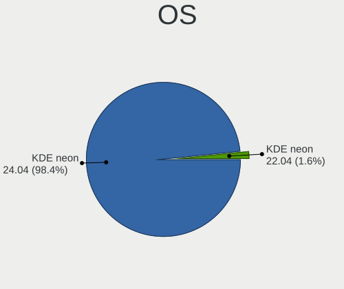

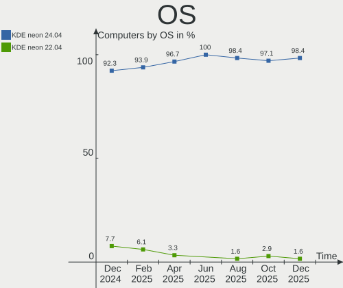

| Name           | Computers | Percent |
|----------------|-----------|---------|
| KDE neon 24.04 | 61        | 98.39%  |
| KDE neon 22.04 | 1         | 1.61%   |

OS Family
---------

OS without a version

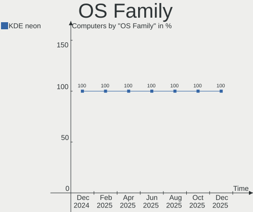

| Name     | Computers | Percent |
|----------|-----------|---------|
| KDE neon | 62        | 100%    |

Kernel
------

Version of the Linux kernel

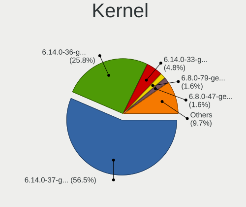

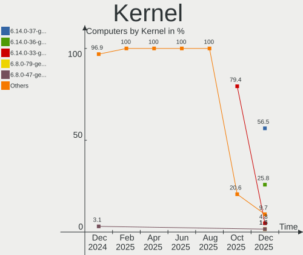

| Version               | Computers | Percent |
|-----------------------|-----------|---------|
| 6.14.0-37-generic     | 35        | 56.45%  |
| 6.14.0-36-generic     | 16        | 25.81%  |
| 6.14.0-33-generic     | 3         | 4.84%   |
| 6.8.0-79-generic      | 1         | 1.61%   |
| 6.8.0-47-generic      | 1         | 1.61%   |
| 6.18.0-061800-generic | 1         | 1.61%   |
| 6.18.0                | 1         | 1.61%   |
| 6.17.9-061709-generic | 1         | 1.61%   |
| 6.17.10-x64v3-xanmod1 | 1         | 1.61%   |
| 6.17.0-1006-oem       | 1         | 1.61%   |
| 6.14.0-29-generic     | 1         | 1.61%   |

Kernel Family
-------------

Linux kernel without a distro release

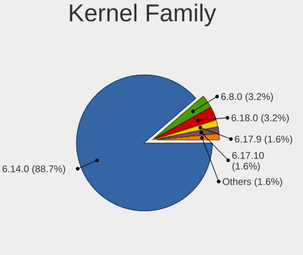

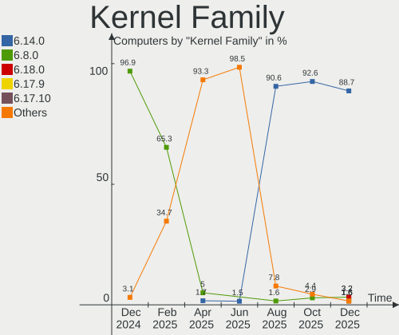

| Version | Computers | Percent |
|---------|-----------|---------|
| 6.14.0  | 55        | 88.71%  |
| 6.8.0   | 2         | 3.23%   |
| 6.18.0  | 2         | 3.23%   |
| 6.17.9  | 1         | 1.61%   |
| 6.17.10 | 1         | 1.61%   |
| 6.17.0  | 1         | 1.61%   |

Kernel Major Ver.
-----------------

Linux kernel major version

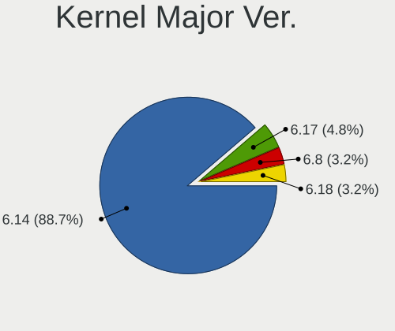

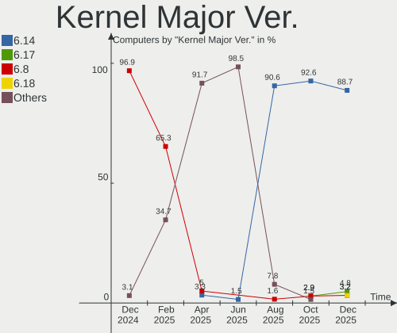

| Version | Computers | Percent |
|---------|-----------|---------|
| 6.14    | 55        | 88.71%  |
| 6.17    | 3         | 4.84%   |
| 6.8     | 2         | 3.23%   |
| 6.18    | 2         | 3.23%   |

Arch
----

OS architecture (x86_64, i586, etc.)

| Name   | Computers | Percent |
|--------|-----------|---------|
| x86_64 | 62        | 100%    |

DE
--

Desktop Environment

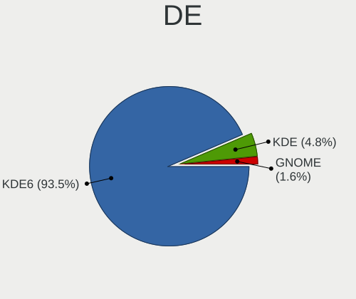

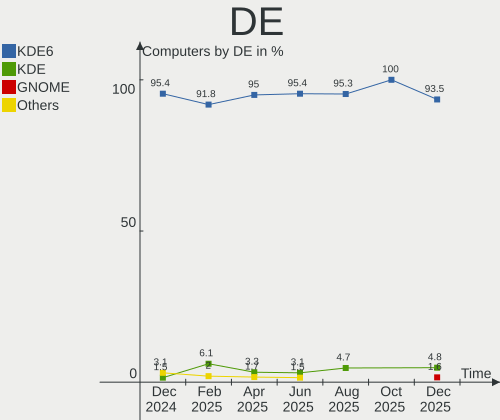

| Name  | Computers | Percent |
|-------|-----------|---------|
| KDE6  | 58        | 93.55%  |
| KDE   | 3         | 4.84%   |
| GNOME | 1         | 1.61%   |

Display Server
--------------

X11 or Wayland

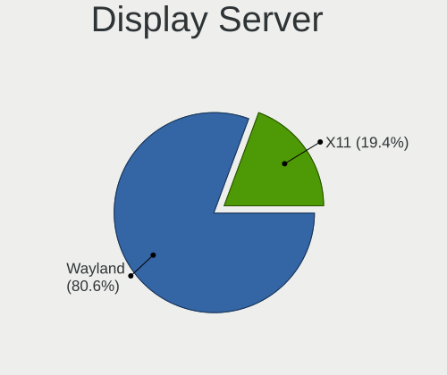

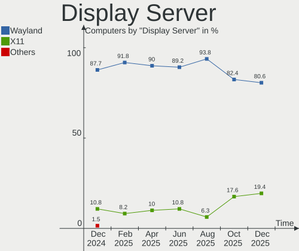

| Name    | Computers | Percent |
|---------|-----------|---------|
| Wayland | 50        | 80.65%  |
| X11     | 12        | 19.35%  |

Display Manager
---------------

SDDM, LightDM, etc.

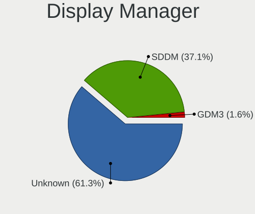

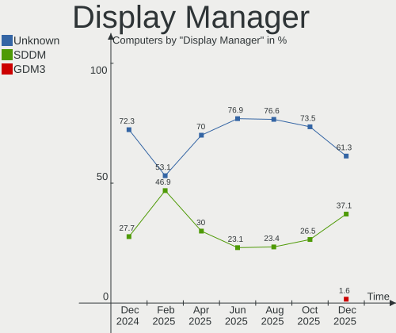

| Name    | Computers | Percent |
|---------|-----------|---------|
| Unknown | 38        | 61.29%  |
| SDDM    | 23        | 37.1%   |
| GDM3    | 1         | 1.61%   |

OS Lang
-------

Language

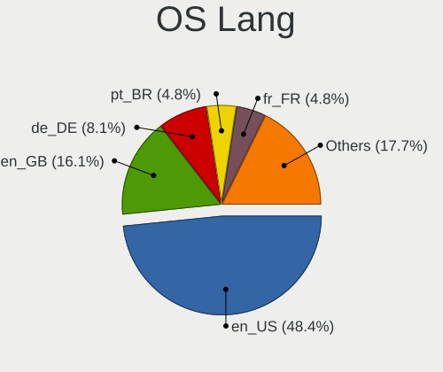

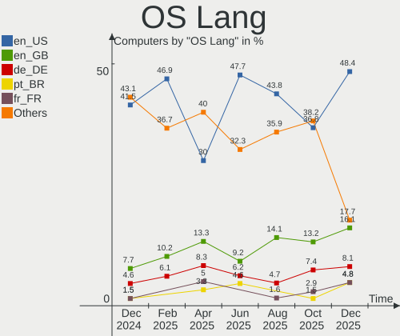

| Lang  | Computers | Percent |
|-------|-----------|---------|
| en_US | 30        | 48.39%  |
| en_GB | 10        | 16.13%  |
| de_DE | 5         | 8.06%   |
| pt_BR | 3         | 4.84%   |
| fr_FR | 3         | 4.84%   |
| ru_RU | 2         | 3.23%   |
| es_MX | 2         | 3.23%   |
| es_ES | 2         | 3.23%   |
| nn_NO | 1         | 1.61%   |
| it_IT | 1         | 1.61%   |
| et_EE | 1         | 1.61%   |
| en_CA | 1         | 1.61%   |
| C     | 1         | 1.61%   |

Boot Mode
---------

EFI or BIOS

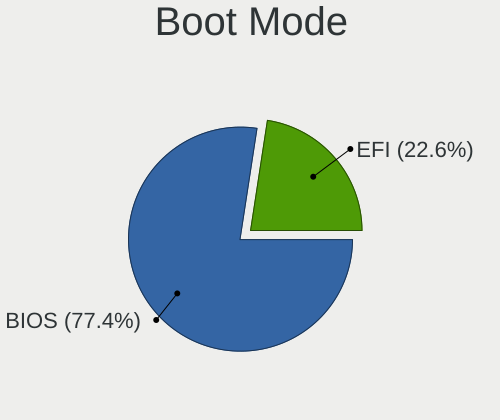

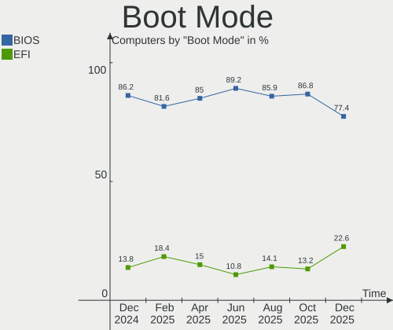

| Mode | Computers | Percent |
|------|-----------|---------|
| BIOS | 48        | 77.42%  |
| EFI  | 14        | 22.58%  |

Filesystem
----------

Type of filesystem

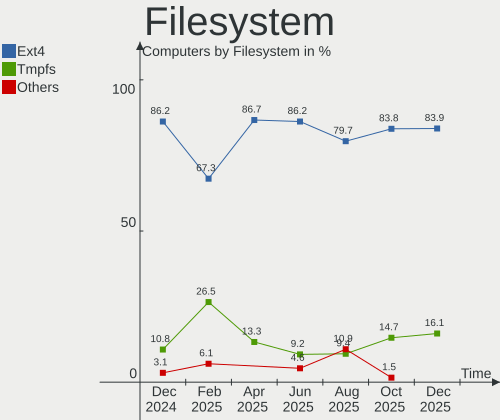

| Type  | Computers | Percent |
|-------|-----------|---------|
| Ext4  | 52        | 83.87%  |
| Tmpfs | 10        | 16.13%  |

Part. scheme
------------

Scheme of partitioning

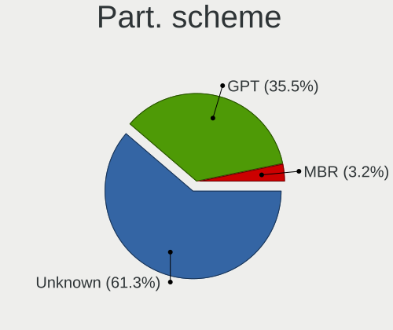

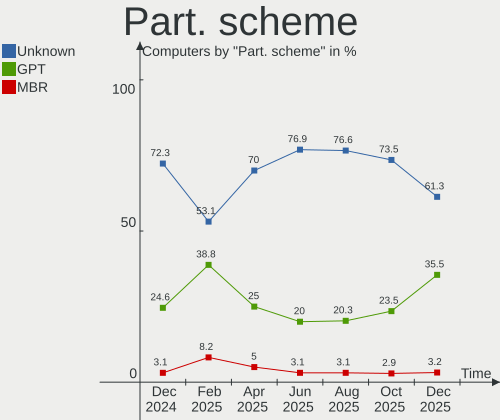

| Type    | Computers | Percent |
|---------|-----------|---------|
| Unknown | 38        | 61.29%  |
| GPT     | 22        | 35.48%  |
| MBR     | 2         | 3.23%   |

Dual Boot with Linux/BSD
------------------------

Hosting more than one Linux/BSD

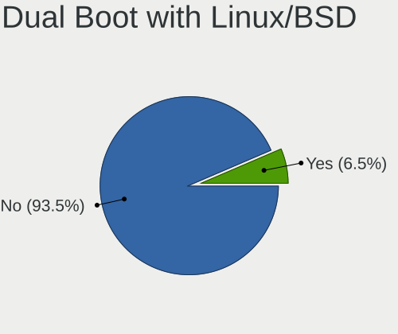

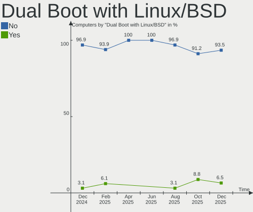

| Dual boot | Computers | Percent |
|-----------|-----------|---------|
| No        | 58        | 93.55%  |
| Yes       | 4         | 6.45%   |

Dual Boot (Win)
---------------

Hosting Linux and Windows

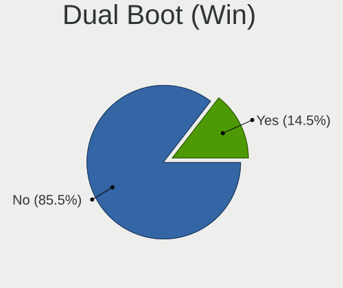

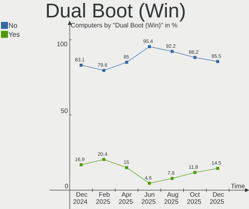

| Dual boot | Computers | Percent |
|-----------|-----------|---------|
| No        | 53        | 85.48%  |
| Yes       | 9         | 14.52%  |

Board
-----

Vendor
------

Motherboard manufacturer

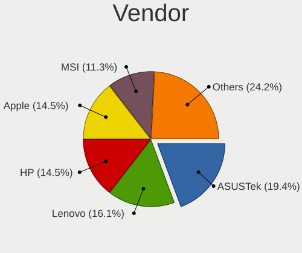

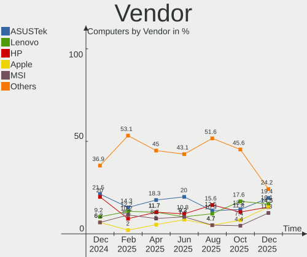

| Name                | Computers | Percent |
|---------------------|-----------|---------|
| ASUSTek Computer    | 12        | 19.35%  |
| Lenovo              | 10        | 16.13%  |
| Hewlett-Packard     | 9         | 14.52%  |
| Apple               | 9         | 14.52%  |
| MSI                 | 7         | 11.29%  |
| Dell                | 4         | 6.45%   |
| Gigabyte Technology | 3         | 4.84%   |
| Acer                | 3         | 4.84%   |
| ASRock              | 2         | 3.23%   |
| Toshiba             | 1         | 1.61%   |
| MACHINIST           | 1         | 1.61%   |
| IPASON              | 1         | 1.61%   |

Model
-----

Motherboard model

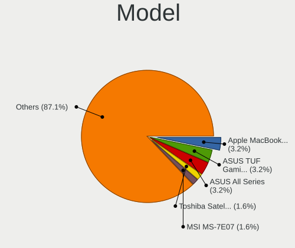

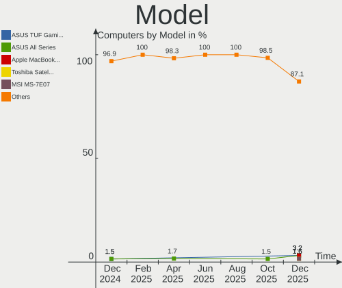

| Name                                     | Computers | Percent |
|------------------------------------------|-----------|---------|
| ASUS TUF Gaming X570-PLUS                | 2         | 3.23%   |
| ASUS All Series                          | 2         | 3.23%   |
| Apple MacBookAir6,2                      | 2         | 3.23%   |
| Toshiba Satellite C55-C                  | 1         | 1.61%   |
| MSI MS-7E07                              | 1         | 1.61%   |
| MSI MS-7C96                              | 1         | 1.61%   |
| MSI MS-7C84                              | 1         | 1.61%   |
| MSI MS-7C56                              | 1         | 1.61%   |
| MSI MS-7B49                              | 1         | 1.61%   |
| MSI MS-7A33                              | 1         | 1.61%   |
| MSI MS-7917                              | 1         | 1.61%   |
| MACHINIST X99 B9                         | 1         | 1.61%   |
| Lenovo Yoga Slim 6 14IRH8 83E0           | 1         | 1.61%   |
| Lenovo Yoga 910-13IKB 80VF               | 1         | 1.61%   |
| Lenovo Yoga 7 2-in-1 14AKP10 83JR        | 1         | 1.61%   |
| Lenovo Yoga 7 16ARP8 83BS                | 1         | 1.61%   |
| Lenovo ThinkPad X230 2320ENG             | 1         | 1.61%   |
| Lenovo ThinkPad X1 Carbon 4th 20FB003TGE | 1         | 1.61%   |
| Lenovo ThinkPad L580 20LXS45K00          | 1         | 1.61%   |
| Lenovo Legion 5 16IRX9 83DG              | 1         | 1.61%   |
| Lenovo Legion 5 15IMH05H 81Y6            | 1         | 1.61%   |
| Lenovo IdeaPad Slim 1-14AST-05 81VS      | 1         | 1.61%   |
| IPASON MaxBook P1 Pro                    | 1         | 1.61%   |
| HP Pavilion dv7                          | 1         | 1.61%   |
| HP Laptop 15s-fq5xxx                     | 1         | 1.61%   |
| HP Laptop 15-dw3xxx                      | 1         | 1.61%   |
| HP EliteDesk 800 G3 TWR                  | 1         | 1.61%   |
| HP EliteDesk 705 G1 SFF                  | 1         | 1.61%   |
| HP EliteBook 8460p                       | 1         | 1.61%   |
| HP Compaq dc7900 Convertible Minitower   | 1         | 1.61%   |
| HP 260 G4 Desktop Mini PC                | 1         | 1.61%   |
| HP 256R 15.6 inch G9 Notebook PC         | 1         | 1.61%   |
| Gigabyte GA-MA78GM-UD2H                  | 1         | 1.61%   |
| Gigabyte B650 AORUS ELITE AX             | 1         | 1.61%   |
| Gigabyte B550 AORUS PRO AC               | 1         | 1.61%   |
| Dell XPS 8700                            | 1         | 1.61%   |
| Dell Precision M4800                     | 1         | 1.61%   |
| Dell Latitude E7440                      | 1         | 1.61%   |
| Dell Latitude 7370                       | 1         | 1.61%   |
| ASUS VivoBook_ASUSLaptop M1403QA_M1403QA | 1         | 1.61%   |

Model Family
------------

Motherboard model prefix

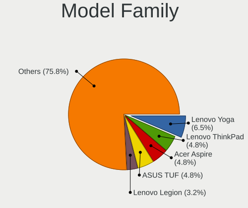

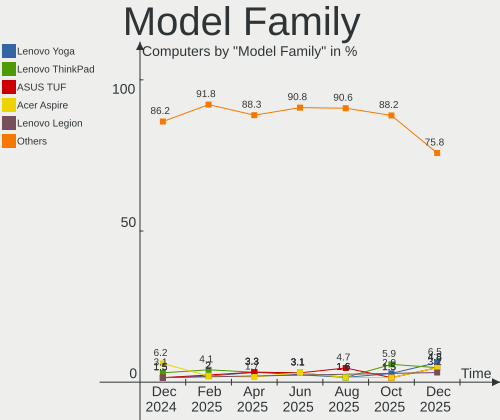

| Name                    | Computers | Percent |
|-------------------------|-----------|---------|
| Lenovo Yoga             | 4         | 6.45%   |
| Lenovo ThinkPad         | 3         | 4.84%   |
| ASUS TUF                | 3         | 4.84%   |
| Acer Aspire             | 3         | 4.84%   |
| Lenovo Legion           | 2         | 3.23%   |
| HP Laptop               | 2         | 3.23%   |
| HP EliteDesk            | 2         | 3.23%   |
| Dell Latitude           | 2         | 3.23%   |
| ASUS Vivobook           | 2         | 3.23%   |
| ASUS ROG                | 2         | 3.23%   |
| ASUS All                | 2         | 3.23%   |
| Apple MacBookAir6       | 2         | 3.23%   |
| Toshiba Satellite       | 1         | 1.61%   |
| MSI MS-7E07             | 1         | 1.61%   |
| MSI MS-7C96             | 1         | 1.61%   |
| MSI MS-7C84             | 1         | 1.61%   |
| MSI MS-7C56             | 1         | 1.61%   |
| MSI MS-7B49             | 1         | 1.61%   |
| MSI MS-7A33             | 1         | 1.61%   |
| MSI MS-7917             | 1         | 1.61%   |
| MACHINIST X99           | 1         | 1.61%   |
| Lenovo IdeaPad          | 1         | 1.61%   |
| IPASON MaxBook          | 1         | 1.61%   |
| HP Pavilion             | 1         | 1.61%   |
| HP EliteBook            | 1         | 1.61%   |
| HP Compaq               | 1         | 1.61%   |
| HP 260                  | 1         | 1.61%   |
| HP 256R                 | 1         | 1.61%   |
| Gigabyte GA-MA78GM-UD2H | 1         | 1.61%   |
| Gigabyte B650           | 1         | 1.61%   |
| Gigabyte B550           | 1         | 1.61%   |
| Dell XPS                | 1         | 1.61%   |
| Dell Precision          | 1         | 1.61%   |
| ASUS ProArt             | 1         | 1.61%   |
| ASUS M5A78L-M           | 1         | 1.61%   |
| ASUS H170-PRO           | 1         | 1.61%   |
| ASRock Z790             | 1         | 1.61%   |
| ASRock B450             | 1         | 1.61%   |
| Apple Macmini7          | 1         | 1.61%   |
| Apple Macmini6          | 1         | 1.61%   |

MFG Year
--------

Motherboard manufacture year

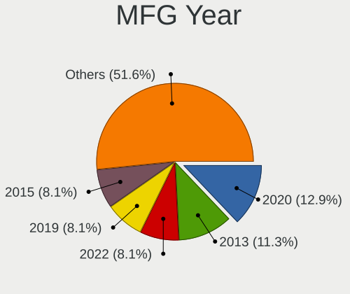

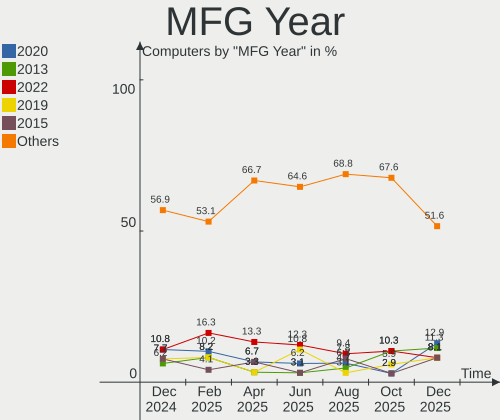

| Year | Computers | Percent |
|------|-----------|---------|
| 2020 | 8         | 12.9%   |
| 2013 | 7         | 11.29%  |
| 2022 | 5         | 8.06%   |
| 2019 | 5         | 8.06%   |
| 2015 | 5         | 8.06%   |
| 2023 | 4         | 6.45%   |
| 2017 | 4         | 6.45%   |
| 2008 | 4         | 6.45%   |
| 2016 | 3         | 4.84%   |
| 2025 | 2         | 3.23%   |
| 2024 | 2         | 3.23%   |
| 2021 | 2         | 3.23%   |
| 2018 | 2         | 3.23%   |
| 2014 | 2         | 3.23%   |
| 2012 | 2         | 3.23%   |
| 2011 | 2         | 3.23%   |
| 2007 | 2         | 3.23%   |
| 2009 | 1         | 1.61%   |

Form Factor
-----------

Physical design of the computer

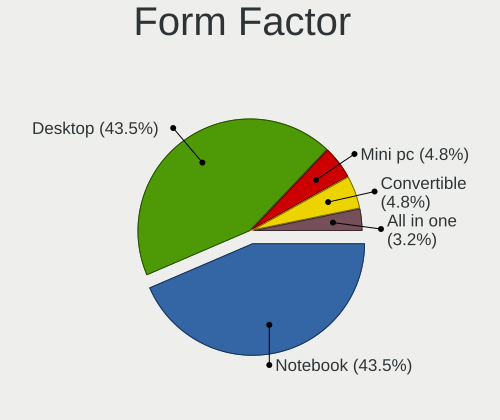

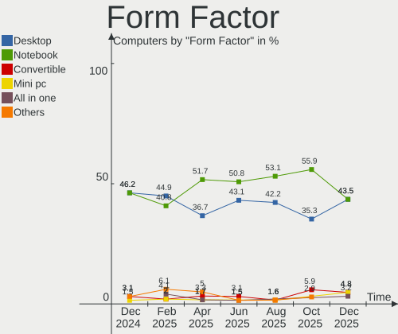

| Name        | Computers | Percent |
|-------------|-----------|---------|
| Desktop     | 27        | 43.55%  |
| Notebook    | 27        | 43.55%  |
| Convertible | 3         | 4.84%   |
| Mini pc     | 3         | 4.84%   |
| All in one  | 2         | 3.23%   |

Secure Boot
-----------

Enabled or disabled

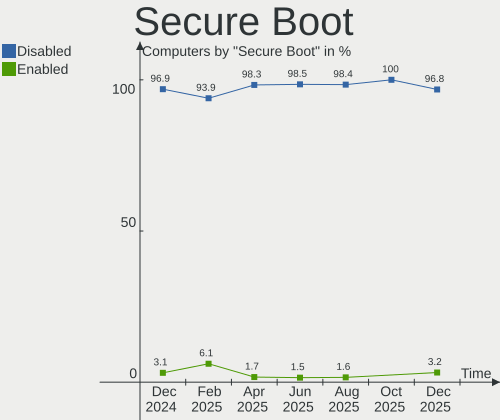

| State    | Computers | Percent |
|----------|-----------|---------|
| Disabled | 60        | 96.77%  |
| Enabled  | 2         | 3.23%   |

Coreboot
--------

Have coreboot on board

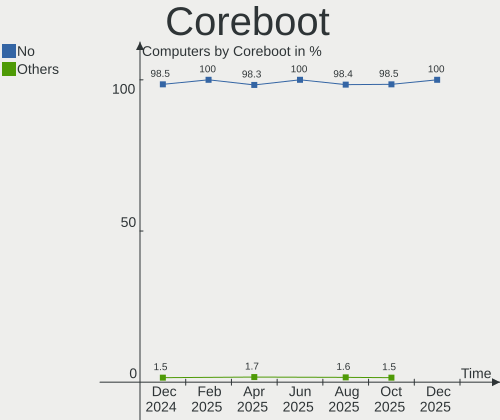

| Used | Computers | Percent |
|------|-----------|---------|
| No   | 62        | 100%    |

RAM Size
--------

Total RAM memory

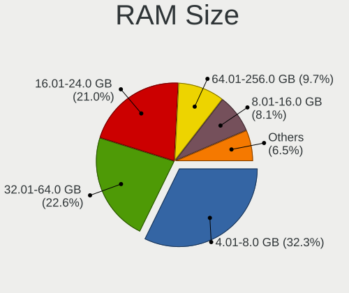

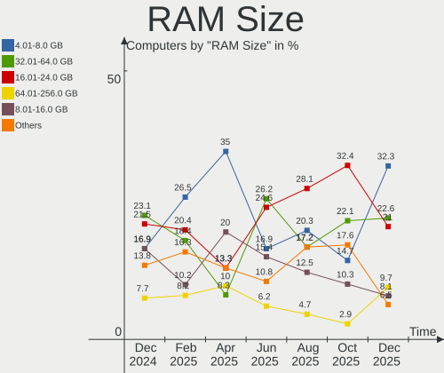

| Size in GB  | Computers | Percent |
|-------------|-----------|---------|
| 4.01-8.0    | 20        | 32.26%  |
| 32.01-64.0  | 14        | 22.58%  |
| 16.01-24.0  | 13        | 20.97%  |
| 64.01-256.0 | 6         | 9.68%   |
| 8.01-16.0   | 5         | 8.06%   |
| 3.01-4.0    | 3         | 4.84%   |
| 24.01-32.0  | 1         | 1.61%   |

RAM Used
--------

Used RAM memory

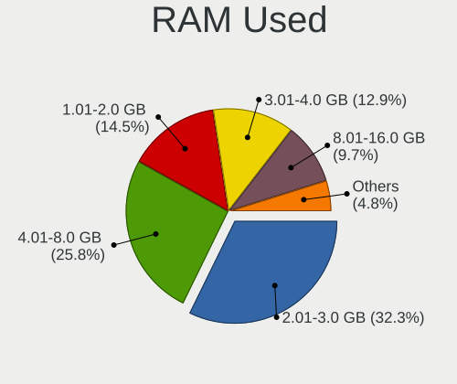

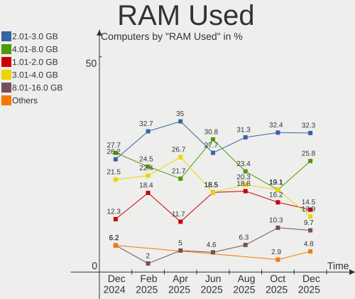

| Used GB    | Computers | Percent |
|------------|-----------|---------|
| 2.01-3.0   | 20        | 32.26%  |
| 4.01-8.0   | 16        | 25.81%  |
| 1.01-2.0   | 9         | 14.52%  |
| 3.01-4.0   | 8         | 12.9%   |
| 8.01-16.0  | 6         | 9.68%   |
| 16.01-24.0 | 2         | 3.23%   |
| 24.01-32.0 | 1         | 1.61%   |

Total Drives
------------

Number of drives on board

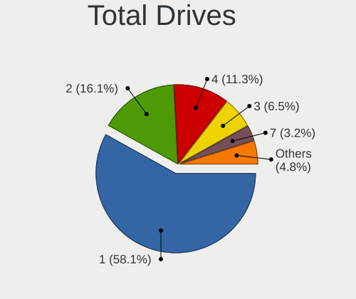

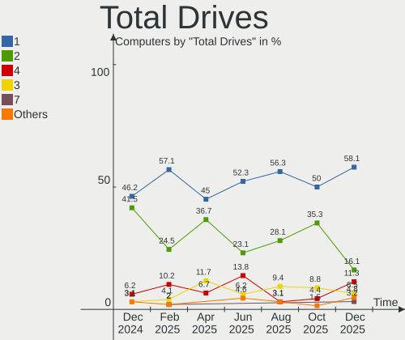

| Drives | Computers | Percent |
|--------|-----------|---------|
| 1      | 36        | 58.06%  |
| 2      | 10        | 16.13%  |
| 4      | 7         | 11.29%  |
| 3      | 4         | 6.45%   |
| 7      | 2         | 3.23%   |
| 5      | 2         | 3.23%   |
| 6      | 1         | 1.61%   |

Has CD-ROM
----------

Has CD-ROM on board

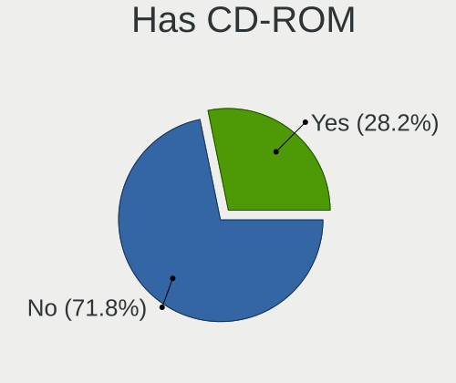

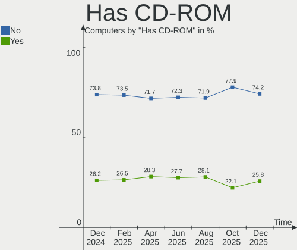

| Presented | Computers | Percent |
|-----------|-----------|---------|
| No        | 46        | 74.19%  |
| Yes       | 16        | 25.81%  |

Has Ethernet
------------

Has Ethernet on board

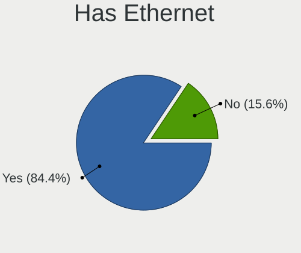

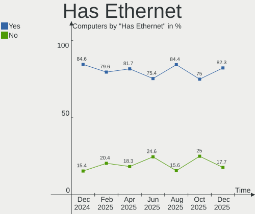

| Presented | Computers | Percent |
|-----------|-----------|---------|
| Yes       | 51        | 82.26%  |
| No        | 11        | 17.74%  |

Has WiFi
--------

Has WiFi module

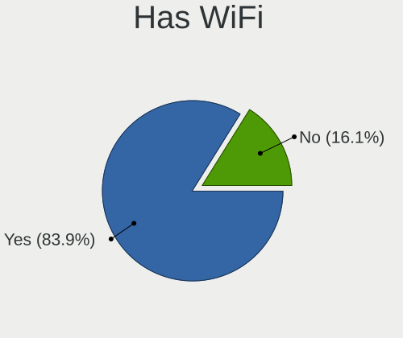

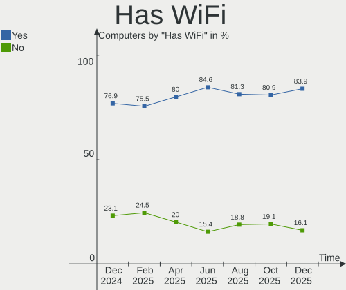

| Presented | Computers | Percent |
|-----------|-----------|---------|
| Yes       | 52        | 83.87%  |
| No        | 10        | 16.13%  |

Has Bluetooth
-------------

Has Bluetooth module

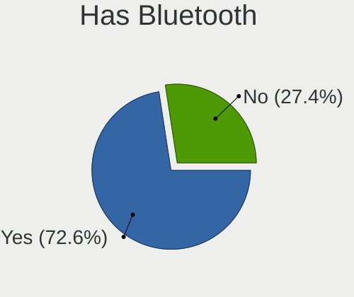

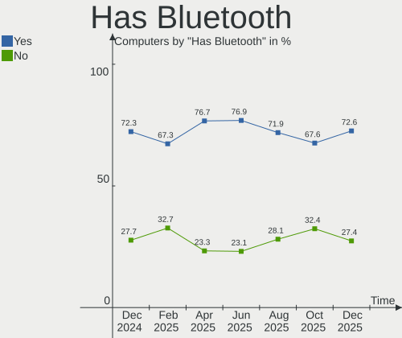

| Presented | Computers | Percent |
|-----------|-----------|---------|
| Yes       | 45        | 72.58%  |
| No        | 17        | 27.42%  |

Location
--------

Country
-------

Geographic location (country)

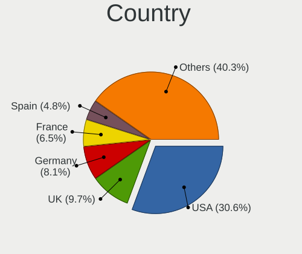

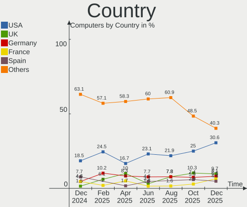

| Country         | Computers | Percent |
|-----------------|-----------|---------|
| USA             | 19        | 30.65%  |
| UK              | 6         | 9.68%   |
| Germany         | 5         | 8.06%   |
| France          | 4         | 6.45%   |
| Spain           | 3         | 4.84%   |
| Russia          | 3         | 4.84%   |
| Brazil          | 3         | 4.84%   |
| Switzerland     | 2         | 3.23%   |
| The Netherlands | 1         | 1.61%   |
| Sweden          | 1         | 1.61%   |
| Saudi Arabia    | 1         | 1.61%   |
| Romania         | 1         | 1.61%   |
| Norway          | 1         | 1.61%   |
| Netherlands     | 1         | 1.61%   |
| Mexico          | 1         | 1.61%   |
| Italy           | 1         | 1.61%   |
| Indonesia       | 1         | 1.61%   |
| Estonia         | 1         | 1.61%   |
| Egypt           | 1         | 1.61%   |
| Denmark         | 1         | 1.61%   |
| Czechia         | 1         | 1.61%   |
| Colombia        | 1         | 1.61%   |
| Canada          | 1         | 1.61%   |
| Bulgaria        | 1         | 1.61%   |
| Australia       | 1         | 1.61%   |

City
----

Geographic location (city)

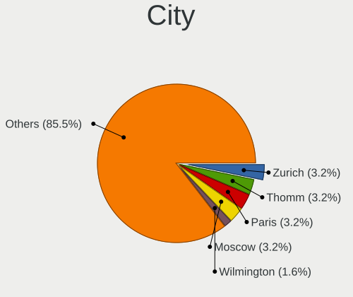

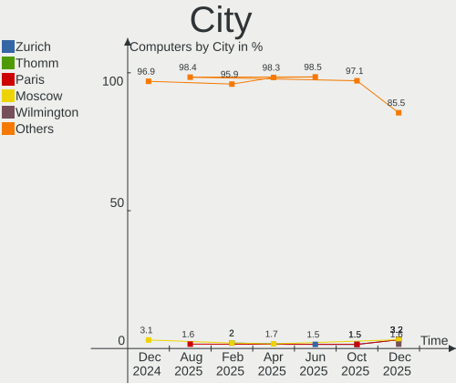

| City                      | Computers | Percent |
|---------------------------|-----------|---------|
| Zurich                    | 2         | 3.23%   |
| Thomm                     | 2         | 3.23%   |
| Paris                     | 2         | 3.23%   |
| Moscow                    | 2         | 3.23%   |
| Wilmington                | 1         | 1.61%   |
| Washington                | 1         | 1.61%   |
| Warminster                | 1         | 1.61%   |
| Vila Velha                | 1         | 1.61%   |
| Varces-Allieres-et-Risset | 1         | 1.61%   |
| Uckfield                  | 1         | 1.61%   |
| Toronto                   | 1         | 1.61%   |
| Tallinn                   | 1         | 1.61%   |
| Stockton                  | 1         | 1.61%   |
| Springfield               | 1         | 1.61%   |
| Sao José dos Campos      | 1         | 1.61%   |
| Sandanski                 | 1         | 1.61%   |
| Salt Lake City            | 1         | 1.61%   |
| Salerno                   | 1         | 1.61%   |
| Rosny-sous-Bois           | 1         | 1.61%   |
| Rosmalen                  | 1         | 1.61%   |
| Ringkøbing               | 1         | 1.61%   |
| Purley                    | 1         | 1.61%   |
| Prague                    | 1         | 1.61%   |
| Ochtrup                   | 1         | 1.61%   |
| Norwood                   | 1         | 1.61%   |
| Northampton               | 1         | 1.61%   |
| Newmarket                 | 1         | 1.61%   |
| Mranggen                  | 1         | 1.61%   |
| Monmouth                  | 1         | 1.61%   |
| Melbourne                 | 1         | 1.61%   |
| Maringá                  | 1         | 1.61%   |
| León                     | 1         | 1.61%   |
| League City               | 1         | 1.61%   |
| Las Vegas                 | 1         | 1.61%   |
| Lansing                   | 1         | 1.61%   |
| La Victoria de Acentejo   | 1         | 1.61%   |
| Kannapolis                | 1         | 1.61%   |
| Jeddah                    | 1         | 1.61%   |
| Hull                      | 1         | 1.61%   |
| Hamburg                   | 1         | 1.61%   |

Drives
------

Drive Vendor
------------

Hard drive vendors

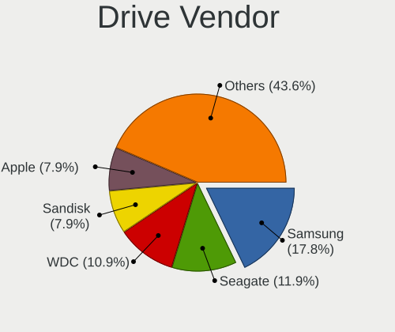

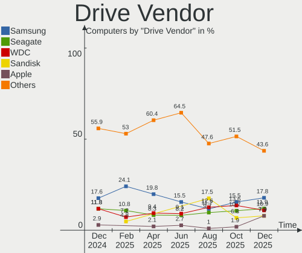

| Vendor                | Computers | Drives  | Percent |
|-----------------------|-----------|---------|---------|
| Samsung Electronics   | 18        | 26      | 17.82%  |
| Seagate               | 12        | 16      | 11.88%  |
| WDC                   | 11        | 16      | 10.89%  |
| Sandisk               | 8         | 9       | 7.92%   |
| Apple                 | 8         | 10      | 7.92%   |
| Kingston              | 7         | 8       | 6.93%   |
| Crucial               | 5         | 10      | 4.95%   |
| SK hynix              | 4         | 4       | 3.96%   |
| Patriot               | 3         | 3       | 2.97%   |
| ADATA Technology      | 3         | 3       | 2.97%   |
| Realtek Semiconductor | 2         | 2       | 1.98%   |
| OCZ                   | 2         | 2       | 1.98%   |
| Micron Technology     | 2         | 2       | 1.98%   |
| LITEONIT              | 2         | 2       | 1.98%   |
| Hitachi               | 2         | 2       | 1.98%   |
| HGST                  | 2         | 2       | 1.98%   |
| Unknown               | 1         | 1       | 0.99%   |
| SPCC                  | 1         | 1       | 0.99%   |
| Phison Electronics    | 1         | 1       | 0.99%   |
| OWC                   | 1         | 1       | 0.99%   |
| LITEON                | 1         | 1       | 0.99%   |
| Intenso               | 1         | 1       | 0.99%   |
| Intel                 | 1         | 2       | 0.99%   |
| Hewlett-Packard       | 1         | Unknown | 0.99%   |
| Corsair               | 1         | 1       | 0.99%   |
| A-DATA Technology     | 1         | 1       | 0.99%   |

Drive Model
-----------

Hard drive models

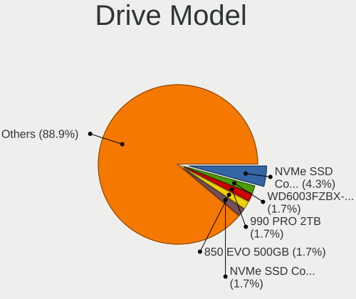

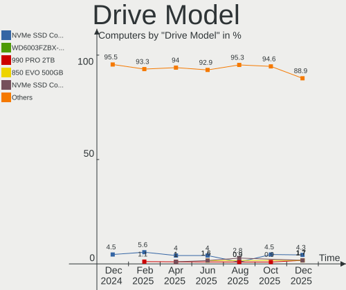

| Model                                              | Computers | Percent |
|----------------------------------------------------|-----------|---------|
| Samsung NVMe SSD Controller SM981/PM981/PM983 1TB  | 5         | 4.27%   |
| WDC WD6003FZBX-00K5WB0 6TB                         | 2         | 1.71%   |
| Samsung SSD 990 PRO 2TB                            | 2         | 1.71%   |
| Samsung SSD 850 EVO 500GB                          | 2         | 1.71%   |
| Samsung NVMe SSD Controller PM9A1/PM9A3/980PRO 1TB | 2         | 1.71%   |
| Kingston SA400S37480G 480GB SSD                    | 2         | 1.71%   |
| Kingston SA400S37240G 240GB SSD                    | 2         | 1.71%   |
| HGST HTS721010A9E630 1TB                           | 2         | 1.71%   |
| Crucial CT1000MX500SSD1 1TB                        | 2         | 1.71%   |
| Apple SSD SM0512F 500GB                            | 2         | 1.71%   |
| Apple HDD HTS545050A7E362 500GB                    | 2         | 1.71%   |
| WDC WDS200T2B0A-00SM50 2TB SSD                     | 1         | 0.85%   |
| WDC WD60EZAZ-22SF3B0 6TB                           | 1         | 0.85%   |
| WDC WD60EFRX-68MYMN1 6TB                           | 1         | 0.85%   |
| WDC WD5000LPVX-22V0TT0 500GB                       | 1         | 0.85%   |
| WDC WD5000AADS-00M2B0 500GB                        | 1         | 0.85%   |
| WDC WD4000FYYZ-01UL1B3 4TB                         | 1         | 0.85%   |
| WDC WD30EZRZ-00Z5HB0 3TB                           | 1         | 0.85%   |
| WDC WD3003FZEX-00Z4SA0 3TB                         | 1         | 0.85%   |
| WDC WD2003FZEX-00SRLA0 2TB                         | 1         | 0.85%   |
| WDC WD10EZEX-08WN4A0 1TB                           | 1         | 0.85%   |
| WDC WD10EZEX-00BN5A0 1TB                           | 1         | 0.85%   |
| WDC WD My Passport 264F 1TB                        | 1         | 0.85%   |
| WDC WD Blue SA510 2.5 1TB SSD                      | 1         | 0.85%   |
| Unknown MMC Card  64GB                             | 1         | 0.85%   |
| SPCC Solid State Disk 512GB                        | 1         | 0.85%   |
| SK hynix SKHynix_HFS512GEM4X182N 512GB             | 1         | 0.85%   |
| SK hynix SKHynix_HFS512GEJ4X112N 512GB             | 1         | 0.85%   |
| SK hynix SKHynix_HFS001TEJ9X115N 1024GB            | 1         | 0.85%   |
| SK hynix BC511 512GB                               | 1         | 0.85%   |
| Seagate ST9500325AS 500GB                          | 1         | 0.85%   |
| Seagate ST500LM021-1KJ152 500GB                    | 1         | 0.85%   |
| Seagate ST500DM002-1SB10A 500GB                    | 1         | 0.85%   |
| Seagate ST5000DM000-1FK178 5TB                     | 1         | 0.85%   |
| Seagate ST4000VX016-3CV104 4TB                     | 1         | 0.85%   |
| Seagate ST3500312CS 500GB                          | 1         | 0.85%   |
| Seagate ST3320418AS 320GB                          | 1         | 0.85%   |
| Seagate ST2000DX001-1NS164 2TB                     | 1         | 0.85%   |
| Seagate ST2000DM001-1CH164 2TB                     | 1         | 0.85%   |
| Seagate ST18000NT001-3NF101 18TB                   | 1         | 0.85%   |

HDD Vendor
----------

Hard disk drive vendors

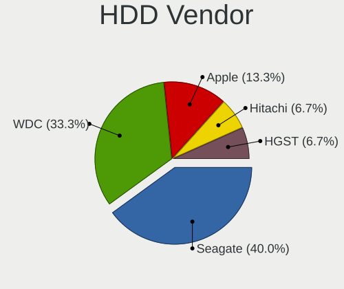

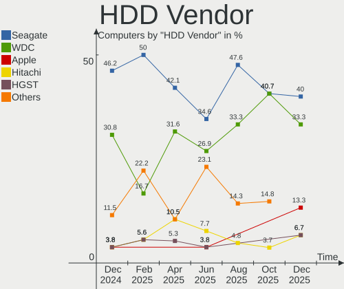

| Vendor  | Computers | Drives | Percent |
|---------|-----------|--------|---------|
| Seagate | 12        | 16     | 40%     |
| WDC     | 10        | 13     | 33.33%  |
| Apple   | 4         | 4      | 13.33%  |
| Hitachi | 2         | 2      | 6.67%   |
| HGST    | 2         | 2      | 6.67%   |

SSD Vendor
----------

Solid state drive vendors

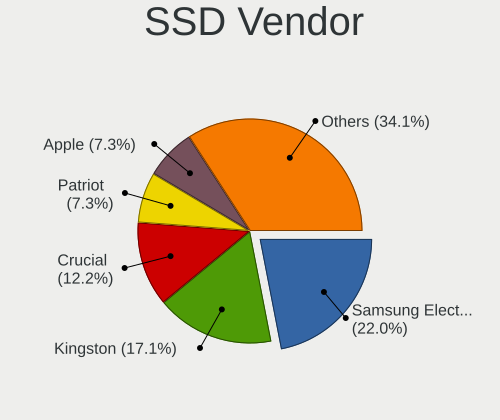

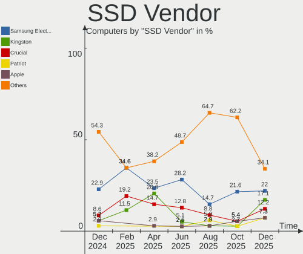

| Vendor              | Computers | Drives | Percent |
|---------------------|-----------|--------|---------|
| Samsung Electronics | 9         | 11     | 21.95%  |
| Kingston            | 7         | 8      | 17.07%  |
| Crucial             | 5         | 10     | 12.2%   |
| Patriot             | 3         | 3      | 7.32%   |
| Apple               | 3         | 3      | 7.32%   |
| WDC                 | 2         | 2      | 4.88%   |
| SanDisk             | 2         | 2      | 4.88%   |
| OCZ                 | 2         | 2      | 4.88%   |
| LITEONIT            | 2         | 2      | 4.88%   |
| SPCC                | 1         | 1      | 2.44%   |
| OWC                 | 1         | 1      | 2.44%   |
| Micron Technology   | 1         | 1      | 2.44%   |
| LITEON              | 1         | 1      | 2.44%   |
| Intenso             | 1         | 1      | 2.44%   |
| A-DATA Technology   | 1         | 1      | 2.44%   |

Drive Kind
----------

HDD or SSD

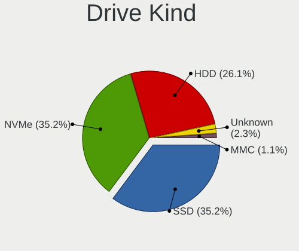

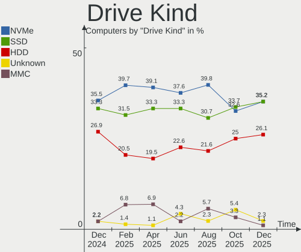

| Kind    | Computers | Drives | Percent |
|---------|-----------|--------|---------|
| NVMe    | 31        | 39     | 35.23%  |
| SSD     | 31        | 49     | 35.23%  |
| HDD     | 23        | 37     | 26.14%  |
| Unknown | 2         | 1      | 2.27%   |
| MMC     | 1         | 1      | 1.14%   |

Drive Connector
---------------

SATA, SAS, NVMe, etc.

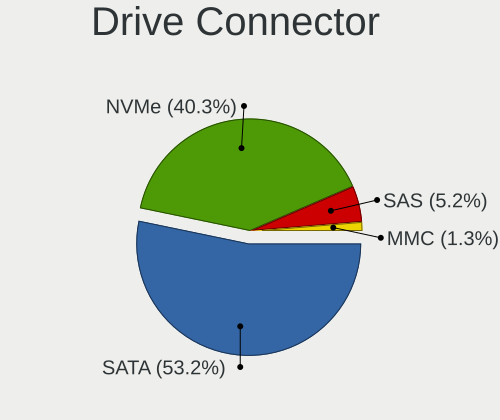

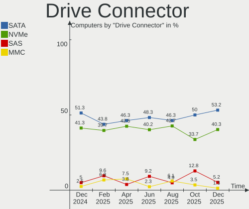

| Type | Computers | Drives | Percent |
|------|-----------|--------|---------|
| SATA | 41        | 83     | 53.25%  |
| NVMe | 31        | 39     | 40.26%  |
| SAS  | 4         | 4      | 5.19%   |
| MMC  | 1         | 1      | 1.3%    |

Drive Size
----------

Size of hard drive

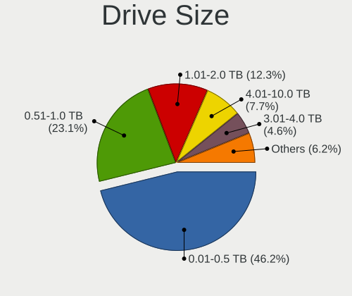

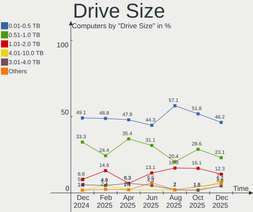

| Size in TB | Computers | Drives | Percent |
|------------|-----------|--------|---------|
| 0.01-0.5   | 30        | 38     | 46.15%  |
| 0.51-1.0   | 15        | 23     | 23.08%  |
| 1.01-2.0   | 8         | 11     | 12.31%  |
| 4.01-10.0  | 5         | 6      | 7.69%   |
| 3.01-4.0   | 3         | 3      | 4.62%   |
| 2.01-3.0   | 3         | 3      | 4.62%   |
| 10.01-20.0 | 1         | 2      | 1.54%   |

Space Total
-----------

Amount of disk space available on the file system

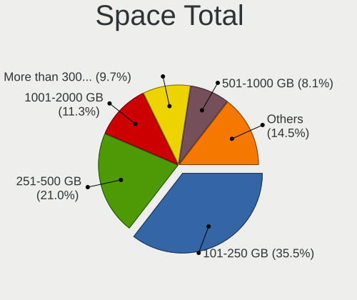

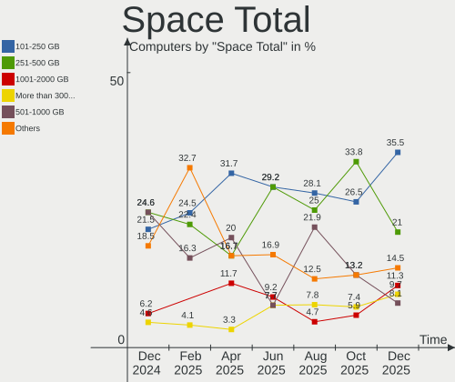

| Size in GB     | Computers | Percent |
|----------------|-----------|---------|
| 101-250        | 22        | 35.48%  |
| 251-500        | 13        | 20.97%  |
| 1001-2000      | 7         | 11.29%  |
| More than 3000 | 6         | 9.68%   |
| 501-1000       | 5         | 8.06%   |
| 21-50          | 3         | 4.84%   |
| 2001-3000      | 3         | 4.84%   |
| 1-20           | 2         | 3.23%   |
| 51-100         | 1         | 1.61%   |

Space Used
----------

Amount of used disk space

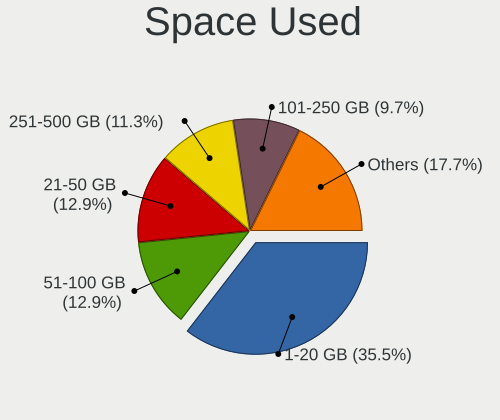

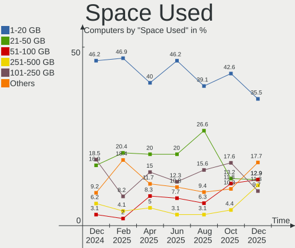

| Used GB        | Computers | Percent |
|----------------|-----------|---------|
| 1-20           | 22        | 35.48%  |
| 21-50          | 8         | 12.9%   |
| 51-100         | 8         | 12.9%   |
| 251-500        | 7         | 11.29%  |
| 101-250        | 6         | 9.68%   |
| 2001-3000      | 4         | 6.45%   |
| 1001-2000      | 4         | 6.45%   |
| More than 3000 | 2         | 3.23%   |
| 501-1000       | 1         | 1.61%   |

Malfunc. Drives
---------------

Drive models with a malfunction

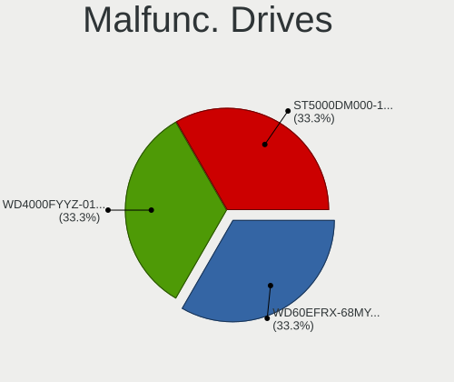

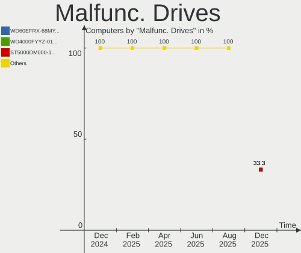

| Model                          | Computers | Drives | Percent |
|--------------------------------|-----------|--------|---------|
| WDC WD60EFRX-68MYMN1 6TB       | 1         | 2      | 33.33%  |
| WDC WD4000FYYZ-01UL1B3 4TB     | 1         | 1      | 33.33%  |
| Seagate ST5000DM000-1FK178 5TB | 1         | 1      | 33.33%  |

Malfunc. Drive Vendor
---------------------

Vendors of faulty drives

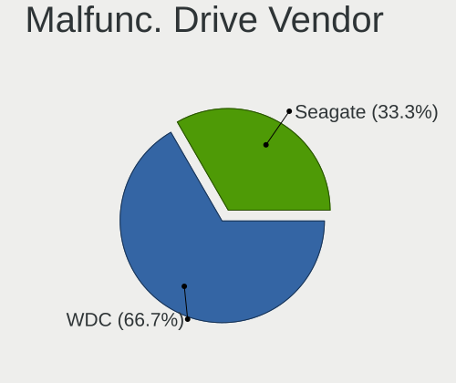

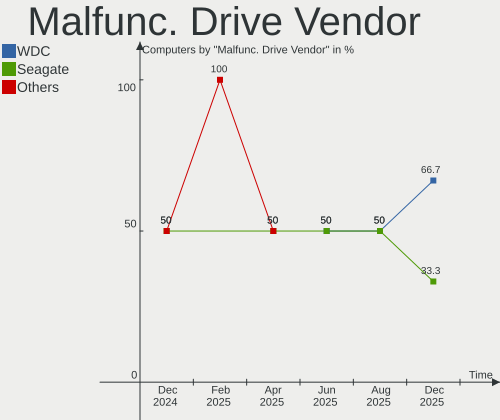

| Vendor  | Computers | Drives | Percent |
|---------|-----------|--------|---------|
| WDC     | 2         | 3      | 66.67%  |
| Seagate | 1         | 1      | 33.33%  |

Malfunc. HDD Vendor
-------------------

Vendors of faulty HDD drives

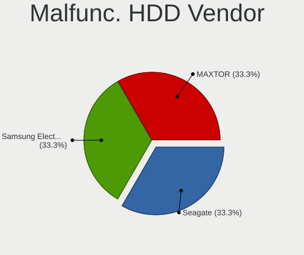

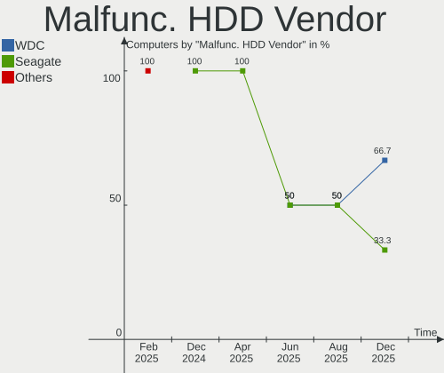

| Vendor  | Computers | Drives | Percent |
|---------|-----------|--------|---------|
| WDC     | 2         | 3      | 66.67%  |
| Seagate | 1         | 1      | 33.33%  |

Malfunc. Drive Kind
-------------------

Kinds of faulty drives

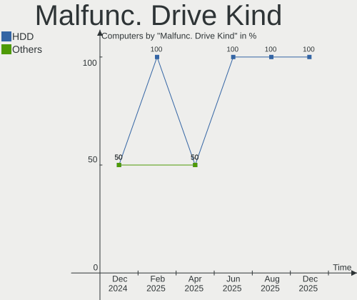

| Kind | Computers | Drives | Percent |
|------|-----------|--------|---------|
| HDD  | 3         | 4      | 100%    |

Failed Drives
-------------

Failed drive models

Zero info for selected period =(

Failed Drive Vendor
-------------------

Failed drive vendors

Zero info for selected period =(

Drive Status
------------

Number of failed and malfunc. drives

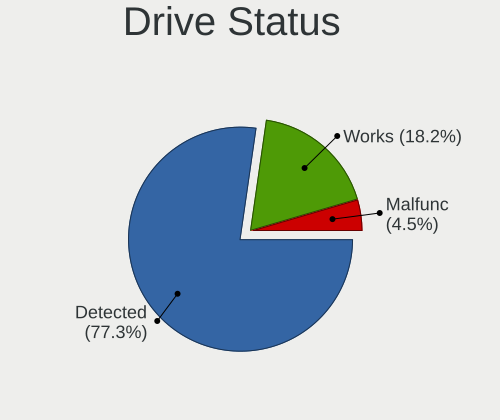

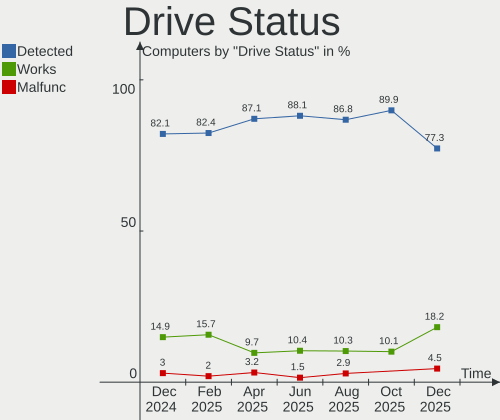

| Status   | Computers | Drives | Percent |
|----------|-----------|--------|---------|
| Detected | 51        | 95     | 77.27%  |
| Works    | 12        | 28     | 18.18%  |
| Malfunc  | 3         | 4      | 4.55%   |

Storage controller
------------------

Storage Vendor
--------------

Storage controller vendors

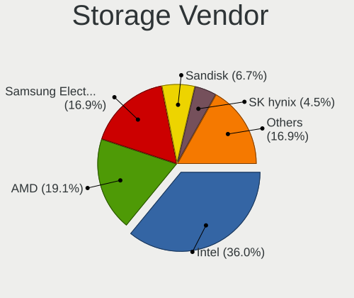

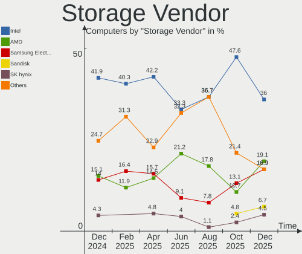

| Vendor                    | Computers | Percent |
|---------------------------|-----------|---------|
| Intel                     | 32        | 35.96%  |
| AMD                       | 17        | 19.1%   |
| Samsung Electronics       | 15        | 16.85%  |
| Sandisk                   | 6         | 6.74%   |
| SK hynix                  | 4         | 4.49%   |
| ASMedia Technology        | 3         | 3.37%   |
| ADATA Technology          | 3         | 3.37%   |
| Realtek Semiconductor     | 2         | 2.25%   |
| Phison Electronics        | 2         | 2.25%   |
| LSI Logic / Symbios Logic | 2         | 2.25%   |
| Apple                     | 2         | 2.25%   |
| Micron Technology         | 1         | 1.12%   |

Storage Model
-------------

Storage controller models

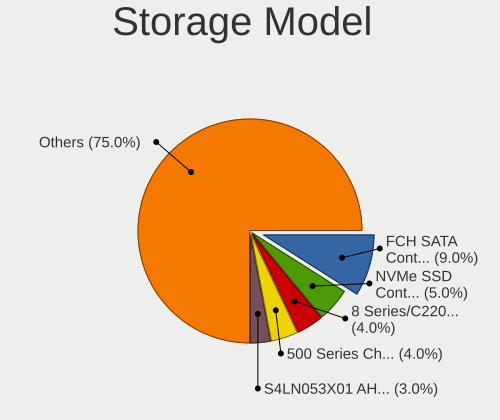

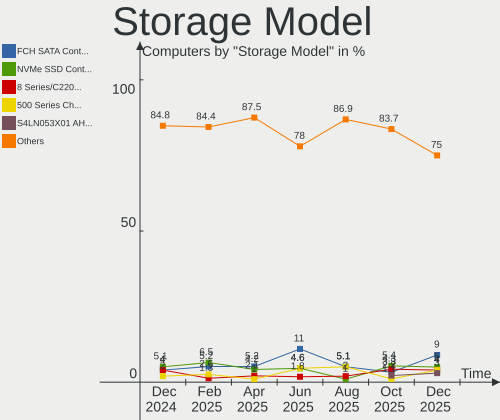

| Model                                                                          | Computers | Percent |
|--------------------------------------------------------------------------------|-----------|---------|
| AMD FCH SATA Controller [AHCI mode]                                            | 9         | 9%      |
| Samsung NVMe SSD Controller SM981/PM981/PM983                                  | 5         | 5%      |
| Intel 8 Series/C220 Series Chipset Family 6-port SATA Controller 1 [AHCI mode] | 4         | 4%      |
| AMD 500 Series Chipset SATA Controller                                         | 4         | 4%      |
| Samsung S4LN053X01 AHCI SSD Controller(Apple slot)                             | 3         | 3%      |
| Samsung NVMe SSD Controller S4LV008[Pascal]                                    | 3         | 3%      |
| Intel Raptor Lake SATA AHCI Controller                                         | 3         | 3%      |
| Intel 7 Series Chipset Family 6-port SATA Controller [AHCI mode]               | 3         | 3%      |
| ASMedia ASM1061/ASM1062 Serial ATA Controller                                  | 3         | 3%      |
| Samsung NVMe SSD Controller PM9A1/PM9A3/980PRO                                 | 2         | 2%      |
| Realtek RTS5765DL NVMe SSD Controller (DRAM-less)                              | 2         | 2%      |
| LSI Logic / Symbios Logic 53c1030 PCI-X Fusion-MPT Dual Ultra320 SCSI          | 2         | 2%      |
| Intel 6 Series/C200 Series Chipset Family 6 port Mobile SATA AHCI Controller   | 2         | 2%      |
| Intel 200 Series PCH SATA controller [AHCI mode]                               | 2         | 2%      |
| AMD SB7x0/SB8x0/SB9x0 SATA Controller [IDE mode]                               | 2         | 2%      |
| AMD SB7x0/SB8x0/SB9x0 IDE Controller                                           | 2         | 2%      |
| SK hynix PVC10 NVMe Solid State Drive (DRAM-less)                              | 1         | 1%      |
| SK hynix Platinum P41/PC801 NVMe Solid State Drive                             | 1         | 1%      |
| SK hynix BC901 NVMe Solid State Drive (DRAM-less)                              | 1         | 1%      |
| SK hynix BC511 NVMe SSD                                                        | 1         | 1%      |
| SanDisk WD SN560/SN740/SN770/SN5000 NVMe SSD                                   | 1         | 1%      |
| Sandisk WD PC SN740 NVMe SSD 512GB (DRAM-less)                                 | 1         | 1%      |
| Sandisk WD Blue SN580 NVMe SSD (DRAM-less)                                     | 1         | 1%      |
| Sandisk WD Black SN850X NVMe SSD                                               | 1         | 1%      |
| SanDisk WD Black NVMe SSD                                                      | 1         | 1%      |
| SanDisk Extreme Pro / WD Black SN750 / PC SN730 / Red SN700 NVMe SSD           | 1         | 1%      |
| SanDisk Extreme Pro / WD Black 2018/SN750/PC SN720 NVMe SSD                    | 1         | 1%      |
| Samsung NVMe SSD Controller SM961/PM961/SM963                                  | 1         | 1%      |
| Samsung NVMe SSD Controller SM951/PM951                                        | 1         | 1%      |
| Samsung NVMe SSD Controller PM9C1a (DRAM-less)                                 | 1         | 1%      |
| Samsung NVMe SSD Controller PM9B1 (DRAM-less)                                  | 1         | 1%      |
| Phison E16 PCIe4 NVMe Controller                                               | 1         | 1%      |
| Phison E12 NVMe Controller                                                     | 1         | 1%      |
| Micron 2450 NVMe SSD [HendrixV] (DRAM-less)                                    | 1         | 1%      |
| Intel Wildcat Point-LP SATA Controller [AHCI Mode]                             | 1         | 1%      |
| Intel Volume Management Device NVMe RAID Controller                            | 1         | 1%      |
| Intel Tiger Lake-LP SATA Controller                                            | 1         | 1%      |
| Intel Sunrise Point-LP SATA Controller [AHCI mode]                             | 1         | 1%      |
| Intel SSD 660P Series                                                          | 1         | 1%      |
| Intel SATA controller                                                          | 1         | 1%      |

Storage Kind
------------

Kind of storage controller (IDE, SATA, NVMe, SAS, ...)

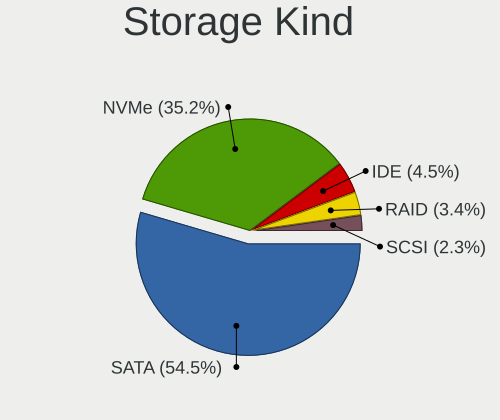

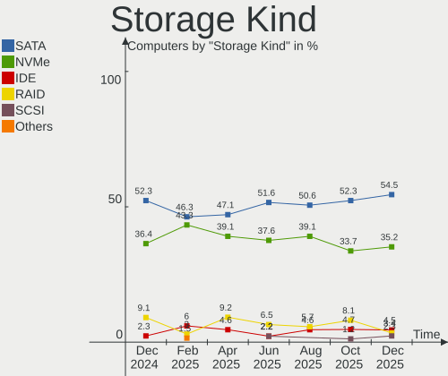

| Kind | Computers | Percent |
|------|-----------|---------|
| SATA | 48        | 54.55%  |
| NVMe | 31        | 35.23%  |
| IDE  | 4         | 4.55%   |
| RAID | 3         | 3.41%   |
| SCSI | 2         | 2.27%   |

Processor
---------

CPU Vendor
----------

Processor vendors

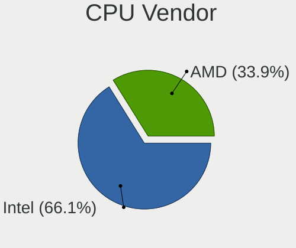

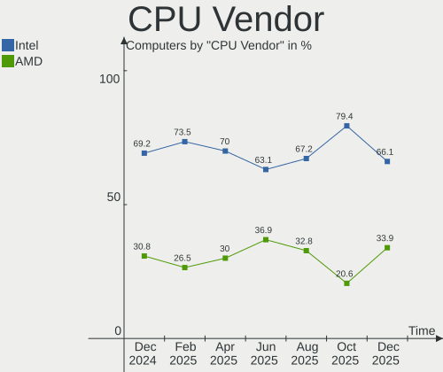

| Vendor | Computers | Percent |
|--------|-----------|---------|
| Intel  | 41        | 66.13%  |
| AMD    | 21        | 33.87%  |

CPU Model
---------

Processor models

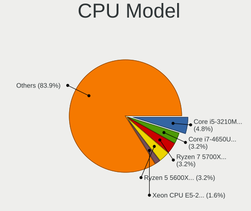

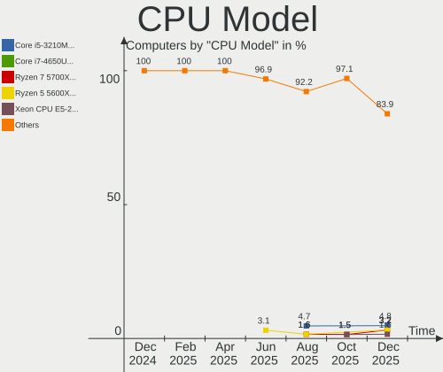

| Model                                   | Computers | Percent |
|-----------------------------------------|-----------|---------|
| Intel Core i5-3210M CPU @ 2.50GHz       | 3         | 4.84%   |
| Intel Core i7-4650U CPU @ 1.70GHz       | 2         | 3.23%   |
| AMD Ryzen 7 5700X 8-Core Processor      | 2         | 3.23%   |
| AMD Ryzen 5 5600X 6-Core Processor      | 2         | 3.23%   |
| Intel Xeon CPU E5-2680 v4 @ 2.40GHz     | 1         | 1.61%   |
| Intel Pentium Dual CPU T3400 @ 2.16GHz  | 1         | 1.61%   |
| Intel Core m7-6Y75 CPU @ 1.20GHz        | 1         | 1.61%   |
| Intel Core i9-14900K                    | 1         | 1.61%   |
| Intel Core i7-7700 CPU @ 3.60GHz        | 1         | 1.61%   |
| Intel Core i7-7500U CPU @ 2.70GHz       | 1         | 1.61%   |
| Intel Core i7-6500U CPU @ 2.50GHz       | 1         | 1.61%   |
| Intel Core i7-4810MQ CPU @ 2.80GHz      | 1         | 1.61%   |
| Intel Core i7-4771 CPU @ 3.50GHz        | 1         | 1.61%   |
| Intel Core i7-4770K CPU @ 3.50GHz       | 1         | 1.61%   |
| Intel Core i7-4770 CPU @ 3.40GHz        | 1         | 1.61%   |
| Intel Core i7-14650HX                   | 1         | 1.61%   |
| Intel Core i7-10750H CPU @ 2.60GHz      | 1         | 1.61%   |
| Intel Core i7-1060NG7 CPU @ 1.20GHz     | 1         | 1.61%   |
| Intel Core i5-8600K CPU @ 3.60GHz       | 1         | 1.61%   |
| Intel Core i5-8259U CPU @ 2.30GHz       | 1         | 1.61%   |
| Intel Core i5-8250U CPU @ 1.60GHz       | 1         | 1.61%   |
| Intel Core i5-7360U CPU @ 2.30GHz       | 1         | 1.61%   |
| Intel Core i5-6500 CPU @ 3.20GHz        | 1         | 1.61%   |
| Intel Core i5-4690K CPU @ 3.50GHz       | 1         | 1.61%   |
| Intel Core i5-4310U CPU @ 2.00GHz       | 1         | 1.61%   |
| Intel Core i5-4308U CPU @ 2.80GHz       | 1         | 1.61%   |
| Intel Core i5-3330S CPU @ 2.70GHz       | 1         | 1.61%   |
| Intel Core i5-2450M CPU @ 2.50GHz       | 1         | 1.61%   |
| Intel Core i5-2410M CPU @ 2.30GHz       | 1         | 1.61%   |
| Intel Core i5-14600K                    | 1         | 1.61%   |
| Intel Core i5-10210U CPU @ 1.60GHz      | 1         | 1.61%   |
| Intel Core i3-5005U CPU @ 2.00GHz       | 1         | 1.61%   |
| Intel Core 2 Duo CPU T9300 @ 2.50GHz    | 1         | 1.61%   |
| Intel Core 2 Duo CPU E8400 @ 3.00GHz    | 1         | 1.61%   |
| Intel 13th Gen Core i9-13900K           | 1         | 1.61%   |
| Intel 13th Gen Core i5-13500H           | 1         | 1.61%   |
| Intel 13th Gen Core i5-1334U            | 1         | 1.61%   |
| Intel 12th Gen Core i7-12650H           | 1         | 1.61%   |
| Intel 12th Gen Core i5-1235U            | 1         | 1.61%   |
| Intel 11th Gen Core i5-1135G7 @ 2.40GHz | 1         | 1.61%   |

CPU Model Family
----------------

Processor model prefix

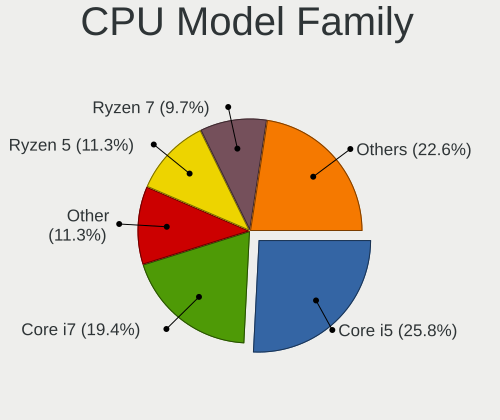

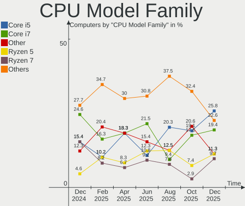

| Model              | Computers | Percent |
|--------------------|-----------|---------|
| Intel Core i5      | 16        | 25.81%  |
| Intel Core i7      | 12        | 19.35%  |
| Other              | 7         | 11.29%  |
| AMD Ryzen 5        | 7         | 11.29%  |
| AMD Ryzen 7        | 6         | 9.68%   |
| Intel Core 2 Duo   | 2         | 3.23%   |
| AMD Ryzen 9        | 2         | 3.23%   |
| Intel Xeon         | 1         | 1.61%   |
| Intel Pentium Dual | 1         | 1.61%   |
| Intel Core m7      | 1         | 1.61%   |
| Intel Core i9      | 1         | 1.61%   |
| Intel Core i3      | 1         | 1.61%   |
| AMD Phenom II X6   | 1         | 1.61%   |
| AMD FX             | 1         | 1.61%   |
| AMD E1             | 1         | 1.61%   |
| AMD A6             | 1         | 1.61%   |
| AMD A4             | 1         | 1.61%   |

CPU Cores
---------

Number of processor cores

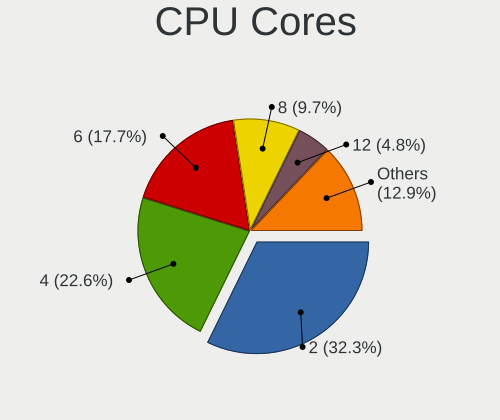

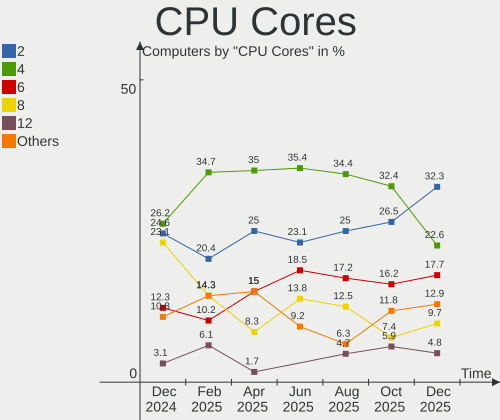

| Number | Computers | Percent |
|--------|-----------|---------|
| 2      | 20        | 32.26%  |
| 4      | 14        | 22.58%  |
| 6      | 11        | 17.74%  |
| 8      | 6         | 9.68%   |
| 12     | 3         | 4.84%   |
| 10     | 3         | 4.84%   |
| 24     | 2         | 3.23%   |
| 14     | 2         | 3.23%   |
| 16     | 1         | 1.61%   |

CPU Sockets
-----------

Number of sockets

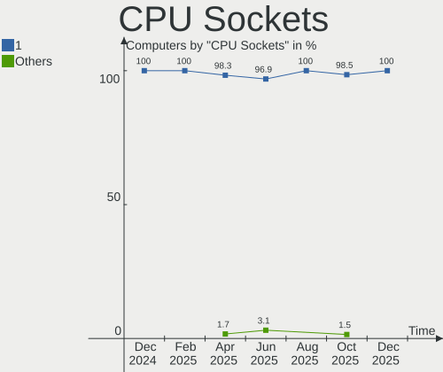

| Number | Computers | Percent |
|--------|-----------|---------|
| 1      | 62        | 100%    |

CPU Threads
-----------

Threads per core (Hyper-Threading)

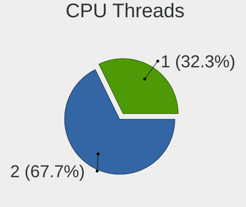

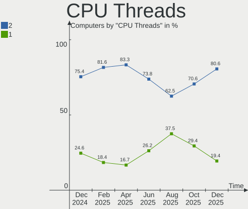

| Number | Computers | Percent |
|--------|-----------|---------|
| 2      | 50        | 80.65%  |
| 1      | 12        | 19.35%  |

CPU Op-Modes
------------

CPU Operation Modes (32-bit, 64-bit)

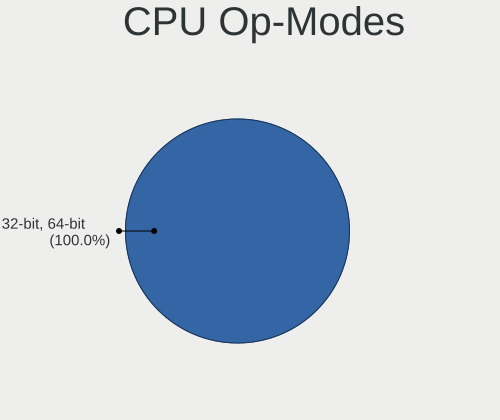

| Op mode        | Computers | Percent |
|----------------|-----------|---------|
| 32-bit, 64-bit | 62        | 100%    |

CPU Microcode
-------------

Microcode number

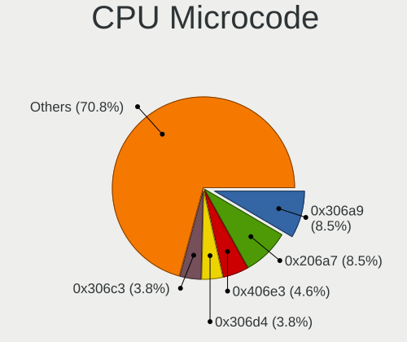

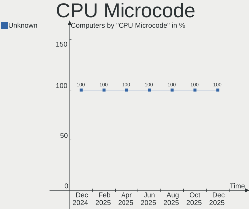

| Number  | Computers | Percent |
|---------|-----------|---------|
| Unknown | 62        | 100%    |

CPU Microarch
-------------

Microarchitecture

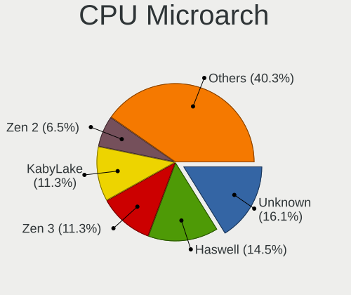

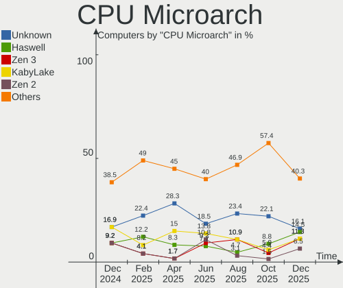

| Name             | Computers | Percent |
|------------------|-----------|---------|
| Unknown          | 10        | 16.13%  |
| Haswell          | 9         | 14.52%  |
| Zen 3            | 7         | 11.29%  |
| KabyLake         | 7         | 11.29%  |
| Zen 2            | 4         | 6.45%   |
| IvyBridge        | 4         | 6.45%   |
| Skylake          | 3         | 4.84%   |
| SandyBridge      | 2         | 3.23%   |
| Piledriver       | 2         | 3.23%   |
| Penryn           | 2         | 3.23%   |
| Broadwell        | 2         | 3.23%   |
| Alderlake Hybrid | 2         | 3.23%   |
| Zen+             | 1         | 1.61%   |
| TigerLake        | 1         | 1.61%   |
| K10              | 1         | 1.61%   |
| Jaguar           | 1         | 1.61%   |
| IceLake          | 1         | 1.61%   |
| Excavator        | 1         | 1.61%   |
| Core             | 1         | 1.61%   |
| CometLake        | 1         | 1.61%   |

Graphics
--------

GPU Vendor
----------

Vendors of graphics cards

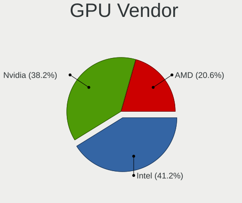

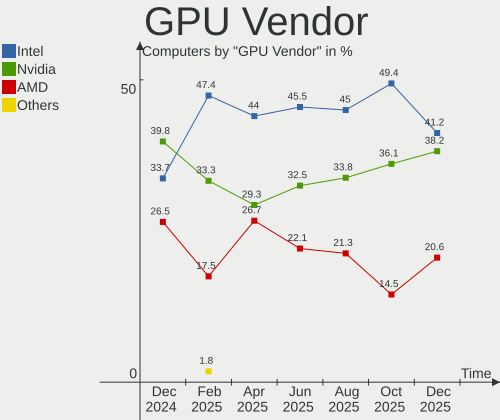

| Vendor | Computers | Percent |
|--------|-----------|---------|
| Intel  | 28        | 41.18%  |
| Nvidia | 26        | 38.24%  |
| AMD    | 14        | 20.59%  |

GPU Model
---------

Graphics card models

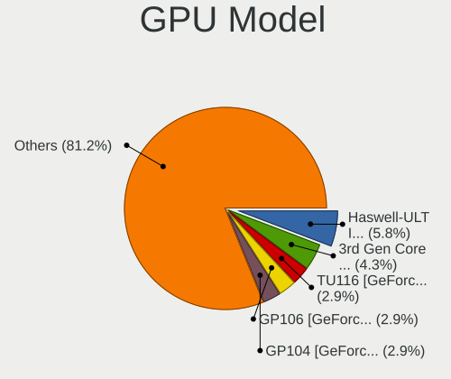

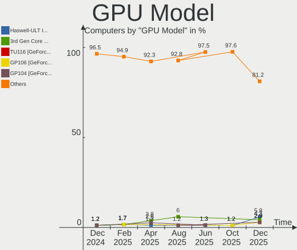

| Model                                                                     | Computers | Percent |
|---------------------------------------------------------------------------|-----------|---------|
| Intel Haswell-ULT Integrated Graphics Controller                          | 4         | 5.8%    |
| Intel 3rd Gen Core processor Graphics Controller                          | 3         | 4.35%   |
| Nvidia TU116 [GeForce GTX 1660]                                           | 2         | 2.9%    |
| Nvidia GP106 [GeForce GTX 1060 6GB]                                       | 2         | 2.9%    |
| Nvidia GP104 [GeForce GTX 1070]                                           | 2         | 2.9%    |
| Nvidia GM107 [GeForce GTX 750 Ti]                                         | 2         | 2.9%    |
| Intel 2nd Generation Core Processor Family Integrated Graphics Controller | 2         | 2.9%    |
| Nvidia TU116 [GeForce GTX 1660 Ti]                                        | 1         | 1.45%   |
| Nvidia TU106M [GeForce RTX 2060 Mobile]                                   | 1         | 1.45%   |
| Nvidia GP107M [GeForce MX350]                                             | 1         | 1.45%   |
| Nvidia GP107 [GeForce GTX 1050 Ti]                                        | 1         | 1.45%   |
| Nvidia GP104 [GeForce GTX 1080]                                           | 1         | 1.45%   |
| Nvidia GP102 [GeForce GTX 1080 Ti]                                        | 1         | 1.45%   |
| Nvidia GM107GL [Quadro K620]                                              | 1         | 1.45%   |
| Nvidia GK208 [GeForce GT 635]                                             | 1         | 1.45%   |
| Nvidia GK107M [GeForce GT 640M Mac Edition]                               | 1         | 1.45%   |
| Nvidia GK106 [GeForce GTX 660]                                            | 1         | 1.45%   |
| Nvidia GB207 [GeForce RTX 5050]                                           | 1         | 1.45%   |
| Nvidia GB206 [GeForce RTX 5060]                                           | 1         | 1.45%   |
| Nvidia GA106 [GeForce RTX 3060 Lite Hash Rate]                            | 1         | 1.45%   |
| Nvidia GA104 [GeForce RTX 3060 Ti Lite Hash Rate]                         | 1         | 1.45%   |
| Nvidia GA102 [GeForce RTX 3080 Ti]                                        | 1         | 1.45%   |
| Nvidia AD107M [GeForce RTX 4060 Max-Q / Mobile]                           | 1         | 1.45%   |
| Nvidia AD104 [GeForce RTX 4070]                                           | 1         | 1.45%   |
| Nvidia AD103 [GeForce RTX 4080 SUPER]                                     | 1         | 1.45%   |
| Nvidia AD102 [GeForce RTX 4090]                                           | 1         | 1.45%   |
| Intel TigerLake-LP GT2 [Iris Xe Graphics]                                 | 1         | 1.45%   |
| Intel Skylake-Y GT2 [HD Graphics 515]                                     | 1         | 1.45%   |
| Intel Skylake-U GT2 [HD Graphics 520]                                     | 1         | 1.45%   |
| Intel Skylake-S GT2 [HD Graphics 530]                                     | 1         | 1.45%   |
| Intel Raptor Lake-S UHD Graphics                                          | 1         | 1.45%   |
| Intel Raptor Lake-S GT1 [UHD Graphics 770]                                | 1         | 1.45%   |
| Intel Raptor Lake-P [UHD Graphics]                                        | 1         | 1.45%   |
| Intel Raptor Lake-P [Iris Xe Graphics]                                    | 1         | 1.45%   |
| Intel Mobile 4 Series Chipset Integrated Graphics Controller              | 1         | 1.45%   |
| Intel Kaby Lake-U GT3 [Iris Plus Graphics 640]                            | 1         | 1.45%   |
| Intel Kaby Lake-U GT2 [HD Graphics 620]                                   | 1         | 1.45%   |
| Intel Kaby Lake-S GT2 [HD Graphics 630]                                   | 1         | 1.45%   |
| Intel Kaby Lake-R GT2 [UHD Graphics 620]                                  | 1         | 1.45%   |
| Intel Iris Plus Graphics G7 (Ice Lake)                                    | 1         | 1.45%   |

GPU Combo
---------

Combinations of graphics cards

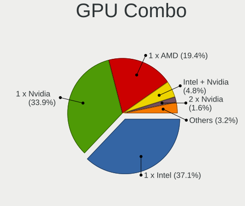

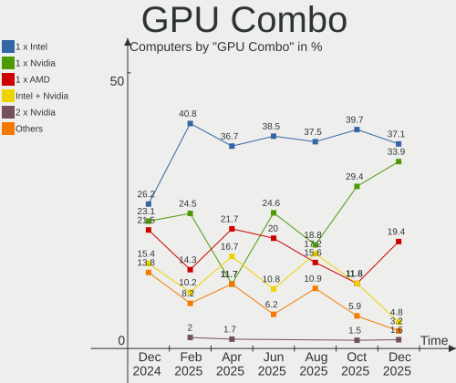

| Name           | Computers | Percent |
|----------------|-----------|---------|
| 1 x Intel      | 23        | 37.1%   |
| 1 x Nvidia     | 21        | 33.87%  |
| 1 x AMD        | 12        | 19.35%  |
| Intel + Nvidia | 3         | 4.84%   |
| 2 x Nvidia     | 1         | 1.61%   |
| Intel + AMD    | 1         | 1.61%   |
| AMD + Nvidia   | 1         | 1.61%   |

GPU Driver
----------

Free vs proprietary

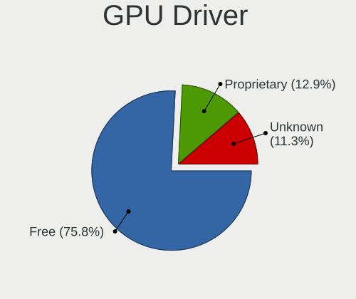

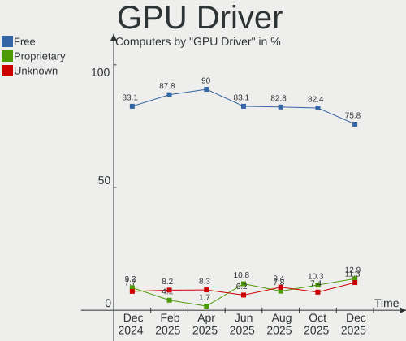

| Driver      | Computers | Percent |
|-------------|-----------|---------|
| Free        | 47        | 75.81%  |
| Proprietary | 8         | 12.9%   |
| Unknown     | 7         | 11.29%  |

GPU Memory
----------

Total video memory

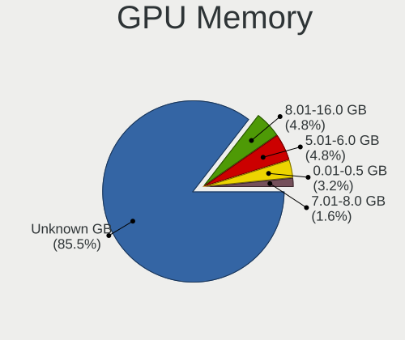

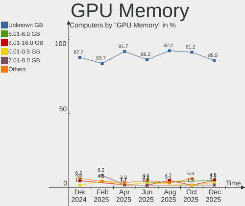

| Size in GB | Computers | Percent |
|------------|-----------|---------|
| Unknown    | 53        | 85.48%  |
| 5.01-6.0   | 3         | 4.84%   |
| 8.01-16.0  | 3         | 4.84%   |
| 0.01-0.5   | 2         | 3.23%   |
| 7.01-8.0   | 1         | 1.61%   |

Monitor
-------

Monitor Vendor
--------------

Monitor vendors

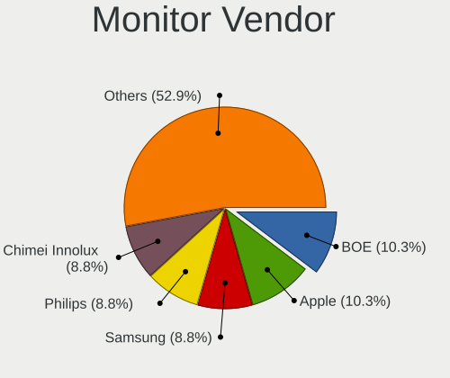

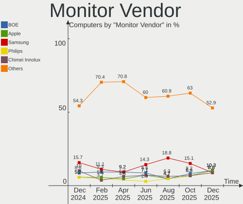

| Vendor                  | Computers | Percent |
|-------------------------|-----------|---------|
| BOE                     | 7         | 10.29%  |
| Apple                   | 7         | 10.29%  |
| Samsung Electronics     | 6         | 8.82%   |
| Philips                 | 6         | 8.82%   |
| Chimei Innolux          | 6         | 8.82%   |
| Dell                    | 4         | 5.88%   |
| AU Optronics            | 4         | 5.88%   |
| BenQ                    | 3         | 4.41%   |
| ASUSTek Computer        | 3         | 4.41%   |
| Sceptre Tech            | 2         | 2.94%   |
| LG Display              | 2         | 2.94%   |
| Hitachi                 | 2         | 2.94%   |
| Goldstar                | 2         | 2.94%   |
| Acer                    | 2         | 2.94%   |
| XZL                     | 1         | 1.47%   |
| ViewSonic               | 1         | 1.47%   |
| Valve                   | 1         | 1.47%   |
| Unknown                 | 1         | 1.47%   |
| Sony                    | 1         | 1.47%   |
| Sharp                   | 1         | 1.47%   |
| MSI                     | 1         | 1.47%   |
| HDC                     | 1         | 1.47%   |
| Chi Mei Optoelectronics | 1         | 1.47%   |
| AOC                     | 1         | 1.47%   |
| Ancor Communications    | 1         | 1.47%   |
| Unknown                 | 1         | 1.47%   |

Monitor Model
-------------

Monitor models

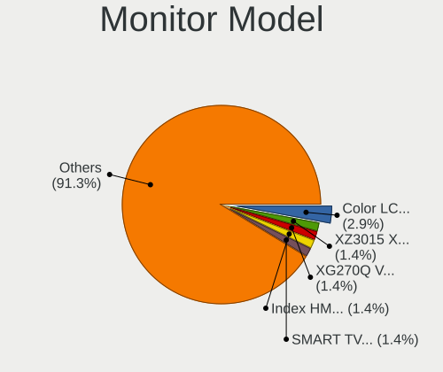

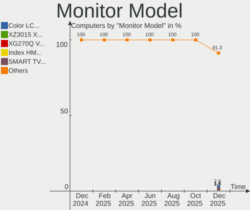

| Model                                                                 | Computers | Percent |
|-----------------------------------------------------------------------|-----------|---------|
| Apple Color LCD APP9CF0 1440x900 290x180mm 13.4-inch                  | 2         | 2.9%    |
| XZL XZ3015 XZL2380 1920x1080 526x296mm 23.8-inch                      | 1         | 1.45%   |
| ViewSonic XG270Q VSC3C3A 2560x1440 597x336mm 27.0-inch                | 1         | 1.45%   |
| Valve Index HMD VLV91A8                                               | 1         | 1.45%   |
| Unknown SMART TV 0563 1920x1080 1209x680mm 54.6-inch                  | 1         | 1.45%   |
| Sony TV SNYEE01 1920x1080                                             | 1         | 1.45%   |
| Sharp LCD Monitor SHP1461 3200x1800 294x165mm 13.3-inch               | 1         | 1.45%   |
| Sceptre Tech Sceptre Y32 SPT0CAD 2560x1440 697x392mm 31.5-inch        | 1         | 1.45%   |
| Sceptre Tech Sceptre E22 SPT08D5 1920x1080 470x300mm 22.0-inch        | 1         | 1.45%   |
| Samsung Electronics S27B350 SAM08DC 1920x1080 598x336mm 27.0-inch     | 1         | 1.45%   |
| Samsung Electronics LCD Monitor SDC5441 1366x768 344x193mm 15.5-inch  | 1         | 1.45%   |
| Samsung Electronics LCD Monitor SDC4208 1920x1200 302x189mm 14.0-inch | 1         | 1.45%   |
| Samsung Electronics LCD Monitor SDC4187 1920x1200 302x189mm 14.0-inch | 1         | 1.45%   |
| Samsung Electronics LCD Monitor LS24AG32x                             | 1         | 1.45%   |
| Samsung Electronics C49HG9x SAM0E5E 3840x1080 1200x340mm 49.1-inch    | 1         | 1.45%   |
| Philips PHL 276E8V PHLC18F 3840x2160 597x336mm 27.0-inch              | 1         | 1.45%   |
| Philips PHL 275V8 PHLC292 2560x1440 597x336mm 27.0-inch               | 1         | 1.45%   |
| Philips PHL 273V7 PHLC156 1920x1080 598x336mm 27.0-inch               | 1         | 1.45%   |
| Philips PHL 245B1 PHL094C 2560x1440 530x300mm 24.0-inch               | 1         | 1.45%   |
| Philips FTV PHL01EA 1920x1080 1440x810mm 65.0-inch                    | 1         | 1.45%   |
| Philips 170C PHLC011 1280x1024 338x270mm 17.0-inch                    | 1         | 1.45%   |
| MSI MAG 274QRFW MSI9CC2 2560x1440 597x336mm 27.0-inch                 | 1         | 1.45%   |
| LG Display LCD Monitor LGD046F 1920x1080 344x194mm 15.5-inch          | 1         | 1.45%   |
| LG Display LCD Monitor LGD02D8 1366x768 277x156mm 12.5-inch           | 1         | 1.45%   |
| Hitachi HISENSE HEC0030 3840x2160 1872x1053mm 84.6-inch               | 1         | 1.45%   |
| Hitachi HISENSE HEC002F 3840x2160 1872x1053mm 84.6-inch               | 1         | 1.45%   |
| HDC HDMI SPLITTER HDC3300 1920x1080                                   | 1         | 1.45%   |
| Goldstar TV SSCR2 GSM80A0 3840x2160                                   | 1         | 1.45%   |
| Goldstar HDR 4K GSM7707 3840x2160 600x340mm 27.2-inch                 | 1         | 1.45%   |
| Dell U2515H DELD070 2560x1440 553x311mm 25.0-inch                     | 1         | 1.45%   |
| Dell U2414H DELA0A2 1920x1080 527x296mm 23.8-inch                     | 1         | 1.45%   |
| Dell S2721QS DELA198 3840x2160 597x336mm 27.0-inch                    | 1         | 1.45%   |
| Dell P2417H DELA0DC 1920x1080 527x296mm 23.8-inch                     | 1         | 1.45%   |
| Dell E207WFP DELD011 1680x1050 430x270mm 20.0-inch                    | 1         | 1.45%   |
| Chimei Innolux LCD Monitor CMN1728 1600x900 382x215mm 17.3-inch       | 1         | 1.45%   |
| Chimei Innolux LCD Monitor CMN1614 1920x1200 344x215mm 16.0-inch      | 1         | 1.45%   |
| Chimei Innolux LCD Monitor CMN15F5 1920x1080 344x193mm 15.5-inch      | 1         | 1.45%   |
| Chimei Innolux LCD Monitor CMN15E7 1920x1080 344x193mm 15.5-inch      | 1         | 1.45%   |
| Chimei Innolux LCD Monitor CMN15CA 1366x768 344x193mm 15.5-inch       | 1         | 1.45%   |
| Chimei Innolux LCD Monitor CMN1441 1920x1200 301x188mm 14.0-inch      | 1         | 1.45%   |

Monitor Resolution
------------------

Monitor screen resolution

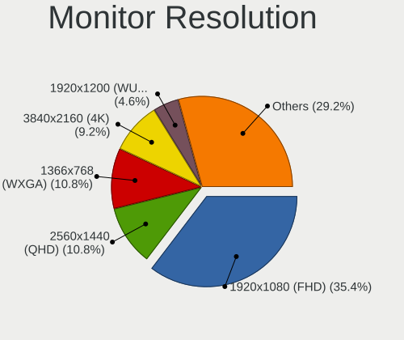

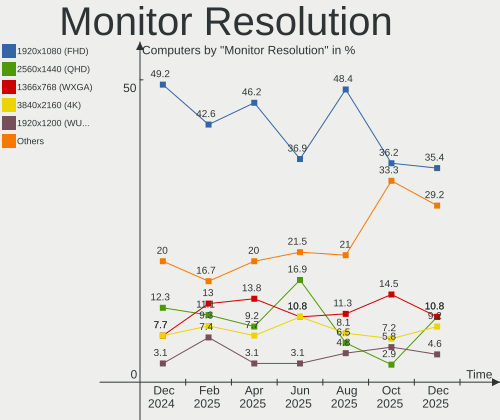

| Resolution         | Computers | Percent |
|--------------------|-----------|---------|
| 1920x1080 (FHD)    | 23        | 35.38%  |
| 2560x1440 (QHD)    | 7         | 10.77%  |
| 1366x768 (WXGA)    | 7         | 10.77%  |
| 3840x2160 (4K)     | 6         | 9.23%   |
| 1920x1200 (WUXGA)  | 3         | 4.62%   |
| 1680x1050 (WSXGA+) | 3         | 4.62%   |
| 3840x1080          | 2         | 3.08%   |
| 2880x1800          | 2         | 3.08%   |
| 2560x1600          | 2         | 3.08%   |
| 1600x900 (HD+)     | 2         | 3.08%   |
| 1440x900 (WXGA+)   | 2         | 3.08%   |
| 1280x800 (WXGA)    | 2         | 3.08%   |
| Unknown            | 2         | 3.08%   |
| 3200x1800 (QHD+)   | 1         | 1.54%   |
| 1280x1024 (SXGA)   | 1         | 1.54%   |

Monitor Diagonal
----------------

Diagonal size in inches

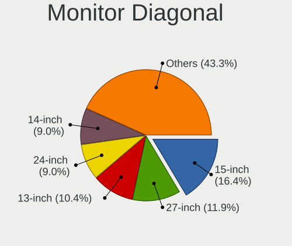

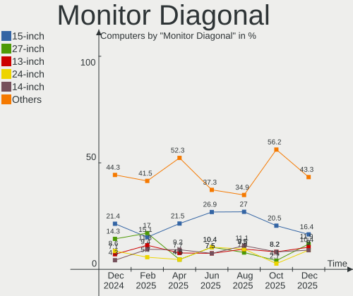

| Inches  | Computers | Percent |
|---------|-----------|---------|
| 15      | 11        | 16.42%  |
| 27      | 8         | 11.94%  |
| 13      | 7         | 10.45%  |
| 24      | 6         | 8.96%   |
| 14      | 6         | 8.96%   |
| 20      | 4         | 5.97%   |
| 23      | 3         | 4.48%   |
| 16      | 3         | 4.48%   |
| Unknown | 3         | 4.48%   |
| 84      | 2         | 2.99%   |
| 72      | 2         | 2.99%   |
| 31      | 2         | 2.99%   |
| 17      | 2         | 2.99%   |
| 65      | 1         | 1.49%   |
| 63      | 1         | 1.49%   |
| 54      | 1         | 1.49%   |
| 49      | 1         | 1.49%   |
| 26      | 1         | 1.49%   |
| 25      | 1         | 1.49%   |
| 21      | 1         | 1.49%   |
| 12      | 1         | 1.49%   |

Monitor Width
-------------

Physical width

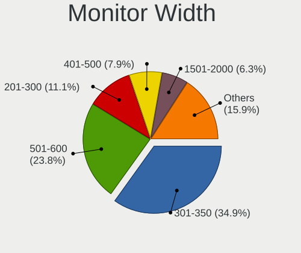

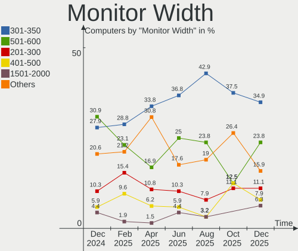

| Width in mm | Computers | Percent |
|-------------|-----------|---------|
| 301-350     | 22        | 34.92%  |
| 501-600     | 15        | 23.81%  |
| 201-300     | 7         | 11.11%  |
| 401-500     | 5         | 7.94%   |
| 1501-2000   | 4         | 6.35%   |
| 1001-1500   | 4         | 6.35%   |
| Unknown     | 3         | 4.76%   |
| 601-700     | 2         | 3.17%   |
| 351-400     | 1         | 1.59%   |

Aspect Ratio
------------

Proportional relationship between the width and the height

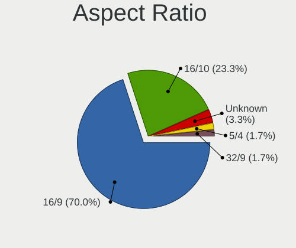

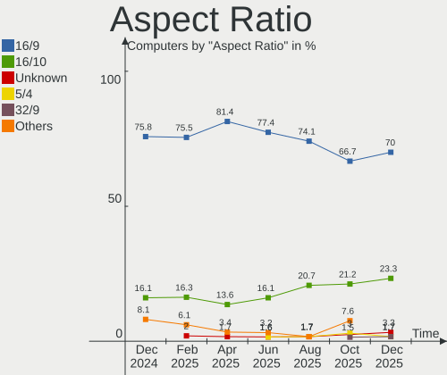

| Ratio   | Computers | Percent |
|---------|-----------|---------|
| 16/9    | 42        | 70%     |
| 16/10   | 14        | 23.33%  |
| Unknown | 2         | 3.33%   |
| 5/4     | 1         | 1.67%   |
| 32/9    | 1         | 1.67%   |

Monitor Area
------------

Area in inch²

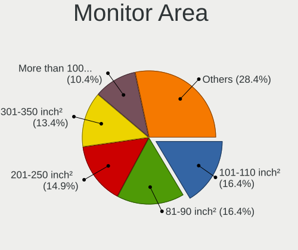

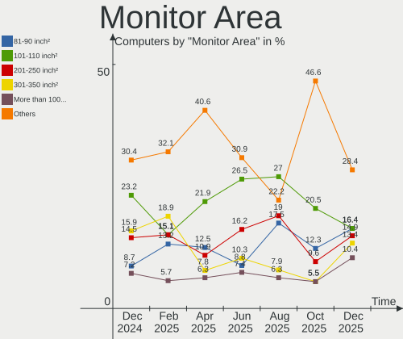

| Area in inch² | Computers | Percent |
|----------------|-----------|---------|
| 81-90          | 11        | 16.42%  |
| 101-110        | 11        | 16.42%  |
| 201-250        | 10        | 14.93%  |
| 301-350        | 9         | 13.43%  |
| More than 1000 | 7         | 10.45%  |
| 151-200        | 4         | 5.97%   |
| 111-120        | 3         | 4.48%   |
| Unknown        | 3         | 4.48%   |
| 71-80          | 2         | 2.99%   |
| 351-500        | 2         | 2.99%   |
| 61-70          | 1         | 1.49%   |
| 251-300        | 1         | 1.49%   |
| 141-150        | 1         | 1.49%   |
| 131-140        | 1         | 1.49%   |
| 501-1000       | 1         | 1.49%   |

Pixel Density
-------------

Pixels per inch

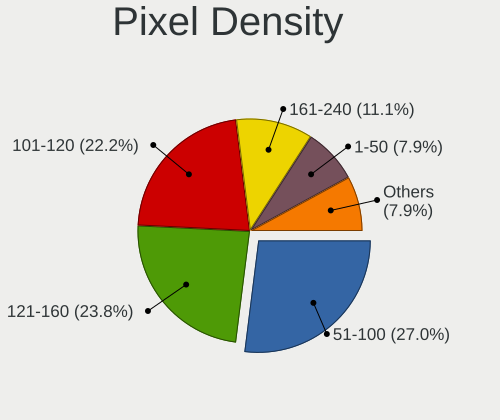

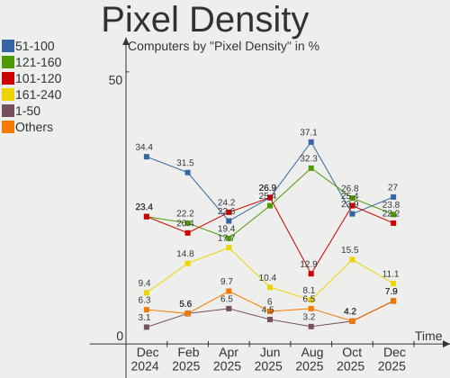

| Density       | Computers | Percent |
|---------------|-----------|---------|
| 51-100        | 17        | 26.98%  |
| 121-160       | 15        | 23.81%  |
| 101-120       | 14        | 22.22%  |
| 161-240       | 7         | 11.11%  |
| 1-50          | 5         | 7.94%   |
| Unknown       | 3         | 4.76%   |
| More than 240 | 2         | 3.17%   |

Multiple Monitors
-----------------

Total monitors connected

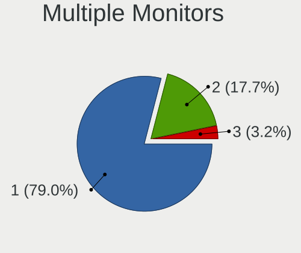

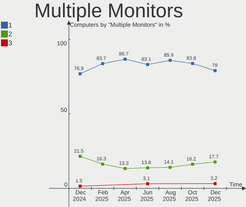

| Total | Computers | Percent |
|-------|-----------|---------|
| 1     | 49        | 79.03%  |
| 2     | 11        | 17.74%  |
| 3     | 2         | 3.23%   |

Network
-------

Net Controller Vendor
---------------------

Controller vendors

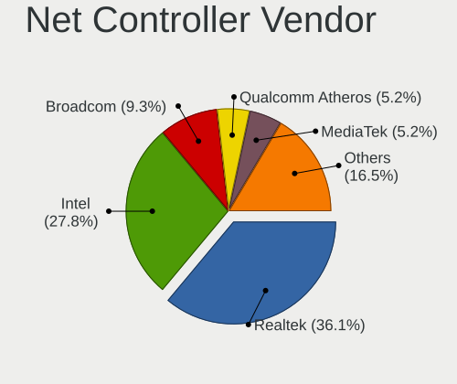

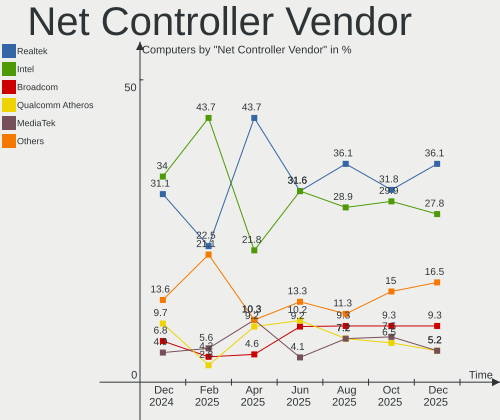

| Vendor                          | Computers | Percent |
|---------------------------------|-----------|---------|
| Realtek Semiconductor           | 35        | 36.08%  |
| Intel                           | 27        | 27.84%  |
| Broadcom                        | 9         | 9.28%   |
| Qualcomm Atheros                | 5         | 5.15%   |
| MediaTek                        | 5         | 5.15%   |
| Broadcom Limited                | 4         | 4.12%   |
| Microsoft                       | 3         | 3.09%   |
| TP-Link                         | 1         | 1.03%   |
| Sierra Wireless                 | 1         | 1.03%   |
| Ralink                          | 1         | 1.03%   |
| Qualcomm Atheros Communications | 1         | 1.03%   |
| Qualcomm                        | 1         | 1.03%   |
| NetGear                         | 1         | 1.03%   |
| Marvell Technology Group        | 1         | 1.03%   |
| DisplayLink                     | 1         | 1.03%   |
| Aquantia                        | 1         | 1.03%   |

Net Controller Model
--------------------

Controller models

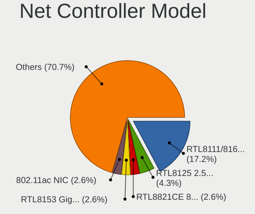

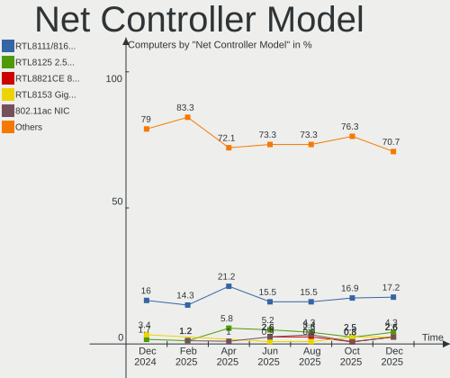

| Model                                                                  | Computers | Percent |
|------------------------------------------------------------------------|-----------|---------|
| Realtek RTL8111/8168/8211/8411 PCI Express Gigabit Ethernet Controller | 20        | 17.24%  |
| Realtek RTL8125 2.5GbE Controller                                      | 5         | 4.31%   |
| Realtek RTL8821CE 802.11ac PCIe Wireless Network Adapter               | 3         | 2.59%   |
| Realtek RTL8153 Gigabit Ethernet Adapter                               | 3         | 2.59%   |
| Realtek 802.11ac NIC                                                   | 3         | 2.59%   |
| Microsoft Wireless XBox Controller Dongle                              | 3         | 2.59%   |
| MediaTek MT7922 802.11ax PCI Express Wireless Network Adapter          | 3         | 2.59%   |
| Intel Wi-Fi 6E(802.11ax) AX210/AX1675* 2x2 [Typhoon Peak]              | 3         | 2.59%   |
| Broadcom NetXtreme BCM57766 Gigabit Ethernet PCIe                      | 3         | 2.59%   |
| Broadcom Limited BCM4360 802.11ac Dual Band Wireless Network Adapter   | 3         | 2.59%   |
| Realtek RTL8723BU 802.11b/g/n WLAN Adapter                             | 2         | 1.72%   |
| Intel Wireless 8260                                                    | 2         | 1.72%   |
| Intel Wi-Fi 6 AX200                                                    | 2         | 1.72%   |
| Intel Wi-Fi 5(802.11ac) Wireless-AC 9x6x [Thunder Peak]                | 2         | 1.72%   |
| Intel Raptor Lake PCH CNVi WiFi                                        | 2         | 1.72%   |
| Intel Ethernet Controller I226-V                                       | 2         | 1.72%   |
| Intel Ethernet Connection I217-V                                       | 2         | 1.72%   |
| Intel Centrino Advanced-N 6205 [Taylor Peak]                           | 2         | 1.72%   |
| Intel 82579LM Gigabit Network Connection (Lewisville)                  | 2         | 1.72%   |
| Intel 700 Series Chipset CNVi WiFi                                     | 2         | 1.72%   |
| Broadcom BCM4331 802.11a/b/g/n                                         | 2         | 1.72%   |
| TP-Link TL-WN821N v5/v6 [RTL8192EU]                                    | 1         | 0.86%   |
| Sierra Wireless EM7455                                                 | 1         | 0.86%   |
| Realtek RTL8922AE 802.11be PCIe Wireless Network Adapter               | 1         | 0.86%   |
| Realtek RTL8188ETV Wireless LAN 802.11n Network Adapter                | 1         | 0.86%   |
| Realtek RTL8152 Fast Ethernet Adapter                                  | 1         | 0.86%   |
| Realtek RTL810xE PCI Express Fast Ethernet controller                  | 1         | 0.86%   |
| Ralink RT2790 Wireless 802.11n 1T/2R PCIe                              | 1         | 0.86%   |
| Qualcomm Nokia X30 5G                                                  | 1         | 0.86%   |
| Qualcomm Atheros QCA9565 / AR9565 Wireless Network Adapter             | 1         | 0.86%   |
| Qualcomm Atheros QCA9377 802.11ac Wireless Network Adapter             | 1         | 0.86%   |
| Qualcomm Atheros QCA6174 802.11ac Wireless Network Adapter             | 1         | 0.86%   |
| Qualcomm Atheros Killer E220x Gigabit Ethernet Controller              | 1         | 0.86%   |
| Qualcomm Atheros AR9271 802.11n                                        | 1         | 0.86%   |
| Qualcomm Atheros AR9485 Wireless Network Adapter                       | 1         | 0.86%   |
| NetGear WG111v3 54 Mbps Wireless [realtek RTL8187B]                    | 1         | 0.86%   |
| MediaTek MT7921 802.11ax PCIe Wireless Network Adapter [Filogic 330]   | 1         | 0.86%   |
| MediaTek MT7902 802.11ax PCIe Wireless Network Adapter [Filogic 310]   | 1         | 0.86%   |
| Marvell Group 88E8058 PCI-E Gigabit Ethernet Controller                | 1         | 0.86%   |
| Intel Wireless 8265 / 8275                                             | 1         | 0.86%   |

Wireless Vendor
---------------

Wireless vendors

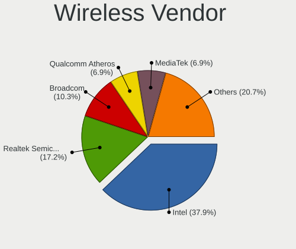

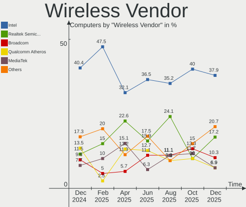

| Vendor                          | Computers | Percent |
|---------------------------------|-----------|---------|
| Intel                           | 22        | 37.93%  |
| Realtek Semiconductor           | 10        | 17.24%  |
| Broadcom                        | 6         | 10.34%  |
| Qualcomm Atheros                | 4         | 6.9%    |
| MediaTek                        | 4         | 6.9%    |
| Broadcom Limited                | 4         | 6.9%    |
| Microsoft                       | 3         | 5.17%   |
| TP-Link                         | 1         | 1.72%   |
| Sierra Wireless                 | 1         | 1.72%   |
| Ralink                          | 1         | 1.72%   |
| Qualcomm Atheros Communications | 1         | 1.72%   |
| NetGear                         | 1         | 1.72%   |

Wireless Model
--------------

Wireless models

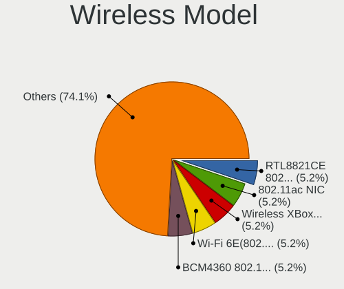

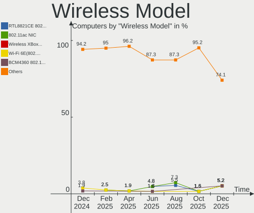

| Model                                                                | Computers | Percent |
|----------------------------------------------------------------------|-----------|---------|
| Realtek RTL8821CE 802.11ac PCIe Wireless Network Adapter             | 3         | 5.17%   |
| Realtek 802.11ac NIC                                                 | 3         | 5.17%   |
| Microsoft Wireless XBox Controller Dongle                            | 3         | 5.17%   |
| Intel Wi-Fi 6E(802.11ax) AX210/AX1675* 2x2 [Typhoon Peak]            | 3         | 5.17%   |
| Broadcom Limited BCM4360 802.11ac Dual Band Wireless Network Adapter | 3         | 5.17%   |
| Realtek RTL8723BU 802.11b/g/n WLAN Adapter                           | 2         | 3.45%   |
| MediaTek MT7922 802.11ax PCI Express Wireless Network Adapter        | 2         | 3.45%   |
| Intel Wireless 8260                                                  | 2         | 3.45%   |
| Intel Wi-Fi 6 AX200                                                  | 2         | 3.45%   |
| Intel Wi-Fi 5(802.11ac) Wireless-AC 9x6x [Thunder Peak]              | 2         | 3.45%   |
| Intel Raptor Lake PCH CNVi WiFi                                      | 2         | 3.45%   |
| Intel Centrino Advanced-N 6205 [Taylor Peak]                         | 2         | 3.45%   |
| Intel 700 Series Chipset CNVi WiFi                                   | 2         | 3.45%   |
| Broadcom BCM4331 802.11a/b/g/n                                       | 2         | 3.45%   |
| TP-Link TL-WN821N v5/v6 [RTL8192EU]                                  | 1         | 1.72%   |
| Sierra Wireless EM7455                                               | 1         | 1.72%   |
| Realtek RTL8922AE 802.11be PCIe Wireless Network Adapter             | 1         | 1.72%   |
| Realtek RTL8188ETV Wireless LAN 802.11n Network Adapter              | 1         | 1.72%   |
| Ralink RT2790 Wireless 802.11n 1T/2R PCIe                            | 1         | 1.72%   |
| Qualcomm Atheros QCA9565 / AR9565 Wireless Network Adapter           | 1         | 1.72%   |
| Qualcomm Atheros QCA9377 802.11ac Wireless Network Adapter           | 1         | 1.72%   |
| Qualcomm Atheros QCA6174 802.11ac Wireless Network Adapter           | 1         | 1.72%   |
| Qualcomm Atheros AR9271 802.11n                                      | 1         | 1.72%   |
| Qualcomm Atheros AR9485 Wireless Network Adapter                     | 1         | 1.72%   |
| NetGear WG111v3 54 Mbps Wireless [realtek RTL8187B]                  | 1         | 1.72%   |
| MediaTek MT7921 802.11ax PCIe Wireless Network Adapter [Filogic 330] | 1         | 1.72%   |
| MediaTek MT7902 802.11ax PCIe Wireless Network Adapter [Filogic 310] | 1         | 1.72%   |
| Intel Wireless 8265 / 8275                                           | 1         | 1.72%   |
| Intel Wireless 7265                                                  | 1         | 1.72%   |
| Intel Wireless 7260                                                  | 1         | 1.72%   |
| Intel Dual Band Wireless-AC 3168NGW [Stone Peak]                     | 1         | 1.72%   |
| Intel Comet Lake PCH CNVi WiFi                                       | 1         | 1.72%   |
| Intel Centrino Wireless-N 1030 [Rainbow Peak]                        | 1         | 1.72%   |
| Intel Centrino Advanced-N 6200                                       | 1         | 1.72%   |
| Broadcom Limited BCM4331 802.11a/b/g/n                               | 1         | 1.72%   |
| Broadcom BCM4377b Wireless Network Adapter                           | 1         | 1.72%   |
| Broadcom BCM4350 802.11ac Wireless Network Adapter                   | 1         | 1.72%   |
| Broadcom BCM4321 802.11a/b/g/n                                       | 1         | 1.72%   |
| Broadcom BCM43142 802.11b/g/n                                        | 1         | 1.72%   |

Ethernet Vendor
---------------

Ethernet vendors

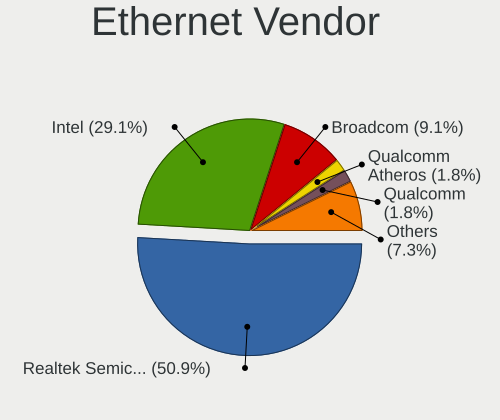

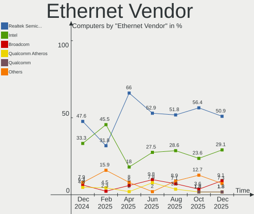

| Vendor                   | Computers | Percent |
|--------------------------|-----------|---------|
| Realtek Semiconductor    | 28        | 50.91%  |
| Intel                    | 16        | 29.09%  |
| Broadcom                 | 5         | 9.09%   |
| Qualcomm Atheros         | 1         | 1.82%   |
| Qualcomm                 | 1         | 1.82%   |
| MediaTek                 | 1         | 1.82%   |
| Marvell Technology Group | 1         | 1.82%   |
| DisplayLink              | 1         | 1.82%   |
| Aquantia                 | 1         | 1.82%   |

Ethernet Model
--------------

Ethernet models

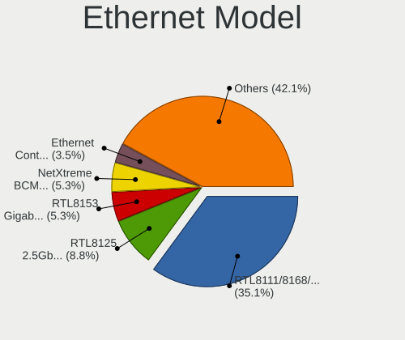

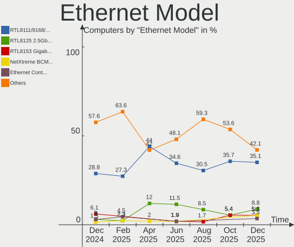

| Model                                                                           | Computers | Percent |
|---------------------------------------------------------------------------------|-----------|---------|
| Realtek RTL8111/8168/8211/8411 PCI Express Gigabit Ethernet Controller          | 20        | 35.09%  |
| Realtek RTL8125 2.5GbE Controller                                               | 5         | 8.77%   |
| Realtek RTL8153 Gigabit Ethernet Adapter                                        | 3         | 5.26%   |
| Broadcom NetXtreme BCM57766 Gigabit Ethernet PCIe                               | 3         | 5.26%   |
| Intel Ethernet Controller I226-V                                                | 2         | 3.51%   |
| Intel Ethernet Connection I217-V                                                | 2         | 3.51%   |
| Intel 82579LM Gigabit Network Connection (Lewisville)                           | 2         | 3.51%   |
| Realtek RTL8152 Fast Ethernet Adapter                                           | 1         | 1.75%   |
| Realtek RTL810xE PCI Express Fast Ethernet controller                           | 1         | 1.75%   |
| Qualcomm Nokia X30 5G                                                           | 1         | 1.75%   |
| Qualcomm Atheros Killer E220x Gigabit Ethernet Controller                       | 1         | 1.75%   |
| MediaTek MT7922 802.11ax PCI Express Wireless Network Adapter                   | 1         | 1.75%   |
| Marvell Group 88E8058 PCI-E Gigabit Ethernet Controller                         | 1         | 1.75%   |
| Intel I211 Gigabit Network Connection                                           | 1         | 1.75%   |
| Intel Ethernet Controller I225-V                                                | 1         | 1.75%   |
| Intel Ethernet Connection I219-V                                                | 1         | 1.75%   |
| Intel Ethernet Connection I218-LM                                               | 1         | 1.75%   |
| Intel Ethernet Connection I217-LM                                               | 1         | 1.75%   |
| Intel Ethernet Connection (5) I219-LM                                           | 1         | 1.75%   |
| Intel Ethernet Connection (4) I219-V                                            | 1         | 1.75%   |
| Intel Ethernet Connection (2) I219-V                                            | 1         | 1.75%   |
| Intel Alder Lake-P PCH CNVi WiFi                                                | 1         | 1.75%   |
| Intel 82567LM-3 Gigabit Network Connection                                      | 1         | 1.75%   |
| DisplayLink USB-C Triple-4K Dock                                                | 1         | 1.75%   |
| Broadcom NetXtreme BCM57765 Gigabit Ethernet PCIe                               | 1         | 1.75%   |
| Broadcom NetXtreme BCM5762 Gigabit Ethernet PCIe                                | 1         | 1.75%   |
| Aquantia AQtion AQC113CS NBase-T/IEEE 802.3an Ethernet Controller [Antigua 10G] | 1         | 1.75%   |

Net Controller Kind
-------------------

Ethernet, WiFi or modem

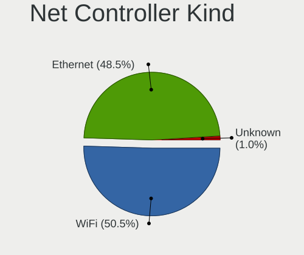

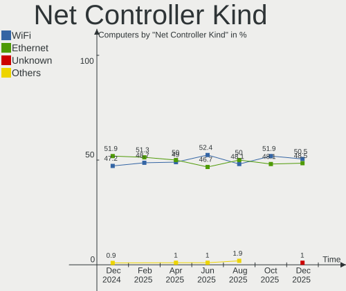

| Kind     | Computers | Percent |
|----------|-----------|---------|
| WiFi     | 52        | 50.49%  |
| Ethernet | 50        | 48.54%  |
| Unknown  | 1         | 0.97%   |

Used Controller
---------------

Currently used network controller

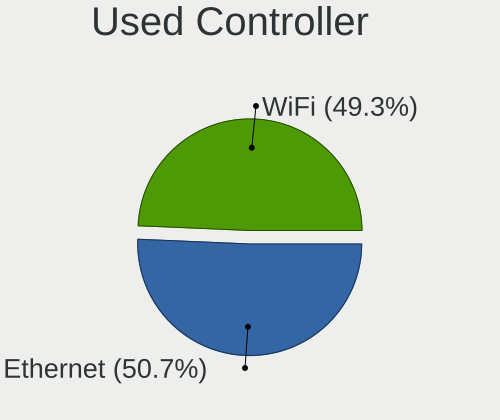

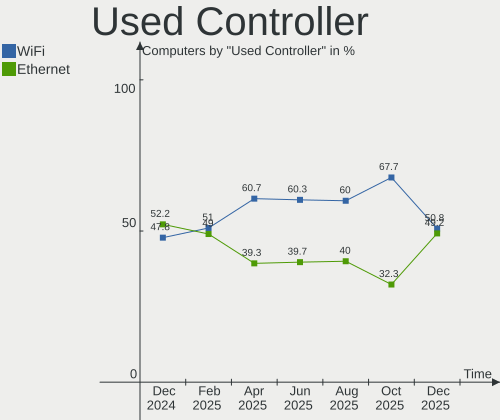

| Kind     | Computers | Percent |
|----------|-----------|---------|
| WiFi     | 32        | 50.79%  |
| Ethernet | 31        | 49.21%  |

NICs
----

Total network controllers on board

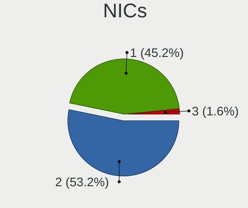

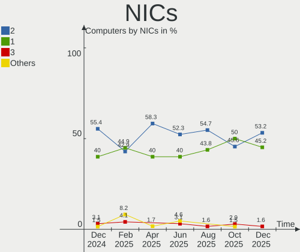

| Total | Computers | Percent |
|-------|-----------|---------|
| 2     | 33        | 53.23%  |
| 1     | 28        | 45.16%  |
| 3     | 1         | 1.61%   |

IPv6
----

IPv6 vs IPv4

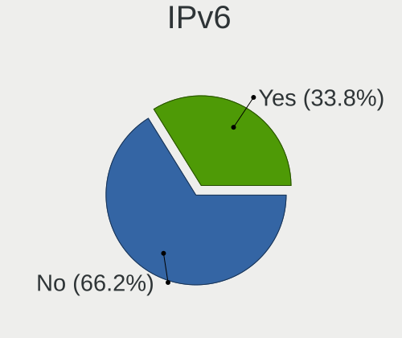

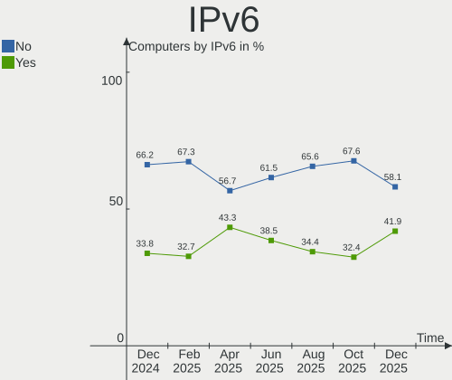

| Used | Computers | Percent |
|------|-----------|---------|
| No   | 36        | 58.06%  |
| Yes  | 26        | 41.94%  |

Bluetooth
---------

Bluetooth Vendor
----------------

Controller vendors

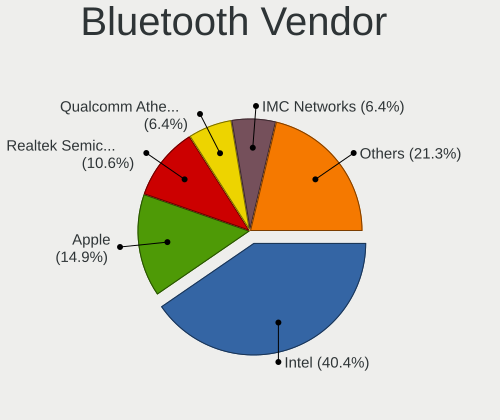

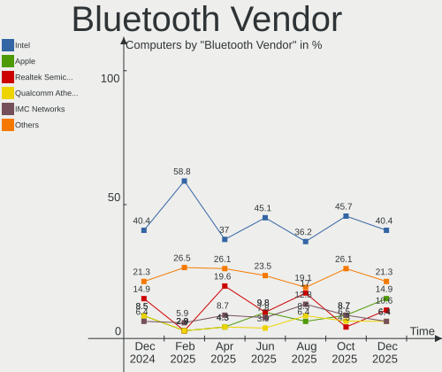

| Vendor                          | Computers | Percent |
|---------------------------------|-----------|---------|
| Intel                           | 19        | 40.43%  |
| Apple                           | 7         | 14.89%  |
| Realtek Semiconductor           | 5         | 10.64%  |
| Qualcomm Atheros Communications | 3         | 6.38%   |
| IMC Networks                    | 3         | 6.38%   |
| Foxconn / Hon Hai               | 2         | 4.26%   |
| Toshiba                         | 1         | 2.13%   |
| Realtek                         | 1         | 2.13%   |
| MediaTek                        | 1         | 2.13%   |
| Marvell Semiconductor           | 1         | 2.13%   |
| Lite-On Technology              | 1         | 2.13%   |
| Hewlett-Packard                 | 1         | 2.13%   |
| Cambridge Silicon Radio         | 1         | 2.13%   |
| Broadcom                        | 1         | 2.13%   |

Bluetooth Model
---------------

Controller models

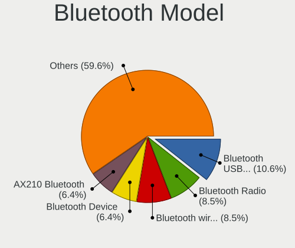

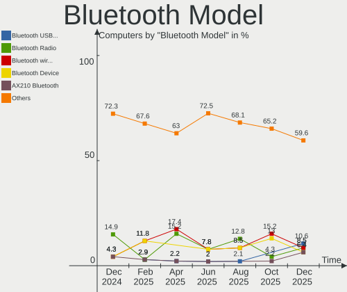

| Model                                               | Computers | Percent |
|-----------------------------------------------------|-----------|---------|
| Apple Bluetooth USB Host Controller                 | 5         | 10.64%  |
| Realtek Bluetooth Radio                             | 4         | 8.51%   |
| Intel Bluetooth wireless interface                  | 4         | 8.51%   |
| Intel Bluetooth Device                              | 3         | 6.38%   |
| Intel AX210 Bluetooth                               | 3         | 6.38%   |
| Intel AX201 Bluetooth                               | 3         | 6.38%   |
| IMC Networks Wireless_Device                        | 3         | 6.38%   |
| Intel Wireless-AC 9260 Bluetooth Adapter            | 2         | 4.26%   |
| Intel AX200 Bluetooth                               | 2         | 4.26%   |
| Toshiba BCM43142A0                                  | 1         | 2.13%   |
| Realtek  Bluetooth 4.2 Adapter                      | 1         | 2.13%   |
| Realtek Bluetooth Radio                             | 1         | 2.13%   |
| Qualcomm Atheros  Bluetooth Device                  | 1         | 2.13%   |
| Qualcomm Atheros QCA61x4 Bluetooth 4.0              | 1         | 2.13%   |
| Qualcomm Atheros Bluetooth USB Host Controller      | 1         | 2.13%   |
| MediaTek Wireless_Device                            | 1         | 2.13%   |
| Marvell Bluetooth and Wireless LAN Composite        | 1         | 2.13%   |
| Lite-On Atheros AR3012 Bluetooth                    | 1         | 2.13%   |
| Intel Wireless-AC 3168 Bluetooth                    | 1         | 2.13%   |
| Intel Centrino Advanced-N 6230 Bluetooth adapter    | 1         | 2.13%   |
| HP Broadcom 2070 Bluetooth Combo                    | 1         | 2.13%   |
| Foxconn / Hon Hai Wireless_Device                   | 1         | 2.13%   |
| Foxconn / Hon Hai Bluetooth Device                  | 1         | 2.13%   |
| Cambridge Silicon Radio Bluetooth Dongle (HCI mode) | 1         | 2.13%   |
| Broadcom BCM20702 Bluetooth 4.0 [ThinkPad]          | 1         | 2.13%   |
| Apple Bluetooth Host Controller                     | 1         | 2.13%   |
| Apple Bluetooth HCI                                 | 1         | 2.13%   |

Sound
-----

Sound Vendor
------------

Sound card vendors

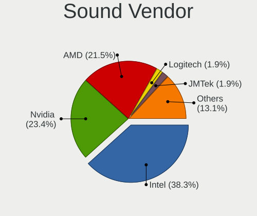

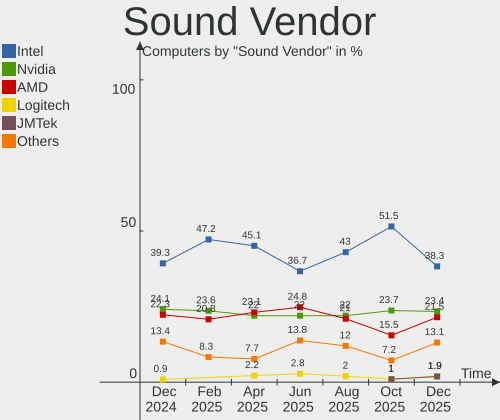

| Vendor                   | Computers | Percent |
|--------------------------|-----------|---------|
| Intel                    | 41        | 38.32%  |
| Nvidia                   | 25        | 23.36%  |
| AMD                      | 23        | 21.5%   |
| Logitech                 | 2         | 1.87%   |
| JMTek                    | 2         | 1.87%   |
| XING WEI 2.4G USB        | 1         | 0.93%   |
| Valve Software           | 1         | 0.93%   |
| Plantronics              | 1         | 0.93%   |
| Micro Star International | 1         | 0.93%   |
| Mark of the Unicorn      | 1         | 0.93%   |
| KTMicro                  | 1         | 0.93%   |
| Huawei Technologies      | 1         | 0.93%   |
| Hewlett-Packard          | 1         | 0.93%   |
| Creative Technology      | 1         | 0.93%   |
| Bluetrum                 | 1         | 0.93%   |
| Audio-Technica           | 1         | 0.93%   |
| ASUSTek Computer         | 1         | 0.93%   |
| Astro Gaming             | 1         | 0.93%   |
| Apple                    | 1         | 0.93%   |

Sound Model
-----------

Sound card models

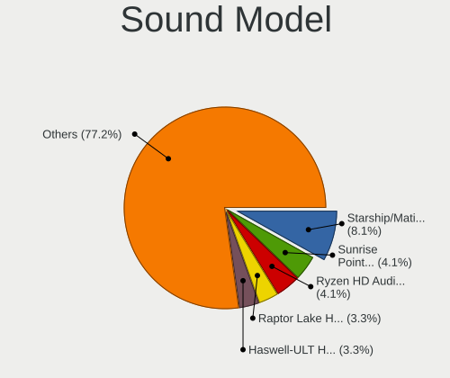

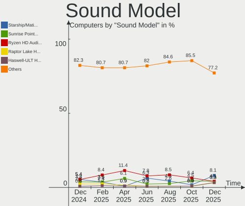

| Model                                                                      | Computers | Percent |
|----------------------------------------------------------------------------|-----------|---------|
| AMD Starship/Matisse HD Audio Controller                                   | 10        | 8.13%   |
| Intel Sunrise Point-LP HD Audio                                            | 5         | 4.07%   |
| AMD Ryzen HD Audio Controller                                              | 5         | 4.07%   |
| Intel Raptor Lake High Definition Audio Controller                         | 4         | 3.25%   |
| Intel Haswell-ULT HD Audio Controller                                      | 4         | 3.25%   |
| Intel 8 Series/C220 Series Chipset High Definition Audio Controller        | 4         | 3.25%   |
| Intel 8 Series HD Audio Controller                                         | 4         | 3.25%   |
| Intel 7 Series/C216 Chipset Family High Definition Audio Controller        | 4         | 3.25%   |
| AMD Radeon High Definition Audio Controller                                | 4         | 3.25%   |
| Nvidia TU116 High Definition Audio Controller                              | 3         | 2.44%   |
| Nvidia GP104 High Definition Audio Controller                              | 3         | 2.44%   |
| Nvidia GM107 High Definition Audio Controller [GeForce 940MX]              | 3         | 2.44%   |
| Nvidia GP106 High Definition Audio Controller                              | 2         | 1.63%   |
| JMTek USB PnP Audio Device                                                 | 2         | 1.63%   |
| Intel Raptor Lake-P/U/H cAVS                                               | 2         | 1.63%   |
| Intel Alder Lake PCH-P High Definition Audio Controller                    | 2         | 1.63%   |
| Intel 6 Series/C200 Series Chipset Family High Definition Audio Controller | 2         | 1.63%   |
| Intel 200 Series PCH HD Audio                                              | 2         | 1.63%   |
| AMD SBx00 Azalia (Intel HDA)                                               | 2         | 1.63%   |
| AMD FCH Azalia Controller                                                  | 2         | 1.63%   |
| XING WEI 2.4G USB USB Composite Device                                     | 1         | 0.81%   |
| Valve Software Valve VR Radio & HMD Mic                                    | 1         | 0.81%   |
| Plantronics Blackwire 3220 Series                                          | 1         | 0.81%   |
| Nvidia TU106 High Definition Audio Controller                              | 1         | 0.81%   |
| Nvidia GP107GL High Definition Audio Controller                            | 1         | 0.81%   |
| Nvidia GP102 HDMI Audio Controller                                         | 1         | 0.81%   |
| Nvidia GK208 HDMI/DP Audio Controller                                      | 1         | 0.81%   |
| Nvidia GK107 HDMI Audio Controller                                         | 1         | 0.81%   |
| Nvidia GK106 HDMI Audio Controller                                         | 1         | 0.81%   |
| Nvidia GB207 High Definition Audio Controller                              | 1         | 0.81%   |
| Nvidia GB206 High Definition Audio Controller                              | 1         | 0.81%   |
| Nvidia GA106 High Definition Audio Controller                              | 1         | 0.81%   |
| Nvidia GA104 High Definition Audio Controller                              | 1         | 0.81%   |
| Nvidia GA102 High Definition Audio Controller                              | 1         | 0.81%   |
| Nvidia AD107 High Definition Audio Controller                              | 1         | 0.81%   |
| Nvidia AD104 High Definition Audio Controller                              | 1         | 0.81%   |
| Nvidia AD103 High Definition Audio Controller                              | 1         | 0.81%   |
| Nvidia AD102 High Definition Audio Controller                              | 1         | 0.81%   |
| Micro Star International USB Audio                                         | 1         | 0.81%   |
| Mark of the Unicorn M2                                                     | 1         | 0.81%   |

Memory
------

Memory Vendor
-------------

Memory module vendors

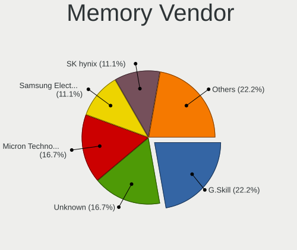

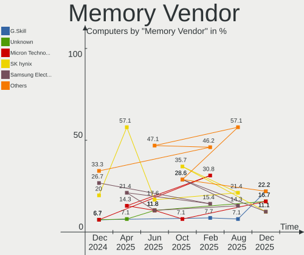

| Vendor              | Computers | Percent |
|---------------------|-----------|---------|
| G.Skill             | 4         | 22.22%  |
| Unknown             | 3         | 16.67%  |
| Micron Technology   | 3         | 16.67%  |
| SK hynix            | 2         | 11.11%  |
| Samsung Electronics | 2         | 11.11%  |
| Team                | 1         | 5.56%   |
| Ramaxel Technology  | 1         | 5.56%   |
| Kingston            | 1         | 5.56%   |
| Crucial             | 1         | 5.56%   |

Memory Model
------------

Memory module models

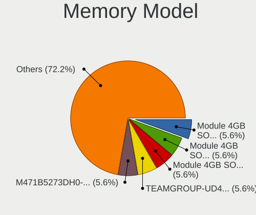

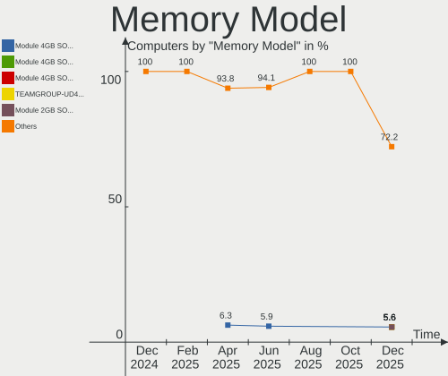

| Model                                                         | Computers | Percent |
|---------------------------------------------------------------|-----------|---------|
| Unknown RAM Module 4GB SODIMM LPDDR3 1600MT/s                 | 1         | 5.56%   |
| Unknown RAM Module 4GB SODIMM DDR4 2133MT/s                   | 1         | 5.56%   |
| Unknown RAM Module 4GB SODIMM DDR2 667MT/s                    | 1         | 5.56%   |
| Team RAM TEAMGROUP-UD4-3200 8GB DIMM DDR4 3800MT/s            | 1         | 5.56%   |
| SK hynix RAM Module 2GB SODIMM DDR2 667MT/s                   | 1         | 5.56%   |
| SK hynix RAM H58G56BK7BX068 2GB Row Of Chips LPDDR5 8600MT/s  | 1         | 5.56%   |
| Samsung RAM M471B5273DH0-CK0 4GB SODIMM DDR3 2400MT/s         | 1         | 5.56%   |
| Samsung RAM K3KL8L80DM-MGCU 4GiB Row Of Chips LPDDR5 7500MT/s | 1         | 5.56%   |
| Ramaxel RAM RMSB3410HA88IBF-5600 16GB SODIMM DDR5 5600MT/s    | 1         | 5.56%   |
| Micron RAM 9ASF1G72PZ-2G3B1 8GB RIMM DDR4 2400MT/s            | 1         | 5.56%   |
| Micron RAM 8ATF1G64HZ-3G2R1 8GB SODIMM DDR4 3200MT/s          | 1         | 5.56%   |
| Micron RAM 4ATF51264HZ-3G2R1 4GB SODIMM DDR4 3200MT/s         | 1         | 5.56%   |
| Kingston RAM KF3200C16D4/8GX 8GiB DIMM DDR4 3600MT/s          | 1         | 5.56%   |
| G.Skill RAM F4-3600C16-32GTZN 32GB DIMM DDR4 3600MT/s         | 1         | 5.56%   |
| G.Skill RAM F4-3200C16-16GVK 16GB DIMM DDR4 3600MT/s          | 1         | 5.56%   |
| G.Skill RAM F4-2933C16-8GTZRX 8GB DIMM DDR4 1866MT/s          | 1         | 5.56%   |
| G.Skill RAM F3-10666CL9-4GBRL 4GB DIMM DDR3 1333MT/s          | 1         | 5.56%   |
| Crucial RAM BLS16G4D32AESE.M16FE 16GB DIMM DDR4 3733MT/s      | 1         | 5.56%   |

Memory Kind
-----------

Memory module kinds

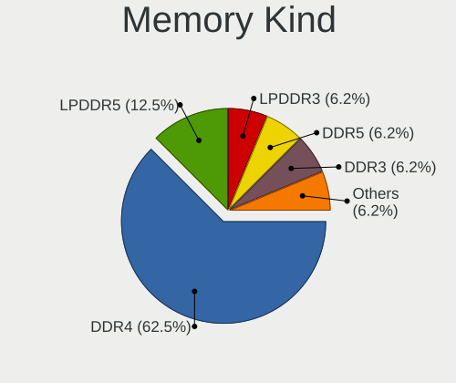

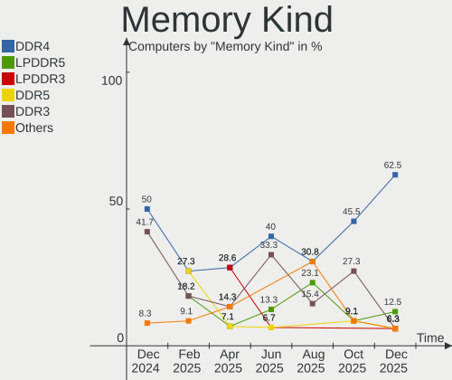

| Kind   | Computers | Percent |
|--------|-----------|---------|
| DDR4   | 10        | 62.5%   |
| LPDDR5 | 2         | 12.5%   |
| LPDDR3 | 1         | 6.25%   |
| DDR5   | 1         | 6.25%   |
| DDR3   | 1         | 6.25%   |
| DDR2   | 1         | 6.25%   |

Memory Form Factor
------------------

Physical design of the memory module

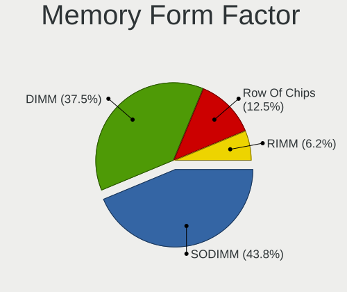

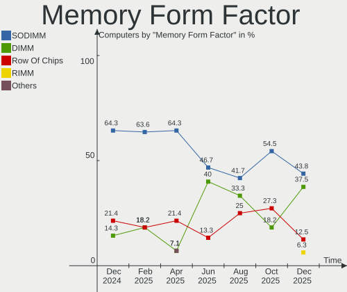

| Name         | Computers | Percent |
|--------------|-----------|---------|
| SODIMM       | 7         | 43.75%  |
| DIMM         | 6         | 37.5%   |
| Row Of Chips | 2         | 12.5%   |
| RIMM         | 1         | 6.25%   |

Memory Size
-----------

Memory module size

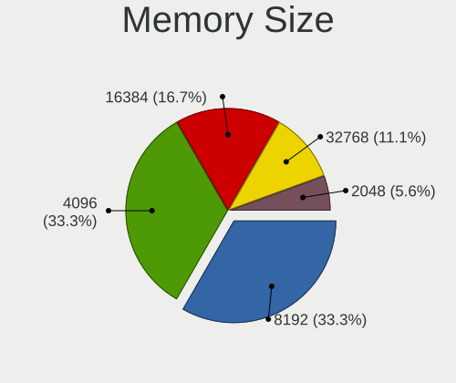

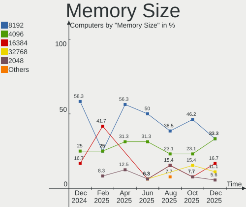

| Size  | Computers | Percent |
|-------|-----------|---------|
| 8192  | 6         | 33.33%  |
| 4096  | 6         | 33.33%  |
| 16384 | 3         | 16.67%  |
| 32768 | 2         | 11.11%  |
| 2048  | 1         | 5.56%   |

Memory Speed
------------

Memory module speed

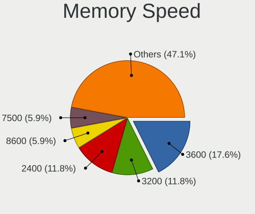

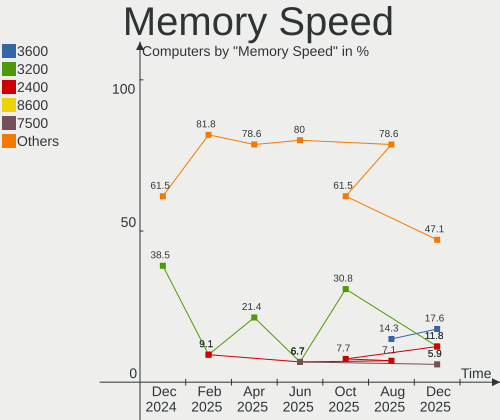

| Speed | Computers | Percent |
|-------|-----------|---------|
| 3600  | 3         | 17.65%  |
| 3200  | 2         | 11.76%  |
| 2400  | 2         | 11.76%  |
| 8600  | 1         | 5.88%   |
| 7500  | 1         | 5.88%   |
| 5600  | 1         | 5.88%   |
| 3800  | 1         | 5.88%   |
| 3733  | 1         | 5.88%   |
| 2133  | 1         | 5.88%   |
| 1866  | 1         | 5.88%   |
| 1600  | 1         | 5.88%   |
| 1333  | 1         | 5.88%   |
| 667   | 1         | 5.88%   |

Printers & scanners
-------------------

Printer Vendor
--------------

Printer device vendors

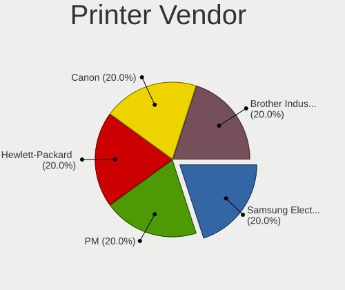

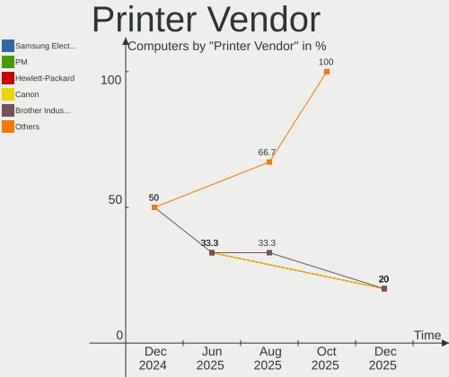

| Vendor              | Computers | Percent |
|---------------------|-----------|---------|
| Samsung Electronics | 1         | 20%     |
| PM                  | 1         | 20%     |
| Hewlett-Packard     | 1         | 20%     |
| Canon               | 1         | 20%     |
| Brother Industries  | 1         | 20%     |

Printer Model
-------------

Printer device models

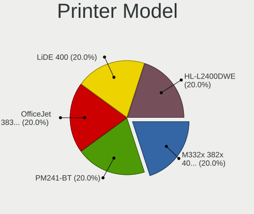

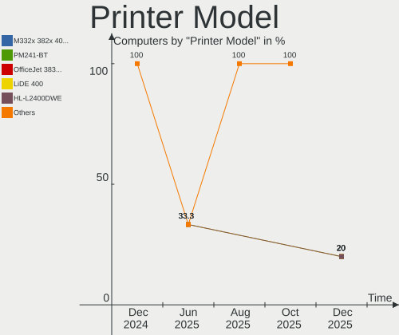

| Model                          | Computers | Percent |
|--------------------------------|-----------|---------|
| Samsung M332x 382x 402x Series | 1         | 20%     |
| PM PM241-BT                    | 1         | 20%     |
| HP OfficeJet 3830 series       | 1         | 20%     |
| Canon LiDE 400                 | 1         | 20%     |
| Brother HL-L2400DWE            | 1         | 20%     |

Scanner Vendor
--------------

Scanner device vendors

Zero info for selected period =(

Scanner Model
-------------

Scanner device models

Zero info for selected period =(

Camera
------

Camera Vendor
-------------

Camera device vendors

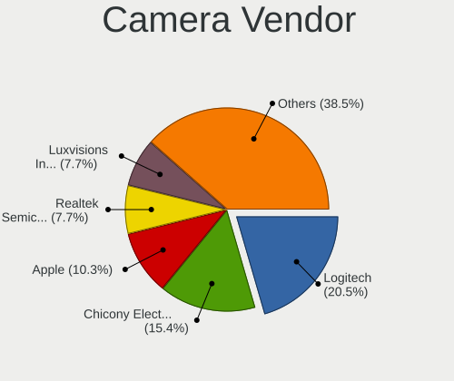

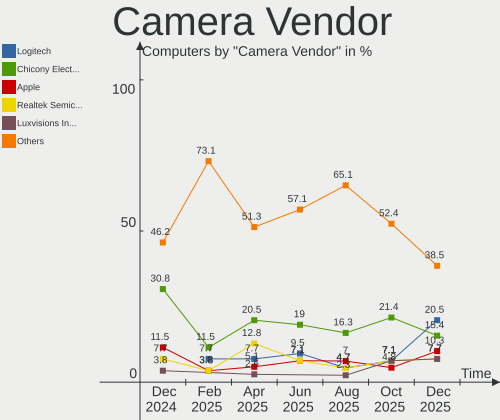

| Vendor                      | Computers | Percent |
|-----------------------------|-----------|---------|
| Logitech                    | 8         | 20.51%  |
| Chicony Electronics         | 6         | 15.38%  |
| Apple                       | 4         | 10.26%  |
| Realtek Semiconductor       | 3         | 7.69%   |
| Luxvisions Innotech Limited | 3         | 7.69%   |
| IMC Networks                | 3         | 7.69%   |
| Quanta                      | 2         | 5.13%   |
| Microdia                    | 2         | 5.13%   |
| Bison Electronics           | 2         | 5.13%   |
| webcamvendor                | 1         | 2.56%   |
| Syntek                      | 1         | 2.56%   |
| Suyin                       | 1         | 2.56%   |
| Samsung Electronics         | 1         | 2.56%   |
| Creative Technology         | 1         | 2.56%   |
| A4Tech                      | 1         | 2.56%   |

Camera Model
------------

Camera device models

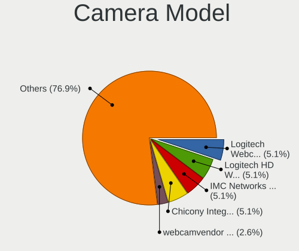

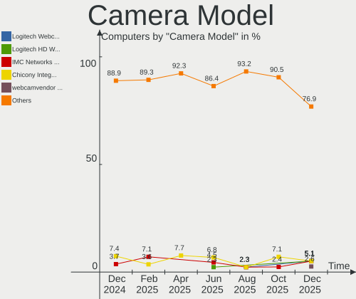

| Model                                               | Computers | Percent |
|-----------------------------------------------------|-----------|---------|
| Logitech Webcam C270                                | 2         | 5.13%   |
| Logitech HD Webcam C525                             | 2         | 5.13%   |
| IMC Networks USB2.0 HD UVC WebCam                   | 2         | 5.13%   |
| Chicony Integrated Camera                           | 2         | 5.13%   |
| webcamvendor NexiGo N60 FHD Webcam                  | 1         | 2.56%   |
| Syntek Integrated Camera                            | 1         | 2.56%   |
| Suyin HP TrueVision HD                              | 1         | 2.56%   |
| Samsung Galaxy series, misc. (MTP mode)             | 1         | 2.56%   |
| Realtek Integrated_Webcam_HD                        | 1         | 2.56%   |
| Realtek EasyCamera                                  | 1         | 2.56%   |
| Realtek Acer 640 x 480 laptop camera                | 1         | 2.56%   |
| Quanta HP TrueVision HD Camera                      | 1         | 2.56%   |
| Quanta HD Webcam                                    | 1         | 2.56%   |
| Microdia Webcam Vitade AF                           | 1         | 2.56%   |
| Microdia Integrated Webcam                          | 1         | 2.56%   |
| Luxvisions Innotech Limited Integrated RGB Camera   | 1         | 2.56%   |
| Luxvisions Innotech Limited Integrated Camera       | 1         | 2.56%   |
| Luxvisions Innotech Limited HP TrueVision HD Camera | 1         | 2.56%   |
| Logitech HD Pro Webcam C920                         | 1         | 2.56%   |
| Logitech C922 Pro Stream Webcam                     | 1         | 2.56%   |
| Logitech C920 PRO HD Webcam                         | 1         | 2.56%   |
| Logitech BRIO Ultra HD Webcam                       | 1         | 2.56%   |
| IMC Networks Integrated RGB Camera                  | 1         | 2.56%   |
| Creative Live! Cam Sync 1080p V2                    | 1         | 2.56%   |
| Chicony TOSHIBA Web Camera - HD                     | 1         | 2.56%   |
| Chicony Integrated HP HD Webcam                     | 1         | 2.56%   |
| Chicony Integrated Camera [ThinkPad]                | 1         | 2.56%   |
| Chicony HP TrueVision HD Camera                     | 1         | 2.56%   |
| Bison SunplusIT Integrated Camera                   | 1         | 2.56%   |
| Bison EasyCamera                                    | 1         | 2.56%   |
| Apple iPhone 5/5C/5S/6/SE/7/8/X                     | 1         | 2.56%   |
| Apple FaceTime HD Camera (Built-in)                 | 1         | 2.56%   |
| Apple FaceTime HD Camera                            | 1         | 2.56%   |
| Apple Built-in iSight                               | 1         | 2.56%   |
| A4Tech FHD 1080P PC Camera                          | 1         | 2.56%   |

Security
--------

Fingerprint Vendor
------------------

Fingerprint sensor vendors

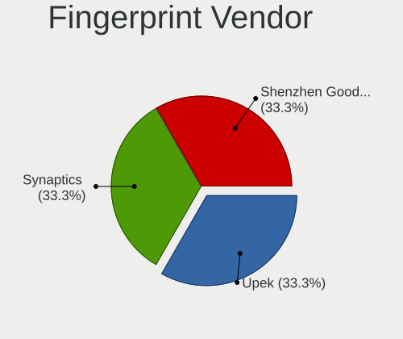

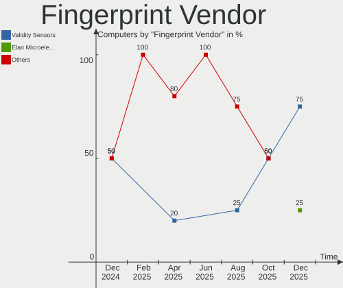

| Vendor                | Computers | Percent |
|-----------------------|-----------|---------|
| Validity Sensors      | 3         | 75%     |
| Elan Microelectronics | 1         | 25%     |

Fingerprint Model
-----------------

Fingerprint sensor models

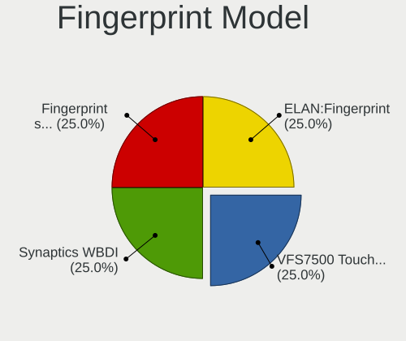

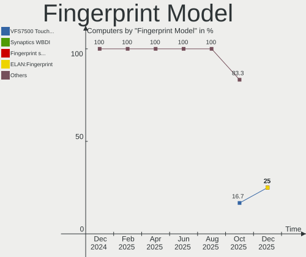

| Model                                             | Computers | Percent |
|---------------------------------------------------|-----------|---------|
| Validity Sensors VFS7500 Touch Fingerprint Sensor | 1         | 25%     |
| Validity Sensors Synaptics WBDI                   | 1         | 25%     |
| Validity Sensors Fingerprint scanner              | 1         | 25%     |
| Elan ELAN:Fingerprint                             | 1         | 25%     |

Chipcard Vendor
---------------

Chipcard module vendors

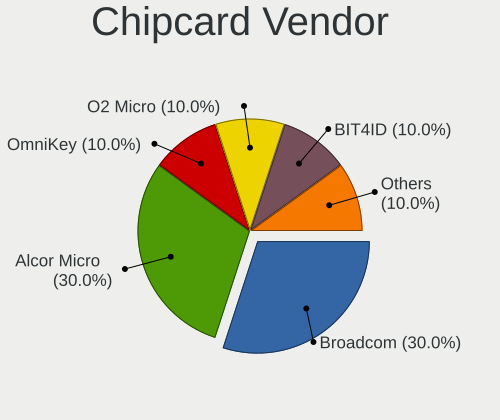

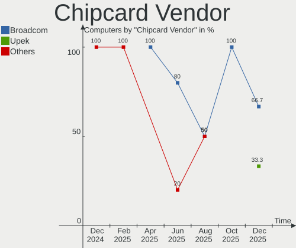

| Vendor   | Computers | Percent |
|----------|-----------|---------|
| Broadcom | 2         | 66.67%  |
| Upek     | 1         | 33.33%  |

Chipcard Model
--------------

Chipcard module models

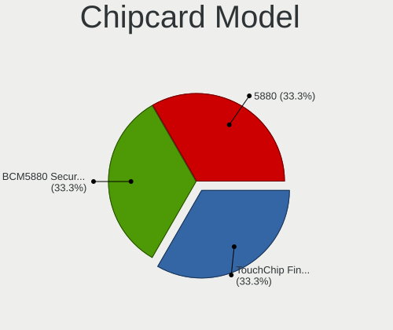

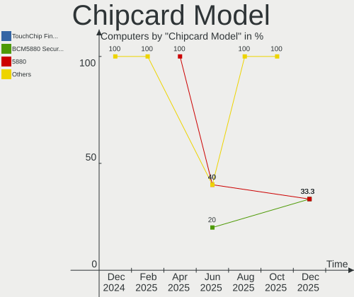

| Model                                                      | Computers | Percent |
|------------------------------------------------------------|-----------|---------|
| Upek TouchChip Fingerprint Coprocessor (WBF advanced mode) | 1         | 33.33%  |
| Broadcom BCM5880 Secure Applications Processor             | 1         | 33.33%  |
| Broadcom 5880                                              | 1         | 33.33%  |

Unsupported
-----------

Unsupported Devices
-------------------

Total unsupported devices on board

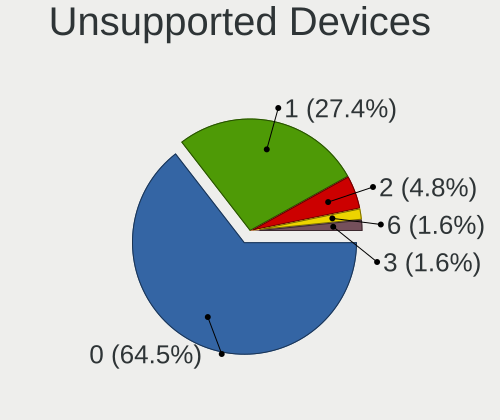

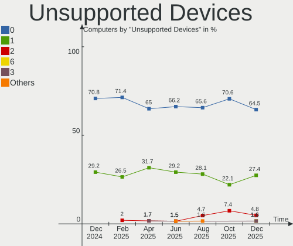

| Total | Computers | Percent |
|-------|-----------|---------|
| 0     | 40        | 64.52%  |
| 1     | 17        | 27.42%  |
| 2     | 3         | 4.84%   |
| 6     | 1         | 1.61%   |
| 3     | 1         | 1.61%   |

Unsupported Device Types
------------------------

Types of unsupported devices

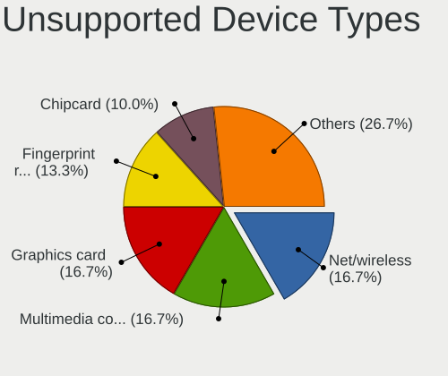

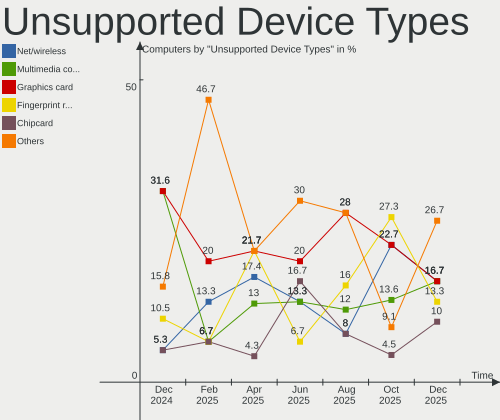

| Type                  | Computers | Percent |
|-----------------------|-----------|---------|
| Net/wireless          | 5         | 16.67%  |
| Multimedia controller | 5         | 16.67%  |
| Graphics card         | 5         | 16.67%  |
| Fingerprint reader    | 4         | 13.33%  |
| Chipcard              | 3         | 10%     |
| Camera                | 3         | 10%     |
| Sound                 | 2         | 6.67%   |
| Unassigned class      | 1         | 3.33%   |
| Network               | 1         | 3.33%   |
| Bluetooth             | 1         | 3.33%   |

