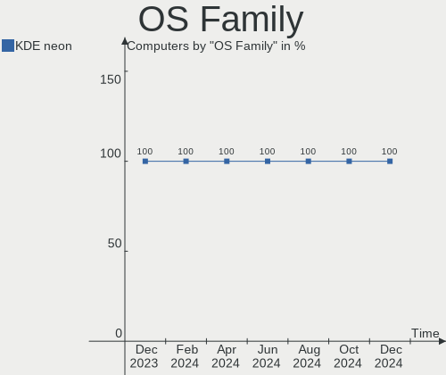
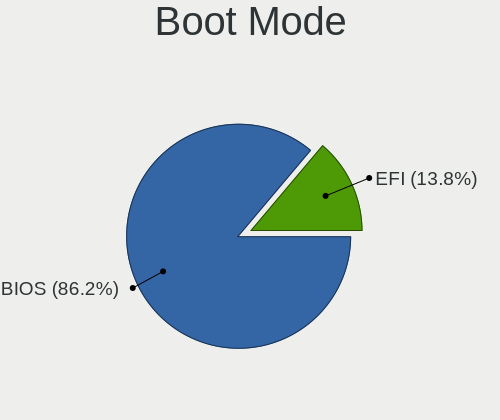
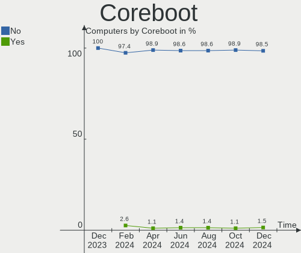
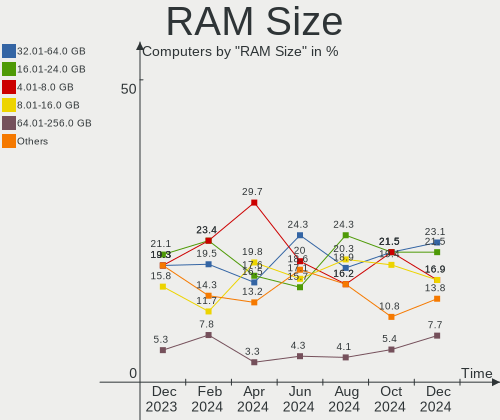
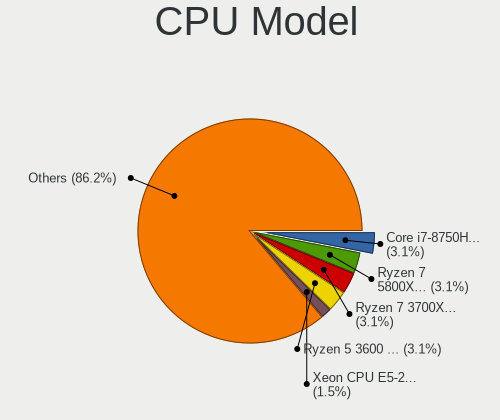
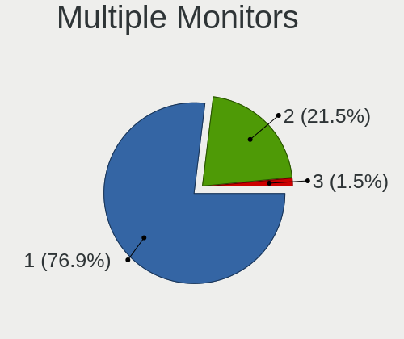
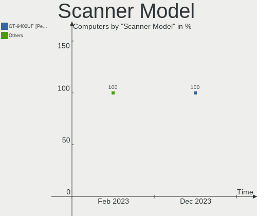

KDE neon Hardware Trends
------------------------

A project to identify most popular hardware characteristics and track their change
over time based on data collected by KDE neon users at https://Linux-Hardware.org.

Anyone can contribute to this report by the [hw-probe](https://github.com/linuxhw/hw-probe) tool:

    sudo -E hw-probe -all -upload

This is a report for all computer types. See also reports for [desktops](/Dist/KDE_neon/Desktop/README.md) and [notebooks](/Dist/KDE_neon/Notebook/README.md).

Full-feature report is available here: https://linux-hardware.org/?view=trends

Period: Nov, 2021.

Contents
--------

* [ System ](#system)
  - [ OS                       ](#os)
  - [ OS Family                ](#os-family)
  - [ Kernel                   ](#kernel)
  - [ Kernel Family            ](#kernel-family)
  - [ Kernel Major Ver.        ](#kernel-major-ver)
  - [ Arch                     ](#arch)
  - [ DE                       ](#de)
  - [ Display Server           ](#display-server)
  - [ Display Manager          ](#display-manager)
  - [ OS Lang                  ](#os-lang)
  - [ Boot Mode                ](#boot-mode)
  - [ Filesystem               ](#filesystem)
  - [ Part. scheme             ](#part-scheme)
  - [ Dual Boot with Linux/BSD ](#dual-boot-with-linuxbsd)
  - [ Dual Boot (Win)          ](#dual-boot-win)

* [ Board ](#board)
  - [ Vendor                   ](#vendor)
  - [ Model                    ](#model)
  - [ Model Family             ](#model-family)
  - [ MFG Year                 ](#mfg-year)
  - [ Form Factor              ](#form-factor)
  - [ Secure Boot              ](#secure-boot)
  - [ Coreboot                 ](#coreboot)
  - [ RAM Size                 ](#ram-size)
  - [ RAM Used                 ](#ram-used)
  - [ Total Drives             ](#total-drives)
  - [ Has CD-ROM               ](#has-cd-rom)
  - [ Has Ethernet             ](#has-ethernet)
  - [ Has WiFi                 ](#has-wifi)
  - [ Has Bluetooth            ](#has-bluetooth)

* [ Location ](#location)
  - [ Country                  ](#country)
  - [ City                     ](#city)

* [ Drives ](#drives)
  - [ Drive Vendor             ](#drive-vendor)
  - [ Drive Model              ](#drive-model)
  - [ HDD Vendor               ](#hdd-vendor)
  - [ SSD Vendor               ](#ssd-vendor)
  - [ Drive Kind               ](#drive-kind)
  - [ Drive Connector          ](#drive-connector)
  - [ Drive Size               ](#drive-size)
  - [ Space Total              ](#space-total)
  - [ Space Used               ](#space-used)
  - [ Malfunc. Drives          ](#malfunc-drives)
  - [ Malfunc. Drive Vendor    ](#malfunc-drive-vendor)
  - [ Malfunc. HDD Vendor      ](#malfunc-hdd-vendor)
  - [ Malfunc. Drive Kind      ](#malfunc-drive-kind)
  - [ Failed Drives            ](#failed-drives)
  - [ Failed Drive Vendor      ](#failed-drive-vendor)
  - [ Drive Status             ](#drive-status)

* [ Storage controller ](#storage-controller)
  - [ Storage Vendor           ](#storage-vendor)
  - [ Storage Model            ](#storage-model)
  - [ Storage Kind             ](#storage-kind)

* [ Processor ](#processor)
  - [ CPU Vendor               ](#cpu-vendor)
  - [ CPU Model                ](#cpu-model)
  - [ CPU Model Family         ](#cpu-model-family)
  - [ CPU Cores                ](#cpu-cores)
  - [ CPU Sockets              ](#cpu-sockets)
  - [ CPU Threads              ](#cpu-threads)
  - [ CPU Op-Modes             ](#cpu-op-modes)
  - [ CPU Microcode            ](#cpu-microcode)
  - [ CPU Microarch            ](#cpu-microarch)

* [ Graphics ](#graphics)
  - [ GPU Vendor               ](#gpu-vendor)
  - [ GPU Model                ](#gpu-model)
  - [ GPU Combo                ](#gpu-combo)
  - [ GPU Driver               ](#gpu-driver)
  - [ GPU Memory               ](#gpu-memory)

* [ Monitor ](#monitor)
  - [ Monitor Vendor           ](#monitor-vendor)
  - [ Monitor Model            ](#monitor-model)
  - [ Monitor Resolution       ](#monitor-resolution)
  - [ Monitor Diagonal         ](#monitor-diagonal)
  - [ Monitor Width            ](#monitor-width)
  - [ Aspect Ratio             ](#aspect-ratio)
  - [ Monitor Area             ](#monitor-area)
  - [ Pixel Density            ](#pixel-density)
  - [ Multiple Monitors        ](#multiple-monitors)

* [ Network ](#network)
  - [ Net Controller Vendor    ](#net-controller-vendor)
  - [ Net Controller Model     ](#net-controller-model)
  - [ Wireless Vendor          ](#wireless-vendor)
  - [ Wireless Model           ](#wireless-model)
  - [ Ethernet Vendor          ](#ethernet-vendor)
  - [ Ethernet Model           ](#ethernet-model)
  - [ Net Controller Kind      ](#net-controller-kind)
  - [ Used Controller          ](#used-controller)
  - [ NICs                     ](#nics)
  - [ IPv6                     ](#ipv6)

* [ Bluetooth ](#bluetooth)
  - [ Bluetooth Vendor         ](#bluetooth-vendor)
  - [ Bluetooth Model          ](#bluetooth-model)

* [ Sound ](#sound)
  - [ Sound Vendor             ](#sound-vendor)
  - [ Sound Model              ](#sound-model)

* [ Memory ](#memory)
  - [ Memory Vendor            ](#memory-vendor)
  - [ Memory Model             ](#memory-model)
  - [ Memory Kind              ](#memory-kind)
  - [ Memory Form Factor       ](#memory-form-factor)
  - [ Memory Size              ](#memory-size)
  - [ Memory Speed             ](#memory-speed)

* [ Printers & scanners ](#printers--scanners)
  - [ Printer Vendor           ](#printer-vendor)
  - [ Printer Model            ](#printer-model)
  - [ Scanner Vendor           ](#scanner-vendor)
  - [ Scanner Model            ](#scanner-model)

* [ Camera ](#camera)
  - [ Camera Vendor            ](#camera-vendor)
  - [ Camera Model             ](#camera-model)

* [ Security ](#security)
  - [ Fingerprint Vendor       ](#fingerprint-vendor)
  - [ Fingerprint Model        ](#fingerprint-model)
  - [ Chipcard Vendor          ](#chipcard-vendor)
  - [ Chipcard Model           ](#chipcard-model)

* [ Unsupported ](#unsupported)
  - [ Unsupported Devices      ](#unsupported-devices)
  - [ Unsupported Device Types ](#unsupported-device-types)

System
------

OS
--

Installed operating systems

| Name           | Computers | Percent |
|----------------|-----------|---------|
| KDE neon 20.04 | 87        | 100%    |

OS Family
---------

OS without a version

| Name     | Computers | Percent |
|----------|-----------|---------|
| KDE neon | 87        | 100%    |

Kernel
------

Version of the Linux kernel

| Version               | Computers | Percent |
|-----------------------|-----------|---------|
| 5.11.0-40-generic     | 48        | 55.17%  |
| 5.11.0-38-generic     | 25        | 28.74%  |
| 5.11.0-41-generic     | 3         | 3.45%   |
| 5.11.0-37-generic     | 3         | 3.45%   |
| 5.8.0-59-generic      | 2         | 2.3%    |
| 5.4.0-91-generic      | 1         | 1.15%   |
| 5.4.0-74-generic      | 1         | 1.15%   |
| 5.15.1-051501-generic | 1         | 1.15%   |
| 5.14.16-xanmod1       | 1         | 1.15%   |
| 5.11.0-27-generic     | 1         | 1.15%   |
| Unknown               | 1         | 1.15%   |

Kernel Family
-------------

Linux kernel without a distro release

| Version | Computers | Percent |
|---------|-----------|---------|
| 5.11.0  | 80        | 91.95%  |
| 5.8.0   | 2         | 2.3%    |
| 5.4.0   | 2         | 2.3%    |
| 5.15.1  | 1         | 1.15%   |
| 5.14.16 | 1         | 1.15%   |
| Unknown | 1         | 1.15%   |

Kernel Major Ver.
-----------------

Linux kernel major version

| Version | Computers | Percent |
|---------|-----------|---------|
| 5.11    | 80        | 91.95%  |
| 5.8     | 2         | 2.3%    |
| 5.4     | 2         | 2.3%    |
| 5.15    | 1         | 1.15%   |
| 5.14    | 1         | 1.15%   |
| Unknown | 1         | 1.15%   |

Arch
----

OS architecture (x86_64, i586, etc.)

| Name   | Computers | Percent |
|--------|-----------|---------|
| x86_64 | 87        | 100%    |

DE
--

Desktop Environment

| Name    | Computers | Percent |
|---------|-----------|---------|
| KDE5    | 81        | 93.1%   |
| Unknown | 6         | 6.9%    |

Display Server
--------------

X11 or Wayland

| Name    | Computers | Percent |
|---------|-----------|---------|
| X11     | 85        | 97.7%   |
| Wayland | 2         | 2.3%    |

Display Manager
---------------

SDDM, LightDM, etc.

| Name    | Computers | Percent |
|---------|-----------|---------|
| Unknown | 55        | 63.22%  |
| SDDM    | 32        | 36.78%  |

OS Lang
-------

Language

| Lang    | Computers | Percent |
|---------|-----------|---------|
| en_US   | 25        | 28.74%  |
| de_DE   | 11        | 12.64%  |
| en_GB   | 7         | 8.05%   |
| pt_BR   | 5         | 5.75%   |
| C       | 5         | 5.75%   |
| uk_UA   | 3         | 3.45%   |
| ru_RU   | 3         | 3.45%   |
| it_IT   | 3         | 3.45%   |
| fr_CA   | 3         | 3.45%   |
| en_IN   | 3         | 3.45%   |
| en_CA   | 3         | 3.45%   |
| en_AU   | 3         | 3.45%   |
| fr_FR   | 2         | 2.3%    |
| en_ZA   | 2         | 2.3%    |
| tr_TR   | 1         | 1.15%   |
| ja_JP   | 1         | 1.15%   |
| fi_FI   | 1         | 1.15%   |
| es_UY   | 1         | 1.15%   |
| es_PE   | 1         | 1.15%   |
| es_ES   | 1         | 1.15%   |
| es_CL   | 1         | 1.15%   |
| ca_ES   | 1         | 1.15%   |
| Unknown | 1         | 1.15%   |

Boot Mode
---------

EFI or BIOS

| Mode | Computers | Percent |
|------|-----------|---------|
| EFI  | 53        | 60.92%  |
| BIOS | 34        | 39.08%  |

Filesystem
----------

Type of filesystem

| Type    | Computers | Percent |
|---------|-----------|---------|
| Ext4    | 80        | 91.95%  |
| Btrfs   | 5         | 5.75%   |
| Overlay | 2         | 2.3%    |

Part. scheme
------------

Scheme of partitioning

| Type    | Computers | Percent |
|---------|-----------|---------|
| Unknown | 74        | 85.06%  |
| GPT     | 11        | 12.64%  |
| MBR     | 2         | 2.3%    |

Dual Boot with Linux/BSD
------------------------

Hosting more than one Linux/BSD

| Dual boot | Computers | Percent |
|-----------|-----------|---------|
| No        | 81        | 93.1%   |
| Yes       | 6         | 6.9%    |

Dual Boot (Win)
---------------

Hosting Linux and Windows

| Dual boot | Computers | Percent |
|-----------|-----------|---------|
| No        | 67        | 77.01%  |
| Yes       | 20        | 22.99%  |

Board
-----

Vendor
------

Motherboard manufacturer

| Name                | Computers | Percent |
|---------------------|-----------|---------|
| ASUSTek Computer    | 16        | 18.39%  |
| Lenovo              | 14        | 16.09%  |
| Hewlett-Packard     | 12        | 13.79%  |
| Dell                | 11        | 12.64%  |
| Gigabyte Technology | 9         | 10.34%  |
| MSI                 | 4         | 4.6%    |
| ASRock              | 4         | 4.6%    |
| Apple               | 4         | 4.6%    |
| Intel               | 2         | 2.3%    |
| Toshiba             | 1         | 1.15%   |
| Teclast             | 1         | 1.15%   |
| Samsung Electronics | 1         | 1.15%   |
| Positivo            | 1         | 1.15%   |
| Microsoft           | 1         | 1.15%   |
| Medion              | 1         | 1.15%   |
| LG Electronics      | 1         | 1.15%   |
| HUAWEI              | 1         | 1.15%   |
| GPU Company         | 1         | 1.15%   |
| Fujitsu             | 1         | 1.15%   |
| Acer                | 1         | 1.15%   |

Model
-----

Motherboard model

| Name                                   | Computers | Percent |
|----------------------------------------|-----------|---------|
| Gigabyte 945GCMX-S2                    | 2         | 2.3%    |
| ASUS All Series                        | 2         | 2.3%    |
| Toshiba Satellite L750D                | 1         | 1.15%   |
| Teclast F15 Plus                       | 1         | 1.15%   |
| Samsung 550XBE/350XBE                  | 1         | 1.15%   |
| Positivo POS-PQ45AU                    | 1         | 1.15%   |
| MSI MS-7D18                            | 1         | 1.15%   |
| MSI MS-7C02                            | 1         | 1.15%   |
| MSI MS-7693                            | 1         | 1.15%   |
| MSI GS60 6QE                           | 1         | 1.15%   |
| Microsoft Surface Pro                  | 1         | 1.15%   |
| Medion Akoya E6424 MD99850             | 1         | 1.15%   |
| LG 14Z960-GR3HK                        | 1         | 1.15%   |
| Lenovo V15-ADA 82C7                    | 1         | 1.15%   |
| Lenovo V145-15AST 81MT                 | 1         | 1.15%   |
| Lenovo ThinkPad X1 Extreme 20MF000DUS  | 1         | 1.15%   |
| Lenovo ThinkPad T480s 20L7001LGE       | 1         | 1.15%   |
| Lenovo ThinkPad T470s W10DG 20JTS14R00 | 1         | 1.15%   |
| Lenovo ThinkPad P52s 20LB000AFR        | 1         | 1.15%   |
| Lenovo ThinkPad E580 20KS006HRT        | 1         | 1.15%   |
| Lenovo ThinkPad E15 Gen 2 20TES2MF00   | 1         | 1.15%   |
| Lenovo ThinkPad E14 Gen 2 20T6S08J00   | 1         | 1.15%   |
| Lenovo Legion 5 15ACH6H 82JU           | 1         | 1.15%   |
| Lenovo IdeaPad U400 09934FG            | 1         | 1.15%   |
| Lenovo IdeaPad S145-15API 81V7         | 1         | 1.15%   |
| Lenovo IdeaPad 5 15ARE05 81YQ          | 1         | 1.15%   |
| Lenovo IdeaPad 320-15IKB 80XL          | 1         | 1.15%   |
| Intel NUC5i5RYB H40999-504             | 1         | 1.15%   |
| Intel H55                              | 1         | 1.15%   |
| HUAWEI KLVL-WXX9                       | 1         | 1.15%   |
| HP Z400 Workstation                    | 1         | 1.15%   |
| HP Spectre x360 Convertible 15-df0xxx  | 1         | 1.15%   |
| HP Pavilion g7                         | 1         | 1.15%   |
| HP Pavilion dv7                        | 1         | 1.15%   |
| HP OMEN by Laptop                      | 1         | 1.15%   |
| HP mt44 Mobile Thin Client             | 1         | 1.15%   |
| HP Laptop 15s-eq2xxx                   | 1         | 1.15%   |
| HP Laptop 15-bs0xx                     | 1         | 1.15%   |
| HP EliteBook 840 G1                    | 1         | 1.15%   |
| HP Compaq 6005 Pro SFF PC              | 1         | 1.15%   |
| HP 8433 11                             | 1         | 1.15%   |
| HP 260-a010                            | 1         | 1.15%   |
| GPU Company GWTC116-2                  | 1         | 1.15%   |
| Gigabyte Z370 HD3P                     | 1         | 1.15%   |
| Gigabyte P55-USB3                      | 1         | 1.15%   |
| Gigabyte H81M-DS2                      | 1         | 1.15%   |
| Gigabyte H61M-S1                       | 1         | 1.15%   |
| Gigabyte B365M DS3H                    | 1         | 1.15%   |
| Gigabyte ALDA-CE                       | 1         | 1.15%   |
| Gigabyte 970A-DS3P                     | 1         | 1.15%   |
| Fujitsu ESPRIMO E910                   | 1         | 1.15%   |
| Dell XPS 15 9500                       | 1         | 1.15%   |
| Dell Vostro 3800                       | 1         | 1.15%   |
| Dell Studio Slim 540s                  | 1         | 1.15%   |
| Dell Precision WorkStation T3500       | 1         | 1.15%   |
| Dell OptiPlex 7010                     | 1         | 1.15%   |
| Dell Latitude E5400                    | 1         | 1.15%   |
| Dell Latitude 5480                     | 1         | 1.15%   |
| Dell Latitude 5420                     | 1         | 1.15%   |
| Dell Inspiron 7573                     | 1         | 1.15%   |

Model Family
------------

Motherboard model prefix

| Name                  | Computers | Percent |
|-----------------------|-----------|---------|
| Lenovo ThinkPad       | 7         | 8.05%   |
| Lenovo IdeaPad        | 4         | 4.6%    |
| ASUS TUF              | 4         | 4.6%    |
| Dell Latitude         | 3         | 3.45%   |
| Dell Inspiron         | 3         | 3.45%   |
| ASUS PRIME            | 3         | 3.45%   |
| HP Pavilion           | 2         | 2.3%    |
| HP Laptop             | 2         | 2.3%    |
| Gigabyte 945GCMX-S2   | 2         | 2.3%    |
| ASUS All              | 2         | 2.3%    |
| Toshiba Satellite     | 1         | 1.15%   |
| Teclast F15           | 1         | 1.15%   |
| Samsung 550XBE        | 1         | 1.15%   |
| Positivo POS-PQ45AU   | 1         | 1.15%   |
| MSI MS-7D18           | 1         | 1.15%   |
| MSI MS-7C02           | 1         | 1.15%   |
| MSI MS-7693           | 1         | 1.15%   |
| MSI GS60              | 1         | 1.15%   |
| Microsoft Surface     | 1         | 1.15%   |
| Medion Akoya          | 1         | 1.15%   |
| LG 14Z960-GR3HK       | 1         | 1.15%   |
| Lenovo V15-ADA        | 1         | 1.15%   |
| Lenovo V145-15AST     | 1         | 1.15%   |
| Lenovo Legion         | 1         | 1.15%   |
| Intel NUC5i5RYB       | 1         | 1.15%   |
| Intel H55             | 1         | 1.15%   |
| HUAWEI KLVL-WXX9      | 1         | 1.15%   |
| HP Z400               | 1         | 1.15%   |
| HP Spectre            | 1         | 1.15%   |
| HP OMEN               | 1         | 1.15%   |
| HP mt44               | 1         | 1.15%   |
| HP EliteBook          | 1         | 1.15%   |
| HP Compaq             | 1         | 1.15%   |
| HP 8433               | 1         | 1.15%   |
| HP 260-a010           | 1         | 1.15%   |
| GPU Company GWTC116-2 | 1         | 1.15%   |
| Gigabyte Z370         | 1         | 1.15%   |
| Gigabyte P55-USB3     | 1         | 1.15%   |
| Gigabyte H81M-DS2     | 1         | 1.15%   |
| Gigabyte H61M-S1      | 1         | 1.15%   |
| Gigabyte B365M        | 1         | 1.15%   |
| Gigabyte ALDA-CE      | 1         | 1.15%   |
| Gigabyte 970A-DS3P    | 1         | 1.15%   |
| Fujitsu ESPRIMO       | 1         | 1.15%   |
| Dell XPS              | 1         | 1.15%   |
| Dell Vostro           | 1         | 1.15%   |
| Dell Studio           | 1         | 1.15%   |
| Dell Precision        | 1         | 1.15%   |
| Dell OptiPlex         | 1         | 1.15%   |
| ASUS Z170-PRO         | 1         | 1.15%   |
| ASUS X556UQK          | 1         | 1.15%   |
| ASUS X555LAB          | 1         | 1.15%   |
| ASUS Rampage          | 1         | 1.15%   |
| ASUS P8Z77-V          | 1         | 1.15%   |
| ASUS KJ375AAR-ABA     | 1         | 1.15%   |
| ASUS H110M-C          | 1         | 1.15%   |
| ASRock Z270M          | 1         | 1.15%   |
| ASRock J5040-ITX      | 1         | 1.15%   |
| ASRock H570           | 1         | 1.15%   |
| ASRock 970M           | 1         | 1.15%   |

MFG Year
--------

Motherboard manufacture year

| Year | Computers | Percent |
|------|-----------|---------|
| 2021 | 25        | 28.74%  |
| 2018 | 9         | 10.34%  |
| 2020 | 8         | 9.2%    |
| 2019 | 8         | 9.2%    |
| 2017 | 5         | 5.75%   |
| 2015 | 5         | 5.75%   |
| 2016 | 4         | 4.6%    |
| 2014 | 4         | 4.6%    |
| 2012 | 4         | 4.6%    |
| 2009 | 4         | 4.6%    |
| 2013 | 3         | 3.45%   |
| 2010 | 3         | 3.45%   |
| 2008 | 3         | 3.45%   |
| 2011 | 2         | 2.3%    |

Form Factor
-----------

Physical design of the computer

| Name        | Computers | Percent |
|-------------|-----------|---------|
| Notebook    | 41        | 47.13%  |
| Desktop     | 40        | 45.98%  |
| Mini pc     | 3         | 3.45%   |
| Tablet      | 1         | 1.15%   |
| Convertible | 1         | 1.15%   |
| All in one  | 1         | 1.15%   |

Secure Boot
-----------

Enabled or disabled

| State    | Computers | Percent |
|----------|-----------|---------|
| Disabled | 78        | 89.66%  |
| Enabled  | 9         | 10.34%  |

Coreboot
--------

Have coreboot on board

| Used | Computers | Percent |
|------|-----------|---------|
| No   | 87        | 100%    |

RAM Size
--------

Total RAM memory

| Size in GB  | Computers | Percent |
|-------------|-----------|---------|
| 4.01-8.0    | 24        | 27.59%  |
| 16.01-24.0  | 22        | 25.29%  |
| 8.01-16.0   | 16        | 18.39%  |
| 3.01-4.0    | 11        | 12.64%  |
| 32.01-64.0  | 7         | 8.05%   |
| 64.01-256.0 | 3         | 3.45%   |
| 1.01-2.0    | 2         | 2.3%    |
| 2.01-3.0    | 1         | 1.15%   |
| Unknown     | 1         | 1.15%   |

RAM Used
--------

Used RAM memory

| Used GB   | Computers | Percent |
|-----------|-----------|---------|
| 1.01-2.0  | 27        | 31.03%  |
| 2.01-3.0  | 19        | 21.84%  |
| 3.01-4.0  | 13        | 14.94%  |
| 0.51-1.0  | 13        | 14.94%  |
| 4.01-8.0  | 11        | 12.64%  |
| 8.01-16.0 | 3         | 3.45%   |
| Unknown   | 1         | 1.15%   |

Total Drives
------------

Number of drives on board

| Drives | Computers | Percent |
|--------|-----------|---------|
| 1      | 46        | 52.87%  |
| 2      | 24        | 27.59%  |
| 3      | 10        | 11.49%  |
| 6      | 2         | 2.3%    |
| 5      | 2         | 2.3%    |
| 7      | 1         | 1.15%   |
| 4      | 1         | 1.15%   |
| 0      | 1         | 1.15%   |

Has CD-ROM
----------

Has CD-ROM on board

| Presented | Computers | Percent |
|-----------|-----------|---------|
| No        | 53        | 60.92%  |
| Yes       | 34        | 39.08%  |

Has Ethernet
------------

Has Ethernet on board

| Presented | Computers | Percent |
|-----------|-----------|---------|
| Yes       | 76        | 87.36%  |
| No        | 11        | 12.64%  |

Has WiFi
--------

Has WiFi module

| Presented | Computers | Percent |
|-----------|-----------|---------|
| Yes       | 61        | 70.11%  |
| No        | 26        | 29.89%  |

Has Bluetooth
-------------

Has Bluetooth module

| Presented | Computers | Percent |
|-----------|-----------|---------|
| Yes       | 54        | 62.07%  |
| No        | 33        | 37.93%  |

Location
--------

Country
-------

Geographic location (country)

| Country                | Computers | Percent |
|------------------------|-----------|---------|
| USA                    | 21        | 24.14%  |
| Germany                | 11        | 12.64%  |
| Brazil                 | 7         | 8.05%   |
| Canada                 | 6         | 6.9%    |
| Ukraine                | 4         | 4.6%    |
| UK                     | 4         | 4.6%    |
| Italy                  | 4         | 4.6%    |
| Spain                  | 3         | 3.45%   |
| Russia                 | 3         | 3.45%   |
| India                  | 3         | 3.45%   |
| France                 | 3         | 3.45%   |
| Australia              | 3         | 3.45%   |
| Portugal               | 2         | 2.3%    |
| Bosnia and Herzegovina | 2         | 2.3%    |
| Uruguay                | 1         | 1.15%   |
| Turkey                 | 1         | 1.15%   |
| South Africa           | 1         | 1.15%   |
| Poland                 | 1         | 1.15%   |
| Peru                   | 1         | 1.15%   |
| Pakistan               | 1         | 1.15%   |
| Martinique             | 1         | 1.15%   |
| Japan                  | 1         | 1.15%   |
| Finland                | 1         | 1.15%   |
| Egypt                  | 1         | 1.15%   |
| Chile                  | 1         | 1.15%   |

City
----

Geographic location (city)

| City                       | Computers | Percent |
|----------------------------|-----------|---------|
| Ponta Grossa               | 2         | 2.3%    |
| Moscow                     | 2         | 2.3%    |
| Montreal                   | 2         | 2.3%    |
| Kyiv                       | 2         | 2.3%    |
| Koblenz                    | 2         | 2.3%    |
| Feira                      | 2         | 2.3%    |
| Winchester                 | 1         | 1.15%   |
| Westlock                   | 1         | 1.15%   |
| Weimar                     | 1         | 1.15%   |
| Weaverville                | 1         | 1.15%   |
| Warrington                 | 1         | 1.15%   |
| Waldkraiburg               | 1         | 1.15%   |
| Villemomble                | 1         | 1.15%   |
| Villa Guardia              | 1         | 1.15%   |
| Valencia                   | 1         | 1.15%   |
| Uberl??ndia                | 1         | 1.15%   |
| Tarn??w                    | 1         | 1.15%   |
| Sydney                     | 1         | 1.15%   |
| St. Paul's River           | 1         | 1.15%   |
| Shawnee                    | 1         | 1.15%   |
| S??o Paulo                 | 1         | 1.15%   |
| Santiago                   | 1         | 1.15%   |
| Saint-Hilaire-sur-Benaize  | 1         | 1.15%   |
| Rochester                  | 1         | 1.15%   |
| Rio de Janeiro             | 1         | 1.15%   |
| Ratingen                   | 1         | 1.15%   |
| Raleigh                    | 1         | 1.15%   |
| Rafelbunyol                | 1         | 1.15%   |
| Portland                   | 1         | 1.15%   |
| Porter                     | 1         | 1.15%   |
| Phoenixville               | 1         | 1.15%   |
| Pathanamthitta             | 1         | 1.15%   |
| Pale                       | 1         | 1.15%   |
| Ottawa                     | 1         | 1.15%   |
| Odintsovo                  | 1         | 1.15%   |
| Northeim                   | 1         | 1.15%   |
| Nicholasville              | 1         | 1.15%   |
| New Milford                | 1         | 1.15%   |
| New Bern                   | 1         | 1.15%   |
| Naples                     | 1         | 1.15%   |
| Montevideo                 | 1         | 1.15%   |
| Milan                      | 1         | 1.15%   |
| Matsudo                    | 1         | 1.15%   |
| Manchester                 | 1         | 1.15%   |
| Lyon                       | 1         | 1.15%   |
| Lviv                       | 1         | 1.15%   |
| Los Palacios y Villafranca | 1         | 1.15%   |
| Los Angeles                | 1         | 1.15%   |
| London                     | 1         | 1.15%   |
| Lima                       | 1         | 1.15%   |
| Lahore                     | 1         | 1.15%   |
| Kretzschau                 | 1         | 1.15%   |
| Klappholz                  | 1         | 1.15%   |
| Johannesburg               | 1         | 1.15%   |
| Hillsboro                  | 1         | 1.15%   |
| Helsinki                   | 1         | 1.15%   |
| Goi??nia                   | 1         | 1.15%   |
| Glen Waverley              | 1         | 1.15%   |
| Georgetown                 | 1         | 1.15%   |
| Fort-de-France             | 1         | 1.15%   |

Drives
------

Drive Vendor
------------

Hard drive vendors

| Vendor                    | Computers | Drives | Percent |
|---------------------------|-----------|--------|---------|
| WDC                       | 26        | 29     | 18.98%  |
| Samsung Electronics       | 19        | 26     | 13.87%  |
| Seagate                   | 17        | 22     | 12.41%  |
| Toshiba                   | 13        | 14     | 9.49%   |
| SanDisk                   | 9         | 9      | 6.57%   |
| Kingston                  | 7         | 7      | 5.11%   |
| Crucial                   | 5         | 6      | 3.65%   |
| SK Hynix                  | 4         | 4      | 2.92%   |
| Intel                     | 3         | 4      | 2.19%   |
| Hitachi                   | 3         | 3      | 2.19%   |
| Unknown                   | 2         | 2      | 1.46%   |
| Team                      | 2         | 2      | 1.46%   |
| Mushkin                   | 2         | 2      | 1.46%   |
| Micron Technology         | 2         | 2      | 1.46%   |
| Intenso                   | 2         | 4      | 1.46%   |
| Corsair                   | 2         | 2      | 1.46%   |
| Apple                     | 2         | 2      | 1.46%   |
| A-DATA Technology         | 2         | 2      | 1.46%   |
| WD MediaMax               | 1         | 1      | 0.73%   |
| Teclast                   | 1         | 1      | 0.73%   |
| Super Talent              | 1         | 1      | 0.73%   |
| SPCC                      | 1         | 1      | 0.73%   |
| Silicon Motion            | 1         | 1      | 0.73%   |
| Realtek Semiconductor     | 1         | 2      | 0.73%   |
| PNY                       | 1         | 1      | 0.73%   |
| Micron/Crucial Technology | 1         | 1      | 0.73%   |
| LITEON                    | 1         | 1      | 0.73%   |
| HS-SSD-C100               | 1         | 1      | 0.73%   |
| HGST                      | 1         | 1      | 0.73%   |
| Fujitsu                   | 1         | 1      | 0.73%   |
| External                  | 1         | 1      | 0.73%   |
| Apacer                    | 1         | 1      | 0.73%   |
| 2-Power                   | 1         | 1      | 0.73%   |

Drive Model
-----------

Hard drive models

| Model                                 | Computers | Percent |
|---------------------------------------|-----------|---------|
| Samsung SSD 850 EVO 250GB             | 3         | 1.95%   |
| WDC WD5000BPVT-22HXZT3 500GB          | 2         | 1.3%    |
| WDC WD5000AACS-00ZUB0 500GB           | 2         | 1.3%    |
| Toshiba MQ01ABD100 1TB                | 2         | 1.3%    |
| Toshiba MK3256GSY 320GB               | 2         | 1.3%    |
| Toshiba DT01ACA050 500GB              | 2         | 1.3%    |
| SK Hynix NVMe SSD Drive 256GB         | 2         | 1.3%    |
| Seagate ST500DM002-1BD142 500GB       | 2         | 1.3%    |
| Seagate ST31000528AS 1TB              | 2         | 1.3%    |
| Seagate ST2000DM008-2FR102 2TB        | 2         | 1.3%    |
| Seagate Expansion 1TB                 | 2         | 1.3%    |
| SanDisk SDSSDA120G 120GB              | 2         | 1.3%    |
| Sandisk NVMe SSD Drive 1TB            | 2         | 1.3%    |
| Samsung SSD 860 EVO 250GB             | 2         | 1.3%    |
| Samsung NVMe SSD Drive 256GB          | 2         | 1.3%    |
| Kingston SV300S37A120G 120GB SSD      | 2         | 1.3%    |
| WDC WDS500G2B0B-00YS70 500GB SSD      | 1         | 0.65%   |
| WDC WDS500G2B0A-00SM50 500GB SSD      | 1         | 0.65%   |
| WDC WDS240G1G0A-00SS50 240GB SSD      | 1         | 0.65%   |
| WDC WDS200T2B0C-00PXH0 2TB            | 1         | 0.65%   |
| WDC WDBNCE5000PNC 500GB SSD           | 1         | 0.65%   |
| WDC WD5000AACS-00D0B0 500GB           | 1         | 0.65%   |
| WDC WD40PURZ-85AKKY0 4TB              | 1         | 0.65%   |
| WDC WD40EFRX-68N32N0 4TB              | 1         | 0.65%   |
| WDC WD4003FZEX-00Z4SA0 4TB            | 1         | 0.65%   |
| WDC WD3200AAKS-61L9A0 320GB           | 1         | 0.65%   |
| WDC WD20EZAZ-00GGJB0 2TB              | 1         | 0.65%   |
| WDC WD20EFRX-68AX9N0 2TB              | 1         | 0.65%   |
| WDC WD2003FYYS-02W0B0 2TB             | 1         | 0.65%   |
| WDC WD2002FAEX-00MJRA0 2TB            | 1         | 0.65%   |
| WDC WD2002FAEX-007BA0 2TB             | 1         | 0.65%   |
| WDC WD10SPZX-75Z10T1 1TB              | 1         | 0.65%   |
| WDC WD10SPZX-08Z10 1TB                | 1         | 0.65%   |
| WDC WD10S21X-24R1BT0-SSHD-8GB         | 1         | 0.65%   |
| WDC WD10EZRZ-00HTKB0 1TB              | 1         | 0.65%   |
| WDC WD10EZEX-75M2NA0 1TB              | 1         | 0.65%   |
| WDC WD10EZEX-00BN5A0 1TB              | 1         | 0.65%   |
| WDC WD10EARS-00MVWB0 1TB              | 1         | 0.65%   |
| WDC PC SN730 SDBPNTY-1T00-1101 1TB    | 1         | 0.65%   |
| WDC PC SN530 SDBPNPZ-512G-1006 512GB  | 1         | 0.65%   |
| WDC PC SN530 NVMe 512GB               | 1         | 0.65%   |
| WD MediaMax WL2000GSA6472 0 2TB       | 1         | 0.65%   |
| Unknown SD/MMC/MS PRO 394GB           | 1         | 0.65%   |
| Unknown Biwin  64GB                   | 1         | 0.65%   |
| Toshiba NVMe SSD Drive 256GB          | 1         | 0.65%   |
| Toshiba MQ01ABF050 500GB              | 1         | 0.65%   |
| Toshiba MQ01ABF032 320GB              | 1         | 0.65%   |
| Toshiba MK6475GSX 640GB               | 1         | 0.65%   |
| Toshiba MK3263GSXN 320GB              | 1         | 0.65%   |
| Toshiba DT01ACA300 3TB                | 1         | 0.65%   |
| Toshiba DT01ACA200 2TB                | 1         | 0.65%   |
| Teclast BD256GB SHCB-2280 SSD         | 1         | 0.65%   |
| Team TEAML5Lite3D480G 480GB SSD       | 1         | 0.65%   |
| Team T253X2001T 1024GB SSD            | 1         | 0.65%   |
| Super Talent FTM56N325H 256GB         | 1         | 0.65%   |
| SPCC Solid State Disk 128GB           | 1         | 0.65%   |
| SK Hynix NVMe SSD Drive 128GB         | 1         | 0.65%   |
| SK Hynix HFS256G3BTND-N210A 256GB SSD | 1         | 0.65%   |
| Silicon Motion NVMe SSD Drive 512GB   | 1         | 0.65%   |
| Seagate ST9160314AS 160GB             | 1         | 0.65%   |

HDD Vendor
----------

Hard disk drive vendors

| Vendor              | Computers | Drives | Percent |
|---------------------|-----------|--------|---------|
| WDC                 | 18        | 21     | 31.03%  |
| Seagate             | 16        | 21     | 27.59%  |
| Toshiba             | 12        | 13     | 20.69%  |
| Hitachi             | 3         | 3      | 5.17%   |
| Samsung Electronics | 2         | 3      | 3.45%   |
| Apple               | 2         | 2      | 3.45%   |
| Unknown             | 1         | 1      | 1.72%   |
| Intenso             | 1         | 2      | 1.72%   |
| HGST                | 1         | 1      | 1.72%   |
| Fujitsu             | 1         | 1      | 1.72%   |
| External            | 1         | 1      | 1.72%   |

SSD Vendor
----------

Solid state drive vendors

| Vendor              | Computers | Drives | Percent |
|---------------------|-----------|--------|---------|
| Samsung Electronics | 11        | 13     | 21.15%  |
| SanDisk             | 6         | 6      | 11.54%  |
| Kingston            | 5         | 5      | 9.62%   |
| Crucial             | 5         | 6      | 9.62%   |
| WDC                 | 4         | 4      | 7.69%   |
| Team                | 2         | 2      | 3.85%   |
| Mushkin             | 2         | 2      | 3.85%   |
| Intel               | 2         | 2      | 3.85%   |
| Corsair             | 2         | 2      | 3.85%   |
| A-DATA Technology   | 2         | 2      | 3.85%   |
| Teclast             | 1         | 1      | 1.92%   |
| Super Talent        | 1         | 1      | 1.92%   |
| SPCC                | 1         | 1      | 1.92%   |
| SK Hynix            | 1         | 1      | 1.92%   |
| Seagate             | 1         | 1      | 1.92%   |
| PNY                 | 1         | 1      | 1.92%   |
| Micron Technology   | 1         | 1      | 1.92%   |
| LITEON              | 1         | 1      | 1.92%   |
| Intenso             | 1         | 1      | 1.92%   |
| Apacer              | 1         | 1      | 1.92%   |
| 2-Power             | 1         | 1      | 1.92%   |

Drive Kind
----------

HDD or SSD

| Kind    | Computers | Drives | Percent |
|---------|-----------|--------|---------|
| HDD     | 47        | 69     | 38.52%  |
| SSD     | 46        | 55     | 37.7%   |
| NVMe    | 25        | 30     | 20.49%  |
| Unknown | 3         | 3      | 2.46%   |
| MMC     | 1         | 1      | 0.82%   |

Drive Connector
---------------

SATA, SAS, NVMe, etc.

| Type | Computers | Drives | Percent |
|------|-----------|--------|---------|
| SATA | 71        | 118    | 68.27%  |
| NVMe | 25        | 30     | 24.04%  |
| SAS  | 7         | 9      | 6.73%   |
| MMC  | 1         | 1      | 0.96%   |

Drive Size
----------

Size of hard drive

| Size in TB | Computers | Drives | Percent |
|------------|-----------|--------|---------|
| 0.01-0.5   | 56        | 77     | 58.33%  |
| 0.51-1.0   | 24        | 25     | 25%     |
| 1.01-2.0   | 12        | 16     | 12.5%   |
| 3.01-4.0   | 2         | 3      | 2.08%   |
| 2.01-3.0   | 1         | 2      | 1.04%   |
| 4.01-10.0  | 1         | 1      | 1.04%   |

Space Total
-----------

Amount of disk space available on the file system

| Size in GB     | Computers | Percent |
|----------------|-----------|---------|
| 101-250        | 27        | 31.03%  |
| 251-500        | 16        | 18.39%  |
| 501-1000       | 12        | 13.79%  |
| 51-100         | 9         | 10.34%  |
| 1001-2000      | 8         | 9.2%    |
| 21-50          | 4         | 4.6%    |
| 1-20           | 4         | 4.6%    |
| More than 3000 | 3         | 3.45%   |
| 2001-3000      | 3         | 3.45%   |
| Unknown        | 1         | 1.15%   |

Space Used
----------

Amount of used disk space

| Used GB        | Computers | Percent |
|----------------|-----------|---------|
| 1-20           | 36        | 41.38%  |
| 21-50          | 17        | 19.54%  |
| 51-100         | 10        | 11.49%  |
| 101-250        | 9         | 10.34%  |
| 251-500        | 6         | 6.9%    |
| 1001-2000      | 3         | 3.45%   |
| 501-1000       | 3         | 3.45%   |
| More than 3000 | 1         | 1.15%   |
| 2001-3000      | 1         | 1.15%   |
| Unknown        | 1         | 1.15%   |

Malfunc. Drives
---------------

Drive models with a malfunction

| Model                           | Computers | Drives | Percent |
|---------------------------------|-----------|--------|---------|
| Seagate ST500DM002-1BD142 500GB | 1         | 1      | 100%    |

Malfunc. Drive Vendor
---------------------

Vendors of faulty drives

| Vendor  | Computers | Drives | Percent |
|---------|-----------|--------|---------|
| Seagate | 1         | 1      | 100%    |

Malfunc. HDD Vendor
-------------------

Vendors of faulty HDD drives

| Vendor  | Computers | Drives | Percent |
|---------|-----------|--------|---------|
| Seagate | 1         | 1      | 100%    |

Malfunc. Drive Kind
-------------------

Kinds of faulty drives

| Kind | Computers | Drives | Percent |
|------|-----------|--------|---------|
| HDD  | 1         | 1      | 100%    |

Failed Drives
-------------

Failed drive models

Zero info for selected period =(

Failed Drive Vendor
-------------------

Failed drive vendors

Zero info for selected period =(

Drive Status
------------

Number of failed and malfunc. drives

| Status   | Computers | Drives | Percent |
|----------|-----------|--------|---------|
| Detected | 74        | 131    | 83.15%  |
| Works    | 14        | 26     | 15.73%  |
| Malfunc  | 1         | 1      | 1.12%   |

Storage controller
------------------

Storage Vendor
--------------

Storage controller vendors

| Vendor                       | Computers | Percent |
|------------------------------|-----------|---------|
| Intel                        | 52        | 49.06%  |
| AMD                          | 23        | 21.7%   |
| Samsung Electronics          | 8         | 7.55%   |
| Sandisk                      | 7         | 6.6%    |
| SK Hynix                     | 3         | 2.83%   |
| ASMedia Technology           | 3         | 2.83%   |
| Micron/Crucial Technology    | 2         | 1.89%   |
| Kingston Technology Company  | 2         | 1.89%   |
| Toshiba America Info Systems | 1         | 0.94%   |
| Silicon Motion               | 1         | 0.94%   |
| Realtek Semiconductor        | 1         | 0.94%   |
| Nvidia                       | 1         | 0.94%   |
| Micron Technology            | 1         | 0.94%   |
| JMicron Technology           | 1         | 0.94%   |

Storage Model
-------------

Storage controller models

| Model                                                                                   | Computers | Percent |
|-----------------------------------------------------------------------------------------|-----------|---------|
| AMD FCH SATA Controller [AHCI mode]                                                     | 16        | 13.22%  |
| Intel Sunrise Point-LP SATA Controller [AHCI mode]                                      | 8         | 6.61%   |
| Samsung NVMe SSD Controller SM981/PM981/PM983                                           | 5         | 4.13%   |
| Intel 8 Series/C220 Series Chipset Family 6-port SATA Controller 1 [AHCI mode]          | 4         | 3.31%   |
| AMD SB7x0/SB8x0/SB9x0 SATA Controller [AHCI mode]                                       | 4         | 3.31%   |
| Sandisk Non-Volatile memory controller                                                  | 3         | 2.48%   |
| Samsung NVMe SSD Controller 980                                                         | 3         | 2.48%   |
| Intel Q170/Q150/B150/H170/H110/Z170/CM236 Chipset SATA Controller [AHCI Mode]           | 3         | 2.48%   |
| Intel NM10/ICH7 Family SATA Controller [IDE mode]                                       | 3         | 2.48%   |
| Intel Celeron/Pentium Silver Processor SATA Controller                                  | 3         | 2.48%   |
| Intel 82801 Mobile SATA Controller [RAID mode]                                          | 3         | 2.48%   |
| Intel 200 Series PCH SATA controller [AHCI mode]                                        | 3         | 2.48%   |
| ASMedia ASM1062 Serial ATA Controller                                                   | 3         | 2.48%   |
| AMD SB7x0/SB8x0/SB9x0 IDE Controller                                                    | 3         | 2.48%   |
| SK Hynix BC501 NVMe Solid State Drive                                                   | 2         | 1.65%   |
| Sandisk WD Blue SN550 NVMe SSD                                                          | 2         | 1.65%   |
| Sandisk WD Black SN750 / PC SN730 NVMe SSD                                              | 2         | 1.65%   |
| Kingston Company A2000 NVMe SSD                                                         | 2         | 1.65%   |
| Intel Wildcat Point-LP SATA Controller [AHCI Mode]                                      | 2         | 1.65%   |
| Intel SATA Controller [RAID mode]                                                       | 2         | 1.65%   |
| Intel HM170/QM170 Chipset SATA Controller [AHCI Mode]                                   | 2         | 1.65%   |
| Intel 8 Series SATA Controller 1 [AHCI mode]                                            | 2         | 1.65%   |
| Intel 7 Series/C210 Series Chipset Family 6-port SATA Controller [AHCI mode]            | 2         | 1.65%   |
| Intel 6 Series/C200 Series Chipset Family 6 port Mobile SATA AHCI Controller            | 2         | 1.65%   |
| Intel 500 Series Chipset Family SATA AHCI Controller                                    | 2         | 1.65%   |
| Intel 5 Series/3400 Series Chipset 6 port SATA AHCI Controller                          | 2         | 1.65%   |
| AMD Starship/Matisse Chipset SATA Controller [AHCI mode]                                | 2         | 1.65%   |
| AMD 400 Series Chipset SATA Controller                                                  | 2         | 1.65%   |
| AMD 300 Series Chipset SATA Controller                                                  | 2         | 1.65%   |
| Toshiba America Info Systems BG3 NVMe SSD Controller                                    | 1         | 0.83%   |
| SK Hynix Gold P31 SSD                                                                   | 1         | 0.83%   |
| Silicon Motion SM2263EN/SM2263XT SSD Controller                                         | 1         | 0.83%   |
| Realtek Realtek Non-Volatile memory controller                                          | 1         | 0.83%   |
| Nvidia MCP61 SATA Controller                                                            | 1         | 0.83%   |
| Nvidia MCP61 IDE                                                                        | 1         | 0.83%   |
| Micron/Crucial P2 NVMe PCIe SSD                                                         | 1         | 0.83%   |
| Micron/Crucial P1 NVMe PCIe SSD                                                         | 1         | 0.83%   |
| Micron Non-Volatile memory controller                                                   | 1         | 0.83%   |
| JMicron JMB363 SATA/IDE Controller                                                      | 1         | 0.83%   |
| Intel Non-Volatile memory controller                                                    | 1         | 0.83%   |
| Intel Cannon Point-LP SATA Controller [AHCI Mode]                                       | 1         | 0.83%   |
| Intel C600/X79 series chipset 6-Port SATA AHCI Controller                               | 1         | 0.83%   |
| Intel Atom/Celeron/Pentium Processor x5-E8000/J3xxx/N3xxx Series SATA Controller        | 1         | 0.83%   |
| Intel 82801JI (ICH10 Family) 4 port SATA IDE Controller #1                              | 1         | 0.83%   |
| Intel 82801JI (ICH10 Family) 2 port SATA IDE Controller #2                              | 1         | 0.83%   |
| Intel 82801JD/DO (ICH10 Family) 4-port SATA IDE Controller                              | 1         | 0.83%   |
| Intel 82801JD/DO (ICH10 Family) 2-port SATA IDE Controller                              | 1         | 0.83%   |
| Intel 82801IBM/IEM (ICH9M/ICH9M-E) 4 port SATA Controller [AHCI mode]                   | 1         | 0.83%   |
| Intel 82801HM/HEM (ICH8M/ICH8M-E) SATA Controller [AHCI mode]                           | 1         | 0.83%   |
| Intel 82801HM/HEM (ICH8M/ICH8M-E) IDE Controller                                        | 1         | 0.83%   |
| Intel 7 Series/C210 Series Chipset Family 4-port SATA Controller [IDE mode]             | 1         | 0.83%   |
| Intel 7 Series/C210 Series Chipset Family 2-port SATA Controller [IDE mode]             | 1         | 0.83%   |
| Intel 6 Series/C200 Series Chipset Family Desktop SATA Controller (IDE mode, ports 4-5) | 1         | 0.83%   |
| Intel 6 Series/C200 Series Chipset Family Desktop SATA Controller (IDE mode, ports 0-3) | 1         | 0.83%   |
| AMD X370 Series Chipset SATA Controller                                                 | 1         | 0.83%   |
| AMD SB7x0/SB8x0/SB9x0 SATA Controller [IDE mode]                                        | 1         | 0.83%   |

Storage Kind
------------

Kind of storage controller (IDE, SATA, NVMe, SAS, ...)

| Kind | Computers | Percent |
|------|-----------|---------|
| SATA | 63        | 58.88%  |
| NVMe | 26        | 24.3%   |
| IDE  | 13        | 12.15%  |
| RAID | 5         | 4.67%   |

Processor
---------

CPU Vendor
----------

Processor vendors

| Vendor | Computers | Percent |
|--------|-----------|---------|
| Intel  | 59        | 67.82%  |
| AMD    | 28        | 32.18%  |

CPU Model
---------

Processor models

| Model                                       | Computers | Percent |
|---------------------------------------------|-----------|---------|
| Intel Pentium Dual-Core CPU E6300 @ 2.80GHz | 2         | 2.3%    |
| Intel Core i7-8565U CPU @ 1.80GHz           | 2         | 2.3%    |
| Intel Core i7-8550U CPU @ 1.80GHz           | 2         | 2.3%    |
| Intel Core i5-8250U CPU @ 1.60GHz           | 2         | 2.3%    |
| Intel Core i5-7200U CPU @ 2.50GHz           | 2         | 2.3%    |
| AMD Ryzen 7 3700X 8-Core Processor          | 2         | 2.3%    |
| Intel Xeon CPU X5650 @ 2.67GHz              | 1         | 1.15%   |
| Intel Xeon CPU W3565 @ 3.20GHz              | 1         | 1.15%   |
| Intel Xeon CPU E5-1680 v2 @ 3.00GHz         | 1         | 1.15%   |
| Intel Pentium Silver J5040 CPU @ 2.00GHz    | 1         | 1.15%   |
| Intel Pentium Dual CPU E2180 @ 2.00GHz      | 1         | 1.15%   |
| Intel Pentium CPU J3710 @ 1.60GHz           | 1         | 1.15%   |
| Intel Core i9-10900K CPU @ 3.70GHz          | 1         | 1.15%   |
| Intel Core i7-8850H CPU @ 2.60GHz           | 1         | 1.15%   |
| Intel Core i7-7500U CPU @ 2.70GHz           | 1         | 1.15%   |
| Intel Core i7-6700K CPU @ 4.00GHz           | 1         | 1.15%   |
| Intel Core i7-6700HQ CPU @ 2.60GHz          | 1         | 1.15%   |
| Intel Core i7-4770K CPU @ 3.50GHz           | 1         | 1.15%   |
| Intel Core i7-3770K CPU @ 3.50GHz           | 1         | 1.15%   |
| Intel Core i7-10750H CPU @ 2.60GHz          | 1         | 1.15%   |
| Intel Core i5-9600K CPU @ 3.70GHz           | 1         | 1.15%   |
| Intel Core i5-8600K CPU @ 3.60GHz           | 1         | 1.15%   |
| Intel Core i5-7400 CPU @ 3.00GHz            | 1         | 1.15%   |
| Intel Core i5-7300U CPU @ 2.60GHz           | 1         | 1.15%   |
| Intel Core i5-6600K CPU @ 3.50GHz           | 1         | 1.15%   |
| Intel Core i5-6500 CPU @ 3.20GHz            | 1         | 1.15%   |
| Intel Core i5-6300U CPU @ 2.40GHz           | 1         | 1.15%   |
| Intel Core i5-6300HQ CPU @ 2.30GHz          | 1         | 1.15%   |
| Intel Core i5-6267U CPU @ 2.90GHz           | 1         | 1.15%   |
| Intel Core i5-6200U CPU @ 2.30GHz           | 1         | 1.15%   |
| Intel Core i5-5250U CPU @ 1.60GHz           | 1         | 1.15%   |
| Intel Core i5-5200U CPU @ 2.20GHz           | 1         | 1.15%   |
| Intel Core i5-4570 CPU @ 3.20GHz            | 1         | 1.15%   |
| Intel Core i5-4440 CPU @ 3.10GHz            | 1         | 1.15%   |
| Intel Core i5-4300U CPU @ 1.90GHz           | 1         | 1.15%   |
| Intel Core i5-4260U CPU @ 1.40GHz           | 1         | 1.15%   |
| Intel Core i5-3570 CPU @ 3.40GHz            | 1         | 1.15%   |
| Intel Core i5-3470 CPU @ 3.20GHz            | 1         | 1.15%   |
| Intel Core i5-2450M CPU @ 2.50GHz           | 1         | 1.15%   |
| Intel Core i5-2415M CPU @ 2.30GHz           | 1         | 1.15%   |
| Intel Core i5 CPU 760 @ 2.80GHz             | 1         | 1.15%   |
| Intel Core i3-7100U CPU @ 2.40GHz           | 1         | 1.15%   |
| Intel Core i3-6100U CPU @ 2.30GHz           | 1         | 1.15%   |
| Intel Core i3-4150 CPU @ 3.50GHz            | 1         | 1.15%   |
| Intel Core i3 CPU 530 @ 2.93GHz             | 1         | 1.15%   |
| Intel Core 2 Duo CPU T8300 @ 2.40GHz        | 1         | 1.15%   |
| Intel Core 2 Duo CPU T7250 @ 2.00GHz        | 1         | 1.15%   |
| Intel Core 2 Duo CPU E7500 @ 2.93GHz        | 1         | 1.15%   |
| Intel Core 2 Duo CPU E7400 @ 2.80GHz        | 1         | 1.15%   |
| Intel Celeron N4120 CPU @ 1.10GHz           | 1         | 1.15%   |
| Intel Celeron N4020 CPU @ 1.10GHz           | 1         | 1.15%   |
| Intel Celeron CPU G530 @ 2.40GHz            | 1         | 1.15%   |
| Intel 11th Gen Core i7-1165G7 @ 2.80GHz     | 1         | 1.15%   |
| Intel 11th Gen Core i5-11400F @ 2.60GHz     | 1         | 1.15%   |
| Intel 11th Gen Core i5-1135G7 @ 2.40GHz     | 1         | 1.15%   |
| AMD Turion X2 Ultra Dual-Core Mobile ZM-87  | 1         | 1.15%   |
| AMD Sempron 145 Processor                   | 1         | 1.15%   |
| AMD Ryzen 7 5800H with Radeon Graphics      | 1         | 1.15%   |
| AMD Ryzen 7 4800H with Radeon Graphics      | 1         | 1.15%   |
| AMD Ryzen 7 4700U with Radeon Graphics      | 1         | 1.15%   |

CPU Model Family
----------------

Processor model prefix

| Model                                | Computers | Percent |
|--------------------------------------|-----------|---------|
| Intel Core i5                        | 25        | 28.74%  |
| Intel Core i7                        | 11        | 12.64%  |
| AMD Ryzen 7                          | 9         | 10.34%  |
| AMD Ryzen 5                          | 5         | 5.75%   |
| Intel Core i3                        | 4         | 4.6%    |
| Intel Core 2 Duo                     | 4         | 4.6%    |
| Other                                | 3         | 3.45%   |
| Intel Xeon                           | 3         | 3.45%   |
| Intel Celeron                        | 3         | 3.45%   |
| Intel Pentium Dual-Core              | 2         | 2.3%    |
| AMD Ryzen 3                          | 2         | 2.3%    |
| AMD A6                               | 2         | 2.3%    |
| AMD A10                              | 2         | 2.3%    |
| Intel Pentium Silver                 | 1         | 1.15%   |
| Intel Pentium Dual                   | 1         | 1.15%   |
| Intel Pentium                        | 1         | 1.15%   |
| Intel Core i9                        | 1         | 1.15%   |
| AMD Turion X2 Ultra Dual-Core Mobile | 1         | 1.15%   |
| AMD Sempron                          | 1         | 1.15%   |
| AMD Ryzen 3 PRO                      | 1         | 1.15%   |
| AMD Phenom II X4                     | 1         | 1.15%   |
| AMD FX                               | 1         | 1.15%   |
| AMD Athlon II X4                     | 1         | 1.15%   |
| AMD Athlon 64 X2                     | 1         | 1.15%   |
| AMD A4                               | 1         | 1.15%   |

CPU Cores
---------

Number of processor cores

| Number | Computers | Percent |
|--------|-----------|---------|
| 4      | 37        | 42.53%  |
| 2      | 31        | 35.63%  |
| 8      | 9         | 10.34%  |
| 6      | 8         | 9.2%    |
| 10     | 1         | 1.15%   |
| 1      | 1         | 1.15%   |

CPU Sockets
-----------

Number of sockets

| Number | Computers | Percent |
|--------|-----------|---------|
| 1      | 87        | 100%    |

CPU Threads
-----------

Threads per core (Hyper-Threading)

| Number | Computers | Percent |
|--------|-----------|---------|
| 2      | 52        | 59.77%  |
| 1      | 35        | 40.23%  |

CPU Op-Modes
------------

CPU Operation Modes (32-bit, 64-bit)

| Op mode        | Computers | Percent |
|----------------|-----------|---------|
| 32-bit, 64-bit | 87        | 100%    |

CPU Microcode
-------------

Microcode number

| Number     | Computers | Percent |
|------------|-----------|---------|
| 0x806e9    | 5         | 5.75%   |
| 0x506e3    | 5         | 5.75%   |
| 0x806ea    | 4         | 4.6%    |
| 0x406e3    | 4         | 4.6%    |
| 0x306c3    | 4         | 4.6%    |
| 0x1067a    | 4         | 4.6%    |
| Unknown    | 4         | 4.6%    |
| 0x706a8    | 3         | 3.45%   |
| 0x206a7    | 3         | 3.45%   |
| 0x08108109 | 3         | 3.45%   |
| 0x906ea    | 2         | 2.3%    |
| 0x806c1    | 2         | 2.3%    |
| 0x40651    | 2         | 2.3%    |
| 0x306d4    | 2         | 2.3%    |
| 0x306a9    | 2         | 2.3%    |
| 0x08701021 | 2         | 2.3%    |
| 0x08108102 | 2         | 2.3%    |
| 0x08001138 | 2         | 2.3%    |
| 0x03000027 | 2         | 2.3%    |
| 0x010000c8 | 2         | 2.3%    |
| 0xa0671    | 1         | 1.15%   |
| 0xa0655    | 1         | 1.15%   |
| 0xa0652    | 1         | 1.15%   |
| 0x906ed    | 1         | 1.15%   |
| 0x906e9    | 1         | 1.15%   |
| 0x806ec    | 1         | 1.15%   |
| 0x806eb    | 1         | 1.15%   |
| 0x6fd      | 1         | 1.15%   |
| 0x406c4    | 1         | 1.15%   |
| 0x306e4    | 1         | 1.15%   |
| 0x206c2    | 1         | 1.15%   |
| 0x20652    | 1         | 1.15%   |
| 0x106e5    | 1         | 1.15%   |
| 0x106a5    | 1         | 1.15%   |
| 0x10676    | 1         | 1.15%   |
| 0x0a50000b | 1         | 1.15%   |
| 0x08701013 | 1         | 1.15%   |
| 0x08608103 | 1         | 1.15%   |
| 0x08600106 | 1         | 1.15%   |
| 0x08600104 | 1         | 1.15%   |
| 0x08600103 | 1         | 1.15%   |
| 0x08101016 | 1         | 1.15%   |
| 0x0800820d | 1         | 1.15%   |
| 0x06006705 | 1         | 1.15%   |
| 0x0600611a | 1         | 1.15%   |
| 0x06006110 | 1         | 1.15%   |
| 0x06000852 | 1         | 1.15%   |
| 0x010000db | 1         | 1.15%   |

CPU Microarch
-------------

Microarchitecture

| Name            | Computers | Percent |
|-----------------|-----------|---------|
| KabyLake        | 15        | 17.24%  |
| Skylake         | 9         | 10.34%  |
| Zen+            | 6         | 6.9%    |
| Zen 2           | 6         | 6.9%    |
| Haswell         | 6         | 6.9%    |
| Penryn          | 5         | 5.75%   |
| IvyBridge       | 4         | 4.6%    |
| Zen             | 3         | 3.45%   |
| SandyBridge     | 3         | 3.45%   |
| K10             | 3         | 3.45%   |
| Goldmont plus   | 3         | 3.45%   |
| Excavator       | 3         | 3.45%   |
| Westmere        | 2         | 2.3%    |
| TigerLake       | 2         | 2.3%    |
| Nehalem         | 2         | 2.3%    |
| K10 Llano       | 2         | 2.3%    |
| Core            | 2         | 2.3%    |
| CometLake       | 2         | 2.3%    |
| Broadwell       | 2         | 2.3%    |
| Zen 3           | 1         | 1.15%   |
| Silvermont      | 1         | 1.15%   |
| Piledriver      | 1         | 1.15%   |
| K8 Hammer       | 1         | 1.15%   |
| K8 & K10 hybrid | 1         | 1.15%   |
| Icelake         | 1         | 1.15%   |
| Unknown         | 1         | 1.15%   |

Graphics
--------

GPU Vendor
----------

Vendors of graphics cards

| Vendor | Computers | Percent |
|--------|-----------|---------|
| Intel  | 39        | 39.39%  |
| Nvidia | 32        | 32.32%  |
| AMD    | 28        | 28.28%  |

GPU Model
---------

Graphics card models

| Model                                                                                    | Computers | Percent |
|------------------------------------------------------------------------------------------|-----------|---------|
| Nvidia GP107 [GeForce GTX 1050 Ti]                                                       | 5         | 4.9%    |
| Intel HD Graphics 620                                                                    | 5         | 4.9%    |
| AMD Picasso/Raven 2 [Radeon Vega Series / Radeon Vega Mobile Series]                     | 5         | 4.9%    |
| Intel UHD Graphics 620                                                                   | 4         | 3.92%   |
| AMD Ellesmere [Radeon RX 470/480/570/570X/580/580X/590]                                  | 4         | 3.92%   |
| Nvidia GM108M [GeForce 940MX]                                                            | 3         | 2.94%   |
| Intel Skylake GT2 [HD Graphics 520]                                                      | 3         | 2.94%   |
| Intel 2nd Generation Core Processor Family Integrated Graphics Controller                | 3         | 2.94%   |
| AMD Renoir                                                                               | 3         | 2.94%   |
| Intel Xeon E3-1200 v2/3rd Gen Core processor Graphics Controller                         | 2         | 1.96%   |
| Intel WhiskeyLake-U GT2 [UHD Graphics 620]                                               | 2         | 1.96%   |
| Intel TigerLake-LP GT2 [Iris Xe Graphics]                                                | 2         | 1.96%   |
| Intel HD Graphics 530                                                                    | 2         | 1.96%   |
| Intel Haswell-ULT Integrated Graphics Controller                                         | 2         | 1.96%   |
| Intel GeminiLake [UHD Graphics 600]                                                      | 2         | 1.96%   |
| AMD Wani [Radeon R5/R6/R7 Graphics]                                                      | 2         | 1.96%   |
| AMD Sumo [Radeon HD 6520G]                                                               | 2         | 1.96%   |
| AMD Seymour [Radeon HD 6400M/7400M Series]                                               | 2         | 1.96%   |
| AMD Redwood PRO [Radeon HD 5550/5570/5630/6510/6610/7570]                                | 2         | 1.96%   |
| Nvidia TU117M [GeForce GTX 1650 Ti Mobile]                                               | 1         | 0.98%   |
| Nvidia TU117M [GeForce GTX 1650 Mobile / Max-Q]                                          | 1         | 0.98%   |
| Nvidia TU106 [GeForce RTX 2070 Rev. A]                                                   | 1         | 0.98%   |
| Nvidia GT218 [GeForce 210]                                                               | 1         | 0.98%   |
| Nvidia GT216 [GeForce GT 220]                                                            | 1         | 0.98%   |
| Nvidia GT200GL [Quadro FX 4800]                                                          | 1         | 0.98%   |
| Nvidia GP108M [GeForce MX150]                                                            | 1         | 0.98%   |
| Nvidia GP108GLM [Quadro P500 Mobile]                                                     | 1         | 0.98%   |
| Nvidia GP107M [GeForce GTX 1050 Ti Mobile]                                               | 1         | 0.98%   |
| Nvidia GP106 [GeForce GTX 1060 6GB]                                                      | 1         | 0.98%   |
| Nvidia GP106 [GeForce GTX 1060 3GB]                                                      | 1         | 0.98%   |
| Nvidia GP104 [GeForce GTX 1070]                                                          | 1         | 0.98%   |
| Nvidia GP102 [GeForce GTX 1080 Ti]                                                       | 1         | 0.98%   |
| Nvidia GM204M [GeForce GTX 970M]                                                         | 1         | 0.98%   |
| Nvidia GM200 [GeForce GTX 980 Ti]                                                        | 1         | 0.98%   |
| Nvidia GM108M [GeForce MX110]                                                            | 1         | 0.98%   |
| Nvidia GM107M [GeForce GTX 960M]                                                         | 1         | 0.98%   |
| Nvidia GM107 [GeForce GTX 750 Ti]                                                        | 1         | 0.98%   |
| Nvidia GK208B [GeForce GT 710]                                                           | 1         | 0.98%   |
| Nvidia GK208 [GeForce GT 630 Rev. 2]                                                     | 1         | 0.98%   |
| Nvidia GK110GL [Quadro K5200]                                                            | 1         | 0.98%   |
| Nvidia GK106 [GeForce GTX 660]                                                           | 1         | 0.98%   |
| Nvidia GF119 [GeForce GT 610]                                                            | 1         | 0.98%   |
| Nvidia GA106M [GeForce RTX 3060 Mobile / Max-Q]                                          | 1         | 0.98%   |
| Intel Xeon E3-1200 v3/4th Gen Core Processor Integrated Graphics Controller              | 1         | 0.98%   |
| Intel Mobile GM965/GL960 Integrated Graphics Controller (secondary)                      | 1         | 0.98%   |
| Intel Mobile GM965/GL960 Integrated Graphics Controller (primary)                        | 1         | 0.98%   |
| Intel Mobile 4 Series Chipset Integrated Graphics Controller                             | 1         | 0.98%   |
| Intel Iris Graphics 550                                                                  | 1         | 0.98%   |
| Intel HD Graphics 6000                                                                   | 1         | 0.98%   |
| Intel HD Graphics 5500                                                                   | 1         | 0.98%   |
| Intel GeminiLake [UHD Graphics 605]                                                      | 1         | 0.98%   |
| Intel Core Processor Integrated Graphics Controller                                      | 1         | 0.98%   |
| Intel CometLake-H GT2 [UHD Graphics]                                                     | 1         | 0.98%   |
| Intel Atom/Celeron/Pentium Processor x5-E8000/J3xxx/N3xxx Integrated Graphics Controller | 1         | 0.98%   |
| Intel 82945G/GZ Integrated Graphics Controller                                           | 1         | 0.98%   |
| Intel 4th Generation Core Processor Family Integrated Graphics Controller                | 1         | 0.98%   |
| AMD Topaz XT [Radeon R7 M260/M265 / M340/M360 / M440/M445 / 530/535 / 620/625 Mobile]    | 1         | 0.98%   |
| AMD Stoney [Radeon R2/R3/R4/R5 Graphics]                                                 | 1         | 0.98%   |
| AMD RV710 [Radeon HD 4350/4550]                                                          | 1         | 0.98%   |
| AMD RV635/M86 [Mobility Radeon HD 3650]                                                  | 1         | 0.98%   |

GPU Combo
---------

Combinations of graphics cards

| Name           | Computers | Percent |
|----------------|-----------|---------|
| 1 x Intel      | 29        | 33.33%  |
| 1 x AMD        | 23        | 26.44%  |
| 1 x Nvidia     | 21        | 24.14%  |
| Intel + Nvidia | 9         | 10.34%  |
| 2 x AMD        | 2         | 2.3%    |
| AMD + Nvidia   | 2         | 2.3%    |
| Intel + AMD    | 1         | 1.15%   |

GPU Driver
----------

Free vs proprietary

| Driver      | Computers | Percent |
|-------------|-----------|---------|
| Free        | 72        | 82.76%  |
| Proprietary | 13        | 14.94%  |
| Unknown     | 2         | 2.3%    |

GPU Memory
----------

Total video memory

| Size in GB | Computers | Percent |
|------------|-----------|---------|
| Unknown    | 33        | 37.93%  |
| 1.01-2.0   | 14        | 16.09%  |
| 0.01-0.5   | 11        | 12.64%  |
| 3.01-4.0   | 10        | 11.49%  |
| 0.51-1.0   | 9         | 10.34%  |
| 7.01-8.0   | 6         | 6.9%    |
| 5.01-6.0   | 2         | 2.3%    |
| 2.01-3.0   | 1         | 1.15%   |
| 8.01-16.0  | 1         | 1.15%   |

Monitor
-------

Monitor Vendor
--------------

Monitor vendors

| Vendor               | Computers | Percent |
|----------------------|-----------|---------|
| AU Optronics         | 13        | 13.68%  |
| LG Display           | 11        | 11.58%  |
| Samsung Electronics  | 10        | 10.53%  |
| Goldstar             | 10        | 10.53%  |
| BOE                  | 7         | 7.37%   |
| Dell                 | 5         | 5.26%   |
| Chimei Innolux       | 4         | 4.21%   |
| Lenovo               | 3         | 3.16%   |
| Apple                | 3         | 3.16%   |
| AOC                  | 3         | 3.16%   |
| Acer                 | 3         | 3.16%   |
| GRUNDIG              | 2         | 2.11%   |
| Ancor Communications | 2         | 2.11%   |
| ___                  | 1         | 1.05%   |
| ViewSonic            | 1         | 1.05%   |
| Unknown              | 1         | 1.05%   |
| Sony                 | 1         | 1.05%   |
| Sharp                | 1         | 1.05%   |
| Philips              | 1         | 1.05%   |
| PANDA                | 1         | 1.05%   |
| LG Philips           | 1         | 1.05%   |
| KTC                  | 1         | 1.05%   |
| Iiyama               | 1         | 1.05%   |
| Hewlett-Packard      | 1         | 1.05%   |
| HB@                  | 1         | 1.05%   |
| Gateway              | 1         | 1.05%   |
| Eizo                 | 1         | 1.05%   |
| Compal               | 1         | 1.05%   |
| BenQ                 | 1         | 1.05%   |
| AUS                  | 1         | 1.05%   |
| ASUSTek Computer     | 1         | 1.05%   |
| Unknown              | 1         | 1.05%   |

Monitor Model
-------------

Monitor models

| Model                                                                | Computers | Percent |
|----------------------------------------------------------------------|-----------|---------|
| Lenovo LCD Monitor LEN40BA 1920x1080 344x194mm 15.5-inch             | 2         | 1.98%   |
| Grundig G2 1080p dig GRU4448 1920x1080 1600x900mm 72.3-inch          | 2         | 1.98%   |
| Goldstar W2243 GSM56FE 1920x1080 477x269mm 21.6-inch                 | 2         | 1.98%   |
| Chimei Innolux LCD Monitor CMN15F5 1920x1080 344x193mm 15.5-inch     | 2         | 1.98%   |
| Chimei Innolux LCD Monitor CMN15D5 1920x1080 340x190mm 15.3-inch     | 2         | 1.98%   |
| BOE LCD Monitor BOE06B4 1920x1080 344x194mm 15.5-inch                | 2         | 1.98%   |
| ___ AAA ___01FF 1366x768 700x390mm 31.5-inch                         | 1         | 0.99%   |
| ViewSonic LCD Monitor VA2451 SERIES 1920x1080                        | 1         | 0.99%   |
| Unknown 1780 07E7 1280x1024 337x270mm 17.0-inch                      | 1         | 0.99%   |
| Sony TV *00 SNYF303 1920x1080 952x535mm 43.0-inch                    | 1         | 0.99%   |
| Sharp LCD Monitor SHP14D1 1920x1200 336x210mm 15.6-inch              | 1         | 0.99%   |
| Samsung Electronics T24B350 SAM0940 1920x1080 521x293mm 23.5-inch    | 1         | 0.99%   |
| Samsung Electronics SyncMaster SAM036E 1280x1024 376x301mm 19.0-inch | 1         | 0.99%   |
| Samsung Electronics S24D300 SAM0B43 1920x1080 531x299mm 24.0-inch    | 1         | 0.99%   |
| Samsung Electronics S22D300 SAM0B3F 1920x1080 477x268mm 21.5-inch    | 1         | 0.99%   |
| Samsung Electronics S22B150 SAM08A3 1920x1080 477x268mm 21.5-inch    | 1         | 0.99%   |
| Samsung Electronics LU28R55 SAM1015 3840x2160 632x360mm 28.6-inch    | 1         | 0.99%   |
| Samsung Electronics LCD Monitor SEC5541 1366x768 344x193mm 15.5-inch | 1         | 0.99%   |
| Samsung Electronics LCD Monitor SAM04FB 1920x1080                    | 1         | 0.99%   |
| Samsung Electronics LCD Monitor SAM03A9 1280x720                     | 1         | 0.99%   |
| Samsung Electronics LCD Monitor S24D300 1920x1080                    | 1         | 0.99%   |
| Samsung Electronics Color LCD SDCA029 2160x1440 252x168mm 11.9-inch  | 1         | 0.99%   |
| Samsung Electronics C27JG5x SAM0F58 2560x1440 597x336mm 27.0-inch    | 1         | 0.99%   |
| Samsung Electronics C27JG5x SAM0F57 2560x1440 600x340mm 27.2-inch    | 1         | 0.99%   |
| Philips FTV PHL01EA 1920x1080 1440x810mm 65.0-inch                   | 1         | 0.99%   |
| PANDA LCD Monitor NCP0040 1920x1080 344x194mm 15.5-inch              | 1         | 0.99%   |
| LG Philips LCD Monitor LPLA104 1440x900 367x230mm 17.1-inch          | 1         | 0.99%   |
| LG Display LCD Monitor LGD068B 1920x1080 309x174mm 14.0-inch         | 1         | 0.99%   |
| LG Display LCD Monitor LGD05F1 1920x1080 309x174mm 14.0-inch         | 1         | 0.99%   |
| LG Display LCD Monitor LGD0563 1920x1080 344x194mm 15.5-inch         | 1         | 0.99%   |
| LG Display LCD Monitor LGD0558 1920x1080 309x174mm 14.0-inch         | 1         | 0.99%   |
| LG Display LCD Monitor LGD0555 2736x1824 260x173mm 12.3-inch         | 1         | 0.99%   |
| LG Display LCD Monitor LGD0532 1920x1080 344x194mm 15.5-inch         | 1         | 0.99%   |
| LG Display LCD Monitor LGD0521 1920x1080 309x174mm 14.0-inch         | 1         | 0.99%   |
| LG Display LCD Monitor LGD0484 1366x768 344x194mm 15.5-inch          | 1         | 0.99%   |
| LG Display LCD Monitor LGD0476 1920x1080 309x174mm 14.0-inch         | 1         | 0.99%   |
| LG Display LCD Monitor LGD046F 1920x1080 344x194mm 15.5-inch         | 1         | 0.99%   |
| LG Display LCD Monitor LGD0336 1366x768 310x174mm 14.0-inch          | 1         | 0.99%   |
| Lenovo LEN Y27gA LEN65C1 1920x1080 598x336mm 27.0-inch               | 1         | 0.99%   |
| KTC 32T55-H-CS KTC3200 1360x768 698x392mm 31.5-inch                  | 1         | 0.99%   |
| Iiyama PL2888H IVM7106 1920x1080 621x341mm 27.9-inch                 | 1         | 0.99%   |
| Hewlett-Packard 20bw HWP302C 1600x900 443x249mm 20.0-inch            | 1         | 0.99%   |
| HB@ HBTV-32D03HD HB@0B01 1920x540 708x398mm 32.0-inch                | 1         | 0.99%   |
| GRUNDIG LCD Monitor WUXGA 1920x1080                                  | 1         | 0.99%   |
| Goldstar W2261 GSM56CD 1680x1050 480x270mm 21.7-inch                 | 1         | 0.99%   |
| Goldstar W2043 GSM4E9D 1600x900 443x249mm 20.0-inch                  | 1         | 0.99%   |
| Goldstar M227WA GSM570D 1920x1080 480x270mm 21.7-inch                | 1         | 0.99%   |
| Goldstar LG ULTRAWIDE GSM59F1 1920x1080 580x240mm 24.7-inch          | 1         | 0.99%   |
| Goldstar L1742 GSM449C 1280x1024 338x270mm 17.0-inch                 | 1         | 0.99%   |
| Goldstar IPS FULLHD GSM5AB8 1920x1080 480x270mm 21.7-inch            | 1         | 0.99%   |
| Goldstar HDR 4K GSM7707 3840x2160 600x340mm 27.2-inch                | 1         | 0.99%   |
| Goldstar FULL HD GSM5B54 1920x1080 480x270mm 21.7-inch               | 1         | 0.99%   |
| Gateway Monitor GWY06D9 1280x1024 338x270mm 17.0-inch                | 1         | 0.99%   |
| Eizo EV2333W ENC2069 1920x1080 510x287mm 23.0-inch                   | 1         | 0.99%   |
| Dell U2311H DELA05F 1920x1080 509x286mm 23.0-inch                    | 1         | 0.99%   |
| Dell P2419H DELD0D9 1920x1080 527x296mm 23.8-inch                    | 1         | 0.99%   |
| Dell LCD Monitor S2421HN 1920x1080                                   | 1         | 0.99%   |
| Dell LCD Monitor P2414H 3840x1080                                    | 1         | 0.99%   |
| Dell 2009W DEL4042 1680x1050 433x270mm 20.1-inch                     | 1         | 0.99%   |
| Compal TERRA 2450W WOR2450 1920x1080 341x256mm 16.8-inch             | 1         | 0.99%   |

Monitor Resolution
------------------

Monitor screen resolution

| Resolution         | Computers | Percent |
|--------------------|-----------|---------|
| 1920x1080 (FHD)    | 51        | 53.68%  |
| 3840x2160 (4K)     | 8         | 8.42%   |
| 1366x768 (WXGA)    | 8         | 8.42%   |
| 1600x900 (HD+)     | 4         | 4.21%   |
| 1280x1024 (SXGA)   | 4         | 4.21%   |
| 2560x1440 (QHD)    | 3         | 3.16%   |
| 1280x800 (WXGA)    | 3         | 3.16%   |
| 3840x1080          | 2         | 2.11%   |
| 1440x900 (WXGA+)   | 2         | 2.11%   |
| Unknown            | 2         | 2.11%   |
| 3840x1600          | 1         | 1.05%   |
| 2736x1824          | 1         | 1.05%   |
| 2560x1080          | 1         | 1.05%   |
| 2160x1440          | 1         | 1.05%   |
| 1920x540           | 1         | 1.05%   |
| 1920x1200 (WUXGA)  | 1         | 1.05%   |
| 1680x1050 (WSXGA+) | 1         | 1.05%   |
| 1280x720 (HD)      | 1         | 1.05%   |

Monitor Diagonal
----------------

Diagonal size in inches

| Inches  | Computers | Percent |
|---------|-----------|---------|
| 15      | 27        | 28.13%  |
| 14      | 10        | 10.42%  |
| 21      | 9         | 9.38%   |
| Unknown | 9         | 9.38%   |
| 27      | 6         | 6.25%   |
| 24      | 5         | 5.21%   |
| 17      | 5         | 5.21%   |
| 23      | 4         | 4.17%   |
| 20      | 4         | 4.17%   |
| 13      | 3         | 3.13%   |
| 72      | 2         | 2.08%   |
| 32      | 2         | 2.08%   |
| 19      | 2         | 2.08%   |
| 75      | 1         | 1.04%   |
| 65      | 1         | 1.04%   |
| 37      | 1         | 1.04%   |
| 34      | 1         | 1.04%   |
| 31      | 1         | 1.04%   |
| 28      | 1         | 1.04%   |
| 12      | 1         | 1.04%   |
| 11      | 1         | 1.04%   |

Monitor Width
-------------

Physical width

| Width in mm | Computers | Percent |
|-------------|-----------|---------|
| 301-350     | 39        | 41.05%  |
| 401-500     | 14        | 14.74%  |
| 501-600     | 13        | 13.68%  |
| Unknown     | 9         | 9.47%   |
| 201-300     | 5         | 5.26%   |
| 601-700     | 4         | 4.21%   |
| 701-800     | 3         | 3.16%   |
| 351-400     | 3         | 3.16%   |
| 1501-2000   | 3         | 3.16%   |
| 801-900     | 1         | 1.05%   |
| 1001-1500   | 1         | 1.05%   |

Aspect Ratio
------------

Proportional relationship between the width and the height

| Ratio   | Computers | Percent |
|---------|-----------|---------|
| 16/9    | 70        | 76.09%  |
| 16/10   | 7         | 7.61%   |
| Unknown | 7         | 7.61%   |
| 5/4     | 4         | 4.35%   |
| 3/2     | 2         | 2.17%   |
| 21/9    | 2         | 2.17%   |

Monitor Area
------------

Area in inch

| Area in inch | Computers | Percent |
|----------------|-----------|---------|
| 101-110        | 27        | 28.13%  |
| 201-250        | 17        | 17.71%  |
| 81-90          | 13        | 13.54%  |
| Unknown        | 9         | 9.38%   |
| 151-200        | 7         | 7.29%   |
| 301-350        | 6         | 6.25%   |
| 351-500        | 5         | 5.21%   |
| More than 1000 | 4         | 4.17%   |
| 141-150        | 3         | 3.13%   |
| 71-80          | 1         | 1.04%   |
| 51-60          | 1         | 1.04%   |
| 131-140        | 1         | 1.04%   |
| 121-130        | 1         | 1.04%   |
| 501-1000       | 1         | 1.04%   |

Pixel Density
-------------

Pixels per inch

| Density       | Computers | Percent |
|---------------|-----------|---------|
| 121-160       | 32        | 33.33%  |
| 51-100        | 25        | 26.04%  |
| 101-120       | 20        | 20.83%  |
| Unknown       | 9         | 9.38%   |
| 1-50          | 5         | 5.21%   |
| 161-240       | 3         | 3.13%   |
| More than 240 | 2         | 2.08%   |

Multiple Monitors
-----------------

Total monitors connected

| Total | Computers | Percent |
|-------|-----------|---------|
| 1     | 73        | 83.91%  |
| 2     | 12        | 13.79%  |
| 0     | 2         | 2.3%    |

Network
-------

Net Controller Vendor
---------------------

Controller vendors

| Vendor                          | Computers | Percent |
|---------------------------------|-----------|---------|
| Realtek Semiconductor           | 53        | 44.17%  |
| Intel                           | 33        | 27.5%   |
| Qualcomm Atheros                | 10        | 8.33%   |
| Broadcom                        | 9         | 7.5%    |
| TP-Link                         | 2         | 1.67%   |
| Marvell Technology Group        | 2         | 1.67%   |
| Broadcom Limited                | 2         | 1.67%   |
| Qualcomm Atheros Communications | 1         | 0.83%   |
| PLANEX                          | 1         | 0.83%   |
| Nvidia                          | 1         | 0.83%   |
| Microsoft                       | 1         | 0.83%   |
| Huawei Technologies             | 1         | 0.83%   |
| Gemtek                          | 1         | 0.83%   |
| Edimax Technology               | 1         | 0.83%   |
| D-Link System                   | 1         | 0.83%   |
| ASUSTek Computer                | 1         | 0.83%   |

Net Controller Model
--------------------

Controller models

| Model                                                                   | Computers | Percent |
|-------------------------------------------------------------------------|-----------|---------|
| Realtek RTL8111/8168/8411 PCI Express Gigabit Ethernet Controller       | 35        | 23.33%  |
| Intel Wi-Fi 6 AX200                                                     | 5         | 3.33%   |
| Realtek RTL8821CE 802.11ac PCIe Wireless Network Adapter                | 4         | 2.67%   |
| Realtek RTL810xE PCI Express Fast Ethernet controller                   | 4         | 2.67%   |
| Intel Wireless 8265 / 8275                                              | 4         | 2.67%   |
| Intel Wireless 7265                                                     | 4         | 2.67%   |
| Realtek RTL8125 2.5GbE Controller                                       | 3         | 2%      |
| Realtek RTL-8110SC/8169SC Gigabit Ethernet                              | 3         | 2%      |
| Qualcomm Atheros QCA6174 802.11ac Wireless Network Adapter              | 3         | 2%      |
| Intel Ethernet Connection (2) I219-V                                    | 3         | 2%      |
| Intel 82579LM Gigabit Network Connection (Lewisville)                   | 3         | 2%      |
| Realtek RTL88x2bu [AC1200 Techkey]                                      | 2         | 1.33%   |
| Realtek RTL8821AE 802.11ac PCIe Wireless Network Adapter                | 2         | 1.33%   |
| Qualcomm Atheros QCA9377 802.11ac Wireless Network Adapter              | 2         | 1.33%   |
| Intel Wi-Fi 6 AX201                                                     | 2         | 1.33%   |
| Intel Ethernet Connection (4) I219-V                                    | 2         | 1.33%   |
| Intel 82579V Gigabit Network Connection                                 | 2         | 1.33%   |
| Broadcom NetXtreme BCM57766 Gigabit Ethernet PCIe                       | 2         | 1.33%   |
| Broadcom NetXtreme BCM5761 Gigabit Ethernet PCIe                        | 2         | 1.33%   |
| Broadcom BCM4360 802.11ac Wireless Network Adapter                      | 2         | 1.33%   |
| TP-Link Archer T2U PLUS [RTL8821AU]                                     | 1         | 0.67%   |
| TP-Link AC600 wireless Realtek RTL8811AU [Archer T2U Nano]              | 1         | 0.67%   |
| Realtek RTL8852AE 802.11ax PCIe Wireless Network Adapter                | 1         | 0.67%   |
| Realtek RTL8822CE 802.11ac PCIe Wireless Network Adapter                | 1         | 0.67%   |
| Realtek RTL8812AE 802.11ac PCIe Wireless Network Adapter                | 1         | 0.67%   |
| Realtek RTL8723DE Wireless Network Adapter                              | 1         | 0.67%   |
| Realtek RTL8192EE PCIe Wireless Network Adapter                         | 1         | 0.67%   |
| Realtek RTL8192CU 802.11n WLAN Adapter                                  | 1         | 0.67%   |
| Realtek RTL8192CE PCIe Wireless Network Adapter                         | 1         | 0.67%   |
| Realtek RTL8188FTV 802.11b/g/n 1T1R 2.4G WLAN Adapter                   | 1         | 0.67%   |
| Realtek RTL8188EUS 802.11n Wireless Network Adapter                     | 1         | 0.67%   |
| Realtek RTL8188CE 802.11b/g/n WiFi Adapter                              | 1         | 0.67%   |
| Realtek RTL8152 Fast Ethernet Adapter                                   | 1         | 0.67%   |
| Realtek RTL-8100/8101L/8139 PCI Fast Ethernet Adapter                   | 1         | 0.67%   |
| Realtek Realtek Network controller                                      | 1         | 0.67%   |
| Realtek 802.11n WLAN Adapter                                            | 1         | 0.67%   |
| Realtek 802.11ac WLAN Adapter                                           | 1         | 0.67%   |
| Qualcomm Atheros QCA9565 / AR9565 Wireless Network Adapter              | 1         | 0.67%   |
| Qualcomm Atheros Killer E2400 Gigabit Ethernet Controller               | 1         | 0.67%   |
| Qualcomm Atheros Killer E220x Gigabit Ethernet Controller               | 1         | 0.67%   |
| Qualcomm Atheros AR9271 802.11n                                         | 1         | 0.67%   |
| Qualcomm Atheros AR9485 Wireless Network Adapter                        | 1         | 0.67%   |
| Qualcomm Atheros AR9285 Wireless Network Adapter (PCI-Express)          | 1         | 0.67%   |
| Qualcomm Atheros AR8152 v2.0 Fast Ethernet                              | 1         | 0.67%   |
| Qualcomm Atheros AR242x / AR542x Wireless Network Adapter (PCI-Express) | 1         | 0.67%   |
| PLANEX GW-USValue-EZ 802.11n Wireless Adapter [Realtek RTL8188CUS]      | 1         | 0.67%   |
| Nvidia MCP61 Ethernet                                                   | 1         | 0.67%   |
| Microsoft Surface Modem/GPS                                             | 1         | 0.67%   |
| Marvell Group 88W8897 [AVASTAR] 802.11ac Wireless                       | 1         | 0.67%   |
| Marvell Group 88E8058 PCI-E Gigabit Ethernet Controller                 | 1         | 0.67%   |
| Intel Wireless 8260                                                     | 1         | 0.67%   |
| Intel Wireless 7260                                                     | 1         | 0.67%   |
| Intel Wireless 3165                                                     | 1         | 0.67%   |
| Intel Tiger Lake PCH CNVi WiFi                                          | 1         | 0.67%   |
| Intel I211 Gigabit Network Connection                                   | 1         | 0.67%   |
| Intel Gemini Lake PCH CNVi WiFi                                         | 1         | 0.67%   |
| Intel Ethernet Connection I219-LM                                       | 1         | 0.67%   |
| Intel Ethernet Connection I218-LM                                       | 1         | 0.67%   |
| Intel Ethernet Connection (7) I219-LM                                   | 1         | 0.67%   |
| Intel Ethernet Connection (4) I219-LM                                   | 1         | 0.67%   |

Wireless Vendor
---------------

Wireless vendors

| Vendor                          | Computers | Percent |
|---------------------------------|-----------|---------|
| Intel                           | 25        | 36.23%  |
| Realtek Semiconductor           | 20        | 28.99%  |
| Qualcomm Atheros                | 9         | 13.04%  |
| Broadcom                        | 5         | 7.25%   |
| TP-Link                         | 2         | 2.9%    |
| Broadcom Limited                | 2         | 2.9%    |
| Qualcomm Atheros Communications | 1         | 1.45%   |
| PLANEX                          | 1         | 1.45%   |
| Marvell Technology Group        | 1         | 1.45%   |
| Gemtek                          | 1         | 1.45%   |
| Edimax Technology               | 1         | 1.45%   |
| ASUSTek Computer                | 1         | 1.45%   |

Wireless Model
--------------

Wireless models

| Model                                                                   | Computers | Percent |
|-------------------------------------------------------------------------|-----------|---------|
| Intel Wi-Fi 6 AX200                                                     | 5         | 7.14%   |
| Realtek RTL8821CE 802.11ac PCIe Wireless Network Adapter                | 4         | 5.71%   |
| Intel Wireless 8265 / 8275                                              | 4         | 5.71%   |
| Intel Wireless 7265                                                     | 4         | 5.71%   |
| Qualcomm Atheros QCA6174 802.11ac Wireless Network Adapter              | 3         | 4.29%   |
| Realtek RTL88x2bu [AC1200 Techkey]                                      | 2         | 2.86%   |
| Realtek RTL8821AE 802.11ac PCIe Wireless Network Adapter                | 2         | 2.86%   |
| Qualcomm Atheros QCA9377 802.11ac Wireless Network Adapter              | 2         | 2.86%   |
| Intel Wi-Fi 6 AX201                                                     | 2         | 2.86%   |
| Broadcom BCM4360 802.11ac Wireless Network Adapter                      | 2         | 2.86%   |
| TP-Link Archer T2U PLUS [RTL8821AU]                                     | 1         | 1.43%   |
| TP-Link AC600 wireless Realtek RTL8811AU [Archer T2U Nano]              | 1         | 1.43%   |
| Realtek RTL8852AE 802.11ax PCIe Wireless Network Adapter                | 1         | 1.43%   |
| Realtek RTL8822CE 802.11ac PCIe Wireless Network Adapter                | 1         | 1.43%   |
| Realtek RTL8812AE 802.11ac PCIe Wireless Network Adapter                | 1         | 1.43%   |
| Realtek RTL8723DE Wireless Network Adapter                              | 1         | 1.43%   |
| Realtek RTL8192EE PCIe Wireless Network Adapter                         | 1         | 1.43%   |
| Realtek RTL8192CU 802.11n WLAN Adapter                                  | 1         | 1.43%   |
| Realtek RTL8192CE PCIe Wireless Network Adapter                         | 1         | 1.43%   |
| Realtek RTL8188FTV 802.11b/g/n 1T1R 2.4G WLAN Adapter                   | 1         | 1.43%   |
| Realtek RTL8188EUS 802.11n Wireless Network Adapter                     | 1         | 1.43%   |
| Realtek RTL8188CE 802.11b/g/n WiFi Adapter                              | 1         | 1.43%   |
| Realtek Realtek Network controller                                      | 1         | 1.43%   |
| Realtek 802.11n WLAN Adapter                                            | 1         | 1.43%   |
| Realtek 802.11ac WLAN Adapter                                           | 1         | 1.43%   |
| Qualcomm Atheros QCA9565 / AR9565 Wireless Network Adapter              | 1         | 1.43%   |
| Qualcomm Atheros AR9271 802.11n                                         | 1         | 1.43%   |
| Qualcomm Atheros AR9485 Wireless Network Adapter                        | 1         | 1.43%   |
| Qualcomm Atheros AR9285 Wireless Network Adapter (PCI-Express)          | 1         | 1.43%   |
| Qualcomm Atheros AR242x / AR542x Wireless Network Adapter (PCI-Express) | 1         | 1.43%   |
| PLANEX GW-USValue-EZ 802.11n Wireless Adapter [Realtek RTL8188CUS]      | 1         | 1.43%   |
| Marvell Group 88W8897 [AVASTAR] 802.11ac Wireless                       | 1         | 1.43%   |
| Intel Wireless 8260                                                     | 1         | 1.43%   |
| Intel Wireless 7260                                                     | 1         | 1.43%   |
| Intel Wireless 3165                                                     | 1         | 1.43%   |
| Intel Tiger Lake PCH CNVi WiFi                                          | 1         | 1.43%   |
| Intel Gemini Lake PCH CNVi WiFi                                         | 1         | 1.43%   |
| Intel Dual Band Wireless-AC 3165 Plus Bluetooth                         | 1         | 1.43%   |
| Intel Comet Lake PCH CNVi WiFi                                          | 1         | 1.43%   |
| Intel Centrino Wireless-N 1030 [Rainbow Peak]                           | 1         | 1.43%   |
| Intel Cannon Point-LP CNVi [Wireless-AC]                                | 1         | 1.43%   |
| Intel Cannon Lake PCH CNVi WiFi                                         | 1         | 1.43%   |
| Gemtek WUBR-177G [Ralink RT2571W]                                       | 1         | 1.43%   |
| Edimax EW-7811Un 802.11n Wireless Adapter [Realtek RTL8188CUS]          | 1         | 1.43%   |
| Broadcom Limited BCM4360 802.11ac Wireless Network Adapter              | 1         | 1.43%   |
| Broadcom Limited BCM4312 802.11b/g LP-PHY                               | 1         | 1.43%   |
| Broadcom BCM43602 802.11ac Wireless LAN SoC                             | 1         | 1.43%   |
| Broadcom BCM4331 802.11a/b/g/n                                          | 1         | 1.43%   |
| Broadcom BCM4321 802.11a/b/g/n                                          | 1         | 1.43%   |
| ASUS USB-AC56 802.11a/b/g/n/ac Wireless Adapter [Realtek RTL8812AU]     | 1         | 1.43%   |

Ethernet Vendor
---------------

Ethernet vendors

| Vendor                   | Computers | Percent |
|--------------------------|-----------|---------|
| Realtek Semiconductor    | 47        | 59.49%  |
| Intel                    | 18        | 22.78%  |
| Broadcom                 | 6         | 7.59%   |
| Qualcomm Atheros         | 3         | 3.8%    |
| Nvidia                   | 1         | 1.27%   |
| Marvell Technology Group | 1         | 1.27%   |
| Huawei Technologies      | 1         | 1.27%   |
| D-Link System            | 1         | 1.27%   |
| Broadcom Limited         | 1         | 1.27%   |

Ethernet Model
--------------

Ethernet models

| Model                                                             | Computers | Percent |
|-------------------------------------------------------------------|-----------|---------|
| Realtek RTL8111/8168/8411 PCI Express Gigabit Ethernet Controller | 35        | 44.3%   |
| Realtek RTL810xE PCI Express Fast Ethernet controller             | 4         | 5.06%   |
| Realtek RTL8125 2.5GbE Controller                                 | 3         | 3.8%    |
| Realtek RTL-8110SC/8169SC Gigabit Ethernet                        | 3         | 3.8%    |
| Intel Ethernet Connection (2) I219-V                              | 3         | 3.8%    |
| Intel 82579LM Gigabit Network Connection (Lewisville)             | 3         | 3.8%    |
| Intel Ethernet Connection (4) I219-V                              | 2         | 2.53%   |
| Intel 82579V Gigabit Network Connection                           | 2         | 2.53%   |
| Broadcom NetXtreme BCM57766 Gigabit Ethernet PCIe                 | 2         | 2.53%   |
| Broadcom NetXtreme BCM5761 Gigabit Ethernet PCIe                  | 2         | 2.53%   |
| Realtek RTL8152 Fast Ethernet Adapter                             | 1         | 1.27%   |
| Realtek RTL-8100/8101L/8139 PCI Fast Ethernet Adapter             | 1         | 1.27%   |
| Qualcomm Atheros Killer E2400 Gigabit Ethernet Controller         | 1         | 1.27%   |
| Qualcomm Atheros Killer E220x Gigabit Ethernet Controller         | 1         | 1.27%   |
| Qualcomm Atheros AR8152 v2.0 Fast Ethernet                        | 1         | 1.27%   |
| Nvidia MCP61 Ethernet                                             | 1         | 1.27%   |
| Marvell Group 88E8058 PCI-E Gigabit Ethernet Controller           | 1         | 1.27%   |
| Intel I211 Gigabit Network Connection                             | 1         | 1.27%   |
| Intel Ethernet Connection I219-LM                                 | 1         | 1.27%   |
| Intel Ethernet Connection I218-LM                                 | 1         | 1.27%   |
| Intel Ethernet Connection (7) I219-LM                             | 1         | 1.27%   |
| Intel Ethernet Connection (4) I219-LM                             | 1         | 1.27%   |
| Intel Ethernet Connection (3) I218-V                              | 1         | 1.27%   |
| Intel Ethernet Connection (13) I219-V                             | 1         | 1.27%   |
| Intel 82567LM-3 Gigabit Network Connection                        | 1         | 1.27%   |
| Huawei DRA-L01                                                    | 1         | 1.27%   |
| D-Link System DGE-528T Gigabit Ethernet Adapter                   | 1         | 1.27%   |
| Broadcom NetXtreme BCM57765 Gigabit Ethernet PCIe                 | 1         | 1.27%   |
| Broadcom NetXtreme BCM5764M Gigabit Ethernet PCIe                 | 1         | 1.27%   |
| Broadcom Limited NetXtreme BCM5761e Gigabit Ethernet PCIe         | 1         | 1.27%   |

Net Controller Kind
-------------------

Ethernet, WiFi or modem

| Kind     | Computers | Percent |
|----------|-----------|---------|
| Ethernet | 76        | 55.07%  |
| WiFi     | 61        | 44.2%   |
| Unknown  | 1         | 0.72%   |

Used Controller
---------------

Currently used network controller

| Kind     | Computers | Percent |
|----------|-----------|---------|
| Ethernet | 65        | 53.28%  |
| WiFi     | 56        | 45.9%   |
| Unknown  | 1         | 0.82%   |

NICs
----

Total network controllers on board

| Total | Computers | Percent |
|-------|-----------|---------|
| 2     | 42        | 48.28%  |
| 1     | 42        | 48.28%  |
| 3     | 2         | 2.3%    |
| 0     | 1         | 1.15%   |

IPv6
----

IPv6 vs IPv4

| Used | Computers | Percent |
|------|-----------|---------|
| No   | 60        | 68.97%  |
| Yes  | 27        | 31.03%  |

Bluetooth
---------

Bluetooth Vendor
----------------

Controller vendors

| Vendor                          | Computers | Percent |
|---------------------------------|-----------|---------|
| Intel                           | 23        | 41.07%  |
| Realtek Semiconductor           | 9         | 16.07%  |
| Qualcomm Atheros Communications | 8         | 14.29%  |
| Cambridge Silicon Radio         | 6         | 10.71%  |
| Apple                           | 4         | 7.14%   |
| Realtek                         | 2         | 3.57%   |
| ASUSTek Computer                | 2         | 3.57%   |
| Marvell Semiconductor           | 1         | 1.79%   |
| Integrated System Solution      | 1         | 1.79%   |

Bluetooth Model
---------------

Controller models

| Model                                               | Computers | Percent |
|-----------------------------------------------------|-----------|---------|
| Intel Bluetooth wireless interface                  | 11        | 19.64%  |
| Realtek Bluetooth Radio                             | 6         | 10.71%  |
| Cambridge Silicon Radio Bluetooth Dongle (HCI mode) | 6         | 10.71%  |
| Qualcomm Atheros  Bluetooth Device                  | 4         | 7.14%   |
| Intel Bluetooth 9460/9560 Jefferson Peak (JfP)      | 4         | 7.14%   |
| Intel AX200 Bluetooth                               | 4         | 7.14%   |
| Intel Bluetooth Device                              | 3         | 5.36%   |
| Realtek Bluetooth Radio                             | 2         | 3.57%   |
| Qualcomm Atheros AR3011 Bluetooth                   | 2         | 3.57%   |
| Apple Bluetooth Host Controller                     | 2         | 3.57%   |
| Realtek RTL8821A Bluetooth                          | 1         | 1.79%   |
| Realtek  Bluetooth 4.2 Adapter                      | 1         | 1.79%   |
| Realtek 802.11n WLAN Adapter                        | 1         | 1.79%   |
| Qualcomm Atheros QCA61x4 Bluetooth 4.0              | 1         | 1.79%   |
| Qualcomm Atheros AR3012 Bluetooth 4.0               | 1         | 1.79%   |
| Marvell Bluetooth and Wireless LAN Composite Device | 1         | 1.79%   |
| Intel Centrino Advanced-N 6230 Bluetooth adapter    | 1         | 1.79%   |
| Integrated System Solution Bluetooth Device         | 1         | 1.79%   |
| ASUS Broadcom BCM20702A0 Bluetooth                  | 1         | 1.79%   |
| ASUS Bluetooth Adapter                              | 1         | 1.79%   |
| Apple Bluetooth USB Host Controller                 | 1         | 1.79%   |
| Apple Bluetooth HCI                                 | 1         | 1.79%   |

Sound
-----

Sound Vendor
------------

Sound card vendors

| Vendor                      | Computers | Percent |
|-----------------------------|-----------|---------|
| Intel                       | 57        | 43.51%  |
| AMD                         | 34        | 25.95%  |
| Nvidia                      | 24        | 18.32%  |
| Logitech                    | 4         | 3.05%   |
| C-Media Electronics         | 2         | 1.53%   |
| VIA Technologies            | 1         | 0.76%   |
| Sony                        | 1         | 0.76%   |
| Rotel                       | 1         | 0.76%   |
| FMIC                        | 1         | 0.76%   |
| FiiO Electronics Technology | 1         | 0.76%   |
| EVGA                        | 1         | 0.76%   |
| Creative Labs               | 1         | 0.76%   |
| Corsair                     | 1         | 0.76%   |
| Blue Microphones            | 1         | 0.76%   |
| ASUSTek Computer            | 1         | 0.76%   |

Sound Model
-----------

Sound card models

| Model                                                                                             | Computers | Percent |
|---------------------------------------------------------------------------------------------------|-----------|---------|
| Intel Sunrise Point-LP HD Audio                                                                   | 13        | 8.39%   |
| AMD Family 17h (Models 10h-1fh) HD Audio Controller                                               | 11        | 7.1%    |
| Nvidia GP107GL High Definition Audio Controller                                                   | 6         | 3.87%   |
| AMD SBx00 Azalia (Intel HDA)                                                                      | 5         | 3.23%   |
| AMD Raven/Raven2/Fenghuang HDMI/DP Audio Controller                                               | 5         | 3.23%   |
| Intel 100 Series/C230 Series Chipset Family HD Audio Controller                                   | 4         | 2.58%   |
| AMD Renoir Radeon High Definition Audio Controller                                                | 4         | 2.58%   |
| AMD Ellesmere HDMI Audio [Radeon RX 470/480 / 570/580/590]                                        | 4         | 2.58%   |
| Intel NM10/ICH7 Family High Definition Audio Controller                                           | 3         | 1.94%   |
| Intel Celeron/Pentium Silver Processor High Definition Audio                                      | 3         | 1.94%   |
| Intel 82801JI (ICH10 Family) HD Audio Controller                                                  | 3         | 1.94%   |
| Intel 8 Series/C220 Series Chipset High Definition Audio Controller                               | 3         | 1.94%   |
| Intel 7 Series/C216 Chipset Family High Definition Audio Controller                               | 3         | 1.94%   |
| Intel 6 Series/C200 Series Chipset Family High Definition Audio Controller                        | 3         | 1.94%   |
| Intel 200 Series PCH HD Audio                                                                     | 3         | 1.94%   |
| AMD Starship/Matisse HD Audio Controller                                                          | 3         | 1.94%   |
| AMD Family 17h (Models 00h-0fh) HD Audio Controller                                               | 3         | 1.94%   |
| AMD Family 15h (Models 60h-6fh) Audio Controller                                                  | 3         | 1.94%   |
| Nvidia GP106 High Definition Audio Controller                                                     | 2         | 1.29%   |
| Nvidia GM107 High Definition Audio Controller [GeForce 940MX]                                     | 2         | 1.29%   |
| Nvidia GK208 HDMI/DP Audio Controller                                                             | 2         | 1.29%   |
| Logitech Headset H390                                                                             | 2         | 1.29%   |
| Intel Xeon E3-1200 v3/4th Gen Core Processor HD Audio Controller                                  | 2         | 1.29%   |
| Intel Wildcat Point-LP High Definition Audio Controller                                           | 2         | 1.29%   |
| Intel Tiger Lake-LP Smart Sound Technology Audio Controller                                       | 2         | 1.29%   |
| Intel Haswell-ULT HD Audio Controller                                                             | 2         | 1.29%   |
| Intel Cannon Point-LP High Definition Audio Controller                                            | 2         | 1.29%   |
| Intel Broadwell-U Audio Controller                                                                | 2         | 1.29%   |
| Intel 8 Series HD Audio Controller                                                                | 2         | 1.29%   |
| Intel 5 Series/3400 Series Chipset High Definition Audio                                          | 2         | 1.29%   |
| AMD Redwood HDMI Audio [Radeon HD 5000 Series]                                                    | 2         | 1.29%   |
| AMD Kabini HDMI/DP Audio                                                                          | 2         | 1.29%   |
| AMD FCH Azalia Controller                                                                         | 2         | 1.29%   |
| AMD BeaverCreek HDMI Audio [Radeon HD 6500D and 6400G-6600G series]                               | 2         | 1.29%   |
| VIA Technologies USB Audio Device                                                                 | 1         | 0.65%   |
| Sony Wireless Controller                                                                          | 1         | 0.65%   |
| Rotel USB Audio 2.0                                                                               | 1         | 0.65%   |
| Nvidia TU107 GeForce GTX 1650 High Definition Audio Controller                                    | 1         | 0.65%   |
| Nvidia TU106 High Definition Audio Controller                                                     | 1         | 0.65%   |
| Nvidia MCP61 High Definition Audio                                                                | 1         | 0.65%   |
| Nvidia High Definition Audio Controller                                                           | 1         | 0.65%   |
| Nvidia GT216 HDMI Audio Controller                                                                | 1         | 0.65%   |
| Nvidia GP104 High Definition Audio Controller                                                     | 1         | 0.65%   |
| Nvidia GP102 HDMI Audio Controller                                                                | 1         | 0.65%   |
| Nvidia GM200 High Definition Audio                                                                | 1         | 0.65%   |
| Nvidia GK110 High Definition Audio Controller                                                     | 1         | 0.65%   |
| Nvidia GK106 HDMI Audio Controller                                                                | 1         | 0.65%   |
| Nvidia GF119 HDMI Audio Controller                                                                | 1         | 0.65%   |
| Nvidia Audio device                                                                               | 1         | 0.65%   |
| Logitech PRO X                                                                                    | 1         | 0.65%   |
| Logitech G432 Gaming Headset                                                                      | 1         | 0.65%   |
| Intel Tiger Lake-H HD Audio Controller                                                            | 1         | 0.65%   |
| Intel Comet Lake PCH cAVS                                                                         | 1         | 0.65%   |
| Intel Cannon Lake PCH cAVS                                                                        | 1         | 0.65%   |
| Intel C600/X79 series chipset High Definition Audio Controller                                    | 1         | 0.65%   |
| Intel Audio device                                                                                | 1         | 0.65%   |
| Intel Atom/Celeron/Pentium Processor x5-E8000/J3xxx/N3xxx Series High Definition Audio Controller | 1         | 0.65%   |
| Intel 82801JD/DO (ICH10 Family) HD Audio Controller                                               | 1         | 0.65%   |
| Intel 82801I (ICH9 Family) HD Audio Controller                                                    | 1         | 0.65%   |
| Intel 82801H (ICH8 Family) HD Audio Controller                                                    | 1         | 0.65%   |

Memory
------

Memory Vendor
-------------

Memory module vendors

| Vendor              | Computers | Percent |
|---------------------|-----------|---------|
| SK Hynix            | 7         | 25%     |
| Samsung Electronics | 5         | 17.86%  |
| Crucial             | 3         | 10.71%  |
| Corsair             | 3         | 10.71%  |
| Kingston            | 2         | 7.14%   |
| G.Skill             | 2         | 7.14%   |
| Unknown (ABCD)      | 1         | 3.57%   |
| Smart               | 1         | 3.57%   |
| Nanya Technology    | 1         | 3.57%   |
| Micron Technology   | 1         | 3.57%   |
| Elpida              | 1         | 3.57%   |
| A-DATA Technology   | 1         | 3.57%   |

Memory Model
------------

Memory module models

| Model                                                          | Computers | Percent |
|----------------------------------------------------------------|-----------|---------|
| SK Hynix RAM HMAA1GS6CJR6N-XN 8GB SODIMM DDR4 3200MT/s         | 2         | 6.9%    |
| Unknown (ABCD) RAM 123456789012345678 2GB SODIMM DDR4 2400MT/s | 1         | 3.45%   |
| Smart RAM SMS4TDC3C0K0446SCG 4096MB SODIMM DDR4 2667MT/s       | 1         | 3.45%   |
| SK Hynix RAM Module 4GB SODIMM DDR4 2667MT/s                   | 1         | 3.45%   |
| SK Hynix RAM HMT41GS6AFR8A-PB 8GB SODIMM DDR3 1600MT/s         | 1         | 3.45%   |
| SK Hynix RAM HMT325U6CFR8C-H9 2048MB DIMM DDR3 1333MT/s        | 1         | 3.45%   |
| SK Hynix RAM HMA81GS6DJR8N-XN 8GB SODIMM DDR4 3200MT/s         | 1         | 3.45%   |
| SK Hynix RAM HMA41GS6AFR8N-TF 8192MB SODIMM DDR4 2667MT/s      | 1         | 3.45%   |
| Samsung RAM M471A2K43DB1-CWE 16GB SODIMM DDR4 3200MT/s         | 1         | 3.45%   |
| Samsung RAM M471A2K43CB1-CRC 16GB SODIMM DDR4 2667MT/s         | 1         | 3.45%   |
| Samsung RAM M471A1K43CB1-CRC 8GB SODIMM DDR4 2667MT/s          | 1         | 3.45%   |
| Samsung RAM M378B5773DH0-CH9 2048MB DIMM DDR3 1333MT/s         | 1         | 3.45%   |
| Samsung RAM M378B5173BH0-CK0 4096MB DIMM DDR3 1600MT/s         | 1         | 3.45%   |
| Nanya RAM NT2GC64B88G0NF-CG 2048MB DIMM DDR3 1333MT/s          | 1         | 3.45%   |
| Micron RAM 4ATF1G64HZ-3G2E1 8192MB Row Of Chips DDR4 3200MT/s  | 1         | 3.45%   |
| Kingston RAM KHX3200C16D4/8GX 8GB DIMM DDR4 3533MT/s           | 1         | 3.45%   |
| Kingston RAM KHX1600C9S3L/8G 8192MB SODIMM DDR3 1600MT/s       | 1         | 3.45%   |
| G.Skill RAM F4-3200C16-8GVKB 8GB DIMM DDR4 3200MT/s            | 1         | 3.45%   |
| G.Skill RAM F4-2400C15-8GNT 8GB DIMM DDR4 2400MT/s             | 1         | 3.45%   |
| G.Skill RAM F4-2400C15-8GIS 8GB DIMM DDR4 2400MT/s             | 1         | 3.45%   |
| Elpida RAM EBJ20UF8BCF0-DJ-F 2048MB DIMM DDR3 1333MT/s         | 1         | 3.45%   |
| Crucial RAM CT16G4SFD824A.M16FE 16GB SODIMM DDR4 2400MT/s      | 1         | 3.45%   |
| Crucial RAM BLS4G3D1609DS1S00. 4GB DIMM DDR3 1600MT/s          | 1         | 3.45%   |
| Crucial RAM BL8G32C16U4BL.M8FE 8GB DIMM DDR4 3600MT/s          | 1         | 3.45%   |
| Corsair RAM CMY64GX3M8A2400C1 8GB DIMM DDR3 1600MT/s           | 1         | 3.45%   |
| Corsair RAM CMT32GX4M2C3200C16 16GB DIMM DDR4 3200MT/s         | 1         | 3.45%   |
| Corsair RAM CMK16GX4M2A2400C16 8GB DIMM DDR4 2933MT/s          | 1         | 3.45%   |
| A-DATA RAM AE4S240038G17-BHYA 8192MB SODIMM DDR4 2400MT/s      | 1         | 3.45%   |

Memory Kind
-----------

Memory module kinds

| Kind   | Computers | Percent |
|--------|-----------|---------|
| DDR4   | 17        | 70.83%  |
| DDR3   | 5         | 20.83%  |
| SDRAM  | 1         | 4.17%   |
| LPDDR4 | 1         | 4.17%   |

Memory Form Factor
------------------

Physical design of the memory module

| Name         | Computers | Percent |
|--------------|-----------|---------|
| SODIMM       | 13        | 56.52%  |
| DIMM         | 9         | 39.13%  |
| Row Of Chips | 1         | 4.35%   |

Memory Size
-----------

Memory module size

| Size  | Computers | Percent |
|-------|-----------|---------|
| 8192  | 15        | 65.22%  |
| 4096  | 4         | 17.39%  |
| 16384 | 3         | 13.04%  |
| 2048  | 1         | 4.35%   |

Memory Speed
------------

Memory module speed

| Speed | Computers | Percent |
|-------|-----------|---------|
| 3200  | 7         | 29.17%  |
| 2667  | 5         | 20.83%  |
| 2400  | 4         | 16.67%  |
| 1600  | 4         | 16.67%  |
| 3600  | 1         | 4.17%   |
| 3533  | 1         | 4.17%   |
| 2933  | 1         | 4.17%   |
| 1333  | 1         | 4.17%   |

Printers & scanners
-------------------

Printer Vendor
--------------

Printer device vendors

| Vendor             | Computers | Percent |
|--------------------|-----------|---------|
| Brother Industries | 2         | 66.67%  |
| Seiko Epson        | 1         | 33.33%  |

Printer Model
-------------

Printer device models

| Model                      | Computers | Percent |
|----------------------------|-----------|---------|
| Seiko Epson XP-2100 Series | 1         | 33.33%  |
| Brother HL-L2305 series    | 1         | 33.33%  |
| Brother HL-5250DN Printer  | 1         | 33.33%  |

Scanner Vendor
--------------

Scanner device vendors

| Vendor          | Computers | Percent |
|-----------------|-----------|---------|
| Hewlett-Packard | 1         | 100%    |

Scanner Model
-------------

Scanner device models

| Model       | Computers | Percent |
|-------------|-----------|---------|
| HP PSC 1200 | 1         | 100%    |

Camera
------

Camera Vendor
-------------

Camera device vendors

| Vendor                                 | Computers | Percent |
|----------------------------------------|-----------|---------|
| Realtek Semiconductor                  | 7         | 14.58%  |
| Chicony Electronics                    | 7         | 14.58%  |
| IMC Networks                           | 5         | 10.42%  |
| Syntek                                 | 3         | 6.25%   |
| Sunplus Innovation Technology          | 3         | 6.25%   |
| Quanta                                 | 3         | 6.25%   |
| Silicon Motion                         | 2         | 4.17%   |
| Microdia                               | 2         | 4.17%   |
| Logitech                               | 2         | 4.17%   |
| Lite-On Technology                     | 2         | 4.17%   |
| Cheng Uei Precision Industry (Foxlink) | 2         | 4.17%   |
| Apple                                  | 2         | 4.17%   |
| Acer                                   | 2         | 4.17%   |
| SunplusIT                              | 1         | 2.08%   |
| Samsung Electronics                    | 1         | 2.08%   |
| Primax Electronics                     | 1         | 2.08%   |
| Luxvisions Innotech Limited            | 1         | 2.08%   |
| icSpring                               | 1         | 2.08%   |
| GenesysLogic Technology                | 1         | 2.08%   |

Camera Model
------------

Camera device models

| Model                                                                      | Computers | Percent |
|----------------------------------------------------------------------------|-----------|---------|
| Chicony Integrated Camera                                                  | 3         | 6.12%   |
| Syntek Integrated Camera                                                   | 2         | 4.08%   |
| Sunplus Integrated_Webcam_HD                                               | 2         | 4.08%   |
| Microdia Webcam Vitade AF                                                  | 2         | 4.08%   |
| Chicony Integrated Camera (1280x720@30)                                    | 2         | 4.08%   |
| Acer Integrated Camera                                                     | 2         | 4.08%   |
| Syntek EasyCamera                                                          | 1         | 2.04%   |
| SunplusIT MTD camera                                                       | 1         | 2.04%   |
| Sunplus HD 720P webcam                                                     | 1         | 2.04%   |
| Silicon Motion Web Camera                                                  | 1         | 2.04%   |
| Silicon Motion HP Webcam                                                   | 1         | 2.04%   |
| Samsung Galaxy A5 (MTP)                                                    | 1         | 2.04%   |
| Realtek USB Camera                                                         | 1         | 2.04%   |
| Realtek LG HD Webcam                                                       | 1         | 2.04%   |
| Realtek Integrated_Webcam_HD                                               | 1         | 2.04%   |
| Realtek Integrated Webcam HD                                               | 1         | 2.04%   |
| Realtek Integrated Webcam                                                  | 1         | 2.04%   |
| Realtek Built-In Video Camera                                              | 1         | 2.04%   |
| Realtek 2SF001                                                             | 1         | 2.04%   |
| Quanta HP TrueVision HD Camera                                             | 1         | 2.04%   |
| Quanta HP HD Camera                                                        | 1         | 2.04%   |
| Quanta HD User Facing                                                      | 1         | 2.04%   |
| Primax webcam                                                              | 1         | 2.04%   |
| Luxvisions Innotech Limited Integrated Camera                              | 1         | 2.04%   |
| Logitech Webcam C310                                                       | 1         | 2.04%   |
| Logitech HD Webcam C910                                                    | 1         | 2.04%   |
| Lite-On HP Wide Vision FHD Camera                                          | 1         | 2.04%   |
| Lite-On HP HD Webcam                                                       | 1         | 2.04%   |
| IMC Networks USB2.0 VGA UVC WebCam                                         | 1         | 2.04%   |
| IMC Networks USB2.0 HD UVC WebCam                                          | 1         | 2.04%   |
| IMC Networks Integrated Camera                                             | 1         | 2.04%   |
| IMC Networks HD Camera                                                     | 1         | 2.04%   |
| IMC Networks EasyCamera                                                    | 1         | 2.04%   |
| icSpring camera                                                            | 1         | 2.04%   |
| GenesysLogic USB2.0 UVC PC Camera                                          | 1         | 2.04%   |
| Chicony Lenovo EasyCamera                                                  | 1         | 2.04%   |
| Chicony Integrated IR Camera                                               | 1         | 2.04%   |
| Chicony CNF9055 Toshiba Webcam                                             | 1         | 2.04%   |
| Cheng Uei Precision Industry (Foxlink) HP Wide Vision HD integrated webcam | 1         | 2.04%   |
| Cheng Uei Precision Industry (Foxlink) HP TrueVision HD Camera             | 1         | 2.04%   |
| Apple FaceTime HD Camera (Built-in)                                        | 1         | 2.04%   |
| Apple FaceTime HD Camera                                                   | 1         | 2.04%   |

Security
--------

Fingerprint Vendor
------------------

Fingerprint sensor vendors

| Vendor                     | Computers | Percent |
|----------------------------|-----------|---------|
| Synaptics                  | 5         | 50%     |
| Shenzhen Goodix Technology | 3         | 30%     |
| Validity Sensors           | 2         | 20%     |

Fingerprint Model
-----------------

Fingerprint sensor models

| Model                                                                      | Computers | Percent |
|----------------------------------------------------------------------------|-----------|---------|
| Synaptics Metallica MIS Touch Fingerprint Reader                           | 3         | 30%     |
| Shenzhen Goodix  Fingerprint Device                                        | 2         | 20%     |
| Validity Sensors VFS495 Fingerprint Reader                                 | 1         | 10%     |
| Validity Sensors Synaptics VFS7552 Touch Fingerprint Sensor with PurePrint | 1         | 10%     |
| Synaptics Metallica MOH Touch Fingerprint Reader                           | 1         | 10%     |
| Shenzhen Goodix FingerPrint                                                | 1         | 10%     |
| Unknown                                                                    | 1         | 10%     |

Chipcard Vendor
---------------

Chipcard module vendors

| Vendor          | Computers | Percent |
|-----------------|-----------|---------|
| Hewlett-Packard | 1         | 50%     |
| Alcor Micro     | 1         | 50%     |

Chipcard Model
--------------

Chipcard module models

| Model                                         | Computers | Percent |
|-----------------------------------------------|-----------|---------|
| Hewlett-Packard SC Keyboard - Apollo (Liteon) | 1         | 50%     |
| Alcor Micro AU9540 Smartcard Reader           | 1         | 50%     |

Unsupported
-----------

Unsupported Devices
-------------------

Total unsupported devices on board

| Total | Computers | Percent |
|-------|-----------|---------|
| 0     | 65        | 74.71%  |
| 1     | 19        | 21.84%  |
| 3     | 2         | 2.3%    |
| 2     | 1         | 1.15%   |

Unsupported Device Types
------------------------

Types of unsupported devices

| Type                  | Computers | Percent |
|-----------------------|-----------|---------|
| Fingerprint reader    | 10        | 38.46%  |
| Net/wireless          | 8         | 30.77%  |
| Graphics card         | 3         | 11.54%  |
| Multimedia controller | 2         | 7.69%   |
| Sound                 | 1         | 3.85%   |
| Network               | 1         | 3.85%   |
| Chipcard              | 1         | 3.85%   |

