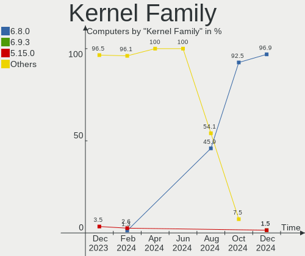
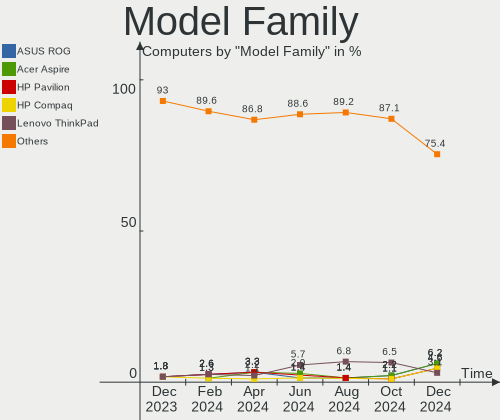
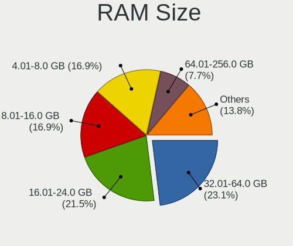
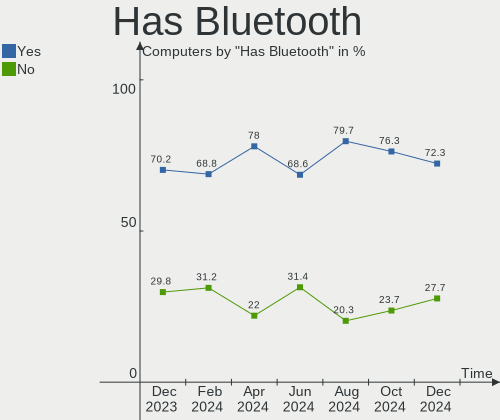
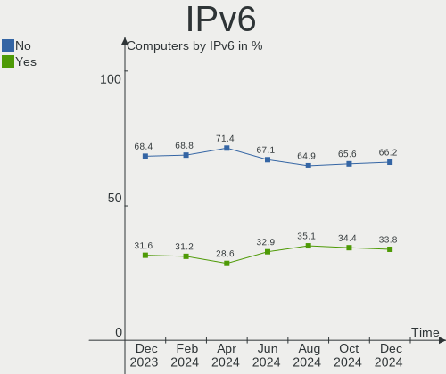
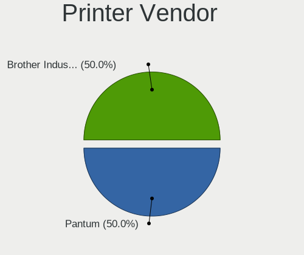

KDE neon - Hardware Trends
--------------------------

A project to identify most popular hardware characteristics and track their change
over time based on data collected by Linux users at https://Linux-Hardware.org.

Anyone can contribute to this report by the [hw-probe](https://github.com/linuxhw/hw-probe) tool:

    sudo -E hw-probe -all -upload

This is a report for all computer types. See also reports for [desktops](/Dist/KDE_neon/Desktop/README.md) and [notebooks](/Dist/KDE_neon/Notebook/README.md).

This report is for one last month. Overall report since the beginning of time: [TestDays](https://github.com/linuxhw/TestDays)

Period: Jan, 2024.

Contents
--------

* [ System ](#system)
  - [ OS                       ](#os)
  - [ OS Family                ](#os-family)
  - [ Kernel                   ](#kernel)
  - [ Kernel Family            ](#kernel-family)
  - [ Kernel Major Ver.        ](#kernel-major-ver)
  - [ Arch                     ](#arch)
  - [ DE                       ](#de)
  - [ Display Server           ](#display-server)
  - [ Display Manager          ](#display-manager)
  - [ OS Lang                  ](#os-lang)
  - [ Boot Mode                ](#boot-mode)
  - [ Filesystem               ](#filesystem)
  - [ Part. scheme             ](#part-scheme)
  - [ Dual Boot with Linux/BSD ](#dual-boot-with-linuxbsd)
  - [ Dual Boot (Win)          ](#dual-boot-win)

* [ Board ](#board)
  - [ Vendor                   ](#vendor)
  - [ Model                    ](#model)
  - [ Model Family             ](#model-family)
  - [ MFG Year                 ](#mfg-year)
  - [ Form Factor              ](#form-factor)
  - [ Secure Boot              ](#secure-boot)
  - [ Coreboot                 ](#coreboot)
  - [ RAM Size                 ](#ram-size)
  - [ RAM Used                 ](#ram-used)
  - [ Total Drives             ](#total-drives)
  - [ Has CD-ROM               ](#has-cd-rom)
  - [ Has Ethernet             ](#has-ethernet)
  - [ Has WiFi                 ](#has-wifi)
  - [ Has Bluetooth            ](#has-bluetooth)

* [ Location ](#location)
  - [ Country                  ](#country)
  - [ City                     ](#city)

* [ Drives ](#drives)
  - [ Drive Vendor             ](#drive-vendor)
  - [ Drive Model              ](#drive-model)
  - [ HDD Vendor               ](#hdd-vendor)
  - [ SSD Vendor               ](#ssd-vendor)
  - [ Drive Kind               ](#drive-kind)
  - [ Drive Connector          ](#drive-connector)
  - [ Drive Size               ](#drive-size)
  - [ Space Total              ](#space-total)
  - [ Space Used               ](#space-used)
  - [ Malfunc. Drives          ](#malfunc-drives)
  - [ Malfunc. Drive Vendor    ](#malfunc-drive-vendor)
  - [ Malfunc. HDD Vendor      ](#malfunc-hdd-vendor)
  - [ Malfunc. Drive Kind      ](#malfunc-drive-kind)
  - [ Failed Drives            ](#failed-drives)
  - [ Failed Drive Vendor      ](#failed-drive-vendor)
  - [ Drive Status             ](#drive-status)

* [ Storage controller ](#storage-controller)
  - [ Storage Vendor           ](#storage-vendor)
  - [ Storage Model            ](#storage-model)
  - [ Storage Kind             ](#storage-kind)

* [ Processor ](#processor)
  - [ CPU Vendor               ](#cpu-vendor)
  - [ CPU Model                ](#cpu-model)
  - [ CPU Model Family         ](#cpu-model-family)
  - [ CPU Cores                ](#cpu-cores)
  - [ CPU Sockets              ](#cpu-sockets)
  - [ CPU Threads              ](#cpu-threads)
  - [ CPU Op-Modes             ](#cpu-op-modes)
  - [ CPU Microcode            ](#cpu-microcode)
  - [ CPU Microarch            ](#cpu-microarch)

* [ Graphics ](#graphics)
  - [ GPU Vendor               ](#gpu-vendor)
  - [ GPU Model                ](#gpu-model)
  - [ GPU Combo                ](#gpu-combo)
  - [ GPU Driver               ](#gpu-driver)
  - [ GPU Memory               ](#gpu-memory)

* [ Monitor ](#monitor)
  - [ Monitor Vendor           ](#monitor-vendor)
  - [ Monitor Model            ](#monitor-model)
  - [ Monitor Resolution       ](#monitor-resolution)
  - [ Monitor Diagonal         ](#monitor-diagonal)
  - [ Monitor Width            ](#monitor-width)
  - [ Aspect Ratio             ](#aspect-ratio)
  - [ Monitor Area             ](#monitor-area)
  - [ Pixel Density            ](#pixel-density)
  - [ Multiple Monitors        ](#multiple-monitors)

* [ Network ](#network)
  - [ Net Controller Vendor    ](#net-controller-vendor)
  - [ Net Controller Model     ](#net-controller-model)
  - [ Wireless Vendor          ](#wireless-vendor)
  - [ Wireless Model           ](#wireless-model)
  - [ Ethernet Vendor          ](#ethernet-vendor)
  - [ Ethernet Model           ](#ethernet-model)
  - [ Net Controller Kind      ](#net-controller-kind)
  - [ Used Controller          ](#used-controller)
  - [ NICs                     ](#nics)
  - [ IPv6                     ](#ipv6)

* [ Bluetooth ](#bluetooth)
  - [ Bluetooth Vendor         ](#bluetooth-vendor)
  - [ Bluetooth Model          ](#bluetooth-model)

* [ Sound ](#sound)
  - [ Sound Vendor             ](#sound-vendor)
  - [ Sound Model              ](#sound-model)

* [ Memory ](#memory)
  - [ Memory Vendor            ](#memory-vendor)
  - [ Memory Model             ](#memory-model)
  - [ Memory Kind              ](#memory-kind)
  - [ Memory Form Factor       ](#memory-form-factor)
  - [ Memory Size              ](#memory-size)
  - [ Memory Speed             ](#memory-speed)

* [ Printers & scanners ](#printers--scanners)
  - [ Printer Vendor           ](#printer-vendor)
  - [ Printer Model            ](#printer-model)
  - [ Scanner Vendor           ](#scanner-vendor)
  - [ Scanner Model            ](#scanner-model)

* [ Camera ](#camera)
  - [ Camera Vendor            ](#camera-vendor)
  - [ Camera Model             ](#camera-model)

* [ Security ](#security)
  - [ Fingerprint Vendor       ](#fingerprint-vendor)
  - [ Fingerprint Model        ](#fingerprint-model)
  - [ Chipcard Vendor          ](#chipcard-vendor)
  - [ Chipcard Model           ](#chipcard-model)

* [ Unsupported ](#unsupported)
  - [ Unsupported Devices      ](#unsupported-devices)
  - [ Unsupported Device Types ](#unsupported-device-types)

System
------

OS
--

Installed operating systems

| Name           | Computers | Percent |
|----------------|-----------|---------|
| KDE neon 22.04 | 73        | 98.65%  |
| KDE neon 20.04 | 1         | 1.35%   |

OS Family
---------

OS without a version

| Name     | Computers | Percent |
|----------|-----------|---------|
| KDE neon | 74        | 100%    |

Kernel
------

Version of the Linux kernel

| Version                | Computers | Percent |
|------------------------|-----------|---------|
| 6.2.0-39-generic       | 32        | 43.24%  |
| 6.5.0-14-generic       | 21        | 28.38%  |
| 6.5.0-15-generic       | 10        | 13.51%  |
| 6.2.0-35-generic       | 2         | 2.7%    |
| 6.6.9-1-liquorix-amd64 | 1         | 1.35%   |
| 6.6.10-x64v3-xanmod1   | 1         | 1.35%   |
| 6.5.6-060506-generic   | 1         | 1.35%   |
| 6.5.0-17-generic       | 1         | 1.35%   |
| 6.2.0-36-generic       | 1         | 1.35%   |
| 6.2.0-31-generic       | 1         | 1.35%   |
| 6.2.0-1013-nvidia      | 1         | 1.35%   |
| 5.15.0-56-generic      | 1         | 1.35%   |
| 5.15.0-48-generic      | 1         | 1.35%   |

Kernel Family
-------------

Linux kernel without a distro release

| Version | Computers | Percent |
|---------|-----------|---------|
| 6.2.0   | 37        | 50%     |
| 6.5.0   | 32        | 43.24%  |
| 5.15.0  | 2         | 2.7%    |
| 6.6.9   | 1         | 1.35%   |
| 6.6.10  | 1         | 1.35%   |
| 6.5.6   | 1         | 1.35%   |

Kernel Major Ver.
-----------------

Linux kernel major version

| Version | Computers | Percent |
|---------|-----------|---------|
| 6.2     | 37        | 50%     |
| 6.5     | 33        | 44.59%  |
| 6.6     | 2         | 2.7%    |
| 5.15    | 2         | 2.7%    |

Arch
----

OS architecture (x86_64, i586, etc.)

| Name   | Computers | Percent |
|--------|-----------|---------|
| x86_64 | 74        | 100%    |

DE
--

Desktop Environment

| Name | Computers | Percent |
|------|-----------|---------|
| KDE5 | 67        | 90.54%  |
| KDE6 | 5         | 6.76%   |
| LXDE | 1         | 1.35%   |
| KDE  | 1         | 1.35%   |

Display Server
--------------

X11 or Wayland

| Name    | Computers | Percent |
|---------|-----------|---------|
| X11     | 60        | 81.08%  |
| Wayland | 14        | 18.92%  |

Display Manager
---------------

SDDM, LightDM, etc.

| Name    | Computers | Percent |
|---------|-----------|---------|
| Unknown | 54        | 72.97%  |
| SDDM    | 20        | 27.03%  |

OS Lang
-------

Language

| Lang  | Computers | Percent |
|-------|-----------|---------|
| en_US | 33        | 44.59%  |
| de_DE | 6         | 8.11%   |
| es_MX | 5         | 6.76%   |
| en_GB | 4         | 5.41%   |
| C     | 4         | 5.41%   |
| fr_FR | 3         | 4.05%   |
| en_IN | 3         | 4.05%   |
| ru_RU | 2         | 2.7%    |
| pt_BR | 2         | 2.7%    |
| es_ES | 2         | 2.7%    |
| en_AU | 2         | 2.7%    |
| sl_SI | 1         | 1.35%   |
| pt_PT | 1         | 1.35%   |
| it_IT | 1         | 1.35%   |
| es_CO | 1         | 1.35%   |
| es_AR | 1         | 1.35%   |
| en_ZA | 1         | 1.35%   |
| en_PH | 1         | 1.35%   |
| cs_CZ | 1         | 1.35%   |

Boot Mode
---------

EFI or BIOS

| Mode | Computers | Percent |
|------|-----------|---------|
| BIOS | 62        | 83.78%  |
| EFI  | 12        | 16.22%  |

Filesystem
----------

Type of filesystem

| Type    | Computers | Percent |
|---------|-----------|---------|
| Ext4    | 60        | 81.08%  |
| Tmpfs   | 6         | 8.11%   |
| Btrfs   | 5         | 6.76%   |
| Overlay | 2         | 2.7%    |
| Xfs     | 1         | 1.35%   |

Part. scheme
------------

Scheme of partitioning

| Type    | Computers | Percent |
|---------|-----------|---------|
| Unknown | 54        | 72.97%  |
| GPT     | 16        | 21.62%  |
| MBR     | 4         | 5.41%   |

Dual Boot with Linux/BSD
------------------------

Hosting more than one Linux/BSD

| Dual boot | Computers | Percent |
|-----------|-----------|---------|
| No        | 71        | 95.95%  |
| Yes       | 3         | 4.05%   |

Dual Boot (Win)
---------------

Hosting Linux and Windows

| Dual boot | Computers | Percent |
|-----------|-----------|---------|
| No        | 68        | 91.89%  |
| Yes       | 6         | 8.11%   |

Board
-----

Vendor
------

Motherboard manufacturer

| Name                                 | Computers | Percent |
|--------------------------------------|-----------|---------|
| MSI                                  | 10        | 13.51%  |
| Dell                                 | 9         | 12.16%  |
| Hewlett-Packard                      | 8         | 10.81%  |
| ASUSTek Computer                     | 8         | 10.81%  |
| Lenovo                               | 7         | 9.46%   |
| Gigabyte Technology                  | 7         | 9.46%   |
| Notebook                             | 2         | 2.7%    |
| Intel                                | 2         | 2.7%    |
| Apple                                | 2         | 2.7%    |
| Acer                                 | 2         | 2.7%    |
| VPU Company                          | 1         | 1.35%   |
| UNOWHY                               | 1         | 1.35%   |
| UMAX                                 | 1         | 1.35%   |
| Toshiba                              | 1         | 1.35%   |
| Timi                                 | 1         | 1.35%   |
| Sony                                 | 1         | 1.35%   |
| SJS                                  | 1         | 1.35%   |
| Shenzhen Meigao Electronic Equipment | 1         | 1.35%   |
| Samsung Electronics                  | 1         | 1.35%   |
| Razer                                | 1         | 1.35%   |
| Positivo                             | 1         | 1.35%   |
| Microsoft                            | 1         | 1.35%   |
| HUAWEI                               | 1         | 1.35%   |
| Google                               | 1         | 1.35%   |
| Gateway                              | 1         | 1.35%   |
| Fujitsu                              | 1         | 1.35%   |
| ASRock                               | 1         | 1.35%   |

Model
-----

Motherboard model

| Name                                               | Computers | Percent |
|----------------------------------------------------|-----------|---------|
| HP Laptop 15-da0xxx                                | 2         | 2.7%    |
| VPU Company VWNC71429-S                            | 1         | 1.35%   |
| UNOWHY Y13G010S4EI                                 | 1         | 1.35%   |
| UMAX VisionBook 14Wr Plus                          | 1         | 1.35%   |
| Toshiba Satellite L655                             | 1         | 1.35%   |
| Timi RedmiBook Pro 15S                             | 1         | 1.35%   |
| Sony SVF1521J7EW                                   | 1         | 1.35%   |
| SJS H310M-VH                                       | 1         | 1.35%   |
| Shenzhen Meigao Electronic Equipment UM560 XT      | 1         | 1.35%   |
| Samsung RV420/RV520/RV720/E3530/S3530/E3420/E3520  | 1         | 1.35%   |
| Razer Blade 15 Base Model (Early 2021) - RZ09-0369 | 1         | 1.35%   |
| Positivo C464C                                     | 1         | 1.35%   |
| Notebook X170KM-G                                  | 1         | 1.35%   |
| Notebook N150CU                                    | 1         | 1.35%   |
| MSI MS-7E12                                        | 1         | 1.35%   |
| MSI MS-7D46                                        | 1         | 1.35%   |
| MSI MS-7C96                                        | 1         | 1.35%   |
| MSI MS-7C91                                        | 1         | 1.35%   |
| MSI MS-7C37                                        | 1         | 1.35%   |
| MSI MS-7850                                        | 1         | 1.35%   |
| MSI MS-7623                                        | 1         | 1.35%   |
| MSI Modern 15 B7M                                  | 1         | 1.35%   |
| MSI Bravo 17 A4DDR                                 | 1         | 1.35%   |
| MSI Bravo 15 B5DD                                  | 1         | 1.35%   |
| Microsoft Surface Pro 8                            | 1         | 1.35%   |
| Lenovo Yoga C940-15IRH 81TE                        | 1         | 1.35%   |
| Lenovo ThinkPad T61 6464AS3                        | 1         | 1.35%   |
| Lenovo ThinkPad T495 20NKS1XW08                    | 1         | 1.35%   |
| Lenovo ThinkPad T450s 20BWS3ET0E                   | 1         | 1.35%   |
| Lenovo ThinkPad T14 Gen 2i 20W1SGQY00              | 1         | 1.35%   |
| Lenovo IdeaPadFlex 5 15ITL05 82HT                  | 1         | 1.35%   |
| Lenovo IdeaPad Y580 20132                          | 1         | 1.35%   |
| Intel H55                                          | 1         | 1.35%   |
| HUAWEI KLVL-WXXW                                   | 1         | 1.35%   |
| HP Spectre x360 Convertible 15-ch0xx               | 1         | 1.35%   |
| HP Pavilion x360 Convertible 14-dh1xxx             | 1         | 1.35%   |
| HP Pavilion 15                                     | 1         | 1.35%   |
| HP Laptop 15-dw0xxx                                | 1         | 1.35%   |
| HP EliteBook x360 1040 G5                          | 1         | 1.35%   |
| HP EliteBook 735 G5                                | 1         | 1.35%   |

Model Family
------------

Motherboard model prefix

| Name                                       | Computers | Percent |
|--------------------------------------------|-----------|---------|
| Lenovo ThinkPad                            | 4         | 5.41%   |
| Dell Latitude                              | 4         | 5.41%   |
| HP Laptop                                  | 3         | 4.05%   |
| Dell Inspiron                              | 3         | 4.05%   |
| ASUS ROG                                   | 3         | 4.05%   |
| MSI Bravo                                  | 2         | 2.7%    |
| HP Pavilion                                | 2         | 2.7%    |
| HP EliteBook                               | 2         | 2.7%    |
| VPU Company VWNC71429-S                    | 1         | 1.35%   |
| UNOWHY Y13G010S4EI                         | 1         | 1.35%   |
| UMAX VisionBook                            | 1         | 1.35%   |
| Toshiba Satellite                          | 1         | 1.35%   |
| Timi RedmiBook                             | 1         | 1.35%   |
| Sony SVF1521J7EW                           | 1         | 1.35%   |
| SJS H310M-VH                               | 1         | 1.35%   |
| Shenzhen Meigao Electronic Equipment UM560 | 1         | 1.35%   |
| Samsung RV420                              | 1         | 1.35%   |
| Razer Blade                                | 1         | 1.35%   |
| Positivo C464C                             | 1         | 1.35%   |
| Notebook X170KM-G                          | 1         | 1.35%   |
| Notebook N150CU                            | 1         | 1.35%   |
| MSI MS-7E12                                | 1         | 1.35%   |
| MSI MS-7D46                                | 1         | 1.35%   |
| MSI MS-7C96                                | 1         | 1.35%   |
| MSI MS-7C91                                | 1         | 1.35%   |
| MSI MS-7C37                                | 1         | 1.35%   |
| MSI MS-7850                                | 1         | 1.35%   |
| MSI MS-7623                                | 1         | 1.35%   |
| MSI Modern                                 | 1         | 1.35%   |
| Microsoft Surface                          | 1         | 1.35%   |
| Lenovo Yoga                                | 1         | 1.35%   |
| Lenovo IdeaPadFlex                         | 1         | 1.35%   |
| Lenovo IdeaPad                             | 1         | 1.35%   |
| Intel H55                                  | 1         | 1.35%   |
| HUAWEI KLVL-WXXW                           | 1         | 1.35%   |
| HP Spectre                                 | 1         | 1.35%   |
| Google Fleex                               | 1         | 1.35%   |
| Gigabyte X99-UD4-CF                        | 1         | 1.35%   |
| Gigabyte X470                              | 1         | 1.35%   |
| Gigabyte H61M-S2-B3                        | 1         | 1.35%   |

MFG Year
--------

Motherboard manufacture year

| Year | Computers | Percent |
|------|-----------|---------|
| 2020 | 11        | 14.86%  |
| 2018 | 10        | 13.51%  |
| 2021 | 9         | 12.16%  |
| 2022 | 8         | 10.81%  |
| 2017 | 7         | 9.46%   |
| 2019 | 6         | 8.11%   |
| 2023 | 5         | 6.76%   |
| 2013 | 5         | 6.76%   |
| 2014 | 4         | 5.41%   |
| 2011 | 3         | 4.05%   |
| 2010 | 3         | 4.05%   |
| 2012 | 2         | 2.7%    |
| 2007 | 1         | 1.35%   |

Form Factor
-----------

Physical design of the computer

| Name        | Computers | Percent |
|-------------|-----------|---------|
| Notebook    | 42        | 56.76%  |
| Desktop     | 23        | 31.08%  |
| Convertible | 6         | 8.11%   |
| All in one  | 2         | 2.7%    |
| Tablet      | 1         | 1.35%   |

Secure Boot
-----------

Enabled or disabled

| State    | Computers | Percent |
|----------|-----------|---------|
| Disabled | 71        | 95.95%  |
| Enabled  | 3         | 4.05%   |

Coreboot
--------

Have coreboot on board

| Used | Computers | Percent |
|------|-----------|---------|
| No   | 73        | 98.65%  |
| Yes  | 1         | 1.35%   |

RAM Size
--------

Total RAM memory

| Size in GB  | Computers | Percent |
|-------------|-----------|---------|
| 16.01-24.0  | 16        | 21.62%  |
| 8.01-16.0   | 16        | 21.62%  |
| 32.01-64.0  | 13        | 17.57%  |
| 4.01-8.0    | 12        | 16.22%  |
| 3.01-4.0    | 10        | 13.51%  |
| 64.01-256.0 | 5         | 6.76%   |
| 24.01-32.0  | 1         | 1.35%   |
| 1.01-2.0    | 1         | 1.35%   |

RAM Used
--------

Used RAM memory

| Used GB   | Computers | Percent |
|-----------|-----------|---------|
| 2.01-3.0  | 24        | 32.43%  |
| 4.01-8.0  | 21        | 28.38%  |
| 3.01-4.0  | 14        | 18.92%  |
| 1.01-2.0  | 10        | 13.51%  |
| 8.01-16.0 | 5         | 6.76%   |

Total Drives
------------

Number of drives on board

| Drives | Computers | Percent |
|--------|-----------|---------|
| 1      | 38        | 51.35%  |
| 2      | 23        | 31.08%  |
| 3      | 8         | 10.81%  |
| 6      | 2         | 2.7%    |
| 4      | 2         | 2.7%    |
| 9      | 1         | 1.35%   |

Has CD-ROM
----------

Has CD-ROM on board

| Presented | Computers | Percent |
|-----------|-----------|---------|
| No        | 57        | 77.03%  |
| Yes       | 17        | 22.97%  |

Has Ethernet
------------

Has Ethernet on board

| Presented | Computers | Percent |
|-----------|-----------|---------|
| Yes       | 58        | 78.38%  |
| No        | 16        | 21.62%  |

Has WiFi
--------

Has WiFi module

| Presented | Computers | Percent |
|-----------|-----------|---------|
| Yes       | 66        | 89.19%  |
| No        | 8         | 10.81%  |

Has Bluetooth
-------------

Has Bluetooth module

| Presented | Computers | Percent |
|-----------|-----------|---------|
| Yes       | 60        | 81.08%  |
| No        | 14        | 18.92%  |

Location
--------

Country
-------

Geographic location (country)

| Country                | Computers | Percent |
|------------------------|-----------|---------|
| USA                    | 21        | 28.38%  |
| Germany                | 7         | 9.46%   |
| Brazil                 | 5         | 6.76%   |
| Russia                 | 4         | 5.41%   |
| Mexico                 | 4         | 5.41%   |
| Spain                  | 3         | 4.05%   |
| India                  | 3         | 4.05%   |
| Venezuela              | 2         | 2.7%    |
| France                 | 2         | 2.7%    |
| Czechia                | 2         | 2.7%    |
| Colombia               | 2         | 2.7%    |
| Austria                | 2         | 2.7%    |
| Australia              | 2         | 2.7%    |
| Tunisia                | 1         | 1.35%   |
| South Africa           | 1         | 1.35%   |
| Slovenia               | 1         | 1.35%   |
| Serbia                 | 1         | 1.35%   |
| Portugal               | 1         | 1.35%   |
| Philippines            | 1         | 1.35%   |
| Paraguay               | 1         | 1.35%   |
| Norway                 | 1         | 1.35%   |
| New Zealand            | 1         | 1.35%   |
| Lithuania              | 1         | 1.35%   |
| Italy                  | 1         | 1.35%   |
| Hungary                | 1         | 1.35%   |
| Canada                 | 1         | 1.35%   |
| Bosnia and Herzegovina | 1         | 1.35%   |
| Bolivia                | 1         | 1.35%   |

City
----

Geographic location (city)

| City               | Computers | Percent |
|--------------------|-----------|---------|
| Moscow             | 2         | 2.7%    |
| Medellín          | 2         | 2.7%    |
| Berlin             | 2         | 2.7%    |
| Zapopan            | 1         | 1.35%   |
| Wiesbaden          | 1         | 1.35%   |
| Wasilla            | 1         | 1.35%   |
| Vilshofen          | 1         | 1.35%   |
| Tauranga           | 1         | 1.35%   |
| St Petersburg      | 1         | 1.35%   |
| Solikamsk          | 1         | 1.35%   |
| Šentjur pri Celju | 1         | 1.35%   |
| Sarajevo           | 1         | 1.35%   |
| Sao Paulo          | 1         | 1.35%   |
| San Cristóbal     | 1         | 1.35%   |
| Roy                | 1         | 1.35%   |
| Riudoms            | 1         | 1.35%   |
| Rauris             | 1         | 1.35%   |
| Quezon City        | 1         | 1.35%   |
| Prague             | 1         | 1.35%   |
| Potosí            | 1         | 1.35%   |
| Polanco            | 1         | 1.35%   |
| Piratininga        | 1         | 1.35%   |
| Pinhais            | 1         | 1.35%   |
| Phoenix            | 1         | 1.35%   |
| Philadelphia       | 1         | 1.35%   |
| Olympia            | 1         | 1.35%   |
| Nulvi              | 1         | 1.35%   |
| Niš               | 1         | 1.35%   |
| New York           | 1         | 1.35%   |
| New Orleans        | 1         | 1.35%   |
| Monastir           | 1         | 1.35%   |
| Mexico City        | 1         | 1.35%   |
| Menifee            | 1         | 1.35%   |
| Melbourne          | 1         | 1.35%   |
| Madrid             | 1         | 1.35%   |
| Lübeck            | 1         | 1.35%   |
| Lephalale          | 1         | 1.35%   |
| Kreuztal           | 1         | 1.35%   |
| Krenglbach         | 1         | 1.35%   |
| Kolkata            | 1         | 1.35%   |

Drives
------

Drive Vendor
------------

Hard drive vendors

| Vendor                         | Computers | Drives  | Percent |
|--------------------------------|-----------|---------|---------|
| Samsung Electronics            | 12        | 16      | 10.53%  |
| WDC                            | 10        | 14      | 8.77%   |
| Seagate                        | 10        | 17      | 8.77%   |
| SanDisk                        | 10        | 16      | 8.77%   |
| Unknown                        | 9         | 10      | 7.89%   |
| Kingston                       | 7         | 7       | 6.14%   |
| SK hynix                       | 6         | 6       | 5.26%   |
| Phison Electronics             | 5         | 5       | 4.39%   |
| Crucial                        | 5         | 6       | 4.39%   |
| Micron Technology              | 4         | 4       | 3.51%   |
| Toshiba                        | 3         | 3       | 2.63%   |
| Silicon Motion                 | 3         | 3       | 2.63%   |
| Intel                          | 3         | 4       | 2.63%   |
| Transcend                      | 2         | 2       | 1.75%   |
| SPCC                           | 2         | 2       | 1.75%   |
| Micron/Crucial Technology      | 2         | 2       | 1.75%   |
| Lexar                          | 2         | 2       | 1.75%   |
| Kingston Technology Company    | 2         | 2       | 1.75%   |
| HGST                           | 2         | 2       | 1.75%   |
| Team                           | 1         | 1       | 0.88%   |
| SSSTC                          | 1         | 1       | 0.88%   |
| Solid State Storage Technology | 1         | 1       | 0.88%   |
| Realtek Semiconductor          | 1         | 2       | 0.88%   |
| PNY                            | 1         | 1       | 0.88%   |
| Phison                         | 1         | 1       | 0.88%   |
| Patriot                        | 1         | 1       | 0.88%   |
| MaxDigital                     | 1         | 1       | 0.88%   |
| HL-DT-ST                       | 1         | Unknown | 0.88%   |
| Hitachi                        | 1         | 1       | 0.88%   |
| China                          | 1         | 1       | 0.88%   |
| BUFFALO                        | 1         | 1       | 0.88%   |
| ADATA LE                       | 1         | 1       | 0.88%   |
| A-DATA Technology              | 1         | 1       | 0.88%   |
| Unknown                        | 1         | 1       | 0.88%   |

Drive Model
-----------

Hard drive models

| Model                                                 | Computers | Percent |
|-------------------------------------------------------|-----------|---------|
| Unknown MMC Card  64GB                                | 2         | 1.49%   |
| Unknown MMC Card  32GB                                | 2         | 1.49%   |
| Unknown MMC Card  16GB                                | 2         | 1.49%   |
| Silicon Motion SM2263EN/SM2263XT SSD Controller 128GB | 2         | 1.49%   |
| Sandisk WD Blue SN550 NVMe SSD 512GB                  | 2         | 1.49%   |
| SanDisk SSD PLUS 1000GB                               | 2         | 1.49%   |
| Samsung NVMe SSD Controller SM981/PM981/PM983 1TB     | 2         | 1.49%   |
| Samsung NVMe SSD Controller SM961/PM961/SM963 256GB   | 2         | 1.49%   |
| Phison PS5013 E13 NVMe Controller 256GB               | 2         | 1.49%   |
| Phison E12 NVMe Controller 1TB                        | 2         | 1.49%   |
| Kingston Company SNV2S1000G 1TB                       | 2         | 1.49%   |
| WDC WDS120G2G0A-00JH30 120GB SSD                      | 1         | 0.75%   |
| WDC WDBNCE2500PNC 250GB SSD                           | 1         | 0.75%   |
| WDC WD6003FZBX-00K5WB0 6TB                            | 1         | 0.75%   |
| WDC WD5000LPCX-75VHAT0 500GB                          | 1         | 0.75%   |
| WDC WD5000AZLX-00CL5A0 500GB                          | 1         | 0.75%   |
| WDC WD40EZAZ-00SF3B0 4TB                              | 1         | 0.75%   |
| WDC WD40EZAX-00C8UB0 4TB                              | 1         | 0.75%   |
| WDC WD3200LPVX-75V0TT0 320GB                          | 1         | 0.75%   |
| WDC WD2003FZEX-00Z4SA0 2TB                            | 1         | 0.75%   |
| WDC WD181KRYZ-01AGBB0 18TB                            | 1         | 0.75%   |
| WDC WD1600AABS-00PRA0 160GB                           | 1         | 0.75%   |
| WDC WD121KRYZ-01W0RB0 12TB                            | 1         | 0.75%   |
| WDC WD10SPZX-75Z10T3 1TB                              | 1         | 0.75%   |
| WDC WD10EZEX-60WN4A0 1TB                              | 1         | 0.75%   |
| Unknown FNX1TBMORM 1024GB                             | 1         | 0.75%   |
| Unknown DA4064  64GB                                  | 1         | 0.75%   |
| Unknown DA4032  32GB                                  | 1         | 0.75%   |
| Unknown BFDT50S 499GB                                 | 1         | 0.75%   |
| Transcend TS128GMSA370 128GB SSD                      | 1         | 0.75%   |
| Transcend TS120GMTS420S 120GB SSD                     | 1         | 0.75%   |
| Toshiba XG6 NVMe SSD Controller 256GB                 | 1         | 0.75%   |
| Toshiba TR200 240GB SSD                               | 1         | 0.75%   |
| Toshiba MK3265GSX 320GB                               | 1         | 0.75%   |
| Team T253X6512G 512GB SSD                             | 1         | 0.75%   |
| SSSTC CV8-8E128-HP 128GB                              | 1         | 0.75%   |
| SPCC Solid State Disk 256GB                           | 1         | 0.75%   |
| SPCC Solid State Disk 128GB                           | 1         | 0.75%   |
| Solid State Storage SSSTC CL4-8D256-Q79 256GB         | 1         | 0.75%   |
| SK hynix SHGS31-500GS-2 500GB SSD                     | 1         | 0.75%   |

HDD Vendor
----------

Hard disk drive vendors

| Vendor              | Computers | Drives | Percent |
|---------------------|-----------|--------|---------|
| Seagate             | 10        | 17     | 38.46%  |
| WDC                 | 9         | 12     | 34.62%  |
| HGST                | 2         | 2      | 7.69%   |
| Unknown             | 1         | 1      | 3.85%   |
| Toshiba             | 1         | 1      | 3.85%   |
| Samsung Electronics | 1         | 1      | 3.85%   |
| MaxDigital          | 1         | 1      | 3.85%   |
| Hitachi             | 1         | 1      | 3.85%   |

SSD Vendor
----------

Solid state drive vendors

| Vendor              | Computers | Drives | Percent |
|---------------------|-----------|--------|---------|
| SanDisk             | 5         | 7      | 12.82%  |
| Samsung Electronics | 5         | 6      | 12.82%  |
| Kingston            | 5         | 5      | 12.82%  |
| Crucial             | 5         | 6      | 12.82%  |
| WDC                 | 2         | 2      | 5.13%   |
| Transcend           | 2         | 2      | 5.13%   |
| SPCC                | 2         | 2      | 5.13%   |
| SK hynix            | 2         | 2      | 5.13%   |
| Toshiba             | 1         | 1      | 2.56%   |
| Team                | 1         | 1      | 2.56%   |
| SSSTC               | 1         | 1      | 2.56%   |
| PNY                 | 1         | 1      | 2.56%   |
| Patriot             | 1         | 1      | 2.56%   |
| Lexar               | 1         | 1      | 2.56%   |
| Intel               | 1         | 1      | 2.56%   |
| China               | 1         | 1      | 2.56%   |
| BUFFALO             | 1         | 1      | 2.56%   |
| ADATA LE            | 1         | 1      | 2.56%   |
| A-DATA Technology   | 1         | 1      | 2.56%   |

Drive Kind
----------

HDD or SSD

| Kind    | Computers | Drives | Percent |
|---------|-----------|--------|---------|
| NVMe    | 39        | 48     | 37.14%  |
| SSD     | 33        | 43     | 31.43%  |
| HDD     | 22        | 36     | 20.95%  |
| MMC     | 7         | 8      | 6.67%   |
| Unknown | 4         | 3      | 3.81%   |

Drive Connector
---------------

SATA, SAS, NVMe, etc.

| Type | Computers | Drives | Percent |
|------|-----------|--------|---------|
| SATA | 45        | 76     | 46.39%  |
| NVMe | 39        | 48     | 40.21%  |
| MMC  | 7         | 8      | 7.22%   |
| SAS  | 6         | 6      | 6.19%   |

Drive Size
----------

Size of hard drive

| Size in TB | Computers | Drives | Percent |
|------------|-----------|--------|---------|
| 0.01-0.5   | 34        | 39     | 54.84%  |
| 0.51-1.0   | 12        | 15     | 19.35%  |
| 1.01-2.0   | 6         | 7      | 9.68%   |
| 3.01-4.0   | 5         | 6      | 8.06%   |
| 4.01-10.0  | 3         | 5      | 4.84%   |
| 10.01-20.0 | 2         | 7      | 3.23%   |

Space Total
-----------

Amount of disk space available on the file system

| Size in GB     | Computers | Percent |
|----------------|-----------|---------|
| 251-500        | 20        | 27.03%  |
| 101-250        | 16        | 21.62%  |
| 501-1000       | 10        | 13.51%  |
| 1001-2000      | 8         | 10.81%  |
| More than 3000 | 6         | 8.11%   |
| 21-50          | 6         | 8.11%   |
| 51-100         | 4         | 5.41%   |
| 2001-3000      | 2         | 2.7%    |
| 1-20           | 2         | 2.7%    |

Space Used
----------

Amount of used disk space

| Used GB        | Computers | Percent |
|----------------|-----------|---------|
| 1-20           | 27        | 36.49%  |
| 21-50          | 17        | 22.97%  |
| 51-100         | 9         | 12.16%  |
| 251-500        | 6         | 8.11%   |
| 501-1000       | 5         | 6.76%   |
| 101-250        | 4         | 5.41%   |
| 1001-2000      | 3         | 4.05%   |
| More than 3000 | 2         | 2.7%    |
| 2001-3000      | 1         | 1.35%   |

Malfunc. Drives
---------------

Drive models with a malfunction

| Model                        | Computers | Drives | Percent |
|------------------------------|-----------|--------|---------|
| Kingston SKC2000M8500G 500GB | 1         | 1      | 50%     |
| Crucial CT256M550SSD1 256GB  | 1         | 1      | 50%     |

Malfunc. Drive Vendor
---------------------

Vendors of faulty drives

| Vendor   | Computers | Drives | Percent |
|----------|-----------|--------|---------|
| Kingston | 1         | 1      | 50%     |
| Crucial  | 1         | 1      | 50%     |

Malfunc. HDD Vendor
-------------------

Vendors of faulty HDD drives

Zero info for selected period =(

Malfunc. Drive Kind
-------------------

Kinds of faulty drives

| Kind | Computers | Drives | Percent |
|------|-----------|--------|---------|
| NVMe | 1         | 1      | 50%     |
| SSD  | 1         | 1      | 50%     |

Failed Drives
-------------

Failed drive models

Zero info for selected period =(

Failed Drive Vendor
-------------------

Failed drive vendors

Zero info for selected period =(

Drive Status
------------

Number of failed and malfunc. drives

| Status   | Computers | Drives | Percent |
|----------|-----------|--------|---------|
| Detected | 61        | 120    | 82.43%  |
| Works    | 12        | 16     | 16.22%  |
| Malfunc  | 1         | 2      | 1.35%   |

Storage controller
------------------

Storage Vendor
--------------

Storage controller vendors

| Vendor                         | Computers | Percent |
|--------------------------------|-----------|---------|
| Intel                          | 42        | 40.78%  |
| AMD                            | 19        | 18.45%  |
| Samsung Electronics            | 8         | 7.77%   |
| SanDisk                        | 6         | 5.83%   |
| Phison Electronics             | 6         | 5.83%   |
| SK hynix                       | 4         | 3.88%   |
| Micron Technology              | 4         | 3.88%   |
| Kingston Technology Company    | 4         | 3.88%   |
| Silicon Motion                 | 3         | 2.91%   |
| Micron/Crucial Technology      | 2         | 1.94%   |
| ASMedia Technology             | 2         | 1.94%   |
| Toshiba America Info Systems   | 1         | 0.97%   |
| Solid State Storage Technology | 1         | 0.97%   |
| Realtek Semiconductor          | 1         | 0.97%   |

Storage Model
-------------

Storage controller models

| Model                                                                          | Computers | Percent |
|--------------------------------------------------------------------------------|-----------|---------|
| AMD FCH SATA Controller [AHCI mode]                                            | 13        | 11.4%   |
| Intel Celeron/Pentium Silver Processor SATA Controller                         | 5         | 4.39%   |
| Intel Sunrise Point-LP SATA Controller [AHCI mode]                             | 4         | 3.51%   |
| Intel 82801 Mobile SATA Controller [RAID mode]                                 | 4         | 3.51%   |
| AMD 500 Series Chipset SATA Controller                                         | 4         | 3.51%   |
| SK hynix Gold P31/BC711/PC711 NVMe Solid State Drive                           | 3         | 2.63%   |
| Samsung NVMe SSD Controller SM981/PM981/PM983                                  | 3         | 2.63%   |
| Phison PS5013-E13 PCIe3 NVMe Controller (DRAM-less)                            | 3         | 2.63%   |
| Intel Q170/Q150/B150/H170/H110/Z170/CM236 Chipset SATA Controller [AHCI Mode]  | 3         | 2.63%   |
| Intel 7 Series Chipset Family 6-port SATA Controller [AHCI mode]               | 3         | 2.63%   |
| Silicon Motion SM2263EN/SM2263XT (DRAM-less) NVMe SSD Controllers              | 2         | 1.75%   |
| SanDisk Ultra 3D / WD Blue SN550 NVMe SSD                                      | 2         | 1.75%   |
| Samsung NVMe SSD Controller SM961/PM961/SM963                                  | 2         | 1.75%   |
| Samsung NVMe SSD Controller 980 (DRAM-less)                                    | 2         | 1.75%   |
| Phison E12 NVMe Controller                                                     | 2         | 1.75%   |
| Micron 2210 NVMe SSD [Cobain]                                                  | 2         | 1.75%   |
| Kingston Company NV2 NVMe SSD SM2267XT (DRAM-less)                             | 2         | 1.75%   |
| Intel Alder Lake-S PCH SATA Controller [AHCI Mode]                             | 2         | 1.75%   |
| Intel 8 Series/C220 Series Chipset Family 6-port SATA Controller 1 [AHCI mode] | 2         | 1.75%   |
| Intel 6 Series/C200 Series Chipset Family 6 port Mobile SATA AHCI Controller   | 2         | 1.75%   |
| Intel 5 Series/3400 Series Chipset 4 port SATA AHCI Controller                 | 2         | 1.75%   |
| ASMedia ASM1061/ASM1062 Serial ATA Controller                                  | 2         | 1.75%   |
| AMD 600 Series Chipset SATA Controller                                         | 2         | 1.75%   |
| Toshiba America Info Systems XG6 NVMe SSD Controller                           | 1         | 0.88%   |
| Solid State Storage CL4-8D512 NVMe SSD M.2 (DRAM-less)                         | 1         | 0.88%   |
| SK hynix BC501 NVMe Solid State Drive                                          | 1         | 0.88%   |
| Silicon Motion SM2262/SM2262EN SSD Controller                                  | 1         | 0.88%   |
| SanDisk WD Green SN350 240GB (DRAM-less) / SN560E NVMe SSD                     | 1         | 0.88%   |
| Sandisk WD Blue SN580 NVMe SSD (DRAM-less)                                     | 1         | 0.88%   |
| SanDisk WD Black SN770 / PC SN740 256GB / PC SN560 (DRAM-less) NVMe SSD        | 1         | 0.88%   |
| SanDisk Ultra 3D / WD Blue SN570 NVMe SSD (DRAM-less)                          | 1         | 0.88%   |
| SanDisk Extreme Pro / WD Black 2018/SN750/PC SN720 NVMe SSD                    | 1         | 0.88%   |
| Samsung NVMe SSD Controller PM9A1/PM9A3/980PRO                                 | 1         | 0.88%   |
| Realtek RTS5765DL NVMe SSD Controller (DRAM-less)                              | 1         | 0.88%   |
| Phison PS5021-E21 PCIe4 NVMe Controller (DRAM-less)                            | 1         | 0.88%   |
| Micron/Crucial T500 NVMe PCIe SSD                                              | 1         | 0.88%   |
| Micron/Crucial P2 [Nick P2] / P3 / P3 Plus NVMe PCIe SSD (DRAM-less)           | 1         | 0.88%   |
| Micron 2400 NVMe SSD (DRAM-less)                                               | 1         | 0.88%   |
| Micron 2300 NVMe SSD [Santana]                                                 | 1         | 0.88%   |
| Kingston Company NV1 NVMe SSD SM2263XT (DRAM-less)                             | 1         | 0.88%   |

Storage Kind
------------

Kind of storage controller (IDE, SATA, NVMe, SAS, ...)

| Kind | Computers | Percent |
|------|-----------|---------|
| SATA | 55        | 53.4%   |
| NVMe | 39        | 37.86%  |
| RAID | 6         | 5.83%   |
| IDE  | 3         | 2.91%   |

Processor
---------

CPU Vendor
----------

Processor vendors

| Vendor | Computers | Percent |
|--------|-----------|---------|
| Intel  | 51        | 68.92%  |
| AMD    | 23        | 31.08%  |

CPU Model
---------

Processor models

| Model                                    | Computers | Percent |
|------------------------------------------|-----------|---------|
| Intel Core i7-8650U CPU @ 1.90GHz        | 2         | 2.7%    |
| Intel Core i7-8550U CPU @ 1.80GHz        | 2         | 2.7%    |
| Intel Core i3 CPU M 350 @ 2.27GHz        | 2         | 2.7%    |
| Intel Celeron N4000 CPU @ 1.10GHz        | 2         | 2.7%    |
| Intel 11th Gen Core i7-1165G7 @ 2.80GHz  | 2         | 2.7%    |
| AMD Ryzen 9 5900X 12-Core Processor      | 2         | 2.7%    |
| AMD Ryzen 7 5800H with Radeon Graphics   | 2         | 2.7%    |
| AMD Ryzen 5 1600 Six-Core Processor      | 2         | 2.7%    |
| Intel Pentium Silver N5000 CPU @ 1.10GHz | 1         | 1.35%   |
| Intel Core i9-10900K CPU @ 3.70GHz       | 1         | 1.35%   |
| Intel Core i7-9750H CPU @ 2.60GHz        | 1         | 1.35%   |
| Intel Core i7-6820HQ CPU @ 2.70GHz       | 1         | 1.35%   |
| Intel Core i7-5820K CPU @ 3.30GHz        | 1         | 1.35%   |
| Intel Core i7-4790K CPU @ 4.00GHz        | 1         | 1.35%   |
| Intel Core i7-4610M CPU @ 3.00GHz        | 1         | 1.35%   |
| Intel Core i7-4510U CPU @ 2.00GHz        | 1         | 1.35%   |
| Intel Core i7-3630QM CPU @ 2.40GHz       | 1         | 1.35%   |
| Intel Core i7-3520M CPU @ 2.90GHz        | 1         | 1.35%   |
| Intel Core i7-10875H CPU @ 2.30GHz       | 1         | 1.35%   |
| Intel Core i7-10750H CPU @ 2.60GHz       | 1         | 1.35%   |
| Intel Core i7-1065G7 CPU @ 1.30GHz       | 1         | 1.35%   |
| Intel Core i7-10510U CPU @ 1.80GHz       | 1         | 1.35%   |
| Intel Core i5-8400 CPU @ 2.80GHz         | 1         | 1.35%   |
| Intel Core i5-7400 CPU @ 3.00GHz         | 1         | 1.35%   |
| Intel Core i5-6440HQ CPU @ 2.60GHz       | 1         | 1.35%   |
| Intel Core i5-5300U CPU @ 2.30GHz        | 1         | 1.35%   |
| Intel Core i5-4670K CPU @ 3.40GHz        | 1         | 1.35%   |
| Intel Core i5-4590 CPU @ 3.30GHz         | 1         | 1.35%   |
| Intel Core i5-3470 CPU @ 3.20GHz         | 1         | 1.35%   |
| Intel Core i5-2450M CPU @ 2.50GHz        | 1         | 1.35%   |
| Intel Core i5-2410M CPU @ 2.30GHz        | 1         | 1.35%   |
| Intel Core i3-9100T CPU @ 3.10GHz        | 1         | 1.35%   |
| Intel Core i3-7020U CPU @ 2.30GHz        | 1         | 1.35%   |
| Intel Core i3-6100U CPU @ 2.30GHz        | 1         | 1.35%   |
| Intel Core i3-6006U CPU @ 2.00GHz        | 1         | 1.35%   |
| Intel Core i3-3217U CPU @ 1.80GHz        | 1         | 1.35%   |
| Intel Core i3-10110U CPU @ 2.10GHz       | 1         | 1.35%   |
| Intel Core i3 CPU 530 @ 2.93GHz          | 1         | 1.35%   |
| Intel Core 2 Duo CPU T7100 @ 1.80GHz     | 1         | 1.35%   |
| Intel Celeron N4120 CPU @ 1.10GHz        | 1         | 1.35%   |

CPU Model Family
----------------

Processor model prefix

| Model                | Computers | Percent |
|----------------------|-----------|---------|
| Intel Core i7        | 16        | 21.62%  |
| Intel Core i5        | 9         | 12.16%  |
| Intel Core i3        | 9         | 12.16%  |
| Other                | 8         | 10.81%  |
| AMD Ryzen 7          | 8         | 10.81%  |
| AMD Ryzen 5          | 8         | 10.81%  |
| Intel Celeron        | 6         | 8.11%   |
| AMD Ryzen 9          | 3         | 4.05%   |
| Intel Pentium Silver | 1         | 1.35%   |
| Intel Core i9        | 1         | 1.35%   |
| Intel Core 2 Duo     | 1         | 1.35%   |
| AMD Ryzen 7 PRO      | 1         | 1.35%   |
| AMD Ryzen 5 PRO      | 1         | 1.35%   |
| AMD Phenom II X6     | 1         | 1.35%   |
| AMD A6               | 1         | 1.35%   |

CPU Cores
---------

Number of processor cores

| Number | Computers | Percent |
|--------|-----------|---------|
| 4      | 24        | 32.43%  |
| 2      | 20        | 27.03%  |
| 6      | 13        | 17.57%  |
| 8      | 10        | 13.51%  |
| 12     | 3         | 4.05%   |
| 10     | 2         | 2.7%    |
| 24     | 1         | 1.35%   |
| 14     | 1         | 1.35%   |

CPU Sockets
-----------

Number of sockets

| Number | Computers | Percent |
|--------|-----------|---------|
| 1      | 74        | 100%    |

CPU Threads
-----------

Threads per core (Hyper-Threading)

| Number | Computers | Percent |
|--------|-----------|---------|
| 2      | 55        | 74.32%  |
| 1      | 19        | 25.68%  |

CPU Op-Modes
------------

CPU Operation Modes (32-bit, 64-bit)

| Op mode        | Computers | Percent |
|----------------|-----------|---------|
| 32-bit, 64-bit | 74        | 100%    |

CPU Microcode
-------------

Microcode number

| Number     | Computers | Percent |
|------------|-----------|---------|
| Unknown    | 66        | 89.19%  |
| 0x0a50000d | 2         | 2.7%    |
| 0x306a9    | 1         | 1.35%   |
| 0x0a601206 | 1         | 1.35%   |
| 0x0a404101 | 1         | 1.35%   |
| 0x0a20120e | 1         | 1.35%   |
| 0x08608102 | 1         | 1.35%   |
| 0x08600103 | 1         | 1.35%   |

CPU Microarch
-------------

Microarchitecture

| Name             | Computers | Percent |
|------------------|-----------|---------|
| KabyLake         | 11        | 14.86%  |
| Zen 3            | 8         | 10.81%  |
| Unknown          | 7         | 9.46%   |
| Haswell          | 6         | 8.11%   |
| Goldmont plus    | 6         | 8.11%   |
| Zen              | 4         | 5.41%   |
| TigerLake        | 4         | 5.41%   |
| Skylake          | 4         | 5.41%   |
| IvyBridge        | 4         | 5.41%   |
| Zen 2            | 3         | 4.05%   |
| Westmere         | 3         | 4.05%   |
| CometLake        | 3         | 4.05%   |
| Zen+             | 2         | 2.7%    |
| SandyBridge      | 2         | 2.7%    |
| Silvermont       | 1         | 1.35%   |
| K10              | 1         | 1.35%   |
| IceLake          | 1         | 1.35%   |
| Excavator        | 1         | 1.35%   |
| Core             | 1         | 1.35%   |
| Broadwell        | 1         | 1.35%   |
| Alderlake Hybrid | 1         | 1.35%   |

Graphics
--------

GPU Vendor
----------

Vendors of graphics cards

| Vendor | Computers | Percent |
|--------|-----------|---------|
| Intel  | 39        | 45.88%  |
| Nvidia | 24        | 28.24%  |
| AMD    | 22        | 25.88%  |

GPU Model
---------

Graphics card models

| Model                                                                       | Computers | Percent |
|-----------------------------------------------------------------------------|-----------|---------|
| Intel GeminiLake [UHD Graphics 600]                                         | 5         | 5.49%   |
| Intel UHD Graphics 620                                                      | 4         | 4.4%    |
| Intel TigerLake-LP GT2 [Iris Xe Graphics]                                   | 4         | 4.4%    |
| Intel 3rd Gen Core processor Graphics Controller                            | 3         | 3.3%    |
| AMD Cezanne [Radeon Vega Series / Radeon Vega Mobile Series]                | 3         | 3.3%    |
| Nvidia GP104 [GeForce GTX 1070]                                             | 2         | 2.2%    |
| Intel Skylake GT2 [HD Graphics 520]                                         | 2         | 2.2%    |
| Intel HD Graphics 530                                                       | 2         | 2.2%    |
| Intel Core Processor Integrated Graphics Controller                         | 2         | 2.2%    |
| Intel CometLake-U GT2 [UHD Graphics]                                        | 2         | 2.2%    |
| Intel CometLake-H GT2 [UHD Graphics]                                        | 2         | 2.2%    |
| AMD Renoir [Radeon RX Vega 6 (Ryzen 4000/5000 Mobile Series)]               | 2         | 2.2%    |
| AMD Raphael                                                                 | 2         | 2.2%    |
| AMD Navi 23 [Radeon RX 6600/6600 XT/6600M]                                  | 2         | 2.2%    |
| AMD Navi 14 [Radeon RX 5500/5500M / Pro 5500M]                              | 2         | 2.2%    |
| AMD Baffin [Radeon RX 460/560D / Pro 450/455/460/555/555X/560/560X]         | 2         | 2.2%    |
| Nvidia TU117M [GeForce GTX 1650 Mobile / Max-Q]                             | 1         | 1.1%    |
| Nvidia TU104M [GeForce RTX 2070 SUPER Mobile / Max-Q]                       | 1         | 1.1%    |
| Nvidia GT218 [GeForce 210]                                                  | 1         | 1.1%    |
| Nvidia GP108M [GeForce MX150]                                               | 1         | 1.1%    |
| Nvidia GP107 [GeForce GTX 1050 Ti]                                          | 1         | 1.1%    |
| Nvidia GM108M [GeForce MX130]                                               | 1         | 1.1%    |
| Nvidia GM108M [GeForce MX110]                                               | 1         | 1.1%    |
| Nvidia GM108M [GeForce 840M]                                                | 1         | 1.1%    |
| Nvidia GM107GLM [Quadro M1200 Mobile]                                       | 1         | 1.1%    |
| Nvidia GK208M [GeForce GT 740M]                                             | 1         | 1.1%    |
| Nvidia GK208B [GeForce GT 730]                                              | 1         | 1.1%    |
| Nvidia GK208B [GeForce GT 710]                                              | 1         | 1.1%    |
| Nvidia GK107M [GeForce GTX 660M]                                            | 1         | 1.1%    |
| Nvidia GF119M [GeForce GT 520M]                                             | 1         | 1.1%    |
| Nvidia GA106 [GeForce RTX 3060 Lite Hash Rate]                              | 1         | 1.1%    |
| Nvidia GA106 [Geforce RTX 3050]                                             | 1         | 1.1%    |
| Nvidia GA104M [GeForce RTX 3080 Mobile / Max-Q 8GB/16GB]                    | 1         | 1.1%    |
| Nvidia GA104M [GeForce RTX 3070 Mobile / Max-Q]                             | 1         | 1.1%    |
| Nvidia GA104 [GeForce RTX 3060]                                             | 1         | 1.1%    |
| Nvidia GA103 [GeForce RTX 3060 Ti]                                          | 1         | 1.1%    |
| Nvidia GA102 [GeForce RTX 3090]                                             | 1         | 1.1%    |
| Nvidia AD104 [GeForce RTX 4070]                                             | 1         | 1.1%    |
| Intel Xeon E3-1200 v3/4th Gen Core Processor Integrated Graphics Controller | 1         | 1.1%    |
| Intel Mobile GM965/GL960 Integrated Graphics Controller (secondary)         | 1         | 1.1%    |

GPU Combo
---------

Combinations of graphics cards

| Name           | Computers | Percent |
|----------------|-----------|---------|
| 1 x Intel      | 27        | 36.49%  |
| 1 x AMD        | 16        | 21.62%  |
| 1 x Nvidia     | 14        | 18.92%  |
| Intel + Nvidia | 10        | 13.51%  |
| 2 x AMD        | 5         | 6.76%   |
| Other          | 1         | 1.35%   |
| Intel + AMD    | 1         | 1.35%   |

GPU Driver
----------

Free vs proprietary

| Driver      | Computers | Percent |
|-------------|-----------|---------|
| Free        | 60        | 81.08%  |
| Proprietary | 11        | 14.86%  |
| Unknown     | 3         | 4.05%   |

GPU Memory
----------

Total video memory

| Size in GB | Computers | Percent |
|------------|-----------|---------|
| Unknown    | 61        | 82.43%  |
| 7.01-8.0   | 4         | 5.41%   |
| 1.01-2.0   | 4         | 5.41%   |
| 0.01-0.5   | 2         | 2.7%    |
| 3.01-4.0   | 1         | 1.35%   |
| 16.01-24.0 | 1         | 1.35%   |
| 0.51-1.0   | 1         | 1.35%   |

Monitor
-------

Monitor Vendor
--------------

Monitor vendors

| Vendor                  | Computers | Percent |
|-------------------------|-----------|---------|
| Samsung Electronics     | 11        | 13.1%   |
| BOE                     | 11        | 13.1%   |
| AU Optronics            | 11        | 13.1%   |
| LG Display              | 7         | 8.33%   |
| Goldstar                | 5         | 5.95%   |
| Chimei Innolux          | 5         | 5.95%   |
| Dell                    | 4         | 4.76%   |
| Acer                    | 4         | 4.76%   |
| AOC                     | 3         | 3.57%   |
| Lenovo                  | 2         | 2.38%   |
| BenQ                    | 2         | 2.38%   |
| ASUSTek Computer        | 2         | 2.38%   |
| Apple                   | 2         | 2.38%   |
| Ancor Communications    | 2         | 2.38%   |
| TMX                     | 1         | 1.19%   |
| Sony                    | 1         | 1.19%   |
| Sharp                   | 1         | 1.19%   |
| PANDA                   | 1         | 1.19%   |
| NEC Computers           | 1         | 1.19%   |
| JDZ                     | 1         | 1.19%   |
| ITE                     | 1         | 1.19%   |
| InfoVision              | 1         | 1.19%   |
| IBM                     | 1         | 1.19%   |
| Hitachi                 | 1         | 1.19%   |
| Hewlett-Packard         | 1         | 1.19%   |
| HannStar                | 1         | 1.19%   |
| Chi Mei Optoelectronics | 1         | 1.19%   |

Monitor Model
-------------

Monitor models

| Model                                                                   | Computers | Percent |
|-------------------------------------------------------------------------|-----------|---------|
| TMX TL156MDMP01-0 TMX1560 3200x2000 336x210mm 15.6-inch                 | 1         | 1.16%   |
| Sony TV SNY6604 1920x1080                                               | 1         | 1.16%   |
| Sharp LCD Monitor SHP14CC 3840x2400 288x180mm 13.4-inch                 | 1         | 1.16%   |
| Samsung Electronics SyncMaster SAM0656 1920x1080 510x287mm 23.0-inch    | 1         | 1.16%   |
| Samsung Electronics S27F350 SAM0D22 1920x1080 598x336mm 27.0-inch       | 1         | 1.16%   |
| Samsung Electronics S27E390 SAM0C1C 1920x1080 598x336mm 27.0-inch       | 1         | 1.16%   |
| Samsung Electronics S24D300 SAM0B43 1920x1080 531x299mm 24.0-inch       | 1         | 1.16%   |
| Samsung Electronics S22E200 SAM0C6E 1920x1080 477x268mm 21.5-inch       | 1         | 1.16%   |
| Samsung Electronics S22B300 SAM08AC 1920x1080 477x268mm 21.5-inch       | 1         | 1.16%   |
| Samsung Electronics LF27T35 SAM707F 1920x1080 598x337mm 27.0-inch       | 1         | 1.16%   |
| Samsung Electronics LCD Monitor SDC4C48 1920x1080 344x194mm 15.5-inch   | 1         | 1.16%   |
| Samsung Electronics LCD Monitor SDC4172 2880x1800 289x186mm 13.5-inch   | 1         | 1.16%   |
| Samsung Electronics LCD Monitor SAM7016 3840x2160 1872x1053mm 84.6-inch | 1         | 1.16%   |
| Samsung Electronics LCD Monitor SAM07D0 1360x768 700x390mm 31.5-inch    | 1         | 1.16%   |
| PANDA LC116LF3L03 NCP000A 1920x1080 256x144mm 11.6-inch                 | 1         | 1.16%   |
| NEC Computers LCD72V NEC6658 1280x1024 338x270mm 17.0-inch              | 1         | 1.16%   |
| LG Display LCD Monitor LGD06B1 2880x1920 274x183mm 13.0-inch            | 1         | 1.16%   |
| LG Display LCD Monitor LGD066C 1920x1080 382x215mm 17.3-inch            | 1         | 1.16%   |
| LG Display LCD Monitor LGD0635 3840x2160 344x194mm 15.5-inch            | 1         | 1.16%   |
| LG Display LCD Monitor LGD060F 1920x1080 309x174mm 14.0-inch            | 1         | 1.16%   |
| LG Display LCD Monitor LGD05FA 1920x1080 309x174mm 14.0-inch            | 1         | 1.16%   |
| LG Display LCD Monitor LGD031C 1366x768 345x194mm 15.6-inch             | 1         | 1.16%   |
| LG Display LCD Monitor LGD01E9 1920x1080 345x194mm 15.6-inch            | 1         | 1.16%   |
| Lenovo L32p-30 LEN66C9 3840x2160 697x392mm 31.5-inch                    | 1         | 1.16%   |
| Lenovo C27-35 LEN66BA 1920x1080 597x336mm 27.0-inch                     | 1         | 1.16%   |
| JDZ LCD Monitor JDZ002D 1920x1080 294x165mm 13.3-inch                   | 1         | 1.16%   |
| ITE DP2HDMI 1760 ITE80AC 1920x1080 600x340mm 27.2-inch                  | 1         | 1.16%   |
| InfoVision LCD Monitor IVO057D 1920x1080 309x174mm 14.0-inch            | 1         | 1.16%   |
| IBM LCD Monitor IBM2887 1680x1050 331x207mm 15.4-inch                   | 1         | 1.16%   |
| Hitachi HISENSE HEC0030 3840x2160 1872x1053mm 84.6-inch                 | 1         | 1.16%   |
| Hewlett-Packard 24fw HPN3545 1920x1080 527x296mm 23.8-inch              | 1         | 1.16%   |
| HannStar HL161ABB HSD61C7 1366x768 344x193mm 15.5-inch                  | 1         | 1.16%   |
| Goldstar ULTRAGEAR GSM7766 2560x1440 697x392mm 31.5-inch                | 1         | 1.16%   |
| Goldstar M2252D GSM60AC 1920x1080 531x299mm 24.0-inch                   | 1         | 1.16%   |
| Goldstar L1952S GSM4AE0 1280x1024 376x301mm 19.0-inch                   | 1         | 1.16%   |
| Goldstar HDR 4K GSM7750 3840x2160 697x392mm 31.5-inch                   | 1         | 1.16%   |
| Goldstar E2011 GSM4ED4 1600x900 443x249mm 20.0-inch                     | 1         | 1.16%   |
| Dell P2719HC DEL4188 1920x1080 598x336mm 27.0-inch                      | 1         | 1.16%   |
| Dell P2719H DEL4184 1920x1080 598x336mm 27.0-inch                       | 1         | 1.16%   |
| Dell P2314H DEL409A 1920x1080 510x290mm 23.1-inch                       | 1         | 1.16%   |

Monitor Resolution
------------------

Monitor screen resolution

| Resolution         | Computers | Percent |
|--------------------|-----------|---------|
| 1920x1080 (FHD)    | 40        | 50%     |
| 3840x2160 (4K)     | 12        | 15%     |
| 1366x768 (WXGA)    | 9         | 11.25%  |
| 2560x1440 (QHD)    | 4         | 5%      |
| 1680x1050 (WSXGA+) | 3         | 3.75%   |
| 1600x900 (HD+)     | 2         | 2.5%    |
| 1280x1024 (SXGA)   | 2         | 2.5%    |
| 3840x2400          | 1         | 1.25%   |
| 3200x2000          | 1         | 1.25%   |
| 2880x1920          | 1         | 1.25%   |
| 2880x1800          | 1         | 1.25%   |
| 2160x1440          | 1         | 1.25%   |
| 1920x1200 (WUXGA)  | 1         | 1.25%   |
| 1360x768           | 1         | 1.25%   |
| 1280x800 (WXGA)    | 1         | 1.25%   |

Monitor Diagonal
----------------

Diagonal size in inches

| Inches | Computers | Percent |
|--------|-----------|---------|
| 15     | 19        | 22.35%  |
| 27     | 10        | 11.76%  |
| 13     | 10        | 11.76%  |
| 24     | 7         | 8.24%   |
| 31     | 6         | 7.06%   |
| 17     | 6         | 7.06%   |
| 21     | 5         | 5.88%   |
| 14     | 5         | 5.88%   |
| 23     | 4         | 4.71%   |
| 11     | 3         | 3.53%   |
| 84     | 2         | 2.35%   |
| 22     | 2         | 2.35%   |
| 18     | 2         | 2.35%   |
| 72     | 1         | 1.18%   |
| 20     | 1         | 1.18%   |
| 19     | 1         | 1.18%   |
| 12     | 1         | 1.18%   |

Monitor Width
-------------

Physical width

| Width in mm | Computers | Percent |
|-------------|-----------|---------|
| 301-350     | 28        | 33.33%  |
| 501-600     | 20        | 23.81%  |
| 201-300     | 11        | 13.1%   |
| 401-500     | 10        | 11.9%   |
| 601-700     | 6         | 7.14%   |
| 351-400     | 6         | 7.14%   |
| 1501-2000   | 3         | 3.57%   |

Aspect Ratio
------------

Proportional relationship between the width and the height

| Ratio | Computers | Percent |
|-------|-----------|---------|
| 16/9  | 62        | 83.78%  |
| 16/10 | 8         | 10.81%  |
| 5/4   | 2         | 2.7%    |
| 3/2   | 2         | 2.7%    |

Monitor Area
------------

Area in inch²

| Area in inch² | Computers | Percent |
|----------------|-----------|---------|
| 101-110        | 19        | 22.35%  |
| 201-250        | 14        | 16.47%  |
| 81-90          | 11        | 12.94%  |
| 301-350        | 10        | 11.76%  |
| 351-500        | 6         | 7.06%   |
| 151-200        | 5         | 5.88%   |
| 121-130        | 5         | 5.88%   |
| 71-80          | 4         | 4.71%   |
| More than 1000 | 3         | 3.53%   |
| 51-60          | 3         | 3.53%   |
| 141-150        | 3         | 3.53%   |
| 61-70          | 1         | 1.18%   |
| 251-300        | 1         | 1.18%   |

Pixel Density
-------------

Pixels per inch

| Density       | Computers | Percent |
|---------------|-----------|---------|
| 121-160       | 26        | 32.1%   |
| 51-100        | 25        | 30.86%  |
| 101-120       | 13        | 16.05%  |
| 161-240       | 8         | 9.88%   |
| More than 240 | 7         | 8.64%   |
| 1-50          | 2         | 2.47%   |

Multiple Monitors
-----------------

Total monitors connected

| Total | Computers | Percent |
|-------|-----------|---------|
| 1     | 54        | 72.97%  |
| 2     | 16        | 21.62%  |
| 0     | 3         | 4.05%   |
| 3     | 1         | 1.35%   |

Network
-------

Net Controller Vendor
---------------------

Controller vendors

| Vendor                          | Computers | Percent |
|---------------------------------|-----------|---------|
| Intel                           | 41        | 35.04%  |
| Realtek Semiconductor           | 40        | 34.19%  |
| Qualcomm Atheros                | 11        | 9.4%    |
| MediaTek                        | 7         | 5.98%   |
| Broadcom                        | 7         | 5.98%   |
| TP-Link                         | 3         | 2.56%   |
| Sierra Wireless                 | 1         | 0.85%   |
| Qualcomm Atheros Communications | 1         | 0.85%   |
| Qualcomm                        | 1         | 0.85%   |
| NetGear                         | 1         | 0.85%   |
| Motorola PCS                    | 1         | 0.85%   |
| Edimax Technology               | 1         | 0.85%   |
| D-Link                          | 1         | 0.85%   |
| AVM                             | 1         | 0.85%   |

Net Controller Model
--------------------

Controller models

| Model                                                                  | Computers | Percent |
|------------------------------------------------------------------------|-----------|---------|
| Realtek RTL8111/8168/8211/8411 PCI Express Gigabit Ethernet Controller | 21        | 15.11%  |
| Intel Wi-Fi 6 AX200                                                    | 6         | 4.32%   |
| Realtek RTL8125 2.5GbE Controller                                      | 5         | 3.6%    |
| Intel I211 Gigabit Network Connection                                  | 5         | 3.6%    |
| MediaTek MT7921K (RZ608) Wi-Fi 6E 80MHz                                | 4         | 2.88%   |
| Intel Wi-Fi 6 AX201                                                    | 4         | 2.88%   |
| Intel Wireless 8265 / 8275                                             | 3         | 2.16%   |
| Intel Ethernet Controller I225-V                                       | 3         | 2.16%   |
| Broadcom BCM43142 802.11b/g/n                                          | 3         | 2.16%   |
| Realtek RTL8852BE PCIe 802.11ax Wireless Network Controller            | 2         | 1.44%   |
| Realtek RTL8822BE 802.11a/b/g/n/ac WiFi adapter                        | 2         | 1.44%   |
| Realtek RTL8821CE 802.11ac PCIe Wireless Network Adapter               | 2         | 1.44%   |
| Realtek RTL8188EUS 802.11n Wireless Network Adapter                    | 2         | 1.44%   |
| Realtek RTL8153 Gigabit Ethernet Adapter                               | 2         | 1.44%   |
| Realtek RTL810xE PCI Express Fast Ethernet controller                  | 2         | 1.44%   |
| Realtek 802.11n WLAN Adapter                                           | 2         | 1.44%   |
| Qualcomm Atheros QCA9377 802.11ac Wireless Network Adapter             | 2         | 1.44%   |
| Qualcomm Atheros QCA6174 802.11ac Wireless Network Adapter             | 2         | 1.44%   |
| MediaTek MT7922 802.11ax PCI Express Wireless Network Adapter          | 2         | 1.44%   |
| Intel Wireless 3165                                                    | 2         | 1.44%   |
| Intel Tiger Lake PCH CNVi WiFi                                         | 2         | 1.44%   |
| Intel Ethernet Connection I217-LM                                      | 2         | 1.44%   |
| Intel Ethernet Connection (5) I219-LM                                  | 2         | 1.44%   |
| TP-Link TL-WN823N v2/v3 [Realtek RTL8192EU]                            | 1         | 0.72%   |
| TP-Link RTL8812AU Archer T4U 802.11ac                                  | 1         | 0.72%   |
| TP-Link Archer T2U PLUS [RTL8821AU]                                    | 1         | 0.72%   |
| Sierra Wireless EM7345 4G LTE                                          | 1         | 0.72%   |
| Realtek RTL8822CE 802.11ac PCIe Wireless Network Adapter               | 1         | 0.72%   |
| Realtek RTL8723DE Wireless Network Adapter                             | 1         | 0.72%   |
| Realtek RTL8723BU 802.11b/g/n WLAN Adapter                             | 1         | 0.72%   |
| Realtek RTL8723BE PCIe Wireless Network Adapter                        | 1         | 0.72%   |
| Realtek RTL8192EE PCIe Wireless Network Adapter                        | 1         | 0.72%   |
| Realtek RTL8191SEvB Wireless LAN Controller                            | 1         | 0.72%   |
| Realtek Killer E3000 2.5GbE Controller                                 | 1         | 0.72%   |
| Realtek Killer E2600 GbE Controller                                    | 1         | 0.72%   |
| Realtek 802.11ac NIC                                                   | 1         | 0.72%   |
| Qualcomm Redmi 9T                                                      | 1         | 0.72%   |
| Qualcomm Atheros Killer E2500 Gigabit Ethernet Controller              | 1         | 0.72%   |
| Qualcomm Atheros AR9271 802.11n                                        | 1         | 0.72%   |
| Qualcomm Atheros AR93xx Wireless Network Adapter                       | 1         | 0.72%   |

Wireless Vendor
---------------

Wireless vendors

| Vendor                          | Computers | Percent |
|---------------------------------|-----------|---------|
| Intel                           | 31        | 41.33%  |
| Realtek Semiconductor           | 17        | 22.67%  |
| MediaTek                        | 7         | 9.33%   |
| Qualcomm Atheros                | 6         | 8%      |
| Broadcom                        | 5         | 6.67%   |
| TP-Link                         | 3         | 4%      |
| Sierra Wireless                 | 1         | 1.33%   |
| Qualcomm Atheros Communications | 1         | 1.33%   |
| NetGear                         | 1         | 1.33%   |
| Edimax Technology               | 1         | 1.33%   |
| D-Link                          | 1         | 1.33%   |
| AVM                             | 1         | 1.33%   |

Wireless Model
--------------

Wireless models

| Model                                                          | Computers | Percent |
|----------------------------------------------------------------|-----------|---------|
| Intel Wi-Fi 6 AX200                                            | 6         | 8%      |
| MediaTek MT7921K (RZ608) Wi-Fi 6E 80MHz                        | 4         | 5.33%   |
| Intel Wi-Fi 6 AX201                                            | 4         | 5.33%   |
| Intel Wireless 8265 / 8275                                     | 3         | 4%      |
| Broadcom BCM43142 802.11b/g/n                                  | 3         | 4%      |
| Realtek RTL8852BE PCIe 802.11ax Wireless Network Controller    | 2         | 2.67%   |
| Realtek RTL8822BE 802.11a/b/g/n/ac WiFi adapter                | 2         | 2.67%   |
| Realtek RTL8821CE 802.11ac PCIe Wireless Network Adapter       | 2         | 2.67%   |
| Realtek RTL8188EUS 802.11n Wireless Network Adapter            | 2         | 2.67%   |
| Realtek 802.11n WLAN Adapter                                   | 2         | 2.67%   |
| Qualcomm Atheros QCA9377 802.11ac Wireless Network Adapter     | 2         | 2.67%   |
| Qualcomm Atheros QCA6174 802.11ac Wireless Network Adapter     | 2         | 2.67%   |
| MediaTek MT7922 802.11ax PCI Express Wireless Network Adapter  | 2         | 2.67%   |
| Intel Wireless 3165                                            | 2         | 2.67%   |
| Intel Tiger Lake PCH CNVi WiFi                                 | 2         | 2.67%   |
| TP-Link TL-WN823N v2/v3 [Realtek RTL8192EU]                    | 1         | 1.33%   |
| TP-Link RTL8812AU Archer T4U 802.11ac                          | 1         | 1.33%   |
| TP-Link Archer T2U PLUS [RTL8821AU]                            | 1         | 1.33%   |
| Sierra Wireless EM7345 4G LTE                                  | 1         | 1.33%   |
| Realtek RTL8822CE 802.11ac PCIe Wireless Network Adapter       | 1         | 1.33%   |
| Realtek RTL8723DE Wireless Network Adapter                     | 1         | 1.33%   |
| Realtek RTL8723BU 802.11b/g/n WLAN Adapter                     | 1         | 1.33%   |
| Realtek RTL8723BE PCIe Wireless Network Adapter                | 1         | 1.33%   |
| Realtek RTL8192EE PCIe Wireless Network Adapter                | 1         | 1.33%   |
| Realtek RTL8191SEvB Wireless LAN Controller                    | 1         | 1.33%   |
| Realtek 802.11ac NIC                                           | 1         | 1.33%   |
| Qualcomm Atheros AR9271 802.11n                                | 1         | 1.33%   |
| Qualcomm Atheros AR93xx Wireless Network Adapter               | 1         | 1.33%   |
| Qualcomm Atheros AR928X Wireless Network Adapter (PCI-Express) | 1         | 1.33%   |
| NetGear A6100 AC600 DB Wireless Adapter [Realtek RTL8811AU]    | 1         | 1.33%   |
| MediaTek WiFi                                                  | 1         | 1.33%   |
| Intel Wireless 8260                                            | 1         | 1.33%   |
| Intel Wireless 7265                                            | 1         | 1.33%   |
| Intel Wi-Fi 6E(802.11ax) AX210/AX1675* 2x2 [Typhoon Peak]      | 1         | 1.33%   |
| Intel Wi-Fi 5(802.11ac) Wireless-AC 9x6x [Thunder Peak]        | 1         | 1.33%   |
| Intel PRO/Wireless 4965 AG or AGN [Kedron] Network Connection  | 1         | 1.33%   |
| Intel Ice Lake-LP PCH CNVi WiFi                                | 1         | 1.33%   |
| Intel Gemini Lake PCH CNVi WiFi                                | 1         | 1.33%   |
| Intel Comet Lake PCH-LP CNVi WiFi                              | 1         | 1.33%   |
| Intel Comet Lake PCH CNVi WiFi                                 | 1         | 1.33%   |

Ethernet Vendor
---------------

Ethernet vendors

| Vendor                | Computers | Percent |
|-----------------------|-----------|---------|
| Realtek Semiconductor | 31        | 50.82%  |
| Intel                 | 20        | 32.79%  |
| Qualcomm Atheros      | 5         | 8.2%    |
| Broadcom              | 4         | 6.56%   |
| Qualcomm              | 1         | 1.64%   |

Ethernet Model
--------------

Ethernet models

| Model                                                                  | Computers | Percent |
|------------------------------------------------------------------------|-----------|---------|
| Realtek RTL8111/8168/8211/8411 PCI Express Gigabit Ethernet Controller | 21        | 33.33%  |
| Realtek RTL8125 2.5GbE Controller                                      | 5         | 7.94%   |
| Intel I211 Gigabit Network Connection                                  | 5         | 7.94%   |
| Intel Ethernet Controller I225-V                                       | 3         | 4.76%   |
| Realtek RTL8153 Gigabit Ethernet Adapter                               | 2         | 3.17%   |
| Realtek RTL810xE PCI Express Fast Ethernet controller                  | 2         | 3.17%   |
| Intel Ethernet Connection I217-LM                                      | 2         | 3.17%   |
| Intel Ethernet Connection (5) I219-LM                                  | 2         | 3.17%   |
| Realtek Killer E3000 2.5GbE Controller                                 | 1         | 1.59%   |
| Realtek Killer E2600 GbE Controller                                    | 1         | 1.59%   |
| Qualcomm Redmi 9T                                                      | 1         | 1.59%   |
| Qualcomm Atheros Killer E2500 Gigabit Ethernet Controller              | 1         | 1.59%   |
| Qualcomm Atheros AR8161 Gigabit Ethernet                               | 1         | 1.59%   |
| Qualcomm Atheros AR8152 v1.1 Fast Ethernet                             | 1         | 1.59%   |
| Qualcomm Atheros AR8151 v2.0 Gigabit Ethernet                          | 1         | 1.59%   |
| Qualcomm Atheros AR8131 Gigabit Ethernet                               | 1         | 1.59%   |
| Intel Wi-Fi 7(802.11be) AX1775*/AX1790*/BE20*/BE401/BE1750* 2x2        | 1         | 1.59%   |
| Intel Ethernet Connection I217-V                                       | 1         | 1.59%   |
| Intel Ethernet Connection (7) I219-V                                   | 1         | 1.59%   |
| Intel Ethernet Connection (4) I219-LM                                  | 1         | 1.59%   |
| Intel Ethernet Connection (3) I218-LM                                  | 1         | 1.59%   |
| Intel Ethernet Connection (2) I218-V                                   | 1         | 1.59%   |
| Intel Ethernet Connection (17) I219-V                                  | 1         | 1.59%   |
| Intel Ethernet Connection (13) I219-LM                                 | 1         | 1.59%   |
| Intel 82566MM Gigabit Network Connection                               | 1         | 1.59%   |
| Broadcom NetXtreme BCM57766 Gigabit Ethernet PCIe                      | 1         | 1.59%   |
| Broadcom NetXtreme BCM57765 Gigabit Ethernet PCIe                      | 1         | 1.59%   |
| Broadcom NetXtreme BCM57761 Gigabit Ethernet PCIe                      | 1         | 1.59%   |
| Broadcom NetLink BCM57780 Gigabit Ethernet PCIe                        | 1         | 1.59%   |

Net Controller Kind
-------------------

Ethernet, WiFi or modem

| Kind     | Computers | Percent |
|----------|-----------|---------|
| WiFi     | 66        | 52.8%   |
| Ethernet | 58        | 46.4%   |
| Unknown  | 1         | 0.8%    |

Used Controller
---------------

Currently used network controller

| Kind     | Computers | Percent |
|----------|-----------|---------|
| WiFi     | 53        | 69.74%  |
| Ethernet | 23        | 30.26%  |

NICs
----

Total network controllers on board

| Total | Computers | Percent |
|-------|-----------|---------|
| 2     | 45        | 60.81%  |
| 1     | 25        | 33.78%  |
| 3     | 2         | 2.7%    |
| 0     | 2         | 2.7%    |

IPv6
----

IPv6 vs IPv4

| Used | Computers | Percent |
|------|-----------|---------|
| No   | 55        | 74.32%  |
| Yes  | 19        | 25.68%  |

Bluetooth
---------

Bluetooth Vendor
----------------

Controller vendors

| Vendor                          | Computers | Percent |
|---------------------------------|-----------|---------|
| Intel                           | 28        | 45.9%   |
| Realtek Semiconductor           | 6         | 9.84%   |
| MediaTek                        | 5         | 8.2%    |
| Foxconn / Hon Hai               | 4         | 6.56%   |
| IMC Networks                    | 3         | 4.92%   |
| Cambridge Silicon Radio         | 3         | 4.92%   |
| Qualcomm Atheros Communications | 2         | 3.28%   |
| Broadcom                        | 2         | 3.28%   |
| Apple                           | 2         | 3.28%   |
| TP-Link                         | 1         | 1.64%   |
| Realtek                         | 1         | 1.64%   |
| Opticis                         | 1         | 1.64%   |
| Lite-On Technology              | 1         | 1.64%   |
| ASUSTek Computer                | 1         | 1.64%   |
| Actions                         | 1         | 1.64%   |

Bluetooth Model
---------------

Controller models

| Model                                               | Computers | Percent |
|-----------------------------------------------------|-----------|---------|
| Intel AX201 Bluetooth                               | 10        | 16.13%  |
| Intel Bluetooth wireless interface                  | 7         | 11.29%  |
| Intel AX200 Bluetooth                               | 6         | 9.68%   |
| MediaTek Wireless_Device                            | 5         | 8.06%   |
| Realtek  Bluetooth 4.2 Adapter                      | 3         | 4.84%   |
| Realtek Bluetooth Radio                             | 3         | 4.84%   |
| Cambridge Silicon Radio Bluetooth Dongle (HCI mode) | 3         | 4.84%   |
| Qualcomm Atheros  Bluetooth Device                  | 2         | 3.23%   |
| Intel Bluetooth 9460/9560 Jefferson Peak (JfP)      | 2         | 3.23%   |
| IMC Networks Bluetooth Radio                        | 2         | 3.23%   |
| Apple Bluetooth USB Host Controller                 | 2         | 3.23%   |
| TP-Link UB500 Adapter                               | 1         | 1.61%   |
| Realtek Bluetooth Radio                             | 1         | 1.61%   |
| Opticis Bluetooth Radio                             | 1         | 1.61%   |
| Lite-On Bluetooth Device                            | 1         | 1.61%   |
| Intel Wireless-AC 9260 Bluetooth Adapter            | 1         | 1.61%   |
| Intel Centrino Bluetooth Wireless Transceiver       | 1         | 1.61%   |
| Intel Bluetooth Device                              | 1         | 1.61%   |
| IMC Networks Bluetooth Device                       | 1         | 1.61%   |
| Foxconn / Hon Hai Wireless_Device                   | 1         | 1.61%   |
| Foxconn / Hon Hai Broadcom BCM20702 Bluetooth       | 1         | 1.61%   |
| Foxconn / Hon Hai Bluetooth USB Host Controller     | 1         | 1.61%   |
| Foxconn / Hon Hai BCM43142A0                        | 1         | 1.61%   |
| Broadcom BCM43142A0 Bluetooth Device                | 1         | 1.61%   |
| Broadcom BCM43142 Bluetooth 4.0                     | 1         | 1.61%   |
| Broadcom BCM20702A0 Bluetooth 4.0                   | 1         | 1.61%   |
| ASUS Bluetooth Radio                                | 1         | 1.61%   |
| Actions general adapter                             | 1         | 1.61%   |

Sound
-----

Sound Vendor
------------

Sound card vendors

| Vendor                 | Computers | Percent |
|------------------------|-----------|---------|
| Intel                  | 51        | 47.66%  |
| AMD                    | 26        | 24.3%   |
| Nvidia                 | 17        | 15.89%  |
| Logitech               | 3         | 2.8%    |
| Plantronics            | 2         | 1.87%   |
| C-Media Electronics    | 2         | 1.87%   |
| Sony                   | 1         | 0.93%   |
| RME                    | 1         | 0.93%   |
| Generalplus Technology | 1         | 0.93%   |
| Focusrite-Novation     | 1         | 0.93%   |
| Creative Labs          | 1         | 0.93%   |
| Corsair                | 1         | 0.93%   |

Sound Model
-----------

Sound card models

| Model                                                                      | Computers | Percent |
|----------------------------------------------------------------------------|-----------|---------|
| AMD Family 17h/19h HD Audio Controller                                     | 11        | 8.4%    |
| Intel Sunrise Point-LP HD Audio                                            | 7         | 5.34%   |
| Intel Celeron/Pentium Silver Processor High Definition Audio               | 6         | 4.58%   |
| AMD Renoir Radeon High Definition Audio Controller                         | 6         | 4.58%   |
| AMD Starship/Matisse HD Audio Controller                                   | 5         | 3.82%   |
| Intel Tiger Lake-LP Smart Sound Technology Audio Controller                | 4         | 3.05%   |
| AMD Navi 21/23 HDMI/DP Audio Controller                                    | 4         | 3.05%   |
| Nvidia GA104 High Definition Audio Controller                              | 3         | 2.29%   |
| Intel 8 Series/C220 Series Chipset High Definition Audio Controller        | 3         | 2.29%   |
| Intel 7 Series/C216 Chipset Family High Definition Audio Controller        | 3         | 2.29%   |
| Intel 6 Series/C200 Series Chipset Family High Definition Audio Controller | 3         | 2.29%   |
| Intel 5 Series/3400 Series Chipset High Definition Audio                   | 3         | 2.29%   |
| AMD Rembrandt Radeon High Definition Audio Controller                      | 3         | 2.29%   |
| AMD Family 17h (Models 00h-0fh) HD Audio Controller                        | 3         | 2.29%   |
| Nvidia GP104 High Definition Audio Controller                              | 2         | 1.53%   |
| Nvidia GK208 HDMI/DP Audio Controller                                      | 2         | 1.53%   |
| Nvidia GA106 High Definition Audio Controller                              | 2         | 1.53%   |
| Nvidia Audio device                                                        | 2         | 1.53%   |
| Intel Xeon E3-1200 v3/4th Gen Core Processor HD Audio Controller           | 2         | 1.53%   |
| Intel Comet Lake PCH-LP cAVS                                               | 2         | 1.53%   |
| Intel Comet Lake PCH cAVS                                                  | 2         | 1.53%   |
| Intel CM238 HD Audio Controller                                            | 2         | 1.53%   |
| Intel Cannon Lake PCH cAVS                                                 | 2         | 1.53%   |
| Intel Alder Lake-S HD Audio Controller                                     | 2         | 1.53%   |
| AMD Raven/Raven2/Fenghuang HDMI/DP Audio Controller                        | 2         | 1.53%   |
| AMD Navi 10 HDMI Audio                                                     | 2         | 1.53%   |
| AMD Baffin HDMI/DP Audio [Radeon RX 550 640SP / RX 560/560X]               | 2         | 1.53%   |
| Sony DualSense wireless controller (PS5)                                   | 1         | 0.76%   |
| RME Babyface Pro (Class Compliant Mode)                                    | 1         | 0.76%   |
| Plantronics Poly BT700                                                     | 1         | 0.76%   |
| Plantronics BT600                                                          | 1         | 0.76%   |
| Nvidia TU104 HD Audio Controller                                           | 1         | 0.76%   |
| Nvidia High Definition Audio Controller                                    | 1         | 0.76%   |
| Nvidia GP107GL High Definition Audio Controller                            | 1         | 0.76%   |
| Nvidia GM107 High Definition Audio Controller [GeForce 940MX]              | 1         | 0.76%   |
| Nvidia GF119 HDMI Audio Controller                                         | 1         | 0.76%   |
| Nvidia GA102 High Definition Audio Controller                              | 1         | 0.76%   |
| Logitech G635 Gaming Headset                                               | 1         | 0.76%   |
| Logitech Blue Microphones                                                  | 1         | 0.76%   |
| Logitech 960 Headset                                                       | 1         | 0.76%   |

Memory
------

Memory Vendor
-------------

Memory module vendors

| Vendor              | Computers | Percent |
|---------------------|-----------|---------|
| Samsung Electronics | 7         | 28%     |
| Crucial             | 4         | 16%     |
| SK hynix            | 3         | 12%     |
| Corsair             | 3         | 12%     |
| Kingston            | 2         | 8%      |
| Unknown (ABCD)      | 1         | 4%      |
| Unknown             | 1         | 4%      |
| RZX                 | 1         | 4%      |
| Patriot             | 1         | 4%      |
| ff                  | 1         | 4%      |
| 4ea5                | 1         | 4%      |

Memory Model
------------

Memory module models

| Model                                                               | Computers | Percent |
|---------------------------------------------------------------------|-----------|---------|
| Crucial RAM CT8G4SFS832A.M8FR 8GB SODIMM DDR4 3200MT/s              | 2         | 7.41%   |
| Unknown RAM Module 1GB SODIMM DDR2 667MT/s                          | 1         | 3.7%    |
| Unknown (ABCD) RAM 123456789012345678 2048MB SODIMM LPDDR4 2400MT/s | 1         | 3.7%    |
| SK hynix RAM HMT351S6BFR8C-H9 4GB SODIMM DDR3 1333MT/s              | 1         | 3.7%    |
| SK hynix RAM HMAA1GS6CMR6N-VK 8GB SODIMM DDR4 2667MT/s              | 1         | 3.7%    |
| SK hynix RAM HMA81GS6MFR8N-UH 8GB SODIMM DDR4 2400MT/s              | 1         | 3.7%    |
| Samsung RAM Module 8GB SODIMM DDR4 2667MT/s                         | 1         | 3.7%    |
| Samsung RAM M471A1K43DB1-CWE 8GB SODIMM DDR4 3200MT/s               | 1         | 3.7%    |
| Samsung RAM M471A1K43DB1-CTD 8GB SODIMM DDR4 2667MT/s               | 1         | 3.7%    |
| Samsung RAM M471A1G44BB0-CWE 8GB SODIMM DDR4 3200MT/s               | 1         | 3.7%    |
| Samsung RAM M471A1G44AB0-CWE 8GB Row Of Chips DDR4 3200MT/s         | 1         | 3.7%    |
| Samsung RAM K4F8E304HB-MGCJ 1GB LPDDR4 2400MT/s                     | 1         | 3.7%    |
| Samsung RAM K3LKBKB0BM-MGCP 4GB SODIMM LPDDR5 6400MT/s              | 1         | 3.7%    |
| RZX RAM D4D17M2400B-16G 16GB DIMM DDR4 2667MT/s                     | 1         | 3.7%    |
| Patriot RAM 3000 C16 Series 8GB DIMM DDR4 3200MT/s                  | 1         | 3.7%    |
| Kingston RAM CL16-20-20 D4-3200 16GB DIMM DDR4 3200MT/s             | 1         | 3.7%    |
| Kingston RAM 9905428-401.A00LF 8GB SODIMM DDR3 1600MT/s             | 1         | 3.7%    |
| Kingston RAM 9905428-087.A00G 8GB SODIMM DDR3 1600MT/s              | 1         | 3.7%    |
| ff RAM K4F8E304HB-MGCJ 1GB LPDDR4 2400MT/s                          | 1         | 3.7%    |
| Crucial RAM CT8G4SFRA32A.M8FR 8GB SODIMM DDR4 3200MT/s              | 1         | 3.7%    |
| Crucial RAM CT4G4DFS824A.C8FHP 4GB DIMM DDR4 2400MT/s               | 1         | 3.7%    |
| Crucial RAM CT4G4DFS824A.C8FADP 4GB DIMM DDR4 2400MT/s              | 1         | 3.7%    |
| Corsair RAM CMSO8GX3M1A1333C9 8GB SODIMM DDR3 1334MT/s              | 1         | 3.7%    |
| Corsair RAM CMK32GX5M2B5200C40 16GB DIMM DDR5 5200MT/s              | 1         | 3.7%    |
| Corsair RAM CMK16GX4M2D3000C16 8GB DIMM DDR4 3200MT/s               | 1         | 3.7%    |
| 4ea5 RAM K4F8E304HB-MGCJ 1GB LPDDR4 2400MT/s                        | 1         | 3.7%    |

Memory Kind
-----------

Memory module kinds

| Kind   | Computers | Percent |
|--------|-----------|---------|
| DDR4   | 12        | 63.16%  |
| LPDDR4 | 2         | 10.53%  |
| DDR3   | 2         | 10.53%  |
| LPDDR5 | 1         | 5.26%   |
| DDR5   | 1         | 5.26%   |
| DDR2   | 1         | 5.26%   |

Memory Form Factor
------------------

Physical design of the memory module

| Name         | Computers | Percent |
|--------------|-----------|---------|
| SODIMM       | 12        | 63.16%  |
| DIMM         | 5         | 26.32%  |
| Row Of Chips | 1         | 5.26%   |
| Unknown      | 1         | 5.26%   |

Memory Size
-----------

Memory module size

| Size  | Computers | Percent |
|-------|-----------|---------|
| 8192  | 12        | 57.14%  |
| 4096  | 3         | 14.29%  |
| 32768 | 2         | 9.52%   |
| 16384 | 2         | 9.52%   |
| 1024  | 2         | 9.52%   |

Memory Speed
------------

Memory module speed

| Speed | Computers | Percent |
|-------|-----------|---------|
| 3200  | 8         | 36.36%  |
| 2667  | 4         | 18.18%  |
| 2400  | 4         | 18.18%  |
| 6400  | 1         | 4.55%   |
| 5200  | 1         | 4.55%   |
| 1600  | 1         | 4.55%   |
| 1334  | 1         | 4.55%   |
| 1333  | 1         | 4.55%   |
| 667   | 1         | 4.55%   |

Printers & scanners
-------------------

Printer Vendor
--------------

Printer device vendors

| Vendor             | Computers | Percent |
|--------------------|-----------|---------|
| Hewlett-Packard    | 1         | 50%     |
| Brother Industries | 1         | 50%     |

Printer Model
-------------

Printer device models

| Model                     | Computers | Percent |
|---------------------------|-----------|---------|
| HP ENVY Photo 6200 series | 1         | 50%     |
| Brother MFC-J480DW        | 1         | 50%     |

Scanner Vendor
--------------

Scanner device vendors

Zero info for selected period =(

Scanner Model
-------------

Scanner device models

Zero info for selected period =(

Camera
------

Camera Vendor
-------------

Camera device vendors

| Vendor                                 | Computers | Percent |
|----------------------------------------|-----------|---------|
| Realtek Semiconductor                  | 6         | 12.24%  |
| Bison Electronics                      | 6         | 12.24%  |
| Chicony Electronics                    | 5         | 10.2%   |
| Sunplus Innovation Technology          | 4         | 8.16%   |
| Microdia                               | 4         | 8.16%   |
| IMC Networks                           | 4         | 8.16%   |
| USB Camera                             | 2         | 4.08%   |
| Logitech                               | 2         | 4.08%   |
| Lite-On Technology                     | 2         | 4.08%   |
| Cheng Uei Precision Industry (Foxlink) | 2         | 4.08%   |
| Apple                                  | 2         | 4.08%   |
| Suyin                                  | 1         | 2.04%   |
| SunplusIT                              | 1         | 2.04%   |
| Silicon Motion                         | 1         | 2.04%   |
| Samsung Electronics                    | 1         | 2.04%   |
| Razer USA                              | 1         | 2.04%   |
| Quanta                                 | 1         | 2.04%   |
| Motorola PCS                           | 1         | 2.04%   |
| Luxvisions Innotech Limited            | 1         | 2.04%   |
| Alcor Micro                            | 1         | 2.04%   |
| Acer                                   | 1         | 2.04%   |

Camera Model
------------

Camera device models

| Model                                                            | Computers | Percent |
|------------------------------------------------------------------|-----------|---------|
| Realtek Integrated_Webcam_HD                                     | 4         | 8.16%   |
| Sunplus Integrated_Webcam_HD                                     | 3         | 6.12%   |
| USB Camera USB Camera                                            | 2         | 4.08%   |
| Bison Integrated Camera                                          | 2         | 4.08%   |
| Suyin 1.3M WebCam (notebook emachines E730, Acer sub-brand)      | 1         | 2.04%   |
| SunplusIT PC Camera                                              | 1         | 2.04%   |
| Sunplus XiaoMi USB 2.0 Webcam                                    | 1         | 2.04%   |
| Silicon Motion WebCam SCB-0385N                                  | 1         | 2.04%   |
| Samsung Galaxy series, misc. (MTP mode)                          | 1         | 2.04%   |
| Realtek USB Camera                                               | 1         | 2.04%   |
| Realtek Integrated Webcam                                        | 1         | 2.04%   |
| Razer USA Razer Kiyo Pro                                         | 1         | 2.04%   |
| Quanta HD User Facing                                            | 1         | 2.04%   |
| Motorola PCS XT1033 [Moto G], PTP mode                           | 1         | 2.04%   |
| Microdia USB 2.0 Camera                                          | 1         | 2.04%   |
| Microdia Sonix USB 2.0 Camera                                    | 1         | 2.04%   |
| Microdia Integrated_Webcam_HD                                    | 1         | 2.04%   |
| Microdia Integrated Webcam                                       | 1         | 2.04%   |
| Luxvisions Innotech Limited HP TrueVision HD Camera              | 1         | 2.04%   |
| Logitech Webcam C925e                                            | 1         | 2.04%   |
| Logitech HD Pro Webcam C920                                      | 1         | 2.04%   |
| Lite-On HP TrueVision HD Camera                                  | 1         | 2.04%   |
| Lite-On HP Full-HD Camera                                        | 1         | 2.04%   |
| IMC Networks USB2.0 HD UVC WebCam                                | 1         | 2.04%   |
| IMC Networks USB Camera                                          | 1         | 2.04%   |
| IMC Networks Integrated Camera                                   | 1         | 2.04%   |
| IMC Networks HD Camera                                           | 1         | 2.04%   |
| Chicony USB2.0 VGA UVC WebCam                                    | 1         | 2.04%   |
| Chicony USB2.0 Camera                                            | 1         | 2.04%   |
| Chicony Integrated Camera                                        | 1         | 2.04%   |
| Chicony HP HD Camera                                             | 1         | 2.04%   |
| Chicony CNF9055 Toshiba Webcam                                   | 1         | 2.04%   |
| Cheng Uei Precision Industry (Foxlink) HP Wide Vision HD Camera  | 1         | 2.04%   |
| Cheng Uei Precision Industry (Foxlink) HP Wide Vision FHD Camera | 1         | 2.04%   |
| Bison Lenovo EasyCamera                                          | 1         | 2.04%   |
| Bison HD Webcam                                                  | 1         | 2.04%   |
| Bison Front Camera                                               | 1         | 2.04%   |
| Bison BisonCam,NB Pro                                            | 1         | 2.04%   |
| Apple FaceTime HD Camera (Built-in)                              | 1         | 2.04%   |
| Apple FaceTime HD Camera                                         | 1         | 2.04%   |

Security
--------

Fingerprint Vendor
------------------

Fingerprint sensor vendors

| Vendor                     | Computers | Percent |
|----------------------------|-----------|---------|
| Synaptics                  | 6         | 54.55%  |
| Shenzhen Goodix Technology | 3         | 27.27%  |
| Validity Sensors           | 1         | 9.09%   |
| LighTuning Technology      | 1         | 9.09%   |

Fingerprint Model
-----------------

Fingerprint sensor models

| Model                                                                      | Computers | Percent |
|----------------------------------------------------------------------------|-----------|---------|
| Synaptics Prometheus MIS Touch Fingerprint Reader                          | 2         | 18.18%  |
| Unknown                                                                    | 2         | 18.18%  |
| Validity Sensors Synaptics VFS7552 Touch Fingerprint Sensor with PurePrint | 1         | 9.09%   |
| Synaptics WBDI                                                             | 1         | 9.09%   |
| Synaptics Fingerprint scanner                                              | 1         | 9.09%   |
| Shenzhen Goodix  Fingerprint Device                                        | 1         | 9.09%   |
| Shenzhen Goodix Fingerprint Reader                                         | 1         | 9.09%   |
| Shenzhen Goodix FingerPrint                                                | 1         | 9.09%   |
| LighTuning ES603 Swipe Fingerprint Sensor                                  | 1         | 9.09%   |

Chipcard Vendor
---------------

Chipcard module vendors

| Vendor                | Computers | Percent |
|-----------------------|-----------|---------|
| Broadcom              | 2         | 50%     |
| SCM Microsystems      | 1         | 25%     |
| Gemalto (was Gemplus) | 1         | 25%     |

Chipcard Model
--------------

Chipcard module models

| Model                                                  | Computers | Percent |
|--------------------------------------------------------|-----------|---------|
| Broadcom 5880                                          | 2         | 50%     |
| SCM Microsystems SCR331-LC1 / SCR3310 SmartCard Reader | 1         | 25%     |
| Gemalto (was Gemplus) GemPC Twin SmartCard Reader      | 1         | 25%     |

Unsupported
-----------

Unsupported Devices
-------------------

Total unsupported devices on board

| Total | Computers | Percent |
|-------|-----------|---------|
| 0     | 47        | 63.51%  |
| 1     | 24        | 32.43%  |
| 2     | 3         | 4.05%   |

Unsupported Device Types
------------------------

Types of unsupported devices

| Type                  | Computers | Percent |
|-----------------------|-----------|---------|
| Fingerprint reader    | 11        | 34.38%  |
| Net/wireless          | 6         | 18.75%  |
| Graphics card         | 5         | 15.63%  |
| Chipcard              | 4         | 12.5%   |
| Multimedia controller | 2         | 6.25%   |
| Camera                | 2         | 6.25%   |
| Unassigned class      | 1         | 3.13%   |
| Storage/raid          | 1         | 3.13%   |

