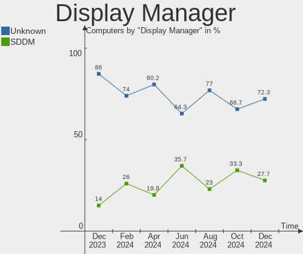
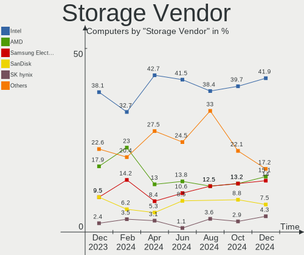
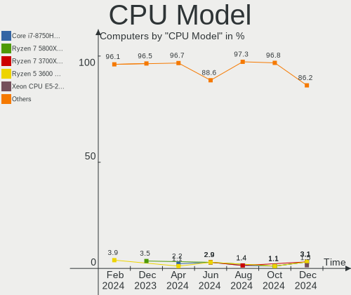
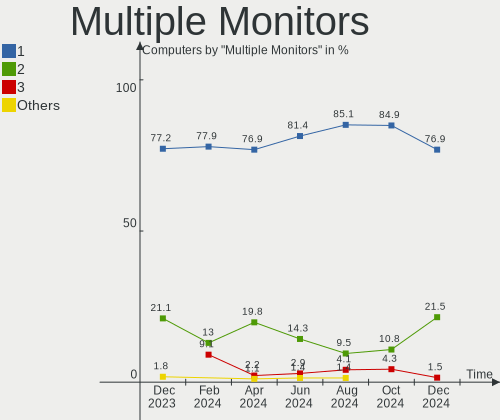
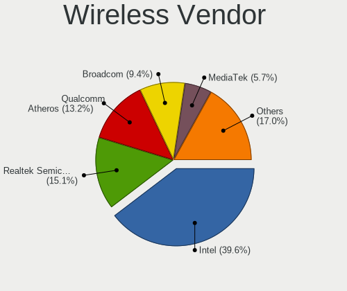

KDE neon Hardware Trends
------------------------

A project to identify most popular hardware characteristics and track their change
over time based on data collected by KDE neon users at https://Linux-Hardware.org.

Anyone can contribute to the study by uploading probes of their computers by
the [hw-probe](https://github.com/linuxhw/hw-probe) tool:

    sudo -E hw-probe -all -upload

This is a report for all computer types. See also reports for [desktops](/Dist/KDE_neon/Desktop/README.md) and [notebooks](/Dist/KDE_neon/Notebook/README.md).

Full-feature report is available here: https://linux-hardware.org/?view=trends

Period: Feb, 2021.

Contents
--------

- [ OS                       ](#os)
- [ OS Family                ](#os-family)
- [ Kernel                   ](#kernel)
- [ Kernel Family            ](#kernel-family)
- [ Kernel Major Ver.        ](#kernel-major-ver)
- [ Arch                     ](#arch)
- [ DE                       ](#de)
- [ Display Server           ](#display-server)
- [ Display Manager          ](#display-manager)
- [ OS Lang                  ](#os-lang)
- [ Boot Mode                ](#boot-mode)
- [ Filesystem               ](#filesystem)
- [ Part. scheme             ](#part-scheme)
- [ Dual Boot with Linux/BSD ](#dual-boot-with-linux/bsd)
- [ Dual Boot (Win)          ](#dual-boot-win)
- [ Country                  ](#country)
- [ City                     ](#city)
- [ Vendor                   ](#vendor)
- [ Model                    ](#model)
- [ Model Family             ](#model-family)
- [ MFG Year                 ](#mfg-year)
- [ Form Factor              ](#form-factor)
- [ Secure Boot              ](#secure-boot)
- [ Coreboot                 ](#coreboot)
- [ RAM Size                 ](#ram-size)
- [ RAM Used                 ](#ram-used)
- [ Has CD-ROM               ](#has-cd-rom)
- [ Total Drives             ](#total-drives)
- [ Has Ethernet             ](#has-ethernet)
- [ Drive Vendor             ](#drive-vendor)
- [ Drive Model              ](#drive-model)
- [ HDD Vendor               ](#hdd-vendor)
- [ SSD Vendor               ](#ssd-vendor)
- [ Drive Kind               ](#drive-kind)
- [ Drive Connector          ](#drive-connector)
- [ Drive Size               ](#drive-size)
- [ Space Total              ](#space-total)
- [ Space Used               ](#space-used)
- [ Malfunc. Drives          ](#malfunc-drives)
- [ Malfunc. Drive Vendor    ](#malfunc-drive-vendor)
- [ Malfunc. HDD Vendor      ](#malfunc-hdd-vendor)
- [ Malfunc. Drive Kind      ](#malfunc-drive-kind)
- [ Failed Drives            ](#failed-drives)
- [ Failed Drive Vendor      ](#failed-drive-vendor)
- [ Drive Status             ](#drive-status)
- [ Storage Vendor           ](#storage-vendor)
- [ Storage Model            ](#storage-model)
- [ Storage Kind             ](#storage-kind)
- [ CPU Vendor               ](#cpu-vendor)
- [ CPU Model                ](#cpu-model)
- [ CPU Model Family         ](#cpu-model-family)
- [ CPU Cores                ](#cpu-cores)
- [ CPU Sockets              ](#cpu-sockets)
- [ CPU Threads              ](#cpu-threads)
- [ CPU Op-Modes             ](#cpu-op-modes)
- [ CPU Microcode            ](#cpu-microcode)
- [ CPU Microarch            ](#cpu-microarch)
- [ GPU Vendor               ](#gpu-vendor)
- [ GPU Model                ](#gpu-model)
- [ GPU Combo                ](#gpu-combo)
- [ GPU Driver               ](#gpu-driver)
- [ GPU Memory               ](#gpu-memory)
- [ Monitor Vendor           ](#monitor-vendor)
- [ Monitor Model            ](#monitor-model)
- [ Monitor Resolution       ](#monitor-resolution)
- [ Monitor Diagonal         ](#monitor-diagonal)
- [ Monitor Width            ](#monitor-width)
- [ Aspect Ratio             ](#aspect-ratio)
- [ Monitor Area             ](#monitor-area)
- [ Pixel Density            ](#pixel-density)
- [ Multiple Monitors        ](#multiple-monitors)
- [ Net Controller Vendor    ](#net-controller-vendor)
- [ Net Controller Model     ](#net-controller-model)
- [ Wireless Vendor          ](#wireless-vendor)
- [ Wireless Model           ](#wireless-model)
- [ Ethernet Vendor          ](#ethernet-vendor)
- [ Ethernet Model           ](#ethernet-model)
- [ Net Controller Kind      ](#net-controller-kind)
- [ Used Controller          ](#used-controller)
- [ NICs                     ](#nics)
- [ Memory Vendor            ](#memory-vendor)
- [ Memory Model             ](#memory-model)
- [ Memory Kind              ](#memory-kind)
- [ Memory Form Factor       ](#memory-form-factor)
- [ Memory Size              ](#memory-size)
- [ Memory Speed             ](#memory-speed)
- [ Sound Vendor             ](#sound-vendor)
- [ Sound Model              ](#sound-model)
- [ Camera Vendor            ](#camera-vendor)
- [ Camera Model             ](#camera-model)
- [ Fingerprint Vendor       ](#fingerprint-vendor)
- [ Fingerprint Model        ](#fingerprint-model)
- [ Chipcard Vendor          ](#chipcard-vendor)
- [ Chipcard Model           ](#chipcard-model)
- [ Printer Vendor           ](#printer-vendor)
- [ Printer Model            ](#printer-model)
- [ Scanner Vendor           ](#scanner-vendor)
- [ Scanner Model            ](#scanner-model)
- [ Bluetooth Vendor         ](#bluetooth-vendor)
- [ Bluetooth Model          ](#bluetooth-model)
- [ Unsupported Devices      ](#unsupported-devices)
- [ Unsupported Device Types ](#unsupported-device-types)

OS
--

Installed operating systems

| Name           | Computers | Percent |
|----------------|-----------|---------|
| KDE neon 20.04 | 157       | 100%    |

OS Family
---------

OS without a version

| Name     | Computers | Percent |
|----------|-----------|---------|
| KDE neon | 157       | 100%    |

Kernel
------

Version of the Linux kernel

| Version               | Computers | Percent |
|-----------------------|-----------|---------|
| 5.4.0-65-generic      | 118       | 75.16%  |
| 5.4.0-66-generic      | 24        | 15.29%  |
| 5.4.0-64-generic      | 3         | 1.91%   |
| 5.4.0-59-generic      | 3         | 1.91%   |
| 5.11.0-051100-generic | 2         | 1.27%   |
| 5.9.6-050906-generic  | 1         | 0.64%   |
| 5.8.0-43-generic      | 1         | 0.64%   |
| 5.5.4-050504-generic  | 1         | 0.64%   |
| 5.4.0-67-generic      | 1         | 0.64%   |
| 5.4.0-58-generic      | 1         | 0.64%   |
| 5.4.0-51-generic      | 1         | 0.64%   |
| 5.10.2-051002-generic | 1         | 0.64%   |

Kernel Family
-------------

Linux kernel without a distro release

| Version | Computers | Percent |
|---------|-----------|---------|
| 5.4.0   | 151       | 96.18%  |
| 5.11.0  | 2         | 1.27%   |
| 5.9.6   | 1         | 0.64%   |
| 5.8.0   | 1         | 0.64%   |
| 5.5.4   | 1         | 0.64%   |
| 5.10.2  | 1         | 0.64%   |

Kernel Major Ver.
-----------------

Linux kernel major version

| Version | Computers | Percent |
|---------|-----------|---------|
| 5.4     | 151       | 96.18%  |
| 5.11    | 2         | 1.27%   |
| 5.9     | 1         | 0.64%   |
| 5.8     | 1         | 0.64%   |
| 5.5     | 1         | 0.64%   |
| 5.10    | 1         | 0.64%   |

Arch
----

OS architecture (x86_64, i586, etc.)

| Name   | Computers | Percent |
|--------|-----------|---------|
| x86_64 | 157       | 100%    |

DE
--

Desktop Environment

| Name    | Computers | Percent |
|---------|-----------|---------|
| KDE     | 136       | 86.62%  |
| KDE5    | 11        | 7.01%   |
| Unknown | 10        | 6.37%   |

Display Server
--------------

X11 or Wayland

| Name    | Computers | Percent |
|---------|-----------|---------|
| X11     | 150       | 95.54%  |
| Wayland | 7         | 4.46%   |

Display Manager
---------------

SDDM, LightDM, etc.

| Name    | Computers | Percent |
|---------|-----------|---------|
| Unknown | 145       | 92.36%  |
| SDDM    | 12        | 7.64%   |

OS Lang
-------

Language

| Lang   | Computers | Percent |
|--------|-----------|---------|
| en_US  | 49        | 31.21%  |
| ru_RU  | 21        | 13.38%  |
| de_DE  | 20        | 12.74%  |
| C      | 9         | 5.73%   |
| en_GB  | 8         | 5.1%    |
| en_IN  | 7         | 4.46%   |
| pt_BR  | 5         | 3.18%   |
| en_CA  | 5         | 3.18%   |
| en_AU  | 5         | 3.18%   |
| el_GR  | 3         | 1.91%   |
| pl_PL  | 2         | 1.27%   |
| it_IT  | 2         | 1.27%   |
| es_MX  | 2         | 1.27%   |
| es_ES  | 2         | 1.27%   |
| es_AR  | 2         | 1.27%   |
| en_ZA  | 2         | 1.27%   |
| de_CH  | 2         | 1.27%   |
| uk_UA  | 1         | 0.64%   |
| tr_TR  | 1         | 0.64%   |
| sk_SK  | 1         | 0.64%   |
| ru_UA  | 1         | 0.64%   |
| pt_PT  | 1         | 0.64%   |
| myv_RU | 1         | 0.64%   |
| fr_FR  | 1         | 0.64%   |
| es_SV  | 1         | 0.64%   |
| es_CO  | 1         | 0.64%   |
| cs_CZ  | 1         | 0.64%   |
| ak_GH  | 1         | 0.64%   |

Boot Mode
---------

EFI or BIOS

| Mode | Computers | Percent |
|------|-----------|---------|
| EFI  | 101       | 64.33%  |
| BIOS | 56        | 35.67%  |

Filesystem
----------

Type of filesystem

| Type    | Computers | Percent |
|---------|-----------|---------|
| Ext4    | 147       | 93.63%  |
| Overlay | 4         | 2.55%   |
| Btrfs   | 4         | 2.55%   |
| Xfs     | 1         | 0.64%   |
| Unknown | 1         | 0.64%   |

Part. scheme
------------

Scheme of partitioning

| Type    | Computers | Percent |
|---------|-----------|---------|
| Unknown | 144       | 91.72%  |
| GPT     | 12        | 7.64%   |
| MBR     | 1         | 0.64%   |

Dual Boot with Linux/BSD
------------------------

Hosting more than one Linux/BSD

| Dual boot | Computers | Percent |
|-----------|-----------|---------|
| No        | 152       | 96.82%  |
| Yes       | 5         | 3.18%   |

Dual Boot (Win)
---------------

Hosting Linux and Windows

| Dual boot | Computers | Percent |
|-----------|-----------|---------|
| No        | 137       | 87.26%  |
| Yes       | 20        | 12.74%  |

Country
-------

Geographic location (country)

| Country        | Computers | Percent |
|----------------|-----------|---------|
| Russia         | 24        | 15.29%  |
| Germany        | 22        | 14.01%  |
| USA            | 21        | 13.38%  |
| Brazil         | 8         | 5.1%    |
| India          | 6         | 3.82%   |
| Canada         | 6         | 3.82%   |
| UK             | 5         | 3.18%   |
| Spain          | 5         | 3.18%   |
| Greece         | 5         | 3.18%   |
| Australia      | 5         | 3.18%   |
| Poland         | 4         | 2.55%   |
| Switzerland    | 3         | 1.91%   |
| Morocco        | 3         | 1.91%   |
| Italy          | 3         | 1.91%   |
| France         | 3         | 1.91%   |
| Sweden         | 2         | 1.27%   |
| South Africa   | 2         | 1.27%   |
| Mexico         | 2         | 1.27%   |
| Iran           | 2         | 1.27%   |
| Estonia        | 2         | 1.27%   |
| Colombia       | 2         | 1.27%   |
| Argentina      | 2         | 1.27%   |
| Ukraine        | 1         | 0.64%   |
| Turkey         | 1         | 0.64%   |
| Thailand       | 1         | 0.64%   |
| Slovakia       | 1         | 0.64%   |
| Romania        | 1         | 0.64%   |
| Portugal       | 1         | 0.64%   |
| Netherlands    | 1         | 0.64%   |
| Latvia         | 1         | 0.64%   |
| Kenya          | 1         | 0.64%   |
| Israel         | 1         | 0.64%   |
| Indonesia      | 1         | 0.64%   |
| Hungary        | 1         | 0.64%   |
| Ghana          | 1         | 0.64%   |
| Georgia        | 1         | 0.64%   |
| El Salvador    | 1         | 0.64%   |
| Czech Republic | 1         | 0.64%   |
| Bulgaria       | 1         | 0.64%   |
| Belarus        | 1         | 0.64%   |
| Algeria        | 1         | 0.64%   |
| Unknown        | 1         | 0.64%   |

City
----

Geographic location (city)

| City                | Computers | Percent |
|---------------------|-----------|---------|
| Moscow              | 5         | 3.18%   |
| Berlin              | 5         | 3.18%   |
| St Petersburg       | 4         | 2.55%   |
| Trivandrum          | 2         | 1.27%   |
| Tallinn             | 2         | 1.27%   |
| Perth               | 2         | 1.27%   |
| Paris               | 2         | 1.27%   |
| New York            | 2         | 1.27%   |
| Madrid              | 2         | 1.27%   |
| Essen               | 2         | 1.27%   |
| Basel               | 2         | 1.27%   |
| Athens              | 2         | 1.27%   |
| Łódź             | 1         | 0.64%   |
| Zurich              | 1         | 0.64%   |
| Zeitz               | 1         | 0.64%   |
| Windsor             | 1         | 0.64%   |
| Wienhausen          | 1         | 0.64%   |
| Wembley             | 1         | 0.64%   |
| Warsaw              | 1         | 0.64%   |
| Wanstead            | 1         | 0.64%   |
| Walnut Creek        | 1         | 0.64%   |
| Vsetin              | 1         | 0.64%   |
| Voronezh            | 1         | 0.64%   |
| Vitebsk             | 1         | 0.64%   |
| Uberlândia         | 1         | 0.64%   |
| Trieste             | 1         | 0.64%   |
| Tomsk               | 1         | 0.64%   |
| Tlemcen             | 1         | 0.64%   |
| Thessaloniki        | 1         | 0.64%   |
| Tehran              | 1         | 0.64%   |
| Tbilisi             | 1         | 0.64%   |
| São Paulo          | 1         | 0.64%   |
| Sydney              | 1         | 0.64%   |
| Stuttgart           | 1         | 0.64%   |
| Stavropol           | 1         | 0.64%   |
| St. Petersburg      | 1         | 0.64%   |
| South Shields       | 1         | 0.64%   |
| South Gate          | 1         | 0.64%   |
| Solingen            | 1         | 0.64%   |
| Sevastopol'         | 1         | 0.64%   |
| San Salvador        | 1         | 0.64%   |
| Samara              | 1         | 0.64%   |
| Saint Cloud         | 1         | 0.64%   |
| Saint Augustine     | 1         | 0.64%   |
| Round Rock          | 1         | 0.64%   |
| Rome                | 1         | 0.64%   |
| Riga                | 1         | 0.64%   |
| Rabat               | 1         | 0.64%   |
| Poznan              | 1         | 0.64%   |
| Porto Rafti         | 1         | 0.64%   |
| Porto               | 1         | 0.64%   |
| Phitsanulok         | 1         | 0.64%   |
| Peschiera del Garda | 1         | 0.64%   |
| Paradise            | 1         | 0.64%   |
| Owen Sound          | 1         | 0.64%   |
| Orenburg            | 1         | 0.64%   |
| Oklahoma City       | 1         | 0.64%   |
| Ochtrup             | 1         | 0.64%   |
| Novozavidovskiy     | 1         | 0.64%   |
| Nottingham Road     | 1         | 0.64%   |

Vendor
------

Motherboard manufacturer

| Name                | Computers | Percent |
|---------------------|-----------|---------|
| ASUSTek Computer    | 27        | 17.2%   |
| Hewlett-Packard     | 26        | 16.56%  |
| Lenovo              | 23        | 14.65%  |
| Gigabyte Technology | 19        | 12.1%   |
| Dell                | 18        | 11.46%  |
| Acer                | 11        | 7.01%   |
| MSI                 | 6         | 3.82%   |
| ASRock              | 5         | 3.18%   |
| Apple               | 3         | 1.91%   |
| Samsung Electronics | 2         | 1.27%   |
| Intel               | 2         | 1.27%   |
| HUAWEI              | 2         | 1.27%   |
| Wortmann AG         | 1         | 0.64%   |
| TUXEDO              | 1         | 0.64%   |
| Toshiba             | 1         | 0.64%   |
| TECNO               | 1         | 0.64%   |
| Supermicro          | 1         | 0.64%   |
| Kraftway            | 1         | 0.64%   |
| GPD                 | 1         | 0.64%   |
| Fujitsu Siemens     | 1         | 0.64%   |
| ECS                 | 1         | 0.64%   |
| DEPO Computers      | 1         | 0.64%   |
| Clevo               | 1         | 0.64%   |
| Alienware           | 1         | 0.64%   |
| Unknown             | 1         | 0.64%   |

Model
-----

Motherboard model

| Name                                       | Computers | Percent |
|--------------------------------------------|-----------|---------|
| HP Notebook                                | 4         | 2.55%   |
| HP Laptop 15s-fq2xxx                       | 3         | 1.91%   |
| HP Pavilion dv7                            | 2         | 1.27%   |
| Gigabyte A320M-H                           | 2         | 1.27%   |
| Dell XPS 15 9570                           | 2         | 1.27%   |
| Dell Inspiron 5558                         | 2         | 1.27%   |
| ASUS PRIME B450-PLUS                       | 2         | 1.27%   |
| ASUS All Series                            | 2         | 1.27%   |
| ASRock B450M Steel Legend                  | 2         | 1.27%   |
| Acer Aspire E5-771G                        | 2         | 1.27%   |
| Wortmann AG TERRA_MOBILE_1548              | 1         | 0.64%   |
| TUXEDO N13xWU                              | 1         | 0.64%   |
| Toshiba PORTEGE Z10T-A                     | 1         | 0.64%   |
| TECNO WinPad 2                             | 1         | 0.64%   |
| Supermicro H8QM8                           | 1         | 0.64%   |
| Samsung R540/R580/R780/SA41/E452           | 1         | 0.64%   |
| Samsung 550P5C/550P7C                      | 1         | 0.64%   |
| MSI MS-7C52                                | 1         | 0.64%   |
| MSI MS-7C37                                | 1         | 0.64%   |
| MSI MS-7A15                                | 1         | 0.64%   |
| MSI MS-7916                                | 1         | 0.64%   |
| MSI MS-7388                                | 1         | 0.64%   |
| MSI GT680R/GX680R/GT683R/GT683DXR/GX660DXR | 1         | 0.64%   |
| Lenovo ThinkStation P340 30DKS04X00        | 1         | 0.64%   |
| Lenovo ThinkPad X230 232425U               | 1         | 0.64%   |
| Lenovo ThinkPad X131e 33681B5              | 1         | 0.64%   |
| Lenovo ThinkPad X1 Carbon 7th 20QD0000US   | 1         | 0.64%   |
| Lenovo ThinkPad W530 2447GW3               | 1         | 0.64%   |
| Lenovo ThinkPad T530 23595JU               | 1         | 0.64%   |
| Lenovo ThinkPad T460 20FN002SUS            | 1         | 0.64%   |
| Lenovo ThinkPad T15 Gen 1 20S6005JMH       | 1         | 0.64%   |
| Lenovo ThinkPad E520 11438NG               | 1         | 0.64%   |
| Lenovo ThinkPad E490 20N9A02ABR            | 1         | 0.64%   |
| Lenovo ThinkPad E480 20KNS0E200            | 1         | 0.64%   |
| Lenovo MIIX 320-10ICR 80XF                 | 1         | 0.64%   |
| Lenovo MIIX 310-10ICR 80SG                 | 1         | 0.64%   |
| Lenovo Legion 5 15ARH05 82B5               | 1         | 0.64%   |
| Lenovo IdeaPad 530S-15IKB 81EV             | 1         | 0.64%   |
| Lenovo IdeaPad 330-15IKB 81DE              | 1         | 0.64%   |
| Lenovo IdeaPad 320-15IAP 80XR              | 1         | 0.64%   |
| Lenovo IdeaPad 310-15IKB 80TV              | 1         | 0.64%   |
| Lenovo IdeaPad 310-14ISK 80UG              | 1         | 0.64%   |
| Lenovo IdeaPad 3 15ADA05 81W1              | 1         | 0.64%   |
| Lenovo G700 20251                          | 1         | 0.64%   |
| Lenovo G505s 20255                         | 1         | 0.64%   |
| Lenovo G50-80 80E5                         | 1         | 0.64%   |
| Kraftway KWH77                             | 1         | 0.64%   |
| Intel H55                                  | 1         | 0.64%   |
| Intel DN2820FYK H24582-201                 | 1         | 0.64%   |
| HUAWEI NBLK-WAX9X                          | 1         | 0.64%   |
| HUAWEI KPR-WX9                             | 1         | 0.64%   |
| HP Z420 Workstation                        | 1         | 0.64%   |
| HP Stream Notebook PC 11                   | 1         | 0.64%   |
| HP Spectre x360 Convertible 13-ap0xxx      | 1         | 0.64%   |
| HP Slim Desktop S01-pF1xxx                 | 1         | 0.64%   |
| HP ProBook 650 G1                          | 1         | 0.64%   |
| HP ProBook 4740s                           | 1         | 0.64%   |
| HP ProBook 4430s                           | 1         | 0.64%   |
| HP ProBook 440 G7                          | 1         | 0.64%   |
| HP ProBook 4330s                           | 1         | 0.64%   |

Model Family
------------

Motherboard model prefix

| Name                | Computers | Percent |
|---------------------|-----------|---------|
| Lenovo ThinkPad     | 10        | 6.37%   |
| Acer Aspire         | 8         | 5.1%    |
| Dell Latitude       | 7         | 4.46%   |
| Lenovo IdeaPad      | 6         | 3.82%   |
| Dell Inspiron       | 6         | 3.82%   |
| HP ProBook          | 5         | 3.18%   |
| HP Pavilion         | 5         | 3.18%   |
| HP Laptop           | 5         | 3.18%   |
| ASUS PRIME          | 5         | 3.18%   |
| HP Notebook         | 4         | 2.55%   |
| ASUS ROG            | 4         | 2.55%   |
| Dell XPS            | 3         | 1.91%   |
| Lenovo MIIX         | 2         | 1.27%   |
| Gigabyte B450       | 2         | 1.27%   |
| Gigabyte A320M-H    | 2         | 1.27%   |
| Dell OptiPlex       | 2         | 1.27%   |
| ASUS TUF            | 2         | 1.27%   |
| ASUS P8H77-V        | 2         | 1.27%   |
| ASUS All            | 2         | 1.27%   |
| ASRock B450M        | 2         | 1.27%   |
| Acer Swift          | 2         | 1.27%   |
| Wortmann AG TERRA   | 1         | 0.64%   |
| TUXEDO N13xWU       | 1         | 0.64%   |
| Toshiba PORTEGE     | 1         | 0.64%   |
| TECNO WinPad        | 1         | 0.64%   |
| Supermicro H8QM8    | 1         | 0.64%   |
| Samsung R540        | 1         | 0.64%   |
| Samsung 550P5C      | 1         | 0.64%   |
| MSI MS-7C52         | 1         | 0.64%   |
| MSI MS-7C37         | 1         | 0.64%   |
| MSI MS-7A15         | 1         | 0.64%   |
| MSI MS-7916         | 1         | 0.64%   |
| MSI MS-7388         | 1         | 0.64%   |
| MSI GT680R          | 1         | 0.64%   |
| Lenovo ThinkStation | 1         | 0.64%   |
| Lenovo Legion       | 1         | 0.64%   |
| Lenovo G700         | 1         | 0.64%   |
| Lenovo G505s        | 1         | 0.64%   |
| Lenovo G50-80       | 1         | 0.64%   |
| Kraftway KWH77      | 1         | 0.64%   |
| Intel H55           | 1         | 0.64%   |
| Intel DN2820FYK     | 1         | 0.64%   |
| HUAWEI NBLK-WAX9X   | 1         | 0.64%   |
| HUAWEI KPR-WX9      | 1         | 0.64%   |
| HP Z420             | 1         | 0.64%   |
| HP Stream           | 1         | 0.64%   |
| HP Spectre          | 1         | 0.64%   |
| HP Slim             | 1         | 0.64%   |
| HP EliteBook        | 1         | 0.64%   |
| HP 635              | 1         | 0.64%   |
| HP 15               | 1         | 0.64%   |
| GPD MicroPC         | 1         | 0.64%   |
| Gigabyte Z97-HD3    | 1         | 0.64%   |
| Gigabyte Z87MX-D3H  | 1         | 0.64%   |
| Gigabyte Z77X-D3H   | 1         | 0.64%   |
| Gigabyte Z390       | 1         | 0.64%   |
| Gigabyte X570       | 1         | 0.64%   |
| Gigabyte P67A-D3-B3 | 1         | 0.64%   |
| Gigabyte M52L-S3P   | 1         | 0.64%   |
| Gigabyte H61M-USB3H | 1         | 0.64%   |

MFG Year
--------

Motherboard manufacture year

| Year | Computers | Percent |
|------|-----------|---------|
| 2020 | 40        | 25.48%  |
| 2019 | 33        | 21.02%  |
| 2014 | 14        | 8.92%   |
| 2018 | 13        | 8.28%   |
| 2013 | 10        | 6.37%   |
| 2012 | 8         | 5.1%    |
| 2016 | 7         | 4.46%   |
| 2015 | 7         | 4.46%   |
| 2017 | 6         | 3.82%   |
| 2010 | 6         | 3.82%   |
| 2011 | 4         | 2.55%   |
| 2009 | 4         | 2.55%   |
| 2021 | 2         | 1.27%   |
| 2008 | 2         | 1.27%   |
| 2007 | 1         | 0.64%   |

Form Factor
-----------

Physical design of the computer

| Name        | Computers | Percent |
|-------------|-----------|---------|
| Notebook    | 92        | 58.6%   |
| Desktop     | 61        | 38.85%  |
| Tablet      | 2         | 1.27%   |
| Convertible | 1         | 0.64%   |
| Mini pc     | 1         | 0.64%   |

Secure Boot
-----------

Enabled or disabled

| State    | Computers | Percent |
|----------|-----------|---------|
| Disabled | 144       | 91.72%  |
| Enabled  | 13        | 8.28%   |

Coreboot
--------

Have coreboot on board

| Used | Computers | Percent |
|------|-----------|---------|
| No   | 157       | 100%    |

RAM Size
--------

Total RAM memory

| Size in GB  | Computers | Percent |
|-------------|-----------|---------|
| 8.01-16.0   | 43        | 27.39%  |
| 4.01-8.0    | 39        | 24.84%  |
| 16.01-24.0  | 37        | 23.57%  |
| 3.01-4.0    | 19        | 12.1%   |
| 32.01-64.0  | 8         | 5.1%    |
| 64.01-256.0 | 4         | 2.55%   |
| 1.01-2.0    | 4         | 2.55%   |
| 24.01-32.0  | 2         | 1.27%   |
| 2.01-3.0    | 1         | 0.64%   |

RAM Used
--------

Used RAM memory

| Used GB   | Computers | Percent |
|-----------|-----------|---------|
| 2.01-3.0  | 54        | 34.39%  |
| 1.01-2.0  | 48        | 30.57%  |
| 3.01-4.0  | 29        | 18.47%  |
| 4.01-8.0  | 17        | 10.83%  |
| 0.51-1.0  | 6         | 3.82%   |
| 8.01-16.0 | 3         | 1.91%   |

Has CD-ROM
----------

Has CD-ROM on board

| Presented | Computers | Percent |
|-----------|-----------|---------|
| No        | 96        | 61.15%  |
| Yes       | 61        | 38.85%  |

Total Drives
------------

Number of drives on board

| Drives | Computers | Percent |
|--------|-----------|---------|
| 1      | 88        | 56.05%  |
| 2      | 43        | 27.39%  |
| 3      | 14        | 8.92%   |
| 4      | 9         | 5.73%   |
| 7      | 1         | 0.64%   |
| 6      | 1         | 0.64%   |
| 5      | 1         | 0.64%   |

Has Ethernet
------------

Has Ethernet on board

| Presented | Computers | Percent |
|-----------|-----------|---------|
| Yes       | 142       | 90.45%  |
| No        | 15        | 9.55%   |

Drive Vendor
------------

Hard drive vendors

| Vendor                | Computers | Drives | Percent |
|-----------------------|-----------|--------|---------|
| Samsung Electronics   | 42        | 50     | 17.65%  |
| Seagate               | 37        | 41     | 15.55%  |
| WDC                   | 35        | 47     | 14.71%  |
| Sandisk               | 19        | 19     | 7.98%   |
| Kingston              | 17        | 20     | 7.14%   |
| Toshiba               | 9         | 10     | 3.78%   |
| Crucial               | 9         | 9      | 3.78%   |
| Unknown               | 8         | 12     | 3.36%   |
| Intel                 | 8         | 9      | 3.36%   |
| Phison                | 5         | 5      | 2.1%    |
| Hitachi               | 5         | 5      | 2.1%    |
| SK Hynix              | 4         | 5      | 1.68%   |
| HGST                  | 4         | 4      | 1.68%   |
| XPG                   | 3         | 3      | 1.26%   |
| Apple                 | 3         | 3      | 1.26%   |
| TO Exter              | 2         | 2      | 0.84%   |
| Micron Technology     | 2         | 2      | 0.84%   |
| Lite-On               | 2         | 2      | 0.84%   |
| HS-SSD-C100           | 2         | 2      | 0.84%   |
| Corsair               | 2         | 2      | 0.84%   |
| A-DATA Technology     | 2         | 2      | 0.84%   |
| Transcend             | 1         | 1      | 0.42%   |
| Team                  | 1         | 1      | 0.42%   |
| Super Talent          | 1         | 1      | 0.42%   |
| SPCC                  | 1         | 1      | 0.42%   |
| Smartbuy              | 1         | 1      | 0.42%   |
| Realtek Semiconductor | 1         | 1      | 0.42%   |
| PNY                   | 1         | 1      | 0.42%   |
| PLEXTOR               | 1         | 2      | 0.42%   |
| KingSpec              | 1         | 1      | 0.42%   |
| KingFast              | 1         | 1      | 0.42%   |
| Intenso               | 1         | 1      | 0.42%   |
| GOWE                  | 1         | 1      | 0.42%   |
| Fujitsu               | 1         | 1      | 0.42%   |
| EDGE                  | 1         | 1      | 0.42%   |
| China                 | 1         | 1      | 0.42%   |
| BIWIN                 | 1         | 1      | 0.42%   |
| Asmedia               | 1         | 1      | 0.42%   |
| Apacer                | 1         | 1      | 0.42%   |

Drive Model
-----------

Hard drive models

| Model                              | Computers | Percent |
|------------------------------------|-----------|---------|
| Seagate ST1000LM035-1RK172 1TB     | 6         | 2.27%   |
| Samsung SSD 850 EVO 250GB          | 6         | 2.27%   |
| Kingston SA400S37120G 120GB SSD    | 5         | 1.89%   |
| Samsung SSD 860 EVO 500GB          | 4         | 1.52%   |
| Unknown MMC Card  64GB             | 3         | 1.14%   |
| Unknown MMC Card  32GB             | 3         | 1.14%   |
| Toshiba DT01ACA050 500GB           | 3         | 1.14%   |
| Seagate ST1000LM024 HN-M101MBB 1TB | 3         | 1.14%   |
| Sandisk NVMe SSD Drive 500GB       | 3         | 1.14%   |
| Samsung NVMe SSD Drive 1TB         | 3         | 1.14%   |
| Phison NVMe SSD Drive 1TB          | 3         | 1.14%   |
| Kingston SA400S37480G 480GB SSD    | 3         | 1.14%   |
| Kingston SA400S37240G 240GB SSD    | 3         | 1.14%   |
| Intel NVMe SSD Drive 512GB         | 3         | 1.14%   |
| Crucial CT1000BX500SSD1 1TB        | 3         | 1.14%   |
| WDC WDS240G2G0A-00JH30 240GB SSD   | 2         | 0.76%   |
| WDC WD5000LPCX-24VHAT0 500GB       | 2         | 0.76%   |
| WDC WD1003FZEX-00MK2A0 1TB         | 2         | 0.76%   |
| Unknown SD/MMC/MS PRO 64GB         | 2         | 0.76%   |
| Toshiba NVMe SSD Drive 256GB       | 2         | 0.76%   |
| TO Exter nal USB 3.0 1TB           | 2         | 0.76%   |
| Seagate ST500DM002-1BD142 500GB    | 2         | 0.76%   |
| Seagate ST3500413AS 500GB          | 2         | 0.76%   |
| Seagate ST320LT020-9YG142 320GB    | 2         | 0.76%   |
| Seagate ST2000LM015-2E8174 2TB     | 2         | 0.76%   |
| Seagate ST1000DM010-2EP102 1TB     | 2         | 0.76%   |
| SanDisk SDSSDH31024G 1024GB        | 2         | 0.76%   |
| Sandisk NVMe SSD Drive 512GB       | 2         | 0.76%   |
| Sandisk NVMe SSD Drive 256GB       | 2         | 0.76%   |
| Samsung SSD 850 EVO M.2 250GB      | 2         | 0.76%   |
| Samsung SSD 850 120GB              | 2         | 0.76%   |
| Samsung SSD 840 EVO 250GB          | 2         | 0.76%   |
| Samsung NVMe SSD Drive 512GB       | 2         | 0.76%   |
| Samsung NVMe SSD Drive 500GB       | 2         | 0.76%   |
| XPG NVMe SSD Drive 512GB           | 1         | 0.38%   |
| XPG NVMe SSD Drive 1024GB          | 1         | 0.38%   |
| XPG GAMMIX S11 Pro 512GB           | 1         | 0.38%   |
| WDC WDS240G2G0B-00EPW0 240GB SSD   | 1         | 0.38%   |
| WDC WDS120G2G0A-00JH30 120GB SSD   | 1         | 0.38%   |
| WDC WD82PURZ-85TEUY0 8TB           | 1         | 0.38%   |
| WDC WD6400AARS-00Y5B1 640GB        | 1         | 0.38%   |
| WDC WD60EZAZ-00SF3B0 6TB           | 1         | 0.38%   |
| WDC WD60EFAX-68SHWN0 6TB           | 1         | 0.38%   |
| WDC WD5002AALX-00J37A0 500GB       | 1         | 0.38%   |
| WDC WD5000LUCT-63C26Y0 500GB       | 1         | 0.38%   |
| WDC WD5000LPCX-60VHAT0 500GB       | 1         | 0.38%   |
| WDC WD5000BPKT-75PK4T0 500GB       | 1         | 0.38%   |
| WDC WD5000BPKT-22PK4T0 500GB       | 1         | 0.38%   |
| WDC WD5000AZLX-00CL5A0 500GB       | 1         | 0.38%   |
| WDC WD5000AAKX-00ERMA0 500GB       | 1         | 0.38%   |
| WDC WD40PURZ-85TTDY0 4TB           | 1         | 0.38%   |
| WDC WD3200BEVT-22ZCT0 320GB        | 1         | 0.38%   |
| WDC WD3200BEKT-08PVMT1 320GB       | 1         | 0.38%   |
| WDC WD30EZRS-00J99B0 3TB           | 1         | 0.38%   |
| WDC WD2500JS-60MHB1 250GB          | 1         | 0.38%   |
| WDC WD2500AAJS-22VTA0 250GB        | 1         | 0.38%   |
| WDC WD20EZAZ-00GGJB0 2TB           | 1         | 0.38%   |
| WDC WD20EARX-00PASB0 2TB           | 1         | 0.38%   |
| WDC WD20EADS-00S2B0 2TB            | 1         | 0.38%   |
| WDC WD1200BEVS-75UST0 120GB        | 1         | 0.38%   |

HDD Vendor
----------

Hard disk drive vendors

| Vendor              | Computers | Drives | Percent |
|---------------------|-----------|--------|---------|
| Seagate             | 37        | 41     | 39.78%  |
| WDC                 | 31        | 41     | 33.33%  |
| Toshiba             | 6         | 7      | 6.45%   |
| Hitachi             | 5         | 5      | 5.38%   |
| HGST                | 4         | 4      | 4.3%    |
| Samsung Electronics | 3         | 3      | 3.23%   |
| TO Exter            | 2         | 2      | 2.15%   |
| Apple               | 2         | 2      | 2.15%   |
| Intenso             | 1         | 1      | 1.08%   |
| Fujitsu             | 1         | 1      | 1.08%   |
| Asmedia             | 1         | 1      | 1.08%   |

SSD Vendor
----------

Solid state drive vendors

| Vendor              | Computers | Drives | Percent |
|---------------------|-----------|--------|---------|
| Samsung Electronics | 29        | 33     | 31.87%  |
| Kingston            | 15        | 17     | 16.48%  |
| SanDisk             | 10        | 10     | 10.99%  |
| Crucial             | 9         | 9      | 9.89%   |
| WDC                 | 4         | 4      | 4.4%    |
| Intel               | 3         | 3      | 3.3%    |
| SK Hynix            | 2         | 2      | 2.2%    |
| A-DATA Technology   | 2         | 2      | 2.2%    |
| Transcend           | 1         | 1      | 1.1%    |
| Toshiba             | 1         | 1      | 1.1%    |
| Team                | 1         | 1      | 1.1%    |
| SPCC                | 1         | 1      | 1.1%    |
| Smartbuy            | 1         | 1      | 1.1%    |
| PNY                 | 1         | 1      | 1.1%    |
| PLEXTOR             | 1         | 2      | 1.1%    |
| Micron Technology   | 1         | 1      | 1.1%    |
| KingSpec            | 1         | 1      | 1.1%    |
| KingFast            | 1         | 1      | 1.1%    |
| HS-SSD-C100         | 1         | 1      | 1.1%    |
| GOWE                | 1         | 1      | 1.1%    |
| EDGE                | 1         | 1      | 1.1%    |
| Corsair             | 1         | 1      | 1.1%    |
| BIWIN               | 1         | 1      | 1.1%    |
| Apple               | 1         | 1      | 1.1%    |
| Apacer              | 1         | 1      | 1.1%    |

Drive Kind
----------

HDD or SSD

| Kind    | Computers | Drives | Percent |
|---------|-----------|--------|---------|
| HDD     | 82        | 108    | 37.1%   |
| SSD     | 81        | 98     | 36.65%  |
| NVMe    | 44        | 51     | 19.91%  |
| MMC     | 8         | 10     | 3.62%   |
| Unknown | 6         | 6      | 2.71%   |

Drive Connector
---------------

SATA, SAS, NVMe, etc.

| Type | Computers | Drives | Percent |
|------|-----------|--------|---------|
| SATA | 130       | 204    | 68.42%  |
| NVMe | 44        | 51     | 23.16%  |
| SAS  | 8         | 8      | 4.21%   |
| MMC  | 8         | 10     | 4.21%   |

Drive Size
----------

Size of hard drive

| Size in TB | Computers | Drives | Percent |
|------------|-----------|--------|---------|
| 0.01-0.5   | 99        | 128    | 60%     |
| 0.51-1.0   | 45        | 52     | 27.27%  |
| 1.01-2.0   | 13        | 15     | 7.88%   |
| 4.01-10.0  | 4         | 5      | 2.42%   |
| 3.01-4.0   | 2         | 2      | 1.21%   |
| 2.01-3.0   | 2         | 4      | 1.21%   |

Space Total
-----------

Amount of disk space available on the file system

| Size in GB     | Computers | Percent |
|----------------|-----------|---------|
| 101-250        | 48        | 30.57%  |
| 251-500        | 31        | 19.75%  |
| 501-1000       | 22        | 14.01%  |
| 1001-2000      | 15        | 9.55%   |
| 51-100         | 15        | 9.55%   |
| More than 3000 | 8         | 5.1%    |
| 1-20           | 7         | 4.46%   |
| 21-50          | 6         | 3.82%   |
| Unknown        | 3         | 1.91%   |
| 2001-3000      | 2         | 1.27%   |

Space Used
----------

Amount of used disk space

| Used GB        | Computers | Percent |
|----------------|-----------|---------|
| 1-20           | 65        | 41.4%   |
| 21-50          | 31        | 19.75%  |
| 101-250        | 14        | 8.92%   |
| 251-500        | 13        | 8.28%   |
| 51-100         | 13        | 8.28%   |
| 501-1000       | 8         | 5.1%    |
| 1001-2000      | 6         | 3.82%   |
| More than 3000 | 3         | 1.91%   |
| Unknown        | 3         | 1.91%   |
| 2001-3000      | 1         | 0.64%   |

Malfunc. Drives
---------------

Drive models with a malfunction

| Model                    | Computers | Drives | Percent |
|--------------------------|-----------|--------|---------|
| WDC WD20EARX-00PASB0 2TB | 1         | 1      | 50%     |
| GOWE M750 120G SSD       | 1         | 1      | 50%     |

Malfunc. Drive Vendor
---------------------

Vendors of faulty drives

| Vendor | Computers | Drives | Percent |
|--------|-----------|--------|---------|
| WDC    | 1         | 1      | 50%     |
| GOWE   | 1         | 1      | 50%     |

Malfunc. HDD Vendor
-------------------

Vendors of faulty HDD drives

| Vendor | Computers | Drives | Percent |
|--------|-----------|--------|---------|
| WDC    | 1         | 1      | 100%    |

Malfunc. Drive Kind
-------------------

Kinds of faulty drives

| Kind | Computers | Drives | Percent |
|------|-----------|--------|---------|
| SSD  | 1         | 1      | 50%     |
| HDD  | 1         | 1      | 50%     |

Failed Drives
-------------

Failed drive models

Zero info for selected period =(

Failed Drive Vendor
-------------------

Failed drive vendors

Zero info for selected period =(

Drive Status
------------

Number of failed and malfunc. drives

| Status   | Computers | Drives | Percent |
|----------|-----------|--------|---------|
| Detected | 143       | 242    | 89.38%  |
| Works    | 15        | 29     | 9.38%   |
| Malfunc  | 2         | 2      | 1.25%   |

Storage Vendor
--------------

Storage controller vendors

| Vendor                       | Computers | Percent |
|------------------------------|-----------|---------|
| Intel                        | 111       | 57.51%  |
| AMD                          | 32        | 16.58%  |
| Samsung Electronics          | 12        | 6.22%   |
| Sandisk                      | 10        | 5.18%   |
| Phison Electronics           | 5         | 2.59%   |
| Nvidia                       | 3         | 1.55%   |
| Kingston Technology Company  | 3         | 1.55%   |
| ASMedia Technology           | 3         | 1.55%   |
| ADATA Technology             | 3         | 1.55%   |
| Toshiba America Info Systems | 2         | 1.04%   |
| SK Hynix                     | 2         | 1.04%   |
| Lite-On Technology           | 2         | 1.04%   |
| Realtek Semiconductor        | 1         | 0.52%   |
| Micron Technology            | 1         | 0.52%   |
| Marvell Technology Group     | 1         | 0.52%   |
| JMicron Technology           | 1         | 0.52%   |
| Broadcom / LSI               | 1         | 0.52%   |

Storage Model
-------------

Storage controller models

| Model                                                                                   | Computers | Percent |
|-----------------------------------------------------------------------------------------|-----------|---------|
| AMD FCH SATA Controller [AHCI mode]                                                     | 28        | 12.44%  |
| Intel Sunrise Point-LP SATA Controller [AHCI mode]                                      | 15        | 6.67%   |
| Intel 8 Series/C220 Series Chipset Family 6-port SATA Controller 1 [AHCI mode]          | 11        | 4.89%   |
| Intel 7 Series Chipset Family 6-port SATA Controller [AHCI mode]                        | 11        | 4.89%   |
| Samsung NVMe SSD Controller SM981/PM981/PM983                                           | 9         | 4%      |
| AMD 400 Series Chipset SATA Controller                                                  | 8         | 3.56%   |
| Intel Wildcat Point-LP SATA Controller [AHCI Mode]                                      | 6         | 2.67%   |
| Intel 82801 Mobile SATA Controller [RAID mode]                                          | 6         | 2.67%   |
| Intel 8 Series SATA Controller 1 [AHCI mode]                                            | 6         | 2.67%   |
| Intel 6 Series/C200 Series Chipset Family 6 port Mobile SATA AHCI Controller            | 5         | 2.22%   |
| Intel SSD 660P Series                                                                   | 4         | 1.78%   |
| Intel Cannon Lake PCH SATA AHCI Controller                                              | 4         | 1.78%   |
| Intel 400 Series Chipset Family SATA AHCI Controller                                    | 4         | 1.78%   |
| Sandisk WD Blue SN500 / PC SN520 NVMe SSD                                               | 3         | 1.33%   |
| Sandisk WD Black SN750 / PC SN730 NVMe SSD                                              | 3         | 1.33%   |
| Sandisk WD Black 2018/SN750 / PC SN720 NVMe SSD                                         | 3         | 1.33%   |
| Phison E16 PCIe4 NVMe Controller                                                        | 3         | 1.33%   |
| Intel Volume Management Device NVMe RAID Controller                                     | 3         | 1.33%   |
| Intel Q170/Q150/B150/H170/H110/Z170/CM236 Chipset SATA Controller [AHCI Mode]           | 3         | 1.33%   |
| Intel Cannon Lake Mobile PCH SATA AHCI Controller                                       | 3         | 1.33%   |
| Intel Atom/Celeron/Pentium Processor x5-E8000/J3xxx/N3xxx Series SATA Controller        | 3         | 1.33%   |
| ASMedia ASM1062 Serial ATA Controller                                                   | 3         | 1.33%   |
| AMD FCH SATA Controller D                                                               | 3         | 1.33%   |
| ADATA XPG SX8200 Pro PCIe Gen3x4 M.2 2280 Solid State Drive                             | 3         | 1.33%   |
| Samsung NVMe SSD Controller SM961/PM961/SM963                                           | 2         | 0.89%   |
| Phison E12 NVMe Controller                                                              | 2         | 0.89%   |
| Lite-On Non-Volatile memory controller                                                  | 2         | 0.89%   |
| Kingston Company A2000 NVMe SSD                                                         | 2         | 0.89%   |
| Intel Comet Lake SATA AHCI Controller                                                   | 2         | 0.89%   |
| Intel Celeron/Pentium Silver Processor SATA Controller                                  | 2         | 0.89%   |
| Intel Atom Processor E3800 Series SATA AHCI Controller                                  | 2         | 0.89%   |
| Intel 9 Series Chipset Family SATA Controller [AHCI Mode]                               | 2         | 0.89%   |
| Intel 82801IBM/IEM (ICH9M/ICH9M-E) 4 port SATA Controller [AHCI mode]                   | 2         | 0.89%   |
| Intel 7 Series/C210 Series Chipset Family 6-port SATA Controller [AHCI mode]            | 2         | 0.89%   |
| Intel 7 Series/C210 Series Chipset Family 4-port SATA Controller [IDE mode]             | 2         | 0.89%   |
| Intel 7 Series/C210 Series Chipset Family 2-port SATA Controller [IDE mode]             | 2         | 0.89%   |
| Intel 6 Series/C200 Series Chipset Family Desktop SATA Controller (IDE mode, ports 4-5) | 2         | 0.89%   |
| Intel 6 Series/C200 Series Chipset Family Desktop SATA Controller (IDE mode, ports 0-3) | 2         | 0.89%   |
| Intel 6 Series/C200 Series Chipset Family 6 port Desktop SATA AHCI Controller           | 2         | 0.89%   |
| Intel 5 Series/3400 Series Chipset 4 port SATA AHCI Controller                          | 2         | 0.89%   |
| Intel 200 Series PCH SATA controller [AHCI mode]                                        | 2         | 0.89%   |
| AMD SB7x0/SB8x0/SB9x0 SATA Controller [AHCI mode]                                       | 2         | 0.89%   |
| AMD 300 Series Chipset SATA Controller                                                  | 2         | 0.89%   |
| Toshiba America Info Systems Toshiba America Info Non-Volatile memory controller        | 1         | 0.44%   |
| Toshiba America Info Systems BG3 NVMe SSD Controller                                    | 1         | 0.44%   |
| SK Hynix PC401 NVMe Solid State Drive 256GB                                             | 1         | 0.44%   |
| SK Hynix BC501 NVMe Solid State Drive 512GB                                             | 1         | 0.44%   |
| Sandisk WD Blue SN550 NVMe SSD                                                          | 1         | 0.44%   |
| Samsung NVMe SSD Controller PM9A1/980PRO                                                | 1         | 0.44%   |
| Samsung Electronics Non-Volatile memory controller                                      | 1         | 0.44%   |
| Realtek Realtek Non-Volatile memory controller                                          | 1         | 0.44%   |
| Nvidia MCP61 SATA Controller                                                            | 1         | 0.44%   |
| Nvidia MCP61 IDE                                                                        | 1         | 0.44%   |
| Nvidia MCP55 SATA Controller                                                            | 1         | 0.44%   |
| Nvidia MCP55 IDE                                                                        | 1         | 0.44%   |
| Nvidia MCP51 Serial ATA Controller                                                      | 1         | 0.44%   |
| Nvidia MCP51 IDE                                                                        | 1         | 0.44%   |
| Micron Non-Volatile memory controller                                                   | 1         | 0.44%   |
| Marvell Group 88SE9172 SATA 6Gb/s Controller                                            | 1         | 0.44%   |
| Kingston Company OM3PDP3 NVMe SSD                                                       | 1         | 0.44%   |

Storage Kind
------------

Kind of storage controller (IDE, SATA, NVMe, SAS, ...)

| Kind | Computers | Percent |
|------|-----------|---------|
| SATA | 124       | 63.59%  |
| NVMe | 44        | 22.56%  |
| RAID | 13        | 6.67%   |
| IDE  | 13        | 6.67%   |
| SAS  | 1         | 0.51%   |

CPU Vendor
----------

Processor vendors

| Vendor | Computers | Percent |
|--------|-----------|---------|
| Intel  | 121       | 77.07%  |
| AMD    | 36        | 22.93%  |

CPU Model
---------

Processor models

| Model                                         | Computers | Percent |
|-----------------------------------------------|-----------|---------|
| Intel Core i7-8550U CPU @ 1.80GHz             | 4         | 2.55%   |
| Intel Core i7-8565U CPU @ 1.80GHz             | 3         | 1.91%   |
| Intel Core i7-10510U CPU @ 1.80GHz            | 3         | 1.91%   |
| Intel Core i5-3210M CPU @ 2.50GHz             | 3         | 1.91%   |
| Intel Atom x5-Z8350 CPU @ 1.44GHz             | 3         | 1.91%   |
| Intel 11th Gen Core i7-1165G7 @ 2.80GHz       | 3         | 1.91%   |
| AMD Ryzen 5 3500U with Radeon Vega Mobile Gfx | 3         | 1.91%   |
| Intel Core i7-7500U CPU @ 2.70GHz             | 2         | 1.27%   |
| Intel Core i7-5500U CPU @ 2.40GHz             | 2         | 1.27%   |
| Intel Core i7-4790 CPU @ 3.60GHz              | 2         | 1.27%   |
| Intel Core i7-4770K CPU @ 3.50GHz             | 2         | 1.27%   |
| Intel Core i7-4770 CPU @ 3.40GHz              | 2         | 1.27%   |
| Intel Core i7-3720QM CPU @ 2.60GHz            | 2         | 1.27%   |
| Intel Core i7-10750H CPU @ 2.60GHz            | 2         | 1.27%   |
| Intel Core i5-9600K CPU @ 3.70GHz             | 2         | 1.27%   |
| Intel Core i5-9400 CPU @ 2.90GHz              | 2         | 1.27%   |
| Intel Core i5-7200U CPU @ 2.50GHz             | 2         | 1.27%   |
| Intel Core i5-6200U CPU @ 2.30GHz             | 2         | 1.27%   |
| Intel Core i5-4210M CPU @ 2.60GHz             | 2         | 1.27%   |
| Intel Core i5-2410M CPU @ 2.30GHz             | 2         | 1.27%   |
| Intel Core i3-6006U CPU @ 2.00GHz             | 2         | 1.27%   |
| Intel Core i3-5005U CPU @ 2.00GHz             | 2         | 1.27%   |
| Intel Core i3-4010U CPU @ 1.70GHz             | 2         | 1.27%   |
| Intel Celeron CPU N3050 @ 1.60GHz             | 2         | 1.27%   |
| Intel Celeron CPU N2840 @ 2.16GHz             | 2         | 1.27%   |
| AMD Ryzen 9 3900X 12-Core Processor           | 2         | 1.27%   |
| AMD Ryzen 5 PRO 4650G with Radeon Graphics    | 2         | 1.27%   |
| AMD Ryzen 5 1600 Six-Core Processor           | 2         | 1.27%   |
| Intel Xeon CPU X5460 @ 3.16GHz                | 1         | 0.64%   |
| Intel Xeon CPU E5-1620 0 @ 3.60GHz            | 1         | 0.64%   |
| Intel Pentium Gold 7505 @ 2.00GHz             | 1         | 0.64%   |
| Intel Pentium Dual-Core CPU T4400 @ 2.20GHz   | 1         | 0.64%   |
| Intel Pentium CPU N4200 @ 1.10GHz             | 1         | 0.64%   |
| Intel Pentium CPU G4400 @ 3.30GHz             | 1         | 0.64%   |
| Intel Pentium CPU G2010 @ 2.80GHz             | 1         | 0.64%   |
| Intel Pentium CPU 2020M @ 2.40GHz             | 1         | 0.64%   |
| Intel Core m3-6Y30 CPU @ 0.90GHz              | 1         | 0.64%   |
| Intel Core i9-8950HK CPU @ 2.90GHz            | 1         | 0.64%   |
| Intel Core i9-10900 CPU @ 2.80GHz             | 1         | 0.64%   |
| Intel Core i7-9750H CPU @ 2.60GHz             | 1         | 0.64%   |
| Intel Core i7-8750H CPU @ 2.20GHz             | 1         | 0.64%   |
| Intel Core i7-7700K CPU @ 4.20GHz             | 1         | 0.64%   |
| Intel Core i7-5600U CPU @ 2.60GHz             | 1         | 0.64%   |
| Intel Core i7-4785T CPU @ 2.20GHz             | 1         | 0.64%   |
| Intel Core i7-4720HQ CPU @ 2.60GHz            | 1         | 0.64%   |
| Intel Core i7-4600U CPU @ 2.10GHz             | 1         | 0.64%   |
| Intel Core i7-3770K CPU @ 3.50GHz             | 1         | 0.64%   |
| Intel Core i7-3770 CPU @ 3.40GHz              | 1         | 0.64%   |
| Intel Core i7-3610QM CPU @ 2.30GHz            | 1         | 0.64%   |
| Intel Core i7-3520M CPU @ 2.90GHz             | 1         | 0.64%   |
| Intel Core i7-2720QM CPU @ 2.20GHz            | 1         | 0.64%   |
| Intel Core i7-2670QM CPU @ 2.20GHz            | 1         | 0.64%   |
| Intel Core i7-2630QM CPU @ 2.00GHz            | 1         | 0.64%   |
| Intel Core i7 CPU 920 @ 2.67GHz               | 1         | 0.64%   |
| Intel Core i5-9400F CPU @ 2.90GHz             | 1         | 0.64%   |
| Intel Core i5-8265U CPU @ 1.60GHz             | 1         | 0.64%   |
| Intel Core i5-8250U CPU @ 1.60GHz             | 1         | 0.64%   |
| Intel Core i5-6500 CPU @ 3.20GHz              | 1         | 0.64%   |
| Intel Core i5-6400 CPU @ 2.70GHz              | 1         | 0.64%   |
| Intel Core i5-5200U CPU @ 2.20GHz             | 1         | 0.64%   |

CPU Model Family
----------------

Processor model prefix

| Model                   | Computers | Percent |
|-------------------------|-----------|---------|
| Intel Core i7           | 39        | 24.84%  |
| Intel Core i5           | 38        | 24.2%   |
| Intel Core i3           | 15        | 9.55%   |
| AMD Ryzen 5             | 15        | 9.55%   |
| Intel Celeron           | 9         | 5.73%   |
| AMD Ryzen 7             | 5         | 3.18%   |
| Other                   | 4         | 2.55%   |
| Intel Pentium           | 4         | 2.55%   |
| Intel Atom              | 3         | 1.91%   |
| AMD Ryzen 3             | 3         | 1.91%   |
| Intel Xeon              | 2         | 1.27%   |
| Intel Core i9           | 2         | 1.27%   |
| Intel Core 2 Duo        | 2         | 1.27%   |
| AMD Ryzen 9             | 2         | 1.27%   |
| AMD Ryzen 5 PRO         | 2         | 1.27%   |
| AMD A8                  | 2         | 1.27%   |
| AMD A10                 | 2         | 1.27%   |
| Intel Pentium Gold      | 1         | 0.64%   |
| Intel Pentium Dual-Core | 1         | 0.64%   |
| Intel Core m3           | 1         | 0.64%   |
| Intel Core 2 Quad       | 1         | 0.64%   |
| AMD Phenom II X4        | 1         | 0.64%   |
| AMD E                   | 1         | 0.64%   |
| AMD Athlon X4           | 1         | 0.64%   |
| AMD Athlon 64 X2        | 1         | 0.64%   |

CPU Cores
---------

Number of processor cores

| Number | Computers | Percent |
|--------|-----------|---------|
| 2      | 67        | 42.68%  |
| 4      | 57        | 36.31%  |
| 6      | 23        | 14.65%  |
| 8      | 6         | 3.82%   |
| 12     | 2         | 1.27%   |
| 10     | 1         | 0.64%   |
| 3      | 1         | 0.64%   |

CPU Sockets
-----------

Number of sockets

| Number | Computers | Percent |
|--------|-----------|---------|
| 1      | 156       | 99.36%  |
| 4      | 1         | 0.64%   |

CPU Threads
-----------

Threads per core (Hyper-Threading)

| Number | Computers | Percent |
|--------|-----------|---------|
| 2      | 113       | 71.97%  |
| 1      | 44        | 28.03%  |

CPU Op-Modes
------------

CPU Operation Modes (32-bit, 64-bit)

| Op mode        | Computers | Percent |
|----------------|-----------|---------|
| 32-bit, 64-bit | 157       | 100%    |

CPU Microcode
-------------

Microcode number

| Number     | Computers | Percent |
|------------|-----------|---------|
| 0x306a9    | 18        | 11.46%  |
| 0x306c3    | 13        | 8.28%   |
| Unknown    | 10        | 6.37%   |
| 0x206a7    | 8         | 5.1%    |
| 0x40651    | 7         | 4.46%   |
| 0x806ea    | 6         | 3.82%   |
| 0x406e3    | 6         | 3.82%   |
| 0x306d4    | 6         | 3.82%   |
| 0x906ea    | 5         | 3.18%   |
| 0x806ec    | 4         | 2.55%   |
| 0x806e9    | 4         | 2.55%   |
| 0x20655    | 4         | 2.55%   |
| 0x08701013 | 4         | 2.55%   |
| 0x08001138 | 4         | 2.55%   |
| 0x906ed    | 3         | 1.91%   |
| 0x806eb    | 3         | 1.91%   |
| 0x806c1    | 3         | 1.91%   |
| 0x406c4    | 3         | 1.91%   |
| 0x406c3    | 3         | 1.91%   |
| 0x1067a    | 3         | 1.91%   |
| 0x08108109 | 3         | 1.91%   |
| 0x0800820d | 3         | 1.91%   |
| 0x06001119 | 3         | 1.91%   |
| 0xa0653    | 2         | 1.27%   |
| 0xa0652    | 2         | 1.27%   |
| 0x706a1    | 2         | 1.27%   |
| 0x506e3    | 2         | 1.27%   |
| 0x30678    | 2         | 1.27%   |
| 0x08701021 | 2         | 1.27%   |
| 0x08600106 | 2         | 1.27%   |
| 0x08600103 | 2         | 1.27%   |
| 0x0810100b | 2         | 1.27%   |
| 0xa0655    | 1         | 0.64%   |
| 0x906e9    | 1         | 0.64%   |
| 0x30673    | 1         | 0.64%   |
| 0x206d7    | 1         | 0.64%   |
| 0x106a4    | 1         | 0.64%   |
| 0x10676    | 1         | 0.64%   |
| 0x08600104 | 1         | 0.64%   |
| 0x08108102 | 1         | 0.64%   |
| 0x08001137 | 1         | 0.64%   |
| 0x0600611a | 1         | 0.64%   |
| 0x05000119 | 1         | 0.64%   |
| 0x010000db | 1         | 0.64%   |
| 0x010000c8 | 1         | 0.64%   |

CPU Microarch
-------------

Microarchitecture

| Name          | Computers | Percent |
|---------------|-----------|---------|
| KabyLake      | 27        | 17.2%   |
| Haswell       | 20        | 12.74%  |
| IvyBridge     | 18        | 11.46%  |
| Zen 2         | 11        | 7.01%   |
| SandyBridge   | 10        | 6.37%   |
| Skylake       | 9         | 5.73%   |
| Silvermont    | 9         | 5.73%   |
| Zen+          | 8         | 5.1%    |
| Zen           | 8         | 5.1%    |
| Broadwell     | 6         | 3.82%   |
| Penryn        | 5         | 3.18%   |
| CometLake     | 5         | 3.18%   |
| Westmere      | 4         | 2.55%   |
| TigerLake     | 4         | 2.55%   |
| Piledriver    | 3         | 1.91%   |
| K8 Hammer     | 2         | 1.27%   |
| K10           | 2         | 1.27%   |
| Goldmont plus | 2         | 1.27%   |
| Nehalem       | 1         | 0.64%   |
| Goldmont      | 1         | 0.64%   |
| Excavator     | 1         | 0.64%   |
| Bobcat        | 1         | 0.64%   |

GPU Vendor
----------

Vendors of graphics cards

| Vendor | Computers | Percent |
|--------|-----------|---------|
| Intel  | 96        | 48.73%  |
| Nvidia | 62        | 31.47%  |
| AMD    | 39        | 19.8%   |

GPU Model
---------

Graphics card models

| Model                                                                                    | Computers | Percent |
|------------------------------------------------------------------------------------------|-----------|---------|
| Intel 3rd Gen Core processor Graphics Controller                                         | 12        | 6.06%   |
| Intel Haswell-ULT Integrated Graphics Controller                                         | 7         | 3.54%   |
| Intel HD Graphics 620                                                                    | 6         | 3.03%   |
| Intel HD Graphics 5500                                                                   | 6         | 3.03%   |
| Intel Atom/Celeron/Pentium Processor x5-E8000/J3xxx/N3xxx Integrated Graphics Controller | 6         | 3.03%   |
| Intel UHD Graphics 620                                                                   | 5         | 2.53%   |
| Intel Skylake GT2 [HD Graphics 520]                                                      | 5         | 2.53%   |
| AMD Renoir                                                                               | 5         | 2.53%   |
| Intel Xeon E3-1200 v3/4th Gen Core Processor Integrated Graphics Controller              | 4         | 2.02%   |
| Intel WhiskeyLake-U GT2 [UHD Graphics 620]                                               | 4         | 2.02%   |
| Intel 4th Gen Core Processor Integrated Graphics Controller                              | 4         | 2.02%   |
| Intel 2nd Generation Core Processor Family Integrated Graphics Controller                | 4         | 2.02%   |
| AMD Picasso                                                                              | 4         | 2.02%   |
| AMD Ellesmere [Radeon RX 470/480/570/570X/580/580X/590]                                  | 4         | 2.02%   |
| Nvidia GP107 [GeForce GTX 1050 Ti]                                                       | 3         | 1.52%   |
| Intel Xeon E3-1200 v2/3rd Gen Core processor Graphics Controller                         | 3         | 1.52%   |
| Intel TigerLake GT2 [Iris Xe Graphics]                                                   | 3         | 1.52%   |
| Intel CometLake-U GT2 [UHD Graphics]                                                     | 3         | 1.52%   |
| Intel CometLake-S GT2 [UHD Graphics 630]                                                 | 3         | 1.52%   |
| Intel CoffeeLake-H GT2 [UHD Graphics 630]                                                | 3         | 1.52%   |
| Intel Atom Processor Z36xxx/Z37xxx Series Graphics & Display                             | 3         | 1.52%   |
| AMD Sun XT [Radeon HD 8670A/8670M/8690M / R5 M330 / M430 / Radeon 520 Mobile]            | 3         | 1.52%   |
| Nvidia GP108M [GeForce MX150]                                                            | 2         | 1.01%   |
| Nvidia GP108 [GeForce GT 1030]                                                           | 2         | 1.01%   |
| Nvidia GP107M [GeForce GTX 1050 Ti Mobile]                                               | 2         | 1.01%   |
| Nvidia GP104 [GeForce GTX 1070]                                                          | 2         | 1.01%   |
| Nvidia GM204 [GeForce GTX 970]                                                           | 2         | 1.01%   |
| Nvidia GM108M [GeForce 840M]                                                             | 2         | 1.01%   |
| Nvidia GM107 [GeForce GTX 750 Ti]                                                        | 2         | 1.01%   |
| Nvidia GK208BM [GeForce 920M]                                                            | 2         | 1.01%   |
| Nvidia GK208B [GeForce GT 730]                                                           | 2         | 1.01%   |
| Nvidia GF117M [GeForce 610M/710M/810M/820M / GT 620M/625M/630M/720M]                     | 2         | 1.01%   |
| Nvidia GF108GLM [NVS 5200M]                                                              | 2         | 1.01%   |
| Intel GeminiLake [UHD Graphics 600]                                                      | 2         | 1.01%   |
| Intel Core Processor Integrated Graphics Controller                                      | 2         | 1.01%   |
| Intel CometLake-H GT2 [UHD Graphics]                                                     | 2         | 1.01%   |
| AMD Raven Ridge [Radeon Vega Series / Radeon Vega Mobile Series]                         | 2         | 1.01%   |
| AMD Baffin [Radeon RX 550 640SP / RX 560/560X]                                           | 2         | 1.01%   |
| Nvidia TU117M [GeForce GTX 1650 Ti Mobile]                                               | 1         | 0.51%   |
| Nvidia TU117M [GeForce GTX 1650 Mobile / Max-Q]                                          | 1         | 0.51%   |
| Nvidia TU117 [GeForce GTX 1650]                                                          | 1         | 0.51%   |
| Nvidia TU116M [GeForce GTX 1660 Ti Mobile]                                               | 1         | 0.51%   |
| Nvidia TU106M [GeForce RTX 2060 Mobile]                                                  | 1         | 0.51%   |
| Nvidia TU106 [GeForce RTX 2060 SUPER]                                                    | 1         | 0.51%   |
| Nvidia TU106 [GeForce RTX 2060 Rev. A]                                                   | 1         | 0.51%   |
| Nvidia TU104 [GeForce RTX 2080 SUPER]                                                    | 1         | 0.51%   |
| Nvidia TU104 [GeForce RTX 2060]                                                          | 1         | 0.51%   |
| Nvidia GT218 [GeForce 8400 GS Rev. 3]                                                    | 1         | 0.51%   |
| Nvidia GP108M [GeForce MX330]                                                            | 1         | 0.51%   |
| Nvidia GP108M [GeForce MX230]                                                            | 1         | 0.51%   |
| Nvidia GP108BM [GeForce MX250]                                                           | 1         | 0.51%   |
| Nvidia GP107M [GeForce GTX 1050 Mobile]                                                  | 1         | 0.51%   |
| Nvidia GP107GL [Quadro P1000]                                                            | 1         | 0.51%   |
| Nvidia GP106 [GeForce GTX 1060 6GB]                                                      | 1         | 0.51%   |
| Nvidia GP104 [GeForce GTX 1080]                                                          | 1         | 0.51%   |
| Nvidia GP104 [GeForce GTX 1060 6GB]                                                      | 1         | 0.51%   |
| Nvidia GM108M [GeForce 940MX]                                                            | 1         | 0.51%   |
| Nvidia GM108M [GeForce 920MX]                                                            | 1         | 0.51%   |
| Nvidia GM107M [GeForce GTX 960M]                                                         | 1         | 0.51%   |
| Nvidia GK208M [GeForce GT 740M]                                                          | 1         | 0.51%   |

GPU Combo
---------

Combinations of graphics cards

| Name           | Computers | Percent |
|----------------|-----------|---------|
| 1 x Intel      | 57        | 36.31%  |
| 1 x Nvidia     | 34        | 21.66%  |
| 1 x AMD        | 28        | 17.83%  |
| Intel + Nvidia | 27        | 17.2%   |
| Intel + AMD    | 10        | 6.37%   |
| AMD + Nvidia   | 1         | 0.64%   |

GPU Driver
----------

Free vs proprietary

| Driver      | Computers | Percent |
|-------------|-----------|---------|
| Free        | 123       | 78.34%  |
| Proprietary | 24        | 15.29%  |
| Unknown     | 10        | 6.37%   |

GPU Memory
----------

Total video memory

| Size in GB | Computers | Percent |
|------------|-----------|---------|
| Unknown    | 71        | 45.22%  |
| 1.01-2.0   | 32        | 20.38%  |
| 3.01-4.0   | 20        | 12.74%  |
| 0.51-1.0   | 16        | 10.19%  |
| 7.01-8.0   | 8         | 5.1%    |
| 0.01-0.5   | 6         | 3.82%   |
| 5.01-6.0   | 4         | 2.55%   |

Monitor Vendor
--------------

Monitor vendors

| Vendor                  | Computers | Percent |
|-------------------------|-----------|---------|
| AU Optronics            | 21        | 13.13%  |
| Samsung Electronics     | 18        | 11.25%  |
| Chimei Innolux          | 16        | 10%     |
| LG Display              | 13        | 8.13%   |
| BOE                     | 12        | 7.5%    |
| Goldstar                | 11        | 6.88%   |
| Acer                    | 10        | 6.25%   |
| Dell                    | 9         | 5.63%   |
| AOC                     | 5         | 3.13%   |
| Ancor Communications    | 4         | 2.5%    |
| PANDA                   | 3         | 1.88%   |
| ASUSTek Computer        | 3         | 1.88%   |
| Vizio                   | 2         | 1.25%   |
| Unknown (XXX)           | 2         | 1.25%   |
| Unknown                 | 2         | 1.25%   |
| Toshiba                 | 2         | 1.25%   |
| Sharp                   | 2         | 1.25%   |
| Philips                 | 2         | 1.25%   |
| LG Electronics          | 2         | 1.25%   |
| Hewlett-Packard         | 2         | 1.25%   |
| BenQ                    | 2         | 1.25%   |
| ViewSonic               | 1         | 0.63%   |
| Sony                    | 1         | 0.63%   |
| Seiko/Epson             | 1         | 0.63%   |
| Sceptre Tech            | 1         | 0.63%   |
| Sanyo                   | 1         | 0.63%   |
| Packard Bell            | 1         | 0.63%   |
| MStar                   | 1         | 0.63%   |
| Microstep               | 1         | 0.63%   |
| LGD                     | 1         | 0.63%   |
| LG Philips              | 1         | 0.63%   |
| Lenovo                  | 1         | 0.63%   |
| InfoVision              | 1         | 0.63%   |
| Iiyama                  | 1         | 0.63%   |
| HB@                     | 1         | 0.63%   |
| Chi Mei Optoelectronics | 1         | 0.63%   |
| AUS                     | 1         | 0.63%   |
| Apple                   | 1         | 0.63%   |

Monitor Model
-------------

Monitor models

| Model                                                                  | Computers | Percent |
|------------------------------------------------------------------------|-----------|---------|
| Unknown LCD Monitor SAMSUNG                                            | 2         | 1.17%   |
| Unknown (XXX) Beyond TV XXX2851 3840x2160 1209x680mm 54.6-inch         | 2         | 1.17%   |
| Sharp LCD Monitor SHP149A 1920x1080 344x194mm 15.5-inch                | 2         | 1.17%   |
| Chimei Innolux LCD Monitor CMN15DB 1366x768 344x193mm 15.5-inch        | 2         | 1.17%   |
| Chimei Innolux LCD Monitor CMN14D5 1920x1080 309x173mm 13.9-inch       | 2         | 1.17%   |
| AU Optronics LCD Monitor AUO713C 1366x768 309x173mm 13.9-inch          | 2         | 1.17%   |
| AU Optronics LCD Monitor AUO61ED 1920x1080 340x190mm 15.3-inch         | 2         | 1.17%   |
| AU Optronics LCD Monitor AUO2D3C 1366x768 310x170mm 13.9-inch          | 2         | 1.17%   |
| Vizio D55-D2 VIZ1004 1920x1080 477x268mm 21.5-inch                     | 1         | 0.58%   |
| Vizio D32f-F1 VIZ1027 1920x1080 698x392mm 31.5-inch                    | 1         | 0.58%   |
| ViewSonic VX2363 Series VSC6B2F 1920x1080 509x286mm 23.0-inch          | 1         | 0.58%   |
| Toshiba TV TSB0206 1920x1080 886x498mm 40.0-inch                       | 1         | 0.58%   |
| Toshiba TV TSB010E 1920x1080 1020x570mm 46.0-inch                      | 1         | 0.58%   |
| Sony AVAMP SNY2702 1920x1080 509x286mm 23.0-inch                       | 1         | 0.58%   |
| Seiko/Epson LCD Monitor 1440x900                                       | 1         | 0.58%   |
| Sceptre Tech Sceptre C35 SPT0DB7 3440x1440 820x350mm 35.1-inch         | 1         | 0.58%   |
| Sanyo LCD MONITOR SAN07BE 1280x1024 350x270mm 17.4-inch                | 1         | 0.58%   |
| Samsung Electronics T24C310 SAM0AEA 1920x1080 531x299mm 24.0-inch      | 1         | 0.58%   |
| Samsung Electronics SyncMaster SAM0370 1680x1050 459x296mm 21.5-inch   | 1         | 0.58%   |
| Samsung Electronics SyncMaster SAM027D 1680x1050 433x271mm 20.1-inch   | 1         | 0.58%   |
| Samsung Electronics SyncMaster SAM00A3 1280x1024 338x270mm 17.0-inch   | 1         | 0.58%   |
| Samsung Electronics SMT22A550 SAM07AF 1920x1080 477x268mm 21.5-inch    | 1         | 0.58%   |
| Samsung Electronics S24B350 SAM08F8 1680x1050 520x290mm 23.4-inch      | 1         | 0.58%   |
| Samsung Electronics S22C200 SAM09AF 1920x1080 477x268mm 21.5-inch      | 1         | 0.58%   |
| Samsung Electronics S22B300 SAM08A9 1440x900 440x250mm 19.9-inch       | 1         | 0.58%   |
| Samsung Electronics LCD Monitor SMS24A450/460 3840x1080                | 1         | 0.58%   |
| Samsung Electronics LCD Monitor SMS24A450/460                          | 1         | 0.58%   |
| Samsung Electronics LCD Monitor SEC544B 1600x900 382x214mm 17.2-inch   | 1         | 0.58%   |
| Samsung Electronics LCD Monitor SEC334B 1440x900 367x230mm 17.1-inch   | 1         | 0.58%   |
| Samsung Electronics LCD Monitor SEC3245 1366x768 344x194mm 15.5-inch   | 1         | 0.58%   |
| Samsung Electronics LCD Monitor SEC314B 1680x945 409x230mm 18.5-inch   | 1         | 0.58%   |
| Samsung Electronics LCD Monitor SEC3052 1366x768 256x144mm 11.6-inch   | 1         | 0.58%   |
| Samsung Electronics LCD Monitor SDC4652 1366x768 344x194mm 15.5-inch   | 1         | 0.58%   |
| Samsung Electronics LCD Monitor SDC374A 3200x1800 293x165mm 13.2-inch  | 1         | 0.58%   |
| Samsung Electronics LCD Monitor SAM0DF6 3840x2160 890x500mm 40.2-inch  | 1         | 0.58%   |
| Samsung Electronics LCD Monitor SAM0DEE 3840x2160 1020x570mm 46.0-inch | 1         | 0.58%   |
| Samsung Electronics LCD Monitor S27HG5x                                | 1         | 0.58%   |
| Samsung Electronics C32R50x SAM7000 1920x1080 698x393mm 31.5-inch      | 1         | 0.58%   |
| Philips PHL BDM4350 PHL08FA 3840x2160 950x540mm 43.0-inch              | 1         | 0.58%   |
| Philips LCD Monitor 248CLH 3840x1200                                   | 1         | 0.58%   |
| PANDA LCD Monitor NCP004D 1920x1080 344x194mm 15.5-inch                | 1         | 0.58%   |
| PANDA LCD Monitor NCP003D 1920x1080 344x194mm 15.5-inch                | 1         | 0.58%   |
| PANDA LCD Monitor NCP0036 1920x1080 344x194mm 15.5-inch                | 1         | 0.58%   |
| Packard Bell LCD Monitor PKB01B2 1920x1080 480x270mm 21.7-inch         | 1         | 0.58%   |
| MStar TV_MONITOR MST0030 1440x900 1150x650mm 52.0-inch                 | 1         | 0.58%   |
| Microstep LCD Monitor Optix AG32C 1920x1080                            | 1         | 0.58%   |
| LGD LCD Monitor 3280x1080                                              | 1         | 0.58%   |
| LG Philips LCD Monitor LPL0301 1280x800 331x207mm 15.4-inch            | 1         | 0.58%   |
| LG Electronics LCD Monitor M1921A 1280x1024                            | 1         | 0.58%   |
| LG Electronics LCD Monitor E1941 1366x768                              | 1         | 0.58%   |
| LG Display LCD Monitor LGD05E8 1920x1080 344x194mm 15.5-inch           | 1         | 0.58%   |
| LG Display LCD Monitor LGD0493 1366x768 344x194mm 15.5-inch            | 1         | 0.58%   |
| LG Display LCD Monitor LGD0492 1920x1080 344x194mm 15.5-inch           | 1         | 0.58%   |
| LG Display LCD Monitor LGD0468 1366x768 340x190mm 15.3-inch            | 1         | 0.58%   |
| LG Display LCD Monitor LGD0465 1366x768 344x194mm 15.5-inch            | 1         | 0.58%   |
| LG Display LCD Monitor LGD0396 1600x900 382x215mm 17.3-inch            | 1         | 0.58%   |
| LG Display LCD Monitor LGD036C 1366x768 277x156mm 12.5-inch            | 1         | 0.58%   |
| LG Display LCD Monitor LGD033B 1366x768 344x194mm 15.5-inch            | 1         | 0.58%   |
| LG Display LCD Monitor LGD02F1 1366x768 344x194mm 15.5-inch            | 1         | 0.58%   |
| LG Display LCD Monitor LGD02EB 1366x768 309x174mm 14.0-inch            | 1         | 0.58%   |

Monitor Resolution
------------------

Monitor screen resolution

| Resolution         | Computers | Percent |
|--------------------|-----------|---------|
| 1920x1080 (FHD)    | 62        | 38.27%  |
| 1366x768 (WXGA)    | 39        | 24.07%  |
| 3840x2160 (4K)     | 11        | 6.79%   |
| 1600x900 (HD+)     | 9         | 5.56%   |
| Unknown            | 9         | 5.56%   |
| 1680x1050 (WSXGA+) | 5         | 3.09%   |
| 3840x1080          | 3         | 1.85%   |
| 2560x1440 (QHD)    | 3         | 1.85%   |
| 1280x1024 (SXGA)   | 3         | 1.85%   |
| 3440x1440          | 2         | 1.23%   |
| 2560x1080          | 2         | 1.23%   |
| 1920x1200 (WUXGA)  | 2         | 1.23%   |
| 1280x800 (WXGA)    | 2         | 1.23%   |
| 5760x2160          | 1         | 0.62%   |
| 3840x1200          | 1         | 0.62%   |
| 3360x1080          | 1         | 0.62%   |
| 3280x1080          | 1         | 0.62%   |
| 3280x1050          | 1         | 0.62%   |
| 3200x900           | 1         | 0.62%   |
| 3200x1800 (QHD+)   | 1         | 0.62%   |
| 1920x540           | 1         | 0.62%   |
| 1680x945           | 1         | 0.62%   |
| 1440x900 (WXGA+)   | 1         | 0.62%   |

Monitor Diagonal
----------------

Diagonal size in inches

| Inches  | Computers | Percent |
|---------|-----------|---------|
| 15      | 41        | 25.79%  |
| 13      | 16        | 10.06%  |
| Unknown | 16        | 10.06%  |
| 21      | 13        | 8.18%   |
| 17      | 10        | 6.29%   |
| 23      | 9         | 5.66%   |
| 27      | 8         | 5.03%   |
| 24      | 8         | 5.03%   |
| 14      | 6         | 3.77%   |
| 84      | 3         | 1.89%   |
| 31      | 3         | 1.89%   |
| 20      | 3         | 1.89%   |
| 12      | 3         | 1.89%   |
| 11      | 3         | 1.89%   |
| 54      | 2         | 1.26%   |
| 49      | 2         | 1.26%   |
| 34      | 2         | 1.26%   |
| 32      | 2         | 1.26%   |
| 22      | 2         | 1.26%   |
| 18      | 2         | 1.26%   |
| 74      | 1         | 0.63%   |
| 52      | 1         | 0.63%   |
| 46      | 1         | 0.63%   |
| 43      | 1         | 0.63%   |
| 35      | 1         | 0.63%   |

Monitor Width
-------------

Physical width

| Width in mm | Computers | Percent |
|-------------|-----------|---------|
| 301-350     | 61        | 38.85%  |
| 501-600     | 20        | 12.74%  |
| 401-500     | 20        | 12.74%  |
| Unknown     | 16        | 10.19%  |
| 201-300     | 10        | 6.37%   |
| 351-400     | 8         | 5.1%    |
| 601-700     | 6         | 3.82%   |
| 1001-1500   | 6         | 3.82%   |
| 701-800     | 4         | 2.55%   |
| 1501-2000   | 4         | 2.55%   |
| 801-900     | 1         | 0.64%   |
| 901-1000    | 1         | 0.64%   |

Aspect Ratio
------------

Proportional relationship between the width and the height

| Ratio   | Computers | Percent |
|---------|-----------|---------|
| 16/9    | 116       | 78.38%  |
| Unknown | 16        | 10.81%  |
| 16/10   | 11        | 7.43%   |
| 21/9    | 3         | 2.03%   |
| 5/4     | 1         | 0.68%   |
| 4/3     | 1         | 0.68%   |

Monitor Area
------------

Area in inch²

| Area in inch² | Computers | Percent |
|----------------|-----------|---------|
| 101-110        | 41        | 25.95%  |
| 201-250        | 27        | 17.09%  |
| 81-90          | 18        | 11.39%  |
| Unknown        | 16        | 10.13%  |
| More than 1000 | 9         | 5.7%    |
| 351-500        | 8         | 5.06%   |
| 301-350        | 8         | 5.06%   |
| 151-200        | 5         | 3.16%   |
| 121-130        | 5         | 3.16%   |
| 71-80          | 4         | 2.53%   |
| 141-150        | 4         | 2.53%   |
| 61-70          | 3         | 1.9%    |
| 51-60          | 3         | 1.9%    |
| 131-140        | 3         | 1.9%    |
| 251-300        | 2         | 1.27%   |
| 501-1000       | 2         | 1.27%   |

Pixel Density
-------------

Pixels per inch

| Density       | Computers | Percent |
|---------------|-----------|---------|
| 101-120       | 52        | 34.44%  |
| 51-100        | 39        | 25.83%  |
| 121-160       | 34        | 22.52%  |
| Unknown       | 16        | 10.6%   |
| 1-50          | 6         | 3.97%   |
| More than 240 | 3         | 1.99%   |
| 161-240       | 1         | 0.66%   |

Multiple Monitors
-----------------

Total monitors connected

| Total | Computers | Percent |
|-------|-----------|---------|
| 1     | 116       | 73.89%  |
| 2     | 28        | 17.83%  |
| 0     | 10        | 6.37%   |
| 3     | 3         | 1.91%   |

Net Controller Vendor
---------------------

Controller vendors

| Vendor                         | Computers | Percent |
|--------------------------------|-----------|---------|
| Realtek Semiconductor          | 95        | 41.3%   |
| Intel                          | 67        | 29.13%  |
| Qualcomm Atheros               | 26        | 11.3%   |
| Broadcom Inc. and subsidiaries | 14        | 6.09%   |
| Huawei Technologies            | 4         | 1.74%   |
| Ralink Technology              | 3         | 1.3%    |
| Marvell Technology Group       | 3         | 1.3%    |
| Broadcom Limited               | 3         | 1.3%    |
| Xiaomi                         | 2         | 0.87%   |
| TP-Link                        | 2         | 0.87%   |
| Nvidia                         | 2         | 0.87%   |
| ZTE WCDMA Technologies MSM     | 1         | 0.43%   |
| Samsung Electronics            | 1         | 0.43%   |
| Qualcomm                       | 1         | 0.43%   |
| Motorola PCS                   | 1         | 0.43%   |
| JMicron Technology             | 1         | 0.43%   |
| Fibocom                        | 1         | 0.43%   |
| DisplayLink                    | 1         | 0.43%   |
| D-Link System                  | 1         | 0.43%   |
| Apple                          | 1         | 0.43%   |

Net Controller Model
--------------------

Controller models

| Model                                                                     | Computers | Percent |
|---------------------------------------------------------------------------|-----------|---------|
| Realtek RTL8111/8168/8411 PCI Express Gigabit Ethernet Controller         | 71        | 25.82%  |
| Realtek RTL810xE PCI Express Fast Ethernet controller                     | 14        | 5.09%   |
| Qualcomm Atheros QCA9565 / AR9565 Wireless Network Adapter                | 7         | 2.55%   |
| Intel Wi-Fi 6 AX200                                                       | 7         | 2.55%   |
| Intel 82579LM Gigabit Network Connection (Lewisville)                     | 7         | 2.55%   |
| Realtek RTL8821CE 802.11ac PCIe Wireless Network Adapter                  | 6         | 2.18%   |
| Intel Wireless 7265                                                       | 6         | 2.18%   |
| Qualcomm Atheros QCA9377 802.11ac Wireless Network Adapter                | 5         | 1.82%   |
| Intel Wireless 7260                                                       | 5         | 1.82%   |
| Broadcom Inc. and subsidiaries BCM43142 802.11b/g/n                       | 5         | 1.82%   |
| Realtek RTL8723BE PCIe Wireless Network Adapter                           | 4         | 1.45%   |
| Realtek RTL8153 Gigabit Ethernet Adapter                                  | 4         | 1.45%   |
| Intel I211 Gigabit Network Connection                                     | 4         | 1.45%   |
| Realtek RTL8822BE 802.11a/b/g/n/ac WiFi adapter                           | 3         | 1.09%   |
| Realtek RTL8188CE 802.11b/g/n WiFi Adapter                                | 3         | 1.09%   |
| Qualcomm Atheros AR9285 Wireless Network Adapter (PCI-Express)            | 3         | 1.09%   |
| Intel Wireless 3160                                                       | 3         | 1.09%   |
| Intel Ethernet Connection I217-V                                          | 3         | 1.09%   |
| Intel Ethernet Connection (7) I219-V                                      | 3         | 1.09%   |
| Intel Dual Band Wireless-AC 3165 Plus Bluetooth                           | 3         | 1.09%   |
| Intel Centrino Ultimate-N 6300                                            | 3         | 1.09%   |
| Intel Centrino Advanced-N 6235                                            | 3         | 1.09%   |
| Intel Centrino Advanced-N 6205 [Taylor Peak]                              | 3         | 1.09%   |
| Intel Cannon Point-LP CNVi [Wireless-AC]                                  | 3         | 1.09%   |
| Xiaomi Mi/Redmi series (RNDIS)                                            | 2         | 0.73%   |
| Realtek RTL8822CE 802.11ac PCIe Wireless Network Adapter                  | 2         | 0.73%   |
| Realtek RTL8821AE 802.11ac PCIe Wireless Network Adapter                  | 2         | 0.73%   |
| Realtek Killer E2600 Gigabit Ethernet Controller                          | 2         | 0.73%   |
| Qualcomm Atheros QCA6174 802.11ac Wireless Network Adapter                | 2         | 0.73%   |
| Qualcomm Atheros AR8161 Gigabit Ethernet                                  | 2         | 0.73%   |
| Marvell Group 88E8040 PCI-E Fast Ethernet Controller                      | 2         | 0.73%   |
| Intel Wireless-AC 9560 [Jefferson Peak]                                   | 2         | 0.73%   |
| Intel Wireless-AC 9260                                                    | 2         | 0.73%   |
| Intel Wireless 8265 / 8275                                                | 2         | 0.73%   |
| Intel Wireless 3165                                                       | 2         | 0.73%   |
| Intel Wi-Fi 6 AX201                                                       | 2         | 0.73%   |
| Intel Ethernet Connection I217-LM                                         | 2         | 0.73%   |
| Intel Ethernet Connection (2) I219-V                                      | 2         | 0.73%   |
| Intel Comet Lake PCH-LP CNVi WiFi                                         | 2         | 0.73%   |
| Intel Comet Lake PCH CNVi WiFi                                            | 2         | 0.73%   |
| Intel 82579V Gigabit Network Connection                                   | 2         | 0.73%   |
| Huawei JNY-LX1                                                            | 2         | 0.73%   |
| Huawei E353/E3131                                                         | 2         | 0.73%   |
| Broadcom Inc. and subsidiaries NetXtreme BCM57765 Gigabit Ethernet PCIe   | 2         | 0.73%   |
| Broadcom Inc. and subsidiaries BCM4331 802.11a/b/g/n                      | 2         | 0.73%   |
| Broadcom Inc. and subsidiaries BCM4313 802.11bgn Wireless Network Adapter | 2         | 0.73%   |
| ZTE WCDMA MSM ZTE Mobile Broadband Station                                | 1         | 0.36%   |
| TP-Link TL-WN823N v2/v3 [Realtek RTL8192EU]                               | 1         | 0.36%   |
| TP-Link TL-WN821N v5/v6 [RTL8192EU]                                       | 1         | 0.36%   |
| Samsung Galaxy series, misc. (tethering mode)                             | 1         | 0.36%   |
| Realtek RTL8723DE Wireless Network Adapter                                | 1         | 0.36%   |
| Realtek RTL8191SU 802.11n WLAN Adapter                                    | 1         | 0.36%   |
| Realtek RTL8188EUS 802.11n Wireless Network Adapter                       | 1         | 0.36%   |
| Realtek RTL8125 2.5GbE Controller                                         | 1         | 0.36%   |
| Ralink RT5370 Wireless Adapter                                            | 1         | 0.36%   |
| Ralink RT2870/RT3070 Wireless Adapter                                     | 1         | 0.36%   |
| Ralink MT7601U Wireless Adapter                                           | 1         | 0.36%   |
| Qualcomm Atheros QCA8172 Fast Ethernet                                    | 1         | 0.36%   |
| Qualcomm Atheros Killer E220x Gigabit Ethernet Controller                 | 1         | 0.36%   |
| Qualcomm Atheros AR9485 Wireless Network Adapter                          | 1         | 0.36%   |

Wireless Vendor
---------------

Wireless vendors

| Vendor                         | Computers | Percent |
|--------------------------------|-----------|---------|
| Intel                          | 54        | 45.38%  |
| Realtek Semiconductor          | 23        | 19.33%  |
| Qualcomm Atheros               | 21        | 17.65%  |
| Broadcom Inc. and subsidiaries | 12        | 10.08%  |
| Ralink Technology              | 3         | 2.52%   |
| Broadcom Limited               | 3         | 2.52%   |
| TP-Link                        | 2         | 1.68%   |
| D-Link System                  | 1         | 0.84%   |

Wireless Model
--------------

Wireless models

| Model                                                                     | Computers | Percent |
|---------------------------------------------------------------------------|-----------|---------|
| Qualcomm Atheros QCA9565 / AR9565 Wireless Network Adapter                | 7         | 5.88%   |
| Intel Wi-Fi 6 AX200                                                       | 7         | 5.88%   |
| Realtek RTL8821CE 802.11ac PCIe Wireless Network Adapter                  | 6         | 5.04%   |
| Intel Wireless 7265                                                       | 6         | 5.04%   |
| Qualcomm Atheros QCA9377 802.11ac Wireless Network Adapter                | 5         | 4.2%    |
| Intel Wireless 7260                                                       | 5         | 4.2%    |
| Broadcom Inc. and subsidiaries BCM43142 802.11b/g/n                       | 5         | 4.2%    |
| Realtek RTL8723BE PCIe Wireless Network Adapter                           | 4         | 3.36%   |
| Realtek RTL8822BE 802.11a/b/g/n/ac WiFi adapter                           | 3         | 2.52%   |
| Realtek RTL8188CE 802.11b/g/n WiFi Adapter                                | 3         | 2.52%   |
| Qualcomm Atheros AR9285 Wireless Network Adapter (PCI-Express)            | 3         | 2.52%   |
| Intel Wireless 3160                                                       | 3         | 2.52%   |
| Intel Dual Band Wireless-AC 3165 Plus Bluetooth                           | 3         | 2.52%   |
| Intel Centrino Ultimate-N 6300                                            | 3         | 2.52%   |
| Intel Centrino Advanced-N 6235                                            | 3         | 2.52%   |
| Intel Centrino Advanced-N 6205 [Taylor Peak]                              | 3         | 2.52%   |
| Intel Cannon Point-LP CNVi [Wireless-AC]                                  | 3         | 2.52%   |
| Realtek RTL8822CE 802.11ac PCIe Wireless Network Adapter                  | 2         | 1.68%   |
| Realtek RTL8821AE 802.11ac PCIe Wireless Network Adapter                  | 2         | 1.68%   |
| Qualcomm Atheros QCA6174 802.11ac Wireless Network Adapter                | 2         | 1.68%   |
| Intel Wireless-AC 9560 [Jefferson Peak]                                   | 2         | 1.68%   |
| Intel Wireless-AC 9260                                                    | 2         | 1.68%   |
| Intel Wireless 8265 / 8275                                                | 2         | 1.68%   |
| Intel Wireless 3165                                                       | 2         | 1.68%   |
| Intel Wi-Fi 6 AX201                                                       | 2         | 1.68%   |
| Intel Comet Lake PCH-LP CNVi WiFi                                         | 2         | 1.68%   |
| Intel Comet Lake PCH CNVi WiFi                                            | 2         | 1.68%   |
| Broadcom Inc. and subsidiaries BCM4331 802.11a/b/g/n                      | 2         | 1.68%   |
| Broadcom Inc. and subsidiaries BCM4313 802.11bgn Wireless Network Adapter | 2         | 1.68%   |
| TP-Link TL-WN823N v2/v3 [Realtek RTL8192EU]                               | 1         | 0.84%   |
| TP-Link TL-WN821N v5/v6 [RTL8192EU]                                       | 1         | 0.84%   |
| Realtek RTL8723DE Wireless Network Adapter                                | 1         | 0.84%   |
| Realtek RTL8191SU 802.11n WLAN Adapter                                    | 1         | 0.84%   |
| Realtek RTL8188EUS 802.11n Wireless Network Adapter                       | 1         | 0.84%   |
| Ralink RT5370 Wireless Adapter                                            | 1         | 0.84%   |
| Ralink RT2870/RT3070 Wireless Adapter                                     | 1         | 0.84%   |
| Ralink MT7601U Wireless Adapter                                           | 1         | 0.84%   |
| Qualcomm Atheros AR9485 Wireless Network Adapter                          | 1         | 0.84%   |
| Qualcomm Atheros AR9462 Wireless Network Adapter                          | 1         | 0.84%   |
| Qualcomm Atheros AR93xx Wireless Network Adapter                          | 1         | 0.84%   |
| Qualcomm Atheros AR922X Wireless Network Adapter                          | 1         | 0.84%   |
| Intel Wireless 8260                                                       | 1         | 0.84%   |
| Intel Ultimate N WiFi Link 5300                                           | 1         | 0.84%   |
| Intel PRO/Wireless 5100 AGN [Shiloh] Network Connection                   | 1         | 0.84%   |
| Intel Centrino Wireless-N 130                                             | 1         | 0.84%   |
| D-Link System DWA-140 RangeBooster N Adapter(rev.B2) [Ralink RT3072]      | 1         | 0.84%   |
| Broadcom Limited BCM4360 802.11ac Wireless Network Adapter                | 1         | 0.84%   |
| Broadcom Limited BCM43228 802.11a/b/g/n                                   | 1         | 0.84%   |
| Broadcom Limited BCM43224 802.11a/b/g/n                                   | 1         | 0.84%   |
| Broadcom Inc. and subsidiaries BCM4360 802.11ac Wireless Network Adapter  | 1         | 0.84%   |
| Broadcom Inc. and subsidiaries BCM43228 802.11a/b/g/n                     | 1         | 0.84%   |
| Broadcom Inc. and subsidiaries BCM4312 802.11b/g LP-PHY                   | 1         | 0.84%   |

Ethernet Vendor
---------------

Ethernet vendors

| Vendor                         | Computers | Percent |
|--------------------------------|-----------|---------|
| Realtek Semiconductor          | 90        | 59.21%  |
| Intel                          | 34        | 22.37%  |
| Qualcomm Atheros               | 5         | 3.29%   |
| Broadcom Inc. and subsidiaries | 5         | 3.29%   |
| Huawei Technologies            | 4         | 2.63%   |
| Marvell Technology Group       | 3         | 1.97%   |
| Xiaomi                         | 2         | 1.32%   |
| Nvidia                         | 2         | 1.32%   |
| Samsung Electronics            | 1         | 0.66%   |
| Qualcomm                       | 1         | 0.66%   |
| Motorola PCS                   | 1         | 0.66%   |
| JMicron Technology             | 1         | 0.66%   |
| Fibocom                        | 1         | 0.66%   |
| DisplayLink                    | 1         | 0.66%   |
| Apple                          | 1         | 0.66%   |

Ethernet Model
--------------

Ethernet models

| Model                                                                   | Computers | Percent |
|-------------------------------------------------------------------------|-----------|---------|
| Realtek RTL8111/8168/8411 PCI Express Gigabit Ethernet Controller       | 71        | 45.81%  |
| Realtek RTL810xE PCI Express Fast Ethernet controller                   | 14        | 9.03%   |
| Intel 82579LM Gigabit Network Connection (Lewisville)                   | 7         | 4.52%   |
| Realtek RTL8153 Gigabit Ethernet Adapter                                | 4         | 2.58%   |
| Intel I211 Gigabit Network Connection                                   | 4         | 2.58%   |
| Intel Ethernet Connection I217-V                                        | 3         | 1.94%   |
| Intel Ethernet Connection (7) I219-V                                    | 3         | 1.94%   |
| Xiaomi Mi/Redmi series (RNDIS)                                          | 2         | 1.29%   |
| Realtek Killer E2600 Gigabit Ethernet Controller                        | 2         | 1.29%   |
| Qualcomm Atheros AR8161 Gigabit Ethernet                                | 2         | 1.29%   |
| Marvell Group 88E8040 PCI-E Fast Ethernet Controller                    | 2         | 1.29%   |
| Intel Ethernet Connection I217-LM                                       | 2         | 1.29%   |
| Intel Ethernet Connection (2) I219-V                                    | 2         | 1.29%   |
| Intel 82579V Gigabit Network Connection                                 | 2         | 1.29%   |
| Huawei JNY-LX1                                                          | 2         | 1.29%   |
| Huawei E353/E3131                                                       | 2         | 1.29%   |
| Broadcom Inc. and subsidiaries NetXtreme BCM57765 Gigabit Ethernet PCIe | 2         | 1.29%   |
| Samsung Galaxy series, misc. (tethering mode)                           | 1         | 0.65%   |
| Realtek RTL8125 2.5GbE Controller                                       | 1         | 0.65%   |
| Qualcomm Atheros QCA8172 Fast Ethernet                                  | 1         | 0.65%   |
| Qualcomm Atheros Killer E220x Gigabit Ethernet Controller               | 1         | 0.65%   |
| Qualcomm Atheros AR8162 Fast Ethernet                                   | 1         | 0.65%   |
| Qualcomm Android                                                        | 1         | 0.65%   |
| Nvidia MCP61 Ethernet                                                   | 1         | 0.65%   |
| Nvidia MCP51 Ethernet Controller                                        | 1         | 0.65%   |
| Motorola PCS Moto G (5)                                                 | 1         | 0.65%   |
| Marvell Group 88E8055 PCI-E Gigabit Ethernet Controller                 | 1         | 0.65%   |
| JMicron JMC250 PCI Express Gigabit Ethernet Controller                  | 1         | 0.65%   |
| Intel I350 Gigabit Network Connection                                   | 1         | 0.65%   |
| Intel Ethernet Connection I219-V                                        | 1         | 0.65%   |
| Intel Ethernet Connection I218-LM                                       | 1         | 0.65%   |
| Intel Ethernet Connection (6) I219-V                                    | 1         | 0.65%   |
| Intel Ethernet Connection (3) I218-LM                                   | 1         | 0.65%   |
| Intel Ethernet Connection (2) I219-LM                                   | 1         | 0.65%   |
| Intel Ethernet Connection (12) I219-V                                   | 1         | 0.65%   |
| Intel Ethernet Connection (11) I219-LM                                  | 1         | 0.65%   |
| Intel Ethernet Connection (10) I219-V                                   | 1         | 0.65%   |
| Intel 82577LM Gigabit Network Connection                                | 1         | 0.65%   |
| Intel 82557/8/9/0/1 Ethernet Pro 100                                    | 1         | 0.65%   |
| Intel 82546GB Gigabit Ethernet Controller                               | 1         | 0.65%   |
| Fibocom L831-EAU                                                        | 1         | 0.65%   |
| DisplayLink Targus USB3 DV1K-2K Compact Dock                            | 1         | 0.65%   |
| Broadcom Inc. and subsidiaries NetXtreme BCM57786 Gigabit Ethernet PCIe | 1         | 0.65%   |
| Broadcom Inc. and subsidiaries NetXtreme BCM57766 Gigabit Ethernet PCIe | 1         | 0.65%   |
| Broadcom Inc. and subsidiaries NetLink BCM57785 Gigabit Ethernet PCIe   | 1         | 0.65%   |
| Apple iPad 4/Mini1                                                      | 1         | 0.65%   |

Net Controller Kind
-------------------

Ethernet, WiFi or modem

| Kind     | Computers | Percent |
|----------|-----------|---------|
| Ethernet | 142       | 54.41%  |
| WiFi     | 118       | 45.21%  |
| Modem    | 1         | 0.38%   |

Used Controller
---------------

Currently used network controller

| Kind     | Computers | Percent |
|----------|-----------|---------|
| Ethernet | 125       | 54.11%  |
| WiFi     | 105       | 45.45%  |
| Modem    | 1         | 0.43%   |

NICs
----

Total network controllers on board

| Total | Computers | Percent |
|-------|-----------|---------|
| 2     | 93        | 59.24%  |
| 1     | 60        | 38.22%  |
| 3     | 2         | 1.27%   |
| 0     | 2         | 1.27%   |

Memory Vendor
-------------

Memory module vendors

| Vendor              | Computers | Percent |
|---------------------|-----------|---------|
| SK Hynix            | 10        | 32.26%  |
| Samsung Electronics | 7         | 22.58%  |
| Kingston            | 4         | 12.9%   |
| Corsair             | 3         | 9.68%   |
| G.Skill             | 2         | 6.45%   |
| Unknown             | 1         | 3.23%   |
| Patriot             | 1         | 3.23%   |
| Micron Technology   | 1         | 3.23%   |
| Crucial             | 1         | 3.23%   |
| AMD                 | 1         | 3.23%   |

Memory Model
------------

Memory module models

| Model                                                        | Computers | Percent |
|--------------------------------------------------------------|-----------|---------|
| Unknown RAM Module 2048MB SODIMM DDR3 1600MT/s               | 1         | 2.86%   |
| SK Hynix RAM Module 4GB SODIMM DDR3 1600MT/s                 | 1         | 2.86%   |
| SK Hynix RAM HMT425S6AFR6A-PB 2GB SODIMM DDR3 1600MT/s       | 1         | 2.86%   |
| SK Hynix RAM HMT41GU6MFR8C-PB 8192MB DIMM DDR3 1600MT/s      | 1         | 2.86%   |
| SK Hynix RAM HMT41GS6BFR8A-PB 8GB SODIMM DDR3 1600MT/s       | 1         | 2.86%   |
| SK Hynix RAM HMT41GS6AFR8A-PB 8GB SODIMM DDR3 1600MT/s       | 1         | 2.86%   |
| SK Hynix RAM HMAA51S6AMR6N-UH 8192MB SODIMM DDR4 2400MT/s    | 1         | 2.86%   |
| SK Hynix RAM HMAA1GS6CJR6N-XN 8GB SODIMM DDR4 3200MT/s       | 1         | 2.86%   |
| SK Hynix RAM HMA851S6CJR6N-VK 4GB SODIMM DDR4 2667MT/s       | 1         | 2.86%   |
| SK Hynix RAM HMA851S6CJR6N-VK 4GB Row Of Chips DDR4 2667MT/s | 1         | 2.86%   |
| SK Hynix RAM HMA851S6CJR6N-VK 4096MB SODIMM DDR4 2667MT/s    | 1         | 2.86%   |
| Samsung RAM M471B5673EH1-CF8 2GB SODIMM DDR3 4199MT/s        | 1         | 2.86%   |
| Samsung RAM M471B5173QH0-YK0 4096MB SODIMM DDR3 1600MT/s     | 1         | 2.86%   |
| Samsung RAM M471B5173EB0-YK0 4096MB SODIMM DDR3 1600MT/s     | 1         | 2.86%   |
| Samsung RAM M471B5173DH0-YK0 4096MB SODIMM DDR3 1600MT/s     | 1         | 2.86%   |
| Samsung RAM M471B5173DB0-YK0 4GB SODIMM DDR3 1600MT/s        | 1         | 2.86%   |
| Samsung RAM M471B2873EH1-CF8 1GB SODIMM 1067MT/s             | 1         | 2.86%   |
| Samsung RAM M471B1G73QH0-YK0 8192MB SODIMM DDR3 1600MT/s     | 1         | 2.86%   |
| Samsung RAM M471A5244CB0-CTD 4GB SODIMM DDR4 2667MT/s        | 1         | 2.86%   |
| Samsung RAM M378B5173DB0-CK0 4096MB DIMM DDR3 1600MT/s       | 1         | 2.86%   |
| Patriot RAM PSD44G266681 4096MB DIMM DDR4 2133MT/s           | 1         | 2.86%   |
| Micron RAM 16ATF2G64HZ-2G6E1 16GB SODIMM DDR4 2667MT/s       | 1         | 2.86%   |
| Kingston RAM XN205T-MIE2 16GB DIMM DDR4 3200MT/s             | 1         | 2.86%   |
| Kingston RAM KNWMX1-ETB 4GB SODIMM DDR3 1600MT/s             | 1         | 2.86%   |
| Kingston RAM KHX3333C16D4/8GX 8GB DIMM DDR4 3333MT/s         | 1         | 2.86%   |
| Kingston RAM 99U5474-038.A00LF 4GB DIMM DDR3 1333MT/s        | 1         | 2.86%   |
| Kingston RAM 99U5471-020.A00LF 4096MB DIMM DDR3 1600MT/s     | 1         | 2.86%   |
| G.Skill RAM F4-3200C16-8GVKB 8GB DIMM DDR4 3200MT/s          | 1         | 2.86%   |
| G.Skill RAM F4-2133C15-8GVR 8192MB DIMM DDR4 2133MT/s        | 1         | 2.86%   |
| Crucial RAM CT8G4DFS824A.C8FDD1 8192MB DIMM DDR4 2667MT/s    | 1         | 2.86%   |
| Crucial RAM CT8G4DFD8213.C16FDD2 8192MB DIMM DDR4 2134MT/s   | 1         | 2.86%   |
| Corsair RAM CMK64GX4M2D3000C16 32GB DIMM DDR4 3000MT/s       | 1         | 2.86%   |
| Corsair RAM CMK32GX4M2D3600C18 16GB DIMM DDR4 3600MT/s       | 1         | 2.86%   |
| Corsair RAM CMK16GX4M1A2400C16 16GB DIMM DDR4 2400MT/s       | 1         | 2.86%   |
| AMD RAM R748G2400S2S 4GB SODIMM DDR4 2400MT/s                | 1         | 2.86%   |

Memory Kind
-----------

Memory module kinds

| Kind  | Computers | Percent |
|-------|-----------|---------|
| DDR4  | 17        | 56.67%  |
| DDR3  | 12        | 40%     |
| SDRAM | 1         | 3.33%   |

Memory Form Factor
------------------

Physical design of the memory module

| Name         | Computers | Percent |
|--------------|-----------|---------|
| SODIMM       | 17        | 58.62%  |
| DIMM         | 11        | 37.93%  |
| Row Of Chips | 1         | 3.45%   |

Memory Size
-----------

Memory module size

| Size  | Computers | Percent |
|-------|-----------|---------|
| 4096  | 12        | 37.5%   |
| 8192  | 11        | 34.38%  |
| 16384 | 4         | 12.5%   |
| 2048  | 3         | 9.38%   |
| 32768 | 1         | 3.13%   |
| 1024  | 1         | 3.13%   |

Memory Speed
------------

Memory module speed

| Speed | Computers | Percent |
|-------|-----------|---------|
| 1600  | 11        | 34.38%  |
| 2667  | 6         | 18.75%  |
| 3200  | 3         | 9.38%   |
| 2400  | 3         | 9.38%   |
| 2133  | 2         | 6.25%   |
| 4199  | 1         | 3.13%   |
| 3600  | 1         | 3.13%   |
| 3333  | 1         | 3.13%   |
| 3000  | 1         | 3.13%   |
| 2134  | 1         | 3.13%   |
| 1333  | 1         | 3.13%   |
| 1067  | 1         | 3.13%   |

Sound Vendor
------------

Sound card vendors

| Vendor                    | Computers | Percent |
|---------------------------|-----------|---------|
| Intel                     | 116       | 52.02%  |
| Nvidia                    | 45        | 20.18%  |
| AMD                       | 42        | 18.83%  |
| C-Media Electronics       | 6         | 2.69%   |
| JMTek                     | 2         | 0.9%    |
| Yamaha                    | 1         | 0.45%   |
| Texas Instruments         | 1         | 0.45%   |
| Tenx Technology           | 1         | 0.45%   |
| Sennheiser Communications | 1         | 0.45%   |
| Plantronics               | 1         | 0.45%   |
| Hewlett-Packard           | 1         | 0.45%   |
| GN Netcom                 | 1         | 0.45%   |
| Generalplus Technology    | 1         | 0.45%   |
| Creative Labs             | 1         | 0.45%   |
| Corsair                   | 1         | 0.45%   |
| ASUSTek Computer          | 1         | 0.45%   |
| AKAI Professional M.I.    | 1         | 0.45%   |

Sound Model
-----------

Sound card models

| Model                                                                                             | Computers | Percent |
|---------------------------------------------------------------------------------------------------|-----------|---------|
| Intel Sunrise Point-LP HD Audio                                                                   | 17        | 6.34%   |
| Intel 7 Series/C216 Chipset Family High Definition Audio Controller                               | 16        | 5.97%   |
| Intel 8 Series/C220 Series Chipset High Definition Audio Controller                               | 11        | 4.1%    |
| AMD Family 17h (Models 10h-1fh) HD Audio Controller                                               | 11        | 4.1%    |
| Intel 6 Series/C200 Series Chipset Family High Definition Audio Controller                        | 10        | 3.73%   |
| Intel Xeon E3-1200 v3/4th Gen Core Processor HD Audio Controller                                  | 8         | 2.99%   |
| AMD Family 17h (Models 00h-0fh) HD Audio Controller                                               | 8         | 2.99%   |
| Intel Haswell-ULT HD Audio Controller                                                             | 7         | 2.61%   |
| Intel Cannon Lake PCH cAVS                                                                        | 7         | 2.61%   |
| Intel 8 Series HD Audio Controller                                                                | 7         | 2.61%   |
| Nvidia GK208 HDMI/DP Audio Controller                                                             | 6         | 2.24%   |
| Intel Wildcat Point-LP High Definition Audio Controller                                           | 6         | 2.24%   |
| Intel Broadwell-U Audio Controller                                                                | 6         | 2.24%   |
| AMD Starship/Matisse HD Audio Controller                                                          | 6         | 2.24%   |
| AMD Raven/Raven2/Fenghuang HDMI/DP Audio Controller                                               | 6         | 2.24%   |
| Nvidia GP107GL High Definition Audio Controller                                                   | 4         | 1.49%   |
| Nvidia GP104 High Definition Audio Controller                                                     | 4         | 1.49%   |
| Intel Tiger Lake-LP Smart Sound Technology Audio Controller                                       | 4         | 1.49%   |
| Intel Cannon Point-LP High Definition Audio Controller                                            | 4         | 1.49%   |
| Intel 5 Series/3400 Series Chipset High Definition Audio                                          | 4         | 1.49%   |
| AMD Renoir Radeon High Definition Audio Controller                                                | 4         | 1.49%   |
| AMD Ellesmere HDMI Audio [Radeon RX 470/480 / 570/580/590]                                        | 4         | 1.49%   |
| Nvidia TU107 GeForce GTX 1650 High Definition Audio Controller                                    | 3         | 1.12%   |
| Nvidia TU106 High Definition Audio Controller                                                     | 3         | 1.12%   |
| Nvidia GK104 HDMI Audio Controller                                                                | 3         | 1.12%   |
| Nvidia GF116 High Definition Audio Controller                                                     | 3         | 1.12%   |
| Nvidia GF108 High Definition Audio Controller                                                     | 3         | 1.12%   |
| Intel Comet Lake PCH-LP cAVS                                                                      | 3         | 1.12%   |
| Intel Comet Lake PCH cAVS                                                                         | 3         | 1.12%   |
| Intel Atom/Celeron/Pentium Processor x5-E8000/J3xxx/N3xxx Series High Definition Audio Controller | 3         | 1.12%   |
| Intel Atom Processor Z36xxx/Z37xxx Series High Definition Audio Controller                        | 3         | 1.12%   |
| Intel 100 Series/C230 Series Chipset Family HD Audio Controller                                   | 3         | 1.12%   |
| AMD SBx00 Azalia (Intel HDA)                                                                      | 3         | 1.12%   |
| AMD FCH Azalia Controller                                                                         | 3         | 1.12%   |
| AMD Baffin HDMI/DP Audio [Radeon RX 550 640SP / RX 560/560X]                                      | 3         | 1.12%   |
| Nvidia TU104 HD Audio Controller                                                                  | 2         | 0.75%   |
| Nvidia GP108 High Definition Audio Controller                                                     | 2         | 0.75%   |
| Nvidia GM204 High Definition Audio Controller                                                     | 2         | 0.75%   |
| Nvidia GM107 High Definition Audio Controller [GeForce 940MX]                                     | 2         | 0.75%   |
| Nvidia GK107 HDMI Audio Controller                                                                | 2         | 0.75%   |
| Intel Celeron/Pentium Silver Processor High Definition Audio                                      | 2         | 0.75%   |
| Intel Audio device                                                                                | 2         | 0.75%   |
| Intel 9 Series Chipset Family HD Audio Controller                                                 | 2         | 0.75%   |
| Intel 82801I (ICH9 Family) HD Audio Controller                                                    | 2         | 0.75%   |
| C-Media Electronics CMI8788 [Oxygen HD Audio]                                                     | 2         | 0.75%   |
| C-Media Electronics CM106 Like Sound Device                                                       | 2         | 0.75%   |
| AMD Redwood HDMI Audio [Radeon HD 5000 Series]                                                    | 2         | 0.75%   |
| AMD Oland/Hainan/Cape Verde/Pitcairn HDMI Audio [Radeon HD 7000 Series]                           | 2         | 0.75%   |
| AMD Navi 10 HDMI Audio                                                                            | 2         | 0.75%   |
| Yamaha Steinberg UR12                                                                             | 1         | 0.37%   |
| Texas Instruments PCM2902 Audio Codec                                                             | 1         | 0.37%   |
| Tenx Technology USB AUDIO                                                                         | 1         | 0.37%   |
| Sennheiser Communications Sennheiser USB Headset                                                  | 1         | 0.37%   |
| Sennheiser Communications Sennheiser Main Audio                                                   | 1         | 0.37%   |
| Plantronics BT600                                                                                 | 1         | 0.37%   |
| Nvidia TU116 High Definition Audio Controller                                                     | 1         | 0.37%   |
| Nvidia MCP61 High Definition Audio                                                                | 1         | 0.37%   |
| Nvidia MCP51 High Definition Audio                                                                | 1         | 0.37%   |
| Nvidia High Definition Audio Controller                                                           | 1         | 0.37%   |
| Nvidia GP106 High Definition Audio Controller                                                     | 1         | 0.37%   |

Camera Vendor
-------------

Camera device vendors

| Vendor                                 | Computers | Percent |
|----------------------------------------|-----------|---------|
| Chicony Electronics                    | 28        | 29.79%  |
| Microdia                               | 11        | 11.7%   |
| Logitech                               | 8         | 8.51%   |
| IMC Networks                           | 8         | 8.51%   |
| Realtek Semiconductor                  | 7         | 7.45%   |
| Acer                                   | 6         | 6.38%   |
| Suyin                                  | 5         | 5.32%   |
| Cheng Uei Precision Industry (Foxlink) | 5         | 5.32%   |
| Quanta                                 | 4         | 4.26%   |
| Lite-On Technology                     | 3         | 3.19%   |
| Sunplus Innovation Technology          | 2         | 2.13%   |
| Silicon Motion                         | 2         | 2.13%   |
| Apple                                  | 2         | 2.13%   |
| Syntek                                 | 1         | 1.06%   |
| DigiTech                               | 1         | 1.06%   |
| Creative Technology                    | 1         | 1.06%   |

Camera Model
------------

Camera device models

| Model                                   | Computers | Percent |
|-----------------------------------------|-----------|---------|
| Chicony HD WebCam                       | 5         | 5.26%   |
| Chicony Integrated Camera               | 4         | 4.21%   |
| Microdia Integrated_Webcam_HD           | 3         | 3.16%   |
| Suyin HP TrueVision HD                  | 2         | 2.11%   |
| Sunplus Laptop Integrated WebCam HD     | 2         | 2.11%   |
| Realtek Integrated_Webcam_HD            | 2         | 2.11%   |
| Quanta HP TrueVision HD Camera          | 2         | 2.11%   |
| Microdia Integrated Webcam              | 2         | 2.11%   |
| Microdia HP Webcam                      | 2         | 2.11%   |
| Logitech Webcam C270                    | 2         | 2.11%   |
| IMC Networks USB2.0 VGA UVC WebCam      | 2         | 2.11%   |
| IMC Networks HP TrueVision HD Camera    | 2         | 2.11%   |
| Chicony USB2.0 VGA UVC WebCam           | 2         | 2.11%   |
| Chicony Integrated HP HD Webcam         | 2         | 2.11%   |
| Chicony Integrated Camera [ThinkPad]    | 2         | 2.11%   |
| Chicony Integrated Camera (1280x720@30) | 2         | 2.11%   |
| Chicony HD User Facing                  | 2         | 2.11%   |
| Chicony EasyCamera                      | 2         | 2.11%   |
| Apple FaceTime HD Camera                | 2         | 2.11%   |
| Acer Integrated Camera                  | 2         | 2.11%   |
| Acer BisonCam, NB Pro                   | 2         | 2.11%   |
| Syntek EasyCamera                       | 1         | 1.05%   |
| Suyin RGBIR Camera                      | 1         | 1.05%   |
| Suyin Integrated_Webcam_HD              | 1         | 1.05%   |
| Suyin Asus Integrated Webcam            | 1         | 1.05%   |
| Silicon Motion WebCam SC-13HDL11939N    | 1         | 1.05%   |
| Silicon Motion HP Webcam                | 1         | 1.05%   |
| Realtek Lenovo EasyCamera               | 1         | 1.05%   |
| Realtek Integrated Webcam               | 1         | 1.05%   |
| Realtek EasyCamera                      | 1         | 1.05%   |
| Realtek Acer 640 x 480 laptop camera    | 1         | 1.05%   |
| Realtek 2SF022                          | 1         | 1.05%   |
| Quanta VGA WebCam                       | 1         | 1.05%   |
| Quanta hm1091_techfront                 | 1         | 1.05%   |
| Microdia Webcam Vitade AF               | 1         | 1.05%   |
| Microdia Laptop_Integrated_Webcam_E4HD  | 1         | 1.05%   |
| Microdia Dell Integrated HD Webcam      | 1         | 1.05%   |
| Microdia Camera                         | 1         | 1.05%   |
| Logitech Mic (Fusion)                   | 1         | 1.05%   |
| Logitech Logitech Webcam C100           | 1         | 1.05%   |
| Logitech HD Webcam C910                 | 1         | 1.05%   |
| Logitech HD Webcam C615                 | 1         | 1.05%   |
| Logitech HD Webcam C525                 | 1         | 1.05%   |
| Logitech B525 HD Webcam                 | 1         | 1.05%   |
| Lite-On Integrated Camera               | 1         | 1.05%   |
| Lite-On HP HD Webcam                    | 1         | 1.05%   |
| Lite-On HP HD Camera                    | 1         | 1.05%   |
| IMC Networks USB2.0 HD UVC WebCam       | 1         | 1.05%   |
| IMC Networks ov9734_azurewave_camera    | 1         | 1.05%   |
| IMC Networks Lenovo EasyCamera          | 1         | 1.05%   |
| IMC Networks Integrated Camera          | 1         | 1.05%   |
| DigiTech USB 2.0 PC Camera              | 1         | 1.05%   |
| Creative Live! Cam Sync HD [VF0770]     | 1         | 1.05%   |
| Chicony TOSHIBA Web Camera - HD         | 1         | 1.05%   |
| Chicony TOSHIBA Web Camera - 3M         | 1         | 1.05%   |
| Chicony Lenovo Integrated Camera        | 1         | 1.05%   |
| Chicony HP Wide Vision HD Camera        | 1         | 1.05%   |
| Chicony HP Wide Vision FHD Camera       | 1         | 1.05%   |
| Chicony HP Webcam                       | 1         | 1.05%   |
| Chicony HP HD Webcam [Fixed]            | 1         | 1.05%   |

Fingerprint Vendor
------------------

Fingerprint sensor vendors

| Vendor                     | Computers | Percent |
|----------------------------|-----------|---------|
| Validity Sensors           | 5         | 33.33%  |
| Synaptics                  | 4         | 26.67%  |
| Shenzhen Goodix Technology | 3         | 20%     |
| LighTuning Technology      | 2         | 13.33%  |
| Upek                       | 1         | 6.67%   |

Fingerprint Model
-----------------

Fingerprint sensor models

| Model                                             | Computers | Percent |
|---------------------------------------------------|-----------|---------|
| Synaptics Metallica MOH Touch Fingerprint Reader  | 2         | 13.33%  |
| Shenzhen Goodix Fingerprint Reader                | 2         | 13.33%  |
| LighTuning EgisTec Touch Fingerprint Sensor       | 2         | 13.33%  |
| Validity Sensors VFS495 Fingerprint Reader        | 1         | 6.67%   |
| Validity Sensors VFS491                           | 1         | 6.67%   |
| Validity Sensors VFS471 Fingerprint Reader        | 1         | 6.67%   |
| Validity Sensors VFS301 Fingerprint Reader        | 1         | 6.67%   |
| Validity Sensors VFS 5011 fingerprint sensor      | 1         | 6.67%   |
| Upek TCS5B Fingerprint sensor                     | 1         | 6.67%   |
| Synaptics Prometheus MIS Touch Fingerprint Reader | 1         | 6.67%   |
| Shenzhen Goodix  Fingerprint Device               | 1         | 6.67%   |
| Unknown                                           | 1         | 6.67%   |

Chipcard Vendor
---------------

Chipcard module vendors

| Vendor      | Computers | Percent |
|-------------|-----------|---------|
| Broadcom    | 3         | 42.86%  |
| Upek        | 1         | 14.29%  |
| O2 Micro    | 1         | 14.29%  |
| Lenovo      | 1         | 14.29%  |
| Alcor Micro | 1         | 14.29%  |

Chipcard Model
--------------

Chipcard module models

| Model                                                                        | Computers | Percent |
|------------------------------------------------------------------------------|-----------|---------|
| Broadcom BCM5880 Secure Applications Processor with fingerprint swipe sensor | 2         | 28.57%  |
| Upek TouchChip Fingerprint Coprocessor (WBF advanced mode)                   | 1         | 14.29%  |
| O2 Micro OZ776 CCID Smartcard Reader                                         | 1         | 14.29%  |
| Lenovo Integrated Smart Card Reader                                          | 1         | 14.29%  |
| Broadcom BCM5880 Secure Applications Processor                               | 1         | 14.29%  |
| Alcor Micro AU9540 Smartcard Reader                                          | 1         | 14.29%  |

Printer Vendor
--------------

Printer device vendors

| Vendor              | Computers | Percent |
|---------------------|-----------|---------|
| Hewlett-Packard     | 5         | 71.43%  |
| Samsung Electronics | 1         | 14.29%  |
| Brother Industries  | 1         | 14.29%  |

Printer Model
-------------

Printer device models

| Model                    | Computers | Percent |
|--------------------------|-----------|---------|
| HP LaserJet 1018         | 2         | 28.57%  |
| Samsung M2020 Series     | 1         | 14.29%  |
| HP OfficeJet 9010 series | 1         | 14.29%  |
| HP Laserjet P1505        | 1         | 14.29%  |
| HP DeskJet 990c          | 1         | 14.29%  |
| Brother MFC-J480DW       | 1         | 14.29%  |

Scanner Vendor
--------------

Scanner device vendors

| Vendor      | Computers | Percent |
|-------------|-----------|---------|
| Seiko Epson | 1         | 100%    |

Scanner Model
-------------

Scanner device models

| Model                                                   | Computers | Percent |
|---------------------------------------------------------|-----------|---------|
| Seiko Epson GT-F730 [GT-S630/Perfection V33/V330 Photo] | 1         | 100%    |

Bluetooth Vendor
----------------

Controller vendors

| Vendor                          | Computers | Percent |
|---------------------------------|-----------|---------|
| Intel                           | 42        | 41.58%  |
| Realtek Semiconductor           | 12        | 11.88%  |
| Qualcomm Atheros Communications | 11        | 10.89%  |
| Broadcom                        | 8         | 7.92%   |
| Cambridge Silicon Radio         | 7         | 6.93%   |
| Lite-On Technology              | 5         | 4.95%   |
| Apple                           | 4         | 3.96%   |
| Dell                            | 3         | 2.97%   |
| Realtek                         | 2         | 1.98%   |
| IMC Networks                    | 2         | 1.98%   |
| Foxconn International           | 2         | 1.98%   |
| Integrated System Solution      | 1         | 0.99%   |
| Foxconn / Hon Hai               | 1         | 0.99%   |
| ASUSTek Computer                | 1         | 0.99%   |

Bluetooth Model
---------------

Controller models

| Model                                               | Computers | Percent |
|-----------------------------------------------------|-----------|---------|
| Intel Bluetooth wireless interface                  | 20        | 19.8%   |
| Intel AX200 Bluetooth                               | 7         | 6.93%   |
| Cambridge Silicon Radio Bluetooth Dongle (HCI mode) | 7         | 6.93%   |
| Intel Bluetooth Device                              | 6         | 5.94%   |
| Realtek Bluetooth Radio                             | 5         | 4.95%   |
| Realtek  Bluetooth 4.2 Adapter                      | 4         | 3.96%   |
| Qualcomm Atheros  Bluetooth Device                  | 4         | 3.96%   |
| Intel Bluetooth 9460/9560 Jefferson Peak (JfP)      | 4         | 3.96%   |
| Qualcomm Atheros AR3011 Bluetooth                   | 3         | 2.97%   |
| Intel Centrino Bluetooth Wireless Transceiver       | 3         | 2.97%   |
| Broadcom BCM43142A0 Bluetooth 4.0                   | 3         | 2.97%   |
| Realtek RTL8822BE Bluetooth 4.2 Adapter             | 2         | 1.98%   |
| Realtek Bluetooth Radio                             | 2         | 1.98%   |
| Lite-On Qualcomm Atheros QCA9377 Bluetooth          | 2         | 1.98%   |
| Lite-On Bluetooth Device                            | 2         | 1.98%   |
| Intel Wireless-AC 9260 Bluetooth Adapter            | 2         | 1.98%   |
| Foxconn International BCM43142A0 Bluetooth module   | 2         | 1.98%   |
| Dell BCM20702A0 Bluetooth Module                    | 2         | 1.98%   |
| Apple Bluetooth USB Host Controller                 | 2         | 1.98%   |
| Apple Bluetooth Host Controller                     | 2         | 1.98%   |
| Realtek CSR BS8510                                  | 1         | 0.99%   |
| Qualcomm Atheros QCA61x4 Bluetooth 4.0              | 1         | 0.99%   |
| Qualcomm Atheros Bluetooth USB Host Controller      | 1         | 0.99%   |
| Qualcomm Atheros AR3012 Bluetooth 4.0               | 1         | 0.99%   |
| Qualcomm Atheros AR3012 Bluetooth                   | 1         | 0.99%   |
| Lite-On Atheros AR3012 Bluetooth                    | 1         | 0.99%   |
| Integrated System Solution Bluetooth Device         | 1         | 0.99%   |
| IMC Networks Bluetooth Radio                        | 1         | 0.99%   |
| IMC Networks Bluetooth Device                       | 1         | 0.99%   |
| Foxconn / Hon Hai Bluetooth Device                  | 1         | 0.99%   |
| Dell DW375 Bluetooth Module                         | 1         | 0.99%   |
| Broadcom Bluetooth 3.0 USB Dongle                   | 1         | 0.99%   |
| Broadcom BCM20702A0 Bluetooth 4.0                   | 1         | 0.99%   |
| Broadcom BCM20702A0                                 | 1         | 0.99%   |
| Broadcom BCM20702 Bluetooth 4.0 [ThinkPad]          | 1         | 0.99%   |
| Broadcom BCM2045B (BDC-2.1)                         | 1         | 0.99%   |
| ASUS Broadcom BCM20702A0 Bluetooth                  | 1         | 0.99%   |

Unsupported Devices
-------------------

Total unsupported devices on board

| Total | Computers | Percent |
|-------|-----------|---------|
| 0     | 110       | 70.06%  |
| 1     | 40        | 25.48%  |
| 2     | 5         | 3.18%   |
| 5     | 1         | 0.64%   |
| 3     | 1         | 0.64%   |

Unsupported Device Types
------------------------

Types of unsupported devices

| Type                     | Computers | Percent |
|--------------------------|-----------|---------|
| Graphics card            | 16        | 29.63%  |
| Fingerprint reader       | 15        | 27.78%  |
| Net/wireless             | 7         | 12.96%  |
| Chipcard                 | 7         | 12.96%  |
| Multimedia controller    | 5         | 9.26%   |
| Storage/raid             | 1         | 1.85%   |
| Storage                  | 1         | 1.85%   |
| Sound                    | 1         | 1.85%   |
| Communication controller | 1         | 1.85%   |

