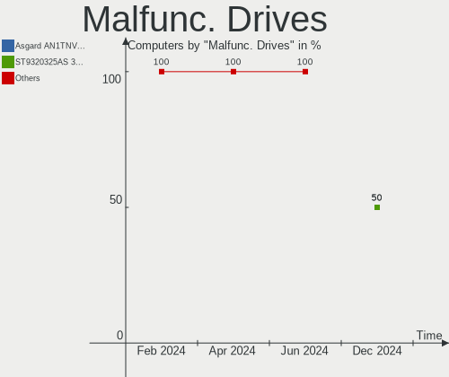
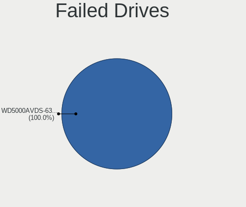
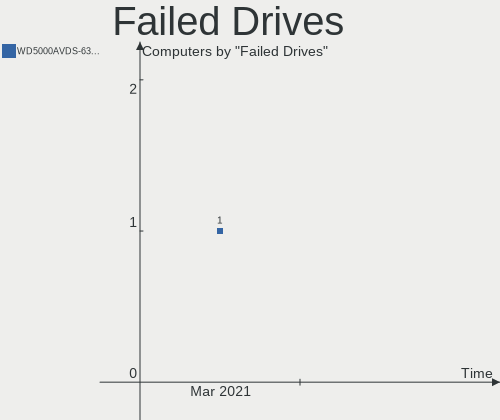
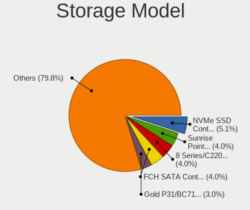
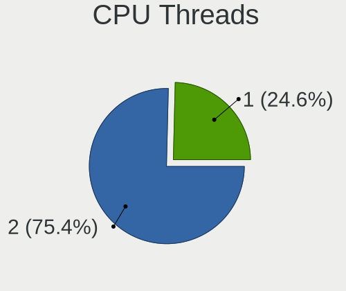

KDE neon Hardware Trends
------------------------

A project to identify most popular hardware characteristics and track their change
over time based on data collected by KDE neon users at https://Linux-Hardware.org.

Anyone can contribute to the study by uploading probes of their computers by
the [hw-probe](https://github.com/linuxhw/hw-probe) tool:

    sudo -E hw-probe -all -upload

This is a report for all computer types. See also reports for [desktops](/Dist/KDE_neon/Desktop/README.md) and [notebooks](/Dist/KDE_neon/Notebook/README.md).

Full-feature report is available here: https://linux-hardware.org/?view=trends

Period: Jan, 2021.

Contents
--------

- [ OS                       ](#os)
- [ OS Family                ](#os-family)
- [ Kernel                   ](#kernel)
- [ Kernel Family            ](#kernel-family)
- [ Kernel Major Ver.        ](#kernel-major-ver)
- [ Arch                     ](#arch)
- [ DE                       ](#de)
- [ Display Server           ](#display-server)
- [ Display Manager          ](#display-manager)
- [ OS Lang                  ](#os-lang)
- [ Boot Mode                ](#boot-mode)
- [ Filesystem               ](#filesystem)
- [ Part. scheme             ](#part-scheme)
- [ Dual Boot with Linux/BSD ](#dual-boot-with-linux/bsd)
- [ Dual Boot (Win)          ](#dual-boot-win)
- [ Country                  ](#country)
- [ City                     ](#city)
- [ Vendor                   ](#vendor)
- [ Model                    ](#model)
- [ Model Family             ](#model-family)
- [ MFG Year                 ](#mfg-year)
- [ Form Factor              ](#form-factor)
- [ Secure Boot              ](#secure-boot)
- [ Coreboot                 ](#coreboot)
- [ RAM Size                 ](#ram-size)
- [ RAM Used                 ](#ram-used)
- [ Has CD-ROM               ](#has-cd-rom)
- [ Total Drives             ](#total-drives)
- [ Has Ethernet             ](#has-ethernet)
- [ Drive Vendor             ](#drive-vendor)
- [ Drive Model              ](#drive-model)
- [ HDD Vendor               ](#hdd-vendor)
- [ SSD Vendor               ](#ssd-vendor)
- [ Drive Kind               ](#drive-kind)
- [ Drive Connector          ](#drive-connector)
- [ Drive Size               ](#drive-size)
- [ Space Total              ](#space-total)
- [ Space Used               ](#space-used)
- [ Malfunc. Drives          ](#malfunc-drives)
- [ Malfunc. Drive Vendor    ](#malfunc-drive-vendor)
- [ Malfunc. HDD Vendor      ](#malfunc-hdd-vendor)
- [ Malfunc. Drive Kind      ](#malfunc-drive-kind)
- [ Failed Drives            ](#failed-drives)
- [ Failed Drive Vendor      ](#failed-drive-vendor)
- [ Drive Status             ](#drive-status)
- [ Storage Vendor           ](#storage-vendor)
- [ Storage Model            ](#storage-model)
- [ Storage Kind             ](#storage-kind)
- [ CPU Vendor               ](#cpu-vendor)
- [ CPU Model                ](#cpu-model)
- [ CPU Model Family         ](#cpu-model-family)
- [ CPU Cores                ](#cpu-cores)
- [ CPU Sockets              ](#cpu-sockets)
- [ CPU Threads              ](#cpu-threads)
- [ CPU Op-Modes             ](#cpu-op-modes)
- [ CPU Microcode            ](#cpu-microcode)
- [ CPU Microarch            ](#cpu-microarch)
- [ GPU Vendor               ](#gpu-vendor)
- [ GPU Model                ](#gpu-model)
- [ GPU Combo                ](#gpu-combo)
- [ GPU Driver               ](#gpu-driver)
- [ GPU Memory               ](#gpu-memory)
- [ Monitor Vendor           ](#monitor-vendor)
- [ Monitor Model            ](#monitor-model)
- [ Monitor Resolution       ](#monitor-resolution)
- [ Monitor Diagonal         ](#monitor-diagonal)
- [ Monitor Width            ](#monitor-width)
- [ Aspect Ratio             ](#aspect-ratio)
- [ Monitor Area             ](#monitor-area)
- [ Pixel Density            ](#pixel-density)
- [ Multiple Monitors        ](#multiple-monitors)
- [ Net Controller Vendor    ](#net-controller-vendor)
- [ Net Controller Model     ](#net-controller-model)
- [ Wireless Vendor          ](#wireless-vendor)
- [ Wireless Model           ](#wireless-model)
- [ Ethernet Vendor          ](#ethernet-vendor)
- [ Ethernet Model           ](#ethernet-model)
- [ Net Controller Kind      ](#net-controller-kind)
- [ Used Controller          ](#used-controller)
- [ NICs                     ](#nics)
- [ Memory Vendor            ](#memory-vendor)
- [ Memory Model             ](#memory-model)
- [ Memory Kind              ](#memory-kind)
- [ Memory Form Factor       ](#memory-form-factor)
- [ Memory Size              ](#memory-size)
- [ Memory Speed             ](#memory-speed)
- [ Sound Vendor             ](#sound-vendor)
- [ Sound Model              ](#sound-model)
- [ Camera Vendor            ](#camera-vendor)
- [ Camera Model             ](#camera-model)
- [ Fingerprint Vendor       ](#fingerprint-vendor)
- [ Fingerprint Model        ](#fingerprint-model)
- [ Chipcard Vendor          ](#chipcard-vendor)
- [ Chipcard Model           ](#chipcard-model)
- [ Printer Vendor           ](#printer-vendor)
- [ Printer Model            ](#printer-model)
- [ Scanner Vendor           ](#scanner-vendor)
- [ Scanner Model            ](#scanner-model)
- [ Bluetooth Vendor         ](#bluetooth-vendor)
- [ Bluetooth Model          ](#bluetooth-model)
- [ Unsupported Devices      ](#unsupported-devices)
- [ Unsupported Device Types ](#unsupported-device-types)

OS
--

Installed operating systems

| Name           | Computers | Percent |
|----------------|-----------|---------|
| KDE neon 20.04 | 154       | 98.09%  |
| KDE neon 18.04 | 3         | 1.91%   |

OS Family
---------

OS without a version

| Name     | Computers | Percent |
|----------|-----------|---------|
| KDE neon | 157       | 100%    |

Kernel
------

Version of the Linux kernel

| Version               | Computers | Percent |
|-----------------------|-----------|---------|
| 5.4.0-60-generic      | 29        | 18.47%  |
| 5.4.0-58-generic      | 27        | 17.2%   |
| 5.4.0-59-generic      | 24        | 15.29%  |
| 5.4.0-62-generic      | 21        | 13.38%  |
| 5.4.0-65-generic      | 17        | 10.83%  |
| 5.4.0-64-generic      | 17        | 10.83%  |
| 5.4.0-52-generic      | 4         | 2.55%   |
| 5.8.0-36-generic      | 3         | 1.91%   |
| 5.8.0-34-generic      | 3         | 1.91%   |
| 5.9.16                | 1         | 0.64%   |
| 5.9.0-050900-generic  | 1         | 0.64%   |
| 5.8.0-33-generic      | 1         | 0.64%   |
| 5.6.0-1042-oem        | 1         | 0.64%   |
| 5.5.4-050504-generic  | 1         | 0.64%   |
| 5.5.19-050519-generic | 1         | 0.64%   |
| 5.4.90-xanmod1        | 1         | 0.64%   |
| 5.4.0-54-generic      | 1         | 0.64%   |
| 5.4.0-48-generic      | 1         | 0.64%   |
| 5.3.0-62-generic      | 1         | 0.64%   |
| 5.10.4-051004-generic | 1         | 0.64%   |
| 5.10.2-051002-generic | 1         | 0.64%   |

Kernel Family
-------------

Linux kernel without a distro release

| Version | Computers | Percent |
|---------|-----------|---------|
| 5.4.0   | 141       | 89.81%  |
| 5.8.0   | 7         | 4.46%   |
| 5.9.16  | 1         | 0.64%   |
| 5.9.0   | 1         | 0.64%   |
| 5.6.0   | 1         | 0.64%   |
| 5.5.4   | 1         | 0.64%   |
| 5.5.19  | 1         | 0.64%   |
| 5.4.90  | 1         | 0.64%   |
| 5.3.0   | 1         | 0.64%   |
| 5.10.4  | 1         | 0.64%   |
| 5.10.2  | 1         | 0.64%   |

Kernel Major Ver.
-----------------

Linux kernel major version

| Version | Computers | Percent |
|---------|-----------|---------|
| 5.4     | 142       | 90.45%  |
| 5.8     | 7         | 4.46%   |
| 5.9     | 2         | 1.27%   |
| 5.5     | 2         | 1.27%   |
| 5.10    | 2         | 1.27%   |
| 5.6     | 1         | 0.64%   |
| 5.3     | 1         | 0.64%   |

Arch
----

OS architecture (x86_64, i586, etc.)

| Name   | Computers | Percent |
|--------|-----------|---------|
| x86_64 | 157       | 100%    |

DE
--

Desktop Environment

| Name     | Computers | Percent |
|----------|-----------|---------|
| KDE      | 141       | 89.81%  |
| KDE5     | 13        | 8.28%   |
| Pantheon | 1         | 0.64%   |
| GNOME    | 1         | 0.64%   |
| Unknown  | 1         | 0.64%   |

Display Server
--------------

X11 or Wayland

| Name    | Computers | Percent |
|---------|-----------|---------|
| X11     | 153       | 97.45%  |
| Wayland | 3         | 1.91%   |
| Tty     | 1         | 0.64%   |

Display Manager
---------------

SDDM, LightDM, etc.

| Name    | Computers | Percent |
|---------|-----------|---------|
| Unknown | 144       | 91.72%  |
| SDDM    | 13        | 8.28%   |

OS Lang
-------

Language

| Lang  | Computers | Percent |
|-------|-----------|---------|
| en_US | 61        | 38.85%  |
| ru_RU | 16        | 10.19%  |
| de_DE | 13        | 8.28%   |
| pt_BR | 12        | 7.64%   |
| es_ES | 7         | 4.46%   |
| fr_FR | 6         | 3.82%   |
| en_CA | 6         | 3.82%   |
| en_GB | 5         | 3.18%   |
| C     | 5         | 3.18%   |
| pl_PL | 4         | 2.55%   |
| en_IN | 3         | 1.91%   |
| tr_TR | 2         | 1.27%   |
| nl_NL | 2         | 1.27%   |
| it_IT | 2         | 1.27%   |
| en_ZA | 2         | 1.27%   |
| zh_TW | 1         | 0.64%   |
| zh_CN | 1         | 0.64%   |
| ru_UA | 1         | 0.64%   |
| pt_PT | 1         | 0.64%   |
| fr_CA | 1         | 0.64%   |
| es_CR | 1         | 0.64%   |
| es_CO | 1         | 0.64%   |
| en_IE | 1         | 0.64%   |
| en_AU | 1         | 0.64%   |
| el_GR | 1         | 0.64%   |
| cs_CZ | 1         | 0.64%   |

Boot Mode
---------

EFI or BIOS

| Mode | Computers | Percent |
|------|-----------|---------|
| EFI  | 93        | 59.24%  |
| BIOS | 64        | 40.76%  |

Filesystem
----------

Type of filesystem

| Type    | Computers | Percent |
|---------|-----------|---------|
| Ext4    | 148       | 94.27%  |
| Btrfs   | 5         | 3.18%   |
| Overlay | 2         | 1.27%   |
| Xfs     | 1         | 0.64%   |
| Unknown | 1         | 0.64%   |

Part. scheme
------------

Scheme of partitioning

| Type    | Computers | Percent |
|---------|-----------|---------|
| Unknown | 143       | 91.08%  |
| GPT     | 13        | 8.28%   |
| MBR     | 1         | 0.64%   |

Dual Boot with Linux/BSD
------------------------

Hosting more than one Linux/BSD

| Dual boot | Computers | Percent |
|-----------|-----------|---------|
| No        | 150       | 95.54%  |
| Yes       | 7         | 4.46%   |

Dual Boot (Win)
---------------

Hosting Linux and Windows

| Dual boot | Computers | Percent |
|-----------|-----------|---------|
| No        | 142       | 90.45%  |
| Yes       | 15        | 9.55%   |

Country
-------

Geographic location (country)

| Country        | Computers | Percent |
|----------------|-----------|---------|
| USA            | 31        | 19.75%  |
| Russia         | 16        | 10.19%  |
| Germany        | 16        | 10.19%  |
| Brazil         | 14        | 8.92%   |
| Canada         | 10        | 6.37%   |
| Spain          | 8         | 5.1%    |
| France         | 6         | 3.82%   |
| UK             | 4         | 2.55%   |
| Turkey         | 4         | 2.55%   |
| Poland         | 4         | 2.55%   |
| Italy          | 4         | 2.55%   |
| Romania        | 3         | 1.91%   |
| Netherlands    | 3         | 1.91%   |
| India          | 3         | 1.91%   |
| Ukraine        | 2         | 1.27%   |
| South Africa   | 2         | 1.27%   |
| Malaysia       | 2         | 1.27%   |
| Greece         | 2         | 1.27%   |
| Colombia       | 2         | 1.27%   |
| Uzbekistan     | 1         | 0.64%   |
| Uruguay        | 1         | 0.64%   |
| Taiwan         | 1         | 0.64%   |
| Switzerland    | 1         | 0.64%   |
| Slovakia       | 1         | 0.64%   |
| Portugal       | 1         | 0.64%   |
| Pakistan       | 1         | 0.64%   |
| Norway         | 1         | 0.64%   |
| Morocco        | 1         | 0.64%   |
| Latvia         | 1         | 0.64%   |
| Kazakhstan     | 1         | 0.64%   |
| Japan          | 1         | 0.64%   |
| Ireland        | 1         | 0.64%   |
| Indonesia      | 1         | 0.64%   |
| Czech Republic | 1         | 0.64%   |
| Costa Rica     | 1         | 0.64%   |
| China          | 1         | 0.64%   |
| Bulgaria       | 1         | 0.64%   |
| Belarus        | 1         | 0.64%   |
| Australia      | 1         | 0.64%   |
| Argentina      | 1         | 0.64%   |

City
----

Geographic location (city)

| City                | Computers | Percent |
|---------------------|-----------|---------|
| Moscow              | 5         | 3.18%   |
| St Petersburg       | 2         | 1.27%   |
| Sapucaia            | 2         | 1.27%   |
| Rio de Janeiro      | 2         | 1.27%   |
| Odesa               | 2         | 1.27%   |
| Munich              | 2         | 1.27%   |
| Madrid              | 2         | 1.27%   |
| Kuala Lumpur        | 2         | 1.27%   |
| Johannesburg        | 2         | 1.27%   |
| Fernandopolis       | 2         | 1.27%   |
| Düsseldorf         | 2         | 1.27%   |
| Dresden             | 2         | 1.27%   |
| Dallas              | 2         | 1.27%   |
| Cordova             | 2         | 1.27%   |
| Brockville          | 2         | 1.27%   |
| Łódź             | 1         | 0.64%   |
| Zhuji               | 1         | 0.64%   |
| Zgierz              | 1         | 0.64%   |
| Wrocław            | 1         | 0.64%   |
| Woodstock           | 1         | 0.64%   |
| Wolbrom             | 1         | 0.64%   |
| Winnipeg            | 1         | 0.64%   |
| Varna               | 1         | 0.64%   |
| Ulhasnagar          | 1         | 0.64%   |
| Turlock             | 1         | 0.64%   |
| Tucson              | 1         | 0.64%   |
| Toulouse            | 1         | 0.64%   |
| Thessaloniki        | 1         | 0.64%   |
| Tekirdağ           | 1         | 0.64%   |
| Tashkent            | 1         | 0.64%   |
| Taipei              | 1         | 0.64%   |
| São Paulo          | 1         | 0.64%   |
| Soest               | 1         | 0.64%   |
| Sertaozinho         | 1         | 0.64%   |
| Santiago de Cali    | 1         | 0.64%   |
| San Jose            | 1         | 0.64%   |
| San Francisco       | 1         | 0.64%   |
| Samsun              | 1         | 0.64%   |
| Saint Johns         | 1         | 0.64%   |
| Saarbrücken        | 1         | 0.64%   |
| Round Rock          | 1         | 0.64%   |
| Rotherham           | 1         | 0.64%   |
| Rochefort           | 1         | 0.64%   |
| Riga                | 1         | 0.64%   |
| Ribeirão das Neves | 1         | 0.64%   |
| Rabat               | 1         | 0.64%   |
| Pueblo              | 1         | 0.64%   |
| Prestonsburg        | 1         | 0.64%   |
| Presidente Prudente | 1         | 0.64%   |
| Porto Torres        | 1         | 0.64%   |
| Portland            | 1         | 0.64%   |
| Petergof            | 1         | 0.64%   |
| Pardubice           | 1         | 0.64%   |
| Orenburg            | 1         | 0.64%   |
| Omsk                | 1         | 0.64%   |
| Okinawa             | 1         | 0.64%   |
| Offenbach           | 1         | 0.64%   |
| North Port          | 1         | 0.64%   |
| Nijmegen            | 1         | 0.64%   |
| New Bedford         | 1         | 0.64%   |

Vendor
------

Motherboard manufacturer

| Name                | Computers | Percent |
|---------------------|-----------|---------|
| ASUSTek Computer    | 32        | 20.38%  |
| Hewlett-Packard     | 23        | 14.65%  |
| Lenovo              | 21        | 13.38%  |
| MSI                 | 17        | 10.83%  |
| Dell                | 16        | 10.19%  |
| Gigabyte Technology | 9         | 5.73%   |
| ASRock              | 6         | 3.82%   |
| Intel               | 5         | 3.18%   |
| Apple               | 5         | 3.18%   |
| Acer                | 5         | 3.18%   |
| Sony                | 3         | 1.91%   |
| Fujitsu             | 3         | 1.91%   |
| Toshiba             | 2         | 1.27%   |
| Supermicro          | 2         | 1.27%   |
| Samsung Electronics | 2         | 1.27%   |
| Google              | 2         | 1.27%   |
| Razer               | 1         | 0.64%   |
| Panasonic           | 1         | 0.64%   |
| Microsoft           | 1         | 0.64%   |
| HUAWEI              | 1         | 0.64%   |

Model
-----

Motherboard model

| Name                                  | Computers | Percent |
|---------------------------------------|-----------|---------|
| HP Pavilion dv7                       | 4         | 2.55%   |
| MSI MS-7C37                           | 2         | 1.27%   |
| Lenovo MIIX 310-10ICR 80SG            | 2         | 1.27%   |
| Dell Latitude E6440                   | 2         | 1.27%   |
| Acer Nitro AN515-42                   | 2         | 1.27%   |
| Toshiba Satellite S855                | 1         | 0.64%   |
| Toshiba Satellite L550                | 1         | 0.64%   |
| Supermicro SYS-7038A-I                | 1         | 0.64%   |
| Supermicro H8QM8                      | 1         | 0.64%   |
| Sony VPCEJ2L1E                        | 1         | 0.64%   |
| Sony VPCEB33FX                        | 1         | 0.64%   |
| Samsung 930QCG                        | 1         | 0.64%   |
| Samsung 530U3C/530U4C/532U3C          | 1         | 0.64%   |
| Razer Blade                           | 1         | 0.64%   |
| Panasonic CF-C2CC-03CM                | 1         | 0.64%   |
| MSI MS-7C31                           | 1         | 0.64%   |
| MSI MS-7C02                           | 1         | 0.64%   |
| MSI MS-7B79                           | 1         | 0.64%   |
| MSI MS-7B48                           | 1         | 0.64%   |
| MSI MS-7A32                           | 1         | 0.64%   |
| MSI MS-7885                           | 1         | 0.64%   |
| MSI MS-7816                           | 1         | 0.64%   |
| MSI MS-7751                           | 1         | 0.64%   |
| MSI MS-7721                           | 1         | 0.64%   |
| MSI MS-7693                           | 1         | 0.64%   |
| MSI MS-7641                           | 1         | 0.64%   |
| MSI MS-16Y1                           | 1         | 0.64%   |
| MSI GL65 Leopard 10SCXR               | 1         | 0.64%   |
| MSI GE75 Raider 8RE                   | 1         | 0.64%   |
| MSI GE72 2QF                          | 1         | 0.64%   |
| Microsoft Surface Pro 4               | 1         | 0.64%   |
| Lenovo V14-ADA 82C6                   | 1         | 0.64%   |
| Lenovo V110-15ISK 80TL                | 1         | 0.64%   |
| Lenovo ThinkStation S20 4105O1U       | 1         | 0.64%   |
| Lenovo ThinkPad X230 23301G3          | 1         | 0.64%   |
| Lenovo ThinkPad W541 20EF000SGE       | 1         | 0.64%   |
| Lenovo ThinkPad T470 W10DG 20JNS11R1Y | 1         | 0.64%   |
| Lenovo ThinkPad T470 20HDCTO1WW       | 1         | 0.64%   |
| Lenovo ThinkPad T460 20FN002SUS       | 1         | 0.64%   |
| Lenovo ThinkPad T460 20FMS39800       | 1         | 0.64%   |
| Lenovo ThinkPad T14s Gen 1 20UHCTO1WW | 1         | 0.64%   |
| Lenovo ThinkPad T14 Gen 1 20UES00L00  | 1         | 0.64%   |
| Lenovo ThinkPad E570 20H500CTRT       | 1         | 0.64%   |
| Lenovo ThinkPad E15 Gen 2 20T8000TMZ  | 1         | 0.64%   |
| Lenovo ThinkCentre M92p 3209EK4       | 1         | 0.64%   |
| Lenovo ThinkCentre M55 880894G        | 1         | 0.64%   |
| Lenovo IdeaPad S145-15IWL 81S9        | 1         | 0.64%   |
| Lenovo IdeaPad 530S-15IKB 81EV        | 1         | 0.64%   |
| Lenovo G570 20079                     | 1         | 0.64%   |
| Lenovo 1.01UL F40-30                  | 1         | 0.64%   |
| Intel X99 V102                        | 1         | 0.64%   |
| Intel X79 V2.72A                      | 1         | 0.64%   |
| Intel MAHOBAY                         | 1         | 0.64%   |
| Intel H61                             | 1         | 0.64%   |
| Intel DH61HO AAG62445-102             | 1         | 0.64%   |
| HUAWEI KLVC-WXX9                      | 1         | 0.64%   |
| HP Z800 Workstation                   | 1         | 0.64%   |
| HP Stream Notebook PC 14              | 1         | 0.64%   |
| HP Spectre x360 Convertible           | 1         | 0.64%   |
| HP ProBook 6570b                      | 1         | 0.64%   |

Model Family
------------

Motherboard model prefix

| Name                   | Computers | Percent |
|------------------------|-----------|---------|
| Lenovo ThinkPad        | 10        | 6.37%   |
| HP Pavilion            | 7         | 4.46%   |
| Dell Latitude          | 5         | 3.18%   |
| Dell Inspiron          | 5         | 3.18%   |
| ASUS TUF               | 4         | 2.55%   |
| ASUS PRIME             | 4         | 2.55%   |
| HP EliteBook           | 3         | 1.91%   |
| Toshiba Satellite      | 2         | 1.27%   |
| MSI MS-7C37            | 2         | 1.27%   |
| Lenovo ThinkCentre     | 2         | 1.27%   |
| Lenovo MIIX            | 2         | 1.27%   |
| Lenovo IdeaPad         | 2         | 1.27%   |
| HP Laptop              | 2         | 1.27%   |
| HP ENVY                | 2         | 1.27%   |
| HP 250                 | 2         | 1.27%   |
| Dell Precision         | 2         | 1.27%   |
| ASUS M5A97             | 2         | 1.27%   |
| Acer Nitro             | 2         | 1.27%   |
| Acer Aspire            | 2         | 1.27%   |
| Supermicro SYS-7038A-I | 1         | 0.64%   |
| Supermicro H8QM8       | 1         | 0.64%   |
| Sony VPCEJ2L1E         | 1         | 0.64%   |
| Sony VPCEB33FX         | 1         | 0.64%   |
| Samsung 930QCG         | 1         | 0.64%   |
| Samsung 530U3C         | 1         | 0.64%   |
| Razer Blade            | 1         | 0.64%   |
| Panasonic CF-C2CC-03CM | 1         | 0.64%   |
| MSI MS-7C31            | 1         | 0.64%   |
| MSI MS-7C02            | 1         | 0.64%   |
| MSI MS-7B79            | 1         | 0.64%   |
| MSI MS-7B48            | 1         | 0.64%   |
| MSI MS-7A32            | 1         | 0.64%   |
| MSI MS-7885            | 1         | 0.64%   |
| MSI MS-7816            | 1         | 0.64%   |
| MSI MS-7751            | 1         | 0.64%   |
| MSI MS-7721            | 1         | 0.64%   |
| MSI MS-7693            | 1         | 0.64%   |
| MSI MS-7641            | 1         | 0.64%   |
| MSI MS-16Y1            | 1         | 0.64%   |
| MSI GL65               | 1         | 0.64%   |
| MSI GE75               | 1         | 0.64%   |
| MSI GE72               | 1         | 0.64%   |
| Microsoft Surface      | 1         | 0.64%   |
| Lenovo V14-ADA         | 1         | 0.64%   |
| Lenovo V110-15ISK      | 1         | 0.64%   |
| Lenovo ThinkStation    | 1         | 0.64%   |
| Lenovo G570            | 1         | 0.64%   |
| Lenovo 1.01UL          | 1         | 0.64%   |
| Intel X99              | 1         | 0.64%   |
| Intel X79              | 1         | 0.64%   |
| Intel MAHOBAY          | 1         | 0.64%   |
| Intel H61              | 1         | 0.64%   |
| Intel DH61HO           | 1         | 0.64%   |
| HUAWEI KLVC-WXX9       | 1         | 0.64%   |
| HP Z800                | 1         | 0.64%   |
| HP Stream              | 1         | 0.64%   |
| HP Spectre             | 1         | 0.64%   |
| HP ProBook             | 1         | 0.64%   |
| HP Pro3500             | 1         | 0.64%   |
| HP G42                 | 1         | 0.64%   |

MFG Year
--------

Motherboard manufacture year

| Year | Computers | Percent |
|------|-----------|---------|
| 2020 | 39        | 24.84%  |
| 2019 | 22        | 14.01%  |
| 2018 | 13        | 8.28%   |
| 2012 | 12        | 7.64%   |
| 2014 | 11        | 7.01%   |
| 2016 | 10        | 6.37%   |
| 2013 | 9         | 5.73%   |
| 2011 | 9         | 5.73%   |
| 2015 | 7         | 4.46%   |
| 2009 | 7         | 4.46%   |
| 2017 | 6         | 3.82%   |
| 2010 | 6         | 3.82%   |
| 2008 | 2         | 1.27%   |
| 2007 | 2         | 1.27%   |
| 2021 | 1         | 0.64%   |
| 2006 | 1         | 0.64%   |

Form Factor
-----------

Physical design of the computer

| Name        | Computers | Percent |
|-------------|-----------|---------|
| Notebook    | 83        | 52.87%  |
| Desktop     | 65        | 41.4%   |
| Tablet      | 3         | 1.91%   |
| Convertible | 3         | 1.91%   |
| All in one  | 2         | 1.27%   |
| Server      | 1         | 0.64%   |

Secure Boot
-----------

Enabled or disabled

| State    | Computers | Percent |
|----------|-----------|---------|
| Disabled | 147       | 93.63%  |
| Enabled  | 10        | 6.37%   |

Coreboot
--------

Have coreboot on board

| Used | Computers | Percent |
|------|-----------|---------|
| No   | 155       | 98.73%  |
| Yes  | 2         | 1.27%   |

RAM Size
--------

Total RAM memory

| Size in GB  | Computers | Percent |
|-------------|-----------|---------|
| 4.01-8.0    | 41        | 26.11%  |
| 8.01-16.0   | 40        | 25.48%  |
| 16.01-24.0  | 35        | 22.29%  |
| 3.01-4.0    | 20        | 12.74%  |
| 32.01-64.0  | 8         | 5.1%    |
| 1.01-2.0    | 6         | 3.82%   |
| 24.01-32.0  | 4         | 2.55%   |
| 64.01-256.0 | 2         | 1.27%   |
| 2.01-3.0    | 1         | 0.64%   |

RAM Used
--------

Used RAM memory

| Used GB    | Computers | Percent |
|------------|-----------|---------|
| 1.01-2.0   | 63        | 40.13%  |
| 2.01-3.0   | 45        | 28.66%  |
| 3.01-4.0   | 26        | 16.56%  |
| 4.01-8.0   | 11        | 7.01%   |
| 0.51-1.0   | 7         | 4.46%   |
| 8.01-16.0  | 4         | 2.55%   |
| 24.01-32.0 | 1         | 0.64%   |

Has CD-ROM
----------

Has CD-ROM on board

| Presented | Computers | Percent |
|-----------|-----------|---------|
| No        | 95        | 60.51%  |
| Yes       | 62        | 39.49%  |

Total Drives
------------

Number of drives on board

| Drives | Computers | Percent |
|--------|-----------|---------|
| 1      | 81        | 51.59%  |
| 2      | 44        | 28.03%  |
| 3      | 20        | 12.74%  |
| 6      | 4         | 2.55%   |
| 5      | 4         | 2.55%   |
| 4      | 4         | 2.55%   |

Has Ethernet
------------

Has Ethernet on board

| Presented | Computers | Percent |
|-----------|-----------|---------|
| Yes       | 137       | 87.26%  |
| No        | 20        | 12.74%  |

Drive Vendor
------------

Hard drive vendors

| Vendor                  | Computers | Drives | Percent |
|-------------------------|-----------|--------|---------|
| Seagate                 | 44        | 45     | 16.48%  |
| Samsung Electronics     | 37        | 45     | 13.86%  |
| WDC                     | 35        | 42     | 13.11%  |
| Toshiba                 | 19        | 20     | 7.12%   |
| Kingston                | 17        | 18     | 6.37%   |
| Sandisk                 | 15        | 16     | 5.62%   |
| Crucial                 | 12        | 12     | 4.49%   |
| Unknown                 | 10        | 12     | 3.75%   |
| Intel                   | 10        | 10     | 3.75%   |
| Hitachi                 | 10        | 10     | 3.75%   |
| HGST                    | 6         | 6      | 2.25%   |
| A-DATA Technology       | 6         | 6      | 2.25%   |
| Apacer                  | 4         | 4      | 1.5%    |
| SPCC                    | 3         | 3      | 1.12%   |
| Phison                  | 3         | 3      | 1.12%   |
| KIOXIA                  | 3         | 3      | 1.12%   |
| Hewlett-Packard         | 3         | 3      | 1.12%   |
| China                   | 3         | 3      | 1.12%   |
| Apple                   | 3         | 3      | 1.12%   |
| SK Hynix                | 2         | 2      | 0.75%   |
| PNY                     | 2         | 4      | 0.75%   |
| XPG                     | 1         | 1      | 0.37%   |
| Union Memory (Shenzhen) | 1         | 1      | 0.37%   |
| TCSUNBOW                | 1         | 1      | 0.37%   |
| SABRENT                 | 1         | 1      | 0.37%   |
| Realtek Semiconductor   | 1         | 1      | 0.37%   |
| Patriot                 | 1         | 1      | 0.37%   |
| OCZ                     | 1         | 1      | 0.37%   |
| Micron Technology       | 1         | 1      | 0.37%   |
| LITEON                  | 1         | 1      | 0.37%   |
| Lite-On                 | 1         | 1      | 0.37%   |
| Lenovo                  | 1         | 1      | 0.37%   |
| KingSpec                | 1         | 1      | 0.37%   |
| KingFast                | 1         | 1      | 0.37%   |
| Intenso                 | 1         | 1      | 0.37%   |
| HS-SSD-E100             | 1         | 1      | 0.37%   |
| Fujitsu                 | 1         | 1      | 0.37%   |
| Corsair                 | 1         | 1      | 0.37%   |
| BHT                     | 1         | 1      | 0.37%   |
| asmedia                 | 1         | 1      | 0.37%   |
| AMD                     | 1         | 1      | 0.37%   |

Drive Model
-----------

Hard drive models

| Model                            | Computers | Percent |
|----------------------------------|-----------|---------|
| Unknown MMC Card  32GB           | 4         | 1.4%    |
| Samsung SSD 850 EVO 250GB        | 4         | 1.4%    |
| Kingston SA400S37120G 120GB SSD  | 4         | 1.4%    |
| Unknown MMC Card  64GB           | 3         | 1.05%   |
| Seagate ST1000LM035-1RK172 1TB   | 3         | 1.05%   |
| Seagate Expansion Desk 8TB       | 3         | 1.05%   |
| Sandisk NVMe SSD Drive 512GB     | 3         | 1.05%   |
| Samsung NVMe SSD Drive 1TB       | 3         | 1.05%   |
| HGST HTS721010A9E630 1TB         | 3         | 1.05%   |
| WDC WDS500G2B0A-00SM50 500GB SSD | 2         | 0.7%    |
| WDC WDBNCE5000PNC 500GB SSD      | 2         | 0.7%    |
| WDC WD3200AAJS-00L7A0 320GB      | 2         | 0.7%    |
| WDC WD20EARX-00PASB0 2TB         | 2         | 0.7%    |
| WDC WD10EZEX-08WN4A0 1TB         | 2         | 0.7%    |
| Unknown MMC Card  16GB           | 2         | 0.7%    |
| Toshiba MQ01ABD050 500GB         | 2         | 0.7%    |
| Toshiba DT01ACA200 2TB           | 2         | 0.7%    |
| Toshiba DT01ACA100 1TB           | 2         | 0.7%    |
| Seagate ST9500325AS 500GB        | 2         | 0.7%    |
| Seagate ST3500418AS 500GB        | 2         | 0.7%    |
| Seagate ST2000DM008-2FR102 2TB   | 2         | 0.7%    |
| Seagate ST1000DM010-2EP102 1TB   | 2         | 0.7%    |
| Seagate ST1000DM003-1ER162 1TB   | 2         | 0.7%    |
| SanDisk DF4064  64GB             | 2         | 0.7%    |
| Samsung SSD 860 EVO 500GB        | 2         | 0.7%    |
| Samsung SSD 860 EVO 1TB          | 2         | 0.7%    |
| Samsung SSD 840 EVO 250GB        | 2         | 0.7%    |
| Samsung SSD 840 EVO 120GB        | 2         | 0.7%    |
| Samsung NVMe SSD Drive 500GB     | 2         | 0.7%    |
| Samsung HD103SJ 1TB              | 2         | 0.7%    |
| Kingston SV300S37A120G 120GB SSD | 2         | 0.7%    |
| Kingston SA400S37240G 240GB SSD  | 2         | 0.7%    |
| Kingston SA400M8240G 240GB SSD   | 2         | 0.7%    |
| Intel NVMe SSD Drive 512GB       | 2         | 0.7%    |
| Intel NVMe SSD Drive 1024GB      | 2         | 0.7%    |
| Hitachi HDS721050CLA362 500GB    | 2         | 0.7%    |
| Crucial CT256MX100SSD1 256GB     | 2         | 0.7%    |
| Crucial CT120BX500SSD1 120GB     | 2         | 0.7%    |
| Apple HDD HTS545050A7E362 500GB  | 2         | 0.7%    |
| Apacer AS350 128GB SSD           | 2         | 0.7%    |
| Apacer AS340 240GB SSD           | 2         | 0.7%    |
| A-DATA SU650 120GB SSD           | 2         | 0.7%    |
| XPG NVMe SSD Drive 1024GB        | 1         | 0.35%   |
| WDC WDS250G2B0B-00YS70 250GB SSD | 1         | 0.35%   |
| WDC WDS240G2G0B-00EPW0 240GB SSD | 1         | 0.35%   |
| WDC WDS120G2G0B-00EPW0 120GB SSD | 1         | 0.35%   |
| WDC WDS100T2B0B 1TB SSD          | 1         | 0.35%   |
| WDC WD82PURZ-85TEUY0 8TB         | 1         | 0.35%   |
| WDC WD6400BEVT-60A0RT0 640GB     | 1         | 0.35%   |
| WDC WD5000BEVT-26A0RT0 500GB     | 1         | 0.35%   |
| WDC WD5000AADS-00M2B0 500GB      | 1         | 0.35%   |
| WDC WD40EZRZ-75GXCB0 4TB         | 1         | 0.35%   |
| WDC WD40EZRZ-22GXCB0 4TB         | 1         | 0.35%   |
| WDC WD3200BEVT-80A0RT0 320GB     | 1         | 0.35%   |
| WDC WD3200AAJS-40VWA0 320GB      | 1         | 0.35%   |
| WDC WD30EFRX-68EUZN0 3TB         | 1         | 0.35%   |
| WDC WD2500JS-60MHB1 250GB        | 1         | 0.35%   |
| WDC WD2500JD-75HBB0 249GB        | 1         | 0.35%   |
| WDC WD2500BEVS-60UST0 250GB      | 1         | 0.35%   |
| WDC WD20EZRZ-00Z5HB0 2TB         | 1         | 0.35%   |

HDD Vendor
----------

Hard disk drive vendors

| Vendor              | Computers | Drives | Percent |
|---------------------|-----------|--------|---------|
| Seagate             | 42        | 43     | 37.5%   |
| WDC                 | 28        | 33     | 25%     |
| Toshiba             | 16        | 17     | 14.29%  |
| Hitachi             | 10        | 10     | 8.93%   |
| HGST                | 6         | 6      | 5.36%   |
| Samsung Electronics | 5         | 6      | 4.46%   |
| Apple               | 2         | 2      | 1.79%   |
| Hewlett-Packard     | 1         | 1      | 0.89%   |
| Fujitsu             | 1         | 1      | 0.89%   |
| asmedia             | 1         | 1      | 0.89%   |

SSD Vendor
----------

Solid state drive vendors

| Vendor              | Computers | Drives | Percent |
|---------------------|-----------|--------|---------|
| Samsung Electronics | 24        | 27     | 22.02%  |
| Kingston            | 14        | 14     | 12.84%  |
| Crucial             | 12        | 12     | 11.01%  |
| SanDisk             | 9         | 9      | 8.26%   |
| WDC                 | 8         | 8      | 7.34%   |
| A-DATA Technology   | 5         | 5      | 4.59%   |
| Intel               | 4         | 4      | 3.67%   |
| Apacer              | 4         | 4      | 3.67%   |
| Toshiba             | 3         | 3      | 2.75%   |
| SPCC                | 3         | 3      | 2.75%   |
| China               | 3         | 3      | 2.75%   |
| SK Hynix            | 2         | 2      | 1.83%   |
| PNY                 | 2         | 4      | 1.83%   |
| Hewlett-Packard     | 2         | 2      | 1.83%   |
| Unknown             | 1         | 1      | 0.92%   |
| TCSUNBOW            | 1         | 1      | 0.92%   |
| Seagate             | 1         | 1      | 0.92%   |
| SABRENT             | 1         | 1      | 0.92%   |
| Patriot             | 1         | 1      | 0.92%   |
| OCZ                 | 1         | 1      | 0.92%   |
| Micron Technology   | 1         | 1      | 0.92%   |
| KingSpec            | 1         | 1      | 0.92%   |
| Intenso             | 1         | 1      | 0.92%   |
| HS-SSD-E100         | 1         | 1      | 0.92%   |
| Corsair             | 1         | 1      | 0.92%   |
| BHT                 | 1         | 1      | 0.92%   |
| Apple               | 1         | 1      | 0.92%   |
| AMD                 | 1         | 1      | 0.92%   |

Drive Kind
----------

HDD or SSD

| Kind    | Computers | Drives | Percent |
|---------|-----------|--------|---------|
| SSD     | 96        | 114    | 40.51%  |
| HDD     | 89        | 120    | 37.55%  |
| NVMe    | 39        | 41     | 16.46%  |
| MMC     | 10        | 12     | 4.22%   |
| Unknown | 3         | 3      | 1.27%   |

Drive Connector
---------------

SATA, SAS, NVMe, etc.

| Type | Computers | Drives | Percent |
|------|-----------|--------|---------|
| SATA | 136       | 226    | 69.74%  |
| NVMe | 39        | 41     | 20%     |
| SAS  | 10        | 11     | 5.13%   |
| MMC  | 10        | 12     | 5.13%   |

Drive Size
----------

Size of hard drive

| Size in TB | Computers | Drives | Percent |
|------------|-----------|--------|---------|
| 0.01-0.5   | 105       | 146    | 56.15%  |
| 0.51-1.0   | 53        | 57     | 28.34%  |
| 1.01-2.0   | 17        | 18     | 9.09%   |
| 3.01-4.0   | 4         | 5      | 2.14%   |
| 2.01-3.0   | 4         | 4      | 2.14%   |
| 4.01-10.0  | 4         | 4      | 2.14%   |

Space Total
-----------

Amount of disk space available on the file system

| Size in GB     | Computers | Percent |
|----------------|-----------|---------|
| 101-250        | 51        | 32.48%  |
| 251-500        | 26        | 16.56%  |
| 501-1000       | 24        | 15.29%  |
| 51-100         | 14        | 8.92%   |
| 1001-2000      | 13        | 8.28%   |
| More than 3000 | 9         | 5.73%   |
| 21-50          | 8         | 5.1%    |
| 1-20           | 5         | 3.18%   |
| 2001-3000      | 4         | 2.55%   |
| Unknown        | 3         | 1.91%   |

Space Used
----------

Amount of used disk space

| Used GB        | Computers | Percent |
|----------------|-----------|---------|
| 1-20           | 73        | 46.5%   |
| 21-50          | 28        | 17.83%  |
| 101-250        | 12        | 7.64%   |
| 251-500        | 11        | 7.01%   |
| 501-1000       | 10        | 6.37%   |
| 51-100         | 10        | 6.37%   |
| 1001-2000      | 5         | 3.18%   |
| More than 3000 | 3         | 1.91%   |
| Unknown        | 3         | 1.91%   |
| 2001-3000      | 2         | 1.27%   |

Malfunc. Drives
---------------

Drive models with a malfunction

| Model                          | Computers | Drives | Percent |
|--------------------------------|-----------|--------|---------|
| WDC WD20EZRZ-00Z5HB0 2TB       | 1         | 1      | 25%     |
| WDC WD10EZEX-08WN4A0 1TB       | 1         | 1      | 25%     |
| Seagate ST3500418AS 500GB      | 1         | 1      | 25%     |
| Seagate ST1000DM010-2EP102 1TB | 1         | 1      | 25%     |

Malfunc. Drive Vendor
---------------------

Vendors of faulty drives

| Vendor  | Computers | Drives | Percent |
|---------|-----------|--------|---------|
| WDC     | 2         | 2      | 50%     |
| Seagate | 2         | 2      | 50%     |

Malfunc. HDD Vendor
-------------------

Vendors of faulty HDD drives

| Vendor  | Computers | Drives | Percent |
|---------|-----------|--------|---------|
| WDC     | 2         | 2      | 50%     |
| Seagate | 2         | 2      | 50%     |

Malfunc. Drive Kind
-------------------

Kinds of faulty drives

| Kind | Computers | Drives | Percent |
|------|-----------|--------|---------|
| HDD  | 3         | 4      | 100%    |

Failed Drives
-------------

Failed drive models

| Model                           | Computers | Drives | Percent |
|---------------------------------|-----------|--------|---------|
| Samsung Electronics HD103SJ 1TB | 1         | 1      | 100%    |

Failed Drive Vendor
-------------------

Failed drive vendors

| Vendor              | Computers | Drives | Percent |
|---------------------|-----------|--------|---------|
| Samsung Electronics | 1         | 1      | 100%    |

Drive Status
------------

Number of failed and malfunc. drives

| Status   | Computers | Drives | Percent |
|----------|-----------|--------|---------|
| Detected | 146       | 266    | 88.48%  |
| Works    | 15        | 19     | 9.09%   |
| Malfunc  | 3         | 4      | 1.82%   |
| Failed   | 1         | 1      | 0.61%   |

Storage Vendor
--------------

Storage controller vendors

| Vendor                      | Computers | Percent |
|-----------------------------|-----------|---------|
| Intel                       | 110       | 58.2%   |
| AMD                         | 33        | 17.46%  |
| Samsung Electronics         | 11        | 5.82%   |
| Sandisk                     | 6         | 3.17%   |
| ASMedia Technology          | 6         | 3.17%   |
| Kingston Technology Company | 4         | 2.12%   |
| Phison Electronics          | 3         | 1.59%   |
| Marvell Technology Group    | 3         | 1.59%   |
| KIOXIA                      | 3         | 1.59%   |
| Realtek Semiconductor       | 2         | 1.06%   |
| Nvidia                      | 2         | 1.06%   |
| Lite-On Technology          | 2         | 1.06%   |
| LSI Logic / Symbios Logic   | 1         | 0.53%   |
| Lenovo                      | 1         | 0.53%   |
| JMicron Technology          | 1         | 0.53%   |
| ADATA Technology            | 1         | 0.53%   |

Storage Model
-------------

Storage controller models

| Model                                                                          | Computers | Percent |
|--------------------------------------------------------------------------------|-----------|---------|
| AMD FCH SATA Controller [AHCI mode]                                            | 25        | 11.36%  |
| Intel Sunrise Point-LP SATA Controller [AHCI mode]                             | 10        | 4.55%   |
| Intel 8 Series/C220 Series Chipset Family 6-port SATA Controller 1 [AHCI mode] | 10        | 4.55%   |
| Intel 6 Series/C200 Series Chipset Family 6 port Mobile SATA AHCI Controller   | 10        | 4.55%   |
| Samsung NVMe SSD Controller SM981/PM981/PM983                                  | 7         | 3.18%   |
| Intel 7 Series Chipset Family 6-port SATA Controller [AHCI mode]               | 7         | 3.18%   |
| AMD 400 Series Chipset SATA Controller                                         | 7         | 3.18%   |
| Intel 5 Series/3400 Series Chipset 4 port SATA AHCI Controller                 | 6         | 2.73%   |
| ASMedia ASM1062 Serial ATA Controller                                          | 6         | 2.73%   |
| AMD SB7x0/SB8x0/SB9x0 SATA Controller [AHCI mode]                              | 6         | 2.73%   |
| Intel 8 Series SATA Controller 1 [AHCI mode]                                   | 5         | 2.27%   |
| Intel 6 Series/C200 Series Chipset Family 6 port Desktop SATA AHCI Controller  | 5         | 2.27%   |
| Intel SSD 660P Series                                                          | 4         | 1.82%   |
| Intel 82801IBM/IEM (ICH9M/ICH9M-E) 4 port SATA Controller [AHCI mode]          | 4         | 1.82%   |
| Intel 7 Series/C210 Series Chipset Family 6-port SATA Controller [AHCI mode]   | 4         | 1.82%   |
| AMD SB7x0/SB8x0/SB9x0 IDE Controller                                           | 4         | 1.82%   |
| Sandisk WD Blue SN500 / PC SN520 NVMe SSD                                      | 3         | 1.36%   |
| Kingston Company A2000 NVMe SSD                                                | 3         | 1.36%   |
| Intel 82801JI (ICH10 Family) SATA AHCI Controller                              | 3         | 1.36%   |
| Intel 200 Series PCH SATA controller [AHCI mode]                               | 3         | 1.36%   |
| AMD X370 Series Chipset SATA Controller                                        | 3         | 1.36%   |
| Samsung NVMe SSD Controller SM961/PM961/SM963                                  | 2         | 0.91%   |
| Realtek RTS5763DL NVMe SSD Controller                                          | 2         | 0.91%   |
| Lite-On NVMe Controller                                                        | 2         | 0.91%   |
| KIOXIA Non-Volatile memory controller                                          | 2         | 0.91%   |
| Intel Wildcat Point-LP SATA Controller [AHCI Mode]                             | 2         | 0.91%   |
| Intel SSD 600P Series                                                          | 2         | 0.91%   |
| Intel SATA Controller [RAID mode]                                              | 2         | 0.91%   |
| Intel Q170/Q150/B150/H170/H110/Z170/CM236 Chipset SATA Controller [AHCI Mode]  | 2         | 0.91%   |
| Intel NM10/ICH7 Family SATA Controller [IDE mode]                              | 2         | 0.91%   |
| Intel HM170/QM170 Chipset SATA Controller [AHCI Mode]                          | 2         | 0.91%   |
| Intel Celeron/Pentium Silver Processor SATA Controller                         | 2         | 0.91%   |
| Intel Cannon Lake PCH SATA AHCI Controller                                     | 2         | 0.91%   |
| Intel Cannon Lake Mobile PCH SATA AHCI Controller                              | 2         | 0.91%   |
| Intel C610/X99 series chipset sSATA Controller [AHCI mode]                     | 2         | 0.91%   |
| Intel C610/X99 series chipset 6-Port SATA Controller [AHCI mode]               | 2         | 0.91%   |
| Intel 82801JI (ICH10 Family) 4 port SATA IDE Controller #1                     | 2         | 0.91%   |
| Intel 82801JI (ICH10 Family) 2 port SATA IDE Controller #2                     | 2         | 0.91%   |
| Intel 82801IBM/IEM (ICH9M/ICH9M-E) 2 port SATA Controller [IDE mode]           | 2         | 0.91%   |
| Intel 82801G (ICH7 Family) IDE Controller                                      | 2         | 0.91%   |
| Intel 82801 Mobile SATA Controller [RAID mode]                                 | 2         | 0.91%   |
| Intel 400 Series Chipset Family SATA AHCI Controller                           | 2         | 0.91%   |
| AMD SB7x0/SB8x0/SB9x0 SATA Controller [IDE mode]                               | 2         | 0.91%   |
| AMD 300 Series Chipset SATA Controller                                         | 2         | 0.91%   |
| Sandisk WD Black SN750 / PC SN730 NVMe SSD                                     | 1         | 0.45%   |
| Sandisk WD Black 2018 / PC SN720 NVMe SSD                                      | 1         | 0.45%   |
| Sandisk Non-Volatile memory controller                                         | 1         | 0.45%   |
| Samsung NVMe SSD Controller SM951/PM951                                        | 1         | 0.45%   |
| Samsung Electronics Non-Volatile memory controller                             | 1         | 0.45%   |
| Phison PS5013 E13 NVMe Controller                                              | 1         | 0.45%   |
| Phison E16 PCIe4 NVMe Controller                                               | 1         | 0.45%   |
| Phison E12 NVMe Controller                                                     | 1         | 0.45%   |
| Nvidia MCP79 AHCI Controller                                                   | 1         | 0.45%   |
| Nvidia MCP55 SATA Controller                                                   | 1         | 0.45%   |
| Nvidia MCP55 IDE                                                               | 1         | 0.45%   |
| Marvell Group 88SE9172 SATA 6Gb/s Controller                                   | 1         | 0.45%   |
| Marvell Group 88SE9128 PCIe SATA 6 Gb/s RAID controller with HyperDuo          | 1         | 0.45%   |
| Marvell Group 88SE6101/6102 single-port PATA133 interface                      | 1         | 0.45%   |
| LSI Logic / Symbios Logic SAS1068E PCI-Express Fusion-MPT SAS                  | 1         | 0.45%   |
| Lenovo Non-Volatile memory controller                                          | 1         | 0.45%   |

Storage Kind
------------

Kind of storage controller (IDE, SATA, NVMe, SAS, ...)

| Kind | Computers | Percent |
|------|-----------|---------|
| SATA | 128       | 67.37%  |
| NVMe | 38        | 20%     |
| IDE  | 18        | 9.47%   |
| RAID | 5         | 2.63%   |
| SCSI | 1         | 0.53%   |

CPU Vendor
----------

Processor vendors

| Vendor | Computers | Percent |
|--------|-----------|---------|
| Intel  | 117       | 74.52%  |
| AMD    | 40        | 25.48%  |

CPU Model
---------

Processor models

| Model                                         | Computers | Percent |
|-----------------------------------------------|-----------|---------|
| AMD Ryzen 5 3600 6-Core Processor             | 5         | 3.18%   |
| Intel Core i5-6200U CPU @ 2.30GHz             | 3         | 1.91%   |
| Intel Core i3 CPU M 370 @ 2.40GHz             | 3         | 1.91%   |
| Intel Core i7-8550U CPU @ 1.80GHz             | 2         | 1.27%   |
| Intel Core i7-4720HQ CPU @ 2.60GHz            | 2         | 1.27%   |
| Intel Core i7-2670QM CPU @ 2.20GHz            | 2         | 1.27%   |
| Intel Core i7-1065G7 CPU @ 1.30GHz            | 2         | 1.27%   |
| Intel Core i5-7400 CPU @ 3.00GHz              | 2         | 1.27%   |
| Intel Core i5-7200U CPU @ 2.50GHz             | 2         | 1.27%   |
| Intel Core i5-5200U CPU @ 2.20GHz             | 2         | 1.27%   |
| Intel Core i5-3570K CPU @ 3.40GHz             | 2         | 1.27%   |
| Intel Core i5-3210M CPU @ 2.50GHz             | 2         | 1.27%   |
| Intel Core i5-2430M CPU @ 2.40GHz             | 2         | 1.27%   |
| Intel Core i5-2410M CPU @ 2.30GHz             | 2         | 1.27%   |
| Intel Core i3-6006U CPU @ 2.00GHz             | 2         | 1.27%   |
| Intel Core i3-3240 CPU @ 3.40GHz              | 2         | 1.27%   |
| Intel Core 2 Duo CPU P8700 @ 2.53GHz          | 2         | 1.27%   |
| Intel Core 2 Duo CPU E7500 @ 2.93GHz          | 2         | 1.27%   |
| Intel Celeron N4000 CPU @ 1.10GHz             | 2         | 1.27%   |
| Intel Atom x5-Z8350 CPU @ 1.44GHz             | 2         | 1.27%   |
| AMD Ryzen 7 PRO 4750U with Radeon Graphics    | 2         | 1.27%   |
| AMD Ryzen 7 4700U with Radeon Graphics        | 2         | 1.27%   |
| AMD Ryzen 7 1700X Eight-Core Processor        | 2         | 1.27%   |
| AMD Ryzen 5 2500U with Radeon Vega Mobile Gfx | 2         | 1.27%   |
| AMD Ryzen 5 1600 Six-Core Processor           | 2         | 1.27%   |
| AMD FX-6350 Six-Core Processor                | 2         | 1.27%   |
| AMD FX-4300 Quad-Core Processor               | 2         | 1.27%   |
| Intel Xeon CPU X5650 @ 2.67GHz                | 1         | 0.64%   |
| Intel Xeon CPU W3550 @ 3.07GHz                | 1         | 0.64%   |
| Intel Xeon CPU E5-2680 v4 @ 2.40GHz           | 1         | 0.64%   |
| Intel Xeon CPU E5-2620 v3 @ 2.40GHz           | 1         | 0.64%   |
| Intel Xeon CPU E5-2620 0 @ 2.00GHz            | 1         | 0.64%   |
| Intel Xeon CPU E31270 @ 3.40GHz               | 1         | 0.64%   |
| Intel Xeon CPU E31220 @ 3.10GHz               | 1         | 0.64%   |
| Intel Xeon CPU E3-1545M v5 @ 2.90GHz          | 1         | 0.64%   |
| Intel Pentium Dual-Core CPU E5700 @ 3.00GHz   | 1         | 0.64%   |
| Intel Pentium CPU G3440 @ 3.30GHz             | 1         | 0.64%   |
| Intel Pentium 4 CPU 3.00GHz                   | 1         | 0.64%   |
| Intel Core i7-8750H CPU @ 2.20GHz             | 1         | 0.64%   |
| Intel Core i7-8700 CPU @ 3.20GHz              | 1         | 0.64%   |
| Intel Core i7-7700HQ CPU @ 2.80GHz            | 1         | 0.64%   |
| Intel Core i7-7500U CPU @ 2.70GHz             | 1         | 0.64%   |
| Intel Core i7-6700HQ CPU @ 2.60GHz            | 1         | 0.64%   |
| Intel Core i7-6500U CPU @ 2.50GHz             | 1         | 0.64%   |
| Intel Core i7-5930K CPU @ 3.50GHz             | 1         | 0.64%   |
| Intel Core i7-5700HQ CPU @ 2.70GHz            | 1         | 0.64%   |
| Intel Core i7-4910MQ CPU @ 2.90GHz            | 1         | 0.64%   |
| Intel Core i7-4800MQ CPU @ 2.70GHz            | 1         | 0.64%   |
| Intel Core i7-4710HQ CPU @ 2.50GHz            | 1         | 0.64%   |
| Intel Core i7-4700HQ CPU @ 2.40GHz            | 1         | 0.64%   |
| Intel Core i7-4600U CPU @ 2.10GHz             | 1         | 0.64%   |
| Intel Core i7-3770 CPU @ 3.40GHz              | 1         | 0.64%   |
| Intel Core i7-3610QM CPU @ 2.30GHz            | 1         | 0.64%   |
| Intel Core i7-2860QM CPU @ 2.50GHz            | 1         | 0.64%   |
| Intel Core i7-10750H CPU @ 2.60GHz            | 1         | 0.64%   |
| Intel Core i7-10510U CPU @ 1.80GHz            | 1         | 0.64%   |
| Intel Core i7 CPU Q 720 @ 1.60GHz             | 1         | 0.64%   |
| Intel Core i7 CPU 920 @ 2.67GHz               | 1         | 0.64%   |
| Intel Core i5-9400F CPU @ 2.90GHz             | 1         | 0.64%   |
| Intel Core i5-9300H CPU @ 2.40GHz             | 1         | 0.64%   |

CPU Model Family
----------------

Processor model prefix

| Model                          | Computers | Percent |
|--------------------------------|-----------|---------|
| Intel Core i5                  | 39        | 24.84%  |
| Intel Core i7                  | 28        | 17.83%  |
| Intel Core i3                  | 16        | 10.19%  |
| AMD Ryzen 5                    | 12        | 7.64%   |
| Intel Core 2 Duo               | 11        | 7.01%   |
| AMD Ryzen 7                    | 9         | 5.73%   |
| Intel Xeon                     | 8         | 5.1%    |
| AMD FX                         | 6         | 3.82%   |
| Intel Celeron                  | 5         | 3.18%   |
| Intel Atom                     | 4         | 2.55%   |
| Other                          | 2         | 1.27%   |
| AMD Ryzen 7 PRO                | 2         | 1.27%   |
| AMD Ryzen 3                    | 2         | 1.27%   |
| AMD A10                        | 2         | 1.27%   |
| Intel Pentium Dual-Core        | 1         | 0.64%   |
| Intel Pentium 4                | 1         | 0.64%   |
| Intel Pentium                  | 1         | 0.64%   |
| Intel Core 2 Quad              | 1         | 0.64%   |
| Intel Core 2                   | 1         | 0.64%   |
| AMD Turion X2 Dual-Core Mobile | 1         | 0.64%   |
| AMD Ryzen 9                    | 1         | 0.64%   |
| AMD Phenom II X6               | 1         | 0.64%   |
| AMD A8                         | 1         | 0.64%   |
| AMD A6                         | 1         | 0.64%   |
| AMD A4                         | 1         | 0.64%   |

CPU Cores
---------

Number of processor cores

| Number | Computers | Percent |
|--------|-----------|---------|
| 2      | 66        | 42.04%  |
| 4      | 55        | 35.03%  |
| 6      | 17        | 10.83%  |
| 8      | 11        | 7.01%   |
| 1      | 3         | 1.91%   |
| 12     | 2         | 1.27%   |
| 3      | 2         | 1.27%   |
| 28     | 1         | 0.64%   |

CPU Sockets
-----------

Number of sockets

| Number | Computers | Percent |
|--------|-----------|---------|
| 1      | 154       | 98.09%  |
| 2      | 2         | 1.27%   |
| 4      | 1         | 0.64%   |

CPU Threads
-----------

Threads per core (Hyper-Threading)

| Number | Computers | Percent |
|--------|-----------|---------|
| 2      | 111       | 70.7%   |
| 1      | 46        | 29.3%   |

CPU Op-Modes
------------

CPU Operation Modes (32-bit, 64-bit)

| Op mode        | Computers | Percent |
|----------------|-----------|---------|
| 32-bit, 64-bit | 157       | 100%    |

CPU Microcode
-------------

Microcode number

| Number     | Computers | Percent |
|------------|-----------|---------|
| 0x206a7    | 15        | 9.55%   |
| 0x306a9    | 12        | 7.64%   |
| 0x306c3    | 11        | 7.01%   |
| 0x1067a    | 9         | 5.73%   |
| Unknown    | 9         | 5.73%   |
| 0x406e3    | 7         | 4.46%   |
| 0x06000852 | 6         | 3.82%   |
| 0x906ea    | 5         | 3.18%   |
| 0x806e9    | 5         | 3.18%   |
| 0x20655    | 5         | 3.18%   |
| 0x08701021 | 5         | 3.18%   |
| 0x906e9    | 4         | 2.55%   |
| 0x40651    | 3         | 1.91%   |
| 0x30678    | 3         | 1.91%   |
| 0x08108109 | 3         | 1.91%   |
| 0x0800820d | 3         | 1.91%   |
| 0xa0653    | 2         | 1.27%   |
| 0x806ea    | 2         | 1.27%   |
| 0x706e5    | 2         | 1.27%   |
| 0x706a1    | 2         | 1.27%   |
| 0x6fb      | 2         | 1.27%   |
| 0x506e3    | 2         | 1.27%   |
| 0x406c4    | 2         | 1.27%   |
| 0x306f2    | 2         | 1.27%   |
| 0x306d4    | 2         | 1.27%   |
| 0x106a5    | 2         | 1.27%   |
| 0x08701013 | 2         | 1.27%   |
| 0x0810100b | 2         | 1.27%   |
| 0x08001138 | 2         | 1.27%   |
| 0x0600611a | 2         | 1.27%   |
| 0x06001119 | 2         | 1.27%   |
| 0xf43      | 1         | 0.64%   |
| 0xa0652    | 1         | 0.64%   |
| 0x906eb    | 1         | 0.64%   |
| 0x806ec    | 1         | 0.64%   |
| 0x806c1    | 1         | 0.64%   |
| 0x6fd      | 1         | 0.64%   |
| 0x406f1    | 1         | 0.64%   |
| 0x40671    | 1         | 0.64%   |
| 0x206c2    | 1         | 0.64%   |
| 0x20652    | 1         | 0.64%   |
| 0x106e5    | 1         | 0.64%   |
| 0x10676    | 1         | 0.64%   |
| 0x08600106 | 1         | 0.64%   |
| 0x08600103 | 1         | 0.64%   |
| 0x08108102 | 1         | 0.64%   |
| 0x08101016 | 1         | 0.64%   |
| 0x08001137 | 1         | 0.64%   |
| 0x08001136 | 1         | 0.64%   |
| 0x0800110e | 1         | 0.64%   |
| 0x07030105 | 1         | 0.64%   |
| 0x02000032 | 1         | 0.64%   |
| 0x010000dc | 1         | 0.64%   |

CPU Microarch
-------------

Microarchitecture

| Name            | Computers | Percent |
|-----------------|-----------|---------|
| KabyLake        | 19        | 12.1%   |
| Haswell         | 18        | 11.46%  |
| SandyBridge     | 16        | 10.19%  |
| IvyBridge       | 12        | 7.64%   |
| Zen 2           | 11        | 7.01%   |
| Penryn          | 10        | 6.37%   |
| Skylake         | 9         | 5.73%   |
| Zen             | 8         | 5.1%    |
| Piledriver      | 8         | 5.1%    |
| Zen+            | 7         | 4.46%   |
| Westmere        | 7         | 4.46%   |
| Silvermont      | 6         | 3.82%   |
| Core            | 4         | 2.55%   |
| Broadwell       | 4         | 2.55%   |
| Nehalem         | 3         | 1.91%   |
| CometLake       | 3         | 1.91%   |
| IceLake         | 2         | 1.27%   |
| Goldmont plus   | 2         | 1.27%   |
| Excavator       | 2         | 1.27%   |
| TigerLake       | 1         | 0.64%   |
| Puma            | 1         | 0.64%   |
| NetBurst        | 1         | 0.64%   |
| K8 Hammer       | 1         | 0.64%   |
| K8 & K10 hybrid | 1         | 0.64%   |
| K10             | 1         | 0.64%   |

GPU Vendor
----------

Vendors of graphics cards

| Vendor | Computers | Percent |
|--------|-----------|---------|
| Intel  | 84        | 45.41%  |
| Nvidia | 62        | 33.51%  |
| AMD    | 39        | 21.08%  |

GPU Model
---------

Graphics card models

| Model                                                                                    | Computers | Percent |
|------------------------------------------------------------------------------------------|-----------|---------|
| Intel 2nd Generation Core Processor Family Integrated Graphics Controller                | 12        | 6.42%   |
| Intel 4th Gen Core Processor Integrated Graphics Controller                              | 8         | 4.28%   |
| Intel Skylake GT2 [HD Graphics 520]                                                      | 6         | 3.21%   |
| Intel Core Processor Integrated Graphics Controller                                      | 6         | 3.21%   |
| Nvidia GP106 [GeForce GTX 1060 6GB]                                                      | 5         | 2.67%   |
| Intel Haswell-ULT Integrated Graphics Controller                                         | 5         | 2.67%   |
| Intel 3rd Gen Core processor Graphics Controller                                         | 5         | 2.67%   |
| Intel HD Graphics 620                                                                    | 4         | 2.14%   |
| Intel Atom Processor Z36xxx/Z37xxx Series Graphics & Display                             | 4         | 2.14%   |
| AMD Renoir                                                                               | 4         | 2.14%   |
| AMD Picasso                                                                              | 4         | 2.14%   |
| AMD Ellesmere [Radeon RX 470/480/570/570X/580/580X/590]                                  | 4         | 2.14%   |
| Intel Xeon E3-1200 v2/3rd Gen Core processor Graphics Controller                         | 3         | 1.6%    |
| Intel Mobile 4 Series Chipset Integrated Graphics Controller                             | 3         | 1.6%    |
| Nvidia TU116 [GeForce GTX 1660 SUPER]                                                    | 2         | 1.07%   |
| Nvidia TU106 [GeForce RTX 2060 Rev. A]                                                   | 2         | 1.07%   |
| Nvidia TU104 [GeForce RTX 2070 SUPER]                                                    | 2         | 1.07%   |
| Nvidia GT218 [GeForce 210]                                                               | 2         | 1.07%   |
| Nvidia GP108M [GeForce MX150]                                                            | 2         | 1.07%   |
| Nvidia GM204M [GeForce GTX 970M]                                                         | 2         | 1.07%   |
| Nvidia GM107M [GeForce GTX 950M]                                                         | 2         | 1.07%   |
| Nvidia GM107M [GeForce GTX 860M]                                                         | 2         | 1.07%   |
| Nvidia GF119 [GeForce GT 610]                                                            | 2         | 1.07%   |
| Intel UHD Graphics 630 (Mobile)                                                          | 2         | 1.07%   |
| Intel UHD Graphics 620                                                                   | 2         | 1.07%   |
| Intel UHD Graphics 605                                                                   | 2         | 1.07%   |
| Intel Iris Plus Graphics G7                                                              | 2         | 1.07%   |
| Intel HD Graphics 630                                                                    | 2         | 1.07%   |
| Intel HD Graphics 5500                                                                   | 2         | 1.07%   |
| Intel Atom/Celeron/Pentium Processor x5-E8000/J3xxx/N3xxx Integrated Graphics Controller | 2         | 1.07%   |
| Intel 4 Series Chipset Integrated Graphics Controller                                    | 2         | 1.07%   |
| AMD Whistler [Radeon HD 6730M/6770M/7690M XT]                                            | 2         | 1.07%   |
| AMD Wani [Radeon R5/R6/R7 Graphics]                                                      | 2         | 1.07%   |
| AMD Turks XT [Radeon HD 6670/7670]                                                       | 2         | 1.07%   |
| AMD Sun XT [Radeon HD 8670A/8670M/8690M / R5 M330 / M430 / Radeon 520 Mobile]            | 2         | 1.07%   |
| AMD Raven Ridge [Radeon Vega Series / Radeon Vega Mobile Series]                         | 2         | 1.07%   |
| AMD Lexa PRO [Radeon 540/540X/550/550X / RX 540X/550/550X]                               | 2         | 1.07%   |
| AMD Baffin [Radeon RX 460/560D / Pro 450/455/460/555/555X/560/560X]                      | 2         | 1.07%   |
| Nvidia TU117M [GeForce GTX 1650 Mobile / Max-Q]                                          | 1         | 0.53%   |
| Nvidia TU117M                                                                            | 1         | 0.53%   |
| Nvidia TU117 [GeForce GTX 1650]                                                          | 1         | 0.53%   |
| Nvidia TU116 [GeForce GTX 1650 SUPER]                                                    | 1         | 0.53%   |
| Nvidia TU104 [GeForce RTX 2060]                                                          | 1         | 0.53%   |
| Nvidia GT216M [GeForce GT 230M]                                                          | 1         | 0.53%   |
| Nvidia GP107M [GeForce MX350]                                                            | 1         | 0.53%   |
| Nvidia GP107M [GeForce GTX 1050 Ti Mobile]                                               | 1         | 0.53%   |
| Nvidia GP107 [GeForce GTX 1050]                                                          | 1         | 0.53%   |
| Nvidia GP107 [GeForce GTX 1050 Ti]                                                       | 1         | 0.53%   |
| Nvidia GP106M [GeForce GTX 1060 Mobile]                                                  | 1         | 0.53%   |
| Nvidia GP106 [GeForce GTX 1060 3GB]                                                      | 1         | 0.53%   |
| Nvidia GP104 [GeForce GTX 1080]                                                          | 1         | 0.53%   |
| Nvidia GP104 [GeForce GTX 1070]                                                          | 1         | 0.53%   |
| Nvidia GP104 [GeForce GTX 1070 Ti]                                                       | 1         | 0.53%   |
| Nvidia GM206GLM [Quadro M2200 Mobile]                                                    | 1         | 0.53%   |
| Nvidia GM206 [GeForce GTX 960]                                                           | 1         | 0.53%   |
| Nvidia GM204 [GeForce GTX 980]                                                           | 1         | 0.53%   |
| Nvidia GM204 [GeForce GTX 970]                                                           | 1         | 0.53%   |
| Nvidia GM108M [GeForce 940M]                                                             | 1         | 0.53%   |
| Nvidia GM107M [GeForce GTX 960M]                                                         | 1         | 0.53%   |
| Nvidia GM107 [GeForce GTX 750 Ti]                                                        | 1         | 0.53%   |

GPU Combo
---------

Combinations of graphics cards

| Name           | Computers | Percent |
|----------------|-----------|---------|
| 1 x Intel      | 56        | 35.67%  |
| 1 x Nvidia     | 42        | 26.75%  |
| 1 x AMD        | 30        | 19.11%  |
| Intel + Nvidia | 20        | 12.74%  |
| Intel + AMD    | 7         | 4.46%   |
| 2 x AMD        | 2         | 1.27%   |

GPU Driver
----------

Free vs proprietary

| Driver      | Computers | Percent |
|-------------|-----------|---------|
| Free        | 128       | 81.53%  |
| Proprietary | 21        | 13.38%  |
| Unknown     | 8         | 5.1%    |

GPU Memory
----------

Total video memory

| Size in GB | Computers | Percent |
|------------|-----------|---------|
| Unknown    | 73        | 46.5%   |
| 1.01-2.0   | 23        | 14.65%  |
| 3.01-4.0   | 15        | 9.55%   |
| 0.51-1.0   | 15        | 9.55%   |
| 0.01-0.5   | 13        | 8.28%   |
| 5.01-6.0   | 8         | 5.1%    |
| 7.01-8.0   | 7         | 4.46%   |
| 2.01-3.0   | 3         | 1.91%   |

Monitor Vendor
--------------

Monitor vendors

| Vendor                  | Computers | Percent |
|-------------------------|-----------|---------|
| Samsung Electronics     | 21        | 12.88%  |
| LG Display              | 18        | 11.04%  |
| AU Optronics            | 15        | 9.2%    |
| BOE                     | 13        | 7.98%   |
| Chimei Innolux          | 12        | 7.36%   |
| AOC                     | 7         | 4.29%   |
| Acer                    | 7         | 4.29%   |
| Goldstar                | 6         | 3.68%   |
| Dell                    | 6         | 3.68%   |
| Philips                 | 5         | 3.07%   |
| BenQ                    | 5         | 3.07%   |
| Apple                   | 5         | 3.07%   |
| Iiyama                  | 3         | 1.84%   |
| Hewlett-Packard         | 3         | 1.84%   |
| Chi Mei Optoelectronics | 3         | 1.84%   |
| Ancor Communications    | 3         | 1.84%   |
| ViewSonic               | 2         | 1.23%   |
| Unknown                 | 2         | 1.23%   |
| Sharp                   | 2         | 1.23%   |
| Panasonic               | 2         | 1.23%   |
| Fujitsu Siemens         | 2         | 1.23%   |
| ___                     | 1         | 0.61%   |
| Westinghouse            | 1         | 0.61%   |
| Vizio                   | 1         | 0.61%   |
| Vestel                  | 1         | 0.61%   |
| Toshiba                 | 1         | 0.61%   |
| Sony                    | 1         | 0.61%   |
| Seiko/Epson             | 1         | 0.61%   |
| Pioneer Electronic      | 1         | 0.61%   |
| Pioneer                 | 1         | 0.61%   |
| NEC Computers           | 1         | 0.61%   |
| MStar                   | 1         | 0.61%   |
| MSI                     | 1         | 0.61%   |
| Microstep               | 1         | 0.61%   |
| LG Electronics          | 1         | 0.61%   |
| KOA                     | 1         | 0.61%   |
| JVC                     | 1         | 0.61%   |
| InnoLux Display         | 1         | 0.61%   |
| InfoVision              | 1         | 0.61%   |
| HannStar                | 1         | 0.61%   |
| GML                     | 1         | 0.61%   |
| Eizo                    | 1         | 0.61%   |

Monitor Model
-------------

Monitor models

| Model                                                                                 | Computers | Percent |
|---------------------------------------------------------------------------------------|-----------|---------|
| Samsung Electronics LCD Monitor SEC5441 1366x768 344x194mm 15.5-inch                  | 3         | 1.79%   |
| LG Display LCD Monitor LGD02DC 1366x768 344x194mm 15.5-inch                           | 2         | 1.19%   |
| Goldstar IPS FULLHD GSM5AB8 1920x1080 480x270mm 21.7-inch                             | 2         | 1.19%   |
| Chimei Innolux LCD Monitor CMN1490 1366x768 309x173mm 13.9-inch                       | 2         | 1.19%   |
| AU Optronics LCD Monitor AUO10EC 1366x768 340x190mm 15.3-inch                         | 2         | 1.19%   |
| ___ Monitor ranges (GTF): 48-62Hz V, 14-68kHz H, max dotclock 150MHz ___9000 1440x900 | 1         | 0.6%    |
| ___ LCDTV16 ___0101 1600x1200 1600x900mm 72.3-inch                                    | 1         | 0.6%    |
| Westinghouse WD32HW2490 WET0320 1366x768 700x390mm 31.5-inch                          | 1         | 0.6%    |
| Vizio D24hn-G9 VIZ1031 1360x768 521x293mm 23.5-inch                                   | 1         | 0.6%    |
| ViewSonic VA2216w SERIE VSC2920 1680x1050 465x291mm 21.6-inch                         | 1         | 0.6%    |
| ViewSonic VA2016w-2 VSC2820 1680x1050 433x271mm 20.1-inch                             | 1         | 0.6%    |
| Vestel LCD Monitor 48UHD_LCD_TV                                                       | 1         | 0.6%    |
| Unknown LCDTV16 9000 1360x768 1600x900mm 72.3-inch                                    | 1         | 0.6%    |
| Unknown LCDTV16 0101 1920x1080 1600x900mm 72.3-inch                                   | 1         | 0.6%    |
| Unknown LCD Monitor DELL3007WFPHC 2560x1600                                           | 1         | 0.6%    |
| Toshiba 49FHD_LCD_TV TSB3700 1920x1080 1360x768mm 61.5-inch                           | 1         | 0.6%    |
| Sony TV SNYAA01 1920x1080 880x490mm 39.7-inch                                         | 1         | 0.6%    |
| Sharp LQ140Z1JW01 SHP1401 3200x1800 310x174mm 14.0-inch                               | 1         | 0.6%    |
| Sharp LQ133T1JW17 SHP1409 2560x1440 294x165mm 13.3-inch                               | 1         | 0.6%    |
| Seiko/Epson LCD Monitor 1440x900                                                      | 1         | 0.6%    |
| Samsung Electronics U28E590 SAM0C4D 3840x2160 607x345mm 27.5-inch                     | 1         | 0.6%    |
| Samsung Electronics SyncMaster SAM0599 1600x900 443x249mm 20.0-inch                   | 1         | 0.6%    |
| Samsung Electronics SyncMaster SAM0471 1360x768 344x194mm 15.5-inch                   | 1         | 0.6%    |
| Samsung Electronics SyncMaster SAM0274 1440x900 410x257mm 19.1-inch                   | 1         | 0.6%    |
| Samsung Electronics SMS24A450 SAM083A 1920x1200 518x324mm 24.1-inch                   | 1         | 0.6%    |
| Samsung Electronics S24D390 SAM0B65 1920x1080 520x290mm 23.4-inch                     | 1         | 0.6%    |
| Samsung Electronics S23B300 SAM08AF 1920x1080 510x287mm 23.0-inch                     | 1         | 0.6%    |
| Samsung Electronics S20B370 SAM08B7 1600x900 443x249mm 20.0-inch                      | 1         | 0.6%    |
| Samsung Electronics LS32R75 SAM0F92 3840x2160 697x392mm 31.5-inch                     | 1         | 0.6%    |
| Samsung Electronics LCD Monitor SEC335A 1366x768 309x174mm 14.0-inch                  | 1         | 0.6%    |
| Samsung Electronics LCD Monitor SEC3150 1366x768 344x193mm 15.5-inch                  | 1         | 0.6%    |
| Samsung Electronics LCD Monitor SDC3853 2736x1824 260x173mm 12.3-inch                 | 1         | 0.6%    |
| Samsung Electronics LCD Monitor SDC324C 1920x1080 344x194mm 15.5-inch                 | 1         | 0.6%    |
| Samsung Electronics LCD Monitor SAM0F3B 1366x768 522x293mm 23.6-inch                  | 1         | 0.6%    |
| Samsung Electronics LCD Monitor SAM0B7C 1920x1080 886x498mm 40.0-inch                 | 1         | 0.6%    |
| Samsung Electronics LCD Monitor SAM07BA 1920x1080 890x500mm 40.2-inch                 | 1         | 0.6%    |
| Samsung Electronics LCD Monitor S24F350 1920x1080                                     | 1         | 0.6%    |
| Samsung Electronics LCD Monitor C24F390                                               | 1         | 0.6%    |
| Pioneer Electronic LCD Monitor AV Receiver 1920x1080                                  | 1         | 0.6%    |
| Pioneer AV Receiver PIO1257 1920x1080 1600x900mm 72.3-inch                            | 1         | 0.6%    |
| Philips PHL 272V8 PHLC21A 1920x1080 598x336mm 27.0-inch                               | 1         | 0.6%    |
| Philips PHL 272B8Q PHL0918 1920x1080 597x336mm 27.0-inch                              | 1         | 0.6%    |
| Philips PHL 246E7 PHLC107 1920x1080 521x293mm 23.5-inch                               | 1         | 0.6%    |
| Philips LCD Monitor PHL 243V5 3840x1080                                               | 1         | 0.6%    |
| Philips 220S4L PHL08BE 1680x1050 474x296mm 22.0-inch                                  | 1         | 0.6%    |
| Panasonic VVX13F009G00 MEI96A2 1920x1080 290x170mm 13.2-inch                          | 1         | 0.6%    |
| Panasonic TV MEIA296 1920x1080 1280x720mm 57.8-inch                                   | 1         | 0.6%    |
| NEC Computers EA221WMe NEC6778 1680x1050 474x296mm 22.0-inch                          | 1         | 0.6%    |
| MStar TV_MONITOR MST0030 1440x900 1150x650mm 52.0-inch                                | 1         | 0.6%    |
| MSI MAG342CQRV MSI3DB6 3440x1440 797x333mm 34.0-inch                                  | 1         | 0.6%    |
| Microstep LCD Monitor MSI G24C4 1920x1080                                             | 1         | 0.6%    |
| LG Electronics LCD Monitor LG FULL HD 1920x1080                                       | 1         | 0.6%    |
| LG Display LP171WU5-TLB1 LGD0169 1920x1200 367x230mm 17.1-inch                        | 1         | 0.6%    |
| LG Display LCD Monitor LGD05D8 1920x1080 344x194mm 15.5-inch                          | 1         | 0.6%    |
| LG Display LCD Monitor LGD0563 1920x1080 344x194mm 15.5-inch                          | 1         | 0.6%    |
| LG Display LCD Monitor LGD046F 1920x1080 344x194mm 15.5-inch                          | 1         | 0.6%    |
| LG Display LCD Monitor LGD0469 1920x1080 382x215mm 17.3-inch                          | 1         | 0.6%    |
| LG Display LCD Monitor LGD0466 1366x768 309x174mm 14.0-inch                           | 1         | 0.6%    |
| LG Display LCD Monitor LGD045E 1366x768 309x174mm 14.0-inch                           | 1         | 0.6%    |
| LG Display LCD Monitor LGD0404 1366x768 277x156mm 12.5-inch                           | 1         | 0.6%    |

Monitor Resolution
------------------

Monitor screen resolution

| Resolution         | Computers | Percent |
|--------------------|-----------|---------|
| 1920x1080 (FHD)    | 53        | 33.54%  |
| 1366x768 (WXGA)    | 37        | 23.42%  |
| 1680x1050 (WSXGA+) | 9         | 5.7%    |
| 1600x900 (HD+)     | 8         | 5.06%   |
| 1440x900 (WXGA+)   | 8         | 5.06%   |
| 3840x2160 (4K)     | 7         | 4.43%   |
| 1920x1200 (WUXGA)  | 6         | 3.8%    |
| 2560x1440 (QHD)    | 4         | 2.53%   |
| Unknown            | 4         | 2.53%   |
| 3440x1440          | 3         | 1.9%    |
| 1360x768           | 3         | 1.9%    |
| 5760x2160          | 2         | 1.27%   |
| 1280x800 (WXGA)    | 2         | 1.27%   |
| 1280x1024 (SXGA)   | 2         | 1.27%   |
| 3840x1200          | 1         | 0.63%   |
| 3840x1080          | 1         | 0.63%   |
| 3200x1800 (QHD+)   | 1         | 0.63%   |
| 2736x1824          | 1         | 0.63%   |
| 2560x2520          | 1         | 0.63%   |
| 2560x1600          | 1         | 0.63%   |
| 2560x1080          | 1         | 0.63%   |
| 2160x1440          | 1         | 0.63%   |
| 1280x720 (HD)      | 1         | 0.63%   |
| 1024x768 (XGA)     | 1         | 0.63%   |

Monitor Diagonal
----------------

Diagonal size in inches

| Inches  | Computers | Percent |
|---------|-----------|---------|
| 15      | 34        | 20.99%  |
| 13      | 15        | 9.26%   |
| Unknown | 15        | 9.26%   |
| 17      | 13        | 8.02%   |
| 23      | 11        | 6.79%   |
| 14      | 11        | 6.79%   |
| 27      | 9         | 5.56%   |
| 24      | 8         | 4.94%   |
| 22      | 6         | 3.7%    |
| 21      | 5         | 3.09%   |
| 18      | 5         | 3.09%   |
| 34      | 4         | 2.47%   |
| 20      | 4         | 2.47%   |
| 12      | 4         | 2.47%   |
| 31      | 3         | 1.85%   |
| 19      | 3         | 1.85%   |
| 84      | 2         | 1.23%   |
| 72      | 2         | 1.23%   |
| 40      | 2         | 1.23%   |
| 11      | 2         | 1.23%   |
| 52      | 1         | 0.62%   |
| 46      | 1         | 0.62%   |
| 39      | 1         | 0.62%   |
| 38      | 1         | 0.62%   |

Monitor Width
-------------

Physical width

| Width in mm | Computers | Percent |
|-------------|-----------|---------|
| 301-350     | 49        | 30.43%  |
| 501-600     | 25        | 15.53%  |
| 401-500     | 23        | 14.29%  |
| 201-300     | 16        | 9.94%   |
| Unknown     | 15        | 9.32%   |
| 351-400     | 14        | 8.7%    |
| 601-700     | 5         | 3.11%   |
| 801-900     | 4         | 2.48%   |
| 701-800     | 4         | 2.48%   |
| 1501-2000   | 4         | 2.48%   |
| 1001-1500   | 2         | 1.24%   |

Aspect Ratio
------------

Proportional relationship between the width and the height

| Ratio   | Computers | Percent |
|---------|-----------|---------|
| 16/9    | 103       | 69.59%  |
| 16/10   | 21        | 14.19%  |
| Unknown | 14        | 9.46%   |
| 21/9    | 4         | 2.7%    |
| 3/2     | 3         | 2.03%   |
| 5/4     | 2         | 1.35%   |
| 1.00    | 1         | 0.68%   |

Monitor Area
------------

Area in inch²

| Area in inch² | Computers | Percent |
|----------------|-----------|---------|
| 101-110        | 35        | 21.74%  |
| 201-250        | 23        | 14.29%  |
| 81-90          | 18        | 11.18%  |
| Unknown        | 15        | 9.32%   |
| 301-350        | 9         | 5.59%   |
| 151-200        | 9         | 5.59%   |
| 121-130        | 9         | 5.59%   |
| 71-80          | 7         | 4.35%   |
| 351-500        | 7         | 4.35%   |
| 251-300        | 7         | 4.35%   |
| More than 1000 | 5         | 3.11%   |
| 501-1000       | 5         | 3.11%   |
| 61-70          | 4         | 2.48%   |
| 141-150        | 4         | 2.48%   |
| 51-60          | 2         | 1.24%   |
| 131-140        | 2         | 1.24%   |

Pixel Density
-------------

Pixels per inch

| Density       | Computers | Percent |
|---------------|-----------|---------|
| 51-100        | 52        | 32.91%  |
| 101-120       | 45        | 28.48%  |
| 121-160       | 29        | 18.35%  |
| Unknown       | 15        | 9.49%   |
| 161-240       | 8         | 5.06%   |
| 1-50          | 5         | 3.16%   |
| More than 240 | 4         | 2.53%   |

Multiple Monitors
-----------------

Total monitors connected

| Total | Computers | Percent |
|-------|-----------|---------|
| 1     | 125       | 79.62%  |
| 2     | 20        | 12.74%  |
| 0     | 8         | 5.1%    |
| 3     | 3         | 1.91%   |
| 4     | 1         | 0.64%   |

Net Controller Vendor
---------------------

Controller vendors

| Vendor                                | Computers | Percent |
|---------------------------------------|-----------|---------|
| Realtek Semiconductor                 | 89        | 37.71%  |
| Intel                                 | 66        | 27.97%  |
| Qualcomm Atheros                      | 32        | 13.56%  |
| Broadcom Inc. and subsidiaries        | 20        | 8.47%   |
| TP-Link                               | 3         | 1.27%   |
| Marvell Technology Group              | 3         | 1.27%   |
| Broadcom Limited                      | 3         | 1.27%   |
| Xiaomi                                | 2         | 0.85%   |
| Ralink Technology                     | 2         | 0.85%   |
| DisplayLink                           | 2         | 0.85%   |
| D-Link                                | 2         | 0.85%   |
| ASUSTek Computer                      | 2         | 0.85%   |
| Samsung Electronics                   | 1         | 0.42%   |
| Qualcomm Atheros Communications       | 1         | 0.42%   |
| Nvidia                                | 1         | 0.42%   |
| Motorola PCS                          | 1         | 0.42%   |
| JMicron Technology                    | 1         | 0.42%   |
| Huawei Technologies                   | 1         | 0.42%   |
| Dell                                  | 1         | 0.42%   |
| Broadcom                              | 1         | 0.42%   |
| Belkin Components                     | 1         | 0.42%   |
| 802.11g Adapter [Linksys WUSB54GC v3] | 1         | 0.42%   |

Net Controller Model
--------------------

Controller models

| Model                                                                        | Computers | Percent |
|------------------------------------------------------------------------------|-----------|---------|
| Realtek RTL8111/8168/8411 PCI Express Gigabit Ethernet Controller            | 74        | 27.72%  |
| Intel Wireless 7260                                                          | 8         | 3%      |
| Realtek RTL810xE PCI Express Fast Ethernet controller                        | 7         | 2.62%   |
| Qualcomm Atheros QCA9377 802.11ac Wireless Network Adapter                   | 5         | 1.87%   |
| Qualcomm Atheros AR9285 Wireless Network Adapter (PCI-Express)               | 5         | 1.87%   |
| Intel Wireless 7265                                                          | 5         | 1.87%   |
| Intel Wi-Fi 6 AX200                                                          | 5         | 1.87%   |
| Qualcomm Atheros QCA6174 802.11ac Wireless Network Adapter                   | 4         | 1.5%    |
| Qualcomm Atheros Killer E220x Gigabit Ethernet Controller                    | 4         | 1.5%    |
| Intel Wireless 8260                                                          | 4         | 1.5%    |
| Intel I211 Gigabit Network Connection                                        | 4         | 1.5%    |
| Intel Ethernet Connection I217-LM                                            | 4         | 1.5%    |
| Intel 82579V Gigabit Network Connection                                      | 4         | 1.5%    |
| Broadcom Inc. and subsidiaries BCM4313 802.11bgn Wireless Network Adapter    | 4         | 1.5%    |
| Realtek RTL8821CE 802.11ac PCIe Wireless Network Adapter                     | 3         | 1.12%   |
| Qualcomm Atheros AR8121/AR8113/AR8114 Gigabit or Fast Ethernet               | 3         | 1.12%   |
| Intel Wireless 8265 / 8275                                                   | 3         | 1.12%   |
| Intel Ethernet Connection I219-V                                             | 3         | 1.12%   |
| Intel 82567LM Gigabit Network Connection                                     | 3         | 1.12%   |
| Xiaomi Mi/Redmi series (RNDIS)                                               | 2         | 0.75%   |
| TP-Link TL-WN821N Version 5 RTL8192EU                                        | 2         | 0.75%   |
| Realtek RTL8822BE 802.11a/b/g/n/ac WiFi adapter                              | 2         | 0.75%   |
| Realtek RTL8153 Gigabit Ethernet Adapter                                     | 2         | 0.75%   |
| Realtek 802.11ac NIC                                                         | 2         | 0.75%   |
| Qualcomm Atheros AR8151 v2.0 Gigabit Ethernet                                | 2         | 0.75%   |
| Intel Wireless-AC 9560 [Jefferson Peak]                                      | 2         | 0.75%   |
| Intel PRO/Wireless 5100 AGN [Shiloh] Network Connection                      | 2         | 0.75%   |
| Intel Ethernet Connection I218-LM                                            | 2         | 0.75%   |
| Intel Comet Lake PCH CNVi WiFi                                               | 2         | 0.75%   |
| Intel Centrino Wireless-N 1000 [Condor Peak]                                 | 2         | 0.75%   |
| Intel Centrino Advanced-N 6235                                               | 2         | 0.75%   |
| Intel 82579LM Gigabit Network Connection (Lewisville)                        | 2         | 0.75%   |
| Broadcom Inc. and subsidiaries NetXtreme BCM57765 Gigabit Ethernet PCIe      | 2         | 0.75%   |
| Broadcom Inc. and subsidiaries BCM4331 802.11a/b/g/n                         | 2         | 0.75%   |
| Broadcom Inc. and subsidiaries BCM43228 802.11a/b/g/n                        | 2         | 0.75%   |
| Broadcom Inc. and subsidiaries BCM4322 802.11a/b/g/n Wireless LAN Controller | 2         | 0.75%   |
| TP-Link TL WN823N RTL8192EU                                                  | 1         | 0.37%   |
| Samsung Galaxy series, misc. (tethering mode)                                | 1         | 0.37%   |
| Realtek RTL8822CE 802.11ac PCIe Wireless Network Adapter                     | 1         | 0.37%   |
| Realtek RTL8821AE 802.11ac PCIe Wireless Network Adapter                     | 1         | 0.37%   |
| Realtek RTL8723AE PCIe Wireless Network Adapter                              | 1         | 0.37%   |
| Realtek RTL8192EU 802.11b/g/n WLAN Adapter                                   | 1         | 0.37%   |
| Realtek RTL8191SEvB Wireless LAN Controller                                  | 1         | 0.37%   |
| Realtek RTL8188EUS 802.11n Wireless Network Adapter                          | 1         | 0.37%   |
| Realtek RTL8188CE 802.11b/g/n WiFi Adapter                                   | 1         | 0.37%   |
| Realtek RTL-8185 IEEE 802.11a/b/g Wireless LAN Controller                    | 1         | 0.37%   |
| Ralink RT5370 Wireless Adapter                                               | 1         | 0.37%   |
| Ralink MT7601U Wireless Adapter                                              | 1         | 0.37%   |
| Qualcomm Atheros QCA9565 / AR9565 Wireless Network Adapter                   | 1         | 0.37%   |
| Qualcomm Atheros QCA8171 Gigabit Ethernet                                    | 1         | 0.37%   |
| Qualcomm Atheros Killer E2500 Gigabit Ethernet Controller                    | 1         | 0.37%   |
| Qualcomm Atheros AR9271 802.11n                                              | 1         | 0.37%   |
| Qualcomm Atheros AR9485 Wireless Network Adapter                             | 1         | 0.37%   |
| Qualcomm Atheros AR9462 Wireless Network Adapter                             | 1         | 0.37%   |
| Qualcomm Atheros AR928X Wireless Network Adapter (PCI-Express)               | 1         | 0.37%   |
| Qualcomm Atheros AR9227 Wireless Network Adapter                             | 1         | 0.37%   |
| Qualcomm Atheros AR8161 Gigabit Ethernet                                     | 1         | 0.37%   |
| Qualcomm Atheros AR8152 v2.0 Fast Ethernet                                   | 1         | 0.37%   |
| Qualcomm Atheros AR5416 Wireless Network Adapter [AR5008 802.11(a)bgn]       | 1         | 0.37%   |
| Qualcomm Atheros AR5211 Wireless Network Adapter [AR5001A 802.11a]           | 1         | 0.37%   |

Wireless Vendor
---------------

Wireless vendors

| Vendor                                | Computers | Percent |
|---------------------------------------|-----------|---------|
| Intel                                 | 49        | 41.88%  |
| Qualcomm Atheros                      | 22        | 18.8%   |
| Realtek Semiconductor                 | 15        | 12.82%  |
| Broadcom Inc. and subsidiaries        | 14        | 11.97%  |
| TP-Link                               | 3         | 2.56%   |
| Broadcom Limited                      | 3         | 2.56%   |
| Ralink Technology                     | 2         | 1.71%   |
| D-Link                                | 2         | 1.71%   |
| ASUSTek Computer                      | 2         | 1.71%   |
| Qualcomm Atheros Communications       | 1         | 0.85%   |
| Marvell Technology Group              | 1         | 0.85%   |
| Broadcom                              | 1         | 0.85%   |
| Belkin Components                     | 1         | 0.85%   |
| 802.11g Adapter [Linksys WUSB54GC v3] | 1         | 0.85%   |

Wireless Model
--------------

Wireless models

| Model                                                                         | Computers | Percent |
|-------------------------------------------------------------------------------|-----------|---------|
| Intel Wireless 7260                                                           | 8         | 6.84%   |
| Qualcomm Atheros QCA9377 802.11ac Wireless Network Adapter                    | 5         | 4.27%   |
| Qualcomm Atheros AR9285 Wireless Network Adapter (PCI-Express)                | 5         | 4.27%   |
| Intel Wireless 7265                                                           | 5         | 4.27%   |
| Intel Wi-Fi 6 AX200                                                           | 5         | 4.27%   |
| Qualcomm Atheros QCA6174 802.11ac Wireless Network Adapter                    | 4         | 3.42%   |
| Intel Wireless 8260                                                           | 4         | 3.42%   |
| Broadcom Inc. and subsidiaries BCM4313 802.11bgn Wireless Network Adapter     | 4         | 3.42%   |
| Realtek RTL8821CE 802.11ac PCIe Wireless Network Adapter                      | 3         | 2.56%   |
| Intel Wireless 8265 / 8275                                                    | 3         | 2.56%   |
| TP-Link TL-WN821N Version 5 RTL8192EU                                         | 2         | 1.71%   |
| Realtek RTL8822BE 802.11a/b/g/n/ac WiFi adapter                               | 2         | 1.71%   |
| Realtek 802.11ac NIC                                                          | 2         | 1.71%   |
| Intel Wireless-AC 9560 [Jefferson Peak]                                       | 2         | 1.71%   |
| Intel PRO/Wireless 5100 AGN [Shiloh] Network Connection                       | 2         | 1.71%   |
| Intel Comet Lake PCH CNVi WiFi                                                | 2         | 1.71%   |
| Intel Centrino Wireless-N 1000 [Condor Peak]                                  | 2         | 1.71%   |
| Intel Centrino Advanced-N 6235                                                | 2         | 1.71%   |
| Broadcom Inc. and subsidiaries BCM4331 802.11a/b/g/n                          | 2         | 1.71%   |
| Broadcom Inc. and subsidiaries BCM43228 802.11a/b/g/n                         | 2         | 1.71%   |
| Broadcom Inc. and subsidiaries BCM4322 802.11a/b/g/n Wireless LAN Controller  | 2         | 1.71%   |
| TP-Link TL WN823N RTL8192EU                                                   | 1         | 0.85%   |
| Realtek RTL8822CE 802.11ac PCIe Wireless Network Adapter                      | 1         | 0.85%   |
| Realtek RTL8821AE 802.11ac PCIe Wireless Network Adapter                      | 1         | 0.85%   |
| Realtek RTL8723AE PCIe Wireless Network Adapter                               | 1         | 0.85%   |
| Realtek RTL8192EU 802.11b/g/n WLAN Adapter                                    | 1         | 0.85%   |
| Realtek RTL8191SEvB Wireless LAN Controller                                   | 1         | 0.85%   |
| Realtek RTL8188EUS 802.11n Wireless Network Adapter                           | 1         | 0.85%   |
| Realtek RTL8188CE 802.11b/g/n WiFi Adapter                                    | 1         | 0.85%   |
| Realtek RTL-8185 IEEE 802.11a/b/g Wireless LAN Controller                     | 1         | 0.85%   |
| Ralink RT5370 Wireless Adapter                                                | 1         | 0.85%   |
| Ralink MT7601U Wireless Adapter                                               | 1         | 0.85%   |
| Qualcomm Atheros QCA9565 / AR9565 Wireless Network Adapter                    | 1         | 0.85%   |
| Qualcomm Atheros AR9271 802.11n                                               | 1         | 0.85%   |
| Qualcomm Atheros AR9485 Wireless Network Adapter                              | 1         | 0.85%   |
| Qualcomm Atheros AR9462 Wireless Network Adapter                              | 1         | 0.85%   |
| Qualcomm Atheros AR928X Wireless Network Adapter (PCI-Express)                | 1         | 0.85%   |
| Qualcomm Atheros AR9227 Wireless Network Adapter                              | 1         | 0.85%   |
| Qualcomm Atheros AR5416 Wireless Network Adapter [AR5008 802.11(a)bgn]        | 1         | 0.85%   |
| Qualcomm Atheros AR5211 Wireless Network Adapter [AR5001A 802.11a]            | 1         | 0.85%   |
| Qualcomm Atheros AR2413/AR2414 Wireless Network Adapter [AR5005G(S) 802.11bg] | 1         | 0.85%   |
| Marvell Group 88W8897 [AVASTAR] 802.11ac Wireless                             | 1         | 0.85%   |
| Intel Wireless 3165                                                           | 1         | 0.85%   |
| Intel Wireless 3160                                                           | 1         | 0.85%   |
| Intel WiFi Link 5100                                                          | 1         | 0.85%   |
| Intel Wi-Fi 6 AX201                                                           | 1         | 0.85%   |
| Intel Ultimate N WiFi Link 5300                                               | 1         | 0.85%   |
| Intel Killer Wi-Fi 6 AX1650i 160MHz Wireless Network Adapter (201NGW)         | 1         | 0.85%   |
| Intel Dual Band Wireless-AC 3168NGW [Stone Peak]                              | 1         | 0.85%   |
| Intel Dual Band Wireless-AC 3165 Plus Bluetooth                               | 1         | 0.85%   |
| Intel Comet Lake PCH-LP CNVi WiFi                                             | 1         | 0.85%   |
| Intel Centrino Wireless-N 100                                                 | 1         | 0.85%   |
| Intel Centrino Ultimate-N 6300                                                | 1         | 0.85%   |
| Intel Centrino Advanced-N 6205 [Taylor Peak]                                  | 1         | 0.85%   |
| Intel Centrino Advanced-N 6200                                                | 1         | 0.85%   |
| Intel AC 1550i Wireless                                                       | 1         | 0.85%   |
| D-Link DWA-171 AC600 DB Wireless Adapter(rev.A1) [Realtek RTL8811AU]          | 1         | 0.85%   |
| D-Link DWA-131 Wireless N Nano Adapter (Rev. E1) [Realtek RTL8192EU]          | 1         | 0.85%   |
| Broadcom Limited BCM4360 802.11ac Wireless Network Adapter                    | 1         | 0.85%   |
| Broadcom Limited BCM4352 802.11ac Wireless Network Adapter                    | 1         | 0.85%   |

Ethernet Vendor
---------------

Ethernet vendors

| Vendor                         | Computers | Percent |
|--------------------------------|-----------|---------|
| Realtek Semiconductor          | 83        | 56.46%  |
| Intel                          | 32        | 21.77%  |
| Qualcomm Atheros               | 13        | 8.84%   |
| Broadcom Inc. and subsidiaries | 9         | 6.12%   |
| Xiaomi                         | 2         | 1.36%   |
| Marvell Technology Group       | 2         | 1.36%   |
| DisplayLink                    | 2         | 1.36%   |
| Samsung Electronics            | 1         | 0.68%   |
| Nvidia                         | 1         | 0.68%   |
| JMicron Technology             | 1         | 0.68%   |
| Huawei Technologies            | 1         | 0.68%   |

Ethernet Model
--------------

Ethernet models

| Model                                                                          | Computers | Percent |
|--------------------------------------------------------------------------------|-----------|---------|
| Realtek RTL8111/8168/8411 PCI Express Gigabit Ethernet Controller              | 74        | 50.34%  |
| Realtek RTL810xE PCI Express Fast Ethernet controller                          | 7         | 4.76%   |
| Qualcomm Atheros Killer E220x Gigabit Ethernet Controller                      | 4         | 2.72%   |
| Intel I211 Gigabit Network Connection                                          | 4         | 2.72%   |
| Intel Ethernet Connection I217-LM                                              | 4         | 2.72%   |
| Intel 82579V Gigabit Network Connection                                        | 4         | 2.72%   |
| Qualcomm Atheros AR8121/AR8113/AR8114 Gigabit or Fast Ethernet                 | 3         | 2.04%   |
| Intel Ethernet Connection I219-V                                               | 3         | 2.04%   |
| Intel 82567LM Gigabit Network Connection                                       | 3         | 2.04%   |
| Xiaomi Mi/Redmi series (RNDIS)                                                 | 2         | 1.36%   |
| Realtek RTL8153 Gigabit Ethernet Adapter                                       | 2         | 1.36%   |
| Qualcomm Atheros AR8151 v2.0 Gigabit Ethernet                                  | 2         | 1.36%   |
| Intel Ethernet Connection I218-LM                                              | 2         | 1.36%   |
| Intel 82579LM Gigabit Network Connection (Lewisville)                          | 2         | 1.36%   |
| Broadcom Inc. and subsidiaries NetXtreme BCM57765 Gigabit Ethernet PCIe        | 2         | 1.36%   |
| Samsung Galaxy series, misc. (tethering mode)                                  | 1         | 0.68%   |
| Qualcomm Atheros QCA8171 Gigabit Ethernet                                      | 1         | 0.68%   |
| Qualcomm Atheros Killer E2500 Gigabit Ethernet Controller                      | 1         | 0.68%   |
| Qualcomm Atheros AR8161 Gigabit Ethernet                                       | 1         | 0.68%   |
| Qualcomm Atheros AR8152 v2.0 Fast Ethernet                                     | 1         | 0.68%   |
| Nvidia MCP79 Ethernet                                                          | 1         | 0.68%   |
| Marvell Group Yukon Optima 88E8059 [PCIe Gigabit Ethernet Controller with AVB] | 1         | 0.68%   |
| Marvell Group 88E8058 PCI-E Gigabit Ethernet Controller                        | 1         | 0.68%   |
| JMicron JMC250 PCI Express Gigabit Ethernet Controller                         | 1         | 0.68%   |
| Intel I210 Gigabit Network Connection                                          | 1         | 0.68%   |
| Intel Ethernet Connection I217-V                                               | 1         | 0.68%   |
| Intel Ethernet Connection (7) I219-V                                           | 1         | 0.68%   |
| Intel Ethernet Connection (5) I219-LM                                          | 1         | 0.68%   |
| Intel Ethernet Connection (4) I219-LM                                          | 1         | 0.68%   |
| Intel Ethernet Connection (3) I218-LM                                          | 1         | 0.68%   |
| Intel Ethernet Connection (2) I219-V                                           | 1         | 0.68%   |
| Intel Ethernet Connection (2) I218-V                                           | 1         | 0.68%   |
| Intel 82567LM-3 Gigabit Network Connection                                     | 1         | 0.68%   |
| Intel 82546GB Gigabit Ethernet Controller                                      | 1         | 0.68%   |
| Huawei SNE-LX1                                                                 | 1         | 0.68%   |
| DisplayLink Plugable UD-3900H                                                  | 1         | 0.68%   |
| DisplayLink Dell 4-in-1 Adapter                                                | 1         | 0.68%   |
| Broadcom Inc. and subsidiaries NetXtreme BCM57766 Gigabit Ethernet PCIe        | 1         | 0.68%   |
| Broadcom Inc. and subsidiaries NetXtreme BCM5764M Gigabit Ethernet PCIe        | 1         | 0.68%   |
| Broadcom Inc. and subsidiaries NetXtreme BCM5761e Gigabit Ethernet PCIe        | 1         | 0.68%   |
| Broadcom Inc. and subsidiaries NetXtreme BCM5755 Gigabit Ethernet PCI Express  | 1         | 0.68%   |
| Broadcom Inc. and subsidiaries NetXtreme BCM5751 Gigabit Ethernet PCI Express  | 1         | 0.68%   |
| Broadcom Inc. and subsidiaries NetLink BCM5787 Gigabit Ethernet PCI Express    | 1         | 0.68%   |
| Broadcom Inc. and subsidiaries NetLink BCM57780 Gigabit Ethernet PCIe          | 1         | 0.68%   |

Net Controller Kind
-------------------

Ethernet, WiFi or modem

| Kind     | Computers | Percent |
|----------|-----------|---------|
| Ethernet | 138       | 54.55%  |
| WiFi     | 112       | 44.27%  |
| Modem    | 2         | 0.79%   |
| Unknown  | 1         | 0.4%    |

Used Controller
---------------

Currently used network controller

| Kind     | Computers | Percent |
|----------|-----------|---------|
| Ethernet | 128       | 55.41%  |
| WiFi     | 102       | 44.16%  |
| Modem    | 1         | 0.43%   |

NICs
----

Total network controllers on board

| Total | Computers | Percent |
|-------|-----------|---------|
| 2     | 84        | 53.5%   |
| 1     | 66        | 42.04%  |
| 0     | 4         | 2.55%   |
| 3     | 3         | 1.91%   |

Memory Vendor
-------------

Memory module vendors

| Vendor              | Computers | Percent |
|---------------------|-----------|---------|
| Samsung Electronics | 6         | 23.08%  |
| SK Hynix            | 5         | 19.23%  |
| Micron Technology   | 4         | 15.38%  |
| Unknown             | 3         | 11.54%  |
| Kingston            | 3         | 11.54%  |
| G.Skill             | 2         | 7.69%   |
| Corsair             | 2         | 7.69%   |
| A-DATA Technology   | 1         | 3.85%   |

Memory Model
------------

Memory module models

| Model                                                               | Computers | Percent |
|---------------------------------------------------------------------|-----------|---------|
| Unknown RAM Module 2048MB SODIMM DDR3 1600MT/s                      | 2         | 7.14%   |
| Unknown RAM Module 2048MB DIMM SDRAM                                | 1         | 3.57%   |
| SK Hynix RAM HMT451S6BFR8A-PB 4096MB SODIMM DDR3 1600MT/s           | 1         | 3.57%   |
| SK Hynix RAM HMAA1GS6CMR6N-XN 8GB SODIMM DDR4 3200MT/s              | 1         | 3.57%   |
| SK Hynix RAM HMA851S6AFR6N-UH 4GB SODIMM DDR4 2400MT/s              | 1         | 3.57%   |
| SK Hynix RAM HMA81GS6JJR8N-VK 8192MB SODIMM DDR4 2667MT/s           | 1         | 3.57%   |
| SK Hynix RAM H9CCNNNCPTMLBR-NUD 4096MB Row Of Chips LPDDR3 1867MT/s | 1         | 3.57%   |
| Samsung RAM M471B5173QH0-YK0 4096MB SODIMM DDR3 1600MT/s            | 1         | 3.57%   |
| Samsung RAM M471A1K43DB1-CWE 8192MB SODIMM DDR4 3200MT/s            | 1         | 3.57%   |
| Samsung RAM M471A1K43CB1-CTD 8GB SODIMM DDR4 2667MT/s               | 1         | 3.57%   |
| Samsung RAM M471A1K43CB1-CRC 8192MB SODIMM DDR4 2667MT/s            | 1         | 3.57%   |
| Samsung RAM K4E6E304EB-EGCG 4096MB Row Of Chips LPDDR3 2133MT/s     | 1         | 3.57%   |
| Samsung RAM K4E6E304EB-EGCF 4GB Row Of Chips LPDDR3 1867MT/s        | 1         | 3.57%   |
| Micron RAM MT40A1G8WE-083E:B 8GB SODIMM DDR4 2400MT/s               | 1         | 3.57%   |
| Micron RAM 4ATS2G64HZ-3G2B1 16GB SODIMM DDR4 3200MT/s               | 1         | 3.57%   |
| Micron RAM 4ATF51264HZ-2G3B2 4GB SODIMM DDR4 2400MT/s               | 1         | 3.57%   |
| Micron RAM 4ATF1G64HZ-3G2E1 8192MB SODIMM DDR4 3200MT/s             | 1         | 3.57%   |
| Kingston RAM Module 4096MB DIMM DDR3 1333MT/s                       | 1         | 3.57%   |
| Kingston RAM 99U5584-005.A00LF 4096MB DIMM DDR3 1600MT/s            | 1         | 3.57%   |
| Kingston RAM 99U5403-159.A01LF 8192MB DIMM DDR3 1600MT/s            | 1         | 3.57%   |
| Kingston RAM 9905703-010.A00G 16GB SODIMM DDR4 2133MT/s             | 1         | 3.57%   |
| G.Skill RAM F4-3200C16-8GTZB 8GB DIMM DDR4 3200MT/s                 | 1         | 3.57%   |
| G.Skill RAM F3-10666CL9-4GBSQ 4GB SODIMM DDR3 1333MT/s              | 1         | 3.57%   |
| Corsair RAM CMX8GX3M2A1333C9 4096MB DIMM DDR3 1333MT/s              | 1         | 3.57%   |
| Corsair RAM CMX4GX3M1A1333C9 4096MB DIMM DDR3 1333MT/s              | 1         | 3.57%   |
| Corsair RAM CMK32GX4M2B3000C15 16384MB DIMM DDR4 3000MT/s           | 1         | 3.57%   |
| A-DATA RAM DDR4 3000 8192MB DIMM DDR4 3200MT/s                      | 1         | 3.57%   |

Memory Kind
-----------

Memory module kinds

| Kind   | Computers | Percent |
|--------|-----------|---------|
| DDR4   | 11        | 50%     |
| DDR3   | 7         | 31.82%  |
| LPDDR3 | 3         | 13.64%  |
| SDRAM  | 1         | 4.55%   |

Memory Form Factor
------------------

Physical design of the memory module

| Name         | Computers | Percent |
|--------------|-----------|---------|
| SODIMM       | 12        | 54.55%  |
| DIMM         | 7         | 31.82%  |
| Row Of Chips | 3         | 13.64%  |

Memory Size
-----------

Memory module size

| Size  | Computers | Percent |
|-------|-----------|---------|
| 4096  | 10        | 40%     |
| 8192  | 8         | 32%     |
| 16384 | 4         | 16%     |
| 2048  | 3         | 12%     |

Memory Speed
------------

Memory module speed

| Speed   | Computers | Percent |
|---------|-----------|---------|
| 3200    | 5         | 20.83%  |
| 1600    | 5         | 20.83%  |
| 2667    | 3         | 12.5%   |
| 1333    | 3         | 12.5%   |
| 2400    | 2         | 8.33%   |
| 2133    | 2         | 8.33%   |
| 1867    | 2         | 8.33%   |
| 3000    | 1         | 4.17%   |
| Unknown | 1         | 4.17%   |

Sound Vendor
------------

Sound card vendors

| Vendor                                          | Computers | Percent |
|-------------------------------------------------|-----------|---------|
| Intel                                           | 113       | 50.22%  |
| AMD                                             | 49        | 21.78%  |
| Nvidia                                          | 41        | 18.22%  |
| C-Media Electronics                             | 5         | 2.22%   |
| Texas Instruments                               | 3         | 1.33%   |
| XMOS                                            | 1         | 0.44%   |
| Sony                                            | 1         | 0.44%   |
| Samson Technologies                             | 1         | 0.44%   |
| Realtek Semiconductor                           | 1         | 0.44%   |
| Plantronics                                     | 1         | 0.44%   |
| Licensed by Sony Computer Entertainment America | 1         | 0.44%   |
| Kingston Technology                             | 1         | 0.44%   |
| JMTek                                           | 1         | 0.44%   |
| GYROCOM C&C                                     | 1         | 0.44%   |
| Evolution Electronics                           | 1         | 0.44%   |
| Creative Labs                                   | 1         | 0.44%   |
| Corsair                                         | 1         | 0.44%   |
| Cambridge Silicon Radio                         | 1         | 0.44%   |
| Audio-Technica                                  | 1         | 0.44%   |

Sound Model
-----------

Sound card models

| Model                                                                      | Computers | Percent |
|----------------------------------------------------------------------------|-----------|---------|
| Intel 6 Series/C200 Series Chipset Family High Definition Audio Controller | 15        | 5.66%   |
| Intel Sunrise Point-LP HD Audio                                            | 14        | 5.28%   |
| Intel 8 Series/C220 Series Chipset High Definition Audio Controller        | 12        | 4.53%   |
| Intel 7 Series/C216 Chipset Family High Definition Audio Controller        | 12        | 4.53%   |
| AMD Family 17h (Models 10h-1fh) HD Audio Controller                        | 10        | 3.77%   |
| Intel Xeon E3-1200 v3/4th Gen Core Processor HD Audio Controller           | 9         | 3.4%    |
| AMD SBx00 Azalia (Intel HDA)                                               | 8         | 3.02%   |
| AMD Family 17h (Models 00h-0fh) HD Audio Controller                        | 8         | 3.02%   |
| Intel 5 Series/3400 Series Chipset High Definition Audio                   | 7         | 2.64%   |
| AMD Starship/Matisse HD Audio Controller                                   | 7         | 2.64%   |
| Intel 82801I (ICH9 Family) HD Audio Controller                             | 6         | 2.26%   |
| AMD Raven/Raven2/Fenghuang HDMI/DP Audio Controller                        | 6         | 2.26%   |
| Nvidia GP106 High Definition Audio Controller                              | 5         | 1.89%   |
| Intel Haswell-ULT HD Audio Controller                                      | 5         | 1.89%   |
| Intel 82801JI (ICH10 Family) HD Audio Controller                           | 5         | 1.89%   |
| Intel 8 Series HD Audio Controller                                         | 5         | 1.89%   |
| Nvidia GF119 HDMI Audio Controller                                         | 4         | 1.51%   |
| Intel Cannon Lake PCH cAVS                                                 | 4         | 1.51%   |
| AMD Renoir Radeon High Definition Audio Controller                         | 4         | 1.51%   |
| AMD FCH Azalia Controller                                                  | 4         | 1.51%   |
| AMD Ellesmere HDMI Audio [Radeon RX 470/480 / 570/580/590]                 | 4         | 1.51%   |
| Nvidia TU116 High Definition Audio Controller                              | 3         | 1.13%   |
| Nvidia TU104 HD Audio Controller                                           | 3         | 1.13%   |
| Nvidia GP107GL High Definition Audio Controller                            | 3         | 1.13%   |
| Nvidia GP104 High Definition Audio Controller                              | 3         | 1.13%   |
| Intel C610/X99 series chipset HD Audio Controller                          | 3         | 1.13%   |
| Intel Broadwell-U Audio Controller                                         | 3         | 1.13%   |
| Intel 200 Series PCH HD Audio                                              | 3         | 1.13%   |
| Intel 100 Series/C230 Series Chipset Family HD Audio Controller            | 3         | 1.13%   |
| AMD Turks HDMI Audio [Radeon HD 6500/6600 / 6700M Series]                  | 3         | 1.13%   |
| AMD RV710/730 HDMI Audio [Radeon HD 4000 series]                           | 3         | 1.13%   |
| AMD Oland/Hainan/Cape Verde/Pitcairn HDMI Audio [Radeon HD 7000 Series]    | 3         | 1.13%   |
| AMD Kabini HDMI/DP Audio                                                   | 3         | 1.13%   |
| Texas Instruments PCM2902 Audio Codec                                      | 2         | 0.75%   |
| Nvidia TU107 GeForce GTX 1650 High Definition Audio Controller             | 2         | 0.75%   |
| Nvidia TU106 High Definition Audio Controller                              | 2         | 0.75%   |
| Nvidia GM206 High Definition Audio Controller                              | 2         | 0.75%   |
| Nvidia GF116 High Definition Audio Controller                              | 2         | 0.75%   |
| Nvidia GF108 High Definition Audio Controller                              | 2         | 0.75%   |
| Intel Wildcat Point-LP High Definition Audio Controller                    | 2         | 0.75%   |
| Intel NM10/ICH7 Family High Definition Audio Controller                    | 2         | 0.75%   |
| Intel Ice Lake-LP Smart Sound Technology Audio Controller                  | 2         | 0.75%   |
| Intel Comet Lake PCH cAVS                                                  | 2         | 0.75%   |
| Intel CM238 HD Audio Controller                                            | 2         | 0.75%   |
| Intel Celeron/Pentium Silver Processor High Definition Audio               | 2         | 0.75%   |
| Intel Atom Processor Z36xxx/Z37xxx Series High Definition Audio Controller | 2         | 0.75%   |
| Intel 82801H (ICH8 Family) HD Audio Controller                             | 2         | 0.75%   |
| C-Media Electronics CM106 Like Sound Device                                | 2         | 0.75%   |
| AMD Navi 10 HDMI Audio                                                     | 2         | 0.75%   |
| AMD Baffin HDMI/DP Audio [Radeon RX 550 640SP / RX 560/560X]               | 2         | 0.75%   |
| XMOS X1S USB DAC                                                           | 1         | 0.38%   |
| Texas Instruments PCM2704 16-bit stereo audio DAC                          | 1         | 0.38%   |
| Sony DualShock 4 [CUH-ZCT2x]                                               | 1         | 0.38%   |
| Samson Technologies Meteor condenser microphone                            | 1         | 0.38%   |
| Realtek Semiconductor USB Audio                                            | 1         | 0.38%   |
| Plantronics BT600                                                          | 1         | 0.38%   |
| Nvidia MCP79 High Definition Audio                                         | 1         | 0.38%   |
| Nvidia High Definition Audio Controller                                    | 1         | 0.38%   |
| Nvidia GT216 HDMI Audio Controller                                         | 1         | 0.38%   |
| Nvidia GM204 High Definition Audio Controller                              | 1         | 0.38%   |

Camera Vendor
-------------

Camera device vendors

| Vendor                                 | Computers | Percent |
|----------------------------------------|-----------|---------|
| Chicony Electronics                    | 22        | 23.91%  |
| Microdia                               | 8         | 8.7%    |
| IMC Networks                           | 8         | 8.7%    |
| Acer                                   | 8         | 8.7%    |
| Realtek Semiconductor                  | 7         | 7.61%   |
| Logitech                               | 7         | 7.61%   |
| Suyin                                  | 5         | 5.43%   |
| Apple                                  | 5         | 5.43%   |
| Sunplus Innovation Technology          | 4         | 4.35%   |
| Cheng Uei Precision Industry (Foxlink) | 3         | 3.26%   |
| Unknown                                | 2         | 2.17%   |
| Silicon Motion                         | 2         | 2.17%   |
| Quanta                                 | 2         | 2.17%   |
| Z-Star Microelectronics                | 1         | 1.09%   |
| WaveRider Communications               | 1         | 1.09%   |
| Syntek                                 | 1         | 1.09%   |
| Ricoh                                  | 1         | 1.09%   |
| Lite-On Technology                     | 1         | 1.09%   |
| Importek                               | 1         | 1.09%   |
| Creative Technology                    | 1         | 1.09%   |
| AVerMedia Technologies                 | 1         | 1.09%   |
| Alcor Micro                            | 1         | 1.09%   |

Camera Model
------------

Camera device models

| Model                                      | Computers | Percent |
|--------------------------------------------|-----------|---------|
| Chicony Integrated Camera                  | 6         | 6.52%   |
| Logitech Webcam C270                       | 4         | 4.35%   |
| Microdia Integrated Webcam                 | 3         | 3.26%   |
| Acer HD Webcam                             | 3         | 3.26%   |
| Microdia Laptop_Integrated_Webcam_HD       | 2         | 2.17%   |
| IMC Networks USB2.0 HD UVC WebCam          | 2         | 2.17%   |
| IMC Networks Integrated Camera             | 2         | 2.17%   |
| Chicony USB2.0 HD UVC WebCam               | 2         | 2.17%   |
| Chicony HD WebCam                          | 2         | 2.17%   |
| Apple FaceTime HD Camera                   | 2         | 2.17%   |
| Apple Built-in iSight                      | 2         | 2.17%   |
| Z-Star USB 2.0 Web Camera                  | 1         | 1.09%   |
| WaveRider USB Live camera                  | 1         | 1.09%   |
| Unknown HD Camera                          | 1         | 1.09%   |
| Unknown 720p HD Camera                     | 1         | 1.09%   |
| Syntek Integrated Camera                   | 1         | 1.09%   |
| Suyin USB 2.0 Camera                       | 1         | 1.09%   |
| Suyin Integrated_Webcam_HD                 | 1         | 1.09%   |
| Suyin HP Webcam-101                        | 1         | 1.09%   |
| Suyin HP webcam [dv6-1190en]               | 1         | 1.09%   |
| Suyin HP Webcam                            | 1         | 1.09%   |
| Sunplus Laptop_Integrated_Webcam_HD        | 1         | 1.09%   |
| Sunplus Integrated_Webcam_HD               | 1         | 1.09%   |
| Sunplus HP Truevision Full HD              | 1         | 1.09%   |
| Sunplus Aukey-PC-LM1E Camera               | 1         | 1.09%   |
| Silicon Motion WebCam SC-13HDL12131N       | 1         | 1.09%   |
| Silicon Motion HP Webcam                   | 1         | 1.09%   |
| Ricoh USB2.0 Camera                        | 1         | 1.09%   |
| Realtek Webcam                             | 1         | 1.09%   |
| Realtek USB Camera                         | 1         | 1.09%   |
| Realtek Laptop_Integrated_Webcam_HD        | 1         | 1.09%   |
| Realtek Integrated Webcam                  | 1         | 1.09%   |
| Realtek HP Wide Vision HD Camera           | 1         | 1.09%   |
| Realtek HP Truevision HD integrated webcam | 1         | 1.09%   |
| Realtek HD Webcam - Realtek                | 1         | 1.09%   |
| Quanta Laptop_Integrated_Webcam_2HDM       | 1         | 1.09%   |
| Quanta HD Webcam                           | 1         | 1.09%   |
| Microdia USB 2.0 Camera                    | 1         | 1.09%   |
| Microdia Sony Visual Communication Camera  | 1         | 1.09%   |
| Microdia Integrated_Webcam_HD              | 1         | 1.09%   |
| Logitech HD Webcam C525                    | 1         | 1.09%   |
| Logitech HD Pro Webcam C920                | 1         | 1.09%   |
| Logitech BRIO                              | 1         | 1.09%   |
| Lite-On Integrated Camera                  | 1         | 1.09%   |
| Importek TOSHIBA Web Camera - HD           | 1         | 1.09%   |
| IMC Networks USB2.0 VGA UVC WebCam         | 1         | 1.09%   |
| IMC Networks USB2.0 UVC HD Webcam          | 1         | 1.09%   |
| IMC Networks HD Camera                     | 1         | 1.09%   |
| IMC Networks EasyCamera                    | 1         | 1.09%   |
| Creative Live! Cam Sync HD [VF0770]        | 1         | 1.09%   |
| Chicony USB2.0 VGA UVC WebCam              | 1         | 1.09%   |
| Chicony USB2.0 0.3M UVC WebCam             | 1         | 1.09%   |
| Chicony Lenovo EasyCamera                  | 1         | 1.09%   |
| Chicony HP Wide Vision HD Camera           | 1         | 1.09%   |
| Chicony HP Webcam                          | 1         | 1.09%   |
| Chicony HP TrueVision HD Camera            | 1         | 1.09%   |
| Chicony HP HD Webcam [Fixed]               | 1         | 1.09%   |
| Chicony HP HD Webcam                       | 1         | 1.09%   |
| Chicony FJ Camera                          | 1         | 1.09%   |
| Chicony CKA7240                            | 1         | 1.09%   |

Fingerprint Vendor
------------------

Fingerprint sensor vendors

| Vendor                     | Computers | Percent |
|----------------------------|-----------|---------|
| Validity Sensors           | 9         | 56.25%  |
| Synaptics                  | 3         | 18.75%  |
| AuthenTec                  | 2         | 12.5%   |
| Shenzhen Goodix Technology | 1         | 6.25%   |
| Samsung Electronics        | 1         | 6.25%   |

Fingerprint Model
-----------------

Fingerprint sensor models

| Model                                             | Computers | Percent |
|---------------------------------------------------|-----------|---------|
| Validity Sensors VFS 5011 fingerprint sensor      | 3         | 18.75%  |
| Validity Sensors VFS5011 Fingerprint Reader       | 2         | 12.5%   |
| Synaptics Prometheus MIS Touch Fingerprint Reader | 2         | 12.5%   |
| Validity Sensors VFS495 Fingerprint Reader        | 1         | 6.25%   |
| Validity Sensors VFS491                           | 1         | 6.25%   |
| Validity Sensors Swipe Fingerprint Sensor         | 1         | 6.25%   |
| Validity Sensors Fingerprint scanner              | 1         | 6.25%   |
| Shenzhen Goodix Fingerprint Reader                | 1         | 6.25%   |
| Samsung Fingerprint Sensor Device - 730B          | 1         | 6.25%   |
| AuthenTec AES2810                                 | 1         | 6.25%   |
| AuthenTec AES1660 Fingerprint Sensor              | 1         | 6.25%   |
| Unknown                                           | 1         | 6.25%   |

Chipcard Vendor
---------------

Chipcard module vendors

| Vendor                    | Computers | Percent |
|---------------------------|-----------|---------|
| Broadcom                  | 3         | 30%     |
| Alcor Micro               | 3         | 30%     |
| OmniKey                   | 1         | 10%     |
| O2 Micro                  | 1         | 10%     |
| BIT4ID                    | 1         | 10%     |
| Aladdin Knowledge Systems | 1         | 10%     |

Chipcard Model
--------------

Chipcard module models

| Model                                                                        | Computers | Percent |
|------------------------------------------------------------------------------|-----------|---------|
| Alcor Micro AU9540 Smartcard Reader                                          | 3         | 30%     |
| OmniKey 3x21 Smart Card Reader                                               | 1         | 10%     |
| O2 Micro OZ776 CCID Smartcard Reader                                         | 1         | 10%     |
| Broadcom BCM5880 Secure Applications Processor with fingerprint swipe sensor | 1         | 10%     |
| Broadcom BCM5880 Secure Applications Processor                               | 1         | 10%     |
| Broadcom 5880                                                                | 1         | 10%     |
| BIT4ID miniLector EVO                                                        | 1         | 10%     |
| Aladdin Knowledge Systems Token JC                                           | 1         | 10%     |

Printer Vendor
--------------

Printer device vendors

| Vendor              | Computers | Percent |
|---------------------|-----------|---------|
| Hewlett-Packard     | 2         | 50%     |
| Samsung Electronics | 1         | 25%     |
| Brother Industries  | 1         | 25%     |

Printer Model
-------------

Printer device models

| Model                                | Computers | Percent |
|--------------------------------------|-----------|---------|
| Samsung ML-216x Series Laser Printer | 1         | 25%     |
| HP OfficeJet 4650 series             | 1         | 25%     |
| HP LaserJet P1005                    | 1         | 25%     |
| Brother MFC-J480DW                   | 1         | 25%     |

Scanner Vendor
--------------

Scanner device vendors

Zero info for selected period =(

Scanner Model
-------------

Scanner device models

Zero info for selected period =(

Bluetooth Vendor
----------------

Controller vendors

| Vendor                          | Computers | Percent |
|---------------------------------|-----------|---------|
| Intel                           | 38        | 45.78%  |
| Qualcomm Atheros Communications | 7         | 8.43%   |
| Apple                           | 6         | 7.23%   |
| Realtek Semiconductor           | 5         | 6.02%   |
| Broadcom                        | 5         | 6.02%   |
| IMC Networks                    | 4         | 4.82%   |
| Cambridge Silicon Radio         | 3         | 3.61%   |
| ASUSTek Computer                | 3         | 3.61%   |
| Lite-On Technology              | 2         | 2.41%   |
| Hewlett-Packard                 | 2         | 2.41%   |
| Foxconn / Hon Hai               | 2         | 2.41%   |
| Dell                            | 2         | 2.41%   |
| USI                             | 1         | 1.2%    |
| Toshiba                         | 1         | 1.2%    |
| Realtek                         | 1         | 1.2%    |
| Marvell Semiconductor           | 1         | 1.2%    |

Bluetooth Model
---------------

Controller models

| Model                                               | Computers | Percent |
|-----------------------------------------------------|-----------|---------|
| Intel Bluetooth wireless interface                  | 22        | 26.51%  |
| Qualcomm Atheros  Bluetooth Device                  | 6         | 7.23%   |
| Intel Bluetooth Device                              | 6         | 7.23%   |
| Intel AX200 Bluetooth                               | 5         | 6.02%   |
| Intel Bluetooth 9460/9560 Jefferson Peak (JfP)      | 4         | 4.82%   |
| Realtek  Bluetooth 4.2 Adapter                      | 3         | 3.61%   |
| Cambridge Silicon Radio Bluetooth Dongle (HCI mode) | 3         | 3.61%   |
| Lite-On Bluetooth Device                            | 2         | 2.41%   |
| HP Bluetooth 2.0 Interface [Broadcom BCM2045]       | 2         | 2.41%   |
| Foxconn / Hon Hai Bluetooth Device                  | 2         | 2.41%   |
| Broadcom BCM2070 Bluetooth 2.1 + EDR                | 2         | 2.41%   |
| Apple Built-in Bluetooth 2.0+EDR HCI                | 2         | 2.41%   |
| Apple Bluetooth Host Controller                     | 2         | 2.41%   |
| USI Bluetooth Module BCM92070                       | 1         | 1.2%    |
| Toshiba Askey for                                   | 1         | 1.2%    |
| Realtek RTL8822BE Bluetooth 4.2 Adapter             | 1         | 1.2%    |
| Realtek Bluetooth Radio                             | 1         | 1.2%    |
| Realtek Bluetooth Radio                             | 1         | 1.2%    |
| Qualcomm Atheros AR3011 Bluetooth                   | 1         | 1.2%    |
| Marvell Bluetooth and Wireless LAN Composite Device | 1         | 1.2%    |
| Intel Wireless-AC 3168 Bluetooth                    | 1         | 1.2%    |
| IMC Networks Bluetooth Radio                        | 1         | 1.2%    |
| IMC Networks Bluetooth Device                       | 1         | 1.2%    |
| IMC Networks BCM20702A0                             | 1         | 1.2%    |
| IMC Networks Atheros AR3012 Bluetooth               | 1         | 1.2%    |
| Dell Wireless 370 Bluetooth Mini-card               | 1         | 1.2%    |
| Dell Broadcom BCM20702A0 Bluetooth                  | 1         | 1.2%    |
| Broadcom HP Portable SoftSailing                    | 1         | 1.2%    |
| Broadcom BCM43142A0 Bluetooth 4.0                   | 1         | 1.2%    |
| Broadcom BCM20702 Bluetooth 4.0 [ThinkPad]          | 1         | 1.2%    |
| ASUS BT-253 Bluetooth Adapter                       | 1         | 1.2%    |
| ASUS Broadcom BCM20702A0 Bluetooth                  | 1         | 1.2%    |
| ASUS BCM20702A0                                     | 1         | 1.2%    |
| Apple Bluetooth USB Host Controller                 | 1         | 1.2%    |
| Apple Bluetooth HCI                                 | 1         | 1.2%    |

Unsupported Devices
-------------------

Total unsupported devices on board

| Total | Computers | Percent |
|-------|-----------|---------|
| 0     | 115       | 73.25%  |
| 1     | 33        | 21.02%  |
| 3     | 4         | 2.55%   |
| 2     | 3         | 1.91%   |
| 6     | 1         | 0.64%   |
| 5     | 1         | 0.64%   |

Unsupported Device Types
------------------------

Types of unsupported devices

| Type                     | Computers | Percent |
|--------------------------|-----------|---------|
| Fingerprint reader       | 16        | 26.67%  |
| Graphics card            | 12        | 20%     |
| Chipcard                 | 8         | 13.33%  |
| Net/wireless             | 6         | 10%     |
| Communication controller | 4         | 6.67%   |
| Unassigned class         | 3         | 5%      |
| Multimedia controller    | 3         | 5%      |
| Sound                    | 2         | 3.33%   |
| Camera                   | 2         | 3.33%   |
| Bluetooth                | 2         | 3.33%   |
| Storage/ide              | 1         | 1.67%   |
| Net/ethernet             | 1         | 1.67%   |

