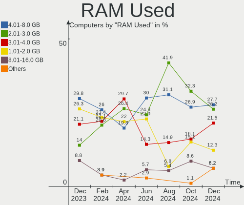
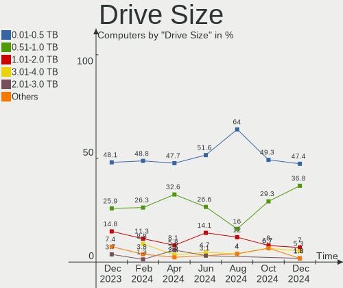
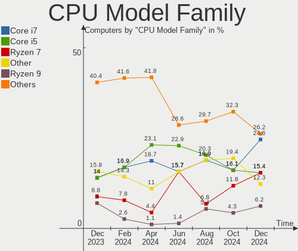
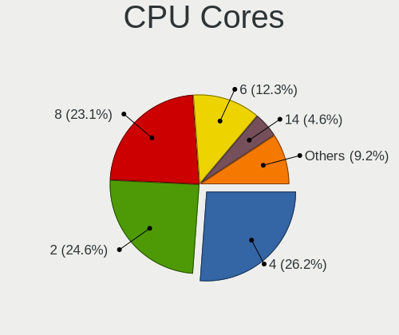
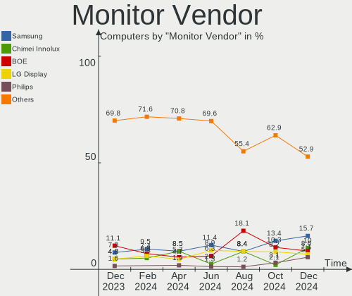
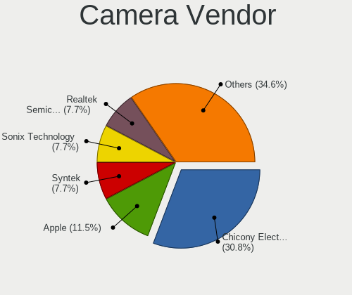

KDE neon Hardware Trends
------------------------

A project to identify most popular hardware characteristics and track their change
over time based on data collected by KDE neon users at https://Linux-Hardware.org.

Anyone can contribute to the study by uploading probes of their computers by
the [hw-probe](https://github.com/linuxhw/hw-probe) tool:

    sudo -E hw-probe -all -upload

This is a report for all computer types. See also reports for [desktops](/Dist/KDE_neon/Desktop/README.md) and [notebooks](/Dist/KDE_neon/Notebook/README.md).

Full-feature report is available here: https://linux-hardware.org/?view=trends

Period: Apr, 2021.

Contents
--------

- [ OS                       ](#os)
- [ OS Family                ](#os-family)
- [ Kernel                   ](#kernel)
- [ Kernel Family            ](#kernel-family)
- [ Kernel Major Ver.        ](#kernel-major-ver)
- [ Arch                     ](#arch)
- [ DE                       ](#de)
- [ Display Server           ](#display-server)
- [ Display Manager          ](#display-manager)
- [ OS Lang                  ](#os-lang)
- [ Boot Mode                ](#boot-mode)
- [ Filesystem               ](#filesystem)
- [ Part. scheme             ](#part-scheme)
- [ Dual Boot with Linux/BSD ](#dual-boot-with-linux/bsd)
- [ Dual Boot (Win)          ](#dual-boot-win)
- [ Country                  ](#country)
- [ City                     ](#city)
- [ Vendor                   ](#vendor)
- [ Model                    ](#model)
- [ Model Family             ](#model-family)
- [ MFG Year                 ](#mfg-year)
- [ Form Factor              ](#form-factor)
- [ Secure Boot              ](#secure-boot)
- [ Coreboot                 ](#coreboot)
- [ RAM Size                 ](#ram-size)
- [ RAM Used                 ](#ram-used)
- [ Has CD-ROM               ](#has-cd-rom)
- [ Total Drives             ](#total-drives)
- [ Has Ethernet             ](#has-ethernet)
- [ Has WiFi                 ](#has-wifi)
- [ Has Bluetooth            ](#has-bluetooth)
- [ Drive Vendor             ](#drive-vendor)
- [ Drive Model              ](#drive-model)
- [ HDD Vendor               ](#hdd-vendor)
- [ SSD Vendor               ](#ssd-vendor)
- [ Drive Kind               ](#drive-kind)
- [ Drive Connector          ](#drive-connector)
- [ Drive Size               ](#drive-size)
- [ Space Total              ](#space-total)
- [ Space Used               ](#space-used)
- [ Malfunc. Drives          ](#malfunc-drives)
- [ Malfunc. Drive Vendor    ](#malfunc-drive-vendor)
- [ Malfunc. HDD Vendor      ](#malfunc-hdd-vendor)
- [ Malfunc. Drive Kind      ](#malfunc-drive-kind)
- [ Failed Drives            ](#failed-drives)
- [ Failed Drive Vendor      ](#failed-drive-vendor)
- [ Drive Status             ](#drive-status)
- [ Storage Vendor           ](#storage-vendor)
- [ Storage Model            ](#storage-model)
- [ Storage Kind             ](#storage-kind)
- [ CPU Vendor               ](#cpu-vendor)
- [ CPU Model                ](#cpu-model)
- [ CPU Model Family         ](#cpu-model-family)
- [ CPU Cores                ](#cpu-cores)
- [ CPU Sockets              ](#cpu-sockets)
- [ CPU Threads              ](#cpu-threads)
- [ CPU Op-Modes             ](#cpu-op-modes)
- [ CPU Microcode            ](#cpu-microcode)
- [ CPU Microarch            ](#cpu-microarch)
- [ GPU Vendor               ](#gpu-vendor)
- [ GPU Model                ](#gpu-model)
- [ GPU Combo                ](#gpu-combo)
- [ GPU Driver               ](#gpu-driver)
- [ GPU Memory               ](#gpu-memory)
- [ Monitor Vendor           ](#monitor-vendor)
- [ Monitor Model            ](#monitor-model)
- [ Monitor Resolution       ](#monitor-resolution)
- [ Monitor Diagonal         ](#monitor-diagonal)
- [ Monitor Width            ](#monitor-width)
- [ Aspect Ratio             ](#aspect-ratio)
- [ Monitor Area             ](#monitor-area)
- [ Pixel Density            ](#pixel-density)
- [ Multiple Monitors        ](#multiple-monitors)
- [ Net Controller Vendor    ](#net-controller-vendor)
- [ Net Controller Model     ](#net-controller-model)
- [ Wireless Vendor          ](#wireless-vendor)
- [ Wireless Model           ](#wireless-model)
- [ Ethernet Vendor          ](#ethernet-vendor)
- [ Ethernet Model           ](#ethernet-model)
- [ Net Controller Kind      ](#net-controller-kind)
- [ Used Controller          ](#used-controller)
- [ NICs                     ](#nics)
- [ IPv6                     ](#ipv6)
- [ Memory Vendor            ](#memory-vendor)
- [ Memory Model             ](#memory-model)
- [ Memory Kind              ](#memory-kind)
- [ Memory Form Factor       ](#memory-form-factor)
- [ Memory Size              ](#memory-size)
- [ Memory Speed             ](#memory-speed)
- [ Sound Vendor             ](#sound-vendor)
- [ Sound Model              ](#sound-model)
- [ Camera Vendor            ](#camera-vendor)
- [ Camera Model             ](#camera-model)
- [ Fingerprint Vendor       ](#fingerprint-vendor)
- [ Fingerprint Model        ](#fingerprint-model)
- [ Chipcard Vendor          ](#chipcard-vendor)
- [ Chipcard Model           ](#chipcard-model)
- [ Printer Vendor           ](#printer-vendor)
- [ Printer Model            ](#printer-model)
- [ Scanner Vendor           ](#scanner-vendor)
- [ Scanner Model            ](#scanner-model)
- [ Bluetooth Vendor         ](#bluetooth-vendor)
- [ Bluetooth Model          ](#bluetooth-model)
- [ Unsupported Devices      ](#unsupported-devices)
- [ Unsupported Device Types ](#unsupported-device-types)

OS
--

Installed operating systems

| Name           | Computers | Percent |
|----------------|-----------|---------|
| KDE neon 20.04 | 166       | 99.4%   |
| KDE neon 18.04 | 1         | 0.6%    |

OS Family
---------

OS without a version

| Name     | Computers | Percent |
|----------|-----------|---------|
| KDE neon | 167       | 100%    |

Kernel
------

Version of the Linux kernel

| Version                | Computers | Percent |
|------------------------|-----------|---------|
| 5.4.0-70-generic       | 68        | 40.72%  |
| 5.4.0-72-generic       | 58        | 34.73%  |
| 5.4.0-71-generic       | 15        | 8.98%   |
| 5.4.0-66-generic       | 4         | 2.4%    |
| 5.8.0-49-generic       | 2         | 1.2%    |
| 5.8.0-48-generic       | 2         | 1.2%    |
| 5.11.16-051116-generic | 2         | 1.2%    |
| 5.9.16-050916-generic  | 1         | 0.6%    |
| 5.8.0-50-generic       | 1         | 0.6%    |
| 5.4.0-72-lowlatency    | 1         | 0.6%    |
| 5.4.0-70-lowlatency    | 1         | 0.6%    |
| 5.4.0-65-generic       | 1         | 0.6%    |
| 5.4.0-51-generic       | 1         | 0.6%    |
| 5.3.0-62-generic       | 1         | 0.6%    |
| 5.12.0-rc7+            | 1         | 0.6%    |
| 5.11.16-xanmod1        | 1         | 0.6%    |
| 5.11.14-xanmod1        | 1         | 0.6%    |
| 5.11.14-051114-generic | 1         | 0.6%    |
| 5.11.13-surface        | 1         | 0.6%    |
| 5.11.12-xanmod1        | 1         | 0.6%    |
| 5.11.11-051111-generic | 1         | 0.6%    |
| 5.10.26-xanmod1        | 1         | 0.6%    |
| Unknown                | 1         | 0.6%    |

Kernel Family
-------------

Linux kernel without a distro release

| Version | Computers | Percent |
|---------|-----------|---------|
| 5.4.0   | 149       | 89.22%  |
| 5.8.0   | 5         | 2.99%   |
| 5.11.16 | 3         | 1.8%    |
| 5.11.14 | 2         | 1.2%    |
| 5.9.16  | 1         | 0.6%    |
| 5.3.0   | 1         | 0.6%    |
| 5.12.0  | 1         | 0.6%    |
| 5.11.13 | 1         | 0.6%    |
| 5.11.12 | 1         | 0.6%    |
| 5.11.11 | 1         | 0.6%    |
| 5.10.26 | 1         | 0.6%    |
| Unknown | 1         | 0.6%    |

Kernel Major Ver.
-----------------

Linux kernel major version

| Version | Computers | Percent |
|---------|-----------|---------|
| 5.4     | 149       | 89.22%  |
| 5.11    | 8         | 4.79%   |
| 5.8     | 5         | 2.99%   |
| 5.9     | 1         | 0.6%    |
| 5.3     | 1         | 0.6%    |
| 5.12    | 1         | 0.6%    |
| 5.10    | 1         | 0.6%    |
| Unknown | 1         | 0.6%    |

Arch
----

OS architecture (x86_64, i586, etc.)

| Name   | Computers | Percent |
|--------|-----------|---------|
| x86_64 | 167       | 100%    |

DE
--

Desktop Environment

| Name       | Computers | Percent |
|------------|-----------|---------|
| KDE        | 151       | 90.42%  |
| KDE5       | 11        | 6.59%   |
| Unknown    | 4         | 2.4%    |
| X-Cinnamon | 1         | 0.6%    |

Display Server
--------------

X11 or Wayland

| Name    | Computers | Percent |
|---------|-----------|---------|
| X11     | 157       | 94.01%  |
| Wayland | 10        | 5.99%   |

Display Manager
---------------

SDDM, LightDM, etc.

| Name    | Computers | Percent |
|---------|-----------|---------|
| Unknown | 155       | 92.81%  |
| SDDM    | 12        | 7.19%   |

OS Lang
-------

Language

| Lang    | Computers | Percent |
|---------|-----------|---------|
| en_US   | 64        | 38.32%  |
| de_DE   | 21        | 12.57%  |
| ru_RU   | 18        | 10.78%  |
| en_GB   | 8         | 4.79%   |
| pt_BR   | 7         | 4.19%   |
| es_ES   | 6         | 3.59%   |
| en_CA   | 5         | 2.99%   |
| en_IN   | 3         | 1.8%    |
| en_IE   | 3         | 1.8%    |
| sv_SE   | 2         | 1.2%    |
| ru_UA   | 2         | 1.2%    |
| pt_PT   | 2         | 1.2%    |
| fr_FR   | 2         | 1.2%    |
| es_MX   | 2         | 1.2%    |
| en_AU   | 2         | 1.2%    |
| C       | 2         | 1.2%    |
| zh_CN   | 1         | 0.6%    |
| uk_UA   | 1         | 0.6%    |
| tr_TR   | 1         | 0.6%    |
| szl_PL  | 1         | 0.6%    |
| sk_SK   | 1         | 0.6%    |
| ro_RO   | 1         | 0.6%    |
| pl_PL   | 1         | 0.6%    |
| nl_NL   | 1         | 0.6%    |
| id_ID   | 1         | 0.6%    |
| fi_FI   | 1         | 0.6%    |
| es_DO   | 1         | 0.6%    |
| es_CU   | 1         | 0.6%    |
| es_AR   | 1         | 0.6%    |
| en_ZA   | 1         | 0.6%    |
| en_PH   | 1         | 0.6%    |
| en_NZ   | 1         | 0.6%    |
| cv_RU   | 1         | 0.6%    |
| Unknown | 1         | 0.6%    |

Boot Mode
---------

EFI or BIOS

| Mode | Computers | Percent |
|------|-----------|---------|
| EFI  | 98        | 58.68%  |
| BIOS | 69        | 41.32%  |

Filesystem
----------

Type of filesystem

| Type | Computers | Percent |
|------|-----------|---------|
| Ext4 | 167       | 100%    |

Part. scheme
------------

Scheme of partitioning

| Type    | Computers | Percent |
|---------|-----------|---------|
| Unknown | 154       | 92.22%  |
| GPT     | 10        | 5.99%   |
| MBR     | 3         | 1.8%    |

Dual Boot with Linux/BSD
------------------------

Hosting more than one Linux/BSD

| Dual boot | Computers | Percent |
|-----------|-----------|---------|
| No        | 161       | 96.41%  |
| Yes       | 6         | 3.59%   |

Dual Boot (Win)
---------------

Hosting Linux and Windows

| Dual boot | Computers | Percent |
|-----------|-----------|---------|
| No        | 153       | 91.62%  |
| Yes       | 14        | 8.38%   |

Country
-------

Geographic location (country)

| Country            | Computers | Percent |
|--------------------|-----------|---------|
| USA                | 35        | 20.96%  |
| Germany            | 24        | 14.37%  |
| Russia             | 19        | 11.38%  |
| Spain              | 8         | 4.79%   |
| Brazil             | 7         | 4.19%   |
| UK                 | 5         | 2.99%   |
| Poland             | 5         | 2.99%   |
| Netherlands        | 5         | 2.99%   |
| Canada             | 5         | 2.99%   |
| Ukraine            | 4         | 2.4%    |
| Turkey             | 4         | 2.4%    |
| India              | 4         | 2.4%    |
| Ireland            | 3         | 1.8%    |
| Sweden             | 2         | 1.2%    |
| South Africa       | 2         | 1.2%    |
| Romania            | 2         | 1.2%    |
| Portugal           | 2         | 1.2%    |
| Mexico             | 2         | 1.2%    |
| Indonesia          | 2         | 1.2%    |
| France             | 2         | 1.2%    |
| Australia          | 2         | 1.2%    |
| Argentina          | 2         | 1.2%    |
| Vietnam            | 1         | 0.6%    |
| Thailand           | 1         | 0.6%    |
| Switzerland        | 1         | 0.6%    |
| Slovenia           | 1         | 0.6%    |
| Serbia             | 1         | 0.6%    |
| Philippines        | 1         | 0.6%    |
| Norway             | 1         | 0.6%    |
| New Zealand        | 1         | 0.6%    |
| Luxembourg         | 1         | 0.6%    |
| Lithuania          | 1         | 0.6%    |
| Iraq               | 1         | 0.6%    |
| Hungary            | 1         | 0.6%    |
| Finland            | 1         | 0.6%    |
| Egypt              | 1         | 0.6%    |
| Dominican Republic | 1         | 0.6%    |
| Czechia            | 1         | 0.6%    |
| Colombia           | 1         | 0.6%    |
| China              | 1         | 0.6%    |
| Belarus            | 1         | 0.6%    |
| Austria            | 1         | 0.6%    |
| Algeria            | 1         | 0.6%    |

City
----

Geographic location (city)

| City                        | Computers | Percent |
|-----------------------------|-----------|---------|
| St Petersburg               | 6         | 3.59%   |
| Everett                     | 3         | 1.8%    |
| Amsterdam                   | 3         | 1.8%    |
| Peterborough                | 2         | 1.2%    |
| Perm                        | 2         | 1.2%    |
| Krakow                      | 2         | 1.2%    |
| Istanbul                    | 2         | 1.2%    |
| Hamburg                     | 2         | 1.2%    |
| Frankfurt am Main           | 2         | 1.2%    |
| Essen                       | 2         | 1.2%    |
| Edmonton                    | 2         | 1.2%    |
| Dublin                      | 2         | 1.2%    |
| Cape Town                   | 2         | 1.2%    |
| Žalec                      | 1         | 0.6%    |
| İzmit                      | 1         | 0.6%    |
| Zielona Góra               | 1         | 0.6%    |
| Zefta                       | 1         | 0.6%    |
| Zebulon                     | 1         | 0.6%    |
| Winter Park                 | 1         | 0.6%    |
| Winslow                     | 1         | 0.6%    |
| Weehawken                   | 1         | 0.6%    |
| Washington                  | 1         | 0.6%    |
| Volzhskiy                   | 1         | 0.6%    |
| Vilnius                     | 1         | 0.6%    |
| Vienna                      | 1         | 0.6%    |
| Valladolid                  | 1         | 0.6%    |
| Tubarao                     | 1         | 0.6%    |
| Trenggalek                  | 1         | 0.6%    |
| Torelló                    | 1         | 0.6%    |
| Timișoara                  | 1         | 0.6%    |
| Ternopil                    | 1         | 0.6%    |
| Tarnów                     | 1         | 0.6%    |
| Tacoma                      | 1         | 0.6%    |
| São Luís                  | 1         | 0.6%    |
| São João del Rei          | 1         | 0.6%    |
| Soleuvre                    | 1         | 0.6%    |
| Sligo                       | 1         | 0.6%    |
| Shenzhen                    | 1         | 0.6%    |
| Seville                     | 1         | 0.6%    |
| Senhora da Hora             | 1         | 0.6%    |
| Seesen                      | 1         | 0.6%    |
| Savannah                    | 1         | 0.6%    |
| Santo Domingo Este          | 1         | 0.6%    |
| Santa Cruz                  | 1         | 0.6%    |
| Santa Clara                 | 1         | 0.6%    |
| San Nicolás de los Arroyos | 1         | 0.6%    |
| San Luis Potosí City       | 1         | 0.6%    |
| San Francisco               | 1         | 0.6%    |
| San Diego                   | 1         | 0.6%    |
| San Antonio                 | 1         | 0.6%    |
| Samut Prakan                | 1         | 0.6%    |
| Saint Paul                  | 1         | 0.6%    |
| Saint Joseph                | 1         | 0.6%    |
| Ryazan                      | 1         | 0.6%    |
| Rostov-on-Don               | 1         | 0.6%    |
| Rosenheim                   | 1         | 0.6%    |
| Rondonópolis               | 1         | 0.6%    |
| Rivne                       | 1         | 0.6%    |
| Reno                        | 1         | 0.6%    |
| Radom                       | 1         | 0.6%    |

Vendor
------

Motherboard manufacturer

| Name                             | Computers | Percent |
|----------------------------------|-----------|---------|
| ASUSTek Computer                 | 35        | 20.96%  |
| Hewlett-Packard                  | 25        | 14.97%  |
| Dell                             | 20        | 11.98%  |
| MSI                              | 17        | 10.18%  |
| Lenovo                           | 17        | 10.18%  |
| Gigabyte Technology              | 9         | 5.39%   |
| ASRock                           | 8         | 4.79%   |
| Acer                             | 8         | 4.79%   |
| Toshiba                          | 3         | 1.8%    |
| Apple                            | 3         | 1.8%    |
| Sony                             | 2         | 1.2%    |
| Samsung Electronics              | 2         | 1.2%    |
| VINGA                            | 1         | 0.6%    |
| Semp Toshiba                     | 1         | 0.6%    |
| PINNACLEMICRO                    | 1         | 0.6%    |
| Pegatron                         | 1         | 0.6%    |
| Microsoft                        | 1         | 0.6%    |
| Medion                           | 1         | 0.6%    |
| LG Electronics                   | 1         | 0.6%    |
| Itautec                          | 1         | 0.6%    |
| Intel                            | 1         | 0.6%    |
| HUAWEI                           | 1         | 0.6%    |
| GPD                              | 1         | 0.6%    |
| FUJITSU CLIENT COMPUTING LIMITED | 1         | 0.6%    |
| Fujitsu                          | 1         | 0.6%    |
| Foxconn                          | 1         | 0.6%    |
| eMachines                        | 1         | 0.6%    |
| DEPO Computers                   | 1         | 0.6%    |
| Chuwi                            | 1         | 0.6%    |
| Alienware                        | 1         | 0.6%    |

Model
-----

Motherboard model

| Name                                       | Computers | Percent |
|--------------------------------------------|-----------|---------|
| ASUS All Series                            | 3         | 1.8%    |
| HP Pavilion g6                             | 2         | 1.2%    |
| HP Pavilion dv7                            | 2         | 1.2%    |
| HP EliteDesk 800 G1 SFF                    | 2         | 1.2%    |
| Dell Latitude E6420                        | 2         | 1.2%    |
| ASUS ZenBook UX431DA_UM431DA               | 2         | 1.2%    |
| ASUS PRIME B450M-A                         | 2         | 1.2%    |
| ASUS P8Z77-V PRO                           | 2         | 1.2%    |
| ASRock B450 Gaming K4                      | 2         | 1.2%    |
| VINGA Iron S140                            | 1         | 0.6%    |
| Toshiba Satellite R630                     | 1         | 0.6%    |
| Toshiba Satellite P870                     | 1         | 0.6%    |
| Toshiba Satellite L50D-B                   | 1         | 0.6%    |
| Sony VPCEJ1L1E                             | 1         | 0.6%    |
| Sony VGN-FZ140N                            | 1         | 0.6%    |
| Semp Toshiba STI NI 1401                   | 1         | 0.6%    |
| Samsung 905S3G/906S3G/915S3G/9305SG        | 1         | 0.6%    |
| Samsung 300V3Z/300V4Z/300V5Z/200A4Y/200A5Y | 1         | 0.6%    |
| PINNACLEMICRO P65_P67RGRERA                | 1         | 0.6%    |
| Pegatron FQ604AA-ABA m9552p                | 1         | 0.6%    |
| MSI MS-7C95                                | 1         | 0.6%    |
| MSI MS-7C82                                | 1         | 0.6%    |
| MSI MS-7C52                                | 1         | 0.6%    |
| MSI MS-7C37                                | 1         | 0.6%    |
| MSI MS-7C02                                | 1         | 0.6%    |
| MSI MS-7B85                                | 1         | 0.6%    |
| MSI MS-7B00                                | 1         | 0.6%    |
| MSI MS-7A33                                | 1         | 0.6%    |
| MSI MS-7978                                | 1         | 0.6%    |
| MSI MS-7888                                | 1         | 0.6%    |
| MSI MS-7798                                | 1         | 0.6%    |
| MSI MS-7693                                | 1         | 0.6%    |
| MSI MS-7309                                | 1         | 0.6%    |
| MSI GP60 2OD                               | 1         | 0.6%    |
| MSI GE62 6QD                               | 1         | 0.6%    |
| MSI G314                                   | 1         | 0.6%    |
| MSI Cubi N 8GL (MS-B171)                   | 1         | 0.6%    |
| Microsoft Surface Pro 6                    | 1         | 0.6%    |
| Medion P8614                               | 1         | 0.6%    |
| LG 17Z90N-R.AAC8U1                         | 1         | 0.6%    |
| Lenovo V110-15ISK 80TL                     | 1         | 0.6%    |
| Lenovo ThinkStation S20 4157ZSK            | 1         | 0.6%    |
| Lenovo ThinkPad X61 7674Y2E                | 1         | 0.6%    |
| Lenovo ThinkPad X230 232425U               | 1         | 0.6%    |
| Lenovo ThinkPad X1 Carbon 7th 20QD000SUS   | 1         | 0.6%    |
| Lenovo ThinkPad T480s 20L7001LUK           | 1         | 0.6%    |
| Lenovo ThinkPad T460p 20FW003MMS           | 1         | 0.6%    |
| Lenovo ThinkPad T440p 20AN00C2UK           | 1         | 0.6%    |
| Lenovo ThinkPad P15s Gen 1 20T4A001AU      | 1         | 0.6%    |
| Lenovo ThinkPad E560 20EV003WUS            | 1         | 0.6%    |
| Lenovo ThinkPad E15 Gen 2 20T8000TMZ       | 1         | 0.6%    |
| Lenovo IdeaPad S145-15API 81V7             | 1         | 0.6%    |
| Lenovo IdeaPad S145-14IWL 81MU             | 1         | 0.6%    |
| Lenovo IdeaCentre AIO 520-24IKU F0D2000DRK | 1         | 0.6%    |
| Lenovo IdeaCentre 3 07ADA05 90MV007SUS     | 1         | 0.6%    |
| Lenovo H50-50 90B6007BUK                   | 1         | 0.6%    |
| Lenovo G700 20251                          | 1         | 0.6%    |
| Itautec Infoway w7535                      | 1         | 0.6%    |
| Intel H81                                  | 1         | 0.6%    |
| HUAWEI HN-WX9X                             | 1         | 0.6%    |

Model Family
------------

Motherboard model prefix

| Name                 | Computers | Percent |
|----------------------|-----------|---------|
| HP Pavilion          | 10        | 5.99%   |
| Lenovo ThinkPad      | 9         | 5.39%   |
| Dell Latitude        | 7         | 4.19%   |
| Acer Aspire          | 6         | 3.59%   |
| Dell Inspiron        | 5         | 2.99%   |
| ASUS TUF             | 5         | 2.99%   |
| ASUS ROG             | 4         | 2.4%    |
| ASUS PRIME           | 4         | 2.4%    |
| Toshiba Satellite    | 3         | 1.8%    |
| Dell XPS             | 3         | 1.8%    |
| Dell OptiPlex        | 3         | 1.8%    |
| ASUS All             | 3         | 1.8%    |
| Lenovo IdeaPad       | 2         | 1.2%    |
| Lenovo IdeaCentre    | 2         | 1.2%    |
| HP Laptop            | 2         | 1.2%    |
| HP EliteDesk         | 2         | 1.2%    |
| HP EliteBook         | 2         | 1.2%    |
| ASUS ZenBook         | 2         | 1.2%    |
| ASUS VivoBook        | 2         | 1.2%    |
| ASUS P8Z77-V         | 2         | 1.2%    |
| ASRock B450M         | 2         | 1.2%    |
| ASRock B450          | 2         | 1.2%    |
| VINGA Iron           | 1         | 0.6%    |
| Sony VPCEJ1L1E       | 1         | 0.6%    |
| Sony VGN-FZ140N      | 1         | 0.6%    |
| Semp Toshiba STI     | 1         | 0.6%    |
| Samsung 905S3G       | 1         | 0.6%    |
| Samsung 300V3Z       | 1         | 0.6%    |
| PINNACLEMICRO P65    | 1         | 0.6%    |
| Pegatron FQ604AA-ABA | 1         | 0.6%    |
| MSI MS-7C95          | 1         | 0.6%    |
| MSI MS-7C82          | 1         | 0.6%    |
| MSI MS-7C52          | 1         | 0.6%    |
| MSI MS-7C37          | 1         | 0.6%    |
| MSI MS-7C02          | 1         | 0.6%    |
| MSI MS-7B85          | 1         | 0.6%    |
| MSI MS-7B00          | 1         | 0.6%    |
| MSI MS-7A33          | 1         | 0.6%    |
| MSI MS-7978          | 1         | 0.6%    |
| MSI MS-7888          | 1         | 0.6%    |
| MSI MS-7798          | 1         | 0.6%    |
| MSI MS-7693          | 1         | 0.6%    |
| MSI MS-7309          | 1         | 0.6%    |
| MSI GP60             | 1         | 0.6%    |
| MSI GE62             | 1         | 0.6%    |
| MSI G314             | 1         | 0.6%    |
| MSI Cubi             | 1         | 0.6%    |
| Microsoft Surface    | 1         | 0.6%    |
| Medion P8614         | 1         | 0.6%    |
| LG 17Z90N-R.AAC8U1   | 1         | 0.6%    |
| Lenovo V110-15ISK    | 1         | 0.6%    |
| Lenovo ThinkStation  | 1         | 0.6%    |
| Lenovo H50-50        | 1         | 0.6%    |
| Lenovo G700          | 1         | 0.6%    |
| Itautec Infoway      | 1         | 0.6%    |
| Intel H81            | 1         | 0.6%    |
| HUAWEI HN-WX9X       | 1         | 0.6%    |
| HP ZBook             | 1         | 0.6%    |
| HP Z800              | 1         | 0.6%    |
| HP ProDesk           | 1         | 0.6%    |

MFG Year
--------

Motherboard manufacture year

| Year    | Computers | Percent |
|---------|-----------|---------|
| 2020    | 42        | 25.15%  |
| 2019    | 22        | 13.17%  |
| 2018    | 15        | 8.98%   |
| 2013    | 13        | 7.78%   |
| 2014    | 10        | 5.99%   |
| 2021    | 9         | 5.39%   |
| 2012    | 9         | 5.39%   |
| 2011    | 8         | 4.79%   |
| 2017    | 7         | 4.19%   |
| 2010    | 7         | 4.19%   |
| 2016    | 6         | 3.59%   |
| 2009    | 6         | 3.59%   |
| 2015    | 5         | 2.99%   |
| 2008    | 4         | 2.4%    |
| 2007    | 3         | 1.8%    |
| Unknown | 1         | 0.6%    |

Form Factor
-----------

Physical design of the computer

| Name       | Computers | Percent |
|------------|-----------|---------|
| Notebook   | 88        | 52.69%  |
| Desktop    | 76        | 45.51%  |
| All in one | 2         | 1.2%    |
| Tablet     | 1         | 0.6%    |

Secure Boot
-----------

Enabled or disabled

| State    | Computers | Percent |
|----------|-----------|---------|
| Disabled | 150       | 89.82%  |
| Enabled  | 17        | 10.18%  |

Coreboot
--------

Have coreboot on board

| Used | Computers | Percent |
|------|-----------|---------|
| No   | 167       | 100%    |

RAM Size
--------

Total RAM memory

| Size in GB  | Computers | Percent |
|-------------|-----------|---------|
| 8.01-16.0   | 41        | 24.55%  |
| 16.01-24.0  | 38        | 22.75%  |
| 4.01-8.0    | 36        | 21.56%  |
| 3.01-4.0    | 30        | 17.96%  |
| 32.01-64.0  | 12        | 7.19%   |
| 24.01-32.0  | 7         | 4.19%   |
| 1.01-2.0    | 2         | 1.2%    |
| 64.01-256.0 | 1         | 0.6%    |

RAM Used
--------

Used RAM memory

| Used GB   | Computers | Percent |
|-----------|-----------|---------|
| 1.01-2.0  | 61        | 36.53%  |
| 2.01-3.0  | 53        | 31.74%  |
| 3.01-4.0  | 28        | 16.77%  |
| 4.01-8.0  | 19        | 11.38%  |
| 0.51-1.0  | 4         | 2.4%    |
| 8.01-16.0 | 2         | 1.2%    |

Has CD-ROM
----------

Has CD-ROM on board

| Presented | Computers | Percent |
|-----------|-----------|---------|
| No        | 96        | 57.49%  |
| Yes       | 71        | 42.51%  |

Total Drives
------------

Number of drives on board

| Drives | Computers | Percent |
|--------|-----------|---------|
| 1      | 88        | 52.69%  |
| 2      | 48        | 28.74%  |
| 3      | 20        | 11.98%  |
| 4      | 7         | 4.19%   |
| 5      | 3         | 1.8%    |
| 9      | 1         | 0.6%    |

Has Ethernet
------------

Has Ethernet on board

| Presented | Computers | Percent |
|-----------|-----------|---------|
| Yes       | 146       | 87.43%  |
| No        | 21        | 12.57%  |

Has WiFi
--------

Has WiFi module

| Presented | Computers | Percent |
|-----------|-----------|---------|
| Yes       | 126       | 75.45%  |
| No        | 41        | 24.55%  |

Has Bluetooth
-------------

Has Bluetooth module

| Presented | Computers | Percent |
|-----------|-----------|---------|
| Yes       | 95        | 56.89%  |
| No        | 72        | 43.11%  |

Drive Vendor
------------

Hard drive vendors

| Vendor                | Computers | Drives | Percent |
|-----------------------|-----------|--------|---------|
| WDC                   | 36        | 46     | 14.34%  |
| Samsung Electronics   | 36        | 50     | 14.34%  |
| Seagate               | 33        | 40     | 13.15%  |
| Toshiba               | 24        | 26     | 9.56%   |
| Kingston              | 17        | 20     | 6.77%   |
| SanDisk               | 14        | 14     | 5.58%   |
| Unknown               | 8         | 10     | 3.19%   |
| Hitachi               | 8         | 9      | 3.19%   |
| SK Hynix              | 7         | 7      | 2.79%   |
| Intel                 | 7         | 8      | 2.79%   |
| Phison                | 6         | 6      | 2.39%   |
| Crucial               | 6         | 7      | 2.39%   |
| HGST                  | 4         | 4      | 1.59%   |
| SPCC                  | 3         | 3      | 1.2%    |
| Micron Technology     | 3         | 3      | 1.2%    |
| Hewlett-Packard       | 3         | 3      | 1.2%    |
| GOODRAM               | 3         | 3      | 1.2%    |
| China                 | 3         | 3      | 1.2%    |
| A-DATA Technology     | 3         | 3      | 1.2%    |
| Realtek Semiconductor | 2         | 2      | 0.8%    |
| PNY                   | 2         | 3      | 0.8%    |
| Patriot               | 2         | 2      | 0.8%    |
| Maxtor                | 2         | 2      | 0.8%    |
| FORESEE               | 2         | 2      | 0.8%    |
| XPG                   | 1         | 1      | 0.4%    |
| V-GeN                 | 1         | 1      | 0.4%    |
| USB30                 | 1         | 1      | 0.4%    |
| Union Memory          | 1         | 1      | 0.4%    |
| Transcend             | 1         | 1      | 0.4%    |
| Silicon Motion        | 1         | 1      | 0.4%    |
| SABRENT               | 1         | 1      | 0.4%    |
| OCZ                   | 1         | 1      | 0.4%    |
| KingSpec              | 1         | 1      | 0.4%    |
| KESU                  | 1         | 1      | 0.4%    |
| JMicron               | 1         | 1      | 0.4%    |
| HS-SSD-E100           | 1         | 1      | 0.4%    |
| EZCOOL                | 1         | 1      | 0.4%    |
| Envoy                 | 1         | 1      | 0.4%    |
| EDGE                  | 1         | 1      | 0.4%    |
| Corsair               | 1         | 1      | 0.4%    |
| ASMT                  | 1         | 1      | 0.4%    |

Drive Model
-----------

Hard drive models

| Model                               | Computers | Percent |
|-------------------------------------|-----------|---------|
| Kingston SA400S37240G 240GB SSD     | 6         | 2.08%   |
| Samsung NVMe SSD Drive 500GB        | 5         | 1.74%   |
| WDC WD10EZEX-08WN4A0 1TB            | 4         | 1.39%   |
| Seagate ST500DM002-1BD142 500GB     | 4         | 1.39%   |
| Samsung SSD 850 EVO 250GB           | 4         | 1.39%   |
| Toshiba NVMe SSD Drive 512GB        | 3         | 1.04%   |
| Toshiba DT01ACA050 500GB            | 3         | 1.04%   |
| Samsung SSD 840 EVO 250GB           | 3         | 1.04%   |
| Samsung NVMe SSD Drive 512GB        | 3         | 1.04%   |
| Samsung NVMe SSD Drive 1TB          | 3         | 1.04%   |
| WDC WDS500G2B0A-00SM50 500GB SSD    | 2         | 0.69%   |
| WDC WDS240G2G0A-00JH30 240GB SSD    | 2         | 0.69%   |
| WDC WDS100T2B0A-00SM50 1TB SSD      | 2         | 0.69%   |
| Unknown MMC Card  128GB             | 2         | 0.69%   |
| Toshiba HDWD130 3TB                 | 2         | 0.69%   |
| SK Hynix NVMe SSD Drive 256GB       | 2         | 0.69%   |
| Seagate ST500LM012 HN-M500MBB 500GB | 2         | 0.69%   |
| Seagate ST3000DM001-1CH166 3TB      | 2         | 0.69%   |
| Seagate ST2000LM007-1R8174 2TB      | 2         | 0.69%   |
| Seagate ST1000LM035-1RK172 1TB      | 2         | 0.69%   |
| Seagate ST1000DM010-2EP102 1TB      | 2         | 0.69%   |
| Sandisk NVMe SSD Drive 500GB        | 2         | 0.69%   |
| Samsung SSD 860 EVO 500GB           | 2         | 0.69%   |
| Samsung SSD 850 EVO 500GB           | 2         | 0.69%   |
| Samsung NVMe SSD Drive 256GB        | 2         | 0.69%   |
| Realtek NVMe SSD Drive 128GB        | 2         | 0.69%   |
| Phison NVMe SSD Drive 256GB         | 2         | 0.69%   |
| Kingston SV300S37A120G 120GB SSD    | 2         | 0.69%   |
| Kingston SA400S37120G 120GB SSD     | 2         | 0.69%   |
| Kingston SA2000M8500G 500GB         | 2         | 0.69%   |
| Kingston NVMe SSD Drive 500GB       | 2         | 0.69%   |
| Intel NVMe SSD Drive 1024GB         | 2         | 0.69%   |
| Hitachi HUA722020ALA331 2TB         | 2         | 0.69%   |
| HP SSD S700 500GB                   | 2         | 0.69%   |
| FORESEE 128GB SSD                   | 2         | 0.69%   |
| Crucial CT2000BX500SSD1 2TB         | 2         | 0.69%   |
| XPG NVMe SSD Drive 1024GB           | 1         | 0.35%   |
| WDC WDS500G2B0A 500GB SSD           | 1         | 0.35%   |
| WDC WDS250G2X0C-00L350 250GB        | 1         | 0.35%   |
| WDC WDS240G2G0B-00EPW0 240GB SSD    | 1         | 0.35%   |
| WDC WDS240G1G0A-00SS50 240GB SSD    | 1         | 0.35%   |
| WDC WDS120G2G0A-00JH30 120GB SSD    | 1         | 0.35%   |
| WDC WDS100T2B0B-00YS70 1TB SSD      | 1         | 0.35%   |
| WDC WDBNCE0010PNC 1TB SSD           | 1         | 0.35%   |
| WDC WD82PURZ-85TEUY0 8TB            | 1         | 0.35%   |
| WDC WD7500BPVX-22JC3T0 752GB        | 1         | 0.35%   |
| WDC WD7500BPKX-60HPJT0 752GB        | 1         | 0.35%   |
| WDC WD7500BPKX-00HPJT0 752GB        | 1         | 0.35%   |
| WDC WD6400BPVT-22HXZT3 640GB        | 1         | 0.35%   |
| WDC WD5000LPZX-60Z10T0 500GB        | 1         | 0.35%   |
| WDC WD5000LPVX-60V0TT0 500GB        | 1         | 0.35%   |
| WDC WD5000AAKX-00KJ3A0 500GB        | 1         | 0.35%   |
| WDC WD5000AAKX-003CA0 500GB         | 1         | 0.35%   |
| WDC WD3200LPVT-22G33T0 320GB        | 1         | 0.35%   |
| WDC WD3200BPVT-24JJ5T0 320GB        | 1         | 0.35%   |
| WDC WD3200BEVT-75ZCT1 320GB         | 1         | 0.35%   |
| WDC WD2500AAKX-083CA1 250GB         | 1         | 0.35%   |
| WDC WD2500AAKX-001CA0 250GB         | 1         | 0.35%   |
| WDC WD2500AAJS-22VTA0 250GB         | 1         | 0.35%   |
| WDC WD20EZAZ-00GGJB0 2TB            | 1         | 0.35%   |

HDD Vendor
----------

Hard disk drive vendors

| Vendor              | Computers | Drives | Percent |
|---------------------|-----------|--------|---------|
| Seagate             | 33        | 40     | 33%     |
| WDC                 | 29        | 32     | 29%     |
| Toshiba             | 18        | 20     | 18%     |
| Hitachi             | 8         | 9      | 8%      |
| Samsung Electronics | 4         | 4      | 4%      |
| HGST                | 4         | 4      | 4%      |
| MAXTOR              | 2         | 2      | 2%      |
| KESU                | 1         | 1      | 1%      |
| ASMT                | 1         | 1      | 1%      |

SSD Vendor
----------

Solid state drive vendors

| Vendor              | Computers | Drives | Percent |
|---------------------|-----------|--------|---------|
| Samsung Electronics | 26        | 31     | 26%     |
| Kingston            | 13        | 14     | 13%     |
| SanDisk             | 10        | 10     | 10%     |
| WDC                 | 8         | 12     | 8%      |
| Crucial             | 6         | 7      | 6%      |
| SPCC                | 3         | 3      | 3%      |
| Micron Technology   | 3         | 3      | 3%      |
| Hewlett-Packard     | 3         | 3      | 3%      |
| GOODRAM             | 3         | 3      | 3%      |
| China               | 3         | 3      | 3%      |
| A-DATA Technology   | 3         | 3      | 3%      |
| Toshiba             | 2         | 2      | 2%      |
| PNY                 | 2         | 3      | 2%      |
| Patriot             | 2         | 2      | 2%      |
| Intel               | 2         | 2      | 2%      |
| FORESEE             | 2         | 2      | 2%      |
| USB30               | 1         | 1      | 1%      |
| Union Memory        | 1         | 1      | 1%      |
| Transcend           | 1         | 1      | 1%      |
| SK Hynix            | 1         | 1      | 1%      |
| OCZ                 | 1         | 1      | 1%      |
| KingSpec            | 1         | 1      | 1%      |
| JMicron             | 1         | 1      | 1%      |
| EDGE                | 1         | 1      | 1%      |
| Corsair             | 1         | 1      | 1%      |

Drive Kind
----------

HDD or SSD

| Kind    | Computers | Drives | Percent |
|---------|-----------|--------|---------|
| HDD     | 88        | 113    | 37.29%  |
| SSD     | 87        | 112    | 36.86%  |
| NVMe    | 49        | 54     | 20.76%  |
| Unknown | 8         | 10     | 3.39%   |
| MMC     | 4         | 4      | 1.69%   |

Drive Connector
---------------

SATA, SAS, NVMe, etc.

| Type | Computers | Drives | Percent |
|------|-----------|--------|---------|
| SATA | 141       | 226    | 69.8%   |
| NVMe | 48        | 53     | 23.76%  |
| SAS  | 9         | 10     | 4.46%   |
| MMC  | 4         | 4      | 1.98%   |

Drive Size
----------

Size of hard drive

| Size in TB | Computers | Drives | Percent |
|------------|-----------|--------|---------|
| 0.01-0.5   | 98        | 135    | 55.68%  |
| 0.51-1.0   | 49        | 57     | 27.84%  |
| 1.01-2.0   | 18        | 21     | 10.23%  |
| 2.01-3.0   | 5         | 6      | 2.84%   |
| 4.01-10.0  | 4         | 4      | 2.27%   |
| 3.01-4.0   | 2         | 2      | 1.14%   |

Space Total
-----------

Amount of disk space available on the file system

| Size in GB     | Computers | Percent |
|----------------|-----------|---------|
| 101-250        | 43        | 25.75%  |
| 251-500        | 37        | 22.16%  |
| 501-1000       | 30        | 17.96%  |
| 51-100         | 18        | 10.78%  |
| 21-50          | 11        | 6.59%   |
| 1001-2000      | 10        | 5.99%   |
| 2001-3000      | 6         | 3.59%   |
| Unknown        | 5         | 2.99%   |
| More than 3000 | 4         | 2.4%    |
| 1-20           | 3         | 1.8%    |

Space Used
----------

Amount of used disk space

| Used GB        | Computers | Percent |
|----------------|-----------|---------|
| 1-20           | 76        | 45.51%  |
| 21-50          | 22        | 13.17%  |
| 101-250        | 18        | 10.78%  |
| 251-500        | 17        | 10.18%  |
| 51-100         | 14        | 8.38%   |
| 501-1000       | 8         | 4.79%   |
| Unknown        | 5         | 2.99%   |
| More than 3000 | 3         | 1.8%    |
| 1001-2000      | 3         | 1.8%    |
| 2001-3000      | 1         | 0.6%    |

Malfunc. Drives
---------------

Drive models with a malfunction

Zero info for selected period =(

Malfunc. Drive Vendor
---------------------

Vendors of faulty drives

Zero info for selected period =(

Malfunc. HDD Vendor
-------------------

Vendors of faulty HDD drives

Zero info for selected period =(

Malfunc. Drive Kind
-------------------

Kinds of faulty drives

Zero info for selected period =(

Failed Drives
-------------

Failed drive models

Zero info for selected period =(

Failed Drive Vendor
-------------------

Failed drive vendors

Zero info for selected period =(

Drive Status
------------

Number of failed and malfunc. drives

| Status   | Computers | Drives | Percent |
|----------|-----------|--------|---------|
| Detected | 154       | 273    | 91.12%  |
| Works    | 15        | 20     | 8.88%   |

Storage Vendor
--------------

Storage controller vendors

| Vendor                       | Computers | Percent |
|------------------------------|-----------|---------|
| Intel                        | 113       | 51.83%  |
| AMD                          | 45        | 20.64%  |
| Samsung Electronics          | 14        | 6.42%   |
| ASMedia Technology           | 9         | 4.13%   |
| SK Hynix                     | 6         | 2.75%   |
| Sandisk                      | 6         | 2.75%   |
| Phison Electronics           | 6         | 2.75%   |
| Toshiba America Info Systems | 4         | 1.83%   |
| Kingston Technology Company  | 4         | 1.83%   |
| VIA Technologies             | 2         | 0.92%   |
| Realtek Semiconductor        | 2         | 0.92%   |
| Nvidia                       | 2         | 0.92%   |
| Marvell Technology Group     | 2         | 0.92%   |
| Silicon Motion               | 1         | 0.46%   |
| LSI Logic / Symbios Logic    | 1         | 0.46%   |
| ADATA Technology             | 1         | 0.46%   |

Storage Model
-------------

Storage controller models

| Model                                                                            | Computers | Percent |
|----------------------------------------------------------------------------------|-----------|---------|
| AMD FCH SATA Controller [AHCI mode]                                              | 33        | 12.74%  |
| AMD 400 Series Chipset SATA Controller                                           | 14        | 5.41%   |
| Intel 6 Series/C200 Series Chipset Family 6 port Mobile SATA AHCI Controller     | 13        | 5.02%   |
| Intel Sunrise Point-LP SATA Controller [AHCI mode]                               | 11        | 4.25%   |
| Intel 8 Series/C220 Series Chipset Family 6-port SATA Controller 1 [AHCI mode]   | 11        | 4.25%   |
| Samsung NVMe SSD Controller SM981/PM981/PM983                                    | 10        | 3.86%   |
| ASMedia ASM1062 Serial ATA Controller                                            | 9         | 3.47%   |
| Intel 7 Series/C210 Series Chipset Family 6-port SATA Controller [AHCI mode]     | 7         | 2.7%    |
| Intel 7 Series Chipset Family 6-port SATA Controller [AHCI mode]                 | 6         | 2.32%   |
| Intel HM170/QM170 Chipset SATA Controller [AHCI Mode]                            | 5         | 1.93%   |
| Intel Comet Lake SATA AHCI Controller                                            | 5         | 1.93%   |
| Intel 82801 Mobile SATA Controller [RAID mode]                                   | 5         | 1.93%   |
| SK Hynix BC501 NVMe Solid State Drive 512GB                                      | 4         | 1.54%   |
| Phison E12 NVMe Controller                                                       | 4         | 1.54%   |
| Intel Q170/Q150/B150/H170/H110/Z170/CM236 Chipset SATA Controller [AHCI Mode]    | 4         | 1.54%   |
| Intel 82801HM/HEM (ICH8M/ICH8M-E) IDE Controller                                 | 4         | 1.54%   |
| Intel 5 Series/3400 Series Chipset 4 port SATA AHCI Controller                   | 4         | 1.54%   |
| AMD SB7x0/SB8x0/SB9x0 SATA Controller [AHCI mode]                                | 4         | 1.54%   |
| Samsung NVMe SSD Controller SM951/PM951                                          | 3         | 1.16%   |
| Kingston Company A2000 NVMe SSD                                                  | 3         | 1.16%   |
| Intel NM10/ICH7 Family SATA Controller [IDE mode]                                | 3         | 1.16%   |
| Intel Celeron/Pentium Silver Processor SATA Controller                           | 3         | 1.16%   |
| Intel 82801HM/HEM (ICH8M/ICH8M-E) SATA Controller [AHCI mode]                    | 3         | 1.16%   |
| AMD Starship/Matisse Chipset SATA Controller [AHCI mode]                         | 3         | 1.16%   |
| AMD SB7x0/SB8x0/SB9x0 IDE Controller                                             | 3         | 1.16%   |
| AMD FCH SATA Controller D                                                        | 3         | 1.16%   |
| Toshiba America Info Systems XG6 NVMe SSD Controller                             | 2         | 0.77%   |
| Sandisk WD Blue SN550 NVMe SSD                                                   | 2         | 0.77%   |
| Sandisk WD Black SN750 / PC SN730 NVMe SSD                                       | 2         | 0.77%   |
| Sandisk WD Black 2018/SN750 / PC SN720 NVMe SSD                                  | 2         | 0.77%   |
| Samsung NVMe Controller                                                          | 2         | 0.77%   |
| Realtek Realtek Non-Volatile memory controller                                   | 2         | 0.77%   |
| Intel SSD Pro 7600p/760p/E 6100p Series                                          | 2         | 0.77%   |
| Intel SATA Controller [RAID mode]                                                | 2         | 0.77%   |
| Intel Non-Volatile memory controller                                             | 2         | 0.77%   |
| Intel Cannon Lake PCH SATA AHCI Controller                                       | 2         | 0.77%   |
| Intel Cannon Lake Mobile PCH SATA AHCI Controller                                | 2         | 0.77%   |
| Intel 82801JI (ICH10 Family) SATA AHCI Controller                                | 2         | 0.77%   |
| Intel 82801IBM/IEM (ICH9M/ICH9M-E) 4 port SATA Controller [AHCI mode]            | 2         | 0.77%   |
| Intel 82801HM/HEM (ICH8M/ICH8M-E) SATA Controller [IDE mode]                     | 2         | 0.77%   |
| Intel 82801G (ICH7 Family) IDE Controller                                        | 2         | 0.77%   |
| Intel 6 Series/C200 Series Chipset Family 6 port Desktop SATA AHCI Controller    | 2         | 0.77%   |
| Intel 400 Series Chipset Family SATA AHCI Controller                             | 2         | 0.77%   |
| AMD X370 Series Chipset SATA Controller                                          | 2         | 0.77%   |
| AMD SB7x0/SB8x0/SB9x0 SATA Controller [IDE mode]                                 | 2         | 0.77%   |
| AMD 300 Series Chipset SATA Controller                                           | 2         | 0.77%   |
| VIA VT6421 IDE/SATA Controller                                                   | 1         | 0.39%   |
| VIA VT6415 PATA IDE Host Controller                                              | 1         | 0.39%   |
| Toshiba America Info Systems Toshiba America Info Non-Volatile memory controller | 1         | 0.39%   |
| Toshiba America Info Systems BG3 NVMe SSD Controller                             | 1         | 0.39%   |
| SK Hynix PC401 NVMe Solid State Drive 256GB                                      | 1         | 0.39%   |
| SK Hynix Non-Volatile memory controller                                          | 1         | 0.39%   |
| Silicon Motion SM2263EN/SM2263XT SSD Controller                                  | 1         | 0.39%   |
| Samsung Electronics SATA controller                                              | 1         | 0.39%   |
| Phison PS5013 E13 NVMe Controller                                                | 1         | 0.39%   |
| Phison NVMe Storage Controller                                                   | 1         | 0.39%   |
| Nvidia MCP61 SATA Controller                                                     | 1         | 0.39%   |
| Nvidia MCP61 IDE                                                                 | 1         | 0.39%   |
| Nvidia MCP51 Serial ATA Controller                                               | 1         | 0.39%   |
| Nvidia MCP51 IDE                                                                 | 1         | 0.39%   |

Storage Kind
------------

Kind of storage controller (IDE, SATA, NVMe, SAS, ...)

| Kind | Computers | Percent |
|------|-----------|---------|
| SATA | 137       | 64.32%  |
| NVMe | 48        | 22.54%  |
| IDE  | 19        | 8.92%   |
| RAID | 8         | 3.76%   |
| SCSI | 1         | 0.47%   |

CPU Vendor
----------

Processor vendors

| Vendor | Computers | Percent |
|--------|-----------|---------|
| Intel  | 118       | 70.66%  |
| AMD    | 49        | 29.34%  |

CPU Model
---------

Processor models

| Model                                         | Computers | Percent |
|-----------------------------------------------|-----------|---------|
| Intel Core i7-6700HQ CPU @ 2.60GHz            | 5         | 2.99%   |
| AMD Ryzen 7 2700 Eight-Core Processor         | 4         | 2.4%    |
| AMD Ryzen 5 3500U with Radeon Vega Mobile Gfx | 4         | 2.4%    |
| Intel Core i7-2670QM CPU @ 2.20GHz            | 3         | 1.8%    |
| Intel Core i7-10510U CPU @ 1.80GHz            | 3         | 1.8%    |
| Intel Core i5-8250U CPU @ 1.60GHz             | 3         | 1.8%    |
| Intel Core i5-6200U CPU @ 2.30GHz             | 3         | 1.8%    |
| Intel Core i5-4460 CPU @ 3.20GHz              | 3         | 1.8%    |
| Intel Core i3-2310M CPU @ 2.10GHz             | 3         | 1.8%    |
| AMD Ryzen 7 3700X 8-Core Processor            | 3         | 1.8%    |
| AMD Ryzen 5 2600 Six-Core Processor           | 3         | 1.8%    |
| Intel Pentium Silver N5000 CPU @ 1.10GHz      | 2         | 1.2%    |
| Intel Core i7-8650U CPU @ 1.90GHz             | 2         | 1.2%    |
| Intel Core i7-2600 CPU @ 3.40GHz              | 2         | 1.2%    |
| Intel Core i7-1065G7 CPU @ 1.30GHz            | 2         | 1.2%    |
| Intel Core i5-7200U CPU @ 2.50GHz             | 2         | 1.2%    |
| Intel Core i5-4570 CPU @ 3.20GHz              | 2         | 1.2%    |
| Intel Core i5-3570K CPU @ 3.40GHz             | 2         | 1.2%    |
| Intel Core i5-3470 CPU @ 3.20GHz              | 2         | 1.2%    |
| Intel Core i5-2430M CPU @ 2.40GHz             | 2         | 1.2%    |
| Intel Core i5-2410M CPU @ 2.30GHz             | 2         | 1.2%    |
| Intel Core i5-2400 CPU @ 3.10GHz              | 2         | 1.2%    |
| Intel Core i3-6006U CPU @ 2.00GHz             | 2         | 1.2%    |
| Intel Core i3 CPU M 370 @ 2.40GHz             | 2         | 1.2%    |
| Intel Core 2 Quad CPU Q8200 @ 2.33GHz         | 2         | 1.2%    |
| AMD Ryzen 5 3400G with Radeon Vega Graphics   | 2         | 1.2%    |
| AMD Ryzen 5 2400G with Radeon Vega Graphics   | 2         | 1.2%    |
| Intel Xeon CPU X5650 @ 2.67GHz                | 1         | 0.6%    |
| Intel Xeon CPU W3690 @ 3.47GHz                | 1         | 0.6%    |
| Intel Xeon CPU W3565 @ 3.20GHz                | 1         | 0.6%    |
| Intel Xeon CPU E5472 @ 3.00GHz                | 1         | 0.6%    |
| Intel Pentium CPU N3530 @ 2.16GHz             | 1         | 0.6%    |
| Intel Pentium CPU J4205 @ 1.50GHz             | 1         | 0.6%    |
| Intel Pentium CPU G2030 @ 3.00GHz             | 1         | 0.6%    |
| Intel Pentium CPU 6405U @ 2.40GHz             | 1         | 0.6%    |
| Intel Pentium CPU 2020M @ 2.40GHz             | 1         | 0.6%    |
| Intel Genuine CPU U7300 @ 1.30GHz             | 1         | 0.6%    |
| Intel Core m5-6Y57 CPU @ 1.10GHz              | 1         | 0.6%    |
| Intel Core m3-8100Y CPU @ 1.10GHz             | 1         | 0.6%    |
| Intel Core i9-8950HK CPU @ 2.90GHz            | 1         | 0.6%    |
| Intel Core i7-9750H CPU @ 2.60GHz             | 1         | 0.6%    |
| Intel Core i7-9700 CPU @ 3.00GHz              | 1         | 0.6%    |
| Intel Core i7-8665U CPU @ 1.90GHz             | 1         | 0.6%    |
| Intel Core i7-8565U CPU @ 1.80GHz             | 1         | 0.6%    |
| Intel Core i7-8550U CPU @ 1.80GHz             | 1         | 0.6%    |
| Intel Core i7-8086K CPU @ 4.00GHz             | 1         | 0.6%    |
| Intel Core i7-6700K CPU @ 4.00GHz             | 1         | 0.6%    |
| Intel Core i7-6500U CPU @ 2.50GHz             | 1         | 0.6%    |
| Intel Core i7-4790 CPU @ 3.60GHz              | 1         | 0.6%    |
| Intel Core i7-4770 CPU @ 3.40GHz              | 1         | 0.6%    |
| Intel Core i7-4710MQ CPU @ 2.50GHz            | 1         | 0.6%    |
| Intel Core i7-3630QM CPU @ 2.40GHz            | 1         | 0.6%    |
| Intel Core i7-2720QM CPU @ 2.20GHz            | 1         | 0.6%    |
| Intel Core i7-2630QM CPU @ 2.00GHz            | 1         | 0.6%    |
| Intel Core i7-10750H CPU @ 2.60GHz            | 1         | 0.6%    |
| Intel Core i7-10610U CPU @ 1.80GHz            | 1         | 0.6%    |
| Intel Core i7 CPU 870 @ 2.93GHz               | 1         | 0.6%    |
| Intel Core i5-8400 CPU @ 2.80GHz              | 1         | 0.6%    |
| Intel Core i5-8300H CPU @ 2.30GHz             | 1         | 0.6%    |
| Intel Core i5-7600K CPU @ 3.80GHz             | 1         | 0.6%    |

CPU Model Family
----------------

Processor model prefix

| Model                          | Computers | Percent |
|--------------------------------|-----------|---------|
| Intel Core i5                  | 41        | 24.55%  |
| Intel Core i7                  | 34        | 20.36%  |
| AMD Ryzen 5                    | 20        | 11.98%  |
| Intel Core i3                  | 12        | 7.19%   |
| AMD Ryzen 7                    | 12        | 7.19%   |
| Intel Core 2 Duo               | 8         | 4.79%   |
| Intel Pentium                  | 5         | 2.99%   |
| Intel Xeon                     | 4         | 2.4%    |
| Intel Celeron                  | 4         | 2.4%    |
| AMD FX                         | 4         | 2.4%    |
| Intel Core 2 Quad              | 3         | 1.8%    |
| Intel Pentium Silver           | 2         | 1.2%    |
| AMD A8                         | 2         | 1.2%    |
| AMD A6                         | 2         | 1.2%    |
| Intel Genuine                  | 1         | 0.6%    |
| Intel Core m5                  | 1         | 0.6%    |
| Intel Core m3                  | 1         | 0.6%    |
| Intel Core i9                  | 1         | 0.6%    |
| Intel Atom                     | 1         | 0.6%    |
| AMD Turion X2 Dual-Core Mobile | 1         | 0.6%    |
| AMD Turion 64 Mobile           | 1         | 0.6%    |
| AMD Ryzen 9                    | 1         | 0.6%    |
| AMD Ryzen 7 PRO                | 1         | 0.6%    |
| AMD Ryzen 3                    | 1         | 0.6%    |
| AMD Quad-Core                  | 1         | 0.6%    |
| AMD Phenom II X6               | 1         | 0.6%    |
| AMD Phenom                     | 1         | 0.6%    |
| AMD E1                         | 1         | 0.6%    |

CPU Cores
---------

Number of processor cores

| Number | Computers | Percent |
|--------|-----------|---------|
| 4      | 77        | 46.11%  |
| 2      | 53        | 31.74%  |
| 6      | 19        | 11.38%  |
| 8      | 12        | 7.19%   |
| 12     | 2         | 1.2%    |
| 3      | 2         | 1.2%    |
| 1      | 2         | 1.2%    |

CPU Sockets
-----------

Number of sockets

| Number | Computers | Percent |
|--------|-----------|---------|
| 1      | 166       | 99.4%   |
| 2      | 1         | 0.6%    |

CPU Threads
-----------

Threads per core (Hyper-Threading)

| Number | Computers | Percent |
|--------|-----------|---------|
| 2      | 115       | 68.86%  |
| 1      | 52        | 31.14%  |

CPU Op-Modes
------------

CPU Operation Modes (32-bit, 64-bit)

| Op mode        | Computers | Percent |
|----------------|-----------|---------|
| 32-bit, 64-bit | 167       | 100%    |

CPU Microcode
-------------

Microcode number

| Number     | Computers | Percent |
|------------|-----------|---------|
| 0x206a7    | 17        | 10.18%  |
| 0x306c3    | 12        | 7.19%   |
| 0x306a9    | 12        | 7.19%   |
| Unknown    | 10        | 5.99%   |
| 0x506e3    | 9         | 5.39%   |
| 0x0800820d | 8         | 4.79%   |
| 0x406e3    | 7         | 4.19%   |
| 0x806ec    | 6         | 3.59%   |
| 0x806ea    | 6         | 3.59%   |
| 0x08701021 | 6         | 3.59%   |
| 0x08108109 | 6         | 3.59%   |
| 0x906ea    | 5         | 2.99%   |
| 0x20655    | 5         | 2.99%   |
| 0x10676    | 4         | 2.4%    |
| 0xa0653    | 3         | 1.8%    |
| 0x706a1    | 3         | 1.8%    |
| 0x1067a    | 3         | 1.8%    |
| 0x08108102 | 3         | 1.8%    |
| 0x06000852 | 3         | 1.8%    |
| 0x806e9    | 2         | 1.2%    |
| 0x6fd      | 2         | 1.2%    |
| 0x6fb      | 2         | 1.2%    |
| 0x206c2    | 2         | 1.2%    |
| 0x08701013 | 2         | 1.2%    |
| 0x08101016 | 2         | 1.2%    |
| 0x08101007 | 2         | 1.2%    |
| 0x0700010f | 2         | 1.2%    |
| 0x06001119 | 2         | 1.2%    |
| 0xa0655    | 1         | 0.6%    |
| 0xa0652    | 1         | 0.6%    |
| 0x906ed    | 1         | 0.6%    |
| 0x906e9    | 1         | 0.6%    |
| 0x806eb    | 1         | 0.6%    |
| 0x706e5    | 1         | 0.6%    |
| 0x506c9    | 1         | 0.6%    |
| 0x40651    | 1         | 0.6%    |
| 0x30678    | 1         | 0.6%    |
| 0x30661    | 1         | 0.6%    |
| 0x106e5    | 1         | 0.6%    |
| 0x106a5    | 1         | 0.6%    |
| 0x10677    | 1         | 0.6%    |
| 0x08600106 | 1         | 0.6%    |
| 0x08600103 | 1         | 0.6%    |
| 0x08001138 | 1         | 0.6%    |
| 0x08001126 | 1         | 0.6%    |
| 0x07030104 | 1         | 0.6%    |
| 0x03000027 | 1         | 0.6%    |
| 0x02000057 | 1         | 0.6%    |
| 0x010000dc | 1         | 0.6%    |

CPU Microarch
-------------

Microarchitecture

| Name            | Computers | Percent |
|-----------------|-----------|---------|
| KabyLake        | 24        | 14.37%  |
| SandyBridge     | 18        | 10.78%  |
| Zen+            | 17        | 10.18%  |
| Skylake         | 16        | 9.58%   |
| Haswell         | 13        | 7.78%   |
| IvyBridge       | 12        | 7.19%   |
| Zen 2           | 11        | 6.59%   |
| Penryn          | 9         | 5.39%   |
| Zen             | 7         | 4.19%   |
| Westmere        | 7         | 4.19%   |
| Piledriver      | 6         | 3.59%   |
| CometLake       | 5         | 2.99%   |
| Core            | 4         | 2.4%    |
| Goldmont plus   | 3         | 1.8%    |
| Nehalem         | 2         | 1.2%    |
| K10             | 2         | 1.2%    |
| Jaguar          | 2         | 1.2%    |
| IceLake         | 2         | 1.2%    |
| Silvermont      | 1         | 0.6%    |
| Puma            | 1         | 0.6%    |
| K8 Hammer       | 1         | 0.6%    |
| K8 & K10 hybrid | 1         | 0.6%    |
| K10 Llano       | 1         | 0.6%    |
| Goldmont        | 1         | 0.6%    |
| Bonnell         | 1         | 0.6%    |

GPU Vendor
----------

Vendors of graphics cards

| Vendor | Computers | Percent |
|--------|-----------|---------|
| Intel  | 81        | 40.7%   |
| Nvidia | 69        | 34.67%  |
| AMD    | 49        | 24.62%  |

GPU Model
---------

Graphics card models

| Model                                                                       | Computers | Percent |
|-----------------------------------------------------------------------------|-----------|---------|
| Intel 2nd Generation Core Processor Family Integrated Graphics Controller   | 13        | 6.31%   |
| AMD Picasso                                                                 | 9         | 4.37%   |
| AMD Ellesmere [Radeon RX 470/480/570/570X/580/580X/590]                     | 7         | 3.4%    |
| Intel UHD Graphics 620                                                      | 6         | 2.91%   |
| Intel 3rd Gen Core processor Graphics Controller                            | 6         | 2.91%   |
| Intel Xeon E3-1200 v2/3rd Gen Core processor Graphics Controller            | 5         | 2.43%   |
| Intel Skylake GT2 [HD Graphics 520]                                         | 5         | 2.43%   |
| Intel HD Graphics 530                                                       | 5         | 2.43%   |
| Intel Xeon E3-1200 v3/4th Gen Core Processor Integrated Graphics Controller | 4         | 1.94%   |
| Intel Core Processor Integrated Graphics Controller                         | 4         | 1.94%   |
| Intel CometLake-U GT2 [UHD Graphics]                                        | 4         | 1.94%   |
| AMD Raven Ridge [Radeon Vega Series / Radeon Vega Mobile Series]            | 4         | 1.94%   |
| Nvidia TU116 [GeForce GTX 1660 SUPER]                                       | 3         | 1.46%   |
| Intel Mobile GM965/GL960 Integrated Graphics Controller (secondary)         | 3         | 1.46%   |
| Intel Mobile GM965/GL960 Integrated Graphics Controller (primary)           | 3         | 1.46%   |
| Intel CoffeeLake-H GT2 [UHD Graphics 630]                                   | 3         | 1.46%   |
| Nvidia TU116 [GeForce GTX 1650 SUPER]                                       | 2         | 0.97%   |
| Nvidia TU106 [GeForce RTX 2060 Rev. A]                                      | 2         | 0.97%   |
| Nvidia GP107M [GeForce GTX 1050 Ti Mobile]                                  | 2         | 0.97%   |
| Nvidia GP106 [GeForce GTX 1060 6GB]                                         | 2         | 0.97%   |
| Nvidia GM108M [GeForce 940MX]                                               | 2         | 0.97%   |
| Nvidia GM107M [GeForce GTX 960M]                                            | 2         | 0.97%   |
| Nvidia GM107 [GeForce GTX 750 Ti]                                           | 2         | 0.97%   |
| Nvidia GK208B [GeForce GT 730]                                              | 2         | 0.97%   |
| Nvidia GK104 [GeForce GTX 760]                                              | 2         | 0.97%   |
| Nvidia GF119 [GeForce GT 610]                                               | 2         | 0.97%   |
| Nvidia GF114 [GeForce GTX 560]                                              | 2         | 0.97%   |
| Nvidia GF108M [GeForce GT 620M/630M/635M/640M LE]                           | 2         | 0.97%   |
| Nvidia GF108M [GeForce GT 525M]                                             | 2         | 0.97%   |
| Nvidia GF106GL [Quadro 2000]                                                | 2         | 0.97%   |
| Intel WhiskeyLake-U GT2 [UHD Graphics 620]                                  | 2         | 0.97%   |
| Intel Iris Plus Graphics G7                                                 | 2         | 0.97%   |
| Intel HD Graphics 620                                                       | 2         | 0.97%   |
| Intel GeminiLake [UHD Graphics 605]                                         | 2         | 0.97%   |
| Intel 4th Gen Core Processor Integrated Graphics Controller                 | 2         | 0.97%   |
| Intel 4 Series Chipset Integrated Graphics Controller                       | 2         | 0.97%   |
| AMD Tahiti PRO [Radeon HD 7950/8950 OEM / R9 280]                           | 2         | 0.97%   |
| AMD Renoir                                                                  | 2         | 0.97%   |
| AMD Navi 10 [Radeon RX 5600 OEM/5600 XT / 5700/5700 XT]                     | 2         | 0.97%   |
| AMD Baffin [Radeon RX 460/560D / Pro 450/455/460/555/555X/560/560X]         | 2         | 0.97%   |
| Nvidia TU117M [GeForce GTX 1650 Ti Mobile]                                  | 1         | 0.49%   |
| Nvidia TU117 [GeForce GTX 1650]                                             | 1         | 0.49%   |
| Nvidia TU116M [GeForce GTX 1660 Ti Mobile]                                  | 1         | 0.49%   |
| Nvidia TU116 [GeForce GTX 1660 Ti]                                          | 1         | 0.49%   |
| Nvidia TU116 [GeForce GTX 1650]                                             | 1         | 0.49%   |
| Nvidia TU104 [GeForce RTX 2060]                                             | 1         | 0.49%   |
| Nvidia GT218 [GeForce 405]                                                  | 1         | 0.49%   |
| Nvidia GT218 [GeForce 210]                                                  | 1         | 0.49%   |
| Nvidia GT215M [GeForce GT 335M]                                             | 1         | 0.49%   |
| Nvidia GP108M [GeForce MX150]                                               | 1         | 0.49%   |
| Nvidia GP108GLM [Quadro P520]                                               | 1         | 0.49%   |
| Nvidia GP107M [GeForce GTX 1050 Mobile]                                     | 1         | 0.49%   |
| Nvidia GP107 [GeForce GTX 1050 Ti]                                          | 1         | 0.49%   |
| Nvidia GP106 [GeForce GTX 1060 3GB]                                         | 1         | 0.49%   |
| Nvidia GP104BM [GeForce GTX 1070 Mobile]                                    | 1         | 0.49%   |
| Nvidia GP104 [GeForce GTX 1070]                                             | 1         | 0.49%   |
| Nvidia GM206 [GeForce GTX 950]                                              | 1         | 0.49%   |
| Nvidia GM204M [GeForce GTX 970M]                                            | 1         | 0.49%   |
| Nvidia GM204 [GeForce GTX 970]                                              | 1         | 0.49%   |
| Nvidia GM108M [GeForce 920MX]                                               | 1         | 0.49%   |

GPU Combo
---------

Combinations of graphics cards

| Name           | Computers | Percent |
|----------------|-----------|---------|
| 1 x Intel      | 49        | 29.34%  |
| 1 x AMD        | 43        | 25.75%  |
| 1 x Nvidia     | 42        | 25.15%  |
| Intel + Nvidia | 27        | 16.17%  |
| 2 x AMD        | 3         | 1.8%    |
| Intel + AMD    | 3         | 1.8%    |

GPU Driver
----------

Free vs proprietary

| Driver      | Computers | Percent |
|-------------|-----------|---------|
| Free        | 141       | 84.43%  |
| Proprietary | 19        | 11.38%  |
| Unknown     | 7         | 4.19%   |

GPU Memory
----------

Total video memory

| Size in GB | Computers | Percent |
|------------|-----------|---------|
| Unknown    | 65        | 38.92%  |
| 1.01-2.0   | 32        | 19.16%  |
| 0.51-1.0   | 23        | 13.77%  |
| 0.01-0.5   | 16        | 9.58%   |
| 3.01-4.0   | 13        | 7.78%   |
| 7.01-8.0   | 7         | 4.19%   |
| 5.01-6.0   | 7         | 4.19%   |
| 2.01-3.0   | 4         | 2.4%    |

Monitor Vendor
--------------

Monitor vendors

| Vendor                  | Computers | Percent |
|-------------------------|-----------|---------|
| Samsung Electronics     | 32        | 17.3%   |
| LG Display              | 19        | 10.27%  |
| Goldstar                | 15        | 8.11%   |
| AU Optronics            | 15        | 8.11%   |
| BOE                     | 13        | 7.03%   |
| Chimei Innolux          | 10        | 5.41%   |
| Dell                    | 8         | 4.32%   |
| Acer                    | 8         | 4.32%   |
| Hewlett-Packard         | 7         | 3.78%   |
| Ancor Communications    | 7         | 3.78%   |
| Sharp                   | 6         | 3.24%   |
| BenQ                    | 6         | 3.24%   |
| Philips                 | 3         | 1.62%   |
| Apple                   | 3         | 1.62%   |
| Unknown                 | 2         | 1.08%   |
| PANDA                   | 2         | 1.08%   |
| Panasonic               | 2         | 1.08%   |
| LG Philips              | 2         | 1.08%   |
| LG Electronics          | 2         | 1.08%   |
| Lenovo                  | 2         | 1.08%   |
| InfoVision              | 2         | 1.08%   |
| Fujitsu Siemens         | 2         | 1.08%   |
| Chi Mei Optoelectronics | 2         | 1.08%   |
| AOC                     | 2         | 1.08%   |
| Vizio                   | 1         | 0.54%   |
| ViewSonic               | 1         | 0.54%   |
| Vestel Elektronik       | 1         | 0.54%   |
| TXD                     | 1         | 0.54%   |
| Toshiba                 | 1         | 0.54%   |
| Sony                    | 1         | 0.54%   |
| Packard Bell            | 1         | 0.54%   |
| OEM                     | 1         | 0.54%   |
| Medion                  | 1         | 0.54%   |
| InnoLux Display         | 1         | 0.54%   |
| Iiyama                  | 1         | 0.54%   |
| Idek Iiyama             | 1         | 0.54%   |
| Element                 | 1         | 0.54%   |

Monitor Model
-------------

Monitor models

| Model                                                                   | Computers | Percent |
|-------------------------------------------------------------------------|-----------|---------|
| LG Display LCD Monitor LGD046F 1920x1080 344x194mm 15.5-inch            | 3         | 1.54%   |
| LG Display LCD Monitor LGD02DC 1366x768 344x194mm 15.5-inch             | 2         | 1.03%   |
| Hewlett-Packard LA2405x HWP301F 1920x1200 518x324mm 24.1-inch           | 2         | 1.03%   |
| Goldstar ULTRAWIDE GSM76F9 2560x1080 531x298mm 24.0-inch                | 2         | 1.03%   |
| Goldstar FULL HD GSM5B55 1920x1080 480x270mm 21.7-inch                  | 2         | 1.03%   |
| Dell U2412M DELA07A 1920x1200 518x324mm 24.1-inch                       | 2         | 1.03%   |
| Dell P2317H DEL40F4 1920x1080 509x286mm 23.0-inch                       | 2         | 1.03%   |
| Chimei Innolux LCD Monitor CMN1728 1600x900 382x215mm 17.3-inch         | 2         | 1.03%   |
| BOE LCD Monitor BOE076F 1366x768 344x194mm 15.5-inch                    | 2         | 1.03%   |
| AU Optronics LCD Monitor AUO723C 1366x768 309x173mm 13.9-inch           | 2         | 1.03%   |
| AOC 27G2G4 AOC2702 1920x1080 598x336mm 27.0-inch                        | 2         | 1.03%   |
| Ancor Communications ASUS VS247 ACI249A 1920x1080 521x293mm 23.5-inch   | 2         | 1.03%   |
| Vizio D32h-F0 VIZ1028 1366x768 698x392mm 31.5-inch                      | 1         | 0.51%   |
| ViewSonic VA2407 SERIES VSC8C31 1920x1080 521x293mm 23.5-inch           | 1         | 0.51%   |
| Vestel Elektronik 50UHD_LCD_TV VES3700 3840x2160 1872x1053mm 84.6-inch  | 1         | 0.51%   |
| Unknown LCD Monitor DELL3007WFPHC 2560x1600                             | 1         | 0.51%   |
| Unknown LCD Monitor Chuntex/CTX WE238 1920x1080                         | 1         | 0.51%   |
| TXD HDMI TXD2360 1920x1080                                              | 1         | 0.51%   |
| Toshiba Monitor LCD0010 1366x768 432x286mm 20.4-inch                    | 1         | 0.51%   |
| Sony SDM-X72 SNY1E70 1280x1024 338x270mm 17.0-inch                      | 1         | 0.51%   |
| Sharp LQ156M1JW09 SHP14D3 1920x1080 344x194mm 15.5-inch                 | 1         | 0.51%   |
| Sharp LQ133M1JW08 SHP1425 1920x1080 294x165mm 13.3-inch                 | 1         | 0.51%   |
| Sharp LCD Monitor SHP14D7 1920x1200 366x229mm 17.0-inch                 | 1         | 0.51%   |
| Sharp LCD Monitor SHP149A 1920x1080 344x194mm 15.5-inch                 | 1         | 0.51%   |
| Sharp LCD Monitor SHP144A 3200x1800 294x165mm 13.3-inch                 | 1         | 0.51%   |
| Sharp HDMI SHP103E 1920x1080 820x460mm 37.0-inch                        | 1         | 0.51%   |
| Samsung Electronics T27B350 SAM0944 1920x1080 598x336mm 27.0-inch       | 1         | 0.51%   |
| Samsung Electronics SyncMaster SAM05C5 1920x1080                        | 1         | 0.51%   |
| Samsung Electronics SyncMaster SAM0579 1920x1080                        | 1         | 0.51%   |
| Samsung Electronics SyncMaster SAM04DF 1360x768 410x230mm 18.5-inch     | 1         | 0.51%   |
| Samsung Electronics SyncMaster SAM027F 1680x1050 474x296mm 22.0-inch    | 1         | 0.51%   |
| Samsung Electronics SyncMaster SAM011F 1280x1024 376x301mm 19.0-inch    | 1         | 0.51%   |
| Samsung Electronics SMS24A450/460 SAM0837 1920x1080 531x299mm 24.0-inch | 1         | 0.51%   |
| Samsung Electronics SMS24A450 SAM083A 1920x1200 518x324mm 24.1-inch     | 1         | 0.51%   |
| Samsung Electronics SMB2230H SAM0648 1920x1080                          | 1         | 0.51%   |
| Samsung Electronics S27D590C SAM0BEA 1920x1080 598x336mm 27.0-inch      | 1         | 0.51%   |
| Samsung Electronics S24E650 SAM0CBE 1920x1200 520x320mm 24.0-inch       | 1         | 0.51%   |
| Samsung Electronics S24E650 SAM0C86 1920x1200 518x324mm 24.1-inch       | 1         | 0.51%   |
| Samsung Electronics S22F350 SAM0D1A 1920x1080 480x270mm 21.7-inch       | 1         | 0.51%   |
| Samsung Electronics S19C150 SAM0AE6 1366x768 410x230mm 18.5-inch        | 1         | 0.51%   |
| Samsung Electronics S19B300 SAM08A6 1366x768 410x230mm 18.5-inch        | 1         | 0.51%   |
| Samsung Electronics LF24T40 SAM703D 1920x1080 521x293mm 23.5-inch       | 1         | 0.51%   |
| Samsung Electronics LCD Monitor SyncMaster                              | 1         | 0.51%   |
| Samsung Electronics LCD Monitor SEC544B 1600x900 382x214mm 17.2-inch    | 1         | 0.51%   |
| Samsung Electronics LCD Monitor SEC5442 1440x900 367x230mm 17.1-inch    | 1         | 0.51%   |
| Samsung Electronics LCD Monitor SEC5441 1366x768 344x194mm 15.5-inch    | 1         | 0.51%   |
| Samsung Electronics LCD Monitor SEC4D42 1280x800 303x190mm 14.1-inch    | 1         | 0.51%   |
| Samsung Electronics LCD Monitor SEC494A 1366x768 344x193mm 15.5-inch    | 1         | 0.51%   |
| Samsung Electronics LCD Monitor SEC4251 1366x768 344x194mm 15.5-inch    | 1         | 0.51%   |
| Samsung Electronics LCD Monitor SEC335A 1366x768 309x174mm 14.0-inch    | 1         | 0.51%   |
| Samsung Electronics LCD Monitor SEC334B 1440x900 367x230mm 17.1-inch    | 1         | 0.51%   |
| Samsung Electronics LCD Monitor SEC324A 1366x768 344x194mm 15.5-inch    | 1         | 0.51%   |
| Samsung Electronics LCD Monitor SEC314C 1920x1080 344x194mm 15.5-inch   | 1         | 0.51%   |
| Samsung Electronics LCD Monitor SEC314B 1680x945 409x230mm 18.5-inch    | 1         | 0.51%   |
| Samsung Electronics LCD Monitor SDC4951 1366x768 344x194mm 15.5-inch    | 1         | 0.51%   |
| Samsung Electronics LCD Monitor SAM0F3B 1366x768 522x293mm 23.6-inch    | 1         | 0.51%   |
| Samsung Electronics LCD Monitor SAM07BA 1920x1080 890x500mm 40.2-inch   | 1         | 0.51%   |
| Samsung Electronics LCD Monitor SAM065F 1360x768                        | 1         | 0.51%   |
| Samsung Electronics LCD Monitor SAM02A3 1920x540                        | 1         | 0.51%   |
| Samsung Electronics LCD Monitor SAM01FF 1360x768 885x498mm 40.0-inch    | 1         | 0.51%   |

Monitor Resolution
------------------

Monitor screen resolution

| Resolution         | Computers | Percent |
|--------------------|-----------|---------|
| 1920x1080 (FHD)    | 61        | 33.89%  |
| 1366x768 (WXGA)    | 36        | 20%     |
| 1600x900 (HD+)     | 10        | 5.56%   |
| 1920x1200 (WUXGA)  | 8         | 4.44%   |
| 1280x1024 (SXGA)   | 8         | 4.44%   |
| 3840x2160 (4K)     | 7         | 3.89%   |
| 2560x1440 (QHD)    | 6         | 3.33%   |
| 1360x768           | 5         | 2.78%   |
| Unknown            | 5         | 2.78%   |
| 2560x1080          | 4         | 2.22%   |
| 1680x1050 (WSXGA+) | 4         | 2.22%   |
| 1440x900 (WXGA+)   | 4         | 2.22%   |
| 1280x800 (WXGA)    | 4         | 2.22%   |
| 1920x540           | 3         | 1.67%   |
| 3440x1440          | 2         | 1.11%   |
| 2560x1600          | 2         | 1.11%   |
| 5760x2160          | 1         | 0.56%   |
| 3840x1600          | 1         | 0.56%   |
| 3840x1080          | 1         | 0.56%   |
| 3600x1080          | 1         | 0.56%   |
| 3360x1080          | 1         | 0.56%   |
| 3200x900           | 1         | 0.56%   |
| 3200x1800 (QHD+)   | 1         | 0.56%   |
| 2736x1824          | 1         | 0.56%   |
| 2160x1440          | 1         | 0.56%   |
| 1680x945           | 1         | 0.56%   |
| 1024x768 (XGA)     | 1         | 0.56%   |

Monitor Diagonal
----------------

Diagonal size in inches

| Inches  | Computers | Percent |
|---------|-----------|---------|
| 15      | 45        | 24.32%  |
| Unknown | 19        | 10.27%  |
| 17      | 16        | 8.65%   |
| 23      | 14        | 7.57%   |
| 14      | 12        | 6.49%   |
| 27      | 11        | 5.95%   |
| 24      | 10        | 5.41%   |
| 13      | 10        | 5.41%   |
| 18      | 7         | 3.78%   |
| 21      | 6         | 3.24%   |
| 34      | 5         | 2.7%    |
| 19      | 5         | 2.7%    |
| 31      | 4         | 2.16%   |
| 12      | 4         | 2.16%   |
| 40      | 3         | 1.62%   |
| 22      | 3         | 1.62%   |
| 20      | 3         | 1.62%   |
| 84      | 2         | 1.08%   |
| 37      | 2         | 1.08%   |
| 32      | 2         | 1.08%   |
| 61      | 1         | 0.54%   |
| 11      | 1         | 0.54%   |

Monitor Width
-------------

Physical width

| Width in mm | Computers | Percent |
|-------------|-----------|---------|
| 301-350     | 62        | 34.25%  |
| 501-600     | 32        | 17.68%  |
| 401-500     | 20        | 11.05%  |
| 351-400     | 19        | 10.5%   |
| Unknown     | 19        | 10.5%   |
| 201-300     | 10        | 5.52%   |
| 701-800     | 7         | 3.87%   |
| 801-900     | 5         | 2.76%   |
| 601-700     | 4         | 2.21%   |
| 1501-2000   | 2         | 1.1%    |
| 1001-1500   | 1         | 0.55%   |

Aspect Ratio
------------

Proportional relationship between the width and the height

| Ratio   | Computers | Percent |
|---------|-----------|---------|
| 16/9    | 117       | 69.23%  |
| 16/10   | 19        | 11.24%  |
| Unknown | 11        | 6.51%   |
| 5/4     | 7         | 4.14%   |
| 21/9    | 6         | 3.55%   |
| 3/2     | 4         | 2.37%   |
| 32/9    | 3         | 1.78%   |
| 4/3     | 2         | 1.18%   |

Monitor Area
------------

Area in inch²

| Area in inch² | Computers | Percent |
|----------------|-----------|---------|
| 101-110        | 44        | 24.04%  |
| 201-250        | 27        | 14.75%  |
| Unknown        | 19        | 10.38%  |
| 81-90          | 17        | 9.29%   |
| 351-500        | 11        | 6.01%   |
| 301-350        | 11        | 6.01%   |
| 151-200        | 9         | 4.92%   |
| 141-150        | 8         | 4.37%   |
| 121-130        | 8         | 4.37%   |
| 71-80          | 6         | 3.28%   |
| 251-300        | 5         | 2.73%   |
| 131-140        | 5         | 2.73%   |
| 501-1000       | 5         | 2.73%   |
| More than 1000 | 3         | 1.64%   |
| 61-70          | 3         | 1.64%   |
| 51-60          | 1         | 0.55%   |
| 111-120        | 1         | 0.55%   |

Pixel Density
-------------

Pixels per inch

| Density       | Computers | Percent |
|---------------|-----------|---------|
| 51-100        | 64        | 36.16%  |
| 101-120       | 48        | 27.12%  |
| 121-160       | 34        | 19.21%  |
| Unknown       | 19        | 10.73%  |
| 1-50          | 5         | 2.82%   |
| 161-240       | 5         | 2.82%   |
| More than 240 | 2         | 1.13%   |

Multiple Monitors
-----------------

Total monitors connected

| Total | Computers | Percent |
|-------|-----------|---------|
| 1     | 124       | 74.25%  |
| 2     | 32        | 19.16%  |
| 0     | 7         | 4.19%   |
| 3     | 4         | 2.4%    |

Net Controller Vendor
---------------------

Controller vendors

| Vendor                          | Computers | Percent |
|---------------------------------|-----------|---------|
| Realtek Semiconductor           | 94        | 35.47%  |
| Intel                           | 73        | 27.55%  |
| Qualcomm Atheros                | 34        | 12.83%  |
| Broadcom                        | 22        | 8.3%    |
| Broadcom Limited                | 5         | 1.89%   |
| TP-Link                         | 3         | 1.13%   |
| Qualcomm Atheros Communications | 3         | 1.13%   |
| DisplayLink                     | 3         | 1.13%   |
| Ralink Technology               | 2         | 0.75%   |
| Nvidia                          | 2         | 0.75%   |
| Marvell Technology Group        | 2         | 0.75%   |
| JMicron Technology              | 2         | 0.75%   |
| D-Link System                   | 2         | 0.75%   |
| ASUSTek Computer                | 2         | 0.75%   |
| Xiaomi                          | 1         | 0.38%   |
| VIA Technologies                | 1         | 0.38%   |
| Sierra Wireless                 | 1         | 0.38%   |
| Samsung Electronics             | 1         | 0.38%   |
| Ralink                          | 1         | 0.38%   |
| Qualcomm                        | 1         | 0.38%   |
| Panasonic (Matsushita)          | 1         | 0.38%   |
| Mellanox Technologies           | 1         | 0.38%   |
| MediaTek                        | 1         | 0.38%   |
| Loupedeck                       | 1         | 0.38%   |
| Huawei Technologies             | 1         | 0.38%   |
| Hawking Technologies            | 1         | 0.38%   |
| Dell                            | 1         | 0.38%   |
| BUFFALO                         | 1         | 0.38%   |
| Attansic Technology             | 1         | 0.38%   |
| Android                         | 1         | 0.38%   |

Net Controller Model
--------------------

Controller models

| Model                                                               | Computers | Percent |
|---------------------------------------------------------------------|-----------|---------|
| Realtek RTL8111/8168/8411 PCI Express Gigabit Ethernet Controller   | 65        | 22.11%  |
| Realtek RTL810xE PCI Express Fast Ethernet controller               | 14        | 4.76%   |
| Intel Wireless 7265                                                 | 7         | 2.38%   |
| Intel 82579LM Gigabit Network Connection (Lewisville)               | 7         | 2.38%   |
| Intel Wireless 8260                                                 | 6         | 2.04%   |
| Realtek RTL8821CE 802.11ac PCIe Wireless Network Adapter            | 5         | 1.7%    |
| Qualcomm Atheros QCA9377 802.11ac Wireless Network Adapter          | 5         | 1.7%    |
| Qualcomm Atheros AR9285 Wireless Network Adapter (PCI-Express)      | 5         | 1.7%    |
| Intel Wireless 8265 / 8275                                          | 5         | 1.7%    |
| Intel Dual Band Wireless-AC 3168NGW [Stone Peak]                    | 5         | 1.7%    |
| Qualcomm Atheros QCA9565 / AR9565 Wireless Network Adapter          | 4         | 1.36%   |
| Intel I211 Gigabit Network Connection                               | 4         | 1.36%   |
| Intel Comet Lake PCH-LP CNVi WiFi                                   | 4         | 1.36%   |
| Broadcom NetLink BCM57785 Gigabit Ethernet PCIe                     | 4         | 1.36%   |
| Realtek RTL8188CE 802.11b/g/n WiFi Adapter                          | 3         | 1.02%   |
| Qualcomm Atheros QCA6174 802.11ac Wireless Network Adapter          | 3         | 1.02%   |
| Qualcomm Atheros AR9271 802.11n                                     | 3         | 1.02%   |
| Qualcomm Atheros AR9485 Wireless Network Adapter                    | 3         | 1.02%   |
| Qualcomm Atheros AR9287 Wireless Network Adapter (PCI-Express)      | 3         | 1.02%   |
| Intel Wireless 3165                                                 | 3         | 1.02%   |
| Intel Wi-Fi 6 AX200                                                 | 3         | 1.02%   |
| Intel Ethernet Connection I217-LM                                   | 3         | 1.02%   |
| Intel Ethernet Connection (2) I219-V                                | 3         | 1.02%   |
| Intel Centrino Advanced-N 6205 [Taylor Peak]                        | 3         | 1.02%   |
| Broadcom BCM43227 802.11b/g/n                                       | 3         | 1.02%   |
| Broadcom BCM43142 802.11b/g/n                                       | 3         | 1.02%   |
| Broadcom BCM4313 802.11bgn Wireless Network Adapter                 | 3         | 1.02%   |
| Realtek RTL8822CE 802.11ac PCIe Wireless Network Adapter            | 2         | 0.68%   |
| Realtek RTL8822BE 802.11a/b/g/n/ac WiFi adapter                     | 2         | 0.68%   |
| Realtek RTL8723AE PCIe Wireless Network Adapter                     | 2         | 0.68%   |
| Realtek RTL8125 2.5GbE Controller                                   | 2         | 0.68%   |
| Qualcomm Atheros Killer E2400 Gigabit Ethernet Controller           | 2         | 0.68%   |
| Qualcomm Atheros AR9462 Wireless Network Adapter                    | 2         | 0.68%   |
| Qualcomm Atheros AR8161 Gigabit Ethernet                            | 2         | 0.68%   |
| JMicron JMC250 PCI Express Gigabit Ethernet Controller              | 2         | 0.68%   |
| Intel Wireless-AC 9560 [Jefferson Peak]                             | 2         | 0.68%   |
| Intel PRO/Wireless 3945ABG [Golan] Network Connection               | 2         | 0.68%   |
| Intel Ethernet Connection I219-V                                    | 2         | 0.68%   |
| Intel Ethernet Connection (4) I219-LM                               | 2         | 0.68%   |
| Intel Ethernet Connection (2) I219-LM                               | 2         | 0.68%   |
| Intel Comet Lake PCH CNVi WiFi                                      | 2         | 0.68%   |
| DisplayLink Plugable UD-3900                                        | 2         | 0.68%   |
| Broadcom NetXtreme BCM57765 Gigabit Ethernet PCIe                   | 2         | 0.68%   |
| Broadcom Limited NetLink BCM57780 Gigabit Ethernet PCIe             | 2         | 0.68%   |
| Broadcom Limited BCM4321 802.11a/b/g/n                              | 2         | 0.68%   |
| Broadcom BCM4322 802.11a/b/g/n Wireless LAN Controller              | 2         | 0.68%   |
| Broadcom BCM4312 802.11b/g LP-PHY                                   | 2         | 0.68%   |
| Xiaomi Mi/Redmi series (RNDIS)                                      | 1         | 0.34%   |
| VIA VT6105/VT6106S [Rhine-III]                                      | 1         | 0.34%   |
| TP-Link TL-WN822N Version 4 RTL8192EU                               | 1         | 0.34%   |
| TP-Link Archer T1U 802.11a/n/ac Wireless Adapter [MediaTek MT7610U] | 1         | 0.34%   |
| TP-Link AC600 wireless Realtek RTL8811AU [Archer T2U Nano]          | 1         | 0.34%   |
| Sierra Wireless EM7345 4G LTE                                       | 1         | 0.34%   |
| Samsung GT-I9070 (network tethering, USB debugging enabled)         | 1         | 0.34%   |
| Realtek RTL8812AE 802.11ac PCIe Wireless Network Adapter            | 1         | 0.34%   |
| Realtek RTL8723BE PCIe Wireless Network Adapter                     | 1         | 0.34%   |
| Realtek RTL8192EE PCIe Wireless Network Adapter                     | 1         | 0.34%   |
| Realtek RTL8191SEvB Wireless LAN Controller                         | 1         | 0.34%   |
| Realtek RTL8153 Gigabit Ethernet Adapter                            | 1         | 0.34%   |
| Realtek RTL-8110SC/8169SC Gigabit Ethernet                          | 1         | 0.34%   |

Wireless Vendor
---------------

Wireless vendors

| Vendor                          | Computers | Percent |
|---------------------------------|-----------|---------|
| Intel                           | 52        | 38.52%  |
| Qualcomm Atheros                | 28        | 20.74%  |
| Realtek Semiconductor           | 19        | 14.07%  |
| Broadcom                        | 16        | 11.85%  |
| TP-Link                         | 3         | 2.22%   |
| Qualcomm Atheros Communications | 3         | 2.22%   |
| Ralink Technology               | 2         | 1.48%   |
| D-Link System                   | 2         | 1.48%   |
| Broadcom Limited                | 2         | 1.48%   |
| ASUSTek Computer                | 2         | 1.48%   |
| Sierra Wireless                 | 1         | 0.74%   |
| Ralink                          | 1         | 0.74%   |
| Panasonic (Matsushita)          | 1         | 0.74%   |
| Marvell Technology Group        | 1         | 0.74%   |
| Hawking Technologies            | 1         | 0.74%   |
| BUFFALO                         | 1         | 0.74%   |

Wireless Model
--------------

Wireless models

| Model                                                                                       | Computers | Percent |
|---------------------------------------------------------------------------------------------|-----------|---------|
| Intel Wireless 7265                                                                         | 7         | 5.15%   |
| Intel Wireless 8260                                                                         | 6         | 4.41%   |
| Realtek RTL8821CE 802.11ac PCIe Wireless Network Adapter                                    | 5         | 3.68%   |
| Qualcomm Atheros QCA9377 802.11ac Wireless Network Adapter                                  | 5         | 3.68%   |
| Qualcomm Atheros AR9285 Wireless Network Adapter (PCI-Express)                              | 5         | 3.68%   |
| Intel Wireless 8265 / 8275                                                                  | 5         | 3.68%   |
| Intel Dual Band Wireless-AC 3168NGW [Stone Peak]                                            | 5         | 3.68%   |
| Qualcomm Atheros QCA9565 / AR9565 Wireless Network Adapter                                  | 4         | 2.94%   |
| Intel Comet Lake PCH-LP CNVi WiFi                                                           | 4         | 2.94%   |
| Realtek RTL8188CE 802.11b/g/n WiFi Adapter                                                  | 3         | 2.21%   |
| Qualcomm Atheros QCA6174 802.11ac Wireless Network Adapter                                  | 3         | 2.21%   |
| Qualcomm Atheros AR9271 802.11n                                                             | 3         | 2.21%   |
| Qualcomm Atheros AR9485 Wireless Network Adapter                                            | 3         | 2.21%   |
| Qualcomm Atheros AR9287 Wireless Network Adapter (PCI-Express)                              | 3         | 2.21%   |
| Intel Wireless 3165                                                                         | 3         | 2.21%   |
| Intel Wi-Fi 6 AX200                                                                         | 3         | 2.21%   |
| Intel Centrino Advanced-N 6205 [Taylor Peak]                                                | 3         | 2.21%   |
| Broadcom BCM43227 802.11b/g/n                                                               | 3         | 2.21%   |
| Broadcom BCM43142 802.11b/g/n                                                               | 3         | 2.21%   |
| Broadcom BCM4313 802.11bgn Wireless Network Adapter                                         | 3         | 2.21%   |
| Realtek RTL8822CE 802.11ac PCIe Wireless Network Adapter                                    | 2         | 1.47%   |
| Realtek RTL8822BE 802.11a/b/g/n/ac WiFi adapter                                             | 2         | 1.47%   |
| Realtek RTL8723AE PCIe Wireless Network Adapter                                             | 2         | 1.47%   |
| Qualcomm Atheros AR9462 Wireless Network Adapter                                            | 2         | 1.47%   |
| Intel Wireless-AC 9560 [Jefferson Peak]                                                     | 2         | 1.47%   |
| Intel PRO/Wireless 3945ABG [Golan] Network Connection                                       | 2         | 1.47%   |
| Intel Comet Lake PCH CNVi WiFi                                                              | 2         | 1.47%   |
| Broadcom Limited BCM4321 802.11a/b/g/n                                                      | 2         | 1.47%   |
| Broadcom BCM4322 802.11a/b/g/n Wireless LAN Controller                                      | 2         | 1.47%   |
| Broadcom BCM4312 802.11b/g LP-PHY                                                           | 2         | 1.47%   |
| TP-Link TL-WN822N Version 4 RTL8192EU                                                       | 1         | 0.74%   |
| TP-Link Archer T1U 802.11a/n/ac Wireless Adapter [MediaTek MT7610U]                         | 1         | 0.74%   |
| TP-Link AC600 wireless Realtek RTL8811AU [Archer T2U Nano]                                  | 1         | 0.74%   |
| Sierra Wireless EM7345 4G LTE                                                               | 1         | 0.74%   |
| Realtek RTL8812AE 802.11ac PCIe Wireless Network Adapter                                    | 1         | 0.74%   |
| Realtek RTL8723BE PCIe Wireless Network Adapter                                             | 1         | 0.74%   |
| Realtek RTL8192EE PCIe Wireless Network Adapter                                             | 1         | 0.74%   |
| Realtek RTL8191SEvB Wireless LAN Controller                                                 | 1         | 0.74%   |
| Realtek 802.11ac NIC                                                                        | 1         | 0.74%   |
| Ralink RT3572 Wireless Adapter                                                              | 1         | 0.74%   |
| Ralink MT7601U Wireless Adapter                                                             | 1         | 0.74%   |
| Ralink RT3290 Wireless 802.11n 1T/1R PCIe                                                   | 1         | 0.74%   |
| Qualcomm Atheros TP-Link TL-WN821N v3 / TL-WN822N v2 802.11n [Atheros AR7010+AR9287]        | 1         | 0.74%   |
| Qualcomm Atheros AR93xx Wireless Network Adapter                                            | 1         | 0.74%   |
| Qualcomm Atheros AR5212/5213/2414 Wireless Network Adapter                                  | 1         | 0.74%   |
| Qualcomm Atheros AR2413/AR2414 Wireless Network Adapter [AR5005G(S) 802.11bg]               | 1         | 0.74%   |
| Panasonic (Matsushita) N5HBZ0000055 802.11abgn Wireless Adapter [Atheros AR7010+AR9280]     | 1         | 0.74%   |
| Marvell Group 88W8897 [AVASTAR] 802.11ac Wireless                                           | 1         | 0.74%   |
| Intel Wireless-AC 9260                                                                      | 1         | 0.74%   |
| Intel Wireless 7260                                                                         | 1         | 0.74%   |
| Intel PRO/Wireless 5100 AGN [Shiloh] Network Connection                                     | 1         | 0.74%   |
| Intel PRO/Wireless 4965 AG or AGN [Kedron] Network Connection                               | 1         | 0.74%   |
| Intel Killer Wi-Fi 6 AX1650i 160MHz Wireless Network Adapter (201NGW)                       | 1         | 0.74%   |
| Intel Dual Band Wireless-AC 3165 Plus Bluetooth                                             | 1         | 0.74%   |
| Intel Centrino Wireless-N 2230                                                              | 1         | 0.74%   |
| Intel Centrino Wireless-N 130                                                               | 1         | 0.74%   |
| Intel Centrino Wireless-N 1000 [Condor Peak]                                                | 1         | 0.74%   |
| Intel Cannon Point-LP CNVi [Wireless-AC]                                                    | 1         | 0.74%   |
| Hawking HWUN1 Hi-Gain Wireless-300N Adapter w/ Upgradable Antenna [Ralink RT2870]           | 1         | 0.74%   |
| D-Link System DWA-160 802.11abgn Xtreme N Dual Band Adapter(rev.A1) [Atheros AR9170+AR9104] | 1         | 0.74%   |

Ethernet Vendor
---------------

Ethernet vendors

| Vendor                   | Computers | Percent |
|--------------------------|-----------|---------|
| Realtek Semiconductor    | 83        | 53.21%  |
| Intel                    | 37        | 23.72%  |
| Broadcom                 | 10        | 6.41%   |
| Qualcomm Atheros         | 6         | 3.85%   |
| DisplayLink              | 3         | 1.92%   |
| Broadcom Limited         | 3         | 1.92%   |
| Nvidia                   | 2         | 1.28%   |
| JMicron Technology       | 2         | 1.28%   |
| Xiaomi                   | 1         | 0.64%   |
| VIA Technologies         | 1         | 0.64%   |
| Samsung Electronics      | 1         | 0.64%   |
| Qualcomm                 | 1         | 0.64%   |
| Mellanox Technologies    | 1         | 0.64%   |
| MediaTek                 | 1         | 0.64%   |
| Marvell Technology Group | 1         | 0.64%   |
| Huawei Technologies      | 1         | 0.64%   |
| Attansic Technology      | 1         | 0.64%   |
| Android                  | 1         | 0.64%   |

Ethernet Model
--------------

Ethernet models

| Model                                                             | Computers | Percent |
|-------------------------------------------------------------------|-----------|---------|
| Realtek RTL8111/8168/8411 PCI Express Gigabit Ethernet Controller | 65        | 41.67%  |
| Realtek RTL810xE PCI Express Fast Ethernet controller             | 14        | 8.97%   |
| Intel 82579LM Gigabit Network Connection (Lewisville)             | 7         | 4.49%   |
| Intel I211 Gigabit Network Connection                             | 4         | 2.56%   |
| Broadcom NetLink BCM57785 Gigabit Ethernet PCIe                   | 4         | 2.56%   |
| Intel Ethernet Connection I217-LM                                 | 3         | 1.92%   |
| Intel Ethernet Connection (2) I219-V                              | 3         | 1.92%   |
| Realtek RTL8125 2.5GbE Controller                                 | 2         | 1.28%   |
| Qualcomm Atheros Killer E2400 Gigabit Ethernet Controller         | 2         | 1.28%   |
| Qualcomm Atheros AR8161 Gigabit Ethernet                          | 2         | 1.28%   |
| JMicron JMC250 PCI Express Gigabit Ethernet Controller            | 2         | 1.28%   |
| Intel Ethernet Connection I219-V                                  | 2         | 1.28%   |
| Intel Ethernet Connection (4) I219-LM                             | 2         | 1.28%   |
| Intel Ethernet Connection (2) I219-LM                             | 2         | 1.28%   |
| DisplayLink Plugable UD-3900                                      | 2         | 1.28%   |
| Broadcom NetXtreme BCM57765 Gigabit Ethernet PCIe                 | 2         | 1.28%   |
| Broadcom Limited NetLink BCM57780 Gigabit Ethernet PCIe           | 2         | 1.28%   |
| Xiaomi Mi/Redmi series (RNDIS)                                    | 1         | 0.64%   |
| VIA VT6105/VT6106S [Rhine-III]                                    | 1         | 0.64%   |
| Samsung GT-I9070 (network tethering, USB debugging enabled)       | 1         | 0.64%   |
| Realtek RTL8153 Gigabit Ethernet Adapter                          | 1         | 0.64%   |
| Realtek RTL-8110SC/8169SC Gigabit Ethernet                        | 1         | 0.64%   |
| Qualcomm Redmi Note 7                                             | 1         | 0.64%   |
| Qualcomm Atheros QCA8171 Gigabit Ethernet                         | 1         | 0.64%   |
| Qualcomm Atheros AR8162 Fast Ethernet                             | 1         | 0.64%   |
| Nvidia MCP61 Ethernet                                             | 1         | 0.64%   |
| Nvidia MCP51 Ethernet Controller                                  | 1         | 0.64%   |
| Mellanox MT26448 [ConnectX EN 10GigE, PCIe 2.0 5GT/s]             | 1         | 0.64%   |
| MediaTek GS100                                                    | 1         | 0.64%   |
| Marvell Group 88E8036 PCI-E Fast Ethernet Controller              | 1         | 0.64%   |
| Intel Ethernet Controller I225-V                                  | 1         | 0.64%   |
| Intel Ethernet Connection I217-V                                  | 1         | 0.64%   |
| Intel Ethernet Connection (7) I219-V                              | 1         | 0.64%   |
| Intel Ethernet Connection (4) I219-V                              | 1         | 0.64%   |
| Intel Ethernet Connection (2) I218-V                              | 1         | 0.64%   |
| Intel Ethernet Connection (11) I219-V                             | 1         | 0.64%   |
| Intel Ethernet Connection (10) I219-V                             | 1         | 0.64%   |
| Intel Ethernet Connection (10) I219-LM                            | 1         | 0.64%   |
| Intel 82577LC Gigabit Network Connection                          | 1         | 0.64%   |
| Intel 82574L Gigabit Network Connection                           | 1         | 0.64%   |
| Intel 82567LM-3 Gigabit Network Connection                        | 1         | 0.64%   |
| Intel 82566MM Gigabit Network Connection                          | 1         | 0.64%   |
| Intel 82562V 10/100 Network Connection                            | 1         | 0.64%   |
| Intel 82557/8/9/0/1 Ethernet Pro 100                              | 1         | 0.64%   |
| Huawei MAR-LX1M                                                   | 1         | 0.64%   |
| DisplayLink Targus USB3.0 DV Dock with Power                      | 1         | 0.64%   |
| Broadcom NetXtreme BCM5764M Gigabit Ethernet PCIe                 | 1         | 0.64%   |
| Broadcom NetXtreme BCM5755 Gigabit Ethernet PCI Express           | 1         | 0.64%   |
| Broadcom NetLink BCM5787M Gigabit Ethernet PCI Express            | 1         | 0.64%   |
| Broadcom NetLink BCM5784M Gigabit Ethernet PCIe                   | 1         | 0.64%   |
| Broadcom Limited NetXtreme BCM5755M Gigabit Ethernet PCI Express  | 1         | 0.64%   |
| Attansic AR8152 v2.0 Fast Ethernet                                | 1         | 0.64%   |
| Android Android                                                   | 1         | 0.64%   |

Net Controller Kind
-------------------

Ethernet, WiFi or modem

| Kind     | Computers | Percent |
|----------|-----------|---------|
| Ethernet | 146       | 53.28%  |
| WiFi     | 126       | 45.99%  |
| Modem    | 2         | 0.73%   |

Used Controller
---------------

Currently used network controller

| Kind     | Computers | Percent |
|----------|-----------|---------|
| Ethernet | 131       | 53.25%  |
| WiFi     | 115       | 46.75%  |

NICs
----

Total network controllers on board

| Total | Computers | Percent |
|-------|-----------|---------|
| 2     | 93        | 55.69%  |
| 1     | 70        | 41.92%  |
| 3     | 3         | 1.8%    |
| 0     | 1         | 0.6%    |

IPv6
----

IPv6 vs IPv4

| Used | Computers | Percent |
|------|-----------|---------|
| No   | 121       | 72.46%  |
| Yes  | 46        | 27.54%  |

Memory Vendor
-------------

Memory module vendors

| Vendor              | Computers | Percent |
|---------------------|-----------|---------|
| Kingston            | 8         | 21.05%  |
| SK Hynix            | 7         | 18.42%  |
| Samsung Electronics | 7         | 18.42%  |
| Corsair             | 5         | 13.16%  |
| G.Skill             | 3         | 7.89%   |
| Unknown             | 2         | 5.26%   |
| A-DATA Technology   | 2         | 5.26%   |
| Nanya Technol       | 1         | 2.63%   |
| Micron Technology   | 1         | 2.63%   |
| Elpida              | 1         | 2.63%   |
| AMD                 | 1         | 2.63%   |

Memory Model
------------

Memory module models

| Model                                                            | Computers | Percent |
|------------------------------------------------------------------|-----------|---------|
| Samsung RAM M471A1K43DB1-CWE 8192MB SODIMM DDR4 3200MT/s         | 2         | 4.65%   |
| G.Skill RAM F3-1600C9-8GXM 8192MB DIMM DDR3 1600MT/s             | 2         | 4.65%   |
| Corsair RAM CMZ16GX3M2A1600C10 8192MB DIMM DDR3 1600MT/s         | 2         | 4.65%   |
| Unknown RAM Module 8192MB DIMM DDR4 2666MT/s                     | 1         | 2.33%   |
| Unknown RAM Module 4096MB SODIMM DDR3 1600MT/s                   | 1         | 2.33%   |
| SK Hynix RAM Module 8192MB SODIMM DDR3 1333MT/s                  | 1         | 2.33%   |
| SK Hynix RAM HMAA1GS6CMR6N-XN 8192MB SODIMM DDR4 3200MT/s        | 1         | 2.33%   |
| SK Hynix RAM HMA82GS6CJR8N-VK 16384MB SODIMM DDR4 2667MT/s       | 1         | 2.33%   |
| SK Hynix RAM HMA81GS6DJR8N-XN 8GB SODIMM DDR4 3200MT/s           | 1         | 2.33%   |
| SK Hynix RAM HMA81GS6CJR8N-VK 8GB SODIMM DDR4 2667MT/s           | 1         | 2.33%   |
| SK Hynix RAM HMA81GS6CJR8N-VK 8192MB SODIMM DDR4 2667MT/s        | 1         | 2.33%   |
| SK Hynix RAM H9CCNNNBJTALAR-NUD 4GB Row Of Chips LPDDR3 1867MT/s | 1         | 2.33%   |
| Samsung RAM Module 8192MB DIMM DDR4 2666MT/s                     | 1         | 2.33%   |
| Samsung RAM Module 4096MB SODIMM DDR3 1333MT/s                   | 1         | 2.33%   |
| Samsung RAM M471B5273CH0-CH9 4GB SODIMM DDR3 1334MT/s            | 1         | 2.33%   |
| Samsung RAM M471B5173DB0-YK0 4GB SODIMM DDR3 1600MT/s            | 1         | 2.33%   |
| Samsung RAM M471A5244BB0-CRC 4096MB SODIMM DDR4 2400MT/s         | 1         | 2.33%   |
| Samsung RAM M471A1G44AB0-CWE 8GB SODIMM DDR4 3200MT/s            | 1         | 2.33%   |
| Nanya Technol RAM Module 2048MB DIMM DDR2 800MT/s                | 1         | 2.33%   |
| Micron RAM 4ATF51264HZ-2G3B2 4GB SODIMM DDR4 2400MT/s            | 1         | 2.33%   |
| Kingston RAM TSB1600D3S11ELD/4G 4096MB SODIMM DDR3 1600MT/s      | 1         | 2.33%   |
| Kingston RAM KHX2666C16/8G 8GB DIMM DDR4 3200MT/s                | 1         | 2.33%   |
| Kingston RAM KHX2400C11D3/8GX 8192MB DIMM DDR3 2400MT/s          | 1         | 2.33%   |
| Kingston RAM KHX1866C10D3/8G 8GB DIMM DDR3 2133MT/s              | 1         | 2.33%   |
| Kingston RAM ACR512X64D3S16C11G 4096MB SODIMM DDR3 1600MT/s      | 1         | 2.33%   |
| Kingston RAM 99U5474-036.A00LF 4096MB DIMM DDR3 1600MT/s         | 1         | 2.33%   |
| Kingston RAM 99U5474-028.A00LF 4GB DIMM DDR3 1600MT/s            | 1         | 2.33%   |
| Kingston RAM 99U5471-059.A00LF 8192MB DIMM DDR3 1333MT/s         | 1         | 2.33%   |
| Kingston RAM 99U5471-054.A00LF 8GB DIMM DDR3 1600MT/s            | 1         | 2.33%   |
| Kingston RAM 99U5471-053.A00LF 8192MB DIMM DDR3 1600MT/s         | 1         | 2.33%   |
| Kingston RAM 9905703-010.A00G 16GB SODIMM DDR4 2133MT/s          | 1         | 2.33%   |
| G.Skill RAM F4-3200C16-16GIS 16GB DIMM DDR4 3200MT/s             | 1         | 2.33%   |
| Elpida RAM EBE21UE8AEFA-8G-E 2GB DIMM DDR2 800MT/s               | 1         | 2.33%   |
| Corsair RAM Module 4GB SODIMM DDR3 1333MT/s                      | 1         | 2.33%   |
| Corsair RAM CMSO4GX3M1A1600C11 4096MB SODIMM DDR3 1600MT/s       | 1         | 2.33%   |
| Corsair RAM CMK16GX4M2B3200C16 8GB DIMM DDR4 3266MT/s            | 1         | 2.33%   |
| AMD RAM R748G2606U2S-U 8GB DIMM DDR4 3066MT/s                    | 1         | 2.33%   |
| AMD RAM R748G2606U2S 8GB DIMM DDR4 3200MT/s                      | 1         | 2.33%   |
| A-DATA RAM Module 4096MB DIMM DDR3 1333MT/s                      | 1         | 2.33%   |
| A-DATA RAM AM1U16BC4P2-B19B 4GB SODIMM DDR3 1067MT/s             | 1         | 2.33%   |

Memory Kind
-----------

Memory module kinds

| Kind   | Computers | Percent |
|--------|-----------|---------|
| DDR4   | 13        | 44.83%  |
| DDR3   | 13        | 44.83%  |
| DDR2   | 2         | 6.9%    |
| LPDDR3 | 1         | 3.45%   |

Memory Form Factor
------------------

Physical design of the memory module

| Name         | Computers | Percent |
|--------------|-----------|---------|
| SODIMM       | 15        | 51.72%  |
| DIMM         | 13        | 44.83%  |
| Row Of Chips | 1         | 3.45%   |

Memory Size
-----------

Memory module size

| Size  | Computers | Percent |
|-------|-----------|---------|
| 8192  | 17        | 51.52%  |
| 4096  | 11        | 33.33%  |
| 16384 | 3         | 9.09%   |
| 2048  | 2         | 6.06%   |

Memory Speed
------------

Memory module speed

| Speed | Computers | Percent |
|-------|-----------|---------|
| 1600  | 8         | 23.53%  |
| 3200  | 6         | 17.65%  |
| 1333  | 4         | 11.76%  |
| 2667  | 3         | 8.82%   |
| 2400  | 3         | 8.82%   |
| 2133  | 2         | 5.88%   |
| 800   | 2         | 5.88%   |
| 3266  | 1         | 2.94%   |
| 3066  | 1         | 2.94%   |
| 2666  | 1         | 2.94%   |
| 1867  | 1         | 2.94%   |
| 1334  | 1         | 2.94%   |
| 1067  | 1         | 2.94%   |

Sound Vendor
------------

Sound card vendors

| Vendor              | Computers | Percent |
|---------------------|-----------|---------|
| Intel               | 117       | 47.95%  |
| AMD                 | 59        | 24.18%  |
| Nvidia              | 51        | 20.9%   |
| C-Media Electronics | 3         | 1.23%   |
| Logitech            | 2         | 0.82%   |
| Focusrite-Novation  | 2         | 0.82%   |
| Syntek              | 1         | 0.41%   |
| Plantronics         | 1         | 0.41%   |
| Kingston Technology | 1         | 0.41%   |
| JMTek               | 1         | 0.41%   |
| GN Netcom           | 1         | 0.41%   |
| Creative Technology | 1         | 0.41%   |
| Corsair             | 1         | 0.41%   |
| BY EDIFIER          | 1         | 0.41%   |
| Astro Gaming        | 1         | 0.41%   |
| Apple               | 1         | 0.41%   |

Sound Model
-----------

Sound card models

| Model                                                                             | Computers | Percent |
|-----------------------------------------------------------------------------------|-----------|---------|
| Intel 6 Series/C200 Series Chipset Family High Definition Audio Controller        | 17        | 5.94%   |
| Intel Sunrise Point-LP HD Audio                                                   | 16        | 5.59%   |
| AMD Family 17h (Models 10h-1fh) HD Audio Controller                               | 15        | 5.24%   |
| Intel 7 Series/C216 Chipset Family High Definition Audio Controller               | 13        | 4.55%   |
| AMD Raven/Raven2/Fenghuang HDMI/DP Audio Controller                               | 13        | 4.55%   |
| Intel 8 Series/C220 Series Chipset High Definition Audio Controller               | 11        | 3.85%   |
| AMD Family 17h (Models 00h-0fh) HD Audio Controller                               | 11        | 3.85%   |
| Intel 100 Series/C230 Series Chipset Family HD Audio Controller                   | 9         | 3.15%   |
| AMD Starship/Matisse HD Audio Controller                                          | 9         | 3.15%   |
| Nvidia TU116 High Definition Audio Controller                                     | 8         | 2.8%    |
| Nvidia GF108 High Definition Audio Controller                                     | 7         | 2.45%   |
| AMD Ellesmere HDMI Audio [Radeon RX 470/480 / 570/580/590]                        | 7         | 2.45%   |
| Intel Xeon E3-1200 v3/4th Gen Core Processor HD Audio Controller                  | 6         | 2.1%    |
| Intel 82801H (ICH8 Family) HD Audio Controller                                    | 6         | 2.1%    |
| Intel 5 Series/3400 Series Chipset High Definition Audio                          | 6         | 2.1%    |
| AMD SBx00 Azalia (Intel HDA)                                                      | 6         | 2.1%    |
| AMD FCH Azalia Controller                                                         | 6         | 2.1%    |
| Nvidia GF119 HDMI Audio Controller                                                | 5         | 1.75%   |
| Intel Comet Lake PCH-LP cAVS                                                      | 5         | 1.75%   |
| Intel Cannon Lake PCH cAVS                                                        | 5         | 1.75%   |
| Nvidia High Definition Audio Controller                                           | 3         | 1.05%   |
| Nvidia GP106 High Definition Audio Controller                                     | 3         | 1.05%   |
| Nvidia GM107 High Definition Audio Controller [GeForce 940MX]                     | 3         | 1.05%   |
| Intel NM10/ICH7 Family High Definition Audio Controller                           | 3         | 1.05%   |
| Intel Comet Lake PCH cAVS                                                         | 3         | 1.05%   |
| Intel Celeron/Pentium Silver Processor High Definition Audio                      | 3         | 1.05%   |
| Intel Cannon Point-LP High Definition Audio Controller                            | 3         | 1.05%   |
| Intel 82801JI (ICH10 Family) HD Audio Controller                                  | 3         | 1.05%   |
| Intel 82801I (ICH9 Family) HD Audio Controller                                    | 3         | 1.05%   |
| AMD Oland/Hainan/Cape Verde/Pitcairn HDMI Audio [Radeon HD 7000 Series]           | 3         | 1.05%   |
| AMD Kabini HDMI/DP Audio                                                          | 3         | 1.05%   |
| Nvidia TU106 High Definition Audio Controller                                     | 2         | 0.7%    |
| Nvidia GP104 High Definition Audio Controller                                     | 2         | 0.7%    |
| Nvidia GM204 High Definition Audio Controller                                     | 2         | 0.7%    |
| Nvidia GK208 HDMI/DP Audio Controller                                             | 2         | 0.7%    |
| Nvidia GK104 HDMI Audio Controller                                                | 2         | 0.7%    |
| Nvidia GF114 HDMI Audio Controller                                                | 2         | 0.7%    |
| Nvidia GF106 High Definition Audio Controller                                     | 2         | 0.7%    |
| Intel Ice Lake-LP Smart Sound Technology Audio Controller                         | 2         | 0.7%    |
| Intel Comet Lake PCH-V Smart Sound Technology Audio Controller                    | 2         | 0.7%    |
| Intel 200 Series PCH HD Audio                                                     | 2         | 0.7%    |
| C-Media Electronics CM106 Like Sound Device                                       | 2         | 0.7%    |
| AMD Trinity HDMI Audio Controller                                                 | 2         | 0.7%    |
| AMD Tahiti HDMI Audio [Radeon HD 7870 XT / 7950/7970]                             | 2         | 0.7%    |
| AMD RV710/730 HDMI Audio [Radeon HD 4000 series]                                  | 2         | 0.7%    |
| AMD Renoir Radeon High Definition Audio Controller                                | 2         | 0.7%    |
| AMD Redwood HDMI Audio [Radeon HD 5000 Series]                                    | 2         | 0.7%    |
| AMD Navi 10 HDMI Audio                                                            | 2         | 0.7%    |
| AMD Caicos HDMI Audio [Radeon HD 6450 / 7450/8450/8490 OEM / R5 230/235/235X OEM] | 2         | 0.7%    |
| Syntek STK1160 Video Capture Device                                               | 1         | 0.35%   |
| Plantronics BT600                                                                 | 1         | 0.35%   |
| Nvidia TU107 GeForce GTX 1650 High Definition Audio Controller                    | 1         | 0.35%   |
| Nvidia TU104 HD Audio Controller                                                  | 1         | 0.35%   |
| Nvidia MCP61 High Definition Audio                                                | 1         | 0.35%   |
| Nvidia MCP51 High Definition Audio                                                | 1         | 0.35%   |
| Nvidia GP107GL High Definition Audio Controller                                   | 1         | 0.35%   |
| Nvidia GM206 High Definition Audio Controller                                     | 1         | 0.35%   |
| Nvidia GK107 HDMI Audio Controller                                                | 1         | 0.35%   |
| Nvidia GK106 HDMI Audio Controller                                                | 1         | 0.35%   |
| Nvidia GF116 High Definition Audio Controller                                     | 1         | 0.35%   |

Camera Vendor
-------------

Camera device vendors

| Vendor                                 | Computers | Percent |
|----------------------------------------|-----------|---------|
| Chicony Electronics                    | 21        | 20.39%  |
| Realtek Semiconductor                  | 11        | 10.68%  |
| IMC Networks                           | 11        | 10.68%  |
| Acer                                   | 7         | 6.8%    |
| Microdia                               | 5         | 4.85%   |
| Logitech                               | 5         | 4.85%   |
| Sunplus Innovation Technology          | 4         | 3.88%   |
| Apple                                  | 4         | 3.88%   |
| Suyin                                  | 3         | 2.91%   |
| Silicon Motion                         | 3         | 2.91%   |
| Ricoh                                  | 3         | 2.91%   |
| Alcor Micro                            | 3         | 2.91%   |
| Syntek                                 | 2         | 1.94%   |
| Microsoft                              | 2         | 1.94%   |
| Luxvisions Innotech Limited            | 2         | 1.94%   |
| Generalplus Technology                 | 2         | 1.94%   |
| Cheng Uei Precision Industry (Foxlink) | 2         | 1.94%   |
| Trust                                  | 1         | 0.97%   |
| SiGma Micro                            | 1         | 0.97%   |
| SHENZHEN EMEET TECHNOLOGY              | 1         | 0.97%   |
| Samsung Electronics                    | 1         | 0.97%   |
| Quanta                                 | 1         | 0.97%   |
| Lite-On Technology                     | 1         | 0.97%   |
| Importek                               | 1         | 0.97%   |
| Genesys Logic                          | 1         | 0.97%   |
| GEMBIRD                                | 1         | 0.97%   |
| Creative Technology                    | 1         | 0.97%   |
| AVerMedia Technologies                 | 1         | 0.97%   |
| Aveo Technology                        | 1         | 0.97%   |
| ARC International                      | 1         | 0.97%   |

Camera Model
------------

Camera device models

| Model                                               | Computers | Percent |
|-----------------------------------------------------|-----------|---------|
| IMC Networks USB2.0 HD UVC WebCam                   | 5         | 4.85%   |
| Realtek Integrated_Webcam_HD                        | 4         | 3.88%   |
| Chicony Integrated Camera                           | 3         | 2.91%   |
| Syntek Integrated Camera                            | 2         | 1.94%   |
| Microdia Integrated_Webcam_HD                       | 2         | 1.94%   |
| Luxvisions Innotech Limited HP TrueVision HD Camera | 2         | 1.94%   |
| Logitech Webcam C270                                | 2         | 1.94%   |
| Chicony HP Truevision HD                            | 2         | 1.94%   |
| Chicony HD WebCam                                   | 2         | 1.94%   |
| Chicony 1.3M HD WebCam                              | 2         | 1.94%   |
| Trust Webcam                                        | 1         | 0.97%   |
| Suyin Sony Visual Communication Camera              | 1         | 0.97%   |
| Suyin HP Webcam-50                                  | 1         | 0.97%   |
| Suyin HP webcam [dv6-1190en]                        | 1         | 0.97%   |
| Sunplus Laptop_Integrated_Webcam_HD                 | 1         | 0.97%   |
| Sunplus Laptop_Integrated_Webcam_FHD                | 1         | 0.97%   |
| Sunplus Integrated_Webcam_HD                        | 1         | 0.97%   |
| Sunplus Dell HD Webcam                              | 1         | 0.97%   |
| Silicon Motion WebCam SCB-1100N                     | 1         | 0.97%   |
| Silicon Motion WebCam SC-10HDD13335N                | 1         | 0.97%   |
| Silicon Motion HP Webcam                            | 1         | 0.97%   |
| SiGma Micro Micro USB Web Camera                    | 1         | 0.97%   |
| SHENZHEN EMEET TECHNOLOGY HD Webcam eMeet C960      | 1         | 0.97%   |
| Samsung Galaxy A5 (MTP)                             | 1         | 0.97%   |
| Ricoh Visual Communication Camera VGP-VCC4 [R5U870] | 1         | 0.97%   |
| Ricoh Laptop_Integrated_Webcam_FHD                  | 1         | 0.97%   |
| Ricoh Integrated Webcam                             | 1         | 0.97%   |
| Realtek USB Camera                                  | 1         | 0.97%   |
| Realtek LG Camera                                   | 1         | 0.97%   |
| Realtek Integrated Webcam_HD                        | 1         | 0.97%   |
| Realtek HP Webcam-101                               | 1         | 0.97%   |
| Realtek HP Truevision HD                            | 1         | 0.97%   |
| Realtek HD WebCam                                   | 1         | 0.97%   |
| Realtek 2SF001                                      | 1         | 0.97%   |
| Quanta HP Webcam                                    | 1         | 0.97%   |
| Microsoft Microsoft LifeCam HD-5001               | 1         | 0.97%   |
| Microsoft LifeCam HD-5000                           | 1         | 0.97%   |
| Microdia USB 2.0 Camera                             | 1         | 0.97%   |
| Microdia Laptop_Integrated_Webcam_1.3M              | 1         | 0.97%   |
| Microdia Integrated Webcam HD                       | 1         | 0.97%   |
| Logitech Webcam C170                                | 1         | 0.97%   |
| Logitech HD Webcam C525                             | 1         | 0.97%   |
| Logitech BRIO                                       | 1         | 0.97%   |
| Lite-On Integrated Camera                           | 1         | 0.97%   |
| Importek TOSHIBA Web Camera - FHD                   | 1         | 0.97%   |
| IMC Networks USB2.0 VGA UVC WebCam                  | 1         | 0.97%   |
| IMC Networks USB 2.0 UVC VGA WebCam                 | 1         | 0.97%   |
| IMC Networks Integrated Camera                      | 1         | 0.97%   |
| IMC Networks HD Camera                              | 1         | 0.97%   |
| IMC Networks EasyCamera                             | 1         | 0.97%   |
| IMC Networks 2M Integrated Webcam                   | 1         | 0.97%   |
| Genesys Logic USB2.0 UVC PC Camera                  | 1         | 0.97%   |
| Generalplus GENERAL WEBCAM                          | 1         | 0.97%   |
| Generalplus 808 Camera                              | 1         | 0.97%   |
| GEMBIRD Generic UVC 1.00 camera [AppoTech AX2311]   | 1         | 0.97%   |
| Creative Live! Cam Sync HD [VF0770]                 | 1         | 0.97%   |
| Chicony USB2.0 VGA UVC WebCam                       | 1         | 0.97%   |
| Chicony USB2.0 UVC VGA                              | 1         | 0.97%   |
| Chicony USB2.0 HD UVC WebCam                        | 1         | 0.97%   |
| Chicony USB 2.0 Webcam Device                       | 1         | 0.97%   |

Fingerprint Vendor
------------------

Fingerprint sensor vendors

| Vendor                     | Computers | Percent |
|----------------------------|-----------|---------|
| Validity Sensors           | 6         | 37.5%   |
| Synaptics                  | 3         | 18.75%  |
| Shenzhen Goodix Technology | 2         | 12.5%   |
| Elan Microelectronics      | 2         | 12.5%   |
| STMicroelectronics         | 1         | 6.25%   |
| LighTuning Technology      | 1         | 6.25%   |
| AuthenTec                  | 1         | 6.25%   |

Fingerprint Model
-----------------

Fingerprint sensor models

| Model                                             | Computers | Percent |
|---------------------------------------------------|-----------|---------|
| Synaptics Prometheus MIS Touch Fingerprint Reader | 2         | 12.5%   |
| Elan ELAN:Fingerprint                             | 2         | 12.5%   |
| Validity Sensors VFS7500 Touch Fingerprint Sensor | 1         | 6.25%   |
| Validity Sensors VFS5011 Fingerprint Reader       | 1         | 6.25%   |
| Validity Sensors VFS495 Fingerprint Reader        | 1         | 6.25%   |
| Validity Sensors VFS301 Fingerprint Reader        | 1         | 6.25%   |
| Validity Sensors VFS 5011 fingerprint sensor      | 1         | 6.25%   |
| Validity Sensors Fingerprint scanner              | 1         | 6.25%   |
| Synaptics Metallica MIS Touch Fingerprint Reader  | 1         | 6.25%   |
| STMicroelectronics Fingerprint Reader             | 1         | 6.25%   |
| Shenzhen Goodix Fingerprint Reader                | 1         | 6.25%   |
| Shenzhen Goodix FingerPrint                       | 1         | 6.25%   |
| LighTuning EgisTec Touch Fingerprint Sensor       | 1         | 6.25%   |
| AuthenTec AES2810                                 | 1         | 6.25%   |

Chipcard Vendor
---------------

Chipcard module vendors

| Vendor          | Computers | Percent |
|-----------------|-----------|---------|
| Broadcom        | 4         | 36.36%  |
| Alcor Micro     | 4         | 36.36%  |
| Upek            | 1         | 9.09%   |
| O2 Micro        | 1         | 9.09%   |
| Hewlett-Packard | 1         | 9.09%   |

Chipcard Model
--------------

Chipcard module models

| Model                                                      | Computers | Percent |
|------------------------------------------------------------|-----------|---------|
| Alcor Micro AU9540 Smartcard Reader                        | 4         | 36.36%  |
| Broadcom BCM5880 Secure Applications Processor             | 2         | 18.18%  |
| Upek TouchChip Fingerprint Coprocessor (WBF advanced mode) | 1         | 9.09%   |
| O2 Micro OZ776 CCID Smartcard Reader                       | 1         | 9.09%   |
| Hewlett-Packard SC Keyboard - Apollo (Liteon)              | 1         | 9.09%   |
| Broadcom 5880                                              | 1         | 9.09%   |
| Broadcom 58200                                             | 1         | 9.09%   |

Printer Vendor
--------------

Printer device vendors

| Vendor             | Computers | Percent |
|--------------------|-----------|---------|
| Brother Industries | 1         | 100%    |

Printer Model
-------------

Printer device models

| Model              | Computers | Percent |
|--------------------|-----------|---------|
| Brother MFC-J480DW | 1         | 100%    |

Scanner Vendor
--------------

Scanner device vendors

Zero info for selected period =(

Scanner Model
-------------

Scanner device models

Zero info for selected period =(

Bluetooth Vendor
----------------

Controller vendors

| Vendor                          | Computers | Percent |
|---------------------------------|-----------|---------|
| Intel                           | 41        | 42.71%  |
| Qualcomm Atheros Communications | 13        | 13.54%  |
| Cambridge Silicon Radio         | 8         | 8.33%   |
| Realtek Semiconductor           | 6         | 6.25%   |
| Broadcom                        | 5         | 5.21%   |
| IMC Networks                    | 4         | 4.17%   |
| Toshiba                         | 3         | 3.13%   |
| Lite-On Technology              | 3         | 3.13%   |
| ASUSTek Computer                | 3         | 3.13%   |
| Apple                           | 3         | 3.13%   |
| Realtek                         | 1         | 1.04%   |
| Ralink                          | 1         | 1.04%   |
| Marvell Semiconductor           | 1         | 1.04%   |
| Hewlett-Packard                 | 1         | 1.04%   |
| Foxconn International           | 1         | 1.04%   |
| Foxconn / Hon Hai               | 1         | 1.04%   |
| Dell                            | 1         | 1.04%   |

Bluetooth Model
---------------

Controller models

| Model                                               | Computers | Percent |
|-----------------------------------------------------|-----------|---------|
| Intel Bluetooth Device                              | 22        | 22.92%  |
| Intel Bluetooth wireless interface                  | 9         | 9.38%   |
| Cambridge Silicon Radio Bluetooth Dongle (HCI mode) | 8         | 8.33%   |
| Qualcomm Atheros  Bluetooth Device                  | 5         | 5.21%   |
| Intel Wireless-AC 3168 Bluetooth                    | 5         | 5.21%   |
| Realtek Bluetooth Radio                             | 4         | 4.17%   |
| Qualcomm Atheros AR3011 Bluetooth                   | 4         | 4.17%   |
| Intel Bluetooth 9460/9560 Jefferson Peak (JfP)      | 3         | 3.13%   |
| Qualcomm Atheros QCA61x4 Bluetooth 4.0              | 2         | 2.08%   |
| Lite-On Bluetooth Device                            | 2         | 2.08%   |
| IMC Networks Bluetooth Radio                        | 2         | 2.08%   |
| Apple Built-in Bluetooth 2.0+EDR HCI                | 2         | 2.08%   |
| Toshiba RT Bluetooth Radio                          | 1         | 1.04%   |
| Toshiba Atheros AR3012 Bluetooth                    | 1         | 1.04%   |
| Toshiba Askey Bluetooth Module                      | 1         | 1.04%   |
| Realtek RTL8723B Bluetooth                          | 1         | 1.04%   |
| Realtek  Bluetooth 4.2 Adapter                      | 1         | 1.04%   |
| Realtek Bluetooth Radio                             | 1         | 1.04%   |
| Ralink RT3290 Bluetooth                             | 1         | 1.04%   |
| Qualcomm Atheros Bluetooth                          | 1         | 1.04%   |
| Qualcomm Atheros AR3012 Bluetooth 4.0               | 1         | 1.04%   |
| Marvell Bluetooth and Wireless LAN Composite        | 1         | 1.04%   |
| Lite-On Atheros AR3012 Bluetooth                    | 1         | 1.04%   |
| Intel Wireless-AC 9260 Bluetooth Adapter            | 1         | 1.04%   |
| Intel Centrino Advanced-N 6230 Bluetooth adapter    | 1         | 1.04%   |
| IMC Networks Bluetooth Device                       | 1         | 1.04%   |
| IMC Networks Bluetooth                              | 1         | 1.04%   |
| HP Broadcom 2070 Bluetooth Combo                    | 1         | 1.04%   |
| Foxconn International BCM43142A0 Bluetooth module   | 1         | 1.04%   |
| Foxconn / Hon Hai Acer Module                       | 1         | 1.04%   |
| Dell DW375 Bluetooth Module                         | 1         | 1.04%   |
| Broadcom Bluetooth 3.0 USB Dongle                   | 1         | 1.04%   |
| Broadcom BCM43142A0 Bluetooth Device                | 1         | 1.04%   |
| Broadcom BCM20702A0 Bluetooth 4.0                   | 1         | 1.04%   |
| Broadcom BCM2045B (BDC-2) [Bluetooth Controller]    | 1         | 1.04%   |
| Broadcom BCM2045A0                                  | 1         | 1.04%   |
| ASUS Broadcom BCM20702A0 Bluetooth                  | 1         | 1.04%   |
| ASUS Bluetooth Radio                                | 1         | 1.04%   |
| ASUS Bluetooth Device                               | 1         | 1.04%   |
| Apple Bluetooth Host Controller                     | 1         | 1.04%   |

Unsupported Devices
-------------------

Total unsupported devices on board

| Total | Computers | Percent |
|-------|-----------|---------|
| 0     | 122       | 73.05%  |
| 1     | 34        | 20.36%  |
| 2     | 10        | 5.99%   |
| 3     | 1         | 0.6%    |

Unsupported Device Types
------------------------

Types of unsupported devices

| Type                     | Computers | Percent |
|--------------------------|-----------|---------|
| Fingerprint reader       | 15        | 26.32%  |
| Graphics card            | 12        | 21.05%  |
| Chipcard                 | 10        | 17.54%  |
| Multimedia controller    | 6         | 10.53%  |
| Net/wireless             | 5         | 8.77%   |
| Storage                  | 2         | 3.51%   |
| Network                  | 2         | 3.51%   |
| Communication controller | 2         | 3.51%   |
| Camera                   | 2         | 3.51%   |
| Bluetooth                | 1         | 1.75%   |

