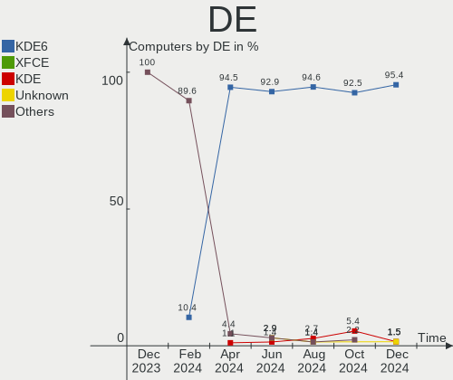
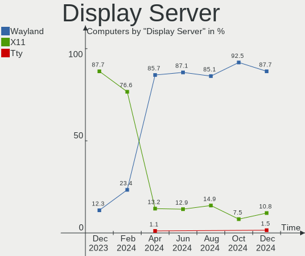
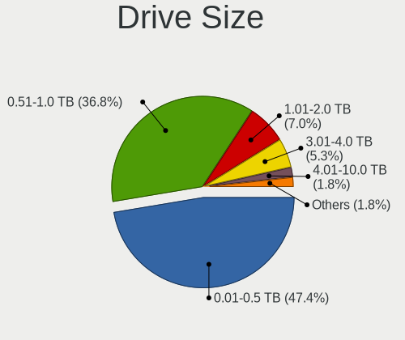

KDE neon - Hardware Trends
--------------------------

A project to identify most popular hardware characteristics and track their change
over time based on data collected by Linux users at https://Linux-Hardware.org.

Anyone can contribute to this report by the [hw-probe](https://github.com/linuxhw/hw-probe) tool:

    sudo -E hw-probe -all -upload

This is a report for all computer types. See also reports for [desktops](/Dist/KDE_neon/Desktop/README.md) and [notebooks](/Dist/KDE_neon/Notebook/README.md).

This report is for one last month. Overall report since the beginning of time: [TestCoverage](https://github.com/linuxhw/TestCoverage)

Period: Jan, 2023.

Contents
--------

* [ System ](#system)
  - [ OS                       ](#os)
  - [ OS Family                ](#os-family)
  - [ Kernel                   ](#kernel)
  - [ Kernel Family            ](#kernel-family)
  - [ Kernel Major Ver.        ](#kernel-major-ver)
  - [ Arch                     ](#arch)
  - [ DE                       ](#de)
  - [ Display Server           ](#display-server)
  - [ Display Manager          ](#display-manager)
  - [ OS Lang                  ](#os-lang)
  - [ Boot Mode                ](#boot-mode)
  - [ Filesystem               ](#filesystem)
  - [ Part. scheme             ](#part-scheme)
  - [ Dual Boot with Linux/BSD ](#dual-boot-with-linuxbsd)
  - [ Dual Boot (Win)          ](#dual-boot-win)

* [ Board ](#board)
  - [ Vendor                   ](#vendor)
  - [ Model                    ](#model)
  - [ Model Family             ](#model-family)
  - [ MFG Year                 ](#mfg-year)
  - [ Form Factor              ](#form-factor)
  - [ Secure Boot              ](#secure-boot)
  - [ Coreboot                 ](#coreboot)
  - [ RAM Size                 ](#ram-size)
  - [ RAM Used                 ](#ram-used)
  - [ Total Drives             ](#total-drives)
  - [ Has CD-ROM               ](#has-cd-rom)
  - [ Has Ethernet             ](#has-ethernet)
  - [ Has WiFi                 ](#has-wifi)
  - [ Has Bluetooth            ](#has-bluetooth)

* [ Location ](#location)
  - [ Country                  ](#country)
  - [ City                     ](#city)

* [ Drives ](#drives)
  - [ Drive Vendor             ](#drive-vendor)
  - [ Drive Model              ](#drive-model)
  - [ HDD Vendor               ](#hdd-vendor)
  - [ SSD Vendor               ](#ssd-vendor)
  - [ Drive Kind               ](#drive-kind)
  - [ Drive Connector          ](#drive-connector)
  - [ Drive Size               ](#drive-size)
  - [ Space Total              ](#space-total)
  - [ Space Used               ](#space-used)
  - [ Malfunc. Drives          ](#malfunc-drives)
  - [ Malfunc. Drive Vendor    ](#malfunc-drive-vendor)
  - [ Malfunc. HDD Vendor      ](#malfunc-hdd-vendor)
  - [ Malfunc. Drive Kind      ](#malfunc-drive-kind)
  - [ Failed Drives            ](#failed-drives)
  - [ Failed Drive Vendor      ](#failed-drive-vendor)
  - [ Drive Status             ](#drive-status)

* [ Storage controller ](#storage-controller)
  - [ Storage Vendor           ](#storage-vendor)
  - [ Storage Model            ](#storage-model)
  - [ Storage Kind             ](#storage-kind)

* [ Processor ](#processor)
  - [ CPU Vendor               ](#cpu-vendor)
  - [ CPU Model                ](#cpu-model)
  - [ CPU Model Family         ](#cpu-model-family)
  - [ CPU Cores                ](#cpu-cores)
  - [ CPU Sockets              ](#cpu-sockets)
  - [ CPU Threads              ](#cpu-threads)
  - [ CPU Op-Modes             ](#cpu-op-modes)
  - [ CPU Microcode            ](#cpu-microcode)
  - [ CPU Microarch            ](#cpu-microarch)

* [ Graphics ](#graphics)
  - [ GPU Vendor               ](#gpu-vendor)
  - [ GPU Model                ](#gpu-model)
  - [ GPU Combo                ](#gpu-combo)
  - [ GPU Driver               ](#gpu-driver)
  - [ GPU Memory               ](#gpu-memory)

* [ Monitor ](#monitor)
  - [ Monitor Vendor           ](#monitor-vendor)
  - [ Monitor Model            ](#monitor-model)
  - [ Monitor Resolution       ](#monitor-resolution)
  - [ Monitor Diagonal         ](#monitor-diagonal)
  - [ Monitor Width            ](#monitor-width)
  - [ Aspect Ratio             ](#aspect-ratio)
  - [ Monitor Area             ](#monitor-area)
  - [ Pixel Density            ](#pixel-density)
  - [ Multiple Monitors        ](#multiple-monitors)

* [ Network ](#network)
  - [ Net Controller Vendor    ](#net-controller-vendor)
  - [ Net Controller Model     ](#net-controller-model)
  - [ Wireless Vendor          ](#wireless-vendor)
  - [ Wireless Model           ](#wireless-model)
  - [ Ethernet Vendor          ](#ethernet-vendor)
  - [ Ethernet Model           ](#ethernet-model)
  - [ Net Controller Kind      ](#net-controller-kind)
  - [ Used Controller          ](#used-controller)
  - [ NICs                     ](#nics)
  - [ IPv6                     ](#ipv6)

* [ Bluetooth ](#bluetooth)
  - [ Bluetooth Vendor         ](#bluetooth-vendor)
  - [ Bluetooth Model          ](#bluetooth-model)

* [ Sound ](#sound)
  - [ Sound Vendor             ](#sound-vendor)
  - [ Sound Model              ](#sound-model)

* [ Memory ](#memory)
  - [ Memory Vendor            ](#memory-vendor)
  - [ Memory Model             ](#memory-model)
  - [ Memory Kind              ](#memory-kind)
  - [ Memory Form Factor       ](#memory-form-factor)
  - [ Memory Size              ](#memory-size)
  - [ Memory Speed             ](#memory-speed)

* [ Printers & scanners ](#printers--scanners)
  - [ Printer Vendor           ](#printer-vendor)
  - [ Printer Model            ](#printer-model)
  - [ Scanner Vendor           ](#scanner-vendor)
  - [ Scanner Model            ](#scanner-model)

* [ Camera ](#camera)
  - [ Camera Vendor            ](#camera-vendor)
  - [ Camera Model             ](#camera-model)

* [ Security ](#security)
  - [ Fingerprint Vendor       ](#fingerprint-vendor)
  - [ Fingerprint Model        ](#fingerprint-model)
  - [ Chipcard Vendor          ](#chipcard-vendor)
  - [ Chipcard Model           ](#chipcard-model)

* [ Unsupported ](#unsupported)
  - [ Unsupported Devices      ](#unsupported-devices)
  - [ Unsupported Device Types ](#unsupported-device-types)

System
------

OS
--

Installed operating systems

| Name           | Computers | Percent |
|----------------|-----------|---------|
| KDE neon 22.04 | 103       | 93.64%  |
| KDE neon 20.04 | 7         | 6.36%   |

OS Family
---------

OS without a version

| Name     | Computers | Percent |
|----------|-----------|---------|
| KDE neon | 110       | 100%    |

Kernel
------

Version of the Linux kernel

| Version                           | Computers | Percent |
|-----------------------------------|-----------|---------|
| 5.15.0-58-generic                 | 54        | 49.09%  |
| 5.15.0-57-generic                 | 24        | 21.82%  |
| 5.15.0-56-generic                 | 20        | 18.18%  |
| 6.1.8-2-liquorix-amd64            | 1         | 0.91%   |
| 6.1.5-x64v3-xanmod1               | 1         | 0.91%   |
| 6.1.0-4.2-liquorix-amd64          | 1         | 0.91%   |
| 5.4.0-54-generic                  | 1         | 0.91%   |
| 5.4.0-113-generic                 | 1         | 0.91%   |
| 5.19.0-17.1-liquorix-amd64        | 1         | 0.91%   |
| 5.18.14-ext73-98.14-intelstandard | 1         | 0.91%   |
| 5.15.0-57-lowlatency              | 1         | 0.91%   |
| 5.15.0-52-generic                 | 1         | 0.91%   |
| 5.14.15-051415-generic            | 1         | 0.91%   |
| 5.14.0-1054-oem                   | 1         | 0.91%   |
| 5.13.0-37-generic                 | 1         | 0.91%   |

Kernel Family
-------------

Linux kernel without a distro release

| Version | Computers | Percent |
|---------|-----------|---------|
| 5.15.0  | 100       | 90.91%  |
| 5.4.0   | 2         | 1.82%   |
| 6.1.8   | 1         | 0.91%   |
| 6.1.5   | 1         | 0.91%   |
| 6.1.0   | 1         | 0.91%   |
| 5.19.0  | 1         | 0.91%   |
| 5.18.14 | 1         | 0.91%   |
| 5.14.15 | 1         | 0.91%   |
| 5.14.0  | 1         | 0.91%   |
| 5.13.0  | 1         | 0.91%   |

Kernel Major Ver.
-----------------

Linux kernel major version

| Version | Computers | Percent |
|---------|-----------|---------|
| 5.15    | 100       | 90.91%  |
| 6.1     | 3         | 2.73%   |
| 5.4     | 2         | 1.82%   |
| 5.14    | 2         | 1.82%   |
| 5.19    | 1         | 0.91%   |
| 5.18    | 1         | 0.91%   |
| 5.13    | 1         | 0.91%   |

Arch
----

OS architecture (x86_64, i586, etc.)

| Name   | Computers | Percent |
|--------|-----------|---------|
| x86_64 | 110       | 100%    |

DE
--

Desktop Environment

| Name | Computers | Percent |
|------|-----------|---------|
| KDE5 | 110       | 100%    |

Display Server
--------------

X11 or Wayland

| Name    | Computers | Percent |
|---------|-----------|---------|
| X11     | 98        | 89.09%  |
| Wayland | 12        | 10.91%  |

Display Manager
---------------

SDDM, LightDM, etc.

| Name    | Computers | Percent |
|---------|-----------|---------|
| Unknown | 85        | 77.27%  |
| SDDM    | 25        | 22.73%  |

OS Lang
-------

Language

| Lang  | Computers | Percent |
|-------|-----------|---------|
| en_US | 39        | 35.45%  |
| en_GB | 7         | 6.36%   |
| de_DE | 7         | 6.36%   |
| ru_RU | 6         | 5.45%   |
| it_IT | 6         | 5.45%   |
| es_ES | 6         | 5.45%   |
| C     | 6         | 5.45%   |
| pl_PL | 5         | 4.55%   |
| es_MX | 3         | 2.73%   |
| sl_SI | 2         | 1.82%   |
| pt_BR | 2         | 1.82%   |
| fr_FR | 2         | 1.82%   |
| en_IN | 2         | 1.82%   |
| en_DK | 2         | 1.82%   |
| en_AU | 2         | 1.82%   |
| uk_UA | 1         | 0.91%   |
| tr_TR | 1         | 0.91%   |
| sk_SK | 1         | 0.91%   |
| pt_PT | 1         | 0.91%   |
| nl_NL | 1         | 0.91%   |
| lt_LT | 1         | 0.91%   |
| hu_HU | 1         | 0.91%   |
| hr_HR | 1         | 0.91%   |
| fr_BE | 1         | 0.91%   |
| es_US | 1         | 0.91%   |
| en_DE | 1         | 0.91%   |
| ca_ES | 1         | 0.91%   |
| ca_AD | 1         | 0.91%   |

Boot Mode
---------

EFI or BIOS

| Mode | Computers | Percent |
|------|-----------|---------|
| BIOS | 96        | 87.27%  |
| EFI  | 14        | 12.73%  |

Filesystem
----------

Type of filesystem

| Type    | Computers | Percent |
|---------|-----------|---------|
| Ext4    | 100       | 90.91%  |
| Btrfs   | 5         | 4.55%   |
| Overlay | 3         | 2.73%   |
| Ext3    | 2         | 1.82%   |

Part. scheme
------------

Scheme of partitioning

| Type    | Computers | Percent |
|---------|-----------|---------|
| Unknown | 85        | 77.27%  |
| GPT     | 22        | 20%     |
| MBR     | 3         | 2.73%   |

Dual Boot with Linux/BSD
------------------------

Hosting more than one Linux/BSD

| Dual boot | Computers | Percent |
|-----------|-----------|---------|
| No        | 104       | 94.55%  |
| Yes       | 6         | 5.45%   |

Dual Boot (Win)
---------------

Hosting Linux and Windows

| Dual boot | Computers | Percent |
|-----------|-----------|---------|
| No        | 96        | 87.27%  |
| Yes       | 14        | 12.73%  |

Board
-----

Vendor
------

Motherboard manufacturer

| Name                | Computers | Percent |
|---------------------|-----------|---------|
| ASUSTek Computer    | 22        | 20%     |
| Lenovo              | 14        | 12.73%  |
| Hewlett-Packard     | 14        | 12.73%  |
| Dell                | 14        | 12.73%  |
| MSI                 | 11        | 10%     |
| Gigabyte Technology | 7         | 6.36%   |
| Samsung Electronics | 5         | 4.55%   |
| Acer                | 4         | 3.64%   |
| Toshiba             | 2         | 1.82%   |
| Intel               | 2         | 1.82%   |
| HUAWEI              | 2         | 1.82%   |
| Fujitsu             | 2         | 1.82%   |
| ASRock              | 2         | 1.82%   |
| Apple               | 2         | 1.82%   |
| Timi                | 1         | 0.91%   |
| Sony                | 1         | 0.91%   |
| Qilive              | 1         | 0.91%   |
| Pegatron            | 1         | 0.91%   |
| PC Specialist       | 1         | 0.91%   |
| Infinix             | 1         | 0.91%   |
| Unknown             | 1         | 0.91%   |

Model
-----

Motherboard model

| Name                               | Computers | Percent |
|------------------------------------|-----------|---------|
| MSI MS-7C37                        | 2         | 1.82%   |
| HP Notebook                        | 2         | 1.82%   |
| ASUS All Series                    | 2         | 1.82%   |
| Toshiba Satellite P200             | 1         | 0.91%   |
| Toshiba Satellite A200             | 1         | 0.91%   |
| Timi RedmiBook Pro 15S             | 1         | 0.91%   |
| Sony VPCEA30EL                     | 1         | 0.91%   |
| Samsung 950QED                     | 1         | 0.91%   |
| Samsung 950QDB                     | 1         | 0.91%   |
| Samsung 550XBE/350XBE              | 1         | 0.91%   |
| Samsung 550P5C/550P7C              | 1         | 0.91%   |
| Samsung 305V4A/305V5A              | 1         | 0.91%   |
| Qilive QW2214SP                    | 1         | 0.91%   |
| Pegatron B74                       | 1         | 0.91%   |
| PC Specialist P65_67RSRP           | 1         | 0.91%   |
| MSI p7-1233w                       | 1         | 0.91%   |
| MSI MS-7D30                        | 1         | 0.91%   |
| MSI MS-7C84                        | 1         | 0.91%   |
| MSI MS-7C56                        | 1         | 0.91%   |
| MSI MS-7C02                        | 1         | 0.91%   |
| MSI MS-7B85                        | 1         | 0.91%   |
| MSI MS-7586                        | 1         | 0.91%   |
| MSI GF63 Thin 10SC                 | 1         | 0.91%   |
| MSI GE70 2QD                       | 1         | 0.91%   |
| Lenovo V15 G2 ITL 82KB             | 1         | 0.91%   |
| Lenovo ThinkPad T530 24292DG       | 1         | 0.91%   |
| Lenovo ThinkPad L380 20M5S09Y00    | 1         | 0.91%   |
| Lenovo ThinkCentre M92p 32384B0    | 1         | 0.91%   |
| Lenovo MIIX 3-1030 80HV            | 1         | 0.91%   |
| Lenovo Legion T5 26IOB6 90RT00UUMZ | 1         | 0.91%   |
| Lenovo Legion 5 15IMH05 82AU       | 1         | 0.91%   |
| Lenovo Legion 5 15ACH6H 82JU       | 1         | 0.91%   |
| Lenovo IdeaPadFlex 5 15ITL05 82HT  | 1         | 0.91%   |
| Lenovo IdeaPad Y700-15ISK 80NV     | 1         | 0.91%   |
| Lenovo IdeaPad 530S-15IKB 81EV     | 1         | 0.91%   |
| Lenovo IdeaPad 330-15IKB 81DE      | 1         | 0.91%   |
| Lenovo IdeaPad 320-15AST 80XV      | 1         | 0.91%   |
| Lenovo G50-30 80G0                 | 1         | 0.91%   |
| Intel NUC6CAYB J23203-402          | 1         | 0.91%   |
| Intel DQ77KB AAG81483-500          | 1         | 0.91%   |

Model Family
------------

Motherboard model prefix

| Name               | Computers | Percent |
|--------------------|-----------|---------|
| Dell XPS           | 5         | 4.55%   |
| Lenovo IdeaPad     | 4         | 3.64%   |
| Lenovo Legion      | 3         | 2.73%   |
| HP Pavilion        | 3         | 2.73%   |
| Dell Latitude      | 3         | 2.73%   |
| Dell Inspiron      | 3         | 2.73%   |
| ASUS PRIME         | 3         | 2.73%   |
| Acer Aspire        | 3         | 2.73%   |
| Toshiba Satellite  | 2         | 1.82%   |
| MSI MS-7C37        | 2         | 1.82%   |
| Lenovo ThinkPad    | 2         | 1.82%   |
| HP Notebook        | 2         | 1.82%   |
| HP EliteBook       | 2         | 1.82%   |
| HP Compaq          | 2         | 1.82%   |
| Dell Precision     | 2         | 1.82%   |
| ASUS TUF           | 2         | 1.82%   |
| ASUS ROG           | 2         | 1.82%   |
| ASUS All           | 2         | 1.82%   |
| Timi RedmiBook     | 1         | 0.91%   |
| Sony VPCEA30EL     | 1         | 0.91%   |
| Samsung 950QED     | 1         | 0.91%   |
| Samsung 950QDB     | 1         | 0.91%   |
| Samsung 550XBE     | 1         | 0.91%   |
| Samsung 550P5C     | 1         | 0.91%   |
| Samsung 305V4A     | 1         | 0.91%   |
| Qilive QW2214SP    | 1         | 0.91%   |
| Pegatron B74       | 1         | 0.91%   |
| PC Specialist P65  | 1         | 0.91%   |
| MSI p7-1233w       | 1         | 0.91%   |
| MSI MS-7D30        | 1         | 0.91%   |
| MSI MS-7C84        | 1         | 0.91%   |
| MSI MS-7C56        | 1         | 0.91%   |
| MSI MS-7C02        | 1         | 0.91%   |
| MSI MS-7B85        | 1         | 0.91%   |
| MSI MS-7586        | 1         | 0.91%   |
| MSI GF63           | 1         | 0.91%   |
| MSI GE70           | 1         | 0.91%   |
| Lenovo V15         | 1         | 0.91%   |
| Lenovo ThinkCentre | 1         | 0.91%   |
| Lenovo MIIX        | 1         | 0.91%   |

MFG Year
--------

Motherboard manufacture year

| Year | Computers | Percent |
|------|-----------|---------|
| 2020 | 12        | 10.91%  |
| 2021 | 11        | 10%     |
| 2016 | 11        | 10%     |
| 2015 | 11        | 10%     |
| 2019 | 10        | 9.09%   |
| 2018 | 9         | 8.18%   |
| 2012 | 9         | 8.18%   |
| 2014 | 7         | 6.36%   |
| 2013 | 7         | 6.36%   |
| 2011 | 7         | 6.36%   |
| 2022 | 6         | 5.45%   |
| 2017 | 3         | 2.73%   |
| 2007 | 3         | 2.73%   |
| 2009 | 2         | 1.82%   |
| 2010 | 1         | 0.91%   |
| 2008 | 1         | 0.91%   |

Form Factor
-----------

Physical design of the computer

| Name        | Computers | Percent |
|-------------|-----------|---------|
| Notebook    | 61        | 55.45%  |
| Desktop     | 40        | 36.36%  |
| Convertible | 4         | 3.64%   |
| Tablet      | 2         | 1.82%   |
| All in one  | 2         | 1.82%   |
| Mini pc     | 1         | 0.91%   |

Secure Boot
-----------

Enabled or disabled

| State    | Computers | Percent |
|----------|-----------|---------|
| Disabled | 109       | 99.09%  |
| Enabled  | 1         | 0.91%   |

Coreboot
--------

Have coreboot on board

| Used | Computers | Percent |
|------|-----------|---------|
| No   | 110       | 100%    |

RAM Size
--------

Total RAM memory

| Size in GB  | Computers | Percent |
|-------------|-----------|---------|
| 4.01-8.0    | 30        | 27.27%  |
| 16.01-24.0  | 26        | 23.64%  |
| 8.01-16.0   | 16        | 14.55%  |
| 32.01-64.0  | 15        | 13.64%  |
| 3.01-4.0    | 14        | 12.73%  |
| 64.01-256.0 | 4         | 3.64%   |
| 1.01-2.0    | 3         | 2.73%   |
| 24.01-32.0  | 2         | 1.82%   |

RAM Used
--------

Used RAM memory

| Used GB   | Computers | Percent |
|-----------|-----------|---------|
| 2.01-3.0  | 41        | 37.27%  |
| 1.01-2.0  | 26        | 23.64%  |
| 4.01-8.0  | 17        | 15.45%  |
| 3.01-4.0  | 17        | 15.45%  |
| 8.01-16.0 | 5         | 4.55%   |
| 0.51-1.0  | 4         | 3.64%   |

Total Drives
------------

Number of drives on board

| Drives | Computers | Percent |
|--------|-----------|---------|
| 1      | 61        | 55.45%  |
| 2      | 27        | 24.55%  |
| 4      | 10        | 9.09%   |
| 3      | 8         | 7.27%   |
| 6      | 3         | 2.73%   |
| 5      | 1         | 0.91%   |

Has CD-ROM
----------

Has CD-ROM on board

| Presented | Computers | Percent |
|-----------|-----------|---------|
| No        | 71        | 64.55%  |
| Yes       | 39        | 35.45%  |

Has Ethernet
------------

Has Ethernet on board

| Presented | Computers | Percent |
|-----------|-----------|---------|
| Yes       | 98        | 89.09%  |
| No        | 12        | 10.91%  |

Has WiFi
--------

Has WiFi module

| Presented | Computers | Percent |
|-----------|-----------|---------|
| Yes       | 88        | 80%     |
| No        | 22        | 20%     |

Has Bluetooth
-------------

Has Bluetooth module

| Presented | Computers | Percent |
|-----------|-----------|---------|
| Yes       | 80        | 72.73%  |
| No        | 30        | 27.27%  |

Location
--------

Country
-------

Geographic location (country)

| Country      | Computers | Percent |
|--------------|-----------|---------|
| USA          | 18        | 16.36%  |
| Germany      | 12        | 10.91%  |
| Spain        | 9         | 8.18%   |
| UK           | 7         | 6.36%   |
| Russia       | 7         | 6.36%   |
| Italy        | 6         | 5.45%   |
| India        | 5         | 4.55%   |
| Netherlands  | 4         | 3.64%   |
| Brazil       | 4         | 3.64%   |
| Romania      | 3         | 2.73%   |
| Poland       | 3         | 2.73%   |
| Mexico       | 3         | 2.73%   |
| France       | 3         | 2.73%   |
| Canada       | 3         | 2.73%   |
| Slovenia     | 2         | 1.82%   |
| Denmark      | 2         | 1.82%   |
| Australia    | 2         | 1.82%   |
| Venezuela    | 1         | 0.91%   |
| Turkey       | 1         | 0.91%   |
| Tunisia      | 1         | 0.91%   |
| Thailand     | 1         | 0.91%   |
| Switzerland  | 1         | 0.91%   |
| Saudi Arabia | 1         | 0.91%   |
| Portugal     | 1         | 0.91%   |
| Norway       | 1         | 0.91%   |
| Kazakhstan   | 1         | 0.91%   |
| Ivory Coast  | 1         | 0.91%   |
| Hungary      | 1         | 0.91%   |
| Georgia      | 1         | 0.91%   |
| Croatia      | 1         | 0.91%   |
| Colombia     | 1         | 0.91%   |
| Bangladesh   | 1         | 0.91%   |
| Argentina    | 1         | 0.91%   |
| Algeria      | 1         | 0.91%   |

City
----

Geographic location (city)

| City                      | Computers | Percent |
|---------------------------|-----------|---------|
| Wuppertal                 | 2         | 1.82%   |
| St Petersburg             | 2         | 1.82%   |
| Moscow                    | 2         | 1.82%   |
| Montreal                  | 2         | 1.82%   |
| Jackson                   | 2         | 1.82%   |
| Campinas                  | 2         | 1.82%   |
| Bedum                     | 2         | 1.82%   |
| Barcelona                 | 2         | 1.82%   |
| Zheleznogorsk             | 1         | 0.91%   |
| Youngstown                | 1         | 0.91%   |
| Yala                      | 1         | 0.91%   |
| Wroclaw                   | 1         | 0.91%   |
| Winter Park               | 1         | 0.91%   |
| White House               | 1         | 0.91%   |
| Wetzikon                  | 1         | 0.91%   |
| Warstein                  | 1         | 0.91%   |
| Villafranca de los Barros | 1         | 0.91%   |
| Vila do Conde             | 1         | 0.91%   |
| Vicenza                   | 1         | 0.91%   |
| Veigne                    | 1         | 0.91%   |
| Valencia                  | 1         | 0.91%   |
| Valdemoro                 | 1         | 0.91%   |
| Valby                     | 1         | 0.91%   |
| Tunis                     | 1         | 0.91%   |
| Torun                     | 1         | 0.91%   |
| Toms River                | 1         | 0.91%   |
| Toluca                    | 1         | 0.91%   |
| The Bronx                 | 1         | 0.91%   |
| Tbilisi                   | 1         | 0.91%   |
| Szombathely               | 1         | 0.91%   |
| Sydney                    | 1         | 0.91%   |
| Stockton-on-Tees          | 1         | 0.91%   |
| Split                     | 1         | 0.91%   |
| Sibiu                     | 1         | 0.91%   |
| Selvazzano Dentro         | 1         | 0.91%   |
| Seattle                   | 1         | 0.91%   |
| Schwäbisch Gmünd        | 1         | 0.91%   |
| Salem                     | 1         | 0.91%   |
| Saint-Nazaire             | 1         | 0.91%   |
| Rome                      | 1         | 0.91%   |

Drives
------

Drive Vendor
------------

Hard drive vendors

| Vendor                      | Computers | Drives | Percent |
|-----------------------------|-----------|--------|---------|
| Seagate                     | 27        | 35     | 15.43%  |
| WDC                         | 23        | 26     | 13.14%  |
| Samsung Electronics         | 18        | 22     | 10.29%  |
| SanDisk                     | 14        | 15     | 8%      |
| Toshiba                     | 11        | 12     | 6.29%   |
| Kingston                    | 11        | 13     | 6.29%   |
| Crucial                     | 9         | 11     | 5.14%   |
| Unknown                     | 5         | 7      | 2.86%   |
| SK hynix                    | 5         | 5      | 2.86%   |
| Phison Electronics          | 5         | 6      | 2.86%   |
| Micron Technology           | 4         | 4      | 2.29%   |
| Hitachi                     | 4         | 4      | 2.29%   |
| HGST                        | 4         | 4      | 2.29%   |
| Intel                       | 3         | 3      | 1.71%   |
| Team                        | 2         | 2      | 1.14%   |
| Silicon Motion              | 2         | 3      | 1.14%   |
| Realtek Semiconductor       | 2         | 2      | 1.14%   |
| Kingston Technology Company | 2         | 2      | 1.14%   |
| JMicron Technology          | 2         | 2      | 1.14%   |
| Hewlett-Packard             | 2         | 2      | 1.14%   |
| A-DATA Technology           | 2         | 2      | 1.14%   |
| SPCC                        | 1         | 1      | 0.57%   |
| Solid State Storage         | 1         | 1      | 0.57%   |
| Seagate Technology          | 1         | 1      | 0.57%   |
| POLION                      | 1         | 1      | 0.57%   |
| OCZ                         | 1         | 1      | 0.57%   |
| Netac                       | 1         | 1      | 0.57%   |
| Micron/Crucial Technology   | 1         | 1      | 0.57%   |
| Lenovo                      | 1         | 1      | 0.57%   |
| KIOXIA-EXCERIA              | 1         | 1      | 0.57%   |
| KIOXIA                      | 1         | 1      | 0.57%   |
| Kingchuxing                 | 1         | 1      | 0.57%   |
| Intenso                     | 1         | 1      | 0.57%   |
| GOODRAM                     | 1         | 1      | 0.57%   |
| Fujitsu                     | 1         | 1      | 0.57%   |
| FORESEE                     | 1         | 1      | 0.57%   |
| China                       | 1         | 1      | 0.57%   |
| ADATA Technology            | 1         | 1      | 0.57%   |
| Unknown                     | 1         | 1      | 0.57%   |

Drive Model
-----------

Hard drive models

| Model                                                 | Computers | Percent |
|-------------------------------------------------------|-----------|---------|
| Kingston SA400S37240G 240GB SSD                       | 6         | 3.13%   |
| Samsung NVMe SSD Controller SM981/PM981/PM983 500GB   | 5         | 2.6%    |
| Seagate ST1000LM024 HN-M101MBB 1TB                    | 4         | 2.08%   |
| Phison E12 NVMe Controller 1TB                        | 4         | 2.08%   |
| Unknown MMC Card  128GB                               | 3         | 1.56%   |
| Sandisk WD Black SN750 / PC SN730 NVMe SSD 1TB        | 3         | 1.56%   |
| SanDisk SDSSDA240G 240GB                              | 3         | 1.56%   |
| Crucial CT480BX500SSD1 480GB                          | 3         | 1.56%   |
| WDC WD5000AAKX-60U6AA0 500GB                          | 2         | 1.04%   |
| WDC WD10EZEX-08WN4A0 1TB                              | 2         | 1.04%   |
| Toshiba MQ01ABF032 320GB                              | 2         | 1.04%   |
| Toshiba BG3 NVMe SSD Controller 256GB                 | 2         | 1.04%   |
| Silicon Motion SM2263EN/SM2263XT SSD Controller 512GB | 2         | 1.04%   |
| Seagate ST3500630AS 500GB                             | 2         | 1.04%   |
| Seagate ST2000DM008-2FR102 2TB                        | 2         | 1.04%   |
| Sandisk WD Blue SN550 NVMe SSD 1TB                    | 2         | 1.04%   |
| SanDisk SSD PLUS 120GB                                | 2         | 1.04%   |
| Samsung SSD 860 EVO 500GB                             | 2         | 1.04%   |
| Samsung NVMe SSD Controller PM9A1/PM9A3/980PRO 512GB  | 2         | 1.04%   |
| Realtek RTS5763DL NVMe SSD Controller 4TB             | 2         | 1.04%   |
| Kingston Company A2000 NVMe SSD 1TB                   | 2         | 1.04%   |
| Kingston SNVS500G 500GB                               | 2         | 1.04%   |
| JMicron Generic 500GB                                 | 2         | 1.04%   |
| WDC WDS240G2G0B-00EPW0 240GB SSD                      | 1         | 0.52%   |
| WDC WDS240G2G0A-00JH30 240GB SSD                      | 1         | 0.52%   |
| WDC WDBNCE0010PNC 1TB SSD                             | 1         | 0.52%   |
| WDC WD80EFBX-68AZZN0 8TB                              | 1         | 0.52%   |
| WDC WD60EFRX-68MYMN1 6TB                              | 1         | 0.52%   |
| WDC WD5000AZLX-00K4KA0 500GB                          | 1         | 0.52%   |
| WDC WD5000AVCS-632DY1 500GB                           | 1         | 0.52%   |
| WDC WD5000AAKX-22ERMA0 500GB                          | 1         | 0.52%   |
| WDC WD30EZRZ-00Z5HB0 3TB                              | 1         | 0.52%   |
| WDC WD20EZRZ-00Z5HB0 2TB                              | 1         | 0.52%   |
| WDC WD20EZAZ-00L9GB0 2TB                              | 1         | 0.52%   |
| WDC WD2003FYYS-05T9B0 2TB                             | 1         | 0.52%   |
| WDC WD10SPZX-21Z10T0 1TB                              | 1         | 0.52%   |
| WDC WD10SPCX-60KHST0 1TB                              | 1         | 0.52%   |
| WDC WD10JPVX-60JC3T1 1TB                              | 1         | 0.52%   |
| WDC WD10JPVX-60JC3T0 1TB                              | 1         | 0.52%   |
| WDC WD10JPVX-22JC3T0 1TB                              | 1         | 0.52%   |

HDD Vendor
----------

Hard disk drive vendors

| Vendor          | Computers | Drives | Percent |
|-----------------|-----------|--------|---------|
| Seagate         | 27        | 35     | 41.54%  |
| WDC             | 20        | 23     | 30.77%  |
| Toshiba         | 8         | 8      | 12.31%  |
| Hitachi         | 4         | 4      | 6.15%   |
| HGST            | 4         | 4      | 6.15%   |
| Hewlett-Packard | 1         | 1      | 1.54%   |
| Fujitsu         | 1         | 1      | 1.54%   |

SSD Vendor
----------

Solid state drive vendors

| Vendor              | Computers | Drives | Percent |
|---------------------|-----------|--------|---------|
| SanDisk             | 9         | 9      | 16.07%  |
| Crucial             | 9         | 11     | 16.07%  |
| Samsung Electronics | 8         | 9      | 14.29%  |
| Kingston            | 8         | 10     | 14.29%  |
| WDC                 | 3         | 3      | 5.36%   |
| SK hynix            | 2         | 2      | 3.57%   |
| JMicron Technology  | 2         | 2      | 3.57%   |
| A-DATA Technology   | 2         | 2      | 3.57%   |
| Toshiba             | 1         | 1      | 1.79%   |
| Team                | 1         | 1      | 1.79%   |
| SPCC                | 1         | 1      | 1.79%   |
| OCZ                 | 1         | 1      | 1.79%   |
| Netac               | 1         | 1      | 1.79%   |
| Micron Technology   | 1         | 1      | 1.79%   |
| Lenovo              | 1         | 1      | 1.79%   |
| KIOXIA-EXCERIA      | 1         | 1      | 1.79%   |
| Intel               | 1         | 1      | 1.79%   |
| Hewlett-Packard     | 1         | 1      | 1.79%   |
| GOODRAM             | 1         | 1      | 1.79%   |
| China               | 1         | 1      | 1.79%   |
| Unknown             | 1         | 1      | 1.79%   |

Drive Kind
----------

HDD or SSD

| Kind    | Computers | Drives | Percent |
|---------|-----------|--------|---------|
| HDD     | 54        | 76     | 35.53%  |
| SSD     | 48        | 61     | 31.58%  |
| NVMe    | 42        | 53     | 27.63%  |
| MMC     | 5         | 7      | 3.29%   |
| Unknown | 3         | 3      | 1.97%   |

Drive Connector
---------------

SATA, SAS, NVMe, etc.

| Type | Computers | Drives | Percent |
|------|-----------|--------|---------|
| SATA | 82        | 133    | 60.29%  |
| NVMe | 42        | 53     | 30.88%  |
| SAS  | 7         | 7      | 5.15%   |
| MMC  | 5         | 7      | 3.68%   |

Drive Size
----------

Size of hard drive

| Size in TB | Computers | Drives | Percent |
|------------|-----------|--------|---------|
| 0.01-0.5   | 59        | 77     | 52.68%  |
| 0.51-1.0   | 34        | 38     | 30.36%  |
| 1.01-2.0   | 8         | 8      | 7.14%   |
| 3.01-4.0   | 5         | 5      | 4.46%   |
| 2.01-3.0   | 3         | 4      | 2.68%   |
| 4.01-10.0  | 3         | 5      | 2.68%   |

Space Total
-----------

Amount of disk space available on the file system

| Size in GB     | Computers | Percent |
|----------------|-----------|---------|
| 101-250        | 26        | 23.64%  |
| 501-1000       | 25        | 22.73%  |
| 251-500        | 18        | 16.36%  |
| 51-100         | 10        | 9.09%   |
| More than 3000 | 9         | 8.18%   |
| 21-50          | 8         | 7.27%   |
| 1001-2000      | 8         | 7.27%   |
| 1-20           | 4         | 3.64%   |
| 2001-3000      | 2         | 1.82%   |

Space Used
----------

Amount of used disk space

| Used GB        | Computers | Percent |
|----------------|-----------|---------|
| 1-20           | 49        | 44.55%  |
| 101-250        | 17        | 15.45%  |
| 21-50          | 15        | 13.64%  |
| 251-500        | 12        | 10.91%  |
| 51-100         | 9         | 8.18%   |
| 2001-3000      | 4         | 3.64%   |
| More than 3000 | 2         | 1.82%   |
| 1001-2000      | 1         | 0.91%   |
| 501-1000       | 1         | 0.91%   |

Malfunc. Drives
---------------

Drive models with a malfunction

| Model                         | Computers | Drives | Percent |
|-------------------------------|-----------|--------|---------|
| Seagate ST31000528AS 1TB      | 1         | 1      | 33.33%  |
| SanDisk SSD PLUS 120GB        | 1         | 1      | 33.33%  |
| Hitachi HTS542525K9SA00 250GB | 1         | 1      | 33.33%  |

Malfunc. Drive Vendor
---------------------

Vendors of faulty drives

| Vendor  | Computers | Drives | Percent |
|---------|-----------|--------|---------|
| Seagate | 1         | 1      | 33.33%  |
| SanDisk | 1         | 1      | 33.33%  |
| Hitachi | 1         | 1      | 33.33%  |

Malfunc. HDD Vendor
-------------------

Vendors of faulty HDD drives

| Vendor  | Computers | Drives | Percent |
|---------|-----------|--------|---------|
| Seagate | 1         | 1      | 50%     |
| Hitachi | 1         | 1      | 50%     |

Malfunc. Drive Kind
-------------------

Kinds of faulty drives

| Kind | Computers | Drives | Percent |
|------|-----------|--------|---------|
| HDD  | 2         | 2      | 66.67%  |
| SSD  | 1         | 1      | 33.33%  |

Failed Drives
-------------

Failed drive models

Zero info for selected period =(

Failed Drive Vendor
-------------------

Failed drive vendors

Zero info for selected period =(

Drive Status
------------

Number of failed and malfunc. drives

| Status   | Computers | Drives | Percent |
|----------|-----------|--------|---------|
| Detected | 98        | 176    | 87.5%   |
| Works    | 12        | 21     | 10.71%  |
| Malfunc  | 2         | 3      | 1.79%   |

Storage controller
------------------

Storage Vendor
--------------

Storage controller vendors

| Vendor                         | Computers | Percent |
|--------------------------------|-----------|---------|
| Intel                          | 75        | 49.34%  |
| AMD                            | 26        | 17.11%  |
| Samsung Electronics            | 11        | 7.24%   |
| SanDisk                        | 5         | 3.29%   |
| Phison Electronics             | 5         | 3.29%   |
| Kingston Technology Company    | 5         | 3.29%   |
| Toshiba America Info Systems   | 3         | 1.97%   |
| SK hynix                       | 3         | 1.97%   |
| Micron Technology              | 3         | 1.97%   |
| ASMedia Technology             | 3         | 1.97%   |
| Silicon Motion                 | 2         | 1.32%   |
| Realtek Semiconductor          | 2         | 1.32%   |
| Solid State Storage Technology | 1         | 0.66%   |
| Shenzhen Longsys Electronics   | 1         | 0.66%   |
| Seagate Technology             | 1         | 0.66%   |
| Micron/Crucial Technology      | 1         | 0.66%   |
| KIOXIA                         | 1         | 0.66%   |
| JMicron Technology             | 1         | 0.66%   |
| INNOGRIT                       | 1         | 0.66%   |
| ATTO Technology                | 1         | 0.66%   |
| ADATA Technology               | 1         | 0.66%   |

Storage Model
-------------

Storage controller models

| Model                                                                          | Computers | Percent |
|--------------------------------------------------------------------------------|-----------|---------|
| AMD FCH SATA Controller [AHCI mode]                                            | 18        | 10.84%  |
| Intel Sunrise Point-LP SATA Controller [AHCI mode]                             | 7         | 4.22%   |
| Samsung NVMe SSD Controller SM981/PM981/PM983                                  | 6         | 3.61%   |
| Intel Volume Management Device NVMe RAID Controller                            | 5         | 3.01%   |
| Intel 7 Series/C210 Series Chipset Family 6-port SATA Controller [AHCI mode]   | 5         | 3.01%   |
| Phison E12 NVMe Controller                                                     | 4         | 2.41%   |
| Intel Wildcat Point-LP SATA Controller [AHCI Mode]                             | 4         | 2.41%   |
| Intel 8 Series/C220 Series Chipset Family 6-port SATA Controller 1 [AHCI mode] | 4         | 2.41%   |
| Intel 8 Series SATA Controller 1 [AHCI mode]                                   | 4         | 2.41%   |
| Intel 400 Series Chipset Family SATA AHCI Controller                           | 4         | 2.41%   |
| SanDisk WD Black SN750 / PC SN730 NVMe SSD                                     | 3         | 1.81%   |
| Micron Non-Volatile memory controller                                          | 3         | 1.81%   |
| Kingston Company Company Non-Volatile memory controller                        | 3         | 1.81%   |
| Intel Q170/Q150/B150/H170/H110/Z170/CM236 Chipset SATA Controller [AHCI Mode]  | 3         | 1.81%   |
| Intel HM170/QM170 Chipset SATA Controller [AHCI Mode]                          | 3         | 1.81%   |
| Intel 82801HM/HEM (ICH8M/ICH8M-E) SATA Controller [AHCI mode]                  | 3         | 1.81%   |
| Intel 82801HM/HEM (ICH8M/ICH8M-E) IDE Controller                               | 3         | 1.81%   |
| Intel 82801 Mobile SATA Controller [RAID mode]                                 | 3         | 1.81%   |
| Intel 6 Series/C200 Series Chipset Family 6 port Mobile SATA AHCI Controller   | 3         | 1.81%   |
| ASMedia ASM1062 Serial ATA Controller                                          | 3         | 1.81%   |
| AMD 500 Series Chipset SATA Controller                                         | 3         | 1.81%   |
| AMD 400 Series Chipset SATA Controller                                         | 3         | 1.81%   |
| Toshiba America Info Systems BG3 NVMe SSD Controller                           | 2         | 1.2%    |
| SK hynix Gold P31/PC711 NVMe Solid State Drive                                 | 2         | 1.2%    |
| Silicon Motion SM2263EN/SM2263XT SSD Controller                                | 2         | 1.2%    |
| SanDisk WD Blue SN550 NVMe SSD                                                 | 2         | 1.2%    |
| Samsung NVMe SSD Controller SM951/PM951                                        | 2         | 1.2%    |
| Samsung NVMe SSD Controller PM9A1/PM9A3/980PRO                                 | 2         | 1.2%    |
| Samsung NVMe SSD Controller 980                                                | 2         | 1.2%    |
| Realtek RTS5763DL NVMe SSD Controller                                          | 2         | 1.2%    |
| Kingston Company A2000 NVMe SSD                                                | 2         | 1.2%    |
| Intel Tiger Lake-LP SATA Controller                                            | 2         | 1.2%    |
| Intel Celeron/Pentium Silver Processor SATA Controller                         | 2         | 1.2%    |
| Intel Cannon Point-LP SATA Controller [AHCI Mode]                              | 2         | 1.2%    |
| Intel Cannon Lake Mobile PCH SATA AHCI Controller                              | 2         | 1.2%    |
| Intel Atom Processor E3800 Series SATA AHCI Controller                         | 2         | 1.2%    |
| Intel Alder Lake-S PCH SATA Controller [AHCI Mode]                             | 2         | 1.2%    |
| Intel 7 Series Chipset Family 6-port SATA Controller [AHCI mode]               | 2         | 1.2%    |
| Intel 7 Series Chipset Family 4-port SATA Controller [IDE mode]                | 2         | 1.2%    |
| Intel 7 Series Chipset Family 2-port SATA Controller [IDE mode]                | 2         | 1.2%    |

Storage Kind
------------

Kind of storage controller (IDE, SATA, NVMe, SAS, ...)

| Kind | Computers | Percent |
|------|-----------|---------|
| SATA | 86        | 58.5%   |
| NVMe | 42        | 28.57%  |
| RAID | 9         | 6.12%   |
| IDE  | 9         | 6.12%   |
| SCSI | 1         | 0.68%   |

Processor
---------

CPU Vendor
----------

Processor vendors

| Vendor | Computers | Percent |
|--------|-----------|---------|
| Intel  | 83        | 75.45%  |
| AMD    | 27        | 24.55%  |

CPU Model
---------

Processor models

| Model                                   | Computers | Percent |
|-----------------------------------------|-----------|---------|
| Intel Core i7-6500U CPU @ 2.50GHz       | 3         | 2.73%   |
| AMD Ryzen 7 3700X 8-Core Processor      | 3         | 2.73%   |
| Intel Core i7-6700HQ CPU @ 2.60GHz      | 2         | 1.82%   |
| Intel Core i7-4790K CPU @ 4.00GHz       | 2         | 1.82%   |
| Intel Core i7-4510U CPU @ 2.00GHz       | 2         | 1.82%   |
| Intel Core i7-3770 CPU @ 3.40GHz        | 2         | 1.82%   |
| Intel Core i7-2720QM CPU @ 2.20GHz      | 2         | 1.82%   |
| Intel Core i5-8250U CPU @ 1.60GHz       | 2         | 1.82%   |
| Intel Core i5-6200U CPU @ 2.30GHz       | 2         | 1.82%   |
| Intel Core i5-4210U CPU @ 1.70GHz       | 2         | 1.82%   |
| Intel 11th Gen Core i7-1165G7 @ 2.80GHz | 2         | 1.82%   |
| AMD Ryzen 5 5600X 6-Core Processor      | 2         | 1.82%   |
| Intel Pentium Dual CPU T2330 @ 1.60GHz  | 1         | 0.91%   |
| Intel Pentium CPU P6100 @ 2.00GHz       | 1         | 0.91%   |
| Intel Core i9-9980HK CPU @ 2.40GHz      | 1         | 0.91%   |
| Intel Core i7-9750H CPU @ 2.60GHz       | 1         | 0.91%   |
| Intel Core i7-8565U CPU @ 1.80GHz       | 1         | 0.91%   |
| Intel Core i7-8550U CPU @ 1.80GHz       | 1         | 0.91%   |
| Intel Core i7-7500U CPU @ 2.70GHz       | 1         | 0.91%   |
| Intel Core i7-6700 CPU @ 3.40GHz        | 1         | 0.91%   |
| Intel Core i7-5500U CPU @ 2.40GHz       | 1         | 0.91%   |
| Intel Core i7-4770HQ CPU @ 2.20GHz      | 1         | 0.91%   |
| Intel Core i7-4770 CPU @ 3.40GHz        | 1         | 0.91%   |
| Intel Core i7-4720HQ CPU @ 2.60GHz      | 1         | 0.91%   |
| Intel Core i7-3770T CPU @ 2.50GHz       | 1         | 0.91%   |
| Intel Core i7-1065G7 CPU @ 1.30GHz      | 1         | 0.91%   |
| Intel Core i5-8265U CPU @ 1.60GHz       | 1         | 0.91%   |
| Intel Core i5-7300HQ CPU @ 2.50GHz      | 1         | 0.91%   |
| Intel Core i5-7200U CPU @ 2.50GHz       | 1         | 0.91%   |
| Intel Core i5-6400 CPU @ 2.70GHz        | 1         | 0.91%   |
| Intel Core i5-6360U CPU @ 2.00GHz       | 1         | 0.91%   |
| Intel Core i5-5200U CPU @ 2.20GHz       | 1         | 0.91%   |
| Intel Core i5-3570 CPU @ 3.40GHz        | 1         | 0.91%   |
| Intel Core i5-3470T CPU @ 2.90GHz       | 1         | 0.91%   |
| Intel Core i5-3470 CPU @ 3.20GHz        | 1         | 0.91%   |
| Intel Core i5-3320M CPU @ 2.60GHz       | 1         | 0.91%   |
| Intel Core i5-3230M CPU @ 2.60GHz       | 1         | 0.91%   |
| Intel Core i5-3210M CPU @ 2.50GHz       | 1         | 0.91%   |
| Intel Core i5-2500K CPU @ 3.30GHz       | 1         | 0.91%   |
| Intel Core i5-2410M CPU @ 2.30GHz       | 1         | 0.91%   |

CPU Model Family
----------------

Processor model prefix

| Model              | Computers | Percent |
|--------------------|-----------|---------|
| Intel Core i5      | 25        | 22.73%  |
| Intel Core i7      | 24        | 21.82%  |
| Other              | 13        | 11.82%  |
| Intel Core i3      | 8         | 7.27%   |
| AMD Ryzen 5        | 8         | 7.27%   |
| AMD Ryzen 7        | 7         | 6.36%   |
| Intel Celeron      | 6         | 5.45%   |
| AMD A8             | 4         | 3.64%   |
| Intel Core 2 Duo   | 3         | 2.73%   |
| AMD Ryzen 9        | 3         | 2.73%   |
| Intel Atom         | 2         | 1.82%   |
| Intel Pentium Dual | 1         | 0.91%   |
| Intel Pentium      | 1         | 0.91%   |
| Intel Core i9      | 1         | 0.91%   |
| AMD Phenom II X6   | 1         | 0.91%   |
| AMD E1             | 1         | 0.91%   |
| AMD E              | 1         | 0.91%   |
| AMD A4             | 1         | 0.91%   |

CPU Cores
---------

Number of processor cores

| Number | Computers | Percent |
|--------|-----------|---------|
| 2      | 41        | 37.27%  |
| 4      | 40        | 36.36%  |
| 8      | 11        | 10%     |
| 6      | 10        | 9.09%   |
| 16     | 3         | 2.73%   |
| 12     | 3         | 2.73%   |
| 14     | 2         | 1.82%   |

CPU Sockets
-----------

Number of sockets

| Number | Computers | Percent |
|--------|-----------|---------|
| 1      | 110       | 100%    |

CPU Threads
-----------

Threads per core (Hyper-Threading)

| Number | Computers | Percent |
|--------|-----------|---------|
| 2      | 84        | 76.36%  |
| 1      | 26        | 23.64%  |

CPU Op-Modes
------------

CPU Operation Modes (32-bit, 64-bit)

| Op mode        | Computers | Percent |
|----------------|-----------|---------|
| 32-bit, 64-bit | 110       | 100%    |

CPU Microcode
-------------

Microcode number

| Number     | Computers | Percent |
|------------|-----------|---------|
| Unknown    | 88        | 80%     |
| 0x306c3    | 3         | 2.73%   |
| 0x806c1    | 2         | 1.82%   |
| 0x40651    | 2         | 1.82%   |
| 0x206a7    | 2         | 1.82%   |
| 0x08701021 | 2         | 1.82%   |
| 0xa0653    | 1         | 0.91%   |
| 0x806e9    | 1         | 0.91%   |
| 0x806c2    | 1         | 0.91%   |
| 0x706e5    | 1         | 0.91%   |
| 0x706a1    | 1         | 0.91%   |
| 0x6fd      | 1         | 0.91%   |
| 0x506e3    | 1         | 0.91%   |
| 0x406e3    | 1         | 0.91%   |
| 0x406c3    | 1         | 0.91%   |
| 0x306d4    | 1         | 0.91%   |
| 0x0800820d | 1         | 0.91%   |

CPU Microarch
-------------

Microarchitecture

| Name          | Computers | Percent |
|---------------|-----------|---------|
| Skylake       | 11        | 10%     |
| KabyLake      | 11        | 10%     |
| Haswell       | 11        | 10%     |
| IvyBridge     | 10        | 9.09%   |
| Zen 2         | 8         | 7.27%   |
| Unknown       | 8         | 7.27%   |
| Zen 3         | 7         | 6.36%   |
| Silvermont    | 5         | 4.55%   |
| SandyBridge   | 5         | 4.55%   |
| TigerLake     | 4         | 3.64%   |
| CometLake     | 4         | 3.64%   |
| Broadwell     | 4         | 3.64%   |
| Piledriver    | 3         | 2.73%   |
| Core          | 3         | 2.73%   |
| Zen+          | 2         | 1.82%   |
| Goldmont plus | 2         | 1.82%   |
| Bobcat        | 2         | 1.82%   |
| Zen           | 1         | 0.91%   |
| Westmere      | 1         | 0.91%   |
| Penryn        | 1         | 0.91%   |
| Nehalem       | 1         | 0.91%   |
| K10 Llano     | 1         | 0.91%   |
| K10           | 1         | 0.91%   |
| Jaguar        | 1         | 0.91%   |
| IceLake       | 1         | 0.91%   |
| Goldmont      | 1         | 0.91%   |
| Excavator     | 1         | 0.91%   |

Graphics
--------

GPU Vendor
----------

Vendors of graphics cards

| Vendor | Computers | Percent |
|--------|-----------|---------|
| Intel  | 64        | 44.76%  |
| Nvidia | 50        | 34.97%  |
| AMD    | 29        | 20.28%  |

GPU Model
---------

Graphics card models

| Model                                                                                    | Computers | Percent |
|------------------------------------------------------------------------------------------|-----------|---------|
| Intel Skylake GT2 [HD Graphics 520]                                                      | 5         | 3.42%   |
| Intel Haswell-ULT Integrated Graphics Controller                                         | 5         | 3.42%   |
| Intel HD Graphics 5500                                                                   | 4         | 2.74%   |
| Intel 2nd Generation Core Processor Family Integrated Graphics Controller                | 4         | 2.74%   |
| Nvidia TU117M [GeForce GTX 1650 Mobile / Max-Q]                                          | 3         | 2.05%   |
| Intel UHD Graphics 620                                                                   | 3         | 2.05%   |
| Intel TigerLake-LP GT2 [Iris Xe Graphics]                                                | 3         | 2.05%   |
| Intel Atom Processor Z36xxx/Z37xxx Series Graphics & Display                             | 3         | 2.05%   |
| Intel Alder Lake-P Integrated Graphics Controller                                        | 3         | 2.05%   |
| Intel 3rd Gen Core processor Graphics Controller                                         | 3         | 2.05%   |
| Nvidia GP108M [GeForce MX150]                                                            | 2         | 1.37%   |
| Nvidia GP107 [GeForce GTX 1050 Ti]                                                       | 2         | 1.37%   |
| Nvidia GM107M [GeForce GTX 960M]                                                         | 2         | 1.37%   |
| Nvidia GM107M [GeForce GTX 950M]                                                         | 2         | 1.37%   |
| Nvidia GF117M [GeForce 610M/710M/810M/820M / GT 620M/625M/630M/720M]                     | 2         | 1.37%   |
| Nvidia GA106 [GeForce RTX 3060 Lite Hash Rate]                                           | 2         | 1.37%   |
| Nvidia GA106 [Geforce RTX 3050]                                                          | 2         | 1.37%   |
| Intel WhiskeyLake-U GT2 [UHD Graphics 620]                                               | 2         | 1.37%   |
| Intel TigerLake-H GT1 [UHD Graphics]                                                     | 2         | 1.37%   |
| Intel IvyBridge GT2 [HD Graphics 4000]                                                   | 2         | 1.37%   |
| Intel HD Graphics 620                                                                    | 2         | 1.37%   |
| Intel HD Graphics 530                                                                    | 2         | 1.37%   |
| Intel GeminiLake [UHD Graphics 600]                                                      | 2         | 1.37%   |
| Intel CometLake-H GT2 [UHD Graphics]                                                     | 2         | 1.37%   |
| Intel CoffeeLake-H GT2 [UHD Graphics 630]                                                | 2         | 1.37%   |
| Intel Atom/Celeron/Pentium Processor x5-E8000/J3xxx/N3xxx Integrated Graphics Controller | 2         | 1.37%   |
| AMD Topaz XT [Radeon R7 M260/M265 / M340/M360 / M440/M445 / 530/535 / 620/625 Mobile]    | 2         | 1.37%   |
| AMD Cezanne [Radeon Vega Series / Radeon Vega Mobile Series]                             | 2         | 1.37%   |
| Nvidia TU117M [GeForce GTX 1650 Ti Mobile]                                               | 1         | 0.68%   |
| Nvidia TU117GLM [T1200 Laptop GPU]                                                       | 1         | 0.68%   |
| Nvidia TU116 [GeForce GTX 1660 Ti]                                                       | 1         | 0.68%   |
| Nvidia TU106M [GeForce RTX 2060 Mobile]                                                  | 1         | 0.68%   |
| Nvidia GT218 [GeForce G210]                                                              | 1         | 0.68%   |
| Nvidia GP108M [GeForce MX250]                                                            | 1         | 0.68%   |
| Nvidia GP107M [GeForce GTX 1050 Mobile]                                                  | 1         | 0.68%   |
| Nvidia GP106GL [Quadro P2000]                                                            | 1         | 0.68%   |
| Nvidia GP106 [GeForce GTX 1060 6GB]                                                      | 1         | 0.68%   |
| Nvidia GP104BM [GeForce GTX 1070 Mobile]                                                 | 1         | 0.68%   |
| Nvidia GP104 [GeForce GTX 1080]                                                          | 1         | 0.68%   |
| Nvidia GM206GL [Quadro M2000]                                                            | 1         | 0.68%   |

GPU Combo
---------

Combinations of graphics cards

| Name           | Computers | Percent |
|----------------|-----------|---------|
| 1 x Intel      | 33        | 30%     |
| Intel + Nvidia | 27        | 24.55%  |
| 1 x Nvidia     | 21        | 19.09%  |
| 1 x AMD        | 20        | 18.18%  |
| Intel + AMD    | 4         | 3.64%   |
| 2 x AMD        | 3         | 2.73%   |
| AMD + Nvidia   | 2         | 1.82%   |

GPU Driver
----------

Free vs proprietary

| Driver      | Computers | Percent |
|-------------|-----------|---------|
| Free        | 89        | 80.91%  |
| Proprietary | 17        | 15.45%  |
| Unknown     | 4         | 3.64%   |

GPU Memory
----------

Total video memory

| Size in GB | Computers | Percent |
|------------|-----------|---------|
| Unknown    | 94        | 85.45%  |
| 7.01-8.0   | 3         | 2.73%   |
| 5.01-6.0   | 3         | 2.73%   |
| 1.01-2.0   | 3         | 2.73%   |
| 0.51-1.0   | 3         | 2.73%   |
| 3.01-4.0   | 2         | 1.82%   |
| 0.01-0.5   | 2         | 1.82%   |

Monitor
-------

Monitor Vendor
--------------

Monitor vendors

| Vendor                  | Computers | Percent |
|-------------------------|-----------|---------|
| Samsung Electronics     | 15        | 12.71%  |
| BOE                     | 13        | 11.02%  |
| AU Optronics            | 13        | 11.02%  |
| Chimei Innolux          | 10        | 8.47%   |
| Goldstar                | 9         | 7.63%   |
| LG Display              | 7         | 5.93%   |
| Hewlett-Packard         | 7         | 5.93%   |
| Dell                    | 6         | 5.08%   |
| Acer                    | 4         | 3.39%   |
| Sharp                   | 3         | 2.54%   |
| ASUSTek Computer        | 3         | 2.54%   |
| AOC                     | 3         | 2.54%   |
| Ancor Communications    | 3         | 2.54%   |
| TMX                     | 2         | 1.69%   |
| PANDA                   | 2         | 1.69%   |
| LG Philips              | 2         | 1.69%   |
| Apple                   | 2         | 1.69%   |
| Xiaomi                  | 1         | 0.85%   |
| Vita                    | 1         | 0.85%   |
| Philips                 | 1         | 0.85%   |
| Mi                      | 1         | 0.85%   |
| LG Electronics          | 1         | 0.85%   |
| KDC                     | 1         | 0.85%   |
| ITE                     | 1         | 0.85%   |
| Iiyama                  | 1         | 0.85%   |
| CPT                     | 1         | 0.85%   |
| Compaq Computer         | 1         | 0.85%   |
| Chi Mei Optoelectronics | 1         | 0.85%   |
| CHE                     | 1         | 0.85%   |
| BenQ                    | 1         | 0.85%   |
| Unknown                 | 1         | 0.85%   |

Monitor Model
-------------

Monitor models

| Model                                                                 | Computers | Percent |
|-----------------------------------------------------------------------|-----------|---------|
| Samsung Electronics LCD Monitor SDC4159 1920x1080 344x194mm 15.5-inch | 2         | 1.67%   |
| ASUSTek Computer VZ249 AUS24CC 1920x1080 527x296mm 23.8-inch          | 2         | 1.67%   |
| Xiaomi Mi TV XMD00E1 1440x900 708x398mm 32.0-inch                     | 1         | 0.83%   |
| Vita VT-24WKT VIT0962 1920x1080 473x296mm 22.0-inch                   | 1         | 0.83%   |
| TMX TL156MDMP01-0 TMX1560 3200x2000 336x210mm 15.6-inch               | 1         | 0.83%   |
| TMX TL140VDXP04-0 TMX1398 1920x1080 309x174mm 14.0-inch               | 1         | 0.83%   |
| Sharp LCD SHP4255 1920x1080 640x360mm 28.9-inch                       | 1         | 0.83%   |
| Sharp LCD Monitor SHP1517 3840x2400 366x229mm 17.0-inch               | 1         | 0.83%   |
| Sharp LCD Monitor SHP14A8 3840x2400 288x180mm 13.4-inch               | 1         | 0.83%   |
| Samsung Electronics T24E390 SAM0C20 1920x1080 521x293mm 23.5-inch     | 1         | 0.83%   |
| Samsung Electronics SMBX2231 SAM076D 1920x1080 477x268mm 21.5-inch    | 1         | 0.83%   |
| Samsung Electronics S24F350 SAM0D20 1920x1080 521x293mm 23.5-inch     | 1         | 0.83%   |
| Samsung Electronics S24D300 SAM0B43 1920x1080 531x299mm 24.0-inch     | 1         | 0.83%   |
| Samsung Electronics LF22T35 SAM707B 1920x1080 477x268mm 21.5-inch     | 1         | 0.83%   |
| Samsung Electronics LCD Monitor SEC3252 1600x900 344x194mm 15.5-inch  | 1         | 0.83%   |
| Samsung Electronics LCD Monitor SEC324A 1366x768 344x194mm 15.5-inch  | 1         | 0.83%   |
| Samsung Electronics LCD Monitor SDCA029 3840x2160 344x194mm 15.5-inch | 1         | 0.83%   |
| Samsung Electronics LCD Monitor SDC4154 2880x1800 302x189mm 14.0-inch | 1         | 0.83%   |
| Samsung Electronics F24G3xTF SAM710B 1920x1080 527x296mm 23.8-inch    | 1         | 0.83%   |
| Samsung Electronics C49HG9x SAM0E5D 3840x1080 1196x336mm 48.9-inch    | 1         | 0.83%   |
| Samsung Electronics C32JG5x SAM0F55 2560x1440 697x392mm 31.5-inch     | 1         | 0.83%   |
| Samsung Electronics C24F390 SAM0D2C 1920x1080 521x293mm 23.5-inch     | 1         | 0.83%   |
| Philips PHL 226E9Q PHLC17D 1920x1080 477x268mm 21.5-inch              | 1         | 0.83%   |
| PANDA LCD Monitor NCP002D 1920x1080 344x194mm 15.5-inch               | 1         | 0.83%   |
| PANDA LCD Monitor NCP0027 1920x1080 344x194mm 15.5-inch               | 1         | 0.83%   |
| Mi Monitor XMI3445 3440x1440 800x330mm 34.1-inch                      | 1         | 0.83%   |
| LG Philips LP154WX4-TLC8 LPL0120 1280x800 331x207mm 15.4-inch         | 1         | 0.83%   |
| LG Philips LCD Monitor LPLA002 1440x900 367x230mm 17.1-inch           | 1         | 0.83%   |
| LG Electronics LCD Monitor LG HDR 4K                                  | 1         | 0.83%   |
| LG Display LCD Monitor LGD06B3 1920x1200 336x210mm 15.6-inch          | 1         | 0.83%   |
| LG Display LCD Monitor LGD0532 1920x1080 344x194mm 15.5-inch          | 1         | 0.83%   |
| LG Display LCD Monitor LGD04BE 1366x768 344x194mm 15.5-inch           | 1         | 0.83%   |
| LG Display LCD Monitor LGD04A7 1920x1080 344x194mm 15.5-inch          | 1         | 0.83%   |
| LG Display LCD Monitor LGD046C 1920x1080 382x215mm 17.3-inch          | 1         | 0.83%   |
| LG Display LCD Monitor LGD02DA 1920x1080 382x215mm 17.3-inch          | 1         | 0.83%   |
| LG Display LCD Monitor LGD02D9 1920x1080 344x194mm 15.5-inch          | 1         | 0.83%   |
| KDC LCD Monitor KDC0607 1366x768 309x174mm 14.0-inch                  | 1         | 0.83%   |
| ITE DP2VGA V226 ITE6516 1920x1080 600x340mm 27.2-inch                 | 1         | 0.83%   |
| Iiyama XB2776QS-B1 IVM660E 2560x1440 597x336mm 27.0-inch              | 1         | 0.83%   |
| Hewlett-Packard w2558hc HWP2818 1920x1200 550x309mm 24.8-inch         | 1         | 0.83%   |

Monitor Resolution
------------------

Monitor screen resolution

| Resolution         | Computers | Percent |
|--------------------|-----------|---------|
| 1920x1080 (FHD)    | 53        | 46.9%   |
| 1366x768 (WXGA)    | 18        | 15.93%  |
| 1600x900 (HD+)     | 8         | 7.08%   |
| 3840x2160 (4K)     | 6         | 5.31%   |
| 2560x1440 (QHD)    | 6         | 5.31%   |
| 1920x1200 (WUXGA)  | 3         | 2.65%   |
| 3840x2400          | 2         | 1.77%   |
| 3840x1080          | 2         | 1.77%   |
| 2880x1800          | 2         | 1.77%   |
| 2560x1080          | 2         | 1.77%   |
| 2160x1440          | 2         | 1.77%   |
| 1680x1050 (WSXGA+) | 2         | 1.77%   |
| Unknown            | 2         | 1.77%   |
| 3440x1440          | 1         | 0.88%   |
| 3200x2000          | 1         | 0.88%   |
| 1440x900 (WXGA+)   | 1         | 0.88%   |
| 1280x800 (WXGA)    | 1         | 0.88%   |
| 1280x1024 (SXGA)   | 1         | 0.88%   |

Monitor Diagonal
----------------

Diagonal size in inches

| Inches  | Computers | Percent |
|---------|-----------|---------|
| 15      | 37        | 32.17%  |
| 23      | 10        | 8.7%    |
| 17      | 9         | 7.83%   |
| 27      | 8         | 6.96%   |
| 24      | 8         | 6.96%   |
| 21      | 8         | 6.96%   |
| 14      | 7         | 6.09%   |
| 13      | 7         | 6.09%   |
| 20      | 4         | 3.48%   |
| 34      | 3         | 2.61%   |
| 22      | 2         | 1.74%   |
| 18      | 2         | 1.74%   |
| Unknown | 2         | 1.74%   |
| 49      | 1         | 0.87%   |
| 43      | 1         | 0.87%   |
| 32      | 1         | 0.87%   |
| 31      | 1         | 0.87%   |
| 28      | 1         | 0.87%   |
| 19      | 1         | 0.87%   |
| 12      | 1         | 0.87%   |
| 11      | 1         | 0.87%   |

Monitor Width
-------------

Physical width

| Width in mm | Computers | Percent |
|-------------|-----------|---------|
| 301-350     | 45        | 39.82%  |
| 501-600     | 25        | 22.12%  |
| 401-500     | 16        | 14.16%  |
| 351-400     | 9         | 7.96%   |
| 201-300     | 8         | 7.08%   |
| 701-800     | 4         | 3.54%   |
| 601-700     | 2         | 1.77%   |
| Unknown     | 2         | 1.77%   |
| 1001-1500   | 1         | 0.88%   |
| 901-1000    | 1         | 0.88%   |

Aspect Ratio
------------

Proportional relationship between the width and the height

| Ratio   | Computers | Percent |
|---------|-----------|---------|
| 16/9    | 86        | 80.37%  |
| 16/10   | 12        | 11.21%  |
| 21/9    | 3         | 2.8%    |
| 3/2     | 2         | 1.87%   |
| Unknown | 2         | 1.87%   |
| 4/3     | 1         | 0.93%   |
| 32/9    | 1         | 0.93%   |

Monitor Area
------------

Area in inch²

| Area in inch² | Computers | Percent |
|----------------|-----------|---------|
| 101-110        | 36        | 32.43%  |
| 201-250        | 19        | 17.12%  |
| 81-90          | 9         | 8.11%   |
| 301-350        | 8         | 7.21%   |
| 121-130        | 8         | 7.21%   |
| 151-200        | 7         | 6.31%   |
| 351-500        | 6         | 5.41%   |
| 71-80          | 5         | 4.5%    |
| 251-300        | 3         | 2.7%    |
| 141-150        | 2         | 1.8%    |
| 501-1000       | 2         | 1.8%    |
| Unknown        | 2         | 1.8%    |
| 61-70          | 1         | 0.9%    |
| 51-60          | 1         | 0.9%    |
| 131-140        | 1         | 0.9%    |
| 111-120        | 1         | 0.9%    |

Pixel Density
-------------

Pixels per inch

| Density       | Computers | Percent |
|---------------|-----------|---------|
| 51-100        | 34        | 30.09%  |
| 121-160       | 32        | 28.32%  |
| 101-120       | 32        | 28.32%  |
| 161-240       | 8         | 7.08%   |
| More than 240 | 5         | 4.42%   |
| Unknown       | 2         | 1.77%   |

Multiple Monitors
-----------------

Total monitors connected

| Total | Computers | Percent |
|-------|-----------|---------|
| 1     | 87        | 79.09%  |
| 2     | 16        | 14.55%  |
| 0     | 5         | 4.55%   |
| 3     | 2         | 1.82%   |

Network
-------

Net Controller Vendor
---------------------

Controller vendors

| Vendor                     | Computers | Percent |
|----------------------------|-----------|---------|
| Realtek Semiconductor      | 69        | 41.07%  |
| Intel                      | 54        | 32.14%  |
| Qualcomm Atheros           | 22        | 13.1%   |
| Broadcom                   | 6         | 3.57%   |
| TP-Link                    | 4         | 2.38%   |
| Motorola PCS               | 2         | 1.19%   |
| Marvell Technology Group   | 2         | 1.19%   |
| ZTE WCDMA Technologies MSM | 1         | 0.6%    |
| Xiaomi                     | 1         | 0.6%    |
| Samsung Electronics        | 1         | 0.6%    |
| Ralink                     | 1         | 0.6%    |
| Microsoft                  | 1         | 0.6%    |
| MediaTek                   | 1         | 0.6%    |
| Huawei Technologies        | 1         | 0.6%    |
| DisplayLink                | 1         | 0.6%    |
| ASIX Electronics           | 1         | 0.6%    |

Net Controller Model
--------------------

Controller models

| Model                                                             | Computers | Percent |
|-------------------------------------------------------------------|-----------|---------|
| Realtek RTL8111/8168/8411 PCI Express Gigabit Ethernet Controller | 46        | 23.59%  |
| Realtek RTL810xE PCI Express Fast Ethernet controller             | 11        | 5.64%   |
| Intel 82579LM Gigabit Network Connection (Lewisville)             | 9         | 4.62%   |
| Intel Wi-Fi 6 AX200                                               | 6         | 3.08%   |
| Qualcomm Atheros AR9485 Wireless Network Adapter                  | 5         | 2.56%   |
| Intel Wireless 7265                                               | 5         | 2.56%   |
| Realtek RTL8723BE PCIe Wireless Network Adapter                   | 4         | 2.05%   |
| Realtek RTL8153 Gigabit Ethernet Adapter                          | 4         | 2.05%   |
| Qualcomm Atheros QCA9377 802.11ac Wireless Network Adapter        | 4         | 2.05%   |
| Realtek RTL8821CE 802.11ac PCIe Wireless Network Adapter          | 3         | 1.54%   |
| Realtek RTL8125 2.5GbE Controller                                 | 3         | 1.54%   |
| Qualcomm Atheros QCA9565 / AR9565 Wireless Network Adapter        | 3         | 1.54%   |
| Qualcomm Atheros AR9285 Wireless Network Adapter (PCI-Express)    | 3         | 1.54%   |
| Intel Wireless-AC 9260                                            | 3         | 1.54%   |
| Intel Wireless 8260                                               | 3         | 1.54%   |
| Intel Wi-Fi 6 AX201                                               | 3         | 1.54%   |
| Intel I211 Gigabit Network Connection                             | 3         | 1.54%   |
| Intel Centrino Ultimate-N 6300                                    | 3         | 1.54%   |
| Realtek RTL8822BE 802.11a/b/g/n/ac WiFi adapter                   | 2         | 1.03%   |
| Realtek 802.11ac NIC                                              | 2         | 1.03%   |
| Qualcomm Atheros AR8161 Gigabit Ethernet                          | 2         | 1.03%   |
| Motorola PCS motorola one 5G ace                                  | 2         | 1.03%   |
| Intel Wireless 8265 / 8275                                        | 2         | 1.03%   |
| Intel Wireless 7260                                               | 2         | 1.03%   |
| Intel Wireless 3160                                               | 2         | 1.03%   |
| Intel Wi-Fi 6 AX210/AX211/AX411 160MHz                            | 2         | 1.03%   |
| Intel Tiger Lake PCH CNVi WiFi                                    | 2         | 1.03%   |
| Intel Ethernet Controller I225-V                                  | 2         | 1.03%   |
| Intel Comet Lake PCH CNVi WiFi                                    | 2         | 1.03%   |
| Intel Alder Lake-P PCH CNVi WiFi                                  | 2         | 1.03%   |
| Broadcom BCM43142 802.11b/g/n                                     | 2         | 1.03%   |
| Broadcom BCM4313 802.11bgn Wireless Network Adapter               | 2         | 1.03%   |
| ZTE WCDMA MSM USB SCSI CD-ROM                                     | 1         | 0.51%   |
| Xiaomi Mi/Redmi series (RNDIS)                                    | 1         | 0.51%   |
| TP-Link UE300 10/100/1000 LAN (ethernet mode) [Realtek RTL8153]   | 1         | 0.51%   |
| TP-Link TL-WN823N v2/v3 [Realtek RTL8192EU]                       | 1         | 0.51%   |
| TP-Link AC600 wireless Realtek RTL8811AU [Archer T2U Nano]        | 1         | 0.51%   |
| TP-Link 802.11ac NIC                                              | 1         | 0.51%   |
| Samsung Galaxy series, misc. (tethering mode)                     | 1         | 0.51%   |
| Realtek RTL8822CE 802.11ac PCIe Wireless Network Adapter          | 1         | 0.51%   |

Wireless Vendor
---------------

Wireless vendors

| Vendor                | Computers | Percent |
|-----------------------|-----------|---------|
| Intel                 | 44        | 48.35%  |
| Realtek Semiconductor | 18        | 19.78%  |
| Qualcomm Atheros      | 17        | 18.68%  |
| Broadcom              | 6         | 6.59%   |
| TP-Link               | 3         | 3.3%    |
| Ralink                | 1         | 1.1%    |
| Microsoft             | 1         | 1.1%    |
| MediaTek              | 1         | 1.1%    |

Wireless Model
--------------

Wireless models

| Model                                                                   | Computers | Percent |
|-------------------------------------------------------------------------|-----------|---------|
| Intel Wi-Fi 6 AX200                                                     | 6         | 6.52%   |
| Qualcomm Atheros AR9485 Wireless Network Adapter                        | 5         | 5.43%   |
| Intel Wireless 7265                                                     | 5         | 5.43%   |
| Realtek RTL8723BE PCIe Wireless Network Adapter                         | 4         | 4.35%   |
| Qualcomm Atheros QCA9377 802.11ac Wireless Network Adapter              | 4         | 4.35%   |
| Realtek RTL8821CE 802.11ac PCIe Wireless Network Adapter                | 3         | 3.26%   |
| Qualcomm Atheros QCA9565 / AR9565 Wireless Network Adapter              | 3         | 3.26%   |
| Qualcomm Atheros AR9285 Wireless Network Adapter (PCI-Express)          | 3         | 3.26%   |
| Intel Wireless-AC 9260                                                  | 3         | 3.26%   |
| Intel Wireless 8260                                                     | 3         | 3.26%   |
| Intel Wi-Fi 6 AX201                                                     | 3         | 3.26%   |
| Intel Centrino Ultimate-N 6300                                          | 3         | 3.26%   |
| Realtek RTL8822BE 802.11a/b/g/n/ac WiFi adapter                         | 2         | 2.17%   |
| Realtek 802.11ac NIC                                                    | 2         | 2.17%   |
| Intel Wireless 8265 / 8275                                              | 2         | 2.17%   |
| Intel Wireless 7260                                                     | 2         | 2.17%   |
| Intel Wireless 3160                                                     | 2         | 2.17%   |
| Intel Wi-Fi 6 AX210/AX211/AX411 160MHz                                  | 2         | 2.17%   |
| Intel Tiger Lake PCH CNVi WiFi                                          | 2         | 2.17%   |
| Intel Comet Lake PCH CNVi WiFi                                          | 2         | 2.17%   |
| Intel Alder Lake-P PCH CNVi WiFi                                        | 2         | 2.17%   |
| Broadcom BCM43142 802.11b/g/n                                           | 2         | 2.17%   |
| Broadcom BCM4313 802.11bgn Wireless Network Adapter                     | 2         | 2.17%   |
| TP-Link TL-WN823N v2/v3 [Realtek RTL8192EU]                             | 1         | 1.09%   |
| TP-Link AC600 wireless Realtek RTL8811AU [Archer T2U Nano]              | 1         | 1.09%   |
| TP-Link 802.11ac NIC                                                    | 1         | 1.09%   |
| Realtek RTL8822CE 802.11ac PCIe Wireless Network Adapter                | 1         | 1.09%   |
| Realtek RTL8812AE 802.11ac PCIe Wireless Network Adapter                | 1         | 1.09%   |
| Realtek RTL8723DE Wireless Network Adapter                              | 1         | 1.09%   |
| Realtek RTL8723AE PCIe Wireless Network Adapter                         | 1         | 1.09%   |
| Realtek RTL8192SE Wireless LAN Controller                               | 1         | 1.09%   |
| Realtek RTL8192EU 802.11b/g/n WLAN Adapter                              | 1         | 1.09%   |
| Realtek Realtek Network controller                                      | 1         | 1.09%   |
| Realtek 802.11ac WLAN Adapter                                           | 1         | 1.09%   |
| Ralink RT5390 Wireless 802.11n 1T/1R PCIe                               | 1         | 1.09%   |
| Qualcomm Atheros AR9227 Wireless Network Adapter                        | 1         | 1.09%   |
| Qualcomm Atheros AR242x / AR542x Wireless Network Adapter (PCI-Express) | 1         | 1.09%   |
| Microsoft Xbox 360 Wireless Adapter                                     | 1         | 1.09%   |
| MediaTek WLAN controller                                                | 1         | 1.09%   |
| Intel PRO/Wireless 3945ABG [Golan] Network Connection                   | 1         | 1.09%   |

Ethernet Vendor
---------------

Ethernet vendors

| Vendor                     | Computers | Percent |
|----------------------------|-----------|---------|
| Realtek Semiconductor      | 64        | 62.14%  |
| Intel                      | 22        | 21.36%  |
| Qualcomm Atheros           | 6         | 5.83%   |
| Motorola PCS               | 2         | 1.94%   |
| Marvell Technology Group   | 2         | 1.94%   |
| ZTE WCDMA Technologies MSM | 1         | 0.97%   |
| Xiaomi                     | 1         | 0.97%   |
| TP-Link                    | 1         | 0.97%   |
| Samsung Electronics        | 1         | 0.97%   |
| Huawei Technologies        | 1         | 0.97%   |
| DisplayLink                | 1         | 0.97%   |
| ASIX Electronics           | 1         | 0.97%   |

Ethernet Model
--------------

Ethernet models

| Model                                                                          | Computers | Percent |
|--------------------------------------------------------------------------------|-----------|---------|
| Realtek RTL8111/8168/8411 PCI Express Gigabit Ethernet Controller              | 46        | 44.66%  |
| Realtek RTL810xE PCI Express Fast Ethernet controller                          | 11        | 10.68%  |
| Intel 82579LM Gigabit Network Connection (Lewisville)                          | 9         | 8.74%   |
| Realtek RTL8153 Gigabit Ethernet Adapter                                       | 4         | 3.88%   |
| Realtek RTL8125 2.5GbE Controller                                              | 3         | 2.91%   |
| Intel I211 Gigabit Network Connection                                          | 3         | 2.91%   |
| Qualcomm Atheros AR8161 Gigabit Ethernet                                       | 2         | 1.94%   |
| Motorola PCS motorola one 5G ace                                               | 2         | 1.94%   |
| Intel Ethernet Controller I225-V                                               | 2         | 1.94%   |
| ZTE WCDMA MSM USB SCSI CD-ROM                                                  | 1         | 0.97%   |
| Xiaomi Mi/Redmi series (RNDIS)                                                 | 1         | 0.97%   |
| TP-Link UE300 10/100/1000 LAN (ethernet mode) [Realtek RTL8153]                | 1         | 0.97%   |
| Samsung Galaxy series, misc. (tethering mode)                                  | 1         | 0.97%   |
| Qualcomm Atheros QCA8171 Gigabit Ethernet                                      | 1         | 0.97%   |
| Qualcomm Atheros Killer E2500 Gigabit Ethernet Controller                      | 1         | 0.97%   |
| Qualcomm Atheros Killer E220x Gigabit Ethernet Controller                      | 1         | 0.97%   |
| Qualcomm Atheros AR8121/AR8113/AR8114 Gigabit or Fast Ethernet                 | 1         | 0.97%   |
| Marvell Group Yukon Optima 88E8059 [PCIe Gigabit Ethernet Controller with AVB] | 1         | 0.97%   |
| Marvell Group 88E8058 PCI-E Gigabit Ethernet Controller                        | 1         | 0.97%   |
| Intel Ethernet Connection I218-LM                                              | 1         | 0.97%   |
| Intel Ethernet Connection (4) I219-V                                           | 1         | 0.97%   |
| Intel Ethernet Connection (4) I219-LM                                          | 1         | 0.97%   |
| Intel Ethernet Connection (3) I218-LM                                          | 1         | 0.97%   |
| Intel Ethernet Connection (2) I219-V                                           | 1         | 0.97%   |
| Intel Ethernet Connection (2) I219-LM                                          | 1         | 0.97%   |
| Intel Ethernet Connection (2) I218-V                                           | 1         | 0.97%   |
| Intel Ethernet Connection (14) I219-LM                                         | 1         | 0.97%   |
| Huawei ELS-NX9                                                                 | 1         | 0.97%   |
| DisplayLink USB3.0 5K Graphic Docking                                          | 1         | 0.97%   |
| ASIX AX88179 Gigabit Ethernet                                                  | 1         | 0.97%   |

Net Controller Kind
-------------------

Ethernet, WiFi or modem

| Kind     | Computers | Percent |
|----------|-----------|---------|
| Ethernet | 99        | 52.94%  |
| WiFi     | 88        | 47.06%  |

Used Controller
---------------

Currently used network controller

| Kind     | Computers | Percent |
|----------|-----------|---------|
| WiFi     | 64        | 58.18%  |
| Ethernet | 46        | 41.82%  |

NICs
----

Total network controllers on board

| Total | Computers | Percent |
|-------|-----------|---------|
| 2     | 65        | 59.09%  |
| 1     | 42        | 38.18%  |
| 0     | 2         | 1.82%   |
| 3     | 1         | 0.91%   |

IPv6
----

IPv6 vs IPv4

| Used | Computers | Percent |
|------|-----------|---------|
| No   | 87        | 79.09%  |
| Yes  | 23        | 20.91%  |

Bluetooth
---------

Bluetooth Vendor
----------------

Controller vendors

| Vendor                          | Computers | Percent |
|---------------------------------|-----------|---------|
| Intel                           | 40        | 50.63%  |
| Realtek Semiconductor           | 10        | 12.66%  |
| Qualcomm Atheros Communications | 5         | 6.33%   |
| Lite-On Technology              | 4         | 5.06%   |
| Cambridge Silicon Radio         | 3         | 3.8%    |
| Broadcom                        | 3         | 3.8%    |
| IMC Networks                    | 2         | 2.53%   |
| Dell                            | 2         | 2.53%   |
| ASUSTek Computer                | 2         | 2.53%   |
| Apple                           | 2         | 2.53%   |
| TP-Link                         | 1         | 1.27%   |
| Toshiba                         | 1         | 1.27%   |
| Realtek                         | 1         | 1.27%   |
| Opticis                         | 1         | 1.27%   |
| Foxconn International           | 1         | 1.27%   |
| Foxconn / Hon Hai               | 1         | 1.27%   |

Bluetooth Model
---------------

Controller models

| Model                                                                               | Computers | Percent |
|-------------------------------------------------------------------------------------|-----------|---------|
| Intel Bluetooth wireless interface                                                  | 14        | 17.72%  |
| Intel Bluetooth Device                                                              | 8         | 10.13%  |
| Realtek Bluetooth Radio                                                             | 7         | 8.86%   |
| Intel AX200 Bluetooth                                                               | 6         | 7.59%   |
| Qualcomm Atheros  Bluetooth Device                                                  | 3         | 3.8%    |
| Intel Wireless-AC 9260 Bluetooth Adapter                                            | 3         | 3.8%    |
| Intel Bluetooth 9460/9560 Jefferson Peak (JfP)                                      | 3         | 3.8%    |
| Cambridge Silicon Radio Bluetooth Dongle (HCI mode)                                 | 3         | 3.8%    |
| Lite-On Bluetooth Device                                                            | 2         | 2.53%   |
| Lite-On Atheros AR3012 Bluetooth                                                    | 2         | 2.53%   |
| Intel Wireless-AC 3168 Bluetooth                                                    | 2         | 2.53%   |
| Intel AX210 Bluetooth                                                               | 2         | 2.53%   |
| Dell DW375 Bluetooth Module                                                         | 2         | 2.53%   |
| TP-Link TPuLink UB500 Adapter                                                       | 1         | 1.27%   |
| Toshiba Integrated Bluetooth HCI                                                    | 1         | 1.27%   |
| Realtek RTL8822BE Bluetooth 4.2 Adapter                                             | 1         | 1.27%   |
| Realtek  Bluetooth 4.2 Adapter                                                      | 1         | 1.27%   |
| Realtek 802.11n WLAN Adapter                                                        | 1         | 1.27%   |
| Realtek Bluetooth Radio                                                             | 1         | 1.27%   |
| Qualcomm Atheros AR3012 Bluetooth 4.0                                               | 1         | 1.27%   |
| Qualcomm Atheros AR3011 Bluetooth                                                   | 1         | 1.27%   |
| Opticis Bluetooth Radio                                                             | 1         | 1.27%   |
| Intel Centrino Bluetooth Wireless Transceiver                                       | 1         | 1.27%   |
| Intel Centrino Advanced-N 6230 Bluetooth adapter                                    | 1         | 1.27%   |
| IMC Networks Bluetooth Radio                                                        | 1         | 1.27%   |
| IMC Networks Atheros AR3012 Bluetooth 4.0 Adapter                                   | 1         | 1.27%   |
| Foxconn International BCM43142A0 Bluetooth module                                   | 1         | 1.27%   |
| Foxconn / Hon Hai Foxconn T77H114 BCM2070 [Single-Chip Bluetooth 2.1 + EDR Adapter] | 1         | 1.27%   |
| Broadcom HP Portable SoftSailing                                                    | 1         | 1.27%   |
| Broadcom BCM43142 Bluetooth 4.0                                                     | 1         | 1.27%   |
| Broadcom BCM20702 Bluetooth 4.0 [ThinkPad]                                          | 1         | 1.27%   |
| ASUS Broadcom BCM20702A0 Bluetooth                                                  | 1         | 1.27%   |
| ASUS ASUS USB-BT500                                                                 | 1         | 1.27%   |
| Apple Bluetooth Host Controller                                                     | 1         | 1.27%   |
| Apple Bluetooth HCI                                                                 | 1         | 1.27%   |

Sound
-----

Sound Vendor
------------

Sound card vendors

| Vendor                     | Computers | Percent |
|----------------------------|-----------|---------|
| Intel                      | 81        | 51.92%  |
| AMD                        | 35        | 22.44%  |
| Nvidia                     | 32        | 20.51%  |
| Texas Instruments          | 1         | 0.64%   |
| SteelSeries ApS            | 1         | 0.64%   |
| Realtek Semiconductor      | 1         | 0.64%   |
| PreSonus Audio Electronics | 1         | 0.64%   |
| Micro Star International   | 1         | 0.64%   |
| Logitech                   | 1         | 0.64%   |
| Corsair                    | 1         | 0.64%   |
| Blue Microphones           | 1         | 0.64%   |

Sound Model
-----------

Sound card models

| Model                                                                      | Computers | Percent |
|----------------------------------------------------------------------------|-----------|---------|
| Intel Sunrise Point-LP HD Audio                                            | 11        | 6.11%   |
| AMD Starship/Matisse HD Audio Controller                                   | 11        | 6.11%   |
| Intel 7 Series/C216 Chipset Family High Definition Audio Controller        | 10        | 5.56%   |
| AMD FCH Azalia Controller                                                  | 6         | 3.33%   |
| Nvidia GA106 High Definition Audio Controller                              | 5         | 2.78%   |
| Intel Haswell-ULT HD Audio Controller                                      | 5         | 2.78%   |
| Intel 8 Series/C220 Series Chipset High Definition Audio Controller        | 5         | 2.78%   |
| Intel 8 Series HD Audio Controller                                         | 5         | 2.78%   |
| Intel 6 Series/C200 Series Chipset Family High Definition Audio Controller | 5         | 2.78%   |
| Intel 100 Series/C230 Series Chipset Family HD Audio Controller            | 5         | 2.78%   |
| AMD Family 17h/19h HD Audio Controller                                     | 5         | 2.78%   |
| Intel Wildcat Point-LP High Definition Audio Controller                    | 4         | 2.22%   |
| Intel Tiger Lake-LP Smart Sound Technology Audio Controller                | 4         | 2.22%   |
| Intel Broadwell-U Audio Controller                                         | 4         | 2.22%   |
| Nvidia TU107 GeForce GTX 1650 High Definition Audio Controller             | 3         | 1.67%   |
| Nvidia GP107GL High Definition Audio Controller                            | 3         | 1.67%   |
| Nvidia GK208 HDMI/DP Audio Controller                                      | 3         | 1.67%   |
| Nvidia GA104 High Definition Audio Controller                              | 3         | 1.67%   |
| Intel Xeon E3-1200 v3/4th Gen Core Processor HD Audio Controller           | 3         | 1.67%   |
| Intel Tiger Lake-H HD Audio Controller                                     | 3         | 1.67%   |
| Intel Alder Lake PCH-P High Definition Audio Controller                    | 3         | 1.67%   |
| Intel 82801H (ICH8 Family) HD Audio Controller                             | 3         | 1.67%   |
| Nvidia GP106 High Definition Audio Controller                              | 2         | 1.11%   |
| Nvidia GP104 High Definition Audio Controller                              | 2         | 1.11%   |
| Nvidia GM206 High Definition Audio Controller                              | 2         | 1.11%   |
| Intel Comet Lake PCH-V cAVS                                                | 2         | 1.11%   |
| Intel Comet Lake PCH cAVS                                                  | 2         | 1.11%   |
| Intel Celeron/Pentium Silver Processor High Definition Audio               | 2         | 1.11%   |
| Intel Cannon Point-LP High Definition Audio Controller                     | 2         | 1.11%   |
| Intel Cannon Lake PCH cAVS                                                 | 2         | 1.11%   |
| Intel Atom Processor Z36xxx/Z37xxx Series High Definition Audio Controller | 2         | 1.11%   |
| Intel Alder Lake-S HD Audio Controller                                     | 2         | 1.11%   |
| Intel 5 Series/3400 Series Chipset High Definition Audio                   | 2         | 1.11%   |
| AMD SBx00 Azalia (Intel HDA)                                               | 2         | 1.11%   |
| AMD Renoir Radeon High Definition Audio Controller                         | 2         | 1.11%   |
| AMD Oland/Hainan/Cape Verde/Pitcairn HDMI Audio [Radeon HD 7000 Series]    | 2         | 1.11%   |
| AMD Navi 21/23 HDMI/DP Audio Controller                                    | 2         | 1.11%   |
| Texas Instruments PCM2902 Audio Codec                                      | 1         | 0.56%   |
| SteelSeries ApS SteelSeries Arctis 5                                       | 1         | 0.56%   |
| Realtek Semiconductor USB Audio                                            | 1         | 0.56%   |

Memory
------

Memory Vendor
-------------

Memory module vendors

| Vendor              | Computers | Percent |
|---------------------|-----------|---------|
| Samsung Electronics | 5         | 22.73%  |
| SK hynix            | 4         | 18.18%  |
| Micron Technology   | 3         | 13.64%  |
| Crucial             | 3         | 13.64%  |
| Kingston            | 2         | 9.09%   |
| Unknown (ABCD)      | 1         | 4.55%   |
| Unknown             | 1         | 4.55%   |
| G.Skill             | 1         | 4.55%   |
| Corsair             | 1         | 4.55%   |
| A-DATA Technology   | 1         | 4.55%   |

Memory Model
------------

Memory module models

| Model                                                             | Computers | Percent |
|-------------------------------------------------------------------|-----------|---------|
| Unknown RAM Module 2GB SODIMM DDR2 667MT/s                        | 1         | 3.85%   |
| Unknown RAM Module 1GB SODIMM DDR2 667MT/s                        | 1         | 3.85%   |
| Unknown (ABCD) RAM 123456789012345678 2GB SODIMM LPDDR4 2400MT/s  | 1         | 3.85%   |
| SK hynix RAM HMT451S6BFR8A-PB 4096MB SODIMM DDR3 1600MT/s         | 1         | 3.85%   |
| SK hynix RAM HMAA1GS6CJR6N-XN 8GB SODIMM DDR4 3200MT/s            | 1         | 3.85%   |
| SK hynix RAM HMA81GS6MFR8N-TF 8GB SODIMM DDR4 2133MT/s            | 1         | 3.85%   |
| SK hynix RAM H9HCNNNFAMALTR-NEE 16GB Row Of Chips LPDDR4 3733MT/s | 1         | 3.85%   |
| Samsung RAM UBE3D4AA-MGCR 2048MB Row Of Chips LPDDR4 4267MT/s     | 1         | 3.85%   |
| Samsung RAM M471B5273EB0-CK0 4GB SODIMM DDR3 4199MT/s             | 1         | 3.85%   |
| Samsung RAM M471B5173BH0-YK0 4GB SODIMM DDR3 1600MT/s             | 1         | 3.85%   |
| Samsung RAM M471A5143DB0-CPB 4096MB SODIMM DDR4 2133MT/s          | 1         | 3.85%   |
| Samsung RAM 53E1G32D4NQ-046WTE 1GB Row Of Chips LPDDR4 3200MT/s   | 1         | 3.85%   |
| Micron RAM Module 4GB SODIMM DDR3 1600MT/s                        | 1         | 3.85%   |
| Micron RAM 8KTF51264HZ-1G6E1 4GB SODIMM DDR3 1600MT/s             | 1         | 3.85%   |
| Micron RAM 16KTF51264HZ-1G6M1 4GB SODIMM DDR3 1600MT/s            | 1         | 3.85%   |
| Kingston RAM MSI16D3LS1MNG/8G 8GB SODIMM DDR3 1600MT/s            | 1         | 3.85%   |
| Kingston RAM 99U5428-018.A00LF 8GB SODIMM DDR3 1600MT/s           | 1         | 3.85%   |
| Kingston RAM 9905625-062.A00G 8GB DIMM DDR4 2133MT/s              | 1         | 3.85%   |
| G.Skill RAM F4-3200C16-8GFX 8GB DIMM DDR4 3200MT/s                | 1         | 3.85%   |
| Crucial RAM CT8G4DFRA266.M8FR 8GB DIMM DDR4 2666MT/s              | 1         | 3.85%   |
| Crucial RAM CT8G4DFRA266.C8FP 8GB DIMM DDR4 2666MT/s              | 1         | 3.85%   |
| Crucial RAM CT8G4DFRA266.C8FJ 8GB DIMM DDR4 2800MT/s              | 1         | 3.85%   |
| Crucial RAM CB16GU2666.C8ET 16GB DIMM DDR4 2666MT/s               | 1         | 3.85%   |
| Crucial RAM BLS8G3D1609DS1S00. 8GB DIMM DDR3 1600MT/s             | 1         | 3.85%   |
| Corsair RAM CMSO16GX4M1A2133C15 16GB SODIMM DDR4 2133MT/s         | 1         | 3.85%   |
| A-DATA RAM Module 8GB DIMM DDR3 1600MT/s                          | 1         | 3.85%   |

Memory Kind
-----------

Memory module kinds

| Kind   | Computers | Percent |
|--------|-----------|---------|
| DDR4   | 7         | 36.84%  |
| DDR3   | 6         | 31.58%  |
| LPDDR4 | 4         | 21.05%  |
| SDRAM  | 1         | 5.26%   |
| DDR2   | 1         | 5.26%   |

Memory Form Factor
------------------

Physical design of the memory module

| Name         | Computers | Percent |
|--------------|-----------|---------|
| SODIMM       | 10        | 52.63%  |
| DIMM         | 6         | 31.58%  |
| Row Of Chips | 3         | 15.79%  |

Memory Size
-----------

Memory module size

| Size  | Computers | Percent |
|-------|-----------|---------|
| 8192  | 10        | 47.62%  |
| 4096  | 5         | 23.81%  |
| 16384 | 3         | 14.29%  |
| 1024  | 2         | 9.52%   |
| 2048  | 1         | 4.76%   |

Memory Speed
------------

Memory module speed

| Speed | Computers | Percent |
|-------|-----------|---------|
| 1600  | 6         | 30%     |
| 3200  | 3         | 15%     |
| 2133  | 3         | 15%     |
| 2666  | 2         | 10%     |
| 4267  | 1         | 5%      |
| 4199  | 1         | 5%      |
| 3733  | 1         | 5%      |
| 2800  | 1         | 5%      |
| 2400  | 1         | 5%      |
| 667   | 1         | 5%      |

Printers & scanners
-------------------

Printer Vendor
--------------

Printer device vendors

| Vendor              | Computers | Percent |
|---------------------|-----------|---------|
| Seiko Epson         | 1         | 25%     |
| Samsung Electronics | 1         | 25%     |
| Hewlett-Packard     | 1         | 25%     |
| Canon               | 1         | 25%     |

Printer Model
-------------

Printer device models

| Model                      | Computers | Percent |
|----------------------------|-----------|---------|
| Seiko Epson ET-2820 Series | 1         | 25%     |
| Samsung SCX-3400 Series    | 1         | 25%     |
| HP LaserJet P2015 series   | 1         | 25%     |
| Canon PIXMA MX300          | 1         | 25%     |

Scanner Vendor
--------------

Scanner device vendors

Zero info for selected period =(

Scanner Model
-------------

Scanner device models

Zero info for selected period =(

Camera
------

Camera Vendor
-------------

Camera device vendors

| Vendor                                 | Computers | Percent |
|----------------------------------------|-----------|---------|
| Chicony Electronics                    | 12        | 17.65%  |
| Microdia                               | 9         | 13.24%  |
| IMC Networks                           | 8         | 11.76%  |
| Realtek Semiconductor                  | 7         | 10.29%  |
| Logitech                               | 4         | 5.88%   |
| Cheng Uei Precision Industry (Foxlink) | 4         | 5.88%   |
| Acer                                   | 4         | 5.88%   |
| Suyin                                  | 3         | 4.41%   |
| Sunplus Innovation Technology          | 3         | 4.41%   |
| Silicon Motion                         | 3         | 4.41%   |
| Apple                                  | 2         | 2.94%   |
| Alcor Micro                            | 2         | 2.94%   |
| Unknown                                | 1         | 1.47%   |
| Samsung Electronics                    | 1         | 1.47%   |
| Ricoh                                  | 1         | 1.47%   |
| Quanta                                 | 1         | 1.47%   |
| Hewlett-Packard                        | 1         | 1.47%   |
| Google                                 | 1         | 1.47%   |
| GEMBIRD                                | 1         | 1.47%   |

Camera Model
------------

Camera device models

| Model                                             | Computers | Percent |
|---------------------------------------------------|-----------|---------|
| Realtek Integrated_Webcam_HD                      | 3         | 4.41%   |
| Microdia USB 2.0 Camera                           | 3         | 4.41%   |
| Microdia Integrated_Webcam_HD                     | 3         | 4.41%   |
| Chicony USB 2.0 Camera                            | 3         | 4.41%   |
| Realtek USB2.0 VGA UVC WebCam                     | 2         | 2.94%   |
| IMC Networks USB2.0 HD UVC WebCam                 | 2         | 2.94%   |
| IMC Networks Integrated Camera                    | 2         | 2.94%   |
| IMC Networks EasyCamera                           | 2         | 2.94%   |
| Chicony Integrated Camera                         | 2         | 2.94%   |
| Unknown 720p HD Camera                            | 1         | 1.47%   |
| Suyin USB 2.0 Camera                              | 1         | 1.47%   |
| Suyin Integrated_Webcam_HD                        | 1         | 1.47%   |
| Suyin HD WebCam                                   | 1         | 1.47%   |
| Sunplus XiaoMi USB 2.0 Webcam                     | 1         | 1.47%   |
| Sunplus Asus Webcam                               | 1         | 1.47%   |
| Sunplus 1080p FHD Camera                          | 1         | 1.47%   |
| Silicon Motion WebCam SCB-1100N                   | 1         | 1.47%   |
| Silicon Motion WebCam SC-13HDL11939N              | 1         | 1.47%   |
| Silicon Motion Web Camera                         | 1         | 1.47%   |
| Samsung Galaxy A5 (MTP)                           | 1         | 1.47%   |
| Ricoh Laptop_Integrated_Webcam_FHD                | 1         | 1.47%   |
| Realtek HP 1.0MP High Definition Webcam           | 1         | 1.47%   |
| Realtek HD WebCam                                 | 1         | 1.47%   |
| Quanta HD User Facing                             | 1         | 1.47%   |
| Microdia Lumina Camera - Raw                      | 1         | 1.47%   |
| Microdia Lenovo EasyCamera                        | 1         | 1.47%   |
| Microdia Integrated Webcam                        | 1         | 1.47%   |
| Logitech Webcam C310                              | 1         | 1.47%   |
| Logitech C922 Pro Stream Webcam                   | 1         | 1.47%   |
| Logitech C505e HD Webcam                          | 1         | 1.47%   |
| Logitech BRIO Ultra HD Webcam                     | 1         | 1.47%   |
| IMC Networks USB2.0 VGA UVC WebCam                | 1         | 1.47%   |
| IMC Networks HD Camera                            | 1         | 1.47%   |
| HP Webcam                                         | 1         | 1.47%   |
| Google Nexus/Pixel Device (MTP + debug)           | 1         | 1.47%   |
| GEMBIRD Generic UVC 1.00 camera [AppoTech AX2311] | 1         | 1.47%   |
| Chicony USB2.0 VGA UVC WebCam                     | 1         | 1.47%   |
| Chicony USB2.0 FHD Camera                         | 1         | 1.47%   |
| Chicony Integrated Camera (1280x720@30)           | 1         | 1.47%   |
| Chicony HP Webcam                                 | 1         | 1.47%   |

Security
--------

Fingerprint Vendor
------------------

Fingerprint sensor vendors

| Vendor                     | Computers | Percent |
|----------------------------|-----------|---------|
| Shenzhen Goodix Technology | 3         | 37.5%   |
| Validity Sensors           | 2         | 25%     |
| Synaptics                  | 1         | 12.5%   |
| Next Biometrics            | 1         | 12.5%   |
| LighTuning Technology      | 1         | 12.5%   |

Fingerprint Model
-----------------

Fingerprint sensor models

| Model                                            | Computers | Percent |
|--------------------------------------------------|-----------|---------|
| Shenzhen Goodix Fingerprint Reader               | 2         | 25%     |
| Validity Sensors VFS491                          | 1         | 12.5%   |
| Validity Sensors Fingerprint scanner             | 1         | 12.5%   |
| Synaptics Metallica MOH Touch Fingerprint Reader | 1         | 12.5%   |
| Shenzhen Goodix  Fingerprint Device              | 1         | 12.5%   |
| Next Biometrics NB-2020-U Fingerprint Reader     | 1         | 12.5%   |
| LighTuning ES603 Swipe Fingerprint Sensor        | 1         | 12.5%   |

Chipcard Vendor
---------------

Chipcard module vendors

| Vendor   | Computers | Percent |
|----------|-----------|---------|
| Broadcom | 4         | 66.67%  |
| Upek     | 1         | 16.67%  |
| Lenovo   | 1         | 16.67%  |

Chipcard Model
--------------

Chipcard module models

| Model                                                      | Computers | Percent |
|------------------------------------------------------------|-----------|---------|
| Broadcom BCM5880 Secure Applications Processor             | 2         | 33.33%  |
| Upek TouchChip Fingerprint Coprocessor (WBF advanced mode) | 1         | 16.67%  |
| Lenovo Integrated Smart Card Reader                        | 1         | 16.67%  |
| Broadcom 5880                                              | 1         | 16.67%  |
| Broadcom 58200                                             | 1         | 16.67%  |

Unsupported
-----------

Unsupported Devices
-------------------

Total unsupported devices on board

| Total | Computers | Percent |
|-------|-----------|---------|
| 0     | 80        | 72.73%  |
| 1     | 22        | 20%     |
| 2     | 7         | 6.36%   |
| 3     | 1         | 0.91%   |

Unsupported Device Types
------------------------

Types of unsupported devices

| Type                  | Computers | Percent |
|-----------------------|-----------|---------|
| Graphics card         | 9         | 25%     |
| Fingerprint reader    | 8         | 22.22%  |
| Net/wireless          | 5         | 13.89%  |
| Multimedia controller | 5         | 13.89%  |
| Chipcard              | 5         | 13.89%  |
| Storage               | 2         | 5.56%   |
| Storage/raid          | 1         | 2.78%   |
| Network               | 1         | 2.78%   |

