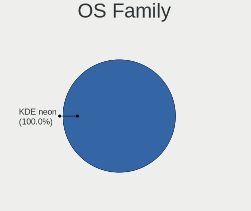
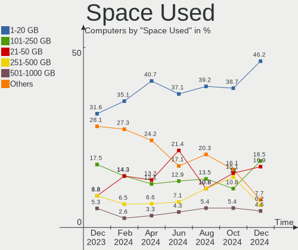
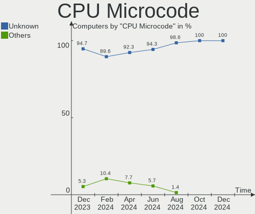
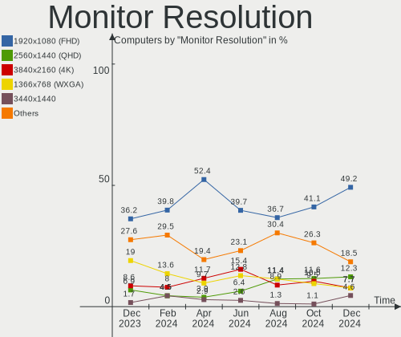
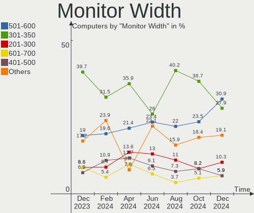
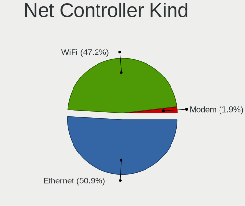
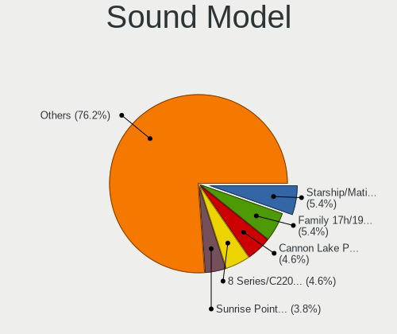

KDE neon - Hardware Trends
--------------------------

A project to identify most popular hardware characteristics and track their change
over time based on data collected by Linux users at https://Linux-Hardware.org.

Anyone can contribute to this report by the [hw-probe](https://github.com/linuxhw/hw-probe) tool:

    sudo -E hw-probe -all -upload

This is a report for all computer types. See also reports for [desktops](/Dist/KDE_neon/Desktop/README.md) and [notebooks](/Dist/KDE_neon/Notebook/README.md).

This report is for one last month. Overall report since the beginning of time: [TestDays](https://github.com/linuxhw/TestDays)

Period: Mar, 2023.

Contents
--------

* [ System ](#system)
  - [ OS                       ](#os)
  - [ OS Family                ](#os-family)
  - [ Kernel                   ](#kernel)
  - [ Kernel Family            ](#kernel-family)
  - [ Kernel Major Ver.        ](#kernel-major-ver)
  - [ Arch                     ](#arch)
  - [ DE                       ](#de)
  - [ Display Server           ](#display-server)
  - [ Display Manager          ](#display-manager)
  - [ OS Lang                  ](#os-lang)
  - [ Boot Mode                ](#boot-mode)
  - [ Filesystem               ](#filesystem)
  - [ Part. scheme             ](#part-scheme)
  - [ Dual Boot with Linux/BSD ](#dual-boot-with-linuxbsd)
  - [ Dual Boot (Win)          ](#dual-boot-win)

* [ Board ](#board)
  - [ Vendor                   ](#vendor)
  - [ Model                    ](#model)
  - [ Model Family             ](#model-family)
  - [ MFG Year                 ](#mfg-year)
  - [ Form Factor              ](#form-factor)
  - [ Secure Boot              ](#secure-boot)
  - [ Coreboot                 ](#coreboot)
  - [ RAM Size                 ](#ram-size)
  - [ RAM Used                 ](#ram-used)
  - [ Total Drives             ](#total-drives)
  - [ Has CD-ROM               ](#has-cd-rom)
  - [ Has Ethernet             ](#has-ethernet)
  - [ Has WiFi                 ](#has-wifi)
  - [ Has Bluetooth            ](#has-bluetooth)

* [ Location ](#location)
  - [ Country                  ](#country)
  - [ City                     ](#city)

* [ Drives ](#drives)
  - [ Drive Vendor             ](#drive-vendor)
  - [ Drive Model              ](#drive-model)
  - [ HDD Vendor               ](#hdd-vendor)
  - [ SSD Vendor               ](#ssd-vendor)
  - [ Drive Kind               ](#drive-kind)
  - [ Drive Connector          ](#drive-connector)
  - [ Drive Size               ](#drive-size)
  - [ Space Total              ](#space-total)
  - [ Space Used               ](#space-used)
  - [ Malfunc. Drives          ](#malfunc-drives)
  - [ Malfunc. Drive Vendor    ](#malfunc-drive-vendor)
  - [ Malfunc. HDD Vendor      ](#malfunc-hdd-vendor)
  - [ Malfunc. Drive Kind      ](#malfunc-drive-kind)
  - [ Failed Drives            ](#failed-drives)
  - [ Failed Drive Vendor      ](#failed-drive-vendor)
  - [ Drive Status             ](#drive-status)

* [ Storage controller ](#storage-controller)
  - [ Storage Vendor           ](#storage-vendor)
  - [ Storage Model            ](#storage-model)
  - [ Storage Kind             ](#storage-kind)

* [ Processor ](#processor)
  - [ CPU Vendor               ](#cpu-vendor)
  - [ CPU Model                ](#cpu-model)
  - [ CPU Model Family         ](#cpu-model-family)
  - [ CPU Cores                ](#cpu-cores)
  - [ CPU Sockets              ](#cpu-sockets)
  - [ CPU Threads              ](#cpu-threads)
  - [ CPU Op-Modes             ](#cpu-op-modes)
  - [ CPU Microcode            ](#cpu-microcode)
  - [ CPU Microarch            ](#cpu-microarch)

* [ Graphics ](#graphics)
  - [ GPU Vendor               ](#gpu-vendor)
  - [ GPU Model                ](#gpu-model)
  - [ GPU Combo                ](#gpu-combo)
  - [ GPU Driver               ](#gpu-driver)
  - [ GPU Memory               ](#gpu-memory)

* [ Monitor ](#monitor)
  - [ Monitor Vendor           ](#monitor-vendor)
  - [ Monitor Model            ](#monitor-model)
  - [ Monitor Resolution       ](#monitor-resolution)
  - [ Monitor Diagonal         ](#monitor-diagonal)
  - [ Monitor Width            ](#monitor-width)
  - [ Aspect Ratio             ](#aspect-ratio)
  - [ Monitor Area             ](#monitor-area)
  - [ Pixel Density            ](#pixel-density)
  - [ Multiple Monitors        ](#multiple-monitors)

* [ Network ](#network)
  - [ Net Controller Vendor    ](#net-controller-vendor)
  - [ Net Controller Model     ](#net-controller-model)
  - [ Wireless Vendor          ](#wireless-vendor)
  - [ Wireless Model           ](#wireless-model)
  - [ Ethernet Vendor          ](#ethernet-vendor)
  - [ Ethernet Model           ](#ethernet-model)
  - [ Net Controller Kind      ](#net-controller-kind)
  - [ Used Controller          ](#used-controller)
  - [ NICs                     ](#nics)
  - [ IPv6                     ](#ipv6)

* [ Bluetooth ](#bluetooth)
  - [ Bluetooth Vendor         ](#bluetooth-vendor)
  - [ Bluetooth Model          ](#bluetooth-model)

* [ Sound ](#sound)
  - [ Sound Vendor             ](#sound-vendor)
  - [ Sound Model              ](#sound-model)

* [ Memory ](#memory)
  - [ Memory Vendor            ](#memory-vendor)
  - [ Memory Model             ](#memory-model)
  - [ Memory Kind              ](#memory-kind)
  - [ Memory Form Factor       ](#memory-form-factor)
  - [ Memory Size              ](#memory-size)
  - [ Memory Speed             ](#memory-speed)

* [ Printers & scanners ](#printers--scanners)
  - [ Printer Vendor           ](#printer-vendor)
  - [ Printer Model            ](#printer-model)
  - [ Scanner Vendor           ](#scanner-vendor)
  - [ Scanner Model            ](#scanner-model)

* [ Camera ](#camera)
  - [ Camera Vendor            ](#camera-vendor)
  - [ Camera Model             ](#camera-model)

* [ Security ](#security)
  - [ Fingerprint Vendor       ](#fingerprint-vendor)
  - [ Fingerprint Model        ](#fingerprint-model)
  - [ Chipcard Vendor          ](#chipcard-vendor)
  - [ Chipcard Model           ](#chipcard-model)

* [ Unsupported ](#unsupported)
  - [ Unsupported Devices      ](#unsupported-devices)
  - [ Unsupported Device Types ](#unsupported-device-types)

System
------

OS
--

Installed operating systems

| Name           | Computers | Percent |
|----------------|-----------|---------|
| KDE neon 22.04 | 101       | 98.06%  |
| KDE neon 20.04 | 2         | 1.94%   |

OS Family
---------

OS without a version

| Name     | Computers | Percent |
|----------|-----------|---------|
| KDE neon | 103       | 100%    |

Kernel
------

Version of the Linux kernel

| Version                | Computers | Percent |
|------------------------|-----------|---------|
| 5.19.0-35-generic      | 59        | 57.28%  |
| 5.15.0-60-generic      | 13        | 12.62%  |
| 5.19.0-38-generic      | 10        | 9.71%   |
| 5.19.0-32-generic      | 10        | 9.71%   |
| 5.15.0-67-generic      | 3         | 2.91%   |
| 6.2.1-060201-generic   | 2         | 1.94%   |
| 6.2.3-060203-generic   | 1         | 0.97%   |
| 6.2.0-060200-generic   | 1         | 0.97%   |
| 6.1.19-060119-generic  | 1         | 0.97%   |
| 6.0.9-060009-generic   | 1         | 0.97%   |
| 5.19.0-37-generic      | 1         | 0.97%   |
| 5.19.0-1018-lowlatency | 1         | 0.97%   |

Kernel Family
-------------

Linux kernel without a distro release

| Version | Computers | Percent |
|---------|-----------|---------|
| 5.19.0  | 81        | 78.64%  |
| 5.15.0  | 16        | 15.53%  |
| 6.2.1   | 2         | 1.94%   |
| 6.2.3   | 1         | 0.97%   |
| 6.2.0   | 1         | 0.97%   |
| 6.1.19  | 1         | 0.97%   |
| 6.0.9   | 1         | 0.97%   |

Kernel Major Ver.
-----------------

Linux kernel major version

| Version | Computers | Percent |
|---------|-----------|---------|
| 5.19    | 81        | 78.64%  |
| 5.15    | 16        | 15.53%  |
| 6.2     | 4         | 3.88%   |
| 6.1     | 1         | 0.97%   |
| 6.0     | 1         | 0.97%   |

Arch
----

OS architecture (x86_64, i586, etc.)

| Name   | Computers | Percent |
|--------|-----------|---------|
| x86_64 | 103       | 100%    |

DE
--

Desktop Environment

| Name | Computers | Percent |
|------|-----------|---------|
| KDE5 | 101       | 98.06%  |
| KDE  | 2         | 1.94%   |

Display Server
--------------

X11 or Wayland

| Name    | Computers | Percent |
|---------|-----------|---------|
| X11     | 92        | 89.32%  |
| Wayland | 10        | 9.71%   |
| Tty     | 1         | 0.97%   |

Display Manager
---------------

SDDM, LightDM, etc.

| Name    | Computers | Percent |
|---------|-----------|---------|
| Unknown | 82        | 79.61%  |
| SDDM    | 21        | 20.39%  |

OS Lang
-------

Language

| Lang  | Computers | Percent |
|-------|-----------|---------|
| en_US | 51        | 49.51%  |
| de_DE | 9         | 8.74%   |
| es_MX | 6         | 5.83%   |
| en_GB | 6         | 5.83%   |
| fr_FR | 4         | 3.88%   |
| es_ES | 3         | 2.91%   |
| C     | 3         | 2.91%   |
| ru_RU | 2         | 1.94%   |
| pt_BR | 2         | 1.94%   |
| pl_PL | 2         | 1.94%   |
| it_IT | 2         | 1.94%   |
| en_IN | 2         | 1.94%   |
| en_CA | 2         | 1.94%   |
| de_CH | 2         | 1.94%   |
| sl_SI | 1         | 0.97%   |
| nl_BE | 1         | 0.97%   |
| es_PY | 1         | 0.97%   |
| en_ZA | 1         | 0.97%   |
| en_PH | 1         | 0.97%   |
| en_DK | 1         | 0.97%   |
| en_AU | 1         | 0.97%   |

Boot Mode
---------

EFI or BIOS

| Mode | Computers | Percent |
|------|-----------|---------|
| BIOS | 87        | 84.47%  |
| EFI  | 16        | 15.53%  |

Filesystem
----------

Type of filesystem

| Type    | Computers | Percent |
|---------|-----------|---------|
| Ext4    | 96        | 93.2%   |
| Overlay | 2         | 1.94%   |
| Ext3    | 2         | 1.94%   |
| Btrfs   | 2         | 1.94%   |
| Zfs     | 1         | 0.97%   |

Part. scheme
------------

Scheme of partitioning

| Type    | Computers | Percent |
|---------|-----------|---------|
| Unknown | 81        | 78.64%  |
| GPT     | 20        | 19.42%  |
| MBR     | 2         | 1.94%   |

Dual Boot with Linux/BSD
------------------------

Hosting more than one Linux/BSD

| Dual boot | Computers | Percent |
|-----------|-----------|---------|
| No        | 97        | 94.17%  |
| Yes       | 6         | 5.83%   |

Dual Boot (Win)
---------------

Hosting Linux and Windows

| Dual boot | Computers | Percent |
|-----------|-----------|---------|
| No        | 96        | 93.2%   |
| Yes       | 7         | 6.8%    |

Board
-----

Vendor
------

Motherboard manufacturer

| Name                | Computers | Percent |
|---------------------|-----------|---------|
| ASUSTek Computer    | 17        | 16.5%   |
| Hewlett-Packard     | 15        | 14.56%  |
| Dell                | 11        | 10.68%  |
| Apple               | 10        | 9.71%   |
| MSI                 | 9         | 8.74%   |
| Lenovo              | 8         | 7.77%   |
| Gigabyte Technology | 7         | 6.8%    |
| Acer                | 6         | 5.83%   |
| Biostar             | 3         | 2.91%   |
| Sony                | 2         | 1.94%   |
| Fujitsu             | 2         | 1.94%   |
| Timi                | 1         | 0.97%   |
| Samsung Electronics | 1         | 0.97%   |
| Notebook            | 1         | 0.97%   |
| Monster             | 1         | 0.97%   |
| Microsoft           | 1         | 0.97%   |
| Intel               | 1         | 0.97%   |
| HONOR               | 1         | 0.97%   |
| Google              | 1         | 0.97%   |
| EMAXX TECHNOLOGY    | 1         | 0.97%   |
| Digibras            | 1         | 0.97%   |
| Chuwi               | 1         | 0.97%   |
| AZW                 | 1         | 0.97%   |
| American Megatrends | 1         | 0.97%   |

Model
-----

Motherboard model

| Name                                       | Computers | Percent |
|--------------------------------------------|-----------|---------|
| ASUS VivoBook_ASUSLaptop X530FN_S530FN     | 2         | 1.94%   |
| ASUS All Series                            | 2         | 1.94%   |
| Apple Macmini6,2                           | 2         | 1.94%   |
| Apple MacBookPro9,2                        | 2         | 1.94%   |
| Timi Xiaomi Book Pro 16 2022               | 1         | 0.97%   |
| Sony VPCEA23FB                             | 1         | 0.97%   |
| Sony SVF1521Q1EW                           | 1         | 0.97%   |
| Samsung 350V5C/351V5C/3540VC/3440VC        | 1         | 0.97%   |
| Notebook NS50MU                            | 1         | 0.97%   |
| MSI MS-7C52                                | 1         | 0.97%   |
| MSI MS-7C37                                | 1         | 0.97%   |
| MSI MS-7C02                                | 1         | 0.97%   |
| MSI MS-7B86                                | 1         | 0.97%   |
| MSI MS-7A62                                | 1         | 0.97%   |
| MSI MS-7845                                | 1         | 0.97%   |
| MSI MS-7592                                | 1         | 0.97%   |
| MSI MS-7586                                | 1         | 0.97%   |
| MSI GF65 Thin 9SD                          | 1         | 0.97%   |
| Monster TULPAR T7 V19.5                    | 1         | 0.97%   |
| Microsoft Surface Pro 4                    | 1         | 0.97%   |
| Lenovo ThinkPad W510 4318CTO               | 1         | 0.97%   |
| Lenovo ThinkPad E485 20KU001KUS            | 1         | 0.97%   |
| Lenovo ThinkCentre M73 10AXS04G01          | 1         | 0.97%   |
| Lenovo IdeaPadFlex 5 15ITL05 82HT          | 1         | 0.97%   |
| Lenovo IdeaPad Gaming 3 15IHU6 82K1        | 1         | 0.97%   |
| Lenovo IdeaPad Gaming 3 15ACH6 82K2        | 1         | 0.97%   |
| Lenovo IdeaCentre AIO 520-24IKL F0D1008YSA | 1         | 0.97%   |
| Lenovo G560 20042                          | 1         | 0.97%   |
| Intel NUC6i7KYB H90766-405                 | 1         | 0.97%   |
| HONOR BBR-WAX9                             | 1         | 0.97%   |
| HP ZBook 17 G3                             | 1         | 0.97%   |
| HP ProBook 6565b                           | 1         | 0.97%   |
| HP ProBook 645 G1                          | 1         | 0.97%   |
| HP ProBook 450 G6                          | 1         | 0.97%   |
| HP Pavilion Notebook                       | 1         | 0.97%   |
| HP Pavilion Laptop 15-cw1xxx               | 1         | 0.97%   |
| HP Notebook                                | 1         | 0.97%   |
| HP Laptop 17-cn0xxx                        | 1         | 0.97%   |
| HP Laptop 15s-eq2xxx                       | 1         | 0.97%   |
| HP Laptop 15-db0xxx                        | 1         | 0.97%   |

Model Family
------------

Motherboard model prefix

| Name               | Computers | Percent |
|--------------------|-----------|---------|
| Dell Latitude      | 5         | 4.85%   |
| Dell Inspiron      | 4         | 3.88%   |
| Acer Aspire        | 4         | 3.88%   |
| HP ProBook         | 3         | 2.91%   |
| HP Laptop          | 3         | 2.91%   |
| ASUS VivoBook      | 3         | 2.91%   |
| Lenovo ThinkPad    | 2         | 1.94%   |
| Lenovo IdeaPad     | 2         | 1.94%   |
| HP Pavilion        | 2         | 1.94%   |
| HP Compaq          | 2         | 1.94%   |
| ASUS ROG           | 2         | 1.94%   |
| ASUS PRIME         | 2         | 1.94%   |
| ASUS All           | 2         | 1.94%   |
| Apple Macmini6     | 2         | 1.94%   |
| Apple MacBookPro9  | 2         | 1.94%   |
| Apple MacBookPro11 | 2         | 1.94%   |
| Acer Swift         | 2         | 1.94%   |
| Timi Xiaomi        | 1         | 0.97%   |
| Sony VPCEA23FB     | 1         | 0.97%   |
| Sony SVF1521Q1EW   | 1         | 0.97%   |
| Samsung 350V5C     | 1         | 0.97%   |
| Notebook NS50MU    | 1         | 0.97%   |
| MSI MS-7C52        | 1         | 0.97%   |
| MSI MS-7C37        | 1         | 0.97%   |
| MSI MS-7C02        | 1         | 0.97%   |
| MSI MS-7B86        | 1         | 0.97%   |
| MSI MS-7A62        | 1         | 0.97%   |
| MSI MS-7845        | 1         | 0.97%   |
| MSI MS-7592        | 1         | 0.97%   |
| MSI MS-7586        | 1         | 0.97%   |
| MSI GF65           | 1         | 0.97%   |
| Monster TULPAR     | 1         | 0.97%   |
| Microsoft Surface  | 1         | 0.97%   |
| Lenovo ThinkCentre | 1         | 0.97%   |
| Lenovo IdeaPadFlex | 1         | 0.97%   |
| Lenovo IdeaCentre  | 1         | 0.97%   |
| Lenovo G560        | 1         | 0.97%   |
| Intel NUC6i7KYB    | 1         | 0.97%   |
| HONOR BBR-WAX9     | 1         | 0.97%   |
| HP ZBook           | 1         | 0.97%   |

MFG Year
--------

Motherboard manufacture year

| Year | Computers | Percent |
|------|-----------|---------|
| 2021 | 12        | 11.65%  |
| 2020 | 12        | 11.65%  |
| 2019 | 12        | 11.65%  |
| 2012 | 10        | 9.71%   |
| 2016 | 9         | 8.74%   |
| 2018 | 8         | 7.77%   |
| 2013 | 8         | 7.77%   |
| 2011 | 6         | 5.83%   |
| 2022 | 5         | 4.85%   |
| 2015 | 5         | 4.85%   |
| 2014 | 5         | 4.85%   |
| 2009 | 5         | 4.85%   |
| 2017 | 2         | 1.94%   |
| 2010 | 2         | 1.94%   |
| 2008 | 1         | 0.97%   |
| 2006 | 1         | 0.97%   |

Form Factor
-----------

Physical design of the computer

| Name        | Computers | Percent |
|-------------|-----------|---------|
| Notebook    | 61        | 59.22%  |
| Desktop     | 33        | 32.04%  |
| Mini pc     | 5         | 4.85%   |
| All in one  | 2         | 1.94%   |
| Tablet      | 1         | 0.97%   |
| Convertible | 1         | 0.97%   |

Secure Boot
-----------

Enabled or disabled

| State    | Computers | Percent |
|----------|-----------|---------|
| Disabled | 103       | 100%    |

Coreboot
--------

Have coreboot on board

| Used | Computers | Percent |
|------|-----------|---------|
| No   | 102       | 99.03%  |
| Yes  | 1         | 0.97%   |

RAM Size
--------

Total RAM memory

| Size in GB  | Computers | Percent |
|-------------|-----------|---------|
| 4.01-8.0    | 35        | 33.98%  |
| 16.01-24.0  | 21        | 20.39%  |
| 8.01-16.0   | 21        | 20.39%  |
| 32.01-64.0  | 14        | 13.59%  |
| 3.01-4.0    | 9         | 8.74%   |
| 64.01-256.0 | 2         | 1.94%   |
| 1.01-2.0    | 1         | 0.97%   |

RAM Used
--------

Used RAM memory

| Used GB    | Computers | Percent |
|------------|-----------|---------|
| 2.01-3.0   | 39        | 37.86%  |
| 1.01-2.0   | 27        | 26.21%  |
| 3.01-4.0   | 16        | 15.53%  |
| 4.01-8.0   | 14        | 13.59%  |
| 8.01-16.0  | 5         | 4.85%   |
| 24.01-32.0 | 1         | 0.97%   |
| 0.51-1.0   | 1         | 0.97%   |

Total Drives
------------

Number of drives on board

| Drives | Computers | Percent |
|--------|-----------|---------|
| 1      | 60        | 58.25%  |
| 2      | 27        | 26.21%  |
| 4      | 7         | 6.8%    |
| 6      | 4         | 3.88%   |
| 3      | 3         | 2.91%   |
| 14     | 1         | 0.97%   |
| 7      | 1         | 0.97%   |

Has CD-ROM
----------

Has CD-ROM on board

| Presented | Computers | Percent |
|-----------|-----------|---------|
| No        | 68        | 66.02%  |
| Yes       | 35        | 33.98%  |

Has Ethernet
------------

Has Ethernet on board

| Presented | Computers | Percent |
|-----------|-----------|---------|
| Yes       | 87        | 84.47%  |
| No        | 16        | 15.53%  |

Has WiFi
--------

Has WiFi module

| Presented | Computers | Percent |
|-----------|-----------|---------|
| Yes       | 85        | 82.52%  |
| No        | 18        | 17.48%  |

Has Bluetooth
-------------

Has Bluetooth module

| Presented | Computers | Percent |
|-----------|-----------|---------|
| Yes       | 77        | 74.76%  |
| No        | 26        | 25.24%  |

Location
--------

Country
-------

Geographic location (country)

| Country      | Computers | Percent |
|--------------|-----------|---------|
| USA          | 24        | 23.3%   |
| Germany      | 9         | 8.74%   |
| Mexico       | 5         | 4.85%   |
| France       | 5         | 4.85%   |
| Spain        | 4         | 3.88%   |
| Russia       | 4         | 3.88%   |
| UK           | 3         | 2.91%   |
| Philippines  | 3         | 2.91%   |
| India        | 3         | 2.91%   |
| Brazil       | 3         | 2.91%   |
| Turkey       | 2         | 1.94%   |
| Switzerland  | 2         | 1.94%   |
| Poland       | 2         | 1.94%   |
| Italy        | 2         | 1.94%   |
| Colombia     | 2         | 1.94%   |
| Canada       | 2         | 1.94%   |
| Australia    | 2         | 1.94%   |
| Tunisia      | 1         | 0.97%   |
| Thailand     | 1         | 0.97%   |
| South Korea  | 1         | 0.97%   |
| South Africa | 1         | 0.97%   |
| Slovenia     | 1         | 0.97%   |
| Slovakia     | 1         | 0.97%   |
| Romania      | 1         | 0.97%   |
| Portugal     | 1         | 0.97%   |
| Peru         | 1         | 0.97%   |
| Paraguay     | 1         | 0.97%   |
| Panama       | 1         | 0.97%   |
| Norway       | 1         | 0.97%   |
| Netherlands  | 1         | 0.97%   |
| Malaysia     | 1         | 0.97%   |
| Iran         | 1         | 0.97%   |
| Indonesia    | 1         | 0.97%   |
| Greece       | 1         | 0.97%   |
| Denmark      | 1         | 0.97%   |
| Czechia      | 1         | 0.97%   |
| Curaçao     | 1         | 0.97%   |
| China        | 1         | 0.97%   |
| Chile        | 1         | 0.97%   |
| Bulgaria     | 1         | 0.97%   |

City
----

Geographic location (city)

| City                      | Computers | Percent |
|---------------------------|-----------|---------|
| Zapopan                   | 1         | 0.97%   |
| Yambol                    | 1         | 0.97%   |
| Wuppertal                 | 1         | 0.97%   |
| Wroclaw                   | 1         | 0.97%   |
| Winterthur                | 1         | 0.97%   |
| Willemstad                | 1         | 0.97%   |
| Warsaw                    | 1         | 0.97%   |
| Villafranca de los Barros | 1         | 0.97%   |
| Villa de la Paz           | 1         | 0.97%   |
| Vicenza                   | 1         | 0.97%   |
| Vancouver                 | 1         | 0.97%   |
| Valencia                  | 1         | 0.97%   |
| Ürümqi                  | 1         | 0.97%   |
| Tuscola                   | 1         | 0.97%   |
| Tunis                     | 1         | 0.97%   |
| Tulcea                    | 1         | 0.97%   |
| Tucson                    | 1         | 0.97%   |
| Trivandrum                | 1         | 0.97%   |
| Telford                   | 1         | 0.97%   |
| Tehran                    | 1         | 0.97%   |
| Tavares                   | 1         | 0.97%   |
| Sylhet                    | 1         | 0.97%   |
| Stavanger                 | 1         | 0.97%   |
| Slagelse                  | 1         | 0.97%   |
| Skowhegan                 | 1         | 0.97%   |
| Septemes-les-Vallons      | 1         | 0.97%   |
| Seo-gu                    | 1         | 0.97%   |
| Santiago de Cali          | 1         | 0.97%   |
| Santiago                  | 1         | 0.97%   |
| Rome                      | 1         | 0.97%   |
| Rockford                  | 1         | 0.97%   |
| Puebla City               | 1         | 0.97%   |
| Porto Alegre              | 1         | 0.97%   |
| Portage la Prairie        | 1         | 0.97%   |
| Plymouth                  | 1         | 0.97%   |
| Perai                     | 1         | 0.97%   |
| Panama City               | 1         | 0.97%   |
| Orlando                   | 1         | 0.97%   |
| Omaha                     | 1         | 0.97%   |
| Oliveira de Azeméis      | 1         | 0.97%   |

Drives
------

Drive Vendor
------------

Hard drive vendors

| Vendor                      | Computers | Drives | Percent |
|-----------------------------|-----------|--------|---------|
| Seagate                     | 23        | 31     | 13.94%  |
| Samsung Electronics         | 20        | 28     | 12.12%  |
| WDC                         | 18        | 23     | 10.91%  |
| Kingston                    | 12        | 12     | 7.27%   |
| Sandisk                     | 10        | 10     | 6.06%   |
| Toshiba                     | 9         | 9      | 5.45%   |
| Crucial                     | 9         | 10     | 5.45%   |
| China                       | 5         | 9      | 3.03%   |
| Unknown                     | 4         | 5      | 2.42%   |
| SK hynix                    | 4         | 4      | 2.42%   |
| Apple                       | 4         | 7      | 2.42%   |
| A-DATA Technology           | 4         | 4      | 2.42%   |
| Silicon Motion              | 3         | 3      | 1.82%   |
| Phison Electronics          | 3         | 3      | 1.82%   |
| PNY                         | 2         | 2      | 1.21%   |
| Micron/Crucial Technology   | 2         | 2      | 1.21%   |
| Micron Technology           | 2         | 2      | 1.21%   |
| MAXIO Technology (Hangzhou) | 2         | 2      | 1.21%   |
| KIOXIA                      | 2         | 2      | 1.21%   |
| Hitachi                     | 2         | 3      | 1.21%   |
| HGST                        | 2         | 2      | 1.21%   |
| ADATA Technology            | 2         | 2      | 1.21%   |
| WDC WDS2                    | 1         | 1      | 0.61%   |
| walram                      | 1         | 1      | 0.61%   |
| T-FORCE                     | 1         | 1      | 0.61%   |
| ShiJi                       | 1         | 1      | 0.61%   |
| Realtek Semiconductor       | 1         | 1      | 0.61%   |
| Radeon                      | 1         | 1      | 0.61%   |
| POLION                      | 1         | 1      | 0.61%   |
| Patriot                     | 1         | 1      | 0.61%   |
| OCZ                         | 1         | 1      | 0.61%   |
| Mushkin                     | 1         | 1      | 0.61%   |
| Maxtor                      | 1         | 1      | 0.61%   |
| Magnetic Data               | 1         | 1      | 0.61%   |
| LITEONIT                    | 1         | 1      | 0.61%   |
| KingSpec                    | 1         | 1      | 0.61%   |
| Intel                       | 1         | 1      | 0.61%   |
| Hikvision                   | 1         | 1      | 0.61%   |
| GOODRAM                     | 1         | 1      | 0.61%   |
| Gigabyte Technology         | 1         | 1      | 0.61%   |

Drive Model
-----------

Hard drive models

| Model                                                  | Computers | Percent |
|--------------------------------------------------------|-----------|---------|
| Samsung NVMe SSD Controller SM981/PM981/PM983 250GB    | 7         | 3.85%   |
| Kingston SA400S37240G 240GB SSD                        | 4         | 2.2%    |
| Silicon Motion SM2263EN/SM2263XT SSD Controller 1024GB | 3         | 1.65%   |
| Seagate ST500DM002-1BD142 500GB                        | 3         | 1.65%   |
| Seagate ST2000DM008-2FR102 2TB                         | 3         | 1.65%   |
| Samsung NVMe SSD Controller PM9A1/PM9A3/980PRO 1TB     | 3         | 1.65%   |
| Crucial CT1000MX500SSD1 1TB                            | 3         | 1.65%   |
| WDC WD10EZEX-08WN4A0 1TB                               | 2         | 1.1%    |
| Toshiba MQ01ABF050 500GB                               | 2         | 1.1%    |
| Seagate ST500LM012 HN-M500MBB 500GB                    | 2         | 1.1%    |
| Seagate ST4000DM004-2CV104 4TB                         | 2         | 1.1%    |
| Seagate ST2000DM001-1ER164 2TB                         | 2         | 1.1%    |
| Seagate ST1000LM035-1RK172 1TB                         | 2         | 1.1%    |
| Seagate ST1000DM010-2EP102 1TB                         | 2         | 1.1%    |
| Seagate ST1000DM003-1CH162 1TB                         | 2         | 1.1%    |
| Samsung NVMe SSD Controller SM961/PM961/SM963 256GB    | 2         | 1.1%    |
| Phison PS5013 E13 NVMe Controller 256GB                | 2         | 1.1%    |
| Micron 2200V_MTFDHBA512TCK  512GB                      | 2         | 1.1%    |
| MAXIO (Hangzhou) NVMe SSD Controller MAP1202 256GB     | 2         | 1.1%    |
| Kingston SA400S37120G 120GB SSD                        | 2         | 1.1%    |
| Crucial CT480BX500SSD1 480GB                           | 2         | 1.1%    |
| Apple HDD HTS541010A9E662 1TB                          | 2         | 1.1%    |
| WDC WDS500G2B0A-00SM50 500GB SSD                       | 1         | 0.55%   |
| WDC WDS480G2G0A-00JH30 480GB SSD                       | 1         | 0.55%   |
| WDC WDS240G2G0A-00JH30 240GB SSD                       | 1         | 0.55%   |
| WDC WDS2 40G2G0C-00AJ 240GB SSD                        | 1         | 0.55%   |
| WDC WDS120G1G0A-00SS50 120GB SSD                       | 1         | 0.55%   |
| WDC WD80EDAZ-11TA3A0 8TB                               | 1         | 0.55%   |
| WDC WD7500LPCX-60KHST0 752GB                           | 1         | 0.55%   |
| WDC WD5000LPVX-22V0TT0 500GB                           | 1         | 0.55%   |
| WDC WD5000LPCX-60VHAT0 500GB                           | 1         | 0.55%   |
| WDC WD5000AAKX-60U6AA0 500GB                           | 1         | 0.55%   |
| WDC WD40EZRZ-75GXCB0 4TB                               | 1         | 0.55%   |
| WDC WD40EZRZ-22GXCB0 4TB                               | 1         | 0.55%   |
| WDC WD40EZAZ-00SF3B0 4TB                               | 1         | 0.55%   |
| WDC WD4000FYYZ-01UL1B1 4TB                             | 1         | 0.55%   |
| WDC WD3200AAJS-56M0A0 320GB                            | 1         | 0.55%   |
| WDC WD30EZRZ-00Z5HB0 3TB                               | 1         | 0.55%   |
| WDC WD15EARS-00S8B1 1TB                                | 1         | 0.55%   |
| WDC WD10JPVX-00JC3T0 1TB                               | 1         | 0.55%   |

HDD Vendor
----------

Hard disk drive vendors

| Vendor  | Computers | Drives | Percent |
|---------|-----------|--------|---------|
| Seagate | 23        | 31     | 43.4%   |
| WDC     | 14        | 18     | 26.42%  |
| Toshiba | 8         | 8      | 15.09%  |
| Hitachi | 2         | 3      | 3.77%   |
| HGST    | 2         | 2      | 3.77%   |
| Apple   | 2         | 2      | 3.77%   |
| Unknown | 1         | 1      | 1.89%   |
| Maxtor  | 1         | 1      | 1.89%   |

SSD Vendor
----------

Solid state drive vendors

| Vendor              | Computers | Drives | Percent |
|---------------------|-----------|--------|---------|
| Kingston            | 9         | 9      | 14.06%  |
| Crucial             | 9         | 10     | 14.06%  |
| Samsung Electronics | 8         | 11     | 12.5%   |
| SanDisk             | 7         | 7      | 10.94%  |
| China               | 5         | 9      | 7.81%   |
| WDC                 | 4         | 4      | 6.25%   |
| A-DATA Technology   | 4         | 4      | 6.25%   |
| SK hynix            | 2         | 2      | 3.13%   |
| PNY                 | 2         | 2      | 3.13%   |
| WDC WDS2            | 1         | 1      | 1.56%   |
| T-FORCE             | 1         | 1      | 1.56%   |
| Radeon              | 1         | 1      | 1.56%   |
| Patriot             | 1         | 1      | 1.56%   |
| OCZ                 | 1         | 1      | 1.56%   |
| Mushkin             | 1         | 1      | 1.56%   |
| LITEONIT            | 1         | 1      | 1.56%   |
| KingSpec            | 1         | 1      | 1.56%   |
| Intel               | 1         | 1      | 1.56%   |
| Hikvision           | 1         | 1      | 1.56%   |
| GOODRAM             | 1         | 1      | 1.56%   |
| Gigabyte Technology | 1         | 1      | 1.56%   |
| BHT                 | 1         | 1      | 1.56%   |
| Apple               | 1         | 1      | 1.56%   |

Drive Kind
----------

HDD or SSD

| Kind    | Computers | Drives | Percent |
|---------|-----------|--------|---------|
| HDD     | 47        | 66     | 33.57%  |
| SSD     | 44        | 72     | 31.43%  |
| NVMe    | 42        | 49     | 30%     |
| Unknown | 4         | 5      | 2.86%   |
| MMC     | 3         | 4      | 2.14%   |

Drive Connector
---------------

SATA, SAS, NVMe, etc.

| Type | Computers | Drives | Percent |
|------|-----------|--------|---------|
| SATA | 76        | 139    | 60.8%   |
| NVMe | 42        | 49     | 33.6%   |
| SAS  | 4         | 4      | 3.2%    |
| MMC  | 3         | 4      | 2.4%    |

Drive Size
----------

Size of hard drive

| Size in TB | Computers | Drives | Percent |
|------------|-----------|--------|---------|
| 0.01-0.5   | 53        | 80     | 52.48%  |
| 0.51-1.0   | 31        | 36     | 30.69%  |
| 1.01-2.0   | 8         | 8      | 7.92%   |
| 3.01-4.0   | 6         | 10     | 5.94%   |
| 2.01-3.0   | 2         | 2      | 1.98%   |
| 4.01-10.0  | 1         | 2      | 0.99%   |

Space Total
-----------

Amount of disk space available on the file system

| Size in GB     | Computers | Percent |
|----------------|-----------|---------|
| 101-250        | 29        | 28.16%  |
| 251-500        | 19        | 18.45%  |
| 501-1000       | 15        | 14.56%  |
| 51-100         | 14        | 13.59%  |
| 1001-2000      | 11        | 10.68%  |
| 1-20           | 6         | 5.83%   |
| 21-50          | 4         | 3.88%   |
| More than 3000 | 3         | 2.91%   |
| 2001-3000      | 1         | 0.97%   |
| Unknown        | 1         | 0.97%   |

Space Used
----------

Amount of used disk space

| Used GB        | Computers | Percent |
|----------------|-----------|---------|
| 1-20           | 46        | 44.66%  |
| 21-50          | 18        | 17.48%  |
| 101-250        | 11        | 10.68%  |
| 251-500        | 10        | 9.71%   |
| 51-100         | 7         | 6.8%    |
| 501-1000       | 5         | 4.85%   |
| 1001-2000      | 4         | 3.88%   |
| More than 3000 | 1         | 0.97%   |
| Unknown        | 1         | 0.97%   |

Malfunc. Drives
---------------

Drive models with a malfunction

| Model                                                           | Computers | Drives | Percent |
|-----------------------------------------------------------------|-----------|--------|---------|
| WDC WD3200AAJS-56M0A0 320GB                                     | 1         | 1      | 20%     |
| Seagate ST1000DM003-1ER162 1TB                                  | 1         | 1      | 20%     |
| Seagate ST1000DM003-1CH162 1TB                                  | 1         | 1      | 20%     |
| Samsung Electronics NVMe SSD Controller SM961/PM961/SM963 256GB | 1         | 1      | 20%     |
| China G521N256GB SSD                                            | 1         | 1      | 20%     |

Malfunc. Drive Vendor
---------------------

Vendors of faulty drives

| Vendor              | Computers | Drives | Percent |
|---------------------|-----------|--------|---------|
| Seagate             | 2         | 2      | 40%     |
| WDC                 | 1         | 1      | 20%     |
| Samsung Electronics | 1         | 1      | 20%     |
| China               | 1         | 1      | 20%     |

Malfunc. HDD Vendor
-------------------

Vendors of faulty HDD drives

| Vendor  | Computers | Drives | Percent |
|---------|-----------|--------|---------|
| Seagate | 2         | 2      | 66.67%  |
| WDC     | 1         | 1      | 33.33%  |

Malfunc. Drive Kind
-------------------

Kinds of faulty drives

| Kind | Computers | Drives | Percent |
|------|-----------|--------|---------|
| HDD  | 2         | 3      | 50%     |
| NVMe | 1         | 1      | 25%     |
| SSD  | 1         | 1      | 25%     |

Failed Drives
-------------

Failed drive models

Zero info for selected period =(

Failed Drive Vendor
-------------------

Failed drive vendors

Zero info for selected period =(

Drive Status
------------

Number of failed and malfunc. drives

| Status   | Computers | Drives | Percent |
|----------|-----------|--------|---------|
| Detected | 87        | 167    | 80.56%  |
| Works    | 17        | 24     | 15.74%  |
| Malfunc  | 4         | 5      | 3.7%    |

Storage controller
------------------

Storage Vendor
--------------

Storage controller vendors

| Vendor                      | Computers | Percent |
|-----------------------------|-----------|---------|
| Intel                       | 67        | 46.85%  |
| AMD                         | 20        | 13.99%  |
| Samsung Electronics         | 16        | 11.19%  |
| ASMedia Technology          | 6         | 4.2%    |
| SanDisk                     | 4         | 2.8%    |
| Phison Electronics          | 4         | 2.8%    |
| Silicon Motion              | 3         | 2.1%    |
| KIOXIA                      | 3         | 2.1%    |
| Kingston Technology Company | 3         | 2.1%    |
| JMicron Technology          | 3         | 2.1%    |
| SK hynix                    | 2         | 1.4%    |
| Micron/Crucial Technology   | 2         | 1.4%    |
| Micron Technology           | 2         | 1.4%    |
| MAXIO Technology (Hangzhou) | 2         | 1.4%    |
| ADATA Technology            | 2         | 1.4%    |
| Realtek Semiconductor       | 1         | 0.7%    |
| Nvidia                      | 1         | 0.7%    |
| Marvell Technology Group    | 1         | 0.7%    |
| Apple                       | 1         | 0.7%    |

Storage Model
-------------

Storage controller models

| Model                                                                                   | Computers | Percent |
|-----------------------------------------------------------------------------------------|-----------|---------|
| AMD FCH SATA Controller [AHCI mode]                                                     | 12        | 7.79%   |
| Intel 7 Series Chipset Family 6-port SATA Controller [AHCI mode]                        | 9         | 5.84%   |
| Samsung NVMe SSD Controller SM981/PM981/PM983                                           | 8         | 5.19%   |
| Samsung NVMe SSD Controller PM9A1/PM9A3/980PRO                                          | 4         | 2.6%    |
| Intel Cannon Lake Mobile PCH SATA AHCI Controller                                       | 4         | 2.6%    |
| Intel 8 Series/C220 Series Chipset Family 6-port SATA Controller 1 [AHCI mode]          | 4         | 2.6%    |
| Intel 7 Series/C210 Series Chipset Family 6-port SATA Controller [AHCI mode]            | 4         | 2.6%    |
| ASMedia ASM1062 Serial ATA Controller                                                   | 4         | 2.6%    |
| AMD 400 Series Chipset SATA Controller                                                  | 4         | 2.6%    |
| Silicon Motion SM2263EN/SM2263XT SSD Controller                                         | 3         | 1.95%   |
| Intel Volume Management Device NVMe RAID Controller                                     | 3         | 1.95%   |
| Intel Tiger Lake-LP SATA Controller                                                     | 3         | 1.95%   |
| Intel 6 Series/C200 Series Chipset Family 6 port Mobile SATA AHCI Controller            | 3         | 1.95%   |
| Intel 200 Series PCH SATA controller [AHCI mode]                                        | 3         | 1.95%   |
| AMD 500 Series Chipset SATA Controller                                                  | 3         | 1.95%   |
| SanDisk WD Blue SN500 / PC SN520 NVMe SSD                                               | 2         | 1.3%    |
| Samsung NVMe SSD Controller SM961/PM961/SM963                                           | 2         | 1.3%    |
| Samsung NVMe SSD Controller 980                                                         | 2         | 1.3%    |
| Phison PS5013 E13 NVMe Controller                                                       | 2         | 1.3%    |
| Micron NVMe Storage Controller                                                          | 2         | 1.3%    |
| MAXIO (Hangzhou) NVMe SSD Controller MAP1202                                            | 2         | 1.3%    |
| KIOXIA NVMe SSD Controller BG4                                                          | 2         | 1.3%    |
| JMicron JMB363 SATA/IDE Controller                                                      | 2         | 1.3%    |
| Intel Wildcat Point-LP SATA Controller [AHCI Mode]                                      | 2         | 1.3%    |
| Intel HM170/QM170 Chipset SATA Controller [AHCI Mode]                                   | 2         | 1.3%    |
| Intel Comet Lake SATA AHCI Controller                                                   | 2         | 1.3%    |
| Intel Cannon Point-LP SATA Controller [AHCI Mode]                                       | 2         | 1.3%    |
| Intel 82801JI (ICH10 Family) SATA AHCI Controller                                       | 2         | 1.3%    |
| Intel 82801 Mobile SATA Controller [RAID mode]                                          | 2         | 1.3%    |
| Intel 8 Series SATA Controller 1 [AHCI mode]                                            | 2         | 1.3%    |
| Intel 6 Series/C200 Series Chipset Family Desktop SATA Controller (IDE mode, ports 4-5) | 2         | 1.3%    |
| Intel 6 Series/C200 Series Chipset Family Desktop SATA Controller (IDE mode, ports 0-3) | 2         | 1.3%    |
| Intel 500 Series Chipset Family SATA AHCI Controller                                    | 2         | 1.3%    |
| Intel 5 Series/3400 Series Chipset 4 port SATA IDE Controller                           | 2         | 1.3%    |
| Intel 5 Series/3400 Series Chipset 4 port SATA AHCI Controller                          | 2         | 1.3%    |
| Intel 5 Series/3400 Series Chipset 2 port SATA IDE Controller                           | 2         | 1.3%    |
| AMD FCH SATA Controller [IDE mode]                                                      | 2         | 1.3%    |
| SK hynix Gold P31/PC711 NVMe Solid State Drive                                          | 1         | 0.65%   |
| SK hynix BC511                                                                          | 1         | 0.65%   |
| SanDisk WD Blue SN550 NVMe SSD                                                          | 1         | 0.65%   |

Storage Kind
------------

Kind of storage controller (IDE, SATA, NVMe, SAS, ...)

| Kind | Computers | Percent |
|------|-----------|---------|
| SATA | 79        | 58.96%  |
| NVMe | 42        | 31.34%  |
| IDE  | 7         | 5.22%   |
| RAID | 6         | 4.48%   |

Processor
---------

CPU Vendor
----------

Processor vendors

| Vendor | Computers | Percent |
|--------|-----------|---------|
| Intel  | 77        | 74.76%  |
| AMD    | 26        | 25.24%  |

CPU Model
---------

Processor models

| Model                                    | Computers | Percent |
|------------------------------------------|-----------|---------|
| Intel Core i7-9750H CPU @ 2.60GHz        | 4         | 3.88%   |
| Intel Core i7-4770K CPU @ 3.50GHz        | 3         | 2.91%   |
| Intel Core i5-3210M CPU @ 2.50GHz        | 3         | 2.91%   |
| Intel Core i5-8265U CPU @ 1.60GHz        | 2         | 1.94%   |
| Intel Celeron CPU G1610 @ 2.60GHz        | 2         | 1.94%   |
| Intel 11th Gen Core i3-1115G4 @ 3.00GHz  | 2         | 1.94%   |
| Intel Xeon CPU X5690 @ 3.47GHz           | 1         | 0.97%   |
| Intel Pentium Silver N5030 CPU @ 1.10GHz | 1         | 0.97%   |
| Intel Pentium Gold G6400 CPU @ 4.00GHz   | 1         | 0.97%   |
| Intel Pentium CPU G2030T @ 2.60GHz       | 1         | 0.97%   |
| Intel Pentium CPU 2020M @ 2.40GHz        | 1         | 0.97%   |
| Intel Core i7-8750H CPU @ 2.20GHz        | 1         | 0.97%   |
| Intel Core i7-8565U CPU @ 1.80GHz        | 1         | 0.97%   |
| Intel Core i7-7820X CPU @ 3.60GHz        | 1         | 0.97%   |
| Intel Core i7-6820HQ CPU @ 2.70GHz       | 1         | 0.97%   |
| Intel Core i7-6770HQ CPU @ 2.60GHz       | 1         | 0.97%   |
| Intel Core i7-6700 CPU @ 3.40GHz         | 1         | 0.97%   |
| Intel Core i7-4870HQ CPU @ 2.50GHz       | 1         | 0.97%   |
| Intel Core i7-4790 CPU @ 3.60GHz         | 1         | 0.97%   |
| Intel Core i7-4770HQ CPU @ 2.20GHz       | 1         | 0.97%   |
| Intel Core i7-4500U CPU @ 1.80GHz        | 1         | 0.97%   |
| Intel Core i7-3930K CPU @ 3.20GHz        | 1         | 0.97%   |
| Intel Core i7-3720QM CPU @ 2.60GHz       | 1         | 0.97%   |
| Intel Core i7-3632QM CPU @ 2.20GHz       | 1         | 0.97%   |
| Intel Core i7-3615QM CPU @ 2.30GHz       | 1         | 0.97%   |
| Intel Core i7-10850H CPU @ 2.70GHz       | 1         | 0.97%   |
| Intel Core i7-10510U CPU @ 1.80GHz       | 1         | 0.97%   |
| Intel Core i7 CPU Q 720 @ 1.60GHz        | 1         | 0.97%   |
| Intel Core i5-9600K CPU @ 3.70GHz        | 1         | 0.97%   |
| Intel Core i5-7400T CPU @ 2.40GHz        | 1         | 0.97%   |
| Intel Core i5-7400 CPU @ 3.00GHz         | 1         | 0.97%   |
| Intel Core i5-6360U CPU @ 2.00GHz        | 1         | 0.97%   |
| Intel Core i5-6300U CPU @ 2.40GHz        | 1         | 0.97%   |
| Intel Core i5-6300HQ CPU @ 2.30GHz       | 1         | 0.97%   |
| Intel Core i5-6200U CPU @ 2.30GHz        | 1         | 0.97%   |
| Intel Core i5-5300U CPU @ 2.30GHz        | 1         | 0.97%   |
| Intel Core i5-4570T CPU @ 2.90GHz        | 1         | 0.97%   |
| Intel Core i5-4210U CPU @ 1.70GHz        | 1         | 0.97%   |
| Intel Core i5-3470 CPU @ 3.20GHz         | 1         | 0.97%   |
| Intel Core i5-3350P CPU @ 3.10GHz        | 1         | 0.97%   |

CPU Model Family
----------------

Processor model prefix

| Model                | Computers | Percent |
|----------------------|-----------|---------|
| Intel Core i7        | 24        | 23.3%   |
| Intel Core i5        | 23        | 22.33%  |
| Intel Core i3        | 8         | 7.77%   |
| AMD Ryzen 5          | 8         | 7.77%   |
| Other                | 7         | 6.8%    |
| AMD Ryzen 7          | 6         | 5.83%   |
| Intel Celeron        | 5         | 4.85%   |
| Intel Core 2 Duo     | 3         | 2.91%   |
| AMD A6               | 3         | 2.91%   |
| Intel Pentium        | 2         | 1.94%   |
| Intel Core 2 Quad    | 2         | 1.94%   |
| AMD Ryzen 9          | 2         | 1.94%   |
| AMD Ryzen 3          | 2         | 1.94%   |
| Intel Xeon           | 1         | 0.97%   |
| Intel Pentium Silver | 1         | 0.97%   |
| Intel Pentium Gold   | 1         | 0.97%   |
| AMD Ryzen 7 PRO      | 1         | 0.97%   |
| AMD E2               | 1         | 0.97%   |
| AMD A8               | 1         | 0.97%   |
| AMD A4               | 1         | 0.97%   |
| AMD A10              | 1         | 0.97%   |

CPU Cores
---------

Number of processor cores

| Number | Computers | Percent |
|--------|-----------|---------|
| 4      | 41        | 39.81%  |
| 2      | 35        | 33.98%  |
| 6      | 13        | 12.62%  |
| 8      | 9         | 8.74%   |
| 12     | 3         | 2.91%   |
| 1      | 2         | 1.94%   |

CPU Sockets
-----------

Number of sockets

| Number | Computers | Percent |
|--------|-----------|---------|
| 1      | 102       | 99.03%  |
| 2      | 1         | 0.97%   |

CPU Threads
-----------

Threads per core (Hyper-Threading)

| Number | Computers | Percent |
|--------|-----------|---------|
| 2      | 74        | 71.84%  |
| 1      | 29        | 28.16%  |

CPU Op-Modes
------------

CPU Operation Modes (32-bit, 64-bit)

| Op mode        | Computers | Percent |
|----------------|-----------|---------|
| 32-bit, 64-bit | 103       | 100%    |

CPU Microcode
-------------

Microcode number

| Number     | Computers | Percent |
|------------|-----------|---------|
| Unknown    | 84        | 81.55%  |
| 0x806c1    | 3         | 2.91%   |
| 0x306a9    | 3         | 2.91%   |
| 0x906ed    | 1         | 0.97%   |
| 0x906c0    | 1         | 0.97%   |
| 0x806ec    | 1         | 0.97%   |
| 0x506e3    | 1         | 0.97%   |
| 0x50654    | 1         | 0.97%   |
| 0x406e3    | 1         | 0.97%   |
| 0x40651    | 1         | 0.97%   |
| 0x306c3    | 1         | 0.97%   |
| 0x20652    | 1         | 0.97%   |
| 0x0a50000c | 1         | 0.97%   |
| 0x08701021 | 1         | 0.97%   |
| 0x08608102 | 1         | 0.97%   |
| 0x08108102 | 1         | 0.97%   |

CPU Microarch
-------------

Microarchitecture

| Name          | Computers | Percent |
|---------------|-----------|---------|
| IvyBridge     | 15        | 14.56%  |
| KabyLake      | 13        | 12.62%  |
| Haswell       | 9         | 8.74%   |
| Skylake       | 8         | 7.77%   |
| Zen 3         | 6         | 5.83%   |
| Zen 2         | 6         | 5.83%   |
| TigerLake     | 5         | 4.85%   |
| SandyBridge   | 5         | 4.85%   |
| Westmere      | 4         | 3.88%   |
| Penryn        | 4         | 3.88%   |
| Unknown       | 4         | 3.88%   |
| Zen+          | 3         | 2.91%   |
| Zen           | 2         | 1.94%   |
| Piledriver    | 2         | 1.94%   |
| Nehalem       | 2         | 1.94%   |
| Excavator     | 2         | 1.94%   |
| Core          | 2         | 1.94%   |
| CometLake     | 2         | 1.94%   |
| Broadwell     | 2         | 1.94%   |
| Tremont       | 1         | 0.97%   |
| Silvermont    | 1         | 0.97%   |
| Puma          | 1         | 0.97%   |
| K10 Llano     | 1         | 0.97%   |
| Jaguar        | 1         | 0.97%   |
| IceLake       | 1         | 0.97%   |
| Goldmont plus | 1         | 0.97%   |

Graphics
--------

GPU Vendor
----------

Vendors of graphics cards

| Vendor | Computers | Percent |
|--------|-----------|---------|
| Intel  | 58        | 46.77%  |
| Nvidia | 38        | 30.65%  |
| AMD    | 28        | 22.58%  |

GPU Model
---------

Graphics card models

| Model                                                                     | Computers | Percent |
|---------------------------------------------------------------------------|-----------|---------|
| Intel 3rd Gen Core processor Graphics Controller                          | 9         | 7.2%    |
| Intel CoffeeLake-H GT2 [UHD Graphics 630]                                 | 5         | 4%      |
| Intel Xeon E3-1200 v2/3rd Gen Core processor Graphics Controller          | 4         | 3.2%    |
| AMD Ellesmere [Radeon RX 470/480/570/570X/580/580X/590]                   | 4         | 3.2%    |
| AMD Cezanne [Radeon Vega Series / Radeon Vega Mobile Series]              | 4         | 3.2%    |
| Intel WhiskeyLake-U GT2 [UHD Graphics 620]                                | 3         | 2.4%    |
| Intel TigerLake-LP GT2 [Iris Xe Graphics]                                 | 3         | 2.4%    |
| Intel HD Graphics 530                                                     | 3         | 2.4%    |
| Intel Core Processor Integrated Graphics Controller                       | 3         | 2.4%    |
| Intel 2nd Generation Core Processor Family Integrated Graphics Controller | 3         | 2.4%    |
| AMD Picasso/Raven 2 [Radeon Vega Series / Radeon Vega Mobile Series]      | 3         | 2.4%    |
| Nvidia TU117M [GeForce GTX 1650 Mobile / Max-Q]                           | 2         | 1.6%    |
| Nvidia TU116M [GeForce GTX 1660 Ti Mobile]                                | 2         | 1.6%    |
| Nvidia TU104 [GeForce RTX 2060]                                           | 2         | 1.6%    |
| Nvidia GP108M [GeForce MX150]                                             | 2         | 1.6%    |
| Nvidia GP102 [GeForce GTX 1080 Ti]                                        | 2         | 1.6%    |
| Intel Tiger Lake-LP GT2 [UHD Graphics G4]                                 | 2         | 1.6%    |
| Intel Skylake GT2 [HD Graphics 520]                                       | 2         | 1.6%    |
| Intel HD Graphics 5500                                                    | 2         | 1.6%    |
| Intel Haswell-ULT Integrated Graphics Controller                          | 2         | 1.6%    |
| Intel CometLake-U GT2 [UHD Graphics]                                      | 2         | 1.6%    |
| AMD Renoir                                                                | 2         | 1.6%    |
| AMD Raven Ridge [Radeon Vega Series / Radeon Vega Mobile Series]          | 2         | 1.6%    |
| AMD Lucienne                                                              | 2         | 1.6%    |
| Nvidia TU116 [GeForce GTX 1650 SUPER]                                     | 1         | 0.8%    |
| Nvidia TU106M [GeForce RTX 2070 Mobile]                                   | 1         | 0.8%    |
| Nvidia TU102 [GeForce RTX 2080 Ti]                                        | 1         | 0.8%    |
| Nvidia GT216GLM [Quadro FX 880M]                                          | 1         | 0.8%    |
| Nvidia GP107M [GeForce MX350]                                             | 1         | 0.8%    |
| Nvidia GP107M [GeForce MX150]                                             | 1         | 0.8%    |
| Nvidia GP107M [GeForce GTX 1050 Ti Mobile]                                | 1         | 0.8%    |
| Nvidia GP107 [GeForce GTX 1050]                                           | 1         | 0.8%    |
| Nvidia GP106 [GeForce GTX 1060 6GB]                                       | 1         | 0.8%    |
| Nvidia GM206GL [Quadro M2000]                                             | 1         | 0.8%    |
| Nvidia GM206 [GeForce GTX 960]                                            | 1         | 0.8%    |
| Nvidia GM206 [GeForce GTX 950]                                            | 1         | 0.8%    |
| Nvidia GM204GLM [Quadro M3000M]                                           | 1         | 0.8%    |
| Nvidia GM108M [GeForce 940MX]                                             | 1         | 0.8%    |
| Nvidia GM107M [GeForce GTX 950M]                                          | 1         | 0.8%    |
| Nvidia GM107GL [Quadro K2200]                                             | 1         | 0.8%    |

GPU Combo
---------

Combinations of graphics cards

| Name           | Computers | Percent |
|----------------|-----------|---------|
| 1 x Intel      | 40        | 38.83%  |
| 1 x AMD        | 24        | 23.3%   |
| 1 x Nvidia     | 19        | 18.45%  |
| Intel + Nvidia | 16        | 15.53%  |
| AMD + Nvidia   | 3         | 2.91%   |
| Intel + AMD    | 1         | 0.97%   |

GPU Driver
----------

Free vs proprietary

| Driver      | Computers | Percent |
|-------------|-----------|---------|
| Free        | 92        | 89.32%  |
| Proprietary | 11        | 10.68%  |

GPU Memory
----------

Total video memory

| Size in GB | Computers | Percent |
|------------|-----------|---------|
| Unknown    | 87        | 84.47%  |
| 3.01-4.0   | 4         | 3.88%   |
| 1.01-2.0   | 3         | 2.91%   |
| 0.01-0.5   | 3         | 2.91%   |
| 7.01-8.0   | 2         | 1.94%   |
| 8.01-16.0  | 2         | 1.94%   |
| 5.01-6.0   | 1         | 0.97%   |
| 0.51-1.0   | 1         | 0.97%   |

Monitor
-------

Monitor Vendor
--------------

Monitor vendors

| Vendor                  | Computers | Percent |
|-------------------------|-----------|---------|
| AU Optronics            | 19        | 17.27%  |
| Chimei Innolux          | 14        | 12.73%  |
| Samsung Electronics     | 9         | 8.18%   |
| LG Display              | 8         | 7.27%   |
| Apple                   | 7         | 6.36%   |
| Dell                    | 6         | 5.45%   |
| BOE                     | 6         | 5.45%   |
| Lenovo                  | 4         | 3.64%   |
| Hewlett-Packard         | 4         | 3.64%   |
| BenQ                    | 4         | 3.64%   |
| Sony                    | 3         | 2.73%   |
| Toshiba                 | 2         | 1.82%   |
| LG Electronics          | 2         | 1.82%   |
| Chi Mei Optoelectronics | 2         | 1.82%   |
| Xiaomi                  | 1         | 0.91%   |
| Sharp                   | 1         | 0.91%   |
| Sceptre Tech            | 1         | 0.91%   |
| Philips                 | 1         | 0.91%   |
| OEM                     | 1         | 0.91%   |
| MSI                     | 1         | 0.91%   |
| Mi                      | 1         | 0.91%   |
| Marantz                 | 1         | 0.91%   |
| Iiyama                  | 1         | 0.91%   |
| Huion                   | 1         | 0.91%   |
| Goldstar                | 1         | 0.91%   |
| G-Story                 | 1         | 0.91%   |
| Fujitsu Siemens         | 1         | 0.91%   |
| Eizo                    | 1         | 0.91%   |
| CPT                     | 1         | 0.91%   |
| ASUSTek Computer        | 1         | 0.91%   |
| AOC                     | 1         | 0.91%   |
| Ancor Communications    | 1         | 0.91%   |
| AGO                     | 1         | 0.91%   |
| Acer                    | 1         | 0.91%   |

Monitor Model
-------------

Monitor models

| Model                                                                   | Computers | Percent |
|-------------------------------------------------------------------------|-----------|---------|
| Toshiba TV TSB0206 1920x1080                                            | 2         | 1.75%   |
| LG Electronics LCD Monitor 27GL850 2560x1440                            | 2         | 1.75%   |
| Lenovo LEN L24q-30 LEN65FB 2560x1440 527x296mm 23.8-inch                | 2         | 1.75%   |
| Chimei Innolux LCD Monitor CMN15F5 1920x1080 344x193mm 15.5-inch        | 2         | 1.75%   |
| Chimei Innolux LCD Monitor CMN14D4 1920x1080 309x173mm 13.9-inch        | 2         | 1.75%   |
| BenQ GW2270 BNQ78DB 1920x1080 476x268mm 21.5-inch                       | 2         | 1.75%   |
| AU Optronics LCD Monitor AUOD0ED 1920x1080 344x193mm 15.5-inch          | 2         | 1.75%   |
| AU Optronics LCD Monitor AUO61ED 1920x1080 344x194mm 15.5-inch          | 2         | 1.75%   |
| AU Optronics LCD Monitor AUO409D 1920x1080 382x215mm 17.3-inch          | 2         | 1.75%   |
| Apple Color LCD APPA019 2880x1800 331x207mm 15.4-inch                   | 2         | 1.75%   |
| Xiaomi Mi TV XMD00E1 1360x768 708x398mm 32.0-inch                       | 1         | 0.88%   |
| Toshiba TV TSB0205 1360x765 886x498mm 40.0-inch                         | 1         | 0.88%   |
| Sony TV SNY1503 1360x768                                                | 1         | 0.88%   |
| Sony TV SNY0902 1360x768                                                | 1         | 0.88%   |
| Sony AVAMP SNY2902 1920x540                                             | 1         | 0.88%   |
| Sharp LCD Monitor SHP149A 1920x1080 344x194mm 15.5-inch                 | 1         | 0.88%   |
| Sceptre Tech Sceptre C27 SPT0AD7 1920x1080 598x336mm 27.0-inch          | 1         | 0.88%   |
| Samsung Electronics SyncMaster SAM0598 1360x768 410x230mm 18.5-inch     | 1         | 0.88%   |
| Samsung Electronics SMBX2231 SAM076D 1920x1080 477x268mm 21.5-inch      | 1         | 0.88%   |
| Samsung Electronics SM2333TN SAM06FC 1920x1080 477x268mm 21.5-inch      | 1         | 0.88%   |
| Samsung Electronics LCD Monitor SEC5341 1366x768 344x193mm 15.5-inch    | 1         | 0.88%   |
| Samsung Electronics LCD Monitor SDC4173 3840x2400 344x215mm 16.0-inch   | 1         | 0.88%   |
| Samsung Electronics LCD Monitor SDC3853 2736x1824 260x173mm 12.3-inch   | 1         | 0.88%   |
| Samsung Electronics LCD Monitor SAM0F14 3840x2160 1872x1053mm 84.6-inch | 1         | 0.88%   |
| Samsung Electronics LCD Monitor SAM0F13 3840x2160 1872x1053mm 84.6-inch | 1         | 0.88%   |
| Samsung Electronics LCD Monitor SAM0D3B 3840x2160 1020x570mm 46.0-inch  | 1         | 0.88%   |
| Samsung Electronics C27F390 SAM0D33 1920x1080 598x336mm 27.0-inch       | 1         | 0.88%   |
| Samsung Electronics C27F390 SAM0D32 1920x1080 598x336mm 27.0-inch       | 1         | 0.88%   |
| Philips WXGA TV (3) PHL1E52 1360x768 708x398mm 32.0-inch                | 1         | 0.88%   |
| OEM 32W_LCD_TV OEM3700 1920x540                                         | 1         | 0.88%   |
| MSI MAG275R MSI3CB5 1920x1080 598x336mm 27.0-inch                       | 1         | 0.88%   |
| Mi Monitor XMI3445 3440x1440 797x334mm 34.0-inch                        | 1         | 0.88%   |
| Marantz AVR MJI004E 1920x1080 708x398mm 32.0-inch                       | 1         | 0.88%   |
| LG Display LP156WH2-TLR2 LGD027D 1366x768 344x194mm 15.5-inch           | 1         | 0.88%   |
| LG Display LP156WH2-TLAA LGD0230 1366x768 344x194mm 15.5-inch           | 1         | 0.88%   |
| LG Display LCD Monitor LGD0612 1920x1080 344x194mm 15.5-inch            | 1         | 0.88%   |
| LG Display LCD Monitor LGD05CE 1920x1080 344x194mm 15.5-inch            | 1         | 0.88%   |
| LG Display LCD Monitor LGD0493 1366x768 344x194mm 15.5-inch             | 1         | 0.88%   |
| LG Display LCD Monitor LGD040E 1920x1080 345x194mm 15.6-inch            | 1         | 0.88%   |
| LG Display LCD Monitor LGD03E8 1366x768 309x174mm 14.0-inch             | 1         | 0.88%   |

Monitor Resolution
------------------

Monitor screen resolution

| Resolution         | Computers | Percent |
|--------------------|-----------|---------|
| 1920x1080 (FHD)    | 50        | 48.54%  |
| 1366x768 (WXGA)    | 18        | 17.48%  |
| 2560x1440 (QHD)    | 8         | 7.77%   |
| 3840x2160 (4K)     | 5         | 4.85%   |
| 1600x900 (HD+)     | 4         | 3.88%   |
| 1280x800 (WXGA)    | 4         | 3.88%   |
| 2880x1800          | 3         | 2.91%   |
| 3440x1440          | 2         | 1.94%   |
| 1920x540           | 2         | 1.94%   |
| 1360x768           | 2         | 1.94%   |
| 3840x2400          | 1         | 0.97%   |
| 2736x1824          | 1         | 0.97%   |
| 1920x1200 (WUXGA)  | 1         | 0.97%   |
| 1680x1050 (WSXGA+) | 1         | 0.97%   |
| 1280x1024 (SXGA)   | 1         | 0.97%   |

Monitor Diagonal
----------------

Diagonal size in inches

| Inches  | Computers | Percent |
|---------|-----------|---------|
| 15      | 39        | 34.82%  |
| 24      | 10        | 8.93%   |
| 13      | 9         | 8.04%   |
| 27      | 8         | 7.14%   |
| 17      | 6         | 5.36%   |
| 32      | 4         | 3.57%   |
| 21      | 4         | 3.57%   |
| 14      | 4         | 3.57%   |
| Unknown | 4         | 3.57%   |
| 72      | 3         | 2.68%   |
| 84      | 2         | 1.79%   |
| 74      | 2         | 1.79%   |
| 34      | 2         | 1.79%   |
| 23      | 2         | 1.79%   |
| 19      | 2         | 1.79%   |
| 16      | 2         | 1.79%   |
| 12      | 2         | 1.79%   |
| 65      | 1         | 0.89%   |
| 40      | 1         | 0.89%   |
| 31      | 1         | 0.89%   |
| 22      | 1         | 0.89%   |
| 20      | 1         | 0.89%   |
| 18      | 1         | 0.89%   |
| 11      | 1         | 0.89%   |

Monitor Width
-------------

Physical width

| Width in mm | Computers | Percent |
|-------------|-----------|---------|
| 301-350     | 50        | 45.05%  |
| 501-600     | 20        | 18.02%  |
| 401-500     | 8         | 7.21%   |
| 351-400     | 7         | 6.31%   |
| 201-300     | 7         | 6.31%   |
| 701-800     | 6         | 5.41%   |
| 1501-2000   | 6         | 5.41%   |
| Unknown     | 4         | 3.6%    |
| 801-900     | 1         | 0.9%    |
| 601-700     | 1         | 0.9%    |
| 1001-1500   | 1         | 0.9%    |

Aspect Ratio
------------

Proportional relationship between the width and the height

| Ratio   | Computers | Percent |
|---------|-----------|---------|
| 16/9    | 80        | 80%     |
| 16/10   | 11        | 11%     |
| Unknown | 3         | 3%      |
| 21/9    | 2         | 2%      |
| 5/4     | 1         | 1%      |
| 4/3     | 1         | 1%      |
| 32/9    | 1         | 1%      |
| 3/2     | 1         | 1%      |

Monitor Area
------------

Area in inch²

| Area in inch² | Computers | Percent |
|----------------|-----------|---------|
| 101-110        | 39        | 35.14%  |
| 201-250        | 16        | 14.41%  |
| 81-90          | 11        | 9.91%   |
| 301-350        | 8         | 7.21%   |
| More than 1000 | 7         | 6.31%   |
| 351-500        | 7         | 6.31%   |
| 121-130        | 6         | 5.41%   |
| Unknown        | 4         | 3.6%    |
| 71-80          | 3         | 2.7%    |
| 151-200        | 3         | 2.7%    |
| 111-120        | 2         | 1.8%    |
| 61-70          | 1         | 0.9%    |
| 51-60          | 1         | 0.9%    |
| 251-300        | 1         | 0.9%    |
| 141-150        | 1         | 0.9%    |
| 501-1000       | 1         | 0.9%    |

Pixel Density
-------------

Pixels per inch

| Density       | Computers | Percent |
|---------------|-----------|---------|
| 121-160       | 36        | 33.33%  |
| 101-120       | 28        | 25.93%  |
| 51-100        | 28        | 25.93%  |
| 1-50          | 5         | 4.63%   |
| 161-240       | 4         | 3.7%    |
| Unknown       | 4         | 3.7%    |
| More than 240 | 3         | 2.78%   |

Multiple Monitors
-----------------

Total monitors connected

| Total | Computers | Percent |
|-------|-----------|---------|
| 1     | 87        | 84.47%  |
| 2     | 15        | 14.56%  |
| 3     | 1         | 0.97%   |

Network
-------

Net Controller Vendor
---------------------

Controller vendors

| Vendor                     | Computers | Percent |
|----------------------------|-----------|---------|
| Realtek Semiconductor      | 57        | 34.76%  |
| Intel                      | 42        | 25.61%  |
| Qualcomm Atheros           | 18        | 10.98%  |
| Broadcom                   | 16        | 9.76%   |
| TP-Link                    | 5         | 3.05%   |
| Marvell Technology Group   | 4         | 2.44%   |
| MediaTek                   | 3         | 1.83%   |
| Broadcom Limited           | 3         | 1.83%   |
| Ralink Technology          | 2         | 1.22%   |
| D-Link System              | 2         | 1.22%   |
| ZTE WCDMA Technologies MSM | 1         | 0.61%   |
| Sierra Wireless            | 1         | 0.61%   |
| Samsung Electronics        | 1         | 0.61%   |
| OPPO Electronics           | 1         | 0.61%   |
| Nvidia                     | 1         | 0.61%   |
| NetGear                    | 1         | 0.61%   |
| Motorola PCS               | 1         | 0.61%   |
| Microsoft                  | 1         | 0.61%   |
| Linksys                    | 1         | 0.61%   |
| DisplayLink                | 1         | 0.61%   |
| D-Link                     | 1         | 0.61%   |
| Aquantia                   | 1         | 0.61%   |

Net Controller Model
--------------------

Controller models

| Model                                                             | Computers | Percent |
|-------------------------------------------------------------------|-----------|---------|
| Realtek RTL8111/8168/8411 PCI Express Gigabit Ethernet Controller | 43        | 22.99%  |
| Realtek RTL8821CE 802.11ac PCIe Wireless Network Adapter          | 5         | 2.67%   |
| Realtek RTL810xE PCI Express Fast Ethernet controller             | 5         | 2.67%   |
| Realtek RTL8153 Gigabit Ethernet Adapter                          | 4         | 2.14%   |
| Intel Wi-Fi 6 AX200                                               | 4         | 2.14%   |
| Intel Cannon Lake PCH CNVi WiFi                                   | 4         | 2.14%   |
| Broadcom BCM4331 802.11a/b/g/n                                    | 4         | 2.14%   |
| Qualcomm Atheros AR9485 Wireless Network Adapter                  | 3         | 1.6%    |
| Qualcomm Atheros AR9285 Wireless Network Adapter (PCI-Express)    | 3         | 1.6%    |
| Intel Wi-Fi 6 AX210/AX211/AX411 160MHz                            | 3         | 1.6%    |
| Intel Wi-Fi 6 AX201                                               | 3         | 1.6%    |
| Broadcom NetXtreme BCM57765 Gigabit Ethernet PCIe                 | 3         | 1.6%    |
| TP-Link AC600 wireless Realtek RTL8811AU [Archer T2U Nano]        | 2         | 1.07%   |
| TP-Link 802.11ac NIC                                              | 2         | 1.07%   |
| Realtek RTL8822BE 802.11a/b/g/n/ac WiFi adapter                   | 2         | 1.07%   |
| Realtek RTL8125 2.5GbE Controller                                 | 2         | 1.07%   |
| Qualcomm Atheros QCA9565 / AR9565 Wireless Network Adapter        | 2         | 1.07%   |
| Qualcomm Atheros QCA6174 802.11ac Wireless Network Adapter        | 2         | 1.07%   |
| Qualcomm Atheros AR9462 Wireless Network Adapter                  | 2         | 1.07%   |
| Qualcomm Atheros AR8121/AR8113/AR8114 Gigabit or Fast Ethernet    | 2         | 1.07%   |
| MediaTek MT7921 802.11ax PCI Express Wireless Network Adapter     | 2         | 1.07%   |
| Intel Wireless 8260                                               | 2         | 1.07%   |
| Intel Wireless 7265                                               | 2         | 1.07%   |
| Intel Ethernet Connection I217-V                                  | 2         | 1.07%   |
| Intel Ethernet Connection (2) I219-LM                             | 2         | 1.07%   |
| Intel Dual Band Wireless-AC 3168NGW [Stone Peak]                  | 2         | 1.07%   |
| Intel Comet Lake PCH-LP CNVi WiFi                                 | 2         | 1.07%   |
| Intel 82579V Gigabit Network Connection                           | 2         | 1.07%   |
| Intel 82579LM Gigabit Network Connection (Lewisville)             | 2         | 1.07%   |
| Broadcom NetXtreme BCM57766 Gigabit Ethernet PCIe                 | 2         | 1.07%   |
| Broadcom NetXtreme BCM57762 Gigabit Ethernet PCIe                 | 2         | 1.07%   |
| Broadcom Limited BCM4360 802.11ac Wireless Network Adapter        | 2         | 1.07%   |
| Broadcom BCM4360 802.11ac Wireless Network Adapter                | 2         | 1.07%   |
| Broadcom BCM43142 802.11b/g/n                                     | 2         | 1.07%   |
| ZTE WCDMA MSM ZTE BLADE A530                                      | 1         | 0.53%   |
| TP-Link 802.11ac WLAN Adapter                                     | 1         | 0.53%   |
| Sierra Wireless MC8305 Modem                                      | 1         | 0.53%   |
| Samsung GT-I9070 (network tethering, USB debugging enabled)       | 1         | 0.53%   |
| Realtek RTL8852AE WiFi 6 802.11ax PCIe Adapter                    | 1         | 0.53%   |
| Realtek RTL8192CU 802.11n WLAN Adapter                            | 1         | 0.53%   |

Wireless Vendor
---------------

Wireless vendors

| Vendor                   | Computers | Percent |
|--------------------------|-----------|---------|
| Intel                    | 34        | 36.56%  |
| Qualcomm Atheros         | 15        | 16.13%  |
| Broadcom                 | 13        | 13.98%  |
| Realtek Semiconductor    | 11        | 11.83%  |
| TP-Link                  | 5         | 5.38%   |
| MediaTek                 | 3         | 3.23%   |
| Broadcom Limited         | 3         | 3.23%   |
| Ralink Technology        | 2         | 2.15%   |
| Sierra Wireless          | 1         | 1.08%   |
| NetGear                  | 1         | 1.08%   |
| Microsoft                | 1         | 1.08%   |
| Marvell Technology Group | 1         | 1.08%   |
| Linksys                  | 1         | 1.08%   |
| D-Link System            | 1         | 1.08%   |
| D-Link                   | 1         | 1.08%   |

Wireless Model
--------------

Wireless models

| Model                                                                   | Computers | Percent |
|-------------------------------------------------------------------------|-----------|---------|
| Realtek RTL8821CE 802.11ac PCIe Wireless Network Adapter                | 5         | 5.38%   |
| Intel Wi-Fi 6 AX200                                                     | 4         | 4.3%    |
| Intel Cannon Lake PCH CNVi WiFi                                         | 4         | 4.3%    |
| Broadcom BCM4331 802.11a/b/g/n                                          | 4         | 4.3%    |
| Qualcomm Atheros AR9485 Wireless Network Adapter                        | 3         | 3.23%   |
| Qualcomm Atheros AR9285 Wireless Network Adapter (PCI-Express)          | 3         | 3.23%   |
| Intel Wi-Fi 6 AX210/AX211/AX411 160MHz                                  | 3         | 3.23%   |
| Intel Wi-Fi 6 AX201                                                     | 3         | 3.23%   |
| TP-Link AC600 wireless Realtek RTL8811AU [Archer T2U Nano]              | 2         | 2.15%   |
| TP-Link 802.11ac NIC                                                    | 2         | 2.15%   |
| Realtek RTL8822BE 802.11a/b/g/n/ac WiFi adapter                         | 2         | 2.15%   |
| Qualcomm Atheros QCA9565 / AR9565 Wireless Network Adapter              | 2         | 2.15%   |
| Qualcomm Atheros QCA6174 802.11ac Wireless Network Adapter              | 2         | 2.15%   |
| Qualcomm Atheros AR9462 Wireless Network Adapter                        | 2         | 2.15%   |
| MediaTek MT7921 802.11ax PCI Express Wireless Network Adapter           | 2         | 2.15%   |
| Intel Wireless 8260                                                     | 2         | 2.15%   |
| Intel Wireless 7265                                                     | 2         | 2.15%   |
| Intel Dual Band Wireless-AC 3168NGW [Stone Peak]                        | 2         | 2.15%   |
| Intel Comet Lake PCH-LP CNVi WiFi                                       | 2         | 2.15%   |
| Broadcom Limited BCM4360 802.11ac Wireless Network Adapter              | 2         | 2.15%   |
| Broadcom BCM4360 802.11ac Wireless Network Adapter                      | 2         | 2.15%   |
| Broadcom BCM43142 802.11b/g/n                                           | 2         | 2.15%   |
| TP-Link 802.11ac WLAN Adapter                                           | 1         | 1.08%   |
| Sierra Wireless MC8305 Modem                                            | 1         | 1.08%   |
| Realtek RTL8852AE WiFi 6 802.11ax PCIe Adapter                          | 1         | 1.08%   |
| Realtek RTL8192CU 802.11n WLAN Adapter                                  | 1         | 1.08%   |
| Realtek RTL8188CE 802.11b/g/n WiFi Adapter                              | 1         | 1.08%   |
| Realtek 802.11ac NIC                                                    | 1         | 1.08%   |
| Ralink RT2870/RT3070 Wireless Adapter                                   | 1         | 1.08%   |
| Ralink MT7601U Wireless Adapter                                         | 1         | 1.08%   |
| Qualcomm Atheros QCA9377 802.11ac Wireless Network Adapter              | 1         | 1.08%   |
| Qualcomm Atheros AR93xx Wireless Network Adapter                        | 1         | 1.08%   |
| Qualcomm Atheros AR9287 Wireless Network Adapter (PCI-Express)          | 1         | 1.08%   |
| NetGear WNA3100(v1) Wireless-N 300 [Broadcom BCM43231]                  | 1         | 1.08%   |
| Microsoft Xbox360 Wireless N Networking Adapter [Atheros AR7010+AR9280] | 1         | 1.08%   |
| MediaTek MT7921K (RZ608) Wi-Fi 6E 80MHz                                 | 1         | 1.08%   |
| Marvell Group 88W8897 [AVASTAR] 802.11ac Wireless                       | 1         | 1.08%   |
| Linksys AE2500 802.11abgn Wireless Adapter [Broadcom BCM43236]          | 1         | 1.08%   |
| Intel Wireless 8265 / 8275                                              | 1         | 1.08%   |
| Intel Wireless 7260                                                     | 1         | 1.08%   |

Ethernet Vendor
---------------

Ethernet vendors

| Vendor                     | Computers | Percent |
|----------------------------|-----------|---------|
| Realtek Semiconductor      | 52        | 56.52%  |
| Intel                      | 15        | 16.3%   |
| Broadcom                   | 9         | 9.78%   |
| Qualcomm Atheros           | 5         | 5.43%   |
| Marvell Technology Group   | 3         | 3.26%   |
| ZTE WCDMA Technologies MSM | 1         | 1.09%   |
| Samsung Electronics        | 1         | 1.09%   |
| OPPO Electronics           | 1         | 1.09%   |
| Nvidia                     | 1         | 1.09%   |
| Motorola PCS               | 1         | 1.09%   |
| DisplayLink                | 1         | 1.09%   |
| D-Link System              | 1         | 1.09%   |
| Aquantia                   | 1         | 1.09%   |

Ethernet Model
--------------

Ethernet models

| Model                                                                          | Computers | Percent |
|--------------------------------------------------------------------------------|-----------|---------|
| Realtek RTL8111/8168/8411 PCI Express Gigabit Ethernet Controller              | 43        | 45.74%  |
| Realtek RTL810xE PCI Express Fast Ethernet controller                          | 5         | 5.32%   |
| Realtek RTL8153 Gigabit Ethernet Adapter                                       | 4         | 4.26%   |
| Broadcom NetXtreme BCM57765 Gigabit Ethernet PCIe                              | 3         | 3.19%   |
| Realtek RTL8125 2.5GbE Controller                                              | 2         | 2.13%   |
| Qualcomm Atheros AR8121/AR8113/AR8114 Gigabit or Fast Ethernet                 | 2         | 2.13%   |
| Intel Ethernet Connection I217-V                                               | 2         | 2.13%   |
| Intel Ethernet Connection (2) I219-LM                                          | 2         | 2.13%   |
| Intel 82579V Gigabit Network Connection                                        | 2         | 2.13%   |
| Intel 82579LM Gigabit Network Connection (Lewisville)                          | 2         | 2.13%   |
| Broadcom NetXtreme BCM57766 Gigabit Ethernet PCIe                              | 2         | 2.13%   |
| Broadcom NetXtreme BCM57762 Gigabit Ethernet PCIe                              | 2         | 2.13%   |
| ZTE WCDMA MSM ZTE BLADE A530                                                   | 1         | 1.06%   |
| Samsung GT-I9070 (network tethering, USB debugging enabled)                    | 1         | 1.06%   |
| Qualcomm Atheros Killer E2500 Gigabit Ethernet Controller                      | 1         | 1.06%   |
| Qualcomm Atheros Killer E220x Gigabit Ethernet Controller                      | 1         | 1.06%   |
| Qualcomm Atheros AR8151 v2.0 Gigabit Ethernet                                  | 1         | 1.06%   |
| OPPO RMX3263                                                                   | 1         | 1.06%   |
| Nvidia MCP79 Ethernet                                                          | 1         | 1.06%   |
| Motorola PCS moto g pure                                                       | 1         | 1.06%   |
| Marvell Group Yukon Optima 88E8059 [PCIe Gigabit Ethernet Controller with AVB] | 1         | 1.06%   |
| Marvell Group 88E8072 PCI-E Gigabit Ethernet Controller                        | 1         | 1.06%   |
| Marvell Group 88E8053 PCI-E Gigabit Ethernet Controller                        | 1         | 1.06%   |
| Intel Ethernet Connection (7) I219-V                                           | 1         | 1.06%   |
| Intel Ethernet Connection (3) I218-LM                                          | 1         | 1.06%   |
| Intel Ethernet Connection (2) I219-V                                           | 1         | 1.06%   |
| Intel Ethernet Connection (14) I219-LM                                         | 1         | 1.06%   |
| Intel Ethernet Connection (11) I219-LM                                         | 1         | 1.06%   |
| Intel 82577LM Gigabit Network Connection                                       | 1         | 1.06%   |
| Intel 82574L Gigabit Network Connection                                        | 1         | 1.06%   |
| DisplayLink Dell Universal Dock D6000                                          | 1         | 1.06%   |
| D-Link System DGE-528T Gigabit Ethernet Adapter                                | 1         | 1.06%   |
| Broadcom NetLink BCM5906M Fast Ethernet PCI Express                            | 1         | 1.06%   |
| Broadcom NetLink BCM57785 Gigabit Ethernet PCIe                                | 1         | 1.06%   |
| Aquantia AQC107 NBase-T/IEEE 802.3bz Ethernet Controller [AQtion]              | 1         | 1.06%   |

Net Controller Kind
-------------------

Ethernet, WiFi or modem

| Kind     | Computers | Percent |
|----------|-----------|---------|
| WiFi     | 86        | 50%     |
| Ethernet | 86        | 50%     |

Used Controller
---------------

Currently used network controller

| Kind     | Computers | Percent |
|----------|-----------|---------|
| WiFi     | 57        | 55.34%  |
| Ethernet | 46        | 44.66%  |

NICs
----

Total network controllers on board

| Total | Computers | Percent |
|-------|-----------|---------|
| 2     | 60        | 58.25%  |
| 1     | 38        | 36.89%  |
| 0     | 3         | 2.91%   |
| 3     | 2         | 1.94%   |

IPv6
----

IPv6 vs IPv4

| Used | Computers | Percent |
|------|-----------|---------|
| No   | 73        | 70.87%  |
| Yes  | 30        | 29.13%  |

Bluetooth
---------

Bluetooth Vendor
----------------

Controller vendors

| Vendor                          | Computers | Percent |
|---------------------------------|-----------|---------|
| Intel                           | 33        | 42.86%  |
| Apple                           | 10        | 12.99%  |
| Realtek Semiconductor           | 7         | 9.09%   |
| Qualcomm Atheros Communications | 6         | 7.79%   |
| Cambridge Silicon Radio         | 5         | 6.49%   |
| Lite-On Technology              | 4         | 5.19%   |
| Foxconn / Hon Hai               | 4         | 5.19%   |
| Broadcom                        | 2         | 2.6%    |
| TP-Link                         | 1         | 1.3%    |
| MediaTek                        | 1         | 1.3%    |
| Marvell Semiconductor           | 1         | 1.3%    |
| IMC Networks                    | 1         | 1.3%    |
| Hewlett-Packard                 | 1         | 1.3%    |
| ASUSTek Computer                | 1         | 1.3%    |

Bluetooth Model
---------------

Controller models

| Model                                               | Computers | Percent |
|-----------------------------------------------------|-----------|---------|
| Intel Bluetooth 9460/9560 Jefferson Peak (JfP)      | 8         | 10.39%  |
| Intel Bluetooth wireless interface                  | 7         | 9.09%   |
| Intel AX201 Bluetooth                               | 6         | 7.79%   |
| Apple Bluetooth USB Host Controller                 | 6         | 7.79%   |
| Realtek Bluetooth Radio                             | 5         | 6.49%   |
| Intel AX200 Bluetooth                               | 5         | 6.49%   |
| Cambridge Silicon Radio Bluetooth Dongle (HCI mode) | 5         | 6.49%   |
| Lite-On Bluetooth Device                            | 3         | 3.9%    |
| Intel AX210 Bluetooth                               | 3         | 3.9%    |
| Apple Bluetooth Host Controller                     | 3         | 3.9%    |
| Realtek  Bluetooth 4.2 Adapter                      | 2         | 2.6%    |
| Qualcomm Atheros  Bluetooth Device                  | 2         | 2.6%    |
| Qualcomm Atheros AR3012 Bluetooth 4.0               | 2         | 2.6%    |
| Intel Wireless-AC 3168 Bluetooth                    | 2         | 2.6%    |
| TP-Link UB500 Adapter                               | 1         | 1.3%    |
| Qualcomm Atheros Bluetooth USB Host Controller      | 1         | 1.3%    |
| Qualcomm Atheros AR3011 Bluetooth                   | 1         | 1.3%    |
| MediaTek Wireless_Device                            | 1         | 1.3%    |
| Marvell Bluetooth and Wireless LAN Composite        | 1         | 1.3%    |
| Lite-On Wireless_Device                             | 1         | 1.3%    |
| Intel Centrino Advanced-N 6230 Bluetooth adapter    | 1         | 1.3%    |
| Intel Bluetooth Device                              | 1         | 1.3%    |
| IMC Networks Bluetooth Radio                        | 1         | 1.3%    |
| HP Broadcom 2070 Bluetooth Combo                    | 1         | 1.3%    |
| Foxconn / Hon Hai Wireless_Device                   | 1         | 1.3%    |
| Foxconn / Hon Hai Broadcom Bluetooth 2.1 Device     | 1         | 1.3%    |
| Foxconn / Hon Hai Bluetooth Device                  | 1         | 1.3%    |
| Foxconn / Hon Hai BCM43142A0                        | 1         | 1.3%    |
| Broadcom HP Portable Bumble Bee                     | 1         | 1.3%    |
| Broadcom BCM43142A0 Bluetooth 4.0                   | 1         | 1.3%    |
| ASUS Bluetooth Adapter                              | 1         | 1.3%    |
| Apple Built-in Bluetooth 2.0+EDR HCI                | 1         | 1.3%    |

Sound
-----

Sound Vendor
------------

Sound card vendors

| Vendor                               | Computers | Percent |
|--------------------------------------|-----------|---------|
| Intel                                | 73        | 50%     |
| AMD                                  | 32        | 21.92%  |
| Nvidia                               | 24        | 16.44%  |
| Thesycon Systemsoftware & Consulting | 2         | 1.37%   |
| Realtek Semiconductor                | 2         | 1.37%   |
| Creative Technology                  | 2         | 1.37%   |
| Creative Labs                        | 2         | 1.37%   |
| Yamaha                               | 1         | 0.68%   |
| Texas Instruments                    | 1         | 0.68%   |
| SteelSeries ApS                      | 1         | 0.68%   |
| Sony                                 | 1         | 0.68%   |
| Razer USA                            | 1         | 0.68%   |
| Plantronics                          | 1         | 0.68%   |
| Generalplus Technology               | 1         | 0.68%   |
| Focusrite-Novation                   | 1         | 0.68%   |
| C-Media Electronics                  | 1         | 0.68%   |

Sound Model
-----------

Sound card models

| Model                                                                                           | Computers | Percent |
|-------------------------------------------------------------------------------------------------|-----------|---------|
| AMD Family 17h/19h HD Audio Controller                                                          | 14        | 8.09%   |
| Intel 7 Series/C216 Chipset Family High Definition Audio Controller                             | 12        | 6.94%   |
| AMD Renoir Radeon High Definition Audio Controller                                              | 9         | 5.2%    |
| Intel Cannon Lake PCH cAVS                                                                      | 6         | 3.47%   |
| Intel 8 Series/C220 Series Chipset High Definition Audio Controller                             | 6         | 3.47%   |
| Intel 6 Series/C200 Series Chipset Family High Definition Audio Controller                      | 6         | 3.47%   |
| Intel Tiger Lake-LP Smart Sound Technology Audio Controller                                     | 5         | 2.89%   |
| Intel 5 Series/3400 Series Chipset High Definition Audio                                        | 5         | 2.89%   |
| AMD Starship/Matisse HD Audio Controller                                                        | 5         | 2.89%   |
| AMD Raven/Raven2/Fenghuang HDMI/DP Audio Controller                                             | 5         | 2.89%   |
| Intel 100 Series/C230 Series Chipset Family HD Audio Controller                                 | 4         | 2.31%   |
| AMD FCH Azalia Controller                                                                       | 4         | 2.31%   |
| AMD Ellesmere HDMI Audio [Radeon RX 470/480 / 570/580/590]                                      | 4         | 2.31%   |
| Nvidia TU116 High Definition Audio Controller                                                   | 3         | 1.73%   |
| Nvidia GM206 High Definition Audio Controller                                                   | 3         | 1.73%   |
| Intel Cannon Point-LP High Definition Audio Controller                                          | 3         | 1.73%   |
| AMD Kabini HDMI/DP Audio                                                                        | 3         | 1.73%   |
| Nvidia TU104 HD Audio Controller                                                                | 2         | 1.16%   |
| Nvidia GP102 HDMI Audio Controller                                                              | 2         | 1.16%   |
| Intel Wildcat Point-LP High Definition Audio Controller                                         | 2         | 1.16%   |
| Intel Sunrise Point-LP HD Audio                                                                 | 2         | 1.16%   |
| Intel Haswell-ULT HD Audio Controller                                                           | 2         | 1.16%   |
| Intel Comet Lake PCH-LP cAVS                                                                    | 2         | 1.16%   |
| Intel Broadwell-U Audio Controller                                                              | 2         | 1.16%   |
| Intel 82801JI (ICH10 Family) HD Audio Controller                                                | 2         | 1.16%   |
| Intel 82801H (ICH8 Family) HD Audio Controller                                                  | 2         | 1.16%   |
| Intel 8 Series HD Audio Controller                                                              | 2         | 1.16%   |
| Intel 200 Series PCH HD Audio                                                                   | 2         | 1.16%   |
| Creative Labs CA0132 Sound Core3D [Sound Blaster Recon3D / Z-Series / Sound BlasterX AE-5 Plus] | 2         | 1.16%   |
| AMD Trinity HDMI Audio Controller                                                               | 2         | 1.16%   |
| AMD Family 15h (Models 60h-6fh) Audio Controller                                                | 2         | 1.16%   |
| Yamaha Steinberg UR22C                                                                          | 1         | 0.58%   |
| Thesycon Systemsoftware & Consulting SMSL USB AUDIO                                             | 1         | 0.58%   |
| Thesycon Systemsoftware & Consulting DX3 Pro+                                                   | 1         | 0.58%   |
| Texas Instruments PCM2902 Audio Codec                                                           | 1         | 0.58%   |
| SteelSeries ApS Arctis Pro Wireless                                                             | 1         | 0.58%   |
| Sony DualSense wireless controller (PS5)                                                        | 1         | 0.58%   |
| Realtek Semiconductor USB Audio                                                                 | 1         | 0.58%   |
| Realtek Semiconductor Realtek USB2.0 Audio                                                      | 1         | 0.58%   |
| Razer USA Razer Barracuda X                                                                     | 1         | 0.58%   |

Memory
------

Memory Vendor
-------------

Memory module vendors

| Vendor              | Computers | Percent |
|---------------------|-----------|---------|
| Samsung Electronics | 4         | 22.22%  |
| Kingston            | 4         | 22.22%  |
| SK hynix            | 2         | 11.11%  |
| A-DATA Technology   | 2         | 11.11%  |
| Unknown             | 1         | 5.56%   |
| Ramaxel Technology  | 1         | 5.56%   |
| Micron Technology   | 1         | 5.56%   |
| G.Skill             | 1         | 5.56%   |
| Crucial             | 1         | 5.56%   |
| Corsair             | 1         | 5.56%   |

Memory Model
------------

Memory module models

| Model                                                     | Computers | Percent |
|-----------------------------------------------------------|-----------|---------|
| Unknown RAM Module 8GB DIMM DDR4 3200MT/s                 | 1         | 5.26%   |
| SK hynix RAM HMT41GS6AFR8A-PB 8GB SODIMM DDR3 1600MT/s    | 1         | 5.26%   |
| SK hynix RAM HMAA1GS6CJR6N-XN 8GB SODIMM DDR4 3200MT/s    | 1         | 5.26%   |
| Samsung RAM Module 8GB SODIMM DDR4 2667MT/s               | 1         | 5.26%   |
| Samsung RAM Module 8GB Row Of Chips LPDDR4 3467MT/s       | 1         | 5.26%   |
| Samsung RAM M378B5173QH0-CK0 4GB DIMM DDR3 1600MT/s       | 1         | 5.26%   |
| Samsung RAM K4U6E3S4AA-MGCR 4GB SODIMM LPDDR4 4266MT/s    | 1         | 5.26%   |
| Ramaxel RAM RMSA3320MR78HAF-3200 8GB SODIMM DDR4 3200MT/s | 1         | 5.26%   |
| Micron RAM Module 4GB SODIMM LPDDR3 1867MT/s              | 1         | 5.26%   |
| Kingston RAM Module 8GB SODIMM DDR3 1333MT/s              | 1         | 5.26%   |
| Kingston RAM KHX1866C10D3/8G 8GB DIMM DDR3 2133MT/s       | 1         | 5.26%   |
| Kingston RAM KHX1600C9D3/4GX 4GB DIMM DDR3 1600MT/s       | 1         | 5.26%   |
| Kingston RAM 9905744-101.A00G 32GB SODIMM DDR4 3200MT/s   | 1         | 5.26%   |
| Kingston RAM 9905711-035.A00G 8GB SODIMM DDR4 3200MT/s    | 1         | 5.26%   |
| G.Skill RAM F4-3600C16-16GVKC 16GB DIMM DDR4 3866MT/s     | 1         | 5.26%   |
| Crucial RAM CT8G4SFD824A.M16FF 8GB SODIMM DDR4 2400MT/s   | 1         | 5.26%   |
| Corsair RAM CMK32GX4M2A2666C16 16GB DIMM DDR4 3100MT/s    | 1         | 5.26%   |
| A-DATA RAM Module 32GB SODIMM DDR4 3200MT/s               | 1         | 5.26%   |
| A-DATA RAM AO1P26KC8T1-BXPS 8GB SODIMM DDR4 2667MT/s      | 1         | 5.26%   |

Memory Kind
-----------

Memory module kinds

| Kind   | Computers | Percent |
|--------|-----------|---------|
| DDR4   | 10        | 58.82%  |
| DDR3   | 4         | 23.53%  |
| LPDDR4 | 2         | 11.76%  |
| LPDDR3 | 1         | 5.88%   |

Memory Form Factor
------------------

Physical design of the memory module

| Name         | Computers | Percent |
|--------------|-----------|---------|
| SODIMM       | 11        | 64.71%  |
| DIMM         | 5         | 29.41%  |
| Row Of Chips | 1         | 5.88%   |

Memory Size
-----------

Memory module size

| Size  | Computers | Percent |
|-------|-----------|---------|
| 8192  | 10        | 55.56%  |
| 4096  | 4         | 22.22%  |
| 32768 | 2         | 11.11%  |
| 16384 | 2         | 11.11%  |

Memory Speed
------------

Memory module speed

| Speed | Computers | Percent |
|-------|-----------|---------|
| 3200  | 6         | 31.58%  |
| 2667  | 2         | 10.53%  |
| 2400  | 2         | 10.53%  |
| 4266  | 1         | 5.26%   |
| 3866  | 1         | 5.26%   |
| 3467  | 1         | 5.26%   |
| 3100  | 1         | 5.26%   |
| 2133  | 1         | 5.26%   |
| 1867  | 1         | 5.26%   |
| 1866  | 1         | 5.26%   |
| 1600  | 1         | 5.26%   |
| 1333  | 1         | 5.26%   |

Printers & scanners
-------------------

Printer Vendor
--------------

Printer device vendors

| Vendor      | Computers | Percent |
|-------------|-----------|---------|
| Seiko Epson | 1         | 100%    |

Printer Model
-------------

Printer device models

| Model                      | Computers | Percent |
|----------------------------|-----------|---------|
| Seiko Epson ET-2820 Series | 1         | 100%    |

Scanner Vendor
--------------

Scanner device vendors

Zero info for selected period =(

Scanner Model
-------------

Scanner device models

Zero info for selected period =(

Camera
------

Camera Vendor
-------------

Camera device vendors

| Vendor                                 | Computers | Percent |
|----------------------------------------|-----------|---------|
| Chicony Electronics                    | 15        | 25.42%  |
| Quanta                                 | 6         | 10.17%  |
| Sunplus Innovation Technology          | 5         | 8.47%   |
| Realtek Semiconductor                  | 5         | 8.47%   |
| IMC Networks                           | 5         | 8.47%   |
| Apple                                  | 5         | 8.47%   |
| Microdia                               | 4         | 6.78%   |
| Syntek                                 | 2         | 3.39%   |
| Suyin                                  | 2         | 3.39%   |
| Logitech                               | 2         | 3.39%   |
| Acer                                   | 2         | 3.39%   |
| USB Camera                             | 1         | 1.69%   |
| Lite-On Technology                     | 1         | 1.69%   |
| Lenovo                                 | 1         | 1.69%   |
| Hopewin Electronic Material            | 1         | 1.69%   |
| Cheng Uei Precision Industry (Foxlink) | 1         | 1.69%   |
| Alcor Micro                            | 1         | 1.69%   |

Camera Model
------------

Camera device models

| Model                                             | Computers | Percent |
|---------------------------------------------------|-----------|---------|
| Chicony HD WebCam                                 | 5         | 8.47%   |
| Realtek Integrated_Webcam_HD                      | 3         | 5.08%   |
| Microdia Integrated_Webcam_HD                     | 3         | 5.08%   |
| Syntek Integrated Camera                          | 2         | 3.39%   |
| Quanta HP TrueVision HD Camera                    | 2         | 3.39%   |
| Quanta HP HD Camera                               | 2         | 3.39%   |
| IMC Networks USB2.0 HD UVC WebCam                 | 2         | 3.39%   |
| Apple FaceTime HD Camera                          | 2         | 3.39%   |
| Acer Integrated Camera                            | 2         | 3.39%   |
| USB Camera USB Camera                             | 1         | 1.69%   |
| Suyin HP Truevision HD                            | 1         | 1.69%   |
| Suyin Acer CrystalEye Webcam                      | 1         | 1.69%   |
| Sunplus XiaoMi WebCam                             | 1         | 1.69%   |
| Sunplus WEMISS CM-A1                              | 1         | 1.69%   |
| Sunplus SPCA2281 Web Camera                       | 1         | 1.69%   |
| Sunplus Integrated_Webcam_HD                      | 1         | 1.69%   |
| Sunplus HD WebCam                                 | 1         | 1.69%   |
| Realtek USB2.0 VGA UVC WebCam                     | 1         | 1.69%   |
| Realtek Laptop_Integrated_Webcam_HD               | 1         | 1.69%   |
| Quanta HD User Facing                             | 1         | 1.69%   |
| Quanta HD Camera                                  | 1         | 1.69%   |
| Microdia Integrated HD Webcam                     | 1         | 1.69%   |
| Logitech Webcam C270                              | 1         | 1.69%   |
| Logitech BRIO Ultra HD Webcam                     | 1         | 1.69%   |
| Lite-On HP Wide Vision HD Camera                  | 1         | 1.69%   |
| Lenovo Integrated Webcam [R5U877]                 | 1         | 1.69%   |
| IMC Networks XHC Camera                           | 1         | 1.69%   |
| IMC Networks USB2.0 VGA UVC WebCam                | 1         | 1.69%   |
| IMC Networks USB2.0 HD IR UVC WebCam              | 1         | 1.69%   |
| Hopewin Electronic Material Integrated RGB Camera | 1         | 1.69%   |
| Chicony USB2.0 Camera                             | 1         | 1.69%   |
| Chicony Lenovo EasyCamera                         | 1         | 1.69%   |
| Chicony Integrated Camera (1280x720@30)           | 1         | 1.69%   |
| Chicony Integrated Camera                         | 1         | 1.69%   |
| Chicony HP TrueVision HD Camera                   | 1         | 1.69%   |
| Chicony HP TrueVision HD                          | 1         | 1.69%   |
| Chicony HP HD Camera                              | 1         | 1.69%   |
| Chicony Fujitsu Integrated Camera                 | 1         | 1.69%   |
| Chicony Front Camera                              | 1         | 1.69%   |
| Chicony 2.0M UVC Webcam / CNF7129                 | 1         | 1.69%   |

Security
--------

Fingerprint Vendor
------------------

Fingerprint sensor vendors

| Vendor                     | Computers | Percent |
|----------------------------|-----------|---------|
| Validity Sensors           | 3         | 33.33%  |
| Synaptics                  | 2         | 22.22%  |
| LighTuning Technology      | 2         | 22.22%  |
| Shenzhen Goodix Technology | 1         | 11.11%  |
| Focal-systems.Corp         | 1         | 11.11%  |

Fingerprint Model
-----------------

Fingerprint sensor models

| Model                                                      | Computers | Percent |
|------------------------------------------------------------|-----------|---------|
| Validity Sensors VFS495 Fingerprint Reader                 | 1         | 11.11%  |
| Validity Sensors VFS471 Fingerprint Reader                 | 1         | 11.11%  |
| Validity Sensors VFS451 Fingerprint Reader                 | 1         | 11.11%  |
| Synaptics  VFS7552 Touch Fingerprint Sensor with PurePrint | 1         | 11.11%  |
| Synaptics FS7604 Touch Fingerprint Sensor with PurePrint   | 1         | 11.11%  |
| Shenzhen Goodix Fingerprint Reader                         | 1         | 11.11%  |
| LighTuning Fingerprint Sensor                              | 1         | 11.11%  |
| LighTuning EgisTec Touch Fingerprint Sensor                | 1         | 11.11%  |
| Focal-systems.Corp FT9201Fingerprint.                      | 1         | 11.11%  |

Chipcard Vendor
---------------

Chipcard module vendors

| Vendor   | Computers | Percent |
|----------|-----------|---------|
| Broadcom | 3         | 100%    |

Chipcard Model
--------------

Chipcard module models

| Model                                                                        | Computers | Percent |
|------------------------------------------------------------------------------|-----------|---------|
| Broadcom BCM5880 Secure Applications Processor with fingerprint swipe sensor | 1         | 33.33%  |
| Broadcom BCM5880 Secure Applications Processor                               | 1         | 33.33%  |
| Broadcom 58200                                                               | 1         | 33.33%  |

Unsupported
-----------

Unsupported Devices
-------------------

Total unsupported devices on board

| Total | Computers | Percent |
|-------|-----------|---------|
| 0     | 79        | 76.7%   |
| 1     | 20        | 19.42%  |
| 2     | 3         | 2.91%   |
| 3     | 1         | 0.97%   |

Unsupported Device Types
------------------------

Types of unsupported devices

| Type                  | Computers | Percent |
|-----------------------|-----------|---------|
| Fingerprint reader    | 9         | 31.03%  |
| Net/wireless          | 8         | 27.59%  |
| Multimedia controller | 5         | 17.24%  |
| Graphics card         | 3         | 10.34%  |
| Chipcard              | 3         | 10.34%  |
| Storage               | 1         | 3.45%   |

