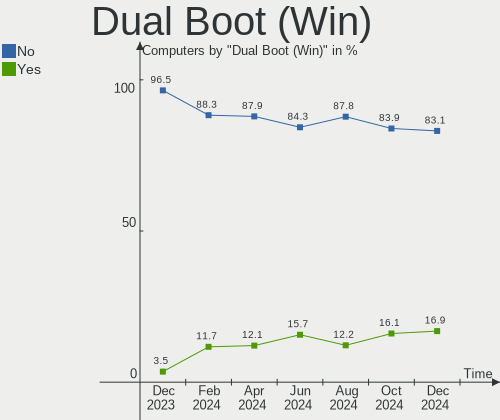
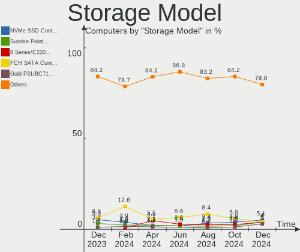
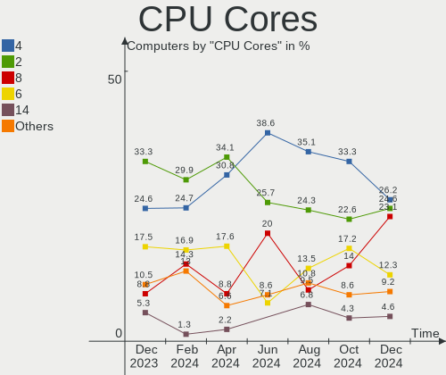
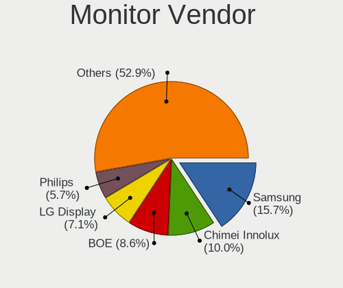
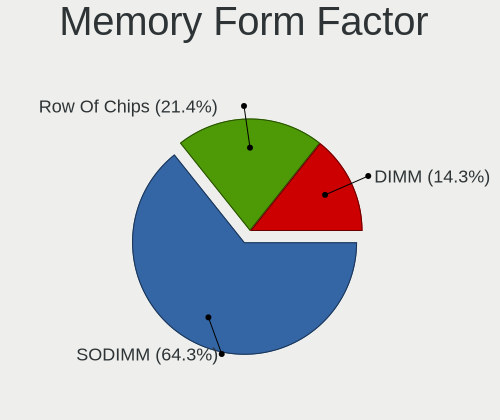
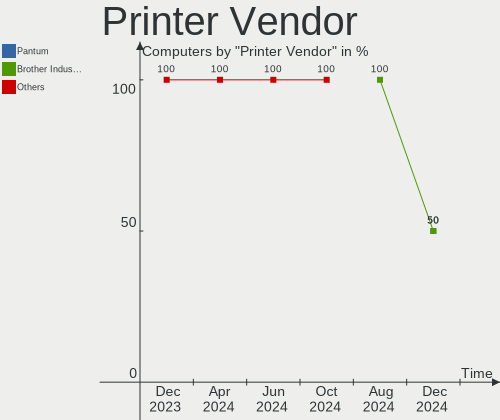
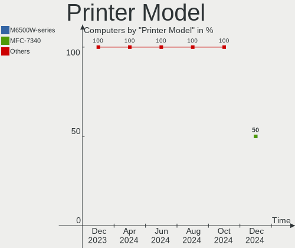

KDE neon Hardware Trends
------------------------

A project to identify most popular hardware characteristics and track their change
over time based on data collected by KDE neon users at https://Linux-Hardware.org.

Anyone can contribute to this report by the [hw-probe](https://github.com/linuxhw/hw-probe) tool:

    sudo -E hw-probe -all -upload

This is a report for all computer types. See also reports for [desktops](/Dist/KDE_neon/Desktop/README.md) and [notebooks](/Dist/KDE_neon/Notebook/README.md).

Full-feature report is available here: https://linux-hardware.org/?view=trends

Period: Sep, 2021.

Contents
--------

* [ System ](#system)
  - [ OS                       ](#os)
  - [ OS Family                ](#os-family)
  - [ Kernel                   ](#kernel)
  - [ Kernel Family            ](#kernel-family)
  - [ Kernel Major Ver.        ](#kernel-major-ver)
  - [ Arch                     ](#arch)
  - [ DE                       ](#de)
  - [ Display Server           ](#display-server)
  - [ Display Manager          ](#display-manager)
  - [ OS Lang                  ](#os-lang)
  - [ Boot Mode                ](#boot-mode)
  - [ Filesystem               ](#filesystem)
  - [ Part. scheme             ](#part-scheme)
  - [ Dual Boot with Linux/BSD ](#dual-boot-with-linuxbsd)
  - [ Dual Boot (Win)          ](#dual-boot-win)

* [ Board ](#board)
  - [ Vendor                   ](#vendor)
  - [ Model                    ](#model)
  - [ Model Family             ](#model-family)
  - [ MFG Year                 ](#mfg-year)
  - [ Form Factor              ](#form-factor)
  - [ Secure Boot              ](#secure-boot)
  - [ Coreboot                 ](#coreboot)
  - [ RAM Size                 ](#ram-size)
  - [ RAM Used                 ](#ram-used)
  - [ Total Drives             ](#total-drives)
  - [ Has CD-ROM               ](#has-cd-rom)
  - [ Has Ethernet             ](#has-ethernet)
  - [ Has WiFi                 ](#has-wifi)
  - [ Has Bluetooth            ](#has-bluetooth)

* [ Location ](#location)
  - [ Country                  ](#country)
  - [ City                     ](#city)

* [ Drives ](#drives)
  - [ Drive Vendor             ](#drive-vendor)
  - [ Drive Model              ](#drive-model)
  - [ HDD Vendor               ](#hdd-vendor)
  - [ SSD Vendor               ](#ssd-vendor)
  - [ Drive Kind               ](#drive-kind)
  - [ Drive Connector          ](#drive-connector)
  - [ Drive Size               ](#drive-size)
  - [ Space Total              ](#space-total)
  - [ Space Used               ](#space-used)
  - [ Malfunc. Drives          ](#malfunc-drives)
  - [ Malfunc. Drive Vendor    ](#malfunc-drive-vendor)
  - [ Malfunc. HDD Vendor      ](#malfunc-hdd-vendor)
  - [ Malfunc. Drive Kind      ](#malfunc-drive-kind)
  - [ Failed Drives            ](#failed-drives)
  - [ Failed Drive Vendor      ](#failed-drive-vendor)
  - [ Drive Status             ](#drive-status)

* [ Storage controller ](#storage-controller)
  - [ Storage Vendor           ](#storage-vendor)
  - [ Storage Model            ](#storage-model)
  - [ Storage Kind             ](#storage-kind)

* [ Processor ](#processor)
  - [ CPU Vendor               ](#cpu-vendor)
  - [ CPU Model                ](#cpu-model)
  - [ CPU Model Family         ](#cpu-model-family)
  - [ CPU Cores                ](#cpu-cores)
  - [ CPU Sockets              ](#cpu-sockets)
  - [ CPU Threads              ](#cpu-threads)
  - [ CPU Op-Modes             ](#cpu-op-modes)
  - [ CPU Microcode            ](#cpu-microcode)
  - [ CPU Microarch            ](#cpu-microarch)

* [ Graphics ](#graphics)
  - [ GPU Vendor               ](#gpu-vendor)
  - [ GPU Model                ](#gpu-model)
  - [ GPU Combo                ](#gpu-combo)
  - [ GPU Driver               ](#gpu-driver)
  - [ GPU Memory               ](#gpu-memory)

* [ Monitor ](#monitor)
  - [ Monitor Vendor           ](#monitor-vendor)
  - [ Monitor Model            ](#monitor-model)
  - [ Monitor Resolution       ](#monitor-resolution)
  - [ Monitor Diagonal         ](#monitor-diagonal)
  - [ Monitor Width            ](#monitor-width)
  - [ Aspect Ratio             ](#aspect-ratio)
  - [ Monitor Area             ](#monitor-area)
  - [ Pixel Density            ](#pixel-density)
  - [ Multiple Monitors        ](#multiple-monitors)

* [ Network ](#network)
  - [ Net Controller Vendor    ](#net-controller-vendor)
  - [ Net Controller Model     ](#net-controller-model)
  - [ Wireless Vendor          ](#wireless-vendor)
  - [ Wireless Model           ](#wireless-model)
  - [ Ethernet Vendor          ](#ethernet-vendor)
  - [ Ethernet Model           ](#ethernet-model)
  - [ Net Controller Kind      ](#net-controller-kind)
  - [ Used Controller          ](#used-controller)
  - [ NICs                     ](#nics)
  - [ IPv6                     ](#ipv6)

* [ Bluetooth ](#bluetooth)
  - [ Bluetooth Vendor         ](#bluetooth-vendor)
  - [ Bluetooth Model          ](#bluetooth-model)

* [ Sound ](#sound)
  - [ Sound Vendor             ](#sound-vendor)
  - [ Sound Model              ](#sound-model)

* [ Memory ](#memory)
  - [ Memory Vendor            ](#memory-vendor)
  - [ Memory Model             ](#memory-model)
  - [ Memory Kind              ](#memory-kind)
  - [ Memory Form Factor       ](#memory-form-factor)
  - [ Memory Size              ](#memory-size)
  - [ Memory Speed             ](#memory-speed)

* [ Printers & scanners ](#printers--scanners)
  - [ Printer Vendor           ](#printer-vendor)
  - [ Printer Model            ](#printer-model)
  - [ Scanner Vendor           ](#scanner-vendor)
  - [ Scanner Model            ](#scanner-model)

* [ Camera ](#camera)
  - [ Camera Vendor            ](#camera-vendor)
  - [ Camera Model             ](#camera-model)

* [ Security ](#security)
  - [ Fingerprint Vendor       ](#fingerprint-vendor)
  - [ Fingerprint Model        ](#fingerprint-model)
  - [ Chipcard Vendor          ](#chipcard-vendor)
  - [ Chipcard Model           ](#chipcard-model)

* [ Unsupported ](#unsupported)
  - [ Unsupported Devices      ](#unsupported-devices)
  - [ Unsupported Device Types ](#unsupported-device-types)

System
------

OS
--

Installed operating systems

| Name           | Computers | Percent |
|----------------|-----------|---------|
| KDE neon 20.04 | 92        | 100%    |

OS Family
---------

OS without a version

| Name     | Computers | Percent |
|----------|-----------|---------|
| KDE neon | 92        | 100%    |

Kernel
------

Version of the Linux kernel

| Version               | Computers | Percent |
|-----------------------|-----------|---------|
| 5.11.0-34-generic     | 36        | 39.13%  |
| 5.11.0-36-generic     | 22        | 23.91%  |
| 5.11.0-27-generic     | 20        | 21.74%  |
| 5.11.0-37-generic     | 5         | 5.43%   |
| 5.8.0-63-generic      | 2         | 2.17%   |
| 5.8.0-59-generic      | 1         | 1.09%   |
| 5.4.0-87-generic      | 1         | 1.09%   |
| 5.4.0-86-generic      | 1         | 1.09%   |
| 5.4.0-81-generic      | 1         | 1.09%   |
| 5.14.0-051400-generic | 1         | 1.09%   |
| 5.14-051400-generic   | 1         | 1.09%   |
| 5.12.18-xanmod3       | 1         | 1.09%   |

Kernel Family
-------------

Linux kernel without a distro release

| Version | Computers | Percent |
|---------|-----------|---------|
| 5.11.0  | 83        | 90.22%  |
| 5.8.0   | 3         | 3.26%   |
| 5.4.0   | 3         | 3.26%   |
| 5.14.0  | 1         | 1.09%   |
| 5.14    | 1         | 1.09%   |
| 5.12.18 | 1         | 1.09%   |

Kernel Major Ver.
-----------------

Linux kernel major version

| Version | Computers | Percent |
|---------|-----------|---------|
| 5.11    | 83        | 90.22%  |
| 5.8     | 3         | 3.26%   |
| 5.4     | 3         | 3.26%   |
| 5.14    | 1         | 1.09%   |
| 5.12    | 1         | 1.09%   |
| 5       | 1         | 1.09%   |

Arch
----

OS architecture (x86_64, i586, etc.)

| Name   | Computers | Percent |
|--------|-----------|---------|
| x86_64 | 92        | 100%    |

DE
--

Desktop Environment

| Name            | Computers | Percent |
|-----------------|-----------|---------|
| KDE             | 50        | 54.35%  |
| KDE5            | 39        | 42.39%  |
| Unknown         | 2         | 2.17%   |
| GNOME Flashback | 1         | 1.09%   |

Display Server
--------------

X11 or Wayland

| Name    | Computers | Percent |
|---------|-----------|---------|
| X11     | 87        | 94.57%  |
| Wayland | 5         | 5.43%   |

Display Manager
---------------

SDDM, LightDM, etc.

| Name    | Computers | Percent |
|---------|-----------|---------|
| Unknown | 75        | 81.52%  |
| SDDM    | 16        | 17.39%  |
| GDM3    | 1         | 1.09%   |

OS Lang
-------

Language

| Lang   | Computers | Percent |
|--------|-----------|---------|
| en_US  | 31        | 33.7%   |
| de_DE  | 10        | 10.87%  |
| ru_RU  | 6         | 6.52%   |
| pt_BR  | 6         | 6.52%   |
| en_GB  | 5         | 5.43%   |
| it_IT  | 4         | 4.35%   |
| en_CA  | 4         | 4.35%   |
| pl_PL  | 3         | 3.26%   |
| fr_FR  | 3         | 3.26%   |
| en_AU  | 3         | 3.26%   |
| ru_UA  | 2         | 2.17%   |
| en_IN  | 2         | 2.17%   |
| de_AT  | 2         | 2.17%   |
| zh_CN  | 1         | 1.09%   |
| uk_UA  | 1         | 1.09%   |
| szl_PL | 1         | 1.09%   |
| ro_RO  | 1         | 1.09%   |
| es_MX  | 1         | 1.09%   |
| es_ES  | 1         | 1.09%   |
| es_CL  | 1         | 1.09%   |
| en_ZA  | 1         | 1.09%   |
| en_NZ  | 1         | 1.09%   |
| el_GR  | 1         | 1.09%   |
| C      | 1         | 1.09%   |

Boot Mode
---------

EFI or BIOS

| Mode | Computers | Percent |
|------|-----------|---------|
| EFI  | 49        | 53.26%  |
| BIOS | 43        | 46.74%  |

Filesystem
----------

Type of filesystem

| Type | Computers | Percent |
|------|-----------|---------|
| Ext4 | 92        | 100%    |

Part. scheme
------------

Scheme of partitioning

| Type    | Computers | Percent |
|---------|-----------|---------|
| Unknown | 79        | 85.87%  |
| GPT     | 11        | 11.96%  |
| MBR     | 2         | 2.17%   |

Dual Boot with Linux/BSD
------------------------

Hosting more than one Linux/BSD

| Dual boot | Computers | Percent |
|-----------|-----------|---------|
| No        | 87        | 94.57%  |
| Yes       | 5         | 5.43%   |

Dual Boot (Win)
---------------

Hosting Linux and Windows

| Dual boot | Computers | Percent |
|-----------|-----------|---------|
| No        | 81        | 88.04%  |
| Yes       | 11        | 11.96%  |

Board
-----

Vendor
------

Motherboard manufacturer

| Name                | Computers | Percent |
|---------------------|-----------|---------|
| ASUSTek Computer    | 19        | 20.65%  |
| Dell                | 12        | 13.04%  |
| Lenovo              | 10        | 10.87%  |
| Hewlett-Packard     | 10        | 10.87%  |
| ASRock              | 6         | 6.52%   |
| Apple               | 6         | 6.52%   |
| Gigabyte Technology | 5         | 5.43%   |
| Acer                | 5         | 5.43%   |
| Samsung Electronics | 3         | 3.26%   |
| MSI                 | 3         | 3.26%   |
| Medion              | 2         | 2.17%   |
| Intel               | 2         | 2.17%   |
| Fujitsu Siemens     | 2         | 2.17%   |
| Toshiba             | 1         | 1.09%   |
| Teclast             | 1         | 1.09%   |
| Razer               | 1         | 1.09%   |
| Positivo            | 1         | 1.09%   |
| Jumper              | 1         | 1.09%   |
| Gateway             | 1         | 1.09%   |
| Alienware           | 1         | 1.09%   |

Model
-----

Motherboard model

| Name                                                                                     | Computers | Percent |
|------------------------------------------------------------------------------------------|-----------|---------|
| Toshiba Satellite U920T                                                                  | 1         | 1.09%   |
| Teclast F5                                                                               | 1         | 1.09%   |
| Samsung RF511/RF411/RF711                                                                | 1         | 1.09%   |
| Samsung 3570R/370R/470R/450R/510R/4450RV                                                 | 1         | 1.09%   |
| Samsung 355V4C/355V4X/355V5C/355V5X/356V4C/356V4X/356V5C/356V5X/3445VC/3445VX/3545VC/354 | 1         | 1.09%   |
| Razer Blade Stealth                                                                      | 1         | 1.09%   |
| Positivo MOBILE                                                                          | 1         | 1.09%   |
| MSI X5836                                                                                | 1         | 1.09%   |
| MSI MS-7C81                                                                              | 1         | 1.09%   |
| MSI MS-7599                                                                              | 1         | 1.09%   |
| Medion MS-7748                                                                           | 1         | 1.09%   |
| Medion E7214                                                                             | 1         | 1.09%   |
| Lenovo ThinkPad Yoga 11e 20DAS02M00                                                      | 1         | 1.09%   |
| Lenovo ThinkPad T460s 20FAS4A200                                                         | 1         | 1.09%   |
| Lenovo ThinkPad T15 Gen 1 20S6003PGE                                                     | 1         | 1.09%   |
| Lenovo ThinkCentre M73 10AXS3V400                                                        | 1         | 1.09%   |
| Lenovo IdeaPad S130-14IGM 81J2                                                           | 1         | 1.09%   |
| Lenovo IdeaPad N580 20182                                                                | 1         | 1.09%   |
| Lenovo IdeaPad C340-14API 81N6                                                           | 1         | 1.09%   |
| Lenovo IdeaPad 3 15ADA05 81W1                                                            | 1         | 1.09%   |
| Lenovo Flex 2-15D 20377                                                                  | 1         | 1.09%   |
| Lenovo B51-30 80LK                                                                       | 1         | 1.09%   |
| Jumper EZbook                                                                            | 1         | 1.09%   |
| Intel NUC7i5BNB J31144-303                                                               | 1         | 1.09%   |
| Intel DG35EC AAE29266-205                                                                | 1         | 1.09%   |
| HP Z230 Tower Workstation                                                                | 1         | 1.09%   |
| HP Z230 SFF Workstation                                                                  | 1         | 1.09%   |
| HP Slim Desktop 290-p0xxx                                                                | 1         | 1.09%   |
| HP ProBook 4530s                                                                         | 1         | 1.09%   |
| HP Pavilion g6                                                                           | 1         | 1.09%   |
| HP Pavilion Aero Laptop 13-be0xxx                                                        | 1         | 1.09%   |
| HP Pavilion 17                                                                           | 1         | 1.09%   |
| HP EliteBook 8730w                                                                       | 1         | 1.09%   |
| HP Desktop M01-F0xxx                                                                     | 1         | 1.09%   |
| HP 431                                                                                   | 1         | 1.09%   |
| Gigabyte Z97X-UD5H                                                                       | 1         | 1.09%   |
| Gigabyte Z68X-UD3H-B3                                                                    | 1         | 1.09%   |
| Gigabyte X58A-UD3R                                                                       | 1         | 1.09%   |
| Gigabyte EX58-UD3R                                                                       | 1         | 1.09%   |
| Gigabyte 945GCMX-S2                                                                      | 1         | 1.09%   |
| Gateway NV53A                                                                            | 1         | 1.09%   |
| Fujitsu Siemens CELSIUS M460                                                             | 1         | 1.09%   |
| Fujitsu Siemens AMILO Li 2732                                                            | 1         | 1.09%   |
| Dell XPS 15 7590                                                                         | 1         | 1.09%   |
| Dell Vostro 3888                                                                         | 1         | 1.09%   |
| Dell Vostro 3550                                                                         | 1         | 1.09%   |
| Dell Latitude E6520                                                                      | 1         | 1.09%   |
| Dell Latitude E6420                                                                      | 1         | 1.09%   |
| Dell Latitude E6400                                                                      | 1         | 1.09%   |
| Dell Latitude 7490                                                                       | 1         | 1.09%   |
| Dell Latitude 3550                                                                       | 1         | 1.09%   |
| Dell Latitude 3490                                                                       | 1         | 1.09%   |
| Dell Inspiron N4050                                                                      | 1         | 1.09%   |
| Dell Inspiron 5565                                                                       | 1         | 1.09%   |
| Dell Inspiron 1545                                                                       | 1         | 1.09%   |
| ASUS ZenBook UX333FN_UX333FN                                                             | 1         | 1.09%   |
| ASUS ROG STRIX B550-F GAMING                                                             | 1         | 1.09%   |
| ASUS ROG CROSSHAIR VIII HERO                                                             | 1         | 1.09%   |
| ASUS PRIME Z490-P                                                                        | 1         | 1.09%   |
| ASUS PRIME X570-P                                                                        | 1         | 1.09%   |

Model Family
------------

Motherboard model prefix

| Name                    | Computers | Percent |
|-------------------------|-----------|---------|
| Dell Latitude           | 6         | 6.52%   |
| Lenovo IdeaPad          | 4         | 4.35%   |
| ASUS PRIME              | 4         | 4.35%   |
| Acer Aspire             | 4         | 4.35%   |
| Lenovo ThinkPad         | 3         | 3.26%   |
| HP Pavilion             | 3         | 3.26%   |
| Dell Inspiron           | 3         | 3.26%   |
| HP Z230                 | 2         | 2.17%   |
| Dell Vostro             | 2         | 2.17%   |
| ASUS ROG                | 2         | 2.17%   |
| ASRock B450M            | 2         | 2.17%   |
| Toshiba Satellite       | 1         | 1.09%   |
| Teclast F5              | 1         | 1.09%   |
| Samsung RF511           | 1         | 1.09%   |
| Samsung 3570R           | 1         | 1.09%   |
| Samsung 355V4C          | 1         | 1.09%   |
| Razer Blade             | 1         | 1.09%   |
| Positivo MOBILE         | 1         | 1.09%   |
| MSI X5836               | 1         | 1.09%   |
| MSI MS-7C81             | 1         | 1.09%   |
| MSI MS-7599             | 1         | 1.09%   |
| Medion MS-7748          | 1         | 1.09%   |
| Medion E7214            | 1         | 1.09%   |
| Lenovo ThinkCentre      | 1         | 1.09%   |
| Lenovo Flex             | 1         | 1.09%   |
| Lenovo B51-30           | 1         | 1.09%   |
| Jumper EZbook           | 1         | 1.09%   |
| Intel NUC7i5BNB         | 1         | 1.09%   |
| Intel DG35EC            | 1         | 1.09%   |
| HP Slim                 | 1         | 1.09%   |
| HP ProBook              | 1         | 1.09%   |
| HP EliteBook            | 1         | 1.09%   |
| HP Desktop              | 1         | 1.09%   |
| HP 431                  | 1         | 1.09%   |
| Gigabyte Z97X-UD5H      | 1         | 1.09%   |
| Gigabyte Z68X-UD3H-B3   | 1         | 1.09%   |
| Gigabyte X58A-UD3R      | 1         | 1.09%   |
| Gigabyte EX58-UD3R      | 1         | 1.09%   |
| Gigabyte 945GCMX-S2     | 1         | 1.09%   |
| Gateway NV53A           | 1         | 1.09%   |
| Fujitsu Siemens CELSIUS | 1         | 1.09%   |
| Fujitsu Siemens AMILO   | 1         | 1.09%   |
| Dell XPS                | 1         | 1.09%   |
| ASUS ZenBook            | 1         | 1.09%   |
| ASUS P9X79              | 1         | 1.09%   |
| ASUS P8Z68-V            | 1         | 1.09%   |
| ASUS P8P67              | 1         | 1.09%   |
| ASUS P5KPL-AM           | 1         | 1.09%   |
| ASUS Maximus            | 1         | 1.09%   |
| ASUS M3N78              | 1         | 1.09%   |
| ASUS M2N-E              | 1         | 1.09%   |
| ASUS K54C               | 1         | 1.09%   |
| ASUS F5SL               | 1         | 1.09%   |
| ASUS ASUS               | 1         | 1.09%   |
| ASUS All                | 1         | 1.09%   |
| ASUS A68HM-K            | 1         | 1.09%   |
| ASRock H270             | 1         | 1.09%   |
| ASRock AB350            | 1         | 1.09%   |
| ASRock A320M-HDV        | 1         | 1.09%   |
| ASRock 970M             | 1         | 1.09%   |

MFG Year
--------

Motherboard manufacture year

| Year | Computers | Percent |
|------|-----------|---------|
| 2021 | 13        | 14.13%  |
| 2020 | 13        | 14.13%  |
| 2018 | 9         | 9.78%   |
| 2019 | 8         | 8.7%    |
| 2014 | 7         | 7.61%   |
| 2011 | 7         | 7.61%   |
| 2012 | 6         | 6.52%   |
| 2009 | 6         | 6.52%   |
| 2016 | 5         | 5.43%   |
| 2015 | 4         | 4.35%   |
| 2013 | 4         | 4.35%   |
| 2010 | 4         | 4.35%   |
| 2008 | 4         | 4.35%   |
| 2017 | 2         | 2.17%   |

Form Factor
-----------

Physical design of the computer

| Name        | Computers | Percent |
|-------------|-----------|---------|
| Notebook    | 50        | 54.35%  |
| Desktop     | 39        | 42.39%  |
| Mini pc     | 2         | 2.17%   |
| Convertible | 1         | 1.09%   |

Secure Boot
-----------

Enabled or disabled

| State    | Computers | Percent |
|----------|-----------|---------|
| Disabled | 86        | 93.48%  |
| Enabled  | 6         | 6.52%   |

Coreboot
--------

Have coreboot on board

| Used | Computers | Percent |
|------|-----------|---------|
| No   | 92        | 100%    |

RAM Size
--------

Total RAM memory

| Size in GB  | Computers | Percent |
|-------------|-----------|---------|
| 4.01-8.0    | 22        | 23.91%  |
| 16.01-24.0  | 21        | 22.83%  |
| 8.01-16.0   | 20        | 21.74%  |
| 3.01-4.0    | 15        | 16.3%   |
| 32.01-64.0  | 7         | 7.61%   |
| 64.01-256.0 | 3         | 3.26%   |
| 1.01-2.0    | 2         | 2.17%   |
| 24.01-32.0  | 1         | 1.09%   |
| 2.01-3.0    | 1         | 1.09%   |

RAM Used
--------

Used RAM memory

| Used GB   | Computers | Percent |
|-----------|-----------|---------|
| 1.01-2.0  | 39        | 42.39%  |
| 2.01-3.0  | 30        | 32.61%  |
| 0.51-1.0  | 11        | 11.96%  |
| 4.01-8.0  | 7         | 7.61%   |
| 3.01-4.0  | 3         | 3.26%   |
| 8.01-16.0 | 2         | 2.17%   |

Total Drives
------------

Number of drives on board

| Drives | Computers | Percent |
|--------|-----------|---------|
| 1      | 54        | 58.7%   |
| 2      | 17        | 18.48%  |
| 3      | 10        | 10.87%  |
| 4      | 6         | 6.52%   |
| 7      | 2         | 2.17%   |
| 5      | 2         | 2.17%   |
| 6      | 1         | 1.09%   |

Has CD-ROM
----------

Has CD-ROM on board

| Presented | Computers | Percent |
|-----------|-----------|---------|
| Yes       | 46        | 50%     |
| No        | 46        | 50%     |

Has Ethernet
------------

Has Ethernet on board

| Presented | Computers | Percent |
|-----------|-----------|---------|
| Yes       | 79        | 85.87%  |
| No        | 13        | 14.13%  |

Has WiFi
--------

Has WiFi module

| Presented | Computers | Percent |
|-----------|-----------|---------|
| Yes       | 68        | 73.91%  |
| No        | 24        | 26.09%  |

Has Bluetooth
-------------

Has Bluetooth module

| Presented | Computers | Percent |
|-----------|-----------|---------|
| Yes       | 60        | 65.22%  |
| No        | 32        | 34.78%  |

Location
--------

Country
-------

Geographic location (country)

| Country      | Computers | Percent |
|--------------|-----------|---------|
| USA          | 17        | 18.48%  |
| Germany      | 11        | 11.96%  |
| Brazil       | 7         | 7.61%   |
| Russia       | 6         | 6.52%   |
| UK           | 5         | 5.43%   |
| Poland       | 5         | 5.43%   |
| Italy        | 4         | 4.35%   |
| France       | 4         | 4.35%   |
| Canada       | 4         | 4.35%   |
| India        | 3         | 3.26%   |
| Australia    | 3         | 3.26%   |
| Ukraine      | 2         | 2.17%   |
| Indonesia    | 2         | 2.17%   |
| Greece       | 2         | 2.17%   |
| Austria      | 2         | 2.17%   |
| Uruguay      | 1         | 1.09%   |
| Thailand     | 1         | 1.09%   |
| Sweden       | 1         | 1.09%   |
| Spain        | 1         | 1.09%   |
| South Africa | 1         | 1.09%   |
| Romania      | 1         | 1.09%   |
| Norway       | 1         | 1.09%   |
| New Zealand  | 1         | 1.09%   |
| Netherlands  | 1         | 1.09%   |
| Mexico       | 1         | 1.09%   |
| Malaysia     | 1         | 1.09%   |
| Iran         | 1         | 1.09%   |
| China        | 1         | 1.09%   |
| Chile        | 1         | 1.09%   |
| Bulgaria     | 1         | 1.09%   |

City
----

Geographic location (city)

| City                 | Computers | Percent |
|----------------------|-----------|---------|
| S??o Paulo           | 2         | 2.17%   |
| Novosibirsk          | 2         | 2.17%   |
| Dallas               | 2         | 2.17%   |
| Chicago              | 2         | 2.17%   |
| Yogyakarta           | 1         | 1.09%   |
| Yefremov             | 1         | 1.09%   |
| Wroclaw              | 1         | 1.09%   |
| Wiesbaden            | 1         | 1.09%   |
| Waldbronn            | 1         | 1.09%   |
| Voronezh             | 1         | 1.09%   |
| Villeparisis         | 1         | 1.09%   |
| Vancouver            | 1         | 1.09%   |
| Trollh?¤ttan         | 1         | 1.09%   |
| Tomilino             | 1         | 1.09%   |
| Tehran               | 1         | 1.09%   |
| Talagante            | 1         | 1.09%   |
| Sydney               | 1         | 1.09%   |
| Swindon              | 1         | 1.09%   |
| Surbiton             | 1         | 1.09%   |
| Surabaya             | 1         | 1.09%   |
| Sunderland           | 1         | 1.09%   |
| Strassengel          | 1         | 1.09%   |
| Solingen             | 1         | 1.09%   |
| Sofia                | 1         | 1.09%   |
| Sleaford             | 1         | 1.09%   |
| Simpsonville         | 1         | 1.09%   |
| Shangrao             | 1         | 1.09%   |
| Sao Jose de Mipibu   | 1         | 1.09%   |
| Santos               | 1         | 1.09%   |
| Saint-Laurent-du-Var | 1         | 1.09%   |
| Rydalmere            | 1         | 1.09%   |
| Rome                 | 1         | 1.09%   |
| Rochester            | 1         | 1.09%   |
| Rancho Cucamonga     | 1         | 1.09%   |
| Punta Carretas       | 1         | 1.09%   |
| Peyrins              | 1         | 1.09%   |
| Petaling Jaya        | 1         | 1.09%   |
| Paderborn            | 1         | 1.09%   |
| Munich               | 1         | 1.09%   |
| Mumbai               | 1         | 1.09%   |
| Moscow               | 1         | 1.09%   |
| Moringen             | 1         | 1.09%   |
| Moormerland          | 1         | 1.09%   |
| Milan                | 1         | 1.09%   |
| Mexico City          | 1         | 1.09%   |
| Mesa                 | 1         | 1.09%   |
| Lviv                 | 1         | 1.09%   |
| Louisville           | 1         | 1.09%   |
| Longmont             | 1         | 1.09%   |
| Lodz                 | 1         | 1.09%   |
| Kyiv                 | 1         | 1.09%   |
| Krakow               | 1         | 1.09%   |
| Kolkata              | 1         | 1.09%   |
| Kingston             | 1         | 1.09%   |
| Karlsruhe            | 1         | 1.09%   |
| Kansas City          | 1         | 1.09%   |
| Joinville            | 1         | 1.09%   |
| Johannesburg         | 1         | 1.09%   |
| Innsbruck            | 1         | 1.09%   |
| Harstad              | 1         | 1.09%   |

Drives
------

Drive Vendor
------------

Hard drive vendors

| Vendor                    | Computers | Drives | Percent |
|---------------------------|-----------|--------|---------|
| WDC                       | 22        | 29     | 15.49%  |
| Seagate                   | 22        | 26     | 15.49%  |
| Samsung Electronics       | 19        | 23     | 13.38%  |
| Toshiba                   | 17        | 17     | 11.97%  |
| SanDisk                   | 8         | 9      | 5.63%   |
| Kingston                  | 8         | 10     | 5.63%   |
| Unknown                   | 5         | 6      | 3.52%   |
| SK Hynix                  | 4         | 4      | 2.82%   |
| Phison                    | 4         | 4      | 2.82%   |
| HGST                      | 3         | 3      | 2.11%   |
| Crucial                   | 3         | 3      | 2.11%   |
| Apple                     | 3         | 3      | 2.11%   |
| Patriot                   | 2         | 2      | 1.41%   |
| OCZ                       | 2         | 2      | 1.41%   |
| Micron Technology         | 2         | 2      | 1.41%   |
| Intel                     | 2         | 2      | 1.41%   |
| Hitachi                   | 2         | 4      | 1.41%   |
| Union Memory (Shenzhen)   | 1         | 1      | 0.7%    |
| Transcend                 | 1         | 1      | 0.7%    |
| StoreJet                  | 1         | 1      | 0.7%    |
| Smartbuy                  | 1         | 1      | 0.7%    |
| Realtek Semiconductor     | 1         | 1      | 0.7%    |
| PNY                       | 1         | 1      | 0.7%    |
| PLEXTOR                   | 1         | 1      | 0.7%    |
| Micron/Crucial Technology | 1         | 1      | 0.7%    |
| KingSpec                  | 1         | 1      | 0.7%    |
| JMicron                   | 1         | 1      | 0.7%    |
| Hewlett-Packard           | 1         | 1      | 0.7%    |
| GOODRAM                   | 1         | 1      | 0.7%    |
| Gigabyte Technology       | 1         | 1      | 0.7%    |
| China                     | 1         | 2      | 0.7%    |

Drive Model
-----------

Hard drive models

| Model                                        | Computers | Percent |
|----------------------------------------------|-----------|---------|
| Seagate ST500LM021-1KJ152 500GB              | 3         | 1.89%   |
| Samsung SSD 850 EVO 500GB                    | 3         | 1.89%   |
| Samsung SSD 850 EVO 250GB                    | 3         | 1.89%   |
| Unknown MMC Card  32GB                       | 2         | 1.26%   |
| Toshiba HDWD110 1TB                          | 2         | 1.26%   |
| Seagate ST3000DM001-1ER166 3TB               | 2         | 1.26%   |
| Seagate ST2000DM008-2FR102 2TB               | 2         | 1.26%   |
| Samsung NVMe SSD Drive 1TB                   | 2         | 1.26%   |
| Kingston SA400S37240G 240GB SSD              | 2         | 1.26%   |
| Kingston NVMe SSD Drive 500GB                | 2         | 1.26%   |
| HGST HTS721010A9E630 1TB                     | 2         | 1.26%   |
| Apple SSD SM0128G 121GB                      | 2         | 1.26%   |
| WDC WDS500G3X0C-00SJG0 500GB                 | 1         | 0.63%   |
| WDC WDS500G2B0A-00SM50 500GB SSD             | 1         | 0.63%   |
| WDC WDS240G2G0A-00JH30 240GB SSD             | 1         | 0.63%   |
| WDC WDS120G2G0B-00EPW0 120GB SSD             | 1         | 0.63%   |
| WDC WDS120G2G0A-00JH30 120GB SSD             | 1         | 0.63%   |
| WDC WDS100T2B0A 1TB SSD                      | 1         | 0.63%   |
| WDC WDBNCE5000PNC 500GB SSD                  | 1         | 0.63%   |
| WDC WD6400AAKS-41H2B0 640GB                  | 1         | 0.63%   |
| WDC WD5000LPLX-60ZNTT1 500GB                 | 1         | 0.63%   |
| WDC WD5000LPCX-24C6HT0 500GB                 | 1         | 0.63%   |
| WDC WD5000BPVT-22HXZT3 500GB                 | 1         | 0.63%   |
| WDC WD5000AZLX-00K2TA0 500GB                 | 1         | 0.63%   |
| WDC WD5000AAKX-00ERMA0 500GB                 | 1         | 0.63%   |
| WDC WD5000AAKX-001CA0 500GB                  | 1         | 0.63%   |
| WDC WD5000AACS-00ZUB0 500GB                  | 1         | 0.63%   |
| WDC WD40EZRZ-00GXCB0 4TB                     | 1         | 0.63%   |
| WDC WD3200AAKS-75L9A0 320GB                  | 1         | 0.63%   |
| WDC WD20EZRZ-00Z5HB0 2TB                     | 1         | 0.63%   |
| WDC WD20EARS-00MVWB0 2TB                     | 1         | 0.63%   |
| WDC WD1500HLFS-01G6U1 150GB                  | 1         | 0.63%   |
| WDC WD10SPZX-21Z10T0 1TB                     | 1         | 0.63%   |
| WDC WD10JPVX-22JC3T0 1TB                     | 1         | 0.63%   |
| WDC WD10JPVT-60A1YT0 1TB                     | 1         | 0.63%   |
| WDC WD10EZRZ-00HTKB0 1TB                     | 1         | 0.63%   |
| WDC WD10EZEX-60M2NA0 1TB                     | 1         | 0.63%   |
| WDC WD10EZEX-00WN4A0 1TB                     | 1         | 0.63%   |
| WDC WD10EZEX-00BN5A0 1TB                     | 1         | 0.63%   |
| WDC WD10EACS-00ZJB0 1TB                      | 1         | 0.63%   |
| WDC WD1002FAEX-00Y9A0 1TB                    | 1         | 0.63%   |
| Unknown SD/MMC/MS PRO 128GB                  | 1         | 0.63%   |
| Unknown MMC Card  7GB                        | 1         | 0.63%   |
| Unknown MMC Card  64GB                       | 1         | 0.63%   |
| Unknown MMC Card  128GB                      | 1         | 0.63%   |
| Union Memory (Shenzhen) NVMe SSD Drive 512GB | 1         | 0.63%   |
| Transcend TS128GSSD230S 128GB                | 1         | 0.63%   |
| Toshiba THNSNF128GMCS 128GB SSD              | 1         | 0.63%   |
| Toshiba MQ04ABF100 1TB                       | 1         | 0.63%   |
| Toshiba MQ01ACF050 500GB                     | 1         | 0.63%   |
| Toshiba MQ01ACF032 320GB                     | 1         | 0.63%   |
| Toshiba MQ01ABF050 500GB                     | 1         | 0.63%   |
| Toshiba MQ01ABD100 1TB                       | 1         | 0.63%   |
| Toshiba MQ01ABD075 752GB                     | 1         | 0.63%   |
| Toshiba MQ01ABD050V 500GB                    | 1         | 0.63%   |
| Toshiba MQ01ABD050 500GB                     | 1         | 0.63%   |
| Toshiba MK3256GSY 320GB                      | 1         | 0.63%   |
| Toshiba KXG60ZNV512G NVMe KIOXIA 512GB       | 1         | 0.63%   |
| Toshiba KBG30ZMS128G 128GB NVMe SSD          | 1         | 0.63%   |
| Toshiba HDWE160 6TB                          | 1         | 0.63%   |

HDD Vendor
----------

Hard disk drive vendors

| Vendor              | Computers | Drives | Percent |
|---------------------|-----------|--------|---------|
| Seagate             | 22        | 26     | 34.38%  |
| WDC                 | 17        | 22     | 26.56%  |
| Toshiba             | 14        | 14     | 21.88%  |
| Samsung Electronics | 5         | 5      | 7.81%   |
| HGST                | 3         | 3      | 4.69%   |
| Hitachi             | 2         | 4      | 3.13%   |
| Unknown             | 1         | 1      | 1.56%   |

SSD Vendor
----------

Solid state drive vendors

| Vendor              | Computers | Drives | Percent |
|---------------------|-----------|--------|---------|
| Samsung Electronics | 13        | 14     | 24.53%  |
| WDC                 | 6         | 6      | 11.32%  |
| SanDisk             | 6         | 7      | 11.32%  |
| Kingston            | 6         | 7      | 11.32%  |
| Crucial             | 3         | 3      | 5.66%   |
| Apple               | 3         | 3      | 5.66%   |
| Patriot             | 2         | 2      | 3.77%   |
| OCZ                 | 2         | 2      | 3.77%   |
| Transcend           | 1         | 1      | 1.89%   |
| Toshiba             | 1         | 1      | 1.89%   |
| StoreJet            | 1         | 1      | 1.89%   |
| Smartbuy            | 1         | 1      | 1.89%   |
| SK Hynix            | 1         | 1      | 1.89%   |
| PNY                 | 1         | 1      | 1.89%   |
| PLEXTOR             | 1         | 1      | 1.89%   |
| KingSpec            | 1         | 1      | 1.89%   |
| Intel               | 1         | 1      | 1.89%   |
| GOODRAM             | 1         | 1      | 1.89%   |
| Gigabyte Technology | 1         | 1      | 1.89%   |
| China               | 1         | 2      | 1.89%   |

Drive Kind
----------

HDD or SSD

| Kind    | Computers | Drives | Percent |
|---------|-----------|--------|---------|
| HDD     | 51        | 75     | 41.46%  |
| SSD     | 45        | 57     | 36.59%  |
| NVMe    | 22        | 26     | 17.89%  |
| MMC     | 4         | 5      | 3.25%   |
| Unknown | 1         | 1      | 0.81%   |

Drive Connector
---------------

SATA, SAS, NVMe, etc.

| Type | Computers | Drives | Percent |
|------|-----------|--------|---------|
| SATA | 77        | 127    | 70.64%  |
| NVMe | 22        | 26     | 20.18%  |
| SAS  | 6         | 6      | 5.5%    |
| MMC  | 4         | 5      | 3.67%   |

Drive Size
----------

Size of hard drive

| Size in TB | Computers | Drives | Percent |
|------------|-----------|--------|---------|
| 0.01-0.5   | 64        | 84     | 64.65%  |
| 0.51-1.0   | 25        | 32     | 25.25%  |
| 1.01-2.0   | 4         | 8      | 4.04%   |
| 2.01-3.0   | 3         | 5      | 3.03%   |
| 4.01-10.0  | 2         | 2      | 2.02%   |
| 3.01-4.0   | 1         | 1      | 1.01%   |

Space Total
-----------

Amount of disk space available on the file system

| Size in GB     | Computers | Percent |
|----------------|-----------|---------|
| 101-250        | 27        | 29.35%  |
| 251-500        | 22        | 23.91%  |
| 1001-2000      | 8         | 8.7%    |
| 501-1000       | 8         | 8.7%    |
| 51-100         | 7         | 7.61%   |
| More than 3000 | 6         | 6.52%   |
| 21-50          | 5         | 5.43%   |
| Unknown        | 5         | 5.43%   |
| 1-20           | 3         | 3.26%   |
| 2001-3000      | 1         | 1.09%   |

Space Used
----------

Amount of used disk space

| Used GB        | Computers | Percent |
|----------------|-----------|---------|
| 1-20           | 44        | 47.83%  |
| 21-50          | 19        | 20.65%  |
| 101-250        | 6         | 6.52%   |
| 1001-2000      | 6         | 6.52%   |
| Unknown        | 5         | 5.43%   |
| 251-500        | 4         | 4.35%   |
| More than 3000 | 3         | 3.26%   |
| 501-1000       | 2         | 2.17%   |
| 51-100         | 2         | 2.17%   |
| 2001-3000      | 1         | 1.09%   |

Malfunc. Drives
---------------

Drive models with a malfunction

| Model                        | Computers | Drives | Percent |
|------------------------------|-----------|--------|---------|
| WDC WD5000LPCX-24C6HT0 500GB | 1         | 1      | 50%     |
| WDC WD3200AAKS-75L9A0 320GB  | 1         | 1      | 50%     |

Malfunc. Drive Vendor
---------------------

Vendors of faulty drives

| Vendor | Computers | Drives | Percent |
|--------|-----------|--------|---------|
| WDC    | 2         | 2      | 100%    |

Malfunc. HDD Vendor
-------------------

Vendors of faulty HDD drives

| Vendor | Computers | Drives | Percent |
|--------|-----------|--------|---------|
| WDC    | 2         | 2      | 100%    |

Malfunc. Drive Kind
-------------------

Kinds of faulty drives

| Kind | Computers | Drives | Percent |
|------|-----------|--------|---------|
| HDD  | 2         | 2      | 100%    |

Failed Drives
-------------

Failed drive models

Zero info for selected period =(

Failed Drive Vendor
-------------------

Failed drive vendors

Zero info for selected period =(

Drive Status
------------

Number of failed and malfunc. drives

| Status   | Computers | Drives | Percent |
|----------|-----------|--------|---------|
| Detected | 80        | 139    | 84.21%  |
| Works    | 13        | 23     | 13.68%  |
| Malfunc  | 2         | 2      | 2.11%   |

Storage controller
------------------

Storage Vendor
--------------

Storage controller vendors

| Vendor                           | Computers | Percent |
|----------------------------------|-----------|---------|
| Intel                            | 60        | 49.59%  |
| AMD                              | 20        | 16.53%  |
| Samsung Electronics              | 6         | 4.96%   |
| JMicron Technology               | 5         | 4.13%   |
| Phison Electronics               | 4         | 3.31%   |
| Marvell Technology Group         | 4         | 3.31%   |
| SK Hynix                         | 3         | 2.48%   |
| Sandisk                          | 3         | 2.48%   |
| Nvidia                           | 3         | 2.48%   |
| Toshiba America Info Systems     | 2         | 1.65%   |
| Micron Technology                | 2         | 1.65%   |
| Kingston Technology Company      | 2         | 1.65%   |
| Union Memory (Shenzhen)          | 1         | 0.83%   |
| Silicon Motion                   | 1         | 0.83%   |
| Silicon Integrated Systems [SiS] | 1         | 0.83%   |
| Realtek Semiconductor            | 1         | 0.83%   |
| Micron/Crucial Technology        | 1         | 0.83%   |
| Lite-On IT Corp. / Plextor       | 1         | 0.83%   |
| ASMedia Technology               | 1         | 0.83%   |

Storage Model
-------------

Storage controller models

| Model                                                                                  | Computers | Percent |
|----------------------------------------------------------------------------------------|-----------|---------|
| AMD FCH SATA Controller [AHCI mode]                                                    | 15        | 10.71%  |
| Intel 6 Series/C200 Series Chipset Family 6 port Mobile SATA AHCI Controller           | 7         | 5%      |
| AMD 400 Series Chipset SATA Controller                                                 | 4         | 2.86%   |
| Phison E12 NVMe Controller                                                             | 3         | 2.14%   |
| Intel Sunrise Point-LP SATA Controller [AHCI mode]                                     | 3         | 2.14%   |
| Intel 82801IBM/IEM (ICH9M/ICH9M-E) 4 port SATA Controller [AHCI mode]                  | 3         | 2.14%   |
| Intel 8 Series/C220 Series Chipset Family 6-port SATA Controller 1 [AHCI mode]         | 3         | 2.14%   |
| Intel 7 Series Chipset Family 6-port SATA Controller [AHCI mode]                       | 3         | 2.14%   |
| Intel 6 Series/C200 Series Chipset Family 6 port Desktop SATA AHCI Controller          | 3         | 2.14%   |
| Intel 400 Series Chipset Family SATA AHCI Controller                                   | 3         | 2.14%   |
| AMD SB7x0/SB8x0/SB9x0 SATA Controller [AHCI mode]                                      | 3         | 2.14%   |
| Sandisk WD Black SN750 / PC SN730 NVMe SSD                                             | 2         | 1.43%   |
| Samsung NVMe SSD Controller SM981/PM981/PM983                                          | 2         | 1.43%   |
| Samsung Electronics SATA controller                                                    | 2         | 1.43%   |
| Micron Non-Volatile memory controller                                                  | 2         | 1.43%   |
| JMicron JMB363 SATA/IDE Controller                                                     | 2         | 1.43%   |
| JMicron JMB362 SATA Controller                                                         | 2         | 1.43%   |
| Intel Wildcat Point-LP SATA Controller [AHCI Mode]                                     | 2         | 1.43%   |
| Intel SATA Controller [RAID mode]                                                      | 2         | 1.43%   |
| Intel NM10/ICH7 Family SATA Controller [IDE mode]                                      | 2         | 1.43%   |
| Intel Celeron/Pentium Silver Processor SATA Controller                                 | 2         | 1.43%   |
| Intel Cannon Lake PCH SATA AHCI Controller                                             | 2         | 1.43%   |
| Intel Cannon Lake Mobile PCH SATA AHCI Controller                                      | 2         | 1.43%   |
| Intel 82801JI (ICH10 Family) 4 port SATA IDE Controller #1                             | 2         | 1.43%   |
| Intel 82801JI (ICH10 Family) 2 port SATA IDE Controller #2                             | 2         | 1.43%   |
| Intel 82801HM/HEM (ICH8M/ICH8M-E) SATA Controller [AHCI mode]                          | 2         | 1.43%   |
| Intel 82801HM/HEM (ICH8M/ICH8M-E) IDE Controller                                       | 2         | 1.43%   |
| Intel 82801 Mobile SATA Controller [RAID mode]                                         | 2         | 1.43%   |
| Intel 8 Series SATA Controller 1 [AHCI mode]                                           | 2         | 1.43%   |
| Intel 6 Series/C200 Series Chipset Family Mobile SATA Controller (IDE mode, ports 4-5) | 2         | 1.43%   |
| Intel 6 Series/C200 Series Chipset Family Mobile SATA Controller (IDE mode, ports 0-3) | 2         | 1.43%   |
| Intel 5 Series/3400 Series Chipset 4 port SATA AHCI Controller                         | 2         | 1.43%   |
| AMD SB7x0/SB8x0/SB9x0 IDE Controller                                                   | 2         | 1.43%   |
| AMD FCH SATA Controller D                                                              | 2         | 1.43%   |
| Union Memory (Shenzhen) Non-Volatile memory controller                                 | 1         | 0.71%   |
| Toshiba America Info Systems XG6 NVMe SSD Controller                                   | 1         | 0.71%   |
| Toshiba America Info Systems Toshiba America Info Non-Volatile memory controller       | 1         | 0.71%   |
| SK Hynix Non-Volatile memory controller                                                | 1         | 0.71%   |
| SK Hynix Gold P31 SSD                                                                  | 1         | 0.71%   |
| SK Hynix BC511                                                                         | 1         | 0.71%   |
| Silicon Motion SM2262/SM2262EN SSD Controller                                          | 1         | 0.71%   |
| Silicon Integrated Systems [SiS] SATA Controller / IDE mode                            | 1         | 0.71%   |
| Silicon Integrated Systems [SiS] 5513 IDE Controller                                   | 1         | 0.71%   |
| Sandisk WD Blue SN550 NVMe SSD                                                         | 1         | 0.71%   |
| Samsung NVMe SSD Controller SM961/PM961/SM963                                          | 1         | 0.71%   |
| Samsung NVMe SSD Controller 980                                                        | 1         | 0.71%   |
| Realtek RTS5763DL NVMe SSD Controller                                                  | 1         | 0.71%   |
| Phison PS5013 E13 NVMe Controller                                                      | 1         | 0.71%   |
| Nvidia MCP89 SATA Controller (AHCI mode)                                               | 1         | 0.71%   |
| Nvidia MCP78S [GeForce 8200] IDE                                                       | 1         | 0.71%   |
| Nvidia MCP78S [GeForce 8200] AHCI Controller                                           | 1         | 0.71%   |
| Nvidia MCP55 SATA Controller                                                           | 1         | 0.71%   |
| Nvidia MCP55 IDE                                                                       | 1         | 0.71%   |
| Micron/Crucial P2 NVMe PCIe SSD                                                        | 1         | 0.71%   |
| Marvell Group 88SE91A3 SATA-600 Controller                                             | 1         | 0.71%   |
| Marvell Group 88SE9172 SATA III 6Gb/s RAID Controller                                  | 1         | 0.71%   |
| Marvell Group 88SE9172 SATA 6Gb/s Controller                                           | 1         | 0.71%   |
| Marvell Group 88SE9128 PCIe SATA 6 Gb/s RAID controller with HyperDuo                  | 1         | 0.71%   |
| Lite-On IT Corp. / Plextor M6e PCI Express SSD [Marvell 88SS9183]                      | 1         | 0.71%   |
| Kingston Company Company Non-Volatile memory controller                                | 1         | 0.71%   |

Storage Kind
------------

Kind of storage controller (IDE, SATA, NVMe, SAS, ...)

| Kind | Computers | Percent |
|------|-----------|---------|
| SATA | 71        | 62.83%  |
| NVMe | 22        | 19.47%  |
| IDE  | 15        | 13.27%  |
| RAID | 5         | 4.42%   |

Processor
---------

CPU Vendor
----------

Processor vendors

| Vendor | Computers | Percent |
|--------|-----------|---------|
| Intel  | 67        | 72.83%  |
| AMD    | 25        | 27.17%  |

CPU Model
---------

Processor models

| Model                                         | Computers | Percent |
|-----------------------------------------------|-----------|---------|
| Intel Xeon CPU E3-1240 v3 @ 3.40GHz           | 2         | 2.17%   |
| Intel Core i7-2600K CPU @ 3.40GHz             | 2         | 2.17%   |
| Intel Core i5-2520M CPU @ 2.50GHz             | 2         | 2.17%   |
| Intel Core i5-10400 CPU @ 2.90GHz             | 2         | 2.17%   |
| Intel Core i3-2350M CPU @ 2.30GHz             | 2         | 2.17%   |
| Intel Core i3-2310M CPU @ 2.10GHz             | 2         | 2.17%   |
| AMD Ryzen 5 3500U with Radeon Vega Mobile Gfx | 2         | 2.17%   |
| Intel Pentium Dual-Core CPU T4300 @ 2.10GHz   | 1         | 1.09%   |
| Intel Pentium Dual-Core CPU E6300 @ 2.80GHz   | 1         | 1.09%   |
| Intel Pentium Dual CPU T2370 @ 1.73GHz        | 1         | 1.09%   |
| Intel Pentium CPU N3700 @ 1.60GHz             | 1         | 1.09%   |
| Intel Pentium CPU G3220 @ 3.00GHz             | 1         | 1.09%   |
| Intel Pentium CPU B960 @ 2.20GHz              | 1         | 1.09%   |
| Intel Core i7-9750H CPU @ 2.60GHz             | 1         | 1.09%   |
| Intel Core i7-8750H CPU @ 2.20GHz             | 1         | 1.09%   |
| Intel Core i7-8700 CPU @ 3.20GHz              | 1         | 1.09%   |
| Intel Core i7-8565U CPU @ 1.80GHz             | 1         | 1.09%   |
| Intel Core i7-7500U CPU @ 2.70GHz             | 1         | 1.09%   |
| Intel Core i7-6700K CPU @ 4.00GHz             | 1         | 1.09%   |
| Intel Core i7-6700 CPU @ 3.40GHz              | 1         | 1.09%   |
| Intel Core i7-6500U CPU @ 2.50GHz             | 1         | 1.09%   |
| Intel Core i7-5500U CPU @ 2.40GHz             | 1         | 1.09%   |
| Intel Core i7-4930K CPU @ 3.40GHz             | 1         | 1.09%   |
| Intel Core i7-4770K CPU @ 3.50GHz             | 1         | 1.09%   |
| Intel Core i7-2630QM CPU @ 2.00GHz            | 1         | 1.09%   |
| Intel Core i7-2600 CPU @ 3.40GHz              | 1         | 1.09%   |
| Intel Core i7-10510U CPU @ 1.80GHz            | 1         | 1.09%   |
| Intel Core i7 CPU 950 @ 3.07GHz               | 1         | 1.09%   |
| Intel Core i7 CPU 920 @ 2.67GHz               | 1         | 1.09%   |
| Intel Core i5-8500 CPU @ 3.00GHz              | 1         | 1.09%   |
| Intel Core i5-8350U CPU @ 1.70GHz             | 1         | 1.09%   |
| Intel Core i5-8250U CPU @ 1.60GHz             | 1         | 1.09%   |
| Intel Core i5-7260U CPU @ 2.20GHz             | 1         | 1.09%   |
| Intel Core i5-6300U CPU @ 2.40GHz             | 1         | 1.09%   |
| Intel Core i5-5350U CPU @ 1.80GHz             | 1         | 1.09%   |
| Intel Core i5-5257U CPU @ 2.70GHz             | 1         | 1.09%   |
| Intel Core i5-4278U CPU @ 2.60GHz             | 1         | 1.09%   |
| Intel Core i5-4200U CPU @ 1.60GHz             | 1         | 1.09%   |
| Intel Core i5-3317U CPU @ 1.70GHz             | 1         | 1.09%   |
| Intel Core i5-3230M CPU @ 2.60GHz             | 1         | 1.09%   |
| Intel Core i5-2450M CPU @ 2.50GHz             | 1         | 1.09%   |
| Intel Core i5-2415M CPU @ 2.30GHz             | 1         | 1.09%   |
| Intel Core i5-2410M CPU @ 2.30GHz             | 1         | 1.09%   |
| Intel Core i5-10300H CPU @ 2.50GHz            | 1         | 1.09%   |
| Intel Core i3-5005U CPU @ 2.00GHz             | 1         | 1.09%   |
| Intel Core i3-4350T CPU @ 3.10GHz             | 1         | 1.09%   |
| Intel Core i3-4170 CPU @ 3.70GHz              | 1         | 1.09%   |
| Intel Core i3-10100 CPU @ 3.60GHz             | 1         | 1.09%   |
| Intel Core i3 CPU M 350 @ 2.27GHz             | 1         | 1.09%   |
| Intel Core i3 CPU M 330 @ 2.13GHz             | 1         | 1.09%   |
| Intel Core 2 Duo CPU U9400 @ 1.40GHz          | 1         | 1.09%   |
| Intel Core 2 Duo CPU T9600 @ 2.80GHz          | 1         | 1.09%   |
| Intel Core 2 Duo CPU T8300 @ 2.40GHz          | 1         | 1.09%   |
| Intel Core 2 Duo CPU T7700 @ 2.40GHz          | 1         | 1.09%   |
| Intel Core 2 Duo CPU P8700 @ 2.53GHz          | 1         | 1.09%   |
| Intel Core 2 Duo CPU E8500 @ 3.16GHz          | 1         | 1.09%   |
| Intel Core 2 Duo CPU E7200 @ 2.53GHz          | 1         | 1.09%   |
| Intel Core 2 Duo CPU E6750 @ 2.66GHz          | 1         | 1.09%   |
| Intel Celeron N4100 CPU @ 1.10GHz             | 1         | 1.09%   |
| Intel Celeron N4000 CPU @ 1.10GHz             | 1         | 1.09%   |

CPU Model Family
----------------

Processor model prefix

| Model                   | Computers | Percent |
|-------------------------|-----------|---------|
| Intel Core i5           | 19        | 20.65%  |
| Intel Core i7           | 18        | 19.57%  |
| Intel Core i3           | 10        | 10.87%  |
| AMD Ryzen 5             | 10        | 10.87%  |
| Intel Core 2 Duo        | 8         | 8.7%    |
| Intel Celeron           | 4         | 4.35%   |
| Intel Pentium           | 3         | 3.26%   |
| Intel Xeon              | 2         | 2.17%   |
| Intel Pentium Dual-Core | 2         | 2.17%   |
| AMD Ryzen 9             | 2         | 2.17%   |
| AMD Phenom II X4        | 2         | 2.17%   |
| AMD A8                  | 2         | 2.17%   |
| AMD A4                  | 2         | 2.17%   |
| Intel Pentium Dual      | 1         | 1.09%   |
| AMD Ryzen 7             | 1         | 1.09%   |
| AMD Ryzen 5 PRO         | 1         | 1.09%   |
| AMD Phenom II           | 1         | 1.09%   |
| AMD Phenom              | 1         | 1.09%   |
| AMD FX                  | 1         | 1.09%   |
| AMD E1                  | 1         | 1.09%   |
| AMD A10                 | 1         | 1.09%   |

CPU Cores
---------

Number of processor cores

| Number | Computers | Percent |
|--------|-----------|---------|
| 2      | 44        | 47.83%  |
| 4      | 31        | 33.7%   |
| 6      | 13        | 14.13%  |
| 16     | 2         | 2.17%   |
| 8      | 1         | 1.09%   |
| 1      | 1         | 1.09%   |

CPU Sockets
-----------

Number of sockets

| Number | Computers | Percent |
|--------|-----------|---------|
| 1      | 92        | 100%    |

CPU Threads
-----------

Threads per core (Hyper-Threading)

| Number | Computers | Percent |
|--------|-----------|---------|
| 2      | 65        | 70.65%  |
| 1      | 27        | 29.35%  |

CPU Op-Modes
------------

CPU Operation Modes (32-bit, 64-bit)

| Op mode        | Computers | Percent |
|----------------|-----------|---------|
| 32-bit, 64-bit | 92        | 100%    |

CPU Microcode
-------------

Microcode number

| Number     | Computers | Percent |
|------------|-----------|---------|
| 0x206a7    | 12        | 13.04%  |
| Unknown    | 9         | 9.78%   |
| 0x306c3    | 6         | 6.52%   |
| 0x306d4    | 4         | 4.35%   |
| 0x1067a    | 4         | 4.35%   |
| 0x10676    | 4         | 4.35%   |
| 0x906ea    | 3         | 3.26%   |
| 0x08108109 | 3         | 3.26%   |
| 0x010000c8 | 3         | 3.26%   |
| 0x706a1    | 2         | 2.17%   |
| 0x6fb      | 2         | 2.17%   |
| 0x506e3    | 2         | 2.17%   |
| 0x40651    | 2         | 2.17%   |
| 0x306a9    | 2         | 2.17%   |
| 0x20652    | 2         | 2.17%   |
| 0x106a5    | 2         | 2.17%   |
| 0x08701021 | 2         | 2.17%   |
| 0x0800820d | 2         | 2.17%   |
| 0x06001119 | 2         | 2.17%   |
| 0x03000027 | 2         | 2.17%   |
| 0xa0655    | 1         | 1.09%   |
| 0xa0653    | 1         | 1.09%   |
| 0xa0652    | 1         | 1.09%   |
| 0x806ec    | 1         | 1.09%   |
| 0x806ea    | 1         | 1.09%   |
| 0x806e9    | 1         | 1.09%   |
| 0x6fd      | 1         | 1.09%   |
| 0x506ca    | 1         | 1.09%   |
| 0x406e3    | 1         | 1.09%   |
| 0x406c3    | 1         | 1.09%   |
| 0x306e4    | 1         | 1.09%   |
| 0x30678    | 1         | 1.09%   |
| 0x0a50000c | 1         | 1.09%   |
| 0x0a201016 | 1         | 1.09%   |
| 0x08701013 | 1         | 1.09%   |
| 0x08108102 | 1         | 1.09%   |
| 0x08101016 | 1         | 1.09%   |
| 0x08001137 | 1         | 1.09%   |
| 0x07030104 | 1         | 1.09%   |
| 0x06006118 | 1         | 1.09%   |
| 0x06000852 | 1         | 1.09%   |
| 0x01000083 | 1         | 1.09%   |

CPU Microarch
-------------

Microarchitecture

| Name          | Computers | Percent |
|---------------|-----------|---------|
| SandyBridge   | 14        | 15.22%  |
| KabyLake      | 10        | 10.87%  |
| Penryn        | 8         | 8.7%    |
| Haswell       | 8         | 8.7%    |
| Zen+          | 6         | 6.52%   |
| Skylake       | 4         | 4.35%   |
| K10           | 4         | 4.35%   |
| CometLake     | 4         | 4.35%   |
| Broadwell     | 4         | 4.35%   |
| Zen 2         | 3         | 3.26%   |
| Piledriver    | 3         | 3.26%   |
| IvyBridge     | 3         | 3.26%   |
| Core          | 3         | 3.26%   |
| Zen 3         | 2         | 2.17%   |
| Zen           | 2         | 2.17%   |
| Westmere      | 2         | 2.17%   |
| Silvermont    | 2         | 2.17%   |
| Nehalem       | 2         | 2.17%   |
| K10 Llano     | 2         | 2.17%   |
| Goldmont plus | 2         | 2.17%   |
| Puma          | 1         | 1.09%   |
| Goldmont      | 1         | 1.09%   |
| Excavator     | 1         | 1.09%   |
| Unknown       | 1         | 1.09%   |

Graphics
--------

GPU Vendor
----------

Vendors of graphics cards

| Vendor | Computers | Percent |
|--------|-----------|---------|
| Intel  | 50        | 45.45%  |
| Nvidia | 31        | 28.18%  |
| AMD    | 29        | 26.36%  |

GPU Model
---------

Graphics card models

| Model                                                                                    | Computers | Percent |
|------------------------------------------------------------------------------------------|-----------|---------|
| Intel 2nd Generation Core Processor Family Integrated Graphics Controller                | 12        | 10.34%  |
| AMD Ellesmere [Radeon RX 470/480/570/570X/580/580X/590]                                  | 5         | 4.31%   |
| AMD Picasso                                                                              | 4         | 3.45%   |
| Intel Xeon E3-1200 v3/4th Gen Core Processor Integrated Graphics Controller              | 3         | 2.59%   |
| Intel CometLake-S GT2 [UHD Graphics 630]                                                 | 3         | 2.59%   |
| Nvidia TU117M [GeForce GTX 1650 Mobile / Max-Q]                                          | 2         | 1.72%   |
| Nvidia TU117 [GeForce GTX 1650]                                                          | 2         | 1.72%   |
| Nvidia GP104 [GeForce GTX 1080]                                                          | 2         | 1.72%   |
| Nvidia GK208B [GeForce GT 730]                                                           | 2         | 1.72%   |
| Intel UHD Graphics 620                                                                   | 2         | 1.72%   |
| Intel Skylake GT2 [HD Graphics 520]                                                      | 2         | 1.72%   |
| Intel Mobile GM965/GL960 Integrated Graphics Controller (secondary)                      | 2         | 1.72%   |
| Intel Mobile GM965/GL960 Integrated Graphics Controller (primary)                        | 2         | 1.72%   |
| Intel Mobile 4 Series Chipset Integrated Graphics Controller                             | 2         | 1.72%   |
| Intel HD Graphics 5500                                                                   | 2         | 1.72%   |
| Intel Haswell-ULT Integrated Graphics Controller                                         | 2         | 1.72%   |
| Intel GeminiLake [UHD Graphics 600]                                                      | 2         | 1.72%   |
| Intel Core Processor Integrated Graphics Controller                                      | 2         | 1.72%   |
| Intel CoffeeLake-H GT2 [UHD Graphics 630]                                                | 2         | 1.72%   |
| Intel 3rd Gen Core processor Graphics Controller                                         | 2         | 1.72%   |
| AMD Seymour [Radeon HD 6400M/7400M Series]                                               | 2         | 1.72%   |
| Nvidia TU117M                                                                            | 1         | 0.86%   |
| Nvidia TU116 [GeForce GTX 1660]                                                          | 1         | 0.86%   |
| Nvidia TU106 [GeForce GTX 1650]                                                          | 1         | 0.86%   |
| Nvidia MCP89 [GeForce 320M]                                                              | 1         | 0.86%   |
| Nvidia GT216 [GeForce GT 220]                                                            | 1         | 0.86%   |
| Nvidia GP108M [GeForce MX330]                                                            | 1         | 0.86%   |
| Nvidia GP108M [GeForce MX150]                                                            | 1         | 0.86%   |
| Nvidia GP107 [GeForce GTX 1050]                                                          | 1         | 0.86%   |
| Nvidia GP107 [GeForce GTX 1050 Ti]                                                       | 1         | 0.86%   |
| Nvidia GP104BM [GeForce GTX 1070 Mobile]                                                 | 1         | 0.86%   |
| Nvidia GM108M [GeForce 840M]                                                             | 1         | 0.86%   |
| Nvidia GM107 [GeForce 940MX]                                                             | 1         | 0.86%   |
| Nvidia GK208B [GeForce GT 710]                                                           | 1         | 0.86%   |
| Nvidia GK107 [NVS 510]                                                                   | 1         | 0.86%   |
| Nvidia GK107 [GeForce GT 640]                                                            | 1         | 0.86%   |
| Nvidia GF119M [NVS 4200M]                                                                | 1         | 0.86%   |
| Nvidia GF108M [GeForce GT 540M]                                                          | 1         | 0.86%   |
| Nvidia GF108 [GeForce GT 440]                                                            | 1         | 0.86%   |
| Nvidia GF108 [GeForce GT 430]                                                            | 1         | 0.86%   |
| Nvidia GF100GL [Quadro 6000]                                                             | 1         | 0.86%   |
| Nvidia GA104 [GeForce RTX 3060 Ti]                                                       | 1         | 0.86%   |
| Nvidia GA102 [GeForce RTX 3080 Ti]                                                       | 1         | 0.86%   |
| Nvidia G94GLM [Quadro FX 2700M]                                                          | 1         | 0.86%   |
| Nvidia G84 [GeForce 8600 GT]                                                             | 1         | 0.86%   |
| Intel WhiskeyLake-U GT2 [UHD Graphics 620]                                               | 1         | 0.86%   |
| Intel Iris Plus Graphics 640                                                             | 1         | 0.86%   |
| Intel Iris Graphics 6100                                                                 | 1         | 0.86%   |
| Intel HD Graphics 620                                                                    | 1         | 0.86%   |
| Intel HD Graphics 6000                                                                   | 1         | 0.86%   |
| Intel HD Graphics 530                                                                    | 1         | 0.86%   |
| Intel HD Graphics 500                                                                    | 1         | 0.86%   |
| Intel CometLake-U GT2 [UHD Graphics]                                                     | 1         | 0.86%   |
| Intel CometLake-H GT2 [UHD Graphics]                                                     | 1         | 0.86%   |
| Intel Atom/Celeron/Pentium Processor x5-E8000/J3xxx/N3xxx Integrated Graphics Controller | 1         | 0.86%   |
| Intel Atom Processor Z36xxx/Z37xxx Series Graphics & Display                             | 1         | 0.86%   |
| Intel 4th Generation Core Processor Family Integrated Graphics Controller                | 1         | 0.86%   |
| AMD Wani [Radeon R5/R6/R7 Graphics]                                                      | 1         | 0.86%   |
| AMD Trinity [Radeon HD 7640G]                                                            | 1         | 0.86%   |
| AMD Topaz XT [Radeon R7 M260/M265 / M340/M360 / M440/M445 / 530/535 / 620/625 Mobile]    | 1         | 0.86%   |

GPU Combo
---------

Combinations of graphics cards

| Name           | Computers | Percent |
|----------------|-----------|---------|
| 1 x Intel      | 34        | 36.96%  |
| 1 x AMD        | 22        | 23.91%  |
| 1 x Nvidia     | 19        | 20.65%  |
| Intel + Nvidia | 9         | 9.78%   |
| 2 x AMD        | 3         | 3.26%   |
| Intel + AMD    | 2         | 2.17%   |
| AMD + Nvidia   | 2         | 2.17%   |
| 2 x Nvidia     | 1         | 1.09%   |

GPU Driver
----------

Free vs proprietary

| Driver      | Computers | Percent |
|-------------|-----------|---------|
| Free        | 77        | 83.7%   |
| Proprietary | 12        | 13.04%  |
| Unknown     | 3         | 3.26%   |

GPU Memory
----------

Total video memory

| Size in GB | Computers | Percent |
|------------|-----------|---------|
| Unknown    | 41        | 44.57%  |
| 1.01-2.0   | 18        | 19.57%  |
| 0.01-0.5   | 11        | 11.96%  |
| 3.01-4.0   | 8         | 8.7%    |
| 7.01-8.0   | 7         | 7.61%   |
| 0.51-1.0   | 5         | 5.43%   |
| 5.01-6.0   | 2         | 2.17%   |

Monitor
-------

Monitor Vendor
--------------

Monitor vendors

| Vendor               | Computers | Percent |
|----------------------|-----------|---------|
| AU Optronics         | 17        | 16.67%  |
| Samsung Electronics  | 16        | 15.69%  |
| Goldstar             | 8         | 7.84%   |
| Dell                 | 8         | 7.84%   |
| LG Display           | 5         | 4.9%    |
| BOE                  | 5         | 4.9%    |
| Apple                | 5         | 4.9%    |
| ViewSonic            | 4         | 3.92%   |
| Hewlett-Packard      | 4         | 3.92%   |
| Ancor Communications | 4         | 3.92%   |
| PANDA                | 3         | 2.94%   |
| Chimei Innolux       | 3         | 2.94%   |
| Sony                 | 2         | 1.96%   |
| Sharp                | 2         | 1.96%   |
| Philips              | 2         | 1.96%   |
| Lenovo               | 2         | 1.96%   |
| AOC                  | 2         | 1.96%   |
| Acer                 | 2         | 1.96%   |
| Panasonic            | 1         | 0.98%   |
| LG Electronics       | 1         | 0.98%   |
| JRY                  | 1         | 0.98%   |
| Iiyama               | 1         | 0.98%   |
| Eizo                 | 1         | 0.98%   |
| CPT                  | 1         | 0.98%   |
| Compaq Computer      | 1         | 0.98%   |
| Belinea              | 1         | 0.98%   |

Monitor Model
-------------

Monitor models

| Model                                                                 | Computers | Percent |
|-----------------------------------------------------------------------|-----------|---------|
| Samsung Electronics LCD Monitor SEC5441 1366x768 344x194mm 15.5-inch  | 2         | 1.87%   |
| AU Optronics LCD Monitor AUO46EC 1366x768 344x193mm 15.5-inch         | 2         | 1.87%   |
| ViewSonic VG2230wm-EU VSCA21E 1680x1050 474x296mm 22.0-inch           | 1         | 0.93%   |
| ViewSonic VE710b VSCF618 1280x1024 338x270mm 17.0-inch                | 1         | 0.93%   |
| ViewSonic VA2855 SERIES VSCD62F 1920x1080 621x341mm 27.9-inch         | 1         | 0.93%   |
| ViewSonic LCD Monitor VX3276-QHD                                      | 1         | 0.93%   |
| ViewSonic LCD Monitor VX3211-2K                                       | 1         | 0.93%   |
| Sony TV SNY4302 1920x1080 1600x900mm 72.3-inch                        | 1         | 0.93%   |
| Sony TV  *00 SNYAA04 3840x2160 1220x680mm 55.0-inch                   | 1         | 0.93%   |
| Sharp LQ125T1JW02 SHP142F 2560x1440 277x155mm 12.5-inch               | 1         | 0.93%   |
| Sharp LCD Monitor SHP14BA 1920x1080 344x194mm 15.5-inch               | 1         | 0.93%   |
| Samsung Electronics U28E590 SAM0C4D 3840x2160 607x345mm 27.5-inch     | 1         | 0.93%   |
| Samsung Electronics SyncMaster SAM036E 1280x1024 376x301mm 19.0-inch  | 1         | 0.93%   |
| Samsung Electronics S27F350 SAM0D22 1920x1080 598x336mm 27.0-inch     | 1         | 0.93%   |
| Samsung Electronics S27D590 SAM0B49 1920x1080 598x336mm 27.0-inch     | 1         | 0.93%   |
| Samsung Electronics S22B150 SAM08A3 1920x1080 477x268mm 21.5-inch     | 1         | 0.93%   |
| Samsung Electronics LCD Monitor SEC4545 1280x800 331x207mm 15.4-inch  | 1         | 0.93%   |
| Samsung Electronics LCD Monitor SEC4351 1366x768 344x194mm 15.5-inch  | 1         | 0.93%   |
| Samsung Electronics LCD Monitor SEC3448 1920x1200 367x230mm 17.1-inch | 1         | 0.93%   |
| Samsung Electronics LCD Monitor SEC334D 1600x900 382x214mm 17.2-inch  | 1         | 0.93%   |
| Samsung Electronics LCD Monitor SAM0B30 1920x1080 890x500mm 40.2-inch | 1         | 0.93%   |
| Samsung Electronics LCD Monitor SAM04FA 1920x1080 886x498mm 40.0-inch | 1         | 0.93%   |
| Samsung Electronics LCD Monitor S24E391 5760x1080                     | 1         | 0.93%   |
| Samsung Electronics LCD Monitor S22C150 1920x1080                     | 1         | 0.93%   |
| Samsung Electronics C27F390 SAM0D33 1920x1080 598x336mm 27.0-inch     | 1         | 0.93%   |
| Samsung Electronics C27F390 SAM0D32 1920x1080 600x340mm 27.2-inch     | 1         | 0.93%   |
| Philips LCD Monitor PHL 245E1 2560x1440                               | 1         | 0.93%   |
| Philips LCD Monitor 237E4                                             | 1         | 0.93%   |
| PANDA LCD Monitor NCP004D 1920x1080 344x194mm 15.5-inch               | 1         | 0.93%   |
| PANDA LC133LF2L03 NCP0015 1920x1080 294x165mm 13.3-inch               | 1         | 0.93%   |
| PANDA LC116LF3L03 NCP000A 1920x1080 256x144mm 11.6-inch               | 1         | 0.93%   |
| Panasonic TV MEIA296 1920x1080 1280x720mm 57.8-inch                   | 1         | 0.93%   |
| LG Electronics LCD Monitor LG Ultra HD                                | 1         | 0.93%   |
| LG Display LCD Monitor LGD06B9 1920x1200 286x179mm 13.3-inch          | 1         | 0.93%   |
| LG Display LCD Monitor LGD033A 1366x768 340x190mm 15.3-inch           | 1         | 0.93%   |
| LG Display LCD Monitor LGD02F2 1366x768 344x194mm 15.5-inch           | 1         | 0.93%   |
| LG Display LCD Monitor LGD02E3 1366x768 344x194mm 15.5-inch           | 1         | 0.93%   |
| LG Display LCD Monitor LGD0250 1366x768 345x194mm 15.6-inch           | 1         | 0.93%   |
| Lenovo LEN T24i-20 LEN61F7 1920x1080 527x296mm 23.8-inch              | 1         | 0.93%   |
| Lenovo LEN L28u-30 LEN65FA 3840x2160 620x340mm 27.8-inch              | 1         | 0.93%   |
| Lenovo LCD Monitor LEN40BA 1920x1080 344x194mm 15.5-inch              | 1         | 0.93%   |
| JRY HDMI JRY2500 1920x1080 553x312mm 25.0-inch                        | 1         | 0.93%   |
| Iiyama PL2473HD IVM6107 1920x1080 521x293mm 23.5-inch                 | 1         | 0.93%   |
| Hewlett-Packard V270 HPN3521 1920x1080 598x336mm 27.0-inch            | 1         | 0.93%   |
| Hewlett-Packard V22b HPN353B 1920x1080 476x268mm 21.5-inch            | 1         | 0.93%   |
| Hewlett-Packard 27es HWP3325 1920x1080 600x340mm 27.2-inch            | 1         | 0.93%   |
| Hewlett-Packard 22cwa HWP3183 1920x1080 476x268mm 21.5-inch           | 1         | 0.93%   |
| Goldstar W2243 GSM56FE 1920x1080 477x269mm 21.6-inch                  | 1         | 0.93%   |
| Goldstar W1941 GSM4B91 1360x768 406x229mm 18.4-inch                   | 1         | 0.93%   |
| Goldstar ULTRAWIDE GSM76F9 2560x1080 531x298mm 24.0-inch              | 1         | 0.93%   |
| Goldstar ULTRAWIDE GSM5AFB 2560x1080 798x334mm 34.1-inch              | 1         | 0.93%   |
| Goldstar LG HDR WQHD GSM772B 3440x1440 800x340mm 34.2-inch            | 1         | 0.93%   |
| Goldstar HDR 4K GSM7706 3840x2160 600x340mm 27.2-inch                 | 1         | 0.93%   |
| Goldstar E2342 GSM58C3 1920x1080 510x290mm 23.1-inch                  | 1         | 0.93%   |
| Goldstar 22EA63 GSM5990 1680x1050 480x270mm 21.7-inch                 | 1         | 0.93%   |
| Eizo EV2780 ENC2813 2560x1440 597x336mm 27.0-inch                     | 1         | 0.93%   |
| Dell U3415W DELA0A6 1920x1080 800x330mm 34.1-inch                     | 1         | 0.93%   |
| Dell U2719DC DEL417C 2560x1440 597x336mm 27.0-inch                    | 1         | 0.93%   |
| Dell U2719D DEL415A 2560x1440 597x336mm 27.0-inch                     | 1         | 0.93%   |
| Dell U2718Q DELA0EC 3840x2160 609x349mm 27.6-inch                     | 1         | 0.93%   |

Monitor Resolution
------------------

Monitor screen resolution

| Resolution         | Computers | Percent |
|--------------------|-----------|---------|
| 1920x1080 (FHD)    | 38        | 38%     |
| 1366x768 (WXGA)    | 21        | 21%     |
| 3840x2160 (4K)     | 6         | 6%      |
| 1600x900 (HD+)     | 6         | 6%      |
| 2560x1440 (QHD)    | 4         | 4%      |
| 1280x1024 (SXGA)   | 4         | 4%      |
| 1920x1200 (WUXGA)  | 3         | 3%      |
| 1280x800 (WXGA)    | 3         | 3%      |
| Unknown            | 3         | 3%      |
| 3440x1440          | 2         | 2%      |
| 2560x1600          | 2         | 2%      |
| 2560x1080          | 2         | 2%      |
| 7040x1440          | 1         | 1%      |
| 5760x1080          | 1         | 1%      |
| 1680x1050 (WSXGA+) | 1         | 1%      |
| 1440x900 (WXGA+)   | 1         | 1%      |
| 1360x768           | 1         | 1%      |
| 11520x2160         | 1         | 1%      |

Monitor Diagonal
----------------

Diagonal size in inches

| Inches  | Computers | Percent |
|---------|-----------|---------|
| 15      | 24        | 24.24%  |
| 13      | 14        | 14.14%  |
| 27      | 13        | 13.13%  |
| Unknown | 9         | 9.09%   |
| 21      | 6         | 6.06%   |
| 23      | 5         | 5.05%   |
| 17      | 5         | 5.05%   |
| 34      | 4         | 4.04%   |
| 19      | 3         | 3.03%   |
| 11      | 3         | 3.03%   |
| 40      | 2         | 2.02%   |
| 18      | 2         | 2.02%   |
| 14      | 2         | 2.02%   |
| 84      | 1         | 1.01%   |
| 72      | 1         | 1.01%   |
| 55      | 1         | 1.01%   |
| 25      | 1         | 1.01%   |
| 24      | 1         | 1.01%   |
| 22      | 1         | 1.01%   |
| 12      | 1         | 1.01%   |

Monitor Width
-------------

Physical width

| Width in mm | Computers | Percent |
|-------------|-----------|---------|
| 301-350     | 32        | 32%     |
| 501-600     | 17        | 17%     |
| 201-300     | 11        | 11%     |
| 401-500     | 10        | 10%     |
| Unknown     | 9         | 9%      |
| 351-400     | 8         | 8%      |
| 701-800     | 4         | 4%      |
| 601-700     | 4         | 4%      |
| 801-900     | 2         | 2%      |
| 1501-2000   | 2         | 2%      |
| 1001-1500   | 1         | 1%      |

Aspect Ratio
------------

Proportional relationship between the width and the height

| Ratio   | Computers | Percent |
|---------|-----------|---------|
| 16/9    | 68        | 73.91%  |
| Unknown | 9         | 9.78%   |
| 16/10   | 7         | 7.61%   |
| 21/9    | 4         | 4.35%   |
| 5/4     | 3         | 3.26%   |
| 4/3     | 1         | 1.09%   |

Monitor Area
------------

Area in inch²

| Area in inch² | Computers | Percent |
|----------------|-----------|---------|
| 101-110        | 23        | 23.23%  |
| 81-90          | 13        | 13.13%  |
| 301-350        | 13        | 13.13%  |
| 201-250        | 12        | 12.12%  |
| Unknown        | 9         | 9.09%   |
| 351-500        | 4         | 4.04%   |
| 151-200        | 4         | 4.04%   |
| 121-130        | 4         | 4.04%   |
| More than 1000 | 3         | 3.03%   |
| 71-80          | 3         | 3.03%   |
| 51-60          | 3         | 3.03%   |
| 141-150        | 3         | 3.03%   |
| 501-1000       | 2         | 2.02%   |
| 61-70          | 1         | 1.01%   |
| 251-300        | 1         | 1.01%   |
| 111-120        | 1         | 1.01%   |

Pixel Density
-------------

Pixels per inch

| Density | Computers | Percent |
|---------|-----------|---------|
| 101-120 | 33        | 34.38%  |
| 51-100  | 28        | 29.17%  |
| 121-160 | 17        | 17.71%  |
| Unknown | 9         | 9.38%   |
| 161-240 | 8         | 8.33%   |
| 1-50    | 1         | 1.04%   |

Multiple Monitors
-----------------

Total monitors connected

| Total | Computers | Percent |
|-------|-----------|---------|
| 1     | 74        | 80.43%  |
| 2     | 10        | 10.87%  |
| 3     | 5         | 5.43%   |
| 0     | 3         | 3.26%   |

Network
-------

Net Controller Vendor
---------------------

Controller vendors

| Vendor                           | Computers | Percent |
|----------------------------------|-----------|---------|
| Realtek Semiconductor            | 52        | 36.36%  |
| Intel                            | 32        | 22.38%  |
| Qualcomm Atheros                 | 21        | 14.69%  |
| Broadcom                         | 12        | 8.39%   |
| Broadcom Limited                 | 4         | 2.8%    |
| TP-Link                          | 3         | 2.1%    |
| Marvell Technology Group         | 3         | 2.1%    |
| Ralink Technology                | 2         | 1.4%    |
| Xiaomi                           | 1         | 0.7%    |
| Silicon Integrated Systems [SiS] | 1         | 0.7%    |
| Sierra Wireless                  | 1         | 0.7%    |
| Samsung Electronics              | 1         | 0.7%    |
| Qualcomm Atheros Communications  | 1         | 0.7%    |
| Nvidia                           | 1         | 0.7%    |
| Microsoft                        | 1         | 0.7%    |
| MEDIATEK                         | 1         | 0.7%    |
| Lenovo                           | 1         | 0.7%    |
| IMC Networks                     | 1         | 0.7%    |
| Google                           | 1         | 0.7%    |
| Belkin Components                | 1         | 0.7%    |
| ASUSTek Computer                 | 1         | 0.7%    |
| 3Com                             | 1         | 0.7%    |

Net Controller Model
--------------------

Controller models

| Model                                                             | Computers | Percent |
|-------------------------------------------------------------------|-----------|---------|
| Realtek RTL8111/8168/8411 PCI Express Gigabit Ethernet Controller | 36        | 21.95%  |
| Realtek RTL810xE PCI Express Fast Ethernet controller             | 6         | 3.66%   |
| Realtek RTL8821CE 802.11ac PCIe Wireless Network Adapter          | 5         | 3.05%   |
| Qualcomm Atheros AR9485 Wireless Network Adapter                  | 4         | 2.44%   |
| Qualcomm Atheros AR9285 Wireless Network Adapter (PCI-Express)    | 4         | 2.44%   |
| Intel Wi-Fi 6 AX200                                               | 4         | 2.44%   |
| Qualcomm Atheros QCA9377 802.11ac Wireless Network Adapter        | 3         | 1.83%   |
| Qualcomm Atheros QCA6174 802.11ac Wireless Network Adapter        | 3         | 1.83%   |
| Intel Wireless 7260                                               | 3         | 1.83%   |
| Intel 82579V Gigabit Network Connection                           | 3         | 1.83%   |
| Broadcom Limited BCM4360 802.11ac Wireless Network Adapter        | 3         | 1.83%   |
| Realtek RTL8192EE PCIe Wireless Network Adapter                   | 2         | 1.22%   |
| Realtek RTL8125 2.5GbE Controller                                 | 2         | 1.22%   |
| Qualcomm Atheros QCA9565 / AR9565 Wireless Network Adapter        | 2         | 1.22%   |
| Qualcomm Atheros AR928X Wireless Network Adapter (PCI-Express)    | 2         | 1.22%   |
| Intel Ethernet Connection I217-V                                  | 2         | 1.22%   |
| Intel Ethernet Connection I217-LM                                 | 2         | 1.22%   |
| Intel Ethernet Connection (2) I219-V                              | 2         | 1.22%   |
| Intel 82579LM Gigabit Network Connection (Lewisville)             | 2         | 1.22%   |
| Intel 82567LM Gigabit Network Connection                          | 2         | 1.22%   |
| Broadcom NetLink BCM57780 Gigabit Ethernet PCIe                   | 2         | 1.22%   |
| Xiaomi Mi/Redmi series (RNDIS + ADB)                              | 1         | 0.61%   |
| TP-Link TL-WN823N v2/v3 [Realtek RTL8192EU]                       | 1         | 0.61%   |
| TP-Link TL-WN722N v2                                              | 1         | 0.61%   |
| TP-Link AC600 wireless Realtek RTL8811AU [Archer T2U Nano]        | 1         | 0.61%   |
| Silicon Integrated Systems [SiS] 191 Gigabit Ethernet Adapter     | 1         | 0.61%   |
| Sierra Wireless MC7710                                            | 1         | 0.61%   |
| Samsung Galaxy series, misc. (tethering mode)                     | 1         | 0.61%   |
| Realtek RTL8852AE 802.11ax PCIe Wireless Network Adapter          | 1         | 0.61%   |
| Realtek RTL8822CE 802.11ac PCIe Wireless Network Adapter          | 1         | 0.61%   |
| Realtek RTL8192CU 802.11n WLAN Adapter                            | 1         | 0.61%   |
| Realtek RTL8188EUS 802.11n Wireless Network Adapter               | 1         | 0.61%   |
| Realtek RTL8188CE 802.11b/g/n WiFi Adapter                        | 1         | 0.61%   |
| Realtek RTL8153 Gigabit Ethernet Adapter                          | 1         | 0.61%   |
| Realtek RTL-8110SC/8169SC Gigabit Ethernet                        | 1         | 0.61%   |
| Realtek RTL-8100/8101L/8139 PCI Fast Ethernet Adapter             | 1         | 0.61%   |
| Realtek 802.11ac NIC                                              | 1         | 0.61%   |
| Ralink RT2501/RT2573 Wireless Adapter                             | 1         | 0.61%   |
| Ralink MT7601U Wireless Adapter                                   | 1         | 0.61%   |
| Qualcomm Atheros Killer E2500 Gigabit Ethernet Controller         | 1         | 0.61%   |
| Qualcomm Atheros Killer E220x Gigabit Ethernet Controller         | 1         | 0.61%   |
| Qualcomm Atheros AR5523                                           | 1         | 0.61%   |
| Qualcomm Atheros AR93xx Wireless Network Adapter                  | 1         | 0.61%   |
| Qualcomm Atheros AR9227 Wireless Network Adapter                  | 1         | 0.61%   |
| Qualcomm Atheros AR8161 Gigabit Ethernet                          | 1         | 0.61%   |
| Qualcomm Atheros AR8151 v2.0 Gigabit Ethernet                     | 1         | 0.61%   |
| Qualcomm Atheros AR8131 Gigabit Ethernet                          | 1         | 0.61%   |
| Nvidia MCP55 Ethernet                                             | 1         | 0.61%   |
| Microsoft Xbox 360 Wireless Adapter                               | 1         | 0.61%   |
| MEDIATEK Network controller                                       | 1         | 0.61%   |
| Marvell Group 88w8335 [Libertas] 802.11b/g Wireless               | 1         | 0.61%   |
| Marvell Group 88E8058 PCI-E Gigabit Ethernet Controller           | 1         | 0.61%   |
| Marvell Group 88E8040 PCI-E Fast Ethernet Controller              | 1         | 0.61%   |
| Lenovo ThinkPad Lan                                               | 1         | 0.61%   |
| Intel Wireless 8265 / 8275                                        | 1         | 0.61%   |
| Intel Wireless 8260                                               | 1         | 0.61%   |
| Intel Wireless 3165                                               | 1         | 0.61%   |
| Intel Wireless 3160                                               | 1         | 0.61%   |
| Intel WiFi Link 5100                                              | 1         | 0.61%   |
| Intel Ultimate N WiFi Link 5300                                   | 1         | 0.61%   |

Wireless Vendor
---------------

Wireless vendors

| Vendor                          | Computers | Percent |
|---------------------------------|-----------|---------|
| Qualcomm Atheros                | 20        | 26.32%  |
| Intel                           | 18        | 23.68%  |
| Realtek Semiconductor           | 13        | 17.11%  |
| Broadcom                        | 8         | 10.53%  |
| Broadcom Limited                | 4         | 5.26%   |
| TP-Link                         | 3         | 3.95%   |
| Ralink Technology               | 2         | 2.63%   |
| Sierra Wireless                 | 1         | 1.32%   |
| Qualcomm Atheros Communications | 1         | 1.32%   |
| Microsoft                       | 1         | 1.32%   |
| MEDIATEK                        | 1         | 1.32%   |
| Marvell Technology Group        | 1         | 1.32%   |
| IMC Networks                    | 1         | 1.32%   |
| Belkin Components               | 1         | 1.32%   |
| ASUSTek Computer                | 1         | 1.32%   |

Wireless Model
--------------

Wireless models

| Model                                                              | Computers | Percent |
|--------------------------------------------------------------------|-----------|---------|
| Realtek RTL8821CE 802.11ac PCIe Wireless Network Adapter           | 5         | 6.58%   |
| Qualcomm Atheros AR9485 Wireless Network Adapter                   | 4         | 5.26%   |
| Qualcomm Atheros AR9285 Wireless Network Adapter (PCI-Express)     | 4         | 5.26%   |
| Intel Wi-Fi 6 AX200                                                | 4         | 5.26%   |
| Qualcomm Atheros QCA9377 802.11ac Wireless Network Adapter         | 3         | 3.95%   |
| Qualcomm Atheros QCA6174 802.11ac Wireless Network Adapter         | 3         | 3.95%   |
| Intel Wireless 7260                                                | 3         | 3.95%   |
| Broadcom Limited BCM4360 802.11ac Wireless Network Adapter         | 3         | 3.95%   |
| Realtek RTL8192EE PCIe Wireless Network Adapter                    | 2         | 2.63%   |
| Qualcomm Atheros QCA9565 / AR9565 Wireless Network Adapter         | 2         | 2.63%   |
| Qualcomm Atheros AR928X Wireless Network Adapter (PCI-Express)     | 2         | 2.63%   |
| TP-Link TL-WN823N v2/v3 [Realtek RTL8192EU]                        | 1         | 1.32%   |
| TP-Link TL-WN722N v2                                               | 1         | 1.32%   |
| TP-Link AC600 wireless Realtek RTL8811AU [Archer T2U Nano]         | 1         | 1.32%   |
| Sierra Wireless MC7710                                             | 1         | 1.32%   |
| Realtek RTL8852AE 802.11ax PCIe Wireless Network Adapter           | 1         | 1.32%   |
| Realtek RTL8822CE 802.11ac PCIe Wireless Network Adapter           | 1         | 1.32%   |
| Realtek RTL8192CU 802.11n WLAN Adapter                             | 1         | 1.32%   |
| Realtek RTL8188EUS 802.11n Wireless Network Adapter                | 1         | 1.32%   |
| Realtek RTL8188CE 802.11b/g/n WiFi Adapter                         | 1         | 1.32%   |
| Realtek 802.11ac NIC                                               | 1         | 1.32%   |
| Ralink RT2501/RT2573 Wireless Adapter                              | 1         | 1.32%   |
| Ralink MT7601U Wireless Adapter                                    | 1         | 1.32%   |
| Qualcomm Atheros AR5523                                            | 1         | 1.32%   |
| Qualcomm Atheros AR93xx Wireless Network Adapter                   | 1         | 1.32%   |
| Qualcomm Atheros AR9227 Wireless Network Adapter                   | 1         | 1.32%   |
| Microsoft Xbox 360 Wireless Adapter                                | 1         | 1.32%   |
| MEDIATEK Network controller                                        | 1         | 1.32%   |
| Marvell Group 88w8335 [Libertas] 802.11b/g Wireless                | 1         | 1.32%   |
| Intel Wireless 8265 / 8275                                         | 1         | 1.32%   |
| Intel Wireless 8260                                                | 1         | 1.32%   |
| Intel Wireless 3165                                                | 1         | 1.32%   |
| Intel Wireless 3160                                                | 1         | 1.32%   |
| Intel WiFi Link 5100                                               | 1         | 1.32%   |
| Intel Ultimate N WiFi Link 5300                                    | 1         | 1.32%   |
| Intel Comet Lake PCH-LP CNVi WiFi                                  | 1         | 1.32%   |
| Intel Centrino Wireless-N 2230                                     | 1         | 1.32%   |
| Intel Centrino Wireless-N 1030 [Rainbow Peak]                      | 1         | 1.32%   |
| Intel Centrino Advanced-N 6205 [Taylor Peak]                       | 1         | 1.32%   |
| Intel Cannon Point-LP CNVi [Wireless-AC]                           | 1         | 1.32%   |
| IMC Networks Mediao 802.11n WLAN [Realtek RTL8191SU]               | 1         | 1.32%   |
| Broadcom Limited BCM4312 802.11b/g LP-PHY                          | 1         | 1.32%   |
| Broadcom BCM43602 802.11ac Wireless LAN SoC                        | 1         | 1.32%   |
| Broadcom BCM4360 802.11ac Wireless Network Adapter                 | 1         | 1.32%   |
| Broadcom BCM4331 802.11a/b/g/n                                     | 1         | 1.32%   |
| Broadcom BCM43228 802.11a/b/g/n                                    | 1         | 1.32%   |
| Broadcom BCM43224 802.11a/b/g/n                                    | 1         | 1.32%   |
| Broadcom BCM4321 802.11a/b/g/n                                     | 1         | 1.32%   |
| Broadcom BCM43142 802.11b/g/n                                      | 1         | 1.32%   |
| Broadcom BCM4313 802.11bgn Wireless Network Adapter                | 1         | 1.32%   |
| Belkin Components F5D7050 Wireless G Adapter v4000 [Zydas ZD1211B] | 1         | 1.32%   |
| ASUS USB-N10 802.11n Network Adapter [Realtek RTL8188SU]           | 1         | 1.32%   |

Ethernet Vendor
---------------

Ethernet vendors

| Vendor                           | Computers | Percent |
|----------------------------------|-----------|---------|
| Realtek Semiconductor            | 46        | 53.49%  |
| Intel                            | 22        | 25.58%  |
| Qualcomm Atheros                 | 5         | 5.81%   |
| Broadcom                         | 5         | 5.81%   |
| Marvell Technology Group         | 2         | 2.33%   |
| Xiaomi                           | 1         | 1.16%   |
| Silicon Integrated Systems [SiS] | 1         | 1.16%   |
| Samsung Electronics              | 1         | 1.16%   |
| Nvidia                           | 1         | 1.16%   |
| Lenovo                           | 1         | 1.16%   |
| 3Com                             | 1         | 1.16%   |

Ethernet Model
--------------

Ethernet models

| Model                                                             | Computers | Percent |
|-------------------------------------------------------------------|-----------|---------|
| Realtek RTL8111/8168/8411 PCI Express Gigabit Ethernet Controller | 36        | 41.38%  |
| Realtek RTL810xE PCI Express Fast Ethernet controller             | 6         | 6.9%    |
| Intel 82579V Gigabit Network Connection                           | 3         | 3.45%   |
| Realtek RTL8125 2.5GbE Controller                                 | 2         | 2.3%    |
| Intel Ethernet Connection I217-V                                  | 2         | 2.3%    |
| Intel Ethernet Connection I217-LM                                 | 2         | 2.3%    |
| Intel Ethernet Connection (2) I219-V                              | 2         | 2.3%    |
| Intel 82579LM Gigabit Network Connection (Lewisville)             | 2         | 2.3%    |
| Intel 82567LM Gigabit Network Connection                          | 2         | 2.3%    |
| Broadcom NetLink BCM57780 Gigabit Ethernet PCIe                   | 2         | 2.3%    |
| Xiaomi Mi/Redmi series (RNDIS + ADB)                              | 1         | 1.15%   |
| Silicon Integrated Systems [SiS] 191 Gigabit Ethernet Adapter     | 1         | 1.15%   |
| Samsung Galaxy series, misc. (tethering mode)                     | 1         | 1.15%   |
| Realtek RTL8153 Gigabit Ethernet Adapter                          | 1         | 1.15%   |
| Realtek RTL-8110SC/8169SC Gigabit Ethernet                        | 1         | 1.15%   |
| Realtek RTL-8100/8101L/8139 PCI Fast Ethernet Adapter             | 1         | 1.15%   |
| Qualcomm Atheros Killer E2500 Gigabit Ethernet Controller         | 1         | 1.15%   |
| Qualcomm Atheros Killer E220x Gigabit Ethernet Controller         | 1         | 1.15%   |
| Qualcomm Atheros AR8161 Gigabit Ethernet                          | 1         | 1.15%   |
| Qualcomm Atheros AR8151 v2.0 Gigabit Ethernet                     | 1         | 1.15%   |
| Qualcomm Atheros AR8131 Gigabit Ethernet                          | 1         | 1.15%   |
| Nvidia MCP55 Ethernet                                             | 1         | 1.15%   |
| Marvell Group 88E8058 PCI-E Gigabit Ethernet Controller           | 1         | 1.15%   |
| Marvell Group 88E8040 PCI-E Fast Ethernet Controller              | 1         | 1.15%   |
| Lenovo ThinkPad Lan                                               | 1         | 1.15%   |
| Intel I211 Gigabit Network Connection                             | 1         | 1.15%   |
| Intel Ethernet Controller I225-V                                  | 1         | 1.15%   |
| Intel Ethernet Connection I219-LM                                 | 1         | 1.15%   |
| Intel Ethernet Connection (4) I219-V                              | 1         | 1.15%   |
| Intel Ethernet Connection (4) I219-LM                             | 1         | 1.15%   |
| Intel Ethernet Connection (11) I219-V                             | 1         | 1.15%   |
| Intel Ethernet Connection (10) I219-V                             | 1         | 1.15%   |
| Intel 82566DM-2 Gigabit Network Connection                        | 1         | 1.15%   |
| Intel 82566DC Gigabit Network Connection                          | 1         | 1.15%   |
| Broadcom NetXtreme BCM57766 Gigabit Ethernet PCIe                 | 1         | 1.15%   |
| Broadcom NetXtreme BCM57765 Gigabit Ethernet PCIe                 | 1         | 1.15%   |
| Broadcom NetXtreme BCM57762 Gigabit Ethernet PCIe                 | 1         | 1.15%   |
| 3Com 3c905C-TX/TX-M [Tornado]                                     | 1         | 1.15%   |

Net Controller Kind
-------------------

Ethernet, WiFi or modem

| Kind     | Computers | Percent |
|----------|-----------|---------|
| Ethernet | 79        | 53.38%  |
| WiFi     | 68        | 45.95%  |
| Modem    | 1         | 0.68%   |

Used Controller
---------------

Currently used network controller

| Kind     | Computers | Percent |
|----------|-----------|---------|
| Ethernet | 70        | 53.03%  |
| WiFi     | 62        | 46.97%  |

NICs
----

Total network controllers on board

| Total | Computers | Percent |
|-------|-----------|---------|
| 2     | 47        | 51.09%  |
| 1     | 42        | 45.65%  |
| 3     | 3         | 3.26%   |

IPv6
----

IPv6 vs IPv4

| Used | Computers | Percent |
|------|-----------|---------|
| No   | 59        | 64.13%  |
| Yes  | 33        | 35.87%  |

Bluetooth
---------

Bluetooth Vendor
----------------

Controller vendors

| Vendor                          | Computers | Percent |
|---------------------------------|-----------|---------|
| Qualcomm Atheros Communications | 15        | 24.59%  |
| Intel                           | 12        | 19.67%  |
| Cambridge Silicon Radio         | 9         | 14.75%  |
| Apple                           | 8         | 13.11%  |
| Realtek Semiconductor           | 7         | 11.48%  |
| Broadcom                        | 3         | 4.92%   |
| Lite-On Technology              | 2         | 3.28%   |
| Dell                            | 2         | 3.28%   |
| Integrated System Solution      | 1         | 1.64%   |
| IMC Networks                    | 1         | 1.64%   |
| ASUSTek Computer                | 1         | 1.64%   |

Bluetooth Model
---------------

Controller models

| Model                                                 | Computers | Percent |
|-------------------------------------------------------|-----------|---------|
| Cambridge Silicon Radio Bluetooth Dongle (HCI mode)   | 9         | 14.75%  |
| Realtek Bluetooth Radio                               | 5         | 8.2%    |
| Qualcomm Atheros AR3011 Bluetooth                     | 5         | 8.2%    |
| Qualcomm Atheros  Bluetooth Device                    | 4         | 6.56%   |
| Intel Bluetooth wireless interface                    | 4         | 6.56%   |
| Intel AX200 Bluetooth                                 | 4         | 6.56%   |
| Apple Bluetooth Host Controller                       | 4         | 6.56%   |
| Qualcomm Atheros AR3012 Bluetooth 4.0                 | 3         | 4.92%   |
| Apple Bluetooth USB Host Controller                   | 3         | 4.92%   |
| Realtek  Bluetooth 4.2 Adapter                        | 2         | 3.28%   |
| Qualcomm Atheros QCA61x4 Bluetooth 4.0                | 2         | 3.28%   |
| Qualcomm Atheros Bluetooth USB Host Controller        | 1         | 1.64%   |
| Lite-On Qualcomm Atheros QCA9377 Bluetooth            | 1         | 1.64%   |
| Lite-On Bluetooth 4.0 [Broadcom BCM20702A0]           | 1         | 1.64%   |
| Intel Centrino Advanced-N 6230 Bluetooth adapter      | 1         | 1.64%   |
| Intel Bluetooth Device                                | 1         | 1.64%   |
| Intel Bluetooth 9460/9560 Jefferson Peak (JfP)        | 1         | 1.64%   |
| Intel AX201 Bluetooth                                 | 1         | 1.64%   |
| Integrated System Solution KY-BT100 Bluetooth Adapter | 1         | 1.64%   |
| IMC Networks Wireless_Device                          | 1         | 1.64%   |
| Dell Wireless 370 Bluetooth Mini-card                 | 1         | 1.64%   |
| Dell DW375 Bluetooth Module                           | 1         | 1.64%   |
| Broadcom BCM92046DG-CL1ROM Bluetooth 2.1 UHE Dongle   | 1         | 1.64%   |
| Broadcom BCM43142A0 Bluetooth Device                  | 1         | 1.64%   |
| Broadcom BCM20702A0 Bluetooth 4.0                     | 1         | 1.64%   |
| ASUS Broadcom BCM20702A0 Bluetooth                    | 1         | 1.64%   |
| Apple Bluetooth HCI                                   | 1         | 1.64%   |

Sound
-----

Sound Vendor
------------

Sound card vendors

| Vendor                           | Computers | Percent |
|----------------------------------|-----------|---------|
| Intel                            | 64        | 49.23%  |
| AMD                              | 30        | 23.08%  |
| Nvidia                           | 24        | 18.46%  |
| Creative Labs                    | 2         | 1.54%   |
| Corsair                          | 2         | 1.54%   |
| Texas Instruments                | 1         | 0.77%   |
| SteelSeries ApS                  | 1         | 0.77%   |
| Silicon Integrated Systems [SiS] | 1         | 0.77%   |
| Razer USA                        | 1         | 0.77%   |
| Logitech                         | 1         | 0.77%   |
| Kingston Technology              | 1         | 0.77%   |
| GN Netcom                        | 1         | 0.77%   |
| ASUSTek Computer                 | 1         | 0.77%   |

Sound Model
-----------

Sound card models

| Model                                                                                             | Computers | Percent |
|---------------------------------------------------------------------------------------------------|-----------|---------|
| Intel 6 Series/C200 Series Chipset Family High Definition Audio Controller                        | 13        | 8.13%   |
| AMD Family 17h (Models 10h-1fh) HD Audio Controller                                               | 7         | 4.38%   |
| Intel Sunrise Point-LP HD Audio                                                                   | 6         | 3.75%   |
| Intel 8 Series/C220 Series Chipset High Definition Audio Controller                               | 5         | 3.13%   |
| AMD Raven/Raven2/Fenghuang HDMI/DP Audio Controller                                               | 5         | 3.13%   |
| AMD FCH Azalia Controller                                                                         | 5         | 3.13%   |
| AMD Ellesmere HDMI Audio [Radeon RX 470/480 / 570/580/590]                                        | 5         | 3.13%   |
| Intel Xeon E3-1200 v3/4th Gen Core Processor HD Audio Controller                                  | 4         | 2.5%    |
| Intel Wildcat Point-LP High Definition Audio Controller                                           | 4         | 2.5%    |
| Intel Cannon Lake PCH cAVS                                                                        | 4         | 2.5%    |
| Intel Broadwell-U Audio Controller                                                                | 4         | 2.5%    |
| Intel 82801I (ICH9 Family) HD Audio Controller                                                    | 4         | 2.5%    |
| AMD Starship/Matisse HD Audio Controller                                                          | 4         | 2.5%    |
| Nvidia TU107 GeForce GTX 1650 High Definition Audio Controller                                    | 3         | 1.88%   |
| Nvidia GP104 High Definition Audio Controller                                                     | 3         | 1.88%   |
| Nvidia GK208 HDMI/DP Audio Controller                                                             | 3         | 1.88%   |
| Nvidia GF108 High Definition Audio Controller                                                     | 3         | 1.88%   |
| Intel 82801H (ICH8 Family) HD Audio Controller                                                    | 3         | 1.88%   |
| Intel 7 Series/C216 Chipset Family High Definition Audio Controller                               | 3         | 1.88%   |
| AMD SBx00 Azalia (Intel HDA)                                                                      | 3         | 1.88%   |
| Nvidia GP107GL High Definition Audio Controller                                                   | 2         | 1.25%   |
| Nvidia GK107 HDMI Audio Controller                                                                | 2         | 1.25%   |
| Intel NM10/ICH7 Family High Definition Audio Controller                                           | 2         | 1.25%   |
| Intel Haswell-ULT HD Audio Controller                                                             | 2         | 1.25%   |
| Intel Comet Lake PCH-V Smart Sound Technology Audio Controller                                    | 2         | 1.25%   |
| Intel Comet Lake PCH cAVS                                                                         | 2         | 1.25%   |
| Intel Celeron/Pentium Silver Processor High Definition Audio                                      | 2         | 1.25%   |
| Intel 82801JI (ICH10 Family) HD Audio Controller                                                  | 2         | 1.25%   |
| Intel 8 Series HD Audio Controller                                                                | 2         | 1.25%   |
| Intel 5 Series/3400 Series Chipset High Definition Audio                                          | 2         | 1.25%   |
| Creative Labs Sound Core3D [Sound Blaster Recon3D / Z-Series]                                     | 2         | 1.25%   |
| AMD Renoir Radeon High Definition Audio Controller                                                | 2         | 1.25%   |
| AMD Oland/Hainan/Cape Verde/Pitcairn HDMI Audio [Radeon HD 7000 Series]                           | 2         | 1.25%   |
| AMD Kabini HDMI/DP Audio                                                                          | 2         | 1.25%   |
| AMD Family 17h (Models 00h-0fh) HD Audio Controller                                               | 2         | 1.25%   |
| AMD Cedar HDMI Audio [Radeon HD 5400/6300/7300 Series]                                            | 2         | 1.25%   |
| AMD BeaverCreek HDMI Audio [Radeon HD 6500D and 6400G-6600G series]                               | 2         | 1.25%   |
| Texas Instruments PCM2902 Audio Codec                                                             | 1         | 0.63%   |
| SteelSeries ApS SteelSeries Arctis 7P                                                             | 1         | 0.63%   |
| Silicon Integrated Systems [SiS] Azalia Audio Controller                                          | 1         | 0.63%   |
| Razer USA Nari (Wireless)                                                                         | 1         | 0.63%   |
| Nvidia TU116 High Definition Audio Controller                                                     | 1         | 0.63%   |
| Nvidia TU106 High Definition Audio Controller                                                     | 1         | 0.63%   |
| Nvidia MCP89 High Definition Audio                                                                | 1         | 0.63%   |
| Nvidia MCP72XE/MCP72P/MCP78U/MCP78S High Definition Audio                                         | 1         | 0.63%   |
| Nvidia MCP55 High Definition Audio                                                                | 1         | 0.63%   |
| Nvidia GT216 HDMI Audio Controller                                                                | 1         | 0.63%   |
| Nvidia GM107 High Definition Audio Controller [GeForce 940MX]                                     | 1         | 0.63%   |
| Nvidia GF119 HDMI Audio Controller                                                                | 1         | 0.63%   |
| Nvidia GF100 High Definition Audio Controller                                                     | 1         | 0.63%   |
| Nvidia GA104 High Definition Audio Controller                                                     | 1         | 0.63%   |
| Nvidia GA102 High Definition Audio Controller                                                     | 1         | 0.63%   |
| Logitech Headset H390                                                                             | 1         | 0.63%   |
| Kingston Technology HyperX Cloud Alpha S                                                          | 1         | 0.63%   |
| Intel Comet Lake PCH-LP cAVS                                                                      | 1         | 0.63%   |
| Intel Celeron N3350/Pentium N4200/Atom E3900 Series Audio Cluster                                 | 1         | 0.63%   |
| Intel Cannon Point-LP High Definition Audio Controller                                            | 1         | 0.63%   |
| Intel Atom/Celeron/Pentium Processor x5-E8000/J3xxx/N3xxx Series High Definition Audio Controller | 1         | 0.63%   |
| Intel Atom Processor Z36xxx/Z37xxx Series High Definition Audio Controller                        | 1         | 0.63%   |
| Intel 9 Series Chipset Family HD Audio Controller                                                 | 1         | 0.63%   |

Memory
------

Memory Vendor
-------------

Memory module vendors

| Vendor              | Computers | Percent |
|---------------------|-----------|---------|
| Samsung Electronics | 4         | 18.18%  |
| Corsair             | 4         | 18.18%  |
| Kingston            | 3         | 13.64%  |
| Crucial             | 3         | 13.64%  |
| Unknown             | 2         | 9.09%   |
| Micron Technology   | 2         | 9.09%   |
| Team                | 1         | 4.55%   |
| SK Hynix            | 1         | 4.55%   |
| G.Skill             | 1         | 4.55%   |
| 04?@                | 1         | 4.55%   |

Memory Model
------------

Memory module models

| Model                                                             | Computers | Percent |
|-------------------------------------------------------------------|-----------|---------|
| Unknown RAM Module 8192MB SODIMM DDR3 1600MT/s                    | 1         | 4.35%   |
| Unknown RAM Module 2GB DIMM DDR 800MT/s                           | 1         | 4.35%   |
| Team RAM TEAMGROUP-UD3-1600 8GB DIMM DDR3 1600MT/s                | 1         | 4.35%   |
| SK Hynix RAM HMT351S6CFR8C-H9 4096MB SODIMM DDR3 1333MT/s         | 1         | 4.35%   |
| Samsung RAM Module 4GB SODIMM LPDDR3 1867MT/s                     | 1         | 4.35%   |
| Samsung RAM M471A5244CB0-CTD 4096MB SODIMM DDR4 3266MT/s          | 1         | 4.35%   |
| Samsung RAM M471A1G44AB0-CWE 8GB SODIMM DDR4 3200MT/s             | 1         | 4.35%   |
| Samsung RAM M4 70T5663QZ3-CF7 2048MB SODIMM DDR2 2048MT/s         | 1         | 4.35%   |
| Micron RAM MT52L512M32D2PF-09 4096MB Row Of Chips LPDDR3 2133MT/s | 1         | 4.35%   |
| Micron RAM 8ATF1G64HZ-2G3B1 8GB SODIMM DDR4 2400MT/s              | 1         | 4.35%   |
| Kingston RAM KHX2400C14S4/16G 16384MB SODIMM DDR4 2667MT/s        | 1         | 4.35%   |
| Kingston RAM HP26D4U9S8MD-8 8192MB DIMM DDR4 2667MT/s             | 1         | 4.35%   |
| Kingston RAM 9905471-011.A00LF 4096MB DIMM DDR3 1600MT/s          | 1         | 4.35%   |
| G.Skill RAM F4-3600C18-16GTZR 16384MB DIMM DDR4 3600MT/s          | 1         | 4.35%   |
| G.Skill RAM F4-3600C16-16GTZNC 16384MB DIMM DDR4 3600MT/s         | 1         | 4.35%   |
| Crucial RAM M471A2K43BB1-CRC 16384MB SODIMM DDR4 2667MT/s         | 1         | 4.35%   |
| Crucial RAM CT51264BF160B.C16F 4096MB SODIMM DDR3 1600MT/s        | 1         | 4.35%   |
| Crucial RAM CT32G4SFD8266.C16FB 32GB SODIMM DDR4 2667MT/s         | 1         | 4.35%   |
| Corsair RAM CMZ8GX3M1A1600C10 8GB DIMM DDR3 1600MT/s              | 1         | 4.35%   |
| Corsair RAM CMX8GX3M2B1600C9 4GB DIMM DDR3 1600MT/s               | 1         | 4.35%   |
| Corsair RAM CML16GX3M2A1600C9 8192MB DIMM DDR3 2133MT/s           | 1         | 4.35%   |
| Corsair RAM CMK64GX4M2E3200C16 32GB DIMM DDR4 3200MT/s            | 1         | 4.35%   |
| 04?@ RAM DDR4 2666 8192MB DIMM DDR4 2666MT/s                      | 1         | 4.35%   |

Memory Kind
-----------

Memory module kinds

| Kind   | Computers | Percent |
|--------|-----------|---------|
| DDR4   | 9         | 45%     |
| DDR3   | 7         | 35%     |
| LPDDR3 | 2         | 10%     |
| SDRAM  | 1         | 5%      |
| DDR    | 1         | 5%      |

Memory Form Factor
------------------

Physical design of the memory module

| Name         | Computers | Percent |
|--------------|-----------|---------|
| SODIMM       | 10        | 50%     |
| DIMM         | 9         | 45%     |
| Row Of Chips | 1         | 5%      |

Memory Size
-----------

Memory module size

| Size  | Computers | Percent |
|-------|-----------|---------|
| 8192  | 8         | 36.36%  |
| 4096  | 7         | 31.82%  |
| 16384 | 3         | 13.64%  |
| 32768 | 2         | 9.09%   |
| 2048  | 2         | 9.09%   |

Memory Speed
------------

Memory module speed

| Speed | Computers | Percent |
|-------|-----------|---------|
| 1600  | 5         | 22.73%  |
| 2667  | 4         | 18.18%  |
| 3200  | 2         | 9.09%   |
| 2133  | 2         | 9.09%   |
| 3600  | 1         | 4.55%   |
| 3266  | 1         | 4.55%   |
| 2666  | 1         | 4.55%   |
| 2400  | 1         | 4.55%   |
| 2048  | 1         | 4.55%   |
| 1867  | 1         | 4.55%   |
| 1800  | 1         | 4.55%   |
| 1333  | 1         | 4.55%   |
| 800   | 1         | 4.55%   |

Printers & scanners
-------------------

Printer Vendor
--------------

Printer device vendors

| Vendor          | Computers | Percent |
|-----------------|-----------|---------|
| Seiko Epson     | 1         | 50%     |
| Hewlett-Packard | 1         | 50%     |

Printer Model
-------------

Printer device models

| Model                     | Computers | Percent |
|---------------------------|-----------|---------|
| Seiko Epson Printer       | 1         | 50%     |
| HP Officejet 4500 G510n-z | 1         | 50%     |

Scanner Vendor
--------------

Scanner device vendors

| Vendor      | Computers | Percent |
|-------------|-----------|---------|
| Seiko Epson | 1         | 100%    |

Scanner Model
-------------

Scanner device models

| Model                                                    | Computers | Percent |
|----------------------------------------------------------|-----------|---------|
| Seiko Epson GT-F500/GT-F550 [Perfection 2480/2580 PHOTO] | 1         | 100%    |

Camera
------

Camera Vendor
-------------

Camera device vendors

| Vendor                                 | Computers | Percent |
|----------------------------------------|-----------|---------|
| Chicony Electronics                    | 10        | 20%     |
| Realtek Semiconductor                  | 6         | 12%     |
| Microdia                               | 5         | 10%     |
| Logitech                               | 5         | 10%     |
| Sunplus Innovation Technology          | 3         | 6%      |
| Silicon Motion                         | 3         | 6%      |
| Alcor Micro                            | 3         | 6%      |
| Syntek                                 | 2         | 4%      |
| Suyin                                  | 2         | 4%      |
| Apple                                  | 2         | 4%      |
| SunplusIT                              | 1         | 2%      |
| Sonix Technology                       | 1         | 2%      |
| Samsung Electronics                    | 1         | 2%      |
| Quanta                                 | 1         | 2%      |
| Microsoft                              | 1         | 2%      |
| IMC Networks                           | 1         | 2%      |
| Cheng Uei Precision Industry (Foxlink) | 1         | 2%      |
| ARC International                      | 1         | 2%      |
| Acer                                   | 1         | 2%      |

Camera Model
------------

Camera device models

| Model                                                           | Computers | Percent |
|-----------------------------------------------------------------|-----------|---------|
| Chicony Integrated Camera                                       | 4         | 8%      |
| Sunplus Laptop_Integrated_Webcam_FHD                            | 2         | 4%      |
| Realtek Integrated_Webcam_HD                                    | 2         | 4%      |
| Microdia Integrated_Webcam_HD                                   | 2         | 4%      |
| Alcor Micro HP Webcam-101                                       | 2         | 4%      |
| Syntek Sonix USB 2.0 Camera                                     | 1         | 2%      |
| Syntek Integrated Camera                                        | 1         | 2%      |
| Suyin Acer/HP Integrated Webcam [CN0314]                        | 1         | 2%      |
| Suyin 1.3M WebCam (notebook emachines E730, Acer sub-brand)     | 1         | 2%      |
| SunplusIT MTD camera                                            | 1         | 2%      |
| Sunplus Integrated_Webcam_HD                                    | 1         | 2%      |
| Sonix USB2.0 HD UVC WebCam                                      | 1         | 2%      |
| Silicon Motion WebCam SCB-1100N                                 | 1         | 2%      |
| Silicon Motion WebCam SC-13HDL11939N                            | 1         | 2%      |
| Silicon Motion WebCam SC-10HDD12636N                            | 1         | 2%      |
| Samsung Galaxy A5 (MTP)                                         | 1         | 2%      |
| Realtek USB Camera                                              | 1         | 2%      |
| Realtek Lenovo EasyCamera                                       | 1         | 2%      |
| Realtek Integrated Webcam                                       | 1         | 2%      |
| Realtek HD WebCam                                               | 1         | 2%      |
| Quanta HD User Facing                                           | 1         | 2%      |
| Microsoft LifeCam HD-5000                                       | 1         | 2%      |
| Microdia Laptop_Integrated_Webcam_1.3M                          | 1         | 2%      |
| Microdia Integrated_Webcam_1.3M                                 | 1         | 2%      |
| Microdia Integrated Webcam                                      | 1         | 2%      |
| Logitech Webcam C270                                            | 1         | 2%      |
| Logitech QuickCam E 3500                                        | 1         | 2%      |
| Logitech HD Webcam C615                                         | 1         | 2%      |
| Logitech HD Pro Webcam C920                                     | 1         | 2%      |
| Logitech C922 Pro Stream Webcam                                 | 1         | 2%      |
| IMC Networks USB2.0 HD IR UVC WebCam                            | 1         | 2%      |
| Chicony Lenovo EasyCamera                                       | 1         | 2%      |
| Chicony HP Truevision HD camera                                 | 1         | 2%      |
| Chicony HD WebCam (Acer)                                        | 1         | 2%      |
| Chicony HD WebCam                                               | 1         | 2%      |
| Chicony EasyCamera                                              | 1         | 2%      |
| Chicony CKA7216                                                 | 1         | 2%      |
| Cheng Uei Precision Industry (Foxlink) HP Wide Vision HD Camera | 1         | 2%      |
| ARC International Camera                                        | 1         | 2%      |
| Apple FaceTime HD Camera                                        | 1         | 2%      |
| Apple FaceTime Camera                                           | 1         | 2%      |
| Alcor Micro Asus Integrated Webcam                              | 1         | 2%      |
| Acer Lenovo EasyCamera                                          | 1         | 2%      |

Security
--------

Fingerprint Vendor
------------------

Fingerprint sensor vendors

| Vendor                     | Computers | Percent |
|----------------------------|-----------|---------|
| Validity Sensors           | 3         | 60%     |
| Shenzhen Goodix Technology | 1         | 20%     |
| AuthenTec                  | 1         | 20%     |

Fingerprint Model
-----------------

Fingerprint sensor models

| Model                                             | Computers | Percent |
|---------------------------------------------------|-----------|---------|
| Validity Sensors VFS7500 Touch Fingerprint Sensor | 1         | 20%     |
| Validity Sensors VFS5011 Fingerprint Reader       | 1         | 20%     |
| Validity Sensors VFS471 Fingerprint Reader        | 1         | 20%     |
| Shenzhen Goodix  FingerPrint Device               | 1         | 20%     |
| AuthenTec AES2810                                 | 1         | 20%     |

Chipcard Vendor
---------------

Chipcard module vendors

| Vendor   | Computers | Percent |
|----------|-----------|---------|
| Broadcom | 4         | 100%    |

Chipcard Model
--------------

Chipcard module models

| Model                                          | Computers | Percent |
|------------------------------------------------|-----------|---------|
| Broadcom BCM5880 Secure Applications Processor | 3         | 75%     |
| Broadcom 5880                                  | 1         | 25%     |

Unsupported
-----------

Unsupported Devices
-------------------

Total unsupported devices on board

| Total | Computers | Percent |
|-------|-----------|---------|
| 0     | 71        | 77.17%  |
| 1     | 19        | 20.65%  |
| 3     | 1         | 1.09%   |
| 2     | 1         | 1.09%   |

Unsupported Device Types
------------------------

Types of unsupported devices

| Type                  | Computers | Percent |
|-----------------------|-----------|---------|
| Fingerprint reader    | 5         | 20.83%  |
| Net/wireless          | 4         | 16.67%  |
| Graphics card         | 4         | 16.67%  |
| Chipcard              | 4         | 16.67%  |
| Multimedia controller | 3         | 12.5%   |
| Storage               | 2         | 8.33%   |
| Card reader           | 2         | 8.33%   |

