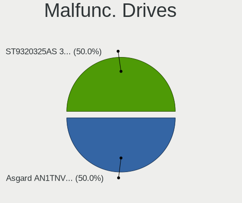
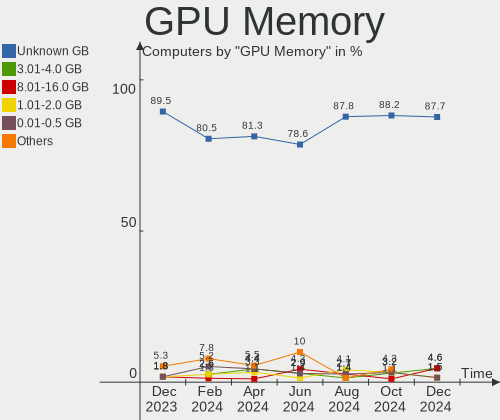

KDE neon - Hardware Trends
--------------------------

A project to identify most popular hardware characteristics and track their change
over time based on data collected by Linux users at https://Linux-Hardware.org.

Anyone can contribute to this report by the [hw-probe](https://github.com/linuxhw/hw-probe) tool:

    sudo -E hw-probe -all -upload

This is a report for all computer types. See also reports for [desktops](/Dist/KDE_neon/Desktop/README.md) and [notebooks](/Dist/KDE_neon/Notebook/README.md).

This report is for one last month. Overall report since the beginning of time: [TestCoverage](https://github.com/linuxhw/TestCoverage)

Period: Aug, 2022.

Contents
--------

* [ System ](#system)
  - [ OS                       ](#os)
  - [ OS Family                ](#os-family)
  - [ Kernel                   ](#kernel)
  - [ Kernel Family            ](#kernel-family)
  - [ Kernel Major Ver.        ](#kernel-major-ver)
  - [ Arch                     ](#arch)
  - [ DE                       ](#de)
  - [ Display Server           ](#display-server)
  - [ Display Manager          ](#display-manager)
  - [ OS Lang                  ](#os-lang)
  - [ Boot Mode                ](#boot-mode)
  - [ Filesystem               ](#filesystem)
  - [ Part. scheme             ](#part-scheme)
  - [ Dual Boot with Linux/BSD ](#dual-boot-with-linuxbsd)
  - [ Dual Boot (Win)          ](#dual-boot-win)

* [ Board ](#board)
  - [ Vendor                   ](#vendor)
  - [ Model                    ](#model)
  - [ Model Family             ](#model-family)
  - [ MFG Year                 ](#mfg-year)
  - [ Form Factor              ](#form-factor)
  - [ Secure Boot              ](#secure-boot)
  - [ Coreboot                 ](#coreboot)
  - [ RAM Size                 ](#ram-size)
  - [ RAM Used                 ](#ram-used)
  - [ Total Drives             ](#total-drives)
  - [ Has CD-ROM               ](#has-cd-rom)
  - [ Has Ethernet             ](#has-ethernet)
  - [ Has WiFi                 ](#has-wifi)
  - [ Has Bluetooth            ](#has-bluetooth)

* [ Location ](#location)
  - [ Country                  ](#country)
  - [ City                     ](#city)

* [ Drives ](#drives)
  - [ Drive Vendor             ](#drive-vendor)
  - [ Drive Model              ](#drive-model)
  - [ HDD Vendor               ](#hdd-vendor)
  - [ SSD Vendor               ](#ssd-vendor)
  - [ Drive Kind               ](#drive-kind)
  - [ Drive Connector          ](#drive-connector)
  - [ Drive Size               ](#drive-size)
  - [ Space Total              ](#space-total)
  - [ Space Used               ](#space-used)
  - [ Malfunc. Drives          ](#malfunc-drives)
  - [ Malfunc. Drive Vendor    ](#malfunc-drive-vendor)
  - [ Malfunc. HDD Vendor      ](#malfunc-hdd-vendor)
  - [ Malfunc. Drive Kind      ](#malfunc-drive-kind)
  - [ Failed Drives            ](#failed-drives)
  - [ Failed Drive Vendor      ](#failed-drive-vendor)
  - [ Drive Status             ](#drive-status)

* [ Storage controller ](#storage-controller)
  - [ Storage Vendor           ](#storage-vendor)
  - [ Storage Model            ](#storage-model)
  - [ Storage Kind             ](#storage-kind)

* [ Processor ](#processor)
  - [ CPU Vendor               ](#cpu-vendor)
  - [ CPU Model                ](#cpu-model)
  - [ CPU Model Family         ](#cpu-model-family)
  - [ CPU Cores                ](#cpu-cores)
  - [ CPU Sockets              ](#cpu-sockets)
  - [ CPU Threads              ](#cpu-threads)
  - [ CPU Op-Modes             ](#cpu-op-modes)
  - [ CPU Microcode            ](#cpu-microcode)
  - [ CPU Microarch            ](#cpu-microarch)

* [ Graphics ](#graphics)
  - [ GPU Vendor               ](#gpu-vendor)
  - [ GPU Model                ](#gpu-model)
  - [ GPU Combo                ](#gpu-combo)
  - [ GPU Driver               ](#gpu-driver)
  - [ GPU Memory               ](#gpu-memory)

* [ Monitor ](#monitor)
  - [ Monitor Vendor           ](#monitor-vendor)
  - [ Monitor Model            ](#monitor-model)
  - [ Monitor Resolution       ](#monitor-resolution)
  - [ Monitor Diagonal         ](#monitor-diagonal)
  - [ Monitor Width            ](#monitor-width)
  - [ Aspect Ratio             ](#aspect-ratio)
  - [ Monitor Area             ](#monitor-area)
  - [ Pixel Density            ](#pixel-density)
  - [ Multiple Monitors        ](#multiple-monitors)

* [ Network ](#network)
  - [ Net Controller Vendor    ](#net-controller-vendor)
  - [ Net Controller Model     ](#net-controller-model)
  - [ Wireless Vendor          ](#wireless-vendor)
  - [ Wireless Model           ](#wireless-model)
  - [ Ethernet Vendor          ](#ethernet-vendor)
  - [ Ethernet Model           ](#ethernet-model)
  - [ Net Controller Kind      ](#net-controller-kind)
  - [ Used Controller          ](#used-controller)
  - [ NICs                     ](#nics)
  - [ IPv6                     ](#ipv6)

* [ Bluetooth ](#bluetooth)
  - [ Bluetooth Vendor         ](#bluetooth-vendor)
  - [ Bluetooth Model          ](#bluetooth-model)

* [ Sound ](#sound)
  - [ Sound Vendor             ](#sound-vendor)
  - [ Sound Model              ](#sound-model)

* [ Memory ](#memory)
  - [ Memory Vendor            ](#memory-vendor)
  - [ Memory Model             ](#memory-model)
  - [ Memory Kind              ](#memory-kind)
  - [ Memory Form Factor       ](#memory-form-factor)
  - [ Memory Size              ](#memory-size)
  - [ Memory Speed             ](#memory-speed)

* [ Printers & scanners ](#printers--scanners)
  - [ Printer Vendor           ](#printer-vendor)
  - [ Printer Model            ](#printer-model)
  - [ Scanner Vendor           ](#scanner-vendor)
  - [ Scanner Model            ](#scanner-model)

* [ Camera ](#camera)
  - [ Camera Vendor            ](#camera-vendor)
  - [ Camera Model             ](#camera-model)

* [ Security ](#security)
  - [ Fingerprint Vendor       ](#fingerprint-vendor)
  - [ Fingerprint Model        ](#fingerprint-model)
  - [ Chipcard Vendor          ](#chipcard-vendor)
  - [ Chipcard Model           ](#chipcard-model)

* [ Unsupported ](#unsupported)
  - [ Unsupported Devices      ](#unsupported-devices)
  - [ Unsupported Device Types ](#unsupported-device-types)

System
------

OS
--

Installed operating systems

| Name           | Computers | Percent |
|----------------|-----------|---------|
| KDE neon 20.04 | 110       | 92.44%  |
| KDE neon 22.04 | 9         | 7.56%   |

OS Family
---------

OS without a version

| Name     | Computers | Percent |
|----------|-----------|---------|
| KDE neon | 119       | 100%    |

Kernel
------

Version of the Linux kernel

| Version                   | Computers | Percent |
|---------------------------|-----------|---------|
| 5.15.0-46-generic         | 66        | 55.46%  |
| 5.15.0-43-generic         | 33        | 27.73%  |
| 5.15.0-41-generic         | 8         | 6.72%   |
| 5.3.0-51-generic          | 1         | 0.84%   |
| 5.19.1-051901-generic     | 1         | 0.84%   |
| 5.19.0-4.1-liquorix-amd64 | 1         | 0.84%   |
| 5.19.0-1.1-liquorix-amd64 | 1         | 0.84%   |
| 5.16.0-051600-generic     | 1         | 0.84%   |
| 5.13.0-52-generic         | 1         | 0.84%   |
| 5.13.0-51-generic         | 1         | 0.84%   |
| 5.13.0-44-generic         | 1         | 0.84%   |
| 5.13.0-41-generic         | 1         | 0.84%   |
| 5.13.0-39-generic         | 1         | 0.84%   |
| 5.11.0-46-generic         | 1         | 0.84%   |
| 5.11.0-38-generic         | 1         | 0.84%   |

Kernel Family
-------------

Linux kernel without a distro release

| Version | Computers | Percent |
|---------|-----------|---------|
| 5.15.0  | 107       | 89.92%  |
| 5.13.0  | 5         | 4.2%    |
| 5.19.0  | 2         | 1.68%   |
| 5.11.0  | 2         | 1.68%   |
| 5.3.0   | 1         | 0.84%   |
| 5.19.1  | 1         | 0.84%   |
| 5.16.0  | 1         | 0.84%   |

Kernel Major Ver.
-----------------

Linux kernel major version

| Version | Computers | Percent |
|---------|-----------|---------|
| 5.15    | 107       | 89.92%  |
| 5.13    | 5         | 4.2%    |
| 5.19    | 3         | 2.52%   |
| 5.11    | 2         | 1.68%   |
| 5.3     | 1         | 0.84%   |
| 5.16    | 1         | 0.84%   |

Arch
----

OS architecture (x86_64, i586, etc.)

| Name   | Computers | Percent |
|--------|-----------|---------|
| x86_64 | 119       | 100%    |

DE
--

Desktop Environment

| Name  | Computers | Percent |
|-------|-----------|---------|
| KDE5  | 118       | 99.16%  |
| GNOME | 1         | 0.84%   |

Display Server
--------------

X11 or Wayland

| Name    | Computers | Percent |
|---------|-----------|---------|
| X11     | 109       | 91.6%   |
| Wayland | 10        | 8.4%    |

Display Manager
---------------

SDDM, LightDM, etc.

| Name    | Computers | Percent |
|---------|-----------|---------|
| Unknown | 108       | 90.76%  |
| SDDM    | 11        | 9.24%   |

OS Lang
-------

Language

| Lang  | Computers | Percent |
|-------|-----------|---------|
| en_US | 50        | 42.02%  |
| ru_RU | 8         | 6.72%   |
| de_DE | 8         | 6.72%   |
| pt_BR | 7         | 5.88%   |
| es_ES | 7         | 5.88%   |
| en_GB | 5         | 4.2%    |
| en_IN | 4         | 3.36%   |
| it_IT | 3         | 2.52%   |
| zh_CN | 2         | 1.68%   |
| hu_HU | 2         | 1.68%   |
| es_GT | 2         | 1.68%   |
| en_AU | 2         | 1.68%   |
| en_AG | 2         | 1.68%   |
| C     | 2         | 1.68%   |
| zh_TW | 1         | 0.84%   |
| tr_TR | 1         | 0.84%   |
| pt_PT | 1         | 0.84%   |
| nl_BE | 1         | 0.84%   |
| mr_IN | 1         | 0.84%   |
| lt_LT | 1         | 0.84%   |
| fr_FR | 1         | 0.84%   |
| es_EC | 1         | 0.84%   |
| es_AR | 1         | 0.84%   |
| en_ZA | 1         | 0.84%   |
| en_PH | 1         | 0.84%   |
| en_NZ | 1         | 0.84%   |
| en_DK | 1         | 0.84%   |
| en_CA | 1         | 0.84%   |
| de_CH | 1         | 0.84%   |

Boot Mode
---------

EFI or BIOS

| Mode | Computers | Percent |
|------|-----------|---------|
| EFI  | 73        | 61.34%  |
| BIOS | 46        | 38.66%  |

Filesystem
----------

Type of filesystem

| Type    | Computers | Percent |
|---------|-----------|---------|
| Ext4    | 113       | 94.96%  |
| Btrfs   | 5         | 4.2%    |
| Overlay | 1         | 0.84%   |

Part. scheme
------------

Scheme of partitioning

| Type    | Computers | Percent |
|---------|-----------|---------|
| Unknown | 115       | 96.64%  |
| MBR     | 2         | 1.68%   |
| GPT     | 2         | 1.68%   |

Dual Boot with Linux/BSD
------------------------

Hosting more than one Linux/BSD

| Dual boot | Computers | Percent |
|-----------|-----------|---------|
| No        | 116       | 97.48%  |
| Yes       | 3         | 2.52%   |

Dual Boot (Win)
---------------

Hosting Linux and Windows

| Dual boot | Computers | Percent |
|-----------|-----------|---------|
| No        | 116       | 97.48%  |
| Yes       | 3         | 2.52%   |

Board
-----

Vendor
------

Motherboard manufacturer

| Name                      | Computers | Percent |
|---------------------------|-----------|---------|
| ASUSTek Computer          | 23        | 19.33%  |
| Dell                      | 19        | 15.97%  |
| Hewlett-Packard           | 14        | 11.76%  |
| MSI                       | 11        | 9.24%   |
| Lenovo                    | 11        | 9.24%   |
| Gigabyte Technology       | 8         | 6.72%   |
| Acer                      | 7         | 5.88%   |
| ASRock                    | 3         | 2.52%   |
| Apple                     | 3         | 2.52%   |
| Sony                      | 2         | 1.68%   |
| Samsung Electronics       | 2         | 1.68%   |
| HUAWEI                    | 2         | 1.68%   |
| Alienware                 | 2         | 1.68%   |
| Acidanthera               | 2         | 1.68%   |
| Toshiba                   | 1         | 0.84%   |
| Notebook                  | 1         | 0.84%   |
| Microtech                 | 1         | 0.84%   |
| Microsoft                 | 1         | 0.84%   |
| Medion                    | 1         | 0.84%   |
| Hampoo                    | 1         | 0.84%   |
| eMachines                 | 1         | 0.84%   |
| Clevo                     | 1         | 0.84%   |
| Biostar                   | 1         | 0.84%   |
| Arquimedes Automacao Inf. | 1         | 0.84%   |

Model
-----

Motherboard model

| Name                                      | Computers | Percent |
|-------------------------------------------|-----------|---------|
| MSI MS-7C37                               | 2         | 1.68%   |
| HP Victus by Laptop 16-e0xxx              | 2         | 1.68%   |
| Dell Inspiron 7472                        | 2         | 1.68%   |
| Toshiba Satellite C55-C                   | 1         | 0.84%   |
| Sony SVS15115FWB                          | 1         | 0.84%   |
| Sony SVE1113M1EW                          | 1         | 0.84%   |
| Samsung 930QDB                            | 1         | 0.84%   |
| Samsung 300E4A/300E5A/300E7A              | 1         | 0.84%   |
| Notebook P64_HJ,HK1                       | 1         | 0.84%   |
| MSI WF75 10TK                             | 1         | 0.84%   |
| MSI MS-7C02                               | 1         | 0.84%   |
| MSI MS-7B53                               | 1         | 0.84%   |
| MSI MS-7A54                               | 1         | 0.84%   |
| MSI MS-7924                               | 1         | 0.84%   |
| MSI MS-7917                               | 1         | 0.84%   |
| MSI MS-7758                               | 1         | 0.84%   |
| MSI MS-7751                               | 1         | 0.84%   |
| MSI Katana GF66 11UC                      | 1         | 0.84%   |
| Microtech CoreBook                        | 1         | 0.84%   |
| Microsoft Surface Go                      | 1         | 0.84%   |
| Medion Akoya E7227                        | 1         | 0.84%   |
| Lenovo Yoga 9 14ITL5 82BG                 | 1         | 0.84%   |
| Lenovo V15-IGL 82C3                       | 1         | 0.84%   |
| Lenovo ThinkPad T590 20N4004EMH           | 1         | 0.84%   |
| Lenovo ThinkPad L13 Yoga Gen 2 20VK001QUS | 1         | 0.84%   |
| Lenovo N22 80S6                           | 1         | 0.84%   |
| Lenovo MIIX 320-10ICR 80XF                | 1         | 0.84%   |
| Lenovo Legion 5 15ACH6H 82JU              | 1         | 0.84%   |
| Lenovo IdeaPad Gaming 3 15ACH6 82K2       | 1         | 0.84%   |
| Lenovo IdeaPad 5 Pro 16ACH6 82L5          | 1         | 0.84%   |
| Lenovo IdeaPad 330-17ICH 81FL             | 1         | 0.84%   |
| Lenovo G50-80 80L0                        | 1         | 0.84%   |
| HUAWEI WRT-WX9                            | 1         | 0.84%   |
| HUAWEI KLVD-WXX9                          | 1         | 0.84%   |
| HP TouchSmart tm2                         | 1         | 0.84%   |
| HP ProBook 4530s                          | 1         | 0.84%   |
| HP ProBook 450 G7                         | 1         | 0.84%   |
| HP Pavilion Gaming Laptop 15-ec0xxx       | 1         | 0.84%   |
| HP Pavilion Desktop 590-p0xxx             | 1         | 0.84%   |
| HP Notebook                               | 1         | 0.84%   |
| HP Laptop 15s-fq2xxx                      | 1         | 0.84%   |
| HP ENVY 14                                | 1         | 0.84%   |
| HP EliteBook 840 G1                       | 1         | 0.84%   |
| HP Elite x2 1012 G1                       | 1         | 0.84%   |
| HP Compaq 6000 Pro SFF PC                 | 1         | 0.84%   |
| HP 23-p012a                               | 1         | 0.84%   |
| Hampoo SurfTab duo W1 10.1 (VT4)          | 1         | 0.84%   |
| Gigabyte P85-D3                           | 1         | 0.84%   |
| Gigabyte H87M-HD3                         | 1         | 0.84%   |
| Gigabyte H81M-D3H                         | 1         | 0.84%   |
| Gigabyte H170-D3H                         | 1         | 0.84%   |
| Gigabyte GA-78LMT-USB3 6.0                | 1         | 0.84%   |
| Gigabyte BOLD E3032                       | 1         | 0.84%   |
| Gigabyte B560M DS3H AC                    | 1         | 0.84%   |
| Gigabyte B550M DS3H                       | 1         | 0.84%   |
| eMachines D725                            | 1         | 0.84%   |
| Dell XPS 8930                             | 1         | 0.84%   |
| Dell XPS 15 9560                          | 1         | 0.84%   |
| Dell Vostro 15 3515                       | 1         | 0.84%   |
| Dell Precision WorkStation T5500          | 1         | 0.84%   |

Model Family
------------

Motherboard model prefix

| Name                   | Computers | Percent |
|------------------------|-----------|---------|
| Dell Inspiron          | 9         | 7.56%   |
| Acer Aspire            | 5         | 4.2%    |
| ASUS VivoBook          | 4         | 3.36%   |
| Lenovo IdeaPad         | 3         | 2.52%   |
| Dell Latitude          | 3         | 2.52%   |
| ASUS ROG               | 3         | 2.52%   |
| ASUS PRIME             | 3         | 2.52%   |
| MSI MS-7C37            | 2         | 1.68%   |
| Lenovo ThinkPad        | 2         | 1.68%   |
| HP Victus              | 2         | 1.68%   |
| HP ProBook             | 2         | 1.68%   |
| HP Pavilion            | 2         | 1.68%   |
| Dell XPS               | 2         | 1.68%   |
| Dell OptiPlex          | 2         | 1.68%   |
| ASUS TUF               | 2         | 1.68%   |
| Acer Nitro             | 2         | 1.68%   |
| Toshiba Satellite      | 1         | 0.84%   |
| Sony SVS15115FWB       | 1         | 0.84%   |
| Sony SVE1113M1EW       | 1         | 0.84%   |
| Samsung 930QDB         | 1         | 0.84%   |
| Samsung 300E4A         | 1         | 0.84%   |
| Notebook P64           | 1         | 0.84%   |
| MSI WF75               | 1         | 0.84%   |
| MSI MS-7C02            | 1         | 0.84%   |
| MSI MS-7B53            | 1         | 0.84%   |
| MSI MS-7A54            | 1         | 0.84%   |
| MSI MS-7924            | 1         | 0.84%   |
| MSI MS-7917            | 1         | 0.84%   |
| MSI MS-7758            | 1         | 0.84%   |
| MSI MS-7751            | 1         | 0.84%   |
| MSI Katana             | 1         | 0.84%   |
| Microtech CoreBook     | 1         | 0.84%   |
| Microsoft Surface      | 1         | 0.84%   |
| Medion Akoya           | 1         | 0.84%   |
| Lenovo Yoga            | 1         | 0.84%   |
| Lenovo V15-IGL         | 1         | 0.84%   |
| Lenovo N22             | 1         | 0.84%   |
| Lenovo MIIX            | 1         | 0.84%   |
| Lenovo Legion          | 1         | 0.84%   |
| Lenovo G50-80          | 1         | 0.84%   |
| HUAWEI WRT-WX9         | 1         | 0.84%   |
| HUAWEI KLVD-WXX9       | 1         | 0.84%   |
| HP TouchSmart          | 1         | 0.84%   |
| HP Notebook            | 1         | 0.84%   |
| HP Laptop              | 1         | 0.84%   |
| HP ENVY                | 1         | 0.84%   |
| HP EliteBook           | 1         | 0.84%   |
| HP Elite               | 1         | 0.84%   |
| HP Compaq              | 1         | 0.84%   |
| HP 23-p012a            | 1         | 0.84%   |
| Hampoo SurfTab         | 1         | 0.84%   |
| Gigabyte P85-D3        | 1         | 0.84%   |
| Gigabyte H87M-HD3      | 1         | 0.84%   |
| Gigabyte H81M-D3H      | 1         | 0.84%   |
| Gigabyte H170-D3H      | 1         | 0.84%   |
| Gigabyte GA-78LMT-USB3 | 1         | 0.84%   |
| Gigabyte BOLD          | 1         | 0.84%   |
| Gigabyte B560M         | 1         | 0.84%   |
| Gigabyte B550M         | 1         | 0.84%   |
| eMachines D725         | 1         | 0.84%   |

MFG Year
--------

Motherboard manufacture year

| Year | Computers | Percent |
|------|-----------|---------|
| 2021 | 17        | 14.29%  |
| 2018 | 14        | 11.76%  |
| 2019 | 13        | 10.92%  |
| 2014 | 10        | 8.4%    |
| 2013 | 9         | 7.56%   |
| 2011 | 9         | 7.56%   |
| 2020 | 8         | 6.72%   |
| 2016 | 7         | 5.88%   |
| 2022 | 6         | 5.04%   |
| 2017 | 6         | 5.04%   |
| 2015 | 6         | 5.04%   |
| 2012 | 5         | 4.2%    |
| 2010 | 5         | 4.2%    |
| 2008 | 2         | 1.68%   |
| 2009 | 1         | 0.84%   |
| 2007 | 1         | 0.84%   |

Form Factor
-----------

Physical design of the computer

| Name        | Computers | Percent |
|-------------|-----------|---------|
| Notebook    | 67        | 56.3%   |
| Desktop     | 42        | 35.29%  |
| Convertible | 4         | 3.36%   |
| All in one  | 4         | 3.36%   |
| Tablet      | 2         | 1.68%   |

Secure Boot
-----------

Enabled or disabled

| State    | Computers | Percent |
|----------|-----------|---------|
| Disabled | 108       | 90.76%  |
| Enabled  | 11        | 9.24%   |

Coreboot
--------

Have coreboot on board

| Used | Computers | Percent |
|------|-----------|---------|
| No   | 119       | 100%    |

RAM Size
--------

Total RAM memory

| Size in GB  | Computers | Percent |
|-------------|-----------|---------|
| 4.01-8.0    | 36        | 30.25%  |
| 16.01-24.0  | 30        | 25.21%  |
| 8.01-16.0   | 18        | 15.13%  |
| 32.01-64.0  | 13        | 10.92%  |
| 3.01-4.0    | 10        | 8.4%    |
| 1.01-2.0    | 5         | 4.2%    |
| 24.01-32.0  | 3         | 2.52%   |
| 64.01-256.0 | 3         | 2.52%   |
| 2.01-3.0    | 1         | 0.84%   |

RAM Used
--------

Used RAM memory

| Used GB    | Computers | Percent |
|------------|-----------|---------|
| 2.01-3.0   | 38        | 31.93%  |
| 1.01-2.0   | 38        | 31.93%  |
| 3.01-4.0   | 20        | 16.81%  |
| 4.01-8.0   | 11        | 9.24%   |
| 0.51-1.0   | 9         | 7.56%   |
| 8.01-16.0  | 2         | 1.68%   |
| 16.01-24.0 | 1         | 0.84%   |

Total Drives
------------

Number of drives on board

| Drives | Computers | Percent |
|--------|-----------|---------|
| 1      | 64        | 53.78%  |
| 2      | 37        | 31.09%  |
| 3      | 9         | 7.56%   |
| 6      | 4         | 3.36%   |
| 5      | 3         | 2.52%   |
| 4      | 2         | 1.68%   |

Has CD-ROM
----------

Has CD-ROM on board

| Presented | Computers | Percent |
|-----------|-----------|---------|
| No        | 83        | 69.75%  |
| Yes       | 36        | 30.25%  |

Has Ethernet
------------

Has Ethernet on board

| Presented | Computers | Percent |
|-----------|-----------|---------|
| Yes       | 97        | 81.51%  |
| No        | 22        | 18.49%  |

Has WiFi
--------

Has WiFi module

| Presented | Computers | Percent |
|-----------|-----------|---------|
| Yes       | 99        | 83.19%  |
| No        | 20        | 16.81%  |

Has Bluetooth
-------------

Has Bluetooth module

| Presented | Computers | Percent |
|-----------|-----------|---------|
| Yes       | 84        | 70.59%  |
| No        | 35        | 29.41%  |

Location
--------

Country
-------

Geographic location (country)

| Country      | Computers | Percent |
|--------------|-----------|---------|
| USA          | 30        | 25.21%  |
| Russia       | 8         | 6.72%   |
| Germany      | 8         | 6.72%   |
| Brazil       | 8         | 6.72%   |
| Spain        | 6         | 5.04%   |
| India        | 5         | 4.2%    |
| Italy        | 4         | 3.36%   |
| France       | 4         | 3.36%   |
| UK           | 3         | 2.52%   |
| Turkey       | 3         | 2.52%   |
| China        | 3         | 2.52%   |
| Switzerland  | 2         | 1.68%   |
| Poland       | 2         | 1.68%   |
| Indonesia    | 2         | 1.68%   |
| Hungary      | 2         | 1.68%   |
| Guatemala    | 2         | 1.68%   |
| Canada       | 2         | 1.68%   |
| Uruguay      | 1         | 0.84%   |
| Tunisia      | 1         | 0.84%   |
| Taiwan       | 1         | 0.84%   |
| Sweden       | 1         | 0.84%   |
| South Africa | 1         | 0.84%   |
| Singapore    | 1         | 0.84%   |
| Saudi Arabia | 1         | 0.84%   |
| Romania      | 1         | 0.84%   |
| Portugal     | 1         | 0.84%   |
| Philippines  | 1         | 0.84%   |
| New Zealand  | 1         | 0.84%   |
| Netherlands  | 1         | 0.84%   |
| Morocco      | 1         | 0.84%   |
| Moldova      | 1         | 0.84%   |
| Mexico       | 1         | 0.84%   |
| Lithuania    | 1         | 0.84%   |
| Kyrgyzstan   | 1         | 0.84%   |
| Finland      | 1         | 0.84%   |
| Ecuador      | 1         | 0.84%   |
| Denmark      | 1         | 0.84%   |
| Colombia     | 1         | 0.84%   |
| Chile        | 1         | 0.84%   |
| Belgium      | 1         | 0.84%   |
| Australia    | 1         | 0.84%   |
| Argentina    | 1         | 0.84%   |

City
----

Geographic location (city)

| City                      | Computers | Percent |
|---------------------------|-----------|---------|
| Moscow                    | 4         | 3.36%   |
| Sao Paulo                 | 2         | 1.68%   |
| Guatemala City            | 2         | 1.68%   |
| Del Valle                 | 2         | 1.68%   |
| Bixby                     | 2         | 1.68%   |
| Zurich                    | 1         | 0.84%   |
| Zacatecas City            | 1         | 0.84%   |
| Yichang                   | 1         | 0.84%   |
| Woodbridge                | 1         | 0.84%   |
| Window Rock               | 1         | 0.84%   |
| Wiehl                     | 1         | 0.84%   |
| Wendell                   | 1         | 0.84%   |
| Viseu                     | 1         | 0.84%   |
| Vilnius                   | 1         | 0.84%   |
| Velletri                  | 1         | 0.84%   |
| Valence                   | 1         | 0.84%   |
| Umeå                     | 1         | 0.84%   |
| Turin                     | 1         | 0.84%   |
| Tunis                     | 1         | 0.84%   |
| Toronto                   | 1         | 0.84%   |
| Thiaucourt-Regnieville    | 1         | 0.84%   |
| The Hague                 | 1         | 0.84%   |
| Tainan City               | 1         | 0.84%   |
| Singapore                 | 1         | 0.84%   |
| Siedlce                   | 1         | 0.84%   |
| Seville                   | 1         | 0.84%   |
| Schloss Holte-Stukenbrock | 1         | 0.84%   |
| Santiago                  | 1         | 0.84%   |
| Santee                    | 1         | 0.84%   |
| Salvador                  | 1         | 0.84%   |
| Saint Paul                | 1         | 0.84%   |
| Round Rock                | 1         | 0.84%   |
| Râmnicu Vâlcea          | 1         | 0.84%   |
| Quito                     | 1         | 0.84%   |
| Plymouth                  | 1         | 0.84%   |
| Penalsordo                | 1         | 0.84%   |
| Oświęcim                | 1         | 0.84%   |
| Novosibirsk               | 1         | 0.84%   |
| Novokuznetsk              | 1         | 0.84%   |
| Nottingham                | 1         | 0.84%   |
| Norden                    | 1         | 0.84%   |
| Nizhniy Novgorod          | 1         | 0.84%   |
| New Braunfels             | 1         | 0.84%   |
| Navi Mumbai               | 1         | 0.84%   |
| Navàs                    | 1         | 0.84%   |
| Nanchang                  | 1         | 0.84%   |
| Murfreesboro              | 1         | 0.84%   |
| Mount Pleasant            | 1         | 0.84%   |
| Montreal                  | 1         | 0.84%   |
| Montevideo                | 1         | 0.84%   |
| Milton                    | 1         | 0.84%   |
| Milan                     | 1         | 0.84%   |
| Marica                    | 1         | 0.84%   |
| Makassar                  | 1         | 0.84%   |
| Mage                      | 1         | 0.84%   |
| Magdeburg                 | 1         | 0.84%   |
| Madrid                    | 1         | 0.84%   |
| Madison                   | 1         | 0.84%   |
| Lyon                      | 1         | 0.84%   |
| Leominster                | 1         | 0.84%   |

Drives
------

Drive Vendor
------------

Hard drive vendors

| Vendor                      | Computers | Drives | Percent |
|-----------------------------|-----------|--------|---------|
| Seagate                     | 38        | 46     | 20.21%  |
| Samsung Electronics         | 26        | 33     | 13.83%  |
| SanDisk                     | 23        | 24     | 12.23%  |
| WDC                         | 21        | 28     | 11.17%  |
| Toshiba                     | 8         | 8      | 4.26%   |
| Crucial                     | 8         | 8      | 4.26%   |
| Unknown                     | 6         | 7      | 3.19%   |
| Kingston                    | 5         | 6      | 2.66%   |
| Phison                      | 4         | 4      | 2.13%   |
| Intel                       | 4         | 4      | 2.13%   |
| HGST                        | 4         | 4      | 2.13%   |
| SK hynix                    | 3         | 3      | 1.6%    |
| LITEON                      | 3         | 3      | 1.6%    |
| Hitachi                     | 3         | 3      | 1.6%    |
| XPG                         | 2         | 2      | 1.06%   |
| PNY                         | 2         | 2      | 1.06%   |
| OCZ                         | 2         | 2      | 1.06%   |
| Micron Technology           | 2         | 2      | 1.06%   |
| Hewlett-Packard             | 2         | 2      | 1.06%   |
| XUM                         | 1         | 1      | 0.53%   |
| WALRAM                      | 1         | 1      | 0.53%   |
| USB3.0                      | 1         | 1      | 0.53%   |
| Union Memory (Shenzhen)     | 1         | 1      | 0.53%   |
| Transcend                   | 1         | 1      | 0.53%   |
| TO Exter                    | 1         | 1      | 0.53%   |
| SSK                         | 1         | 1      | 0.53%   |
| SPCC                        | 1         | 1      | 0.53%   |
| Silicon Motion              | 1         | 1      | 0.53%   |
| Realtek Semiconductor       | 1         | 1      | 0.53%   |
| MAXIO Technology (Hangzhou) | 1         | 1      | 0.53%   |
| LaCie                       | 1         | 1      | 0.53%   |
| G-RAID                      | 1         | 1      | 0.53%   |
| Corsair                     | 1         | 1      | 0.53%   |
| China                       | 1         | 1      | 0.53%   |
| Biostar                     | 1         | 1      | 0.53%   |
| BHT                         | 1         | 1      | 0.53%   |
| Apple                       | 1         | 2      | 0.53%   |
| Apacer                      | 1         | 1      | 0.53%   |
| ADATA Technology            | 1         | 1      | 0.53%   |
| A-DATA Technology           | 1         | 1      | 0.53%   |
| Unknown                     | 1         | 1      | 0.53%   |

Drive Model
-----------

Hard drive models

| Model                                | Computers | Percent |
|--------------------------------------|-----------|---------|
| SanDisk NVMe SSD Drive 512GB         | 6         | 2.88%   |
| Seagate ST1000DM010-2EP102 1TB       | 5         | 2.4%    |
| Samsung NVMe SSD Drive 1TB           | 5         | 2.4%    |
| Samsung NVMe SSD Drive 512GB         | 4         | 1.92%   |
| Unknown MMC Card  32GB               | 3         | 1.44%   |
| Toshiba KBG30ZMS128G 128GB NVMe SSD  | 3         | 1.44%   |
| Seagate ST1000LM035-1RK172 1TB       | 3         | 1.44%   |
| Seagate ST1000DM003-1SB102 1TB       | 3         | 1.44%   |
| SanDisk NVMe SSD Drive 256GB         | 3         | 1.44%   |
| Samsung SSD 860 EVO 500GB            | 3         | 1.44%   |
| Samsung SSD 860 EVO 1TB              | 3         | 1.44%   |
| WDC WDS500G2B0A-00SM50 500GB SSD     | 2         | 0.96%   |
| WDC WD10EZEX-00BN5A0 1TB             | 2         | 0.96%   |
| Seagate ST9250315AS 250GB            | 2         | 0.96%   |
| Seagate ST500DM002-1BD142 500GB      | 2         | 0.96%   |
| Seagate ST3500630AS 500GB            | 2         | 0.96%   |
| Seagate ST31000528AS 1TB             | 2         | 0.96%   |
| Seagate ST2000DM008-2FR102 2TB       | 2         | 0.96%   |
| Seagate ST1000LM048-2E7172 1TB       | 2         | 0.96%   |
| SanDisk SDSSDA240G 240GB             | 2         | 0.96%   |
| SanDisk SDSSDA120G 120GB             | 2         | 0.96%   |
| SanDisk NVMe SSD Drive 500GB         | 2         | 0.96%   |
| SanDisk NVMe SSD Drive 1TB           | 2         | 0.96%   |
| Samsung NVMe SSD Drive 500GB         | 2         | 0.96%   |
| Phison NVMe SSD Drive 512GB          | 2         | 0.96%   |
| Phison NVMe SSD Drive 120GB          | 2         | 0.96%   |
| Micron NVMe SSD Drive 512GB          | 2         | 0.96%   |
| Intel NVMe SSD Drive 512GB           | 2         | 0.96%   |
| HGST HTS721010A9E630 1TB             | 2         | 0.96%   |
| Crucial CT240BX500SSD1 240GB         | 2         | 0.96%   |
| XUM HX256GSSDSATA3 256GB             | 1         | 0.48%   |
| XPG NVMe SSD Drive 256GB             | 1         | 0.48%   |
| XPG NVMe SSD Drive 1024GB            | 1         | 0.48%   |
| WDC WDS500G2B0B 500GB SSD            | 1         | 0.48%   |
| WDC WDS500G1B0A-00H9H0 500GB SSD     | 1         | 0.48%   |
| WDC WDS120G2G0A-00JH30 120GB SSD     | 1         | 0.48%   |
| WDC WDBNCE0010PNC 1TB SSD            | 1         | 0.48%   |
| WDC WD7500AARS-00Y5B1 752GB          | 1         | 0.48%   |
| WDC WD6400AACS-00G8B1 640GB          | 1         | 0.48%   |
| WDC WD5000LPVX-22V0TT0 500GB         | 1         | 0.48%   |
| WDC WD5000HHTZ-04N21V0 500GB         | 1         | 0.48%   |
| WDC WD5000BEVT-22A0RT0 500GB         | 1         | 0.48%   |
| WDC WD5000BEVT-00A0RT0 500GB         | 1         | 0.48%   |
| WDC WD5000AZLX-22JKKA0 500GB         | 1         | 0.48%   |
| WDC WD5000AAKX-60U6AA0 500GB         | 1         | 0.48%   |
| WDC WD5000AAKX-001CA0 500GB          | 1         | 0.48%   |
| WDC WD5000AAKS-00YGA0 500GB          | 1         | 0.48%   |
| WDC WD3200BEVT-22A23T0 320GB         | 1         | 0.48%   |
| WDC WD3200BEKX-75B7WT0 320GB         | 1         | 0.48%   |
| WDC WD2500BEKT-75PVMT0 250GB         | 1         | 0.48%   |
| WDC WD20EARX-008FB0 2TB              | 1         | 0.48%   |
| WDC WD20EARS-00MVWB0 2TB             | 1         | 0.48%   |
| WDC WD10JPVX-22JC3T0 1TB             | 1         | 0.48%   |
| WDC WD10EZEX-08M2NA0 1TB             | 1         | 0.48%   |
| WDC WD10EZEX-00ZF5A0 1TB             | 1         | 0.48%   |
| WDC PC SN520 SDAPNUW-512G-1006 512GB | 1         | 0.48%   |
| WALRAM 128G                          | 1         | 0.48%   |
| USB3.0 Super Speed 128GB             | 1         | 0.48%   |
| Unknown SD32G  32GB                  | 1         | 0.48%   |
| Unknown MMC Card  64GB               | 1         | 0.48%   |

HDD Vendor
----------

Hard disk drive vendors

| Vendor              | Computers | Drives | Percent |
|---------------------|-----------|--------|---------|
| Seagate             | 37        | 44     | 56.92%  |
| WDC                 | 16        | 21     | 24.62%  |
| HGST                | 4         | 4      | 6.15%   |
| Hitachi             | 3         | 3      | 4.62%   |
| Toshiba             | 2         | 2      | 3.08%   |
| USB3.0              | 1         | 1      | 1.54%   |
| Samsung Electronics | 1         | 1      | 1.54%   |
| Hewlett-Packard     | 1         | 1      | 1.54%   |

SSD Vendor
----------

Solid state drive vendors

| Vendor              | Computers | Drives | Percent |
|---------------------|-----------|--------|---------|
| Samsung Electronics | 14        | 15     | 22.95%  |
| SanDisk             | 9         | 10     | 14.75%  |
| Crucial             | 8         | 8      | 13.11%  |
| WDC                 | 6         | 6      | 9.84%   |
| LITEON              | 3         | 3      | 4.92%   |
| Kingston            | 3         | 4      | 4.92%   |
| SK hynix            | 2         | 2      | 3.28%   |
| PNY                 | 2         | 2      | 3.28%   |
| OCZ                 | 2         | 2      | 3.28%   |
| XUM                 | 1         | 1      | 1.64%   |
| Transcend           | 1         | 1      | 1.64%   |
| Toshiba             | 1         | 1      | 1.64%   |
| TO Exter            | 1         | 1      | 1.64%   |
| SPCC                | 1         | 1      | 1.64%   |
| Intel               | 1         | 1      | 1.64%   |
| Hewlett-Packard     | 1         | 1      | 1.64%   |
| Corsair             | 1         | 1      | 1.64%   |
| China               | 1         | 1      | 1.64%   |
| Apacer              | 1         | 1      | 1.64%   |
| A-DATA Technology   | 1         | 1      | 1.64%   |
| Unknown             | 1         | 1      | 1.64%   |

Drive Kind
----------

HDD or SSD

| Kind    | Computers | Drives | Percent |
|---------|-----------|--------|---------|
| HDD     | 58        | 77     | 33.33%  |
| SSD     | 53        | 64     | 30.46%  |
| NVMe    | 51        | 60     | 29.31%  |
| MMC     | 6         | 7      | 3.45%   |
| Unknown | 6         | 6      | 3.45%   |

Drive Connector
---------------

SATA, SAS, NVMe, etc.

| Type | Computers | Drives | Percent |
|------|-----------|--------|---------|
| SATA | 86        | 138    | 56.95%  |
| NVMe | 51        | 60     | 33.77%  |
| SAS  | 8         | 9      | 5.3%    |
| MMC  | 6         | 7      | 3.97%   |

Drive Size
----------

Size of hard drive

| Size in TB | Computers | Drives | Percent |
|------------|-----------|--------|---------|
| 0.01-0.5   | 56        | 76     | 48.28%  |
| 0.51-1.0   | 43        | 47     | 37.07%  |
| 1.01-2.0   | 11        | 12     | 9.48%   |
| 3.01-4.0   | 3         | 3      | 2.59%   |
| 2.01-3.0   | 2         | 2      | 1.72%   |
| 4.01-10.0  | 1         | 1      | 0.86%   |

Space Total
-----------

Amount of disk space available on the file system

| Size in GB     | Computers | Percent |
|----------------|-----------|---------|
| 251-500        | 32        | 26.89%  |
| 101-250        | 31        | 26.05%  |
| 501-1000       | 16        | 13.45%  |
| 51-100         | 13        | 10.92%  |
| 21-50          | 8         | 6.72%   |
| 1001-2000      | 7         | 5.88%   |
| Unknown        | 4         | 3.36%   |
| 2001-3000      | 3         | 2.52%   |
| 1-20           | 3         | 2.52%   |
| More than 3000 | 2         | 1.68%   |

Space Used
----------

Amount of used disk space

| Used GB        | Computers | Percent |
|----------------|-----------|---------|
| 1-20           | 65        | 54.62%  |
| 21-50          | 17        | 14.29%  |
| 101-250        | 14        | 11.76%  |
| 51-100         | 8         | 6.72%   |
| 251-500        | 4         | 3.36%   |
| 1001-2000      | 4         | 3.36%   |
| Unknown        | 4         | 3.36%   |
| 501-1000       | 2         | 1.68%   |
| More than 3000 | 1         | 0.84%   |

Malfunc. Drives
---------------

Drive models with a malfunction

| Model                           | Computers | Drives | Percent |
|---------------------------------|-----------|--------|---------|
| Seagate ST500LT012-1DG142 500GB | 1         | 1      | 100%    |

Malfunc. Drive Vendor
---------------------

Vendors of faulty drives

| Vendor  | Computers | Drives | Percent |
|---------|-----------|--------|---------|
| Seagate | 1         | 1      | 100%    |

Malfunc. HDD Vendor
-------------------

Vendors of faulty HDD drives

| Vendor  | Computers | Drives | Percent |
|---------|-----------|--------|---------|
| Seagate | 1         | 1      | 100%    |

Malfunc. Drive Kind
-------------------

Kinds of faulty drives

| Kind | Computers | Drives | Percent |
|------|-----------|--------|---------|
| HDD  | 1         | 1      | 100%    |

Failed Drives
-------------

Failed drive models

Zero info for selected period =(

Failed Drive Vendor
-------------------

Failed drive vendors

Zero info for selected period =(

Drive Status
------------

Number of failed and malfunc. drives

| Status   | Computers | Drives | Percent |
|----------|-----------|--------|---------|
| Detected | 115       | 206    | 94.26%  |
| Works    | 6         | 7      | 4.92%   |
| Malfunc  | 1         | 1      | 0.82%   |

Storage controller
------------------

Storage Vendor
--------------

Storage controller vendors

| Vendor                       | Computers | Percent |
|------------------------------|-----------|---------|
| Intel                        | 79        | 49.38%  |
| AMD                          | 27        | 16.88%  |
| SanDisk                      | 14        | 8.75%   |
| Samsung Electronics          | 13        | 8.13%   |
| Toshiba America Info Systems | 5         | 3.13%   |
| Phison Electronics           | 4         | 2.5%    |
| ASMedia Technology           | 4         | 2.5%    |
| ADATA Technology             | 3         | 1.88%   |
| Micron Technology            | 2         | 1.25%   |
| Kingston Technology Company  | 2         | 1.25%   |
| Union Memory (Shenzhen)      | 1         | 0.63%   |
| SK hynix                     | 1         | 0.63%   |
| Silicon Motion               | 1         | 0.63%   |
| Seagate Technology           | 1         | 0.63%   |
| Realtek Semiconductor        | 1         | 0.63%   |
| MAXIO Technology (Hangzhou)  | 1         | 0.63%   |
| Apple                        | 1         | 0.63%   |

Storage Model
-------------

Storage controller models

| Model                                                                            | Computers | Percent |
|----------------------------------------------------------------------------------|-----------|---------|
| AMD FCH SATA Controller [AHCI mode]                                              | 16        | 9.36%   |
| Intel Sunrise Point-LP SATA Controller [AHCI mode]                               | 8         | 4.68%   |
| SanDisk WD Black SN750 / PC SN730 NVMe SSD                                       | 6         | 3.51%   |
| Intel 8 Series SATA Controller 1 [AHCI mode]                                     | 6         | 3.51%   |
| Samsung NVMe SSD Controller 980                                                  | 5         | 2.92%   |
| Intel 8 Series/C220 Series Chipset Family 6-port SATA Controller 1 [AHCI mode]   | 5         | 2.92%   |
| SanDisk WD Blue SN550 NVMe SSD                                                   | 4         | 2.34%   |
| Samsung NVMe SSD Controller SM981/PM981/PM983                                    | 4         | 2.34%   |
| Intel 82801 Mobile SATA Controller [RAID mode]                                   | 4         | 2.34%   |
| ASMedia ASM1062 Serial ATA Controller                                            | 4         | 2.34%   |
| AMD SB7x0/SB8x0/SB9x0 IDE Controller                                             | 4         | 2.34%   |
| AMD 500 Series Chipset SATA Controller                                           | 4         | 2.34%   |
| SanDisk Non-Volatile memory controller                                           | 3         | 1.75%   |
| Samsung NVMe SSD Controller PM9A1/PM9A3/980PRO                                   | 3         | 1.75%   |
| Intel Q170/Q150/B150/H170/H110/Z170/CM236 Chipset SATA Controller [AHCI Mode]    | 3         | 1.75%   |
| Intel HM170/QM170 Chipset SATA Controller [AHCI Mode]                            | 3         | 1.75%   |
| Intel Cannon Lake Mobile PCH SATA AHCI Controller                                | 3         | 1.75%   |
| Intel 9 Series Chipset Family SATA Controller [AHCI Mode]                        | 3         | 1.75%   |
| Intel 7 Series/C210 Series Chipset Family 6-port SATA Controller [AHCI mode]     | 3         | 1.75%   |
| Intel 6 Series/C200 Series Chipset Family 6 port Mobile SATA AHCI Controller     | 3         | 1.75%   |
| Intel 500 Series Chipset Family SATA AHCI Controller                             | 3         | 1.75%   |
| Intel 400 Series Chipset Family SATA AHCI Controller                             | 3         | 1.75%   |
| AMD SB7x0/SB8x0/SB9x0 SATA Controller [AHCI mode]                                | 3         | 1.75%   |
| Toshiba America Info Systems XG6 NVMe SSD Controller                             | 2         | 1.17%   |
| Samsung NVMe SSD Controller SM961/PM961/SM963                                    | 2         | 1.17%   |
| Micron Non-Volatile memory controller                                            | 2         | 1.17%   |
| Intel Wildcat Point-LP SATA Controller [AHCI Mode]                               | 2         | 1.17%   |
| Intel Volume Management Device NVMe RAID Controller                              | 2         | 1.17%   |
| Intel SSD 660P Series                                                            | 2         | 1.17%   |
| Intel SATA Controller [RAID mode]                                                | 2         | 1.17%   |
| Intel Cannon Lake PCH SATA AHCI Controller                                       | 2         | 1.17%   |
| Intel Atom/Celeron/Pentium Processor x5-E8000/J3xxx/N3xxx Series SATA Controller | 2         | 1.17%   |
| Intel 82801JI (ICH10 Family) SATA AHCI Controller                                | 2         | 1.17%   |
| Intel 82801HM/HEM (ICH8M/ICH8M-E) SATA Controller [AHCI mode]                    | 2         | 1.17%   |
| Intel 82801HM/HEM (ICH8M/ICH8M-E) IDE Controller                                 | 2         | 1.17%   |
| Intel 7 Series Chipset Family 6-port SATA Controller [AHCI mode]                 | 2         | 1.17%   |
| Intel 5 Series/3400 Series Chipset 4 port SATA AHCI Controller                   | 2         | 1.17%   |
| Intel 200 Series PCH SATA controller [AHCI mode]                                 | 2         | 1.17%   |
| AMD SB7x0/SB8x0/SB9x0 SATA Controller [IDE mode]                                 | 2         | 1.17%   |
| AMD 400 Series Chipset SATA Controller                                           | 2         | 1.17%   |
| ADATA XPG SX8200 Pro PCIe Gen3x4 M.2 2280 Solid State Drive                      | 2         | 1.17%   |
| Union Memory (Shenzhen) Non-Volatile memory controller                           | 1         | 0.58%   |
| Toshiba America Info Systems XG4 NVMe SSD Controller                             | 1         | 0.58%   |
| Toshiba America Info Systems Toshiba America Info Non-Volatile memory controller | 1         | 0.58%   |
| Toshiba America Info Systems BG3 NVMe SSD Controller                             | 1         | 0.58%   |
| SK hynix Gold P31 SSD                                                            | 1         | 0.58%   |
| Silicon Motion SM2263EN/SM2263XT SSD Controller                                  | 1         | 0.58%   |
| Seagate FireCuda 520 SSD                                                         | 1         | 0.58%   |
| SanDisk WD Blue SN570 NVMe SSD                                                   | 1         | 0.58%   |
| Realtek Realtek Non-Volatile memory controller                                   | 1         | 0.58%   |
| Phison PS5013 E13 NVMe Controller                                                | 1         | 0.58%   |
| Phison NVMe Storage Controller                                                   | 1         | 0.58%   |
| Phison E7 NVMe Controller                                                        | 1         | 0.58%   |
| Phison E12 NVMe Controller                                                       | 1         | 0.58%   |
| MAXIO (Hangzhou) NVMe SSD Controller MAP1202                                     | 1         | 0.58%   |
| Kingston Company Company Non-Volatile memory controller                          | 1         | 0.58%   |
| Kingston Company SNVS2000G [NV1 NVMe PCIe SSD 2TB]                               | 1         | 0.58%   |
| Intel Non-Volatile memory controller                                             | 1         | 0.58%   |
| Intel Comet Lake SATA AHCI Controller                                            | 1         | 0.58%   |
| Intel Celeron/Pentium Silver Processor SATA Controller                           | 1         | 0.58%   |

Storage Kind
------------

Kind of storage controller (IDE, SATA, NVMe, SAS, ...)

| Kind | Computers | Percent |
|------|-----------|---------|
| SATA | 92        | 57.86%  |
| NVMe | 50        | 31.45%  |
| IDE  | 9         | 5.66%   |
| RAID | 8         | 5.03%   |

Processor
---------

CPU Vendor
----------

Processor vendors

| Vendor | Computers | Percent |
|--------|-----------|---------|
| Intel  | 87        | 73.11%  |
| AMD    | 32        | 26.89%  |

CPU Model
---------

Processor models

| Model                                         | Computers | Percent |
|-----------------------------------------------|-----------|---------|
| AMD Ryzen 5 5600H with Radeon Graphics        | 4         | 3.36%   |
| Intel Core i7-8550U CPU @ 1.80GHz             | 3         | 2.52%   |
| Intel Core i7-7700HQ CPU @ 2.80GHz            | 3         | 2.52%   |
| Intel Core i7-4790K CPU @ 4.00GHz             | 3         | 2.52%   |
| Intel Core i7-7700 CPU @ 3.60GHz              | 2         | 1.68%   |
| Intel Core i7-10750H CPU @ 2.60GHz            | 2         | 1.68%   |
| Intel Core i5-8265U CPU @ 1.60GHz             | 2         | 1.68%   |
| Intel Core i5-4200U CPU @ 1.60GHz             | 2         | 1.68%   |
| Intel Core i5-3210M CPU @ 2.50GHz             | 2         | 1.68%   |
| Intel Core i3-7100U CPU @ 2.40GHz             | 2         | 1.68%   |
| Intel 11th Gen Core i7-1165G7 @ 2.80GHz       | 2         | 1.68%   |
| Intel 11th Gen Core i5-1135G7 @ 2.40GHz       | 2         | 1.68%   |
| AMD Ryzen 7 5800X 8-Core Processor            | 2         | 1.68%   |
| AMD Ryzen 7 5800H with Radeon Graphics        | 2         | 1.68%   |
| AMD Ryzen 5 5500                              | 2         | 1.68%   |
| AMD Ryzen 5 3600 6-Core Processor             | 2         | 1.68%   |
| AMD Ryzen 5 3450U with Radeon Vega Mobile Gfx | 2         | 1.68%   |
| Intel Xeon CPU X5650 @ 2.67GHz                | 1         | 0.84%   |
| Intel Pentium Dual-Core CPU T4500 @ 2.30GHz   | 1         | 0.84%   |
| Intel Pentium CPU G3220 @ 3.00GHz             | 1         | 0.84%   |
| Intel Pentium CPU 4415Y @ 1.60GHz             | 1         | 0.84%   |
| Intel Core m5-6Y54 CPU @ 1.10GHz              | 1         | 0.84%   |
| Intel Core i7-8750H CPU @ 2.20GHz             | 1         | 0.84%   |
| Intel Core i7-8700 CPU @ 3.20GHz              | 1         | 0.84%   |
| Intel Core i7-6900K CPU @ 3.20GHz             | 1         | 0.84%   |
| Intel Core i7-6700K CPU @ 4.00GHz             | 1         | 0.84%   |
| Intel Core i7-6700HQ CPU @ 2.60GHz            | 1         | 0.84%   |
| Intel Core i7-5500U CPU @ 2.40GHz             | 1         | 0.84%   |
| Intel Core i7-4770S CPU @ 3.10GHz             | 1         | 0.84%   |
| Intel Core i7-4770 CPU @ 3.40GHz              | 1         | 0.84%   |
| Intel Core i7-4702MQ CPU @ 2.20GHz            | 1         | 0.84%   |
| Intel Core i7-4500U CPU @ 1.80GHz             | 1         | 0.84%   |
| Intel Core i7-3770 CPU @ 3.40GHz              | 1         | 0.84%   |
| Intel Core i7-10700K CPU @ 3.80GHz            | 1         | 0.84%   |
| Intel Core i7-10510U CPU @ 1.80GHz            | 1         | 0.84%   |
| Intel Core i5-9300H CPU @ 2.40GHz             | 1         | 0.84%   |
| Intel Core i5-8600 CPU @ 3.10GHz              | 1         | 0.84%   |
| Intel Core i5-8400 CPU @ 2.80GHz              | 1         | 0.84%   |
| Intel Core i5-8300H CPU @ 2.30GHz             | 1         | 0.84%   |
| Intel Core i5-7400T CPU @ 2.40GHz             | 1         | 0.84%   |
| Intel Core i5-7360U CPU @ 2.30GHz             | 1         | 0.84%   |
| Intel Core i5-7300U CPU @ 2.60GHz             | 1         | 0.84%   |
| Intel Core i5-7200U CPU @ 2.50GHz             | 1         | 0.84%   |
| Intel Core i5-4570T CPU @ 2.90GHz             | 1         | 0.84%   |
| Intel Core i5-4440 CPU @ 3.10GHz              | 1         | 0.84%   |
| Intel Core i5-4210U CPU @ 1.70GHz             | 1         | 0.84%   |
| Intel Core i5-4210M CPU @ 2.60GHz             | 1         | 0.84%   |
| Intel Core i5-3570K CPU @ 3.40GHz             | 1         | 0.84%   |
| Intel Core i5-3570 CPU @ 3.40GHz              | 1         | 0.84%   |
| Intel Core i5-2520M CPU @ 2.50GHz             | 1         | 0.84%   |
| Intel Core i5-2500K CPU @ 3.30GHz             | 1         | 0.84%   |
| Intel Core i5-2450M CPU @ 2.50GHz             | 1         | 0.84%   |
| Intel Core i5-10400 CPU @ 2.90GHz             | 1         | 0.84%   |
| Intel Core i5 CPU M 480 @ 2.67GHz             | 1         | 0.84%   |
| Intel Core i3-7130U CPU @ 2.70GHz             | 1         | 0.84%   |
| Intel Core i3-5015U CPU @ 2.10GHz             | 1         | 0.84%   |
| Intel Core i3-4030U CPU @ 1.90GHz             | 1         | 0.84%   |
| Intel Core i3-4005U CPU @ 1.70GHz             | 1         | 0.84%   |
| Intel Core i3-2330M CPU @ 2.20GHz             | 1         | 0.84%   |
| Intel Core i3-2310M CPU @ 2.10GHz             | 1         | 0.84%   |

CPU Model Family
----------------

Processor model prefix

| Model                   | Computers | Percent |
|-------------------------|-----------|---------|
| Intel Core i7           | 26        | 21.85%  |
| Intel Core i5           | 25        | 21.01%  |
| AMD Ryzen 5             | 15        | 12.61%  |
| Intel Core i3           | 11        | 9.24%   |
| Other                   | 9         | 7.56%   |
| AMD Ryzen 7             | 7         | 5.88%   |
| Intel Core 2 Duo        | 5         | 4.2%    |
| Intel Celeron           | 3         | 2.52%   |
| Intel Atom              | 3         | 2.52%   |
| AMD Ryzen 9             | 3         | 2.52%   |
| Intel Pentium           | 2         | 1.68%   |
| AMD FX                  | 2         | 1.68%   |
| Intel Xeon              | 1         | 0.84%   |
| Intel Pentium Dual-Core | 1         | 0.84%   |
| Intel Core m5           | 1         | 0.84%   |
| AMD Phenom II X4        | 1         | 0.84%   |
| AMD E2                  | 1         | 0.84%   |
| AMD E                   | 1         | 0.84%   |
| AMD C-60                | 1         | 0.84%   |
| AMD A4                  | 1         | 0.84%   |

CPU Cores
---------

Number of processor cores

| Number | Computers | Percent |
|--------|-----------|---------|
| 2      | 42        | 35.29%  |
| 4      | 41        | 34.45%  |
| 6      | 19        | 15.97%  |
| 8      | 11        | 9.24%   |
| 12     | 2         | 1.68%   |
| 16     | 1         | 0.84%   |
| 14     | 1         | 0.84%   |
| 3      | 1         | 0.84%   |
| 1      | 1         | 0.84%   |

CPU Sockets
-----------

Number of sockets

| Number | Computers | Percent |
|--------|-----------|---------|
| 1      | 119       | 100%    |

CPU Threads
-----------

Threads per core (Hyper-Threading)

| Number | Computers | Percent |
|--------|-----------|---------|
| 2      | 94        | 78.99%  |
| 1      | 25        | 21.01%  |

CPU Op-Modes
------------

CPU Operation Modes (32-bit, 64-bit)

| Op mode        | Computers | Percent |
|----------------|-----------|---------|
| 32-bit, 64-bit | 119       | 100%    |

CPU Microcode
-------------

Microcode number

| Number     | Computers | Percent |
|------------|-----------|---------|
| Unknown    | 19        | 15.97%  |
| 0x306c3    | 9         | 7.56%   |
| 0x806e9    | 7         | 5.88%   |
| 0x906ea    | 6         | 5.04%   |
| 0x906e9    | 6         | 5.04%   |
| 0x40651    | 5         | 4.2%    |
| 0x206a7    | 5         | 4.2%    |
| 0x0a50000c | 5         | 4.2%    |
| 0x08701021 | 4         | 3.36%   |
| 0x806c1    | 3         | 2.52%   |
| 0x306a9    | 3         | 2.52%   |
| 0x20655    | 3         | 2.52%   |
| 0x1067a    | 3         | 2.52%   |
| 0x0a201009 | 3         | 2.52%   |
| 0x05000119 | 3         | 2.52%   |
| 0xa0655    | 2         | 1.68%   |
| 0x806ec    | 2         | 1.68%   |
| 0x6fd      | 2         | 1.68%   |
| 0x406c4    | 2         | 1.68%   |
| 0x406c3    | 2         | 1.68%   |
| 0x08108109 | 2         | 1.68%   |
| 0xa0671    | 1         | 0.84%   |
| 0xa0652    | 1         | 0.84%   |
| 0x906a3    | 1         | 0.84%   |
| 0x90672    | 1         | 0.84%   |
| 0x806ea    | 1         | 0.84%   |
| 0x806d1    | 1         | 0.84%   |
| 0x706e5    | 1         | 0.84%   |
| 0x706a8    | 1         | 0.84%   |
| 0x6fa      | 1         | 0.84%   |
| 0x406f1    | 1         | 0.84%   |
| 0x406e3    | 1         | 0.84%   |
| 0x306d4    | 1         | 0.84%   |
| 0x30673    | 1         | 0.84%   |
| 0x206c2    | 1         | 0.84%   |
| 0x0a50000d | 1         | 0.84%   |
| 0x0a201016 | 1         | 0.84%   |
| 0x08608103 | 1         | 0.84%   |
| 0x08108102 | 1         | 0.84%   |
| 0x0810100b | 1         | 0.84%   |
| 0x08001138 | 1         | 0.84%   |
| 0x06001119 | 1         | 0.84%   |
| 0x06000852 | 1         | 0.84%   |
| 0x010000c8 | 1         | 0.84%   |

CPU Microarch
-------------

Microarchitecture

| Name             | Computers | Percent |
|------------------|-----------|---------|
| KabyLake         | 25        | 21.01%  |
| Haswell          | 16        | 13.45%  |
| Zen 3            | 13        | 10.92%  |
| Zen 2            | 5         | 4.2%    |
| TigerLake        | 5         | 4.2%    |
| Silvermont       | 5         | 4.2%    |
| SandyBridge      | 5         | 4.2%    |
| IvyBridge        | 5         | 4.2%    |
| Zen+             | 4         | 3.36%   |
| Westmere         | 4         | 3.36%   |
| CometLake        | 4         | 3.36%   |
| Skylake          | 3         | 2.52%   |
| Piledriver       | 3         | 2.52%   |
| Penryn           | 3         | 2.52%   |
| Icelake          | 3         | 2.52%   |
| Core             | 3         | 2.52%   |
| Broadwell        | 3         | 2.52%   |
| Bobcat           | 3         | 2.52%   |
| Zen              | 2         | 1.68%   |
| Alderlake Hybrid | 2         | 1.68%   |
| K10              | 1         | 0.84%   |
| Goldmont plus    | 1         | 0.84%   |
| Unknown          | 1         | 0.84%   |

Graphics
--------

GPU Vendor
----------

Vendors of graphics cards

| Vendor | Computers | Percent |
|--------|-----------|---------|
| Intel  | 74        | 45.96%  |
| Nvidia | 61        | 37.89%  |
| AMD    | 26        | 16.15%  |

GPU Model
---------

Graphics card models

| Model                                                                                    | Computers | Percent |
|------------------------------------------------------------------------------------------|-----------|---------|
| Intel Xeon E3-1200 v3/4th Gen Core Processor Integrated Graphics Controller              | 6         | 3.68%   |
| Intel Haswell-ULT Integrated Graphics Controller                                         | 6         | 3.68%   |
| AMD Cezanne                                                                              | 6         | 3.68%   |
| Intel TigerLake-LP GT2 [Iris Xe Graphics]                                                | 5         | 3.07%   |
| Intel HD Graphics 630                                                                    | 5         | 3.07%   |
| Intel HD Graphics 620                                                                    | 5         | 3.07%   |
| Intel 2nd Generation Core Processor Family Integrated Graphics Controller                | 5         | 3.07%   |
| Nvidia GK208B [GeForce GT 730]                                                           | 4         | 2.45%   |
| Intel Atom/Celeron/Pentium Processor x5-E8000/J3xxx/N3xxx Integrated Graphics Controller | 4         | 2.45%   |
| AMD Picasso/Raven 2 [Radeon Vega Series / Radeon Vega Mobile Series]                     | 4         | 2.45%   |
| Nvidia GP107M [GeForce GTX 1050 Mobile]                                                  | 3         | 1.84%   |
| Nvidia GP106 [GeForce GTX 1060 6GB]                                                      | 3         | 1.84%   |
| Intel UHD Graphics 620                                                                   | 3         | 1.84%   |
| Intel CoffeeLake-H GT2 [UHD Graphics 630]                                                | 3         | 1.84%   |
| Nvidia TU116 [GeForce GTX 1660 Ti]                                                       | 2         | 1.23%   |
| Nvidia GP108M [GeForce MX150]                                                            | 2         | 1.23%   |
| Nvidia GP107M [GeForce GTX 1050 3 GB Max-Q]                                              | 2         | 1.23%   |
| Nvidia GP107 [GeForce GTX 1050 Ti]                                                       | 2         | 1.23%   |
| Nvidia GP104 [GeForce GTX 1080]                                                          | 2         | 1.23%   |
| Nvidia GP104 [GeForce GTX 1070]                                                          | 2         | 1.23%   |
| Nvidia GK107M [GeForce GT 750M]                                                          | 2         | 1.23%   |
| Nvidia GA107M [GeForce RTX 3050 Mobile]                                                  | 2         | 1.23%   |
| Nvidia GA106 [GeForce RTX 3060 Lite Hash Rate]                                           | 2         | 1.23%   |
| Nvidia GA104 [GeForce RTX 3070]                                                          | 2         | 1.23%   |
| Intel WhiskeyLake-U GT2 [UHD Graphics 620]                                               | 2         | 1.23%   |
| Intel Mobile 4 Series Chipset Integrated Graphics Controller                             | 2         | 1.23%   |
| Intel IvyBridge GT2 [HD Graphics 4000]                                                   | 2         | 1.23%   |
| Intel HD Graphics 5500                                                                   | 2         | 1.23%   |
| Intel Core Processor Integrated Graphics Controller                                      | 2         | 1.23%   |
| Intel CometLake-S GT2 [UHD Graphics 630]                                                 | 2         | 1.23%   |
| Intel CometLake-H GT2 [UHD Graphics]                                                     | 2         | 1.23%   |
| Intel CoffeeLake-S GT2 [UHD Graphics 630]                                                | 2         | 1.23%   |
| Intel 4th Gen Core Processor Integrated Graphics Controller                              | 2         | 1.23%   |
| Intel 3rd Gen Core processor Graphics Controller                                         | 2         | 1.23%   |
| Nvidia TU117M [GeForce GTX 1650 Mobile / Max-Q]                                          | 1         | 0.61%   |
| Nvidia TU116M [GeForce GTX 1660 Ti Mobile]                                               | 1         | 0.61%   |
| Nvidia TU106GLM [Quadro RTX 3000 Mobile / Max-Q]                                         | 1         | 0.61%   |
| Nvidia TU106 [GeForce RTX 2060 Rev. A]                                                   | 1         | 0.61%   |
| Nvidia TU104 [GeForce RTX 2070 SUPER]                                                    | 1         | 0.61%   |
| Nvidia GT218 [GeForce 8400 GS Rev. 3]                                                    | 1         | 0.61%   |
| Nvidia GT218 [GeForce 210]                                                               | 1         | 0.61%   |
| Nvidia GP108M [GeForce MX250]                                                            | 1         | 0.61%   |
| Nvidia GP107M [GeForce GTX 1050 Ti Mobile]                                               | 1         | 0.61%   |
| Nvidia GP106M [GeForce GTX 1060 Mobile]                                                  | 1         | 0.61%   |
| Nvidia GP104BM [GeForce GTX 1070 Mobile]                                                 | 1         | 0.61%   |
| Nvidia GM206 [GeForce GTX 960]                                                           | 1         | 0.61%   |
| Nvidia GM200 [GeForce GTX 980 Ti]                                                        | 1         | 0.61%   |
| Nvidia GM108M [GeForce 940MX]                                                            | 1         | 0.61%   |
| Nvidia GM108M [GeForce 840M]                                                             | 1         | 0.61%   |
| Nvidia GM107M [GeForce GTX 950M]                                                         | 1         | 0.61%   |
| Nvidia GM107M [GeForce GTX 850M]                                                         | 1         | 0.61%   |
| Nvidia GM107 [GeForce GTX 750 Ti]                                                        | 1         | 0.61%   |
| Nvidia GK208M [GeForce 710M]                                                             | 1         | 0.61%   |
| Nvidia GK208BM [GeForce 920M]                                                            | 1         | 0.61%   |
| Nvidia GK208B [GeForce GT 710]                                                           | 1         | 0.61%   |
| Nvidia GK107M [GeForce GT 640M LE]                                                       | 1         | 0.61%   |
| Nvidia GF119M [NVS 4200M]                                                                | 1         | 0.61%   |
| Nvidia GF119M [GeForce GT 520MX]                                                         | 1         | 0.61%   |
| Nvidia GF117M [GeForce 610M/710M/810M/820M / GT 620M/625M/630M/720M]                     | 1         | 0.61%   |
| Nvidia GF108M [GeForce GT 525M]                                                          | 1         | 0.61%   |

GPU Combo
---------

Combinations of graphics cards

| Name           | Computers | Percent |
|----------------|-----------|---------|
| 1 x Intel      | 39        | 32.77%  |
| 1 x Nvidia     | 29        | 24.37%  |
| Intel + Nvidia | 25        | 21.01%  |
| 1 x AMD        | 15        | 12.61%  |
| AMD + Nvidia   | 7         | 5.88%   |
| Intel + AMD    | 3         | 2.52%   |
| 2 x AMD        | 1         | 0.84%   |

GPU Driver
----------

Free vs proprietary

| Driver      | Computers | Percent |
|-------------|-----------|---------|
| Free        | 101       | 84.87%  |
| Proprietary | 14        | 11.76%  |
| Unknown     | 4         | 3.36%   |

GPU Memory
----------

Total video memory

| Size in GB | Computers | Percent |
|------------|-----------|---------|
| Unknown    | 59        | 49.58%  |
| 5.01-6.0   | 11        | 9.24%   |
| 1.01-2.0   | 11        | 9.24%   |
| 3.01-4.0   | 10        | 8.4%    |
| 0.01-0.5   | 9         | 7.56%   |
| 7.01-8.0   | 8         | 6.72%   |
| 0.51-1.0   | 8         | 6.72%   |
| 8.01-16.0  | 3         | 2.52%   |

Monitor
-------

Monitor Vendor
--------------

Monitor vendors

| Vendor                  | Computers | Percent |
|-------------------------|-----------|---------|
| Samsung Electronics     | 17        | 12.69%  |
| Chimei Innolux          | 14        | 10.45%  |
| AU Optronics            | 14        | 10.45%  |
| LG Display              | 13        | 9.7%    |
| BOE                     | 12        | 8.96%   |
| Dell                    | 11        | 8.21%   |
| Goldstar                | 7         | 5.22%   |
| AOC                     | 5         | 3.73%   |
| Ancor Communications    | 5         | 3.73%   |
| Sharp                   | 3         | 2.24%   |
| Philips                 | 3         | 2.24%   |
| Hewlett-Packard         | 3         | 2.24%   |
| Apple                   | 3         | 2.24%   |
| Acer                    | 3         | 2.24%   |
| ViewSonic               | 2         | 1.49%   |
| Sony                    | 2         | 1.49%   |
| PANDA                   | 2         | 1.49%   |
| MSI                     | 2         | 1.49%   |
| BenQ                    | 2         | 1.49%   |
| Vizio                   | 1         | 0.75%   |
| Toshiba                 | 1         | 0.75%   |
| STD                     | 1         | 0.75%   |
| Packard Bell            | 1         | 0.75%   |
| Microstep               | 1         | 0.75%   |
| LG Electronics          | 1         | 0.75%   |
| Iiyama                  | 1         | 0.75%   |
| HKC                     | 1         | 0.75%   |
| Chi Mei Optoelectronics | 1         | 0.75%   |
| AUS                     | 1         | 0.75%   |
| ASUSTek Computer        | 1         | 0.75%   |

Monitor Model
-------------

Monitor models

| Model                                                                   | Computers | Percent |
|-------------------------------------------------------------------------|-----------|---------|
| Sony TV SNY4803 1920x1080 1107x623mm 50.0-inch                          | 2         | 1.45%   |
| Goldstar ULTRAWIDE GSM59F1 2560x1080 673x284mm 28.8-inch                | 2         | 1.45%   |
| Chimei Innolux LCD Monitor CMN15D2 1920x1080 344x193mm 15.5-inch        | 2         | 1.45%   |
| AU Optronics LCD Monitor AUOD1ED 1920x1080 344x193mm 15.5-inch          | 2         | 1.45%   |
| Vizio E400i-C2 VIZ1004 1920x1080 477x268mm 21.5-inch                    | 1         | 0.72%   |
| ViewSonic VA2446 SERIES VSC732E 1920x1080 521x293mm 23.5-inch           | 1         | 0.72%   |
| ViewSonic LCD Monitor VX3276-QHD                                        | 1         | 0.72%   |
| ViewSonic LCD Monitor VX3211-2K                                         | 1         | 0.72%   |
| Toshiba TV TSB0206 1920x1080 886x498mm 40.0-inch                        | 1         | 0.72%   |
| STD HDMI TV STD00C7 1920x1080 698x392mm 31.5-inch                       | 1         | 0.72%   |
| Sharp LQ100P1JX51 SHP14A6 1800x1200 211x141mm 10.0-inch                 | 1         | 0.72%   |
| Sharp LCD Monitor SHP1476 3840x2160 346x194mm 15.6-inch                 | 1         | 0.72%   |
| Sharp LC-42LE540U SHP4254 1920x1080 930x523mm 42.0-inch                 | 1         | 0.72%   |
| Samsung Electronics SyncMaster SAM0613 1920x1080                        | 1         | 0.72%   |
| Samsung Electronics SyncMaster SAM027F 1680x1050 474x296mm 22.0-inch    | 1         | 0.72%   |
| Samsung Electronics SyncMaster SAM00A1 1280x1024 338x270mm 17.0-inch    | 1         | 0.72%   |
| Samsung Electronics SA300/SA350 SAM0791 1920x1080 510x287mm 23.0-inch   | 1         | 0.72%   |
| Samsung Electronics S34J55x SAM0F72 1720x1440                           | 1         | 0.72%   |
| Samsung Electronics S24B350 SAM08D8 1920x1080 521x293mm 23.5-inch       | 1         | 0.72%   |
| Samsung Electronics LCD Monitor SEC544B 1600x900 382x215mm 17.3-inch    | 1         | 0.72%   |
| Samsung Electronics LCD Monitor SEC5441 1366x768 344x194mm 15.5-inch    | 1         | 0.72%   |
| Samsung Electronics LCD Monitor SEC4D41 1280x800 261x163mm 12.1-inch    | 1         | 0.72%   |
| Samsung Electronics LCD Monitor SEC3358 1280x800 331x207mm 15.4-inch    | 1         | 0.72%   |
| Samsung Electronics LCD Monitor SDC4852 1366x768 344x194mm 15.5-inch    | 1         | 0.72%   |
| Samsung Electronics LCD Monitor SDC4156 1920x1080 294x165mm 13.3-inch   | 1         | 0.72%   |
| Samsung Electronics LCD Monitor SDC4154 2880x1800 302x189mm 14.0-inch   | 1         | 0.72%   |
| Samsung Electronics LCD Monitor SAM0F14 3840x2160 1872x1053mm 84.6-inch | 1         | 0.72%   |
| Samsung Electronics LCD Monitor F24G3xTF 3286x1080                      | 1         | 0.72%   |
| Samsung Electronics C34J79x SAM0F1E 3440x1440 800x330mm 34.1-inch       | 1         | 0.72%   |
| Samsung Electronics C27F390 SAM0D32 1920x1080 600x340mm 27.2-inch       | 1         | 0.72%   |
| Samsung Electronics 170EI-A01-V50 SEC0004 1280x1024 338x270mm 17.0-inch | 1         | 0.72%   |
| Philips PHL 346E2C PHLC247 3440x1440 797x334mm 34.0-inch                | 1         | 0.72%   |
| Philips PHL 244E5 PHLC0C0 1920x1080 527x296mm 23.8-inch                 | 1         | 0.72%   |
| Philips PHL 224E5 PHLC0C6 1920x1080 476x268mm 21.5-inch                 | 1         | 0.72%   |
| PANDA LCD Monitor NCP004D 1920x1080 344x194mm 15.5-inch                 | 1         | 0.72%   |
| PANDA LCD Monitor NCP002D 1920x1080 344x194mm 15.5-inch                 | 1         | 0.72%   |
| Packard Bell Maestro226DX PKB036D 1920x1080 476x268mm 21.5-inch         | 1         | 0.72%   |
| MSI Optix G241VC MSI1462 1920x1080 521x294mm 23.6-inch                  | 1         | 0.72%   |
| MSI MAG342CQRV MSI3DB6 3440x1440 797x333mm 34.0-inch                    | 1         | 0.72%   |
| Microstep LCD Monitor Optix AG32C 3840x1080                             | 1         | 0.72%   |
| LG Electronics LCD Monitor 2D FHD LG TV 1920x1080                       | 1         | 0.72%   |
| LG Display LCD Monitor LGD053C 1920x1080 309x174mm 14.0-inch            | 1         | 0.72%   |
| LG Display LCD Monitor LGD0521 1920x1080 309x174mm 14.0-inch            | 1         | 0.72%   |
| LG Display LCD Monitor LGD051F 1920x1080 344x194mm 15.5-inch            | 1         | 0.72%   |
| LG Display LCD Monitor LGD04E8 1920x1080 382x215mm 17.3-inch            | 1         | 0.72%   |
| LG Display LCD Monitor LGD04A5 1920x1280 253x169mm 12.0-inch            | 1         | 0.72%   |
| LG Display LCD Monitor LGD0456 1366x768 344x194mm 15.5-inch             | 1         | 0.72%   |
| LG Display LCD Monitor LGD039F 1366x768 345x194mm 15.6-inch             | 1         | 0.72%   |
| LG Display LCD Monitor LGD0385 1366x768 309x174mm 14.0-inch             | 1         | 0.72%   |
| LG Display LCD Monitor LGD0357 1600x900 382x215mm 17.3-inch             | 1         | 0.72%   |
| LG Display LCD Monitor LGD0323 1920x1080 345x194mm 15.6-inch            | 1         | 0.72%   |
| LG Display LCD Monitor LGD02F1 1366x768 344x194mm 15.5-inch             | 1         | 0.72%   |
| LG Display LCD Monitor LGD02EB 1366x768 309x174mm 14.0-inch             | 1         | 0.72%   |
| LG Display LCD Monitor LGD0266 1366x768 344x194mm 15.5-inch             | 1         | 0.72%   |
| Iiyama PL2779Q IVM6615 2560x1440 597x336mm 27.0-inch                    | 1         | 0.72%   |
| HKC Monitor HKC1850 1360x768 409x230mm 18.5-inch                        | 1         | 0.72%   |
| Hewlett-Packard S140u HWP3176 1600x900 310x170mm 13.9-inch              | 1         | 0.72%   |
| Hewlett-Packard All-in-One HWP421A 1920x1080 509x286mm 23.0-inch        | 1         | 0.72%   |
| Hewlett-Packard 27f HPN354A 1920x1080 598x336mm 27.0-inch               | 1         | 0.72%   |
| Goldstar W1934 GSM4B7A 1440x900 410x256mm 19.0-inch                     | 1         | 0.72%   |

Monitor Resolution
------------------

Monitor screen resolution

| Resolution         | Computers | Percent |
|--------------------|-----------|---------|
| 1920x1080 (FHD)    | 57        | 43.18%  |
| 1366x768 (WXGA)    | 20        | 15.15%  |
| 3840x2160 (4K)     | 7         | 5.3%    |
| 2560x1440 (QHD)    | 6         | 4.55%   |
| 3440x1440          | 5         | 3.79%   |
| 1680x1050 (WSXGA+) | 5         | 3.79%   |
| 1600x900 (HD+)     | 5         | 3.79%   |
| 1280x800 (WXGA)    | 4         | 3.03%   |
| Unknown            | 4         | 3.03%   |
| 1280x1024 (SXGA)   | 3         | 2.27%   |
| 2880x1800          | 2         | 1.52%   |
| 2560x1080          | 2         | 1.52%   |
| 2160x1440          | 2         | 1.52%   |
| 7040x1440          | 1         | 0.76%   |
| 5760x1080          | 1         | 0.76%   |
| 3840x1080          | 1         | 0.76%   |
| 3286x1080          | 1         | 0.76%   |
| 2560x1600          | 1         | 0.76%   |
| 1920x1280          | 1         | 0.76%   |
| 1920x1200 (WUXGA)  | 1         | 0.76%   |
| 1800x1200          | 1         | 0.76%   |
| 1440x900 (WXGA+)   | 1         | 0.76%   |
| 1360x768           | 1         | 0.76%   |

Monitor Diagonal
----------------

Diagonal size in inches

| Inches  | Computers | Percent |
|---------|-----------|---------|
| 15      | 35        | 26.92%  |
| 27      | 9         | 6.92%   |
| 17      | 9         | 6.92%   |
| 14      | 9         | 6.92%   |
| 13      | 9         | 6.92%   |
| 34      | 7         | 5.38%   |
| 23      | 7         | 5.38%   |
| Unknown | 7         | 5.38%   |
| 24      | 5         | 3.85%   |
| 31      | 4         | 3.08%   |
| 22      | 4         | 3.08%   |
| 21      | 4         | 3.08%   |
| 18      | 3         | 2.31%   |
| 12      | 3         | 2.31%   |
| 55      | 2         | 1.54%   |
| 19      | 2         | 1.54%   |
| 16      | 2         | 1.54%   |
| 11      | 2         | 1.54%   |
| 84      | 1         | 0.77%   |
| 74      | 1         | 0.77%   |
| 49      | 1         | 0.77%   |
| 42      | 1         | 0.77%   |
| 32      | 1         | 0.77%   |
| 20      | 1         | 0.77%   |
| 10      | 1         | 0.77%   |

Monitor Width
-------------

Physical width

| Width in mm | Computers | Percent |
|-------------|-----------|---------|
| 301-350     | 49        | 38.28%  |
| 501-600     | 19        | 14.84%  |
| 401-500     | 14        | 10.94%  |
| 201-300     | 12        | 9.38%   |
| 701-800     | 8         | 6.25%   |
| 351-400     | 8         | 6.25%   |
| Unknown     | 7         | 5.47%   |
| 601-700     | 5         | 3.91%   |
| 1001-1500   | 3         | 2.34%   |
| 1501-2000   | 2         | 1.56%   |
| 901-1000    | 1         | 0.78%   |

Aspect Ratio
------------

Proportional relationship between the width and the height

| Ratio   | Computers | Percent |
|---------|-----------|---------|
| 16/9    | 88        | 71.54%  |
| 16/10   | 15        | 12.2%   |
| 21/9    | 7         | 5.69%   |
| Unknown | 6         | 4.88%   |
| 3/2     | 4         | 3.25%   |
| 5/4     | 3         | 2.44%   |

Monitor Area
------------

Area in inch²

| Area in inch² | Computers | Percent |
|----------------|-----------|---------|
| 101-110        | 36        | 28.13%  |
| 201-250        | 17        | 13.28%  |
| 81-90          | 14        | 10.94%  |
| 351-500        | 11        | 8.59%   |
| 301-350        | 9         | 7.03%   |
| Unknown        | 7         | 5.47%   |
| 141-150        | 6         | 4.69%   |
| 121-130        | 6         | 4.69%   |
| More than 1000 | 5         | 3.91%   |
| 71-80          | 4         | 3.13%   |
| 151-200        | 4         | 3.13%   |
| 61-70          | 3         | 2.34%   |
| 51-60          | 2         | 1.56%   |
| 41-50          | 1         | 0.78%   |
| 251-300        | 1         | 0.78%   |
| 111-120        | 1         | 0.78%   |
| 501-1000       | 1         | 0.78%   |

Pixel Density
-------------

Pixels per inch

| Density       | Computers | Percent |
|---------------|-----------|---------|
| 51-100        | 40        | 31.25%  |
| 121-160       | 38        | 29.69%  |
| 101-120       | 27        | 21.09%  |
| 161-240       | 8         | 6.25%   |
| Unknown       | 7         | 5.47%   |
| More than 240 | 4         | 3.13%   |
| 1-50          | 4         | 3.13%   |

Multiple Monitors
-----------------

Total monitors connected

| Total | Computers | Percent |
|-------|-----------|---------|
| 1     | 87        | 73.11%  |
| 2     | 25        | 21.01%  |
| 0     | 4         | 3.36%   |
| 3     | 3         | 2.52%   |

Network
-------

Net Controller Vendor
---------------------

Controller vendors

| Vendor                          | Computers | Percent |
|---------------------------------|-----------|---------|
| Realtek Semiconductor           | 76        | 39.58%  |
| Intel                           | 47        | 24.48%  |
| Qualcomm Atheros                | 22        | 11.46%  |
| Broadcom                        | 14        | 7.29%   |
| Ralink Technology               | 7         | 3.65%   |
| TP-Link                         | 3         | 1.56%   |
| Qualcomm Atheros Communications | 3         | 1.56%   |
| MediaTek                        | 3         | 1.56%   |
| Broadcom Limited                | 3         | 1.56%   |
| Microsoft                       | 2         | 1.04%   |
| Marvell Technology Group        | 2         | 1.04%   |
| JMicron Technology              | 2         | 1.04%   |
| Realtek                         | 1         | 0.52%   |
| Ralink                          | 1         | 0.52%   |
| NetGear                         | 1         | 0.52%   |
| Motorola PCS                    | 1         | 0.52%   |
| Linksys                         | 1         | 0.52%   |
| Lenovo                          | 1         | 0.52%   |
| AVM                             | 1         | 0.52%   |
| ASUSTek Computer                | 1         | 0.52%   |

Net Controller Model
--------------------

Controller models

| Model                                                             | Computers | Percent |
|-------------------------------------------------------------------|-----------|---------|
| Realtek RTL8111/8168/8411 PCI Express Gigabit Ethernet Controller | 61        | 28.11%  |
| Realtek RTL8153 Gigabit Ethernet Adapter                          | 6         | 2.76%   |
| Qualcomm Atheros QCA9377 802.11ac Wireless Network Adapter        | 6         | 2.76%   |
| Qualcomm Atheros QCA6174 802.11ac Wireless Network Adapter        | 5         | 2.3%    |
| Realtek RTL8852AE 802.11ax PCIe Wireless Network Adapter          | 4         | 1.84%   |
| Realtek RTL8821CE 802.11ac PCIe Wireless Network Adapter          | 4         | 1.84%   |
| Realtek RTL8822CE 802.11ac PCIe Wireless Network Adapter          | 3         | 1.38%   |
| Realtek RTL8125 2.5GbE Controller                                 | 3         | 1.38%   |
| Realtek RTL810xE PCI Express Fast Ethernet controller             | 3         | 1.38%   |
| Qualcomm Atheros AR9271 802.11n                                   | 3         | 1.38%   |
| Qualcomm Atheros AR9485 Wireless Network Adapter                  | 3         | 1.38%   |
| Qualcomm Atheros AR9285 Wireless Network Adapter (PCI-Express)    | 3         | 1.38%   |
| Intel Wireless 8265 / 8275                                        | 3         | 1.38%   |
| Intel Wireless 7265                                               | 3         | 1.38%   |
| Intel Wi-Fi 6 AX201                                               | 3         | 1.38%   |
| Intel Wi-Fi 6 AX200                                               | 3         | 1.38%   |
| Intel I211 Gigabit Network Connection                             | 3         | 1.38%   |
| Broadcom BCM43228 802.11a/b/g/n                                   | 3         | 1.38%   |
| Realtek Killer E2600 Gigabit Ethernet Controller                  | 2         | 0.92%   |
| Realtek 802.11ac NIC                                              | 2         | 0.92%   |
| Ralink RT2870/RT3070 Wireless Adapter                             | 2         | 0.92%   |
| Qualcomm Atheros QCA9565 / AR9565 Wireless Network Adapter        | 2         | 0.92%   |
| MediaTek MT7921 802.11ax PCI Express Wireless Network Adapter     | 2         | 0.92%   |
| Intel Wireless 7260                                               | 2         | 0.92%   |
| Intel Wireless 3165                                               | 2         | 0.92%   |
| Intel Wireless 3160                                               | 2         | 0.92%   |
| Intel Tiger Lake PCH CNVi WiFi                                    | 2         | 0.92%   |
| Intel Ethernet Connection (2) I219-V                              | 2         | 0.92%   |
| Intel Comet Lake PCH CNVi WiFi                                    | 2         | 0.92%   |
| Intel Cannon Point-LP CNVi [Wireless-AC]                          | 2         | 0.92%   |
| Intel 82579LM Gigabit Network Connection (Lewisville)             | 2         | 0.92%   |
| Broadcom BCM43142 802.11b/g/n                                     | 2         | 0.92%   |
| Broadcom BCM4313 802.11bgn Wireless Network Adapter               | 2         | 0.92%   |
| TP-Link UE300 10/100/1000 LAN (ethernet mode) [Realtek RTL8153]   | 1         | 0.46%   |
| TP-Link TL-WN821N v5/v6 [RTL8192EU]                               | 1         | 0.46%   |
| TP-Link AC600 wireless Realtek RTL8811AU [Archer T2U Nano]        | 1         | 0.46%   |
| Realtek RTL88x2bu [AC1200 Techkey]                                | 1         | 0.46%   |
| Realtek RTL8723BU 802.11b/g/n WLAN Adapter                        | 1         | 0.46%   |
| Realtek RTL8723BE PCIe Wireless Network Adapter                   | 1         | 0.46%   |
| Realtek RTL8191SEvB Wireless LAN Controller                       | 1         | 0.46%   |
| Realtek 802.11ac NIC                                              | 1         | 0.46%   |
| Ralink RT5572 Wireless Adapter                                    | 1         | 0.46%   |
| Ralink RT5372 Wireless Adapter                                    | 1         | 0.46%   |
| Ralink RT3572 Wireless Adapter                                    | 1         | 0.46%   |
| Ralink RT2770 Wireless Adapter                                    | 1         | 0.46%   |
| Ralink MT7601U Wireless Adapter                                   | 1         | 0.46%   |
| Ralink RT3290 Wireless 802.11n 1T/1R PCIe                         | 1         | 0.46%   |
| Qualcomm Atheros Killer E2500 Gigabit Ethernet Controller         | 1         | 0.46%   |
| Qualcomm Atheros Killer E2400 Gigabit Ethernet Controller         | 1         | 0.46%   |
| Qualcomm Atheros Killer E220x Gigabit Ethernet Controller         | 1         | 0.46%   |
| Qualcomm Atheros AR9462 Wireless Network Adapter                  | 1         | 0.46%   |
| Qualcomm Atheros AR9287 Wireless Network Adapter (PCI-Express)    | 1         | 0.46%   |
| Qualcomm Atheros AR8132 Fast Ethernet                             | 1         | 0.46%   |
| NetGear WNA3100(v1) Wireless-N 300 [Broadcom BCM43231]            | 1         | 0.46%   |
| Motorola PCS Moto E (4) Plus                                      | 1         | 0.46%   |
| Microsoft XBOX ACC                                                | 1         | 0.46%   |
| Microsoft Xbox 360 Wireless Adapter                               | 1         | 0.46%   |
| Microsoft Android                                                 | 1         | 0.46%   |
| MediaTek Infinix HOT 9                                            | 1         | 0.46%   |
| Marvell Group 88E8058 PCI-E Gigabit Ethernet Controller           | 1         | 0.46%   |

Wireless Vendor
---------------

Wireless vendors

| Vendor                          | Computers | Percent |
|---------------------------------|-----------|---------|
| Intel                           | 35        | 32.41%  |
| Qualcomm Atheros                | 21        | 19.44%  |
| Realtek Semiconductor           | 17        | 15.74%  |
| Broadcom                        | 12        | 11.11%  |
| Ralink Technology               | 7         | 6.48%   |
| Qualcomm Atheros Communications | 3         | 2.78%   |
| TP-Link                         | 2         | 1.85%   |
| MediaTek                        | 2         | 1.85%   |
| Broadcom Limited                | 2         | 1.85%   |
| Realtek                         | 1         | 0.93%   |
| Ralink                          | 1         | 0.93%   |
| NetGear                         | 1         | 0.93%   |
| Microsoft                       | 1         | 0.93%   |
| Linksys                         | 1         | 0.93%   |
| AVM                             | 1         | 0.93%   |
| ASUSTek Computer                | 1         | 0.93%   |

Wireless Model
--------------

Wireless models

| Model                                                          | Computers | Percent |
|----------------------------------------------------------------|-----------|---------|
| Qualcomm Atheros QCA9377 802.11ac Wireless Network Adapter     | 6         | 5.5%    |
| Qualcomm Atheros QCA6174 802.11ac Wireless Network Adapter     | 5         | 4.59%   |
| Realtek RTL8852AE 802.11ax PCIe Wireless Network Adapter       | 4         | 3.67%   |
| Realtek RTL8821CE 802.11ac PCIe Wireless Network Adapter       | 4         | 3.67%   |
| Realtek RTL8822CE 802.11ac PCIe Wireless Network Adapter       | 3         | 2.75%   |
| Qualcomm Atheros AR9271 802.11n                                | 3         | 2.75%   |
| Qualcomm Atheros AR9485 Wireless Network Adapter               | 3         | 2.75%   |
| Qualcomm Atheros AR9285 Wireless Network Adapter (PCI-Express) | 3         | 2.75%   |
| Intel Wireless 8265 / 8275                                     | 3         | 2.75%   |
| Intel Wireless 7265                                            | 3         | 2.75%   |
| Intel Wi-Fi 6 AX201                                            | 3         | 2.75%   |
| Intel Wi-Fi 6 AX200                                            | 3         | 2.75%   |
| Broadcom BCM43228 802.11a/b/g/n                                | 3         | 2.75%   |
| Realtek 802.11ac NIC                                           | 2         | 1.83%   |
| Ralink RT2870/RT3070 Wireless Adapter                          | 2         | 1.83%   |
| Qualcomm Atheros QCA9565 / AR9565 Wireless Network Adapter     | 2         | 1.83%   |
| MediaTek MT7921 802.11ax PCI Express Wireless Network Adapter  | 2         | 1.83%   |
| Intel Wireless 7260                                            | 2         | 1.83%   |
| Intel Wireless 3165                                            | 2         | 1.83%   |
| Intel Wireless 3160                                            | 2         | 1.83%   |
| Intel Tiger Lake PCH CNVi WiFi                                 | 2         | 1.83%   |
| Intel Comet Lake PCH CNVi WiFi                                 | 2         | 1.83%   |
| Intel Cannon Point-LP CNVi [Wireless-AC]                       | 2         | 1.83%   |
| Broadcom BCM43142 802.11b/g/n                                  | 2         | 1.83%   |
| Broadcom BCM4313 802.11bgn Wireless Network Adapter            | 2         | 1.83%   |
| TP-Link TL-WN821N v5/v6 [RTL8192EU]                            | 1         | 0.92%   |
| TP-Link AC600 wireless Realtek RTL8811AU [Archer T2U Nano]     | 1         | 0.92%   |
| Realtek RTL88x2bu [AC1200 Techkey]                             | 1         | 0.92%   |
| Realtek RTL8723BU 802.11b/g/n WLAN Adapter                     | 1         | 0.92%   |
| Realtek RTL8723BE PCIe Wireless Network Adapter                | 1         | 0.92%   |
| Realtek RTL8191SEvB Wireless LAN Controller                    | 1         | 0.92%   |
| Realtek 802.11ac NIC                                           | 1         | 0.92%   |
| Ralink RT5572 Wireless Adapter                                 | 1         | 0.92%   |
| Ralink RT5372 Wireless Adapter                                 | 1         | 0.92%   |
| Ralink RT3572 Wireless Adapter                                 | 1         | 0.92%   |
| Ralink RT2770 Wireless Adapter                                 | 1         | 0.92%   |
| Ralink MT7601U Wireless Adapter                                | 1         | 0.92%   |
| Ralink RT3290 Wireless 802.11n 1T/1R PCIe                      | 1         | 0.92%   |
| Qualcomm Atheros AR9462 Wireless Network Adapter               | 1         | 0.92%   |
| Qualcomm Atheros AR9287 Wireless Network Adapter (PCI-Express) | 1         | 0.92%   |
| NetGear WNA3100(v1) Wireless-N 300 [Broadcom BCM43231]         | 1         | 0.92%   |
| Microsoft XBOX ACC                                             | 1         | 0.92%   |
| Microsoft Xbox 360 Wireless Adapter                            | 1         | 0.92%   |
| Linksys AE1200 802.11bgn Wireless Adapter [Broadcom BCM43235]  | 1         | 0.92%   |
| Intel Wireless-AC 9260                                         | 1         | 0.92%   |
| Intel Wireless 8260                                            | 1         | 0.92%   |
| Intel Wi-Fi 6 AX210/AX211/AX411 160MHz                         | 1         | 0.92%   |
| Intel Ice Lake-LP PCH CNVi WiFi                                | 1         | 0.92%   |
| Intel Gemini Lake PCH CNVi WiFi                                | 1         | 0.92%   |
| Intel Dual Band Wireless-AC 3168NGW [Stone Peak]               | 1         | 0.92%   |
| Intel Comet Lake PCH-LP CNVi WiFi                              | 1         | 0.92%   |
| Intel Centrino Wireless-N 130                                  | 1         | 0.92%   |
| Intel Centrino Wireless-N 1030 [Rainbow Peak]                  | 1         | 0.92%   |
| Intel Centrino Advanced-N 6235                                 | 1         | 0.92%   |
| Intel Alder Lake-P PCH CNVi WiFi                               | 1         | 0.92%   |
| Broadcom Limited BCM4352 802.11ac Wireless Network Adapter     | 1         | 0.92%   |
| Broadcom Limited BCM4312 802.11b/g LP-PHY                      | 1         | 0.92%   |
| Broadcom BCM4360 802.11ac Wireless Network Adapter             | 1         | 0.92%   |
| Broadcom BCM4350 802.11ac Wireless Network Adapter             | 1         | 0.92%   |
| Broadcom BCM4331 802.11a/b/g/n                                 | 1         | 0.92%   |

Ethernet Vendor
---------------

Ethernet vendors

| Vendor                   | Computers | Percent |
|--------------------------|-----------|---------|
| Realtek Semiconductor    | 72        | 69.23%  |
| Intel                    | 16        | 15.38%  |
| Qualcomm Atheros         | 4         | 3.85%   |
| Broadcom                 | 3         | 2.88%   |
| Marvell Technology Group | 2         | 1.92%   |
| JMicron Technology       | 2         | 1.92%   |
| TP-Link                  | 1         | 0.96%   |
| Motorola PCS             | 1         | 0.96%   |
| MediaTek                 | 1         | 0.96%   |
| Lenovo                   | 1         | 0.96%   |
| Broadcom Limited         | 1         | 0.96%   |

Ethernet Model
--------------

Ethernet models

| Model                                                             | Computers | Percent |
|-------------------------------------------------------------------|-----------|---------|
| Realtek RTL8111/8168/8411 PCI Express Gigabit Ethernet Controller | 61        | 57.01%  |
| Realtek RTL8153 Gigabit Ethernet Adapter                          | 6         | 5.61%   |
| Realtek RTL8125 2.5GbE Controller                                 | 3         | 2.8%    |
| Realtek RTL810xE PCI Express Fast Ethernet controller             | 3         | 2.8%    |
| Intel I211 Gigabit Network Connection                             | 3         | 2.8%    |
| Realtek Killer E2600 Gigabit Ethernet Controller                  | 2         | 1.87%   |
| Intel Ethernet Connection (2) I219-V                              | 2         | 1.87%   |
| Intel 82579LM Gigabit Network Connection (Lewisville)             | 2         | 1.87%   |
| TP-Link UE300 10/100/1000 LAN (ethernet mode) [Realtek RTL8153]   | 1         | 0.93%   |
| Qualcomm Atheros Killer E2500 Gigabit Ethernet Controller         | 1         | 0.93%   |
| Qualcomm Atheros Killer E2400 Gigabit Ethernet Controller         | 1         | 0.93%   |
| Qualcomm Atheros Killer E220x Gigabit Ethernet Controller         | 1         | 0.93%   |
| Qualcomm Atheros AR8132 Fast Ethernet                             | 1         | 0.93%   |
| Motorola PCS Moto E (4) Plus                                      | 1         | 0.93%   |
| MediaTek Infinix HOT 9                                            | 1         | 0.93%   |
| Marvell Group 88E8058 PCI-E Gigabit Ethernet Controller           | 1         | 0.93%   |
| Marvell Group 88E8040 PCI-E Fast Ethernet Controller              | 1         | 0.93%   |
| Lenovo ThinkPad Lan                                               | 1         | 0.93%   |
| JMicron JMC260 PCI Express Fast Ethernet Controller               | 1         | 0.93%   |
| JMicron JMC250 PCI Express Gigabit Ethernet Controller            | 1         | 0.93%   |
| Intel Ethernet Connection I218-LM                                 | 1         | 0.93%   |
| Intel Ethernet Connection I217-LM                                 | 1         | 0.93%   |
| Intel Ethernet Connection (6) I219-V                              | 1         | 0.93%   |
| Intel Ethernet Connection (4) I219-LM                             | 1         | 0.93%   |
| Intel Ethernet Connection (2) I218-V                              | 1         | 0.93%   |
| Intel Ethernet Connection (2) I218-LM                             | 1         | 0.93%   |
| Intel Ethernet Connection (17) I219-V                             | 1         | 0.93%   |
| Intel Ethernet Connection (13) I219-V                             | 1         | 0.93%   |
| Intel 82574L Gigabit Network Connection                           | 1         | 0.93%   |
| Broadcom NetXtreme BCM57765 Gigabit Ethernet PCIe                 | 1         | 0.93%   |
| Broadcom NetXtreme BCM5761e Gigabit Ethernet PCIe                 | 1         | 0.93%   |
| Broadcom NetXtreme BCM5761 Gigabit Ethernet PCIe                  | 1         | 0.93%   |
| Broadcom Limited NetLink BCM57780 Gigabit Ethernet PCIe           | 1         | 0.93%   |

Net Controller Kind
-------------------

Ethernet, WiFi or modem

| Kind     | Computers | Percent |
|----------|-----------|---------|
| WiFi     | 99        | 50.25%  |
| Ethernet | 97        | 49.24%  |
| Unknown  | 1         | 0.51%   |

Used Controller
---------------

Currently used network controller

| Kind     | Computers | Percent |
|----------|-----------|---------|
| WiFi     | 72        | 60%     |
| Ethernet | 48        | 40%     |

NICs
----

Total network controllers on board

| Total | Computers | Percent |
|-------|-----------|---------|
| 2     | 67        | 56.3%   |
| 1     | 48        | 40.34%  |
| 0     | 3         | 2.52%   |
| 3     | 1         | 0.84%   |

IPv6
----

IPv6 vs IPv4

| Used | Computers | Percent |
|------|-----------|---------|
| No   | 80        | 67.23%  |
| Yes  | 39        | 32.77%  |

Bluetooth
---------

Bluetooth Vendor
----------------

Controller vendors

| Vendor                          | Computers | Percent |
|---------------------------------|-----------|---------|
| Intel                           | 35        | 40.7%   |
| Qualcomm Atheros Communications | 13        | 15.12%  |
| Realtek Semiconductor           | 12        | 13.95%  |
| Cambridge Silicon Radio         | 6         | 6.98%   |
| Lite-On Technology              | 4         | 4.65%   |
| Foxconn / Hon Hai               | 4         | 4.65%   |
| Broadcom                        | 4         | 4.65%   |
| IMC Networks                    | 3         | 3.49%   |
| Apple                           | 2         | 2.33%   |
| Ralink                          | 1         | 1.16%   |
| Dell                            | 1         | 1.16%   |
| ASUSTek Computer                | 1         | 1.16%   |

Bluetooth Model
---------------

Controller models

| Model                                               | Computers | Percent |
|-----------------------------------------------------|-----------|---------|
| Intel Bluetooth wireless interface                  | 13        | 15.12%  |
| Realtek Bluetooth Radio                             | 11        | 12.79%  |
| Qualcomm Atheros  Bluetooth Device                  | 8         | 9.3%    |
| Intel AX201 Bluetooth                               | 8         | 9.3%    |
| Cambridge Silicon Radio Bluetooth Dongle (HCI mode) | 6         | 6.98%   |
| Intel Bluetooth 9460/9560 Jefferson Peak (JfP)      | 4         | 4.65%   |
| Intel AX200 Bluetooth                               | 3         | 3.49%   |
| Qualcomm Atheros QCA61x4 Bluetooth 4.0              | 2         | 2.33%   |
| Qualcomm Atheros AR3011 Bluetooth                   | 2         | 2.33%   |
| Intel Centrino Advanced-N 6230 Bluetooth adapter    | 2         | 2.33%   |
| IMC Networks Bluetooth Radio                        | 2         | 2.33%   |
| Broadcom HP Portable Bumble Bee                     | 2         | 2.33%   |
| Broadcom BCM2045 Bluetooth                          | 2         | 2.33%   |
| Realtek  Bluetooth 4.2 Adapter                      | 1         | 1.16%   |
| Ralink RT3290 Bluetooth                             | 1         | 1.16%   |
| Qualcomm Atheros AR3012 Bluetooth 4.0               | 1         | 1.16%   |
| Lite-On Qualcomm Atheros QCA9377 Bluetooth          | 1         | 1.16%   |
| Lite-On Bluetooth Radio                             | 1         | 1.16%   |
| Lite-On BCM43142A0                                  | 1         | 1.16%   |
| Lite-On Atheros AR3012 Bluetooth                    | 1         | 1.16%   |
| Intel Wireless-AC 9260 Bluetooth Adapter            | 1         | 1.16%   |
| Intel Wireless-AC 3168 Bluetooth                    | 1         | 1.16%   |
| Intel Centrino Bluetooth Wireless Transceiver       | 1         | 1.16%   |
| Intel Bluetooth Device                              | 1         | 1.16%   |
| Intel AX210 Bluetooth                               | 1         | 1.16%   |
| IMC Networks Wireless_Device                        | 1         | 1.16%   |
| Foxconn / Hon Hai Wireless_Device                   | 1         | 1.16%   |
| Foxconn / Hon Hai Bluetooth USB Host Controller     | 1         | 1.16%   |
| Foxconn / Hon Hai Bluetooth Device                  | 1         | 1.16%   |
| Foxconn / Hon Hai BCM20702A0                        | 1         | 1.16%   |
| Dell Wireless 365 Bluetooth                         | 1         | 1.16%   |
| ASUS ASUS USB-BT500                                 | 1         | 1.16%   |
| Apple Bluetooth USB Host Controller                 | 1         | 1.16%   |
| Apple Bluetooth HCI                                 | 1         | 1.16%   |

Sound
-----

Sound Vendor
------------

Sound card vendors

| Vendor                               | Computers | Percent |
|--------------------------------------|-----------|---------|
| Intel                                | 83        | 45.36%  |
| Nvidia                               | 43        | 23.5%   |
| AMD                                  | 36        | 19.67%  |
| RODE Microphones                     | 2         | 1.09%   |
| Focusrite-Novation                   | 2         | 1.09%   |
| C-Media Electronics                  | 2         | 1.09%   |
| Valve Software                       | 1         | 0.55%   |
| Thesycon Systemsoftware & Consulting | 1         | 0.55%   |
| SteelSeries ApS                      | 1         | 0.55%   |
| Schiit Audio                         | 1         | 0.55%   |
| Samsung Electronics                  | 1         | 0.55%   |
| Realtek Semiconductor                | 1         | 0.55%   |
| PreSonus Audio Electronics           | 1         | 0.55%   |
| Pioneer DJ                           | 1         | 0.55%   |
| M-Audio                              | 1         | 0.55%   |
| Logitech                             | 1         | 0.55%   |
| Kingston Technology                  | 1         | 0.55%   |
| Guillemot                            | 1         | 0.55%   |
| GN Netcom                            | 1         | 0.55%   |
| Generalplus Technology               | 1         | 0.55%   |
| Creative Labs                        | 1         | 0.55%   |

Sound Model
-----------

Sound card models

| Model                                                                                             | Computers | Percent |
|---------------------------------------------------------------------------------------------------|-----------|---------|
| AMD Family 17h/19h HD Audio Controller                                                            | 15        | 6.98%   |
| Intel Sunrise Point-LP HD Audio                                                                   | 11        | 5.12%   |
| AMD Starship/Matisse HD Audio Controller                                                          | 9         | 4.19%   |
| AMD Renoir Radeon High Definition Audio Controller                                                | 8         | 3.72%   |
| Intel Xeon E3-1200 v3/4th Gen Core Processor HD Audio Controller                                  | 7         | 3.26%   |
| Intel 8 Series/C220 Series Chipset High Definition Audio Controller                               | 7         | 3.26%   |
| Nvidia GK208 HDMI/DP Audio Controller                                                             | 6         | 2.79%   |
| Intel Haswell-ULT HD Audio Controller                                                             | 6         | 2.79%   |
| Intel 8 Series HD Audio Controller                                                                | 6         | 2.79%   |
| Intel 7 Series/C216 Chipset Family High Definition Audio Controller                               | 6         | 2.79%   |
| Nvidia GP107GL High Definition Audio Controller                                                   | 5         | 2.33%   |
| Nvidia GP104 High Definition Audio Controller                                                     | 5         | 2.33%   |
| Intel Tiger Lake-LP Smart Sound Technology Audio Controller                                       | 5         | 2.33%   |
| Intel Cannon Lake PCH cAVS                                                                        | 5         | 2.33%   |
| AMD SBx00 Azalia (Intel HDA)                                                                      | 5         | 2.33%   |
| Nvidia GP106 High Definition Audio Controller                                                     | 4         | 1.86%   |
| Intel 6 Series/C200 Series Chipset Family High Definition Audio Controller                        | 4         | 1.86%   |
| Intel 100 Series/C230 Series Chipset Family HD Audio Controller                                   | 4         | 1.86%   |
| AMD Raven/Raven2/Fenghuang HDMI/DP Audio Controller                                               | 4         | 1.86%   |
| Nvidia TU116 High Definition Audio Controller                                                     | 3         | 1.4%    |
| Nvidia GA106 High Definition Audio Controller                                                     | 3         | 1.4%    |
| Nvidia GA104 High Definition Audio Controller                                                     | 3         | 1.4%    |
| Intel CM238 HD Audio Controller                                                                   | 3         | 1.4%    |
| Intel 9 Series Chipset Family HD Audio Controller                                                 | 3         | 1.4%    |
| Intel 5 Series/3400 Series Chipset High Definition Audio                                          | 3         | 1.4%    |
| RODE Microphones RODE NT-USB                                                                      | 2         | 0.93%   |
| Nvidia TU106 High Definition Audio Controller                                                     | 2         | 0.93%   |
| Nvidia High Definition Audio Controller                                                           | 2         | 0.93%   |
| Nvidia GM107 High Definition Audio Controller [GeForce 940MX]                                     | 2         | 0.93%   |
| Intel Wildcat Point-LP High Definition Audio Controller                                           | 2         | 0.93%   |
| Intel Tiger Lake-H HD Audio Controller                                                            | 2         | 0.93%   |
| Intel Comet Lake PCH cAVS                                                                         | 2         | 0.93%   |
| Intel Cannon Point-LP High Definition Audio Controller                                            | 2         | 0.93%   |
| Intel Broadwell-U Audio Controller                                                                | 2         | 0.93%   |
| Intel Atom/Celeron/Pentium Processor x5-E8000/J3xxx/N3xxx Series High Definition Audio Controller | 2         | 0.93%   |
| Intel 82801JI (ICH10 Family) HD Audio Controller                                                  | 2         | 0.93%   |
| Intel 82801I (ICH9 Family) HD Audio Controller                                                    | 2         | 0.93%   |
| Intel 82801H (ICH8 Family) HD Audio Controller                                                    | 2         | 0.93%   |
| Intel 200 Series PCH HD Audio                                                                     | 2         | 0.93%   |
| AMD Wrestler HDMI Audio                                                                           | 2         | 0.93%   |
| AMD FCH Azalia Controller                                                                         | 2         | 0.93%   |
| Valve Software Valve VR Radio & HMD Mic                                                           | 1         | 0.47%   |
| Thesycon Systemsoftware & Consulting U90                                                          | 1         | 0.47%   |
| SteelSeries ApS SteelSeries Arctis 1 Wireless                                                     | 1         | 0.47%   |
| Schiit Audio Schiit Hel                                                                           | 1         | 0.47%   |
| Samsung Electronics USBC Headset                                                                  | 1         | 0.47%   |
| Realtek Semiconductor Realtek Audio USB                                                           | 1         | 0.47%   |
| PreSonus Audio Electronics Studio 24c                                                             | 1         | 0.47%   |
| Pioneer DJ DDJ-400                                                                                | 1         | 0.47%   |
| Nvidia TU107 GeForce GTX 1650 High Definition Audio Controller                                    | 1         | 0.47%   |
| Nvidia TU104 HD Audio Controller                                                                  | 1         | 0.47%   |
| Nvidia GM206 High Definition Audio Controller                                                     | 1         | 0.47%   |
| Nvidia GM200 High Definition Audio                                                                | 1         | 0.47%   |
| Nvidia GF119 HDMI Audio Controller                                                                | 1         | 0.47%   |
| Nvidia GF108 High Definition Audio Controller                                                     | 1         | 0.47%   |
| Nvidia GA102 High Definition Audio Controller                                                     | 1         | 0.47%   |
| Nvidia Audio device                                                                               | 1         | 0.47%   |
| M-Audio M-Track                                                                                   | 1         | 0.47%   |
| Logitech PRO X                                                                                    | 1         | 0.47%   |
| Kingston Technology HyperX Cloud Stinger S                                                        | 1         | 0.47%   |

Memory
------

Memory Vendor
-------------

Memory module vendors

| Vendor              | Computers | Percent |
|---------------------|-----------|---------|
| Samsung Electronics | 4         | 50%     |
| Micron Technology   | 2         | 25%     |
| SK hynix            | 1         | 12.5%   |
| Unknown             | 1         | 12.5%   |

Memory Model
------------

Memory module models

| Model                                                      | Computers | Percent |
|------------------------------------------------------------|-----------|---------|
| SK hynix RAM H9JCNNNCP3MLYR-N6E 2GB Row Of Chips 6400MT/s  | 1         | 12.5%   |
| Samsung RAM UBE3D4AA-MGCR 2GB Row Of Chips LPDDR4 4267MT/s | 1         | 12.5%   |
| Samsung RAM Module 4096MB Row Of Chips DDR4 2400MT/s       | 1         | 12.5%   |
| Samsung RAM M471B5173DB0-YK0 4096MB SODIMM DDR3 1600MT/s   | 1         | 12.5%   |
| Samsung RAM M471A2K43CB1-CRC 16GB SODIMM DDR4 2667MT/s     | 1         | 12.5%   |
| Micron RAM 4ATF51264HZ-3G2J1 4GB SODIMM DDR4 3200MT/s      | 1         | 12.5%   |
| Micron RAM 16JSF51264HZ-1G4D1 4096MB SODIMM DDR3 1334MT/s  | 1         | 12.5%   |
| Unknown                                                    | 1         | 12.5%   |

Memory Kind
-----------

Memory module kinds

| Kind   | Computers | Percent |
|--------|-----------|---------|
| DDR4   | 4         | 50%     |
| DDR3   | 2         | 25%     |
| LPDDR5 | 1         | 12.5%   |
| LPDDR4 | 1         | 12.5%   |

Memory Form Factor
------------------

Physical design of the memory module

| Name         | Computers | Percent |
|--------------|-----------|---------|
| SODIMM       | 5         | 62.5%   |
| Row Of Chips | 3         | 37.5%   |

Memory Size
-----------

Memory module size

| Size  | Computers | Percent |
|-------|-----------|---------|
| 4096  | 4         | 50%     |
| 16384 | 2         | 25%     |
| 8192  | 1         | 12.5%   |
| 2048  | 1         | 12.5%   |

Memory Speed
------------

Memory module speed

| Speed | Computers | Percent |
|-------|-----------|---------|
| 2667  | 2         | 25%     |
| 6400  | 1         | 12.5%   |
| 4267  | 1         | 12.5%   |
| 3200  | 1         | 12.5%   |
| 2400  | 1         | 12.5%   |
| 1600  | 1         | 12.5%   |
| 1334  | 1         | 12.5%   |

Printers & scanners
-------------------

Printer Vendor
--------------

Printer device vendors

| Vendor          | Computers | Percent |
|-----------------|-----------|---------|
| Seiko Epson     | 1         | 50%     |
| Hewlett-Packard | 1         | 50%     |

Printer Model
-------------

Printer device models

| Model                   | Computers | Percent |
|-------------------------|-----------|---------|
| Seiko Epson L120 Series | 1         | 50%     |
| HP Deskjet 3520 series  | 1         | 50%     |

Scanner Vendor
--------------

Scanner device vendors

Zero info for selected period =(

Scanner Model
-------------

Scanner device models

Zero info for selected period =(

Camera
------

Camera Vendor
-------------

Camera device vendors

| Vendor                        | Computers | Percent |
|-------------------------------|-----------|---------|
| Chicony Electronics           | 15        | 19.23%  |
| IMC Networks                  | 12        | 15.38%  |
| Quanta                        | 9         | 11.54%  |
| Microdia                      | 6         | 7.69%   |
| Sunplus Innovation Technology | 5         | 6.41%   |
| Realtek Semiconductor         | 5         | 6.41%   |
| Logitech                      | 4         | 5.13%   |
| Acer                          | 3         | 3.85%   |
| Microsoft                     | 2         | 2.56%   |
| Lite-On Technology            | 2         | 2.56%   |
| Apple                         | 2         | 2.56%   |
| Alcor Micro                   | 2         | 2.56%   |
| Valve Software                | 1         | 1.28%   |
| Unknown                       | 1         | 1.28%   |
| Suyin                         | 1         | 1.28%   |
| Silicon Motion                | 1         | 1.28%   |
| OmniVision Technologies       | 1         | 1.28%   |
| Nikon                         | 1         | 1.28%   |
| Luxvisions Innotech Limited   | 1         | 1.28%   |
| Importek                      | 1         | 1.28%   |
| GEMBIRD                       | 1         | 1.28%   |
| Foxconn / Hon Hai             | 1         | 1.28%   |
| ARC International             | 1         | 1.28%   |

Camera Model
------------

Camera device models

| Model                                               | Computers | Percent |
|-----------------------------------------------------|-----------|---------|
| Microdia Integrated_Webcam_HD                       | 4         | 5.06%   |
| Chicony Integrated Camera                           | 4         | 5.06%   |
| Realtek Integrated_Webcam_HD                        | 3         | 3.8%    |
| IMC Networks USB2.0 HD UVC WebCam                   | 3         | 3.8%    |
| IMC Networks Integrated Camera                      | 3         | 3.8%    |
| Chicony HD WebCam                                   | 3         | 3.8%    |
| Quanta HP Wide Vision HD Camera                     | 2         | 2.53%   |
| Quanta HD User Facing                               | 2         | 2.53%   |
| Logitech Webcam C270                                | 2         | 2.53%   |
| IMC Networks USB2.0 VGA UVC WebCam                  | 2         | 2.53%   |
| IMC Networks HD Camera                              | 2         | 2.53%   |
| Chicony USB2.0 HD UVC WebCam                        | 2         | 2.53%   |
| Acer HD Webcam                                      | 2         | 2.53%   |
| Valve Software 3D Camera                            | 1         | 1.27%   |
| Unknown 720p HD Camera                              | 1         | 1.27%   |
| Suyin Acer/HP Integrated Webcam [CN0314]            | 1         | 1.27%   |
| Sunplus Laptop_Integrated_Webcam_HD                 | 1         | 1.27%   |
| Sunplus Integrated_Webcam_HD                        | 1         | 1.27%   |
| Sunplus Integrated Camera                           | 1         | 1.27%   |
| Sunplus HP Universal Camera                         | 1         | 1.27%   |
| Sunplus HD WebCam                                   | 1         | 1.27%   |
| Silicon Motion WebCam SC-0311139N                   | 1         | 1.27%   |
| Realtek USB2.0 camera                               | 1         | 1.27%   |
| Realtek Integrated Webcam                           | 1         | 1.27%   |
| Quanta VGA WebCam                                   | 1         | 1.27%   |
| Quanta USB2.0 VGA UVC WebCam                        | 1         | 1.27%   |
| Quanta HP TrueVision HD Camera                      | 1         | 1.27%   |
| Quanta HD WebCam                                    | 1         | 1.27%   |
| Quanta Chromebook HD Camera                         | 1         | 1.27%   |
| OmniVision OV2640 Webcam                            | 1         | 1.27%   |
| Nikon DSC COOLPIX S3300-PTP                         | 1         | 1.27%   |
| Microsoft LifeCam Studio                            | 1         | 1.27%   |
| Microsoft LifeCam Cinema                            | 1         | 1.27%   |
| Microdia Integrated Webcam                          | 1         | 1.27%   |
| Microdia 1.3 MPixel Integrated Webcam               | 1         | 1.27%   |
| Luxvisions Innotech Limited HP TrueVision HD Camera | 1         | 1.27%   |
| Logitech C930c                                      | 1         | 1.27%   |
| Logitech C922 Pro Stream Webcam                     | 1         | 1.27%   |
| Lite-On HP HD Webcam                                | 1         | 1.27%   |
| Lite-On HP HD Camera                                | 1         | 1.27%   |
| Importek HP Webcam                                  | 1         | 1.27%   |
| IMC Networks Lenovo EasyCamera                      | 1         | 1.27%   |
| IMC Networks Integrated Webcam                      | 1         | 1.27%   |
| GEMBIRD Generic UVC 1.00 camera [AppoTech AX2311]   | 1         | 1.27%   |
| Foxconn / Hon Hai USB2.0 Camera                     | 1         | 1.27%   |
| Chicony USB 2.0 Camera                              | 1         | 1.27%   |
| Chicony Integrated 5M Camera                        | 1         | 1.27%   |
| Chicony HP Truevision HD camera                     | 1         | 1.27%   |
| Chicony HP TrueVision HD                            | 1         | 1.27%   |
| Chicony HP High Definition 1MP Webcam               | 1         | 1.27%   |
| Chicony HP Full HD Camera                           | 1         | 1.27%   |
| Chicony EasyCamera                                  | 1         | 1.27%   |
| ARC International Camera                            | 1         | 1.27%   |
| Apple FaceTime HD Camera                            | 1         | 1.27%   |
| Apple Built-in iSight                               | 1         | 1.27%   |
| Alcor Micro USB 2.0 PC Camera                       | 1         | 1.27%   |
| Alcor Micro USB 2.0 Camera                          | 1         | 1.27%   |
| Acer BisonCam, NB Pro                               | 1         | 1.27%   |

Security
--------

Fingerprint Vendor
------------------

Fingerprint sensor vendors

| Vendor                     | Computers | Percent |
|----------------------------|-----------|---------|
| Validity Sensors           | 5         | 50%     |
| Synaptics                  | 3         | 30%     |
| Shenzhen Goodix Technology | 1         | 10%     |
| AuthenTec                  | 1         | 10%     |

Fingerprint Model
-----------------

Fingerprint sensor models

| Model                                                     | Computers | Percent |
|-----------------------------------------------------------|-----------|---------|
| Validity Sensors VFS495 Fingerprint Reader                | 2         | 20%     |
| Synaptics Prometheus MIS Touch Fingerprint Reader         | 2         | 20%     |
| Validity Sensors VFS471 Fingerprint Reader                | 1         | 10%     |
| Validity Sensors VFS301 Fingerprint Reader                | 1         | 10%     |
| Validity Sensors Swipe Fingerprint Sensor                 | 1         | 10%     |
| Synaptics  FS7604 Touch Fingerprint Sensor with PurePrint | 1         | 10%     |
| Shenzhen Goodix  Fingerprint Device                       | 1         | 10%     |
| AuthenTec AES1660 Fingerprint Sensor                      | 1         | 10%     |

Chipcard Vendor
---------------

Chipcard module vendors

| Vendor      | Computers | Percent |
|-------------|-----------|---------|
| OmniKey     | 1         | 33.33%  |
| Broadcom    | 1         | 33.33%  |
| Alcor Micro | 1         | 33.33%  |

Chipcard Model
--------------

Chipcard module models

| Model                                          | Computers | Percent |
|------------------------------------------------|-----------|---------|
| OmniKey CardMan 3021 / 3121                    | 1         | 33.33%  |
| Broadcom BCM5880 Secure Applications Processor | 1         | 33.33%  |
| Alcor Micro AU9540 Smartcard Reader            | 1         | 33.33%  |

Unsupported
-----------

Unsupported Devices
-------------------

Total unsupported devices on board

| Total | Computers | Percent |
|-------|-----------|---------|
| 0     | 83        | 69.75%  |
| 1     | 29        | 24.37%  |
| 2     | 6         | 5.04%   |
| 3     | 1         | 0.84%   |

Unsupported Device Types
------------------------

Types of unsupported devices

| Type                  | Computers | Percent |
|-----------------------|-----------|---------|
| Fingerprint reader    | 10        | 23.26%  |
| Net/wireless          | 9         | 20.93%  |
| Graphics card         | 8         | 18.6%   |
| Multimedia controller | 7         | 16.28%  |
| Chipcard              | 3         | 6.98%   |
| Storage               | 2         | 4.65%   |
| Unassigned class      | 1         | 2.33%   |
| Net/ethernet          | 1         | 2.33%   |
| Card reader           | 1         | 2.33%   |
| Bluetooth             | 1         | 2.33%   |

