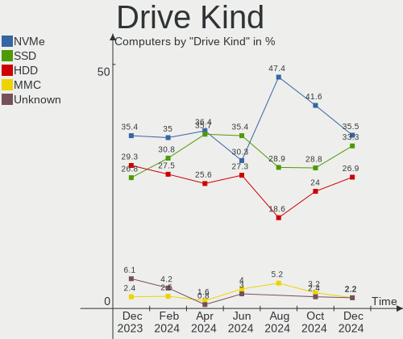
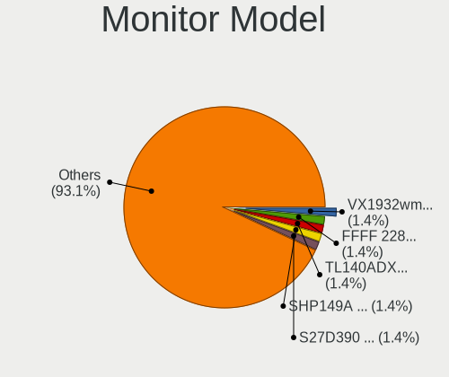
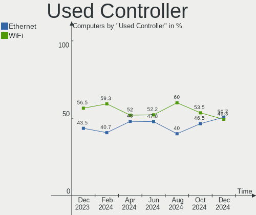
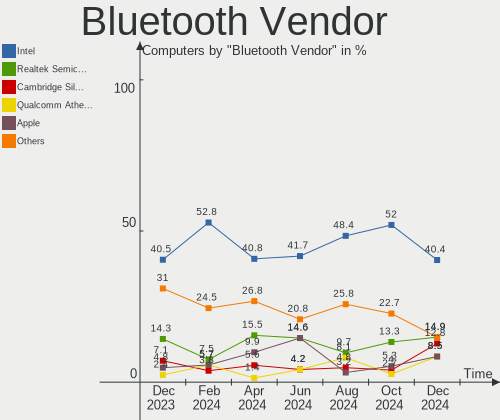

KDE neon - Hardware Trends
--------------------------

A project to identify most popular hardware characteristics and track their change
over time based on data collected by Linux users at https://Linux-Hardware.org.

Anyone can contribute to this report by the [hw-probe](https://github.com/linuxhw/hw-probe) tool:

    sudo -E hw-probe -all -upload

This is a report for all computer types. See also reports for [desktops](/Dist/KDE_neon/Desktop/README.md) and [notebooks](/Dist/KDE_neon/Notebook/README.md).

This report is for one last month. Overall report since the beginning of time: [TestCoverage](https://github.com/linuxhw/TestCoverage)

Period: Sep, 2022.

Contents
--------

* [ System ](#system)
  - [ OS                       ](#os)
  - [ OS Family                ](#os-family)
  - [ Kernel                   ](#kernel)
  - [ Kernel Family            ](#kernel-family)
  - [ Kernel Major Ver.        ](#kernel-major-ver)
  - [ Arch                     ](#arch)
  - [ DE                       ](#de)
  - [ Display Server           ](#display-server)
  - [ Display Manager          ](#display-manager)
  - [ OS Lang                  ](#os-lang)
  - [ Boot Mode                ](#boot-mode)
  - [ Filesystem               ](#filesystem)
  - [ Part. scheme             ](#part-scheme)
  - [ Dual Boot with Linux/BSD ](#dual-boot-with-linuxbsd)
  - [ Dual Boot (Win)          ](#dual-boot-win)

* [ Board ](#board)
  - [ Vendor                   ](#vendor)
  - [ Model                    ](#model)
  - [ Model Family             ](#model-family)
  - [ MFG Year                 ](#mfg-year)
  - [ Form Factor              ](#form-factor)
  - [ Secure Boot              ](#secure-boot)
  - [ Coreboot                 ](#coreboot)
  - [ RAM Size                 ](#ram-size)
  - [ RAM Used                 ](#ram-used)
  - [ Total Drives             ](#total-drives)
  - [ Has CD-ROM               ](#has-cd-rom)
  - [ Has Ethernet             ](#has-ethernet)
  - [ Has WiFi                 ](#has-wifi)
  - [ Has Bluetooth            ](#has-bluetooth)

* [ Location ](#location)
  - [ Country                  ](#country)
  - [ City                     ](#city)

* [ Drives ](#drives)
  - [ Drive Vendor             ](#drive-vendor)
  - [ Drive Model              ](#drive-model)
  - [ HDD Vendor               ](#hdd-vendor)
  - [ SSD Vendor               ](#ssd-vendor)
  - [ Drive Kind               ](#drive-kind)
  - [ Drive Connector          ](#drive-connector)
  - [ Drive Size               ](#drive-size)
  - [ Space Total              ](#space-total)
  - [ Space Used               ](#space-used)
  - [ Malfunc. Drives          ](#malfunc-drives)
  - [ Malfunc. Drive Vendor    ](#malfunc-drive-vendor)
  - [ Malfunc. HDD Vendor      ](#malfunc-hdd-vendor)
  - [ Malfunc. Drive Kind      ](#malfunc-drive-kind)
  - [ Failed Drives            ](#failed-drives)
  - [ Failed Drive Vendor      ](#failed-drive-vendor)
  - [ Drive Status             ](#drive-status)

* [ Storage controller ](#storage-controller)
  - [ Storage Vendor           ](#storage-vendor)
  - [ Storage Model            ](#storage-model)
  - [ Storage Kind             ](#storage-kind)

* [ Processor ](#processor)
  - [ CPU Vendor               ](#cpu-vendor)
  - [ CPU Model                ](#cpu-model)
  - [ CPU Model Family         ](#cpu-model-family)
  - [ CPU Cores                ](#cpu-cores)
  - [ CPU Sockets              ](#cpu-sockets)
  - [ CPU Threads              ](#cpu-threads)
  - [ CPU Op-Modes             ](#cpu-op-modes)
  - [ CPU Microcode            ](#cpu-microcode)
  - [ CPU Microarch            ](#cpu-microarch)

* [ Graphics ](#graphics)
  - [ GPU Vendor               ](#gpu-vendor)
  - [ GPU Model                ](#gpu-model)
  - [ GPU Combo                ](#gpu-combo)
  - [ GPU Driver               ](#gpu-driver)
  - [ GPU Memory               ](#gpu-memory)

* [ Monitor ](#monitor)
  - [ Monitor Vendor           ](#monitor-vendor)
  - [ Monitor Model            ](#monitor-model)
  - [ Monitor Resolution       ](#monitor-resolution)
  - [ Monitor Diagonal         ](#monitor-diagonal)
  - [ Monitor Width            ](#monitor-width)
  - [ Aspect Ratio             ](#aspect-ratio)
  - [ Monitor Area             ](#monitor-area)
  - [ Pixel Density            ](#pixel-density)
  - [ Multiple Monitors        ](#multiple-monitors)

* [ Network ](#network)
  - [ Net Controller Vendor    ](#net-controller-vendor)
  - [ Net Controller Model     ](#net-controller-model)
  - [ Wireless Vendor          ](#wireless-vendor)
  - [ Wireless Model           ](#wireless-model)
  - [ Ethernet Vendor          ](#ethernet-vendor)
  - [ Ethernet Model           ](#ethernet-model)
  - [ Net Controller Kind      ](#net-controller-kind)
  - [ Used Controller          ](#used-controller)
  - [ NICs                     ](#nics)
  - [ IPv6                     ](#ipv6)

* [ Bluetooth ](#bluetooth)
  - [ Bluetooth Vendor         ](#bluetooth-vendor)
  - [ Bluetooth Model          ](#bluetooth-model)

* [ Sound ](#sound)
  - [ Sound Vendor             ](#sound-vendor)
  - [ Sound Model              ](#sound-model)

* [ Memory ](#memory)
  - [ Memory Vendor            ](#memory-vendor)
  - [ Memory Model             ](#memory-model)
  - [ Memory Kind              ](#memory-kind)
  - [ Memory Form Factor       ](#memory-form-factor)
  - [ Memory Size              ](#memory-size)
  - [ Memory Speed             ](#memory-speed)

* [ Printers & scanners ](#printers--scanners)
  - [ Printer Vendor           ](#printer-vendor)
  - [ Printer Model            ](#printer-model)
  - [ Scanner Vendor           ](#scanner-vendor)
  - [ Scanner Model            ](#scanner-model)

* [ Camera ](#camera)
  - [ Camera Vendor            ](#camera-vendor)
  - [ Camera Model             ](#camera-model)

* [ Security ](#security)
  - [ Fingerprint Vendor       ](#fingerprint-vendor)
  - [ Fingerprint Model        ](#fingerprint-model)
  - [ Chipcard Vendor          ](#chipcard-vendor)
  - [ Chipcard Model           ](#chipcard-model)

* [ Unsupported ](#unsupported)
  - [ Unsupported Devices      ](#unsupported-devices)
  - [ Unsupported Device Types ](#unsupported-device-types)

System
------

OS
--

Installed operating systems

| Name           | Computers | Percent |
|----------------|-----------|---------|
| KDE neon 20.04 | 90        | 88.24%  |
| KDE neon 22.04 | 12        | 11.76%  |

OS Family
---------

OS without a version

| Name     | Computers | Percent |
|----------|-----------|---------|
| KDE neon | 102       | 100%    |

Kernel
------

Version of the Linux kernel

| Version              | Computers | Percent |
|----------------------|-----------|---------|
| 5.15.0-46-generic    | 59        | 57.84%  |
| 5.15.0-48-generic    | 24        | 23.53%  |
| 5.15.0-47-generic    | 11        | 10.78%  |
| 5.15.0-43-generic    | 2         | 1.96%   |
| 5.19.6-xanmod1-x64v2 | 1         | 0.98%   |
| 5.15.0-41-generic    | 1         | 0.98%   |
| 5.14.0-1047-oem      | 1         | 0.98%   |
| 5.13.0-52-generic    | 1         | 0.98%   |
| 5.13.0-44-generic    | 1         | 0.98%   |
| 5.11.0-38-generic    | 1         | 0.98%   |

Kernel Family
-------------

Linux kernel without a distro release

| Version | Computers | Percent |
|---------|-----------|---------|
| 5.15.0  | 97        | 95.1%   |
| 5.13.0  | 2         | 1.96%   |
| 5.19.6  | 1         | 0.98%   |
| 5.14.0  | 1         | 0.98%   |
| 5.11.0  | 1         | 0.98%   |

Kernel Major Ver.
-----------------

Linux kernel major version

| Version | Computers | Percent |
|---------|-----------|---------|
| 5.15    | 97        | 95.1%   |
| 5.13    | 2         | 1.96%   |
| 5.19    | 1         | 0.98%   |
| 5.14    | 1         | 0.98%   |
| 5.11    | 1         | 0.98%   |

Arch
----

OS architecture (x86_64, i586, etc.)

| Name   | Computers | Percent |
|--------|-----------|---------|
| x86_64 | 102       | 100%    |

DE
--

Desktop Environment

| Name    | Computers | Percent |
|---------|-----------|---------|
| KDE5    | 101       | 99.02%  |
| Unknown | 1         | 0.98%   |

Display Server
--------------

X11 or Wayland

| Name    | Computers | Percent |
|---------|-----------|---------|
| X11     | 96        | 94.12%  |
| Wayland | 5         | 4.9%    |
| Tty     | 1         | 0.98%   |

Display Manager
---------------

SDDM, LightDM, etc.

| Name    | Computers | Percent |
|---------|-----------|---------|
| Unknown | 74        | 72.55%  |
| SDDM    | 28        | 27.45%  |

OS Lang
-------

Language

| Lang    | Computers | Percent |
|---------|-----------|---------|
| en_US   | 34        | 33.33%  |
| en_AG   | 9         | 8.82%   |
| de_DE   | 8         | 7.84%   |
| it_IT   | 5         | 4.9%    |
| en_GB   | 5         | 4.9%    |
| C       | 4         | 3.92%   |
| ru_RU   | 3         | 2.94%   |
| fr_FR   | 3         | 2.94%   |
| pt_BR   | 2         | 1.96%   |
| pl_PL   | 2         | 1.96%   |
| id_ID   | 2         | 1.96%   |
| es_MX   | 2         | 1.96%   |
| es_ES   | 2         | 1.96%   |
| es_BO   | 2         | 1.96%   |
| en_AU   | 2         | 1.96%   |
| sv_SE   | 1         | 0.98%   |
| nl_NL   | 1         | 0.98%   |
| lt_LT   | 1         | 0.98%   |
| hr_HR   | 1         | 0.98%   |
| fi_FI   | 1         | 0.98%   |
| es_GT   | 1         | 0.98%   |
| es_CO   | 1         | 0.98%   |
| es_CL   | 1         | 0.98%   |
| en_ZA   | 1         | 0.98%   |
| en_SG   | 1         | 0.98%   |
| en_IN   | 1         | 0.98%   |
| el_GR   | 1         | 0.98%   |
| de_LI   | 1         | 0.98%   |
| de_AT   | 1         | 0.98%   |
| ca_ES   | 1         | 0.98%   |
| ba_RU   | 1         | 0.98%   |
| Unknown | 1         | 0.98%   |

Boot Mode
---------

EFI or BIOS

| Mode | Computers | Percent |
|------|-----------|---------|
| EFI  | 59        | 57.84%  |
| BIOS | 43        | 42.16%  |

Filesystem
----------

Type of filesystem

| Type    | Computers | Percent |
|---------|-----------|---------|
| Ext4    | 96        | 94.12%  |
| Btrfs   | 4         | 3.92%   |
| Overlay | 2         | 1.96%   |

Part. scheme
------------

Scheme of partitioning

| Type    | Computers | Percent |
|---------|-----------|---------|
| Unknown | 83        | 81.37%  |
| GPT     | 16        | 15.69%  |
| MBR     | 3         | 2.94%   |

Dual Boot with Linux/BSD
------------------------

Hosting more than one Linux/BSD

| Dual boot | Computers | Percent |
|-----------|-----------|---------|
| No        | 93        | 91.18%  |
| Yes       | 9         | 8.82%   |

Dual Boot (Win)
---------------

Hosting Linux and Windows

| Dual boot | Computers | Percent |
|-----------|-----------|---------|
| No        | 90        | 88.24%  |
| Yes       | 12        | 11.76%  |

Board
-----

Vendor
------

Motherboard manufacturer

| Name                | Computers | Percent |
|---------------------|-----------|---------|
| Lenovo              | 16        | 15.69%  |
| ASUSTek Computer    | 16        | 15.69%  |
| Hewlett-Packard     | 14        | 13.73%  |
| Dell                | 11        | 10.78%  |
| MSI                 | 9         | 8.82%   |
| Acer                | 6         | 5.88%   |
| Gigabyte Technology | 4         | 3.92%   |
| ASRock              | 4         | 3.92%   |
| Samsung Electronics | 3         | 2.94%   |
| Toshiba             | 2         | 1.96%   |
| Intel               | 2         | 1.96%   |
| Apple               | 2         | 1.96%   |
| TUXEDO              | 1         | 0.98%   |
| Timi                | 1         | 0.98%   |
| Tactus              | 1         | 0.98%   |
| Razer               | 1         | 0.98%   |
| Purism              | 1         | 0.98%   |
| PC Specialist       | 1         | 0.98%   |
| Panasonic           | 1         | 0.98%   |
| MiTAC               | 1         | 0.98%   |
| HUAWEI              | 1         | 0.98%   |
| Chuwi               | 1         | 0.98%   |
| American Megatrends | 1         | 0.98%   |
| Alienware           | 1         | 0.98%   |
| Unknown             | 1         | 0.98%   |

Model
-----

Motherboard model

| Name                                  | Computers | Percent |
|---------------------------------------|-----------|---------|
| MSI MS-7C84                           | 2         | 1.96%   |
| MSI MS-7C37                           | 2         | 1.96%   |
| Lenovo IdeaPad Gaming 3 15ACH6 82K2   | 2         | 1.96%   |
| Unknown                               | 2         | 1.96%   |
| TUXEDO N8xEJEK                        | 1         | 0.98%   |
| Toshiba Satellite P200                | 1         | 0.98%   |
| Toshiba Satellite L645                | 1         | 0.98%   |
| Timi Xiaomi Book Pro 16 2022          | 1         | 0.98%   |
| Tactus GeoBook 110                    | 1         | 0.98%   |
| Samsung 305V4A/305V5A                 | 1         | 0.98%   |
| Samsung 300E4C/300E5C/300E7C          | 1         | 0.98%   |
| Samsung 275E4E/275E5E                 | 1         | 0.98%   |
| Razer Blade Stealth                   | 1         | 0.98%   |
| Purism Librem 14                      | 1         | 0.98%   |
| PC Specialist NS50MU                  | 1         | 0.98%   |
| Panasonic CF-191HACHFG                | 1         | 0.98%   |
| MSI MS-7C82                           | 1         | 0.98%   |
| MSI MS-7B92                           | 1         | 0.98%   |
| MSI MS-7B89                           | 1         | 0.98%   |
| MSI MS-7B79                           | 1         | 0.98%   |
| MSI MS-7758                           | 1         | 0.98%   |
| MiTAC E210                            | 1         | 0.98%   |
| Lenovo ThinkPad X260 20F60097US       | 1         | 0.98%   |
| Lenovo ThinkPad T61p 64575KU          | 1         | 0.98%   |
| Lenovo ThinkPad T500 2241WH7          | 1         | 0.98%   |
| Lenovo ThinkPad T450s 20BWS0S100      | 1         | 0.98%   |
| Lenovo ThinkPad T450 20BV001CSP       | 1         | 0.98%   |
| Lenovo ThinkPad T14 Gen 1 20UD0013GE  | 1         | 0.98%   |
| Lenovo ThinkPad S1 Yoga 12 20DKA00B00 | 1         | 0.98%   |
| Lenovo ThinkPad P1 Gen 4i 20Y3CTO1WW  | 1         | 0.98%   |
| Lenovo ThinkCentre M93p 10A90012MS    | 1         | 0.98%   |
| Lenovo IdeaPadFlex 5 15ITL05 82HT     | 1         | 0.98%   |
| Lenovo IdeaPadFlex 5 14ALC05 82HU     | 1         | 0.98%   |
| Lenovo IdeaPad Geming 3 15ARH05 82EY  | 1         | 0.98%   |
| Lenovo IdeaPad 320-15IKB 81BG         | 1         | 0.98%   |
| Lenovo G580 20150                     | 1         | 0.98%   |
| Intel NUC6CAYB J23203-402             | 1         | 0.98%   |
| Intel H55                             | 1         | 0.98%   |
| HUAWEI BOHK-WAX9X                     | 1         | 0.98%   |
| HP Z400 Workstation                   | 1         | 0.98%   |

Model Family
------------

Motherboard model prefix

| Name                   | Computers | Percent |
|------------------------|-----------|---------|
| Lenovo ThinkPad        | 8         | 7.84%   |
| Dell Inspiron          | 5         | 4.9%    |
| Acer Aspire            | 5         | 4.9%    |
| Lenovo IdeaPad         | 4         | 3.92%   |
| HP ENVY                | 3         | 2.94%   |
| HP EliteBook           | 3         | 2.94%   |
| Dell Latitude          | 3         | 2.94%   |
| Toshiba Satellite      | 2         | 1.96%   |
| MSI MS-7C84            | 2         | 1.96%   |
| MSI MS-7C37            | 2         | 1.96%   |
| Lenovo IdeaPadFlex     | 2         | 1.96%   |
| HP Pavilion            | 2         | 1.96%   |
| Dell Precision         | 2         | 1.96%   |
| ASUS TUF               | 2         | 1.96%   |
| ASUS PRIME             | 2         | 1.96%   |
| Unknown                | 2         | 1.96%   |
| TUXEDO N8xEJEK         | 1         | 0.98%   |
| Timi Xiaomi            | 1         | 0.98%   |
| Tactus GeoBook         | 1         | 0.98%   |
| Samsung 305V4A         | 1         | 0.98%   |
| Samsung 300E4C         | 1         | 0.98%   |
| Samsung 275E4E         | 1         | 0.98%   |
| Razer Blade            | 1         | 0.98%   |
| Purism Librem          | 1         | 0.98%   |
| PC Specialist NS50MU   | 1         | 0.98%   |
| Panasonic CF-191HACHFG | 1         | 0.98%   |
| MSI MS-7C82            | 1         | 0.98%   |
| MSI MS-7B92            | 1         | 0.98%   |
| MSI MS-7B89            | 1         | 0.98%   |
| MSI MS-7B79            | 1         | 0.98%   |
| MSI MS-7758            | 1         | 0.98%   |
| MiTAC E210             | 1         | 0.98%   |
| Lenovo ThinkCentre     | 1         | 0.98%   |
| Lenovo G580            | 1         | 0.98%   |
| Intel NUC6CAYB         | 1         | 0.98%   |
| Intel H55              | 1         | 0.98%   |
| HUAWEI BOHK-WAX9X      | 1         | 0.98%   |
| HP Z400                | 1         | 0.98%   |
| HP t640                | 1         | 0.98%   |
| HP ProBook             | 1         | 0.98%   |

MFG Year
--------

Motherboard manufacture year

| Year | Computers | Percent |
|------|-----------|---------|
| 2021 | 14        | 13.73%  |
| 2020 | 14        | 13.73%  |
| 2013 | 12        | 11.76%  |
| 2015 | 10        | 9.8%    |
| 2014 | 8         | 7.84%   |
| 2019 | 7         | 6.86%   |
| 2018 | 7         | 6.86%   |
| 2016 | 6         | 5.88%   |
| 2017 | 5         | 4.9%    |
| 2012 | 5         | 4.9%    |
| 2011 | 5         | 4.9%    |
| 2010 | 3         | 2.94%   |
| 2007 | 3         | 2.94%   |
| 2022 | 1         | 0.98%   |
| 2009 | 1         | 0.98%   |
| 2008 | 1         | 0.98%   |

Form Factor
-----------

Physical design of the computer

| Name        | Computers | Percent |
|-------------|-----------|---------|
| Notebook    | 65        | 63.73%  |
| Desktop     | 31        | 30.39%  |
| Convertible | 3         | 2.94%   |
| Mini pc     | 2         | 1.96%   |
| All in one  | 1         | 0.98%   |

Secure Boot
-----------

Enabled or disabled

| State    | Computers | Percent |
|----------|-----------|---------|
| Disabled | 94        | 92.16%  |
| Enabled  | 8         | 7.84%   |

Coreboot
--------

Have coreboot on board

| Used | Computers | Percent |
|------|-----------|---------|
| No   | 101       | 99.02%  |
| Yes  | 1         | 0.98%   |

RAM Size
--------

Total RAM memory

| Size in GB  | Computers | Percent |
|-------------|-----------|---------|
| 4.01-8.0    | 30        | 29.41%  |
| 16.01-24.0  | 24        | 23.53%  |
| 8.01-16.0   | 18        | 17.65%  |
| 3.01-4.0    | 15        | 14.71%  |
| 32.01-64.0  | 8         | 7.84%   |
| 64.01-256.0 | 3         | 2.94%   |
| 24.01-32.0  | 2         | 1.96%   |
| 1.01-2.0    | 2         | 1.96%   |

RAM Used
--------

Used RAM memory

| Used GB    | Computers | Percent |
|------------|-----------|---------|
| 2.01-3.0   | 33        | 32.35%  |
| 1.01-2.0   | 31        | 30.39%  |
| 4.01-8.0   | 14        | 13.73%  |
| 3.01-4.0   | 14        | 13.73%  |
| 0.51-1.0   | 6         | 5.88%   |
| 8.01-16.0  | 3         | 2.94%   |
| 16.01-24.0 | 1         | 0.98%   |

Total Drives
------------

Number of drives on board

| Drives | Computers | Percent |
|--------|-----------|---------|
| 1      | 56        | 54.9%   |
| 2      | 25        | 24.51%  |
| 4      | 7         | 6.86%   |
| 3      | 7         | 6.86%   |
| 6      | 2         | 1.96%   |
| 5      | 2         | 1.96%   |
| 11     | 1         | 0.98%   |
| 8      | 1         | 0.98%   |
| 7      | 1         | 0.98%   |

Has CD-ROM
----------

Has CD-ROM on board

| Presented | Computers | Percent |
|-----------|-----------|---------|
| No        | 70        | 68.63%  |
| Yes       | 32        | 31.37%  |

Has Ethernet
------------

Has Ethernet on board

| Presented | Computers | Percent |
|-----------|-----------|---------|
| Yes       | 89        | 87.25%  |
| No        | 13        | 12.75%  |

Has WiFi
--------

Has WiFi module

| Presented | Computers | Percent |
|-----------|-----------|---------|
| Yes       | 89        | 87.25%  |
| No        | 13        | 12.75%  |

Has Bluetooth
-------------

Has Bluetooth module

| Presented | Computers | Percent |
|-----------|-----------|---------|
| Yes       | 71        | 69.61%  |
| No        | 31        | 30.39%  |

Location
--------

Country
-------

Geographic location (country)

| Country      | Computers | Percent |
|--------------|-----------|---------|
| USA          | 22        | 21.57%  |
| Germany      | 10        | 9.8%    |
| Italy        | 7         | 6.86%   |
| Indonesia    | 6         | 5.88%   |
| UK           | 4         | 3.92%   |
| Mexico       | 4         | 3.92%   |
| Spain        | 3         | 2.94%   |
| Russia       | 3         | 2.94%   |
| Netherlands  | 3         | 2.94%   |
| India        | 3         | 2.94%   |
| Tunisia      | 2         | 1.96%   |
| Poland       | 2         | 1.96%   |
| Philippines  | 2         | 1.96%   |
| France       | 2         | 1.96%   |
| Finland      | 2         | 1.96%   |
| Croatia      | 2         | 1.96%   |
| Brazil       | 2         | 1.96%   |
| Bolivia      | 2         | 1.96%   |
| Austria      | 2         | 1.96%   |
| Australia    | 2         | 1.96%   |
| Ukraine      | 1         | 0.98%   |
| Switzerland  | 1         | 0.98%   |
| Sweden       | 1         | 0.98%   |
| South Africa | 1         | 0.98%   |
| Singapore    | 1         | 0.98%   |
| Saudi Arabia | 1         | 0.98%   |
| Portugal     | 1         | 0.98%   |
| Morocco      | 1         | 0.98%   |
| Lithuania    | 1         | 0.98%   |
| Guatemala    | 1         | 0.98%   |
| Greece       | 1         | 0.98%   |
| Colombia     | 1         | 0.98%   |
| China        | 1         | 0.98%   |
| Chile        | 1         | 0.98%   |
| Canada       | 1         | 0.98%   |
| Bangladesh   | 1         | 0.98%   |
| Armenia      | 1         | 0.98%   |

City
----

Geographic location (city)

| City             | Computers | Percent |
|------------------|-----------|---------|
| Jakarta          | 3         | 2.94%   |
| Zagreb           | 2         | 1.96%   |
| Tunis            | 2         | 1.96%   |
| Puebla City      | 2         | 1.96%   |
| Hamburg          | 2         | 1.96%   |
| Bismarck         | 2         | 1.96%   |
| Barcelona        | 2         | 1.96%   |
| Austin           | 2         | 1.96%   |
| Amsterdam        | 2         | 1.96%   |
| Zurich           | 1         | 0.98%   |
| Yerevan          | 1         | 0.98%   |
| Yeovil           | 1         | 0.98%   |
| Warsaw           | 1         | 0.98%   |
| Waddinxveen      | 1         | 0.98%   |
| Volgograd        | 1         | 0.98%   |
| Venice           | 1         | 0.98%   |
| Valencia         | 1         | 0.98%   |
| Toronto          | 1         | 0.98%   |
| Talisay City     | 1         | 0.98%   |
| Stolpen          | 1         | 0.98%   |
| St. George       | 1         | 0.98%   |
| Singapore        | 1         | 0.98%   |
| Sausalito        | 1         | 0.98%   |
| Sao Pedro do Sul | 1         | 0.98%   |
| San Diego        | 1         | 0.98%   |
| Saeffle          | 1         | 0.98%   |
| Rome             | 1         | 0.98%   |
| Quiberon         | 1         | 0.98%   |
| Pune             | 1         | 0.98%   |
| Poços de Caldas | 1         | 0.98%   |
| Plymouth         | 1         | 0.98%   |
| Peoria           | 1         | 0.98%   |
| Pátrai          | 1         | 0.98%   |
| Patiala          | 1         | 0.98%   |
| Pasig            | 1         | 0.98%   |
| Paris            | 1         | 0.98%   |
| Osnabrück       | 1         | 0.98%   |
| Orizaba          | 1         | 0.98%   |
| Obersiebenbrunn  | 1         | 0.98%   |
| Oberndorf        | 1         | 0.98%   |

Drives
------

Drive Vendor
------------

Hard drive vendors

| Vendor                    | Computers | Drives | Percent |
|---------------------------|-----------|--------|---------|
| Samsung Electronics       | 28        | 53     | 17.07%  |
| Seagate                   | 23        | 29     | 14.02%  |
| WDC                       | 19        | 26     | 11.59%  |
| Sandisk                   | 11        | 11     | 6.71%   |
| Kingston                  | 11        | 12     | 6.71%   |
| HGST                      | 6         | 6      | 3.66%   |
| Unknown                   | 5         | 5      | 3.05%   |
| Toshiba                   | 5         | 5      | 3.05%   |
| SK hynix                  | 5         | 6      | 3.05%   |
| Crucial                   | 5         | 5      | 3.05%   |
| A-DATA Technology         | 5         | 5      | 3.05%   |
| Micron/Crucial Technology | 4         | 4      | 2.44%   |
| Phison                    | 3         | 3      | 1.83%   |
| Hitachi                   | 3         | 4      | 1.83%   |
| Transcend                 | 2         | 2      | 1.22%   |
| SPCC                      | 2         | 3      | 1.22%   |
| Phison Electronics        | 2         | 3      | 1.22%   |
| Patriot                   | 2         | 2      | 1.22%   |
| Fujitsu                   | 2         | 2      | 1.22%   |
| China                     | 2         | 4      | 1.22%   |
| Silicon Motion            | 1         | 1      | 0.61%   |
| ShiJi                     | 1         | 1      | 0.61%   |
| SABRENT                   | 1         | 1      | 0.61%   |
| PNY                       | 1         | 1      | 0.61%   |
| OWC                       | 1         | 1      | 0.61%   |
| OCZ                       | 1         | 1      | 0.61%   |
| Micron Technology         | 1         | 1      | 0.61%   |
| LITEON                    | 1         | 1      | 0.61%   |
| KIOXIA-EXCERIA            | 1         | 1      | 0.61%   |
| KIOXIA                    | 1         | 1      | 0.61%   |
| Intenso                   | 1         | 1      | 0.61%   |
| Intel                     | 1         | 1      | 0.61%   |
| Innodisk                  | 1         | 1      | 0.61%   |
| HS-SSD-C100               | 1         | 1      | 0.61%   |
| faspeed                   | 1         | 1      | 0.61%   |
| External                  | 1         | 1      | 0.61%   |
| Emtec                     | 1         | 1      | 0.61%   |
| Corsair                   | 1         | 1      | 0.61%   |
| Apple                     | 1         | 1      | 0.61%   |

Drive Model
-----------

Hard drive models

| Model                                                 | Computers | Percent |
|-------------------------------------------------------|-----------|---------|
| Samsung SSD 860 EVO 500GB                             | 5         | 2.6%    |
| Unknown MMC Card  64GB                                | 3         | 1.56%   |
| Seagate ST500LT012-1DG142 500GB                       | 3         | 1.56%   |
| Samsung SSD 840 EVO 120GB                             | 3         | 1.56%   |
| Samsung NVMe SSD Drive 500GB                          | 3         | 1.56%   |
| Samsung NVMe SSD Controller PM9A1/PM9A3/980PRO 1024GB | 3         | 1.56%   |
| Kingston SA400S37480G 480GB SSD                       | 3         | 1.56%   |
| Kingston SA400S37240G 240GB SSD                       | 3         | 1.56%   |
| HGST HTS721010A9E630 1TB                              | 3         | 1.56%   |
| WDC WD40EFRX-68N32N0 4TB                              | 2         | 1.04%   |
| Toshiba MQ01ABD100 1TB                                | 2         | 1.04%   |
| Seagate ST500VT000-1DK142 500GB                       | 2         | 1.04%   |
| Seagate ST1000LM035-1RK172 1TB                        | 2         | 1.04%   |
| Seagate ST1000DM003-1CH162 1TB                        | 2         | 1.04%   |
| SanDisk SDSSDH3 500G                                  | 2         | 1.04%   |
| Samsung SSD 860 EVO 1TB                               | 2         | 1.04%   |
| Samsung NVMe SSD Drive 512GB                          | 2         | 1.04%   |
| Samsung NVMe SSD Drive 1TB                            | 2         | 1.04%   |
| Phison E12 NVMe Controller 1024GB                     | 2         | 1.04%   |
| WDC WDS500G2B0A-00SM50 500GB SSD                      | 1         | 0.52%   |
| WDC WD7500BPVT-22HXZT3 752GB                          | 1         | 0.52%   |
| WDC WD7500BPKX-75HPJT0 752GB                          | 1         | 0.52%   |
| WDC WD7500BPKT-60PK4T0 752GB                          | 1         | 0.52%   |
| WDC WD5000LPCX-60VHAT0 500GB                          | 1         | 0.52%   |
| WDC WD5000HHTZ-04N21V0 500GB                          | 1         | 0.52%   |
| WDC WD5000AAKX-60U6AA0 500GB                          | 1         | 0.52%   |
| WDC WD5000AAKS-00YGA0 500GB                           | 1         | 0.52%   |
| WDC WD3200AAKS-00L9A0 320GB                           | 1         | 0.52%   |
| WDC WD20EZRZ-00Z5HB0 2TB                              | 1         | 0.52%   |
| WDC WD2003FYYS-02W0B0 2TB                             | 1         | 0.52%   |
| WDC WD2000F9YZ-09N20L0 2TB                            | 1         | 0.52%   |
| WDC WD1600AAJS-00WAA0 160GB                           | 1         | 0.52%   |
| WDC WD10SPZX-22Z10T1 1TB                              | 1         | 0.52%   |
| WDC WD10JPVX-22JC3T0 1TB                              | 1         | 0.52%   |
| WDC WD10EZRZ-00HTKB0 1TB                              | 1         | 0.52%   |
| WDC WD10EZRX-00A8LB0 1TB                              | 1         | 0.52%   |
| WDC WD10EACS-00ZJB0 1TB                               | 1         | 0.52%   |
| WDC WD1002FBYS-05A6B0 1TB                             | 1         | 0.52%   |
| WDC PC SN530 SDBPNPZ-1T00-1006 1TB                    | 1         | 0.52%   |
| Unknown MMC Card  32GB                                | 1         | 0.52%   |

HDD Vendor
----------

Hard disk drive vendors

| Vendor              | Computers | Drives | Percent |
|---------------------|-----------|--------|---------|
| Seagate             | 22        | 28     | 39.29%  |
| WDC                 | 17        | 24     | 30.36%  |
| HGST                | 6         | 6      | 10.71%  |
| Toshiba             | 3         | 3      | 5.36%   |
| Hitachi             | 3         | 4      | 5.36%   |
| Samsung Electronics | 2         | 2      | 3.57%   |
| Fujitsu             | 2         | 2      | 3.57%   |
| Apple               | 1         | 1      | 1.79%   |

SSD Vendor
----------

Solid state drive vendors

| Vendor              | Computers | Drives | Percent |
|---------------------|-----------|--------|---------|
| Samsung Electronics | 16        | 20     | 26.23%  |
| Kingston            | 8         | 9      | 13.11%  |
| SanDisk             | 7         | 7      | 11.48%  |
| Crucial             | 5         | 5      | 8.2%    |
| A-DATA Technology   | 5         | 5      | 8.2%    |
| SK hynix            | 3         | 3      | 4.92%   |
| Transcend           | 2         | 2      | 3.28%   |
| SPCC                | 2         | 3      | 3.28%   |
| Patriot             | 2         | 2      | 3.28%   |
| China               | 2         | 4      | 3.28%   |
| WDC                 | 1         | 1      | 1.64%   |
| Toshiba             | 1         | 1      | 1.64%   |
| PNY                 | 1         | 1      | 1.64%   |
| OWC                 | 1         | 1      | 1.64%   |
| OCZ                 | 1         | 1      | 1.64%   |
| LITEON              | 1         | 1      | 1.64%   |
| Innodisk            | 1         | 1      | 1.64%   |
| Emtec               | 1         | 1      | 1.64%   |
| Corsair             | 1         | 1      | 1.64%   |

Drive Kind
----------

HDD or SSD

| Kind    | Computers | Drives | Percent |
|---------|-----------|--------|---------|
| SSD     | 57        | 69     | 38.51%  |
| HDD     | 45        | 70     | 30.41%  |
| NVMe    | 37        | 60     | 25%     |
| MMC     | 5         | 5      | 3.38%   |
| Unknown | 4         | 5      | 2.7%    |

Drive Connector
---------------

SATA, SAS, NVMe, etc.

| Type | Computers | Drives | Percent |
|------|-----------|--------|---------|
| SATA | 81        | 141    | 63.28%  |
| NVMe | 37        | 58     | 28.91%  |
| SAS  | 5         | 5      | 3.91%   |
| MMC  | 5         | 5      | 3.91%   |

Drive Size
----------

Size of hard drive

| Size in TB | Computers | Drives | Percent |
|------------|-----------|--------|---------|
| 0.01-0.5   | 64        | 82     | 59.26%  |
| 0.51-1.0   | 31        | 39     | 28.7%   |
| 3.01-4.0   | 4         | 6      | 3.7%    |
| 1.01-2.0   | 4         | 5      | 3.7%    |
| 2.01-3.0   | 2         | 2      | 1.85%   |
| 4.01-10.0  | 2         | 3      | 1.85%   |
| 10.01-20.0 | 1         | 2      | 0.93%   |

Space Total
-----------

Amount of disk space available on the file system

| Size in GB     | Computers | Percent |
|----------------|-----------|---------|
| 101-250        | 28        | 27.45%  |
| 251-500        | 26        | 25.49%  |
| 21-50          | 9         | 8.82%   |
| 501-1000       | 9         | 8.82%   |
| 51-100         | 9         | 8.82%   |
| More than 3000 | 8         | 7.84%   |
| Unknown        | 5         | 4.9%    |
| 1001-2000      | 4         | 3.92%   |
| 1-20           | 3         | 2.94%   |
| 2001-3000      | 1         | 0.98%   |

Space Used
----------

Amount of used disk space

| Used GB        | Computers | Percent |
|----------------|-----------|---------|
| 1-20           | 40        | 39.22%  |
| 21-50          | 21        | 20.59%  |
| 101-250        | 15        | 14.71%  |
| 51-100         | 7         | 6.86%   |
| 251-500        | 6         | 5.88%   |
| Unknown        | 5         | 4.9%    |
| More than 3000 | 4         | 3.92%   |
| 1001-2000      | 2         | 1.96%   |
| 2001-3000      | 1         | 0.98%   |
| 501-1000       | 1         | 0.98%   |

Malfunc. Drives
---------------

Drive models with a malfunction

| Model                            | Computers | Drives | Percent |
|----------------------------------|-----------|--------|---------|
| WDC WD7500BPKT-60PK4T0 752GB     | 1         | 1      | 16.67%  |
| WDC WD10JPVX-22JC3T0 1TB         | 1         | 1      | 16.67%  |
| Seagate ST500LT012-1DG142 500GB  | 1         | 1      | 16.67%  |
| Seagate ST1000LM035-1RK172 1TB   | 1         | 1      | 16.67%  |
| Kingston RBUSNS8154P3512GJ 512GB | 1         | 1      | 16.67%  |
| Innodisk Corp. - mSATA 3ME4 64GB | 1         | 1      | 16.67%  |

Malfunc. Drive Vendor
---------------------

Vendors of faulty drives

| Vendor   | Computers | Drives | Percent |
|----------|-----------|--------|---------|
| WDC      | 2         | 2      | 33.33%  |
| Seagate  | 2         | 2      | 33.33%  |
| Kingston | 1         | 1      | 16.67%  |
| Innodisk | 1         | 1      | 16.67%  |

Malfunc. HDD Vendor
-------------------

Vendors of faulty HDD drives

| Vendor  | Computers | Drives | Percent |
|---------|-----------|--------|---------|
| WDC     | 2         | 2      | 50%     |
| Seagate | 2         | 2      | 50%     |

Malfunc. Drive Kind
-------------------

Kinds of faulty drives

| Kind | Computers | Drives | Percent |
|------|-----------|--------|---------|
| HDD  | 4         | 4      | 66.67%  |
| NVMe | 1         | 1      | 16.67%  |
| SSD  | 1         | 1      | 16.67%  |

Failed Drives
-------------

Failed drive models

Zero info for selected period =(

Failed Drive Vendor
-------------------

Failed drive vendors

Zero info for selected period =(

Drive Status
------------

Number of failed and malfunc. drives

| Status   | Computers | Drives | Percent |
|----------|-----------|--------|---------|
| Detected | 84        | 172    | 77.78%  |
| Works    | 18        | 31     | 16.67%  |
| Malfunc  | 6         | 6      | 5.56%   |

Storage controller
------------------

Storage Vendor
--------------

Storage controller vendors

| Vendor                       | Computers | Percent |
|------------------------------|-----------|---------|
| Intel                        | 68        | 50%     |
| AMD                          | 23        | 16.91%  |
| Samsung Electronics          | 17        | 12.5%   |
| SanDisk                      | 5         | 3.68%   |
| Phison Electronics           | 4         | 2.94%   |
| Micron/Crucial Technology    | 4         | 2.94%   |
| ASMedia Technology           | 4         | 2.94%   |
| Kingston Technology Company  | 3         | 2.21%   |
| SK hynix                     | 2         | 1.47%   |
| KIOXIA                       | 2         | 1.47%   |
| Toshiba America Info Systems | 1         | 0.74%   |
| Silicon Motion               | 1         | 0.74%   |
| Nvidia                       | 1         | 0.74%   |
| Micron Technology            | 1         | 0.74%   |

Storage Model
-------------

Storage controller models

| Model                                                                            | Computers | Percent |
|----------------------------------------------------------------------------------|-----------|---------|
| AMD FCH SATA Controller [AHCI mode]                                              | 20        | 13.16%  |
| Intel Wildcat Point-LP SATA Controller [AHCI Mode]                               | 9         | 5.92%   |
| Samsung NVMe SSD Controller SM981/PM981/PM983                                    | 7         | 4.61%   |
| Samsung NVMe SSD Controller PM9A1/PM9A3/980PRO                                   | 6         | 3.95%   |
| Intel Sunrise Point-LP SATA Controller [AHCI mode]                               | 6         | 3.95%   |
| Samsung NVMe SSD Controller 980                                                  | 5         | 3.29%   |
| Intel 82801 Mobile SATA Controller [RAID mode]                                   | 5         | 3.29%   |
| Intel 7 Series Chipset Family 6-port SATA Controller [AHCI mode]                 | 5         | 3.29%   |
| Phison E12 NVMe Controller                                                       | 4         | 2.63%   |
| Intel 8 Series/C220 Series Chipset Family 6-port SATA Controller 1 [AHCI mode]   | 4         | 2.63%   |
| ASMedia ASM1062 Serial ATA Controller                                            | 4         | 2.63%   |
| Micron/Crucial Non-Volatile memory controller                                    | 3         | 1.97%   |
| Intel Volume Management Device NVMe RAID Controller                              | 3         | 1.97%   |
| Intel Celeron/Pentium Silver Processor SATA Controller                           | 3         | 1.97%   |
| Intel 82801HM/HEM (ICH8M/ICH8M-E) SATA Controller [AHCI mode]                    | 3         | 1.97%   |
| Intel 82801HM/HEM (ICH8M/ICH8M-E) IDE Controller                                 | 3         | 1.97%   |
| Intel 6 Series/C200 Series Chipset Family 6 port Mobile SATA AHCI Controller     | 3         | 1.97%   |
| Intel 400 Series Chipset Family SATA AHCI Controller                             | 3         | 1.97%   |
| AMD 500 Series Chipset SATA Controller                                           | 3         | 1.97%   |
| AMD 400 Series Chipset SATA Controller                                           | 3         | 1.97%   |
| SanDisk WD Blue SN550 NVMe SSD                                                   | 2         | 1.32%   |
| SanDisk Non-Volatile memory controller                                           | 2         | 1.32%   |
| KIOXIA Non-Volatile memory controller                                            | 2         | 1.32%   |
| Kingston Company Company Non-Volatile memory controller                          | 2         | 1.32%   |
| Intel SATA Controller [RAID mode]                                                | 2         | 1.32%   |
| Intel Atom/Celeron/Pentium Processor x5-E8000/J3xxx/N3xxx Series SATA Controller | 2         | 1.32%   |
| Intel 8 Series SATA Controller 1 [AHCI mode]                                     | 2         | 1.32%   |
| Intel 7 Series/C210 Series Chipset Family 6-port SATA Controller [AHCI mode]     | 2         | 1.32%   |
| Intel 5 Series/3400 Series Chipset 4 port SATA AHCI Controller                   | 2         | 1.32%   |
| AMD X399 Series Chipset SATA Controller                                          | 2         | 1.32%   |
| Toshiba America Info Systems BG3 NVMe SSD Controller                             | 1         | 0.66%   |
| SK hynix Non-Volatile memory controller                                          | 1         | 0.66%   |
| SK hynix BC511                                                                   | 1         | 0.66%   |
| Silicon Motion SM2263EN/SM2263XT SSD Controller                                  | 1         | 0.66%   |
| SanDisk WD Black SN750 / PC SN730 NVMe SSD                                       | 1         | 0.66%   |
| Samsung NVMe SSD Controller SM961/PM961/SM963                                    | 1         | 0.66%   |
| Nvidia MCP79 AHCI Controller                                                     | 1         | 0.66%   |
| Micron/Crucial P2 NVMe PCIe SSD                                                  | 1         | 0.66%   |
| Micron Non-Volatile memory controller                                            | 1         | 0.66%   |
| Kingston Company U-SNS8154P3 NVMe SSD                                            | 1         | 0.66%   |

Storage Kind
------------

Kind of storage controller (IDE, SATA, NVMe, SAS, ...)

| Kind | Computers | Percent |
|------|-----------|---------|
| SATA | 78        | 58.65%  |
| NVMe | 37        | 27.82%  |
| RAID | 11        | 8.27%   |
| IDE  | 7         | 5.26%   |

Processor
---------

CPU Vendor
----------

Processor vendors

| Vendor | Computers | Percent |
|--------|-----------|---------|
| Intel  | 74        | 72.55%  |
| AMD    | 28        | 27.45%  |

CPU Model
---------

Processor models

| Model                                   | Computers | Percent |
|-----------------------------------------|-----------|---------|
| Intel Core i5-8250U CPU @ 1.60GHz       | 4         | 3.92%   |
| Intel Core i5-5200U CPU @ 2.20GHz       | 4         | 3.92%   |
| Intel 11th Gen Core i7-1165G7 @ 2.80GHz | 4         | 3.92%   |
| AMD Ryzen 7 3700X 8-Core Processor      | 3         | 2.94%   |
| Intel Core i5-3210M CPU @ 2.50GHz       | 2         | 1.96%   |
| Intel Celeron N4020 CPU @ 1.10GHz       | 2         | 1.96%   |
| AMD Ryzen 9 5900X 12-Core Processor     | 2         | 1.96%   |
| AMD Ryzen 7 5800H with Radeon Graphics  | 2         | 1.96%   |
| Intel Xeon CPU W3565 @ 3.20GHz          | 1         | 0.98%   |
| Intel Xeon CPU E5-1620 v2 @ 3.70GHz     | 1         | 0.98%   |
| Intel Pentium Gold G6400 CPU @ 4.00GHz  | 1         | 0.98%   |
| Intel Pentium Dual CPU T2330 @ 1.60GHz  | 1         | 0.98%   |
| Intel Pentium CPU N3700 @ 1.60GHz       | 1         | 0.98%   |
| Intel Pentium CPU G4560 @ 3.50GHz       | 1         | 0.98%   |
| Intel Core m5-6Y54 CPU @ 1.10GHz        | 1         | 0.98%   |
| Intel Core i7-8750H CPU @ 2.20GHz       | 1         | 0.98%   |
| Intel Core i7-7700HQ CPU @ 2.80GHz      | 1         | 0.98%   |
| Intel Core i7-7500U CPU @ 2.70GHz       | 1         | 0.98%   |
| Intel Core i7-6700HQ CPU @ 2.60GHz      | 1         | 0.98%   |
| Intel Core i7-6600U CPU @ 2.60GHz       | 1         | 0.98%   |
| Intel Core i7-5600U CPU @ 2.60GHz       | 1         | 0.98%   |
| Intel Core i7-5500U CPU @ 2.40GHz       | 1         | 0.98%   |
| Intel Core i7-4800MQ CPU @ 2.70GHz      | 1         | 0.98%   |
| Intel Core i7-4770K CPU @ 3.50GHz       | 1         | 0.98%   |
| Intel Core i7-4700MQ CPU @ 2.40GHz      | 1         | 0.98%   |
| Intel Core i7-4700HQ CPU @ 2.40GHz      | 1         | 0.98%   |
| Intel Core i7-4500U CPU @ 1.80GHz       | 1         | 0.98%   |
| Intel Core i7-2620M CPU @ 2.70GHz       | 1         | 0.98%   |
| Intel Core i7-10850H CPU @ 2.70GHz      | 1         | 0.98%   |
| Intel Core i7-10710U CPU @ 1.10GHz      | 1         | 0.98%   |
| Intel Core i7-1065G7 CPU @ 1.30GHz      | 1         | 0.98%   |
| Intel Core i5-8259U CPU @ 2.30GHz       | 1         | 0.98%   |
| Intel Core i5-7200U CPU @ 2.50GHz       | 1         | 0.98%   |
| Intel Core i5-6200U CPU @ 2.30GHz       | 1         | 0.98%   |
| Intel Core i5-5300U CPU @ 2.30GHz       | 1         | 0.98%   |
| Intel Core i5-5250U CPU @ 1.60GHz       | 1         | 0.98%   |
| Intel Core i5-4210U CPU @ 1.70GHz       | 1         | 0.98%   |
| Intel Core i5-3570K CPU @ 3.40GHz       | 1         | 0.98%   |
| Intel Core i5-3570 CPU @ 3.40GHz        | 1         | 0.98%   |
| Intel Core i5-3550 CPU @ 3.30GHz        | 1         | 0.98%   |

CPU Model Family
----------------

Processor model prefix

| Model                  | Computers | Percent |
|------------------------|-----------|---------|
| Intel Core i5          | 27        | 26.47%  |
| Intel Core i7          | 16        | 15.69%  |
| AMD Ryzen 7            | 9         | 8.82%   |
| Other                  | 7         | 6.86%   |
| AMD Ryzen 5            | 7         | 6.86%   |
| Intel Celeron          | 6         | 5.88%   |
| Intel Core i3          | 5         | 4.9%    |
| Intel Core 2 Duo       | 5         | 4.9%    |
| AMD E1                 | 3         | 2.94%   |
| Intel Xeon             | 2         | 1.96%   |
| Intel Pentium          | 2         | 1.96%   |
| AMD Ryzen Threadripper | 2         | 1.96%   |
| AMD Ryzen 9            | 2         | 1.96%   |
| Intel Pentium Gold     | 1         | 0.98%   |
| Intel Pentium Dual     | 1         | 0.98%   |
| Intel Core m5          | 1         | 0.98%   |
| Intel Atom             | 1         | 0.98%   |
| AMD Sempron            | 1         | 0.98%   |
| AMD Ryzen Embedded     | 1         | 0.98%   |
| AMD Ryzen 7 PRO        | 1         | 0.98%   |
| AMD Athlon             | 1         | 0.98%   |
| AMD A8                 | 1         | 0.98%   |

CPU Cores
---------

Number of processor cores

| Number | Computers | Percent |
|--------|-----------|---------|
| 2      | 47        | 46.08%  |
| 4      | 29        | 28.43%  |
| 8      | 10        | 9.8%    |
| 6      | 10        | 9.8%    |
| 12     | 3         | 2.94%   |
| 32     | 1         | 0.98%   |
| 16     | 1         | 0.98%   |
| 10     | 1         | 0.98%   |

CPU Sockets
-----------

Number of sockets

| Number | Computers | Percent |
|--------|-----------|---------|
| 1      | 102       | 100%    |

CPU Threads
-----------

Threads per core (Hyper-Threading)

| Number | Computers | Percent |
|--------|-----------|---------|
| 2      | 79        | 77.45%  |
| 1      | 23        | 22.55%  |

CPU Op-Modes
------------

CPU Operation Modes (32-bit, 64-bit)

| Op mode        | Computers | Percent |
|----------------|-----------|---------|
| 32-bit, 64-bit | 102       | 100%    |

CPU Microcode
-------------

Microcode number

| Number     | Computers | Percent |
|------------|-----------|---------|
| Unknown    | 16        | 15.69%  |
| 0x306d4    | 7         | 6.86%   |
| 0x806ea    | 5         | 4.9%    |
| 0x306a9    | 5         | 4.9%    |
| 0x08701021 | 5         | 4.9%    |
| 0x806c1    | 4         | 3.92%   |
| 0x206a7    | 4         | 3.92%   |
| 0x0800820d | 4         | 3.92%   |
| 0x706a8    | 3         | 2.94%   |
| 0x406e3    | 3         | 2.94%   |
| 0x1067a    | 3         | 2.94%   |
| 0x0a50000c | 3         | 2.94%   |
| 0x0a201016 | 3         | 2.94%   |
| 0x08108109 | 3         | 2.94%   |
| 0xa0652    | 2         | 1.96%   |
| 0x906e9    | 2         | 1.96%   |
| 0x806e9    | 2         | 1.96%   |
| 0x40651    | 2         | 1.96%   |
| 0x20652    | 2         | 1.96%   |
| 0x0700010f | 2         | 1.96%   |
| 0xa0660    | 1         | 0.98%   |
| 0xa0653    | 1         | 0.98%   |
| 0x90672    | 1         | 0.98%   |
| 0x806d1    | 1         | 0.98%   |
| 0x706e5    | 1         | 0.98%   |
| 0x6fd      | 1         | 0.98%   |
| 0x6fa      | 1         | 0.98%   |
| 0x506c9    | 1         | 0.98%   |
| 0x406c4    | 1         | 0.98%   |
| 0x406c3    | 1         | 0.98%   |
| 0x306e4    | 1         | 0.98%   |
| 0x306c3    | 1         | 0.98%   |
| 0x30678    | 1         | 0.98%   |
| 0x30661    | 1         | 0.98%   |
| 0x20655    | 1         | 0.98%   |
| 0x106a5    | 1         | 0.98%   |
| 0x0a50000d | 1         | 0.98%   |
| 0x08608103 | 1         | 0.98%   |
| 0x08600106 | 1         | 0.98%   |
| 0x08600104 | 1         | 0.98%   |

CPU Microarch
-------------

Microarchitecture

| Name             | Computers | Percent |
|------------------|-----------|---------|
| KabyLake         | 10        | 9.8%    |
| IvyBridge        | 9         | 8.82%   |
| Broadwell        | 9         | 8.82%   |
| Zen+             | 8         | 7.84%   |
| Zen 3            | 7         | 6.86%   |
| Zen 2            | 7         | 6.86%   |
| Haswell          | 7         | 6.86%   |
| CometLake        | 5         | 4.9%    |
| TigerLake        | 4         | 3.92%   |
| Skylake          | 4         | 3.92%   |
| SandyBridge      | 4         | 3.92%   |
| Penryn           | 4         | 3.92%   |
| Westmere         | 3         | 2.94%   |
| Silvermont       | 3         | 2.94%   |
| Jaguar           | 3         | 2.94%   |
| Goldmont plus    | 3         | 2.94%   |
| Icelake          | 2         | 1.96%   |
| Core             | 2         | 1.96%   |
| Unknown          | 2         | 1.96%   |
| Nehalem          | 1         | 0.98%   |
| K10 Llano        | 1         | 0.98%   |
| Goldmont         | 1         | 0.98%   |
| Bonnell          | 1         | 0.98%   |
| Bobcat           | 1         | 0.98%   |
| Alderlake Hybrid | 1         | 0.98%   |

Graphics
--------

GPU Vendor
----------

Vendors of graphics cards

| Vendor | Computers | Percent |
|--------|-----------|---------|
| Intel  | 62        | 48.06%  |
| Nvidia | 41        | 31.78%  |
| AMD    | 26        | 20.16%  |

GPU Model
---------

Graphics card models

| Model                                                                                    | Computers | Percent |
|------------------------------------------------------------------------------------------|-----------|---------|
| Intel HD Graphics 5500                                                                   | 8         | 6.15%   |
| Intel UHD Graphics 620                                                                   | 4         | 3.08%   |
| Intel TigerLake-LP GT2 [Iris Xe Graphics]                                                | 4         | 3.08%   |
| Intel 3rd Gen Core processor Graphics Controller                                         | 4         | 3.08%   |
| AMD Picasso/Raven 2 [Radeon Vega Series / Radeon Vega Mobile Series]                     | 4         | 3.08%   |
| Nvidia GP108 [GeForce GT 1030]                                                           | 3         | 2.31%   |
| Intel GeminiLake [UHD Graphics 600]                                                      | 3         | 2.31%   |
| Intel Core Processor Integrated Graphics Controller                                      | 3         | 2.31%   |
| Intel 4th Gen Core Processor Integrated Graphics Controller                              | 3         | 2.31%   |
| Intel 2nd Generation Core Processor Family Integrated Graphics Controller                | 3         | 2.31%   |
| AMD Ellesmere [Radeon RX 470/480/570/570X/580/580X/590]                                  | 3         | 2.31%   |
| AMD Cezanne                                                                              | 3         | 2.31%   |
| Nvidia TU117M [GeForce MX450]                                                            | 2         | 1.54%   |
| Nvidia GP108M [GeForce MX150]                                                            | 2         | 1.54%   |
| Nvidia GP107 [GeForce GTX 1050 Ti]                                                       | 2         | 1.54%   |
| Nvidia GK208BM [GeForce 920M]                                                            | 2         | 1.54%   |
| Nvidia GF117M [GeForce 610M/710M/810M/820M / GT 620M/625M/630M/720M]                     | 2         | 1.54%   |
| Nvidia GA107M [GeForce RTX 3050 Mobile]                                                  | 2         | 1.54%   |
| Intel Xeon E3-1200 v2/3rd Gen Core processor Graphics Controller                         | 2         | 1.54%   |
| Intel Skylake GT2 [HD Graphics 520]                                                      | 2         | 1.54%   |
| Intel HD Graphics 620                                                                    | 2         | 1.54%   |
| Intel Haswell-ULT Integrated Graphics Controller                                         | 2         | 1.54%   |
| Intel CometLake-H GT2 [UHD Graphics]                                                     | 2         | 1.54%   |
| Intel Atom/Celeron/Pentium Processor x5-E8000/J3xxx/N3xxx Integrated Graphics Controller | 2         | 1.54%   |
| AMD Renoir                                                                               | 2         | 1.54%   |
| Nvidia TU117M [GeForce GTX 1650 Ti Mobile]                                               | 1         | 0.77%   |
| Nvidia TU117M                                                                            | 1         | 0.77%   |
| Nvidia TU117 [GeForce GTX 1650]                                                          | 1         | 0.77%   |
| Nvidia TU116 [GeForce GTX 1660]                                                          | 1         | 0.77%   |
| Nvidia TU116 [GeForce GTX 1660 SUPER]                                                    | 1         | 0.77%   |
| Nvidia TU102 [GeForce RTX 2080 Ti Rev. A]                                                | 1         | 0.77%   |
| Nvidia GP107M [GeForce MX150]                                                            | 1         | 0.77%   |
| Nvidia GP107M [GeForce GTX 1050 Mobile]                                                  | 1         | 0.77%   |
| Nvidia GP106M [GeForce GTX 1060 Mobile]                                                  | 1         | 0.77%   |
| Nvidia GP104 [GeForce GTX 1080]                                                          | 1         | 0.77%   |
| Nvidia GM206GL [Quadro M2000]                                                            | 1         | 0.77%   |
| Nvidia GM206 [GeForce GTX 960]                                                           | 1         | 0.77%   |
| Nvidia GM107M [GeForce GTX 950M]                                                         | 1         | 0.77%   |
| Nvidia GM107M [GeForce GTX 850M]                                                         | 1         | 0.77%   |
| Nvidia GM107 [GeForce GTX 750 Ti]                                                        | 1         | 0.77%   |

GPU Combo
---------

Combinations of graphics cards

| Name           | Computers | Percent |
|----------------|-----------|---------|
| 1 x Intel      | 39        | 38.24%  |
| 1 x Nvidia     | 19        | 18.63%  |
| 1 x AMD        | 19        | 18.63%  |
| Intel + Nvidia | 18        | 17.65%  |
| AMD + Nvidia   | 4         | 3.92%   |
| Intel + AMD    | 2         | 1.96%   |
| 2 x AMD        | 1         | 0.98%   |

GPU Driver
----------

Free vs proprietary

| Driver      | Computers | Percent |
|-------------|-----------|---------|
| Free        | 82        | 80.39%  |
| Proprietary | 18        | 17.65%  |
| Unknown     | 2         | 1.96%   |

GPU Memory
----------

Total video memory

| Size in GB | Computers | Percent |
|------------|-----------|---------|
| Unknown    | 55        | 53.92%  |
| 1.01-2.0   | 16        | 15.69%  |
| 3.01-4.0   | 11        | 10.78%  |
| 0.01-0.5   | 8         | 7.84%   |
| 7.01-8.0   | 4         | 3.92%   |
| 5.01-6.0   | 3         | 2.94%   |
| 0.51-1.0   | 3         | 2.94%   |
| 8.01-16.0  | 2         | 1.96%   |

Monitor
-------

Monitor Vendor
--------------

Monitor vendors

| Vendor                  | Computers | Percent |
|-------------------------|-----------|---------|
| Chimei Innolux          | 17        | 14.91%  |
| AU Optronics            | 15        | 13.16%  |
| Samsung Electronics     | 14        | 12.28%  |
| LG Display              | 14        | 12.28%  |
| Goldstar                | 5         | 4.39%   |
| BOE                     | 5         | 4.39%   |
| Dell                    | 4         | 3.51%   |
| Lenovo                  | 3         | 2.63%   |
| Philips                 | 2         | 1.75%   |
| PANDA                   | 2         | 1.75%   |
| Hewlett-Packard         | 2         | 1.75%   |
| Chi Mei Optoelectronics | 2         | 1.75%   |
| Apple                   | 2         | 1.75%   |
| Acer                    | 2         | 1.75%   |
| ZTR                     | 1         | 0.88%   |
| Vizio                   | 1         | 0.88%   |
| Vestel Elektronik       | 1         | 0.88%   |
| Sony                    | 1         | 0.88%   |
| Sharp                   | 1         | 0.88%   |
| Sceptre Tech            | 1         | 0.88%   |
| Panasonic               | 1         | 0.88%   |
| MSI                     | 1         | 0.88%   |
| Mi                      | 1         | 0.88%   |
| LG Philips              | 1         | 0.88%   |
| LG Electronics          | 1         | 0.88%   |
| ITE                     | 1         | 0.88%   |
| Insignia                | 1         | 0.88%   |
| InfoVision              | 1         | 0.88%   |
| Iiyama                  | 1         | 0.88%   |
| HPN                     | 1         | 0.88%   |
| HannStar                | 1         | 0.88%   |
| Gateway                 | 1         | 0.88%   |
| DENON                   | 1         | 0.88%   |
| CVT                     | 1         | 0.88%   |
| CHO                     | 1         | 0.88%   |
| BenQ                    | 1         | 0.88%   |
| AOC                     | 1         | 0.88%   |
| Ancor Communications    | 1         | 0.88%   |
| AGO                     | 1         | 0.88%   |

Monitor Model
-------------

Monitor models

| Model                                                                  | Computers | Percent |
|------------------------------------------------------------------------|-----------|---------|
| LG Display LCD Monitor LGD02DA 1920x1080 382x215mm 17.3-inch           | 2         | 1.65%   |
| Chimei Innolux LCD Monitor CMN15E7 1920x1080 344x193mm 15.5-inch       | 2         | 1.65%   |
| Chimei Innolux LCD Monitor CMN1482 1600x900 309x174mm 14.0-inch        | 2         | 1.65%   |
| ZTR LCD Monitor ZTR0001 1366x768 256x144mm 11.6-inch                   | 1         | 0.83%   |
| Vizio E500i-B1 VIZ1004 1920x1080 1095x616mm 49.5-inch                  | 1         | 0.83%   |
| Vestel Elektronik 24W_LCD_TV VES3700 1920x1080 706x398mm 31.9-inch     | 1         | 0.83%   |
| Sony TV *30 SNY7905 3840x2160 1218x685mm 55.0-inch                     | 1         | 0.83%   |
| Sharp LQ125T1JW02 SHP142F 2560x1440 277x155mm 12.5-inch                | 1         | 0.83%   |
| Sceptre Tech Sceptre F27 SPT0AD7 1920x1080 600x330mm 27.0-inch         | 1         | 0.83%   |
| Samsung Electronics SyncMaster SAM0599 1600x900 443x249mm 20.0-inch    | 1         | 0.83%   |
| Samsung Electronics SyncMaster SAM041E 2048x1152 510x287mm 23.0-inch   | 1         | 0.83%   |
| Samsung Electronics SMBX2335 SAM0702 1920x1080 510x287mm 23.0-inch     | 1         | 0.83%   |
| Samsung Electronics SM2333TN SAM06FC 1920x1080 477x268mm 21.5-inch     | 1         | 0.83%   |
| Samsung Electronics S27F350 SAM0D23 1920x1080 598x336mm 27.0-inch      | 1         | 0.83%   |
| Samsung Electronics S27D850 SAM0BC9 2560x1440 598x336mm 27.0-inch      | 1         | 0.83%   |
| Samsung Electronics S27C450 SAM09D0 1920x1080 598x336mm 27.0-inch      | 1         | 0.83%   |
| Samsung Electronics LF27T450F SAM7098 1920x1080 597x336mm 27.0-inch    | 1         | 0.83%   |
| Samsung Electronics LF27T450F SAM7097 1920x1080 597x336mm 27.0-inch    | 1         | 0.83%   |
| Samsung Electronics LF27T35 SAM707F 1920x1080 598x337mm 27.0-inch      | 1         | 0.83%   |
| Samsung Electronics LCD Monitor SEC3651 1366x768 344x194mm 15.5-inch   | 1         | 0.83%   |
| Samsung Electronics LCD Monitor SEC324A 1366x768 344x194mm 15.5-inch   | 1         | 0.83%   |
| Samsung Electronics LCD Monitor SDC4173 3840x2400 344x215mm 16.0-inch  | 1         | 0.83%   |
| Samsung Electronics LCD Monitor SAM07C5 1920x1080 1020x570mm 46.0-inch | 1         | 0.83%   |
| Samsung Electronics LCD Monitor LF27T450F 1920x1080                    | 1         | 0.83%   |
| Samsung Electronics LCD Monitor C24F390 3840x1080                      | 1         | 0.83%   |
| Samsung Electronics LCD Monitor C24F390                                | 1         | 0.83%   |
| Philips PHL BDM4065 PHL08E1 3840x2160 878x485mm 39.5-inch              | 1         | 0.83%   |
| Philips PHL 328E9F PHLC181 2560x1440 700x390mm 31.5-inch               | 1         | 0.83%   |
| Philips LCD Monitor PHL 328E9F 2560x1440                               | 1         | 0.83%   |
| PANDA LM156LF1L03 NCP001C 1920x1080 344x194mm 15.5-inch                | 1         | 0.83%   |
| PANDA LCD Monitor NCP004D 1920x1080 344x194mm 15.5-inch                | 1         | 0.83%   |
| Panasonic TV MEIA0AE 1920x540                                          | 1         | 0.83%   |
| MSI G24C4 MSI3BA0 1920x1080 521x293mm 23.5-inch                        | 1         | 0.83%   |
| Mi Monitor XMI23C3 1920x1080 527x293mm 23.7-inch                       | 1         | 0.83%   |
| LG Philips LCD Monitor LPLA002 1440x900 367x230mm 17.1-inch            | 1         | 0.83%   |
| LG Electronics LCD Monitor LG HDR 4K                                   | 1         | 0.83%   |
| LG Display LP156WH2-TLR2 LGD027D 1366x768 344x194mm 15.5-inch          | 1         | 0.83%   |
| LG Display LCD Monitor LGD06D8 1920x1080 344x194mm 15.5-inch           | 1         | 0.83%   |
| LG Display LCD Monitor LGD05FE 1920x1080 344x194mm 15.5-inch           | 1         | 0.83%   |
| LG Display LCD Monitor LGD059D 1920x1080 309x174mm 14.0-inch           | 1         | 0.83%   |

Monitor Resolution
------------------

Monitor screen resolution

| Resolution         | Computers | Percent |
|--------------------|-----------|---------|
| 1920x1080 (FHD)    | 51        | 46.79%  |
| 1366x768 (WXGA)    | 19        | 17.43%  |
| 1600x900 (HD+)     | 6         | 5.5%    |
| 3840x2160 (4K)     | 5         | 4.59%   |
| 1440x900 (WXGA+)   | 4         | 3.67%   |
| Unknown            | 4         | 3.67%   |
| 2560x1440 (QHD)    | 3         | 2.75%   |
| 1920x1200 (WUXGA)  | 3         | 2.75%   |
| 3840x1080          | 2         | 1.83%   |
| 2560x1080          | 2         | 1.83%   |
| 1920x540           | 2         | 1.83%   |
| 1680x1050 (WSXGA+) | 2         | 1.83%   |
| 5760x1080          | 1         | 0.92%   |
| 3840x2400          | 1         | 0.92%   |
| 3440x1440          | 1         | 0.92%   |
| 2560x1600          | 1         | 0.92%   |
| 2048x1152          | 1         | 0.92%   |
| 1920x1280          | 1         | 0.92%   |

Monitor Diagonal
----------------

Diagonal size in inches

| Inches  | Computers | Percent |
|---------|-----------|---------|
| 15      | 30        | 25.86%  |
| 27      | 10        | 8.62%   |
| 14      | 10        | 8.62%   |
| 17      | 9         | 7.76%   |
| 24      | 7         | 6.03%   |
| 23      | 7         | 6.03%   |
| Unknown | 7         | 6.03%   |
| 13      | 6         | 5.17%   |
| 11      | 5         | 4.31%   |
| 12      | 4         | 3.45%   |
| 34      | 3         | 2.59%   |
| 54      | 2         | 1.72%   |
| 39      | 2         | 1.72%   |
| 31      | 2         | 1.72%   |
| 21      | 2         | 1.72%   |
| 16      | 2         | 1.72%   |
| 84      | 1         | 0.86%   |
| 65      | 1         | 0.86%   |
| 63      | 1         | 0.86%   |
| 49      | 1         | 0.86%   |
| 48      | 1         | 0.86%   |
| 22      | 1         | 0.86%   |
| 20      | 1         | 0.86%   |
| 18      | 1         | 0.86%   |

Monitor Width
-------------

Physical width

| Width in mm | Computers | Percent |
|-------------|-----------|---------|
| 301-350     | 46        | 40%     |
| 501-600     | 23        | 20%     |
| 201-300     | 11        | 9.57%   |
| 351-400     | 9         | 7.83%   |
| Unknown     | 7         | 6.09%   |
| 1001-1500   | 6         | 5.22%   |
| 401-500     | 5         | 4.35%   |
| 701-800     | 3         | 2.61%   |
| 801-900     | 2         | 1.74%   |
| 601-700     | 2         | 1.74%   |
| 1501-2000   | 1         | 0.87%   |

Aspect Ratio
------------

Proportional relationship between the width and the height

| Ratio   | Computers | Percent |
|---------|-----------|---------|
| 16/9    | 79        | 75.96%  |
| 16/10   | 12        | 11.54%  |
| Unknown | 7         | 6.73%   |
| 21/9    | 3         | 2.88%   |
| 4/3     | 1         | 0.96%   |
| 3/2     | 1         | 0.96%   |
| 1.96    | 1         | 0.96%   |

Monitor Area
------------

Area in inch²

| Area in inch² | Computers | Percent |
|----------------|-----------|---------|
| 101-110        | 30        | 26.55%  |
| 81-90          | 14        | 12.39%  |
| 201-250        | 12        | 10.62%  |
| 301-350        | 10        | 8.85%   |
| Unknown        | 7         | 6.19%   |
| More than 1000 | 6         | 5.31%   |
| 121-130        | 6         | 5.31%   |
| 51-60          | 5         | 4.42%   |
| 351-500        | 5         | 4.42%   |
| 61-70          | 4         | 3.54%   |
| 251-300        | 4         | 3.54%   |
| 131-140        | 3         | 2.65%   |
| 151-200        | 2         | 1.77%   |
| 111-120        | 2         | 1.77%   |
| 501-1000       | 2         | 1.77%   |
| 71-80          | 1         | 0.88%   |

Pixel Density
-------------

Pixels per inch

| Density       | Computers | Percent |
|---------------|-----------|---------|
| 121-160       | 39        | 34.51%  |
| 51-100        | 33        | 29.2%   |
| 101-120       | 22        | 19.47%  |
| 161-240       | 7         | 6.19%   |
| Unknown       | 7         | 6.19%   |
| 1-50          | 4         | 3.54%   |
| More than 240 | 1         | 0.88%   |

Multiple Monitors
-----------------

Total monitors connected

| Total | Computers | Percent |
|-------|-----------|---------|
| 1     | 80        | 78.43%  |
| 2     | 17        | 16.67%  |
| 3     | 2         | 1.96%   |
| 0     | 2         | 1.96%   |
| 4     | 1         | 0.98%   |

Network
-------

Net Controller Vendor
---------------------

Controller vendors

| Vendor                            | Computers | Percent |
|-----------------------------------|-----------|---------|
| Realtek Semiconductor             | 65        | 38.01%  |
| Intel                             | 48        | 28.07%  |
| Qualcomm Atheros                  | 21        | 12.28%  |
| Broadcom                          | 12        | 7.02%   |
| Broadcom Limited                  | 5         | 2.92%   |
| Hewlett-Packard                   | 3         | 1.75%   |
| TP-Link                           | 2         | 1.17%   |
| Xiaomi                            | 1         | 0.58%   |
| Samsung Electronics               | 1         | 0.58%   |
| Ralink Technology                 | 1         | 0.58%   |
| OPPO Electronics                  | 1         | 0.58%   |
| OnePlus Technology (Shenzhen)     | 1         | 0.58%   |
| Nvidia                            | 1         | 0.58%   |
| Microsoft                         | 1         | 0.58%   |
| MediaTek                          | 1         | 0.58%   |
| Marvell Technology Group          | 1         | 0.58%   |
| Lenovo                            | 1         | 0.58%   |
| ICS Advent                        | 1         | 0.58%   |
| Ericsson Business Mobile Networks | 1         | 0.58%   |
| Edimax Technology                 | 1         | 0.58%   |
| DisplayLink                       | 1         | 0.58%   |
| D-Link System                     | 1         | 0.58%   |

Net Controller Model
--------------------

Controller models

| Model                                                                                         | Computers | Percent |
|-----------------------------------------------------------------------------------------------|-----------|---------|
| Realtek RTL8111/8168/8411 PCI Express Gigabit Ethernet Controller                             | 42        | 21.32%  |
| Intel Wi-Fi 6 AX200                                                                           | 9         | 4.57%   |
| Realtek RTL810xE PCI Express Fast Ethernet controller                                         | 7         | 3.55%   |
| Qualcomm Atheros AR9485 Wireless Network Adapter                                              | 7         | 3.55%   |
| Realtek RTL8125 2.5GbE Controller                                                             | 6         | 3.05%   |
| Intel Wireless 7265                                                                           | 6         | 3.05%   |
| Realtek RTL8821CE 802.11ac PCIe Wireless Network Adapter                                      | 4         | 2.03%   |
| Qualcomm Atheros AR9462 Wireless Network Adapter                                              | 4         | 2.03%   |
| Intel Dual Band Wireless-AC 3168NGW [Stone Peak]                                              | 4         | 2.03%   |
| Intel 82579LM Gigabit Network Connection (Lewisville)                                         | 4         | 2.03%   |
| Broadcom BCM43142 802.11b/g/n                                                                 | 4         | 2.03%   |
| Realtek RTL8852AE 802.11ax PCIe Wireless Network Adapter                                      | 3         | 1.52%   |
| Intel Wireless 8260                                                                           | 3         | 1.52%   |
| Intel Wi-Fi 6 AX201                                                                           | 3         | 1.52%   |
| Intel Ethernet Connection (3) I218-LM                                                         | 3         | 1.52%   |
| Realtek RTL8822CE 802.11ac PCIe Wireless Network Adapter                                      | 2         | 1.02%   |
| Realtek RTL8192EE PCIe Wireless Network Adapter                                               | 2         | 1.02%   |
| Realtek RTL8153 Gigabit Ethernet Adapter                                                      | 2         | 1.02%   |
| Qualcomm Atheros QCA9565 / AR9565 Wireless Network Adapter                                    | 2         | 1.02%   |
| Qualcomm Atheros QCA9377 802.11ac Wireless Network Adapter                                    | 2         | 1.02%   |
| Qualcomm Atheros QCA6174 802.11ac Wireless Network Adapter                                    | 2         | 1.02%   |
| Intel Wireless-AC 9260                                                                        | 2         | 1.02%   |
| Intel Wireless 8265 / 8275                                                                    | 2         | 1.02%   |
| Intel PRO/Wireless 4965 AG or AGN [Kedron] Network Connection                                 | 2         | 1.02%   |
| Intel I211 Gigabit Network Connection                                                         | 2         | 1.02%   |
| Intel Ethernet Connection I217-LM                                                             | 2         | 1.02%   |
| HP lt4112 Gobi 4G Module Network Device                                                       | 2         | 1.02%   |
| Broadcom BCM4313 802.11bgn Wireless Network Adapter                                           | 2         | 1.02%   |
| Xiaomi Mi/Redmi series (RNDIS)                                                                | 1         | 0.51%   |
| TP-Link TL-WN722N v2/v3 [Realtek RTL8188EUS]                                                  | 1         | 0.51%   |
| TP-Link Archer T2U PLUS [RTL8821AU]                                                           | 1         | 0.51%   |
| Samsung Galaxy series, misc. (tethering mode)                                                 | 1         | 0.51%   |
| Realtek RTL8811AU 802.11a/b/g/n/ac WLAN Adapter                                               | 1         | 0.51%   |
| Realtek RTL8192EU 802.11b/g/n WLAN Adapter                                                    | 1         | 0.51%   |
| Realtek RTL8188EE Wireless Network Adapter                                                    | 1         | 0.51%   |
| Realtek RTL-8100/8101L/8139 PCI Fast Ethernet Adapter                                         | 1         | 0.51%   |
| Realtek Realtek 8812AU/8821AU 802.11ac WLAN Adapter [USB Wireless Dual-Band Adapter 2.4/5Ghz] | 1         | 0.51%   |
| Ralink RT2870/RT3070 Wireless Adapter                                                         | 1         | 0.51%   |
| Qualcomm Atheros QCA8171 Gigabit Ethernet                                                     | 1         | 0.51%   |
| Qualcomm Atheros Killer E220x Gigabit Ethernet Controller                                     | 1         | 0.51%   |

Wireless Vendor
---------------

Wireless vendors

| Vendor                | Computers | Percent |
|-----------------------|-----------|---------|
| Intel                 | 41        | 42.71%  |
| Qualcomm Atheros      | 18        | 18.75%  |
| Realtek Semiconductor | 15        | 15.63%  |
| Broadcom              | 9         | 9.38%   |
| Broadcom Limited      | 4         | 4.17%   |
| TP-Link               | 2         | 2.08%   |
| Hewlett-Packard       | 2         | 2.08%   |
| Ralink Technology     | 1         | 1.04%   |
| Microsoft             | 1         | 1.04%   |
| MediaTek              | 1         | 1.04%   |
| Edimax Technology     | 1         | 1.04%   |
| D-Link System         | 1         | 1.04%   |

Wireless Model
--------------

Wireless models

| Model                                                                                         | Computers | Percent |
|-----------------------------------------------------------------------------------------------|-----------|---------|
| Intel Wi-Fi 6 AX200                                                                           | 9         | 9.28%   |
| Qualcomm Atheros AR9485 Wireless Network Adapter                                              | 7         | 7.22%   |
| Intel Wireless 7265                                                                           | 6         | 6.19%   |
| Realtek RTL8821CE 802.11ac PCIe Wireless Network Adapter                                      | 4         | 4.12%   |
| Qualcomm Atheros AR9462 Wireless Network Adapter                                              | 4         | 4.12%   |
| Intel Dual Band Wireless-AC 3168NGW [Stone Peak]                                              | 4         | 4.12%   |
| Broadcom BCM43142 802.11b/g/n                                                                 | 4         | 4.12%   |
| Realtek RTL8852AE 802.11ax PCIe Wireless Network Adapter                                      | 3         | 3.09%   |
| Intel Wireless 8260                                                                           | 3         | 3.09%   |
| Intel Wi-Fi 6 AX201                                                                           | 3         | 3.09%   |
| Realtek RTL8822CE 802.11ac PCIe Wireless Network Adapter                                      | 2         | 2.06%   |
| Realtek RTL8192EE PCIe Wireless Network Adapter                                               | 2         | 2.06%   |
| Qualcomm Atheros QCA9565 / AR9565 Wireless Network Adapter                                    | 2         | 2.06%   |
| Qualcomm Atheros QCA9377 802.11ac Wireless Network Adapter                                    | 2         | 2.06%   |
| Qualcomm Atheros QCA6174 802.11ac Wireless Network Adapter                                    | 2         | 2.06%   |
| Intel Wireless-AC 9260                                                                        | 2         | 2.06%   |
| Intel Wireless 8265 / 8275                                                                    | 2         | 2.06%   |
| Intel PRO/Wireless 4965 AG or AGN [Kedron] Network Connection                                 | 2         | 2.06%   |
| HP lt4112 Gobi 4G Module Network Device                                                       | 2         | 2.06%   |
| Broadcom BCM4313 802.11bgn Wireless Network Adapter                                           | 2         | 2.06%   |
| TP-Link TL-WN722N v2/v3 [Realtek RTL8188EUS]                                                  | 1         | 1.03%   |
| TP-Link Archer T2U PLUS [RTL8821AU]                                                           | 1         | 1.03%   |
| Realtek RTL8811AU 802.11a/b/g/n/ac WLAN Adapter                                               | 1         | 1.03%   |
| Realtek RTL8192EU 802.11b/g/n WLAN Adapter                                                    | 1         | 1.03%   |
| Realtek RTL8188EE Wireless Network Adapter                                                    | 1         | 1.03%   |
| Realtek Realtek 8812AU/8821AU 802.11ac WLAN Adapter [USB Wireless Dual-Band Adapter 2.4/5Ghz] | 1         | 1.03%   |
| Ralink RT2870/RT3070 Wireless Adapter                                                         | 1         | 1.03%   |
| Qualcomm Atheros AR242x / AR542x Wireless Network Adapter (PCI-Express)                       | 1         | 1.03%   |
| Microsoft XBOX ACC                                                                            | 1         | 1.03%   |
| Microsoft Xbox 360 Wireless Adapter                                                           | 1         | 1.03%   |
| MediaTek MT7921 802.11ax PCI Express Wireless Network Adapter                                 | 1         | 1.03%   |
| Intel Wireless 3165                                                                           | 1         | 1.03%   |
| Intel Wireless 3160                                                                           | 1         | 1.03%   |
| Intel Wi-Fi 6 AX210/AX211/AX411 160MHz                                                        | 1         | 1.03%   |
| Intel PRO/Wireless 5100 AGN [Shiloh] Network Connection                                       | 1         | 1.03%   |
| Intel Gemini Lake PCH CNVi WiFi                                                               | 1         | 1.03%   |
| Intel Comet Lake PCH CNVi WiFi                                                                | 1         | 1.03%   |
| Intel Centrino Advanced-N 6235                                                                | 1         | 1.03%   |
| Intel Centrino Advanced-N 6205 [Taylor Peak]                                                  | 1         | 1.03%   |
| Intel Alder Lake-S PCH CNVi WiFi                                                              | 1         | 1.03%   |

Ethernet Vendor
---------------

Ethernet vendors

| Vendor                        | Computers | Percent |
|-------------------------------|-----------|---------|
| Realtek Semiconductor         | 57        | 58.76%  |
| Intel                         | 21        | 21.65%  |
| Qualcomm Atheros              | 6         | 6.19%   |
| Broadcom                      | 3         | 3.09%   |
| Xiaomi                        | 1         | 1.03%   |
| Samsung Electronics           | 1         | 1.03%   |
| OPPO Electronics              | 1         | 1.03%   |
| OnePlus Technology (Shenzhen) | 1         | 1.03%   |
| Nvidia                        | 1         | 1.03%   |
| Marvell Technology Group      | 1         | 1.03%   |
| Lenovo                        | 1         | 1.03%   |
| ICS Advent                    | 1         | 1.03%   |
| DisplayLink                   | 1         | 1.03%   |
| Broadcom Limited              | 1         | 1.03%   |

Ethernet Model
--------------

Ethernet models

| Model                                                             | Computers | Percent |
|-------------------------------------------------------------------|-----------|---------|
| Realtek RTL8111/8168/8411 PCI Express Gigabit Ethernet Controller | 42        | 42.86%  |
| Realtek RTL810xE PCI Express Fast Ethernet controller             | 7         | 7.14%   |
| Realtek RTL8125 2.5GbE Controller                                 | 6         | 6.12%   |
| Intel 82579LM Gigabit Network Connection (Lewisville)             | 4         | 4.08%   |
| Intel Ethernet Connection (3) I218-LM                             | 3         | 3.06%   |
| Realtek RTL8153 Gigabit Ethernet Adapter                          | 2         | 2.04%   |
| Intel I211 Gigabit Network Connection                             | 2         | 2.04%   |
| Intel Ethernet Connection I217-LM                                 | 2         | 2.04%   |
| Xiaomi Mi/Redmi series (RNDIS)                                    | 1         | 1.02%   |
| Samsung Galaxy series, misc. (tethering mode)                     | 1         | 1.02%   |
| Realtek RTL-8100/8101L/8139 PCI Fast Ethernet Adapter             | 1         | 1.02%   |
| Qualcomm Atheros QCA8171 Gigabit Ethernet                         | 1         | 1.02%   |
| Qualcomm Atheros Killer E220x Gigabit Ethernet Controller         | 1         | 1.02%   |
| Qualcomm Atheros AR8162 Fast Ethernet                             | 1         | 1.02%   |
| Qualcomm Atheros AR8161 Gigabit Ethernet                          | 1         | 1.02%   |
| Qualcomm Atheros AR8152 v1.1 Fast Ethernet                        | 1         | 1.02%   |
| Qualcomm Atheros AR8151 v2.0 Gigabit Ethernet                     | 1         | 1.02%   |
| OPPO RMX2117                                                      | 1         | 1.02%   |
| OnePlus (Shenzhen) OnePlus                                        | 1         | 1.02%   |
| Nvidia MCP79 Ethernet                                             | 1         | 1.02%   |
| Marvell Group 88E8072 PCI-E Gigabit Ethernet Controller           | 1         | 1.02%   |
| Lenovo USB-C to LAN                                               | 1         | 1.02%   |
| Intel Ethernet Controller I225-V                                  | 1         | 1.02%   |
| Intel Ethernet Connection I219-LM                                 | 1         | 1.02%   |
| Intel Ethernet Connection (4) I219-LM                             | 1         | 1.02%   |
| Intel Ethernet Connection (3) I218-V                              | 1         | 1.02%   |
| Intel Ethernet Connection (2) I219-V                              | 1         | 1.02%   |
| Intel Ethernet Connection (11) I219-LM                            | 1         | 1.02%   |
| Intel 82579V Gigabit Network Connection                           | 1         | 1.02%   |
| Intel 82572EI Gigabit Ethernet Controller (Copper)                | 1         | 1.02%   |
| Intel 82567LM Gigabit Network Connection                          | 1         | 1.02%   |
| Intel 82566MM Gigabit Network Connection                          | 1         | 1.02%   |
| ICS Advent 10/100M LAN                                            | 1         | 1.02%   |
| DisplayLink Dell Universal Dock D6000                             | 1         | 1.02%   |
| Broadcom NetXtreme BCM57786 Gigabit Ethernet PCIe                 | 1         | 1.02%   |
| Broadcom NetXtreme BCM57766 Gigabit Ethernet PCIe                 | 1         | 1.02%   |
| Broadcom NetXtreme BCM5764M Gigabit Ethernet PCIe                 | 1         | 1.02%   |
| Broadcom Limited NetXtreme BCM5761 Gigabit Ethernet PCIe          | 1         | 1.02%   |

Net Controller Kind
-------------------

Ethernet, WiFi or modem

| Kind     | Computers | Percent |
|----------|-----------|---------|
| WiFi     | 90        | 49.72%  |
| Ethernet | 89        | 49.17%  |
| Modem    | 2         | 1.1%    |

Used Controller
---------------

Currently used network controller

| Kind     | Computers | Percent |
|----------|-----------|---------|
| WiFi     | 66        | 64.71%  |
| Ethernet | 36        | 35.29%  |

NICs
----

Total network controllers on board

| Total | Computers | Percent |
|-------|-----------|---------|
| 2     | 67        | 65.69%  |
| 1     | 30        | 29.41%  |
| 3     | 5         | 4.9%    |

IPv6
----

IPv6 vs IPv4

| Used | Computers | Percent |
|------|-----------|---------|
| No   | 74        | 72.55%  |
| Yes  | 28        | 27.45%  |

Bluetooth
---------

Bluetooth Vendor
----------------

Controller vendors

| Vendor                          | Computers | Percent |
|---------------------------------|-----------|---------|
| Intel                           | 33        | 45.83%  |
| Qualcomm Atheros Communications | 8         | 11.11%  |
| Realtek Semiconductor           | 7         | 9.72%   |
| IMC Networks                    | 5         | 6.94%   |
| Lite-On Technology              | 4         | 5.56%   |
| Foxconn / Hon Hai               | 4         | 5.56%   |
| Broadcom                        | 4         | 5.56%   |
| Hewlett-Packard                 | 2         | 2.78%   |
| Apple                           | 2         | 2.78%   |
| TP-Link                         | 1         | 1.39%   |
| Toshiba                         | 1         | 1.39%   |
| Realtek                         | 1         | 1.39%   |

Bluetooth Model
---------------

Controller models

| Model                                             | Computers | Percent |
|---------------------------------------------------|-----------|---------|
| Intel Bluetooth wireless interface                | 10        | 13.89%  |
| Intel AX200 Bluetooth                             | 9         | 12.5%   |
| Realtek Bluetooth Radio                           | 6         | 8.33%   |
| Intel AX201 Bluetooth                             | 5         | 6.94%   |
| Qualcomm Atheros  Bluetooth Device                | 4         | 5.56%   |
| Intel Wireless-AC 3168 Bluetooth                  | 4         | 5.56%   |
| Qualcomm Atheros AR3012 Bluetooth 4.0             | 3         | 4.17%   |
| Lite-On Bluetooth Device                          | 2         | 2.78%   |
| Intel Wireless-AC 9260 Bluetooth Adapter          | 2         | 2.78%   |
| Foxconn / Hon Hai Bluetooth Device                | 2         | 2.78%   |
| Broadcom BCM43142 Bluetooth 4.0                   | 2         | 2.78%   |
| TP-Link UB500 Adapter                             | 1         | 1.39%   |
| Toshiba Integrated Bluetooth HCI                  | 1         | 1.39%   |
| Realtek  Bluetooth 4.2 Adapter                    | 1         | 1.39%   |
| Realtek Bluetooth Radio                           | 1         | 1.39%   |
| Qualcomm Atheros QCA61x4 Bluetooth 4.0            | 1         | 1.39%   |
| Lite-On Broadcom BCM43142A0 Bluetooth Device      | 1         | 1.39%   |
| Lite-On Atheros AR3012 Bluetooth                  | 1         | 1.39%   |
| Intel Centrino Bluetooth Wireless Transceiver     | 1         | 1.39%   |
| Intel Bluetooth Device                            | 1         | 1.39%   |
| Intel Bluetooth 9460/9560 Jefferson Peak (JfP)    | 1         | 1.39%   |
| IMC Networks Wireless_Device                      | 1         | 1.39%   |
| IMC Networks Bluetooth USB Host Controller        | 1         | 1.39%   |
| IMC Networks Bluetooth Radio                      | 1         | 1.39%   |
| IMC Networks BCM20702A0                           | 1         | 1.39%   |
| IMC Networks Atheros AR3012 Bluetooth 4.0 Adapter | 1         | 1.39%   |
| HP Broadcom 2070 Bluetooth Combo                  | 1         | 1.39%   |
| HP Bluetooth 2.0 Interface [Broadcom BCM2045]     | 1         | 1.39%   |
| Foxconn / Hon Hai Broadcom BCM20702 Bluetooth     | 1         | 1.39%   |
| Foxconn / Hon Hai BCM43142A0 broadcom bluetooth   | 1         | 1.39%   |
| Broadcom BCM43142A0 Bluetooth Device              | 1         | 1.39%   |
| Broadcom BCM2045B (BDC-2) [Bluetooth Controller]  | 1         | 1.39%   |
| Apple Bluetooth USB Host Controller               | 1         | 1.39%   |
| Apple Bluetooth Host Controller                   | 1         | 1.39%   |

Sound
-----

Sound Vendor
------------

Sound card vendors

| Vendor                 | Computers | Percent |
|------------------------|-----------|---------|
| Intel                  | 73        | 49.66%  |
| AMD                    | 34        | 23.13%  |
| Nvidia                 | 27        | 18.37%  |
| Kingston Technology    | 2         | 1.36%   |
| Texas Instruments      | 1         | 0.68%   |
| Razer USA              | 1         | 0.68%   |
| Polycom                | 1         | 0.68%   |
| Plantronics            | 1         | 0.68%   |
| JMTek                  | 1         | 0.68%   |
| GN Netcom              | 1         | 0.68%   |
| Generalplus Technology | 1         | 0.68%   |
| Creative Labs          | 1         | 0.68%   |
| C-Media Electronics    | 1         | 0.68%   |
| Best Buy               | 1         | 0.68%   |
| Astro Gaming           | 1         | 0.68%   |

Sound Model
-----------

Sound card models

| Model                                                                                             | Computers | Percent |
|---------------------------------------------------------------------------------------------------|-----------|---------|
| AMD Family 17h/19h HD Audio Controller                                                            | 10        | 5.65%   |
| Intel Wildcat Point-LP High Definition Audio Controller                                           | 9         | 5.08%   |
| Intel Sunrise Point-LP HD Audio                                                                   | 9         | 5.08%   |
| Intel Broadwell-U Audio Controller                                                                | 9         | 5.08%   |
| Intel 7 Series/C216 Chipset Family High Definition Audio Controller                               | 9         | 5.08%   |
| AMD Starship/Matisse HD Audio Controller                                                          | 8         | 4.52%   |
| AMD Renoir Radeon High Definition Audio Controller                                                | 5         | 2.82%   |
| AMD FCH Azalia Controller                                                                         | 5         | 2.82%   |
| Intel Xeon E3-1200 v3/4th Gen Core Processor HD Audio Controller                                  | 4         | 2.26%   |
| Intel Tiger Lake-LP Smart Sound Technology Audio Controller                                       | 4         | 2.26%   |
| Intel 8 Series/C220 Series Chipset High Definition Audio Controller                               | 4         | 2.26%   |
| AMD Raven/Raven2/Fenghuang HDMI/DP Audio Controller                                               | 4         | 2.26%   |
| AMD Family 17h (Models 00h-0fh) HD Audio Controller                                               | 4         | 2.26%   |
| Nvidia TU107 GeForce GTX 1650 High Definition Audio Controller                                    | 3         | 1.69%   |
| Nvidia GP108 High Definition Audio Controller                                                     | 3         | 1.69%   |
| Nvidia GP107GL High Definition Audio Controller                                                   | 3         | 1.69%   |
| Nvidia GK208 HDMI/DP Audio Controller                                                             | 3         | 1.69%   |
| Intel Celeron/Pentium Silver Processor High Definition Audio                                      | 3         | 1.69%   |
| Intel 82801H (ICH8 Family) HD Audio Controller                                                    | 3         | 1.69%   |
| Intel 6 Series/C200 Series Chipset Family High Definition Audio Controller                        | 3         | 1.69%   |
| Intel 5 Series/3400 Series Chipset High Definition Audio                                          | 3         | 1.69%   |
| AMD Kabini HDMI/DP Audio                                                                          | 3         | 1.69%   |
| AMD Ellesmere HDMI Audio [Radeon RX 470/480 / 570/580/590]                                        | 3         | 1.69%   |
| Nvidia TU116 High Definition Audio Controller                                                     | 2         | 1.13%   |
| Nvidia GM206 High Definition Audio Controller                                                     | 2         | 1.13%   |
| Nvidia GM107 High Definition Audio Controller [GeForce 940MX]                                     | 2         | 1.13%   |
| Intel NM10/ICH7 Family High Definition Audio Controller                                           | 2         | 1.13%   |
| Intel Haswell-ULT HD Audio Controller                                                             | 2         | 1.13%   |
| Intel Comet Lake PCH cAVS                                                                         | 2         | 1.13%   |
| Intel Atom/Celeron/Pentium Processor x5-E8000/J3xxx/N3xxx Series High Definition Audio Controller | 2         | 1.13%   |
| Intel 8 Series HD Audio Controller                                                                | 2         | 1.13%   |
| Intel 100 Series/C230 Series Chipset Family HD Audio Controller                                   | 2         | 1.13%   |
| AMD Navi 21/23 HDMI/DP Audio Controller                                                           | 2         | 1.13%   |
| Texas Instruments PCM2902 Audio Codec                                                             | 1         | 0.56%   |
| Razer USA Razer Barracuda X                                                                       | 1         | 0.56%   |
| Polycom CX300                                                                                     | 1         | 0.56%   |
| Plantronics C520-M                                                                                | 1         | 0.56%   |
| Nvidia TU102 High Definition Audio Controller                                                     | 1         | 0.56%   |
| Nvidia MCP79 High Definition Audio                                                                | 1         | 0.56%   |
| Nvidia GP106 High Definition Audio Controller                                                     | 1         | 0.56%   |

Memory
------

Memory Vendor
-------------

Memory module vendors

| Vendor              | Computers | Percent |
|---------------------|-----------|---------|
| SK hynix            | 7         | 26.92%  |
| Samsung Electronics | 6         | 23.08%  |
| Kingston            | 4         | 15.38%  |
| Crucial             | 2         | 7.69%   |
| Unknown             | 1         | 3.85%   |
| Timetec             | 1         | 3.85%   |
| Team                | 1         | 3.85%   |
| Micron Technology   | 1         | 3.85%   |
| G.Skill             | 1         | 3.85%   |
| Corsair             | 1         | 3.85%   |
| A-DATA Technology   | 1         | 3.85%   |

Memory Model
------------

Memory module models

| Model                                                           | Computers | Percent |
|-----------------------------------------------------------------|-----------|---------|
| SK hynix RAM HMT451S6BFR8A-PB 4096MB SODIMM DDR3 1600MT/s       | 2         | 7.14%   |
| Unknown RAM Module 2048MB SODIMM DDR2 667MT/s                   | 1         | 3.57%   |
| Timetec RAM SD3-1600 8GB SODIMM DDR3 1600MT/s                   | 1         | 3.57%   |
| Team RAM TEAMGROUP-SD4-2400 16384MB SODIMM DDR4 8400MT/s        | 1         | 3.57%   |
| SK hynix RAM Module 4096MB SODIMM DDR3 1600MT/s                 | 1         | 3.57%   |
| SK hynix RAM HMT451S6AFR8A-PB 4GB SODIMM DDR3 1600MT/s          | 1         | 3.57%   |
| SK hynix RAM HMT451S6AFR8A-PB 4096MB SODIMM DDR3 1600MT/s       | 1         | 3.57%   |
| SK hynix RAM HMAA1GS6CJR6N-XN 8GB SODIMM DDR4 3200MT/s          | 1         | 3.57%   |
| SK hynix RAM HMA851S6CJR6N-VK 4GB SODIMM DDR4 2667MT/s          | 1         | 3.57%   |
| SK hynix RAM HMA81GS6AFR8N-UH 8192MB SODIMM DDR4 2667MT/s       | 1         | 3.57%   |
| Samsung RAM Module 4096MB SODIMM DDR3 1867MT/s                  | 1         | 3.57%   |
| Samsung RAM M471B5273EB0-CK0 4096MB SODIMM DDR3 4199MT/s        | 1         | 3.57%   |
| Samsung RAM M471B5173QH0-YK0 4GB SODIMM DDR3 1600MT/s           | 1         | 3.57%   |
| Samsung RAM M471B5173DB0-YK0 4GB SODIMM DDR3 1600MT/s           | 1         | 3.57%   |
| Samsung RAM M471A5244CB0-CRC 4GB SODIMM DDR4 2667MT/s           | 1         | 3.57%   |
| Samsung RAM K4EBE304EB-EGCF 8192MB Row Of Chips LPDDR3 1867MT/s | 1         | 3.57%   |
| Micron RAM 16KTF1G64HZ-1G6E1 8GB SODIMM DDR3 1600MT/s           | 1         | 3.57%   |
| Kingston RAM LV32D4S2S8HD-8 8GB SODIMM DDR4 3200MT/s            | 1         | 3.57%   |
| Kingston RAM KF3200C16D4/32GX 32GB DIMM DDR4 3200MT/s           | 1         | 3.57%   |
| Kingston RAM ACR16D3LS1KFG/4G 4GB SODIMM DDR3 1600MT/s          | 1         | 3.57%   |
| Kingston RAM ACR16D3LS1KBGR/8G 8192MB SODIMM DDR3 1600MT/s      | 1         | 3.57%   |
| G.Skill RAM F4-3200C16-16GVK 16GB DIMM DDR4 3600MT/s            | 1         | 3.57%   |
| Crucial RAM CT102464BF160B.M16 8GB SODIMM DDR3 1600MT/s         | 1         | 3.57%   |
| Crucial RAM BLS8G4D26BFSB.16FD2 8192MB DIMM DDR4 2667MT/s       | 1         | 3.57%   |
| Crucial RAM BLS8G4D26B 8192MB DIMM DDR4 2667MT/s                | 1         | 3.57%   |
| Corsair RAM CM4X16GE2666C18S4 16384MB SODIMM DDR4 2667MT/s      | 1         | 3.57%   |
| A-DATA RAM AO1P32NC8T1-BBVS 8192MB SODIMM DDR4 3200MT/s         | 1         | 3.57%   |

Memory Kind
-----------

Memory module kinds

| Kind   | Computers | Percent |
|--------|-----------|---------|
| DDR4   | 10        | 45.45%  |
| DDR3   | 9         | 40.91%  |
| SDRAM  | 1         | 4.55%   |
| LPDDR3 | 1         | 4.55%   |
| DDR2   | 1         | 4.55%   |

Memory Form Factor
------------------

Physical design of the memory module

| Name         | Computers | Percent |
|--------------|-----------|---------|
| SODIMM       | 18        | 81.82%  |
| DIMM         | 3         | 13.64%  |
| Row Of Chips | 1         | 4.55%   |

Memory Size
-----------

Memory module size

| Size  | Computers | Percent |
|-------|-----------|---------|
| 8192  | 10        | 41.67%  |
| 4096  | 9         | 37.5%   |
| 16384 | 3         | 12.5%   |
| 32768 | 1         | 4.17%   |
| 2048  | 1         | 4.17%   |

Memory Speed
------------

Memory module speed

| Speed | Computers | Percent |
|-------|-----------|---------|
| 1600  | 8         | 34.78%  |
| 2667  | 5         | 21.74%  |
| 3200  | 4         | 17.39%  |
| 1867  | 2         | 8.7%    |
| 8400  | 1         | 4.35%   |
| 4199  | 1         | 4.35%   |
| 3600  | 1         | 4.35%   |
| 667   | 1         | 4.35%   |

Printers & scanners
-------------------

Printer Vendor
--------------

Printer device vendors

| Vendor          | Computers | Percent |
|-----------------|-----------|---------|
| Seiko Epson     | 1         | 33.33%  |
| Hewlett-Packard | 1         | 33.33%  |
| Canon           | 1         | 33.33%  |

Printer Model
-------------

Printer device models

| Model                      | Computers | Percent |
|----------------------------|-----------|---------|
| Seiko Epson XP-7100 Series | 1         | 33.33%  |
| HP LaserJet P2015 series   | 1         | 33.33%  |
| Canon LiDE 300             | 1         | 33.33%  |

Scanner Vendor
--------------

Scanner device vendors

Zero info for selected period =(

Scanner Model
-------------

Scanner device models

Zero info for selected period =(

Camera
------

Camera Vendor
-------------

Camera device vendors

| Vendor                                 | Computers | Percent |
|----------------------------------------|-----------|---------|
| Chicony Electronics                    | 16        | 23.19%  |
| Realtek Semiconductor                  | 9         | 13.04%  |
| IMC Networks                           | 7         | 10.14%  |
| Sunplus Innovation Technology          | 6         | 8.7%    |
| Acer                                   | 5         | 7.25%   |
| Microdia                               | 4         | 5.8%    |
| Logitech                               | 3         | 4.35%   |
| Silicon Motion                         | 2         | 2.9%    |
| Samsung Electronics                    | 2         | 2.9%    |
| Quanta                                 | 2         | 2.9%    |
| Luxvisions Innotech Limited            | 2         | 2.9%    |
| Apple                                  | 2         | 2.9%    |
| Z-Star Microelectronics                | 1         | 1.45%   |
| Trust                                  | 1         | 1.45%   |
| SunplusIT                              | 1         | 1.45%   |
| Sonix Technology                       | 1         | 1.45%   |
| Nebraska Furniture Mart                | 1         | 1.45%   |
| Microsoft                              | 1         | 1.45%   |
| icSpring                               | 1         | 1.45%   |
| Cheng Uei Precision Industry (Foxlink) | 1         | 1.45%   |
| A4Tech                                 | 1         | 1.45%   |

Camera Model
------------

Camera device models

| Model                                               | Computers | Percent |
|-----------------------------------------------------|-----------|---------|
| Chicony Integrated Camera                           | 5         | 7.25%   |
| Acer Integrated Camera                              | 3         | 4.35%   |
| Samsung Galaxy A5 (MTP)                             | 2         | 2.9%    |
| Realtek USB Camera                                  | 2         | 2.9%    |
| Microdia Integrated_Webcam_HD                       | 2         | 2.9%    |
| Microdia Integrated Webcam                          | 2         | 2.9%    |
| IMC Networks USB2.0 HD UVC WebCam                   | 2         | 2.9%    |
| Chicony HD WebCam (Acer)                            | 2         | 2.9%    |
| Z-Star WebCam SC-03FFL11739P                        | 1         | 1.45%   |
| Trust Full HD Webcam                                | 1         | 1.45%   |
| SunplusIT USB camera                                | 1         | 1.45%   |
| Sunplus XiaoMi WebCam                               | 1         | 1.45%   |
| Sunplus Laptop Integrated Webcam FHD                | 1         | 1.45%   |
| Sunplus Integrated_Webcam_HD                        | 1         | 1.45%   |
| Sunplus HP HD Webcam [Fixed]                        | 1         | 1.45%   |
| Sunplus HD WebCam                                   | 1         | 1.45%   |
| Sunplus ASUS USB2.0 Webcam                          | 1         | 1.45%   |
| Sonix USB2.0 HD UVC WebCam                          | 1         | 1.45%   |
| Silicon Motion WebCam SCB-1100N                     | 1         | 1.45%   |
| Silicon Motion WebCam SC-10HDD12636N                | 1         | 1.45%   |
| Realtek USB2.0 VGA UVC WebCam                       | 1         | 1.45%   |
| Realtek MTD Camera                                  | 1         | 1.45%   |
| Realtek Integrated Webcam HD                        | 1         | 1.45%   |
| Realtek Integrated Webcam                           | 1         | 1.45%   |
| Realtek HD Webcam - Realtek                         | 1         | 1.45%   |
| Realtek EasyCamera                                  | 1         | 1.45%   |
| Realtek Acer 640 x 480 laptop camera                | 1         | 1.45%   |
| Quanta ov9734_techfront_camera                      | 1         | 1.45%   |
| Quanta HP Wide Vision HD Camera                     | 1         | 1.45%   |
| Nebraska Furniture Mart USB 2.0 Webcamera           | 1         | 1.45%   |
| Microsoft LifeCam HD-3000                           | 1         | 1.45%   |
| Luxvisions Innotech Limited Integrated Camera       | 1         | 1.45%   |
| Luxvisions Innotech Limited HP TrueVision HD Camera | 1         | 1.45%   |
| Logitech Webcam C270                                | 1         | 1.45%   |
| Logitech QuickCam Pro for Notebooks                 | 1         | 1.45%   |
| Logitech HD Pro Webcam C920                         | 1         | 1.45%   |
| IMC Networks XHC Camera                             | 1         | 1.45%   |
| IMC Networks USB2.0 VGA UVC WebCam                  | 1         | 1.45%   |
| IMC Networks USB2.0 UVC HD Webcam                   | 1         | 1.45%   |
| IMC Networks Integrated Camera                      | 1         | 1.45%   |

Security
--------

Fingerprint Vendor
------------------

Fingerprint sensor vendors

| Vendor                     | Computers | Percent |
|----------------------------|-----------|---------|
| Validity Sensors           | 8         | 50%     |
| Shenzhen Goodix Technology | 3         | 18.75%  |
| Synaptics                  | 1         | 6.25%   |
| STMicroelectronics         | 1         | 6.25%   |
| LighTuning Technology      | 1         | 6.25%   |
| Focal-systems.Corp         | 1         | 6.25%   |
| AuthenTec                  | 1         | 6.25%   |

Fingerprint Model
-----------------

Fingerprint sensor models

| Model                                             | Computers | Percent |
|---------------------------------------------------|-----------|---------|
| Validity Sensors VFS495 Fingerprint Reader        | 2         | 12.5%   |
| Validity Sensors VFS 5011 fingerprint sensor      | 2         | 12.5%   |
| Shenzhen Goodix Fingerprint Reader                | 2         | 12.5%   |
| Validity Sensors VFS471 Fingerprint Reader        | 1         | 6.25%   |
| Validity Sensors VFS451 Fingerprint Reader        | 1         | 6.25%   |
| Validity Sensors VFS Fingerprint sensor           | 1         | 6.25%   |
| Validity Sensors Swipe Fingerprint Sensor         | 1         | 6.25%   |
| Synaptics Prometheus MIS Touch Fingerprint Reader | 1         | 6.25%   |
| STMicroelectronics Fingerprint Reader             | 1         | 6.25%   |
| Shenzhen Goodix  Fingerprint Device               | 1         | 6.25%   |
| LighTuning ES603 Swipe Fingerprint Sensor         | 1         | 6.25%   |
| Focal-systems.Corp FT9201Fingerprint.             | 1         | 6.25%   |
| AuthenTec AES2501 Fingerprint Sensor              | 1         | 6.25%   |

Chipcard Vendor
---------------

Chipcard module vendors

| Vendor      | Computers | Percent |
|-------------|-----------|---------|
| Broadcom    | 3         | 60%     |
| Lenovo      | 1         | 20%     |
| Alcor Micro | 1         | 20%     |

Chipcard Model
--------------

Chipcard module models

| Model                                          | Computers | Percent |
|------------------------------------------------|-----------|---------|
| Lenovo Integrated Smart Card Reader            | 1         | 20%     |
| Broadcom BCM5880 Secure Applications Processor | 1         | 20%     |
| Broadcom 5880                                  | 1         | 20%     |
| Broadcom 58200                                 | 1         | 20%     |
| Alcor Micro AU9540 Smartcard Reader            | 1         | 20%     |

Unsupported
-----------

Unsupported Devices
-------------------

Total unsupported devices on board

| Total | Computers | Percent |
|-------|-----------|---------|
| 0     | 69        | 67.65%  |
| 1     | 26        | 25.49%  |
| 2     | 4         | 3.92%   |
| 3     | 3         | 2.94%   |

Unsupported Device Types
------------------------

Types of unsupported devices

| Type                  | Computers | Percent |
|-----------------------|-----------|---------|
| Fingerprint reader    | 16        | 39.02%  |
| Net/wireless          | 7         | 17.07%  |
| Graphics card         | 6         | 14.63%  |
| Multimedia controller | 5         | 12.2%   |
| Chipcard              | 5         | 12.2%   |
| Storage               | 1         | 2.44%   |
| Modem                 | 1         | 2.44%   |

