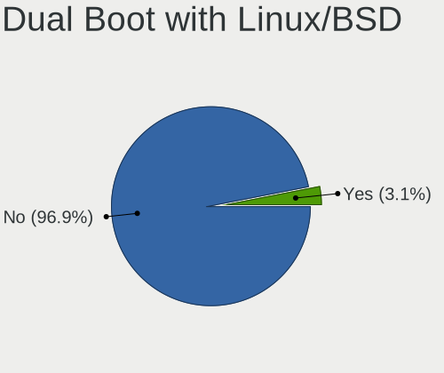
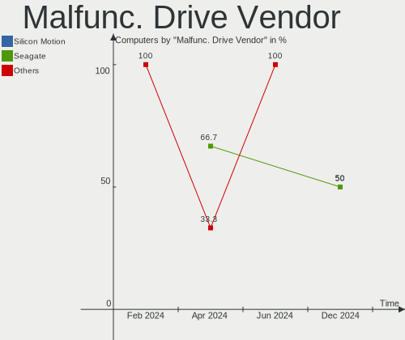
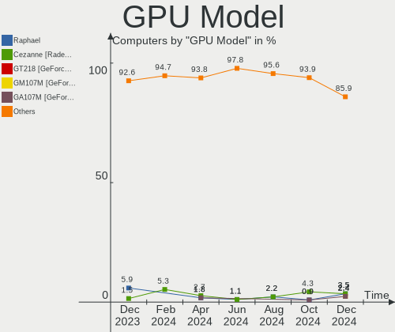
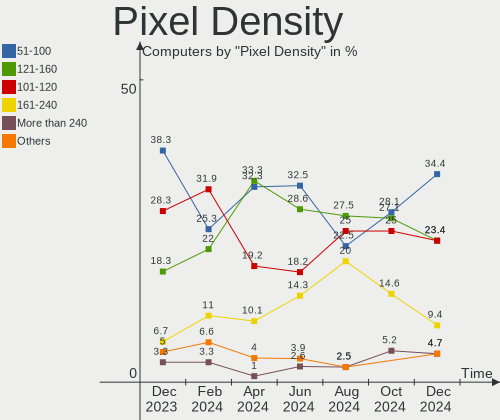
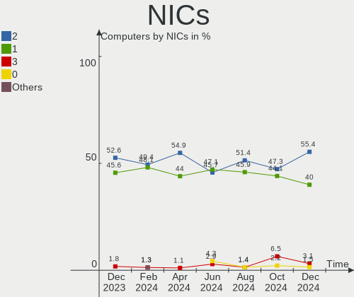
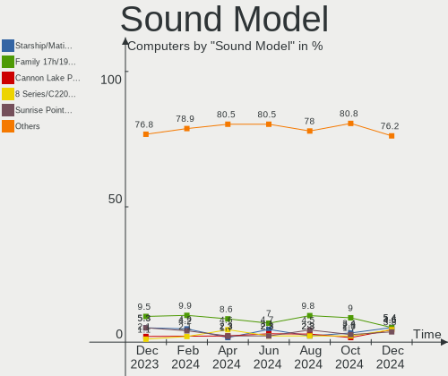
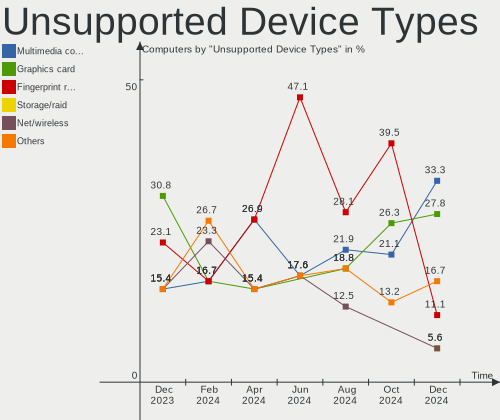

KDE neon - Hardware Trends
--------------------------

A project to identify most popular hardware characteristics and track their change
over time based on data collected by Linux users at https://Linux-Hardware.org.

Anyone can contribute to this report by the [hw-probe](https://github.com/linuxhw/hw-probe) tool:

    sudo -E hw-probe -all -upload

This is a report for all computer types. See also reports for [desktops](/Dist/KDE_neon/Desktop/README.md) and [notebooks](/Dist/KDE_neon/Notebook/README.md).

This report is for one last month. Overall report since the beginning of time: [TestDays](https://github.com/linuxhw/TestDays)

Period: Aug, 2023.

Contents
--------

* [ System ](#system)
  - [ OS                       ](#os)
  - [ OS Family                ](#os-family)
  - [ Kernel                   ](#kernel)
  - [ Kernel Family            ](#kernel-family)
  - [ Kernel Major Ver.        ](#kernel-major-ver)
  - [ Arch                     ](#arch)
  - [ DE                       ](#de)
  - [ Display Server           ](#display-server)
  - [ Display Manager          ](#display-manager)
  - [ OS Lang                  ](#os-lang)
  - [ Boot Mode                ](#boot-mode)
  - [ Filesystem               ](#filesystem)
  - [ Part. scheme             ](#part-scheme)
  - [ Dual Boot with Linux/BSD ](#dual-boot-with-linuxbsd)
  - [ Dual Boot (Win)          ](#dual-boot-win)

* [ Board ](#board)
  - [ Vendor                   ](#vendor)
  - [ Model                    ](#model)
  - [ Model Family             ](#model-family)
  - [ MFG Year                 ](#mfg-year)
  - [ Form Factor              ](#form-factor)
  - [ Secure Boot              ](#secure-boot)
  - [ Coreboot                 ](#coreboot)
  - [ RAM Size                 ](#ram-size)
  - [ RAM Used                 ](#ram-used)
  - [ Total Drives             ](#total-drives)
  - [ Has CD-ROM               ](#has-cd-rom)
  - [ Has Ethernet             ](#has-ethernet)
  - [ Has WiFi                 ](#has-wifi)
  - [ Has Bluetooth            ](#has-bluetooth)

* [ Location ](#location)
  - [ Country                  ](#country)
  - [ City                     ](#city)

* [ Drives ](#drives)
  - [ Drive Vendor             ](#drive-vendor)
  - [ Drive Model              ](#drive-model)
  - [ HDD Vendor               ](#hdd-vendor)
  - [ SSD Vendor               ](#ssd-vendor)
  - [ Drive Kind               ](#drive-kind)
  - [ Drive Connector          ](#drive-connector)
  - [ Drive Size               ](#drive-size)
  - [ Space Total              ](#space-total)
  - [ Space Used               ](#space-used)
  - [ Malfunc. Drives          ](#malfunc-drives)
  - [ Malfunc. Drive Vendor    ](#malfunc-drive-vendor)
  - [ Malfunc. HDD Vendor      ](#malfunc-hdd-vendor)
  - [ Malfunc. Drive Kind      ](#malfunc-drive-kind)
  - [ Failed Drives            ](#failed-drives)
  - [ Failed Drive Vendor      ](#failed-drive-vendor)
  - [ Drive Status             ](#drive-status)

* [ Storage controller ](#storage-controller)
  - [ Storage Vendor           ](#storage-vendor)
  - [ Storage Model            ](#storage-model)
  - [ Storage Kind             ](#storage-kind)

* [ Processor ](#processor)
  - [ CPU Vendor               ](#cpu-vendor)
  - [ CPU Model                ](#cpu-model)
  - [ CPU Model Family         ](#cpu-model-family)
  - [ CPU Cores                ](#cpu-cores)
  - [ CPU Sockets              ](#cpu-sockets)
  - [ CPU Threads              ](#cpu-threads)
  - [ CPU Op-Modes             ](#cpu-op-modes)
  - [ CPU Microcode            ](#cpu-microcode)
  - [ CPU Microarch            ](#cpu-microarch)

* [ Graphics ](#graphics)
  - [ GPU Vendor               ](#gpu-vendor)
  - [ GPU Model                ](#gpu-model)
  - [ GPU Combo                ](#gpu-combo)
  - [ GPU Driver               ](#gpu-driver)
  - [ GPU Memory               ](#gpu-memory)

* [ Monitor ](#monitor)
  - [ Monitor Vendor           ](#monitor-vendor)
  - [ Monitor Model            ](#monitor-model)
  - [ Monitor Resolution       ](#monitor-resolution)
  - [ Monitor Diagonal         ](#monitor-diagonal)
  - [ Monitor Width            ](#monitor-width)
  - [ Aspect Ratio             ](#aspect-ratio)
  - [ Monitor Area             ](#monitor-area)
  - [ Pixel Density            ](#pixel-density)
  - [ Multiple Monitors        ](#multiple-monitors)

* [ Network ](#network)
  - [ Net Controller Vendor    ](#net-controller-vendor)
  - [ Net Controller Model     ](#net-controller-model)
  - [ Wireless Vendor          ](#wireless-vendor)
  - [ Wireless Model           ](#wireless-model)
  - [ Ethernet Vendor          ](#ethernet-vendor)
  - [ Ethernet Model           ](#ethernet-model)
  - [ Net Controller Kind      ](#net-controller-kind)
  - [ Used Controller          ](#used-controller)
  - [ NICs                     ](#nics)
  - [ IPv6                     ](#ipv6)

* [ Bluetooth ](#bluetooth)
  - [ Bluetooth Vendor         ](#bluetooth-vendor)
  - [ Bluetooth Model          ](#bluetooth-model)

* [ Sound ](#sound)
  - [ Sound Vendor             ](#sound-vendor)
  - [ Sound Model              ](#sound-model)

* [ Memory ](#memory)
  - [ Memory Vendor            ](#memory-vendor)
  - [ Memory Model             ](#memory-model)
  - [ Memory Kind              ](#memory-kind)
  - [ Memory Form Factor       ](#memory-form-factor)
  - [ Memory Size              ](#memory-size)
  - [ Memory Speed             ](#memory-speed)

* [ Printers & scanners ](#printers--scanners)
  - [ Printer Vendor           ](#printer-vendor)
  - [ Printer Model            ](#printer-model)
  - [ Scanner Vendor           ](#scanner-vendor)
  - [ Scanner Model            ](#scanner-model)

* [ Camera ](#camera)
  - [ Camera Vendor            ](#camera-vendor)
  - [ Camera Model             ](#camera-model)

* [ Security ](#security)
  - [ Fingerprint Vendor       ](#fingerprint-vendor)
  - [ Fingerprint Model        ](#fingerprint-model)
  - [ Chipcard Vendor          ](#chipcard-vendor)
  - [ Chipcard Model           ](#chipcard-model)

* [ Unsupported ](#unsupported)
  - [ Unsupported Devices      ](#unsupported-devices)
  - [ Unsupported Device Types ](#unsupported-device-types)

System
------

OS
--

Installed operating systems

| Name           | Computers | Percent |
|----------------|-----------|---------|
| KDE neon 22.04 | 69        | 98.57%  |
| KDE neon 20.04 | 1         | 1.43%   |

OS Family
---------

OS without a version

| Name     | Computers | Percent |
|----------|-----------|---------|
| KDE neon | 70        | 100%    |

Kernel
------

Version of the Linux kernel

| Version              | Computers | Percent |
|----------------------|-----------|---------|
| 6.2.0-26-generic     | 39        | 55.71%  |
| 5.19.0-50-generic    | 18        | 25.71%  |
| 6.2.0-31-generic     | 4         | 5.71%   |
| 5.19.0-46-generic    | 4         | 5.71%   |
| 6.4.8-060408-generic | 1         | 1.43%   |
| 5.19.0-45-generic    | 1         | 1.43%   |
| 5.19.0-41-generic    | 1         | 1.43%   |
| 5.19.0-32-generic    | 1         | 1.43%   |
| 5.15.0-79-generic    | 1         | 1.43%   |

Kernel Family
-------------

Linux kernel without a distro release

| Version | Computers | Percent |
|---------|-----------|---------|
| 6.2.0   | 43        | 61.43%  |
| 5.19.0  | 25        | 35.71%  |
| 6.4.8   | 1         | 1.43%   |
| 5.15.0  | 1         | 1.43%   |

Kernel Major Ver.
-----------------

Linux kernel major version

| Version | Computers | Percent |
|---------|-----------|---------|
| 6.2     | 43        | 61.43%  |
| 5.19    | 25        | 35.71%  |
| 6.4     | 1         | 1.43%   |
| 5.15    | 1         | 1.43%   |

Arch
----

OS architecture (x86_64, i586, etc.)

| Name   | Computers | Percent |
|--------|-----------|---------|
| x86_64 | 70        | 100%    |

DE
--

Desktop Environment

| Name  | Computers | Percent |
|-------|-----------|---------|
| KDE5  | 69        | 98.57%  |
| GNOME | 1         | 1.43%   |

Display Server
--------------

X11 or Wayland

| Name    | Computers | Percent |
|---------|-----------|---------|
| X11     | 62        | 88.57%  |
| Wayland | 8         | 11.43%  |

Display Manager
---------------

SDDM, LightDM, etc.

| Name    | Computers | Percent |
|---------|-----------|---------|
| Unknown | 56        | 80%     |
| SDDM    | 14        | 20%     |

OS Lang
-------

Language

| Lang  | Computers | Percent |
|-------|-----------|---------|
| en_US | 32        | 45.71%  |
| en_GB | 8         | 11.43%  |
| it_IT | 5         | 7.14%   |
| de_DE | 4         | 5.71%   |
| ru_RU | 2         | 2.86%   |
| es_MX | 2         | 2.86%   |
| en_IN | 2         | 2.86%   |
| en_CA | 2         | 2.86%   |
| zh_CN | 1         | 1.43%   |
| tr_TR | 1         | 1.43%   |
| pl_PL | 1         | 1.43%   |
| lt_LT | 1         | 1.43%   |
| fr_FR | 1         | 1.43%   |
| es_VE | 1         | 1.43%   |
| es_UY | 1         | 1.43%   |
| es_PR | 1         | 1.43%   |
| en_ZA | 1         | 1.43%   |
| en_PH | 1         | 1.43%   |
| en_IE | 1         | 1.43%   |
| cs_CZ | 1         | 1.43%   |
| C     | 1         | 1.43%   |

Boot Mode
---------

EFI or BIOS

| Mode | Computers | Percent |
|------|-----------|---------|
| BIOS | 61        | 87.14%  |
| EFI  | 9         | 12.86%  |

Filesystem
----------

Type of filesystem

| Type    | Computers | Percent |
|---------|-----------|---------|
| Ext4    | 64        | 91.43%  |
| Tmpfs   | 3         | 4.29%   |
| Btrfs   | 2         | 2.86%   |
| Overlay | 1         | 1.43%   |

Part. scheme
------------

Scheme of partitioning

| Type    | Computers | Percent |
|---------|-----------|---------|
| Unknown | 56        | 80%     |
| GPT     | 12        | 17.14%  |
| MBR     | 2         | 2.86%   |

Dual Boot with Linux/BSD
------------------------

Hosting more than one Linux/BSD

| Dual boot | Computers | Percent |
|-----------|-----------|---------|
| No        | 68        | 97.14%  |
| Yes       | 2         | 2.86%   |

Dual Boot (Win)
---------------

Hosting Linux and Windows

| Dual boot | Computers | Percent |
|-----------|-----------|---------|
| No        | 64        | 91.43%  |
| Yes       | 6         | 8.57%   |

Board
-----

Vendor
------

Motherboard manufacturer

| Name                | Computers | Percent |
|---------------------|-----------|---------|
| ASUSTek Computer    | 12        | 17.14%  |
| Dell                | 11        | 15.71%  |
| Hewlett-Packard     | 9         | 12.86%  |
| Lenovo              | 8         | 11.43%  |
| MSI                 | 7         | 10%     |
| Gigabyte Technology | 5         | 7.14%   |
| Acer                | 4         | 5.71%   |
| Intel               | 2         | 2.86%   |
| ASRock              | 2         | 2.86%   |
| Apple               | 2         | 2.86%   |
| SLIMBOOK            | 1         | 1.43%   |
| Microsoft           | 1         | 1.43%   |
| LG Electronics      | 1         | 1.43%   |
| Inventec            | 1         | 1.43%   |
| HUAWEI              | 1         | 1.43%   |
| Gateway             | 1         | 1.43%   |
| Fujitsu             | 1         | 1.43%   |
| EMAXX TECHNOLOGY    | 1         | 1.43%   |

Model
-----

Motherboard model

| Name                                   | Computers | Percent |
|----------------------------------------|-----------|---------|
| MSI MS-7A38                            | 2         | 2.86%   |
| Dell Latitude 5400                     | 2         | 2.86%   |
| SLIMBOOK PROX-AMD5                     | 1         | 1.43%   |
| MSI p7-1233w                           | 1         | 1.43%   |
| MSI MS-7E12                            | 1         | 1.43%   |
| MSI MS-7E07                            | 1         | 1.43%   |
| MSI MS-7C94                            | 1         | 1.43%   |
| MSI GP66 Leopard 10UE                  | 1         | 1.43%   |
| Microsoft Surface Go 3                 | 1         | 1.43%   |
| LG 16T90R-K.ADB9U1                     | 1         | 1.43%   |
| Lenovo ThinkPad X260 20F600A2MN        | 1         | 1.43%   |
| Lenovo ThinkPad L14 Gen 2a 20X50049GE  | 1         | 1.43%   |
| Lenovo Legion S7 15ACH6 82K8           | 1         | 1.43%   |
| Lenovo IdeaPadFlex 5 15ITL05 82HT      | 1         | 1.43%   |
| Lenovo IdeaPad 5 14ALC05 82LM          | 1         | 1.43%   |
| Lenovo IdeaPad 3 15ALC6 82KU           | 1         | 1.43%   |
| Lenovo IdeaPad 3 14ITL6 82H7           | 1         | 1.43%   |
| Lenovo G500 20236                      | 1         | 1.43%   |
| Inventec Dell Thin Client Desktop 5060 | 1         | 1.43%   |
| Intel DQ77KB AAG40294-401              | 1         | 1.43%   |
| Intel DH61WW AAG23116-302              | 1         | 1.43%   |
| HUAWEI NBLB-WAX9N                      | 1         | 1.43%   |
| HP ZBook 14u G5                        | 1         | 1.43%   |
| HP Z200 Workstation                    | 1         | 1.43%   |
| HP Stream Laptop 14-ax0XX              | 1         | 1.43%   |
| HP ProDesk 400 G4 SFF                  | 1         | 1.43%   |
| HP Laptop 17-cn0xxx                    | 1         | 1.43%   |
| HP EliteBook 8470p                     | 1         | 1.43%   |
| HP EliteBook 820 G1                    | 1         | 1.43%   |
| HP Compaq Presario CQ40                | 1         | 1.43%   |
| HP 550-310                             | 1         | 1.43%   |
| Gigabyte Z790 AORUS ELITE AX DDR4      | 1         | 1.43%   |
| Gigabyte Z790 AORUS ELITE AX           | 1         | 1.43%   |
| Gigabyte X570 I AORUS PRO WIFI         | 1         | 1.43%   |
| Gigabyte H410M H V3                    | 1         | 1.43%   |
| Gigabyte AORUS 17G XB                  | 1         | 1.43%   |
| Gateway DX4300                         | 1         | 1.43%   |
| Fujitsu LIFEBOOK AH530                 | 1         | 1.43%   |
| EMAXX TECHNOLOGY EMX-B450M-GAMING      | 1         | 1.43%   |
| Dell XPS L521X                         | 1         | 1.43%   |

Model Family
------------

Motherboard model prefix

| Name                              | Computers | Percent |
|-----------------------------------|-----------|---------|
| Acer Aspire                       | 4         | 5.71%   |
| Lenovo IdeaPad                    | 3         | 4.29%   |
| Dell Latitude                     | 3         | 4.29%   |
| Dell Inspiron                     | 3         | 4.29%   |
| MSI MS-7A38                       | 2         | 2.86%   |
| Lenovo ThinkPad                   | 2         | 2.86%   |
| HP EliteBook                      | 2         | 2.86%   |
| Gigabyte Z790                     | 2         | 2.86%   |
| Dell XPS                          | 2         | 2.86%   |
| Dell Vostro                       | 2         | 2.86%   |
| ASUS PRIME                        | 2         | 2.86%   |
| SLIMBOOK PROX-AMD5                | 1         | 1.43%   |
| MSI p7-1233w                      | 1         | 1.43%   |
| MSI MS-7E12                       | 1         | 1.43%   |
| MSI MS-7E07                       | 1         | 1.43%   |
| MSI MS-7C94                       | 1         | 1.43%   |
| MSI GP66                          | 1         | 1.43%   |
| Microsoft Surface                 | 1         | 1.43%   |
| LG 16T90R-K.ADB9U1                | 1         | 1.43%   |
| Lenovo Legion                     | 1         | 1.43%   |
| Lenovo IdeaPadFlex                | 1         | 1.43%   |
| Lenovo G500                       | 1         | 1.43%   |
| Inventec Dell                     | 1         | 1.43%   |
| Intel DQ77KB                      | 1         | 1.43%   |
| Intel DH61WW                      | 1         | 1.43%   |
| HUAWEI NBLB-WAX9N                 | 1         | 1.43%   |
| HP ZBook                          | 1         | 1.43%   |
| HP Z200                           | 1         | 1.43%   |
| HP Stream                         | 1         | 1.43%   |
| HP ProDesk                        | 1         | 1.43%   |
| HP Laptop                         | 1         | 1.43%   |
| HP Compaq                         | 1         | 1.43%   |
| HP 550-310                        | 1         | 1.43%   |
| Gigabyte X570                     | 1         | 1.43%   |
| Gigabyte H410M                    | 1         | 1.43%   |
| Gigabyte AORUS                    | 1         | 1.43%   |
| Gateway DX4300                    | 1         | 1.43%   |
| Fujitsu LIFEBOOK                  | 1         | 1.43%   |
| EMAXX TECHNOLOGY EMX-B450M-GAMING | 1         | 1.43%   |
| Dell OptiPlex                     | 1         | 1.43%   |

MFG Year
--------

Motherboard manufacture year

| Year | Computers | Percent |
|------|-----------|---------|
| 2021 | 12        | 17.14%  |
| 2019 | 9         | 12.86%  |
| 2012 | 7         | 10%     |
| 2020 | 6         | 8.57%   |
| 2022 | 5         | 7.14%   |
| 2016 | 5         | 7.14%   |
| 2018 | 4         | 5.71%   |
| 2013 | 4         | 5.71%   |
| 2010 | 4         | 5.71%   |
| 2023 | 3         | 4.29%   |
| 2017 | 3         | 4.29%   |
| 2011 | 3         | 4.29%   |
| 2014 | 2         | 2.86%   |
| 2015 | 1         | 1.43%   |
| 2009 | 1         | 1.43%   |
| 2008 | 1         | 1.43%   |

Form Factor
-----------

Physical design of the computer

| Name        | Computers | Percent |
|-------------|-----------|---------|
| Notebook    | 36        | 51.43%  |
| Desktop     | 28        | 40%     |
| Convertible | 3         | 4.29%   |
| Mini pc     | 2         | 2.86%   |
| Tablet      | 1         | 1.43%   |

Secure Boot
-----------

Enabled or disabled

| State    | Computers | Percent |
|----------|-----------|---------|
| Disabled | 69        | 98.57%  |
| Enabled  | 1         | 1.43%   |

Coreboot
--------

Have coreboot on board

| Used | Computers | Percent |
|------|-----------|---------|
| No   | 70        | 100%    |

RAM Size
--------

Total RAM memory

| Size in GB  | Computers | Percent |
|-------------|-----------|---------|
| 4.01-8.0    | 17        | 24.29%  |
| 16.01-24.0  | 15        | 21.43%  |
| 32.01-64.0  | 14        | 20%     |
| 8.01-16.0   | 12        | 17.14%  |
| 3.01-4.0    | 5         | 7.14%   |
| 64.01-256.0 | 5         | 7.14%   |
| 24.01-32.0  | 1         | 1.43%   |
| 1.01-2.0    | 1         | 1.43%   |

RAM Used
--------

Used RAM memory

| Used GB    | Computers | Percent |
|------------|-----------|---------|
| 1.01-2.0   | 22        | 31.43%  |
| 3.01-4.0   | 17        | 24.29%  |
| 2.01-3.0   | 15        | 21.43%  |
| 4.01-8.0   | 9         | 12.86%  |
| 16.01-24.0 | 3         | 4.29%   |
| 8.01-16.0  | 3         | 4.29%   |
| 0.51-1.0   | 1         | 1.43%   |

Total Drives
------------

Number of drives on board

| Drives | Computers | Percent |
|--------|-----------|---------|
| 1      | 38        | 54.29%  |
| 2      | 16        | 22.86%  |
| 3      | 8         | 11.43%  |
| 4      | 3         | 4.29%   |
| 7      | 2         | 2.86%   |
| 12     | 1         | 1.43%   |
| 11     | 1         | 1.43%   |
| 5      | 1         | 1.43%   |

Has CD-ROM
----------

Has CD-ROM on board

| Presented | Computers | Percent |
|-----------|-----------|---------|
| No        | 54        | 77.14%  |
| Yes       | 16        | 22.86%  |

Has Ethernet
------------

Has Ethernet on board

| Presented | Computers | Percent |
|-----------|-----------|---------|
| Yes       | 53        | 75.71%  |
| No        | 17        | 24.29%  |

Has WiFi
--------

Has WiFi module

| Presented | Computers | Percent |
|-----------|-----------|---------|
| Yes       | 57        | 81.43%  |
| No        | 13        | 18.57%  |

Has Bluetooth
-------------

Has Bluetooth module

| Presented | Computers | Percent |
|-----------|-----------|---------|
| Yes       | 48        | 68.57%  |
| No        | 22        | 31.43%  |

Location
--------

Country
-------

Geographic location (country)

| Country      | Computers | Percent |
|--------------|-----------|---------|
| USA          | 18        | 25.71%  |
| Germany      | 6         | 8.57%   |
| Italy        | 4         | 5.71%   |
| UK           | 3         | 4.29%   |
| Poland       | 3         | 4.29%   |
| Canada       | 3         | 4.29%   |
| Russia       | 2         | 2.86%   |
| Mexico       | 2         | 2.86%   |
| Ireland      | 2         | 2.86%   |
| India        | 2         | 2.86%   |
| France       | 2         | 2.86%   |
| Australia    | 2         | 2.86%   |
| Venezuela    | 1         | 1.43%   |
| Uruguay      | 1         | 1.43%   |
| Turkey       | 1         | 1.43%   |
| Tunisia      | 1         | 1.43%   |
| South Africa | 1         | 1.43%   |
| Singapore    | 1         | 1.43%   |
| Serbia       | 1         | 1.43%   |
| Puerto Rico  | 1         | 1.43%   |
| Philippines  | 1         | 1.43%   |
| Paraguay     | 1         | 1.43%   |
| Pakistan     | 1         | 1.43%   |
| Netherlands  | 1         | 1.43%   |
| Mozambique   | 1         | 1.43%   |
| Lithuania    | 1         | 1.43%   |
| Latvia       | 1         | 1.43%   |
| Georgia      | 1         | 1.43%   |
| Finland      | 1         | 1.43%   |
| Denmark      | 1         | 1.43%   |
| Czechia      | 1         | 1.43%   |
| Croatia      | 1         | 1.43%   |
| Brazil       | 1         | 1.43%   |

City
----

Geographic location (city)

| City              | Computers | Percent |
|-------------------|-----------|---------|
| Munich            | 2         | 2.86%   |
| Lawrence          | 2         | 2.86%   |
| Zielona Góra     | 1         | 1.43%   |
| Zagreb            | 1         | 1.43%   |
| Yass              | 1         | 1.43%   |
| Workum            | 1         | 1.43%   |
| Winter Garden     | 1         | 1.43%   |
| Waukegan          | 1         | 1.43%   |
| Warsaw            | 1         | 1.43%   |
| Vilnius           | 1         | 1.43%   |
| Vero Beach        | 1         | 1.43%   |
| Vancouver         | 1         | 1.43%   |
| Turin             | 1         | 1.43%   |
| Toms River        | 1         | 1.43%   |
| Tbilisi           | 1         | 1.43%   |
| Sydney            | 1         | 1.43%   |
| Spokane           | 1         | 1.43%   |
| Singapore         | 1         | 1.43%   |
| Sfax              | 1         | 1.43%   |
| Seattle           | 1         | 1.43%   |
| San Lorenzo       | 1         | 1.43%   |
| San Fernando City | 1         | 1.43%   |
| Rochdale          | 1         | 1.43%   |
| Rio Grande        | 1         | 1.43%   |
| Ringwood          | 1         | 1.43%   |
| Riga              | 1         | 1.43%   |
| Pueblo            | 1         | 1.43%   |
| Pottstown         | 1         | 1.43%   |
| Pila              | 1         | 1.43%   |
| Ostrava           | 1         | 1.43%   |
| Napanee           | 1         | 1.43%   |
| Mount Sinai       | 1         | 1.43%   |
| Moscow            | 1         | 1.43%   |
| Montevideo        | 1         | 1.43%   |
| Monterrey         | 1         | 1.43%   |
| Monterey          | 1         | 1.43%   |
| Maputo            | 1         | 1.43%   |
| Kostroma          | 1         | 1.43%   |
| Kelowna           | 1         | 1.43%   |
| Joinville         | 1         | 1.43%   |

Drives
------

Drive Vendor
------------

Hard drive vendors

| Vendor                         | Computers | Drives | Percent |
|--------------------------------|-----------|--------|---------|
| Samsung Electronics            | 21        | 28     | 17.21%  |
| Seagate                        | 16        | 23     | 13.11%  |
| WDC                            | 10        | 12     | 8.2%    |
| SanDisk                        | 8         | 9      | 6.56%   |
| Phison Electronics             | 8         | 8      | 6.56%   |
| Kingston                       | 6         | 6      | 4.92%   |
| Toshiba                        | 4         | 4      | 3.28%   |
| Unknown                        | 3         | 3      | 2.46%   |
| SPCC                           | 3         | 3      | 2.46%   |
| Micron/Crucial Technology      | 3         | 3      | 2.46%   |
| KIOXIA                         | 3         | 3      | 2.46%   |
| Hitachi                        | 3         | 3      | 2.46%   |
| Crucial                        | 3         | 3      | 2.46%   |
| A-DATA Technology              | 3         | 3      | 2.46%   |
| walram                         | 2         | 3      | 1.64%   |
| SK hynix                       | 2         | 2      | 1.64%   |
| MAXIO Technology (Hangzhou)    | 2         | 3      | 1.64%   |
| Intel                          | 2         | 3      | 1.64%   |
| Gigabyte Technology            | 2         | 2      | 1.64%   |
| China                          | 2         | 6      | 1.64%   |
| Apple                          | 2         | 2      | 1.64%   |
| Unknown                        | 2         | 2      | 1.64%   |
| TCSUNBOW                       | 1         | 1      | 0.82%   |
| SSK                            | 1         | 1      | 0.82%   |
| Solid State Storage Technology | 1         | 1      | 0.82%   |
| PNY                            | 1         | 1      | 0.82%   |
| Patriot                        | 1         | 1      | 0.82%   |
| Netac                          | 1         | 1      | 0.82%   |
| Mushkin                        | 1         | 1      | 0.82%   |
| Micron Technology              | 1         | 1      | 0.82%   |
| Kingston Technology Company    | 1         | 1      | 0.82%   |
| KingSpec                       | 1         | 1      | 0.82%   |
| HGST                           | 1         | 1      | 0.82%   |
| ASMT                           | 1         | 1      | 0.82%   |

Drive Model
-----------

Hard drive models

| Model                                                 | Computers | Percent |
|-------------------------------------------------------|-----------|---------|
| Samsung NVMe SSD Controller SM981/PM981/PM983 500GB   | 6         | 4.41%   |
| Phison E12 NVMe Controller 256GB                      | 5         | 3.68%   |
| Samsung SSD 860 EVO 1TB                               | 3         | 2.21%   |
| Phison PS5013 E13 NVMe Controller 512GB               | 3         | 2.21%   |
| WDC WD40EFRX-68WT0N0 4TB                              | 2         | 1.47%   |
| Toshiba DT01ACA100 1TB                                | 2         | 1.47%   |
| Seagate ST4000DM004-2CV104 4TB                        | 2         | 1.47%   |
| Seagate ST1000DM010-2EP102 1TB                        | 2         | 1.47%   |
| Seagate ST1000DM003-1CH162 1TB                        | 2         | 1.47%   |
| Samsung SSD 860 EVO 500GB                             | 2         | 1.47%   |
| Samsung NVMe SSD Controller PM9A1/PM9A3/980PRO 1024GB | 2         | 1.47%   |
| Micron/Crucial P2 NVMe PCIe SSD 1TB                   | 2         | 1.47%   |
| KIOXIA KBG40ZNS256G NVMe 256GB                        | 2         | 1.47%   |
| Crucial CT1000MX500SSD1 1TB                           | 2         | 1.47%   |
| A-DATA SU630 240GB SSD                                | 2         | 1.47%   |
| Unknown                                               | 2         | 1.47%   |
| WDC WDS500G1B0C-00S6U0 500GB                          | 1         | 0.74%   |
| WDC WDS480G2G0A-00JH30 480GB SSD                      | 1         | 0.74%   |
| WDC WD60EFRX-68MYMN1 6TB                              | 1         | 0.74%   |
| WDC WD5000LPCX-75VHAT0 500GB                          | 1         | 0.74%   |
| WDC WD3200AAJS-22RYA0 320GB                           | 1         | 0.74%   |
| WDC WD1600BEVT-60ZCT0 160GB                           | 1         | 0.74%   |
| WDC WD10JPVX-00JC3T0 1TB                              | 1         | 0.74%   |
| WDC WD10EFRX-68FYTN0 1TB                              | 1         | 0.74%   |
| WDC WD Blue SA510 2.5 500GB                           | 1         | 0.74%   |
| WDC PC SN730 SDBQNTY-512G-1001 512GB                  | 1         | 0.74%   |
| WALRAM SSD 500G                                       | 1         | 0.74%   |
| walram 64G                                            | 1         | 0.74%   |
| WALRAM 500G                                           | 1         | 0.74%   |
| Unknown SD/MMC/MS PRO 1GB                             | 1         | 0.74%   |
| Unknown NVMe SSD Drive 2TB                            | 1         | 0.74%   |
| Unknown MMC Card  32GB                                | 1         | 0.74%   |
| Toshiba MQ01ABF050 500GB                              | 1         | 0.74%   |
| Toshiba MQ01ABD100H 1TB                               | 1         | 0.74%   |
| TCSUNBOW X3 240GB                                     | 1         | 0.74%   |
| SSK Storage 128GB                                     | 1         | 0.74%   |
| SPCC Solid State Disk 512GB                           | 1         | 0.74%   |
| SPCC Solid State Disk 240GB                           | 1         | 0.74%   |
| SPCC M.2 PCIe SSD 4TB                                 | 1         | 0.74%   |
| Solid State Storage NVMe CLR-8W512 512GB              | 1         | 0.74%   |

HDD Vendor
----------

Hard disk drive vendors

| Vendor  | Computers | Drives | Percent |
|---------|-----------|--------|---------|
| Seagate | 16        | 23     | 48.48%  |
| WDC     | 7         | 8      | 21.21%  |
| Toshiba | 4         | 4      | 12.12%  |
| Hitachi | 3         | 3      | 9.09%   |
| Unknown | 1         | 1      | 3.03%   |
| HGST    | 1         | 1      | 3.03%   |
| Apple   | 1         | 1      | 3.03%   |

SSD Vendor
----------

Solid state drive vendors

| Vendor              | Computers | Drives | Percent |
|---------------------|-----------|--------|---------|
| Samsung Electronics | 13        | 16     | 29.55%  |
| SanDisk             | 5         | 5      | 11.36%  |
| Kingston            | 3         | 3      | 6.82%   |
| Crucial             | 3         | 3      | 6.82%   |
| A-DATA Technology   | 3         | 3      | 6.82%   |
| WDC                 | 2         | 2      | 4.55%   |
| SPCC                | 2         | 2      | 4.55%   |
| Gigabyte Technology | 2         | 2      | 4.55%   |
| China               | 2         | 6      | 4.55%   |
| WALRAM              | 1         | 1      | 2.27%   |
| TCSUNBOW            | 1         | 1      | 2.27%   |
| PNY                 | 1         | 1      | 2.27%   |
| Patriot             | 1         | 1      | 2.27%   |
| Netac               | 1         | 1      | 2.27%   |
| Mushkin             | 1         | 1      | 2.27%   |
| KingSpec            | 1         | 1      | 2.27%   |
| Intel               | 1         | 1      | 2.27%   |
| Unknown             | 1         | 1      | 2.27%   |

Drive Kind
----------

HDD or SSD

| Kind    | Computers | Drives | Percent |
|---------|-----------|--------|---------|
| NVMe    | 37        | 50     | 35.58%  |
| SSD     | 34        | 51     | 32.69%  |
| HDD     | 30        | 41     | 28.85%  |
| Unknown | 2         | 3      | 1.92%   |
| MMC     | 1         | 1      | 0.96%   |

Drive Connector
---------------

SATA, SAS, NVMe, etc.

| Type | Computers | Drives | Percent |
|------|-----------|--------|---------|
| SATA | 49        | 92     | 53.26%  |
| NVMe | 37        | 48     | 40.22%  |
| SAS  | 5         | 5      | 5.43%   |
| MMC  | 1         | 1      | 1.09%   |

Drive Size
----------

Size of hard drive

| Size in TB | Computers | Drives | Percent |
|------------|-----------|--------|---------|
| 0.01-0.5   | 38        | 51     | 56.72%  |
| 0.51-1.0   | 18        | 24     | 26.87%  |
| 3.01-4.0   | 5         | 5      | 7.46%   |
| 4.01-10.0  | 3         | 7      | 4.48%   |
| 2.01-3.0   | 1         | 2      | 1.49%   |
| 10.01-20.0 | 1         | 2      | 1.49%   |
| 1.01-2.0   | 1         | 1      | 1.49%   |

Space Total
-----------

Amount of disk space available on the file system

| Size in GB     | Computers | Percent |
|----------------|-----------|---------|
| 251-500        | 17        | 24.29%  |
| 101-250        | 15        | 21.43%  |
| 501-1000       | 10        | 14.29%  |
| More than 3000 | 9         | 12.86%  |
| 1001-2000      | 7         | 10%     |
| 2001-3000      | 3         | 4.29%   |
| 51-100         | 3         | 4.29%   |
| Unknown        | 3         | 4.29%   |
| 1-20           | 2         | 2.86%   |
| 21-50          | 1         | 1.43%   |

Space Used
----------

Amount of used disk space

| Used GB        | Computers | Percent |
|----------------|-----------|---------|
| 1-20           | 20        | 28.57%  |
| 51-100         | 11        | 15.71%  |
| 21-50          | 10        | 14.29%  |
| 251-500        | 8         | 11.43%  |
| 1001-2000      | 7         | 10%     |
| 101-250        | 5         | 7.14%   |
| More than 3000 | 3         | 4.29%   |
| Unknown        | 3         | 4.29%   |
| 2001-3000      | 2         | 2.86%   |
| 501-1000       | 1         | 1.43%   |

Malfunc. Drives
---------------

Drive models with a malfunction

| Model                     | Computers | Drives | Percent |
|---------------------------|-----------|--------|---------|
| Toshiba DT01ACA100 1TB    | 1         | 1      | 50%     |
| Seagate ST9750420AS 752GB | 1         | 1      | 50%     |

Malfunc. Drive Vendor
---------------------

Vendors of faulty drives

| Vendor  | Computers | Drives | Percent |
|---------|-----------|--------|---------|
| Toshiba | 1         | 1      | 50%     |
| Seagate | 1         | 1      | 50%     |

Malfunc. HDD Vendor
-------------------

Vendors of faulty HDD drives

| Vendor  | Computers | Drives | Percent |
|---------|-----------|--------|---------|
| Toshiba | 1         | 1      | 50%     |
| Seagate | 1         | 1      | 50%     |

Malfunc. Drive Kind
-------------------

Kinds of faulty drives

| Kind | Computers | Drives | Percent |
|------|-----------|--------|---------|
| HDD  | 2         | 2      | 100%    |

Failed Drives
-------------

Failed drive models

Zero info for selected period =(

Failed Drive Vendor
-------------------

Failed drive vendors

Zero info for selected period =(

Drive Status
------------

Number of failed and malfunc. drives

| Status   | Computers | Drives | Percent |
|----------|-----------|--------|---------|
| Detected | 59        | 125    | 81.94%  |
| Works    | 11        | 19     | 15.28%  |
| Malfunc  | 2         | 2      | 2.78%   |

Storage controller
------------------

Storage Vendor
--------------

Storage controller vendors

| Vendor                         | Computers | Percent |
|--------------------------------|-----------|---------|
| Intel                          | 38        | 36.89%  |
| AMD                            | 19        | 18.45%  |
| Samsung Electronics            | 11        | 10.68%  |
| Phison Electronics             | 8         | 7.77%   |
| SanDisk                        | 6         | 5.83%   |
| Kingston Technology Company    | 4         | 3.88%   |
| Micron/Crucial Technology      | 3         | 2.91%   |
| KIOXIA                         | 3         | 2.91%   |
| SK hynix                       | 2         | 1.94%   |
| MAXIO Technology (Hangzhou)    | 2         | 1.94%   |
| INNOGRIT                       | 2         | 1.94%   |
| Solid State Storage Technology | 1         | 0.97%   |
| Micron Technology              | 1         | 0.97%   |
| JMicron Technology             | 1         | 0.97%   |
| ASMedia Technology             | 1         | 0.97%   |
| Apple                          | 1         | 0.97%   |

Storage Model
-------------

Storage controller models

| Model                                                                         | Computers | Percent |
|-------------------------------------------------------------------------------|-----------|---------|
| AMD FCH SATA Controller [AHCI mode]                                           | 14        | 11.97%  |
| Samsung NVMe SSD Controller SM981/PM981/PM983                                 | 7         | 5.98%   |
| Phison E12 NVMe Controller                                                    | 5         | 4.27%   |
| AMD 400 Series Chipset SATA Controller                                        | 4         | 3.42%   |
| Phison PS5013 E13 NVMe Controller                                             | 3         | 2.56%   |
| KIOXIA NVMe SSD Controller BG4 (DRAM-less)                                    | 3         | 2.56%   |
| Intel Volume Management Device NVMe RAID Controller                           | 3         | 2.56%   |
| Intel Tiger Lake-LP SATA Controller                                           | 3         | 2.56%   |
| Intel Sunrise Point-LP SATA Controller [AHCI mode]                            | 3         | 2.56%   |
| Intel Cannon Point-LP SATA Controller [AHCI Mode]                             | 3         | 2.56%   |
| Intel 700 Series Chipset Family SATA AHCI Controller                          | 3         | 2.56%   |
| Intel 7 Series Chipset Family 6-port SATA Controller [AHCI mode]              | 3         | 2.56%   |
| Intel 500 Series Chipset Family SATA AHCI Controller                          | 3         | 2.56%   |
| AMD SB7x0/SB8x0/SB9x0 SATA Controller [AHCI mode]                             | 3         | 2.56%   |
| SK hynix Gold P31/BC711/PC711 NVMe Solid State Drive                          | 2         | 1.71%   |
| Samsung NVMe SSD Controller PM9A1/PM9A3/980PRO                                | 2         | 1.71%   |
| Samsung NVMe SSD Controller 980                                               | 2         | 1.71%   |
| Micron/Crucial P2 [Nick P2] / P3 / P3 Plus NVMe PCIe SSD (DRAM-less)          | 2         | 1.71%   |
| Intel 82801 Mobile SATA Controller [RAID mode]                                | 2         | 1.71%   |
| Intel 8 Series SATA Controller 1 [AHCI mode]                                  | 2         | 1.71%   |
| Intel 7 Series/C210 Series Chipset Family 6-port SATA Controller [AHCI mode]  | 2         | 1.71%   |
| Intel 6 Series/C200 Series Chipset Family 6 port Desktop SATA AHCI Controller | 2         | 1.71%   |
| Intel 5 Series/3400 Series Chipset 4 port SATA AHCI Controller                | 2         | 1.71%   |
| AMD SB7x0/SB8x0/SB9x0 SATA Controller [IDE mode]                              | 2         | 1.71%   |
| AMD SB7x0/SB8x0/SB9x0 IDE Controller                                          | 2         | 1.71%   |
| Solid State Storage CLR-8W512 NVMe SSD M.2 (DRAM-less)                        | 1         | 0.85%   |
| SanDisk WD Green SN350 NVMe SSD 1 TB (DRAM-less)                              | 1         | 0.85%   |
| SanDisk WD Blue SN550 NVMe SSD                                                | 1         | 0.85%   |
| SanDisk WD Blue SN500 / PC SN520 NVMe SSD                                     | 1         | 0.85%   |
| SanDisk WD Black SN750 / PC SN730 NVMe SSD                                    | 1         | 0.85%   |
| SanDisk PC SN530 NVMe SSD (DRAM-less)                                         | 1         | 0.85%   |
| SanDisk PC SN520 NVMe SSD                                                     | 1         | 0.85%   |
| Samsung NVMe SSD Controller S4LV008[Pascal]                                   | 1         | 0.85%   |
| Micron/Crucial P1 NVMe PCIe SSD[Frampton2]                                    | 1         | 0.85%   |
| Micron 2400 NVMe SSD (DRAM-less)                                              | 1         | 0.85%   |
| MAXIO (Hangzhou) NVMe SSD Controller MAP1602                                  | 1         | 0.85%   |
| MAXIO (Hangzhou) NVMe SSD Controller MAP1202                                  | 1         | 0.85%   |
| Kingston Company OM8PCP Design-In PCIe 3 NVMe SSD (DRAM-less)                 | 1         | 0.85%   |
| Kingston Company OM3PDP3 NVMe SSD                                             | 1         | 0.85%   |
| Kingston Company NVMe Controller                                              | 1         | 0.85%   |

Storage Kind
------------

Kind of storage controller (IDE, SATA, NVMe, SAS, ...)

| Kind | Computers | Percent |
|------|-----------|---------|
| SATA | 53        | 53.54%  |
| NVMe | 37        | 37.37%  |
| RAID | 6         | 6.06%   |
| IDE  | 3         | 3.03%   |

Processor
---------

CPU Vendor
----------

Processor vendors

| Vendor | Computers | Percent |
|--------|-----------|---------|
| Intel  | 48        | 68.57%  |
| AMD    | 22        | 31.43%  |

CPU Model
---------

Processor models

| Model                                  | Computers | Percent |
|----------------------------------------|-----------|---------|
| Intel Core i5-8365U CPU @ 1.60GHz      | 2         | 2.86%   |
| Intel Core i5-10400 CPU @ 2.90GHz      | 2         | 2.86%   |
| AMD Ryzen 7 2700X Eight-Core Processor | 2         | 2.86%   |
| AMD Ryzen 5 5500U with Radeon Graphics | 2         | 2.86%   |
| Intel Pentium Gold 7505 @ 2.00GHz      | 1         | 1.43%   |
| Intel Pentium CPU N3710 @ 1.60GHz      | 1         | 1.43%   |
| Intel Pentium CPU GOLD 6500Y @ 1.10GHz | 1         | 1.43%   |
| Intel Pentium CPU 2020M @ 2.40GHz      | 1         | 1.43%   |
| Intel Core M-5Y71 CPU @ 1.20GHz        | 1         | 1.43%   |
| Intel Core i9-10885H CPU @ 2.40GHz     | 1         | 1.43%   |
| Intel Core i7-8565U CPU @ 1.80GHz      | 1         | 1.43%   |
| Intel Core i7-8550U CPU @ 1.80GHz      | 1         | 1.43%   |
| Intel Core i7-3770T CPU @ 2.50GHz      | 1         | 1.43%   |
| Intel Core i7-3612QM CPU @ 2.10GHz     | 1         | 1.43%   |
| Intel Core i7-3610QM CPU @ 2.30GHz     | 1         | 1.43%   |
| Intel Core i7-2600K CPU @ 3.40GHz      | 1         | 1.43%   |
| Intel Core i7-10875H CPU @ 2.30GHz     | 1         | 1.43%   |
| Intel Core i7-10870H CPU @ 2.20GHz     | 1         | 1.43%   |
| Intel Core i5-8265U CPU @ 1.60GHz      | 1         | 1.43%   |
| Intel Core i5-7500 CPU @ 3.40GHz       | 1         | 1.43%   |
| Intel Core i5-7300HQ CPU @ 2.50GHz     | 1         | 1.43%   |
| Intel Core i5-7200U CPU @ 2.50GHz      | 1         | 1.43%   |
| Intel Core i5-6200U CPU @ 2.30GHz      | 1         | 1.43%   |
| Intel Core i5-4670 CPU @ 3.40GHz       | 1         | 1.43%   |
| Intel Core i5-4460 CPU @ 3.20GHz       | 1         | 1.43%   |
| Intel Core i5-4310U CPU @ 2.00GHz      | 1         | 1.43%   |
| Intel Core i5-4200U CPU @ 1.60GHz      | 1         | 1.43%   |
| Intel Core i5-3230M CPU @ 2.60GHz      | 1         | 1.43%   |
| Intel Core i5-3210M CPU @ 2.50GHz      | 1         | 1.43%   |
| Intel Core i5-2320 CPU @ 3.00GHz       | 1         | 1.43%   |
| Intel Core i5-10210U CPU @ 1.60GHz     | 1         | 1.43%   |
| Intel Core i5 CPU M 480 @ 2.67GHz      | 1         | 1.43%   |
| Intel Core i5 CPU 650 @ 3.20GHz        | 1         | 1.43%   |
| Intel Core i3-6100U CPU @ 2.30GHz      | 1         | 1.43%   |
| Intel Core i3-3240 CPU @ 3.40GHz       | 1         | 1.43%   |
| Intel Core i3 CPU M 330 @ 2.13GHz      | 1         | 1.43%   |
| Intel Core 2 Duo CPU T5800 @ 2.00GHz   | 1         | 1.43%   |
| Intel Celeron CPU N3060 @ 1.60GHz      | 1         | 1.43%   |
| Intel Celeron 2955U @ 1.40GHz          | 1         | 1.43%   |
| Intel 13th Gen Core i9-13900K          | 1         | 1.43%   |

CPU Model Family
----------------

Processor model prefix

| Model              | Computers | Percent |
|--------------------|-----------|---------|
| Intel Core i5      | 19        | 27.14%  |
| Other              | 9         | 12.86%  |
| Intel Core i7      | 8         | 11.43%  |
| AMD Ryzen 7        | 7         | 10%     |
| Intel Pentium      | 3         | 4.29%   |
| Intel Core i3      | 3         | 4.29%   |
| AMD Ryzen 5        | 3         | 4.29%   |
| Intel Celeron      | 2         | 2.86%   |
| AMD Ryzen 9        | 2         | 2.86%   |
| Intel Pentium Gold | 1         | 1.43%   |
| Intel Core M       | 1         | 1.43%   |
| Intel Core i9      | 1         | 1.43%   |
| Intel Core 2 Duo   | 1         | 1.43%   |
| AMD Ryzen 7 PRO    | 1         | 1.43%   |
| AMD Ryzen 5 PRO    | 1         | 1.43%   |
| AMD Phenom II X4   | 1         | 1.43%   |
| AMD Phenom II      | 1         | 1.43%   |
| AMD GX             | 1         | 1.43%   |
| AMD FX             | 1         | 1.43%   |
| AMD E              | 1         | 1.43%   |
| AMD A8             | 1         | 1.43%   |
| AMD A6             | 1         | 1.43%   |
| AMD A10            | 1         | 1.43%   |

CPU Cores
---------

Number of processor cores

| Number | Computers | Percent |
|--------|-----------|---------|
| 4      | 22        | 31.43%  |
| 2      | 21        | 30%     |
| 8      | 13        | 18.57%  |
| 6      | 6         | 8.57%   |
| 16     | 2         | 2.86%   |
| 12     | 2         | 2.86%   |
| 24     | 1         | 1.43%   |
| 14     | 1         | 1.43%   |
| 3      | 1         | 1.43%   |
| 1      | 1         | 1.43%   |

CPU Sockets
-----------

Number of sockets

| Number | Computers | Percent |
|--------|-----------|---------|
| 1      | 70        | 100%    |

CPU Threads
-----------

Threads per core (Hyper-Threading)

| Number | Computers | Percent |
|--------|-----------|---------|
| 2      | 56        | 80%     |
| 1      | 14        | 20%     |

CPU Op-Modes
------------

CPU Operation Modes (32-bit, 64-bit)

| Op mode        | Computers | Percent |
|----------------|-----------|---------|
| 32-bit, 64-bit | 70        | 100%    |

CPU Microcode
-------------

Microcode number

| Number     | Computers | Percent |
|------------|-----------|---------|
| Unknown    | 60        | 85.71%  |
| 0x306a9    | 2         | 2.86%   |
| 0x806ec    | 1         | 1.43%   |
| 0x806eb    | 1         | 1.43%   |
| 0x806c2    | 1         | 1.43%   |
| 0x406e3    | 1         | 1.43%   |
| 0x40651    | 1         | 1.43%   |
| 0x206a7    | 1         | 1.43%   |
| 0x0a50000d | 1         | 1.43%   |
| 0x0800820d | 1         | 1.43%   |

CPU Microarch
-------------

Microarchitecture

| Name             | Computers | Percent |
|------------------|-----------|---------|
| KabyLake         | 10        | 14.29%  |
| Unknown          | 9         | 12.86%  |
| IvyBridge        | 7         | 10%     |
| Zen 3            | 5         | 7.14%   |
| Haswell          | 5         | 7.14%   |
| CometLake        | 5         | 7.14%   |
| TigerLake        | 4         | 5.71%   |
| Zen 2            | 3         | 4.29%   |
| Westmere         | 3         | 4.29%   |
| Piledriver       | 3         | 4.29%   |
| Zen+             | 2         | 2.86%   |
| Skylake          | 2         | 2.86%   |
| Silvermont       | 2         | 2.86%   |
| SandyBridge      | 2         | 2.86%   |
| K10              | 2         | 2.86%   |
| Steamroller      | 1         | 1.43%   |
| Puma             | 1         | 1.43%   |
| Core             | 1         | 1.43%   |
| Broadwell        | 1         | 1.43%   |
| Bobcat           | 1         | 1.43%   |
| Alderlake Hybrid | 1         | 1.43%   |

Graphics
--------

GPU Vendor
----------

Vendors of graphics cards

| Vendor | Computers | Percent |
|--------|-----------|---------|
| Intel  | 41        | 49.4%   |
| Nvidia | 22        | 26.51%  |
| AMD    | 20        | 24.1%   |

GPU Model
---------

Graphics card models

| Model                                                                                    | Computers | Percent |
|------------------------------------------------------------------------------------------|-----------|---------|
| Intel WhiskeyLake-U GT2 [UHD Graphics 620]                                               | 4         | 4.76%   |
| Intel TigerLake-LP GT2 [Iris Xe Graphics]                                                | 3         | 3.57%   |
| Intel Raptor Lake-S GT1 [UHD Graphics 770]                                               | 3         | 3.57%   |
| Intel Haswell-ULT Integrated Graphics Controller                                         | 3         | 3.57%   |
| Intel Core Processor Integrated Graphics Controller                                      | 3         | 3.57%   |
| Intel CometLake-H GT2 [UHD Graphics]                                                     | 3         | 3.57%   |
| Intel 3rd Gen Core processor Graphics Controller                                         | 3         | 3.57%   |
| AMD Lucienne                                                                             | 3         | 3.57%   |
| AMD Cezanne [Radeon Vega Series / Radeon Vega Mobile Series]                             | 3         | 3.57%   |
| Nvidia GA106M [GeForce RTX 3060 Mobile / Max-Q]                                          | 2         | 2.38%   |
| Intel Skylake GT2 [HD Graphics 520]                                                      | 2         | 2.38%   |
| Intel HD Graphics 630                                                                    | 2         | 2.38%   |
| Intel Atom/Celeron/Pentium Processor x5-E8000/J3xxx/N3xxx Integrated Graphics Controller | 2         | 2.38%   |
| Nvidia TU117M [GeForce GTX 1650 Ti Mobile]                                               | 1         | 1.19%   |
| Nvidia TU116 [GeForce GTX 1660]                                                          | 1         | 1.19%   |
| Nvidia TU116 [GeForce GTX 1660 SUPER]                                                    | 1         | 1.19%   |
| Nvidia TU104M [GeForce RTX 2070 SUPER Mobile / Max-Q]                                    | 1         | 1.19%   |
| Nvidia GP108 [GeForce GT 1030]                                                           | 1         | 1.19%   |
| Nvidia GP107M [GeForce GTX 1050 Mobile]                                                  | 1         | 1.19%   |
| Nvidia GM108M [GeForce MX130]                                                            | 1         | 1.19%   |
| Nvidia GM108M [GeForce 940MX]                                                            | 1         | 1.19%   |
| Nvidia GM107 [GeForce GTX 750 Ti]                                                        | 1         | 1.19%   |
| Nvidia GK107M [GeForce GTX 660M]                                                         | 1         | 1.19%   |
| Nvidia GK107M [GeForce GT 640M]                                                          | 1         | 1.19%   |
| Nvidia GK107 [GeForce GTX 650]                                                           | 1         | 1.19%   |
| Nvidia GF108 [GeForce GT 730]                                                            | 1         | 1.19%   |
| Nvidia GF108 [GeForce GT 630]                                                            | 1         | 1.19%   |
| Nvidia GA106 [GeForce RTX 3060 Lite Hash Rate]                                           | 1         | 1.19%   |
| Nvidia GA106 [Geforce RTX 3050]                                                          | 1         | 1.19%   |
| Nvidia GA104 [GeForce RTX 3060 Ti Lite Hash Rate]                                        | 1         | 1.19%   |
| Nvidia AD106 [GeForce RTX 4060 Ti]                                                       | 1         | 1.19%   |
| Nvidia AD103 [GeForce RTX 4080]                                                          | 1         | 1.19%   |
| Nvidia AD102 [GeForce RTX 4090]                                                          | 1         | 1.19%   |
| Intel Xeon E3-1200 v3/4th Gen Core Processor Integrated Graphics Controller              | 1         | 1.19%   |
| Intel Xeon E3-1200 v2/3rd Gen Core processor Graphics Controller                         | 1         | 1.19%   |
| Intel UHD Graphics 620                                                                   | 1         | 1.19%   |
| Intel UHD Graphics 615                                                                   | 1         | 1.19%   |
| Intel Tiger Lake-LP GT2 [UHD Graphics G4]                                                | 1         | 1.19%   |
| Intel Raptor Lake-P [Iris Xe Graphics]                                                   | 1         | 1.19%   |
| Intel Mobile 4 Series Chipset Integrated Graphics Controller                             | 1         | 1.19%   |

GPU Combo
---------

Combinations of graphics cards

| Name           | Computers | Percent |
|----------------|-----------|---------|
| 1 x Intel      | 29        | 41.43%  |
| 1 x AMD        | 17        | 24.29%  |
| 1 x Nvidia     | 12        | 17.14%  |
| Intel + Nvidia | 9         | 12.86%  |
| 2 x AMD        | 1         | 1.43%   |
| Intel + AMD    | 1         | 1.43%   |
| AMD + Nvidia   | 1         | 1.43%   |

GPU Driver
----------

Free vs proprietary

| Driver      | Computers | Percent |
|-------------|-----------|---------|
| Free        | 54        | 77.14%  |
| Proprietary | 13        | 18.57%  |
| Unknown     | 3         | 4.29%   |

GPU Memory
----------

Total video memory

| Size in GB | Computers | Percent |
|------------|-----------|---------|
| Unknown    | 60        | 85.71%  |
| 1.01-2.0   | 3         | 4.29%   |
| 5.01-6.0   | 2         | 2.86%   |
| 8.01-16.0  | 2         | 2.86%   |
| 7.01-8.0   | 1         | 1.43%   |
| 3.01-4.0   | 1         | 1.43%   |
| 0.51-1.0   | 1         | 1.43%   |

Monitor
-------

Monitor Vendor
--------------

Monitor vendors

| Vendor                  | Computers | Percent |
|-------------------------|-----------|---------|
| AU Optronics            | 13        | 15.85%  |
| Goldstar                | 9         | 10.98%  |
| BOE                     | 9         | 10.98%  |
| Dell                    | 6         | 7.32%   |
| Chimei Innolux          | 5         | 6.1%    |
| Acer                    | 5         | 6.1%    |
| LG Display              | 4         | 4.88%   |
| Hewlett-Packard         | 4         | 4.88%   |
| Samsung Electronics     | 3         | 3.66%   |
| ViewSonic               | 2         | 2.44%   |
| Sharp                   | 2         | 2.44%   |
| Philips                 | 2         | 2.44%   |
| Lenovo                  | 2         | 2.44%   |
| Ancor Communications    | 2         | 2.44%   |
| Toshiba                 | 1         | 1.22%   |
| Sony                    | 1         | 1.22%   |
| SKG                     | 1         | 1.22%   |
| Sceptre Tech            | 1         | 1.22%   |
| NEC Computers           | 1         | 1.22%   |
| Mi                      | 1         | 1.22%   |
| LG Philips              | 1         | 1.22%   |
| Iiyama                  | 1         | 1.22%   |
| CSO                     | 1         | 1.22%   |
| Chi Mei Optoelectronics | 1         | 1.22%   |
| CHD                     | 1         | 1.22%   |
| ASUSTek Computer        | 1         | 1.22%   |
| Apple                   | 1         | 1.22%   |
| AOC                     | 1         | 1.22%   |

Monitor Model
-------------

Monitor models

| Model                                                                | Computers | Percent |
|----------------------------------------------------------------------|-----------|---------|
| ViewSonic XG250 VSCE43B 1920x1080 544x303mm 24.5-inch                | 1         | 1.2%    |
| ViewSonic VX2770 SERIES VSC2C3A 1920x1080 597x336mm 27.0-inch        | 1         | 1.2%    |
| Toshiba 50UHD_LCD_TV TSB3700 3840x2160 1872x1053mm 84.6-inch         | 1         | 1.2%    |
| Sony SDM-HS75P SNY2300 1280x1024 338x270mm 17.0-inch                 | 1         | 1.2%    |
| SKG TV SKG5300 1600x900 698x392mm 31.5-inch                          | 1         | 1.2%    |
| Sharp LQ156M1JW09 SHP14D3 1920x1080 344x194mm 15.5-inch              | 1         | 1.2%    |
| Sharp LCD Monitor SHP14D0 3840x2400 336x210mm 15.6-inch              | 1         | 1.2%    |
| Sceptre Tech X409BV-FHD SPT0FA4 1920x1080 698x392mm 31.5-inch        | 1         | 1.2%    |
| Samsung Electronics SyncMaster SAM006E 1280x1024 338x270mm 17.0-inch | 1         | 1.2%    |
| Samsung Electronics LCD Monitor SEC5441 1280x800 331x207mm 15.4-inch | 1         | 1.2%    |
| Samsung Electronics LCD Monitor SAM0C3C 1366x768 609x347mm 27.6-inch | 1         | 1.2%    |
| Philips PHL BDM4037U PHLC142 3840x2160 885x498mm 40.0-inch           | 1         | 1.2%    |
| Philips 109S2 PHLE008 1920x1440 360x270mm 17.7-inch                  | 1         | 1.2%    |
| NEC Computers EX231Wp NEC684F 1920x1080 510x287mm 23.0-inch          | 1         | 1.2%    |
| Mi Monitor XMI3444 3440x1440 797x334mm 34.0-inch                     | 1         | 1.2%    |
| LG Philips LCD Monitor LPL0129 1280x800 304x190mm 14.1-inch          | 1         | 1.2%    |
| LG Display LCD Monitor LGD06EB 2560x1600 344x215mm 16.0-inch         | 1         | 1.2%    |
| LG Display LCD Monitor LGD066C 1920x1080 382x215mm 17.3-inch         | 1         | 1.2%    |
| LG Display LCD Monitor LGD05C4 1920x1080 344x194mm 15.5-inch         | 1         | 1.2%    |
| LG Display LCD Monitor LGD02DC 1366x768 344x194mm 15.5-inch          | 1         | 1.2%    |
| Lenovo Q27q-10 LEN65F4 2560x1440 597x336mm 27.0-inch                 | 1         | 1.2%    |
| Lenovo LEN T25d-10 LEN61DB 1920x1200 535x339mm 24.9-inch             | 1         | 1.2%    |
| Iiyama XB2776QS-B1 IVM660E 2560x1440 597x336mm 27.0-inch             | 1         | 1.2%    |
| Hewlett-Packard Z27 HPN3538 3840x2160 597x336mm 27.0-inch            | 1         | 1.2%    |
| Hewlett-Packard w2558hc HWP2818 1920x1200 550x309mm 24.8-inch        | 1         | 1.2%    |
| Hewlett-Packard U32 4K HDR HPN373F 3840x2160 709x411mm 32.3-inch     | 1         | 1.2%    |
| Hewlett-Packard E231 HWP3063 1920x1080 509x286mm 23.0-inch           | 1         | 1.2%    |
| Goldstar ULTRAWIDE GSM59F1 2560x1080 673x284mm 28.8-inch             | 1         | 1.2%    |
| Goldstar TV SSCR2 GSM8080 3840x2160                                  | 1         | 1.2%    |
| Goldstar M2380A GSM57EE 1920x1080 509x286mm 23.0-inch                | 1         | 1.2%    |
| Goldstar IPS QHD GSM5BC3 2560x1440 527x296mm 23.8-inch               | 1         | 1.2%    |
| Goldstar HDR WFHD GSM7714 2560x1080 798x334mm 34.1-inch              | 1         | 1.2%    |
| Goldstar HDR 4K GSM7707 3840x2160 600x340mm 27.2-inch                | 1         | 1.2%    |
| Goldstar FULL HD GSM5BDE 1920x1080 480x270mm 21.7-inch               | 1         | 1.2%    |
| Goldstar E2351 GSM5872 1920x1080 510x290mm 23.1-inch                 | 1         | 1.2%    |
| Goldstar 2D HD LG TV GSM59CA 1366x768 510x290mm 23.1-inch            | 1         | 1.2%    |
| Dell P2422H DELA1C5 1920x1080 530x300mm 24.0-inch                    | 1         | 1.2%    |
| Dell P2419H DELD0DA 1920x1080 527x296mm 23.8-inch                    | 1         | 1.2%    |
| Dell P2418D DELD0C1 2560x1440 526x296mm 23.8-inch                    | 1         | 1.2%    |
| Dell IN2030M DELF03C 1600x900 443x249mm 20.0-inch                    | 1         | 1.2%    |

Monitor Resolution
------------------

Monitor screen resolution

| Resolution        | Computers | Percent |
|-------------------|-----------|---------|
| 1920x1080 (FHD)   | 30        | 41.1%   |
| 1366x768 (WXGA)   | 11        | 15.07%  |
| 1600x900 (HD+)    | 7         | 9.59%   |
| 3840x2160 (4K)    | 5         | 6.85%   |
| 3440x1440         | 4         | 5.48%   |
| 2560x1440 (QHD)   | 4         | 5.48%   |
| 1280x1024 (SXGA)  | 3         | 4.11%   |
| 2560x1080         | 2         | 2.74%   |
| 1920x1200 (WUXGA) | 2         | 2.74%   |
| 3840x2400         | 1         | 1.37%   |
| 2560x1600         | 1         | 1.37%   |
| 2304x1440         | 1         | 1.37%   |
| 1920x1280         | 1         | 1.37%   |
| 1280x800 (WXGA)   | 1         | 1.37%   |

Monitor Diagonal
----------------

Diagonal size in inches

| Inches | Computers | Percent |
|--------|-----------|---------|
| 15     | 16        | 19.75%  |
| 24     | 9         | 11.11%  |
| 23     | 8         | 9.88%   |
| 13     | 8         | 9.88%   |
| 17     | 7         | 8.64%   |
| 34     | 6         | 7.41%   |
| 27     | 6         | 7.41%   |
| 14     | 5         | 6.17%   |
| 31     | 3         | 3.7%    |
| 12     | 3         | 3.7%    |
| 20     | 2         | 2.47%   |
| 84     | 1         | 1.23%   |
| 72     | 1         | 1.23%   |
| 40     | 1         | 1.23%   |
| 32     | 1         | 1.23%   |
| 22     | 1         | 1.23%   |
| 18     | 1         | 1.23%   |
| 16     | 1         | 1.23%   |
| 10     | 1         | 1.23%   |

Monitor Width
-------------

Physical width

| Width in mm | Computers | Percent |
|-------------|-----------|---------|
| 301-350     | 28        | 36.36%  |
| 501-600     | 19        | 24.68%  |
| 701-800     | 7         | 9.09%   |
| 351-400     | 6         | 7.79%   |
| 201-300     | 6         | 7.79%   |
| 601-700     | 4         | 5.19%   |
| 401-500     | 4         | 5.19%   |
| 1501-2000   | 2         | 2.6%    |
| 801-900     | 1         | 1.3%    |

Aspect Ratio
------------

Proportional relationship between the width and the height

| Ratio | Computers | Percent |
|-------|-----------|---------|
| 16/9  | 53        | 76.81%  |
| 21/9  | 6         | 8.7%    |
| 16/10 | 6         | 8.7%    |
| 5/4   | 2         | 2.9%    |
| 4/3   | 1         | 1.45%   |
| 3/2   | 1         | 1.45%   |

Monitor Area
------------

Area in inch²

| Area in inch² | Computers | Percent |
|----------------|-----------|---------|
| 101-110        | 16        | 20.51%  |
| 81-90          | 11        | 14.1%   |
| 201-250        | 11        | 14.1%   |
| 351-500        | 10        | 12.82%  |
| 301-350        | 6         | 7.69%   |
| 251-300        | 4         | 5.13%   |
| 121-130        | 4         | 5.13%   |
| 61-70          | 3         | 3.85%   |
| 151-200        | 3         | 3.85%   |
| 141-150        | 3         | 3.85%   |
| More than 1000 | 2         | 2.56%   |
| 71-80          | 2         | 2.56%   |
| 51-60          | 1         | 1.28%   |
| 111-120        | 1         | 1.28%   |
| 501-1000       | 1         | 1.28%   |

Pixel Density
-------------

Pixels per inch

| Density       | Computers | Percent |
|---------------|-----------|---------|
| 51-100        | 29        | 37.66%  |
| 121-160       | 21        | 27.27%  |
| 101-120       | 16        | 20.78%  |
| 161-240       | 8         | 10.39%  |
| More than 240 | 2         | 2.6%    |
| 1-50          | 1         | 1.3%    |

Multiple Monitors
-----------------

Total monitors connected

| Total | Computers | Percent |
|-------|-----------|---------|
| 1     | 52        | 74.29%  |
| 2     | 11        | 15.71%  |
| 3     | 4         | 5.71%   |
| 0     | 3         | 4.29%   |

Network
-------

Net Controller Vendor
---------------------

Controller vendors

| Vendor                | Computers | Percent |
|-----------------------|-----------|---------|
| Intel                 | 40        | 39.6%   |
| Realtek Semiconductor | 31        | 30.69%  |
| Qualcomm Atheros      | 10        | 9.9%    |
| Broadcom              | 6         | 5.94%   |
| Xiaomi                | 2         | 1.98%   |
| TP-Link               | 1         | 0.99%   |
| Ralink Technology     | 1         | 0.99%   |
| Qualcomm              | 1         | 0.99%   |
| OPPO Electronics      | 1         | 0.99%   |
| NetGear               | 1         | 0.99%   |
| Motorola PCS          | 1         | 0.99%   |
| Microsoft             | 1         | 0.99%   |
| MediaTek              | 1         | 0.99%   |
| Huawei Technologies   | 1         | 0.99%   |
| Broadcom Limited      | 1         | 0.99%   |
| ASUSTek Computer      | 1         | 0.99%   |
| ASIX Electronics      | 1         | 0.99%   |

Net Controller Model
--------------------

Controller models

| Model                                                             | Computers | Percent |
|-------------------------------------------------------------------|-----------|---------|
| Realtek RTL8111/8168/8411 PCI Express Gigabit Ethernet Controller | 20        | 16.39%  |
| Intel Wi-Fi 6 AX200                                               | 8         | 6.56%   |
| Realtek RTL8125 2.5GbE Controller                                 | 6         | 4.92%   |
| Intel Cannon Point-LP CNVi [Wireless-AC]                          | 4         | 3.28%   |
| Realtek RTL8153 Gigabit Ethernet Adapter                          | 3         | 2.46%   |
| Realtek RTL810xE PCI Express Fast Ethernet controller             | 3         | 2.46%   |
| Qualcomm Atheros AR9485 Wireless Network Adapter                  | 3         | 2.46%   |
| Intel Wi-Fi 6 AX201                                               | 3         | 2.46%   |
| Intel I211 Gigabit Network Connection                             | 3         | 2.46%   |
| Intel 700 Series Chipset Family Wi-Fi                             | 3         | 2.46%   |
| Realtek 802.11ac NIC                                              | 2         | 1.64%   |
| Qualcomm Atheros QCA6174 802.11ac Wireless Network Adapter        | 2         | 1.64%   |
| Intel Wireless 7260                                               | 2         | 1.64%   |
| Intel Wireless 3165                                               | 2         | 1.64%   |
| Intel Tiger Lake PCH CNVi WiFi                                    | 2         | 1.64%   |
| Intel Ethernet Controller I225-V                                  | 2         | 1.64%   |
| Intel Ethernet Connection I218-LM                                 | 2         | 1.64%   |
| Intel 82579LM Gigabit Network Connection (Lewisville)             | 2         | 1.64%   |
| Xiaomi Mi/Redmi series (RNDIS)                                    | 1         | 0.82%   |
| Xiaomi Mi/Redmi series (RNDIS + ADB)                              | 1         | 0.82%   |
| TP-Link Archer T3U [Realtek RTL8812BU]                            | 1         | 0.82%   |
| Realtek RTL8821CE 802.11ac PCIe Wireless Network Adapter          | 1         | 0.82%   |
| Realtek RTL8723BE PCIe Wireless Network Adapter                   | 1         | 0.82%   |
| Realtek RTL8188EUS 802.11n Wireless Network Adapter               | 1         | 0.82%   |
| Realtek Killer E2600 Gigabit Ethernet Controller                  | 1         | 0.82%   |
| Ralink MT7601U Wireless Adapter                                   | 1         | 0.82%   |
| Qualcomm QCA6390 Wireless Network Adapter                         | 1         | 0.82%   |
| Qualcomm Atheros QCA9565 / AR9565 Wireless Network Adapter        | 1         | 0.82%   |
| Qualcomm Atheros QCA8172 Fast Ethernet                            | 1         | 0.82%   |
| Qualcomm Atheros AR9287 Wireless Network Adapter (PCI-Express)    | 1         | 0.82%   |
| Qualcomm Atheros AR9285 Wireless Network Adapter (PCI-Express)    | 1         | 0.82%   |
| Qualcomm Atheros AR8161 Gigabit Ethernet                          | 1         | 0.82%   |
| Qualcomm Atheros AR8152 v2.0 Fast Ethernet                        | 1         | 0.82%   |
| Qualcomm Atheros AR8151 v2.0 Gigabit Ethernet                     | 1         | 0.82%   |
| OPPO OnePlus Nord                                                 | 1         | 0.82%   |
| NetGear WNA1100 Wireless-N 150 [Atheros AR9271]                   | 1         | 0.82%   |
| Motorola PCS motorola edge 20 lite                                | 1         | 0.82%   |
| Microsoft Xbox Wireless Adapter for Windows                       | 1         | 0.82%   |
| MediaTek MT7922 802.11ax PCI Express Wireless Network Adapter     | 1         | 0.82%   |
| Intel Wireless-AC 9260                                            | 1         | 0.82%   |

Wireless Vendor
---------------

Wireless vendors

| Vendor                | Computers | Percent |
|-----------------------|-----------|---------|
| Intel                 | 34        | 57.63%  |
| Qualcomm Atheros      | 8         | 13.56%  |
| Realtek Semiconductor | 5         | 8.47%   |
| Broadcom              | 4         | 6.78%   |
| TP-Link               | 1         | 1.69%   |
| Ralink Technology     | 1         | 1.69%   |
| Qualcomm              | 1         | 1.69%   |
| NetGear               | 1         | 1.69%   |
| Microsoft             | 1         | 1.69%   |
| MediaTek              | 1         | 1.69%   |
| Broadcom Limited      | 1         | 1.69%   |
| ASUSTek Computer      | 1         | 1.69%   |

Wireless Model
--------------

Wireless models

| Model                                                          | Computers | Percent |
|----------------------------------------------------------------|-----------|---------|
| Intel Wi-Fi 6 AX200                                            | 8         | 13.56%  |
| Intel Cannon Point-LP CNVi [Wireless-AC]                       | 4         | 6.78%   |
| Qualcomm Atheros AR9485 Wireless Network Adapter               | 3         | 5.08%   |
| Intel Wi-Fi 6 AX201                                            | 3         | 5.08%   |
| Intel 700 Series Chipset Family Wi-Fi                          | 3         | 5.08%   |
| Realtek 802.11ac NIC                                           | 2         | 3.39%   |
| Qualcomm Atheros QCA6174 802.11ac Wireless Network Adapter     | 2         | 3.39%   |
| Intel Wireless 7260                                            | 2         | 3.39%   |
| Intel Wireless 3165                                            | 2         | 3.39%   |
| Intel Tiger Lake PCH CNVi WiFi                                 | 2         | 3.39%   |
| TP-Link Archer T3U [Realtek RTL8812BU]                         | 1         | 1.69%   |
| Realtek RTL8821CE 802.11ac PCIe Wireless Network Adapter       | 1         | 1.69%   |
| Realtek RTL8723BE PCIe Wireless Network Adapter                | 1         | 1.69%   |
| Realtek RTL8188EUS 802.11n Wireless Network Adapter            | 1         | 1.69%   |
| Ralink MT7601U Wireless Adapter                                | 1         | 1.69%   |
| Qualcomm QCA6390 Wireless Network Adapter                      | 1         | 1.69%   |
| Qualcomm Atheros QCA9565 / AR9565 Wireless Network Adapter     | 1         | 1.69%   |
| Qualcomm Atheros AR9287 Wireless Network Adapter (PCI-Express) | 1         | 1.69%   |
| Qualcomm Atheros AR9285 Wireless Network Adapter (PCI-Express) | 1         | 1.69%   |
| NetGear WNA1100 Wireless-N 150 [Atheros AR9271]                | 1         | 1.69%   |
| Microsoft Xbox Wireless Adapter for Windows                    | 1         | 1.69%   |
| MediaTek MT7922 802.11ax PCI Express Wireless Network Adapter  | 1         | 1.69%   |
| Intel Wireless-AC 9260                                         | 1         | 1.69%   |
| Intel Wireless 8265 / 8275                                     | 1         | 1.69%   |
| Intel Wireless 8260                                            | 1         | 1.69%   |
| Intel Wireless 7265                                            | 1         | 1.69%   |
| Intel Wi-Fi 6 AX210/AX211/AX411 160MHz                         | 1         | 1.69%   |
| Intel Raptor Lake PCH CNVi WiFi                                | 1         | 1.69%   |
| Intel Comet Lake PCH-LP CNVi WiFi                              | 1         | 1.69%   |
| Intel Comet Lake PCH CNVi WiFi                                 | 1         | 1.69%   |
| Intel Centrino Ultimate-N 6300                                 | 1         | 1.69%   |
| Intel Centrino Advanced-N 6235                                 | 1         | 1.69%   |
| Broadcom Limited BCM4312 802.11b/g LP-PHY                      | 1         | 1.69%   |
| Broadcom BCM4350 802.11ac Wireless Network Adapter             | 1         | 1.69%   |
| Broadcom BCM4331 802.11a/b/g/n                                 | 1         | 1.69%   |
| Broadcom BCM43142 802.11b/g/n                                  | 1         | 1.69%   |
| Broadcom BCM4312 802.11b/g LP-PHY                              | 1         | 1.69%   |
| ASUS WL-167G v1 802.11g Adapter [Ralink RT2571]                | 1         | 1.69%   |

Ethernet Vendor
---------------

Ethernet vendors

| Vendor                | Computers | Percent |
|-----------------------|-----------|---------|
| Realtek Semiconductor | 30        | 50.85%  |
| Intel                 | 16        | 27.12%  |
| Qualcomm Atheros      | 4         | 6.78%   |
| Broadcom              | 3         | 5.08%   |
| Xiaomi                | 2         | 3.39%   |
| OPPO Electronics      | 1         | 1.69%   |
| Motorola PCS          | 1         | 1.69%   |
| Huawei Technologies   | 1         | 1.69%   |
| ASIX Electronics      | 1         | 1.69%   |

Ethernet Model
--------------

Ethernet models

| Model                                                             | Computers | Percent |
|-------------------------------------------------------------------|-----------|---------|
| Realtek RTL8111/8168/8411 PCI Express Gigabit Ethernet Controller | 20        | 31.75%  |
| Realtek RTL8125 2.5GbE Controller                                 | 6         | 9.52%   |
| Realtek RTL8153 Gigabit Ethernet Adapter                          | 3         | 4.76%   |
| Realtek RTL810xE PCI Express Fast Ethernet controller             | 3         | 4.76%   |
| Intel I211 Gigabit Network Connection                             | 3         | 4.76%   |
| Intel Ethernet Controller I225-V                                  | 2         | 3.17%   |
| Intel Ethernet Connection I218-LM                                 | 2         | 3.17%   |
| Intel 82579LM Gigabit Network Connection (Lewisville)             | 2         | 3.17%   |
| Xiaomi Mi/Redmi series (RNDIS)                                    | 1         | 1.59%   |
| Xiaomi Mi/Redmi series (RNDIS + ADB)                              | 1         | 1.59%   |
| Realtek Killer E2600 Gigabit Ethernet Controller                  | 1         | 1.59%   |
| Qualcomm Atheros QCA8172 Fast Ethernet                            | 1         | 1.59%   |
| Qualcomm Atheros AR8161 Gigabit Ethernet                          | 1         | 1.59%   |
| Qualcomm Atheros AR8152 v2.0 Fast Ethernet                        | 1         | 1.59%   |
| Qualcomm Atheros AR8151 v2.0 Gigabit Ethernet                     | 1         | 1.59%   |
| OPPO OnePlus Nord                                                 | 1         | 1.59%   |
| Motorola PCS motorola edge 20 lite                                | 1         | 1.59%   |
| Intel Ethernet Connection I219-V                                  | 1         | 1.59%   |
| Intel Ethernet Connection (6) I219-LM                             | 1         | 1.59%   |
| Intel Ethernet Connection (4) I219-V                              | 1         | 1.59%   |
| Intel Ethernet Connection (2) I218-V                              | 1         | 1.59%   |
| Intel Ethernet Connection (12) I219-V                             | 1         | 1.59%   |
| Intel 82579V Gigabit Network Connection                           | 1         | 1.59%   |
| Intel 82578DM Gigabit Network Connection                          | 1         | 1.59%   |
| Intel 82574L Gigabit Network Connection                           | 1         | 1.59%   |
| Huawei E353/E3131                                                 | 1         | 1.59%   |
| Broadcom NetXtreme BCM57786 Gigabit Ethernet PCIe                 | 1         | 1.59%   |
| Broadcom NetXtreme BCM57766 Gigabit Ethernet PCIe                 | 1         | 1.59%   |
| Broadcom NetLink BCM57780 Gigabit Ethernet PCIe                   | 1         | 1.59%   |
| ASIX AX88179 Gigabit Ethernet                                     | 1         | 1.59%   |

Net Controller Kind
-------------------

Ethernet, WiFi or modem

| Kind     | Computers | Percent |
|----------|-----------|---------|
| WiFi     | 57        | 51.82%  |
| Ethernet | 53        | 48.18%  |

Used Controller
---------------

Currently used network controller

| Kind     | Computers | Percent |
|----------|-----------|---------|
| WiFi     | 43        | 58.11%  |
| Ethernet | 31        | 41.89%  |

NICs
----

Total network controllers on board

| Total | Computers | Percent |
|-------|-----------|---------|
| 2     | 35        | 50%     |
| 1     | 32        | 45.71%  |
| 0     | 2         | 2.86%   |
| 3     | 1         | 1.43%   |

IPv6
----

IPv6 vs IPv4

| Used | Computers | Percent |
|------|-----------|---------|
| No   | 49        | 70%     |
| Yes  | 21        | 30%     |

Bluetooth
---------

Bluetooth Vendor
----------------

Controller vendors

| Vendor                          | Computers | Percent |
|---------------------------------|-----------|---------|
| Intel                           | 33        | 67.35%  |
| Realtek Semiconductor           | 3         | 6.12%   |
| Cambridge Silicon Radio         | 3         | 6.12%   |
| Lite-On Technology              | 2         | 4.08%   |
| Qualcomm Atheros Communications | 1         | 2.04%   |
| MediaTek                        | 1         | 2.04%   |
| Integrated System Solution      | 1         | 2.04%   |
| IMC Networks                    | 1         | 2.04%   |
| Foxconn International           | 1         | 2.04%   |
| Broadcom                        | 1         | 2.04%   |
| Askey Computer                  | 1         | 2.04%   |
| Apple                           | 1         | 2.04%   |

Bluetooth Model
---------------

Controller models

| Model                                               | Computers | Percent |
|-----------------------------------------------------|-----------|---------|
| Intel AX200 Bluetooth                               | 8         | 16.33%  |
| Intel Bluetooth wireless interface                  | 7         | 14.29%  |
| Intel Bluetooth 9460/9560 Jefferson Peak (JfP)      | 6         | 12.24%  |
| Intel AX201 Bluetooth                               | 5         | 10.2%   |
| Intel Bluetooth Device                              | 4         | 8.16%   |
| Realtek Bluetooth Radio                             | 3         | 6.12%   |
| Cambridge Silicon Radio Bluetooth Dongle (HCI mode) | 3         | 6.12%   |
| Qualcomm Atheros QCA61x4 Bluetooth 4.0              | 1         | 2.04%   |
| MediaTek Wireless_Device                            | 1         | 2.04%   |
| Lite-On Bluetooth Device                            | 1         | 2.04%   |
| Lite-On Atheros AR3012 Bluetooth                    | 1         | 2.04%   |
| Intel Wireless-AC 9260 Bluetooth Adapter            | 1         | 2.04%   |
| Intel Centrino Bluetooth Wireless Transceiver       | 1         | 2.04%   |
| Intel AX210 Bluetooth                               | 1         | 2.04%   |
| Integrated System Solution Bluetooth Device         | 1         | 2.04%   |
| IMC Networks Atheros AR3012 Bluetooth 4.0 Adapter   | 1         | 2.04%   |
| Foxconn International BCM43142A0 Bluetooth module   | 1         | 2.04%   |
| Broadcom HP Portable SoftSailing                    | 1         | 2.04%   |
| Askey Bluetooth Device                              | 1         | 2.04%   |
| Apple Bluetooth USB Host Controller                 | 1         | 2.04%   |

Sound
-----

Sound Vendor
------------

Sound card vendors

| Vendor                   | Computers | Percent |
|--------------------------|-----------|---------|
| Intel                    | 47        | 44.34%  |
| AMD                      | 25        | 23.58%  |
| Nvidia                   | 19        | 17.92%  |
| Logitech                 | 2         | 1.89%   |
| Sony                     | 1         | 0.94%   |
| Sennheiser electronic    | 1         | 0.94%   |
| Micro Star International | 1         | 0.94%   |
| Kingston Technology      | 1         | 0.94%   |
| Hewlett-Packard          | 1         | 0.94%   |
| GN Netcom                | 1         | 0.94%   |
| Generalplus Technology   | 1         | 0.94%   |
| Focusrite-Novation       | 1         | 0.94%   |
| Creative Technology      | 1         | 0.94%   |
| Creative Labs            | 1         | 0.94%   |
| C-Media Electronics      | 1         | 0.94%   |
| BEHRINGER International  | 1         | 0.94%   |
| AKAI Professional M.I.   | 1         | 0.94%   |

Sound Model
-----------

Sound card models

| Model                                                                                             | Computers | Percent |
|---------------------------------------------------------------------------------------------------|-----------|---------|
| AMD Family 17h/19h HD Audio Controller                                                            | 9         | 7.09%   |
| Intel 7 Series/C216 Chipset Family High Definition Audio Controller                               | 7         | 5.51%   |
| AMD Renoir Radeon High Definition Audio Controller                                                | 7         | 5.51%   |
| Intel Sunrise Point-LP HD Audio                                                                   | 5         | 3.94%   |
| Nvidia GA106 High Definition Audio Controller                                                     | 4         | 3.15%   |
| Intel Tiger Lake-LP Smart Sound Technology Audio Controller                                       | 4         | 3.15%   |
| Intel Cannon Point-LP High Definition Audio Controller                                            | 4         | 3.15%   |
| AMD SBx00 Azalia (Intel HDA)                                                                      | 4         | 3.15%   |
| AMD FCH Azalia Controller                                                                         | 4         | 3.15%   |
| Nvidia GK107 HDMI Audio Controller                                                                | 3         | 2.36%   |
| Intel Haswell-ULT HD Audio Controller                                                             | 3         | 2.36%   |
| Intel Comet Lake PCH cAVS                                                                         | 3         | 2.36%   |
| Intel 8 Series HD Audio Controller                                                                | 3         | 2.36%   |
| Intel 700 Series Chipset Family Precise Touch and Stylus Port #1                                  | 3         | 2.36%   |
| Intel 5 Series/3400 Series Chipset High Definition Audio                                          | 3         | 2.36%   |
| AMD Starship/Matisse HD Audio Controller                                                          | 3         | 2.36%   |
| Nvidia TU116 High Definition Audio Controller                                                     | 2         | 1.57%   |
| Nvidia GF108 High Definition Audio Controller                                                     | 2         | 1.57%   |
| Nvidia Audio device                                                                               | 2         | 1.57%   |
| Intel Tiger Lake-H HD Audio Controller                                                            | 2         | 1.57%   |
| Intel Atom/Celeron/Pentium Processor x5-E8000/J3xxx/N3xxx Series High Definition Audio Controller | 2         | 1.57%   |
| Intel 6 Series/C200 Series Chipset Family High Definition Audio Controller                        | 2         | 1.57%   |
| AMD Navi 21/23 HDMI/DP Audio Controller                                                           | 2         | 1.57%   |
| AMD Family 17h (Models 00h-0fh) HD Audio Controller                                               | 2         | 1.57%   |
| Sony DualShock 4 [CUH-ZCT2x]                                                                      | 1         | 0.79%   |
| Sennheiser electronic MOMENTUM 3                                                                  | 1         | 0.79%   |
| Nvidia TU104 HD Audio Controller                                                                  | 1         | 0.79%   |
| Nvidia GP108 High Definition Audio Controller                                                     | 1         | 0.79%   |
| Nvidia GP107GL High Definition Audio Controller                                                   | 1         | 0.79%   |
| Nvidia GM107 High Definition Audio Controller [GeForce 940MX]                                     | 1         | 0.79%   |
| Nvidia GA104 High Definition Audio Controller                                                     | 1         | 0.79%   |
| Nvidia AD102 High Definition Audio Controller                                                     | 1         | 0.79%   |
| Micro Star International USB Audio                                                                | 1         | 0.79%   |
| Logitech Yeti X WoW Edition                                                                       | 1         | 0.79%   |
| Logitech Speaker Lapdesk N700                                                                     | 1         | 0.79%   |
| Kingston Technology HyperX QuadCast S                                                             | 1         | 0.79%   |
| Intel Xeon E3-1200 v3/4th Gen Core Processor HD Audio Controller                                  | 1         | 0.79%   |
| Intel Wildcat Point-LP High Definition Audio Controller                                           | 1         | 0.79%   |
| Intel Smart Sound Technology (SST) Audio Controller                                               | 1         | 0.79%   |
| Intel Raptor Lake-P/U/H cAVS                                                                      | 1         | 0.79%   |

Memory
------

Memory Vendor
-------------

Memory module vendors

| Vendor              | Computers | Percent |
|---------------------|-----------|---------|
| Samsung Electronics | 5         | 31.25%  |
| SK hynix            | 3         | 18.75%  |
| Micron Technology   | 3         | 18.75%  |
| G.Skill             | 2         | 12.5%   |
| Kingston            | 1         | 6.25%   |
| Crucial             | 1         | 6.25%   |
| Corsair             | 1         | 6.25%   |

Memory Model
------------

Memory module models

| Model                                                            | Computers | Percent |
|------------------------------------------------------------------|-----------|---------|
| SK hynix RAM HMT351S6BFR8C-H9 4GB SODIMM DDR3 1334MT/s           | 1         | 6.25%   |
| SK hynix RAM HMAA1GS6CJR6N-XN 8GB SODIMM DDR4 3200MT/s           | 1         | 6.25%   |
| SK hynix RAM H9JCNNNFA5MLYR-N6E 4GB Row Of Chips LPDDR5 6400MT/s | 1         | 6.25%   |
| Samsung RAM M471B1G73BH0-YK0 8GB SODIMM DDR3 1600MT/s            | 1         | 6.25%   |
| Samsung RAM M471A2K43CB1-CRC 16GB SODIMM DDR4 2667MT/s           | 1         | 6.25%   |
| Samsung RAM M471A1K43CB1-CTD 8GB SODIMM DDR4 2667MT/s            | 1         | 6.25%   |
| Samsung RAM M471A1G44BB0-CWE 8GB Row Of Chips DDR4 3200MT/s      | 1         | 6.25%   |
| Samsung RAM K4E6E304EC-EGCG 4GB Row Of Chips LPDDR3 2133MT/s     | 1         | 6.25%   |
| Micron RAM 8JTF51264AZ-1G6E1 4GB DIMM DDR3 1600MT/s              | 1         | 6.25%   |
| Micron RAM 8JSF25664HZ-1G4D1 2GB SODIMM DDR3 1334MT/s            | 1         | 6.25%   |
| Micron RAM 4ATF1G64HZ-3G2E1 8GB SODIMM DDR4 3200MT/s             | 1         | 6.25%   |
| Kingston RAM KF3200C16D4/16GX 16GB DIMM DDR4 3200MT/s            | 1         | 6.25%   |
| G.Skill RAM F4-3200C22-32GRS 32GB SODIMM DDR4 3200MT/s           | 1         | 6.25%   |
| G.Skill RAM F3-1600C9-8GAR 8GB DIMM DDR3 1600MT/s                | 1         | 6.25%   |
| Crucial RAM CT51264BC1067.M16F 4GB SODIMM DDR3 1067MT/s          | 1         | 6.25%   |
| Corsair RAM CMK16GX4M2D3000C16 8GB DIMM DDR4 3200MT/s            | 1         | 6.25%   |

Memory Kind
-----------

Memory module kinds

| Kind   | Computers | Percent |
|--------|-----------|---------|
| DDR4   | 8         | 53.33%  |
| DDR3   | 5         | 33.33%  |
| LPDDR5 | 1         | 6.67%   |
| LPDDR3 | 1         | 6.67%   |

Memory Form Factor
------------------

Physical design of the memory module

| Name         | Computers | Percent |
|--------------|-----------|---------|
| SODIMM       | 8         | 53.33%  |
| DIMM         | 4         | 26.67%  |
| Row Of Chips | 3         | 20%     |

Memory Size
-----------

Memory module size

| Size  | Computers | Percent |
|-------|-----------|---------|
| 8192  | 7         | 43.75%  |
| 4096  | 4         | 25%     |
| 16384 | 3         | 18.75%  |
| 32768 | 1         | 6.25%   |
| 2048  | 1         | 6.25%   |

Memory Speed
------------

Memory module speed

| Speed | Computers | Percent |
|-------|-----------|---------|
| 3200  | 6         | 40%     |
| 1600  | 3         | 20%     |
| 2667  | 2         | 13.33%  |
| 6400  | 1         | 6.67%   |
| 2133  | 1         | 6.67%   |
| 1334  | 1         | 6.67%   |
| 1067  | 1         | 6.67%   |

Printers & scanners
-------------------

Printer Vendor
--------------

Printer device vendors

| Vendor                | Computers | Percent |
|-----------------------|-----------|---------|
| Brother Industries    | 2         | 66.67%  |
| Lexmark International | 1         | 33.33%  |

Printer Model
-------------

Printer device models

| Model                         | Computers | Percent |
|-------------------------------|-----------|---------|
| Lexmark International B2236dw | 1         | 33.33%  |
| Brother HL-L2370DW series     | 1         | 33.33%  |
| Brother DCP-L2535DW series    | 1         | 33.33%  |

Scanner Vendor
--------------

Scanner device vendors

Zero info for selected period =(

Scanner Model
-------------

Scanner device models

Zero info for selected period =(

Camera
------

Camera Vendor
-------------

Camera device vendors

| Vendor                                 | Computers | Percent |
|----------------------------------------|-----------|---------|
| Realtek Semiconductor                  | 7         | 15.91%  |
| Microdia                               | 6         | 13.64%  |
| Chicony Electronics                    | 5         | 11.36%  |
| Quanta                                 | 4         | 9.09%   |
| Logitech                               | 3         | 6.82%   |
| IMC Networks                           | 3         | 6.82%   |
| Bison Electronics                      | 3         | 6.82%   |
| Syntek                                 | 2         | 4.55%   |
| Suyin                                  | 2         | 4.55%   |
| Sunplus Innovation Technology          | 2         | 4.55%   |
| Cheng Uei Precision Industry (Foxlink) | 2         | 4.55%   |
| Apple                                  | 2         | 4.55%   |
| Samsung Electronics                    | 1         | 2.27%   |
| Hewlett-Packard                        | 1         | 2.27%   |
| ARC International                      | 1         | 2.27%   |

Camera Model
------------

Camera device models

| Model                                                           | Computers | Percent |
|-----------------------------------------------------------------|-----------|---------|
| Realtek Integrated_Webcam_HD                                    | 3         | 6.52%   |
| Syntek Integrated Camera                                        | 2         | 4.35%   |
| Realtek Integrated Webcam                                       | 2         | 4.35%   |
| Quanta USB webcam                                               | 2         | 4.35%   |
| Chicony Integrated Camera                                       | 2         | 4.35%   |
| Bison Integrated Camera                                         | 2         | 4.35%   |
| Suyin HD WebCam                                                 | 1         | 2.17%   |
| Suyin 1.3M WebCam (notebook emachines E730, Acer sub-brand)     | 1         | 2.17%   |
| Sunplus ASUS Webcam                                             | 1         | 2.17%   |
| Sunplus 1.3M HD WebCam                                          | 1         | 2.17%   |
| Samsung Galaxy series, misc. (MTP mode)                         | 1         | 2.17%   |
| Realtek USB2.0 VGA UVC WebCam                                   | 1         | 2.17%   |
| Realtek Lenovo EasyCamera                                       | 1         | 2.17%   |
| Quanta ov9734_techfront_camera                                  | 1         | 2.17%   |
| Quanta HD Webcam                                                | 1         | 2.17%   |
| Microdia USB Live camera                                        | 1         | 2.17%   |
| Microdia Laptop_Integrated_Webcam_1.3M                          | 1         | 2.17%   |
| Microdia Integrated_Webcam_HD                                   | 1         | 2.17%   |
| Microdia Integrated Webcam                                      | 1         | 2.17%   |
| Microdia HP Webcam                                              | 1         | 2.17%   |
| Microdia GC02M2                                                 | 1         | 2.17%   |
| Microdia 1.3 MPixel Integrated Webcam                           | 1         | 2.17%   |
| Logitech Webcam C170                                            | 1         | 2.17%   |
| Logitech C922 Pro Stream Webcam                                 | 1         | 2.17%   |
| Logitech BRIO Ultra HD Webcam                                   | 1         | 2.17%   |
| IMC Networks USB2.0 HD UVC WebCam                               | 1         | 2.17%   |
| IMC Networks USB2.0 HD IR UVC WebCam                            | 1         | 2.17%   |
| IMC Networks USB2.0 FHD UVC WebCam                              | 1         | 2.17%   |
| IMC Networks Integrated Camera                                  | 1         | 2.17%   |
| HP Webcam                                                       | 1         | 2.17%   |
| Chicony Integrated IR Camera                                    | 1         | 2.17%   |
| Chicony HP HD Camera                                            | 1         | 2.17%   |
| Chicony CNF7062                                                 | 1         | 2.17%   |
| Cheng Uei Precision Industry (Foxlink) HP True Vision HD Camera | 1         | 2.17%   |
| Cheng Uei Precision Industry (Foxlink) HP HD Webcam             | 1         | 2.17%   |
| Bison HD Webcam                                                 | 1         | 2.17%   |
| ARC International Camera                                        | 1         | 2.17%   |
| Apple iPod Touch 5.Gen [A1421]                                  | 1         | 2.17%   |
| Apple iPhone 5/5C/5S/6/SE/7/8/X                                 | 1         | 2.17%   |

Security
--------

Fingerprint Vendor
------------------

Fingerprint sensor vendors

| Vendor                     | Computers | Percent |
|----------------------------|-----------|---------|
| Validity Sensors           | 6         | 60%     |
| Shenzhen Goodix Technology | 2         | 20%     |
| Synaptics                  | 1         | 10%     |
| Elan Microelectronics      | 1         | 10%     |

Fingerprint Model
-----------------

Fingerprint sensor models

| Model                                                                      | Computers | Percent |
|----------------------------------------------------------------------------|-----------|---------|
| Validity Sensors VFS495 Fingerprint Reader                                 | 2         | 20%     |
| Validity Sensors VFS5011 Fingerprint Reader                                | 1         | 10%     |
| Validity Sensors VFS491                                                    | 1         | 10%     |
| Validity Sensors VFS 5011 fingerprint sensor                               | 1         | 10%     |
| Validity Sensors Synaptics VFS7552 Touch Fingerprint Sensor with PurePrint | 1         | 10%     |
| Synaptics Prometheus MIS Touch Fingerprint Reader                          | 1         | 10%     |
| Shenzhen Goodix  FingerPrint Device                                        | 1         | 10%     |
| Shenzhen Goodix Fingerprint Reader                                         | 1         | 10%     |
| Elan WBF Fingerprint Sensor                                                | 1         | 10%     |

Chipcard Vendor
---------------

Chipcard module vendors

| Vendor              | Computers | Percent |
|---------------------|-----------|---------|
| Alcor Micro         | 2         | 66.67%  |
| Chicony Electronics | 1         | 33.33%  |

Chipcard Model
--------------

Chipcard module models

| Model                                                | Computers | Percent |
|------------------------------------------------------|-----------|---------|
| Alcor Micro AU9540 Smartcard Reader                  | 2         | 66.67%  |
| Chicony Electronics HP Skylab USB Smartcard Keyboard | 1         | 33.33%  |

Unsupported
-----------

Unsupported Devices
-------------------

Total unsupported devices on board

| Total | Computers | Percent |
|-------|-----------|---------|
| 0     | 49        | 70%     |
| 1     | 17        | 24.29%  |
| 2     | 4         | 5.71%   |

Unsupported Device Types
------------------------

Types of unsupported devices

| Type                  | Computers | Percent |
|-----------------------|-----------|---------|
| Fingerprint reader    | 10        | 40%     |
| Graphics card         | 5         | 20%     |
| Multimedia controller | 4         | 16%     |
| Net/wireless          | 3         | 12%     |
| Chipcard              | 2         | 8%      |
| Camera                | 1         | 4%      |

