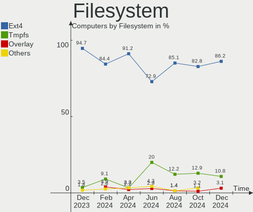
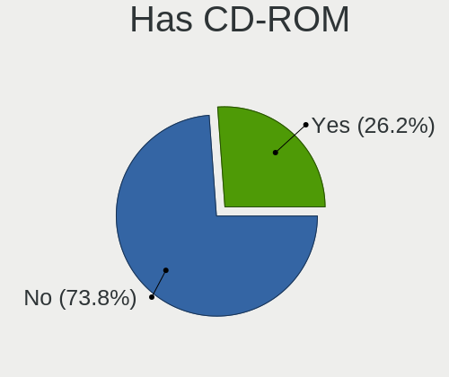
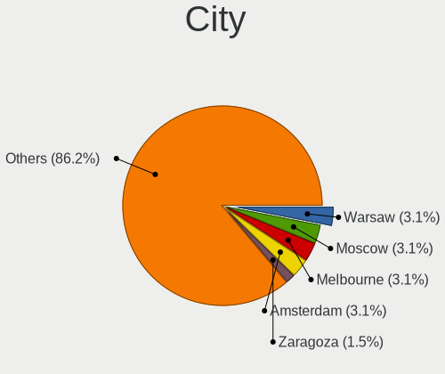
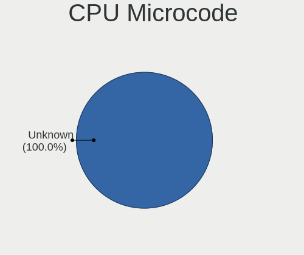
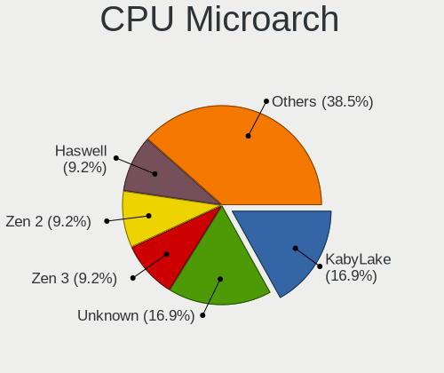

KDE neon - Hardware Trends
--------------------------

A project to identify most popular hardware characteristics and track their change
over time based on data collected by Linux users at https://Linux-Hardware.org.

Anyone can contribute to this report by the [hw-probe](https://github.com/linuxhw/hw-probe) tool:

    sudo -E hw-probe -all -upload

This is a report for all computer types. See also reports for [desktops](/Dist/KDE_neon/Desktop/README.md) and [notebooks](/Dist/KDE_neon/Notebook/README.md).

This report is for one last month. Overall report since the beginning of time: [TestDays](https://github.com/linuxhw/TestDays)

Period: Nov, 2023.

Contents
--------

* [ System ](#system)
  - [ OS                       ](#os)
  - [ OS Family                ](#os-family)
  - [ Kernel                   ](#kernel)
  - [ Kernel Family            ](#kernel-family)
  - [ Kernel Major Ver.        ](#kernel-major-ver)
  - [ Arch                     ](#arch)
  - [ DE                       ](#de)
  - [ Display Server           ](#display-server)
  - [ Display Manager          ](#display-manager)
  - [ OS Lang                  ](#os-lang)
  - [ Boot Mode                ](#boot-mode)
  - [ Filesystem               ](#filesystem)
  - [ Part. scheme             ](#part-scheme)
  - [ Dual Boot with Linux/BSD ](#dual-boot-with-linuxbsd)
  - [ Dual Boot (Win)          ](#dual-boot-win)

* [ Board ](#board)
  - [ Vendor                   ](#vendor)
  - [ Model                    ](#model)
  - [ Model Family             ](#model-family)
  - [ MFG Year                 ](#mfg-year)
  - [ Form Factor              ](#form-factor)
  - [ Secure Boot              ](#secure-boot)
  - [ Coreboot                 ](#coreboot)
  - [ RAM Size                 ](#ram-size)
  - [ RAM Used                 ](#ram-used)
  - [ Total Drives             ](#total-drives)
  - [ Has CD-ROM               ](#has-cd-rom)
  - [ Has Ethernet             ](#has-ethernet)
  - [ Has WiFi                 ](#has-wifi)
  - [ Has Bluetooth            ](#has-bluetooth)

* [ Location ](#location)
  - [ Country                  ](#country)
  - [ City                     ](#city)

* [ Drives ](#drives)
  - [ Drive Vendor             ](#drive-vendor)
  - [ Drive Model              ](#drive-model)
  - [ HDD Vendor               ](#hdd-vendor)
  - [ SSD Vendor               ](#ssd-vendor)
  - [ Drive Kind               ](#drive-kind)
  - [ Drive Connector          ](#drive-connector)
  - [ Drive Size               ](#drive-size)
  - [ Space Total              ](#space-total)
  - [ Space Used               ](#space-used)
  - [ Malfunc. Drives          ](#malfunc-drives)
  - [ Malfunc. Drive Vendor    ](#malfunc-drive-vendor)
  - [ Malfunc. HDD Vendor      ](#malfunc-hdd-vendor)
  - [ Malfunc. Drive Kind      ](#malfunc-drive-kind)
  - [ Failed Drives            ](#failed-drives)
  - [ Failed Drive Vendor      ](#failed-drive-vendor)
  - [ Drive Status             ](#drive-status)

* [ Storage controller ](#storage-controller)
  - [ Storage Vendor           ](#storage-vendor)
  - [ Storage Model            ](#storage-model)
  - [ Storage Kind             ](#storage-kind)

* [ Processor ](#processor)
  - [ CPU Vendor               ](#cpu-vendor)
  - [ CPU Model                ](#cpu-model)
  - [ CPU Model Family         ](#cpu-model-family)
  - [ CPU Cores                ](#cpu-cores)
  - [ CPU Sockets              ](#cpu-sockets)
  - [ CPU Threads              ](#cpu-threads)
  - [ CPU Op-Modes             ](#cpu-op-modes)
  - [ CPU Microcode            ](#cpu-microcode)
  - [ CPU Microarch            ](#cpu-microarch)

* [ Graphics ](#graphics)
  - [ GPU Vendor               ](#gpu-vendor)
  - [ GPU Model                ](#gpu-model)
  - [ GPU Combo                ](#gpu-combo)
  - [ GPU Driver               ](#gpu-driver)
  - [ GPU Memory               ](#gpu-memory)

* [ Monitor ](#monitor)
  - [ Monitor Vendor           ](#monitor-vendor)
  - [ Monitor Model            ](#monitor-model)
  - [ Monitor Resolution       ](#monitor-resolution)
  - [ Monitor Diagonal         ](#monitor-diagonal)
  - [ Monitor Width            ](#monitor-width)
  - [ Aspect Ratio             ](#aspect-ratio)
  - [ Monitor Area             ](#monitor-area)
  - [ Pixel Density            ](#pixel-density)
  - [ Multiple Monitors        ](#multiple-monitors)

* [ Network ](#network)
  - [ Net Controller Vendor    ](#net-controller-vendor)
  - [ Net Controller Model     ](#net-controller-model)
  - [ Wireless Vendor          ](#wireless-vendor)
  - [ Wireless Model           ](#wireless-model)
  - [ Ethernet Vendor          ](#ethernet-vendor)
  - [ Ethernet Model           ](#ethernet-model)
  - [ Net Controller Kind      ](#net-controller-kind)
  - [ Used Controller          ](#used-controller)
  - [ NICs                     ](#nics)
  - [ IPv6                     ](#ipv6)

* [ Bluetooth ](#bluetooth)
  - [ Bluetooth Vendor         ](#bluetooth-vendor)
  - [ Bluetooth Model          ](#bluetooth-model)

* [ Sound ](#sound)
  - [ Sound Vendor             ](#sound-vendor)
  - [ Sound Model              ](#sound-model)

* [ Memory ](#memory)
  - [ Memory Vendor            ](#memory-vendor)
  - [ Memory Model             ](#memory-model)
  - [ Memory Kind              ](#memory-kind)
  - [ Memory Form Factor       ](#memory-form-factor)
  - [ Memory Size              ](#memory-size)
  - [ Memory Speed             ](#memory-speed)

* [ Printers & scanners ](#printers--scanners)
  - [ Printer Vendor           ](#printer-vendor)
  - [ Printer Model            ](#printer-model)
  - [ Scanner Vendor           ](#scanner-vendor)
  - [ Scanner Model            ](#scanner-model)

* [ Camera ](#camera)
  - [ Camera Vendor            ](#camera-vendor)
  - [ Camera Model             ](#camera-model)

* [ Security ](#security)
  - [ Fingerprint Vendor       ](#fingerprint-vendor)
  - [ Fingerprint Model        ](#fingerprint-model)
  - [ Chipcard Vendor          ](#chipcard-vendor)
  - [ Chipcard Model           ](#chipcard-model)

* [ Unsupported ](#unsupported)
  - [ Unsupported Devices      ](#unsupported-devices)
  - [ Unsupported Device Types ](#unsupported-device-types)

System
------

OS
--

Installed operating systems

| Name           | Computers | Percent |
|----------------|-----------|---------|
| KDE neon 22.04 | 64        | 98.46%  |
| KDE neon 20.04 | 1         | 1.54%   |

OS Family
---------

OS without a version

| Name     | Computers | Percent |
|----------|-----------|---------|
| KDE neon | 65        | 100%    |

Kernel
------

Version of the Linux kernel

| Version              | Computers | Percent |
|----------------------|-----------|---------|
| 6.2.0-36-generic     | 39        | 60%     |
| 6.2.0-37-generic     | 11        | 16.92%  |
| 6.2.0-35-generic     | 4         | 6.15%   |
| 6.5.7-surface-2      | 1         | 1.54%   |
| 6.4.0-060400-generic | 1         | 1.54%   |
| 6.3.1-060301-generic | 1         | 1.54%   |
| 6.2.0-33-generic     | 1         | 1.54%   |
| 6.2.0-32-generic     | 1         | 1.54%   |
| 5.8.0-59-generic     | 1         | 1.54%   |
| 5.19.0-50-generic    | 1         | 1.54%   |
| 5.19.0-43-generic    | 1         | 1.54%   |
| 5.19.0-38-generic    | 1         | 1.54%   |
| 5.19.0-35-generic    | 1         | 1.54%   |
| 5.15.0-56-generic    | 1         | 1.54%   |

Kernel Family
-------------

Linux kernel without a distro release

| Version | Computers | Percent |
|---------|-----------|---------|
| 6.2.0   | 56        | 86.15%  |
| 5.19.0  | 4         | 6.15%   |
| 6.5.7   | 1         | 1.54%   |
| 6.4.0   | 1         | 1.54%   |
| 6.3.1   | 1         | 1.54%   |
| 5.8.0   | 1         | 1.54%   |
| 5.15.0  | 1         | 1.54%   |

Kernel Major Ver.
-----------------

Linux kernel major version

| Version | Computers | Percent |
|---------|-----------|---------|
| 6.2     | 56        | 86.15%  |
| 5.19    | 4         | 6.15%   |
| 6.5     | 1         | 1.54%   |
| 6.4     | 1         | 1.54%   |
| 6.3     | 1         | 1.54%   |
| 5.8     | 1         | 1.54%   |
| 5.15    | 1         | 1.54%   |

Arch
----

OS architecture (x86_64, i586, etc.)

| Name   | Computers | Percent |
|--------|-----------|---------|
| x86_64 | 65        | 100%    |

DE
--

Desktop Environment

| Name  | Computers | Percent |
|-------|-----------|---------|
| KDE5  | 60        | 92.31%  |
| KDE6  | 2         | 3.08%   |
| GNOME | 2         | 3.08%   |
| KDE   | 1         | 1.54%   |

Display Server
--------------

X11 or Wayland

| Name    | Computers | Percent |
|---------|-----------|---------|
| X11     | 56        | 86.15%  |
| Wayland | 9         | 13.85%  |

Display Manager
---------------

SDDM, LightDM, etc.

| Name    | Computers | Percent |
|---------|-----------|---------|
| Unknown | 51        | 78.46%  |
| SDDM    | 14        | 21.54%  |

OS Lang
-------

Language

| Lang  | Computers | Percent |
|-------|-----------|---------|
| en_US | 29        | 44.62%  |
| C     | 7         | 10.77%  |
| ru_RU | 5         | 7.69%   |
| en_GB | 5         | 7.69%   |
| es_MX | 3         | 4.62%   |
| pt_BR | 2         | 3.08%   |
| en_CA | 2         | 3.08%   |
| en_AU | 2         | 3.08%   |
| de_DE | 2         | 3.08%   |
| sl_SI | 1         | 1.54%   |
| sk_SK | 1         | 1.54%   |
| pl_PL | 1         | 1.54%   |
| it_IT | 1         | 1.54%   |
| fr_FR | 1         | 1.54%   |
| fr_BE | 1         | 1.54%   |
| es_ES | 1         | 1.54%   |
| en_IN | 1         | 1.54%   |

Boot Mode
---------

EFI or BIOS

| Mode | Computers | Percent |
|------|-----------|---------|
| BIOS | 55        | 84.62%  |
| EFI  | 10        | 15.38%  |

Filesystem
----------

Type of filesystem

| Type    | Computers | Percent |
|---------|-----------|---------|
| Ext4    | 56        | 86.15%  |
| Tmpfs   | 5         | 7.69%   |
| Overlay | 4         | 6.15%   |

Part. scheme
------------

Scheme of partitioning

| Type    | Computers | Percent |
|---------|-----------|---------|
| Unknown | 51        | 78.46%  |
| GPT     | 12        | 18.46%  |
| MBR     | 2         | 3.08%   |

Dual Boot with Linux/BSD
------------------------

Hosting more than one Linux/BSD

| Dual boot | Computers | Percent |
|-----------|-----------|---------|
| No        | 61        | 93.85%  |
| Yes       | 4         | 6.15%   |

Dual Boot (Win)
---------------

Hosting Linux and Windows

| Dual boot | Computers | Percent |
|-----------|-----------|---------|
| No        | 57        | 87.69%  |
| Yes       | 8         | 12.31%  |

Board
-----

Vendor
------

Motherboard manufacturer

| Name                | Computers | Percent |
|---------------------|-----------|---------|
| ASUSTek Computer    | 15        | 23.08%  |
| Hewlett-Packard     | 13        | 20%     |
| Lenovo              | 7         | 10.77%  |
| Gigabyte Technology | 6         | 9.23%   |
| Dell                | 5         | 7.69%   |
| MSI                 | 4         | 6.15%   |
| Apple               | 3         | 4.62%   |
| Acer                | 3         | 4.62%   |
| ASRock              | 2         | 3.08%   |
| UMAX                | 1         | 1.54%   |
| Positivo            | 1         | 1.54%   |
| Packard Bell        | 1         | 1.54%   |
| Notebook            | 1         | 1.54%   |
| Microsoft           | 1         | 1.54%   |
| Intel               | 1         | 1.54%   |
| Haier               | 1         | 1.54%   |

Model
-----

Motherboard model

| Name                                     | Computers | Percent |
|------------------------------------------|-----------|---------|
| ASUS All Series                          | 2         | 3.08%   |
| UMAX 13Wa_Flex                           | 1         | 1.54%   |
| Positivo POS-EIH61CE                     | 1         | 1.54%   |
| Packard Bell EasyNote TE69KB             | 1         | 1.54%   |
| Notebook N150CU                          | 1         | 1.54%   |
| MSI Vector GP66 12UGS                    | 1         | 1.54%   |
| MSI MS-7E12                              | 1         | 1.54%   |
| MSI MS-7B89                              | 1         | 1.54%   |
| MSI MS-7623                              | 1         | 1.54%   |
| Microsoft Surface Go 3                   | 1         | 1.54%   |
| Lenovo ThinkPad X1 Carbon 6th 20KGS9SA01 | 1         | 1.54%   |
| Lenovo ThinkPad T420 4236WR1             | 1         | 1.54%   |
| Lenovo ThinkPad E14 Gen 2 20TA0035CK     | 1         | 1.54%   |
| Lenovo Legion Pro 5 16IRX8 82WK          | 1         | 1.54%   |
| Lenovo IdeaPadFlex 5 15ITL05 82HT        | 1         | 1.54%   |
| Lenovo G780                              | 1         | 1.54%   |
| Lenovo B70-80 80MR                       | 1         | 1.54%   |
| Intel SLIMBOOK                           | 1         | 1.54%   |
| HP Stream Notebook PC 13                 | 1         | 1.54%   |
| HP ProBook 6565b                         | 1         | 1.54%   |
| HP Pavilion Laptop 15-eh1xxx             | 1         | 1.54%   |
| HP Pavilion Gaming Laptop 15-ec0xxx      | 1         | 1.54%   |
| HP Laptop 17-ca2xxx                      | 1         | 1.54%   |
| HP Laptop 15s-du3xxx                     | 1         | 1.54%   |
| HP Laptop 15-dy2xxx                      | 1         | 1.54%   |
| HP Laptop 15-da0xxx                      | 1         | 1.54%   |
| HP Laptop 14-fq0xxx                      | 1         | 1.54%   |
| HP Laptop 14-cf0xxx                      | 1         | 1.54%   |
| HP EliteDesk 800 G2 SFF                  | 1         | 1.54%   |
| HP Elite Dragonfly G2 Notebook PC        | 1         | 1.54%   |
| HP 245 G4 Notebook PC                    | 1         | 1.54%   |
| Haier GG1500A                            | 1         | 1.54%   |
| Gigabyte Z690 UD                         | 1         | 1.54%   |
| Gigabyte Z390 AORUS PRO WIFI             | 1         | 1.54%   |
| Gigabyte H81M-H                          | 1         | 1.54%   |
| Gigabyte GA-MA785GM-US2H                 | 1         | 1.54%   |
| Gigabyte G5 GE                           | 1         | 1.54%   |
| Gigabyte B550 AORUS PRO AC               | 1         | 1.54%   |
| Dell XPS 9315                            | 1         | 1.54%   |
| Dell Vostro 270                          | 1         | 1.54%   |

Model Family
------------

Motherboard model prefix

| Name                     | Computers | Percent |
|--------------------------|-----------|---------|
| HP Laptop                | 6         | 9.23%   |
| Lenovo ThinkPad          | 3         | 4.62%   |
| ASUS PRIME               | 3         | 4.62%   |
| Apple MacBookPro11       | 3         | 4.62%   |
| HP Pavilion              | 2         | 3.08%   |
| ASUS All                 | 2         | 3.08%   |
| UMAX 13Wa                | 1         | 1.54%   |
| Positivo POS-EIH61CE     | 1         | 1.54%   |
| Packard Bell EasyNote    | 1         | 1.54%   |
| Notebook N150CU          | 1         | 1.54%   |
| MSI Vector               | 1         | 1.54%   |
| MSI MS-7E12              | 1         | 1.54%   |
| MSI MS-7B89              | 1         | 1.54%   |
| MSI MS-7623              | 1         | 1.54%   |
| Microsoft Surface        | 1         | 1.54%   |
| Lenovo Legion            | 1         | 1.54%   |
| Lenovo IdeaPadFlex       | 1         | 1.54%   |
| Lenovo G780              | 1         | 1.54%   |
| Lenovo B70-80            | 1         | 1.54%   |
| Intel SLIMBOOK           | 1         | 1.54%   |
| HP Stream                | 1         | 1.54%   |
| HP ProBook               | 1         | 1.54%   |
| HP EliteDesk             | 1         | 1.54%   |
| HP Elite                 | 1         | 1.54%   |
| HP 245                   | 1         | 1.54%   |
| Haier GG1500A            | 1         | 1.54%   |
| Gigabyte Z690            | 1         | 1.54%   |
| Gigabyte Z390            | 1         | 1.54%   |
| Gigabyte H81M-H          | 1         | 1.54%   |
| Gigabyte GA-MA785GM-US2H | 1         | 1.54%   |
| Gigabyte G5              | 1         | 1.54%   |
| Gigabyte B550            | 1         | 1.54%   |
| Dell XPS                 | 1         | 1.54%   |
| Dell Vostro              | 1         | 1.54%   |
| Dell Precision           | 1         | 1.54%   |
| Dell Latitude            | 1         | 1.54%   |
| Dell G15                 | 1         | 1.54%   |
| ASUS ZenBook             | 1         | 1.54%   |
| ASUS X705UDR             | 1         | 1.54%   |
| ASUS X555LN              | 1         | 1.54%   |

MFG Year
--------

Motherboard manufacture year

| Year | Computers | Percent |
|------|-----------|---------|
| 2018 | 12        | 18.46%  |
| 2020 | 9         | 13.85%  |
| 2021 | 6         | 9.23%   |
| 2013 | 6         | 9.23%   |
| 2022 | 5         | 7.69%   |
| 2016 | 4         | 6.15%   |
| 2015 | 4         | 6.15%   |
| 2011 | 4         | 6.15%   |
| 2023 | 3         | 4.62%   |
| 2019 | 3         | 4.62%   |
| 2012 | 3         | 4.62%   |
| 2014 | 2         | 3.08%   |
| 2009 | 2         | 3.08%   |
| 2017 | 1         | 1.54%   |
| 2010 | 1         | 1.54%   |

Form Factor
-----------

Physical design of the computer

| Name        | Computers | Percent |
|-------------|-----------|---------|
| Notebook    | 37        | 56.92%  |
| Desktop     | 25        | 38.46%  |
| Convertible | 2         | 3.08%   |
| Tablet      | 1         | 1.54%   |

Secure Boot
-----------

Enabled or disabled

| State    | Computers | Percent |
|----------|-----------|---------|
| Disabled | 64        | 98.46%  |
| Enabled  | 1         | 1.54%   |

Coreboot
--------

Have coreboot on board

| Used | Computers | Percent |
|------|-----------|---------|
| No   | 65        | 100%    |

RAM Size
--------

Total RAM memory

| Size in GB  | Computers | Percent |
|-------------|-----------|---------|
| 4.01-8.0    | 16        | 24.62%  |
| 16.01-24.0  | 16        | 24.62%  |
| 32.01-64.0  | 10        | 15.38%  |
| 8.01-16.0   | 10        | 15.38%  |
| 3.01-4.0    | 9         | 13.85%  |
| 64.01-256.0 | 2         | 3.08%   |
| 24.01-32.0  | 1         | 1.54%   |
| 1.01-2.0    | 1         | 1.54%   |

RAM Used
--------

Used RAM memory

| Used GB   | Computers | Percent |
|-----------|-----------|---------|
| 2.01-3.0  | 21        | 32.31%  |
| 1.01-2.0  | 19        | 29.23%  |
| 4.01-8.0  | 10        | 15.38%  |
| 3.01-4.0  | 9         | 13.85%  |
| 8.01-16.0 | 5         | 7.69%   |
| 0.51-1.0  | 1         | 1.54%   |

Total Drives
------------

Number of drives on board

| Drives | Computers | Percent |
|--------|-----------|---------|
| 1      | 35        | 53.85%  |
| 2      | 15        | 23.08%  |
| 4      | 6         | 9.23%   |
| 5      | 4         | 6.15%   |
| 3      | 3         | 4.62%   |
| 9      | 1         | 1.54%   |
| 6      | 1         | 1.54%   |

Has CD-ROM
----------

Has CD-ROM on board

| Presented | Computers | Percent |
|-----------|-----------|---------|
| No        | 48        | 73.85%  |
| Yes       | 17        | 26.15%  |

Has Ethernet
------------

Has Ethernet on board

| Presented | Computers | Percent |
|-----------|-----------|---------|
| Yes       | 54        | 83.08%  |
| No        | 11        | 16.92%  |

Has WiFi
--------

Has WiFi module

| Presented | Computers | Percent |
|-----------|-----------|---------|
| Yes       | 50        | 76.92%  |
| No        | 15        | 23.08%  |

Has Bluetooth
-------------

Has Bluetooth module

| Presented | Computers | Percent |
|-----------|-----------|---------|
| Yes       | 43        | 66.15%  |
| No        | 22        | 33.85%  |

Location
--------

Country
-------

Geographic location (country)

| Country     | Computers | Percent |
|-------------|-----------|---------|
| USA         | 17        | 26.15%  |
| Russia      | 4         | 6.15%   |
| Netherlands | 4         | 6.15%   |
| Germany     | 4         | 6.15%   |
| Australia   | 4         | 6.15%   |
| Slovakia    | 3         | 4.62%   |
| Canada      | 3         | 4.62%   |
| Poland      | 2         | 3.08%   |
| Mexico      | 2         | 3.08%   |
| India       | 2         | 3.08%   |
| Colombia    | 2         | 3.08%   |
| Brazil      | 2         | 3.08%   |
| Austria     | 2         | 3.08%   |
| Ukraine     | 1         | 1.54%   |
| UK          | 1         | 1.54%   |
| Tunisia     | 1         | 1.54%   |
| Sweden      | 1         | 1.54%   |
| Spain       | 1         | 1.54%   |
| Slovenia    | 1         | 1.54%   |
| Norway      | 1         | 1.54%   |
| Italy       | 1         | 1.54%   |
| Ireland     | 1         | 1.54%   |
| Cuba        | 1         | 1.54%   |
| Chile       | 1         | 1.54%   |
| Bolivia     | 1         | 1.54%   |
| Belgium     | 1         | 1.54%   |
| Armenia     | 1         | 1.54%   |

City
----

Geographic location (city)

| City             | Computers | Percent |
|------------------|-----------|---------|
| Brisbane         | 3         | 4.62%   |
| Zoetermeer       | 1         | 1.54%   |
| Yerevan          | 1         | 1.54%   |
| Winterswijk      | 1         | 1.54%   |
| West Valley City | 1         | 1.54%   |
| West Kelowna     | 1         | 1.54%   |
| Viña del Mar    | 1         | 1.54%   |
| Vigonza          | 1         | 1.54%   |
| Vienna           | 1         | 1.54%   |
| Valladolid       | 1         | 1.54%   |
| Uzhhorod         | 1         | 1.54%   |
| Ufa              | 1         | 1.54%   |
| Tijuana          | 1         | 1.54%   |
| Sousse           | 1         | 1.54%   |
| Sogamoso         | 1         | 1.54%   |
| Senhor do Bonfim | 1         | 1.54%   |
| Rauris           | 1         | 1.54%   |
| Poznan           | 1         | 1.54%   |
| Phoenix          | 1         | 1.54%   |
| Ottawa           | 1         | 1.54%   |
| Oldenburg        | 1         | 1.54%   |
| Nuremberg        | 1         | 1.54%   |
| Moscow           | 1         | 1.54%   |
| Molalla          | 1         | 1.54%   |
| Moberly          | 1         | 1.54%   |
| Medellín        | 1         | 1.54%   |
| Marshall         | 1         | 1.54%   |
| Marília         | 1         | 1.54%   |
| Manchester       | 1         | 1.54%   |
| Lakeville        | 1         | 1.54%   |
| La Paz           | 1         | 1.54%   |
| Kurgan           | 1         | 1.54%   |
| Košice          | 1         | 1.54%   |
| Kobarid          | 1         | 1.54%   |
| Kiselëvsk       | 1         | 1.54%   |
| Kety             | 1         | 1.54%   |
| Johnson City     | 1         | 1.54%   |
| Jaipur           | 1         | 1.54%   |
| Houston          | 1         | 1.54%   |
| Harvest          | 1         | 1.54%   |

Drives
------

Drive Vendor
------------

Hard drive vendors

| Vendor                       | Computers | Drives | Percent |
|------------------------------|-----------|--------|---------|
| Samsung Electronics          | 19        | 28     | 18.27%  |
| Seagate                      | 12        | 19     | 11.54%  |
| WDC                          | 10        | 18     | 9.62%   |
| Toshiba                      | 9         | 10     | 8.65%   |
| Unknown                      | 8         | 9      | 7.69%   |
| Sandisk                      | 7         | 10     | 6.73%   |
| Kingston                     | 7         | 7      | 6.73%   |
| Crucial                      | 5         | 5      | 4.81%   |
| Hitachi                      | 4         | 4      | 3.85%   |
| Micron Technology            | 3         | 3      | 2.88%   |
| Apple                        | 3         | 3      | 2.88%   |
| SPCC                         | 2         | 2      | 1.92%   |
| SK hynix                     | 2         | 2      | 1.92%   |
| KIOXIA                       | 2         | 2      | 1.92%   |
| Kingston Technology Company  | 2         | 2      | 1.92%   |
| HGST                         | 2         | 2      | 1.92%   |
| Silicon Motion               | 1         | 1      | 0.96%   |
| Shenzhen Longsys Electronics | 1         | 1      | 0.96%   |
| PNY CS90                     | 1         | 1      | 0.96%   |
| OCZ                          | 1         | 1      | 0.96%   |
| LITEON                       | 1         | 1      | 0.96%   |
| Hewlett-Packard              | 1         | 1      | 0.96%   |
| A-DATA Technology            | 1         | 1      | 0.96%   |

Drive Model
-----------

Hard drive models

| Model                                               | Computers | Percent |
|-----------------------------------------------------|-----------|---------|
| Unknown MMC Card  64GB                              | 4         | 3.13%   |
| Samsung NVMe SSD Controller SM981/PM981/PM983 250GB | 4         | 3.13%   |
| Sandisk WD Blue SN550 NVMe SSD 512GB                | 3         | 2.34%   |
| Toshiba HDWD130 3TB                                 | 2         | 1.56%   |
| Seagate ST2000DX002-2DV164 2TB                      | 2         | 1.56%   |
| Seagate ST1000LM035-1RK172 1TB                      | 2         | 1.56%   |
| Samsung SSD 850 EVO 250GB                           | 2         | 1.56%   |
| Samsung NVMe SSD Controller PM9A1/PM9A3/980PRO 2TB  | 2         | 1.56%   |
| HGST HTS541010A9E680 1TB                            | 2         | 1.56%   |
| Crucial CT480BX500SSD1 480GB                        | 2         | 1.56%   |
| WDC WDS100T2B0B 1TB SSD                             | 1         | 0.78%   |
| WDC WDBNCE0010PNC 1TB SSD                           | 1         | 0.78%   |
| WDC WD6401AALS-00L3B2 640GB                         | 1         | 0.78%   |
| WDC WD5000LPCX-60VHAT1 500GB                        | 1         | 0.78%   |
| WDC WD5000AAKX-08ERMA0 500GB                        | 1         | 0.78%   |
| WDC WD5000AAKX-001CA0 500GB                         | 1         | 0.78%   |
| WDC WD40EZRZ-00GXCB0 4TB                            | 1         | 0.78%   |
| WDC WD3200AAKS-00YGA0 320GB                         | 1         | 0.78%   |
| WDC WD20SPZX-22UA7T0 2TB                            | 1         | 0.78%   |
| WDC WD20EZRX-00D8PB0 2TB                            | 1         | 0.78%   |
| WDC WD20EARX-00PASB0 2TB                            | 1         | 0.78%   |
| WDC WD181KRYZ-01AGBB0 18TB                          | 1         | 0.78%   |
| WDC WD1600AAJS-00WAA0 160GB                         | 1         | 0.78%   |
| WDC WD121KRYZ-01W0RB0 12TB                          | 1         | 0.78%   |
| WDC WD10JPCX-24UE4T0 1TB                            | 1         | 0.78%   |
| WDC WD10EARS-00Y5B1 1TB                             | 1         | 0.78%   |
| WDC WD100EMAZ-00WJTA0 10TB                          | 1         | 0.78%   |
| Unknown SD/MMC/MS PRO 128GB                         | 1         | 0.78%   |
| Unknown SD/MMC 2GB                                  | 1         | 0.78%   |
| Unknown MMC Card  4GB                               | 1         | 0.78%   |
| Unknown MMC Card  32GB                              | 1         | 0.78%   |
| Unknown M.S./M.S.Pro/HG 16GB                        | 1         | 0.78%   |
| Toshiba TR150 240GB SSD                             | 1         | 0.78%   |
| Toshiba MQ04ABF100 1TB                              | 1         | 0.78%   |
| Toshiba MQ01ABD032 320GB                            | 1         | 0.78%   |
| Toshiba MK5075GSX 500GB                             | 1         | 0.78%   |
| Toshiba MK3261GSYN 320GB                            | 1         | 0.78%   |
| Toshiba HDWD105 500GB                               | 1         | 0.78%   |
| Toshiba DT01ACA100 1TB                              | 1         | 0.78%   |
| SPCC Solid State Disk 256GB                         | 1         | 0.78%   |

HDD Vendor
----------

Hard disk drive vendors

| Vendor              | Computers | Drives | Percent |
|---------------------|-----------|--------|---------|
| Seagate             | 12        | 19     | 30.77%  |
| WDC                 | 10        | 16     | 25.64%  |
| Toshiba             | 8         | 9      | 20.51%  |
| Hitachi             | 4         | 4      | 10.26%  |
| Samsung Electronics | 2         | 2      | 5.13%   |
| HGST                | 2         | 2      | 5.13%   |
| Unknown             | 1         | 1      | 2.56%   |

SSD Vendor
----------

Solid state drive vendors

| Vendor              | Computers | Drives | Percent |
|---------------------|-----------|--------|---------|
| Samsung Electronics | 8         | 12     | 25%     |
| Crucial             | 5         | 5      | 15.63%  |
| Kingston            | 4         | 4      | 12.5%   |
| Apple               | 3         | 3      | 9.38%   |
| WDC                 | 2         | 2      | 6.25%   |
| SPCC                | 2         | 2      | 6.25%   |
| Toshiba             | 1         | 1      | 3.13%   |
| SK hynix            | 1         | 1      | 3.13%   |
| SanDisk             | 1         | 2      | 3.13%   |
| PNY CS90            | 1         | 1      | 3.13%   |
| OCZ                 | 1         | 1      | 3.13%   |
| Micron Technology   | 1         | 1      | 3.13%   |
| Hewlett-Packard     | 1         | 1      | 3.13%   |
| A-DATA Technology   | 1         | 1      | 3.13%   |

Drive Kind
----------

HDD or SSD

| Kind    | Computers | Drives | Percent |
|---------|-----------|--------|---------|
| HDD     | 30        | 53     | 33.33%  |
| NVMe    | 28        | 35     | 31.11%  |
| SSD     | 25        | 37     | 27.78%  |
| MMC     | 6         | 6      | 6.67%   |
| Unknown | 1         | 2      | 1.11%   |

Drive Connector
---------------

SATA, SAS, NVMe, etc.

| Type | Computers | Drives | Percent |
|------|-----------|--------|---------|
| SATA | 42        | 86     | 51.85%  |
| NVMe | 28        | 35     | 34.57%  |
| MMC  | 6         | 6      | 7.41%   |
| SAS  | 5         | 6      | 6.17%   |

Drive Size
----------

Size of hard drive

| Size in TB | Computers | Drives | Percent |
|------------|-----------|--------|---------|
| 0.01-0.5   | 34        | 43     | 51.52%  |
| 0.51-1.0   | 16        | 20     | 24.24%  |
| 1.01-2.0   | 5         | 9      | 7.58%   |
| 2.01-3.0   | 4         | 4      | 6.06%   |
| 3.01-4.0   | 3         | 5      | 4.55%   |
| 4.01-10.0  | 3         | 4      | 4.55%   |
| 10.01-20.0 | 1         | 5      | 1.52%   |

Space Total
-----------

Amount of disk space available on the file system

| Size in GB     | Computers | Percent |
|----------------|-----------|---------|
| 251-500        | 17        | 26.15%  |
| 101-250        | 16        | 24.62%  |
| 1-20           | 7         | 10.77%  |
| 21-50          | 5         | 7.69%   |
| 501-1000       | 5         | 7.69%   |
| More than 3000 | 4         | 6.15%   |
| 2001-3000      | 4         | 6.15%   |
| Unknown        | 3         | 4.62%   |
| 1001-2000      | 2         | 3.08%   |
| 51-100         | 2         | 3.08%   |

Space Used
----------

Amount of used disk space

| Used GB        | Computers | Percent |
|----------------|-----------|---------|
| 1-20           | 28        | 43.08%  |
| 101-250        | 8         | 12.31%  |
| 21-50          | 7         | 10.77%  |
| 51-100         | 7         | 10.77%  |
| 1001-2000      | 4         | 6.15%   |
| More than 3000 | 3         | 4.62%   |
| Unknown        | 3         | 4.62%   |
| 251-500        | 2         | 3.08%   |
| 501-1000       | 2         | 3.08%   |
| 2001-3000      | 1         | 1.54%   |

Malfunc. Drives
---------------

Drive models with a malfunction

| Model                                            | Computers | Drives | Percent |
|--------------------------------------------------|-----------|--------|---------|
| Samsung Electronics MZNLH128HBHQ-000H1 128GB SSD | 1         | 1      | 100%    |

Malfunc. Drive Vendor
---------------------

Vendors of faulty drives

| Vendor              | Computers | Drives | Percent |
|---------------------|-----------|--------|---------|
| Samsung Electronics | 1         | 1      | 100%    |

Malfunc. HDD Vendor
-------------------

Vendors of faulty HDD drives

Zero info for selected period =(

Malfunc. Drive Kind
-------------------

Kinds of faulty drives

| Kind | Computers | Drives | Percent |
|------|-----------|--------|---------|
| SSD  | 1         | 1      | 100%    |

Failed Drives
-------------

Failed drive models

Zero info for selected period =(

Failed Drive Vendor
-------------------

Failed drive vendors

Zero info for selected period =(

Drive Status
------------

Number of failed and malfunc. drives

| Status   | Computers | Drives | Percent |
|----------|-----------|--------|---------|
| Detected | 58        | 119    | 86.57%  |
| Works    | 8         | 13     | 11.94%  |
| Malfunc  | 1         | 1      | 1.49%   |

Storage controller
------------------

Storage Vendor
--------------

Storage controller vendors

| Vendor                       | Computers | Percent |
|------------------------------|-----------|---------|
| Intel                        | 35        | 41.67%  |
| AMD                          | 15        | 17.86%  |
| Samsung Electronics          | 13        | 15.48%  |
| SanDisk                      | 6         | 7.14%   |
| Kingston Technology Company  | 5         | 5.95%   |
| Micron Technology            | 2         | 2.38%   |
| KIOXIA                       | 2         | 2.38%   |
| SK hynix                     | 1         | 1.19%   |
| Silicon Motion               | 1         | 1.19%   |
| Shenzhen Longsys Electronics | 1         | 1.19%   |
| Marvell Technology Group     | 1         | 1.19%   |
| Lite-On Technology           | 1         | 1.19%   |
| ASMedia Technology           | 1         | 1.19%   |

Storage Model
-------------

Storage controller models

| Model                                                                          | Computers | Percent |
|--------------------------------------------------------------------------------|-----------|---------|
| AMD FCH SATA Controller [AHCI mode]                                            | 10        | 10.53%  |
| Samsung NVMe SSD Controller SM981/PM981/PM983                                  | 5         | 5.26%   |
| Samsung NVMe SSD Controller 980 (DRAM-less)                                    | 4         | 4.21%   |
| Intel Volume Management Device NVMe RAID Controller                            | 4         | 4.21%   |
| Intel Q170/Q150/B150/H170/H110/Z170/CM236 Chipset SATA Controller [AHCI Mode]  | 4         | 4.21%   |
| SanDisk Ultra 3D / WD Blue SN550 NVMe SSD                                      | 3         | 3.16%   |
| Samsung NVMe SSD Controller PM9A1/PM9A3/980PRO                                 | 3         | 3.16%   |
| Intel Sunrise Point-LP SATA Controller [AHCI mode]                             | 3         | 3.16%   |
| Intel 8 Series/C220 Series Chipset Family 6-port SATA Controller 1 [AHCI mode] | 3         | 3.16%   |
| Intel 200 Series PCH SATA controller [AHCI mode]                               | 3         | 3.16%   |
| Intel 6 Series/C200 Series Chipset Family 6 port Mobile SATA AHCI Controller   | 2         | 2.11%   |
| Intel 400 Series Chipset Family SATA AHCI Controller                           | 2         | 2.11%   |
| AMD SB7x0/SB8x0/SB9x0 IDE Controller                                           | 2         | 2.11%   |
| AMD 500 Series Chipset SATA Controller                                         | 2         | 2.11%   |
| AMD 400 Series Chipset SATA Controller                                         | 2         | 2.11%   |
| SK hynix Gold P31/BC711/PC711 NVMe Solid State Drive                           | 1         | 1.05%   |
| Silicon Motion SM2262/SM2262EN SSD Controller                                  | 1         | 1.05%   |
| Shenzhen Longsys Non-Volatile memory controller                                | 1         | 1.05%   |
| SanDisk WD PC SN810 / Black SN850 NVMe SSD                                     | 1         | 1.05%   |
| SanDisk WD Black SN770 / PC SN740 256GB / PC SN560 (DRAM-less) NVMe SSD        | 1         | 1.05%   |
| SanDisk Ultra 3D / WD Blue SN570 NVMe SSD (DRAM-less)                          | 1         | 1.05%   |
| SanDisk Extreme Pro / WD Black SN750 / PC SN730 / Red SN700 NVMe SSD           | 1         | 1.05%   |
| SanDisk Extreme Pro / WD Black 2018/SN750/PC SN720 NVMe SSD                    | 1         | 1.05%   |
| Samsung S4LN058A01[SSUBX] AHCI SSD Controller (Apple slot)                     | 1         | 1.05%   |
| Samsung S4LN053X01 AHCI SSD Controller(Apple slot)                             | 1         | 1.05%   |
| Samsung NVMe SSD Controller SM961/PM961/SM963                                  | 1         | 1.05%   |
| Micron 3460 NVMe SSD                                                           | 1         | 1.05%   |
| Micron 2450 NVMe SSD [HendrixV] (DRAM-less)                                    | 1         | 1.05%   |
| Marvell Group 88SS9183 PCIe SSD Controller                                     | 1         | 1.05%   |
| Lite-On CA3-8D256, CA3-8D512 NVMe SSD                                          | 1         | 1.05%   |
| KIOXIA NVMe SSD Controller BG5 (DRAM-less)                                     | 1         | 1.05%   |
| KIOXIA NVMe SSD Controller BG4 (DRAM-less)                                     | 1         | 1.05%   |
| Kingston Company OM8PCP Design-In PCIe 3 NVMe SSD (DRAM-less)                  | 1         | 1.05%   |
| Kingston Company OM3PDP3 NVMe SSD                                              | 1         | 1.05%   |
| Kingston Company NV1 NVMe SSD SM2263XT                                         | 1         | 1.05%   |
| Kingston Company KC3000/FURY Renegade NVMe SSD E18                             | 1         | 1.05%   |
| Kingston Company A1000/U-SNS8154P3 x2 NVMe SSD                                 | 1         | 1.05%   |
| Intel Wildcat Point-LP SATA Controller [AHCI Mode]                             | 1         | 1.05%   |
| Intel Tiger Lake-LP SATA Controller                                            | 1         | 1.05%   |
| Intel Comet Lake SATA AHCI Controller                                          | 1         | 1.05%   |

Storage Kind
------------

Kind of storage controller (IDE, SATA, NVMe, SAS, ...)

| Kind | Computers | Percent |
|------|-----------|---------|
| SATA | 50        | 58.82%  |
| NVMe | 28        | 32.94%  |
| RAID | 4         | 4.71%   |
| IDE  | 3         | 3.53%   |

Processor
---------

CPU Vendor
----------

Processor vendors

| Vendor | Computers | Percent |
|--------|-----------|---------|
| Intel  | 48        | 73.85%  |
| AMD    | 17        | 26.15%  |

CPU Model
---------

Processor models

| Model                                       | Computers | Percent |
|---------------------------------------------|-----------|---------|
| Intel Core i5-10200H CPU @ 2.40GHz          | 2         | 3.08%   |
| Intel Celeron N4000 CPU @ 1.10GHz           | 2         | 3.08%   |
| Intel 11th Gen Core i5-1135G7 @ 2.40GHz     | 2         | 3.08%   |
| AMD Ryzen 9 7900X 12-Core Processor         | 2         | 3.08%   |
| AMD Ryzen 7 2700X Eight-Core Processor      | 2         | 3.08%   |
| Intel Pentium Gold G5400 CPU @ 3.70GHz      | 1         | 1.54%   |
| Intel Pentium Dual-Core CPU T4400 @ 2.20GHz | 1         | 1.54%   |
| Intel Pentium CPU GOLD 6500Y @ 1.10GHz      | 1         | 1.54%   |
| Intel Pentium CPU G4400 @ 3.30GHz           | 1         | 1.54%   |
| Intel Pentium CPU G3240 @ 3.10GHz           | 1         | 1.54%   |
| Intel Core i9-9900X CPU @ 3.50GHz           | 1         | 1.54%   |
| Intel Core i7-9700K CPU @ 3.60GHz           | 1         | 1.54%   |
| Intel Core i7-8700 CPU @ 3.20GHz            | 1         | 1.54%   |
| Intel Core i7-8650U CPU @ 1.90GHz           | 1         | 1.54%   |
| Intel Core i7-8550U CPU @ 1.80GHz           | 1         | 1.54%   |
| Intel Core i7-7700 CPU @ 3.60GHz            | 1         | 1.54%   |
| Intel Core i7-4870HQ CPU @ 2.50GHz          | 1         | 1.54%   |
| Intel Core i7-4790K CPU @ 4.00GHz           | 1         | 1.54%   |
| Intel Core i7-4750HQ CPU @ 2.00GHz          | 1         | 1.54%   |
| Intel Core i7-3612QM CPU @ 2.10GHz          | 1         | 1.54%   |
| Intel Core i7-10850H CPU @ 2.70GHz          | 1         | 1.54%   |
| Intel Core i7-10510U CPU @ 1.80GHz          | 1         | 1.54%   |
| Intel Core i5-8300H CPU @ 2.30GHz           | 1         | 1.54%   |
| Intel Core i5-7300U CPU @ 2.60GHz           | 1         | 1.54%   |
| Intel Core i5-6500 CPU @ 3.20GHz            | 1         | 1.54%   |
| Intel Core i5-6400 CPU @ 2.70GHz            | 1         | 1.54%   |
| Intel Core i5-4670K CPU @ 3.40GHz           | 1         | 1.54%   |
| Intel Core i5-4570 CPU @ 3.20GHz            | 1         | 1.54%   |
| Intel Core i5-4278U CPU @ 2.60GHz           | 1         | 1.54%   |
| Intel Core i5-4210U CPU @ 1.70GHz           | 1         | 1.54%   |
| Intel Core i5-3470 CPU @ 3.20GHz            | 1         | 1.54%   |
| Intel Core i5-2540M CPU @ 2.60GHz           | 1         | 1.54%   |
| Intel Core i5-2450M CPU @ 2.50GHz           | 1         | 1.54%   |
| Intel Core i5-2400 CPU @ 3.10GHz            | 1         | 1.54%   |
| Intel Core i3-6100U CPU @ 2.30GHz           | 1         | 1.54%   |
| Intel Core i3-5005U CPU @ 2.00GHz           | 1         | 1.54%   |
| Intel Celeron CPU N3450 @ 1.10GHz           | 1         | 1.54%   |
| Intel Celeron CPU N3050 @ 1.60GHz           | 1         | 1.54%   |
| Intel Celeron CPU G540 @ 2.50GHz            | 1         | 1.54%   |
| Intel 13th Gen Core i9-13900HX              | 1         | 1.54%   |

CPU Model Family
----------------

Processor model prefix

| Model                   | Computers | Percent |
|-------------------------|-----------|---------|
| Intel Core i5           | 14        | 21.54%  |
| Intel Core i7           | 11        | 16.92%  |
| Other                   | 10        | 15.38%  |
| Intel Celeron           | 5         | 7.69%   |
| AMD Ryzen 7             | 4         | 6.15%   |
| AMD Ryzen 5             | 4         | 6.15%   |
| Intel Pentium           | 3         | 4.62%   |
| Intel Core i3           | 2         | 3.08%   |
| AMD Ryzen 9             | 2         | 3.08%   |
| AMD Athlon              | 2         | 3.08%   |
| AMD A6                  | 2         | 3.08%   |
| Intel Pentium Gold      | 1         | 1.54%   |
| Intel Pentium Dual-Core | 1         | 1.54%   |
| Intel Core i9           | 1         | 1.54%   |
| AMD Phenom II X6        | 1         | 1.54%   |
| AMD Phenom II X2        | 1         | 1.54%   |
| AMD E1                  | 1         | 1.54%   |

CPU Cores
---------

Number of processor cores

| Number | Computers | Percent |
|--------|-----------|---------|
| 4      | 26        | 40%     |
| 2      | 21        | 32.31%  |
| 6      | 6         | 9.23%   |
| 8      | 5         | 7.69%   |
| 12     | 3         | 4.62%   |
| 10     | 2         | 3.08%   |
| 24     | 1         | 1.54%   |
| 14     | 1         | 1.54%   |

CPU Sockets
-----------

Number of sockets

| Number | Computers | Percent |
|--------|-----------|---------|
| 1      | 65        | 100%    |

CPU Threads
-----------

Threads per core (Hyper-Threading)

| Number | Computers | Percent |
|--------|-----------|---------|
| 2      | 43        | 66.15%  |
| 1      | 22        | 33.85%  |

CPU Op-Modes
------------

CPU Operation Modes (32-bit, 64-bit)

| Op mode        | Computers | Percent |
|----------------|-----------|---------|
| 32-bit, 64-bit | 65        | 100%    |

CPU Microcode
-------------

Microcode number

| Number     | Computers | Percent |
|------------|-----------|---------|
| Unknown    | 61        | 93.85%  |
| 0x08108109 | 2         | 3.08%   |
| 0x806ea    | 1         | 1.54%   |
| 0x010000dc | 1         | 1.54%   |

CPU Microarch
-------------

Microarchitecture

| Name          | Computers | Percent |
|---------------|-----------|---------|
| KabyLake      | 10        | 15.38%  |
| Unknown       | 9         | 13.85%  |
| Haswell       | 8         | 12.31%  |
| Zen+          | 5         | 7.69%   |
| TigerLake     | 5         | 7.69%   |
| Skylake       | 5         | 7.69%   |
| SandyBridge   | 4         | 6.15%   |
| CometLake     | 3         | 4.62%   |
| Zen 3         | 2         | 3.08%   |
| K10           | 2         | 3.08%   |
| IvyBridge     | 2         | 3.08%   |
| Goldmont plus | 2         | 3.08%   |
| Zen 2         | 1         | 1.54%   |
| Silvermont    | 1         | 1.54%   |
| Puma          | 1         | 1.54%   |
| Penryn        | 1         | 1.54%   |
| K10 Llano     | 1         | 1.54%   |
| Jaguar        | 1         | 1.54%   |
| Goldmont      | 1         | 1.54%   |
| Broadwell     | 1         | 1.54%   |

Graphics
--------

GPU Vendor
----------

Vendors of graphics cards

| Vendor | Computers | Percent |
|--------|-----------|---------|
| Intel  | 40        | 48.19%  |
| Nvidia | 29        | 34.94%  |
| AMD    | 14        | 16.87%  |

GPU Model
---------

Graphics card models

| Model                                                                       | Computers | Percent |
|-----------------------------------------------------------------------------|-----------|---------|
| Intel TigerLake-LP GT2 [Iris Xe Graphics]                                   | 4         | 4.76%   |
| Intel Xeon E3-1200 v3/4th Gen Core Processor Integrated Graphics Controller | 3         | 3.57%   |
| Intel 2nd Generation Core Processor Family Integrated Graphics Controller   | 3         | 3.57%   |
| AMD Picasso/Raven 2 [Radeon Vega Series / Radeon Vega Mobile Series]        | 3         | 3.57%   |
| Nvidia TU102 [GeForce RTX 2080 Ti Rev. A]                                   | 2         | 2.38%   |
| Nvidia GP107M [GeForce GTX 1050 Mobile]                                     | 2         | 2.38%   |
| Nvidia GP106 [GeForce GTX 1060 6GB]                                         | 2         | 2.38%   |
| Intel UHD Graphics 620                                                      | 2         | 2.38%   |
| Intel Haswell-ULT Integrated Graphics Controller                            | 2         | 2.38%   |
| Intel GeminiLake [UHD Graphics 600]                                         | 2         | 2.38%   |
| Intel Comet Lake-H GT1 [UHD Graphics 610]                                   | 2         | 2.38%   |
| Intel Alder Lake-P GT2 [Iris Xe Graphics]                                   | 2         | 2.38%   |
| Nvidia TU117M [GeForce MX450]                                               | 1         | 1.19%   |
| Nvidia TU117M [GeForce GTX 1650 Ti Mobile]                                  | 1         | 1.19%   |
| Nvidia TU117M [GeForce GTX 1650 Mobile / Max-Q]                             | 1         | 1.19%   |
| Nvidia TU117 [GeForce GTX 1650]                                             | 1         | 1.19%   |
| Nvidia GP108 [GeForce GT 1030]                                              | 1         | 1.19%   |
| Nvidia GP107M [GeForce MX350]                                               | 1         | 1.19%   |
| Nvidia GP107M [GeForce MX150]                                               | 1         | 1.19%   |
| Nvidia GP107M [GeForce GTX 1050 3 GB Max-Q]                                 | 1         | 1.19%   |
| Nvidia GP107 [GeForce GTX 1050 Ti]                                          | 1         | 1.19%   |
| Nvidia GP104GL [Quadro P4000]                                               | 1         | 1.19%   |
| Nvidia GP104 [GeForce GTX 1070]                                             | 1         | 1.19%   |
| Nvidia GP104 [GeForce GTX 1070 Ti]                                          | 1         | 1.19%   |
| Nvidia GM206 [GeForce GTX 950]                                              | 1         | 1.19%   |
| Nvidia GM108M [GeForce 840M]                                                | 1         | 1.19%   |
| Nvidia GM107 [GeForce GTX 750 Ti]                                           | 1         | 1.19%   |
| Nvidia GK208B [GeForce GT 710]                                              | 1         | 1.19%   |
| Nvidia GF119 [GeForce GT 520]                                               | 1         | 1.19%   |
| Nvidia GF108M [GeForce GT 620M/630M/635M/640M LE]                           | 1         | 1.19%   |
| Nvidia GA107M [GeForce RTX 3050 Mobile]                                     | 1         | 1.19%   |
| Nvidia GA106 [GeForce RTX 3060 Lite Hash Rate]                              | 1         | 1.19%   |
| Nvidia GA104 [Geforce RTX 3070 Ti Laptop GPU]                               | 1         | 1.19%   |
| Nvidia GA104 [GeForce RTX 3060 Ti]                                          | 1         | 1.19%   |
| Nvidia AD106M [GeForce RTX 4070 Max-Q / Mobile]                             | 1         | 1.19%   |
| Intel Xeon E3-1200 v2/3rd Gen Core processor Graphics Controller            | 1         | 1.19%   |
| Intel UHD Graphics 615                                                      | 1         | 1.19%   |
| Intel Tiger Lake-LP GT2 [UHD Graphics G4]                                   | 1         | 1.19%   |
| Intel Skylake GT2 [HD Graphics 520]                                         | 1         | 1.19%   |
| Intel Raptor Lake-S UHD Graphics                                            | 1         | 1.19%   |

GPU Combo
---------

Combinations of graphics cards

| Name           | Computers | Percent |
|----------------|-----------|---------|
| 1 x Intel      | 23        | 35.38%  |
| Intel + Nvidia | 16        | 24.62%  |
| 1 x Nvidia     | 12        | 18.46%  |
| 1 x AMD        | 12        | 18.46%  |
| 2 x AMD        | 1         | 1.54%   |
| AMD + Nvidia   | 1         | 1.54%   |

GPU Driver
----------

Free vs proprietary

| Driver      | Computers | Percent |
|-------------|-----------|---------|
| Free        | 47        | 72.31%  |
| Proprietary | 15        | 23.08%  |
| Unknown     | 3         | 4.62%   |

GPU Memory
----------

Total video memory

| Size in GB | Computers | Percent |
|------------|-----------|---------|
| Unknown    | 54        | 83.08%  |
| 1.01-2.0   | 5         | 7.69%   |
| 7.01-8.0   | 2         | 3.08%   |
| 8.01-16.0  | 2         | 3.08%   |
| 3.01-4.0   | 1         | 1.54%   |
| 0.01-0.5   | 1         | 1.54%   |

Monitor
-------

Monitor Vendor
--------------

Monitor vendors

| Vendor                  | Computers | Percent |
|-------------------------|-----------|---------|
| AU Optronics            | 9         | 13.43%  |
| Chimei Innolux          | 8         | 11.94%  |
| Dell                    | 6         | 8.96%   |
| Samsung Electronics     | 5         | 7.46%   |
| LG Display              | 5         | 7.46%   |
| Goldstar                | 4         | 5.97%   |
| BOE                     | 4         | 5.97%   |
| Apple                   | 4         | 5.97%   |
| PANDA                   | 3         | 4.48%   |
| AOC                     | 2         | 2.99%   |
| Ancor Communications    | 2         | 2.99%   |
| VIE                     | 1         | 1.49%   |
| Sharp                   | 1         | 1.49%   |
| Positivo                | 1         | 1.49%   |
| LG Electronics          | 1         | 1.49%   |
| Insignia                | 1         | 1.49%   |
| InfoVision              | 1         | 1.49%   |
| Iiyama                  | 1         | 1.49%   |
| Hitachi                 | 1         | 1.49%   |
| HannStar                | 1         | 1.49%   |
| G-Story                 | 1         | 1.49%   |
| CSO                     | 1         | 1.49%   |
| Chi Mei Optoelectronics | 1         | 1.49%   |
| CASIO                   | 1         | 1.49%   |
| Acer                    | 1         | 1.49%   |
| Unknown                 | 1         | 1.49%   |

Monitor Model
-------------

Monitor models

| Model                                                                | Computers | Percent |
|----------------------------------------------------------------------|-----------|---------|
| Goldstar HDR 4K GSM7707 3840x2160 600x340mm 27.2-inch                | 2         | 2.99%   |
| VIE IM27VL1 VIE1919 1920x1080 600x330mm 27.0-inch                    | 1         | 1.49%   |
| Sharp LCD Monitor SHP1548 1920x1200 288x180mm 13.4-inch              | 1         | 1.49%   |
| Samsung Electronics T24E390 SAM0C20 1920x1080 521x293mm 23.5-inch    | 1         | 1.49%   |
| Samsung Electronics S27F350 SAM0D22 1920x1080 598x336mm 27.0-inch    | 1         | 1.49%   |
| Samsung Electronics LCD Monitor SEC3046 1366x768 344x193mm 15.5-inch | 1         | 1.49%   |
| Samsung Electronics LCD Monitor SDC354A 1366x768 344x194mm 15.5-inch | 1         | 1.49%   |
| Samsung Electronics C27F398 SAM0D44 1920x1080 598x336mm 27.0-inch    | 1         | 1.49%   |
| Positivo SMILE56X NON1503 1360x768 344x194mm 15.5-inch               | 1         | 1.49%   |
| PANDA LCD Monitor NCP005F 1920x1080 344x194mm 15.5-inch              | 1         | 1.49%   |
| PANDA LCD Monitor NCP003F 1920x1080 344x194mm 15.5-inch              | 1         | 1.49%   |
| PANDA LC133LF2L03 NCP0015 1920x1080 294x165mm 13.3-inch              | 1         | 1.49%   |
| LG Electronics LCD Monitor 27GL850 2560x1440                         | 1         | 1.49%   |
| LG Display LCD Monitor LGD40A0 1366x768 310x174mm 14.0-inch          | 1         | 1.49%   |
| LG Display LCD Monitor LGD05E5 1920x1080 344x194mm 15.5-inch         | 1         | 1.49%   |
| LG Display LCD Monitor LGD03F8 1366x768 345x194mm 15.6-inch          | 1         | 1.49%   |
| LG Display LCD Monitor LGD031C 1366x768 345x194mm 15.6-inch          | 1         | 1.49%   |
| LG Display LCD Monitor LGD021D 1600x900 382x215mm 17.3-inch          | 1         | 1.49%   |
| Insignia DX-32L221A12 BBY3222 1360x768 697x392mm 31.5-inch           | 1         | 1.49%   |
| InfoVision LCD Monitor IVO8596 1920x1080 294x165mm 13.3-inch         | 1         | 1.49%   |
| Iiyama PL2492H IVM612F 1920x1080 527x296mm 23.8-inch                 | 1         | 1.49%   |
| Hitachi HDMI HEC0030 1920x1080 580x330mm 26.3-inch                   | 1         | 1.49%   |
| HannStar HL161ABB HSD61C7 1366x768 344x193mm 15.5-inch               | 1         | 1.49%   |
| Goldstar IPS237 GSM5901 1920x1080 510x290mm 23.1-inch                | 1         | 1.49%   |
| Goldstar 2D HD TV GSM59C8 1366x768 509x286mm 23.0-inch               | 1         | 1.49%   |
| G-Story 2CH 1080 3D GSV0100 1920x1080 708x398mm 32.0-inch            | 1         | 1.49%   |
| Dell UP2516D DEL40E0 2560x1440 553x311mm 25.0-inch                   | 1         | 1.49%   |
| Dell U2723QE DEL426A 3840x2160 597x336mm 27.0-inch                   | 1         | 1.49%   |
| Dell S2716DG DELA0D1 2560x1440 598x336mm 27.0-inch                   | 1         | 1.49%   |
| Dell P2419H DELD0D9 1920x1080 530x300mm 24.0-inch                    | 1         | 1.49%   |
| Dell G2410 DEL404B 1920x1080 531x298mm 24.0-inch                     | 1         | 1.49%   |
| Dell E2417H DELA0E2 1920x1080 527x296mm 23.8-inch                    | 1         | 1.49%   |
| CSO LCD Monitor CSO1628 2560x1600 344x215mm 16.0-inch                | 1         | 1.49%   |
| Chimei Innolux LCD Monitor CMN1746 1600x900 382x214mm 17.2-inch      | 1         | 1.49%   |
| Chimei Innolux LCD Monitor CMN1721 1600x900 382x214mm 17.2-inch      | 1         | 1.49%   |
| Chimei Innolux LCD Monitor CMN152A 2560x1440 344x193mm 15.5-inch     | 1         | 1.49%   |
| Chimei Innolux LCD Monitor CMN1521 1920x1080 344x193mm 15.5-inch     | 1         | 1.49%   |
| Chimei Innolux LCD Monitor CMN1515 1920x1080 344x193mm 15.5-inch     | 1         | 1.49%   |
| Chimei Innolux LCD Monitor CMN1509 1920x1080 344x193mm 15.5-inch     | 1         | 1.49%   |
| Chimei Innolux LCD Monitor CMN14E3 1366x768 309x173mm 13.9-inch      | 1         | 1.49%   |

Monitor Resolution
------------------

Monitor screen resolution

| Resolution         | Computers | Percent |
|--------------------|-----------|---------|
| 1920x1080 (FHD)    | 28        | 44.44%  |
| 1366x768 (WXGA)    | 13        | 20.63%  |
| 3840x2160 (4K)     | 4         | 6.35%   |
| 2560x1440 (QHD)    | 4         | 6.35%   |
| 1600x900 (HD+)     | 3         | 4.76%   |
| 2880x1800          | 2         | 3.17%   |
| 2560x1600          | 2         | 3.17%   |
| 1920x1200 (WUXGA)  | 2         | 3.17%   |
| 1360x768           | 2         | 3.17%   |
| 1920x1280          | 1         | 1.59%   |
| 1680x1050 (WSXGA+) | 1         | 1.59%   |
| 1280x800 (WXGA)    | 1         | 1.59%   |

Monitor Diagonal
----------------

Diagonal size in inches

| Inches  | Computers | Percent |
|---------|-----------|---------|
| 15      | 21        | 31.82%  |
| 27      | 8         | 12.12%  |
| 13      | 8         | 12.12%  |
| 23      | 5         | 7.58%   |
| 14      | 5         | 7.58%   |
| 24      | 4         | 6.06%   |
| 17      | 4         | 6.06%   |
| Unknown | 2         | 3.03%   |
| 84      | 1         | 1.52%   |
| 59      | 1         | 1.52%   |
| 32      | 1         | 1.52%   |
| 31      | 1         | 1.52%   |
| 26      | 1         | 1.52%   |
| 25      | 1         | 1.52%   |
| 21      | 1         | 1.52%   |
| 16      | 1         | 1.52%   |
| 10      | 1         | 1.52%   |

Monitor Width
-------------

Physical width

| Width in mm | Computers | Percent |
|-------------|-----------|---------|
| 301-350     | 29        | 44.62%  |
| 501-600     | 17        | 26.15%  |
| 201-300     | 7         | 10.77%  |
| 351-400     | 4         | 6.15%   |
| 401-500     | 2         | 3.08%   |
| Unknown     | 2         | 3.08%   |
| 701-800     | 1         | 1.54%   |
| 601-700     | 1         | 1.54%   |
| 1501-2000   | 1         | 1.54%   |
| 1001-1500   | 1         | 1.54%   |

Aspect Ratio
------------

Proportional relationship between the width and the height

| Ratio   | Computers | Percent |
|---------|-----------|---------|
| 16/9    | 51        | 83.61%  |
| 16/10   | 7         | 11.48%  |
| Unknown | 2         | 3.28%   |
| 3/2     | 1         | 1.64%   |

Monitor Area
------------

Area in inch²

| Area in inch² | Computers | Percent |
|----------------|-----------|---------|
| 101-110        | 21        | 32.31%  |
| 201-250        | 9         | 13.85%  |
| 301-350        | 8         | 12.31%  |
| 81-90          | 7         | 10.77%  |
| 71-80          | 6         | 9.23%   |
| 121-130        | 4         | 6.15%   |
| More than 1000 | 2         | 3.08%   |
| 351-500        | 2         | 3.08%   |
| 251-300        | 2         | 3.08%   |
| Unknown        | 2         | 3.08%   |
| 51-60          | 1         | 1.54%   |
| 111-120        | 1         | 1.54%   |

Pixel Density
-------------

Pixels per inch

| Density | Computers | Percent |
|---------|-----------|---------|
| 101-120 | 18        | 27.69%  |
| 51-100  | 17        | 26.15%  |
| 161-240 | 13        | 20%     |
| 121-160 | 13        | 20%     |
| 1-50    | 2         | 3.08%   |
| Unknown | 2         | 3.08%   |

Multiple Monitors
-----------------

Total monitors connected

| Total | Computers | Percent |
|-------|-----------|---------|
| 1     | 57        | 87.69%  |
| 2     | 4         | 6.15%   |
| 0     | 3         | 4.62%   |
| 3     | 1         | 1.54%   |

Network
-------

Net Controller Vendor
---------------------

Controller vendors

| Vendor                | Computers | Percent |
|-----------------------|-----------|---------|
| Realtek Semiconductor | 42        | 45.65%  |
| Intel                 | 29        | 31.52%  |
| Broadcom              | 7         | 7.61%   |
| Qualcomm Atheros      | 6         | 6.52%   |
| Broadcom Limited      | 3         | 3.26%   |
| TP-Link               | 1         | 1.09%   |
| OPPO Electronics      | 1         | 1.09%   |
| MediaTek              | 1         | 1.09%   |
| DisplayLink           | 1         | 1.09%   |
| ASUSTek Computer      | 1         | 1.09%   |

Net Controller Model
--------------------

Controller models

| Model                                                             | Computers | Percent |
|-------------------------------------------------------------------|-----------|---------|
| Realtek RTL8111/8168/8411 PCI Express Gigabit Ethernet Controller | 28        | 25%     |
| Realtek RTL8153 Gigabit Ethernet Adapter                          | 6         | 5.36%   |
| Realtek RTL8125 2.5GbE Controller                                 | 6         | 5.36%   |
| Realtek RTL8822CE 802.11ac PCIe Wireless Network Adapter          | 4         | 3.57%   |
| Intel Wi-Fi 6 AX201                                               | 3         | 2.68%   |
| Intel Wi-Fi 6 AX200                                               | 3         | 2.68%   |
| Intel Comet Lake PCH CNVi WiFi                                    | 3         | 2.68%   |
| Intel Alder Lake-P PCH CNVi WiFi                                  | 3         | 2.68%   |
| Realtek RTL8822BE 802.11a/b/g/n/ac WiFi adapter                   | 2         | 1.79%   |
| Realtek RTL8821CE 802.11ac PCIe Wireless Network Adapter          | 2         | 1.79%   |
| Intel I211 Gigabit Network Connection                             | 2         | 1.79%   |
| Intel Dual Band Wireless-AC 3168NGW [Stone Peak]                  | 2         | 1.79%   |
| Intel Cannon Lake PCH CNVi WiFi                                   | 2         | 1.79%   |
| Broadcom BCM43142 802.11b/g/n                                     | 2         | 1.79%   |
| TP-Link TL-WN823N v2/v3 [Realtek RTL8192EU]                       | 1         | 0.89%   |
| Realtek RTL8192EE PCIe Wireless Network Adapter                   | 1         | 0.89%   |
| Realtek RTL8188EUS 802.11n Wireless Network Adapter               | 1         | 0.89%   |
| Realtek RTL8188EE Wireless Network Adapter                        | 1         | 0.89%   |
| Realtek RTL810xE PCI Express Fast Ethernet controller             | 1         | 0.89%   |
| Realtek 802.11n WLAN Adapter                                      | 1         | 0.89%   |
| Qualcomm Atheros QCA9565 / AR9565 Wireless Network Adapter        | 1         | 0.89%   |
| Qualcomm Atheros QCA8171 Gigabit Ethernet                         | 1         | 0.89%   |
| Qualcomm Atheros AR9485 Wireless Network Adapter                  | 1         | 0.89%   |
| Qualcomm Atheros AR928X Wireless Network Adapter (PCI-Express)    | 1         | 0.89%   |
| Qualcomm Atheros AR8162 Fast Ethernet                             | 1         | 0.89%   |
| Qualcomm Atheros AR8152 v2.0 Fast Ethernet                        | 1         | 0.89%   |
| Qualcomm Atheros AR8132 Fast Ethernet                             | 1         | 0.89%   |
| Qualcomm Atheros AR8131 Gigabit Ethernet                          | 1         | 0.89%   |
| OPPO RMX3623                                                      | 1         | 0.89%   |
| MediaTek MT7922 802.11ax PCI Express Wireless Network Adapter     | 1         | 0.89%   |
| Intel Wireless 8265 / 8275                                        | 1         | 0.89%   |
| Intel Wireless 7265                                               | 1         | 0.89%   |
| Intel Wireless 3165                                               | 1         | 0.89%   |
| Intel Wireless 3160                                               | 1         | 0.89%   |
| Intel Wi-Fi 6 AX210/AX211/AX411 160MHz                            | 1         | 0.89%   |
| Intel Ethernet Connection I217-V                                  | 1         | 0.89%   |
| Intel Ethernet Connection (7) I219-V                              | 1         | 0.89%   |
| Intel Ethernet Connection (5) I219-LM                             | 1         | 0.89%   |
| Intel Ethernet Connection (4) I219-LM                             | 1         | 0.89%   |
| Intel Ethernet Connection (2) I219-V                              | 1         | 0.89%   |

Wireless Vendor
---------------

Wireless vendors

| Vendor                | Computers | Percent |
|-----------------------|-----------|---------|
| Intel                 | 24        | 48%     |
| Realtek Semiconductor | 12        | 24%     |
| Broadcom              | 6         | 12%     |
| Qualcomm Atheros      | 3         | 6%      |
| Broadcom Limited      | 3         | 6%      |
| TP-Link               | 1         | 2%      |
| MediaTek              | 1         | 2%      |

Wireless Model
--------------

Wireless models

| Model                                                                | Computers | Percent |
|----------------------------------------------------------------------|-----------|---------|
| Realtek RTL8822CE 802.11ac PCIe Wireless Network Adapter             | 4         | 8%      |
| Intel Wi-Fi 6 AX201                                                  | 3         | 6%      |
| Intel Wi-Fi 6 AX200                                                  | 3         | 6%      |
| Intel Comet Lake PCH CNVi WiFi                                       | 3         | 6%      |
| Intel Alder Lake-P PCH CNVi WiFi                                     | 3         | 6%      |
| Realtek RTL8822BE 802.11a/b/g/n/ac WiFi adapter                      | 2         | 4%      |
| Realtek RTL8821CE 802.11ac PCIe Wireless Network Adapter             | 2         | 4%      |
| Intel Dual Band Wireless-AC 3168NGW [Stone Peak]                     | 2         | 4%      |
| Intel Cannon Lake PCH CNVi WiFi                                      | 2         | 4%      |
| Broadcom BCM43142 802.11b/g/n                                        | 2         | 4%      |
| TP-Link TL-WN823N v2/v3 [Realtek RTL8192EU]                          | 1         | 2%      |
| Realtek RTL8192EE PCIe Wireless Network Adapter                      | 1         | 2%      |
| Realtek RTL8188EUS 802.11n Wireless Network Adapter                  | 1         | 2%      |
| Realtek RTL8188EE Wireless Network Adapter                           | 1         | 2%      |
| Realtek 802.11n WLAN Adapter                                         | 1         | 2%      |
| Qualcomm Atheros QCA9565 / AR9565 Wireless Network Adapter           | 1         | 2%      |
| Qualcomm Atheros AR9485 Wireless Network Adapter                     | 1         | 2%      |
| Qualcomm Atheros AR928X Wireless Network Adapter (PCI-Express)       | 1         | 2%      |
| MediaTek MT7922 802.11ax PCI Express Wireless Network Adapter        | 1         | 2%      |
| Intel Wireless 8265 / 8275                                           | 1         | 2%      |
| Intel Wireless 7265                                                  | 1         | 2%      |
| Intel Wireless 3165                                                  | 1         | 2%      |
| Intel Wireless 3160                                                  | 1         | 2%      |
| Intel Wi-Fi 6 AX210/AX211/AX411 160MHz                               | 1         | 2%      |
| Intel Centrino Ultimate-N 6300                                       | 1         | 2%      |
| Intel Centrino Advanced-N 6205 [Taylor Peak]                         | 1         | 2%      |
| Intel 700 Series Chipset Family Wi-Fi                                | 1         | 2%      |
| Broadcom Limited BCM4360 802.11ac Dual Band Wireless Network Adapter | 1         | 2%      |
| Broadcom Limited BCM43142 802.11b/g/n                                | 1         | 2%      |
| Broadcom Limited BCM4313 802.11bgn Wireless Network Adapter          | 1         | 2%      |
| Broadcom BCM43602 802.11ac Wireless LAN SoC                          | 1         | 2%      |
| Broadcom BCM4360 802.11ac Dual Band Wireless Network Adapter         | 1         | 2%      |
| Broadcom BCM4352 802.11ac Dual Band Wireless Network Adapter         | 1         | 2%      |
| Broadcom BCM4313 802.11bgn Wireless Network Adapter                  | 1         | 2%      |

Ethernet Vendor
---------------

Ethernet vendors

| Vendor                | Computers | Percent |
|-----------------------|-----------|---------|
| Realtek Semiconductor | 38        | 65.52%  |
| Intel                 | 10        | 17.24%  |
| Qualcomm Atheros      | 5         | 8.62%   |
| Broadcom              | 2         | 3.45%   |
| OPPO Electronics      | 1         | 1.72%   |
| DisplayLink           | 1         | 1.72%   |
| ASUSTek Computer      | 1         | 1.72%   |

Ethernet Model
--------------

Ethernet models

| Model                                                             | Computers | Percent |
|-------------------------------------------------------------------|-----------|---------|
| Realtek RTL8111/8168/8411 PCI Express Gigabit Ethernet Controller | 28        | 45.16%  |
| Realtek RTL8153 Gigabit Ethernet Adapter                          | 6         | 9.68%   |
| Realtek RTL8125 2.5GbE Controller                                 | 6         | 9.68%   |
| Intel I211 Gigabit Network Connection                             | 2         | 3.23%   |
| Realtek RTL810xE PCI Express Fast Ethernet controller             | 1         | 1.61%   |
| Qualcomm Atheros QCA8171 Gigabit Ethernet                         | 1         | 1.61%   |
| Qualcomm Atheros AR8162 Fast Ethernet                             | 1         | 1.61%   |
| Qualcomm Atheros AR8152 v2.0 Fast Ethernet                        | 1         | 1.61%   |
| Qualcomm Atheros AR8132 Fast Ethernet                             | 1         | 1.61%   |
| Qualcomm Atheros AR8131 Gigabit Ethernet                          | 1         | 1.61%   |
| OPPO RMX3623                                                      | 1         | 1.61%   |
| Intel Ethernet Connection I217-V                                  | 1         | 1.61%   |
| Intel Ethernet Connection (7) I219-V                              | 1         | 1.61%   |
| Intel Ethernet Connection (5) I219-LM                             | 1         | 1.61%   |
| Intel Ethernet Connection (4) I219-LM                             | 1         | 1.61%   |
| Intel Ethernet Connection (2) I219-V                              | 1         | 1.61%   |
| Intel Ethernet Connection (2) I219-LM                             | 1         | 1.61%   |
| Intel Ethernet Connection (2) I218-V                              | 1         | 1.61%   |
| Intel Ethernet Connection (11) I219-LM                            | 1         | 1.61%   |
| Intel 82579LM Gigabit Network Connection (Lewisville)             | 1         | 1.61%   |
| DisplayLink Dell Universal Dock D6000                             | 1         | 1.61%   |
| Broadcom NetXtreme BCM57762 Gigabit Ethernet PCIe                 | 1         | 1.61%   |
| Broadcom NetXtreme BCM57761 Gigabit Ethernet PCIe                 | 1         | 1.61%   |
| ASUS Zenfone GO (ZB500KL) (Debug, RNDIS mode)                     | 1         | 1.61%   |

Net Controller Kind
-------------------

Ethernet, WiFi or modem

| Kind     | Computers | Percent |
|----------|-----------|---------|
| Ethernet | 54        | 51.92%  |
| WiFi     | 50        | 48.08%  |

Used Controller
---------------

Currently used network controller

| Kind     | Computers | Percent |
|----------|-----------|---------|
| WiFi     | 34        | 53.13%  |
| Ethernet | 30        | 46.88%  |

NICs
----

Total network controllers on board

| Total | Computers | Percent |
|-------|-----------|---------|
| 2     | 35        | 53.85%  |
| 1     | 30        | 46.15%  |

IPv6
----

IPv6 vs IPv4

| Used | Computers | Percent |
|------|-----------|---------|
| No   | 48        | 73.85%  |
| Yes  | 17        | 26.15%  |

Bluetooth
---------

Bluetooth Vendor
----------------

Controller vendors

| Vendor                  | Computers | Percent |
|-------------------------|-----------|---------|
| Intel                   | 20        | 45.45%  |
| Realtek Semiconductor   | 7         | 15.91%  |
| ASUSTek Computer        | 3         | 6.82%   |
| Apple                   | 3         | 6.82%   |
| Lite-On Technology      | 2         | 4.55%   |
| Foxconn / Hon Hai       | 2         | 4.55%   |
| Cambridge Silicon Radio | 2         | 4.55%   |
| Broadcom                | 2         | 4.55%   |
| MediaTek                | 1         | 2.27%   |
| IMC Networks            | 1         | 2.27%   |
| Hewlett-Packard         | 1         | 2.27%   |

Bluetooth Model
---------------

Controller models

| Model                                               | Computers | Percent |
|-----------------------------------------------------|-----------|---------|
| Intel AX201 Bluetooth                               | 6         | 13.64%  |
| Realtek 802.11ac WLAN Adapter                       | 4         | 9.09%   |
| Intel Bluetooth wireless interface                  | 3         | 6.82%   |
| Intel Bluetooth Device                              | 3         | 6.82%   |
| Intel AX200 Bluetooth                               | 3         | 6.82%   |
| Apple Bluetooth Host Controller                     | 3         | 6.82%   |
| Realtek  Bluetooth 4.2 Adapter                      | 2         | 4.55%   |
| Intel Wireless-AC 3168 Bluetooth                    | 2         | 4.55%   |
| Intel Bluetooth 9460/9560 Jefferson Peak (JfP)      | 2         | 4.55%   |
| Cambridge Silicon Radio Bluetooth Dongle (HCI mode) | 2         | 4.55%   |
| Broadcom BCM43142A0 Bluetooth 4.0                   | 2         | 4.55%   |
| Realtek Bluetooth Radio                             | 1         | 2.27%   |
| MediaTek Wireless_Device                            | 1         | 2.27%   |
| Lite-On Broadcom BCM43142A0 Bluetooth Device        | 1         | 2.27%   |
| Lite-On Atheros AR3012 Bluetooth                    | 1         | 2.27%   |
| Intel AX210 Bluetooth                               | 1         | 2.27%   |
| IMC Networks Bluetooth Radio                        | 1         | 2.27%   |
| HP Broadcom 2070 Bluetooth Combo                    | 1         | 2.27%   |
| Foxconn / Hon Hai Broadcom BCM20702 Bluetooth       | 1         | 2.27%   |
| Foxconn / Hon Hai Bluetooth USB Host Controller     | 1         | 2.27%   |
| ASUS Broadcom BCM20702A0 Bluetooth                  | 1         | 2.27%   |
| ASUS Bluetooth Radio                                | 1         | 2.27%   |
| ASUS BCM20702A0                                     | 1         | 2.27%   |

Sound
-----

Sound Vendor
------------

Sound card vendors

| Vendor              | Computers | Percent |
|---------------------|-----------|---------|
| Intel               | 48        | 52.17%  |
| Nvidia              | 22        | 23.91%  |
| AMD                 | 20        | 21.74%  |
| Focusrite-Novation  | 1         | 1.09%   |
| C-Media Electronics | 1         | 1.09%   |

Sound Model
-----------

Sound card models

| Model                                                                      | Computers | Percent |
|----------------------------------------------------------------------------|-----------|---------|
| AMD Family 17h/19h HD Audio Controller                                     | 7         | 6.42%   |
| Intel Tiger Lake-LP Smart Sound Technology Audio Controller                | 5         | 4.59%   |
| Intel Sunrise Point-LP HD Audio                                            | 5         | 4.59%   |
| Intel 8 Series/C220 Series Chipset High Definition Audio Controller        | 5         | 4.59%   |
| Intel 6 Series/C200 Series Chipset Family High Definition Audio Controller | 4         | 3.67%   |
| Intel 100 Series/C230 Series Chipset Family HD Audio Controller            | 4         | 3.67%   |
| Nvidia GP107GL High Definition Audio Controller                            | 3         | 2.75%   |
| Nvidia GP104 High Definition Audio Controller                              | 3         | 2.75%   |
| Intel Xeon E3-1200 v3/4th Gen Core Processor HD Audio Controller           | 3         | 2.75%   |
| Intel Comet Lake PCH cAVS                                                  | 3         | 2.75%   |
| Intel 200 Series PCH HD Audio                                              | 3         | 2.75%   |
| AMD FCH Azalia Controller                                                  | 3         | 2.75%   |
| Nvidia TU107 GeForce GTX 1650 High Definition Audio Controller             | 2         | 1.83%   |
| Nvidia TU102 High Definition Audio Controller                              | 2         | 1.83%   |
| Nvidia GP106 High Definition Audio Controller                              | 2         | 1.83%   |
| Nvidia GA104 High Definition Audio Controller                              | 2         | 1.83%   |
| Intel Haswell-ULT HD Audio Controller                                      | 2         | 1.83%   |
| Intel Celeron/Pentium Silver Processor High Definition Audio               | 2         | 1.83%   |
| Intel Cannon Lake PCH cAVS                                                 | 2         | 1.83%   |
| Intel Alder Lake PCH-P High Definition Audio Controller                    | 2         | 1.83%   |
| Intel 8 Series HD Audio Controller                                         | 2         | 1.83%   |
| Intel 7 Series/C216 Chipset Family High Definition Audio Controller        | 2         | 1.83%   |
| AMD Starship/Matisse HD Audio Controller                                   | 2         | 1.83%   |
| AMD SBx00 Azalia (Intel HDA)                                               | 2         | 1.83%   |
| AMD Renoir Radeon High Definition Audio Controller                         | 2         | 1.83%   |
| AMD Raven/Raven2/Fenghuang HDMI/DP Audio Controller                        | 2         | 1.83%   |
| AMD Oland/Hainan/Cape Verde/Pitcairn HDMI Audio [Radeon HD 7000 Series]    | 2         | 1.83%   |
| AMD Kabini HDMI/DP Audio                                                   | 2         | 1.83%   |
| AMD Family 17h (Models 00h-0fh) HD Audio Controller                        | 2         | 1.83%   |
| Nvidia GP108 High Definition Audio Controller                              | 1         | 0.92%   |
| Nvidia GM206 High Definition Audio Controller                              | 1         | 0.92%   |
| Nvidia GM107 High Definition Audio Controller [GeForce 940MX]              | 1         | 0.92%   |
| Nvidia GK208 HDMI/DP Audio Controller                                      | 1         | 0.92%   |
| Nvidia GF119 HDMI Audio Controller                                         | 1         | 0.92%   |
| Nvidia GF108 High Definition Audio Controller                              | 1         | 0.92%   |
| Nvidia GA106 High Definition Audio Controller                              | 1         | 0.92%   |
| Nvidia Audio device                                                        | 1         | 0.92%   |
| Intel Wildcat Point-LP High Definition Audio Controller                    | 1         | 0.92%   |
| Intel Crystal Well HD Audio Controller                                     | 1         | 0.92%   |
| Intel Comet Lake PCH-LP cAVS                                               | 1         | 0.92%   |

Memory
------

Memory Vendor
-------------

Memory module vendors

| Vendor              | Computers | Percent |
|---------------------|-----------|---------|
| SK hynix            | 3         | 18.75%  |
| Micron Technology   | 3         | 18.75%  |
| Kingston            | 3         | 18.75%  |
| Samsung Electronics | 2         | 12.5%   |
| Corsair             | 2         | 12.5%   |
| Unknown (ABCD)      | 1         | 6.25%   |
| Unknown             | 1         | 6.25%   |
| A-DATA Technology   | 1         | 6.25%   |

Memory Model
------------

Memory module models

| Model                                                            | Computers | Percent |
|------------------------------------------------------------------|-----------|---------|
| Unknown RAM Module 2GB SODIMM 800MT/s                            | 1         | 6.25%   |
| Unknown (ABCD) RAM 123456789012345678 2GB SODIMM LPDDR4 2400MT/s | 1         | 6.25%   |
| SK hynix RAM Module 4GB SODIMM DDR3 1600MT/s                     | 1         | 6.25%   |
| SK hynix RAM HMT351S6BFR8C-H9 4GB SODIMM DDR3 1333MT/s           | 1         | 6.25%   |
| SK hynix RAM HMAA1GS6CJR6N-XN 8GB SODIMM DDR4 3200MT/s           | 1         | 6.25%   |
| Samsung RAM M471A5244CB0-CTD 4GB SODIMM DDR4 3266MT/s            | 1         | 6.25%   |
| Samsung RAM M471A1K43CB1-CTD 8GB SODIMM DDR4 2667MT/s            | 1         | 6.25%   |
| Micron RAM MT52L1G32D4PG-093 8GB Row Of Chips LPDDR3 2133MT/s    | 1         | 6.25%   |
| Micron RAM Module 8GB SODIMM DDR3 1600MT/s                       | 1         | 6.25%   |
| Micron RAM Module 4GB SODIMM DDR3 1600MT/s                       | 1         | 6.25%   |
| Kingston RAM KHX1866C9D3/8GX 8GB DIMM DDR3 1866MT/s              | 1         | 6.25%   |
| Kingston RAM KF556S40-16 16GB SODIMM DDR5 5600MT/s               | 1         | 6.25%   |
| Kingston RAM 9965745-022.A00G 32GB DIMM DDR4 2667MT/s            | 1         | 6.25%   |
| Corsair RAM CMX16GX3M4A1333C9 4GB DIMM 1333MT/s                  | 1         | 6.25%   |
| Corsair RAM CMSO8GX3M1A1333C9 8GB SODIMM DDR3 1334MT/s           | 1         | 6.25%   |
| A-DATA RAM Module 4GB DIMM DDR4 2400MT/s                         | 1         | 6.25%   |

Memory Kind
-----------

Memory module kinds

| Kind    | Computers | Percent |
|---------|-----------|---------|
| DDR3    | 6         | 40%     |
| DDR4    | 5         | 33.33%  |
| LPDDR4  | 1         | 6.67%   |
| LPDDR3  | 1         | 6.67%   |
| DDR5    | 1         | 6.67%   |
| Unknown | 1         | 6.67%   |

Memory Form Factor
------------------

Physical design of the memory module

| Name         | Computers | Percent |
|--------------|-----------|---------|
| SODIMM       | 10        | 66.67%  |
| DIMM         | 4         | 26.67%  |
| Row Of Chips | 1         | 6.67%   |

Memory Size
-----------

Memory module size

| Size  | Computers | Percent |
|-------|-----------|---------|
| 8192  | 7         | 43.75%  |
| 4096  | 6         | 37.5%   |
| 32768 | 1         | 6.25%   |
| 16384 | 1         | 6.25%   |
| 2048  | 1         | 6.25%   |

Memory Speed
------------

Memory module speed

| Speed | Computers | Percent |
|-------|-----------|---------|
| 1600  | 3         | 18.75%  |
| 2667  | 2         | 12.5%   |
| 2400  | 2         | 12.5%   |
| 1333  | 2         | 12.5%   |
| 5600  | 1         | 6.25%   |
| 3266  | 1         | 6.25%   |
| 3200  | 1         | 6.25%   |
| 2133  | 1         | 6.25%   |
| 1866  | 1         | 6.25%   |
| 1334  | 1         | 6.25%   |
| 800   | 1         | 6.25%   |

Printers & scanners
-------------------

Printer Vendor
--------------

Printer device vendors

| Vendor          | Computers | Percent |
|-----------------|-----------|---------|
| Hewlett-Packard | 1         | 100%    |

Printer Model
-------------

Printer device models

| Model                     | Computers | Percent |
|---------------------------|-----------|---------|
| HP ENVY Photo 6200 series | 1         | 100%    |

Scanner Vendor
--------------

Scanner device vendors

Zero info for selected period =(

Scanner Model
-------------

Scanner device models

Zero info for selected period =(

Camera
------

Camera Vendor
-------------

Camera device vendors

| Vendor                                 | Computers | Percent |
|----------------------------------------|-----------|---------|
| Chicony Electronics                    | 10        | 28.57%  |
| Bison Electronics                      | 4         | 11.43%  |
| Realtek Semiconductor                  | 3         | 8.57%   |
| Luxvisions Innotech Limited            | 3         | 8.57%   |
| Acer                                   | 3         | 8.57%   |
| Microdia                               | 2         | 5.71%   |
| Logitech                               | 2         | 5.71%   |
| IMC Networks                           | 2         | 5.71%   |
| Alcor Micro                            | 2         | 5.71%   |
| Suyin                                  | 1         | 2.86%   |
| Quanta                                 | 1         | 2.86%   |
| Lite-On Technology                     | 1         | 2.86%   |
| Cheng Uei Precision Industry (Foxlink) | 1         | 2.86%   |

Camera Model
------------

Camera device models

| Model                                                | Computers | Percent |
|------------------------------------------------------|-----------|---------|
| Microdia Integrated_Webcam_HD                        | 2         | 5.56%   |
| Luxvisions Innotech Limited HP TrueVision HD Camera  | 2         | 5.56%   |
| Chicony USB2.0 VGA UVC WebCam                        | 2         | 5.56%   |
| Chicony Integrated Camera                            | 2         | 5.56%   |
| Chicony HP TrueVision HD Camera                      | 2         | 5.56%   |
| Bison Integrated Camera                              | 2         | 5.56%   |
| Acer BisonCam,NB Pro                                 | 2         | 5.56%   |
| Suyin Acer/HP Integrated Webcam [CN0314]             | 1         | 2.78%   |
| Realtek USB Camera                                   | 1         | 2.78%   |
| Realtek Lenovo EasyCamera                            | 1         | 2.78%   |
| Realtek HP Truevision HD                             | 1         | 2.78%   |
| Quanta HD User Facing                                | 1         | 2.78%   |
| Microdia USB 2.0 Camera                              | 1         | 2.78%   |
| Luxvisions Innotech Limited HP Wide Vision HD Camera | 1         | 2.78%   |
| Logitech Logi Webcam C920e                           | 1         | 2.78%   |
| Logitech C505 HD Webcam                              | 1         | 2.78%   |
| Lite-On HP TrueVision HD Camera                      | 1         | 2.78%   |
| IMC Networks USB2.0 HD UVC WebCam                    | 1         | 2.78%   |
| IMC Networks Integrated Camera                       | 1         | 2.78%   |
| Chicony HP Truevision HD                             | 1         | 2.78%   |
| Chicony HP HD Camera                                 | 1         | 2.78%   |
| Chicony HD WebCam                                    | 1         | 2.78%   |
| Chicony Chicony USB2.0 Camera                        | 1         | 2.78%   |
| Cheng Uei Precision Industry (Foxlink) HP Webcam     | 1         | 2.78%   |
| Bison Lenovo Integrated Webcam                       | 1         | 2.78%   |
| Bison HD Webcam                                      | 1         | 2.78%   |
| Alcor Micro HD WebCam                                | 1         | 2.78%   |
| Alcor Micro Acer Integrated Webcam                   | 1         | 2.78%   |
| Acer Integrated IR Camera                            | 1         | 2.78%   |

Security
--------

Fingerprint Vendor
------------------

Fingerprint sensor vendors

| Vendor                     | Computers | Percent |
|----------------------------|-----------|---------|
| Synaptics                  | 3         | 33.33%  |
| Elan Microelectronics      | 2         | 22.22%  |
| Validity Sensors           | 1         | 11.11%  |
| Upek                       | 1         | 11.11%  |
| Shenzhen Goodix Technology | 1         | 11.11%  |
| LighTuning Technology      | 1         | 11.11%  |

Fingerprint Model
-----------------

Fingerprint sensor models

| Model                                                    | Computers | Percent |
|----------------------------------------------------------|-----------|---------|
| Elan ELAN:ARM-M4                                         | 2         | 22.22%  |
| Validity Sensors VFS471 Fingerprint Reader               | 1         | 11.11%  |
| Upek Biometric Touchchip/Touchstrip Fingerprint Sensor   | 1         | 11.11%  |
| Synaptics Metallica MIS Touch Fingerprint Reader         | 1         | 11.11%  |
| Synaptics FS7604 Touch Fingerprint Sensor with PurePrint | 1         | 11.11%  |
| Shenzhen Goodix Fingerprint Reader                       | 1         | 11.11%  |
| LighTuning ES603 Swipe Fingerprint Sensor                | 1         | 11.11%  |
| Unknown                                                  | 1         | 11.11%  |

Chipcard Vendor
---------------

Chipcard module vendors

| Vendor                | Computers | Percent |
|-----------------------|-----------|---------|
| Gemalto (was Gemplus) | 1         | 50%     |
| Broadcom              | 1         | 50%     |

Chipcard Model
--------------

Chipcard module models

| Model                                             | Computers | Percent |
|---------------------------------------------------|-----------|---------|
| Gemalto (was Gemplus) GemPC Twin SmartCard Reader | 1         | 50%     |
| Broadcom 58200                                    | 1         | 50%     |

Unsupported
-----------

Unsupported Devices
-------------------

Total unsupported devices on board

| Total | Computers | Percent |
|-------|-----------|---------|
| 0     | 46        | 70.77%  |
| 1     | 16        | 24.62%  |
| 2     | 3         | 4.62%   |

Unsupported Device Types
------------------------

Types of unsupported devices

| Type                  | Computers | Percent |
|-----------------------|-----------|---------|
| Fingerprint reader    | 9         | 40.91%  |
| Multimedia controller | 4         | 18.18%  |
| Graphics card         | 4         | 18.18%  |
| Net/wireless          | 2         | 9.09%   |
| Chipcard              | 2         | 9.09%   |
| Camera                | 1         | 4.55%   |

