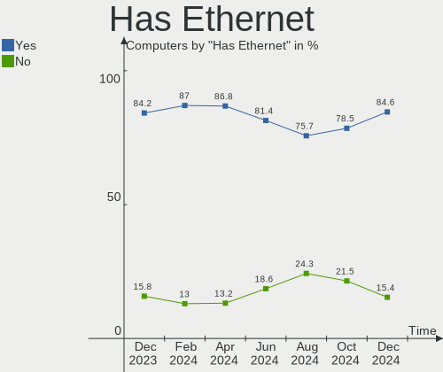
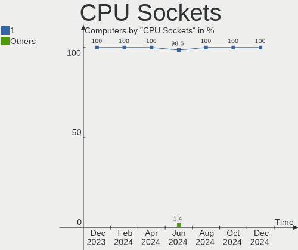
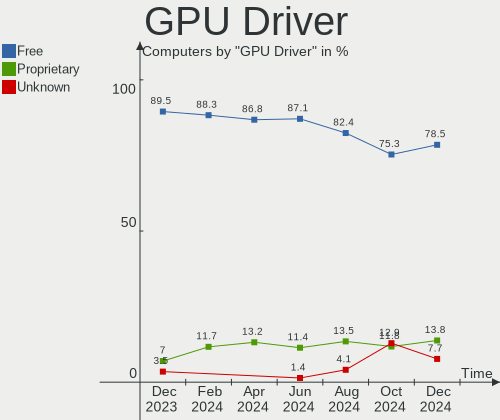
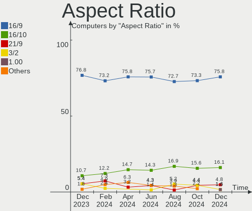

KDE neon Hardware Trends
------------------------

A project to identify most popular hardware characteristics and track their change
over time based on data collected by KDE neon users at https://Linux-Hardware.org.

Anyone can contribute to the study by uploading probes of their computers by
the [hw-probe](https://github.com/linuxhw/hw-probe) tool:

    sudo -E hw-probe -all -upload

This is a report for all computer types. See also reports for [desktops](/Dist/KDE_neon/Desktop/README.md) and [notebooks](/Dist/KDE_neon/Notebook/README.md).

Full-feature report is available here: https://linux-hardware.org/?view=trends

Period: Jun, 2021.

Contents
--------

- [ OS                       ](#os)
- [ OS Family                ](#os-family)
- [ Kernel                   ](#kernel)
- [ Kernel Family            ](#kernel-family)
- [ Kernel Major Ver.        ](#kernel-major-ver)
- [ Arch                     ](#arch)
- [ DE                       ](#de)
- [ Display Server           ](#display-server)
- [ Display Manager          ](#display-manager)
- [ OS Lang                  ](#os-lang)
- [ Boot Mode                ](#boot-mode)
- [ Filesystem               ](#filesystem)
- [ Part. scheme             ](#part-scheme)
- [ Dual Boot with Linux/BSD ](#dual-boot-with-linux/bsd)
- [ Dual Boot (Win)          ](#dual-boot-win)
- [ Country                  ](#country)
- [ City                     ](#city)
- [ Vendor                   ](#vendor)
- [ Model                    ](#model)
- [ Model Family             ](#model-family)
- [ MFG Year                 ](#mfg-year)
- [ Form Factor              ](#form-factor)
- [ Secure Boot              ](#secure-boot)
- [ Coreboot                 ](#coreboot)
- [ RAM Size                 ](#ram-size)
- [ RAM Used                 ](#ram-used)
- [ Has CD-ROM               ](#has-cd-rom)
- [ Total Drives             ](#total-drives)
- [ Has Ethernet             ](#has-ethernet)
- [ Has WiFi                 ](#has-wifi)
- [ Has Bluetooth            ](#has-bluetooth)
- [ Drive Vendor             ](#drive-vendor)
- [ Drive Model              ](#drive-model)
- [ HDD Vendor               ](#hdd-vendor)
- [ SSD Vendor               ](#ssd-vendor)
- [ Drive Kind               ](#drive-kind)
- [ Drive Connector          ](#drive-connector)
- [ Drive Size               ](#drive-size)
- [ Space Total              ](#space-total)
- [ Space Used               ](#space-used)
- [ Malfunc. Drives          ](#malfunc-drives)
- [ Malfunc. Drive Vendor    ](#malfunc-drive-vendor)
- [ Malfunc. HDD Vendor      ](#malfunc-hdd-vendor)
- [ Malfunc. Drive Kind      ](#malfunc-drive-kind)
- [ Failed Drives            ](#failed-drives)
- [ Failed Drive Vendor      ](#failed-drive-vendor)
- [ Drive Status             ](#drive-status)
- [ Storage Vendor           ](#storage-vendor)
- [ Storage Model            ](#storage-model)
- [ Storage Kind             ](#storage-kind)
- [ CPU Vendor               ](#cpu-vendor)
- [ CPU Model                ](#cpu-model)
- [ CPU Model Family         ](#cpu-model-family)
- [ CPU Cores                ](#cpu-cores)
- [ CPU Sockets              ](#cpu-sockets)
- [ CPU Threads              ](#cpu-threads)
- [ CPU Op-Modes             ](#cpu-op-modes)
- [ CPU Microcode            ](#cpu-microcode)
- [ CPU Microarch            ](#cpu-microarch)
- [ GPU Vendor               ](#gpu-vendor)
- [ GPU Model                ](#gpu-model)
- [ GPU Combo                ](#gpu-combo)
- [ GPU Driver               ](#gpu-driver)
- [ GPU Memory               ](#gpu-memory)
- [ Monitor Vendor           ](#monitor-vendor)
- [ Monitor Model            ](#monitor-model)
- [ Monitor Resolution       ](#monitor-resolution)
- [ Monitor Diagonal         ](#monitor-diagonal)
- [ Monitor Width            ](#monitor-width)
- [ Aspect Ratio             ](#aspect-ratio)
- [ Monitor Area             ](#monitor-area)
- [ Pixel Density            ](#pixel-density)
- [ Multiple Monitors        ](#multiple-monitors)
- [ Net Controller Vendor    ](#net-controller-vendor)
- [ Net Controller Model     ](#net-controller-model)
- [ Wireless Vendor          ](#wireless-vendor)
- [ Wireless Model           ](#wireless-model)
- [ Ethernet Vendor          ](#ethernet-vendor)
- [ Ethernet Model           ](#ethernet-model)
- [ Net Controller Kind      ](#net-controller-kind)
- [ Used Controller          ](#used-controller)
- [ NICs                     ](#nics)
- [ IPv6                     ](#ipv6)
- [ Memory Vendor            ](#memory-vendor)
- [ Memory Model             ](#memory-model)
- [ Memory Kind              ](#memory-kind)
- [ Memory Form Factor       ](#memory-form-factor)
- [ Memory Size              ](#memory-size)
- [ Memory Speed             ](#memory-speed)
- [ Sound Vendor             ](#sound-vendor)
- [ Sound Model              ](#sound-model)
- [ Camera Vendor            ](#camera-vendor)
- [ Camera Model             ](#camera-model)
- [ Fingerprint Vendor       ](#fingerprint-vendor)
- [ Fingerprint Model        ](#fingerprint-model)
- [ Chipcard Vendor          ](#chipcard-vendor)
- [ Chipcard Model           ](#chipcard-model)
- [ Printer Vendor           ](#printer-vendor)
- [ Printer Model            ](#printer-model)
- [ Scanner Vendor           ](#scanner-vendor)
- [ Scanner Model            ](#scanner-model)
- [ Bluetooth Vendor         ](#bluetooth-vendor)
- [ Bluetooth Model          ](#bluetooth-model)
- [ Unsupported Devices      ](#unsupported-devices)
- [ Unsupported Device Types ](#unsupported-device-types)

OS
--

Installed operating systems

| Name           | Computers | Percent |
|----------------|-----------|---------|
| KDE neon 20.04 | 93        | 100%    |

OS Family
---------

OS without a version

| Name     | Computers | Percent |
|----------|-----------|---------|
| KDE neon | 93        | 100%    |

Kernel
------

Version of the Linux kernel

| Version                | Computers | Percent |
|------------------------|-----------|---------|
| 5.4.0-74-generic       | 52        | 55.91%  |
| 5.8.0-55-generic       | 16        | 17.2%   |
| 5.8.0-59-generic       | 13        | 13.98%  |
| 5.4.0-73-generic       | 4         | 4.3%    |
| 5.4.0-77-generic       | 2         | 2.15%   |
| 5.4.0-72-generic       | 2         | 2.15%   |
| 5.4.0-75-generic       | 1         | 1.08%   |
| 5.4.0-70-generic       | 1         | 1.08%   |
| 5.12.5-051205-generic  | 1         | 1.08%   |
| 5.10.13-051013-generic | 1         | 1.08%   |

Kernel Family
-------------

Linux kernel without a distro release

| Version | Computers | Percent |
|---------|-----------|---------|
| 5.4.0   | 62        | 66.67%  |
| 5.8.0   | 29        | 31.18%  |
| 5.12.5  | 1         | 1.08%   |
| 5.10.13 | 1         | 1.08%   |

Kernel Major Ver.
-----------------

Linux kernel major version

| Version | Computers | Percent |
|---------|-----------|---------|
| 5.4     | 62        | 66.67%  |
| 5.8     | 29        | 31.18%  |
| 5.12    | 1         | 1.08%   |
| 5.10    | 1         | 1.08%   |

Arch
----

OS architecture (x86_64, i586, etc.)

| Name   | Computers | Percent |
|--------|-----------|---------|
| x86_64 | 93        | 100%    |

DE
--

Desktop Environment

| Name    | Computers | Percent |
|---------|-----------|---------|
| KDE     | 82        | 88.17%  |
| KDE5    | 8         | 8.6%    |
| Unknown | 3         | 3.23%   |

Display Server
--------------

X11 or Wayland

| Name    | Computers | Percent |
|---------|-----------|---------|
| X11     | 88        | 94.62%  |
| Wayland | 4         | 4.3%    |
| Tty     | 1         | 1.08%   |

Display Manager
---------------

SDDM, LightDM, etc.

| Name    | Computers | Percent |
|---------|-----------|---------|
| Unknown | 85        | 91.4%   |
| SDDM    | 8         | 8.6%    |

OS Lang
-------

Language

| Lang  | Computers | Percent |
|-------|-----------|---------|
| en_US | 31        | 33.33%  |
| de_DE | 12        | 12.9%   |
| ru_RU | 8         | 8.6%    |
| pt_BR | 6         | 6.45%   |
| en_GB | 6         | 6.45%   |
| en_IN | 4         | 4.3%    |
| pl_PL | 3         | 3.23%   |
| en_CA | 3         | 3.23%   |
| zh_CN | 2         | 2.15%   |
| es_MX | 2         | 2.15%   |
| es_ES | 2         | 2.15%   |
| C     | 2         | 2.15%   |
| ru_UA | 1         | 1.08%   |
| pt_PT | 1         | 1.08%   |
| nl_NL | 1         | 1.08%   |
| it_IT | 1         | 1.08%   |
| fr_FR | 1         | 1.08%   |
| es_SV | 1         | 1.08%   |
| es_HN | 1         | 1.08%   |
| en_ZA | 1         | 1.08%   |
| en_NZ | 1         | 1.08%   |
| en_IL | 1         | 1.08%   |
| en_AU | 1         | 1.08%   |
| de_AT | 1         | 1.08%   |

Boot Mode
---------

EFI or BIOS

| Mode | Computers | Percent |
|------|-----------|---------|
| EFI  | 50        | 53.76%  |
| BIOS | 43        | 46.24%  |

Filesystem
----------

Type of filesystem

| Type    | Computers | Percent |
|---------|-----------|---------|
| Ext4    | 87        | 93.55%  |
| Btrfs   | 4         | 4.3%    |
| Overlay | 1         | 1.08%   |
| Ext2    | 1         | 1.08%   |

Part. scheme
------------

Scheme of partitioning

| Type    | Computers | Percent |
|---------|-----------|---------|
| Unknown | 84        | 90.32%  |
| GPT     | 6         | 6.45%   |
| MBR     | 3         | 3.23%   |

Dual Boot with Linux/BSD
------------------------

Hosting more than one Linux/BSD

| Dual boot | Computers | Percent |
|-----------|-----------|---------|
| No        | 86        | 92.47%  |
| Yes       | 7         | 7.53%   |

Dual Boot (Win)
---------------

Hosting Linux and Windows

| Dual boot | Computers | Percent |
|-----------|-----------|---------|
| No        | 82        | 88.17%  |
| Yes       | 11        | 11.83%  |

Country
-------

Geographic location (country)

| Country      | Computers | Percent |
|--------------|-----------|---------|
| USA          | 20        | 21.51%  |
| Germany      | 11        | 11.83%  |
| Russia       | 7         | 7.53%   |
| Brazil       | 6         | 6.45%   |
| UK           | 4         | 4.3%    |
| Spain        | 4         | 4.3%    |
| Poland       | 4         | 4.3%    |
| India        | 4         | 4.3%    |
| Romania      | 3         | 3.23%   |
| Mexico       | 3         | 3.23%   |
| Canada       | 3         | 3.23%   |
| Sweden       | 2         | 2.15%   |
| Netherlands  | 2         | 2.15%   |
| China        | 2         | 2.15%   |
| Ukraine      | 1         | 1.08%   |
| Switzerland  | 1         | 1.08%   |
| Sri Lanka    | 1         | 1.08%   |
| South Africa | 1         | 1.08%   |
| Slovenia     | 1         | 1.08%   |
| Portugal     | 1         | 1.08%   |
| Norway       | 1         | 1.08%   |
| New Zealand  | 1         | 1.08%   |
| Malaysia     | 1         | 1.08%   |
| Italy        | 1         | 1.08%   |
| Israel       | 1         | 1.08%   |
| Iran         | 1         | 1.08%   |
| Honduras     | 1         | 1.08%   |
| France       | 1         | 1.08%   |
| El Salvador  | 1         | 1.08%   |
| Austria      | 1         | 1.08%   |
| Australia    | 1         | 1.08%   |
| Argentina    | 1         | 1.08%   |

City
----

Geographic location (city)

| City                      | Computers | Percent |
|---------------------------|-----------|---------|
| Moscow                    | 3         | 3.23%   |
| Bucharest                 | 3         | 3.23%   |
| Phoenix                   | 2         | 2.15%   |
| Delhi                     | 2         | 2.15%   |
| Zurich                    | 1         | 1.08%   |
| Zhengzhou                 | 1         | 1.08%   |
| Würzburg                 | 1         | 1.08%   |
| Wysokie Mazowieckie       | 1         | 1.08%   |
| Wroclaw                   | 1         | 1.08%   |
| Williamsport              | 1         | 1.08%   |
| Walsall                   | 1         | 1.08%   |
| Vienna                    | 1         | 1.08%   |
| Ufa                       | 1         | 1.08%   |
| Tehran                    | 1         | 1.08%   |
| Tegucigalpa               | 1         | 1.08%   |
| Tauranga                  | 1         | 1.08%   |
| Tampico                   | 1         | 1.08%   |
| Stockholm                 | 1         | 1.08%   |
| Springfield               | 1         | 1.08%   |
| Siechnice                 | 1         | 1.08%   |
| Schrobenhausen            | 1         | 1.08%   |
| Sao Vicente               | 1         | 1.08%   |
| Santo Antonio da Platina  | 1         | 1.08%   |
| Santander                 | 1         | 1.08%   |
| Santa Monica              | 1         | 1.08%   |
| Sant Pere de Riudebitlles | 1         | 1.08%   |
| San Salvador              | 1         | 1.08%   |
| San Luis Potosí City     | 1         | 1.08%   |
| Rosenheim                 | 1         | 1.08%   |
| Rochester                 | 1         | 1.08%   |
| Poznan                    | 1         | 1.08%   |
| Peterlee                  | 1         | 1.08%   |
| Palm Bay                  | 1         | 1.08%   |
| Oslo                      | 1         | 1.08%   |
| Novosibirsk               | 1         | 1.08%   |
| North Port                | 1         | 1.08%   |
| Nashotah                  | 1         | 1.08%   |
| Nanning                   | 1         | 1.08%   |
| Naaldwijk                 | 1         | 1.08%   |
| Munich                    | 1         | 1.08%   |
| Moormerland               | 1         | 1.08%   |
| Middlesbrough             | 1         | 1.08%   |
| Miami                     | 1         | 1.08%   |
| Mexicali                  | 1         | 1.08%   |
| McKinney                  | 1         | 1.08%   |
| Maringá                  | 1         | 1.08%   |
| Malmo                     | 1         | 1.08%   |
| Lisbon                    | 1         | 1.08%   |
| Lewisville                | 1         | 1.08%   |
| Laufach                   | 1         | 1.08%   |
| Lathrop                   | 1         | 1.08%   |
| Kyiv                      | 1         | 1.08%   |
| Kota Kinabalu             | 1         | 1.08%   |
| Kolomna                   | 1         | 1.08%   |
| Kolkata                   | 1         | 1.08%   |
| Kingsville                | 1         | 1.08%   |
| Kerkdriel                 | 1         | 1.08%   |
| Kelaniya                  | 1         | 1.08%   |
| Johannesburg              | 1         | 1.08%   |
| Izhevsk                   | 1         | 1.08%   |

Vendor
------

Motherboard manufacturer

| Name                | Computers | Percent |
|---------------------|-----------|---------|
| Hewlett-Packard     | 20        | 21.51%  |
| Lenovo              | 16        | 17.2%   |
| ASUSTek Computer    | 15        | 16.13%  |
| Dell                | 11        | 11.83%  |
| Acer                | 9         | 9.68%   |
| MSI                 | 4         | 4.3%    |
| ASRock              | 4         | 4.3%    |
| Gigabyte Technology | 3         | 3.23%   |
| HUAWEI              | 2         | 2.15%   |
| Toshiba             | 1         | 1.08%   |
| Supermicro          | 1         | 1.08%   |
| Samsung Electronics | 1         | 1.08%   |
| Intel               | 1         | 1.08%   |
| Huanghe             | 1         | 1.08%   |
| HKC                 | 1         | 1.08%   |
| Fujitsu             | 1         | 1.08%   |
| ECS                 | 1         | 1.08%   |
| Apple               | 1         | 1.08%   |

Model
-----

Motherboard model

| Name                                  | Computers | Percent |
|---------------------------------------|-----------|---------|
| Lenovo FLEX 6-11IGM 81A7              | 2         | 2.15%   |
| HUAWEI NBLK-WAX9X                     | 2         | 2.15%   |
| Toshiba Satellite C55D-A-15H          | 1         | 1.08%   |
| Supermicro H8QM8                      | 1         | 1.08%   |
| Samsung 300E5M/300E5L                 | 1         | 1.08%   |
| MSI MS-7C51                           | 1         | 1.08%   |
| MSI MS-7A33                           | 1         | 1.08%   |
| MSI MS-7974                           | 1         | 1.08%   |
| MSI MS-7599                           | 1         | 1.08%   |
| Lenovo Yoga C930-13IKB 81C4           | 1         | 1.08%   |
| Lenovo Yoga 700-14ISK 80QD            | 1         | 1.08%   |
| Lenovo Yoga 530-14IKB 81EK            | 1         | 1.08%   |
| Lenovo V310-15ISK 80SY                | 1         | 1.08%   |
| Lenovo ThinkPad X230 232425U          | 1         | 1.08%   |
| Lenovo ThinkPad T61 8897CTO           | 1         | 1.08%   |
| Lenovo ThinkPad T400 6475F75          | 1         | 1.08%   |
| Lenovo ThinkPad S3 Yoga 14 20DM000VUS | 1         | 1.08%   |
| Lenovo ThinkPad P50 20EQS37F00        | 1         | 1.08%   |
| Lenovo ThinkCentre M73 10AXS3V400     | 1         | 1.08%   |
| Lenovo ThinkCentre M58p 7479RS2       | 1         | 1.08%   |
| Lenovo ThinkCentre E73 10AW008PMX     | 1         | 1.08%   |
| Lenovo MIIX 310-10ICR 80SG            | 1         | 1.08%   |
| Lenovo Legion Y7000 2019 PG0 81T0     | 1         | 1.08%   |
| Intel DH55HC AAE70933-505             | 1         | 1.08%   |
| Huanghe PRO H410M-C                   | 1         | 1.08%   |
| HKC NT14W                             | 1         | 1.08%   |
| HP ProBook 470 G5                     | 1         | 1.08%   |
| HP Pavilion x360 Convertible          | 1         | 1.08%   |
| HP Pavilion Notebook                  | 1         | 1.08%   |
| HP Pavilion Laptop 15-cc1xx           | 1         | 1.08%   |
| HP Pavilion g7                        | 1         | 1.08%   |
| HP Pavilion dv7                       | 1         | 1.08%   |
| HP Pavilion 15                        | 1         | 1.08%   |
| HP OMEN by HP Laptop                  | 1         | 1.08%   |
| HP Laptop 17-by2xxx                   | 1         | 1.08%   |
| HP Laptop 15s-du1xxx                  | 1         | 1.08%   |
| HP Laptop 15-dy1xxx                   | 1         | 1.08%   |
| HP InsydeH2O EFI BIOS                 | 1         | 1.08%   |
| HP ENVY x360 Convertible 15-dr1xxx    | 1         | 1.08%   |
| HP EliteDesk 800 G2 DM 65W            | 1         | 1.08%   |
| HP EliteBook 8770w                    | 1         | 1.08%   |
| HP EliteBook 840 G5                   | 1         | 1.08%   |
| HP Desktop M01-F0xxx                  | 1         | 1.08%   |
| HP Compaq Elite 8300 CMT              | 1         | 1.08%   |
| HP Compaq 6735b                       | 1         | 1.08%   |
| HP 750-410                            | 1         | 1.08%   |
| Gigabyte Z390 AORUS MASTER            | 1         | 1.08%   |
| Gigabyte H61MS                        | 1         | 1.08%   |
| Gigabyte B85M-HD3                     | 1         | 1.08%   |
| Fujitsu ESPRIMO P920                  | 1         | 1.08%   |
| ECS A785GM-AD3                        | 1         | 1.08%   |
| Dell XPS 13 9370                      | 1         | 1.08%   |
| Dell XPS 13 9350                      | 1         | 1.08%   |
| Dell Precision M6600                  | 1         | 1.08%   |
| Dell Latitude E7250                   | 1         | 1.08%   |
| Dell Latitude E6530                   | 1         | 1.08%   |
| Dell Latitude E6510                   | 1         | 1.08%   |
| Dell Inspiron 7580                    | 1         | 1.08%   |
| Dell Inspiron 7573                    | 1         | 1.08%   |
| Dell Inspiron 5559                    | 1         | 1.08%   |

Model Family
------------

Motherboard model prefix

| Name               | Computers | Percent |
|--------------------|-----------|---------|
| Acer Aspire        | 7         | 7.53%   |
| HP Pavilion        | 6         | 6.45%   |
| Lenovo ThinkPad    | 5         | 5.38%   |
| Dell Inspiron      | 5         | 5.38%   |
| Lenovo Yoga        | 3         | 3.23%   |
| Lenovo ThinkCentre | 3         | 3.23%   |
| HP Laptop          | 3         | 3.23%   |
| Dell Latitude      | 3         | 3.23%   |
| Lenovo FLEX        | 2         | 2.15%   |
| HUAWEI NBLK-WAX9X  | 2         | 2.15%   |
| HP EliteBook       | 2         | 2.15%   |
| HP Compaq          | 2         | 2.15%   |
| Dell XPS           | 2         | 2.15%   |
| ASUS VivoBook      | 2         | 2.15%   |
| ASUS PRIME         | 2         | 2.15%   |
| Toshiba Satellite  | 1         | 1.08%   |
| Supermicro H8QM8   | 1         | 1.08%   |
| Samsung 300E5M     | 1         | 1.08%   |
| MSI MS-7C51        | 1         | 1.08%   |
| MSI MS-7A33        | 1         | 1.08%   |
| MSI MS-7974        | 1         | 1.08%   |
| MSI MS-7599        | 1         | 1.08%   |
| Lenovo V310-15ISK  | 1         | 1.08%   |
| Lenovo MIIX        | 1         | 1.08%   |
| Lenovo Legion      | 1         | 1.08%   |
| Intel DH55HC       | 1         | 1.08%   |
| Huanghe PRO        | 1         | 1.08%   |
| HKC NT14W          | 1         | 1.08%   |
| HP ProBook         | 1         | 1.08%   |
| HP OMEN            | 1         | 1.08%   |
| HP InsydeH2O       | 1         | 1.08%   |
| HP ENVY            | 1         | 1.08%   |
| HP EliteDesk       | 1         | 1.08%   |
| HP Desktop         | 1         | 1.08%   |
| HP 750-410         | 1         | 1.08%   |
| Gigabyte Z390      | 1         | 1.08%   |
| Gigabyte H61MS     | 1         | 1.08%   |
| Gigabyte B85M-HD3  | 1         | 1.08%   |
| Fujitsu ESPRIMO    | 1         | 1.08%   |
| ECS A785GM-AD3     | 1         | 1.08%   |
| Dell Precision     | 1         | 1.08%   |
| ASUS Z170-E        | 1         | 1.08%   |
| ASUS X550LA        | 1         | 1.08%   |
| ASUS TUF           | 1         | 1.08%   |
| ASUS SABERTOOTH    | 1         | 1.08%   |
| ASUS P8H67         | 1         | 1.08%   |
| ASUS P7P55D-E      | 1         | 1.08%   |
| ASUS P5KPL-AM      | 1         | 1.08%   |
| ASUS N56VM         | 1         | 1.08%   |
| ASUS M5A78L-M      | 1         | 1.08%   |
| ASUS H110M-A       | 1         | 1.08%   |
| ASUS All           | 1         | 1.08%   |
| ASRock FM2A78M-HD+ | 1         | 1.08%   |
| ASRock FM2A55M-HD+ | 1         | 1.08%   |
| ASRock A320M-DVS   | 1         | 1.08%   |
| ASRock 970M        | 1         | 1.08%   |
| Apple MacBookAir4  | 1         | 1.08%   |
| Acer TravelMate    | 1         | 1.08%   |
| Acer Extensa       | 1         | 1.08%   |

MFG Year
--------

Motherboard manufacture year

| Year | Computers | Percent |
|------|-----------|---------|
| 2020 | 16        | 17.2%   |
| 2019 | 11        | 11.83%  |
| 2018 | 10        | 10.75%  |
| 2017 | 9         | 9.68%   |
| 2016 | 9         | 9.68%   |
| 2015 | 8         | 8.6%    |
| 2021 | 7         | 7.53%   |
| 2012 | 5         | 5.38%   |
| 2010 | 5         | 5.38%   |
| 2011 | 4         | 4.3%    |
| 2014 | 3         | 3.23%   |
| 2013 | 2         | 2.15%   |
| 2009 | 2         | 2.15%   |
| 2008 | 1         | 1.08%   |
| 2007 | 1         | 1.08%   |

Form Factor
-----------

Physical design of the computer

| Name        | Computers | Percent |
|-------------|-----------|---------|
| Notebook    | 50        | 53.76%  |
| Desktop     | 35        | 37.63%  |
| Convertible | 7         | 7.53%   |
| Tablet      | 1         | 1.08%   |

Secure Boot
-----------

Enabled or disabled

| State    | Computers | Percent |
|----------|-----------|---------|
| Disabled | 83        | 89.25%  |
| Enabled  | 10        | 10.75%  |

Coreboot
--------

Have coreboot on board

| Used | Computers | Percent |
|------|-----------|---------|
| No   | 93        | 100%    |

RAM Size
--------

Total RAM memory

| Size in GB | Computers | Percent |
|------------|-----------|---------|
| 4.01-8.0   | 30        | 32.26%  |
| 8.01-16.0  | 21        | 22.58%  |
| 16.01-24.0 | 19        | 20.43%  |
| 3.01-4.0   | 13        | 13.98%  |
| 32.01-64.0 | 7         | 7.53%   |
| 24.01-32.0 | 2         | 2.15%   |
| 1.01-2.0   | 1         | 1.08%   |

RAM Used
--------

Used RAM memory

| Used GB   | Computers | Percent |
|-----------|-----------|---------|
| 1.01-2.0  | 41        | 44.09%  |
| 2.01-3.0  | 25        | 26.88%  |
| 3.01-4.0  | 13        | 13.98%  |
| 4.01-8.0  | 10        | 10.75%  |
| 8.01-16.0 | 2         | 2.15%   |
| 0.51-1.0  | 2         | 2.15%   |

Has CD-ROM
----------

Has CD-ROM on board

| Presented | Computers | Percent |
|-----------|-----------|---------|
| No        | 55        | 59.14%  |
| Yes       | 38        | 40.86%  |

Total Drives
------------

Number of drives on board

| Drives | Computers | Percent |
|--------|-----------|---------|
| 1      | 48        | 51.61%  |
| 2      | 30        | 32.26%  |
| 4      | 4         | 4.3%    |
| 3      | 4         | 4.3%    |
| 5      | 3         | 3.23%   |
| 6      | 2         | 2.15%   |
| 11     | 1         | 1.08%   |
| 7      | 1         | 1.08%   |

Has Ethernet
------------

Has Ethernet on board

| Presented | Computers | Percent |
|-----------|-----------|---------|
| Yes       | 77        | 82.8%   |
| No        | 16        | 17.2%   |

Has WiFi
--------

Has WiFi module

| Presented | Computers | Percent |
|-----------|-----------|---------|
| Yes       | 68        | 73.12%  |
| No        | 25        | 26.88%  |

Has Bluetooth
-------------

Has Bluetooth module

| Presented | Computers | Percent |
|-----------|-----------|---------|
| Yes       | 58        | 62.37%  |
| No        | 35        | 37.63%  |

Drive Vendor
------------

Hard drive vendors

| Vendor              | Computers | Drives | Percent |
|---------------------|-----------|--------|---------|
| Seagate             | 27        | 31     | 17.88%  |
| Samsung Electronics | 21        | 25     | 13.91%  |
| WDC                 | 14        | 28     | 9.27%   |
| Unknown             | 12        | 14     | 7.95%   |
| Toshiba             | 11        | 11     | 7.28%   |
| SanDisk             | 11        | 11     | 7.28%   |
| Intel               | 10        | 13     | 6.62%   |
| Kingston            | 8         | 10     | 5.3%    |
| Crucial             | 5         | 6      | 3.31%   |
| Patriot             | 4         | 4      | 2.65%   |
| SK Hynix            | 3         | 3      | 1.99%   |
| HGST                | 3         | 3      | 1.99%   |
| A-DATA Technology   | 3         | 3      | 1.99%   |
| LITEON              | 2         | 2      | 1.32%   |
| Intenso             | 2         | 2      | 1.32%   |
| Gigabyte Technology | 2         | 2      | 1.32%   |
| Phison              | 1         | 1      | 0.66%   |
| LONDISK             | 1         | 1      | 0.66%   |
| Lite-On             | 1         | 1      | 0.66%   |
| KingSpec            | 1         | 1      | 0.66%   |
| Hitachi             | 1         | 1      | 0.66%   |
| HGST HTS            | 1         | 1      | 0.66%   |
| GOODRAM             | 1         | 1      | 0.66%   |
| Fujitsu             | 1         | 1      | 0.66%   |
| EDGE                | 1         | 1      | 0.66%   |
| DOGFISH             | 1         | 1      | 0.66%   |
| China               | 1         | 2      | 0.66%   |
| Apple               | 1         | 1      | 0.66%   |
| Apacer              | 1         | 1      | 0.66%   |

Drive Model
-----------

Hard drive models

| Model                              | Computers | Percent |
|------------------------------------|-----------|---------|
| Intel NVMe SSD Drive 512GB         | 5         | 2.84%   |
| Unknown SD/MMC/MS PRO 128GB        | 4         | 2.27%   |
| Seagate ST1000LM035-1RK172 1TB     | 3         | 1.7%    |
| Samsung SSD 860 EVO 1TB            | 3         | 1.7%    |
| Samsung SSD 850 EVO 250GB          | 3         | 1.7%    |
| Kingston SV300S37A120G 120GB SSD   | 3         | 1.7%    |
| Kingston SA400S37240G 240GB SSD    | 3         | 1.7%    |
| WDC WDS120G2G0A-00JH30 120GB SSD   | 2         | 1.14%   |
| WDC WD1003FZEX-00K3CA0 1TB         | 2         | 1.14%   |
| Unknown MMC Card  64GB             | 2         | 1.14%   |
| Unknown MMC Card  32GB             | 2         | 1.14%   |
| Toshiba NVMe SSD Drive 256GB       | 2         | 1.14%   |
| SK Hynix NVMe SSD Drive 256GB      | 2         | 1.14%   |
| Seagate ST500DM002-1BD142 500GB    | 2         | 1.14%   |
| Seagate ST1000LM048-2E7172 1TB     | 2         | 1.14%   |
| Seagate ST1000LM024 HN-M101MBB 1TB | 2         | 1.14%   |
| Seagate ST1000DM003-1ER162 1TB     | 2         | 1.14%   |
| Samsung SSD 860 EVO 500GB          | 2         | 1.14%   |
| Samsung SSD 850 EVO 1TB            | 2         | 1.14%   |
| Patriot Burst 120GB SSD            | 2         | 1.14%   |
| Intel NVMe SSD Drive 32GB          | 2         | 1.14%   |
| Crucial CT500MX500SSD1 500GB       | 2         | 1.14%   |
| WDC WDS250G2B0A-00SM50 250GB SSD   | 1         | 0.57%   |
| WDC WDS100T2B0A-00SM50 1TB SSD     | 1         | 0.57%   |
| WDC WD5000LPLX-75ZNTT0 500GB       | 1         | 0.57%   |
| WDC WD5000AZRX-00A8LB0 500GB       | 1         | 0.57%   |
| WDC WD30EZRX-00SPEB0 3TB           | 1         | 0.57%   |
| WDC WD2500JS-60MHB1 250GB          | 1         | 0.57%   |
| WDC WD20EZAZ-00GGJB0 2TB           | 1         | 0.57%   |
| WDC WD20EFRX-68EUZN0 2TB           | 1         | 0.57%   |
| WDC WD20EARS-00J2GB0 2TB           | 1         | 0.57%   |
| WDC WD10SPZX-60Z10T0 1TB           | 1         | 0.57%   |
| WDC WD10SPZX-21Z10T0 1TB           | 1         | 0.57%   |
| WDC WD10JPVX-75JC3T0 1TB           | 1         | 0.57%   |
| WDC WD10JPCX-24UE4T0 1TB           | 1         | 0.57%   |
| WDC WD10EZRZ-00HTKB0 1TB           | 1         | 0.57%   |
| WDC WD10EZEX-21WN4A0 1TB           | 1         | 0.57%   |
| WDC WD10EARS-00MVWB0 1TB           | 1         | 0.57%   |
| WDC WD101KRYZ-01JPDB1 10TB         | 1         | 0.57%   |
| WDC WD1003FZEX-00MK2A0 1TB         | 1         | 0.57%   |
| Unknown SB32G  32GB                | 1         | 0.57%   |
| Unknown S5170-512 512GB            | 1         | 0.57%   |
| Unknown NVMe SSD Drive 256GB       | 1         | 0.57%   |
| Unknown MMC Card  16GB             | 1         | 0.57%   |
| Unknown MMC Card  128GB            | 1         | 0.57%   |
| Unknown APPSD  16GB                | 1         | 0.57%   |
| Toshiba THNSNJ512GCSY 512GB SSD    | 1         | 0.57%   |
| Toshiba MQ01ABF050 500GB           | 1         | 0.57%   |
| Toshiba MQ01ABD100 1TB             | 1         | 0.57%   |
| Toshiba MK8032GSX 80GB             | 1         | 0.57%   |
| Toshiba MK2561GSYN 250GB           | 1         | 0.57%   |
| Toshiba HDWD110 1TB                | 1         | 0.57%   |
| Toshiba DT01ACA300 3TB             | 1         | 0.57%   |
| Toshiba DT01ACA100 1TB             | 1         | 0.57%   |
| Toshiba DT01ACA050 500GB           | 1         | 0.57%   |
| SK Hynix NVMe SSD Drive 1024GB     | 1         | 0.57%   |
| Seagate ST9500325AS 500GB          | 1         | 0.57%   |
| Seagate ST9250315AS 250GB          | 1         | 0.57%   |
| Seagate ST9160821AS 160GB          | 1         | 0.57%   |
| Seagate ST500LT012-1DG142 500GB    | 1         | 0.57%   |

HDD Vendor
----------

Hard disk drive vendors

| Vendor              | Computers | Drives | Percent |
|---------------------|-----------|--------|---------|
| Seagate             | 27        | 31     | 49.09%  |
| WDC                 | 12        | 23     | 21.82%  |
| Toshiba             | 8         | 8      | 14.55%  |
| HGST                | 3         | 3      | 5.45%   |
| Samsung Electronics | 1         | 1      | 1.82%   |
| Intenso             | 1         | 1      | 1.82%   |
| Hitachi             | 1         | 1      | 1.82%   |
| HGST HTS            | 1         | 1      | 1.82%   |
| Fujitsu             | 1         | 1      | 1.82%   |

SSD Vendor
----------

Solid state drive vendors

| Vendor              | Computers | Drives | Percent |
|---------------------|-----------|--------|---------|
| Samsung Electronics | 16        | 19     | 26.23%  |
| Kingston            | 7         | 9      | 11.48%  |
| SanDisk             | 6         | 6      | 9.84%   |
| Crucial             | 5         | 6      | 8.2%    |
| WDC                 | 4         | 5      | 6.56%   |
| Patriot             | 4         | 4      | 6.56%   |
| Intel               | 3         | 3      | 4.92%   |
| A-DATA Technology   | 3         | 3      | 4.92%   |
| LITEON              | 2         | 2      | 3.28%   |
| Toshiba             | 1         | 1      | 1.64%   |
| LONDISK             | 1         | 1      | 1.64%   |
| KingSpec            | 1         | 1      | 1.64%   |
| Intenso             | 1         | 1      | 1.64%   |
| GOODRAM             | 1         | 1      | 1.64%   |
| Gigabyte Technology | 1         | 1      | 1.64%   |
| EDGE                | 1         | 1      | 1.64%   |
| DOGFISH             | 1         | 1      | 1.64%   |
| China               | 1         | 2      | 1.64%   |
| Apple               | 1         | 1      | 1.64%   |
| Apacer              | 1         | 1      | 1.64%   |

Drive Kind
----------

HDD or SSD

| Kind    | Computers | Drives | Percent |
|---------|-----------|--------|---------|
| SSD     | 48        | 69     | 36.36%  |
| HDD     | 46        | 70     | 34.85%  |
| NVMe    | 26        | 29     | 19.7%   |
| MMC     | 7         | 9      | 5.3%    |
| Unknown | 5         | 5      | 3.79%   |

Drive Connector
---------------

SATA, SAS, NVMe, etc.

| Type | Computers | Drives | Percent |
|------|-----------|--------|---------|
| SATA | 74        | 133    | 63.25%  |
| NVMe | 26        | 29     | 22.22%  |
| SAS  | 10        | 11     | 8.55%   |
| MMC  | 7         | 9      | 5.98%   |

Drive Size
----------

Size of hard drive

| Size in TB | Computers | Drives | Percent |
|------------|-----------|--------|---------|
| 0.01-0.5   | 54        | 75     | 52.94%  |
| 0.51-1.0   | 35        | 44     | 34.31%  |
| 1.01-2.0   | 7         | 13     | 6.86%   |
| 3.01-4.0   | 3         | 3      | 2.94%   |
| 2.01-3.0   | 2         | 3      | 1.96%   |
| 4.01-10.0  | 1         | 1      | 0.98%   |

Space Total
-----------

Amount of disk space available on the file system

| Size in GB     | Computers | Percent |
|----------------|-----------|---------|
| 101-250        | 26        | 27.96%  |
| 251-500        | 19        | 20.43%  |
| 501-1000       | 17        | 18.28%  |
| 21-50          | 7         | 7.53%   |
| 1001-2000      | 7         | 7.53%   |
| More than 3000 | 4         | 4.3%    |
| 1-20           | 4         | 4.3%    |
| 51-100         | 4         | 4.3%    |
| 2001-3000      | 3         | 3.23%   |
| Unknown        | 2         | 2.15%   |

Space Used
----------

Amount of used disk space

| Used GB        | Computers | Percent |
|----------------|-----------|---------|
| 1-20           | 37        | 39.78%  |
| 21-50          | 17        | 18.28%  |
| 101-250        | 12        | 12.9%   |
| 251-500        | 8         | 8.6%    |
| 51-100         | 7         | 7.53%   |
| 501-1000       | 6         | 6.45%   |
| 2001-3000      | 2         | 2.15%   |
| Unknown        | 2         | 2.15%   |
| More than 3000 | 1         | 1.08%   |
| 1001-2000      | 1         | 1.08%   |

Malfunc. Drives
---------------

Drive models with a malfunction

| Model                                       | Computers | Drives | Percent |
|---------------------------------------------|-----------|--------|---------|
| WDC WD20EFRX-68EUZN0 2TB                    | 1         | 2      | 16.67%  |
| WDC WD20EARS-00J2GB0 2TB                    | 1         | 1      | 16.67%  |
| WDC WD10EARS-00MVWB0 1TB                    | 1         | 1      | 16.67%  |
| Seagate ST4000LM024-2AN17V 4TB              | 1         | 1      | 16.67%  |
| Seagate ST2000DM001-1CH164 2TB              | 1         | 1      | 16.67%  |
| Samsung Electronics SSD PM830 2.5 7mm 128GB | 1         | 1      | 16.67%  |

Malfunc. Drive Vendor
---------------------

Vendors of faulty drives

| Vendor              | Computers | Drives | Percent |
|---------------------|-----------|--------|---------|
| Seagate             | 2         | 2      | 50%     |
| WDC                 | 1         | 4      | 25%     |
| Samsung Electronics | 1         | 1      | 25%     |

Malfunc. HDD Vendor
-------------------

Vendors of faulty HDD drives

| Vendor  | Computers | Drives | Percent |
|---------|-----------|--------|---------|
| Seagate | 2         | 2      | 66.67%  |
| WDC     | 1         | 4      | 33.33%  |

Malfunc. Drive Kind
-------------------

Kinds of faulty drives

| Kind | Computers | Drives | Percent |
|------|-----------|--------|---------|
| HDD  | 2         | 6      | 66.67%  |
| SSD  | 1         | 1      | 33.33%  |

Failed Drives
-------------

Failed drive models

Zero info for selected period =(

Failed Drive Vendor
-------------------

Failed drive vendors

Zero info for selected period =(

Drive Status
------------

Number of failed and malfunc. drives

| Status   | Computers | Drives | Percent |
|----------|-----------|--------|---------|
| Detected | 84        | 155    | 85.71%  |
| Works    | 11        | 20     | 11.22%  |
| Malfunc  | 3         | 7      | 3.06%   |

Storage Vendor
--------------

Storage controller vendors

| Vendor                          | Computers | Percent |
|---------------------------------|-----------|---------|
| Intel                           | 61        | 54.95%  |
| AMD                             | 23        | 20.72%  |
| Samsung Electronics             | 5         | 4.5%    |
| Sandisk                         | 4         | 3.6%    |
| SK Hynix                        | 3         | 2.7%    |
| Toshiba America Info Systems    | 2         | 1.8%    |
| Phison Electronics              | 2         | 1.8%    |
| Marvell Technology Group        | 2         | 1.8%    |
| JMicron Technology              | 2         | 1.8%    |
| ASMedia Technology              | 2         | 1.8%    |
| VIA Technologies                | 1         | 0.9%    |
| Nvidia                          | 1         | 0.9%    |
| Lite-On Technology              | 1         | 0.9%    |
| Kingston Technology Company     | 1         | 0.9%    |
| Hefei DATANG Storage Technology | 1         | 0.9%    |

Storage Model
-------------

Storage controller models

| Model                                                                                   | Computers | Percent |
|-----------------------------------------------------------------------------------------|-----------|---------|
| AMD FCH SATA Controller [AHCI mode]                                                     | 16        | 11.94%  |
| Intel 82801 Mobile SATA Controller [RAID mode]                                          | 10        | 7.46%   |
| Intel Sunrise Point-LP SATA Controller [AHCI mode]                                      | 9         | 6.72%   |
| Intel Q170/Q150/B150/H170/H110/Z170/CM236 Chipset SATA Controller [AHCI Mode]           | 5         | 3.73%   |
| Intel 7 Series Chipset Family 6-port SATA Controller [AHCI mode]                        | 5         | 3.73%   |
| Intel 8 Series/C220 Series Chipset Family 6-port SATA Controller 1 [AHCI mode]          | 4         | 2.99%   |
| AMD SB7x0/SB8x0/SB9x0 SATA Controller [AHCI mode]                                       | 4         | 2.99%   |
| AMD SB7x0/SB8x0/SB9x0 IDE Controller                                                    | 4         | 2.99%   |
| Samsung NVMe SSD Controller SM981/PM981/PM983                                           | 3         | 2.24%   |
| Intel Non-Volatile memory controller                                                    | 3         | 2.24%   |
| Intel 8 Series SATA Controller 1 [AHCI mode]                                            | 3         | 2.24%   |
| AMD SB7x0/SB8x0/SB9x0 SATA Controller [IDE mode]                                        | 3         | 2.24%   |
| Sandisk WD Blue SN550 NVMe SSD                                                          | 2         | 1.49%   |
| Sandisk WD Black SN750 / PC SN730 NVMe SSD                                              | 2         | 1.49%   |
| Intel SSD 660P Series                                                                   | 2         | 1.49%   |
| Intel Celeron/Pentium Silver Processor SATA Controller                                  | 2         | 1.49%   |
| Intel Cannon Lake Mobile PCH SATA AHCI Controller                                       | 2         | 1.49%   |
| Intel 82801IBM/IEM (ICH9M/ICH9M-E) 4 port SATA Controller [AHCI mode]                   | 2         | 1.49%   |
| Intel 6 Series/C200 Series Chipset Family Desktop SATA Controller (IDE mode, ports 4-5) | 2         | 1.49%   |
| Intel 6 Series/C200 Series Chipset Family Desktop SATA Controller (IDE mode, ports 0-3) | 2         | 1.49%   |
| Intel 400 Series Chipset Family SATA AHCI Controller                                    | 2         | 1.49%   |
| ASMedia ASM1062 Serial ATA Controller                                                   | 2         | 1.49%   |
| AMD FCH SATA Controller D                                                               | 2         | 1.49%   |
| AMD 400 Series Chipset SATA Controller                                                  | 2         | 1.49%   |
| VIA VT6415 PATA IDE Host Controller                                                     | 1         | 0.75%   |
| Toshiba America Info Systems XG6 NVMe SSD Controller                                    | 1         | 0.75%   |
| Toshiba America Info Systems BG3 NVMe SSD Controller                                    | 1         | 0.75%   |
| SK Hynix PC401 NVMe Solid State Drive 256GB                                             | 1         | 0.75%   |
| SK Hynix Non-Volatile memory controller                                                 | 1         | 0.75%   |
| SK Hynix BC501 NVMe Solid State Drive                                                   | 1         | 0.75%   |
| Samsung NVMe SSD Controller SM961/PM961/SM963                                           | 1         | 0.75%   |
| Samsung NVMe SSD Controller SM951/PM951                                                 | 1         | 0.75%   |
| Phison E16 PCIe4 NVMe Controller                                                        | 1         | 0.75%   |
| Phison E12 NVMe Controller                                                              | 1         | 0.75%   |
| Nvidia MCP55 SATA Controller                                                            | 1         | 0.75%   |
| Nvidia MCP55 IDE                                                                        | 1         | 0.75%   |
| Marvell Group 88SE9215 PCIe 2.0 x1 4-port SATA 6 Gb/s Controller                        | 1         | 0.75%   |
| Marvell Group 88SE9120 SATA 6Gb/s Controller                                            | 1         | 0.75%   |
| Lite-On Non-Volatile memory controller                                                  | 1         | 0.75%   |
| Kingston Company Company Non-Volatile memory controller                                 | 1         | 0.75%   |
| JMicron JMB363 SATA/IDE Controller                                                      | 1         | 0.75%   |
| JMicron JMB360 AHCI Controller                                                          | 1         | 0.75%   |
| Intel SSD Pro 7600p/760p/E 6100p Series                                                 | 1         | 0.75%   |
| Intel SSD 600P Series                                                                   | 1         | 0.75%   |
| Intel SATA Controller [RAID mode]                                                       | 1         | 0.75%   |
| Intel NM10/ICH7 Family SATA Controller [IDE mode]                                       | 1         | 0.75%   |
| Intel HM170/QM170 Chipset SATA Controller [AHCI Mode]                                   | 1         | 0.75%   |
| Intel Cannon Point-LP SATA Controller [AHCI Mode]                                       | 1         | 0.75%   |
| Intel Cannon Lake PCH SATA AHCI Controller                                              | 1         | 0.75%   |
| Intel 9 Series Chipset Family SATA Controller [AHCI Mode]                               | 1         | 0.75%   |
| Intel 82801JD/DO (ICH10 Family) SATA AHCI Controller                                    | 1         | 0.75%   |
| Intel 82801HM/HEM (ICH8M/ICH8M-E) SATA Controller [AHCI mode]                           | 1         | 0.75%   |
| Intel 82801HM/HEM (ICH8M/ICH8M-E) IDE Controller                                        | 1         | 0.75%   |
| Intel 82801G (ICH7 Family) IDE Controller                                               | 1         | 0.75%   |
| Intel 6 Series/C200 Series Chipset Family Mobile SATA Controller (IDE mode, ports 0-3)  | 1         | 0.75%   |
| Intel 6 Series/C200 Series Chipset Family 6 port Mobile SATA AHCI Controller            | 1         | 0.75%   |
| Intel 5 Series/3400 Series Chipset PT IDER Controller                                   | 1         | 0.75%   |
| Intel 5 Series/3400 Series Chipset 6 port SATA AHCI Controller                          | 1         | 0.75%   |
| Intel 5 Series/3400 Series Chipset 4 port SATA IDE Controller                           | 1         | 0.75%   |
| Intel 5 Series/3400 Series Chipset 4 port SATA AHCI Controller                          | 1         | 0.75%   |

Storage Kind
------------

Kind of storage controller (IDE, SATA, NVMe, SAS, ...)

| Kind | Computers | Percent |
|------|-----------|---------|
| SATA | 66        | 56.41%  |
| NVMe | 26        | 22.22%  |
| IDE  | 14        | 11.97%  |
| RAID | 11        | 9.4%    |

CPU Vendor
----------

Processor vendors

| Vendor | Computers | Percent |
|--------|-----------|---------|
| Intel  | 67        | 72.04%  |
| AMD    | 26        | 27.96%  |

CPU Model
---------

Processor models

| Model                                         | Computers | Percent |
|-----------------------------------------------|-----------|---------|
| Intel Core i7-8550U CPU @ 1.80GHz             | 4         | 4.3%    |
| Intel Core i5-7200U CPU @ 2.50GHz             | 4         | 4.3%    |
| Intel Core i5-6200U CPU @ 2.30GHz             | 2         | 2.15%   |
| Intel Core i5-4210U CPU @ 1.70GHz             | 2         | 2.15%   |
| Intel Core i5-10210U CPU @ 1.60GHz            | 2         | 2.15%   |
| Intel Celeron N4000 CPU @ 1.10GHz             | 2         | 2.15%   |
| AMD Ryzen 5 3500U with Radeon Vega Mobile Gfx | 2         | 2.15%   |
| AMD Ryzen 5 2600X Six-Core Processor          | 2         | 2.15%   |
| AMD FX-8350 Eight-Core Processor              | 2         | 2.15%   |
| AMD A8-7410 APU with AMD Radeon R5 Graphics   | 2         | 2.15%   |
| Intel Genuine CPU 2160 @ 1.80GHz              | 1         | 1.08%   |
| Intel Core i9-9900K CPU @ 3.60GHz             | 1         | 1.08%   |
| Intel Core i7-7500U CPU @ 2.70GHz             | 1         | 1.08%   |
| Intel Core i7-6820HQ CPU @ 2.70GHz            | 1         | 1.08%   |
| Intel Core i7-6500U CPU @ 2.50GHz             | 1         | 1.08%   |
| Intel Core i7-4790K CPU @ 4.00GHz             | 1         | 1.08%   |
| Intel Core i7-3770 CPU @ 3.40GHz              | 1         | 1.08%   |
| Intel Core i7-3632QM CPU @ 2.20GHz            | 1         | 1.08%   |
| Intel Core i7-3630QM CPU @ 2.40GHz            | 1         | 1.08%   |
| Intel Core i7-2720QM CPU @ 2.20GHz            | 1         | 1.08%   |
| Intel Core i7-2600 CPU @ 3.40GHz              | 1         | 1.08%   |
| Intel Core i7-1065G7 CPU @ 1.30GHz            | 1         | 1.08%   |
| Intel Core i7-10510U CPU @ 1.80GHz            | 1         | 1.08%   |
| Intel Core i7 CPU 870 @ 2.93GHz               | 1         | 1.08%   |
| Intel Core i5-9300H CPU @ 2.40GHz             | 1         | 1.08%   |
| Intel Core i5-8350U CPU @ 1.70GHz             | 1         | 1.08%   |
| Intel Core i5-8300H CPU @ 2.30GHz             | 1         | 1.08%   |
| Intel Core i5-8265U CPU @ 1.60GHz             | 1         | 1.08%   |
| Intel Core i5-8250U CPU @ 1.60GHz             | 1         | 1.08%   |
| Intel Core i5-7300HQ CPU @ 2.50GHz            | 1         | 1.08%   |
| Intel Core i5-6600K CPU @ 3.50GHz             | 1         | 1.08%   |
| Intel Core i5-6600 CPU @ 3.30GHz              | 1         | 1.08%   |
| Intel Core i5-6500 CPU @ 3.20GHz              | 1         | 1.08%   |
| Intel Core i5-6400 CPU @ 2.70GHz              | 1         | 1.08%   |
| Intel Core i5-5300U CPU @ 2.30GHz             | 1         | 1.08%   |
| Intel Core i5-4570 CPU @ 3.20GHz              | 1         | 1.08%   |
| Intel Core i5-4460S CPU @ 2.90GHz             | 1         | 1.08%   |
| Intel Core i5-4430 CPU @ 3.00GHz              | 1         | 1.08%   |
| Intel Core i5-3360M CPU @ 2.80GHz             | 1         | 1.08%   |
| Intel Core i5-3230M CPU @ 2.60GHz             | 1         | 1.08%   |
| Intel Core i5-3210M CPU @ 2.50GHz             | 1         | 1.08%   |
| Intel Core i5-2557M CPU @ 1.70GHz             | 1         | 1.08%   |
| Intel Core i5-10600K CPU @ 4.10GHz            | 1         | 1.08%   |
| Intel Core i5-10400 CPU @ 2.90GHz             | 1         | 1.08%   |
| Intel Core i5-1035G1 CPU @ 1.00GHz            | 1         | 1.08%   |
| Intel Core i5 CPU M 520 @ 2.40GHz             | 1         | 1.08%   |
| Intel Core i5 CPU 760 @ 2.80GHz               | 1         | 1.08%   |
| Intel Core i3-7130U CPU @ 2.70GHz             | 1         | 1.08%   |
| Intel Core i3-7100U CPU @ 2.40GHz             | 1         | 1.08%   |
| Intel Core i3-6006U CPU @ 2.00GHz             | 1         | 1.08%   |
| Intel Core i3-4350T CPU @ 3.10GHz             | 1         | 1.08%   |
| Intel Core i3-4030U CPU @ 1.90GHz             | 1         | 1.08%   |
| Intel Core i3-3217U CPU @ 1.80GHz             | 1         | 1.08%   |
| Intel Core i3-2120 CPU @ 3.30GHz              | 1         | 1.08%   |
| Intel Core i3 CPU M 370 @ 2.40GHz             | 1         | 1.08%   |
| Intel Core 2 Quad CPU Q9400 @ 2.66GHz         | 1         | 1.08%   |
| Intel Core 2 Duo CPU T8300 @ 2.40GHz          | 1         | 1.08%   |
| Intel Core 2 Duo CPU P9500 @ 2.53GHz          | 1         | 1.08%   |
| Intel Core 2 Duo CPU P7450 @ 2.13GHz          | 1         | 1.08%   |
| Intel Atom x5-Z8350 CPU @ 1.44GHz             | 1         | 1.08%   |

CPU Model Family
----------------

Processor model prefix

| Model             | Computers | Percent |
|-------------------|-----------|---------|
| Intel Core i5     | 33        | 35.48%  |
| Intel Core i7     | 16        | 17.2%   |
| Intel Core i3     | 8         | 8.6%    |
| AMD Ryzen 5       | 5         | 5.38%   |
| AMD FX            | 4         | 4.3%    |
| Intel Core 2 Duo  | 3         | 3.23%   |
| AMD Ryzen 3       | 3         | 3.23%   |
| AMD A8            | 3         | 3.23%   |
| Intel Celeron     | 2         | 2.15%   |
| Intel Atom        | 2         | 2.15%   |
| AMD Ryzen 7       | 2         | 2.15%   |
| AMD A6            | 2         | 2.15%   |
| Other             | 1         | 1.08%   |
| Intel Genuine     | 1         | 1.08%   |
| Intel Core i9     | 1         | 1.08%   |
| Intel Core 2 Quad | 1         | 1.08%   |
| AMD Turion        | 1         | 1.08%   |
| AMD Phenom II X4  | 1         | 1.08%   |
| AMD Athlon II X4  | 1         | 1.08%   |
| AMD A4            | 1         | 1.08%   |
| AMD A12           | 1         | 1.08%   |
| AMD A10           | 1         | 1.08%   |

CPU Cores
---------

Number of processor cores

| Number | Computers | Percent |
|--------|-----------|---------|
| 4      | 48        | 51.61%  |
| 2      | 37        | 39.78%  |
| 8      | 4         | 4.3%    |
| 6      | 4         | 4.3%    |

CPU Sockets
-----------

Number of sockets

| Number | Computers | Percent |
|--------|-----------|---------|
| 1      | 92        | 98.92%  |
| 4      | 1         | 1.08%   |

CPU Threads
-----------

Threads per core (Hyper-Threading)

| Number | Computers | Percent |
|--------|-----------|---------|
| 2      | 63        | 67.74%  |
| 1      | 30        | 32.26%  |

CPU Op-Modes
------------

CPU Operation Modes (32-bit, 64-bit)

| Op mode        | Computers | Percent |
|----------------|-----------|---------|
| 32-bit, 64-bit | 93        | 100%    |

CPU Microcode
-------------

Microcode number

| Number     | Computers | Percent |
|------------|-----------|---------|
| 0x306a9    | 7         | 7.53%   |
| Unknown    | 7         | 7.53%   |
| 0x806ea    | 6         | 6.45%   |
| 0x806e9    | 5         | 5.38%   |
| 0x506e3    | 5         | 5.38%   |
| 0x406e3    | 4         | 4.3%    |
| 0x306c3    | 4         | 4.3%    |
| 0x206a7    | 4         | 4.3%    |
| 0x806ec    | 3         | 3.23%   |
| 0x40651    | 3         | 3.23%   |
| 0x10676    | 3         | 3.23%   |
| 0x08108109 | 3         | 3.23%   |
| 0x0800820d | 3         | 3.23%   |
| 0x07030105 | 3         | 3.23%   |
| 0x906ea    | 2         | 2.15%   |
| 0x706a1    | 2         | 2.15%   |
| 0x20655    | 2         | 2.15%   |
| 0x106e5    | 2         | 2.15%   |
| 0x06000852 | 2         | 2.15%   |
| 0x0600063e | 2         | 2.15%   |
| 0x010000c8 | 2         | 2.15%   |
| 0xa0655    | 1         | 1.08%   |
| 0xa0653    | 1         | 1.08%   |
| 0x906ec    | 1         | 1.08%   |
| 0x906e9    | 1         | 1.08%   |
| 0x806eb    | 1         | 1.08%   |
| 0x706e5    | 1         | 1.08%   |
| 0x6f2      | 1         | 1.08%   |
| 0x406c4    | 1         | 1.08%   |
| 0x406c3    | 1         | 1.08%   |
| 0x1067a    | 1         | 1.08%   |
| 0x08701021 | 1         | 1.08%   |
| 0x08108102 | 1         | 1.08%   |
| 0x08001126 | 1         | 1.08%   |
| 0x0700010f | 1         | 1.08%   |
| 0x06006705 | 1         | 1.08%   |
| 0x06006118 | 1         | 1.08%   |
| 0x06003106 | 1         | 1.08%   |
| 0x06001119 | 1         | 1.08%   |
| 0x02000057 | 1         | 1.08%   |

CPU Microarch
-------------

Microarchitecture

| Name            | Computers | Percent |
|-----------------|-----------|---------|
| KabyLake        | 21        | 22.58%  |
| Skylake         | 9         | 9.68%   |
| Haswell         | 8         | 8.6%    |
| Zen+            | 7         | 7.53%   |
| IvyBridge       | 7         | 7.53%   |
| SandyBridge     | 4         | 4.3%    |
| Penryn          | 4         | 4.3%    |
| Puma            | 3         | 3.23%   |
| Piledriver      | 3         | 3.23%   |
| Zen 2           | 2         | 2.15%   |
| Westmere        | 2         | 2.15%   |
| Silvermont      | 2         | 2.15%   |
| Nehalem         | 2         | 2.15%   |
| K10             | 2         | 2.15%   |
| IceLake         | 2         | 2.15%   |
| Goldmont plus   | 2         | 2.15%   |
| Excavator       | 2         | 2.15%   |
| CometLake       | 2         | 2.15%   |
| Bulldozer       | 2         | 2.15%   |
| Zen             | 1         | 1.08%   |
| Steamroller     | 1         | 1.08%   |
| K8 Hammer       | 1         | 1.08%   |
| K8 & K10 hybrid | 1         | 1.08%   |
| Jaguar          | 1         | 1.08%   |
| Core            | 1         | 1.08%   |
| Broadwell       | 1         | 1.08%   |

GPU Vendor
----------

Vendors of graphics cards

| Vendor | Computers | Percent |
|--------|-----------|---------|
| Intel  | 54        | 46.55%  |
| Nvidia | 37        | 31.9%   |
| AMD    | 25        | 21.55%  |

GPU Model
---------

Graphics card models

| Model                                                                                    | Computers | Percent |
|------------------------------------------------------------------------------------------|-----------|---------|
| Intel HD Graphics 620                                                                    | 7         | 5.93%   |
| Intel UHD Graphics 620                                                                   | 6         | 5.08%   |
| Intel 3rd Gen Core processor Graphics Controller                                         | 5         | 4.24%   |
| Nvidia GK208B [GeForce GT 710]                                                           | 4         | 3.39%   |
| Intel Xeon E3-1200 v3/4th Gen Core Processor Integrated Graphics Controller              | 4         | 3.39%   |
| AMD Picasso                                                                              | 4         | 3.39%   |
| Intel Skylake GT2 [HD Graphics 520]                                                      | 3         | 2.54%   |
| Intel HD Graphics 530                                                                    | 3         | 2.54%   |
| Intel Haswell-ULT Integrated Graphics Controller                                         | 3         | 2.54%   |
| Intel CometLake-U GT2 [UHD Graphics]                                                     | 3         | 2.54%   |
| Intel 2nd Generation Core Processor Family Integrated Graphics Controller                | 3         | 2.54%   |
| AMD Sun XT [Radeon HD 8670A/8670M/8690M / R5 M330 / M430 / Radeon 520 Mobile]            | 3         | 2.54%   |
| Nvidia GP107M [GeForce GTX 1050 Mobile]                                                  | 2         | 1.69%   |
| Intel GeminiLake [UHD Graphics 600]                                                      | 2         | 1.69%   |
| Intel CometLake-S GT2 [UHD Graphics 630]                                                 | 2         | 1.69%   |
| Intel Atom/Celeron/Pentium Processor x5-E8000/J3xxx/N3xxx Integrated Graphics Controller | 2         | 1.69%   |
| AMD Mullins [Radeon R4/R5 Graphics]                                                      | 2         | 1.69%   |
| Nvidia TU117M [GeForce GTX 1650 Mobile / Max-Q]                                          | 1         | 0.85%   |
| Nvidia TU117 [GeForce GTX 1650]                                                          | 1         | 0.85%   |
| Nvidia TU116 [GeForce GTX 1660 Ti]                                                       | 1         | 0.85%   |
| Nvidia TU104 [GeForce RTX 2080 Rev. A]                                                   | 1         | 0.85%   |
| Nvidia GT215 [GeForce GT 240]                                                            | 1         | 0.85%   |
| Nvidia GT200 [GeForce GTX 260]                                                           | 1         | 0.85%   |
| Nvidia GP108M [GeForce MX250]                                                            | 1         | 0.85%   |
| Nvidia GP108M [GeForce MX150]                                                            | 1         | 0.85%   |
| Nvidia GP108 [GeForce GT 1030]                                                           | 1         | 0.85%   |
| Nvidia GP106 [GeForce GTX 1060 3GB]                                                      | 1         | 0.85%   |
| Nvidia GP104 [GeForce GTX 1070]                                                          | 1         | 0.85%   |
| Nvidia GM108M [GeForce MX130]                                                            | 1         | 0.85%   |
| Nvidia GM108M [GeForce 940MX]                                                            | 1         | 0.85%   |
| Nvidia GM108M [GeForce 930MX]                                                            | 1         | 0.85%   |
| Nvidia GM108M [GeForce 920MX]                                                            | 1         | 0.85%   |
| Nvidia GM108M [GeForce 840M]                                                             | 1         | 0.85%   |
| Nvidia GM107GLM [Quadro M1000M]                                                          | 1         | 0.85%   |
| Nvidia GM107 [GeForce GTX 750 Ti]                                                        | 1         | 0.85%   |
| Nvidia GM107 [GeForce 940MX]                                                             | 1         | 0.85%   |
| Nvidia GK104GLM [Quadro K3000M]                                                          | 1         | 0.85%   |
| Nvidia GK104 [GeForce GTX 680]                                                           | 1         | 0.85%   |
| Nvidia GF119 [GeForce GT 520]                                                            | 1         | 0.85%   |
| Nvidia GF117M [GeForce 610M/710M/810M/820M / GT 620M/625M/630M/720M]                     | 1         | 0.85%   |
| Nvidia GF116 [GeForce GTX 550 Ti]                                                        | 1         | 0.85%   |
| Nvidia GF108M [GeForce GT 620M/630M/635M/640M LE]                                        | 1         | 0.85%   |
| Nvidia GF108GLM [NVS 5200M]                                                              | 1         | 0.85%   |
| Nvidia GF108 [GeForce GT 430]                                                            | 1         | 0.85%   |
| Nvidia GF104GLM [Quadro 4000M]                                                           | 1         | 0.85%   |
| Nvidia GF104 [GeForce GTX 460]                                                           | 1         | 0.85%   |
| Nvidia G96CM [GeForce 9600M GT]                                                          | 1         | 0.85%   |
| Nvidia G96C [GeForce 9500 GT]                                                            | 1         | 0.85%   |
| Intel WhiskeyLake-U GT2 [UHD Graphics 620]                                               | 1         | 0.85%   |
| Intel Mobile GM965/GL960 Integrated Graphics Controller (secondary)                      | 1         | 0.85%   |
| Intel Mobile GM965/GL960 Integrated Graphics Controller (primary)                        | 1         | 0.85%   |
| Intel Mobile 4 Series Chipset Integrated Graphics Controller                             | 1         | 0.85%   |
| Intel Iris Plus Graphics G7                                                              | 1         | 0.85%   |
| Intel Iris Plus Graphics G1 (Ice Lake)                                                   | 1         | 0.85%   |
| Intel HD Graphics 630                                                                    | 1         | 0.85%   |
| Intel HD Graphics 5500                                                                   | 1         | 0.85%   |
| Intel HD Graphics 520                                                                    | 1         | 0.85%   |
| Intel Core Processor Integrated Graphics Controller                                      | 1         | 0.85%   |
| Intel CoffeeLake-H GT2 [UHD Graphics 630]                                                | 1         | 0.85%   |
| Intel 4 Series Chipset Integrated Graphics Controller                                    | 1         | 0.85%   |

GPU Combo
---------

Combinations of graphics cards

| Name           | Computers | Percent |
|----------------|-----------|---------|
| 1 x Intel      | 31        | 33.33%  |
| 1 x Nvidia     | 21        | 22.58%  |
| 1 x AMD        | 19        | 20.43%  |
| Intel + Nvidia | 16        | 17.2%   |
| Intel + AMD    | 5         | 5.38%   |
| 2 x AMD        | 1         | 1.08%   |

GPU Driver
----------

Free vs proprietary

| Driver      | Computers | Percent |
|-------------|-----------|---------|
| Free        | 79        | 84.95%  |
| Proprietary | 11        | 11.83%  |
| Unknown     | 3         | 3.23%   |

GPU Memory
----------

Total video memory

| Size in GB | Computers | Percent |
|------------|-----------|---------|
| Unknown    | 39        | 41.94%  |
| 1.01-2.0   | 22        | 23.66%  |
| 0.51-1.0   | 16        | 17.2%   |
| 0.01-0.5   | 7         | 7.53%   |
| 7.01-8.0   | 4         | 4.3%    |
| 3.01-4.0   | 3         | 3.23%   |
| 5.01-6.0   | 1         | 1.08%   |
| 2.01-3.0   | 1         | 1.08%   |

Monitor Vendor
--------------

Monitor vendors

| Vendor              | Computers | Percent |
|---------------------|-----------|---------|
| Samsung Electronics | 15        | 16.3%   |
| LG Display          | 11        | 11.96%  |
| Chimei Innolux      | 11        | 11.96%  |
| BOE                 | 10        | 10.87%  |
| AU Optronics        | 9         | 9.78%   |
| Goldstar            | 5         | 5.43%   |
| Dell                | 3         | 3.26%   |
| Acer                | 3         | 3.26%   |
| Sharp               | 2         | 2.17%   |
| LG Electronics      | 2         | 2.17%   |
| Lenovo              | 2         | 2.17%   |
| InfoVision          | 2         | 2.17%   |
| BenQ                | 2         | 2.17%   |
| AOC                 | 2         | 2.17%   |
| WXM                 | 1         | 1.09%   |
| Vizio               | 1         | 1.09%   |
| Toshiba             | 1         | 1.09%   |
| Panasonic           | 1         | 1.09%   |
| MiTAC               | 1         | 1.09%   |
| LG Philips          | 1         | 1.09%   |
| Idek Iiyama         | 1         | 1.09%   |
| Hitachi             | 1         | 1.09%   |
| Hewlett-Packard     | 1         | 1.09%   |
| GML                 | 1         | 1.09%   |
| Gateway             | 1         | 1.09%   |
| Element             | 1         | 1.09%   |
| Apple               | 1         | 1.09%   |

Monitor Model
-------------

Monitor models

| Model                                                                 | Computers | Percent |
|-----------------------------------------------------------------------|-----------|---------|
| Samsung Electronics C32JG5x SAM0FDE 2560x1440 697x392mm 31.5-inch     | 2         | 2.11%   |
| InfoVision LCD Monitor IVO048E 1366x768 256x144mm 11.6-inch           | 2         | 2.11%   |
| BOE LCD Monitor BOE06BA 1920x1080 344x193mm 15.5-inch                 | 2         | 2.11%   |
| WXM AAAA WXM2380 1920x1080 368x207mm 16.6-inch                        | 1         | 1.05%   |
| Vizio E50 VIZ1035 4096x2160 1100x620mm 49.7-inch                      | 1         | 1.05%   |
| Toshiba 49FHD_LCD_TV TSB3700 1920x1080 1360x768mm 61.5-inch           | 1         | 1.05%   |
| Sharp LCD Monitor SHP1491 3840x2160 346x194mm 15.6-inch               | 1         | 1.05%   |
| Sharp LCD Monitor SHP144A 3200x1800 294x165mm 13.3-inch               | 1         | 1.05%   |
| Samsung Electronics S23B300 SAM08AE 1680x1050 510x290mm 23.1-inch     | 1         | 1.05%   |
| Samsung Electronics S19C170 SAM0B01 1366x768 410x230mm 18.5-inch      | 1         | 1.05%   |
| Samsung Electronics LCD Monitor SME1920N 1366x768                     | 1         | 1.05%   |
| Samsung Electronics LCD Monitor SEC544B 1600x900 382x214mm 17.2-inch  | 1         | 1.05%   |
| Samsung Electronics LCD Monitor SEC3454 1600x900 382x215mm 17.3-inch  | 1         | 1.05%   |
| Samsung Electronics LCD Monitor SEC334B 1440x900 367x230mm 17.1-inch  | 1         | 1.05%   |
| Samsung Electronics LCD Monitor SDC4651 1366x768 344x194mm 15.5-inch  | 1         | 1.05%   |
| Samsung Electronics LCD Monitor SDC4347 1366x768 340x190mm 15.3-inch  | 1         | 1.05%   |
| Samsung Electronics LCD Monitor SAM0D49 1920x1080 480x270mm 21.7-inch | 1         | 1.05%   |
| Samsung Electronics LCD Monitor LC24RG50 1920x1080                    | 1         | 1.05%   |
| Samsung Electronics C32F391 SAM0D34 1920x1080 698x393mm 31.5-inch     | 1         | 1.05%   |
| Samsung Electronics C27F390 SAM0D33 1920x1080 598x336mm 27.0-inch     | 1         | 1.05%   |
| Samsung Electronics C24F390 SAM0D2D 1920x1080 521x293mm 23.5-inch     | 1         | 1.05%   |
| Panasonic TV MEIC136 1280x720 698x392mm 31.5-inch                     | 1         | 1.05%   |
| MiTAC LED TV MTC0030 1920x1080 1150x650mm 52.0-inch                   | 1         | 1.05%   |
| LG Philips LP154WX4-TLAB LPL3D01 1280x800 331x207mm 15.4-inch         | 1         | 1.05%   |
| LG Electronics LCD Monitor W2343 1920x1080                            | 1         | 1.05%   |
| LG Electronics LCD Monitor LG FULL HD 3840x1080                       | 1         | 1.05%   |
| LG Electronics LCD Monitor LG FULL HD                                 | 1         | 1.05%   |
| LG Display LCD Monitor LGD05E5 1920x1080 344x194mm 15.5-inch          | 1         | 1.05%   |
| LG Display LCD Monitor LGD056E 1920x1080 344x194mm 15.5-inch          | 1         | 1.05%   |
| LG Display LCD Monitor LGD0532 1920x1080 344x194mm 15.5-inch          | 1         | 1.05%   |
| LG Display LCD Monitor LGD0506 1366x768 344x194mm 15.5-inch           | 1         | 1.05%   |
| LG Display LCD Monitor LGD04A7 1920x1080 340x190mm 15.3-inch          | 1         | 1.05%   |
| LG Display LCD Monitor LGD0484 1366x768 344x194mm 15.5-inch           | 1         | 1.05%   |
| LG Display LCD Monitor LGD047A 1920x1080 309x174mm 14.0-inch          | 1         | 1.05%   |
| LG Display LCD Monitor LGD0450 1366x768 277x156mm 12.5-inch           | 1         | 1.05%   |
| LG Display LCD Monitor LGD033B 1366x768 344x194mm 15.5-inch           | 1         | 1.05%   |
| LG Display LCD Monitor LGD02DA 1920x1080 380x220mm 17.3-inch          | 1         | 1.05%   |
| LG Display LCD Monitor LGD02D8 1366x768 277x156mm 12.5-inch           | 1         | 1.05%   |
| Lenovo LCD Monitor LEN4043 1400x1050 305x228mm 15.0-inch              | 1         | 1.05%   |
| Lenovo LCD Monitor LEN4036 1440x900 304x190mm 14.1-inch               | 1         | 1.05%   |
| Idek Iiyama LCD Monitor PL2710HD 1920x1080                            | 1         | 1.05%   |
| Hitachi U220W D-sub HIT700D 1680x1050 474x296mm 22.0-inch             | 1         | 1.05%   |
| Hewlett-Packard V270 HPN3521 1920x1080 598x336mm 27.0-inch            | 1         | 1.05%   |
| Goldstar ULTRAWIDE GSM76FE 2560x1080 798x334mm 34.1-inch              | 1         | 1.05%   |
| Goldstar IPS235 GSM587E 1920x1080 510x290mm 23.1-inch                 | 1         | 1.05%   |
| Goldstar IPS234 GSM58D9 1920x1080 510x290mm 23.1-inch                 | 1         | 1.05%   |
| Goldstar HDR WFHD GSM7714 2560x1080 798x334mm 34.1-inch               | 1         | 1.05%   |
| Goldstar 22MP55 GSM5A25 1680x1050 480x270mm 21.7-inch                 | 1         | 1.05%   |
| Goldstar 22EN33 GSM597C 1920x1080 480x270mm 21.7-inch                 | 1         | 1.05%   |
| GML GM-MATRIX-B GML1400 3840x1200 255x255mm 14.2-inch                 | 1         | 1.05%   |
| Gateway KX1953 GWY03B2 1600x900 432x240mm 19.5-inch                   | 1         | 1.05%   |
| Element E2SW3918 ELE6486 1920x1080 1365x768mm 61.7-inch               | 1         | 1.05%   |
| Dell U2412M DELA07B 1920x1200 518x324mm 24.1-inch                     | 1         | 1.05%   |
| Dell U2312HM DEL4073 1920x1080 510x287mm 23.0-inch                    | 1         | 1.05%   |
| Dell ST2321L DELF032 1920x1080 509x286mm 23.0-inch                    | 1         | 1.05%   |
| Dell SE2717H/HX DELD0A1 1920x1080 600x340mm 27.2-inch                 | 1         | 1.05%   |
| Chimei Innolux LCD Monitor CMN1738 1920x1080 381x214mm 17.2-inch      | 1         | 1.05%   |
| Chimei Innolux LCD Monitor CMN15E3 1920x1080 344x193mm 15.5-inch      | 1         | 1.05%   |
| Chimei Innolux LCD Monitor CMN15D5 1920x1080 340x190mm 15.3-inch      | 1         | 1.05%   |
| Chimei Innolux LCD Monitor CMN15C6 1366x768 340x190mm 15.3-inch       | 1         | 1.05%   |

Monitor Resolution
------------------

Monitor screen resolution

| Resolution         | Computers | Percent |
|--------------------|-----------|---------|
| 1920x1080 (FHD)    | 47        | 51.09%  |
| 1366x768 (WXGA)    | 20        | 21.74%  |
| 3840x2160 (4K)     | 5         | 5.43%   |
| 1600x900 (HD+)     | 3         | 3.26%   |
| 1440x900 (WXGA+)   | 3         | 3.26%   |
| 2560x1440 (QHD)    | 2         | 2.17%   |
| 2560x1080          | 2         | 2.17%   |
| 1680x1050 (WSXGA+) | 2         | 2.17%   |
| 3840x1200          | 1         | 1.09%   |
| 3840x1080          | 1         | 1.09%   |
| 3200x1800 (QHD+)   | 1         | 1.09%   |
| 1920x1200 (WUXGA)  | 1         | 1.09%   |
| 1400x1050          | 1         | 1.09%   |
| 1280x800 (WXGA)    | 1         | 1.09%   |
| 1280x720 (HD)      | 1         | 1.09%   |
| Unknown            | 1         | 1.09%   |

Monitor Diagonal
----------------

Diagonal size in inches

| Inches  | Computers | Percent |
|---------|-----------|---------|
| 15      | 26        | 27.96%  |
| 13      | 14        | 15.05%  |
| 17      | 7         | 7.53%   |
| Unknown | 6         | 6.45%   |
| 27      | 5         | 5.38%   |
| 23      | 5         | 5.38%   |
| 31      | 4         | 4.3%    |
| 21      | 4         | 4.3%    |
| 14      | 4         | 4.3%    |
| 34      | 2         | 2.15%   |
| 24      | 2         | 2.15%   |
| 22      | 2         | 2.15%   |
| 12      | 2         | 2.15%   |
| 11      | 2         | 2.15%   |
| 84      | 1         | 1.08%   |
| 64      | 1         | 1.08%   |
| 61      | 1         | 1.08%   |
| 52      | 1         | 1.08%   |
| 40      | 1         | 1.08%   |
| 19      | 1         | 1.08%   |
| 18      | 1         | 1.08%   |
| 16      | 1         | 1.08%   |

Monitor Width
-------------

Physical width

| Width in mm | Computers | Percent |
|-------------|-----------|---------|
| 301-350     | 40        | 43.48%  |
| 501-600     | 11        | 11.96%  |
| 401-500     | 8         | 8.7%    |
| 351-400     | 8         | 8.7%    |
| 201-300     | 8         | 8.7%    |
| Unknown     | 6         | 6.52%   |
| 601-700     | 4         | 4.35%   |
| 1001-1500   | 3         | 3.26%   |
| 701-800     | 2         | 2.17%   |
| 801-900     | 1         | 1.09%   |
| 1501-2000   | 1         | 1.09%   |

Aspect Ratio
------------

Proportional relationship between the width and the height

| Ratio   | Computers | Percent |
|---------|-----------|---------|
| 16/9    | 73        | 80.22%  |
| 16/10   | 8         | 8.79%   |
| Unknown | 6         | 6.59%   |
| 21/9    | 2         | 2.2%    |
| 4/3     | 1         | 1.1%    |
| 1.00    | 1         | 1.1%    |

Monitor Area
------------

Area in inch²

| Area in inch² | Computers | Percent |
|----------------|-----------|---------|
| 101-110        | 27        | 29.03%  |
| 81-90          | 14        | 15.05%  |
| 201-250        | 10        | 10.75%  |
| 351-500        | 6         | 6.45%   |
| 121-130        | 6         | 6.45%   |
| Unknown        | 6         | 6.45%   |
| 301-350        | 5         | 5.38%   |
| More than 1000 | 4         | 4.3%    |
| 71-80          | 3         | 3.23%   |
| 61-70          | 2         | 2.15%   |
| 51-60          | 2         | 2.15%   |
| 251-300        | 2         | 2.15%   |
| 151-200        | 2         | 2.15%   |
| 141-150        | 1         | 1.08%   |
| 131-140        | 1         | 1.08%   |
| 111-120        | 1         | 1.08%   |
| 501-1000       | 1         | 1.08%   |

Pixel Density
-------------

Pixels per inch

| Density       | Computers | Percent |
|---------------|-----------|---------|
| 121-160       | 33        | 36.67%  |
| 51-100        | 23        | 25.56%  |
| 101-120       | 21        | 23.33%  |
| Unknown       | 6         | 6.67%   |
| More than 240 | 3         | 3.33%   |
| 1-50          | 3         | 3.33%   |
| 161-240       | 1         | 1.11%   |

Multiple Monitors
-----------------

Total monitors connected

| Total | Computers | Percent |
|-------|-----------|---------|
| 1     | 81        | 87.1%   |
| 2     | 8         | 8.6%    |
| 0     | 4         | 4.3%    |

Net Controller Vendor
---------------------

Controller vendors

| Vendor                     | Computers | Percent |
|----------------------------|-----------|---------|
| Realtek Semiconductor      | 51        | 38.93%  |
| Intel                      | 48        | 36.64%  |
| Qualcomm Atheros           | 14        | 10.69%  |
| Broadcom                   | 7         | 5.34%   |
| Ralink                     | 2         | 1.53%   |
| ZTE WCDMA Technologies MSM | 1         | 0.76%   |
| TP-Link                    | 1         | 0.76%   |
| Samsung Electronics        | 1         | 0.76%   |
| NetGear                    | 1         | 0.76%   |
| MediaTek                   | 1         | 0.76%   |
| Google                     | 1         | 0.76%   |
| Edimax Technology          | 1         | 0.76%   |
| D-Link System              | 1         | 0.76%   |
| Accton Technology          | 1         | 0.76%   |

Net Controller Model
--------------------

Controller models

| Model                                                                                 | Computers | Percent |
|---------------------------------------------------------------------------------------|-----------|---------|
| Realtek RTL8111/8168/8411 PCI Express Gigabit Ethernet Controller                     | 38        | 25.17%  |
| Realtek RTL810xE PCI Express Fast Ethernet controller                                 | 7         | 4.64%   |
| Intel Wireless 7265                                                                   | 6         | 3.97%   |
| Qualcomm Atheros QCA9377 802.11ac Wireless Network Adapter                            | 5         | 3.31%   |
| Intel Dual Band Wireless-AC 3168NGW [Stone Peak]                                      | 5         | 3.31%   |
| Intel 82579LM Gigabit Network Connection (Lewisville)                                 | 5         | 3.31%   |
| Realtek RTL8821CE 802.11ac PCIe Wireless Network Adapter                              | 4         | 2.65%   |
| Realtek RTL8822CE 802.11ac PCIe Wireless Network Adapter                              | 3         | 1.99%   |
| Qualcomm Atheros QCA9565 / AR9565 Wireless Network Adapter                            | 3         | 1.99%   |
| Intel Wireless-AC 9260                                                                | 3         | 1.99%   |
| Intel Wi-Fi 6 AX200                                                                   | 3         | 1.99%   |
| Intel Cannon Lake PCH CNVi WiFi                                                       | 3         | 1.99%   |
| Realtek RTL8153 Gigabit Ethernet Adapter                                              | 2         | 1.32%   |
| Ralink RT3290 Wireless 802.11n 1T/1R PCIe                                             | 2         | 1.32%   |
| Qualcomm Atheros QCA6174 802.11ac Wireless Network Adapter                            | 2         | 1.32%   |
| Intel Wireless 8265 / 8275                                                            | 2         | 1.32%   |
| Intel Ethernet Connection (2) I219-V                                                  | 2         | 1.32%   |
| Intel Ethernet Connection (2) I219-LM                                                 | 2         | 1.32%   |
| Intel Ethernet Connection (12) I219-V                                                 | 2         | 1.32%   |
| Intel Centrino Ultimate-N 6300                                                        | 2         | 1.32%   |
| Intel Centrino Advanced-N 6205 [Taylor Peak]                                          | 2         | 1.32%   |
| Broadcom BCM4313 802.11bgn Wireless Network Adapter                                   | 2         | 1.32%   |
| ZTE WCDMA MSM SM8150-MTP _SN:2C95DDEB                                                 | 1         | 0.66%   |
| TP-Link UE300 10/100/1000 LAN (ethernet mode) [Realtek RTL8153]                       | 1         | 0.66%   |
| Samsung GT-I9070 (network tethering, USB debugging enabled)                           | 1         | 0.66%   |
| Realtek RTL8192EU 802.11b/g/n WLAN Adapter                                            | 1         | 0.66%   |
| Realtek RTL8192EE PCIe Wireless Network Adapter                                       | 1         | 0.66%   |
| Realtek RTL8188FTV 802.11b/g/n 1T1R 2.4G WLAN Adapter                                 | 1         | 0.66%   |
| Realtek RTL8188EUS 802.11n Wireless Network Adapter                                   | 1         | 0.66%   |
| Qualcomm Atheros QCA8172 Fast Ethernet                                                | 1         | 0.66%   |
| Qualcomm Atheros AR9287 Wireless Network Adapter (PCI-Express)                        | 1         | 0.66%   |
| Qualcomm Atheros AR8161 Gigabit Ethernet                                              | 1         | 0.66%   |
| Qualcomm Atheros AR8121/AR8113/AR8114 Gigabit or Fast Ethernet                        | 1         | 0.66%   |
| Qualcomm Atheros AR5418 Wireless Network Adapter [AR5008E 802.11(a)bgn] (PCI-Express) | 1         | 0.66%   |
| NetGear WNA3100(v1) Wireless-N 300 [Broadcom BCM43231]                                | 1         | 0.66%   |
| MediaTek Phh-Treble with GApps                                                        | 1         | 0.66%   |
| Intel Wireless 8260                                                                   | 1         | 0.66%   |
| Intel Wireless 3165                                                                   | 1         | 0.66%   |
| Intel Wireless 3160                                                                   | 1         | 0.66%   |
| Intel Ultimate N WiFi Link 5300                                                       | 1         | 0.66%   |
| Intel PRO/Wireless 5100 AGN [Shiloh] Network Connection                               | 1         | 0.66%   |
| Intel Ice Lake-LP PCH CNVi WiFi                                                       | 1         | 0.66%   |
| Intel I211 Gigabit Network Connection                                                 | 1         | 0.66%   |
| Intel Ethernet Connection I217-V                                                      | 1         | 0.66%   |
| Intel Ethernet Connection I217-LM                                                     | 1         | 0.66%   |
| Intel Ethernet Connection (7) I219-V                                                  | 1         | 0.66%   |
| Intel Ethernet Connection (4) I219-LM                                                 | 1         | 0.66%   |
| Intel Ethernet Connection (3) I218-LM                                                 | 1         | 0.66%   |
| Intel Ethernet Connection (2) I218-V                                                  | 1         | 0.66%   |
| Intel Dual Band Wireless-AC 3165 Plus Bluetooth                                       | 1         | 0.66%   |
| Intel Comet Lake PCH-LP CNVi WiFi                                                     | 1         | 0.66%   |
| Intel Centrino Wireless-N 2230                                                        | 1         | 0.66%   |
| Intel 82578DC Gigabit Network Connection                                              | 1         | 0.66%   |
| Intel 82577LM Gigabit Network Connection                                              | 1         | 0.66%   |
| Intel 82567LM-3 Gigabit Network Connection                                            | 1         | 0.66%   |
| Intel 82567LM Gigabit Network Connection                                              | 1         | 0.66%   |
| Intel 82566MM Gigabit Network Connection                                              | 1         | 0.66%   |
| Intel 82546GB Gigabit Ethernet Controller                                             | 1         | 0.66%   |
| Google Nexus/Pixel Device (tether)                                                    | 1         | 0.66%   |
| Edimax EW-7811Un 802.11n Wireless Adapter [Realtek RTL8188CUS]                        | 1         | 0.66%   |

Wireless Vendor
---------------

Wireless vendors

| Vendor                | Computers | Percent |
|-----------------------|-----------|---------|
| Intel                 | 35        | 50%     |
| Qualcomm Atheros      | 12        | 17.14%  |
| Realtek Semiconductor | 11        | 15.71%  |
| Broadcom              | 6         | 8.57%   |
| Ralink                | 2         | 2.86%   |
| NetGear               | 1         | 1.43%   |
| Edimax Technology     | 1         | 1.43%   |
| D-Link System         | 1         | 1.43%   |
| Accton Technology     | 1         | 1.43%   |

Wireless Model
--------------

Wireless models

| Model                                                                                       | Computers | Percent |
|---------------------------------------------------------------------------------------------|-----------|---------|
| Intel Wireless 7265                                                                         | 6         | 8.57%   |
| Qualcomm Atheros QCA9377 802.11ac Wireless Network Adapter                                  | 5         | 7.14%   |
| Intel Dual Band Wireless-AC 3168NGW [Stone Peak]                                            | 5         | 7.14%   |
| Realtek RTL8821CE 802.11ac PCIe Wireless Network Adapter                                    | 4         | 5.71%   |
| Realtek RTL8822CE 802.11ac PCIe Wireless Network Adapter                                    | 3         | 4.29%   |
| Qualcomm Atheros QCA9565 / AR9565 Wireless Network Adapter                                  | 3         | 4.29%   |
| Intel Wireless-AC 9260                                                                      | 3         | 4.29%   |
| Intel Wi-Fi 6 AX200                                                                         | 3         | 4.29%   |
| Intel Cannon Lake PCH CNVi WiFi                                                             | 3         | 4.29%   |
| Ralink RT3290 Wireless 802.11n 1T/1R PCIe                                                   | 2         | 2.86%   |
| Qualcomm Atheros QCA6174 802.11ac Wireless Network Adapter                                  | 2         | 2.86%   |
| Intel Wireless 8265 / 8275                                                                  | 2         | 2.86%   |
| Intel Centrino Ultimate-N 6300                                                              | 2         | 2.86%   |
| Intel Centrino Advanced-N 6205 [Taylor Peak]                                                | 2         | 2.86%   |
| Broadcom BCM4313 802.11bgn Wireless Network Adapter                                         | 2         | 2.86%   |
| Realtek RTL8192EU 802.11b/g/n WLAN Adapter                                                  | 1         | 1.43%   |
| Realtek RTL8192EE PCIe Wireless Network Adapter                                             | 1         | 1.43%   |
| Realtek RTL8188FTV 802.11b/g/n 1T1R 2.4G WLAN Adapter                                       | 1         | 1.43%   |
| Realtek RTL8188EUS 802.11n Wireless Network Adapter                                         | 1         | 1.43%   |
| Qualcomm Atheros AR9287 Wireless Network Adapter (PCI-Express)                              | 1         | 1.43%   |
| Qualcomm Atheros AR5418 Wireless Network Adapter [AR5008E 802.11(a)bgn] (PCI-Express)       | 1         | 1.43%   |
| NetGear WNA3100(v1) Wireless-N 300 [Broadcom BCM43231]                                      | 1         | 1.43%   |
| Intel Wireless 8260                                                                         | 1         | 1.43%   |
| Intel Wireless 3165                                                                         | 1         | 1.43%   |
| Intel Wireless 3160                                                                         | 1         | 1.43%   |
| Intel Ultimate N WiFi Link 5300                                                             | 1         | 1.43%   |
| Intel PRO/Wireless 5100 AGN [Shiloh] Network Connection                                     | 1         | 1.43%   |
| Intel Ice Lake-LP PCH CNVi WiFi                                                             | 1         | 1.43%   |
| Intel Dual Band Wireless-AC 3165 Plus Bluetooth                                             | 1         | 1.43%   |
| Intel Comet Lake PCH-LP CNVi WiFi                                                           | 1         | 1.43%   |
| Intel Centrino Wireless-N 2230                                                              | 1         | 1.43%   |
| Edimax EW-7811Un 802.11n Wireless Adapter [Realtek RTL8188CUS]                              | 1         | 1.43%   |
| D-Link System DWA-160 802.11abgn Xtreme N Dual Band Adapter(rev.A1) [Atheros AR9170+AR9104] | 1         | 1.43%   |
| Broadcom BCM4350 802.11ac Wireless Network Adapter                                          | 1         | 1.43%   |
| Broadcom BCM43224 802.11a/b/g/n                                                             | 1         | 1.43%   |
| Broadcom BCM43142 802.11b/g/n                                                               | 1         | 1.43%   |
| Broadcom BCM4312 802.11b/g LP-PHY                                                           | 1         | 1.43%   |
| Accton 802.11g Wireless USB Adapter                                                         | 1         | 1.43%   |

Ethernet Vendor
---------------

Ethernet vendors

| Vendor                | Computers | Percent |
|-----------------------|-----------|---------|
| Realtek Semiconductor | 47        | 58.75%  |
| Intel                 | 24        | 30%     |
| Qualcomm Atheros      | 3         | 3.75%   |
| Broadcom              | 2         | 2.5%    |
| TP-Link               | 1         | 1.25%   |
| Samsung Electronics   | 1         | 1.25%   |
| MediaTek              | 1         | 1.25%   |
| Google                | 1         | 1.25%   |

Ethernet Model
--------------

Ethernet models

| Model                                                             | Computers | Percent |
|-------------------------------------------------------------------|-----------|---------|
| Realtek RTL8111/8168/8411 PCI Express Gigabit Ethernet Controller | 38        | 47.5%   |
| Realtek RTL810xE PCI Express Fast Ethernet controller             | 7         | 8.75%   |
| Intel 82579LM Gigabit Network Connection (Lewisville)             | 5         | 6.25%   |
| Realtek RTL8153 Gigabit Ethernet Adapter                          | 2         | 2.5%    |
| Intel Ethernet Connection (2) I219-V                              | 2         | 2.5%    |
| Intel Ethernet Connection (2) I219-LM                             | 2         | 2.5%    |
| Intel Ethernet Connection (12) I219-V                             | 2         | 2.5%    |
| TP-Link UE300 10/100/1000 LAN (ethernet mode) [Realtek RTL8153]   | 1         | 1.25%   |
| Samsung GT-I9070 (network tethering, USB debugging enabled)       | 1         | 1.25%   |
| Qualcomm Atheros QCA8172 Fast Ethernet                            | 1         | 1.25%   |
| Qualcomm Atheros AR8161 Gigabit Ethernet                          | 1         | 1.25%   |
| Qualcomm Atheros AR8121/AR8113/AR8114 Gigabit or Fast Ethernet    | 1         | 1.25%   |
| MediaTek Phh-Treble with GApps                                    | 1         | 1.25%   |
| Intel I211 Gigabit Network Connection                             | 1         | 1.25%   |
| Intel Ethernet Connection I217-V                                  | 1         | 1.25%   |
| Intel Ethernet Connection I217-LM                                 | 1         | 1.25%   |
| Intel Ethernet Connection (7) I219-V                              | 1         | 1.25%   |
| Intel Ethernet Connection (4) I219-LM                             | 1         | 1.25%   |
| Intel Ethernet Connection (3) I218-LM                             | 1         | 1.25%   |
| Intel Ethernet Connection (2) I218-V                              | 1         | 1.25%   |
| Intel 82578DC Gigabit Network Connection                          | 1         | 1.25%   |
| Intel 82577LM Gigabit Network Connection                          | 1         | 1.25%   |
| Intel 82567LM-3 Gigabit Network Connection                        | 1         | 1.25%   |
| Intel 82567LM Gigabit Network Connection                          | 1         | 1.25%   |
| Intel 82566MM Gigabit Network Connection                          | 1         | 1.25%   |
| Intel 82546GB Gigabit Ethernet Controller                         | 1         | 1.25%   |
| Google Nexus/Pixel Device (tether)                                | 1         | 1.25%   |
| Broadcom NetLink BCM5787M Gigabit Ethernet PCI Express            | 1         | 1.25%   |
| Broadcom NetLink BCM57780 Gigabit Ethernet PCIe                   | 1         | 1.25%   |

Net Controller Kind
-------------------

Ethernet, WiFi or modem

| Kind     | Computers | Percent |
|----------|-----------|---------|
| Ethernet | 77        | 52.74%  |
| WiFi     | 68        | 46.58%  |
| Unknown  | 1         | 0.68%   |

Used Controller
---------------

Currently used network controller

| Kind     | Computers | Percent |
|----------|-----------|---------|
| Ethernet | 74        | 55.22%  |
| WiFi     | 60        | 44.78%  |

NICs
----

Total network controllers on board

| Total | Computers | Percent |
|-------|-----------|---------|
| 2     | 48        | 51.61%  |
| 1     | 43        | 46.24%  |
| 0     | 2         | 2.15%   |

IPv6
----

IPv6 vs IPv4

| Used | Computers | Percent |
|------|-----------|---------|
| No   | 70        | 75.27%  |
| Yes  | 23        | 24.73%  |

Memory Vendor
-------------

Memory module vendors

| Vendor              | Computers | Percent |
|---------------------|-----------|---------|
| SK Hynix            | 4         | 22.22%  |
| Kingston            | 4         | 22.22%  |
| Samsung Electronics | 3         | 16.67%  |
| Unknown             | 2         | 11.11%  |
| Micron Technology   | 2         | 11.11%  |
| Kembona             | 1         | 5.56%   |
| GOODRAM             | 1         | 5.56%   |
| G.Skill             | 1         | 5.56%   |

Memory Model
------------

Memory module models

| Model                                                            | Computers | Percent |
|------------------------------------------------------------------|-----------|---------|
| Unknown RAM Module 8GB DIMM DDR 1333MT/s                         | 1         | 5.26%   |
| Unknown RAM Module 2048MB SODIMM DDR3 1600MT/s                   | 1         | 5.26%   |
| SK Hynix RAM HMT351U6BFR8C-H9 4096MB DIMM DDR3 1333MT/s          | 1         | 5.26%   |
| SK Hynix RAM HMT351S6CFR8C-PB 4GB SODIMM DDR3 1600MT/s           | 1         | 5.26%   |
| SK Hynix RAM HMT351S6CFR8A-PB 4096MB SODIMM DDR3 1600MT/s        | 1         | 5.26%   |
| SK Hynix RAM H9CCNNNCLGALAR-NVD 8GB Row Of Chips LPDDR3 2133MT/s | 1         | 5.26%   |
| Samsung RAM M471B5273CH0-CH9 4GB SODIMM DDR3 1334MT/s            | 1         | 5.26%   |
| Samsung RAM M471A1K43BB1-CTD 8GB SODIMM DDR4 2667MT/s            | 1         | 5.26%   |
| Samsung RAM M378A1K43BB1-CPB 8192MB DIMM DDR4 2133MT/s           | 1         | 5.26%   |
| Micron RAM 8ATF1G64HZ-2G3B1 8GB SODIMM DDR4 2400MT/s             | 1         | 5.26%   |
| Micron RAM 16KTF1G64HZ-1G6P1 8GB SODIMM DDR3 1600MT/s            | 1         | 5.26%   |
| Micron RAM 16KTF1G64HZ-1G6N1 8GB SODIMM DDR3 1600MT/s            | 1         | 5.26%   |
| Kingston RAM KN2M64-ETF 8GB SODIMM DDR3 1600MT/s                 | 1         | 5.26%   |
| Kingston RAM KHX2666C15S4/16G 16384MB SODIMM DDR4 2667MT/s       | 1         | 5.26%   |
| Kingston RAM 9905471-011.A00LF 4GB DIMM 1600MT/s                 | 1         | 5.26%   |
| Kingston RAM 9905471-006.A00LF 4096MB DIMM 1333MT/s              | 1         | 5.26%   |
| Kembona RAM KBN24S17S8/8 8192MB SODIMM DDR4 2133MT/s             | 1         | 5.26%   |
| GOODRAM RAM GR1600S3V64L11/8G 8GB SODIMM DDR3 1600MT/s           | 1         | 5.26%   |
| G.Skill RAM F4-3000C16-16GTZN 16384MB DIMM DDR4 3000MT/s         | 1         | 5.26%   |

Memory Kind
-----------

Memory module kinds

| Kind   | Computers | Percent |
|--------|-----------|---------|
| DDR3   | 9         | 52.94%  |
| DDR4   | 6         | 35.29%  |
| LPDDR3 | 1         | 5.88%   |
| DDR    | 1         | 5.88%   |

Memory Form Factor
------------------

Physical design of the memory module

| Name         | Computers | Percent |
|--------------|-----------|---------|
| SODIMM       | 10        | 58.82%  |
| DIMM         | 6         | 35.29%  |
| Row Of Chips | 1         | 5.88%   |

Memory Size
-----------

Memory module size

| Size  | Computers | Percent |
|-------|-----------|---------|
| 8192  | 9         | 52.94%  |
| 4096  | 5         | 29.41%  |
| 16384 | 2         | 11.76%  |
| 2048  | 1         | 5.88%   |

Memory Speed
------------

Memory module speed

| Speed | Computers | Percent |
|-------|-----------|---------|
| 1600  | 7         | 38.89%  |
| 2133  | 3         | 16.67%  |
| 1333  | 3         | 16.67%  |
| 2667  | 2         | 11.11%  |
| 3000  | 1         | 5.56%   |
| 2400  | 1         | 5.56%   |
| 1334  | 1         | 5.56%   |

Sound Vendor
------------

Sound card vendors

| Vendor              | Computers | Percent |
|---------------------|-----------|---------|
| Intel               | 64        | 50.39%  |
| Nvidia              | 26        | 20.47%  |
| AMD                 | 26        | 20.47%  |
| C-Media Electronics | 3         | 2.36%   |
| Razer USA           | 1         | 0.79%   |
| Pioneer             | 1         | 0.79%   |
| Logitech            | 1         | 0.79%   |
| JMTek               | 1         | 0.79%   |
| Ensoniq             | 1         | 0.79%   |
| Creative Technology | 1         | 0.79%   |
| Creative Labs       | 1         | 0.79%   |
| Corsair             | 1         | 0.79%   |

Sound Model
-----------

Sound card models

| Model                                                                      | Computers | Percent |
|----------------------------------------------------------------------------|-----------|---------|
| Intel Sunrise Point-LP HD Audio                                            | 17        | 11.18%  |
| Intel 7 Series/C216 Chipset Family High Definition Audio Controller        | 7         | 4.61%   |
| AMD SBx00 Azalia (Intel HDA)                                               | 6         | 3.95%   |
| AMD FCH Azalia Controller                                                  | 6         | 3.95%   |
| AMD Kabini HDMI/DP Audio                                                   | 5         | 3.29%   |
| AMD Family 17h (Models 10h-1fh) HD Audio Controller                        | 5         | 3.29%   |
| Nvidia GK208 HDMI/DP Audio Controller                                      | 4         | 2.63%   |
| Intel Xeon E3-1200 v3/4th Gen Core Processor HD Audio Controller           | 4         | 2.63%   |
| Intel 8 Series/C220 Series Chipset High Definition Audio Controller        | 4         | 2.63%   |
| Intel 6 Series/C200 Series Chipset Family High Definition Audio Controller | 4         | 2.63%   |
| Intel 5 Series/3400 Series Chipset High Definition Audio                   | 4         | 2.63%   |
| Intel 100 Series/C230 Series Chipset Family HD Audio Controller            | 4         | 2.63%   |
| AMD Raven/Raven2/Fenghuang HDMI/DP Audio Controller                        | 4         | 2.63%   |
| Nvidia GM107 High Definition Audio Controller [GeForce 940MX]              | 3         | 1.97%   |
| Nvidia GF108 High Definition Audio Controller                              | 3         | 1.97%   |
| Intel Haswell-ULT HD Audio Controller                                      | 3         | 1.97%   |
| Intel Comet Lake PCH-LP cAVS                                               | 3         | 1.97%   |
| Intel Cannon Lake PCH cAVS                                                 | 3         | 1.97%   |
| Intel 8 Series HD Audio Controller                                         | 3         | 1.97%   |
| AMD Family 17h (Models 00h-0fh) HD Audio Controller                        | 3         | 1.97%   |
| Nvidia TU107 GeForce GTX 1650 High Definition Audio Controller             | 2         | 1.32%   |
| Nvidia GP107GL High Definition Audio Controller                            | 2         | 1.32%   |
| Nvidia GK104 HDMI Audio Controller                                         | 2         | 1.32%   |
| Nvidia GF104 High Definition Audio Controller                              | 2         | 1.32%   |
| Intel Ice Lake-LP Smart Sound Technology Audio Controller                  | 2         | 1.32%   |
| Intel Comet Lake PCH-V Smart Sound Technology Audio Controller             | 2         | 1.32%   |
| Intel Celeron/Pentium Silver Processor High Definition Audio               | 2         | 1.32%   |
| Intel 82801I (ICH9 Family) HD Audio Controller                             | 2         | 1.32%   |
| AMD Family 15h (Models 60h-6fh) Audio Controller                           | 2         | 1.32%   |
| AMD Cedar HDMI Audio [Radeon HD 5400/6300/7300 Series]                     | 2         | 1.32%   |
| Razer USA Razer Seiren Mini                                                | 1         | 0.66%   |
| Pioneer DJM-900nexus                                                       | 1         | 0.66%   |
| Nvidia TU116 High Definition Audio Controller                              | 1         | 0.66%   |
| Nvidia TU104 HD Audio Controller                                           | 1         | 0.66%   |
| Nvidia High Definition Audio Controller                                    | 1         | 0.66%   |
| Nvidia GP108 High Definition Audio Controller                              | 1         | 0.66%   |
| Nvidia GP106 High Definition Audio Controller                              | 1         | 0.66%   |
| Nvidia GP104 High Definition Audio Controller                              | 1         | 0.66%   |
| Nvidia GF119 HDMI Audio Controller                                         | 1         | 0.66%   |
| Nvidia GF116 High Definition Audio Controller                              | 1         | 0.66%   |
| Logitech Clear Chat Comfort USB Headset                                    | 1         | 0.66%   |
| JMTek USB PnP Audio Device(EEPROM)                                         | 1         | 0.66%   |
| Intel Wildcat Point-LP High Definition Audio Controller                    | 1         | 0.66%   |
| Intel NM10/ICH7 Family High Definition Audio Controller                    | 1         | 0.66%   |
| Intel CM238 HD Audio Controller                                            | 1         | 0.66%   |
| Intel Cannon Point-LP High Definition Audio Controller                     | 1         | 0.66%   |
| Intel Broadwell-U Audio Controller                                         | 1         | 0.66%   |
| Intel 9 Series Chipset Family HD Audio Controller                          | 1         | 0.66%   |
| Intel 82801JD/DO (ICH10 Family) HD Audio Controller                        | 1         | 0.66%   |
| Intel 82801H (ICH8 Family) HD Audio Controller                             | 1         | 0.66%   |
| Ensoniq 5880B / Creative Labs CT5880                                       | 1         | 0.66%   |
| Creative Technology Sound Blaster Play! 3                                  | 1         | 0.66%   |
| Creative Labs Sound Core3D [Sound Blaster Recon3D / Z-Series]              | 1         | 0.66%   |
| Corsair HS60 PRO SURROUND                                                  | 1         | 0.66%   |
| C-Media Electronics USB Audio Device                                       | 1         | 0.66%   |
| C-Media Electronics CMI8788 [Oxygen HD Audio]                              | 1         | 0.66%   |
| C-Media Electronics CM106 Like Sound Device                                | 1         | 0.66%   |
| AMD Trinity HDMI Audio Controller                                          | 1         | 0.66%   |
| AMD Tahiti HDMI Audio [Radeon HD 7870 XT / 7950/7970]                      | 1         | 0.66%   |
| AMD Starship/Matisse HD Audio Controller                                   | 1         | 0.66%   |

Camera Vendor
-------------

Camera device vendors

| Vendor                                 | Computers | Percent |
|----------------------------------------|-----------|---------|
| Chicony Electronics                    | 10        | 17.54%  |
| Realtek Semiconductor                  | 9         | 15.79%  |
| IMC Networks                           | 8         | 14.04%  |
| Sunplus Innovation Technology          | 5         | 8.77%   |
| Cheng Uei Precision Industry (Foxlink) | 4         | 7.02%   |
| Silicon Motion                         | 3         | 5.26%   |
| Microsoft                              | 2         | 3.51%   |
| Microdia                               | 2         | 3.51%   |
| Logitech                               | 2         | 3.51%   |
| Lite-On Technology                     | 2         | 3.51%   |
| Apple                                  | 2         | 3.51%   |
| Z-Star Microelectronics                | 1         | 1.75%   |
| WaveRider Communications               | 1         | 1.75%   |
| Syntek                                 | 1         | 1.75%   |
| Quanta                                 | 1         | 1.75%   |
| Lenovo                                 | 1         | 1.75%   |
| DJKCVA1BIDP2RA                         | 1         | 1.75%   |
| ALi                                    | 1         | 1.75%   |
| Acer                                   | 1         | 1.75%   |

Camera Model
------------

Camera device models

| Model                                                                      | Computers | Percent |
|----------------------------------------------------------------------------|-----------|---------|
| IMC Networks Integrated Camera                                             | 3         | 5.26%   |
| Sunplus Integrated_Webcam_HD                                               | 2         | 3.51%   |
| Realtek Integrated_Webcam_HD                                               | 2         | 3.51%   |
| Realtek HD WebCam                                                          | 2         | 3.51%   |
| Microdia Integrated Webcam HD                                              | 2         | 3.51%   |
| IMC Networks USB2.0 HD UVC WebCam                                          | 2         | 3.51%   |
| IMC Networks ov9734_azurewave_camera                                       | 2         | 3.51%   |
| Chicony EasyCamera                                                         | 2         | 3.51%   |
| Cheng Uei Precision Industry (Foxlink) HP Wide Vision HD Integrated Webcam | 2         | 3.51%   |
| Z-Star Traveler TV 6500 SF Dia-scanner                                     | 1         | 1.75%   |
| WaveRider USB Live camera                                                  | 1         | 1.75%   |
| Syntek EasyCamera                                                          | 1         | 1.75%   |
| Sunplus HP HD Webcam [Fixed]                                               | 1         | 1.75%   |
| Sunplus FHD Camera Microphone                                              | 1         | 1.75%   |
| Sunplus ASUS USB2.0 Webcam                                                 | 1         | 1.75%   |
| Silicon Motion Web Camera                                                  | 1         | 1.75%   |
| Silicon Motion HP Webcam                                                   | 1         | 1.75%   |
| Silicon Motion 300k Pixel Camera                                           | 1         | 1.75%   |
| Realtek USB Camera                                                         | 1         | 1.75%   |
| Realtek HP Truevision HD                                                   | 1         | 1.75%   |
| Realtek HP "Truevision HD" laptop camera                                   | 1         | 1.75%   |
| Realtek Acer 640 x 480 laptop camera                                       | 1         | 1.75%   |
| Realtek 2SF001                                                             | 1         | 1.75%   |
| Quanta VGA WebCam                                                          | 1         | 1.75%   |
| Microsoft LifeCam HD-5000                                                  | 1         | 1.75%   |
| Microsoft LifeCam HD-3000                                                  | 1         | 1.75%   |
| Logitech Webcam C925e                                                      | 1         | 1.75%   |
| Logitech Webcam C170                                                       | 1         | 1.75%   |
| Lite-On Integrated Camera                                                  | 1         | 1.75%   |
| Lite-On HP HD Camera                                                       | 1         | 1.75%   |
| Lenovo Integrated Webcam                                                   | 1         | 1.75%   |
| IMC Networks HP TrueVision HD Camera                                       | 1         | 1.75%   |
| DJKCVA1BIDP2RA HP TrueVision HD Camera                                     | 1         | 1.75%   |
| Chicony VGA Webcam                                                         | 1         | 1.75%   |
| Chicony Integrated Camera [ThinkPad]                                       | 1         | 1.75%   |
| Chicony Integrated Camera                                                  | 1         | 1.75%   |
| Chicony HP Webcam-50                                                       | 1         | 1.75%   |
| Chicony HP Truevision HD                                                   | 1         | 1.75%   |
| Chicony HP HD Camera                                                       | 1         | 1.75%   |
| Chicony HD WebCam                                                          | 1         | 1.75%   |
| Chicony HD User Facing                                                     | 1         | 1.75%   |
| Cheng Uei Precision Industry (Foxlink) HP Wide Vision HD Camera            | 1         | 1.75%   |
| Cheng Uei Precision Industry (Foxlink) HP TrueVision HD Camera             | 1         | 1.75%   |
| Apple iPhone 5/5C/5S/6/SE                                                  | 1         | 1.75%   |
| Apple FaceTime Camera                                                      | 1         | 1.75%   |
| ALi Gateway Webcam                                                         | 1         | 1.75%   |
| Acer Lenovo EasyCamera integrated webcam                                   | 1         | 1.75%   |

Fingerprint Vendor
------------------

Fingerprint sensor vendors

| Vendor                     | Computers | Percent |
|----------------------------|-----------|---------|
| Validity Sensors           | 5         | 33.33%  |
| Synaptics                  | 3         | 20%     |
| Shenzhen Goodix Technology | 2         | 13.33%  |
| AuthenTec                  | 2         | 13.33%  |
| STMicroelectronics         | 1         | 6.67%   |
| LighTuning Technology      | 1         | 6.67%   |
| Elan Microelectronics      | 1         | 6.67%   |

Fingerprint Model
-----------------

Fingerprint sensor models

| Model                                                                      | Computers | Percent |
|----------------------------------------------------------------------------|-----------|---------|
| Synaptics  WBDI                                                            | 2         | 13.33%  |
| Shenzhen Goodix  Fingerprint Device                                        | 2         | 13.33%  |
| AuthenTec AES2810                                                          | 2         | 13.33%  |
| Validity Sensors VFS7500 Touch Fingerprint Sensor                          | 1         | 6.67%   |
| Validity Sensors VFS5011 Fingerprint Reader                                | 1         | 6.67%   |
| Validity Sensors VFS495 Fingerprint Reader                                 | 1         | 6.67%   |
| Validity Sensors VFS491                                                    | 1         | 6.67%   |
| Validity Sensors Synaptics VFS7552 Touch Fingerprint Sensor with PurePrint | 1         | 6.67%   |
| STMicroelectronics Fingerprint Reader                                      | 1         | 6.67%   |
| LighTuning EgisTec Touch Fingerprint Sensor                                | 1         | 6.67%   |
| Elan ELAN:Fingerprint                                                      | 1         | 6.67%   |
| Unknown                                                                    | 1         | 6.67%   |

Chipcard Vendor
---------------

Chipcard module vendors

| Vendor   | Computers | Percent |
|----------|-----------|---------|
| Broadcom | 3         | 75%     |
| Upek     | 1         | 25%     |

Chipcard Model
--------------

Chipcard module models

| Model                                                      | Computers | Percent |
|------------------------------------------------------------|-----------|---------|
| Broadcom BCM5880 Secure Applications Processor             | 3         | 75%     |
| Upek TouchChip Fingerprint Coprocessor (WBF advanced mode) | 1         | 25%     |

Printer Vendor
--------------

Printer device vendors

Zero info for selected period =(

Printer Model
-------------

Printer device models

Zero info for selected period =(

Scanner Vendor
--------------

Scanner device vendors

Zero info for selected period =(

Scanner Model
-------------

Scanner device models

Zero info for selected period =(

Bluetooth Vendor
----------------

Controller vendors

| Vendor                          | Computers | Percent |
|---------------------------------|-----------|---------|
| Intel                           | 26        | 44.07%  |
| Cambridge Silicon Radio         | 6         | 10.17%  |
| Broadcom                        | 6         | 10.17%  |
| Realtek Semiconductor           | 4         | 6.78%   |
| Qualcomm Atheros Communications | 4         | 6.78%   |
| Lite-On Technology              | 4         | 6.78%   |
| Realtek                         | 2         | 3.39%   |
| Ralink                          | 2         | 3.39%   |
| Dell                            | 2         | 3.39%   |
| Logitech                        | 1         | 1.69%   |
| Foxconn / Hon Hai               | 1         | 1.69%   |
| Apple                           | 1         | 1.69%   |

Bluetooth Model
---------------

Controller models

| Model                                               | Computers | Percent |
|-----------------------------------------------------|-----------|---------|
| Intel Bluetooth wireless interface                  | 11        | 18.64%  |
| Cambridge Silicon Radio Bluetooth Dongle (HCI mode) | 6         | 10.17%  |
| Intel Wireless-AC 3168 Bluetooth                    | 5         | 8.47%   |
| Realtek Bluetooth Radio                             | 4         | 6.78%   |
| Qualcomm Atheros  Bluetooth Device                  | 3         | 5.08%   |
| Intel Wireless-AC 9260 Bluetooth Adapter            | 3         | 5.08%   |
| Intel Bluetooth 9460/9560 Jefferson Peak (JfP)      | 3         | 5.08%   |
| Realtek Bluetooth Radio                             | 2         | 3.39%   |
| Ralink RT3290 Bluetooth                             | 2         | 3.39%   |
| Lite-On Qualcomm Atheros QCA9377 Bluetooth          | 2         | 3.39%   |
| Intel Bluetooth Device                              | 2         | 3.39%   |
| Intel AX200 Bluetooth                               | 2         | 3.39%   |
| Dell DW375 Bluetooth Module                         | 2         | 3.39%   |
| Qualcomm Atheros AR9462 Bluetooth                   | 1         | 1.69%   |
| Logitech BT Mini-Receiver (HCI mode)                | 1         | 1.69%   |
| Lite-On Bluetooth Device                            | 1         | 1.69%   |
| Lite-On Atheros AR3012 Bluetooth                    | 1         | 1.69%   |
| Foxconn / Hon Hai Bluetooth Device                  | 1         | 1.69%   |
| Broadcom HP Portable Valentine                      | 1         | 1.69%   |
| Broadcom HP Portable SoftSailing                    | 1         | 1.69%   |
| Broadcom BCM43142A0 Bluetooth 4.0                   | 1         | 1.69%   |
| Broadcom BCM20702A0 Bluetooth 4.0                   | 1         | 1.69%   |
| Broadcom BCM2045B (BDC-2) [Bluetooth Controller]    | 1         | 1.69%   |
| Broadcom BCM2045A0                                  | 1         | 1.69%   |
| Apple Built-in Bluetooth 2.0+EDR HCI                | 1         | 1.69%   |

Unsupported Devices
-------------------

Total unsupported devices on board

| Total | Computers | Percent |
|-------|-----------|---------|
| 0     | 62        | 66.67%  |
| 1     | 22        | 23.66%  |
| 2     | 9         | 9.68%   |

Unsupported Device Types
------------------------

Types of unsupported devices

| Type                  | Computers | Percent |
|-----------------------|-----------|---------|
| Fingerprint reader    | 15        | 38.46%  |
| Net/wireless          | 6         | 15.38%  |
| Graphics card         | 4         | 10.26%  |
| Chipcard              | 4         | 10.26%  |
| Multimedia controller | 3         | 7.69%   |
| Card reader           | 2         | 5.13%   |
| Bluetooth             | 2         | 5.13%   |
| Storage/ide           | 1         | 2.56%   |
| Storage               | 1         | 2.56%   |
| Camera                | 1         | 2.56%   |

