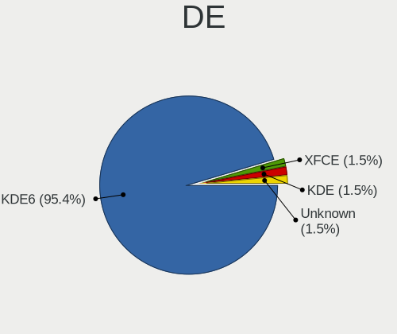
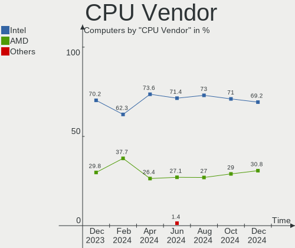
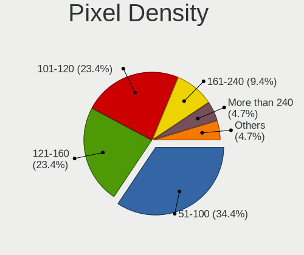
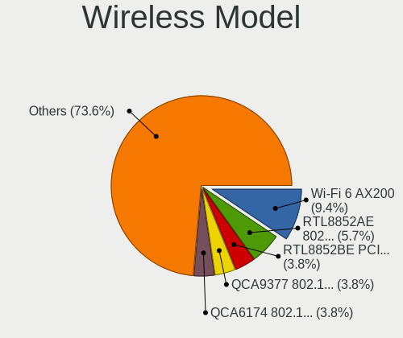
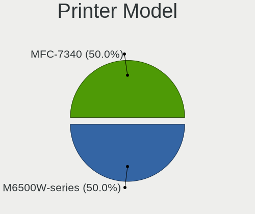

KDE neon Hardware Trends
------------------------

A project to identify most popular hardware characteristics and track their change
over time based on data collected by KDE neon users at https://Linux-Hardware.org.

Anyone can contribute to the study by uploading probes of their computers by
the [hw-probe](https://github.com/linuxhw/hw-probe) tool:

    sudo -E hw-probe -all -upload

This is a report for all computer types. See also reports for [desktops](/Dist/KDE_neon/Desktop/README.md) and [notebooks](/Dist/KDE_neon/Notebook/README.md).

Full-feature report is available here: https://linux-hardware.org/?view=trends

Period: Sep, 2020.

Contents
--------

- [ OS                       ](#os)
- [ OS Family                ](#os-family)
- [ Kernel                   ](#kernel)
- [ Kernel Family            ](#kernel-family)
- [ Kernel Major Ver.        ](#kernel-major-ver)
- [ Arch                     ](#arch)
- [ DE                       ](#de)
- [ Display Server           ](#display-server)
- [ Display Manager          ](#display-manager)
- [ OS Lang                  ](#os-lang)
- [ Boot Mode                ](#boot-mode)
- [ Filesystem               ](#filesystem)
- [ Part. scheme             ](#part-scheme)
- [ Dual Boot with Linux/BSD ](#dual-boot-with-linux/bsd)
- [ Dual Boot (Win)          ](#dual-boot-win)
- [ Country                  ](#country)
- [ City                     ](#city)
- [ Vendor                   ](#vendor)
- [ Model                    ](#model)
- [ Model Family             ](#model-family)
- [ MFG Year                 ](#mfg-year)
- [ Form Factor              ](#form-factor)
- [ Secure Boot              ](#secure-boot)
- [ Coreboot                 ](#coreboot)
- [ RAM Size                 ](#ram-size)
- [ RAM Used                 ](#ram-used)
- [ Has CD-ROM               ](#has-cd-rom)
- [ Total Drives             ](#total-drives)
- [ Has Ethernet             ](#has-ethernet)
- [ Drive Vendor             ](#drive-vendor)
- [ HDD Vendor               ](#hdd-vendor)
- [ SSD Vendor               ](#ssd-vendor)
- [ Drive Model              ](#drive-model)
- [ Drive Kind               ](#drive-kind)
- [ Drive Connector          ](#drive-connector)
- [ Drive Size               ](#drive-size)
- [ Space Total              ](#space-total)
- [ Space Used               ](#space-used)
- [ Malfunc. Drives          ](#malfunc-drives)
- [ Malfunc. Drive Vendor    ](#malfunc-drive-vendor)
- [ Malfunc. HDD Vendor      ](#malfunc-hdd-vendor)
- [ Malfunc. Drive Kind      ](#malfunc-drive-kind)
- [ Failed Drives            ](#failed-drives)
- [ Failed Drive Vendor      ](#failed-drive-vendor)
- [ Drive Status             ](#drive-status)
- [ Storage Vendor           ](#storage-vendor)
- [ Storage Model            ](#storage-model)
- [ Storage Kind             ](#storage-kind)
- [ CPU Vendor               ](#cpu-vendor)
- [ CPU Model                ](#cpu-model)
- [ CPU Model Family         ](#cpu-model-family)
- [ CPU Cores                ](#cpu-cores)
- [ CPU Sockets              ](#cpu-sockets)
- [ CPU Threads              ](#cpu-threads)
- [ CPU Op-Modes             ](#cpu-op-modes)
- [ CPU Microcode            ](#cpu-microcode)
- [ CPU Microarch            ](#cpu-microarch)
- [ GPU Vendor               ](#gpu-vendor)
- [ GPU Model                ](#gpu-model)
- [ GPU Combo                ](#gpu-combo)
- [ GPU Driver               ](#gpu-driver)
- [ GPU Memory               ](#gpu-memory)
- [ Monitor Vendor           ](#monitor-vendor)
- [ Monitor Model            ](#monitor-model)
- [ Monitor Resolution       ](#monitor-resolution)
- [ Monitor Diagonal         ](#monitor-diagonal)
- [ Monitor Width            ](#monitor-width)
- [ Aspect Ratio             ](#aspect-ratio)
- [ Monitor Area             ](#monitor-area)
- [ Pixel Density            ](#pixel-density)
- [ Multiple Monitors        ](#multiple-monitors)
- [ Net Controller Vendor    ](#net-controller-vendor)
- [ Net Controller Model     ](#net-controller-model)
- [ Wireless Vendor          ](#wireless-vendor)
- [ Wireless Model           ](#wireless-model)
- [ Ethernet Vendor          ](#ethernet-vendor)
- [ Ethernet Model           ](#ethernet-model)
- [ Net Controller Kind      ](#net-controller-kind)
- [ Used Controller          ](#used-controller)
- [ NICs                     ](#nics)
- [ Memory Vendor            ](#memory-vendor)
- [ Memory Model             ](#memory-model)
- [ Memory Kind              ](#memory-kind)
- [ Memory Form Factor       ](#memory-form-factor)
- [ Memory Size              ](#memory-size)
- [ Memory Speed             ](#memory-speed)
- [ Sound Vendor             ](#sound-vendor)
- [ Sound Model              ](#sound-model)
- [ Camera Vendor            ](#camera-vendor)
- [ Camera Model             ](#camera-model)
- [ Fingerprint Vendor       ](#fingerprint-vendor)
- [ Fingerprint Model        ](#fingerprint-model)
- [ Chipcard Vendor          ](#chipcard-vendor)
- [ Chipcard Model           ](#chipcard-model)
- [ Printer Vendor           ](#printer-vendor)
- [ Printer Model            ](#printer-model)
- [ Scanner Vendor           ](#scanner-vendor)
- [ Scanner Model            ](#scanner-model)
- [ Bluetooth Vendor         ](#bluetooth-vendor)
- [ Bluetooth Model          ](#bluetooth-model)
- [ Unsupported Devices      ](#unsupported-devices)
- [ Unsupported Device Types ](#unsupported-device-types)

OS
--

Installed operating systems

| Name           | Computers | Percent |
|----------------|-----------|---------|
| KDE neon 20.04 | 45        | 93.75%  |
| KDE neon 18.04 | 3         | 6.25%   |

OS Family
---------

OS without a version

| Name     | Computers | Percent |
|----------|-----------|---------|
| KDE neon | 48        | 100%    |

Kernel
------

Version of the Linux kernel

| Version               | Computers | Percent |
|-----------------------|-----------|---------|
| 5.4.0-47-generic      | 13        | 27.08%  |
| 5.4.0-48-generic      | 12        | 25%     |
| 5.4.0-45-generic      | 10        | 20.83%  |
| 5.4.0-42-generic      | 7         | 14.58%  |
| 5.8.9-050809-generic  | 1         | 2.08%   |
| 5.8.6-xanmod1         | 1         | 2.08%   |
| 5.7.1-050701-generic  | 1         | 2.08%   |
| 5.4.41-050441-generic | 1         | 2.08%   |
| 5.4.0-49-generic      | 1         | 2.08%   |
| 4.15.0-43-generic     | 1         | 2.08%   |

Kernel Family
-------------

Linux kernel without a distro release

| Version | Computers | Percent |
|---------|-----------|---------|
| 5.4.0   | 43        | 89.58%  |
| 5.8.9   | 1         | 2.08%   |
| 5.8.6   | 1         | 2.08%   |
| 5.7.1   | 1         | 2.08%   |
| 5.4.41  | 1         | 2.08%   |
| 4.15.0  | 1         | 2.08%   |

Kernel Major Ver.
-----------------

Linux kernel major version

| Version | Computers | Percent |
|---------|-----------|---------|
| 5.4     | 44        | 91.67%  |
| 5.8     | 2         | 4.17%   |
| 5.7     | 1         | 2.08%   |
| 4.15    | 1         | 2.08%   |

Arch
----

OS architecture (x86_64, i586, etc.)

| Name   | Computers | Percent |
|--------|-----------|---------|
| x86_64 | 48        | 100%    |

DE
--

Desktop Environment

| Name    | Computers | Percent |
|---------|-----------|---------|
| KDE     | 32        | 66.67%  |
| KDE5    | 13        | 27.08%  |
| Unknown | 3         | 6.25%   |

Display Server
--------------

X11 or Wayland

| Name    | Computers | Percent |
|---------|-----------|---------|
| X11     | 46        | 95.83%  |
| Wayland | 2         | 4.17%   |

Display Manager
---------------

SDDM, LightDM, etc.

| Name    | Computers | Percent |
|---------|-----------|---------|
| Unknown | 33        | 68.75%  |
| SDDM    | 15        | 31.25%  |

OS Lang
-------

Language

| Lang    | Computers | Percent |
|---------|-----------|---------|
| en_US   | 16        | 33.33%  |
| ru_RU   | 3         | 6.25%   |
| pt_BR   | 3         | 6.25%   |
| de_DE   | 3         | 6.25%   |
| es_ES   | 2         | 4.17%   |
| es_AR   | 2         | 4.17%   |
| en_GB   | 2         | 4.17%   |
| de_CH   | 2         | 4.17%   |
| C       | 2         | 4.17%   |
| Unknown | 2         | 4.17%   |
| uk_UA   | 1         | 2.08%   |
| ro_RO   | 1         | 2.08%   |
| pl_PL   | 1         | 2.08%   |
| nl_BE   | 1         | 2.08%   |
| it_IT   | 1         | 2.08%   |
| id_ID   | 1         | 2.08%   |
| es_MX   | 1         | 2.08%   |
| es_EC   | 1         | 2.08%   |
| en_ZA   | 1         | 2.08%   |
| en_IN   | 1         | 2.08%   |
| en_AU   | 1         | 2.08%   |

Boot Mode
---------

EFI or BIOS

| Mode | Computers | Percent |
|------|-----------|---------|
| EFI  | 29        | 60.42%  |
| BIOS | 19        | 39.58%  |

Filesystem
----------

Type of filesystem

| Type    | Computers | Percent |
|---------|-----------|---------|
| Ext4    | 44        | 91.67%  |
| Zfs     | 1         | 2.08%   |
| Xfs     | 1         | 2.08%   |
| Overlay | 1         | 2.08%   |
| Btrfs   | 1         | 2.08%   |

Part. scheme
------------

Scheme of partitioning

| Type    | Computers | Percent |
|---------|-----------|---------|
| Unknown | 32        | 66.67%  |
| GPT     | 16        | 33.33%  |

Dual Boot with Linux/BSD
------------------------

Hosting more than one Linux/BSD

| Dual boot | Computers | Percent |
|-----------|-----------|---------|
| No        | 46        | 95.83%  |
| Yes       | 2         | 4.17%   |

Dual Boot (Win)
---------------

Hosting Linux and Windows

| Dual boot | Computers | Percent |
|-----------|-----------|---------|
| No        | 36        | 75%     |
| Yes       | 12        | 25%     |

Country
-------

Geographic location (country)

| Country      | Computers | Percent |
|--------------|-----------|---------|
| USA          | 9         | 18.75%  |
| Germany      | 5         | 10.42%  |
| Brazil       | 5         | 10.42%  |
| UK           | 2         | 4.17%   |
| Switzerland  | 2         | 4.17%   |
| Russia       | 2         | 4.17%   |
| Mexico       | 2         | 4.17%   |
| Argentina    | 2         | 4.17%   |
| Ukraine      | 1         | 2.08%   |
| Thailand     | 1         | 2.08%   |
| Spain        | 1         | 2.08%   |
| South Africa | 1         | 2.08%   |
| Saudi Arabia | 1         | 2.08%   |
| Romania      | 1         | 2.08%   |
| Qatar        | 1         | 2.08%   |
| Poland       | 1         | 2.08%   |
| Peru         | 1         | 2.08%   |
| Kazakhstan   | 1         | 2.08%   |
| Japan        | 1         | 2.08%   |
| Italy        | 1         | 2.08%   |
| Indonesia    | 1         | 2.08%   |
| India        | 1         | 2.08%   |
| Ecuador      | 1         | 2.08%   |
| Canada       | 1         | 2.08%   |
| Belgium      | 1         | 2.08%   |
| Australia    | 1         | 2.08%   |
| Andorra      | 1         | 2.08%   |

City
----

Geographic location (city)

| City                | Computers | Percent |
|---------------------|-----------|---------|
| Gloucester          | 2         | 4.17%   |
| Łódź             | 1         | 2.08%   |
| Zurich              | 1         | 2.08%   |
| Zimmern ob Rottweil | 1         | 2.08%   |
| Tron                | 1         | 2.08%   |
| Toronto             | 1         | 2.08%   |
| Tizayuca            | 1         | 2.08%   |
| St. Petersburg      | 1         | 2.08%   |
| Springfield         | 1         | 2.08%   |
| Springdale          | 1         | 2.08%   |
| Schellerten         | 1         | 2.08%   |
| Santa Ana           | 1         | 2.08%   |
| Quito               | 1         | 2.08%   |
| Paradise Valley     | 1         | 2.08%   |
| Palmas              | 1         | 2.08%   |
| Orem                | 1         | 2.08%   |
| Nova Londrina       | 1         | 2.08%   |
| Nizhniy Novgorod    | 1         | 2.08%   |
| Munich              | 1         | 2.08%   |
| Mexico City         | 1         | 2.08%   |
| Madrid              | 1         | 2.08%   |
| Littleton           | 1         | 2.08%   |
| Lima                | 1         | 2.08%   |
| Lier                | 1         | 2.08%   |
| La Plata            | 1         | 2.08%   |
| Kyiv                | 1         | 2.08%   |
| Kagoshima           | 1         | 2.08%   |
| Jaguaruana          | 1         | 2.08%   |
| Hobart              | 1         | 2.08%   |
| Heilbronn           | 1         | 2.08%   |
| Frick               | 1         | 2.08%   |
| Frankfurt am Main   | 1         | 2.08%   |
| Flushing            | 1         | 2.08%   |
| Falls Church        | 1         | 2.08%   |
| Dumbravita          | 1         | 2.08%   |
| Doha                | 1         | 2.08%   |
| Dhahran             | 1         | 2.08%   |
| Criciúma           | 1         | 2.08%   |
| Codó               | 1         | 2.08%   |
| Buenos Aires        | 1         | 2.08%   |
| Boksburg            | 1         | 2.08%   |
| Biancavilla         | 1         | 2.08%   |
| Batam               | 1         | 2.08%   |
| Balashikha          | 1         | 2.08%   |
| Atyrau              | 1         | 2.08%   |
| Andorra la Vella    | 1         | 2.08%   |
| Ahmedabad           | 1         | 2.08%   |

Vendor
------

Motherboard manufacturer

| Name                | Computers | Percent |
|---------------------|-----------|---------|
| Hewlett-Packard     | 9         | 18.75%  |
| ASUSTek Computer    | 9         | 18.75%  |
| Lenovo              | 8         | 16.67%  |
| Gigabyte Technology | 7         | 14.58%  |
| Dell                | 3         | 6.25%   |
| ASRock              | 3         | 6.25%   |
| MSI                 | 2         | 4.17%   |
| Sony                | 1         | 2.08%   |
| Medion              | 1         | 2.08%   |
| Google              | 1         | 2.08%   |
| ECS                 | 1         | 2.08%   |
| BESSTAR Tech        | 1         | 2.08%   |
| Apple               | 1         | 2.08%   |
| Unknown             | 1         | 2.08%   |

Model
-----

Motherboard model

| Name                                 | Computers | Percent |
|--------------------------------------|-----------|---------|
| Sony VGN-AW41ZF_B                    | 1         | 2.08%   |
| MSI MS-7817                          | 1         | 2.08%   |
| MSI GS60 2QE                         | 1         | 2.08%   |
| Medion MS-7646                       | 1         | 2.08%   |
| Lenovo ThinkPad T480s 20L8S6QF00     | 1         | 2.08%   |
| Lenovo ThinkPad T470s 20HGS0A600     | 1         | 2.08%   |
| Lenovo ThinkPad E14 Gen 2 20T6S03000 | 1         | 2.08%   |
| Lenovo IdeaPad Y700-15ISK 80NV       | 1         | 2.08%   |
| Lenovo IdeaPad S540-15IWL 81NE       | 1         | 2.08%   |
| Lenovo IdeaPad 500-15ISK 80NT        | 1         | 2.08%   |
| Lenovo IdeaPad 320-15IKB 80YH        | 1         | 2.08%   |
| Lenovo IdeaPad 110-15IBR 80T7        | 1         | 2.08%   |
| HP Notebook                          | 1         | 2.08%   |
| HP Laptop 14-df0xxx                  | 1         | 2.08%   |
| HP G42                               | 1         | 2.08%   |
| HP EliteDesk 800 G4 DM 35W (TAA)     | 1         | 2.08%   |
| HP EliteBook 840 G6                  | 1         | 2.08%   |
| HP Compaq 15                         | 1         | 2.08%   |
| HP 650                               | 1         | 2.08%   |
| HP 355 G2                            | 1         | 2.08%   |
| HP 250 G6 Notebook PC                | 1         | 2.08%   |
| Google Eve                           | 1         | 2.08%   |
| Gigabyte X570 AORUS PRO WIFI         | 1         | 2.08%   |
| Gigabyte Gaming B8                   | 1         | 2.08%   |
| Gigabyte GA-MA78G-DS3H               | 1         | 2.08%   |
| Gigabyte GA-990FXA-UD5               | 1         | 2.08%   |
| Gigabyte B450M DS3H                  | 1         | 2.08%   |
| Gigabyte B450 AORUS PRO              | 1         | 2.08%   |
| Gigabyte AX370-Gaming                | 1         | 2.08%   |
| ECS Z97M-PK                          | 1         | 2.08%   |
| Dell OptiPlex 3010                   | 1         | 2.08%   |
| Dell Inspiron 5557                   | 1         | 2.08%   |
| Dell Dimension 8400                  | 1         | 2.08%   |
| BESSTAR Tech N33                     | 1         | 2.08%   |
| ASUS X541NA                          | 1         | 2.08%   |
| ASUS VivoBook E14 E402YA_E402YA      | 1         | 2.08%   |
| ASUS TUF GAMING X570-PLUS            | 1         | 2.08%   |
| ASUS T101HA                          | 1         | 2.08%   |
| ASUS ROG STRIX B450-F GAMING         | 1         | 2.08%   |
| ASUS PRIME B350-PLUS                 | 1         | 2.08%   |
| ASUS M5A97 R2.0                      | 1         | 2.08%   |
| ASUS M5A78L-M/USB3                   | 1         | 2.08%   |
| ASUS All Series                      | 1         | 2.08%   |
| ASRock X470 Master SLI/ac            | 1         | 2.08%   |
| ASRock B450M Steel Legend            | 1         | 2.08%   |
| ASRock A320M-HD                      | 1         | 2.08%   |
| Apple iMac16,2                       | 1         | 2.08%   |
| Unknown                              | 1         | 2.08%   |

Model Family
------------

Motherboard model prefix

| Name                   | Computers | Percent |
|------------------------|-----------|---------|
| Lenovo IdeaPad         | 5         | 10.42%  |
| Lenovo ThinkPad        | 3         | 6.25%   |
| Sony VGN-AW41ZF        | 1         | 2.08%   |
| MSI MS-7817            | 1         | 2.08%   |
| MSI GS60               | 1         | 2.08%   |
| Medion MS-7646         | 1         | 2.08%   |
| HP Notebook            | 1         | 2.08%   |
| HP Laptop              | 1         | 2.08%   |
| HP G42                 | 1         | 2.08%   |
| HP EliteDesk           | 1         | 2.08%   |
| HP EliteBook           | 1         | 2.08%   |
| HP Compaq              | 1         | 2.08%   |
| HP 650                 | 1         | 2.08%   |
| HP 355                 | 1         | 2.08%   |
| HP 250                 | 1         | 2.08%   |
| Google Eve             | 1         | 2.08%   |
| Gigabyte X570          | 1         | 2.08%   |
| Gigabyte Gaming        | 1         | 2.08%   |
| Gigabyte GA-MA78G-DS3H | 1         | 2.08%   |
| Gigabyte GA-990FXA-UD5 | 1         | 2.08%   |
| Gigabyte B450M         | 1         | 2.08%   |
| Gigabyte B450          | 1         | 2.08%   |
| Gigabyte AX370-Gaming  | 1         | 2.08%   |
| ECS Z97M-PK            | 1         | 2.08%   |
| Dell OptiPlex          | 1         | 2.08%   |
| Dell Inspiron          | 1         | 2.08%   |
| Dell Dimension         | 1         | 2.08%   |
| BESSTAR Tech N33       | 1         | 2.08%   |
| ASUS X541NA            | 1         | 2.08%   |
| ASUS VivoBook          | 1         | 2.08%   |
| ASUS TUF               | 1         | 2.08%   |
| ASUS T101HA            | 1         | 2.08%   |
| ASUS ROG               | 1         | 2.08%   |
| ASUS PRIME             | 1         | 2.08%   |
| ASUS M5A97             | 1         | 2.08%   |
| ASUS M5A78L-M          | 1         | 2.08%   |
| ASUS All               | 1         | 2.08%   |
| ASRock X470            | 1         | 2.08%   |
| ASRock B450M           | 1         | 2.08%   |
| ASRock A320M-HD        | 1         | 2.08%   |
| Apple iMac16           | 1         | 2.08%   |
| Unknown                | 1         | 2.08%   |

MFG Year
--------

Motherboard manufacture year

| Year | Computers | Percent |
|------|-----------|---------|
| 2019 | 11        | 22.92%  |
| 2018 | 11        | 22.92%  |
| 2020 | 8         | 16.67%  |
| 2014 | 5         | 10.42%  |
| 2017 | 3         | 6.25%   |
| 2016 | 2         | 4.17%   |
| 2010 | 2         | 4.17%   |
| 2009 | 2         | 4.17%   |
| 2015 | 1         | 2.08%   |
| 2012 | 1         | 2.08%   |
| 2011 | 1         | 2.08%   |
| 2005 | 1         | 2.08%   |

Form Factor
-----------

Physical design of the computer

| Name        | Computers | Percent |
|-------------|-----------|---------|
| Desktop     | 23        | 47.92%  |
| Notebook    | 21        | 43.75%  |
| Tablet      | 1         | 2.08%   |
| Convertible | 1         | 2.08%   |
| Mini pc     | 1         | 2.08%   |
| All in one  | 1         | 2.08%   |

Secure Boot
-----------

Enabled or disabled

| State    | Computers | Percent |
|----------|-----------|---------|
| Disabled | 46        | 95.83%  |
| Enabled  | 2         | 4.17%   |

Coreboot
--------

Have coreboot on board

| Used | Computers | Percent |
|------|-----------|---------|
| No   | 47        | 97.92%  |
| Yes  | 1         | 2.08%   |

RAM Size
--------

Total RAM memory

| Size in GB | Computers | Percent |
|------------|-----------|---------|
| 16.01-24.0 | 16        | 33.33%  |
| 3.01-4.0   | 10        | 20.83%  |
| 8.01-16.0  | 9         | 18.75%  |
| 4.01-8.0   | 7         | 14.58%  |
| 32.01-64.0 | 5         | 10.42%  |
| 1.01-2.0   | 1         | 2.08%   |

RAM Used
--------

Used RAM memory

| Used GB   | Computers | Percent |
|-----------|-----------|---------|
| 2.01-3.0  | 14        | 29.17%  |
| 1.01-2.0  | 14        | 29.17%  |
| 4.01-8.0  | 12        | 25%     |
| 3.01-4.0  | 5         | 10.42%  |
| 8.01-16.0 | 2         | 4.17%   |
| 0.01-1.0  | 1         | 2.08%   |

Has CD-ROM
----------

Has CD-ROM on board

| Presented | Computers | Percent |
|-----------|-----------|---------|
| No        | 31        | 64.58%  |
| Yes       | 17        | 35.42%  |

Total Drives
------------

Number of drives on board

| Drives | Computers | Percent |
|--------|-----------|---------|
| 1      | 25        | 52.08%  |
| 2      | 11        | 22.92%  |
| 3      | 7         | 14.58%  |
| 4      | 3         | 6.25%   |
| 6      | 1         | 2.08%   |
| 5      | 1         | 2.08%   |

Has Ethernet
------------

Has Ethernet on board

| Presented | Computers | Percent |
|-----------|-----------|---------|
| Yes       | 45        | 93.75%  |
| No        | 3         | 6.25%   |

Drive Vendor
------------

Hard drive vendors

| Vendor                    | Computers | Drives | Percent |
|---------------------------|-----------|--------|---------|
| Seagate                   | 16        | 21     | 20.51%  |
| WDC                       | 11        | 11     | 14.1%   |
| Toshiba                   | 8         | 9      | 10.26%  |
| Samsung Electronics       | 6         | 6      | 7.69%   |
| Kingston                  | 6         | 8      | 7.69%   |
| Unknown                   | 4         | 4      | 5.13%   |
| SanDisk                   | 3         | 3      | 3.85%   |
| Hitachi                   | 3         | 3      | 3.85%   |
| Crucial                   | 3         | 4      | 3.85%   |
| HGST                      | 2         | 5      | 2.56%   |
| SPCC                      | 1         | 1      | 1.28%   |
| SK Hynix                  | 1         | 1      | 1.28%   |
| Silicon Motion            | 1         | 1      | 1.28%   |
| Phison                    | 1         | 1      | 1.28%   |
| Mushkin                   | 1         | 1      | 1.28%   |
| Micron/Crucial Technology | 1         | 1      | 1.28%   |
| Micron Technology         | 1         | 1      | 1.28%   |
| Lenovo                    | 1         | 1      | 1.28%   |
| KESU                      | 1         | 1      | 1.28%   |
| Intenso                   | 1         | 1      | 1.28%   |
| HyperX                    | 1         | 1      | 1.28%   |
| HS-SSD-C100               | 1         | 1      | 1.28%   |
| GOODRAM                   | 1         | 1      | 1.28%   |
| China                     | 1         | 1      | 1.28%   |
| Apple                     | 1         | 1      | 1.28%   |
| A-DATA Technology         | 1         | 1      | 1.28%   |

HDD Vendor
----------

Hard disk drive vendors

| Vendor              | Computers | Drives | Percent |
|---------------------|-----------|--------|---------|
| Seagate             | 15        | 19     | 39.47%  |
| Toshiba             | 7         | 7      | 18.42%  |
| WDC                 | 6         | 6      | 15.79%  |
| Samsung Electronics | 3         | 3      | 7.89%   |
| Hitachi             | 3         | 3      | 7.89%   |
| HGST                | 2         | 5      | 5.26%   |
| KESU                | 1         | 1      | 2.63%   |
| Apple               | 1         | 1      | 2.63%   |

SSD Vendor
----------

Solid state drive vendors

| Vendor              | Computers | Drives | Percent |
|---------------------|-----------|--------|---------|
| Kingston            | 5         | 7      | 20.83%  |
| WDC                 | 3         | 3      | 12.5%   |
| SanDisk             | 3         | 3      | 12.5%   |
| Crucial             | 3         | 4      | 12.5%   |
| Samsung Electronics | 2         | 2      | 8.33%   |
| Toshiba             | 1         | 2      | 4.17%   |
| SPCC                | 1         | 1      | 4.17%   |
| Mushkin             | 1         | 1      | 4.17%   |
| Micron Technology   | 1         | 1      | 4.17%   |
| Intenso             | 1         | 1      | 4.17%   |
| HyperX              | 1         | 1      | 4.17%   |
| GOODRAM             | 1         | 1      | 4.17%   |
| China               | 1         | 1      | 4.17%   |

Drive Model
-----------

Hard drive models

| Model                            | Computers | Percent |
|----------------------------------|-----------|---------|
| MQ01ABF050 500GB                 | 3         | 3.53%   |
| WD10SPCX-24HWST1 1TB             | 2         | 2.35%   |
| SSD 860 EVO 500GB                | 2         | 2.35%   |
| SA400S37240G 240GB SSD           | 2         | 2.35%   |
| SA400S37120G 120GB SSD           | 2         | 2.35%   |
| NVMe SSD Drive 500GB             | 2         | 2.35%   |
| WDS500G3X0C-00SJG0 500GB         | 1         | 1.18%   |
| WDS500G2B0A-00SM50 500GB SSD     | 1         | 1.18%   |
| WDS240G2G0B-00EPW0 240GB SSD     | 1         | 1.18%   |
| WDS120G2G0B-00EPW0 120GB SSD     | 1         | 1.18%   |
| WD40EZRX-00SPEB0 4TB             | 1         | 1.18%   |
| WD20EZRX-00D8PB0 2TB             | 1         | 1.18%   |
| WD10EZEX-21M2NA0 1TB             | 1         | 1.18%   |
| WD10EZEX-00BN5A0 1TB             | 1         | 1.18%   |
| USB 3.0 320GB                    | 1         | 1.18%   |
| Ultra Slim PL 1TB                | 1         | 1.18%   |
| Ultra II 250GB SSD               | 1         | 1.18%   |
| THNSNJ128G8NU 128GB SSD          | 1         | 1.18%   |
| SX8100NP 512GB                   | 1         | 1.18%   |
| SUV300S37A240G 240GB SSD         | 1         | 1.18%   |
| ST9320423AS 320GB                | 1         | 1.18%   |
| ST500LT012-1DG142 500GB          | 1         | 1.18%   |
| ST4000DM004-2CV104 4TB           | 1         | 1.18%   |
| ST3160023AS 160GB                | 1         | 1.18%   |
| ST31000528AS 1TB                 | 1         | 1.18%   |
| ST31000340NS 1TB                 | 1         | 1.18%   |
| ST3000DM008-2DM166 3TB           | 1         | 1.18%   |
| ST2000LM003 HN-M201RAD 2TB       | 1         | 1.18%   |
| ST2000DX002-2DV164 2TB           | 1         | 1.18%   |
| ST2000DM006-2DM164 2TB           | 1         | 1.18%   |
| ST2000DL003-9VT166 2TB           | 1         | 1.18%   |
| ST1000LM035-1RK172 1TB           | 1         | 1.18%   |
| ST1000LM024 HN-M101MBB 1TB       | 1         | 1.18%   |
| ST1000DM010-2EP102 1TB           | 1         | 1.18%   |
| ST1000DM003-1ER162 1TB           | 1         | 1.18%   |
| ST1000DM003-1CH162 1TB           | 1         | 1.18%   |
| SSD PLUS 240GB                   | 1         | 1.18%   |
| SSD PLUS 120GB                   | 1         | 1.18%   |
| SSD 256GB                        | 1         | 1.18%   |
| SSD 240GB                        | 1         | 1.18%   |
| Solid State Disk 64GB            | 1         | 1.18%   |
| SLD64G  64GB                     | 1         | 1.18%   |
| SH103S3120G 120GB SSD            | 1         | 1.18%   |
| SA400S37960G 960GB SSD           | 1         | 1.18%   |
| PC SN530 SDBPMPZ-256G-1001 256GB | 1         | 1.18%   |
| NVMe SSD Drive 512GB             | 1         | 1.18%   |
| NVMe SSD Drive 256GB             | 1         | 1.18%   |
| NVMe SSD Drive 250GB             | 1         | 1.18%   |
| MZVLB512HAJQ-000H1 512GB         | 1         | 1.18%   |
| MQ01ABD100 1TB                   | 1         | 1.18%   |
| MMC Card  128GB                  | 1         | 1.18%   |
| MKNSSDRE512GB                    | 1         | 1.18%   |
| MK2565GSXN 250GB                 | 1         | 1.18%   |
| HTS721010A9E630 1TB              | 1         | 1.18%   |
| HTS543232A7A384 320GB            | 1         | 1.18%   |
| HMS5C4040BLE640 4TB              | 1         | 1.18%   |
| HDWD110 1TB                      | 1         | 1.18%   |
| HDT725032VLA380 320GB            | 1         | 1.18%   |
| HDS721010CLA332 1TB              | 1         | 1.18%   |
| HDD HTS541010A9E662 1TB          | 1         | 1.18%   |

Drive Kind
----------

HDD or SSD

| Kind    | Computers | Drives | Percent |
|---------|-----------|--------|---------|
| HDD     | 31        | 45     | 44.93%  |
| SSD     | 21        | 28     | 30.43%  |
| NVMe    | 11        | 11     | 15.94%  |
| MMC     | 3         | 3      | 4.35%   |
| Unknown | 3         | 3      | 4.35%   |

Drive Connector
---------------

SATA, SAS, NVMe, etc.

| Type | Computers | Drives | Percent |
|------|-----------|--------|---------|
| SATA | 38        | 70     | 66.67%  |
| NVMe | 11        | 11     | 19.3%   |
| SAS  | 5         | 6      | 8.77%   |
| MMC  | 3         | 3      | 5.26%   |

Drive Size
----------

Size of hard drive

| Size in TB | Computers | Drives | Percent |
|------------|-----------|--------|---------|
| 0.01-0.5   | 37        | 49     | 53.62%  |
| 0.51-1.0   | 23        | 27     | 33.33%  |
| 1.01-2.0   | 6         | 7      | 8.7%    |
| 3.01-4.0   | 2         | 6      | 2.9%    |
| 2.01-3.0   | 1         | 1      | 1.45%   |

Space Total
-----------

Amount of disk space available on the file system

| Size in GB     | Computers | Percent |
|----------------|-----------|---------|
| 251-500        | 11        | 22.92%  |
| 101-250        | 11        | 22.92%  |
| 1001-2000      | 8         | 16.67%  |
| More than 3000 | 5         | 10.42%  |
| 1-20           | 4         | 8.33%   |
| 501-1000       | 3         | 6.25%   |
| 21-50          | 2         | 4.17%   |
| 51-100         | 2         | 4.17%   |
| Unknown        | 2         | 4.17%   |

Space Used
----------

Amount of used disk space

| Used GB        | Computers | Percent |
|----------------|-----------|---------|
| 1-20           | 11        | 22.92%  |
| 21-50          | 7         | 14.58%  |
| 51-100         | 7         | 14.58%  |
| 251-500        | 5         | 10.42%  |
| 101-250        | 5         | 10.42%  |
| 501-1000       | 5         | 10.42%  |
| More than 3000 | 4         | 8.33%   |
| Unknown        | 2         | 4.17%   |
| 2001-3000      | 1         | 2.08%   |
| 1001-2000      | 1         | 2.08%   |

Malfunc. Drives
---------------

Drive models with a malfunction

| Model                 | Computers | Drives | Percent |
|-----------------------|-----------|--------|---------|
| ESA3SMD2HTGT240GB SSD | 1         | 1      | 100%    |

Malfunc. Drive Vendor
---------------------

Vendors of faulty drives

| Vendor | Computers | Drives | Percent |
|--------|-----------|--------|---------|
| China  | 1         | 1      | 100%    |

Malfunc. HDD Vendor
-------------------

Vendors of faulty HDD drives

Zero info for selected period =(

Malfunc. Drive Kind
-------------------

Kinds of faulty drives

| Kind | Computers | Drives | Percent |
|------|-----------|--------|---------|
| SSD  | 1         | 1      | 100%    |

Failed Drives
-------------

Failed drive models

Zero info for selected period =(

Failed Drive Vendor
-------------------

Failed drive vendors

Zero info for selected period =(

Drive Status
------------

Number of failed and malfunc. drives

| Status   | Computers | Drives | Percent |
|----------|-----------|--------|---------|
| Detected | 34        | 64     | 68%     |
| Works    | 15        | 25     | 30%     |
| Malfunc  | 1         | 1      | 2%      |

Storage Vendor
--------------

Storage controller vendors

| Vendor                      | Computers | Percent |
|-----------------------------|-----------|---------|
| Intel                       | 24        | 43.64%  |
| AMD                         | 18        | 32.73%  |
| Sandisk                     | 2         | 3.64%   |
| Union Memory (Shenzhen)     | 1         | 1.82%   |
| SK Hynix                    | 1         | 1.82%   |
| Silicon Motion              | 1         | 1.82%   |
| Samsung Electronics         | 1         | 1.82%   |
| Realtek Semiconductor       | 1         | 1.82%   |
| Phison Electronics          | 1         | 1.82%   |
| Micron/Crucial Technology   | 1         | 1.82%   |
| Marvell Technology Group    | 1         | 1.82%   |
| Lenovo                      | 1         | 1.82%   |
| Kingston Technology Company | 1         | 1.82%   |
| JMicron Technology          | 1         | 1.82%   |

Storage Model
-------------

Storage controller models

| Model                                                                      | Computers | Percent |
|----------------------------------------------------------------------------|-----------|---------|
| FCH SATA Controller [AHCI mode]                                            | 12        | 18.18%  |
| 400 Series Chipset SATA Controller                                         | 5         | 7.58%   |
| SB7x0/SB8x0/SB9x0 SATA Controller [AHCI mode]                              | 4         | 6.06%   |
| Non-Volatile memory controller                                             | 4         | 6.06%   |
| SB7x0/SB8x0/SB9x0 IDE Controller                                           | 3         | 4.55%   |
| 82801 Mobile SATA Controller [RAID mode]                                   | 3         | 4.55%   |
| Sunrise Point-LP SATA Controller [AHCI mode]                               | 2         | 3.03%   |
| Celeron N3350/Pentium N4200/Atom E3900 Series SATA AHCI Controller         | 2         | 3.03%   |
| 9 Series Chipset Family SATA Controller [AHCI Mode]                        | 2         | 3.03%   |
| 8 Series/C220 Series Chipset Family 6-port SATA Controller 1 [AHCI mode]   | 2         | 3.03%   |
| 6 Series/C200 Series Chipset Family 6 port Desktop SATA AHCI Controller    | 2         | 3.03%   |
| X370 Series Chipset SATA Controller                                        | 1         | 1.52%   |
| Wildcat Point-LP SATA Controller [AHCI Mode]                               | 1         | 1.52%   |
| WD Black 2018/PC SN720 NVMe SSD                                            | 1         | 1.52%   |
| SB7x0/SB8x0/SB9x0 SATA Controller [IDE mode]                               | 1         | 1.52%   |
| SATA controller                                                            | 1         | 1.52%   |
| Realtek Non-Volatile memory controller                                     | 1         | 1.52%   |
| P1 NVMe PCIe SSD                                                           | 1         | 1.52%   |
| NVMe SSD Controller SM981/PM981/PM983                                      | 1         | 1.52%   |
| JMB368 IDE controller                                                      | 1         | 1.52%   |
| HM170/QM170 Chipset SATA Controller [AHCI Mode]                            | 1         | 1.52%   |
| FCH SATA Controller D                                                      | 1         | 1.52%   |
| E12 NVMe Controller                                                        | 1         | 1.52%   |
| Cannon Point-LP SATA Controller [AHCI Mode]                                | 1         | 1.52%   |
| Cannon Lake PCH SATA AHCI Controller                                       | 1         | 1.52%   |
| BC501 NVMe Solid State Drive 512GB                                         | 1         | 1.52%   |
| Atom/Celeron/Pentium Processor x5-E8000/J3xxx/N3xxx Series SATA Controller | 1         | 1.52%   |
| A2000, M.2, 500GB                                                          | 1         | 1.52%   |
| 88SE9172 SATA 6Gb/s Controller                                             | 1         | 1.52%   |
| 82801IBM/IEM (ICH9M/ICH9M-E) 4 port SATA Controller [AHCI mode]            | 1         | 1.52%   |
| 82801FR/FRW (ICH6R/ICH6RW) SATA Controller                                 | 1         | 1.52%   |
| 82801FB/FBM/FR/FW/FRW (ICH6 Family) IDE Controller                         | 1         | 1.52%   |
| 7 Series Chipset Family 6-port SATA Controller [AHCI mode]                 | 1         | 1.52%   |
| 5 Series/3400 Series Chipset 4 port SATA AHCI Controller                   | 1         | 1.52%   |
| 300 Series Chipset SATA Controller                                         | 1         | 1.52%   |
| 200 Series PCH SATA controller [AHCI mode]                                 | 1         | 1.52%   |

Storage Kind
------------

Kind of storage controller (IDE, SATA, NVMe, SAS, ...)

| Kind | Computers | Percent |
|------|-----------|---------|
| SATA | 39        | 67.24%  |
| NVMe | 11        | 18.97%  |
| IDE  | 5         | 8.62%   |
| RAID | 3         | 5.17%   |

CPU Vendor
----------

Processor vendors

| Vendor | Computers | Percent |
|--------|-----------|---------|
| Intel  | 29        | 60.42%  |
| AMD    | 19        | 39.58%  |

CPU Model
---------

Processor models

| Model                                       | Computers | Percent |
|---------------------------------------------|-----------|---------|
| Intel Core i7-7500U CPU @ 2.70GHz           | 2         | 4.17%   |
| Intel Core i7-6500U CPU @ 2.50GHz           | 2         | 4.17%   |
| Intel Celeron CPU N3350 @ 1.10GHz           | 2         | 4.17%   |
| Intel Xeon CPU E5-2687W 0 @ 3.10GHz         | 1         | 2.08%   |
| Intel Pentium Silver N5000 CPU @ 1.10GHz    | 1         | 2.08%   |
| Intel Pentium CPU B980 @ 2.40GHz            | 1         | 2.08%   |
| Intel Pentium 4 CPU 3.00GHz                 | 1         | 2.08%   |
| Intel Core i7-8565U CPU @ 1.80GHz           | 1         | 2.08%   |
| Intel Core i7-6700K CPU @ 4.00GHz           | 1         | 2.08%   |
| Intel Core i7-6700HQ CPU @ 2.60GHz          | 1         | 2.08%   |
| Intel Core i7-4790S CPU @ 3.20GHz           | 1         | 2.08%   |
| Intel Core i7-4790 CPU @ 3.60GHz            | 1         | 2.08%   |
| Intel Core i7-4710HQ CPU @ 2.50GHz          | 1         | 2.08%   |
| Intel Core i5-8500T CPU @ 2.10GHz           | 1         | 2.08%   |
| Intel Core i5-8350U CPU @ 1.70GHz           | 1         | 2.08%   |
| Intel Core i5-8265U CPU @ 1.60GHz           | 1         | 2.08%   |
| Intel Core i5-7Y57 CPU @ 1.20GHz            | 1         | 2.08%   |
| Intel Core i5-5575R CPU @ 2.80GHz           | 1         | 2.08%   |
| Intel Core i5-4440 CPU @ 3.10GHz            | 1         | 2.08%   |
| Intel Core i3-8130U CPU @ 2.20GHz           | 1         | 2.08%   |
| Intel Core i3-5005U CPU @ 2.00GHz           | 1         | 2.08%   |
| Intel Core i3-3220 CPU @ 3.30GHz            | 1         | 2.08%   |
| Intel Core i3 CPU M 350 @ 2.27GHz           | 1         | 2.08%   |
| Intel Core 2 Duo CPU T9600 @ 2.80GHz        | 1         | 2.08%   |
| Intel Celeron CPU N3060 @ 1.60GHz           | 1         | 2.08%   |
| Intel Atom x5-Z8350 CPU @ 1.44GHz           | 1         | 2.08%   |
| AMD Ryzen 9 3900X 12-Core Processor         | 1         | 2.08%   |
| AMD Ryzen 7 4700U with Radeon Graphics      | 1         | 2.08%   |
| AMD Ryzen 7 3700X 8-Core Processor          | 1         | 2.08%   |
| AMD Ryzen 7 2700 Eight-Core Processor       | 1         | 2.08%   |
| AMD Ryzen 7 1800X Eight-Core Processor      | 1         | 2.08%   |
| AMD Ryzen 7 1700 Eight-Core Processor       | 1         | 2.08%   |
| AMD Ryzen 5 3600 6-Core Processor           | 1         | 2.08%   |
| AMD Ryzen 5 2600X Six-Core Processor        | 1         | 2.08%   |
| AMD Ryzen 5 2600 Six-Core Processor         | 1         | 2.08%   |
| AMD Ryzen 5 1500X Quad-Core Processor       | 1         | 2.08%   |
| AMD PRO A8-9600 R7, 10 COMPUTE CORES 4C+6G  | 1         | 2.08%   |
| AMD Phenom II X4 940 Processor              | 1         | 2.08%   |
| AMD FX-8350 Eight-Core Processor            | 1         | 2.08%   |
| AMD FX-8150 Eight-Core Processor            | 1         | 2.08%   |
| AMD FX-4300 Quad-Core Processor             | 1         | 2.08%   |
| AMD E2-7015 APU with AMD Radeon R2 Graphics | 1         | 2.08%   |
| AMD Athlon II X4 620 Processor              | 1         | 2.08%   |
| AMD A8-6410 APU with AMD Radeon R5 Graphics | 1         | 2.08%   |
| AMD A4-5000 APU with Radeon HD Graphics     | 1         | 2.08%   |

CPU Model Family
----------------

Processor model prefix

| Model                | Computers | Percent |
|----------------------|-----------|---------|
| Intel Core i7        | 10        | 20.83%  |
| Intel Core i5        | 6         | 12.5%   |
| AMD Ryzen 7          | 5         | 10.42%  |
| Intel Core i3        | 4         | 8.33%   |
| AMD Ryzen 5          | 4         | 8.33%   |
| Intel Celeron        | 3         | 6.25%   |
| AMD FX               | 3         | 6.25%   |
| Intel Xeon           | 1         | 2.08%   |
| Intel Pentium Silver | 1         | 2.08%   |
| Intel Pentium 4      | 1         | 2.08%   |
| Intel Pentium        | 1         | 2.08%   |
| Intel Core 2 Duo     | 1         | 2.08%   |
| Intel Atom           | 1         | 2.08%   |
| AMD Ryzen 9          | 1         | 2.08%   |
| AMD PRO A8           | 1         | 2.08%   |
| AMD Phenom II X4     | 1         | 2.08%   |
| AMD E2               | 1         | 2.08%   |
| AMD Athlon II X4     | 1         | 2.08%   |
| AMD A8               | 1         | 2.08%   |
| AMD A4               | 1         | 2.08%   |

CPU Cores
---------

Number of processor cores

| Number | Computers | Percent |
|--------|-----------|---------|
| 4      | 19        | 39.58%  |
| 2      | 17        | 35.42%  |
| 8      | 6         | 12.5%   |
| 6      | 4         | 8.33%   |
| 12     | 1         | 2.08%   |
| 1      | 1         | 2.08%   |

CPU Sockets
-----------

Number of sockets

| Number | Computers | Percent |
|--------|-----------|---------|
| 1      | 48        | 100%    |

CPU Threads
-----------

Threads per core (Hyper-Threading)

| Number | Computers | Percent |
|--------|-----------|---------|
| 2      | 31        | 64.58%  |
| 1      | 17        | 35.42%  |

CPU Op-Modes
------------

CPU Operation Modes (32-bit, 64-bit)

| Op mode        | Computers | Percent |
|----------------|-----------|---------|
| 32-bit, 64-bit | 48        | 100%    |

CPU Microcode
-------------

Microcode number

| Number     | Computers | Percent |
|------------|-----------|---------|
| 0x306c3    | 4         | 8.33%   |
| 0x0800820d | 3         | 6.25%   |
| Unknown    | 3         | 6.25%   |
| 0x806ea    | 2         | 4.17%   |
| 0x806e9    | 2         | 4.17%   |
| 0x506e3    | 2         | 4.17%   |
| 0x406e3    | 2         | 4.17%   |
| 0x406c4    | 2         | 4.17%   |
| 0x08701013 | 2         | 4.17%   |
| 0x08001138 | 2         | 4.17%   |
| 0x06000852 | 2         | 4.17%   |
| 0x010000db | 2         | 4.17%   |
| 0xf43      | 1         | 2.08%   |
| 0x906ea    | 1         | 2.08%   |
| 0x806ec    | 1         | 2.08%   |
| 0x806eb    | 1         | 2.08%   |
| 0x706a1    | 1         | 2.08%   |
| 0x506c9    | 1         | 2.08%   |
| 0x40671    | 1         | 2.08%   |
| 0x306d4    | 1         | 2.08%   |
| 0x306a9    | 1         | 2.08%   |
| 0x206d7    | 1         | 2.08%   |
| 0x206a7    | 1         | 2.08%   |
| 0x20652    | 1         | 2.08%   |
| 0x1067a    | 1         | 2.08%   |
| 0x08600103 | 1         | 2.08%   |
| 0x08001126 | 1         | 2.08%   |
| 0x07030106 | 1         | 2.08%   |
| 0x07030104 | 1         | 2.08%   |
| 0x07000110 | 1         | 2.08%   |
| 0x0600611a | 1         | 2.08%   |
| 0x0600063e | 1         | 2.08%   |

CPU Microarch
-------------

Microarchitecture

| Name          | Computers | Percent |
|---------------|-----------|---------|
| Skylake       | 11        | 22.92%  |
| Zen 2         | 4         | 8.33%   |
| Haswell       | 4         | 8.33%   |
| Zen+          | 3         | 6.25%   |
| Zen           | 3         | 6.25%   |
| Silvermont    | 2         | 4.17%   |
| SandyBridge   | 2         | 4.17%   |
| Puma          | 2         | 4.17%   |
| Piledriver    | 2         | 4.17%   |
| K10           | 2         | 4.17%   |
| Goldmont      | 2         | 4.17%   |
| Broadwell     | 2         | 4.17%   |
| Westmere      | 1         | 2.08%   |
| NetBurst      | 1         | 2.08%   |
| KabyLake      | 1         | 2.08%   |
| Jaguar        | 1         | 2.08%   |
| IvyBridge     | 1         | 2.08%   |
| Goldmont plus | 1         | 2.08%   |
| Excavator     | 1         | 2.08%   |
| Core          | 1         | 2.08%   |
| Bulldozer     | 1         | 2.08%   |

GPU Vendor
----------

Vendors of graphics cards

| Vendor | Computers | Percent |
|--------|-----------|---------|
| Intel  | 24        | 45.28%  |
| AMD    | 15        | 28.3%   |
| Nvidia | 14        | 26.42%  |

GPU Model
---------

Graphics card models

| Model                                                                              | Computers | Percent |
|------------------------------------------------------------------------------------|-----------|---------|
| Xeon E3-1200 v3/4th Gen Core Processor Integrated Graphics Controller              | 2         | 3.7%    |
| UHD Graphics 620 (Whiskey Lake)                                                    | 2         | 3.7%    |
| UHD Graphics 620                                                                   | 2         | 3.7%    |
| Skylake GT2 [HD Graphics 520]                                                      | 2         | 3.7%    |
| HD Graphics 620                                                                    | 2         | 3.7%    |
| HD Graphics 500                                                                    | 2         | 3.7%    |
| GM107GL [Quadro K2200]                                                             | 2         | 3.7%    |
| Ellesmere [Radeon RX 470/480/570/570X/580/580X/590]                                | 2         | 3.7%    |
| Atom/Celeron/Pentium Processor x5-E8000/J3xxx/N3xxx Integrated Graphics Controller | 2         | 3.7%    |
| Xeon E3-1200 v2/3rd Gen Core processor Graphics Controller                         | 1         | 1.85%   |
| Wani [Radeon R5/R6/R7 Graphics]                                                    | 1         | 1.85%   |
| Vega 10 XL/XT [Radeon RX Vega 56/64]                                               | 1         | 1.85%   |
| UHD Graphics 630 (Desktop)                                                         | 1         | 1.85%   |
| UHD Graphics 605                                                                   | 1         | 1.85%   |
| Turks PRO [Radeon HD 6570/7570/8550]                                               | 1         | 1.85%   |
| TU116 [GeForce GTX 1650]                                                           | 1         | 1.85%   |
| Topaz XT [Radeon R7 M260/M265 / M340/M360 / M440/M445 / 530/535 / 620/625 Mobile]  | 1         | 1.85%   |
| Renoir                                                                             | 1         | 1.85%   |
| Redwood XT [Radeon HD 5670/5690/5730]                                              | 1         | 1.85%   |
| Oland XT [Radeon HD 8670 / R7 250/350]                                             | 1         | 1.85%   |
| Mullins [Radeon R4/R5 Graphics]                                                    | 1         | 1.85%   |
| Mullins [Radeon R2 Graphics]                                                       | 1         | 1.85%   |
| Kabini [Radeon HD 8330]                                                            | 1         | 1.85%   |
| Jet XT [Radeon R5 M240]                                                            | 1         | 1.85%   |
| Iris Pro Graphics 6200                                                             | 1         | 1.85%   |
| HD Graphics 615                                                                    | 1         | 1.85%   |
| HD Graphics 5500                                                                   | 1         | 1.85%   |
| HD Graphics 530                                                                    | 1         | 1.85%   |
| Hawaii PRO [Radeon R9 290/390]                                                     | 1         | 1.85%   |
| GP106 [GeForce GTX 1060 6GB]                                                       | 1         | 1.85%   |
| GP104 [GeForce GTX 1070 Ti]                                                        | 1         | 1.85%   |
| GM204M [GeForce GTX 970M]                                                          | 1         | 1.85%   |
| GM108M [GeForce 940MX]                                                             | 1         | 1.85%   |
| GM108M [GeForce 930M]                                                              | 1         | 1.85%   |
| GM107M [GeForce GTX 960M]                                                          | 1         | 1.85%   |
| GK107 [GeForce GT 640]                                                             | 1         | 1.85%   |
| GK106 [GeForce GTX 650 Ti]                                                         | 1         | 1.85%   |
| GF119 [GeForce GT 610]                                                             | 1         | 1.85%   |
| G96CM [GeForce 9600M GT]                                                           | 1         | 1.85%   |
| G84 [GeForce 8600 GT]                                                              | 1         | 1.85%   |
| Curacao PRO [Radeon R7 370 / R9 270/370 OEM]                                       | 1         | 1.85%   |
| Core Processor Integrated Graphics Controller                                      | 1         | 1.85%   |
| Baffin [Radeon RX 550 640SP / RX 560/560X]                                         | 1         | 1.85%   |
| 4th Gen Core Processor Integrated Graphics Controller                              | 1         | 1.85%   |
| 2nd Generation Core Processor Family Integrated Graphics Controller                | 1         | 1.85%   |

GPU Combo
---------

Combinations of graphics cards

| Name           | Computers | Percent |
|----------------|-----------|---------|
| 1 x Intel      | 19        | 39.58%  |
| 1 x AMD        | 13        | 27.08%  |
| 1 x Nvidia     | 10        | 20.83%  |
| Intel + Nvidia | 4         | 8.33%   |
| 2 x AMD        | 1         | 2.08%   |
| Intel + AMD    | 1         | 2.08%   |

GPU Driver
----------

Free vs proprietary

| Driver      | Computers | Percent |
|-------------|-----------|---------|
| Free        | 40        | 83.33%  |
| Proprietary | 8         | 16.67%  |

GPU Memory
----------

Total video memory

| Size in GB | Computers | Percent |
|------------|-----------|---------|
| Unknown    | 20        | 41.67%  |
| 3.01-4.0   | 6         | 12.5%   |
| 0.01-0.5   | 6         | 12.5%   |
| 7.01-8.0   | 5         | 10.42%  |
| 0.51-1.0   | 5         | 10.42%  |
| 1.01-2.0   | 4         | 8.33%   |
| 5.01-6.0   | 1         | 2.08%   |
| 2.01-3.0   | 1         | 2.08%   |

Monitor Vendor
--------------

Monitor vendors

| Vendor               | Computers | Percent |
|----------------------|-----------|---------|
| Samsung Electronics  | 5         | 9.43%   |
| Dell                 | 5         | 9.43%   |
| BOE                  | 5         | 9.43%   |
| AU Optronics         | 5         | 9.43%   |
| Goldstar             | 4         | 7.55%   |
| AOC                  | 4         | 7.55%   |
| Panasonic            | 3         | 5.66%   |
| LG Display           | 3         | 5.66%   |
| Chimei Innolux       | 3         | 5.66%   |
| Acer                 | 3         | 5.66%   |
| Vizio                | 1         | 1.89%   |
| Sony                 | 1         | 1.89%   |
| Sharp                | 1         | 1.89%   |
| Philips              | 1         | 1.89%   |
| LG Electronics       | 1         | 1.89%   |
| Lenovo               | 1         | 1.89%   |
| InfoVision           | 1         | 1.89%   |
| HYO                  | 1         | 1.89%   |
| HPN                  | 1         | 1.89%   |
| Hewlett-Packard      | 1         | 1.89%   |
| BenQ                 | 1         | 1.89%   |
| Apple                | 1         | 1.89%   |
| Ancor Communications | 1         | 1.89%   |

Monitor Model
-------------

Monitor models

| Model                                               | Computers | Percent |
|-----------------------------------------------------|-----------|---------|
| LCD Monitor AUO70EC 1366x768 340x190mm 15.3-inch    | 2         | 3.57%   |
| LCD Monitor AUO403D 1920x1080 309x173mm 13.9-inch   | 2         | 3.57%   |
| X163W ACR0015 1366x768 344x193mm 15.5-inch          | 1         | 1.79%   |
| W2234 GSM56B8 1680x1050 474x296mm 22.0-inch         | 1         | 1.79%   |
| VVX13F009G00 MEI96A2 1920x1080 290x170mm 13.2-inch  | 1         | 1.79%   |
| VS278 ACI27A1 1920x1080 598x336mm 27.0-inch         | 1         | 1.79%   |
| Ultra HD GSM5B09 3840x2160 600x340mm 27.2-inch      | 1         | 1.79%   |
| U34G2G4R3 AOC3402 3440x1440 797x334mm 34.0-inch     | 1         | 1.79%   |
| TV XV SNY8300 1920x1080 1600x900mm 72.3-inch        | 1         | 1.79%   |
| TV MEIC122 1280x720 697x392mm 31.5-inch             | 1         | 1.79%   |
| TV MEIA296 1920x1080 1280x720mm 57.8-inch           | 1         | 1.79%   |
| SE2416H DELD082 1920x1080 527x296mm 23.8-inch       | 1         | 1.79%   |
| S24F350 SAM0D20 1920x1080 521x293mm 23.5-inch       | 1         | 1.79%   |
| S23C350 SAM0A36 1920x1080 510x287mm 23.0-inch       | 1         | 1.79%   |
| P2319H DELD0D6 1920x1080 509x286mm 23.0-inch        | 1         | 1.79%   |
| P2317H DEL40F3 1920x1080 509x286mm 23.0-inch        | 1         | 1.79%   |
| P2317H DEL40F2 1920x1080 509x286mm 23.0-inch        | 1         | 1.79%   |
| M140NWR2 R1 IVO057A 1366x768 309x174mm 14.0-inch    | 1         | 1.79%   |
| LQ123P1JX32 SHP148A 2400x1600 259x173mm 12.3-inch   | 1         | 1.79%   |
| LG ULTRAWIDE GSM59F1 1920x1080 580x240mm 24.7-inch  | 1         | 1.79%   |
| LEN LT2223pwC LEN60A1 1920x1080 477x268mm 21.5-inch | 1         | 1.79%   |
| LCD Monitor U34G2G1 3440x1440                       | 1         | 1.79%   |
| LCD Monitor U2311H 3840x1080                        | 1         | 1.79%   |
| LCD Monitor U2311H                                  | 1         | 1.79%   |
| LCD Monitor SEC325A 1366x768 344x194mm 15.5-inch    | 1         | 1.79%   |
| LCD Monitor SDC4A51 1366x768 344x194mm 15.5-inch    | 1         | 1.79%   |
| LCD Monitor S27B350                                 | 1         | 1.79%   |
| LCD Monitor PHLC0B1 1920x1080 480x270mm 21.7-inch   | 1         | 1.79%   |
| LCD Monitor LGD04A7 1920x1080 340x190mm 15.3-inch   | 1         | 1.79%   |
| LCD Monitor LGD0493 1366x768 344x194mm 15.5-inch    | 1         | 1.79%   |
| LCD Monitor LGD0456 1366x768 344x194mm 15.5-inch    | 1         | 1.79%   |
| LCD Monitor LG ULTRAWIDE 2560x1080                  | 1         | 1.79%   |
| LCD Monitor IN2030M 3520x1080                       | 1         | 1.79%   |
| LCD Monitor HP VH240a 1920x1080                     | 1         | 1.79%   |
| LCD Monitor CMN15C4 1920x1080 344x193mm 15.5-inch   | 1         | 1.79%   |
| LCD Monitor CMN15AB 1366x768 350x190mm 15.7-inch    | 1         | 1.79%   |
| LCD Monitor CMN14C4 1366x768 309x173mm 13.9-inch    | 1         | 1.79%   |
| LCD Monitor BOE0791 1920x1080 309x173mm 13.9-inch   | 1         | 1.79%   |
| LCD Monitor BOE072B 1920x1080 309x173mm 13.9-inch   | 1         | 1.79%   |
| LCD Monitor BOE0729 1920x1080 344x193mm 15.5-inch   | 1         | 1.79%   |
| LCD Monitor BOE0700 1920x1080 344x194mm 15.5-inch   | 1         | 1.79%   |
| LCD Monitor BOE0687 1920x1080 344x193mm 15.5-inch   | 1         | 1.79%   |
| LCD Monitor AUO1536 2560x1440 309x174mm 14.0-inch   | 1         | 1.79%   |
| iMac APPA012 1920x1080 480x270mm 21.7-inch          | 1         | 1.79%   |
| H274HL ACR0264 1920x1080 600x340mm 27.2-inch        | 1         | 1.79%   |
| GD245HQ ACR0125 1920x1080 520x290mm 23.4-inch       | 1         | 1.79%   |
| G2450 BNQ78A8 1920x1080 531x298mm 24.0-inch         | 1         | 1.79%   |
| E273 HPN3470 1920x1080 598x336mm 27.0-inch          | 1         | 1.79%   |
| E220MV VIZ0062 1920x1080 509x286mm 23.0-inch        | 1         | 1.79%   |
| DUAL-DVI HYO049B 2560x1440 597x336mm 27.0-inch      | 1         | 1.79%   |
| 2D FHD LG TV GSM59C4 1680x1050 510x290mm 23.1-inch  | 1         | 1.79%   |
| 24B1W AOC2401 1920x1080 521x293mm 23.5-inch         | 1         | 1.79%   |
| 2436 AOC2436 1920x1080 521x293mm 23.5-inch          | 1         | 1.79%   |
| 2381 AOC2381 1920x1080 509x286mm 23.0-inch          | 1         | 1.79%   |

Monitor Resolution
------------------

Monitor screen resolution

| Resolution         | Computers | Percent |
|--------------------|-----------|---------|
| 1920x1080 (FHD)    | 27        | 52.94%  |
| 1366x768 (WXGA)    | 9         | 17.65%  |
| 2560x1440 (QHD)    | 3         | 5.88%   |
| 3840x2160 (4K)     | 2         | 3.92%   |
| 3440x1440          | 2         | 3.92%   |
| Unknown            | 2         | 3.92%   |
| 3840x1080          | 1         | 1.96%   |
| 3520x1080          | 1         | 1.96%   |
| 2560x1080          | 1         | 1.96%   |
| 2400x1600          | 1         | 1.96%   |
| 1680x1050 (WSXGA+) | 1         | 1.96%   |
| 1280x720 (HD)      | 1         | 1.96%   |

Monitor Diagonal
----------------

Diagonal size in inches

| Inches  | Computers | Percent |
|---------|-----------|---------|
| 15      | 12        | 24%     |
| 23      | 10        | 20%     |
| 13      | 6         | 12%     |
| Unknown | 5         | 10%     |
| 27      | 4         | 8%      |
| 21      | 3         | 6%      |
| 31      | 2         | 4%      |
| 14      | 2         | 4%      |
| 72      | 1         | 2%      |
| 34      | 1         | 2%      |
| 29      | 1         | 2%      |
| 24      | 1         | 2%      |
| 22      | 1         | 2%      |
| 12      | 1         | 2%      |

Monitor Width
-------------

Physical width

| Width in mm | Computers | Percent |
|-------------|-----------|---------|
| 301-350     | 20        | 40.82%  |
| 501-600     | 15        | 30.61%  |
| Unknown     | 5         | 10.2%   |
| 601-700     | 3         | 6.12%   |
| 401-500     | 3         | 6.12%   |
| 701-800     | 1         | 2.04%   |
| 201-300     | 1         | 2.04%   |
| 1501-2000   | 1         | 2.04%   |

Aspect Ratio
------------

Proportional relationship between the width and the height

| Ratio   | Computers | Percent |
|---------|-----------|---------|
| 16/9    | 37        | 80.43%  |
| Unknown | 5         | 10.87%  |
| 21/9    | 2         | 4.35%   |
| 3/2     | 1         | 2.17%   |
| 16/10   | 1         | 2.17%   |

Monitor Area
------------

Area in inch²

| Area in inch² | Computers | Percent |
|----------------|-----------|---------|
| 201-250        | 12        | 24%     |
| 101-110        | 12        | 24%     |
| 81-90          | 8         | 16%     |
| 301-350        | 5         | 10%     |
| Unknown        | 5         | 10%     |
| 351-500        | 3         | 6%      |
| 151-200        | 3         | 6%      |
| More than 1000 | 1         | 2%      |
| 61-70          | 1         | 2%      |

Pixel Density
-------------

Pixels per inch

| Density | Computers | Percent |
|---------|-----------|---------|
| 51-100  | 16        | 32%     |
| 101-120 | 14        | 28%     |
| 121-160 | 9         | 18%     |
| Unknown | 5         | 10%     |
| 161-240 | 4         | 8%      |
| 1-50    | 2         | 4%      |

Multiple Monitors
-----------------

Total monitors connected

| Total | Computers | Percent |
|-------|-----------|---------|
| 1     | 37        | 77.08%  |
| 2     | 11        | 22.92%  |

Net Controller Vendor
---------------------

Controller vendors

| Vendor                         | Computers | Percent |
|--------------------------------|-----------|---------|
| Realtek Semiconductor          | 34        | 48.57%  |
| Intel                          | 20        | 28.57%  |
| Qualcomm Atheros               | 6         | 8.57%   |
| Linksys                        | 2         | 2.86%   |
| TP-Link                        | 1         | 1.43%   |
| Ralink Technology              | 1         | 1.43%   |
| Ralink                         | 1         | 1.43%   |
| Marvell Technology Group       | 1         | 1.43%   |
| IMC Networks                   | 1         | 1.43%   |
| Google                         | 1         | 1.43%   |
| Broadcom Inc. and subsidiaries | 1         | 1.43%   |
| ASIX Electronics               | 1         | 1.43%   |

Net Controller Model
--------------------

Controller models

| Model                                                            | Computers | Percent |
|------------------------------------------------------------------|-----------|---------|
| RTL8111/8168/8411 PCI Express Gigabit Ethernet Controller        | 26        | 30.95%  |
| RTL810xE PCI Express Fast Ethernet controller                    | 6         | 7.14%   |
| Wi-Fi 6 AX200                                                    | 4         | 4.76%   |
| RTL8723BE PCIe Wireless Network Adapter                          | 4         | 4.76%   |
| I211 Gigabit Network Connection                                  | 4         | 4.76%   |
| Dual Band Wireless-AC 3165 Plus Bluetooth                        | 3         | 3.57%   |
| WUSB600N v2 Dual-Band Wireless-N Network Adapter [Ralink RT3572] | 2         | 2.38%   |
| Wireless 8265 / 8275                                             | 2         | 2.38%   |
| QCA9377 802.11ac Wireless Network Adapter                        | 2         | 2.38%   |
| Cannon Point-LP CNVi [Wireless-AC]                               | 2         | 2.38%   |
| Wireless 7265                                                    | 1         | 1.19%   |
| Wireless 3165                                                    | 1         | 1.19%   |
| WiFi Link 5100                                                   | 1         | 1.19%   |
| RTL8822BE 802.11a/b/g/n/ac WiFi adapter                          | 1         | 1.19%   |
| RTL8821CE 802.11ac PCIe Wireless Network Adapter                 | 1         | 1.19%   |
| RTL8191SEvA Wireless LAN Controller                              | 1         | 1.19%   |
| RTL8188EUS 802.11n Wireless Network Adapter                      | 1         | 1.19%   |
| RTL8188CE 802.11b/g/n WiFi Adapter                               | 1         | 1.19%   |
| RTL8153 Gigabit Ethernet Adapter                                 | 1         | 1.19%   |
| RT3290 Wireless 802.11n 1T/1R PCIe                               | 1         | 1.19%   |
| QCA6174 802.11ac Wireless Network Adapter                        | 1         | 1.19%   |
| Nexus 4/5/7/10 (tether)                                          | 1         | 1.19%   |
| NetXtreme BCM57766 Gigabit Ethernet PCIe                         | 1         | 1.19%   |
| MT7601U Wireless Adapter                                         | 1         | 1.19%   |
| Mediao 802.11n WLAN [Realtek RTL8191SU]                          | 1         | 1.19%   |
| Killer E220x Gigabit Ethernet Controller                         | 1         | 1.19%   |
| Ethernet Connection (7) I219-LM                                  | 1         | 1.19%   |
| Ethernet Connection (6) I219-V                                   | 1         | 1.19%   |
| Ethernet Connection (4) I219-V                                   | 1         | 1.19%   |
| Ethernet Connection (4) I219-LM                                  | 1         | 1.19%   |
| Ethernet Connection (2) I219-V                                   | 1         | 1.19%   |
| Dual Band Wireless-AC 3168NGW [Stone Peak]                       | 1         | 1.19%   |
| BCM43602 802.11ac Wireless LAN SoC                               | 1         | 1.19%   |
| AX88772B                                                         | 1         | 1.19%   |
| AR9485 Wireless Network Adapter                                  | 1         | 1.19%   |
| AR2417 Wireless Network Adapter [AR5007G 802.11bg]               | 1         | 1.19%   |
| AC 1550i Wireless                                                | 1         | 1.19%   |
| 88E8057 PCI-E Gigabit Ethernet Controller                        | 1         | 1.19%   |
| 802.11ac WLAN Adapter                                            | 1         | 1.19%   |

Wireless Vendor
---------------

Wireless vendors

| Vendor                         | Computers | Percent |
|--------------------------------|-----------|---------|
| Intel                          | 16        | 44.44%  |
| Realtek Semiconductor          | 8         | 22.22%  |
| Qualcomm Atheros               | 5         | 13.89%  |
| Linksys                        | 2         | 5.56%   |
| TP-Link                        | 1         | 2.78%   |
| Ralink Technology              | 1         | 2.78%   |
| Ralink                         | 1         | 2.78%   |
| IMC Networks                   | 1         | 2.78%   |
| Broadcom Inc. and subsidiaries | 1         | 2.78%   |

Wireless Model
--------------

Wireless models

| Model                                                            | Computers | Percent |
|------------------------------------------------------------------|-----------|---------|
| Wi-Fi 6 AX200                                                    | 4         | 10.81%  |
| RTL8723BE PCIe Wireless Network Adapter                          | 4         | 10.81%  |
| Dual Band Wireless-AC 3165 Plus Bluetooth                        | 3         | 8.11%   |
| WUSB600N v2 Dual-Band Wireless-N Network Adapter [Ralink RT3572] | 2         | 5.41%   |
| Wireless 8265 / 8275                                             | 2         | 5.41%   |
| QCA9377 802.11ac Wireless Network Adapter                        | 2         | 5.41%   |
| Cannon Point-LP CNVi [Wireless-AC]                               | 2         | 5.41%   |
| Wireless 7265                                                    | 1         | 2.7%    |
| Wireless 3165                                                    | 1         | 2.7%    |
| WiFi Link 5100                                                   | 1         | 2.7%    |
| RTL8822BE 802.11a/b/g/n/ac WiFi adapter                          | 1         | 2.7%    |
| RTL8821CE 802.11ac PCIe Wireless Network Adapter                 | 1         | 2.7%    |
| RTL8191SEvA Wireless LAN Controller                              | 1         | 2.7%    |
| RTL8188EUS 802.11n Wireless Network Adapter                      | 1         | 2.7%    |
| RTL8188CE 802.11b/g/n WiFi Adapter                               | 1         | 2.7%    |
| RT3290 Wireless 802.11n 1T/1R PCIe                               | 1         | 2.7%    |
| QCA6174 802.11ac Wireless Network Adapter                        | 1         | 2.7%    |
| MT7601U Wireless Adapter                                         | 1         | 2.7%    |
| Mediao 802.11n WLAN [Realtek RTL8191SU]                          | 1         | 2.7%    |
| Dual Band Wireless-AC 3168NGW [Stone Peak]                       | 1         | 2.7%    |
| BCM43602 802.11ac Wireless LAN SoC                               | 1         | 2.7%    |
| AR9485 Wireless Network Adapter                                  | 1         | 2.7%    |
| AR2417 Wireless Network Adapter [AR5007G 802.11bg]               | 1         | 2.7%    |
| AC 1550i Wireless                                                | 1         | 2.7%    |
| 802.11ac WLAN Adapter                                            | 1         | 2.7%    |

Ethernet Vendor
---------------

Ethernet vendors

| Vendor                         | Computers | Percent |
|--------------------------------|-----------|---------|
| Realtek Semiconductor          | 33        | 70.21%  |
| Intel                          | 9         | 19.15%  |
| Qualcomm Atheros               | 1         | 2.13%   |
| Marvell Technology Group       | 1         | 2.13%   |
| Google                         | 1         | 2.13%   |
| Broadcom Inc. and subsidiaries | 1         | 2.13%   |
| ASIX Electronics               | 1         | 2.13%   |

Ethernet Model
--------------

Ethernet models

| Model                                                     | Computers | Percent |
|-----------------------------------------------------------|-----------|---------|
| RTL8111/8168/8411 PCI Express Gigabit Ethernet Controller | 26        | 55.32%  |
| RTL810xE PCI Express Fast Ethernet controller             | 6         | 12.77%  |
| I211 Gigabit Network Connection                           | 4         | 8.51%   |
| RTL8153 Gigabit Ethernet Adapter                          | 1         | 2.13%   |
| Nexus 4/5/7/10 (tether)                                   | 1         | 2.13%   |
| NetXtreme BCM57766 Gigabit Ethernet PCIe                  | 1         | 2.13%   |
| Killer E220x Gigabit Ethernet Controller                  | 1         | 2.13%   |
| Ethernet Connection (7) I219-LM                           | 1         | 2.13%   |
| Ethernet Connection (6) I219-V                            | 1         | 2.13%   |
| Ethernet Connection (4) I219-V                            | 1         | 2.13%   |
| Ethernet Connection (4) I219-LM                           | 1         | 2.13%   |
| Ethernet Connection (2) I219-V                            | 1         | 2.13%   |
| AX88772B                                                  | 1         | 2.13%   |
| 88E8057 PCI-E Gigabit Ethernet Controller                 | 1         | 2.13%   |

Net Controller Kind
-------------------

Ethernet, WiFi or modem

| Kind     | Computers | Percent |
|----------|-----------|---------|
| Ethernet | 45        | 55.56%  |
| WiFi     | 36        | 44.44%  |

Used Controller
---------------

Currently used network controller

| Kind     | Computers | Percent |
|----------|-----------|---------|
| Ethernet | 35        | 51.47%  |
| WiFi     | 33        | 48.53%  |

NICs
----

Total network controllers on board

| Total | Computers | Percent |
|-------|-----------|---------|
| 2     | 28        | 58.33%  |
| 1     | 19        | 39.58%  |
| 0     | 1         | 2.08%   |

Memory Vendor
-------------

Memory module vendors

| Vendor              | Computers | Percent |
|---------------------|-----------|---------|
| Samsung Electronics | 7         | 21.88%  |
| SK Hynix            | 6         | 18.75%  |
| Kingston            | 6         | 18.75%  |
| Unknown             | 4         | 12.5%   |
| Micron Technology   | 2         | 6.25%   |
| G.Skill             | 2         | 6.25%   |
| Unknown (ABCD)      | 1         | 3.13%   |
| Ramaxel Technology  | 1         | 3.13%   |
| KLEVV               | 1         | 3.13%   |
| Crucial             | 1         | 3.13%   |
| Corsair             | 1         | 3.13%   |

Memory Model
------------

Memory module models

| Model                                               | Computers | Percent |
|-----------------------------------------------------|-----------|---------|
| RAM M471A5244CB0-CTD 4096MB SODIMM DDR4 2667MT/s    | 2         | 5.71%   |
| RAM M471A1K43BB1-CRC 8192MB SODIMM DDR4 2667MT/s    | 2         | 5.71%   |
| RAM RMSA3260ME78HAF-2666 8GB SODIMM DDR4 2667MT/s   | 1         | 2.86%   |
| RAM Module 8192MB SODIMM DDR4 2667MT/s              | 1         | 2.86%   |
| RAM Module 8192MB DIMM 1600MT/s                     | 1         | 2.86%   |
| RAM Module 4096MB DIMM DDR3 1600MT/s                | 1         | 2.86%   |
| RAM Module 4096MB DIMM 667MT/s                      | 1         | 2.86%   |
| RAM Module 2048MB DIMM DDR3 1600MT/s                | 1         | 2.86%   |
| RAM Module 2048MB DIMM 667MT/s                      | 1         | 2.86%   |
| RAM Module 16384MB SODIMM DDR4 2667MT/s             | 1         | 2.86%   |
| RAM M471A5244CB0-CRC 4096MB SODIMM DDR4 2667MT/s    | 1         | 2.86%   |
| RAM M471A1G44AB0-CWE 8192MB SODIMM DDR4 3200MT/s    | 1         | 2.86%   |
| RAM KHX2400C14S4/16G 16384MB SODIMM DDR4 2667MT/s   | 1         | 2.86%   |
| RAM KD48GU880-36A180U 8192MB DIMM DDR4 3600MT/s     | 1         | 2.86%   |
| RAM HMT451S6BFR8A-PB 4096MB SODIMM DDR3 1600MT/s    | 1         | 2.86%   |
| RAM HMT41GS6BFR8A-PB 8192MB SODIMM DDR3 1600MT/s    | 1         | 2.86%   |
| RAM HMT351S6EFR8C-PB 4096MB SODIMM DDR3 1600MT/s    | 1         | 2.86%   |
| RAM HMT31GR7CFR4A 8192MB DIMM DDR3 1333MT/s         | 1         | 2.86%   |
| RAM HMT31GR7BFR4A 8192MB DIMM DDR3 1333MT/s         | 1         | 2.86%   |
| RAM HMA851S6AFR6N-UH 4096MB SODIMM DDR4 2667MT/s    | 1         | 2.86%   |
| RAM HMA81GS6AFR8N-UH 8192MB SODIMM DDR4 2667MT/s    | 1         | 2.86%   |
| RAM F4-3600C18-8GTZN 8192MB DIMM DDR4 3000MT/s      | 1         | 2.86%   |
| RAM F4-3200C16-16GTZR 16384MB DIMM DDR4 3200MT/s    | 1         | 2.86%   |
| RAM CMZ16GX3M2A1600C9 8192MB DIMM DDR3 1600MT/s     | 1         | 2.86%   |
| RAM CL16-18-18 D4-3000 8192MB DIMM DDR4 3000MT/s    | 1         | 2.86%   |
| RAM BLS16G4D240FSB.16FAD 16384MB DIMM DDR4 2133MT/s | 1         | 2.86%   |
| RAM 99U5471-050.A00LF 8192MB DIMM DDR3 1600MT/s     | 1         | 2.86%   |
| RAM 99U5428-018.A00LF 8192MB SODIMM DDR3 1600MT/s   | 1         | 2.86%   |
| RAM 9905702-135.A00G 8192MB DIMM DDR4 3200MT/s      | 1         | 2.86%   |
| RAM 9905700-012.A00G 8192MB SODIMM DDR4 2667MT/s    | 1         | 2.86%   |
| RAM 8JTF51264AZ-1G6E1 4096MB DIMM DDR3 1600MT/s     | 1         | 2.86%   |
| RAM 36KSF1G72PZ-1 8192MB DIMM DDR3 1600MT/s         | 1         | 2.86%   |
| RAM 123456789012345678 16384MB DIMM DDR4 2400MT/s   | 1         | 2.86%   |

Memory Kind
-----------

Memory module kinds

| Kind    | Computers | Percent |
|---------|-----------|---------|
| DDR4    | 14        | 56%     |
| DDR3    | 9         | 36%     |
| Unknown | 2         | 8%      |

Memory Form Factor
------------------

Physical design of the memory module

| Name   | Computers | Percent |
|--------|-----------|---------|
| DIMM   | 14        | 56%     |
| SODIMM | 11        | 44%     |

Memory Size
-----------

Memory module size

| Size  | Computers | Percent |
|-------|-----------|---------|
| 8192  | 15        | 48.39%  |
| 4096  | 8         | 25.81%  |
| 16384 | 5         | 16.13%  |
| 2048  | 2         | 6.45%   |
| 8000  | 1         | 3.23%   |

Memory Speed
------------

Memory module speed

| Speed | Computers | Percent |
|-------|-----------|---------|
| 1600  | 7         | 23.33%  |
| 2667  | 5         | 16.67%  |
| 2400  | 5         | 16.67%  |
| 3200  | 3         | 10%     |
| 1333  | 3         | 10%     |
| 2133  | 2         | 6.67%   |
| 1866  | 2         | 6.67%   |
| 3600  | 1         | 3.33%   |
| 3000  | 1         | 3.33%   |
| 667   | 1         | 3.33%   |

Sound Vendor
------------

Sound card vendors

| Vendor                 | Computers | Percent |
|------------------------|-----------|---------|
| Intel                  | 28        | 43.08%  |
| AMD                    | 22        | 33.85%  |
| Nvidia                 | 8         | 12.31%  |
| C-Media Electronics    | 4         | 6.15%   |
| Numark                 | 1         | 1.54%   |
| Generalplus Technology | 1         | 1.54%   |
| Corsair                | 1         | 1.54%   |

Sound Model
-----------

Sound card models

| Model                                                                                       | Computers | Percent |
|---------------------------------------------------------------------------------------------|-----------|---------|
| Sunrise Point-LP HD Audio                                                                   | 7         | 8.64%   |
| Family 17h (Models 00h-0fh) HD Audio Controller                                             | 6         | 7.41%   |
| SBx00 Azalia (Intel HDA)                                                                    | 5         | 6.17%   |
| Kabini HDMI/DP Audio                                                                        | 4         | 4.94%   |
| Xeon E3-1200 v3/4th Gen Core Processor HD Audio Controller                                  | 3         | 3.7%    |
| Starship/Matisse HD Audio Controller                                                        | 3         | 3.7%    |
| FCH Azalia Controller                                                                       | 3         | 3.7%    |
| 8 Series/C220 Series Chipset High Definition Audio Controller                               | 3         | 3.7%    |
| Oland/Hainan/Cape Verde/Pitcairn HDMI Audio [Radeon HD 7000 Series]                         | 2         | 2.47%   |
| GM107 High Definition Audio Controller [GeForce 940MX]                                      | 2         | 2.47%   |
| Ellesmere HDMI Audio [Radeon RX 470/480 / 570/580/590]                                      | 2         | 2.47%   |
| CM108 Audio Controller                                                                      | 2         | 2.47%   |
| Celeron N3350/Pentium N4200/Atom E3900 Series Audio Cluster                                 | 2         | 2.47%   |
| Cannon Point-LP High Definition Audio Controller                                            | 2         | 2.47%   |
| Broadwell-U Audio Controller                                                                | 2         | 2.47%   |
| 9 Series Chipset Family HD Audio Controller                                                 | 2         | 2.47%   |
| 6 Series/C200 Series Chipset Family High Definition Audio Controller                        | 2         | 2.47%   |
| Wildcat Point-LP High Definition Audio Controller                                           | 1         | 1.23%   |
| VOID PRO Wireless Gaming Headset                                                            | 1         | 1.23%   |
| Vega 10 HDMI Audio [Radeon Vega 56/64]                                                      | 1         | 1.23%   |
| USB Audio Device                                                                            | 1         | 1.23%   |
| Turks HDMI Audio [Radeon HD 6500/6600 / 6700M Series]                                       | 1         | 1.23%   |
| TU116 High Definition Audio Controller                                                      | 1         | 1.23%   |
| Renoir Radeon High Definition Audio Controller                                              | 1         | 1.23%   |
| Redwood HDMI Audio [Radeon HD 5000 Series]                                                  | 1         | 1.23%   |
| Ion Discover DJ                                                                             | 1         | 1.23%   |
| Hawaii HDMI Audio [Radeon R9 290/290X / 390/390X]                                           | 1         | 1.23%   |
| GP106 High Definition Audio Controller                                                      | 1         | 1.23%   |
| GP104 High Definition Audio Controller                                                      | 1         | 1.23%   |
| GK107 HDMI Audio Controller                                                                 | 1         | 1.23%   |
| GK106 HDMI Audio Controller                                                                 | 1         | 1.23%   |
| GF119 HDMI Audio Controller                                                                 | 1         | 1.23%   |
| Family 17h (Models 10h-1fh) HD Audio Controller                                             | 1         | 1.23%   |
| Family 15h (Models 60h-6fh) Audio Controller                                                | 1         | 1.23%   |
| Celeron/Pentium Silver Processor High Definition Audio                                      | 1         | 1.23%   |
| Cannon Lake PCH cAVS                                                                        | 1         | 1.23%   |
| Blue Snowball                                                                               | 1         | 1.23%   |
| Baffin HDMI/DP Audio [Radeon RX 550 640SP / RX 560/560X]                                    | 1         | 1.23%   |
| Audio Adapter (Unitek Y-247A)                                                               | 1         | 1.23%   |
| Atom/Celeron/Pentium Processor x5-E8000/J3xxx/N3xxx Series High Definition Audio Controller | 1         | 1.23%   |
| 82801I (ICH9 Family) HD Audio Controller                                                    | 1         | 1.23%   |
| 82801FB/FBM/FR/FW/FRW (ICH6 Family) AC'97 Audio Controller                                  | 1         | 1.23%   |
| 7 Series/C216 Chipset Family High Definition Audio Controller                               | 1         | 1.23%   |
| 5 Series/3400 Series Chipset High Definition Audio                                          | 1         | 1.23%   |
| 200 Series PCH HD Audio                                                                     | 1         | 1.23%   |
| 100 Series/C230 Series Chipset Family HD Audio Controller                                   | 1         | 1.23%   |

Camera Vendor
-------------

Camera device vendors

| Vendor                                 | Computers | Percent |
|----------------------------------------|-----------|---------|
| Acer                                   | 4         | 15.38%  |
| IMC Networks                           | 3         | 11.54%  |
| Chicony Electronics                    | 3         | 11.54%  |
| Suyin                                  | 2         | 7.69%   |
| Realtek Semiconductor                  | 2         | 7.69%   |
| Logitech                               | 2         | 7.69%   |
| Lite-On Technology                     | 2         | 7.69%   |
| Sunplus Innovation Technology          | 1         | 3.85%   |
| Ricoh                                  | 1         | 3.85%   |
| Quanta                                 | 1         | 3.85%   |
| KYE Systems (Mouse Systems)            | 1         | 3.85%   |
| Intel                                  | 1         | 3.85%   |
| Cheng Uei Precision Industry (Foxlink) | 1         | 3.85%   |
| Apple                                  | 1         | 3.85%   |
| 8SSC20F27114V1GZ06J11XK                | 1         | 3.85%   |

Camera Model
------------

Camera device models

| Model                                         | Computers | Percent |
|-----------------------------------------------|-----------|---------|
| Integrated Camera                             | 3         | 11.54%  |
| HP TrueVision HD                              | 3         | 11.54%  |
| USB2.0 VGA UVC WebCam                         | 2         | 7.69%   |
| HP TrueVision HD Camera                       | 2         | 7.69%   |
| EasyCamera                                    | 2         | 7.69%   |
| WebCamera                                     | 1         | 3.85%   |
| Webcam-101                                    | 1         | 3.85%   |
| Webcam C300                                   | 1         | 3.85%   |
| Webcam C170                                   | 1         | 3.85%   |
| Visual Communication Camera VGP-VCC9 [R5U870] | 1         | 3.85%   |
| RealSense 3D Camera (Front F200)              | 1         | 3.85%   |
| Lenovo EasyCamera                             | 1         | 3.85%   |
| iSlim 2000AF                                  | 1         | 3.85%   |
| Integrated_Webcam_HD                          | 1         | 3.85%   |
| Integrated Camera (1280x720@30)               | 1         | 3.85%   |
| HP HD Camera                                  | 1         | 3.85%   |
| HP "Truevision HD" laptop camera              | 1         | 3.85%   |
| FaceTime HD Camera (Built-in)                 | 1         | 3.85%   |
| BisonCam, NB Pro                              | 1         | 3.85%   |

Fingerprint Vendor
------------------

Fingerprint sensor vendors

| Vendor                     | Computers | Percent |
|----------------------------|-----------|---------|
| Validity Sensors           | 2         | 50%     |
| Synaptics                  | 1         | 25%     |
| Shenzhen Goodix Technology | 1         | 25%     |

Fingerprint Model
-----------------

Fingerprint sensor models

| Model                                                     | Computers | Percent |
|-----------------------------------------------------------|-----------|---------|
| Synaptics WBDI                                            | 1         | 25%     |
| Synaptics VFS7552 Touch Fingerprint Sensor with PurePrint | 1         | 25%     |
| Swipe Fingerprint Sensor                                  | 1         | 25%     |
| Fingerprint Reader                                        | 1         | 25%     |

Chipcard Vendor
---------------

Chipcard module vendors

| Vendor      | Computers | Percent |
|-------------|-----------|---------|
| Alcor Micro | 1         | 100%    |

Chipcard Model
--------------

Chipcard module models

| Model                   | Computers | Percent |
|-------------------------|-----------|---------|
| AU9540 Smartcard Reader | 1         | 100%    |

Printer Vendor
--------------

Printer device vendors

| Vendor              | Computers | Percent |
|---------------------|-----------|---------|
| Samsung Electronics | 1         | 33.33%  |
| Hewlett-Packard     | 1         | 33.33%  |
| Canon               | 1         | 33.33%  |

Printer Model
-------------

Printer device models

| Model                        | Computers | Percent |
|------------------------------|-----------|---------|
| ML-1640 Series Laser Printer | 1         | 33.33%  |
| iP7200 series                | 1         | 33.33%  |
| Ink Tank Wireless 410 series | 1         | 33.33%  |

Scanner Vendor
--------------

Scanner device vendors

Zero info for selected period =(

Scanner Model
-------------

Scanner device models

Zero info for selected period =(

Bluetooth Vendor
----------------

Controller vendors

| Vendor                          | Computers | Percent |
|---------------------------------|-----------|---------|
| Intel                           | 15        | 53.57%  |
| Realtek Semiconductor           | 5         | 17.86%  |
| Qualcomm Atheros Communications | 2         | 7.14%   |
| IMC Networks                    | 2         | 7.14%   |
| Cambridge Silicon Radio         | 2         | 7.14%   |
| Ralink                          | 1         | 3.57%   |
| Apple                           | 1         | 3.57%   |

Bluetooth Model
---------------

Controller models

| Model                             | Computers | Percent |
|-----------------------------------|-----------|---------|
| Bluetooth Device                  | 15        | 53.57%  |
| Bluetooth Radio                   | 6         | 21.43%  |
| Qualcomm Atheros Bluetooth Device | 2         | 7.14%   |
| Bluetooth Dongle (HCI mode)       | 2         | 7.14%   |
| Wireless-AC 3168 Bluetooth        | 1         | 3.57%   |
| RT3290 Bluetooth                  | 1         | 3.57%   |
| Bluetooth USB Host Controller     | 1         | 3.57%   |

Unsupported Devices
-------------------

Total unsupported devices on board

| Total | Computers | Percent |
|-------|-----------|---------|
| 0     | 41        | 85.42%  |
| 1     | 6         | 12.5%   |
| 2     | 1         | 2.08%   |

Unsupported Device Types
------------------------

Types of unsupported devices

| Type               | Computers | Percent |
|--------------------|-----------|---------|
| Fingerprint reader | 4         | 50%     |
| Sound              | 1         | 12.5%   |
| Net/wireless       | 1         | 12.5%   |
| Chipcard           | 1         | 12.5%   |
| Bluetooth          | 1         | 12.5%   |

