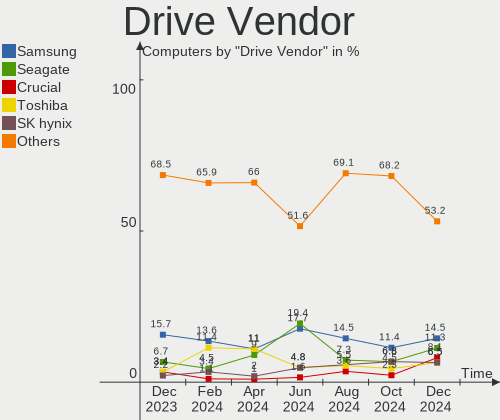
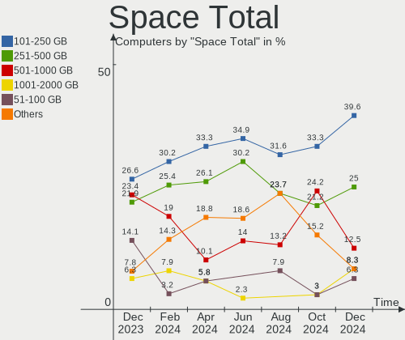
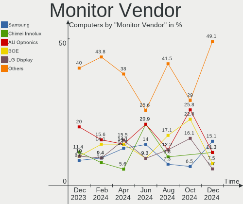
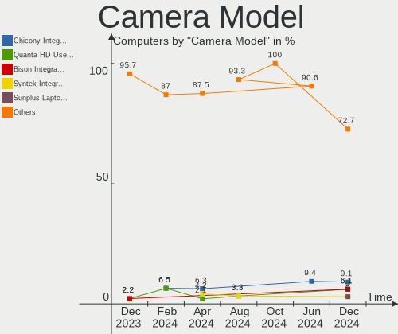

Kali - Hardware Trends
----------------------

A project to identify most popular hardware characteristics and track their change
over time based on data collected by Linux users at https://Linux-Hardware.org.

Anyone can contribute to this report by the [hw-probe](https://github.com/linuxhw/hw-probe) tool:

    sudo -E hw-probe -all -upload

This is a report for all computer types. See also reports for [desktops](/Dist/Kali/Desktop/README.md) and [notebooks](/Dist/Kali/Notebook/README.md).

This report is for one last month. Overall report since the beginning of time: [TestDays](https://github.com/linuxhw/TestDays)

Period: May, 2023.

Contents
--------

* [ System ](#system)
  - [ OS                       ](#os)
  - [ OS Family                ](#os-family)
  - [ Kernel                   ](#kernel)
  - [ Kernel Family            ](#kernel-family)
  - [ Kernel Major Ver.        ](#kernel-major-ver)
  - [ Arch                     ](#arch)
  - [ DE                       ](#de)
  - [ Display Server           ](#display-server)
  - [ Display Manager          ](#display-manager)
  - [ OS Lang                  ](#os-lang)
  - [ Boot Mode                ](#boot-mode)
  - [ Filesystem               ](#filesystem)
  - [ Part. scheme             ](#part-scheme)
  - [ Dual Boot with Linux/BSD ](#dual-boot-with-linuxbsd)
  - [ Dual Boot (Win)          ](#dual-boot-win)

* [ Board ](#board)
  - [ Vendor                   ](#vendor)
  - [ Model                    ](#model)
  - [ Model Family             ](#model-family)
  - [ MFG Year                 ](#mfg-year)
  - [ Form Factor              ](#form-factor)
  - [ Secure Boot              ](#secure-boot)
  - [ Coreboot                 ](#coreboot)
  - [ RAM Size                 ](#ram-size)
  - [ RAM Used                 ](#ram-used)
  - [ Total Drives             ](#total-drives)
  - [ Has CD-ROM               ](#has-cd-rom)
  - [ Has Ethernet             ](#has-ethernet)
  - [ Has WiFi                 ](#has-wifi)
  - [ Has Bluetooth            ](#has-bluetooth)

* [ Location ](#location)
  - [ Country                  ](#country)
  - [ City                     ](#city)

* [ Drives ](#drives)
  - [ Drive Vendor             ](#drive-vendor)
  - [ Drive Model              ](#drive-model)
  - [ HDD Vendor               ](#hdd-vendor)
  - [ SSD Vendor               ](#ssd-vendor)
  - [ Drive Kind               ](#drive-kind)
  - [ Drive Connector          ](#drive-connector)
  - [ Drive Size               ](#drive-size)
  - [ Space Total              ](#space-total)
  - [ Space Used               ](#space-used)
  - [ Malfunc. Drives          ](#malfunc-drives)
  - [ Malfunc. Drive Vendor    ](#malfunc-drive-vendor)
  - [ Malfunc. HDD Vendor      ](#malfunc-hdd-vendor)
  - [ Malfunc. Drive Kind      ](#malfunc-drive-kind)
  - [ Failed Drives            ](#failed-drives)
  - [ Failed Drive Vendor      ](#failed-drive-vendor)
  - [ Drive Status             ](#drive-status)

* [ Storage controller ](#storage-controller)
  - [ Storage Vendor           ](#storage-vendor)
  - [ Storage Model            ](#storage-model)
  - [ Storage Kind             ](#storage-kind)

* [ Processor ](#processor)
  - [ CPU Vendor               ](#cpu-vendor)
  - [ CPU Model                ](#cpu-model)
  - [ CPU Model Family         ](#cpu-model-family)
  - [ CPU Cores                ](#cpu-cores)
  - [ CPU Sockets              ](#cpu-sockets)
  - [ CPU Threads              ](#cpu-threads)
  - [ CPU Op-Modes             ](#cpu-op-modes)
  - [ CPU Microcode            ](#cpu-microcode)
  - [ CPU Microarch            ](#cpu-microarch)

* [ Graphics ](#graphics)
  - [ GPU Vendor               ](#gpu-vendor)
  - [ GPU Model                ](#gpu-model)
  - [ GPU Combo                ](#gpu-combo)
  - [ GPU Driver               ](#gpu-driver)
  - [ GPU Memory               ](#gpu-memory)

* [ Monitor ](#monitor)
  - [ Monitor Vendor           ](#monitor-vendor)
  - [ Monitor Model            ](#monitor-model)
  - [ Monitor Resolution       ](#monitor-resolution)
  - [ Monitor Diagonal         ](#monitor-diagonal)
  - [ Monitor Width            ](#monitor-width)
  - [ Aspect Ratio             ](#aspect-ratio)
  - [ Monitor Area             ](#monitor-area)
  - [ Pixel Density            ](#pixel-density)
  - [ Multiple Monitors        ](#multiple-monitors)

* [ Network ](#network)
  - [ Net Controller Vendor    ](#net-controller-vendor)
  - [ Net Controller Model     ](#net-controller-model)
  - [ Wireless Vendor          ](#wireless-vendor)
  - [ Wireless Model           ](#wireless-model)
  - [ Ethernet Vendor          ](#ethernet-vendor)
  - [ Ethernet Model           ](#ethernet-model)
  - [ Net Controller Kind      ](#net-controller-kind)
  - [ Used Controller          ](#used-controller)
  - [ NICs                     ](#nics)
  - [ IPv6                     ](#ipv6)

* [ Bluetooth ](#bluetooth)
  - [ Bluetooth Vendor         ](#bluetooth-vendor)
  - [ Bluetooth Model          ](#bluetooth-model)

* [ Sound ](#sound)
  - [ Sound Vendor             ](#sound-vendor)
  - [ Sound Model              ](#sound-model)

* [ Memory ](#memory)
  - [ Memory Vendor            ](#memory-vendor)
  - [ Memory Model             ](#memory-model)
  - [ Memory Kind              ](#memory-kind)
  - [ Memory Form Factor       ](#memory-form-factor)
  - [ Memory Size              ](#memory-size)
  - [ Memory Speed             ](#memory-speed)

* [ Printers & scanners ](#printers--scanners)
  - [ Printer Vendor           ](#printer-vendor)
  - [ Printer Model            ](#printer-model)
  - [ Scanner Vendor           ](#scanner-vendor)
  - [ Scanner Model            ](#scanner-model)

* [ Camera ](#camera)
  - [ Camera Vendor            ](#camera-vendor)
  - [ Camera Model             ](#camera-model)

* [ Security ](#security)
  - [ Fingerprint Vendor       ](#fingerprint-vendor)
  - [ Fingerprint Model        ](#fingerprint-model)
  - [ Chipcard Vendor          ](#chipcard-vendor)
  - [ Chipcard Model           ](#chipcard-model)

* [ Unsupported ](#unsupported)
  - [ Unsupported Devices      ](#unsupported-devices)
  - [ Unsupported Device Types ](#unsupported-device-types)

System
------

OS
--

Installed operating systems

| Name        | Computers | Percent |
|-------------|-----------|---------|
| Kali 2023.1 | 47        | 60.26%  |
| Kali 2023.2 | 31        | 39.74%  |

OS Family
---------

OS without a version

| Name | Computers | Percent |
|------|-----------|---------|
| Kali | 78        | 100%    |

Kernel
------

Version of the Linux kernel

| Version               | Computers | Percent |
|-----------------------|-----------|---------|
| 6.1.0-kali7-amd64     | 34        | 43.59%  |
| 6.1.0-kali9-amd64     | 25        | 32.05%  |
| 6.1.0-kali5-amd64     | 12        | 15.38%  |
| 6.0.0-kali6-amd64     | 2         | 2.56%   |
| 5.18.0-kali5-amd64    | 2         | 2.56%   |
| 6.1.0-kali7-686-pae   | 1         | 1.28%   |
| 5.15.44-Re4son-v8l+   | 1         | 1.28%   |
| 5.10.180-1kali1-amd64 | 1         | 1.28%   |

Kernel Family
-------------

Linux kernel without a distro release

| Version  | Computers | Percent |
|----------|-----------|---------|
| 6.1.0    | 72        | 92.31%  |
| 6.0.0    | 2         | 2.56%   |
| 5.18.0   | 2         | 2.56%   |
| 5.15.44  | 1         | 1.28%   |
| 5.10.180 | 1         | 1.28%   |

Kernel Major Ver.
-----------------

Linux kernel major version

| Version | Computers | Percent |
|---------|-----------|---------|
| 6.1     | 72        | 92.31%  |
| 6.0     | 2         | 2.56%   |
| 5.18    | 2         | 2.56%   |
| 5.15    | 1         | 1.28%   |
| 5.10    | 1         | 1.28%   |

Arch
----

OS architecture (x86_64, i586, etc.)

| Name    | Computers | Percent |
|---------|-----------|---------|
| x86_64  | 76        | 97.44%  |
| i686    | 1         | 1.28%   |
| aarch64 | 1         | 1.28%   |

DE
--

Desktop Environment

| Name             | Computers | Percent |
|------------------|-----------|---------|
| XFCE             | 37        | 47.44%  |
| GNOME            | 22        | 28.21%  |
| KDE5             | 11        | 14.1%   |
| Unknown          | 4         | 5.13%   |
| X-Cinnamon       | 1         | 1.28%   |
| LXDE             | 1         | 1.28%   |
| lightdm-xsession | 1         | 1.28%   |
| GNOME Classic    | 1         | 1.28%   |

Display Server
--------------

X11 or Wayland

| Name    | Computers | Percent |
|---------|-----------|---------|
| X11     | 67        | 85.9%   |
| Wayland | 9         | 11.54%  |
| Tty     | 1         | 1.28%   |
| Unknown | 1         | 1.28%   |

Display Manager
---------------

SDDM, LightDM, etc.

| Name    | Computers | Percent |
|---------|-----------|---------|
| LightDM | 35        | 44.87%  |
| Unknown | 18        | 23.08%  |
| GDM3    | 16        | 20.51%  |
| SDDM    | 8         | 10.26%  |
| GDM     | 1         | 1.28%   |

OS Lang
-------

Language

| Lang    | Computers | Percent |
|---------|-----------|---------|
| en_US   | 47        | 60.26%  |
| de_DE   | 5         | 6.41%   |
| fr_FR   | 3         | 3.85%   |
| es_MX   | 3         | 3.85%   |
| en_IN   | 3         | 3.85%   |
| tr_TR   | 2         | 2.56%   |
| ru_RU   | 2         | 2.56%   |
| Unknown | 2         | 2.56%   |
| zh_TW   | 1         | 1.28%   |
| pt_PT   | 1         | 1.28%   |
| pt_BR   | 1         | 1.28%   |
| nl_NL   | 1         | 1.28%   |
| nl_BE   | 1         | 1.28%   |
| ko_KR   | 1         | 1.28%   |
| en_NZ   | 1         | 1.28%   |
| en_IL   | 1         | 1.28%   |
| en_GB   | 1         | 1.28%   |
| en_CA   | 1         | 1.28%   |
| cs_CZ   | 1         | 1.28%   |

Boot Mode
---------

EFI or BIOS

| Mode | Computers | Percent |
|------|-----------|---------|
| EFI  | 50        | 64.1%   |
| BIOS | 28        | 35.9%   |

Filesystem
----------

Type of filesystem

| Type    | Computers | Percent |
|---------|-----------|---------|
| Ext4    | 74        | 94.87%  |
| Overlay | 2         | 2.56%   |
| Tmpfs   | 1         | 1.28%   |
| Btrfs   | 1         | 1.28%   |

Part. scheme
------------

Scheme of partitioning

| Type    | Computers | Percent |
|---------|-----------|---------|
| GPT     | 47        | 60.26%  |
| MBR     | 17        | 21.79%  |
| Unknown | 14        | 17.95%  |

Dual Boot with Linux/BSD
------------------------

Hosting more than one Linux/BSD

| Dual boot | Computers | Percent |
|-----------|-----------|---------|
| No        | 66        | 84.62%  |
| Yes       | 12        | 15.38%  |

Dual Boot (Win)
---------------

Hosting Linux and Windows

| Dual boot | Computers | Percent |
|-----------|-----------|---------|
| No        | 56        | 71.79%  |
| Yes       | 22        | 28.21%  |

Board
-----

Vendor
------

Motherboard manufacturer

| Name                    | Computers | Percent |
|-------------------------|-----------|---------|
| Hewlett-Packard         | 17        | 21.79%  |
| Dell                    | 15        | 19.23%  |
| Lenovo                  | 10        | 12.82%  |
| ASUSTek Computer        | 7         | 8.97%   |
| Acer                    | 4         | 5.13%   |
| Apple                   | 3         | 3.85%   |
| Samsung Electronics     | 2         | 2.56%   |
| MSI                     | 2         | 2.56%   |
| Microsoft               | 2         | 2.56%   |
| HUAWEI                  | 2         | 2.56%   |
| Chuwi                   | 2         | 2.56%   |
| VIT                     | 1         | 1.28%   |
| Toshiba                 | 1         | 1.28%   |
| Raspberry Pi Foundation | 1         | 1.28%   |
| PC Specialist           | 1         | 1.28%   |
| Notebook                | 1         | 1.28%   |
| Monster                 | 1         | 1.28%   |
| Medion                  | 1         | 1.28%   |
| Google                  | 1         | 1.28%   |
| Gigabyte Technology     | 1         | 1.28%   |
| Fujitsu Siemens         | 1         | 1.28%   |
| Fujitsu                 | 1         | 1.28%   |
| Dynabook                | 1         | 1.28%   |

Model
-----

Motherboard model

| Name                                        | Computers | Percent |
|---------------------------------------------|-----------|---------|
| Microsoft Surface Go                        | 2         | 2.56%   |
| Chuwi GemiBook Pro                          | 2         | 2.56%   |
| VIT P2400                                   | 1         | 1.28%   |
| Toshiba Satellite L850-B434                 | 1         | 1.28%   |
| Samsung 950XDC/951XDC/950XDX                | 1         | 1.28%   |
| Samsung 305V4A/305V5A                       | 1         | 1.28%   |
| RPi Raspberry Pi 400 Rev 1.1                | 1         | 1.28%   |
| PC Specialist NH5x_7xDPx                    | 1         | 1.28%   |
| Notebook N150SD/N155SD                      | 1         | 1.28%   |
| MSI MS-7823                                 | 1         | 1.28%   |
| MSI MS-7636                                 | 1         | 1.28%   |
| Monster Huma H5 V3.1                        | 1         | 1.28%   |
| Medion MD34100/2543                         | 1         | 1.28%   |
| Lenovo V145-15AST 81MT                      | 1         | 1.28%   |
| Lenovo ThinkPad X260 20F5S53600             | 1         | 1.28%   |
| Lenovo ThinkPad X1 Carbon Gen 10 21CB003DAD | 1         | 1.28%   |
| Lenovo ThinkPad T495 20NKS1W200             | 1         | 1.28%   |
| Lenovo ThinkPad T420 4236W1W                | 1         | 1.28%   |
| Lenovo ThinkPad E14 20RAS0SE00              | 1         | 1.28%   |
| Lenovo IdeaPad S340-14API 81NB              | 1         | 1.28%   |
| Lenovo IdeaPad 3 15IGL05 82BU               | 1         | 1.28%   |
| Lenovo G580 2189                            | 1         | 1.28%   |
| Lenovo E41-25 81FS                          | 1         | 1.28%   |
| HUAWEI RLEF-XX                              | 1         | 1.28%   |
| HUAWEI NbDE-WXX9                            | 1         | 1.28%   |
| HP ZBook Power G7 Mobile Workstation        | 1         | 1.28%   |
| HP Spectre x360 Convertible 13-aw0xxx       | 1         | 1.28%   |
| HP ProBook 640 G2                           | 1         | 1.28%   |
| HP ProBook 450 G3                           | 1         | 1.28%   |
| HP ProBook 450 G1                           | 1         | 1.28%   |
| HP Pavilion g7                              | 1         | 1.28%   |
| HP Pavilion dm4                             | 1         | 1.28%   |
| HP Laptop 15-db0xxx                         | 1         | 1.28%   |
| HP ENVY x360 Convertible 15m-ee0xxx         | 1         | 1.28%   |
| HP ENVY Laptop 17t-bw0000                   | 1         | 1.28%   |
| HP ENVY 15                                  | 1         | 1.28%   |
| HP EliteBook 8470p                          | 1         | 1.28%   |
| HP EliteBook 8460p                          | 1         | 1.28%   |
| HP EliteBook 845 G8 Notebook PC             | 1         | 1.28%   |
| HP EliteBook 840 G7 Notebook PC             | 1         | 1.28%   |

Model Family
------------

Motherboard model prefix

| Name                    | Computers | Percent |
|-------------------------|-----------|---------|
| Dell Latitude           | 6         | 7.69%   |
| Lenovo ThinkPad         | 5         | 6.41%   |
| HP EliteBook            | 5         | 6.41%   |
| Dell Inspiron           | 4         | 5.13%   |
| HP ProBook              | 3         | 3.85%   |
| HP ENVY                 | 3         | 3.85%   |
| ASUS ROG                | 3         | 3.85%   |
| Microsoft Surface       | 2         | 2.56%   |
| Lenovo IdeaPad          | 2         | 2.56%   |
| HP Pavilion             | 2         | 2.56%   |
| Dell G15                | 2         | 2.56%   |
| Chuwi GemiBook          | 2         | 2.56%   |
| Acer Swift              | 2         | 2.56%   |
| Acer Aspire             | 2         | 2.56%   |
| VIT P2400               | 1         | 1.28%   |
| Toshiba Satellite       | 1         | 1.28%   |
| Samsung 950XDC          | 1         | 1.28%   |
| Samsung 305V4A          | 1         | 1.28%   |
| RPi Raspberry           | 1         | 1.28%   |
| PC Specialist NH5x      | 1         | 1.28%   |
| Notebook N150SD         | 1         | 1.28%   |
| MSI MS-7823             | 1         | 1.28%   |
| MSI MS-7636             | 1         | 1.28%   |
| Monster Huma            | 1         | 1.28%   |
| Medion MD34100          | 1         | 1.28%   |
| Lenovo V145-15AST       | 1         | 1.28%   |
| Lenovo G580             | 1         | 1.28%   |
| Lenovo E41-25           | 1         | 1.28%   |
| HUAWEI RLEF-XX          | 1         | 1.28%   |
| HUAWEI NbDE-WXX9        | 1         | 1.28%   |
| HP ZBook                | 1         | 1.28%   |
| HP Spectre              | 1         | 1.28%   |
| HP Laptop               | 1         | 1.28%   |
| HP 250                  | 1         | 1.28%   |
| Google Blooglet         | 1         | 1.28%   |
| Gigabyte B450           | 1         | 1.28%   |
| Fujitsu Siemens ESPRIMO | 1         | 1.28%   |
| Fujitsu LIFEBOOK        | 1         | 1.28%   |
| Dynabook Satellite      | 1         | 1.28%   |
| Dell XPS                | 1         | 1.28%   |

MFG Year
--------

Motherboard manufacture year

| Year    | Computers | Percent |
|---------|-----------|---------|
| 2022    | 11        | 14.1%   |
| 2019    | 9         | 11.54%  |
| 2018    | 9         | 11.54%  |
| 2021    | 8         | 10.26%  |
| 2020    | 8         | 10.26%  |
| 2011    | 7         | 8.97%   |
| 2015    | 4         | 5.13%   |
| 2012    | 4         | 5.13%   |
| 2016    | 3         | 3.85%   |
| 2014    | 3         | 3.85%   |
| 2013    | 3         | 3.85%   |
| 2017    | 2         | 2.56%   |
| 2010    | 2         | 2.56%   |
| 2007    | 2         | 2.56%   |
| 2023    | 1         | 1.28%   |
| 2009    | 1         | 1.28%   |
| Unknown | 1         | 1.28%   |

Form Factor
-----------

Physical design of the computer

| Name           | Computers | Percent |
|----------------|-----------|---------|
| Notebook       | 58        | 74.36%  |
| Desktop        | 12        | 15.38%  |
| Convertible    | 3         | 3.85%   |
| Tablet         | 2         | 2.56%   |
| System on chip | 1         | 1.28%   |
| Mini pc        | 1         | 1.28%   |
| All in one     | 1         | 1.28%   |

Secure Boot
-----------

Enabled or disabled

| State    | Computers | Percent |
|----------|-----------|---------|
| Disabled | 78        | 100%    |

Coreboot
--------

Have coreboot on board

| Used | Computers | Percent |
|------|-----------|---------|
| No   | 77        | 98.72%  |
| Yes  | 1         | 1.28%   |

RAM Size
--------

Total RAM memory

| Size in GB  | Computers | Percent |
|-------------|-----------|---------|
| 4.01-8.0    | 31        | 39.74%  |
| 16.01-24.0  | 20        | 25.64%  |
| 8.01-16.0   | 13        | 16.67%  |
| 3.01-4.0    | 7         | 8.97%   |
| 32.01-64.0  | 5         | 6.41%   |
| 64.01-256.0 | 1         | 1.28%   |
| 1.01-2.0    | 1         | 1.28%   |

RAM Used
--------

Used RAM memory

| Used GB   | Computers | Percent |
|-----------|-----------|---------|
| 3.01-4.0  | 23        | 29.49%  |
| 2.01-3.0  | 23        | 29.49%  |
| 1.01-2.0  | 17        | 21.79%  |
| 4.01-8.0  | 13        | 16.67%  |
| 8.01-16.0 | 1         | 1.28%   |
| 0.51-1.0  | 1         | 1.28%   |

Total Drives
------------

Number of drives on board

| Drives | Computers | Percent |
|--------|-----------|---------|
| 1      | 58        | 74.36%  |
| 2      | 14        | 17.95%  |
| 3      | 3         | 3.85%   |
| 4      | 2         | 2.56%   |
| 5      | 1         | 1.28%   |

Has CD-ROM
----------

Has CD-ROM on board

| Presented | Computers | Percent |
|-----------|-----------|---------|
| No        | 59        | 75.64%  |
| Yes       | 19        | 24.36%  |

Has Ethernet
------------

Has Ethernet on board

| Presented | Computers | Percent |
|-----------|-----------|---------|
| Yes       | 63        | 80.77%  |
| No        | 15        | 19.23%  |

Has WiFi
--------

Has WiFi module

| Presented | Computers | Percent |
|-----------|-----------|---------|
| Yes       | 74        | 94.87%  |
| No        | 4         | 5.13%   |

Has Bluetooth
-------------

Has Bluetooth module

| Presented | Computers | Percent |
|-----------|-----------|---------|
| Yes       | 67        | 85.9%   |
| No        | 11        | 14.1%   |

Location
--------

Country
-------

Geographic location (country)

| Country      | Computers | Percent |
|--------------|-----------|---------|
| USA          | 16        | 20.51%  |
| Spain        | 5         | 6.41%   |
| Germany      | 5         | 6.41%   |
| Turkey       | 4         | 5.13%   |
| Sweden       | 4         | 5.13%   |
| Russia       | 4         | 5.13%   |
| India        | 4         | 5.13%   |
| Brazil       | 4         | 5.13%   |
| Mexico       | 3         | 3.85%   |
| France       | 3         | 3.85%   |
| Portugal     | 2         | 2.56%   |
| Belgium      | 2         | 2.56%   |
| Vietnam      | 1         | 1.28%   |
| Venezuela    | 1         | 1.28%   |
| UK           | 1         | 1.28%   |
| UAE          | 1         | 1.28%   |
| Thailand     | 1         | 1.28%   |
| Taiwan       | 1         | 1.28%   |
| Switzerland  | 1         | 1.28%   |
| South Korea  | 1         | 1.28%   |
| Saudi Arabia | 1         | 1.28%   |
| Nigeria      | 1         | 1.28%   |
| New Zealand  | 1         | 1.28%   |
| Netherlands  | 1         | 1.28%   |
| Morocco      | 1         | 1.28%   |
| Malawi       | 1         | 1.28%   |
| Kenya        | 1         | 1.28%   |
| Israel       | 1         | 1.28%   |
| Indonesia    | 1         | 1.28%   |
| Estonia      | 1         | 1.28%   |
| Czechia      | 1         | 1.28%   |
| Croatia      | 1         | 1.28%   |
| Canada       | 1         | 1.28%   |
| Cameroon     | 1         | 1.28%   |

City
----

Geographic location (city)

| City                      | Computers | Percent |
|---------------------------|-----------|---------|
| Istanbul                  | 4         | 5.13%   |
| Stockholm                 | 2         | 2.56%   |
| Phoenix                   | 2         | 2.56%   |
| Omsk                      | 2         | 2.56%   |
| Delhi                     | 2         | 2.56%   |
| Dallas                    | 2         | 2.56%   |
| Zaragoza                  | 1         | 1.28%   |
| Zagreb                    | 1         | 1.28%   |
| Winnipeg                  | 1         | 1.28%   |
| Whanganui                 | 1         | 1.28%   |
| Weissenfels               | 1         | 1.28%   |
| Waynesville               | 1         | 1.28%   |
| Vigo                      | 1         | 1.28%   |
| Utrecht                   | 1         | 1.28%   |
| Tomsk                     | 1         | 1.28%   |
| Tallinn                   | 1         | 1.28%   |
| Suwon                     | 1         | 1.28%   |
| Sukabumi                  | 1         | 1.28%   |
| Suffolk                   | 1         | 1.28%   |
| St Louis                  | 1         | 1.28%   |
| Sigtuna                   | 1         | 1.28%   |
| Schwalbach                | 1         | 1.28%   |
| Sao Paulo                 | 1         | 1.28%   |
| Saint-Jacques-de-la-Lande | 1         | 1.28%   |
| Rishon LeTsiyyon          | 1         | 1.28%   |
| Pune                      | 1         | 1.28%   |
| Puebla City               | 1         | 1.28%   |
| Porto Alegre              | 1         | 1.28%   |
| Plougastel-Daoulas        | 1         | 1.28%   |
| Plano                     | 1         | 1.28%   |
| Périgueux                | 1         | 1.28%   |
| Parma Heights             | 1         | 1.28%   |
| Nova Paka                 | 1         | 1.28%   |
| Nha Trang                 | 1         | 1.28%   |
| Nakhon Pathom             | 1         | 1.28%   |
| Nairobi                   | 1         | 1.28%   |
| Moscow                    | 1         | 1.28%   |
| Meknes                    | 1         | 1.28%   |
| Medina                    | 1         | 1.28%   |
| Madrid                    | 1         | 1.28%   |

Drives
------

Drive Vendor
------------

Hard drive vendors

| Vendor              | Computers | Drives | Percent |
|---------------------|-----------|--------|---------|
| Samsung Electronics | 17        | 21     | 16.83%  |
| Toshiba             | 11        | 11     | 10.89%  |
| Seagate             | 10        | 12     | 9.9%    |
| Kingston            | 10        | 10     | 9.9%    |
| WDC                 | 8         | 9      | 7.92%   |
| Unknown             | 6         | 6      | 5.94%   |
| SK hynix            | 6         | 6      | 5.94%   |
| Intel               | 4         | 5      | 3.96%   |
| Crucial             | 4         | 4      | 3.96%   |
| SanDisk             | 3         | 4      | 2.97%   |
| Apple               | 3         | 3      | 2.97%   |
| Unknown             | 3         | 3      | 2.97%   |
| China               | 2         | 2      | 1.98%   |
| ValueTech           | 1         | 1      | 0.99%   |
| SSSTC               | 1         | 1      | 0.99%   |
| Silicon Motion      | 1         | 1      | 0.99%   |
| Phison Electronics  | 1         | 1      | 0.99%   |
| Patriot             | 1         | 1      | 0.99%   |
| NN                  | 1         | 1      | 0.99%   |
| Micron Technology   | 1         | 1      | 0.99%   |
| Hitachi             | 1         | 1      | 0.99%   |
| HGST                | 1         | 1      | 0.99%   |
| Fujitsu             | 1         | 1      | 0.99%   |
| EDILOCA             | 1         | 1      | 0.99%   |
| Crypto              | 1         | 1      | 0.99%   |
| BAITITON            | 1         | 1      | 0.99%   |
| A-DATA Technology   | 1         | 1      | 0.99%   |

Drive Model
-----------

Hard drive models

| Model                                               | Computers | Percent |
|-----------------------------------------------------|-----------|---------|
| Unknown                                             | 3         | 2.75%   |
| Toshiba MQ04ABF100 1TB                              | 2         | 1.83%   |
| SK hynix BC501 HFM256GDJTNG-8310A 256GB             | 2         | 1.83%   |
| Samsung SSD 970 EVO Plus 1TB                        | 2         | 1.83%   |
| Samsung SSD 860 EVO 500GB                           | 2         | 1.83%   |
| Samsung NVMe SSD Controller SM981/PM981/PM983 256GB | 2         | 1.83%   |
| Intel SSDPEKNU512GZ 512GB                           | 2         | 1.83%   |
| China G521N256GB SSD                                | 2         | 1.83%   |
| WDC WDS250G2B0C-00PXH0 250GB                        | 1         | 0.92%   |
| WDC WDS100T2B0A-00SM50 1TB SSD                      | 1         | 0.92%   |
| WDC WD40EFAX-68JH4N0 4TB                            | 1         | 0.92%   |
| WDC WD3200BPVT-22JJ5T0 320GB                        | 1         | 0.92%   |
| WDC WD3200AAKS-00L9A0 320GB                         | 1         | 0.92%   |
| WDC WD10SPZX-24Z10 1TB                              | 1         | 0.92%   |
| WDC WD10JPVX-75JC3T0 1TB                            | 1         | 0.92%   |
| WDC WD10EZEX-00MFCA0 1TB                            | 1         | 0.92%   |
| WDC WD Green 2.5 480GB                              | 1         | 0.92%   |
| ValueTech SSD 256GB                                 | 1         | 0.92%   |
| Unknown MMC Card  250GB                             | 1         | 0.92%   |
| Unknown MMC Card  128GB                             | 1         | 0.92%   |
| Unknown hC8aP  64GB                                 | 1         | 0.92%   |
| Unknown EC2QT  64GB                                 | 1         | 0.92%   |
| Unknown EB1QT  32GB                                 | 1         | 0.92%   |
| Unknown DA4064  64GB                                | 1         | 0.92%   |
| Toshiba MQ01ABF050 500GB                            | 1         | 0.92%   |
| Toshiba MK3276GSX 320GB                             | 1         | 0.92%   |
| Toshiba MK3265GSX 320GB                             | 1         | 0.92%   |
| Toshiba KSG60ZMV512G M.2 2280 512GB SSD             | 1         | 0.92%   |
| Toshiba KSG60ZMV256G M.2 2280 256GB SSD             | 1         | 0.92%   |
| Toshiba KBG40ZNV512G MEMORY 512GB                   | 1         | 0.92%   |
| Toshiba KBG30ZPZ128G 128GB                          | 1         | 0.92%   |
| Toshiba HDWR160 6TB                                 | 1         | 0.92%   |
| Toshiba DT01ACA100 1TB                              | 1         | 0.92%   |
| SSSTC CL1-4D128 128GB                               | 1         | 0.92%   |
| SK hynix SKHynix_HFS256GD9TNG-L5B0B 256GB           | 1         | 0.92%   |
| SK hynix SC311 SATA 256GB SSD                       | 1         | 0.92%   |
| SK hynix BC711 HFM256GD3JX013N 256GB                | 1         | 0.92%   |
| SK hynix BC501 NVMe Solid State Drive 512GB         | 1         | 0.92%   |
| Silicon Motion PCIe-8 SSD 512GB                     | 1         | 0.92%   |
| Seagate ST9500420AS 500GB                           | 1         | 0.92%   |

HDD Vendor
----------

Hard disk drive vendors

| Vendor              | Computers | Drives | Percent |
|---------------------|-----------|--------|---------|
| Seagate             | 10        | 12     | 34.48%  |
| Toshiba             | 7         | 7      | 24.14%  |
| WDC                 | 6         | 6      | 20.69%  |
| Apple               | 2         | 2      | 6.9%    |
| Samsung Electronics | 1         | 1      | 3.45%   |
| Hitachi             | 1         | 1      | 3.45%   |
| HGST                | 1         | 1      | 3.45%   |
| Fujitsu             | 1         | 1      | 3.45%   |

SSD Vendor
----------

Solid state drive vendors

| Vendor              | Computers | Drives | Percent |
|---------------------|-----------|--------|---------|
| Samsung Electronics | 7         | 8      | 21.88%  |
| Kingston            | 6         | 6      | 18.75%  |
| WDC                 | 2         | 2      | 6.25%   |
| Toshiba             | 2         | 2      | 6.25%   |
| China               | 2         | 2      | 6.25%   |
| ValueTech           | 1         | 1      | 3.13%   |
| SK hynix            | 1         | 1      | 3.13%   |
| SanDisk             | 1         | 1      | 3.13%   |
| Patriot             | 1         | 1      | 3.13%   |
| NN                  | 1         | 1      | 3.13%   |
| Micron Technology   | 1         | 1      | 3.13%   |
| Intel               | 1         | 1      | 3.13%   |
| EDILOCA             | 1         | 1      | 3.13%   |
| Crypto              | 1         | 1      | 3.13%   |
| Crucial             | 1         | 1      | 3.13%   |
| BAITITON            | 1         | 1      | 3.13%   |
| A-DATA Technology   | 1         | 1      | 3.13%   |
| Unknown             | 1         | 1      | 3.13%   |

Drive Kind
----------

HDD or SSD

| Kind | Computers | Drives | Percent |
|------|-----------|--------|---------|
| NVMe | 32        | 38     | 34.41%  |
| SSD  | 27        | 33     | 29.03%  |
| HDD  | 26        | 31     | 27.96%  |
| MMC  | 8         | 8      | 8.6%    |

Drive Connector
---------------

SATA, SAS, NVMe, etc.

| Type | Computers | Drives | Percent |
|------|-----------|--------|---------|
| SATA | 47        | 62     | 52.81%  |
| NVMe | 32        | 38     | 35.96%  |
| MMC  | 8         | 8      | 8.99%   |
| SAS  | 2         | 2      | 2.25%   |

Drive Size
----------

Size of hard drive

| Size in TB | Computers | Drives | Percent |
|------------|-----------|--------|---------|
| 0.01-0.5   | 34        | 39     | 59.65%  |
| 0.51-1.0   | 18        | 20     | 31.58%  |
| 3.01-4.0   | 2         | 2      | 3.51%   |
| 4.01-10.0  | 2         | 2      | 3.51%   |
| 1.01-2.0   | 1         | 1      | 1.75%   |

Space Total
-----------

Amount of disk space available on the file system

| Size in GB     | Computers | Percent |
|----------------|-----------|---------|
| 101-250        | 29        | 37.18%  |
| 251-500        | 15        | 19.23%  |
| 501-1000       | 12        | 15.38%  |
| 51-100         | 9         | 11.54%  |
| 21-50          | 4         | 5.13%   |
| 2001-3000      | 3         | 3.85%   |
| 1-20           | 2         | 2.56%   |
| Unknown        | 2         | 2.56%   |
| More than 3000 | 1         | 1.28%   |
| 1001-2000      | 1         | 1.28%   |

Space Used
----------

Amount of used disk space

| Used GB        | Computers | Percent |
|----------------|-----------|---------|
| 21-50          | 21        | 26.92%  |
| 1-20           | 19        | 24.36%  |
| 51-100         | 16        | 20.51%  |
| 101-250        | 14        | 17.95%  |
| 251-500        | 3         | 3.85%   |
| 1001-2000      | 2         | 2.56%   |
| Unknown        | 2         | 2.56%   |
| More than 3000 | 1         | 1.28%   |

Malfunc. Drives
---------------

Drive models with a malfunction

| Model                                     | Computers | Drives | Percent |
|-------------------------------------------|-----------|--------|---------|
| China G521N256GB SSD                      | 2         | 2      | 15.38%  |
| WDC WD3200BPVT-22JJ5T0 320GB              | 1         | 1      | 7.69%   |
| ValueTech SSD 256GB                       | 1         | 1      | 7.69%   |
| Toshiba MK3276GSX 320GB                   | 1         | 1      | 7.69%   |
| Toshiba MK3265GSX 320GB                   | 1         | 1      | 7.69%   |
| Seagate ST9500420AS 500GB                 | 1         | 1      | 7.69%   |
| Seagate ST9160821AS 160GB                 | 1         | 1      | 7.69%   |
| Seagate ST3160812AS 160GB                 | 1         | 1      | 7.69%   |
| Seagate ST1000DM003-1CH162 1TB            | 1         | 2      | 7.69%   |
| Samsung Electronics SSD PM810 mSATA 128GB | 1         | 1      | 7.69%   |
| Hitachi HTS547564A9E384 640GB             | 1         | 1      | 7.69%   |
| HGST HTS545050A7E680 500GB                | 1         | 1      | 7.69%   |

Malfunc. Drive Vendor
---------------------

Vendors of faulty drives

| Vendor              | Computers | Drives | Percent |
|---------------------|-----------|--------|---------|
| Seagate             | 3         | 5      | 25%     |
| Toshiba             | 2         | 2      | 16.67%  |
| China               | 2         | 2      | 16.67%  |
| WDC                 | 1         | 1      | 8.33%   |
| ValueTech           | 1         | 1      | 8.33%   |
| Samsung Electronics | 1         | 1      | 8.33%   |
| Hitachi             | 1         | 1      | 8.33%   |
| HGST                | 1         | 1      | 8.33%   |

Malfunc. HDD Vendor
-------------------

Vendors of faulty HDD drives

| Vendor  | Computers | Drives | Percent |
|---------|-----------|--------|---------|
| Seagate | 3         | 5      | 37.5%   |
| Toshiba | 2         | 2      | 25%     |
| WDC     | 1         | 1      | 12.5%   |
| Hitachi | 1         | 1      | 12.5%   |
| HGST    | 1         | 1      | 12.5%   |

Malfunc. Drive Kind
-------------------

Kinds of faulty drives

| Kind | Computers | Drives | Percent |
|------|-----------|--------|---------|
| HDD  | 7         | 10     | 63.64%  |
| SSD  | 4         | 4      | 36.36%  |

Failed Drives
-------------

Failed drive models

| Model                                   | Computers | Drives | Percent |
|-----------------------------------------|-----------|--------|---------|
| SK hynix BC501 HFM256GDJTNG-8310A 256GB | 1         | 1      | 100%    |

Failed Drive Vendor
-------------------

Failed drive vendors

| Vendor   | Computers | Drives | Percent |
|----------|-----------|--------|---------|
| SK hynix | 1         | 1      | 100%    |

Drive Status
------------

Number of failed and malfunc. drives

| Status   | Computers | Drives | Percent |
|----------|-----------|--------|---------|
| Works    | 51        | 62     | 56.67%  |
| Detected | 27        | 33     | 30%     |
| Malfunc  | 11        | 14     | 12.22%  |
| Failed   | 1         | 1      | 1.11%   |

Storage controller
------------------

Storage Vendor
--------------

Storage controller vendors

| Vendor                           | Computers | Percent |
|----------------------------------|-----------|---------|
| Intel                            | 48        | 53.93%  |
| Samsung Electronics              | 11        | 12.36%  |
| AMD                              | 8         | 8.99%   |
| SK hynix                         | 4         | 4.49%   |
| Kingston Technology Company      | 4         | 4.49%   |
| SanDisk                          | 3         | 3.37%   |
| Micron/Crucial Technology        | 3         | 3.37%   |
| ASMedia Technology               | 2         | 2.25%   |
| Toshiba America Info Systems     | 1         | 1.12%   |
| Solid State Storage Technology   | 1         | 1.12%   |
| Silicon Motion                   | 1         | 1.12%   |
| Silicon Integrated Systems [SiS] | 1         | 1.12%   |
| Phison Electronics               | 1         | 1.12%   |
| KIOXIA                           | 1         | 1.12%   |

Storage Model
-------------

Storage controller models

| Model                                                                          | Computers | Percent |
|--------------------------------------------------------------------------------|-----------|---------|
| Intel 82801 Mobile SATA Controller [RAID mode]                                 | 8         | 8.08%   |
| Intel Sunrise Point-LP SATA Controller [AHCI mode]                             | 6         | 6.06%   |
| AMD FCH SATA Controller [AHCI mode]                                            | 6         | 6.06%   |
| Samsung NVMe SSD Controller SM981/PM981/PM983                                  | 5         | 5.05%   |
| Samsung NVMe SSD Controller 980                                                | 4         | 4.04%   |
| Intel Volume Management Device NVMe RAID Controller                            | 4         | 4.04%   |
| Intel 7 Series Chipset Family 6-port SATA Controller [AHCI mode]               | 4         | 4.04%   |
| Micron/Crucial P2 NVMe PCIe SSD                                                | 3         | 3.03%   |
| Intel 8 Series/C220 Series Chipset Family 6-port SATA Controller 1 [AHCI mode] | 3         | 3.03%   |
| Intel 6 Series/C200 Series Chipset Family 6 port Mobile SATA AHCI Controller   | 3         | 3.03%   |
| SK hynix BC501 NVMe Solid State Drive                                          | 2         | 2.02%   |
| Samsung NVMe SSD Controller PM9A1/PM9A3/980PRO                                 | 2         | 2.02%   |
| Intel Tiger Lake-LP SATA Controller                                            | 2         | 2.02%   |
| Intel SATA Controller [RAID mode]                                              | 2         | 2.02%   |
| Intel Non-Volatile memory controller                                           | 2         | 2.02%   |
| Intel Jasper Lake SATA AHCI Controller                                         | 2         | 2.02%   |
| Intel Comet Lake SATA AHCI Controller                                          | 2         | 2.02%   |
| Intel Cannon Lake PCH SATA AHCI Controller                                     | 2         | 2.02%   |
| Intel 8 Series SATA Controller 1 [AHCI mode]                                   | 2         | 2.02%   |
| ASMedia ASM1062 Serial ATA Controller                                          | 2         | 2.02%   |
| Toshiba America Info Systems BG3 NVMe SSD Controller                           | 1         | 1.01%   |
| Solid State Storage Non-Volatile memory controller                             | 1         | 1.01%   |
| SK hynix Non-Volatile memory controller                                        | 1         | 1.01%   |
| SK hynix Gold P31/PC711 NVMe Solid State Drive                                 | 1         | 1.01%   |
| Silicon Motion Non-Volatile memory controller                                  | 1         | 1.01%   |
| Silicon Integrated Systems [SiS] SATA Controller / IDE mode                    | 1         | 1.01%   |
| Silicon Integrated Systems [SiS] 5513 IDE Controller                           | 1         | 1.01%   |
| SanDisk WD Blue SN550 NVMe SSD                                                 | 1         | 1.01%   |
| SanDisk PC SN520 NVMe SSD                                                      | 1         | 1.01%   |
| SanDisk Non-Volatile memory controller                                         | 1         | 1.01%   |
| Samsung NVMe SSD Controller SM961/PM961/SM963                                  | 1         | 1.01%   |
| Phison E12 NVMe Controller                                                     | 1         | 1.01%   |
| KIOXIA NVMe SSD Controller BG4                                                 | 1         | 1.01%   |
| Kingston Company U-SNS8154P3 NVMe SSD                                          | 1         | 1.01%   |
| Kingston Company SNVS2000G [NV1 NVMe PCIe SSD 2TB]                             | 1         | 1.01%   |
| Kingston Company OM3PDP3 NVMe SSD                                              | 1         | 1.01%   |
| Kingston Company A2000 NVMe SSD                                                | 1         | 1.01%   |
| Intel Wildcat Point-LP SATA Controller [AHCI Mode]                             | 1         | 1.01%   |
| Intel NVMe Controller                                                          | 1         | 1.01%   |
| Intel Ice Lake-LP SATA Controller [AHCI mode]                                  | 1         | 1.01%   |

Storage Kind
------------

Kind of storage controller (IDE, SATA, NVMe, SAS, ...)

| Kind | Computers | Percent |
|------|-----------|---------|
| SATA | 41        | 45.56%  |
| NVMe | 31        | 34.44%  |
| RAID | 15        | 16.67%  |
| IDE  | 3         | 3.33%   |

Processor
---------

CPU Vendor
----------

Processor vendors

| Vendor | Computers | Percent |
|--------|-----------|---------|
| Intel  | 64        | 82.05%  |
| AMD    | 13        | 16.67%  |
| ARM    | 1         | 1.28%   |

CPU Model
---------

Processor models

| Model                                   | Computers | Percent |
|-----------------------------------------|-----------|---------|
| Intel Core i3-9100 CPU @ 3.60GHz        | 3         | 3.85%   |
| Intel Pentium CPU 4415Y @ 1.60GHz       | 2         | 2.56%   |
| Intel Core i5-8250U CPU @ 1.60GHz       | 2         | 2.56%   |
| Intel Core i5-6200U CPU @ 2.30GHz       | 2         | 2.56%   |
| Intel Core i5-2520M CPU @ 2.50GHz       | 2         | 2.56%   |
| Intel Celeron N5100 @ 1.10GHz           | 2         | 2.56%   |
| Intel 11th Gen Core i7-1165G7 @ 2.80GHz | 2         | 2.56%   |
| Intel 11th Gen Core i5-1135G7 @ 2.40GHz | 2         | 2.56%   |
| Intel Xeon CPU 5150 @ 2.66GHz           | 1         | 1.28%   |
| Intel Pentium CPU N3540 @ 2.16GHz       | 1         | 1.28%   |
| Intel Core i7-8705G CPU @ 3.10GHz       | 1         | 1.28%   |
| Intel Core i7-8650U CPU @ 1.90GHz       | 1         | 1.28%   |
| Intel Core i7-8565U CPU @ 1.80GHz       | 1         | 1.28%   |
| Intel Core i7-8550U CPU @ 1.80GHz       | 1         | 1.28%   |
| Intel Core i7-7700HQ CPU @ 2.80GHz      | 1         | 1.28%   |
| Intel Core i7-5600U CPU @ 2.60GHz       | 1         | 1.28%   |
| Intel Core i7-5500U CPU @ 2.40GHz       | 1         | 1.28%   |
| Intel Core i7-4820K CPU @ 3.70GHz       | 1         | 1.28%   |
| Intel Core i7-4720HQ CPU @ 2.60GHz      | 1         | 1.28%   |
| Intel Core i7-4702MQ CPU @ 2.20GHz      | 1         | 1.28%   |
| Intel Core i7-3630QM CPU @ 2.40GHz      | 1         | 1.28%   |
| Intel Core i7-3520M CPU @ 2.90GHz       | 1         | 1.28%   |
| Intel Core i7-10870H CPU @ 2.20GHz      | 1         | 1.28%   |
| Intel Core i7-1065G7 CPU @ 1.30GHz      | 1         | 1.28%   |
| Intel Core i7-10610U CPU @ 1.80GHz      | 1         | 1.28%   |
| Intel Core i5-8400 CPU @ 2.80GHz        | 1         | 1.28%   |
| Intel Core i5-8300H CPU @ 2.30GHz       | 1         | 1.28%   |
| Intel Core i5-7400 CPU @ 3.00GHz        | 1         | 1.28%   |
| Intel Core i5-7300U CPU @ 2.60GHz       | 1         | 1.28%   |
| Intel Core i5-7200U CPU @ 2.50GHz       | 1         | 1.28%   |
| Intel Core i5-6300U CPU @ 2.40GHz       | 1         | 1.28%   |
| Intel Core i5-4460 CPU @ 3.20GHz        | 1         | 1.28%   |
| Intel Core i5-4310U CPU @ 2.00GHz       | 1         | 1.28%   |
| Intel Core i5-4278U CPU @ 2.60GHz       | 1         | 1.28%   |
| Intel Core i5-4210U CPU @ 1.70GHz       | 1         | 1.28%   |
| Intel Core i5-4200M CPU @ 2.50GHz       | 1         | 1.28%   |
| Intel Core i5-3320M CPU @ 2.60GHz       | 1         | 1.28%   |
| Intel Core i5-2450M CPU @ 2.50GHz       | 1         | 1.28%   |
| Intel Core i5-10400H CPU @ 2.60GHz      | 1         | 1.28%   |
| Intel Core i5-1035G1 CPU @ 1.00GHz      | 1         | 1.28%   |

CPU Model Family
----------------

Processor model prefix

| Model           | Computers | Percent |
|-----------------|-----------|---------|
| Intel Core i5   | 23        | 29.49%  |
| Intel Core i7   | 15        | 19.23%  |
| Other           | 12        | 15.38%  |
| Intel Core i3   | 7         | 8.97%   |
| Intel Celeron   | 5         | 6.41%   |
| AMD Ryzen 7     | 4         | 5.13%   |
| Intel Pentium   | 3         | 3.85%   |
| AMD Ryzen 5 PRO | 2         | 2.56%   |
| AMD Ryzen 3     | 2         | 2.56%   |
| AMD A4          | 2         | 2.56%   |
| Intel Xeon      | 1         | 1.28%   |
| AMD FX          | 1         | 1.28%   |
| AMD A8          | 1         | 1.28%   |

CPU Cores
---------

Number of processor cores

| Number  | Computers | Percent |
|---------|-----------|---------|
| 4       | 36        | 46.15%  |
| 2       | 29        | 37.18%  |
| 8       | 5         | 6.41%   |
| 10      | 2         | 2.56%   |
| 6       | 2         | 2.56%   |
| 14      | 1         | 1.28%   |
| 3       | 1         | 1.28%   |
| 1       | 1         | 1.28%   |
| Unknown | 1         | 1.28%   |

CPU Sockets
-----------

Number of sockets

| Number  | Computers | Percent |
|---------|-----------|---------|
| 1       | 76        | 97.44%  |
| 2       | 1         | 1.28%   |
| Unknown | 1         | 1.28%   |

CPU Threads
-----------

Threads per core (Hyper-Threading)

| Number  | Computers | Percent |
|---------|-----------|---------|
| 2       | 56        | 71.79%  |
| 1       | 21        | 26.92%  |
| Unknown | 1         | 1.28%   |

CPU Op-Modes
------------

CPU Operation Modes (32-bit, 64-bit)

| Op mode        | Computers | Percent |
|----------------|-----------|---------|
| 32-bit, 64-bit | 78        | 100%    |

CPU Microcode
-------------

Microcode number

| Number     | Computers | Percent |
|------------|-----------|---------|
| Unknown    | 7         | 8.97%   |
| 0x806c1    | 5         | 6.41%   |
| 0x306c3    | 4         | 5.13%   |
| 0x306a9    | 4         | 5.13%   |
| 0x206a7    | 4         | 5.13%   |
| 0x906e9    | 3         | 3.85%   |
| 0x806ec    | 3         | 3.85%   |
| 0x806e9    | 3         | 3.85%   |
| 0x406e3    | 3         | 3.85%   |
| 0xa0652    | 2         | 2.56%   |
| 0x906eb    | 2         | 2.56%   |
| 0x906ea    | 2         | 2.56%   |
| 0x906c0    | 2         | 2.56%   |
| 0x906a4    | 2         | 2.56%   |
| 0x906a3    | 2         | 2.56%   |
| 0x806ea    | 2         | 2.56%   |
| 0x706e5    | 2         | 2.56%   |
| 0x40651    | 2         | 2.56%   |
| 0x306d4    | 2         | 2.56%   |
| 0x08600106 | 2         | 2.56%   |
| 0x06006705 | 2         | 2.56%   |
| 0x03000027 | 2         | 2.56%   |
| 0x806eb    | 1         | 1.28%   |
| 0x806c2    | 1         | 1.28%   |
| 0x706a8    | 1         | 1.28%   |
| 0x706a1    | 1         | 1.28%   |
| 0x6f6      | 1         | 1.28%   |
| 0x306e4    | 1         | 1.28%   |
| 0x30678    | 1         | 1.28%   |
| 0x20652    | 1         | 1.28%   |
| 0x10661    | 1         | 1.28%   |
| 0x0a50000c | 1         | 1.28%   |
| 0x08701021 | 1         | 1.28%   |
| 0x08108109 | 1         | 1.28%   |
| 0x08108102 | 1         | 1.28%   |
| 0x0810100b | 1         | 1.28%   |
| 0x0800820d | 1         | 1.28%   |
| 0x06000852 | 1         | 1.28%   |

CPU Microarch
-------------

Microarchitecture

| Name             | Computers | Percent |
|------------------|-----------|---------|
| KabyLake         | 20        | 25.64%  |
| Haswell          | 7         | 8.97%   |
| TigerLake        | 6         | 7.69%   |
| IvyBridge        | 5         | 6.41%   |
| SandyBridge      | 4         | 5.13%   |
| Alderlake Hybrid | 4         | 5.13%   |
| Zen+             | 3         | 3.85%   |
| Zen 2            | 3         | 3.85%   |
| Skylake          | 3         | 3.85%   |
| CometLake        | 3         | 3.85%   |
| Tremont          | 2         | 2.56%   |
| K10 Llano        | 2         | 2.56%   |
| IceLake          | 2         | 2.56%   |
| Goldmont plus    | 2         | 2.56%   |
| Excavator        | 2         | 2.56%   |
| Core             | 2         | 2.56%   |
| Broadwell        | 2         | 2.56%   |
| Zen 3            | 1         | 1.28%   |
| Zen              | 1         | 1.28%   |
| Westmere         | 1         | 1.28%   |
| Silvermont       | 1         | 1.28%   |
| Piledriver       | 1         | 1.28%   |
| Unknown          | 1         | 1.28%   |

Graphics
--------

GPU Vendor
----------

Vendors of graphics cards

| Vendor                           | Computers | Percent |
|----------------------------------|-----------|---------|
| Intel                            | 54        | 58.7%   |
| Nvidia                           | 20        | 21.74%  |
| AMD                              | 16        | 17.39%  |
| Silicon Integrated Systems [SiS] | 1         | 1.09%   |
| ATI Technologies                 | 1         | 1.09%   |

GPU Model
---------

Graphics card models

| Model                                                                     | Computers | Percent |
|---------------------------------------------------------------------------|-----------|---------|
| Intel TigerLake-LP GT2 [Iris Xe Graphics]                                 | 5         | 5.32%   |
| Intel UHD Graphics 620                                                    | 4         | 4.26%   |
| Intel 2nd Generation Core Processor Family Integrated Graphics Controller | 4         | 4.26%   |
| Nvidia GA106M [GeForce RTX 3060 Mobile / Max-Q]                           | 3         | 3.19%   |
| Intel Skylake GT2 [HD Graphics 520]                                       | 3         | 3.19%   |
| Intel Haswell-ULT Integrated Graphics Controller                          | 3         | 3.19%   |
| Intel CometLake-U GT2 [UHD Graphics]                                      | 3         | 3.19%   |
| Intel 4th Gen Core Processor Integrated Graphics Controller               | 3         | 3.19%   |
| Intel JasperLake [UHD Graphics]                                           | 2         | 2.13%   |
| Intel HD Graphics 630                                                     | 2         | 2.13%   |
| Intel HD Graphics 620                                                     | 2         | 2.13%   |
| Intel HD Graphics 615                                                     | 2         | 2.13%   |
| Intel HD Graphics 5500                                                    | 2         | 2.13%   |
| Intel GeminiLake [UHD Graphics 600]                                       | 2         | 2.13%   |
| Intel CometLake-H GT2 [UHD Graphics]                                      | 2         | 2.13%   |
| Intel CoffeeLake-S GT2 [UHD Graphics 630]                                 | 2         | 2.13%   |
| Intel Alder Lake-UP3 GT2 [Iris Xe Graphics]                               | 2         | 2.13%   |
| Intel 3rd Gen Core processor Graphics Controller                          | 2         | 2.13%   |
| AMD Stoney [Radeon R2/R3/R4/R5 Graphics]                                  | 2         | 2.13%   |
| AMD Renoir                                                                | 2         | 2.13%   |
| AMD Picasso/Raven 2 [Radeon Vega Series / Radeon Vega Mobile Series]      | 2         | 2.13%   |
| Silicon Integrated Systems [SiS] 771/671 PCIE VGA Display Adapter         | 1         | 1.06%   |
| Nvidia TU117M [GeForce MX450]                                             | 1         | 1.06%   |
| Nvidia TU117M [GeForce GTX 1650 Mobile / Max-Q]                           | 1         | 1.06%   |
| Nvidia TU116 [GeForce GTX 1660 SUPER]                                     | 1         | 1.06%   |
| Nvidia TU116 [GeForce GTX 1650 SUPER]                                     | 1         | 1.06%   |
| Nvidia GP108M [GeForce MX250]                                             | 1         | 1.06%   |
| Nvidia GP108M [GeForce MX150]                                             | 1         | 1.06%   |
| Nvidia GP107M [GeForce MX350]                                             | 1         | 1.06%   |
| Nvidia GP107GLM [Quadro P620]                                             | 1         | 1.06%   |
| Nvidia GP107GLM [Quadro P600 Mobile]                                      | 1         | 1.06%   |
| Nvidia GM206 [GeForce GTX 960]                                            | 1         | 1.06%   |
| Nvidia GM108M [GeForce 840M]                                              | 1         | 1.06%   |
| Nvidia GM107M [GeForce GTX 960M]                                          | 1         | 1.06%   |
| Nvidia GK107M [GeForce GT 750M]                                           | 1         | 1.06%   |
| Nvidia GF119 [GeForce GT 610]                                             | 1         | 1.06%   |
| Nvidia GF104 [GeForce GTX 460 SE]                                         | 1         | 1.06%   |
| Nvidia GA102 [GeForce RTX 3090]                                           | 1         | 1.06%   |
| Nvidia G92 [GeForce 9800 GT]                                              | 1         | 1.06%   |
| Nvidia G72 [GeForce 7300 GS]                                              | 1         | 1.06%   |

GPU Combo
---------

Combinations of graphics cards

| Name           | Computers | Percent |
|----------------|-----------|---------|
| 1 x Intel      | 40        | 51.28%  |
| 1 x AMD        | 14        | 17.95%  |
| Intel + Nvidia | 12        | 15.38%  |
| 1 x Nvidia     | 6         | 7.69%   |
| Intel + AMD    | 2         | 2.56%   |
| Other          | 1         | 1.28%   |
| 2 x Nvidia     | 1         | 1.28%   |
| 2 x AMD        | 1         | 1.28%   |
| 1 x SiS        | 1         | 1.28%   |

GPU Driver
----------

Free vs proprietary

| Driver      | Computers | Percent |
|-------------|-----------|---------|
| Free        | 68        | 87.18%  |
| Proprietary | 6         | 7.69%   |
| Unknown     | 4         | 5.13%   |

GPU Memory
----------

Total video memory

| Size in GB | Computers | Percent |
|------------|-----------|---------|
| Unknown    | 49        | 62.82%  |
| 1.01-2.0   | 8         | 10.26%  |
| 0.01-0.5   | 7         | 8.97%   |
| 0.51-1.0   | 6         | 7.69%   |
| 3.01-4.0   | 5         | 6.41%   |
| 5.01-6.0   | 2         | 2.56%   |
| 16.01-24.0 | 1         | 1.28%   |

Monitor
-------

Monitor Vendor
--------------

Monitor vendors

| Vendor               | Computers | Percent |
|----------------------|-----------|---------|
| AU Optronics         | 15        | 17.86%  |
| Samsung Electronics  | 12        | 14.29%  |
| LG Display           | 12        | 14.29%  |
| Chimei Innolux       | 10        | 11.9%   |
| BOE                  | 10        | 11.9%   |
| Ancor Communications | 5         | 5.95%   |
| Hewlett-Packard      | 4         | 4.76%   |
| Sharp                | 3         | 3.57%   |
| InfoVision           | 2         | 2.38%   |
| Dell                 | 2         | 2.38%   |
| AOC                  | 2         | 2.38%   |
| Sceptre Tech         | 1         | 1.19%   |
| Philips              | 1         | 1.19%   |
| PANDA                | 1         | 1.19%   |
| Goldstar             | 1         | 1.19%   |
| ASUSTek Computer     | 1         | 1.19%   |
| Apple                | 1         | 1.19%   |
| Acer                 | 1         | 1.19%   |

Monitor Model
-------------

Monitor models

| Model                                                                   | Computers | Percent |
|-------------------------------------------------------------------------|-----------|---------|
| Sharp LQ100P1JX51 SHP14A6 1800x1200 211x141mm 10.0-inch                 | 2         | 2.27%   |
| InfoVision LCD Monitor IVO057D 1920x1080 309x174mm 14.0-inch            | 2         | 2.27%   |
| Chimei Innolux LCD Monitor CMN14D4 1920x1080 309x173mm 13.9-inch        | 2         | 2.27%   |
| BOE LCD Monitor BOE0893 2160x1440 296x197mm 14.0-inch                   | 2         | 2.27%   |
| Sharp LCD Monitor SHP148E 1920x1080 344x194mm 15.5-inch                 | 1         | 1.14%   |
| Sceptre Tech E24 SPT099D 1920x1080 521x293mm 23.5-inch                  | 1         | 1.14%   |
| Samsung Electronics U28E590 SAM0C4D 1680x1050 610x350mm 27.7-inch       | 1         | 1.14%   |
| Samsung Electronics S24E450 SAM0C80 1920x1080 520x290mm 23.4-inch       | 1         | 1.14%   |
| Samsung Electronics S22D300 SAM0B3F 1920x1080 477x268mm 21.5-inch       | 1         | 1.14%   |
| Samsung Electronics S19B150 SAM0980 1366x768 410x230mm 18.5-inch        | 1         | 1.14%   |
| Samsung Electronics LF24T35 SAM707D 1920x1080 528x297mm 23.9-inch       | 1         | 1.14%   |
| Samsung Electronics LCD Monitor SEC3942 1366x768 309x174mm 14.0-inch    | 1         | 1.14%   |
| Samsung Electronics LCD Monitor SEC3245 1366x768 344x194mm 15.5-inch    | 1         | 1.14%   |
| Samsung Electronics LCD Monitor SDC4171 2880x1800 302x189mm 14.0-inch   | 1         | 1.14%   |
| Samsung Electronics LCD Monitor SDC4159 1920x1080 344x194mm 15.5-inch   | 1         | 1.14%   |
| Samsung Electronics LCD Monitor SDC4142 3840x2160 294x165mm 13.3-inch   | 1         | 1.14%   |
| Samsung Electronics LCD Monitor SAM0F17 3840x2160 1872x1053mm 84.6-inch | 1         | 1.14%   |
| Samsung Electronics LCD Monitor SAM0B32 1366x768 607x345mm 27.5-inch    | 1         | 1.14%   |
| Samsung Electronics LCD Monitor SAM07BC 1360x768                        | 1         | 1.14%   |
| Samsung Electronics C24F390 SAM0D2C 1920x1080 521x293mm 23.5-inch       | 1         | 1.14%   |
| Philips 236V4 PHLC0B3 1920x1080 510x287mm 23.0-inch                     | 1         | 1.14%   |
| PANDA LCD Monitor NCP005F 1920x1080 344x194mm 15.5-inch                 | 1         | 1.14%   |
| LG Display LCD Monitor LGD40A0 1366x768 310x174mm 14.0-inch             | 1         | 1.14%   |
| LG Display LCD Monitor LGD06E2 1920x1080 344x194mm 15.5-inch            | 1         | 1.14%   |
| LG Display LCD Monitor LGD0680 1920x1080 344x194mm 15.5-inch            | 1         | 1.14%   |
| LG Display LCD Monitor LGD065B 1920x1080 382x215mm 17.3-inch            | 1         | 1.14%   |
| LG Display LCD Monitor LGD064C 1920x1080 344x194mm 15.5-inch            | 1         | 1.14%   |
| LG Display LCD Monitor LGD0557 1920x1080 309x174mm 14.0-inch            | 1         | 1.14%   |
| LG Display LCD Monitor LGD0456 1366x768 344x194mm 15.5-inch             | 1         | 1.14%   |
| LG Display LCD Monitor LGD03DC 1366x768 277x156mm 12.5-inch             | 1         | 1.14%   |
| LG Display LCD Monitor LGD033A 1366x768 344x194mm 15.5-inch             | 1         | 1.14%   |
| LG Display LCD Monitor LGD0306 1600x900 310x174mm 14.0-inch             | 1         | 1.14%   |
| LG Display LCD Monitor LGD027A 1600x900 382x215mm 17.3-inch             | 1         | 1.14%   |
| LG Display LCD Monitor LGD0250 1366x768 345x194mm 15.6-inch             | 1         | 1.14%   |
| Hewlett-Packard V193 HWP3178 1366x768 410x230mm 18.5-inch               | 1         | 1.14%   |
| Hewlett-Packard L2208w HWP26FA 1680x1050 470x300mm 22.0-inch            | 1         | 1.14%   |
| Hewlett-Packard L1740 HWP2648 1280x1024 338x270mm 17.0-inch             | 1         | 1.14%   |
| Hewlett-Packard 2310 HWP288E 1920x1080 510x287mm 23.0-inch              | 1         | 1.14%   |
| Goldstar LG Ultra HD GSM5B08 3840x2160 600x340mm 27.2-inch              | 1         | 1.14%   |
| Dell Inspiron 3043 DEL0690 1600x900 443x249mm 20.0-inch                 | 1         | 1.14%   |

Monitor Resolution
------------------

Monitor screen resolution

| Resolution         | Computers | Percent |
|--------------------|-----------|---------|
| 1920x1080 (FHD)    | 39        | 48.15%  |
| 1366x768 (WXGA)    | 16        | 19.75%  |
| 3840x2160 (4K)     | 6         | 7.41%   |
| 1600x900 (HD+)     | 6         | 7.41%   |
| 2880x1800          | 2         | 2.47%   |
| 2160x1440          | 2         | 2.47%   |
| 1920x1200 (WUXGA)  | 2         | 2.47%   |
| 1800x1200          | 2         | 2.47%   |
| 1680x1050 (WSXGA+) | 2         | 2.47%   |
| 1280x1024 (SXGA)   | 2         | 2.47%   |
| 2560x1440 (QHD)    | 1         | 1.23%   |
| 1360x768           | 1         | 1.23%   |

Monitor Diagonal
----------------

Diagonal size in inches

| Inches  | Computers | Percent |
|---------|-----------|---------|
| 15      | 26        | 29.89%  |
| 14      | 14        | 16.09%  |
| 13      | 11        | 12.64%  |
| 27      | 7         | 8.05%   |
| 23      | 5         | 5.75%   |
| 17      | 5         | 5.75%   |
| 31      | 2         | 2.3%    |
| 24      | 2         | 2.3%    |
| 22      | 2         | 2.3%    |
| 21      | 2         | 2.3%    |
| 18      | 2         | 2.3%    |
| 12      | 2         | 2.3%    |
| 10      | 2         | 2.3%    |
| 84      | 1         | 1.15%   |
| 40      | 1         | 1.15%   |
| 20      | 1         | 1.15%   |
| 16      | 1         | 1.15%   |
| Unknown | 1         | 1.15%   |

Monitor Width
-------------

Physical width

| Width in mm | Computers | Percent |
|-------------|-----------|---------|
| 301-350     | 51        | 58.62%  |
| 501-600     | 11        | 12.64%  |
| 401-500     | 7         | 8.05%   |
| 201-300     | 7         | 8.05%   |
| 601-700     | 5         | 5.75%   |
| 351-400     | 3         | 3.45%   |
| 801-900     | 1         | 1.15%   |
| 1501-2000   | 1         | 1.15%   |
| Unknown     | 1         | 1.15%   |

Aspect Ratio
------------

Proportional relationship between the width and the height

| Ratio   | Computers | Percent |
|---------|-----------|---------|
| 16/9    | 64        | 83.12%  |
| 16/10   | 6         | 7.79%   |
| 3/2     | 4         | 5.19%   |
| 5/4     | 2         | 2.6%    |
| Unknown | 1         | 1.3%    |

Monitor Area
------------

Area in inch²

| Area in inch² | Computers | Percent |
|----------------|-----------|---------|
| 101-110        | 26        | 30.23%  |
| 81-90          | 24        | 27.91%  |
| 201-250        | 9         | 10.47%  |
| 301-350        | 7         | 8.14%   |
| 141-150        | 4         | 4.65%   |
| 121-130        | 3         | 3.49%   |
| 61-70          | 2         | 2.33%   |
| 351-500        | 2         | 2.33%   |
| 41-50          | 2         | 2.33%   |
| More than 1000 | 1         | 1.16%   |
| 71-80          | 1         | 1.16%   |
| 151-200        | 1         | 1.16%   |
| 111-120        | 1         | 1.16%   |
| 501-1000       | 1         | 1.16%   |
| 91-100         | 1         | 1.16%   |
| Unknown        | 1         | 1.16%   |

Pixel Density
-------------

Pixels per inch

| Density       | Computers | Percent |
|---------------|-----------|---------|
| 121-160       | 38        | 44.71%  |
| 51-100        | 19        | 22.35%  |
| 101-120       | 16        | 18.82%  |
| 161-240       | 7         | 8.24%   |
| More than 240 | 2         | 2.35%   |
| 1-50          | 2         | 2.35%   |
| Unknown       | 1         | 1.18%   |

Multiple Monitors
-----------------

Total monitors connected

| Total | Computers | Percent |
|-------|-----------|---------|
| 1     | 65        | 83.33%  |
| 2     | 9         | 11.54%  |
| 0     | 3         | 3.85%   |
| 3     | 1         | 1.28%   |

Network
-------

Net Controller Vendor
---------------------

Controller vendors

| Vendor                                | Computers | Percent |
|---------------------------------------|-----------|---------|
| Realtek Semiconductor                 | 47        | 33.33%  |
| Intel                                 | 47        | 33.33%  |
| Qualcomm Atheros                      | 15        | 10.64%  |
| TP-Link                               | 5         | 3.55%   |
| Ralink Technology                     | 3         | 2.13%   |
| Broadcom Limited                      | 3         | 2.13%   |
| Broadcom                              | 3         | 2.13%   |
| ASIX Electronics                      | 3         | 2.13%   |
| Samsung Electronics                   | 2         | 1.42%   |
| MediaTek                              | 2         | 1.42%   |
| Xiaomi                                | 1         | 0.71%   |
| Silicon Integrated Systems [SiS]      | 1         | 0.71%   |
| Qualcomm Atheros Communications       | 1         | 0.71%   |
| NetGear                               | 1         | 0.71%   |
| ICS Advent                            | 1         | 0.71%   |
| Hisense                               | 1         | 0.71%   |
| Hewlett-Packard                       | 1         | 0.71%   |
| DisplayLink                           | 1         | 0.71%   |
| Dell                                  | 1         | 0.71%   |
| D-Link System                         | 1         | 0.71%   |
| 802.11g Adapter [Linksys WUSB54GC v3] | 1         | 0.71%   |

Net Controller Model
--------------------

Controller models

| Model                                                                                         | Computers | Percent |
|-----------------------------------------------------------------------------------------------|-----------|---------|
| Realtek RTL8111/8168/8411 PCI Express Gigabit Ethernet Controller                             | 30        | 18.29%  |
| Realtek Realtek 8812AU/8821AU 802.11ac WLAN Adapter [USB Wireless Dual-Band Adapter 2.4/5Ghz] | 4         | 2.44%   |
| Qualcomm Atheros QCA6174 802.11ac Wireless Network Adapter                                    | 4         | 2.44%   |
| Intel Wi-Fi 6 AX201                                                                           | 4         | 2.44%   |
| Intel Wi-Fi 6 AX200                                                                           | 4         | 2.44%   |
| Realtek RTL8822CE 802.11ac PCIe Wireless Network Adapter                                      | 3         | 1.83%   |
| Realtek RTL8812AU 802.11a/b/g/n/ac 2T2R DB WLAN Adapter                                       | 3         | 1.83%   |
| Realtek RTL8152 Fast Ethernet Adapter                                                         | 3         | 1.83%   |
| Realtek RTL810xE PCI Express Fast Ethernet controller                                         | 3         | 1.83%   |
| Ralink RT2870/RT3070 Wireless Adapter                                                         | 3         | 1.83%   |
| Qualcomm Atheros QCA9377 802.11ac Wireless Network Adapter                                    | 3         | 1.83%   |
| Intel Wireless 8260                                                                           | 3         | 1.83%   |
| Intel Wireless 7265                                                                           | 3         | 1.83%   |
| Intel Wireless 7260                                                                           | 3         | 1.83%   |
| Intel Comet Lake PCH-LP CNVi WiFi                                                             | 3         | 1.83%   |
| Intel Centrino Advanced-N 6205 [Taylor Peak]                                                  | 3         | 1.83%   |
| Intel Alder Lake-P PCH CNVi WiFi                                                              | 3         | 1.83%   |
| Intel 82579LM Gigabit Network Connection (Lewisville)                                         | 3         | 1.83%   |
| ASIX AX88179 Gigabit Ethernet                                                                 | 3         | 1.83%   |
| TP-Link TL-WN722N v2/v3 [Realtek RTL8188EUS]                                                  | 2         | 1.22%   |
| TP-Link Archer T2U PLUS [RTL8821AU]                                                           | 2         | 1.22%   |
| Realtek RTL8153 Gigabit Ethernet Adapter                                                      | 2         | 1.22%   |
| Qualcomm Atheros QCA9565 / AR9565 Wireless Network Adapter                                    | 2         | 1.22%   |
| Qualcomm Atheros AR9485 Wireless Network Adapter                                              | 2         | 1.22%   |
| MediaTek MT7921 802.11ax PCI Express Wireless Network Adapter                                 | 2         | 1.22%   |
| Intel Wireless 8265 / 8275                                                                    | 2         | 1.22%   |
| Intel Wi-Fi 6 AX210/AX211/AX411 160MHz                                                        | 2         | 1.22%   |
| Intel Wi-Fi 6 AX201 160MHz                                                                    | 2         | 1.22%   |
| Intel Ice Lake-LP PCH CNVi WiFi                                                               | 2         | 1.22%   |
| Intel Ethernet Connection I218-LM                                                             | 2         | 1.22%   |
| Intel Ethernet Connection (4) I219-LM                                                         | 2         | 1.22%   |
| Intel Ethernet Connection (10) I219-LM                                                        | 2         | 1.22%   |
| Intel Comet Lake PCH CNVi WiFi                                                                | 2         | 1.22%   |
| Intel Cannon Lake PCH CNVi WiFi                                                               | 2         | 1.22%   |
| Xiaomi Mi/Redmi series (RNDIS)                                                                | 1         | 0.61%   |
| TP-Link TL-WN821N Version 5 RTL8192EU                                                         | 1         | 0.61%   |
| Silicon Integrated Systems [SiS] 191 Gigabit Ethernet Adapter                                 | 1         | 0.61%   |
| Samsung GT-I9070 (network tethering, USB debugging enabled)                                   | 1         | 0.61%   |
| Samsung Galaxy series, misc. (tethering mode)                                                 | 1         | 0.61%   |
| Realtek RTL88x2bu [AC1200 Techkey]                                                            | 1         | 0.61%   |

Wireless Vendor
---------------

Wireless vendors

| Vendor                                | Computers | Percent |
|---------------------------------------|-----------|---------|
| Intel                                 | 44        | 47.83%  |
| Realtek Semiconductor                 | 16        | 17.39%  |
| Qualcomm Atheros                      | 14        | 15.22%  |
| TP-Link                               | 3         | 3.26%   |
| Ralink Technology                     | 3         | 3.26%   |
| Broadcom Limited                      | 3         | 3.26%   |
| MediaTek                              | 2         | 2.17%   |
| Broadcom                              | 2         | 2.17%   |
| Qualcomm Atheros Communications       | 1         | 1.09%   |
| NetGear                               | 1         | 1.09%   |
| Hewlett-Packard                       | 1         | 1.09%   |
| Dell                                  | 1         | 1.09%   |
| 802.11g Adapter [Linksys WUSB54GC v3] | 1         | 1.09%   |

Wireless Model
--------------

Wireless models

| Model                                                                                         | Computers | Percent |
|-----------------------------------------------------------------------------------------------|-----------|---------|
| Realtek Realtek 8812AU/8821AU 802.11ac WLAN Adapter [USB Wireless Dual-Band Adapter 2.4/5Ghz] | 4         | 4.3%    |
| Qualcomm Atheros QCA6174 802.11ac Wireless Network Adapter                                    | 4         | 4.3%    |
| Intel Wi-Fi 6 AX201                                                                           | 4         | 4.3%    |
| Intel Wi-Fi 6 AX200                                                                           | 4         | 4.3%    |
| Realtek RTL8822CE 802.11ac PCIe Wireless Network Adapter                                      | 3         | 3.23%   |
| Realtek RTL8812AU 802.11a/b/g/n/ac 2T2R DB WLAN Adapter                                       | 3         | 3.23%   |
| Ralink RT2870/RT3070 Wireless Adapter                                                         | 3         | 3.23%   |
| Qualcomm Atheros QCA9377 802.11ac Wireless Network Adapter                                    | 3         | 3.23%   |
| Intel Wireless 8260                                                                           | 3         | 3.23%   |
| Intel Wireless 7265                                                                           | 3         | 3.23%   |
| Intel Wireless 7260                                                                           | 3         | 3.23%   |
| Intel Comet Lake PCH-LP CNVi WiFi                                                             | 3         | 3.23%   |
| Intel Centrino Advanced-N 6205 [Taylor Peak]                                                  | 3         | 3.23%   |
| Intel Alder Lake-P PCH CNVi WiFi                                                              | 3         | 3.23%   |
| TP-Link TL-WN722N v2/v3 [Realtek RTL8188EUS]                                                  | 2         | 2.15%   |
| Qualcomm Atheros QCA9565 / AR9565 Wireless Network Adapter                                    | 2         | 2.15%   |
| Qualcomm Atheros AR9485 Wireless Network Adapter                                              | 2         | 2.15%   |
| MediaTek MT7921 802.11ax PCI Express Wireless Network Adapter                                 | 2         | 2.15%   |
| Intel Wireless 8265 / 8275                                                                    | 2         | 2.15%   |
| Intel Wi-Fi 6 AX210/AX211/AX411 160MHz                                                        | 2         | 2.15%   |
| Intel Wi-Fi 6 AX201 160MHz                                                                    | 2         | 2.15%   |
| Intel Ice Lake-LP PCH CNVi WiFi                                                               | 2         | 2.15%   |
| Intel Comet Lake PCH CNVi WiFi                                                                | 2         | 2.15%   |
| Intel Cannon Lake PCH CNVi WiFi                                                               | 2         | 2.15%   |
| TP-Link TL-WN821N Version 5 RTL8192EU                                                         | 1         | 1.08%   |
| Realtek RTL88x2bu [AC1200 Techkey]                                                            | 1         | 1.08%   |
| Realtek RTL8821CE 802.11ac PCIe Wireless Network Adapter                                      | 1         | 1.08%   |
| Realtek RTL8814AU 802.11a/b/g/n/ac Wireless Adapter                                           | 1         | 1.08%   |
| Realtek RTL8723DE Wireless Network Adapter                                                    | 1         | 1.08%   |
| Realtek RTL8188CE 802.11b/g/n WiFi Adapter                                                    | 1         | 1.08%   |
| Realtek 802.11ac NIC                                                                          | 1         | 1.08%   |
| Qualcomm Atheros AR9271 802.11n                                                               | 1         | 1.08%   |
| Qualcomm Atheros AR9462 Wireless Network Adapter                                              | 1         | 1.08%   |
| Qualcomm Atheros AR9287 Wireless Network Adapter (PCI-Express)                                | 1         | 1.08%   |
| Qualcomm Atheros AR242x / AR542x Wireless Network Adapter (PCI-Express)                       | 1         | 1.08%   |
| NetGear A6210                                                                                 | 1         | 1.08%   |
| Intel Wireless-AC 9260                                                                        | 1         | 1.08%   |
| Intel Wireless 3165                                                                           | 1         | 1.08%   |
| Intel Wireless 3160                                                                           | 1         | 1.08%   |
| Intel Gemini Lake PCH CNVi WiFi                                                               | 1         | 1.08%   |

Ethernet Vendor
---------------

Ethernet vendors

| Vendor                           | Computers | Percent |
|----------------------------------|-----------|---------|
| Realtek Semiconductor            | 39        | 55.71%  |
| Intel                            | 16        | 22.86%  |
| ASIX Electronics                 | 3         | 4.29%   |
| TP-Link                          | 2         | 2.86%   |
| Broadcom                         | 2         | 2.86%   |
| Xiaomi                           | 1         | 1.43%   |
| Silicon Integrated Systems [SiS] | 1         | 1.43%   |
| Samsung Electronics              | 1         | 1.43%   |
| Qualcomm Atheros                 | 1         | 1.43%   |
| ICS Advent                       | 1         | 1.43%   |
| Hisense                          | 1         | 1.43%   |
| DisplayLink                      | 1         | 1.43%   |
| D-Link System                    | 1         | 1.43%   |

Ethernet Model
--------------

Ethernet models

| Model                                                             | Computers | Percent |
|-------------------------------------------------------------------|-----------|---------|
| Realtek RTL8111/8168/8411 PCI Express Gigabit Ethernet Controller | 30        | 42.86%  |
| Realtek RTL8152 Fast Ethernet Adapter                             | 3         | 4.29%   |
| Realtek RTL810xE PCI Express Fast Ethernet controller             | 3         | 4.29%   |
| Intel 82579LM Gigabit Network Connection (Lewisville)             | 3         | 4.29%   |
| ASIX AX88179 Gigabit Ethernet                                     | 3         | 4.29%   |
| TP-Link Archer T2U PLUS [RTL8821AU]                               | 2         | 2.86%   |
| Realtek RTL8153 Gigabit Ethernet Adapter                          | 2         | 2.86%   |
| Intel Ethernet Connection I218-LM                                 | 2         | 2.86%   |
| Intel Ethernet Connection (4) I219-LM                             | 2         | 2.86%   |
| Intel Ethernet Connection (10) I219-LM                            | 2         | 2.86%   |
| Xiaomi Mi/Redmi series (RNDIS)                                    | 1         | 1.43%   |
| Silicon Integrated Systems [SiS] 191 Gigabit Ethernet Adapter     | 1         | 1.43%   |
| Samsung Galaxy series, misc. (tethering mode)                     | 1         | 1.43%   |
| Realtek Killer E2600 Gigabit Ethernet Controller                  | 1         | 1.43%   |
| Qualcomm Atheros AR8162 Fast Ethernet                             | 1         | 1.43%   |
| Intel Ethernet Controller I225-V                                  | 1         | 1.43%   |
| Intel Ethernet Connection I219-V                                  | 1         | 1.43%   |
| Intel Ethernet Connection I219-LM                                 | 1         | 1.43%   |
| Intel Ethernet Connection (7) I219-LM                             | 1         | 1.43%   |
| Intel Ethernet Connection (3) I218-LM                             | 1         | 1.43%   |
| Intel Ethernet Connection (2) I219-V                              | 1         | 1.43%   |
| Intel 80003ES2LAN Gigabit Ethernet Controller (Copper)            | 1         | 1.43%   |
| ICS Advent DM9601 Fast Ethernet Adapter                           | 1         | 1.43%   |
| Hisense Android                                                   | 1         | 1.43%   |
| DisplayLink Dell Universal Dock D6000                             | 1         | 1.43%   |
| D-Link System DGE-528T Gigabit Ethernet Adapter                   | 1         | 1.43%   |
| Broadcom NetXtreme BCM57766 Gigabit Ethernet PCIe                 | 1         | 1.43%   |
| Broadcom NetLink BCM57785 Gigabit Ethernet PCIe                   | 1         | 1.43%   |

Net Controller Kind
-------------------

Ethernet, WiFi or modem

| Kind     | Computers | Percent |
|----------|-----------|---------|
| WiFi     | 74        | 53.62%  |
| Ethernet | 63        | 45.65%  |
| Modem    | 1         | 0.72%   |

Used Controller
---------------

Currently used network controller

| Kind     | Computers | Percent |
|----------|-----------|---------|
| WiFi     | 51        | 64.56%  |
| Ethernet | 28        | 35.44%  |

NICs
----

Total network controllers on board

| Total | Computers | Percent |
|-------|-----------|---------|
| 2     | 45        | 57.69%  |
| 1     | 29        | 37.18%  |
| 3     | 3         | 3.85%   |
| 0     | 1         | 1.28%   |

IPv6
----

IPv6 vs IPv4

| Used | Computers | Percent |
|------|-----------|---------|
| No   | 51        | 65.38%  |
| Yes  | 27        | 34.62%  |

Bluetooth
---------

Bluetooth Vendor
----------------

Controller vendors

| Vendor                          | Computers | Percent |
|---------------------------------|-----------|---------|
| Intel                           | 41        | 57.75%  |
| Qualcomm Atheros Communications | 9         | 12.68%  |
| Realtek Semiconductor           | 6         | 8.45%   |
| IMC Networks                    | 3         | 4.23%   |
| Cambridge Silicon Radio         | 3         | 4.23%   |
| Foxconn / Hon Hai               | 2         | 2.82%   |
| Broadcom                        | 2         | 2.82%   |
| Apple                           | 2         | 2.82%   |
| Toshiba                         | 1         | 1.41%   |
| Realtek                         | 1         | 1.41%   |
| Hewlett-Packard                 | 1         | 1.41%   |

Bluetooth Model
---------------

Controller models

| Model                                                | Computers | Percent |
|------------------------------------------------------|-----------|---------|
| Intel Bluetooth wireless interface                   | 13        | 18.31%  |
| Intel AX201 Bluetooth                                | 12        | 16.9%   |
| Qualcomm Atheros  Bluetooth Device                   | 7         | 9.86%   |
| Intel Bluetooth 9460/9560 Jefferson Peak (JfP)       | 7         | 9.86%   |
| Realtek Bluetooth Radio                              | 5         | 7.04%   |
| Intel AX200 Bluetooth                                | 4         | 5.63%   |
| Cambridge Silicon Radio Bluetooth Dongle (HCI mode)  | 3         | 4.23%   |
| Intel Bluetooth Device                               | 2         | 2.82%   |
| Intel AX210 Bluetooth                                | 2         | 2.82%   |
| IMC Networks Wireless_Device                         | 2         | 2.82%   |
| Toshiba Bluetooth USB Host Controller                | 1         | 1.41%   |
| Realtek  Bluetooth 4.2 Adapter                       | 1         | 1.41%   |
| Realtek Bluetooth Radio                              | 1         | 1.41%   |
| Qualcomm Atheros Dell Wireless 1802 Bluetooth 4.0 LE | 1         | 1.41%   |
| Qualcomm Atheros AR9462 Bluetooth                    | 1         | 1.41%   |
| Intel Wireless-AC 9260 Bluetooth Adapter             | 1         | 1.41%   |
| IMC Networks Atheros AR3012 Bluetooth 4.0 Adapter    | 1         | 1.41%   |
| HP Broadcom 2070 Bluetooth Combo                     | 1         | 1.41%   |
| Foxconn / Hon Hai Broadcom BCM20702 Bluetooth        | 1         | 1.41%   |
| Foxconn / Hon Hai Bluetooth Device                   | 1         | 1.41%   |
| Broadcom HP Portable SoftSailing                     | 1         | 1.41%   |
| Broadcom BCM2045B (BDC-2.1)                          | 1         | 1.41%   |
| Apple Bluetooth Host Controller                      | 1         | 1.41%   |
| Apple Bluetooth HCI                                  | 1         | 1.41%   |

Sound
-----

Sound Vendor
------------

Sound card vendors

| Vendor                           | Computers | Percent |
|----------------------------------|-----------|---------|
| Intel                            | 61        | 64.21%  |
| AMD                              | 18        | 18.95%  |
| Nvidia                           | 10        | 10.53%  |
| Plantronics                      | 2         | 2.11%   |
| C-Media Electronics              | 2         | 2.11%   |
| Silicon Integrated Systems [SiS] | 1         | 1.05%   |
| Creative Labs                    | 1         | 1.05%   |

Sound Model
-----------

Sound card models

| Model                                                                      | Computers | Percent |
|----------------------------------------------------------------------------|-----------|---------|
| Intel Sunrise Point-LP HD Audio                                            | 10        | 8.85%   |
| Intel Tiger Lake-LP Smart Sound Technology Audio Controller                | 6         | 5.31%   |
| AMD Family 17h/19h HD Audio Controller                                     | 6         | 5.31%   |
| Intel Cannon Lake PCH cAVS                                                 | 4         | 3.54%   |
| Intel Alder Lake PCH-P High Definition Audio Controller                    | 4         | 3.54%   |
| Intel 8 Series/C220 Series Chipset High Definition Audio Controller        | 4         | 3.54%   |
| Intel 7 Series/C216 Chipset Family High Definition Audio Controller        | 4         | 3.54%   |
| Intel 6 Series/C200 Series Chipset Family High Definition Audio Controller | 4         | 3.54%   |
| Nvidia GA106 High Definition Audio Controller                              | 3         | 2.65%   |
| Intel Xeon E3-1200 v3/4th Gen Core Processor HD Audio Controller           | 3         | 2.65%   |
| Intel Haswell-ULT HD Audio Controller                                      | 3         | 2.65%   |
| Intel Comet Lake PCH-LP cAVS                                               | 3         | 2.65%   |
| Intel Comet Lake PCH cAVS                                                  | 3         | 2.65%   |
| Intel 8 Series HD Audio Controller                                         | 3         | 2.65%   |
| AMD Renoir Radeon High Definition Audio Controller                         | 3         | 2.65%   |
| AMD Raven/Raven2/Fenghuang HDMI/DP Audio Controller                        | 3         | 2.65%   |
| Plantronics Poly Blackwire 3320 Series                                     | 2         | 1.77%   |
| Nvidia TU116 High Definition Audio Controller                              | 2         | 1.77%   |
| Intel Wildcat Point-LP High Definition Audio Controller                    | 2         | 1.77%   |
| Intel Jasper Lake HD Audio                                                 | 2         | 1.77%   |
| Intel Ice Lake-LP Smart Sound Technology Audio Controller                  | 2         | 1.77%   |
| Intel Celeron/Pentium Silver Processor High Definition Audio               | 2         | 1.77%   |
| Intel Broadwell-U Audio Controller                                         | 2         | 1.77%   |
| Intel 200 Series PCH HD Audio                                              | 2         | 1.77%   |
| C-Media Electronics USB Audio Device                                       | 2         | 1.77%   |
| AMD Turks HDMI Audio [Radeon HD 6500/6600 / 6700M Series]                  | 2         | 1.77%   |
| AMD High Definition Audio Controller                                       | 2         | 1.77%   |
| AMD FCH Azalia Controller                                                  | 2         | 1.77%   |
| AMD Family 15h (Models 60h-6fh) Audio Controller                           | 2         | 1.77%   |
| AMD BeaverCreek HDMI Audio [Radeon HD 6500D and 6400G-6600G series]        | 2         | 1.77%   |
| Silicon Integrated Systems [SiS] Azalia Audio Controller                   | 1         | 0.88%   |
| Nvidia TU107 GeForce GTX 1650 High Definition Audio Controller             | 1         | 0.88%   |
| Nvidia GM206 High Definition Audio Controller                              | 1         | 0.88%   |
| Nvidia GF119 HDMI Audio Controller                                         | 1         | 0.88%   |
| Nvidia GF104 High Definition Audio Controller                              | 1         | 0.88%   |
| Nvidia GA102 High Definition Audio Controller                              | 1         | 0.88%   |
| Intel CM238 HD Audio Controller                                            | 1         | 0.88%   |
| Intel Cannon Point-LP High Definition Audio Controller                     | 1         | 0.88%   |
| Intel Atom Processor Z36xxx/Z37xxx Series High Definition Audio Controller | 1         | 0.88%   |
| Intel 631xESB/632xESB High Definition Audio Controller                     | 1         | 0.88%   |

Memory
------

Memory Vendor
-------------

Memory module vendors

| Vendor              | Computers | Percent |
|---------------------|-----------|---------|
| Samsung Electronics | 25        | 32.05%  |
| SK hynix            | 13        | 16.67%  |
| Micron Technology   | 10        | 12.82%  |
| Kingston            | 6         | 7.69%   |
| Ramaxel Technology  | 4         | 5.13%   |
| Crucial             | 3         | 3.85%   |
| Corsair             | 3         | 3.85%   |
| Unknown             | 2         | 2.56%   |
| G.Skill             | 2         | 2.56%   |
| Apacer              | 2         | 2.56%   |
| A-DATA Technology   | 2         | 2.56%   |
| Unknown (0x0194)    | 1         | 1.28%   |
| Smart Brazil        | 1         | 1.28%   |
| Nanya Technology    | 1         | 1.28%   |
| Memox               | 1         | 1.28%   |
| Lexar               | 1         | 1.28%   |
| Unknown             | 1         | 1.28%   |

Memory Model
------------

Memory module models

| Model                                                            | Computers | Percent |
|------------------------------------------------------------------|-----------|---------|
| SK hynix RAM HMT451S6BFR8A-PB 4GB SODIMM DDR3 1600MT/s           | 2         | 2.35%   |
| Samsung RAM M471B1G73QH0-YK0 8GB SODIMM DDR3 1867MT/s            | 2         | 2.35%   |
| Samsung RAM M471A5244CB0-CWE 4GB SODIMM DDR4 3200MT/s            | 2         | 2.35%   |
| Samsung RAM M471A1K43DB1-CTD 8GB SODIMM DDR4 2667MT/s            | 2         | 2.35%   |
| Samsung RAM M471A1G44AB0-CWE 8GB SODIMM DDR4 3200MT/s            | 2         | 2.35%   |
| Ramaxel RAM RMT3160ED58E9W1600 4GB SODIMM DDR3 1600MT/s          | 2         | 2.35%   |
| Micron RAM 8ATF1G64HZ-2G6E1 8GB SODIMM DDR4 2667MT/s             | 2         | 2.35%   |
| Micron RAM 53E1G32D4NQ-046WTE 4GB Row Of Chips LPDDR4 3200MT/s   | 2         | 2.35%   |
| Unknown RAM Module 2GB Row Of Chips LPDDR4 4267MT/s              | 1         | 1.18%   |
| Unknown RAM Module 1GB SODIMM DRAM                               | 1         | 1.18%   |
| Unknown (0x0194) RAM Module 2GB FB-DIMM DDR2 667MT/s             | 1         | 1.18%   |
| Smart Brazil RAM Module 4GB Row Of Chips DDR4 2400MT/s           | 1         | 1.18%   |
| SK hynix RAM Module 16GB SODIMM DDR4 3200MT/s                    | 1         | 1.18%   |
| SK hynix RAM HMT451S6DFR8A-PB 4GB SODIMM DDR3 1600MT/s           | 1         | 1.18%   |
| SK hynix RAM HMT325S6CFR8C-PB 2GB SODIMM DDR3 1600MT/s           | 1         | 1.18%   |
| SK hynix RAM HMA851U6DJR6N-VK 4GB DIMM DDR4 2666MT/s             | 1         | 1.18%   |
| SK hynix RAM HMA851S6DJR6N-XN 4GB SODIMM DDR4 3200MT/s           | 1         | 1.18%   |
| SK hynix RAM HMA851S6CJR6N-VK 4GB SODIMM DDR4 2667MT/s           | 1         | 1.18%   |
| SK hynix RAM H9HCNNNCPMALHR-NEE 8GB Row Of Chips LPDDR4 4800MT/s | 1         | 1.18%   |
| SK hynix RAM H9HCNNN8KUMLHR 1GB 2400MT/s                         | 1         | 1.18%   |
| SK hynix RAM H9CCNNNCPTALBR-NUD 4GB Row Of Chips LPDDR3 1867MT/s | 1         | 1.18%   |
| SK hynix RAM H9CCNNNBLTBLAR-NUD 4GB Row Of Chips LPDDR3 1867MT/s | 1         | 1.18%   |
| SK hynix RAM H9CCNNNBKTALBR-NTD 2GB Row Of Chips LPDDR3 1867MT/s | 1         | 1.18%   |
| Samsung RAM UBE3D4AA-MGCR 2GB Row Of Chips LPDDR4 4267MT/s       | 1         | 1.18%   |
| Samsung RAM U6E3S4AA-MGCR 1GB Row Of Chips LPDDR4 4267MT/s       | 1         | 1.18%   |
| Samsung RAM Module 16GB SODIMM DDR4 2667MT/s                     | 1         | 1.18%   |
| Samsung RAM M471B5673FH0-CF8 2GB SODIMM DDR3 1067MT/s            | 1         | 1.18%   |
| Samsung RAM M471B5273DH0-CH9 4GB SODIMM DDR3 1334MT/s            | 1         | 1.18%   |
| Samsung RAM M471B5273CH0-CH9 4GB SODIMM DDR3 1334MT/s            | 1         | 1.18%   |
| Samsung RAM M471B5173BH0-YK0 4GB SODIMM DDR3 1600MT/s            | 1         | 1.18%   |
| Samsung RAM M471B1G73EB0-YK0 8GB SODIMM DDR3 1600MT/s            | 1         | 1.18%   |
| Samsung RAM M471B1G73BH0-CK0 8GB SODIMM DDR3 1600MT/s            | 1         | 1.18%   |
| Samsung RAM M471A5244CB0-CTD 4GB SODIMM DDR4 3266MT/s            | 1         | 1.18%   |
| Samsung RAM M471A2K43DB1-CWE 16GB SODIMM DDR4 3200MT/s           | 1         | 1.18%   |
| Samsung RAM M471A1K43EB1-CWE 8GB SODIMM DDR4 3200MT/s            | 1         | 1.18%   |
| Samsung RAM M471A1K43CB1-CRC 8GB SODIMM DDR4 2667MT/s            | 1         | 1.18%   |
| Samsung RAM M471A1K43BB1-CRC 8GB SODIMM DDR4 2667MT/s            | 1         | 1.18%   |
| Samsung RAM M471A1G44BB0-CWE 8GB SODIMM DDR4 3200MT/s            | 1         | 1.18%   |
| Samsung RAM M425R4GA3BB0-CQKOD 32GB SODIMM DDR5 4800MT/s         | 1         | 1.18%   |
| Samsung RAM M378A5244CB0-CRC 4096MB DIMM DDR4 3066MT/s           | 1         | 1.18%   |

Memory Kind
-----------

Memory module kinds

| Kind   | Computers | Percent |
|--------|-----------|---------|
| DDR4   | 31        | 47.69%  |
| DDR3   | 18        | 27.69%  |
| LPDDR4 | 7         | 10.77%  |
| LPDDR3 | 4         | 6.15%   |
| SDRAM  | 1         | 1.54%   |
| LPDDR5 | 1         | 1.54%   |
| DRAM   | 1         | 1.54%   |
| DDR5   | 1         | 1.54%   |
| DDR2   | 1         | 1.54%   |

Memory Form Factor
------------------

Physical design of the memory module

| Name         | Computers | Percent |
|--------------|-----------|---------|
| SODIMM       | 42        | 64.62%  |
| Row Of Chips | 12        | 18.46%  |
| DIMM         | 9         | 13.85%  |
| FB-DIMM      | 1         | 1.54%   |
| Unknown      | 1         | 1.54%   |

Memory Size
-----------

Memory module size

| Size  | Computers | Percent |
|-------|-----------|---------|
| 8192  | 29        | 40.85%  |
| 4096  | 23        | 32.39%  |
| 16384 | 9         | 12.68%  |
| 2048  | 6         | 8.45%   |
| 32768 | 2         | 2.82%   |
| 1024  | 2         | 2.82%   |

Memory Speed
------------

Memory module speed

| Speed   | Computers | Percent |
|---------|-----------|---------|
| 3200    | 14        | 18.92%  |
| 2667    | 13        | 17.57%  |
| 1600    | 10        | 13.51%  |
| 2400    | 5         | 6.76%   |
| 1867    | 4         | 5.41%   |
| 4267    | 3         | 4.05%   |
| 2133    | 3         | 4.05%   |
| 1334    | 3         | 4.05%   |
| 1333    | 3         | 4.05%   |
| 4800    | 2         | 2.7%    |
| 2933    | 2         | 2.7%    |
| 6400    | 1         | 1.35%   |
| 3866    | 1         | 1.35%   |
| 3500    | 1         | 1.35%   |
| 3266    | 1         | 1.35%   |
| 3066    | 1         | 1.35%   |
| 3000    | 1         | 1.35%   |
| 2800    | 1         | 1.35%   |
| 2666    | 1         | 1.35%   |
| 1866    | 1         | 1.35%   |
| 1067    | 1         | 1.35%   |
| 667     | 1         | 1.35%   |
| Unknown | 1         | 1.35%   |

Printers & scanners
-------------------

Printer Vendor
--------------

Printer device vendors

Zero info for selected period =(

Printer Model
-------------

Printer device models

Zero info for selected period =(

Scanner Vendor
--------------

Scanner device vendors

Zero info for selected period =(

Scanner Model
-------------

Scanner device models

Zero info for selected period =(

Camera
------

Camera Vendor
-------------

Camera device vendors

| Vendor                                 | Computers | Percent |
|----------------------------------------|-----------|---------|
| Chicony Electronics                    | 14        | 24.14%  |
| Realtek Semiconductor                  | 6         | 10.34%  |
| Quanta                                 | 6         | 10.34%  |
| Suyin                                  | 4         | 6.9%    |
| Sunplus Innovation Technology          | 4         | 6.9%    |
| Microdia                               | 3         | 5.17%   |
| Luxvisions Innotech Limited            | 3         | 5.17%   |
| IMC Networks                           | 3         | 5.17%   |
| Cheng Uei Precision Industry (Foxlink) | 3         | 5.17%   |
| Apple                                  | 2         | 3.45%   |
| Acer                                   | 2         | 3.45%   |
| Silicon Motion                         | 1         | 1.72%   |
| Shenzhen Kingcome Optoelectronic       | 1         | 1.72%   |
| Samsung Electronics                    | 1         | 1.72%   |
| OPPO Electronics                       | 1         | 1.72%   |
| Logitech                               | 1         | 1.72%   |
| Jieli Technology                       | 1         | 1.72%   |
| HYGD-220628-A                          | 1         | 1.72%   |
| Bison Electronics                      | 1         | 1.72%   |

Camera Model
------------

Camera device models

| Model                                               | Computers | Percent |
|-----------------------------------------------------|-----------|---------|
| Realtek Integrated_Webcam_HD                        | 3         | 5.17%   |
| Chicony Integrated Camera                           | 3         | 5.17%   |
| Sunplus Hy HD Camera                                | 2         | 3.45%   |
| Realtek Integrated Webcam_HD                        | 2         | 3.45%   |
| Quanta HP HD Camera                                 | 2         | 3.45%   |
| Microdia Integrated_Webcam_HD                       | 2         | 3.45%   |
| IMC Networks Integrated Camera                      | 2         | 3.45%   |
| Chicony HD WebCam                                   | 2         | 3.45%   |
| Chicony EasyCamera                                  | 2         | 3.45%   |
| Cheng Uei Precision Industry (Foxlink) HP HD Camera | 2         | 3.45%   |
| Suyin Integrated_Webcam_HD                          | 1         | 1.72%   |
| Suyin HP TrueVision HD Integrated Webcam            | 1         | 1.72%   |
| Suyin HP Truevision HD                              | 1         | 1.72%   |
| Suyin 1.3M HD WebCam                                | 1         | 1.72%   |
| Sunplus Laptop Integrated Webcam HD                 | 1         | 1.72%   |
| Sunplus Integrated_Webcam_HD                        | 1         | 1.72%   |
| Silicon Motion WebCam SCB-1100N                     | 1         | 1.72%   |
| Shenzhen Kingcome Optoelectronic 720p HD Camera     | 1         | 1.72%   |
| Samsung Galaxy series, misc. (MTP mode)             | 1         | 1.72%   |
| Realtek Integrated Webcam HD                        | 1         | 1.72%   |
| Quanta ov9734_techfront_camera                      | 1         | 1.72%   |
| Quanta HP Wide Vision HD Camera                     | 1         | 1.72%   |
| Quanta HD User Facing                               | 1         | 1.72%   |
| Quanta FHD Camera                                   | 1         | 1.72%   |
| OPPO SDM665-IDP _SN:9DAF99F9                        | 1         | 1.72%   |
| Microdia Webcam Vitade AF                           | 1         | 1.72%   |
| Luxvisions Innotech Limited Integrated Camera       | 1         | 1.72%   |
| Luxvisions Innotech Limited HP TrueVision HD Camera | 1         | 1.72%   |
| Luxvisions Innotech Limited HP HD Camera            | 1         | 1.72%   |
| Logitech HD Webcam C525                             | 1         | 1.72%   |
| Jieli USB PHY 2.0                                   | 1         | 1.72%   |
| IMC Networks USB2.0 HD UVC WebCam                   | 1         | 1.72%   |
| HYGD-220628-A Hy-UXGA(B5M2)-Camera                  | 1         | 1.72%   |
| Chicony TOSHIBA Web Camera - FHD                    | 1         | 1.72%   |
| Chicony Integrated HP HD Webcam                     | 1         | 1.72%   |
| Chicony HP Wide Vision HD Camera                    | 1         | 1.72%   |
| Chicony HP TrueVision HD Camera                     | 1         | 1.72%   |
| Chicony HP True Vision HD Camera                    | 1         | 1.72%   |
| Chicony HP HD Webcam                                | 1         | 1.72%   |
| Chicony FJ Camera                                   | 1         | 1.72%   |

Security
--------

Fingerprint Vendor
------------------

Fingerprint sensor vendors

| Vendor                     | Computers | Percent |
|----------------------------|-----------|---------|
| Synaptics                  | 5         | 38.46%  |
| LighTuning Technology      | 3         | 23.08%  |
| Validity Sensors           | 2         | 15.38%  |
| Shenzhen Goodix Technology | 2         | 15.38%  |
| AuthenTec                  | 1         | 7.69%   |

Fingerprint Model
-----------------

Fingerprint sensor models

| Model                                                     | Computers | Percent |
|-----------------------------------------------------------|-----------|---------|
| Synaptics FS7604 Touch Fingerprint Sensor with PurePrint  | 2         | 15.38%  |
| Shenzhen Goodix  Fingerprint Device                       | 2         | 15.38%  |
| LighTuning EgisTec Touch Fingerprint Sensor               | 2         | 15.38%  |
| Validity Sensors VFS491                                   | 1         | 7.69%   |
| Validity Sensors Swipe Fingerprint Sensor                 | 1         | 7.69%   |
| Synaptics UWP WBDI                                        | 1         | 7.69%   |
| Synaptics  FS7604 Touch Fingerprint Sensor with PurePrint | 1         | 7.69%   |
| Synaptics Prometheus MIS Touch Fingerprint Reader         | 1         | 7.69%   |
| LighTuning ES603 Swipe Fingerprint Sensor                 | 1         | 7.69%   |
| AuthenTec Fingerprint Sensor                              | 1         | 7.69%   |

Chipcard Vendor
---------------

Chipcard module vendors

| Vendor      | Computers | Percent |
|-------------|-----------|---------|
| Broadcom    | 3         | 75%     |
| Alcor Micro | 1         | 25%     |

Chipcard Model
--------------

Chipcard module models

| Model                                          | Computers | Percent |
|------------------------------------------------|-----------|---------|
| Broadcom BCM5880 Secure Applications Processor | 1         | 25%     |
| Broadcom 5880                                  | 1         | 25%     |
| Broadcom 58200                                 | 1         | 25%     |
| Alcor Micro AU9540 Smartcard Reader            | 1         | 25%     |

Unsupported
-----------

Unsupported Devices
-------------------

Total unsupported devices on board

| Total | Computers | Percent |
|-------|-----------|---------|
| 0     | 50        | 64.1%   |
| 1     | 21        | 26.92%  |
| 2     | 7         | 8.97%   |

Unsupported Device Types
------------------------

Types of unsupported devices

| Type                  | Computers | Percent |
|-----------------------|-----------|---------|
| Fingerprint reader    | 13        | 39.39%  |
| Graphics card         | 7         | 21.21%  |
| Net/wireless          | 6         | 18.18%  |
| Multimedia controller | 3         | 9.09%   |
| Chipcard              | 2         | 6.06%   |
| Camera                | 1         | 3.03%   |
| Bluetooth             | 1         | 3.03%   |

