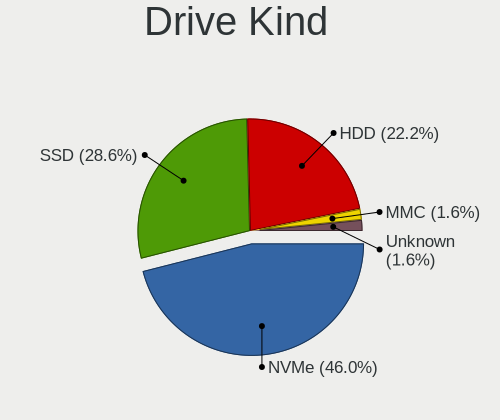
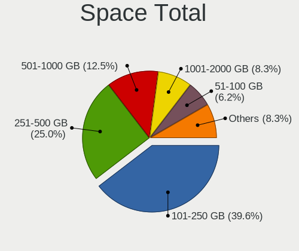
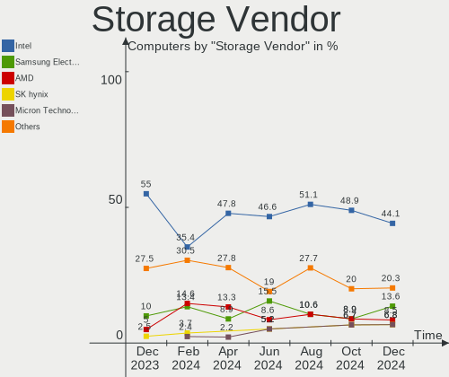
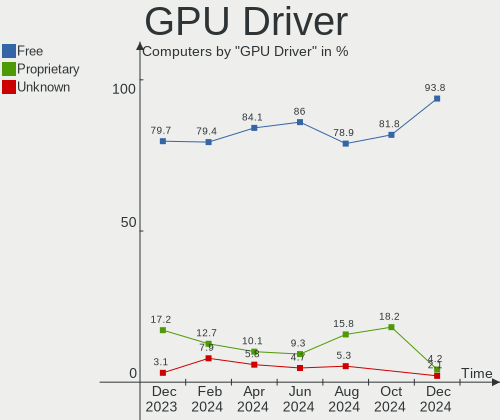

Kali - Hardware Trends
----------------------

A project to identify most popular hardware characteristics and track their change
over time based on data collected by Linux users at https://Linux-Hardware.org.

Anyone can contribute to this report by the [hw-probe](https://github.com/linuxhw/hw-probe) tool:

    sudo -E hw-probe -all -upload

This is a report for all computer types. See also reports for [desktops](/Dist/Kali/Desktop/README.md) and [notebooks](/Dist/Kali/Notebook/README.md).

This report is for one last month. Overall report since the beginning of time: [TestDays](https://github.com/linuxhw/TestDays)

Period: Jul, 2023.

Contents
--------

* [ System ](#system)
  - [ OS                       ](#os)
  - [ OS Family                ](#os-family)
  - [ Kernel                   ](#kernel)
  - [ Kernel Family            ](#kernel-family)
  - [ Kernel Major Ver.        ](#kernel-major-ver)
  - [ Arch                     ](#arch)
  - [ DE                       ](#de)
  - [ Display Server           ](#display-server)
  - [ Display Manager          ](#display-manager)
  - [ OS Lang                  ](#os-lang)
  - [ Boot Mode                ](#boot-mode)
  - [ Filesystem               ](#filesystem)
  - [ Part. scheme             ](#part-scheme)
  - [ Dual Boot with Linux/BSD ](#dual-boot-with-linuxbsd)
  - [ Dual Boot (Win)          ](#dual-boot-win)

* [ Board ](#board)
  - [ Vendor                   ](#vendor)
  - [ Model                    ](#model)
  - [ Model Family             ](#model-family)
  - [ MFG Year                 ](#mfg-year)
  - [ Form Factor              ](#form-factor)
  - [ Secure Boot              ](#secure-boot)
  - [ Coreboot                 ](#coreboot)
  - [ RAM Size                 ](#ram-size)
  - [ RAM Used                 ](#ram-used)
  - [ Total Drives             ](#total-drives)
  - [ Has CD-ROM               ](#has-cd-rom)
  - [ Has Ethernet             ](#has-ethernet)
  - [ Has WiFi                 ](#has-wifi)
  - [ Has Bluetooth            ](#has-bluetooth)

* [ Location ](#location)
  - [ Country                  ](#country)
  - [ City                     ](#city)

* [ Drives ](#drives)
  - [ Drive Vendor             ](#drive-vendor)
  - [ Drive Model              ](#drive-model)
  - [ HDD Vendor               ](#hdd-vendor)
  - [ SSD Vendor               ](#ssd-vendor)
  - [ Drive Kind               ](#drive-kind)
  - [ Drive Connector          ](#drive-connector)
  - [ Drive Size               ](#drive-size)
  - [ Space Total              ](#space-total)
  - [ Space Used               ](#space-used)
  - [ Malfunc. Drives          ](#malfunc-drives)
  - [ Malfunc. Drive Vendor    ](#malfunc-drive-vendor)
  - [ Malfunc. HDD Vendor      ](#malfunc-hdd-vendor)
  - [ Malfunc. Drive Kind      ](#malfunc-drive-kind)
  - [ Failed Drives            ](#failed-drives)
  - [ Failed Drive Vendor      ](#failed-drive-vendor)
  - [ Drive Status             ](#drive-status)

* [ Storage controller ](#storage-controller)
  - [ Storage Vendor           ](#storage-vendor)
  - [ Storage Model            ](#storage-model)
  - [ Storage Kind             ](#storage-kind)

* [ Processor ](#processor)
  - [ CPU Vendor               ](#cpu-vendor)
  - [ CPU Model                ](#cpu-model)
  - [ CPU Model Family         ](#cpu-model-family)
  - [ CPU Cores                ](#cpu-cores)
  - [ CPU Sockets              ](#cpu-sockets)
  - [ CPU Threads              ](#cpu-threads)
  - [ CPU Op-Modes             ](#cpu-op-modes)
  - [ CPU Microcode            ](#cpu-microcode)
  - [ CPU Microarch            ](#cpu-microarch)

* [ Graphics ](#graphics)
  - [ GPU Vendor               ](#gpu-vendor)
  - [ GPU Model                ](#gpu-model)
  - [ GPU Combo                ](#gpu-combo)
  - [ GPU Driver               ](#gpu-driver)
  - [ GPU Memory               ](#gpu-memory)

* [ Monitor ](#monitor)
  - [ Monitor Vendor           ](#monitor-vendor)
  - [ Monitor Model            ](#monitor-model)
  - [ Monitor Resolution       ](#monitor-resolution)
  - [ Monitor Diagonal         ](#monitor-diagonal)
  - [ Monitor Width            ](#monitor-width)
  - [ Aspect Ratio             ](#aspect-ratio)
  - [ Monitor Area             ](#monitor-area)
  - [ Pixel Density            ](#pixel-density)
  - [ Multiple Monitors        ](#multiple-monitors)

* [ Network ](#network)
  - [ Net Controller Vendor    ](#net-controller-vendor)
  - [ Net Controller Model     ](#net-controller-model)
  - [ Wireless Vendor          ](#wireless-vendor)
  - [ Wireless Model           ](#wireless-model)
  - [ Ethernet Vendor          ](#ethernet-vendor)
  - [ Ethernet Model           ](#ethernet-model)
  - [ Net Controller Kind      ](#net-controller-kind)
  - [ Used Controller          ](#used-controller)
  - [ NICs                     ](#nics)
  - [ IPv6                     ](#ipv6)

* [ Bluetooth ](#bluetooth)
  - [ Bluetooth Vendor         ](#bluetooth-vendor)
  - [ Bluetooth Model          ](#bluetooth-model)

* [ Sound ](#sound)
  - [ Sound Vendor             ](#sound-vendor)
  - [ Sound Model              ](#sound-model)

* [ Memory ](#memory)
  - [ Memory Vendor            ](#memory-vendor)
  - [ Memory Model             ](#memory-model)
  - [ Memory Kind              ](#memory-kind)
  - [ Memory Form Factor       ](#memory-form-factor)
  - [ Memory Size              ](#memory-size)
  - [ Memory Speed             ](#memory-speed)

* [ Printers & scanners ](#printers--scanners)
  - [ Printer Vendor           ](#printer-vendor)
  - [ Printer Model            ](#printer-model)
  - [ Scanner Vendor           ](#scanner-vendor)
  - [ Scanner Model            ](#scanner-model)

* [ Camera ](#camera)
  - [ Camera Vendor            ](#camera-vendor)
  - [ Camera Model             ](#camera-model)

* [ Security ](#security)
  - [ Fingerprint Vendor       ](#fingerprint-vendor)
  - [ Fingerprint Model        ](#fingerprint-model)
  - [ Chipcard Vendor          ](#chipcard-vendor)
  - [ Chipcard Model           ](#chipcard-model)

* [ Unsupported ](#unsupported)
  - [ Unsupported Devices      ](#unsupported-devices)
  - [ Unsupported Device Types ](#unsupported-device-types)

System
------

OS
--

Installed operating systems

| Name        | Computers | Percent |
|-------------|-----------|---------|
| Kali 2023.2 | 65        | 95.59%  |
| Kali 2023.1 | 3         | 4.41%   |

OS Family
---------

OS without a version

| Name | Computers | Percent |
|------|-----------|---------|
| Kali | 68        | 100%    |

Kernel
------

Version of the Linux kernel

| Version                                       | Computers | Percent |
|-----------------------------------------------|-----------|---------|
| 6.1.0-kali9-amd64                             | 32        | 47.06%  |
| 6.3.0-kali1-amd64                             | 23        | 33.82%  |
| 6.1.0-kali7-amd64                             | 4         | 5.88%   |
| 6.1.0-kali5-amd64                             | 2         | 2.94%   |
| 6.0.0-kali3-amd64                             | 1         | 1.47%   |
| 5.18.0-kali5-amd64                            | 1         | 1.47%   |
| 5.14.0-kali4-amd64                            | 1         | 1.47%   |
| 5.10.136-android12-9-26203352-abS908BXXS6CWF6 | 1         | 1.47%   |
| 4.19.127+                                     | 1         | 1.47%   |
| 4.14.282-NetHunter-r7                         | 1         | 1.47%   |
| 4.14.190-LiteSeeing-1                         | 1         | 1.47%   |

Kernel Family
-------------

Linux kernel without a distro release

| Version  | Computers | Percent |
|----------|-----------|---------|
| 6.1.0    | 38        | 55.88%  |
| 6.3.0    | 23        | 33.82%  |
| 6.0.0    | 1         | 1.47%   |
| 5.18.0   | 1         | 1.47%   |
| 5.14.0   | 1         | 1.47%   |
| 5.10.136 | 1         | 1.47%   |
| 4.19.127 | 1         | 1.47%   |
| 4.14.282 | 1         | 1.47%   |
| 4.14.190 | 1         | 1.47%   |

Kernel Major Ver.
-----------------

Linux kernel major version

| Version | Computers | Percent |
|---------|-----------|---------|
| 6.1     | 38        | 55.88%  |
| 6.3     | 23        | 33.82%  |
| 4.14    | 2         | 2.94%   |
| 6.0     | 1         | 1.47%   |
| 5.18    | 1         | 1.47%   |
| 5.14    | 1         | 1.47%   |
| 5.10    | 1         | 1.47%   |
| 4.19    | 1         | 1.47%   |

Arch
----

OS architecture (x86_64, i586, etc.)

| Name    | Computers | Percent |
|---------|-----------|---------|
| x86_64  | 64        | 94.12%  |
| aarch64 | 4         | 5.88%   |

DE
--

Desktop Environment

| Name             | Computers | Percent |
|------------------|-----------|---------|
| XFCE             | 32        | 47.06%  |
| GNOME            | 24        | 35.29%  |
| KDE5             | 10        | 14.71%  |
| lightdm-xsession | 1         | 1.47%   |
| Unknown          | 1         | 1.47%   |

Display Server
--------------

X11 or Wayland

| Name    | Computers | Percent |
|---------|-----------|---------|
| X11     | 58        | 85.29%  |
| Wayland | 9         | 13.24%  |
| Unknown | 1         | 1.47%   |

Display Manager
---------------

SDDM, LightDM, etc.

| Name    | Computers | Percent |
|---------|-----------|---------|
| LightDM | 27        | 39.71%  |
| Unknown | 15        | 22.06%  |
| SDDM    | 13        | 19.12%  |
| GDM3    | 12        | 17.65%  |
| GDM     | 1         | 1.47%   |

OS Lang
-------

Language

| Lang    | Computers | Percent |
|---------|-----------|---------|
| en_US   | 38        | 55.88%  |
| Unknown | 4         | 5.88%   |
| ru_RU   | 3         | 4.41%   |
| es_ES   | 3         | 4.41%   |
| en_IN   | 3         | 4.41%   |
| hu_HU   | 2         | 2.94%   |
| fr_FR   | 2         | 2.94%   |
| en_GB   | 2         | 2.94%   |
| de_DE   | 2         | 2.94%   |
| pt_BR   | 1         | 1.47%   |
| ja_JP   | 1         | 1.47%   |
| it_IT   | 1         | 1.47%   |
| fr_CA   | 1         | 1.47%   |
| es_CO   | 1         | 1.47%   |
| en_ZW   | 1         | 1.47%   |
| en_IE   | 1         | 1.47%   |
| en_CA   | 1         | 1.47%   |
| C       | 1         | 1.47%   |

Boot Mode
---------

EFI or BIOS

| Mode | Computers | Percent |
|------|-----------|---------|
| EFI  | 44        | 64.71%  |
| BIOS | 24        | 35.29%  |

Filesystem
----------

Type of filesystem

| Type    | Computers | Percent |
|---------|-----------|---------|
| Ext4    | 61        | 89.71%  |
| Tmpfs   | 3         | 4.41%   |
| Overlay | 2         | 2.94%   |
| F2fs    | 1         | 1.47%   |
| Btrfs   | 1         | 1.47%   |

Part. scheme
------------

Scheme of partitioning

| Type    | Computers | Percent |
|---------|-----------|---------|
| GPT     | 43        | 63.24%  |
| Unknown | 16        | 23.53%  |
| MBR     | 9         | 13.24%  |

Dual Boot with Linux/BSD
------------------------

Hosting more than one Linux/BSD

| Dual boot | Computers | Percent |
|-----------|-----------|---------|
| No        | 60        | 88.24%  |
| Yes       | 8         | 11.76%  |

Dual Boot (Win)
---------------

Hosting Linux and Windows

| Dual boot | Computers | Percent |
|-----------|-----------|---------|
| No        | 41        | 60.29%  |
| Yes       | 27        | 39.71%  |

Board
-----

Vendor
------

Motherboard manufacturer

| Name                  | Computers | Percent |
|-----------------------|-----------|---------|
| Hewlett-Packard       | 13        | 19.12%  |
| Lenovo                | 11        | 16.18%  |
| ASUSTek Computer      | 10        | 14.71%  |
| Dell                  | 8         | 11.76%  |
| MSI                   | 5         | 7.35%   |
| Unknown               | 4         | 5.88%   |
| Gigabyte Technology   | 3         | 4.41%   |
| Apple                 | 3         | 4.41%   |
| Toshiba               | 2         | 2.94%   |
| Valve                 | 1         | 1.47%   |
| Supermicro            | 1         | 1.47%   |
| Qualcomm Technologies | 1         | 1.47%   |
| Intel                 | 1         | 1.47%   |
| HUAWEI                | 1         | 1.47%   |
| Google                | 1         | 1.47%   |
| Fujitsu Siemens       | 1         | 1.47%   |
| Alienware             | 1         | 1.47%   |
| Acer                  | 1         | 1.47%   |

Model
-----

Motherboard model

| Name                                       | Computers | Percent |
|--------------------------------------------|-----------|---------|
| Unknown                                    | 4         | 5.88%   |
| HP Victus by Gaming Laptop 15-fa0xxx       | 2         | 2.94%   |
| Valve Jupiter                              | 1         | 1.47%   |
| Toshiba TECRA R950                         | 1         | 1.47%   |
| Toshiba Satellite C640                     | 1         | 1.47%   |
| Supermicro A1SAi                           | 1         | 1.47%   |
| Qualcomm SM8150 V2 PM8150 VAYU             | 1         | 1.47%   |
| MSI MS-7D75                                | 1         | 1.47%   |
| MSI MS-7B87                                | 1         | 1.47%   |
| MSI MS-7994                                | 1         | 1.47%   |
| MSI GL63 8SD                               | 1         | 1.47%   |
| MSI GF75 Thin 9SC                          | 1         | 1.47%   |
| Lenovo V520-15IKL Desktop 10NK001AUM       | 1         | 1.47%   |
| Lenovo ThinkPad X230 Tablet 3436A15        | 1         | 1.47%   |
| Lenovo ThinkPad X1 Carbon Gen 9 20XWCTO1WW | 1         | 1.47%   |
| Lenovo ThinkPad P51s W10DG 20JY0009US      | 1         | 1.47%   |
| Lenovo Slim 7 Carbon 13IAP7 82V4           | 1         | 1.47%   |
| Lenovo IdeaPad S340-15IWL 81N8             | 1         | 1.47%   |
| Lenovo IdeaPad S340-14API 81NB             | 1         | 1.47%   |
| Lenovo IdeaPad 5 Pro 16ACH6 82L5           | 1         | 1.47%   |
| Lenovo IdeaPad 3 15ADA05 81W1              | 1         | 1.47%   |
| Lenovo IdeaPad 110-15ACL 80TJ              | 1         | 1.47%   |
| Lenovo G580 2189                           | 1         | 1.47%   |
| Intel X79                                  | 1         | 1.47%   |
| HUAWEI BOHB-WAX9                           | 1         | 1.47%   |
| HP Z620 Workstation                        | 1         | 1.47%   |
| HP Victus by 15L Gaming Desktop TG02-0xxx  | 1         | 1.47%   |
| HP Laptop 15s-eq1xxx                       | 1         | 1.47%   |
| HP Laptop 14-cf2xxx                        | 1         | 1.47%   |
| HP ENVY x360 Convertible 15-ds1xxx         | 1         | 1.47%   |
| HP ENVY x360 Convertible 13-bd0xxx         | 1         | 1.47%   |
| HP ENVY x360 2-in-1 Laptop 15-ey0xxx       | 1         | 1.47%   |
| HP EliteBook 840 G2                        | 1         | 1.47%   |
| HP EliteBook 820 G2                        | 1         | 1.47%   |
| HP EliteBook 745 G6                        | 1         | 1.47%   |
| HP 15                                      | 1         | 1.47%   |
| Google Kohaku                              | 1         | 1.47%   |
| Gigabyte H110M-DS2V                        | 1         | 1.47%   |
| Gigabyte B450M DS3H                        | 1         | 1.47%   |
| Gigabyte A620M GAMING X                    | 1         | 1.47%   |

Model Family
------------

Motherboard model prefix

| Name                    | Computers | Percent |
|-------------------------|-----------|---------|
| Lenovo IdeaPad          | 5         | 7.35%   |
| ASUS ROG                | 5         | 7.35%   |
| Unknown                 | 4         | 5.88%   |
| Lenovo ThinkPad         | 3         | 4.41%   |
| HP Victus               | 3         | 4.41%   |
| HP ENVY                 | 3         | 4.41%   |
| HP EliteBook            | 3         | 4.41%   |
| Dell Inspiron           | 3         | 4.41%   |
| HP Laptop               | 2         | 2.94%   |
| Dell Latitude           | 2         | 2.94%   |
| ASUS VivoBook           | 2         | 2.94%   |
| Valve Jupiter           | 1         | 1.47%   |
| Toshiba TECRA           | 1         | 1.47%   |
| Toshiba Satellite       | 1         | 1.47%   |
| Supermicro A1SAi        | 1         | 1.47%   |
| Qualcomm SM8150         | 1         | 1.47%   |
| MSI MS-7D75             | 1         | 1.47%   |
| MSI MS-7B87             | 1         | 1.47%   |
| MSI MS-7994             | 1         | 1.47%   |
| MSI GL63                | 1         | 1.47%   |
| MSI GF75                | 1         | 1.47%   |
| Lenovo V520-15IKL       | 1         | 1.47%   |
| Lenovo Slim             | 1         | 1.47%   |
| Lenovo G580             | 1         | 1.47%   |
| Intel X79               | 1         | 1.47%   |
| HUAWEI BOHB-WAX9        | 1         | 1.47%   |
| HP Z620                 | 1         | 1.47%   |
| HP 15                   | 1         | 1.47%   |
| Google Kohaku           | 1         | 1.47%   |
| Gigabyte H110M-DS2V     | 1         | 1.47%   |
| Gigabyte B450M          | 1         | 1.47%   |
| Gigabyte A620M          | 1         | 1.47%   |
| Fujitsu Siemens ESPRIMO | 1         | 1.47%   |
| Dell Vostro             | 1         | 1.47%   |
| Dell OptiPlex           | 1         | 1.47%   |
| Dell G15                | 1         | 1.47%   |
| ASUS TUF                | 1         | 1.47%   |
| ASUS TP300LA            | 1         | 1.47%   |
| ASUS All                | 1         | 1.47%   |
| Apple MacBookPro8       | 1         | 1.47%   |

MFG Year
--------

Motherboard manufacture year

| Year    | Computers | Percent |
|---------|-----------|---------|
| 2022    | 11        | 16.18%  |
| 2021    | 10        | 14.71%  |
| 2012    | 8         | 11.76%  |
| 2019    | 7         | 10.29%  |
| 2020    | 6         | 8.82%   |
| 2014    | 4         | 5.88%   |
| Unknown | 4         | 5.88%   |
| 2018    | 3         | 4.41%   |
| 2016    | 3         | 4.41%   |
| 2023    | 2         | 2.94%   |
| 2017    | 2         | 2.94%   |
| 2015    | 2         | 2.94%   |
| 2013    | 2         | 2.94%   |
| 2011    | 2         | 2.94%   |
| 2010    | 1         | 1.47%   |
| 2008    | 1         | 1.47%   |

Form Factor
-----------

Physical design of the computer

| Name           | Computers | Percent |
|----------------|-----------|---------|
| Notebook       | 41        | 60.29%  |
| Desktop        | 18        | 26.47%  |
| System on chip | 4         | 5.88%   |
| Convertible    | 4         | 5.88%   |
| Mini pc        | 1         | 1.47%   |

Secure Boot
-----------

Enabled or disabled

| State    | Computers | Percent |
|----------|-----------|---------|
| Disabled | 68        | 100%    |

Coreboot
--------

Have coreboot on board

| Used | Computers | Percent |
|------|-----------|---------|
| No   | 67        | 98.53%  |
| Yes  | 1         | 1.47%   |

RAM Size
--------

Total RAM memory

| Size in GB  | Computers | Percent |
|-------------|-----------|---------|
| 4.01-8.0    | 18        | 26.47%  |
| 16.01-24.0  | 15        | 22.06%  |
| 8.01-16.0   | 13        | 19.12%  |
| 32.01-64.0  | 9         | 13.24%  |
| 3.01-4.0    | 9         | 13.24%  |
| 64.01-256.0 | 2         | 2.94%   |
| 24.01-32.0  | 1         | 1.47%   |
| 2.01-3.0    | 1         | 1.47%   |

RAM Used
--------

Used RAM memory

| Used GB    | Computers | Percent |
|------------|-----------|---------|
| 2.01-3.0   | 22        | 32.35%  |
| 1.01-2.0   | 18        | 26.47%  |
| 3.01-4.0   | 12        | 17.65%  |
| 4.01-8.0   | 10        | 14.71%  |
| 8.01-16.0  | 5         | 7.35%   |
| 16.01-24.0 | 1         | 1.47%   |

Total Drives
------------

Number of drives on board

| Drives | Computers | Percent |
|--------|-----------|---------|
| 1      | 41        | 60.29%  |
| 2      | 20        | 29.41%  |
| 3      | 4         | 5.88%   |
| 5      | 1         | 1.47%   |
| 4      | 1         | 1.47%   |
| 0      | 1         | 1.47%   |

Has CD-ROM
----------

Has CD-ROM on board

| Presented | Computers | Percent |
|-----------|-----------|---------|
| No        | 54        | 79.41%  |
| Yes       | 14        | 20.59%  |

Has Ethernet
------------

Has Ethernet on board

| Presented | Computers | Percent |
|-----------|-----------|---------|
| Yes       | 45        | 66.18%  |
| No        | 23        | 33.82%  |

Has WiFi
--------

Has WiFi module

| Presented | Computers | Percent |
|-----------|-----------|---------|
| Yes       | 58        | 85.29%  |
| No        | 10        | 14.71%  |

Has Bluetooth
-------------

Has Bluetooth module

| Presented | Computers | Percent |
|-----------|-----------|---------|
| Yes       | 49        | 72.06%  |
| No        | 19        | 27.94%  |

Location
--------

Country
-------

Geographic location (country)

| Country     | Computers | Percent |
|-------------|-----------|---------|
| USA         | 17        | 25%     |
| Spain       | 7         | 10.29%  |
| UK          | 3         | 4.41%   |
| Russia      | 3         | 4.41%   |
| Indonesia   | 3         | 4.41%   |
| India       | 3         | 4.41%   |
| Germany     | 3         | 4.41%   |
| France      | 3         | 4.41%   |
| Japan       | 2         | 2.94%   |
| Hungary     | 2         | 2.94%   |
| Canada      | 2         | 2.94%   |
| Zimbabwe    | 1         | 1.47%   |
| Syria       | 1         | 1.47%   |
| Switzerland | 1         | 1.47%   |
| Sweden      | 1         | 1.47%   |
| South Korea | 1         | 1.47%   |
| Romania     | 1         | 1.47%   |
| Poland      | 1         | 1.47%   |
| Pakistan    | 1         | 1.47%   |
| Myanmar     | 1         | 1.47%   |
| Morocco     | 1         | 1.47%   |
| Kuwait      | 1         | 1.47%   |
| Kenya       | 1         | 1.47%   |
| Jordan      | 1         | 1.47%   |
| Jersey      | 1         | 1.47%   |
| Italy       | 1         | 1.47%   |
| Ireland     | 1         | 1.47%   |
| Colombia    | 1         | 1.47%   |
| Bulgaria    | 1         | 1.47%   |
| Brazil      | 1         | 1.47%   |
| Algeria     | 1         | 1.47%   |

City
----

Geographic location (city)

| City          | Computers | Percent |
|---------------|-----------|---------|
| Zaragoza      | 5         | 7.35%   |
| Denpasar      | 2         | 2.94%   |
| Yangon        | 1         | 1.47%   |
| Warsaw        | 1         | 1.47%   |
| Wakefield     | 1         | 1.47%   |
| Vila Velha    | 1         | 1.47%   |
| Tholey        | 1         | 1.47%   |
| Sofia         | 1         | 1.47%   |
| Shirala       | 1         | 1.47%   |
| Seville       | 1         | 1.47%   |
| Santa Ana     | 1         | 1.47%   |
| San Diego     | 1         | 1.47%   |
| Saha-gu       | 1         | 1.47%   |
| Sacramento    | 1         | 1.47%   |
| Rossville     | 1         | 1.47%   |
| Richmond      | 1         | 1.47%   |
| Rennes        | 1         | 1.47%   |
| Québec       | 1         | 1.47%   |
| Pomaz         | 1         | 1.47%   |
| Podolsk       | 1         | 1.47%   |
| Pisa          | 1         | 1.47%   |
| Pensacola     | 1         | 1.47%   |
| Nairobi       | 1         | 1.47%   |
| Nagoya        | 1         | 1.47%   |
| Munich        | 1         | 1.47%   |
| Moscow        | 1         | 1.47%   |
| Montpellier   | 1         | 1.47%   |
| Minato-ku     | 1         | 1.47%   |
| Milford       | 1         | 1.47%   |
| Los Angeles   | 1         | 1.47%   |
| London        | 1         | 1.47%   |
| Les Avenieres | 1         | 1.47%   |
| Lausanne      | 1         | 1.47%   |
| Las Vegas     | 1         | 1.47%   |
| Lahore        | 1         | 1.47%   |
| Kuwait City   | 1         | 1.47%   |
| Kiel          | 1         | 1.47%   |
| Jersey        | 1         | 1.47%   |
| Jackson       | 1         | 1.47%   |
| Indianapolis  | 1         | 1.47%   |

Drives
------

Drive Vendor
------------

Hard drive vendors

| Vendor                      | Computers | Drives | Percent |
|-----------------------------|-----------|--------|---------|
| WDC                         | 13        | 17     | 14.13%  |
| Samsung Electronics         | 11        | 11     | 11.96%  |
| Seagate                     | 9         | 11     | 9.78%   |
| Unknown                     | 7         | 8      | 7.61%   |
| Kingston                    | 6         | 6      | 6.52%   |
| SK hynix                    | 5         | 5      | 5.43%   |
| Crucial                     | 5         | 5      | 5.43%   |
| Toshiba                     | 4         | 4      | 4.35%   |
| Sandisk                     | 3         | 4      | 3.26%   |
| Micron/Crucial Technology   | 3         | 3      | 3.26%   |
| Intel                       | 3         | 4      | 3.26%   |
| Transcend                   | 2         | 2      | 2.17%   |
| Micron Technology           | 2         | 2      | 2.17%   |
| HGST                        | 2         | 2      | 2.17%   |
| Apple                       | 2         | 2      | 2.17%   |
| Unknown                     | 2         | 2      | 2.17%   |
| SSSTC                       | 1         | 1      | 1.09%   |
| SPCC                        | 1         | 1      | 1.09%   |
| MSI                         | 1         | 1      | 1.09%   |
| MAXIO Technology (Hangzhou) | 1         | 1      | 1.09%   |
| LITEONIT                    | 1         | 1      | 1.09%   |
| KIOXIA                      | 1         | 1      | 1.09%   |
| KingFast                    | 1         | 1      | 1.09%   |
| JMicron Technology          | 1         | 1      | 1.09%   |
| General                     | 1         | 1      | 1.09%   |
| Fanxiang                    | 1         | 1      | 1.09%   |
| China                       | 1         | 1      | 1.09%   |
| BAITITON                    | 1         | 1      | 1.09%   |
| ASMT                        | 1         | 1      | 1.09%   |

Drive Model
-----------

Hard drive models

| Model                                       | Computers | Percent |
|---------------------------------------------|-----------|---------|
| Unknown MMC Card  128GB                     | 2         | 1.98%   |
| Toshiba MQ01ABD100 1TB                      | 2         | 1.98%   |
| Seagate ST1000DM010-2EP102 1TB              | 2         | 1.98%   |
| Micron/Crucial P2 NVMe PCIe SSD 1TB         | 2         | 1.98%   |
| Unknown                                     | 2         | 1.98%   |
| WDC WDS480G2G0B-00EPW0 480GB SSD            | 1         | 0.99%   |
| WDC WDS240G2G0A-00JH30 240GB SSD            | 1         | 0.99%   |
| WDC WDS200T2B0C-00PXH0 2TB                  | 1         | 0.99%   |
| WDC WDS200T1X0E-00AFY0 2TB                  | 1         | 0.99%   |
| WDC WDS120G2G0B-00EPW0 120GB SSD            | 1         | 0.99%   |
| WDC WDS120G2G0A-00JH30 120GB SSD            | 1         | 0.99%   |
| WDC WDS100T2B0A-00SM50 1TB SSD              | 1         | 0.99%   |
| WDC WDS100T2B0A 1TB SSD                     | 1         | 0.99%   |
| WDC WD5000LPCX-24VHAT0 500GB                | 1         | 0.99%   |
| WDC WD5000AZLX-22JKKA0 500GB                | 1         | 0.99%   |
| WDC WD50 00BPVT-75HXZT1 500GB               | 1         | 0.99%   |
| WDC WD40EFAX-68JH4N0 4TB                    | 1         | 0.99%   |
| WDC WD3200BPVT-22JJ5T0 320GB                | 1         | 0.99%   |
| WDC WD3200AAKS-75L9A0 320GB                 | 1         | 0.99%   |
| WDC WD2002FYPS-02W3B0 2TB                   | 1         | 0.99%   |
| WDC WD10SPZX-24Z10 1TB                      | 1         | 0.99%   |
| WDC WD10EZEX-00MFCA0 1TB                    | 1         | 0.99%   |
| Unknown xD/SD/M.S.                          | 1         | 0.99%   |
| Unknown NVMe SSD Drive 2TB                  | 1         | 0.99%   |
| Unknown MMC Card  64GB                      | 1         | 0.99%   |
| Unknown MMC Card  4GB                       | 1         | 0.99%   |
| Unknown MMC Card  32GB                      | 1         | 0.99%   |
| Unknown MMC Card  16GB                      | 1         | 0.99%   |
| Transcend TS256GSSD370S 256GB               | 1         | 0.99%   |
| Transcend TS1TSSD220Q 1TB                   | 1         | 0.99%   |
| Toshiba MK3265GSXN 320GB                    | 1         | 0.99%   |
| Toshiba HDWR160 6TB                         | 1         | 0.99%   |
| SSSTC CL1-3D256 256GB                       | 1         | 0.99%   |
| SPCC Solid State Disk 128GB                 | 1         | 0.99%   |
| SK hynix SKHynix_HFS512GDE9X084N 512GB      | 1         | 0.99%   |
| SK hynix SKHynix_HFS001TEJ9X102N 1TB        | 1         | 0.99%   |
| SK hynix HFM001TD3JX013N 1TB                | 1         | 0.99%   |
| SK hynix BC511 HFM256GDJTNI-82A0A 256GB     | 1         | 0.99%   |
| SK hynix BC501 NVMe Solid State Drive 512GB | 1         | 0.99%   |
| Seagate ST500DM002-1SB10A 500GB             | 1         | 0.99%   |

HDD Vendor
----------

Hard disk drive vendors

| Vendor             | Computers | Drives | Percent |
|--------------------|-----------|--------|---------|
| WDC                | 9         | 9      | 36%     |
| Seagate            | 9         | 11     | 36%     |
| Toshiba            | 4         | 4      | 16%     |
| HGST               | 2         | 2      | 8%      |
| JMicron Technology | 1         | 1      | 4%      |

SSD Vendor
----------

Solid state drive vendors

| Vendor              | Computers | Drives | Percent |
|---------------------|-----------|--------|---------|
| WDC                 | 6         | 6      | 20.69%  |
| Samsung Electronics | 4         | 4      | 13.79%  |
| Crucial             | 4         | 4      | 13.79%  |
| Kingston            | 3         | 3      | 10.34%  |
| Transcend           | 2         | 2      | 6.9%    |
| SPCC                | 1         | 1      | 3.45%   |
| SanDisk             | 1         | 1      | 3.45%   |
| Micron Technology   | 1         | 1      | 3.45%   |
| LITEONIT            | 1         | 1      | 3.45%   |
| KingFast            | 1         | 1      | 3.45%   |
| Fanxiang            | 1         | 1      | 3.45%   |
| China               | 1         | 1      | 3.45%   |
| BAITITON            | 1         | 1      | 3.45%   |
| ASMT                | 1         | 1      | 3.45%   |
| Apple               | 1         | 1      | 3.45%   |

Drive Kind
----------

HDD or SSD

| Kind    | Computers | Drives | Percent |
|---------|-----------|--------|---------|
| NVMe    | 31        | 35     | 34.83%  |
| SSD     | 27        | 29     | 30.34%  |
| HDD     | 22        | 27     | 24.72%  |
| MMC     | 7         | 8      | 7.87%   |
| Unknown | 2         | 2      | 2.25%   |

Drive Connector
---------------

SATA, SAS, NVMe, etc.

| Type | Computers | Drives | Percent |
|------|-----------|--------|---------|
| SATA | 36        | 51     | 44.44%  |
| NVMe | 31        | 35     | 38.27%  |
| SAS  | 7         | 7      | 8.64%   |
| MMC  | 7         | 8      | 8.64%   |

Drive Size
----------

Size of hard drive

| Size in TB | Computers | Drives | Percent |
|------------|-----------|--------|---------|
| 0.01-0.5   | 24        | 30     | 50%     |
| 0.51-1.0   | 17        | 19     | 35.42%  |
| 1.01-2.0   | 3         | 3      | 6.25%   |
| 4.01-10.0  | 2         | 2      | 4.17%   |
| 3.01-4.0   | 1         | 1      | 2.08%   |
| 2.01-3.0   | 1         | 1      | 2.08%   |

Space Total
-----------

Amount of disk space available on the file system

| Size in GB     | Computers | Percent |
|----------------|-----------|---------|
| 101-250        | 20        | 29.41%  |
| 251-500        | 19        | 27.94%  |
| 1001-2000      | 9         | 13.24%  |
| 501-1000       | 7         | 10.29%  |
| Unknown        | 5         | 7.35%   |
| 51-100         | 4         | 5.88%   |
| 2001-3000      | 2         | 2.94%   |
| More than 3000 | 1         | 1.47%   |
| 21-50          | 1         | 1.47%   |

Space Used
----------

Amount of used disk space

| Used GB        | Computers | Percent |
|----------------|-----------|---------|
| 21-50          | 23        | 33.82%  |
| 51-100         | 9         | 13.24%  |
| 101-250        | 8         | 11.76%  |
| 1-20           | 8         | 11.76%  |
| 501-1000       | 6         | 8.82%   |
| 251-500        | 5         | 7.35%   |
| Unknown        | 5         | 7.35%   |
| 1001-2000      | 3         | 4.41%   |
| More than 3000 | 1         | 1.47%   |

Malfunc. Drives
---------------

Drive models with a malfunction

| Model                          | Computers | Drives | Percent |
|--------------------------------|-----------|--------|---------|
| WDC WD5000AZLX-22JKKA0 500GB   | 1         | 1      | 20%     |
| WDC WD40EFAX-68JH4N0 4TB       | 1         | 1      | 20%     |
| Toshiba MK3265GSXN 320GB       | 1         | 1      | 20%     |
| SPCC Solid State Disk 128GB    | 1         | 1      | 20%     |
| Seagate ST1000DM003-1SB102 1TB | 1         | 1      | 20%     |

Malfunc. Drive Vendor
---------------------

Vendors of faulty drives

| Vendor  | Computers | Drives | Percent |
|---------|-----------|--------|---------|
| WDC     | 2         | 2      | 40%     |
| Toshiba | 1         | 1      | 20%     |
| SPCC    | 1         | 1      | 20%     |
| Seagate | 1         | 1      | 20%     |

Malfunc. HDD Vendor
-------------------

Vendors of faulty HDD drives

| Vendor  | Computers | Drives | Percent |
|---------|-----------|--------|---------|
| WDC     | 2         | 2      | 50%     |
| Toshiba | 1         | 1      | 25%     |
| Seagate | 1         | 1      | 25%     |

Malfunc. Drive Kind
-------------------

Kinds of faulty drives

| Kind | Computers | Drives | Percent |
|------|-----------|--------|---------|
| HDD  | 4         | 4      | 80%     |
| SSD  | 1         | 1      | 20%     |

Failed Drives
-------------

Failed drive models

Zero info for selected period =(

Failed Drive Vendor
-------------------

Failed drive vendors

Zero info for selected period =(

Drive Status
------------

Number of failed and malfunc. drives

| Status   | Computers | Drives | Percent |
|----------|-----------|--------|---------|
| Works    | 47        | 64     | 59.49%  |
| Detected | 27        | 32     | 34.18%  |
| Malfunc  | 5         | 5      | 6.33%   |

Storage controller
------------------

Storage Vendor
--------------

Storage controller vendors

| Vendor                         | Computers | Percent |
|--------------------------------|-----------|---------|
| Intel                          | 36        | 42.35%  |
| AMD                            | 18        | 21.18%  |
| Samsung Electronics            | 7         | 8.24%   |
| SK hynix                       | 5         | 5.88%   |
| SanDisk                        | 4         | 4.71%   |
| Micron/Crucial Technology      | 4         | 4.71%   |
| Kingston Technology Company    | 3         | 3.53%   |
| ASMedia Technology             | 2         | 2.35%   |
| Solid State Storage Technology | 1         | 1.18%   |
| Micron Technology              | 1         | 1.18%   |
| MAXIO Technology (Hangzhou)    | 1         | 1.18%   |
| KIOXIA                         | 1         | 1.18%   |
| INNOGRIT                       | 1         | 1.18%   |
| Apple                          | 1         | 1.18%   |

Storage Model
-------------

Storage controller models

| Model                                                                         | Computers | Percent |
|-------------------------------------------------------------------------------|-----------|---------|
| AMD FCH SATA Controller [AHCI mode]                                           | 16        | 17.2%   |
| Intel Volume Management Device NVMe RAID Controller                           | 4         | 4.3%    |
| Samsung NVMe SSD Controller SM981/PM981/PM983                                 | 3         | 3.23%   |
| Micron/Crucial P2 [Nick P2] / P3 / P3 Plus NVMe PCIe SSD (DRAM-less)          | 3         | 3.23%   |
| Intel 82801 Mobile SATA Controller [RAID mode]                                | 3         | 3.23%   |
| Intel 7 Series Chipset Family 6-port SATA Controller [AHCI mode]              | 3         | 3.23%   |
| AMD 400 Series Chipset SATA Controller                                        | 3         | 3.23%   |
| SK hynix Gold P31/BC711/PC711 NVMe Solid State Drive                          | 2         | 2.15%   |
| SanDisk WD Black SN770 / PC SN740 256GB / PC SN560 (DRAM-less) NVMe SSD       | 2         | 2.15%   |
| Samsung NVMe SSD Controller PM9A1/PM9A3/980PRO                                | 2         | 2.15%   |
| Samsung NVMe SSD Controller 980                                               | 2         | 2.15%   |
| Kingston Company OM3PDP3 NVMe SSD                                             | 2         | 2.15%   |
| Intel Wildcat Point-LP SATA Controller [AHCI Mode]                            | 2         | 2.15%   |
| Intel Q170/Q150/B150/H170/H110/Z170/CM236 Chipset SATA Controller [AHCI Mode] | 2         | 2.15%   |
| Intel Comet Lake SATA AHCI Controller                                         | 2         | 2.15%   |
| Intel Cannon Lake Mobile PCH SATA AHCI Controller                             | 2         | 2.15%   |
| Intel Atom Processor E3800 Series SATA AHCI Controller                        | 2         | 2.15%   |
| Intel 200 Series PCH SATA controller [AHCI mode]                              | 2         | 2.15%   |
| ASMedia ASM1062 Serial ATA Controller                                         | 2         | 2.15%   |
| Solid State Storage CL1-3D256-Q11 NVMe SSD M.2                                | 1         | 1.08%   |
| SK hynix Platinum P41/PC801 NVMe Solid State Drive                            | 1         | 1.08%   |
| SK hynix BC511 NVMe SSD                                                       | 1         | 1.08%   |
| SK hynix BC501 NVMe Solid State Drive                                         | 1         | 1.08%   |
| SanDisk WD PC SN810 / Black SN850 NVMe SSD                                    | 1         | 1.08%   |
| SanDisk WD Blue SN550 NVMe SSD 2TB (DRAM-less)                                | 1         | 1.08%   |
| Micron/Crucial P5 Plus NVMe PCIe SSD                                          | 1         | 1.08%   |
| Micron 2400 NVMe SSD (DRAM-less)                                              | 1         | 1.08%   |
| MAXIO (Hangzhou) NVMe SSD Controller MAP1602                                  | 1         | 1.08%   |
| KIOXIA NVMe SSD Controller BG5 (DRAM-less)                                    | 1         | 1.08%   |
| Kingston Company U-SNS8154P3 NVMe SSD                                         | 1         | 1.08%   |
| Intel Sunrise Point-LP SATA Controller [AHCI mode]                            | 1         | 1.08%   |
| Intel SSD 670p Series [Keystone Harbor]                                       | 1         | 1.08%   |
| Intel SSD 660P Series                                                         | 1         | 1.08%   |
| Intel SATA Controller [RAID mode]                                             | 1         | 1.08%   |
| Intel Optane NVME SSD H10 with Solid State Storage [Teton Glacier]            | 1         | 1.08%   |
| Intel NM10/ICH7 Family SATA Controller [IDE mode]                             | 1         | 1.08%   |
| Intel C602 chipset 4-Port SATA Storage Control Unit                           | 1         | 1.08%   |
| Intel C600/X79 series chipset SATA RAID Controller                            | 1         | 1.08%   |
| Intel C600/X79 series chipset IDE-r Controller                                | 1         | 1.08%   |
| Intel C600/X79 series chipset 6-Port SATA AHCI Controller                     | 1         | 1.08%   |

Storage Kind
------------

Kind of storage controller (IDE, SATA, NVMe, SAS, ...)

| Kind | Computers | Percent |
|------|-----------|---------|
| SATA | 41        | 48.24%  |
| NVMe | 31        | 36.47%  |
| RAID | 9         | 10.59%  |
| IDE  | 3         | 3.53%   |
| SAS  | 1         | 1.18%   |

Processor
---------

CPU Vendor
----------

Processor vendors

| Vendor   | Computers | Percent |
|----------|-----------|---------|
| Intel    | 41        | 60.29%  |
| AMD      | 23        | 33.82%  |
| Qualcomm | 2         | 2.94%   |
| ARM      | 2         | 2.94%   |

CPU Model
---------

Processor models

| Model                                         | Computers | Percent |
|-----------------------------------------------|-----------|---------|
| Qualcomm AArch64 Processor rev 14 (aarch64)   | 2         | 2.94%   |
| Intel Xeon CPU E5-2620 0 @ 2.00GHz            | 2         | 2.94%   |
| Intel Core i5-6400 CPU @ 2.70GHz              | 2         | 2.94%   |
| Intel Core i5-3320M CPU @ 2.60GHz             | 2         | 2.94%   |
| Intel 12th Gen Core i7-1260P                  | 2         | 2.94%   |
| ARM Processor                                 | 2         | 2.94%   |
| AMD Ryzen 7 3700U with Radeon Vega Mobile Gfx | 2         | 2.94%   |
| AMD Ryzen 5 5600G with Radeon Graphics        | 2         | 2.94%   |
| Intel Pentium CPU P6200 @ 2.13GHz             | 1         | 1.47%   |
| Intel Pentium CPU N3530 @ 2.16GHz             | 1         | 1.47%   |
| Intel Pentium CPU G2020 @ 2.90GHz             | 1         | 1.47%   |
| Intel Core i9-9980HK CPU @ 2.40GHz            | 1         | 1.47%   |
| Intel Core i7-9750H CPU @ 2.60GHz             | 1         | 1.47%   |
| Intel Core i7-8750H CPU @ 2.20GHz             | 1         | 1.47%   |
| Intel Core i7-8565U CPU @ 1.80GHz             | 1         | 1.47%   |
| Intel Core i7-6500U CPU @ 2.50GHz             | 1         | 1.47%   |
| Intel Core i7-4790K CPU @ 4.00GHz             | 1         | 1.47%   |
| Intel Core i7-3770 CPU @ 3.40GHz              | 1         | 1.47%   |
| Intel Core i7-3520M CPU @ 2.90GHz             | 1         | 1.47%   |
| Intel Core i5-8250U CPU @ 1.60GHz             | 1         | 1.47%   |
| Intel Core i5-5300U CPU @ 2.30GHz             | 1         | 1.47%   |
| Intel Core i5-4300M CPU @ 2.60GHz             | 1         | 1.47%   |
| Intel Core i5-2467M CPU @ 1.60GHz             | 1         | 1.47%   |
| Intel Core i5-2435M CPU @ 2.40GHz             | 1         | 1.47%   |
| Intel Core i5-10210U CPU @ 1.60GHz            | 1         | 1.47%   |
| Intel Core i5-10200H CPU @ 2.40GHz            | 1         | 1.47%   |
| Intel Core i3-9100 CPU @ 3.60GHz              | 1         | 1.47%   |
| Intel Core i3-7100 CPU @ 3.90GHz              | 1         | 1.47%   |
| Intel Core i3-5010U CPU @ 2.10GHz             | 1         | 1.47%   |
| Intel Core i3-4005U CPU @ 1.70GHz             | 1         | 1.47%   |
| Intel Core i3-10110U CPU @ 2.10GHz            | 1         | 1.47%   |
| Intel Core 2 Duo CPU E7300 @ 2.66GHz          | 1         | 1.47%   |
| Intel Celeron N4120 CPU @ 1.10GHz             | 1         | 1.47%   |
| Intel Celeron CPU N2840 @ 2.16GHz             | 1         | 1.47%   |
| Intel Atom CPU C2750 @ 2.41GHz                | 1         | 1.47%   |
| Intel 12th Gen Core i5-12500H                 | 1         | 1.47%   |
| Intel 12th Gen Core i5-12450H                 | 1         | 1.47%   |
| Intel 11th Gen Core i7-1185G7 @ 3.00GHz       | 1         | 1.47%   |
| Intel 11th Gen Core i7-11800H @ 2.30GHz       | 1         | 1.47%   |
| Intel 11th Gen Core i7-1165G7 @ 2.80GHz       | 1         | 1.47%   |

CPU Model Family
----------------

Processor model prefix

| Model            | Computers | Percent |
|------------------|-----------|---------|
| Other            | 13        | 19.12%  |
| Intel Core i5    | 11        | 16.18%  |
| Intel Core i7    | 7         | 10.29%  |
| AMD Ryzen 5      | 7         | 10.29%  |
| AMD Ryzen 7      | 6         | 8.82%   |
| Intel Core i3    | 5         | 7.35%   |
| AMD Ryzen 9      | 4         | 5.88%   |
| Intel Pentium    | 3         | 4.41%   |
| Intel Xeon       | 2         | 2.94%   |
| Intel Celeron    | 2         | 2.94%   |
| Intel Core i9    | 1         | 1.47%   |
| Intel Core 2 Duo | 1         | 1.47%   |
| Intel Atom       | 1         | 1.47%   |
| AMD Ryzen 5 PRO  | 1         | 1.47%   |
| AMD E2           | 1         | 1.47%   |
| AMD E1           | 1         | 1.47%   |
| AMD E            | 1         | 1.47%   |
| AMD Athlon       | 1         | 1.47%   |

CPU Cores
---------

Number of processor cores

| Number  | Computers | Percent |
|---------|-----------|---------|
| 2       | 22        | 32.35%  |
| 4       | 20        | 29.41%  |
| 8       | 10        | 14.71%  |
| 6       | 7         | 10.29%  |
| 12      | 6         | 8.82%   |
| Unknown | 2         | 2.94%   |
| 16      | 1         | 1.47%   |

CPU Sockets
-----------

Number of sockets

| Number  | Computers | Percent |
|---------|-----------|---------|
| 1       | 62        | 91.18%  |
| 2       | 4         | 5.88%   |
| Unknown | 2         | 2.94%   |

CPU Threads
-----------

Threads per core (Hyper-Threading)

| Number  | Computers | Percent |
|---------|-----------|---------|
| 2       | 46        | 67.65%  |
| 1       | 20        | 29.41%  |
| Unknown | 2         | 2.94%   |

CPU Op-Modes
------------

CPU Operation Modes (32-bit, 64-bit)

| Op mode        | Computers | Percent |
|----------------|-----------|---------|
| 32-bit, 64-bit | 67        | 98.53%  |
| Unknown        | 1         | 1.47%   |

CPU Microcode
-------------

Microcode number

| Number     | Computers | Percent |
|------------|-----------|---------|
| Unknown    | 23        | 33.82%  |
| 0x306a9    | 5         | 7.35%   |
| 0x0a601203 | 4         | 5.88%   |
| 0x08108109 | 4         | 5.88%   |
| 0x906ea    | 2         | 2.94%   |
| 0x906a3    | 2         | 2.94%   |
| 0x806ec    | 2         | 2.94%   |
| 0x806c1    | 2         | 2.94%   |
| 0x206d7    | 2         | 2.94%   |
| 0x206a7    | 2         | 2.94%   |
| 0x0a50000d | 2         | 2.94%   |
| 0x0a50000c | 2         | 2.94%   |
| 0x0800820d | 2         | 2.94%   |
| 0x906ed    | 1         | 1.47%   |
| 0x806d1    | 1         | 1.47%   |
| 0x706a8    | 1         | 1.47%   |
| 0x506e3    | 1         | 1.47%   |
| 0x406d8    | 1         | 1.47%   |
| 0x40651    | 1         | 1.47%   |
| 0x306c3    | 1         | 1.47%   |
| 0x30678    | 1         | 1.47%   |
| 0x20655    | 1         | 1.47%   |
| 0x10676    | 1         | 1.47%   |
| 0x08900201 | 1         | 1.47%   |
| 0x08600104 | 1         | 1.47%   |
| 0x08108102 | 1         | 1.47%   |
| 0x06006704 | 1         | 1.47%   |

CPU Microarch
-------------

Microarchitecture

| Name             | Computers | Percent |
|------------------|-----------|---------|
| Unknown          | 11        | 16.18%  |
| KabyLake         | 9         | 13.24%  |
| Zen+             | 8         | 11.76%  |
| Zen 3            | 5         | 7.35%   |
| IvyBridge        | 5         | 7.35%   |
| SandyBridge      | 4         | 5.88%   |
| TigerLake        | 3         | 4.41%   |
| Skylake          | 3         | 4.41%   |
| Silvermont       | 3         | 4.41%   |
| Haswell          | 3         | 4.41%   |
| Zen 2            | 2         | 2.94%   |
| Broadwell        | 2         | 2.94%   |
| Alderlake Hybrid | 2         | 2.94%   |
| Westmere         | 1         | 1.47%   |
| Puma             | 1         | 1.47%   |
| Penryn           | 1         | 1.47%   |
| Icelake          | 1         | 1.47%   |
| Goldmont plus    | 1         | 1.47%   |
| Excavator        | 1         | 1.47%   |
| CometLake        | 1         | 1.47%   |
| Bobcat           | 1         | 1.47%   |

Graphics
--------

GPU Vendor
----------

Vendors of graphics cards

| Vendor            | Computers | Percent |
|-------------------|-----------|---------|
| Intel             | 33        | 41.25%  |
| AMD               | 25        | 31.25%  |
| Nvidia            | 21        | 26.25%  |
| ASPEED Technology | 1         | 1.25%   |

GPU Model
---------

Graphics card models

| Model                                                                     | Computers | Percent |
|---------------------------------------------------------------------------|-----------|---------|
| AMD Picasso/Raven 2 [Radeon Vega Series / Radeon Vega Mobile Series]      | 6         | 7.5%    |
| Nvidia GA107M [GeForce RTX 3050 Mobile]                                   | 4         | 5%      |
| Intel TigerLake-LP GT2 [Iris Xe Graphics]                                 | 3         | 3.75%   |
| Intel Alder Lake-P Integrated Graphics Controller                         | 3         | 3.75%   |
| Intel 3rd Gen Core processor Graphics Controller                          | 3         | 3.75%   |
| AMD Raphael                                                               | 3         | 3.75%   |
| AMD Cezanne [Radeon Vega Series / Radeon Vega Mobile Series]              | 3         | 3.75%   |
| Nvidia TU117M [GeForce GTX 1650 Mobile / Max-Q]                           | 2         | 2.5%    |
| Nvidia GA106 [Geforce RTX 3050]                                           | 2         | 2.5%    |
| Intel HD Graphics 5500                                                    | 2         | 2.5%    |
| Intel CometLake-U GT2 [UHD Graphics]                                      | 2         | 2.5%    |
| Intel CoffeeLake-H GT2 [UHD Graphics 630]                                 | 2         | 2.5%    |
| Intel Atom Processor Z36xxx/Z37xxx Series Graphics & Display              | 2         | 2.5%    |
| Intel 2nd Generation Core Processor Family Integrated Graphics Controller | 2         | 2.5%    |
| AMD Renoir                                                                | 2         | 2.5%    |
| Nvidia TU116M [GeForce GTX 1660 Ti Mobile]                                | 1         | 1.25%   |
| Nvidia TU116 [GeForce GTX 1650 SUPER]                                     | 1         | 1.25%   |
| Nvidia TU106M [GeForce RTX 2060 Max-Q]                                    | 1         | 1.25%   |
| Nvidia GP107M [GeForce GTX 1050 3 GB Max-Q]                               | 1         | 1.25%   |
| Nvidia GP107 [GeForce GTX 1050 Ti]                                        | 1         | 1.25%   |
| Nvidia GP104 [GeForce GTX 1070]                                           | 1         | 1.25%   |
| Nvidia GM204 [GeForce GTX 980]                                            | 1         | 1.25%   |
| Nvidia GM108GLM [Quadro M520 Mobile]                                      | 1         | 1.25%   |
| Nvidia GK208B [GeForce GT 710]                                            | 1         | 1.25%   |
| Nvidia GK107GL [Quadro K2000]                                             | 1         | 1.25%   |
| Nvidia GA106M [GeForce RTX 3060 Mobile / Max-Q]                           | 1         | 1.25%   |
| Nvidia AD106M [GeForce RTX 4070 Max-Q / Mobile]                           | 1         | 1.25%   |
| Nvidia AD104 [GeForce RTX 4070]                                           | 1         | 1.25%   |
| Intel Xeon E3-1200 v2/3rd Gen Core processor Graphics Controller          | 1         | 1.25%   |
| Intel WhiskeyLake-U GT2 [UHD Graphics 620]                                | 1         | 1.25%   |
| Intel UHD Graphics 620                                                    | 1         | 1.25%   |
| Intel TigerLake-H GT1 [UHD Graphics]                                      | 1         | 1.25%   |
| Intel Skylake GT2 [HD Graphics 520]                                       | 1         | 1.25%   |
| Intel HD Graphics 630                                                     | 1         | 1.25%   |
| Intel HD Graphics 530                                                     | 1         | 1.25%   |
| Intel Haswell-ULT Integrated Graphics Controller                          | 1         | 1.25%   |
| Intel GeminiLake [UHD Graphics 600]                                       | 1         | 1.25%   |
| Intel Core Processor Integrated Graphics Controller                       | 1         | 1.25%   |
| Intel Comet Lake-H GT1 [UHD Graphics 610]                                 | 1         | 1.25%   |
| Intel Alder Lake-P GT1 [UHD Graphics]                                     | 1         | 1.25%   |

GPU Combo
---------

Combinations of graphics cards

| Name           | Computers | Percent |
|----------------|-----------|---------|
| 1 x Intel      | 24        | 35.29%  |
| 1 x AMD        | 17        | 25%     |
| Intel + Nvidia | 8         | 11.76%  |
| AMD + Nvidia   | 7         | 10.29%  |
| 1 x Nvidia     | 6         | 8.82%   |
| Other          | 4         | 5.88%   |
| Intel + AMD    | 1         | 1.47%   |
| 1 x ASPEED     | 1         | 1.47%   |

GPU Driver
----------

Free vs proprietary

| Driver      | Computers | Percent |
|-------------|-----------|---------|
| Free        | 50        | 73.53%  |
| Proprietary | 13        | 19.12%  |
| Unknown     | 5         | 7.35%   |

GPU Memory
----------

Total video memory

| Size in GB | Computers | Percent |
|------------|-----------|---------|
| Unknown    | 40        | 58.82%  |
| 1.01-2.0   | 8         | 11.76%  |
| 7.01-8.0   | 6         | 8.82%   |
| 3.01-4.0   | 5         | 7.35%   |
| 0.01-0.5   | 5         | 7.35%   |
| 5.01-6.0   | 2         | 2.94%   |
| 8.01-16.0  | 1         | 1.47%   |
| 0.51-1.0   | 1         | 1.47%   |

Monitor
-------

Monitor Vendor
--------------

Monitor vendors

| Vendor              | Computers | Percent |
|---------------------|-----------|---------|
| Samsung Electronics | 9         | 12.86%  |
| AU Optronics        | 9         | 12.86%  |
| Chimei Innolux      | 7         | 10%     |
| BOE                 | 7         | 10%     |
| LG Display          | 5         | 7.14%   |
| PANDA               | 3         | 4.29%   |
| CSO                 | 3         | 4.29%   |
| BenQ                | 3         | 4.29%   |
| Apple               | 3         | 4.29%   |
| QCM                 | 2         | 2.86%   |
| MSI                 | 2         | 2.86%   |
| Lenovo              | 2         | 2.86%   |
| Dell                | 2         | 2.86%   |
| Vestel              | 1         | 1.43%   |
| Valve               | 1         | 1.43%   |
| Toshiba             | 1         | 1.43%   |
| Philips             | 1         | 1.43%   |
| LG Electronics      | 1         | 1.43%   |
| ITE                 | 1         | 1.43%   |
| InfoVision          | 1         | 1.43%   |
| HKC                 | 1         | 1.43%   |
| Hewlett-Packard     | 1         | 1.43%   |
| Goldstar            | 1         | 1.43%   |
| ASUSTek Computer    | 1         | 1.43%   |
| AOC                 | 1         | 1.43%   |
| Acer                | 1         | 1.43%   |

Monitor Model
-------------

Monitor models

| Model                                                                   | Computers | Percent |
|-------------------------------------------------------------------------|-----------|---------|
| QCM LCD Monitor QCM0001 1080x2400 800x450mm 36.1-inch                   | 2         | 2.78%   |
| Chimei Innolux LCD Monitor CMN15F5 1920x1080 344x193mm 15.5-inch        | 2         | 2.78%   |
| Vestel LCD Monitor 50UHD_LCD_TV 3840x2160                               | 1         | 1.39%   |
| Valve ANX7530 U VLV3001 800x1280 100x150mm 7.1-inch                     | 1         | 1.39%   |
| Toshiba TV TSB0209 1920x1080 1594x900mm 72.1-inch                       | 1         | 1.39%   |
| Samsung Electronics S24E450 SAM0C80 1920x1080 520x290mm 23.4-inch       | 1         | 1.39%   |
| Samsung Electronics LCD Monitor SDC4A42 1366x768 309x174mm 14.0-inch    | 1         | 1.39%   |
| Samsung Electronics LCD Monitor SDC4651 1366x768 344x194mm 15.5-inch    | 1         | 1.39%   |
| Samsung Electronics LCD Monitor SDC4154 2880x1800 302x189mm 14.0-inch   | 1         | 1.39%   |
| Samsung Electronics LCD Monitor SDC4142 3840x2160 294x165mm 13.3-inch   | 1         | 1.39%   |
| Samsung Electronics LCD Monitor SAM720D 3840x2160 1872x1053mm 84.6-inch | 1         | 1.39%   |
| Samsung Electronics LCD Monitor SAM0C39 1920x1080 885x498mm 40.0-inch   | 1         | 1.39%   |
| Samsung Electronics LCD Monitor SAM07C5 1920x1080 1210x680mm 54.6-inch  | 1         | 1.39%   |
| Samsung Electronics C49HG9x SAM0E5E 1920x1080 1200x340mm 49.1-inch      | 1         | 1.39%   |
| Samsung Electronics C49HG9x SAM0E5D 1920x1080 1200x340mm 49.1-inch      | 1         | 1.39%   |
| Samsung Electronics C27F390 SAM0D32 1920x1080 598x336mm 27.0-inch       | 1         | 1.39%   |
| Philips LCD Monitor FTV 3840x2160                                       | 1         | 1.39%   |
| PANDA LCD Monitor NCP005F 1920x1080 344x194mm 15.5-inch                 | 1         | 1.39%   |
| PANDA LCD Monitor NCP0040 1920x1080 344x194mm 15.5-inch                 | 1         | 1.39%   |
| PANDA LCD Monitor NCP002D 1920x1080 344x194mm 15.5-inch                 | 1         | 1.39%   |
| MSI MP242 MSI30A1 1920x1080 527x296mm 23.8-inch                         | 1         | 1.39%   |
| MSI G24C4 MSI3BA0 1920x1080 521x293mm 23.5-inch                         | 1         | 1.39%   |
| LG Electronics LCD Monitor LG ULTRAGEAR 1920x1080                       | 1         | 1.39%   |
| LG Display LCD Monitor LGD0484 1366x768 344x194mm 15.5-inch             | 1         | 1.39%   |
| LG Display LCD Monitor LGD033A 1366x768 344x194mm 15.5-inch             | 1         | 1.39%   |
| LG Display LCD Monitor LGD02DC 1366x768 344x194mm 15.5-inch             | 1         | 1.39%   |
| LG Display LCD Monitor LGD02D8 1366x768 277x156mm 12.5-inch             | 1         | 1.39%   |
| LG Display LCD Monitor LGD029B 1366x768 310x174mm 14.0-inch             | 1         | 1.39%   |
| Lenovo LI2215sD LEN65CC 1920x1080 476x267mm 21.5-inch                   | 1         | 1.39%   |
| Lenovo LEN G24-10 LEN65FD 1920x1080 521x293mm 23.5-inch                 | 1         | 1.39%   |
| ITE DP2VGA V205 ITE6512 1920x1080 600x340mm 27.2-inch                   | 1         | 1.39%   |
| InfoVision LCD Monitor IVO8584 1920x1080 294x165mm 13.3-inch            | 1         | 1.39%   |
| HKC LCD MONITOR HKC03D7 1440x900 410x256mm 19.0-inch                    | 1         | 1.39%   |
| Hewlett-Packard E242 HWP326E 1920x1200 518x324mm 24.1-inch              | 1         | 1.39%   |
| Goldstar E2260 GSM57E0 1920x1080 477x268mm 21.5-inch                    | 1         | 1.39%   |
| Dell E2220H DELF119 1920x1080 476x268mm 21.5-inch                       | 1         | 1.39%   |
| Dell E1914H DELD03A 1366x768 410x230mm 18.5-inch                        | 1         | 1.39%   |
| CSO MNH301CA3-1 CSO1702 2560x1440 381x214mm 17.2-inch                   | 1         | 1.39%   |
| CSO LCD Monitor CSO160A 2560x1600 345x215mm 16.0-inch                   | 1         | 1.39%   |
| CSO LCD Monitor CSO1311 2560x1600 286x179mm 13.3-inch                   | 1         | 1.39%   |

Monitor Resolution
------------------

Monitor screen resolution

| Resolution        | Computers | Percent |
|-------------------|-----------|---------|
| 1920x1080 (FHD)   | 29        | 44.62%  |
| 1366x768 (WXGA)   | 17        | 26.15%  |
| 3840x2160 (4K)    | 4         | 6.15%   |
| 2880x1800         | 2         | 3.08%   |
| 2800x1752         | 2         | 3.08%   |
| 2560x1600         | 2         | 3.08%   |
| 2560x1440 (QHD)   | 2         | 3.08%   |
| 1920x1200 (WUXGA) | 2         | 3.08%   |
| 800x1280          | 1         | 1.54%   |
| 3840x1080         | 1         | 1.54%   |
| 1600x900 (HD+)    | 1         | 1.54%   |
| 1440x900 (WXGA+)  | 1         | 1.54%   |
| 1280x800 (WXGA)   | 1         | 1.54%   |

Monitor Diagonal
----------------

Diagonal size in inches

| Inches  | Computers | Percent |
|---------|-----------|---------|
| 15      | 21        | 29.58%  |
| 14      | 8         | 11.27%  |
| 13      | 6         | 8.45%   |
| 23      | 5         | 7.04%   |
| 21      | 5         | 7.04%   |
| 24      | 4         | 5.63%   |
| Unknown | 3         | 4.23%   |
| 67      | 2         | 2.82%   |
| 17      | 2         | 2.82%   |
| 16      | 2         | 2.82%   |
| 12      | 2         | 2.82%   |
| 84      | 1         | 1.41%   |
| 72      | 1         | 1.41%   |
| 54      | 1         | 1.41%   |
| 49      | 1         | 1.41%   |
| 47      | 1         | 1.41%   |
| 40      | 1         | 1.41%   |
| 27      | 1         | 1.41%   |
| 19      | 1         | 1.41%   |
| 18      | 1         | 1.41%   |
| 11      | 1         | 1.41%   |
| 7       | 1         | 1.41%   |

Monitor Width
-------------

Physical width

| Width in mm | Computers | Percent |
|-------------|-----------|---------|
| 301-350     | 32        | 46.38%  |
| 501-600     | 9         | 13.04%  |
| 201-300     | 8         | 11.59%  |
| 401-500     | 7         | 10.14%  |
| Unknown     | 3         | 4.35%   |
| 701-800     | 2         | 2.9%    |
| 351-400     | 2         | 2.9%    |
| 1501-2000   | 2         | 2.9%    |
| 1001-1500   | 2         | 2.9%    |
| 801-900     | 1         | 1.45%   |
| 1-100       | 1         | 1.45%   |

Aspect Ratio
------------

Proportional relationship between the width and the height

| Ratio   | Computers | Percent |
|---------|-----------|---------|
| 16/9    | 47        | 74.6%   |
| 16/10   | 9         | 14.29%  |
| Unknown | 3         | 4.76%   |
| 0.45    | 2         | 3.17%   |
| 32/9    | 1         | 1.59%   |
| 0.67    | 1         | 1.59%   |

Monitor Area
------------

Area in inch²

| Area in inch² | Computers | Percent |
|----------------|-----------|---------|
| 101-110        | 21        | 30.43%  |
| 81-90          | 10        | 14.49%  |
| 201-250        | 8         | 11.59%  |
| More than 1000 | 5         | 7.25%   |
| 71-80          | 4         | 5.8%    |
| 151-200        | 4         | 5.8%    |
| 501-1000       | 3         | 4.35%   |
| Unknown        | 3         | 4.35%   |
| 61-70          | 2         | 2.9%    |
| 121-130        | 2         | 2.9%    |
| 111-120        | 2         | 2.9%    |
| 51-60          | 1         | 1.45%   |
| 1-40           | 1         | 1.45%   |
| 301-350        | 1         | 1.45%   |
| 251-300        | 1         | 1.45%   |
| 141-150        | 1         | 1.45%   |

Pixel Density
-------------

Pixels per inch

| Density       | Computers | Percent |
|---------------|-----------|---------|
| 121-160       | 19        | 27.94%  |
| 101-120       | 18        | 26.47%  |
| 51-100        | 15        | 22.06%  |
| 161-240       | 8         | 11.76%  |
| 1-50          | 3         | 4.41%   |
| Unknown       | 3         | 4.41%   |
| More than 240 | 2         | 2.94%   |

Multiple Monitors
-----------------

Total monitors connected

| Total | Computers | Percent |
|-------|-----------|---------|
| 1     | 57        | 83.82%  |
| 2     | 6         | 8.82%   |
| 0     | 3         | 4.41%   |
| 3     | 2         | 2.94%   |

Network
-------

Net Controller Vendor
---------------------

Controller vendors

| Vendor                            | Computers | Percent |
|-----------------------------------|-----------|---------|
| Realtek Semiconductor             | 35        | 32.71%  |
| Intel                             | 30        | 28.04%  |
| Qualcomm Atheros                  | 13        | 12.15%  |
| MediaTek                          | 9         | 8.41%   |
| Broadcom                          | 4         | 3.74%   |
| TP-Link                           | 3         | 2.8%    |
| Ralink Technology                 | 2         | 1.87%   |
| STMicroelectronics                | 1         | 0.93%   |
| SOYEA                             | 1         | 0.93%   |
| Samsung Electronics               | 1         | 0.93%   |
| Qualcomm Atheros Communications   | 1         | 0.93%   |
| Microsoft                         | 1         | 0.93%   |
| Ericsson Business Mobile Networks | 1         | 0.93%   |
| Dell                              | 1         | 0.93%   |
| D-Link                            | 1         | 0.93%   |
| BUFFALO                           | 1         | 0.93%   |
| Broadcom Limited                  | 1         | 0.93%   |
| ASUSTek Computer                  | 1         | 0.93%   |

Net Controller Model
--------------------

Controller models

| Model                                                                                         | Computers | Percent |
|-----------------------------------------------------------------------------------------------|-----------|---------|
| Realtek RTL8111/8168/8411 PCI Express Gigabit Ethernet Controller                             | 19        | 15.08%  |
| Qualcomm Atheros QCA9377 802.11ac Wireless Network Adapter                                    | 5         | 3.97%   |
| Realtek RTL8822CE 802.11ac PCIe Wireless Network Adapter                                      | 4         | 3.17%   |
| Realtek RTL8153 Gigabit Ethernet Adapter                                                      | 4         | 3.17%   |
| Realtek RTL810xE PCI Express Fast Ethernet controller                                         | 4         | 3.17%   |
| MediaTek MT7921 802.11ax PCI Express Wireless Network Adapter                                 | 4         | 3.17%   |
| Intel 82579LM Gigabit Network Connection (Lewisville)                                         | 4         | 3.17%   |
| Realtek RTL8812AU 802.11a/b/g/n/ac 2T2R DB WLAN Adapter                                       | 3         | 2.38%   |
| Qualcomm Atheros AR9485 Wireless Network Adapter                                              | 3         | 2.38%   |
| MediaTek MT7922 802.11ax PCI Express Wireless Network Adapter                                 | 3         | 2.38%   |
| Intel Wireless 7265                                                                           | 3         | 2.38%   |
| Intel Wi-Fi 6 AX200                                                                           | 3         | 2.38%   |
| Realtek RTL8821CE 802.11ac PCIe Wireless Network Adapter                                      | 2         | 1.59%   |
| Realtek 802.11ac NIC                                                                          | 2         | 1.59%   |
| Intel Wi-Fi 6 AX201                                                                           | 2         | 1.59%   |
| Intel Ethernet Controller I225-V                                                              | 2         | 1.59%   |
| Intel Ethernet Connection (3) I218-LM                                                         | 2         | 1.59%   |
| Intel Ethernet Connection (2) I219-V                                                          | 2         | 1.59%   |
| Intel Comet Lake PCH-LP CNVi WiFi                                                             | 2         | 1.59%   |
| Intel Centrino Advanced-N 6235                                                                | 2         | 1.59%   |
| Intel Cannon Lake PCH CNVi WiFi                                                               | 2         | 1.59%   |
| Intel Alder Lake-P PCH CNVi WiFi                                                              | 2         | 1.59%   |
| TP-Link UE300 10/100/1000 LAN (ethernet mode) [Realtek RTL8153]                               | 1         | 0.79%   |
| TP-Link TL-WN823N v2/v3 [Realtek RTL8192EU]                                                   | 1         | 0.79%   |
| TP-Link Archer T3U [Realtek RTL8812BU]                                                        | 1         | 0.79%   |
| STMicroelectronics Virtual COM Port                                                           | 1         | 0.79%   |
| SOYEA SRT873                                                                                  | 1         | 0.79%   |
| Samsung Galaxy series, misc. (tethering mode)                                                 | 1         | 0.79%   |
| Realtek RTL8814AU 802.11a/b/g/n/ac Wireless Adapter                                           | 1         | 0.79%   |
| Realtek RTL8188EE Wireless Network Adapter                                                    | 1         | 0.79%   |
| Realtek RTL8188CE 802.11b/g/n WiFi Adapter                                                    | 1         | 0.79%   |
| Realtek RTL8187 Wireless Adapter                                                              | 1         | 0.79%   |
| Realtek RTL8125 2.5GbE Controller                                                             | 1         | 0.79%   |
| Realtek Realtek 8812AU/8821AU 802.11ac WLAN Adapter [USB Wireless Dual-Band Adapter 2.4/5Ghz] | 1         | 0.79%   |
| Realtek 802.11n WLAN Adapter                                                                  | 1         | 0.79%   |
| Ralink RT2870/RT3070 Wireless Adapter                                                         | 1         | 0.79%   |
| Ralink MT7601U Wireless Adapter                                                               | 1         | 0.79%   |
| Qualcomm Atheros QCA9565 / AR9565 Wireless Network Adapter                                    | 1         | 0.79%   |
| Qualcomm Atheros QCA6174 802.11ac Wireless Network Adapter                                    | 1         | 0.79%   |
| Qualcomm Atheros Killer E2400 Gigabit Ethernet Controller                                     | 1         | 0.79%   |

Wireless Vendor
---------------

Wireless vendors

| Vendor                          | Computers | Percent |
|---------------------------------|-----------|---------|
| Intel                           | 21        | 29.58%  |
| Realtek Semiconductor           | 16        | 22.54%  |
| Qualcomm Atheros                | 11        | 15.49%  |
| MediaTek                        | 9         | 12.68%  |
| Broadcom                        | 3         | 4.23%   |
| TP-Link                         | 2         | 2.82%   |
| Ralink Technology               | 2         | 2.82%   |
| Qualcomm Atheros Communications | 1         | 1.41%   |
| Microsoft                       | 1         | 1.41%   |
| Dell                            | 1         | 1.41%   |
| D-Link                          | 1         | 1.41%   |
| BUFFALO                         | 1         | 1.41%   |
| Broadcom Limited                | 1         | 1.41%   |
| ASUSTek Computer                | 1         | 1.41%   |

Wireless Model
--------------

Wireless models

| Model                                                                                         | Computers | Percent |
|-----------------------------------------------------------------------------------------------|-----------|---------|
| Qualcomm Atheros QCA9377 802.11ac Wireless Network Adapter                                    | 5         | 6.94%   |
| Realtek RTL8822CE 802.11ac PCIe Wireless Network Adapter                                      | 4         | 5.56%   |
| MediaTek MT7921 802.11ax PCI Express Wireless Network Adapter                                 | 4         | 5.56%   |
| Realtek RTL8812AU 802.11a/b/g/n/ac 2T2R DB WLAN Adapter                                       | 3         | 4.17%   |
| Qualcomm Atheros AR9485 Wireless Network Adapter                                              | 3         | 4.17%   |
| MediaTek MT7922 802.11ax PCI Express Wireless Network Adapter                                 | 3         | 4.17%   |
| Intel Wireless 7265                                                                           | 3         | 4.17%   |
| Intel Wi-Fi 6 AX200                                                                           | 3         | 4.17%   |
| Realtek RTL8821CE 802.11ac PCIe Wireless Network Adapter                                      | 2         | 2.78%   |
| Realtek 802.11ac NIC                                                                          | 2         | 2.78%   |
| Intel Wi-Fi 6 AX201                                                                           | 2         | 2.78%   |
| Intel Comet Lake PCH-LP CNVi WiFi                                                             | 2         | 2.78%   |
| Intel Centrino Advanced-N 6235                                                                | 2         | 2.78%   |
| Intel Cannon Lake PCH CNVi WiFi                                                               | 2         | 2.78%   |
| Intel Alder Lake-P PCH CNVi WiFi                                                              | 2         | 2.78%   |
| TP-Link TL-WN823N v2/v3 [Realtek RTL8192EU]                                                   | 1         | 1.39%   |
| TP-Link Archer T3U [Realtek RTL8812BU]                                                        | 1         | 1.39%   |
| Realtek RTL8814AU 802.11a/b/g/n/ac Wireless Adapter                                           | 1         | 1.39%   |
| Realtek RTL8188EE Wireless Network Adapter                                                    | 1         | 1.39%   |
| Realtek RTL8188CE 802.11b/g/n WiFi Adapter                                                    | 1         | 1.39%   |
| Realtek RTL8187 Wireless Adapter                                                              | 1         | 1.39%   |
| Realtek Realtek 8812AU/8821AU 802.11ac WLAN Adapter [USB Wireless Dual-Band Adapter 2.4/5Ghz] | 1         | 1.39%   |
| Realtek 802.11n WLAN Adapter                                                                  | 1         | 1.39%   |
| Ralink RT2870/RT3070 Wireless Adapter                                                         | 1         | 1.39%   |
| Ralink MT7601U Wireless Adapter                                                               | 1         | 1.39%   |
| Qualcomm Atheros QCA9565 / AR9565 Wireless Network Adapter                                    | 1         | 1.39%   |
| Qualcomm Atheros QCA6174 802.11ac Wireless Network Adapter                                    | 1         | 1.39%   |
| Qualcomm Atheros AR9271 802.11n                                                               | 1         | 1.39%   |
| Qualcomm Atheros AR9285 Wireless Network Adapter (PCI-Express)                                | 1         | 1.39%   |
| Microsoft Xbox Wireless Adapter for Windows                                                   | 1         | 1.39%   |
| MediaTek MT7921K (RZ608) Wi-Fi 6E 80MHz                                                       | 1         | 1.39%   |
| MediaTek MT7612U 802.11a/b/g/n/ac Wireless Adapter                                            | 1         | 1.39%   |
| Intel Wireless-AC 9260                                                                        | 1         | 1.39%   |
| Intel Wireless 8260                                                                           | 1         | 1.39%   |
| Intel Wireless 7260                                                                           | 1         | 1.39%   |
| Intel Wi-Fi 6 AX210/AX211/AX411 160MHz                                                        | 1         | 1.39%   |
| Intel Comet Lake PCH CNVi WiFi                                                                | 1         | 1.39%   |
| Dell USB 10/100/1G/2.5G LAN                                                                   | 1         | 1.39%   |
| D-Link DWA-140 RangeBooster N Adapter(rev.B3) [Ralink RT5372]                                 | 1         | 1.39%   |
| BUFFALO WLI-UC-GNM Wireless LAN Adapter [Ralink RT8070]                                       | 1         | 1.39%   |

Ethernet Vendor
---------------

Ethernet vendors

| Vendor                | Computers | Percent |
|-----------------------|-----------|---------|
| Realtek Semiconductor | 26        | 54.17%  |
| Intel                 | 14        | 29.17%  |
| Qualcomm Atheros      | 4         | 8.33%   |
| Broadcom              | 2         | 4.17%   |
| TP-Link               | 1         | 2.08%   |
| Samsung Electronics   | 1         | 2.08%   |

Ethernet Model
--------------

Ethernet models

| Model                                                             | Computers | Percent |
|-------------------------------------------------------------------|-----------|---------|
| Realtek RTL8111/8168/8411 PCI Express Gigabit Ethernet Controller | 19        | 37.25%  |
| Realtek RTL8153 Gigabit Ethernet Adapter                          | 4         | 7.84%   |
| Realtek RTL810xE PCI Express Fast Ethernet controller             | 4         | 7.84%   |
| Intel 82579LM Gigabit Network Connection (Lewisville)             | 4         | 7.84%   |
| Intel Ethernet Controller I225-V                                  | 2         | 3.92%   |
| Intel Ethernet Connection (3) I218-LM                             | 2         | 3.92%   |
| Intel Ethernet Connection (2) I219-V                              | 2         | 3.92%   |
| TP-Link UE300 10/100/1000 LAN (ethernet mode) [Realtek RTL8153]   | 1         | 1.96%   |
| Samsung Galaxy series, misc. (tethering mode)                     | 1         | 1.96%   |
| Realtek RTL8125 2.5GbE Controller                                 | 1         | 1.96%   |
| Qualcomm Atheros Killer E2400 Gigabit Ethernet Controller         | 1         | 1.96%   |
| Qualcomm Atheros AR8162 Fast Ethernet                             | 1         | 1.96%   |
| Qualcomm Atheros AR8152 v2.0 Fast Ethernet                        | 1         | 1.96%   |
| Qualcomm Atheros AR8152 v1.1 Fast Ethernet                        | 1         | 1.96%   |
| Intel Ethernet Connection I354                                    | 1         | 1.96%   |
| Intel Ethernet Connection I219-V                                  | 1         | 1.96%   |
| Intel Ethernet Connection I217-LM                                 | 1         | 1.96%   |
| Intel Ethernet Connection (2) I218-V                              | 1         | 1.96%   |
| Intel 82574L Gigabit Network Connection                           | 1         | 1.96%   |
| Broadcom NetXtreme BCM57765 Gigabit Ethernet PCIe                 | 1         | 1.96%   |
| Broadcom NetLink BCM5784M Gigabit Ethernet PCIe                   | 1         | 1.96%   |

Net Controller Kind
-------------------

Ethernet, WiFi or modem

| Kind     | Computers | Percent |
|----------|-----------|---------|
| WiFi     | 58        | 54.72%  |
| Ethernet | 45        | 42.45%  |
| Modem    | 2         | 1.89%   |
| Unknown  | 1         | 0.94%   |

Used Controller
---------------

Currently used network controller

| Kind     | Computers | Percent |
|----------|-----------|---------|
| WiFi     | 47        | 70.15%  |
| Ethernet | 19        | 28.36%  |
| Unknown  | 1         | 1.49%   |

NICs
----

Total network controllers on board

| Total | Computers | Percent |
|-------|-----------|---------|
| 2     | 32        | 47.06%  |
| 1     | 31        | 45.59%  |
| 0     | 4         | 5.88%   |
| 4     | 1         | 1.47%   |

IPv6
----

IPv6 vs IPv4

| Used | Computers | Percent |
|------|-----------|---------|
| No   | 47        | 69.12%  |
| Yes  | 21        | 30.88%  |

Bluetooth
---------

Bluetooth Vendor
----------------

Controller vendors

| Vendor                          | Computers | Percent |
|---------------------------------|-----------|---------|
| Intel                           | 21        | 42.86%  |
| Qualcomm Atheros Communications | 7         | 14.29%  |
| Realtek Semiconductor           | 6         | 12.24%  |
| IMC Networks                    | 6         | 12.24%  |
| Foxconn / Hon Hai               | 4         | 8.16%   |
| MediaTek                        | 2         | 4.08%   |
| Apple                           | 2         | 4.08%   |
| Broadcom                        | 1         | 2.04%   |

Bluetooth Model
---------------

Controller models

| Model                                          | Computers | Percent |
|------------------------------------------------|-----------|---------|
| Qualcomm Atheros  Bluetooth Device             | 6         | 12.24%  |
| Realtek Bluetooth Radio                        | 5         | 10.2%   |
| Intel Bluetooth wireless interface             | 5         | 10.2%   |
| Intel AX201 Bluetooth                          | 4         | 8.16%   |
| Intel Bluetooth 9460/9560 Jefferson Peak (JfP) | 3         | 6.12%   |
| Intel AX200 Bluetooth                          | 3         | 6.12%   |
| IMC Networks Wireless_Device                   | 3         | 6.12%   |
| MediaTek Wireless_Device                       | 2         | 4.08%   |
| Intel Centrino Bluetooth Wireless Transceiver  | 2         | 4.08%   |
| Intel Bluetooth Device                         | 2         | 4.08%   |
| IMC Networks Bluetooth Radio                   | 2         | 4.08%   |
| Foxconn / Hon Hai Wireless_Device              | 2         | 4.08%   |
| Realtek  Bluetooth 4.2 Adapter                 | 1         | 2.04%   |
| Qualcomm Atheros Bluetooth (AR3011)            | 1         | 2.04%   |
| Intel Wireless-AC 9260 Bluetooth Adapter       | 1         | 2.04%   |
| Intel AX210 Bluetooth                          | 1         | 2.04%   |
| IMC Networks Bluetooth Device                  | 1         | 2.04%   |
| Foxconn / Hon Hai MediaTek Bluetooth Adapter   | 1         | 2.04%   |
| Foxconn / Hon Hai Broadcom BCM20702 Bluetooth  | 1         | 2.04%   |
| Broadcom BCM20702 Bluetooth 4.0 [ThinkPad]     | 1         | 2.04%   |
| Apple Built-in Bluetooth 2.0+EDR HCI           | 1         | 2.04%   |
| Apple Bluetooth Host Controller                | 1         | 2.04%   |

Sound
-----

Sound Vendor
------------

Sound card vendors

| Vendor                   | Computers | Percent |
|--------------------------|-----------|---------|
| Intel                    | 39        | 45.88%  |
| AMD                      | 25        | 29.41%  |
| Nvidia                   | 17        | 20%     |
| Micro Star International | 1         | 1.18%   |
| Kingston Technology      | 1         | 1.18%   |
| ASUSTek Computer         | 1         | 1.18%   |
| Apple                    | 1         | 1.18%   |

Sound Model
-----------

Sound card models

| Model                                                                      | Computers | Percent |
|----------------------------------------------------------------------------|-----------|---------|
| AMD Family 17h/19h HD Audio Controller                                     | 16        | 14.95%  |
| AMD Renoir Radeon High Definition Audio Controller                         | 7         | 6.54%   |
| Intel 7 Series/C216 Chipset Family High Definition Audio Controller        | 5         | 4.67%   |
| AMD Raven/Raven2/Fenghuang HDMI/DP Audio Controller                        | 5         | 4.67%   |
| Nvidia Audio device                                                        | 4         | 3.74%   |
| Intel Alder Lake PCH-P High Definition Audio Controller                    | 4         | 3.74%   |
| Nvidia GA106 High Definition Audio Controller                              | 3         | 2.8%    |
| Intel Tiger Lake-LP Smart Sound Technology Audio Controller                | 3         | 2.8%    |
| AMD Rembrandt Radeon High Definition Audio Controller                      | 3         | 2.8%    |
| Nvidia TU116 High Definition Audio Controller                              | 2         | 1.87%   |
| Nvidia GP107GL High Definition Audio Controller                            | 2         | 1.87%   |
| Intel Wildcat Point-LP High Definition Audio Controller                    | 2         | 1.87%   |
| Intel Sunrise Point-LP HD Audio                                            | 2         | 1.87%   |
| Intel Comet Lake PCH-LP cAVS                                               | 2         | 1.87%   |
| Intel Cannon Lake PCH cAVS                                                 | 2         | 1.87%   |
| Intel C600/X79 series chipset High Definition Audio Controller             | 2         | 1.87%   |
| Intel Broadwell-U Audio Controller                                         | 2         | 1.87%   |
| Intel Atom Processor Z36xxx/Z37xxx Series High Definition Audio Controller | 2         | 1.87%   |
| Intel 6 Series/C200 Series Chipset Family High Definition Audio Controller | 2         | 1.87%   |
| Intel 200 Series PCH HD Audio                                              | 2         | 1.87%   |
| Intel 100 Series/C230 Series Chipset Family HD Audio Controller            | 2         | 1.87%   |
| AMD Family 17h (Models 00h-0fh) HD Audio Controller                        | 2         | 1.87%   |
| AMD Ellesmere HDMI Audio [Radeon RX 470/480 / 570/580/590]                 | 2         | 1.87%   |
| Nvidia TU107 GeForce GTX 1650 High Definition Audio Controller             | 1         | 0.93%   |
| Nvidia TU106 High Definition Audio Controller                              | 1         | 0.93%   |
| Nvidia GP104 High Definition Audio Controller                              | 1         | 0.93%   |
| Nvidia GM204 High Definition Audio Controller                              | 1         | 0.93%   |
| Nvidia GK208 HDMI/DP Audio Controller                                      | 1         | 0.93%   |
| Nvidia GK107 HDMI Audio Controller                                         | 1         | 0.93%   |
| Micro Star International USB Audio                                         | 1         | 0.93%   |
| Kingston Technology HyperX 7.1 Audio                                       | 1         | 0.93%   |
| Intel Xeon E3-1200 v3/4th Gen Core Processor HD Audio Controller           | 1         | 0.93%   |
| Intel Tiger Lake-H HD Audio Controller                                     | 1         | 0.93%   |
| Intel NM10/ICH7 Family High Definition Audio Controller                    | 1         | 0.93%   |
| Intel Haswell-ULT HD Audio Controller                                      | 1         | 0.93%   |
| Intel Comet Lake PCH cAVS                                                  | 1         | 0.93%   |
| Intel Celeron/Pentium Silver Processor High Definition Audio               | 1         | 0.93%   |
| Intel Cannon Point-LP High Definition Audio Controller                     | 1         | 0.93%   |
| Intel 9 Series Chipset Family HD Audio Controller                          | 1         | 0.93%   |
| Intel 8 Series/C220 Series Chipset High Definition Audio Controller        | 1         | 0.93%   |

Memory
------

Memory Vendor
-------------

Memory module vendors

| Vendor              | Computers | Percent |
|---------------------|-----------|---------|
| Samsung Electronics | 15        | 24.19%  |
| SK hynix            | 11        | 17.74%  |
| Kingston            | 10        | 16.13%  |
| Micron Technology   | 8         | 12.9%   |
| Team                | 4         | 6.45%   |
| Corsair             | 4         | 6.45%   |
| Crucial             | 3         | 4.84%   |
| Ramaxel Technology  | 2         | 3.23%   |
| Toshiba             | 1         | 1.61%   |
| PNY                 | 1         | 1.61%   |
| Nanya Technology    | 1         | 1.61%   |
| Avant               | 1         | 1.61%   |
| Unknown             | 1         | 1.61%   |

Memory Model
------------

Memory module models

| Model                                                                   | Computers | Percent |
|-------------------------------------------------------------------------|-----------|---------|
| Samsung RAM M471A5244CB0-CTD 4GB SODIMM DDR4 3266MT/s                   | 3         | 4.41%   |
| Micron RAM Module 8GB SODIMM DDR4 3200MT/s                              | 2         | 2.94%   |
| Toshiba RAM 9965527-012.A00LF 8GB SODIMM DDR3 1333MT/s                  | 1         | 1.47%   |
| Team RAM TEAMGROUP-UD4-3200 8GB DIMM DDR4 3800MT/s                      | 1         | 1.47%   |
| Team RAM TEAMGROUP-UD4-2400 4GB DIMM DDR4 2400MT/s                      | 1         | 1.47%   |
| Team RAM TEAMGROUP-SD4-2666 16GB SODIMM DDR4 2667MT/s                   | 1         | 1.47%   |
| Team RAM TEAMGROUP-SD4-2400 8GB SODIMM DDR4 8400MT/s                    | 1         | 1.47%   |
| SK hynix RAM Module 8GB SODIMM DDR4 2667MT/s                            | 1         | 1.47%   |
| SK hynix RAM HMT451S6BFR8A-PB 4GB SODIMM DDR3 1600MT/s                  | 1         | 1.47%   |
| SK hynix RAM HMT425U6AFR6C-PB 2GB DIMM DDR3 1600MT/s                    | 1         | 1.47%   |
| SK hynix RAM HMT425S6AFR6A-PB 2GB SODIMM DDR3 3200MT/s                  | 1         | 1.47%   |
| SK hynix RAM HMT41GU6AFR8A-PB 8GB DIMM DDR3 1600MT/s                    | 1         | 1.47%   |
| SK hynix RAM HMT31GR7CFR4C-PB 8GB DIMM DDR3 1600MT/s                    | 1         | 1.47%   |
| SK hynix RAM HMCG78MEBSA092N 16GB SODIMM DDR5 4800MT/s                  | 1         | 1.47%   |
| SK hynix RAM HMAA1GS6CJR6N-XN 8GB Row Of Chips DDR4 3200MT/s            | 1         | 1.47%   |
| SK hynix RAM HMA851S6DJR6N-XN 4GB SODIMM DDR4 3200MT/s                  | 1         | 1.47%   |
| SK hynix RAM H5ANAG8NAMR-UHC 16GB SODIMM DDR4 2400MT/s                  | 1         | 1.47%   |
| SK hynix RAM 48594D503132355536344350382D53362020 2GB DIMM DDR2 800MT/s | 1         | 1.47%   |
| Samsung RAM Module 4GB Row Of Chips LPDDR3 2133MT/s                     | 1         | 1.47%   |
| Samsung RAM M471B5173DB0-YK0 4GB SODIMM DDR3 1600MT/s                   | 1         | 1.47%   |
| Samsung RAM M471B1G73QH0-YK0 8GB SODIMM DDR3 1867MT/s                   | 1         | 1.47%   |
| Samsung RAM M471B1G73EB0-YK0 8GB SODIMM DDR3 1600MT/s                   | 1         | 1.47%   |
| Samsung RAM M471A1K43CB1-CTD 8GB SODIMM DDR4 2667MT/s                   | 1         | 1.47%   |
| Samsung RAM M471A1G44AB0-CWE 8GB SODIMM DDR4 3200MT/s                   | 1         | 1.47%   |
| Samsung RAM M393B5170GB0 4GB DIMM DDR3 1866MT/s                         | 1         | 1.47%   |
| Samsung RAM M393B1K73DH0-YF8 8GB DIMM DDR3 1066MT/s                     | 1         | 1.47%   |
| Samsung RAM M393B1K70DH0-CK0 8GB DIMM DDR3 1600MT/s                     | 1         | 1.47%   |
| Samsung RAM M393B1K70CH0-YH9 8GB DIMM DDR3 1333MT/s                     | 1         | 1.47%   |
| Samsung RAM M378A5244CB0-CRC 4GB DIMM DDR4 3066MT/s                     | 1         | 1.47%   |
| Samsung RAM M378A1K43CB2-CTD 8GB DIMM DDR4 3266MT/s                     | 1         | 1.47%   |
| Samsung RAM K4AAG165WA-BCWE 8GB SODIMM DDR4 3200MT/s                    | 1         | 1.47%   |
| Samsung RAM K3LK7K70BM-BGCP000 4096MB SODIMM 4266MT/s                   | 1         | 1.47%   |
| Samsung RAM 4D332037385432383633515A532D43463720 1GB DIMM DDR2 800MT/s  | 1         | 1.47%   |
| Ramaxel RAM RMT3160ED58E9W1600 4GB SODIMM DDR3 1600MT/s                 | 1         | 1.47%   |
| Ramaxel RAM RMSA3310NA86H9F-2666 4GB SODIMM DDR4 2667MT/s               | 1         | 1.47%   |
| PNY RAM 8GBF1X08QFHH38-135-K 8GB DIMM DDR4 3600MT/s                     | 1         | 1.47%   |
| Nanya RAM NT2GC64B88G0NF-DI 2GB DIMM DDR3 1600MT/s                      | 1         | 1.47%   |
| Micron RAM MT62F1G32D4DR-031 2GB Row Of Chips LPDDR5 6400MT/s           | 1         | 1.47%   |
| Micron RAM MT40A512M16LY-075:E 4GB SODIMM DDR4 3200MT/s                 | 1         | 1.47%   |
| Micron RAM Module 4GB SODIMM DDR3 1600MT/s                              | 1         | 1.47%   |

Memory Kind
-----------

Memory module kinds

| Kind   | Computers | Percent |
|--------|-----------|---------|
| DDR4   | 28        | 54.9%   |
| DDR3   | 15        | 29.41%  |
| DDR5   | 3         | 5.88%   |
| LPDDR5 | 2         | 3.92%   |
| LPDDR4 | 1         | 1.96%   |
| LPDDR3 | 1         | 1.96%   |
| DDR2   | 1         | 1.96%   |

Memory Form Factor
------------------

Physical design of the memory module

| Name         | Computers | Percent |
|--------------|-----------|---------|
| SODIMM       | 30        | 58.82%  |
| DIMM         | 16        | 31.37%  |
| Row Of Chips | 5         | 9.8%    |

Memory Size
-----------

Memory module size

| Size  | Computers | Percent |
|-------|-----------|---------|
| 4096  | 19        | 33.93%  |
| 8192  | 18        | 32.14%  |
| 16384 | 10        | 17.86%  |
| 2048  | 5         | 8.93%   |
| 32768 | 3         | 5.36%   |
| 1024  | 1         | 1.79%   |

Memory Speed
------------

Memory module speed

| Speed | Computers | Percent |
|-------|-----------|---------|
| 3200  | 11        | 18.33%  |
| 1600  | 10        | 16.67%  |
| 2667  | 9         | 15%     |
| 3266  | 4         | 6.67%   |
| 2400  | 4         | 6.67%   |
| 1333  | 3         | 5%      |
| 5200  | 2         | 3.33%   |
| 3600  | 2         | 3.33%   |
| 2133  | 2         | 3.33%   |
| 8400  | 1         | 1.67%   |
| 6400  | 1         | 1.67%   |
| 4800  | 1         | 1.67%   |
| 4267  | 1         | 1.67%   |
| 4266  | 1         | 1.67%   |
| 3800  | 1         | 1.67%   |
| 3733  | 1         | 1.67%   |
| 3066  | 1         | 1.67%   |
| 3000  | 1         | 1.67%   |
| 2933  | 1         | 1.67%   |
| 1866  | 1         | 1.67%   |
| 1066  | 1         | 1.67%   |
| 800   | 1         | 1.67%   |

Printers & scanners
-------------------

Printer Vendor
--------------

Printer device vendors

Zero info for selected period =(

Printer Model
-------------

Printer device models

Zero info for selected period =(

Scanner Vendor
--------------

Scanner device vendors

Zero info for selected period =(

Scanner Model
-------------

Scanner device models

Zero info for selected period =(

Camera
------

Camera Vendor
-------------

Camera device vendors

| Vendor                                 | Computers | Percent |
|----------------------------------------|-----------|---------|
| Chicony Electronics                    | 8         | 22.22%  |
| IMC Networks                           | 5         | 13.89%  |
| Microdia                               | 4         | 11.11%  |
| Suyin                                  | 2         | 5.56%   |
| Quanta                                 | 2         | 5.56%   |
| Luxvisions Innotech Limited            | 2         | 5.56%   |
| Bison Electronics                      | 2         | 5.56%   |
| Apple                                  | 2         | 5.56%   |
| Acer                                   | 2         | 5.56%   |
| Sunplus Innovation Technology          | 1         | 2.78%   |
| Sonix Technology                       | 1         | 2.78%   |
| Samsung Electronics                    | 1         | 2.78%   |
| Realtek Semiconductor                  | 1         | 2.78%   |
| Lite-On Technology                     | 1         | 2.78%   |
| Importek                               | 1         | 2.78%   |
| Cheng Uei Precision Industry (Foxlink) | 1         | 2.78%   |

Camera Model
------------

Camera device models

| Model                                                          | Computers | Percent |
|----------------------------------------------------------------|-----------|---------|
| Chicony Integrated Camera                                      | 4         | 10.81%  |
| IMC Networks USB2.0 HD UVC WebCam                              | 3         | 8.11%   |
| IMC Networks Integrated Camera                                 | 2         | 5.41%   |
| Suyin WebCam                                                   | 1         | 2.7%    |
| Suyin Asus Integrated Webcam                                   | 1         | 2.7%    |
| Sunplus Integrated_Webcam_HD                                   | 1         | 2.7%    |
| Sonix USB2.0 HD UVC WebCam                                     | 1         | 2.7%    |
| Samsung Galaxy series, misc. (MTP mode)                        | 1         | 2.7%    |
| Realtek Integrated_Webcam_HD                                   | 1         | 2.7%    |
| Quanta HP Wide Vision HD Camera                                | 1         | 2.7%    |
| Quanta HD Camera                                               | 1         | 2.7%    |
| Microdia Laptop_Integrated_Webcam_HD                           | 1         | 2.7%    |
| Microdia Integrated_Webcam_HD                                  | 1         | 2.7%    |
| Microdia Integrated_Webcam_FHD                                 | 1         | 2.7%    |
| Microdia Integrated Webcam                                     | 1         | 2.7%    |
| Luxvisions Innotech Limited HP Wide Vision HD Camera           | 1         | 2.7%    |
| Luxvisions Innotech Limited HP TrueVision HD Camera            | 1         | 2.7%    |
| Lite-On HP HD Camera                                           | 1         | 2.7%    |
| Importek Laptop Integrated Webcam                              | 1         | 2.7%    |
| Chicony TOSHIBA Web Camera - FHD                               | 1         | 2.7%    |
| Chicony HP Webcam                                              | 1         | 2.7%    |
| Chicony HP HD Webcam                                           | 1         | 2.7%    |
| Chicony 8M Camera                                              | 1         | 2.7%    |
| Chicony 720p HD Camera                                         | 1         | 2.7%    |
| Cheng Uei Precision Industry (Foxlink) HP TrueVision HD Camera | 1         | 2.7%    |
| Bison Lenovo EasyCamera                                        | 1         | 2.7%    |
| Bison EasyCamera                                               | 1         | 2.7%    |
| Apple FaceTime HD Camera                                       | 1         | 2.7%    |
| Apple FaceTime Camera                                          | 1         | 2.7%    |
| Acer Integrated Camera                                         | 1         | 2.7%    |
| Acer HD Webcam                                                 | 1         | 2.7%    |

Security
--------

Fingerprint Vendor
------------------

Fingerprint sensor vendors

| Vendor           | Computers | Percent |
|------------------|-----------|---------|
| Synaptics        | 3         | 50%     |
| Validity Sensors | 2         | 33.33%  |
| AuthenTec        | 1         | 16.67%  |

Fingerprint Model
-----------------

Fingerprint sensor models

| Model                                      | Computers | Percent |
|--------------------------------------------|-----------|---------|
| Synaptics UWP WBDI                         | 2         | 33.33%  |
| Validity Sensors VFS495 Fingerprint Reader | 1         | 16.67%  |
| Validity Sensors Synaptics WBDI            | 1         | 16.67%  |
| Synaptics Fingerprint reader [HP G6]       | 1         | 16.67%  |
| AuthenTec Fingerprint Sensor               | 1         | 16.67%  |

Chipcard Vendor
---------------

Chipcard module vendors

| Vendor      | Computers | Percent |
|-------------|-----------|---------|
| Alcor Micro | 1         | 100%    |

Chipcard Model
--------------

Chipcard module models

| Model                               | Computers | Percent |
|-------------------------------------|-----------|---------|
| Alcor Micro AU9540 Smartcard Reader | 1         | 100%    |

Unsupported
-----------

Unsupported Devices
-------------------

Total unsupported devices on board

| Total | Computers | Percent |
|-------|-----------|---------|
| 0     | 49        | 72.06%  |
| 1     | 16        | 23.53%  |
| 2     | 3         | 4.41%   |

Unsupported Device Types
------------------------

Types of unsupported devices

| Type                     | Computers | Percent |
|--------------------------|-----------|---------|
| Net/wireless             | 7         | 33.33%  |
| Fingerprint reader       | 6         | 28.57%  |
| Graphics card            | 3         | 14.29%  |
| Sound                    | 2         | 9.52%   |
| Multimedia controller    | 1         | 4.76%   |
| Communication controller | 1         | 4.76%   |
| Chipcard                 | 1         | 4.76%   |

