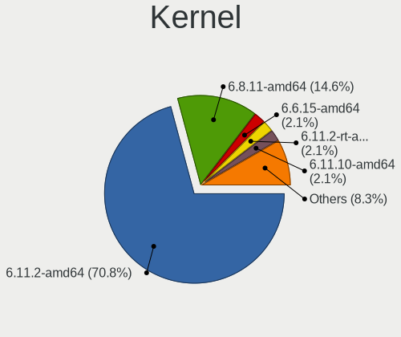
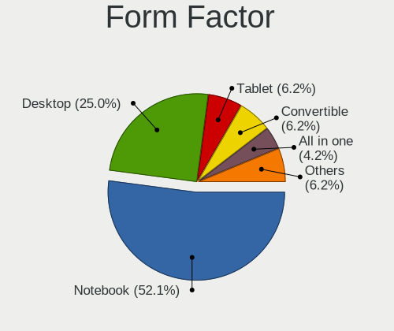
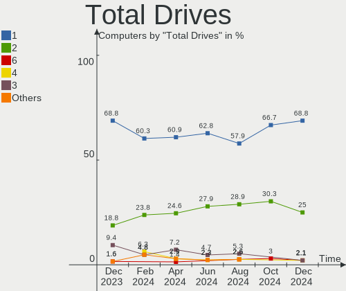
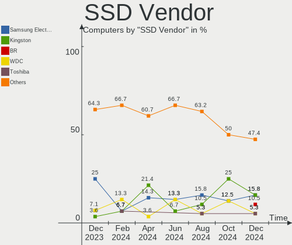
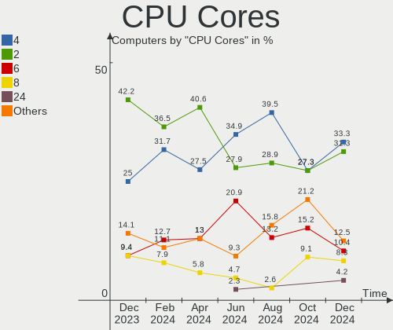
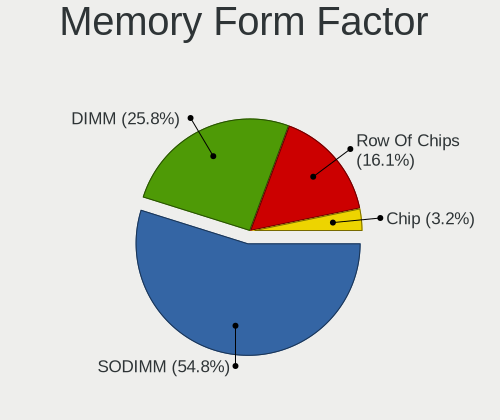

Kali - Hardware Trends
----------------------

A project to identify most popular hardware characteristics and track their change
over time based on data collected by Linux users at https://Linux-Hardware.org.

Anyone can contribute to this report by the [hw-probe](https://github.com/linuxhw/hw-probe) tool:

    sudo -E hw-probe -all -upload

This is a report for all computer types. See also reports for [desktops](/Dist/Kali/Desktop/README.md) and [notebooks](/Dist/Kali/Notebook/README.md).

This report is for one last month. Overall report since the beginning of time: [TestDays](https://github.com/linuxhw/TestDays)

Period: Dec, 2024.

Contents
--------

* [ System ](#system)
  - [ OS                       ](#os)
  - [ OS Family                ](#os-family)
  - [ Kernel                   ](#kernel)
  - [ Kernel Family            ](#kernel-family)
  - [ Kernel Major Ver.        ](#kernel-major-ver)
  - [ Arch                     ](#arch)
  - [ DE                       ](#de)
  - [ Display Server           ](#display-server)
  - [ Display Manager          ](#display-manager)
  - [ OS Lang                  ](#os-lang)
  - [ Boot Mode                ](#boot-mode)
  - [ Filesystem               ](#filesystem)
  - [ Part. scheme             ](#part-scheme)
  - [ Dual Boot with Linux/BSD ](#dual-boot-with-linuxbsd)
  - [ Dual Boot (Win)          ](#dual-boot-win)

* [ Board ](#board)
  - [ Vendor                   ](#vendor)
  - [ Model                    ](#model)
  - [ Model Family             ](#model-family)
  - [ MFG Year                 ](#mfg-year)
  - [ Form Factor              ](#form-factor)
  - [ Secure Boot              ](#secure-boot)
  - [ Coreboot                 ](#coreboot)
  - [ RAM Size                 ](#ram-size)
  - [ RAM Used                 ](#ram-used)
  - [ Total Drives             ](#total-drives)
  - [ Has CD-ROM               ](#has-cd-rom)
  - [ Has Ethernet             ](#has-ethernet)
  - [ Has WiFi                 ](#has-wifi)
  - [ Has Bluetooth            ](#has-bluetooth)

* [ Location ](#location)
  - [ Country                  ](#country)
  - [ City                     ](#city)

* [ Drives ](#drives)
  - [ Drive Vendor             ](#drive-vendor)
  - [ Drive Model              ](#drive-model)
  - [ HDD Vendor               ](#hdd-vendor)
  - [ SSD Vendor               ](#ssd-vendor)
  - [ Drive Kind               ](#drive-kind)
  - [ Drive Connector          ](#drive-connector)
  - [ Drive Size               ](#drive-size)
  - [ Space Total              ](#space-total)
  - [ Space Used               ](#space-used)
  - [ Malfunc. Drives          ](#malfunc-drives)
  - [ Malfunc. Drive Vendor    ](#malfunc-drive-vendor)
  - [ Malfunc. HDD Vendor      ](#malfunc-hdd-vendor)
  - [ Malfunc. Drive Kind      ](#malfunc-drive-kind)
  - [ Failed Drives            ](#failed-drives)
  - [ Failed Drive Vendor      ](#failed-drive-vendor)
  - [ Drive Status             ](#drive-status)

* [ Storage controller ](#storage-controller)
  - [ Storage Vendor           ](#storage-vendor)
  - [ Storage Model            ](#storage-model)
  - [ Storage Kind             ](#storage-kind)

* [ Processor ](#processor)
  - [ CPU Vendor               ](#cpu-vendor)
  - [ CPU Model                ](#cpu-model)
  - [ CPU Model Family         ](#cpu-model-family)
  - [ CPU Cores                ](#cpu-cores)
  - [ CPU Sockets              ](#cpu-sockets)
  - [ CPU Threads              ](#cpu-threads)
  - [ CPU Op-Modes             ](#cpu-op-modes)
  - [ CPU Microcode            ](#cpu-microcode)
  - [ CPU Microarch            ](#cpu-microarch)

* [ Graphics ](#graphics)
  - [ GPU Vendor               ](#gpu-vendor)
  - [ GPU Model                ](#gpu-model)
  - [ GPU Combo                ](#gpu-combo)
  - [ GPU Driver               ](#gpu-driver)
  - [ GPU Memory               ](#gpu-memory)

* [ Monitor ](#monitor)
  - [ Monitor Vendor           ](#monitor-vendor)
  - [ Monitor Model            ](#monitor-model)
  - [ Monitor Resolution       ](#monitor-resolution)
  - [ Monitor Diagonal         ](#monitor-diagonal)
  - [ Monitor Width            ](#monitor-width)
  - [ Aspect Ratio             ](#aspect-ratio)
  - [ Monitor Area             ](#monitor-area)
  - [ Pixel Density            ](#pixel-density)
  - [ Multiple Monitors        ](#multiple-monitors)

* [ Network ](#network)
  - [ Net Controller Vendor    ](#net-controller-vendor)
  - [ Net Controller Model     ](#net-controller-model)
  - [ Wireless Vendor          ](#wireless-vendor)
  - [ Wireless Model           ](#wireless-model)
  - [ Ethernet Vendor          ](#ethernet-vendor)
  - [ Ethernet Model           ](#ethernet-model)
  - [ Net Controller Kind      ](#net-controller-kind)
  - [ Used Controller          ](#used-controller)
  - [ NICs                     ](#nics)
  - [ IPv6                     ](#ipv6)

* [ Bluetooth ](#bluetooth)
  - [ Bluetooth Vendor         ](#bluetooth-vendor)
  - [ Bluetooth Model          ](#bluetooth-model)

* [ Sound ](#sound)
  - [ Sound Vendor             ](#sound-vendor)
  - [ Sound Model              ](#sound-model)

* [ Memory ](#memory)
  - [ Memory Vendor            ](#memory-vendor)
  - [ Memory Model             ](#memory-model)
  - [ Memory Kind              ](#memory-kind)
  - [ Memory Form Factor       ](#memory-form-factor)
  - [ Memory Size              ](#memory-size)
  - [ Memory Speed             ](#memory-speed)

* [ Printers & scanners ](#printers--scanners)
  - [ Printer Vendor           ](#printer-vendor)
  - [ Printer Model            ](#printer-model)
  - [ Scanner Vendor           ](#scanner-vendor)
  - [ Scanner Model            ](#scanner-model)

* [ Camera ](#camera)
  - [ Camera Vendor            ](#camera-vendor)
  - [ Camera Model             ](#camera-model)

* [ Security ](#security)
  - [ Fingerprint Vendor       ](#fingerprint-vendor)
  - [ Fingerprint Model        ](#fingerprint-model)
  - [ Chipcard Vendor          ](#chipcard-vendor)
  - [ Chipcard Model           ](#chipcard-model)

* [ Unsupported ](#unsupported)
  - [ Unsupported Devices      ](#unsupported-devices)
  - [ Unsupported Device Types ](#unsupported-device-types)

System
------

OS
--

Installed operating systems

| Name        | Computers | Percent |
|-------------|-----------|---------|
| Kali 2024.4 | 39        | 81.25%  |
| Kali 2024.3 | 8         | 16.67%  |
| Kali 2023.2 | 1         | 2.08%   |

OS Family
---------

OS without a version

| Name | Computers | Percent |
|------|-----------|---------|
| Kali | 48        | 100%    |

Kernel
------

Version of the Linux kernel

| Version           | Computers | Percent |
|-------------------|-----------|---------|
| 6.11.2-amd64      | 34        | 70.83%  |
| 6.8.11-amd64      | 7         | 14.58%  |
| 6.6.15-amd64      | 1         | 2.08%   |
| 6.11.2-rt-amd64   | 1         | 2.08%   |
| 6.11.10-amd64     | 1         | 2.08%   |
| 6.10.9-amd64      | 1         | 2.08%   |
| 6.10.11-amd64     | 1         | 2.08%   |
| 6.1.64-v8+        | 1         | 2.08%   |
| 6.1.0-kali9-amd64 | 1         | 2.08%   |

Kernel Family
-------------

Linux kernel without a distro release

| Version | Computers | Percent |
|---------|-----------|---------|
| 6.11.2  | 35        | 72.92%  |
| 6.8.11  | 7         | 14.58%  |
| 6.6.15  | 1         | 2.08%   |
| 6.11.10 | 1         | 2.08%   |
| 6.10.9  | 1         | 2.08%   |
| 6.10.11 | 1         | 2.08%   |
| 6.1.64  | 1         | 2.08%   |
| 6.1.0   | 1         | 2.08%   |

Kernel Major Ver.
-----------------

Linux kernel major version

| Version | Computers | Percent |
|---------|-----------|---------|
| 6.11    | 36        | 75%     |
| 6.8     | 7         | 14.58%  |
| 6.10    | 2         | 4.17%   |
| 6.1     | 2         | 4.17%   |
| 6.6     | 1         | 2.08%   |

Arch
----

OS architecture (x86_64, i586, etc.)

| Name    | Computers | Percent |
|---------|-----------|---------|
| x86_64  | 47        | 97.92%  |
| aarch64 | 1         | 2.08%   |

DE
--

Desktop Environment

| Name          | Computers | Percent |
|---------------|-----------|---------|
| XFCE          | 25        | 52.08%  |
| GNOME         | 15        | 31.25%  |
| KDE6          | 2         | 4.17%   |
| KDE5          | 2         | 4.17%   |
| GNOME Classic | 2         | 4.17%   |
| X-Cinnamon    | 1         | 2.08%   |
| Unknown       | 1         | 2.08%   |

Display Server
--------------

X11 or Wayland

| Name    | Computers | Percent |
|---------|-----------|---------|
| X11     | 41        | 85.42%  |
| Wayland | 5         | 10.42%  |
| Tty     | 2         | 4.17%   |

Display Manager
---------------

SDDM, LightDM, etc.

| Name    | Computers | Percent |
|---------|-----------|---------|
| LightDM | 23        | 47.92%  |
| Unknown | 17        | 35.42%  |
| SDDM    | 4         | 8.33%   |
| GDM3    | 4         | 8.33%   |

OS Lang
-------

Language

| Lang            | Computers | Percent |
|-----------------|-----------|---------|
| C               | 28        | 58.33%  |
| en_US           | 8         | 16.67%  |
| pt_BR           | 2         | 4.17%   |
| tr_TR           | 1         | 2.08%   |
| ru_RU           | 1         | 2.08%   |
| fr_FR           | 1         | 2.08%   |
| es_ES           | 1         | 2.08%   |
| en_US.iso885915 | 1         | 2.08%   |
| en_IN           | 1         | 2.08%   |
| en_GB           | 1         | 2.08%   |
| de_DE           | 1         | 2.08%   |
| bg_BG           | 1         | 2.08%   |
| Unknown         | 1         | 2.08%   |

Boot Mode
---------

EFI or BIOS

| Mode | Computers | Percent |
|------|-----------|---------|
| EFI  | 36        | 75%     |
| BIOS | 12        | 25%     |

Filesystem
----------

Type of filesystem

| Type    | Computers | Percent |
|---------|-----------|---------|
| Ext4    | 41        | 85.42%  |
| Tmpfs   | 4         | 8.33%   |
| Btrfs   | 2         | 4.17%   |
| Overlay | 1         | 2.08%   |

Part. scheme
------------

Scheme of partitioning

| Type    | Computers | Percent |
|---------|-----------|---------|
| GPT     | 28        | 58.33%  |
| Unknown | 16        | 33.33%  |
| MBR     | 4         | 8.33%   |

Dual Boot with Linux/BSD
------------------------

Hosting more than one Linux/BSD

| Dual boot | Computers | Percent |
|-----------|-----------|---------|
| No        | 45        | 93.75%  |
| Yes       | 3         | 6.25%   |

Dual Boot (Win)
---------------

Hosting Linux and Windows

| Dual boot | Computers | Percent |
|-----------|-----------|---------|
| No        | 37        | 77.08%  |
| Yes       | 11        | 22.92%  |

Board
-----

Vendor
------

Motherboard manufacturer

| Name                    | Computers | Percent |
|-------------------------|-----------|---------|
| Lenovo                  | 11        | 22.92%  |
| Dell                    | 6         | 12.5%   |
| Hewlett-Packard         | 5         | 10.42%  |
| ASUSTek Computer        | 5         | 10.42%  |
| Acer                    | 5         | 10.42%  |
| Microsoft               | 2         | 4.17%   |
| Gigabyte Technology     | 2         | 4.17%   |
| Apple                   | 2         | 4.17%   |
| Samsung Electronics     | 1         | 2.08%   |
| Raspberry Pi Foundation | 1         | 2.08%   |
| MSI                     | 1         | 2.08%   |
| GMKtec                  | 1         | 2.08%   |
| Gateway                 | 1         | 2.08%   |
| Fujitsu                 | 1         | 2.08%   |
| EMAXX TECHNOLOGY        | 1         | 2.08%   |
| DUEX                    | 1         | 2.08%   |
| AZW                     | 1         | 2.08%   |
| Unknown                 | 1         | 2.08%   |

Model
-----

Motherboard model

| Name                                     | Computers | Percent |
|------------------------------------------|-----------|---------|
| Samsung 550XCJ/550XCR                    | 1         | 2.08%   |
| RPi Raspberry Pi 5 Model B Rev 1.0       | 1         | 2.08%   |
| MSI MS-7E06                              | 1         | 2.08%   |
| Microsoft Surface Pro 4                  | 1         | 2.08%   |
| Microsoft Surface Laptop Go              | 1         | 2.08%   |
| Lenovo ThinkPad X220 4291SJ4             | 1         | 2.08%   |
| Lenovo ThinkPad X1 Yoga 3rd 20LD002KGE   | 1         | 2.08%   |
| Lenovo ThinkPad X1 Tablet 20GHS1L100     | 1         | 2.08%   |
| Lenovo ThinkPad T470 20HES18R03          | 1         | 2.08%   |
| Lenovo ThinkPad E16 Gen 2 21M5CTO1WW     | 1         | 2.08%   |
| Lenovo ThinkCentre M810z 10NX0006US      | 1         | 2.08%   |
| Lenovo ThinkBook 14 G6 IRL 21KG          | 1         | 2.08%   |
| Lenovo Legion Pro 7 16IRX8H 82WQ         | 1         | 2.08%   |
| Lenovo IdeaPad Slim 3 14IAH8 83EQ        | 1         | 2.08%   |
| Lenovo IdeaCentre 510S-08IKL 90GB00D3MH  | 1         | 2.08%   |
| Lenovo G580 2189                         | 1         | 2.08%   |
| HP ProDesk 600 G2 SFF                    | 1         | 2.08%   |
| HP ProBook x360 435 G8 Notebook PC       | 1         | 2.08%   |
| HP Notebook                              | 1         | 2.08%   |
| HP EliteBook x360 1030 G4                | 1         | 2.08%   |
| HP 250 G8 Notebook PC                    | 1         | 2.08%   |
| GMKtec NucBox G3                         | 1         | 2.08%   |
| Gigabyte Z370M AORUS Gaming              | 1         | 2.08%   |
| Gigabyte EP45-UD3R                       | 1         | 2.08%   |
| Gateway ZX6961                           | 1         | 2.08%   |
| Fujitsu LIFEBOOK S904                    | 1         | 2.08%   |
| EMAXX TECHNOLOGY EMX-A70FM2+iCafe        | 1         | 2.08%   |
| DUEX H310C                               | 1         | 2.08%   |
| Dell XPS 8700                            | 1         | 2.08%   |
| Dell XPS 15 9500                         | 1         | 2.08%   |
| Dell Precision 7710                      | 1         | 2.08%   |
| Dell OptiPlex 3010                       | 1         | 2.08%   |
| Dell Latitude E5520                      | 1         | 2.08%   |
| Dell Latitude 7480                       | 1         | 2.08%   |
| AZW GTi14                                | 1         | 2.08%   |
| ASUS VivoBook_ASUSLaptop K3605ZF_K3605ZF | 1         | 2.08%   |
| ASUS Vivobook Go E1504FA_E1504FA         | 1         | 2.08%   |
| ASUS ROG STRIX B550-F GAMING             | 1         | 2.08%   |
| ASUS GamingPC                            | 1         | 2.08%   |
| ASUS ASUS EXPERTBOOK B3404CVA_B3404CVA   | 1         | 2.08%   |

Model Family
------------

Motherboard model prefix

| Name                              | Computers | Percent |
|-----------------------------------|-----------|---------|
| Lenovo ThinkPad                   | 5         | 10.42%  |
| Microsoft Surface                 | 2         | 4.17%   |
| Dell XPS                          | 2         | 4.17%   |
| Dell Latitude                     | 2         | 4.17%   |
| ASUS VivoBook                     | 2         | 4.17%   |
| Acer Nitro                        | 2         | 4.17%   |
| Acer Aspire                       | 2         | 4.17%   |
| Samsung 550XCJ                    | 1         | 2.08%   |
| RPi Raspberry                     | 1         | 2.08%   |
| MSI MS-7E06                       | 1         | 2.08%   |
| Lenovo ThinkCentre                | 1         | 2.08%   |
| Lenovo ThinkBook                  | 1         | 2.08%   |
| Lenovo Legion                     | 1         | 2.08%   |
| Lenovo IdeaPad                    | 1         | 2.08%   |
| Lenovo IdeaCentre                 | 1         | 2.08%   |
| Lenovo G580                       | 1         | 2.08%   |
| HP ProDesk                        | 1         | 2.08%   |
| HP ProBook                        | 1         | 2.08%   |
| HP Notebook                       | 1         | 2.08%   |
| HP EliteBook                      | 1         | 2.08%   |
| HP 250                            | 1         | 2.08%   |
| GMKtec NucBox                     | 1         | 2.08%   |
| Gigabyte Z370M                    | 1         | 2.08%   |
| Gigabyte EP45-UD3R                | 1         | 2.08%   |
| Gateway ZX6961                    | 1         | 2.08%   |
| Fujitsu LIFEBOOK                  | 1         | 2.08%   |
| EMAXX TECHNOLOGY EMX-A70FM2+iCafe | 1         | 2.08%   |
| DUEX H310C                        | 1         | 2.08%   |
| Dell Precision                    | 1         | 2.08%   |
| Dell OptiPlex                     | 1         | 2.08%   |
| AZW GTi14                         | 1         | 2.08%   |
| ASUS ROG                          | 1         | 2.08%   |
| ASUS GamingPC                     | 1         | 2.08%   |
| ASUS ASUS                         | 1         | 2.08%   |
| Apple MacBookPro8                 | 1         | 2.08%   |
| Apple MacBookPro11                | 1         | 2.08%   |
| Acer Swift                        | 1         | 2.08%   |
| Unknown                           | 1         | 2.08%   |

MFG Year
--------

Motherboard manufacture year

| Year    | Computers | Percent |
|---------|-----------|---------|
| 2023    | 10        | 20.83%  |
| 2020    | 5         | 10.42%  |
| 2019    | 4         | 8.33%   |
| 2017    | 4         | 8.33%   |
| 2013    | 4         | 8.33%   |
| 2011    | 4         | 8.33%   |
| 2024    | 3         | 6.25%   |
| 2021    | 3         | 6.25%   |
| 2015    | 3         | 6.25%   |
| 2022    | 2         | 4.17%   |
| 2016    | 2         | 4.17%   |
| 2018    | 1         | 2.08%   |
| 2012    | 1         | 2.08%   |
| 2008    | 1         | 2.08%   |
| Unknown | 1         | 2.08%   |

Form Factor
-----------

Physical design of the computer

| Name           | Computers | Percent |
|----------------|-----------|---------|
| Notebook       | 25        | 52.08%  |
| Desktop        | 12        | 25%     |
| Tablet         | 3         | 6.25%   |
| Convertible    | 3         | 6.25%   |
| All in one     | 2         | 4.17%   |
| Other          | 1         | 2.08%   |
| System on chip | 1         | 2.08%   |
| Mini pc        | 1         | 2.08%   |

Secure Boot
-----------

Enabled or disabled

| State    | Computers | Percent |
|----------|-----------|---------|
| Disabled | 48        | 100%    |

Coreboot
--------

Have coreboot on board

| Used | Computers | Percent |
|------|-----------|---------|
| No   | 48        | 100%    |

RAM Size
--------

Total RAM memory

| Size in GB  | Computers | Percent |
|-------------|-----------|---------|
| 8.01-16.0   | 14        | 29.17%  |
| 4.01-8.0    | 13        | 27.08%  |
| 16.01-24.0  | 9         | 18.75%  |
| 32.01-64.0  | 8         | 16.67%  |
| 3.01-4.0    | 3         | 6.25%   |
| 64.01-256.0 | 1         | 2.08%   |

RAM Used
--------

Used RAM memory

| Used GB   | Computers | Percent |
|-----------|-----------|---------|
| 2.01-3.0  | 17        | 35.42%  |
| 4.01-8.0  | 11        | 22.92%  |
| 3.01-4.0  | 11        | 22.92%  |
| 1.01-2.0  | 6         | 12.5%   |
| 0.51-1.0  | 2         | 4.17%   |
| 8.01-16.0 | 1         | 2.08%   |

Total Drives
------------

Number of drives on board

| Drives | Computers | Percent |
|--------|-----------|---------|
| 1      | 33        | 68.75%  |
| 2      | 12        | 25%     |
| 6      | 1         | 2.08%   |
| 4      | 1         | 2.08%   |
| 3      | 1         | 2.08%   |

Has CD-ROM
----------

Has CD-ROM on board

| Presented | Computers | Percent |
|-----------|-----------|---------|
| No        | 39        | 81.25%  |
| Yes       | 9         | 18.75%  |

Has Ethernet
------------

Has Ethernet on board

| Presented | Computers | Percent |
|-----------|-----------|---------|
| Yes       | 38        | 79.17%  |
| No        | 10        | 20.83%  |

Has WiFi
--------

Has WiFi module

| Presented | Computers | Percent |
|-----------|-----------|---------|
| Yes       | 42        | 87.5%   |
| No        | 6         | 12.5%   |

Has Bluetooth
-------------

Has Bluetooth module

| Presented | Computers | Percent |
|-----------|-----------|---------|
| Yes       | 37        | 77.08%  |
| No        | 11        | 22.92%  |

Location
--------

Country
-------

Geographic location (country)

| Country         | Computers | Percent |
|-----------------|-----------|---------|
| USA             | 9         | 18.75%  |
| Germany         | 5         | 10.42%  |
| Brazil          | 4         | 8.33%   |
| India           | 3         | 6.25%   |
| UK              | 2         | 4.17%   |
| Thailand        | 2         | 4.17%   |
| Sweden          | 2         | 4.17%   |
| Philippines     | 2         | 4.17%   |
| Italy           | 2         | 4.17%   |
| Czechia         | 2         | 4.17%   |
| Colombia        | 2         | 4.17%   |
| Turkey          | 1         | 2.08%   |
| The Netherlands | 1         | 2.08%   |
| Switzerland     | 1         | 2.08%   |
| Poland          | 1         | 2.08%   |
| Morocco         | 1         | 2.08%   |
| Mexico          | 1         | 2.08%   |
| Hong Kong       | 1         | 2.08%   |
| Greece          | 1         | 2.08%   |
| France          | 1         | 2.08%   |
| China           | 1         | 2.08%   |
| Bulgaria        | 1         | 2.08%   |
| Austria         | 1         | 2.08%   |
| Australia       | 1         | 2.08%   |

City
----

Geographic location (city)

| City                  | Computers | Percent |
|-----------------------|-----------|---------|
| Prague                | 2         | 4.17%   |
| Oklahoma City         | 2         | 4.17%   |
| Batangas              | 2         | 4.17%   |
| Xi'an                 | 1         | 2.08%   |
| Wilmington            | 1         | 2.08%   |
| Sohlde                | 1         | 2.08%   |
| Sofia                 | 1         | 2.08%   |
| Si Sa Ket             | 1         | 2.08%   |
| Seattle               | 1         | 2.08%   |
| Sao Bernardo do Campo | 1         | 2.08%   |
| Pune                  | 1         | 2.08%   |
| Poznan                | 1         | 2.08%   |
| Ponte San Pietro      | 1         | 2.08%   |
| Paris                 | 1         | 2.08%   |
| Nuremberg             | 1         | 2.08%   |
| North Richland Hills  | 1         | 2.08%   |
| Milan                 | 1         | 2.08%   |
| Medellín             | 1         | 2.08%   |
| Manchester            | 1         | 2.08%   |
| Manaus                | 1         | 2.08%   |
| Lucerne               | 1         | 2.08%   |
| Llandudno Junction    | 1         | 2.08%   |
| Leiden                | 1         | 2.08%   |
| Hyderabad             | 1         | 2.08%   |
| Hollywood             | 1         | 2.08%   |
| Hok Yuen              | 1         | 2.08%   |
| Hoellviken            | 1         | 2.08%   |
| Handen                | 1         | 2.08%   |
| Gundelfingen          | 1         | 2.08%   |
| Graz                  | 1         | 2.08%   |
| Fort Myers            | 1         | 2.08%   |
| Foley                 | 1         | 2.08%   |
| Cushing               | 1         | 2.08%   |
| Curitiba              | 1         | 2.08%   |
| Casablanca            | 1         | 2.08%   |
| Campinas              | 1         | 2.08%   |
| Brisbane              | 1         | 2.08%   |
| Bogotá               | 1         | 2.08%   |
| Bocholt               | 1         | 2.08%   |
| Berlin                | 1         | 2.08%   |

Drives
------

Drive Vendor
------------

Hard drive vendors

| Vendor                      | Computers | Drives | Percent |
|-----------------------------|-----------|--------|---------|
| Samsung Electronics         | 9         | 13     | 14.52%  |
| Seagate                     | 7         | 8      | 11.29%  |
| Crucial                     | 5         | 5      | 8.06%   |
| Toshiba                     | 4         | 4      | 6.45%   |
| SK hynix                    | 4         | 4      | 6.45%   |
| SanDisk                     | 4         | 6      | 6.45%   |
| KIOXIA                      | 3         | 3      | 4.84%   |
| Kingston                    | 3         | 4      | 4.84%   |
| Intel                       | 3         | 4      | 4.84%   |
| WDC                         | 2         | 2      | 3.23%   |
| Unknown                     | 2         | 4      | 3.23%   |
| Micron Technology           | 2         | 2      | 3.23%   |
| BR                          | 2         | 2      | 3.23%   |
| Team                        | 1         | 1      | 1.61%   |
| SPCC                        | 1         | 1      | 1.61%   |
| SATAFIRM                    | 1         | 1      | 1.61%   |
| Realtek Semiconductor       | 1         | 1      | 1.61%   |
| PNY                         | 1         | 1      | 1.61%   |
| Min Yi U                    | 1         | 1      | 1.61%   |
| MAXIO Technology (Hangzhou) | 1         | 1      | 1.61%   |
| Hitachi                     | 1         | 1      | 1.61%   |
| HGST                        | 1         | 1      | 1.61%   |
| Fanxiang                    | 1         | 2      | 1.61%   |
| BAITITON                    | 1         | 1      | 1.61%   |
| Apple                       | 1         | 1      | 1.61%   |

Drive Model
-----------

Hard drive models

| Model                                                | Computers | Percent |
|------------------------------------------------------|-----------|---------|
| SanDisk NVMe SSD Drive 1TB                           | 3         | 4.17%   |
| Crucial CT1000P3PSSD8 1TB                            | 3         | 4.17%   |
| Seagate ST500DM002-1BD142 500GB                      | 2         | 2.78%   |
| Samsung NVMe SSD Controller SM961/PM961/SM963 256GB  | 2         | 2.78%   |
| Kingston SA400S37240G 240GB SSD                      | 2         | 2.78%   |
| BR SSD 120G                                          | 2         | 2.78%   |
| WDC WD10EZEX-08WN4A0 1TB                             | 1         | 1.39%   |
| WDC SDINFDO4-128G SSD                                | 1         | 1.39%   |
| Unknown SD/MMC 1073GB                                | 1         | 1.39%   |
| Unknown MMC Card  64GB                               | 1         | 1.39%   |
| Unknown M.S./M.S.Pro/HG 16GB                         | 1         | 1.39%   |
| Unknown Compact Flash 977MB                          | 1         | 1.39%   |
| Toshiba THNSNH256GCST 256GB SSD                      | 1         | 1.39%   |
| Toshiba MQ02ABF050H 500GB                            | 1         | 1.39%   |
| Toshiba MQ01ACF050 500GB                             | 1         | 1.39%   |
| Toshiba MQ01ABF050 500GB                             | 1         | 1.39%   |
| Team T253A3001T 1TB SSD                              | 1         | 1.39%   |
| SPCC Solid State Disk 512GB                          | 1         | 1.39%   |
| SK hynix SKHynix_HFS512GEJ9X115N 512GB               | 1         | 1.39%   |
| SK hynix SKHynix_HFS512GEJ4X112N 512GB               | 1         | 1.39%   |
| SK hynix SKHynix_HFM256GDHTNI-87A0B 256GB            | 1         | 1.39%   |
| SK hynix BC501 HFM256GDJTNG-8310A 256GB              | 1         | 1.39%   |
| Seagate ST500LT012-1DG142 500GB                      | 1         | 1.39%   |
| Seagate ST500LM012 HN-M500MBB 500GB                  | 1         | 1.39%   |
| Seagate ST31000528AS 1TB                             | 1         | 1.39%   |
| Seagate ST31000524AS 1TB                             | 1         | 1.39%   |
| Seagate ST2000DM006-2DM164 2TB                       | 1         | 1.39%   |
| Seagate ST1000LM024 HN-M101MBB 1TB                   | 1         | 1.39%   |
| SATAFIRM S11 480GB                                   | 1         | 1.39%   |
| Sandisk WD Green SN350 1TB                           | 1         | 1.39%   |
| Sandisk WD Blue SN580 1TB                            | 1         | 1.39%   |
| SanDisk SD7SB3Q-128G-1006 128GB SSD                  | 1         | 1.39%   |
| Samsung SSD 980 1TB                                  | 1         | 1.39%   |
| Samsung SSD 870 EVO 250GB                            | 1         | 1.39%   |
| Samsung SSD 850 EVO 250GB                            | 1         | 1.39%   |
| Samsung PSSD T5 EVO 4TB                              | 1         | 1.39%   |
| Samsung PM981a NVMe 512GB                            | 1         | 1.39%   |
| Samsung NVMe SSD Controller PM9A1/PM9A3/980PRO 512GB | 1         | 1.39%   |
| Samsung MZVLW256HEHP-000L7 256GB                     | 1         | 1.39%   |
| Samsung MZVL21T0HCLR-00BL2 1TB                       | 1         | 1.39%   |

HDD Vendor
----------

Hard disk drive vendors

| Vendor   | Computers | Drives | Percent |
|----------|-----------|--------|---------|
| Seagate  | 7         | 8      | 50%     |
| Toshiba  | 3         | 3      | 21.43%  |
| WDC      | 1         | 1      | 7.14%   |
| Min Yi U | 1         | 1      | 7.14%   |
| Hitachi  | 1         | 1      | 7.14%   |
| HGST     | 1         | 1      | 7.14%   |

SSD Vendor
----------

Solid state drive vendors

| Vendor              | Computers | Drives | Percent |
|---------------------|-----------|--------|---------|
| Samsung Electronics | 3         | 3      | 15.79%  |
| Kingston            | 3         | 3      | 15.79%  |
| BR                  | 2         | 2      | 10.53%  |
| WDC                 | 1         | 1      | 5.26%   |
| Toshiba             | 1         | 1      | 5.26%   |
| Team                | 1         | 1      | 5.26%   |
| SPCC                | 1         | 1      | 5.26%   |
| SATAFIRM            | 1         | 1      | 5.26%   |
| SanDisk             | 1         | 1      | 5.26%   |
| PNY                 | 1         | 1      | 5.26%   |
| Micron Technology   | 1         | 1      | 5.26%   |
| Fanxiang            | 1         | 1      | 5.26%   |
| BAITITON            | 1         | 1      | 5.26%   |
| Apple               | 1         | 1      | 5.26%   |

Drive Kind
----------

HDD or SSD

| Kind    | Computers | Drives | Percent |
|---------|-----------|--------|---------|
| NVMe    | 29        | 36     | 46.03%  |
| SSD     | 18        | 19     | 28.57%  |
| HDD     | 14        | 15     | 22.22%  |
| MMC     | 1         | 1      | 1.59%   |
| Unknown | 1         | 3      | 1.59%   |

Drive Connector
---------------

SATA, SAS, NVMe, etc.

| Type | Computers | Drives | Percent |
|------|-----------|--------|---------|
| NVMe | 29        | 36     | 50.88%  |
| SATA | 23        | 31     | 40.35%  |
| SAS  | 4         | 6      | 7.02%   |
| MMC  | 1         | 1      | 1.75%   |

Drive Size
----------

Size of hard drive

| Size in TB | Computers | Drives | Percent |
|------------|-----------|--------|---------|
| 0.01-0.5   | 18        | 23     | 62.07%  |
| 0.51-1.0   | 9         | 9      | 31.03%  |
| 3.01-4.0   | 1         | 1      | 3.45%   |
| 1.01-2.0   | 1         | 1      | 3.45%   |

Space Total
-----------

Amount of disk space available on the file system

| Size in GB     | Computers | Percent |
|----------------|-----------|---------|
| 101-250        | 19        | 39.58%  |
| 251-500        | 12        | 25%     |
| 501-1000       | 6         | 12.5%   |
| 1001-2000      | 4         | 8.33%   |
| 51-100         | 3         | 6.25%   |
| More than 3000 | 1         | 2.08%   |
| 21-50          | 1         | 2.08%   |
| 1-20           | 1         | 2.08%   |
| Unknown        | 1         | 2.08%   |

Space Used
----------

Amount of used disk space

| Used GB        | Computers | Percent |
|----------------|-----------|---------|
| 1-20           | 14        | 29.17%  |
| 101-250        | 12        | 25%     |
| 21-50          | 10        | 20.83%  |
| 51-100         | 7         | 14.58%  |
| 251-500        | 2         | 4.17%   |
| More than 3000 | 1         | 2.08%   |
| 501-1000       | 1         | 2.08%   |
| Unknown        | 1         | 2.08%   |

Malfunc. Drives
---------------

Drive models with a malfunction

| Model                              | Computers | Drives | Percent |
|------------------------------------|-----------|--------|---------|
| Seagate ST500DM002-1BD142 500GB    | 2         | 2      | 33.33%  |
| Seagate ST1000LM024 HN-M101MBB 1TB | 1         | 1      | 16.67%  |
| Min Yi U YZWY_TECH 250GB           | 1         | 1      | 16.67%  |
| Crucial CT500P2SSD8 500GB          | 1         | 1      | 16.67%  |
| BAITITON BT58SSD12S 512GB          | 1         | 1      | 16.67%  |

Malfunc. Drive Vendor
---------------------

Vendors of faulty drives

| Vendor   | Computers | Drives | Percent |
|----------|-----------|--------|---------|
| Seagate  | 3         | 3      | 50%     |
| Min Yi U | 1         | 1      | 16.67%  |
| Crucial  | 1         | 1      | 16.67%  |
| BAITITON | 1         | 1      | 16.67%  |

Malfunc. HDD Vendor
-------------------

Vendors of faulty HDD drives

| Vendor   | Computers | Drives | Percent |
|----------|-----------|--------|---------|
| Seagate  | 3         | 3      | 75%     |
| Min Yi U | 1         | 1      | 25%     |

Malfunc. Drive Kind
-------------------

Kinds of faulty drives

| Kind | Computers | Drives | Percent |
|------|-----------|--------|---------|
| HDD  | 4         | 4      | 66.67%  |
| NVMe | 1         | 1      | 16.67%  |
| SSD  | 1         | 1      | 16.67%  |

Failed Drives
-------------

Failed drive models

Zero info for selected period =(

Failed Drive Vendor
-------------------

Failed drive vendors

Zero info for selected period =(

Drive Status
------------

Number of failed and malfunc. drives

| Status   | Computers | Drives | Percent |
|----------|-----------|--------|---------|
| Works    | 26        | 30     | 47.27%  |
| Detected | 23        | 38     | 41.82%  |
| Malfunc  | 6         | 6      | 10.91%  |

Storage controller
------------------

Storage Vendor
--------------

Storage controller vendors

| Vendor                      | Computers | Percent |
|-----------------------------|-----------|---------|
| Intel                       | 26        | 44.07%  |
| Samsung Electronics         | 8         | 13.56%  |
| AMD                         | 5         | 8.47%   |
| SK hynix                    | 4         | 6.78%   |
| Micron Technology           | 4         | 6.78%   |
| SanDisk                     | 3         | 5.08%   |
| KIOXIA                      | 3         | 5.08%   |
| Micron/Crucial Technology   | 2         | 3.39%   |
| Realtek Semiconductor       | 1         | 1.69%   |
| MAXIO Technology (Hangzhou) | 1         | 1.69%   |
| Kingston Technology Company | 1         | 1.69%   |
| JMicron Technology          | 1         | 1.69%   |

Storage Model
-------------

Storage controller models

| Model                                                                            | Computers | Percent |
|----------------------------------------------------------------------------------|-----------|---------|
| Samsung NVMe SSD Controller SM961/PM961/SM963                                    | 4         | 6.35%   |
| Micron 2550 NVMe SSD (DRAM-less)                                                 | 3         | 4.76%   |
| Intel 82801 Mobile SATA Controller [RAID mode]                                   | 3         | 4.76%   |
| Intel 6 Series/C200 Series Chipset Family 6 port Mobile SATA AHCI Controller     | 3         | 4.76%   |
| Intel 200 Series PCH SATA controller [AHCI mode]                                 | 3         | 4.76%   |
| KIOXIA NVMe SSD Controller BG4 (DRAM-less)                                       | 2         | 3.17%   |
| Intel Q170/Q150/B150/H170/H110/Z170/CM236 Chipset SATA Controller [AHCI Mode]    | 2         | 3.17%   |
| Intel 6 Series/C200 Series Chipset Family 6 port Desktop SATA AHCI Controller    | 2         | 3.17%   |
| AMD FCH SATA Controller [AHCI mode]                                              | 2         | 3.17%   |
| SK hynix Platinum P41/PC801 NVMe Solid State Drive                               | 1         | 1.59%   |
| SK hynix BC901 NVMe Solid State Drive (DRAM-less)                                | 1         | 1.59%   |
| SK hynix BC511 NVMe SSD                                                          | 1         | 1.59%   |
| SK hynix BC501 NVMe Solid State Drive                                            | 1         | 1.59%   |
| SanDisk WD PC SN540 / Green SN350 NVMe SSD 1 TB (DRAM-less)                      | 1         | 1.59%   |
| Sandisk WD Blue SN580 NVMe SSD (DRAM-less)                                       | 1         | 1.59%   |
| SanDisk WD Black SN770 / PC SN740 256GB / PC SN560 (DRAM-less) NVMe SSD          | 1         | 1.59%   |
| Samsung S4LN053X01 AHCI SSD Controller(Apple slot)                               | 1         | 1.59%   |
| Samsung NVMe SSD Controller SM981/PM981/PM983                                    | 1         | 1.59%   |
| Samsung NVMe SSD Controller PM9A1/PM9A3/980PRO                                   | 1         | 1.59%   |
| Samsung NVMe SSD Controller 980 (DRAM-less)                                      | 1         | 1.59%   |
| Realtek RTS5765DL NVMe SSD Controller (DRAM-less)                                | 1         | 1.59%   |
| Micron/Crucial T700 NVMe PCIe SSD                                                | 1         | 1.59%   |
| Micron/Crucial P2 [Nick P2] / P3 / P3 Plus NVMe PCIe SSD (DRAM-less)             | 1         | 1.59%   |
| Micron 2400 NVMe SSD (DRAM-less)                                                 | 1         | 1.59%   |
| MAXIO (Hangzhou) NVMe SSD Controller MAP1202 (DRAM-less)                         | 1         | 1.59%   |
| KIOXIA NVMe SSD Controller BG6 (DRAM-less)                                       | 1         | 1.59%   |
| Kingston Company NV1 NVMe SSD [E13T] (DRAM-less)                                 | 1         | 1.59%   |
| JMicron JMB363 SATA/IDE Controller                                               | 1         | 1.59%   |
| Intel Volume Management Device NVMe RAID Controller Intel Corporation            | 1         | 1.59%   |
| Intel SSD DC P4101/Pro 7600p/760p/E 6100p Series                                 | 1         | 1.59%   |
| Intel SSD 670p Series [Keystone Harbor]                                          | 1         | 1.59%   |
| Intel SATA Controller [RAID mode]                                                | 1         | 1.59%   |
| Intel Raptor Lake SATA AHCI Controller                                           | 1         | 1.59%   |
| Intel Optane NVME SSD H10 with Solid State Storage [Teton Glacier]               | 1         | 1.59%   |
| Intel Comet Lake SATA AHCI Controller                                            | 1         | 1.59%   |
| Intel Celeron/Pentium Silver Processor SATA Controller                           | 1         | 1.59%   |
| Intel Atom/Celeron/Pentium Processor x5-E8000/J3xxx/N3xxx Series SATA Controller | 1         | 1.59%   |
| Intel Alder Lake-N SATA AHCI Controller                                          | 1         | 1.59%   |
| Intel 82801JI (ICH10 Family) 4 port SATA IDE Controller #1                       | 1         | 1.59%   |
| Intel 82801JI (ICH10 Family) 2 port SATA IDE Controller #2                       | 1         | 1.59%   |

Storage Kind
------------

Kind of storage controller (IDE, SATA, NVMe, SAS, ...)

| Kind | Computers | Percent |
|------|-----------|---------|
| NVMe | 29        | 48.33%  |
| SATA | 24        | 40%     |
| RAID | 5         | 8.33%   |
| IDE  | 2         | 3.33%   |

Processor
---------

CPU Vendor
----------

Processor vendors

| Vendor | Computers | Percent |
|--------|-----------|---------|
| Intel  | 39        | 81.25%  |
| AMD    | 8         | 16.67%  |
| ARM    | 1         | 2.08%   |

CPU Model
---------

Processor models

| Model                                   | Computers | Percent |
|-----------------------------------------|-----------|---------|
| Intel N100                              | 2         | 4.17%   |
| Intel Core i5-2520M CPU @ 2.50GHz       | 2         | 4.17%   |
| Intel Xeon CPU E3-1535M v5 @ 2.90GHz    | 1         | 2.08%   |
| Intel Pentium CPU G620 @ 2.60GHz        | 1         | 2.08%   |
| Intel Core Ultra 7 155H                 | 1         | 2.08%   |
| Intel Core m5-6Y57 CPU @ 1.10GHz        | 1         | 2.08%   |
| Intel Core i9-14900KF                   | 1         | 2.08%   |
| Intel Core i7-8700K CPU @ 3.70GHz       | 1         | 2.08%   |
| Intel Core i7-8550U CPU @ 1.80GHz       | 1         | 2.08%   |
| Intel Core i7-7600U CPU @ 2.80GHz       | 1         | 2.08%   |
| Intel Core i7-4960HQ CPU @ 2.60GHz      | 1         | 2.08%   |
| Intel Core i7-4790 CPU @ 3.60GHz        | 1         | 2.08%   |
| Intel Core i7-4600U CPU @ 2.10GHz       | 1         | 2.08%   |
| Intel Core i7-3520M CPU @ 2.90GHz       | 1         | 2.08%   |
| Intel Core i7-2640M CPU @ 2.80GHz       | 1         | 2.08%   |
| Intel Core i5-9400F CPU @ 2.90GHz       | 1         | 2.08%   |
| Intel Core i5-9300H CPU @ 2.40GHz       | 1         | 2.08%   |
| Intel Core i5-8365U CPU @ 1.60GHz       | 1         | 2.08%   |
| Intel Core i5-7400 CPU @ 3.00GHz        | 1         | 2.08%   |
| Intel Core i5-7300U CPU @ 2.60GHz       | 1         | 2.08%   |
| Intel Core i5-6500 CPU @ 3.20GHz        | 1         | 2.08%   |
| Intel Core i5-6300U CPU @ 2.40GHz       | 1         | 2.08%   |
| Intel Core i5-3470 CPU @ 3.20GHz        | 1         | 2.08%   |
| Intel Core i5-1035G1 CPU @ 1.00GHz      | 1         | 2.08%   |
| Intel Core i5-10300H CPU @ 2.50GHz      | 1         | 2.08%   |
| Intel Core i3-7100 CPU @ 3.90GHz        | 1         | 2.08%   |
| Intel Core 2 Quad CPU Q9550 @ 2.83GHz   | 1         | 2.08%   |
| Intel Celeron N4020 CPU @ 1.10GHz       | 1         | 2.08%   |
| Intel Celeron CPU N3050 @ 1.60GHz       | 1         | 2.08%   |
| Intel Celeron CPU 5205U @ 1.90GHz       | 1         | 2.08%   |
| Intel Atom x5-Z8350 CPU @ 1.44GHz       | 1         | 2.08%   |
| Intel 13th Gen Core i9-13900HX          | 1         | 2.08%   |
| Intel 13th Gen Core i7-1355U            | 1         | 2.08%   |
| Intel 13th Gen Core i5-13500H           | 1         | 2.08%   |
| Intel 13th Gen Core i5-1335U            | 1         | 2.08%   |
| Intel 12th Gen Core i5-12500H           | 1         | 2.08%   |
| Intel 12th Gen Core i5-12450H           | 1         | 2.08%   |
| ARM Processor                           | 1         | 2.08%   |
| AMD Ryzen 7 7735HS with Radeon Graphics | 1         | 2.08%   |
| AMD Ryzen 7 5800U with Radeon Graphics  | 1         | 2.08%   |

CPU Model Family
----------------

Processor model prefix

| Model             | Computers | Percent |
|-------------------|-----------|---------|
| Intel Core i5     | 12        | 25%     |
| Other             | 9         | 18.75%  |
| Intel Core i7     | 8         | 16.67%  |
| AMD Ryzen 5       | 4         | 8.33%   |
| Intel Celeron     | 3         | 6.25%   |
| AMD Ryzen 7       | 3         | 6.25%   |
| Intel Xeon        | 1         | 2.08%   |
| Intel Pentium     | 1         | 2.08%   |
| Intel Core m5     | 1         | 2.08%   |
| Intel Core i9     | 1         | 2.08%   |
| Intel Core i3     | 1         | 2.08%   |
| Intel Core 2 Quad | 1         | 2.08%   |
| Intel Core        | 1         | 2.08%   |
| Intel Atom        | 1         | 2.08%   |
| AMD A8            | 1         | 2.08%   |

CPU Cores
---------

Number of processor cores

| Number  | Computers | Percent |
|---------|-----------|---------|
| 4       | 16        | 33.33%  |
| 2       | 15        | 31.25%  |
| 6       | 5         | 10.42%  |
| 8       | 4         | 8.33%   |
| 24      | 2         | 4.17%   |
| 12      | 2         | 4.17%   |
| 10      | 2         | 4.17%   |
| 16      | 1         | 2.08%   |
| Unknown | 1         | 2.08%   |

CPU Sockets
-----------

Number of sockets

| Number  | Computers | Percent |
|---------|-----------|---------|
| 1       | 47        | 97.92%  |
| Unknown | 1         | 2.08%   |

CPU Threads
-----------

Threads per core (Hyper-Threading)

| Number  | Computers | Percent |
|---------|-----------|---------|
| 2       | 35        | 72.92%  |
| 1       | 12        | 25%     |
| Unknown | 1         | 2.08%   |

CPU Op-Modes
------------

CPU Operation Modes (32-bit, 64-bit)

| Op mode        | Computers | Percent |
|----------------|-----------|---------|
| 32-bit, 64-bit | 48        | 100%    |

CPU Microcode
-------------

Microcode number

| Number  | Computers | Percent |
|---------|-----------|---------|
| Unknown | 47        | 97.92%  |
| 0xb06a3 | 1         | 2.08%   |

CPU Microarch
-------------

Microarchitecture

| Name              | Computers | Percent |
|-------------------|-----------|---------|
| KabyLake          | 9         | 18.75%  |
| Alderlake Hybrid  | 6         | 12.5%   |
| Unknown           | 6         | 12.5%   |
| Zen 3             | 4         | 8.33%   |
| Skylake           | 4         | 8.33%   |
| SandyBridge       | 4         | 8.33%   |
| Haswell           | 3         | 6.25%   |
| Silvermont        | 2         | 4.17%   |
| IvyBridge         | 2         | 4.17%   |
| CometLake         | 2         | 4.17%   |
| Steamroller       | 1         | 2.08%   |
| Penryn            | 1         | 2.08%   |
| Meteorlake Hybrid | 1         | 2.08%   |
| IceLake           | 1         | 2.08%   |
| Gracemont         | 1         | 2.08%   |
| Goldmont plus     | 1         | 2.08%   |

Graphics
--------

GPU Vendor
----------

Vendors of graphics cards

| Vendor | Computers | Percent |
|--------|-----------|---------|
| Intel  | 31        | 60.78%  |
| Nvidia | 10        | 19.61%  |
| AMD    | 10        | 19.61%  |

GPU Model
---------

Graphics card models

| Model                                                                                    | Computers | Percent |
|------------------------------------------------------------------------------------------|-----------|---------|
| Intel 2nd Generation Core Processor Family Integrated Graphics Controller                | 4         | 7.69%   |
| AMD Cezanne [Radeon Vega Series / Radeon Vega Mobile Series]                             | 3         | 5.77%   |
| Intel Raptor Lake-P [Iris Xe Graphics]                                                   | 2         | 3.85%   |
| Intel HD Graphics 630                                                                    | 2         | 3.85%   |
| Intel HD Graphics 620                                                                    | 2         | 3.85%   |
| Intel Atom/Celeron/Pentium Processor x5-E8000/J3xxx/N3xxx Integrated Graphics Controller | 2         | 3.85%   |
| Intel Alder Lake-N [UHD Graphics]                                                        | 2         | 3.85%   |
| AMD Oland [Radeon HD 8570 / R5 430 OEM / R7 240/340 / Radeon 520 OEM]                    | 2         | 3.85%   |
| Nvidia TU117M [GeForce GTX 1650 Mobile / Max-Q]                                          | 1         | 1.92%   |
| Nvidia GK208B [GeForce GT 710]                                                           | 1         | 1.92%   |
| Nvidia GK107M [GeForce GT 750M Mac Edition]                                              | 1         | 1.92%   |
| Nvidia GF116 [GeForce GTS 450 Rev. 2]                                                    | 1         | 1.92%   |
| Nvidia GF106 [GeForce GTS 450]                                                           | 1         | 1.92%   |
| Nvidia GA107M [GeForce RTX 3050 Ti Mobile]                                               | 1         | 1.92%   |
| Nvidia GA107M [GeForce RTX 2050]                                                         | 1         | 1.92%   |
| Nvidia GA104M [GeForce RTX 3070 Mobile / Max-Q]                                          | 1         | 1.92%   |
| Nvidia AD103M / GN21-X11 [GeForce RTX 4090 Laptop GPU]                                   | 1         | 1.92%   |
| Nvidia AD103 [GeForce RTX 4070 Ti SUPER]                                                 | 1         | 1.92%   |
| Intel WhiskeyLake-U GT2 [UHD Graphics 620]                                               | 1         | 1.92%   |
| Intel UHD Graphics 620                                                                   | 1         | 1.92%   |
| Intel Skylake GT2 [HD Graphics 520]                                                      | 1         | 1.92%   |
| Intel Raptor Lake-P [UHD Graphics]                                                       | 1         | 1.92%   |
| Intel Meteor Lake-P [Intel Arc Graphics]                                                 | 1         | 1.92%   |
| Intel Iris Plus Graphics G1 (Ice Lake)                                                   | 1         | 1.92%   |
| Intel HD Graphics 530                                                                    | 1         | 1.92%   |
| Intel HD Graphics 515                                                                    | 1         | 1.92%   |
| Intel Haswell-ULT Integrated Graphics Controller                                         | 1         | 1.92%   |
| Intel GeminiLake [UHD Graphics 600]                                                      | 1         | 1.92%   |
| Intel CometLake-H GT2 [UHD Graphics]                                                     | 1         | 1.92%   |
| Intel Comet Lake UHD Graphics                                                            | 1         | 1.92%   |
| Intel CoffeeLake-S GT2 [UHD Graphics 630]                                                | 1         | 1.92%   |
| Intel CoffeeLake-H GT2 [UHD Graphics 630]                                                | 1         | 1.92%   |
| Intel Alder Lake-P GT2 [Iris Xe Graphics]                                                | 1         | 1.92%   |
| Intel Alder Lake-P GT1 [UHD Graphics]                                                    | 1         | 1.92%   |
| Intel 3rd Gen Core processor Graphics Controller                                         | 1         | 1.92%   |
| AMD Venus XTX [Radeon HD 8890M / R9 M275X/M375X]                                         | 1         | 1.92%   |
| AMD Rembrandt [Radeon 680M]                                                              | 1         | 1.92%   |
| AMD Raphael                                                                              | 1         | 1.92%   |
| AMD Navi 33 [Radeon RX 7600/7600 XT/7600M XT/7600S/7700S / PRO W7600]                    | 1         | 1.92%   |
| AMD Navi 32 [Radeon RX 7700 XT / 7800 XT]                                                | 1         | 1.92%   |

GPU Combo
---------

Combinations of graphics cards

| Name           | Computers | Percent |
|----------------|-----------|---------|
| 1 x Intel      | 29        | 60.42%  |
| 1 x AMD        | 7         | 14.58%  |
| 1 x Nvidia     | 6         | 12.5%   |
| Intel + Nvidia | 2         | 4.17%   |
| AMD + Nvidia   | 2         | 4.17%   |
| Other          | 1         | 2.08%   |
| 2 x AMD        | 1         | 2.08%   |

GPU Driver
----------

Free vs proprietary

| Driver      | Computers | Percent |
|-------------|-----------|---------|
| Free        | 45        | 93.75%  |
| Proprietary | 2         | 4.17%   |
| Unknown     | 1         | 2.08%   |

GPU Memory
----------

Total video memory

| Size in GB | Computers | Percent |
|------------|-----------|---------|
| Unknown    | 31        | 64.58%  |
| 1.01-2.0   | 5         | 10.42%  |
| 3.01-4.0   | 3         | 6.25%   |
| 8.01-16.0  | 3         | 6.25%   |
| 0.51-1.0   | 3         | 6.25%   |
| 7.01-8.0   | 2         | 4.17%   |
| 0.01-0.5   | 1         | 2.08%   |

Monitor
-------

Monitor Vendor
--------------

Monitor vendors

| Vendor              | Computers | Percent |
|---------------------|-----------|---------|
| Samsung Electronics | 8         | 15.09%  |
| Chimei Innolux      | 6         | 11.32%  |
| AU Optronics        | 6         | 11.32%  |
| BOE                 | 4         | 7.55%   |
| LG Display          | 3         | 5.66%   |
| Goldstar            | 3         | 5.66%   |
| IPS                 | 2         | 3.77%   |
| HKC                 | 2         | 3.77%   |
| Dell                | 2         | 3.77%   |
| CSO                 | 2         | 3.77%   |
| Apple               | 2         | 3.77%   |
| AOC                 | 2         | 3.77%   |
| Acer                | 2         | 3.77%   |
| Vestel Elektronik   | 1         | 1.89%   |
| Sharp               | 1         | 1.89%   |
| Sceptre Tech        | 1         | 1.89%   |
| MSI                 | 1         | 1.89%   |
| Lenovo              | 1         | 1.89%   |
| InfoVision          | 1         | 1.89%   |
| GKK                 | 1         | 1.89%   |
| ASUSTek Computer    | 1         | 1.89%   |
| Unknown             | 1         | 1.89%   |

Monitor Model
-------------

Monitor models

| Model                                                                  | Computers | Percent |
|------------------------------------------------------------------------|-----------|---------|
| IPS N185HD IPS1850 1366x768 410x230mm 18.5-inch                        | 2         | 3.7%    |
| Vestel Elektronik 49FHD_LCD_TV VES3700 1920x1080 1280x720mm 57.8-inch  | 1         | 1.85%   |
| Sharp LCD Monitor SHP14D1 1920x1200 336x210mm 15.6-inch                | 1         | 1.85%   |
| Sceptre Tech Sceptre F24 SPT09AB 1920x1080 526x296mm 23.8-inch         | 1         | 1.85%   |
| Samsung Electronics SyncMaster SAM0598 1360x768 410x230mm 18.5-inch    | 1         | 1.85%   |
| Samsung Electronics LF24T450F SAM7094 1920x1080 527x296mm 23.8-inch    | 1         | 1.85%   |
| Samsung Electronics LCD Monitor SEC5441 1280x800 286x179mm 13.3-inch   | 1         | 1.85%   |
| Samsung Electronics LCD Monitor SEC3047 1366x768 277x156mm 12.5-inch   | 1         | 1.85%   |
| Samsung Electronics LCD Monitor SDC4244 2160x1440 254x169mm 12.0-inch  | 1         | 1.85%   |
| Samsung Electronics LCD Monitor SDC3853 2736x1824 260x173mm 12.3-inch  | 1         | 1.85%   |
| Samsung Electronics LCD Monitor SAM7245 1920x1080 600x340mm 27.2-inch  | 1         | 1.85%   |
| Samsung Electronics LCD Monitor SAM7016 3840x2160 1110x620mm 50.1-inch | 1         | 1.85%   |
| Samsung Electronics LCD Monitor LF24T450F                              | 1         | 1.85%   |
| MSI MP241CA MSI30A9 1920x1080 520x290mm 23.4-inch                      | 1         | 1.85%   |
| LG Display LCD Monitor LGD05A7 2560x1440 309x174mm 14.0-inch           | 1         | 1.85%   |
| LG Display LCD Monitor LGD0555 2880x1920 274x183mm 13.0-inch           | 1         | 1.85%   |
| LG Display LCD Monitor LGD033A 1366x768 340x190mm 15.3-inch            | 1         | 1.85%   |
| Lenovo LCD Monitor LEN1201 1920x1080 476x268mm 21.5-inch               | 1         | 1.85%   |
| InfoVision LCD Monitor IVO857A 1920x1080 294x165mm 13.3-inch           | 1         | 1.85%   |
| HKC XG272Q Max HKC2722 2560x1440 597x336mm 27.0-inch                   | 1         | 1.85%   |
| HKC LCD Monitor HKC3D00 1920x1080 344x194mm 15.5-inch                  | 1         | 1.85%   |
| Goldstar ULTRAWIDE GSM777C 3840x1600 880x367mm 37.5-inch               | 1         | 1.85%   |
| Goldstar ULTRAWIDE GSM76FA 2560x1080 531x298mm 24.0-inch               | 1         | 1.85%   |
| Goldstar E2342 GSM58C1 1920x1080 510x290mm 23.1-inch                   | 1         | 1.85%   |
| GKK MONITOR GKK3535 1920x1080                                          | 1         | 1.85%   |
| Dell U3417W DELA0DF 3440x1440 800x330mm 34.1-inch                      | 1         | 1.85%   |
| Dell 1908FP DEL4026 1280x1024 376x301mm 19.0-inch                      | 1         | 1.85%   |
| CSO LCD Monitor CSO1628 2560x1600 340x220mm 15.9-inch                  | 1         | 1.85%   |
| CSO LCD Monitor CSO160E 2560x1600 344x215mm 16.0-inch                  | 1         | 1.85%   |
| Chimei Innolux LCD Monitor CMN1618 1920x1200 344x215mm 16.0-inch       | 1         | 1.85%   |
| Chimei Innolux LCD Monitor CMN15F5 1920x1080 344x193mm 15.5-inch       | 1         | 1.85%   |
| Chimei Innolux LCD Monitor CMN15CA 1366x768 344x193mm 15.5-inch        | 1         | 1.85%   |
| Chimei Innolux LCD Monitor CMN14D5 1920x1080 309x173mm 13.9-inch       | 1         | 1.85%   |
| Chimei Innolux LCD Monitor CMN14D3 1920x1080 309x173mm 13.9-inch       | 1         | 1.85%   |
| Chimei Innolux LCD Monitor CMN140A 1920x1080 309x173mm 13.9-inch       | 1         | 1.85%   |
| BOE LCD Monitor BOE0C69 1920x1200 302x188mm 14.0-inch                  | 1         | 1.85%   |
| BOE LCD Monitor BOE0C0B 1920x1200 302x189mm 14.0-inch                  | 1         | 1.85%   |
| BOE LCD Monitor BOE0B5D 1920x1200 302x188mm 14.0-inch                  | 1         | 1.85%   |
| BOE LCD Monitor BOE08EF 1366x768 344x194mm 15.5-inch                   | 1         | 1.85%   |
| AU Optronics LCD Monitor AUO978F 1920x1080 382x215mm 17.3-inch         | 1         | 1.85%   |

Monitor Resolution
------------------

Monitor screen resolution

| Resolution        | Computers | Percent |
|-------------------|-----------|---------|
| 1920x1080 (FHD)   | 21        | 41.18%  |
| 1366x768 (WXGA)   | 7         | 13.73%  |
| 1920x1200 (WUXGA) | 5         | 9.8%    |
| 3840x2160 (4K)    | 2         | 3.92%   |
| 2560x1600         | 2         | 3.92%   |
| 2560x1440 (QHD)   | 2         | 3.92%   |
| 4480x1600         | 1         | 1.96%   |
| 3840x1600         | 1         | 1.96%   |
| 3440x1440         | 1         | 1.96%   |
| 2880x1920         | 1         | 1.96%   |
| 2880x1800         | 1         | 1.96%   |
| 2736x1824         | 1         | 1.96%   |
| 2560x1080         | 1         | 1.96%   |
| 2160x1440         | 1         | 1.96%   |
| 1360x768          | 1         | 1.96%   |
| 1280x800 (WXGA)   | 1         | 1.96%   |
| 1280x1024 (SXGA)  | 1         | 1.96%   |
| Unknown           | 1         | 1.96%   |

Monitor Diagonal
----------------

Diagonal size in inches

| Inches  | Computers | Percent |
|---------|-----------|---------|
| 15      | 12        | 22.64%  |
| 13      | 8         | 15.09%  |
| 24      | 4         | 7.55%   |
| 14      | 4         | 7.55%   |
| 23      | 3         | 5.66%   |
| 18      | 3         | 5.66%   |
| 12      | 3         | 5.66%   |
| 84      | 2         | 3.77%   |
| 34      | 2         | 3.77%   |
| 17      | 2         | 3.77%   |
| 16      | 2         | 3.77%   |
| 54      | 1         | 1.89%   |
| 40      | 1         | 1.89%   |
| 37      | 1         | 1.89%   |
| 32      | 1         | 1.89%   |
| 27      | 1         | 1.89%   |
| 21      | 1         | 1.89%   |
| 19      | 1         | 1.89%   |
| Unknown | 1         | 1.89%   |

Monitor Width
-------------

Physical width

| Width in mm | Computers | Percent |
|-------------|-----------|---------|
| 301-350     | 21        | 39.62%  |
| 501-600     | 8         | 15.09%  |
| 201-300     | 7         | 13.21%  |
| 401-500     | 4         | 7.55%   |
| 351-400     | 4         | 7.55%   |
| 701-800     | 3         | 5.66%   |
| 801-900     | 2         | 3.77%   |
| 1501-2000   | 2         | 3.77%   |
| 1001-1500   | 1         | 1.89%   |
| Unknown     | 1         | 1.89%   |

Aspect Ratio
------------

Proportional relationship between the width and the height

| Ratio   | Computers | Percent |
|---------|-----------|---------|
| 16/9    | 31        | 62%     |
| 16/10   | 10        | 20%     |
| 3/2     | 4         | 8%      |
| 21/9    | 3         | 6%      |
| 5/4     | 1         | 2%      |
| Unknown | 1         | 2%      |

Monitor Area
------------

Area in inch²

| Area in inch² | Computers | Percent |
|----------------|-----------|---------|
| 101-110        | 10        | 18.87%  |
| 81-90          | 8         | 15.09%  |
| 71-80          | 4         | 7.55%   |
| 201-250        | 4         | 7.55%   |
| 111-120        | 4         | 7.55%   |
| More than 1000 | 3         | 5.66%   |
| 61-70          | 3         | 5.66%   |
| 351-500        | 3         | 5.66%   |
| 251-300        | 3         | 5.66%   |
| 141-150        | 3         | 5.66%   |
| 151-200        | 2         | 3.77%   |
| 121-130        | 2         | 3.77%   |
| 501-1000       | 2         | 3.77%   |
| 301-350        | 1         | 1.89%   |
| Unknown        | 1         | 1.89%   |

Pixel Density
-------------

Pixels per inch

| Density       | Computers | Percent |
|---------------|-----------|---------|
| 51-100        | 16        | 30.77%  |
| 121-160       | 14        | 26.92%  |
| 161-240       | 10        | 19.23%  |
| 101-120       | 8         | 15.38%  |
| More than 240 | 2         | 3.85%   |
| 1-50          | 1         | 1.92%   |
| Unknown       | 1         | 1.92%   |

Multiple Monitors
-----------------

Total monitors connected

| Total | Computers | Percent |
|-------|-----------|---------|
| 1     | 40        | 83.33%  |
| 2     | 5         | 10.42%  |
| 0     | 2         | 4.17%   |
| 3     | 1         | 2.08%   |

Network
-------

Net Controller Vendor
---------------------

Controller vendors

| Vendor                            | Computers | Percent |
|-----------------------------------|-----------|---------|
| Realtek Semiconductor             | 26        | 32.91%  |
| Intel                             | 26        | 32.91%  |
| MediaTek                          | 5         | 6.33%   |
| Broadcom                          | 3         | 3.8%    |
| TP-Link                           | 2         | 2.53%   |
| Sierra Wireless                   | 2         | 2.53%   |
| Ralink Technology                 | 2         | 2.53%   |
| Qualcomm Atheros                  | 2         | 2.53%   |
| Samsung Electronics               | 1         | 1.27%   |
| Raspberry Pi                      | 1         | 1.27%   |
| Qualcomm Atheros Communications   | 1         | 1.27%   |
| NetGear                           | 1         | 1.27%   |
| Mercucys                          | 1         | 1.27%   |
| Marvell Technology Group          | 1         | 1.27%   |
| Ericsson Business Mobile Networks | 1         | 1.27%   |
| Dell                              | 1         | 1.27%   |
| D-Link                            | 1         | 1.27%   |
| Broadcom Limited                  | 1         | 1.27%   |
| ASIX Electronics                  | 1         | 1.27%   |

Net Controller Model
--------------------

Controller models

| Model                                                                                         | Computers | Percent |
|-----------------------------------------------------------------------------------------------|-----------|---------|
| Realtek RTL8111/8168/8211/8411 PCI Express Gigabit Ethernet Controller                        | 13        | 13.4%   |
| Realtek RTL8822CE 802.11ac PCIe Wireless Network Adapter                                      | 3         | 3.09%   |
| Realtek RTL8153 Gigabit Ethernet Adapter                                                      | 3         | 3.09%   |
| MediaTek MT7921 802.11ax PCI Express Wireless Network Adapter                                 | 3         | 3.09%   |
| Intel Wireless 8265 / 8275                                                                    | 3         | 3.09%   |
| Intel Raptor Lake PCH CNVi WiFi                                                               | 3         | 3.09%   |
| Intel Ethernet Controller I225-V                                                              | 3         | 3.09%   |
| Realtek RTL8852BE PCIe 802.11ax Wireless Network Controller                                   | 2         | 2.06%   |
| Realtek RTL8188EUS 802.11n Wireless Network Adapter                                           | 2         | 2.06%   |
| Ralink RT2870/RT3070 Wireless Adapter                                                         | 2         | 2.06%   |
| MediaTek Wi-Fi 6E MT7902 Wireless Network Adapter                                             | 2         | 2.06%   |
| Intel Raptor Lake-S PCH CNVi WiFi                                                             | 2         | 2.06%   |
| Intel Ethernet Connection (4) I219-LM                                                         | 2         | 2.06%   |
| Intel Ethernet Connection (2) I219-LM                                                         | 2         | 2.06%   |
| TP-Link TL-WN822N Version 4 RTL8192EU                                                         | 1         | 1.03%   |
| TP-Link Archer T4U ver.3                                                                      | 1         | 1.03%   |
| Sierra Wireless EM7455                                                                        | 1         | 1.03%   |
| Sierra Wireless EM7305 Modem                                                                  | 1         | 1.03%   |
| Samsung GT-I9070 (network tethering, USB debugging enabled)                                   | 1         | 1.03%   |
| Realtek RTL8812AU 802.11a/b/g/n/ac 2T2R DB WLAN Adapter                                       | 1         | 1.03%   |
| Realtek RTL8191SU 802.11n WLAN Adapter                                                        | 1         | 1.03%   |
| Realtek RTL8188EE Wireless Network Adapter                                                    | 1         | 1.03%   |
| Realtek RTL8188CE 802.11b/g/n WiFi Adapter                                                    | 1         | 1.03%   |
| Realtek RTL8152 Fast Ethernet Adapter                                                         | 1         | 1.03%   |
| Realtek RTL810xE PCI Express Fast Ethernet controller                                         | 1         | 1.03%   |
| Realtek Realtek Network controller                                                            | 1         | 1.03%   |
| Realtek Realtek 8812AU/8821AU 802.11ac WLAN Adapter [USB Wireless Dual-Band Adapter 2.4/5Ghz] | 1         | 1.03%   |
| Realtek Killer E2600 GbE Controller                                                           | 1         | 1.03%   |
| Realtek 802.11ac NIC                                                                          | 1         | 1.03%   |
| Raspberry Pi RP1 PCIe 2.0 South Bridge                                                        | 1         | 1.03%   |
| Qualcomm Atheros AR9170 802.11n                                                               | 1         | 1.03%   |
| Qualcomm Atheros AR9485 Wireless Network Adapter                                              | 1         | 1.03%   |
| Qualcomm Atheros AR8162 Fast Ethernet                                                         | 1         | 1.03%   |
| NetGear A6100 AC600 DB Wireless Adapter [Realtek RTL8811AU]                                   | 1         | 1.03%   |
| Mercucys 802.11ac NIC                                                                         | 1         | 1.03%   |
| Marvell Group 88W8897 [AVASTAR] 802.11ac Wireless                                             | 1         | 1.03%   |
| Intel Wireless 8260                                                                           | 1         | 1.03%   |
| Intel Wireless 7265                                                                           | 1         | 1.03%   |
| Intel Wireless 7260                                                                           | 1         | 1.03%   |
| Intel Wi-Fi 7(802.11be) AX1775*/AX1790*/BE20*/BE401/BE1750* 2x2                               | 1         | 1.03%   |

Wireless Vendor
---------------

Wireless vendors

| Vendor                          | Computers | Percent |
|---------------------------------|-----------|---------|
| Intel                           | 20        | 37.04%  |
| Realtek Semiconductor           | 13        | 24.07%  |
| MediaTek                        | 5         | 9.26%   |
| TP-Link                         | 2         | 3.7%    |
| Sierra Wireless                 | 2         | 3.7%    |
| Ralink Technology               | 2         | 3.7%    |
| Broadcom                        | 2         | 3.7%    |
| Qualcomm Atheros Communications | 1         | 1.85%   |
| Qualcomm Atheros                | 1         | 1.85%   |
| NetGear                         | 1         | 1.85%   |
| Mercucys                        | 1         | 1.85%   |
| Marvell Technology Group        | 1         | 1.85%   |
| Dell                            | 1         | 1.85%   |
| D-Link                          | 1         | 1.85%   |
| Broadcom Limited                | 1         | 1.85%   |

Wireless Model
--------------

Wireless models

| Model                                                                                         | Computers | Percent |
|-----------------------------------------------------------------------------------------------|-----------|---------|
| Realtek RTL8822CE 802.11ac PCIe Wireless Network Adapter                                      | 3         | 5.56%   |
| MediaTek MT7921 802.11ax PCI Express Wireless Network Adapter                                 | 3         | 5.56%   |
| Intel Wireless 8265 / 8275                                                                    | 3         | 5.56%   |
| Intel Raptor Lake PCH CNVi WiFi                                                               | 3         | 5.56%   |
| Realtek RTL8852BE PCIe 802.11ax Wireless Network Controller                                   | 2         | 3.7%    |
| Realtek RTL8188EUS 802.11n Wireless Network Adapter                                           | 2         | 3.7%    |
| Ralink RT2870/RT3070 Wireless Adapter                                                         | 2         | 3.7%    |
| MediaTek Wi-Fi 6E MT7902 Wireless Network Adapter                                             | 2         | 3.7%    |
| Intel Raptor Lake-S PCH CNVi WiFi                                                             | 2         | 3.7%    |
| TP-Link TL-WN822N Version 4 RTL8192EU                                                         | 1         | 1.85%   |
| TP-Link Archer T4U ver.3                                                                      | 1         | 1.85%   |
| Sierra Wireless EM7455                                                                        | 1         | 1.85%   |
| Sierra Wireless EM7305 Modem                                                                  | 1         | 1.85%   |
| Realtek RTL8812AU 802.11a/b/g/n/ac 2T2R DB WLAN Adapter                                       | 1         | 1.85%   |
| Realtek RTL8191SU 802.11n WLAN Adapter                                                        | 1         | 1.85%   |
| Realtek RTL8188EE Wireless Network Adapter                                                    | 1         | 1.85%   |
| Realtek RTL8188CE 802.11b/g/n WiFi Adapter                                                    | 1         | 1.85%   |
| Realtek Realtek 8812AU/8821AU 802.11ac WLAN Adapter [USB Wireless Dual-Band Adapter 2.4/5Ghz] | 1         | 1.85%   |
| Realtek 802.11ac NIC                                                                          | 1         | 1.85%   |
| Qualcomm Atheros AR9170 802.11n                                                               | 1         | 1.85%   |
| Qualcomm Atheros AR9485 Wireless Network Adapter                                              | 1         | 1.85%   |
| NetGear A6100 AC600 DB Wireless Adapter [Realtek RTL8811AU]                                   | 1         | 1.85%   |
| Mercucys 802.11ac NIC                                                                         | 1         | 1.85%   |
| Marvell Group 88W8897 [AVASTAR] 802.11ac Wireless                                             | 1         | 1.85%   |
| Intel Wireless 8260                                                                           | 1         | 1.85%   |
| Intel Wireless 7265                                                                           | 1         | 1.85%   |
| Intel Wireless 7260                                                                           | 1         | 1.85%   |
| Intel Wi-Fi 6 AX200                                                                           | 1         | 1.85%   |
| Intel Ice Lake-LP PCH CNVi WiFi                                                               | 1         | 1.85%   |
| Intel Dual Band Wireless-AC 3165 Plus Bluetooth                                               | 1         | 1.85%   |
| Intel Comet Lake PCH-LP CNVi WiFi                                                             | 1         | 1.85%   |
| Intel Comet Lake PCH CNVi WiFi                                                                | 1         | 1.85%   |
| Intel Centrino Advanced-N 6205 [Taylor Peak]                                                  | 1         | 1.85%   |
| Intel Centrino Advanced-N + WiMAX 6250 [Kilmer Peak]                                          | 1         | 1.85%   |
| Intel Cannon Lake PCH CNVi WiFi                                                               | 1         | 1.85%   |
| Intel Alder Lake-P PCH CNVi WiFi                                                              | 1         | 1.85%   |
| Dell DW5811e Snapdragon™ X7 LTE                                                          | 1         | 1.85%   |
| D-Link DWA-140 RangeBooster N Adapter(rev.B3) [Ralink RT5372]                                 | 1         | 1.85%   |
| Broadcom Limited BCM4313 802.11bgn Wireless Network Adapter                                   | 1         | 1.85%   |
| Broadcom BCM4360 802.11ac Dual Band Wireless Network Adapter                                  | 1         | 1.85%   |

Ethernet Vendor
---------------

Ethernet vendors

| Vendor                | Computers | Percent |
|-----------------------|-----------|---------|
| Realtek Semiconductor | 18        | 47.37%  |
| Intel                 | 15        | 39.47%  |
| Broadcom              | 2         | 5.26%   |
| Raspberry Pi          | 1         | 2.63%   |
| Qualcomm Atheros      | 1         | 2.63%   |
| ASIX Electronics      | 1         | 2.63%   |

Ethernet Model
--------------

Ethernet models

| Model                                                                  | Computers | Percent |
|------------------------------------------------------------------------|-----------|---------|
| Realtek RTL8111/8168/8211/8411 PCI Express Gigabit Ethernet Controller | 13        | 31.71%  |
| Realtek RTL8153 Gigabit Ethernet Adapter                               | 3         | 7.32%   |
| Intel Ethernet Controller I225-V                                       | 3         | 7.32%   |
| Intel Ethernet Connection (4) I219-LM                                  | 2         | 4.88%   |
| Intel Ethernet Connection (2) I219-LM                                  | 2         | 4.88%   |
| Realtek RTL8152 Fast Ethernet Adapter                                  | 1         | 2.44%   |
| Realtek RTL810xE PCI Express Fast Ethernet controller                  | 1         | 2.44%   |
| Realtek Realtek Network controller                                     | 1         | 2.44%   |
| Realtek Killer E2600 GbE Controller                                    | 1         | 2.44%   |
| Raspberry Pi RP1 PCIe 2.0 South Bridge                                 | 1         | 2.44%   |
| Qualcomm Atheros AR8162 Fast Ethernet                                  | 1         | 2.44%   |
| Intel Wi-Fi 7(802.11be) AX1775*/AX1790*/BE20*/BE401/BE1750* 2x2        | 1         | 2.44%   |
| Intel Ethernet Controller I226-V                                       | 1         | 2.44%   |
| Intel Ethernet Connection I218-LM                                      | 1         | 2.44%   |
| Intel Ethernet Connection (4) I219-V                                   | 1         | 2.44%   |
| Intel Ethernet Connection (23) I219-V                                  | 1         | 2.44%   |
| Intel Ethernet Connection (23) I219-LM                                 | 1         | 2.44%   |
| Intel Ethernet Connection (2) I219-V                                   | 1         | 2.44%   |
| Intel 82579V Gigabit Network Connection                                | 1         | 2.44%   |
| Intel 82579LM Gigabit Network Connection (Lewisville)                  | 1         | 2.44%   |
| Broadcom NetXtreme BCM57765 Gigabit Ethernet PCIe                      | 1         | 2.44%   |
| Broadcom NetXtreme BCM5761 Gigabit Ethernet PCIe                       | 1         | 2.44%   |
| ASIX AX88179 Gigabit Ethernet                                          | 1         | 2.44%   |

Net Controller Kind
-------------------

Ethernet, WiFi or modem

| Kind     | Computers | Percent |
|----------|-----------|---------|
| WiFi     | 42        | 51.22%  |
| Ethernet | 38        | 46.34%  |
| Modem    | 2         | 2.44%   |

Used Controller
---------------

Currently used network controller

| Kind     | Computers | Percent |
|----------|-----------|---------|
| WiFi     | 34        | 68%     |
| Ethernet | 16        | 32%     |

NICs
----

Total network controllers on board

| Total | Computers | Percent |
|-------|-----------|---------|
| 2     | 23        | 47.92%  |
| 1     | 22        | 45.83%  |
| 3     | 2         | 4.17%   |
| 0     | 1         | 2.08%   |

IPv6
----

IPv6 vs IPv4

| Used | Computers | Percent |
|------|-----------|---------|
| No   | 32        | 66.67%  |
| Yes  | 16        | 33.33%  |

Bluetooth
---------

Bluetooth Vendor
----------------

Controller vendors

| Vendor                          | Computers | Percent |
|---------------------------------|-----------|---------|
| Intel                           | 19        | 51.35%  |
| Realtek Semiconductor           | 5         | 13.51%  |
| Foxconn / Hon Hai               | 3         | 8.11%   |
| Lite-On Technology              | 2         | 5.41%   |
| IMC Networks                    | 2         | 5.41%   |
| Apple                           | 2         | 5.41%   |
| TP-Link                         | 1         | 2.7%    |
| Qualcomm Atheros Communications | 1         | 2.7%    |
| Marvell Semiconductor           | 1         | 2.7%    |
| Broadcom                        | 1         | 2.7%    |

Bluetooth Model
---------------

Controller models

| Model                                          | Computers | Percent |
|------------------------------------------------|-----------|---------|
| Intel Bluetooth wireless interface             | 7         | 18.92%  |
| Intel AX211 Bluetooth                          | 5         | 13.51%  |
| Realtek Bluetooth Radio                        | 4         | 10.81%  |
| Intel AX201 Bluetooth                          | 3         | 8.11%   |
| Lite-On Wireless_Device                        | 2         | 5.41%   |
| Intel Bluetooth 9460/9560 Jefferson Peak (JfP) | 2         | 5.41%   |
| IMC Networks Wireless_Device                   | 2         | 5.41%   |
| Apple Bluetooth Host Controller                | 2         | 5.41%   |
| TP-Link TP-Link Bluetooth USB Adapter          | 1         | 2.7%    |
| Realtek 802.11ac WLAN Adapter                  | 1         | 2.7%    |
| Qualcomm Atheros AR3012 Bluetooth 4.0          | 1         | 2.7%    |
| Marvell Bluetooth and Wireless LAN Composite   | 1         | 2.7%    |
| Intel Bluetooth Device                         | 1         | 2.7%    |
| Intel AX200 Bluetooth                          | 1         | 2.7%    |
| Foxconn / Hon Hai MediaTek Bluetooth Adapter   | 1         | 2.7%    |
| Foxconn / Hon Hai Broadcom BCM20702 Bluetooth  | 1         | 2.7%    |
| Foxconn / Hon Hai Bluetooth Radio              | 1         | 2.7%    |
| Broadcom BCM2045B (BDC-2.1)                    | 1         | 2.7%    |

Sound
-----

Sound Vendor
------------

Sound card vendors

| Vendor                                       | Computers | Percent |
|----------------------------------------------|-----------|---------|
| Intel                                        | 38        | 63.33%  |
| AMD                                          | 10        | 16.67%  |
| Nvidia                                       | 8         | 13.33%  |
| Zoran Co. Personal Media Division (Nogatech) | 1         | 1.67%   |
| Linux Foundation                             | 1         | 1.67%   |
| JMTek                                        | 1         | 1.67%   |
| C-Media Electronics                          | 1         | 1.67%   |

Sound Model
-----------

Sound card models

| Model                                                                                             | Computers | Percent |
|---------------------------------------------------------------------------------------------------|-----------|---------|
| AMD Family 17h/19h/1ah HD Audio Controller                                                        | 7         | 10%     |
| Intel Sunrise Point-LP HD Audio                                                                   | 5         | 7.14%   |
| Intel 6 Series/C200 Series Chipset Family High Definition Audio Controller                        | 5         | 7.14%   |
| Intel 200 Series PCH HD Audio                                                                     | 4         | 5.71%   |
| Intel Raptor Lake-P/U/H cAVS                                                                      | 3         | 4.29%   |
| AMD Renoir Radeon High Definition Audio Controller                                                | 3         | 4.29%   |
| AMD Rembrandt Radeon High Definition Audio Controller                                             | 3         | 4.29%   |
| AMD Oland/Hainan/Cape Verde/Pitcairn HDMI Audio [Radeon HD 7000 Series]                           | 3         | 4.29%   |
| Nvidia Audio device                                                                               | 2         | 2.86%   |
| Intel Raptor Lake High Definition Audio Controller                                                | 2         | 2.86%   |
| Intel Alder Lake-N PCH High Definition Audio Controller                                           | 2         | 2.86%   |
| Intel Alder Lake PCH-P High Definition Audio Controller                                           | 2         | 2.86%   |
| Intel 8 Series/C220 Series Chipset High Definition Audio Controller                               | 2         | 2.86%   |
| Intel 100 Series/C230 Series Chipset Family HD Audio Controller                                   | 2         | 2.86%   |
| AMD Navi 31 HDMI/DP Audio                                                                         | 2         | 2.86%   |
| Zoran Co. Personal Media Division (Nogatech) USB Audio and HID                                    | 1         | 1.43%   |
| Nvidia TU107 GeForce GTX 1650 High Definition Audio Controller                                    | 1         | 1.43%   |
| Nvidia GK208 HDMI/DP Audio Controller                                                             | 1         | 1.43%   |
| Nvidia GK107 HDMI Audio Controller                                                                | 1         | 1.43%   |
| Nvidia GF116 High Definition Audio Controller                                                     | 1         | 1.43%   |
| Nvidia GF106 High Definition Audio Controller                                                     | 1         | 1.43%   |
| Nvidia GA104 High Definition Audio Controller                                                     | 1         | 1.43%   |
| Linux Foundation POROSVOC                                                                         | 1         | 1.43%   |
| JMTek ONIKUMA                                                                                     | 1         | 1.43%   |
| Intel Meteor Lake-P HD Audio Controller                                                           | 1         | 1.43%   |
| Intel Ice Lake-LP Smart Sound Technology Audio Controller                                         | 1         | 1.43%   |
| Intel Haswell-ULT HD Audio Controller                                                             | 1         | 1.43%   |
| Intel Comet Lake PCH-LP cAVS                                                                      | 1         | 1.43%   |
| Intel Comet Lake PCH cAVS                                                                         | 1         | 1.43%   |
| Intel Celeron/Pentium Silver Processor High Definition Audio                                      | 1         | 1.43%   |
| Intel Cannon Point-LP High Definition Audio Controller                                            | 1         | 1.43%   |
| Intel Cannon Lake PCH cAVS                                                                        | 1         | 1.43%   |
| Intel Atom/Celeron/Pentium Processor x5-E8000/J3xxx/N3xxx Series High Definition Audio Controller | 1         | 1.43%   |
| Intel 82801JI (ICH10 Family) HD Audio Controller                                                  | 1         | 1.43%   |
| Intel 8 Series HD Audio Controller                                                                | 1         | 1.43%   |
| Intel 7 Series/C216 Chipset Family High Definition Audio Controller                               | 1         | 1.43%   |
| C-Media Electronics Audio Adapter (Unitek Y-247A)                                                 | 1         | 1.43%   |
| AMD FCH Azalia Controller                                                                         | 1         | 1.43%   |

Memory
------

Memory Vendor
-------------

Memory module vendors

| Vendor              | Computers | Percent |
|---------------------|-----------|---------|
| SK hynix            | 12        | 36.36%  |
| Samsung Electronics | 4         | 12.12%  |
| Ramaxel Technology  | 3         | 9.09%   |
| Micron Technology   | 3         | 9.09%   |
| Kingston            | 2         | 6.06%   |
| Crucial             | 2         | 6.06%   |
| Corsair             | 2         | 6.06%   |
| Apacer              | 2         | 6.06%   |
| Unifosa             | 1         | 3.03%   |
| Elpida              | 1         | 3.03%   |
| Asgard              | 1         | 3.03%   |

Memory Model
------------

Memory module models

| Model                                                            | Computers | Percent |
|------------------------------------------------------------------|-----------|---------|
| SK hynix RAM HMT451U7AFR8C-RD 4GB DIMM DDR3 1866MT/s             | 2         | 5.56%   |
| Ramaxel RAM RMSB3410HA88IBF-5600 16GB SODIMM DDR5 5600MT/s       | 2         | 5.56%   |
| Apacer RAM 78.B1GE3.AU10C 4GB DIMM DDR3 1600MT/s                 | 2         | 5.56%   |
| Unifosa RAM Module 2GB DIMM DDR3 1067MT/s                        | 1         | 2.78%   |
| SK hynix RAM Module 4GB Row Of Chips LPDDR3 1867MT/s             | 1         | 2.78%   |
| SK hynix RAM HMT41GS6AFR8A-PB 8GB SODIMM DDR3 1600MT/s           | 1         | 2.78%   |
| SK hynix RAM HMCG78AGBSA095N 16GB SODIMM DDR5 5600MT/s           | 1         | 2.78%   |
| SK hynix RAM HMAG68EXNSA051N 8GB SODIMM DDR4 3200MT/s            | 1         | 2.78%   |
| SK hynix RAM HMA81GS6AFR8N-UH 8GB SODIMM DDR4 2667MT/s           | 1         | 2.78%   |
| SK hynix RAM HMA41GS7AFR8N-TF 8GB SODIMM DDR4 2667MT/s           | 1         | 2.78%   |
| SK hynix RAM H9JCNNNFA5MLYR-N6E 8GB SODIMM LPDDR5 6400MT/s       | 1         | 2.78%   |
| SK hynix RAM H9JCNNNFA5MLYR-N6E 4GB Row Of Chips LPDDR5 6400MT/s | 1         | 2.78%   |
| SK hynix RAM H9JCNNNBK3MLYR-N6E 1GB Row Of Chips LPDDR5 6400MT/s | 1         | 2.78%   |
| SK hynix RAM H9HCNNNCPMMLXR-NEE 8GB SODIMM LPDDR4 4266MT/s       | 1         | 2.78%   |
| Samsung RAM M425R1GB4PB0-CWMOL 8GB SODIMM DDR5 5600MT/s          | 1         | 2.78%   |
| Samsung RAM M425R1GB4BB0-CWMOD 8GB SODIMM DDR5 5600MT/s          | 1         | 2.78%   |
| Samsung RAM K4EBE304EB-EGCG 8GB Row Of Chips LPDDR3 2133MT/s     | 1         | 2.78%   |
| Samsung RAM K4E6E304EE-EGCF 4GB SODIMM LPDDR3 1867MT/s           | 1         | 2.78%   |
| Samsung RAM K4E6E304EE-EGCF 4GB Chip LPDDR3 1867MT/s             | 1         | 2.78%   |
| Samsung RAM K3LKBKB@BM-MGCP 2GB Row Of Chips LPDDR5 6400MT/s     | 1         | 2.78%   |
| Ramaxel RAM RMT3160ED58E9W1600 4GB SODIMM DDR3 1600MT/s          | 1         | 2.78%   |
| Micron RAM 8ATF1G64HZ-2G3B1 8GB SODIMM DDR4 2400MT/s             | 1         | 2.78%   |
| Micron RAM 4ATF1G64HZ-3G2F1 8GB SODIMM DDR4 3200MT/s             | 1         | 2.78%   |
| Micron RAM 4ATF1G64HZ-3G2B2 8GB SODIMM DDR4 3200MT/s             | 1         | 2.78%   |
| Kingston RAM KHX2400C15/16G 16GB DIMM DDR4 3334MT/s              | 1         | 2.78%   |
| Kingston RAM KF560C36-16 16GB DIMM DDR5 6000MT/s                 | 1         | 2.78%   |
| Elpida RAM Module 8GB SODIMM DDR3 1600MT/s                       | 1         | 2.78%   |
| Crucial RAM CT16G56C46S5.C8D 16GB SODIMM DDR5 5600MT/s           | 1         | 2.78%   |
| Crucial RAM CP16G60C36U5B.M8D1 16GB DIMM DDR5 5600MT/s           | 1         | 2.78%   |
| Corsair RAM CMW16GX4M2C3200C16 8GB DIMM DDR4 3733MT/s            | 1         | 2.78%   |
| Corsair RAM CMSX32GX4M2A3200C22 16GB SODIMM DDR4 3200MT/s        | 1         | 2.78%   |
| Corsair RAM CMK16GX4M2B3200C16 8GB DIMM DDR4 3600MT/s            | 1         | 2.78%   |
| Asgard RAM VMA45UH-MEC1U22T3 16GB DIMM DDR4 3800MT/s             | 1         | 2.78%   |

Memory Kind
-----------

Memory module kinds

| Kind   | Computers | Percent |
|--------|-----------|---------|
| DDR4   | 9         | 30%     |
| DDR5   | 7         | 23.33%  |
| DDR3   | 6         | 20%     |
| LPDDR5 | 4         | 13.33%  |
| LPDDR3 | 3         | 10%     |
| LPDDR4 | 1         | 3.33%   |

Memory Form Factor
------------------

Physical design of the memory module

| Name         | Computers | Percent |
|--------------|-----------|---------|
| SODIMM       | 17        | 54.84%  |
| DIMM         | 8         | 25.81%  |
| Row Of Chips | 5         | 16.13%  |
| Chip         | 1         | 3.23%   |

Memory Size
-----------

Memory module size

| Size  | Computers | Percent |
|-------|-----------|---------|
| 8192  | 13        | 43.33%  |
| 16384 | 10        | 33.33%  |
| 4096  | 6         | 20%     |
| 2048  | 1         | 3.33%   |

Memory Speed
------------

Memory module speed

| Speed | Computers | Percent |
|-------|-----------|---------|
| 5600  | 6         | 18.18%  |
| 1600  | 5         | 15.15%  |
| 6400  | 4         | 12.12%  |
| 3200  | 3         | 9.09%   |
| 2667  | 2         | 6.06%   |
| 1867  | 2         | 6.06%   |
| 1866  | 2         | 6.06%   |
| 6000  | 1         | 3.03%   |
| 4266  | 1         | 3.03%   |
| 3800  | 1         | 3.03%   |
| 3733  | 1         | 3.03%   |
| 3600  | 1         | 3.03%   |
| 3334  | 1         | 3.03%   |
| 2400  | 1         | 3.03%   |
| 2133  | 1         | 3.03%   |
| 1067  | 1         | 3.03%   |

Printers & scanners
-------------------

Printer Vendor
--------------

Printer device vendors

Zero info for selected period =(

Printer Model
-------------

Printer device models

Zero info for selected period =(

Scanner Vendor
--------------

Scanner device vendors

Zero info for selected period =(

Scanner Model
-------------

Scanner device models

Zero info for selected period =(

Camera
------

Camera Vendor
-------------

Camera device vendors

| Vendor                                 | Computers | Percent |
|----------------------------------------|-----------|---------|
| Chicony Electronics                    | 8         | 25%     |
| Quanta                                 | 4         | 12.5%   |
| Luxvisions Innotech Limited            | 3         | 9.38%   |
| Bison Electronics                      | 3         | 9.38%   |
| Sunplus Innovation Technology          | 2         | 6.25%   |
| Realtek Semiconductor                  | 2         | 6.25%   |
| Syntek                                 | 1         | 3.13%   |
| Silicon Motion                         | 1         | 3.13%   |
| ShineTech                              | 1         | 3.13%   |
| Samsung Electronics                    | 1         | 3.13%   |
| Microdia                               | 1         | 3.13%   |
| IMC Networks                           | 1         | 3.13%   |
| Genesys Logic                          | 1         | 3.13%   |
| Cheng Uei Precision Industry (Foxlink) | 1         | 3.13%   |
| BillionPixels                          | 1         | 3.13%   |
| Apple                                  | 1         | 3.13%   |

Camera Model
------------

Camera device models

| Model                                               | Computers | Percent |
|-----------------------------------------------------|-----------|---------|
| Chicony Integrated Camera                           | 3         | 9.09%   |
| Quanta HD User Facing                               | 2         | 6.06%   |
| Bison Integrated RGB Camera                         | 2         | 6.06%   |
| Syntek Integrated Camera                            | 1         | 3.03%   |
| Sunplus Laptop_Integrated_Webcam_FHD                | 1         | 3.03%   |
| Sunplus Dell E5570 integrated webcam                | 1         | 3.03%   |
| Silicon Motion Web Camera                           | 1         | 3.03%   |
| ShineTech USB2.0 HD UVC WebCam                      | 1         | 3.03%   |
| Samsung Galaxy series, misc. (MTP mode)             | 1         | 3.03%   |
| Realtek Integrated_Webcam_HD                        | 1         | 3.03%   |
| Realtek HP Truevision HD                            | 1         | 3.03%   |
| Quanta HP HD Camera                                 | 1         | 3.03%   |
| Quanta HD Webcam                                    | 1         | 3.03%   |
| Microdia Integrated_Webcam_HD                       | 1         | 3.03%   |
| Luxvisions Innotech Limited Integrated Camera       | 1         | 3.03%   |
| Luxvisions Innotech Limited HP TrueVision HD Camera | 1         | 3.03%   |
| Luxvisions Innotech Limited HP 5MP Camera           | 1         | 3.03%   |
| IMC Networks USB2.0 HD UVC WebCam                   | 1         | 3.03%   |
| Genesys Logic HD camera                             | 1         | 3.03%   |
| Chicony Lenovo Integrated Camera (0.3MP)            | 1         | 3.03%   |
| Chicony Integrated IR Camera                        | 1         | 3.03%   |
| Chicony HP Full-HD Camera                           | 1         | 3.03%   |
| Chicony CNFB219                                     | 1         | 3.03%   |
| Chicony ACER HD User Facing                         | 1         | 3.03%   |
| Chicony ACER FHD User Facing                        | 1         | 3.03%   |
| Cheng Uei Precision Industry (Foxlink) HD Camera    | 1         | 3.03%   |
| Bison Lenovo EasyCamera                             | 1         | 3.03%   |
| BillionPixels USB2.0 HD UVC WebCam                  | 1         | 3.03%   |
| Apple FaceTime HD Camera                            | 1         | 3.03%   |

Security
--------

Fingerprint Vendor
------------------

Fingerprint sensor vendors

| Vendor                     | Computers | Percent |
|----------------------------|-----------|---------|
| Validity Sensors           | 2         | 33.33%  |
| Synaptics                  | 2         | 33.33%  |
| Shenzhen Goodix Technology | 1         | 16.67%  |
| LighTuning Technology      | 1         | 16.67%  |

Fingerprint Model
-----------------

Fingerprint sensor models

| Model                                                    | Computers | Percent |
|----------------------------------------------------------|-----------|---------|
| Validity Sensors Synaptics WBDI                          | 1         | 16.67%  |
| Validity Sensors Swipe Fingerprint Sensor                | 1         | 16.67%  |
| Synaptics Metallica MIS Touch Fingerprint Reader         | 1         | 16.67%  |
| Synaptics FS7604 Touch Fingerprint Sensor with PurePrint | 1         | 16.67%  |
| Shenzhen Goodix FingerPrint                              | 1         | 16.67%  |
| LighTuning Fingerprint Sensor                            | 1         | 16.67%  |

Chipcard Vendor
---------------

Chipcard module vendors

| Vendor   | Computers | Percent |
|----------|-----------|---------|
| O2 Micro | 1         | 50%     |
| Broadcom | 1         | 50%     |

Chipcard Model
--------------

Chipcard module models

| Model                                | Computers | Percent |
|--------------------------------------|-----------|---------|
| O2 Micro OZ776 CCID Smartcard Reader | 1         | 50%     |
| Broadcom 5880                        | 1         | 50%     |

Unsupported
-----------

Unsupported Devices
-------------------

Total unsupported devices on board

| Total | Computers | Percent |
|-------|-----------|---------|
| 0     | 31        | 64.58%  |
| 1     | 12        | 25%     |
| 2     | 5         | 10.42%  |

Unsupported Device Types
------------------------

Types of unsupported devices

| Type                     | Computers | Percent |
|--------------------------|-----------|---------|
| Fingerprint reader       | 6         | 33.33%  |
| Net/wireless             | 5         | 27.78%  |
| Multimedia controller    | 4         | 22.22%  |
| Storage                  | 1         | 5.56%   |
| Communication controller | 1         | 5.56%   |
| Camera                   | 1         | 5.56%   |

