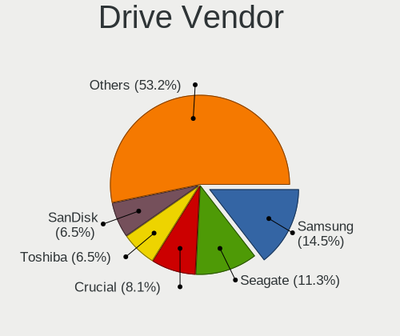
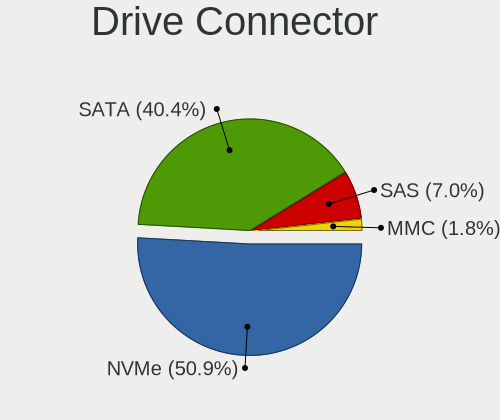
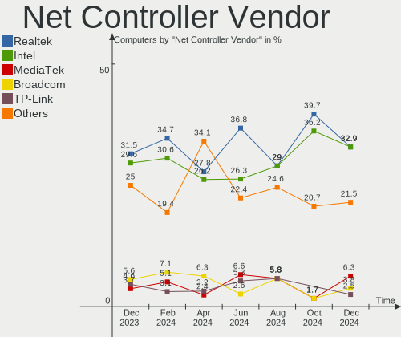

Kali - Hardware Trends
----------------------

A project to identify most popular hardware characteristics and track their change
over time based on data collected by Linux users at https://Linux-Hardware.org.

Anyone can contribute to this report by the [hw-probe](https://github.com/linuxhw/hw-probe) tool:

    sudo -E hw-probe -all -upload

This is a report for all computer types. See also reports for [desktops](/Dist/Kali/Desktop/README.md) and [notebooks](/Dist/Kali/Notebook/README.md).

This report is for one last month. Overall report since the beginning of time: [TestDays](https://github.com/linuxhw/TestDays)

Period: Apr, 2023.

Contents
--------

* [ System ](#system)
  - [ OS                       ](#os)
  - [ OS Family                ](#os-family)
  - [ Kernel                   ](#kernel)
  - [ Kernel Family            ](#kernel-family)
  - [ Kernel Major Ver.        ](#kernel-major-ver)
  - [ Arch                     ](#arch)
  - [ DE                       ](#de)
  - [ Display Server           ](#display-server)
  - [ Display Manager          ](#display-manager)
  - [ OS Lang                  ](#os-lang)
  - [ Boot Mode                ](#boot-mode)
  - [ Filesystem               ](#filesystem)
  - [ Part. scheme             ](#part-scheme)
  - [ Dual Boot with Linux/BSD ](#dual-boot-with-linuxbsd)
  - [ Dual Boot (Win)          ](#dual-boot-win)

* [ Board ](#board)
  - [ Vendor                   ](#vendor)
  - [ Model                    ](#model)
  - [ Model Family             ](#model-family)
  - [ MFG Year                 ](#mfg-year)
  - [ Form Factor              ](#form-factor)
  - [ Secure Boot              ](#secure-boot)
  - [ Coreboot                 ](#coreboot)
  - [ RAM Size                 ](#ram-size)
  - [ RAM Used                 ](#ram-used)
  - [ Total Drives             ](#total-drives)
  - [ Has CD-ROM               ](#has-cd-rom)
  - [ Has Ethernet             ](#has-ethernet)
  - [ Has WiFi                 ](#has-wifi)
  - [ Has Bluetooth            ](#has-bluetooth)

* [ Location ](#location)
  - [ Country                  ](#country)
  - [ City                     ](#city)

* [ Drives ](#drives)
  - [ Drive Vendor             ](#drive-vendor)
  - [ Drive Model              ](#drive-model)
  - [ HDD Vendor               ](#hdd-vendor)
  - [ SSD Vendor               ](#ssd-vendor)
  - [ Drive Kind               ](#drive-kind)
  - [ Drive Connector          ](#drive-connector)
  - [ Drive Size               ](#drive-size)
  - [ Space Total              ](#space-total)
  - [ Space Used               ](#space-used)
  - [ Malfunc. Drives          ](#malfunc-drives)
  - [ Malfunc. Drive Vendor    ](#malfunc-drive-vendor)
  - [ Malfunc. HDD Vendor      ](#malfunc-hdd-vendor)
  - [ Malfunc. Drive Kind      ](#malfunc-drive-kind)
  - [ Failed Drives            ](#failed-drives)
  - [ Failed Drive Vendor      ](#failed-drive-vendor)
  - [ Drive Status             ](#drive-status)

* [ Storage controller ](#storage-controller)
  - [ Storage Vendor           ](#storage-vendor)
  - [ Storage Model            ](#storage-model)
  - [ Storage Kind             ](#storage-kind)

* [ Processor ](#processor)
  - [ CPU Vendor               ](#cpu-vendor)
  - [ CPU Model                ](#cpu-model)
  - [ CPU Model Family         ](#cpu-model-family)
  - [ CPU Cores                ](#cpu-cores)
  - [ CPU Sockets              ](#cpu-sockets)
  - [ CPU Threads              ](#cpu-threads)
  - [ CPU Op-Modes             ](#cpu-op-modes)
  - [ CPU Microcode            ](#cpu-microcode)
  - [ CPU Microarch            ](#cpu-microarch)

* [ Graphics ](#graphics)
  - [ GPU Vendor               ](#gpu-vendor)
  - [ GPU Model                ](#gpu-model)
  - [ GPU Combo                ](#gpu-combo)
  - [ GPU Driver               ](#gpu-driver)
  - [ GPU Memory               ](#gpu-memory)

* [ Monitor ](#monitor)
  - [ Monitor Vendor           ](#monitor-vendor)
  - [ Monitor Model            ](#monitor-model)
  - [ Monitor Resolution       ](#monitor-resolution)
  - [ Monitor Diagonal         ](#monitor-diagonal)
  - [ Monitor Width            ](#monitor-width)
  - [ Aspect Ratio             ](#aspect-ratio)
  - [ Monitor Area             ](#monitor-area)
  - [ Pixel Density            ](#pixel-density)
  - [ Multiple Monitors        ](#multiple-monitors)

* [ Network ](#network)
  - [ Net Controller Vendor    ](#net-controller-vendor)
  - [ Net Controller Model     ](#net-controller-model)
  - [ Wireless Vendor          ](#wireless-vendor)
  - [ Wireless Model           ](#wireless-model)
  - [ Ethernet Vendor          ](#ethernet-vendor)
  - [ Ethernet Model           ](#ethernet-model)
  - [ Net Controller Kind      ](#net-controller-kind)
  - [ Used Controller          ](#used-controller)
  - [ NICs                     ](#nics)
  - [ IPv6                     ](#ipv6)

* [ Bluetooth ](#bluetooth)
  - [ Bluetooth Vendor         ](#bluetooth-vendor)
  - [ Bluetooth Model          ](#bluetooth-model)

* [ Sound ](#sound)
  - [ Sound Vendor             ](#sound-vendor)
  - [ Sound Model              ](#sound-model)

* [ Memory ](#memory)
  - [ Memory Vendor            ](#memory-vendor)
  - [ Memory Model             ](#memory-model)
  - [ Memory Kind              ](#memory-kind)
  - [ Memory Form Factor       ](#memory-form-factor)
  - [ Memory Size              ](#memory-size)
  - [ Memory Speed             ](#memory-speed)

* [ Printers & scanners ](#printers--scanners)
  - [ Printer Vendor           ](#printer-vendor)
  - [ Printer Model            ](#printer-model)
  - [ Scanner Vendor           ](#scanner-vendor)
  - [ Scanner Model            ](#scanner-model)

* [ Camera ](#camera)
  - [ Camera Vendor            ](#camera-vendor)
  - [ Camera Model             ](#camera-model)

* [ Security ](#security)
  - [ Fingerprint Vendor       ](#fingerprint-vendor)
  - [ Fingerprint Model        ](#fingerprint-model)
  - [ Chipcard Vendor          ](#chipcard-vendor)
  - [ Chipcard Model           ](#chipcard-model)

* [ Unsupported ](#unsupported)
  - [ Unsupported Devices      ](#unsupported-devices)
  - [ Unsupported Device Types ](#unsupported-device-types)

System
------

OS
--

Installed operating systems

| Name         | Computers | Percent |
|--------------|-----------|---------|
| Kali 2023.1  | 61        | 95.31%  |
| Kali Rolling | 1         | 1.56%   |
| Kali 2022.4  | 1         | 1.56%   |
| Kali 2021.4  | 1         | 1.56%   |

OS Family
---------

OS without a version

| Name | Computers | Percent |
|------|-----------|---------|
| Kali | 64        | 100%    |

Kernel
------

Version of the Linux kernel

| Version                            | Computers | Percent |
|------------------------------------|-----------|---------|
| 6.1.0-kali7-amd64                  | 37        | 57.81%  |
| 6.1.0-kali5-amd64                  | 18        | 28.13%  |
| 6.2.10-surface                     | 2         | 3.13%   |
| 6.1.20                             | 1         | 1.56%   |
| 6.0.0-kali6-amd64                  | 1         | 1.56%   |
| 6.0.0-kali3-amd64                  | 1         | 1.56%   |
| 5.18.0-kali5-amd64                 | 1         | 1.56%   |
| 5.15.44-Re4son-v7l+                | 1         | 1.56%   |
| 5.14.0-kali4-amd64                 | 1         | 1.56%   |
| 4.19.191-25719635-abS134DLUDU6CWB6 | 1         | 1.56%   |

Kernel Family
-------------

Linux kernel without a distro release

| Version  | Computers | Percent |
|----------|-----------|---------|
| 6.1.0    | 55        | 85.94%  |
| 6.2.10   | 2         | 3.13%   |
| 6.0.0    | 2         | 3.13%   |
| 6.1.20   | 1         | 1.56%   |
| 5.18.0   | 1         | 1.56%   |
| 5.15.44  | 1         | 1.56%   |
| 5.14.0   | 1         | 1.56%   |
| 4.19.191 | 1         | 1.56%   |

Kernel Major Ver.
-----------------

Linux kernel major version

| Version | Computers | Percent |
|---------|-----------|---------|
| 6.1     | 56        | 87.5%   |
| 6.2     | 2         | 3.13%   |
| 6.0     | 2         | 3.13%   |
| 5.18    | 1         | 1.56%   |
| 5.15    | 1         | 1.56%   |
| 5.14    | 1         | 1.56%   |
| 4.19    | 1         | 1.56%   |

Arch
----

OS architecture (x86_64, i586, etc.)

| Name    | Computers | Percent |
|---------|-----------|---------|
| x86_64  | 62        | 96.88%  |
| armv7l  | 1         | 1.56%   |
| aarch64 | 1         | 1.56%   |

DE
--

Desktop Environment

| Name    | Computers | Percent |
|---------|-----------|---------|
| XFCE    | 35        | 54.69%  |
| GNOME   | 17        | 26.56%  |
| KDE5    | 11        | 17.19%  |
| Unknown | 1         | 1.56%   |

Display Server
--------------

X11 or Wayland

| Name    | Computers | Percent |
|---------|-----------|---------|
| X11     | 55        | 85.94%  |
| Wayland | 6         | 9.38%   |
| Tty     | 2         | 3.13%   |
| Unknown | 1         | 1.56%   |

Display Manager
---------------

SDDM, LightDM, etc.

| Name    | Computers | Percent |
|---------|-----------|---------|
| LightDM | 30        | 46.88%  |
| GDM3    | 13        | 20.31%  |
| SDDM    | 11        | 17.19%  |
| Unknown | 10        | 15.63%  |

OS Lang
-------

Language

| Lang  | Computers | Percent |
|-------|-----------|---------|
| en_US | 35        | 54.69%  |
| en_GB | 6         | 9.38%   |
| ru_RU | 4         | 6.25%   |
| de_DE | 3         | 4.69%   |
| pt_PT | 2         | 3.13%   |
| fr_FR | 2         | 3.13%   |
| tr_TR | 1         | 1.56%   |
| pt_BR | 1         | 1.56%   |
| pl_PL | 1         | 1.56%   |
| it_IT | 1         | 1.56%   |
| es_MX | 1         | 1.56%   |
| es_ES | 1         | 1.56%   |
| en_NZ | 1         | 1.56%   |
| en_IN | 1         | 1.56%   |
| en_AU | 1         | 1.56%   |
| en_AG | 1         | 1.56%   |
| cs_CZ | 1         | 1.56%   |
| C     | 1         | 1.56%   |

Boot Mode
---------

EFI or BIOS

| Mode | Computers | Percent |
|------|-----------|---------|
| EFI  | 51        | 79.69%  |
| BIOS | 13        | 20.31%  |

Filesystem
----------

Type of filesystem

| Type    | Computers | Percent |
|---------|-----------|---------|
| Ext4    | 58        | 90.63%  |
| Overlay | 4         | 6.25%   |
| Ext2    | 1         | 1.56%   |
| Btrfs   | 1         | 1.56%   |

Part. scheme
------------

Scheme of partitioning

| Type    | Computers | Percent |
|---------|-----------|---------|
| GPT     | 45        | 70.31%  |
| Unknown | 10        | 15.63%  |
| MBR     | 9         | 14.06%  |

Dual Boot with Linux/BSD
------------------------

Hosting more than one Linux/BSD

| Dual boot | Computers | Percent |
|-----------|-----------|---------|
| No        | 55        | 85.94%  |
| Yes       | 9         | 14.06%  |

Dual Boot (Win)
---------------

Hosting Linux and Windows

| Dual boot | Computers | Percent |
|-----------|-----------|---------|
| No        | 33        | 51.56%  |
| Yes       | 31        | 48.44%  |

Board
-----

Vendor
------

Motherboard manufacturer

| Name                    | Computers | Percent |
|-------------------------|-----------|---------|
| Lenovo                  | 12        | 18.75%  |
| Hewlett-Packard         | 11        | 17.19%  |
| Dell                    | 9         | 14.06%  |
| ASUSTek Computer        | 7         | 10.94%  |
| Microsoft               | 4         | 6.25%   |
| Gigabyte Technology     | 3         | 4.69%   |
| ASRock                  | 3         | 4.69%   |
| MSI                     | 2         | 3.13%   |
| HUAWEI                  | 2         | 3.13%   |
| Chuwi                   | 2         | 3.13%   |
| Apple                   | 2         | 3.13%   |
| Acer                    | 2         | 3.13%   |
| Raspberry Pi Foundation | 1         | 1.56%   |
| Panasonic               | 1         | 1.56%   |
| Mediacom                | 1         | 1.56%   |
| GPU Company             | 1         | 1.56%   |
| Unknown                 | 1         | 1.56%   |

Model
-----

Motherboard model

| Name                                  | Computers | Percent |
|---------------------------------------|-----------|---------|
| HP EliteBook 840 G7 Notebook PC       | 2         | 3.13%   |
| Chuwi GemiBook Pro                    | 2         | 3.13%   |
| RPi Raspberry Pi 4 Model B Rev 1.4    | 1         | 1.56%   |
| Panasonic CF-19RHSC8FN                | 1         | 1.56%   |
| MSI MS-7B12                           | 1         | 1.56%   |
| MSI GP76 Leopard 10UE                 | 1         | 1.56%   |
| Microsoft Surface Pro 4               | 1         | 1.56%   |
| Microsoft Surface Pro                 | 1         | 1.56%   |
| Microsoft Surface Go                  | 1         | 1.56%   |
| Microsoft Surface Book 2              | 1         | 1.56%   |
| Mediacom WinPad 11,6 FullHD- WPU11    | 1         | 1.56%   |
| Lenovo V15 G3 ABA 82TV                | 1         | 1.56%   |
| Lenovo ThinkPad X13 Gen 1 20T20030GE  | 1         | 1.56%   |
| Lenovo ThinkPad X1 Tablet 20GGS02600  | 1         | 1.56%   |
| Lenovo ThinkPad T490 20N20008US       | 1         | 1.56%   |
| Lenovo ThinkPad L560 20F2S13L00       | 1         | 1.56%   |
| Lenovo ThinkPad L480 20LTS1NK27       | 1         | 1.56%   |
| Lenovo ThinkPad E15 Gen 3 20YG004DMX  | 1         | 1.56%   |
| Lenovo IdeaPad Slim 7 15IIL05 82AD    | 1         | 1.56%   |
| Lenovo IdeaPad L340-15IRH Gaming 81LK | 1         | 1.56%   |
| Lenovo IdeaPad Gaming 3 15IMH05 81Y4  | 1         | 1.56%   |
| Lenovo IdeaPad 3 17IML05 81WC         | 1         | 1.56%   |
| Lenovo IdeaPad 110-17IKB 80VK         | 1         | 1.56%   |
| HUAWEI RLEF-XX                        | 1         | 1.56%   |
| HUAWEI KLVC-WXX9                      | 1         | 1.56%   |
| HP t620 Dual Core TC                  | 1         | 1.56%   |
| HP ProBook 450 G6                     | 1         | 1.56%   |
| HP ProBook 445 G7                     | 1         | 1.56%   |
| HP Pavilion Laptop 15-eh0xxx          | 1         | 1.56%   |
| HP Pavilion Gaming Laptop 15-dk1xxx   | 1         | 1.56%   |
| HP Laptop 17-cp0xxx                   | 1         | 1.56%   |
| HP EliteBook 840 G1                   | 1         | 1.56%   |
| HP 255 G8 Notebook PC                 | 1         | 1.56%   |
| HP 15 Notebook PC                     | 1         | 1.56%   |
| GPU Company GWTC116-2                 | 1         | 1.56%   |
| Gigabyte H81M-S                       | 1         | 1.56%   |
| Gigabyte G5 GD                        | 1         | 1.56%   |
| Gigabyte B550 AORUS ELITE AX V2       | 1         | 1.56%   |
| Dell XPS 17 9710                      | 1         | 1.56%   |
| Dell Precision M4800                  | 1         | 1.56%   |

Model Family
------------

Motherboard model prefix

| Name                   | Computers | Percent |
|------------------------|-----------|---------|
| Lenovo ThinkPad        | 6         | 9.38%   |
| Lenovo IdeaPad         | 5         | 7.81%   |
| Dell Latitude          | 5         | 7.81%   |
| Microsoft Surface      | 4         | 6.25%   |
| HP EliteBook           | 3         | 4.69%   |
| HP ProBook             | 2         | 3.13%   |
| HP Pavilion            | 2         | 3.13%   |
| Dell Inspiron          | 2         | 3.13%   |
| Chuwi GemiBook         | 2         | 3.13%   |
| ASUS ASUS              | 2         | 3.13%   |
| Acer Aspire            | 2         | 3.13%   |
| RPi Raspberry          | 1         | 1.56%   |
| Panasonic CF-19RHSC8FN | 1         | 1.56%   |
| MSI MS-7B12            | 1         | 1.56%   |
| MSI GP76               | 1         | 1.56%   |
| Mediacom WinPad        | 1         | 1.56%   |
| Lenovo V15             | 1         | 1.56%   |
| HUAWEI RLEF-XX         | 1         | 1.56%   |
| HUAWEI KLVC-WXX9       | 1         | 1.56%   |
| HP t620                | 1         | 1.56%   |
| HP Laptop              | 1         | 1.56%   |
| HP 255                 | 1         | 1.56%   |
| HP 15                  | 1         | 1.56%   |
| GPU Company GWTC116-2  | 1         | 1.56%   |
| Gigabyte H81M-S        | 1         | 1.56%   |
| Gigabyte G5            | 1         | 1.56%   |
| Gigabyte B550          | 1         | 1.56%   |
| Dell XPS               | 1         | 1.56%   |
| Dell Precision         | 1         | 1.56%   |
| ASUS ZenBook           | 1         | 1.56%   |
| ASUS X751SA            | 1         | 1.56%   |
| ASUS X555BP            | 1         | 1.56%   |
| ASUS ROG               | 1         | 1.56%   |
| ASUS M4A78LT-M         | 1         | 1.56%   |
| ASRock Z87             | 1         | 1.56%   |
| ASRock B550M           | 1         | 1.56%   |
| ASRock B450            | 1         | 1.56%   |
| Apple MacBookAir7      | 1         | 1.56%   |
| Apple MacBook5         | 1         | 1.56%   |
| Unknown                | 1         | 1.56%   |

MFG Year
--------

Motherboard manufacture year

| Year    | Computers | Percent |
|---------|-----------|---------|
| 2020    | 13        | 20.31%  |
| 2022    | 8         | 12.5%   |
| 2021    | 6         | 9.38%   |
| 2019    | 5         | 7.81%   |
| 2018    | 5         | 7.81%   |
| 2013    | 5         | 7.81%   |
| 2016    | 4         | 6.25%   |
| 2014    | 4         | 6.25%   |
| 2015    | 3         | 4.69%   |
| 2010    | 2         | 3.13%   |
| Unknown | 2         | 3.13%   |
| 2023    | 1         | 1.56%   |
| 2017    | 1         | 1.56%   |
| 2012    | 1         | 1.56%   |
| 2011    | 1         | 1.56%   |
| 2009    | 1         | 1.56%   |
| 2008    | 1         | 1.56%   |
| 2007    | 1         | 1.56%   |

Form Factor
-----------

Physical design of the computer

| Name           | Computers | Percent |
|----------------|-----------|---------|
| Notebook       | 46        | 71.88%  |
| Desktop        | 9         | 14.06%  |
| Tablet         | 5         | 7.81%   |
| System on chip | 2         | 3.13%   |
| Convertible    | 1         | 1.56%   |
| All in one     | 1         | 1.56%   |

Secure Boot
-----------

Enabled or disabled

| State    | Computers | Percent |
|----------|-----------|---------|
| Disabled | 64        | 100%    |

Coreboot
--------

Have coreboot on board

| Used | Computers | Percent |
|------|-----------|---------|
| No   | 64        | 100%    |

RAM Size
--------

Total RAM memory

| Size in GB  | Computers | Percent |
|-------------|-----------|---------|
| 4.01-8.0    | 16        | 25%     |
| 16.01-24.0  | 16        | 25%     |
| 3.01-4.0    | 10        | 15.63%  |
| 8.01-16.0   | 9         | 14.06%  |
| 32.01-64.0  | 8         | 12.5%   |
| 1.01-2.0    | 3         | 4.69%   |
| 2.01-3.0    | 1         | 1.56%   |
| 64.01-256.0 | 1         | 1.56%   |

RAM Used
--------

Used RAM memory

| Used GB  | Computers | Percent |
|----------|-----------|---------|
| 2.01-3.0 | 22        | 34.38%  |
| 3.01-4.0 | 14        | 21.88%  |
| 1.01-2.0 | 14        | 21.88%  |
| 4.01-8.0 | 10        | 15.63%  |
| 0.51-1.0 | 2         | 3.13%   |
| 0.01-0.5 | 2         | 3.13%   |

Total Drives
------------

Number of drives on board

| Drives | Computers | Percent |
|--------|-----------|---------|
| 1      | 44        | 68.75%  |
| 2      | 11        | 17.19%  |
| 3      | 5         | 7.81%   |
| 5      | 2         | 3.13%   |
| 0      | 2         | 3.13%   |

Has CD-ROM
----------

Has CD-ROM on board

| Presented | Computers | Percent |
|-----------|-----------|---------|
| No        | 59        | 92.19%  |
| Yes       | 5         | 7.81%   |

Has Ethernet
------------

Has Ethernet on board

| Presented | Computers | Percent |
|-----------|-----------|---------|
| Yes       | 47        | 73.44%  |
| No        | 17        | 26.56%  |

Has WiFi
--------

Has WiFi module

| Presented | Computers | Percent |
|-----------|-----------|---------|
| Yes       | 60        | 93.75%  |
| No        | 4         | 6.25%   |

Has Bluetooth
-------------

Has Bluetooth module

| Presented | Computers | Percent |
|-----------|-----------|---------|
| Yes       | 50        | 78.13%  |
| No        | 14        | 21.88%  |

Location
--------

Country
-------

Geographic location (country)

| Country     | Computers | Percent |
|-------------|-----------|---------|
| USA         | 17        | 26.56%  |
| Russia      | 8         | 12.5%   |
| UK          | 5         | 7.81%   |
| Spain       | 4         | 6.25%   |
| Portugal    | 3         | 4.69%   |
| Germany     | 3         | 4.69%   |
| Poland      | 2         | 3.13%   |
| India       | 2         | 3.13%   |
| France      | 2         | 3.13%   |
| Zambia      | 1         | 1.56%   |
| Turkey      | 1         | 1.56%   |
| Panama      | 1         | 1.56%   |
| New Zealand | 1         | 1.56%   |
| Mexico      | 1         | 1.56%   |
| Kenya       | 1         | 1.56%   |
| Italy       | 1         | 1.56%   |
| Iran        | 1         | 1.56%   |
| Ghana       | 1         | 1.56%   |
| Estonia     | 1         | 1.56%   |
| Czechia     | 1         | 1.56%   |
| Bulgaria    | 1         | 1.56%   |
| Brazil      | 1         | 1.56%   |
| Belarus     | 1         | 1.56%   |
| Austria     | 1         | 1.56%   |
| Australia   | 1         | 1.56%   |
| Anguilla    | 1         | 1.56%   |
| Albania     | 1         | 1.56%   |

City
----

Geographic location (city)

| City                  | Computers | Percent |
|-----------------------|-----------|---------|
| St Petersburg         | 2         | 3.13%   |
| Perm                  | 2         | 3.13%   |
| Zaragoza              | 1         | 1.56%   |
| Yekaterinburg         | 1         | 1.56%   |
| Yaroslavl             | 1         | 1.56%   |
| Welwyn Garden City    | 1         | 1.56%   |
| Warsaw                | 1         | 1.56%   |
| Vigo                  | 1         | 1.56%   |
| Tulsa                 | 1         | 1.56%   |
| Tucson                | 1         | 1.56%   |
| The Valley            | 1         | 1.56%   |
| Tehran                | 1         | 1.56%   |
| Tampa                 | 1         | 1.56%   |
| Tallinn               | 1         | 1.56%   |
| Sydney                | 1         | 1.56%   |
| Surbiton              | 1         | 1.56%   |
| Springfield           | 1         | 1.56%   |
| Sofia                 | 1         | 1.56%   |
| San Diego             | 1         | 1.56%   |
| Reigate               | 1         | 1.56%   |
| Portland              | 1         | 1.56%   |
| Pereira Barreto       | 1         | 1.56%   |
| Panama City           | 1         | 1.56%   |
| Nairobi               | 1         | 1.56%   |
| Mumbai                | 1         | 1.56%   |
| Moscow                | 1         | 1.56%   |
| Mohali                | 1         | 1.56%   |
| Mladá Boleslav       | 1         | 1.56%   |
| Maracena              | 1         | 1.56%   |
| Lusaka                | 1         | 1.56%   |
| Lublin                | 1         | 1.56%   |
| London                | 1         | 1.56%   |
| Lodi                  | 1         | 1.56%   |
| Lisbon                | 1         | 1.56%   |
| León                 | 1         | 1.56%   |
| Le Clerjus            | 1         | 1.56%   |
| Lakeland              | 1         | 1.56%   |
| Kals am Grossglockner | 1         | 1.56%   |
| Istanbul              | 1         | 1.56%   |
| Issy-les-Moulineaux   | 1         | 1.56%   |

Drives
------

Drive Vendor
------------

Hard drive vendors

| Vendor              | Computers | Drives | Percent |
|---------------------|-----------|--------|---------|
| Samsung Electronics | 19        | 21     | 23.17%  |
| Seagate             | 11        | 14     | 13.41%  |
| WDC                 | 10        | 13     | 12.2%   |
| Kingston            | 7         | 8      | 8.54%   |
| Unknown             | 5         | 5      | 6.1%    |
| Toshiba             | 3         | 3      | 3.66%   |
| SanDisk             | 3         | 3      | 3.66%   |
| China               | 3         | 3      | 3.66%   |
| A-DATA Technology   | 3         | 3      | 3.66%   |
| UMIS                | 2         | 2      | 2.44%   |
| Phison              | 2         | 2      | 2.44%   |
| Lexar               | 2         | 2      | 2.44%   |
| Intel               | 2         | 2      | 2.44%   |
| Smartbuy            | 1         | 1      | 1.22%   |
| SK hynix            | 1         | 1      | 1.22%   |
| Silicon Motion      | 1         | 1      | 1.22%   |
| PNY                 | 1         | 1      | 1.22%   |
| LaCie               | 1         | 1      | 1.22%   |
| Gigabyte Technology | 1         | 1      | 1.22%   |
| Fujitsu             | 1         | 1      | 1.22%   |
| Crucial             | 1         | 1      | 1.22%   |
| Apple               | 1         | 1      | 1.22%   |
| Unknown             | 1         | 1      | 1.22%   |

Drive Model
-----------

Hard drive models

| Model                                       | Computers | Percent |
|---------------------------------------------|-----------|---------|
| Seagate ST500LT012-1DG142 500GB             | 2         | 2.22%   |
| Samsung SSD 870 QVO 1TB                     | 2         | 2.22%   |
| Samsung MZVLB256HBHQ-000L7 256GB            | 2         | 2.22%   |
| China G521N256GB                            | 2         | 2.22%   |
| WDC WDS240G2G0A-00JH30 240GB SSD            | 1         | 1.11%   |
| WDC WDS100T2B0A-00SM50 1TB SSD              | 1         | 1.11%   |
| WDC WD5000AAKX-60U6AA0 500GB                | 1         | 1.11%   |
| WDC WD40EFAX-68JH4N0 4TB                    | 1         | 1.11%   |
| WDC WD3200AAJS-56M0A0 320GB                 | 1         | 1.11%   |
| WDC WD2500AAKX-603CA0 250GB                 | 1         | 1.11%   |
| WDC WD10SPZX-60Z10T1 1TB                    | 1         | 1.11%   |
| WDC WD10SPZX-21Z10T0 1TB                    | 1         | 1.11%   |
| WDC WD10JPVX-75JC3T0 1TB                    | 1         | 1.11%   |
| WDC WD10EZEX-08WN4A0 1TB                    | 1         | 1.11%   |
| WDC WD10EZEX-08M2NA0 1TB                    | 1         | 1.11%   |
| WDC PC SN530 SDBPNPZ-256G-1006 256GB        | 1         | 1.11%   |
| WDC PC SN530 SDBPMPZ-256G-1001 256GB        | 1         | 1.11%   |
| Unknown SK256  256GB                        | 1         | 1.11%   |
| Unknown SD  32GB                            | 1         | 1.11%   |
| Unknown SC64G  64GB                         | 1         | 1.11%   |
| Unknown NCard  32GB                         | 1         | 1.11%   |
| Unknown hC8aP  64GB                         | 1         | 1.11%   |
| UMIS RPJTJ512MEE1OWX 512GB                  | 1         | 1.11%   |
| UMIS RPFTJ256PDD2MWX 256GB                  | 1         | 1.11%   |
| Toshiba THNSN5512GPU7 512GB                 | 1         | 1.11%   |
| Toshiba MQ01ABD100 1TB                      | 1         | 1.11%   |
| Toshiba HDWR160 6TB                         | 1         | 1.11%   |
| Smartbuy SSD 512GB                          | 1         | 1.11%   |
| SK hynix PC401 NVMe Solid State Drive 256GB | 1         | 1.11%   |
| Silicon Motion PCIe-8 SSD 512GB             | 1         | 1.11%   |
| Seagate ST980811AS 80GB                     | 1         | 1.11%   |
| Seagate ST9500325AS 500GB                   | 1         | 1.11%   |
| Seagate ST750LM022 HN-M750MBB 752GB         | 1         | 1.11%   |
| Seagate ST4000LM024-2AN17V 4TB              | 1         | 1.11%   |
| Seagate ST4000DM004-2CV104 4TB              | 1         | 1.11%   |
| Seagate ST200FM0 012 200GB                  | 1         | 1.11%   |
| Seagate ST2000LX001-1RG174 2TB              | 1         | 1.11%   |
| Seagate ST2000DM008-2FR102 2TB              | 1         | 1.11%   |
| Seagate ST1000VT001-1RE172 1TB              | 1         | 1.11%   |
| Seagate ST1000LM024 HN-M101MBB 1TB          | 1         | 1.11%   |

HDD Vendor
----------

Hard disk drive vendors

| Vendor  | Computers | Drives | Percent |
|---------|-----------|--------|---------|
| Seagate | 11        | 13     | 55%     |
| WDC     | 7         | 9      | 35%     |
| Toshiba | 2         | 2      | 10%     |

SSD Vendor
----------

Solid state drive vendors

| Vendor              | Computers | Drives | Percent |
|---------------------|-----------|--------|---------|
| Samsung Electronics | 8         | 10     | 28.57%  |
| Kingston            | 4         | 4      | 14.29%  |
| China               | 3         | 3      | 10.71%  |
| WDC                 | 2         | 2      | 7.14%   |
| SanDisk             | 2         | 2      | 7.14%   |
| A-DATA Technology   | 2         | 2      | 7.14%   |
| Smartbuy            | 1         | 1      | 3.57%   |
| PNY                 | 1         | 1      | 3.57%   |
| Intel               | 1         | 1      | 3.57%   |
| Gigabyte Technology | 1         | 1      | 3.57%   |
| Fujitsu             | 1         | 1      | 3.57%   |
| Crucial             | 1         | 1      | 3.57%   |
| Apple               | 1         | 1      | 3.57%   |

Drive Kind
----------

HDD or SSD

| Kind    | Computers | Drives | Percent |
|---------|-----------|--------|---------|
| NVMe    | 27        | 30     | 35.53%  |
| SSD     | 25        | 30     | 32.89%  |
| HDD     | 18        | 24     | 23.68%  |
| MMC     | 5         | 6      | 6.58%   |
| Unknown | 1         | 1      | 1.32%   |

Drive Connector
---------------

SATA, SAS, NVMe, etc.

| Type | Computers | Drives | Percent |
|------|-----------|--------|---------|
| SATA | 35        | 52     | 50%     |
| NVMe | 27        | 30     | 38.57%  |
| MMC  | 5         | 6      | 7.14%   |
| SAS  | 3         | 3      | 4.29%   |

Drive Size
----------

Size of hard drive

| Size in TB | Computers | Drives | Percent |
|------------|-----------|--------|---------|
| 0.01-0.5   | 25        | 29     | 52.08%  |
| 0.51-1.0   | 15        | 17     | 31.25%  |
| 3.01-4.0   | 4         | 4      | 8.33%   |
| 1.01-2.0   | 3         | 3      | 6.25%   |
| 4.01-10.0  | 1         | 1      | 2.08%   |

Space Total
-----------

Amount of disk space available on the file system

| Size in GB     | Computers | Percent |
|----------------|-----------|---------|
| 101-250        | 24        | 37.5%   |
| 251-500        | 13        | 20.31%  |
| 51-100         | 7         | 10.94%  |
| 21-50          | 5         | 7.81%   |
| 501-1000       | 5         | 7.81%   |
| More than 3000 | 3         | 4.69%   |
| 1001-2000      | 3         | 4.69%   |
| 1-20           | 3         | 4.69%   |
| Unknown        | 1         | 1.56%   |

Space Used
----------

Amount of used disk space

| Used GB        | Computers | Percent |
|----------------|-----------|---------|
| 21-50          | 21        | 32.81%  |
| 1-20           | 21        | 32.81%  |
| 51-100         | 10        | 15.63%  |
| 101-250        | 5         | 7.81%   |
| More than 3000 | 2         | 3.13%   |
| 251-500        | 1         | 1.56%   |
| 2001-3000      | 1         | 1.56%   |
| 1001-2000      | 1         | 1.56%   |
| 501-1000       | 1         | 1.56%   |
| Unknown        | 1         | 1.56%   |

Malfunc. Drives
---------------

Drive models with a malfunction

| Model                                     | Computers | Drives | Percent |
|-------------------------------------------|-----------|--------|---------|
| China G521N256GB                          | 2         | 2      | 28.57%  |
| WDC WD3200AAJS-56M0A0 320GB               | 1         | 1      | 14.29%  |
| Seagate ST4000LM024-2AN17V 4TB            | 1         | 1      | 14.29%  |
| Seagate ST1000VT001-1RE172 1TB            | 1         | 1      | 14.29%  |
| Samsung Electronics SSD PM810 mSATA 128GB | 1         | 1      | 14.29%  |
| Kingston SV300S37A120G 120GB SSD          | 1         | 1      | 14.29%  |

Malfunc. Drive Vendor
---------------------

Vendors of faulty drives

| Vendor              | Computers | Drives | Percent |
|---------------------|-----------|--------|---------|
| Seagate             | 2         | 2      | 28.57%  |
| China               | 2         | 2      | 28.57%  |
| WDC                 | 1         | 1      | 14.29%  |
| Samsung Electronics | 1         | 1      | 14.29%  |
| Kingston            | 1         | 1      | 14.29%  |

Malfunc. HDD Vendor
-------------------

Vendors of faulty HDD drives

| Vendor  | Computers | Drives | Percent |
|---------|-----------|--------|---------|
| Seagate | 2         | 2      | 66.67%  |
| WDC     | 1         | 1      | 33.33%  |

Malfunc. Drive Kind
-------------------

Kinds of faulty drives

| Kind | Computers | Drives | Percent |
|------|-----------|--------|---------|
| SSD  | 4         | 4      | 66.67%  |
| HDD  | 2         | 3      | 33.33%  |

Failed Drives
-------------

Failed drive models

Zero info for selected period =(

Failed Drive Vendor
-------------------

Failed drive vendors

Zero info for selected period =(

Drive Status
------------

Number of failed and malfunc. drives

| Status   | Computers | Drives | Percent |
|----------|-----------|--------|---------|
| Works    | 45        | 63     | 65.22%  |
| Detected | 18        | 21     | 26.09%  |
| Malfunc  | 6         | 7      | 8.7%    |

Storage controller
------------------

Storage Vendor
--------------

Storage controller vendors

| Vendor                       | Computers | Percent |
|------------------------------|-----------|---------|
| Intel                        | 31        | 42.47%  |
| Samsung Electronics          | 12        | 16.44%  |
| AMD                          | 10        | 13.7%   |
| SanDisk                      | 3         | 4.11%   |
| Kingston Technology Company  | 3         | 4.11%   |
| Union Memory (Shenzhen)      | 2         | 2.74%   |
| Phison Electronics           | 2         | 2.74%   |
| Nvidia                       | 2         | 2.74%   |
| Toshiba America Info Systems | 1         | 1.37%   |
| SK hynix                     | 1         | 1.37%   |
| Silicon Motion               | 1         | 1.37%   |
| Shenzhen Longsys Electronics | 1         | 1.37%   |
| Seagate Technology           | 1         | 1.37%   |
| MAXIO Technology (Hangzhou)  | 1         | 1.37%   |
| ASMedia Technology           | 1         | 1.37%   |
| ADATA Technology             | 1         | 1.37%   |

Storage Model
-------------

Storage controller models

| Model                                                                            | Computers | Percent |
|----------------------------------------------------------------------------------|-----------|---------|
| Intel 82801 Mobile SATA Controller [RAID mode]                                   | 8         | 10.39%  |
| AMD FCH SATA Controller [AHCI mode]                                              | 7         | 9.09%   |
| Samsung NVMe SSD Controller SM981/PM981/PM983                                    | 4         | 5.19%   |
| Samsung NVMe SSD Controller 980                                                  | 3         | 3.9%    |
| Kingston Company Company Non-Volatile memory controller                          | 3         | 3.9%    |
| Intel Sunrise Point-LP SATA Controller [AHCI mode]                               | 3         | 3.9%    |
| Union Memory (Shenzhen) Non-Volatile memory controller                           | 2         | 2.6%    |
| Intel Jasper Lake SATA AHCI Controller                                           | 2         | 2.6%    |
| Intel Comet Lake SATA AHCI Controller                                            | 2         | 2.6%    |
| Intel Atom Processor E3800 Series SATA AHCI Controller                           | 2         | 2.6%    |
| Intel 8 Series/C220 Series Chipset Family 6-port SATA Controller 1 [AHCI mode]   | 2         | 2.6%    |
| AMD 500 Series Chipset SATA Controller                                           | 2         | 2.6%    |
| Toshiba America Info Systems NVMe Controller                                     | 1         | 1.3%    |
| SK hynix PC401 NVMe Solid State Drive 256GB                                      | 1         | 1.3%    |
| Silicon Motion Non-Volatile memory controller                                    | 1         | 1.3%    |
| Shenzhen Longsys Electronics Non-Volatile memory controller                      | 1         | 1.3%    |
| Seagate FireCuda 510 SSD                                                         | 1         | 1.3%    |
| SanDisk WD Blue SN570 NVMe SSD 1TB                                               | 1         | 1.3%    |
| SanDisk WD Blue SN550 NVMe SSD                                                   | 1         | 1.3%    |
| SanDisk NVMe Controller                                                          | 1         | 1.3%    |
| Samsung Surface NVMe Controller                                                  | 1         | 1.3%    |
| Samsung NVMe SSD Controller SM951/PM951                                          | 1         | 1.3%    |
| Samsung NVMe SSD Controller PM9B1                                                | 1         | 1.3%    |
| Samsung NVMe SSD Controller PM9A1/PM9A3/980PRO                                   | 1         | 1.3%    |
| Samsung Electronics SATA controller                                              | 1         | 1.3%    |
| Phison E16 PCIe4 NVMe Controller                                                 | 1         | 1.3%    |
| Phison E12 NVMe Controller                                                       | 1         | 1.3%    |
| Nvidia MCP79 AHCI Controller                                                     | 1         | 1.3%    |
| Nvidia MCP67 IDE Controller                                                      | 1         | 1.3%    |
| Nvidia MCP67 AHCI Controller                                                     | 1         | 1.3%    |
| MAXIO (Hangzhou) NVMe SSD Controller MAP1202                                     | 1         | 1.3%    |
| Kingston Company A2000 NVMe SSD                                                  | 1         | 1.3%    |
| Intel Non-Volatile memory controller                                             | 1         | 1.3%    |
| Intel Celeron/Pentium Silver Processor SATA Controller                           | 1         | 1.3%    |
| Intel Cannon Point-LP SATA Controller [AHCI Mode]                                | 1         | 1.3%    |
| Intel Cannon Lake PCH SATA AHCI Controller                                       | 1         | 1.3%    |
| Intel Cannon Lake Mobile PCH SATA AHCI Controller                                | 1         | 1.3%    |
| Intel Atom/Celeron/Pentium Processor x5-E8000/J3xxx/N3xxx Series SATA Controller | 1         | 1.3%    |
| Intel 82801IBM/IEM (ICH9M/ICH9M-E) 4 port SATA Controller [AHCI mode]            | 1         | 1.3%    |
| Intel 8 Series SATA Controller 1 [AHCI mode]                                     | 1         | 1.3%    |

Storage Kind
------------

Kind of storage controller (IDE, SATA, NVMe, SAS, ...)

| Kind | Computers | Percent |
|------|-----------|---------|
| SATA | 34        | 47.89%  |
| NVMe | 27        | 38.03%  |
| RAID | 8         | 11.27%  |
| IDE  | 2         | 2.82%   |

Processor
---------

CPU Vendor
----------

Processor vendors

| Vendor | Computers | Percent |
|--------|-----------|---------|
| Intel  | 47        | 73.44%  |
| AMD    | 15        | 23.44%  |
| ARM    | 2         | 3.13%   |

CPU Model
---------

Processor models

| Model                                  | Computers | Percent |
|----------------------------------------|-----------|---------|
| Intel Core i5-10210U CPU @ 1.60GHz     | 3         | 4.69%   |
| Intel Pentium CPU N3540 @ 2.16GHz      | 2         | 3.13%   |
| Intel Core i7-10510U CPU @ 1.80GHz     | 2         | 3.13%   |
| Intel Core i5-8265U CPU @ 1.60GHz      | 2         | 3.13%   |
| Intel Celeron N5100 @ 1.10GHz          | 2         | 3.13%   |
| AMD Ryzen 5 4500U with Radeon Graphics | 2         | 3.13%   |
| Intel Pentium CPU N3710 @ 1.60GHz      | 1         | 1.56%   |
| Intel Pentium CPU G3420 @ 3.20GHz      | 1         | 1.56%   |
| Intel Pentium CPU 4415Y @ 1.60GHz      | 1         | 1.56%   |
| Intel Core m7-6Y75 CPU @ 1.20GHz       | 1         | 1.56%   |
| Intel Core i9-9900K CPU @ 3.60GHz      | 1         | 1.56%   |
| Intel Core i7-8565U CPU @ 1.80GHz      | 1         | 1.56%   |
| Intel Core i7-7660U CPU @ 2.50GHz      | 1         | 1.56%   |
| Intel Core i7-5600U CPU @ 2.60GHz      | 1         | 1.56%   |
| Intel Core i7-4810MQ CPU @ 2.80GHz     | 1         | 1.56%   |
| Intel Core i7-3720QM CPU @ 2.60GHz     | 1         | 1.56%   |
| Intel Core i7-2620M CPU @ 2.70GHz      | 1         | 1.56%   |
| Intel Core i7-10870H CPU @ 2.20GHz     | 1         | 1.56%   |
| Intel Core i7-10750H CPU @ 2.60GHz     | 1         | 1.56%   |
| Intel Core i5-9300HF CPU @ 2.40GHz     | 1         | 1.56%   |
| Intel Core i5-8350U CPU @ 1.70GHz      | 1         | 1.56%   |
| Intel Core i5-7300U CPU @ 2.60GHz      | 1         | 1.56%   |
| Intel Core i5-7200U CPU @ 2.50GHz      | 1         | 1.56%   |
| Intel Core i5-6300U CPU @ 2.40GHz      | 1         | 1.56%   |
| Intel Core i5-5250U CPU @ 1.60GHz      | 1         | 1.56%   |
| Intel Core i5-4430 CPU @ 3.00GHz       | 1         | 1.56%   |
| Intel Core i5-4310U CPU @ 2.00GHz      | 1         | 1.56%   |
| Intel Core i5-4210U CPU @ 1.70GHz      | 1         | 1.56%   |
| Intel Core i5-1035G4 CPU @ 1.10GHz     | 1         | 1.56%   |
| Intel Core i5-10300H CPU @ 2.50GHz     | 1         | 1.56%   |
| Intel Core i5 CPU U 540 @ 1.20GHz      | 1         | 1.56%   |
| Intel Core i3-9100 CPU @ 3.60GHz       | 1         | 1.56%   |
| Intel Core i3-6100U CPU @ 2.30GHz      | 1         | 1.56%   |
| Intel Core i3-10110U CPU @ 2.10GHz     | 1         | 1.56%   |
| Intel Core 2 Duo CPU P9400 @ 2.40GHz   | 1         | 1.56%   |
| Intel Core 2 Duo CPU P7350 @ 2.00GHz   | 1         | 1.56%   |
| Intel Celeron N4020 CPU @ 1.10GHz      | 1         | 1.56%   |
| Intel Atom x5-Z8300 CPU @ 1.44GHz      | 1         | 1.56%   |
| Intel 12th Gen Core i7-12700H          | 1         | 1.56%   |
| Intel 12th Gen Core i5-12450H          | 1         | 1.56%   |

CPU Model Family
----------------

Processor model prefix

| Model                   | Computers | Percent |
|-------------------------|-----------|---------|
| Intel Core i5           | 17        | 26.56%  |
| Intel Core i7           | 10        | 15.63%  |
| Other                   | 7         | 10.94%  |
| Intel Pentium           | 5         | 7.81%   |
| AMD Ryzen 7             | 5         | 7.81%   |
| AMD Ryzen 5             | 5         | 7.81%   |
| Intel Core i3           | 3         | 4.69%   |
| Intel Celeron           | 3         | 4.69%   |
| Intel Core 2 Duo        | 2         | 3.13%   |
| Intel Core m7           | 1         | 1.56%   |
| Intel Core i9           | 1         | 1.56%   |
| Intel Atom              | 1         | 1.56%   |
| ARM BCM                 | 1         | 1.56%   |
| AMD Turion 64 X2 Mobile | 1         | 1.56%   |
| AMD Phenom II X4        | 1         | 1.56%   |
| AMD GX                  | 1         | 1.56%   |

CPU Cores
---------

Number of processor cores

| Number  | Computers | Percent |
|---------|-----------|---------|
| 4       | 24        | 37.5%   |
| 2       | 22        | 34.38%  |
| 8       | 9         | 14.06%  |
| 6       | 7         | 10.94%  |
| 14      | 1         | 1.56%   |
| Unknown | 1         | 1.56%   |

CPU Sockets
-----------

Number of sockets

| Number  | Computers | Percent |
|---------|-----------|---------|
| 1       | 63        | 98.44%  |
| Unknown | 1         | 1.56%   |

CPU Threads
-----------

Threads per core (Hyper-Threading)

| Number  | Computers | Percent |
|---------|-----------|---------|
| 2       | 42        | 65.63%  |
| 1       | 21        | 32.81%  |
| Unknown | 1         | 1.56%   |

CPU Op-Modes
------------

CPU Operation Modes (32-bit, 64-bit)

| Op mode        | Computers | Percent |
|----------------|-----------|---------|
| 32-bit, 64-bit | 62        | 96.88%  |
| Unknown        | 2         | 3.13%   |

CPU Microcode
-------------

Microcode number

| Number     | Computers | Percent |
|------------|-----------|---------|
| 0x806ec    | 9         | 14.06%  |
| Unknown    | 6         | 9.38%   |
| 0xa0652    | 3         | 4.69%   |
| 0x806e9    | 3         | 4.69%   |
| 0x306c3    | 3         | 4.69%   |
| 0x906ed    | 2         | 3.13%   |
| 0x906c0    | 2         | 3.13%   |
| 0x906a3    | 2         | 3.13%   |
| 0x806d1    | 2         | 3.13%   |
| 0x406e3    | 2         | 3.13%   |
| 0x40651    | 2         | 3.13%   |
| 0x306d4    | 2         | 3.13%   |
| 0x30678    | 2         | 3.13%   |
| 0x1067a    | 2         | 3.13%   |
| 0x08608103 | 2         | 3.13%   |
| 0x906eb    | 1         | 1.56%   |
| 0x806ea    | 1         | 1.56%   |
| 0x706e5    | 1         | 1.56%   |
| 0x706a8    | 1         | 1.56%   |
| 0x406c4    | 1         | 1.56%   |
| 0x406c3    | 1         | 1.56%   |
| 0x306a9    | 1         | 1.56%   |
| 0x206a7    | 1         | 1.56%   |
| 0x20655    | 1         | 1.56%   |
| 0x0a50000c | 1         | 1.56%   |
| 0x0a20120a | 1         | 1.56%   |
| 0x08701021 | 1         | 1.56%   |
| 0x08600109 | 1         | 1.56%   |
| 0x08600106 | 1         | 1.56%   |
| 0x08600104 | 1         | 1.56%   |
| 0x08200103 | 1         | 1.56%   |
| 0x0800820d | 1         | 1.56%   |
| 0x07000110 | 1         | 1.56%   |
| 0x06006705 | 1         | 1.56%   |
| 0x010000b6 | 1         | 1.56%   |

CPU Microarch
-------------

Microarchitecture

| Name             | Computers | Percent |
|------------------|-----------|---------|
| KabyLake         | 17        | 26.56%  |
| Zen 2            | 5         | 7.81%   |
| Haswell          | 5         | 7.81%   |
| Silvermont       | 4         | 6.25%   |
| Unknown          | 4         | 6.25%   |
| Skylake          | 3         | 4.69%   |
| IceLake          | 3         | 4.69%   |
| CometLake        | 3         | 4.69%   |
| Zen 3            | 2         | 3.13%   |
| Tremont          | 2         | 3.13%   |
| Penryn           | 2         | 3.13%   |
| Broadwell        | 2         | 3.13%   |
| Alderlake Hybrid | 2         | 3.13%   |
| Zen+             | 1         | 1.56%   |
| Zen              | 1         | 1.56%   |
| Westmere         | 1         | 1.56%   |
| SandyBridge      | 1         | 1.56%   |
| K8 Hammer        | 1         | 1.56%   |
| K10              | 1         | 1.56%   |
| Jaguar           | 1         | 1.56%   |
| IvyBridge        | 1         | 1.56%   |
| Goldmont plus    | 1         | 1.56%   |
| Excavator        | 1         | 1.56%   |

Graphics
--------

GPU Vendor
----------

Vendors of graphics cards

| Vendor | Computers | Percent |
|--------|-----------|---------|
| Intel  | 43        | 56.58%  |
| Nvidia | 21        | 27.63%  |
| AMD    | 12        | 15.79%  |

GPU Model
---------

Graphics card models

| Model                                                                                    | Computers | Percent |
|------------------------------------------------------------------------------------------|-----------|---------|
| Intel CometLake-U GT2 [UHD Graphics]                                                     | 6         | 7.79%   |
| AMD Renoir                                                                               | 4         | 5.19%   |
| Nvidia GA107M [GeForce RTX 3050 Mobile]                                                  | 3         | 3.9%    |
| Intel WhiskeyLake-U GT2 [UHD Graphics 620]                                               | 3         | 3.9%    |
| Intel CometLake-H GT2 [UHD Graphics]                                                     | 3         | 3.9%    |
| Nvidia TU117M                                                                            | 2         | 2.6%    |
| Intel Xeon E3-1200 v3/4th Gen Core Processor Integrated Graphics Controller              | 2         | 2.6%    |
| Intel TigerLake-H GT1 [UHD Graphics]                                                     | 2         | 2.6%    |
| Intel Skylake GT2 [HD Graphics 520]                                                      | 2         | 2.6%    |
| Intel JasperLake [UHD Graphics]                                                          | 2         | 2.6%    |
| Intel HD Graphics 620                                                                    | 2         | 2.6%    |
| Intel Haswell-ULT Integrated Graphics Controller                                         | 2         | 2.6%    |
| Intel Atom/Celeron/Pentium Processor x5-E8000/J3xxx/N3xxx Integrated Graphics Controller | 2         | 2.6%    |
| Intel Atom Processor Z36xxx/Z37xxx Series Graphics & Display                             | 2         | 2.6%    |
| AMD Lucienne                                                                             | 2         | 2.6%    |
| Nvidia TU117M [GeForce GTX 1650 Mobile / Max-Q]                                          | 1         | 1.3%    |
| Nvidia TU117GLM [Quadro T400 Mobile]                                                     | 1         | 1.3%    |
| Nvidia TU116M [GeForce GTX 1660 Ti Mobile]                                               | 1         | 1.3%    |
| Nvidia TU116 [GeForce GTX 1650 SUPER]                                                    | 1         | 1.3%    |
| Nvidia TU104 [GeForce RTX 2070 SUPER]                                                    | 1         | 1.3%    |
| Nvidia GP108BM [GeForce MX250]                                                           | 1         | 1.3%    |
| Nvidia GP107M [GeForce MX350]                                                            | 1         | 1.3%    |
| Nvidia GM108M [GeForce MX130]                                                            | 1         | 1.3%    |
| Nvidia GM107 [GeForce GTX 750 Ti]                                                        | 1         | 1.3%    |
| Nvidia GF119M [NVS 4200M]                                                                | 1         | 1.3%    |
| Nvidia GF108GLM [NVS 5200M]                                                              | 1         | 1.3%    |
| Nvidia GF106GL [Quadro 2000]                                                             | 1         | 1.3%    |
| Nvidia GA106M [GeForce RTX 3060 Mobile / Max-Q]                                          | 1         | 1.3%    |
| Nvidia GA106 [Geforce RTX 3050]                                                          | 1         | 1.3%    |
| Nvidia C79 [GeForce 9400M]                                                               | 1         | 1.3%    |
| Nvidia C67 [GeForce 7000M / nForce 610M]                                                 | 1         | 1.3%    |
| Intel UHD Graphics 620                                                                   | 1         | 1.3%    |
| Intel Mobile 4 Series Chipset Integrated Graphics Controller                             | 1         | 1.3%    |
| Intel Iris Plus Graphics G4 (Ice Lake)                                                   | 1         | 1.3%    |
| Intel Iris Plus Graphics 640                                                             | 1         | 1.3%    |
| Intel HD Graphics 615                                                                    | 1         | 1.3%    |
| Intel HD Graphics 6000                                                                   | 1         | 1.3%    |
| Intel HD Graphics 5500                                                                   | 1         | 1.3%    |
| Intel HD Graphics 515                                                                    | 1         | 1.3%    |
| Intel GeminiLake [UHD Graphics 600]                                                      | 1         | 1.3%    |

GPU Combo
---------

Combinations of graphics cards

| Name           | Computers | Percent |
|----------------|-----------|---------|
| 1 x Intel      | 30        | 46.88%  |
| Intel + Nvidia | 11        | 17.19%  |
| 1 x Nvidia     | 8         | 12.5%   |
| 1 x AMD        | 8         | 12.5%   |
| Other          | 2         | 3.13%   |
| AMD + Nvidia   | 2         | 3.13%   |
| 2 x Intel      | 1         | 1.56%   |
| 2 x AMD        | 1         | 1.56%   |
| Intel + AMD    | 1         | 1.56%   |

GPU Driver
----------

Free vs proprietary

| Driver      | Computers | Percent |
|-------------|-----------|---------|
| Free        | 54        | 84.38%  |
| Proprietary | 6         | 9.38%   |
| Unknown     | 4         | 6.25%   |

GPU Memory
----------

Total video memory

| Size in GB | Computers | Percent |
|------------|-----------|---------|
| Unknown    | 40        | 62.5%   |
| 0.01-0.5   | 7         | 10.94%  |
| 1.01-2.0   | 6         | 9.38%   |
| 3.01-4.0   | 5         | 7.81%   |
| 0.51-1.0   | 3         | 4.69%   |
| 7.01-8.0   | 2         | 3.13%   |
| 5.01-6.0   | 1         | 1.56%   |

Monitor
-------

Monitor Vendor
--------------

Monitor vendors

| Vendor              | Computers | Percent |
|---------------------|-----------|---------|
| Chimei Innolux      | 15        | 23.81%  |
| BOE                 | 13        | 20.63%  |
| LG Display          | 6         | 9.52%   |
| Samsung Electronics | 5         | 7.94%   |
| AU Optronics        | 5         | 7.94%   |
| Dell                | 3         | 4.76%   |
| Sharp               | 2         | 3.17%   |
| PANDA               | 2         | 3.17%   |
| Hewlett-Packard     | 2         | 3.17%   |
| Acer                | 2         | 3.17%   |
| ViewSonic           | 1         | 1.59%   |
| Toshiba             | 1         | 1.59%   |
| Panasonic           | 1         | 1.59%   |
| NEC Computers       | 1         | 1.59%   |
| InfoVision          | 1         | 1.59%   |
| Goldstar            | 1         | 1.59%   |
| Eizo                | 1         | 1.59%   |
| Apple               | 1         | 1.59%   |

Monitor Model
-------------

Monitor models

| Model                                                                 | Computers | Percent |
|-----------------------------------------------------------------------|-----------|---------|
| LG Display LCD Monitor LGD0555 2736x1824 260x173mm 12.3-inch          | 2         | 3.03%   |
| BOE LCD Monitor BOE0893 2160x1440 296x197mm 14.0-inch                 | 2         | 3.03%   |
| ViewSonic VX2776 Series VSC3E32 1920x1080 598x336mm 27.0-inch         | 1         | 1.52%   |
| Toshiba LCD Monitor LCD2207 1280x800 287x180mm 13.3-inch              | 1         | 1.52%   |
| Sharp LQ100P1JX51 SHP14A6 1800x1200 211x141mm 10.0-inch               | 1         | 1.52%   |
| Sharp LCD Monitor SHP1518 1920x1200 366x229mm 17.0-inch               | 1         | 1.52%   |
| Samsung Electronics SyncMaster SAM0487 1920x1080                      | 1         | 1.52%   |
| Samsung Electronics SyncMaster SAM027D 1680x1050 433x271mm 20.1-inch  | 1         | 1.52%   |
| Samsung Electronics LCD Monitor U28E590 5560x2300                     | 1         | 1.52%   |
| Samsung Electronics LCD Monitor SEC5441 1366x768 344x194mm 15.5-inch  | 1         | 1.52%   |
| Samsung Electronics LCD Monitor SDC4244 2160x1440 254x169mm 12.0-inch | 1         | 1.52%   |
| Samsung Electronics LCD Monitor S24E450                               | 1         | 1.52%   |
| PANDA LCD Monitor NCP004F 1920x1080 309x174mm 14.0-inch               | 1         | 1.52%   |
| PANDA LCD Monitor NCP004D 1920x1080 344x194mm 15.5-inch               | 1         | 1.52%   |
| Panasonic VVY13F001G10 MEI96A2 1920x1080 344x193mm 15.5-inch          | 1         | 1.52%   |
| NEC Computers LCD1970GX NEC6685 1280x1024 376x301mm 19.0-inch         | 1         | 1.52%   |
| LG Display LCD Monitor LGD060A 1920x1080 294x165mm 13.3-inch          | 1         | 1.52%   |
| LG Display LCD Monitor LGD0436 1920x1080 276x156mm 12.5-inch          | 1         | 1.52%   |
| LG Display LCD Monitor LGD03DC 1366x768 277x156mm 12.5-inch           | 1         | 1.52%   |
| LG Display LCD Monitor LGD02E9 1366x768 309x174mm 14.0-inch           | 1         | 1.52%   |
| InfoVision LCD Monitor IVO057D 1920x1080 309x174mm 14.0-inch          | 1         | 1.52%   |
| Hewlett-Packard E233 HPN3460 1920x1080 509x286mm 23.0-inch            | 1         | 1.52%   |
| Hewlett-Packard Compaq F191 HWP3177 1366x768 410x230mm 18.5-inch      | 1         | 1.52%   |
| Goldstar 24EN43 GSM59DF 1920x1080 510x290mm 23.1-inch                 | 1         | 1.52%   |
| Goldstar 24EA53 GSM59AC 1920x1080 510x290mm 23.1-inch                 | 1         | 1.52%   |
| Eizo LCD Monitor EV2450 3840x1080                                     | 1         | 1.52%   |
| Eizo LCD Monitor EV2450                                               | 1         | 1.52%   |
| Dell S2722DGM DEL4239 2560x1440 597x336mm 27.0-inch                   | 1         | 1.52%   |
| Dell Inspiron 3043 DEL0690 1600x900 443x249mm 20.0-inch               | 1         | 1.52%   |
| Dell E157FPT DEL7400 1024x768 300x230mm 14.9-inch                     | 1         | 1.52%   |
| Chimei Innolux P140ZKA-BZ1 CMN8C02 2160x1440 296x197mm 14.0-inch      | 1         | 1.52%   |
| Chimei Innolux LCD Monitor CMN176E 1920x1080 381x214mm 17.2-inch      | 1         | 1.52%   |
| Chimei Innolux LCD Monitor CMN1734 1600x900 382x214mm 17.2-inch       | 1         | 1.52%   |
| Chimei Innolux LCD Monitor CMN15E7 1920x1080 344x193mm 15.5-inch      | 1         | 1.52%   |
| Chimei Innolux LCD Monitor CMN15E6 1366x768 344x193mm 15.5-inch       | 1         | 1.52%   |
| Chimei Innolux LCD Monitor CMN15C5 1366x768 344x193mm 15.5-inch       | 1         | 1.52%   |
| Chimei Innolux LCD Monitor CMN15C4 1920x1080 344x193mm 15.5-inch      | 1         | 1.52%   |
| Chimei Innolux LCD Monitor CMN151E 1920x1080 344x193mm 15.5-inch      | 1         | 1.52%   |
| Chimei Innolux LCD Monitor CMN1515 1920x1080 344x193mm 15.5-inch      | 1         | 1.52%   |
| Chimei Innolux LCD Monitor CMN150F 1920x1080 344x193mm 15.5-inch      | 1         | 1.52%   |

Monitor Resolution
------------------

Monitor screen resolution

| Resolution         | Computers | Percent |
|--------------------|-----------|---------|
| 1920x1080 (FHD)    | 25        | 39.06%  |
| 1366x768 (WXGA)    | 11        | 17.19%  |
| 1600x900 (HD+)     | 5         | 7.81%   |
| 2160x1440          | 4         | 6.25%   |
| 2736x1824          | 2         | 3.13%   |
| 2560x1440 (QHD)    | 2         | 3.13%   |
| 1920x1200 (WUXGA)  | 2         | 3.13%   |
| Unknown            | 2         | 3.13%   |
| 5560x2300          | 1         | 1.56%   |
| 3840x2160 (4K)     | 1         | 1.56%   |
| 3840x1080          | 1         | 1.56%   |
| 3072x1920          | 1         | 1.56%   |
| 1920x515           | 1         | 1.56%   |
| 1800x1200          | 1         | 1.56%   |
| 1680x1050 (WSXGA+) | 1         | 1.56%   |
| 1440x900 (WXGA+)   | 1         | 1.56%   |
| 1280x800 (WXGA)    | 1         | 1.56%   |
| 1280x1024 (SXGA)   | 1         | 1.56%   |
| 1024x768 (XGA)     | 1         | 1.56%   |

Monitor Diagonal
----------------

Diagonal size in inches

| Inches  | Computers | Percent |
|---------|-----------|---------|
| 15      | 17        | 26.98%  |
| 14      | 9         | 14.29%  |
| 17      | 8         | 12.7%   |
| 13      | 6         | 9.52%   |
| 12      | 5         | 7.94%   |
| Unknown | 5         | 7.94%   |
| 27      | 3         | 4.76%   |
| 23      | 2         | 3.17%   |
| 20      | 2         | 3.17%   |
| 16      | 2         | 3.17%   |
| 19      | 1         | 1.59%   |
| 18      | 1         | 1.59%   |
| 11      | 1         | 1.59%   |
| 10      | 1         | 1.59%   |

Monitor Width
-------------

Physical width

| Width in mm | Computers | Percent |
|-------------|-----------|---------|
| 301-350     | 26        | 41.27%  |
| 201-300     | 14        | 22.22%  |
| 351-400     | 10        | 15.87%  |
| 501-600     | 5         | 7.94%   |
| Unknown     | 5         | 7.94%   |
| 401-500     | 3         | 4.76%   |

Aspect Ratio
------------

Proportional relationship between the width and the height

| Ratio   | Computers | Percent |
|---------|-----------|---------|
| 16/9    | 42        | 68.85%  |
| 3/2     | 7         | 11.48%  |
| 16/10   | 6         | 9.84%   |
| Unknown | 3         | 4.92%   |
| 5/4     | 1         | 1.64%   |
| 4/3     | 1         | 1.64%   |
| 3.73    | 1         | 1.64%   |

Monitor Area
------------

Area in inch²

| Area in inch² | Computers | Percent |
|----------------|-----------|---------|
| 101-110        | 18        | 28.57%  |
| 81-90          | 11        | 17.46%  |
| 121-130        | 8         | 12.7%   |
| 71-80          | 5         | 7.94%   |
| Unknown        | 5         | 7.94%   |
| 61-70          | 3         | 4.76%   |
| 301-350        | 3         | 4.76%   |
| 151-200        | 3         | 4.76%   |
| 201-250        | 2         | 3.17%   |
| 111-120        | 2         | 3.17%   |
| 51-60          | 1         | 1.59%   |
| 41-50          | 1         | 1.59%   |
| 141-150        | 1         | 1.59%   |

Pixel Density
-------------

Pixels per inch

| Density       | Computers | Percent |
|---------------|-----------|---------|
| 121-160       | 27        | 42.86%  |
| 101-120       | 13        | 20.63%  |
| 51-100        | 9         | 14.29%  |
| 161-240       | 8         | 12.7%   |
| Unknown       | 5         | 7.94%   |
| More than 240 | 1         | 1.59%   |

Multiple Monitors
-----------------

Total monitors connected

| Total | Computers | Percent |
|-------|-----------|---------|
| 1     | 52        | 81.25%  |
| 2     | 7         | 10.94%  |
| 0     | 4         | 6.25%   |
| 3     | 1         | 1.56%   |

Network
-------

Net Controller Vendor
---------------------

Controller vendors

| Vendor                        | Computers | Percent |
|-------------------------------|-----------|---------|
| Intel                         | 33        | 32.04%  |
| Realtek Semiconductor         | 29        | 28.16%  |
| Qualcomm Atheros              | 11        | 10.68%  |
| TP-Link                       | 5         | 4.85%   |
| Marvell Technology Group      | 3         | 2.91%   |
| Broadcom                      | 3         | 2.91%   |
| Ralink Technology             | 2         | 1.94%   |
| OPPO Electronics              | 2         | 1.94%   |
| Nvidia                        | 2         | 1.94%   |
| NetGear                       | 2         | 1.94%   |
| ASIX Electronics              | 2         | 1.94%   |
| Sierra Wireless               | 1         | 0.97%   |
| Philips (or NXP)              | 1         | 0.97%   |
| OnePlus Technology (Shenzhen) | 1         | 0.97%   |
| MediaTek                      | 1         | 0.97%   |
| Hewlett-Packard               | 1         | 0.97%   |
| Google                        | 1         | 0.97%   |
| DisplayLink                   | 1         | 0.97%   |
| Dell                          | 1         | 0.97%   |
| Broadcom Limited              | 1         | 0.97%   |

Net Controller Model
--------------------

Controller models

| Model                                                             | Computers | Percent |
|-------------------------------------------------------------------|-----------|---------|
| Realtek RTL8111/8168/8411 PCI Express Gigabit Ethernet Controller | 18        | 14.63%  |
| Intel Comet Lake PCH-LP CNVi WiFi                                 | 6         | 4.88%   |
| Realtek RTL8821CE 802.11ac PCIe Wireless Network Adapter          | 4         | 3.25%   |
| Realtek RTL810xE PCI Express Fast Ethernet controller             | 3         | 2.44%   |
| Qualcomm Atheros QCA9565 / AR9565 Wireless Network Adapter        | 3         | 2.44%   |
| Marvell Group 88W8897 [AVASTAR] 802.11ac Wireless                 | 3         | 2.44%   |
| Realtek RTL8822CE 802.11ac PCIe Wireless Network Adapter          | 2         | 1.63%   |
| Realtek RTL8812AU 802.11a/b/g/n/ac 2T2R DB WLAN Adapter           | 2         | 1.63%   |
| Realtek RTL8153 Gigabit Ethernet Adapter                          | 2         | 1.63%   |
| Realtek RTL8152 Fast Ethernet Adapter                             | 2         | 1.63%   |
| Realtek RTL8125 2.5GbE Controller                                 | 2         | 1.63%   |
| Qualcomm Atheros QCA9377 802.11ac Wireless Network Adapter        | 2         | 1.63%   |
| OPPO KALAMA-MTP_CID:0437_SN:AEEEF597                              | 2         | 1.63%   |
| Intel Wireless 8260                                               | 2         | 1.63%   |
| Intel Wireless 7260                                               | 2         | 1.63%   |
| Intel Wi-Fi 6 AX201 160MHz                                        | 2         | 1.63%   |
| Intel Wi-Fi 6 AX200                                               | 2         | 1.63%   |
| Intel Tiger Lake PCH CNVi WiFi                                    | 2         | 1.63%   |
| Intel Ethernet Connection I218-LM                                 | 2         | 1.63%   |
| Intel Comet Lake PCH CNVi WiFi                                    | 2         | 1.63%   |
| Intel Alder Lake-P PCH CNVi WiFi                                  | 2         | 1.63%   |
| Intel 82579LM Gigabit Network Connection (Lewisville)             | 2         | 1.63%   |
| Broadcom BCM4313 802.11bgn Wireless Network Adapter               | 2         | 1.63%   |
| ASIX AX88179 Gigabit Ethernet                                     | 2         | 1.63%   |
| TP-Link Archer T9UH v1 [Realtek RTL8814AU]                        | 1         | 0.81%   |
| TP-Link Archer T4U ver.3                                          | 1         | 0.81%   |
| TP-Link Archer T2U PLUS [RTL8821AU]                               | 1         | 0.81%   |
| TP-Link AC600 wireless Realtek RTL8811AU [Archer T2U Nano]        | 1         | 0.81%   |
| TP-Link 802.11ac WLAN Adapter                                     | 1         | 0.81%   |
| Sierra Wireless EM7455                                            | 1         | 0.81%   |
| Realtek RTL8852BE PCIe 802.11ax Wireless Network Controller       | 1         | 0.81%   |
| Realtek RTL8852AE 802.11ax PCIe Wireless Network Adapter          | 1         | 0.81%   |
| Realtek RTL8821AE 802.11ac PCIe Wireless Network Adapter          | 1         | 0.81%   |
| Realtek RTL8188EUS 802.11n Wireless Network Adapter               | 1         | 0.81%   |
| Realtek 802.11n WLAN Adapter                                      | 1         | 0.81%   |
| Ralink RT5572 Wireless Adapter                                    | 1         | 0.81%   |
| Ralink MT7610U ("Archer T2U" 2.4G+5G WLAN Adapter                 | 1         | 0.81%   |
| Qualcomm Atheros QCA6174 802.11ac Wireless Network Adapter        | 1         | 0.81%   |
| Qualcomm Atheros Killer E2500 Gigabit Ethernet Controller         | 1         | 0.81%   |
| Qualcomm Atheros Killer E220x Gigabit Ethernet Controller         | 1         | 0.81%   |

Wireless Vendor
---------------

Wireless vendors

| Vendor                   | Computers | Percent |
|--------------------------|-----------|---------|
| Intel                    | 29        | 40.28%  |
| Realtek Semiconductor    | 13        | 18.06%  |
| Qualcomm Atheros         | 9         | 12.5%   |
| TP-Link                  | 5         | 6.94%   |
| Marvell Technology Group | 3         | 4.17%   |
| Broadcom                 | 3         | 4.17%   |
| Ralink Technology        | 2         | 2.78%   |
| NetGear                  | 2         | 2.78%   |
| Sierra Wireless          | 1         | 1.39%   |
| Philips (or NXP)         | 1         | 1.39%   |
| MediaTek                 | 1         | 1.39%   |
| Hewlett-Packard          | 1         | 1.39%   |
| Dell                     | 1         | 1.39%   |
| Broadcom Limited         | 1         | 1.39%   |

Wireless Model
--------------

Wireless models

| Model                                                                   | Computers | Percent |
|-------------------------------------------------------------------------|-----------|---------|
| Intel Comet Lake PCH-LP CNVi WiFi                                       | 6         | 8.33%   |
| Realtek RTL8821CE 802.11ac PCIe Wireless Network Adapter                | 4         | 5.56%   |
| Qualcomm Atheros QCA9565 / AR9565 Wireless Network Adapter              | 3         | 4.17%   |
| Marvell Group 88W8897 [AVASTAR] 802.11ac Wireless                       | 3         | 4.17%   |
| Realtek RTL8822CE 802.11ac PCIe Wireless Network Adapter                | 2         | 2.78%   |
| Realtek RTL8812AU 802.11a/b/g/n/ac 2T2R DB WLAN Adapter                 | 2         | 2.78%   |
| Qualcomm Atheros QCA9377 802.11ac Wireless Network Adapter              | 2         | 2.78%   |
| Intel Wireless 8260                                                     | 2         | 2.78%   |
| Intel Wireless 7260                                                     | 2         | 2.78%   |
| Intel Wi-Fi 6 AX201 160MHz                                              | 2         | 2.78%   |
| Intel Wi-Fi 6 AX200                                                     | 2         | 2.78%   |
| Intel Tiger Lake PCH CNVi WiFi                                          | 2         | 2.78%   |
| Intel Comet Lake PCH CNVi WiFi                                          | 2         | 2.78%   |
| Intel Alder Lake-P PCH CNVi WiFi                                        | 2         | 2.78%   |
| Broadcom BCM4313 802.11bgn Wireless Network Adapter                     | 2         | 2.78%   |
| TP-Link Archer T9UH v1 [Realtek RTL8814AU]                              | 1         | 1.39%   |
| TP-Link Archer T4U ver.3                                                | 1         | 1.39%   |
| TP-Link Archer T2U PLUS [RTL8821AU]                                     | 1         | 1.39%   |
| TP-Link AC600 wireless Realtek RTL8811AU [Archer T2U Nano]              | 1         | 1.39%   |
| TP-Link 802.11ac WLAN Adapter                                           | 1         | 1.39%   |
| Sierra Wireless EM7455                                                  | 1         | 1.39%   |
| Realtek RTL8852BE PCIe 802.11ax Wireless Network Controller             | 1         | 1.39%   |
| Realtek RTL8852AE 802.11ax PCIe Wireless Network Adapter                | 1         | 1.39%   |
| Realtek RTL8821AE 802.11ac PCIe Wireless Network Adapter                | 1         | 1.39%   |
| Realtek RTL8188EUS 802.11n Wireless Network Adapter                     | 1         | 1.39%   |
| Realtek 802.11n WLAN Adapter                                            | 1         | 1.39%   |
| Ralink RT5572 Wireless Adapter                                          | 1         | 1.39%   |
| Ralink MT7610U ("Archer T2U" 2.4G+5G WLAN Adapter                       | 1         | 1.39%   |
| Qualcomm Atheros QCA6174 802.11ac Wireless Network Adapter              | 1         | 1.39%   |
| Qualcomm Atheros AR93xx Wireless Network Adapter                        | 1         | 1.39%   |
| Qualcomm Atheros AR9285 Wireless Network Adapter (PCI-Express)          | 1         | 1.39%   |
| Qualcomm Atheros AR242x / AR542x Wireless Network Adapter (PCI-Express) | 1         | 1.39%   |
| Philips (or NXP) PTA01 Wireless Adapter                                 | 1         | 1.39%   |
| NetGear A6210                                                           | 1         | 1.39%   |
| NetGear A6100 AC600 DB Wireless Adapter [Realtek RTL8811AU]             | 1         | 1.39%   |
| MediaTek MT7921 802.11ax PCI Express Wireless Network Adapter           | 1         | 1.39%   |
| Intel Wireless 8265 / 8275                                              | 1         | 1.39%   |
| Intel Wireless 7265                                                     | 1         | 1.39%   |
| Intel Wi-Fi 6 AX210/AX211/AX411 160MHz                                  | 1         | 1.39%   |
| Intel Ice Lake-LP PCH CNVi WiFi                                         | 1         | 1.39%   |

Ethernet Vendor
---------------

Ethernet vendors

| Vendor                | Computers | Percent |
|-----------------------|-----------|---------|
| Realtek Semiconductor | 26        | 53.06%  |
| Intel                 | 13        | 26.53%  |
| Qualcomm Atheros      | 2         | 4.08%   |
| OPPO Electronics      | 2         | 4.08%   |
| Nvidia                | 2         | 4.08%   |
| ASIX Electronics      | 2         | 4.08%   |
| Google                | 1         | 2.04%   |
| DisplayLink           | 1         | 2.04%   |

Ethernet Model
--------------

Ethernet models

| Model                                                             | Computers | Percent |
|-------------------------------------------------------------------|-----------|---------|
| Realtek RTL8111/8168/8411 PCI Express Gigabit Ethernet Controller | 18        | 36%     |
| Realtek RTL810xE PCI Express Fast Ethernet controller             | 3         | 6%      |
| Realtek RTL8153 Gigabit Ethernet Adapter                          | 2         | 4%      |
| Realtek RTL8152 Fast Ethernet Adapter                             | 2         | 4%      |
| Realtek RTL8125 2.5GbE Controller                                 | 2         | 4%      |
| OPPO KALAMA-MTP_CID:0437_SN:AEEEF597                              | 2         | 4%      |
| Intel Ethernet Connection I218-LM                                 | 2         | 4%      |
| Intel 82579LM Gigabit Network Connection (Lewisville)             | 2         | 4%      |
| ASIX AX88179 Gigabit Ethernet                                     | 2         | 4%      |
| Qualcomm Atheros Killer E2500 Gigabit Ethernet Controller         | 1         | 2%      |
| Qualcomm Atheros Killer E220x Gigabit Ethernet Controller         | 1         | 2%      |
| Nvidia MCP79 Ethernet                                             | 1         | 2%      |
| Nvidia MCP67 Ethernet                                             | 1         | 2%      |
| Intel Ethernet Controller I225-V                                  | 1         | 2%      |
| Intel Ethernet Connection I219-V                                  | 1         | 2%      |
| Intel Ethernet Connection I217-LM                                 | 1         | 2%      |
| Intel Ethernet Connection (4) I219-LM                             | 1         | 2%      |
| Intel Ethernet Connection (3) I218-LM                             | 1         | 2%      |
| Intel Ethernet Connection (2) I219-V                              | 1         | 2%      |
| Intel Ethernet Connection (10) I219-V                             | 1         | 2%      |
| Intel 82577LM Gigabit Network Connection                          | 1         | 2%      |
| Intel 82567LM Gigabit Network Connection                          | 1         | 2%      |
| Google Pixel 7                                                    | 1         | 2%      |
| DisplayLink Targus USB3.0 DV-2K Dock w Power                      | 1         | 2%      |

Net Controller Kind
-------------------

Ethernet, WiFi or modem

| Kind     | Computers | Percent |
|----------|-----------|---------|
| WiFi     | 60        | 56.07%  |
| Ethernet | 46        | 42.99%  |
| Unknown  | 1         | 0.93%   |

Used Controller
---------------

Currently used network controller

| Kind     | Computers | Percent |
|----------|-----------|---------|
| WiFi     | 47        | 70.15%  |
| Ethernet | 20        | 29.85%  |

NICs
----

Total network controllers on board

| Total | Computers | Percent |
|-------|-----------|---------|
| 2     | 36        | 56.25%  |
| 1     | 23        | 35.94%  |
| 0     | 5         | 7.81%   |

IPv6
----

IPv6 vs IPv4

| Used | Computers | Percent |
|------|-----------|---------|
| No   | 45        | 70.31%  |
| Yes  | 19        | 29.69%  |

Bluetooth
---------

Bluetooth Vendor
----------------

Controller vendors

| Vendor                          | Computers | Percent |
|---------------------------------|-----------|---------|
| Intel                           | 25        | 50%     |
| Realtek Semiconductor           | 8         | 16%     |
| Qualcomm Atheros Communications | 4         | 8%      |
| IMC Networks                    | 4         | 8%      |
| Marvell Semiconductor           | 2         | 4%      |
| Lite-On Technology              | 2         | 4%      |
| Apple                           | 2         | 4%      |
| TP-Link                         | 1         | 2%      |
| Cambridge Silicon Radio         | 1         | 2%      |
| Alps Electric                   | 1         | 2%      |

Bluetooth Model
---------------

Controller models

| Model                                               | Computers | Percent |
|-----------------------------------------------------|-----------|---------|
| Intel AX201 Bluetooth                               | 13        | 26%     |
| Realtek Bluetooth Radio                             | 6         | 12%     |
| Intel Bluetooth wireless interface                  | 6         | 12%     |
| Intel Bluetooth 9460/9560 Jefferson Peak (JfP)      | 3         | 6%      |
| Realtek  Bluetooth 4.2 Adapter                      | 2         | 4%      |
| Qualcomm Atheros  Bluetooth Device                  | 2         | 4%      |
| Marvell Bluetooth and Wireless LAN Composite        | 2         | 4%      |
| IMC Networks Bluetooth Radio                        | 2         | 4%      |
| TP-Link UB500 Adapter                               | 1         | 2%      |
| Qualcomm Atheros AR9462 Bluetooth                   | 1         | 2%      |
| Qualcomm Atheros AR3011 Bluetooth                   | 1         | 2%      |
| Lite-On Qualcomm Atheros QCA9377 Bluetooth          | 1         | 2%      |
| Lite-On Bluetooth Device                            | 1         | 2%      |
| Intel Bluetooth Device                              | 1         | 2%      |
| Intel AX210 Bluetooth                               | 1         | 2%      |
| Intel AX200 Bluetooth                               | 1         | 2%      |
| IMC Networks Wireless_Device                        | 1         | 2%      |
| IMC Networks Bluetooth Device                       | 1         | 2%      |
| Cambridge Silicon Radio Bluetooth Dongle (HCI mode) | 1         | 2%      |
| Apple Bluetooth USB Host Controller                 | 1         | 2%      |
| Apple Bluetooth Host Controller                     | 1         | 2%      |
| Alps Electric UGTZ4 Bluetooth                       | 1         | 2%      |

Sound
-----

Sound Vendor
------------

Sound card vendors

| Vendor                | Computers | Percent |
|-----------------------|-----------|---------|
| Intel                 | 44        | 55.7%   |
| Nvidia                | 17        | 21.52%  |
| AMD                   | 15        | 18.99%  |
| Plantronics           | 2         | 2.53%   |
| Realtek Semiconductor | 1         | 1.27%   |

Sound Model
-----------

Sound card models

| Model                                                                                             | Computers | Percent |
|---------------------------------------------------------------------------------------------------|-----------|---------|
| AMD Family 17h/19h HD Audio Controller                                                            | 8         | 8.25%   |
| Intel Sunrise Point-LP HD Audio                                                                   | 7         | 7.22%   |
| AMD Renoir Radeon High Definition Audio Controller                                                | 7         | 7.22%   |
| Intel Comet Lake PCH-LP cAVS                                                                      | 6         | 6.19%   |
| Nvidia TU107 GeForce GTX 1650 High Definition Audio Controller                                    | 4         | 4.12%   |
| Intel Xeon E3-1200 v3/4th Gen Core Processor HD Audio Controller                                  | 3         | 3.09%   |
| Intel Comet Lake PCH cAVS                                                                         | 3         | 3.09%   |
| Intel Cannon Point-LP High Definition Audio Controller                                            | 3         | 3.09%   |
| Intel 8 Series/C220 Series Chipset High Definition Audio Controller                               | 3         | 3.09%   |
| Plantronics Poly Blackwire 3320 Series                                                            | 2         | 2.06%   |
| Nvidia TU116 High Definition Audio Controller                                                     | 2         | 2.06%   |
| Nvidia GA106 High Definition Audio Controller                                                     | 2         | 2.06%   |
| Nvidia Audio device                                                                               | 2         | 2.06%   |
| Intel Wildcat Point-LP High Definition Audio Controller                                           | 2         | 2.06%   |
| Intel Tiger Lake-H HD Audio Controller                                                            | 2         | 2.06%   |
| Intel Jasper Lake HD Audio                                                                        | 2         | 2.06%   |
| Intel Haswell-ULT HD Audio Controller                                                             | 2         | 2.06%   |
| Intel Cannon Lake PCH cAVS                                                                        | 2         | 2.06%   |
| Intel Broadwell-U Audio Controller                                                                | 2         | 2.06%   |
| Intel Atom Processor Z36xxx/Z37xxx Series High Definition Audio Controller                        | 2         | 2.06%   |
| Intel Alder Lake PCH-P High Definition Audio Controller                                           | 2         | 2.06%   |
| Intel 8 Series HD Audio Controller                                                                | 2         | 2.06%   |
| AMD Starship/Matisse HD Audio Controller                                                          | 2         | 2.06%   |
| Realtek Semiconductor CB273U                                                                      | 1         | 1.03%   |
| Nvidia TU104 HD Audio Controller                                                                  | 1         | 1.03%   |
| Nvidia MCP79 High Definition Audio                                                                | 1         | 1.03%   |
| Nvidia MCP67 High Definition Audio                                                                | 1         | 1.03%   |
| Nvidia GM107 High Definition Audio Controller [GeForce 940MX]                                     | 1         | 1.03%   |
| Nvidia GF119 HDMI Audio Controller                                                                | 1         | 1.03%   |
| Nvidia GF108 High Definition Audio Controller                                                     | 1         | 1.03%   |
| Nvidia GF106 High Definition Audio Controller                                                     | 1         | 1.03%   |
| Intel Ice Lake-LP Smart Sound Technology Audio Controller                                         | 1         | 1.03%   |
| Intel Celeron/Pentium Silver Processor High Definition Audio                                      | 1         | 1.03%   |
| Intel Atom/Celeron/Pentium Processor x5-E8000/J3xxx/N3xxx Series High Definition Audio Controller | 1         | 1.03%   |
| Intel 82801I (ICH9 Family) HD Audio Controller                                                    | 1         | 1.03%   |
| Intel 7 Series/C216 Chipset Family High Definition Audio Controller                               | 1         | 1.03%   |
| Intel 6 Series/C200 Series Chipset Family High Definition Audio Controller                        | 1         | 1.03%   |
| Intel 5 Series/3400 Series Chipset High Definition Audio                                          | 1         | 1.03%   |
| Intel 200 Series PCH HD Audio                                                                     | 1         | 1.03%   |
| AMD SBx00 Azalia (Intel HDA)                                                                      | 1         | 1.03%   |

Memory
------

Memory Vendor
-------------

Memory module vendors

| Vendor              | Computers | Percent |
|---------------------|-----------|---------|
| Samsung Electronics | 21        | 30.88%  |
| SK hynix            | 11        | 16.18%  |
| Micron Technology   | 11        | 16.18%  |
| Unknown             | 5         | 7.35%   |
| Kingston            | 5         | 7.35%   |
| Ramaxel Technology  | 2         | 2.94%   |
| G.Skill             | 2         | 2.94%   |
| Corsair             | 2         | 2.94%   |
| V-Color             | 1         | 1.47%   |
| Unknown (ABCD)      | 1         | 1.47%   |
| Timetec             | 1         | 1.47%   |
| Smart               | 1         | 1.47%   |
| Silicon Power       | 1         | 1.47%   |
| Crucial             | 1         | 1.47%   |
| Apacer              | 1         | 1.47%   |
| A-DATA Technology   | 1         | 1.47%   |
| Unknown             | 1         | 1.47%   |

Memory Model
------------

Memory module models

| Model                                                            | Computers | Percent |
|------------------------------------------------------------------|-----------|---------|
| Samsung RAM M471A1K43DB1-CWE 8GB SODIMM DDR4 3200MT/s            | 3         | 4.23%   |
| SK hynix RAM HMT451S6DFR8A-PB 4GB SODIMM DDR3 1600MT/s           | 2         | 2.82%   |
| SK hynix RAM HMT451S6AFR8A-PB 4GB SODIMM DDR3 1600MT/s           | 2         | 2.82%   |
| Samsung RAM M471B5173EB0-YK0 4GB SODIMM DDR3 1600MT/s            | 2         | 2.82%   |
| Samsung RAM M471A5244CB0-CWE 4GB SODIMM DDR4 3200MT/s            | 2         | 2.82%   |
| Samsung RAM M471A1G44AB0-CWE 8GB SODIMM DDR4 3200MT/s            | 2         | 2.82%   |
| Micron RAM 53E1G32D4NQ-046WTE 4GB Row Of Chips LPDDR4 3200MT/s   | 2         | 2.82%   |
| Micron RAM 4ATF51264HZ-3G2J1 4GB SODIMM DDR4 3200MT/s            | 2         | 2.82%   |
| V-Color RAM TA48G36S818BNK 8GB DIMM DDR4 3600MT/s                | 1         | 1.41%   |
| V-Color RAM TA48G36S818BN 8GB DIMM DDR4 3600MT/s                 | 1         | 1.41%   |
| Unknown RAM Module 4GB SODIMM DDR3 800MT/s                       | 1         | 1.41%   |
| Unknown RAM Module 2GB SODIMM DDR3 1066MT/s                      | 1         | 1.41%   |
| Unknown RAM Module 2GB Row Of Chips LPDDR4 4267MT/s              | 1         | 1.41%   |
| Unknown RAM Module 2GB DIMM 1333MT/s                             | 1         | 1.41%   |
| Unknown RAM Module 1GB SODIMM DDR2                               | 1         | 1.41%   |
| Unknown (ABCD) RAM 123456789012345678 3GB SODIMM LPDDR4 2400MT/s | 1         | 1.41%   |
| Timetec RAM SD4-3200 16GB SODIMM DDR4 3200MT/s                   | 1         | 1.41%   |
| Smart RAM SF4641G8CK8IEHLSBG 8GB SODIMM DDR4 2667MT/s            | 1         | 1.41%   |
| SK hynix RAM HMT451S6BFR8A-PB 4GB SODIMM DDR3 1600MT/s           | 1         | 1.41%   |
| SK hynix RAM HMCG88MEBSA095N 32GB SODIMM DDR5 4800MT/s           | 1         | 1.41%   |
| SK hynix RAM HMAA1GS6CJR6N-XN 8GB Row Of Chips DDR4 3200MT/s     | 1         | 1.41%   |
| SK hynix RAM HMA851S6AFR6N-UH 4GB SODIMM DDR4 2667MT/s           | 1         | 1.41%   |
| SK hynix RAM HMA82GS6JJR8N-VK 16GB SODIMM DDR4 2667MT/s          | 1         | 1.41%   |
| SK hynix RAM H9HCNNNBKMALHR-NEE 4GB Row Of Chips LPDDR4 4267MT/s | 1         | 1.41%   |
| SK hynix RAM H9CCNNNCLTMLAR 8GB SODIMM LPDDR3 1867MT/s           | 1         | 1.41%   |
| SK hynix RAM H9CCNNNCLTMLAR 8GB Chip LPDDR3 1867MT/s             | 1         | 1.41%   |
| SK hynix RAM H9CCNNNBKTALBR-NTD 2GB Row Of Chips LPDDR3 1867MT/s | 1         | 1.41%   |
| Silicon Power RAM SP016GBSFU320F02 16GB SODIMM DDR4 3200MT/s     | 1         | 1.41%   |
| Samsung RAM Module 8GB SODIMM DDR4 2667MT/s                      | 1         | 1.41%   |
| Samsung RAM Module 8GB Row Of Chips LPDDR3 1867MT/s              | 1         | 1.41%   |
| Samsung RAM Module 4GB SODIMM DDR3 1600MT/s                      | 1         | 1.41%   |
| Samsung RAM Module 4GB Row Of Chips LPDDR3 1867MT/s              | 1         | 1.41%   |
| Samsung RAM Module 16GB SODIMM DDR4 3200MT/s                     | 1         | 1.41%   |
| Samsung RAM Module 16GB SODIMM DDR4 2667MT/s                     | 1         | 1.41%   |
| Samsung RAM M471B5773CHS-CK0 2GB SODIMM DDR3 1600MT/s            | 1         | 1.41%   |
| Samsung RAM M471B1G73EB0-YK0 8GB SODIMM DDR3 1600MT/s            | 1         | 1.41%   |
| Samsung RAM M471A5244CB0-CTD 4GB Row Of Chips DDR4 2667MT/s      | 1         | 1.41%   |
| Samsung RAM M471A1K43BB1-CTD 8GB SODIMM DDR4 2667MT/s            | 1         | 1.41%   |
| Samsung RAM M378B1G73QH0-CK0 8GB DIMM DDR3 1600MT/s              | 1         | 1.41%   |
| Samsung RAM K4EBE304EC-EGCG 8GB Row Of Chips LPDDR3 2133MT/s     | 1         | 1.41%   |

Memory Kind
-----------

Memory module kinds

| Kind    | Computers | Percent |
|---------|-----------|---------|
| DDR4    | 27        | 49.09%  |
| DDR3    | 13        | 23.64%  |
| LPDDR4  | 6         | 10.91%  |
| LPDDR3  | 6         | 10.91%  |
| DDR5    | 1         | 1.82%   |
| DDR2    | 1         | 1.82%   |
| Unknown | 1         | 1.82%   |

Memory Form Factor
------------------

Physical design of the memory module

| Name         | Computers | Percent |
|--------------|-----------|---------|
| SODIMM       | 38        | 66.67%  |
| Row Of Chips | 11        | 19.3%   |
| DIMM         | 7         | 12.28%  |
| Chip         | 1         | 1.75%   |

Memory Size
-----------

Memory module size

| Size  | Computers | Percent |
|-------|-----------|---------|
| 8192  | 27        | 45%     |
| 4096  | 17        | 28.33%  |
| 16384 | 7         | 11.67%  |
| 2048  | 6         | 10%     |
| 32768 | 2         | 3.33%   |
| 1024  | 1         | 1.67%   |

Memory Speed
------------

Memory module speed

| Speed   | Computers | Percent |
|---------|-----------|---------|
| 3200    | 17        | 28.81%  |
| 1600    | 9         | 15.25%  |
| 2667    | 8         | 13.56%  |
| 2400    | 4         | 6.78%   |
| 1867    | 4         | 6.78%   |
| 2133    | 3         | 5.08%   |
| 4267    | 2         | 3.39%   |
| 3600    | 2         | 3.39%   |
| 1333    | 2         | 3.39%   |
| 1067    | 2         | 3.39%   |
| 4800    | 1         | 1.69%   |
| 3933    | 1         | 1.69%   |
| 3000    | 1         | 1.69%   |
| 1066    | 1         | 1.69%   |
| 800     | 1         | 1.69%   |
| Unknown | 1         | 1.69%   |

Printers & scanners
-------------------

Printer Vendor
--------------

Printer device vendors

Zero info for selected period =(

Printer Model
-------------

Printer device models

Zero info for selected period =(

Scanner Vendor
--------------

Scanner device vendors

Zero info for selected period =(

Scanner Model
-------------

Scanner device models

Zero info for selected period =(

Camera
------

Camera Vendor
-------------

Camera device vendors

| Vendor                                 | Computers | Percent |
|----------------------------------------|-----------|---------|
| Chicony Electronics                    | 8         | 17.02%  |
| Sunplus Innovation Technology          | 5         | 10.64%  |
| Microdia                               | 5         | 10.64%  |
| IMC Networks                           | 4         | 8.51%   |
| Bison Electronics                      | 4         | 8.51%   |
| Luxvisions Innotech Limited            | 3         | 6.38%   |
| Lite-On Technology                     | 3         | 6.38%   |
| Cheng Uei Precision Industry (Foxlink) | 3         | 6.38%   |
| Syntek                                 | 2         | 4.26%   |
| Realtek Semiconductor                  | 2         | 4.26%   |
| Apple                                  | 2         | 4.26%   |
| Sonix Technology                       | 1         | 2.13%   |
| Remo Tech                              | 1         | 2.13%   |
| Razer USA                              | 1         | 2.13%   |
| Quanta                                 | 1         | 2.13%   |
| Logitech                               | 1         | 2.13%   |
| Genesys Logic                          | 1         | 2.13%   |

Camera Model
------------

Camera device models

| Model                                                           | Computers | Percent |
|-----------------------------------------------------------------|-----------|---------|
| Chicony Integrated Camera                                       | 3         | 6.38%   |
| Syntek Integrated Camera                                        | 2         | 4.26%   |
| Sunplus Integrated_Webcam_HD                                    | 2         | 4.26%   |
| Sunplus HD WebCam                                               | 2         | 4.26%   |
| Luxvisions Innotech Limited HP HD Camera                        | 2         | 4.26%   |
| IMC Networks Integrated Camera                                  | 2         | 4.26%   |
| Bison SunplusIT Integrated Camera                               | 2         | 4.26%   |
| Sunplus Laptop_Integrated_Webcam_FHD                            | 1         | 2.13%   |
| Sonix USB2.0 HD UVC WebCam                                      | 1         | 2.13%   |
| Remo Tech OBSBOT Tiny                                           | 1         | 2.13%   |
| Realtek USB2.0 VGA UVC WebCam                                   | 1         | 2.13%   |
| Realtek USB Camera                                              | 1         | 2.13%   |
| Razer USA Gaming Webcam [Kiyo]                                  | 1         | 2.13%   |
| Quanta FHD Camera                                               | 1         | 2.13%   |
| Microdia Integrated_Webcam_HD                                   | 1         | 2.13%   |
| Microdia Integrated_Webcam_FHD                                  | 1         | 2.13%   |
| Microdia Integrated Webcam                                      | 1         | 2.13%   |
| Microdia Integrated Camera                                      | 1         | 2.13%   |
| Microdia Dell Integrated HD Webcam                              | 1         | 2.13%   |
| Luxvisions Innotech Limited HP TrueVision HD Camera             | 1         | 2.13%   |
| Logitech B525 HD Webcam                                         | 1         | 2.13%   |
| Lite-On Integrated Camera                                       | 1         | 2.13%   |
| Lite-On HP Wide Vision HD Camera                                | 1         | 2.13%   |
| Lite-On HP HD Camera                                            | 1         | 2.13%   |
| IMC Networks USB2.0 HD UVC WebCam                               | 1         | 2.13%   |
| IMC Networks USB2.0 HD IR UVC WebCam                            | 1         | 2.13%   |
| Genesys Logic USB2.0 UVC PC Camera                              | 1         | 2.13%   |
| Chicony USB2.0 Camera                                           | 1         | 2.13%   |
| Chicony HP Wide Vision HD Camera                                | 1         | 2.13%   |
| Chicony HP Webcam                                               | 1         | 2.13%   |
| Chicony HP HD Camera                                            | 1         | 2.13%   |
| Chicony HD User Facing                                          | 1         | 2.13%   |
| Cheng Uei Precision Industry (Foxlink) HP True Vision HD Camera | 1         | 2.13%   |
| Cheng Uei Precision Industry (Foxlink) HP HD Webcam             | 1         | 2.13%   |
| Cheng Uei Precision Industry (Foxlink) HD Camera                | 1         | 2.13%   |
| Bison HD Webcam                                                 | 1         | 2.13%   |
| Bison EasyCamera                                                | 1         | 2.13%   |
| Apple iPhone 5/5C/5S/6/SE/7/8/X                                 | 1         | 2.13%   |
| Apple Built-in iSight                                           | 1         | 2.13%   |

Security
--------

Fingerprint Vendor
------------------

Fingerprint sensor vendors

| Vendor                     | Computers | Percent |
|----------------------------|-----------|---------|
| Synaptics                  | 6         | 66.67%  |
| Elan Microelectronics      | 2         | 22.22%  |
| Shenzhen Goodix Technology | 1         | 11.11%  |

Fingerprint Model
-----------------

Fingerprint sensor models

| Model                                                      | Computers | Percent |
|------------------------------------------------------------|-----------|---------|
| Synaptics  FS7604 Touch Fingerprint Sensor with PurePrint  | 2         | 22.22%  |
| Synaptics Prometheus MIS Touch Fingerprint Reader          | 2         | 22.22%  |
| Synaptics  VFS7552 Touch Fingerprint Sensor with PurePrint | 1         | 11.11%  |
| Synaptics Metallica MIS Touch Fingerprint Reader           | 1         | 11.11%  |
| Shenzhen Goodix  FingerPrint Device                        | 1         | 11.11%  |
| Elan ELAN:Fingerprint                                      | 1         | 11.11%  |
| Elan ELAN:ARM-M4                                           | 1         | 11.11%  |

Chipcard Vendor
---------------

Chipcard module vendors

| Vendor      | Computers | Percent |
|-------------|-----------|---------|
| Broadcom    | 4         | 80%     |
| Alcor Micro | 1         | 20%     |

Chipcard Model
--------------

Chipcard module models

| Model                                          | Computers | Percent |
|------------------------------------------------|-----------|---------|
| Broadcom BCM5880 Secure Applications Processor | 4         | 80%     |
| Alcor Micro AU9540 Smartcard Reader            | 1         | 20%     |

Unsupported
-----------

Unsupported Devices
-------------------

Total unsupported devices on board

| Total | Computers | Percent |
|-------|-----------|---------|
| 0     | 35        | 54.69%  |
| 1     | 20        | 31.25%  |
| 2     | 8         | 12.5%   |
| 3     | 1         | 1.56%   |

Unsupported Device Types
------------------------

Types of unsupported devices

| Type                  | Computers | Percent |
|-----------------------|-----------|---------|
| Fingerprint reader    | 9         | 25%     |
| Net/wireless          | 7         | 19.44%  |
| Multimedia controller | 7         | 19.44%  |
| Graphics card         | 4         | 11.11%  |
| Chipcard              | 4         | 11.11%  |
| Wireless              | 1         | 2.78%   |
| Storage               | 1         | 2.78%   |
| Network               | 1         | 2.78%   |
| Card reader           | 1         | 2.78%   |
| Camera                | 1         | 2.78%   |

