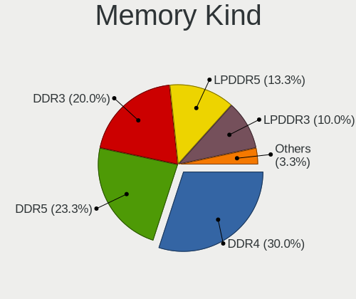

Kali - Hardware Trends
----------------------

A project to identify most popular hardware characteristics and track their change
over time based on data collected by Linux users at https://Linux-Hardware.org.

Anyone can contribute to this report by the [hw-probe](https://github.com/linuxhw/hw-probe) tool:

    sudo -E hw-probe -all -upload

This is a report for all computer types. See also reports for [desktops](/Dist/Kali/Desktop/README.md) and [notebooks](/Dist/Kali/Notebook/README.md).

This report is for one last month. Overall report since the beginning of time: [TestDays](https://github.com/linuxhw/TestDays)

Period: Oct, 2023.

Contents
--------

* [ System ](#system)
  - [ OS                       ](#os)
  - [ OS Family                ](#os-family)
  - [ Kernel                   ](#kernel)
  - [ Kernel Family            ](#kernel-family)
  - [ Kernel Major Ver.        ](#kernel-major-ver)
  - [ Arch                     ](#arch)
  - [ DE                       ](#de)
  - [ Display Server           ](#display-server)
  - [ Display Manager          ](#display-manager)
  - [ OS Lang                  ](#os-lang)
  - [ Boot Mode                ](#boot-mode)
  - [ Filesystem               ](#filesystem)
  - [ Part. scheme             ](#part-scheme)
  - [ Dual Boot with Linux/BSD ](#dual-boot-with-linuxbsd)
  - [ Dual Boot (Win)          ](#dual-boot-win)

* [ Board ](#board)
  - [ Vendor                   ](#vendor)
  - [ Model                    ](#model)
  - [ Model Family             ](#model-family)
  - [ MFG Year                 ](#mfg-year)
  - [ Form Factor              ](#form-factor)
  - [ Secure Boot              ](#secure-boot)
  - [ Coreboot                 ](#coreboot)
  - [ RAM Size                 ](#ram-size)
  - [ RAM Used                 ](#ram-used)
  - [ Total Drives             ](#total-drives)
  - [ Has CD-ROM               ](#has-cd-rom)
  - [ Has Ethernet             ](#has-ethernet)
  - [ Has WiFi                 ](#has-wifi)
  - [ Has Bluetooth            ](#has-bluetooth)

* [ Location ](#location)
  - [ Country                  ](#country)
  - [ City                     ](#city)

* [ Drives ](#drives)
  - [ Drive Vendor             ](#drive-vendor)
  - [ Drive Model              ](#drive-model)
  - [ HDD Vendor               ](#hdd-vendor)
  - [ SSD Vendor               ](#ssd-vendor)
  - [ Drive Kind               ](#drive-kind)
  - [ Drive Connector          ](#drive-connector)
  - [ Drive Size               ](#drive-size)
  - [ Space Total              ](#space-total)
  - [ Space Used               ](#space-used)
  - [ Malfunc. Drives          ](#malfunc-drives)
  - [ Malfunc. Drive Vendor    ](#malfunc-drive-vendor)
  - [ Malfunc. HDD Vendor      ](#malfunc-hdd-vendor)
  - [ Malfunc. Drive Kind      ](#malfunc-drive-kind)
  - [ Failed Drives            ](#failed-drives)
  - [ Failed Drive Vendor      ](#failed-drive-vendor)
  - [ Drive Status             ](#drive-status)

* [ Storage controller ](#storage-controller)
  - [ Storage Vendor           ](#storage-vendor)
  - [ Storage Model            ](#storage-model)
  - [ Storage Kind             ](#storage-kind)

* [ Processor ](#processor)
  - [ CPU Vendor               ](#cpu-vendor)
  - [ CPU Model                ](#cpu-model)
  - [ CPU Model Family         ](#cpu-model-family)
  - [ CPU Cores                ](#cpu-cores)
  - [ CPU Sockets              ](#cpu-sockets)
  - [ CPU Threads              ](#cpu-threads)
  - [ CPU Op-Modes             ](#cpu-op-modes)
  - [ CPU Microcode            ](#cpu-microcode)
  - [ CPU Microarch            ](#cpu-microarch)

* [ Graphics ](#graphics)
  - [ GPU Vendor               ](#gpu-vendor)
  - [ GPU Model                ](#gpu-model)
  - [ GPU Combo                ](#gpu-combo)
  - [ GPU Driver               ](#gpu-driver)
  - [ GPU Memory               ](#gpu-memory)

* [ Monitor ](#monitor)
  - [ Monitor Vendor           ](#monitor-vendor)
  - [ Monitor Model            ](#monitor-model)
  - [ Monitor Resolution       ](#monitor-resolution)
  - [ Monitor Diagonal         ](#monitor-diagonal)
  - [ Monitor Width            ](#monitor-width)
  - [ Aspect Ratio             ](#aspect-ratio)
  - [ Monitor Area             ](#monitor-area)
  - [ Pixel Density            ](#pixel-density)
  - [ Multiple Monitors        ](#multiple-monitors)

* [ Network ](#network)
  - [ Net Controller Vendor    ](#net-controller-vendor)
  - [ Net Controller Model     ](#net-controller-model)
  - [ Wireless Vendor          ](#wireless-vendor)
  - [ Wireless Model           ](#wireless-model)
  - [ Ethernet Vendor          ](#ethernet-vendor)
  - [ Ethernet Model           ](#ethernet-model)
  - [ Net Controller Kind      ](#net-controller-kind)
  - [ Used Controller          ](#used-controller)
  - [ NICs                     ](#nics)
  - [ IPv6                     ](#ipv6)

* [ Bluetooth ](#bluetooth)
  - [ Bluetooth Vendor         ](#bluetooth-vendor)
  - [ Bluetooth Model          ](#bluetooth-model)

* [ Sound ](#sound)
  - [ Sound Vendor             ](#sound-vendor)
  - [ Sound Model              ](#sound-model)

* [ Memory ](#memory)
  - [ Memory Vendor            ](#memory-vendor)
  - [ Memory Model             ](#memory-model)
  - [ Memory Kind              ](#memory-kind)
  - [ Memory Form Factor       ](#memory-form-factor)
  - [ Memory Size              ](#memory-size)
  - [ Memory Speed             ](#memory-speed)

* [ Printers & scanners ](#printers--scanners)
  - [ Printer Vendor           ](#printer-vendor)
  - [ Printer Model            ](#printer-model)
  - [ Scanner Vendor           ](#scanner-vendor)
  - [ Scanner Model            ](#scanner-model)

* [ Camera ](#camera)
  - [ Camera Vendor            ](#camera-vendor)
  - [ Camera Model             ](#camera-model)

* [ Security ](#security)
  - [ Fingerprint Vendor       ](#fingerprint-vendor)
  - [ Fingerprint Model        ](#fingerprint-model)
  - [ Chipcard Vendor          ](#chipcard-vendor)
  - [ Chipcard Model           ](#chipcard-model)

* [ Unsupported ](#unsupported)
  - [ Unsupported Devices      ](#unsupported-devices)
  - [ Unsupported Device Types ](#unsupported-device-types)

System
------

OS
--

Installed operating systems

| Name         | Computers | Percent |
|--------------|-----------|---------|
| Kali 2023.3  | 75        | 94.94%  |
| Kali 2023.1  | 2         | 2.53%   |
| Kali Rolling | 1         | 1.27%   |
| Kali 2022.4  | 1         | 1.27%   |

OS Family
---------

OS without a version

| Name | Computers | Percent |
|------|-----------|---------|
| Kali | 79        | 100%    |

Kernel
------

Version of the Linux kernel

| Version             | Computers | Percent |
|---------------------|-----------|---------|
| 6.5.0-kali2-amd64   | 33        | 41.77%  |
| 6.5.0-kali1-amd64   | 14        | 17.72%  |
| 6.3.0-kali1-amd64   | 9         | 11.39%  |
| 6.5.0-kali3-amd64   | 8         | 10.13%  |
| 6.4.0-kali3-amd64   | 5         | 6.33%   |
| 6.1.0-kali5-amd64   | 2         | 2.53%   |
| 6.5.7-x64v4-xanmod1 | 1         | 1.27%   |
| 6.5.7-t2            | 1         | 1.27%   |
| 6.5.0-3-amd64       | 1         | 1.27%   |
| 6.4.12-surface      | 1         | 1.27%   |
| 6.1.0-kali7-amd64   | 1         | 1.27%   |
| 6.0.0-kali3-amd64   | 1         | 1.27%   |
| 5.18.0-kali7-amd64  | 1         | 1.27%   |
| 5.18.0-kali5-amd64  | 1         | 1.27%   |

Kernel Family
-------------

Linux kernel without a distro release

| Version | Computers | Percent |
|---------|-----------|---------|
| 6.5.0   | 56        | 70.89%  |
| 6.3.0   | 9         | 11.39%  |
| 6.4.0   | 5         | 6.33%   |
| 6.1.0   | 3         | 3.8%    |
| 6.5.7   | 2         | 2.53%   |
| 5.18.0  | 2         | 2.53%   |
| 6.4.12  | 1         | 1.27%   |
| 6.0.0   | 1         | 1.27%   |

Kernel Major Ver.
-----------------

Linux kernel major version

| Version | Computers | Percent |
|---------|-----------|---------|
| 6.5     | 58        | 73.42%  |
| 6.3     | 9         | 11.39%  |
| 6.4     | 6         | 7.59%   |
| 6.1     | 3         | 3.8%    |
| 5.18    | 2         | 2.53%   |
| 6.0     | 1         | 1.27%   |

Arch
----

OS architecture (x86_64, i586, etc.)

| Name   | Computers | Percent |
|--------|-----------|---------|
| x86_64 | 79        | 100%    |

DE
--

Desktop Environment

| Name             | Computers | Percent |
|------------------|-----------|---------|
| XFCE             | 40        | 50.63%  |
| GNOME            | 28        | 35.44%  |
| KDE5             | 7         | 8.86%   |
| lightdm-xsession | 2         | 2.53%   |
| GNOME Classic    | 1         | 1.27%   |
| Unknown          | 1         | 1.27%   |

Display Server
--------------

X11 or Wayland

| Name    | Computers | Percent |
|---------|-----------|---------|
| X11     | 68        | 86.08%  |
| Wayland | 10        | 12.66%  |
| Unknown | 1         | 1.27%   |

Display Manager
---------------

SDDM, LightDM, etc.

| Name    | Computers | Percent |
|---------|-----------|---------|
| LightDM | 37        | 46.84%  |
| Unknown | 20        | 25.32%  |
| SDDM    | 11        | 13.92%  |
| GDM3    | 11        | 13.92%  |

OS Lang
-------

Language

| Lang    | Computers | Percent |
|---------|-----------|---------|
| C       | 31        | 39.24%  |
| en_US   | 24        | 30.38%  |
| en_GB   | 3         | 3.8%    |
| de_DE   | 3         | 3.8%    |
| ru_RU   | 2         | 2.53%   |
| en_CA   | 2         | 2.53%   |
| en_AU   | 2         | 2.53%   |
| zh_HK   | 1         | 1.27%   |
| zh_CN   | 1         | 1.27%   |
| tr_TR   | 1         | 1.27%   |
| pt_PT   | 1         | 1.27%   |
| pt_BR   | 1         | 1.27%   |
| ja_JP   | 1         | 1.27%   |
| fr_FR   | 1         | 1.27%   |
| es_ES   | 1         | 1.27%   |
| es_DO   | 1         | 1.27%   |
| en_ZA   | 1         | 1.27%   |
| de_AT   | 1         | 1.27%   |
| Unknown | 1         | 1.27%   |

Boot Mode
---------

EFI or BIOS

| Mode | Computers | Percent |
|------|-----------|---------|
| EFI  | 60        | 75.95%  |
| BIOS | 19        | 24.05%  |

Filesystem
----------

Type of filesystem

| Type    | Computers | Percent |
|---------|-----------|---------|
| Ext4    | 70        | 88.61%  |
| Tmpfs   | 4         | 5.06%   |
| Btrfs   | 2         | 2.53%   |
| Xfs     | 1         | 1.27%   |
| Overlay | 1         | 1.27%   |
| Ext3    | 1         | 1.27%   |

Part. scheme
------------

Scheme of partitioning

| Type    | Computers | Percent |
|---------|-----------|---------|
| GPT     | 55        | 69.62%  |
| Unknown | 18        | 22.78%  |
| MBR     | 6         | 7.59%   |

Dual Boot with Linux/BSD
------------------------

Hosting more than one Linux/BSD

| Dual boot | Computers | Percent |
|-----------|-----------|---------|
| No        | 69        | 87.34%  |
| Yes       | 10        | 12.66%  |

Dual Boot (Win)
---------------

Hosting Linux and Windows

| Dual boot | Computers | Percent |
|-----------|-----------|---------|
| No        | 50        | 63.29%  |
| Yes       | 29        | 36.71%  |

Board
-----

Vendor
------

Motherboard manufacturer

| Name                | Computers | Percent |
|---------------------|-----------|---------|
| Hewlett-Packard     | 17        | 21.52%  |
| Lenovo              | 12        | 15.19%  |
| Dell                | 11        | 13.92%  |
| ASUSTek Computer    | 8         | 10.13%  |
| Apple               | 6         | 7.59%   |
| Acer                | 6         | 7.59%   |
| MSI                 | 4         | 5.06%   |
| Gigabyte Technology | 2         | 2.53%   |
| Timi                | 1         | 1.27%   |
| Samsung Electronics | 1         | 1.27%   |
| Razer               | 1         | 1.27%   |
| NEC Computers       | 1         | 1.27%   |
| Microsoft           | 1         | 1.27%   |
| Medion              | 1         | 1.27%   |
| HUAWEI              | 1         | 1.27%   |
| Google              | 1         | 1.27%   |
| Fujitsu Siemens     | 1         | 1.27%   |
| Fujitsu             | 1         | 1.27%   |
| ASRock              | 1         | 1.27%   |
| Alienware           | 1         | 1.27%   |
| Unknown             | 1         | 1.27%   |

Model
-----

Motherboard model

| Name                                        | Computers | Percent |
|---------------------------------------------|-----------|---------|
| HP Laptop 15-dy2xxx                         | 2         | 2.53%   |
| Timi A34S                                   | 1         | 1.27%   |
| Samsung 550XCJ/550XCR                       | 1         | 1.27%   |
| Razer Blade 17 (Mid 2021) - RZ09-0406       | 1         | 1.27%   |
| NEC Computers PC-VK26TLNZ39ZJ               | 1         | 1.27%   |
| MSI Prestige 14 A10SC                       | 1         | 1.27%   |
| MSI MS-7C56                                 | 1         | 1.27%   |
| MSI MS-7B49                                 | 1         | 1.27%   |
| MSI GF75 Thin 9SC                           | 1         | 1.27%   |
| Microsoft Surface Pro 7                     | 1         | 1.27%   |
| Medion E16402                               | 1         | 1.27%   |
| Lenovo ThinkPad Yoga 11e 5th Gen 20LNS1MV00 | 1         | 1.27%   |
| Lenovo ThinkPad X1 Carbon Gen 8 20U9CTO1WW  | 1         | 1.27%   |
| Lenovo ThinkPad T14 Gen 1 20UES1VW1R        | 1         | 1.27%   |
| Lenovo ThinkPad S1 Yoga 12 20DLCTO1WW       | 1         | 1.27%   |
| Lenovo ThinkPad P16 Gen 2 21FA0027US        | 1         | 1.27%   |
| Lenovo ThinkPad E460 20ETA05KAU             | 1         | 1.27%   |
| Lenovo ThinkPad E14 Gen 2 20TAS0U500        | 1         | 1.27%   |
| Lenovo Legion Y740-17IRHg 81UJ              | 1         | 1.27%   |
| Lenovo IdeaPad S145-15IIL 81W8              | 1         | 1.27%   |
| Lenovo IdeaPad 330S-15IKB GTX1050 81GC      | 1         | 1.27%   |
| Lenovo IdeaPad 320-15IKB 81BT               | 1         | 1.27%   |
| Lenovo G580 2189                            | 1         | 1.27%   |
| HUAWEI CREF-XX                              | 1         | 1.27%   |
| HP Victus by Laptop PC                      | 1         | 1.27%   |
| HP ProBook 4540s                            | 1         | 1.27%   |
| HP ProBook 450 G4                           | 1         | 1.27%   |
| HP Pavilion Laptop 13-bb0xxx                | 1         | 1.27%   |
| HP OMEN by Laptop 15-dc1xxx                 | 1         | 1.27%   |
| HP Laptop 17-cn1xxx                         | 1         | 1.27%   |
| HP Laptop 15-da0xxx                         | 1         | 1.27%   |
| HP ENVY x360 Convertible 13-bd0xxx          | 1         | 1.27%   |
| HP EliteDesk 800 G1 SFF                     | 1         | 1.27%   |
| HP EliteBook Revolve 810 G3                 | 1         | 1.27%   |
| HP EliteBook 840 G3                         | 1         | 1.27%   |
| HP EliteBook 830 G5                         | 1         | 1.27%   |
| HP Compaq 610                               | 1         | 1.27%   |
| HP 250 G8 Notebook PC                       | 1         | 1.27%   |
| HP 250 G2                                   | 1         | 1.27%   |
| Google Kefka                                | 1         | 1.27%   |

Model Family
------------

Motherboard model prefix

| Name                          | Computers | Percent |
|-------------------------------|-----------|---------|
| Lenovo ThinkPad               | 7         | 8.86%   |
| HP Laptop                     | 4         | 5.06%   |
| Dell Latitude                 | 4         | 5.06%   |
| Acer Aspire                   | 4         | 5.06%   |
| Lenovo IdeaPad                | 3         | 3.8%    |
| HP EliteBook                  | 3         | 3.8%    |
| ASUS ROG                      | 3         | 3.8%    |
| HP ProBook                    | 2         | 2.53%   |
| HP 250                        | 2         | 2.53%   |
| Dell Vostro                   | 2         | 2.53%   |
| Dell Inspiron                 | 2         | 2.53%   |
| Dell G15                      | 2         | 2.53%   |
| Timi A34S                     | 1         | 1.27%   |
| Samsung 550XCJ                | 1         | 1.27%   |
| Razer Blade                   | 1         | 1.27%   |
| NEC Computers PC-VK26TLNZ39ZJ | 1         | 1.27%   |
| MSI Prestige                  | 1         | 1.27%   |
| MSI MS-7C56                   | 1         | 1.27%   |
| MSI MS-7B49                   | 1         | 1.27%   |
| MSI GF75                      | 1         | 1.27%   |
| Microsoft Surface             | 1         | 1.27%   |
| Medion E16402                 | 1         | 1.27%   |
| Lenovo Legion                 | 1         | 1.27%   |
| Lenovo G580                   | 1         | 1.27%   |
| HUAWEI CREF-XX                | 1         | 1.27%   |
| HP Victus                     | 1         | 1.27%   |
| HP Pavilion                   | 1         | 1.27%   |
| HP OMEN                       | 1         | 1.27%   |
| HP ENVY                       | 1         | 1.27%   |
| HP EliteDesk                  | 1         | 1.27%   |
| HP Compaq                     | 1         | 1.27%   |
| Google Kefka                  | 1         | 1.27%   |
| Gigabyte Z390                 | 1         | 1.27%   |
| Gigabyte B550M                | 1         | 1.27%   |
| Fujitsu Siemens AMILO         | 1         | 1.27%   |
| Fujitsu LIFEBOOK              | 1         | 1.27%   |
| Dell OptiPlex                 | 1         | 1.27%   |
| ASUS VivoBook                 | 1         | 1.27%   |
| ASUS TUF                      | 1         | 1.27%   |
| ASUS M5A78L-M                 | 1         | 1.27%   |

MFG Year
--------

Motherboard manufacture year

| Year | Computers | Percent |
|------|-----------|---------|
| 2021 | 14        | 17.72%  |
| 2020 | 12        | 15.19%  |
| 2019 | 9         | 11.39%  |
| 2018 | 7         | 8.86%   |
| 2023 | 5         | 6.33%   |
| 2011 | 5         | 6.33%   |
| 2015 | 4         | 5.06%   |
| 2013 | 4         | 5.06%   |
| 2012 | 4         | 5.06%   |
| 2022 | 3         | 3.8%    |
| 2014 | 3         | 3.8%    |
| 2009 | 3         | 3.8%    |
| 2017 | 2         | 2.53%   |
| 2016 | 2         | 2.53%   |
| 2008 | 1         | 1.27%   |
| 2007 | 1         | 1.27%   |

Form Factor
-----------

Physical design of the computer

| Name        | Computers | Percent |
|-------------|-----------|---------|
| Notebook    | 66        | 83.54%  |
| Desktop     | 10        | 12.66%  |
| Convertible | 2         | 2.53%   |
| Tablet      | 1         | 1.27%   |

Secure Boot
-----------

Enabled or disabled

| State    | Computers | Percent |
|----------|-----------|---------|
| Disabled | 79        | 100%    |

Coreboot
--------

Have coreboot on board

| Used | Computers | Percent |
|------|-----------|---------|
| No   | 78        | 98.73%  |
| Yes  | 1         | 1.27%   |

RAM Size
--------

Total RAM memory

| Size in GB  | Computers | Percent |
|-------------|-----------|---------|
| 16.01-24.0  | 23        | 29.11%  |
| 4.01-8.0    | 20        | 25.32%  |
| 8.01-16.0   | 16        | 20.25%  |
| 3.01-4.0    | 8         | 10.13%  |
| 32.01-64.0  | 6         | 7.59%   |
| 64.01-256.0 | 3         | 3.8%    |
| 2.01-3.0    | 2         | 2.53%   |
| 24.01-32.0  | 1         | 1.27%   |

RAM Used
--------

Used RAM memory

| Used GB   | Computers | Percent |
|-----------|-----------|---------|
| 2.01-3.0  | 25        | 31.65%  |
| 3.01-4.0  | 18        | 22.78%  |
| 4.01-8.0  | 16        | 20.25%  |
| 1.01-2.0  | 13        | 16.46%  |
| 8.01-16.0 | 7         | 8.86%   |

Total Drives
------------

Number of drives on board

| Drives | Computers | Percent |
|--------|-----------|---------|
| 1      | 50        | 63.29%  |
| 2      | 21        | 26.58%  |
| 3      | 6         | 7.59%   |
| 4      | 2         | 2.53%   |

Has CD-ROM
----------

Has CD-ROM on board

| Presented | Computers | Percent |
|-----------|-----------|---------|
| No        | 66        | 83.54%  |
| Yes       | 13        | 16.46%  |

Has Ethernet
------------

Has Ethernet on board

| Presented | Computers | Percent |
|-----------|-----------|---------|
| Yes       | 64        | 81.01%  |
| No        | 15        | 18.99%  |

Has WiFi
--------

Has WiFi module

| Presented | Computers | Percent |
|-----------|-----------|---------|
| Yes       | 74        | 93.67%  |
| No        | 5         | 6.33%   |

Has Bluetooth
-------------

Has Bluetooth module

| Presented | Computers | Percent |
|-----------|-----------|---------|
| Yes       | 66        | 83.54%  |
| No        | 13        | 16.46%  |

Location
--------

Country
-------

Geographic location (country)

| Country            | Computers | Percent |
|--------------------|-----------|---------|
| USA                | 16        | 20.25%  |
| Turkey             | 4         | 5.06%   |
| Russia             | 4         | 5.06%   |
| Australia          | 4         | 5.06%   |
| Spain              | 3         | 3.8%    |
| Germany            | 3         | 3.8%    |
| UK                 | 2         | 2.53%   |
| Poland             | 2         | 2.53%   |
| Pakistan           | 2         | 2.53%   |
| Oman               | 2         | 2.53%   |
| Netherlands        | 2         | 2.53%   |
| Myanmar            | 2         | 2.53%   |
| Morocco            | 2         | 2.53%   |
| France             | 2         | 2.53%   |
| Egypt              | 2         | 2.53%   |
| Dominican Republic | 2         | 2.53%   |
| Denmark            | 2         | 2.53%   |
| Canada             | 2         | 2.53%   |
| Yemen              | 1         | 1.27%   |
| Taiwan             | 1         | 1.27%   |
| Sweden             | 1         | 1.27%   |
| Serbia             | 1         | 1.27%   |
| Senegal            | 1         | 1.27%   |
| Portugal           | 1         | 1.27%   |
| Moldova            | 1         | 1.27%   |
| Kenya              | 1         | 1.27%   |
| Jordan             | 1         | 1.27%   |
| Japan              | 1         | 1.27%   |
| Italy              | 1         | 1.27%   |
| Iraq               | 1         | 1.27%   |
| Hong Kong          | 1         | 1.27%   |
| Czechia            | 1         | 1.27%   |
| China              | 1         | 1.27%   |
| Chile              | 1         | 1.27%   |
| Bulgaria           | 1         | 1.27%   |
| Brazil             | 1         | 1.27%   |
| Belarus            | 1         | 1.27%   |
| Bangladesh         | 1         | 1.27%   |
| Austria            | 1         | 1.27%   |

City
----

Geographic location (city)

| City                       | Computers | Percent |
|----------------------------|-----------|---------|
| Sydney                     | 3         | 3.8%    |
| Moscow                     | 2         | 2.53%   |
| Montreal                   | 2         | 2.53%   |
| Lahore                     | 2         | 2.53%   |
| Istanbul                   | 2         | 2.53%   |
| Cairo                      | 2         | 2.53%   |
| Zaragoza                   | 1         | 1.27%   |
| Yangon                     | 1         | 1.27%   |
| Wurzen                     | 1         | 1.27%   |
| Wuhan                      | 1         | 1.27%   |
| Weatherford                | 1         | 1.27%   |
| Warsaw                     | 1         | 1.27%   |
| Vienna                     | 1         | 1.27%   |
| Valdivia                   | 1         | 1.27%   |
| Tsuen Wan                  | 1         | 1.27%   |
| Tangier                    | 1         | 1.27%   |
| Stockholm                  | 1         | 1.27%   |
| Seattle                    | 1         | 1.27%   |
| Santo Domingo Este         | 1         | 1.27%   |
| Santiago de los Caballeros | 1         | 1.27%   |
| Sanaa                      | 1         | 1.27%   |
| Sacramento                 | 1         | 1.27%   |
| Rotterdam                  | 1         | 1.27%   |
| Reno                       | 1         | 1.27%   |
| Premia de Mar              | 1         | 1.27%   |
| Prague                     | 1         | 1.27%   |
| Porto                      | 1         | 1.27%   |
| Pensacola                  | 1         | 1.27%   |
| Palm Bay                   | 1         | 1.27%   |
| Nizwa                      | 1         | 1.27%   |
| Nairobi                    | 1         | 1.27%   |
| Muscat                     | 1         | 1.27%   |
| Munich                     | 1         | 1.27%   |
| Mbour                      | 1         | 1.27%   |
| Mandalay                   | 1         | 1.27%   |
| London                     | 1         | 1.27%   |
| Lemvig                     | 1         | 1.27%   |
| Las Vegas                  | 1         | 1.27%   |
| Kosekoy                    | 1         | 1.27%   |
| Kazan’                   | 1         | 1.27%   |

Drives
------

Drive Vendor
------------

Hard drive vendors

| Vendor                      | Computers | Drives | Percent |
|-----------------------------|-----------|--------|---------|
| Samsung Electronics         | 13        | 14     | 11.82%  |
| WDC                         | 11        | 12     | 10%     |
| Seagate                     | 11        | 11     | 10%     |
| Intel                       | 8         | 11     | 7.27%   |
| Toshiba                     | 7         | 7      | 6.36%   |
| Unknown                     | 5         | 9      | 4.55%   |
| SK hynix                    | 5         | 5      | 4.55%   |
| Kingston                    | 5         | 5      | 4.55%   |
| SanDisk                     | 4         | 4      | 3.64%   |
| Phison Electronics          | 3         | 3      | 2.73%   |
| Lexar                       | 3         | 3      | 2.73%   |
| KIOXIA                      | 3         | 3      | 2.73%   |
| Apple                       | 3         | 3      | 2.73%   |
| Silicon Motion              | 2         | 2      | 1.82%   |
| Crucial                     | 2         | 2      | 1.82%   |
| Unknown                     | 2         | 2      | 1.82%   |
| Vaseky                      | 1         | 1      | 0.91%   |
| TwinMOS                     | 1         | 1      | 0.91%   |
| Transcend                   | 1         | 2      | 0.91%   |
| Team                        | 1         | 1      | 0.91%   |
| SSK                         | 1         | 1      | 0.91%   |
| SPCC                        | 1         | 1      | 0.91%   |
| Realtek Semiconductor       | 1         | 2      | 0.91%   |
| PNY                         | 1         | 1      | 0.91%   |
| MOVESPEED                   | 1         | 1      | 0.91%   |
| Micron/Crucial Technology   | 1         | 1      | 0.91%   |
| Micron Technology           | 1         | 1      | 0.91%   |
| Maxone                      | 1         | 1      | 0.91%   |
| MAXIO Technology (Hangzhou) | 1         | 1      | 0.91%   |
| LITEON                      | 1         | 1      | 0.91%   |
| Lenovo                      | 1         | 1      | 0.91%   |
| Kingston Technology Company | 1         | 1      | 0.91%   |
| JMicron Technology          | 1         | 1      | 0.91%   |
| Hitachi                     | 1         | 1      | 0.91%   |
| China                       | 1         | 1      | 0.91%   |
| BAITITON                    | 1         | 1      | 0.91%   |
| AMD                         | 1         | 1      | 0.91%   |
| AirDisk                     | 1         | 1      | 0.91%   |
| A-DATA Technology           | 1         | 1      | 0.91%   |

Drive Model
-----------

Hard drive models

| Model                                | Computers | Percent |
|--------------------------------------|-----------|---------|
| Seagate ST1000LM035-1RK172 1TB       | 4         | 3.33%   |
| Toshiba MQ04ABF100 1TB               | 2         | 1.67%   |
| Seagate ST2000DM008-2FR102 2TB       | 2         | 1.67%   |
| Samsung MZVL21T0HCLR-00B00 1TB       | 2         | 1.67%   |
| Lexar 256GB SSD                      | 2         | 1.67%   |
| Intel SSDPEKNU512GZ 512GB            | 2         | 1.67%   |
| Unknown                              | 2         | 1.67%   |
| WDC WDS500G2B0B-00YS70 500GB SSD     | 1         | 0.83%   |
| WDC WDS500G2B0A-00SM50 500GB SSD     | 1         | 0.83%   |
| WDC WDS200T1X0E-00AFY0 2TB           | 1         | 0.83%   |
| WDC WDS100T2B0A 1TB SSD              | 1         | 0.83%   |
| WDC WD5000LPVX-60V0TT0 500GB         | 1         | 0.83%   |
| WDC WD5000LPCX-22VHAT1 500GB         | 1         | 0.83%   |
| WDC WD5000BPKT-00PK4T0 500GB         | 1         | 0.83%   |
| WDC WD5000AZLX-60K2TA0 500GB         | 1         | 0.83%   |
| WDC WD2500BPVT-00JJ5T0 250GB         | 1         | 0.83%   |
| WDC WD10JPVX-60JC3T1 1TB             | 1         | 0.83%   |
| WDC WD10EZEX-60WN4A0 1TB             | 1         | 0.83%   |
| WDC PC SN730 SDBQNTY-256G-1001 256GB | 1         | 0.83%   |
| Vaseky V800/256G 256GB SSD           | 1         | 0.83%   |
| Unknown xD/SD/M.S.                   | 1         | 0.83%   |
| Unknown USD00  128GB                 | 1         | 0.83%   |
| Unknown SC32G  32GB                  | 1         | 0.83%   |
| Unknown MMC Card  64GB               | 1         | 0.83%   |
| Unknown MMC Card  32GB               | 1         | 0.83%   |
| Unknown MMC Card  16GB               | 1         | 0.83%   |
| Unknown MMC Card  128GB              | 1         | 0.83%   |
| Unknown hA8aP  16GB                  | 1         | 0.83%   |
| Unknown APPSD  537GB                 | 1         | 0.83%   |
| TwinMOS SSD 256GB                    | 1         | 0.83%   |
| Transcend TS480GSSD220S 480GB        | 1         | 0.83%   |
| Transcend TS240GSSD220S 240GB        | 1         | 0.83%   |
| Toshiba MQ01ABF050 500GB             | 1         | 0.83%   |
| Toshiba MQ01ABD100 1TB               | 1         | 0.83%   |
| Toshiba KBG40ZPZ256G MEMORY 256GB    | 1         | 0.83%   |
| Toshiba KBG30ZMV512G 512GB           | 1         | 0.83%   |
| Toshiba DT02ABA200V 2TB              | 1         | 0.83%   |
| Team T253X2512G 512GB SSD            | 1         | 0.83%   |
| SSK Disk 512GB                       | 1         | 0.83%   |
| SPCC Solid State Disk 120GB          | 1         | 0.83%   |

HDD Vendor
----------

Hard disk drive vendors

| Vendor  | Computers | Drives | Percent |
|---------|-----------|--------|---------|
| Seagate | 11        | 11     | 42.31%  |
| WDC     | 7         | 7      | 26.92%  |
| Toshiba | 5         | 5      | 19.23%  |
| SSK     | 1         | 1      | 3.85%   |
| Maxone  | 1         | 1      | 3.85%   |
| Hitachi | 1         | 1      | 3.85%   |

SSD Vendor
----------

Solid state drive vendors

| Vendor              | Computers | Drives | Percent |
|---------------------|-----------|--------|---------|
| Samsung Electronics | 5         | 5      | 15.15%  |
| WDC                 | 3         | 3      | 9.09%   |
| Kingston            | 3         | 3      | 9.09%   |
| SanDisk             | 2         | 2      | 6.06%   |
| Lexar               | 2         | 2      | 6.06%   |
| Vaseky              | 1         | 1      | 3.03%   |
| TwinMOS             | 1         | 1      | 3.03%   |
| Transcend           | 1         | 2      | 3.03%   |
| Team                | 1         | 1      | 3.03%   |
| SPCC                | 1         | 1      | 3.03%   |
| SK hynix            | 1         | 1      | 3.03%   |
| PNY                 | 1         | 1      | 3.03%   |
| MOVESPEED           | 1         | 1      | 3.03%   |
| Micron Technology   | 1         | 1      | 3.03%   |
| LITEON              | 1         | 1      | 3.03%   |
| Intel               | 1         | 1      | 3.03%   |
| Crucial             | 1         | 1      | 3.03%   |
| China               | 1         | 1      | 3.03%   |
| BAITITON            | 1         | 1      | 3.03%   |
| Apple               | 1         | 1      | 3.03%   |
| AMD                 | 1         | 1      | 3.03%   |
| AirDisk             | 1         | 1      | 3.03%   |
| A-DATA Technology   | 1         | 1      | 3.03%   |

Drive Kind
----------

HDD or SSD

| Kind    | Computers | Drives | Percent |
|---------|-----------|--------|---------|
| NVMe    | 41        | 49     | 39.81%  |
| SSD     | 30        | 34     | 29.13%  |
| HDD     | 23        | 26     | 22.33%  |
| MMC     | 6         | 9      | 5.83%   |
| Unknown | 3         | 3      | 2.91%   |

Drive Connector
---------------

SATA, SAS, NVMe, etc.

| Type | Computers | Drives | Percent |
|------|-----------|--------|---------|
| SATA | 44        | 59     | 46.32%  |
| NVMe | 41        | 49     | 43.16%  |
| MMC  | 6         | 9      | 6.32%   |
| SAS  | 4         | 4      | 4.21%   |

Drive Size
----------

Size of hard drive

| Size in TB | Computers | Drives | Percent |
|------------|-----------|--------|---------|
| 0.01-0.5   | 30        | 37     | 58.82%  |
| 0.51-1.0   | 17        | 19     | 33.33%  |
| 1.01-2.0   | 4         | 4      | 7.84%   |

Space Total
-----------

Amount of disk space available on the file system

| Size in GB     | Computers | Percent |
|----------------|-----------|---------|
| 101-250        | 22        | 27.85%  |
| 251-500        | 19        | 24.05%  |
| 501-1000       | 15        | 18.99%  |
| 51-100         | 10        | 12.66%  |
| 21-50          | 5         | 6.33%   |
| More than 3000 | 3         | 3.8%    |
| 1001-2000      | 3         | 3.8%    |
| 2001-3000      | 1         | 1.27%   |
| Unknown        | 1         | 1.27%   |

Space Used
----------

Amount of used disk space

| Used GB        | Computers | Percent |
|----------------|-----------|---------|
| 21-50          | 26        | 32.91%  |
| 1-20           | 18        | 22.78%  |
| 101-250        | 14        | 17.72%  |
| 51-100         | 9         | 11.39%  |
| 251-500        | 4         | 5.06%   |
| 501-1000       | 3         | 3.8%    |
| More than 3000 | 2         | 2.53%   |
| 1001-2000      | 2         | 2.53%   |
| Unknown        | 1         | 1.27%   |

Malfunc. Drives
---------------

Drive models with a malfunction

| Model                        | Computers | Drives | Percent |
|------------------------------|-----------|--------|---------|
| WDC WD5000LPVX-60V0TT0 500GB | 1         | 1      | 100%    |

Malfunc. Drive Vendor
---------------------

Vendors of faulty drives

| Vendor | Computers | Drives | Percent |
|--------|-----------|--------|---------|
| WDC    | 1         | 1      | 100%    |

Malfunc. HDD Vendor
-------------------

Vendors of faulty HDD drives

| Vendor | Computers | Drives | Percent |
|--------|-----------|--------|---------|
| WDC    | 1         | 1      | 100%    |

Malfunc. Drive Kind
-------------------

Kinds of faulty drives

| Kind | Computers | Drives | Percent |
|------|-----------|--------|---------|
| HDD  | 1         | 1      | 100%    |

Failed Drives
-------------

Failed drive models

Zero info for selected period =(

Failed Drive Vendor
-------------------

Failed drive vendors

Zero info for selected period =(

Drive Status
------------

Number of failed and malfunc. drives

| Status   | Computers | Drives | Percent |
|----------|-----------|--------|---------|
| Works    | 55        | 71     | 63.22%  |
| Detected | 30        | 48     | 34.48%  |
| Fixed    | 1         | 1      | 1.15%   |
| Malfunc  | 1         | 1      | 1.15%   |

Storage controller
------------------

Storage Vendor
--------------

Storage controller vendors

| Vendor                       | Computers | Percent |
|------------------------------|-----------|---------|
| Intel                        | 50        | 50%     |
| Samsung Electronics          | 9         | 9%      |
| AMD                          | 9         | 9%      |
| SK hynix                     | 4         | 4%      |
| SanDisk                      | 4         | 4%      |
| KIOXIA                       | 4         | 4%      |
| Phison Electronics           | 3         | 3%      |
| Kingston Technology Company  | 3         | 3%      |
| Silicon Motion               | 2         | 2%      |
| Nvidia                       | 2         | 2%      |
| Micron/Crucial Technology    | 2         | 2%      |
| Apple                        | 2         | 2%      |
| Toshiba America Info Systems | 1         | 1%      |
| Shenzhen Longsys Electronics | 1         | 1%      |
| Realtek Semiconductor        | 1         | 1%      |
| MAXIO Technology (Hangzhou)  | 1         | 1%      |
| Lenovo                       | 1         | 1%      |
| ASMedia Technology           | 1         | 1%      |

Storage Model
-------------

Storage controller models

| Model                                                                          | Computers | Percent |
|--------------------------------------------------------------------------------|-----------|---------|
| Intel Volume Management Device NVMe RAID Controller                            | 8         | 7.14%   |
| AMD FCH SATA Controller [AHCI mode]                                            | 6         | 5.36%   |
| Intel Sunrise Point-LP SATA Controller [AHCI mode]                             | 5         | 4.46%   |
| Intel 82801 Mobile SATA Controller [RAID mode]                                 | 5         | 4.46%   |
| Intel 7 Series Chipset Family 6-port SATA Controller [AHCI mode]               | 5         | 4.46%   |
| Samsung NVMe SSD Controller PM9A1/PM9A3/980PRO                                 | 4         | 3.57%   |
| Intel Cannon Lake Mobile PCH SATA AHCI Controller                              | 4         | 3.57%   |
| KIOXIA NVMe SSD Controller BG4 (DRAM-less)                                     | 3         | 2.68%   |
| Intel Tiger Lake-LP SATA Controller                                            | 3         | 2.68%   |
| Intel 8 Series/C220 Series Chipset Family 6-port SATA Controller 1 [AHCI mode] | 3         | 2.68%   |
| Intel 6 Series/C200 Series Chipset Family 6 port Mobile SATA AHCI Controller   | 3         | 2.68%   |
| Samsung NVMe SSD Controller SM981/PM981/PM983                                  | 2         | 1.79%   |
| Samsung NVMe SSD Controller 980 (DRAM-less)                                    | 2         | 1.79%   |
| Micron/Crucial P2 [Nick P2] / P3 / P3 Plus NVMe PCIe SSD (DRAM-less)           | 2         | 1.79%   |
| Intel Wildcat Point-LP SATA Controller [AHCI Mode]                             | 2         | 1.79%   |
| Intel SSD DC P4101/Pro 7600p/760p/E 6100p Series                               | 2         | 1.79%   |
| Intel SSD 670p Series [Keystone Harbor]                                        | 2         | 1.79%   |
| Intel SATA Controller [RAID mode]                                              | 2         | 1.79%   |
| Intel Ice Lake-LP SATA Controller [AHCI mode]                                  | 2         | 1.79%   |
| Intel Comet Lake SATA AHCI Controller                                          | 2         | 1.79%   |
| Apple ANS2 NVMe Controller                                                     | 2         | 1.79%   |
| AMD 500 Series Chipset SATA Controller                                         | 2         | 1.79%   |
| Toshiba America Info Systems BG3 x2 NVMe SSD Controller (DRAM-less)            | 1         | 0.89%   |
| SK hynix Platinum P41/PC801 NVMe Solid State Drive                             | 1         | 0.89%   |
| SK hynix PC611 NVMe Solid State Drive                                          | 1         | 0.89%   |
| SK hynix Gold P31/BC711/PC711 NVMe Solid State Drive                           | 1         | 0.89%   |
| SK hynix BC511 NVMe SSD                                                        | 1         | 0.89%   |
| Silicon Motion SM2263EN/SM2263XT (DRAM-less) NVMe SSD Controllers              | 1         | 0.89%   |
| Silicon Motion Non-Volatile memory controller                                  | 1         | 0.89%   |
| Shenzhen Longsys Non-Volatile memory controller                                | 1         | 0.89%   |
| SanDisk WD PC SN810 / Black SN850 NVMe SSD                                     | 1         | 0.89%   |
| SanDisk Ultra 3D / WD Blue SN550 NVMe SSD                                      | 1         | 0.89%   |
| SanDisk PC SN520 x2 M.2 2242 NVMe SSD                                          | 1         | 0.89%   |
| SanDisk Extreme Pro / WD Black SN750 / PC SN730 / Red SN700 NVMe SSD           | 1         | 0.89%   |
| Samsung S4LN058A01[SSUBX] AHCI SSD Controller (Apple slot)                     | 1         | 0.89%   |
| Realtek RTS5763DL x2 NVMe SSD Controller                                       | 1         | 0.89%   |
| Realtek RTS5762 NVMe SSD Controller                                            | 1         | 0.89%   |
| Phison PS5021-E21 PCIe4 NVMe Controller (DRAM-less)                            | 1         | 0.89%   |
| Phison PS5019-E19 PCIe4 NVMe Controller (DRAM-less)                            | 1         | 0.89%   |
| Phison E12 NVMe Controller                                                     | 1         | 0.89%   |

Storage Kind
------------

Kind of storage controller (IDE, SATA, NVMe, SAS, ...)

| Kind | Computers | Percent |
|------|-----------|---------|
| SATA | 46        | 43.81%  |
| NVMe | 41        | 39.05%  |
| RAID | 15        | 14.29%  |
| IDE  | 3         | 2.86%   |

Processor
---------

CPU Vendor
----------

Processor vendors

| Vendor | Computers | Percent |
|--------|-----------|---------|
| Intel  | 67        | 84.81%  |
| AMD    | 12        | 15.19%  |

CPU Model
---------

Processor models

| Model                                       | Computers | Percent |
|---------------------------------------------|-----------|---------|
| Intel 11th Gen Core i5-1135G7 @ 2.40GHz     | 4         | 5.06%   |
| Intel Core i7-9750H CPU @ 2.60GHz           | 3         | 3.8%    |
| Intel Core i7-3520M CPU @ 2.90GHz           | 2         | 2.53%   |
| Intel Core i7-10510U CPU @ 1.80GHz          | 2         | 2.53%   |
| Intel Core i5-7200U CPU @ 2.50GHz           | 2         | 2.53%   |
| Intel Core i3-1005G1 CPU @ 1.20GHz          | 2         | 2.53%   |
| Intel Celeron N4120 CPU @ 1.10GHz           | 2         | 2.53%   |
| Intel 11th Gen Core i7-11800H @ 2.30GHz     | 2         | 2.53%   |
| Intel 11th Gen Core i7-1165G7 @ 2.80GHz     | 2         | 2.53%   |
| Intel 11th Gen Core i3-1115G4 @ 3.00GHz     | 2         | 2.53%   |
| AMD Ryzen 5 5600H with Radeon Graphics      | 2         | 2.53%   |
| Intel Pentium Dual-Core CPU T4400 @ 2.20GHz | 1         | 1.27%   |
| Intel Core i9-9900 CPU @ 3.10GHz            | 1         | 1.27%   |
| Intel Core i7-8850H CPU @ 2.60GHz           | 1         | 1.27%   |
| Intel Core i7-8750H CPU @ 2.20GHz           | 1         | 1.27%   |
| Intel Core i7-8650U CPU @ 1.90GHz           | 1         | 1.27%   |
| Intel Core i7-8550U CPU @ 1.80GHz           | 1         | 1.27%   |
| Intel Core i7-6700HQ CPU @ 2.60GHz          | 1         | 1.27%   |
| Intel Core i7-6500U CPU @ 2.50GHz           | 1         | 1.27%   |
| Intel Core i7-5500U CPU @ 2.40GHz           | 1         | 1.27%   |
| Intel Core i7-4702MQ CPU @ 2.20GHz          | 1         | 1.27%   |
| Intel Core i7-4700MQ CPU @ 2.40GHz          | 1         | 1.27%   |
| Intel Core i7-3610QM CPU @ 2.30GHz          | 1         | 1.27%   |
| Intel Core i7-2720QM CPU @ 2.20GHz          | 1         | 1.27%   |
| Intel Core i7-10875H CPU @ 2.30GHz          | 1         | 1.27%   |
| Intel Core i7-10750H CPU @ 2.60GHz          | 1         | 1.27%   |
| Intel Core i7-10710U CPU @ 1.10GHz          | 1         | 1.27%   |
| Intel Core i7-1068NG7 CPU @ 2.30GHz         | 1         | 1.27%   |
| Intel Core i7-1065G7 CPU @ 1.30GHz          | 1         | 1.27%   |
| Intel Core i5-8500 CPU @ 3.00GHz            | 1         | 1.27%   |
| Intel Core i5-8210Y CPU @ 1.60GHz           | 1         | 1.27%   |
| Intel Core i5-6300U CPU @ 2.40GHz           | 1         | 1.27%   |
| Intel Core i5-5350U CPU @ 1.80GHz           | 1         | 1.27%   |
| Intel Core i5-5200U CPU @ 2.20GHz           | 1         | 1.27%   |
| Intel Core i5-4590 CPU @ 3.30GHz            | 1         | 1.27%   |
| Intel Core i5-4570 CPU @ 3.20GHz            | 1         | 1.27%   |
| Intel Core i5-4310M CPU @ 2.70GHz           | 1         | 1.27%   |
| Intel Core i5-2520M CPU @ 2.50GHz           | 1         | 1.27%   |
| Intel Core i5-2415M CPU @ 2.30GHz           | 1         | 1.27%   |
| Intel Core i5-2410M CPU @ 2.30GHz           | 1         | 1.27%   |

CPU Model Family
----------------

Processor model prefix

| Model                   | Computers | Percent |
|-------------------------|-----------|---------|
| Intel Core i7           | 23        | 29.11%  |
| Intel Core i5           | 15        | 18.99%  |
| Other                   | 14        | 17.72%  |
| Intel Core i3           | 6         | 7.59%   |
| AMD Ryzen 5             | 5         | 6.33%   |
| Intel Celeron           | 4         | 5.06%   |
| Intel Core 2 Duo        | 3         | 3.8%    |
| AMD Ryzen 7             | 3         | 3.8%    |
| Intel Pentium Dual-Core | 1         | 1.27%   |
| Intel Core i9           | 1         | 1.27%   |
| AMD Turion 64 X2 Mobile | 1         | 1.27%   |
| AMD Ryzen 9             | 1         | 1.27%   |
| AMD Ryzen 7 PRO         | 1         | 1.27%   |
| AMD FX                  | 1         | 1.27%   |

CPU Cores
---------

Number of processor cores

| Number | Computers | Percent |
|--------|-----------|---------|
| 2      | 29        | 36.71%  |
| 4      | 24        | 30.38%  |
| 6      | 14        | 17.72%  |
| 8      | 8         | 10.13%  |
| 24     | 1         | 1.27%   |
| 16     | 1         | 1.27%   |
| 14     | 1         | 1.27%   |
| 3      | 1         | 1.27%   |

CPU Sockets
-----------

Number of sockets

| Number | Computers | Percent |
|--------|-----------|---------|
| 1      | 79        | 100%    |

CPU Threads
-----------

Threads per core (Hyper-Threading)

| Number | Computers | Percent |
|--------|-----------|---------|
| 2      | 64        | 81.01%  |
| 1      | 15        | 18.99%  |

CPU Op-Modes
------------

CPU Operation Modes (32-bit, 64-bit)

| Op mode        | Computers | Percent |
|----------------|-----------|---------|
| 32-bit, 64-bit | 79        | 100%    |

CPU Microcode
-------------

Microcode number

| Number     | Computers | Percent |
|------------|-----------|---------|
| Unknown    | 63        | 79.75%  |
| 0x0a50000c | 3         | 3.8%    |
| 0x206a7    | 2         | 2.53%   |
| 0x0a601203 | 2         | 2.53%   |
| 0x0a50000d | 2         | 2.53%   |
| 0xa0652    | 1         | 1.27%   |
| 0x906ed    | 1         | 1.27%   |
| 0x40651    | 1         | 1.27%   |
| 0x08701030 | 1         | 1.27%   |
| 0x08600106 | 1         | 1.27%   |
| 0x06000852 | 1         | 1.27%   |
| 0x00000000 | 1         | 1.27%   |

CPU Microarch
-------------

Microarchitecture

| Name             | Computers | Percent |
|------------------|-----------|---------|
| KabyLake         | 15        | 18.99%  |
| TigerLake        | 10        | 12.66%  |
| IceLake          | 7         | 8.86%   |
| Zen 3            | 6         | 7.59%   |
| Haswell          | 6         | 7.59%   |
| SandyBridge      | 5         | 6.33%   |
| CometLake        | 5         | 6.33%   |
| IvyBridge        | 4         | 5.06%   |
| Skylake          | 3         | 3.8%    |
| Broadwell        | 3         | 3.8%    |
| Zen 2            | 2         | 2.53%   |
| Penryn           | 2         | 2.53%   |
| Goldmont plus    | 2         | 2.53%   |
| Core             | 2         | 2.53%   |
| Alderlake Hybrid | 2         | 2.53%   |
| Unknown          | 2         | 2.53%   |
| Silvermont       | 1         | 1.27%   |
| Piledriver       | 1         | 1.27%   |
| K8 Hammer        | 1         | 1.27%   |

Graphics
--------

GPU Vendor
----------

Vendors of graphics cards

| Vendor | Computers | Percent |
|--------|-----------|---------|
| Intel  | 64        | 59.81%  |
| Nvidia | 32        | 29.91%  |
| AMD    | 11        | 10.28%  |

GPU Model
---------

Graphics card models

| Model                                                                                 | Computers | Percent |
|---------------------------------------------------------------------------------------|-----------|---------|
| Intel TigerLake-LP GT2 [Iris Xe Graphics]                                             | 8         | 7.48%   |
| Intel 2nd Generation Core Processor Family Integrated Graphics Controller             | 5         | 4.67%   |
| Nvidia TU117M [GeForce GTX 1650 Mobile / Max-Q]                                       | 4         | 3.74%   |
| Intel CoffeeLake-H GT2 [UHD Graphics 630]                                             | 4         | 3.74%   |
| Intel 3rd Gen Core processor Graphics Controller                                      | 4         | 3.74%   |
| Nvidia GA106M [GeForce RTX 3060 Mobile / Max-Q]                                       | 3         | 2.8%    |
| Intel UHD Graphics 620                                                                | 3         | 2.8%    |
| Intel CometLake-H GT2 [UHD Graphics]                                                  | 3         | 2.8%    |
| Intel 4th Gen Core Processor Integrated Graphics Controller                           | 3         | 2.8%    |
| AMD Cezanne [Radeon Vega Series / Radeon Vega Mobile Series]                          | 3         | 2.8%    |
| Intel Xeon E3-1200 v3/4th Gen Core Processor Integrated Graphics Controller           | 2         | 1.87%   |
| Intel TigerLake-H GT1 [UHD Graphics]                                                  | 2         | 1.87%   |
| Intel Tiger Lake-LP GT2 [UHD Graphics G4]                                             | 2         | 1.87%   |
| Intel Skylake GT2 [HD Graphics 520]                                                   | 2         | 1.87%   |
| Intel Iris Plus Graphics G7                                                           | 2         | 1.87%   |
| Intel Iris Plus Graphics G1 (Ice Lake)                                                | 2         | 1.87%   |
| Intel HD Graphics 620                                                                 | 2         | 1.87%   |
| Intel HD Graphics 5500                                                                | 2         | 1.87%   |
| Intel GeminiLake [UHD Graphics 600]                                                   | 2         | 1.87%   |
| Intel CometLake-U GT2 [UHD Graphics]                                                  | 2         | 1.87%   |
| Intel Comet Lake UHD Graphics                                                         | 2         | 1.87%   |
| Intel CoffeeLake-S GT2 [UHD Graphics 630]                                             | 2         | 1.87%   |
| AMD Topaz XT [Radeon R7 M260/M265 / M340/M360 / M440/M445 / 530/535 / 620/625 Mobile] | 2         | 1.87%   |
| AMD Raphael                                                                           | 2         | 1.87%   |
| Nvidia TU117M [GeForce MX450]                                                         | 1         | 0.93%   |
| Nvidia TU116M [GeForce GTX 1660 Ti Mobile]                                            | 1         | 0.93%   |
| Nvidia TU106M [GeForce RTX 2060 Mobile]                                               | 1         | 0.93%   |
| Nvidia TU106BM [GeForce RTX 2060 Mobile]                                              | 1         | 0.93%   |
| Nvidia TU104M [GeForce RTX 2070 SUPER Mobile / Max-Q]                                 | 1         | 0.93%   |
| Nvidia GP108M [GeForce MX250]                                                         | 1         | 0.93%   |
| Nvidia GP107M [GeForce MX350]                                                         | 1         | 0.93%   |
| Nvidia GP107M [GeForce GTX 1050 Mobile]                                               | 1         | 0.93%   |
| Nvidia GP106M [GeForce GTX 1060 Mobile]                                               | 1         | 0.93%   |
| Nvidia GP106 [GeForce GTX 1060 6GB]                                                   | 1         | 0.93%   |
| Nvidia GP104 [GeForce GTX 1080]                                                       | 1         | 0.93%   |
| Nvidia GM108M [GeForce MX130]                                                         | 1         | 0.93%   |
| Nvidia GM107M [GeForce GTX 960M]                                                      | 1         | 0.93%   |
| Nvidia GK106M [GeForce GTX 765M]                                                      | 1         | 0.93%   |
| Nvidia GF119M [NVS 4200M]                                                             | 1         | 0.93%   |
| Nvidia GF119 [NVS 310]                                                                | 1         | 0.93%   |

GPU Combo
---------

Combinations of graphics cards

| Name           | Computers | Percent |
|----------------|-----------|---------|
| 1 x Intel      | 39        | 49.37%  |
| Intel + Nvidia | 18        | 22.78%  |
| 1 x Nvidia     | 9         | 11.39%  |
| AMD + Nvidia   | 5         | 6.33%   |
| Intel + AMD    | 3         | 3.8%    |
| 1 x AMD        | 3         | 3.8%    |
| 2 x Intel      | 2         | 2.53%   |

GPU Driver
----------

Free vs proprietary

| Driver      | Computers | Percent |
|-------------|-----------|---------|
| Free        | 65        | 82.28%  |
| Proprietary | 14        | 17.72%  |

GPU Memory
----------

Total video memory

| Size in GB | Computers | Percent |
|------------|-----------|---------|
| Unknown    | 50        | 63.29%  |
| 0.01-0.5   | 7         | 8.86%   |
| 3.01-4.0   | 6         | 7.59%   |
| 1.01-2.0   | 6         | 7.59%   |
| 8.01-16.0  | 3         | 3.8%    |
| 7.01-8.0   | 2         | 2.53%   |
| 5.01-6.0   | 2         | 2.53%   |
| 0.51-1.0   | 2         | 2.53%   |
| 16.01-24.0 | 1         | 1.27%   |

Monitor
-------

Monitor Vendor
--------------

Monitor vendors

| Vendor              | Computers | Percent |
|---------------------|-----------|---------|
| Chimei Innolux      | 16        | 17.98%  |
| BOE                 | 16        | 17.98%  |
| Samsung Electronics | 11        | 12.36%  |
| LG Display          | 11        | 12.36%  |
| AU Optronics        | 9         | 10.11%  |
| Apple               | 6         | 6.74%   |
| InfoVision          | 3         | 3.37%   |
| AOC                 | 3         | 3.37%   |
| Philips             | 2         | 2.25%   |
| PANDA               | 2         | 2.25%   |
| Hewlett-Packard     | 2         | 2.25%   |
| ViewSonic           | 1         | 1.12%   |
| Sharp               | 1         | 1.12%   |
| MSI                 | 1         | 1.12%   |
| InnoLux Display     | 1         | 1.12%   |
| Goldstar            | 1         | 1.12%   |
| Dell                | 1         | 1.12%   |
| ASUSTek Computer    | 1         | 1.12%   |
| Acer                | 1         | 1.12%   |

Monitor Model
-------------

Monitor models

| Model                                                                 | Computers | Percent |
|-----------------------------------------------------------------------|-----------|---------|
| Chimei Innolux LCD Monitor CMN15F5 1920x1080 344x193mm 15.5-inch      | 2         | 2.2%    |
| ViewSonic XG2405 VSC0D39 1920x1080 527x296mm 23.8-inch                | 1         | 1.1%    |
| Sharp LQ173M1JW03 SHP14DC 1920x1080 382x215mm 17.3-inch               | 1         | 1.1%    |
| Samsung Electronics T22C300 SAM0AB3 1920x1080 477x268mm 21.5-inch     | 1         | 1.1%    |
| Samsung Electronics S27F358 SAM0D73 1920x1080 598x336mm 27.0-inch     | 1         | 1.1%    |
| Samsung Electronics S27A750D SAM0798 1920x1080 598x336mm 27.0-inch    | 1         | 1.1%    |
| Samsung Electronics S24E450 SAM0C80 1920x1080 520x290mm 23.4-inch     | 1         | 1.1%    |
| Samsung Electronics LCD Monitor SEC3942 1280x800 261x163mm 12.1-inch  | 1         | 1.1%    |
| Samsung Electronics LCD Monitor SEC3847 1440x900 367x230mm 17.1-inch  | 1         | 1.1%    |
| Samsung Electronics LCD Monitor SEC3050 1366x768 309x174mm 14.0-inch  | 1         | 1.1%    |
| Samsung Electronics LCD Monitor SDC3147 1920x1080 276x155mm 12.5-inch | 1         | 1.1%    |
| Samsung Electronics LCD Monitor SAM050F 1920x1080                     | 1         | 1.1%    |
| Samsung Electronics LCD Monitor LF24T35 3840x1080                     | 1         | 1.1%    |
| Samsung Electronics LC27T55 SAM7020 1920x1080 609x349mm 27.6-inch     | 1         | 1.1%    |
| Samsung Electronics C24F390 SAM0D2C 1920x1080 521x293mm 23.5-inch     | 1         | 1.1%    |
| Philips PHL 272E1 PHLC210 1920x1080 600x340mm 27.2-inch               | 1         | 1.1%    |
| Philips FTV PHL04C3 1920x1080 1440x810mm 65.0-inch                    | 1         | 1.1%    |
| PANDA LCD Monitor NCP005F 1920x1080 344x194mm 15.5-inch               | 1         | 1.1%    |
| PANDA LCD Monitor NCP004D 1920x1080 344x194mm 15.5-inch               | 1         | 1.1%    |
| MSI MAG241CR MSI3EA2 1920x1080 521x293mm 23.5-inch                    | 1         | 1.1%    |
| LG Display LCD Monitor LGD05FA 1920x1080 309x174mm 14.0-inch          | 1         | 1.1%    |
| LG Display LCD Monitor LGD05E0 1920x1080 382x215mm 17.3-inch          | 1         | 1.1%    |
| LG Display LCD Monitor LGD0555 1536x1024 263x175mm 12.4-inch          | 1         | 1.1%    |
| LG Display LCD Monitor LGD0521 1920x1080 309x174mm 14.0-inch          | 1         | 1.1%    |
| LG Display LCD Monitor LGD04EE 1366x768 344x194mm 15.5-inch           | 1         | 1.1%    |
| LG Display LCD Monitor LGD03EA 1920x1080 309x174mm 14.0-inch          | 1         | 1.1%    |
| LG Display LCD Monitor LGD0395 1366x768 344x194mm 15.5-inch           | 1         | 1.1%    |
| LG Display LCD Monitor LGD033A 1366x768 344x194mm 15.5-inch           | 1         | 1.1%    |
| LG Display LCD Monitor LGD02F8 1366x768 309x174mm 14.0-inch           | 1         | 1.1%    |
| LG Display LCD Monitor LGD02E3 1366x768 344x194mm 15.5-inch           | 1         | 1.1%    |
| LG Display LCD Monitor LGD02AC 1366x768 344x194mm 15.5-inch           | 1         | 1.1%    |
| InnoLux Display BT156GW01 INL0007 1366x768 344x194mm 15.5-inch        | 1         | 1.1%    |
| InfoVision LCD Monitor IVO8584 1920x1080 294x165mm 13.3-inch          | 1         | 1.1%    |
| InfoVision LCD Monitor IVO0489 1366x768 256x144mm 11.6-inch           | 1         | 1.1%    |
| InfoVision LCD Monitor IVO03F4 1024x600 223x125mm 10.1-inch           | 1         | 1.1%    |
| Hewlett-Packard W2072a HWP3000 1600x900 443x249mm 20.0-inch           | 1         | 1.1%    |
| Hewlett-Packard 27 Curved HPN376E 1920x1080 598x336mm 27.0-inch       | 1         | 1.1%    |
| Goldstar M2262DP GSM5804 1920x1080 477x268mm 21.5-inch                | 1         | 1.1%    |
| Dell P2213 DELF043 1680x1050 473x296mm 22.0-inch                      | 1         | 1.1%    |
| Chimei Innolux LCD Monitor CMN176F 1920x1080 381x214mm 17.2-inch      | 1         | 1.1%    |

Monitor Resolution
------------------

Monitor screen resolution

| Resolution         | Computers | Percent |
|--------------------|-----------|---------|
| 1920x1080 (FHD)    | 45        | 52.94%  |
| 1366x768 (WXGA)    | 17        | 20%     |
| 2560x1600          | 4         | 4.71%   |
| 2560x1440 (QHD)    | 4         | 4.71%   |
| 1440x900 (WXGA+)   | 3         | 3.53%   |
| 1600x900 (HD+)     | 2         | 2.35%   |
| 1280x800 (WXGA)    | 2         | 2.35%   |
| 3840x2400          | 1         | 1.18%   |
| 3840x2160 (4K)     | 1         | 1.18%   |
| 3840x1100          | 1         | 1.18%   |
| 3840x1080          | 1         | 1.18%   |
| 2736x1824          | 1         | 1.18%   |
| 2520x1680          | 1         | 1.18%   |
| 1920x1200 (WUXGA)  | 1         | 1.18%   |
| 1680x1050 (WSXGA+) | 1         | 1.18%   |

Monitor Diagonal
----------------

Diagonal size in inches

| Inches  | Computers | Percent |
|---------|-----------|---------|
| 15      | 28        | 31.11%  |
| 14      | 13        | 14.44%  |
| 13      | 10        | 11.11%  |
| 17      | 8         | 8.89%   |
| 27      | 6         | 6.67%   |
| 23      | 4         | 4.44%   |
| 16      | 4         | 4.44%   |
| 11      | 4         | 4.44%   |
| 24      | 3         | 3.33%   |
| Unknown | 3         | 3.33%   |
| 21      | 2         | 2.22%   |
| 12      | 2         | 2.22%   |
| 65      | 1         | 1.11%   |
| 22      | 1         | 1.11%   |
| 20      | 1         | 1.11%   |

Monitor Width
-------------

Physical width

| Width in mm | Computers | Percent |
|-------------|-----------|---------|
| 301-350     | 44        | 50%     |
| 201-300     | 14        | 15.91%  |
| 501-600     | 11        | 12.5%   |
| 351-400     | 10        | 11.36%  |
| 401-500     | 4         | 4.55%   |
| Unknown     | 3         | 3.41%   |
| 601-700     | 1         | 1.14%   |
| 1001-1500   | 1         | 1.14%   |

Aspect Ratio
------------

Proportional relationship between the width and the height

| Ratio   | Computers | Percent |
|---------|-----------|---------|
| 16/9    | 66        | 81.48%  |
| 16/10   | 10        | 12.35%  |
| 3/2     | 2         | 2.47%   |
| Unknown | 2         | 2.47%   |
| 3.40    | 1         | 1.23%   |

Monitor Area
------------

Area in inch²

| Area in inch² | Computers | Percent |
|----------------|-----------|---------|
| 101-110        | 30        | 33.71%  |
| 81-90          | 16        | 17.98%  |
| 201-250        | 9         | 10.11%  |
| 121-130        | 7         | 7.87%   |
| 71-80          | 6         | 6.74%   |
| 301-350        | 6         | 6.74%   |
| 51-60          | 5         | 5.62%   |
| Unknown        | 3         | 3.37%   |
| 111-120        | 2         | 2.25%   |
| More than 1000 | 1         | 1.12%   |
| 61-70          | 1         | 1.12%   |
| 151-200        | 1         | 1.12%   |
| 131-140        | 1         | 1.12%   |
| 91-100         | 1         | 1.12%   |

Pixel Density
-------------

Pixels per inch

| Density       | Computers | Percent |
|---------------|-----------|---------|
| 121-160       | 37        | 41.57%  |
| 101-120       | 21        | 23.6%   |
| 51-100        | 14        | 15.73%  |
| 161-240       | 12        | 13.48%  |
| Unknown       | 3         | 3.37%   |
| More than 240 | 1         | 1.12%   |
| 1-50          | 1         | 1.12%   |

Multiple Monitors
-----------------

Total monitors connected

| Total | Computers | Percent |
|-------|-----------|---------|
| 1     | 66        | 83.54%  |
| 2     | 13        | 16.46%  |

Network
-------

Net Controller Vendor
---------------------

Controller vendors

| Vendor                          | Computers | Percent |
|---------------------------------|-----------|---------|
| Intel                           | 48        | 33.1%   |
| Realtek Semiconductor           | 45        | 31.03%  |
| Qualcomm Atheros                | 10        | 6.9%    |
| Broadcom                        | 7         | 4.83%   |
| Ralink Technology               | 4         | 2.76%   |
| Qualcomm Atheros Communications | 4         | 2.76%   |
| MediaTek                        | 4         | 2.76%   |
| TP-Link                         | 3         | 2.07%   |
| Apple                           | 3         | 2.07%   |
| Samsung Electronics             | 2         | 1.38%   |
| Nvidia                          | 2         | 1.38%   |
| Broadcom Limited                | 2         | 1.38%   |
| ZTE WCDMA Technologies MSM      | 1         | 0.69%   |
| Xiaomi                          | 1         | 0.69%   |
| Sierra Wireless                 | 1         | 0.69%   |
| OPPO Electronics                | 1         | 0.69%   |
| Novatel Wireless                | 1         | 0.69%   |
| NetGear                         | 1         | 0.69%   |
| Microsoft                       | 1         | 0.69%   |
| Marvell Technology Group        | 1         | 0.69%   |
| ICS Advent                      | 1         | 0.69%   |
| Fujitsu Siemens Computers       | 1         | 0.69%   |
| DisplayLink                     | 1         | 0.69%   |

Net Controller Model
--------------------

Controller models

| Model                                                             | Computers | Percent |
|-------------------------------------------------------------------|-----------|---------|
| Realtek RTL8111/8168/8411 PCI Express Gigabit Ethernet Controller | 27        | 16.46%  |
| Intel Wi-Fi 6 AX201                                               | 7         | 4.27%   |
| Realtek RTL8822CE 802.11ac PCIe Wireless Network Adapter          | 4         | 2.44%   |
| Realtek RTL8812AU 802.11a/b/g/n/ac 2T2R DB WLAN Adapter           | 4         | 2.44%   |
| Qualcomm Atheros AR9271 802.11n                                   | 4         | 2.44%   |
| Intel Wi-Fi 6 AX210/AX211/AX411 160MHz                            | 4         | 2.44%   |
| Intel Comet Lake PCH-LP CNVi WiFi                                 | 4         | 2.44%   |
| Intel Cannon Lake PCH CNVi WiFi                                   | 4         | 2.44%   |
| Realtek RTL8125 2.5GbE Controller                                 | 3         | 1.83%   |
| Ralink MT7601U Wireless Adapter                                   | 3         | 1.83%   |
| Intel Wireless 8260                                               | 3         | 1.83%   |
| Intel Wireless 7265                                               | 3         | 1.83%   |
| Intel Ethernet Connection I217-LM                                 | 3         | 1.83%   |
| Intel Comet Lake PCH CNVi WiFi                                    | 3         | 1.83%   |
| TP-Link TL-WN722N v2/v3 [Realtek RTL8188EUS]                      | 2         | 1.22%   |
| Realtek RTL88x2bu [AC1200 Techkey]                                | 2         | 1.22%   |
| Realtek RTL8821CE 802.11ac PCIe Wireless Network Adapter          | 2         | 1.22%   |
| Realtek RTL8153 Gigabit Ethernet Adapter                          | 2         | 1.22%   |
| Realtek RTL810xE PCI Express Fast Ethernet controller             | 2         | 1.22%   |
| Qualcomm Atheros QCA9377 802.11ac Wireless Network Adapter        | 2         | 1.22%   |
| Qualcomm Atheros QCA6174 802.11ac Wireless Network Adapter        | 2         | 1.22%   |
| MediaTek MT7922 802.11ax PCI Express Wireless Network Adapter     | 2         | 1.22%   |
| Intel Ice Lake-LP PCH CNVi WiFi                                   | 2         | 1.22%   |
| Intel 82579LM Gigabit Network Connection (Lewisville)             | 2         | 1.22%   |
| Broadcom NetXtreme BCM57765 Gigabit Ethernet PCIe                 | 2         | 1.22%   |
| Broadcom BCM4331 802.11a/b/g/n                                    | 2         | 1.22%   |
| Apple iPad                                                        | 2         | 1.22%   |
| ZTE WCDMA MSM Unisoc Phone                                        | 1         | 0.61%   |
| Xiaomi Mi/Redmi series (RNDIS)                                    | 1         | 0.61%   |
| TP-Link TL-WN823N v2/v3 [Realtek RTL8192EU]                       | 1         | 0.61%   |
| Sierra Wireless AirPrime MC7455 3G/4G LTE Modem                   | 1         | 0.61%   |
| Samsung GT-I9070 (network tethering, USB debugging enabled)       | 1         | 0.61%   |
| Samsung Galaxy series, misc. (tethering mode)                     | 1         | 0.61%   |
| Realtek RTL8852AE 802.11ax PCIe Wireless Network Adapter          | 1         | 0.61%   |
| Realtek RTL8814AU 802.11a/b/g/n/ac Wireless Adapter               | 1         | 0.61%   |
| Realtek RTL8723BE PCIe Wireless Network Adapter                   | 1         | 0.61%   |
| Realtek RTL8188EUS 802.11n Wireless Network Adapter               | 1         | 0.61%   |
| Realtek RTL8188ETV Wireless LAN 802.11n Network Adapter           | 1         | 0.61%   |
| Realtek Killer E3000 2.5GbE Controller                            | 1         | 0.61%   |
| Realtek Killer E2600 Gigabit Ethernet Controller                  | 1         | 0.61%   |

Wireless Vendor
---------------

Wireless vendors

| Vendor                          | Computers | Percent |
|---------------------------------|-----------|---------|
| Intel                           | 40        | 43.01%  |
| Realtek Semiconductor           | 17        | 18.28%  |
| Qualcomm Atheros                | 8         | 8.6%    |
| Broadcom                        | 7         | 7.53%   |
| Ralink Technology               | 4         | 4.3%    |
| Qualcomm Atheros Communications | 4         | 4.3%    |
| MediaTek                        | 4         | 4.3%    |
| TP-Link                         | 3         | 3.23%   |
| Broadcom Limited                | 2         | 2.15%   |
| Sierra Wireless                 | 1         | 1.08%   |
| NetGear                         | 1         | 1.08%   |
| Microsoft                       | 1         | 1.08%   |
| Fujitsu Siemens Computers       | 1         | 1.08%   |

Wireless Model
--------------

Wireless models

| Model                                                                   | Computers | Percent |
|-------------------------------------------------------------------------|-----------|---------|
| Intel Wi-Fi 6 AX201                                                     | 7         | 7.45%   |
| Realtek RTL8822CE 802.11ac PCIe Wireless Network Adapter                | 4         | 4.26%   |
| Realtek RTL8812AU 802.11a/b/g/n/ac 2T2R DB WLAN Adapter                 | 4         | 4.26%   |
| Qualcomm Atheros AR9271 802.11n                                         | 4         | 4.26%   |
| Intel Wi-Fi 6 AX210/AX211/AX411 160MHz                                  | 4         | 4.26%   |
| Intel Comet Lake PCH-LP CNVi WiFi                                       | 4         | 4.26%   |
| Intel Cannon Lake PCH CNVi WiFi                                         | 4         | 4.26%   |
| Ralink MT7601U Wireless Adapter                                         | 3         | 3.19%   |
| Intel Wireless 8260                                                     | 3         | 3.19%   |
| Intel Wireless 7265                                                     | 3         | 3.19%   |
| Intel Comet Lake PCH CNVi WiFi                                          | 3         | 3.19%   |
| TP-Link TL-WN722N v2/v3 [Realtek RTL8188EUS]                            | 2         | 2.13%   |
| Realtek RTL88x2bu [AC1200 Techkey]                                      | 2         | 2.13%   |
| Realtek RTL8821CE 802.11ac PCIe Wireless Network Adapter                | 2         | 2.13%   |
| Qualcomm Atheros QCA9377 802.11ac Wireless Network Adapter              | 2         | 2.13%   |
| Qualcomm Atheros QCA6174 802.11ac Wireless Network Adapter              | 2         | 2.13%   |
| MediaTek MT7922 802.11ax PCI Express Wireless Network Adapter           | 2         | 2.13%   |
| Intel Ice Lake-LP PCH CNVi WiFi                                         | 2         | 2.13%   |
| Broadcom BCM4331 802.11a/b/g/n                                          | 2         | 2.13%   |
| TP-Link TL-WN823N v2/v3 [Realtek RTL8192EU]                             | 1         | 1.06%   |
| Sierra Wireless AirPrime MC7455 3G/4G LTE Modem                         | 1         | 1.06%   |
| Realtek RTL8852AE 802.11ax PCIe Wireless Network Adapter                | 1         | 1.06%   |
| Realtek RTL8814AU 802.11a/b/g/n/ac Wireless Adapter                     | 1         | 1.06%   |
| Realtek RTL8723BE PCIe Wireless Network Adapter                         | 1         | 1.06%   |
| Realtek RTL8188EUS 802.11n Wireless Network Adapter                     | 1         | 1.06%   |
| Realtek RTL8188ETV Wireless LAN 802.11n Network Adapter                 | 1         | 1.06%   |
| Realtek 802.11ac NIC                                                    | 1         | 1.06%   |
| Ralink RT5372 Wireless Adapter                                          | 1         | 1.06%   |
| Qualcomm Atheros QCA9565 / AR9565 Wireless Network Adapter              | 1         | 1.06%   |
| Qualcomm Atheros AR9485 Wireless Network Adapter                        | 1         | 1.06%   |
| Qualcomm Atheros AR9462 Wireless Network Adapter                        | 1         | 1.06%   |
| Qualcomm Atheros AR928X Wireless Network Adapter (PCI-Express)          | 1         | 1.06%   |
| NetGear Wireless_Device                                                 | 1         | 1.06%   |
| Microsoft Xbox360 Wireless N Networking Adapter [Atheros AR7010+AR9280] | 1         | 1.06%   |
| MediaTek MT7921K (RZ608) Wi-Fi 6E 80MHz                                 | 1         | 1.06%   |
| MediaTek MT7921 802.11ax PCI Express Wireless Network Adapter           | 1         | 1.06%   |
| Intel Wireless-AC 9260                                                  | 1         | 1.06%   |
| Intel Wireless 7260                                                     | 1         | 1.06%   |
| Intel Wi-Fi 6 AX200                                                     | 1         | 1.06%   |
| Intel Tiger Lake PCH CNVi WiFi                                          | 1         | 1.06%   |

Ethernet Vendor
---------------

Ethernet vendors

| Vendor                     | Computers | Percent |
|----------------------------|-----------|---------|
| Realtek Semiconductor      | 36        | 51.43%  |
| Intel                      | 15        | 21.43%  |
| Qualcomm Atheros           | 3         | 4.29%   |
| Apple                      | 3         | 4.29%   |
| Samsung Electronics        | 2         | 2.86%   |
| Nvidia                     | 2         | 2.86%   |
| Broadcom                   | 2         | 2.86%   |
| ZTE WCDMA Technologies MSM | 1         | 1.43%   |
| Xiaomi                     | 1         | 1.43%   |
| OPPO Electronics           | 1         | 1.43%   |
| Novatel Wireless           | 1         | 1.43%   |
| Marvell Technology Group   | 1         | 1.43%   |
| ICS Advent                 | 1         | 1.43%   |
| DisplayLink                | 1         | 1.43%   |

Ethernet Model
--------------

Ethernet models

| Model                                                             | Computers | Percent |
|-------------------------------------------------------------------|-----------|---------|
| Realtek RTL8111/8168/8411 PCI Express Gigabit Ethernet Controller | 27        | 38.57%  |
| Realtek RTL8125 2.5GbE Controller                                 | 3         | 4.29%   |
| Intel Ethernet Connection I217-LM                                 | 3         | 4.29%   |
| Realtek RTL8153 Gigabit Ethernet Adapter                          | 2         | 2.86%   |
| Realtek RTL810xE PCI Express Fast Ethernet controller             | 2         | 2.86%   |
| Intel 82579LM Gigabit Network Connection (Lewisville)             | 2         | 2.86%   |
| Broadcom NetXtreme BCM57765 Gigabit Ethernet PCIe                 | 2         | 2.86%   |
| Apple iPad                                                        | 2         | 2.86%   |
| ZTE WCDMA MSM Unisoc Phone                                        | 1         | 1.43%   |
| Xiaomi Mi/Redmi series (RNDIS)                                    | 1         | 1.43%   |
| Samsung GT-I9070 (network tethering, USB debugging enabled)       | 1         | 1.43%   |
| Samsung Galaxy series, misc. (tethering mode)                     | 1         | 1.43%   |
| Realtek Killer E3000 2.5GbE Controller                            | 1         | 1.43%   |
| Realtek Killer E2600 Gigabit Ethernet Controller                  | 1         | 1.43%   |
| Qualcomm Atheros Killer E220x Gigabit Ethernet Controller         | 1         | 1.43%   |
| Qualcomm Atheros AR8162 Fast Ethernet                             | 1         | 1.43%   |
| Qualcomm Atheros AR8132 Fast Ethernet                             | 1         | 1.43%   |
| OPPO WAIPIO-MTP _SN:AC53F926                                      | 1         | 1.43%   |
| Nvidia MCP79 Ethernet                                             | 1         | 1.43%   |
| Nvidia MCP51 Ethernet Controller                                  | 1         | 1.43%   |
| Novatel Wireless M2100                                            | 1         | 1.43%   |
| Marvell Group 88E8042 PCI-E Fast Ethernet Controller              | 1         | 1.43%   |
| Intel Ethernet Connection I219-V                                  | 1         | 1.43%   |
| Intel Ethernet Connection I219-LM                                 | 1         | 1.43%   |
| Intel Ethernet Connection I217-V                                  | 1         | 1.43%   |
| Intel Ethernet Connection (7) I219-V                              | 1         | 1.43%   |
| Intel Ethernet Connection (7) I219-LM                             | 1         | 1.43%   |
| Intel Ethernet Connection (4) I219-LM                             | 1         | 1.43%   |
| Intel Ethernet Connection (3) I218-LM                             | 1         | 1.43%   |
| Intel Ethernet Connection (2) I219-V                              | 1         | 1.43%   |
| Intel Ethernet Connection (10) I219-V                             | 1         | 1.43%   |
| Intel 82562V-2 10/100 Network Connection                          | 1         | 1.43%   |
| ICS Advent 10/100M LAN                                            | 1         | 1.43%   |
| DisplayLink ThinkPad USB 3.0 Ultra Dock                           | 1         | 1.43%   |
| Apple iBridge                                                     | 1         | 1.43%   |

Net Controller Kind
-------------------

Ethernet, WiFi or modem

| Kind     | Computers | Percent |
|----------|-----------|---------|
| WiFi     | 75        | 53.96%  |
| Ethernet | 64        | 46.04%  |

Used Controller
---------------

Currently used network controller

| Kind     | Computers | Percent |
|----------|-----------|---------|
| WiFi     | 60        | 70.59%  |
| Ethernet | 25        | 29.41%  |

NICs
----

Total network controllers on board

| Total | Computers | Percent |
|-------|-----------|---------|
| 2     | 46        | 58.23%  |
| 1     | 32        | 40.51%  |
| 3     | 1         | 1.27%   |

IPv6
----

IPv6 vs IPv4

| Used | Computers | Percent |
|------|-----------|---------|
| No   | 57        | 72.15%  |
| Yes  | 22        | 27.85%  |

Bluetooth
---------

Bluetooth Vendor
----------------

Controller vendors

| Vendor                          | Computers | Percent |
|---------------------------------|-----------|---------|
| Intel                           | 36        | 52.94%  |
| Realtek Semiconductor           | 8         | 11.76%  |
| Qualcomm Atheros Communications | 5         | 7.35%   |
| Apple                           | 4         | 5.88%   |
| Foxconn / Hon Hai               | 3         | 4.41%   |
| Cambridge Silicon Radio         | 3         | 4.41%   |
| Lite-On Technology              | 2         | 2.94%   |
| IMC Networks                    | 2         | 2.94%   |
| TP-Link                         | 1         | 1.47%   |
| MediaTek                        | 1         | 1.47%   |
| Hewlett-Packard                 | 1         | 1.47%   |
| Dynex                           | 1         | 1.47%   |
| Dell                            | 1         | 1.47%   |

Bluetooth Model
---------------

Controller models

| Model                                                    | Computers | Percent |
|----------------------------------------------------------|-----------|---------|
| Intel AX201 Bluetooth                                    | 12        | 17.65%  |
| Intel Bluetooth 9460/9560 Jefferson Peak (JfP)           | 9         | 13.24%  |
| Realtek Bluetooth Radio                                  | 7         | 10.29%  |
| Intel Bluetooth wireless interface                       | 6         | 8.82%   |
| Qualcomm Atheros  Bluetooth Device                       | 5         | 7.35%   |
| Intel AX210 Bluetooth                                    | 4         | 5.88%   |
| Cambridge Silicon Radio Bluetooth Dongle (HCI mode)      | 3         | 4.41%   |
| Intel Bluetooth Device                                   | 2         | 2.94%   |
| Apple Bluetooth USB Host Controller                      | 2         | 2.94%   |
| Apple Bluetooth Host Controller                          | 2         | 2.94%   |
| TP-Link UB500 Adapter                                    | 1         | 1.47%   |
| Realtek  Bluetooth 4.2 Adapter                           | 1         | 1.47%   |
| MediaTek Wireless_Device                                 | 1         | 1.47%   |
| Lite-On Wireless_Device                                  | 1         | 1.47%   |
| Lite-On Atheros AR3012 Bluetooth                         | 1         | 1.47%   |
| Intel Wireless-AC 9260 Bluetooth Adapter                 | 1         | 1.47%   |
| Intel Centrino Bluetooth Wireless Transceiver            | 1         | 1.47%   |
| Intel AX200 Bluetooth                                    | 1         | 1.47%   |
| IMC Networks Bluetooth Radio                             | 1         | 1.47%   |
| IMC Networks BCM20702A0                                  | 1         | 1.47%   |
| HP Broadcom 2070 Bluetooth Combo                         | 1         | 1.47%   |
| Foxconn / Hon Hai Wireless_Device                        | 1         | 1.47%   |
| Foxconn / Hon Hai Broadcom BCM20702 Bluetooth            | 1         | 1.47%   |
| Foxconn / Hon Hai BCM20702A0                             | 1         | 1.47%   |
| Dynex Bluetooth 4.0 Adapter [Broadcom, 1.12, BCM20702A0] | 1         | 1.47%   |
| Dell DW375 Bluetooth Module                              | 1         | 1.47%   |

Sound
-----

Sound Vendor
------------

Sound card vendors

| Vendor                  | Computers | Percent |
|-------------------------|-----------|---------|
| Intel                   | 66        | 61.11%  |
| Nvidia                  | 24        | 22.22%  |
| AMD                     | 11        | 10.19%  |
| Apple                   | 2         | 1.85%   |
| Microdia                | 1         | 0.93%   |
| Kingston Technology     | 1         | 0.93%   |
| BEHRINGER International | 1         | 0.93%   |
| Barco Display Systems   | 1         | 0.93%   |
| ASUSTek Computer        | 1         | 0.93%   |

Sound Model
-----------

Sound card models

| Model                                                                                             | Computers | Percent |
|---------------------------------------------------------------------------------------------------|-----------|---------|
| Intel Tiger Lake-LP Smart Sound Technology Audio Controller                                       | 10        | 8.06%   |
| Intel Sunrise Point-LP HD Audio                                                                   | 8         | 6.45%   |
| AMD Family 17h/19h HD Audio Controller                                                            | 8         | 6.45%   |
| Intel Cannon Lake PCH cAVS                                                                        | 6         | 4.84%   |
| Intel Xeon E3-1200 v3/4th Gen Core Processor HD Audio Controller                                  | 5         | 4.03%   |
| Intel 8 Series/C220 Series Chipset High Definition Audio Controller                               | 5         | 4.03%   |
| Intel 7 Series/C216 Chipset Family High Definition Audio Controller                               | 5         | 4.03%   |
| Nvidia GA106 High Definition Audio Controller                                                     | 4         | 3.23%   |
| Intel Ice Lake-LP Smart Sound Technology Audio Controller                                         | 4         | 3.23%   |
| Intel Comet Lake PCH-LP cAVS                                                                      | 4         | 3.23%   |
| Intel 6 Series/C200 Series Chipset Family High Definition Audio Controller                        | 4         | 3.23%   |
| AMD Renoir Radeon High Definition Audio Controller                                                | 4         | 3.23%   |
| Nvidia Audio device                                                                               | 3         | 2.42%   |
| Intel Wildcat Point-LP High Definition Audio Controller                                           | 3         | 2.42%   |
| Intel Comet Lake PCH cAVS                                                                         | 3         | 2.42%   |
| Intel Broadwell-U Audio Controller                                                                | 3         | 2.42%   |
| Nvidia TU107 GeForce GTX 1650 High Definition Audio Controller                                    | 2         | 1.61%   |
| Nvidia TU106 High Definition Audio Controller                                                     | 2         | 1.61%   |
| Nvidia GP106 High Definition Audio Controller                                                     | 2         | 1.61%   |
| Nvidia GF119 HDMI Audio Controller                                                                | 2         | 1.61%   |
| Intel Tiger Lake-H HD Audio Controller                                                            | 2         | 1.61%   |
| Intel Celeron/Pentium Silver Processor High Definition Audio                                      | 2         | 1.61%   |
| Intel 82801I (ICH9 Family) HD Audio Controller                                                    | 2         | 1.61%   |
| Apple Audio Device                                                                                | 2         | 1.61%   |
| AMD Starship/Matisse HD Audio Controller                                                          | 2         | 1.61%   |
| AMD Rembrandt Radeon High Definition Audio Controller                                             | 2         | 1.61%   |
| Nvidia TU116 High Definition Audio Controller                                                     | 1         | 0.81%   |
| Nvidia TU104 HD Audio Controller                                                                  | 1         | 0.81%   |
| Nvidia MCP79 High Definition Audio                                                                | 1         | 0.81%   |
| Nvidia MCP51 High Definition Audio                                                                | 1         | 0.81%   |
| Nvidia GP107GL High Definition Audio Controller                                                   | 1         | 0.81%   |
| Nvidia GP104 High Definition Audio Controller                                                     | 1         | 0.81%   |
| Nvidia GK106 HDMI Audio Controller                                                                | 1         | 0.81%   |
| Nvidia GF108 High Definition Audio Controller                                                     | 1         | 0.81%   |
| Nvidia GA102 High Definition Audio Controller                                                     | 1         | 0.81%   |
| Microdia XOX K10                                                                                  | 1         | 0.81%   |
| Kingston Technology HyperX 7.1 Audio                                                              | 1         | 0.81%   |
| Intel Smart Sound Technology Audio Controller                                                     | 1         | 0.81%   |
| Intel Haswell-ULT HD Audio Controller                                                             | 1         | 0.81%   |
| Intel Atom/Celeron/Pentium Processor x5-E8000/J3xxx/N3xxx Series High Definition Audio Controller | 1         | 0.81%   |

Memory
------

Memory Vendor
-------------

Memory module vendors

| Vendor              | Computers | Percent |
|---------------------|-----------|---------|
| Samsung Electronics | 21        | 30%     |
| SK hynix            | 20        | 28.57%  |
| Micron Technology   | 6         | 8.57%   |
| Kingston            | 6         | 8.57%   |
| Ramaxel Technology  | 4         | 5.71%   |
| Unknown             | 3         | 4.29%   |
| Smart               | 2         | 2.86%   |
| Unknown (ABCD)      | 1         | 1.43%   |
| Patriot             | 1         | 1.43%   |
| Nanya Technology    | 1         | 1.43%   |
| Lexar Co Limited    | 1         | 1.43%   |
| CSX                 | 1         | 1.43%   |
| Crucial             | 1         | 1.43%   |
| Corsair             | 1         | 1.43%   |
| A-DATA Technology   | 1         | 1.43%   |

Memory Model
------------

Memory module models

| Model                                                            | Computers | Percent |
|------------------------------------------------------------------|-----------|---------|
| SK hynix RAM HMT41GS6BFR8A-PB 8192MB SODIMM DDR3 1600MT/s        | 3         | 3.9%    |
| SK hynix RAM HMT41GS6BFR8A-PB 8GB SODIMM DDR3 1600MT/s           | 2         | 2.6%    |
| SK hynix RAM HMAA1GS6CJR6N-XN 8GB SODIMM DDR4 3200MT/s           | 2         | 2.6%    |
| Samsung RAM M471A5244CB0-CWE 4GB SODIMM DDR4 3200MT/s            | 2         | 2.6%    |
| Unknown RAM Module 4GB SODIMM DDR3 1600MT/s                      | 1         | 1.3%    |
| Unknown RAM Module 2GB SODIMM DRAM                               | 1         | 1.3%    |
| Unknown RAM 3600 C20 Series 32GB DIMM DDR4 3666MT/s              | 1         | 1.3%    |
| Unknown RAM 3200 C18 Series 16384MB DIMM DDR4 2400MT/s           | 1         | 1.3%    |
| Unknown (ABCD) RAM 123456789012345678 2GB SODIMM LPDDR4 2400MT/s | 1         | 1.3%    |
| Smart RAM SMS4TDC3C0K0446SCG 4GB DDR4 2667MT/s                   | 1         | 1.3%    |
| Smart RAM SH564128FH8NZQNSCR 4GB SODIMM DDR3 1600MT/s            | 1         | 1.3%    |
| SK hynix RAM Module 8GB SODIMM DDR4 2133MT/s                     | 1         | 1.3%    |
| SK hynix RAM Module 4GB SODIMM DDR3 1600MT/s                     | 1         | 1.3%    |
| SK hynix RAM Module 2GB SODIMM DDR3 1067MT/s                     | 1         | 1.3%    |
| SK hynix RAM HMT351S6EFR8A-PB 4096MB SODIMM DDR3 1600MT/s        | 1         | 1.3%    |
| SK hynix RAM HMT351S6BFR8C-H9 4GB SODIMM DDR3 1333MT/s           | 1         | 1.3%    |
| SK hynix RAM HMA851S6DJR6N-XN 4GB SODIMM DDR4 3200MT/s           | 1         | 1.3%    |
| SK hynix RAM HMA851S6DJR6N-VK 4GB SODIMM DDR4 2667MT/s           | 1         | 1.3%    |
| SK hynix RAM HMA851S6CJR6N-VK 4GB SODIMM DDR4 2667MT/s           | 1         | 1.3%    |
| SK hynix RAM HMA82GS6CJR8N-VK 16GB SODIMM DDR4 2667MT/s          | 1         | 1.3%    |
| SK hynix RAM HMA81GS6JJR8N-VK 8GB SODIMM DDR4 2667MT/s           | 1         | 1.3%    |
| SK hynix RAM HMA81GS6DJR8N-XN 8GB SODIMM DDR4 3200MT/s           | 1         | 1.3%    |
| SK hynix RAM HMA81GS6CJR8N-VK 8GB SODIMM DDR4 2667MT/s           | 1         | 1.3%    |
| SK hynix RAM HCNNNCPMMLXR-NEE 2GB Row Of Chips LPDDR4 4267MT/s   | 1         | 1.3%    |
| SK hynix RAM H9JCNNNCP3MLYR-N6E 4GB Row Of Chips LPDDR5 6400MT/s | 1         | 1.3%    |
| SK hynix RAM H9HCNNNCPMALHR-NEE 8GB Row Of Chips LPDDR4 4800MT/s | 1         | 1.3%    |
| SK hynix RAM H9CCNNNCLGALAR-NVD 8GB Row Of Chips LPDDR3 2133MT/s | 1         | 1.3%    |
| Samsung RAM Module 8GB SODIMM DDR3 1600MT/s                      | 1         | 1.3%    |
| Samsung RAM Module 8GB Row Of Chips LPDDR3 2133MT/s              | 1         | 1.3%    |
| Samsung RAM Module 4GB SODIMM DDR3 1600MT/s                      | 1         | 1.3%    |
| Samsung RAM Module 2GB SODIMM DDR3 1600MT/s                      | 1         | 1.3%    |
| Samsung RAM Module 16GB SODIMM DDR4 2400MT/s                     | 1         | 1.3%    |
| Samsung RAM M471B5174BM0-YK0 4GB SODIMM DDR3 1600MT/s            | 1         | 1.3%    |
| Samsung RAM M471B1G73QH0-YK0 8GB SODIMM DDR3 1867MT/s            | 1         | 1.3%    |
| Samsung RAM M471B1G73EB0-YK0 8GB SODIMM DDR3 1600MT/s            | 1         | 1.3%    |
| Samsung RAM M471B1G73DB0-YK0 8GB SODIMM DDR3 1600MT/s            | 1         | 1.3%    |
| Samsung RAM M471A5244CB0-CRC 4GB SODIMM DDR4 2667MT/s            | 1         | 1.3%    |
| Samsung RAM M471A4G43MB1-CTD 32GB SODIMM DDR4 2667MT/s           | 1         | 1.3%    |
| Samsung RAM M471A2K43DB1-CWE 16GB SODIMM DDR4 3200MT/s           | 1         | 1.3%    |
| Samsung RAM M471A2G44AM0-CWE 16384MB SODIMM DDR4 3200MT/s        | 1         | 1.3%    |

Memory Kind
-----------

Memory module kinds

| Kind   | Computers | Percent |
|--------|-----------|---------|
| DDR4   | 28        | 48.28%  |
| DDR3   | 16        | 27.59%  |
| LPDDR4 | 4         | 6.9%    |
| LPDDR3 | 4         | 6.9%    |
| DDR5   | 2         | 3.45%   |
| DDR2   | 2         | 3.45%   |
| LPDDR5 | 1         | 1.72%   |
| DRAM   | 1         | 1.72%   |

Memory Form Factor
------------------

Physical design of the memory module

| Name         | Computers | Percent |
|--------------|-----------|---------|
| SODIMM       | 45        | 77.59%  |
| Row Of Chips | 7         | 12.07%  |
| DIMM         | 4         | 6.9%    |
| Unknown      | 2         | 3.45%   |

Memory Size
-----------

Memory module size

| Size  | Computers | Percent |
|-------|-----------|---------|
| 8192  | 26        | 38.24%  |
| 4096  | 18        | 26.47%  |
| 16384 | 12        | 17.65%  |
| 2048  | 7         | 10.29%  |
| 32768 | 3         | 4.41%   |
| 1024  | 2         | 2.94%   |

Memory Speed
------------

Memory module speed

| Speed   | Computers | Percent |
|---------|-----------|---------|
| 3200    | 15        | 23.44%  |
| 1600    | 13        | 20.31%  |
| 2667    | 11        | 17.19%  |
| 2400    | 5         | 7.81%   |
| 2133    | 5         | 7.81%   |
| 4800    | 3         | 4.69%   |
| 1067    | 2         | 3.13%   |
| 6400    | 1         | 1.56%   |
| 4267    | 1         | 1.56%   |
| 3733    | 1         | 1.56%   |
| 3666    | 1         | 1.56%   |
| 1867    | 1         | 1.56%   |
| 1334    | 1         | 1.56%   |
| 1333    | 1         | 1.56%   |
| 800     | 1         | 1.56%   |
| 667     | 1         | 1.56%   |
| Unknown | 1         | 1.56%   |

Printers & scanners
-------------------

Printer Vendor
--------------

Printer device vendors

Zero info for selected period =(

Printer Model
-------------

Printer device models

Zero info for selected period =(

Scanner Vendor
--------------

Scanner device vendors

Zero info for selected period =(

Scanner Model
-------------

Scanner device models

Zero info for selected period =(

Camera
------

Camera Vendor
-------------

Camera device vendors

| Vendor                                 | Computers | Percent |
|----------------------------------------|-----------|---------|
| Chicony Electronics                    | 10        | 16.95%  |
| Sunplus Innovation Technology          | 6         | 10.17%  |
| Microdia                               | 6         | 10.17%  |
| Cheng Uei Precision Industry (Foxlink) | 6         | 10.17%  |
| IMC Networks                           | 5         | 8.47%   |
| Realtek Semiconductor                  | 4         | 6.78%   |
| Sonix Technology                       | 3         | 5.08%   |
| Luxvisions Innotech Limited            | 3         | 5.08%   |
| Apple                                  | 3         | 5.08%   |
| Quanta                                 | 2         | 3.39%   |
| Lite-On Technology                     | 2         | 3.39%   |
| Bison Electronics                      | 2         | 3.39%   |
| Syntek                                 | 1         | 1.69%   |
| Silicon Motion                         | 1         | 1.69%   |
| Samsung Electronics                    | 1         | 1.69%   |
| Ricoh                                  | 1         | 1.69%   |
| Hangzhou Riyue Electronic              | 1         | 1.69%   |
| Generalplus Technology                 | 1         | 1.69%   |
| Acer                                   | 1         | 1.69%   |

Camera Model
------------

Camera device models

| Model                                                | Computers | Percent |
|------------------------------------------------------|-----------|---------|
| IMC Networks Integrated Camera                       | 3         | 5.08%   |
| Realtek Integrated_Webcam_HD                         | 2         | 3.39%   |
| Microdia Integrated_Webcam_HD                        | 2         | 3.39%   |
| Luxvisions Innotech Limited HP TrueVision HD Camera  | 2         | 3.39%   |
| Chicony Integrated Camera                            | 2         | 3.39%   |
| Chicony HP HD Camera                                 | 2         | 3.39%   |
| Cheng Uei Precision Industry (Foxlink) Webcam        | 2         | 3.39%   |
| Apple FaceTime HD Camera                             | 2         | 3.39%   |
| Syntek EasyCamera                                    | 1         | 1.69%   |
| Sunplus XiaoMi USB 2.0 Webcam                        | 1         | 1.69%   |
| Sunplus ProXtend                                     | 1         | 1.69%   |
| Sunplus Laptop_Integrated_Webcam_FHD                 | 1         | 1.69%   |
| Sunplus Integrated_Webcam_HD                         | 1         | 1.69%   |
| Sunplus Integrated_Webcam_FHD                        | 1         | 1.69%   |
| Sunplus Asus Webcam                                  | 1         | 1.69%   |
| Sonix USB2.0 HD UVC WebCam                           | 1         | 1.69%   |
| Sonix USB2.0 FHD UVC WebCam                          | 1         | 1.69%   |
| Sonix Integrated Webcam_FHD                          | 1         | 1.69%   |
| Silicon Motion Web Camera                            | 1         | 1.69%   |
| Samsung Galaxy series, misc. (MTP mode)              | 1         | 1.69%   |
| Ricoh Integrated Webcam                              | 1         | 1.69%   |
| Realtek Integrated Webcam HD                         | 1         | 1.69%   |
| Realtek HD WebCam                                    | 1         | 1.69%   |
| Quanta HD User Facing                                | 1         | 1.69%   |
| Quanta ACER HD User Facing                           | 1         | 1.69%   |
| Microdia Laptop_Integrated_Webcam_HD                 | 1         | 1.69%   |
| Microdia Laptop_Integrated_Webcam_FHD                | 1         | 1.69%   |
| Microdia Integrated Camera                           | 1         | 1.69%   |
| Microdia HP Webcam-101                               | 1         | 1.69%   |
| Luxvisions Innotech Limited HP Wide Vision HD Camera | 1         | 1.69%   |
| Lite-On Integrated Camera                            | 1         | 1.69%   |
| Lite-On HP Wide Vision HD Camera                     | 1         | 1.69%   |
| IMC Networks XHC Camera                              | 1         | 1.69%   |
| IMC Networks Integrated RGB Camera                   | 1         | 1.69%   |
| Hangzhou Riyue Electronic USB 2.0 Camera             | 1         | 1.69%   |
| Generalplus 808 Camera #9 (web-cam mode)             | 1         | 1.69%   |
| Chicony USB2.0 HD UVC WebCam                         | 1         | 1.69%   |
| Chicony Integrated HD WebCam                         | 1         | 1.69%   |
| Chicony HP TrueVision HD Camera                      | 1         | 1.69%   |
| Chicony HD User Facing                               | 1         | 1.69%   |

Security
--------

Fingerprint Vendor
------------------

Fingerprint sensor vendors

| Vendor                     | Computers | Percent |
|----------------------------|-----------|---------|
| Synaptics                  | 4         | 40%     |
| Validity Sensors           | 3         | 30%     |
| Shenzhen Goodix Technology | 1         | 10%     |
| Elan Microelectronics      | 1         | 10%     |
| AuthenTec                  | 1         | 10%     |

Fingerprint Model
-----------------

Fingerprint sensor models

| Model                                                                      | Computers | Percent |
|----------------------------------------------------------------------------|-----------|---------|
| Synaptics Prometheus MIS Touch Fingerprint Reader                          | 2         | 20%     |
| Validity Sensors VFS5011 Fingerprint Reader                                | 1         | 10%     |
| Validity Sensors VFS495 Fingerprint Reader                                 | 1         | 10%     |
| Validity Sensors Synaptics VFS7552 Touch Fingerprint Sensor with PurePrint | 1         | 10%     |
| Synaptics WBDI Fingerprint Reader USB 086                                  | 1         | 10%     |
| Synaptics UWP WBDI                                                         | 1         | 10%     |
| Shenzhen Goodix  FingerPrint Device                                        | 1         | 10%     |
| Elan ELAN:ARM-M4                                                           | 1         | 10%     |
| AuthenTec Fingerprint Sensor                                               | 1         | 10%     |

Chipcard Vendor
---------------

Chipcard module vendors

| Vendor      | Computers | Percent |
|-------------|-----------|---------|
| Broadcom    | 2         | 66.67%  |
| Alcor Micro | 1         | 33.33%  |

Chipcard Model
--------------

Chipcard module models

| Model                                          | Computers | Percent |
|------------------------------------------------|-----------|---------|
| Broadcom BCM5880 Secure Applications Processor | 1         | 33.33%  |
| Broadcom 58200                                 | 1         | 33.33%  |
| Alcor Micro AU9540 Smartcard Reader            | 1         | 33.33%  |

Unsupported
-----------

Unsupported Devices
-------------------

Total unsupported devices on board

| Total | Computers | Percent |
|-------|-----------|---------|
| 0     | 48        | 60.76%  |
| 1     | 28        | 35.44%  |
| 2     | 2         | 2.53%   |
| 3     | 1         | 1.27%   |

Unsupported Device Types
------------------------

Types of unsupported devices

| Type                  | Computers | Percent |
|-----------------------|-----------|---------|
| Graphics card         | 10        | 28.57%  |
| Fingerprint reader    | 10        | 28.57%  |
| Net/wireless          | 5         | 14.29%  |
| Multimedia controller | 4         | 11.43%  |
| Storage               | 2         | 5.71%   |
| Sound                 | 2         | 5.71%   |
| Network               | 1         | 2.86%   |
| Bluetooth             | 1         | 2.86%   |

