Kali - Hardware Trends
----------------------

A project to identify most popular hardware characteristics and track their change
over time based on data collected by Linux users at https://Linux-Hardware.org.

Anyone can contribute to this report by the [hw-probe](https://github.com/linuxhw/hw-probe) tool:

    sudo -E hw-probe -all -upload

This is a report for all computer types. See also reports for [desktops](/Dist/Kali/Desktop/README.md) and [notebooks](/Dist/Kali/Notebook/README.md).

This report is for one last month. Overall report since the beginning of time: [TestCoverage](https://github.com/linuxhw/TestCoverage)

Period: Jul, 2022.

Contents
--------

* [ System ](#system)
  - [ OS                       ](#os)
  - [ OS Family                ](#os-family)
  - [ Kernel                   ](#kernel)
  - [ Kernel Family            ](#kernel-family)
  - [ Kernel Major Ver.        ](#kernel-major-ver)
  - [ Arch                     ](#arch)
  - [ DE                       ](#de)
  - [ Display Server           ](#display-server)
  - [ Display Manager          ](#display-manager)
  - [ OS Lang                  ](#os-lang)
  - [ Boot Mode                ](#boot-mode)
  - [ Filesystem               ](#filesystem)
  - [ Part. scheme             ](#part-scheme)
  - [ Dual Boot with Linux/BSD ](#dual-boot-with-linuxbsd)
  - [ Dual Boot (Win)          ](#dual-boot-win)

* [ Board ](#board)
  - [ Vendor                   ](#vendor)
  - [ Model                    ](#model)
  - [ Model Family             ](#model-family)
  - [ MFG Year                 ](#mfg-year)
  - [ Form Factor              ](#form-factor)
  - [ Secure Boot              ](#secure-boot)
  - [ Coreboot                 ](#coreboot)
  - [ RAM Size                 ](#ram-size)
  - [ RAM Used                 ](#ram-used)
  - [ Total Drives             ](#total-drives)
  - [ Has CD-ROM               ](#has-cd-rom)
  - [ Has Ethernet             ](#has-ethernet)
  - [ Has WiFi                 ](#has-wifi)
  - [ Has Bluetooth            ](#has-bluetooth)

* [ Location ](#location)
  - [ Country                  ](#country)
  - [ City                     ](#city)

* [ Drives ](#drives)
  - [ Drive Vendor             ](#drive-vendor)
  - [ Drive Model              ](#drive-model)
  - [ HDD Vendor               ](#hdd-vendor)
  - [ SSD Vendor               ](#ssd-vendor)
  - [ Drive Kind               ](#drive-kind)
  - [ Drive Connector          ](#drive-connector)
  - [ Drive Size               ](#drive-size)
  - [ Space Total              ](#space-total)
  - [ Space Used               ](#space-used)
  - [ Malfunc. Drives          ](#malfunc-drives)
  - [ Malfunc. Drive Vendor    ](#malfunc-drive-vendor)
  - [ Malfunc. HDD Vendor      ](#malfunc-hdd-vendor)
  - [ Malfunc. Drive Kind      ](#malfunc-drive-kind)
  - [ Failed Drives            ](#failed-drives)
  - [ Failed Drive Vendor      ](#failed-drive-vendor)
  - [ Drive Status             ](#drive-status)

* [ Storage controller ](#storage-controller)
  - [ Storage Vendor           ](#storage-vendor)
  - [ Storage Model            ](#storage-model)
  - [ Storage Kind             ](#storage-kind)

* [ Processor ](#processor)
  - [ CPU Vendor               ](#cpu-vendor)
  - [ CPU Model                ](#cpu-model)
  - [ CPU Model Family         ](#cpu-model-family)
  - [ CPU Cores                ](#cpu-cores)
  - [ CPU Sockets              ](#cpu-sockets)
  - [ CPU Threads              ](#cpu-threads)
  - [ CPU Op-Modes             ](#cpu-op-modes)
  - [ CPU Microcode            ](#cpu-microcode)
  - [ CPU Microarch            ](#cpu-microarch)

* [ Graphics ](#graphics)
  - [ GPU Vendor               ](#gpu-vendor)
  - [ GPU Model                ](#gpu-model)
  - [ GPU Combo                ](#gpu-combo)
  - [ GPU Driver               ](#gpu-driver)
  - [ GPU Memory               ](#gpu-memory)

* [ Monitor ](#monitor)
  - [ Monitor Vendor           ](#monitor-vendor)
  - [ Monitor Model            ](#monitor-model)
  - [ Monitor Resolution       ](#monitor-resolution)
  - [ Monitor Diagonal         ](#monitor-diagonal)
  - [ Monitor Width            ](#monitor-width)
  - [ Aspect Ratio             ](#aspect-ratio)
  - [ Monitor Area             ](#monitor-area)
  - [ Pixel Density            ](#pixel-density)
  - [ Multiple Monitors        ](#multiple-monitors)

* [ Network ](#network)
  - [ Net Controller Vendor    ](#net-controller-vendor)
  - [ Net Controller Model     ](#net-controller-model)
  - [ Wireless Vendor          ](#wireless-vendor)
  - [ Wireless Model           ](#wireless-model)
  - [ Ethernet Vendor          ](#ethernet-vendor)
  - [ Ethernet Model           ](#ethernet-model)
  - [ Net Controller Kind      ](#net-controller-kind)
  - [ Used Controller          ](#used-controller)
  - [ NICs                     ](#nics)
  - [ IPv6                     ](#ipv6)

* [ Bluetooth ](#bluetooth)
  - [ Bluetooth Vendor         ](#bluetooth-vendor)
  - [ Bluetooth Model          ](#bluetooth-model)

* [ Sound ](#sound)
  - [ Sound Vendor             ](#sound-vendor)
  - [ Sound Model              ](#sound-model)

* [ Memory ](#memory)
  - [ Memory Vendor            ](#memory-vendor)
  - [ Memory Model             ](#memory-model)
  - [ Memory Kind              ](#memory-kind)
  - [ Memory Form Factor       ](#memory-form-factor)
  - [ Memory Size              ](#memory-size)
  - [ Memory Speed             ](#memory-speed)

* [ Printers & scanners ](#printers--scanners)
  - [ Printer Vendor           ](#printer-vendor)
  - [ Printer Model            ](#printer-model)
  - [ Scanner Vendor           ](#scanner-vendor)
  - [ Scanner Model            ](#scanner-model)

* [ Camera ](#camera)
  - [ Camera Vendor            ](#camera-vendor)
  - [ Camera Model             ](#camera-model)

* [ Security ](#security)
  - [ Fingerprint Vendor       ](#fingerprint-vendor)
  - [ Fingerprint Model        ](#fingerprint-model)
  - [ Chipcard Vendor          ](#chipcard-vendor)
  - [ Chipcard Model           ](#chipcard-model)

* [ Unsupported ](#unsupported)
  - [ Unsupported Devices      ](#unsupported-devices)
  - [ Unsupported Device Types ](#unsupported-device-types)

System
------

OS
--

Installed operating systems

| Name        | Computers | Percent |
|-------------|-----------|---------|
| Kali 2022.2 | 32        | 74.42%  |
| Kali 2022.3 | 7         | 16.28%  |
| Kali 2022.1 | 3         | 6.98%   |
| Kali 2021.1 | 1         | 2.33%   |

OS Family
---------

OS without a version

| Name | Computers | Percent |
|------|-----------|---------|
| Kali | 43        | 100%    |

Kernel
------

Version of the Linux kernel

| Version             | Computers | Percent |
|---------------------|-----------|---------|
| 5.18.0-kali5-amd64  | 19        | 44.19%  |
| 5.18.0-kali2-amd64  | 10        | 23.26%  |
| 5.16.0-kali7-amd64  | 5         | 11.63%  |
| 5.15.0-kali3-amd64  | 4         | 9.3%    |
| 5.18.0-kali4-amd64  | 1         | 2.33%   |
| 5.17.0-kali3-amd64  | 1         | 2.33%   |
| 5.15.44-Re4son-v7l+ | 1         | 2.33%   |
| 5.15.0-kali2-amd64  | 1         | 2.33%   |
| 5.10.0-kali3-amd64  | 1         | 2.33%   |

Kernel Family
-------------

Linux kernel without a distro release

| Version | Computers | Percent |
|---------|-----------|---------|
| 5.18.0  | 30        | 69.77%  |
| 5.16.0  | 5         | 11.63%  |
| 5.15.0  | 5         | 11.63%  |
| 5.17.0  | 1         | 2.33%   |
| 5.15.44 | 1         | 2.33%   |
| 5.10.0  | 1         | 2.33%   |

Kernel Major Ver.
-----------------

Linux kernel major version

| Version | Computers | Percent |
|---------|-----------|---------|
| 5.18    | 30        | 69.77%  |
| 5.15    | 6         | 13.95%  |
| 5.16    | 5         | 11.63%  |
| 5.17    | 1         | 2.33%   |
| 5.10    | 1         | 2.33%   |

Arch
----

OS architecture (x86_64, i586, etc.)

| Name   | Computers | Percent |
|--------|-----------|---------|
| x86_64 | 42        | 97.67%  |
| armv7l | 1         | 2.33%   |

DE
--

Desktop Environment

| Name             | Computers | Percent |
|------------------|-----------|---------|
| XFCE             | 22        | 51.16%  |
| GNOME            | 14        | 32.56%  |
| KDE5             | 6         | 13.95%  |
| lightdm-xsession | 1         | 2.33%   |

Display Server
--------------

X11 or Wayland

| Name    | Computers | Percent |
|---------|-----------|---------|
| X11     | 40        | 93.02%  |
| Wayland | 3         | 6.98%   |

Display Manager
---------------

SDDM, LightDM, etc.

| Name    | Computers | Percent |
|---------|-----------|---------|
| LightDM | 21        | 48.84%  |
| GDM3    | 10        | 23.26%  |
| Unknown | 8         | 18.6%   |
| SDDM    | 4         | 9.3%    |

OS Lang
-------

Language

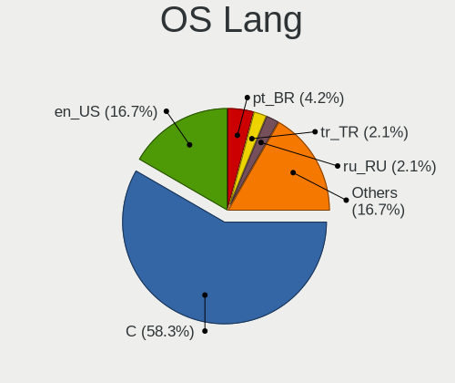

| Lang  | Computers | Percent |
|-------|-----------|---------|
| en_US | 25        | 58.14%  |
| en_GB | 4         | 9.3%    |
| ru_RU | 3         | 6.98%   |
| pt_BR | 3         | 6.98%   |
| en_AU | 3         | 6.98%   |
| zh_CN | 1         | 2.33%   |
| tr_TR | 1         | 2.33%   |
| nl_NL | 1         | 2.33%   |
| en_ZA | 1         | 2.33%   |
| cs_CZ | 1         | 2.33%   |

Boot Mode
---------

EFI or BIOS

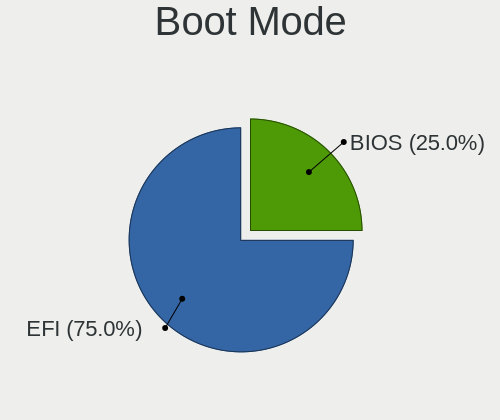

| Mode | Computers | Percent |
|------|-----------|---------|
| EFI  | 32        | 74.42%  |
| BIOS | 11        | 25.58%  |

Filesystem
----------

Type of filesystem

| Type    | Computers | Percent |
|---------|-----------|---------|
| Ext4    | 41        | 95.35%  |
| Overlay | 1         | 2.33%   |
| Btrfs   | 1         | 2.33%   |

Part. scheme
------------

Scheme of partitioning

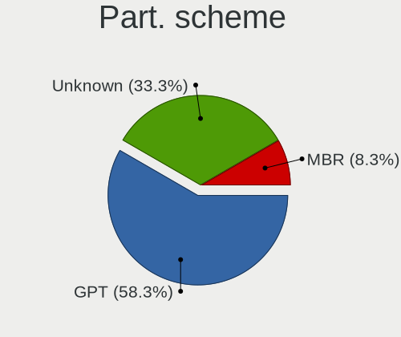

| Type    | Computers | Percent |
|---------|-----------|---------|
| GPT     | 28        | 65.12%  |
| Unknown | 8         | 18.6%   |
| MBR     | 7         | 16.28%  |

Dual Boot with Linux/BSD
------------------------

Hosting more than one Linux/BSD

| Dual boot | Computers | Percent |
|-----------|-----------|---------|
| No        | 38        | 88.37%  |
| Yes       | 5         | 11.63%  |

Dual Boot (Win)
---------------

Hosting Linux and Windows

| Dual boot | Computers | Percent |
|-----------|-----------|---------|
| No        | 24        | 55.81%  |
| Yes       | 19        | 44.19%  |

Board
-----

Vendor
------

Motherboard manufacturer

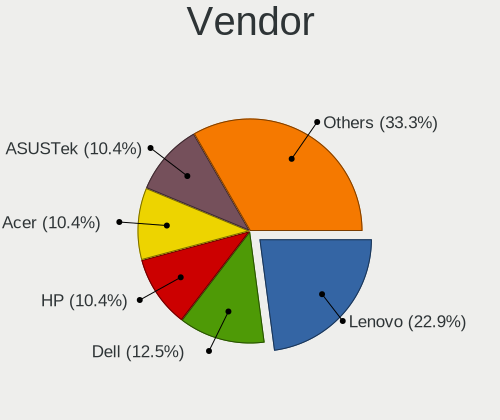

| Name                    | Computers | Percent |
|-------------------------|-----------|---------|
| Lenovo                  | 8         | 18.6%   |
| Hewlett-Packard         | 7         | 16.28%  |
| Dell                    | 7         | 16.28%  |
| ASUSTek Computer        | 6         | 13.95%  |
| MSI                     | 5         | 11.63%  |
| Apple                   | 2         | 4.65%   |
| Samsung Electronics     | 1         | 2.33%   |
| Raspberry Pi Foundation | 1         | 2.33%   |
| OEM                     | 1         | 2.33%   |
| IP3 Tech                | 1         | 2.33%   |
| HUAWEI                  | 1         | 2.33%   |
| Gigabyte Technology     | 1         | 2.33%   |
| ByteSpeed               | 1         | 2.33%   |
| Acer                    | 1         | 2.33%   |

Model
-----

Motherboard model

| Name                                     | Computers | Percent |
|------------------------------------------|-----------|---------|
| Samsung RV415/RV515                      | 1         | 2.33%   |
| RPi Raspberry Pi 4 Model B Rev 1.2       | 1         | 2.33%   |
| OEM S20II1                               | 1         | 2.33%   |
| MSI Prestige 15 A10SC                    | 1         | 2.33%   |
| MSI MS-7A34                              | 1         | 2.33%   |
| MSI GP60 2PE                             | 1         | 2.33%   |
| MSI GL63 8RD                             | 1         | 2.33%   |
| MSI GF63 Thin 10SC                       | 1         | 2.33%   |
| Lenovo V15-IIL 82C5                      | 1         | 2.33%   |
| Lenovo ThinkPad X1 Nano Gen 2 21E80011US | 1         | 2.33%   |
| Lenovo ThinkPad X1 Carbon 34485S4        | 1         | 2.33%   |
| Lenovo ThinkPad L412 0585E86             | 1         | 2.33%   |
| Lenovo Legion Y740-17IRHg 81UJ           | 1         | 2.33%   |
| Lenovo Legion 5 15ACH6 82JW              | 1         | 2.33%   |
| Lenovo IdeaPad S145-15IWL 81MV           | 1         | 2.33%   |
| Lenovo IdeaPad Gaming 3 15ACH6 82K2      | 1         | 2.33%   |
| IP3 Tech HeroBox                         | 1         | 2.33%   |
| HUAWEI CREM-WXX9                         | 1         | 2.33%   |
| HP Spectre 13-SMB Pro Ultrabook          | 1         | 2.33%   |
| HP Pavilion 15                           | 1         | 2.33%   |
| HP EliteBook 820 G3                      | 1         | 2.33%   |
| HP EliteBook 745 G4                      | 1         | 2.33%   |
| HP Compaq 620                            | 1         | 2.33%   |
| HP 625                                   | 1         | 2.33%   |
| HP 245 G8 Notebook PC                    | 1         | 2.33%   |
| Gigabyte AB350M-DS3H                     | 1         | 2.33%   |
| Dell OptiPlex 3010                       | 1         | 2.33%   |
| Dell Latitude E6510                      | 1         | 2.33%   |
| Dell Latitude 5430                       | 1         | 2.33%   |
| Dell Latitude 5421                       | 1         | 2.33%   |
| Dell Inspiron 5775                       | 1         | 2.33%   |
| Dell Inspiron 5590                       | 1         | 2.33%   |
| Dell Inspiron 13-7378                    | 1         | 2.33%   |
| ByteSpeed Atlas 157Q                     | 1         | 2.33%   |
| ASUS X553SA                              | 1         | 2.33%   |
| ASUS ROG Strix G733ZS_G733ZS             | 1         | 2.33%   |
| ASUS ROG STRIX B550-F GAMING             | 1         | 2.33%   |
| ASUS ROG STRIX B365-G GAMING             | 1         | 2.33%   |
| ASUS H61-PLUS                            | 1         | 2.33%   |
| ASUS 970 PRO GAMING/AURA                 | 1         | 2.33%   |
| Apple Macmini7,1                         | 1         | 2.33%   |
| Apple MacBookAir7,2                      | 1         | 2.33%   |
| Acer Aspire 5750Z                        | 1         | 2.33%   |

Model Family
------------

Motherboard model prefix

| Name                 | Computers | Percent |
|----------------------|-----------|---------|
| Lenovo ThinkPad      | 3         | 6.98%   |
| Dell Latitude        | 3         | 6.98%   |
| Dell Inspiron        | 3         | 6.98%   |
| ASUS ROG             | 3         | 6.98%   |
| Lenovo Legion        | 2         | 4.65%   |
| Lenovo IdeaPad       | 2         | 4.65%   |
| HP EliteBook         | 2         | 4.65%   |
| Samsung RV415        | 1         | 2.33%   |
| RPi Raspberry        | 1         | 2.33%   |
| OEM S20II1           | 1         | 2.33%   |
| MSI Prestige         | 1         | 2.33%   |
| MSI MS-7A34          | 1         | 2.33%   |
| MSI GP60             | 1         | 2.33%   |
| MSI GL63             | 1         | 2.33%   |
| MSI GF63             | 1         | 2.33%   |
| Lenovo V15-IIL       | 1         | 2.33%   |
| IP3 Tech HeroBox     | 1         | 2.33%   |
| HUAWEI CREM-WXX9     | 1         | 2.33%   |
| HP Spectre           | 1         | 2.33%   |
| HP Pavilion          | 1         | 2.33%   |
| HP Compaq            | 1         | 2.33%   |
| HP 625               | 1         | 2.33%   |
| HP 245               | 1         | 2.33%   |
| Gigabyte AB350M-DS3H | 1         | 2.33%   |
| Dell OptiPlex        | 1         | 2.33%   |
| ByteSpeed Atlas      | 1         | 2.33%   |
| ASUS X553SA          | 1         | 2.33%   |
| ASUS H61-PLUS        | 1         | 2.33%   |
| ASUS 970             | 1         | 2.33%   |
| Apple Macmini7       | 1         | 2.33%   |
| Apple MacBookAir7    | 1         | 2.33%   |
| Acer Aspire          | 1         | 2.33%   |

MFG Year
--------

Motherboard manufacture year

| Year    | Computers | Percent |
|---------|-----------|---------|
| 2021    | 7         | 16.28%  |
| 2019    | 6         | 13.95%  |
| 2010    | 4         | 9.3%    |
| 2022    | 3         | 6.98%   |
| 2020    | 3         | 6.98%   |
| 2018    | 3         | 6.98%   |
| 2015    | 3         | 6.98%   |
| 2013    | 3         | 6.98%   |
| 2017    | 2         | 4.65%   |
| 2016    | 2         | 4.65%   |
| 2012    | 2         | 4.65%   |
| 2011    | 2         | 4.65%   |
| 2014    | 1         | 2.33%   |
| 2008    | 1         | 2.33%   |
| Unknown | 1         | 2.33%   |

Form Factor
-----------

Physical design of the computer

| Name           | Computers | Percent |
|----------------|-----------|---------|
| Notebook       | 33        | 76.74%  |
| Desktop        | 7         | 16.28%  |
| Mini pc        | 2         | 4.65%   |
| System on chip | 1         | 2.33%   |

Secure Boot
-----------

Enabled or disabled

| State    | Computers | Percent |
|----------|-----------|---------|
| Disabled | 43        | 100%    |

Coreboot
--------

Have coreboot on board

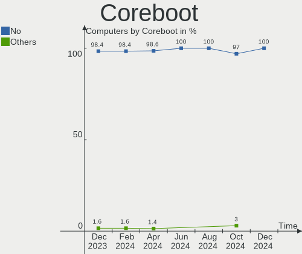

| Used | Computers | Percent |
|------|-----------|---------|
| No   | 43        | 100%    |

RAM Size
--------

Total RAM memory

| Size in GB | Computers | Percent |
|------------|-----------|---------|
| 4.01-8.0   | 10        | 23.26%  |
| 3.01-4.0   | 9         | 20.93%  |
| 16.01-24.0 | 9         | 20.93%  |
| 8.01-16.0  | 7         | 16.28%  |
| 32.01-64.0 | 5         | 11.63%  |
| 24.01-32.0 | 2         | 4.65%   |
| 1.01-2.0   | 1         | 2.33%   |

RAM Used
--------

Used RAM memory

| Used GB   | Computers | Percent |
|-----------|-----------|---------|
| 2.01-3.0  | 15        | 34.88%  |
| 1.01-2.0  | 14        | 32.56%  |
| 4.01-8.0  | 5         | 11.63%  |
| 3.01-4.0  | 5         | 11.63%  |
| 0.51-1.0  | 3         | 6.98%   |
| 8.01-16.0 | 1         | 2.33%   |

Total Drives
------------

Number of drives on board

| Drives | Computers | Percent |
|--------|-----------|---------|
| 1      | 28        | 65.12%  |
| 2      | 12        | 27.91%  |
| 6      | 1         | 2.33%   |
| 3      | 1         | 2.33%   |
| 0      | 1         | 2.33%   |

Has CD-ROM
----------

Has CD-ROM on board

| Presented | Computers | Percent |
|-----------|-----------|---------|
| No        | 32        | 74.42%  |
| Yes       | 11        | 25.58%  |

Has Ethernet
------------

Has Ethernet on board

| Presented | Computers | Percent |
|-----------|-----------|---------|
| Yes       | 34        | 79.07%  |
| No        | 9         | 20.93%  |

Has WiFi
--------

Has WiFi module

| Presented | Computers | Percent |
|-----------|-----------|---------|
| Yes       | 42        | 97.67%  |
| No        | 1         | 2.33%   |

Has Bluetooth
-------------

Has Bluetooth module

| Presented | Computers | Percent |
|-----------|-----------|---------|
| Yes       | 32        | 74.42%  |
| No        | 11        | 25.58%  |

Location
--------

Country
-------

Geographic location (country)

| Country     | Computers | Percent |
|-------------|-----------|---------|
| USA         | 12        | 27.91%  |
| UK          | 3         | 6.98%   |
| Russia      | 3         | 6.98%   |
| Netherlands | 3         | 6.98%   |
| France      | 3         | 6.98%   |
| Brazil      | 3         | 6.98%   |
| Australia   | 3         | 6.98%   |
| Turkey      | 1         | 2.33%   |
| Sri Lanka   | 1         | 2.33%   |
| Spain       | 1         | 2.33%   |
| Qatar       | 1         | 2.33%   |
| Poland      | 1         | 2.33%   |
| Kuwait      | 1         | 2.33%   |
| Indonesia   | 1         | 2.33%   |
| India       | 1         | 2.33%   |
| Hungary     | 1         | 2.33%   |
| Finland     | 1         | 2.33%   |
| Czechia     | 1         | 2.33%   |
| China       | 1         | 2.33%   |
| Bulgaria    | 1         | 2.33%   |

City
----

Geographic location (city)

| City                    | Computers | Percent |
|-------------------------|-----------|---------|
| Brisbane                | 2         | 4.65%   |
| Yekaterinburg           | 1         | 2.33%   |
| Utrecht                 | 1         | 2.33%   |
| Truth or Consequences   | 1         | 2.33%   |
| Toowoomba               | 1         | 2.33%   |
| Seattle                 | 1         | 2.33%   |
| Sao Paulo               | 1         | 2.33%   |
| Salamanca               | 1         | 2.33%   |
| Putkilahti              | 1         | 2.33%   |
| Prague                  | 1         | 2.33%   |
| Phoenix                 | 1         | 2.33%   |
| Paris                   | 1         | 2.33%   |
| Palmas                  | 1         | 2.33%   |
| Opole                   | 1         | 2.33%   |
| Omaha                   | 1         | 2.33%   |
| O'Fallon                | 1         | 2.33%   |
| Newark                  | 1         | 2.33%   |
| Muratpasa               | 1         | 2.33%   |
| Moscow                  | 1         | 2.33%   |
| Marechal Candido Rondon | 1         | 2.33%   |
| Lowell                  | 1         | 2.33%   |
| Lancaster               | 1         | 2.33%   |
| Kuwait City             | 1         | 2.33%   |
| Jakarta                 | 1         | 2.33%   |
| Jaipur                  | 1         | 2.33%   |
| Harrisonburg            | 1         | 2.33%   |
| Gennevilliers           | 1         | 2.33%   |
| Eldridge                | 1         | 2.33%   |
| Doha                    | 1         | 2.33%   |
| Crosby                  | 1         | 2.33%   |
| Colombo                 | 1         | 2.33%   |
| Colmar                  | 1         | 2.33%   |
| City of London          | 1         | 2.33%   |
| Chelyabinsk             | 1         | 2.33%   |
| Changzhou               | 1         | 2.33%   |
| Capelle aan den IJssel  | 1         | 2.33%   |
| Burgas                  | 1         | 2.33%   |
| Budapest                | 1         | 2.33%   |
| Bristol                 | 1         | 2.33%   |
| Boise                   | 1         | 2.33%   |
| Belfast                 | 1         | 2.33%   |
| Amsterdam               | 1         | 2.33%   |

Drives
------

Drive Vendor
------------

Hard drive vendors

| Vendor              | Computers | Drives | Percent |
|---------------------|-----------|--------|---------|
| WDC                 | 9         | 10     | 15.79%  |
| Samsung Electronics | 9         | 10     | 15.79%  |
| SanDisk             | 5         | 5      | 8.77%   |
| Seagate             | 4         | 4      | 7.02%   |
| Toshiba             | 3         | 4      | 5.26%   |
| SK hynix            | 3         | 3      | 5.26%   |
| Hitachi             | 3         | 3      | 5.26%   |
| Unknown             | 2         | 2      | 3.51%   |
| Phison              | 2         | 2      | 3.51%   |
| Kingston            | 2         | 2      | 3.51%   |
| Apple               | 2         | 3      | 3.51%   |
| XrayDisk            | 1         | 1      | 1.75%   |
| WellcommMaster      | 1         | 1      | 1.75%   |
| UMIS                | 1         | 1      | 1.75%   |
| SPCC                | 1         | 1      | 1.75%   |
| OCZ                 | 1         | 1      | 1.75%   |
| Netac               | 1         | 1      | 1.75%   |
| Micron Technology   | 1         | 1      | 1.75%   |
| Maxtor              | 1         | 1      | 1.75%   |
| KIOXIA              | 1         | 1      | 1.75%   |
| Intel               | 1         | 1      | 1.75%   |
| HGST                | 1         | 1      | 1.75%   |
| Fujitsu             | 1         | 1      | 1.75%   |
| A-DATA Technology   | 1         | 2      | 1.75%   |

Drive Model
-----------

Hard drive models

| Model                                | Computers | Percent |
|--------------------------------------|-----------|---------|
| XrayDisk SSD 512GB                   | 1         | 1.64%   |
| WellcommMaster 128GB SSD             | 1         | 1.64%   |
| WDC WDS200T2B0A-00SM50 2TB SSD       | 1         | 1.64%   |
| WDC WDS100T2B0A-00SM50 1TB SSD       | 1         | 1.64%   |
| WDC WD7500BPVX-22JC3T0 752GB         | 1         | 1.64%   |
| WDC WD5000LPVX-22V0TT0 500GB         | 1         | 1.64%   |
| WDC WD5000BEKT-60KA9T0 500GB         | 1         | 1.64%   |
| WDC WD40EFAX-68JH4N0 4TB             | 1         | 1.64%   |
| WDC WD3200AAKS-00L9A0 320GB          | 1         | 1.64%   |
| WDC WD10SPZX-24Z10 1TB               | 1         | 1.64%   |
| WDC PC SN730 SDBPNTY-512G            | 1         | 1.64%   |
| WDC PC SN530 NVMe 256GB              | 1         | 1.64%   |
| Unknown SR64G  64GB                  | 1         | 1.64%   |
| Unknown MMC Card  16GB               | 1         | 1.64%   |
| UMIS RPJTJ512MGE1QDQ 512GB           | 1         | 1.64%   |
| Toshiba THNSNJ128GMCU 128GB SSD      | 1         | 1.64%   |
| Toshiba MQ01ABF050 500GB             | 1         | 1.64%   |
| Toshiba HDWR160 6TB                  | 1         | 1.64%   |
| Toshiba HDWE150 5TB                  | 1         | 1.64%   |
| SPCC Solid State Disk 120GB          | 1         | 1.64%   |
| SK hynix SC308 SATA 256GB SSD        | 1         | 1.64%   |
| SK hynix NVMe SSD Drive 256GB        | 1         | 1.64%   |
| SK hynix NVMe SSD Drive 1024GB       | 1         | 1.64%   |
| Seagate ST9200827AS 200GB            | 1         | 1.64%   |
| Seagate ST3500413AS 500GB            | 1         | 1.64%   |
| Seagate ST1000LM035-1RK172 1TB       | 1         | 1.64%   |
| Seagate ST1000DM003-1SB102 1TB       | 1         | 1.64%   |
| SanDisk SSD PLUS 120GB               | 1         | 1.64%   |
| SanDisk SD9SN8W256G 256GB SSD        | 1         | 1.64%   |
| SanDisk SD8SN8U-256G-1006 256GB SSD  | 1         | 1.64%   |
| SanDisk SD6SN1M-256G-1006 256GB SSD  | 1         | 1.64%   |
| SanDisk NVMe SSD Drive 1TB           | 1         | 1.64%   |
| Samsung SSD 970 EVO Plus 250GB       | 1         | 1.64%   |
| Samsung SSD 870 QVO 1TB              | 1         | 1.64%   |
| Samsung SSD 850 EVO 250GB            | 1         | 1.64%   |
| Samsung SSD 840 EVO 120GB            | 1         | 1.64%   |
| Samsung MZVLV256HCHP-000H1 256GB     | 1         | 1.64%   |
| Samsung MZVLB1T0HALR-000L2 1TB       | 1         | 1.64%   |
| Samsung MZNLH128HBHQ-000H1 128GB SSD | 1         | 1.64%   |
| Samsung MZALQ512HBLU-00BL2 512GB     | 1         | 1.64%   |
| Samsung HN-M500MBB 500GB             | 1         | 1.64%   |
| Phison SU30-C 256GB                  | 1         | 1.64%   |
| Phison MSI M390 1TB                  | 1         | 1.64%   |
| OCZ AGILITY3 120GB SSD               | 1         | 1.64%   |
| Netac SSD 256GB                      | 1         | 1.64%   |
| Micron 3400_MTFDKBA1T0TFH 1TB        | 1         | 1.64%   |
| Maxtor STM3250310AS 250GB            | 1         | 1.64%   |
| KIOXIA KXG60ZNV512G NVMe 512GB       | 1         | 1.64%   |
| Kingston SV300S37A120G 120GB SSD     | 1         | 1.64%   |
| Kingston RBUSNS8154P3512GJ5 512GB    | 1         | 1.64%   |
| Intel SSDSCMMW240A3L 240GB           | 1         | 1.64%   |
| Hitachi HTS547575A9E384 752GB        | 1         | 1.64%   |
| Hitachi HTS547550A9E384 500GB        | 1         | 1.64%   |
| Hitachi HTS543232L9A300 320GB        | 1         | 1.64%   |
| HGST HTS725050A7E630 500GB           | 1         | 1.64%   |
| Fujitsu MHZ2320BH G2 320GB           | 1         | 1.64%   |
| Apple SSD SM0256G 256GB              | 1         | 1.64%   |
| Apple SSD SM0128F 121GB              | 1         | 1.64%   |
| Apple HDD HTS541010A9E662 1TB        | 1         | 1.64%   |
| A-DATA SU800 512GB SSD               | 1         | 1.64%   |

HDD Vendor
----------

Hard disk drive vendors

| Vendor              | Computers | Drives | Percent |
|---------------------|-----------|--------|---------|
| WDC                 | 6         | 6      | 30%     |
| Seagate             | 4         | 4      | 20%     |
| Hitachi             | 3         | 3      | 15%     |
| Toshiba             | 2         | 3      | 10%     |
| Samsung Electronics | 1         | 1      | 5%      |
| Maxtor              | 1         | 1      | 5%      |
| HGST                | 1         | 1      | 5%      |
| Fujitsu             | 1         | 1      | 5%      |
| Apple               | 1         | 1      | 5%      |

SSD Vendor
----------

Solid state drive vendors

| Vendor              | Computers | Drives | Percent |
|---------------------|-----------|--------|---------|
| SanDisk             | 4         | 4      | 18.18%  |
| Samsung Electronics | 4         | 4      | 18.18%  |
| WDC                 | 2         | 2      | 9.09%   |
| Apple               | 2         | 2      | 9.09%   |
| XrayDisk            | 1         | 1      | 4.55%   |
| WellcommMaster      | 1         | 1      | 4.55%   |
| Toshiba             | 1         | 1      | 4.55%   |
| SPCC                | 1         | 1      | 4.55%   |
| SK hynix            | 1         | 1      | 4.55%   |
| OCZ                 | 1         | 1      | 4.55%   |
| Netac               | 1         | 1      | 4.55%   |
| Kingston            | 1         | 1      | 4.55%   |
| Intel               | 1         | 1      | 4.55%   |
| A-DATA Technology   | 1         | 1      | 4.55%   |

Drive Kind
----------

HDD or SSD

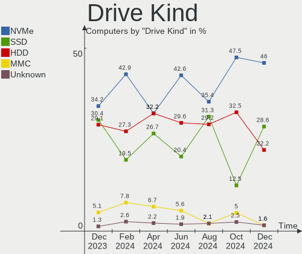

| Kind    | Computers | Drives | Percent |
|---------|-----------|--------|---------|
| HDD     | 18        | 21     | 35.29%  |
| SSD     | 16        | 22     | 31.37%  |
| NVMe    | 14        | 16     | 27.45%  |
| MMC     | 2         | 2      | 3.92%   |
| Unknown | 1         | 1      | 1.96%   |

Drive Connector
---------------

SATA, SAS, NVMe, etc.

| Type | Computers | Drives | Percent |
|------|-----------|--------|---------|
| SATA | 29        | 43     | 63.04%  |
| NVMe | 14        | 16     | 30.43%  |
| MMC  | 2         | 2      | 4.35%   |
| SAS  | 1         | 1      | 2.17%   |

Drive Size
----------

Size of hard drive

| Size in TB | Computers | Drives | Percent |
|------------|-----------|--------|---------|
| 0.01-0.5   | 23        | 29     | 63.89%  |
| 0.51-1.0   | 10        | 10     | 27.78%  |
| 3.01-4.0   | 1         | 1      | 2.78%   |
| 1.01-2.0   | 1         | 1      | 2.78%   |
| 4.01-10.0  | 1         | 2      | 2.78%   |

Space Total
-----------

Amount of disk space available on the file system

| Size in GB     | Computers | Percent |
|----------------|-----------|---------|
| 101-250        | 19        | 44.19%  |
| 251-500        | 10        | 23.26%  |
| 21-50          | 3         | 6.98%   |
| 501-1000       | 3         | 6.98%   |
| 51-100         | 3         | 6.98%   |
| More than 3000 | 2         | 4.65%   |
| 1-20           | 2         | 4.65%   |
| 1001-2000      | 1         | 2.33%   |

Space Used
----------

Amount of used disk space

| Used GB        | Computers | Percent |
|----------------|-----------|---------|
| 1-20           | 16        | 37.21%  |
| 21-50          | 11        | 25.58%  |
| 51-100         | 6         | 13.95%  |
| 101-250        | 5         | 11.63%  |
| 251-500        | 3         | 6.98%   |
| More than 3000 | 1         | 2.33%   |
| 1001-2000      | 1         | 2.33%   |

Malfunc. Drives
---------------

Drive models with a malfunction

| Model                                            | Computers | Drives | Percent |
|--------------------------------------------------|-----------|--------|---------|
| WellcommMaster 128GB SSD                         | 1         | 1      | 12.5%   |
| WDC WD5000LPVX-22V0TT0 500GB                     | 1         | 1      | 12.5%   |
| SPCC Solid State Disk 120GB                      | 1         | 1      | 12.5%   |
| Seagate ST9200827AS 200GB                        | 1         | 1      | 12.5%   |
| Samsung Electronics MZNLH128HBHQ-000H1 128GB SSD | 1         | 1      | 12.5%   |
| OCZ AGILITY3 120GB SSD                           | 1         | 1      | 12.5%   |
| Hitachi HTS543232L9A300 320GB                    | 1         | 1      | 12.5%   |
| HGST HTS725050A7E630 500GB                       | 1         | 1      | 12.5%   |

Malfunc. Drive Vendor
---------------------

Vendors of faulty drives

| Vendor              | Computers | Drives | Percent |
|---------------------|-----------|--------|---------|
| WellcommMaster      | 1         | 1      | 12.5%   |
| WDC                 | 1         | 1      | 12.5%   |
| SPCC                | 1         | 1      | 12.5%   |
| Seagate             | 1         | 1      | 12.5%   |
| Samsung Electronics | 1         | 1      | 12.5%   |
| OCZ                 | 1         | 1      | 12.5%   |
| Hitachi             | 1         | 1      | 12.5%   |
| HGST                | 1         | 1      | 12.5%   |

Malfunc. HDD Vendor
-------------------

Vendors of faulty HDD drives

| Vendor  | Computers | Drives | Percent |
|---------|-----------|--------|---------|
| WDC     | 1         | 1      | 25%     |
| Seagate | 1         | 1      | 25%     |
| Hitachi | 1         | 1      | 25%     |
| HGST    | 1         | 1      | 25%     |

Malfunc. Drive Kind
-------------------

Kinds of faulty drives

| Kind | Computers | Drives | Percent |
|------|-----------|--------|---------|
| SSD  | 4         | 4      | 50%     |
| HDD  | 4         | 4      | 50%     |

Failed Drives
-------------

Failed drive models

Zero info for selected period =(

Failed Drive Vendor
-------------------

Failed drive vendors

Zero info for selected period =(

Drive Status
------------

Number of failed and malfunc. drives

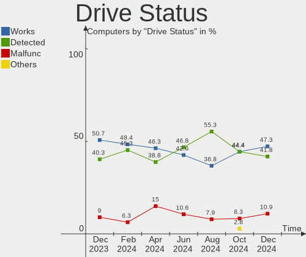

| Status   | Computers | Drives | Percent |
|----------|-----------|--------|---------|
| Works    | 28        | 40     | 59.57%  |
| Detected | 11        | 14     | 23.4%   |
| Malfunc  | 8         | 8      | 17.02%  |

Storage controller
------------------

Storage Vendor
--------------

Storage controller vendors

| Vendor                       | Computers | Percent |
|------------------------------|-----------|---------|
| Intel                        | 27        | 49.09%  |
| AMD                          | 11        | 20%     |
| Samsung Electronics          | 6         | 10.91%  |
| SanDisk                      | 3         | 5.45%   |
| SK hynix                     | 2         | 3.64%   |
| Union Memory (Shenzhen)      | 1         | 1.82%   |
| Toshiba America Info Systems | 1         | 1.82%   |
| Phison Electronics           | 1         | 1.82%   |
| Micron Technology            | 1         | 1.82%   |
| Kingston Technology Company  | 1         | 1.82%   |
| ADATA Technology             | 1         | 1.82%   |

Storage Model
-------------

Storage controller models

| Model                                                                            | Computers | Percent |
|----------------------------------------------------------------------------------|-----------|---------|
| AMD FCH SATA Controller [AHCI mode]                                              | 7         | 12.07%  |
| Intel Cannon Lake Mobile PCH SATA AHCI Controller                                | 3         | 5.17%   |
| Intel 8 Series SATA Controller 1 [AHCI mode]                                     | 3         | 5.17%   |
| AMD SB7x0/SB8x0/SB9x0 SATA Controller [AHCI mode]                                | 3         | 5.17%   |
| SanDisk Non-Volatile memory controller                                           | 2         | 3.45%   |
| Samsung NVMe SSD Controller SM981/PM981/PM983                                    | 2         | 3.45%   |
| Intel Volume Management Device NVMe RAID Controller                              | 2         | 3.45%   |
| Intel Sunrise Point-LP SATA Controller [AHCI mode]                               | 2         | 3.45%   |
| Intel 82801 Mobile SATA Controller [RAID mode]                                   | 2         | 3.45%   |
| Intel 6 Series/C200 Series Chipset Family 6 port Desktop SATA AHCI Controller    | 2         | 3.45%   |
| Union Memory (Shenzhen) AM630 PCIe 4.0 x4 NVMe SSD Controller                    | 1         | 1.72%   |
| Toshiba America Info Systems XG6 NVMe SSD Controller                             | 1         | 1.72%   |
| SK hynix Gold P31 SSD                                                            | 1         | 1.72%   |
| SK hynix BC511                                                                   | 1         | 1.72%   |
| SanDisk WD Black SN750 / PC SN730 NVMe SSD                                       | 1         | 1.72%   |
| Samsung NVMe SSD Controller SM951/PM951                                          | 1         | 1.72%   |
| Samsung NVMe SSD Controller 980                                                  | 1         | 1.72%   |
| Samsung Electronics SATA controller                                              | 1         | 1.72%   |
| Samsung Apple PCIe SSD                                                           | 1         | 1.72%   |
| Phison Electronics Non-Volatile memory controller                                | 1         | 1.72%   |
| Micron Non-Volatile memory controller                                            | 1         | 1.72%   |
| Kingston Company U-SNS8154P3 NVMe SSD                                            | 1         | 1.72%   |
| Intel Ice Lake-LP SATA Controller [AHCI mode]                                    | 1         | 1.72%   |
| Intel Comet Lake SATA AHCI Controller                                            | 1         | 1.72%   |
| Intel Celeron/Pentium Silver Processor SATA Controller                           | 1         | 1.72%   |
| Intel Cannon Point-LP SATA Controller [AHCI Mode]                                | 1         | 1.72%   |
| Intel Atom/Celeron/Pentium Processor x5-E8000/J3xxx/N3xxx Series SATA Controller | 1         | 1.72%   |
| Intel 82801IBM/IEM (ICH9M/ICH9M-E) 2 port SATA Controller [IDE mode]             | 1         | 1.72%   |
| Intel 82801HM/HEM (ICH8M/ICH8M-E) SATA Controller [AHCI mode]                    | 1         | 1.72%   |
| Intel 82801HM/HEM (ICH8M/ICH8M-E) IDE Controller                                 | 1         | 1.72%   |
| Intel 8 Series/C220 Series Chipset Family 6-port SATA Controller 1 [AHCI mode]   | 1         | 1.72%   |
| Intel 7 Series Chipset Family 6-port SATA Controller [AHCI mode]                 | 1         | 1.72%   |
| Intel 6 Series/C200 Series Chipset Family 6 port Mobile SATA AHCI Controller     | 1         | 1.72%   |
| Intel 5 Series/3400 Series Chipset 6 port SATA AHCI Controller                   | 1         | 1.72%   |
| Intel 5 Series/3400 Series Chipset 4 port SATA AHCI Controller                   | 1         | 1.72%   |
| Intel 200 Series PCH SATA controller [AHCI mode]                                 | 1         | 1.72%   |
| AMD X370 Series Chipset SATA Controller                                          | 1         | 1.72%   |
| AMD 500 Series Chipset SATA Controller                                           | 1         | 1.72%   |
| AMD 300 Series Chipset SATA Controller                                           | 1         | 1.72%   |
| ADATA Non-Volatile memory controller                                             | 1         | 1.72%   |

Storage Kind
------------

Kind of storage controller (IDE, SATA, NVMe, SAS, ...)

| Kind | Computers | Percent |
|------|-----------|---------|
| SATA | 34        | 62.96%  |
| NVMe | 14        | 25.93%  |
| RAID | 4         | 7.41%   |
| IDE  | 2         | 3.7%    |

Processor
---------

CPU Vendor
----------

Processor vendors

| Vendor | Computers | Percent |
|--------|-----------|---------|
| Intel  | 30        | 69.77%  |
| AMD    | 12        | 27.91%  |
| ARM    | 1         | 2.33%   |

CPU Model
---------

Processor models

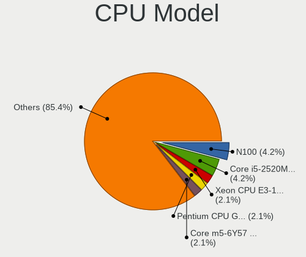

| Model                                         | Computers | Percent |
|-----------------------------------------------|-----------|---------|
| AMD Ryzen 7 5800H with Radeon Graphics        | 3         | 6.98%   |
| Intel Core i7-9750H CPU @ 2.60GHz             | 2         | 4.65%   |
| Intel Pentium Dual CPU T2390 @ 1.86GHz        | 1         | 2.33%   |
| Intel Pentium CPU B950 @ 2.10GHz              | 1         | 2.33%   |
| Intel Core i7-8750H CPU @ 2.20GHz             | 1         | 2.33%   |
| Intel Core i7-6600U CPU @ 2.60GHz             | 1         | 2.33%   |
| Intel Core i7-4578U CPU @ 3.00GHz             | 1         | 2.33%   |
| Intel Core i7-3667U CPU @ 2.00GHz             | 1         | 2.33%   |
| Intel Core i7-10710U CPU @ 1.10GHz            | 1         | 2.33%   |
| Intel Core i7-10510U CPU @ 1.80GHz            | 1         | 2.33%   |
| Intel Core i5-8265U CPU @ 1.60GHz             | 1         | 2.33%   |
| Intel Core i5-7200U CPU @ 2.50GHz             | 1         | 2.33%   |
| Intel Core i5-5250U CPU @ 1.60GHz             | 1         | 2.33%   |
| Intel Core i5-4210U CPU @ 1.70GHz             | 1         | 2.33%   |
| Intel Core i5-4210H CPU @ 2.90GHz             | 1         | 2.33%   |
| Intel Core i5-4200U CPU @ 1.60GHz             | 1         | 2.33%   |
| Intel Core i5-2400S CPU @ 2.50GHz             | 1         | 2.33%   |
| Intel Core i5-10500H CPU @ 2.50GHz            | 1         | 2.33%   |
| Intel Core i5 CPU M 540 @ 2.53GHz             | 1         | 2.33%   |
| Intel Core i5 CPU M 520 @ 2.40GHz             | 1         | 2.33%   |
| Intel Core i3-9100 CPU @ 3.60GHz              | 1         | 2.33%   |
| Intel Core i3-3240 CPU @ 3.40GHz              | 1         | 2.33%   |
| Intel Core i3-1005G1 CPU @ 1.20GHz            | 1         | 2.33%   |
| Intel Core 2 Duo CPU T6670 @ 2.20GHz          | 1         | 2.33%   |
| Intel Celeron J4125 CPU @ 2.00GHz             | 1         | 2.33%   |
| Intel Celeron CPU N3050 @ 1.60GHz             | 1         | 2.33%   |
| Intel 12th Gen Core i9-12900H                 | 1         | 2.33%   |
| Intel 12th Gen Core i5-1245U                  | 1         | 2.33%   |
| Intel 12th Gen Core i5-1240P                  | 1         | 2.33%   |
| Intel 11th Gen Core i7-11850H @ 2.50GHz       | 1         | 2.33%   |
| ARM BCM2711 Processor                         | 1         | 2.33%   |
| AMD Turion II P520 Dual-Core Processor        | 1         | 2.33%   |
| AMD Ryzen 5 5600G with Radeon Graphics        | 1         | 2.33%   |
| AMD Ryzen 5 2500U with Radeon Vega Mobile Gfx | 1         | 2.33%   |
| AMD Ryzen 5 1600 Six-Core Processor           | 1         | 2.33%   |
| AMD Ryzen 3 1200 Quad-Core Processor          | 1         | 2.33%   |
| AMD PRO A10-8730B R5, 10 COMPUTE CORES 4C+6G  | 1         | 2.33%   |
| AMD FX-6300 Six-Core Processor                | 1         | 2.33%   |
| AMD E-450 APU with Radeon HD Graphics         | 1         | 2.33%   |
| AMD Athlon Silver 3050U with Radeon Graphics  | 1         | 2.33%   |

CPU Model Family
----------------

Processor model prefix

| Model              | Computers | Percent |
|--------------------|-----------|---------|
| Intel Core i5      | 10        | 23.26%  |
| Intel Core i7      | 8         | 18.6%   |
| Other              | 4         | 9.3%    |
| Intel Core i3      | 3         | 6.98%   |
| AMD Ryzen 7        | 3         | 6.98%   |
| AMD Ryzen 5        | 3         | 6.98%   |
| Intel Celeron      | 2         | 4.65%   |
| Intel Pentium Dual | 1         | 2.33%   |
| Intel Pentium      | 1         | 2.33%   |
| Intel Core 2 Duo   | 1         | 2.33%   |
| ARM BCM            | 1         | 2.33%   |
| AMD Turion II      | 1         | 2.33%   |
| AMD Ryzen 3        | 1         | 2.33%   |
| AMD PRO A10        | 1         | 2.33%   |
| AMD FX             | 1         | 2.33%   |
| AMD E              | 1         | 2.33%   |
| AMD Athlon         | 1         | 2.33%   |

CPU Cores
---------

Number of processor cores

| Number | Computers | Percent |
|--------|-----------|---------|
| 2      | 20        | 46.51%  |
| 4      | 8         | 18.6%   |
| 6      | 7         | 16.28%  |
| 8      | 4         | 9.3%    |
| 14     | 1         | 2.33%   |
| 12     | 1         | 2.33%   |
| 10     | 1         | 2.33%   |
| 3      | 1         | 2.33%   |

CPU Sockets
-----------

Number of sockets

| Number | Computers | Percent |
|--------|-----------|---------|
| 1      | 43        | 100%    |

CPU Threads
-----------

Threads per core (Hyper-Threading)

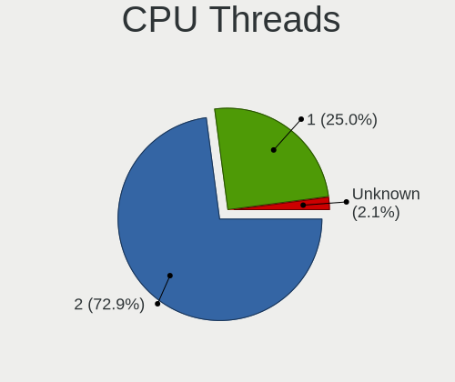

| Number | Computers | Percent |
|--------|-----------|---------|
| 2      | 31        | 72.09%  |
| 1      | 12        | 27.91%  |

CPU Op-Modes
------------

CPU Operation Modes (32-bit, 64-bit)

| Op mode        | Computers | Percent |
|----------------|-----------|---------|
| 32-bit, 64-bit | 42        | 97.67%  |
| Unknown        | 1         | 2.33%   |

CPU Microcode
-------------

Microcode number

| Number     | Computers | Percent |
|------------|-----------|---------|
| 0x40651    | 3         | 6.98%   |
| 0x0a50000c | 3         | 6.98%   |
| Unknown    | 3         | 6.98%   |
| 0x906ea    | 2         | 4.65%   |
| 0x906a3    | 2         | 4.65%   |
| 0x306a9    | 2         | 4.65%   |
| 0x20655    | 2         | 4.65%   |
| 0x08001129 | 2         | 4.65%   |
| 0xa0660    | 1         | 2.33%   |
| 0xa0652    | 1         | 2.33%   |
| 0x906eb    | 1         | 2.33%   |
| 0x906a4    | 1         | 2.33%   |
| 0x806ec    | 1         | 2.33%   |
| 0x806eb    | 1         | 2.33%   |
| 0x806e9    | 1         | 2.33%   |
| 0x806d1    | 1         | 2.33%   |
| 0x706e5    | 1         | 2.33%   |
| 0x706a8    | 1         | 2.33%   |
| 0x6fd      | 1         | 2.33%   |
| 0x406e3    | 1         | 2.33%   |
| 0x406c3    | 1         | 2.33%   |
| 0x306d4    | 1         | 2.33%   |
| 0x306c3    | 1         | 2.33%   |
| 0x206a7    | 1         | 2.33%   |
| 0x1067a    | 1         | 2.33%   |
| 0x0a50000d | 1         | 2.33%   |
| 0x08108109 | 1         | 2.33%   |
| 0x0810100b | 1         | 2.33%   |
| 0x0600611a | 1         | 2.33%   |
| 0x06000852 | 1         | 2.33%   |
| 0x05000119 | 1         | 2.33%   |
| 0x010000c8 | 1         | 2.33%   |

CPU Microarch
-------------

Microarchitecture

| Name             | Computers | Percent |
|------------------|-----------|---------|
| KabyLake         | 7         | 16.28%  |
| Zen 3            | 4         | 9.3%    |
| Haswell          | 4         | 9.3%    |
| Zen              | 3         | 6.98%   |
| Alderlake Hybrid | 3         | 6.98%   |
| Westmere         | 2         | 4.65%   |
| SandyBridge      | 2         | 4.65%   |
| IvyBridge        | 2         | 4.65%   |
| IceLake          | 2         | 4.65%   |
| CometLake        | 2         | 4.65%   |
| Zen+             | 1         | 2.33%   |
| Skylake          | 1         | 2.33%   |
| Silvermont       | 1         | 2.33%   |
| Piledriver       | 1         | 2.33%   |
| Penryn           | 1         | 2.33%   |
| K10              | 1         | 2.33%   |
| Goldmont plus    | 1         | 2.33%   |
| Excavator        | 1         | 2.33%   |
| Core             | 1         | 2.33%   |
| Broadwell        | 1         | 2.33%   |
| Bobcat           | 1         | 2.33%   |
| Unknown          | 1         | 2.33%   |

Graphics
--------

GPU Vendor
----------

Vendors of graphics cards

| Vendor | Computers | Percent |
|--------|-----------|---------|
| Intel  | 29        | 53.7%   |
| Nvidia | 16        | 29.63%  |
| AMD    | 9         | 16.67%  |

GPU Model
---------

Graphics card models

| Model                                                                                    | Computers | Percent |
|------------------------------------------------------------------------------------------|-----------|---------|
| Intel Haswell-ULT Integrated Graphics Controller                                         | 3         | 5.45%   |
| Intel CoffeeLake-H GT2 [UHD Graphics 630]                                                | 3         | 5.45%   |
| AMD Cezanne                                                                              | 3         | 5.45%   |
| Nvidia TU117M [GeForce GTX 1650 Mobile / Max-Q]                                          | 2         | 3.64%   |
| Nvidia GM108M [GeForce 840M]                                                             | 2         | 3.64%   |
| Intel Core Processor Integrated Graphics Controller                                      | 2         | 3.64%   |
| Intel Alder Lake-P Integrated Graphics Controller                                        | 2         | 3.64%   |
| Intel 2nd Generation Core Processor Family Integrated Graphics Controller                | 2         | 3.64%   |
| Nvidia TU117M [GeForce MX450]                                                            | 1         | 1.82%   |
| Nvidia TU116M [GeForce GTX 1660 Ti Mobile]                                               | 1         | 1.82%   |
| Nvidia TU116 [GeForce GTX 1650 SUPER]                                                    | 1         | 1.82%   |
| Nvidia TU106BM [GeForce RTX 2060 Mobile]                                                 | 1         | 1.82%   |
| Nvidia GP108M [GeForce MX250]                                                            | 1         | 1.82%   |
| Nvidia GP108 [GeForce GT 1030]                                                           | 1         | 1.82%   |
| Nvidia GP107 [GeForce GTX 1050]                                                          | 1         | 1.82%   |
| Nvidia GM108M [GeForce MX110]                                                            | 1         | 1.82%   |
| Nvidia GF108 [GeForce GT 630]                                                            | 1         | 1.82%   |
| Nvidia GA107M [GeForce RTX 3050 Mobile]                                                  | 1         | 1.82%   |
| Nvidia GA107BM [GeForce RTX 3050 Ti Mobile]                                              | 1         | 1.82%   |
| Nvidia GA104M [GeForce RTX 3080 Mobile / Max-Q 8GB/16GB]                                 | 1         | 1.82%   |
| Intel WhiskeyLake-U GT2 [UHD Graphics 620]                                               | 1         | 1.82%   |
| Intel TigerLake-H GT1 [UHD Graphics]                                                     | 1         | 1.82%   |
| Intel Skylake GT2 [HD Graphics 520]                                                      | 1         | 1.82%   |
| Intel Mobile GM965/GL960 Integrated Graphics Controller (secondary)                      | 1         | 1.82%   |
| Intel Mobile GM965/GL960 Integrated Graphics Controller (primary)                        | 1         | 1.82%   |
| Intel Mobile 4 Series Chipset Integrated Graphics Controller                             | 1         | 1.82%   |
| Intel Iris Plus Graphics G1 (Ice Lake)                                                   | 1         | 1.82%   |
| Intel HD Graphics 620                                                                    | 1         | 1.82%   |
| Intel HD Graphics 6000                                                                   | 1         | 1.82%   |
| Intel GeminiLake [UHD Graphics 600]                                                      | 1         | 1.82%   |
| Intel CometLake-U GT2 [UHD Graphics]                                                     | 1         | 1.82%   |
| Intel CometLake-H GT2 [UHD Graphics]                                                     | 1         | 1.82%   |
| Intel Comet Lake UHD Graphics                                                            | 1         | 1.82%   |
| Intel CoffeeLake-S GT2 [UHD Graphics 630]                                                | 1         | 1.82%   |
| Intel Atom/Celeron/Pentium Processor x5-E8000/J3xxx/N3xxx Integrated Graphics Controller | 1         | 1.82%   |
| Intel Alder Lake-UP3 GT2 [UHD Graphics]                                                  | 1         | 1.82%   |
| Intel 4th Gen Core Processor Integrated Graphics Controller                              | 1         | 1.82%   |
| Intel 3rd Gen Core processor Graphics Controller                                         | 1         | 1.82%   |
| AMD Wrestler [Radeon HD 6320]                                                            | 1         | 1.82%   |
| AMD Wani [Radeon R5/R6/R7 Graphics]                                                      | 1         | 1.82%   |
| AMD RS880M [Mobility Radeon HD 4225/4250]                                                | 1         | 1.82%   |
| AMD Raven Ridge [Radeon Vega Series / Radeon Vega Mobile Series]                         | 1         | 1.82%   |
| AMD Picasso/Raven 2 [Radeon Vega Series / Radeon Vega Mobile Series]                     | 1         | 1.82%   |
| AMD Baffin [Radeon RX 550 640SP / RX 560/560X]                                           | 1         | 1.82%   |

GPU Combo
---------

Combinations of graphics cards

| Name           | Computers | Percent |
|----------------|-----------|---------|
| 1 x Intel      | 18        | 41.86%  |
| Intel + Nvidia | 10        | 23.26%  |
| 1 x AMD        | 8         | 18.6%   |
| 1 x Nvidia     | 5         | 11.63%  |
| Other          | 1         | 2.33%   |
| AMD + Nvidia   | 1         | 2.33%   |

GPU Driver
----------

Free vs proprietary

| Driver      | Computers | Percent |
|-------------|-----------|---------|
| Free        | 35        | 81.4%   |
| Proprietary | 6         | 13.95%  |
| Unknown     | 2         | 4.65%   |

GPU Memory
----------

Total video memory

| Size in GB | Computers | Percent |
|------------|-----------|---------|
| Unknown    | 22        | 51.16%  |
| 1.01-2.0   | 7         | 16.28%  |
| 3.01-4.0   | 6         | 13.95%  |
| 0.01-0.5   | 6         | 13.95%  |
| 7.01-8.0   | 1         | 2.33%   |
| 5.01-6.0   | 1         | 2.33%   |

Monitor
-------

Monitor Vendor
--------------

Monitor vendors

| Vendor                  | Computers | Percent |
|-------------------------|-----------|---------|
| BOE                     | 9         | 18.75%  |
| LG Display              | 8         | 16.67%  |
| Samsung Electronics     | 7         | 14.58%  |
| Chimei Innolux          | 5         | 10.42%  |
| AU Optronics            | 4         | 8.33%   |
| Goldstar                | 3         | 6.25%   |
| VIZ                     | 1         | 2.08%   |
| Plain Tree Systems      | 1         | 2.08%   |
| Panasonic               | 1         | 2.08%   |
| Huion                   | 1         | 2.08%   |
| Hewlett-Packard         | 1         | 2.08%   |
| HannStar                | 1         | 2.08%   |
| Gateway                 | 1         | 2.08%   |
| Dell                    | 1         | 2.08%   |
| Chi Mei Optoelectronics | 1         | 2.08%   |
| BOE Technology Group    | 1         | 2.08%   |
| Apple                   | 1         | 2.08%   |
| Ancor Communications    | 1         | 2.08%   |

Monitor Model
-------------

Monitor models

| Model                                                                    | Computers | Percent |
|--------------------------------------------------------------------------|-----------|---------|
| LG Display LCD Monitor LGD02AD 1366x768 344x194mm 15.5-inch              | 2         | 4%      |
| VIZ LCD Monitor VA19L HDTV10T                                            | 1         | 2%      |
| Samsung Electronics U28E590 SAM0C4E 3840x2160 610x350mm 27.7-inch        | 1         | 2%      |
| Samsung Electronics SyncMaster SAM0273 1440x900 410x257mm 19.1-inch      | 1         | 2%      |
| Samsung Electronics S27E332 SAM0F60 1920x1080 600x340mm 27.2-inch        | 1         | 2%      |
| Samsung Electronics LCD Monitor SyncMaster 1440x900                      | 1         | 2%      |
| Samsung Electronics LCD Monitor SEC5441 1366x768 344x194mm 15.5-inch     | 1         | 2%      |
| Samsung Electronics LCD Monitor SDC4E51 1366x768 344x194mm 15.5-inch     | 1         | 2%      |
| Samsung Electronics LCD Monitor SAM039B 1280x720                         | 1         | 2%      |
| Samsung Electronics C27F591 SAM0D37 1920x1080 598x336mm 27.0-inch        | 1         | 2%      |
| Plain Tree Systems LCD Monitor PTS076F 1440x900 410x256mm 19.0-inch      | 1         | 2%      |
| Panasonic TV MEIA0CC 1920x1080 698x392mm 31.5-inch                       | 1         | 2%      |
| LG Display LCD Monitor LGD060F 1920x1080 309x174mm 14.0-inch             | 1         | 2%      |
| LG Display LCD Monitor LGD05E0 1920x1080 382x215mm 17.3-inch             | 1         | 2%      |
| LG Display LCD Monitor LGD0533 1920x1080 344x194mm 15.5-inch             | 1         | 2%      |
| LG Display LCD Monitor LGD039F 1366x768 345x194mm 15.6-inch              | 1         | 2%      |
| LG Display LCD Monitor LGD0382 1600x900 309x174mm 14.0-inch              | 1         | 2%      |
| LG Display LCD Monitor LGD0259 1920x1080 345x194mm 15.6-inch             | 1         | 2%      |
| Huion GT-116 HAT1160 1920x1080 256x144mm 11.6-inch                       | 1         | 2%      |
| Hewlett-Packard 21kd HWP3329 1920x1080 458x258mm 20.7-inch               | 1         | 2%      |
| HannStar LM02 HSP0013 1440x900 408x255mm 18.9-inch                       | 1         | 2%      |
| Goldstar ULTRAWIDE GSM76F9 2560x1080 531x298mm 24.0-inch                 | 1         | 2%      |
| Goldstar TV GSM2412 1920x1080 940x530mm 42.5-inch                        | 1         | 2%      |
| Goldstar M1721A GSM4464 1280x1024 338x270mm 17.0-inch                    | 1         | 2%      |
| Gateway FHD2400 GWY096C 1920x1200 518x291mm 23.4-inch                    | 1         | 2%      |
| Dell P2422H DELA1C4 1920x1080 527x296mm 23.8-inch                        | 1         | 2%      |
| Dell C2423H DELA1D4 1920x1080 527x296mm 23.8-inch                        | 1         | 2%      |
| Chimei Innolux LCD Monitor CMN1521 1920x1080 344x193mm 15.5-inch         | 1         | 2%      |
| Chimei Innolux LCD Monitor CMN14E7 1920x1080 309x173mm 13.9-inch         | 1         | 2%      |
| Chimei Innolux LCD Monitor CMN14C3 1366x768 309x173mm 13.9-inch          | 1         | 2%      |
| Chimei Innolux LCD Monitor CMN1357 1920x1080 293x165mm 13.2-inch         | 1         | 2%      |
| Chimei Innolux LCD Monitor CMN1301 2160x1350 280x175mm 13.0-inch         | 1         | 2%      |
| Chi Mei Optoelectronics LCD Monitor CMO15A7 1366x768 344x193mm 15.5-inch | 1         | 2%      |
| BOE Technology Group LCD Monitor 3200x1080                               | 1         | 2%      |
| BOE LCD Monitor BOE0A81 1920x1080 344x194mm 15.5-inch                    | 1         | 2%      |
| BOE LCD Monitor BOE0A69 2560x1440 381x214mm 17.2-inch                    | 1         | 2%      |
| BOE LCD Monitor BOE092F 2520x1680 338x226mm 16.0-inch                    | 1         | 2%      |
| BOE LCD Monitor BOE091D 1920x1080 309x174mm 14.0-inch                    | 1         | 2%      |
| BOE LCD Monitor BOE084D 1920x1080 344x193mm 15.5-inch                    | 1         | 2%      |
| BOE LCD Monitor BOE0812 1920x1080 344x194mm 15.5-inch                    | 1         | 2%      |
| BOE LCD Monitor BOE0757 1366x768 344x194mm 15.5-inch                     | 1         | 2%      |
| BOE LCD Monitor BOE06CB 1920x1080 344x194mm 15.5-inch                    | 1         | 2%      |
| BOE LCD Monitor BOE06A7 1920x1080 294x165mm 13.3-inch                    | 1         | 2%      |
| AU Optronics LCD Monitor AUO26EC 1366x768 344x193mm 15.5-inch            | 1         | 2%      |
| AU Optronics LCD Monitor AUO23ED 1920x1080 344x194mm 15.5-inch           | 1         | 2%      |
| AU Optronics LCD Monitor AUO193C 1366x768 309x173mm 13.9-inch            | 1         | 2%      |
| AU Optronics LCD Monitor AUO106C 1366x768 277x156mm 12.5-inch            | 1         | 2%      |
| Apple Color LCD APP9CDF 1440x900 286x179mm 13.3-inch                     | 1         | 2%      |
| Ancor Communications PA248 ACI24B1 1920x1200 546x352mm 25.6-inch         | 1         | 2%      |

Monitor Resolution
------------------

Monitor screen resolution

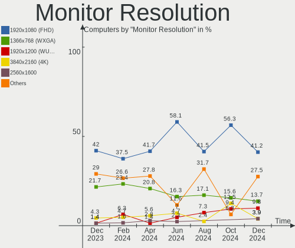

| Resolution        | Computers | Percent |
|-------------------|-----------|---------|
| 1920x1080 (FHD)   | 20        | 42.55%  |
| 1366x768 (WXGA)   | 11        | 23.4%   |
| 1440x900 (WXGA+)  | 4         | 8.51%   |
| 1920x1200 (WUXGA) | 2         | 4.26%   |
| 3840x2160 (4K)    | 1         | 2.13%   |
| 3200x1080         | 1         | 2.13%   |
| 2560x1440 (QHD)   | 1         | 2.13%   |
| 2560x1080         | 1         | 2.13%   |
| 2520x1680         | 1         | 2.13%   |
| 2160x1350         | 1         | 2.13%   |
| 1600x900 (HD+)    | 1         | 2.13%   |
| 1280x720 (HD)     | 1         | 2.13%   |
| 1280x1024 (SXGA)  | 1         | 2.13%   |
| Unknown           | 1         | 2.13%   |

Monitor Diagonal
----------------

Diagonal size in inches

| Inches  | Computers | Percent |
|---------|-----------|---------|
| 15      | 16        | 33.33%  |
| 13      | 7         | 14.58%  |
| 27      | 3         | 6.25%   |
| 17      | 3         | 6.25%   |
| 14      | 3         | 6.25%   |
| Unknown | 3         | 6.25%   |
| 23      | 2         | 4.17%   |
| 19      | 2         | 4.17%   |
| 42      | 1         | 2.08%   |
| 34      | 1         | 2.08%   |
| 31      | 1         | 2.08%   |
| 25      | 1         | 2.08%   |
| 20      | 1         | 2.08%   |
| 18      | 1         | 2.08%   |
| 16      | 1         | 2.08%   |
| 12      | 1         | 2.08%   |
| 11      | 1         | 2.08%   |

Monitor Width
-------------

Physical width

| Width in mm | Computers | Percent |
|-------------|-----------|---------|
| 301-350     | 23        | 48.94%  |
| 201-300     | 6         | 12.77%  |
| 501-600     | 4         | 8.51%   |
| 401-500     | 4         | 8.51%   |
| 351-400     | 3         | 6.38%   |
| Unknown     | 3         | 6.38%   |
| 601-700     | 2         | 4.26%   |
| 701-800     | 1         | 2.13%   |
| 901-1000    | 1         | 2.13%   |

Aspect Ratio
------------

Proportional relationship between the width and the height

| Ratio   | Computers | Percent |
|---------|-----------|---------|
| 16/9    | 33        | 75%     |
| 16/10   | 6         | 13.64%  |
| Unknown | 2         | 4.55%   |
| 5/4     | 1         | 2.27%   |
| 3/2     | 1         | 2.27%   |
| 21/9    | 1         | 2.27%   |

Monitor Area
------------

Area in inch

| Area in inch | Computers | Percent |
|----------------|-----------|---------|
| 101-110        | 16        | 33.33%  |
| 81-90          | 6         | 12.5%   |
| 71-80          | 4         | 8.33%   |
| 151-200        | 4         | 8.33%   |
| 301-350        | 3         | 6.25%   |
| Unknown        | 3         | 6.25%   |
| 351-500        | 2         | 4.17%   |
| 201-250        | 2         | 4.17%   |
| 121-130        | 2         | 4.17%   |
| 61-70          | 1         | 2.08%   |
| 51-60          | 1         | 2.08%   |
| 251-300        | 1         | 2.08%   |
| 141-150        | 1         | 2.08%   |
| 111-120        | 1         | 2.08%   |
| 501-1000       | 1         | 2.08%   |

Pixel Density
-------------

Pixels per inch

| Density | Computers | Percent |
|---------|-----------|---------|
| 121-160 | 16        | 34.78%  |
| 51-100  | 13        | 28.26%  |
| 101-120 | 8         | 17.39%  |
| 161-240 | 6         | 13.04%  |
| Unknown | 3         | 6.52%   |

Multiple Monitors
-----------------

Total monitors connected

| Total | Computers | Percent |
|-------|-----------|---------|
| 1     | 33        | 76.74%  |
| 2     | 7         | 16.28%  |
| 0     | 2         | 4.65%   |
| 3     | 1         | 2.33%   |

Network
-------

Net Controller Vendor
---------------------

Controller vendors

| Vendor                          | Computers | Percent |
|---------------------------------|-----------|---------|
| Realtek Semiconductor           | 25        | 32.47%  |
| Intel                           | 25        | 32.47%  |
| Qualcomm Atheros                | 7         | 9.09%   |
| Broadcom                        | 4         | 5.19%   |
| Ralink Technology               | 3         | 3.9%    |
| Broadcom Limited                | 3         | 3.9%    |
| Qualcomm Atheros Communications | 2         | 2.6%    |
| TP-Link                         | 1         | 1.3%    |
| Ralink                          | 1         | 1.3%    |
| OPPO Electronics                | 1         | 1.3%    |
| Micro Star International        | 1         | 1.3%    |
| Huawei Technologies             | 1         | 1.3%    |
| D-Link                          | 1         | 1.3%    |
| ASUSTek Computer                | 1         | 1.3%    |
| ASIX Electronics                | 1         | 1.3%    |

Net Controller Model
--------------------

Controller models

| Model                                                                                         | Computers | Percent |
|-----------------------------------------------------------------------------------------------|-----------|---------|
| Realtek RTL8111/8168/8411 PCI Express Gigabit Ethernet Controller                             | 13        | 14.29%  |
| Realtek RTL810xE PCI Express Fast Ethernet controller                                         | 6         | 6.59%   |
| Realtek RTL8812AU 802.11a/b/g/n/ac 2T2R DB WLAN Adapter                                       | 3         | 3.3%    |
| Realtek RTL8153 Gigabit Ethernet Adapter                                                      | 3         | 3.3%    |
| Qualcomm Atheros QCA9377 802.11ac Wireless Network Adapter                                    | 3         | 3.3%    |
| Intel Alder Lake-P PCH CNVi WiFi                                                              | 3         | 3.3%    |
| Realtek RTL8852AE 802.11ax PCIe Wireless Network Adapter                                      | 2         | 2.2%    |
| Realtek RTL8822CE 802.11ac PCIe Wireless Network Adapter                                      | 2         | 2.2%    |
| Qualcomm Atheros AR9271 802.11n                                                               | 2         | 2.2%    |
| Intel Wireless 7260                                                                           | 2         | 2.2%    |
| Intel Wi-Fi 6 AX200                                                                           | 2         | 2.2%    |
| Intel Ethernet Controller I225-V                                                              | 2         | 2.2%    |
| Intel Comet Lake PCH-LP CNVi WiFi                                                             | 2         | 2.2%    |
| Intel Cannon Lake PCH CNVi WiFi                                                               | 2         | 2.2%    |
| Broadcom Limited BCM4360 802.11ac Wireless Network Adapter                                    | 2         | 2.2%    |
| TP-Link TL-WN722N v2/v3 [Realtek RTL8188EUS]                                                  | 1         | 1.1%    |
| Realtek RTL8814AU 802.11a/b/g/n/ac Wireless Adapter                                           | 1         | 1.1%    |
| Realtek RTL8723BE PCIe Wireless Network Adapter                                               | 1         | 1.1%    |
| Realtek RTL8188EUS 802.11n Wireless Network Adapter                                           | 1         | 1.1%    |
| Realtek RTL8125 2.5GbE Controller                                                             | 1         | 1.1%    |
| Realtek Realtek 8812AU/8821AU 802.11ac WLAN Adapter [USB Wireless Dual-Band Adapter 2.4/5Ghz] | 1         | 1.1%    |
| Ralink RT5370 Wireless Adapter                                                                | 1         | 1.1%    |
| Ralink RT2870/RT3070 Wireless Adapter                                                         | 1         | 1.1%    |
| Ralink RT2870 Wireless Adapter                                                                | 1         | 1.1%    |
| Ralink RT3090 Wireless 802.11n 1T/1R PCIe                                                     | 1         | 1.1%    |
| Qualcomm Atheros QCA8171 Gigabit Ethernet                                                     | 1         | 1.1%    |
| Qualcomm Atheros Killer E220x Gigabit Ethernet Controller                                     | 1         | 1.1%    |
| Qualcomm Atheros AR9285 Wireless Network Adapter (PCI-Express)                                | 1         | 1.1%    |
| Qualcomm Atheros AR9227 Wireless Network Adapter                                              | 1         | 1.1%    |
| OPPO SDM720G-IDP _SN:B922E265                                                                 | 1         | 1.1%    |
| Micro Star International RT2573                                                               | 1         | 1.1%    |
| Intel Wireless 8260                                                                           | 1         | 1.1%    |
| Intel Wireless 7265                                                                           | 1         | 1.1%    |
| Intel Wireless 3160                                                                           | 1         | 1.1%    |
| Intel Wi-Fi 6 AX210/AX211/AX411 160MHz                                                        | 1         | 1.1%    |
| Intel Ultimate N WiFi Link 5300                                                               | 1         | 1.1%    |
| Intel Tiger Lake PCH CNVi WiFi                                                                | 1         | 1.1%    |
| Intel I211 Gigabit Network Connection                                                         | 1         | 1.1%    |
| Intel Ethernet Connection I219-LM                                                             | 1         | 1.1%    |
| Intel Ethernet Connection (2) I219-V                                                          | 1         | 1.1%    |
| Intel Ethernet Connection (16) I219-LM                                                        | 1         | 1.1%    |
| Intel Ethernet Connection (14) I219-LM                                                        | 1         | 1.1%    |
| Intel Comet Lake PCH CNVi WiFi                                                                | 1         | 1.1%    |
| Intel Centrino Wireless-N 1000 [Condor Peak]                                                  | 1         | 1.1%    |
| Intel Centrino Advanced-N 6205 [Taylor Peak]                                                  | 1         | 1.1%    |
| Intel Centrino Advanced-N 6200                                                                | 1         | 1.1%    |
| Intel 82577LM Gigabit Network Connection                                                      | 1         | 1.1%    |
| Huawei LYA-L09                                                                                | 1         | 1.1%    |
| D-Link DWA-123 Wireless N 150 Adapter (rev.D1)                                                | 1         | 1.1%    |
| Broadcom NetXtreme BCM57766 Gigabit Ethernet PCIe                                             | 1         | 1.1%    |
| Broadcom NetLink BCM57785 Gigabit Ethernet PCIe                                               | 1         | 1.1%    |
| Broadcom Limited NetXtreme BCM5762 Gigabit Ethernet PCIe                                      | 1         | 1.1%    |
| Broadcom BCM43227 802.11b/g/n                                                                 | 1         | 1.1%    |
| Broadcom BCM43142 802.11b/g/n                                                                 | 1         | 1.1%    |
| Broadcom BCM4313 802.11bgn Wireless Network Adapter                                           | 1         | 1.1%    |
| ASUS 802.11ac NIC                                                                             | 1         | 1.1%    |
| ASIX AX88772B                                                                                 | 1         | 1.1%    |

Wireless Vendor
---------------

Wireless vendors

| Vendor                          | Computers | Percent |
|---------------------------------|-----------|---------|
| Intel                           | 21        | 40.38%  |
| Realtek Semiconductor           | 11        | 21.15%  |
| Qualcomm Atheros                | 5         | 9.62%   |
| Ralink Technology               | 3         | 5.77%   |
| Broadcom                        | 3         | 5.77%   |
| Qualcomm Atheros Communications | 2         | 3.85%   |
| Broadcom Limited                | 2         | 3.85%   |
| TP-Link                         | 1         | 1.92%   |
| Ralink                          | 1         | 1.92%   |
| Micro Star International        | 1         | 1.92%   |
| D-Link                          | 1         | 1.92%   |
| ASUSTek Computer                | 1         | 1.92%   |

Wireless Model
--------------

Wireless models

| Model                                                                                         | Computers | Percent |
|-----------------------------------------------------------------------------------------------|-----------|---------|
| Realtek RTL8812AU 802.11a/b/g/n/ac 2T2R DB WLAN Adapter                                       | 3         | 5.77%   |
| Qualcomm Atheros QCA9377 802.11ac Wireless Network Adapter                                    | 3         | 5.77%   |
| Intel Alder Lake-P PCH CNVi WiFi                                                              | 3         | 5.77%   |
| Realtek RTL8852AE 802.11ax PCIe Wireless Network Adapter                                      | 2         | 3.85%   |
| Realtek RTL8822CE 802.11ac PCIe Wireless Network Adapter                                      | 2         | 3.85%   |
| Qualcomm Atheros AR9271 802.11n                                                               | 2         | 3.85%   |
| Intel Wireless 7260                                                                           | 2         | 3.85%   |
| Intel Wi-Fi 6 AX200                                                                           | 2         | 3.85%   |
| Intel Comet Lake PCH-LP CNVi WiFi                                                             | 2         | 3.85%   |
| Intel Cannon Lake PCH CNVi WiFi                                                               | 2         | 3.85%   |
| Broadcom Limited BCM4360 802.11ac Wireless Network Adapter                                    | 2         | 3.85%   |
| TP-Link TL-WN722N v2/v3 [Realtek RTL8188EUS]                                                  | 1         | 1.92%   |
| Realtek RTL8814AU 802.11a/b/g/n/ac Wireless Adapter                                           | 1         | 1.92%   |
| Realtek RTL8723BE PCIe Wireless Network Adapter                                               | 1         | 1.92%   |
| Realtek RTL8188EUS 802.11n Wireless Network Adapter                                           | 1         | 1.92%   |
| Realtek Realtek 8812AU/8821AU 802.11ac WLAN Adapter [USB Wireless Dual-Band Adapter 2.4/5Ghz] | 1         | 1.92%   |
| Ralink RT5370 Wireless Adapter                                                                | 1         | 1.92%   |
| Ralink RT2870/RT3070 Wireless Adapter                                                         | 1         | 1.92%   |
| Ralink RT2870 Wireless Adapter                                                                | 1         | 1.92%   |
| Ralink RT3090 Wireless 802.11n 1T/1R PCIe                                                     | 1         | 1.92%   |
| Qualcomm Atheros AR9285 Wireless Network Adapter (PCI-Express)                                | 1         | 1.92%   |
| Qualcomm Atheros AR9227 Wireless Network Adapter                                              | 1         | 1.92%   |
| Micro Star International RT2573                                                               | 1         | 1.92%   |
| Intel Wireless 8260                                                                           | 1         | 1.92%   |
| Intel Wireless 7265                                                                           | 1         | 1.92%   |
| Intel Wireless 3160                                                                           | 1         | 1.92%   |
| Intel Wi-Fi 6 AX210/AX211/AX411 160MHz                                                        | 1         | 1.92%   |
| Intel Ultimate N WiFi Link 5300                                                               | 1         | 1.92%   |
| Intel Tiger Lake PCH CNVi WiFi                                                                | 1         | 1.92%   |
| Intel Comet Lake PCH CNVi WiFi                                                                | 1         | 1.92%   |
| Intel Centrino Wireless-N 1000 [Condor Peak]                                                  | 1         | 1.92%   |
| Intel Centrino Advanced-N 6205 [Taylor Peak]                                                  | 1         | 1.92%   |
| Intel Centrino Advanced-N 6200                                                                | 1         | 1.92%   |
| D-Link DWA-123 Wireless N 150 Adapter (rev.D1)                                                | 1         | 1.92%   |
| Broadcom BCM43227 802.11b/g/n                                                                 | 1         | 1.92%   |
| Broadcom BCM43142 802.11b/g/n                                                                 | 1         | 1.92%   |
| Broadcom BCM4313 802.11bgn Wireless Network Adapter                                           | 1         | 1.92%   |
| ASUS 802.11ac NIC                                                                             | 1         | 1.92%   |

Ethernet Vendor
---------------

Ethernet vendors

| Vendor                | Computers | Percent |
|-----------------------|-----------|---------|
| Realtek Semiconductor | 22        | 57.89%  |
| Intel                 | 8         | 21.05%  |
| Qualcomm Atheros      | 2         | 5.26%   |
| Broadcom              | 2         | 5.26%   |
| OPPO Electronics      | 1         | 2.63%   |
| Huawei Technologies   | 1         | 2.63%   |
| Broadcom Limited      | 1         | 2.63%   |
| ASIX Electronics      | 1         | 2.63%   |

Ethernet Model
--------------

Ethernet models

| Model                                                             | Computers | Percent |
|-------------------------------------------------------------------|-----------|---------|
| Realtek RTL8111/8168/8411 PCI Express Gigabit Ethernet Controller | 13        | 33.33%  |
| Realtek RTL810xE PCI Express Fast Ethernet controller             | 6         | 15.38%  |
| Realtek RTL8153 Gigabit Ethernet Adapter                          | 3         | 7.69%   |
| Intel Ethernet Controller I225-V                                  | 2         | 5.13%   |
| Realtek RTL8125 2.5GbE Controller                                 | 1         | 2.56%   |
| Qualcomm Atheros QCA8171 Gigabit Ethernet                         | 1         | 2.56%   |
| Qualcomm Atheros Killer E220x Gigabit Ethernet Controller         | 1         | 2.56%   |
| OPPO SDM720G-IDP _SN:B922E265                                     | 1         | 2.56%   |
| Intel I211 Gigabit Network Connection                             | 1         | 2.56%   |
| Intel Ethernet Connection I219-LM                                 | 1         | 2.56%   |
| Intel Ethernet Connection (2) I219-V                              | 1         | 2.56%   |
| Intel Ethernet Connection (16) I219-LM                            | 1         | 2.56%   |
| Intel Ethernet Connection (14) I219-LM                            | 1         | 2.56%   |
| Intel 82577LM Gigabit Network Connection                          | 1         | 2.56%   |
| Huawei LYA-L09                                                    | 1         | 2.56%   |
| Broadcom NetXtreme BCM57766 Gigabit Ethernet PCIe                 | 1         | 2.56%   |
| Broadcom NetLink BCM57785 Gigabit Ethernet PCIe                   | 1         | 2.56%   |
| Broadcom Limited NetXtreme BCM5762 Gigabit Ethernet PCIe          | 1         | 2.56%   |
| ASIX AX88772B                                                     | 1         | 2.56%   |

Net Controller Kind
-------------------

Ethernet, WiFi or modem

| Kind     | Computers | Percent |
|----------|-----------|---------|
| WiFi     | 42        | 55.26%  |
| Ethernet | 34        | 44.74%  |

Used Controller
---------------

Currently used network controller

| Kind     | Computers | Percent |
|----------|-----------|---------|
| WiFi     | 23        | 52.27%  |
| Ethernet | 21        | 47.73%  |

NICs
----

Total network controllers on board

| Total | Computers | Percent |
|-------|-----------|---------|
| 2     | 28        | 65.12%  |
| 1     | 14        | 32.56%  |
| 0     | 1         | 2.33%   |

IPv6
----

IPv6 vs IPv4

| Used | Computers | Percent |
|------|-----------|---------|
| No   | 35        | 81.4%   |
| Yes  | 8         | 18.6%   |

Bluetooth
---------

Bluetooth Vendor
----------------

Controller vendors

| Vendor                          | Computers | Percent |
|---------------------------------|-----------|---------|
| Intel                           | 16        | 50%     |
| Realtek Semiconductor           | 6         | 18.75%  |
| Broadcom                        | 3         | 9.38%   |
| Qualcomm Atheros Communications | 2         | 6.25%   |
| Apple                           | 2         | 6.25%   |
| Ralink Technology               | 1         | 3.13%   |
| IMC Networks                    | 1         | 3.13%   |
| Cambridge Silicon Radio         | 1         | 3.13%   |

Bluetooth Model
---------------

Controller models

| Model                                               | Computers | Percent |
|-----------------------------------------------------|-----------|---------|
| Realtek Bluetooth Radio                             | 6         | 18.75%  |
| Intel Bluetooth wireless interface                  | 5         | 15.63%  |
| Intel Bluetooth Device                              | 3         | 9.38%   |
| Intel Bluetooth 9460/9560 Jefferson Peak (JfP)      | 3         | 9.38%   |
| Intel AX201 Bluetooth                               | 3         | 9.38%   |
| Qualcomm Atheros  Bluetooth Device                  | 2         | 6.25%   |
| Intel AX200 Bluetooth                               | 2         | 6.25%   |
| Ralink Motorola BC4 Bluetooth 3.0+HS Adapter        | 1         | 3.13%   |
| IMC Networks Bluetooth Device                       | 1         | 3.13%   |
| Cambridge Silicon Radio Bluetooth Dongle (HCI mode) | 1         | 3.13%   |
| Broadcom BCM43142A0 Bluetooth Device                | 1         | 3.13%   |
| Broadcom BCM20702 Bluetooth 4.0 [ThinkPad]          | 1         | 3.13%   |
| Broadcom BCM2045 Bluetooth                          | 1         | 3.13%   |
| Apple Bluetooth USB Host Controller                 | 1         | 3.13%   |
| Apple Bluetooth Host Controller                     | 1         | 3.13%   |

Sound
-----

Sound Vendor
------------

Sound card vendors

| Vendor | Computers | Percent |
|--------|-----------|---------|
| Intel  | 30        | 57.69%  |
| AMD    | 12        | 23.08%  |
| Nvidia | 8         | 15.38%  |
| JMTek  | 1         | 1.92%   |
| Dell   | 1         | 1.92%   |

Sound Model
-----------

Sound card models

| Model                                                                                             | Computers | Percent |
|---------------------------------------------------------------------------------------------------|-----------|---------|
| AMD Family 17h/19h HD Audio Controller                                                            | 6         | 9.09%   |
| Intel Haswell-ULT HD Audio Controller                                                             | 3         | 4.55%   |
| Intel Cannon Lake PCH cAVS                                                                        | 3         | 4.55%   |
| Intel Alder Lake PCH-P High Definition Audio Controller                                           | 3         | 4.55%   |
| Intel 8 Series HD Audio Controller                                                                | 3         | 4.55%   |
| Intel 6 Series/C200 Series Chipset Family High Definition Audio Controller                        | 3         | 4.55%   |
| AMD SBx00 Azalia (Intel HDA)                                                                      | 3         | 4.55%   |
| AMD Renoir Radeon High Definition Audio Controller                                                | 3         | 4.55%   |
| Nvidia TU116 High Definition Audio Controller                                                     | 2         | 3.03%   |
| Intel Sunrise Point-LP HD Audio                                                                   | 2         | 3.03%   |
| Intel Comet Lake PCH-LP cAVS                                                                      | 2         | 3.03%   |
| Intel 5 Series/3400 Series Chipset High Definition Audio                                          | 2         | 3.03%   |
| AMD Raven/Raven2/Fenghuang HDMI/DP Audio Controller                                               | 2         | 3.03%   |
| AMD Family 17h (Models 00h-0fh) HD Audio Controller                                               | 2         | 3.03%   |
| Nvidia TU106 High Definition Audio Controller                                                     | 1         | 1.52%   |
| Nvidia GP108 High Definition Audio Controller                                                     | 1         | 1.52%   |
| Nvidia GP107GL High Definition Audio Controller                                                   | 1         | 1.52%   |
| Nvidia GF108 High Definition Audio Controller                                                     | 1         | 1.52%   |
| Nvidia GA104 High Definition Audio Controller                                                     | 1         | 1.52%   |
| Nvidia Audio device                                                                               | 1         | 1.52%   |
| JMTek USB PnP Audio Device                                                                        | 1         | 1.52%   |
| Intel Xeon E3-1200 v3/4th Gen Core Processor HD Audio Controller                                  | 1         | 1.52%   |
| Intel Wildcat Point-LP High Definition Audio Controller                                           | 1         | 1.52%   |
| Intel Tiger Lake-H HD Audio Controller                                                            | 1         | 1.52%   |
| Intel Ice Lake-LP Smart Sound Technology Audio Controller                                         | 1         | 1.52%   |
| Intel Comet Lake PCH cAVS                                                                         | 1         | 1.52%   |
| Intel Celeron/Pentium Silver Processor High Definition Audio                                      | 1         | 1.52%   |
| Intel Cannon Point-LP High Definition Audio Controller                                            | 1         | 1.52%   |
| Intel Broadwell-U Audio Controller                                                                | 1         | 1.52%   |
| Intel Atom/Celeron/Pentium Processor x5-E8000/J3xxx/N3xxx Series High Definition Audio Controller | 1         | 1.52%   |
| Intel 82801I (ICH9 Family) HD Audio Controller                                                    | 1         | 1.52%   |
| Intel 82801H (ICH8 Family) HD Audio Controller                                                    | 1         | 1.52%   |
| Intel 8 Series/C220 Series Chipset High Definition Audio Controller                               | 1         | 1.52%   |
| Intel 7 Series/C216 Chipset Family High Definition Audio Controller                               | 1         | 1.52%   |
| Intel 200 Series PCH HD Audio                                                                     | 1         | 1.52%   |
| Dell C2423H                                                                                       | 1         | 1.52%   |
| AMD Wrestler HDMI Audio                                                                           | 1         | 1.52%   |
| AMD RS880 HDMI Audio [Radeon HD 4200 Series]                                                      | 1         | 1.52%   |
| AMD Kabini HDMI/DP Audio                                                                          | 1         | 1.52%   |
| AMD Family 15h (Models 60h-6fh) Audio Controller                                                  | 1         | 1.52%   |
| AMD Baffin HDMI/DP Audio [Radeon RX 550 640SP / RX 560/560X]                                      | 1         | 1.52%   |

Memory
------

Memory Vendor
-------------

Memory module vendors

| Vendor              | Computers | Percent |
|---------------------|-----------|---------|
| SK hynix            | 11        | 26.83%  |
| Samsung Electronics | 6         | 14.63%  |
| Micron Technology   | 6         | 14.63%  |
| Kingston            | 6         | 14.63%  |
| Corsair             | 4         | 9.76%   |
| Elpida              | 2         | 4.88%   |
| Unknown (ABCD)      | 1         | 2.44%   |
| Unknown             | 1         | 2.44%   |
| Ramaxel Technology  | 1         | 2.44%   |
| Crucial             | 1         | 2.44%   |
| Atermiter           | 1         | 2.44%   |
| A-DATA Technology   | 1         | 2.44%   |

Memory Model
------------

Memory module models

| Model                                                            | Computers | Percent |
|------------------------------------------------------------------|-----------|---------|
| SK hynix RAM HMAA1GS6CJR6N-XN 8GB SODIMM DDR4 3200MT/s           | 2         | 4.65%   |
| SK hynix RAM HMA81GS6AFR8N-UH 8GB SODIMM DDR4 2667MT/s           | 2         | 4.65%   |
| Corsair RAM CMK16GX4M2B3200C16 8GB DIMM DDR4 3600MT/s            | 2         | 4.65%   |
| Unknown RAM Module 8GB SODIMM DDR3 1333MT/s                      | 1         | 2.33%   |
| Unknown (ABCD) RAM 123456789012345678 4GB DIMM LPDDR4 2400MT/s   | 1         | 2.33%   |
| SK hynix RAM Module 8GB SODIMM DDR4 2400MT/s                     | 1         | 2.33%   |
| SK hynix RAM Module 8GB SODIMM DDR4 2133MT/s                     | 1         | 2.33%   |
| SK hynix RAM HMT325S6BFR8C-H9 2GB SODIMM DDR3 1600MT/s           | 1         | 2.33%   |
| SK hynix RAM HMA851S6DJR6N-XN 4GB SODIMM DDR4 3200MT/s           | 1         | 2.33%   |
| SK hynix RAM HMA82GS6JJR8N-VK 16GB SODIMM DDR4 2667MT/s          | 1         | 2.33%   |
| SK hynix RAM HMA81GS6JJR8N-VK 8GB SODIMM DDR4 2667MT/s           | 1         | 2.33%   |
| SK hynix RAM H9JKNNNFB3AECR-N6H 2GB Row Of Chips LPDDR5 6400MT/s | 1         | 2.33%   |
| Samsung RAM M471B5773CHS-CF8 2GB SODIMM DDR3 1067MT/s            | 1         | 2.33%   |
| Samsung RAM M471B5673FH0-CF8 2GB SODIMM DDR3 1067MT/s            | 1         | 2.33%   |
| Samsung RAM M471B5673EH1-CF8 2GB SODIMM DDR3 4199MT/s            | 1         | 2.33%   |
| Samsung RAM M471B5174BM0-YH9 4GB Chip DDR3 1333MT/s              | 1         | 2.33%   |
| Samsung RAM M471A5244CB0-CTD 4096MB SODIMM DDR4 3266MT/s         | 1         | 2.33%   |
| Samsung RAM M471A2G43BB2-CWE 16GB SODIMM DDR4 3200MT/s           | 1         | 2.33%   |
| Samsung RAM M471A1K43CB1-CTD 8GB SODIMM DDR4 2667MT/s            | 1         | 2.33%   |
| Ramaxel RAM RMSA3260ME78HAF-2666 8GB SODIMM DDR4 2667MT/s        | 1         | 2.33%   |
| Micron RAM 8JSF25664HZ-1G4D1 2048MB SODIMM DDR3 1334MT/s         | 1         | 2.33%   |
| Micron RAM 8ATF1G64HZ-3G2R1 8GB SODIMM DDR4 3200MT/s             | 1         | 2.33%   |
| Micron RAM 4ATF51264HZ-2G6E1 4GB SODIMM DDR4 2667MT/s            | 1         | 2.33%   |
| Micron RAM 4ATF51264HZ-2G3E1 4GB SODIMM DDR4 2667MT/s            | 1         | 2.33%   |
| Micron RAM 4ATF1G64HZ-3G2E1 8GB Row Of Chips DDR4 3200MT/s       | 1         | 2.33%   |
| Micron RAM 16KTF1G64HZ-1G6E1 8GB SODIMM DDR3 1600MT/s            | 1         | 2.33%   |
| Kingston RAM SNY1333S9-2G-ELFE 2GB SODIMM DDR3 1333MT/s          | 1         | 2.33%   |
| Kingston RAM KHX2133C14D4/4G 4GB DIMM DDR4 2933MT/s              | 1         | 2.33%   |
| Kingston RAM KHX1600C9S3L/8G 8GB SODIMM DDR3 1600MT/s            | 1         | 2.33%   |
| Kingston RAM 99U5469-045.A00LF 4GB SODIMM DDR3 1600MT/s          | 1         | 2.33%   |
| Kingston RAM 9905789-015.A00G 32GB SODIMM DDR5 4800MT/s          | 1         | 2.33%   |
| Kingston RAM 9905700-047.A00G 16GB SODIMM DDR4 2667MT/s          | 1         | 2.33%   |
| Elpida RAM Module 8GB SODIMM DDR3 1600MT/s                       | 1         | 2.33%   |
| Elpida RAM Module 2GB SODIMM DDR3 1600MT/s                       | 1         | 2.33%   |
| Crucial RAM BLS8G4D240FSC.16FBD 8GB DIMM DDR4 2667MT/s           | 1         | 2.33%   |
| Corsair RAM CMX4GX3M1A1600C11 4GB DIMM DDR3 1600MT/s             | 1         | 2.33%   |
| Corsair RAM CMW16GX4M2C3200C16 8GB DIMM DDR4 3266MT/s            | 1         | 2.33%   |
| Corsair RAM CMK32GX4M2B3000C15 16GB DIMM DDR4 3000MT/s           | 1         | 2.33%   |
| Atermiter RAM Module 8GB DIMM DDR4 2133MT/s                      | 1         | 2.33%   |
| A-DATA RAM AD73I1B0873EV 2GB SODIMM DDR3 1333MT/s                | 1         | 2.33%   |

Memory Kind
-----------

Memory module kinds

| Kind   | Computers | Percent |
|--------|-----------|---------|
| DDR4   | 19        | 54.29%  |
| DDR3   | 12        | 34.29%  |
| SDRAM  | 1         | 2.86%   |
| LPDDR5 | 1         | 2.86%   |
| LPDDR4 | 1         | 2.86%   |
| DDR5   | 1         | 2.86%   |

Memory Form Factor
------------------

Physical design of the memory module

| Name         | Computers | Percent |
|--------------|-----------|---------|
| SODIMM       | 25        | 73.53%  |
| DIMM         | 6         | 17.65%  |
| Row Of Chips | 2         | 5.88%   |
| Chip         | 1         | 2.94%   |

Memory Size
-----------

Memory module size

| Size  | Computers | Percent |
|-------|-----------|---------|
| 8192  | 17        | 47.22%  |
| 4096  | 7         | 19.44%  |
| 2048  | 6         | 16.67%  |
| 16384 | 5         | 13.89%  |
| 32768 | 1         | 2.78%   |

Memory Speed
------------

Memory module speed

| Speed | Computers | Percent |
|-------|-----------|---------|
| 2667  | 8         | 20%     |
| 1600  | 7         | 17.5%   |
| 3200  | 6         | 15%     |
| 1333  | 3         | 7.5%    |
| 3600  | 2         | 5%      |
| 3266  | 2         | 5%      |
| 2400  | 2         | 5%      |
| 2133  | 2         | 5%      |
| 1067  | 2         | 5%      |
| 6400  | 1         | 2.5%    |
| 4800  | 1         | 2.5%    |
| 4199  | 1         | 2.5%    |
| 3000  | 1         | 2.5%    |
| 2933  | 1         | 2.5%    |
| 1334  | 1         | 2.5%    |

Printers & scanners
-------------------

Printer Vendor
--------------

Printer device vendors

Zero info for selected period =(

Printer Model
-------------

Printer device models

Zero info for selected period =(

Scanner Vendor
--------------

Scanner device vendors

Zero info for selected period =(

Scanner Model
-------------

Scanner device models

Zero info for selected period =(

Camera
------

Camera Vendor
-------------

Camera device vendors

| Vendor                                 | Computers | Percent |
|----------------------------------------|-----------|---------|
| Chicony Electronics                    | 6         | 21.43%  |
| Realtek Semiconductor                  | 5         | 17.86%  |
| Sunplus Innovation Technology          | 4         | 14.29%  |
| Acer                                   | 3         | 10.71%  |
| Suyin                                  | 2         | 7.14%   |
| IMC Networks                           | 2         | 7.14%   |
| Syntek                                 | 1         | 3.57%   |
| Silicon Motion                         | 1         | 3.57%   |
| Lite-On Technology                     | 1         | 3.57%   |
| Dell                                   | 1         | 3.57%   |
| Cheng Uei Precision Industry (Foxlink) | 1         | 3.57%   |
| Apple                                  | 1         | 3.57%   |

Camera Model
------------

Camera device models

| Model                                            | Computers | Percent |
|--------------------------------------------------|-----------|---------|
| Chicony Integrated Camera                        | 3         | 10.71%  |
| Sunplus Integrated_Webcam_HD                     | 2         | 7.14%   |
| Acer HD Webcam                                   | 2         | 7.14%   |
| Syntek Integrated Camera                         | 1         | 3.57%   |
| Suyin HP Truevision HD                           | 1         | 3.57%   |
| Suyin 1.3M HD WebCam                             | 1         | 3.57%   |
| Sunplus Integrated_Webcam_FHD                    | 1         | 3.57%   |
| Sunplus Full HD webcam                           | 1         | 3.57%   |
| Silicon Motion WebCam SCB-0385N                  | 1         | 3.57%   |
| Realtek USB2.0 VGA UVC WebCam                    | 1         | 3.57%   |
| Realtek Integrated_Webcam_HD                     | 1         | 3.57%   |
| Realtek Integrated Webcam HD                     | 1         | 3.57%   |
| Realtek Integrated Webcam                        | 1         | 3.57%   |
| Realtek HP TrueVision Full HD                    | 1         | 3.57%   |
| Lite-On HP HD Camera                             | 1         | 3.57%   |
| IMC Networks ov9734_azurewave_camera             | 1         | 3.57%   |
| IMC Networks Integrated Camera                   | 1         | 3.57%   |
| Dell Integrated_Webcam_5M_IR                     | 1         | 3.57%   |
| Chicony HP HD Camera                             | 1         | 3.57%   |
| Chicony HD Webcam                                | 1         | 3.57%   |
| Chicony Front Camera                             | 1         | 3.57%   |
| Cheng Uei Precision Industry (Foxlink) HP Webcam | 1         | 3.57%   |
| Apple iPhone 5/5C/5S/6/SE                        | 1         | 3.57%   |
| Acer SunplusIT Integrated Camera                 | 1         | 3.57%   |

Security
--------

Fingerprint Vendor
------------------

Fingerprint sensor vendors

| Vendor                     | Computers | Percent |
|----------------------------|-----------|---------|
| Synaptics                  | 2         | 40%     |
| Validity Sensors           | 1         | 20%     |
| Upek                       | 1         | 20%     |
| Shenzhen Goodix Technology | 1         | 20%     |

Fingerprint Model
-----------------

Fingerprint sensor models

| Model                                                  | Computers | Percent |
|--------------------------------------------------------|-----------|---------|
| Validity Sensors VFS495 Fingerprint Reader             | 1         | 20%     |
| Upek Biometric Touchchip/Touchstrip Fingerprint Sensor | 1         | 20%     |
| Synaptics Prometheus MIS Touch Fingerprint Reader      | 1         | 20%     |
| Shenzhen Goodix  Fingerprint Device                    | 1         | 20%     |
| Unknown                                                | 1         | 20%     |

Chipcard Vendor
---------------

Chipcard module vendors

| Vendor      | Computers | Percent |
|-------------|-----------|---------|
| Upek        | 1         | 33.33%  |
| Broadcom    | 1         | 33.33%  |
| Alcor Micro | 1         | 33.33%  |

Chipcard Model
--------------

Chipcard module models

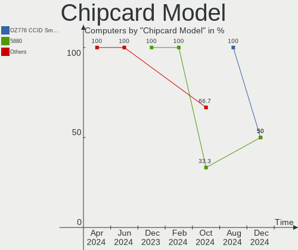

| Model                                                      | Computers | Percent |
|------------------------------------------------------------|-----------|---------|
| Upek TouchChip Fingerprint Coprocessor (WBF advanced mode) | 1         | 33.33%  |
| Broadcom BCM5880 Secure Applications Processor             | 1         | 33.33%  |
| Alcor Micro AU9540 Smartcard Reader                        | 1         | 33.33%  |

Unsupported
-----------

Unsupported Devices
-------------------

Total unsupported devices on board

| Total | Computers | Percent |
|-------|-----------|---------|
| 0     | 25        | 58.14%  |
| 1     | 14        | 32.56%  |
| 2     | 4         | 9.3%    |

Unsupported Device Types
------------------------

Types of unsupported devices

| Type                  | Computers | Percent |
|-----------------------|-----------|---------|
| Net/wireless          | 7         | 31.82%  |
| Fingerprint reader    | 5         | 22.73%  |
| Chipcard              | 3         | 13.64%  |
| Multimedia controller | 2         | 9.09%   |
| Bluetooth             | 2         | 9.09%   |
| Storage               | 1         | 4.55%   |
| Graphics card         | 1         | 4.55%   |
| Camera                | 1         | 4.55%   |

