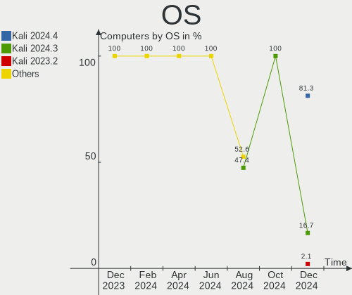
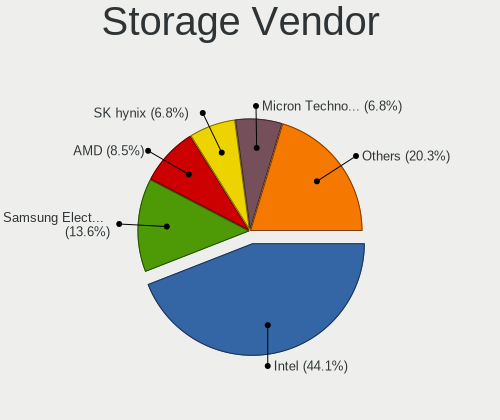
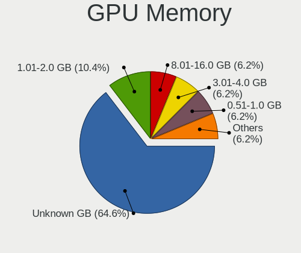
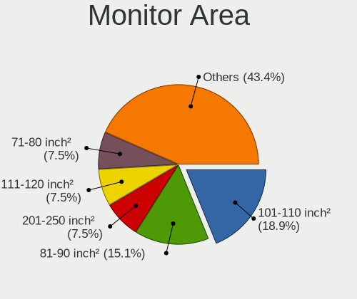
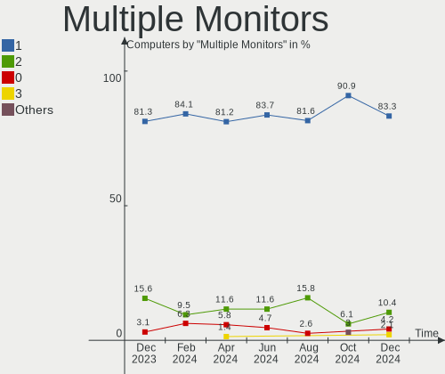
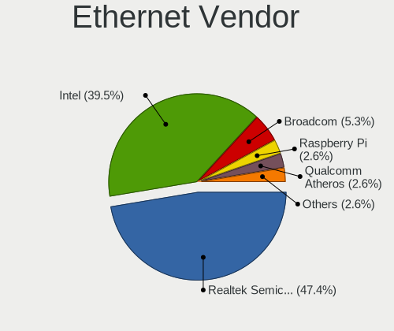
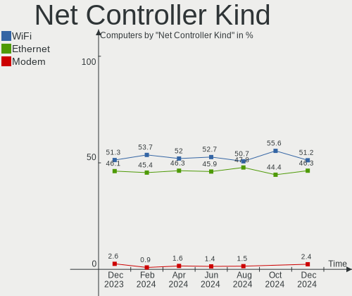
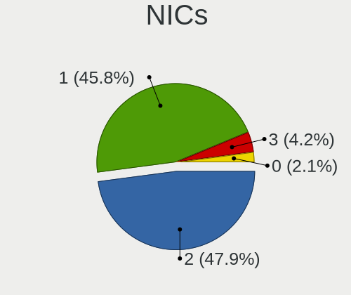

Kali - Hardware Trends
----------------------

A project to identify most popular hardware characteristics and track their change
over time based on data collected by Linux users at https://Linux-Hardware.org.

Anyone can contribute to this report by the [hw-probe](https://github.com/linuxhw/hw-probe) tool:

    sudo -E hw-probe -all -upload

This is a report for all computer types. See also reports for [desktops](/Dist/Kali/Desktop/README.md) and [notebooks](/Dist/Kali/Notebook/README.md).

This report is for one last month. Overall report since the beginning of time: [TestDays](https://github.com/linuxhw/TestDays)

Period: Jan, 2024.

Contents
--------

* [ System ](#system)
  - [ OS                       ](#os)
  - [ OS Family                ](#os-family)
  - [ Kernel                   ](#kernel)
  - [ Kernel Family            ](#kernel-family)
  - [ Kernel Major Ver.        ](#kernel-major-ver)
  - [ Arch                     ](#arch)
  - [ DE                       ](#de)
  - [ Display Server           ](#display-server)
  - [ Display Manager          ](#display-manager)
  - [ OS Lang                  ](#os-lang)
  - [ Boot Mode                ](#boot-mode)
  - [ Filesystem               ](#filesystem)
  - [ Part. scheme             ](#part-scheme)
  - [ Dual Boot with Linux/BSD ](#dual-boot-with-linuxbsd)
  - [ Dual Boot (Win)          ](#dual-boot-win)

* [ Board ](#board)
  - [ Vendor                   ](#vendor)
  - [ Model                    ](#model)
  - [ Model Family             ](#model-family)
  - [ MFG Year                 ](#mfg-year)
  - [ Form Factor              ](#form-factor)
  - [ Secure Boot              ](#secure-boot)
  - [ Coreboot                 ](#coreboot)
  - [ RAM Size                 ](#ram-size)
  - [ RAM Used                 ](#ram-used)
  - [ Total Drives             ](#total-drives)
  - [ Has CD-ROM               ](#has-cd-rom)
  - [ Has Ethernet             ](#has-ethernet)
  - [ Has WiFi                 ](#has-wifi)
  - [ Has Bluetooth            ](#has-bluetooth)

* [ Location ](#location)
  - [ Country                  ](#country)
  - [ City                     ](#city)

* [ Drives ](#drives)
  - [ Drive Vendor             ](#drive-vendor)
  - [ Drive Model              ](#drive-model)
  - [ HDD Vendor               ](#hdd-vendor)
  - [ SSD Vendor               ](#ssd-vendor)
  - [ Drive Kind               ](#drive-kind)
  - [ Drive Connector          ](#drive-connector)
  - [ Drive Size               ](#drive-size)
  - [ Space Total              ](#space-total)
  - [ Space Used               ](#space-used)
  - [ Malfunc. Drives          ](#malfunc-drives)
  - [ Malfunc. Drive Vendor    ](#malfunc-drive-vendor)
  - [ Malfunc. HDD Vendor      ](#malfunc-hdd-vendor)
  - [ Malfunc. Drive Kind      ](#malfunc-drive-kind)
  - [ Failed Drives            ](#failed-drives)
  - [ Failed Drive Vendor      ](#failed-drive-vendor)
  - [ Drive Status             ](#drive-status)

* [ Storage controller ](#storage-controller)
  - [ Storage Vendor           ](#storage-vendor)
  - [ Storage Model            ](#storage-model)
  - [ Storage Kind             ](#storage-kind)

* [ Processor ](#processor)
  - [ CPU Vendor               ](#cpu-vendor)
  - [ CPU Model                ](#cpu-model)
  - [ CPU Model Family         ](#cpu-model-family)
  - [ CPU Cores                ](#cpu-cores)
  - [ CPU Sockets              ](#cpu-sockets)
  - [ CPU Threads              ](#cpu-threads)
  - [ CPU Op-Modes             ](#cpu-op-modes)
  - [ CPU Microcode            ](#cpu-microcode)
  - [ CPU Microarch            ](#cpu-microarch)

* [ Graphics ](#graphics)
  - [ GPU Vendor               ](#gpu-vendor)
  - [ GPU Model                ](#gpu-model)
  - [ GPU Combo                ](#gpu-combo)
  - [ GPU Driver               ](#gpu-driver)
  - [ GPU Memory               ](#gpu-memory)

* [ Monitor ](#monitor)
  - [ Monitor Vendor           ](#monitor-vendor)
  - [ Monitor Model            ](#monitor-model)
  - [ Monitor Resolution       ](#monitor-resolution)
  - [ Monitor Diagonal         ](#monitor-diagonal)
  - [ Monitor Width            ](#monitor-width)
  - [ Aspect Ratio             ](#aspect-ratio)
  - [ Monitor Area             ](#monitor-area)
  - [ Pixel Density            ](#pixel-density)
  - [ Multiple Monitors        ](#multiple-monitors)

* [ Network ](#network)
  - [ Net Controller Vendor    ](#net-controller-vendor)
  - [ Net Controller Model     ](#net-controller-model)
  - [ Wireless Vendor          ](#wireless-vendor)
  - [ Wireless Model           ](#wireless-model)
  - [ Ethernet Vendor          ](#ethernet-vendor)
  - [ Ethernet Model           ](#ethernet-model)
  - [ Net Controller Kind      ](#net-controller-kind)
  - [ Used Controller          ](#used-controller)
  - [ NICs                     ](#nics)
  - [ IPv6                     ](#ipv6)

* [ Bluetooth ](#bluetooth)
  - [ Bluetooth Vendor         ](#bluetooth-vendor)
  - [ Bluetooth Model          ](#bluetooth-model)

* [ Sound ](#sound)
  - [ Sound Vendor             ](#sound-vendor)
  - [ Sound Model              ](#sound-model)

* [ Memory ](#memory)
  - [ Memory Vendor            ](#memory-vendor)
  - [ Memory Model             ](#memory-model)
  - [ Memory Kind              ](#memory-kind)
  - [ Memory Form Factor       ](#memory-form-factor)
  - [ Memory Size              ](#memory-size)
  - [ Memory Speed             ](#memory-speed)

* [ Printers & scanners ](#printers--scanners)
  - [ Printer Vendor           ](#printer-vendor)
  - [ Printer Model            ](#printer-model)
  - [ Scanner Vendor           ](#scanner-vendor)
  - [ Scanner Model            ](#scanner-model)

* [ Camera ](#camera)
  - [ Camera Vendor            ](#camera-vendor)
  - [ Camera Model             ](#camera-model)

* [ Security ](#security)
  - [ Fingerprint Vendor       ](#fingerprint-vendor)
  - [ Fingerprint Model        ](#fingerprint-model)
  - [ Chipcard Vendor          ](#chipcard-vendor)
  - [ Chipcard Model           ](#chipcard-model)

* [ Unsupported ](#unsupported)
  - [ Unsupported Devices      ](#unsupported-devices)
  - [ Unsupported Device Types ](#unsupported-device-types)

System
------

OS
--

Installed operating systems

| Name        | Computers | Percent |
|-------------|-----------|---------|
| Kali 2023.4 | 76        | 92.68%  |
| Kali 2023.3 | 4         | 4.88%   |
| Kali 2023.2 | 1         | 1.22%   |
| Kali 2023.1 | 1         | 1.22%   |

OS Family
---------

OS without a version

| Name | Computers | Percent |
|------|-----------|---------|
| Kali | 82        | 100%    |

Kernel
------

Version of the Linux kernel

| Version               | Computers | Percent |
|-----------------------|-----------|---------|
| 6.5.0-kali3-amd64     | 62        | 75.61%  |
| 6.3.0-kali1-amd64     | 4         | 4.88%   |
| 6.1.0-kali9-amd64     | 4         | 4.88%   |
| 6.6.9-amd64           | 2         | 2.44%   |
| 6.4.0-kali3-amd64     | 2         | 2.44%   |
| 6.7.0-x64v3-xanmod1   | 1         | 1.22%   |
| 6.1.0-kali5-amd64     | 1         | 1.22%   |
| 6.1.0-17-amd64        | 1         | 1.22%   |
| 6.1.0-15-amd64        | 1         | 1.22%   |
| 5.18.0-kali7-amd64    | 1         | 1.22%   |
| 5.14.0-kali4-amd64    | 1         | 1.22%   |
| 4.19.300-yesimxev     | 1         | 1.22%   |
| 4.19.225-lilium/chel+ | 1         | 1.22%   |

Kernel Family
-------------

Linux kernel without a distro release

| Version  | Computers | Percent |
|----------|-----------|---------|
| 6.5.0    | 62        | 75.61%  |
| 6.1.0    | 7         | 8.54%   |
| 6.3.0    | 4         | 4.88%   |
| 6.6.9    | 2         | 2.44%   |
| 6.4.0    | 2         | 2.44%   |
| 6.7.0    | 1         | 1.22%   |
| 5.18.0   | 1         | 1.22%   |
| 5.14.0   | 1         | 1.22%   |
| 4.19.300 | 1         | 1.22%   |
| 4.19.225 | 1         | 1.22%   |

Kernel Major Ver.
-----------------

Linux kernel major version

| Version | Computers | Percent |
|---------|-----------|---------|
| 6.5     | 62        | 75.61%  |
| 6.1     | 7         | 8.54%   |
| 6.3     | 4         | 4.88%   |
| 6.6     | 2         | 2.44%   |
| 6.4     | 2         | 2.44%   |
| 4.19    | 2         | 2.44%   |
| 6.7     | 1         | 1.22%   |
| 5.18    | 1         | 1.22%   |
| 5.14    | 1         | 1.22%   |

Arch
----

OS architecture (x86_64, i586, etc.)

| Name    | Computers | Percent |
|---------|-----------|---------|
| x86_64  | 80        | 97.56%  |
| aarch64 | 2         | 2.44%   |

DE
--

Desktop Environment

| Name             | Computers | Percent |
|------------------|-----------|---------|
| XFCE             | 35        | 42.68%  |
| GNOME            | 26        | 31.71%  |
| KDE5             | 13        | 15.85%  |
| Unknown          | 3         | 3.66%   |
| X-Cinnamon       | 2         | 2.44%   |
| lightdm-xsession | 1         | 1.22%   |
| KDE              | 1         | 1.22%   |
| GNOME Classic    | 1         | 1.22%   |

Display Server
--------------

X11 or Wayland

| Name    | Computers | Percent |
|---------|-----------|---------|
| X11     | 76        | 92.68%  |
| Wayland | 6         | 7.32%   |

Display Manager
---------------

SDDM, LightDM, etc.

| Name    | Computers | Percent |
|---------|-----------|---------|
| LightDM | 35        | 42.68%  |
| Unknown | 26        | 31.71%  |
| SDDM    | 12        | 14.63%  |
| GDM3    | 9         | 10.98%  |

OS Lang
-------

Language

| Lang    | Computers | Percent |
|---------|-----------|---------|
| C       | 41        | 50%     |
| en_US   | 19        | 23.17%  |
| es_MX   | 3         | 3.66%   |
| de_DE   | 3         | 3.66%   |
| Unknown | 3         | 3.66%   |
| es_ES   | 2         | 2.44%   |
| en_GB   | 2         | 2.44%   |
| ru_RU   | 1         | 1.22%   |
| pt_BR   | 1         | 1.22%   |
| it_IT   | 1         | 1.22%   |
| fr_FR   | 1         | 1.22%   |
| es_CU   | 1         | 1.22%   |
| es_AR   | 1         | 1.22%   |
| en_IN   | 1         | 1.22%   |
| cs_CZ   | 1         | 1.22%   |
| ar_EG   | 1         | 1.22%   |

Boot Mode
---------

EFI or BIOS

| Mode | Computers | Percent |
|------|-----------|---------|
| EFI  | 60        | 73.17%  |
| BIOS | 22        | 26.83%  |

Filesystem
----------

Type of filesystem

| Type    | Computers | Percent |
|---------|-----------|---------|
| Ext4    | 71        | 86.59%  |
| Overlay | 5         | 6.1%    |
| Tmpfs   | 4         | 4.88%   |
| Xfs     | 1         | 1.22%   |
| Btrfs   | 1         | 1.22%   |

Part. scheme
------------

Scheme of partitioning

| Type    | Computers | Percent |
|---------|-----------|---------|
| GPT     | 46        | 56.1%   |
| Unknown | 23        | 28.05%  |
| MBR     | 13        | 15.85%  |

Dual Boot with Linux/BSD
------------------------

Hosting more than one Linux/BSD

| Dual boot | Computers | Percent |
|-----------|-----------|---------|
| No        | 71        | 86.59%  |
| Yes       | 11        | 13.41%  |

Dual Boot (Win)
---------------

Hosting Linux and Windows

| Dual boot | Computers | Percent |
|-----------|-----------|---------|
| No        | 61        | 74.39%  |
| Yes       | 21        | 25.61%  |

Board
-----

Vendor
------

Motherboard manufacturer

| Name                  | Computers | Percent |
|-----------------------|-----------|---------|
| Hewlett-Packard       | 17        | 20.73%  |
| ASUSTek Computer      | 16        | 19.51%  |
| Lenovo                | 15        | 18.29%  |
| Dell                  | 7         | 8.54%   |
| Apple                 | 5         | 6.1%    |
| MSI                   | 4         | 4.88%   |
| Acer                  | 3         | 3.66%   |
| Qualcomm Technologies | 2         | 2.44%   |
| Gigabyte Technology   | 2         | 2.44%   |
| Toshiba               | 1         | 1.22%   |
| Samsung Electronics   | 1         | 1.22%   |
| Pegatron              | 1         | 1.22%   |
| Multilaser            | 1         | 1.22%   |
| Mediacom              | 1         | 1.22%   |
| HUAWEI                | 1         | 1.22%   |
| Google                | 1         | 1.22%   |
| Fujitsu               | 1         | 1.22%   |
| eMachines             | 1         | 1.22%   |
| Complet               | 1         | 1.22%   |
| COM1                  | 1         | 1.22%   |

Model
-----

Motherboard model

| Name                                    | Computers | Percent |
|-----------------------------------------|-----------|---------|
| Qualcomm BENGAL IDP                     | 2         | 2.44%   |
| MSI MS-7816                             | 2         | 2.44%   |
| Toshiba Satellite Pro R50-B             | 1         | 1.22%   |
| Samsung 300V3A                          | 1         | 1.22%   |
| Pegatron IPMIP-GS                       | 1         | 1.22%   |
| Multilaser PC301                        | 1         | 1.22%   |
| MSI MS-7C95                             | 1         | 1.22%   |
| MSI GF63 Thin 11UC                      | 1         | 1.22%   |
| Mediacom SMARTBOOK ONE                  | 1         | 1.22%   |
| Lenovo Yoga 3 14 80JH                   | 1         | 1.22%   |
| Lenovo ThinkPad X1 Yoga 4th 20QGS1WS00  | 1         | 1.22%   |
| Lenovo ThinkPad X1 Yoga 1st 20FRS0DG16  | 1         | 1.22%   |
| Lenovo ThinkPad T480s 20L8S0SA00        | 1         | 1.22%   |
| Lenovo ThinkPad T460 20FMS0Q200         | 1         | 1.22%   |
| Lenovo ThinkPad L440 20ASS01400         | 1         | 1.22%   |
| Lenovo ThinkPad E550 20DF0052FR         | 1         | 1.22%   |
| Lenovo ThinkCentre M91p 4518RQ4         | 1         | 1.22%   |
| Lenovo ThinkCentre M72z 3535A48         | 1         | 1.22%   |
| Lenovo Legion Y740-17IRHg 81UJ          | 1         | 1.22%   |
| Lenovo IdeaPad Slim 3 15ABR8 82XM       | 1         | 1.22%   |
| Lenovo IdeaPad S340-15IWL 81N8          | 1         | 1.22%   |
| Lenovo IdeaPad 500-15ACZ 80K4           | 1         | 1.22%   |
| Lenovo IdeaPad 130S-14IGM 81KU          | 1         | 1.22%   |
| Lenovo G580 2189                        | 1         | 1.22%   |
| HUAWEI BOD-WXX9                         | 1         | 1.22%   |
| HP ZBook 15 G5                          | 1         | 1.22%   |
| HP ProDesk 600 G1 SFF                   | 1         | 1.22%   |
| HP ProBook x360 11 G7 Education Edition | 1         | 1.22%   |
| HP ProBook 6560b                        | 1         | 1.22%   |
| HP ProBook 4540s                        | 1         | 1.22%   |
| HP Pavilion 15                          | 1         | 1.22%   |
| HP Laptop 17-cp0xxx                     | 1         | 1.22%   |
| HP Laptop 15-bs0xx                      | 1         | 1.22%   |
| HP Laptop 14-fq0xxx                     | 1         | 1.22%   |
| HP Laptop 14-dq2xxx                     | 1         | 1.22%   |
| HP G1-2012la                            | 1         | 1.22%   |
| HP ENVY x360 Convertible 15-cn1xxx      | 1         | 1.22%   |
| HP EliteBook 840 G8 Notebook PC         | 1         | 1.22%   |
| HP EliteBook 840 14 inch G9 Notebook PC | 1         | 1.22%   |
| HP EliteBook 2560p                      | 1         | 1.22%   |

Model Family
------------

Motherboard model prefix

| Name                | Computers | Percent |
|---------------------|-----------|---------|
| Lenovo ThinkPad     | 6         | 7.32%   |
| Lenovo IdeaPad      | 4         | 4.88%   |
| HP Laptop           | 4         | 4.88%   |
| HP ProBook          | 3         | 3.66%   |
| HP EliteBook        | 3         | 3.66%   |
| Dell Inspiron       | 3         | 3.66%   |
| ASUS ROG            | 3         | 3.66%   |
| ASUS ASUS           | 3         | 3.66%   |
| Qualcomm BENGAL     | 2         | 2.44%   |
| MSI MS-7816         | 2         | 2.44%   |
| Lenovo ThinkCentre  | 2         | 2.44%   |
| Dell XPS            | 2         | 2.44%   |
| Dell Latitude       | 2         | 2.44%   |
| ASUS VivoBook       | 2         | 2.44%   |
| Acer Aspire         | 2         | 2.44%   |
| Toshiba Satellite   | 1         | 1.22%   |
| Samsung 300V3A      | 1         | 1.22%   |
| Pegatron IPMIP-GS   | 1         | 1.22%   |
| Multilaser PC301    | 1         | 1.22%   |
| MSI MS-7C95         | 1         | 1.22%   |
| MSI GF63            | 1         | 1.22%   |
| Mediacom SMARTBOOK  | 1         | 1.22%   |
| Lenovo Yoga         | 1         | 1.22%   |
| Lenovo Legion       | 1         | 1.22%   |
| Lenovo G580         | 1         | 1.22%   |
| HUAWEI BOD-WXX9     | 1         | 1.22%   |
| HP ZBook            | 1         | 1.22%   |
| HP ProDesk          | 1         | 1.22%   |
| HP Pavilion         | 1         | 1.22%   |
| HP G1-2012la        | 1         | 1.22%   |
| HP ENVY             | 1         | 1.22%   |
| HP 280              | 1         | 1.22%   |
| HP 250              | 1         | 1.22%   |
| Google Liara        | 1         | 1.22%   |
| Gigabyte P31-ES3G   | 1         | 1.22%   |
| Gigabyte G41MT-ES2L | 1         | 1.22%   |
| Fujitsu LIFEBOOK    | 1         | 1.22%   |
| eMachines eME732G   | 1         | 1.22%   |
| Complet MY8315XX    | 1         | 1.22%   |
| COM1 NBINF-O5-4R7R6 | 1         | 1.22%   |

MFG Year
--------

Motherboard manufacture year

| Year    | Computers | Percent |
|---------|-----------|---------|
| 2021    | 10        | 12.2%   |
| 2020    | 8         | 9.76%   |
| 2014    | 8         | 9.76%   |
| 2019    | 7         | 8.54%   |
| 2016    | 7         | 8.54%   |
| 2018    | 6         | 7.32%   |
| 2022    | 5         | 6.1%    |
| 2011    | 5         | 6.1%    |
| 2010    | 5         | 6.1%    |
| 2023    | 4         | 4.88%   |
| 2015    | 4         | 4.88%   |
| 2017    | 3         | 3.66%   |
| 2012    | 3         | 3.66%   |
| 2013    | 2         | 2.44%   |
| Unknown | 2         | 2.44%   |
| 2009    | 1         | 1.22%   |
| 2008    | 1         | 1.22%   |
| 2007    | 1         | 1.22%   |

Form Factor
-----------

Physical design of the computer

| Name           | Computers | Percent |
|----------------|-----------|---------|
| Notebook       | 58        | 70.73%  |
| Desktop        | 16        | 19.51%  |
| Convertible    | 5         | 6.1%    |
| System on chip | 2         | 2.44%   |
| Tablet         | 1         | 1.22%   |

Secure Boot
-----------

Enabled or disabled

| State    | Computers | Percent |
|----------|-----------|---------|
| Disabled | 82        | 100%    |

Coreboot
--------

Have coreboot on board

| Used | Computers | Percent |
|------|-----------|---------|
| No   | 81        | 98.78%  |
| Yes  | 1         | 1.22%   |

RAM Size
--------

Total RAM memory

| Size in GB  | Computers | Percent |
|-------------|-----------|---------|
| 4.01-8.0    | 21        | 25.61%  |
| 3.01-4.0    | 19        | 23.17%  |
| 16.01-24.0  | 19        | 23.17%  |
| 8.01-16.0   | 16        | 19.51%  |
| 32.01-64.0  | 5         | 6.1%    |
| 2.01-3.0    | 1         | 1.22%   |
| 64.01-256.0 | 1         | 1.22%   |

RAM Used
--------

Used RAM memory

| Used GB    | Computers | Percent |
|------------|-----------|---------|
| 2.01-3.0   | 30        | 36.59%  |
| 1.01-2.0   | 19        | 23.17%  |
| 4.01-8.0   | 16        | 19.51%  |
| 3.01-4.0   | 11        | 13.41%  |
| 8.01-16.0  | 3         | 3.66%   |
| 0.51-1.0   | 2         | 2.44%   |
| 16.01-24.0 | 1         | 1.22%   |

Total Drives
------------

Number of drives on board

| Drives | Computers | Percent |
|--------|-----------|---------|
| 1      | 49        | 59.76%  |
| 2      | 26        | 31.71%  |
| 0      | 4         | 4.88%   |
| 9      | 1         | 1.22%   |
| 4      | 1         | 1.22%   |
| 3      | 1         | 1.22%   |

Has CD-ROM
----------

Has CD-ROM on board

| Presented | Computers | Percent |
|-----------|-----------|---------|
| No        | 64        | 78.05%  |
| Yes       | 18        | 21.95%  |

Has Ethernet
------------

Has Ethernet on board

| Presented | Computers | Percent |
|-----------|-----------|---------|
| Yes       | 54        | 65.85%  |
| No        | 28        | 34.15%  |

Has WiFi
--------

Has WiFi module

| Presented | Computers | Percent |
|-----------|-----------|---------|
| Yes       | 74        | 90.24%  |
| No        | 8         | 9.76%   |

Has Bluetooth
-------------

Has Bluetooth module

| Presented | Computers | Percent |
|-----------|-----------|---------|
| Yes       | 66        | 80.49%  |
| No        | 16        | 19.51%  |

Location
--------

Country
-------

Geographic location (country)

| Country            | Computers | Percent |
|--------------------|-----------|---------|
| USA                | 17        | 20.73%  |
| Germany            | 6         | 7.32%   |
| Spain              | 4         | 4.88%   |
| Canada             | 4         | 4.88%   |
| UK                 | 3         | 3.66%   |
| Slovakia           | 3         | 3.66%   |
| Russia             | 3         | 3.66%   |
| Poland             | 3         | 3.66%   |
| Mexico             | 3         | 3.66%   |
| Italy              | 3         | 3.66%   |
| France             | 3         | 3.66%   |
| UAE                | 2         | 2.44%   |
| Romania            | 2         | 2.44%   |
| Netherlands        | 2         | 2.44%   |
| India              | 2         | 2.44%   |
| Egypt              | 2         | 2.44%   |
| Czechia            | 2         | 2.44%   |
| Bulgaria           | 2         | 2.44%   |
| Brazil             | 2         | 2.44%   |
| Vietnam            | 1         | 1.22%   |
| Saudi Arabia       | 1         | 1.22%   |
| Portugal           | 1         | 1.22%   |
| Morocco            | 1         | 1.22%   |
| Iraq               | 1         | 1.22%   |
| Indonesia          | 1         | 1.22%   |
| Ghana              | 1         | 1.22%   |
| Finland            | 1         | 1.22%   |
| Dominican Republic | 1         | 1.22%   |
| Cuba               | 1         | 1.22%   |
| Belarus            | 1         | 1.22%   |
| Bangladesh         | 1         | 1.22%   |
| Australia          | 1         | 1.22%   |
| Argentina          | 1         | 1.22%   |

City
----

Geographic location (city)

| City                   | Computers | Percent |
|------------------------|-----------|---------|
| Toronto                | 2         | 2.44%   |
| Koszalin               | 2         | 2.44%   |
| Birmingham             | 2         | 2.44%   |
| Berlin                 | 2         | 2.44%   |
| Warsaw                 | 1         | 1.22%   |
| Voelklingen            | 1         | 1.22%   |
| Villeneuve les beziers | 1         | 1.22%   |
| Topoľčany            | 1         | 1.22%   |
| Timișoara             | 1         | 1.22%   |
| Tijuana                | 1         | 1.22%   |
| Tamaqua                | 1         | 1.22%   |
| Ta'if                  | 1         | 1.22%   |
| Sydney                 | 1         | 1.22%   |
| Suez                   | 1         | 1.22%   |
| Strelice               | 1         | 1.22%   |
| St Petersburg          | 1         | 1.22%   |
| Sofia                  | 1         | 1.22%   |
| Senago                 | 1         | 1.22%   |
| Schwarzenbek           | 1         | 1.22%   |
| Schnaittach            | 1         | 1.22%   |
| Santo Domingo          | 1         | 1.22%   |
| Santa Luzia            | 1         | 1.22%   |
| San Giorgio a Cremano  | 1         | 1.22%   |
| Rome                   | 1         | 1.22%   |
| Prague                 | 1         | 1.22%   |
| Porto                  | 1         | 1.22%   |
| Phoenix                | 1         | 1.22%   |
| Parla                  | 1         | 1.22%   |
| Newcastle              | 1         | 1.22%   |
| New York               | 1         | 1.22%   |
| Moscow                 | 1         | 1.22%   |
| Minsk                  | 1         | 1.22%   |
| Mexico City            | 1         | 1.22%   |
| Martinsville           | 1         | 1.22%   |
| Marion                 | 1         | 1.22%   |
| Maisons-Alfort         | 1         | 1.22%   |
| Los Angeles            | 1         | 1.22%   |
| Lorena                 | 1         | 1.22%   |
| Lake Stevens           | 1         | 1.22%   |
| Košice                | 1         | 1.22%   |

Drives
------

Drive Vendor
------------

Hard drive vendors

| Vendor                      | Computers | Drives | Percent |
|-----------------------------|-----------|--------|---------|
| WDC                         | 16        | 17     | 14.81%  |
| Samsung Electronics         | 13        | 13     | 12.04%  |
| Seagate                     | 11        | 11     | 10.19%  |
| Unknown                     | 8         | 10     | 7.41%   |
| Toshiba                     | 8         | 8      | 7.41%   |
| Sandisk                     | 7         | 7      | 6.48%   |
| SK hynix                    | 6         | 6      | 5.56%   |
| Kingston                    | 5         | 5      | 4.63%   |
| Intel                       | 4         | 4      | 3.7%    |
| Hitachi                     | 4         | 4      | 3.7%    |
| Apple                       | 3         | 4      | 2.78%   |
| KIOXIA                      | 2         | 2      | 1.85%   |
| Unknown                     | 2         | 2      | 1.85%   |
| Team                        | 1         | 1      | 0.93%   |
| TDAS                        | 1         | 5      | 0.93%   |
| SSSTC                       | 1         | 1      | 0.93%   |
| SABRENT                     | 1         | 1      | 0.93%   |
| PNY                         | 1         | 1      | 0.93%   |
| Phison Electronics          | 1         | 1      | 0.93%   |
| Phison                      | 1         | 1      | 0.93%   |
| OCZ                         | 1         | 1      | 0.93%   |
| NGFF                        | 1         | 1      | 0.93%   |
| MSI                         | 1         | 1      | 0.93%   |
| Micron Technology           | 1         | 1      | 0.93%   |
| Kingston Technology Company | 1         | 1      | 0.93%   |
| Intenso                     | 1         | 1      | 0.93%   |
| Fanxiang                    | 1         | 2      | 0.93%   |
| Crucial                     | 1         | 1      | 0.93%   |
| BAITITON                    | 1         | 1      | 0.93%   |
| AMD R5SL                    | 1         | 1      | 0.93%   |
| Acer                        | 1         | 1      | 0.93%   |
| A-DATA Technology           | 1         | 1      | 0.93%   |

Drive Model
-----------

Hard drive models

| Model                                 | Computers | Percent |
|---------------------------------------|-----------|---------|
| Unknown MMC Card  32GB                | 3         | 2.7%    |
| Toshiba MQ04ABF100 1TB                | 2         | 1.8%    |
| SK hynix HFM001TD3JX013N 1024GB       | 2         | 1.8%    |
| Seagate ST31000524AS 1TB              | 2         | 1.8%    |
| Sandisk WD Blue SN570 1TB             | 2         | 1.8%    |
| Kingston SA400S37240G 240GB SSD       | 2         | 1.8%    |
| Unknown                               | 2         | 1.8%    |
| WDC WDS500G2B0A-00SM50 500GB SSD      | 1         | 0.9%    |
| WDC WDS240G3G0A-00BJG0 240GB SSD      | 1         | 0.9%    |
| WDC WDS200T1R0A-68A4W0 2TB SSD        | 1         | 0.9%    |
| WDC WD5000LPVX-75V0TT0 500GB          | 1         | 0.9%    |
| WDC WD5000LPCX-24VHAT0 500GB          | 1         | 0.9%    |
| WDC WD5000BPVT-22HXZT3 500GB          | 1         | 0.9%    |
| WDC WD5000AZLX-60K2TA0 500GB          | 1         | 0.9%    |
| WDC WD3200BPVT-22JJ5T0 320GB          | 1         | 0.9%    |
| WDC WD20EZRX-00D8PB0 2TB              | 1         | 0.9%    |
| WDC WD2000FYYZ-01UL1B2 2TB            | 1         | 0.9%    |
| WDC WD10SPZX-75Z10T2 1TB              | 1         | 0.9%    |
| WDC WD10SPZX-21Z10T0 1TB              | 1         | 0.9%    |
| WDC WD10PURZ-85U8XY0 1TB              | 1         | 0.9%    |
| WDC PC SN530 SDBPNPZ-256G-1006 256GB  | 1         | 0.9%    |
| WDC PC SN530 SDBPNPZ-1T00-1014 1TB    | 1         | 0.9%    |
| WDC PC SN530 SDBPNPZ-1T00-1002 1TB    | 1         | 0.9%    |
| Unknown SD/MMC/MS PRO 256GB           | 1         | 0.9%    |
| Unknown MMC Card  8GB                 | 1         | 0.9%    |
| Unknown MMC Card  64GB                | 1         | 0.9%    |
| Unknown ED4QT  128GB                  | 1         | 0.9%    |
| Unknown DA4128  128GB                 | 1         | 0.9%    |
| Unknown DA4032  32GB                  | 1         | 0.9%    |
| Unknown APPSD  33GB                   | 1         | 0.9%    |
| Toshiba THNSN5512GPUK NVMe 512GB      | 1         | 0.9%    |
| Toshiba THNSN5256GPU7 256GB           | 1         | 0.9%    |
| Toshiba MQ01ABF050 500GB              | 1         | 0.9%    |
| Toshiba MQ01ABD100 1TB                | 1         | 0.9%    |
| Toshiba MK3276GSX 320GB               | 1         | 0.9%    |
| Toshiba DT01ACA100 1TB                | 1         | 0.9%    |
| Team TM8FP6512G 512GB                 | 1         | 0.9%    |
| TDAS TerraMaster 500GB                | 1         | 0.9%    |
| SSSTC CVB-8D128-HP 128GB              | 1         | 0.9%    |
| SK hynix HFS250G32TND-3110A 250GB SSD | 1         | 0.9%    |

HDD Vendor
----------

Hard disk drive vendors

| Vendor              | Computers | Drives | Percent |
|---------------------|-----------|--------|---------|
| Seagate             | 11        | 11     | 31.43%  |
| WDC                 | 10        | 11     | 28.57%  |
| Toshiba             | 6         | 6      | 17.14%  |
| Hitachi             | 4         | 4      | 11.43%  |
| Unknown             | 1         | 1      | 2.86%   |
| TDAS                | 1         | 5      | 2.86%   |
| Samsung Electronics | 1         | 1      | 2.86%   |
| Apple               | 1         | 1      | 2.86%   |

SSD Vendor
----------

Solid state drive vendors

| Vendor              | Computers | Drives | Percent |
|---------------------|-----------|--------|---------|
| Kingston            | 5         | 5      | 18.52%  |
| WDC                 | 3         | 3      | 11.11%  |
| Samsung Electronics | 3         | 3      | 11.11%  |
| Intel               | 3         | 3      | 11.11%  |
| SanDisk             | 2         | 2      | 7.41%   |
| SSSTC               | 1         | 1      | 3.7%    |
| SK hynix            | 1         | 1      | 3.7%    |
| SABRENT             | 1         | 1      | 3.7%    |
| PNY                 | 1         | 1      | 3.7%    |
| OCZ                 | 1         | 1      | 3.7%    |
| NGFF                | 1         | 1      | 3.7%    |
| Intenso             | 1         | 1      | 3.7%    |
| Fanxiang            | 1         | 1      | 3.7%    |
| BAITITON            | 1         | 1      | 3.7%    |
| Apple               | 1         | 1      | 3.7%    |
| AMD R5SL            | 1         | 1      | 3.7%    |

Drive Kind
----------

HDD or SSD

| Kind    | Computers | Drives | Percent |
|---------|-----------|--------|---------|
| NVMe    | 34        | 38     | 34.69%  |
| HDD     | 29        | 40     | 29.59%  |
| SSD     | 26        | 27     | 26.53%  |
| MMC     | 8         | 11     | 8.16%   |
| Unknown | 1         | 1      | 1.02%   |

Drive Connector
---------------

SATA, SAS, NVMe, etc.

| Type | Computers | Drives | Percent |
|------|-----------|--------|---------|
| SATA | 45        | 60     | 49.45%  |
| NVMe | 34        | 38     | 37.36%  |
| MMC  | 8         | 11     | 8.79%   |
| SAS  | 4         | 8      | 4.4%    |

Drive Size
----------

Size of hard drive

| Size in TB | Computers | Drives | Percent |
|------------|-----------|--------|---------|
| 0.01-0.5   | 30        | 40     | 55.56%  |
| 0.51-1.0   | 18        | 21     | 33.33%  |
| 1.01-2.0   | 5         | 5      | 9.26%   |
| 4.01-10.0  | 1         | 1      | 1.85%   |

Space Total
-----------

Amount of disk space available on the file system

| Size in GB | Computers | Percent |
|------------|-----------|---------|
| 101-250    | 31        | 37.8%   |
| 251-500    | 15        | 18.29%  |
| 501-1000   | 12        | 14.63%  |
| 51-100     | 7         | 8.54%   |
| 21-50      | 5         | 6.1%    |
| Unknown    | 5         | 6.1%    |
| 1001-2000  | 3         | 3.66%   |
| 2001-3000  | 2         | 2.44%   |
| 1-20       | 2         | 2.44%   |

Space Used
----------

Amount of used disk space

| Used GB  | Computers | Percent |
|----------|-----------|---------|
| 51-100   | 22        | 26.83%  |
| 1-20     | 20        | 24.39%  |
| 21-50    | 19        | 23.17%  |
| 101-250  | 9         | 10.98%  |
| Unknown  | 5         | 6.1%    |
| 501-1000 | 4         | 4.88%   |
| 251-500  | 3         | 3.66%   |

Malfunc. Drives
---------------

Drive models with a malfunction

| Model                                                           | Computers | Drives | Percent |
|-----------------------------------------------------------------|-----------|--------|---------|
| WDC WDS240G3G0A-00BJG0 240GB SSD                                | 1         | 1      | 7.14%   |
| WDC WD5000BPVT-22HXZT3 500GB                                    | 1         | 1      | 7.14%   |
| Toshiba MQ01ABF050 500GB                                        | 1         | 1      | 7.14%   |
| Toshiba MK3276GSX 320GB                                         | 1         | 1      | 7.14%   |
| SK hynix HFS250G32TND-3110A 250GB SSD                           | 1         | 1      | 7.14%   |
| Seagate ST31000524AS 1TB                                        | 1         | 1      | 7.14%   |
| Seagate ST2000DX002-2DV164 2TB                                  | 1         | 1      | 7.14%   |
| Seagate ST1000LM035-1RK172 1TB                                  | 1         | 1      | 7.14%   |
| Seagate ST1000DM003-1SB102 1TB                                  | 1         | 1      | 7.14%   |
| SanDisk SD9SN8W-128G-1006 128GB SSD                             | 1         | 1      | 7.14%   |
| Samsung Electronics NVMe SSD Controller SM961/PM961/SM963 256GB | 1         | 1      | 7.14%   |
| Intel SSDSA2M080G2GC 80GB                                       | 1         | 1      | 7.14%   |
| Hitachi HTS547550A9E384 500GB                                   | 1         | 1      | 7.14%   |
| BAITITON BT58SSD12S 512GB                                       | 1         | 1      | 7.14%   |

Malfunc. Drive Vendor
---------------------

Vendors of faulty drives

| Vendor              | Computers | Drives | Percent |
|---------------------|-----------|--------|---------|
| Seagate             | 4         | 4      | 28.57%  |
| WDC                 | 2         | 2      | 14.29%  |
| Toshiba             | 2         | 2      | 14.29%  |
| SK hynix            | 1         | 1      | 7.14%   |
| SanDisk             | 1         | 1      | 7.14%   |
| Samsung Electronics | 1         | 1      | 7.14%   |
| Intel               | 1         | 1      | 7.14%   |
| Hitachi             | 1         | 1      | 7.14%   |
| BAITITON            | 1         | 1      | 7.14%   |

Malfunc. HDD Vendor
-------------------

Vendors of faulty HDD drives

| Vendor  | Computers | Drives | Percent |
|---------|-----------|--------|---------|
| Seagate | 4         | 4      | 50%     |
| Toshiba | 2         | 2      | 25%     |
| WDC     | 1         | 1      | 12.5%   |
| Hitachi | 1         | 1      | 12.5%   |

Malfunc. Drive Kind
-------------------

Kinds of faulty drives

| Kind | Computers | Drives | Percent |
|------|-----------|--------|---------|
| HDD  | 8         | 8      | 57.14%  |
| SSD  | 5         | 5      | 35.71%  |
| NVMe | 1         | 1      | 7.14%   |

Failed Drives
-------------

Failed drive models

Zero info for selected period =(

Failed Drive Vendor
-------------------

Failed drive vendors

Zero info for selected period =(

Drive Status
------------

Number of failed and malfunc. drives

| Status   | Computers | Drives | Percent |
|----------|-----------|--------|---------|
| Works    | 43        | 48     | 47.78%  |
| Detected | 33        | 55     | 36.67%  |
| Malfunc  | 14        | 14     | 15.56%  |

Storage controller
------------------

Storage Vendor
--------------

Storage controller vendors

| Vendor                       | Computers | Percent |
|------------------------------|-----------|---------|
| Intel                        | 55        | 53.92%  |
| Samsung Electronics          | 10        | 9.8%    |
| SanDisk                      | 8         | 7.84%   |
| AMD                          | 8         | 7.84%   |
| SK hynix                     | 5         | 4.9%    |
| Phison Electronics           | 3         | 2.94%   |
| Toshiba America Info Systems | 2         | 1.96%   |
| KIOXIA                       | 2         | 1.96%   |
| Micron/Crucial Technology    | 1         | 0.98%   |
| Micron Technology            | 1         | 0.98%   |
| Marvell Technology Group     | 1         | 0.98%   |
| Kingston Technology Company  | 1         | 0.98%   |
| Hosin Global Electronics     | 1         | 0.98%   |
| HighPoint Technologies       | 1         | 0.98%   |
| ASMedia Technology           | 1         | 0.98%   |
| Apple                        | 1         | 0.98%   |
| ADATA Technology             | 1         | 0.98%   |

Storage Model
-------------

Storage controller models

| Model                                                                          | Computers | Percent |
|--------------------------------------------------------------------------------|-----------|---------|
| Intel Volume Management Device NVMe RAID Controller                            | 8         | 7.48%   |
| AMD FCH SATA Controller [AHCI mode]                                            | 5         | 4.67%   |
| SK hynix Gold P31/BC711/PC711 NVMe Solid State Drive                           | 4         | 3.74%   |
| SanDisk Ultra 3D / WD Blue SN550 NVMe SSD                                      | 4         | 3.74%   |
| Samsung NVMe SSD Controller 980 (DRAM-less)                                    | 4         | 3.74%   |
| Intel Sunrise Point-LP SATA Controller [AHCI mode]                             | 4         | 3.74%   |
| Intel Cannon Lake Mobile PCH SATA AHCI Controller                              | 4         | 3.74%   |
| Intel 8 Series/C220 Series Chipset Family 6-port SATA Controller 1 [AHCI mode] | 4         | 3.74%   |
| Intel 6 Series/C200 Series Chipset Family 6 port Mobile SATA AHCI Controller   | 4         | 3.74%   |
| Samsung NVMe SSD Controller SM981/PM981/PM983                                  | 3         | 2.8%    |
| Intel Wildcat Point-LP SATA Controller [AHCI Mode]                             | 3         | 2.8%    |
| Intel Celeron/Pentium Silver Processor SATA Controller                         | 3         | 2.8%    |
| Intel 82801 Mobile SATA Controller [RAID mode]                                 | 3         | 2.8%    |
| Intel 8 Series SATA Controller 1 [AHCI mode]                                   | 3         | 2.8%    |
| Intel 7 Series Chipset Family 6-port SATA Controller [AHCI mode]               | 3         | 2.8%    |
| SanDisk Ultra 3D / WD Blue SN570 NVMe SSD (DRAM-less)                          | 2         | 1.87%   |
| KIOXIA NVMe SSD Controller BG4 (DRAM-less)                                     | 2         | 1.87%   |
| Intel NM10/ICH7 Family SATA Controller [IDE mode]                              | 2         | 1.87%   |
| Intel 6 Series/C200 Series Chipset Family 6 port Desktop SATA AHCI Controller  | 2         | 1.87%   |
| Intel 5 Series/3400 Series Chipset 4 port SATA AHCI Controller                 | 2         | 1.87%   |
| AMD 500 Series Chipset SATA Controller                                         | 2         | 1.87%   |
| Toshiba America Info Systems XG4 NVMe SSD Controller                           | 1         | 0.93%   |
| Toshiba America Info Systems XG3 NVMe SSD Controller                           | 1         | 0.93%   |
| SK hynix BC511 NVMe SSD                                                        | 1         | 0.93%   |
| Sandisk WD PC SN735 NVMe SSD 1TB (DRAM-less)                                   | 1         | 0.93%   |
| SanDisk WD Black SN770 / PC SN740 256GB / PC SN560 (DRAM-less) NVMe SSD        | 1         | 0.93%   |
| Samsung S4LN058A01[SSUBX] AHCI SSD Controller (Apple slot)                     | 1         | 0.93%   |
| Samsung NVMe SSD Controller SM961/PM961/SM963                                  | 1         | 0.93%   |
| Samsung NVMe SSD Controller PM9B1 (DRAM-less)                                  | 1         | 0.93%   |
| Phison PS5021-E21 PCIe4 NVMe Controller (DRAM-less)                            | 1         | 0.93%   |
| Phison PS5013-E13 PCIe3 NVMe Controller (DRAM-less)                            | 1         | 0.93%   |
| Phison E12 NVMe Controller                                                     | 1         | 0.93%   |
| Micron/Crucial P1 NVMe PCIe SSD[Frampton]                                      | 1         | 0.93%   |
| Micron 2400 NVMe SSD (DRAM-less)                                               | 1         | 0.93%   |
| Marvell Group 88SE912x IDE Controller                                          | 1         | 0.93%   |
| Kingston Company NV2 NVMe SSD SM2267XT (DRAM-less)                             | 1         | 0.93%   |
| Intel Tiger Lake SATA AHCI Controller                                          | 1         | 0.93%   |
| Intel SSD 670p Series [Keystone Harbor]                                        | 1         | 0.93%   |
| Intel SATA Controller [RAID mode]                                              | 1         | 0.93%   |
| Intel Q170/Q150/B150/H170/H110/Z170/CM236 Chipset SATA Controller [AHCI Mode]  | 1         | 0.93%   |

Storage Kind
------------

Kind of storage controller (IDE, SATA, NVMe, SAS, ...)

| Kind | Computers | Percent |
|------|-----------|---------|
| SATA | 51        | 49.51%  |
| NVMe | 34        | 33.01%  |
| RAID | 13        | 12.62%  |
| IDE  | 5         | 4.85%   |

Processor
---------

CPU Vendor
----------

Processor vendors

| Vendor   | Computers | Percent |
|----------|-----------|---------|
| Intel    | 67        | 81.71%  |
| AMD      | 13        | 15.85%  |
| Qualcomm | 2         | 2.44%   |

CPU Model
---------

Processor models

| Model                                       | Computers | Percent |
|---------------------------------------------|-----------|---------|
| Qualcomm AArch64 Processor rev 4 (aarch64)  | 2         | 2.44%   |
| Intel Xeon CPU E3-1230 v3 @ 3.30GHz         | 2         | 2.44%   |
| Intel Core i7-9750H CPU @ 2.60GHz           | 2         | 2.44%   |
| Intel Core i7-5500U CPU @ 2.40GHz           | 2         | 2.44%   |
| Intel Core i5-6300U CPU @ 2.40GHz           | 2         | 2.44%   |
| Intel Core i3-2310M CPU @ 2.10GHz           | 2         | 2.44%   |
| Intel 11th Gen Core i7-11370H @ 3.30GHz     | 2         | 2.44%   |
| Intel 11th Gen Core i3-1115G4 @ 3.00GHz     | 2         | 2.44%   |
| AMD Ryzen 5 5500U with Radeon Graphics      | 2         | 2.44%   |
| Intel Xeon CPU E5620 @ 2.40GHz              | 1         | 1.22%   |
| Intel Pentium Silver N6000 @ 1.10GHz        | 1         | 1.22%   |
| Intel Pentium Dual-Core CPU E5700 @ 3.00GHz | 1         | 1.22%   |
| Intel Pentium CPU N3700 @ 1.60GHz           | 1         | 1.22%   |
| Intel Core i9-10980XE CPU @ 3.00GHz         | 1         | 1.22%   |
| Intel Core i7-8850H CPU @ 2.60GHz           | 1         | 1.22%   |
| Intel Core i7-8665U CPU @ 1.90GHz           | 1         | 1.22%   |
| Intel Core i7-8550U CPU @ 1.80GHz           | 1         | 1.22%   |
| Intel Core i7-7700K CPU @ 4.20GHz           | 1         | 1.22%   |
| Intel Core i7-7500U CPU @ 2.70GHz           | 1         | 1.22%   |
| Intel Core i7-6700HQ CPU @ 2.60GHz          | 1         | 1.22%   |
| Intel Core i7-6600U CPU @ 2.60GHz           | 1         | 1.22%   |
| Intel Core i7-3520M CPU @ 2.90GHz           | 1         | 1.22%   |
| Intel Core i5-9300H CPU @ 2.40GHz           | 1         | 1.22%   |
| Intel Core i5-8265U CPU @ 1.60GHz           | 1         | 1.22%   |
| Intel Core i5-7360U CPU @ 2.30GHz           | 1         | 1.22%   |
| Intel Core i5-7200U CPU @ 2.50GHz           | 1         | 1.22%   |
| Intel Core i5-5350U CPU @ 1.80GHz           | 1         | 1.22%   |
| Intel Core i5-5200U CPU @ 2.20GHz           | 1         | 1.22%   |
| Intel Core i5-4570 CPU @ 3.20GHz            | 1         | 1.22%   |
| Intel Core i5-4200U CPU @ 1.60GHz           | 1         | 1.22%   |
| Intel Core i5-3470S CPU @ 2.90GHz           | 1         | 1.22%   |
| Intel Core i5-3317U CPU @ 1.70GHz           | 1         | 1.22%   |
| Intel Core i5-2435M CPU @ 2.40GHz           | 1         | 1.22%   |
| Intel Core i5-2430M CPU @ 2.40GHz           | 1         | 1.22%   |
| Intel Core i5-2400 CPU @ 3.10GHz            | 1         | 1.22%   |
| Intel Core i5-1035G1 CPU @ 1.00GHz          | 1         | 1.22%   |
| Intel Core i5-10310U CPU @ 1.70GHz          | 1         | 1.22%   |
| Intel Core i5 CPU 650 @ 3.20GHz             | 1         | 1.22%   |
| Intel Core i3-8145U CPU @ 2.10GHz           | 1         | 1.22%   |
| Intel Core i3-7020U CPU @ 2.30GHz           | 1         | 1.22%   |

CPU Model Family
----------------

Processor model prefix

| Model                   | Computers | Percent |
|-------------------------|-----------|---------|
| Intel Core i5           | 18        | 21.95%  |
| Other                   | 14        | 17.07%  |
| Intel Core i7           | 12        | 14.63%  |
| Intel Core i3           | 12        | 14.63%  |
| Intel Celeron           | 5         | 6.1%    |
| Intel Xeon              | 3         | 3.66%   |
| AMD Ryzen 7             | 3         | 3.66%   |
| AMD Ryzen 5             | 3         | 3.66%   |
| AMD A10                 | 2         | 2.44%   |
| Intel Pentium Silver    | 1         | 1.22%   |
| Intel Pentium Dual-Core | 1         | 1.22%   |
| Intel Pentium           | 1         | 1.22%   |
| Intel Core i9           | 1         | 1.22%   |
| Intel Core 2 Duo        | 1         | 1.22%   |
| AMD Ryzen 9             | 1         | 1.22%   |
| AMD Ryzen 3             | 1         | 1.22%   |
| AMD E2                  | 1         | 1.22%   |
| AMD E                   | 1         | 1.22%   |
| AMD A4                  | 1         | 1.22%   |

CPU Cores
---------

Number of processor cores

| Number | Computers | Percent |
|--------|-----------|---------|
| 2      | 40        | 48.78%  |
| 4      | 23        | 28.05%  |
| 6      | 6         | 7.32%   |
| 8      | 5         | 6.1%    |
| 10     | 4         | 4.88%   |
| 18     | 1         | 1.22%   |
| 16     | 1         | 1.22%   |
| 14     | 1         | 1.22%   |
| 1      | 1         | 1.22%   |

CPU Sockets
-----------

Number of sockets

| Number | Computers | Percent |
|--------|-----------|---------|
| 1      | 81        | 98.78%  |
| 2      | 1         | 1.22%   |

CPU Threads
-----------

Threads per core (Hyper-Threading)

| Number | Computers | Percent |
|--------|-----------|---------|
| 2      | 64        | 78.05%  |
| 1      | 18        | 21.95%  |

CPU Op-Modes
------------

CPU Operation Modes (32-bit, 64-bit)

| Op mode        | Computers | Percent |
|----------------|-----------|---------|
| 32-bit, 64-bit | 82        | 100%    |

CPU Microcode
-------------

Microcode number

| Number     | Computers | Percent |
|------------|-----------|---------|
| Unknown    | 64        | 78.05%  |
| 0x806c1    | 2         | 2.44%   |
| 0x806ec    | 1         | 1.22%   |
| 0x50657    | 1         | 1.22%   |
| 0x406e3    | 1         | 1.22%   |
| 0x40651    | 1         | 1.22%   |
| 0x1067a    | 1         | 1.22%   |
| 0x0a50000d | 1         | 1.22%   |
| 0x0a404101 | 1         | 1.22%   |
| 0x08608103 | 1         | 1.22%   |
| 0x08608102 | 1         | 1.22%   |
| 0x08600103 | 1         | 1.22%   |
| 0x08108109 | 1         | 1.22%   |
| 0x07030106 | 1         | 1.22%   |
| 0x06006704 | 1         | 1.22%   |
| 0x06006110 | 1         | 1.22%   |
| 0x06003106 | 1         | 1.22%   |
| 0x05000029 | 1         | 1.22%   |

CPU Microarch
-------------

Microarchitecture

| Name             | Computers | Percent |
|------------------|-----------|---------|
| KabyLake         | 14        | 17.07%  |
| Skylake          | 7         | 8.54%   |
| Haswell          | 7         | 8.54%   |
| Unknown          | 7         | 8.54%   |
| TigerLake        | 6         | 7.32%   |
| SandyBridge      | 6         | 7.32%   |
| Westmere         | 4         | 4.88%   |
| Broadwell        | 4         | 4.88%   |
| Alderlake Hybrid | 4         | 4.88%   |
| Zen 3            | 3         | 3.66%   |
| IvyBridge        | 3         | 3.66%   |
| Goldmont plus    | 3         | 3.66%   |
| Silvermont       | 2         | 2.44%   |
| Penryn           | 2         | 2.44%   |
| Excavator        | 2         | 2.44%   |
| Zen+             | 1         | 1.22%   |
| Zen 2            | 1         | 1.22%   |
| Tremont          | 1         | 1.22%   |
| Steamroller      | 1         | 1.22%   |
| Puma             | 1         | 1.22%   |
| IceLake          | 1         | 1.22%   |
| Goldmont         | 1         | 1.22%   |
| Bobcat           | 1         | 1.22%   |

Graphics
--------

GPU Vendor
----------

Vendors of graphics cards

| Vendor | Computers | Percent |
|--------|-----------|---------|
| Intel  | 57        | 60%     |
| Nvidia | 22        | 23.16%  |
| AMD    | 16        | 16.84%  |

GPU Model
---------

Graphics card models

| Model                                                                                    | Computers | Percent |
|------------------------------------------------------------------------------------------|-----------|---------|
| Intel 2nd Generation Core Processor Family Integrated Graphics Controller                | 5         | 5.15%   |
| Intel TigerLake-LP GT2 [Iris Xe Graphics]                                                | 4         | 4.12%   |
| Intel Skylake GT2 [HD Graphics 520]                                                      | 4         | 4.12%   |
| Intel CoffeeLake-H GT2 [UHD Graphics 630]                                                | 4         | 4.12%   |
| Intel WhiskeyLake-U GT2 [UHD Graphics 620]                                               | 3         | 3.09%   |
| Intel HD Graphics 620                                                                    | 3         | 3.09%   |
| Intel HD Graphics 5500                                                                   | 3         | 3.09%   |
| Intel Haswell-ULT Integrated Graphics Controller                                         | 3         | 3.09%   |
| Intel GeminiLake [UHD Graphics 600]                                                      | 3         | 3.09%   |
| Nvidia TU117M [GeForce GTX 1650 Mobile / Max-Q]                                          | 2         | 2.06%   |
| Nvidia GA107M [GeForce RTX 3050 Ti Mobile]                                               | 2         | 2.06%   |
| Nvidia GA107M [GeForce RTX 3050 Mobile]                                                  | 2         | 2.06%   |
| Intel Tiger Lake-LP GT2 [UHD Graphics G4]                                                | 2         | 2.06%   |
| Intel HD Graphics 530                                                                    | 2         | 2.06%   |
| Intel Core Processor Integrated Graphics Controller                                      | 2         | 2.06%   |
| Intel Atom/Celeron/Pentium Processor x5-E8000/J3xxx/N3xxx Integrated Graphics Controller | 2         | 2.06%   |
| Intel Alder Lake-UP3 GT2 [UHD Graphics]                                                  | 2         | 2.06%   |
| Intel 3rd Gen Core processor Graphics Controller                                         | 2         | 2.06%   |
| AMD Lucienne                                                                             | 2         | 2.06%   |
| AMD Juniper PRO [Radeon HD 6750]                                                         | 2         | 2.06%   |
| Nvidia TU106M [GeForce RTX 2060 Mobile]                                                  | 1         | 1.03%   |
| Nvidia TU106BM [GeForce RTX 2060 Mobile]                                                 | 1         | 1.03%   |
| Nvidia TU102 [GeForce RTX 2080 Ti Rev. A]                                                | 1         | 1.03%   |
| Nvidia GT216M [GeForce GT 325M]                                                          | 1         | 1.03%   |
| Nvidia GP108 [GeForce GT 1030]                                                           | 1         | 1.03%   |
| Nvidia GP107GLM [Quadro P1000 Mobile]                                                    | 1         | 1.03%   |
| Nvidia GP104 [GeForce GTX 1080]                                                          | 1         | 1.03%   |
| Nvidia GM107M [GeForce GTX 960M]                                                         | 1         | 1.03%   |
| Nvidia GF119M [GeForce GT 520M]                                                          | 1         | 1.03%   |
| Nvidia GF119 [GeForce GT 520]                                                            | 1         | 1.03%   |
| Nvidia GF119 [GeForce 510]                                                               | 1         | 1.03%   |
| Nvidia GF117M [GeForce 610M/710M/810M/820M / GT 620M/625M/630M/720M]                     | 1         | 1.03%   |
| Nvidia GA106 [GeForce RTX 3060 Lite Hash Rate]                                           | 1         | 1.03%   |
| Nvidia GA106 [Geforce RTX 3050]                                                          | 1         | 1.03%   |
| Nvidia GA104M [GeForce RTX 3070 Mobile / Max-Q]                                          | 1         | 1.03%   |
| Nvidia AD103 [GeForce RTX 4080]                                                          | 1         | 1.03%   |
| Intel Xeon E3-1200 v3/4th Gen Core Processor Integrated Graphics Controller              | 1         | 1.03%   |
| Intel Xeon E3-1200 v2/3rd Gen Core processor Graphics Controller                         | 1         | 1.03%   |
| Intel UHD Graphics 620                                                                   | 1         | 1.03%   |
| Intel TigerLake-H GT1 [UHD Graphics]                                                     | 1         | 1.03%   |

GPU Combo
---------

Combinations of graphics cards

| Name           | Computers | Percent |
|----------------|-----------|---------|
| 1 x Intel      | 44        | 53.66%  |
| Intel + Nvidia | 12        | 14.63%  |
| 1 x AMD        | 11        | 13.41%  |
| 1 x Nvidia     | 8         | 9.76%   |
| Other          | 2         | 2.44%   |
| 2 x AMD        | 2         | 2.44%   |
| AMD + Nvidia   | 2         | 2.44%   |
| Intel + AMD    | 1         | 1.22%   |

GPU Driver
----------

Free vs proprietary

| Driver      | Computers | Percent |
|-------------|-----------|---------|
| Free        | 69        | 84.15%  |
| Proprietary | 10        | 12.2%   |
| Unknown     | 3         | 3.66%   |

GPU Memory
----------

Total video memory

| Size in GB | Computers | Percent |
|------------|-----------|---------|
| Unknown    | 54        | 65.85%  |
| 0.51-1.0   | 7         | 8.54%   |
| 0.01-0.5   | 7         | 8.54%   |
| 3.01-4.0   | 4         | 4.88%   |
| 1.01-2.0   | 4         | 4.88%   |
| 7.01-8.0   | 3         | 3.66%   |
| 8.01-16.0  | 3         | 3.66%   |

Monitor
-------

Monitor Vendor
--------------

Monitor vendors

| Vendor                  | Computers | Percent |
|-------------------------|-----------|---------|
| Chimei Innolux          | 16        | 17.39%  |
| AU Optronics            | 14        | 15.22%  |
| BOE                     | 11        | 11.96%  |
| Samsung Electronics     | 8         | 8.7%    |
| Sharp                   | 5         | 5.43%   |
| LG Display              | 5         | 5.43%   |
| Hewlett-Packard         | 4         | 4.35%   |
| Apple                   | 4         | 4.35%   |
| Philips                 | 3         | 3.26%   |
| Dell                    | 3         | 3.26%   |
| QCM                     | 2         | 2.17%   |
| Lenovo                  | 2         | 2.17%   |
| Iiyama                  | 2         | 2.17%   |
| Vizio                   | 1         | 1.09%   |
| VIZ                     | 1         | 1.09%   |
| Vestel                  | 1         | 1.09%   |
| Sony                    | 1         | 1.09%   |
| SHI                     | 1         | 1.09%   |
| PANDA                   | 1         | 1.09%   |
| ONN                     | 1         | 1.09%   |
| InfoVision              | 1         | 1.09%   |
| HKC                     | 1         | 1.09%   |
| Goldstar                | 1         | 1.09%   |
| Chi Mei Optoelectronics | 1         | 1.09%   |
| Ancor Communications    | 1         | 1.09%   |
| Acer                    | 1         | 1.09%   |

Monitor Model
-------------

Monitor models

| Model                                                                | Computers | Percent |
|----------------------------------------------------------------------|-----------|---------|
| QCM LCD Monitor QCM0001 1080x2340 60x150mm 6.4-inch                  | 2         | 2.13%   |
| Philips 190SW PHL0862 1440x900 408x255mm 18.9-inch                   | 2         | 2.13%   |
| Chimei Innolux LCD Monitor CMN15F5 1920x1080 344x193mm 15.5-inch     | 2         | 2.13%   |
| AU Optronics LCD Monitor AUO2E3C 1366x768 309x173mm 13.9-inch        | 2         | 2.13%   |
| AU Optronics LCD Monitor AUO243D 1920x1080 309x173mm 13.9-inch       | 2         | 2.13%   |
| Vizio E320-A0 VIZ0095 1366x768 697x392mm 31.5-inch                   | 1         | 1.06%   |
| VIZ LCD Monitor E320-A0 1366x768                                     | 1         | 1.06%   |
| Vestel LCD Monitor 50UHD_LCD_TV 3840x2160                            | 1         | 1.06%   |
| Sony TV SNYAB03 1920x1080                                            | 1         | 1.06%   |
| SHI LCD-TV**** SHI6102 1360x768 708x398mm 32.0-inch                  | 1         | 1.06%   |
| Sharp LQ156M1JW26 SHP1532 1920x1080 344x194mm 15.5-inch              | 1         | 1.06%   |
| Sharp LQ134N1JW54 SHP154F 1920x1200 288x180mm 13.4-inch              | 1         | 1.06%   |
| Sharp LCD Monitor SHP14B9 3840x2160 344x194mm 15.5-inch              | 1         | 1.06%   |
| Sharp LCD Monitor SHP1450 3840x2160 350x190mm 15.7-inch              | 1         | 1.06%   |
| Sharp LCD Monitor SHP1449 1920x1080 294x165mm 13.3-inch              | 1         | 1.06%   |
| Samsung Electronics LU28R55 SAM1017 3840x2160 632x360mm 28.6-inch    | 1         | 1.06%   |
| Samsung Electronics LS27AG55x SAM71E1 2560x1440 600x340mm 27.2-inch  | 1         | 1.06%   |
| Samsung Electronics LCD Monitor SEC524D 1366x768 353x198mm 15.9-inch | 1         | 1.06%   |
| Samsung Electronics LCD Monitor SEC4149 1366x768 292x174mm 13.4-inch | 1         | 1.06%   |
| Samsung Electronics LCD Monitor SEC3355 1366x768 293x165mm 13.2-inch | 1         | 1.06%   |
| Samsung Electronics LCD Monitor SDC4547 1366x768 344x194mm 15.5-inch | 1         | 1.06%   |
| Samsung Electronics LCD Monitor SAM0C3C 1366x768 609x347mm 27.6-inch | 1         | 1.06%   |
| Samsung Electronics LCD Monitor SAM050F 1920x1080                    | 1         | 1.06%   |
| Philips PHL 272V8 PHLC21A 1920x1080 600x340mm 27.2-inch              | 1         | 1.06%   |
| PANDA LCD Monitor NCP004D 1920x1080 344x194mm 15.5-inch              | 1         | 1.06%   |
| ONN onn. TV ONN0C94 1920x1080 698x392mm 31.5-inch                    | 1         | 1.06%   |
| LG Display LCD Monitor LGD05E0 1920x1080 382x215mm 17.3-inch         | 1         | 1.06%   |
| LG Display LCD Monitor LGD046A 1366x768 344x194mm 15.5-inch          | 1         | 1.06%   |
| LG Display LCD Monitor LGD033A 1366x768 344x194mm 15.5-inch          | 1         | 1.06%   |
| LG Display LCD Monitor LGD02F1 1366x768 344x194mm 15.5-inch          | 1         | 1.06%   |
| LG Display LCD Monitor LGD02AC 1366x768 344x194mm 15.5-inch          | 1         | 1.06%   |
| Lenovo LEN T2054pC LEN60D9 1440x900 419x262mm 19.5-inch              | 1         | 1.06%   |
| Lenovo H61 LEN520B 1600x900 410x230mm 18.5-inch                      | 1         | 1.06%   |
| InfoVision LCD Monitor IVO057D 1920x1080 309x174mm 14.0-inch         | 1         | 1.06%   |
| Iiyama PL2740QS IVM6664 2560x1440 597x336mm 27.0-inch                | 1         | 1.06%   |
| Iiyama PL2470H IVM615C 1920x1080 527x296mm 23.8-inch                 | 1         | 1.06%   |
| Iiyama PL2470H IVM615B 1920x1080 527x296mm 23.8-inch                 | 1         | 1.06%   |
| HKC LCD Monitor HKC3CFB 1920x1080 344x194mm 15.5-inch                | 1         | 1.06%   |
| Hewlett-Packard P231 HWP3114 1920x1080 510x287mm 23.0-inch           | 1         | 1.06%   |
| Hewlett-Packard M22f FHD HPN3704 1920x1080 476x267mm 21.5-inch       | 1         | 1.06%   |

Monitor Resolution
------------------

Monitor screen resolution

| Resolution         | Computers | Percent |
|--------------------|-----------|---------|
| 1920x1080 (FHD)    | 39        | 43.82%  |
| 1366x768 (WXGA)    | 22        | 24.72%  |
| 3840x2160 (4K)     | 7         | 7.87%   |
| 1600x900 (HD+)     | 4         | 4.49%   |
| 1440x900 (WXGA+)   | 4         | 4.49%   |
| 2800x1752          | 2         | 2.25%   |
| 2560x1440 (QHD)    | 2         | 2.25%   |
| 1920x1200 (WUXGA)  | 2         | 2.25%   |
| 3840x1080          | 1         | 1.12%   |
| 2880x1800          | 1         | 1.12%   |
| 1920x515           | 1         | 1.12%   |
| 1680x1050 (WSXGA+) | 1         | 1.12%   |
| 1600x1200          | 1         | 1.12%   |
| 1360x768           | 1         | 1.12%   |
| 1280x800 (WXGA)    | 1         | 1.12%   |

Monitor Diagonal
----------------

Diagonal size in inches

| Inches  | Computers | Percent |
|---------|-----------|---------|
| 15      | 30        | 32.61%  |
| 13      | 17        | 18.48%  |
| 14      | 9         | 9.78%   |
| 27      | 5         | 5.43%   |
| Unknown | 5         | 5.43%   |
| 18      | 4         | 4.35%   |
| 31      | 3         | 3.26%   |
| 17      | 3         | 3.26%   |
| 11      | 3         | 3.26%   |
| 67      | 2         | 2.17%   |
| 23      | 2         | 2.17%   |
| 72      | 1         | 1.09%   |
| 49      | 1         | 1.09%   |
| 32      | 1         | 1.09%   |
| 28      | 1         | 1.09%   |
| 24      | 1         | 1.09%   |
| 22      | 1         | 1.09%   |
| 21      | 1         | 1.09%   |
| 20      | 1         | 1.09%   |
| 19      | 1         | 1.09%   |

Monitor Width
-------------

Physical width

| Width in mm | Computers | Percent |
|-------------|-----------|---------|
| 301-350     | 47        | 51.65%  |
| 201-300     | 11        | 12.09%  |
| 401-500     | 8         | 8.79%   |
| 501-600     | 7         | 7.69%   |
| Unknown     | 5         | 5.49%   |
| 601-700     | 4         | 4.4%    |
| 351-400     | 4         | 4.4%    |
| 701-800     | 3         | 3.3%    |
| 1501-2000   | 1         | 1.1%    |
| 1001-1500   | 1         | 1.1%    |

Aspect Ratio
------------

Proportional relationship between the width and the height

| Ratio   | Computers | Percent |
|---------|-----------|---------|
| 16/9    | 67        | 81.71%  |
| 16/10   | 8         | 9.76%   |
| Unknown | 3         | 3.66%   |
| 0.45    | 2         | 2.44%   |
| 32/9    | 1         | 1.22%   |
| 3.73    | 1         | 1.22%   |

Monitor Area
------------

Area in inch²

| Area in inch² | Computers | Percent |
|----------------|-----------|---------|
| 101-110        | 30        | 32.97%  |
| 81-90          | 20        | 21.98%  |
| 71-80          | 6         | 6.59%   |
| 351-500        | 5         | 5.49%   |
| 301-350        | 5         | 5.49%   |
| 151-200        | 5         | 5.49%   |
| Unknown        | 5         | 5.49%   |
| More than 1000 | 3         | 3.3%    |
| 51-60          | 3         | 3.3%    |
| 201-250        | 3         | 3.3%    |
| 121-130        | 3         | 3.3%    |
| 141-150        | 2         | 2.2%    |
| 501-1000       | 1         | 1.1%    |

Pixel Density
-------------

Pixels per inch

| Density       | Computers | Percent |
|---------------|-----------|---------|
| 121-160       | 34        | 37.36%  |
| 101-120       | 21        | 23.08%  |
| 51-100        | 18        | 19.78%  |
| 161-240       | 6         | 6.59%   |
| Unknown       | 5         | 5.49%   |
| More than 240 | 4         | 4.4%    |
| 1-50          | 3         | 3.3%    |

Multiple Monitors
-----------------

Total monitors connected

| Total | Computers | Percent |
|-------|-----------|---------|
| 1     | 64        | 78.05%  |
| 2     | 16        | 19.51%  |
| 0     | 2         | 2.44%   |

Network
-------

Net Controller Vendor
---------------------

Controller vendors

| Vendor                          | Computers | Percent |
|---------------------------------|-----------|---------|
| Intel                           | 45        | 34.35%  |
| Realtek Semiconductor           | 37        | 28.24%  |
| Qualcomm Atheros                | 8         | 6.11%   |
| Broadcom                        | 8         | 6.11%   |
| TP-Link                         | 6         | 4.58%   |
| Ralink Technology               | 4         | 3.05%   |
| MediaTek                        | 4         | 3.05%   |
| Broadcom Limited                | 3         | 2.29%   |
| Samsung Electronics             | 2         | 1.53%   |
| Qualcomm                        | 2         | 1.53%   |
| Xiaomi                          | 1         | 0.76%   |
| Sierra Wireless                 | 1         | 0.76%   |
| Ralink                          | 1         | 0.76%   |
| Qualcomm Atheros Communications | 1         | 0.76%   |
| NetGear                         | 1         | 0.76%   |
| Motorola PCS                    | 1         | 0.76%   |
| Linksys                         | 1         | 0.76%   |
| Fibocom                         | 1         | 0.76%   |
| Dell                            | 1         | 0.76%   |
| ASIX Electronics                | 1         | 0.76%   |
| Aquantia                        | 1         | 0.76%   |
| ADMtek                          | 1         | 0.76%   |

Net Controller Model
--------------------

Controller models

| Model                                                                  | Computers | Percent |
|------------------------------------------------------------------------|-----------|---------|
| Realtek RTL8111/8168/8211/8411 PCI Express Gigabit Ethernet Controller | 21        | 13.46%  |
| Realtek RTL8821CE 802.11ac PCIe Wireless Network Adapter               | 4         | 2.56%   |
| Realtek RTL810xE PCI Express Fast Ethernet controller                  | 4         | 2.56%   |
| Intel Wi-Fi 6 AX201                                                    | 4         | 2.56%   |
| Intel Alder Lake-P PCH CNVi WiFi                                       | 4         | 2.56%   |
| Realtek RTL8812AU 802.11a/b/g/n/ac 2T2R DB WLAN Adapter                | 3         | 1.92%   |
| Qualcomm Atheros QCA9565 / AR9565 Wireless Network Adapter             | 3         | 1.92%   |
| MediaTek MT7921 802.11ax PCI Express Wireless Network Adapter          | 3         | 1.92%   |
| Intel Wireless 8260                                                    | 3         | 1.92%   |
| Intel Wireless 7265                                                    | 3         | 1.92%   |
| Intel Wi-Fi 6 AX200                                                    | 3         | 1.92%   |
| Intel Ethernet Connection I219-LM                                      | 3         | 1.92%   |
| Intel Cannon Point-LP CNVi [Wireless-AC]                               | 3         | 1.92%   |
| Realtek RTL8814AU 802.11a/b/g/n/ac Wireless Adapter                    | 2         | 1.28%   |
| Realtek RTL8723BU 802.11b/g/n WLAN Adapter                             | 2         | 1.28%   |
| Realtek RTL8723BE PCIe Wireless Network Adapter                        | 2         | 1.28%   |
| Realtek RTL8153 Gigabit Ethernet Adapter                               | 2         | 1.28%   |
| Ralink RT2870/RT3070 Wireless Adapter                                  | 2         | 1.28%   |
| Qualcomm Atheros QCA6174 802.11ac Wireless Network Adapter             | 2         | 1.28%   |
| Qualcomm Android                                                       | 2         | 1.28%   |
| Intel Wireless 3160                                                    | 2         | 1.28%   |
| Intel Ethernet Controller I225-V                                       | 2         | 1.28%   |
| Intel Ethernet Connection (2) I219-V                                   | 2         | 1.28%   |
| Intel Ethernet Connection (16) I219-LM                                 | 2         | 1.28%   |
| Intel Cannon Lake PCH CNVi WiFi                                        | 2         | 1.28%   |
| Intel 82579LM Gigabit Network Connection (Lewisville)                  | 2         | 1.28%   |
| Xiaomi Mi/Redmi series (RNDIS)                                         | 1         | 0.64%   |
| TP-Link TL-WN722N v2/v3 [Realtek RTL8188EUS]                           | 1         | 0.64%   |
| TP-Link Archer T4U ver.3                                               | 1         | 0.64%   |
| TP-Link Archer T2U PLUS [RTL8821AU]                                    | 1         | 0.64%   |
| TP-Link AC600 wireless Realtek RTL8811AU [Archer T2U Nano]             | 1         | 0.64%   |
| TP-Link 802.11ac WLAN Adapter                                          | 1         | 0.64%   |
| TP-Link 802.11ac NIC                                                   | 1         | 0.64%   |
| Sierra Wireless EM7345 4G LTE                                          | 1         | 0.64%   |
| Samsung GT-I9070 (network tethering, USB debugging enabled)            | 1         | 0.64%   |
| Samsung Galaxy series, misc. (tethering mode)                          | 1         | 0.64%   |
| Realtek RTL8822CE 802.11ac PCIe Wireless Network Adapter               | 1         | 0.64%   |
| Realtek RTL8723DE Wireless Network Adapter                             | 1         | 0.64%   |
| Realtek RTL8190 802.11n PCI Wireless Network Adapter                   | 1         | 0.64%   |
| Realtek RTL8188EUS 802.11n Wireless Network Adapter                    | 1         | 0.64%   |

Wireless Vendor
---------------

Wireless vendors

| Vendor                          | Computers | Percent |
|---------------------------------|-----------|---------|
| Intel                           | 38        | 40.43%  |
| Realtek Semiconductor           | 18        | 19.15%  |
| Broadcom                        | 8         | 8.51%   |
| Qualcomm Atheros                | 7         | 7.45%   |
| TP-Link                         | 6         | 6.38%   |
| Ralink Technology               | 4         | 4.26%   |
| MediaTek                        | 4         | 4.26%   |
| Broadcom Limited                | 2         | 2.13%   |
| Sierra Wireless                 | 1         | 1.06%   |
| Ralink                          | 1         | 1.06%   |
| Qualcomm Atheros Communications | 1         | 1.06%   |
| NetGear                         | 1         | 1.06%   |
| Linksys                         | 1         | 1.06%   |
| Fibocom                         | 1         | 1.06%   |
| Dell                            | 1         | 1.06%   |

Wireless Model
--------------

Wireless models

| Model                                                                                         | Computers | Percent |
|-----------------------------------------------------------------------------------------------|-----------|---------|
| Realtek RTL8821CE 802.11ac PCIe Wireless Network Adapter                                      | 4         | 4.21%   |
| Intel Wi-Fi 6 AX201                                                                           | 4         | 4.21%   |
| Intel Alder Lake-P PCH CNVi WiFi                                                              | 4         | 4.21%   |
| Realtek RTL8812AU 802.11a/b/g/n/ac 2T2R DB WLAN Adapter                                       | 3         | 3.16%   |
| Qualcomm Atheros QCA9565 / AR9565 Wireless Network Adapter                                    | 3         | 3.16%   |
| MediaTek MT7921 802.11ax PCI Express Wireless Network Adapter                                 | 3         | 3.16%   |
| Intel Wireless 8260                                                                           | 3         | 3.16%   |
| Intel Wireless 7265                                                                           | 3         | 3.16%   |
| Intel Wi-Fi 6 AX200                                                                           | 3         | 3.16%   |
| Intel Cannon Point-LP CNVi [Wireless-AC]                                                      | 3         | 3.16%   |
| Realtek RTL8814AU 802.11a/b/g/n/ac Wireless Adapter                                           | 2         | 2.11%   |
| Realtek RTL8723BU 802.11b/g/n WLAN Adapter                                                    | 2         | 2.11%   |
| Realtek RTL8723BE PCIe Wireless Network Adapter                                               | 2         | 2.11%   |
| Ralink RT2870/RT3070 Wireless Adapter                                                         | 2         | 2.11%   |
| Qualcomm Atheros QCA6174 802.11ac Wireless Network Adapter                                    | 2         | 2.11%   |
| Intel Wireless 3160                                                                           | 2         | 2.11%   |
| Intel Cannon Lake PCH CNVi WiFi                                                               | 2         | 2.11%   |
| TP-Link TL-WN722N v2/v3 [Realtek RTL8188EUS]                                                  | 1         | 1.05%   |
| TP-Link Archer T4U ver.3                                                                      | 1         | 1.05%   |
| TP-Link Archer T2U PLUS [RTL8821AU]                                                           | 1         | 1.05%   |
| TP-Link AC600 wireless Realtek RTL8811AU [Archer T2U Nano]                                    | 1         | 1.05%   |
| TP-Link 802.11ac WLAN Adapter                                                                 | 1         | 1.05%   |
| TP-Link 802.11ac NIC                                                                          | 1         | 1.05%   |
| Sierra Wireless EM7345 4G LTE                                                                 | 1         | 1.05%   |
| Realtek RTL8822CE 802.11ac PCIe Wireless Network Adapter                                      | 1         | 1.05%   |
| Realtek RTL8723DE Wireless Network Adapter                                                    | 1         | 1.05%   |
| Realtek RTL8190 802.11n PCI Wireless Network Adapter                                          | 1         | 1.05%   |
| Realtek RTL8188EUS 802.11n Wireless Network Adapter                                           | 1         | 1.05%   |
| Realtek RTL8188CUS 802.11n WLAN Adapter                                                       | 1         | 1.05%   |
| Realtek Realtek 8812AU/8821AU 802.11ac WLAN Adapter [USB Wireless Dual-Band Adapter 2.4/5Ghz] | 1         | 1.05%   |
| Ralink MT7610U ("Archer T2U" 2.4G+5G WLAN Adapter                                             | 1         | 1.05%   |
| Ralink MT7601U Wireless Adapter                                                               | 1         | 1.05%   |
| Ralink RT3090 Wireless 802.11n 1T/1R PCIe                                                     | 1         | 1.05%   |
| Qualcomm Atheros AR9271 802.11n                                                               | 1         | 1.05%   |
| Qualcomm Atheros AR9285 Wireless Network Adapter (PCI-Express)                                | 1         | 1.05%   |
| Qualcomm Atheros AR5212/5213/2414 Wireless Network Adapter                                    | 1         | 1.05%   |
| NetGear Wireless_Device                                                                       | 1         | 1.05%   |
| MediaTek WiFi                                                                                 | 1         | 1.05%   |
| Linksys WUSB6300 802.11a/b/g/n/ac Wireless Adapter [Realtek RTL8812AU]                        | 1         | 1.05%   |
| Intel Wireless 8265 / 8275                                                                    | 1         | 1.05%   |

Ethernet Vendor
---------------

Ethernet vendors

| Vendor                | Computers | Percent |
|-----------------------|-----------|---------|
| Realtek Semiconductor | 27        | 45%     |
| Intel                 | 20        | 33.33%  |
| Samsung Electronics   | 2         | 3.33%   |
| Qualcomm Atheros      | 2         | 3.33%   |
| Qualcomm              | 2         | 3.33%   |
| Xiaomi                | 1         | 1.67%   |
| Motorola PCS          | 1         | 1.67%   |
| Broadcom Limited      | 1         | 1.67%   |
| Broadcom              | 1         | 1.67%   |
| ASIX Electronics      | 1         | 1.67%   |
| Aquantia              | 1         | 1.67%   |
| ADMtek                | 1         | 1.67%   |

Ethernet Model
--------------

Ethernet models

| Model                                                                  | Computers | Percent |
|------------------------------------------------------------------------|-----------|---------|
| Realtek RTL8111/8168/8211/8411 PCI Express Gigabit Ethernet Controller | 21        | 34.43%  |
| Realtek RTL810xE PCI Express Fast Ethernet controller                  | 4         | 6.56%   |
| Intel Ethernet Connection I219-LM                                      | 3         | 4.92%   |
| Realtek RTL8153 Gigabit Ethernet Adapter                               | 2         | 3.28%   |
| Qualcomm Android                                                       | 2         | 3.28%   |
| Intel Ethernet Controller I225-V                                       | 2         | 3.28%   |
| Intel Ethernet Connection (2) I219-V                                   | 2         | 3.28%   |
| Intel Ethernet Connection (16) I219-LM                                 | 2         | 3.28%   |
| Intel 82579LM Gigabit Network Connection (Lewisville)                  | 2         | 3.28%   |
| Xiaomi Mi/Redmi series (RNDIS)                                         | 1         | 1.64%   |
| Samsung GT-I9070 (network tethering, USB debugging enabled)            | 1         | 1.64%   |
| Samsung Galaxy series, misc. (tethering mode)                          | 1         | 1.64%   |
| Qualcomm Atheros AR8162 Fast Ethernet                                  | 1         | 1.64%   |
| Qualcomm Atheros AR8131 Gigabit Ethernet                               | 1         | 1.64%   |
| Motorola PCS moto g52                                                  | 1         | 1.64%   |
| Intel Ethernet Connection I217-V                                       | 1         | 1.64%   |
| Intel Ethernet Connection I217-LM                                      | 1         | 1.64%   |
| Intel Ethernet Connection (7) I219-LM                                  | 1         | 1.64%   |
| Intel Ethernet Connection (6) I219-LM                                  | 1         | 1.64%   |
| Intel Ethernet Connection (4) I219-V                                   | 1         | 1.64%   |
| Intel Ethernet Connection (3) I218-V                                   | 1         | 1.64%   |
| Intel 82579V Gigabit Network Connection                                | 1         | 1.64%   |
| Intel 82578DC Gigabit Network Connection                               | 1         | 1.64%   |
| Intel 82574L Gigabit Network Connection                                | 1         | 1.64%   |
| Broadcom NetXtreme BCM57765 Gigabit Ethernet PCIe                      | 1         | 1.64%   |
| Broadcom Limited NetLink BCM57780 Gigabit Ethernet PCIe                | 1         | 1.64%   |
| ASIX AX88772B Fast Ethernet Controller                                 | 1         | 1.64%   |
| ASIX AX88179 Gigabit Ethernet                                          | 1         | 1.64%   |
| Aquantia AQC111 NBase-T/IEEE 802.3bz Ethernet Controller [AQtion]      | 1         | 1.64%   |
| ADMtek NC100 Network Everywhere Fast Ethernet 10/100                   | 1         | 1.64%   |

Net Controller Kind
-------------------

Ethernet, WiFi or modem

| Kind     | Computers | Percent |
|----------|-----------|---------|
| WiFi     | 74        | 58.27%  |
| Ethernet | 53        | 41.73%  |

Used Controller
---------------

Currently used network controller

| Kind     | Computers | Percent |
|----------|-----------|---------|
| WiFi     | 57        | 76%     |
| Ethernet | 18        | 24%     |

NICs
----

Total network controllers on board

| Total | Computers | Percent |
|-------|-----------|---------|
| 2     | 38        | 46.34%  |
| 1     | 35        | 42.68%  |
| 0     | 6         | 7.32%   |
| 3     | 3         | 3.66%   |

IPv6
----

IPv6 vs IPv4

| Used | Computers | Percent |
|------|-----------|---------|
| No   | 53        | 64.63%  |
| Yes  | 29        | 35.37%  |

Bluetooth
---------

Bluetooth Vendor
----------------

Controller vendors

| Vendor                          | Computers | Percent |
|---------------------------------|-----------|---------|
| Intel                           | 36        | 52.17%  |
| Realtek Semiconductor           | 10        | 14.49%  |
| Apple                           | 4         | 5.8%    |
| Qualcomm Atheros Communications | 3         | 4.35%   |
| Lite-On Technology              | 3         | 4.35%   |
| IMC Networks                    | 3         | 4.35%   |
| Foxconn / Hon Hai               | 3         | 4.35%   |
| TP-Link                         | 2         | 2.9%    |
| Hewlett-Packard                 | 2         | 2.9%    |
| Cambridge Silicon Radio         | 2         | 2.9%    |
| MediaTek                        | 1         | 1.45%   |

Bluetooth Model
---------------

Controller models

| Model                                               | Computers | Percent |
|-----------------------------------------------------|-----------|---------|
| Intel Bluetooth wireless interface                  | 11        | 15.94%  |
| Intel AX201 Bluetooth                               | 9         | 13.04%  |
| Realtek Bluetooth Radio                             | 5         | 7.25%   |
| Intel Bluetooth 9460/9560 Jefferson Peak (JfP)      | 5         | 7.25%   |
| Intel Bluetooth Device                              | 4         | 5.8%    |
| Realtek  Bluetooth 4.2 Adapter                      | 3         | 4.35%   |
| Intel AX200 Bluetooth                               | 3         | 4.35%   |
| TP-Link UB500 Adapter                               | 2         | 2.9%    |
| Realtek Bluetooth 5.3 Radio                         | 2         | 2.9%    |
| HP Broadcom 2070 Bluetooth Combo                    | 2         | 2.9%    |
| Cambridge Silicon Radio Bluetooth Dongle (HCI mode) | 2         | 2.9%    |
| Apple Built-in Bluetooth 2.0+EDR HCI                | 2         | 2.9%    |
| Qualcomm Atheros  Bluetooth Device                  | 1         | 1.45%   |
| Qualcomm Atheros QCA61x4 Bluetooth 4.0              | 1         | 1.45%   |
| Qualcomm Atheros AR9462 Bluetooth                   | 1         | 1.45%   |
| MediaTek Wireless_Device                            | 1         | 1.45%   |
| Lite-On Wireless_Device                             | 1         | 1.45%   |
| Lite-On Qualcomm Atheros Bluetooth                  | 1         | 1.45%   |
| Lite-On Bluetooth Device                            | 1         | 1.45%   |
| Intel Wireless-AC 9260 Bluetooth Adapter            | 1         | 1.45%   |
| Intel Wireless-AC 3168 Bluetooth                    | 1         | 1.45%   |
| Intel Centrino Bluetooth Wireless Transceiver       | 1         | 1.45%   |
| Intel AX210 Bluetooth                               | 1         | 1.45%   |
| IMC Networks Wireless_Device                        | 1         | 1.45%   |
| IMC Networks Bluetooth Radio                        | 1         | 1.45%   |
| IMC Networks BCM20702A0                             | 1         | 1.45%   |
| Foxconn / Hon Hai Wireless_Device                   | 1         | 1.45%   |
| Foxconn / Hon Hai Broadcom BCM20702 Bluetooth       | 1         | 1.45%   |
| Foxconn / Hon Hai BCM2045A0                         | 1         | 1.45%   |
| Apple Bluetooth USB Host Controller                 | 1         | 1.45%   |
| Apple Bluetooth Host Controller                     | 1         | 1.45%   |

Sound
-----

Sound Vendor
------------

Sound card vendors

| Vendor                   | Computers | Percent |
|--------------------------|-----------|---------|
| Intel                    | 65        | 60.75%  |
| Nvidia                   | 17        | 15.89%  |
| AMD                      | 16        | 14.95%  |
| ASUSTek Computer         | 3         | 2.8%    |
| Nordic Semiconductor ASA | 2         | 1.87%   |
| Texas Instruments        | 1         | 0.93%   |
| Tenx Technology          | 1         | 0.93%   |
| Lenovo                   | 1         | 0.93%   |
| Apple                    | 1         | 0.93%   |

Sound Model
-----------

Sound card models

| Model                                                                                             | Computers | Percent |
|---------------------------------------------------------------------------------------------------|-----------|---------|
| Intel Sunrise Point-LP HD Audio                                                                   | 9         | 7.26%   |
| Intel Tiger Lake-LP Smart Sound Technology Audio Controller                                       | 6         | 4.84%   |
| Intel 6 Series/C200 Series Chipset Family High Definition Audio Controller                        | 6         | 4.84%   |
| AMD Family 17h/19h HD Audio Controller                                                            | 6         | 4.84%   |
| Nvidia Audio device                                                                               | 4         | 3.23%   |
| Intel Wildcat Point-LP High Definition Audio Controller                                           | 4         | 3.23%   |
| Intel Cannon Lake PCH cAVS                                                                        | 4         | 3.23%   |
| Intel Broadwell-U Audio Controller                                                                | 4         | 3.23%   |
| Intel 8 Series/C220 Series Chipset High Definition Audio Controller                               | 4         | 3.23%   |
| AMD Renoir Radeon High Definition Audio Controller                                                | 4         | 3.23%   |
| Intel Haswell-ULT HD Audio Controller                                                             | 3         | 2.42%   |
| Intel Celeron/Pentium Silver Processor High Definition Audio                                      | 3         | 2.42%   |
| Intel Cannon Point-LP High Definition Audio Controller                                            | 3         | 2.42%   |
| Intel Alder Lake PCH-P High Definition Audio Controller                                           | 3         | 2.42%   |
| Intel 8 Series HD Audio Controller                                                                | 3         | 2.42%   |
| Intel 7 Series/C216 Chipset Family High Definition Audio Controller                               | 3         | 2.42%   |
| Intel 5 Series/3400 Series Chipset High Definition Audio                                          | 3         | 2.42%   |
| Nvidia TU106 High Definition Audio Controller                                                     | 2         | 1.61%   |
| Nvidia GF119 HDMI Audio Controller                                                                | 2         | 1.61%   |
| Nvidia GA106 High Definition Audio Controller                                                     | 2         | 1.61%   |
| Nordic Semiconductor ASA USB Composite Device                                                     | 2         | 1.61%   |
| Intel Xeon E3-1200 v3/4th Gen Core Processor HD Audio Controller                                  | 2         | 1.61%   |
| Intel NM10/ICH7 Family High Definition Audio Controller                                           | 2         | 1.61%   |
| Intel Atom/Celeron/Pentium Processor x5-E8000/J3xxx/N3xxx Series High Definition Audio Controller | 2         | 1.61%   |
| Intel 200 Series PCH HD Audio                                                                     | 2         | 1.61%   |
| ASUSTek Computer C-Media Audio                                                                    | 2         | 1.61%   |
| AMD Kabini HDMI/DP Audio                                                                          | 2         | 1.61%   |
| AMD Juniper HDMI Audio [Radeon HD 5700 Series]                                                    | 2         | 1.61%   |
| AMD FCH Azalia Controller                                                                         | 2         | 1.61%   |
| Texas Instruments PCM2902 Audio Codec                                                             | 1         | 0.81%   |
| Tenx Technology USB AUDIO                                                                         | 1         | 0.81%   |
| Nvidia TU107 GeForce GTX 1650 High Definition Audio Controller                                    | 1         | 0.81%   |
| Nvidia TU102 High Definition Audio Controller                                                     | 1         | 0.81%   |
| Nvidia GT216 HDMI Audio Controller                                                                | 1         | 0.81%   |
| Nvidia GP108 High Definition Audio Controller                                                     | 1         | 0.81%   |
| Nvidia GP107GL High Definition Audio Controller                                                   | 1         | 0.81%   |
| Nvidia GP104 High Definition Audio Controller                                                     | 1         | 0.81%   |
| Nvidia GA104 High Definition Audio Controller                                                     | 1         | 0.81%   |
| Lenovo USB Soundbar                                                                               | 1         | 0.81%   |
| Intel Tiger Lake-H HD Audio Controller                                                            | 1         | 0.81%   |

Memory
------

Memory Vendor
-------------

Memory module vendors

| Vendor              | Computers | Percent |
|---------------------|-----------|---------|
| Samsung Electronics | 17        | 23.29%  |
| SK hynix            | 13        | 17.81%  |
| Micron Technology   | 11        | 15.07%  |
| Ramaxel Technology  | 5         | 6.85%   |
| Kingston            | 4         | 5.48%   |
| A-DATA Technology   | 4         | 5.48%   |
| Unknown             | 3         | 4.11%   |
| Unknown (ABCD)      | 2         | 2.74%   |
| G.Skill             | 2         | 2.74%   |
| Crucial             | 2         | 2.74%   |
| Corsair             | 2         | 2.74%   |
| Unknown (83DA)      | 1         | 1.37%   |
| Unknown (0xD306)    | 1         | 1.37%   |
| Silicon Power       | 1         | 1.37%   |
| Nanya Technology    | 1         | 1.37%   |
| Kllisre             | 1         | 1.37%   |
| Elpida              | 1         | 1.37%   |
| ChangXin Memory     | 1         | 1.37%   |
| ASint Technology    | 1         | 1.37%   |

Memory Model
------------

Memory module models

| Model                                                               | Computers | Percent |
|---------------------------------------------------------------------|-----------|---------|
| Unknown (ABCD) RAM 123456789012345678 2048MB SODIMM LPDDR4 2400MT/s | 2         | 2.53%   |
| SK hynix RAM HMT41GS6BFR8A-PB 8GB SODIMM DDR3 1600MT/s              | 2         | 2.53%   |
| SK hynix RAM HMA81GS6AFR8N-UH 8GB SODIMM DDR4 2667MT/s              | 2         | 2.53%   |
| Samsung RAM M471B5173DB0-YK0 4GB SODIMM DDR3 1600MT/s               | 2         | 2.53%   |
| Ramaxel RAM RMR1870ED48E8F1066 2GB DIMM DDR3 1067MT/s               | 2         | 2.53%   |
| Micron RAM 8JTF25664AZ-1G4D1 2GB DIMM DDR3 1333MT/s                 | 2         | 2.53%   |
| G.Skill RAM F3-10666CL9-4GBNT 4GB DIMM DDR3 1600MT/s                | 2         | 2.53%   |
| Unknown RAM Module 2GB SODIMM DDR3 1600MT/s                         | 1         | 1.27%   |
| Unknown RAM Module 2GB DIMM 800MT/s                                 | 1         | 1.27%   |
| Unknown RAM Module 2GB DIMM 400MT/s                                 | 1         | 1.27%   |
| Unknown RAM Module 1GB DIMM 800MT/s                                 | 1         | 1.27%   |
| Unknown (83DA) RAM MGN02G64E1BF2MT-BB 2GB SODIMM DDR3 1067MT/s      | 1         | 1.27%   |
| Unknown (0xD306) RAM Module 8GB SODIMM DDR3 800MT/s                 | 1         | 1.27%   |
| SK hynix RAM Module 8GB Row Of Chips LPDDR3 2133MT/s                | 1         | 1.27%   |
| SK hynix RAM HMT451U6BFR8A-PB 4GB DIMM DDR3 1600MT/s                | 1         | 1.27%   |
| SK hynix RAM HMT451S6MFR8C-PB 4GB SODIMM DDR3 1600MT/s              | 1         | 1.27%   |
| SK hynix RAM HMT451S6BFR8A-PB 4GB SODIMM DDR3 1600MT/s              | 1         | 1.27%   |
| SK hynix RAM HMT451S6AFR8A-PB 4GB SODIMM DDR3 1600MT/s              | 1         | 1.27%   |
| SK hynix RAM HMT351S6BFR8C-H9 4GB SODIMM DDR3 1333MT/s              | 1         | 1.27%   |
| SK hynix RAM HMAA1GS6CMR8N-VK 8GB Row Of Chips DDR4 2667MT/s        | 1         | 1.27%   |
| SK hynix RAM HMAA1GS6CJR6N-XN 8GB Row Of Chips DDR4 3200MT/s        | 1         | 1.27%   |
| SK hynix RAM HMA82GS6AFR8N-UH 16GB SODIMM DDR4 2667MT/s             | 1         | 1.27%   |
| SK hynix RAM HMA81GS6MFR8N-UH 8GB SODIMM DDR4 2400MT/s              | 1         | 1.27%   |
| SK hynix RAM HMA81GS6JJR8N-VK 8GB SODIMM DDR4 2667MT/s              | 1         | 1.27%   |
| Silicon Power RAM Module 8GB SODIMM DDR4 2400MT/s                   | 1         | 1.27%   |
| Samsung RAM Module 4GB SODIMM DDR3 1600MT/s                         | 1         | 1.27%   |
| Samsung RAM Module 4GB SODIMM DDR3 1333MT/s                         | 1         | 1.27%   |
| Samsung RAM Module 16GB SODIMM DDR5 4800MT/s                        | 1         | 1.27%   |
| Samsung RAM Module 16GB SODIMM DDR4 3200MT/s                        | 1         | 1.27%   |
| Samsung RAM Module 16GB SODIMM DDR4 2667MT/s                        | 1         | 1.27%   |
| Samsung RAM M471B5673EH1-CF8 2048MB SODIMM 4199MT/s                 | 1         | 1.27%   |
| Samsung RAM M471B1G73EB0-YK0 8GB SODIMM DDR3 1600MT/s               | 1         | 1.27%   |
| Samsung RAM M471A5244CB0-CWE 4GB SODIMM DDR4 3200MT/s               | 1         | 1.27%   |
| Samsung RAM M471A5244CB0-CTD 4096MB SODIMM DDR4 3266MT/s            | 1         | 1.27%   |
| Samsung RAM M471A1K43EB1-CWE 8GB SODIMM DDR4 3200MT/s               | 1         | 1.27%   |
| Samsung RAM M471A1K43DB1-CWE 8GB SODIMM DDR4 3200MT/s               | 1         | 1.27%   |
| Samsung RAM M471A1K43BB1-CRC 8GB SODIMM DDR4 2667MT/s               | 1         | 1.27%   |
| Samsung RAM M471A1K43BB0-CPB 8GB SODIMM DDR4 2133MT/s               | 1         | 1.27%   |
| Samsung RAM M471A1G44AB0-CWE 8GB SODIMM DDR4 3200MT/s               | 1         | 1.27%   |
| Samsung RAM M425R1GB4BB0-CQKOL 8GB SODIMM DDR5 4800MT/s             | 1         | 1.27%   |

Memory Kind
-----------

Memory module kinds

| Kind    | Computers | Percent |
|---------|-----------|---------|
| DDR4    | 24        | 41.38%  |
| DDR3    | 20        | 34.48%  |
| LPDDR4  | 4         | 6.9%    |
| LPDDR3  | 4         | 6.9%    |
| SDRAM   | 2         | 3.45%   |
| DDR5    | 2         | 3.45%   |
| Unknown | 2         | 3.45%   |

Memory Form Factor
------------------

Physical design of the memory module

| Name         | Computers | Percent |
|--------------|-----------|---------|
| SODIMM       | 42        | 72.41%  |
| DIMM         | 9         | 15.52%  |
| Row Of Chips | 6         | 10.34%  |
| Chip         | 1         | 1.72%   |

Memory Size
-----------

Memory module size

| Size  | Computers | Percent |
|-------|-----------|---------|
| 8192  | 27        | 40.3%   |
| 4096  | 20        | 29.85%  |
| 2048  | 10        | 14.93%  |
| 16384 | 8         | 11.94%  |
| 1024  | 2         | 2.99%   |

Memory Speed
------------

Memory module speed

| Speed | Computers | Percent |
|-------|-----------|---------|
| 1600  | 16        | 22.86%  |
| 2667  | 11        | 15.71%  |
| 3200  | 8         | 11.43%  |
| 2400  | 5         | 7.14%   |
| 2133  | 5         | 7.14%   |
| 1333  | 5         | 7.14%   |
| 1067  | 3         | 4.29%   |
| 4800  | 2         | 2.86%   |
| 4199  | 2         | 2.86%   |
| 3733  | 2         | 2.86%   |
| 1867  | 2         | 2.86%   |
| 800   | 2         | 2.86%   |
| 4267  | 1         | 1.43%   |
| 3600  | 1         | 1.43%   |
| 3266  | 1         | 1.43%   |
| 3000  | 1         | 1.43%   |
| 1648  | 1         | 1.43%   |
| 1066  | 1         | 1.43%   |
| 400   | 1         | 1.43%   |

Printers & scanners
-------------------

Printer Vendor
--------------

Printer device vendors

Zero info for selected period =(

Printer Model
-------------

Printer device models

Zero info for selected period =(

Scanner Vendor
--------------

Scanner device vendors

Zero info for selected period =(

Scanner Model
-------------

Scanner device models

Zero info for selected period =(

Camera
------

Camera Vendor
-------------

Camera device vendors

| Vendor                                 | Computers | Percent |
|----------------------------------------|-----------|---------|
| Chicony Electronics                    | 15        | 23.44%  |
| IMC Networks                           | 8         | 12.5%   |
| Sunplus Innovation Technology          | 5         | 7.81%   |
| Realtek Semiconductor                  | 4         | 6.25%   |
| Microdia                               | 4         | 6.25%   |
| Cheng Uei Precision Industry (Foxlink) | 4         | 6.25%   |
| Bison Electronics                      | 4         | 6.25%   |
| Quanta                                 | 3         | 4.69%   |
| Suyin                                  | 2         | 3.13%   |
| Lite-On Technology                     | 2         | 3.13%   |
| Apple                                  | 2         | 3.13%   |
| Acer                                   | 2         | 3.13%   |
| Z-Star Microelectronics                | 1         | 1.56%   |
| Silicon Motion                         | 1         | 1.56%   |
| Microsoft                              | 1         | 1.56%   |
| Luxvisions Innotech Limited            | 1         | 1.56%   |
| Logitech                               | 1         | 1.56%   |
| Jieli Technology                       | 1         | 1.56%   |
| GEMBIRD                                | 1         | 1.56%   |
| Denron                                 | 1         | 1.56%   |
| Alcor Micro                            | 1         | 1.56%   |

Camera Model
------------

Camera device models

| Model                                             | Computers | Percent |
|---------------------------------------------------|-----------|---------|
| IMC Networks USB2.0 HD UVC WebCam                 | 4         | 6.25%   |
| Realtek Integrated_Webcam_HD                      | 2         | 3.13%   |
| Quanta HP TrueVision HD Camera                    | 2         | 3.13%   |
| Microdia Integrated_Webcam_HD                     | 2         | 3.13%   |
| IMC Networks USB2.0 VGA UVC WebCam                | 2         | 3.13%   |
| Chicony Integrated Camera                         | 2         | 3.13%   |
| Chicony HP HD Camera                              | 2         | 3.13%   |
| Chicony HP 5MP Camera                             | 2         | 3.13%   |
| Cheng Uei Precision Industry (Foxlink) HP Webcam  | 2         | 3.13%   |
| Bison Lenovo EasyCamera                           | 2         | 3.13%   |
| Acer SunplusIT Integrated Camera                  | 2         | 3.13%   |
| Z-Star Integrated Camera                          | 1         | 1.56%   |
| Suyin Integrated_Webcam_HD                        | 1         | 1.56%   |
| Suyin Asus Integrated Webcam                      | 1         | 1.56%   |
| Sunplus SPCA2087 PC Camera                        | 1         | 1.56%   |
| Sunplus Lenovo EasyCamera                         | 1         | 1.56%   |
| Sunplus Laptop Integrated Webcam HD               | 1         | 1.56%   |
| Sunplus HP Universal Camera                       | 1         | 1.56%   |
| Sunplus HP HD Webcam [Fixed]                      | 1         | 1.56%   |
| Silicon Motion WebCam SCB-1100N                   | 1         | 1.56%   |
| Realtek Integrated Camera                         | 1         | 1.56%   |
| Realtek Acer 640 x 480 laptop camera              | 1         | 1.56%   |
| Quanta HD User Facing                             | 1         | 1.56%   |
| Microsoft LifeCam VX-800                          | 1         | 1.56%   |
| Microdia USB 2.0 Camera                           | 1         | 1.56%   |
| Microdia HP Integrated Webcam                     | 1         | 1.56%   |
| Luxvisions Innotech Limited Integrated Camera     | 1         | 1.56%   |
| Logitech C922 Pro Stream Webcam                   | 1         | 1.56%   |
| Lite-On Integrated Camera                         | 1         | 1.56%   |
| Lite-On HP Wide Vision HD Camera                  | 1         | 1.56%   |
| Jieli USB PHY 2.0                                 | 1         | 1.56%   |
| IMC Networks ov9734_azurewave_camera              | 1         | 1.56%   |
| IMC Networks 2M Integrated Webcam                 | 1         | 1.56%   |
| GEMBIRD Generic UVC 1.00 camera [AppoTech AX2311] | 1         | 1.56%   |
| Denron USB 2.0 Camera                             | 1         | 1.56%   |
| Chicony USB2.0 VGA UVC WebCam                     | 1         | 1.56%   |
| Chicony USB2.0 HD UVC WebCam                      | 1         | 1.56%   |
| Chicony USB2.0 FHD UVC WebCam                     | 1         | 1.56%   |
| Chicony TOSHIBA Web Camera - HD                   | 1         | 1.56%   |
| Chicony HP TrueVision HD Camera                   | 1         | 1.56%   |

Security
--------

Fingerprint Vendor
------------------

Fingerprint sensor vendors

| Vendor             | Computers | Percent |
|--------------------|-----------|---------|
| Synaptics          | 3         | 50%     |
| Validity Sensors   | 2         | 33.33%  |
| GDMicroelectronics | 1         | 16.67%  |

Fingerprint Model
-----------------

Fingerprint sensor models

| Model                                                                      | Computers | Percent |
|----------------------------------------------------------------------------|-----------|---------|
| Synaptics FS7604 Touch Fingerprint Sensor with PurePrint                   | 2         | 33.33%  |
| Validity Sensors VFS7500 Touch Fingerprint Sensor                          | 1         | 16.67%  |
| Validity Sensors Synaptics VFS7552 Touch Fingerprint Sensor with PurePrint | 1         | 16.67%  |
| Synaptics Prometheus MIS Touch Fingerprint Reader                          | 1         | 16.67%  |
| GDMicroelectronics Touch Fingerprint Sensor                                | 1         | 16.67%  |

Chipcard Vendor
---------------

Chipcard module vendors

| Vendor      | Computers | Percent |
|-------------|-----------|---------|
| Broadcom    | 2         | 66.67%  |
| Alcor Micro | 1         | 33.33%  |

Chipcard Model
--------------

Chipcard module models

| Model                               | Computers | Percent |
|-------------------------------------|-----------|---------|
| Broadcom 5880                       | 1         | 33.33%  |
| Broadcom 58200                      | 1         | 33.33%  |
| Alcor Micro AU9540 Smartcard Reader | 1         | 33.33%  |

Unsupported
-----------

Unsupported Devices
-------------------

Total unsupported devices on board

| Total | Computers | Percent |
|-------|-----------|---------|
| 0     | 57        | 69.51%  |
| 1     | 25        | 30.49%  |

Unsupported Device Types
------------------------

Types of unsupported devices

| Type                  | Computers | Percent |
|-----------------------|-----------|---------|
| Net/wireless          | 7         | 28%     |
| Fingerprint reader    | 6         | 24%     |
| Graphics card         | 4         | 16%     |
| Multimedia controller | 3         | 12%     |
| Bluetooth             | 2         | 8%      |
| Storage/raid          | 1         | 4%      |
| Chipcard              | 1         | 4%      |
| Camera                | 1         | 4%      |

