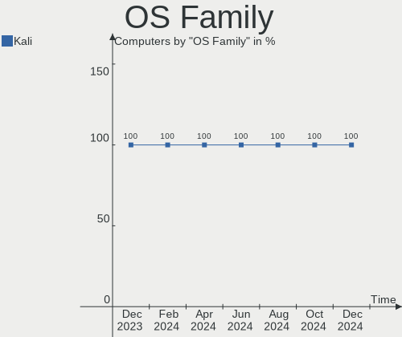
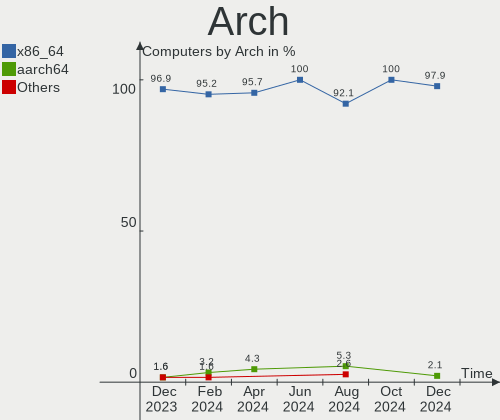
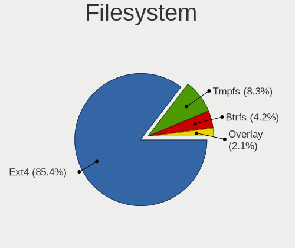
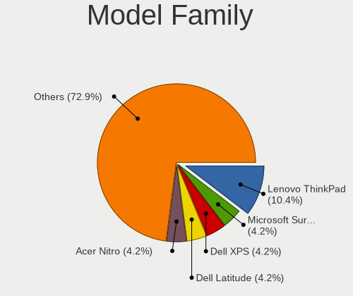
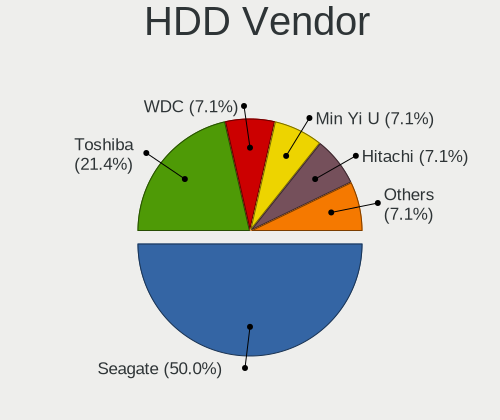
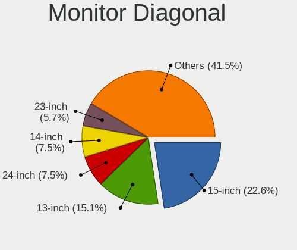
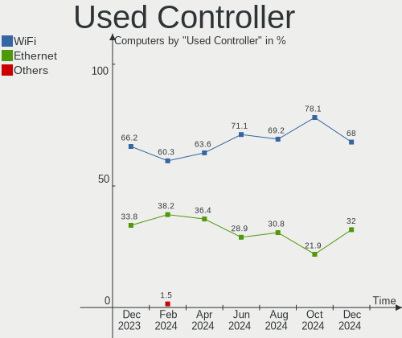
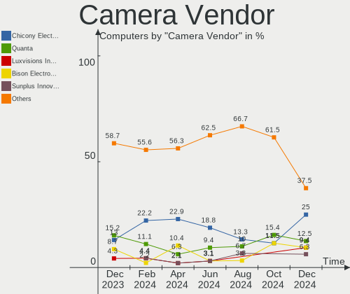

Kali - Hardware Trends
----------------------

A project to identify most popular hardware characteristics and track their change
over time based on data collected by Linux users at https://Linux-Hardware.org.

Anyone can contribute to this report by the [hw-probe](https://github.com/linuxhw/hw-probe) tool:

    sudo -E hw-probe -all -upload

This is a report for all computer types. See also reports for [desktops](/Dist/Kali/Desktop/README.md) and [notebooks](/Dist/Kali/Notebook/README.md).

This report is for one last month. Overall report since the beginning of time: [TestDays](https://github.com/linuxhw/TestDays)

Period: Jun, 2023.

Contents
--------

* [ System ](#system)
  - [ OS                       ](#os)
  - [ OS Family                ](#os-family)
  - [ Kernel                   ](#kernel)
  - [ Kernel Family            ](#kernel-family)
  - [ Kernel Major Ver.        ](#kernel-major-ver)
  - [ Arch                     ](#arch)
  - [ DE                       ](#de)
  - [ Display Server           ](#display-server)
  - [ Display Manager          ](#display-manager)
  - [ OS Lang                  ](#os-lang)
  - [ Boot Mode                ](#boot-mode)
  - [ Filesystem               ](#filesystem)
  - [ Part. scheme             ](#part-scheme)
  - [ Dual Boot with Linux/BSD ](#dual-boot-with-linuxbsd)
  - [ Dual Boot (Win)          ](#dual-boot-win)

* [ Board ](#board)
  - [ Vendor                   ](#vendor)
  - [ Model                    ](#model)
  - [ Model Family             ](#model-family)
  - [ MFG Year                 ](#mfg-year)
  - [ Form Factor              ](#form-factor)
  - [ Secure Boot              ](#secure-boot)
  - [ Coreboot                 ](#coreboot)
  - [ RAM Size                 ](#ram-size)
  - [ RAM Used                 ](#ram-used)
  - [ Total Drives             ](#total-drives)
  - [ Has CD-ROM               ](#has-cd-rom)
  - [ Has Ethernet             ](#has-ethernet)
  - [ Has WiFi                 ](#has-wifi)
  - [ Has Bluetooth            ](#has-bluetooth)

* [ Location ](#location)
  - [ Country                  ](#country)
  - [ City                     ](#city)

* [ Drives ](#drives)
  - [ Drive Vendor             ](#drive-vendor)
  - [ Drive Model              ](#drive-model)
  - [ HDD Vendor               ](#hdd-vendor)
  - [ SSD Vendor               ](#ssd-vendor)
  - [ Drive Kind               ](#drive-kind)
  - [ Drive Connector          ](#drive-connector)
  - [ Drive Size               ](#drive-size)
  - [ Space Total              ](#space-total)
  - [ Space Used               ](#space-used)
  - [ Malfunc. Drives          ](#malfunc-drives)
  - [ Malfunc. Drive Vendor    ](#malfunc-drive-vendor)
  - [ Malfunc. HDD Vendor      ](#malfunc-hdd-vendor)
  - [ Malfunc. Drive Kind      ](#malfunc-drive-kind)
  - [ Failed Drives            ](#failed-drives)
  - [ Failed Drive Vendor      ](#failed-drive-vendor)
  - [ Drive Status             ](#drive-status)

* [ Storage controller ](#storage-controller)
  - [ Storage Vendor           ](#storage-vendor)
  - [ Storage Model            ](#storage-model)
  - [ Storage Kind             ](#storage-kind)

* [ Processor ](#processor)
  - [ CPU Vendor               ](#cpu-vendor)
  - [ CPU Model                ](#cpu-model)
  - [ CPU Model Family         ](#cpu-model-family)
  - [ CPU Cores                ](#cpu-cores)
  - [ CPU Sockets              ](#cpu-sockets)
  - [ CPU Threads              ](#cpu-threads)
  - [ CPU Op-Modes             ](#cpu-op-modes)
  - [ CPU Microcode            ](#cpu-microcode)
  - [ CPU Microarch            ](#cpu-microarch)

* [ Graphics ](#graphics)
  - [ GPU Vendor               ](#gpu-vendor)
  - [ GPU Model                ](#gpu-model)
  - [ GPU Combo                ](#gpu-combo)
  - [ GPU Driver               ](#gpu-driver)
  - [ GPU Memory               ](#gpu-memory)

* [ Monitor ](#monitor)
  - [ Monitor Vendor           ](#monitor-vendor)
  - [ Monitor Model            ](#monitor-model)
  - [ Monitor Resolution       ](#monitor-resolution)
  - [ Monitor Diagonal         ](#monitor-diagonal)
  - [ Monitor Width            ](#monitor-width)
  - [ Aspect Ratio             ](#aspect-ratio)
  - [ Monitor Area             ](#monitor-area)
  - [ Pixel Density            ](#pixel-density)
  - [ Multiple Monitors        ](#multiple-monitors)

* [ Network ](#network)
  - [ Net Controller Vendor    ](#net-controller-vendor)
  - [ Net Controller Model     ](#net-controller-model)
  - [ Wireless Vendor          ](#wireless-vendor)
  - [ Wireless Model           ](#wireless-model)
  - [ Ethernet Vendor          ](#ethernet-vendor)
  - [ Ethernet Model           ](#ethernet-model)
  - [ Net Controller Kind      ](#net-controller-kind)
  - [ Used Controller          ](#used-controller)
  - [ NICs                     ](#nics)
  - [ IPv6                     ](#ipv6)

* [ Bluetooth ](#bluetooth)
  - [ Bluetooth Vendor         ](#bluetooth-vendor)
  - [ Bluetooth Model          ](#bluetooth-model)

* [ Sound ](#sound)
  - [ Sound Vendor             ](#sound-vendor)
  - [ Sound Model              ](#sound-model)

* [ Memory ](#memory)
  - [ Memory Vendor            ](#memory-vendor)
  - [ Memory Model             ](#memory-model)
  - [ Memory Kind              ](#memory-kind)
  - [ Memory Form Factor       ](#memory-form-factor)
  - [ Memory Size              ](#memory-size)
  - [ Memory Speed             ](#memory-speed)

* [ Printers & scanners ](#printers--scanners)
  - [ Printer Vendor           ](#printer-vendor)
  - [ Printer Model            ](#printer-model)
  - [ Scanner Vendor           ](#scanner-vendor)
  - [ Scanner Model            ](#scanner-model)

* [ Camera ](#camera)
  - [ Camera Vendor            ](#camera-vendor)
  - [ Camera Model             ](#camera-model)

* [ Security ](#security)
  - [ Fingerprint Vendor       ](#fingerprint-vendor)
  - [ Fingerprint Model        ](#fingerprint-model)
  - [ Chipcard Vendor          ](#chipcard-vendor)
  - [ Chipcard Model           ](#chipcard-model)

* [ Unsupported ](#unsupported)
  - [ Unsupported Devices      ](#unsupported-devices)
  - [ Unsupported Device Types ](#unsupported-device-types)

System
------

OS
--

Installed operating systems

| Name        | Computers | Percent |
|-------------|-----------|---------|
| Kali 2023.2 | 53        | 88.33%  |
| Kali 2023.1 | 5         | 8.33%   |
| Kali 2022.4 | 1         | 1.67%   |
| Kali 2022.2 | 1         | 1.67%   |

OS Family
---------

OS without a version

| Name | Computers | Percent |
|------|-----------|---------|
| Kali | 60        | 100%    |

Kernel
------

Version of the Linux kernel

| Version              | Computers | Percent |
|----------------------|-----------|---------|
| 6.1.0-kali9-amd64    | 45        | 75%     |
| 6.1.0-kali5-amd64    | 8         | 13.33%  |
| 6.3.9-x64v3-xanmod1  | 1         | 1.67%   |
| 6.3.7-060307-generic | 1         | 1.67%   |
| 6.1.0-kali9-686-pae  | 1         | 1.67%   |
| 6.0.0-kali6-amd64    | 1         | 1.67%   |
| 5.9.0-kali1-amd64    | 1         | 1.67%   |
| 5.16.0-kali7-amd64   | 1         | 1.67%   |
| 4.9.117+             | 1         | 1.67%   |

Kernel Family
-------------

Linux kernel without a distro release

| Version | Computers | Percent |
|---------|-----------|---------|
| 6.1.0   | 54        | 90%     |
| 6.3.9   | 1         | 1.67%   |
| 6.3.7   | 1         | 1.67%   |
| 6.0.0   | 1         | 1.67%   |
| 5.9.0   | 1         | 1.67%   |
| 5.16.0  | 1         | 1.67%   |
| 4.9.117 | 1         | 1.67%   |

Kernel Major Ver.
-----------------

Linux kernel major version

| Version | Computers | Percent |
|---------|-----------|---------|
| 6.1     | 54        | 90%     |
| 6.3     | 2         | 3.33%   |
| 6.0     | 1         | 1.67%   |
| 5.9     | 1         | 1.67%   |
| 5.16    | 1         | 1.67%   |
| 4.9     | 1         | 1.67%   |

Arch
----

OS architecture (x86_64, i586, etc.)

| Name    | Computers | Percent |
|---------|-----------|---------|
| x86_64  | 58        | 96.67%  |
| i686    | 1         | 1.67%   |
| aarch64 | 1         | 1.67%   |

DE
--

Desktop Environment

| Name             | Computers | Percent |
|------------------|-----------|---------|
| XFCE             | 24        | 40%     |
| GNOME            | 20        | 33.33%  |
| KDE5             | 10        | 16.67%  |
| Unknown          | 3         | 5%      |
| LXQt             | 1         | 1.67%   |
| lightdm-xsession | 1         | 1.67%   |
| i3               | 1         | 1.67%   |

Display Server
--------------

X11 or Wayland

| Name    | Computers | Percent |
|---------|-----------|---------|
| X11     | 52        | 86.67%  |
| Wayland | 6         | 10%     |
| Tty     | 1         | 1.67%   |
| Unknown | 1         | 1.67%   |

Display Manager
---------------

SDDM, LightDM, etc.

| Name    | Computers | Percent |
|---------|-----------|---------|
| LightDM | 21        | 35%     |
| Unknown | 17        | 28.33%  |
| GDM3    | 14        | 23.33%  |
| SDDM    | 8         | 13.33%  |

OS Lang
-------

Language

| Lang  | Computers | Percent |
|-------|-----------|---------|
| en_US | 32        | 53.33%  |
| en_IN | 7         | 11.67%  |
| ru_RU | 3         | 5%      |
| pt_BR | 3         | 5%      |
| zh_CN | 2         | 3.33%   |
| pl_PL | 2         | 3.33%   |
| en_GB | 2         | 3.33%   |
| sl_SI | 1         | 1.67%   |
| it_IT | 1         | 1.67%   |
| fr_FR | 1         | 1.67%   |
| es_MX | 1         | 1.67%   |
| es_ES | 1         | 1.67%   |
| es_AR | 1         | 1.67%   |
| de_DE | 1         | 1.67%   |
| de_CH | 1         | 1.67%   |
| C     | 1         | 1.67%   |

Boot Mode
---------

EFI or BIOS

| Mode | Computers | Percent |
|------|-----------|---------|
| EFI  | 43        | 71.67%  |
| BIOS | 17        | 28.33%  |

Filesystem
----------

Type of filesystem

| Type    | Computers | Percent |
|---------|-----------|---------|
| Ext4    | 53        | 88.33%  |
| Overlay | 4         | 6.67%   |
| Tmpfs   | 2         | 3.33%   |
| Btrfs   | 1         | 1.67%   |

Part. scheme
------------

Scheme of partitioning

| Type    | Computers | Percent |
|---------|-----------|---------|
| GPT     | 36        | 60%     |
| Unknown | 14        | 23.33%  |
| MBR     | 10        | 16.67%  |

Dual Boot with Linux/BSD
------------------------

Hosting more than one Linux/BSD

| Dual boot | Computers | Percent |
|-----------|-----------|---------|
| No        | 51        | 85%     |
| Yes       | 9         | 15%     |

Dual Boot (Win)
---------------

Hosting Linux and Windows

| Dual boot | Computers | Percent |
|-----------|-----------|---------|
| No        | 35        | 58.33%  |
| Yes       | 25        | 41.67%  |

Board
-----

Vendor
------

Motherboard manufacturer

| Name                | Computers | Percent |
|---------------------|-----------|---------|
| Lenovo              | 10        | 16.67%  |
| ASUSTek Computer    | 8         | 13.33%  |
| MSI                 | 7         | 11.67%  |
| Hewlett-Packard     | 6         | 10%     |
| Dell                | 6         | 10%     |
| Acer                | 4         | 6.67%   |
| Samsung Electronics | 3         | 5%      |
| Microsoft           | 2         | 3.33%   |
| ASRock              | 2         | 3.33%   |
| Unknown             | 2         | 3.33%   |
| Packard Bell        | 1         | 1.67%   |
| Medion              | 1         | 1.67%   |
| Intel               | 1         | 1.67%   |
| Gigabyte Technology | 1         | 1.67%   |
| Daten Tecnologia    | 1         | 1.67%   |
| Clevo               | 1         | 1.67%   |
| Chuwi               | 1         | 1.67%   |
| BY OEM              | 1         | 1.67%   |
| AZW                 | 1         | 1.67%   |
| Apple               | 1         | 1.67%   |

Model
-----

Motherboard model

| Name                                     | Computers | Percent |
|------------------------------------------|-----------|---------|
| Microsoft Surface Pro                    | 2         | 3.33%   |
| Lenovo ThinkCentre M75s Gen 2 11R9S02K00 | 2         | 3.33%   |
| Unknown                                  | 2         | 3.33%   |
| Samsung N130                             | 1         | 1.67%   |
| Samsung 935QDB                           | 1         | 1.67%   |
| Samsung 305U1A                           | 1         | 1.67%   |
| Packard Bell EasyNote TE69KB             | 1         | 1.67%   |
| MSI Pulse GL66 12UGKV                    | 1         | 1.67%   |
| MSI MS-7B89                              | 1         | 1.67%   |
| MSI MS-7B87                              | 1         | 1.67%   |
| MSI Modern 15 A5M                        | 1         | 1.67%   |
| MSI GF75 Thin 9SC                        | 1         | 1.67%   |
| MSI GE66 Raider 10SFS                    | 1         | 1.67%   |
| MSI Bravo 15 B5DD                        | 1         | 1.67%   |
| Medion Akoya P6656 MD99615               | 1         | 1.67%   |
| Lenovo ThinkPad T15g Gen1 20URCTO1WW     | 1         | 1.67%   |
| Lenovo ThinkPad E14 Gen 2 20TAS0U500     | 1         | 1.67%   |
| Lenovo ThinkBook 16 G4+ ARA 21D1         | 1         | 1.67%   |
| Lenovo Legion Y740-17IRHg 81UJ           | 1         | 1.67%   |
| Lenovo IdeaPad Gaming 3 15IAH7 82S9      | 1         | 1.67%   |
| Lenovo IdeaPad 3 15IIL05 81WE            | 1         | 1.67%   |
| Lenovo G580 2189                         | 1         | 1.67%   |
| Lenovo E41-55 82FJ                       | 1         | 1.67%   |
| Intel GT5628                             | 1         | 1.67%   |
| HP ProBook x360 435 G8 Notebook PC       | 1         | 1.67%   |
| HP ProBook 450 G8 Notebook PC            | 1         | 1.67%   |
| HP ProBook 440 G3                        | 1         | 1.67%   |
| HP Notebook                              | 1         | 1.67%   |
| HP EliteBook Folio 9470m                 | 1         | 1.67%   |
| HP EliteBook 835 G8 Notebook PC          | 1         | 1.67%   |
| Gigabyte B450 AORUS PRO WIFI             | 1         | 1.67%   |
| Dell Precision 7710                      | 1         | 1.67%   |
| Dell Latitude E6540                      | 1         | 1.67%   |
| Dell Latitude E6430                      | 1         | 1.67%   |
| Dell Latitude 7390                       | 1         | 1.67%   |
| Dell Inspiron One 2020                   | 1         | 1.67%   |
| Dell Inspiron 15-3565                    | 1         | 1.67%   |
| Daten Tecnologia DCM4D-4 v4              | 1         | 1.67%   |
| Clevo P170HMx                            | 1         | 1.67%   |
| Chuwi GemiBook Pro                       | 1         | 1.67%   |

Model Family
------------

Motherboard model prefix

| Name                     | Computers | Percent |
|--------------------------|-----------|---------|
| HP ProBook               | 3         | 5%      |
| Dell Latitude            | 3         | 5%      |
| ASUS ASUS                | 3         | 5%      |
| Microsoft Surface        | 2         | 3.33%   |
| Lenovo ThinkPad          | 2         | 3.33%   |
| Lenovo ThinkCentre       | 2         | 3.33%   |
| Lenovo IdeaPad           | 2         | 3.33%   |
| HP EliteBook             | 2         | 3.33%   |
| Dell Inspiron            | 2         | 3.33%   |
| Acer Aspire              | 2         | 3.33%   |
| Unknown                  | 2         | 3.33%   |
| Samsung N130             | 1         | 1.67%   |
| Samsung 935QDB           | 1         | 1.67%   |
| Samsung 305U1A           | 1         | 1.67%   |
| Packard Bell EasyNote    | 1         | 1.67%   |
| MSI Pulse                | 1         | 1.67%   |
| MSI MS-7B89              | 1         | 1.67%   |
| MSI MS-7B87              | 1         | 1.67%   |
| MSI Modern               | 1         | 1.67%   |
| MSI GF75                 | 1         | 1.67%   |
| MSI GE66                 | 1         | 1.67%   |
| MSI Bravo                | 1         | 1.67%   |
| Medion Akoya             | 1         | 1.67%   |
| Lenovo ThinkBook         | 1         | 1.67%   |
| Lenovo Legion            | 1         | 1.67%   |
| Lenovo G580              | 1         | 1.67%   |
| Lenovo E41-55            | 1         | 1.67%   |
| Intel GT5628             | 1         | 1.67%   |
| HP Notebook              | 1         | 1.67%   |
| Gigabyte B450            | 1         | 1.67%   |
| Dell Precision           | 1         | 1.67%   |
| Daten Tecnologia DCM4D-4 | 1         | 1.67%   |
| Clevo P170HMx            | 1         | 1.67%   |
| Chuwi GemiBook           | 1         | 1.67%   |
| BY OEM ZRD1103           | 1         | 1.67%   |
| AZW SER                  | 1         | 1.67%   |
| ASUS Zenbook             | 1         | 1.67%   |
| ASUS VivoBook            | 1         | 1.67%   |
| ASUS T200TA              | 1         | 1.67%   |
| ASUS ROG                 | 1         | 1.67%   |

MFG Year
--------

Motherboard manufacture year

| Year    | Computers | Percent |
|---------|-----------|---------|
| 2022    | 10        | 16.67%  |
| 2021    | 8         | 13.33%  |
| 2020    | 8         | 13.33%  |
| 2018    | 5         | 8.33%   |
| 2019    | 4         | 6.67%   |
| 2015    | 4         | 6.67%   |
| 2012    | 4         | 6.67%   |
| 2023    | 3         | 5%      |
| 2013    | 3         | 5%      |
| 2017    | 2         | 3.33%   |
| 2014    | 2         | 3.33%   |
| 2011    | 2         | 3.33%   |
| 2009    | 2         | 3.33%   |
| 2010    | 1         | 1.67%   |
| 2008    | 1         | 1.67%   |
| Unknown | 1         | 1.67%   |

Form Factor
-----------

Physical design of the computer

| Name           | Computers | Percent |
|----------------|-----------|---------|
| Notebook       | 41        | 68.33%  |
| Desktop        | 11        | 18.33%  |
| Convertible    | 3         | 5%      |
| Tablet         | 2         | 3.33%   |
| System on chip | 1         | 1.67%   |
| Mini pc        | 1         | 1.67%   |
| All in one     | 1         | 1.67%   |

Secure Boot
-----------

Enabled or disabled

| State    | Computers | Percent |
|----------|-----------|---------|
| Disabled | 60        | 100%    |

Coreboot
--------

Have coreboot on board

| Used | Computers | Percent |
|------|-----------|---------|
| No   | 60        | 100%    |

RAM Size
--------

Total RAM memory

| Size in GB  | Computers | Percent |
|-------------|-----------|---------|
| 4.01-8.0    | 17        | 28.33%  |
| 16.01-24.0  | 15        | 25%     |
| 8.01-16.0   | 12        | 20%     |
| 32.01-64.0  | 6         | 10%     |
| 3.01-4.0    | 5         | 8.33%   |
| 2.01-3.0    | 2         | 3.33%   |
| 24.01-32.0  | 1         | 1.67%   |
| 64.01-256.0 | 1         | 1.67%   |
| 1.01-2.0    | 1         | 1.67%   |

RAM Used
--------

Used RAM memory

| Used GB   | Computers | Percent |
|-----------|-----------|---------|
| 2.01-3.0  | 19        | 31.67%  |
| 1.01-2.0  | 19        | 31.67%  |
| 3.01-4.0  | 13        | 21.67%  |
| 4.01-8.0  | 7         | 11.67%  |
| 8.01-16.0 | 1         | 1.67%   |
| 0.01-0.5  | 1         | 1.67%   |

Total Drives
------------

Number of drives on board

| Drives | Computers | Percent |
|--------|-----------|---------|
| 1      | 38        | 63.33%  |
| 2      | 18        | 30%     |
| 10     | 1         | 1.67%   |
| 4      | 1         | 1.67%   |
| 3      | 1         | 1.67%   |
| 0      | 1         | 1.67%   |

Has CD-ROM
----------

Has CD-ROM on board

| Presented | Computers | Percent |
|-----------|-----------|---------|
| No        | 48        | 80%     |
| Yes       | 12        | 20%     |

Has Ethernet
------------

Has Ethernet on board

| Presented | Computers | Percent |
|-----------|-----------|---------|
| Yes       | 49        | 81.67%  |
| No        | 11        | 18.33%  |

Has WiFi
--------

Has WiFi module

| Presented | Computers | Percent |
|-----------|-----------|---------|
| Yes       | 56        | 93.33%  |
| No        | 4         | 6.67%   |

Has Bluetooth
-------------

Has Bluetooth module

| Presented | Computers | Percent |
|-----------|-----------|---------|
| Yes       | 48        | 80%     |
| No        | 12        | 20%     |

Location
--------

Country
-------

Geographic location (country)

| Country     | Computers | Percent |
|-------------|-----------|---------|
| USA         | 15        | 25%     |
| Brazil      | 6         | 10%     |
| India       | 5         | 8.33%   |
| Germany     | 4         | 6.67%   |
| Spain       | 3         | 5%      |
| Poland      | 3         | 5%      |
| Russia      | 2         | 3.33%   |
| Pakistan    | 2         | 3.33%   |
| Mexico      | 2         | 3.33%   |
| Bulgaria    | 2         | 3.33%   |
| Vietnam     | 1         | 1.67%   |
| UK          | 1         | 1.67%   |
| Turkey      | 1         | 1.67%   |
| Switzerland | 1         | 1.67%   |
| Slovenia    | 1         | 1.67%   |
| Romania     | 1         | 1.67%   |
| Portugal    | 1         | 1.67%   |
| Netherlands | 1         | 1.67%   |
| Japan       | 1         | 1.67%   |
| Ivory Coast | 1         | 1.67%   |
| Italy       | 1         | 1.67%   |
| France      | 1         | 1.67%   |
| China       | 1         | 1.67%   |
| Bangladesh  | 1         | 1.67%   |
| Armenia     | 1         | 1.67%   |
| Argentina   | 1         | 1.67%   |

City
----

Geographic location (city)

| City              | Computers | Percent |
|-------------------|-----------|---------|
| Rio de Janeiro    | 3         | 5%      |
| Zaragoza          | 2         | 3.33%   |
| Wroclaw           | 2         | 3.33%   |
| Islamabad         | 2         | 3.33%   |
| Hyderabad         | 2         | 3.33%   |
| Houston           | 2         | 3.33%   |
| Zurich            | 1         | 1.67%   |
| Żory             | 1         | 1.67%   |
| Yerevan           | 1         | 1.67%   |
| Vila Velha        | 1         | 1.67%   |
| Turin             | 1         | 1.67%   |
| Temperance        | 1         | 1.67%   |
| Sofia             | 1         | 1.67%   |
| Seattle           | 1         | 1.67%   |
| Scottsdale        | 1         | 1.67%   |
| Saltillo          | 1         | 1.67%   |
| Rheine            | 1         | 1.67%   |
| Quận Hà Đông | 1         | 1.67%   |
| Pune              | 1         | 1.67%   |
| Petrópolis       | 1         | 1.67%   |
| Parma Heights     | 1         | 1.67%   |
| Panorama City     | 1         | 1.67%   |
| Nagoya            | 1         | 1.67%   |
| Mysore            | 1         | 1.67%   |
| Moscow            | 1         | 1.67%   |
| Morristown        | 1         | 1.67%   |
| Mexico City       | 1         | 1.67%   |
| Las Vegas         | 1         | 1.67%   |
| Lakeland          | 1         | 1.67%   |
| Istanbul          | 1         | 1.67%   |
| Hilden            | 1         | 1.67%   |
| Guimaraes         | 1         | 1.67%   |
| Grozny            | 1         | 1.67%   |
| Düsseldorf       | 1         | 1.67%   |
| Domžale          | 1         | 1.67%   |
| Dhaka             | 1         | 1.67%   |
| Columbia          | 1         | 1.67%   |
| Colmar            | 1         | 1.67%   |
| Chhindwara        | 1         | 1.67%   |
| Cascavel          | 1         | 1.67%   |

Drives
------

Drive Vendor
------------

Hard drive vendors

| Vendor              | Computers | Drives | Percent |
|---------------------|-----------|--------|---------|
| Samsung Electronics | 14        | 15     | 16.47%  |
| WDC                 | 10        | 15     | 11.76%  |
| Toshiba             | 7         | 8      | 8.24%   |
| SanDisk             | 7         | 7      | 8.24%   |
| Kingston            | 7         | 7      | 8.24%   |
| Seagate             | 4         | 5      | 4.71%   |
| Micron Technology   | 4         | 4      | 4.71%   |
| Unknown             | 3         | 3      | 3.53%   |
| Intel               | 3         | 3      | 3.53%   |
| Crucial             | 3         | 3      | 3.53%   |
| SSSTC               | 2         | 2      | 2.35%   |
| Phison              | 2         | 2      | 2.35%   |
| HGST                | 2         | 2      | 2.35%   |
| Topmore             | 1         | 1      | 1.18%   |
| T-FORCE             | 1         | 1      | 1.18%   |
| ShanDianZhe         | 1         | 1      | 1.18%   |
| SCUDA               | 1         | 1      | 1.18%   |
| Phison Electronics  | 1         | 1      | 1.18%   |
| Maxtor              | 1         | 1      | 1.18%   |
| KIOXIA              | 1         | 1      | 1.18%   |
| KingFast            | 1         | 1      | 1.18%   |
| JMicron Technology  | 1         | 1      | 1.18%   |
| Intenso             | 1         | 1      | 1.18%   |
| Hitachi             | 1         | 1      | 1.18%   |
| GOODRAM             | 1         | 1      | 1.18%   |
| China               | 1         | 1      | 1.18%   |
| Best Buy            | 1         | 1      | 1.18%   |
| BAITITON            | 1         | 1      | 1.18%   |
| ADATA Technology    | 1         | 1      | 1.18%   |
| A-DATA Technology   | 1         | 1      | 1.18%   |

Drive Model
-----------

Hard drive models

| Model                               | Computers | Percent |
|-------------------------------------|-----------|---------|
| Toshiba MQ01ABF050 500GB            | 2         | 2.17%   |
| SSSTC CA5-8D256-Q79 256GB           | 2         | 2.17%   |
| Samsung SSD 980 500GB               | 2         | 2.17%   |
| Samsung SSD 850 EVO 250GB           | 2         | 2.17%   |
| Samsung KUS030202M-B000 256GB       | 2         | 2.17%   |
| Micron 2450_MTFDKBA512TFK 512GB     | 2         | 2.17%   |
| WDC WDS960G2G0C-00AJM0 960GB        | 1         | 1.09%   |
| WDC WDS500G3X0C-00SJG0 500GB        | 1         | 1.09%   |
| WDC WDS200T1X0E-00AFY0 2TB          | 1         | 1.09%   |
| WDC WDS100T2B0A 1TB SSD             | 1         | 1.09%   |
| WDC WDBA3V5000ANC-WRSN 500GB        | 1         | 1.09%   |
| WDC WD7500BPKT-00PK4T0 752GB        | 1         | 1.09%   |
| WDC WD5000BPVT-00HXZT1 500GB        | 1         | 1.09%   |
| WDC WD5000BEVT-22A0RT0 500GB        | 1         | 1.09%   |
| WDC WD5000AAVS-00ZTB0 500GB         | 1         | 1.09%   |
| WDC WD5000AAJS-08A8B0 500GB         | 1         | 1.09%   |
| WDC WD5000AACS-00ZUB0 500GB         | 1         | 1.09%   |
| WDC WD32 00KS-00PFB0 320GB          | 1         | 1.09%   |
| WDC WD30 EFRX-68EUZN0 3TB           | 1         | 1.09%   |
| WDC WD100EMAZ-00WJTA0 10TB          | 1         | 1.09%   |
| WDC PC SN730 NVMe 512GB             | 1         | 1.09%   |
| Unknown SS32G  32GB                 | 1         | 1.09%   |
| Unknown MMC Card  64GB              | 1         | 1.09%   |
| Unknown MMC Card  32GB              | 1         | 1.09%   |
| Toshiba MQ04ABF100 1TB              | 1         | 1.09%   |
| Toshiba MQ01ABD100 1TB              | 1         | 1.09%   |
| Toshiba MK6475GSX 640GB             | 1         | 1.09%   |
| Toshiba KBG40ZNT256G MEMORY 256GB   | 1         | 1.09%   |
| Toshiba KBG30ZMV256G 256GB          | 1         | 1.09%   |
| Toshiba DT01ACA050 500GB            | 1         | 1.09%   |
| Topmore Aries 2TB                   | 1         | 1.09%   |
| T-FORCE SSD 1TB                     | 1         | 1.09%   |
| ShanDianZhe 512GB                   | 1         | 1.09%   |
| Seagate ST500LM012 HN-M500MBB 500GB | 1         | 1.09%   |
| Seagate ST3500630AS 500GB           | 1         | 1.09%   |
| Seagate ST2000DL 003-9VT166 2TB     | 1         | 1.09%   |
| Seagate Expansion 1TB               | 1         | 1.09%   |
| SCUDA 512GB SATA SSD                | 1         | 1.09%   |
| Sandisk WD_BLACK SN770 500GB        | 1         | 1.09%   |
| Sandisk WD_BLACK SN770 1TB          | 1         | 1.09%   |

HDD Vendor
----------

Hard disk drive vendors

| Vendor              | Computers | Drives | Percent |
|---------------------|-----------|--------|---------|
| WDC                 | 7         | 9      | 33.33%  |
| Toshiba             | 5         | 6      | 23.81%  |
| Seagate             | 4         | 5      | 19.05%  |
| HGST                | 2         | 2      | 9.52%   |
| Samsung Electronics | 1         | 1      | 4.76%   |
| Maxtor              | 1         | 1      | 4.76%   |
| Hitachi             | 1         | 1      | 4.76%   |

SSD Vendor
----------

Solid state drive vendors

| Vendor              | Computers | Drives | Percent |
|---------------------|-----------|--------|---------|
| Samsung Electronics | 4         | 4      | 20%     |
| Kingston            | 3         | 3      | 15%     |
| SanDisk             | 2         | 2      | 10%     |
| Crucial             | 2         | 2      | 10%     |
| WDC                 | 1         | 1      | 5%      |
| T-FORCE             | 1         | 1      | 5%      |
| SCUDA               | 1         | 1      | 5%      |
| Phison              | 1         | 1      | 5%      |
| Micron Technology   | 1         | 1      | 5%      |
| Intel               | 1         | 1      | 5%      |
| GOODRAM             | 1         | 1      | 5%      |
| China               | 1         | 1      | 5%      |
| BAITITON            | 1         | 1      | 5%      |

Drive Kind
----------

HDD or SSD

| Kind    | Computers | Drives | Percent |
|---------|-----------|--------|---------|
| NVMe    | 35        | 41     | 45.45%  |
| SSD     | 18        | 20     | 23.38%  |
| HDD     | 17        | 25     | 22.08%  |
| Unknown | 4         | 4      | 5.19%   |
| MMC     | 3         | 3      | 3.9%    |

Drive Connector
---------------

SATA, SAS, NVMe, etc.

| Type | Computers | Drives | Percent |
|------|-----------|--------|---------|
| NVMe | 34        | 40     | 46.58%  |
| SATA | 30        | 40     | 41.1%   |
| SAS  | 6         | 10     | 8.22%   |
| MMC  | 3         | 3      | 4.11%   |

Drive Size
----------

Size of hard drive

| Size in TB | Computers | Drives | Percent |
|------------|-----------|--------|---------|
| 0.01-0.5   | 20        | 26     | 54.05%  |
| 0.51-1.0   | 14        | 15     | 37.84%  |
| 2.01-3.0   | 1         | 1      | 2.7%    |
| 1.01-2.0   | 1         | 2      | 2.7%    |
| 4.01-10.0  | 1         | 1      | 2.7%    |

Space Total
-----------

Amount of disk space available on the file system

| Size in GB     | Computers | Percent |
|----------------|-----------|---------|
| 251-500        | 22        | 36.67%  |
| 101-250        | 14        | 23.33%  |
| 501-1000       | 9         | 15%     |
| 51-100         | 8         | 13.33%  |
| 21-50          | 4         | 6.67%   |
| More than 3000 | 1         | 1.67%   |
| 1001-2000      | 1         | 1.67%   |
| 1-20           | 1         | 1.67%   |

Space Used
----------

Amount of used disk space

| Used GB        | Computers | Percent |
|----------------|-----------|---------|
| 21-50          | 23        | 38.33%  |
| 1-20           | 14        | 23.33%  |
| 101-250        | 12        | 20%     |
| 51-100         | 5         | 8.33%   |
| 251-500        | 4         | 6.67%   |
| More than 3000 | 1         | 1.67%   |
| 501-1000       | 1         | 1.67%   |

Malfunc. Drives
---------------

Drive models with a malfunction

| Model                                          | Computers | Drives | Percent |
|------------------------------------------------|-----------|--------|---------|
| WDC WD5000BEVT-22A0RT0 500GB                   | 1         | 1      | 12.5%   |
| Toshiba MQ01ABF050 500GB                       | 1         | 1      | 12.5%   |
| Toshiba MK6475GSX 640GB                        | 1         | 1      | 12.5%   |
| Seagate ST3500630AS 500GB                      | 1         | 1      | 12.5%   |
| Micron Technology 1100_MTFDDAV512TBN 512GB SSD | 1         | 1      | 12.5%   |
| HGST HTS725050A7E630 500GB                     | 1         | 1      | 12.5%   |
| HGST HTS541010A9E680 1TB                       | 1         | 1      | 12.5%   |
| China G521N256GB SSD                           | 1         | 1      | 12.5%   |

Malfunc. Drive Vendor
---------------------

Vendors of faulty drives

| Vendor            | Computers | Drives | Percent |
|-------------------|-----------|--------|---------|
| HGST              | 2         | 2      | 28.57%  |
| WDC               | 1         | 1      | 14.29%  |
| Toshiba           | 1         | 2      | 14.29%  |
| Seagate           | 1         | 1      | 14.29%  |
| Micron Technology | 1         | 1      | 14.29%  |
| China             | 1         | 1      | 14.29%  |

Malfunc. HDD Vendor
-------------------

Vendors of faulty HDD drives

| Vendor  | Computers | Drives | Percent |
|---------|-----------|--------|---------|
| HGST    | 2         | 2      | 40%     |
| WDC     | 1         | 1      | 20%     |
| Toshiba | 1         | 2      | 20%     |
| Seagate | 1         | 1      | 20%     |

Malfunc. Drive Kind
-------------------

Kinds of faulty drives

| Kind | Computers | Drives | Percent |
|------|-----------|--------|---------|
| HDD  | 5         | 6      | 71.43%  |
| SSD  | 2         | 2      | 28.57%  |

Failed Drives
-------------

Failed drive models

Zero info for selected period =(

Failed Drive Vendor
-------------------

Failed drive vendors

Zero info for selected period =(

Drive Status
------------

Number of failed and malfunc. drives

| Status   | Computers | Drives | Percent |
|----------|-----------|--------|---------|
| Works    | 41        | 53     | 61.19%  |
| Detected | 19        | 32     | 28.36%  |
| Malfunc  | 7         | 8      | 10.45%  |

Storage controller
------------------

Storage Vendor
--------------

Storage controller vendors

| Vendor                         | Computers | Percent |
|--------------------------------|-----------|---------|
| Intel                          | 29        | 36.71%  |
| AMD                            | 13        | 16.46%  |
| SanDisk                        | 10        | 12.66%  |
| Samsung Electronics            | 9         | 11.39%  |
| Kingston Technology Company    | 4         | 5.06%   |
| Micron Technology              | 3         | 3.8%    |
| Solid State Storage Technology | 2         | 2.53%   |
| Phison Electronics             | 2         | 2.53%   |
| KIOXIA                         | 2         | 2.53%   |
| ADATA Technology               | 2         | 2.53%   |
| Nvidia                         | 1         | 1.27%   |
| Micron/Crucial Technology      | 1         | 1.27%   |
| INNOGRIT                       | 1         | 1.27%   |

Storage Model
-------------

Storage controller models

| Model                                                                         | Computers | Percent |
|-------------------------------------------------------------------------------|-----------|---------|
| AMD FCH SATA Controller [AHCI mode]                                           | 9         | 10.34%  |
| Samsung NVMe SSD Controller 980                                               | 4         | 4.6%    |
| Intel Q170/Q150/B150/H170/H110/Z170/CM236 Chipset SATA Controller [AHCI Mode] | 4         | 4.6%    |
| SanDisk WD Black SN750 / PC SN730 NVMe SSD                                    | 3         | 3.45%   |
| AMD 400 Series Chipset SATA Controller                                        | 3         | 3.45%   |
| Solid State Storage Non-Volatile memory controller                            | 2         | 2.3%    |
| SanDisk WD Blue SN550 NVMe SSD                                                | 2         | 2.3%    |
| SanDisk WD Black SN770 NVMe SSD                                               | 2         | 2.3%    |
| SanDisk Non-Volatile memory controller                                        | 2         | 2.3%    |
| Samsung Surface NVMe Controller                                               | 2         | 2.3%    |
| Samsung NVMe SSD Controller SM981/PM981/PM983                                 | 2         | 2.3%    |
| Micron 2450 NVMe SSD (DRAM-less)                                              | 2         | 2.3%    |
| KIOXIA NVMe SSD Controller BG4                                                | 2         | 2.3%    |
| Kingston Company Company Non-Volatile memory controller                       | 2         | 2.3%    |
| Intel Wildcat Point-LP SATA Controller [AHCI Mode]                            | 2         | 2.3%    |
| Intel Volume Management Device NVMe RAID Controller                           | 2         | 2.3%    |
| Intel Sunrise Point-LP SATA Controller [AHCI mode]                            | 2         | 2.3%    |
| Intel Cannon Lake Mobile PCH SATA AHCI Controller                             | 2         | 2.3%    |
| Intel 82801 Mobile SATA Controller [RAID mode]                                | 2         | 2.3%    |
| Intel 7 Series Chipset Family 6-port SATA Controller [AHCI mode]              | 2         | 2.3%    |
| AMD SB7x0/SB8x0/SB9x0 SATA Controller [AHCI mode]                             | 2         | 2.3%    |
| AMD 500 Series Chipset SATA Controller                                        | 2         | 2.3%    |
| SanDisk WD PC SN810 / Black SN850 NVMe SSD                                    | 1         | 1.15%   |
| Samsung NVMe SSD Controller PM9A1/PM9A3/980PRO                                | 1         | 1.15%   |
| Phison PS5019-E19 PCIe4 NVMe Controller (DRAM-less)                           | 1         | 1.15%   |
| Phison PS5013 E13 NVMe Controller                                             | 1         | 1.15%   |
| Nvidia MCP79 AHCI Controller                                                  | 1         | 1.15%   |
| Micron/Crucial P2 NVMe PCIe SSD                                               | 1         | 1.15%   |
| Micron NVMe Storage Controller                                                | 1         | 1.15%   |
| Kingston Company OM3PDP3 NVMe SSD                                             | 1         | 1.15%   |
| Kingston Company NVMe Controller                                              | 1         | 1.15%   |
| Intel Tiger Lake-LP SATA Controller                                           | 1         | 1.15%   |
| Intel Tiger Lake SATA AHCI Controller                                         | 1         | 1.15%   |
| Intel SSD 660P Series                                                         | 1         | 1.15%   |
| Intel SATA Controller [RAID mode]                                             | 1         | 1.15%   |
| Intel Non-Volatile memory controller                                          | 1         | 1.15%   |
| Intel Jasper Lake SATA AHCI Controller                                        | 1         | 1.15%   |
| Intel Ice Lake-LP SATA Controller [AHCI mode]                                 | 1         | 1.15%   |
| Intel Comet Lake SATA AHCI Controller                                         | 1         | 1.15%   |
| Intel Alder Lake-P SATA AHCI Controller                                       | 1         | 1.15%   |

Storage Kind
------------

Kind of storage controller (IDE, SATA, NVMe, SAS, ...)

| Kind | Computers | Percent |
|------|-----------|---------|
| SATA | 36        | 46.75%  |
| NVMe | 33        | 42.86%  |
| RAID | 5         | 6.49%   |
| IDE  | 3         | 3.9%    |

Processor
---------

CPU Vendor
----------

Processor vendors

| Vendor | Computers | Percent |
|--------|-----------|---------|
| Intel  | 39        | 65%     |
| AMD    | 20        | 33.33%  |
| ARM    | 1         | 1.67%   |

CPU Model
---------

Processor models

| Model                                         | Computers | Percent |
|-----------------------------------------------|-----------|---------|
| Intel 11th Gen Core i7-1165G7 @ 2.80GHz       | 3         | 5%      |
| Intel Core i7-9750H CPU @ 2.60GHz             | 2         | 3.33%   |
| Intel Core i7-3520M CPU @ 2.90GHz             | 2         | 3.33%   |
| Intel Core i5-7300U CPU @ 2.60GHz             | 2         | 3.33%   |
| Intel 12th Gen Core i7-12700H                 | 2         | 3.33%   |
| AMD Ryzen 7 PRO 5850U with Radeon Graphics    | 2         | 3.33%   |
| AMD Ryzen 7 6800H with Radeon Graphics        | 2         | 3.33%   |
| AMD Ryzen 7 5700G with Radeon Graphics        | 2         | 3.33%   |
| AMD Ryzen 7 3700U with Radeon Vega Mobile Gfx | 2         | 3.33%   |
| Intel Pentium CPU G2030T @ 2.60GHz            | 1         | 1.67%   |
| Intel Core i9-10980HK CPU @ 2.40GHz           | 1         | 1.67%   |
| Intel Core i7-8650U CPU @ 1.90GHz             | 1         | 1.67%   |
| Intel Core i7-7700HQ CPU @ 2.80GHz            | 1         | 1.67%   |
| Intel Core i7-6920HQ CPU @ 2.90GHz            | 1         | 1.67%   |
| Intel Core i7-6700 CPU @ 3.40GHz              | 1         | 1.67%   |
| Intel Core i7-4800MQ CPU @ 2.70GHz            | 1         | 1.67%   |
| Intel Core i7-2670QM CPU @ 2.20GHz            | 1         | 1.67%   |
| Intel Core i7-10750H CPU @ 2.60GHz            | 1         | 1.67%   |
| Intel Core i5-7500T CPU @ 2.70GHz             | 1         | 1.67%   |
| Intel Core i5-6500 CPU @ 3.20GHz              | 1         | 1.67%   |
| Intel Core i5-6200U CPU @ 2.30GHz             | 1         | 1.67%   |
| Intel Core i5-5200U CPU @ 2.20GHz             | 1         | 1.67%   |
| Intel Core i5-3427U CPU @ 1.80GHz             | 1         | 1.67%   |
| Intel Core i5-10300H CPU @ 2.50GHz            | 1         | 1.67%   |
| Intel Core i3-5010U CPU @ 2.10GHz             | 1         | 1.67%   |
| Intel Core i3-1005G1 CPU @ 1.20GHz            | 1         | 1.67%   |
| Intel Core 2 Quad CPU Q6600 @ 2.40GHz         | 1         | 1.67%   |
| Intel Core 2 Duo CPU P7550 @ 2.26GHz          | 1         | 1.67%   |
| Intel Celeron N5100 @ 1.10GHz                 | 1         | 1.67%   |
| Intel Celeron CPU G1610 @ 2.60GHz             | 1         | 1.67%   |
| Intel Celeron CPU 5205U @ 1.90GHz             | 1         | 1.67%   |
| Intel Atom CPU Z3775 @ 1.46GHz                | 1         | 1.67%   |
| Intel Atom CPU N270 @ 1.60GHz                 | 1         | 1.67%   |
| Intel 12th Gen Core i5-12500H                 | 1         | 1.67%   |
| Intel 11th Gen Core i7-11800H @ 2.30GHz       | 1         | 1.67%   |
| Intel 11th Gen Core i5-1135G7 @ 2.40GHz       | 1         | 1.67%   |
| Intel 11th Gen Core i5-1130G7 @ 1.10GHz       | 1         | 1.67%   |
| ARM AArch64 Processor rev 4 (aarch64)         | 1         | 1.67%   |
| AMD Turion II P520 Dual-Core Processor        | 1         | 1.67%   |
| AMD Ryzen 7 5700U with Radeon Graphics        | 1         | 1.67%   |

CPU Model Family
----------------

Processor model prefix

| Model             | Computers | Percent |
|-------------------|-----------|---------|
| Intel Core i7     | 11        | 18.33%  |
| AMD Ryzen 7       | 10        | 16.67%  |
| Other             | 9         | 15%     |
| Intel Core i5     | 8         | 13.33%  |
| Intel Celeron     | 3         | 5%      |
| AMD Ryzen 5       | 3         | 5%      |
| Intel Core i3     | 2         | 3.33%   |
| Intel Atom        | 2         | 3.33%   |
| AMD Ryzen 7 PRO   | 2         | 3.33%   |
| Intel Pentium     | 1         | 1.67%   |
| Intel Core i9     | 1         | 1.67%   |
| Intel Core 2 Quad | 1         | 1.67%   |
| Intel Core 2 Duo  | 1         | 1.67%   |
| ARM AArch64       | 1         | 1.67%   |
| AMD Turion II     | 1         | 1.67%   |
| AMD Ryzen 3       | 1         | 1.67%   |
| AMD E2            | 1         | 1.67%   |
| AMD E             | 1         | 1.67%   |
| AMD A4            | 1         | 1.67%   |

CPU Cores
---------

Number of processor cores

| Number  | Computers | Percent |
|---------|-----------|---------|
| 4       | 21        | 35%     |
| 2       | 17        | 28.33%  |
| 8       | 11        | 18.33%  |
| 6       | 6         | 10%     |
| 14      | 2         | 3.33%   |
| 12      | 1         | 1.67%   |
| 1       | 1         | 1.67%   |
| Unknown | 1         | 1.67%   |

CPU Sockets
-----------

Number of sockets

| Number  | Computers | Percent |
|---------|-----------|---------|
| 1       | 59        | 98.33%  |
| Unknown | 1         | 1.67%   |

CPU Threads
-----------

Threads per core (Hyper-Threading)

| Number  | Computers | Percent |
|---------|-----------|---------|
| 2       | 45        | 75%     |
| 1       | 14        | 23.33%  |
| Unknown | 1         | 1.67%   |

CPU Op-Modes
------------

CPU Operation Modes (32-bit, 64-bit)

| Op mode        | Computers | Percent |
|----------------|-----------|---------|
| 32-bit, 64-bit | 58        | 96.67%  |
| 32-bit         | 1         | 1.67%   |
| Unknown        | 1         | 1.67%   |

CPU Microcode
-------------

Microcode number

| Number     | Computers | Percent |
|------------|-----------|---------|
| Unknown    | 10        | 16.67%  |
| 0x306a9    | 4         | 6.67%   |
| 0x906a3    | 3         | 5%      |
| 0x806c1    | 3         | 5%      |
| 0x506e3    | 3         | 5%      |
| 0x0a50000c | 3         | 5%      |
| 0xa0652    | 2         | 3.33%   |
| 0x906ea    | 2         | 3.33%   |
| 0x906e9    | 2         | 3.33%   |
| 0x806e9    | 2         | 3.33%   |
| 0x306d4    | 2         | 3.33%   |
| 0x0a404102 | 2         | 3.33%   |
| 0x08108109 | 2         | 3.33%   |
| 0x0800820d | 2         | 3.33%   |
| 0x906c0    | 1         | 1.67%   |
| 0x806ec    | 1         | 1.67%   |
| 0x806ea    | 1         | 1.67%   |
| 0x706e5    | 1         | 1.67%   |
| 0x6fb      | 1         | 1.67%   |
| 0x406e3    | 1         | 1.67%   |
| 0x206a7    | 1         | 1.67%   |
| 0x106c2    | 1         | 1.67%   |
| 0x1067a    | 1         | 1.67%   |
| 0x0a50000d | 1         | 1.67%   |
| 0x08701013 | 1         | 1.67%   |
| 0x08608103 | 1         | 1.67%   |
| 0x08600106 | 1         | 1.67%   |
| 0x08108102 | 1         | 1.67%   |
| 0x0700010f | 1         | 1.67%   |
| 0x06006704 | 1         | 1.67%   |
| 0x05000119 | 1         | 1.67%   |
| 0x010000c8 | 1         | 1.67%   |

CPU Microarch
-------------

Microarchitecture

| Name             | Computers | Percent |
|------------------|-----------|---------|
| KabyLake         | 8         | 13.33%  |
| Unknown          | 7         | 11.67%  |
| Zen+             | 6         | 10%     |
| Zen 3            | 5         | 8.33%   |
| TigerLake        | 5         | 8.33%   |
| IvyBridge        | 5         | 8.33%   |
| Skylake          | 4         | 6.67%   |
| CometLake        | 3         | 5%      |
| Zen 2            | 2         | 3.33%   |
| Broadwell        | 2         | 3.33%   |
| Alderlake Hybrid | 2         | 3.33%   |
| Silvermont       | 1         | 1.67%   |
| SandyBridge      | 1         | 1.67%   |
| Penryn           | 1         | 1.67%   |
| K10              | 1         | 1.67%   |
| Jaguar           | 1         | 1.67%   |
| IceLake          | 1         | 1.67%   |
| Haswell          | 1         | 1.67%   |
| Excavator        | 1         | 1.67%   |
| Core             | 1         | 1.67%   |
| Bonnell          | 1         | 1.67%   |
| Bobcat           | 1         | 1.67%   |

Graphics
--------

GPU Vendor
----------

Vendors of graphics cards

| Vendor | Computers | Percent |
|--------|-----------|---------|
| Intel  | 34        | 43.59%  |
| Nvidia | 23        | 29.49%  |
| AMD    | 21        | 26.92%  |

GPU Model
---------

Graphics card models

| Model                                                                         | Computers | Percent |
|-------------------------------------------------------------------------------|-----------|---------|
| AMD Cezanne [Radeon Vega Series / Radeon Vega Mobile Series]                  | 5         | 6.1%    |
| Intel TigerLake-LP GT2 [Iris Xe Graphics]                                     | 4         | 4.88%   |
| AMD Picasso/Raven 2 [Radeon Vega Series / Radeon Vega Mobile Series]          | 4         | 4.88%   |
| Nvidia GA107M [GeForce RTX 3050 Mobile]                                       | 3         | 3.66%   |
| Intel CometLake-H GT2 [UHD Graphics]                                          | 3         | 3.66%   |
| Intel Alder Lake-P Integrated Graphics Controller                             | 3         | 3.66%   |
| Intel 3rd Gen Core processor Graphics Controller                              | 3         | 3.66%   |
| Intel Xeon E3-1200 v2/3rd Gen Core processor Graphics Controller              | 2         | 2.44%   |
| Intel HD Graphics 620                                                         | 2         | 2.44%   |
| Intel HD Graphics 5500                                                        | 2         | 2.44%   |
| Intel CoffeeLake-H GT2 [UHD Graphics 630]                                     | 2         | 2.44%   |
| AMD Rembrandt [Radeon 680M]                                                   | 2         | 2.44%   |
| AMD Lexa PRO [Radeon 540/540X/550/550X / RX 540X/550/550X]                    | 2         | 2.44%   |
| Nvidia TU117M [GeForce MX450]                                                 | 1         | 1.22%   |
| Nvidia TU117M [GeForce GTX 1650 Mobile / Max-Q]                               | 1         | 1.22%   |
| Nvidia TU117M                                                                 | 1         | 1.22%   |
| Nvidia TU106BM [GeForce RTX 2060 Mobile]                                      | 1         | 1.22%   |
| Nvidia TU106 [GeForce RTX 2060 SUPER]                                         | 1         | 1.22%   |
| Nvidia TU104M [GeForce RTX 2080 SUPER Mobile / Max-Q]                         | 1         | 1.22%   |
| Nvidia TU104M [GeForce RTX 2070 SUPER Mobile / Max-Q]                         | 1         | 1.22%   |
| Nvidia GP107M [GeForce MX350]                                                 | 1         | 1.22%   |
| Nvidia GP104BM [GeForce GTX 1070 Mobile]                                      | 1         | 1.22%   |
| Nvidia GM204GLM [Quadro M5000M / M5000 SE]                                    | 1         | 1.22%   |
| Nvidia GM204 [GeForce GTX 970]                                                | 1         | 1.22%   |
| Nvidia GM108M [GeForce 930M]                                                  | 1         | 1.22%   |
| Nvidia GK208B [GeForce GT 730]                                                | 1         | 1.22%   |
| Nvidia GF116M [GeForce GT 560M]                                               | 1         | 1.22%   |
| Nvidia GF108GLM [NVS 5200M]                                                   | 1         | 1.22%   |
| Nvidia GA107M [GeForce RTX 3050 Ti Mobile]                                    | 1         | 1.22%   |
| Nvidia GA107M [GeForce RTX 2050]                                              | 1         | 1.22%   |
| Nvidia GA104M [GeForce RTX 3070 Mobile / Max-Q]                               | 1         | 1.22%   |
| Nvidia GA104 [GeForce RTX 3060 Ti]                                            | 1         | 1.22%   |
| Nvidia C79 [GeForce 9400M]                                                    | 1         | 1.22%   |
| Intel UHD Graphics 620                                                        | 1         | 1.22%   |
| Intel TigerLake-H GT1 [UHD Graphics]                                          | 1         | 1.22%   |
| Intel Tiger Lake-UP4 GT2 [Iris Xe Graphics]                                   | 1         | 1.22%   |
| Intel Skylake GT2 [HD Graphics 520]                                           | 1         | 1.22%   |
| Intel Mobile 945GSE Express Integrated Graphics Controller                    | 1         | 1.22%   |
| Intel Mobile 945GM/GMS/GME, 943/940GML Express Integrated Graphics Controller | 1         | 1.22%   |
| Intel JasperLake [UHD Graphics]                                               | 1         | 1.22%   |

GPU Combo
---------

Combinations of graphics cards

| Name           | Computers | Percent |
|----------------|-----------|---------|
| 1 x Intel      | 17        | 28.33%  |
| Intel + Nvidia | 13        | 21.67%  |
| 1 x AMD        | 12        | 20%     |
| 1 x Nvidia     | 7         | 11.67%  |
| 2 x AMD        | 3         | 5%      |
| Intel + AMD    | 3         | 5%      |
| AMD + Nvidia   | 3         | 5%      |
| Other          | 1         | 1.67%   |
| 2 x Intel      | 1         | 1.67%   |

GPU Driver
----------

Free vs proprietary

| Driver      | Computers | Percent |
|-------------|-----------|---------|
| Free        | 49        | 81.67%  |
| Proprietary | 8         | 13.33%  |
| Unknown     | 3         | 5%      |

GPU Memory
----------

Total video memory

| Size in GB | Computers | Percent |
|------------|-----------|---------|
| Unknown    | 29        | 48.33%  |
| 3.01-4.0   | 10        | 16.67%  |
| 1.01-2.0   | 8         | 13.33%  |
| 0.01-0.5   | 7         | 11.67%  |
| 7.01-8.0   | 5         | 8.33%   |
| 0.51-1.0   | 1         | 1.67%   |

Monitor
-------

Monitor Vendor
--------------

Monitor vendors

| Vendor                  | Computers | Percent |
|-------------------------|-----------|---------|
| Samsung Electronics     | 14        | 21.21%  |
| BOE                     | 13        | 19.7%   |
| AU Optronics            | 10        | 15.15%  |
| LG Display              | 7         | 10.61%  |
| Chimei Innolux          | 4         | 6.06%   |
| Lenovo                  | 3         | 4.55%   |
| ViewSonic               | 2         | 3.03%   |
| Insignia                | 2         | 3.03%   |
| Dell                    | 2         | 3.03%   |
| Toshiba                 | 1         | 1.52%   |
| Sharp                   | 1         | 1.52%   |
| Goldstar                | 1         | 1.52%   |
| CSO                     | 1         | 1.52%   |
| Chi Mei Optoelectronics | 1         | 1.52%   |
| BenQ                    | 1         | 1.52%   |
| ASUSTek Computer        | 1         | 1.52%   |
| Apple                   | 1         | 1.52%   |
| Ancor Communications    | 1         | 1.52%   |

Monitor Model
-------------

Monitor models

| Model                                                                     | Computers | Percent |
|---------------------------------------------------------------------------|-----------|---------|
| Samsung Electronics LCD Monitor SEC3052 1366x768 256x144mm 11.6-inch      | 2         | 3.03%   |
| LG Display LCD Monitor LGD0555 1536x1024 263x175mm 12.4-inch              | 2         | 3.03%   |
| Lenovo LEN S24e-03 LEN61F9 1920x1080 527x296mm 23.8-inch                  | 2         | 3.03%   |
| AU Optronics LCD Monitor AUOAF90 1920x1080 344x193mm 15.5-inch            | 2         | 3.03%   |
| AU Optronics LCD Monitor AUO45EC 1366x768 344x193mm 15.5-inch             | 2         | 3.03%   |
| ViewSonic XG2405 VSC0D39 1920x1080 527x296mm 23.8-inch                    | 1         | 1.52%   |
| ViewSonic VA2448 SERIES VSC3828 1920x1080 521x293mm 23.5-inch             | 1         | 1.52%   |
| Toshiba TV TSB0209 1920x1080 1594x900mm 72.1-inch                         | 1         | 1.52%   |
| Sharp LQ156M1JW03 SHP14C5 1920x1080 344x194mm 15.5-inch                   | 1         | 1.52%   |
| Samsung Electronics SyncMaster SAM0424 1920x1200 518x324mm 24.1-inch      | 1         | 1.52%   |
| Samsung Electronics SyncMaster SAM0234 1280x1024 376x301mm 19.0-inch      | 1         | 1.52%   |
| Samsung Electronics SA300/350/360 SAM07D6 1920x1080 531x299mm 24.0-inch   | 1         | 1.52%   |
| Samsung Electronics S27A750D SAM0798 1920x1080 598x336mm 27.0-inch        | 1         | 1.52%   |
| Samsung Electronics Odyssey G50A SAM7181 2560x1440 597x336mm 27.0-inch    | 1         | 1.52%   |
| Samsung Electronics LCD Monitor SEC5441 1366x768 293x165mm 13.2-inch      | 1         | 1.52%   |
| Samsung Electronics LCD Monitor SEC4141 1366x768 344x193mm 15.5-inch      | 1         | 1.52%   |
| Samsung Electronics LCD Monitor SDC416E 2880x1620 344x194mm 15.5-inch     | 1         | 1.52%   |
| Samsung Electronics LCD Monitor SDC4156 1920x1080 294x165mm 13.3-inch     | 1         | 1.52%   |
| Samsung Electronics LCD Monitor SAM099C 1920x1080 890x500mm 40.2-inch     | 1         | 1.52%   |
| Samsung Electronics LC27RG50 SAM1009 1920x1080 530x300mm 24.0-inch        | 1         | 1.52%   |
| Samsung Electronics C27F390 SAM0D32 1920x1080 598x336mm 27.0-inch         | 1         | 1.52%   |
| LG Display LCD Monitor LGD05E0 1920x1080 382x215mm 17.3-inch              | 1         | 1.52%   |
| LG Display LCD Monitor LGD0459 1920x1080 382x215mm 17.3-inch              | 1         | 1.52%   |
| LG Display LCD Monitor LGD044F 1920x1080 345x194mm 15.6-inch              | 1         | 1.52%   |
| LG Display LCD Monitor LGD03D2 1366x768 309x174mm 14.0-inch               | 1         | 1.52%   |
| LG Display LCD Monitor LGD033A 1366x768 344x194mm 15.5-inch               | 1         | 1.52%   |
| Lenovo LEN D24-10 LEN65E2 1920x1080 521x293mm 23.5-inch                   | 1         | 1.52%   |
| Insignia NS32DD200NA14 BBY0032 1680x1050 700x390mm 31.5-inch              | 1         | 1.52%   |
| Insignia DX-19L150A11 BBY1911 1360x768 410x230mm 18.5-inch                | 1         | 1.52%   |
| Goldstar E2260 GSM57E0 1920x1080 477x268mm 21.5-inch                      | 1         | 1.52%   |
| Dell E1911 DELF036 1440x900 408x255mm 18.9-inch                           | 1         | 1.52%   |
| Dell 20 DELF112 1600x900 443x249mm 20.0-inch                              | 1         | 1.52%   |
| CSO LCD Monitor CSO1615 2560x1600 344x215mm 16.0-inch                     | 1         | 1.52%   |
| Chimei Innolux LCD Monitor CMN153C 1920x1080 344x193mm 15.5-inch          | 1         | 1.52%   |
| Chimei Innolux LCD Monitor CMN1521 1920x1080 344x193mm 15.5-inch          | 1         | 1.52%   |
| Chimei Innolux LCD Monitor CMN14D6 1366x768 309x173mm 13.9-inch           | 1         | 1.52%   |
| Chimei Innolux LCD Monitor CMN1495 1366x768 309x173mm 13.9-inch           | 1         | 1.52%   |
| Chi Mei Optoelectronics LCD Monitor CMO1726 1920x1080 382x215mm 17.3-inch | 1         | 1.52%   |
| BOE LCD Monitor BOE0A81 1920x1080 344x194mm 15.5-inch                     | 1         | 1.52%   |
| BOE LCD Monitor BOE0A11 1920x1080 382x215mm 17.3-inch                     | 1         | 1.52%   |

Monitor Resolution
------------------

Monitor screen resolution

| Resolution        | Computers | Percent |
|-------------------|-----------|---------|
| 1920x1080 (FHD)   | 35        | 56.45%  |
| 1366x768 (WXGA)   | 14        | 22.58%  |
| 2736x1824         | 2         | 3.23%   |
| 1920x1200 (WUXGA) | 2         | 3.23%   |
| 3840x2160 (4K)    | 1         | 1.61%   |
| 2880x1620         | 1         | 1.61%   |
| 2560x1600         | 1         | 1.61%   |
| 2560x1440 (QHD)   | 1         | 1.61%   |
| 1920x540          | 1         | 1.61%   |
| 1440x900 (WXGA+)  | 1         | 1.61%   |
| 1360x768          | 1         | 1.61%   |
| 1280x800 (WXGA)   | 1         | 1.61%   |
| 1280x1024 (SXGA)  | 1         | 1.61%   |

Monitor Diagonal
----------------

Diagonal size in inches

| Inches | Computers | Percent |
|--------|-----------|---------|
| 15     | 25        | 38.46%  |
| 24     | 6         | 9.23%   |
| 17     | 6         | 9.23%   |
| 13     | 6         | 9.23%   |
| 23     | 4         | 6.15%   |
| 14     | 3         | 4.62%   |
| 27     | 2         | 3.08%   |
| 19     | 2         | 3.08%   |
| 12     | 2         | 3.08%   |
| 72     | 1         | 1.54%   |
| 54     | 1         | 1.54%   |
| 48     | 1         | 1.54%   |
| 40     | 1         | 1.54%   |
| 25     | 1         | 1.54%   |
| 21     | 1         | 1.54%   |
| 18     | 1         | 1.54%   |
| 16     | 1         | 1.54%   |
| 11     | 1         | 1.54%   |

Monitor Width
-------------

Physical width

| Width in mm | Computers | Percent |
|-------------|-----------|---------|
| 301-350     | 30        | 47.62%  |
| 501-600     | 12        | 19.05%  |
| 351-400     | 8         | 12.7%   |
| 201-300     | 7         | 11.11%  |
| 401-500     | 3         | 4.76%   |
| 801-900     | 1         | 1.59%   |
| 1501-2000   | 1         | 1.59%   |
| 1001-1500   | 1         | 1.59%   |

Aspect Ratio
------------

Proportional relationship between the width and the height

| Ratio | Computers | Percent |
|-------|-----------|---------|
| 16/9  | 50        | 84.75%  |
| 16/10 | 5         | 8.47%   |
| 3/2   | 2         | 3.39%   |
| 5/4   | 1         | 1.69%   |
| 1.96  | 1         | 1.69%   |

Monitor Area
------------

Area in inch²

| Area in inch² | Computers | Percent |
|----------------|-----------|---------|
| 101-110        | 25        | 38.46%  |
| 201-250        | 9         | 13.85%  |
| 81-90          | 6         | 9.23%   |
| 121-130        | 6         | 9.23%   |
| 71-80          | 5         | 7.69%   |
| 251-300        | 3         | 4.62%   |
| More than 1000 | 2         | 3.08%   |
| 301-350        | 2         | 3.08%   |
| 151-200        | 2         | 3.08%   |
| 501-1000       | 2         | 3.08%   |
| 51-60          | 1         | 1.54%   |
| 141-150        | 1         | 1.54%   |
| 111-120        | 1         | 1.54%   |

Pixel Density
-------------

Pixels per inch

| Density       | Computers | Percent |
|---------------|-----------|---------|
| 121-160       | 24        | 38.71%  |
| 51-100        | 16        | 25.81%  |
| 101-120       | 14        | 22.58%  |
| 161-240       | 5         | 8.06%   |
| 1-50          | 2         | 3.23%   |
| More than 240 | 1         | 1.61%   |

Multiple Monitors
-----------------

Total monitors connected

| Total | Computers | Percent |
|-------|-----------|---------|
| 1     | 47        | 78.33%  |
| 2     | 10        | 16.67%  |
| 0     | 3         | 5%      |

Network
-------

Net Controller Vendor
---------------------

Controller vendors

| Vendor                          | Computers | Percent |
|---------------------------------|-----------|---------|
| Realtek Semiconductor           | 36        | 34.95%  |
| Intel                           | 31        | 30.1%   |
| Qualcomm Atheros                | 6         | 5.83%   |
| MediaTek                        | 5         | 4.85%   |
| Ralink Technology               | 3         | 2.91%   |
| Qualcomm                        | 3         | 2.91%   |
| Broadcom Limited                | 3         | 2.91%   |
| TP-Link                         | 2         | 1.94%   |
| Marvell Technology Group        | 2         | 1.94%   |
| ZyXEL Communications            | 1         | 0.97%   |
| Sierra Wireless                 | 1         | 0.97%   |
| Ralink                          | 1         | 0.97%   |
| Qualcomm Atheros Communications | 1         | 0.97%   |
| Nvidia                          | 1         | 0.97%   |
| Novatel Wireless                | 1         | 0.97%   |
| Microsoft                       | 1         | 0.97%   |
| JMicron Technology              | 1         | 0.97%   |
| Hewlett-Packard                 | 1         | 0.97%   |
| DisplayLink                     | 1         | 0.97%   |
| Broadcom                        | 1         | 0.97%   |
| ASUSTek Computer                | 1         | 0.97%   |

Net Controller Model
--------------------

Controller models

| Model                                                                                         | Computers | Percent |
|-----------------------------------------------------------------------------------------------|-----------|---------|
| Realtek RTL8111/8168/8411 PCI Express Gigabit Ethernet Controller                             | 25        | 19.84%  |
| Realtek RTL8812AU 802.11a/b/g/n/ac 2T2R DB WLAN Adapter                                       | 4         | 3.17%   |
| Realtek RTL810xE PCI Express Fast Ethernet controller                                         | 4         | 3.17%   |
| Intel Wi-Fi 6 AX201                                                                           | 3         | 2.38%   |
| Intel Dual Band Wireless-AC 3168NGW [Stone Peak]                                              | 3         | 2.38%   |
| TP-Link Archer T2U PLUS [RTL8821AU]                                                           | 2         | 1.59%   |
| Realtek RTL8852AE 802.11ax PCIe Wireless Network Adapter                                      | 2         | 1.59%   |
| Realtek RTL8821CE 802.11ac PCIe Wireless Network Adapter                                      | 2         | 1.59%   |
| Realtek RTL8814AU 802.11a/b/g/n/ac Wireless Adapter                                           | 2         | 1.59%   |
| Realtek RTL8152 Fast Ethernet Adapter                                                         | 2         | 1.59%   |
| Ralink MT7601U Wireless Adapter                                                               | 2         | 1.59%   |
| Qualcomm Nokia G400 5G                                                                        | 2         | 1.59%   |
| MediaTek MT7921K (RZ608) Wi-Fi 6E 80MHz                                                       | 2         | 1.59%   |
| MediaTek MT7921 802.11ax PCI Express Wireless Network Adapter                                 | 2         | 1.59%   |
| Marvell Group 88W8897 [AVASTAR] 802.11ac Wireless                                             | 2         | 1.59%   |
| Intel Wireless 8265 / 8275                                                                    | 2         | 1.59%   |
| Intel Wi-Fi 6 AX210/AX211/AX411 160MHz                                                        | 2         | 1.59%   |
| Intel Comet Lake PCH CNVi WiFi                                                                | 2         | 1.59%   |
| Intel Centrino Advanced-N 6235                                                                | 2         | 1.59%   |
| Intel Cannon Lake PCH CNVi WiFi                                                               | 2         | 1.59%   |
| Intel Alder Lake-P PCH CNVi WiFi                                                              | 2         | 1.59%   |
| Intel 82579LM Gigabit Network Connection (Lewisville)                                         | 2         | 1.59%   |
| ZyXEL ZyXEL Dual-Band Wireless AC USB Adapter                                                 | 1         | 0.79%   |
| Sierra Wireless AirPrime MC7455 3G/4G LTE Modem                                               | 1         | 0.79%   |
| Realtek RTL88x2bu [AC1200 Techkey]                                                            | 1         | 0.79%   |
| Realtek RTL8852BE PCIe 802.11ax Wireless Network Controller                                   | 1         | 0.79%   |
| Realtek RTL8822CE 802.11ac PCIe Wireless Network Adapter                                      | 1         | 0.79%   |
| Realtek RTL8723BE PCIe Wireless Network Adapter                                               | 1         | 0.79%   |
| Realtek RTL8125 2.5GbE Controller                                                             | 1         | 0.79%   |
| Realtek Realtek 8812AU/8821AU 802.11ac WLAN Adapter [USB Wireless Dual-Band Adapter 2.4/5Ghz] | 1         | 0.79%   |
| Realtek Killer E2600 Gigabit Ethernet Controller                                              | 1         | 0.79%   |
| Realtek 802.11n WLAN Adapter                                                                  | 1         | 0.79%   |
| Ralink RT3072 Wireless Adapter                                                                | 1         | 0.79%   |
| Ralink RT2760 Wireless 802.11n 1T/2R                                                          | 1         | 0.79%   |
| Qualcomm MDM9207-MTP _SN:7F5AA874                                                             | 1         | 0.79%   |
| Qualcomm Atheros QCA9565 / AR9565 Wireless Network Adapter                                    | 1         | 0.79%   |
| Qualcomm Atheros QCA9377 802.11ac Wireless Network Adapter                                    | 1         | 0.79%   |
| Qualcomm Atheros QCA8171 Gigabit Ethernet                                                     | 1         | 0.79%   |
| Qualcomm Atheros AR9271 802.11n                                                               | 1         | 0.79%   |
| Qualcomm Atheros AR9485 Wireless Network Adapter                                              | 1         | 0.79%   |

Wireless Vendor
---------------

Wireless vendors

| Vendor                          | Computers | Percent |
|---------------------------------|-----------|---------|
| Intel                           | 29        | 42.65%  |
| Realtek Semiconductor           | 14        | 20.59%  |
| Qualcomm Atheros                | 5         | 7.35%   |
| MediaTek                        | 5         | 7.35%   |
| Ralink Technology               | 3         | 4.41%   |
| TP-Link                         | 2         | 2.94%   |
| Marvell Technology Group        | 2         | 2.94%   |
| Broadcom Limited                | 2         | 2.94%   |
| ZyXEL Communications            | 1         | 1.47%   |
| Sierra Wireless                 | 1         | 1.47%   |
| Ralink                          | 1         | 1.47%   |
| Qualcomm Atheros Communications | 1         | 1.47%   |
| Broadcom                        | 1         | 1.47%   |
| ASUSTek Computer                | 1         | 1.47%   |

Wireless Model
--------------

Wireless models

| Model                                                                                         | Computers | Percent |
|-----------------------------------------------------------------------------------------------|-----------|---------|
| Realtek RTL8812AU 802.11a/b/g/n/ac 2T2R DB WLAN Adapter                                       | 4         | 5.71%   |
| Intel Wi-Fi 6 AX201                                                                           | 3         | 4.29%   |
| Intel Dual Band Wireless-AC 3168NGW [Stone Peak]                                              | 3         | 4.29%   |
| TP-Link Archer T2U PLUS [RTL8821AU]                                                           | 2         | 2.86%   |
| Realtek RTL8852AE 802.11ax PCIe Wireless Network Adapter                                      | 2         | 2.86%   |
| Realtek RTL8821CE 802.11ac PCIe Wireless Network Adapter                                      | 2         | 2.86%   |
| Realtek RTL8814AU 802.11a/b/g/n/ac Wireless Adapter                                           | 2         | 2.86%   |
| Ralink MT7601U Wireless Adapter                                                               | 2         | 2.86%   |
| MediaTek MT7921K (RZ608) Wi-Fi 6E 80MHz                                                       | 2         | 2.86%   |
| MediaTek MT7921 802.11ax PCI Express Wireless Network Adapter                                 | 2         | 2.86%   |
| Marvell Group 88W8897 [AVASTAR] 802.11ac Wireless                                             | 2         | 2.86%   |
| Intel Wireless 8265 / 8275                                                                    | 2         | 2.86%   |
| Intel Wi-Fi 6 AX210/AX211/AX411 160MHz                                                        | 2         | 2.86%   |
| Intel Comet Lake PCH CNVi WiFi                                                                | 2         | 2.86%   |
| Intel Centrino Advanced-N 6235                                                                | 2         | 2.86%   |
| Intel Cannon Lake PCH CNVi WiFi                                                               | 2         | 2.86%   |
| Intel Alder Lake-P PCH CNVi WiFi                                                              | 2         | 2.86%   |
| ZyXEL ZyXEL Dual-Band Wireless AC USB Adapter                                                 | 1         | 1.43%   |
| Sierra Wireless AirPrime MC7455 3G/4G LTE Modem                                               | 1         | 1.43%   |
| Realtek RTL88x2bu [AC1200 Techkey]                                                            | 1         | 1.43%   |
| Realtek RTL8852BE PCIe 802.11ax Wireless Network Controller                                   | 1         | 1.43%   |
| Realtek RTL8822CE 802.11ac PCIe Wireless Network Adapter                                      | 1         | 1.43%   |
| Realtek RTL8723BE PCIe Wireless Network Adapter                                               | 1         | 1.43%   |
| Realtek Realtek 8812AU/8821AU 802.11ac WLAN Adapter [USB Wireless Dual-Band Adapter 2.4/5Ghz] | 1         | 1.43%   |
| Realtek 802.11n WLAN Adapter                                                                  | 1         | 1.43%   |
| Ralink RT3072 Wireless Adapter                                                                | 1         | 1.43%   |
| Ralink RT2760 Wireless 802.11n 1T/2R                                                          | 1         | 1.43%   |
| Qualcomm Atheros QCA9565 / AR9565 Wireless Network Adapter                                    | 1         | 1.43%   |
| Qualcomm Atheros QCA9377 802.11ac Wireless Network Adapter                                    | 1         | 1.43%   |
| Qualcomm Atheros AR9271 802.11n                                                               | 1         | 1.43%   |
| Qualcomm Atheros AR9485 Wireless Network Adapter                                              | 1         | 1.43%   |
| Qualcomm Atheros AR928X Wireless Network Adapter (PCI-Express)                                | 1         | 1.43%   |
| Qualcomm Atheros AR9285 Wireless Network Adapter (PCI-Express)                                | 1         | 1.43%   |
| MediaTek MT7922 802.11ax PCI Express Wireless Network Adapter                                 | 1         | 1.43%   |
| Intel Wireless 8260                                                                           | 1         | 1.43%   |
| Intel Wireless 7265                                                                           | 1         | 1.43%   |
| Intel Wireless 3165                                                                           | 1         | 1.43%   |
| Intel Wireless 3160                                                                           | 1         | 1.43%   |
| Intel Wi-Fi 6 AX201 160MHz                                                                    | 1         | 1.43%   |
| Intel Wi-Fi 6 AX200                                                                           | 1         | 1.43%   |

Ethernet Vendor
---------------

Ethernet vendors

| Vendor                | Computers | Percent |
|-----------------------|-----------|---------|
| Realtek Semiconductor | 33        | 62.26%  |
| Intel                 | 10        | 18.87%  |
| Qualcomm              | 3         | 5.66%   |
| Qualcomm Atheros      | 2         | 3.77%   |
| Nvidia                | 1         | 1.89%   |
| Novatel Wireless      | 1         | 1.89%   |
| JMicron Technology    | 1         | 1.89%   |
| DisplayLink           | 1         | 1.89%   |
| Broadcom Limited      | 1         | 1.89%   |

Ethernet Model
--------------

Ethernet models

| Model                                                             | Computers | Percent |
|-------------------------------------------------------------------|-----------|---------|
| Realtek RTL8111/8168/8411 PCI Express Gigabit Ethernet Controller | 25        | 46.3%   |
| Realtek RTL810xE PCI Express Fast Ethernet controller             | 4         | 7.41%   |
| Realtek RTL8152 Fast Ethernet Adapter                             | 2         | 3.7%    |
| Qualcomm Nokia G400 5G                                            | 2         | 3.7%    |
| Intel 82579LM Gigabit Network Connection (Lewisville)             | 2         | 3.7%    |
| Realtek RTL8125 2.5GbE Controller                                 | 1         | 1.85%   |
| Realtek Killer E2600 Gigabit Ethernet Controller                  | 1         | 1.85%   |
| Qualcomm MDM9207-MTP _SN:7F5AA874                                 | 1         | 1.85%   |
| Qualcomm Atheros QCA8171 Gigabit Ethernet                         | 1         | 1.85%   |
| Qualcomm Atheros AR8162 Fast Ethernet                             | 1         | 1.85%   |
| Nvidia MCP79 Ethernet                                             | 1         | 1.85%   |
| Novatel Wireless M3000                                            | 1         | 1.85%   |
| JMicron JMC250 PCI Express Gigabit Ethernet Controller            | 1         | 1.85%   |
| Intel WiMAX Connection 2400m                                      | 1         | 1.85%   |
| Intel Killer E3100 2.5 Gigabit Ethernet Controller                | 1         | 1.85%   |
| Intel I211 Gigabit Network Connection                             | 1         | 1.85%   |
| Intel Ethernet Connection (4) I219-LM                             | 1         | 1.85%   |
| Intel Ethernet Connection (2) I219-V                              | 1         | 1.85%   |
| Intel Ethernet Connection (2) I219-LM                             | 1         | 1.85%   |
| Intel Ethernet Connection (13) I219-V                             | 1         | 1.85%   |
| Intel Ethernet Connection (11) I219-V                             | 1         | 1.85%   |
| Intel 82562V-2 10/100 Network Connection                          | 1         | 1.85%   |
| DisplayLink Dell Universal Dock D6000                             | 1         | 1.85%   |
| Broadcom Limited NetLink BCM57780 Gigabit Ethernet PCIe           | 1         | 1.85%   |

Net Controller Kind
-------------------

Ethernet, WiFi or modem

| Kind     | Computers | Percent |
|----------|-----------|---------|
| WiFi     | 56        | 52.34%  |
| Ethernet | 49        | 45.79%  |
| Modem    | 1         | 0.93%   |
| Unknown  | 1         | 0.93%   |

Used Controller
---------------

Currently used network controller

| Kind     | Computers | Percent |
|----------|-----------|---------|
| WiFi     | 42        | 67.74%  |
| Ethernet | 20        | 32.26%  |

NICs
----

Total network controllers on board

| Total | Computers | Percent |
|-------|-----------|---------|
| 2     | 40        | 66.67%  |
| 1     | 18        | 30%     |
| 0     | 2         | 3.33%   |

IPv6
----

IPv6 vs IPv4

| Used | Computers | Percent |
|------|-----------|---------|
| No   | 37        | 61.67%  |
| Yes  | 23        | 38.33%  |

Bluetooth
---------

Bluetooth Vendor
----------------

Controller vendors

| Vendor                          | Computers | Percent |
|---------------------------------|-----------|---------|
| Intel                           | 28        | 58.33%  |
| Realtek Semiconductor           | 5         | 10.42%  |
| IMC Networks                    | 4         | 8.33%   |
| MediaTek                        | 2         | 4.17%   |
| Marvell Semiconductor           | 2         | 4.17%   |
| Foxconn / Hon Hai               | 2         | 4.17%   |
| Qualcomm Atheros Communications | 1         | 2.08%   |
| Lite-On Technology              | 1         | 2.08%   |
| Cambridge Silicon Radio         | 1         | 2.08%   |
| Broadcom                        | 1         | 2.08%   |
| Apple                           | 1         | 2.08%   |

Bluetooth Model
---------------

Controller models

| Model                                               | Computers | Percent |
|-----------------------------------------------------|-----------|---------|
| Intel AX201 Bluetooth                               | 8         | 16.67%  |
| Intel Bluetooth wireless interface                  | 6         | 12.5%   |
| Realtek Bluetooth Radio                             | 5         | 10.42%  |
| Intel Wireless-AC 3168 Bluetooth                    | 3         | 6.25%   |
| Intel Bluetooth 9460/9560 Jefferson Peak (JfP)      | 3         | 6.25%   |
| MediaTek Wireless_Device                            | 2         | 4.17%   |
| Marvell Bluetooth and Wireless LAN Composite        | 2         | 4.17%   |
| Intel Centrino Bluetooth Wireless Transceiver       | 2         | 4.17%   |
| Intel Centrino Advanced-N 6230 Bluetooth adapter    | 2         | 4.17%   |
| Intel AX210 Bluetooth                               | 2         | 4.17%   |
| IMC Networks Wireless_Device                        | 2         | 4.17%   |
| IMC Networks Bluetooth Radio                        | 2         | 4.17%   |
| Qualcomm Atheros  Bluetooth Device                  | 1         | 2.08%   |
| Lite-On Atheros AR3012 Bluetooth                    | 1         | 2.08%   |
| Intel Bluetooth Device                              | 1         | 2.08%   |
| Intel AX200 Bluetooth                               | 1         | 2.08%   |
| Foxconn / Hon Hai Wireless_Device                   | 1         | 2.08%   |
| Foxconn / Hon Hai Broadcom BCM20702 Bluetooth       | 1         | 2.08%   |
| Cambridge Silicon Radio Bluetooth Dongle (HCI mode) | 1         | 2.08%   |
| Broadcom BCM20702A0                                 | 1         | 2.08%   |
| Apple Bluetooth Host Controller                     | 1         | 2.08%   |

Sound
-----

Sound Vendor
------------

Sound card vendors

| Vendor              | Computers | Percent |
|---------------------|-----------|---------|
| Intel               | 37        | 47.44%  |
| AMD                 | 20        | 25.64%  |
| Nvidia              | 18        | 23.08%  |
| DSEA A/S            | 1         | 1.28%   |
| C-Media Electronics | 1         | 1.28%   |
| Bose                | 1         | 1.28%   |

Sound Model
-----------

Sound card models

| Model                                                                      | Computers | Percent |
|----------------------------------------------------------------------------|-----------|---------|
| AMD Family 17h/19h HD Audio Controller                                     | 13        | 12.87%  |
| AMD Renoir Radeon High Definition Audio Controller                         | 7         | 6.93%   |
| Intel Tiger Lake-LP Smart Sound Technology Audio Controller                | 5         | 4.95%   |
| Nvidia Audio device                                                        | 4         | 3.96%   |
| Intel Sunrise Point-LP HD Audio                                            | 4         | 3.96%   |
| Intel 100 Series/C230 Series Chipset Family HD Audio Controller            | 4         | 3.96%   |
| AMD Raven/Raven2/Fenghuang HDMI/DP Audio Controller                        | 4         | 3.96%   |
| Intel Comet Lake PCH cAVS                                                  | 3         | 2.97%   |
| Intel Alder Lake PCH-P High Definition Audio Controller                    | 3         | 2.97%   |
| Intel 7 Series/C216 Chipset Family High Definition Audio Controller        | 3         | 2.97%   |
| Intel 6 Series/C200 Series Chipset Family High Definition Audio Controller | 3         | 2.97%   |
| Nvidia TU106 High Definition Audio Controller                              | 2         | 1.98%   |
| Nvidia TU104 HD Audio Controller                                           | 2         | 1.98%   |
| Nvidia GM204 High Definition Audio Controller                              | 2         | 1.98%   |
| Nvidia GA104 High Definition Audio Controller                              | 2         | 1.98%   |
| Intel Wildcat Point-LP High Definition Audio Controller                    | 2         | 1.98%   |
| Intel Cannon Lake PCH cAVS                                                 | 2         | 1.98%   |
| Intel Broadwell-U Audio Controller                                         | 2         | 1.98%   |
| AMD SBx00 Azalia (Intel HDA)                                               | 2         | 1.98%   |
| AMD Navi 10 HDMI Audio                                                     | 2         | 1.98%   |
| AMD Family 17h (Models 00h-0fh) HD Audio Controller                        | 2         | 1.98%   |
| AMD Baffin HDMI/DP Audio [Radeon RX 550 640SP / RX 560/560X]               | 2         | 1.98%   |
| Nvidia TU107 GeForce GTX 1650 High Definition Audio Controller             | 1         | 0.99%   |
| Nvidia MCP79 High Definition Audio                                         | 1         | 0.99%   |
| Nvidia GP104 High Definition Audio Controller                              | 1         | 0.99%   |
| Nvidia GK208 HDMI/DP Audio Controller                                      | 1         | 0.99%   |
| Nvidia GF116 High Definition Audio Controller                              | 1         | 0.99%   |
| Nvidia GF108 High Definition Audio Controller                              | 1         | 0.99%   |
| Intel Xeon E3-1200 v3/4th Gen Core Processor HD Audio Controller           | 1         | 0.99%   |
| Intel Tiger Lake-H HD Audio Controller                                     | 1         | 0.99%   |
| Intel NM10/ICH7 Family High Definition Audio Controller                    | 1         | 0.99%   |
| Intel Jasper Lake HD Audio                                                 | 1         | 0.99%   |
| Intel Ice Lake-LP Smart Sound Technology Audio Controller                  | 1         | 0.99%   |
| Intel Comet Lake PCH-LP cAVS                                               | 1         | 0.99%   |
| Intel CM238 HD Audio Controller                                            | 1         | 0.99%   |
| Intel 82801I (ICH9 Family) HD Audio Controller                             | 1         | 0.99%   |
| Intel 8 Series/C220 Series Chipset High Definition Audio Controller        | 1         | 0.99%   |
| DSEA A/S Sennheiser Main Audio                                             | 1         | 0.99%   |
| C-Media Electronics USB Audio Device                                       | 1         | 0.99%   |
| Bose USB Audio                                                             | 1         | 0.99%   |

Memory
------

Memory Vendor
-------------

Memory module vendors

| Vendor              | Computers | Percent |
|---------------------|-----------|---------|
| Samsung Electronics | 17        | 34%     |
| SK hynix            | 8         | 16%     |
| Micron Technology   | 6         | 12%     |
| Ramaxel Technology  | 4         | 8%      |
| Kingston            | 3         | 6%      |
| Crucial             | 3         | 6%      |
| Unknown             | 2         | 4%      |
| Unknown             | 2         | 4%      |
| Nanya Technology    | 1         | 2%      |
| GOODRAM             | 1         | 2%      |
| G.Skill             | 1         | 2%      |
| Daten Tecnologia    | 1         | 2%      |
| Corsair             | 1         | 2%      |

Memory Model
------------

Memory module models

| Model                                                            | Computers | Percent |
|------------------------------------------------------------------|-----------|---------|
| SK hynix RAM HMT451S6BFR8A-PB 4GB SODIMM DDR3 1600MT/s           | 3         | 5.77%   |
| Samsung RAM Module 8GB SODIMM DDR4 3200MT/s                      | 2         | 3.85%   |
| Samsung RAM Module 4GB Row Of Chips LPDDR3 1867MT/s              | 2         | 3.85%   |
| Samsung RAM M471B5173EB0-YK0 4096MB SODIMM DDR3 1600MT/s         | 2         | 3.85%   |
| Samsung RAM M471A1K43EB1-CWE 8GB SODIMM DDR4 3200MT/s            | 2         | 3.85%   |
| Samsung RAM M471A1K43DB1-CWE 8GB SODIMM DDR4 3200MT/s            | 2         | 3.85%   |
| Unknown                                                          | 2         | 3.85%   |
| Unknown RAM Module 4GB SODIMM DDR4 2667MT/s                      | 1         | 1.92%   |
| Unknown RAM Module 2GB SODIMM DDR2 533MT/s                       | 1         | 1.92%   |
| SK hynix RAM HMT425S6AFR6A-PB 2GB SODIMM DDR3 3200MT/s           | 1         | 1.92%   |
| SK hynix RAM HMAA4GS6AJR8N-XN 32GB SODIMM DDR4 3200MT/s          | 1         | 1.92%   |
| SK hynix RAM HMA82GS6AFR8N-UH 16GB SODIMM DDR4 2667MT/s          | 1         | 1.92%   |
| SK hynix RAM HMA81GS6JJR8N-VK 8GB SODIMM DDR4 2667MT/s           | 1         | 1.92%   |
| SK hynix RAM HMA81GS6DJR8N-XN 8GB SODIMM DDR4 3200MT/s           | 1         | 1.92%   |
| SK hynix RAM HMA81GS6AFR8N-UH 8GB SODIMM DDR4 2667MT/s           | 1         | 1.92%   |
| Samsung RAM U5H504AM-JGCR 1GB Row Of Chips LPDDR4 4267MT/s       | 1         | 1.92%   |
| Samsung RAM Module 16GB SODIMM DDR4 3200MT/s                     | 1         | 1.92%   |
| Samsung RAM M471B5673FH0-CH9 2GB SODIMM DDR3 1334MT/s            | 1         | 1.92%   |
| Samsung RAM M471B5273DH0-CH9 4GB SODIMM DDR3 1334MT/s            | 1         | 1.92%   |
| Samsung RAM M471B5173CB0-YK0 4GB SODIMM DDR3 1600MT/s            | 1         | 1.92%   |
| Samsung RAM M471A2K43CB1-CRC 16GB SODIMM DDR4 2667MT/s           | 1         | 1.92%   |
| Samsung RAM M425R1GB4BB0-CQKOL 8GB SODIMM DDR5 4800MT/s          | 1         | 1.92%   |
| Samsung RAM K3LKBKB@BM-MGCP 2GB Row Of Chips LPDDR5 6400MT/s     | 1         | 1.92%   |
| Ramaxel RAM RMT3160ED58E9W1600 4GB SODIMM DDR3 1600MT/s          | 1         | 1.92%   |
| Ramaxel RAM RMSA3340MB88HBF-3200 16GB SODIMM DDR4 3200MT/s       | 1         | 1.92%   |
| Ramaxel RAM RMSA3320MR78HAF-3200 8GB SODIMM DDR4 3200MT/s        | 1         | 1.92%   |
| Ramaxel RAM RMSA3260ME78HAF-2666 8GB SODIMM DDR4 2667MT/s        | 1         | 1.92%   |
| Nanya RAM M2F4G64CB8HG5N-CG 4GB DIMM DDR3 1600MT/s               | 1         | 1.92%   |
| Micron RAM MT62F1G32D4DR-031 WT 4GB Row Of Chips LPDDR5 6400MT/s | 1         | 1.92%   |
| Micron RAM MT40A512M16TB-062E:R 4GB Row Of Chips DDR4 3200MT/s   | 1         | 1.92%   |
| Micron RAM Module 4GB SODIMM DDR3 1067MT/s                       | 1         | 1.92%   |
| Micron RAM 8KTF51264HZ-1G6N1 4096MB SODIMM DDR3 1600MT/s         | 1         | 1.92%   |
| Micron RAM 53E1G32D4NQ-046WTE 4GB Row Of Chips LPDDR4 3200MT/s   | 1         | 1.92%   |
| Micron RAM 16KTF51264HZ-1G6M1 4GB SODIMM DDR3 1600MT/s           | 1         | 1.92%   |
| Kingston RAM XJ69DF-MIE2 8GB DIMM DDR4 2800MT/s                  | 1         | 1.92%   |
| Kingston RAM Module 2GB DIMM DDR2 667MT/s                        | 1         | 1.92%   |
| Kingston RAM KF2666C15S4/16G 16GB SODIMM DDR4 2667MT/s           | 1         | 1.92%   |
| GOODRAM RAM GR1600S3V64L11/4G 4GB SODIMM DDR3 1600MT/s           | 1         | 1.92%   |
| G.Skill RAM F4-2400C15-8GVR 8GB DIMM DDR4 3200MT/s               | 1         | 1.92%   |
| Daten Tecnologia RAM DATEN 16G4N32 16GB SODIMM DDR4 3200MT/s     | 1         | 1.92%   |

Memory Kind
-----------

Memory module kinds

| Kind   | Computers | Percent |
|--------|-----------|---------|
| DDR4   | 23        | 53.49%  |
| DDR3   | 11        | 25.58%  |
| LPDDR5 | 2         | 4.65%   |
| LPDDR4 | 2         | 4.65%   |
| LPDDR3 | 2         | 4.65%   |
| DDR2   | 2         | 4.65%   |
| DDR5   | 1         | 2.33%   |

Memory Form Factor
------------------

Physical design of the memory module

| Name         | Computers | Percent |
|--------------|-----------|---------|
| SODIMM       | 30        | 68.18%  |
| Row Of Chips | 7         | 15.91%  |
| DIMM         | 7         | 15.91%  |

Memory Size
-----------

Memory module size

| Size  | Computers | Percent |
|-------|-----------|---------|
| 8192  | 19        | 41.3%   |
| 4096  | 15        | 32.61%  |
| 16384 | 6         | 13.04%  |
| 2048  | 4         | 8.7%    |
| 32768 | 1         | 2.17%   |
| 1024  | 1         | 2.17%   |

Memory Speed
------------

Memory module speed

| Speed | Computers | Percent |
|-------|-----------|---------|
| 3200  | 18        | 39.13%  |
| 1600  | 8         | 17.39%  |
| 2667  | 6         | 13.04%  |
| 6400  | 2         | 4.35%   |
| 1867  | 2         | 4.35%   |
| 1334  | 2         | 4.35%   |
| 4800  | 1         | 2.17%   |
| 4267  | 1         | 2.17%   |
| 3533  | 1         | 2.17%   |
| 3007  | 1         | 2.17%   |
| 2800  | 1         | 2.17%   |
| 1067  | 1         | 2.17%   |
| 667   | 1         | 2.17%   |
| 533   | 1         | 2.17%   |

Printers & scanners
-------------------

Printer Vendor
--------------

Printer device vendors

Zero info for selected period =(

Printer Model
-------------

Printer device models

Zero info for selected period =(

Scanner Vendor
--------------

Scanner device vendors

Zero info for selected period =(

Scanner Model
-------------

Scanner device models

Zero info for selected period =(

Camera
------

Camera Vendor
-------------

Camera device vendors

| Vendor                           | Computers | Percent |
|----------------------------------|-----------|---------|
| Acer                             | 6         | 15%     |
| Chicony Electronics              | 5         | 12.5%   |
| Sunplus Innovation Technology    | 4         | 10%     |
| Bison Electronics                | 4         | 10%     |
| Quanta                           | 3         | 7.5%    |
| Suyin                            | 2         | 5%      |
| Sonix Technology                 | 2         | 5%      |
| Microdia                         | 2         | 5%      |
| IMC Networks                     | 2         | 5%      |
| Z-Star Microelectronics          | 1         | 2.5%    |
| USB Camera                       | 1         | 2.5%    |
| Syntek                           | 1         | 2.5%    |
| Silicon Motion                   | 1         | 2.5%    |
| Shenzhen Kingcome Optoelectronic | 1         | 2.5%    |
| Realtek Semiconductor            | 1         | 2.5%    |
| Luxvisions Innotech Limited      | 1         | 2.5%    |
| Lite-On Technology               | 1         | 2.5%    |
| Google                           | 1         | 2.5%    |
| Apple                            | 1         | 2.5%    |

Camera Model
------------

Camera device models

| Model                                                       | Computers | Percent |
|-------------------------------------------------------------|-----------|---------|
| Acer Integrated Camera                                      | 3         | 7.5%    |
| Sunplus Integrated_Webcam_HD                                | 2         | 5%      |
| Sunplus Hy HD Camera                                        | 2         | 5%      |
| Sonix USB2.0 HD UVC WebCam                                  | 2         | 5%      |
| Quanta HD User Facing                                       | 2         | 5%      |
| IMC Networks USB2.0 HD UVC WebCam                           | 2         | 5%      |
| Chicony HP HD Camera                                        | 2         | 5%      |
| Acer HD Webcam                                              | 2         | 5%      |
| Z-Star Webcam                                               | 1         | 2.5%    |
| USB Camera USB Camera                                       | 1         | 2.5%    |
| Syntek Integrated Camera                                    | 1         | 2.5%    |
| Suyin HD WebCam                                             | 1         | 2.5%    |
| Suyin 1.3M WebCam (notebook emachines E730, Acer sub-brand) | 1         | 2.5%    |
| Silicon Motion WebCam SCB-1100N                             | 1         | 2.5%    |
| Shenzhen Kingcome Optoelectronic 720p HD Camera             | 1         | 2.5%    |
| Realtek Integrated_Webcam_HD                                | 1         | 2.5%    |
| Quanta USB2.0 HD UVC WebCam                                 | 1         | 2.5%    |
| Microdia Laptop_Integrated_Webcam_HD                        | 1         | 2.5%    |
| Microdia Integrated Webcam                                  | 1         | 2.5%    |
| Luxvisions Innotech Limited Integrated Camera               | 1         | 2.5%    |
| Lite-On HP HD Webcam                                        | 1         | 2.5%    |
| Google Nexus/Pixel Device (MTP + debug)                     | 1         | 2.5%    |
| Chicony USB2.0 HD UVC WebCam                                | 1         | 2.5%    |
| Chicony Integrated Camera                                   | 1         | 2.5%    |
| Chicony HP Truevision HD                                    | 1         | 2.5%    |
| Bison SunplusIT Integrated Camera                           | 1         | 2.5%    |
| Bison Integrated RGB Camera                                 | 1         | 2.5%    |
| Bison Integrated Camera                                     | 1         | 2.5%    |
| Bison BisonCam, NB Pro                                      | 1         | 2.5%    |
| Apple Built-in iSight                                       | 1         | 2.5%    |
| Acer Lenovo EasyCamera                                      | 1         | 2.5%    |

Security
--------

Fingerprint Vendor
------------------

Fingerprint sensor vendors

| Vendor                     | Computers | Percent |
|----------------------------|-----------|---------|
| Validity Sensors           | 2         | 28.57%  |
| Synaptics                  | 2         | 28.57%  |
| Shenzhen Goodix Technology | 2         | 28.57%  |
| Upek                       | 1         | 14.29%  |

Fingerprint Model
-----------------

Fingerprint sensor models

| Model                                                    | Computers | Percent |
|----------------------------------------------------------|-----------|---------|
| Shenzhen Goodix  FingerPrint Device                      | 2         | 28.57%  |
| Validity Sensors VFS495 Fingerprint Reader               | 1         | 14.29%  |
| Validity Sensors VFS491                                  | 1         | 14.29%  |
| Upek TCS5B Fingerprint sensor                            | 1         | 14.29%  |
| Synaptics Prometheus MIS Touch Fingerprint Reader        | 1         | 14.29%  |
| Synaptics FS7604 Touch Fingerprint Sensor with PurePrint | 1         | 14.29%  |

Chipcard Vendor
---------------

Chipcard module vendors

| Vendor      | Computers | Percent |
|-------------|-----------|---------|
| Broadcom    | 1         | 50%     |
| Alcor Micro | 1         | 50%     |

Chipcard Model
--------------

Chipcard module models

| Model                                                                        | Computers | Percent |
|------------------------------------------------------------------------------|-----------|---------|
| Broadcom BCM5880 Secure Applications Processor with fingerprint swipe sensor | 1         | 50%     |
| Alcor Micro AU9540 Smartcard Reader                                          | 1         | 50%     |

Unsupported
-----------

Unsupported Devices
-------------------

Total unsupported devices on board

| Total | Computers | Percent |
|-------|-----------|---------|
| 0     | 38        | 63.33%  |
| 1     | 13        | 21.67%  |
| 2     | 8         | 13.33%  |
| 3     | 1         | 1.67%   |

Unsupported Device Types
------------------------

Types of unsupported devices

| Type                  | Computers | Percent |
|-----------------------|-----------|---------|
| Fingerprint reader    | 7         | 26.92%  |
| Net/wireless          | 6         | 23.08%  |
| Multimedia controller | 5         | 19.23%  |
| Graphics card         | 3         | 11.54%  |
| Chipcard              | 2         | 7.69%   |
| Camera                | 2         | 7.69%   |
| Bluetooth             | 1         | 3.85%   |

