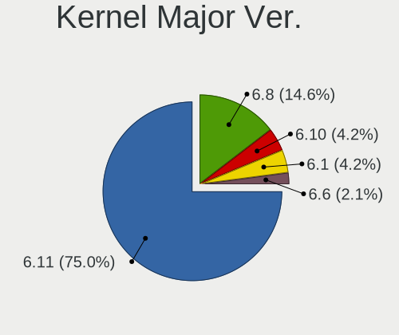
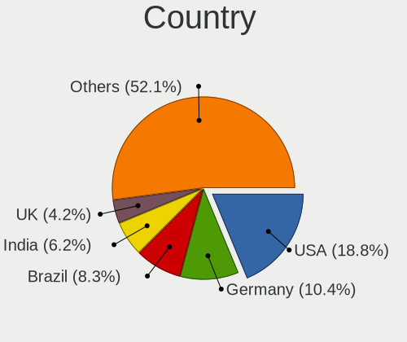
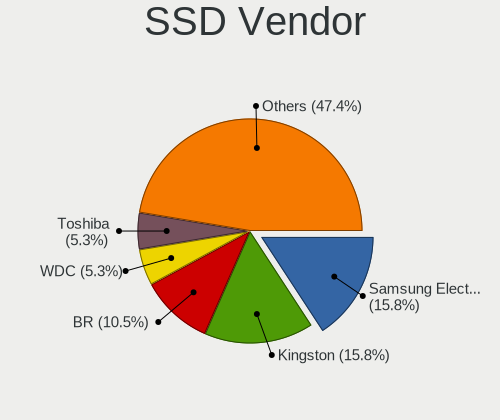
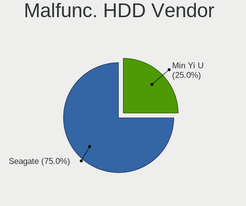
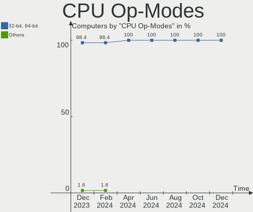
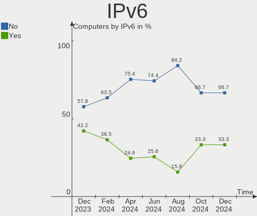

Kali Hardware Trends
--------------------

A project to identify most popular hardware characteristics and track their change
over time based on data collected by Kali users at https://Linux-Hardware.org.

Anyone can contribute to this report by the [hw-probe](https://github.com/linuxhw/hw-probe) tool:

    sudo -E hw-probe -all -upload

This is a report for all computer types. See also reports for [desktops](/Dist/Kali/Desktop/README.md) and [notebooks](/Dist/Kali/Notebook/README.md).

This report is for one last month. Overall report since the beginning of time: [TestCoverage](https://github.com/linuxhw/TestCoverage)

Period: Apr, 2022.

Contents
--------

* [ System ](#system)
  - [ OS                       ](#os)
  - [ OS Family                ](#os-family)
  - [ Kernel                   ](#kernel)
  - [ Kernel Family            ](#kernel-family)
  - [ Kernel Major Ver.        ](#kernel-major-ver)
  - [ Arch                     ](#arch)
  - [ DE                       ](#de)
  - [ Display Server           ](#display-server)
  - [ Display Manager          ](#display-manager)
  - [ OS Lang                  ](#os-lang)
  - [ Boot Mode                ](#boot-mode)
  - [ Filesystem               ](#filesystem)
  - [ Part. scheme             ](#part-scheme)
  - [ Dual Boot with Linux/BSD ](#dual-boot-with-linuxbsd)
  - [ Dual Boot (Win)          ](#dual-boot-win)

* [ Board ](#board)
  - [ Vendor                   ](#vendor)
  - [ Model                    ](#model)
  - [ Model Family             ](#model-family)
  - [ MFG Year                 ](#mfg-year)
  - [ Form Factor              ](#form-factor)
  - [ Secure Boot              ](#secure-boot)
  - [ Coreboot                 ](#coreboot)
  - [ RAM Size                 ](#ram-size)
  - [ RAM Used                 ](#ram-used)
  - [ Total Drives             ](#total-drives)
  - [ Has CD-ROM               ](#has-cd-rom)
  - [ Has Ethernet             ](#has-ethernet)
  - [ Has WiFi                 ](#has-wifi)
  - [ Has Bluetooth            ](#has-bluetooth)

* [ Location ](#location)
  - [ Country                  ](#country)
  - [ City                     ](#city)

* [ Drives ](#drives)
  - [ Drive Vendor             ](#drive-vendor)
  - [ Drive Model              ](#drive-model)
  - [ HDD Vendor               ](#hdd-vendor)
  - [ SSD Vendor               ](#ssd-vendor)
  - [ Drive Kind               ](#drive-kind)
  - [ Drive Connector          ](#drive-connector)
  - [ Drive Size               ](#drive-size)
  - [ Space Total              ](#space-total)
  - [ Space Used               ](#space-used)
  - [ Malfunc. Drives          ](#malfunc-drives)
  - [ Malfunc. Drive Vendor    ](#malfunc-drive-vendor)
  - [ Malfunc. HDD Vendor      ](#malfunc-hdd-vendor)
  - [ Malfunc. Drive Kind      ](#malfunc-drive-kind)
  - [ Failed Drives            ](#failed-drives)
  - [ Failed Drive Vendor      ](#failed-drive-vendor)
  - [ Drive Status             ](#drive-status)

* [ Storage controller ](#storage-controller)
  - [ Storage Vendor           ](#storage-vendor)
  - [ Storage Model            ](#storage-model)
  - [ Storage Kind             ](#storage-kind)

* [ Processor ](#processor)
  - [ CPU Vendor               ](#cpu-vendor)
  - [ CPU Model                ](#cpu-model)
  - [ CPU Model Family         ](#cpu-model-family)
  - [ CPU Cores                ](#cpu-cores)
  - [ CPU Sockets              ](#cpu-sockets)
  - [ CPU Threads              ](#cpu-threads)
  - [ CPU Op-Modes             ](#cpu-op-modes)
  - [ CPU Microcode            ](#cpu-microcode)
  - [ CPU Microarch            ](#cpu-microarch)

* [ Graphics ](#graphics)
  - [ GPU Vendor               ](#gpu-vendor)
  - [ GPU Model                ](#gpu-model)
  - [ GPU Combo                ](#gpu-combo)
  - [ GPU Driver               ](#gpu-driver)
  - [ GPU Memory               ](#gpu-memory)

* [ Monitor ](#monitor)
  - [ Monitor Vendor           ](#monitor-vendor)
  - [ Monitor Model            ](#monitor-model)
  - [ Monitor Resolution       ](#monitor-resolution)
  - [ Monitor Diagonal         ](#monitor-diagonal)
  - [ Monitor Width            ](#monitor-width)
  - [ Aspect Ratio             ](#aspect-ratio)
  - [ Monitor Area             ](#monitor-area)
  - [ Pixel Density            ](#pixel-density)
  - [ Multiple Monitors        ](#multiple-monitors)

* [ Network ](#network)
  - [ Net Controller Vendor    ](#net-controller-vendor)
  - [ Net Controller Model     ](#net-controller-model)
  - [ Wireless Vendor          ](#wireless-vendor)
  - [ Wireless Model           ](#wireless-model)
  - [ Ethernet Vendor          ](#ethernet-vendor)
  - [ Ethernet Model           ](#ethernet-model)
  - [ Net Controller Kind      ](#net-controller-kind)
  - [ Used Controller          ](#used-controller)
  - [ NICs                     ](#nics)
  - [ IPv6                     ](#ipv6)

* [ Bluetooth ](#bluetooth)
  - [ Bluetooth Vendor         ](#bluetooth-vendor)
  - [ Bluetooth Model          ](#bluetooth-model)

* [ Sound ](#sound)
  - [ Sound Vendor             ](#sound-vendor)
  - [ Sound Model              ](#sound-model)

* [ Memory ](#memory)
  - [ Memory Vendor            ](#memory-vendor)
  - [ Memory Model             ](#memory-model)
  - [ Memory Kind              ](#memory-kind)
  - [ Memory Form Factor       ](#memory-form-factor)
  - [ Memory Size              ](#memory-size)
  - [ Memory Speed             ](#memory-speed)

* [ Printers & scanners ](#printers--scanners)
  - [ Printer Vendor           ](#printer-vendor)
  - [ Printer Model            ](#printer-model)
  - [ Scanner Vendor           ](#scanner-vendor)
  - [ Scanner Model            ](#scanner-model)

* [ Camera ](#camera)
  - [ Camera Vendor            ](#camera-vendor)
  - [ Camera Model             ](#camera-model)

* [ Security ](#security)
  - [ Fingerprint Vendor       ](#fingerprint-vendor)
  - [ Fingerprint Model        ](#fingerprint-model)
  - [ Chipcard Vendor          ](#chipcard-vendor)
  - [ Chipcard Model           ](#chipcard-model)

* [ Unsupported ](#unsupported)
  - [ Unsupported Devices      ](#unsupported-devices)
  - [ Unsupported Device Types ](#unsupported-device-types)

System
------

OS
--

Installed operating systems

| Name         | Computers | Percent |
|--------------|-----------|---------|
| Kali 2022.1  | 45        | 88.24%  |
| Kali 2022.2  | 4         | 7.84%   |
| Kali Rolling | 1         | 1.96%   |
| Kali 2021.4  | 1         | 1.96%   |

OS Family
---------

OS without a version

| Name | Computers | Percent |
|------|-----------|---------|
| Kali | 51        | 100%    |

Kernel
------

Version of the Linux kernel

| Version                     | Computers | Percent |
|-----------------------------|-----------|---------|
| 5.16.0-kali6-amd64          | 14        | 27.45%  |
| 5.16.0-kali7-amd64          | 13        | 25.49%  |
| 5.15.0-kali3-amd64          | 8         | 15.69%  |
| 5.16.0-kali5-amd64          | 3         | 5.88%   |
| 5.16.0-kali1-amd64          | 2         | 3.92%   |
| 5.4.83-Re4son-v8l+          | 1         | 1.96%   |
| 5.4.83-Re4son-v7l+          | 1         | 1.96%   |
| 5.17.0-kali1-amd64          | 1         | 1.96%   |
| 5.16.0-kali3-amd64          | 1         | 1.96%   |
| 5.15.0-kali3-686-pae        | 1         | 1.96%   |
| 5.10.0-kali2-amd64          | 1         | 1.96%   |
| 4.9.254-NetHunter           | 1         | 1.96%   |
| 4.19.87-23609661            | 1         | 1.96%   |
| 4.19.113-23222000           | 1         | 1.96%   |
| 4.14.272-GulchR             | 1         | 1.96%   |
| 3.10.0-1160.45.1.el7.x86_64 | 1         | 1.96%   |

Kernel Family
-------------

Linux kernel without a distro release

| Version  | Computers | Percent |
|----------|-----------|---------|
| 5.16.0   | 33        | 64.71%  |
| 5.15.0   | 9         | 17.65%  |
| 5.4.83   | 2         | 3.92%   |
| 5.17.0   | 1         | 1.96%   |
| 5.10.0   | 1         | 1.96%   |
| 4.9.254  | 1         | 1.96%   |
| 4.19.87  | 1         | 1.96%   |
| 4.19.113 | 1         | 1.96%   |
| 4.14.272 | 1         | 1.96%   |
| 3.10.0   | 1         | 1.96%   |

Kernel Major Ver.
-----------------

Linux kernel major version

| Version | Computers | Percent |
|---------|-----------|---------|
| 5.16    | 33        | 64.71%  |
| 5.15    | 9         | 17.65%  |
| 5.4     | 2         | 3.92%   |
| 4.19    | 2         | 3.92%   |
| 5.17    | 1         | 1.96%   |
| 5.10    | 1         | 1.96%   |
| 4.9     | 1         | 1.96%   |
| 4.14    | 1         | 1.96%   |
| 3.10    | 1         | 1.96%   |

Arch
----

OS architecture (x86_64, i586, etc.)

| Name    | Computers | Percent |
|---------|-----------|---------|
| x86_64  | 44        | 86.27%  |
| aarch64 | 5         | 9.8%    |
| i686    | 1         | 1.96%   |
| armv7l  | 1         | 1.96%   |

DE
--

Desktop Environment

| Name            | Computers | Percent |
|-----------------|-----------|---------|
| XFCE            | 30        | 58.82%  |
| GNOME           | 10        | 19.61%  |
| KDE5            | 7         | 13.73%  |
| Unknown         | 3         | 5.88%   |
| GNOME Flashback | 1         | 1.96%   |

Display Server
--------------

X11 or Wayland

| Name    | Computers | Percent |
|---------|-----------|---------|
| X11     | 44        | 86.27%  |
| Wayland | 4         | 7.84%   |
| Unknown | 2         | 3.92%   |
| Tty     | 1         | 1.96%   |

Display Manager
---------------

SDDM, LightDM, etc.

| Name    | Computers | Percent |
|---------|-----------|---------|
| LightDM | 23        | 45.1%   |
| Unknown | 18        | 35.29%  |
| SDDM    | 5         | 9.8%    |
| GDM3    | 5         | 9.8%    |

OS Lang
-------

Language

| Lang    | Computers | Percent |
|---------|-----------|---------|
| en_US   | 27        | 52.94%  |
| de_DE   | 4         | 7.84%   |
| en_CA   | 3         | 5.88%   |
| Unknown | 3         | 5.88%   |
| es_MX   | 2         | 3.92%   |
| es_ES   | 2         | 3.92%   |
| en_GB   | 2         | 3.92%   |
| ru_RU   | 1         | 1.96%   |
| pt_BR   | 1         | 1.96%   |
| pl_PL   | 1         | 1.96%   |
| es_CO   | 1         | 1.96%   |
| en_IN   | 1         | 1.96%   |
| en_AU   | 1         | 1.96%   |
| cs_CZ   | 1         | 1.96%   |
| C       | 1         | 1.96%   |

Boot Mode
---------

EFI or BIOS

| Mode | Computers | Percent |
|------|-----------|---------|
| BIOS | 29        | 56.86%  |
| EFI  | 22        | 43.14%  |

Filesystem
----------

Type of filesystem

| Type    | Computers | Percent |
|---------|-----------|---------|
| Ext4    | 49        | 96.08%  |
| Overlay | 2         | 3.92%   |

Part. scheme
------------

Scheme of partitioning

| Type    | Computers | Percent |
|---------|-----------|---------|
| GPT     | 21        | 41.18%  |
| Unknown | 19        | 37.25%  |
| MBR     | 11        | 21.57%  |

Dual Boot with Linux/BSD
------------------------

Hosting more than one Linux/BSD

| Dual boot | Computers | Percent |
|-----------|-----------|---------|
| No        | 44        | 86.27%  |
| Yes       | 7         | 13.73%  |

Dual Boot (Win)
---------------

Hosting Linux and Windows

| Dual boot | Computers | Percent |
|-----------|-----------|---------|
| No        | 37        | 72.55%  |
| Yes       | 14        | 27.45%  |

Board
-----

Vendor
------

Motherboard manufacturer

| Name                    | Computers | Percent |
|-------------------------|-----------|---------|
| Lenovo                  | 10        | 19.61%  |
| ASUSTek Computer        | 8         | 15.69%  |
| Hewlett-Packard         | 5         | 9.8%    |
| Dell                    | 5         | 9.8%    |
| MSI                     | 4         | 7.84%   |
| Acer                    | 4         | 7.84%   |
| Unknown                 | 4         | 7.84%   |
| Raspberry Pi Foundation | 2         | 3.92%   |
| Gigabyte Technology     | 2         | 3.92%   |
| Apple                   | 2         | 3.92%   |
| Toshiba                 | 1         | 1.96%   |
| RCA                     | 1         | 1.96%   |
| Qualcomm Technologies   | 1         | 1.96%   |
| Microsoft               | 1         | 1.96%   |
| Alienware               | 1         | 1.96%   |

Model
-----

Motherboard model

| Name                                     | Computers | Percent |
|------------------------------------------|-----------|---------|
| Unknown                                  | 4         | 7.84%   |
| RPi Raspberry Pi                         | 2         | 3.92%   |
| Toshiba Satellite U845W                  | 1         | 1.96%   |
| RCA W101SA23T1                           | 1         | 1.96%   |
| Qualcomm SDM845 v2.1 MTP PVT             | 1         | 1.96%   |
| MSI Prestige 15 A11SCX                   | 1         | 1.96%   |
| MSI PE60 2QE                             | 1         | 1.96%   |
| MSI MS-7B86                              | 1         | 1.96%   |
| MSI GP76 Leopard 10UE                    | 1         | 1.96%   |
| Microsoft Surface Pro 3                  | 1         | 1.96%   |
| Lenovo ThinkStation P720 30BACTO1WW      | 1         | 1.96%   |
| Lenovo ThinkPad T470 20HES18R2C          | 1         | 1.96%   |
| Lenovo ThinkPad Edge E530 62724FU        | 1         | 1.96%   |
| Lenovo ThinkPad E580 20KS0039GE          | 1         | 1.96%   |
| Lenovo Legion T5 26AMR5 90RC006TMW       | 1         | 1.96%   |
| Lenovo IdeaPad Z510 20287                | 1         | 1.96%   |
| Lenovo H535 10117                        | 1         | 1.96%   |
| Lenovo G570 4334                         | 1         | 1.96%   |
| Lenovo G570 20079                        | 1         | 1.96%   |
| Lenovo B50-80 80EW                       | 1         | 1.96%   |
| HP Spectre x360 Convertible 14-ea0xxx    | 1         | 1.96%   |
| HP Spectre 13-SMB Pro Ultrabook          | 1         | 1.96%   |
| HP ProLiant ML150 Gen9                   | 1         | 1.96%   |
| HP ProBook 650 G1                        | 1         | 1.96%   |
| HP EliteBook x360 1030 G4                | 1         | 1.96%   |
| Gigabyte Z390 AORUS PRO WIFI             | 1         | 1.96%   |
| Gigabyte GA-78LMT-S2                     | 1         | 1.96%   |
| Dell Precision T3600                     | 1         | 1.96%   |
| Dell OptiPlex 745                        | 1         | 1.96%   |
| Dell OptiPlex 3010                       | 1         | 1.96%   |
| Dell Latitude E7450                      | 1         | 1.96%   |
| Dell G3 3590                             | 1         | 1.96%   |
| ASUS X542UQR                             | 1         | 1.96%   |
| ASUS SABERTOOTH 990FX R3.0               | 1         | 1.96%   |
| ASUS ROG Zephyrus G14 GA401QEC_GA401QEC  | 1         | 1.96%   |
| ASUS ROG STRIX B365-G GAMING             | 1         | 1.96%   |
| ASUS P5K Deluxe                          | 1         | 1.96%   |
| ASUS K52Dr                               | 1         | 1.96%   |
| ASUS ASUS TUF Gaming F15 FX506LU_FX506LU | 1         | 1.96%   |
| ASUS ASUS EXPERTBOOK P2451FA_P2451FA     | 1         | 1.96%   |
| Apple MacPro3,1                          | 1         | 1.96%   |
| Apple MacBookAir7,2                      | 1         | 1.96%   |
| Alienware 17                             | 1         | 1.96%   |
| Acer Swift SF314-42                      | 1         | 1.96%   |
| Acer Aspire ES1-523                      | 1         | 1.96%   |
| Acer Aspire E5-573G                      | 1         | 1.96%   |
| Acer Aspire A515-51                      | 1         | 1.96%   |

Model Family
------------

Motherboard model prefix

| Name                 | Computers | Percent |
|----------------------|-----------|---------|
| Unknown              | 4         | 7.84%   |
| Lenovo ThinkPad      | 3         | 5.88%   |
| Acer Aspire          | 3         | 5.88%   |
| RPi Raspberry        | 2         | 3.92%   |
| Lenovo G570          | 2         | 3.92%   |
| HP Spectre           | 2         | 3.92%   |
| Dell OptiPlex        | 2         | 3.92%   |
| ASUS ROG             | 2         | 3.92%   |
| ASUS ASUS            | 2         | 3.92%   |
| Toshiba Satellite    | 1         | 1.96%   |
| RCA W101SA23T1       | 1         | 1.96%   |
| Qualcomm SDM845      | 1         | 1.96%   |
| MSI Prestige         | 1         | 1.96%   |
| MSI PE60             | 1         | 1.96%   |
| MSI MS-7B86          | 1         | 1.96%   |
| MSI GP76             | 1         | 1.96%   |
| Microsoft Surface    | 1         | 1.96%   |
| Lenovo ThinkStation  | 1         | 1.96%   |
| Lenovo Legion        | 1         | 1.96%   |
| Lenovo IdeaPad       | 1         | 1.96%   |
| Lenovo H535          | 1         | 1.96%   |
| Lenovo B50-80        | 1         | 1.96%   |
| HP ProLiant          | 1         | 1.96%   |
| HP ProBook           | 1         | 1.96%   |
| HP EliteBook         | 1         | 1.96%   |
| Gigabyte Z390        | 1         | 1.96%   |
| Gigabyte GA-78LMT-S2 | 1         | 1.96%   |
| Dell Precision       | 1         | 1.96%   |
| Dell Latitude        | 1         | 1.96%   |
| Dell G3              | 1         | 1.96%   |
| ASUS X542UQR         | 1         | 1.96%   |
| ASUS SABERTOOTH      | 1         | 1.96%   |
| ASUS P5K             | 1         | 1.96%   |
| ASUS K52Dr           | 1         | 1.96%   |
| Apple MacPro3        | 1         | 1.96%   |
| Apple MacBookAir7    | 1         | 1.96%   |
| Alienware 17         | 1         | 1.96%   |
| Acer Swift           | 1         | 1.96%   |

MFG Year
--------

Motherboard manufacture year

| Year    | Computers | Percent |
|---------|-----------|---------|
| 2013    | 6         | 11.76%  |
| Unknown | 6         | 11.76%  |
| 2021    | 5         | 9.8%    |
| 2020    | 5         | 9.8%    |
| 2019    | 4         | 7.84%   |
| 2017    | 4         | 7.84%   |
| 2016    | 4         | 7.84%   |
| 2015    | 4         | 7.84%   |
| 2012    | 4         | 7.84%   |
| 2018    | 2         | 3.92%   |
| 2011    | 2         | 3.92%   |
| 2007    | 2         | 3.92%   |
| 2014    | 1         | 1.96%   |
| 2010    | 1         | 1.96%   |
| 2008    | 1         | 1.96%   |

Form Factor
-----------

Physical design of the computer

| Name           | Computers | Percent |
|----------------|-----------|---------|
| Notebook       | 28        | 54.9%   |
| Desktop        | 13        | 25.49%  |
| System on chip | 6         | 11.76%  |
| Convertible    | 2         | 3.92%   |
| Tablet         | 1         | 1.96%   |
| Server         | 1         | 1.96%   |

Secure Boot
-----------

Enabled or disabled

| State    | Computers | Percent |
|----------|-----------|---------|
| Disabled | 51        | 100%    |

Coreboot
--------

Have coreboot on board

| Used | Computers | Percent |
|------|-----------|---------|
| No   | 51        | 100%    |

RAM Size
--------

Total RAM memory

| Size in GB  | Computers | Percent |
|-------------|-----------|---------|
| 4.01-8.0    | 17        | 33.33%  |
| 32.01-64.0  | 9         | 17.65%  |
| 8.01-16.0   | 9         | 17.65%  |
| 3.01-4.0    | 6         | 11.76%  |
| 16.01-24.0  | 6         | 11.76%  |
| 1.01-2.0    | 3         | 5.88%   |
| 64.01-256.0 | 1         | 1.96%   |

RAM Used
--------

Used RAM memory

| Used GB  | Computers | Percent |
|----------|-----------|---------|
| 2.01-3.0 | 14        | 27.45%  |
| 1.01-2.0 | 12        | 23.53%  |
| 4.01-8.0 | 11        | 21.57%  |
| 3.01-4.0 | 9         | 17.65%  |
| 0.51-1.0 | 4         | 7.84%   |
| 0.01-0.5 | 1         | 1.96%   |

Total Drives
------------

Number of drives on board

| Drives | Computers | Percent |
|--------|-----------|---------|
| 1      | 29        | 56.86%  |
| 2      | 10        | 19.61%  |
| 3      | 5         | 9.8%    |
| 0      | 5         | 9.8%    |
| 6      | 1         | 1.96%   |
| 4      | 1         | 1.96%   |

Has CD-ROM
----------

Has CD-ROM on board

| Presented | Computers | Percent |
|-----------|-----------|---------|
| No        | 35        | 68.63%  |
| Yes       | 16        | 31.37%  |

Has Ethernet
------------

Has Ethernet on board

| Presented | Computers | Percent |
|-----------|-----------|---------|
| Yes       | 39        | 76.47%  |
| No        | 12        | 23.53%  |

Has WiFi
--------

Has WiFi module

| Presented | Computers | Percent |
|-----------|-----------|---------|
| Yes       | 39        | 76.47%  |
| No        | 12        | 23.53%  |

Has Bluetooth
-------------

Has Bluetooth module

| Presented | Computers | Percent |
|-----------|-----------|---------|
| Yes       | 30        | 58.82%  |
| No        | 21        | 41.18%  |

Location
--------

Country
-------

Geographic location (country)

| Country     | Computers | Percent |
|-------------|-----------|---------|
| USA         | 12        | 23.53%  |
| Germany     | 7         | 13.73%  |
| Canada      | 4         | 7.84%   |
| Spain       | 3         | 5.88%   |
| Colombia    | 3         | 5.88%   |
| UK          | 2         | 3.92%   |
| Turkey      | 2         | 3.92%   |
| Russia      | 2         | 3.92%   |
| Egypt       | 2         | 3.92%   |
| Brazil      | 2         | 3.92%   |
| Switzerland | 1         | 1.96%   |
| Sweden      | 1         | 1.96%   |
| Serbia      | 1         | 1.96%   |
| Poland      | 1         | 1.96%   |
| Norway      | 1         | 1.96%   |
| Mexico      | 1         | 1.96%   |
| India       | 1         | 1.96%   |
| Ethiopia    | 1         | 1.96%   |
| Czechia     | 1         | 1.96%   |
| China       | 1         | 1.96%   |
| Belgium     | 1         | 1.96%   |
| Australia   | 1         | 1.96%   |

City
----

Geographic location (city)

| City                 | Computers | Percent |
|----------------------|-----------|---------|
| Zaragoza             | 2         | 3.92%   |
| Munich               | 2         | 3.92%   |
| Medellín            | 2         | 3.92%   |
| Winnipeg             | 1         | 1.96%   |
| Weyburn              | 1         | 1.96%   |
| Stockton             | 1         | 1.96%   |
| Stockholm            | 1         | 1.96%   |
| St Louis             | 1         | 1.96%   |
| Springfield          | 1         | 1.96%   |
| Sao Paulo            | 1         | 1.96%   |
| San Diego            | 1         | 1.96%   |
| Rio de Janeiro       | 1         | 1.96%   |
| Prague               | 1         | 1.96%   |
| Perm                 | 1         | 1.96%   |
| Newton Aycliffe      | 1         | 1.96%   |
| New York             | 1         | 1.96%   |
| Mumbai               | 1         | 1.96%   |
| Moscow               | 1         | 1.96%   |
| Morlanwelz-Mariemont | 1         | 1.96%   |
| Mexico City          | 1         | 1.96%   |
| Mersin               | 1         | 1.96%   |
| Madrid               | 1         | 1.96%   |
| Lyss                 | 1         | 1.96%   |
| Los Angeles          | 1         | 1.96%   |
| Krakow               | 1         | 1.96%   |
| Knoxville            | 1         | 1.96%   |
| Kingsport            | 1         | 1.96%   |
| Karlsruhe            | 1         | 1.96%   |
| Istanbul             | 1         | 1.96%   |
| Ibague               | 1         | 1.96%   |
| Grimmen              | 1         | 1.96%   |
| Essen                | 1         | 1.96%   |
| Edmonton             | 1         | 1.96%   |
| Dallas               | 1         | 1.96%   |
| Corvallis            | 1         | 1.96%   |
| Cochrane             | 1         | 1.96%   |
| Cairo                | 1         | 1.96%   |
| Brisbane             | 1         | 1.96%   |
| Braunfels            | 1         | 1.96%   |
| Bochum               | 1         | 1.96%   |
| Birmingham           | 1         | 1.96%   |
| Bilbeis              | 1         | 1.96%   |
| Beltsville           | 1         | 1.96%   |
| Belgrade             | 1         | 1.96%   |
| Beijing              | 1         | 1.96%   |
| Baltimore            | 1         | 1.96%   |
| Alta                 | 1         | 1.96%   |
| Addis Ababa          | 1         | 1.96%   |

Drives
------

Drive Vendor
------------

Hard drive vendors

| Vendor              | Computers | Drives | Percent |
|---------------------|-----------|--------|---------|
| Samsung Electronics | 15        | 15     | 22.73%  |
| WDC                 | 10        | 11     | 15.15%  |
| Seagate             | 8         | 9      | 12.12%  |
| Toshiba             | 4         | 6      | 6.06%   |
| SanDisk             | 4         | 4      | 6.06%   |
| Kingston            | 4         | 5      | 6.06%   |
| Unknown             | 3         | 3      | 4.55%   |
| Micron Technology   | 2         | 2      | 3.03%   |
| Hitachi             | 2         | 2      | 3.03%   |
| Crucial             | 2         | 2      | 3.03%   |
| TYPEC 1T            | 1         | 1      | 1.52%   |
| TO Exter            | 1         | 1      | 1.52%   |
| MARVELL             | 1         | 2      | 1.52%   |
| LITEONIT            | 1         | 1      | 1.52%   |
| Lenovo              | 1         | 1      | 1.52%   |
| KingSpec            | 1         | 1      | 1.52%   |
| KingFast            | 1         | 1      | 1.52%   |
| HUAWEI              | 1         | 1      | 1.52%   |
| HGST                | 1         | 1      | 1.52%   |
| Fujitsu             | 1         | 1      | 1.52%   |
| China               | 1         | 1      | 1.52%   |
| Apple               | 1         | 1      | 1.52%   |

Drive Model
-----------

Hard drive models

| Model                                             | Computers | Percent |
|---------------------------------------------------|-----------|---------|
| Seagate ST1000LM035-1RK172 1TB                    | 2         | 2.9%    |
| Seagate Expansion+ 2TB                            | 2         | 2.9%    |
| WDC WDS100T2B0C-00PXH0 1TB                        | 1         | 1.45%   |
| WDC WDS100T2B0A-00SM50 1TB SSD                    | 1         | 1.45%   |
| WDC WD40EFAX-68JH4N0 4TB                          | 1         | 1.45%   |
| WDC WD3200LPVX-60V0TT0 320GB                      | 1         | 1.45%   |
| WDC WD3200BPVT-75JJ5T0 320GB                      | 1         | 1.45%   |
| WDC WD30EZRX-00DC0B0 3TB                          | 1         | 1.45%   |
| WDC WD2003FYYS-05T9B0 2TB                         | 1         | 1.45%   |
| WDC WD10JPVX-75JC3T0 1TB                          | 1         | 1.45%   |
| WDC WD10JPCX-24UE4T0 1TB                          | 1         | 1.45%   |
| WDC WD10EZEX-08M2NA0 1TB                          | 1         | 1.45%   |
| WDC PC SN520 NVMe 512GB                           | 1         | 1.45%   |
| Unknown SD64G  64GB                               | 1         | 1.45%   |
| Unknown SC128  128GB                              | 1         | 1.45%   |
| Unknown Sabrent Disk Dev 500GB                    | 1         | 1.45%   |
| TYPEC 1T B PSSD 1TB                               | 1         | 1.45%   |
| Toshiba MQ04ABF100 1TB                            | 1         | 1.45%   |
| Toshiba MK2565GSX HR 160GB                        | 1         | 1.45%   |
| Toshiba KBG30ZMV256G 256GB                        | 1         | 1.45%   |
| Toshiba HDWR160 6TB                               | 1         | 1.45%   |
| Toshiba HDWE150 5TB                               | 1         | 1.45%   |
| Toshiba HDWD120 2TB                               | 1         | 1.45%   |
| TO Exter nal USB 3.0 128GB                        | 1         | 1.45%   |
| Seagate ST9500325AS 500GB                         | 1         | 1.45%   |
| Seagate ST500LT012-1DG142 500GB                   | 1         | 1.45%   |
| Seagate ST380815AS 80GB                           | 1         | 1.45%   |
| Seagate ST3500312CS 500GB                         | 1         | 1.45%   |
| SanDisk SSD PLUS 480GB                            | 1         | 1.45%   |
| SanDisk SSD PLUS 240GB                            | 1         | 1.45%   |
| SanDisk SD6SN1M-256G-1006 256GB SSD               | 1         | 1.45%   |
| SanDisk DF4032  32GB                              | 1         | 1.45%   |
| Samsung SSD PM871 mSATA 256GB                     | 1         | 1.45%   |
| Samsung SSD 870 EVO 500GB                         | 1         | 1.45%   |
| Samsung SSD 860 EVO M.2 250GB                     | 1         | 1.45%   |
| Samsung SSD 840 EVO 1TB                           | 1         | 1.45%   |
| Samsung SSD 840 EVO 120GB                         | 1         | 1.45%   |
| Samsung NVMe SSD Drive 512GB                      | 1         | 1.45%   |
| Samsung NVMe SSD Drive 2TB                        | 1         | 1.45%   |
| Samsung NVMe SSD Controller SM981/PM981/PM983 1TB | 1         | 1.45%   |
| Samsung MZVLQ1T0HALB-00000 1TB                    | 1         | 1.45%   |
| Samsung MZVLB2T0HALB-000H1 2TB                    | 1         | 1.45%   |
| Samsung MZVLB256HAHQ-000L7 256GB                  | 1         | 1.45%   |
| Samsung MZVL2512HCJQ-00B00 512GB                  | 1         | 1.45%   |
| Samsung MZMTE256HMHP-000MV 256GB SSD              | 1         | 1.45%   |
| Samsung MZMPC256HBGJ-00000 256GB SSD              | 1         | 1.45%   |
| Samsung HN-M101MBB 1TB                            | 1         | 1.45%   |
| Micron MTFDDAK128MAM-1J1 128GB SSD                | 1         | 1.45%   |
| Micron 2210_MTFDHBA512QFD 512GB                   | 1         | 1.45%   |
| MARVELL Raid VD 2TB                               | 1         | 1.45%   |
| LITEONIT DMT-80M6M-11 mSATA 80GB SSD              | 1         | 1.45%   |
| Lenovo LENSE20256GMSP34MEAT2TA 256GB              | 1         | 1.45%   |
| Kingston SV300S37A120G 120GB SSD                  | 1         | 1.45%   |
| Kingston SA400S37240G 240GB SSD                   | 1         | 1.45%   |
| Kingston OM8PCP31024F-AI1 1TB                     | 1         | 1.45%   |
| Kingston NVMe SSD Drive 1TB                       | 1         | 1.45%   |
| KingSpec P3-512 512GB                             | 1         | 1.45%   |
| KingFast 512GB                                    | 1         | 1.45%   |
| HUAWEI MMC Storage 64GB                           | 1         | 1.45%   |
| Hitachi HTS725032A7E630 320GB                     | 1         | 1.45%   |

HDD Vendor
----------

Hard disk drive vendors

| Vendor              | Computers | Drives | Percent |
|---------------------|-----------|--------|---------|
| WDC                 | 8         | 8      | 30.77%  |
| Seagate             | 8         | 9      | 30.77%  |
| Toshiba             | 3         | 5      | 11.54%  |
| Hitachi             | 2         | 2      | 7.69%   |
| Unknown             | 1         | 1      | 3.85%   |
| Samsung Electronics | 1         | 1      | 3.85%   |
| MARVELL             | 1         | 2      | 3.85%   |
| HGST                | 1         | 1      | 3.85%   |
| Fujitsu             | 1         | 1      | 3.85%   |

SSD Vendor
----------

Solid state drive vendors

| Vendor              | Computers | Drives | Percent |
|---------------------|-----------|--------|---------|
| Samsung Electronics | 7         | 7      | 31.82%  |
| SanDisk             | 3         | 3      | 13.64%  |
| Kingston            | 2         | 2      | 9.09%   |
| Crucial             | 2         | 2      | 9.09%   |
| WDC                 | 1         | 1      | 4.55%   |
| TYPEC 1T            | 1         | 1      | 4.55%   |
| TO Exter            | 1         | 1      | 4.55%   |
| Micron Technology   | 1         | 1      | 4.55%   |
| LITEONIT            | 1         | 1      | 4.55%   |
| KingSpec            | 1         | 1      | 4.55%   |
| China               | 1         | 1      | 4.55%   |
| Apple               | 1         | 1      | 4.55%   |

Drive Kind
----------

HDD or SSD

| Kind    | Computers | Drives | Percent |
|---------|-----------|--------|---------|
| HDD     | 22        | 30     | 37.29%  |
| SSD     | 18        | 22     | 30.51%  |
| NVMe    | 14        | 15     | 23.73%  |
| MMC     | 3         | 3      | 5.08%   |
| Unknown | 2         | 2      | 3.39%   |

Drive Connector
---------------

SATA, SAS, NVMe, etc.

| Type | Computers | Drives | Percent |
|------|-----------|--------|---------|
| SATA | 31        | 46     | 56.36%  |
| NVMe | 14        | 15     | 25.45%  |
| SAS  | 7         | 8      | 12.73%  |
| MMC  | 3         | 3      | 5.45%   |

Drive Size
----------

Size of hard drive

| Size in TB | Computers | Drives | Percent |
|------------|-----------|--------|---------|
| 0.01-0.5   | 25        | 28     | 56.82%  |
| 0.51-1.0   | 10        | 12     | 22.73%  |
| 1.01-2.0   | 6         | 8      | 13.64%  |
| 3.01-4.0   | 1         | 1      | 2.27%   |
| 2.01-3.0   | 1         | 1      | 2.27%   |
| 4.01-10.0  | 1         | 2      | 2.27%   |

Space Total
-----------

Amount of disk space available on the file system

| Size in GB     | Computers | Percent |
|----------------|-----------|---------|
| 101-250        | 14        | 27.45%  |
| 251-500        | 10        | 19.61%  |
| Unknown        | 5         | 9.8%    |
| 1001-2000      | 4         | 7.84%   |
| 501-1000       | 4         | 7.84%   |
| 51-100         | 4         | 7.84%   |
| More than 3000 | 3         | 5.88%   |
| 21-50          | 3         | 5.88%   |
| 1-20           | 3         | 5.88%   |
| 2001-3000      | 1         | 1.96%   |

Space Used
----------

Amount of used disk space

| Used GB        | Computers | Percent |
|----------------|-----------|---------|
| 1-20           | 18        | 35.29%  |
| 21-50          | 12        | 23.53%  |
| 51-100         | 6         | 11.76%  |
| Unknown        | 5         | 9.8%    |
| 251-500        | 3         | 5.88%   |
| 2001-3000      | 2         | 3.92%   |
| 101-250        | 2         | 3.92%   |
| 501-1000       | 2         | 3.92%   |
| More than 3000 | 1         | 1.96%   |

Malfunc. Drives
---------------

Drive models with a malfunction

| Model                     | Computers | Drives | Percent |
|---------------------------|-----------|--------|---------|
| Seagate ST9500325AS 500GB | 1         | 1      | 33.33%  |
| Seagate ST380815AS 80GB   | 1         | 1      | 33.33%  |
| SanDisk SSD PLUS 480GB    | 1         | 1      | 33.33%  |

Malfunc. Drive Vendor
---------------------

Vendors of faulty drives

| Vendor  | Computers | Drives | Percent |
|---------|-----------|--------|---------|
| Seagate | 2         | 2      | 66.67%  |
| SanDisk | 1         | 1      | 33.33%  |

Malfunc. HDD Vendor
-------------------

Vendors of faulty HDD drives

| Vendor  | Computers | Drives | Percent |
|---------|-----------|--------|---------|
| Seagate | 2         | 2      | 100%    |

Malfunc. Drive Kind
-------------------

Kinds of faulty drives

| Kind | Computers | Drives | Percent |
|------|-----------|--------|---------|
| HDD  | 2         | 2      | 66.67%  |
| SSD  | 1         | 1      | 33.33%  |

Failed Drives
-------------

Failed drive models

Zero info for selected period =(

Failed Drive Vendor
-------------------

Failed drive vendors

Zero info for selected period =(

Drive Status
------------

Number of failed and malfunc. drives

| Status   | Computers | Drives | Percent |
|----------|-----------|--------|---------|
| Works    | 26        | 36     | 52%     |
| Detected | 21        | 33     | 42%     |
| Malfunc  | 3         | 3      | 6%      |

Storage controller
------------------

Storage Vendor
--------------

Storage controller vendors

| Vendor                       | Computers | Percent |
|------------------------------|-----------|---------|
| Intel                        | 30        | 53.57%  |
| Samsung Electronics          | 8         | 14.29%  |
| AMD                          | 8         | 14.29%  |
| Sandisk                      | 2         | 3.57%   |
| Kingston Technology Company  | 2         | 3.57%   |
| Toshiba America Info Systems | 1         | 1.79%   |
| Micron Technology            | 1         | 1.79%   |
| Marvell Technology Group     | 1         | 1.79%   |
| Lenovo                       | 1         | 1.79%   |
| JMicron Technology           | 1         | 1.79%   |
| Hewlett-Packard              | 1         | 1.79%   |

Storage Model
-------------

Storage controller models

| Model                                                                          | Computers | Percent |
|--------------------------------------------------------------------------------|-----------|---------|
| AMD FCH SATA Controller [AHCI mode]                                            | 4         | 6.15%   |
| Samsung NVMe SSD Controller SM981/PM981/PM983                                  | 3         | 4.62%   |
| Intel Sunrise Point-LP SATA Controller [AHCI mode]                             | 3         | 4.62%   |
| Intel 82801 Mobile SATA Controller [RAID mode]                                 | 3         | 4.62%   |
| Samsung NVMe SSD Controller PM9A1/PM9A3/980PRO                                 | 2         | 3.08%   |
| Samsung NVMe SSD Controller 980                                                | 2         | 3.08%   |
| Intel Wildcat Point-LP SATA Controller [AHCI Mode]                             | 2         | 3.08%   |
| Intel Cannon Lake PCH SATA AHCI Controller                                     | 2         | 3.08%   |
| Intel 8 Series/C220 Series Chipset Family 6-port SATA Controller 1 [AHCI mode] | 2         | 3.08%   |
| Intel 8 Series SATA Controller 1 [AHCI mode]                                   | 2         | 3.08%   |
| Intel 7 Series Chipset Family 6-port SATA Controller [AHCI mode]               | 2         | 3.08%   |
| Intel 6 Series/C200 Series Chipset Family 6 port Mobile SATA AHCI Controller   | 2         | 3.08%   |
| AMD SB7x0/SB8x0/SB9x0 SATA Controller [AHCI mode]                              | 2         | 3.08%   |
| Toshiba America Info Systems BG3 NVMe SSD Controller                           | 1         | 1.54%   |
| Sandisk WD Blue SN550 NVMe SSD                                                 | 1         | 1.54%   |
| Sandisk PC SN520 NVMe SSD                                                      | 1         | 1.54%   |
| Samsung Electronics SATA controller                                            | 1         | 1.54%   |
| Micron Non-Volatile memory controller                                          | 1         | 1.54%   |
| Marvell Group 88SE9230 PCIe 2.0 x2 4-port SATA 6 Gb/s RAID Controller          | 1         | 1.54%   |
| Lenovo Non-Volatile memory controller                                          | 1         | 1.54%   |
| Kingston Company Company Non-Volatile memory controller                        | 1         | 1.54%   |
| Kingston Company A2000 NVMe SSD                                                | 1         | 1.54%   |
| JMicron JMB363 SATA/IDE Controller                                             | 1         | 1.54%   |
| Intel Volume Management Device NVMe RAID Controller                            | 1         | 1.54%   |
| Intel Comet Lake SATA AHCI Controller                                          | 1         | 1.54%   |
| Intel Cannon Lake Mobile PCH SATA AHCI Controller                              | 1         | 1.54%   |
| Intel C620 Series Chipset Family SSATA Controller [AHCI mode]                  | 1         | 1.54%   |
| Intel C620 Series Chipset Family SATA Controller [AHCI mode]                   | 1         | 1.54%   |
| Intel C620 Series Chipset Family IDE Redirection                               | 1         | 1.54%   |
| Intel C610/X99 series chipset sSATA Controller [RAID mode]                     | 1         | 1.54%   |
| Intel C610/X99 series chipset SATA Controller [RAID mode]                      | 1         | 1.54%   |
| Intel C602 chipset 4-Port SATA Storage Control Unit                            | 1         | 1.54%   |
| Intel C600/X79 series chipset 6-Port SATA AHCI Controller                      | 1         | 1.54%   |
| Intel 82801IR/IO/IH (ICH9R/DO/DH) 4 port SATA Controller [IDE mode]            | 1         | 1.54%   |
| Intel 82801I (ICH9 Family) 2 port SATA Controller [IDE mode]                   | 1         | 1.54%   |
| Intel 82801HR/HO/HH (ICH8R/DO/DH) 2 port SATA Controller [IDE mode]            | 1         | 1.54%   |
| Intel 82801H (ICH8 Family) 4 port SATA Controller [IDE mode]                   | 1         | 1.54%   |
| Intel 631xESB/632xESB SATA AHCI Controller                                     | 1         | 1.54%   |
| Intel 631xESB/632xESB IDE Controller                                           | 1         | 1.54%   |
| Intel 6 Series/C200 Series Chipset Family 6 port Desktop SATA AHCI Controller  | 1         | 1.54%   |
| Intel 400 Series Chipset Family SATA AHCI Controller                           | 1         | 1.54%   |
| Intel 200 Series PCH SATA controller [AHCI mode]                               | 1         | 1.54%   |
| HP Smart Array Gen9 Controllers                                                | 1         | 1.54%   |
| AMD SB7x0/SB8x0/SB9x0 SATA Controller [IDE mode]                               | 1         | 1.54%   |
| AMD SB7x0/SB8x0/SB9x0 IDE Controller                                           | 1         | 1.54%   |
| AMD 500 Series Chipset SATA Controller                                         | 1         | 1.54%   |
| AMD 400 Series Chipset SATA Controller                                         | 1         | 1.54%   |

Storage Kind
------------

Kind of storage controller (IDE, SATA, NVMe, SAS, ...)

| Kind | Computers | Percent |
|------|-----------|---------|
| SATA | 32        | 56.14%  |
| NVMe | 14        | 24.56%  |
| RAID | 5         | 8.77%   |
| IDE  | 5         | 8.77%   |
| SAS  | 1         | 1.75%   |

Processor
---------

CPU Vendor
----------

Processor vendors

| Vendor   | Computers | Percent |
|----------|-----------|---------|
| Intel    | 36        | 70.59%  |
| AMD      | 9         | 17.65%  |
| QUALCOMM | 3         | 5.88%   |
| ARM      | 3         | 5.88%   |

CPU Model
---------

Processor models

| Model                                       | Computers | Percent |
|---------------------------------------------|-----------|---------|
| Intel Core i7-10870H CPU @ 2.20GHz          | 2         | 3.92%   |
| Intel Core i5-4200M CPU @ 2.50GHz           | 2         | 3.92%   |
| ARM Processor                               | 2         | 3.92%   |
| QUALCOMM AArch64 Processor rev 14 (aarch64) | 1         | 1.96%   |
| QUALCOMM AArch64 Processor rev 12 (aarch64) | 1         | 1.96%   |
| QUALCOMM AArch64 Processor rev 0 (aarch64)  | 1         | 1.96%   |
| Intel Xeon Silver 4110 CPU @ 2.10GHz        | 1         | 1.96%   |
| Intel Xeon CPU X5482 @ 3.20GHz              | 1         | 1.96%   |
| Intel Xeon CPU E5-2660 0 @ 2.20GHz          | 1         | 1.96%   |
| Intel Xeon CPU E5-2609 v4 @ 1.70GHz         | 1         | 1.96%   |
| Intel Pentium CPU B940 @ 2.00GHz            | 1         | 1.96%   |
| Intel Core i9-9900K CPU @ 3.60GHz           | 1         | 1.96%   |
| Intel Core i9-8950HK CPU @ 2.90GHz          | 1         | 1.96%   |
| Intel Core i7-8550U CPU @ 1.80GHz           | 1         | 1.96%   |
| Intel Core i7-5700HQ CPU @ 2.70GHz          | 1         | 1.96%   |
| Intel Core i7-5600U CPU @ 2.60GHz           | 1         | 1.96%   |
| Intel Core i7-4710MQ CPU @ 2.50GHz          | 1         | 1.96%   |
| Intel Core i7-3517U CPU @ 1.90GHz           | 1         | 1.96%   |
| Intel Core i7-10510U CPU @ 1.80GHz          | 1         | 1.96%   |
| Intel Core i5-9300H CPU @ 2.40GHz           | 1         | 1.96%   |
| Intel Core i5-8365U CPU @ 1.60GHz           | 1         | 1.96%   |
| Intel Core i5-8250U CPU @ 1.60GHz           | 1         | 1.96%   |
| Intel Core i5-7300U CPU @ 2.60GHz           | 1         | 1.96%   |
| Intel Core i5-5350U CPU @ 1.80GHz           | 1         | 1.96%   |
| Intel Core i5-5200U CPU @ 2.20GHz           | 1         | 1.96%   |
| Intel Core i5-4300U CPU @ 1.90GHz           | 1         | 1.96%   |
| Intel Core i5-4200U CPU @ 1.60GHz           | 1         | 1.96%   |
| Intel Core i3-9100 CPU @ 3.60GHz            | 1         | 1.96%   |
| Intel Core i3-7020U CPU @ 2.30GHz           | 1         | 1.96%   |
| Intel Core i3-5005U CPU @ 2.00GHz           | 1         | 1.96%   |
| Intel Core i3-3245 CPU @ 3.40GHz            | 1         | 1.96%   |
| Intel Core i3-3120M CPU @ 2.50GHz           | 1         | 1.96%   |
| Intel Core i3-2310M CPU @ 2.10GHz           | 1         | 1.96%   |
| Intel Core 2 Quad CPU @ 2.40GHz             | 1         | 1.96%   |
| Intel Core 2 CPU 6600 @ 2.40GHz             | 1         | 1.96%   |
| Intel Atom CPU Z3735F @ 1.33GHz             | 1         | 1.96%   |
| Intel 11th Gen Core i7-1185G7 @ 3.00GHz     | 1         | 1.96%   |
| Intel 11th Gen Core i7-1165G7 @ 2.80GHz     | 1         | 1.96%   |
| ARM BCM2711 Processor                       | 1         | 1.96%   |
| AMD Ryzen 9 5900HS with Radeon Graphics     | 1         | 1.96%   |
| AMD Ryzen 7 4700U with Radeon Graphics      | 1         | 1.96%   |
| AMD Ryzen 7 3700X 8-Core Processor          | 1         | 1.96%   |
| AMD Ryzen 5 5600G with Radeon Graphics      | 1         | 1.96%   |
| AMD Phenom II P960 Quad-Core Processor      | 1         | 1.96%   |
| AMD FX-9590 Eight-Core Processor            | 1         | 1.96%   |
| AMD FX-6100 Six-Core Processor              | 1         | 1.96%   |
| AMD A8-5500 APU with Radeon HD Graphics     | 1         | 1.96%   |
| AMD A6-7310 APU with AMD Radeon R4 Graphics | 1         | 1.96%   |

CPU Model Family
----------------

Processor model prefix

| Model             | Computers | Percent |
|-------------------|-----------|---------|
| Intel Core i5     | 10        | 19.61%  |
| Intel Core i7     | 8         | 15.69%  |
| Intel Core i3     | 6         | 11.76%  |
| Other             | 4         | 7.84%   |
| QUALCOMM AArch64  | 3         | 5.88%   |
| Intel Xeon        | 3         | 5.88%   |
| Intel Core i9     | 2         | 3.92%   |
| AMD Ryzen 7       | 2         | 3.92%   |
| AMD FX            | 2         | 3.92%   |
| Intel Xeon Silver | 1         | 1.96%   |
| Intel Pentium     | 1         | 1.96%   |
| Intel Core 2 Quad | 1         | 1.96%   |
| Intel Core 2      | 1         | 1.96%   |
| Intel Atom        | 1         | 1.96%   |
| ARM BCM           | 1         | 1.96%   |
| AMD Ryzen 9       | 1         | 1.96%   |
| AMD Ryzen 5       | 1         | 1.96%   |
| AMD Phenom II     | 1         | 1.96%   |
| AMD A8            | 1         | 1.96%   |
| AMD A6            | 1         | 1.96%   |

CPU Cores
---------

Number of processor cores

| Number  | Computers | Percent |
|---------|-----------|---------|
| 4       | 19        | 37.25%  |
| 2       | 17        | 33.33%  |
| 8       | 9         | 17.65%  |
| 6       | 2         | 3.92%   |
| Unknown | 2         | 3.92%   |
| 16      | 1         | 1.96%   |
| 3       | 1         | 1.96%   |

CPU Sockets
-----------

Number of sockets

| Number  | Computers | Percent |
|---------|-----------|---------|
| 1       | 45        | 88.24%  |
| 2       | 4         | 7.84%   |
| Unknown | 2         | 3.92%   |

CPU Threads
-----------

Threads per core (Hyper-Threading)

| Number  | Computers | Percent |
|---------|-----------|---------|
| 2       | 35        | 68.63%  |
| 1       | 14        | 27.45%  |
| Unknown | 2         | 3.92%   |

CPU Op-Modes
------------

CPU Operation Modes (32-bit, 64-bit)

| Op mode        | Computers | Percent |
|----------------|-----------|---------|
| 32-bit, 64-bit | 49        | 96.08%  |
| Unknown        | 2         | 3.92%   |

CPU Microcode
-------------

Microcode number

| Number     | Computers | Percent |
|------------|-----------|---------|
| Unknown    | 11        | 21.57%  |
| 0x306d4    | 3         | 5.88%   |
| 0x306c3    | 3         | 5.88%   |
| 0x306a9    | 3         | 5.88%   |
| 0xa0652    | 2         | 3.92%   |
| 0x906ea    | 2         | 3.92%   |
| 0x806ea    | 2         | 3.92%   |
| 0x806c1    | 2         | 3.92%   |
| 0x206a7    | 2         | 3.92%   |
| 0x906ed    | 1         | 1.96%   |
| 0x906eb    | 1         | 1.96%   |
| 0x806ec    | 1         | 1.96%   |
| 0x806e9    | 1         | 1.96%   |
| 0x6f7      | 1         | 1.96%   |
| 0x6f6      | 1         | 1.96%   |
| 0x50654    | 1         | 1.96%   |
| 0x406f1    | 1         | 1.96%   |
| 0x40671    | 1         | 1.96%   |
| 0x40651    | 1         | 1.96%   |
| 0x30678    | 1         | 1.96%   |
| 0x206d7    | 1         | 1.96%   |
| 0x10676    | 1         | 1.96%   |
| 0x0a50000c | 1         | 1.96%   |
| 0x08701021 | 1         | 1.96%   |
| 0x08600104 | 1         | 1.96%   |
| 0x07030105 | 1         | 1.96%   |
| 0x06001119 | 1         | 1.96%   |
| 0x06000852 | 1         | 1.96%   |
| 0x0600063e | 1         | 1.96%   |
| 0x010000c8 | 1         | 1.96%   |

CPU Microarch
-------------

Microarchitecture

| Name        | Computers | Percent |
|-------------|-----------|---------|
| KabyLake    | 10        | 19.61%  |
| Broadwell   | 6         | 11.76%  |
| Unknown     | 6         | 11.76%  |
| Haswell     | 5         | 9.8%    |
| SandyBridge | 3         | 5.88%   |
| IvyBridge   | 3         | 5.88%   |
| Zen 3       | 2         | 3.92%   |
| Zen 2       | 2         | 3.92%   |
| TigerLake   | 2         | 3.92%   |
| Piledriver  | 2         | 3.92%   |
| Core        | 2         | 3.92%   |
| CometLake   | 2         | 3.92%   |
| Skylake     | 1         | 1.96%   |
| Silvermont  | 1         | 1.96%   |
| Puma        | 1         | 1.96%   |
| Penryn      | 1         | 1.96%   |
| K10         | 1         | 1.96%   |
| Bulldozer   | 1         | 1.96%   |

Graphics
--------

GPU Vendor
----------

Vendors of graphics cards

| Vendor                     | Computers | Percent |
|----------------------------|-----------|---------|
| Intel                      | 29        | 48.33%  |
| Nvidia                     | 19        | 31.67%  |
| AMD                        | 11        | 18.33%  |
| Matrox Electronics Systems | 1         | 1.67%   |

GPU Model
---------

Graphics card models

| Model                                                                     | Computers | Percent |
|---------------------------------------------------------------------------|-----------|---------|
| Intel HD Graphics 5500                                                    | 3         | 5%      |
| Intel 4th Gen Core Processor Integrated Graphics Controller               | 3         | 5%      |
| Nvidia TU116M [GeForce GTX 1660 Ti Mobile]                                | 2         | 3.33%   |
| Intel UHD Graphics 620                                                    | 2         | 3.33%   |
| Intel TigerLake-LP GT2 [Iris Xe Graphics]                                 | 2         | 3.33%   |
| Intel HD Graphics 620                                                     | 2         | 3.33%   |
| Intel Haswell-ULT Integrated Graphics Controller                          | 2         | 3.33%   |
| Intel CometLake-H GT2 [UHD Graphics]                                      | 2         | 3.33%   |
| Intel CoffeeLake-H GT2 [UHD Graphics 630]                                 | 2         | 3.33%   |
| Intel 3rd Gen Core processor Graphics Controller                          | 2         | 3.33%   |
| Intel 2nd Generation Core Processor Family Integrated Graphics Controller | 2         | 3.33%   |
| AMD Ellesmere [Radeon RX 470/480/570/570X/580/580X/590]                   | 2         | 3.33%   |
| AMD Cezanne                                                               | 2         | 3.33%   |
| Nvidia TU117M [GeForce GTX 1650 Mobile / Max-Q]                           | 1         | 1.67%   |
| Nvidia TU117M                                                             | 1         | 1.67%   |
| Nvidia TU116 [GeForce GTX 1650 SUPER]                                     | 1         | 1.67%   |
| Nvidia GT218 [GeForce 210]                                                | 1         | 1.67%   |
| Nvidia GP107GL [Quadro P620]                                              | 1         | 1.67%   |
| Nvidia GP102 [GeForce GTX 1080 Ti]                                        | 1         | 1.67%   |
| Nvidia GM108M [GeForce 940M]                                              | 1         | 1.67%   |
| Nvidia GM108M [GeForce 940MX]                                             | 1         | 1.67%   |
| Nvidia GM107M [GeForce GTX 960M]                                          | 1         | 1.67%   |
| Nvidia GM107 [GeForce GTX 750]                                            | 1         | 1.67%   |
| Nvidia GK208M [GeForce GT 740M]                                           | 1         | 1.67%   |
| Nvidia GK104M [GeForce GTX 860M]                                          | 1         | 1.67%   |
| Nvidia GF108 [GeForce GT 630]                                             | 1         | 1.67%   |
| Nvidia GA107M [GeForce RTX 3050 Ti Mobile]                                | 1         | 1.67%   |
| Nvidia GA106M [GeForce RTX 3060 Mobile / Max-Q]                           | 1         | 1.67%   |
| Nvidia GA104 [GeForce RTX 3060 Ti]                                        | 1         | 1.67%   |
| Nvidia G80 [GeForce 8800 GTS]                                             | 1         | 1.67%   |
| Matrox Electronics Systems MGA G200EH                                     | 1         | 1.67%   |
| Intel WhiskeyLake-U GT2 [UHD Graphics 620]                                | 1         | 1.67%   |
| Intel HD Graphics 6000                                                    | 1         | 1.67%   |
| Intel HD Graphics 5600                                                    | 1         | 1.67%   |
| Intel CometLake-U GT2 [UHD Graphics]                                      | 1         | 1.67%   |
| Intel CoffeeLake-S GT2 [UHD Graphics 630]                                 | 1         | 1.67%   |
| Intel Atom Processor Z36xxx/Z37xxx Series Graphics & Display              | 1         | 1.67%   |
| Intel 82Q963/Q965 Integrated Graphics Controller                          | 1         | 1.67%   |
| AMD Trinity [Radeon HD 7560D]                                             | 1         | 1.67%   |
| AMD Robson CE [Radeon HD 6370M/7370M]                                     | 1         | 1.67%   |
| AMD Renoir                                                                | 1         | 1.67%   |
| AMD Park [Mobility Radeon HD 5430/5450/5470]                              | 1         | 1.67%   |
| AMD Mullins [Radeon R4/R5 Graphics]                                       | 1         | 1.67%   |
| AMD Lexa PRO [Radeon 540/540X/550/550X / RX 540X/550/550X]                | 1         | 1.67%   |
| AMD Cayman LE GL [FirePro V5900]                                          | 1         | 1.67%   |

GPU Combo
---------

Combinations of graphics cards

| Name           | Computers | Percent |
|----------------|-----------|---------|
| 1 x Intel      | 16        | 31.37%  |
| Intel + Nvidia | 11        | 21.57%  |
| 1 x AMD        | 7         | 13.73%  |
| Other          | 6         | 11.76%  |
| 1 x Nvidia     | 6         | 11.76%  |
| Intel + AMD    | 2         | 3.92%   |
| AMD + Nvidia   | 2         | 3.92%   |
| 1 x Matrox     | 1         | 1.96%   |

GPU Driver
----------

Free vs proprietary

| Driver      | Computers | Percent |
|-------------|-----------|---------|
| Free        | 37        | 72.55%  |
| Proprietary | 8         | 15.69%  |
| Unknown     | 6         | 11.76%  |

GPU Memory
----------

Total video memory

| Size in GB | Computers | Percent |
|------------|-----------|---------|
| Unknown    | 30        | 58.82%  |
| 0.51-1.0   | 6         | 11.76%  |
| 1.01-2.0   | 5         | 9.8%    |
| 3.01-4.0   | 3         | 5.88%   |
| 7.01-8.0   | 2         | 3.92%   |
| 5.01-6.0   | 2         | 3.92%   |
| 0.01-0.5   | 2         | 3.92%   |
| 8.01-16.0  | 1         | 1.96%   |

Monitor
-------

Monitor Vendor
--------------

Monitor vendors

| Vendor                  | Computers | Percent |
|-------------------------|-----------|---------|
| Samsung Electronics     | 7         | 16.28%  |
| LG Display              | 7         | 16.28%  |
| Chimei Innolux          | 6         | 13.95%  |
| QCM                     | 3         | 6.98%   |
| BOE                     | 3         | 6.98%   |
| AU Optronics            | 3         | 6.98%   |
| Hewlett-Packard         | 2         | 4.65%   |
| Dell                    | 2         | 4.65%   |
| AOC                     | 2         | 4.65%   |
| YTH                     | 1         | 2.33%   |
| TMX                     | 1         | 2.33%   |
| PANDA                   | 1         | 2.33%   |
| ONN                     | 1         | 2.33%   |
| InfoVision              | 1         | 2.33%   |
| Chi Mei Optoelectronics | 1         | 2.33%   |
| Apple                   | 1         | 2.33%   |
| Acer                    | 1         | 2.33%   |

Monitor Model
-------------

Monitor models

| Model                                                                    | Computers | Percent |
|--------------------------------------------------------------------------|-----------|---------|
| QCM LCD Monitor QCM0001 1080x2280 800x450mm 36.1-inch                    | 3         | 6.38%   |
| YTH YTH156KC YTH1560 3840x2160 600x330mm 27.0-inch                       | 1         | 2.13%   |
| TMX TL140BDXP01-0 TMX1400 2560x1440 310x174mm 14.0-inch                  | 1         | 2.13%   |
| Samsung Electronics U28E590 SAM0C4D 3840x2160 610x350mm 27.7-inch        | 1         | 2.13%   |
| Samsung Electronics SA300/SA350 SAM07D2 1920x1080 477x268mm 21.5-inch    | 1         | 2.13%   |
| Samsung Electronics S24E450 SAM0C80 1920x1080 521x293mm 23.5-inch        | 1         | 2.13%   |
| Samsung Electronics S22D300 SAM0B3F 1920x1080 477x268mm 21.5-inch        | 1         | 2.13%   |
| Samsung Electronics LCD Monitor SEC3542 2160x1440 254x169mm 12.0-inch    | 1         | 2.13%   |
| Samsung Electronics LCD Monitor SDC4148 3000x2000 285x190mm 13.5-inch    | 1         | 2.13%   |
| Samsung Electronics LCD Monitor SDC3652 1366x768 344x194mm 15.5-inch     | 1         | 2.13%   |
| Samsung Electronics LCD Monitor SDC324C 1920x1080 344x194mm 15.5-inch    | 1         | 2.13%   |
| Samsung Electronics LCD Monitor SAM0C3C 1366x768 609x347mm 27.6-inch     | 1         | 2.13%   |
| Samsung Electronics LCD Monitor C27F390 1920x1080                        | 1         | 2.13%   |
| PANDA LCD Monitor NCP004D 1920x1080 344x194mm 15.5-inch                  | 1         | 2.13%   |
| ONN 100002487 ONN0101 1920x1080 517x323mm 24.0-inch                      | 1         | 2.13%   |
| LG Display LCD Monitor LGD05F2 1920x1080 344x194mm 15.5-inch             | 1         | 2.13%   |
| LG Display LCD Monitor LGD046D 1920x1080 309x174mm 14.0-inch             | 1         | 2.13%   |
| LG Display LCD Monitor LGD03E6 1366x768 345x194mm 15.6-inch              | 1         | 2.13%   |
| LG Display LCD Monitor LGD03E0 1366x768 345x194mm 15.6-inch              | 1         | 2.13%   |
| LG Display LCD Monitor LGD033B 1366x768 344x194mm 15.5-inch              | 1         | 2.13%   |
| LG Display LCD Monitor LGD02DC 1366x768 344x194mm 15.5-inch              | 1         | 2.13%   |
| LG Display LCD Monitor LGD02DA 1920x1080 382x215mm 17.3-inch             | 1         | 2.13%   |
| InfoVision LCD Monitor IVO857A 1920x1080 294x165mm 13.3-inch             | 1         | 2.13%   |
| Hewlett-Packard P201 HWP3056 1600x900 443x249mm 20.0-inch                | 1         | 2.13%   |
| Hewlett-Packard E221 HWP3061 1920x1080 496x292mm 22.7-inch               | 1         | 2.13%   |
| Dell E2414H DEL4090 1920x1080 531x299mm 24.0-inch                        | 1         | 2.13%   |
| Dell E178FP DELA027 1280x1024 338x270mm 17.0-inch                        | 1         | 2.13%   |
| Dell D3218HN DEL200B 1920x1080 698x393mm 31.5-inch                       | 1         | 2.13%   |
| Chimei Innolux LCD Monitor CMN176E 1920x1080 381x214mm 17.2-inch         | 1         | 2.13%   |
| Chimei Innolux LCD Monitor CMN15E8 1920x1080 344x193mm 15.5-inch         | 1         | 2.13%   |
| Chimei Innolux LCD Monitor CMN14E5 1920x1080 309x173mm 13.9-inch         | 1         | 2.13%   |
| Chimei Innolux LCD Monitor CMN14D5 1920x1080 309x173mm 13.9-inch         | 1         | 2.13%   |
| Chimei Innolux LCD Monitor CMN1357 1920x1080 293x165mm 13.2-inch         | 1         | 2.13%   |
| Chimei Innolux LCD Monitor CMN1123 1792x768 336x144mm 14.4-inch          | 1         | 2.13%   |
| Chi Mei Optoelectronics LCD Monitor CMO1592 1366x768 344x193mm 15.5-inch | 1         | 2.13%   |
| BOE LCD Monitor BOE069C 1920x1080 344x193mm 15.5-inch                    | 1         | 2.13%   |
| BOE LCD Monitor BOE0675 1366x768 344x194mm 15.5-inch                     | 1         | 2.13%   |
| BOE LCD Monitor BOE0672 1366x768 344x194mm 15.5-inch                     | 1         | 2.13%   |
| AU Optronics LCD Monitor AUO40EC 1366x768 344x193mm 15.5-inch            | 1         | 2.13%   |
| AU Optronics LCD Monitor AUO21ED 1920x1080 344x194mm 15.5-inch           | 1         | 2.13%   |
| AU Optronics LCD Monitor AUO103D 1920x1080 309x173mm 13.9-inch           | 1         | 2.13%   |
| Apple Color LCD APPA01B 1440x900 286x179mm 13.3-inch                     | 1         | 2.13%   |
| AOC 2770G4 AOC2770 1920x1080 600x340mm 27.2-inch                         | 1         | 2.13%   |
| AOC 2260W AOC2260 1920x1080 477x268mm 21.5-inch                          | 1         | 2.13%   |
| Acer AL1916W ACRAD80 1440x900 410x257mm 19.1-inch                        | 1         | 2.13%   |

Monitor Resolution
------------------

Monitor screen resolution

| Resolution       | Computers | Percent |
|------------------|-----------|---------|
| 1920x1080 (FHD)  | 22        | 50%     |
| 1366x768 (WXGA)  | 9         | 20.45%  |
| 2800x1752        | 3         | 6.82%   |
| 3840x2160 (4K)   | 2         | 4.55%   |
| 1440x900 (WXGA+) | 2         | 4.55%   |
| 3000x2000        | 1         | 2.27%   |
| 2560x1440 (QHD)  | 1         | 2.27%   |
| 2160x1440        | 1         | 2.27%   |
| 1792x768         | 1         | 2.27%   |
| 1600x900 (HD+)   | 1         | 2.27%   |
| 1280x1024 (SXGA) | 1         | 2.27%   |

Monitor Diagonal
----------------

Diagonal size in inches

| Inches  | Computers | Percent |
|---------|-----------|---------|
| 15      | 16        | 34.78%  |
| 13      | 7         | 15.22%  |
| 66      | 3         | 6.52%   |
| 31      | 3         | 6.52%   |
| 27      | 3         | 6.52%   |
| 17      | 3         | 6.52%   |
| 14      | 3         | 6.52%   |
| 22      | 2         | 4.35%   |
| 24      | 1         | 2.17%   |
| 23      | 1         | 2.17%   |
| 21      | 1         | 2.17%   |
| 20      | 1         | 2.17%   |
| 19      | 1         | 2.17%   |
| Unknown | 1         | 2.17%   |

Monitor Width
-------------

Physical width

| Width in mm | Computers | Percent |
|-------------|-----------|---------|
| 301-350     | 23        | 50%     |
| 601-700     | 7         | 15.22%  |
| 401-500     | 5         | 10.87%  |
| 501-600     | 4         | 8.7%    |
| 201-300     | 4         | 8.7%    |
| 351-400     | 2         | 4.35%   |
| Unknown     | 1         | 2.17%   |

Aspect Ratio
------------

Proportional relationship between the width and the height

| Ratio   | Computers | Percent |
|---------|-----------|---------|
| 16/9    | 33        | 76.74%  |
| 16/10   | 3         | 6.98%   |
| 0.45    | 3         | 6.98%   |
| 5/4     | 1         | 2.33%   |
| 3/2     | 1         | 2.33%   |
| 21/9    | 1         | 2.33%   |
| Unknown | 1         | 2.33%   |

Monitor Area
------------

Area in inch²

| Area in inch² | Computers | Percent |
|----------------|-----------|---------|
| 101-110        | 16        | 35.56%  |
| 81-90          | 7         | 15.56%  |
| 201-250        | 4         | 8.89%   |
| More than 1000 | 3         | 6.67%   |
| 71-80          | 3         | 6.67%   |
| 351-500        | 3         | 6.67%   |
| 301-350        | 3         | 6.67%   |
| 151-200        | 2         | 4.44%   |
| 121-130        | 2         | 4.44%   |
| 141-150        | 1         | 2.22%   |
| Unknown        | 1         | 2.22%   |

Pixel Density
-------------

Pixels per inch

| Density       | Computers | Percent |
|---------------|-----------|---------|
| 121-160       | 15        | 33.33%  |
| 51-100        | 12        | 26.67%  |
| 101-120       | 9         | 20%     |
| 1-50          | 4         | 8.89%   |
| 161-240       | 3         | 6.67%   |
| More than 240 | 1         | 2.22%   |
| Unknown       | 1         | 2.22%   |

Multiple Monitors
-----------------

Total monitors connected

| Total | Computers | Percent |
|-------|-----------|---------|
| 1     | 43        | 84.31%  |
| 0     | 4         | 7.84%   |
| 2     | 3         | 5.88%   |
| 4     | 1         | 1.96%   |

Network
-------

Net Controller Vendor
---------------------

Controller vendors

| Vendor                   | Computers | Percent |
|--------------------------|-----------|---------|
| Intel                    | 27        | 34.18%  |
| Realtek Semiconductor    | 23        | 29.11%  |
| Qualcomm Atheros         | 9         | 11.39%  |
| Broadcom                 | 4         | 5.06%   |
| Ralink Technology        | 3         | 3.8%    |
| TP-Link                  | 2         | 2.53%   |
| NetGear                  | 2         | 2.53%   |
| ASIX Electronics         | 2         | 2.53%   |
| Xiaomi                   | 1         | 1.27%   |
| Ralink                   | 1         | 1.27%   |
| Marvell Technology Group | 1         | 1.27%   |
| JMicron Technology       | 1         | 1.27%   |
| Huawei Technologies      | 1         | 1.27%   |
| Broadcom Limited         | 1         | 1.27%   |
| ASUSTek Computer         | 1         | 1.27%   |

Net Controller Model
--------------------

Controller models

| Model                                                                     | Computers | Percent |
|---------------------------------------------------------------------------|-----------|---------|
| Realtek RTL8111/8168/8411 PCI Express Gigabit Ethernet Controller         | 17        | 18.09%  |
| Intel Wi-Fi 6 AX200                                                       | 4         | 4.26%   |
| Realtek RTL8812AU 802.11a/b/g/n/ac 2T2R DB WLAN Adapter                   | 3         | 3.19%   |
| Qualcomm Atheros QCA9377 802.11ac Wireless Network Adapter                | 3         | 3.19%   |
| Qualcomm Atheros AR8152 v2.0 Fast Ethernet                                | 3         | 3.19%   |
| Realtek RTL8814AU 802.11a/b/g/n/ac Wireless Adapter                       | 2         | 2.13%   |
| Ralink RT5370 Wireless Adapter                                            | 2         | 2.13%   |
| Qualcomm Atheros Killer E220x Gigabit Ethernet Controller                 | 2         | 2.13%   |
| Intel Wireless 8265 / 8275                                                | 2         | 2.13%   |
| Intel Wireless 7260                                                       | 2         | 2.13%   |
| Intel Wireless 3160                                                       | 2         | 2.13%   |
| Intel Wi-Fi 6 AX201                                                       | 2         | 2.13%   |
| Intel Comet Lake PCH CNVi WiFi                                            | 2         | 2.13%   |
| Intel Centrino Wireless-N 2230                                            | 2         | 2.13%   |
| Intel Centrino Advanced-N 6235                                            | 2         | 2.13%   |
| Xiaomi Mi/Redmi series (RNDIS)                                            | 1         | 1.06%   |
| TP-Link TL-WN821N v5/v6 [RTL8192EU]                                       | 1         | 1.06%   |
| TP-Link 802.11ac WLAN Adapter                                             | 1         | 1.06%   |
| Realtek RTL8188FTV 802.11b/g/n 1T1R 2.4G WLAN Adapter                     | 1         | 1.06%   |
| Realtek RTL8188EE Wireless Network Adapter                                | 1         | 1.06%   |
| Realtek RTL8188CUS 802.11n WLAN Adapter                                   | 1         | 1.06%   |
| Realtek RTL8187 Wireless Adapter                                          | 1         | 1.06%   |
| Realtek RTL810xE PCI Express Fast Ethernet controller                     | 1         | 1.06%   |
| Realtek RTL-8110SC/8169SC Gigabit Ethernet                                | 1         | 1.06%   |
| Ralink RT2870/RT3070 Wireless Adapter                                     | 1         | 1.06%   |
| Ralink MT7601U Wireless Adapter                                           | 1         | 1.06%   |
| Ralink RT3090 Wireless 802.11n 1T/1R PCIe                                 | 1         | 1.06%   |
| Qualcomm Atheros QCA9565 / AR9565 Wireless Network Adapter                | 1         | 1.06%   |
| Qualcomm Atheros AR9285 Wireless Network Adapter (PCI-Express)            | 1         | 1.06%   |
| NetGear WG111v2 54 Mbps Wireless [RealTek RTL8187L]                       | 1         | 1.06%   |
| NetGear Nighthawk A7000 802.11ac Wireless Adapter AC1900 [Realtek 8814AU] | 1         | 1.06%   |
| Marvell Group 88E8056 PCI-E Gigabit Ethernet Controller                   | 1         | 1.06%   |
| JMicron JMC250 PCI Express Gigabit Ethernet Controller                    | 1         | 1.06%   |
| Intel Wireless 7265                                                       | 1         | 1.06%   |
| Intel Wireless 3165                                                       | 1         | 1.06%   |
| Intel I211 Gigabit Network Connection                                     | 1         | 1.06%   |
| Intel I210 Gigabit Network Connection                                     | 1         | 1.06%   |
| Intel Ethernet Controller I225-V                                          | 1         | 1.06%   |
| Intel Ethernet Connection I217-V                                          | 1         | 1.06%   |
| Intel Ethernet Connection (7) I219-V                                      | 1         | 1.06%   |
| Intel Ethernet Connection (4) I219-LM                                     | 1         | 1.06%   |
| Intel Ethernet Connection (3) I219-LM                                     | 1         | 1.06%   |
| Intel Ethernet Connection (3) I218-LM                                     | 1         | 1.06%   |
| Intel Ethernet Connection (2) I219-V                                      | 1         | 1.06%   |
| Intel Ethernet Connection (10) I219-V                                     | 1         | 1.06%   |
| Intel Dual Band Wireless-AC 3165 Plus Bluetooth                           | 1         | 1.06%   |
| Intel Comet Lake PCH-LP CNVi WiFi                                         | 1         | 1.06%   |
| Intel Cannon Lake PCH CNVi WiFi                                           | 1         | 1.06%   |
| Intel 82579LM Gigabit Network Connection (Lewisville)                     | 1         | 1.06%   |
| Intel 80003ES2LAN Gigabit Ethernet Controller (Copper)                    | 1         | 1.06%   |
| Huawei E220 HSDPA Modem / E230/E270/E870 HSDPA/HSUPA Modem                | 1         | 1.06%   |
| Broadcom NetXtreme BCM5754 Gigabit Ethernet PCI Express                   | 1         | 1.06%   |
| Broadcom NetXtreme BCM5717 Gigabit Ethernet PCIe                          | 1         | 1.06%   |
| Broadcom Limited BCM4360 802.11ac Wireless Network Adapter                | 1         | 1.06%   |
| Broadcom BCM4352 802.11ac Wireless Network Adapter                        | 1         | 1.06%   |
| Broadcom BCM4321 802.11a/b/g/n                                            | 1         | 1.06%   |
| ASUS USB-N13 802.11n Network Adapter (rev. B1) [Realtek RTL8192CU]        | 1         | 1.06%   |
| ASIX AX88772                                                              | 1         | 1.06%   |
| ASIX AX88179 Gigabit Ethernet                                             | 1         | 1.06%   |

Wireless Vendor
---------------

Wireless vendors

| Vendor                | Computers | Percent |
|-----------------------|-----------|---------|
| Intel                 | 23        | 47.92%  |
| Realtek Semiconductor | 8         | 16.67%  |
| Qualcomm Atheros      | 5         | 10.42%  |
| Ralink Technology     | 3         | 6.25%   |
| TP-Link               | 2         | 4.17%   |
| NetGear               | 2         | 4.17%   |
| Broadcom              | 2         | 4.17%   |
| Ralink                | 1         | 2.08%   |
| Broadcom Limited      | 1         | 2.08%   |
| ASUSTek Computer      | 1         | 2.08%   |

Wireless Model
--------------

Wireless models

| Model                                                                     | Computers | Percent |
|---------------------------------------------------------------------------|-----------|---------|
| Intel Wi-Fi 6 AX200                                                       | 4         | 8%      |
| Realtek RTL8812AU 802.11a/b/g/n/ac 2T2R DB WLAN Adapter                   | 3         | 6%      |
| Qualcomm Atheros QCA9377 802.11ac Wireless Network Adapter                | 3         | 6%      |
| Realtek RTL8814AU 802.11a/b/g/n/ac Wireless Adapter                       | 2         | 4%      |
| Ralink RT5370 Wireless Adapter                                            | 2         | 4%      |
| Intel Wireless 8265 / 8275                                                | 2         | 4%      |
| Intel Wireless 7260                                                       | 2         | 4%      |
| Intel Wireless 3160                                                       | 2         | 4%      |
| Intel Wi-Fi 6 AX201                                                       | 2         | 4%      |
| Intel Comet Lake PCH CNVi WiFi                                            | 2         | 4%      |
| Intel Centrino Wireless-N 2230                                            | 2         | 4%      |
| Intel Centrino Advanced-N 6235                                            | 2         | 4%      |
| TP-Link TL-WN821N v5/v6 [RTL8192EU]                                       | 1         | 2%      |
| TP-Link 802.11ac WLAN Adapter                                             | 1         | 2%      |
| Realtek RTL8188FTV 802.11b/g/n 1T1R 2.4G WLAN Adapter                     | 1         | 2%      |
| Realtek RTL8188EE Wireless Network Adapter                                | 1         | 2%      |
| Realtek RTL8188CUS 802.11n WLAN Adapter                                   | 1         | 2%      |
| Realtek RTL8187 Wireless Adapter                                          | 1         | 2%      |
| Ralink RT2870/RT3070 Wireless Adapter                                     | 1         | 2%      |
| Ralink MT7601U Wireless Adapter                                           | 1         | 2%      |
| Ralink RT3090 Wireless 802.11n 1T/1R PCIe                                 | 1         | 2%      |
| Qualcomm Atheros QCA9565 / AR9565 Wireless Network Adapter                | 1         | 2%      |
| Qualcomm Atheros AR9285 Wireless Network Adapter (PCI-Express)            | 1         | 2%      |
| NetGear WG111v2 54 Mbps Wireless [RealTek RTL8187L]                       | 1         | 2%      |
| NetGear Nighthawk A7000 802.11ac Wireless Adapter AC1900 [Realtek 8814AU] | 1         | 2%      |
| Intel Wireless 7265                                                       | 1         | 2%      |
| Intel Wireless 3165                                                       | 1         | 2%      |
| Intel Dual Band Wireless-AC 3165 Plus Bluetooth                           | 1         | 2%      |
| Intel Comet Lake PCH-LP CNVi WiFi                                         | 1         | 2%      |
| Intel Cannon Lake PCH CNVi WiFi                                           | 1         | 2%      |
| Broadcom Limited BCM4360 802.11ac Wireless Network Adapter                | 1         | 2%      |
| Broadcom BCM4352 802.11ac Wireless Network Adapter                        | 1         | 2%      |
| Broadcom BCM4321 802.11a/b/g/n                                            | 1         | 2%      |
| ASUS USB-N13 802.11n Network Adapter (rev. B1) [Realtek RTL8192CU]        | 1         | 2%      |

Ethernet Vendor
---------------

Ethernet vendors

| Vendor                   | Computers | Percent |
|--------------------------|-----------|---------|
| Realtek Semiconductor    | 19        | 45.24%  |
| Intel                    | 11        | 26.19%  |
| Qualcomm Atheros         | 5         | 11.9%   |
| Broadcom                 | 2         | 4.76%   |
| ASIX Electronics         | 2         | 4.76%   |
| Xiaomi                   | 1         | 2.38%   |
| Marvell Technology Group | 1         | 2.38%   |
| JMicron Technology       | 1         | 2.38%   |

Ethernet Model
--------------

Ethernet models

| Model                                                             | Computers | Percent |
|-------------------------------------------------------------------|-----------|---------|
| Realtek RTL8111/8168/8411 PCI Express Gigabit Ethernet Controller | 17        | 39.53%  |
| Qualcomm Atheros AR8152 v2.0 Fast Ethernet                        | 3         | 6.98%   |
| Qualcomm Atheros Killer E220x Gigabit Ethernet Controller         | 2         | 4.65%   |
| Xiaomi Mi/Redmi series (RNDIS)                                    | 1         | 2.33%   |
| Realtek RTL810xE PCI Express Fast Ethernet controller             | 1         | 2.33%   |
| Realtek RTL-8110SC/8169SC Gigabit Ethernet                        | 1         | 2.33%   |
| Marvell Group 88E8056 PCI-E Gigabit Ethernet Controller           | 1         | 2.33%   |
| JMicron JMC250 PCI Express Gigabit Ethernet Controller            | 1         | 2.33%   |
| Intel I211 Gigabit Network Connection                             | 1         | 2.33%   |
| Intel I210 Gigabit Network Connection                             | 1         | 2.33%   |
| Intel Ethernet Controller I225-V                                  | 1         | 2.33%   |
| Intel Ethernet Connection I217-V                                  | 1         | 2.33%   |
| Intel Ethernet Connection (7) I219-V                              | 1         | 2.33%   |
| Intel Ethernet Connection (4) I219-LM                             | 1         | 2.33%   |
| Intel Ethernet Connection (3) I219-LM                             | 1         | 2.33%   |
| Intel Ethernet Connection (3) I218-LM                             | 1         | 2.33%   |
| Intel Ethernet Connection (2) I219-V                              | 1         | 2.33%   |
| Intel Ethernet Connection (10) I219-V                             | 1         | 2.33%   |
| Intel 82579LM Gigabit Network Connection (Lewisville)             | 1         | 2.33%   |
| Intel 80003ES2LAN Gigabit Ethernet Controller (Copper)            | 1         | 2.33%   |
| Broadcom NetXtreme BCM5754 Gigabit Ethernet PCI Express           | 1         | 2.33%   |
| Broadcom NetXtreme BCM5717 Gigabit Ethernet PCIe                  | 1         | 2.33%   |
| ASIX AX88772                                                      | 1         | 2.33%   |
| ASIX AX88179 Gigabit Ethernet                                     | 1         | 2.33%   |

Net Controller Kind
-------------------

Ethernet, WiFi or modem

| Kind     | Computers | Percent |
|----------|-----------|---------|
| WiFi     | 39        | 50%     |
| Ethernet | 38        | 48.72%  |
| Modem    | 1         | 1.28%   |

Used Controller
---------------

Currently used network controller

| Kind     | Computers | Percent |
|----------|-----------|---------|
| WiFi     | 31        | 65.96%  |
| Ethernet | 16        | 34.04%  |

NICs
----

Total network controllers on board

| Total | Computers | Percent |
|-------|-----------|---------|
| 2     | 29        | 56.86%  |
| 1     | 11        | 21.57%  |
| 0     | 9         | 17.65%  |
| 3     | 2         | 3.92%   |

IPv6
----

IPv6 vs IPv4

| Used | Computers | Percent |
|------|-----------|---------|
| No   | 35        | 68.63%  |
| Yes  | 16        | 31.37%  |

Bluetooth
---------

Bluetooth Vendor
----------------

Controller vendors

| Vendor                          | Computers | Percent |
|---------------------------------|-----------|---------|
| Intel                           | 22        | 68.75%  |
| Lite-On Technology              | 2         | 6.25%   |
| Apple                           | 2         | 6.25%   |
| Realtek Semiconductor           | 1         | 3.13%   |
| Qualcomm Atheros Communications | 1         | 3.13%   |
| IMC Networks                    | 1         | 3.13%   |
| Foxconn / Hon Hai               | 1         | 3.13%   |
| Broadcom                        | 1         | 3.13%   |
| ASUSTek Computer                | 1         | 3.13%   |

Bluetooth Model
---------------

Controller models

| Model                                          | Computers | Percent |
|------------------------------------------------|-----------|---------|
| Intel Bluetooth wireless interface             | 9         | 28.13%  |
| Intel Bluetooth Device                         | 5         | 15.63%  |
| Intel Centrino Bluetooth Wireless Transceiver  | 4         | 12.5%   |
| Intel AX200 Bluetooth                          | 3         | 9.38%   |
| Lite-On Bluetooth Device                       | 2         | 6.25%   |
| Realtek Bluetooth Radio                        | 1         | 3.13%   |
| Qualcomm Atheros  Bluetooth Device             | 1         | 3.13%   |
| Intel Bluetooth 9460/9560 Jefferson Peak (JfP) | 1         | 3.13%   |
| IMC Networks Wireless_Device                   | 1         | 3.13%   |
| Foxconn / Hon Hai Bluetooth Device             | 1         | 3.13%   |
| Broadcom BCM20702A0 Bluetooth 4.0              | 1         | 3.13%   |
| ASUS BT-270 Bluetooth Adapter                  | 1         | 3.13%   |
| Apple Bluetooth USB Host Controller            | 1         | 3.13%   |
| Apple Bluetooth HCI                            | 1         | 3.13%   |

Sound
-----

Sound Vendor
------------

Sound card vendors

| Vendor              | Computers | Percent |
|---------------------|-----------|---------|
| Intel               | 34        | 55.74%  |
| Nvidia              | 13        | 21.31%  |
| AMD                 | 11        | 18.03%  |
| Texas Instruments   | 1         | 1.64%   |
| C-Media Electronics | 1         | 1.64%   |
| Alesis              | 1         | 1.64%   |

Sound Model
-----------

Sound card models

| Model                                                                      | Computers | Percent |
|----------------------------------------------------------------------------|-----------|---------|
| Intel Broadwell-U Audio Controller                                         | 5         | 6.41%   |
| Intel Wildcat Point-LP High Definition Audio Controller                    | 4         | 5.13%   |
| Intel Sunrise Point-LP HD Audio                                            | 4         | 5.13%   |
| Intel 8 Series/C220 Series Chipset High Definition Audio Controller        | 4         | 5.13%   |
| Nvidia TU116 High Definition Audio Controller                              | 3         | 3.85%   |
| Intel Xeon E3-1200 v3/4th Gen Core Processor HD Audio Controller           | 3         | 3.85%   |
| Intel Cannon Lake PCH cAVS                                                 | 3         | 3.85%   |
| Intel 6 Series/C200 Series Chipset Family High Definition Audio Controller | 3         | 3.85%   |
| AMD SBx00 Azalia (Intel HDA)                                               | 3         | 3.85%   |
| AMD Renoir Radeon High Definition Audio Controller                         | 3         | 3.85%   |
| AMD Family 17h/19h HD Audio Controller                                     | 3         | 3.85%   |
| Nvidia Audio device                                                        | 2         | 2.56%   |
| Intel Tiger Lake-LP Smart Sound Technology Audio Controller                | 2         | 2.56%   |
| Intel Haswell-ULT HD Audio Controller                                      | 2         | 2.56%   |
| Intel Comet Lake PCH cAVS                                                  | 2         | 2.56%   |
| Intel 8 Series HD Audio Controller                                         | 2         | 2.56%   |
| Intel 7 Series/C216 Chipset Family High Definition Audio Controller        | 2         | 2.56%   |
| AMD FCH Azalia Controller                                                  | 2         | 2.56%   |
| AMD Ellesmere HDMI Audio [Radeon RX 470/480 / 570/580/590]                 | 2         | 2.56%   |
| Texas Instruments PCM2902 Audio Codec                                      | 1         | 1.28%   |
| Nvidia TU107 GeForce GTX 1650 High Definition Audio Controller             | 1         | 1.28%   |
| Nvidia High Definition Audio Controller                                    | 1         | 1.28%   |
| Nvidia GP107GL High Definition Audio Controller                            | 1         | 1.28%   |
| Nvidia GP102 HDMI Audio Controller                                         | 1         | 1.28%   |
| Nvidia GM107 High Definition Audio Controller [GeForce 940MX]              | 1         | 1.28%   |
| Nvidia GK104 HDMI Audio Controller                                         | 1         | 1.28%   |
| Nvidia GF108 High Definition Audio Controller                              | 1         | 1.28%   |
| Nvidia GA104 High Definition Audio Controller                              | 1         | 1.28%   |
| Intel Lewisburg MROM 0                                                     | 1         | 1.28%   |
| Intel Comet Lake PCH-LP cAVS                                               | 1         | 1.28%   |
| Intel Cannon Point-LP High Definition Audio Controller                     | 1         | 1.28%   |
| Intel C600/X79 series chipset High Definition Audio Controller             | 1         | 1.28%   |
| Intel 82801I (ICH9 Family) HD Audio Controller                             | 1         | 1.28%   |
| Intel 82801H (ICH8 Family) HD Audio Controller                             | 1         | 1.28%   |
| Intel 631xESB/632xESB High Definition Audio Controller                     | 1         | 1.28%   |
| Intel 200 Series PCH HD Audio                                              | 1         | 1.28%   |
| C-Media Electronics USB Audio Device                                       | 1         | 1.28%   |
| AMD Trinity HDMI Audio Controller                                          | 1         | 1.28%   |
| AMD Starship/Matisse HD Audio Controller                                   | 1         | 1.28%   |
| AMD Kabini HDMI/DP Audio                                                   | 1         | 1.28%   |
| AMD Cedar HDMI Audio [Radeon HD 5400/6300/7300 Series]                     | 1         | 1.28%   |
| AMD Cayman/Antilles HDMI Audio [Radeon HD 6930/6950/6970/6990]             | 1         | 1.28%   |
| Alesis io|2                                                                | 1         | 1.28%   |

Memory
------

Memory Vendor
-------------

Memory module vendors

| Vendor              | Computers | Percent |
|---------------------|-----------|---------|
| Samsung Electronics | 12        | 31.58%  |
| SK Hynix            | 8         | 21.05%  |
| Kingston            | 6         | 15.79%  |
| Unknown             | 5         | 13.16%  |
| Ramaxel Technology  | 2         | 5.26%   |
| Unknown (0x02BA)    | 1         | 2.63%   |
| Unifosa             | 1         | 2.63%   |
| Micron Technology   | 1         | 2.63%   |
| Hewlett-Packard     | 1         | 2.63%   |
| Corsair             | 1         | 2.63%   |

Memory Model
------------

Memory module models

| Model                                                            | Computers | Percent |
|------------------------------------------------------------------|-----------|---------|
| Samsung RAM M471B5173EB0-YK0 4GB SODIMM DDR3 1600MT/s            | 2         | 4.76%   |
| Samsung RAM M471A1K43DB1-CWE 8192MB SODIMM DDR4 3200MT/s         | 2         | 4.76%   |
| Unknown RAM Module 8GB DIMM DDR4 2133MT/s                        | 1         | 2.38%   |
| Unknown RAM Module 8GB DIMM 1600MT/s                             | 1         | 2.38%   |
| Unknown RAM Module 4GB SODIMM DDR3 1600MT/s                      | 1         | 2.38%   |
| Unknown RAM Module 2GB DIMM DDR3 1333MT/s                        | 1         | 2.38%   |
| Unknown RAM Module 1GB DIMM DDR 800MT/s                          | 1         | 2.38%   |
| Unknown RAM Module 16GB DIMM DDR4 2133MT/s                       | 1         | 2.38%   |
| Unknown (0x02BA) RAM Module 8GB FB-DIMM DDR2 800MT/s             | 1         | 2.38%   |
| Unifosa RAM HU6E4403EP0200 4GB SODIMM DDR3 1333MT/s              | 1         | 2.38%   |
| SK Hynix RAM Module 4GB SODIMM DDR3 1600MT/s                     | 1         | 2.38%   |
| SK Hynix RAM HYMP512U64CP8-Y5 1GB DIMM DDR 667MT/s               | 1         | 2.38%   |
| SK Hynix RAM HMT351U6CFR8C-PB 4GB DIMM DDR3 1800MT/s             | 1         | 2.38%   |
| SK Hynix RAM HMT351S6CFR8C-PB 4GB SODIMM DDR3 1600MT/s           | 1         | 2.38%   |
| SK Hynix RAM HMT31GR7AFR4C-G7 8GB DIMM DDR3 1067MT/s             | 1         | 2.38%   |
| SK Hynix RAM HMA851S6AFR6N-UH 4096MB SODIMM DDR4 2667MT/s        | 1         | 2.38%   |
| SK Hynix RAM HMA81GS6AFR8N-UH 8GB SODIMM DDR4 2667MT/s           | 1         | 2.38%   |
| SK Hynix RAM H9HCNNNCPMMLXR-NEE 8GB Row Of Chips LPDDR4 4267MT/s | 1         | 2.38%   |
| Samsung RAM Module 4GB Row Of Chips LPDDR3 2133MT/s              | 1         | 2.38%   |
| Samsung RAM M471B5773DH0-CH9 2GB SODIMM DDR3 1600MT/s            | 1         | 2.38%   |
| Samsung RAM M471B5273DH0-CK0 4GB SODIMM DDR3 1600MT/s            | 1         | 2.38%   |
| Samsung RAM M471B5173DB0-YK0 4096MB SODIMM DDR3 1600MT/s         | 1         | 2.38%   |
| Samsung RAM M471A2K43EB1-CWE 16384MB SODIMM DDR4 3200MT/s        | 1         | 2.38%   |
| Samsung RAM M393A1K43BB1-CTD 8GB DIMM DDR4 2667MT/s              | 1         | 2.38%   |
| Samsung RAM M378B5773DH0-CK0 2GB DIMM DDR3 1600MT/s              | 1         | 2.38%   |
| Samsung RAM M378B5273DH0-CK0 4GB DIMM DDR3 2200MT/s              | 1         | 2.38%   |
| Samsung RAM M378A1G44AB0-CWE 8GB DIMM DDR4 3200MT/s              | 1         | 2.38%   |
| Samsung RAM K4UBE3D4AA-MGCL 8GB SODIMM LPDDR4 4266MT/s           | 1         | 2.38%   |
| Ramaxel RAM RMT3010EC58E8F1333 2GB SODIMM DDR3 1600MT/s          | 1         | 2.38%   |
| Ramaxel RAM RMSA3260MB78HAF2400 8192MB SODIMM DDR4 2400MT/s      | 1         | 2.38%   |
| Micron RAM 16HTF12864AY-53EB1 1GB DIMM DDR 533MT/s               | 1         | 2.38%   |
| Kingston RAM KKN2NM-MIE 4GB SODIMM DDR4 2667MT/s                 | 1         | 2.38%   |
| Kingston RAM KHX2666C16S4/16G 16GB SODIMM DDR4 2667MT/s          | 1         | 2.38%   |
| Kingston RAM KHX1600C9S3L/4G 4GB SODIMM DDR3 1600MT/s            | 1         | 2.38%   |
| Kingston RAM ACR256X64D3S1333C9 2GB SODIMM DDR3 1334MT/s         | 1         | 2.38%   |
| Kingston RAM 99U5428-018.A00LF 8GB SODIMM DDR3 1600MT/s          | 1         | 2.38%   |
| Kingston RAM 9905428-417.A00LF 8GB SODIMM DDR3 1600MT/s          | 1         | 2.38%   |
| HP RAM 752369-081 16384MB DIMM DDR4 2133MT/s                     | 1         | 2.38%   |
| HP RAM 752368-081 8GB DIMM DDR4 2133MT/s                         | 1         | 2.38%   |
| Corsair RAM CMK32GX4M2B3000C15 16384MB DIMM DDR4 3000MT/s        | 1         | 2.38%   |

Memory Kind
-----------

Memory module kinds

| Kind    | Computers | Percent |
|---------|-----------|---------|
| DDR3    | 13        | 39.39%  |
| DDR4    | 10        | 30.3%   |
| LPDDR4  | 3         | 9.09%   |
| SDRAM   | 2         | 6.06%   |
| DDR     | 2         | 6.06%   |
| LPDDR3  | 1         | 3.03%   |
| DDR2    | 1         | 3.03%   |
| Unknown | 1         | 3.03%   |

Memory Form Factor
------------------

Physical design of the memory module

| Name         | Computers | Percent |
|--------------|-----------|---------|
| SODIMM       | 18        | 56.25%  |
| DIMM         | 11        | 34.38%  |
| Row Of Chips | 2         | 6.25%   |
| FB-DIMM      | 1         | 3.13%   |

Memory Size
-----------

Memory module size

| Size  | Computers | Percent |
|-------|-----------|---------|
| 8192  | 14        | 37.84%  |
| 4096  | 12        | 32.43%  |
| 2048  | 5         | 13.51%  |
| 16384 | 4         | 10.81%  |
| 1024  | 2         | 5.41%   |

Memory Speed
------------

Memory module speed

| Speed | Computers | Percent |
|-------|-----------|---------|
| 1600  | 11        | 30.56%  |
| 2667  | 5         | 13.89%  |
| 3200  | 4         | 11.11%  |
| 2133  | 2         | 5.56%   |
| 1334  | 2         | 5.56%   |
| 800   | 2         | 5.56%   |
| 4267  | 1         | 2.78%   |
| 4266  | 1         | 2.78%   |
| 3000  | 1         | 2.78%   |
| 2400  | 1         | 2.78%   |
| 2200  | 1         | 2.78%   |
| 1800  | 1         | 2.78%   |
| 1333  | 1         | 2.78%   |
| 1067  | 1         | 2.78%   |
| 667   | 1         | 2.78%   |
| 533   | 1         | 2.78%   |

Printers & scanners
-------------------

Printer Vendor
--------------

Printer device vendors

Zero info for selected period =(

Printer Model
-------------

Printer device models

Zero info for selected period =(

Scanner Vendor
--------------

Scanner device vendors

Zero info for selected period =(

Scanner Model
-------------

Scanner device models

Zero info for selected period =(

Camera
------

Camera Vendor
-------------

Camera device vendors

| Vendor                        | Computers | Percent |
|-------------------------------|-----------|---------|
| Chicony Electronics           | 10        | 33.33%  |
| IMC Networks                  | 4         | 13.33%  |
| Acer                          | 4         | 13.33%  |
| Quanta                        | 3         | 10%     |
| Sunplus Innovation Technology | 2         | 6.67%   |
| Xiaomi                        | 1         | 3.33%   |
| Samsung Electronics           | 1         | 3.33%   |
| Realtek Semiconductor         | 1         | 3.33%   |
| Microsoft                     | 1         | 3.33%   |
| Microdia                      | 1         | 3.33%   |
| Lite-On Technology            | 1         | 3.33%   |
| Apple                         | 1         | 3.33%   |

Camera Model
------------

Camera device models

| Model                                | Computers | Percent |
|--------------------------------------|-----------|---------|
| IMC Networks USB2.0 HD UVC WebCam    | 2         | 6.25%   |
| Chicony Lenovo EasyCamera            | 2         | 6.25%   |
| Xiaomi Redmi Note 10 Pro             | 1         | 3.13%   |
| Sunplus Laptop Integrated Webcam FHD | 1         | 3.13%   |
| Sunplus Integrated_Webcam_HD         | 1         | 3.13%   |
| Samsung Galaxy A5 (MTP)              | 1         | 3.13%   |
| Realtek HP TrueVision Full HD        | 1         | 3.13%   |
| Quanta HP True Vision HD Camera      | 1         | 3.13%   |
| Quanta HD WebCam                     | 1         | 3.13%   |
| Quanta HD User Facing                | 1         | 3.13%   |
| Microsoft LifeCam Rear               | 1         | 3.13%   |
| Microsoft LifeCam Front              | 1         | 3.13%   |
| Microdia Integrated_Webcam_HD        | 1         | 3.13%   |
| Lite-On HP HD Webcam                 | 1         | 3.13%   |
| IMC Networks USB2.0 VGA UVC WebCam   | 1         | 3.13%   |
| IMC Networks Lenovo EasyCamera       | 1         | 3.13%   |
| Chicony VGA Webcam                   | 1         | 3.13%   |
| Chicony USB2.0 0.3M UVC WebCam       | 1         | 3.13%   |
| Chicony USB 2.0 Webcam Device        | 1         | 3.13%   |
| Chicony TOSHIBA Web Camera - MP      | 1         | 3.13%   |
| Chicony Integrated IR Camera         | 1         | 3.13%   |
| Chicony Integrated Camera [ThinkPad] | 1         | 3.13%   |
| Chicony Integrated Camera            | 1         | 3.13%   |
| Chicony HP Full-HD Camera            | 1         | 3.13%   |
| Chicony HD WebCam                    | 1         | 3.13%   |
| Apple iPhone 5/5C/5S/6/SE            | 1         | 3.13%   |
| Acer SunplusIT Integrated Camera     | 1         | 3.13%   |
| Acer Lenovo EasyCamera               | 1         | 3.13%   |
| Acer HD Webcam                       | 1         | 3.13%   |
| Acer HD Camera                       | 1         | 3.13%   |

Security
--------

Fingerprint Vendor
------------------

Fingerprint sensor vendors

| Vendor           | Computers | Percent |
|------------------|-----------|---------|
| Synaptics        | 3         | 60%     |
| Validity Sensors | 2         | 40%     |

Fingerprint Model
-----------------

Fingerprint sensor models

| Model                                                      | Computers | Percent |
|------------------------------------------------------------|-----------|---------|
| Validity Sensors VFS5011 Fingerprint Reader                | 1         | 20%     |
| Validity Sensors Synaptics WBDI                            | 1         | 20%     |
| Synaptics  VFS7552 Touch Fingerprint Sensor with PurePrint | 1         | 20%     |
| Synaptics Metallica MOH Touch Fingerprint Reader           | 1         | 20%     |
| Unknown                                                    | 1         | 20%     |

Chipcard Vendor
---------------

Chipcard module vendors

| Vendor     | Computers | Percent |
|------------|-----------|---------|
| Broadcom   | 1         | 50%     |
| BLUTRONICS | 1         | 50%     |

Chipcard Model
--------------

Chipcard module models

| Model                                                                        | Computers | Percent |
|------------------------------------------------------------------------------|-----------|---------|
| Broadcom BCM5880 Secure Applications Processor with fingerprint swipe sensor | 1         | 50%     |
| BLUTRONICS BLUDRIVE II CCID                                                  | 1         | 50%     |

Unsupported
-----------

Unsupported Devices
-------------------

Total unsupported devices on board

| Total | Computers | Percent |
|-------|-----------|---------|
| 0     | 32        | 62.75%  |
| 1     | 14        | 27.45%  |
| 2     | 4         | 7.84%   |
| 4     | 1         | 1.96%   |

Unsupported Device Types
------------------------

Types of unsupported devices

| Type                  | Computers | Percent |
|-----------------------|-----------|---------|
| Net/wireless          | 8         | 32%     |
| Fingerprint reader    | 5         | 20%     |
| Unassigned class      | 2         | 8%      |
| Multimedia controller | 2         | 8%      |
| Chipcard              | 2         | 8%      |
| Camera                | 2         | 8%      |
| Storage/raid          | 1         | 4%      |
| Storage/ide           | 1         | 4%      |
| Network               | 1         | 4%      |
| Graphics card         | 1         | 4%      |

